# Part 22 — Exchange Online Protection and Defender for Office 365

> **Section goal:** Learn how Microsoft 365 prevents, detects, investigates, and remediates malicious email and collaboration content without turning security into a maze of unsafe exceptions. By the end, you should be able to map the protection stack, licensing, policy precedence, spoof and impersonation controls, Safe Links and Safe Attachments, quarantine, submissions, investigations, AIR, attack simulation, gateway coexistence, deployment, tuning, metrics, and business email compromise response.

This Part maps to the Deloitte responsibilities for Microsoft Defender design and optimization, security assessment, incident response, third-party migration, service troubleshooting, operational readiness, and executive reporting. It depends on the Exchange transport, DNS, connector, authentication and trace concepts in [Part 21](Part-21-exchange-online-architecture-mail-flow.md). Your production strength remains SharePoint/OneDrive/M365 support and incident leadership; EOP/MDO implementation is learning and paper-lab evidence.

> **Currency, licensing, preview, portal, and change-sensitive note:** This chapter was checked against official Microsoft Learn content available on **August 24, 2026**. Threat-policy defaults, recommended Standard/Strict settings, policy precedence, quarantine capabilities and retention, Explorer/real-time detections, campaign views, AIR, Action Center, alert correlation, attack simulation, user reporting, submissions, ZAP, Teams protection, portals, role models and license entitlements change. The Microsoft Defender portal is currently `security.microsoft.com`; unified Defender XDR RBAC can affect portal permissions while Exchange Online RBAC still matters for PowerShell. Microsoft Learn dated August 10, 2026 currently recommends Standard or Strict configurations and dated August 19, 2026 documents precedence as Strict, Standard, evaluation, custom, Built-in protection/default. A bulk-mail Promotions behavior remains preview in current recommendations. Validate Product Terms, service descriptions, current Learn pages, tenant roles, Message center and sovereign-cloud availability before production use.

## JD Mapping

| Deloitte role expectation | Capability developed in this Part | Consulting evidence |
|---|---|---|
| Assess and optimize Defender services | Baseline policies, licensing, policy coverage, detections, operations and metrics | EOP/MDO health assessment and prioritized findings |
| Investigate security events | Scope BEC/phish using message, URL, file, user, campaign, alert and incident evidence | Incident timeline and response decision log |
| Design secure email migration | Map third-party gateway controls, coexistence, Enhanced Filtering, connectors and cutover | Migration architecture, parity matrix and rollback plan |
| Troubleshoot policy errors | Explain precedence, scoping, quarantine, false positives/negatives and attribution | Policy simulation/test matrix and known-error runbook |
| Build operational readiness | Define submissions, quarantine, AIR, approvals, alert routing, SLAs and handoff | SOC/service-desk RACI and response runbooks |
| Communicate risk | Translate threat rates, user impact, tuning and residual risk | Executive scorecard and roadmap |

## Candidate honesty note

You can credibly connect production SharePoint Online, OneDrive, sync and M365 support cases to evidence preservation, layered troubleshooting, critical-incident leadership, RCA, customer communication, escalation, validation, documentation and KPI reporting. Defender for Office 365 also protects SharePoint, OneDrive and Teams files/links in supported scenarios, which creates a natural conceptual bridge.

You should not say you have administered EOP/MDO policies, run Explorer investigations, executed AIR actions, tuned anti-phishing, operated quarantine, configured Enhanced Filtering, led gateway migration, or owned production BEC response unless separately evidenced. Safe wording is:

> “My direct production experience is Microsoft 365 support, especially SharePoint Online, OneDrive, sync, migration, incident/RCA and stakeholder work. EOP and Defender for Office 365 implementation are structured learning and paper-lab evidence. I can explain the stack, assess policy coverage and precedence, design tests and rollback, and lead an evidence-based investigation with messaging and SOC owners, but I do not present that as past production MDO ownership.”

---

## 1. EOP and Defender for Office 365 in one picture

**Exchange Online Protection (EOP)** is the cloud email hygiene layer associated with Microsoft-hosted mailboxes and available in relevant standalone scenarios. It provides connection filtering, anti-spam, anti-malware, anti-spoofing, outbound protection, rules and quarantine capabilities. **Microsoft Defender for Office 365 (MDO)** adds advanced phishing/impersonation, Safe Links, Safe Attachments, campaign and investigation experiences, attack simulation and, especially in Plan 2, advanced SecOps and automation capabilities.

```mermaid
flowchart LR
    INTERNET[Internet and partner senders] --> EDGE[Edge: throttling, IP/domain reputation, DBEB]
    EDGE --> SENDER[Sender intelligence: auth, spoof, bulk, impersonation]
    SENDER --> CONTENT[Content: malware, ML, URL, attachment detonation]
    CONTENT --> DELIVERY[Deliver, junk, quarantine, reject or defer]
    DELIVERY --> POST[Post-delivery: Safe Links, ZAP, campaigns, reporting]
    POST --> SECOPS[Alerts, incidents, Explorer, AIR and Action Center]
    SECOPS --> IMPROVE[Tune policies, identities, authentication and training]
```

| Layer | Primary question | Example capability |
|---|---|---|
| Edge | Should this source connect/send at this rate? | IP reputation, throttling, directory-based edge blocking |
| Sender intelligence | Is this sender authentic and expected? | SPF/DKIM/DMARC, spoof, mailbox intelligence, impersonation |
| Content | Is message body, URL or attachment harmful? | Malware scanning, ML, URL/attachment detonation |
| Post-delivery | Did verdict/reputation change after delivery? | ZAP and time-of-click Safe Links |
| SecOps | Who/what was affected and what response is justified? | Campaigns, Explorer, incidents, AIR, Action Center |

**Analogy:** EOP is the airport's standard security screening. MDO adds advanced behavioral screening, detonation chambers, time-of-use checks, investigation cameras, simulated exercises and response automation.

## 2. Licensing is a capability map, not a product-name guess

| Capability family | EOP/built-in cloud-mailbox protection | MDO Plan 1 directionally | MDO Plan 2 directionally | Verify current entitlement |
|---|---|---|---|---|
| Anti-spam/malware/spoof | Core | Included | Included | Mailbox/subscription scenario |
| Safe Links/Attachments | Not full advanced entitlement | Core advanced prevention | Included | User/workload coverage and Built-in protection behavior |
| Impersonation/mailbox intelligence actions | Limited versus MDO | Advanced anti-phishing | Included | Protected users/domains and current limits |
| Explorer/campaign/advanced investigation | Limited reporting | Some reporting differs | Advanced SecOps | Exact Plan 2/service description |
| Automated investigation and response | Not full | Limited/not primary | Plan 2 capability | Roles, supported alerts and actions |
| Attack simulation training | Not core EOP | Typically Plan 2 capability | Included in relevant Plan 2 suites | Privacy, region and license |
| Safe Documents | Separate suite entitlement context | Not implied by MDO alone | Not implied by MDO alone | Current Microsoft 365/Defender suite |

Never write “M365 E5 means every user and every workload is covered” without checking assigned users, service plans, add-ons, shared/resource scenarios and current Product Terms. Built-in Safe Links/Attachments protection may apply broadly in tenants with MDO licenses, but Microsoft recommends sufficient licensing; do not use built-in behavior as a license-avoidance strategy.

## 3. Threat categories: name the attack before choosing a control

| Threat | Plain meaning | Primary defensive layers |
|---|---|---|
| Spam | Unwanted unsolicited mail | Reputation, content and spam policy |
| Bulk mail | Legitimate/high-volume marketing or notification traffic | Bulk complaint level and user/business tuning |
| Malware | Harmful file or payload | Antivirus, file type, reputation, Safe Attachments, ZAP |
| Phishing | Deceptive message seeking credentials/action | ML, auth, anti-phishing, Safe Links, reporting/training |
| Spear phishing | Targeted phishing tailored to a person/team | Impersonation, mailbox intelligence, identity/SOC correlation |
| Spoofing | Forged sender identity/domain | SPF/DKIM/DMARC, composite auth, spoof intelligence |
| Impersonation | Similar user/domain/display identity, not necessarily technical spoof | Protected users/domains, mailbox intelligence, safety tips |
| BEC | Business email compromise manipulating payment/data/process | Identity, anti-phishing, process controls, investigation/response |
| Malicious URL | Link leading to harmful site/payload | URL reputation/detonation and Safe Links |
| Zero-day attachment | Previously unknown malicious file | Safe Attachments dynamic analysis and post-delivery response |

### 🔍 Plain-English deep-dive: spoofing versus impersonation versus compromise

- **Spoofing** — *forging a sender identity in mail fields.* **Analogy:** Printing a bank's return address on a fake envelope. **Why it matters:** Email authentication and spoof intelligence target this mismatch.
- **Impersonation** — *looking like a trusted person or domain using similar names or patterns.* **Analogy:** Registering `cont0so.example` and using the CFO's display name. **Why it matters:** SPF can pass for the attacker's domain, so similarity and communication context matter.
- **Account compromise** — *the attacker controls the real account.* **Analogy:** Stealing the real executive's mailbox key. **Why it matters:** Authentication may pass; identity, behavior, audit and process verification become decisive.
- **BEC** — *fraud using email identity or compromised workflow to induce a business action.* **Analogy:** A convincing fake change to supplier bank details. **Why it matters:** Technical filters and human payment controls must work together.

## 4. The four-phase protection stack

Microsoft's current conceptual stack is edge protection, sender intelligence, content filtering and post-delivery protection. The actual path depends on configuration and evolves. Use it to ask where a verdict should have been produced.

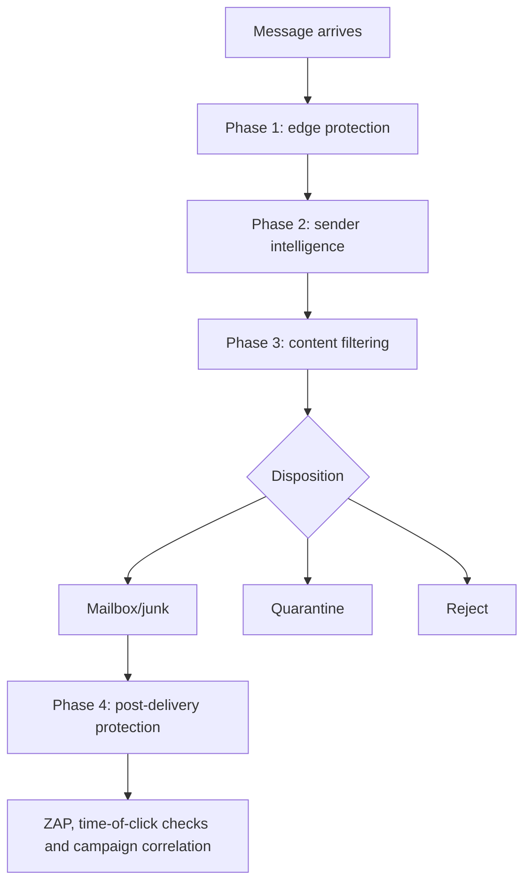

| Phase | Examples | Typical false-positive cause |
|---|---|---|
| Edge | Network throttling, IP/domain reputation, DBEB, backscatter | New/poor-reputation sending infrastructure |
| Sender intelligence | Auth, spoof, bulk, mailbox intelligence, impersonation | Misaligned third-party sender or legitimate similar identity |
| Content | Rules, AV, true-type matching, ML, URL/file detonation | Unusual legitimate content or unsupported encrypted file |
| Post-delivery | Safe Links, ZAP, user reporting, campaigns | Reputation changed or legitimate URL resembles attack infrastructure |

## 5. Connection filtering and source attribution

Connection filtering evaluates the connecting infrastructure. **Directory-based edge blocking (DBEB)** can reject mail to invalid recipients for authoritative accepted domains, reducing backscatter and directory harvesting. IP allow/block controls are blunt instruments and can be dangerous behind shared cloud senders.

| Source question | Why it matters |
|---|---|
| What is the original sender IP? | Gateways can hide it from Microsoft filtering |
| Is the IP dedicated or shared? | Allowing a shared range trusts unrelated tenants |
| Does the connector preserve/filter attribution? | Source identity affects spoof, phish and reputation models |
| Is recipient validation authoritative? | Internal relay/hybrid changes DBEB assumptions |
| Did volume suddenly increase? | Compromise, retry storm or campaign |

```mermaid
sequenceDiagram
    autonumber
    participant S as Original sender
    participant G as Optional third-party gateway
    participant E as Microsoft 365 edge
    participant F as Filtering stack
    S->>G: SMTP from original IP/domain
    G->>E: Relay from gateway IP
    alt Enhanced Filtering correctly configured
        E->>F: Preserve original-hop attribution for filtering
    else Only gateway appears trusted
        E->>F: Reduced source context; possible misclassification
    end
    F-->>E: Verdict and disposition
```

## 6. Anti-spam and outbound-spam policies

Inbound anti-spam uses spam confidence, bulk complaint levels, languages/regions where justified, safety tips, actions, quarantine policies and ZAP settings. Outbound-spam controls detect suspicious sending and can restrict users. They are not part of Standard/Strict preset policies in the same way as inbound threat policies; Microsoft publishes separate recommended values.

| Design choice | Secure default reasoning |
|---|---|
| Bulk threshold | Tune by observed business mail, not executive preference alone |
| High-confidence spam/phish | Quarantine with appropriate user capabilities |
| Automatic external forwarding | Explicitly control/disable except governed cases |
| Outbound limits | Detect compromise while accommodating approved applications |
| Allowed senders/domains | Avoid broad entries; fix authentication and use scoped mechanisms |
| Language/region blocks | Use only with validated business requirement and exception process |

Automatic forwarding is a frequent exfiltration path. Coordinate outbound policy, mailbox forwarding settings, inbox rules, transport rules and legitimate business processes rather than relying on one control.

## 7. Anti-malware: known bad, true type, and post-delivery correction

Anti-malware policies inspect attachments, can use a common attachment filter and can quarantine or reject according to verdict/configuration. True-type detection looks beyond a misleading file extension. ZAP can later neutralize delivered malware when intelligence changes.

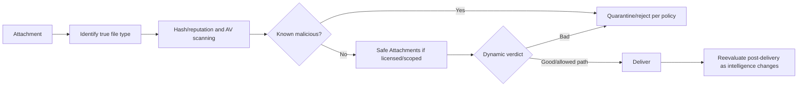

Malware and high-confidence phishing quarantine normally prevent users from self-releasing; a configured quarantine policy may allow a release request rather than release. Verify current behavior instead of assuming “full access” applies to every verdict.

## 8. Anti-phishing, spoof intelligence, and DMARC handling

EOP includes spoof protection; MDO adds stronger impersonation and threshold controls. Spoof intelligence distinguishes legitimate “on behalf of” patterns from malicious forgery. Current recommended settings honor sender DMARC policy for explicit spoof detections and use prescribed quarantine/reject behavior, but Microsoft also applies holistic composite authentication and other signals.

| Signal/control | Detects | Key caveat |
|---|---|---|
| SPF/DKIM/DMARC | Domain/source authenticity and alignment | Legitimate forwarding and senders must be designed correctly |
| Composite authentication | Combined explicit/implicit trust signals | A failure alone does not mechanically determine final disposition |
| Spoof intelligence | Unauthorized use of internal/external identities | Review legitimate forwarding/sending pairs carefully |
| User impersonation | Lookalike of protected high-value person | Configure targets; current documented limits apply |
| Domain impersonation | Similar domains | Include owned and important partner domains |
| Mailbox intelligence | User communication graph/anomalies | Requires history/context and appropriate action setting |
| Safety tips | Warn user about unusual sender patterns | User training must explain meaning without alarm fatigue |

### 🔍 Plain-English deep-dive: mailbox intelligence

- **Communication graph** — *a model of who a user normally exchanges mail with.* **Analogy:** A receptionist recognizes regular visitors. **Why it matters:** A new sender mimicking a familiar person is suspicious even if technically authenticated.
- **Protected user** — *a high-value sender whose identity is explicitly guarded against impersonation.* **Analogy:** Extra ID checks for executives or payment approvers. **Why it matters:** Attackers target authority and financial workflow.
- **Phishing threshold** — *how aggressively models classify suspicious mail.* **Analogy:** The sensitivity of an alarm. **Why it matters:** Higher sensitivity can catch more attacks and interrupt more legitimate mail.
- **Trusted sender/domain exception** — *an exclusion from impersonation detection, not every protection layer.* **Analogy:** A known visitor still passes bag screening. **Why it matters:** Scope precisely and review; trust is not universal bypass.

## 9. Standard, Strict, and Built-in protection

**Standard preset security policy** is Microsoft's recommended baseline for most users. **Strict** is more aggressive for high-risk/high-value populations. **Built-in protection** provides baseline Safe Links and Safe Attachments behavior to otherwise uncovered recipients in applicable MDO tenants. Preset settings are largely fixed; assignments and specified impersonation targets/domains are key design inputs.

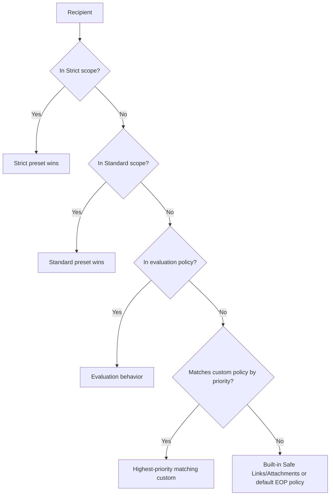

| Profile | Best-fit population | Operational consideration |
|---|---|---|
| Standard | Broad normal workforce | Baseline recommended outcome; monitor user impact |
| Strict | Executives, finance, admins, high-value targets, high-risk users | More quarantine/user friction; dedicated response support |
| Built-in | Otherwise uncovered recipients in applicable tenant | Not a substitute for assignment/licensing strategy |
| Custom | Requirement not met by preset | More drift, precedence and maintenance complexity |

Do not put the same population ambiguously into multiple profiles. Use clear groups/conditions and explicit exceptions. Dynamic groups may not be supported in specific preset recipient conditions; verify current documentation.

## 10. Policy priority, scoping, and effective configuration

Policy objects contain settings; associated rules often define recipients and priority. Preset policies have special precedence. A lower custom priority number generally means earlier evaluation. Different policy families can all affect one message; do not assume one “winning security policy” explains every header.

| Scoping mistake | Result | Prevention |
|---|---|---|
| User in Strict and Standard | Strict applies first | Mutually clear groups and effective-policy test |
| Custom policy expected to override preset | Preset wins | Use exclusions/scope redesign, not priority guess |
| Group membership stale/wrong type | User misses policy | Validate supported group and evaluated membership |
| Domain condition unintentionally includes subdomains | Wider scope | Document current subdomain behavior and exceptions |
| Policy enabled but rule disabled | No effective application | Export policy and rule state |
| Portal and PowerShell role mismatch | Admin sees/changes different surface | Document unified RBAC versus Exchange RBAC boundary |

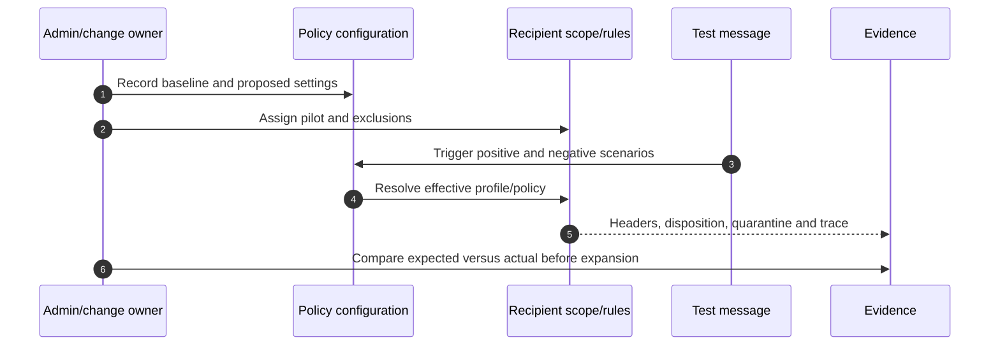

## 11. Safe Links: protection at delivery and click time

Safe Links evaluates URLs and, for email configurations, commonly rewrites links so reputation can be checked at click time. Teams and supported Office app behavior differs; URLs may be checked without rewriting. Policy options include internal messages, scanning, delivery timing, click tracking, click-through, exclusions and notifications.

| Design topic | Secure question |
|---|---|
| Click-through | Should users ever bypass a warning, and who handles business exceptions? |
| Internal messages | Can compromised internal accounts send malicious links? |
| URL exclusions | Is this exact URL pattern required, owned, reviewed and expiring? |
| Tracking/privacy | Is user-click data handled with approved privacy/retention/access? |
| Client coverage | Which Outlook, Teams and Office experiences are supported? |
| API-only/no rewrite | What security and troubleshooting tradeoff does current behavior create? |

```mermaid
sequenceDiagram
    autonumber
    participant U as User
    participant C as Supported client
    participant SL as Safe Links service
    participant W as Destination website
    U->>C: Select protected URL
    C->>SL: Request time-of-click evaluation
    SL->>SL: Check current reputation/detonation signals
    alt Malicious or blocked
        SL-->>U: Warning/block page; no destination access
    else Allowed
        SL->>W: Redirect or allow client navigation
        W-->>U: Site content
    end
```

A legitimate URL can later become malicious, and a malicious URL can be cleaned. Capture URL entity, click time, user, verdict time and policy before changing an exclusion.

## 12. Safe Attachments: detonate uncertain files

Safe Attachments uses dynamic analysis for files not conclusively handled by earlier layers. Policies can block, monitor, replace or use dynamic-delivery-style behavior where currently supported; Microsoft's current recommended presets use blocking for unknown malware response. Global settings for SharePoint, OneDrive, Teams and Safe Documents are related but not identical to email policy assignment.

| Decision | Security/operations concern |
|---|---|
| Block versus monitor | Monitor preserves delivery but does not prevent user exposure |
| Dynamic delivery/user delay | Productivity versus verdict completeness |
| Redirect | Can leak sensitive content and has action-specific limitations |
| Encrypted attachment handling | Unscannable content versus business requirement |
| Quarantine policy | Malware release must remain appropriately restricted |
| SharePoint/OneDrive/Teams protection | Global setting, workload behavior and download-block control |

Never upload a real malicious sample into an unauthorized tenant. Use Microsoft's sanctioned simulation/test guidance, benign test indicators where documented, or a paper lab.

## 13. ZAP: verdicts can change after delivery

**Zero-hour auto purge (ZAP)** retroactively acts on delivered spam, phishing or malware when service intelligence changes. ZAP is not instant recall, and workload, mailbox state, user action, rule/move behavior and current service support affect results.

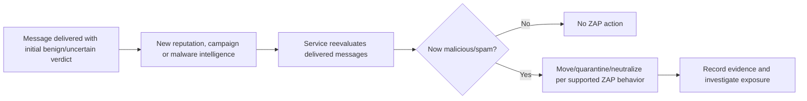

Post-delivery remediation does not erase clicks, credential entry, attachment execution, forwarding or data exposure that already occurred. Investigation must scope user interaction and downstream identity/device effects.

## 14. Quarantine policies, notifications, release, and requests

Quarantine stores messages/files by verdict and policy. A **quarantine policy** controls user capabilities such as preview, release request, deletion and notifications. The detection policy chooses the quarantine policy. Malware and high-confidence phishing have stricter release behavior.

### 🔍 Plain-English deep-dive: detection policy versus quarantine policy

- **Detection policy** — *decides what a message is and what action to take.* **Analogy:** Security screening labels a bag suspicious and sends it to inspection. **Why it matters:** Anti-spam, anti-phishing or Safe Attachments creates the disposition.
- **Quarantine policy** — *decides what the user/admin can do after the item is quarantined.* **Analogy:** Rules for who can inspect or release the held bag. **Why it matters:** “Quarantined” does not imply the same self-service rights for every threat.
- **Release request** — *a user asks an authorized reviewer to release.* **Analogy:** Appeal to a supervisor, not opening the locker. **Why it matters:** High-risk verdicts require independent review.
- **Notification** — *a digest/alert that an item exists.* **Analogy:** A claim ticket. **Why it matters:** Notification frequency and branding affect user behavior and phishing risk.

| Verdict | Typical secure handling direction | Reviewer checks |
|---|---|---|
| Malware | Admin-controlled; no user self-release | File verdict, campaign, sender, affected recipients |
| High-confidence phishing | Admin-controlled/request only | URL, impersonation, auth, user exposure |
| Phishing/spam | Policy-dependent request/release capability | Authentication, content, business context |
| Bulk | Often self-service or junk/quarantine by risk profile | Subscription/marketing legitimacy and user preference |
| Impersonation | Quarantine per recommended profile | Protected identity, lookalike and communication history |

Treat release as a security action: preserve item identifiers, reviewer, reason, timestamp and post-release monitoring. Never forward quarantined malicious content to a personal mailbox for analysis.

## 15. Tenant Allow/Block List and temporary exceptions

The **Tenant Allow/Block List (TABL)** supports scoped entries for malicious or incorrectly classified URLs, files, senders/domains and spoofed sender pairs according to current feature behavior. Admin submissions can create temporary allow entries for false positives. Entries have type-specific limits and expiration behavior.

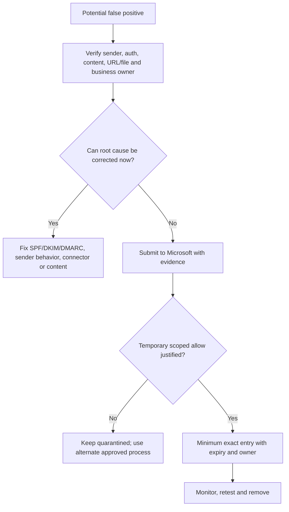

Broad allowed-sender/domain lists can bypass valuable filtering and let attackers spoof the allowed identity. Prefer fixing sender authentication, using spoof-pair review, admin submission and a narrow expiring entry. Blocks also need scope, evidence and review to avoid indefinite technical debt.

## 16. User reporting and admin submissions

Supported Outlook clients provide a built-in Report button or integrated reporting experience. Organizations can route reports to Microsoft, an internal mailbox, or both according to current configuration. Admins can submit messages, URLs and attachments for analysis and report clean/malicious outcomes.

| Workflow stage | Control |
|---|---|
| Report intake | Preserve reporter, item, UTC time and original message safely |
| Triage | Separate spam, phish, BEC, malware, false positive and user error |
| Microsoft submission | Provide correct verdict and relevant evidence |
| Internal analysis | Use safe preview/sandbox; do not click/live-open casually |
| Response | Remove malicious items, contain identities/devices, notify users |
| Feedback | Tell reporter outcome at suitable detail and reinforce behavior |
| Metrics | Time to triage, confirmed rate, duplicate reports, response completion |

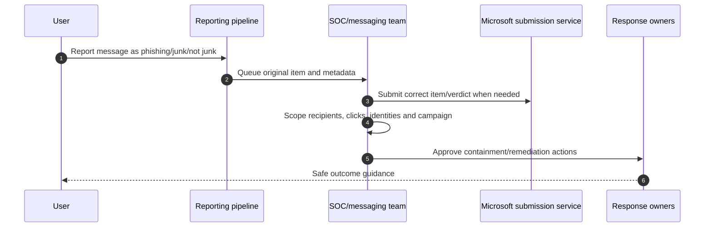

## 17. Explorer, real-time detections, and campaign views

Depending on licensing and role, Explorer and real-time detection experiences query email, URL, file, campaign and action data. **Campaign views** cluster related attack activity so analysts can see targeting, infrastructure, payload and delivery patterns rather than treating each message separately.

| Investigation pivot | Question |
|---|---|
| Network/message ID | Where did this exact message go? |
| Sender/domain/IP | What else came from this source? |
| URL | Who received/clicked it and what is current verdict? |
| File hash/name | Where else was the payload delivered? |
| Recipient | What other suspicious messages targeted this person? |
| Campaign | Which infrastructure, payloads and recipients are related? |
| Delivery/action | Was it delivered, blocked, ZAPed, manually remediated or released? |

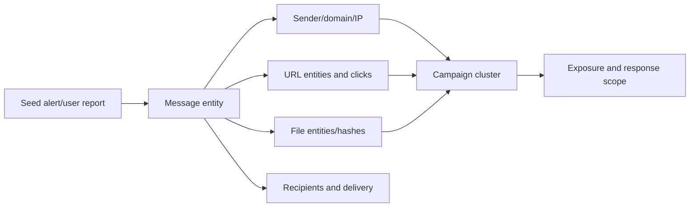

Portal views are investigation aids, not self-proving truth. Export or record query criteria, time range, filters, entity IDs and action state so another analyst can reproduce the conclusion.

## 18. Alerts and incidents: signal versus correlated case

An **alert** indicates a suspicious detection. An **incident** correlates related alerts/entities into an attack story in Defender XDR. Email incidents can connect to Entra identity, endpoint and cloud-app evidence. Severity is a prioritization input, not a substitute for business impact.

| Triage field | Required question |
|---|---|
| Detection | What behavior/verdict generated the alert? |
| Entity | Which message, user, mailbox, URL, file, IP, app or device? |
| Exposure | Delivered, clicked, opened, executed, replied, paid or shared? |
| Identity | Was the account compromised; what sign-ins/rules/tokens changed? |
| Scope | One user or campaign/cross-domain incident? |
| Business | Executive/payment/regulated-data/process impact? |
| Confidence | What evidence supports and contradicts the hypothesis? |
| Response | What action is reversible, authorized and urgent? |

## 19. Automated investigation and response and Action Center

**Automated investigation and response (AIR)** can investigate supported alerts and propose or perform remediation according to current capabilities. The **Action Center** tracks pending, approved, rejected, completed or failed remediation actions. Automation reduces repetitive work but needs authority, evidence and failure handling.

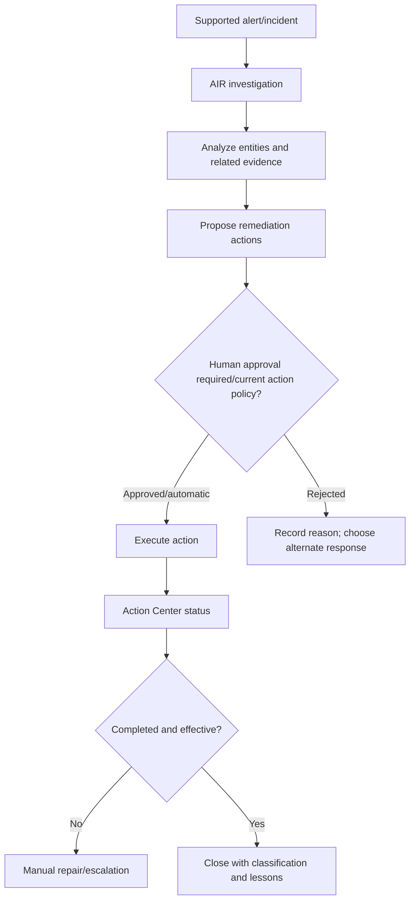

| Automation safeguard | Example |
|---|---|
| Least privilege | Analyst can review without broad configuration rights |
| Action approval | High-impact deletion/containment independently reviewed |
| Reversibility | Soft-delete/remediation state and restoration path known |
| Scope check | Campaign recipients and false-positive risk reviewed |
| Failure path | Partial action or stale item produces owned task |
| Audit | Actor/automation, evidence, action, result and reason retained |
| Closure | Validate user, mailbox, identity and downstream endpoint outcome |

## 20. Attack simulation training: exercise, not punishment

Attack simulation training can run controlled phishing simulations using available payloads, techniques, landing pages and training assignments. It requires licensing, privacy/legal/HR review, safe targeting, accessible communications and metrics that do not shame individuals.

| Design area | Good practice |
|---|---|
| Objective | Test a specific behavior/control, not “catch users” |
| Population | Pilot, risk-based scope and exclusions for sensitive contexts |
| Payload | Realistic but nonharmful; no collection of real credentials |
| Privacy | Minimize access to identifiable results; define retention/use |
| Support | Service desk briefed; clear reporting and landing guidance |
| Measures | Reporting rate/time, credential-entry simulation, repeat behavior and control gaps |
| Improvement | Training, process/control changes and retest |

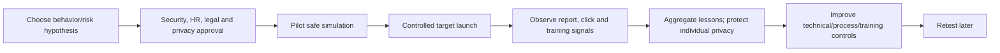

## 21. BEC and phishing investigation

1. Preserve the original message, headers, IDs, report and timestamps.
2. Determine spoof, lookalike, compromised internal/external account, or legitimate process.
3. Scope every recipient, delivery action, URL click, attachment, reply, forwarding and related campaign.
4. Correlate Entra sign-ins, MFA/token state, mailbox audit, inbox rules, forwarding, delegates, sent/deleted items and endpoint alerts.
5. Confirm business action out of band: payment, bank-detail change, data release, password entry or OAuth consent.
6. Contain identity, mailbox persistence, malicious content, URL/file and financial process with proper authority.
7. Recover, notify affected parties, monitor and preserve legal/privacy evidence.
8. Conduct PIR: technical root cause, process breakdown, control/tuning and ownership.

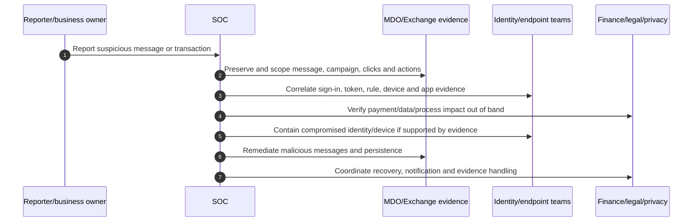

### 🔍 Plain-English deep-dive: delivered does not equal compromised

- **Delivered** — *the message reached a mailbox/folder.* **Analogy:** The fake letter entered the building. **Why it matters:** It proves exposure opportunity, not user action.
- **Clicked/opened** — *a user interacted with URL/file under recorded conditions.* **Analogy:** The envelope was opened. **Why it matters:** Still does not prove credentials or code execution.
- **Compromised** — *evidence shows unauthorized account/device control or data/business impact.* **Analogy:** The attacker obtained a key or changed the payment. **Why it matters:** Response scope and severity escalate.
- **Containment** — *stop ongoing harm while preserving recovery options.* **Analogy:** Disable the stolen key and hold suspicious payments. **Why it matters:** Deleting one email is not complete incident response.

## 22. False positives: restore safely and fix the cause

| Step | Question |
|---|---|
| Validate | Is the sender/content genuinely expected and approved? |
| Identify verdict | Spam, phish, spoof, impersonation, URL, file or rule? |
| Check auth/path | Did SPF/DKIM/DMARC align; did gateway preserve source? |
| Submit | Was the item reported to Microsoft with the correct clean verdict? |
| Restore | Who may release, and is post-release risk acceptable? |
| Exception | Can an exact, expiring TABL entry solve it temporarily? |
| Root fix | Can sender auth, content, connector or business process be corrected? |
| Monitor | Are future samples clean without broader bypass? |

Common bad fixes are allowed-domain lists, spam-confidence bypass rules, disabling Safe Links, excluding broad URL patterns, or trusting all gateway messages. A consultant quantifies business impact and uses the narrowest reversible correction.

## 23. False negatives: scope first, then improve controls

A false negative is malicious content incorrectly delivered or allowed. Preserve it, submit it as malicious, scope related entities/campaigns, remediate messages, investigate user interaction and identity/device impact, then tune the correct layer. Ask whether the failure came from missing source context, weak authentication, policy exclusion, unsupported client/workload, new threat, user release, rule bypass or compromised legitimate sender.

| Finding | Improvement |
|---|---|
| Lookalike executive passed | Configure protected users/domains, strict population and process verification |
| Third-party gateway obscured source | Correct Enhanced Filtering/connector design |
| Safe Link exclusion matched too broadly | Remove/narrow entry and retest |
| User released suspicious bulk/phish | Tighten quarantine policy and training |
| Compromised internal account | Identity/device controls, rule/forwarding monitoring, outbound protection |
| New payload delivered | Submit, campaign-scope, validate Safe Attachments and post-delivery response |

## 24. Tuning without insecure allowlisting

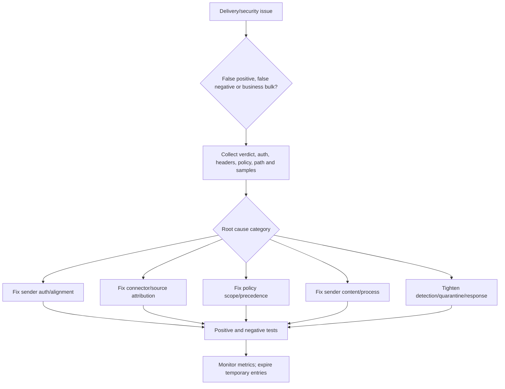

| Safer mechanism | Use case | Guardrail |
|---|---|---|
| Admin submission | Microsoft verdict correction | Original item and correct classification |
| Spoof-pair allow | Legitimate sender/domain infrastructure pairing | Exact pair, owner and review |
| TABL URL/file allow | Confirmed clean false positive | Exact indicator, expiration and retest |
| Sender authentication correction | Third-party sender fails alignment | Vendor owner and DMARC reports |
| Enhanced Filtering | Gateway hides original source | Correct hop/IP configuration and header tests |
| Custom policy | Proven recipient-specific requirement | Clear exclusion from presets and drift review |

## 25. Third-party gateway and Enhanced Filtering coexistence

When MX points to a third-party gateway, Microsoft sees the gateway as the connecting source unless **Enhanced Filtering for Connectors** is configured correctly. Enhanced Filtering, also called skip listing, lets Microsoft look past specified intermediate hops to recover original sender information for filtering. It is not a bypass of the gateway and must match the real path.

| Coexistence risk | Control |
|---|---|
| Gateway IP appears as every sender | Enhanced Filtering with precise hop list |
| Double quarantine | Define authoritative disposition and support process |
| Double URL rewrite | Decide ownership, client experience and investigation method |
| Connector trusts messages too broadly | Certificate/IP/domain scope and negative relay tests |
| DMARC/auth headers modified | Preserve original auth/ARC and test representative senders |
| Internal routing bypasses one stack | Document every route, including hybrid/app mail |
| False positives blamed on wrong vendor | End-to-end headers and SMTP logs on both boundaries |

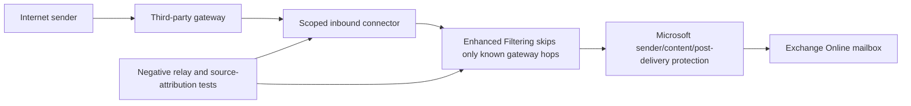

## 26. Migration from a third-party email security gateway

| Phase | Work |
|---|---|
| Discover | Domains, MX, routes, policies, allow/block, quarantine, reports, APIs, archives, apps and owners |
| Map | Capability parity, differences, licenses, privacy, retention and support model |
| Prepare | SPF/DKIM/DMARC, EOP/MDO presets/custom needs, connectors, Enhanced Filtering and roles |
| Coexist | Pilot domains/users/routes; avoid double controls and source loss |
| Test | Benign/malicious simulation, auth, URL/file, bulk, quarantine, trace, relay and failure cases |
| Cut over | MX/connectors/routing with TTL, communications, hypercare and rollback |
| Stabilize | Tune using evidence, close coverage gaps, monitor metrics |
| Decommission | Remove old connectors/trust/DNS/API/accounts only after retention and rollback gates |

The capability matrix must include detection, response, reporting, user experience, quarantine, API/integration, data retention/residency, SOC workflow, legal hold/archive boundaries, licensing and operational skills. “Both products have anti-phishing” is not parity.

## 27. Deployment rings, testing, and rollback

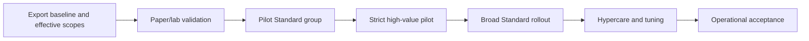

| Test class | Example |
|---|---|
| Positive legitimate | Authenticated payroll/vendor mail delivers as expected |
| Negative spoof | Unauthorized internal-domain spoof is blocked/quarantined |
| Lookalike | Similar executive/domain triggers expected protection |
| URL | Sanctioned test URL follows expected Safe Links behavior |
| Attachment | Approved benign test indicator follows expected handling |
| Quarantine | User can/cannot preview, request or release by verdict |
| Policy precedence | Strict, Standard, custom and built-in scopes resolve as designed |
| Gateway | Original source attribution preserved; unknown relay denied |
| Post-delivery | Document expected ZAP/action workflow without live malware |
| Operations | Alert, report, AIR approval, escalation and restoration paths work |

Rollback is usually scope removal, policy disable, restoration of prior connector/MX/routing, or removal of a temporary control. Do not weaken global protection to roll back one recipient issue. Preserve before/after configuration, allow propagation, and retest unauthorized behavior.

## 28. Operations, privacy, and evidence handling

| Operational area | Minimum control |
|---|---|
| Roles | Least privilege for policy, quarantine, investigation, submission and action approval |
| Queue ownership | Service desk, messaging and SOC handoffs by severity/verdict |
| Evidence | Secure original messages/headers, IDs, exports, hashes and UTC timeline |
| Privacy | Restrict access to message content, click data and simulation results |
| Retention | Current audit/investigation/quarantine retention documented by license |
| Automation | AIR/action failures monitored; no silent partial remediation |
| Exceptions | Owner, business reason, exact scope, expiry and recertification |
| Service change | Message center/What's new/recommendation review cadence |

Email content can contain personal, legal, health, financial or privileged data. Investigators need approved purpose, minimum access, secure workspaces and defined retention. Do not place message bodies or attachments in ordinary incident chat.

## 29. Metrics that support decisions

| Metric | Interpretation guardrail |
|---|---|
| Malicious messages blocked | Volume depends on traffic/threat mix; not control quality alone |
| Delivered high-confidence threats | Critical exposure metric; validate denominator and remediation |
| False-positive rate by verdict/sender | Requires confirmed classifications, not complaints only |
| User report rate/time | Higher reporting can reflect better awareness, not more attacks |
| Click/credential simulation rate | Privacy-safe trend and cohort context required |
| ZAP/remediation completion time | Include action failures and already-interacted items |
| AIR approval/completion | Automation quality and queue ownership |
| Policy coverage | Licensed users in intended Standard/Strict/custom scope |
| Exception age/count | Technical debt and residual risk |
| SPF/DKIM/DMARC alignment | Segment by source/domain and legitimate traffic |
| Mean time to scope/contain | Incident-process effectiveness |
| Repeat campaign/user/process | Whether lessons reduced recurrence |

Every dashboard states numerator, denominator, time window, data freshness, exclusions, license coverage and owner. A 99% block rate can hide the one BEC that caused a payment.

## 30. Failure and troubleshooting matrix

| Symptom | Likely cause | Discriminating evidence | Unsafe response |
|---|---|---|---|
| Legitimate sender quarantined | Auth misalignment, reputation, impersonation or content | Headers, verdict, submission, policy and samples | Allow whole domain |
| Phish delivered | New threat, exclusion, wrong scope, gateway attribution, compromise | Explorer/campaign, policy, path, clicks, auth | Delete one message only |
| User cannot release | Verdict/quarantine policy intentionally restricts | Quarantine reason and effective policy | Grant broad admin |
| Safe Link not rewritten | Client/workload, policy scope, built-in/API-only behavior or exclusion | Effective policy, headers/client and URL settings | Disable Safe Links |
| Safe Attachment delay | Detonation, encrypted/large file, policy action | Message trace, verdict and policy | Bypass attachments |
| Preset “ignored” custom policy | Preset precedence | Recipient membership and policy/rule export | Change custom priority repeatedly |
| Gateway mail looks spoofed | Original hop not preserved/auth altered | Received/auth headers and Enhanced Filtering | Trust all gateway mail |
| AIR action pending/failed | Approval, permission, unsupported/stale item or service issue | Action Center details and audit | Assume remediation completed |

## 31. Consulting scenarios

### Scenario A: CFO lookalike BEC

Quarantine and preserve the sample; pivot on lookalike domain, display name, URLs and recipients; verify whether anyone replied or changed payment data; check for compromised accounts and mailbox rules; notify finance using an out-of-band process; protect the executive/domain with appropriate preset/impersonation controls; add process verification for bank changes; monitor related campaign and domains. Do not rely on a display-name rule alone.

### Scenario B: critical vendor false positive

Confirm vendor identity out of band. Inspect SPF/DKIM/DMARC alignment, headers, verdict and gateway path. Submit the item as clean. Ask the vendor to correct authentication/content. If business continuity requires a temporary allow, use the narrowest supported exact indicator with expiry and monitoring. Never allow the vendor's entire domain in anti-spam policy merely because one invoice was quarantined.

### Scenario C: gateway migration

Build parity and routing maps; preserve source attribution with Enhanced Filtering during coexistence; pilot Standard and Strict; test normal, spoof, lookalike, URL, file, quarantine, relay and gateway-outage behavior; coordinate MX TTL; maintain a reversible route; hypercare; remove old trust only after data-retention and operational gates.

## 32. Consulting artifacts

1. **Protection architecture:** routes, connectors, policy stack, workloads and SecOps integrations.
2. **License/coverage matrix:** user/workload entitlement versus intended control.
3. **Effective policy register:** Standard/Strict/custom/built-in scopes, priorities and exceptions.
4. **Threat-control matrix:** spam, malware, spoof, impersonation, BEC, URL and file controls.
5. **Quarantine/RACI:** verdict, user capability, reviewer, SLA, escalation and audit.
6. **Gateway migration matrix:** current/target capability, coexistence, test, rollback and decommission.
7. **Incident runbooks:** user report, BEC, malicious URL/file, compromised sender and false positive.
8. **Exception register:** type, value, owner, reason, risk, expiry and review evidence.
9. **Metrics pack:** coverage, threat, user, response, automation and tuning measures.
10. **Executive roadmap:** immediate risks, quick wins, dependencies, licenses and residual risk.

## 33. Safe paper lab: design an EOP/MDO baseline and investigate BEC

This exercise performs no tenant configuration, sends no simulation, clicks no URL, uploads no file and uses no customer data.

### Scenario and prerequisites

Fictional Contoso has 1,000 users, 20 executives/finance approvers, EOP for all mailboxes, MDO Plan 2 planned for all in-scope users, and a third-party gateway currently receiving MX traffic. Complaints include vendor false positives and one CFO lookalike BEC. Use fictional `contoso.example` and `fabrikam.example` only.

### Procedure

1. Draw the current gateway-to-Microsoft path and target Microsoft-first path.
2. Build a license/coverage table and mark every uncertain entitlement “verify current Product Terms.”
3. Define Standard for the broad workforce and Strict for high-value users. Specify unambiguous groups and exceptions.
4. Map current precedence: Strict → Standard → evaluation → custom by priority → Built-in/default.
5. Draft anti-spam, malware and anti-phishing outcomes using current recommended settings as a baseline, not copied defaults.
6. Select protected users/domains and mailbox-intelligence behavior; document current limits as change-sensitive.
7. Draft Safe Links and Safe Attachments decisions for email, Teams, Office and SharePoint/OneDrive global protection.
8. Create a quarantine-capability matrix for malware, high-confidence phish, phish, spam, bulk and impersonation.
9. Design user reporting, admin submission and false-positive SLA.
10. Configure only on paper the inbound connector and Enhanced Filtering hop list for coexistence.
11. Write negative tests proving unknown relay, spoof and wrong source are not trusted.
12. Investigate a fictional CFO-lookalike message using message, sender, URL, recipient, campaign, identity and finance pivots.
13. Propose AIR actions but require an approval decision and verification for each.
14. Define rollback, hypercare, exception expiry and metrics.

### Test matrix

| Test | Expected paper result | Evidence artifact |
|---|---|---|
| Standard recipient legitimate mail | Normal delivery unless another valid verdict applies | Effective-policy row and expected headers |
| Strict recipient bulk mail | More aggressive expected handling than Standard | Scope and disposition comparison |
| Internal-domain spoof | DMARC/spoof protection acts as designed | Auth and policy decision narrative |
| CFO lookalike | Impersonation/mailbox intelligence protection and investigation | Protected-user and case timeline |
| Known safe vendor misclassified | Submission/root-cause/narrow exception workflow | False-positive decision record |
| Sanctioned URL test | Expected Safe Links client behavior | No live URL; paper sequence only |
| Sanctioned file test | Expected Safe Attachments/quarantine behavior | No file; paper outcome only |
| High-confidence phish quarantine | User cannot self-release; request/admin path documented | Quarantine matrix |
| Gateway original source | Enhanced Filtering preserves intended attribution | Header-hop sketch |
| Unknown relay | Rejected/not trusted | Negative connector test |
| AIR proposal | Approval, execution state and effectiveness verified | Action Center workflow |
| Rollback | Pilot scope removed/restored without global weakening | Reversal and validation list |

### Evidence and cleanup

Capture fictional diagrams, policy/scope tables, a BEC timeline, test results, RACI, risk/exception register and executive summary. Label them “paper lab / no tenant changes.” Store no real message, tenant, person, domain, IP, URL, file hash or customer incident. Cleanup is closing the fictional exercise and confirming no tenant or DNS change occurred.

### Interview wording

> “I designed a paper EOP/MDO baseline using broad Standard and targeted Strict profiles, documented current precedence and licensing caveats, mapped quarantine and submissions, designed Safe Links/Attachments and AIR operations, and built a gateway coexistence plan with Enhanced Filtering and relay-negative tests. I also ran a fictional BEC investigation. This is learning/lab evidence; my production evidence is M365 support, SharePoint/OneDrive, critical incidents, RCA and stakeholder coordination.”

## 34. JD Mapping: interview translation

| Prompt | Response structure |
|---|---|
| “Assess MDO” | License/coverage → routes/source attribution → presets/effective policies → quarantine/reporting → SecOps/AIR → metrics/exceptions → roadmap |
| “Tune false positives” | Preserve/sample → verdict/auth/path/effective policy → submit → root fix → exact temporary exception → retest/expire |
| “Investigate BEC” | Preserve → message/campaign scope → click/reply/action → identity/device/rule correlation → business verification → contain/recover/PIR |
| “Migrate a gateway” | Capability map → coexistence/Enhanced Filtering → pilot → tests → MX cutover/rollback → hypercare/decommission |
| “Your experience?” | Production M365 support and SPO/OD; current paper MDO design/investigation; partner for production implementation |

## 35. Official Source Anchors

First-party sources checked on **August 24, 2026**; recheck before implementation.

| Topic | Official Microsoft source | Change-sensitive use |
|---|---|---|
| EOP overview | [Exchange Online Protection overview](https://learn.microsoft.com/en-us/defender-office-365/eop-about) | Built-in protections and licensing context |
| MDO overview/licensing | [Microsoft Defender for Office 365 overview](https://learn.microsoft.com/en-us/defender-office-365/mdo-about) | Plan capability boundaries |
| Protection stack | [Step-by-step threat protection stack](https://learn.microsoft.com/en-us/defender-office-365/protection-stack-microsoft-defender-for-office365) | Four current phases; page updated June 2026 |
| Recommendations | [Recommended email and collaboration threat policy settings](https://learn.microsoft.com/en-us/defender-office-365/recommended-settings-for-eop-and-office365) | Standard/Strict values; page dated August 10, 2026 |
| Preset policies/precedence | [Preset security policies](https://learn.microsoft.com/en-us/defender-office-365/preset-security-policies) | Scope, limits and precedence; updated August 19, 2026 |
| Anti-phishing | [Anti-phishing protection](https://learn.microsoft.com/en-us/defender-office-365/anti-phishing-protection-about) | Spoof, impersonation and mailbox intelligence |
| Safe Links | [Safe Links in Defender for Office 365](https://learn.microsoft.com/en-us/defender-office-365/safe-links-about) | Workload/client and time-of-click behavior |
| Safe Attachments | [Safe Attachments in Defender for Office 365](https://learn.microsoft.com/en-us/defender-office-365/safe-attachments-about) | Dynamic analysis and policy behavior |
| ZAP | [Zero-hour auto purge](https://learn.microsoft.com/en-us/defender-office-365/zero-hour-auto-purge) | Supported post-delivery behavior |
| Quarantine | [Quarantined email messages](https://learn.microsoft.com/en-us/defender-office-365/quarantine-email-messages) | User/admin actions and retention |
| TABL | [Tenant Allow/Block List](https://learn.microsoft.com/en-us/defender-office-365/tenant-allow-block-list-about) | Entry types, expiry and submissions |
| Explorer/detections | [Threat Explorer and real-time detections](https://learn.microsoft.com/en-us/defender-office-365/threat-explorer-real-time-detections-about) | Licensing, filters and actions |
| AIR/Action Center | [Automated investigation and response](https://learn.microsoft.com/en-us/defender-office-365/air-about) | Supported investigations and remediation |
| Attack simulation | [Get started with Attack simulation training](https://learn.microsoft.com/en-us/defender-office-365/attack-simulation-training-get-started) | Licensing, campaigns and roles |
| Enhanced Filtering | [Enhanced Filtering for Connectors](https://learn.microsoft.com/en-us/exchange/mail-flow-best-practices/use-connectors-to-configure-mail-flow/enhanced-filtering-for-connectors) | Third-party gateway source attribution |

---

## ⭐ Likely Interview Questions for This Section

### Q1. What is the difference between EOP and Defender for Office 365?
> **Model answer:** EOP provides foundational connection, spam, malware, spoof, outbound and quarantine protection for relevant Microsoft 365 mail scenarios. Defender for Office 365 adds advanced anti-phishing/impersonation, Safe Links, Safe Attachments and, particularly in Plan 2, richer campaign, Explorer, AIR, Action Center and attack-simulation capabilities. I validate current licensing per user and workload rather than infer it from a suite name.

### Q2. Explain the MDO protection stack.
> **Model answer:** The conceptual phases are edge protection, sender intelligence, content filtering and post-delivery protection. Edge evaluates source/reputation/rate; sender intelligence uses authentication, spoof, bulk and impersonation context; content evaluates rules, malware, URL and file behavior; post-delivery includes Safe Links, ZAP, campaigns and reporting. I use trace, headers, policy, entity and action evidence to identify which layer controlled the result.

### Q3. How do Standard, Strict, custom and Built-in protection interact?
> **Model answer:** Current documented precedence is Strict, then Standard, evaluation policies, custom policies by priority, then Built-in Safe Links/Attachments or default threat policies. I use unambiguous scope groups and explicit exclusions because a custom policy does not override a preset merely by having priority zero. Strict serves high-value/high-risk users; Standard is the broad baseline; custom policies are for justified gaps.

### Q4. How would you handle a legitimate vendor message quarantined as phishing?
> **Model answer:** Preserve the original and identify exact verdict/effective policy. Verify vendor identity out of band, then inspect SPF, DKIM, DMARC alignment, headers, gateway path, impersonation and URL/file verdict. Submit it as clean, correct sender authentication/path/content, and release only under the appropriate quarantine policy. If continuity requires an exception, make it exact, temporary, owned, monitored and expiring; never allow the whole domain broadly.

### Q5. What is the difference between Safe Links, Safe Attachments and ZAP?
> **Model answer:** Safe Links evaluates URLs, including current reputation at click time in supported experiences. Safe Attachments dynamically analyzes uncertain files around delivery. ZAP reevaluates delivered mail when later intelligence marks it spam, phish or malware and applies supported post-delivery action. None proves that prior user interaction caused no harm, so incident scoping still checks clicks, credentials, execution and forwarding.

### Q6. How do you investigate a BEC incident?
> **Model answer:** Preserve the message and IDs, classify spoof/lookalike/compromised account, scope all recipients and related campaign entities, and determine delivery, click, reply, payment/data and attachment actions. Correlate Entra sign-ins/tokens, mailbox audit, rules, forwarding, delegates and endpoint evidence. Verify financial/process changes out of band, contain identity/content/process, recover and notify appropriately, then run a PIR across technical and human controls.

### Q7. Why is Enhanced Filtering important behind a third-party gateway?
> **Model answer:** Without it, Microsoft may see the gateway IP as the source of every message, weakening source reputation, anti-spoof and phishing accuracy. Enhanced Filtering skips only the known intermediate hops to recover original-source context. I map every route, configure precise gateway hops/connectors, inspect Received/authentication headers and negative-test unknown relay; it is not a reason to trust all gateway mail.

### Q8. What is your honest Defender for Office 365 experience?
> **Model answer:** My production strength is Microsoft 365 support, SharePoint/OneDrive, sync/migration, critical incidents, RCA, evidence and stakeholder coordination. EOP/MDO configuration and SecOps are current learning and paper-lab evidence. I can assess the architecture, licensing, policy precedence, quarantine, investigation and migration design and lead structured troubleshooting, while partnering with messaging and SOC owners for production implementation and actions.

---

## 🧠 30-Second Memory Hooks

- **EOP is foundational screening; MDO adds advanced prevention, investigation and response.**
- **Four phases: edge, sender, content, post-delivery.**
- **Spoof forges; impersonation resembles; compromise uses the real account.**
- **Strict beats Standard; Standard beats custom; built-in catches otherwise uncovered recipients.**
- **Safe Links checks the road at click time; Safe Attachments tests the package; ZAP revisits delivery.**
- **Detection policy sends to quarantine; quarantine policy controls what happens there.**
- **Submission corrects verdict; TABL is a scoped temporary tool, not a blanket bypass.**
- **Explorer pivots entities; campaigns connect them; incidents tell the wider attack story.**
- **AIR proposes/executes; Action Center proves action state; humans verify effectiveness.**
- **Enhanced Filtering restores original source context behind a gateway.**
- **Delivered is exposure, not proof of compromise.**
- **Candidate honesty: production M365 support, MDO paper-lab implementation evidence.**

---

## Completion Checklist

- [ ] I can distinguish EOP, MDO Plan 1/Plan 2 directionally and verify current licensing.
- [ ] I can draw and explain the four-phase protection stack.
- [ ] I can classify spam, bulk, malware, phishing, spoofing, impersonation and BEC.
- [ ] I can explain anti-spam, anti-malware and anti-phishing policy roles.
- [ ] I can explain Standard, Strict, custom and Built-in precedence.
- [ ] I can explain Safe Links, Safe Attachments, ZAP and their limitations.
- [ ] I can map quarantine verdicts to user/admin capabilities and safe release.
- [ ] I can use submissions and TABL without broad insecure allowlisting.
- [ ] I can explain Explorer, campaigns, alerts, incidents, AIR and Action Center.
- [ ] I can design privacy-safe attack simulation training.
- [ ] I can investigate BEC across email, identity, endpoint and business process.
- [ ] I can tune false positives and negatives using root-cause evidence.
- [ ] I can design gateway coexistence with Enhanced Filtering and negative tests.
- [ ] I can produce migration, testing, rollback, operational, metrics and consulting artifacts.
- [ ] I can state exactly which experience is production versus learning/paper lab.
- [ ] I will recheck Microsoft Learn, licensing, tenant rollout, portal and sovereign-cloud behavior.

---

*Next suggested section:* [Part 23](Part-23-teams-security-meetings-federation-apps-compliance.md) — apply identity, collaboration, app, meeting, federation, data, compliance and incident controls to Microsoft Teams and its Entra, SharePoint, OneDrive and Exchange dependencies.