# Part 23 — Microsoft Teams Security, Meetings, Federation, Guests, Apps, and Compliance

> **Section goal:** Understand Microsoft Teams as a collaboration experience built across multiple Microsoft 365 services, then secure its identities, teams, channels, meetings, events, external relationships, apps, data and operations. By the end, you should be able to design and troubleshoot guest/federated/shared-channel access, meeting and messaging controls, app consent, sensitivity/DLP/retention/eDiscovery, Conditional Access, recordings, policy propagation and common join/file failures.

This Part maps to Deloitte's Microsoft 365 workload assessment, security architecture, configuration, incident troubleshooting, compliance, transformation and operational-readiness responsibilities. It builds on Entra external identity and cross-tenant controls from Parts 6–14, Exchange and Defender from [Parts 21–22](Part-22-eop-defender-office-365.md), and prepares the file/permission depth in [Part 24](Part-24-sharepoint-onedrive-security-sharing-sync-governance.md). Your direct production SharePoint/OneDrive and sync experience is a real advantage because Teams file access frequently depends on those services; Teams security implementation remains learning/lab evidence.

> **Currency, licensing, preview, portal, and change-sensitive note:** This chapter was checked against official Microsoft Learn available on **August 24, 2026**. Teams licenses and regional unbundling, Teams Premium, Audio Conferencing/Phone, webinar/town hall limits, meeting templates, sensitivity-label capabilities, external-access federation, cross-tenant access, shared channels, B2B direct connect, app-centric management, unified app management, app permission/setup policies, agent governance, resource-specific consent, recording locations, policy propagation and sovereign-cloud behavior change. Teams admin center navigation is also moving toward unified policies/settings. Microsoft documentation dated February 27, 2026 says app-centric management replaces app permission policies after a tenant is migrated; a tenant uses the applicable model, not both as competing authorities. Verify Product Terms, Teams service descriptions, Microsoft 365 roadmap/Message center, current admin-center experience and Purview/Entra licenses before production design.

## JD Mapping

| Deloitte role expectation | Capability developed here | Consulting evidence |
|---|---|---|
| Secure Microsoft Teams | Architecture, membership, meeting, federation, app and data controls | Teams security baseline and HLD/LLD |
| Assess collaboration risk | Discover external access, guests, channels, apps, recordings and oversharing | Health-assessment findings and maturity score |
| Configure/test policies | Design rings, templates, labels, DLP, CA, app access and tests | Policy matrix and acceptance evidence |
| Troubleshoot platform issues | Isolate identity, policy, meeting, network, device, SharePoint and recording failures | Layered diagnostic tree and escalation pack |
| Support compliance and investigations | Map storage, retention, eDiscovery, audit, barriers and communication compliance | Data-location map and investigation runbook |
| Deliver operational readiness | Define owners, lifecycle, service health, metrics, incidents and handoff | RACI, runbooks and service scorecard |

## Candidate honesty note

You may directly use production SharePoint Online, OneDrive, sync, migration, permissions and M365 support evidence when explaining Teams file storage, sharing, synchronization, access failures, service dependencies, incident handling and RCA. You may also use stakeholder, vendor/product-group, documentation, mentoring and KPI experience.

You should not claim production ownership of Teams meeting policies, federation, cross-tenant access, shared channels, Teams apps, resource-specific consent, information barriers, DLP/retention, Teams Phone or security implementation unless separately evidenced. Safe wording is:

> “My direct production depth is SharePoint Online, OneDrive, sync, migration, permissions and M365 support escalation. That transfers strongly to Teams because channel files, chat files and recordings depend on SharePoint/OneDrive. Teams security configuration itself is current learning and paper-lab evidence. I can design the identity, meeting, external collaboration, app, data and troubleshooting controls, and I would implement with Teams, Entra, SharePoint, Exchange, Purview, network and telephony owners.”

---

## 1. Teams is an experience spanning Microsoft 365 services

Teams uses Microsoft Entra ID for identity, Microsoft 365 Groups for much team membership, SharePoint for team/channel files, OneDrive for many chat-shared files and recordings, and Exchange for group mailbox/calendar and some compliance dependencies. Microsoft Graph and Teams services tie the experience together.

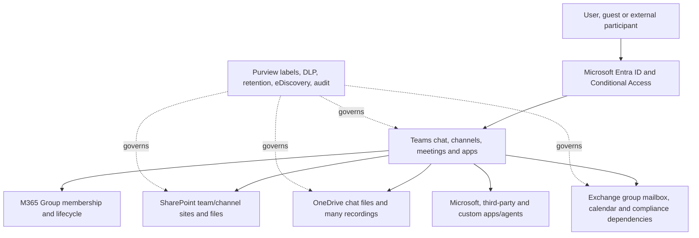

| User action | Primary service/data dependency | Troubleshooting implication |
|---|---|---|
| Create team | Entra/M365 Group, Teams, SharePoint, Exchange | Partial provisioning can affect only one surface |
| Upload channel file | SharePoint connected site/library | Teams UI can work while file permissions fail |
| Share file in 1:1/group chat | Sender's OneDrive sharing | Sender ownership/offboarding matters |
| Schedule meeting | Teams plus Exchange calendar/mailbox | License/mailbox/calendar state can affect scheduling |
| Record/transcribe | Teams policy plus OneDrive/SharePoint storage | Organizer/recording ownership and storage permissions matter |
| Add app | Teams app governance plus Entra consent/Graph/API | “Allowed app” does not mean safe permissions |
| Search/investigate | Workload storage, Purview/audit and licenses | Identify exact content location and custodian |

**Analogy:** Teams is a hotel lobby connecting multiple services. The conversation desk is Teams, identity checks are Entra, team files are in SharePoint, personal/chat files are in OneDrive, calendars are in Exchange, and apps are outside vendors entering through governed doors.

## 2. Team creation and lifecycle

Creating a team usually creates or uses a Microsoft 365 Group, SharePoint site, Exchange shared group mailbox/calendar and other connected resources. Deleting or archiving a team has downstream effects and restoration windows that are change-sensitive.

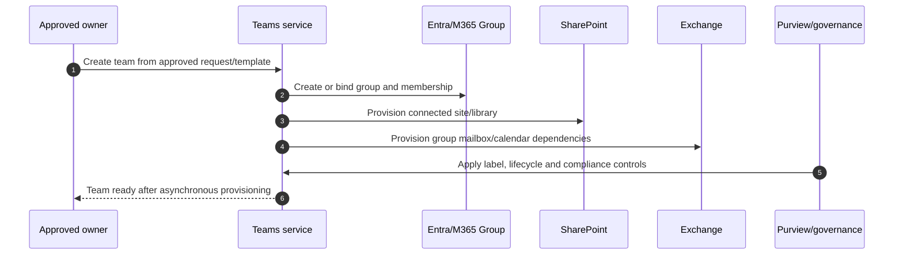

| Lifecycle control | Minimum design |
|---|---|
| Creation | Naming, classification, purpose, owner, sensitivity and approval/self-service rule |
| Ownership | At least two accountable owners; ownerless-team remediation |
| Membership | Internal, guest and shared-channel participants reviewed separately |
| Expiration | Renewal evidence, activity/context and archive/deletion path |
| Archival | Read-only collaboration expectation and external-sharing review |
| Deletion | Retention/hold, connected sites/channels/apps and restore window validated |
| Offboarding | Replace owners, transfer recordings/chat-file ownership and remove guest/app access |

## 3. Standard, private, and shared channels

| Channel type | Who sees it | File location | Membership authority | Main risk |
|---|---|---|---|---|
| Standard | All team members | Folder in parent team's SharePoint site/library | Team/M365 Group | Broad team membership means broad channel access |
| Private | Selected subset of team members | Separate SharePoint site | Private channel membership | Extra site lifecycle and ownerless membership |
| Shared | Selected people/teams, including external B2B direct connect where configured | Separate SharePoint site | Shared channel membership | Cross-tenant trust and independent file boundary |

### 🔍 Plain-English deep-dive: channel boundary is also a data boundary

- **Standard channel** — *a workspace inherited by everyone in the team.* **Analogy:** A room every hotel employee can enter. **Why it matters:** Confidential subsets need another boundary.
- **Private channel** — *a room for selected members of the parent team.* **Analogy:** A locked meeting room inside the hotel. **Why it matters:** Its separate SharePoint site needs governance and discovery.
- **Shared channel** — *a channel shared with selected people or teams, potentially across tenants without guest accounts.* **Analogy:** A joint project room connected to two companies' lobbies. **Why it matters:** Cross-tenant access and B2B direct connect must agree.
- **Parent team** — *the team that contains the channel relationship.* **Analogy:** The hotel hosting the room. **Why it matters:** Some settings/labels/lifecycle relationships inherit, while membership/content visibility can differ.

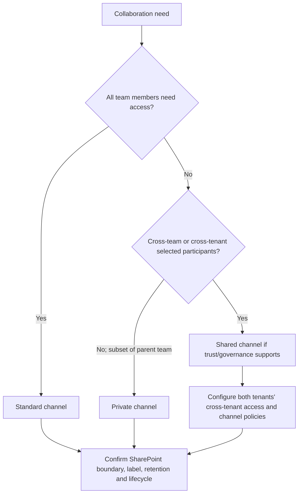

Shared channel sites synchronize membership from Teams and cannot be managed like arbitrary standalone site permissions. Direct file sharing can create access that survives channel removal in specific scenarios; Part 24 explores this risk.

## 4. Membership, owners, and groups

Team owners manage membership/settings within policy; members collaborate; guests are directory guests in the resource tenant. Owners are not automatically compliance or security administrators. Teams connected to M365 Groups depend on group membership, but private/shared channels add narrower membership lists.

| Role | Can typically do | Governance question |
|---|---|---|
| Team owner | Add/remove team members, configure team settings, manage channels | Is owner trained, reviewed and backed up? |
| Team member | Participate, create content and possibly channels/apps | Which member capabilities should template/policy restrict? |
| Guest | Collaborate under guest/team settings and host-tenant controls | Who sponsors, reviews and removes the guest? |
| External federated user | Chat/call across organizations without joining team | Which domains/tenants and communication types are allowed? |
| Shared-channel external participant | Access shared channel via B2B direct connect | What inbound/outbound trust and host controls apply? |
| Teams admin | Configure tenant/user policies and service settings | Least privilege, PIM and audit? |

Avoid one-person ownership. Owner review should include guests, external shared channels, apps/tabs, public/private status, label, dormant content and connected SharePoint permissions.

## 5. Guest access, external access, and B2B direct connect are different

| Collaboration mode | Identity representation | Access scope | Tenant switch | Best for |
|---|---|---|---|---|
| Guest access | B2B guest object in host/resource tenant | Team/resources granted to guest | Often host-tenant context | Ongoing project membership and broad team collaboration |
| External/federated access | User stays in home tenant | Chat/calls/meetings, not team file membership | No team membership | Communication without shared workspace |
| B2B direct connect | External home identity trusted for shared channel | Specific shared channels/resources | More seamless cross-tenant experience | Selected cross-company channel collaboration |
| Anonymous meeting join | No authenticated organizational identity required | Meeting participation under controls | Not applicable | Public/consumer attendance when approved |

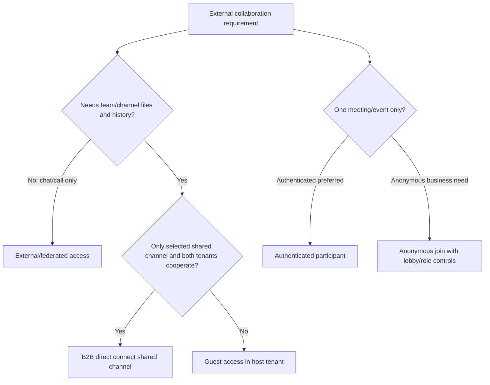

Do not use “external user” as an architecture term without stating which model. Troubleshooting and data governance differ radically.

## 6. Federation and domain controls

Teams external access can allow or block communication with other organizations/domains and consumer services according to current settings. Open federation increases collaboration but also exposure to unsolicited contact and social engineering. Domain allowlists reduce breadth but create maintenance and business-friction costs.

| Decision | Assessment question |
|---|---|
| Open versus allowlisted federation | Threat model, business partner volume and support capacity |
| Consumer/Skype interoperability | Is it required and what identity assurance exists? |
| External users starting contact | User-reporting, block and SOC process |
| File sharing | Federation alone does not grant team/SharePoint file access |
| Presence visibility | Is exposure acceptable for external relationships? |
| Incident response | Can both tenants identify contacts and preserve evidence? |

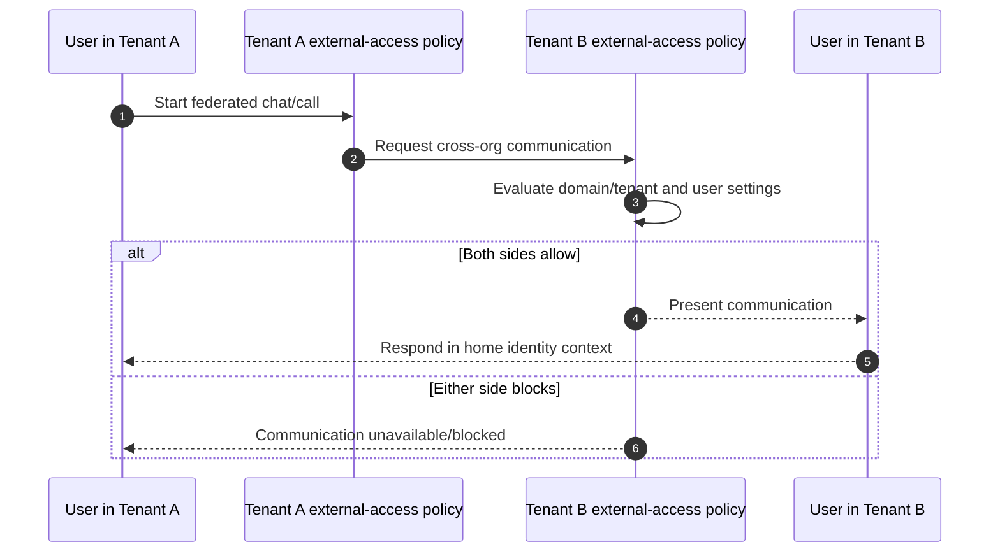

## 7. Cross-tenant access settings and trust

Microsoft Entra cross-tenant access settings govern inbound/outbound B2B collaboration and B2B direct connect. Trust settings can accept MFA, compliant-device or hybrid-join claims from another tenant where supported and intentionally configured. Tenant restrictions can control which external tenants users access.

### 🔍 Plain-English deep-dive: inbound, outbound, and trust

- **Inbound setting** — *what external identities may access in your tenant.* **Analogy:** Rules for visitors entering your building. **Why it matters:** Your data and host policies are at risk.
- **Outbound setting** — *where your users may collaborate externally.* **Analogy:** Approved buildings employees may visit. **Why it matters:** It limits external exposure and shadow collaboration.
- **Trust setting** — *whether your tenant accepts another tenant's MFA/device claims.* **Analogy:** Accepting a partner's security badge inspection. **Why it matters:** Blind trust can weaken your access policy; no trust can make collaboration unusable.
- **B2B direct connect** — *cross-tenant identity path used by shared channels.* **Analogy:** A controlled bridge between buildings. **Why it matters:** Both organizations must configure compatible access.

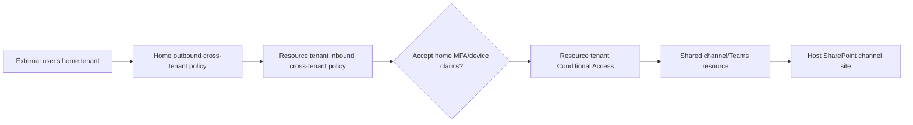

Default settings and organization-specific overrides need a documented merge/evaluation model. Test with a real controlled partner tenant in an approved lab, not by assuming one side's portal setting is sufficient.

## 8. Meeting, webinar, and town hall are different event models

| Event type | Intended pattern | Security focus | License/change caveat |
|---|---|---|---|
| Meeting | Interactive collaboration | Lobby, roles, chat, recording, apps and participants | Core Teams plus feature-specific entitlements |
| Webinar | Registration and structured presentation | Registrant data, presenters, attendee interaction and reporting | Premium/limits may vary |
| Town hall | One-to-many managed event | Producer/presenter control, scale, Q&A and recording | Organizer license and capacity vary |
| Audio conference | PSTN dial-in to meeting | Caller identity, lobby bypass and toll fraud | Audio Conferencing entitlement/region |
| Teams Phone | Enterprise telephony/calling | Number, routing, emergency calling, recording and fraud | Separate Phone/PSTN licensing and regulation |

Choose the model from audience size, identity assurance, interaction, privacy, recording and operational requirements. Do not use an ordinary open meeting as a substitute for a managed public event merely because the link is easy to distribute.

## 9. Policies, settings, templates, and meeting options

**Meeting policies** control features available to organizers/users and can be per-organizer, per-user, or combined. **Meeting settings** can be tenant-wide service controls. **Meeting templates** and sensitivity labels can shape organizer defaults/options, often with Teams Premium dependencies. **Meeting options** are organizer choices bounded by admin controls.

| Layer | Scope | Example |
|---|---|---|
| Tenant setting | Organization-wide service allowance | Anonymous join availability |
| User meeting policy | Organizer/user capability | Recording, transcription, lobby behavior bounds |
| Event policy | Webinar/town hall features | Registration/event capability |
| Template | Repeatable meeting configuration | Confidential client meeting defaults |
| Sensitivity label | Protected meeting/team/container settings | Restrict lobby/presenter/recording options where licensed |
| Meeting option | Per-meeting choice within bounds | Who presents or bypasses lobby |

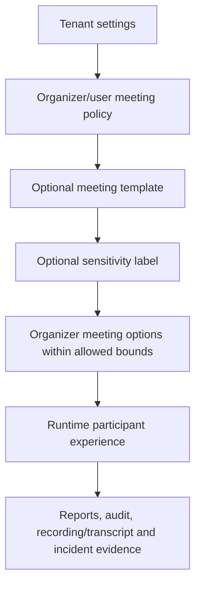

The most restrictive applicable control often bounds the experience, but exact precedence is feature-specific. Build an effective-settings test matrix rather than memorize one universal formula.

## 10. Lobby, presenter, anonymous, and dial-in controls

| Control | Risk reduced | Tradeoff/test |
|---|---|---|
| Lobby | Uninvited/early participant access | Who admits; large-meeting delay; organizer absence |
| Presenter role | Screen/content control and meeting disruption | External presenter workflow and handoff |
| Anonymous join | Identity uncertainty | Public audience need, lobby and reporting limitations |
| Dial-in bypass | Unverified caller entry | Caller ID limitations and meeting convenience |
| Meeting lock | Late/unwanted joins | Reconnect and accessibility impact |
| Chat/Q&A | Data disclosure and harassment | Moderation, retention and participant experience |

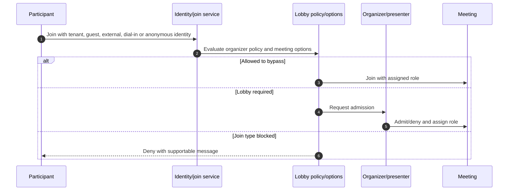

For sensitive meetings, default attendees to attendee role, restrict who bypasses lobby, identify external presenters in advance, control anonymous/dial-in behavior and test organizer absence/rejoin.

## 11. Recording, transcription, captions, and ownership

Recordings and transcripts are sensitive data, not merely meeting features. Current storage commonly uses the organizer's OneDrive for many nonchannel meetings and the team's SharePoint site for channel meetings, but ownership and special scenarios change. Policies, organizer permissions, consent/notification, regional law, retention, labels and external sharing all matter.

| Question | Design requirement |
|---|---|
| Who may start recording/transcription? | Policy plus organizer/participant role |
| Where is the artifact stored? | Exact meeting type and organizer/channel ownership |
| Who receives access? | Default sharing and later permission changes |
| How long is it retained? | Expiration versus Purview retention/hold interaction |
| Are participants notified/consenting? | Legal, works council and local requirements |
| Can external users download/share? | Sharing, label, unmanaged-device and block-download controls |
| Who owns it after departure? | Offboarding and site/OneDrive lifecycle |

Recording expiration is not the same as a legally approved retention schedule. Purview preservation can override ordinary deletion/expiry outcomes.

## 12. Messaging policies and chat/channel controls

Messaging policies can govern chat, deletion/editing, read receipts, URL previews, translation, Giphy/memes/stickers and other current features. Team/channel settings separately control member capabilities and moderation.

| Control | Security/compliance angle | Usability angle |
|---|---|---|
| Chat enablement | Data leaves formal channel/site structure | Essential quick collaboration |
| Delete/edit sent messages | Evidence/context changes | Correct mistakes and reduce clutter |
| URL previews | Fetch/exposure and content risk | Faster context |
| External chat | Social engineering/data disclosure | Partner productivity |
| Channel moderation | Controlled announcements | Requires active moderators |
| Shared channel creation | Cross-boundary access | Efficient project collaboration |

Policy should reflect data classification and business role, not create dozens of unmaintainable personas. Preserve audit and retention requirements when enabling deletion/editing.

## 13. Teams apps: availability, installation, consent, and data access

An app can be available in the store, allowed for a user, installed/pinned, and separately authorized to access data. These are different decisions. Apps may include tabs, bots, message extensions, meeting apps, connectors, agents and APIs.

### 🔍 Plain-English deep-dive: allowed is not consented and pinned is not approved

- **App availability** — *whether users may find/use the app under the tenant's app-management model.* **Analogy:** A vendor is allowed into the mall. **Why it matters:** Tenant migration to app-centric/unified management changes the control surface.
- **App setup/pinning** — *installing or placing an app prominently for users.* **Analogy:** Giving the vendor a front-window display. **Why it matters:** It increases adoption but does not grant every data permission.
- **Consent** — *authorization for the app to access APIs/data as a user or application.* **Analogy:** Giving the vendor keys to specified rooms. **Why it matters:** Graph permissions can exceed the visible app experience.
- **Resource-specific consent (RSC)** — *permission scoped to a specific team/chat/meeting resource where supported.* **Analogy:** A key to one project room rather than the whole building. **Why it matters:** It can reduce tenant-wide permission, but owners and permissions still need governance.

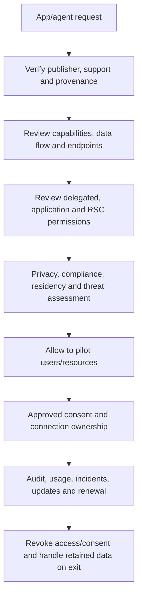

## 14. App permission policies, app-centric management, and setup policies

Older tenants may still use app permission policies to control user access by Microsoft, third-party and custom app categories. Microsoft is migrating tenants to **app-centric management**, which controls availability per app and replaces permission policies for migrated tenants. Unified app management also coordinates Teams admin center and Microsoft 365 integrated-app surfaces. Setup policies still influence installation/pinning where applicable.

| Control/model | Purpose | Change-sensitive note |
|---|---|---|
| Org-wide app settings | Broad app categories/custom-app allowance | Interacts with individual app and unified management |
| App permission policy | User-based allow/block under legacy model | No longer applies after app-centric migration |
| App-centric management | Per-app user/group availability | Replacement model; rollout/migration status varies |
| App setup policy | Install/pin/order and user-upload behavior | App must also be available/allowed |
| Integrated apps | Microsoft 365-wide deployment/management | Unified app management can link surfaces |
| Entra enterprise app consent | API permissions/service principal access | Separate from Teams app availability |

Do not document both models as simultaneously authoritative. Begin an assessment by recording which model the tenant currently uses and the migration plan.

## 15. Custom apps, supply chain, and consent governance

| Review area | Evidence |
|---|---|
| Publisher/developer | Legal entity, support owner, security contact and contract |
| Package/manifest | Version, app IDs, domains, capabilities and integrity |
| Permissions | Delegated/application/RSC permission purpose and least privilege |
| Data flow | Source, destination, processing, storage, residency and deletion |
| Authentication | OAuth flow, secrets/certificates, redirect URIs and rotation |
| Code/security | SDLC, vulnerability management, penetration evidence and incident notification |
| Compliance/privacy | DPA, subprocessors, retention, data-subject and audit support |
| Operations | Monitoring, rate limits, service health, business owner and exit plan |

Admin consent must be governed through verified publisher/risk workflows. Owner consent through RSC narrows resource scope but can still expose sensitive channel/meeting data. Custom app upload should be restricted to authorized developer/test populations and promoted through environments/rings.

## 16. Sensitivity labels and Teams templates

Sensitivity labels for containers can govern privacy, guest access, external sharing and unmanaged-device behavior for teams/M365 Groups/Sites according to current licensed capabilities. Labels can also integrate with meeting templates and protected meeting options under relevant Teams Premium/Purview licensing.

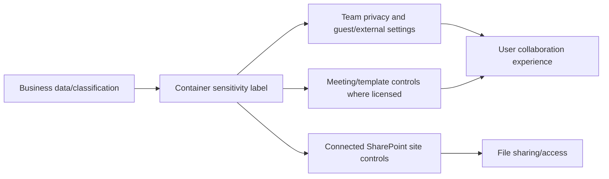

| Label design | Example controls | Guardrail |
|---|---|---|
| Public/Internal | Broad internal collaboration | Prevent accidental external expansion as needed |
| Confidential | Private team, controlled guests, managed-device access | Owner justification and exception workflow |
| Highly Confidential | No guests, restricted site/meeting settings | Ensure emergency/business collaboration path |
| Client Confidential | Approved external guests/partners | Separate sites/teams per client and lifecycle review |

Labels express business meaning. They do not fix preexisting item-level oversharing automatically; validate effective settings and permissions.

## 17. DLP for Teams messages and files

Microsoft Purview **data loss prevention (DLP)** can evaluate Teams chat/channel messages and SharePoint/OneDrive files under appropriate licensing. Message DLP and file DLP use different storage/evaluation paths. Policy tips, blocks, overrides and incident reports need testing.

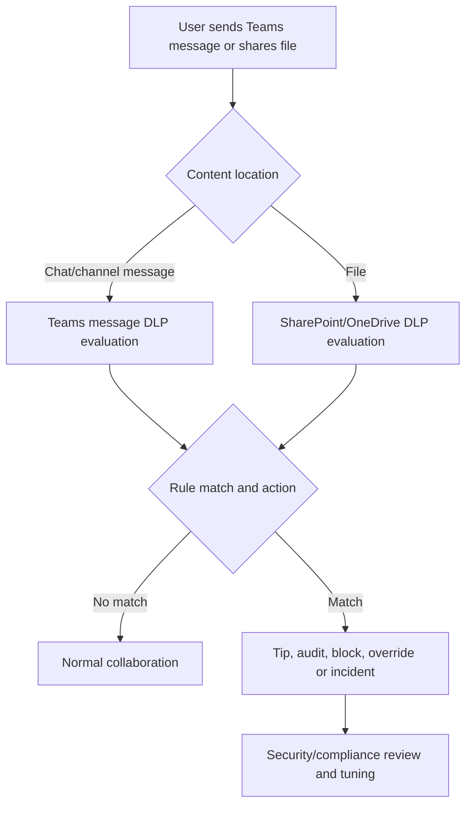

| Test | Why |
|---|---|
| Internal chat with test sensitive data | Message-location coverage |
| Guest/external chat scenario | Recipient and external boundary behavior |
| Channel file with same test data | SharePoint/OneDrive location coverage |
| User override with justification | Audit and business exception behavior |
| False-positive near match | Tuning and user friction |
| Mobile/web/desktop clients | Experience and propagation consistency |

Use synthetic test data approved by compliance; never place real regulated data into a test tenant casually.

## 18. Retention, deletion, and legal preservation

Teams messages, channel messages, files, recordings and app data can have different retention locations and policies. Retention policies/labels can preserve or delete according to Purview rules. User deletion from the Teams UI does not necessarily remove preserved compliance copies.

| Content | Working location | Retention/eDiscovery consideration |
|---|---|---|
| 1:1/group chat messages | Teams service with compliance storage mechanisms | User/custodian scope and retention policy |
| Standard/private/shared channel messages | Team/channel-specific compliance locations | Host tenant, channel type and members |
| Channel files | SharePoint parent/separate channel site | Site/item retention, labels and hold |
| Chat files | Sender's OneDrive | Custodian departure and sharing links |
| Meeting recording/transcript | OneDrive or SharePoint by scenario | Organizer/site ownership, expiration and hold |
| App/bot data | Microsoft/third-party service dependent | Contract, connector and export/deletion support |

Do not promise one retention rule covers “all Teams data.” Map each content type, license, location, custodian and legal requirement.

## 19. eDiscovery, audit, and investigation

Purview eDiscovery can search Teams messages and connected files within current feature/licensing boundaries. Audit records capture team, channel, meeting, app and sharing activities, but operation names/retention vary. Investigators must preserve chain of custody and avoid expanding access unnecessarily.

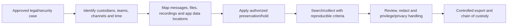

| Evidence field | Why |
|---|---|
| Tenant and object IDs | Display names change and can duplicate |
| UTC time range | Align Teams, Entra, SharePoint, Exchange and network evidence |
| Team/channel type | Determines membership and storage |
| User role/identity type | Member, guest, federated, anonymous or B2B direct connect |
| Meeting ID/call record | Correlates join/media/policy troubleshooting |
| File URL/site/drive/item ID | Proves actual SharePoint/OneDrive object |
| Policy assignments | Explains allowed runtime behavior |
| Audit/search query | Makes conclusion reproducible |

## 20. Information barriers and communication compliance

**Information barriers (IB)** restrict communication/collaboration between defined segments to meet legal or conflict requirements. **Communication compliance** detects policy-defined risky/inappropriate communications for privacy-governed review. They are not ordinary employee surveillance tools.

| Capability | Purpose | Governance requirement |
|---|---|---|
| Information barriers | Prevent defined groups from communicating/collaborating | Accurate attributes/segments, legal basis and exception process |
| Communication compliance | Detect/review specified risky communications | Privacy, reviewer separation, minimization and escalation |
| DLP | Prevent sensitive-data disclosure | Classification, rule accuracy and user remediation |
| Retention | Preserve/delete content by policy | Records/legal schedule and disposition ownership |
| eDiscovery | Preserve/search/review for case | Legal authorization and chain of custody |

Shared-channel IB behavior focuses on users in the host organization; external participants remain governed by their own organizations in important respects. Test cross-tenant edge cases and document residual risk.

## 21. Conditional Access and device controls

Teams access relies on Entra authentication and can be governed by Conditional Access, MFA, device compliance, app protection and session controls. Teams also calls SharePoint/OneDrive for files, so inconsistent policies across dependent cloud apps can produce “chat works, file fails.”

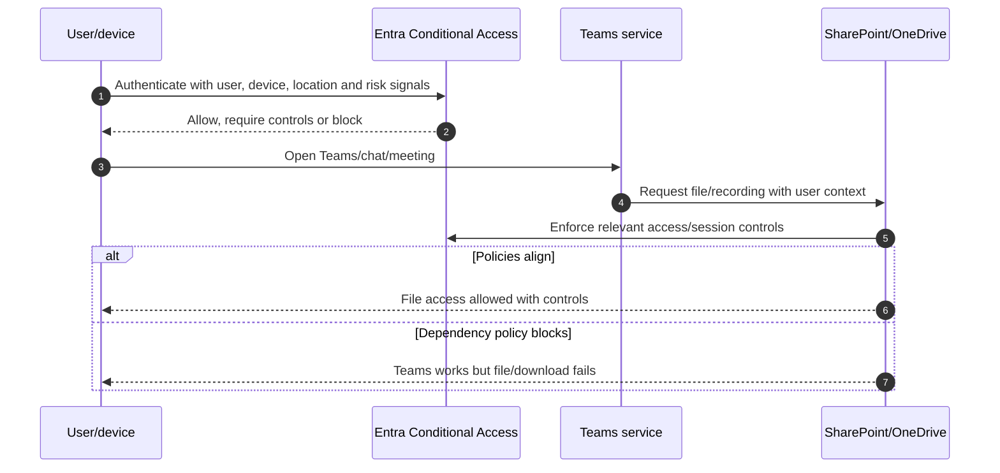

| Control | Teams impact |
|---|---|
| Require MFA/auth strength | Sign-in and external-user assurance |
| Require compliant device | Desktop/mobile access; shared-channel external trust choices |
| App protection policy | Managed app data on unmanaged mobile devices |
| Sign-in/session controls | Reauthentication and token/session behavior |
| SharePoint unmanaged-device access | Web-only/block-download experience for Teams files |
| Defender for Cloud Apps session | Change-sensitive real-time session control scenarios |

## 22. Teams Phone security context

Teams Phone adds PSTN numbers, calling policies, voice routes, Session Border Controllers (SBCs) for Direct Routing, emergency calling, voicemail, call queues and auto attendants. This chapter provides context, not a full telephony design.

| Risk | Control direction |
|---|---|
| Toll fraud | Calling restrictions, anomaly monitoring, identity protection and number governance |
| Compromised admin | Least-privilege Teams/telephony roles, PIM and audit |
| SBC attack/misroute | Supported hardened SBC, mutual TLS/cert lifecycle and network rules |
| Emergency calling error | Validated locations, routing and regulatory testing |
| Call recording/privacy | Legal approval, policies, storage, access and retention |
| Number lifecycle | Inventory, assignment review, offboarding and carrier ownership |

Do not troubleshoot media/voice by disabling firewall/security broadly. Use Microsoft's current network planner, Call Quality Dashboard, Call Analytics and SBC/provider evidence.

## 23. Network and media basics

Teams signaling establishes sessions; media carries audio/video/screen sharing and may use optimized UDP paths with fallback. Proxies, VPNs, firewalls, NAT, DNS, bandwidth, jitter, latency and packet loss affect experience.

| Symptom | Useful evidence |
|---|---|
| Cannot sign in | Entra sign-in, client version/cache, proxy/TLS and service health |
| Cannot join meeting | Meeting policy/options, identity type, lobby, URL and client logs |
| One-way/no audio | Device permissions, selected device, firewall/NAT and media path |
| Choppy video/audio | Packet loss, jitter, latency, Wi-Fi/VPN and CQD |
| Screen share unavailable | Policy, role, client/platform and meeting type |
| PSTN failure | License/number/policy/route/SBC/carrier and call records |

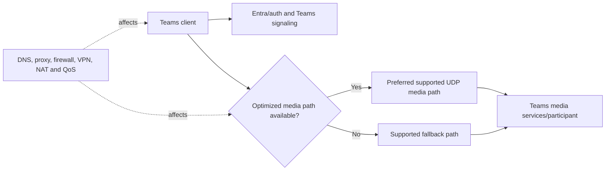

## 24. Policy assignment and propagation

Teams policies can be global, directly assigned, group-assigned or batch-assigned depending on policy type. Rank and assignment method affect effective policy. A user generally has one effective policy per policy type, while meeting behavior also depends on organizer/participant settings and meeting options. Changes can take hours.

### 🔍 Plain-English deep-dive: assigned policy versus runtime meeting outcome

- **Global policy** — *the default policy for users without a more specific effective assignment.* **Analogy:** The standard building rulebook. **Why it matters:** Editing it can affect a very large population.
- **Direct/group assignment** — *a policy attached to a person or eligible group, subject to current rank/precedence rules.* **Analogy:** A department-specific rulebook. **Why it matters:** The portal object alone does not prove which rule the user receives.
- **Organizer policy** — *settings whose outcome follows the person who scheduled the meeting.* **Analogy:** The host chooses the room rules within company limits. **Why it matters:** Two participants can have different experiences in meetings organized by different people.
- **Runtime outcome** — *the final behavior after tenant settings, effective policy, template/label, meeting options, identity and client are evaluated.* **Analogy:** What the door actually permits at meeting time. **Why it matters:** Troubleshoot effective behavior, not one screenshot.

| Check | Evidence |
|---|---|
| Correct identity | User object ID and tenant |
| License/service plan | Current assigned plan and provisioning |
| Assignment source | Global, direct, group or batch |
| Group rank/membership | Effective group policy ordering |
| Policy type support | Group assignment not supported for every policy type |
| Propagation | Change UTC time, documented expectation and client refresh |
| Runtime owner | Organizer versus participant policy |
| Client | Web/desktop/mobile version and cache/session |

Do not repeatedly reassign policies during propagation; it destroys the timeline. Capture baseline, make one controlled change and test after the documented window.

## 25. Layered troubleshooting method

1. Define exact user, tenant, identity type, client, meeting/team/channel and UTC time.
2. Check Microsoft 365/Teams service health and recent Message center changes.
3. Confirm Entra sign-in, Conditional Access and licensing.
4. Determine the collaboration model: member, guest, federation, shared-channel B2B direct connect or anonymous.
5. Resolve effective Teams policy/settings/template/options.
6. Follow the dependency: SharePoint/OneDrive file, Exchange calendar, app consent, network/media or telephony.
7. Compare a working and failing user/meeting/channel.
8. Apply the smallest reversible fix to the controlling layer.
9. Test allowed and denied paths; monitor propagation and audit.

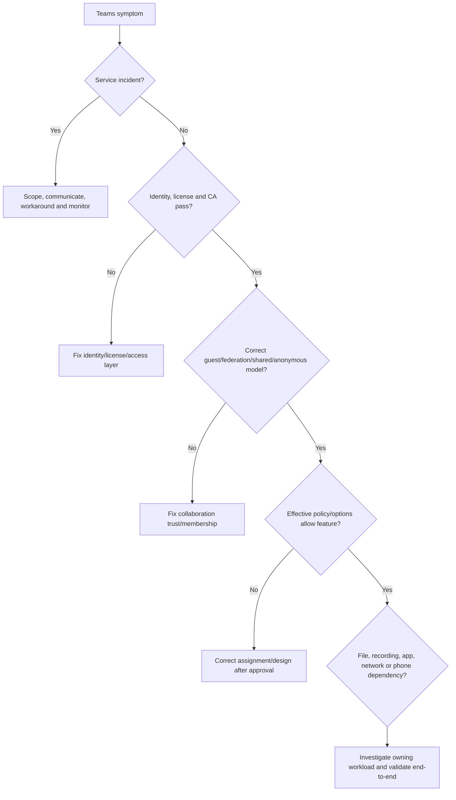

## 26. Troubleshooting join and lobby failures

| Symptom | Hypothesis | Discriminating check |
|---|---|---|
| Anonymous user blocked | Tenant/organizer policy or meeting option | Controlled meeting with same organizer and authenticated user |
| Guest loops at sign-in | Wrong tenant/account, stale invitation/redemption or CA | Entra sign-in/user object and private browser test |
| External presenter cannot present | Role/options/policy | Participant list role and organizer policy |
| Dial-in user stays in lobby | Dial-in bypass setting/identity | Organizer options and caller route |
| “Only people invited” denial | Forwarded link/user not on invite or auth mismatch | Calendar invite and signed-in UPN |
| Recording unavailable | Policy, role, organizer license/storage | Effective recording policy and destination ownership |

Use meeting ID, conference ID/call record, organizer UPN/object ID, participant identity type, join time, client/platform and screenshot/error. Never ask users to publish meeting links in public troubleshooting forums.

## 27. Troubleshooting guest, external, and shared-channel access

Guest failures may involve invitation redemption, Entra guest state, cross-tenant CA, Teams guest settings, team membership, license/service provisioning, SharePoint site access or client tenant context. Federation failures involve both tenants' external-access policy. Shared channels require B2B direct connect and compatible inbound/outbound cross-tenant settings.

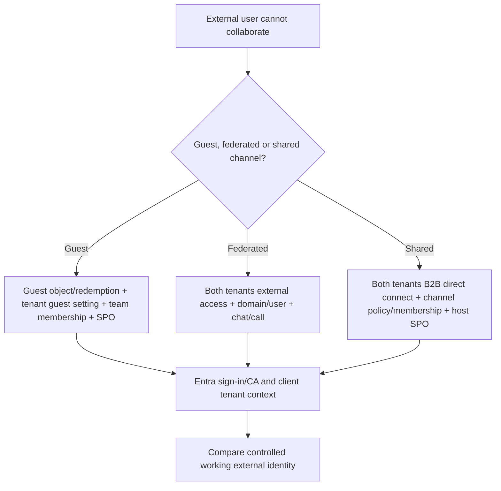

Do not “fix” a shared-channel issue by inviting the user as a guest unless the architecture intentionally changes; that creates a different identity and governance model.

## 28. Troubleshooting file and recording access

This is your strongest bridge. Begin with the actual SharePoint/OneDrive URL and item, not the Teams tab. Identify standard/private/shared channel or chat/meeting scenario, owner, site, membership, link type, direct permissions, sensitivity label, DLP, Conditional Access/unmanaged-device control, retention and sync state.

| Teams symptom | Owning-layer check |
|---|---|
| Channel tab opens but file denied | SharePoint site/library/item permission and channel membership |
| Removed member still opens file | Direct item/link permission outside channel membership |
| Chat file unavailable after employee left | Sender OneDrive ownership/retention/transfer |
| Recording owner unexpected | Organizer/channel meeting storage rules |
| Download blocked but web view works | Unmanaged-device/app-enforced restriction or label |
| Sync client missing channel files | Library sync, shortcut, tenant/device policy and client health |

## 29. Troubleshooting apps and consent

| Failure | Check order |
|---|---|
| App not visible | Tenant model (app-centric or legacy), org/app availability, user scope, region/client |
| App visible but install fails | Setup policy, custom-app setting, package/manifest and publisher state |
| App opens but data fails | Entra service principal, delegated/application/RSC consent, token and API |
| Owner consent unavailable | RSC support, manifest and admin policy |
| Bot/messages fail | Endpoint reachability, credentials/certificates, permissions and throttling |
| App removed but access persists | Revoke Entra consent/service principal, tokens, connections and vendor data |

Preserve app ID, service principal ID, user/team/chat/meeting IDs, manifest version, consent grant, correlation ID, UTC time and endpoint response. Removing an icon does not revoke API access.

## 30. Security and incident scenarios

### Scenario A: malicious external chat

Preserve chat/audit evidence, identify federation versus guest, block/report the sender through approved mechanisms, scope links/files and affected users, correlate Safe Links/MDO and identity/device evidence, review external-access policy and user awareness, and avoid disabling all federation without business-impact assessment.

### Scenario B: confidential meeting recorded externally

Confirm organizer, participants, policies/options, recording/transcription events, storage location, permissions/downloads and external sharing. Preserve the artifact under legal/privacy direction, remove unauthorized access, evaluate notification obligations, correct template/label/policy and participant-role design, and retest.

### Scenario C: risky app installed in a finance team

Record app/tenant/team IDs, publisher, permissions, consent grants, data accessed and activity. Disable availability or revoke consent under authority, rotate compromised connections/secrets, assess vendor retention and downstream systems, preserve evidence, notify data owners, and strengthen app/RSC review.

## 31. Deployment, testing, and rollback

| Phase | Work | Gate |
|---|---|---|
| Discover | Teams/channels, owners, guests, federation, meetings, apps, labels, policies and data locations | Inventory accepted |
| Design | Personas, external models, templates, labels, DLP, app/consent and operations | Architecture/privacy/security approval |
| Pilot | IT and business champions, one partner tenant and synthetic data | Positive/negative tests pass |
| Rollout | Rings by role/risk with communications/training | No critical unresolved impact |
| Hypercare | Join/media/file/app/guest reports and audit/metrics | Stable measured period |
| Handover | RACI, access, runbooks, dashboards, known errors and escalation | Operations acceptance |

Rollback may mean restore prior policy assignment, remove a pilot template/label, disable federation override, remove shared-channel trust, disable an app, revoke consent, or restore meeting settings. Cross-tenant changes require both organizations. Policy propagation is not instant, and revoking app access may require token/connection/vendor-data cleanup. State what cannot be fully reversed, including external copies or recordings already downloaded.

## 32. Operations and metrics

| Metric | Decision supported |
|---|---|
| Ownerless/dormant teams | Lifecycle remediation |
| Guests and external shared channels without review | External-access risk |
| Anonymous meetings and lobby bypass | Meeting baseline effectiveness |
| Recording/transcription volume and external access | Privacy/storage/governance |
| Third-party/custom apps and high permissions | App risk backlog |
| Policy coverage/assignment errors | Configuration quality |
| Join success and call quality | User/network/service health |
| File access/sync incidents by cause | SharePoint/OneDrive dependency health |
| DLP incidents/overrides and false positives | Data-control tuning |
| Mean time to resolve guest/join/app incidents | Operational effectiveness |

Define data source, license, numerator, denominator, time range, identity privacy and owner. High guest count is not automatically bad; unowned, stale, excessive or inappropriate guest access is the risk.

## 33. Consulting artifacts

1. **Teams dependency architecture:** Entra, Group, Exchange, SharePoint, OneDrive, Purview, apps and network.
2. **External collaboration decision tree:** guest, federation, shared channel, anonymous and restrictions.
3. **Meeting/event baseline:** personas, lobby, presenters, anonymous, dial-in, recording and templates.
4. **App and consent register:** publisher, availability model, permissions, data flow, owner and renewal.
5. **Data-location map:** chats, channels, files, recordings, transcripts and app data.
6. **Compliance matrix:** labels, DLP, retention, eDiscovery, audit, IB and communication compliance.
7. **Policy/effective-settings matrix:** assignments, ranks, dependencies and propagation.
8. **Test/rollback pack:** positive, negative, cross-tenant, client and failure scenarios.
9. **Operational handbook:** service health, join/file/app runbooks, RACI, SLAs and metrics.
10. **Executive roadmap:** risk, business impact, license/dependency, priority and residual risk.

## 34. Safe paper lab: secure a client collaboration team

This lab changes no tenant, invites no guest, creates no team/channel/meeting, grants no consent and stores no real data.

### Scenario

Fictional Contoso needs a client project team with 30 employees, five partner users, a private finance channel, a cross-company engineering workstream, weekly confidential meetings, recordings, one task app and regulated identifiers in documents. Use `contoso.example` and `fabrikam.example` only.

### Procedure

1. Draw Entra, Teams, M365 Group, Exchange, SharePoint, OneDrive, Purview and app trust boundaries.
2. Choose a standard team for broad members, private channel for internal finance and shared channel for engineering only if both tenants approve B2B direct connect.
3. Compare guest access versus shared channel for the five partner users and document the chosen identity/lifecycle model.
4. Draft inbound/outbound cross-tenant settings and trust decisions; do not assume partner MFA/device claims.
5. Define two owners, guest sponsor, quarterly review, expiration and offboarding/recording ownership.
6. Create a confidential meeting template design: lobby, presenters, anonymous/dial-in, recording, transcription, chat and apps.
7. Map standard/private/shared channel files and chat/meeting recordings to SharePoint/OneDrive locations.
8. Draft a container label and DLP tests using synthetic identifiers; map retention/eDiscovery and audit.
9. Assess the task app: publisher, app-centric/legacy availability, permissions, RSC, consent, data flow and exit.
10. Create Conditional Access/device scenarios for employees, guests and direct-connect participants.
11. Inject four faults: partner cannot see shared channel; guest can chat but not open file; recording owner left; app is allowed but API data fails.
12. Diagnose each by identity, model, policy, workload and evidence.
13. Define rollback and irreversible external-copy risks.

### Test matrix

| Test | Expected paper result | Evidence |
|---|---|---|
| Employee team member | Team, standard channel and files accessible | Membership/data-location map |
| Partner guest | Only approved team resources; host CA applies | Guest object/lifecycle design |
| Direct-connect engineer | Shared channel only under both tenant policies | Cross-tenant matrix |
| Nonmember | No private/shared channel visibility | Negative membership test |
| Confidential meeting invitee | Lobby/role/recording controls apply | Effective-settings matrix |
| Anonymous participant | Blocked or restricted per approved scenario | Join decision tree |
| Unmanaged device | File web-only/block-download behavior as designed | CA/SPO dependency test |
| Synthetic sensitive chat/file | DLP action matches each location | Message/file DLP table |
| App pilot user | App available and least-privilege consent works | App/consent register |
| Nonpilot user | App unavailable | App-centric/legacy scope test |
| Removed app | Availability and consent/connection cleanup both occur | Exit checklist |
| Rollback | Prior policies restored; external copies acknowledged | Rollback record |

### Evidence and cleanup

Produce only fictional diagrams, decision records, settings matrices, app assessment, test results, incident timeline and executive summary. Label everything “paper lab / no tenant changes.” Use no real meeting URL, participant, tenant ID, file, recording, app secret, customer name or partner domain. Cleanup is confirming no service object, consent, invitation or content was created.

### Interview wording

> “I completed a paper Teams security design covering service dependencies, channel types, guest versus federation versus B2B direct connect, cross-tenant trust, meeting controls, app/RSC consent, labels/DLP/retention, Conditional Access and layered troubleshooting. It is lab evidence, not production Teams security ownership. My direct production advantage is SharePoint/OneDrive permissions, sharing, sync and M365 incident work, which is highly relevant to Teams file and recording issues.”

## 35. JD Mapping: interview translation

| Prompt | Strong response structure |
|---|---|
| “Secure Teams” | Identity/external model → teams/channels/owners → meetings/events → apps/consent → data/compliance → CA/device → operations/tests |
| “Guest cannot access” | Identify guest/federated/shared model → Entra sign-in/CA → tenant settings/membership → SharePoint file → compare user → evidence |
| “Review an app” | Publisher/package → capabilities → delegated/application/RSC → data flow/privacy → pilot/consent → monitoring/exit |
| “Meeting leaked” | Organizer/options/policies → participants/roles → recording/transcript location/access → audit/downloads → contain/preserve → design fix |
| “Your experience?” | Production SPO/OneDrive/sync/M365 support; Teams implementation paper lab; explicit partner model |

## 36. Official Source Anchors

First-party sources checked on **August 24, 2026**; recheck current licensing, portals, previews and tenant rollout.

| Topic | Official Microsoft source | Change-sensitive use |
|---|---|---|
| Teams architecture | [Introduction to Teams for admins](https://learn.microsoft.com/en-us/microsoftteams/teams-overview) | Entra, Group, SharePoint and Exchange dependencies; page dated August 14, 2026 |
| Channel types | [Overview of teams and channels](https://learn.microsoft.com/en-us/microsoftteams/teams-channels-overview) | Standard/private/shared comparison |
| Shared channels | [Shared channels in Teams](https://learn.microsoft.com/en-us/microsoftteams/shared-channels) | B2B direct connect, site and compliance behavior |
| External collaboration | [Plan external collaboration](https://learn.microsoft.com/en-us/microsoft-365/solutions/plan-external-collaboration) | Guest, federation and shared-channel planning |
| Guest access | [Collaborate with guests in a team](https://learn.microsoft.com/en-us/microsoft-365/solutions/collaborate-as-a-team) | Host-tenant guest model |
| Cross-tenant access | [Cross-tenant access overview](https://learn.microsoft.com/en-us/entra/external-id/cross-tenant-access-overview) | Inbound/outbound and trust settings |
| Meeting policies | [Manage meeting and events policies](https://learn.microsoft.com/en-us/microsoftteams/meeting-policies-overview) | Per-organizer/per-user behavior; page dated July 2026 |
| Meeting settings | [Teams meeting settings](https://learn.microsoft.com/en-us/microsoftteams/meeting-settings-in-teams) | Tenant controls and anonymous join |
| Meeting templates | [Custom meeting templates](https://learn.microsoft.com/en-us/microsoftteams/custom-meeting-templates-overview) | Teams Premium/license behavior |
| App governance | [Manage apps in Teams admin center](https://learn.microsoft.com/en-us/microsoftteams/manage-apps) | App availability and org settings |
| App-centric management | [Manage access using app-centric management](https://learn.microsoft.com/en-us/microsoftteams/app-centric-management) | Replacement for permission policies |
| Legacy app permission policies | [Manage app permission policies](https://learn.microsoft.com/en-us/microsoftteams/teams-app-permission-policies) | Tenant migration warning dated February 27, 2026 |
| Resource-specific consent | [Resource-specific consent in Teams](https://learn.microsoft.com/en-us/microsoftteams/platform/graph-api/rsc/resource-specific-consent) | Resource-scoped app permissions |
| Teams retention | [Learn about retention for Teams](https://learn.microsoft.com/en-us/purview/retention-policies-teams) | Messages and workload locations |
| Teams eDiscovery | [Conduct an eDiscovery investigation of Teams content](https://learn.microsoft.com/en-us/microsoftteams/ediscovery-investigation) | Message/channel content discovery |

---

## ⭐ Likely Interview Questions for This Section

### Q1. What services does Teams depend on?
> **Model answer:** Entra ID provides identity and access; Microsoft 365 Groups commonly provide team membership; SharePoint stores team and channel files; OneDrive stores many chat-shared files and nonchannel meeting recordings; Exchange supports group mailbox/calendar and compliance dependencies; Graph and apps integrate data. I troubleshoot the owning service, so “Teams works but file fails” points toward SharePoint/OneDrive access or CA rather than Teams chat.

### Q2. Compare standard, private and shared channels.
> **Model answer:** Standard channels are visible to all team members and use folders in the parent site. Private channels use selected parent-team members and a separate SharePoint site. Shared channels use selected people/teams and can include cross-tenant participants through B2B direct connect; they also have separate sites. I govern owner/membership, files, labels, lifecycle and cross-tenant trust for each distinct boundary.

### Q3. What is the difference between guest access, federation and B2B direct connect?
> **Model answer:** A guest is a B2B guest object in the host tenant and can join granted team resources. Federation keeps the user in the home tenant for chat/calls without team membership. B2B direct connect uses the home identity to access selected shared channels under compatible cross-tenant settings. I choose from required workspace scope, identity lifecycle, tenant switching, data ownership and trust.

### Q4. How would you secure a confidential Teams meeting?
> **Model answer:** Start with participant and recording requirements, then use tenant settings, organizer policy, an approved template/sensitivity label where licensed, and meeting options. Restrict lobby bypass, anonymous/dial-in participation and presenters; govern chat/apps, recording/transcription, storage, external sharing, downloads and retention. Pilot organizer/external/rejoin cases and document legal/privacy consent.

### Q5. How do you assess a Teams app?
> **Model answer:** Verify publisher/package/version, capabilities, endpoints and support. Review delegated, application and resource-specific permissions, consent authority, data flow/storage/residency/deletion, authentication secrets, SDLC and incident obligations. Pilot least privilege, monitor usage/audit/changes and maintain an exit plan that removes Teams availability, Entra consent, connections/tokens and vendor-retained data.

### Q6. How do Purview controls apply to Teams?
> **Model answer:** Container labels can govern team/site settings; DLP can evaluate Teams messages and SharePoint/OneDrive files; retention covers messages and connected content through location-specific policies; eDiscovery and audit support cases; information barriers restrict defined communication; communication compliance supports privacy-governed review. I map each content type to its real location and license rather than say one policy covers all Teams data.

### Q7. How would you troubleshoot a guest who can chat but cannot open a channel file?
> **Model answer:** Confirm guest versus federation/shared-channel identity, tenant and team/channel membership, Entra sign-in/CA, then inspect the exact SharePoint URL/site/item permissions, sharing link, label, DLP and unmanaged-device controls. Compare a working guest and web client, preserve correlation/time evidence, and fix the SharePoint or access-policy layer rather than repeatedly reinvite the guest.

### Q8. What is your honest Teams security experience?
> **Model answer:** My direct production strength is SharePoint Online, OneDrive, sync, migration, permissions and M365 support/RCA, which strongly supports Teams file and recording troubleshooting. Teams security implementation, meeting/federation/app/compliance configuration are current learning and paper-lab evidence. I can design and test them and would implement with Teams, Entra, SharePoint, Exchange, Purview, network and telephony owners.

---

## 🧠 30-Second Memory Hooks

- **Teams is the lobby; Entra checks identity; SharePoint/OneDrive hold files; Exchange holds calendar dependencies.**
- **Standard means whole team; private means subset; shared means selected cross-team/cross-tenant room.**
- **Guest joins your directory; federation chats from home; direct connect enters a shared channel from home.**
- **Inbound controls visitors; outbound controls where employees go; trust accepts partner claims.**
- **Tenant setting bounds policy; policy bounds template/label; options shape one meeting.**
- **Lobby controls entry; presenter controls power; recording creates governed data.**
- **Allowed app is not consented app; pinned app is not universally safe app.**
- **App-centric management replaces permission policies tenant by tenant.**
- **Message DLP watches chat; file DLP watches SharePoint/OneDrive.**
- **Teams works/file fails: follow the SharePoint/OneDrive and CA dependency.**
- **Removing an app icon does not revoke API consent.**
- **Candidate honesty: direct SPO/OneDrive strength, Teams implementation paper-lab evidence.**

---

## Completion Checklist

- [ ] I can draw Teams dependencies across Entra, Groups, SharePoint, OneDrive and Exchange.
- [ ] I can compare standard, private and shared channels and their sites.
- [ ] I can govern owners, members, guests and lifecycle.
- [ ] I can distinguish guest, federation, B2B direct connect and anonymous join.
- [ ] I can explain inbound/outbound cross-tenant settings and trust.
- [ ] I can compare meetings, webinars, town halls, conferencing and Teams Phone context.
- [ ] I can distinguish tenant settings, policies, templates, labels and meeting options.
- [ ] I can design lobby, role, anonymous, dial-in, recording and transcription controls.
- [ ] I can assess app availability, setup, consent, RSC, data flow and exit.
- [ ] I can identify app-centric versus legacy permission-policy tenant state.
- [ ] I can map labels, DLP, retention, eDiscovery, audit, IB and communication compliance.
- [ ] I can explain CA/device controls and Teams file dependencies.
- [ ] I can troubleshoot join, guest, file, recording, app, policy and media symptoms.
- [ ] I can produce deployment, tests, rollback, operations, metrics and consulting artifacts.
- [ ] I can present the paper lab without claiming production Teams ownership.
- [ ] I will verify current Microsoft Learn, licensing, tenant migration, portal and regional behavior.

---

*Next suggested section:* [Part 24](Part-24-sharepoint-onedrive-security-sharing-sync-governance.md) — go deep on the SharePoint and OneDrive permission, sharing, sync, device, migration, data-governance and incident layers behind Teams files and your strongest direct production experience.