# Part 24 — SharePoint Online and OneDrive Security, Sharing, Sync, and Governance

> **Section goal:** Turn your strongest direct production area into an interview-ready security-consulting capability. By the end, you should be able to explain SharePoint Online and OneDrive architecture, permission inheritance, every major sharing link and external-sharing boundary, guest and lifecycle governance, Conditional Access and unmanaged-device controls, labels/DLP/retention, sync and Known Folder Move, migration security, oversharing assessment, Advanced Management controls, layered troubleshooting, incidents, deployment, rollback, operations and measurable client deliverables.

This Part maps directly to the Deloitte responsibilities for Microsoft 365 workload security assessment, design, configuration, optimization, migration, troubleshooting, compliance, operational readiness and stakeholder advisory. Unlike Exchange and Teams security implementation in Parts 21–23, you have direct production SharePoint Online, OneDrive, permissions, sharing, synchronization, migration, escalation and RCA evidence. The consulting bridge is to structure that evidence as current-state assessment, control design, safe deployment, measurable governance and executive risk communication.

> **Currency, licensing, portal, preview, and change-sensitive note:** Content was checked against official Microsoft Learn available on **August 24, 2026**. SharePoint admin center navigation, sharing-link options/defaults, Entra B2B integration, guest expiration, domain restrictions, site access reviews, Data Access Governance reports, Restricted Access Control (RAC), Restricted Content Discovery (RCD), SharePoint Advanced Management (SAM), SharePoint Admin Agent, unmanaged-device/app-enforced restrictions, sync policies, OneDrive client behavior, sensitivity-label controls, Purview retention/DLP/audit, migration tools and Copilot/search propagation change frequently. Current Learn says RCD is a **temporary** SharePoint-site discoverability control, does not change permissions, is not supported for OneDrive, requires qualifying Copilot/SAM availability, and can take more than a week on sites over 500,000 items. Current RAC requires both ordinary permission and control-group membership, needs separate configuration for private/shared channel sites, and has external-participant caveats. Verify current Product Terms, service descriptions, SAM prerequisites, tenant release state, Message center, sovereign-cloud support and legal/privacy requirements before production use.

## JD Mapping

| Deloitte role expectation | Capability developed in this Part | Direct/consulting evidence |
|---|---|---|
| Assess M365 workload security | Inventory sites, OneDrives, permissions, links, guests, labels, devices, sync and lifecycle | Direct production support evidence plus formal health-assessment workbook |
| Design secure collaboration | Apply least privilege, link defaults, external hierarchy, CA, labels, DLP and governance | Target architecture and decision records |
| Troubleshoot complex platform issues | Isolate identity, membership, item permission, link, policy, device, client, network and service layers | Direct sync/sharing/RCA evidence and escalation pack |
| Lead migrations securely | Pre-scan source permissions/data, map identity, preserve integrity, validate target and roll back | Migration security plan and reconciliation report |
| Build operational readiness | Define ownership, access reviews, lifecycle, alerts, runbooks, KPIs and handoff | RACI, service handbook and dashboard |
| Advise on Copilot/data exposure | Discover oversharing and apply proportionate access/discovery controls | Copilot readiness risk register and remediation roadmap |

## Candidate honesty note

This is your direct-strength chapter. You can use concrete production evidence for SharePoint Online and OneDrive support, permissions and sharing incidents, OneDrive sync, migration, escalations, RCA, fix validation, customer guidance, vendor/product-group coordination, documentation, mentoring and KPI/business reviews, provided each example remains faithful to your CV and actual work.

You should still separate what you personally implemented from what you understand or designed. Restricted Access Control, Restricted Content Discovery, Data Access Governance, site access reviews, SharePoint Advanced Management, Purview DLP/retention/records, sensitivity-container labels, Conditional Access and Copilot governance must be described as production evidence only when you actually used them. Safe wording is:

> “SharePoint Online, OneDrive, sharing, sync, migration and M365 escalation are direct production strengths. For advanced security controls, I distinguish actual cases from current design/lab knowledge. I can lead assessment and troubleshooting immediately, and for tenant-wide RAC, RCD, Purview, Conditional Access or SAM rollout I would validate licensing, pilot behavior and co-own change with security, identity, compliance and business data owners.”

---

## 1. Architecture: tenant, sites, libraries, lists, files, and OneDrive

**SharePoint Online (SPO)** is Microsoft's cloud content, intranet and collaboration platform. A tenant contains many **sites** (historically called site collections at an administrative boundary). Sites contain pages, lists and document libraries. Libraries contain folders/files and metadata. **Hub sites** associate sites for navigation, discovery and information architecture; hub association does not merge permissions.

**OneDrive for Business** is built on SharePoint technology. Each licensed user receives a personal SharePoint site intended for individual work content; it is private until shared. OneDrive is not a consumer backup bucket and not the correct permanent owner for team-owned records.

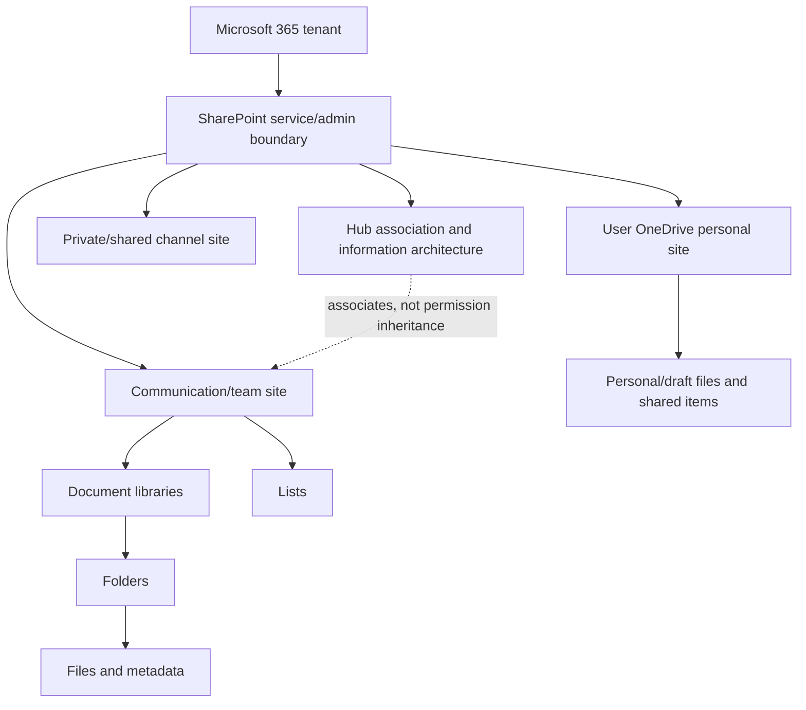

| Object | Plain meaning | Security boundary/concern |
|---|---|---|
| Tenant | Organization's SharePoint/OneDrive service boundary | Tenant-wide sharing, access and sync settings |
| Site | Collaboration/content workspace and permission boundary | Owners, members, visitors, guests, sharing and lifecycle |
| Hub | Association for navigation/search/content rollup | Does not grant access to associated sites |
| Library | Managed file container with settings/metadata | Versioning, permissions, labels, sync and sharing |
| List | Structured rows/columns/items | Item-level access and app/automation exposure |
| Folder/file/item | Content with inherited or unique permission | Link/direct grants and oversharing |
| OneDrive personal site | User-owned work storage | Offboarding, external sharing and team-content ownership |

**Analogy:** The tenant is a city, sites are buildings, libraries/lists are departments, folders/files are rooms/documents, and OneDrive is an employee's assigned office. A hub is a campus directory and shared branding, not a master key.

## 2. Site types, Teams integration, and ownership

| Site type | Typical purpose | Membership/ownership | Special concern |
|---|---|---|---|
| Group-connected team site | Team collaboration | M365 Group owners/members | Keep group and site access aligned |
| Communication site | Broad publishing/intranet | SharePoint owners/members/visitors | Publishing approvals and broad read access |
| Teams standard-channel site | Parent team files | Team/M365 Group | Standard-channel folders share parent site membership |
| Private-channel site | Private channel files | Channel-managed membership | Separate site; govern independently |
| Shared-channel site | Shared channel files | Channel-managed membership, possible external B2B direct connect | Host-tenant data and cross-tenant caveats |
| OneDrive | Individual work files | User primary owner; admin controls | Departure, personal/team boundary and links |
| Legacy/classic site | Older custom/content structures | Varies | Custom permissions/workflows and modernization risk |

At least two accountable business owners should exist for collaboration sites. Technical site collection administrators can recover/manage the site but are not substitutes for data ownership. For Teams-connected sites, change membership through Teams/M365 Group or channel controls where required; direct SharePoint edits can create confusing access or be overwritten/unsupported.

## 3. Permission inheritance from site to item

SharePoint uses **securable objects**: site, list/library, folder, item/file. By default, a child inherits the parent's permissions. **Unique permissions** occur when inheritance is broken and grants differ. Unique permissions are legitimate for limited cases but increase complexity, scale risk and investigation cost.

### 🔍 Plain-English deep-dive: inheritance and unique scope

- **Permission inheritance** — *a child object uses its parent's access list.* **Analogy:** Every room follows the building's badge rules. **Why it matters:** Central changes remain predictable.
- **Break inheritance** — *copy or replace access rules for one child.* **Analogy:** One room gets its own badge reader. **Why it matters:** Future parent changes may not protect that room.
- **Unique permission scope** — *one object with its own access-control list.* **Analogy:** Each special lock requires separate maintenance. **Why it matters:** Too many unique scopes harm governability and can approach platform limits.
- **Limited Access** — *automatic supporting permission that lets a user traverse to a specifically shared child.* **Analogy:** Permission to walk through the lobby to one room. **Why it matters:** It can look like broad site access but does not itself grant all content.

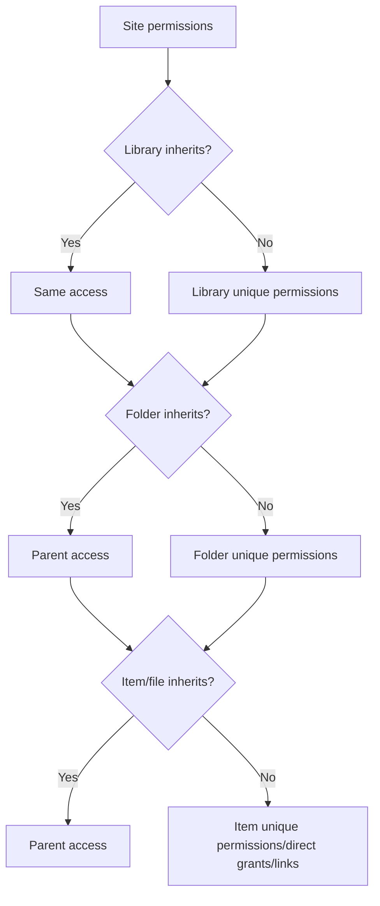

| Design pattern | Benefit | Risk | Preferred response |
|---|---|---|---|
| Site/library group access | Predictable and reviewable | Larger collaboration boundary | Default pattern |
| Separate site for sensitive content | Clear ownership, labels and lifecycle | More sites to govern | Prefer over thousands of item exceptions |
| Folder unique permission | Focused exception | Hidden complexity and sync/share confusion | Use sparingly with owner/review |
| Item direct permission | Quick targeted access | Orphan grants and difficult inventory | Time-bound and documented |
| Sharing link grant | Easy collaboration | Link lifecycle and audience ambiguity | Choose exact link type/default/expiry |

## 4. SharePoint groups and Owners, Members, Visitors

Classic SharePoint permission architecture commonly uses **Owners** (Full Control), **Members** (Edit), and **Visitors** (Read) SharePoint groups. Group-connected sites also use the connected Microsoft 365 Group, with owners/members synchronized into site roles according to current design.

| Principal | Typical capability | Governance risk |
|---|---|---|
| Site owner | Manage site/settings/permissions | Excess owners can grant access broadly |
| Site member | Edit/add/delete content | Default Edit may include list/library structure capabilities |
| Site visitor | Read | Sensitive content can still be downloaded/shared if allowed |
| M365 Group owner/member | Cross-workload ownership/membership | Changes affect Teams, mailbox and connected site |
| Entra security group | Reusable centrally managed membership | Nested/dynamic membership must be understood |
| Individual direct grant | Specific access | Hard to review/offboard at scale |
| Guest/external user | Authenticated external collaborator | Sponsor, terms, expiration and home identity lifecycle |

Use groups for role-based access and keep individual grants exceptional. Consider whether Members need Edit or a reduced permission level for the site's purpose. Custom permission levels increase support cost and need explicit design/testing.

## 5. Effective access is the union of grants, bounded by restrictions

A user can receive access through multiple paths: M365 Group, Teams membership, SharePoint group, Entra security group, direct permission, sharing link or guest membership. In ordinary SharePoint permissions, grants accumulate; removing one path does not remove others. Conditional Access, sensitivity-label encryption, Restricted Access Control or DLP can then restrict use.

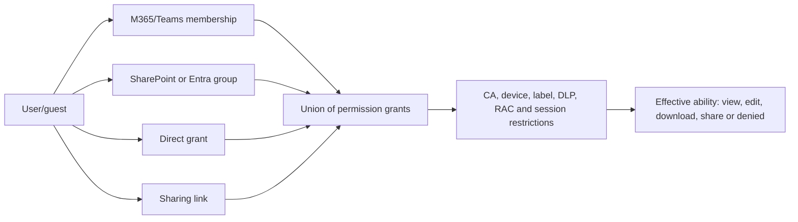

| Access question | Evidence |
|---|---|
| Does the user have site/item permission? | Check Permissions/effective access and group expansion |
| Which path grants it? | M365 Group, SharePoint group, direct grant or link details |
| Is the user authenticated as expected? | Entra sign-in/object/tenant and guest redemption |
| Does a policy restrict use? | CA, session, label, DLP or RAC state |
| Can the user share onward? | Site/member sharing settings and item rights |
| Can the user download/sync? | Unmanaged-device, app-enforced, label and client controls |

“Removed from the team” is not proof of “no file access.” Search for direct item permissions, sharing links and other groups.

## 6. Sharing links: four common audiences

| Link type | Who can use it | Authentication | Best use | Main risk |
|---|---|---|---|---|
| Anyone | Anyone possessing/receiving the link, subject to configured controls | No organizational sign-in required | Low-sensitivity broad distribution when approved | Link forwarding, weak attribution, data leakage |
| People in your organization | Any authenticated internal user with link | Tenant sign-in | Broad internal content | Accidental tenant-wide exposure |
| Specific people | Named internal/external recipients | Identity/verification required | Controlled external/internal collaboration | Wrong address, guest lifecycle and forwarding verification |
| People with existing access | Does not grant new permission | Existing authorization | Send a convenience link safely | User assumes it granted access when it did not |

### 🔍 Plain-English deep-dive: a link can be both an address and a permission

- **Anyone link** — *a bearer link that can grant access to whoever has it.* **Analogy:** A ticket that admits the holder. **Why it matters:** Forwarding may extend access without identity review.
- **Organization link** — *a link usable by any signed-in member of the tenant.* **Analogy:** Any employee badge opens the room if they have the URL. **Why it matters:** “Internal” can still mean tens of thousands of people.
- **Specific-people link** — *a grant tied to named recipients.* **Analogy:** A guest list at reception. **Why it matters:** It provides stronger identity attribution but needs guest verification/lifecycle.
- **Existing-access link** — *a URL that adds no permission.* **Analogy:** Directions to a room for someone who already has a badge. **Why it matters:** It is the safest way to resend location without expanding access.

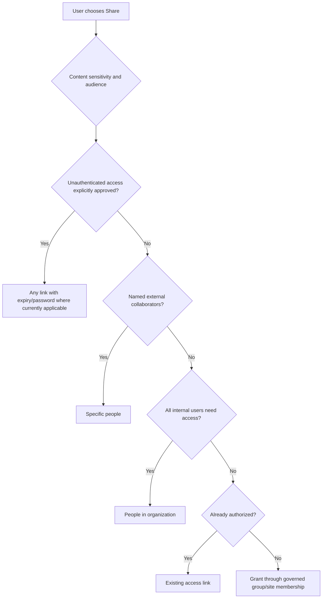

Expiration and password options are link-type, workload, tenant and UI dependent. Current tenant defaults can require Anyone-link expiration; password protection may be available for Anyone links in supported scenarios. A password sent in the same channel as the link provides weak separation. Specific-people links should be preferred for sensitive named collaboration.

## 7. Link permissions, defaults, expiration, and block download

| Setting | Design question |
|---|---|
| Default link type | Should users default to Specific people or existing access instead of broad links? |
| Default permission | Is View safer than Edit for the common task? |
| Anyone expiration | How short can access remain useful; who renews? |
| Guest expiration | What happens to active projects and access reviews? |
| Password | Is it supported and delivered through a separate channel? |
| Block download | Is browser view enough and is the file type/client supported? |
| Resharing | Can recipients extend access and is owner notified? |
| Link deletion | Is revocation tested and audited? |

`Block download` reduces ordinary download for supported file experiences; it does not prevent screenshots, transcription, photography, copy through every client, or an authorized person retyping information. Communicate it as risk reduction, not digital-rights certainty.

## 8. External sharing hierarchy: the most restrictive level wins

SharePoint external sharing is controlled at tenant and site levels; OneDrive tenant settings are the same as or more restrictive than SharePoint. Additional controls include allowed/blocked domains, guest settings, link defaults, labels, Conditional Access, site restrictions and item permissions.

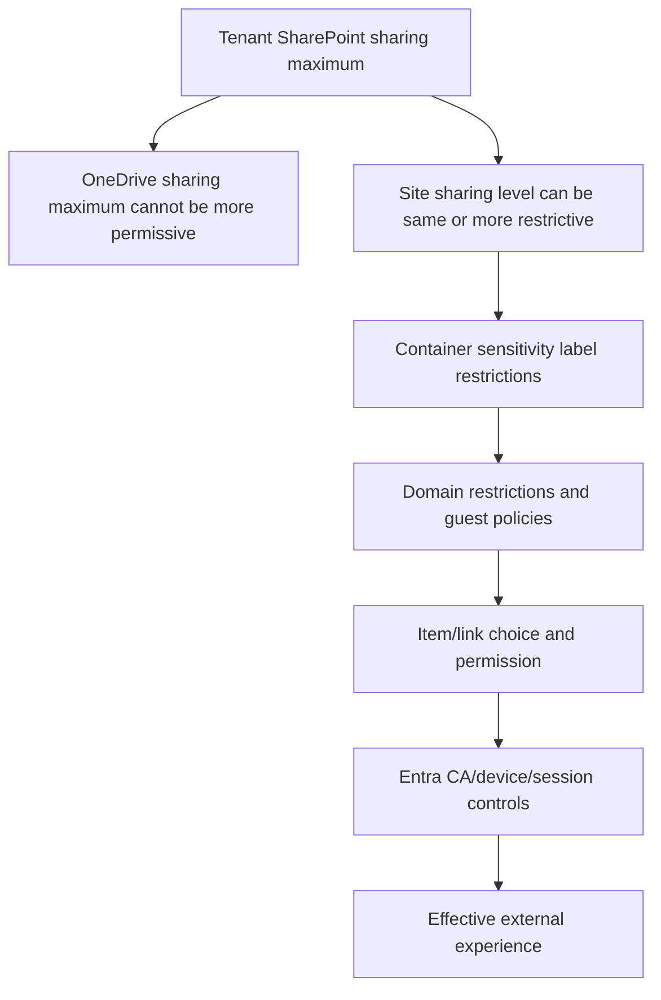

| External-sharing level | Meaning | Appropriate pattern |
|---|---|---|
| Anyone | Unauthenticated links allowed where link/settings permit | Deliberately low-risk public distribution only |
| New and existing guests | Authenticated named external people can be invited | Normal controlled external projects |
| Existing guests only | Sharing limited to guests already in directory | Centralized invitation/onboarding model |
| Only people in organization | No external sharing | Sensitive internal sites |

The tenant sets a ceiling, not a mandate. Classify sites and use more restrictive site/label settings where required.

## 9. Guests, Entra B2B integration, and one-time passcode

SharePoint/OneDrive can integrate external sharing with Microsoft Entra B2B so a guest object is created and Entra collaboration restrictions apply. In current guidance, site sharing uses B2B, while file/folder sharing behavior depends on B2B integration. External recipients may authenticate with organizational/federated identity or email one-time passcode where supported.

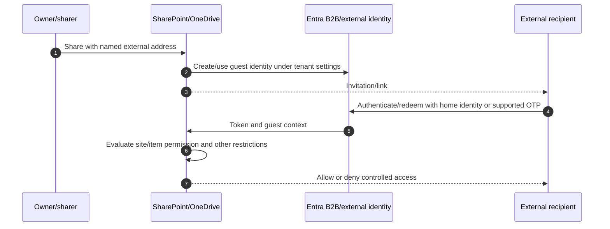

| Guest lifecycle stage | Control |
|---|---|
| Invite | Sponsor, business purpose, correct address/domain, terms and site |
| Redeem | Correct identity and tenant; prevent account confusion |
| Use | CA/MFA, least privilege, sharing/downloading and audit |
| Review | Sponsor/site-owner attestation and actual activity |
| Expire | Defined renewal and business communication |
| Remove | Item/site/group/link cleanup and directory deletion sequence |

Deleting a guest object does not necessarily clean every link or invitation artifact in the way an owner expects. Validate effective access after removal and account for external copies already downloaded.

## 10. Domain restrictions and collaboration boundaries

Allowed/blocked domain settings can restrict external sharing by domain at tenant or site/feature-specific levels. Entra external collaboration restrictions and SharePoint controls should be aligned. Domain allowlists are useful for controlled partner ecosystems but do not prove every account in a domain is trustworthy.

| Design | Benefit | Risk/cost |
|---|---|---|
| Allow any external domain | Flexible collaboration | Higher social-engineering and governance load |
| Block known risky/consumer domains | Removes selected exposure | Evasion through other domains; maintenance |
| Allow only approved domains | Strong partner boundary | High onboarding friction and subsidiary/domain complexity |
| Site-specific domain restriction | Tailored client/project control | Drift and support complexity |

Test uppercase/subdomain/internationalized addresses and partner tenant changes according to current implementation. Include exception owner and expiry.

## 11. Access requests and sharing by members

Access requests let denied users ask site owners for permission. Site owners can control whether members may share files/folders/site, whether requests are accepted, and where requests go. An unmonitored owner mailbox turns the control into a delay; an overly permissive owner turns it into access creep.

| Workflow step | Evidence |
|---|---|
| Request | Requester identity, resource, purpose and sponsor |
| Owner review | Data sensitivity, least privilege and duration |
| Grant method | Group membership preferred; direct/link grant justified |
| Notification | Requester and accountable owner informed |
| Review/expiry | Access attested or removed |
| Audit | Grant/reject, actor, timestamp and reason |

For sensitive sites, prevent ordinary members from sharing the entire site and define file/folder sharing boundaries. Do not send access requests to a departed owner.

## 12. Restricted Access Control: permission plus control-group membership

**Restricted Access Control (RAC)**, also called site access restriction, can limit a site/OneDrive so users need both ordinary content permission **and** membership in one of the configured control groups. It does not grant access by adding someone to the control group.

### 🔍 Plain-English deep-dive: RAC is a second gate, not a new permission list

- **Ordinary permission** — *the normal SharePoint grant through group, direct access or link.* **Analogy:** A room key. **Why it matters:** Without it, the user cannot enter.
- **RAC control group** — *an approved population allowed through the site's extra gate.* **Analogy:** A name on the secure-floor access list. **Why it matters:** A room key alone is insufficient.
- **Two-gate evaluation** — *permission AND control-group membership.* **Analogy:** You need both key and floor badge. **Why it matters:** Adding someone only to the control group does not expose content.
- **RAC sharing restriction option** — *separate tenant behavior controlling sharing outside control groups.* **Analogy:** Prevent key issuance to people not on the floor list. **Why it matters:** Access enforcement and sharing prevention are related but distinct settings.

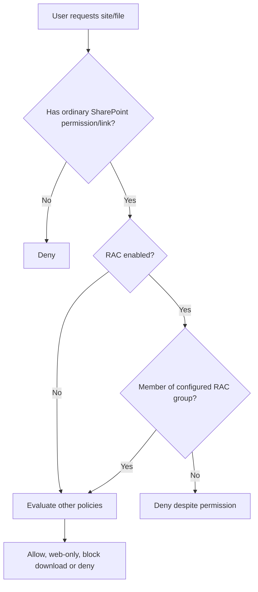

Current Learn documents up to ten Entra security or M365 groups per site and propagation time. Private/shared channel sites require separate RAC configuration; external shared-channel participants are not evaluated exactly like internal resource-tenant users. RAC is license/SAM and geography sensitive. Pilot with owner recovery, search/Copilot propagation and access-denial reports.

## 13. Restricted Content Discovery: reduce discovery, not access

**Restricted Content Discovery (RCD)** keeps a selected SharePoint site's content out of organization-wide search and Copilot discovery while owners review permissions/governance. Users who already have direct permission can still access content directly. The site remains indexed for Purview and site-context behavior as documented; RCD is not supported for OneDrive and should be temporary/selective.

| RCD does | RCD does not |
|---|---|
| Limits organization-wide discovery/Copilot use of selected site content | Remove existing permissions or sharing links |
| Removes selected AI entry points in affected SharePoint sites | Protect content from a user who opens it directly with permission |
| Supports Copilot-readiness remediation windows | Replace RAC, CA, labels, DLP or permission cleanup |
| Produces report/audit events | Guarantee immediate propagation |

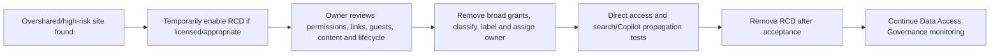

For very large sites, current documentation says propagation can exceed a week. Do not promise immediate hiding or use RCD on every site; widespread use damages search/Copilot relevance.

## 14. Data Access Governance and site access reviews

SharePoint Data Access Governance reports help identify broad permissions, user access, sensitivity labels, sharing links and Everyone/Everyone except external users exposure. Snapshot reports show current structure; activity reports show recent sharing behavior, commonly over a 28-day window under current documentation.

| Report/review | Question answered | Follow-up |
|---|---|---|
| Site permissions across organization | Which sites have broad user/guest access? | Prioritize by sensitivity and activity |
| Site permissions for a user | Which sites can this user access and how? | Offboarding/privileged-user review |
| Special broad groups | Which items use Everyone/EEEU? | Remove or justify exact grants |
| Sensitivity labels for files | Which sites contain labeled sensitive files? | Validate site/container controls |
| Sharing links activity | Which sites create many broad links? | Owner review and link-default tuning |
| EEEU activity | Where is tenant-wide internal sharing increasing? | Confirm business need |
| Site access review | Can owner attest/remediate access? | Track completion and verify changes |

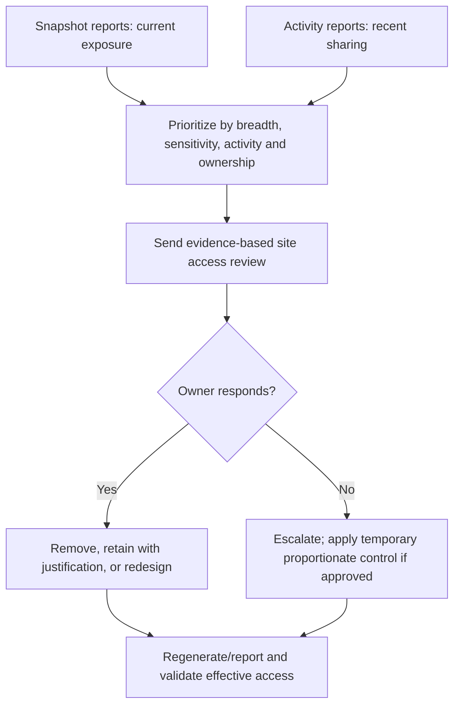

Current Learn notes different capabilities for Microsoft 365 E5 users versus full SAM entitlement, report limits, 21Vianet gaps and data-collection requirements. Mark all report availability as tenant/license sensitive.

## 15. SharePoint Advanced Management and change-sensitive governance

SAM is a set of premium governance capabilities rather than one switch. Features can include Data Access Governance, site access reviews, change history, restricted access/discovery, lifecycle/site ownership policies, AI/Copilot readiness and other evolving controls.

| SAM-related capability | Use | Caution |
|---|---|---|
| Data Access Governance | Discover broad/sensitive access | Report availability/limits/license differ |
| Site access review | Engage owner to attest/remediate | Owner quality and completion enforcement matter |
| Change history | Investigate site/property changes | Retention and event coverage vary |
| RAC | Enforce control-group boundary | Two-gate model, channel/external caveats |
| RCD | Temporarily reduce search/Copilot discovery | Not permission change; not OneDrive; latency |
| Site lifecycle/ownership | Find inactive/ownerless sites | Activity does not equal business value |
| Admin/AI agents | Assist assessment/remediation | Preview/GA, permissions and human validation required |

Do not sell SAM as an automatic oversharing repair. It provides evidence and controls; owners, classification, operating process and measured remediation remain necessary.

## 16. Unmanaged-device access and app-enforced restrictions

SharePoint/OneDrive can integrate with Entra Conditional Access to block access or allow limited web-only access from unmanaged devices. App-enforced restrictions can prevent downloads, printing or sync in supported browser sessions. Exact dependencies between SharePoint settings and Entra Conditional Access must be configured together.

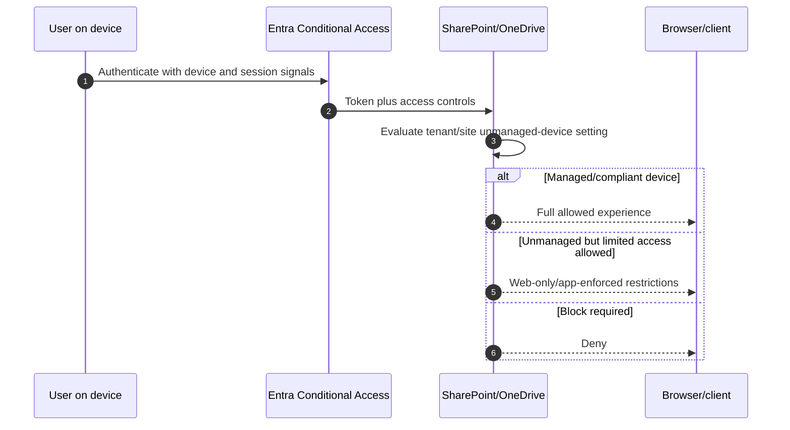

| Access mode | Use | Residual risk |
|---|---|---|
| Full access | Managed/trusted device | Local copy, sync and endpoint compromise still require controls |
| Limited web-only | Unmanaged device with business need | Screenshots/retyping and unsupported-client paths |
| Block | Highest sensitivity/no unmanaged need | Productivity, emergency and partner impact |
| Authentication context/label-driven | Granular sensitive-site access where supported | Licensing, policy complexity and propagation |

Test browsers, desktop/mobile apps, sync, external guests, Office web/desktop and direct links. A policy that blocks browser download but leaves sync or legacy client access open is incomplete.

## 17. Conditional Access and session dependencies

CA can require MFA/authentication strength, compliant/hybrid-joined devices, approved apps, location/risk controls and session behavior. SharePoint often has dependencies with Teams and Office. Excluding SharePoint to “fix Teams files” weakens OneDrive and collaboration globally.

| Failure | Check |
|---|---|
| Browser works, sync fails | Client app condition, device registration/compliance and sync policy |
| Teams chat works, file fails | SharePoint CA/unmanaged-device policy and actual site access |
| Guest denied | Resource tenant CA, cross-tenant trust/MFA and guest terms |
| Office desktop cannot open | Token/account, app condition, label encryption and protected-view state |
| Repeated sign-in | Session frequency, device state and multiple identities |

Use report-only/What If where applicable, pilot exclusions, emergency access and exact recovery tests. Never exclude all guests or all SharePoint from CA without a documented risk acceptance.

## 18. Sensitivity labels for containers and files

Container labels can control group/site privacy, external sharing and unmanaged-device settings. File labels classify content, can apply encryption/markings and travel with supported files. A confidential site label does not automatically label every file unless separate auto/default labeling behavior is configured and supported.

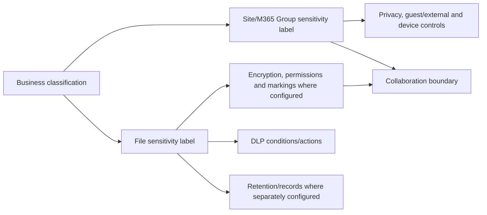

| Label layer | Protects | Does not automatically do |
|---|---|---|
| Container/site label | Site/group privacy and configured collaboration/device settings | Encrypt all site files by itself |
| File sensitivity label | Content classification and optional encryption | Change site membership automatically |
| Default library label | New/changed files in supported library behavior | Retroactively classify every historical file instantly |
| Auto-labeling | Detect content and apply/recommend label | Replace human/business validation and tuning |

Test browser, Office desktop/mobile, external sharing, coauthoring, sync, search and downstream applications. Encrypted files can block external collaborators or automation if permissions are not designed.

## 19. DLP, retention, records, audit, and eDiscovery

| Purview control | Purpose | SharePoint/OneDrive consideration |
|---|---|---|
| DLP | Detect/prevent sensitive-data sharing/use | Site/file conditions, policy tips, external access and overrides |
| Retention policy | Keep/delete broad location content | Preservation behavior and deletion precedence |
| Retention label | Item-level lifecycle | User/default/auto application and disposition |
| Record label | Declare governed record | Edit/delete restrictions and event/disposition process |
| Audit | Search user/admin/file/sharing activities | License retention and operation coverage |
| eDiscovery | Preserve/search/collect/review case content | Custodian/site/OneDrive mapping and chain of custody |

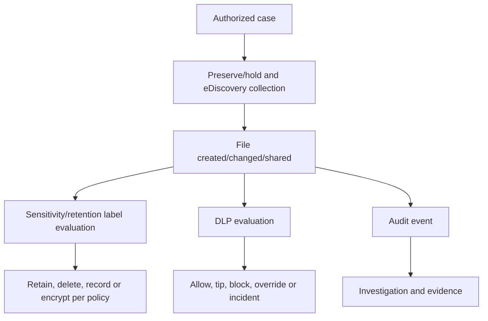

Deletion has multiple layers: recycle bins, retention preservation, hold, version history and backup/service recovery. Explain exact behavior only after checking current policy and time. Never remove hold/retention to make a support symptom disappear.

## 20. Sync architecture and identities

The OneDrive sync app authenticates the user, discovers permitted SharePoint/OneDrive libraries, maintains a local sync database/placeholders and exchanges changes with the cloud. Windows Files On-Demand can show cloud-only placeholders without storing full content locally until needed.

### 🔍 Plain-English deep-dive: sync is reconciliation, not a network drive copy

- **Sync root** — *local folder managed by the OneDrive client for a cloud library.* **Analogy:** A local working desk linked to a central filing room. **Why it matters:** Moving/deleting on the desk can change the cloud.
- **Files On-Demand** — *placeholders show cloud files while content downloads when needed.* **Analogy:** A catalog card that fetches the folder on request. **Why it matters:** Saves disk but depends on network/client state.
- **Sync database** — *local metadata tracking identities and change state.* **Analogy:** The clerk's ledger of what changed where. **Why it matters:** Corruption/staleness can cause local symptoms even when cloud content is healthy.
- **Reconciliation/conflict** — *client compares local and cloud versions and resolves concurrent changes.* **Analogy:** Two editors changed separate copies. **Why it matters:** Renames, conflicts and duplicate files are evidence, not random behavior.

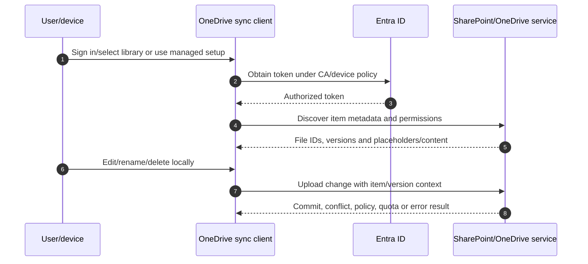

## 21. Files On-Demand and local data states

| State | Meaning | Security/operations note |
|---|---|---|
| Online-only | Placeholder; content fetched when opened | Metadata visible; offline unavailable |
| Locally available | Downloaded after use; OS may free space | Local content exists and needs endpoint protection |
| Always keep on device | Intentionally pinned offline | Increases local exposure and disk use |
| Sync pending/error | Change not fully reconciled | Do not assume cloud contains latest version |
| Excluded/blocked file | Name/type/path/policy prevents sync | Cloud/web versus local state may differ |

Files On-Demand is not data loss prevention. Once a user is authorized and content downloads, endpoint encryption, EDR, DLP, device compliance and offboarding are required.

## 22. Known Folder Move

**Known Folder Move (KFM)** redirects supported Windows known folders such as Desktop, Documents and Pictures into OneDrive for organizational backup/sync and device transition. It is not simply a folder copy; it changes user paths and application behavior.

| KFM phase | Check |
|---|---|
| Discover | Existing redirection, folder size, unsupported files, apps and multiple tenants |
| Prepare | OneDrive provisioning, disk/network, identity, policy and communications |
| Pilot | Representative users, offline/VPN, app compatibility and rollback |
| Deploy | Silent sign-in/move policies where supported and monitored |
| Validate | Cloud presence, local state, restore, new device and user education |
| Rollback | Current supported redirection behavior, local copies and data reconciliation |

Do not promise “KFM backs up everything”: unsupported folders/files, application databases, open/locked files and user exclusions require evidence. Avoid forcing moves during network outages or before OneDrive is provisioned.

## 23. Sync restrictions and device controls

| Control | Purpose | Caveat |
|---|---|---|
| Allow sync only on joined/compliant domains/devices where supported | Limit local replication | Device/identity model and partner impact |
| Block specific file types | Prevent selected files from syncing | Does not remove cloud file or block every upload path |
| Files On-Demand policy | Reduce local storage | Offline and application behavior |
| KFM policy | Protect known folders centrally | Change management and app compatibility |
| Tenant account restrictions | Prevent personal/other-org sync | User scenarios and support evidence |
| Bandwidth/rate controls | Protect network/user experience | Slower convergence and branch planning |
| Block download/web-only | Reduce unmanaged-device local copies | Sync client should be denied by aligned CA |

Sync policy is not a substitute for SharePoint permissions. A user denied at service cannot sync; a user authorized to sync can create local copies governed by the endpoint.

## 24. Sync troubleshooting by layer

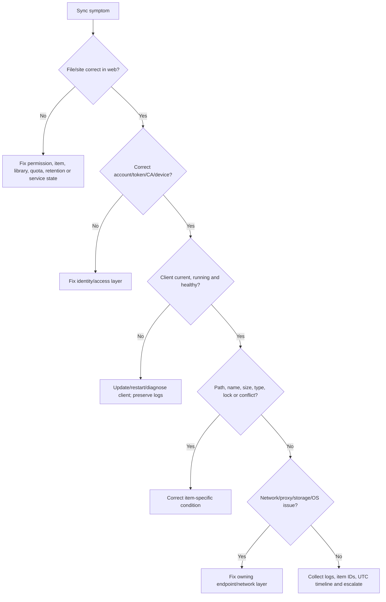

| Evidence | Why it matters |
|---|---|
| Exact local path and cloud URL | Identifies correct tenant/library/item |
| User UPN/object/tenant | Multiple-account confusion is common |
| OneDrive client/build/ring | Bug/support behavior varies |
| Sync status/error/code | Narrows layer |
| File/folder/item ID/version | Names can change; IDs correlate service |
| UTC reproduction time | Aligns client, service, proxy and audit |
| Screenshots/log package | Preserves state before reset |
| Working comparison | Disproves tenant/site/client-wide hypotheses |

Reset/unlink/reinstall can erase valuable state and trigger large resync. Capture logs and confirm cloud/local data first. Never delete a local “duplicate” until determining which copy has the newest content.

## 25. Sharing and access troubleshooting by layer

1. Capture exact URL, user identity/tenant, resource type, desired action and UTC time.
2. Verify service health and recent sharing/label/CA/RAC changes.
3. Confirm authentication and guest redemption.
4. Check tenant/site external-sharing ceiling and domain restrictions.
5. Identify link type, expiration, named audience and current link existence.
6. Expand all membership/direct grants and inheritance state.
7. Evaluate RAC, label, DLP, CA/unmanaged-device and block-download constraints.
8. Compare working user/link/client and test in browser before sync.
9. Correct the controlling layer; verify intended user succeeds and unintended user fails.

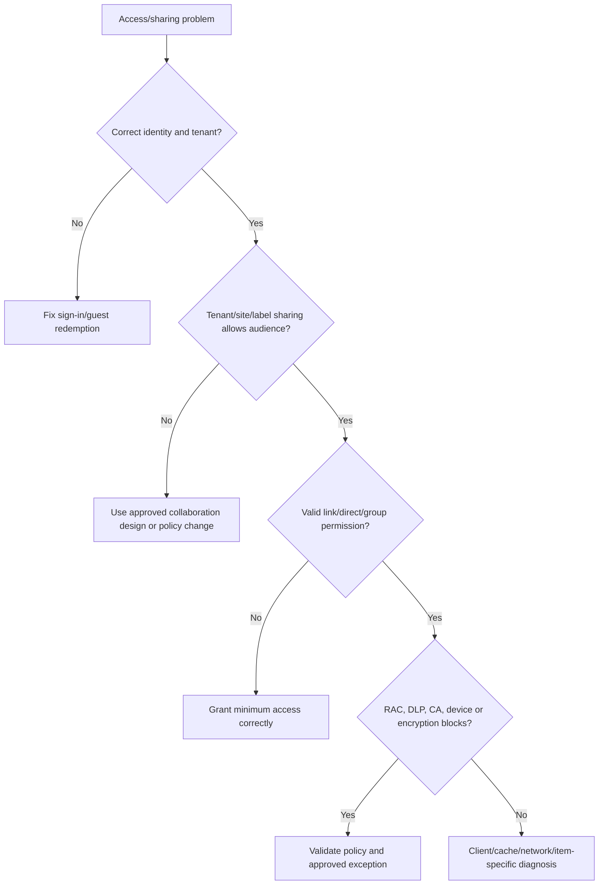

## 26. Migration security: inventory before copying

Migration can move files while losing or over-broadening identity, permissions, metadata, labels, versions, links, workflows and ownership. Source access models rarely map one-to-one into SharePoint.

| Pre-migration discovery | Security reason |
|---|---|
| Data owners/business purpose | Decide target site and lifecycle |
| Sensitivity/records/legal hold | Prevent unauthorized move/deletion |
| Source users/groups/ACLs | Map to valid Entra/M365 groups |
| External users/shares | Do not recreate stale exposure automatically |
| File types/names/paths/size | Compatibility and failed-item risk |
| Metadata/versions/timestamps | Records and business integrity |
| Duplicates/stale data | Minimize attack/search/Copilot surface |
| Apps/macros/links/workflows | Function and active-content risk |

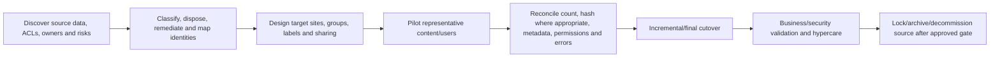

Do not copy source “Everyone” ACLs into Everyone except external users without risk review. Broken/unknown identities should become exceptions for owner resolution, not silently dropped or broadened.

## 27. Migration tests and rollback

| Test | Expected proof |
|---|---|
| Item count/bytes | Source-target reconciliation with explained exclusions |
| File integrity | Open/compare or hash sample/full set where appropriate |
| Metadata/version | Required fields/history preserved within tool capability |
| Owner/member/visitor | Correct role-based access |
| Denied user | No inherited/link/direct unexpected access |
| Guest | Only approved named external access |
| Label/DLP/retention | Target policy evaluates as designed |
| Sync/KFM | Representative clients converge without duplicates/data loss |
| Search/links/apps | Expected target behavior or documented remediation |
| Rollback | Source remains protected/readable until acceptance; delta plan works |

Rollback rarely means moving every file back immediately. Safer rollback can reopen source read/write, freeze target, reconcile deltas, revoke target access and correct mapping. Define split-brain prevention and which system is authoritative at every phase.

## 28. Oversharing patterns

| Pattern | Why risky | Remediation |
|---|---|---|
| Anyone links without expiry | Unauthenticated forwarding and stale access | Replace with named/expiring links; reduce default |
| People-in-org link on sensitive file | Tenant-wide latent access | Governed group/specific people |
| EEEU on site/folder/item | Broad internal exposure | Remove or isolate public content |
| Excess site owners | Permission expansion | Owner attestation and least privilege |
| Direct permissions everywhere | Orphan access | Consolidate into groups/separate sites |
| Guest without sponsor | No accountable renewal/removal | Assign sponsor or remove |
| Team data in employee OneDrive | Departure and ownership risk | Move to team site and update links |
| Sensitive and public content mixed | One sharing model cannot fit both | Separate sites/libraries with labels |
| Stale links after project | Ongoing external exposure | Link review/revocation and project closure |

Oversharing means access exceeds a justified audience, not simply “many people.” Measure sensitivity, breadth, duration, activity, ownership and business purpose.

## 29. Broken inheritance, orphan links, and orphan users

**Orphan link** is a useful operational term for a link with no current business owner/purpose or one that survives project/user lifecycle. **Orphan user** can refer to unresolved/stale principals in site permission metadata or departed identities whose grants remain. Exact SharePoint internal terminology varies; describe the observed object and access path precisely.

| Cleanup method | Safe sequence |
|---|---|
| Unique permissions | Inventory → owner decision → test group design → restore inheritance/remove grants → negative test |
| Sharing links | Export/details → validate use/owner → revoke/replace → notify → retest |
| Departed user | Identify sites/groups/direct grants/OneDrive ownership → legal/data transfer → remove → validate |
| Unknown principal | Resolve object/source/history → do not map broadly → owner decision |
| Ownerless site | Assign temporary accountable admin/business owner → review content/access → retain/archive/delete |

Do not restore inheritance blindly; it may grant broader parent access to formerly restricted content. Compare before/after audience.

## 30. Site and OneDrive lifecycle

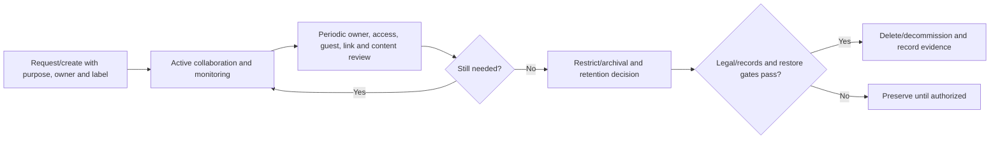

| Trigger | Required action |
|---|---|
| Owner leaves | Replace owner; transfer OneDrive/team data and links |
| Project ends | Remove guests/links/apps; classify records; archive/delete |
| Site inactive | Confirm business/legal value; activity alone is not decision |
| License removed | Validate OneDrive retention/delegation and data transfer timing |
| Merger/divestiture | Tenant/domain/identity, legal hold and external-sharing redesign |
| Copilot rollout | Prioritize overshared/sensitive/ownerless sites for review |

## 31. Health assessment methodology

1. **Scope:** tenant/geography, sites/OneDrives, Teams-connected content, populations and business constraints.
2. **Inventory:** owners, activity, storage, sharing level, links, guests, permissions, labels, sync and policies.
3. **Evidence:** admin exports/reports, audit, Data Access Governance, sample effective-access tests and interviews.
4. **Assess:** control objective, observed state, evidence, risk, likelihood/impact and affected data.
5. **Recommend:** immediate containment, sustainable control, license/dependency, owner, effort and residual risk.
6. **Validate:** pilot, positive/negative tests, user impact, rollback and metric.
7. **Handover:** RACI, runbooks, dashboards, access and review cadence.

| Finding quality | Weak | Strong |
|---|---|---|
| Observation | “Sharing is insecure” | “37 active client sites allow Anyone links; 12 contain Confidential-labeled files” |
| Evidence | Screenshot only | Report date/query, site IDs, sampled links and owner validation |
| Risk | “Data leak possible” | “Unauthenticated forwarded links can expose client records beyond approved recipients” |
| Recommendation | “Disable sharing” | “Set default Specific people, expire Anyone links, block on confidential sites, review existing links in rings” |
| Validation | None | Defined positive external and denied forwarded-link tests plus incident metric |

## 32. Incident: sensitive file shared externally

1. Confirm exact site/item ID, link/direct permission, sharer, recipients, UTC time and sensitivity.
2. Preserve audit, link and download/access evidence under approved process.
3. Revoke link/remove unauthorized permission; consider site/RAC/CA containment proportionate to scope.
4. Determine whether the content was viewed, downloaded, synced, reshared or accessed through another grant.
5. Identify personal/regulatory/client data and involve privacy/legal/data owner.
6. Check similar links, folder/site permissions and the sharer's other activity.
7. Recover business collaboration through an approved specific-people/site model.
8. Complete PIR: default link, training, owner, site classification, detection and review gaps.

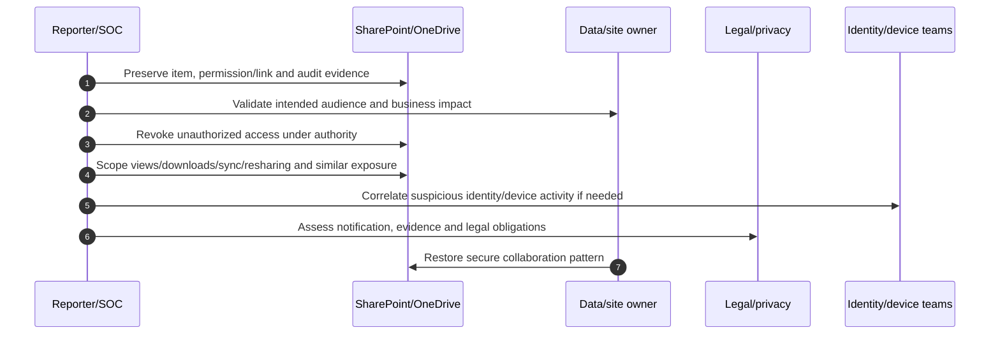

## 33. Incident: mass deletion or ransomware-like sync

Mass file changes can come from compromised identity/device, malicious sync, mistaken automation, migration, retention or ordinary bulk work. Preserve evidence before restoration.

| Immediate question | Evidence |
|---|---|
| Who/what changed files? | Audit actor/app/IP/device and operation |
| Which site/OneDrive/time/item count? | Scope query and item IDs |
| Is activity ongoing? | Recent audit/sync/client/endpoint timeline |
| Compromised account/device? | Entra risk/sign-in and Defender evidence |
| Recycle/version/restore options? | Current site/OneDrive recovery state |
| Legal/records impact? | Labels, holds and data owner |

Contain identity/device/app as justified, stop ongoing synchronization/automation carefully, preserve latest good state, choose supported file/library/OneDrive restore method, validate a sample before broad restoration, monitor and reconcile. Do not permanently delete recycle-bin content or reset clients before evidence and recovery decisions.

## 34. Incident: sync failure after policy change

Build a UTC timeline of CA, device-compliance, SharePoint access, OneDrive policy, label and client changes. Compare browser and sync, managed and unmanaged device, working and failing user. Read Entra sign-in result and device state, confirm tenant account/client build and inspect sync logs/error. If the policy is controlling the failure, decide whether behavior is intended. Roll back only the pilot assignment or exact setting if acceptance criteria fail; do not exclude all SharePoint.

## 35. Deployment, testing, and rollback

| Phase | Work | Gate |
|---|---|---|
| Discover | Sites, data, owners, guests, links, direct grants, sync, migration and policies | Baseline and gaps accepted |
| Design | Classification, site archetypes, sharing/link defaults, CA, labels, governance and operations | Security/privacy/business review |
| Pilot | Representative site/OneDrive, users, guests, devices and files | Positive/negative/recovery tests pass |
| Rollout | Rings by site type/sensitivity with communications and owner training | Measured impact within tolerance |
| Hypercare | Sharing, access, sync, DLP, guest and service incidents | Stable period and no critical gap |
| Handover | RACI, access, dashboards, runbooks, exceptions and review cadence | Operational acceptance |

Rollback must preserve security. Restore a prior site setting, label, CA assignment or sync policy only after recording current state and affected data. RAC/RCD/search changes have propagation; removed links may not be recreatable identically; external downloads cannot be recalled. State irreversible effects.

## 36. Operations and metrics

| Metric | Decision supported |
|---|---|
| Sites/OneDrives without active owner | Ownership remediation |
| Anyone/org links by sensitivity and age | Sharing-default and cleanup priority |
| External guests/links overdue review | Lifecycle risk |
| Sites/items with EEEU/Everyone/direct grants | Oversharing remediation |
| Unique-permission scope trend | Architecture/support complexity |
| RAC/RCD coverage and denials | Control usefulness and user impact |
| DLP incidents/overrides/false positives | Data-protection tuning |
| Sync healthy/error/stale devices | Client service health |
| Migration failure/reconciliation rate | Transformation quality |
| Mean time to restore sharing/sync incidents | Support effectiveness |
| Recurrence after RCA | Corrective-action quality |
| Access-review completion/removal rate | Governance effectiveness |

Metrics should segment site type, sensitivity, owner, external status, activity and geography. Raw counts without a denominator or data classification are not risk.

## 37. Consulting artifacts

1. **Tenant/site architecture and data-flow diagram.**
2. **Site/OneDrive inventory:** ID, URL, type, owner, activity, storage, sharing, label and lifecycle.
3. **Permission and sharing assessment:** groups, unique scopes, direct grants, links, guests and effective-access samples.
4. **External collaboration standard:** site archetypes, domain rules, link defaults, guest sponsorship and expiry.
5. **Device/sync standard:** CA, unmanaged access, client policies, KFM, endpoint and recovery.
6. **Purview control matrix:** labels, DLP, retention, records, audit and eDiscovery.
7. **SAM/Copilot readiness roadmap:** reports, access reviews, RAC, RCD, ownership and remediation.
8. **Migration security pack:** source inventory, mapping, tests, reconciliation, cutover and rollback.
9. **Incident runbooks:** oversharing, guest, mass deletion, sync, policy and service health.
10. **Executive report:** evidence-based risks, business impact, quick wins, investment, owner and residual risk.

## 38. Safe paper lab: SharePoint/OneDrive security health assessment

This exercise changes no tenant/site/OneDrive/policy, shares no file, runs no migration and uses no customer data.

### Scenario

Fictional Contoso has 2,000 users, 3,000 SharePoint sites, 2,000 OneDrives, recent Copilot rollout plans, 50 client sites, a file-share migration and reports of external oversharing and sync failures. Use `contoso.example` and synthetic files only.

### Procedure

1. Draw tenant, sites, hubs, Teams channel sites, OneDrives, Entra, Purview, clients and external users.
2. Create site archetypes: intranet, internal team, client collaboration, confidential project, Teams private/shared channel and personal OneDrive.
3. Define Owners/Members/Visitors and M365 Group roles for each; require two owners.
4. Build an inheritance map showing one justified library exception and one risky item-level direct grant.
5. Choose default link type/permission, Anyone availability/expiry, guest expiry and member-sharing rules by archetype.
6. Draft tenant/site/OneDrive external-sharing hierarchy and allowed-domain exception process.
7. Design guest sponsor, access request and quarterly review workflows.
8. Create synthetic Data Access Governance findings: EEEU, Anyone links, unlabeled sensitive files, ownerless site and broad guest access.
9. Choose responses: ordinary permission cleanup, site redesign, RAC, temporary RCD, site access review or deletion. Explain why.
10. Design managed/full, unmanaged/web-only and blocked device scenarios using CA plus SharePoint controls.
11. Map container/file labels, DLP, retention, records, audit and eDiscovery.
12. Draw sync, Files On-Demand and KFM flows; define device/client policies.
13. Build a file-share migration plan with owner/ACL mapping, synthetic test data, reconciliation and rollback.
14. Inject incidents: forwarded Anyone link, removed team member with direct file access, guest redemption loop, sync conflict, mass deletion and RCD propagation delay.
15. Run the layered diagnostic tree and create an escalation pack for one sync and one sharing case.
16. Produce operations metrics and a 30/60/90-day remediation roadmap.

### Test matrix

| Test | Expected paper result | Evidence artifact |
|---|---|---|
| Site member | Intended site/library access | Group and effective-access matrix |
| Visitor | Read but not edit | Permission test |
| Removed member with no other grants | Denied | Negative membership test |
| Removed member with direct grant | Still allowed until grant removed; finding raised | Multi-path analysis |
| Anyone link forwarded | Works only where explicitly allowed; demonstrates risk | Link design and expiry |
| Specific external person | Correct guest identity only | B2B flow and guest record |
| RAC user with permission but outside group | Denied | Two-gate test |
| RAC group member without permission | Denied | Two-gate test |
| RCD user with direct permission | Direct access remains; org-wide discovery reduced after propagation | RCD limitation test |
| Unmanaged device | Web-only or denied; sync blocked as designed | CA/SPO matrix |
| DLP synthetic identifier | Tip/block/override and incident as designed | DLP result |
| Files On-Demand | Placeholder/download/pin states explained | Sync-state evidence |
| Migration | Counts/metadata/access/denial reconcile | Migration report |
| Mass deletion | Scope, contain, restore and validate sequence | Incident timeline |
| Rollback | Exact prior setting/authority restored with residual effects documented | Rollback record |

### Evidence and cleanup

Create fictional inventory, diagrams, permission/link matrices, findings, risk register, migration reconciliation, incident timelines, test results and executive roadmap. Label them “paper lab / synthetic data.” Include no real customer URL, tenant, file, guest, report, label, audit event or sync log. Cleanup is confirming no tenant, content, identity, migration or policy change occurred.

### Interview wording

> “SharePoint Online, OneDrive, sharing, sync, migration and M365 escalation are direct production strengths. I have handled complex issues through scope, logs, hypothesis, product-group/vendor collaboration, fix validation and customer communication. I also built a current paper security health assessment covering inheritance, sharing links, external hierarchy, RAC/RCD/SAM caveats, CA, labels/DLP/retention, sync/KFM, migration security, incidents and operations. I distinguish direct case evidence from newer controls that I have designed or studied.”

## 39. JD Mapping: interview translation

| Prompt | Strong response structure |
|---|---|
| “Assess SharePoint security” | Inventory → data/owners → groups/inheritance/links/guests → site/tenant limits → CA/labels/DLP → governance/metrics → roadmap |
| “User still has access” | Identity → all grant paths → inheritance/link/direct/group → RAC/CA → remove controlling grant → negative test |
| “Sync is broken” | Web truth → identity/token/CA/device → client/build/database → item/path → network/storage → logs/correlation/escalation |
| “Prepare for Copilot” | Data Access Governance → sensitivity/breadth/ownership prioritization → permission cleanup → RAC/RCD selectively → validate search/access → sustain reviews |
| “Your experience?” | Direct production SPO/OneDrive/sync/migration/RCA examples; clearly label advanced control design/lab knowledge |

## 40. Official Source Anchors

First-party anchors checked on **August 24, 2026**; recheck before change.

| Topic | Official Microsoft source | Change-sensitive use |
|---|---|---|
| SharePoint/OneDrive overview | [Introduction for administrators](https://learn.microsoft.com/en-us/sharepoint/introduction) | Architecture, governance, Teams and migration links |
| External sharing | [External sharing overview](https://learn.microsoft.com/en-us/sharepoint/external-sharing-overview) | Tenant/site hierarchy and B2B models; page dated May 2026 |
| Sharing settings | [Manage sharing settings](https://learn.microsoft.com/en-us/sharepoint/turn-external-sharing-on-or-off) | Tenant/site/OneDrive controls and link defaults |
| Sharing links | [Plan sharing and collaboration options](https://learn.microsoft.com/en-us/sharepoint/deploy-file-collaboration) | Link/audience design |
| RAC | [Restrict SharePoint site access](https://learn.microsoft.com/en-us/sharepoint/restricted-access-control) | Two-gate behavior, channel/external caveats; page dated July 30, 2026 |
| RCD | [Restrict discovery of sites and content](https://learn.microsoft.com/en-us/sharepoint/restricted-content-discovery) | Temporary discovery control, no OneDrive, latency; page dated July 27, 2026 |
| Data Access Governance | [Data access governance reports](https://learn.microsoft.com/en-us/sharepoint/data-access-governance-reports) | Snapshot/activity reports, E5/SAM differences; page dated July 9, 2026 |
| SAM prerequisites | [Prerequisites for SharePoint Advanced Management](https://learn.microsoft.com/en-us/sharepoint/sharepoint-advanced-management-prerequisites) | Current licensing, role and module needs |
| Unmanaged devices | [Control access from unmanaged devices](https://learn.microsoft.com/en-us/sharepoint/control-access-from-unmanaged-devices) | CA/app-enforced restrictions |
| Sensitivity labels | [Use sensitivity labels with Microsoft Teams, M365 Groups and SharePoint sites](https://learn.microsoft.com/en-us/purview/sensitivity-labels-teams-groups-sites) | Container controls and licenses |
| DLP | [Learn about DLP](https://learn.microsoft.com/en-us/purview/dlp-learn-about-dlp) | SharePoint/OneDrive locations/actions |
| Retention | [Learn about retention for SharePoint and OneDrive](https://learn.microsoft.com/en-us/purview/retention-policies-sharepoint) | Preservation/deletion behavior |
| Sync planning | [Plan file sync for SharePoint and OneDrive](https://learn.microsoft.com/en-us/sharepoint/plan-file-sync) | Client architecture and restrictions |
| Files On-Demand | [Use OneDrive Files On-Demand](https://learn.microsoft.com/en-us/sharepoint/files-on-demand-windows) | Current states and policy behavior |
| Known Folder Move | [Redirect and move Windows known folders to OneDrive](https://learn.microsoft.com/en-us/sharepoint/redirect-known-folders) | KFM policies and deployment |
| Migration | [Migration planning for SharePoint and OneDrive](https://learn.microsoft.com/en-us/sharepoint/plan-rollout-migration) | Tools, planning and rollout |

---

## ⭐ Likely Interview Questions for This Section

### Q1. How does SharePoint permission inheritance work, and why is broken inheritance risky?
> **Model answer:** Sites, libraries, folders and items inherit parent permissions by default. Breaking inheritance creates a unique scope with its own grants. It can be justified, but parent changes no longer protect the child, direct grants and links become difficult to review, and many unique scopes hurt governability. I prefer group-based site/library access or a separate sensitive site, inventory exceptions, and test both intended access and denied users before restoring inheritance.

### Q2. Compare Anyone, organization, specific-people and existing-access links.
> **Model answer:** Anyone is a bearer link with no organizational sign-in and highest forwarding risk. Organization links can be used by any authenticated internal user who has the link. Specific-people links bind access to named recipients and are preferred for controlled external sharing. Existing-access links grant nothing new and safely resend location. I set conservative defaults, View by default, expiry where supported, and choose by sensitivity and audience.

### Q3. How do tenant, site, OneDrive and label external-sharing settings interact?
> **Model answer:** The tenant sets the maximum SharePoint sharing level; a site can be the same or more restrictive; OneDrive is the same as or more restrictive than SharePoint. Container labels, domain restrictions, guest settings, item/link choice, permissions and CA/device controls can narrow further. The effective experience follows the most restrictive applicable boundary, so I test the exact site, user identity, link and client.

### Q4. What is the difference between Restricted Access Control and Restricted Content Discovery?
> **Model answer:** RAC is an enforcement gate: the user needs both ordinary permission and configured control-group membership. It can cover sites and OneDrive under current support, with channel/external caveats. RCD is a temporary SharePoint-site discovery control for organization-wide search/Copilot while permissions are remediated; it does not change permissions, is not for OneDrive, and has propagation latency. Neither replaces permission cleanup, CA, labels or DLP.

### Q5. How would you troubleshoot a OneDrive sync problem?
> **Model answer:** Treat the web as service truth first: verify the file/site and permission in browser. Then check correct tenant/account, token/CA/device, client build/process and sync state, item path/name/type/size/lock/version, disk and network/proxy. Capture UTC time, error, local path, cloud URL, item ID and logs before reset/unlink. Compare a working user/item, fix the controlling layer, and verify cloud/local convergence without deleting the newest copy.

### Q6. How would you secure a file-share migration?
> **Model answer:** Discover owners, sensitivity, records/holds, ACLs, external users, stale data, metadata, versions, paths, apps and workflows. Clean and map identities to governed target groups/sites rather than copy broad ACLs. Pilot representative content, reconcile counts/integrity/metadata/permissions and denied users, apply labels/DLP/retention, stage cutover and deltas, and retain a protected authoritative source until acceptance and rollback gates pass.

### Q7. How would you respond to a sensitive file shared externally?
> **Model answer:** Preserve item/link/audit evidence, validate intended audience with the data owner, revoke unauthorized link/permission, and scope views, downloads, sync, resharing and other grant paths. Correlate identity/device activity if suspicious, involve legal/privacy for regulated data, restore an approved collaboration method, and fix the root control such as link default, site classification, member sharing, owner review or DLP. External downloaded copies may be irreversible.

### Q8. What is your honest SharePoint and OneDrive experience?
> **Model answer:** This is my direct production strength: SharePoint Online, OneDrive, permissions/sharing, sync, migration, complex M365 escalations, RCA, fix validation, customer communication and product-group/vendor coordination. I can translate those cases into assessment and operational consulting. For newer RAC, RCD, SAM, Purview and CA tenant-wide rollouts, I state whether I used them directly or designed/studied them and validate licensing/pilots with the owning teams.

---

## 🧠 30-Second Memory Hooks

- **Tenant is the city; site is the building; library is the department; file is the document.**
- **Hub connects navigation, not permissions.**
- **OneDrive is a user's work office; SharePoint is the team's durable workspace.**
- **Inheritance is one badge policy; every broken scope is another lock to maintain.**
- **Access grants add together; removing one path may leave another.**
- **Anyone is a bearer ticket; Specific people is a guest list; Existing access is directions only.**
- **Tenant sets the ceiling; site, label, link and CA can only narrow.**
- **RAC needs key AND floor badge; RCD hides discovery while permissions are repaired.**
- **RCD is temporary, not OneDrive, not instant, and not access control.**
- **Container label shapes the site; file label protects the content.**
- **Sync reconciles two states; browser truth comes before client reset.**
- **Files On-Demand saves disk, not security responsibility.**
- **Migration copies risk unless owners, ACLs, labels and denied-user tests are designed.**
- **Oversharing is unjustified audience, not merely a large audience.**
- **Candidate honesty: direct SPO/OneDrive strength; advanced controls only as actually evidenced.**

---

## Completion Checklist

- [ ] I can draw tenant, site, hub, library/list/file and OneDrive architecture.
- [ ] I can explain Teams-connected standard/private/shared channel sites.
- [ ] I can trace inheritance, unique scopes, Limited Access and all grant paths.
- [ ] I can design Owners/Members/Visitors and group-based least privilege.
- [ ] I can compare all four sharing link types, defaults, expiry and block download.
- [ ] I can explain tenant/site/OneDrive/label/domain external-sharing hierarchy.
- [ ] I can govern guests, access requests, sponsors, reviews and offboarding.
- [ ] I can distinguish RAC from RCD and state licensing/propagation/channel caveats.
- [ ] I can use Data Access Governance/site reviews and describe SAM honestly.
- [ ] I can design unmanaged-device, CA, label and DLP controls.
- [ ] I can relate retention, records, audit and eDiscovery to files.
- [ ] I can explain sync, Files On-Demand, KFM and device restrictions.
- [ ] I can troubleshoot access/sharing and sync by layer without destructive resets.
- [ ] I can design secure migration with reconciliation, cutover and rollback.
- [ ] I can investigate oversharing, mass deletion and policy-change incidents.
- [ ] I can produce health assessment, operations, metrics and consulting artifacts.
- [ ] I can separate direct production evidence from newer design/lab knowledge.
- [ ] I will verify current Learn, Product Terms, SAM/Copilot eligibility, portal and tenant rollout.

---

*Next suggested section:* [Part 25](Part-25-m365-apps-power-platform-copilot-security.md) — connect secure Office clients, Power Platform environments/automation and Microsoft 365 Copilot/agents to the identity, endpoint, collaboration, data and oversharing controls built so far.