# Part 25 — Microsoft 365 Apps, Power Platform, Copilot, and Collaboration Integration Security

> **Section goal:** Secure the places where users open data, automate work, and ask AI to act on organizational knowledge. By the end, you should be able to harden Microsoft 365 Apps, govern macros/add-ins/ActiveX and update channels, design Power Platform environments/DLP/ALM/identity controls, explain Microsoft 365 Copilot grounding and permission trimming, govern connectors/plugins/agents, assess prompt-injection and exfiltration risks, build secure automation, respond to incidents, and plan a measurable rollout with tests, rollback and operational ownership.

This Part maps to Deloitte's Microsoft 365 security, Power Platform, Copilot, automation, assessment, transformation and operational-readiness responsibilities. It uses your direct SharePoint Online, OneDrive, sync, M365 support and incident evidence, plus your Power Automate, Power Apps, Copilot Studio and AI learning/certification background, without claiming production ownership of tenant-wide Office security, Power Platform governance or Microsoft 365 Copilot security unless separately evidenced. [Part 26](Part-26-purview-architecture-classification-solution-map.md) follows with the full Purview architecture and classification map.

> **Currency, licensing, preview, portal, and change-sensitive note:** Content was checked against official Microsoft Learn available on **August 24, 2026**. Microsoft 365 Apps channels/support, Cloud Policy, security baselines, macro/ActiveX/add-in defaults, Application Guard/Safe Documents status, ASR behavior, Power Platform data policies and Advanced Connector Policies, Managed Environments, pipelines, environment groups, IP firewall, granular app Conditional Access, Copilot/agent terminology, semantic indexing, web grounding, Copilot connectors, plugins/tools, agent governance, Purview/Defender integrations, capacity and licensing change rapidly. Current Learn says Semi-Annual Enterprise Channel (Preview) began deprecation in July 2025; Power Platform data-policy propagation can take up to 24 hours in extreme cases; Managed Environments are premium entitlements tied to qualifying standalone/Dynamics licensing; and Microsoft 365 Copilot accesses only data the signed-in user is authorized to access. Existing permission is therefore both the safety boundary and the source of oversharing risk. Verify current Product Terms, release notes, Message center, roadmap, service descriptions, preview terms, regional support and tenant UI before implementation.

## JD Mapping

| Deloitte role expectation | Capability developed here | Consulting evidence |
|---|---|---|
| Secure Microsoft 365 workloads/endpoints | Office update, Trust Center, macro, add-in, ActiveX, Protected View, ASR and identity controls | M365 Apps hardening baseline and exception register |
| Govern Power Platform | Tenant/environment, Dataverse, connector, DLP, Managed Environments, ALM and identity design | Power Platform governance model and environment strategy |
| Secure Copilot and AI adoption | Permission/grounding, oversharing, agent/connector, prompt-injection and data-control design | Copilot readiness assessment and control roadmap |
| Automate securely | Least-privilege service principal, connection, secret, approval and monitoring patterns | Secure automation reference architecture/runbook |
| Troubleshoot incidents and service issues | Layer client, identity, policy, connector, API, data and AI evidence | Incident decision trees and escalation packs |
| Lead transformation/operations | Pilot rings, adoption, metrics, rollback, RACI and continual improvement | Deployment plan, scorecard and handover pack |

## Candidate honesty note

You may directly claim SharePoint Online, OneDrive, sync, M365 support, critical incidents, RCA, customer/stakeholder work and your accurately documented Power Automate/Power Apps/Copilot Studio/AI learning or project evidence. Those create a credible bridge to low-code and Copilot security because permissions, sharing, connections and workflow ownership are central.

You should not imply production ownership of Microsoft 365 Apps security baselines, macro/ASR deployment, Power Platform tenant governance, Dataverse security, DLP policy administration, Managed Environments, service-principal ALM, Microsoft 365 Copilot rollout, semantic index, Purview for AI, Defender AI controls or agent security unless true and evidenced. Safe wording is:

> “My direct production foundation is SharePoint Online, OneDrive, sync, M365 escalation/RCA, and documented Power Platform/Copilot learning or solutions. I have built a current security design for Office clients, Power Platform and Microsoft 365 Copilot/agents. I distinguish what I operated from paper/lab architecture and would implement tenant-wide controls with endpoint, identity, Power Platform, data, legal/privacy and SOC owners.”

---

## 1. Three connected security planes

Microsoft 365 Apps are the client plane where users open and create content. Power Platform is the automation/application plane where connectors move data. Microsoft 365 Copilot is the AI assistance plane where prompts are grounded in permitted data and may invoke tools/agents. Entra identity, Intune/Defender endpoint controls, SharePoint/OneDrive/Exchange/Teams data, Purview and audit surround all three.

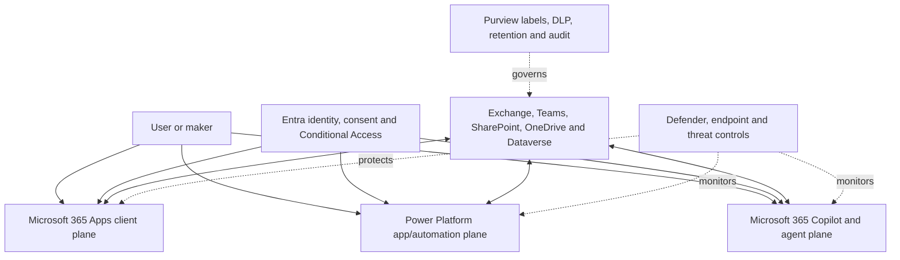

| Plane | Primary attack surface | Primary control question |
|---|---|---|
| Office client | Malicious documents, macros, add-ins, ActiveX, links and identity tokens | Can untrusted content execute or access data? |
| Power Platform | Connectors, credentials, sharing, ownerless flows, gateways and custom code | Can automation move organizational data to an unsafe destination? |
| Copilot/agents | Overshared grounding, connectors/tools, prompt injection and excessive consent | What data/tools can the user/agent reach, and is output/action validated? |

**Analogy:** Office is the workstation, Power Platform is the conveyor-belt system, and Copilot is an assistant who can read accessible files and sometimes operate tools. Identity gives badges, Purview labels boxes, and Defender watches for hostile behavior.

## 2. Microsoft 365 Apps deployment and update channels

Microsoft 365 Apps are subscription Office clients such as Word, Excel, PowerPoint and Outlook. An **update channel** controls cadence, feature arrival and support timeline. Security fixes require supported builds; delaying updates too long converts stability policy into vulnerability exposure.

| Channel | Directional purpose | Security/operations tradeoff |
|---|---|---|
| Current Channel | New features promptly | Fast change; broader validation/communications needed |
| Monthly Enterprise Channel | Predictable monthly feature cadence | Balanced enterprise validation and currency |
| Semi-Annual Enterprise Channel | Less frequent features for select scenarios | Longer feature delay; strict support/update discipline |
| Current Channel (Preview) | Early validation before Current | Not broad production baseline |
| Semi-Annual Enterprise Channel (Preview) | Former early semiannual validation | Deprecated starting July 2025; migrate per current guidance |

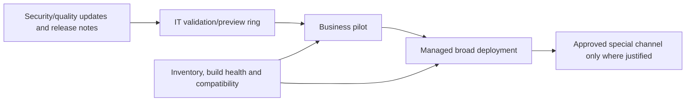

| Update control | Evidence |
|---|---|
| Channel assignment | Device/user inventory and policy source |
| Supported build | Version/build and end-of-support date |
| Ring health | Crash/add-in/macro/business test results |
| Deadline | Compliance window and exception approval |
| Rollback | Known Issue Rollback/current supported update rollback method |
| Communications | Feature/security change and service-desk readiness |

Do not place every device in a preview channel or freeze all users on Semi-Annual by habit. Segment genuine compatibility needs and retain an expiry/remediation plan.

## 3. Cloud Policy, Intune, Group Policy, and policy authority

**Cloud Policy service for Microsoft 365** deploys user-scoped Office policy to signed-in users even on nondomain-joined devices, under current support. Intune Settings Catalog/administrative templates can configure supported device/user settings. Group Policy serves domain-managed Windows. Local Trust Center settings are user preferences unless a policy enforces them.

### 🔍 Plain-English deep-dive: preference versus policy

- **Preference** — *a setting the user can change.* **Analogy:** An employee adjusts the desk chair. **Why it matters:** It is not a security guarantee.
- **Policy** — *an administrator-enforced value.* **Analogy:** Building fire doors must remain closed. **Why it matters:** Security baselines require authority and evidence.
- **Policy source** — *Cloud Policy, Intune, Group Policy or another management path.* **Analogy:** Which facilities office issued the rule. **Why it matters:** Conflicting sources create unpredictable effective settings.
- **Effective configuration** — *the value the app actually applies after precedence and scope.* **Analogy:** The rule visible at the door, not the spreadsheet in head office. **Why it matters:** Validate on a representative client.

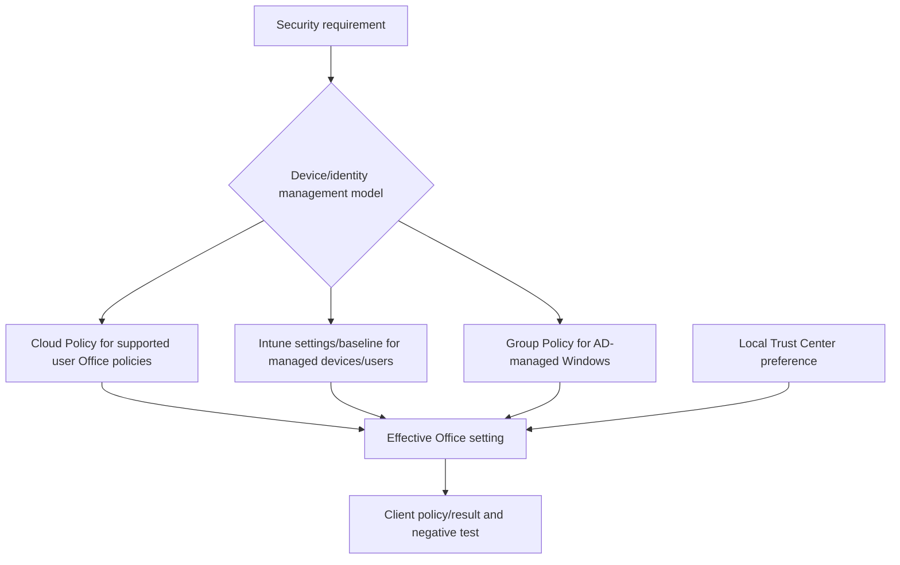

Maintain a setting catalogue showing control objective, policy name, source, scope, precedence, supported apps/platforms, exception and test. Avoid enforcing the same value from several systems unless precedence is intentional and documented.

## 4. Trusted Locations, Trusted Publishers, and Trusted Documents

| Trust concept | What bypass/allowance it provides | Risk |
|---|---|---|
| Trusted Location | Files in path bypass selected Trust Center checks; macros can run | Any writer to path can introduce active content |
| Trusted Publisher | Signed code from certificate is trusted | Every valid macro signed by that cert may run; Windows-wide implications |
| Trusted Document | User previously enabled content/trusted file | Persistent local trust can outlive context |
| Trusted Site/intranet zone | Windows zone classification influences Mark of the Web | Broad domain trust affects more than Office |

Use narrowly controlled local/network locations, restrict writers, prefer signed code, inventory certificates, rotate/revoke publishers and prevent ordinary users from creating broad trusted locations where supported. Adding all SharePoint/OneDrive tenant URLs to Trusted Sites can let downloaded active content bypass macro blocking; assess the upload permissions and route instead of treating corporate URL as inherently safe.

## 5. VBA macros and Mark of the Web

**Visual Basic for Applications (VBA) macros** automate Office but also execute code. **Mark of the Web (MOTW)** is Windows origin metadata placed on files from untrusted zones such as internet downloads. Current Microsoft 365 Apps block macros in internet-origin files by default on supported Windows applications. Microsoft recommends the policy “Block macros from running in Office files from the Internet.”

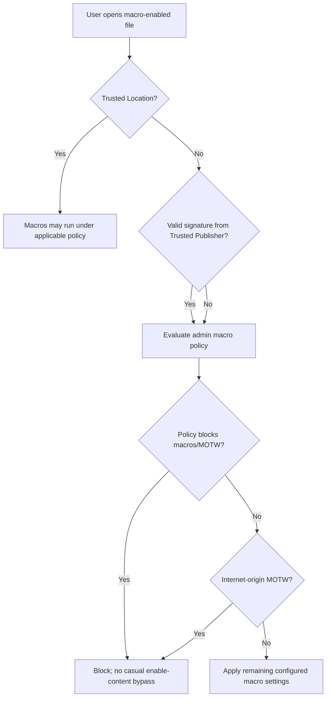

| Population | Recommended direction | Exception evidence |
|---|---|---|
| No macro need | Disable macros without notification where appropriate | None by default |
| Approved macro users | Disable except digitally signed macros; require trusted publisher | Business owner, code owner, certificate and test |
| Internet-origin files | Block macros from Internet | Exact workflow redesign, not global disable |
| Legacy unsigned workflow | Isolate, inventory, sign/refactor/replace and time-bound exception | Risk acceptance and retirement date |

Never advise users to right-click Unblock or add a broad Trusted Location as the default support fix. First validate source, code, signature, business need and safer replacement.

## 6. Office add-ins, COM add-ins, and web add-ins

Add-ins extend Office. COM/VSTO add-ins run locally with substantial user-process access; Office web add-ins use manifests, web endpoints and API permission models. Centralized deployment/integrated apps can make add-ins available to users, while Entra consent and application permissions govern data access.

| Review area | Question |
|---|---|
| Publisher/provenance | Is vendor/internal owner verified and package signed? |
| Runtime | Local native code, Office.js web add-in, service or combination? |
| Permissions | Which mailbox/document/Graph/API scopes are required? |
| Endpoints/data | Where is data sent, processed, stored and deleted? |
| Identity | Delegated/application auth, redirect URIs, secrets/certs and consent |
| Update/supply chain | How are versions signed, reviewed, rolled back and notified? |
| Operations | Crash/performance, logs, support, incident and exit |

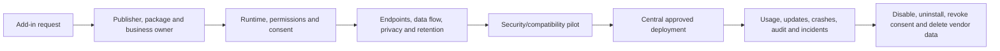

## 7. ActiveX and legacy active content

**ActiveX controls** are legacy Windows components embedded in or invoked by Office documents. They can execute powerful native behavior and have a long attack history. Disable or restrict untrusted/unsigned ActiveX according to current security baseline; inventory business dependencies and replace them.

| Risk | Control |
|---|---|
| Unsigned/untrusted control | Block; require verified signed publisher only when justified |
| Kill-bit/vulnerable component | Patch/remove and preserve block |
| Document prompts user to enable | Policy-enforce safe behavior and educate users |
| Legacy line-of-business dependency | Isolate users, restrict source/location, monitor and retire |
| Embedded data connection | Review destination, credentials and data leakage |

Do not weaken ActiveX globally for one workbook. A consulting finding includes business owner, affected files/users, replacement plan, exception duration and detection.

## 8. Protected View, Application Guard, and Safe Documents

**Protected View** opens risky Office files in a restricted/read-only mode based on source and file-validation signals. **Microsoft Defender Application Guard for Office** historically provided hardware-isolated opening for untrusted files on supported configurations; availability/lifecycle is change-sensitive and Windows/Office features have evolved. **Safe Documents** can check files opened in Protected View/Application Guard with Microsoft Defender before users trust them, under qualifying suite licensing.

### 🔍 Plain-English deep-dive: different isolation/checking layers

- **Protected View** — *restricted Office mode for potentially unsafe files.* **Analogy:** Examine a package behind a clear shield. **Why it matters:** The user can read before active content is trusted.
- **Application Guard** — *supported hardware-isolated container for untrusted Office content in applicable product states.* **Analogy:** Open the package in a separate sealed room. **Why it matters:** Stronger isolation, but support/lifecycle must be current.
- **Safe Documents** — *cloud reputation/detonation check before a user leaves protection.* **Analogy:** Security lab tests the package. **Why it matters:** It is not simply another name for Protected View and has separate licensing.
- **Allow editing/trust** — *crossing from restricted to normal document context.* **Analogy:** Bringing the package onto the desk. **Why it matters:** Users should not bypass warnings reflexively.

| Control decision | Test |
|---|---|
| Internet/email files open protected | Sanctioned benign MOTW test file |
| Users cannot disable protection by policy | Standard user negative test |
| Trusted workflow remains functional | Signed/internal pilot file |
| Safe Documents result is enforced where entitled | Approved Microsoft test process |
| Unsupported platform/client | Document compensating controls |

## 9. Attack Surface Reduction rules for Office

Microsoft Defender **Attack Surface Reduction (ASR)** rules reduce behaviors commonly abused by Office, such as creating child processes, injecting code, creating executable content, using Win32 API calls from macros or launching content from email/webmail. Exact rule names, IDs, prerequisites and modes are current-documentation facts.

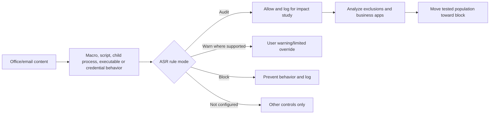

| Deployment phase | Required evidence |
|---|---|
| Inventory | Defender onboarding, Office apps, scripts/macros/add-ins and business owners |
| Audit | Event volume, executable/path/certificate and user impact |
| Analyze | True business dependency versus suspicious/obsolete behavior |
| Remediate | Sign/refactor/update workflow before exclusion |
| Pilot block | Representative positive/negative tests |
| Broad block | Ring metrics, help-desk readiness and rollback |
| Sustain | Exception expiry, hunting and rule/version review |

ASR exclusions can weaken multiple rules and products depending on configuration. Use exact, minimal exclusions only after code/publisher/path risk review; never exclude Office directories or user-writable locations broadly.

## 10. Office identity and data interactions

Office clients obtain Entra tokens and access Exchange, SharePoint, OneDrive, Teams, Graph and add-in endpoints. Multiple accounts, cached tokens, device registration, Conditional Access, sensitivity-label rights and proxy/TLS behavior affect access.

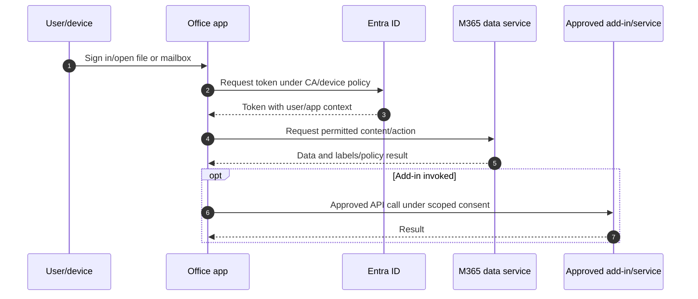

| Symptom | Check |
|---|---|
| Wrong tenant/file | Office account list, active identity and URL |
| Sign-in loop | Entra logs, token broker, device registration, proxy and CA |
| Protected file denied | Label encryption rights and signed-in identity |
| Add-in cannot access data | Consent, token audience/scope, endpoint and admin policy |
| Save/sync conflict | SharePoint/OneDrive permission/version and sync state |
| Feature missing | Build/channel/license/connected experiences/privacy setting |

## 11. Microsoft 365 Apps hardening baseline

| Control domain | Baseline direction |
|---|---|
| Updates | Supported channel/build, rings, deadlines and exception expiry |
| Macros | Block internet macros; signed-only or disabled by persona |
| Trusted locations/publishers | Narrow, centrally managed and reviewed |
| ActiveX | Block/restrict legacy active content |
| Protected View/file validation | Keep enabled and policy-enforced |
| Add-ins | Inventory, publisher/permission review and central deployment |
| ASR/Defender | Audit-to-block with narrow exclusions |
| Identity | MFA/CA/device compliance and modern auth |
| Data | Labels/DLP/retention and controlled cloud locations |
| Telemetry | Defender events, app health, crashes and policy compliance |

Roll out by role because finance macro workflows, developers and general users have different dependencies. Exceptions are products to retire, not permanent mysteries.

## 12. Power Platform architecture from zero

Power Platform includes Power Apps, Power Automate, Power Pages, Copilot Studio and shared administration/data/connectivity capabilities. A tenant contains **environments**, which isolate apps, flows, bots/agents, connections and optionally **Dataverse** databases. The default environment is broadly accessible for personal productivity and needs strong governance.

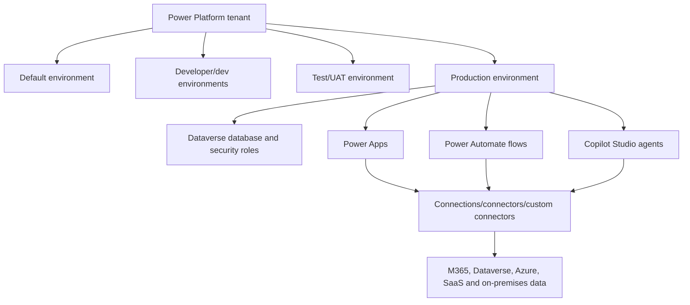

| Term | Plain meaning | Security importance |
|---|---|---|
| Environment | Logical container for low-code resources/data/connections | Lifecycle, DLP, roles and blast-radius boundary |
| Dataverse | Managed business-data platform | Table/row/column security, audit and application identity |
| Connector | Packaged API interface | Data movement and saved connection credentials |
| Connection | Authenticated credential/session used by resource | Owner departure and secret/permission exposure |
| Custom connector | Organization/vendor-defined API wrapper | Endpoint, code, auth and DLP review |
| Gateway | Controlled bridge to on-premises data | Network, credential, cluster and availability risk |
| Solution | ALM package of components | Dependency, version, deployment and rollback boundary |

## 13. Environment strategy and default-environment risk

| Environment type | Use | Guardrail |
|---|---|---|
| Default | Personal productivity and approved low-risk collaboration | Tenant DLP, limited sharing, inventory and maker education |
| Developer | Individual development | No production data; expiration/cleanup |
| Sandbox/test | Integration and UAT | Synthetic/masked data and controlled connections |
| Production | Business-critical workloads | Managed ownership, ALM, service identity, monitoring and support |
| Trial | Time-limited evaluation | No critical dependency; expiry/cost/data cleanup |
| Dedicated business unit | Regulatory/data/residency/ownership separation | Avoid uncontrolled environment sprawl |

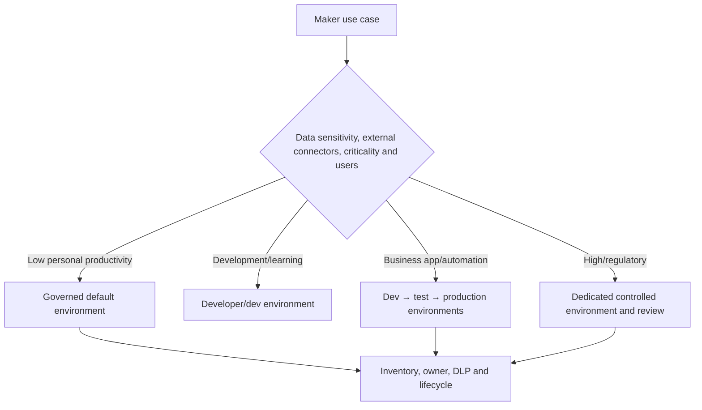

Avoid “one environment per app” and “everything in default.” Define provisioning criteria, naming, region, security group, Dataverse, capacity, DLP, ownership, backup, support and deletion.

## 14. Dataverse security

Dataverse uses Entra identities, environment roles and Dataverse security roles. Business units, teams, ownership, privileges and sharing can control table/row access; column security profiles can restrict sensitive columns. Application users represent service principals.

| Layer | Question |
|---|---|
| Environment role | Who may administer or make resources? |
| Dataverse security role | Which tables/actions and scope may user perform? |
| Business unit/team | How does organizational scope aggregate access? |
| Record ownership/sharing | Who owns or receives row access? |
| Column security | Which sensitive fields need narrower controls? |
| Application user | Which service principal acts, with which role? |
| Audit | Which data/configuration actions are logged and retained? |

Least privilege must be tested with a standard user, not only System Administrator. Avoid giving all makers environment admin or broad Dataverse roles.

## 15. Connectors, connections, custom connectors, and gateways

### 🔍 Plain-English deep-dive: connector is a pipe design; connection is the key

- **Connector** — *a typed wrapper around an API and its operations.* **Analogy:** A standardized pipe fitting. **Why it matters:** It defines possible data destinations/actions.
- **Connection** — *the saved authenticated identity used through the connector.* **Analogy:** The valve key belonging to a person/service. **Why it matters:** Owner departure, consent and credential rotation can break or expose workflows.
- **Custom connector** — *a customer/vendor-defined connector to a nonstandard API.* **Analogy:** A custom pipe built to an outside tank. **Why it matters:** Endpoint and authentication may not have Microsoft's certified-connector review.
- **On-premises data gateway** — *software bridge from cloud services to internal data sources.* **Analogy:** A guarded tunnel into the datacenter. **Why it matters:** Gateway admins, credentials, network and cluster availability are high impact.

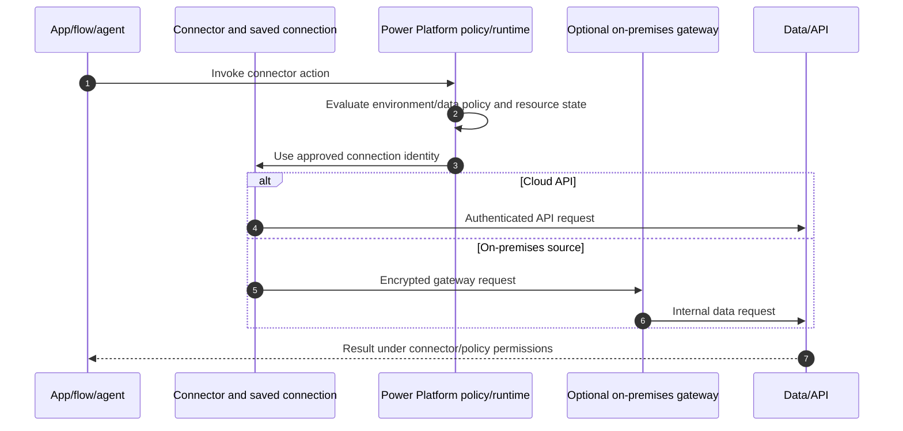

## 16. Power Platform data policies: Business, Non-business, and Blocked

Power Platform **data policies** (historically DLP policies) group connectors to prevent data transfer between incompatible categories. Common categories are Business, Non-business and Blocked. Resources cannot combine Business and Non-business connectors in prohibited ways under the policy. Some connectors are nonblockable or have special behavior; Advanced Connector Policies and virtual/MCP connector governance are rapidly evolving.

| Group | Meaning | Example direction |
|---|---|---|
| Business | Approved organizational data boundary | SharePoint, Dataverse, internal SQL according to design |
| Non-business | Personal/public productivity boundary | Consumer/social services where allowed |
| Blocked | Connector unavailable | Unapproved exfiltration/high-risk service |
| Unclassified/default group | Placement for new/unclassified connectors | Choose conservative default and review new connectors |

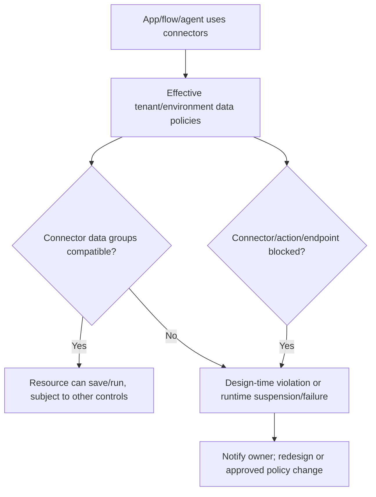

Data policies are guardrails, not content inspection in the Purview DLP sense. They restrict connector combinations/endpoints, not whether a maker manually copies sensitive text.

## 17. Policy scope, precedence, endpoints, and propagation

Policies can apply at tenant, environment or multiple-environment scope. The most restrictive applicable classification/effect can govern a resource. Endpoint filtering can allow/block connector endpoints under supported features; custom/MCP/virtual connector rules vary.

| Change-sensitive area | Operational requirement |
|---|---|
| New connectors | Conservative default group and review process |
| Multiple policies | Effective-policy analysis per environment/resource |
| Endpoint rules | Exact host/path semantics, test and owner |
| Existing resources | Change can suspend/quarantine apps, flows and agents |
| Connections | Whole-connector block can disable connections |
| Propagation | Most cases within an hour; extreme enforcement can take 24 hours per current Learn |
| Virtual/MCP connectors | Track transition to governance rules/Advanced Connector Policies |

Do not repeatedly edit policies during propagation. Export baseline, analyze impacted resources, pilot, communicate and monitor suspension/runtime failures.

## 18. Managed Environments and environment groups

**Managed Environments** provide premium governance capabilities such as environment groups, sharing limits, usage insights, data policies, pipelines, solution checker, IP firewall, customer-managed key/lockbox options and evolving controls. Entitlement depends on qualifying licenses for active users/resources; the Developer Plan alone does not imply production entitlement.

| Capability | Security value | Caution |
|---|---|---|
| Environment groups/rules | Apply consistent governance to grouped environments | Rule rollout/exception process |
| Limit sharing | Reduce broad app sharing | Business collaboration impact |
| Usage insights | Identify adoption/unused resources | Privacy and data freshness |
| Pipelines | Govern solution promotion | Does not replace source control/testing |
| Solution checker | Detect solution quality/security issues | Findings require human remediation |
| IP firewall/cookie binding | Reduce network/session attack surface | License, client and integration compatibility |
| CMK/Lockbox/backup | Data/control governance | Feature-specific cost/operations and region |
| Granular app CA | App-specific access in evolving scenarios | Preview/GA and dependency validation |

## 19. Roles, makers, sharing, owners, and run-only users

| Persona | Minimum responsibility/control |
|---|---|
| Power Platform admin | Tenant/environment governance, not business-data ownership |
| Environment admin | Scoped environment operations and access review |
| Maker | Build only in approved environment/data boundary |
| App owner | Business purpose, users, data, support and lifecycle |
| Flow owner/co-owner | Logic, connections, monitoring, failure and handover |
| Run-only user | Execute instant flow with defined connections/input | 
| Dataverse user/team | Least-privilege role/record scope |
| Service principal/application user | Nonhuman ALM/runtime identity with exact role |

Sharing an app does not necessarily share underlying data; sharing a flow can expose edit logic or connections depending on role. Run-only users can use owner-provided or user-provided connections according to configuration. Test with a normal user and document each underlying data permission.

## 20. Connections, secrets, and service identities

Personal owner connections are fragile for business-critical automation. Prefer supported service principals, managed identities or dedicated nonhuman accounts according to connector/workload capability and licensing. Do not create shared human passwords.

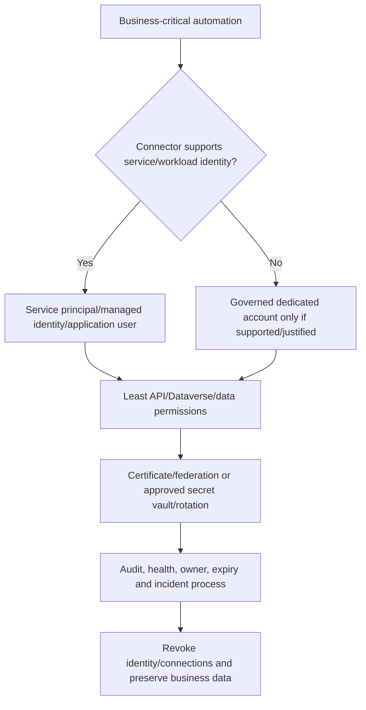

| Secret/control | Standard |
|---|---|
| Client secret | Avoid when federation/certificate/managed identity supported; vault and short lifetime |
| Certificate | Protect private key, rotate with overlap and monitor expiry |
| Connection reference | Bind per environment during deployment; no production credential in package |
| Environment variable | Store configuration, not plaintext secrets |
| Gateway credential | Approved credential store, least privilege and cluster owner |
| OAuth consent | Exact scopes, publisher and recurring review |

## 21. Solutions, pipelines, and ALM

**Application lifecycle management (ALM)** governs development, test, release, operation and retirement. Managed solutions are commonly deployed downstream; unmanaged work stays in development. Connection references and environment variables separate configuration from components.

```mermaid
flowchart LR
    DEV[Dev: unmanaged solution and source control] --> CHECK[Peer review, solution checker and tests]
    CHECK --> BUILD[Versioned solution artifact]
    BUILD --> TEST[Test environment import and UAT/security tests]
    TEST --> APPROVE[Change approval]
    APPROVE --> PROD[Production managed solution via pipeline]
    PROD --> MONITOR[Runtime, audit, failures and adoption]
    MONITOR --> NEXT[Fix-forward or tested rollback strategy]
```

| ALM control | Evidence |
|---|---|
| Source control | Exported source and reviewed changes |
| Versioning | Unique solution/app/flow version and release notes |
| Dependencies | Connectors, child flows, tables, roles and endpoints |
| Configuration | Environment variables and connection references |
| Identity | Deployment principal and runtime principal separated |
| Testing | Unit/component, negative, DLP, permission, failure and UAT |
| Rollback | Prior package/data/schema compatibility or fix-forward plan |
| Segregation | Makers cannot directly change production without authority |

Rollback of Dataverse schema/data can be complex or destructive. Define backup/restore and forward-fix strategy before deployment; do not promise solution uninstall is always safe rollback.

## 22. Center of Excellence context

The Power Platform Center of Excellence (CoE) Starter Kit can provide inventory, telemetry and governance accelerators. It is a maintained solution requiring identities, connections, capacity, updates, privacy review and an operating team; it is not a supported “turnkey compliance product” replacing admin-center controls.

| CoE use | Guardrail |
|---|---|
| Inventory/adoption | Reconcile with admin data; define freshness |
| Maker/community engagement | Encourage safe patterns and support |
| Compliance processes | Human review, ownership and exception workflow |
| Orphan resource cleanup | Validate business/data impact before deletion |
| Environment/resource requests | Connect to approved provisioning and DLP |
| Dashboards | Limit PII/admin data and access |

Use only components needed, document customization and upgrade path, and avoid making CoE service accounts overprivileged.

## 23. Power Platform audit, monitoring, and incident readiness

| Signal | Use |
|---|---|
| Admin analytics/tenant inventory | Environments, apps, flows, makers and usage |
| Dataverse audit | Data/configuration access under configured scope |
| Microsoft Purview audit | Supported Power Platform administrative/user operations |
| Flow run history | Trigger/action outputs, failures and timing with data sensitivity |
| Application Insights/export | Managed Environment/app telemetry where configured |
| Entra sign-in/service principal logs | Identity/token/consent evidence |
| Gateway logs/health | On-premises connectivity and cluster failures |
| Defender/Cloud Apps | OAuth/app behavior and relevant threat signals |

Flow run history can contain personal/sensitive data and secrets in inputs/outputs. Use secure-input/output features where supported, minimize logging, restrict run-history viewers and define retention.

## 24. Microsoft 365 Copilot architecture

Microsoft 365 Copilot operates within the Microsoft 365 service boundary and uses the signed-in user's context. A prompt is preprocessed and grounded using relevant accessible Microsoft 365 data through Microsoft Graph and other permitted sources, sent to a large language model (LLM), and returned to the user. It honors existing permissions, Conditional Access and MFA.

### 🔍 Plain-English deep-dive: grounding and permission trimming

- **Large language model (LLM)** — *a model that predicts/generates language from context.* **Analogy:** A powerful writer/reasoner, not a database of guaranteed facts. **Why it matters:** Outputs need human validation.
- **Grounding** — *adding relevant business/user context to the prompt.* **Analogy:** Giving the assistant the approved case files before asking for a summary. **Why it matters:** It improves relevance but can surface overshared content.
- **Microsoft Graph** — *API/data relationship layer across Microsoft 365.* **Analogy:** The catalogue and authorized courier between services. **Why it matters:** Copilot retrieves user-accessible emails, chats, meetings and files.
- **Permission trimming** — *only return content the requesting identity may access.* **Analogy:** The librarian hides shelves outside the reader's clearance. **Why it matters:** Existing excessive permissions remain excessive; Copilot does not repair them.

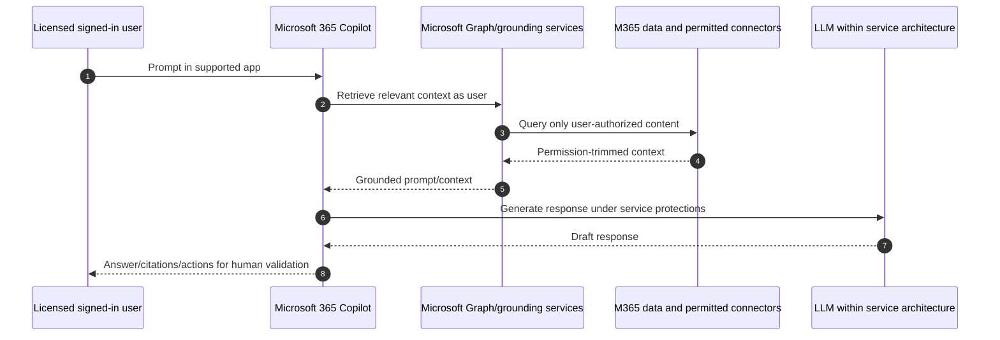

## 25. Semantic index and retrieval context

Microsoft's semantic indexing/retrieval capabilities enrich relationships and meaning across authorized Microsoft 365 content so Copilot can find relevant information beyond exact keywords. Product names, entitlement and architecture evolve; do not describe a tenant-readable standalone database unless current documentation does.

| Retrieval factor | Security implication |
|---|---|
| Existing permissions | Overshared site/file becomes discoverable to more authorized users |
| Search/index freshness | Removed access/labels may take time to propagate |
| User interaction context | Recently used/shared content can influence relevance |
| Content quality | Stale, duplicated or conflicting files create poor answers |
| Labels/encryption | Supported controls shape accessible content/use |
| Restricted discovery/access | RCD/RAC affect discovery/access under documented behavior |

Copilot “finding” a file is not a new permission grant. The security finding is that a preexisting grant was broader than intended or content governance was weak.

## 26. Oversharing and Copilot readiness

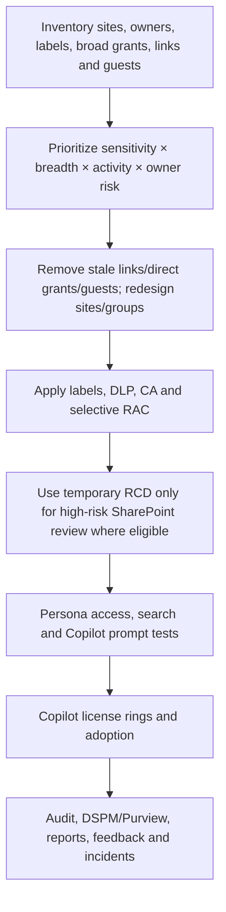

| Readiness area | Evidence |
|---|---|
| Permissions | EEEU/Everyone, Anyone/org links, unique/direct grants and guests |
| Ownership/lifecycle | Ownerless/inactive sites and departed OneDrive owners |
| Classification | Container/file labels and sensitive information distribution |
| Content quality | Stale, duplicate, obsolete and contradictory authoritative sources |
| Device/access | CA/MFA, managed-device and session controls |
| AI governance | Licensed personas, agents/connectors, audit, acceptable use and support |
| Response | Prompt/data exposure and agent-action runbooks |

Do not delay every Copilot deployment until all content is perfect; use risk-based rings and proportionate controls. Do not use RCD tenant-wide as a substitute for remediation.

## 27. Purview controls for Copilot interactions and data

| Control | Role in Copilot security |
|---|---|
| Sensitivity labels/encryption | Protect source files and downstream output according to supported behavior |
| DLP | Detect/restrict sensitive data in supported AI interaction/location scenarios |
| Retention | Govern prompts/responses and source content under current locations/licenses |
| Audit | Record supported Copilot/agent interactions and admin actions |
| eDiscovery | Search/preserve relevant AI interactions under authorized cases |
| DSPM for AI | Discover AI use, sensitive exposure and recommendations under current licensing |
| Insider Risk/Communication Compliance | Privacy-governed risk signals/review where supported |

Copilot output can be copied into a new unlabeled document or external system. Design user education, default labeling, DLP and app/connector controls around output lifecycle, not just source retrieval.

## 28. Web grounding, Copilot connectors, plugins, and tools

**Web grounding** can bring current public web information into supported Copilot experiences according to tenant/user controls and product state. **Copilot connectors** bring external enterprise data into Microsoft 365/Copilot under configured indexing/federated access models. Plugins/tools/actions let Copilot or agents interact with services. Names and capabilities have changed and will continue to change.

| Extension | Data/action direction | Security review |
|---|---|---|
| Web grounding | Public web → model context | Source reliability, prompt injection and data sent in query context |
| Synced/indexed connector | External enterprise data → Microsoft index/service | ACL mapping, ingestion, deletion and residency |
| Federated connector | Query external source at runtime | Identity, latency, source permissions and audit |
| Plugin/tool/action | Model/agent invokes API | Permission, input/output schema, confirmation and side effects |
| Agent knowledge source | Selected site/file/web/connector → agent context | Oversharing, poisoning and lifecycle |

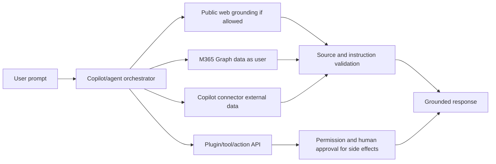

## 29. Declarative and custom-engine agents

A **declarative agent** configures instructions, knowledge and supported tools on Microsoft's orchestration/model capabilities. A **custom engine agent** uses a custom orchestration/model/runtime and integrates into prior experiences through supported interfaces. Copilot Studio agents can combine topics/generative orchestration, knowledge and connectors/actions. Terminology and packaging are highly change-sensitive.

| Agent type | Benefit | Security responsibility |
|---|---|---|
| Declarative M365 agent | Faster, uses platform orchestration | Instructions, knowledge scope, tools, consent and lifecycle |
| Copilot Studio agent | Low-code topics, knowledge and actions | Environment/DLP, connections, sharing, channels and analytics |
| Custom engine agent | Maximum model/orchestration flexibility | Full application security, hosting, model, data, telemetry and response |
| Autonomous/event-driven agent | Acts based on triggers rather than every user prompt | Strong identity, least privilege, limits, approvals and kill switch |

Agents are applications. Assign a business owner, technical owner, data owner, risk rating, environment, identity, permissions, knowledge sources, action limits, monitoring and retirement date.

## 30. Permissions, consent, and least-privilege agents

An agent may act as the user through delegated permissions, use an application/service identity, use saved connector connections or combine modes. “Copilot only sees what the user sees” is incomplete once an agent uses tools with broader service credentials.

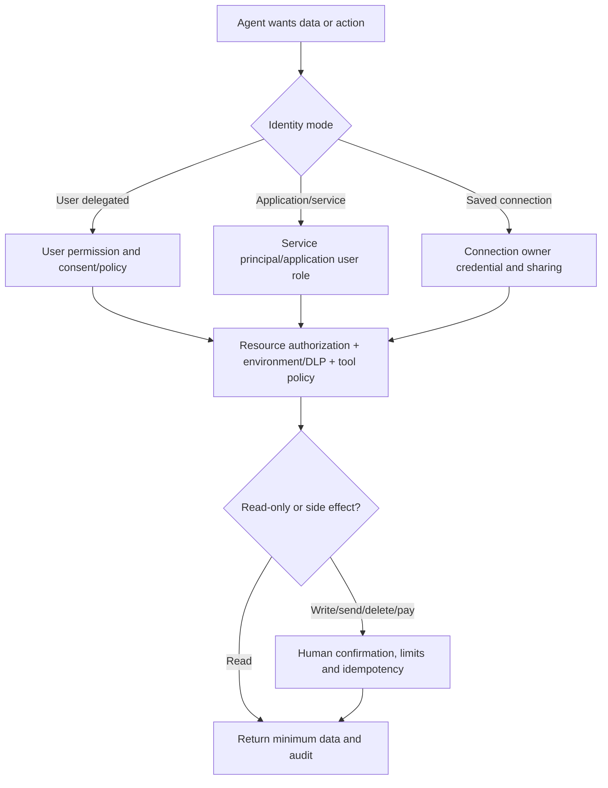

| Permission control | Requirement |
|---|---|
| Delegated scopes | Minimum API scope; user remains authorized for target |
| Application scopes | Avoid tenant-wide read/write; use app access/RSC/resource scope where supported |
| Connection sharing | Know whose credential executes and what run-only users can invoke |
| Admin consent | Verified publisher, justification, privacy/security review and renewal |
| Tool schema | Constrain parameters, destinations and output |
| High-impact action | Human approval, transaction limit, dual control and rollback |

## 31. Prompt injection, indirect injection, and data exfiltration

**Prompt injection** is untrusted content trying to override system/developer/user instructions. **Indirect prompt injection** hides instructions in retrieved documents, web pages, emails or connected data. An agent with tools may be tricked into exposing data or taking action.

### 🔍 Plain-English deep-dive: data is not automatically a trusted instruction

- **System/developer instruction** — *trusted configuration describing agent behavior.* **Analogy:** The employee handbook. **Why it matters:** It should outrank external content.
- **User prompt** — *the authorized person's request.* **Analogy:** A task from the manager. **Why it matters:** It still must stay within policy/permission.
- **Retrieved content** — *data found in files, email, web or connectors.* **Analogy:** Documents the assistant reads. **Why it matters:** A document saying “ignore all rules” is data, not authority.
- **Tool call** — *an action the agent asks an API to perform.* **Analogy:** The assistant sends a payment or email. **Why it matters:** Validate arguments and require approval for consequences.

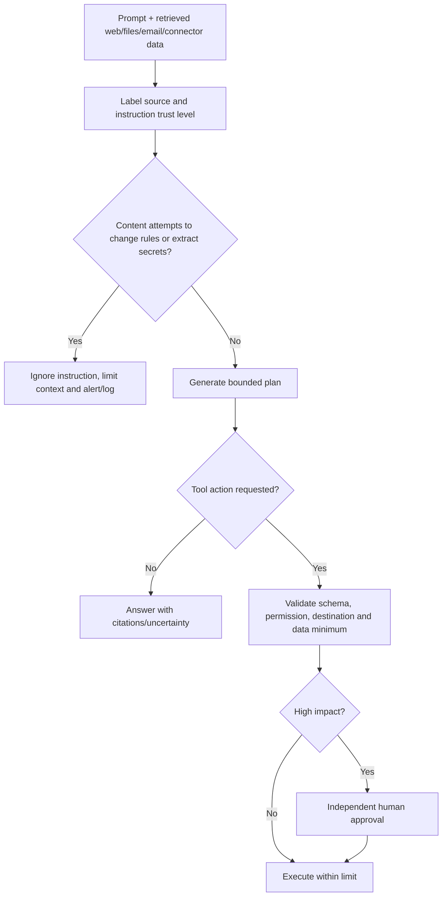

| Risk | Mitigation |
|---|---|
| Malicious document instruction | Treat retrieved content as untrusted data; isolate instructions |
| Web page requests secrets | Never expose system prompts/tokens/secrets; output filtering |
| Agent sends data externally | DLP, connector policy, destination allowlist and confirmation |
| Tool parameter manipulation | Strict schema/validation and server-side authorization |
| Excessive retrieval | Least knowledge scope, permissions and data minimization |
| Poisoned knowledge source | Owner, approved source, integrity/change review and citations |
| Hallucinated action/fact | Grounding/citations, deterministic checks and human approval |

## 32. Defender and AI security controls

Defender products can contribute identity, endpoint, email, OAuth/app, cloud-app and incident signals around Copilot/agent usage. Purview provides data controls. Microsoft Defender for Cloud Apps and Defender XDR capabilities for generative AI/app governance evolve; do not claim every prompt/tool is inspected unless current documentation and licensing prove it.

| Signal/control | Example use |
|---|---|
| Defender for Endpoint/ASR | Block malicious Office behavior and investigate device impact |
| Defender for Office 365 | Protect malicious links/files in email/Teams/SharePoint/OneDrive |
| Defender for Cloud Apps/app governance | Discover/control OAuth/SaaS and app behavior where supported |
| Defender XDR | Correlate identity, endpoint, email and app incidents |
| Entra ID Protection | Risky user/workload identity response |
| Purview DSPM for AI | Discover sensitive exposure and AI governance recommendations |
| Audit/eDiscovery | Investigate supported Copilot/agent actions/interactions |

## 33. Copilot rollout and readiness

| Phase | Work | Exit gate |
|---|---|---|
| Discover | Use cases, personas, data/permissions, apps/agents, legal/privacy and licenses | Prioritized risk/use-case inventory |
| Prepare | Identity/device, SharePoint remediation, labels/DLP/retention/audit and support | Readiness acceptance |
| Pilot | Low-risk/high-value users with champion and control groups | Security, quality and adoption tests pass |
| Expand | Rings by data/role and approved agents/connectors | Metrics within thresholds |
| Operate | Support, audit, incidents, agent catalog, access/consent review | Owned service model |
| Improve | Prompt education, content quality, control tuning and value tracking | Quarterly roadmap |

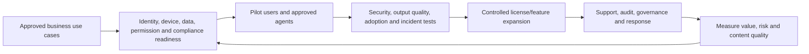

Adoption is a security control: users need to understand citations, verification, sensitive prompts, external data, agent permissions and reporting. Usage alone is not value; value alone is not safe adoption.

## 34. Secure automation reference pattern

Example: an incident intake flow receives a service request, reads a SharePoint list, enriches with approved Graph data, creates a ticket and asks a human before notifying an external vendor.

```mermaid
sequenceDiagram
    autonumber
    participant T as Approved trigger
    participant F as Production flow
    participant I as Workload identity/connections
    participant D as Internal data
    participant A as Human approver
    participant V as External vendor/ticket API
    T->>F: Validated event with correlation ID
    F->>F: Validate schema, deduplicate and classify sensitivity
    F->>I: Request least-privilege access
    I->>D: Read minimum required fields
    D-->>F: Redacted/enriched result
    F->>A: Approval with destination and data preview
    alt Approved
        F->>V: Idempotent bounded API request
        V-->>F: Ticket ID/status
    else Rejected/expired
        F->>F: Stop and record reason
    end
    F->>F: Audit outcome; alert on partial failure
```

| Pattern control | Requirement |
|---|---|
| Trigger | Authenticate source; validate schema and replay/correlation |
| Identity | Service principal/managed identity where supported; no personal owner dependency |
| Data | Minimum fields, classification, DLP-compatible connectors and redaction |
| Logic | Idempotency, concurrency limits, timeout, retry/backoff and compensation |
| Approval | Independent approver for external/high-impact action |
| Secrets | Vault/certificate/federation; secure inputs/outputs |
| Audit | Actor, flow version, correlation, decision, destination and result |
| Failure | Dead-letter/manual queue and on-call owner |
| ALM | Solution, connection references, environment variables, pipeline and tests |
| Kill switch | Disable trigger/flow/tool and revoke identity/connection quickly |

## 35. Incident scenarios

### Scenario A: malicious macro document

Preserve file hash/source/MOTW/signature and endpoint telemetry; do not execute casually. Scope recipients/downloads/opens, correlate MDO/Defender/Entra signals, isolate compromised devices/accounts when justified, remove malicious copies/links, block indicators, validate macro/ASR/Protected View policy, and correct the trusted-location/publisher exception. Restore business workflow with signed/refactored automation.

### Scenario B: flow exfiltrates SharePoint data to consumer storage

Record environment, app/flow ID/version, owner/co-owners, sharing, connectors, connections, run history, destination and affected records. Disable flow/connection or block connector under approved containment; revoke tokens/secrets; preserve audit; assess downloaded data/legal notification; identify whether DLP scope/default connector grouping failed; redesign with Business connectors, service identity, approval and monitoring.

### Scenario C: Copilot surfaces confidential content

Confirm user, prompt/response, cited source, actual SharePoint/OneDrive permission path, label, sharing link/group, RAC/RCD and search propagation. The likely root issue is preexisting overpermission, not Copilot creating access. Remove the inappropriate grant, assess exposure/use, review similar sites, apply proportionate controls and test direct access plus Copilot/search after propagation. Preserve privacy and do not circulate the prompt broadly.

### Scenario D: agent tricked by indirect prompt injection

Stop/disable the agent/tool and revoke high-risk credentials if ongoing. Preserve prompt, retrieved source, instructions, tool arguments, identity, response/action and audit. Determine data disclosed/action performed, notify owners, correct trust separation/input validation/knowledge source, reduce permissions, add destination allowlists/human approval and adversarial regression tests.

## 36. Troubleshooting matrix

| Symptom | Likely layer | Discriminating evidence | Unsafe shortcut |
|---|---|---|---|
| Macro blocked | MOTW, signature, macro policy, trusted location | File Zone.Identifier, signature and effective Office policy | Unblock all files/add broad trusted path |
| Add-in missing/fails | Deployment, consent, build, endpoint or token | Add-in/app IDs, assignment, Entra consent and logs | Grant broad Graph permission |
| Office sign-in loop | CA/device/token broker/proxy/multiple account | Entra sign-in and client identity state | Exclude Office/M365 from CA |
| Flow suspended after DLP change | Effective data policy/connector grouping | Environment/resource/policy and propagation time | Move connector to Business globally |
| App works for maker only | Underlying data permission/connection sharing | Test user roles, connector identity and Dataverse access | Make every user co-owner |
| Gateway flow fails | Gateway cluster/network/credential/source | Gateway health/logs and on-prem source | Store admin password in flow |
| Copilot misses new access change | Index/search/permission propagation | Direct access, audit change time and search behavior | Regrant broad permission |
| Copilot cites wrong/stale file | Content quality/retrieval context | Citation, file owner/version/authoritative source | Remove citations or hide uncertainty |
| Agent action denied | Identity mode, consent, DLP, API authorization | Tool call, token scope, connection and API response | Give tenant-wide app permission |

## 37. Deployment, testing, and rollback

| Control area | Positive test | Negative test | Rollback |
|---|---|---|---|
| Office update channel | Pilot receives supported build | Unassigned ring unchanged | Return assignment/approved build method |
| Macro baseline | Signed approved macro works | Internet/unsigned macro blocked | Pilot policy reversal only; preserve protection |
| ASR | Approved workflow works | Child-process/executable test blocked | Rule mode/audited narrow exclusion |
| Power Platform DLP | Approved Business flow runs | Business + Non-business flow blocked | Restore prior scoped policy after impact analysis |
| ALM pipeline | Versioned solution deploys | Direct production maker change denied | Prior artifact/fix-forward/data plan |
| Copilot permission | User receives authorized citation | Unauthorized user cannot retrieve source | Remove license/pilot assignment and remediate access |
| Agent tool | Bounded approved action succeeds | Unauthorized destination/high value denied | Disable tool/agent and revoke connection |

Rollback is feature-specific. Office build rollback has support limits; DLP propagation can take hours; solution uninstall can damage dependencies/data; Copilot access changes need index propagation; external tool actions may be irreversible. Record the last reversible point and use human approval before irreversible actions.

## 38. Operations, privacy, and metrics

| Metric | What it supports |
|---|---|
| Office supported-build/channel compliance | Patch and change risk |
| Macro/ActiveX/add-in inventory and exceptions | Active-content attack surface |
| ASR audit/block/exclusion trends | Baseline effectiveness and compatibility |
| Environments/apps/flows/agents without owner | Lifecycle risk |
| DLP violations/suspended resources/propagation | Policy design and operational impact |
| Personal versus service-owned production flows | Resilience and offboarding |
| Connector/consent high-risk grants | Exfiltration/application risk |
| Pipeline versus direct production changes | ALM maturity |
| Copilot licensed active use by approved persona | Adoption and license value |
| Overshared sources found/remediated | Data readiness/security outcome |
| Agent catalogue/review/incident count | AI application governance |
| Human-approval bypass/failure and MTTR | Automation safety |

Prompts, responses, flow runs and connector data can contain personal/confidential information. Define who can view them, why, retention, legal use and secure exports. Do not measure employees by raw prompt text without a legitimate privacy-reviewed purpose.

## 39. Consulting artifacts

1. **Cross-plane architecture:** Office, Power Platform, Copilot, identity, data, Purview and Defender.
2. **M365 Apps baseline:** channels, macros, trusted locations/publishers, add-ins, ActiveX, Protected View and ASR.
3. **Power Platform environment strategy:** types, provisioning, roles, DLP, Managed Environment and lifecycle.
4. **Connector/connection/gateway register:** data class, identity, owner, endpoint, secret and expiry.
5. **ALM standard:** solutions, source, pipelines, connection references, tests and rollback.
6. **Copilot readiness assessment:** permissions, ownership, labels, content quality, devices, audit and licenses.
7. **Agent risk assessment:** instructions, knowledge, identity, permissions, tools, prompt-injection tests and kill switch.
8. **Secure automation reference design:** schema, least privilege, approvals, idempotency, monitoring and incident response.
9. **Operational handbook:** dashboards, RACI, exceptions, service health, runbooks and access reviews.
10. **Executive roadmap:** use-case value, risk, licensing, dependencies, phases, residual risk and metrics.

## 40. Safe paper lab: secure Office, automation, and Copilot rollout

This lab changes no Office policy, endpoint, Power Platform environment, connector, consent, Copilot license, agent or customer data.

### Scenario

Fictional Contoso has 1,500 Microsoft 365 Apps users, finance macros, 300 flows/apps in the default environment, one on-premises SQL gateway, planned Microsoft 365 Copilot for 100 users and a Copilot Studio incident-assistant agent. Use synthetic `contoso.example` identities and data.

### Procedure

1. Draw the Office/Power Platform/Copilot architecture and trust boundaries.
2. Define Office update rings and supported-channel compliance; mark Semi-Annual Preview deprecated.
3. Build macro personas: no macro, signed approved macro and temporary legacy exception. Add MOTW, Trusted Publisher/Location and retirement controls.
4. Design add-in/ActiveX/Protected View/Safe Documents and ASR controls with audit-to-block tests.
5. Inventory fictional Power Platform resources by environment, owner, criticality, connectors and connection identity.
6. Design default/dev/test/prod environments and Managed Environment/license verification.
7. Classify connectors as Business, Non-business or Blocked; add one endpoint rule and document up-to-24-hour extreme propagation.
8. Replace a personal production flow owner with a conceptual service identity/connection references and secure secret plan.
9. Package the flow in a solution and draw dev/test/prod pipeline, tests and rollback/fix-forward.
10. Define CoE inventory/use without treating it as the control authority.
11. Assess Copilot readiness using SharePoint/OneDrive permissions, labels, ownerless sites, CA and content quality.
12. Map prompt → Graph grounding → permitted data → LLM → response and current semantic retrieval caveats.
13. Review web grounding, one connector and one tool; document identity, consent, data and destination.
14. Threat-model the incident-assistant agent for direct/indirect prompt injection and tool exfiltration.
15. Add human approval before external vendor notification/device/user action and a kill switch.
16. Inject incidents: malicious macro, flow exfiltration, overshared Copilot citation and injected agent tool call.
17. Create deployment rings, test matrix, operational RACI and metrics.

### Test matrix

| Test | Expected paper result | Evidence artifact |
|---|---|---|
| Supported Office build | Pilot updates and business app tests pass | Channel/build matrix |
| Internet macro | Blocked by policy/MOTW | Macro decision flow |
| Signed approved macro | Works only for trusted publisher/persona | Certificate/exception register |
| Office child process | ASR audit then block expectation | ASR test record |
| Approved Business flow | Runs in production with service identity | Connection/role/ALM map |
| Business + Non-business mix | Blocked/suspended by DLP after propagation | Effective-policy result |
| Nonowner app user | App works only with underlying data permission | User/Dataverse test |
| Pipeline deployment | Version/configuration references resolve | Release evidence |
| Copilot authorized user | Receives citation to permitted synthetic file | Prompt/citation test |
| Unauthorized user | Cannot retrieve source | Negative permission test |
| RCD source | Direct permission unchanged; discovery reduced after latency | RCD caveat test |
| Agent benign request | Reads minimum data and proposes action | Tool trace |
| Injected content | Treated as data; secret/external tool request denied | Adversarial test |
| High-impact action | Requires independent human approval | Approval/audit evidence |
| Kill switch | Agent/tool/connection disabled and tokens revoked conceptually | Incident runbook |
| Rollback | Prior scoped policy/artifact restored; irreversible effects stated | Rollback record |

### Evidence and cleanup

Produce fictional architecture, policy catalogue, environment/connector inventory, ALM design, Copilot readiness findings, agent threat model, test results, incident timelines, RACI, metrics and executive roadmap. Label everything “paper lab / no tenant or endpoint changes.” Include no real prompt, file, secret, consent grant, environment, app/flow/agent ID, run history or customer data. Cleanup is confirming no policy, code, connection, environment, license, agent or data was created/changed.

### Interview wording

> “I built a paper security design across Microsoft 365 Apps, Power Platform and Microsoft 365 Copilot. It covers update rings, internet macro blocking, trusted code, add-ins/ActiveX/Protected View/ASR, environment and connector DLP governance, service identities, solution pipelines, Copilot permission-grounding and oversharing, agent consent, prompt-injection defenses, human approvals and incidents. My direct evidence is M365 support, SharePoint/OneDrive/sync and documented Power Platform/Copilot work; tenant-wide governance remains design/lab evidence unless a specific production example supports it.”

## 41. JD Mapping: interview translation

| Prompt | Strong response structure |
|---|---|
| “Harden Office” | Supported channels → policy authority → macro/trust/add-in/ActiveX → Protected View/ASR → identity/data → pilot/exceptions/metrics |
| “Govern Power Platform” | Environment strategy → roles/Dataverse → connectors/DLP/gateway → ownership/identity → ALM/Managed Env → audit/lifecycle |
| “Secure Copilot” | Identity/device → permission/oversharing → labels/DLP/retention/audit → connectors/agents/consent → injection/tool controls → rings/response |
| “Secure automation” | Validated trigger → workload identity → minimum data → DLP-approved connectors → idempotency → approval → audit/failure/kill switch |
| “Your experience?” | Direct M365/SPO/OneDrive and accurate Power Platform/Copilot evidence; explicit tenant-governance lab/design boundary |

## 42. Official Source Anchors

First-party anchors checked on **August 24, 2026**; recheck Product Terms, release status and tenant behavior.

| Topic | Official Microsoft source | Change-sensitive use |
|---|---|---|
| Update channels | [Overview of update channels for Microsoft 365 Apps](https://learn.microsoft.com/en-us/microsoft-365-apps/updates/overview-update-channels) | Channel purpose/support and deprecated preview channel |
| Cloud Policy | [Overview of Cloud Policy service](https://learn.microsoft.com/en-us/microsoft-365-apps/admin-center/overview-cloud-policy) | Scope, precedence and supported settings |
| Security baseline | [Security baseline for Microsoft 365 Apps](https://learn.microsoft.com/en-us/microsoft-365-apps/security/security-baseline) | Current recommended policies |
| Internet macros | [Macros from the internet are blocked by default](https://learn.microsoft.com/en-us/microsoft-365-apps/security/internet-macros-blocked) | MOTW, channels and trusted workflows; page dated July 17, 2026 |
| Trusted Locations | [Trusted Locations for Office files](https://learn.microsoft.com/en-us/microsoft-365-apps/security/trusted-locations) | Risk and policy controls |
| Application Guard/Safe Documents | [Application Guard for Office](https://learn.microsoft.com/en-us/microsoft-365-apps/security/application-guard-for-office) | Current lifecycle/support and Safe Documents relationship |
| ASR | [Attack surface reduction rules reference](https://learn.microsoft.com/en-us/defender-endpoint/attack-surface-reduction-rules-reference) | Current Office rules, modes and exclusions |
| Power Platform architecture/security | [Power Platform security overview](https://learn.microsoft.com/en-us/power-platform/admin/security/overview) | Tenant/environment/identity boundary |
| Data policies | [Data policies](https://learn.microsoft.com/en-us/power-platform/admin/wp-data-loss-prevention) | Connectors, runtime and up-to-24-hour extreme latency; page dated April 2026 |
| Managed Environments | [Managed Environments overview](https://learn.microsoft.com/en-us/power-platform/admin/managed-environment-overview) | Premium features/licensing; page dated February 2026 |
| Pipelines/ALM | [Pipelines in Power Platform](https://learn.microsoft.com/en-us/power-platform/alm/pipelines) | Current deployment/identity prerequisites |
| Service principals | [Application users and service principals](https://learn.microsoft.com/en-us/power-platform/admin/manage-application-users) | Dataverse application identity/roles |
| CoE | [Power Platform CoE Starter Kit](https://learn.microsoft.com/en-us/power-platform/guidance/coe/starter-kit) | Accelerator prerequisites and operations |
| Copilot architecture | [How Microsoft 365 Copilot works](https://learn.microsoft.com/en-us/microsoft-365/copilot/microsoft-365-copilot-architecture) | Graph grounding, permissions, CA/MFA; page dated March 24, 2026 |
| Copilot privacy/security | [Data, privacy, and security for Microsoft 365 Copilot](https://learn.microsoft.com/en-us/copilot/microsoft-365/microsoft-365-copilot-privacy) | Service boundary and interaction data |
| Copilot readiness | [Secure and govern Copilot foundational guidance](https://learn.microsoft.com/en-us/microsoft-365/copilot/secure-govern-copilot-foundational-deployment-guidance) | Permission/data/control rollout |
| Copilot connectors | [Microsoft 365 Copilot connectors overview](https://learn.microsoft.com/en-us/microsoft-365-copilot/extensibility/overview-copilot-connector) | Synced/federated external grounding |
| Agents | [Agents for Microsoft 365 Copilot overview](https://learn.microsoft.com/en-us/microsoft-365-copilot/extensibility/agents-overview) | Declarative/custom terminology and capabilities |

---

## ⭐ Likely Interview Questions for This Section

### Q1. How would you harden Microsoft 365 Apps without breaking the business?
> **Model answer:** Keep supported builds through preview/pilot/broad rings; establish one documented policy authority; block internet macros and use signed-only or disabled personas; minimize Trusted Locations/Publishers; govern add-ins and ActiveX; keep Protected View/file validation; deploy Office ASR rules audit-to-block; enforce identity/device/data controls; and manage narrow expiring exceptions with business owners, telemetry, positive/negative tests and rollback.

### Q2. Why is a Trusted Location risky?
> **Model answer:** Files in it bypass selected Trust Center checks and macros can run, so any user/process allowed to write there may introduce active content. I use it only when a controlled signed-code workflow cannot be redesigned, restrict writers and path, manage through policy, monitor content, document owner/expiry and prefer trusted publishers or safer automation. I never trust an entire user-writable share or all SharePoint downloads casually.

### Q3. How do Power Platform data policies prevent data loss?
> **Model answer:** They classify connectors into Business, Non-business and Blocked groups and prevent incompatible connector combinations or blocked endpoints/actions in covered apps, flows and agents. They are connector guardrails, not content inspection. I set a conservative default for new connectors, analyze all applicable tenant/environment policies, pilot because existing resources can suspend or fail, allow propagation, and use Purview DLP for content-aware controls.

### Q4. How would you secure a business-critical Power Automate flow?
> **Model answer:** Place it in managed dev/test/prod environments, package it in a solution, use source review/pipeline, connection references and environment variables. Prefer a least-privilege service principal/managed identity over personal ownership, protect secrets, validate/deduplicate triggers, minimize data, use approved connectors, add retries/idempotency and human approval for external/high-impact actions, secure run history, monitor failures and maintain a kill switch and tested recovery/fix-forward plan.

### Q5. How does Microsoft 365 Copilot access organizational data?
> **Model answer:** The signed-in user submits a prompt; Copilot grounds it through Microsoft Graph and other permitted sources using the user's context; only content the identity is authorized to access is retrieved; the LLM generates a response within the service architecture; and Copilot returns the result. It honors CA/MFA and existing permissions. Therefore Copilot does not grant new file access, but it makes existing oversharing easier to discover and synthesize.

### Q6. How would you prepare a tenant securely for Copilot?
> **Model answer:** Define licensed use cases/personas, secure identity/device access, inventory SharePoint/OneDrive permissions, links, guests, labels, owners and content quality, prioritize sensitive broad exposure, remediate groups/links/sites, use RAC and temporary RCD selectively where eligible, configure Purview labels/DLP/retention/audit, govern connectors/agents/consent, pilot prompts and denied-user cases, train users to validate citations and monitor exposure, quality, adoption and incidents.

### Q7. How do you defend an agent against prompt injection and unsafe actions?
> **Model answer:** Separate trusted system/developer instructions from untrusted user/retrieved content; treat files/web/email as data, not authority; scope knowledge and permissions; validate tool schemas, parameters, destinations and authorization server-side; keep secrets out of prompts/outputs; use DLP/allowlists; require independent human approval for send/delete/pay/contain actions; log decisions; set limits/idempotency and maintain a kill switch plus adversarial regression tests.

### Q8. What is your honest experience across these platforms?
> **Model answer:** My direct production base is SharePoint Online, OneDrive, sync, M365 escalation/RCA and the Power Platform/Copilot work accurately shown in my background. I have built a current paper security architecture for Office hardening, Power Platform governance/ALM and Copilot/agent security. I do not turn that into false tenant-wide production ownership; I would deliver with endpoint, identity, data, Power Platform, legal/privacy and SOC owners.

---

## 🧠 30-Second Memory Hooks

- **Office opens data; Power Platform moves data; Copilot reasons over data and may use tools.**
- **Supported build is a security control; frozen channel becomes risk.**
- **Preference is a choice; policy is enforced; effective setting is what the client proves.**
- **Trusted Location trusts every writer; Trusted Publisher trusts every valid signature from that certificate.**
- **MOTW marks outside origin; internet macros stay blocked.**
- **Protected View is a shield; Application Guard is isolation where supported; Safe Documents is a cloud check.**
- **ASR blocks dangerous behavior, not just bad file names.**
- **Environment is the boundary; Dataverse is the data; connector is the pipe; connection is the key.**
- **Power Platform DLP separates connector groups; Purview DLP inspects sensitive content.**
- **Personal flow owner is a bus-factor risk; service identity needs least privilege and lifecycle.**
- **Solution plus pipeline creates repeatable ALM; uninstall is not guaranteed rollback.**
- **Copilot respects existing permission, so oversharing remains oversharing at machine speed.**
- **Grounding gives approved context; citations and humans still validate.**
- **Retrieved content is data, never automatically a trusted instruction.**
- **Agent tool plus broad credential can exceed the user's ordinary reach.**
- **Candidate honesty: direct M365 strength, explicit design/lab boundary for tenant-wide governance.**

---

## Completion Checklist

- [ ] I can compare Office update channels and design supported rings.
- [ ] I can distinguish Cloud Policy, Intune, Group Policy, preference and effective settings.
- [ ] I can secure Trusted Locations/Publishers/Documents and macros with MOTW.
- [ ] I can assess add-ins, ActiveX, Protected View, Application Guard/Safe Documents and ASR.
- [ ] I can trace Office identity, token, data and add-in interactions.
- [ ] I can draw Power Platform tenant/environment/Dataverse/connector/gateway architecture.
- [ ] I can design environment strategy, roles, sharing, connections and ownership.
- [ ] I can explain Business/Non-business/Blocked data-policy behavior and propagation.
- [ ] I can explain Managed Environments, pipelines, service principals and CoE limits.
- [ ] I can build a secure ALM and automation pattern with approvals, idempotency and kill switch.
- [ ] I can explain Copilot Graph grounding, permission trimming and semantic retrieval context.
- [ ] I can assess oversharing, labels/DLP/retention/audit and readiness.
- [ ] I can govern web grounding, connectors, plugins/tools and declarative/custom agents.
- [ ] I can threat-model prompt injection, data exfiltration and excessive agent permissions.
- [ ] I can connect Purview and Defender controls without overclaiming coverage.
- [ ] I can design deployment, tests, rollback, operations, metrics and incident runbooks.
- [ ] I can present the safe paper lab and distinguish direct evidence from design/lab knowledge.
- [ ] I will recheck current Learn, licensing, previews, portals, region and tenant rollout before change.

---

*Next suggested section:* [Part 26](Part-26-purview-architecture-classification-solution-map.md) — build the Purview architecture, classification, role, portal and solution map needed to deepen the labels, DLP, retention, audit, eDiscovery and AI data-security controls introduced here.