# Part 26 — Microsoft Purview Architecture, Data Classification, and Solution Map

> **Section goal:** Build a beginner-first mental model of Microsoft Purview before designing labels, DLP, retention, audit, eDiscovery, or insider-risk controls. By the end, you should be able to distinguish data security, data governance, and risk/compliance; navigate the unified portal direction; explain roles and scope; draw the Microsoft 365 classification pipeline; choose among sensitive information types, exact data match, document fingerprinting, trainable classifiers, named entities, and credential classifiers; assess classification quality and privacy; and produce a defensible discovery, test, rollout, operations, and troubleshooting plan.

This Part maps directly to Deloitte's Microsoft 365 security assessment, Purview design, implementation planning, troubleshooting, stakeholder communication, and operational-readiness expectations. It deliberately uses your direct SharePoint Online, OneDrive, permissions, sharing, sync, content, escalation, RCA, and compliance-aligned support experience as the starting point. It does **not** claim that you have implemented Microsoft Purview classification in production. [Part 27](Part-27-purview-information-protection-labels-encryption.md) builds on this classifier foundation with sensitivity labels, publishing, encryption, and container controls.

> **Currency, licensing, preview, portal, and change-sensitive note:** This chapter was checked against official Microsoft Learn available on **August 24, 2026**. Microsoft directs administrators to the unified Microsoft Purview portal at `https://purview.microsoft.com`; the retired compliance portal and classic governance portal have had features relocated or retired. In the unified portal, **Classification** is generally presented as **Classifiers**, explorers sit within solution navigation, and roles/scopes are under **Settings**. Exact menus, solution cards, sovereign-cloud URLs, APIs, limits, licenses, and preview states change. Content Explorer is still described in some Learn pages as a classic experience, while newer material refers to Data Explorer. Security Copilot in Activity Explorer, trainable-classifier display in Content Explorer, some Data Map labeling/protection experiences, and several AI/data-security functions remain preview or tenant-dependent. Always verify Product Terms, the Microsoft Purview service description, release notes, Message center, regional availability, role documentation, and the tenant's actual UI before a client design.

## JD Mapping

| Deloitte role expectation | Capability developed in this Part | Consulting evidence produced |
|---|---|---|
| Assess Microsoft 365 security and compliance posture | Map data, locations, classifiers, permissions, dependencies, and gaps | Purview current-state assessment and evidence register |
| Design Microsoft Purview solutions | Separate portfolio areas and select the right classification method | Solution map, classifier decision record, and target architecture |
| Configure and optimize controls | Translate business data into testable classifiers and thresholds | Taxonomy, SIT specification, test corpus, and tuning backlog |
| Troubleshoot policy/platform issues | Isolate source, extraction, classification, policy, telemetry, and portal layers | Layered decision tree and escalation evidence pack |
| Protect SharePoint and OneDrive data | Understand crawl, indexing, supported content, explorers, and false results | SharePoint/OneDrive discovery and classification test plan |
| Lead consulting delivery | Join privacy, legal, records, security, workload, endpoint, and operations owners | RACI, roadmap, risk register, metrics, and handover package |

## Candidate honesty note

You can directly claim experience supporting SharePoint Online and OneDrive content, permissions, sharing, synchronization, customer-impacting incidents, RCA, stakeholder coordination, and compliance-aligned guidance where your evidence supports it. Those are strong foundations because Purview classification depends on the same content stores, identity boundaries, search/index behavior, supported file types, and operational investigation habits.

You should not claim production ownership of Purview roles, Content Explorer, Data Explorer, Activity Explorer, custom sensitive information types, exact data match, document fingerprinting, trainable classifiers, auto-labeling, or tenant-wide data taxonomy unless you have separate evidence. A safe interview statement is:

> “My direct production depth is SharePoint Online, OneDrive, content access, sync, escalations, RCA, and compliance-aligned support. I have built a current Purview classification architecture and a paper test plan covering roles, classifiers, indexing, quality, privacy, deployment, and operations. I would validate it in a licensed nonproduction tenant with security, privacy, legal, records, and workload owners before enforcement.”

---

## 1. Microsoft Purview from zero

Microsoft Purview is a family of Microsoft services for understanding, protecting, governing, retaining, investigating, and managing data. It is not one scanner, one portal page, or one policy engine. The unified portal is the front door to multiple solutions that share classifiers, identities, telemetry, and data locations.

**Analogy:** Purview is an airport system. The catalog describes terminals and routes; information protection marks baggage; DLP checks where baggage is going; retention decides how long records are kept; audit records movement; eDiscovery preserves and retrieves evidence; insider-risk capabilities look for risky behavior. One airport map helps, but each operational team still has a different job.

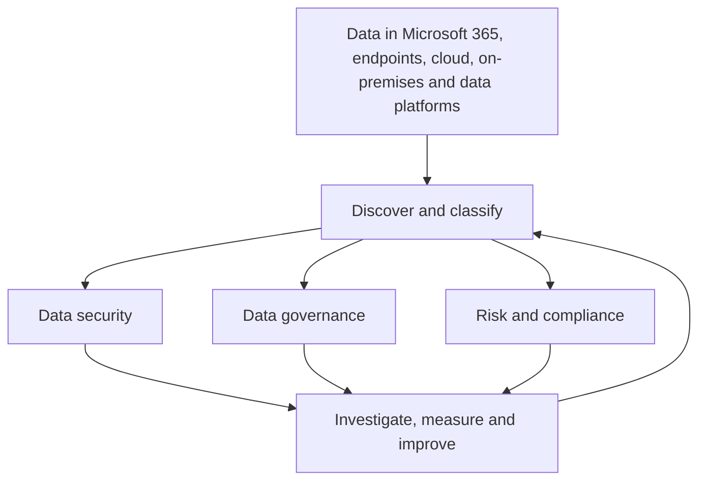

| Term | Plain meaning | Why it matters | Memory hook |
|---|---|---|---|
| Data estate | All organizational data and its locations | Scope must be known before controls can be trusted | Estate = every property, not one house |
| Classifier | Logic that recognizes a type of content | Labels, DLP, retention, and investigations depend on recognition | Classifier answers “what is this?” |
| Policy | Rules that act when scope and conditions match | Classification alone normally does not block or retain | Classifier sees; policy decides |
| Explorer | A reporting/investigation view of content or activity | It supplies evidence for tuning and operations | Explorer helps you look, not enforce |
| Data Map | Governance metadata map of data assets and lineage | It addresses broader data-estate governance | Map describes the landscape |
| Unified Catalog | Business discovery and governance experience over mapped assets | It helps people find trusted, governed data | Catalog is the searchable directory |

## 2. Data security versus data governance versus risk and compliance

These areas overlap, but they answer different executive questions. Calling every Purview capability “compliance” hides ownership and creates weak designs.

| Portfolio area | Core question | Representative capabilities | Typical owners | Typical output |
|---|---|---|---|---|
| Data security | How do we prevent, detect, and investigate sensitive-data exposure? | Information Protection, DLP, Data Security Investigations, Insider Risk, Information Barriers, DSPM | CISO, data security, SOC, endpoint, M365 security | Protection policy, alert workflow, exposure remediation |
| Data governance | What data exists, what does it mean, where did it come from, and who is accountable? | Data Map, Unified Catalog, scanning, lineage, glossary, data products | CDO, data stewards, platform/data engineering | Catalog, glossary, ownership, quality and lineage model |
| Risk and compliance | How do we meet retention, legal, regulatory, conduct, and assurance duties? | Audit, eDiscovery, Records Management, Data Lifecycle Management, Communication Compliance, Compliance Manager | Legal, compliance, records, privacy, audit | Retention schedule, legal case, evidence, assessment |
| Shared capabilities | How can all three reuse consistent signals? | Classifiers, sensitivity labels, explorers, connectors, roles | Cross-functional governance board | Common taxonomy, RBAC, operating model |

Data security can use a sensitivity label to block unsafe sharing. Records management can use a retention label to preserve a contract. Governance can catalog a database and its lineage. The words **label**, **classification**, and **policy** occur in several places, but their behavior is not interchangeable.

### 🔍 Plain-English deep-dive: one data item, three different questions

Imagine a customer contract in SharePoint:

- **Security asks:** Can an unauthorized person download or email it?
- **Governance asks:** Who owns the contract data, what system produced it, and is it trusted?
- **Compliance asks:** Must it be retained for seven years, preserved for litigation, or disposed after review?
- **Classification supports all three:** Is the file a contract, does it contain personal data, and what sensitivity has the business assigned?

The item does not need one giant control. It needs coordinated controls with named owners and explainable precedence.

## 3. Current portal direction and navigation

Microsoft's current unified entry point is `purview.microsoft.com`. The home page shows only solution cards permitted by the signed-in user's roles and subscriptions. The **Solutions** page groups experiences into Core, Data Security, Data Governance, and Risk & Compliance. Settings are centralized, while feature pages use solution-specific navigation.

| Portal/navigation fact | Current practical guidance | Change sensitivity |
|---|---|---|
| Unified Purview portal | Use `purview.microsoft.com` as the default global-commercial entry point | Sovereign environments use different URLs |
| Retired portals | Do not write a design around old compliance/classic governance paths | Bookmarks and screenshots age quickly |
| Classifiers | Look within solution navigation, often Information Protection | Naming may differ by solution and license |
| Explorers | Open from the relevant solution's **Explorers** navigation | Data Explorer versus Content Explorer presentation is evolving |
| Roles and scopes | Use **Settings** and solution settings | Effective permissions can lag after assignment |
| Release notes | Review portal release notes plus Message center | Requires appropriate Message center read permission |
| Related portals | Defender, Entra, Fabric, Priva, and Service Trust remain distinct related portals | Purview does not replace their controls |

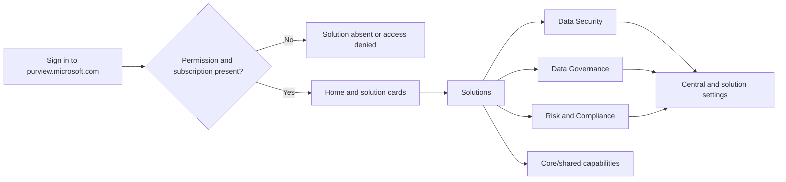

Never diagnose a missing solution card as a service defect until you check subscription, role, role-group membership, administrative-unit restriction, environment URL, and propagation time.

## 4. Purview architecture: control plane, classification plane, policy plane, and evidence plane

The **control plane** holds configuration and authorization. The **classification plane** extracts and recognizes content. The **policy plane** evaluates conditions and applies actions. The **evidence plane** records activities, alerts, explorer data, and audit events.

| Plane | Examples | Main failure question |
|---|---|---|
| Control | Portal, roles, role groups, administrative units, policy definitions | Could the right admin create/read the configuration? |
| Content/source | Exchange, SharePoint, OneDrive, Teams, devices, repositories, data sources | Is the item in a supported and in-scope location? |
| Extraction | Search crawl, parsers, OCR where enabled, endpoint local/cloud scanning | Could text/metadata be extracted? |
| Classification | SIT, EDM, fingerprint, classifier, label recognition | Did the detector match with the expected confidence? |
| Policy | Labeling, DLP, retention, investigation logic | Did a matching classifier lead to the intended action? |
| Evidence | Audit, Activity Explorer, Content/Data Explorer, alerts, reports | Is the event delayed, filtered, restricted, or absent? |

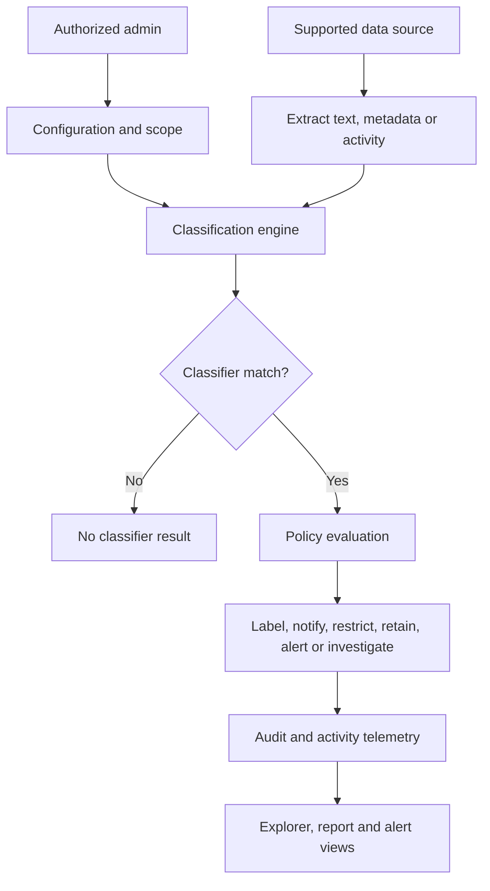

This layered model prevents a common error: changing a DLP rule when the real problem is an unindexed SharePoint file, an unsupported encrypted format, or missing permissions to see matched content.

## 5. Roles, role groups, and least privilege

A **role** is a bundle of permitted actions. A **role group** combines roles and members. Microsoft Entra roles such as Compliance Administrator can provide broad access, while Purview roles and custom role groups can provide narrower duties. Viewing file contents is deliberately more restricted than viewing aggregate counts.

| Task | Directional least-privilege role area | Separation-of-duties concern |
|---|---|---|
| Configure classifiers and labels | Information Protection Admin / appropriate compliance role | Do not automatically grant content viewing |
| Analyze classification trends | Information Protection Analyst or Reader | Aggregate access still reveals business patterns |
| Investigate items | Information Protection Investigator | Scope and case purpose must be approved |
| List matching items/locations | Data Classification List Viewer / Content Explorer List Viewer | File names and locations can be sensitive |
| Preview matching content | Data Classification Content Viewer / Content Explorer Content Viewer | This can supersede local item permissions |
| Manage roles | Role Management role | Avoid self-approval and standing privilege |
| Run scripted configuration | Exact Security & Compliance PowerShell role | Use separate change identity and audit trail |

### 🔍 Plain-English deep-dive: why Global Administrator is not a content-viewing shortcut

Global Administrator is a powerful directory role, but Microsoft intentionally separates some Purview content-view permissions. Seeing that ten thousand files match a classifier is not the same privacy risk as opening payroll or medical content. An investigator might need a list of files without permission to read them. A small approved group might need content preview for tuning.

**Analogy:** A building manager can issue room-access policy, but that does not mean the manager should read every sealed personnel folder. Purview role separation creates that distinction.

Use Entra PIM for just-in-time role-group membership where supported, but account for effective-permission delay. Current Learn warns that PIM activation for security-group-backed Purview role groups can take up to two hours to become effective.

## 6. Administrative units and scoped administration

Microsoft Entra **administrative units (AUs)** partition administrative responsibility around subsets such as geography or business unit. Purview solution support varies: a restricted administrator may create or view only policies, alerts, users, or sites associated with assigned AUs. AU scope is not a universal row-level security system for every Purview feature.

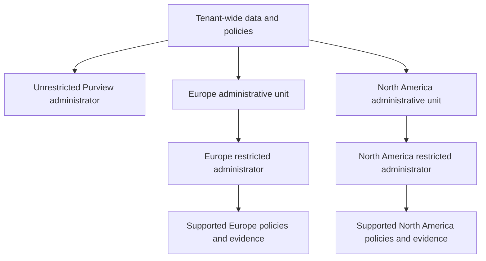

| Scoping question | Required design evidence |
|---|---|
| Which objects are in each AU? | Object inventory and membership source |
| Does the specific Purview solution support AU scoping? | Current feature documentation and tenant test |
| Are SharePoint sites associated where supported? | Site-to-AU mapping evidence |
| Can restricted admins see OneDrive or explorer activity? | Positive and negative permission tests |
| How are global exceptions managed? | Escalation and approval path |
| How quickly do membership changes apply? | Measured propagation objective |

## 7. Classification is recognition, not protection

Classification identifies content characteristics. It can report a match or become a condition for another solution. Classification by itself does not necessarily encrypt, block, retain, delete, or alert.

| Stage | Question | Example |
|---|---|---|
| Discover | Where is potentially important data? | SharePoint files containing customer identifiers |
| Classify | What type of data/content is it? | Exact customer ID, contract template, résumé, credential |
| Label | What business handling category applies? | Confidential - Customer Data |
| Protect/govern | What should happen? | Restrict external sharing, retain seven years, require encryption |
| Monitor | Did users and services behave as expected? | Activity Explorer and audit events |
| Improve | Are detection and controls accurate? | Tune confidence, exceptions, scope, and process |

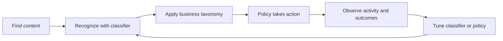

In an interview, say: “A SIT match is a signal. DLP, auto-labeling, retention, or investigation logic consumes that signal. I would validate both the classification result and the downstream policy result.”

## 8. Searchable and classifiable locations

Coverage depends on the solution, content state, file type, encryption, indexing, and license. The same classifier may be available in one workload and unsupported in another.

| Location | Typical classification path | Important caveat |
|---|---|---|
| Exchange Online | Message/attachment processing and service classification | Existing mailbox content is not evaluated identically by every policy type |
| SharePoint Online | Search/index and service classification | New/changed content and recrawl timing matter for custom SITs |
| OneDrive for Business | SharePoint-based content services | Detached OneDrive and URL/lifecycle states can affect scenarios |
| Teams chat/channel | Compliance copies and service processing | Messages differ from files linked in Teams |
| Windows/macOS devices | Local endpoint engine plus optional cloud advanced classification | Onboarding, versions, network, bandwidth, and file state matter |
| On-premises repositories | Information Protection scanner and configured repositories | Requires infrastructure, service identity, SQL, network, and scope |
| Non-Microsoft cloud apps | Defender for Cloud Apps or newer inline/network integrations | Connector/session/network architecture changes capabilities |
| Data Map sources | Registered/live-view/scanned metadata and classification | Governance licensing and source scanning differ from M365 compliance |

Do not write “Purview scans everything.” Define the exact item type, location, state (at rest/in use/in motion), parser, classifier, policy, and evidence source.

## 9. The classification pipeline for SharePoint and OneDrive

Your SharePoint and OneDrive background is especially useful here. Files are uploaded or modified, content and metadata become available to service processing, search crawling/indexing occurs, classifiers evaluate supported content, and results eventually appear in policy/evidence experiences. Each stage has a distinct clock.

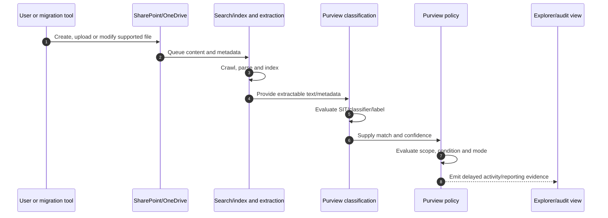

If a custom SIT changes, existing unchanged files are not automatically guaranteed to be reclassified under the new definition. Current Learn directs administrators to reindex/recrawl or use supported on-demand classification where applicable. That is a platform lifecycle fact, not a reason to keep editing the detector.

## 10. Scanning, crawling, indexing, and reporting delay

Different words describe different work:

| Process | Plain meaning | Failure symptom |
|---|---|---|
| Scan | Inspect a source or item for metadata/content | Source never inventoried or classified |
| Crawl | Discover changed SharePoint content for search | New file absent from search-dependent processing |
| Parse/extract | Convert a supported file into text/metadata | Password-protected/image-only/unsupported content yields no match |
| Index | Store searchable terms/properties | Search and classifier results lag or omit item |
| Classify | Evaluate detection logic | Extracted content exists but expected SIT does not match |
| Aggregate/report | Transform events/counts for explorer views | Enforcement occurred but dashboard is still empty |

Current Learn says Activity Explorer is not real time. For core Exchange, SharePoint, OneDrive, and Teams activities, allow roughly **60-90 minutes**, with other services potentially taking longer and no universal guarantee. Offline endpoints backfill after reconnection. Content Explorer counts can take up to **seven days** to update, and SharePoint files can take up to **14 days** to appear in that view. Treat these as documented planning windows, not service-level guarantees.

### 🔍 Plain-English deep-dive: four clocks explain many “missing” results

1. **Configuration clock:** role, classifier, or policy must replicate.
2. **Content clock:** source must crawl, parse, and index the item.
3. **Evaluation clock:** classifier and policy engine must process it.
4. **Evidence clock:** audit and explorer views must ingest and aggregate it.

**Analogy:** A parcel must enter the depot, be scanned, routed, and then appear in tracking. Refreshing the tracking page does not make the depot scan happen faster.

## 11. Content Explorer, Data Explorer, and Activity Explorer

The explorer names are change-sensitive. Conceptually, separate **where/what exists** from **what happened**.

| Experience | Primary question | Typical data | Security concern |
|---|---|---|---|
| Content Explorer (classic terminology) | Which items and locations match labels/classifiers? | Snapshot by SIT, sensitivity label, retention label, classifier | Item names, locations, and content preview are highly sensitive |
| Data Explorer (newer shared terminology) | Where is sensitive/labeled data and how is it distributed? | Data-risk/classification views exposed by current solution | Availability, scope, and exact navigation vary by solution/license |
| Activity Explorer | What actions occurred on labeled or sensitive content? | Label changes, DLP matches, endpoint egress, file activity | User behavior and matched context are personal/sensitive evidence |
| Audit | What raw auditable event can independently corroborate activity? | Workload and Purview audit records | Retention and permission differ from explorer UI |

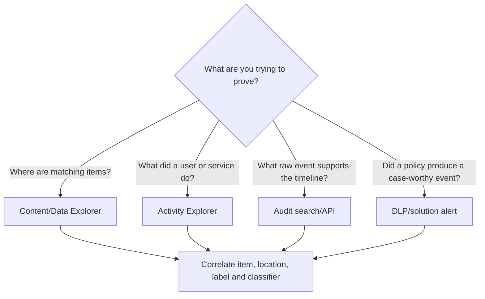

Content Explorer access has two layers: access to the tab and separate permissions for list/item content. The Content Viewer role can supersede local file permissions for preview. Assign it just in time, record purpose, audit use, and remove it after approved investigation or tuning.

## 12. Sensitive information types

A **sensitive information type (SIT)** is a classifier built from recognizable patterns and corroborating evidence. Microsoft provides many built-in SITs for financial, identity, medical, credential, and regional data. A custom SIT can model an organization's own structured identifiers.

| SIT element | Plain meaning | Example |
|---|---|---|
| Primary element | Main candidate pattern | Regex for `EMP-123456` |
| Supporting element | Nearby corroborating evidence | “employee”, “personnel”, “HR” |
| Validator/function | Check that candidate is structurally valid | Checksum or known format function |
| Proximity | Maximum character distance between elements | Keyword within 100 characters |
| Confidence | Strength assigned to a pattern | Low, medium, or high |
| Instance count | Number of unique matches required | At least five customer IDs |
| Additional check | Include/exclude or formatting constraint | Exclude test prefixes |

Microsoft's SIT definition catalog maps directional low/medium/high confidence to accuracy values, commonly 65 or below, 75, and 85 for listed entities. Do not assume every custom pattern uses those exact internals; inspect the actual definition and configure policy confidence intentionally.

## 13. How a SIT match is built

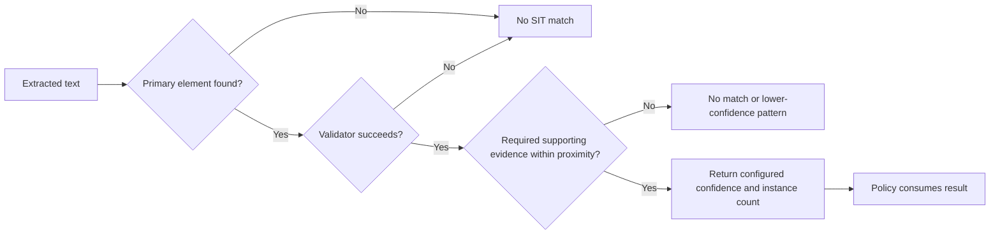

For an employee identifier, the digits alone may collide with invoice numbers. Adding a prefix, checksum, and nearby HR terms raises precision. Increasing precision can reduce recall, so every detector needs positive and negative tests.

## 14. Confidence, proximity, keywords, and instance counts

**Confidence** is the detector's estimate based on the matched pattern, not a legal conclusion. **Proximity** controls how close corroborating elements must be. **Instance count** controls how many unique matches cause policy evaluation.

| Tuning move | Likely benefit | Likely cost |
|---|---|---|
| Require stronger validator | Fewer false positives | Miss malformed but real values |
| Add business keyword | Better context | Miss tables/forms without that word |
| Reduce proximity | Less unrelated corroboration | Miss headings far from values |
| Raise confidence threshold | Safer blocking | More false negatives |
| Raise instance count | Ignore isolated accidental-like values | Miss a single high-impact record |
| Add explicit exclusion | Protect known benign workflow | Exception can become a blind spot |

Do not say “high confidence means correct.” Say “high confidence means the strongest configured match path was satisfied; we still validate with a representative corpus and review outcomes.”

## 15. Built-in versus custom SIT design

Start with built-in SITs when they fit the geography, format, and use case. Copy and modify a built-in SIT when the base logic is useful but client context differs. Build from scratch only when the identifier is genuinely organization-specific.

| Option | Choose when | Governance requirement |
|---|---|---|
| Built-in SIT | Standard identity/payment/credential format | Verify regional definition and test data |
| Copy built-in | Standard pattern plus stricter context | Record the delta and owner |
| Custom regex/function SIT | Stable organization-specific structure | Peer review regex, validators, limits, and adversarial cases |
| Keyword list/dictionary | Domain language identifies content | Version vocabulary and multilingual variants |
| EDM SIT | Values must match an authoritative dataset | Data owner, hashing/upload process, schema quality, refresh |
| Fingerprint SIT | Repeated form/template identifies document family | Template owner and version lifecycle |
| Trainable classifier | Semantic document type lacks stable pattern | Representative samples and quality review |

Current custom-SIT guidance warns that positional regex anchors such as `^` and `$` are not reliable for scanned content and limits custom regex to one primary capturing group. These details are implementation-sensitive; confirm the current SIT limits and regex engine before production use.

## 16. Exact Data Match

**Exact Data Match (EDM)** recognizes values that both resemble a base pattern and match records from a client-controlled authoritative dataset. The organization prepares a schema, securely hashes/uploads the sensitive table through the supported process, and defines primary/supporting fields. Purview does not need the raw values in policy rules.

**Analogy:** A normal SIT asks, “Does this look like a membership number?” EDM asks, “Does it look valid, and is it one of our actual membership numbers?”

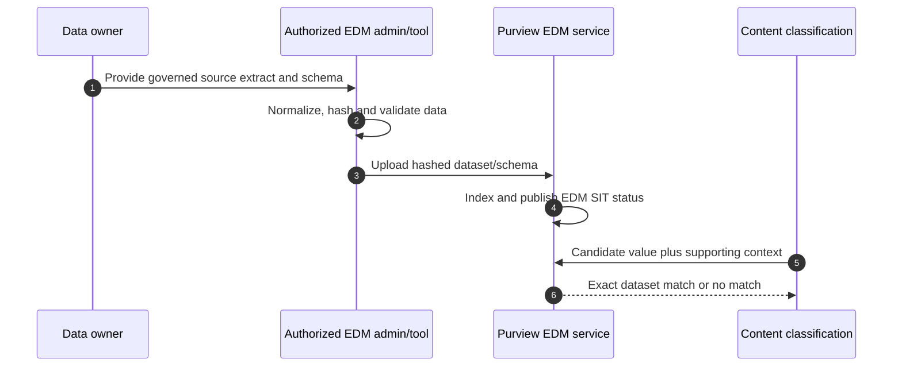

| EDM design concern | Good practice |
|---|---|
| Primary field | Prefer selective, consistently formatted values |
| Duplicate values | Remove or understand repeats that can cause broad result sets/timeouts |
| Corroborating fields | Use enough context to disambiguate without requiring often-empty columns |
| Source freshness | Define approved refresh frequency and failed-upload alert |
| Sample data | Use non-sensitive representative values for schema design |
| Privacy | Minimize columns and restrict source/export/upload operators |
| Operations | Monitor upload and indexing states, including failed states |

The newer EDM experience combines schema and SIT creation and reports upload/indexing status. Current guidance recommends it unless you need classic capabilities such as mapping multiple EDM SITs to one schema, managing more than ten EDM SITs through shared schemas, naming schemas, or managing classic/PowerShell-created schemas. Treat those limits as current facts to reverify.

## 17. Document fingerprinting

Document fingerprinting converts a representative text-based form or template into a SIT. It is useful for standardized patent forms, HR forms, claims, contracts, or client templates even after fields are completed.

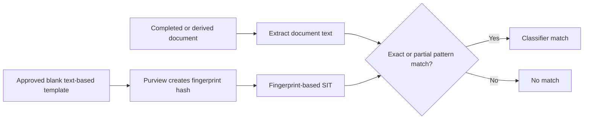

The original template is not stored as retrievable content; current documentation describes storing a hash representation. Limitations include password-protected files, image-only files, missing template text, embedded documents not contributing to fingerprint creation, and size/template limits. Partial matching trades false positives against false negatives. Exact matching is brittle if users change wording. The test corpus must include current, old, localized, and modified template versions.

## 18. Trainable classifiers

A **trainable classifier** uses machine learning to recognize a semantic document category, such as contracts, résumés, source code, legal privilege, or mergers and acquisitions. Microsoft provides pretrained classifiers; custom classifiers use positive and negative examples.

| Classifier type | Advantage | Limitation/risk |
|---|---|---|
| Microsoft pretrained | Ready to use; Microsoft supplies training | Meaning may not match client vocabulary/process |
| Custom trainable | Tailored to organization | Requires sample governance and quality evaluation |
| SIT | Explainable structured match | Weak for overall document meaning |
| Fingerprint | Excellent for template families | Weak when documents are not template-based |

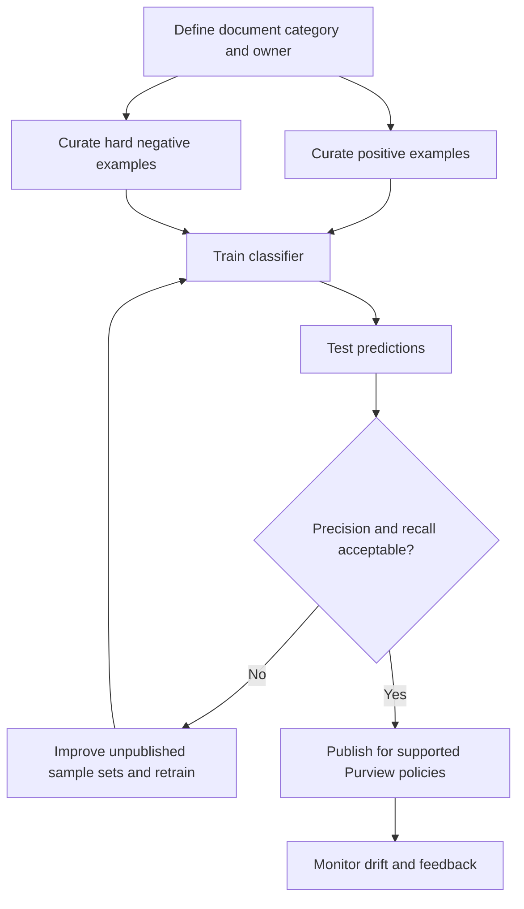

Current Learn states custom classifiers are limited to English, classifiers do not work with encrypted items, and a published custom classifier cannot simply be retrained; improvement can require removing it and starting again with larger samples. Preview behavior can display classifier findings in Content Explorer without a labeling policy. That raises privacy and opt-out considerations and must be verified for the tenant.

## 19. Named entities, credential classifiers, and broader context

**Named entities** recognize semantic entities such as full names, physical addresses, medical terms, or other contextual concepts. **Credential classifiers/SITs** recognize secrets such as passwords, API keys, tokens, connection strings, and private keys. These are useful when a simple country ID pattern is not enough.

| Detection family | Example | Security use | Main tuning risk |
|---|---|---|---|
| Named entity | Person name plus physical address | Privacy-data discovery | Common names/addresses generate noise |
| Credential SIT | Azure key, PAT, authorization header | Secret-exposure detection | Test strings and documentation examples |
| Medical entity | Medication, diagnosis, procedure | Health-data protection | Context and jurisdiction differ |
| Combined condition | Identity + financial information | Higher-risk record set | AND logic may miss incomplete records |
| Trainable semantic type | Contract or résumé | Document-family control | Business meaning can drift |

Endpoint advanced classification can use cloud classification for EDM, named entities, trainable classifiers, and credential classifiers. That can transmit content for classification and consume bandwidth; define privacy, network, regional, and fallback decisions before enabling it.

## 20. Classification-method decision tree

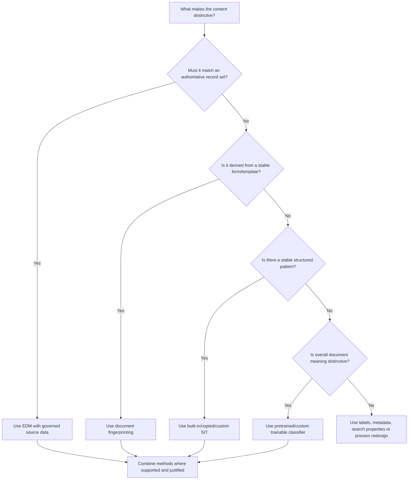

The best design is often layered: EDM for actual customer IDs, a trainable classifier for contract meaning, and a sensitivity label for business handling. Avoid piling classifiers together merely to appear sophisticated; every condition must improve a measured outcome.

## 21. Taxonomy design

A **taxonomy** is the controlled vocabulary that connects business categories to detection and handling. Begin with data classes and obligations, not product menus.

| Taxonomy field | Example | Owner |
|---|---|---|
| Business data class | Customer identity record | Data owner |
| Description/inclusions | Customer number linked to name/contact details | Data steward/privacy |
| Exclusions | Public business-contact directory | Privacy/legal |
| Detection method | EDM customer ID plus supporting fields | Information protection engineer |
| Sensitivity | Confidential - Customer Data | Security/data governance |
| Retention | Seven years after account closure | Records/legal |
| Permitted use | Internal service and approved processors | Business/legal |
| Restricted actions | External upload, unmanaged print | Security/endpoint |
| Evidence | Corpus results, policy simulation, audit | Control owner/audit |

Keep detection taxonomy separate from user-facing label taxonomy. Users may need four or five understandable sensitivity labels, while the engine can use many SITs and classifiers behind those labels.

## 22. Naming and documentation standards

Use names that reveal purpose without exposing sensitive implementation details. A classifier name should not imply certainty or a regulation the client has not validated.

| Object | Suggested pattern | Example |
|---|---|---|
| Custom SIT | `ORG-SIT-<Data>-<Region>-v#` | `ORG-SIT-CustomerID-UK-v1` |
| EDM schema | `ORG-EDM-<Source>-<Purpose>` | `ORG-EDM-CRM-CustomerMatch` |
| Fingerprint | `ORG-FP-<Template>-v#` | `ORG-FP-EmploymentContract-v3` |
| Classifier | `ORG-TC-<DocumentFamily>` | `ORG-TC-MA-DealDocument` |
| Test corpus | `TC-<Classifier>-<YYYYMMDD>` | `TC-CustomerID-20260825` |
| Decision record | `ADR-PUR-###` | `ADR-PUR-014 EDM primary key choice` |

Descriptions should state owner, purpose, intended locations, match meaning, exclusions, last review, and contact. Avoid “GDPR compliant detector”; a technical match does not establish compliance.

## 23. Building a safe test corpus

A test corpus is a controlled set of items with expected outcomes. Use synthetic data unless approved real samples are essential and legally permitted.

| Corpus group | Purpose | Example |
|---|---|---|
| True positive | Must match | Synthetic valid customer ID with proper context |
| Hard true positive | Must match despite variation | Table, header distance, punctuation, PDF conversion |
| True negative | Must not match | Ordinary project number |
| Hard negative | Looks similar but is benign | Invoice/reference number with same digits |
| Boundary | Test minimum/maximum count or proximity | Keyword at exactly threshold distance |
| Unsupported/opaque | Confirm known limitation | Password-protected or image-only file |
| Multilingual | Validate language behavior | Approved localized terms and formats |
| Adversarial | Expose evasion | Spaces, separators, OCR noise, copied template sections |

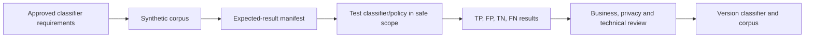

Never place real national IDs, payment data, passwords, tokens, or customer records in a demonstration tenant. Use Microsoft-provided test values where documented or fabricated values that satisfy a safe custom pattern without representing a real person.

## 24. False positives, false negatives, precision, and recall

A **false positive (FP)** is a match that should not have matched. A **false negative (FN)** is sensitive content that was missed. **Precision** asks what fraction of reported matches were correct. **Recall** asks what fraction of all real positives were found.

$$
\text{Precision}=\frac{TP}{TP+FP}
\qquad
\text{Recall}=\frac{TP}{TP+FN}
$$

| Outcome | Meaning | Control impact |
|---|---|---|
| True positive (TP) | Correctly detected sensitive item | Intended protection/visibility |
| False positive (FP) | Benign item detected | User friction, alert noise, unnecessary exposure during review |
| True negative (TN) | Correctly ignored benign item | Normal productivity |
| False negative (FN) | Sensitive item missed | Uncontrolled leakage or compliance gap |

For discovery, higher recall may be acceptable. For hard blocking, higher precision is usually required. A client must explicitly choose the risk tradeoff; it is not an engineer-only setting.

## 25. Privacy and ethical design

Classification can expose where sensitive data exists and what people do with it. The program therefore needs data minimization, purpose limitation, role separation, approved monitoring, retention of telemetry, and investigation rules.

| Privacy risk | Mitigation |
|---|---|
| Investigators can preview employee/customer content | JIT content-view role, approval, audit, periodic access review |
| Test corpus contains real personal data | Synthetic/default test values and controlled exception process |
| Classifier reveals labor/health/legal categories | Legal/privacy review and restricted reporting |
| Endpoint cloud classification transmits content | Document data flow, region, bandwidth, and approved scope |
| Explorer exports create secondary sensitive datasets | Encrypt, restrict, retain briefly, and delete evidence exports |
| Named entities over-collect people data | Narrow purpose, conditions, scope, and retention |
| Machine-learning samples encode bias | Representative samples and human review across populations |

### 🔍 Plain-English deep-dive: visibility is itself privileged data

A dashboard saying “these 500 files contain medical terms” may reveal health-related work even without showing the text. A filename may expose an employee name or investigation. A classifier sample set may contain attorney-client material. Therefore, “read-only” does not mean low risk.

**Analogy:** A map of every safe in a building is sensitive even if it does not contain the safe combinations.

## 26. Prerequisites and licensing discovery

Do not quote “E5 is required for Purview” as a universal rule. Entitlement varies by feature, user, workload, add-on, region, and service plan. Manual labeling, auto-labeling, Content Explorer, EDM, fingerprinting, trainable classifiers, Endpoint DLP, governance scanning, and AI features can have different requirements.

| Discovery item | Evidence to collect |
|---|---|
| Tenant/cloud | Commercial, GCC, GCC High, DoD, sovereign URL/feature availability |
| User licenses | Base suites plus compliance/information-protection add-ons |
| Feature entitlement | Current service-description row for each proposed capability |
| Workload state | Exchange Online, SharePoint/OneDrive, Teams, endpoint onboarding |
| Audit | Audit enabled, retention, and role access |
| SharePoint integration | Search/index health and sensitivity-label enablement where relevant |
| Endpoint | Supported OS, Defender onboarding, client/platform versions, connectivity |
| Scanner | Server, SQL, service identity, repositories, proxy/TLS, HA and operations |
| Governance | Free versus enterprise governance version and source-scan costs |

License the users who benefit from or are protected by a capability according to current Product Terms, not merely the administrator who configures it. Record assumptions and get commercial/licensing validation before pricing a roadmap.

## 27. Discovery and assessment workflow

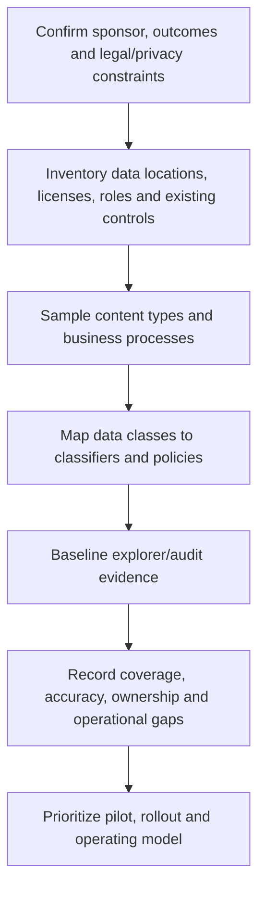

Interview stakeholders across security, privacy, legal, records, compliance, HR, workload operations, endpoint engineering, SOC, data governance, application owners, and business teams. Ask what must be found, why, where it lives, acceptable error rates, permitted evidence access, and who can approve enforcement.

## 28. Graph, APIs, PowerShell, and automation context

The portal is not the only interface. Security & Compliance PowerShell manages many labels, policies, SITs, retention objects, and events. Microsoft Graph supports selected security, records-management, file-label, and governance operations. The Office 365 Management Activity API can export audit activity. Data governance APIs manage catalog/map entities. Coverage is not uniform.

| Interface | Good use | Guardrail |
|---|---|---|
| Purview portal | Interactive setup, investigation, and review | Capture screenshots/exports because navigation changes |
| Security & Compliance PowerShell | Repeatable configuration/export at scale | Use current cmdlet docs, GUIDs, change control, and transcript |
| SharePoint Online PowerShell | Site/index/label integration settings | Multi-Geo and tenant-wide blast radius |
| Microsoft Graph | Supported file label/records/event automation | Verify endpoint permissions, async status, throttling, and beta/GA |
| Management Activity API | SIEM/report ingestion of audit events | Pagination, latency, retention, secret/certificate security |
| Governance APIs | Data Map/catalog assets and metadata | Different identity, billing, and authorization model |

Do not promise API parity with the portal. Build an operation matrix stating object, create/read/update/delete support, permission, API version, status, retry behavior, and rollback.

## 29. Security architecture and threat considerations

| Threat/failure | Example | Control |
|---|---|---|
| Excess privilege | Broad admin can preview payroll files | Custom role groups, PIM, dual approval, access review |
| Classifier evasion | Secret split with spaces or embedded in image | Layer detectors, OCR where entitled, endpoint controls, user process |
| Poisoned training set | Negative examples include true merger documents | Curated source, reviewer sign-off, sample provenance |
| EDM source compromise | Unauthorized values inserted into source extract | Source owner, integrity check, signed pipeline, least privilege |
| Configuration drift | SIT changed without retesting policies | Export/version control, change record, regression suite |
| Evidence leakage | CSV export copied to personal storage | Restricted workspace, DLP, encryption, expiry, audit |
| Availability dependency | DKE/encrypted file cannot be classified by service | Document blind spots and compensating controls |

Classification should fail in a documented way. For a hard control, decide whether unscannable/password-protected content is blocked, quarantined, audited, or routed for exception. Silent “allow” is a business decision, not a technical default to ignore.

## 30. Configuration and deployment lifecycle

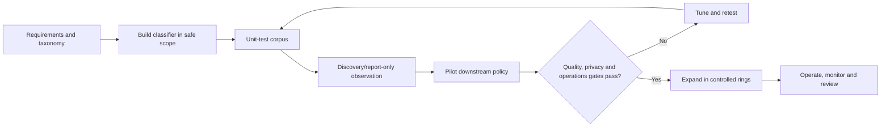

Recommended stages:

1. Approve purpose, data class, owner, locations, and acceptable error rates.
2. Confirm licensing, roles, auditing, source readiness, and privacy assessment.
3. Create a versioned detector and synthetic corpus.
4. Test classifier behavior before attaching blocking/deletion actions.
5. Run downstream policy in simulation/report-only mode where supported.
6. Pilot with representative users/sites/devices and service-desk readiness.
7. Approve go/no-go using objective metrics.
8. Expand by rings with rollback triggers and communication.
9. Review drift, exceptions, permissions, sources, and license changes.

## 31. Testing strategy

| Test layer | Positive test | Negative/failure test | Evidence |
|---|---|---|---|
| Permission | Approved analyst sees aggregate | Unapproved user denied preview | Role export and screenshots |
| Extraction | Supported DOCX/PDF parsed | Password/image-only behavior documented | Search/classifier result |
| SIT | Valid synthetic pattern matches | Look-alike invoice does not | Test-DataClassification/result |
| EDM | Synthetic source record matches | Structurally valid absent record does not | Upload/index and result logs |
| Fingerprint | Filled template matches | Unrelated form does not | Match confidence report |
| Trainable classifier | Held-out positive predicted | Hard negative rejected | Confusion matrix |
| Policy consumption | Simulated rule sees classifier | Out-of-scope site unaffected | Policy simulation/activity |
| Latency | Event appears within measured range | Early absence is not misdiagnosed | Timestamped evidence journal |
| Privacy | JIT investigator opens approved sample | Access removed after window | PIM/audit evidence |

Test the detector in every proposed location; a successful SharePoint match does not prove endpoint, Exchange, Teams, or non-Microsoft cloud behavior.

## 32. Rollback and safe change

Classifier rollback is not always a simple switch. Existing classifications can persist until content is modified/reprocessed. Published trainable classifiers may require replacement. An EDM schema/data refresh may have dependent policies. A fingerprint or SIT may be referenced broadly.

| Change | Safer rollback approach |
|---|---|
| Custom SIT edit | Export old definition, clone/version new detector, test dependents, restore old reference if needed |
| EDM dataset refresh | Retain approved prior source/hash package and upload log; pause dependent enforcement if quality fails |
| Fingerprint update | Create versioned fingerprint for new template; overlap observation before retiring old |
| Trainable classifier quality regression | Remove from enforcing policies first; replace through controlled retraining/publishing process |
| Role expansion | Time-bound assignment; remove and verify effective access/audit |
| Explorer preview enablement | Remove Content Viewer role and securely delete exports |

Rollback must include downstream policies. Disabling a classifier while a policy still expects it can create a blind spot that appears healthy.

## 33. Operations and metrics

| Metric | What it indicates | Bad interpretation to avoid |
|---|---|---|
| Coverage by location/file type | How much intended estate can be evaluated | “No findings means no sensitive data” |
| Precision by classifier | Analyst-confirmed quality | Treating unreviewed matches as true |
| Recall on controlled corpus | Ability to find known positives | Claiming production recall from a tiny lab |
| Match volume trend | Data/process or detector change | Assuming every spike is an incident |
| Time to explorer visibility | Pipeline health and expectations | Comparing UI timestamps without clock normalization |
| Unscannable rate | Opaque/unsupported risk | Ignoring because no SIT match occurred |
| Override/exception rate | Friction or legitimate workflow | Treating all overrides as malicious |
| Content-preview access | Privacy control health | Counting role assignment without use/audit review |
| Stale EDM age | Authoritative source freshness | Assuming last successful job means current data |
| Classifier change failure rate | Engineering quality | Hiding failed changes in aggregate success |

Define owners, thresholds, investigation steps, and business review cadence. A metric without a decision is only a chart.

## 34. Logs and evidence map

| Evidence source | Use | Limitation |
|---|---|---|
| Unified audit log | Corroborate configuration and user/service events | Event availability/retention/license vary |
| Activity Explorer | Filter recent classification and DLP activity | Up to 30 days in current view; not real time |
| Content/Data Explorer | Locate matching/labeled items | Delayed counts; preview requires privileged role |
| DLP alert/dashboard | Investigate policy-triggered events | Only configured alerting and supported workloads |
| Workload logs | Search/index, SharePoint, Exchange, endpoint evidence | Different teams and timestamps |
| PowerShell export | Capture effective configuration | Export is a sensitive artifact and point-in-time |
| EDM status/tool logs | Upload/index progress and failure | Does not by itself prove content detection |
| Service health/Message center | Platform incident/change correlation | Tenant-specific access and notification gaps |

Record UTC timestamps, tenant, object GUID, source item, classifier version, policy/rule, user/device, expected result, actual result, and evidence URL/export hash where appropriate.

## 35. Common failure modes

| Symptom | Likely causes | First discriminating check |
|---|---|---|
| Solution card missing | License, role, portal/environment, propagation | Verify direct URL, role assignment, SKU and wait window |
| Explorer empty | Audit delay, filters, no activity, role scope | Remove filters and corroborate in Audit after documented latency |
| Item count but no preview | Missing Content Viewer role or encryption | Check list-view versus content-view permission and item state |
| Custom SIT misses old files | No recrawl/reindex/on-demand processing | Test a newly modified synthetic file |
| High false positives | Broad regex, weak context, large proximity, low confidence | Inspect matched elements on approved samples |
| EDM misses known record | Normalization/schema/key/data-index status | Verify candidate format and EDM indexing completion |
| Fingerprint misses new version | Template text changed or unsupported/opaque file | Compare extracted text and fingerprint version |
| Trainable classifier drift | Business content changed or weak samples | Run current held-out corpus and category review |
| Endpoint differs from cloud | Client/onboarding/advanced classification/network | Check device status and local versus cloud classification path |
| Counts disagree | Different windows, clocks, scope and aggregation | Normalize item ID, UTC time, filters and data-source semantics |

## 36. Layered troubleshooting method

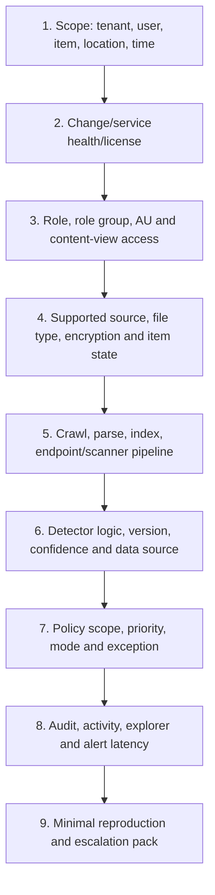

Do not jump layers. First reproduce with one synthetic item, one controlled location, one classifier, and a recorded timestamp. Compare a known-positive with a known-negative. Then widen scope.

## 37. Escalation evidence pack

Provide Microsoft or an owning team with:

| Evidence | Required detail |
|---|---|
| Business impact | Users/data/controls affected and urgency |
| Environment | Tenant ID, cloud, region, license, portal URL |
| Timeline | UTC creation/change/evaluation/observation timestamps |
| Object IDs | Classifier, policy, rule, label, site/file/device IDs where safe |
| Reproduction | Synthetic data and exact expected/actual result |
| Scope comparison | Working versus failing user/location/file |
| Permissions | Relevant role group and AU scope, without secrets |
| Pipeline | Crawl/index/onboarding/upload status |
| Evidence | Redacted screenshots, audit records, correlation/request IDs |
| Changes | Recent policy, source, client, license, service incident |
| Safety | Actions already taken and enforcement/rollback state |

Never attach raw customer records, national IDs, credentials, encryption keys, or broad explorer exports to a ticket unless the approved secure evidence process explicitly requires it.

## 38. Consulting architecture decisions

| Decision | Options | Decision factors |
|---|---|---|
| Detection strategy | SIT, EDM, fingerprint, classifier, label, combination | Data shape, explainability, precision/recall, licensing |
| Scope | Tenant-wide, AU, location, pilot | Ownership, legal boundaries, blast radius |
| Evidence access | Aggregate, list, preview | Privacy, investigation purpose, separation of duties |
| Classification path | Local, cloud advanced, service, scanner | Data residency, bandwidth, latency, file support |
| Rollout | Discovery-first, recommendation, simulation, enforcement | User impact and reversibility |
| Operating owner | Security, compliance, records, data governance, SOC | Control objective and required response |

An architecture decision record should state context, decision, alternatives, assumptions, dependencies, licenses, security/privacy impact, test evidence, operational owner, review date, and rollback.

## 39. Scenario: SharePoint customer-data discovery

**Situation:** A client suspects that customer identifiers are spread across project sites. Start with inventory and synthetic validation, not blocking. Compare a built-in/custom structured SIT against EDM if an authoritative CRM list exists. Measure locations, precision, false-negative corpus behavior, and unscannable files. Restrict content preview to approved investigators.

**Experience bridge:** You can credibly explain site scope, permissions, sharing, search/index timing, file variation, sync/migration effects, and incident evidence. You should present EDM and Purview policy configuration as design/lab knowledge unless implemented.

## 40. Scenario: merger-document detection

**Situation:** Legal wants to identify merger and acquisition documents. A generic keyword “merger” is noisy. Use a Microsoft-provided or custom trainable classifier if semantics are stable, plus project metadata or a dedicated site. Use positive and hard-negative samples, legal-approved review, and strict preview permissions. Consider a sensitivity label and DLP only after quality is proven.

**Failure test:** Press articles about public mergers must not be treated as confidential deal documents merely because they contain the same vocabulary.

## 41. Scenario: exposed credentials

**Situation:** Security wants to find API keys and tokens in files and endpoint activity. Use current credential SITs/classifiers and DLP in simulation. Include synthetic test secrets only. Define an incident response process: validate, revoke/rotate the real credential through the owning system, investigate access, remove the secret, and improve development practices.

Classification is not remediation. Never paste a detected secret into chat, a ticket title, or an unprotected report.

## 42. Consulting artifacts

| Artifact | Minimum contents |
|---|---|
| Purview solution map | Portfolio area, capability, data location, owner, license |
| Data-classification inventory | Data class, source, format, volume, owner, obligation |
| Classifier specification | Logic, confidence, proximity, examples, exclusions, limits |
| Corpus manifest | Synthetic item ID, expected outcome, location, version |
| Quality report | TP/FP/TN/FN, precision, recall, analyst notes |
| Privacy impact note | Purpose, data subjects, viewers, exports, retention |
| RBAC matrix | Task, role, scope, PIM, approver, review cadence |
| HLD/LLD | Pipeline, integrations, trust boundaries, failures, telemetry |
| Deployment plan | Rings, gates, communications, testing, rollback |
| Runbook | Monitoring, triage, escalation, evidence, owner |
| Risk register | Classification gaps, opaque files, privileges, drift |
| Executive scorecard | Coverage, quality, incidents, backlog, residual risk |

## 43. Safe paper lab: design a customer-record classifier without touching a tenant

### Scenario and safety boundary

A fictional organization wants to discover documents that contain a fictional customer ID shaped as `CUST-` followed by eight digits. The exercise is **paper-only**. Do not create a tenant object, upload real data, use a real customer identifier, enable preview, assign a role, or run a policy.

### Goals

1. Choose a classification method.
2. Define testable patterns and context.
3. Map roles, locations, evidence, metrics, deployment, and rollback.
4. Produce interview-safe evidence without claiming implementation.

### Paper design

| Field | Paper decision |
|---|---|
| Data class | Fictional customer service record |
| Primary element | `CUST-[0-9]{8}` conceptually; validate current supported regex syntax before use |
| Supporting terms | `customer`, `account`, `case`, `service request` |
| Proximity hypothesis | Start at 150 characters; tune using corpus |
| Confidence | Medium with one support term; high with two support terms |
| Locations | One fictional SharePoint pilot site, then OneDrive/Exchange evaluation |
| Downstream use | Discovery only, then simulated label/DLP proposal |
| Privacy | Synthetic IDs only; content preview JIT and approved |
| Success | Precision at least 95% on agreed corpus and no critical FN cases |

### Synthetic corpus

Create a table on paper with at least 30 items: ten positives, ten hard negatives, five boundary cases, and five unsupported/opaque cases. Example strings include `Customer account CUST-12345678`, `Invoice 12345678`, and `CUST-1234567` (too short). Do not use numbers copied from production.

### Architecture evidence to produce

- One solution map showing classification feeding a future policy.
- One role matrix distinguishing aggregate, list, and content preview.
- One corpus manifest with expected results.
- One confusion matrix and tuning note using hypothetical results.
- One deployment plan: configure, unit test, discovery, simulation, pilot, expand.
- One rollback note covering classifier version and dependent policy removal.
- One operations dashboard specification.
- One escalation template with synthetic reproduction.

### Paper test matrix

| Test | Expected result | Evidence statement |
|---|---|---|
| Correct ID and two nearby terms | High-confidence match | “Designed expected match; not tenant-tested” |
| Correct format, no context | No/low result by chosen pattern | “Requires corpus validation” |
| Invoice number only | No match | “Hard-negative design case” |
| ID beyond proximity | No high-confidence match | “Boundary condition” |
| Password-protected file | Documented opaque behavior | “Compensating policy decision required” |
| Old unchanged SharePoint item after SIT edit | Recrawl/on-demand plan required | “Index lifecycle dependency” |
| Analyst lacks content-view role | Preview denied | “Least-privilege negative test design” |
| Activity checked immediately | Delay expected | “Do not diagnose before documented window” |

### Cleanup

There is no tenant cleanup because nothing was created. Securely delete any local screenshots or notes if they accidentally contain real names, tenant IDs, URLs, or data. Keep only the synthetic design artifacts.

### Interview wording

> “I designed a paper classifier for a fictional customer ID, including confidence and proximity logic, a synthetic confusion-matrix corpus, least-privilege explorer access, SharePoint indexing dependencies, simulation gates, metrics, and rollback. I have not deployed that custom SIT in production. My production contribution is the SharePoint/OneDrive content and troubleshooting foundation that I would apply during a controlled Purview pilot.”

## 44. JD Mapping: interview translation

| Interview theme | Factual answer direction |
|---|---|
| Purview architecture | Explain portfolio areas, shared classifiers, control/classification/policy/evidence planes |
| Assessment | Start with data, locations, owners, licenses, roles, evidence and obligations |
| Design | Match detector to data shape; define quality and privacy gates |
| Deployment | Discovery first, simulation, pilot, rings, measurable go/no-go |
| Troubleshooting | Isolate role, source, extraction, classification, policy, evidence and latency |
| SharePoint/OneDrive strength | Tie direct content, permissions, search/index, sync and RCA experience to Purview dependencies |
| Experience gap | State paper/current design and planned validation; do not imply production Purview ownership |

## 45. Official Source Anchors

These are first-party starting points checked for this chapter. Recheck each page's date, service description, preview notes, and linked licensing guidance during an engagement.

| Topic | Official Microsoft source |
|---|---|
| Purview portfolio | [Learn about Microsoft Purview](https://learn.microsoft.com/en-us/purview/purview) |
| Unified portal and relocated features | [Learn about the Microsoft Purview portal](https://learn.microsoft.com/en-us/purview/purview-portal) |
| Classifier overview | [Classifiers overview](https://learn.microsoft.com/en-us/purview/data-classification-overview) |
| Content Explorer | [Get started with Content Explorer](https://learn.microsoft.com/en-us/purview/data-classification-content-explorer) |
| Activity Explorer | [Get started with Activity Explorer](https://learn.microsoft.com/en-us/purview/data-classification-activity-explorer) |
| Sensitive information types | [Sensitive information type entity definitions](https://learn.microsoft.com/en-us/purview/sit-sensitive-information-type-entity-definitions) |
| Custom SITs | [Create custom sensitive information types](https://learn.microsoft.com/en-us/purview/sit-create-a-custom-sensitive-information-type) |
| Exact Data Match | [Get started with EDM-based SITs](https://learn.microsoft.com/en-us/purview/sit-get-started-exact-data-match-based-sits-overview) |
| Document fingerprinting | [About document fingerprinting](https://learn.microsoft.com/en-us/purview/sit-document-fingerprinting) |
| Trainable classifiers | [Learn about trainable classifiers](https://learn.microsoft.com/en-us/purview/trainable-classifiers-learn-about) |
| Licensing matrix | [Microsoft 365 licensing guidance for security and compliance](https://learn.microsoft.com/en-us/office365/servicedescriptions/microsoft-365-service-descriptions/microsoft-365-tenantlevel-services-licensing-guidance/microsoft-365-security-compliance-licensing-guidance) |
| Security & Compliance PowerShell | [Connect to Security & Compliance PowerShell](https://learn.microsoft.com/en-us/powershell/exchange/connect-to-scc-powershell) |

---

## ⭐ Likely Interview Questions for This Section

### Q1. How would you explain Microsoft Purview to a nontechnical client?

**Model answer:** “Purview is Microsoft's family of capabilities for understanding and governing data, protecting it from misuse, and meeting retention, investigation, and compliance needs. I separate data security, data governance, and risk/compliance because they have different owners and outcomes. Shared classifiers and labels help them use consistent data signals.”

### Q2. What is the difference between classification and a policy?

**Model answer:** “Classification recognizes what an item is or contains, such as a customer ID, contract template, or credential. A policy consumes that signal and decides what to do, such as label, notify, block, retain, or alert. I test both layers independently so a detector failure is not confused with a policy failure.”

### Q3. When would you use a SIT, EDM, document fingerprinting, or a trainable classifier?

**Model answer:** “I use a SIT for stable patterns, EDM when a candidate must match an authoritative record set, fingerprinting for documents derived from stable templates, and a trainable classifier for semantic document categories without reliable patterns. I choose based on data shape, explainability, quality, privacy, licensing, and operational ownership.”

### Q4. How do you control false positives and false negatives?

**Model answer:** “I define acceptable precision and recall by use case, build synthetic positive, hard-negative, boundary, multilingual, and opaque-file tests, then tune validators, supporting evidence, proximity, confidence, and instance count. Discovery can tolerate more false positives than hard blocking. Business and privacy owners approve the tradeoff.”

### Q5. Why might an expected SharePoint classifier result be missing?

**Model answer:** “I check scope and permissions, supported file type and encryption, content extraction, search crawl/index, classifier version and conditions, downstream policy mode, and reporting latency. I first test a newly modified synthetic file because custom-SIT changes do not necessarily reclassify unchanged existing files without recrawl or on-demand processing.”

### Q6. How would you secure Content Explorer access?

**Model answer:** “I separate access to aggregates, item lists, and content preview. Content preview can supersede local item permissions, so I grant the content-view role just in time to an approved investigator, use PIM and dual approval where possible, audit usage, restrict exports, and remove access after the task.”

### Q7. What would a Deloitte-style Purview classification assessment produce?

**Model answer:** “It would produce a data/location inventory, portfolio solution map, role matrix, taxonomy, classifier specifications, synthetic corpus and quality report, privacy note, licensing assumptions, target architecture, risk register, phased deployment and rollback plan, operating model, metrics, and an evidence-backed roadmap.”

### Q8. What is your honest experience with Purview classification?

**Model answer:** “My direct production experience is SharePoint Online, OneDrive, permissions, sharing, sync, escalations, RCA, and compliance-aligned support. I have developed a current Purview classification design and paper lab covering roles, classifiers, indexing, privacy, testing, deployment, and operations. I would validate it in a licensed nonproduction tenant and would not represent that design as production implementation.”

## 🧠 30-Second Memory Hooks

- **Purview is a portfolio, not one scanner.**
- **Security protects; governance explains and owns; compliance retains and proves.**
- **Classifier sees; policy decides; explorer shows evidence.**
- **SIT = pattern, EDM = pattern plus our exact data, fingerprint = template, classifier = meaning.**
- **Four clocks: configuration, content/index, evaluation, evidence.**
- **Content preview is privileged even when it is read-only.**
- **High confidence is a configured path, not guaranteed truth.**
- **Test TP, FP, TN, FN before enforcement.**
- **SharePoint result missing? Check crawl/index before rewriting policy.**
- **State direct M365 experience and the Purview design/lab boundary clearly.**

## Completion Checklist

- [ ] I can distinguish data security, data governance, risk/compliance, and shared capabilities.
- [ ] I can explain the unified portal direction and why old screenshots are unreliable.
- [ ] I can draw the control, source, extraction, classification, policy, and evidence planes.
- [ ] I can distinguish aggregate, list, and content-preview permissions.
- [ ] I can explain administrative-unit scope as solution-dependent.
- [ ] I can choose among built-in/custom SIT, EDM, fingerprinting, and trainable classifiers.
- [ ] I can explain confidence, proximity, keywords, validators, and instance counts.
- [ ] I can describe named-entity and credential classification contexts.
- [ ] I can build a synthetic corpus and calculate precision and recall.
- [ ] I can explain crawl, indexing, endpoint/scanner, and explorer delays.
- [ ] I can define privacy, licensing, security, testing, rollback, and operations gates.
- [ ] I can troubleshoot one layer at a time and create an escalation evidence pack.
- [ ] I can produce the listed consulting artifacts and paper-lab evidence.
- [ ] I can answer all eight questions aloud without claiming production Purview implementation.

*Next suggested section:* [Part 27](Part-27-purview-information-protection-labels-encryption.md) — turn the classification foundation into a practical sensitivity-label taxonomy with publishing, encryption, container controls, platform behavior, external collaboration, rollout, and troubleshooting.