# Part 27 — Information Protection, Sensitivity Labels, Encryption, and Containers

> **Section goal:** Turn business sensitivity into a usable and enforceable Microsoft Purview Information Protection design. By the end, you should be able to distinguish a sensitivity label from a publishing policy; design a small ordered taxonomy; explain current scopes for files, emails, meetings, groups/sites, and other data assets; compare manual, default, recommended, client-side automatic, and service-side automatic labeling; design content marking and encryption; reason about permissions, offline access, expiry, coauthoring, external sharing, container labels, inheritance, clients, PDFs, scanners, migration, changes, revocation, rollout, rollback, operations, and layered troubleshooting.

This Part maps to Deloitte's Microsoft 365 security assessment, Purview information-protection design, SharePoint/OneDrive and Teams security, configuration planning, migration, troubleshooting, and operational-readiness responsibilities. It uses Arti's direct SharePoint Online, OneDrive, permissions, sharing, sync, content, incident, RCA, and compliance-aligned support experience as a credible foundation. It does **not** claim production implementation of Purview sensitivity labels, Azure Rights Management encryption, Double Key Encryption, automatic labeling, or tenant-wide label governance. [Part 28](Part-28-purview-dlp-m365-endpoints-cloud-apps.md) follows with DLP controls that can consume labels and classifiers across Microsoft 365, endpoints, browsers, and cloud apps.

> **Currency, licensing, preview, portal, and change-sensitive note:** This chapter was checked against official Microsoft Learn available on **August 24, 2026**. Use the unified Microsoft Purview portal at `https://purview.microsoft.com`. Microsoft documents a **modern label scheme** for tenants created beginning October 1, 2025 or tenants migrated to that scheme; it uses label groups rather than classic parent labels. Existing tenants can still have the classic scheme. Scope names and supported data assets continue to expand: **Files & other data assets** now includes more than Office files, **Emails**, **Meetings**, and **Groups & sites**, with service-specific behavior for Loop, Fabric/Power BI, Data Map, Copilot, Teams, Viva Engage, and SharePoint Embedded. Protection policies for items outside Microsoft 365 and Data Map sensitivity-label capabilities have preview/change-sensitive elements. Office app capability, PDF, OneNote, MP4, meeting, dynamic-watermark, DKE, encryption, coauthoring, scanner, external-user, sovereign-cloud, and mobile support are version- and platform-specific. Verify current Product Terms, service descriptions, capability tables, roadmap, Message center, release notes, regional support, and tenant UI before implementation.

## JD Mapping

| Deloitte role expectation | Capability developed here | Consulting evidence |
|---|---|---|
| Design Microsoft Purview information protection | Business taxonomy, scopes, controls, publishing and priority model | Label catalogue, policy matrix, HLD and decision records |
| Secure SharePoint, OneDrive, Teams and Exchange | Item/container labels, sharing, encryption, meetings and workload integration | Workload behavior matrix and external-sharing design |
| Configure and optimize controls | Default, mandatory, justification, recommendation and auto-labeling choices | Configuration workbook and staged rollout plan |
| Support security transformation | AIP/RMS/scanner migration and coexistence planning | Migration inventory, mapping, cutover and rollback package |
| Troubleshoot platform/policy errors | Client, identity, label, policy, workload, encryption and telemetry isolation | Decision tree, test matrix and escalation evidence pack |
| Lead operational readiness | Roles, runbooks, metrics, service desk, ownership and review | RACI, SOPs, KPI pack and handover acceptance |

## Candidate honesty note

Arti can directly discuss SharePoint Online and OneDrive content, permissions, external sharing, sync, migration/support patterns, critical incidents, RCA, stakeholder coordination, and compliance-aligned customer guidance where supported by her record. Those experiences are relevant because label behavior depends on content storage, user access, file state, sharing links, guest identity, search, Office clients, and service processing.

She should not imply production ownership of sensitivity-label taxonomy, publishing policies, mandatory labeling, auto-labeling, Azure Rights Management, Microsoft Purview Message Encryption, DKE, container labels, scanner deployment, or AIP migration unless she has separate evidence. Safe wording is:

> “My direct production foundation is SharePoint Online, OneDrive, permissions, sharing, sync, escalations, RCA, and compliance-aligned support. I have built a current information-protection design and paper lab covering label taxonomy, publishing, item and container behavior, encryption, external collaboration, rollout, testing, rollback, and operations. I would validate the design in a licensed nonproduction tenant with security, legal, privacy, records, workload, endpoint, and service-desk owners.”

---

## 1. Sensitivity labels from zero

A **sensitivity label** is tenant-defined metadata that describes the sensitivity of an item or supported container and can trigger configured protection. For files and emails, the label identity is stored in clear-text metadata so supported applications and services can read it. If the label applies encryption, the content is encrypted separately and access is authorized by identity and rights.

**Analogy:** A sensitivity label is a durable shipping label. It says what the parcel is and can require tamper-resistant packaging, handling restrictions, or visible markings. A label publishing policy decides which workers can see which shipping labels and what default handling rules they receive.

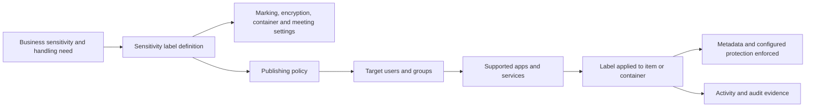

| Property | Plain meaning | Why it matters | Memory hook |
|---|---|---|---|
| Customizable | Organization defines names and controls | Taxonomy should match business language | Your labels, your meanings |
| Persistent | Item label travels with supported content | Protection can continue outside its original site | Stamp stays with parcel |
| Clear-text metadata | Label ID can be read by integrations | Metadata is not the secret; content may still be encrypted | Tag is readable; contents may not be |
| One per item | A file/email/container has one tenant sensitivity label at a time | Priority and replacement behavior matter | One sensitivity verdict |
| Separate from retention | Item can also have one retention label | Sensitivity and lifecycle solve different needs | Protect versus keep/delete |

Do not confuse Purview sensitivity labels with Outlook's built-in sensitivity level such as Personal or Private. That older sender-intention flag does not provide the same tenant policy, metadata, classification, or protection.

## 2. Label versus label policy

A label defines meaning and protection. A **label publishing policy** makes selected labels available to users/groups and applies user-facing policy settings.

| Object | Contains | Applies to | Example |
|---|---|---|---|
| Sensitivity label | Name, descriptions, scope, marking, encryption, container/meeting settings | A file, email, meeting, site/group, or supported asset | `Confidential - All Employees` |
| Label group/classic parent | Organizes labels for display | User label picker hierarchy | `Confidential` grouping |
| Publishing policy | Labels, users/groups, default, mandatory, justification, help link and related settings | Target users/groups | Legal users see an extra restricted label |
| Auto-labeling policy | Conditions, locations, mode, target label | Content in supported service locations | Apply label to matching SharePoint files |
| Protection policy | Change-sensitive policy for data outside M365 | Supported non-M365 data assets | Preview-dependent protection for mapped assets |

### 🔍 Plain-English deep-dive: the menu and the recipe are different

The **label** is a recipe: “Confidential - Finance” means add a footer, encrypt for Finance, and restrict selected actions. The **publishing policy** is the menu handed to a group of diners: it shows that recipe to Finance users and may set a default. Changing the recipe affects label behavior; changing the menu affects who sees it and user-policy settings.

A label can exist but remain invisible because it is not published. A user can be in several policies and receive the union of published labels, while conflicting policy settings are resolved by publishing-policy priority.

## 3. Taxonomy design before configuration

Start from business handling requirements, not the color picker. A practical taxonomy is small enough for users to understand and precise enough for controls.

| Level | Business meaning | Typical handling direction | Example subchoice/group label |
|---|---|---|---|
| Public | Approved for public release | No access restriction; publishing process still applies | Public |
| General | Routine internal or low-impact data | Internal default, no encryption | General |
| Confidential | Material harm if broadly exposed | Internal/external variants, DLP and optional encryption | All Employees, Trusted Partner |
| Highly Confidential | Severe business/legal/person impact | Narrow groups, strict encryption, reduced offline access | Legal Matter, M&A, Credentials |

Avoid labels for departments when sensitivity is the real dimension. `Finance` alone does not tell a user whether a lunch menu or earnings forecast is sensitive. If different permissions are needed, use clear handling labels such as `Highly Confidential - Finance Restricted` and document exact use.

## 4. Modern label groups versus classic parent labels

Microsoft's modern label scheme uses **label groups** to organize labels. Label groups have display/group properties but are not themselves applied or published. Classic parent labels with sublabels still exist in older/migrated designs; a classic parent that has sublabels cannot be applied to content.

| Characteristic | Modern label group | Classic parent label |
|---|---|---|
| Purpose | Visual/logical grouping | Historical parent/sublabel grouping |
| Applied to content | No | No when it has sublabels |
| Published directly | No; publish labels inside group | Parent may need inclusion with sublabels in classic publishing |
| Protection settings | Not item-protection settings | UI can look label-like but parent with sublabels is not applicable |
| Migration | Default for newer tenants/migrated scheme | Can be migrated to modern scheme |

Never configure a parent label as a default, recommended, or automatically applied label. In a current tenant, first determine which scheme is active and preserve label GUID/name mappings during migration.

## 5. Label order and priority

Labels are ordered from least sensitive at the top/lowest number to most sensitive at the bottom/highest number. Priority influences downgrade justification, automatic-label selection, attachment inheritance, Copilot display/inheritance, and mismatch reporting.

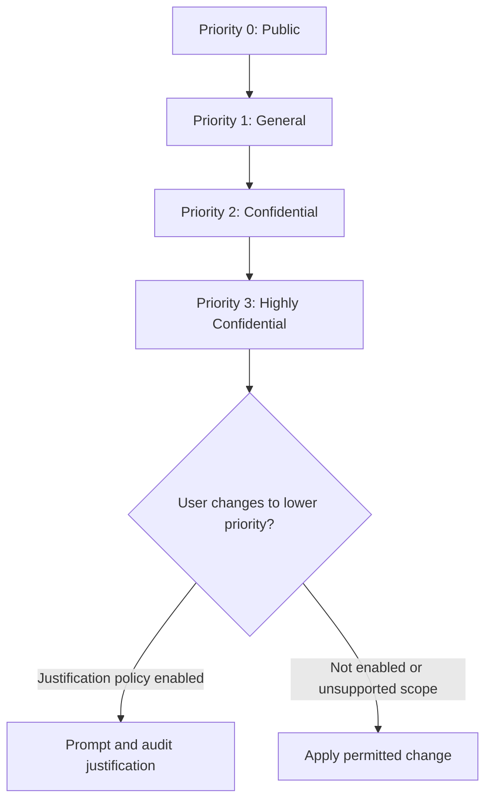

| Priority use | Behavior to remember |
|---|---|
| User downgrade/removal | Can require justification for files, emails, and meetings |
| Client auto-labeling | Lower-priority automatic/default labels can be replaced; manual/higher labels are protected |
| Service auto-labeling | Highest-priority matching label normally wins, with configurable manual-label override in supported cases |
| Email attachment inheritance | Highest-priority supported attachment label is selected |
| Container mismatch | Higher-priority document in lower-priority site can generate audit/email, not automatically block |
| Sublabel/group peers | Downgrade justification has special same-parent/group behavior; test current scheme |

Priority is not a complete severity model. Two labels can be adjacent but have radically different permissions. Document both order and controls.

## 6. Publishing-policy priority

Publishing policies also have order: lowest priority at the top, highest at the bottom. Users can receive labels from multiple assigned policies; for conflicting policy settings, the highest-priority assigned policy wins for each setting.

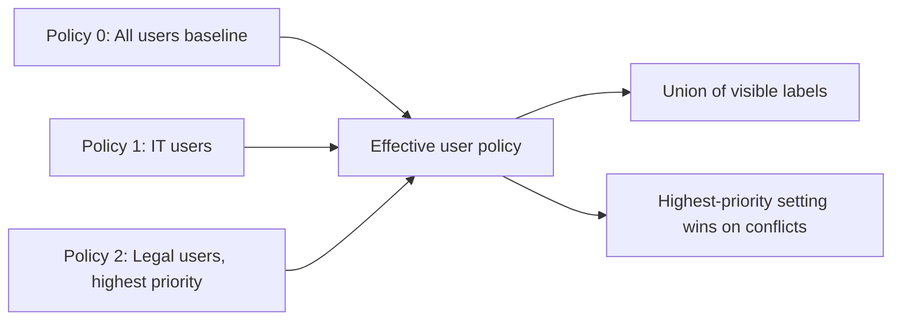

| Design rule | Reason |
|---|---|
| Prefer few publishing policies | Fewer priority conflicts and simpler troubleshooting |
| Use groups rather than individuals | Lower maintenance and auditable membership |
| Record every overlap | Effective settings may surprise dual-role users |
| Test a user in each overlap combination | Portal configuration alone does not prove client result |
| Keep baseline lowest | Specialized settings can intentionally override |

## 7. Current label scopes

Scope determines which settings appear and where a label is available. Scope support is change-sensitive and must be checked against each app/service.

| Scope | Representative items/settings | Key dependency |
|---|---|---|
| Files & other data assets | Office, PDF where supported, Loop, Power BI/Fabric and Data Map assets in supported scenarios | App/service and file-type support |
| Emails | Outlook email and related encryption/marking | Exchange Online mailbox for built-in Outlook labeling |
| Meetings | Calendar items, meeting invites, Teams meeting/chat controls | Files and Emails scopes must also be selected |
| Groups & sites | Teams, Microsoft 365 groups, SharePoint sites, Viva Engage communities, Loop workspaces | Container labeling enablement/synchronization |
| Data Map/other assets | Files and schematized assets under evolving governance support | Preview/licensing/source support |

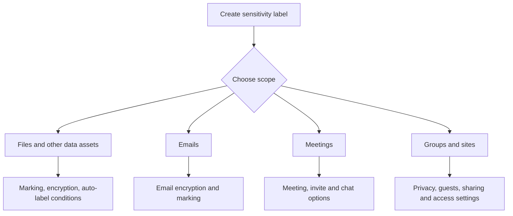

If a label excludes the Files scope, it cannot be selected for file-oriented auto-labeling or library defaults. If it excludes Emails, email defaults and email encryption choices may be unavailable. Removing a scope from an existing production label can break dependent configurations; create a new scope-specific label where safer.

## 8. Label application methods

| Method | Who/what applies it | User involvement | Best use |
|---|---|---|---|
| Manual | User/admin in supported app/service | User chooses | Human judgment and exceptions |
| Default | Publishing policy, library, meeting/container setting | Usually automatic but changeable | Baseline classification |
| Mandatory | Publishing-policy requirement | User must select or accept a label | Coverage with training and careful UX |
| Recommended | Office client detects condition | User accepts/dismisses | Education and low-risk tuning |
| Client-side automatic | Office app evaluates content while editing/composing | User sees result and may interact per behavior | Near-real-time creator workflow |
| Service-side automatic | Purview service evaluates SharePoint, OneDrive, Exchange | No direct user choice; simulation required | At-scale content at rest/in transit |
| Scanner/file labeler | Purview Information Protection client/scanner | Admin/user/tool | On-premises repositories and Windows file workflows |
| API/SDK | Supported app or automation | Varies | Integrated line-of-business scenarios |

Use the least disruptive method that meets the objective. A mandatory encrypted default is usually a poor first rollout because it can misclassify and break legitimate external collaboration.

## 9. Manual labeling and user guidance

Manual labeling uses business judgment that automation may not capture. A contract can contain no national ID yet be highly confidential because negotiations are secret.

| User guidance element | Example |
|---|---|
| Name | `Confidential - Trusted Partner` |
| Tooltip | “Use for sensitive business data approved for named partner access.” |
| Admin description | Owner, permissions, scope and technical behavior |
| Positive example | Draft statement of work shared with approved partner |
| Negative example | Public marketing brochure |
| Support link | Internal decision guide and request path |
| Escalation | Data owner/privacy/legal contact for ambiguity |

Use meaningful descriptions. “Confidential” without examples creates guesswork. Train users on outcomes: who can open, whether forwarding/printing is restricted, and what to do when an external recipient cannot access content.

## 10. Defaults, mandatory labeling, and downgrade justification

A default label increases coverage. Mandatory labeling requires a label before supported save/send/create actions. Downgrade justification records why a user removed or lowered a label for files, emails, and meetings; it does not work the same way for containers.

### 🔍 Plain-English deep-dive: coverage is not accuracy

Applying `General` to every new file gives high **coverage**, but does not prove those files are correctly classified. Requiring a label forces a decision, but a hurried user may choose the easiest value. An encrypted default can break normal partner work.

**Analogy:** Requiring every parcel to have a category prevents blank forms, but it does not stop someone choosing “ordinary mail” for a legal package. Defaults and mandatory prompts need training, sensible choices, and review.

| Setting | Benefit | Risk | Safer rollout |
|---|---|---|---|
| Non-encrypting default | Baseline metadata and reporting | Overwrites perception of deliberate choice | Pilot and measure relabeling |
| Mandatory labeling | Reduces unlabeled content | Prompt fatigue and arbitrary selection | Default plus education, then mandatory |
| Downgrade justification | Creates friction/evidence for lower protection | Generic reasons and support tickets | Review reasons and tune guidance |
| Email-specific default | Different baseline from documents | Client-version inconsistency | Validate every Outlook platform |

Mandatory labeling and client auto-labeling can have a timing interaction: a user may be prompted before automatic detection occurs. A default label can reduce that issue, but current capability tables and clients must be tested.

## 11. Recommended and client-side automatic labeling

Client-side labeling occurs in supported Office apps while users edit documents or compose/reply/forward emails. A recommended label prompts the user; an automatic label applies when configured conditions match, subject to existing-label behavior.

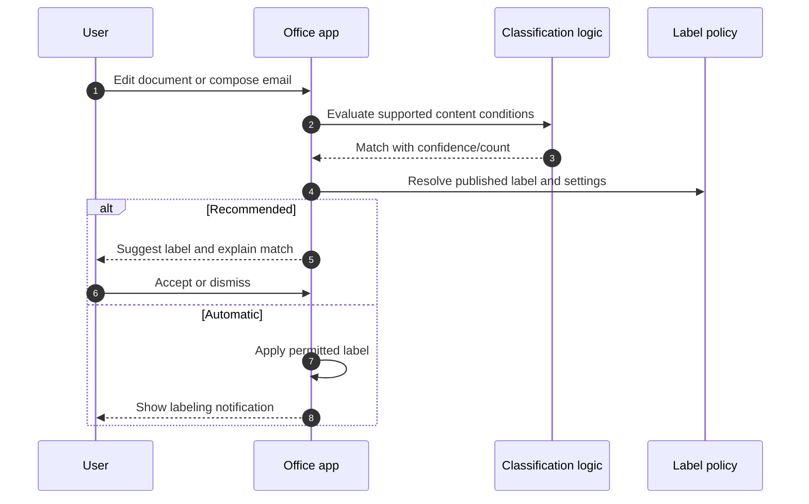

Client-side support differs by Word, Excel, PowerPoint, Outlook, Windows, macOS, web, iOS, and Android. Conditions can use SITs and trainable classifiers where supported. Recommended labeling is useful during adoption because it teaches users in context and produces feedback without silent large-scale changes.

## 12. Service-side auto-labeling

Service-side auto-labeling evaluates saved files in SharePoint/OneDrive and mail processed by Exchange. It is independent of the user's Office version. It supports location scope, richer rules/exceptions, service simulation, and selected PDF/image scenarios.

| Capability | Client-side label setting | Service-side auto-labeling policy |
|---|---|---|
| App dependency | Yes | No for service processing |
| Recommendation | Yes | No |
| Location scope | No | Yes |
| Nested rules/exceptions | More limited | Supported by policy options |
| Simulation | No dedicated service simulation | Required workflow |
| SharePoint/OneDrive at-rest PDF | Not equivalent | Supported when prerequisites enabled |
| Incoming Exchange email | No | Supported with documented conditions |
| Visual marking on files | Office client applies | Service file auto-label does not insert markings |

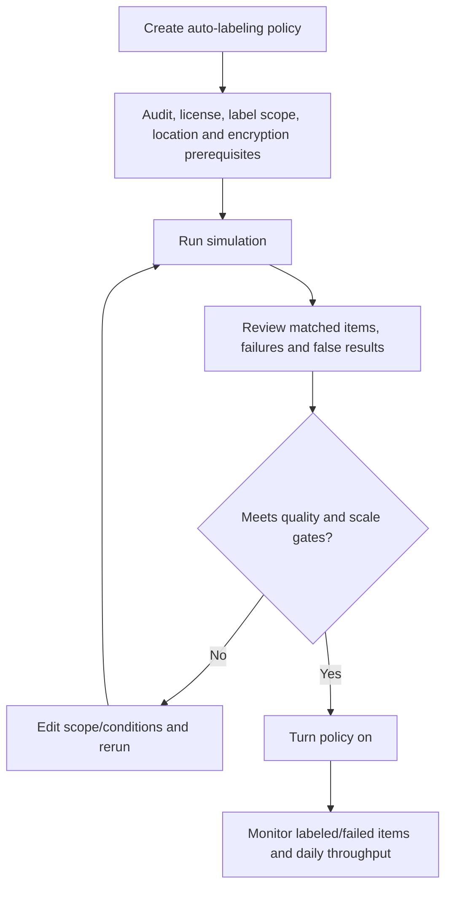

Current guidance includes limits such as 100 auto-labeling policies, 100 explicitly included/excluded locations in the portal, 100,000 automatically labeled files per tenant per day, and a simulation cap of four million matched files. Reverify limits before design. Service-side simulation can take about 12 hours and newly created policy management can remain unavailable while provisioning. Do not mistake normal provisioning for failure.

## 13. Content markings

Content markings are visible headers, footers, and watermarks inserted by supported Office apps. They communicate sensitivity but are not access control.

| Marking | Best use | Limitation |
|---|---|---|
| Header | Visible classification/instruction | Consumes document layout space |
| Footer | Legal/help/handling text | Excel header/footer length limits are tight |
| Standard watermark | Prominent background marking | Users with edit rights can often change content |
| Dynamic watermark | Shows viewer identity for encrypted high-value documents | Requires supported clients; can deny unsupported access |
| Variables | Insert label, file, user or date values | Case-sensitive syntax and app-version support |

Markings can break templates, macros, pagination, print layouts, accessibility, and signature workflows. Test Word, Excel, PowerPoint, Outlook, PDFs, print, mobile, and conversion. Service-side file auto-labeling applies metadata/encryption but does not insert file markings; users may see a label without the expected watermark until a supported Office labeling operation reapplies it.

## 14. Encryption architecture

Sensitivity-label encryption normally uses the Azure Rights Management service in Microsoft Purview Information Protection. Content is encrypted with a content key; authorized identities obtain a use license containing rights and the required key material. Protection remains with the content across locations.

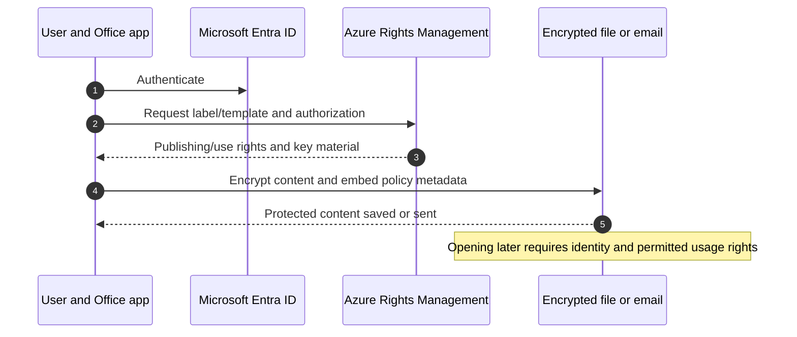

| Encryption dependency | Validation |
|---|---|
| Rights Management activation | Confirm tenant service state; newer tenants often default on |
| Entra identity | Validate members, guests, cross-tenant access and Conditional Access |
| Network | Permit required service endpoints without unsafe TLS interception |
| Exchange IRM | Configure for full OWA/mobile/search/DLP scenarios |
| SharePoint/OneDrive integration | Enable supported label processing for encrypted files |
| Client | Supported subscription Office and capability version |
| Recovery | Define super-user/data-recovery process with strict governance |

Encryption protects use, not every possible capture. Authorized users may photograph a screen; dynamic watermarks deter but do not make leakage impossible.

## 15. Assign permissions now versus let users assign

| Model | Who chooses recipients | Best use | Main risk |
|---|---|---|---|
| Assign permissions now | Administrator defines users/groups/domains and rights | Stable populations and repeatable controls | Stale groups or overly broad domain access |
| Let users assign - Outlook | Sender selects recipients; label enforces Do Not Forward or Encrypt-Only | Ad hoc secure email | Client support and user misunderstanding |
| Let users assign - Office files | User specifies people/groups/organizations and rights | Dynamic document collaboration | Inconsistent grants and support overhead |

Use groups rather than named users for stable admin-defined permissions. Test guest and partner identity, group membership changes, mail contacts, verified domains, and external tenant settings. A label can grant different rights to different populations, but complexity increases audit and support cost.

## 16. Usage rights

Rights Management controls actions such as view, edit, save, print, copy/extract, export, reply, reply all, and forward. Preset permission levels bundle rights; custom rights require careful compatibility testing.

| Business requirement | Directional right design |
|---|---|
| Read but not edit | Viewer/restricted rights |
| Edit but not redistribute | Edit rights without export/forward as applicable |
| No copying to Copilot or other content analysis | Deny EXTRACT/copy and validate service behavior |
| Data recovery/relabel | Controlled Full Control/Export or super-user path |
| Partner read-only | Partner identity/domain plus Viewer, no broad authenticated-users grant |

The Rights Management issuer, commonly the person who applies encryption, retains Full Control and special access behavior. This is important for revocation, expiry, and support. “Nobody can access after expiry” may not include the issuer.

## 17. Offline access, use licenses, and expiry

When authorized content is opened, the client obtains a **use license** that permits specific actions and can support offline use. The default use-license validity can be 30 days when no different setting applies. During validity, group or policy changes might not be reevaluated until reauthentication.

### 🔍 Plain-English deep-dive: revoking a badge does not erase a cached day pass

An identity is like an employee badge, while a Rights Management use license is a time-limited day pass already issued for one protected room. Removing the employee from a group changes future authorization, but a previously issued offline pass may work until it expires. For very sensitive data, shorten offline access or require online authorization.

| Setting | Security benefit | Availability/user cost |
|---|---|---|
| Offline always/default validity | Works during travel/outage | Revocation/group changes take longer to enforce |
| Offline for N days | Bounded offline access | Periodic reauthentication |
| Offline never | Fast authorization recheck | No offline opening; service dependency |
| Content expiry | Enforces time-bound recipient access | Cached/client behavior and issuer exceptions require testing |

Microsoft directionally recommends expiry only for real time-bound needs and suggests balancing offline duration to sensitivity. Make the client accept the business decision; do not silently choose “never offline” for every file.

## 18. Do Not Forward and Encrypt-Only

| Email option | Recipient behavior | Use case |
|---|---|---|
| Do Not Forward | Cannot forward, print, copy, or change recipients in supported clients | Highly restricted ad hoc email |
| Encrypt-Only | Encrypted; recipients can generally copy, print, and forward but cannot remove protection | Confidential transport without strong usage restriction |

Unencrypted Office attachments can inherit email encryption even though they do not inherit the label metadata itself. Attachments already encrypted preserve their original encryption. Test downstream workflows, because recipients can be surprised by an attachment that becomes protected.

## 19. Coauthoring, AutoSave, and encrypted files

Encrypted collaboration requires SharePoint/OneDrive label processing and supported coauthoring configuration/clients. Without it, encrypted files may open in exclusive mode, AutoSave can be disabled, version/rename workflows can behave differently, and users may save copies.

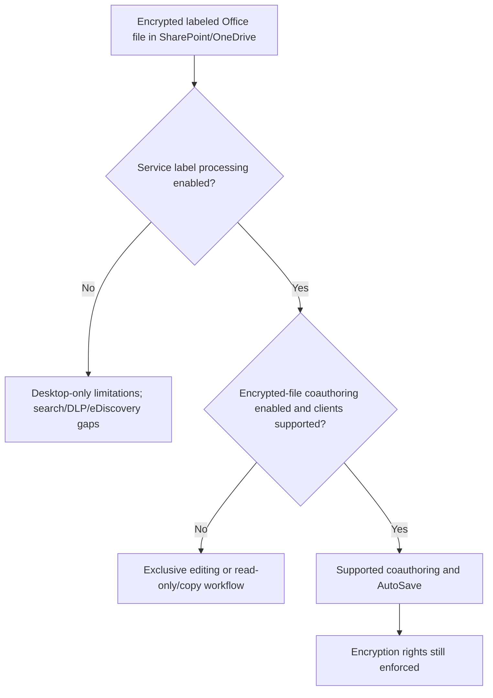

Before enabling coauthoring tenant-wide, test Office versions, custom add-ins, Power Query, custom XML, sync, version history, external guests, offline transitions, and recovery. Some files cannot be processed by SharePoint/OneDrive even when the feature is enabled.

## 20. SharePoint and OneDrive integration

Enabling sensitivity-label processing for SharePoint/OneDrive allows the services to recognize supported labels, process supported cloud-key encrypted files, show labels, enable Office for the web, inspect content for DLP/eDiscovery/search, and support service auto-labeling.

| Capability after enablement | Important caveat |
|---|---|
| Label in Office for the web/details pane | Only supported file types/configurations |
| Search/eDiscovery/DLP over cloud-key encrypted files | Not DKE, HYOK, password-protected, or unsupported encryption |
| External guest access | Requires correct guest identity and rights |
| Auto-labeling at rest | Label scope, format, indexing and encryption prerequisites |
| PDF processing | Separate PDF enablement; signed PDFs unsupported |
| OneNote labeling | Separate PowerShell enablement and section-level behavior |
| MP4 labeling | Separate enablement; manual/inherited support differs from auto/default |

Current guidance says the base tenant integration change can take roughly 15 minutes, but label replication is separate. Publish to a few test users, wait at least an hour, validate, and allow at least a day before broadening. Multi-Geo requires per-geo handling for selected settings.

## 21. Item labels versus container labels

This distinction is a frequent interview topic.

| Aspect | Item label | Container label |
|---|---|---|
| Applied to | File, email, meeting item, supported data asset | Team, Microsoft 365 group, SharePoint site, supported workspace |
| Travels with file/email | Yes for supported item metadata | No; it describes/configures the workspace |
| Encryption/content marking | Can apply | Does not encrypt/mark every file in container |
| Privacy/guest/sharing/CA | Not the main function | Can configure these workspace controls |
| Inheritance | Item can inherit in specific supported scenarios | Files do **not** automatically inherit container label |

### 🔍 Plain-English deep-dive: labeling the filing cabinet does not stamp every paper

A container label is a sign and lock configuration on the filing room: private room, no guests, limited unmanaged-device access. An item label is a stamp and envelope on each document. Putting a `Highly Confidential` sign on the room does not automatically encrypt every paper. A paper stamped `Highly Confidential` can still be uploaded to a `General` room; that mismatch can generate an audit event and email, but is not automatically blocked by the label alone.

## 22. Container controls for Teams, Groups, SharePoint, Viva Engage, and Loop

| Container setting | Outcome | Dependency/caution |
|---|---|---|
| Public/private | Sets and can lock group privacy | Removing label leaves current privacy value changeable |
| External user access | Controls whether owner can add guests | Does not automatically remove existing guests after later change |
| SharePoint external sharing | Sets site sharing capability | Site owner can alter through label choice if permitted |
| Unmanaged devices | Block or limited web-only | Requires SharePoint/Entra CA dependency; tenant stricter setting wins |
| Authentication context | Requires selected CA context | Unsupported apps can be denied |
| Private-team discovery | Controls discoverability for eligible users | Requires Teams policy support |
| Shared channel controls | Restricts invited teams | Dependency on privacy/external settings |
| Default channel-meeting label | Applies meeting/chat label | Meeting scope and policy dependencies |
| Default sharing link | PowerShell advanced setting | Validate scope/permission and link UX |
| Members can share | PowerShell advanced setting | Align with SharePoint sharing governance |

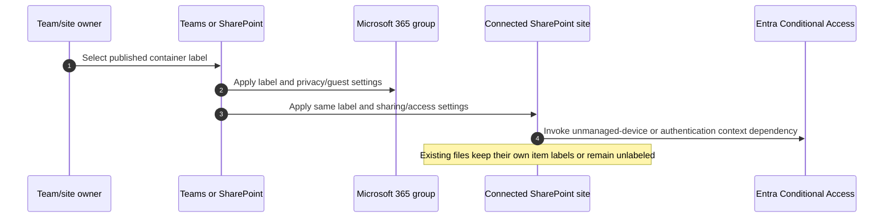

Container labels require a one-time enablement/synchronization process, currently including Entra configuration and `Execute-AzureAdLabelSync` in documented scenarios. New label propagation can be at least an hour and shared-channel controls may require at least 24 hours. Existing label changes should be allowed at least 24 hours before judging results.

## 23. Teams and meeting labels

Meeting scope can protect calendar items, meeting invites, Teams meeting options, and chat under supported licensing/clients. Controls can include who bypasses the lobby, who presents, recording/transcription, meeting chat, copying chat, watermarks, and encryption options depending on current support.

| Object | Label effect | Not the same as |
|---|---|---|
| Team/container | Privacy, guests, site sharing, CA and channel controls | Labeling every message/file |
| Channel meeting | Can inherit/default a configured meeting label | Team's container label controls |
| Meeting invite | Item label/rights behavior | Media encryption |
| Teams media | Teams service media encryption | Azure Rights Management document/email encryption |
| Chat message | Meeting/chat control or DLP behavior | File item label on a linked document |

Test organizer, presenter, attendee, guest, anonymous user, federated partner, recording owner, transcript location, mobile, web, and room-device scenarios.

## 24. Label inheritance

Inheritance is specific, not universal.

| Scenario | Behavior direction |
|---|---|
| File in labeled site | File does not automatically inherit container label |
| Higher-label file uploaded to lower-label site | Audit/email mismatch can occur; upload not automatically blocked |
| Email with labeled physical attachment | Email can inherit highest-priority published attachment label when configured |
| Link attachment | Attachment-inheritance policy applies to physical file, not merely a SharePoint link |
| Unencrypted attachment in encrypted email | Inherits encryption, not necessarily label metadata |
| SharePoint library default | New/edited files can inherit configured default item label under supported behavior |
| Teams shared channel | Inherits settings from parent team's container label |
| Copilot/agents | Recognize labels and usage rights; inheritance/display uses supported highest-priority behavior |

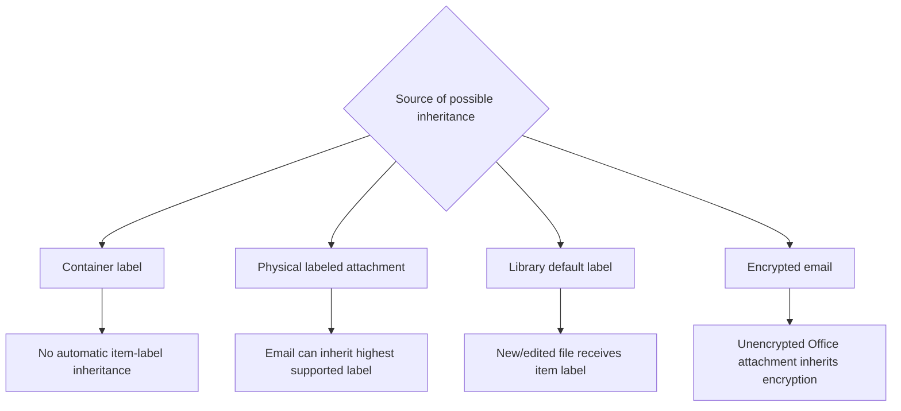

## 25. Office and platform support

Office labeling requires supported subscription editions; standalone perpetual Office is not the general labeling platform. Outlook built-in sensitivity labeling requires Exchange Online mailboxes, including for shared-mailbox scenarios. Exact capabilities require current minimum-version tables.

| Platform | Validation focus |
|---|---|
| Windows Office | Built-in labeling enabled, update channel/version, coauthoring, DKE, PDF, advanced settings |
| macOS Office | Version parity, online requirement for applying encryption, coauthoring |
| Office for web | SharePoint integration, supported encryption, no DKE/HYOK processing |
| iOS/Android | Label visibility/application, offline/encryption behavior, mandatory prompts |
| Outlook variants | Classic/new/web/mobile timing and encryption behavior |
| Non-Office RMS app | Can enforce rights even if it cannot display/change label |
| MIP client/viewer | File Explorer, PowerShell, scanner and additional file support |

Do not approve a design based on one current-channel Windows client. Maintain a client-capability matrix by platform, version, feature, and user population.

## 26. Office file types and PDFs

Office built-in labeling generally supports modern Word, Excel, and PowerPoint formats, with specific macro-enabled/template variants. Legacy, OpenDocument, embedded, and specialized formats vary. SharePoint/OneDrive can extract labels from a broader list than files users can label in Office for the web.

| PDF scenario | Current direction | Caveat |
|---|---|---|
| Office export/save as PDF | PDF can inherit label/marking and Windows encryption where supported | Verify app/platform minimum version |
| Print to PDF | Warns that protection can be lost | Unavailable under mandatory labeling for labeled/encrypted document |
| SharePoint/OneDrive PDF | Optional enablement supports display, search, eDiscovery, DLP and auto-label | Signed PDFs not supported; daily auto-label volume can rise |
| Encrypted PDF reading | Microsoft Edge supports selected protected PDFs | External/client compatibility must be tested |
| PDF/A plus label encryption | Not supported combination | Archive requirement needs alternative design |
| Password protection | Conflicts with label encryption scenarios | Use governed rights-management protection |

Test files with macros, signatures, embedded objects, Power Query, custom XML, large size, sync, copy/move, download, external recipient, and PDF conversion.

## 27. External sharing and cross-tenant access

Encrypted external sharing requires two independent permissions: the repository/share permission and the encryption right. A partner may have a SharePoint link but lack Rights Management permission, or have encryption permission but no site/file access.

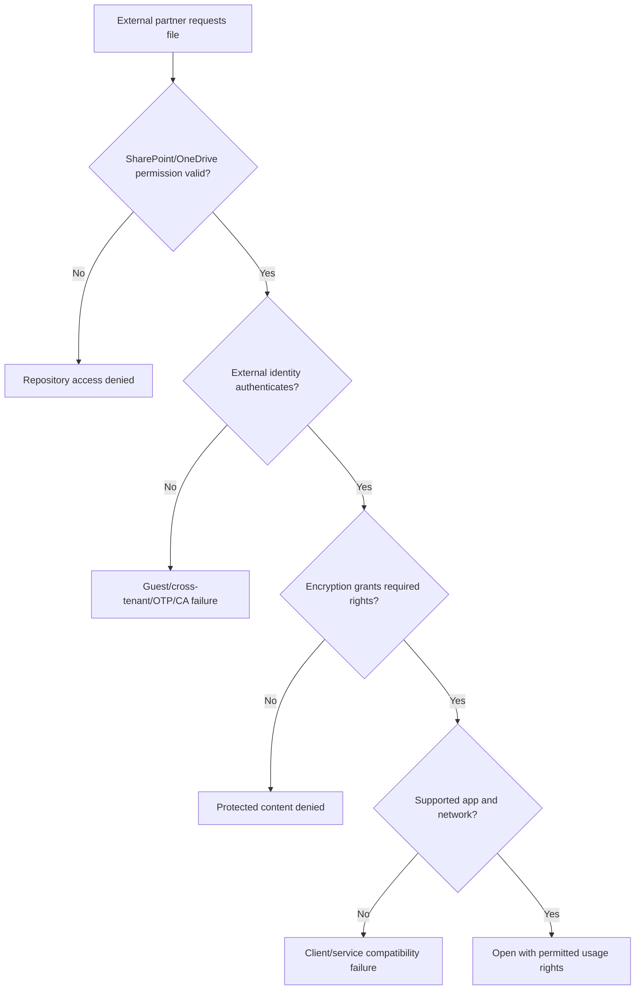

| External design question | Evidence |
|---|---|
| Named users, partner group, domain, or any authenticated user? | Legal/data-owner-approved recipient model |
| Guest or home-tenant identity? | Entra B2B/cross-tenant architecture |
| Conditional Access trust? | Sign-in tests and partner coordination |
| Can partner app enforce rights? | Platform/client test matrix |
| Can partner copy/print/edit? | Usage-right validation |
| What happens after project end? | Group removal, offline duration, site access and evidence |
| Support ownership | Cross-company contact and escalation runbook |

When an external organization opens a labeled item, it generally does not see your tenant's label as its own selectable label. Visible markings and protection-template descriptions can cross the boundary, so do not put internal secrets in label names/descriptions.

## 28. Revocation and recovery

Revocation is not equivalent to deleting a sharing link. Consider repository access, encryption rights, cached use licenses, copies outside Microsoft 365, issuer rights, group propagation, and application support.

| Action | What it changes | What may remain |
|---|---|---|
| Remove SharePoint permission/link | Repository access | Downloaded encrypted copy with valid rights |
| Remove user from rights group | Future authorization | Cached offline use license until recheck |
| Change label permissions | Current protection template behavior on reauthorization | Previously cached rights temporarily |
| Relabel with different encryption | Item protection if actor has Export/Full Control | Other copies remain separately protected |
| Revoke document where supported | Future service authorization | Issuer/super-user and cached/offline nuances |
| Super-user recovery | Allows authorized recovery/decryption | High privilege requiring strict audit |

Build a recovery procedure before encryption rollout. Protect super-user assignment through PIM, separation of duties, incident approval, usage logging, and recurring review.

## 29. Double Key Encryption context

**Double Key Encryption (DKE)** protects a narrow class of highly sensitive data with two keys: one controlled through Microsoft and one controlled by the organization-operated DKE service. Both are required to decrypt.

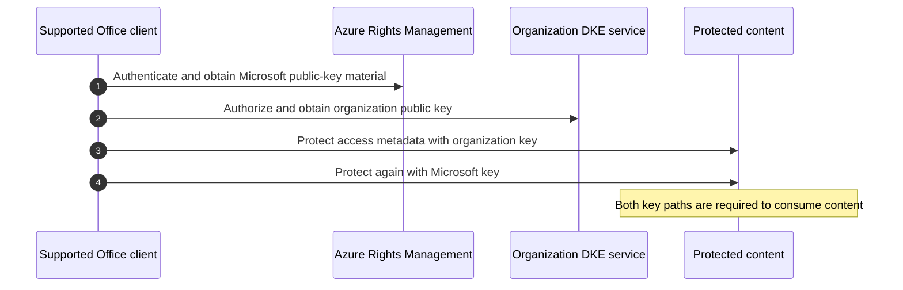

| DKE characteristic | Consequence |
|---|---|
| Customer controls one key/service | Strong customer custody and availability responsibility |
| Microsoft 365 services cannot process at rest | No service search, eDiscovery, DLP, Copilot, web view or coauthoring for DKE files |
| Supported clients are narrower | Primarily supported Windows Microsoft 365 Apps and MIP tooling |
| Label becomes hard to change | DKE label option cannot be edited after save per current guidance |
| E5-tier entitlement | Verify exact licensing and user coverage |

DKE is not “better encryption for everything.” Use it for a small crown-jewel class when regulatory/key-custody requirements outweigh collaboration, investigation, DLP, search, and AI capability.

## 30. Scanner and Microsoft Purview Information Protection client

The Microsoft Purview Information Protection client extends labeling to Windows File Explorer, PowerShell, a viewer, and an on-premises scanner. The scanner discovers and can label supported files in repositories such as file shares and SharePoint Server according to current support.

| Scanner component | Design concern |
|---|---|
| Scanner service host | Supported Windows Server, patching, hardening and HA |
| SQL database | Availability, backup, permissions and sizing |
| Service identity | Least privilege to repositories, SQL and Purview |
| Repository configuration | Include/exclude paths, file types, ownership and windows |
| Network/proxy | Microsoft endpoints, TLS, throughput and service availability |
| Discovery mode | Inventory/report before applying labels |
| Enforcement mode | Backup, owner approval, performance and rollback |
| Logs | Central collection, failed files and operations runbook |

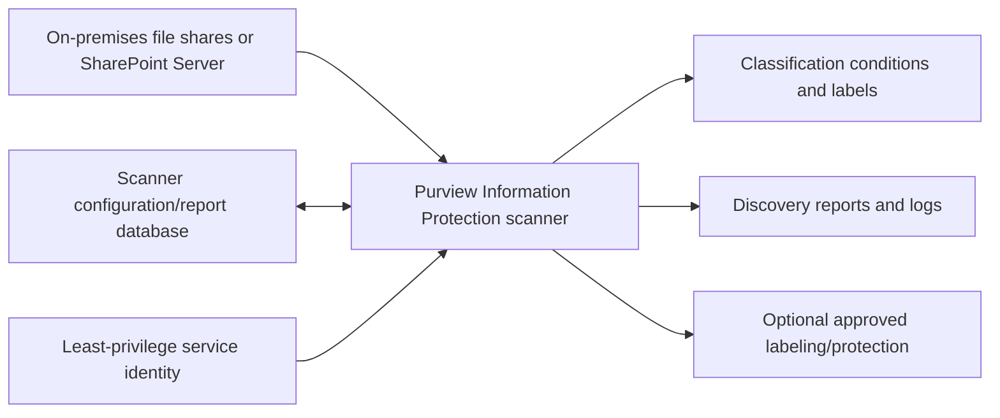

Scanner rollout must start in discovery. Applying encryption to a legacy repository can break applications, service accounts, indexing, backup, antivirus, workflows, and users.

## 31. Migration from AIP/RMS and legacy protection

The Azure Information Protection unified labeling Office add-in is retired; supported Office apps use built-in labeling. The Microsoft Purview Information Protection client replaces remaining file labeler, PowerShell, scanner, and viewer needs. Older RMS templates, HYOK, classic labels, and SharePoint IRM require inventory and mapping.

| Legacy element | Target direction | Migration risk |
|---|---|---|
| AIP Office add-in | Office built-in sensitivity labeling | Policy forcing old add-in can suppress built-in labeling |
| AIP unified labels | Purview labels/policies with preserved GUID mapping | Name/order/scope/client differences |
| RMS templates | Sensitivity labels with encryption | Existing protected content and template archive |
| HYOK | Evaluate cloud-key or DKE only for justified data | Online processing/collaboration compatibility |
| SharePoint library IRM | Prefer consistent item labels where requirements fit | Coexistence and download behavior |
| Classic parent labels | Modern label groups where planned | Priority, default and publishing changes |

Inventory labels, GUIDs, templates, scoped policies, clients, protected-file volumes, super users, scanners, scripts, SDK integrations, business owners, and external collaborators. Pilot opening old and new content before removing legacy clients or templates.

## 32. Label changes, removal, and deletion

Changing a label definition does not guarantee every previously labeled item immediately adopts every new setting. Behavior depends on item location, service integration, encryption option, cached use license, and next access/relabel.

| Change | Directional behavior |
|---|---|
| Edit published label | No republish needed; allow propagation, often up to 24 hours or longer |
| Add/change admin-defined permissions | Existing content normally uses new authorization on next service check/use-license renewal |
| Switch admin-defined to user-defined permissions | Applies to newly labeled/relabeled content |
| Add/remove encryption to label | SharePoint/OneDrive integrated files can update on access; other existing items often need relabel |
| Remove label from publishing policy | Users stop seeing it; existing labeled content remains labeled/protected |
| Delete label | Mapping and enforcement consequences vary by location; container settings can be removed |

Deleting a production label is high risk. Current guidance notes that SharePoint/OneDrive integrated content can lose display/encryption behavior when a deleted label is processed, while content outside those services and email can retain encryption under archived protection templates. Containers lose label settings after deletion, with possible 48-72 hour processing for SharePoint. Prefer removing a label from policies, hiding it from new use, and managing legacy content deliberately.

## 33. Security and privacy design

| Risk | Mitigation |
|---|---|
| Overbroad encryption group | Data-owner-approved groups, access review and negative tests |
| Label name exposes project | Neutral label display text and restricted internal catalogue |
| External domain grants all verified tenant domains | Explicitly understand tenant-wide domain behavior; prefer named partner groups |
| Offline access delays revocation | Short duration/online requirement for highest sensitivity |
| Marking exposes user identity | Privacy review for variables/dynamic watermark |
| Auto-label previews sensitive content | JIT content-view permissions and protected evidence |
| Scanner encrypts service-consumed files | Discovery, app-owner test, backup and exclusion/rollback |
| Container owner changes strong controls by relabeling | Restrict who can apply/change labels and monitor audit |
| DKE service outage | HA, break-glass decision, client cache and business continuity |

Encryption is a data-access control that depends on identity. Protect Entra accounts, privileged roles, service identities, group lifecycle, certificates, and recovery operators as part of the design.

## 34. Licensing and prerequisites

Manual labeling and core capabilities can exist in lower suites, while automatic labeling, advanced classifiers, DKE, advanced audit/reporting, meetings, and other features can require E5/P2-tier or add-on entitlements. Do not reduce this to one SKU statement.

| Capability | Licensing/prerequisite check |
|---|---|
| Manual Office labels | Eligible subscription Office and supported service plan |
| Client/service auto-labeling | Current E5/P2-tier information-protection entitlement and regional availability |
| Container labels | Entra/Purview enablement, label sync, workload licenses |
| Meetings | Teams Premium/M365 and Purview entitlement matrix as current |
| Encryption | Rights Management entitlement/activation and workload configuration |
| DKE | Microsoft 365 E5/current documented entitlement plus customer service |
| Scanner | MIP client/scanner entitlement, server/SQL and repository rights |
| Data Map labels/protection | Governance version, source and preview entitlement |

Create a feature-by-persona license matrix. Include label creators, policy administrators, protected users, recipients, investigators, scanner service context, guests, and shared mailboxes according to Product Terms.

## 35. Configuration design workbook

| Field | Required decision |
|---|---|
| Label ID/name/display | Stable identifier and business-friendly text |
| Group/order | Modern/classic scheme and exact priority |
| Scope | Files, emails, meetings, groups/sites, supported assets |
| Marking | Header/footer/watermark/dynamic watermark text and tests |
| Encryption | None, admin-defined, user-defined, DKE; rights/offline/expiry |
| Container | Privacy, guests, sharing, CA, channels, default links |
| Meeting | Lobby, presenters, recording, transcription, chat and watermark |
| Publication | Users/groups, policy priority and policy settings |
| Automation | Client conditions or service policy/simulation |
| Operations | Owner, support, metrics, review, incident and recovery |
| Change | Dependencies, rollback and legacy-content plan |

Export current labels and policies before changes. Use GUIDs in scripts and decision records because display names can collide or change.

## 36. Deployment strategy

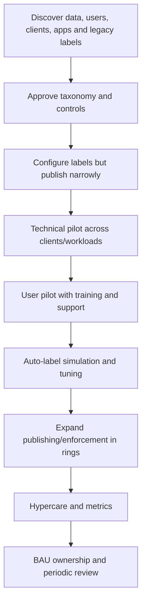

Start with a non-encrypting classification-only taxonomy where practical. Add user guidance and default labels. Introduce encryption only for clear handling needs. Use recommended labeling before broad automatic application. Service-side auto-labeling must pass simulation. Container controls require site/team pilot and dependency testing.

## 37. Test strategy

| Test family | Positive test | Negative/failure test |
|---|---|---|
| Publication | Pilot user sees intended labels | Nonpilot user does not see restricted label |
| Priority | Higher label triggers expected downgrade prompt | Same-group/current exception behaves as documented |
| Default/mandatory | New item receives/prompted correctly | Unsupported client has documented fallback |
| Marking | Header/footer/watermark renders | Template, Excel, PDF and accessibility remain usable |
| Encryption | Intended member opens with rights | Removed/nonmember/external wrong identity denied |
| Offline/expiry | Authorized offline behavior works | Access rechecked after configured period |
| Coauthoring | Two supported users edit | Unsupported app receives clear behavior |
| Container | Privacy/guest/sharing/CA apply | Existing guests and tenant stricter settings understood |
| Auto-label | Synthetic match labels in simulation/approved mode | Hard negative remains unchanged |
| Migration | Old protected file opens after client change | Old add-in policy no longer conflicts |
| Revocation | Future access denied as designed | Cached use-license caveat recorded |
| Audit | Apply/change/remove/justification event appears | Unauthorized preview denied/audited |

Test each platform actually used. Include standard user, owner, guest, partner, shared mailbox, service account, mobile, offline, unmanaged device, proxy, sync, migration, copy/move, and recovery.

## 38. Rollback and change safety

| Change | Rollback/containment |
|---|---|
| Publishing causes UX issues | Remove pilot group/label from policy, allow propagation, preserve applied labels |
| Default or mandatory disrupts users | Revert policy setting in highest-priority policy; communicate client refresh timing |
| Auto-label false positives | Return service policy to simulation/off; stop client auto-setting; investigate applied items |
| Encryption blocks collaboration | Use approved relabel/recovery path; do not delete label/template |
| Container setting blocks site | Reapply tested prior container label/settings and validate CA dependency |
| Scanner affects files | Stop enforcement job, restore backed-up files/labels according to tested process |
| DKE outage | Invoke HA/business continuity; do not promise Microsoft-only recovery |

Rollback is constrained by persistence. Files downloaded or emailed outside managed repositories may retain labels/encryption. A rollback plan must state how to identify, relabel, recover, and communicate about already-affected content.

## 39. Operations and metrics

| Metric | Why it matters | Example threshold/action |
|---|---|---|
| Labeled coverage by workload | Adoption and blind spots | Investigate unlabeled high-risk sites |
| Manual downgrade/removal rate | Taxonomy friction or misuse | Review reasons by label/app |
| Auto-label precision | Safety of automated classification | Pause expansion below approved target |
| Labeling failure rate | Format, permission or service problems | Triage top failure reason |
| Encryption access incidents | Collaboration/identity quality | Review partner and group design |
| Time to policy propagation | Support expectation | Escalate only beyond documented/tested window |
| Restricted label use | Possible overclassification or legitimate workload | Data-owner trend review |
| Container mismatch events | Sensitive files in lower-protection sites | Move/relabel/strengthen container |
| Privileged recovery use | High-impact administrative activity | Mandatory incident/approval review |
| Scanner throughput/failures | Migration and repository coverage | Capacity or file-owner remediation |

Activity Explorer, audit, label reports, SharePoint active-sites label column, auto-label policy pages, Rights Management usage logs, client diagnostics, and service health form the operational evidence set.

## 40. Common failures

| Symptom | Likely cause | First discriminating check |
|---|---|---|
| Sensitivity button missing | No published policy, unsupported Office, built-in labeling disabled, wrong account | Check effective user policy and Office capability/version |
| Label missing in one app | Scope or app/version support | Compare same user in supported web/desktop client |
| Label change not visible | Propagation/cache/group membership | Wait documented period and restart/reauthenticate |
| User cannot apply label | Existing encryption rights, unsupported user-defined setting, scope | Inspect current protection and actor's Export/Full Control |
| External user cannot open | Share permission, identity/CA, encryption rights, client | Test each authorization gate separately |
| Encrypted file not searchable | SharePoint integration disabled or DKE/HYOK/unsupported file | Inspect encryption type and tenant integration |
| Coauthoring disabled | Feature/client not enabled/supported | Test Office for web and tenant coauthoring setting |
| Container label has no effect | Dependency absent or tenant setting stricter | Check Entra CA/SharePoint tenant configuration |
| File did not inherit site label | Expected behavior | Explain item/container distinction |
| Auto-label simulation empty | Audit, label scope/publish, SIT timing, indexing, file state, region/license | Use new synthetic supported file and prerequisite checklist |
| Marking absent on service-labeled file | Service applies metadata/encryption, not file marking | Relabel in supported Office test and document behavior |
| Deleted label shows GUID | Label mapping removed | Restore design through supported migration/replacement, not casual recreation |

## 41. Layered troubleshooting

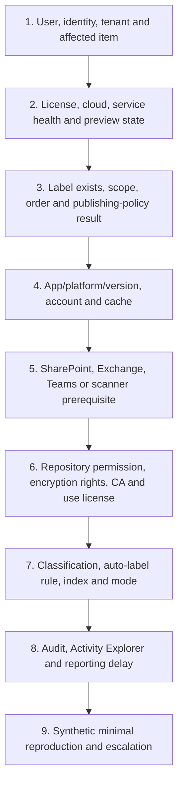

Compare a working and failing user/item. Record UTC timestamps, label GUID, policy order, app build, file type, current label/encryption, location, identity, error, sign-in/audit event, and correlation ID. Avoid deleting/recreating a label as a first troubleshooting step.

## 42. Incident and failure scenarios

### Scenario A: partner loses access to an encrypted proposal

Separate repository permission from encryption authorization. Confirm the partner's exact identity/tenant, cross-tenant and Conditional Access result, label-granted identity/group/domain, Office/client support, network, and cached use-license state. Restore access by correcting the intended control, not by emailing an unencrypted copy.

### Scenario B: broad auto-label policy encrypts working documents

Return the policy to simulation/off, capture configuration and affected-item evidence, stop expansion, identify whether manual labels were overridden, use approved recovery/relabeling rights, and notify business owners. Rebuild the corpus and quality gate before reactivation.

### Scenario C: site labeled Confidential contains Highly Confidential files

Use mismatch audit/email and inventory to identify files. Decide whether files are misplaced, mislabeled, or the site requires stronger controls. Move or relabel through approved process. The container label did not automatically protect each file.

### Scenario D: DKE file is absent from eDiscovery and Copilot

That is a documented DKE tradeoff, not an indexing defect. Confirm DKE encryption and use supported desktop/viewer access. If discovery/AI is required, reconsider whether DKE is appropriate for that data class with legal and security owners.

## 43. Consulting artifacts

| Artifact | Minimum contents |
|---|---|
| Label catalogue | Name, GUID, group/order, meaning, examples, owner |
| Control matrix | Scope, marking, encryption, container and meeting settings |
| Publishing matrix | Policy priority, target group, defaults, mandatory and justification |
| Client capability matrix | Platform, build, feature and fallback |
| External-sharing design | Identity, rights, CA, apps, revocation and support |
| Encryption rights matrix | Population, rights, offline, expiry, recovery |
| Auto-label specification | Conditions, locations, simulation, quality and limits |
| Migration map | AIP/RMS/IRM object to target label/policy/client |
| Test plan | Positive, negative, failure, latency and rollback evidence |
| Operations runbook | Monitoring, triage, recovery, escalation and metrics |
| Risk register | Overclassification, DKE blind spots, client gaps, privilege |
| Communications pack | User guide, partner guide, service desk and change notice |

## 44. Safe paper lab: design a label pilot without changing a tenant

### Scenario and safety boundary

A fictional consulting firm needs four sensitivity levels and a safe partner-sharing option. This is a **paper-only** lab. Do not create labels, enable Rights Management, publish policies, change SharePoint settings, assign roles, or encrypt files. Use only fictional names and synthetic documents.

### Paper taxonomy

| Priority | Label | Scope | Protection hypothesis |
|---:|---|---|---|
| 0 | Public | Files, Emails | No encryption; approved publication only |
| 1 | General | Files, Emails, Groups & sites | Internal default; no encryption; standard site settings |
| 2 | Confidential - All Employees | Files, Emails | Footer; all-employees edit; seven-day offline |
| 3 | Confidential - Trusted Partner | Files, Emails | Named partner group, edit/read by requirement |
| 4 | Highly Confidential - Legal | Files, Emails, Meetings, Groups & sites | Legal group only, no offline, strict container/meeting settings |

### Paper publishing design

- Baseline policy for all employees: Public, General, Confidential - All Employees; General default; no mandatory setting in ring 1.
- Legal policy with higher priority: adds Highly Confidential - Legal; mandatory labeling only after user pilot.
- Partner-project group policy: adds Confidential - Trusted Partner; no individual assignments.
- Downgrade justification enabled for files/emails/meetings after pilot.
- A help link explains examples, external sharing, and support.

### Architecture and test evidence

1. Draw item versus container behavior.
2. Draw identity, repository permission, and encryption authorization for one fictional partner.
3. Create a rights matrix for employee, legal, partner, guest, and unauthorized user.
4. Create a platform matrix for Windows, Mac, web, iOS, Android, and partner apps.
5. Create synthetic DOCX/XLSX/PPTX/PDF test cases without real data.
6. Define auto-label simulation only; do not propose automatic encryption before precision approval.
7. Record rollback for publishing, default, auto-label, encryption, and container changes.

### Paper test matrix

| Test | Expected design result | Interview evidence wording |
|---|---|---|
| Baseline user creates document | General default after policy propagation | “Designed, not tenant-executed” |
| Legal user selects restricted label | Label visible; Legal rights apply | “Requires licensed client validation” |
| Standard user opens Legal file | Denied by encryption rights | “Negative test planned” |
| Partner has site link but no encryption right | File remains inaccessible | “Two authorization gates explained” |
| Physical labeled attachment added to email | Highest supported label inherited when configured | “Client/platform matrix required” |
| Highly labeled file uploaded to General site | Mismatch audit/email, not automatic block | “Item/container distinction” |
| DKE-labeled file in SharePoint | No web processing/eDiscovery/DLP/Copilot | “Documented tradeoff” |
| Auto-label hard negative | No label in simulation | “Corpus quality gate” |

### Evidence portfolio

- Label catalogue and priority diagram.
- Publishing-policy/effective-user matrix.
- Item/container comparison.
- Encryption rights and external-sharing flow.
- Platform/file-type capability matrix.
- Pilot, test, rollback and operational plan.
- Risk register and candidate honesty statement.

### Cleanup

No tenant cleanup is needed. Delete any accidental notes that include real tenant IDs, partner domains, file URLs, names, or customer data. Keep only fictional paper artifacts.

### Interview wording

> “I designed a paper sensitivity-label pilot covering modern label grouping, priority, publishing-policy precedence, item versus container controls, Azure Rights Management permissions, offline/revocation behavior, external partner access, client/PDF support, service auto-label simulation, migration, rollback, and operations. I have not implemented that tenant-wide in production. My direct SharePoint/OneDrive support and troubleshooting experience is the operational foundation I would bring to a controlled Purview pilot.”

## 45. JD Mapping: interview translation

| Interview theme | Factual answer direction |
|---|---|
| Taxonomy | Start from business harm/handling; keep user choices small; separate detector complexity |
| Label versus policy | Label defines meaning/protection; publishing policy targets users and UX settings |
| Encryption | Explain identity, rights, offline use license, expiry, recovery and external gates |
| Containers | Explain privacy/sharing/CA and explicitly state files do not inherit container label |
| Rollout | Classification first, narrow publish, user pilot, simulation, rings, hypercare |
| Troubleshooting | Isolate user/license/publication/client/workload/rights/automation/telemetry |
| Direct experience | Tie SharePoint/OneDrive content, sharing, sync, support and RCA to dependencies |
| Gap honesty | Describe paper/current design and planned validation, not production ownership |

## 46. Official Source Anchors

| Topic | Official Microsoft source |
|---|---|
| Sensitivity label concepts, scopes and priority | [Learn about sensitivity labels](https://learn.microsoft.com/en-us/purview/sensitivity-labels) |
| Create, modern/classic scheme and publish | [Create and publish sensitivity labels](https://learn.microsoft.com/en-us/purview/create-sensitivity-labels) |
| Office apps, policy settings, inheritance and PDF | [Manage sensitivity labels in Office apps](https://learn.microsoft.com/en-us/purview/sensitivity-labels-office-apps) |
| Automatic labeling | [Automatically apply a sensitivity label](https://learn.microsoft.com/en-us/purview/apply-sensitivity-label-automatically) |
| Encryption and permissions | [Apply encryption using sensitivity labels](https://learn.microsoft.com/en-us/purview/encryption-sensitivity-labels) |
| SharePoint and OneDrive integration | [Enable sensitivity labels for files in SharePoint and OneDrive](https://learn.microsoft.com/en-us/purview/sensitivity-labels-sharepoint-onedrive-files) |
| Containers | [Use sensitivity labels to protect collaborative workspaces](https://learn.microsoft.com/en-us/purview/sensitivity-labels-teams-groups-sites) |
| Double Key Encryption | [Double Key Encryption](https://learn.microsoft.com/en-us/purview/double-key-encryption) |
| Information Protection client/scanner | [Microsoft Purview Information Protection client](https://learn.microsoft.com/en-us/purview/information-protection-client) |
| Scanner deployment | [Deploy the information protection scanner](https://learn.microsoft.com/en-us/purview/deploy-scanner) |
| Capability versions | [Minimum versions for sensitivity labels in Office apps](https://learn.microsoft.com/en-us/purview/sensitivity-labels-versions) |
| Licensing | [Microsoft 365 licensing guidance for security and compliance](https://learn.microsoft.com/en-us/office365/servicedescriptions/microsoft-365-service-descriptions/microsoft-365-tenantlevel-services-licensing-guidance/microsoft-365-security-compliance-licensing-guidance) |

---

## ⭐ Likely Interview Questions for This Section

### Q1. What is the difference between a sensitivity label and a label publishing policy?

**Model answer:** “The label defines business meaning, scope, and controls such as marking, encryption, meeting, or container settings. A publishing policy selects labels for users/groups and applies settings such as defaults, mandatory labeling, downgrade justification, and help links. Users can receive several policies; visible labels combine, while the highest-priority policy wins conflicting settings.”

### Q2. How would you design a sensitivity-label taxonomy?

**Model answer:** “I start with business harm, data handling and sharing requirements, not departments or colors. I keep the main user choices small, define examples and exclusions, order least to most sensitive, separate item and container needs, map each label to exact controls, and validate with users, legal, privacy, records, security and workload owners.”

### Q3. What is the difference between client-side and service-side auto-labeling?

**Model answer:** “Client-side labeling runs in supported Office apps during editing or composition and can recommend or automatically apply a label. Service-side policies evaluate SharePoint/OneDrive content at rest and Exchange mail in transit independent of the client, support location scope and simulation, and have distinct file, marking, limit and encryption behavior.”

### Q4. How does sensitivity-label encryption work?

**Model answer:** “It normally uses Azure Rights Management. The content is encrypted, identity is authenticated through Entra, and authorized users obtain use licenses with usage rights and key material. I design recipients/groups, edit/copy/print/export rights, offline duration, expiry, recovery, SharePoint/Exchange integration, external identity, and client support together.”

### Q5. Do files inherit a SharePoint site's sensitivity label?

**Model answer:** “No. A container label configures the site or group, such as privacy, guests, external sharing and Conditional Access; it does not automatically stamp or encrypt every file. A higher-priority file uploaded to a lower-priority site can create a mismatch audit/email, but the label alone does not block the upload.”

### Q6. When would you use Double Key Encryption?

**Model answer:** “Only for a narrow crown-jewel data class with strict key-custody or regulatory requirements. It requires both Microsoft and customer-controlled key paths but sacrifices SharePoint web processing, search, eDiscovery, DLP, Copilot, coauthoring and broad client support. I would document that tradeoff and the customer's DKE-service availability responsibility.”

### Q7. How would you roll out labels without disrupting collaboration?

**Model answer:** “Inventory clients, workloads, sharing and legacy protection; approve a simple taxonomy; publish narrowly; start with classification and user guidance; test every platform and external persona; introduce defaults/mandatory settings carefully; run auto-labeling in simulation; expand in rings with objective quality gates, support readiness and rollback.”

### Q8. What is your honest experience with Purview information protection?

**Model answer:** “My direct production experience is SharePoint Online, OneDrive, permissions, sharing, sync, escalations, RCA and compliance-aligned support. I have built a current sensitivity-label and encryption design plus a safe paper lab, but I do not claim production tenant-wide Purview implementation. I would validate it in a licensed nonproduction environment with the required owners.”

## 🧠 30-Second Memory Hooks

- **Label = meaning and protection; policy = audience and user settings.**
- **Top is least sensitive; bottom/highest number is most sensitive.**
- **Modern groups organize labels; group/parent is not the applied label.**
- **Coverage is not accuracy.**
- **Client auto-label can recommend; service auto-label must simulate.**
- **Marking communicates; encryption authorizes.**
- **Repository permission plus encryption right equals external access.**
- **Container label locks the room; item label protects the document.**
- **DKE is crown-jewel custody with major collaboration blind spots.**
- **Do not delete a production label as a troubleshooting shortcut.**
- **Offline use licenses explain delayed revocation.**
- **Direct M365 experience is the bridge; Purview implementation remains design/lab unless evidenced.**

## Completion Checklist

- [ ] I can explain a label, label group/parent, publishing policy and auto-labeling policy.
- [ ] I can design a small ordered taxonomy and explain both priority systems.
- [ ] I can map files, emails, meetings, groups/sites and other supported asset scopes.
- [ ] I can compare manual, default, mandatory, recommended, client-auto and service-auto methods.
- [ ] I can explain marking limitations and test requirements.
- [ ] I can draw Azure Rights Management authorization and define usage rights.
- [ ] I can explain admin-defined versus user-defined permissions, offline access and expiry.
- [ ] I can explain coauthoring and SharePoint/OneDrive integration prerequisites.
- [ ] I can clearly distinguish item labels from container labels and inheritance exceptions.
- [ ] I can reason about Teams meetings, Office platforms, PDFs, OneNote and MP4 change sensitivity.
- [ ] I can design external sharing and revocation across repository and encryption gates.
- [ ] I can explain DKE's purpose, requirements and major limitations.
- [ ] I can outline scanner/AIP/RMS migration and coexistence.
- [ ] I can plan configuration, deployment, testing, rollback, operations and incident response.
- [ ] I can produce the consulting artifacts and paper-lab evidence without overclaiming.
- [ ] I can answer Q1-Q8 aloud using honest experience wording.

*Next suggested section:* [Part 28](Part-28-purview-dlp-m365-endpoints-cloud-apps.md) — use classifiers and labels in DLP policies that monitor data at rest, in motion, and in use across Microsoft 365, endpoints, browsers, and cloud apps.