# Part 28 — Data Loss Prevention Across M365, Endpoints, Browsers, and Cloud Apps

> **Section goal:** Design Microsoft Purview Data Loss Prevention (DLP) as a measurable business control rather than a collection of blocking rules. By the end, you should be able to draw the DLP architecture; explain policies, locations, rules, conditions, groups, exceptions, actions, policy tips, overrides, business justifications, alerts, incident reports, and evidence; compare Exchange, SharePoint, OneDrive, Teams, endpoint, browser, Defender for Cloud Apps, managed/unmanaged cloud-app, and adaptive-protection behavior; plan simulation, priority, staged rollout, tuning, incident response, rollback, operations, metrics, and layered troubleshooting.

This Part maps to Deloitte's Microsoft 365 security consulting, Purview/DLP design, endpoint and cloud-app protection, assessment, transformation, incident support, policy troubleshooting, and operational-readiness expectations. It uses Arti's direct SharePoint Online, OneDrive, permissions, sharing, sync, content, compliance-aligned support, critical incidents, RCA, and stakeholder coordination as a practical foundation for DLP discovery and troubleshooting. It does **not** claim production implementation of Purview DLP, Endpoint DLP, Defender for Cloud Apps integration, Insider Risk Management, or Adaptive Protection. [Part 29](Part-29-purview-lifecycle-records-management.md) follows with retention, records, defensible disposition, and workload-specific preservation/deletion.

> **Currency, licensing, preview, portal, and change-sensitive note:** This chapter was checked against official Microsoft Learn available on **August 24, 2026**. Use the unified Microsoft Purview portal at `https://purview.microsoft.com`; DLP alerts also integrate with the Microsoft Defender portal. Licenses differ by location and capability. Endpoint DLP, advanced classification, evidence collection, adaptive protection, managed/unmanaged cloud apps, browser/network DLP, alert aggregation, contextual summaries, device groups, authorization groups, Copilot/AI locations, and advanced classifiers have distinct prerequisites. Current preview/change-sensitive features include Inline web traffic and Network Data Security, Microsoft 365 Copilot location/actions, URL conditions for unmanaged cloud apps, IP address/range entries for sensitive sites, selected SharePoint/OneDrive external-domain/user restrictions, alert-triage agents, policy/rule display-name changes, some enhanced matched conditions, browser/network email notifications, and Windows Recall restrictions. Verify Product Terms, service descriptions, supported locations/conditions/actions, operating-system and antimalware builds, extensions, regional availability, release notes, Message center, roadmap, and the tenant's actual UI before implementation.

## JD Mapping

| Deloitte role expectation | Capability developed here | Consulting evidence |
|---|---|---|
| Design Purview DLP across M365 | Policy intent, location, condition, action and user-experience design | DLP policy catalogue, HLD/LLD and control traceability |
| Protect endpoints and cloud use | Device activities, apps, browsers, domains, USB, print and network shares | Endpoint architecture, prerequisite matrix and egress controls |
| Assess and optimize controls | Simulation, false-result analysis, priority/conflict and tuning | Baseline, test corpus, simulation report and tuning backlog |
| Investigate security events | Alerts, Activity Explorer, audit, evidence and incident workflow | Investigation runbook, evidence pack and PIR template |
| Lead deployment and migration | Scope/state/action rings, communications, support and rollback | Change plan, pilot gates, RACI and operational handover |
| Work across Microsoft security products | Purview, Defender XDR, Defender for Cloud Apps and Insider Risk context | Integration map and ownership model |

## Candidate honesty note

Arti can directly claim SharePoint Online and OneDrive content, permissions, sharing, sync, customer-impacting incidents, RCA, stakeholder coordination, and compliance-aligned support where evidenced. This is relevant to DLP because SharePoint/OneDrive policy behavior depends on file ownership, sharing state, search/classification, links, guests, versions, service latency, and user workflow.

She should not imply that she has deployed DLP policies, onboarded endpoints, configured browser/service domains, collected endpoint evidence, integrated Defender for Cloud Apps, or operated Adaptive Protection unless she has separate production evidence. Safe wording is:

> “My direct production foundation is SharePoint Online, OneDrive, permissions, sharing, sync, escalations, RCA, and compliance-aligned support. I have built a current DLP architecture and paper lab covering Microsoft 365, endpoints, browsers, cloud apps, simulation, tuning, incident response, rollback, and operations. I would validate it in a licensed nonproduction tenant and controlled endpoint pilot with privacy, legal, HR, SOC, endpoint, workload, and business owners.”

---

## 1. DLP from zero

**Data Loss Prevention (DLP)** is the practice of identifying sensitive items, monitoring risky activities, and taking proportionate action to prevent inappropriate disclosure or use. In Microsoft Purview, a DLP policy distributes centrally defined rules to supported enforcement locations.

**Analogy:** DLP is a safety system for valuables. A classifier recognizes a valuable parcel, the policy describes protected routes, a rule asks where and how it is moving, and the enforcement point warns, records, permits with justification, or blocks the movement.

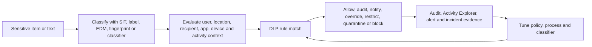

| Term | Plain meaning | Why it matters | Memory hook |
|---|---|---|---|
| Policy | Container for scope and business rules | Groups one control objective | Policy = control package |
| Rule | Conditions plus actions and user/admin response | Implements business logic | If this, then that |
| Location | Service/device/channel being monitored | Capabilities differ by enforcement point | Where matters |
| Condition | What/content/context must be true | Determines match | Condition finds risky context |
| Exception | Explicit case not subject to the rule | Preserves justified workflow | Exception is a governed hole |
| Action | What DLP does after match | Creates user/business impact | Action changes outcome |
| Mode/state | Off, simulation, simulation with tips, on | Controls rollout impact | State controls blast radius |

## 2. DLP is a lifecycle, not a one-time policy

| Phase | Main question | Output |
|---|---|---|
| Plan | Which data/process/risk and stakeholders matter? | Policy intent statement and RACI |
| Prepare | Are classification, licenses, roles, devices, apps and evidence ready? | Prerequisite and test readiness report |
| Design | Which locations, conditions, exceptions and actions implement intent? | Policy/rule specification |
| Simulate | What would match and what business process would be affected? | Simulation and false-result report |
| Pilot | Do users, alerts and support operate correctly? | UAT, operational and go/no-go evidence |
| Enforce | Can scope expand under controlled change? | Ring deployment and hypercare |
| Operate | Are events triaged, exceptions reviewed and rules tuned? | Metrics, incidents, backlog and review minutes |

Trying to “finish DLP” ignores changing data, applications, business partners, users, regulations, classifiers, clients, and attack techniques.

## 3. DLP architecture

The central Purview policy store synchronizes configuration to service and endpoint enforcement points. Classification can occur in services, locally on endpoints, or through cloud advanced classification. Telemetry flows through the Microsoft 365 audit pipeline into Activity Explorer, DLP alerts, reports, and Microsoft Defender investigation.

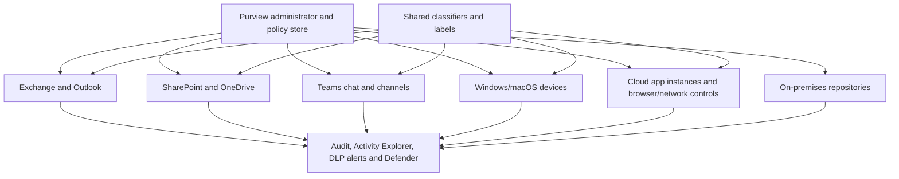

| Architecture plane | Components | Failure question |
|---|---|---|
| Control | Roles, AUs, policies, rules, settings | Did the correct policy reach the target? |
| Classification | SITs, labels, retention labels, classifiers, EDM | Did the item match as intended? |
| Enforcement | Exchange, SPO/ODB, Teams, endpoint, browser, cloud app | Does this location support the action? |
| User experience | Policy tips, toast, email, override/justification | Did the user see and understand the control? |
| Evidence | Audit, activity, alert, contextual summary, original file | Can an investigator prove what happened? |
| Operations | Ownership, triage, exception, tuning, incident response | Is the control sustainable? |

## 4. Policy anatomy

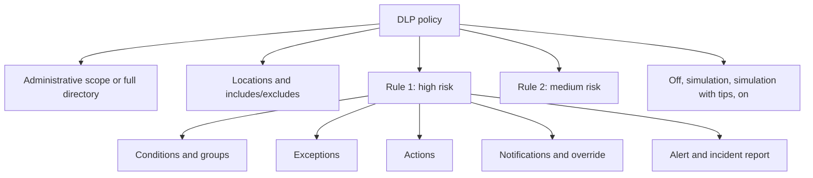

| Policy element | Design question |
|---|---|
| Intent | What exact unwanted outcome should be reduced? |
| Administrative scope | Tenant-wide or delegated AU? |
| Location scope | Which services, users, sites, devices, apps or repositories? |
| Conditions | Which content and context indicate risk? |
| Exceptions | Which narrow, approved workflows must bypass or differ? |
| Actions | Audit, notify, restrict, block with override, block, quarantine? |
| User experience | What should user see, do, and learn? |
| Alerting | Which events are incident-worthy and who owns them? |
| State | What rollout phase is active? |

## 5. Start with a policy intent statement

A good intent statement is testable:

> “Prevent members of the payroll population from copying files containing at least five exact employee tax identifiers to nonapproved USB devices, while allowing approved encrypted backup devices, notifying the user, generating a high-severity alert, and preserving business-justification evidence for approved overrides during the pilot.”

| Weak statement | Why weak | Better question |
|---|---|---|
| “Block PII” | PII, users, channels and risk are undefined | Which data, activity, actor and destination? |
| “Comply with GDPR” | DLP alone cannot establish legal compliance | Which approved control objective supports which obligation? |
| “Stop all USB” | Ignores backup, accessibility and operations | Which sensitive data and device groups require restriction? |
| “Alert on everything” | Produces noise and no ownership | Which events require human investigation? |

## 6. Administrative scope and location scope

Administrative units can delegate supported DLP policy and evidence management. Location scope then selects services and specific instances. Support differs by location.

| Location | Typical include/exclude unit | Data state |
|---|---|---|
| Exchange Online | Users/groups based on sender scope behavior | In motion |
| SharePoint | Sites and, in current preview scenarios, adaptive policy scope | At rest/in use |
| OneDrive | Users/groups/accounts | At rest/in use |
| Teams chat/channel | Users/groups | In motion/in use |
| Devices | Users/groups **and** devices/device groups | In use/in motion |
| Instances | Connected cloud-app instance | At rest |
| Managed cloud apps | Accounts/groups | In motion |
| Unmanaged cloud apps | Accounts/groups and inline/browser/network context | In motion |
| On-premises repositories | Repository path | At rest |
| Fabric/Power BI | Workspaces | In use |
| Microsoft 365 Copilot | Account/group under current preview behavior | At rest/in use |

For Endpoint DLP, enforcement occurs only when both the user and device are in scope when device scoping is used. Microsoft Entra registered-only devices are not supported for current device scoping. A “user is in group” check is therefore insufficient.

## 7. Exchange Online DLP

Exchange evaluates new mail in transit, including supported body and attachment content. It does not retroactively scan every historical mailbox item for standard DLP alert behavior.

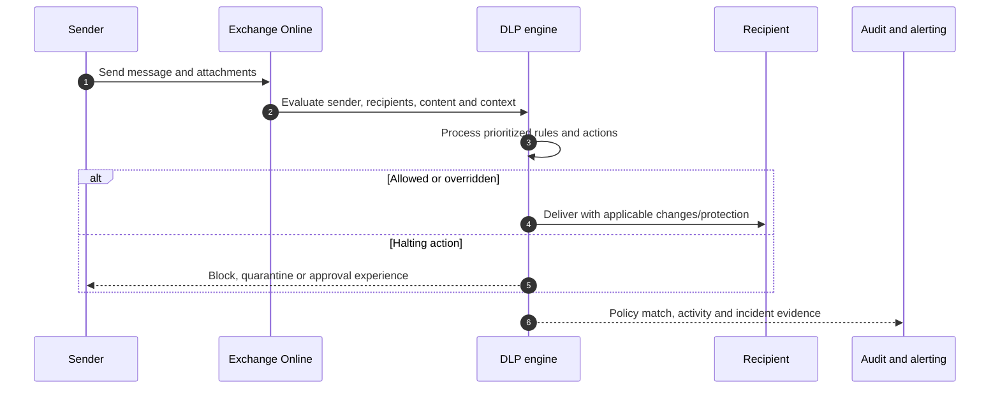

| Exchange control | Example |
|---|---|
| Recipient context | External domain, named recipient, group membership |
| Content | SIT, label, classifier, body/attachment, file property |
| Message context | Subject, headers, size, importance, sender attribute/IP |
| User experience | Outlook policy tip, email notification, override |
| Action | Block, encrypt, quarantine, redirect, approval, header/disclaimer |
| Evidence | Audit, Activity Explorer, DLP alert, business-justification header |

Some Exchange actions are **halting** and stop subsequent rule processing, while others are non-halting or await an approval result. “Stop processing more rules” and action semantics must be designed with the current reference rather than guessed.

## 8. SharePoint and OneDrive DLP

SharePoint/OneDrive policies evaluate supported content at rest and user sharing/access activity. Depending on the action, sensitive files can be proactively blocked for guests after detection even when not yet explicitly shared.

| Situation | Directional behavior to test |
|---|---|
| Sensitive file uploaded | Classification/index timing before policy result |
| Block everyone | Owner, last modifier and site admin exceptions under current behavior |
| Block external users | Internal access remains; guests can be proactively restricted |
| Content shared externally condition | Alert/tip timing can depend on share or guest access |
| File already encrypted | Inspectability depends on supported sensitivity-label integration |
| Password-protected/unscannable | Explicit condition/fallback required |
| Specific external user/domain restriction | Current public preview; most restrictive overlaps win |

### 🔍 Plain-English deep-dive: “block external sharing” may act before a share click

In SharePoint/OneDrive, a DLP rule that restricts external access can identify sensitive content and restrict guest access when the file is processed, not only when somebody later clicks Share. That proactive behavior reduces exposure but surprises users and can suppress some alert floods because the risky access never occurred.

**Analogy:** Security can seal a document as soon as it enters the records room rather than waiting for someone to carry it toward the exit.

Arti's background is useful when checking site, file owner/modifier, sharing links, existing guests, version, search/index state, sync, and whether the user is seeing a policy result or a normal SharePoint permission failure.

## 9. Teams DLP

DLP can evaluate Teams chat and channel messages. When a message matches a blocking rule, sensitive content is not displayed as normal. Files shared through Teams reside in SharePoint/OneDrive and require the corresponding file-location controls.

| Teams object | DLP/ownership distinction |
|---|---|
| Chat/channel message text | Teams DLP location |
| File uploaded to channel | SharePoint site plus Teams link/message context |
| File shared in chat | Sender's OneDrive plus Teams link/message context |
| Meeting chat | Teams/meeting policy and DLP context |
| External/federated participant | Tenant storage and policy boundary differ |

Teams notification and override capabilities are not identical to Exchange or endpoints. Test internal, guest, federated, shared channel, private channel, mobile, and web clients. A user false-positive report can appear as a synthetic DLP info event without full rule details or incident report under documented behavior.

## 10. Conditions, condition groups, and Boolean logic

Conditions define both content and context. Groups can combine conditions with AND, OR, and NOT logic.

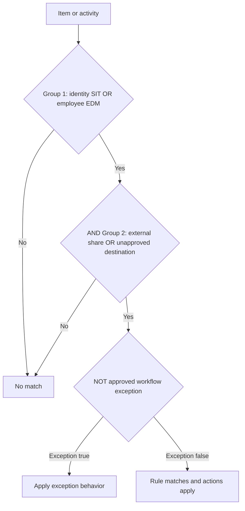

| Logic | Meaning | Example |
|---|---|---|
| OR within group | Any condition can satisfy group | SSN or passport number |
| AND between groups | Every group must be true | Identity data and external recipient |
| NOT/exception | Exclude specified context | Not approved partner domain |
| Instance/confidence | Refine content threshold | At least ten high-confidence customer IDs |
| Activity context | Require risky action | Copy to USB rather than merely store locally |

Keep rules explainable. A deeply nested policy that nobody can reason about is hard to test, investigate, and defend to auditors.

## 11. Classifiers used by DLP

| Classifier/metadata | Example | Location caveat |
|---|---|---|
| Built-in/custom SIT | Credit card, national ID, custom project number | Broad support but definitions/limits vary |
| Exact Data Match | Actual customer/employee record | Advanced/cloud classification dependencies on endpoints |
| Document fingerprint | Organization's patent form | Endpoint requires advanced classification for current support |
| Trainable classifier | Contract, résumé, merger document | Supported locations differ; encrypted content cannot be classified |
| Sensitivity label | Highly Confidential | Teams messages do not support every label condition |
| Retention label | Business record | Supported mainly for selected file/cloud-instance locations |
| Named entity/credentials | Person/address, token, key | Advanced classification and privacy considerations |

When multiple locations are selected in one policy, only conditions common to those locations may remain available. A “no” for one selected location can remove a content-definition option from the combined policy. Separate policies by enforcement architecture when needed rather than forcing one universal rule.

## 12. Exceptions

Exceptions are justified, documented differences, not permanent mystery bypasses.

| Exception type | Better design | Dangerous design |
|---|---|---|
| User/group | Approved role group with owner and expiry | Individual VIP forever |
| Partner domain | Contracted partner and exact workflow | Every common email domain |
| Site/location | Controlled transfer site with compensating controls | Entire collaboration estate |
| Device/USB/printer | Authorized hardware group | All removable storage or all printers |
| Application | Signed approved process/version | Broad executable path or user-writable folder |
| File/path | Exact operational path where needed | Desktop, temp or whole drive exclusion |

Every exception should record requestor, business reason, data class, activity, scope, approver, compensating controls, owner, expiry, review cadence, evidence, and removal test.

## 13. Actions and restriction levels

| Action level | User impact | Best rollout use |
|---|---|---|
| Off | No evaluation/action for configured path | Draft configuration only |
| Allow (endpoint) | Activity allowed and audited without alert/tip | Baseline file activity under current endpoint semantics |
| Audit only | Activity allowed; audit and optional alert/tip | Discovery and tuning |
| Block with override | Initially blocked; approved user can justify/bypass | Mature pilot and legitimate exceptions |
| Block | Activity denied | Proven high-risk control with low false positives |
| Quarantine/restrict access | Item moved/locked/access changed in supported location | Data-at-rest containment |

On endpoints, **Allow** still audits but does not alert; **Audit** can alert; **Off** does neither. On macOS, available actions differ from Windows. Always read the per-location action reference.

## 14. User notifications and policy tips

Notifications educate at the moment of risk. They must explain what happened, why, what safe alternative exists, and how to get help without exposing matched sensitive data.

| Surface | Examples | Caveat |
|---|---|---|
| Outlook policy tip | Warning/block before send | Client/version and rule support differ |
| SharePoint/OneDrive | Browser tip and email notification | Notification can occur once per document/rule behavior |
| Endpoint toast | Activity, file/process, allow button, support link | Custom text length and OS behavior |
| Teams | Message-block experience | Not identical to email notifications |
| Browser inline | Edge/extension/network behavior | Preview and integration dependent |

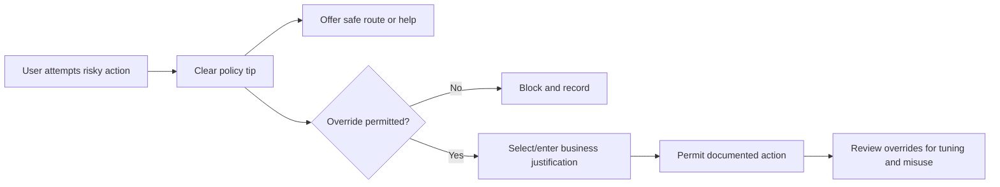

Policy tips from the highest-priority, most restrictive matching rule are shown to avoid cascades. Notification emails can be unprotected, so never include unnecessary sensitive matched text.

## 15. Overrides and business justification

Overrides balance productivity and control. They are suitable only where the user is allowed to make a risk decision.

| Override option | Use |
|---|---|
| False positive | User asserts classification is wrong; requires analyst validation |
| Recipient entitled | Sharing is allowed under business rule |
| Manager approved | Existing approval supports action |
| Established workflow | Action is part of governed process |
| Urgent access | Time-sensitive exception with follow-up |
| Free text/Other | Captures context not in fixed choices |

Endpoint global settings can customize up to five justification choices under current behavior. Exchange override information can appear in audit and an email X-header, including free text. Treat justifications as sensitive business records and do not use them as automatic proof that an action was safe.

### 🔍 Plain-English deep-dive: override is a pressure-release valve, not a hole

A pressure-release valve opens under defined conditions, records that it opened, and is inspected. A hole is uncontrolled. A DLP override needs eligible users, a clear reason, telemetry, review, and consequences for misuse. If nobody reviews overrides, the organization has created a disguised allow rule.

## 16. Alerts, incident reports, and evidence

Alerts are generated only when configured conditions/severity/thresholds are met. They can be single-event or aggregated over volume/time. Incident reports can include user, policy, rule, sensitivity evidence, severity, item, surrounding context, app, device, and attempted endpoint operation according to settings and permissions.

| Evidence level | Example | Privacy requirement |
|---|---|---|
| Metadata | User, device, file name, rule, activity | Restricted investigation access |
| Matched condition | SIT and supporting context | Content Viewer role for sensitive preview |
| Contextual summary | Text around match | Data minimization and approved purpose |
| Original endpoint file | Copy in customer Azure Storage | Highest restriction, encryption, retention and chain of custody |
| Audit record | Event payload and justification | Controlled export/API storage |

Original-file evidence collection is powerful and risky. It requires a customer Azure Storage account/container, permissions, regional/data-boundary planning, encryption, logging, retention/deletion, legal/privacy approval, and incident access controls. Do not enable “collect everything.”

## 17. DLP alerts and Microsoft Defender

The Purview DLP Alerts dashboard supports triage, assignment, comments, status, event review, and matched conditions. Alerts also flow to Microsoft Defender for unified incident investigation. Current Learn says Purview DLP alert dashboard visibility is typically 30 days while Defender availability can be six months, subject to audit/retention configuration and licensing.

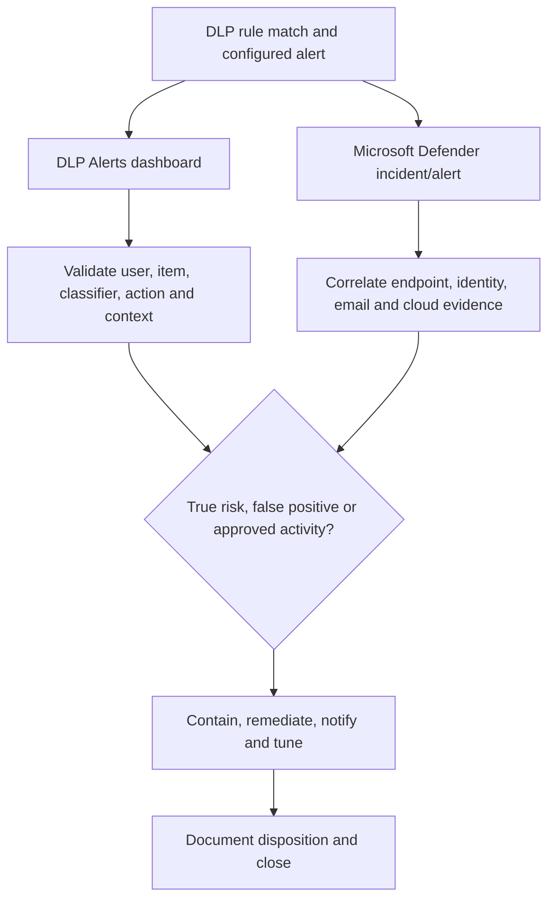

Preview Security Copilot summaries and alert-triage agents require human validation. They can prioritize or summarize; they do not replace evidence review or accountability.

## 18. Endpoint DLP architecture and prerequisites

Endpoint DLP extends controls to onboarded Windows and supported macOS devices. It uses the Defender for Endpoint sensor/antimalware platform and Purview policy. Windows Server 2019 and later can be enabled under current guidance.

| Prerequisite | Validation |
|---|---|
| License | Exact Endpoint DLP entitlement for protected users/devices |
| OS | Supported Windows 10/11/Server or three recent macOS releases |
| Onboarding | Device appears healthy in Purview/Defender inventory |
| Defender components | Supported platform, engine and antimalware client versions |
| Connectivity | Required endpoints/proxy/TLS and cloud-classification route |
| Roles | DLP policy, alerts, device, evidence and Content Viewer separation |
| Auditing | Audit enabled and expected event availability |
| Apps/extensions | Edge or supported Chrome/Firefox extension where required |
| Test device | Nonproduction persona, files, USB/printer/share/browser controls |

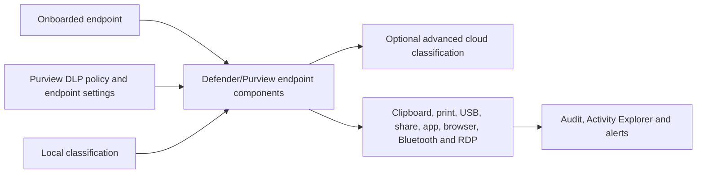

Do not enforce on every device after seeing it in Defender. Validate user/device scope, health, policy synchronization, client build, performance, accessibility tools, business apps, and support readiness.

## 19. Endpoint activities

| Activity | Control question | Platform caveat |
|---|---|---|
| Copy to clipboard | Can content leave protected file through copy? | Different from paste-to-browser classification |
| Copy to removable USB | Is destination approved hardware? | Authorization groups and device identity |
| Copy to network share | Is share/corporate path approved? | Coverage setting and mapped-drive behavior |
| Print | Is printer approved? | Printer groups/types and resubmission UX |
| Upload to cloud domain | Is destination allowed/restricted? | Supported browser/extension and domain settings |
| Paste to supported browser | Is pasted text sensitive? | SIT-focused, minimum text/size/latency limitations |
| Restricted app access | Can this application open protected item? | App group rules can override app-list behavior |
| Bluetooth transfer | Is app allowed? | Windows-specific limitations |
| RDP transfer | Can file move through remote desktop? | Windows-specific limitations |
| Windows Recall | Can protected content be captured? | Current preview/change-sensitive support |

## 20. Endpoint settings are global dependencies

Central Endpoint DLP settings apply across device-scoped policies. A local rule can refer to global lists/groups.

| Global setting | Purpose | Risk |
|---|---|---|
| File path exclusions | Remove locations from audit/classification/enforcement | Creates complete blind spot for those paths |
| Restricted apps/app groups | Define app-specific controls | Wrong executable/path breaks processes |
| Service domains | Allow-list or block-list upload destinations | Inverted mode is a high-impact mistake |
| Sensitive site groups | Apply site-specific activities/actions | URL syntax and browser coverage |
| Printer groups | Different action for approved printers | Device properties can be unstable |
| USB groups | Different action for approved storage | Serial/vendor/product matching quality |
| Network share groups | Different action for approved shares | Wildcard/path mistakes |
| VPN/network settings | Context-specific actions | Priority between VPN/corporate contexts |
| Evidence collection | Copy matched originals | Privacy, storage and chain-of-custody risk |
| Advanced classification | Cloud EDM/entity/classifier capability | Content transfer, bandwidth and fallback |

Treat global setting changes like shared infrastructure changes. Inventory dependent policies and test regression.

## 21. Restricted apps and app groups

The restricted-app list controls access to protected files by named applications. Restricted app groups support activity-specific control. Group settings override list/file-all-app behavior in the same rule under current documented precedence.

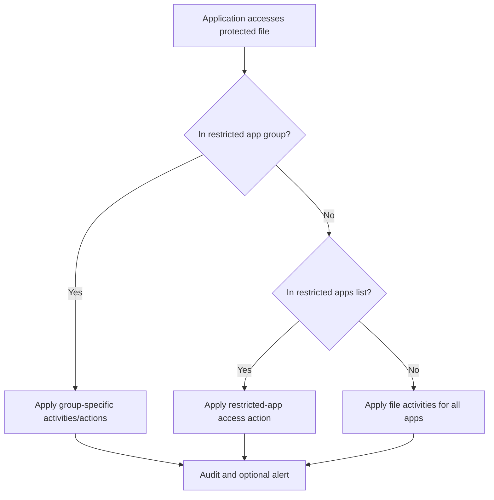

| App design | Guidance |
|---|---|
| Windows app identity | Executable name, not broad user-writable path |
| macOS app identity | Full process path; case-insensitive definitions |
| Cloud sync app | Consider auto-quarantine only after workflow testing |
| Allow-list model | Define sanctioned app group and block undefined apps cautiously |
| Background processes | Validate system/update processes and documented bypass behavior |

Blocking executable/file extensions such as DLL, EXE, OST, PST or temporary files can increase CPU or break normal applications. Prefer precise behavior controls over broad extension blocking.

## 22. USB, printers, and network shares

| Authorization object | Example business rule | Evidence to capture |
|---|---|---|
| USB device group | Allow encrypted backup drives; block others | Vendor/product/serial and tested action |
| Printer group | Allow legal contracts only on Legal printers | Friendly name, IP/USB/Universal Print attributes |
| Network share group | Allow sensitive files only to governed case share | UNC/path pattern and access control |
| VPN/network context | Permit activity only on corporate network | VPN server/network identity and priority |

Current limits include group/count boundaries that can change, such as 20 USB groups with up to 50 devices each, 20 printer groups with up to 50 printers, and restricted-app group limits. Reverify rather than encode numbers as permanent architecture.

## 23. Browser restrictions and service domains

Service domains control uploads of protected files through Microsoft Edge or supported Chrome/Firefox extensions. **Block list mode** applies DLP restrictions only to listed domains; **allow list mode** treats listed domains as allowed and applies restrictions to unlisted domains. This inversion must be peer reviewed.

### 🔍 Plain-English deep-dive: allow-list and block-list modes reverse the default

- **Block list:** “These listed destinations are restricted; all others are outside this domain control.”
- **Allow list:** “These listed destinations are approved; restrictions apply to everything else.”

**Analogy:** A guest list can mean either “deny these people” or “admit only these people.” Misreading the heading changes the whole event.

| Domain syntax | Directional match |
|---|---|
| `contoso.com` | Exact domain and paths, not arbitrary subdomains |
| `*.contoso.com` | Domain and subdomains under current syntax |
| No protocol | Enter host/path as documented, not `https://` |
| Trailing slash/path | Can narrow exact site/path behavior in site groups |
| IP/range | Preview for selected sensitive-site actions |

The service-domain list applies to file uploads, not paste behavior. Paste-to-browser uses sensitive-site groups/rule context and supports Edge plus Chrome/Firefox with the Purview extension. Test drag/drop, file chooser, paste, copy, print, save-as, browser profile, extension state, and private/incognito modes.

## 24. Paste to browser

Paste-to-browser evaluates clipboard text rather than relying on the source file classification. Current documented limitations include SIT-focused behavior, no sensitivity-label evaluation for pasted text, no advanced classification, a minimum of about 30 characters, first 4 MB classification, roughly two-second evaluation, and no contextual summary.

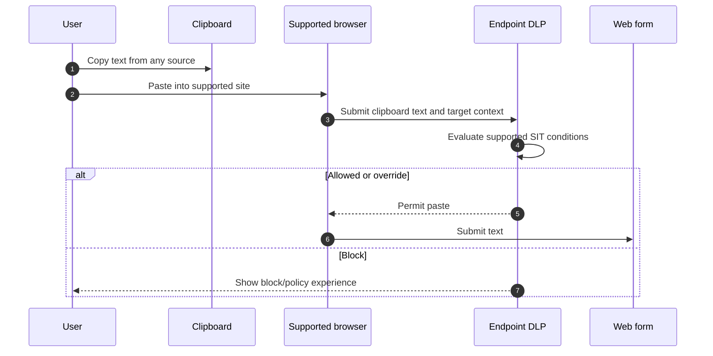

Do not claim that blocking copy-to-clipboard and blocking paste-to-browser are the same. One monitors copying from a protected file; the other evaluates text at the web destination.

## 25. Advanced classification scanning and protection

Advanced classification sends supported file content to Microsoft's cloud classification service so Endpoint DLP can use EDM, trainable classifiers, named entities, credential classifiers, document fingerprinting, and contextual summaries.

| Decision | Consideration |
|---|---|
| Enable cloud classification | Data residency/privacy and permitted processing |
| Bandwidth limit | Per-device rolling 24-hour behavior; fallback loses advanced classifiers |
| File size | Current 64 MB text and 50 MB OCR image limits for advanced scanning |
| Supported type | Office/PDF and current documented formats |
| Endpoint patches | Required Windows updates and antimalware versions |
| Failure fallback | Local classification continues but advanced methods unavailable |

Current guidance states DLP policy evaluation occurs in the cloud even when user content is not sent for advanced classification. Document the exact data flow with privacy/legal owners.

## 26. Just-in-time and advanced label-based protection context

Just-in-time protection helps cover files while full classification completes, using configured fallback behavior. Advanced label-based protection can let users work with labeled non-Office/PDF files unencrypted locally while Endpoint DLP enforces restrictions and encrypts on egress, currently for onboarded Windows devices.

These controls are change-sensitive and can affect availability. Define what happens when classification is unavailable: audit, block, or allow. A fail-closed decision protects data but can halt work during service/network issues; a fail-open decision preserves productivity but creates exposure.

## 27. Defender for Cloud Apps integration and context

Microsoft Defender for Cloud Apps (MDCA) provides SaaS discovery, API connectors, file/activity policies, app governance, and Conditional Access App Control/session controls. Purview DLP can use cloud-app **Instances**, **Managed cloud apps**, and **Unmanaged cloud apps** under current architecture, while MDCA can inspect and apply Purview labels in supported third-party apps.

| Pattern | Control plane | Use |
|---|---|---|
| API-connected app instance | Purview DLP/MDCA connector context | Scan/protect supported data at rest in SaaS |
| Managed cloud app browser/network | Purview DLP enterprise app/device policy | Restrict sensitive transfers to governed apps |
| Unmanaged cloud app | Inline web traffic/Edge/network detection | Restrict uploads/paste to unsanctioned destinations |
| Conditional Access App Control | Entra CA plus MDCA reverse proxy | Real-time session control for supported apps |
| MDCA label application | MDCA file policy and Purview Information Protection | Label/protect supported third-party cloud files |

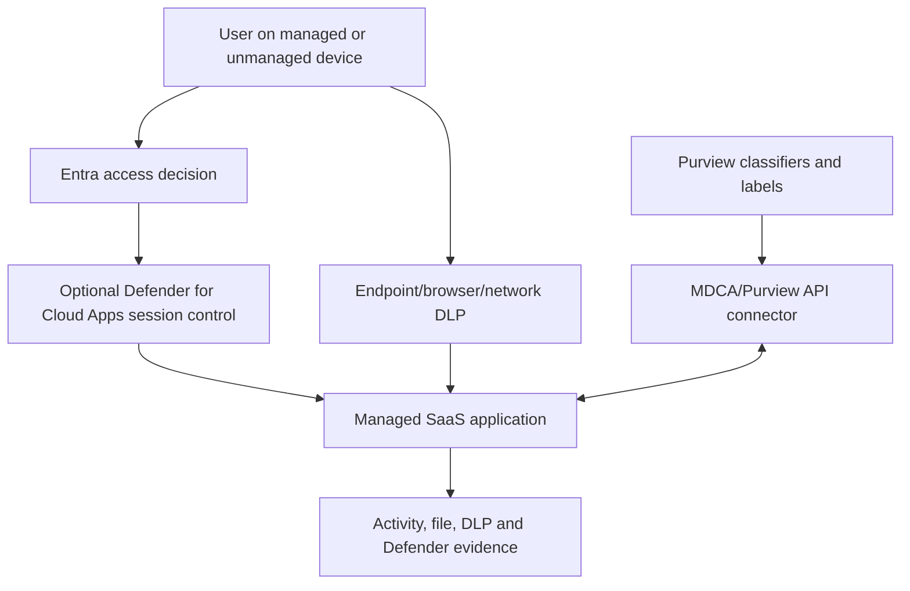

Do not say “MDCA is DLP for all SaaS.” Capability depends on API/session integration, app support, browser/network path, file type, encryption, identity, license, and policy location.

## 28. Managed versus unmanaged cloud apps and inline web traffic

Current DLP architecture distinguishes enterprise applications/devices from **Inline web traffic**. Collection policies gather browser/network data for unmanaged cloud-app control. Edge for Business can provide integrated inline enforcement; Network Data Security can extend visibility/control through supported network integrations.

| Area | State | Change sensitivity |
|---|---|---|
| Managed cloud apps | Governed apps with supported control path | Account/group, browser/network and action support |
| Unmanaged cloud apps | Unsanctioned or not organization-managed | Browser/network detection and catalog mapping |
| Edge inline controls | Browser-integrated protection | Preview/support and device onboarding model |
| Network data security | Network-path protection beyond one endpoint agent | Preview, integration, latency and data boundary |
| Cloud app catalog | Risk context for thousands of apps | App scores and categories change |

Plan privacy notices, network architecture, TLS constraints, location/identity correlation, bypass paths, browser support, mobile/unmanaged endpoints, incident ownership, and false positives before production.

## 29. Adaptive Protection with Insider Risk

Adaptive Protection maps Insider Risk Management risk levels to DLP conditions. DLP can apply different restrictions to the same content/activity based on a user's current risk level under supported locations such as Exchange, Devices, Teams, and unmanaged cloud apps.

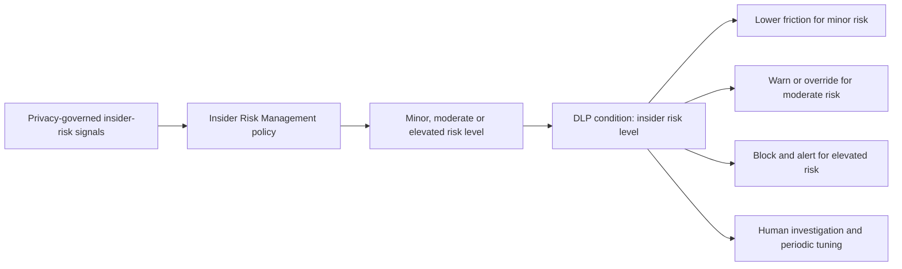

| Design concern | Requirement |
|---|---|
| Privacy | Legal/HR/works-council review, minimization and role separation |
| Explainability | Document what risk level changes, not secret scoring internals |
| User fairness | Avoid assuming risk equals guilt |
| Failures | Define behavior if risk signal is stale/unavailable |
| Operations | Coordinate Insider Risk, DLP and SOC case ownership |
| Tuning | Measure added protection versus disparate user impact |

Adaptive Protection is not a license to monitor employees without governance. Risk levels are signals for proportionate control, not conclusions of malicious intent.

## 30. Policy priority and evaluation: hosted services

For hosted locations such as Exchange, SharePoint and OneDrive, rules are processed in priority order. When content matches multiple rules, the highest-priority rule with the most restrictive action is enforced under documented behavior; other matches can still be audited/reported.

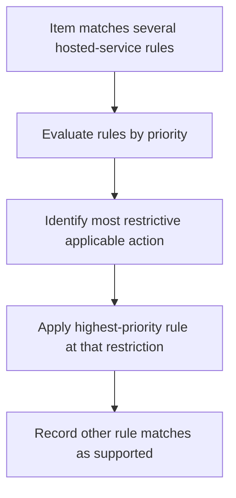

An Exchange halting action can stop later processing. “Priority 0 always wins” is incomplete because restrictiveness and action semantics matter.

## 31. Policy priority and conflicts: endpoints

Endpoint DLP aggregates the most restrictive actions across matching policies/rules by activity. A rule that blocks printing and another that blocks USB can produce both blocks. For conflicting overrides, no-override is more restrictive than override. Enforced policies take precedence over simulation behavior for identical actions.

| Matching policy | Clipboard | USB | Print |
|---|---:|---:|---:|
| Policy A | Audit | Audit | Block |
| Policy B | Audit | Block | Audit |
| Runtime aggregate | Audit | **Block** | **Block** |

### 🔍 Plain-English deep-dive: endpoint actions add up

Hosted services often select the governing restrictive rule. Endpoints can combine restrictions by activity. Think of several access-control lists: one denies printing and another denies USB, so both denials apply. Reordering alone may not remove a conflict; inspect every matching policy, state, action, override, app group, authorization group, and endpoint setting.

## 32. Simulation modes

| State | Enforcement | User experience | Best use |
|---|---|---|---|
| Keep off | None | None | Draft/review |
| Simulation, tips off | Configured actions generally not enforced | No policy tips | Broad impact discovery |
| Simulation, tips on | Endpoint block can become override behavior under current matrix; service actions remain nonenforcing as documented | Tips/notifications educate pilot users | User pilot |
| On | Actions enforced | Full configured experience | Approved production |

Current guidance recommends three deployment axes: **scope**, **state**, and **action**. Simulation is not zero side effect: it generates audit/alert data and, with tips, changes user experience. “Stop processing more rules” does not work in simulation mode.

## 33. Policy design pattern by risk tier

| Risk tier | Example condition | Action | Alert |
|---|---|---|---|
| Low | One medium-confidence identifier shared internally | Audit/educate | None or aggregate low |
| Medium | Multiple high-confidence records to approved partner | Block with override/justification | Aggregate medium |
| High | EDM employee tax records to personal cloud/USB | Block no override | Single-event high |
| Critical | Credential/private key exfiltration | Block, contain, incident response | Immediate high with SOC ownership |

Separate risk tiers into understandable rules. Avoid a single rule with dozens of conditions and inconsistent actions.

## 34. False positives and false negatives

| Source | False-positive example | False-negative example |
|---|---|---|
| SIT | Random digits look like ID | Valid ID with unexpected separator |
| EDM | Shared/duplicate primary values produce wrong context | Source data stale or normalization mismatch |
| Label condition | User overlabels harmless file | Sensitive file left unlabeled |
| Classifier | Public merger news classified as deal document | New deal format differs from samples |
| Scope | Approved site unexpectedly included | New subsidiary/site/device omitted |
| Browser domain | Broad wildcard blocks trusted service | Alternate subdomain/app bypasses list |
| App/path | Background process triggers access | Unlisted portable app exports data |

Tune the classifier, context, scope, action, and user process separately. Adding a huge exception to silence noise can create a worse false-negative problem.

## 35. Testing and evidence

| Test layer | Positive test | Negative/failure test | Evidence |
|---|---|---|---|
| Scope | Pilot user/device/site matches | Out-of-scope persona unaffected | Policy scope export and event |
| Classifier | Synthetic true positive | Hard negative does not match | Contextual summary/corpus result |
| Exchange | External test message handled | Internal equivalent allowed | Trace, tip and audit |
| SPO/ODB | Guest access restricted as designed | Internal owner remains expected | Link/access and activity evidence |
| Teams | Sensitive chat text controlled | File control tested at SPO/ODB layer | Client and audit result |
| USB | Unapproved device blocked | Approved group allowed/audited | Device identifiers and event |
| Print | General printer blocked | Legal printer follows exception | Printer group and spool result |
| Browser | Restricted domain upload blocked | Approved domain allowed | Browser/extension and event |
| Override | Eligible user justifies | Ineligible user has no bypass | Justification and audit |
| Alert | High event routes to owner | Low event aggregation avoids noise | Alert assignment/status |
| Failure | Offline/unhealthy endpoint behavior | Recovery after reconnect/sync | Diagnostic and backfill evidence |

Use synthetic data. Never test real credentials, payment records, health data, or customer identifiers. Use approved Microsoft test values or a fictional custom SIT/EDM dataset.

## 36. Staged rollout

Go/no-go gates should include classifier precision/recall, policy-match volume, override quality, critical business-process pass rate, client/device health, alert SLA, service-desk readiness, documented exceptions, rollback rehearsal, privacy sign-off, and executive/control-owner approval.

## 37. Rollback and containment

| Failure | Immediate safe action | Follow-up |
|---|---|---|
| Broad false block | Move policy to simulation/off or narrow scope | Preserve evidence and retest corpus |
| Endpoint performance issue | Exclude pilot device only if approved, then disable/narrow offending rule | Diagnose app/file/advanced-classification load |
| Wrong service-domain mode | Correct allow/block mode under peer-reviewed change | Regression-test listed/unlisted domains |
| Alert flood | Reduce alert aggregation/scope without hiding critical events | Tune classifier/risk threshold |
| Evidence overcollection | Stop collection and lock storage access | Legal/privacy disposition and deletion |
| Business-critical app blocked | Use narrow time-bound app/activity exception | App owner remediation and expiry |
| Adaptive signal concern | Remove risk condition/use static control | Privacy/IRM review and validation |

Rollback must consider synchronization delay. Record policy/rule GUID, original state, scope, actions, endpoint settings and timestamp. Do not delete a policy during incident diagnosis; disabling or simulation preserves configuration and evidence.

## 38. Operations and metrics

| Metric | Meaning | Decision |
|---|---|---|
| Match volume by rule/location | Exposure and policy reach | Investigate spikes and scope changes |
| Block/override ratio | Friction and allowed exceptions | Tune or investigate misuse |
| False-positive rate | Detection/action quality | Pause enforcement below threshold |
| Known-corpus recall | Controlled miss rate | Improve classifier before expansion |
| Alert-to-incident conversion | Alert usefulness | Adjust severity/aggregation |
| Mean time to triage/resolve | Operational readiness | Staffing/runbook improvements |
| Unscannable/incomplete rate | Blind content volume | Add fallback/control or process fix |
| Endpoint policy sync/health | Enforcement coverage | Device remediation |
| Browser extension coverage | Upload/paste protection reach | Deployment/compliance action |
| Exception age/usage | Governance debt | Reapprove or remove |
| Evidence-access events | Privacy control | Review anomalous access |
| Policy change failure | Engineering quality | Improve peer review/testing |

Metrics require denominators. “1,000 blocks” means little without number of users, protected activities, false positives, and business outcomes.

## 39. Incident response workflow

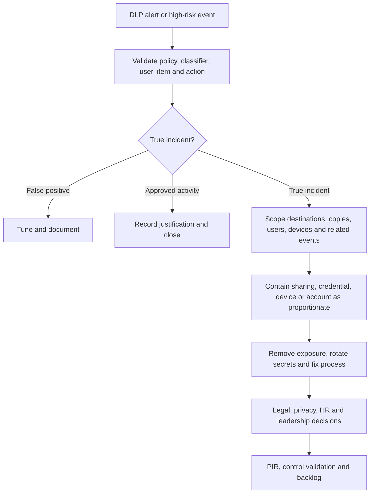

For credentials, revoke/rotate in the owning system before merely deleting the file. For personal data, follow breach/legal/privacy assessment. For employee monitoring, respect policy and HR/legal boundaries. Preserve evidence with chain of custody and minimize content access.

## 40. Common failures

| Symptom | Likely causes | First discriminating check |
|---|---|---|
| Policy not enforcing | State, sync, scope, unsupported action/location | Confirm effective policy and target after one-hour planning window |
| User in scope but endpoint unaffected | Device not in scope/onboarded/healthy | Check both user and device scope/status |
| Too many matches | Broad SIT/confidence/count or missing context | Inspect approved matched conditions |
| No SharePoint event | Index/classification delay, encryption, file type | Test new supported synthetic file and audit |
| Teams file not blocked | File resides in SPO/OneDrive, not message control | Trace storage location and both policies |
| USB exception fails | Device identifier/group mismatch | Capture exact device properties |
| Approved domain blocked | Allow/block mode or wildcard syntax wrong | Test one listed and one unlisted FQDN |
| Chrome/Firefox bypass | Extension missing/disabled/profile unsupported | Verify extension health and process |
| Paste differs from upload | Different actions/conditions/domain semantics | Identify exact activity event |
| Endpoint classifier misses EDM | Advanced classification off/bandwidth exhausted | Check endpoint setting and cloud connectivity |
| Alert absent | Alert not configured, threshold/aggregation, permission/latency | Confirm audit rule match then alert settings |
| Tip text from unexpected rule | Most restrictive/highest-priority rule wins | Enumerate all matching rules |

## 41. Layered troubleshooting

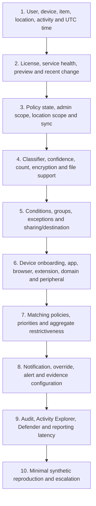

Compare a working and failing user/device/item. Use Activity Explorer pairs such as `DLPRuleMatch` and egress activity. Normalize UTC and retrieve policy/rule GUIDs, device ID, app/process, destination, classifier result, action, override and correlation IDs. Do not weaken broad policy as the first diagnostic step.

## 42. Consulting scenarios

### Scenario A: customer spreadsheet shared externally from OneDrive

Use exact/built-in customer identifiers, external-sharing context, and simulation. Determine whether external restriction should be proactive. Validate item ownership, guest link, label/encryption, index timing, alert, tip and approved partner exception. Arti can directly connect this to OneDrive sharing/support while describing DLP configuration as design/lab knowledge.

### Scenario B: payroll data copied to USB

Scope payroll users and controlled devices, use EDM for exact employee IDs, allow approved encrypted backup drives through a USB group, block unapproved USB, alert high severity, and define incident response. Test hardware identifiers, offline behavior and false matches before enforcement.

### Scenario C: source code pasted into generative AI website

Use classifier/label/SIT strategy appropriate to source code, sensitive-site groups, supported browser paste controls, and inline/network capability. Document paste limitations, unmanaged browser/mobile bypass, privacy, user guidance, and approved enterprise AI destination. Do not promise universal AI-site coverage.

### Scenario D: elevated-risk employee exfiltration

Adaptive Protection can make controls more restrictive at elevated risk. Privacy, HR/legal governance, role separation, stale-signal behavior and human investigation are mandatory. A risk level is not proof of malicious intent.

## 43. Consulting artifacts

| Artifact | Minimum contents |
|---|---|
| Policy intent catalogue | Data, actor, activity, destination, action, owner |
| Location/capability matrix | Conditions/actions/licensing per workload |
| Endpoint prerequisite matrix | OS, builds, onboarding, network, apps/extensions |
| Policy/rule specification | Scope, logic, exceptions, actions, UX, alerts, mode |
| Classifier/corpus report | TP/FP/TN/FN, precision, recall and limitations |
| Exception register | Business reason, owner, compensating control, expiry |
| Architecture diagrams | Central policy, enforcement points and evidence flows |
| Test/UAT pack | Positive, negative, failure, conflict and rollback tests |
| Deployment plan | Scope/state/action rings, gates and communications |
| Incident runbook | Triage, evidence, containment, escalation and PIR |
| Operations pack | RACI, SLA, metrics, access, review and training |
| Risk register | Blind spots, privacy, unsupported channels and residual risk |

## 44. Safe paper lab: design a cross-channel exfiltration policy

### Scenario and safety boundary

A fictional organization wants to protect fictional customer IDs formatted `CUST-` plus eight digits from external email, external OneDrive sharing, unapproved USB, and paste/upload to unapproved web services. This is a **paper-only** lab. Do not create a policy, onboard a device, assign roles, install extensions, collect files, or use real customer data.

### Policy intent

> Monitor at least five high-confidence fictional customer IDs. In simulation, identify external Exchange, SharePoint/OneDrive guest access, endpoint USB, and supported browser egress. In a future pilot, block unapproved USB and web destinations with a documented override for approved roles, while external M365 sharing follows data-owner-approved behavior.

### Paper rule design

| Field | Decision |
|---|---|
| Classifier | Fictional custom SIT; no real values |
| Count/confidence | Five high-confidence instances |
| M365 locations | Exchange, SharePoint, OneDrive; Teams file storage traced separately |
| Endpoint | Pilot users and pilot devices both in scope |
| Browser | Approved domain allow list; unapproved site group |
| USB | Approved encrypted backup group; all other USB restricted |
| Initial state | Simulation without tips |
| Pilot state | Simulation with tips, then block with override |
| Alert | High only for blocked/overridden bulk egress; aggregate lower events |
| Evidence | Metadata/context only; original-file collection disabled |

### Synthetic test corpus

Use fictional strings such as `Customer account CUST-12345678`. Include valid positives, look-alike invoice numbers, fewer-than-five counts, spacing/format variations, password-protected file, unsupported extension, labeled file with no SIT, and unlabeled item with SIT. Never use a real national ID, card number, token, customer record or domain.

### Paper architecture

1. Draw central Purview policy to Exchange, SPO/ODB, endpoint and browser enforcement.
2. Draw user plus device scope for Endpoint DLP.
3. Draw service-domain allow-list behavior for listed and unlisted sites.
4. Draw Activity Explorer/audit/alert/Defender evidence flow.
5. Create a RACI for business owner, Purview admin, endpoint, SOC, privacy/legal and service desk.

### Paper test matrix

| Test | Expected design result | Evidence wording |
|---|---|---|
| External email with five IDs | Simulated match, no actual block | “Designed; tenant execution pending” |
| Internal email | No external-context rule action | “Negative context test” |
| OneDrive guest access | Simulated external match | “Index/latency dependency documented” |
| Approved USB | Allowed/audited under group | “Requires device-ID validation” |
| Unapproved USB | Pilot block with override | “Requires controlled endpoint pilot” |
| Listed approved web domain | Upload permitted/audited | “Allow-list semantics peer reviewed” |
| Unlisted domain | Restriction in pilot | “Browser/extension coverage caveat” |
| Paste under 30 characters | Documented limitation | “Compensating controls required” |
| Endpoint offline | Document fallback and event backfill | “Availability test planned” |
| False positive | Analyst classifies and tuning ticket opens | “Closed-loop quality process” |

### Evidence portfolio

- Policy intent and rule specification.
- Location/condition/action matrix.
- Endpoint/browser prerequisite and coverage matrix.
- Synthetic corpus and hypothetical confusion matrix.
- Scope/state/action rollout diagram.
- Incident, rollback and operations runbooks.
- Candidate honesty statement.

### Cleanup

Nothing was configured. Delete any accidental real file names, domains, tenant IDs, screenshots, or identifiers. Keep only fictional paper artifacts.

### Interview wording

> “I designed a paper DLP policy for synthetic customer IDs across Exchange, SharePoint/OneDrive, endpoints, USB and supported browsers. I documented user-plus-device scope, allow-list semantics, simulation, policy conflicts, alerts, privacy, incident response, rollback and metrics. I have not deployed Endpoint DLP or Adaptive Protection in production. My direct SharePoint/OneDrive support, sharing and RCA experience is the workload foundation I would bring to a controlled pilot.”

## 45. JD Mapping: interview translation

| Interview theme | Factual answer direction |
|---|---|
| DLP architecture | Central policy/classification, distributed enforcement, evidence feedback loop |
| Rule design | Intent, location, condition groups, exceptions, action, UX and alert |
| Endpoint | Both user and device scope; onboarding, apps, domains, peripherals and health |
| Browser/cloud | Distinguish upload, paste, session/API and inline/network paths |
| Priority/conflicts | Hosted restrictive rule versus endpoint aggregate restrictive activities |
| Rollout | Scope/state/action, simulation, tips, override, block and rings |
| Troubleshooting | Scope, policy, classifier, context, endpoint, priority, UX and telemetry |
| Experience honesty | Direct M365 support plus DLP design/paper-lab boundary |

## 46. Official Source Anchors

| Topic | Official Microsoft source |
|---|---|
| DLP overview and lifecycle | [Learn about data loss prevention](https://learn.microsoft.com/en-us/purview/dlp-learn-about-dlp) |
| Complete policy/rule/location reference | [Data Loss Prevention policy reference](https://learn.microsoft.com/en-us/purview/dlp-policy-reference) |
| Create and stage policies | [Create and deploy a DLP policy](https://learn.microsoft.com/en-us/purview/dlp-create-deploy-policy) |
| Endpoint concepts | [Learn about Endpoint DLP](https://learn.microsoft.com/en-us/purview/endpoint-dlp-learn-about) |
| Endpoint settings | [Configure Endpoint DLP settings](https://learn.microsoft.com/en-us/purview/dlp-configure-endpoint-settings) |
| Device onboarding | [Get started with Endpoint DLP](https://learn.microsoft.com/en-us/purview/endpoint-dlp-getting-started) |
| DLP alerts | [Get started with the DLP Alerts dashboard](https://learn.microsoft.com/en-us/purview/dlp-alerts-dashboard-get-started) |
| Activity Explorer | [Get started with Activity Explorer](https://learn.microsoft.com/en-us/purview/data-classification-activity-explorer) |
| Adaptive Protection | [Learn about Adaptive Protection in DLP](https://learn.microsoft.com/en-us/purview/dlp-adaptive-protection-learn) |
| Defender for Cloud Apps | [What is Defender for Cloud Apps?](https://learn.microsoft.com/en-us/defender-cloud-apps/what-is-defender-for-cloud-apps) |
| DLP for non-Microsoft cloud apps | [Use DLP policies for non-Microsoft cloud apps](https://learn.microsoft.com/en-us/purview/dlp-use-policies-non-microsoft-cloud-apps) |
| Licensing | [Microsoft 365 licensing guidance for security and compliance](https://learn.microsoft.com/en-us/office365/servicedescriptions/microsoft-365-service-descriptions/microsoft-365-tenantlevel-services-licensing-guidance/microsoft-365-security-compliance-licensing-guidance) |

---

## ⭐ Likely Interview Questions for This Section

### Q1. How would you design a DLP policy from a business requirement?

**Model answer:** “I write a testable intent stating the data, actor, activity, destination, risk and desired outcome. Then I choose administrative and location scope, classifiers, condition groups, exceptions, actions, user guidance, overrides and alerts. I validate licensing/prerequisites, simulate with a synthetic corpus, pilot by scope/state/action, and enforce only after quality and operational gates pass.”

### Q2. What is the difference between a DLP policy and a rule?

**Model answer:** “A policy groups a control objective, administrative/location scope and one or more rules. A rule contains the business logic: conditions and exceptions, actions, notifications, overrides, alerts and priority. Several risk-tier rules can exist inside one policy.”

### Q3. How does DLP differ across Exchange, SharePoint/OneDrive, Teams and endpoints?

**Model answer:** “Exchange evaluates new mail in transit; SharePoint/OneDrive evaluate files and sharing/access with indexing and can proactively restrict guests; Teams controls message text while files live in SharePoint/OneDrive; endpoints monitor data in use across apps, USB, print, shares, clipboard, browsers and other egress. Each has different conditions, actions, latency and prerequisites.”

### Q4. How do Endpoint DLP policies handle conflicts?

**Model answer:** “Endpoint DLP can aggregate the most restrictive action per activity across matching policies. One policy can block print and another USB, so both blocks apply. No override is more restrictive than override, app-group behavior can supersede app-list/all-app settings, and policy state also affects runtime. I enumerate every matching policy rather than assuming order alone wins.”

### Q5. How would you roll out a blocking policy safely?

**Model answer:** “Keep it off for peer review, run broad simulation without tips, tune classification/scope, use simulation with tips for a representative pilot, then block with override and review justifications. Hard block only proven high-risk paths. Expand in rings using precision, recall, business pass rate, alert SLA, endpoint health, support readiness and rollback gates.”

### Q6. What is Adaptive Protection?

**Model answer:** “It supplies Insider Risk Management risk levels as DLP conditions so controls can become more restrictive for elevated risk in supported locations. It requires strong legal, HR and privacy governance, separation of duties and human review. A risk level is a signal for proportionate protection, not proof that a person is malicious.”

### Q7. How would you troubleshoot a file upload that should have been blocked?

**Model answer:** “I scope the user, device, item, target, activity and UTC time; check license/service health; effective policy state and scope; classifier/file/encryption support; conditions/exceptions; endpoint onboarding, app, browser, extension and domain mode; all matching priorities; then audit, Activity Explorer and alerts after expected latency. I reproduce with one synthetic known-positive.”

### Q8. What is your honest DLP experience?

**Model answer:** “My direct production experience is SharePoint Online, OneDrive, permissions, sharing, sync, escalations, RCA and compliance-aligned support. I have built a current cross-channel DLP architecture and paper lab, but I do not claim production Endpoint DLP, cloud-app DLP or Adaptive Protection deployment. I would validate the design through a licensed, privacy-approved controlled pilot.”

## 🧠 30-Second Memory Hooks

- **DLP = classify + context + action + evidence.**
- **Policy is the package; rule is if-this-then-that logic.**
- **Write intent before opening the wizard.**
- **Where matters: every location has different conditions and actions.**
- **Endpoint scope can require both the user and the device.**
- **Upload and paste are different browser activities.**
- **Allow-list versus block-list reverses the default.**
- **Hosted rules select restrictive behavior; endpoint restrictions can add up by activity.**
- **Override without review is a hidden allow.**
- **Simulation, tips, override, block: earn enforcement in stages.**
- **Risk level is a signal, not guilt.**
- **Never collect original files without privacy, storage and chain-of-custody design.**
- **Use direct SharePoint/OneDrive experience as the bridge; keep DLP claims honest.**

## Completion Checklist

- [ ] I can explain the DLP lifecycle and architecture.
- [ ] I can write a testable policy intent statement.
- [ ] I can distinguish policy, rule, location, condition group, exception and action.
- [ ] I can compare Exchange, SharePoint/OneDrive, Teams and endpoint behavior.
- [ ] I can select SITs, EDM, fingerprints, labels and classifiers with location caveats.
- [ ] I can design useful policy tips, override reasons, alerts and incident reports.
- [ ] I can explain Endpoint DLP prerequisites and user-plus-device scope.
- [ ] I can map clipboard, USB, print, network share, app, browser, Bluetooth and RDP activities.
- [ ] I can explain restricted apps/app groups and global endpoint settings.
- [ ] I can distinguish service domains, sensitive site groups, upload and paste.
- [ ] I can explain advanced classification and privacy/bandwidth fallback.
- [ ] I can place Defender for Cloud Apps and managed/unmanaged cloud-app controls correctly.
- [ ] I can explain Adaptive Protection with privacy and human-review boundaries.
- [ ] I can reason about hosted-service and endpoint priority/conflicts.
- [ ] I can plan simulation, testing, rollout, rollback, incident response and metrics.
- [ ] I can troubleshoot layer by layer and build an escalation evidence pack.
- [ ] I can produce the consulting artifacts and safe paper-lab evidence.
- [ ] I can answer Q1-Q8 aloud without claiming production DLP implementation.

*Next suggested section:* [Part 29](Part-29-purview-lifecycle-records-management.md) — design retention policies, retention labels, records, event-based retention, disposition, preservation, deletion and defensible governance across Microsoft 365 workloads.