# Part 29 — Data Lifecycle and Records Management

> **Section goal:** Design defensible retention and disposition for Microsoft 365 without confusing retention with backup or legal hold. By the end, you should be able to distinguish retention policies, retention labels, published/auto-apply label policies, records, and regulatory records; choose static or adaptive scope; reason through retain/delete precedence; explain item-age and event-based triggers; draw SharePoint, OneDrive, Exchange, Teams, and departed-user storage paths; plan file plans, disposition review, proof, inactive mailboxes, Preservation Lock, licensing, limits, deployment, testing, rollback constraints, operations, metrics, incidents, and layered troubleshooting.

This Part maps to Deloitte's Microsoft Purview, records management, Microsoft 365 workload assessment, policy design, migration, security/compliance transformation, troubleshooting, documentation, stakeholder, and operational-readiness expectations. It uses your direct SharePoint Online, OneDrive, content, permissions, sharing, sync, incidents, RCA, migration/support, and compliance-aligned guidance as a strong foundation for explaining preservation locations and user-versus-compliance behavior. It does **not** claim production ownership of Purview retention, records, event-based retention, disposition, inactive mailboxes, regulatory records, or Preservation Lock. [Part 30](Part-30-purview-audit-ediscovery-legal-investigation.md) follows with audit, content search, eDiscovery, holds, evidence, and legal investigation.

> **Currency, licensing, preview, portal, and change-sensitive note:** This chapter was checked against official Microsoft Learn available on **August 24, 2026**. Use `https://purview.microsoft.com`, primarily **Data Lifecycle Management** and **Records Management**. Location names, policy limits, adaptive-scope support, deletion processes, Teams storage, Copilot/AI locations, priority cleanup, and licensing change. Current Learn notes separate retention locations for Copilot and AI experiences; existing older policies can remain supported but may not be editable in the new model. Teams private-channel message storage migrated during 2025 toward group-mailbox storage; validate tenant completion and policy locations. Facilitator AI-generated meeting notes and Adaptive Protection-driven retention have preview behavior. Priority cleanup can override holds for exceptional deletion but does not apply to records and requires strict governance. Preservation Lock and regulatory-record actions are intentionally hard or impossible to reverse. Verify Product Terms, Purview service descriptions, workload limits, current licensing, preview terms, timer-job behavior, regional support, release notes, Message center, and tenant UI before any client decision.

## JD Mapping

| Deloitte role expectation | Capability developed here | Consulting evidence |
|---|---|---|
| Design Purview retention and records | Policy/label selection, scopes, triggers, records and disposition | Retention schedule map, HLD/LLD and policy catalogue |
| Secure and govern M365 workloads | SharePoint, OneDrive, Exchange, Teams and group storage paths | Workload behavior and preservation architecture |
| Lead compliance transformation | File plan, event integration, inactive mailboxes and migration | File-plan workbook, event model and leaver process |
| Prevent risky deletion or over-retention | Retention principles, holds, lock, review and proof | Conflict matrix, risk register and defensible disposition process |
| Troubleshoot policy and service issues | Scope, index, item, timer, hold and storage-layer isolation | Decision tree, evidence pack and escalation runbook |
| Build operational readiness | RACI, reviewers, SLAs, metrics, audit and change control | Operating model, SOPs, dashboard and handover acceptance |

## Candidate honesty note

You can directly discuss SharePoint Online and OneDrive content lifecycle, permissions, sharing, sync, migration/support behavior, critical incidents, RCA, stakeholder communication, and compliance-aligned guidance where supported by your experience. Those capabilities matter because retention depends on sites, libraries, versions, OneDrive ownership, group connections, indexing, storage quotas, user deletion, and service processing.

You should not claim that you have configured tenant retention policies, declared regulatory records, operated disposition review, created inactive mailboxes, or applied Preservation Lock in production unless separately evidenced. Safe wording is:

> “My direct production foundation is SharePoint Online, OneDrive, content, permissions, sharing, sync, migrations, escalations, RCA, and compliance-aligned support. I have built a current data-lifecycle and records-management design plus a safe paper lab covering policies, labels, workload preservation, event triggers, records, disposition, testing, and operations. I would validate it in a licensed nonproduction tenant with legal, records, privacy, security, workload, HR, and business owners before any retain or delete action.”

---

## 1. Why lifecycle and records management exist

Organizations need to keep required evidence, delete data that no longer has value or legal need, and prove that both actions follow approved rules. Keeping everything forever increases privacy, security, storage, search, and litigation risk. Deleting too early destroys evidence and can violate obligations.

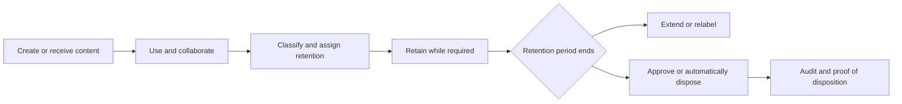

| Term | Plain meaning | Why it matters | Memory hook |
|---|---|---|---|
| Retain | Prevent permanent deletion for a period/forever | Preserves evidence even if user deletes | Keep a compliance copy |
| Delete | Permanently remove after eligibility and service process | Reduces unnecessary data/risk | Delete means eventual purge |
| Retention policy | Container/location-wide retention settings | Efficient broad baseline | Policy wraps a place |
| Retention label | Item-level retention settings/record declaration | Handles mixed lifecycles in one location | Label follows the item in M365 |
| Record | Business/legal evidence with restrictions and proof | Stronger immutability/governance | Record = controlled evidence |
| Disposition | Decision/process to permanently delete at end | Makes deletion defensible | Dispose with proof |

## 2. Three outcomes: retain, delete, or both

| Configuration | What it does | Example |
|---|---|---|
| Retain-only | Preserve for a period/forever; no automatic deletion at end | Keep board records indefinitely |
| Delete-only | Delete items after specified age without first imposing retention | Remove routine chat after one year |
| Retain then delete | Preserve for period, then delete automatically or review | Keep contracts seven years, then disposition review |

Retention operates **in place**. Users usually continue working while secured workload locations preserve copies when needed. A retain action does not necessarily keep content visible in the user's normal app.

## 3. Retention policy versus retention label

| Capability | Retention policy | Retention label |
|---|---|---|
| Granularity | Container/location | Individual item/folder/default location behavior |
| Manual user application | No | Yes where supported |
| Automatic application | Scope automatically applies settings | Auto-apply/default/manual/Power Automate/Syntex methods |
| Travels when moved within tenant | No; new container controls | Yes within Microsoft 365 tenant |
| Start when labeled/event | No | Yes |
| Trainable classifier/SIT/query | No item condition | Yes through auto-apply policy |
| Record/regulatory record | No | Yes |
| Disposition review/proof | No | Yes |
| Broad workload support | Exchange, SPO/ODB, Groups, Teams, AI, Viva Engage and more | Exchange, SPO/ODB, Groups; not Teams/Viva messages directly |

### 🔍 Plain-English deep-dive: building rule versus sticker on one box

A retention policy is a building rule: “Everything stored in this warehouse is kept for five years.” A retention label is a sticker on one box: “This contract is kept for ten years from expiry and then reviewed.” If the box moves to another Microsoft 365 warehouse, its sticker goes with it; the old building rule does not.

Use policies for broad baselines and labels for item-specific exceptions, records, events, or review.

## 4. Retention label policy terminology

A retention label must be created, then made available or automatically applied through a policy.

| Object | Function | Common confusion |
|---|---|---|
| Retention label | Stores item-level retention/record settings | Creating it alone does not make it available |
| Published label policy | Publishes one or more labels to locations for users/admins | It does not automatically label every item |
| Auto-apply label policy | Applies one selected label when conditions match | It requires classification/indexing and time |
| Default label | Label inherited by items in a library/folder/document set/mailbox folder | Default behavior and replacement need testing |
| Retention policy | Directly assigns retention to containers/locations | No visible item label required |

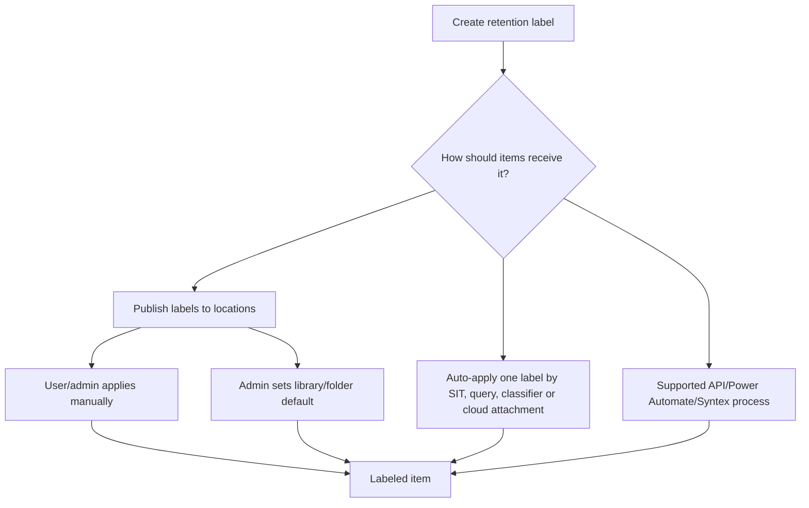

## 5. Static versus adaptive scopes

A **static scope** targets all instances of a selected location or specified includes/excludes. An **adaptive scope** runs a query daily against user, site, or Microsoft 365 group properties, so membership changes automatically.

| Dimension | Static scope | Adaptive scope |
|---|---|---|
| Membership | Fixed/all or expanded at configuration | Query-driven and refreshed |
| Best for | Entire location or small stable list | Dynamic roles, departments, site properties, inactive mailboxes |
| Maintenance | Manual for changes/UPN/OneDrive URL | Depends on accurate directory/site attributes |
| Per-policy item limits | Specific include/exclude limits apply | Different adaptive limits; no static item-list ceiling |
| Preservation Lock | Supported according to policy type | Currently not supported |
| Failure mode | Stale list or accidental “All” | Bad attributes/query omit or include objects |

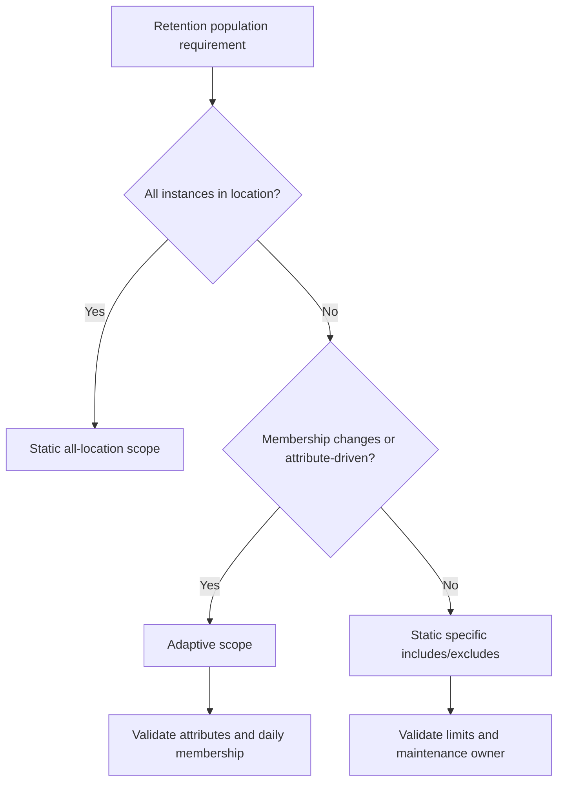

Critical static-scope warning: if a policy has one included instance and an administrator removes the final include while leaving the location on, the configuration can revert to **All**. For a delete policy, that can expose every instance in the location to deletion. Peer review the summary and turn the location off when that is the intention.

## 6. Location map

| Retention-policy location | Representative content | Key caution |
|---|---|---|
| Exchange mailboxes | User/shared/resource email, calendar and mailbox items | Mailbox must meet minimum data threshold; group mailboxes use Group location |
| SharePoint sites | Files and supported list items according to policy/label | Group-connected sites differ under static scope |
| OneDrive accounts | User files | URL/provisioning/UPN lifecycle complicates static targeting |
| Microsoft 365 Group mailboxes & sites | Group mailbox and connected team site | Retention labels apply to site side, not group mailbox |
| Teams chats/channels/call logs | Compliance copies and primary chat data deletion | Files/recordings require separate SPO/OneDrive policies |
| Copilot/AI experiences | Interactions in current separate locations | New/legacy location editability and preview change |
| Viva Engage | Community/user messages | Separate location/storage behavior |
| Exchange public folders | All public folders | Static scope only |
| Skype for Business | Legacy supported content | Service retired; existing retention remains specialized |

Do not infer storage from the user interface. Teams files, messages, recordings, transcripts, chats, and channel content can require different locations.

## 7. Retention starts and item age

The configured period starts from a chosen property, not the day the policy is created.

| Start trigger | Supported with | Example |
|---|---|---|
| Created/received/sent | Policy and label | Email retained seven years from sent/received date |
| Last modified | Files in SharePoint/OneDrive/Groups | Seven years resets after each edit |
| When labeled | Retention label | Ten years from record declaration |
| Event date | Event-based retention label | Five years after contract expiry |

### 🔍 Plain-English deep-dive: a seven-year rule can have different end dates

A seven-year policy from **creation** has a fixed end based on the original date. Seven years from **last modified** moves each time a file changes. Seven years from **labeling** begins when classification is applied. Seven years from an **event** begins when a business event such as termination or contract expiry is triggered.

**Analogy:** “Seven years” is the timer length; the start button determines the real deadline.

Months are treated as 30 days and years as 365 days in current retention configuration. Legal/records owners must approve whether that calculation satisfies the requirement.

## 8. The principles of retention

Retention and deletion are calculated independently across all settings. No single policy simply “wins.” For items not subject to exceptional priority cleanup:

1. **Retention wins over deletion.**
2. **The longest actual retention period wins.**
3. For deletion conflicts, **explicit item labels beat implicit policies**; targeted/adaptive policies beat org-wide policies.
4. If deletion is still tied among equally scoped policies, **the shortest deletion period wins**.

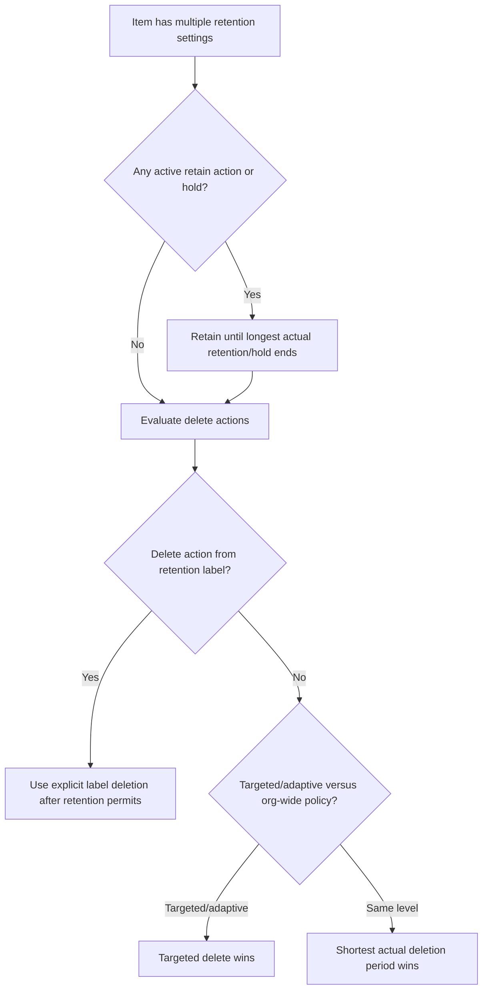

| Settings on one item | Outcome |
|---|---|
| Delete policy at 3 years + retain label at 5 years | Retain 5 years, then deletion can occur |
| Retain/delete policy at 5 + retain-only label at 10 | Retain 10; policy delete acts after retention ends |
| Org-wide delete 10 + targeted delete 5 | Targeted deletion at 5 if no retain action blocks |
| Two targeted delete policies at 7 and 10 | Shortest deletion at 7 if otherwise equal |
| Retention label delete 7 + policy retain 10 | Retain 10, then explicit label deletion governs |

Calculate actual item dates. A five-year last-modified rule can end later than a seven-year created rule.

## 9. Retention is in-place preservation

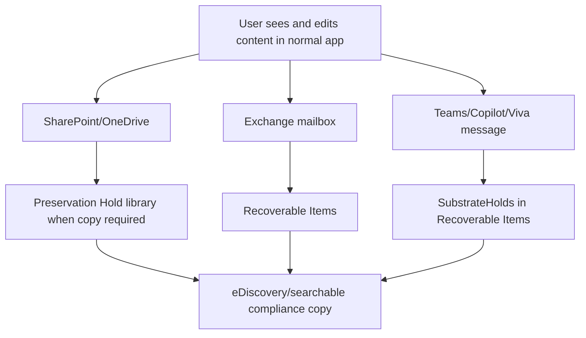

| User action | User experience | Compliance behavior |
|---|---|---|
| Edit retained file | Current file changes | Required prior version/copy is preserved |
| Delete retained file | File disappears/recycle behavior | Compliance copy remains protected |
| Delete retained email | Message leaves normal folder | Copy/remnant preserved in Recoverable Items |
| Delete retained Teams message | Message disappears from Teams after processing | Compliance copy remains in mailbox hidden storage |

Visibility in the app is not proof that content is or is not retained. Validate with supported compliance search/evidence.

## 10. Retention is not backup

| Capability | Retention | Backup |
|---|---|---|
| Primary purpose | Compliance keep/delete and evidence | Restore service/data after loss/corruption |
| Granularity | Policies/labels and workload copies | Recovery points/copies according to backup product |
| User accidental deletion | Preserves for compliance but restore UX varies | Designed for restoration |
| Ransomware/corruption recovery | Not a complete recovery architecture | Backup/isolation/recovery controls |
| Legal defensibility | Retention schedule, records, audit, disposition | Not automatically a records program |
| Permanent deletion | Can enforce lifecycle deletion | Backup copies need separate expiry |

### 🔍 Plain-English deep-dive: archive box versus spare copy

Retention says, “This evidence must remain and later be disposed under policy.” Backup says, “We need a recoverable copy if the working system fails.” A retained hidden copy may satisfy discovery but not a rapid user restore. A backup may restore data but violate deletion obligations if its expiry is unmanaged. Mature designs align both.

## 11. Retention versus eDiscovery/legal hold

| Consideration | Retention | eDiscovery hold |
|---|---|---|
| Purpose | Long-term compliance lifecycle | Specific legal/investigative preservation |
| Typical scope | Broad location/content | Custodians/sources/case |
| Duration | Configured date/event/period | Until case administrator releases |
| Deletion | Optional automatic/review | Hold preserves; no automatic case-end deletion |
| Overhead | Lower ongoing | Higher case governance |
| Precedence | Retain/delete principles | Preservation hold prevents permanent deletion |

Do not use a legal hold as a permanent records policy. Do not release a hold and assume content deletes immediately; remaining retention settings, delay holds, recycle/recoverable paths, and timer jobs still apply.

## 12. Manual, automatic, and default retention labels

| Method | Who/what applies | Good use | Risk |
|---|---|---|---|
| Manual | User/admin in Outlook, SharePoint, OneDrive | Human knowledge of record type | Inconsistent or wrong selection |
| Auto-apply by SIT | Service condition | Structured sensitive records | False matches/index latency |
| Auto-apply by query/keywords | KeyQL/search properties | Metadata/content-defined class | Query breadth and schema quality |
| Auto-apply by classifier | Trainable classifier | Semantic document family | Model drift/encrypted blind spots |
| Cloud attachment | Service applies label to preserved copy | Shared file evidence | Original is not labeled; timing behavior |
| Library/folder/document-set default | Container default inherited by items | Controlled records repository | Moving/default replacement behavior |
| Outlook default folder | Folder-level message classification | Business email folder | User rules and folder movement |
| Power Automate/Graph/Syntex | Supported automation/model | Business-event integration | Permission, error/retry and audit |

An item can have only one retention label. Standard labels can often be changed manually; auto-apply generally does not replace an existing label. Record and regulatory-record labels have stronger restrictions.

## 13. Auto-apply design and indexing

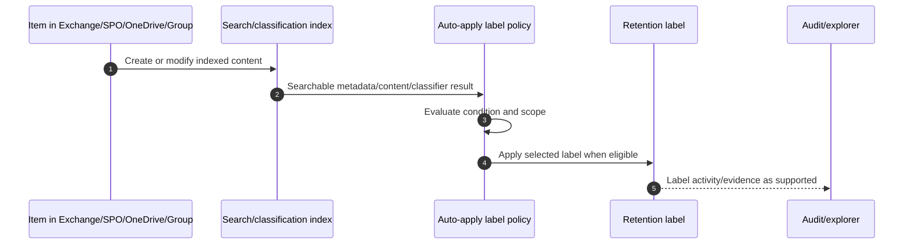

Allow up to seven days for auto-apply policies and published labels to take effect/appear. SharePoint sites must be indexed, though choosing not to show library items in search does not necessarily exempt them from retention. Use simulation where available and build a representative corpus.

## 14. Event-based retention

Event-based retention starts a label's retention period when a business event occurs. Core objects are:

| Object | Meaning | Example |
|---|---|---|
| Event type | Category of business event | Contract expiration |
| Retention label | Settings linked to event type | Keep contract 7 years, then review |
| Asset ID/query | Connects exact items to event instance | `ContractID:ABC-42` |
| Event | Specific occurrence/date | Contract ABC-42 expired 2026-06-30 |

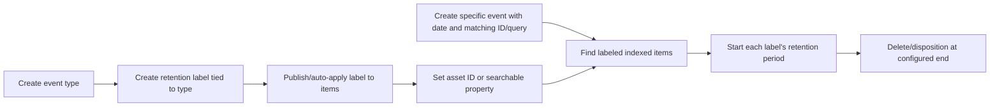

If no asset ID or keyword/query is supplied, the event can trigger **all** content labeled with that event type. That is a high-impact configuration. After an event triggers retention for content, deleting the event does not cancel the retention already applied. New content labeled after the event requires a new event with the same details under current behavior.

## 15. Employee, contract, and product events

| Event | Source system | Correlation | Governance |
|---|---|---|---|
| Employee departure | HR system | Employee ID property/query | HR/legal approval and effective date |
| Contract expiry | Contract lifecycle system | Contract ID | Legal/procurement owner |
| Product end-of-life | Product master | Product code | Engineering/quality/regulatory owner |
| Matter closure | Legal matter system | Matter ID | Legal hold check before trigger |
| Acquisition close | Deal system | Project/entity ID | Merger/legal/records coordination |

Automate events through current Microsoft Graph Records Management APIs or supported PowerShell, not deprecated legacy REST methods. Use idempotency, source integrity, dual approval for backdated/future events, reconciliation, failed-event queue, audit, and rollback analysis.

## 16. Records and regulatory records

A retention label can declare an item a **record** or **regulatory record**. Records add restrictions, audit, and proof of disposition. Regulatory records are more restrictive and intentionally irreversible.

| Action | Standard retention label | Locked record | Unlocked record | Regulatory record |
|---|---|---|---|---|
| Edit content | Allowed | Blocked | Allowed | Blocked |
| Edit properties | Usually allowed | Allowed by default/settings | Allowed | Blocked |
| Delete | May be allowed/tenant setting | Blocked | Blocked | Blocked |
| Move within container | Allowed | Allowed | Allowed | Allowed |
| Move across container | Allowed | Allowed if never unlocked | Blocked | Blocked |
| Change/remove label | Generally allowed | Container admin only | Blocked | Blocked for everyone |
| Priority cleanup override | Allowed | Blocked | Blocked | Blocked |

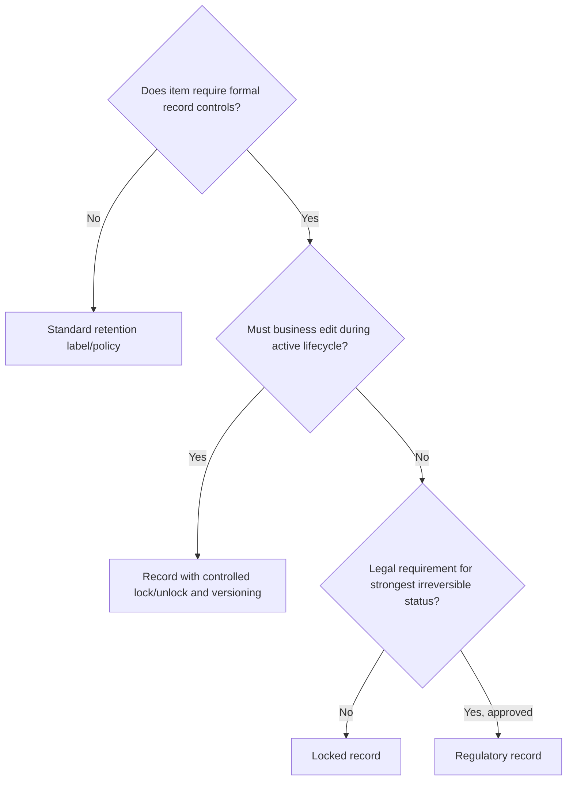

Nobody, including a Global Administrator, can remove a regulatory-record label after application. The retention period cannot be shortened. The option is hidden by default and enabled intentionally. Regulatory records cannot be auto-applied under current guidance and cannot be applied to a checked-out SharePoint document.

## 17. Record versioning and lock/unlock

For SharePoint/OneDrive records, lock/unlock can allow controlled collaboration while preserving versions. Exchange records map to locked behavior because record versioning is not supported there.

| State | User capability | Compliance behavior |
|---|---|---|
| Locked record | Content editing/deletion blocked | Strong immutability |
| Unlocked record | Editing allowed; deletion/label change blocked | Each version preserved as record version |
| Relocked | Further content editing blocked | Current version becomes controlled state |

Define who can unlock, acceptable reason, approval, maximum duration, monitoring, and relock SLA. An unlocked record is not an ordinary document.

## 18. File plan and descriptors

The Records Management **File plan** provides a consolidated view and import/export for retention labels. Optional descriptors make the retention schedule understandable and auditable.

| Descriptor/field | Purpose | Example |
|---|---|---|
| Reference ID | Stable internal schedule key | `FIN-AP-007` |
| Business function/department | Accountable function | Finance - Accounts Payable |
| Category/subcategory | Record hierarchy | Financial / Vendor invoices |
| Authority type | Basis for retention | Regulation, statute, policy |
| Provision/citation | Exact authority and URL | Statute section and link |
| Retention trigger | Created, modified, labeled, event | Contract expiry event |
| Duration/action | Keep/delete/review | 7 years then disposition review |
| Record status | Standard/record/regulatory | Record |
| Replacement label | Next lifecycle stage | Archive 3 years |

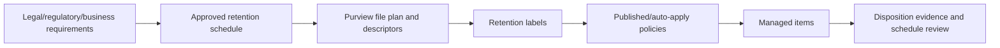

Retention label names cannot be changed after creation. Some settings, including the core retention action/trigger and record declaration, have limited editability after save. Version the schedule outside Purview and map every technical label to approved authority.

## 19. Disposition review

A retention label can start a disposition review when its period ends. Reviewers can approve disposal, relabel, extend, or add reviewers. Up to five consecutive stages and ten users/mail-enabled security groups per stage are supported in current guidance.

| Disposition action | Outcome |
|---|---|
| Approve disposal | Advances stage or marks for permanent deletion at final stage |
| Relabel | Exits current review and applies another retention schedule |
| Extend | Suspends and restarts review after extension |
| Add reviewers | Adds reviewer to current stage; permissions still required |
| Auto-approval | Advances/disposes after configured 7-365 day timeout |

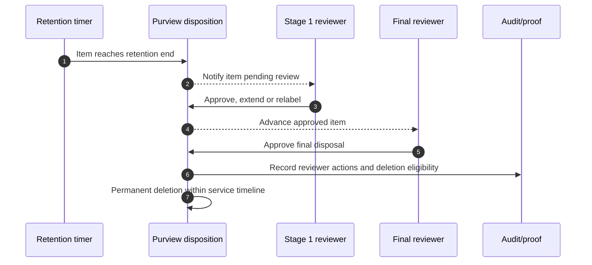

Current guidance says permanent deletion occurs within 15 days after final approval. Auditing must be enabled at least a day before first disposition action. Global Admin does not automatically have Disposition Management or content-preview rights.

## 20. Proof of disposition

Purview records disposition evidence for items marked as records or regulatory records and for disposition-review actions. Current limits state proof can be retained for up to seven years after disposal.

| Evidence | Purpose |
|---|---|
| Label and record status | Which schedule/restrictions applied |
| Item metadata/location | What was disposed and where it lived |
| Expiry/deletion date | When eligibility and deletion occurred |
| Reviewer action/comment | Who approved, extended or relabeled |
| Audit event | Independent system record |
| Exported disposition report | Audit/regulator evidence package |

Protect exports because they can reveal filenames, users, subjects, legal matters, and deletion history. Apply retention to the proof according to legal requirements without keeping unnecessary content copies.

## 21. Disposition governance and defensibility

### 🔍 Plain-English deep-dive: defensible deletion is a documented decision, not an empty bin

Defensible disposition demonstrates that an approved schedule applied consistently, preservation conflicts were checked, authorized reviewers acted, deletion completed through the service, and evidence remains. A user emptying a recycle bin is not equivalent.

| Governance control | Evidence |
|---|---|
| Approved schedule | Legal/records sign-off and authority citation |
| Policy traceability | Schedule-to-label/policy mapping |
| Hold check | eDiscovery/litigation and investigation review |
| Reviewer competence | Role, training and conflict-of-interest rules |
| Consistent exceptions | Approved extension/relabel reasons |
| Technical completion | Audit/disposition report and service state |
| Periodic review | Schedule, law, process and metric review |

## 22. Preservation Lock

Preservation Lock makes a retention policy or eligible regulatory-record label policy irreversibly more restrictive: it cannot be disabled/deleted or reduced. Locations/labels can be added and durations extended, but not removed/shortened.

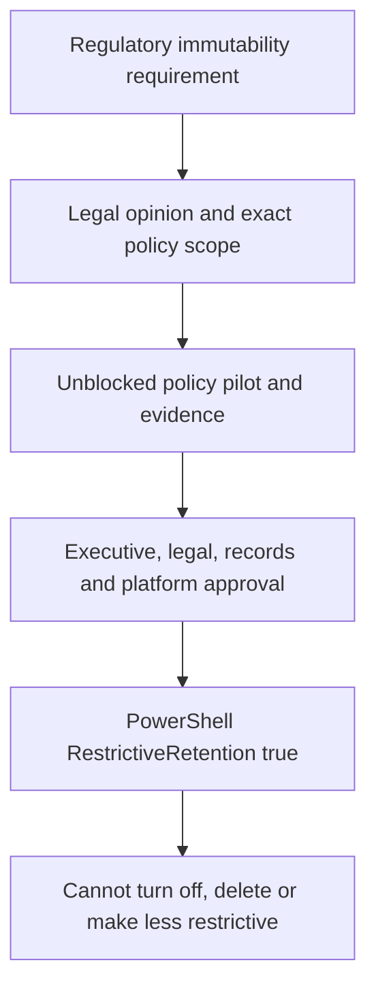

| Preservation Lock fact | Implication |
|---|---|
| PowerShell only | Deliberate safeguard from casual UI use |
| No admin override | Break-glass admin cannot undo it |
| Adaptive scopes unsupported | Use eligible static design |
| Retention label policy eligibility | Must contain only regulatory-record labels |
| More restrictive changes allowed | Retention/storage scope can grow permanently |

Never use Preservation Lock in a demo or ordinary lab. Paper-design it only. Obtain legal advice, prove scope, model storage/cost, test exclusion and deletion conflicts, and secure approval before production.

## 23. SharePoint and OneDrive preservation architecture

The **Preservation Hold library (PHL)** is a hidden system library created when needed. It is not for direct administration. Do not edit, move, delete, relabel, or change sensitivity labels on PHL files manually.

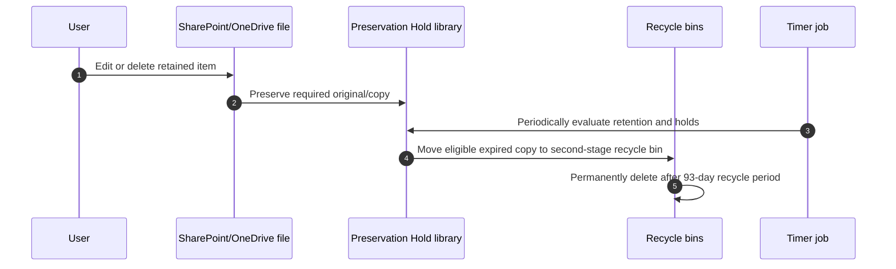

| Label/policy type | Edit behavior | Delete behavior |
|---|---|---|
| Retention policy | Required original versions/copies preserved | Copy preserved |
| Standard retention label | Edit may not copy each version | Deletion preserves copy |
| Locked record | Edit/delete blocked | Remains original |
| Unlocked record | Edits preserve record versions | Delete blocked |
| Regulatory record | Edit/delete blocked | Remains original |

The PHL counts against site storage quota. The cleanup job evaluates content older than a minimum period and runs on a schedule; current guidance describes up to about 37 days before eligible PHL content moves onward, followed by the SharePoint 93-day recycle-bin process. Treat exact time as a range, not an instant-delete promise.

## 24. Versions, lists, and libraries

| Object/behavior | Retention point |
|---|---|
| Document versions | Policy/record behavior can preserve versions beyond library limits |
| Standard-label versions | Library version limits can still apply when no policy/hold |
| List item | Retention label supported; policy support differs |
| List attachment | Standard item label does not automatically label attachment; record label can make it inherit if unlabeled |
| Library/list/folder itself | Organizing structure is not retained as an item in the same way |
| NoAccess/ReadOnly site | Site lock can prevent policy deletion operations |
| Search-hidden library item | Search presentation setting does not automatically exempt retention |

Enable/version-test libraries according to records requirements. A retention policy's first edit of new content has specific PHL behavior; versioning is needed when the requirement is to retain all versions.

## 25. Releasing SharePoint/OneDrive retention

When a retention policy is released or disabled for SharePoint/OneDrive, retained content generally continues under a **30-day grace period** to reduce accidental loss. Re-enabling within the window can resume without permanent data loss. An important exception is excluding a site/account from a policy: cleanup can occur without that same 30-day delay.

| Change | Risk/control |
|---|---|
| Disable/delete policy | 30-day grace behavior; monitor and validate |
| Remove site/account by exclusion | No equivalent grace; high-impact change |
| Re-enable within grace | Can restore policy operation |
| Preservation Lock | Release unavailable |

This makes exclusions a deployment and rollback hazard. Peer review and evidence the exact site URLs/accounts.

## 26. OneDrive when an employee leaves

If a departed user's OneDrive files are subject to retention, they remain under those settings for the specified period. Sharing access can continue and content remains discoverable. When retention expires with deletion, content moves through site recycle/deletion processes.

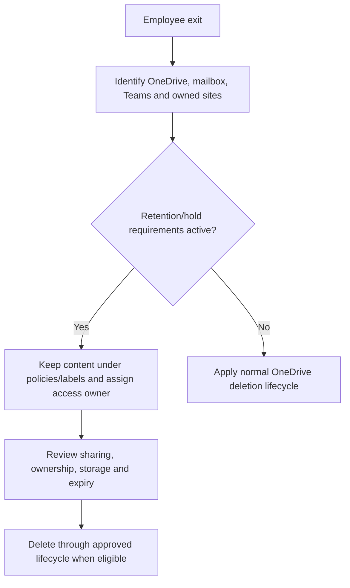

Retention is not business handover. Separately transfer ownership/access, remove stale external links, preserve private content appropriately, and avoid granting a manager blanket access without HR/legal approval.

## 27. Exchange Recoverable Items context

Exchange preserves retained/deleted versions in the mailbox's **Recoverable Items** structure. Retention applies to the primary and archive mailbox as designed. High deletion volume can pressure quotas; auto-expanding archiving and hold quota guidance may be required.

| Exchange concern | Operational action |
|---|---|
| Mailbox under retain action | Monitor Recoverable Items and archive capacity |
| High deletion volume | Confirm movement/quotas and service processing |
| Delay hold | Check after removing final hold when mailbox remains inactive |
| Group mailbox | Use Microsoft 365 Group location, not ordinary Exchange target |
| Minimum data | Current guidance requires at least 10 MB before settings/disposition apply |
| User deletion | Hidden recoverable copy can remain searchable |

Do not manually purge Recoverable Items to “fix” storage when retention/hold applies. Determine every hold/policy first.

## 28. Inactive mailboxes

An **inactive mailbox** retains a departed user's Exchange content after the account/mailbox is deleted, when a retain action or hold was applied first and had time to take effect.

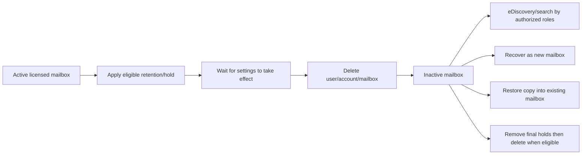

| Operation | Result |
|---|---|
| Recover inactive mailbox | Converts it to a new active mailbox; inactive object ceases |
| Restore inactive mailbox | Copies content into another mailbox; inactive source remains |
| Search/export | Authorized eDiscovery/content search access |
| Remove final hold | Mailbox can become eligible for permanent deletion after delay hold/process |

Licensing must be correct when the hold is applied before deletion. After account deletion, the license can generally be reassigned under current rules. Validate retention and wait before deleting the user; reversing the order can lose the inactive-mailbox outcome.

## 29. Teams retention storage

Teams uses an Azure-powered chat service as primary storage. Compliance copies reside in hidden Exchange mailbox folders. Teams retention policies must target Teams locations; ordinary Exchange policies do not substitute.

| Teams content | Compliance mailbox type/location | Retention policy need |
|---|---|---|
| User chat | Hidden folder in user mailbox | Teams chats location |
| Standard channel | Group mailbox | Teams channel messages |
| Shared channel | SubstrateGroup mailbox | Teams channel messages/inherited parent settings |
| Private channel | Pre-migration user mailboxes; post-2025 migration group mailbox | Validate current tenant and policy location |
| Files/recordings/transcripts | SharePoint or OneDrive | Separate file retention/auto-label policy |
| Call logs | Supported call-log location | Delete-only lifecycle under current behavior |

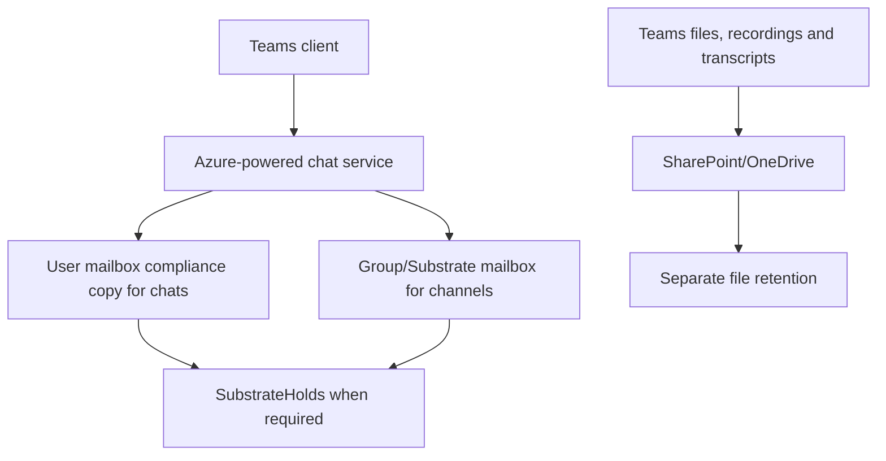

## 30. Teams deletion timing and user visibility

When a user deletes a retained Teams message, it disappears from Teams but can remain for compliance. Current guidance describes a delay of about 21 days before deleted messages move into SubstrateHolds, at least one day there, and timer jobs typically in 1-7 day windows for eligible permanent deletion. A nominal one-day delete policy can therefore take up to around 16 days in an example flow, while user-deleted message paths differ.

| Observation | Correct interpretation |
|---|---|
| Message still visible after policy expiry | Client/cache/service timer may not have processed deletion |
| Message gone from Teams | Not proof of permanent compliance deletion |
| Message in eDiscovery | Retention/hold copy still exists |
| External participant sees different result | Other tenant stores and controls its copy |

A policy deletion can remove the message from the Teams client for all conversation users, including external users, while other tenants' compliance copies remain under their controls.

## 31. Cloud attachments and shared files

A **cloud attachment** is a link to a file shared in Outlook, Teams, Viva Engage, or referenced in Copilot interactions. An auto-apply retention policy can place a labeled copy in the Preservation Hold library; it does not label the original file.

| Behavior | Implication |
|---|---|
| Copy created in PHL | Shared version preserved independently of later original changes |
| Start when labeled recommended | Sharing/re-sharing controls the copy's retention clock |
| Original modified and reshared | New version/copy can be retained |
| Original unchanged and reshared | Labeled date can reset |
| Copy creation timing | Typically within about an hour; temporary one-day safeguard protects moved/deleted original |
| Archived site | New cloud-attachment retention exception exists |

Use cloud-attachment retention when the evidence is “what was shared at that time,” not simply the current original file.

## 32. Deletion workflow by workload

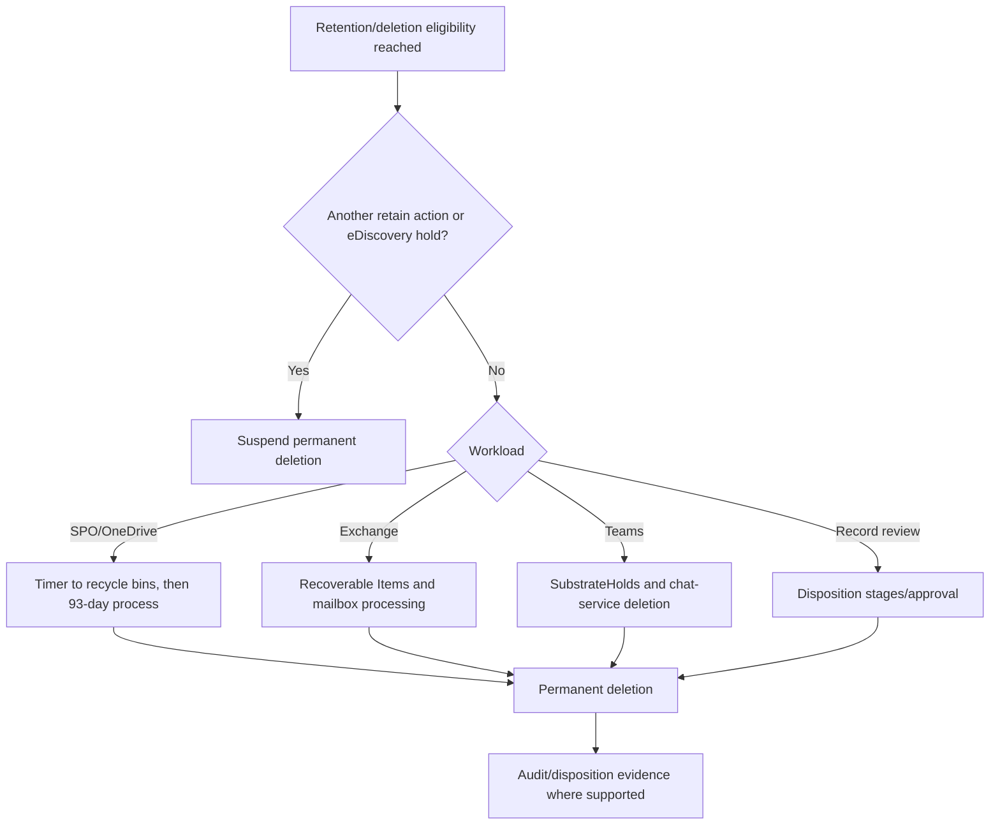

“Delete after seven years” means eligible for service deletion processes after seven years, not necessarily an atomic purge at midnight. Contracts and communications must use accurate service ranges.

## 33. Priority cleanup context

Priority cleanup is an exceptional Data Lifecycle Management mechanism that can override holds to reclaim storage or permanently delete sensitive material, such as spill data. It uses system-managed labels under the covers and does not apply to items marked as records.

| Use | Guardrail |
|---|---|
| Remove large low-value recordings from PHL | Exact query, storage evidence, business/legal approval |
| Data-spillage purge | Incident/legal/privacy chain and scope validation |
| Override holds | Executive/legal dual approval and audit |
| Not for records | Record/regulatory controls block priority cleanup |

Do not treat priority cleanup as a normal conflict-resolution shortcut. A query error can permanently delete protected evidence.

## 34. Preservation, backup, legal, and security incidents

| Scenario | Primary mechanism | Complementary control |
|---|---|---|
| Regulatory schedule | Retention policy/label | File plan, records and disposition |
| Active lawsuit | eDiscovery case hold | Retention continues independently |
| Disaster/data corruption | Backup/recovery | Retention may preserve evidence copies |
| Malicious employee deletes files | Retain policy/Adaptive Protection preview | Incident response and identity controls |
| Secret/personal-data spill | Priority cleanup only if approved | DLP, incident/legal/privacy process |
| Ransomware | Backup/version/recovery/security response | Retention is not full recovery |

## 35. Licensing, permissions, and limits

Core retention, adaptive scopes, auto-apply labels, records management, event-based retention, disposition, inactive mailboxes, Teams, AI, and advanced capabilities have different licensing. Verify the current per-user and tenant service description.

| Current documented limit/example | Design implication |
|---|---|
| 1,000 retention labels per tenant | Keep taxonomy governed and avoid duplicate labels |
| 10,000 Purview/compliance policies across included categories | Maintain policy inventory and lifecycle |
| Static policy: 1,000 Exchange mailboxes | Use all-location/adaptive/multiple policies thoughtfully |
| Static policy: 100 SharePoint sites | Adaptive scope or multiple policies for larger sets |
| Static policy: 100 OneDrive accounts | Prefer adaptive user scope for changing population |
| Static policy: 500 M365 Groups/Teams channel targets | Segment with governance |
| Disposition: 5 stages, 10 reviewers/stage | Use mail-enabled security groups and escalation |
| 200 disposition reviewers/tenant | Group-based assignment |
| Proof up to 7 years | Align evidence retention requirement |

Permissions are separated: Retention Management, View-Only Retention Management, Records Management, Disposition Management, and Content Explorer Content Viewer serve different tasks. Global Admin is not the operational answer.

## 36. Security and privacy design

| Risk | Mitigation |
|---|---|
| Over-retention of personal data | Purpose/authority mapping, minimization and periodic schedule review |
| Under-retention/evidence loss | Source inventory, policy lookup, corpus and hold checks |
| Broad delete scope | Dual approval, summary evidence, synthetic simulation and ring rollout |
| Removing last static include makes scope All | Automated review and location-off check |
| Regulatory label misapplied | No lab use; approved repository/workflow and trained records staff |
| Reviewer sees sensitive content | JIT content-view role and purpose/audit controls |
| Disposition export leakage | Encrypt, restrict, retain and delete report securely |
| HR event exposes employee data | Minimal IDs, role separation and event audit |
| PHL/Recoverable storage growth | Capacity forecasting and approved lifecycle tuning |
| Rogue administrator weakens retention | PIM, change control; Preservation Lock only when legally required |

Data minimization applies to retention itself. “Legal might need it someday” is not a sufficient schedule.

## 37. Design and configuration workflow

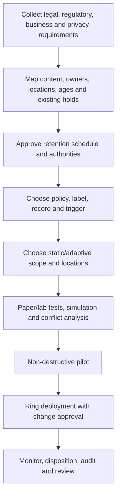

Separate requirements from configuration. The records/legal owner approves duration and trigger; the technical team implements and proves behavior; business owners validate content/process; privacy/security review minimization and access.

## 38. Deployment and testing

| Test family | Positive test | Negative/failure test |
|---|---|---|
| Scope | Intended user/site/group resolves | Out-of-scope instance excluded |
| Adaptive query | Representative object included daily | Missing/wrong attribute handled |
| Retain | Deleted synthetic item remains discoverable | Nonretained control follows normal lifecycle |
| Delete | Old synthetic item becomes eligible | Younger item remains |
| Label | Manual/default/auto applies as designed | Existing label not unexpectedly replaced |
| Event | Matching asset ID starts clock | Wrong/no ID does not trigger broad content |
| Record | Lock/unlock/version restrictions work | Unauthorized label removal denied |
| Disposition | Reviewer sees assigned item and action audit | User without role/preview is denied |
| Workload | SPO/ODB, Exchange, Teams paths match design | Files/messages not confused |
| Hold conflict | eDiscovery hold suspends purge | Release leaves other retention intact |
| Exit | Inactive mailbox/OneDrive outcome verified | Account not deleted before retention effective |
| Release | Grace/exclusion behavior understood | No accidental all-location or immediate cleanup |

Do not test permanent deletion, regulatory record, Preservation Lock, or priority cleanup in a shared/production tenant. Use paper design and an authorized disposable environment only where the customer explicitly approves.

## 39. Rollback and irreversible-change matrix

| Change | Reversible? | Safe approach |
|---|---|---|
| Disable ordinary retention policy | Usually, with workload grace/process | Export config, check holds and monitor |
| Remove site by exclusion | High impact; cleanup can begin without grace | Dual approval and exact URL evidence |
| Change duration | Some settings editable; propagation days | Legal approval and item-date impact analysis |
| Applied standard label | Often removable/changeable | Preserve audit and assess retention outcome |
| Applied record label | Restricted; admin/lock rules | Controlled records process |
| Applied regulatory record | **No removal** | Never use without formal approval |
| Preservation Lock | **Cannot weaken/disable/delete** | Only after legal sign-off and exhaustive pilot |
| Triggered event | Cannot cancel applied retention by deleting event | Validate ID/query/date before creation |
| Final disposition approval | Leads to permanent deletion | Hold check, reviewers and evidence |
| Priority cleanup | Exceptional permanent deletion | Incident/legal executive approval |

“Rollback” may mean stopping future scope while already-retained copies remain until eligible. State this before change approval.

## 40. Operations and metrics

| Metric | Meaning | Decision/action |
|---|---|---|
| Policy coverage by location | Whether intended estate is governed | Close scope gaps |
| Adaptive scope drift/errors | Attribute/query quality | Fix source or fallback |
| Label adoption/auto-apply success | Item-level reach | Tune training/classification |
| Pending disposition age | Reviewer backlog | Escalate/reassign/auto-approval decision |
| Extension/relabel rate | Schedule quality and business need | Review label design |
| PHL/site storage growth | Retention capacity | Forecast/adjust approved lifecycle |
| Recoverable Items growth | Mailbox hold capacity | Archive/quota operations |
| Inactive mailbox count/age | Leaver evidence estate | Review holds and deletion eligibility |
| Failed event/reconciliation | Business-system integration health | Retry/investigate |
| Unauthorized record change attempts | Control effectiveness/insider signal | Investigate |
| Disposition proof completeness | Audit defensibility | Repair evidence process |
| Policy-change SLA/failure | Engineering quality | Improve automation/change control |

Review policies and file-plan authorities at least annually and when laws, contracts, business processes, mergers, regions, or systems change.

## 41. Common failures

| Symptom | Likely causes | First discriminating check |
|---|---|---|
| Policy says On Pending | Propagation still running or location issue | Wait documented window and inspect status/details |
| Item deleted despite “retention” | User view differs from compliance copy | Search secured location through eDiscovery |
| Item not deleted at expiry | Another retain/hold, timer/recycle process, site lock | Policy lookup and all holds on exact item/location |
| SharePoint site cannot delete | Retention/hold/PHL content | Identify policies/holds and policy state |
| PHL grows rapidly | Version churn, broad retain, cloud attachments | Analyze versions, policy scope and item ages |
| Label not visible | Publishing propagation/unsupported location/role | Allow seven days and verify policy/location |
| Auto-label misses file | Index/query/classifier/encryption/existing label | Test a newly indexed synthetic item |
| Event triggers too much | Missing/broad asset ID/query | Inspect event type, labels, query and triggered items |
| Disposition reviewer sees no items | Assignment/role/filter | Verify Disposition Management and stage assignment |
| Reviewer cannot preview | Missing Content Viewer role | Separate review permission from content preview |
| Inactive mailbox not created | Hold absent/not effective before deletion/license issue | Reconstruct account/hold timing |
| Inactive mailbox remains after hold removal | Another hold or delay hold | Enumerate every hold and delay state |
| Teams message visible/absent unexpectedly | Timer/cache/location/other-tenant copy | Check exact Teams location and eDiscovery copy |
| OneDrive delete policy hits broad scope | Final include removed and scope reverted All | Inspect effective policy summary immediately |

## 42. Layered troubleshooting

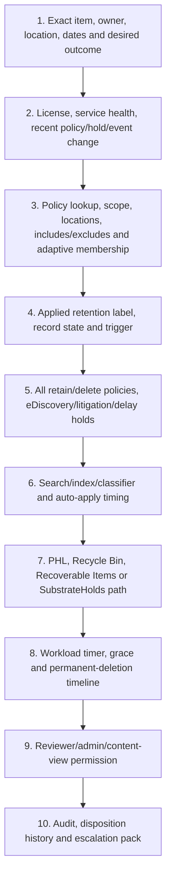

Record UTC timestamps and the item's created, modified, labeled/event, expiry, user-deletion, policy-change and observed dates. “Seven years” is not enough to troubleshoot without the start trigger and all conflicting settings.

## 43. Consulting scenarios

### Scenario A: merger and acquisition

Inventory both tenants' policies, labels, records, holds, file-plan authorities, OneDrive URLs, group-connected sites, inactive mailboxes, Teams locations, archives and third-party backups. Decide which schedule/hold survives, preserve label/record metadata, validate migrated record integrity, and avoid starting a new retention clock accidentally. Keep legal holds separate from integration cleanup.

### Scenario B: employee exit

Before deleting the account, determine mailbox/OneDrive/Teams/owned-site requirements, apply eligible retention/hold, wait for effectiveness, then delete according to approved joiner-mover-leaver process. Validate inactive mailbox, OneDrive access ownership, Teams copies, external sharing and disposition date. HR event-based labels can start employee-record retention but require accurate employee ID/date and privacy controls.

### Scenario C: contract expiration

Apply an event-based label tied to Contract Expiration, store the contract ID as an indexed asset property, trigger the event from the approved contract system, and start the retention period from expiry. At end, route through legal/business disposition review. Missing asset ID must never trigger all contract labels accidentally.

### Scenario D: excessive storage from recordings

Distinguish Teams message retention from recordings/transcripts in OneDrive/SharePoint. Use approved file auto-label/delete design and storage metrics. Priority cleanup is an exceptional option for PHL storage and hold override, not the first response. Check legal hold and business value before deletion.

## 44. Consulting artifacts

| Artifact | Minimum contents |
|---|---|
| Retention requirements register | Authority, content, trigger, duration, action, owner |
| Data/location inventory | Workload, repository, volume, age, owner and indexing |
| Retention schedule | Function/category/citation and approved disposition |
| Policy/label catalogue | IDs, settings, scopes, status and dependencies |
| Conflict matrix | All retention/delete/hold combinations and outcome |
| Event model | Source, event type, asset ID, date, API, reconciliation |
| File plan | Labels and descriptors with import/export governance |
| Records model | Standard/record/regulatory and lock/unlock rules |
| Disposition SOP | Stages, reviewers, actions, SLAs, evidence and escalation |
| Leaver runbook | Mailbox, OneDrive, Teams, sites, hold and license sequence |
| Test/deployment plan | Synthetic cases, rings, gates, rollback constraints |
| Operations dashboard | Coverage, storage, backlog, failures and proof |
| Risk register | Over/under-retention, broad deletion, privilege and irreversibility |

## 45. Safe paper lab: design a contract records lifecycle

### Scenario and safety boundary

A fictional company must keep executed contracts for seven years after contract expiration and then conduct two-stage disposition review. This is a **paper-only** lab. Do not create a retention label, event, record, policy, disposition stage, inactive mailbox, Preservation Lock, or deletion action in a tenant.

### Paper requirements

| Field | Paper decision |
|---|---|
| Record class | Executed customer contracts |
| Authority | Fictional corporate schedule `LEG-CON-007` |
| Location | Fictional SharePoint Contracts site |
| Trigger | Contract Expiration event |
| Asset ID | `ContractID:<fictional value>` |
| Duration | Seven years after event date |
| Status | Record, not regulatory record |
| End action | Stage 1 Legal; Stage 2 Records; then dispose |
| Hold check | eDiscovery/legal hold before final approval |
| Proof | Audit and disposition export retained under approved schedule |

### Paper architecture

1. Contract system creates/owns fictional Contract ID and expiry date.
2. SharePoint metadata stores the same Contract ID.
3. A retention label tied to Contract Expiration is published or auto-applied.
4. Approved event automation creates an idempotent event with exact ID/date.
5. Seven years later, Legal then Records reviews disposal.
6. Audit/proof demonstrates actions; service deletes only when no hold/longer retention blocks.

### Synthetic cases

Use fictional IDs `CON-0001` through `CON-0020`. Include expired, active, amended, terminated, duplicate-ID, missing-ID, wrong-site, held, unlabeled, record-locked, and migrated contract cases. Do not use a real contract, party, date, tenant, URL or person.

### Paper test matrix

| Test | Expected design result | Interview wording |
|---|---|---|
| Matching ID/event | Seven-year clock starts at event date | “Designed, not tenant-triggered” |
| Wrong ID | No item triggered | “Correlation negative test” |
| Event with no ID | Change rejected by approval/control | “Prevents broad trigger” |
| Item under legal hold at expiry | Permanent deletion suspended | “Hold precedence documented” |
| Legal extends item | Review restarts after extension | “Disposition workflow” |
| Records relabels | New label schedule applies | “Controlled lifecycle transition” |
| Regulatory record proposal | Rejected without explicit legal requirement | “Irreversibility gate” |
| Preservation Lock proposal | Paper-only executive/legal decision | “Never used casually” |
| Policy exclusion | Exact URL and no-grace risk reviewed | “Rollback constraint” |
| Disposition proof | Audit/export captured without content copy | “Defensible evidence design” |

### Evidence portfolio

- Requirements register and file-plan row.
- Event type/asset ID/data-flow diagram.
- Retention conflict calculation examples.
- SharePoint PHL and deletion-path diagram.
- Disposition RACI, SLA and proof template.
- Test, deployment, failure and rollback matrix.
- Candidate honesty statement.

### Cleanup

Nothing was configured, retained or deleted. Remove any accidental real client name, contract ID, date, URL, tenant ID or screenshot. Keep only fictional paper artifacts.

### Interview wording

> “I designed a paper contract-record lifecycle with an event-based label, indexed Contract ID, seven-year trigger, record restrictions, two-stage disposition, hold precedence, proof, workload timing, failure tests and rollback constraints. I have not configured this in production and have not applied a regulatory record or Preservation Lock. My direct SharePoint/OneDrive lifecycle, content and RCA experience is the operational foundation I would bring to a controlled implementation.”

## 46. JD Mapping: interview translation

| Interview theme | Factual answer direction |
|---|---|
| Policy versus label | Broad container baseline versus item-level trigger/record/review |
| Precedence | Retain wins, longest actual retention, explicit/targeted deletion, shortest tie |
| Workloads | Explain PHL, Recoverable Items, SubstrateHolds and separate Teams files |
| Records | Standard label versus locked/unlocked record versus irreversible regulatory record |
| Event retention | Event type, label, asset ID/query, date and reconciliation |
| Disposition | Multi-stage review, hold check, deletion and proof |
| Deployment | Requirements, schedule, scope, synthetic tests, rings and irreversible gates |
| Experience honesty | Direct M365 lifecycle/support plus design/paper-lab boundary |

## 47. Official Source Anchors

| Topic | Official Microsoft source |
|---|---|
| Retention concepts, precedence and policy/label comparison | [Learn about retention policies and labels](https://learn.microsoft.com/en-us/purview/retention) |
| Common scope/location/settings | [Configure Microsoft 365 retention settings](https://learn.microsoft.com/en-us/purview/retention-settings) |
| Create retention policies | [Create and configure retention policies](https://learn.microsoft.com/en-us/purview/create-retention-policies) |
| Apply/publish retention labels | [Publish retention labels and apply them in apps](https://learn.microsoft.com/en-us/purview/create-apply-retention-labels) |
| Auto-apply labels | [Apply a retention label automatically](https://learn.microsoft.com/en-us/purview/apply-retention-labels-automatically) |
| SharePoint and OneDrive | [Learn about retention for SharePoint and OneDrive](https://learn.microsoft.com/en-us/purview/retention-policies-sharepoint) |
| Teams | [Learn about retention for Teams](https://learn.microsoft.com/en-us/purview/retention-policies-teams) |
| Records | [Records management for documents and emails](https://learn.microsoft.com/en-us/purview/records-management) |
| File plan | [Use file plan to manage retention labels](https://learn.microsoft.com/en-us/purview/file-plan-manager) |
| Event-based retention | [Start retention when an event occurs](https://learn.microsoft.com/en-us/purview/event-driven-retention) |
| Disposition | [Disposition of content](https://learn.microsoft.com/en-us/purview/disposition) |
| Preservation Lock | [Use Preservation Lock](https://learn.microsoft.com/en-us/purview/retention-preservation-lock) |
| Inactive mailboxes | [Create and manage inactive mailboxes](https://learn.microsoft.com/en-us/purview/create-and-manage-inactive-mailboxes) |
| Limits | [Limits for retention policies and label policies](https://learn.microsoft.com/en-us/purview/retention-limits) |
| Licensing | [Microsoft 365 licensing guidance for security and compliance](https://learn.microsoft.com/en-us/office365/servicedescriptions/microsoft-365-service-descriptions/microsoft-365-tenantlevel-services-licensing-guidance/microsoft-365-security-compliance-licensing-guidance) |

---

## ⭐ Likely Interview Questions for This Section

### Q1. What is the difference between a retention policy and a retention label?

**Model answer:** “A retention policy applies the same settings broadly to containers or workload locations. A retention label applies item-level settings, can travel with content inside Microsoft 365, start from labeling or an event, use classifiers/queries/defaults, declare records, and trigger disposition review. I use policies for baselines and labels for specific lifecycles.”

### Q2. How do conflicting retention settings resolve?

**Model answer:** “Retention and deletion are calculated separately. Retention wins over deletion, and the longest actual retention period wins. For deletion, an explicit item label beats policies; targeted/adaptive policies beat org-wide policies; if still tied, the shortest actual deletion period wins. eDiscovery holds suspend permanent deletion.”

### Q3. What is event-based retention?

**Model answer:** “A retention label is linked to an event type. Labeled items carry an indexed asset ID or match a query. When a specific event with that type, date and ID occurs, the label's retention clock starts. I validate the ID/query carefully because omitting it can trigger every item with that event type, and triggered retention cannot be canceled by deleting the event.”

### Q4. How do SharePoint and OneDrive retain deleted content?

**Model answer:** “They use a hidden Preservation Hold library to keep required copies when retained items are edited or deleted. A timer evaluates eligibility, then expired copies move through the second-stage recycle process and the 93-day recycle period. The PHL counts against site quota and must not be edited manually.”

### Q5. What is the difference between a record and a regulatory record?

**Model answer:** “A record adds edit/delete/label restrictions, auditing and disposition proof and can support controlled lock/unlock in SharePoint/OneDrive. A regulatory record is stricter: nobody, including Global Admin, can remove its label, and retention cannot be shortened. I use it only for an explicit legal requirement with formal approval.”

### Q6. Why is retention not a backup or legal hold?

**Model answer:** “Retention manages compliance keep/delete and in-place preservation. Backup is designed for recovery after loss or corruption. An eDiscovery hold preserves specific case evidence until released. They can coexist, but one does not replace the others; hold preservation suspends permanent deletion.”

### Q7. How would you manage an employee exit?

**Model answer:** “Before account deletion, I inventory mailbox, OneDrive, Teams and owned sites, apply and wait for approved retention/holds, then delete through the leaver process. I verify the inactive mailbox, preserve/transfer OneDrive business access separately, review sharing, and track expiry/disposition. I do not delete first and hope retention catches up.”

### Q8. What is your honest retention and records experience?

**Model answer:** “My direct production foundation is SharePoint Online, OneDrive, content lifecycle, permissions, sharing, sync, migration/support, incidents and RCA. I have built a current retention/records design and paper lab, but I do not claim production configuration of Purview records, disposition, inactive mailboxes, regulatory records or Preservation Lock. I would implement only through a licensed, legally approved pilot.”

## 🧠 30-Second Memory Hooks

- **Policy wraps a place; label follows an item inside M365.**
- **Retain-only, delete-only, or retain then delete.**
- **Timer length is not enough; know created, modified, labeled, or event start.**
- **Retention wins; longest actual retention wins.**
- **For deletion: label, targeted scope, then shortest tie.**
- **Retention preserves evidence; backup restores; hold protects a case.**
- **SharePoint/OneDrive use PHL; Exchange uses Recoverable Items; Teams uses SubstrateHolds.**
- **Teams messages and Teams files need different retention locations.**
- **Event = type + label + asset ID/query + date.**
- **Record is controlled; regulatory record is irreversible.**
- **Disposition means review, delete, and prove.**
- **Preservation Lock can only get stricter.**
- **Delete a leaver only after retention is effective.**
- **Direct M365 lifecycle experience is the bridge; keep Purview claims exact.**

## Completion Checklist

- [ ] I can distinguish retention policies, labels, published policies and auto-apply policies.
- [ ] I can choose static versus adaptive scope and explain the remove-last-include risk.
- [ ] I can map retention locations across Exchange, SharePoint, OneDrive, Groups, Teams and AI.
- [ ] I can calculate created/modified/labeled/event retention dates.
- [ ] I can apply the retention principles to mixed retain/delete settings.
- [ ] I can explain why retention is not backup or eDiscovery hold.
- [ ] I can compare manual, auto-apply, default and automated label methods.
- [ ] I can design event-based retention with safe asset IDs and reconciliation.
- [ ] I can compare standard labels, locked/unlocked records and regulatory records.
- [ ] I can build a file plan with descriptors and technical traceability.
- [ ] I can explain multi-stage disposition and proof.
- [ ] I can explain Preservation Lock and why it is paper-only without formal approval.
- [ ] I can draw PHL, Recoverable Items and Teams/SubstrateHolds paths.
- [ ] I can explain inactive mailbox and departed OneDrive sequencing.
- [ ] I can plan licensing, limits, privacy, storage and security controls.
- [ ] I can design deployment, testing, rollback constraints, operations and metrics.
- [ ] I can troubleshoot scope, labels, holds, indexing, storage and timer jobs layer by layer.
- [ ] I can produce consulting artifacts and safe paper-lab evidence without overclaiming.
- [ ] I can answer Q1-Q8 aloud with candidate honesty.

*Next suggested section:* [Part 30](Part-30-purview-audit-ediscovery-legal-investigation.md) — use audit, search, eDiscovery cases, holds, collections, review, export, chain of custody and legal-investigation workflows to find and preserve evidence.