# Part 30 — Audit, Content Search, eDiscovery, and Legal Investigation

> **Section goal:** Understand how Microsoft Purview Audit and the current Microsoft Purview eDiscovery experience support defensible investigations. By the end, you should be able to explain the unified audit pipeline, Audit (Standard) versus Audit (Premium), licensing and retention caveats, event schemas, latency, search/export/API choices, high-value-user planning, cases, roles, custodians, noncustodial sources, holds, searches, estimates, review sets, processing, deduplication, threading, themes, tags, analytics, exports, legal privilege, chain of custody, deleted content, hold conflicts, incident-versus-legal boundaries, deployment, testing, rollback, operations, metrics, and troubleshooting.

This Part maps directly to Deloitte's Microsoft Purview, Microsoft 365 workload assessment, security incident, legal investigation, troubleshooting, documentation, stakeholder-management, and operational-readiness expectations. Arti's direct strengths in Microsoft 365 incidents, critical escalation, SharePoint Online and OneDrive behavior, root-cause analysis (RCA), evidence timelines, stakeholder communication, and durable support documentation provide a credible foundation. The bridge is learning to preserve and interpret evidence under legal, privacy, and least-privilege controls. This chapter never claims that Arti has operated Microsoft Purview Audit or eDiscovery in production. [Part 31](Part-31-purview-insider-risk-communication-compliance.md) follows with insider risk, communication compliance, information barriers, and Adaptive Protection.

> **Currency, licensing, portal, preview, and change-sensitive note:** This chapter was checked against official Microsoft Learn available on **August 24, 2026**. The active portal is `https://purview.microsoft.com`. Microsoft retired classic Content Search, classic eDiscovery (Standard), and classic eDiscovery (Premium) experiences on August 31, 2025 outside the special documentation path for Microsoft 365 operated by 21Vianet. Current tenants use the new eDiscovery experience and may expose premium capabilities through case settings rather than the old separate navigation. Audit retention, premium events, export limits, Graph endpoints, high-value insights, eDiscovery processing, supported sources, AI interactions, legal-hold behavior, and licensing can change. Some Learn pages preserve retired terminology for 21Vianet or historical explanation; do not use those procedures blindly. Verify Product Terms, service descriptions, subscription requirements, Microsoft 365 Roadmap, Message center, regional-cloud support, current tenant UI, current API version, preview terms, and counsel-approved procedures before a client decision.

## JD Mapping

| Deloitte role expectation | Capability developed here | Consulting evidence |
|---|---|---|
| Assess and design Microsoft Purview | Audit/eDiscovery architecture, prerequisites, permissions, licensing and limits | Current-state assessment, target architecture and license assumptions log |
| Investigate security events and service issues | Audit query strategy, timeline correlation, event interpretation and error isolation | Investigation plan, normalized timeline, RCA evidence pack |
| Support legal and compliance investigations | Case, preservation, collection, review, analytics and export workflow | Case protocol, source map, hold plan and production log |
| Protect sensitive client and employee data | Least privilege, privacy, privilege, segregation and secure export | Access matrix, privacy assessment and evidence-handling SOP |
| Lead controlled deployment and handover | Pilot, tests, rollback constraints, runbooks, SLAs and metrics | Deployment plan, test matrix, operations dashboard and RACI |
| Communicate with technical and executive stakeholders | Explain uncertainty, defensibility, risks, decisions and residual gaps | Status report, decision log, executive summary and lessons learned |

## Candidate honesty note

Arti can speak directly about production Microsoft 365 support incidents, SharePoint Online and OneDrive behavior, content and permissions, sync and sharing, escalations, timeline building, RCA, validation, stakeholder updates, product-group collaboration, and evidence-quality documentation where supported by her CV and examples. Those skills are highly relevant because Purview evidence is only useful when an investigator understands workload behavior, timestamps, identities, system-generated actions, missing telemetry, and operational context.

She should not claim that she has administered Audit (Premium), created audit retention policies, placed legal holds, managed custodians, processed review sets, made privilege calls, or produced discovery to counsel in production unless she has separate evidence. Safe wording is:

> “My production foundation is Microsoft 365 incident ownership, SharePoint and OneDrive behavior, RCA, evidence timelines, validation, documentation, and stakeholder coordination. I have built a current Purview Audit and eDiscovery design and completed a safe paper evidence exercise. I have not operated production Purview legal cases or made legal determinations. In a client engagement I would work under counsel-approved scope, verify licensing and current Microsoft behavior, use least privilege, preserve original evidence, record every transformation, and separate technical facts from legal conclusions.”

---

## 1. Start with the purpose, not the tool

An **audit record** is a structured statement that an identity or service performed an operation at a time against an object. **eDiscovery**, short for electronic discovery, is the governed process of identifying, preserving, collecting, processing, reviewing, analyzing, and producing electronically stored information that may be relevant to a legal matter or formal investigation.

Audit answers questions such as “Who downloaded this file?” eDiscovery answers a broader question: “What potentially relevant information must be preserved and reviewed, and how can we prove that the result is reliable?” Neither tool decides guilt, intent, privilege, legal relevance, or proportionality.

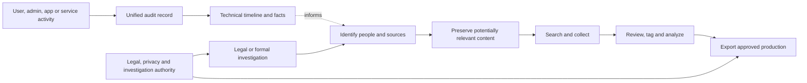

| Term | Plain meaning | Why it matters | Memory hook |
|---|---|---|---|
| Audit event | Machine-readable record of an operation | Builds a factual timeline | Event says what was recorded |
| Evidence | Information used to support or challenge a proposition | Must be reliable, scoped and explained | Evidence needs context |
| Matter | Legal case, regulatory request or formal investigation | Defines authority, scope and decisions | No matter, no fishing expedition |
| Custodian | Person who controls or possesses potentially relevant data | Connects people to sources and notices | Custodian is a person, not a mailbox |
| Hold | Preservation instruction/control preventing permanent deletion | Protects evidence while normal work continues | Hold freezes destruction, not work |
| Collection | Search and transfer of potentially responsive data | Creates a reviewable population | Collect broadly enough, then cull |
| Review set | Secure, static copy used for review and analytics | Separates repeatable review from live content | Review set is the evidence workbench |
| Production | Approved delivery of responsive, nonprivileged material | Final output must be traceable | Produce only what is approved |

## 2. Audit, monitoring, retention and eDiscovery are different

| Capability | Primary question | Typical output | It is not |
|---|---|---|---|
| Purview Audit | What operation was recorded? | Structured event rows/JSON | A complete screen recording or proof of intent |
| Defender/SIEM monitoring | Is activity suspicious or harmful? | Alert, incident, correlation | Legal preservation by itself |
| Retention/records | How long must classes of content be kept or deleted? | Policy/label lifecycle | A case-specific legal hold |
| eDiscovery | What data is potentially relevant to a matter? | Preserved sources, review set, production | A malware investigation engine |
| Backup | Can data be restored after loss? | Recovery copy/restore point | A discovery workflow or records schedule |

### 🔍 Plain-English deep-dive: a camera log is not the whole story

Imagine a secure building. A badge log says that badge 417 opened a door at 10:03. It does not prove who physically held the badge, what they saw, whether another person followed them, or why the door opened. An audit event has the same limitation. It records service-observed facts according to a schema and logging rules. A defensible investigator correlates identity, device, IP address, workload records, object metadata, sign-in logs, alerts, support changes, and user context before reaching a conclusion.

## 3. Unified audit architecture

Microsoft 365 workloads and services emit supported activities into the unified audit pipeline. The service normalizes common properties while retaining workload-specific details, applies the retention determined by licensing and applicable audit-retention policy, and exposes records through several access paths.

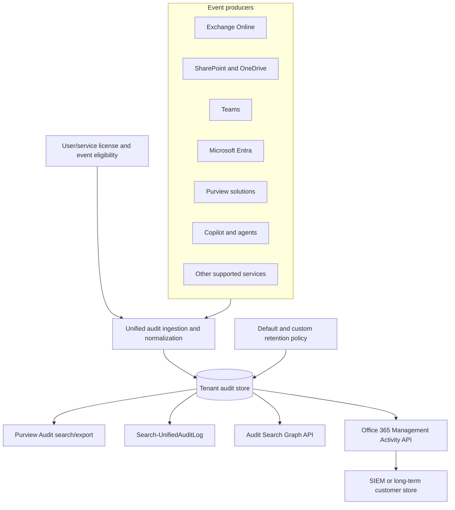

The **common schema** supplies fields that are broadly consistent, while the **workload payload** supplies fields meaningful to a specific service. A SharePoint file event and an Exchange mailbox event can share `CreationTime`, `UserId`, `Operation`, `RecordType`, and `Workload`, but differ in object URL, mailbox, item, client, application, and operation-specific properties.

## 4. Audit (Standard) versus Audit (Premium)

Current Microsoft Learn describes Premium as including all Standard functionality and adding capabilities that depend on eligible licensing.

| Capability | Audit (Standard) | Audit (Premium) | Verify-current caution |
|---|---|---|---|
| Enabled with eligible subscription | Yes, normally on by default | Yes | Verify ingestion in Exchange Online PowerShell |
| Portal search, CSV, PowerShell | Yes | Yes | Search and export limits differ |
| Audit Search Graph API | Yes | Yes | Confirm endpoint/version/permissions |
| Management Activity API | Yes | Yes, higher modeled bandwidth | Throttling depends on tenant and publisher pattern |
| Default searchable retention | 180 days for eligible Standard records generated on/after Oct. 17, 2023 | One year by default for eligible Entra, Exchange, OneDrive and SharePoint user records; other records commonly 180 days | License the event-generating user and validate workload |
| Custom audit retention policies | No Premium capability | Yes | Policies are not retroactive to already committed items |
| Up to ten-year user retention | No | Add-on plus policy | Extra per-user add-on; verify supported records |
| Premium events/properties/insights | Limited | Eligible premium activities and properties | Assignment must exist when eligible activity occurs |
| Portal export scale | Current Learn: up to 50,000 rows | Current Learn: up to 1,000,000 rows | Split queries and verify tenant behavior |

**Do not memorize “E3 equals X and E5 equals Y” as a permanent truth.** Build a requirements-to-entitlement matrix: event-generating population, workloads, event types, required period, export/API volume, region, and add-ons. Then validate it against Product Terms and the current licensing guide.

## 5. Retention is determined at ingestion

The system determines an audit item's lifetime when the event enters the audit pipeline, using the event producer's license and the applicable policy. Current Learn warns that later license or policy changes do not update previously committed items. Ten-year retention is not retroactive.

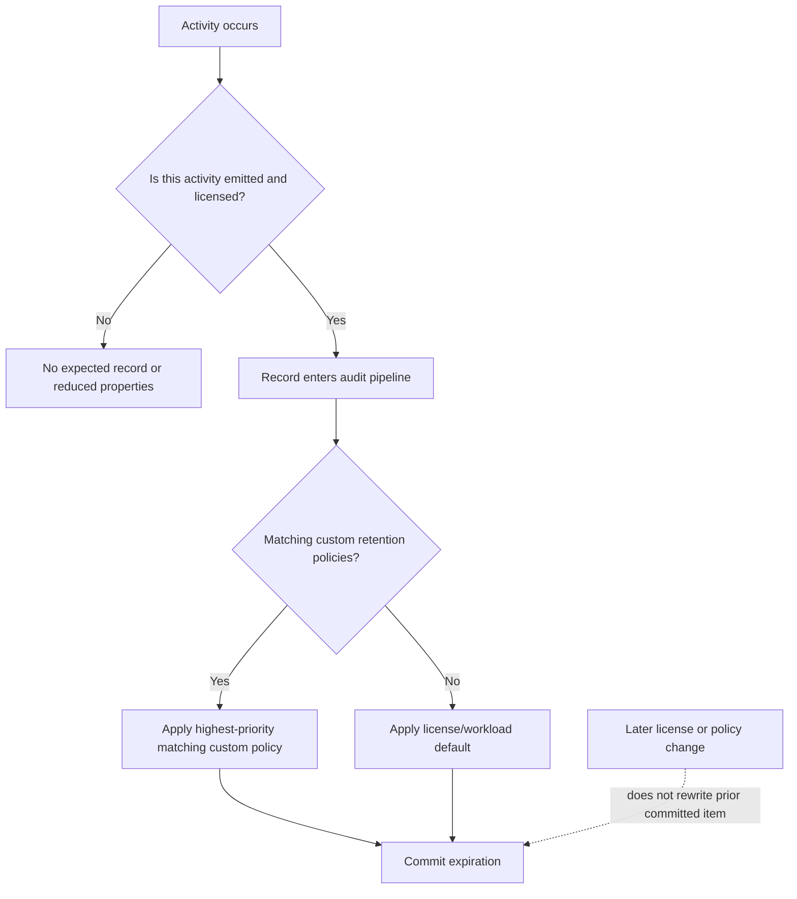

| Retention design question | Evidence required |
|---|---|
| Which users generate important events? | High-value role/population inventory |
| Which record types and operations matter? | Use-case-to-event catalogue |
| How long must records be searchable? | Legal, regulatory, security and operational requirement |
| Is one year enough? | Threat dwell time, investigation history and obligation analysis |
| Is ten-year retention licensed? | User assignment and add-on evidence |
| Will the SIEM retain its copy? | Connector, ingestion, immutable storage and deletion design |
| Which custom policy wins? | Policy priority and matching simulation |
| What historical gap remains? | Earliest available event per workload/population |

## 6. Audit retention policies and high-value users

Audit (Premium) custom retention policies can match users, record types, and in some cases operations, and carry a priority. Lower numeric priority values are processed first. Any matching custom policy takes precedence over the default policy, including a custom policy with a shorter period. That creates a real risk: an apparently “special” policy can shorten evidence retention.

**High-value users** are people whose access, influence, or targeting risk makes their activities especially important: privileged admins, executives, finance approvers, legal staff, security responders, service owners, and holders of strategic data. The term is a risk category, not a license feature that automatically makes every event complete.

| High-value control | Good design | Weak design |
|---|---|---|
| Population | Role/risk-based with owner and review date | Permanent spreadsheet of famous names |
| Licensing | Evidence that event-generators have required entitlement | License only the investigator |
| Retention | Requirement-driven, policy priority tested | “Longest possible” without privacy/cost review |
| Alerting | Specific high-risk operations correlated in SIEM/XDR | Alert every event |
| Access | Separate search, export and case roles | Global Admin for every investigator |
| Review | Quarterly population and coverage validation | Assume initial setup remains correct |

## 7. Event schema from zero

An event schema is the contract that defines fields and meanings. The most useful investigation fields are identifiers, time, actor, operation, target, source context, result, workload, application, and correlation data.

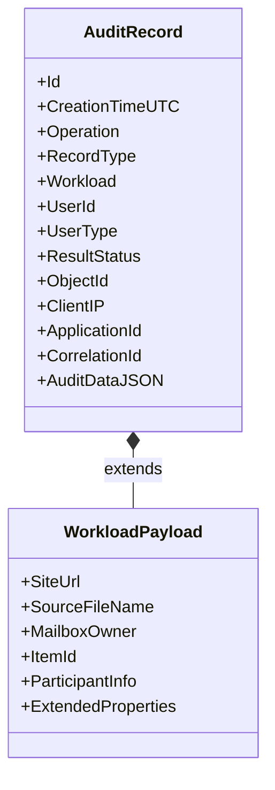

| Field family | Examples | Investigation use | Caution |
|---|---|---|---|
| Time | `CreationTime`, start time | Order events in UTC | Ingestion time and action time can differ |
| Actor | `UserId`, `UserKey`, `UserType` | Identify user, app, system or admin | System/app accounts may act on behalf of a user |
| Action | `Operation`, friendly activity | State what the service recorded | Exact operation name and punctuation matter |
| Target | `ObjectId`, item, URL, mailbox | Connect activity to data | Paths/names can change; preserve stable IDs |
| Network/client | `ClientIP`, user agent, client application | Correlate source context | NAT, proxy and service IPs limit attribution |
| Application | application ID/display name | Distinguish client, app-only and service workflow | Verify service principal ownership |
| Result | success/failure/status | Separate attempts from completed actions | “Success” may mean request accepted, not business outcome |
| Correlation | record ID, correlation ID, request ID | Join related records and support traces | Not every workload exposes the same identifier |
| Payload | `AuditData` JSON, extended fields | Detailed workload interpretation | Flatten without losing raw source |

### 🔍 Plain-English deep-dive: identity is not always a human name

`app@sharepoint`, a service principal, a system account, or an application ID can appear as the actor because a workload performed an operation on behalf of a user or policy. SharePoint retention and eDiscovery processes can generate searches or file access. Insider Risk Content Explorer can generate `FileAccessed` with a known application ID. Browser prefetch can produce preview-like activity. Treat the actor field as a lead. Correlate token identity, application, operation, object, timing, initiating workflow, and adjacent records before saying “the user opened the file.”

## 8. Workloads, activities and interpretation traps

| Workload | Useful operations | Common trap |
|---|---|---|
| SharePoint/OneDrive | access, download, share, move, delete, sync, permission changes | Preview, prefetch, repeated-event suppression, app-only activity |
| Exchange | send, inbox-rule change, delegate access, hard/soft delete, premium mail access | Mailbox owner, delegate and admin actors differ |
| Teams | member/app changes, messages, meeting/participant details | Some events only exist for Graph activity, Premium, or preview |
| Entra | user/group/app/credential/role changes | Unified audit is not identical to every Entra sign-in/risk dataset |
| Purview | label, DLP, eDiscovery, role and export operations | Investigator activity itself is sensitive evidence |
| Copilot/agents | interaction, plugin/agent/tool/admin operations | Audit metadata may reference interactions; content access uses eDiscovery/Activity Explorer controls |
| Defender | response actions and incident changes | Defender telemetry and Purview audit have different schemas/retention |

An audit catalogue should record friendly name, exact operation, record type, required license, expected actor, key fields, latency expectation, known suppression/aggregation, test date, and source link. It should not simply copy thousands of activities without mapping them to decisions.

## 9. Latency, absence and uncertainty

Microsoft does not promise a fixed audit-record arrival time. Current Learn says core Exchange, SharePoint, OneDrive, and Teams records are typically available in 60 to 90 minutes, while other services can take longer; outages and producer-side issues can delay records. Large portal search jobs can take much longer, potentially up to 48 hours in large tenants.

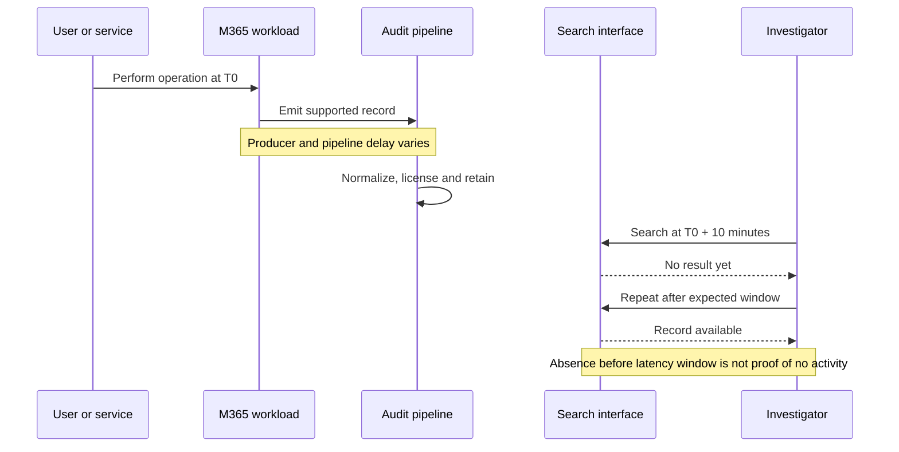

When an expected event is absent, record four possibilities: the operation did not occur; the operation is not audited in that path; the user/event lacked required entitlement; or the record is delayed, expired, filtered, aggregated, or searched incorrectly.

## 10. Search strategy in the Purview portal

A good search is iterative. Start with a narrow person, time, operation, and object hypothesis; validate event shape; then widen deliberately. Use UTC throughout and document conversions from local time.

| Search input | Use | Frequent mistake |
|---|---|---|
| Date/time in UTC | Bound the event window | Treating a local timestamp as UTC |
| User | Scope actor/service accounts | Excluding apps or delegates inadvertently |
| Friendly activity | Easy supported selection | Assuming every operation is listed |
| Exact operation | Precise control | Misspelling or omitting punctuation |
| Record type | Workload/schema scope | Selecting a similar but wrong record type |
| Workload | Reduce volume | Confusing service that emitted with object location |
| File/folder/site | Object-related activity | Special characters, renamed paths and incomplete URL |
| Keyword | Search common indexed schema | Assuming it searches all JSON payload content |
| Administrative unit | Delegate regional/department scope | Restricted admin cannot see all nonuser/system logs |

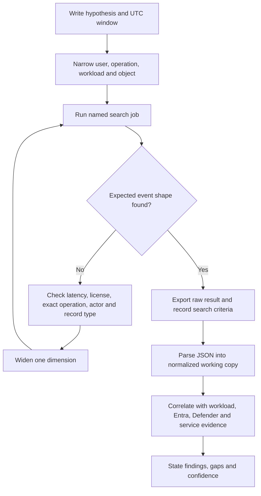

Portal search jobs continue after the browser closes. Current Learn describes up to ten concurrent jobs per investigator and a limit on unfiltered jobs. Completed jobs are retained for a finite period, currently described as 30 days. A search job is not the evidence retention strategy; export and preserve approved evidence promptly.

## 11. Export without destroying provenance

The portal exports CSV with common columns and an `AuditData` JSON payload. Keep the original downloaded file read-only, compute and record a cryptographic hash in an approved evidence process, create a working copy, and parse JSON using Power Query or a structured parser. Never replace the raw file with a flattened spreadsheet.

| Evidence artifact | Minimum metadata |
|---|---|
| Search request | Case/incident ID, requester, authority, query, UTC range, account, time |
| Raw export | Original name, byte size, hash, download time, downloader, secure location |
| Parsed copy | Tool/version, transformation steps, script/query hash, row count |
| Timeline | Source record ID, normalized UTC, actor, action, target, confidence |
| Finding | Evidence references, interpretation, alternative explanations, limitation |
| Transfer | From/to, date/time, reason, approval, integrity verification |

## 12. Portal, PowerShell, Graph and Management Activity API

| Access path | Best use | Strength | Risk/control |
|---|---|---|---|
| Purview portal | Ad hoc investigations and visual jobs | Accessible, saved jobs, filters/export | Manual errors; capture criteria and job ID |
| `Search-UnifiedAuditLog` | Scripted targeted searches and legacy automation | Flexible exact operations | Search/export calls through this cmdlet are not themselves audited according to current Learn |
| Audit Search Graph API | Programmatic equivalent of search jobs | Modern API integration | Validate current API version, app permissions and job status |
| Office 365 Management Activity API | Continuous ingestion to SIEM/archive | Scalable subscriptions and content blobs | Throttling, gaps, duplicates, checkpoint and secret risks |

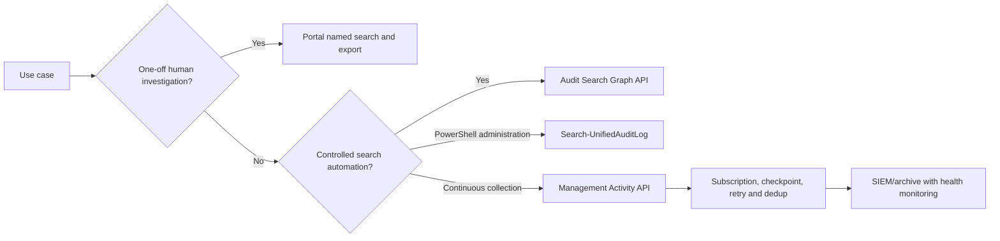

For continuous collection, monitor last successful content time by content type, API failures, throttling, duplicate IDs, parse errors, event lag, and storage retention. An API returning HTTP success does not prove complete coverage.

## 13. Audit security, privacy and least privilege

Audit data can expose employee behavior, IP addresses, device/client details, sensitive file names, investigation targets, legal matters, and administrator actions. Treat audit search and export as privileged data processing.

| Control | Design requirement |
|---|---|
| RBAC | Use Audit Reader/View-Only roles for read; separate policy administration |
| Administrative units | Delegate scoped user activity where supported; document visibility gaps |
| Just-in-time access | Activate only for approved incident/matter window |
| Separation of duties | Searcher, approver, evidence custodian and reviewer should not collapse into one person without compensating review |
| Export control | Approved encrypted location; no personal desktop/email |
| Audit of audit | Monitor portal search/export and Purview role changes; note PowerShell audit gap |
| Privacy | Purpose, minimization, access logging, retention and employee-notice obligations |
| Insider conflicts | Alternative investigator when target controls audit permissions |

## 14. From incident investigation to legal matter

An operational incident can begin with rapid triage and later become a legal matter. The transition must be explicit because authority, preservation, disclosure, privilege, reviewer population, and communication change.

| Dimension | Security/IT incident | Legal/regulatory investigation |
|---|---|---|
| Objective | Contain, recover and prevent recurrence | Preserve, review and respond defensibly |
| Authority | Incident policy and security mandate | Counsel, legal process or regulator |
| Scope | Threat/activity-driven and rapidly evolving | Matter-defined, proportional and documented |
| Evidence | Logs, alerts, devices, configuration | Potentially relevant ESI plus audit evidence |
| Preservation | Incident evidence snapshots | Formal case holds and custodian/source governance |
| Communications | Incident command and need-to-know | Counsel-controlled and privilege-aware |
| Closure | Recovery, RCA and control validation | Production/response, hold release and matter disposition |

### 🔍 Plain-English deep-dive: preserve first, but do not silently “turn everything on hold”

Preservation urgency does not remove governance. A broad tenant hold can create privacy exposure, storage impact, operational burden, and legal overcollection. A narrow query-based hold can miss data because terms, locations, indexes, or time ranges are wrong. Counsel and technical owners should choose a proportionate initial preservation scope, validate distribution, record uncertainty, and expand when facts justify it. The technical consultant explains what each option does; counsel decides legal sufficiency.

## 15. Current eDiscovery architecture and the classic retirement

The modern eDiscovery experience organizes work in cases and can enable premium workflow capabilities according to licensing and case settings. Do not teach a non-21Vianet client to navigate retired separate classic Standard/Premium/Content Search experiences. Historical capability distinctions remain useful for licensing concepts, but the current tenant is the source of truth.

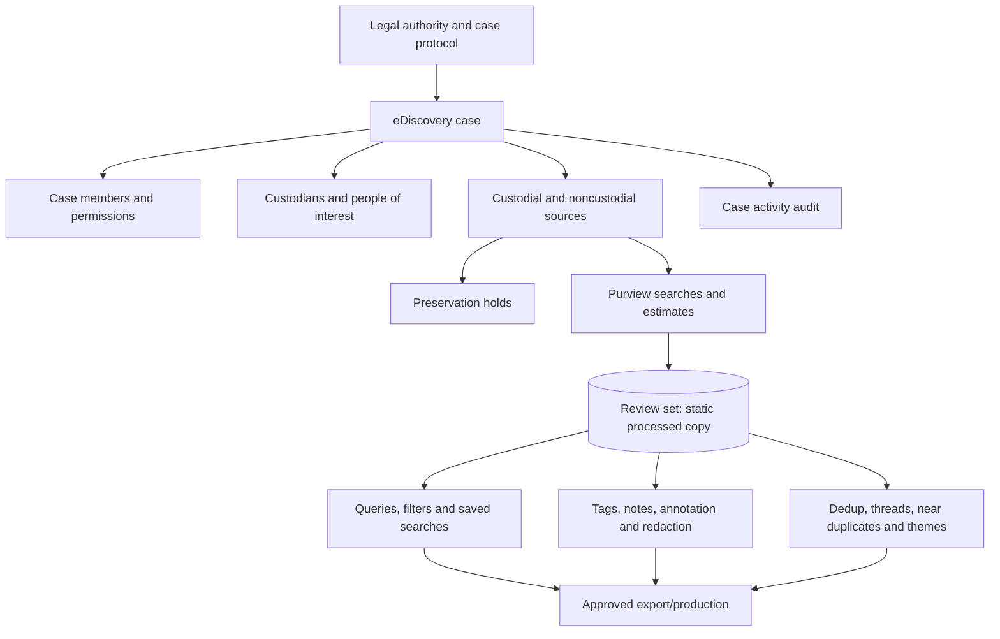

## 16. Case lifecycle and roles

| Role/object | Responsibility | Governance question |
|---|---|---|
| eDiscovery administrator | Organization-wide eDiscovery authority depending on assigned role | Is broad access truly required? |
| eDiscovery manager | Creates/manages permitted cases | Is the user also a case member? |
| Case member | Accesses assigned case under permissions | Does membership match current need? |
| Reviewer | Reviews/tags specific material | Can review access be narrower than administration? |
| Legal lead/counsel | Defines matter scope, privilege and production decisions | Are decisions documented by authorized counsel? |
| Technical lead | Maps sources, executes approved searches and validates jobs | Are facts separated from legal conclusions? |
| Evidence custodian | Protects exports, hashes, transfers and inventory | Is chain of custody complete? |

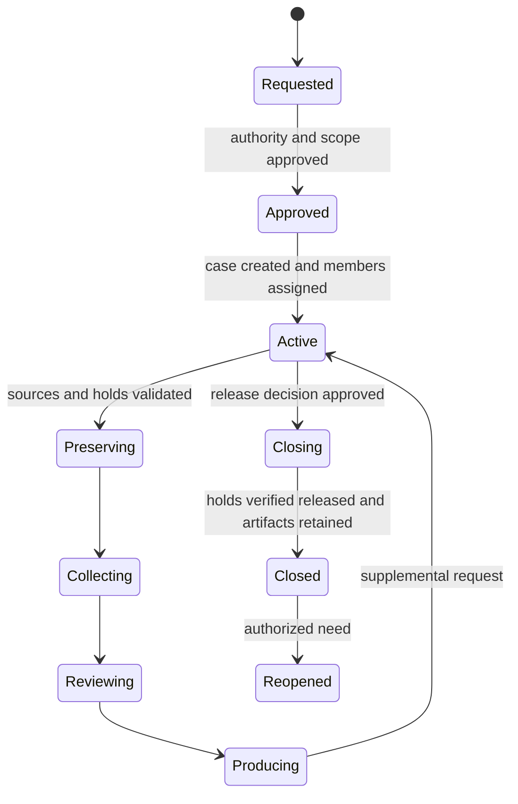

Closing a case is not a casual rollback. Holds, delay holds, other retention, exports, legal notices, and downstream copies need reconciliation. Deleting a case or hold can release preservation. Require dual approval and an impact report.

## 17. Custodians, noncustodial sources and data-source mapping

A custodian is a person with administrative control or possession of potentially relevant information. Their sources can include mailbox, OneDrive, memberships, chats, and associated repositories. A noncustodial source is relevant data not owned by one person, such as a department site, shared mailbox, group, Team, archive, or imported third-party source.

| Source | Person/source relationship | Common omission |
|---|---|---|
| Exchange mailbox | Custodian communication and app compliance data | Shared/delegate mailbox and inactive mailbox |
| OneDrive | Custodian-created/shared files | UPN/URL change and deleted account lifecycle |
| Teams chats | User mailbox/substrate location | Files are not stored with chat messages |
| Team channels | Group mailbox for messages; SharePoint for files | Hold only one side |
| SharePoint site | Department/project/shared content | Subsite/path and group-connected source |
| Microsoft 365 group | Group mailbox and connected site | Member mailboxes are not automatically included |
| Third-party archive | Connector-imported content | Connector completeness and original system retention |
| AI interactions | Compliance copies and referenced files according to current product | Prompt/response and grounded file are different evidence objects |

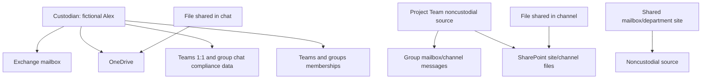

## 18. Holds: what they do and what they do not do

A hold preserves content in selected locations, either broadly or according to a query. It does not make content relevant, review it, notify every custodian automatically, preserve unsupported data, or guarantee that a badly scoped source/query is correct.

| Hold type/design | Strength | Risk |
|---|---|---|
| Full-location hold | Lower risk of term-based omission | Overpreservation, privacy and storage burden |
| Query-based hold | More proportionate | Query/index errors can miss evidence; initial preservation can be broader during processing |
| Custodian-linked hold | Clear person/source governance | Misses shared/noncustodial repositories |
| Noncustodial-source hold | Preserves shared repositories | Ownership and relevance need explicit rationale |
| Multiple overlapping holds | Independent matters remain protected | Hard to understand release impact and deletion timing |

Current Microsoft guidance has historically described holds taking time to distribute and up to 24 hours in relevant paths. The modern experience and source status must be checked. Never issue a deletion or account-deprovisioning action until preservation status is successful and independently validated.

## 19. Hold distribution, conflicts and release

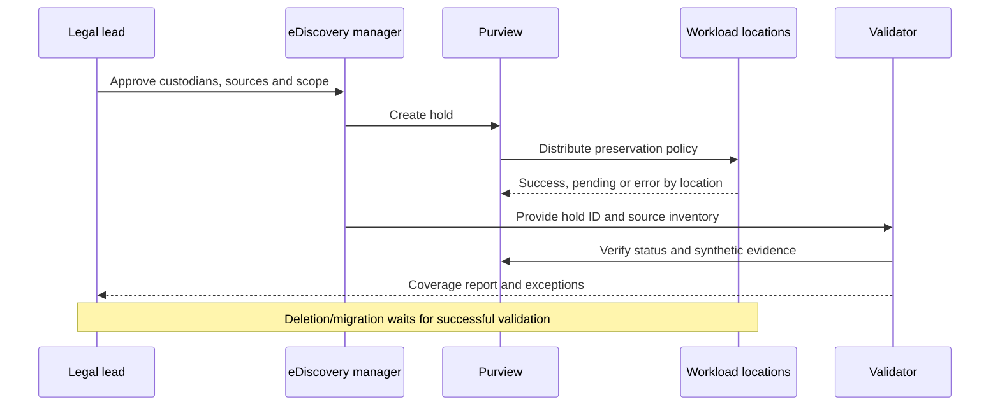

When content is subject to multiple holds or retention controls, releasing one does not necessarily permit deletion. Exchange can apply delay-hold properties after a hold is removed; SharePoint and OneDrive preservation libraries can remain protected through a grace period; timer jobs and other policies still apply. A release plan should answer:

1. Which matter and approval authorize release?
2. Which exact source IDs and hold IDs change?
3. What other cases, retention policies, labels, Litigation Hold, inactive mailbox, or Preservation Lock apply?
4. What content might become eligible for deletion, and when?
5. How will delay-hold and workload processing be monitored?
6. What downstream review sets and exports remain?

## 20. Deleted and changed content

Preservation is workload-specific. Exchange uses Recoverable Items and hidden compliance storage; SharePoint and OneDrive use a Preservation Hold library when required; Teams message compliance data and files live in different sources. A deleted item may disappear from the user's application while a preserved copy remains discoverable.

| User-visible event | Possible evidence/preservation path | Limitation |
|---|---|---|
| Mail deleted | Recoverable Items/hold copy and audit delete operation | Audit may not include content body |
| SharePoint file deleted | Recycle bins and/or Preservation Hold library | Recycle Bin itself is not indexed for eDiscovery search |
| Retained file edited | Prior required version/copy preserved | Versions collected depend on settings/workflow |
| Teams chat deleted | Mailbox/substrate preserved copy when hold applies | Files require OneDrive/SharePoint source |
| OneDrive owner deleted | Retention/hold and OneDrive deletion lifecycle | Preserve before account/source loss |
| Group deleted | Group mailbox/site lifecycle | Map both content stores before deletion |

## 21. Search, Content Search relationship and current changes

The phrase **Content Search** historically referred to a standalone classic search/export tool. Outside applicable special environments, that classic experience retired in 2025. The underlying business capability still exists as Purview search within the current eDiscovery experience. Say “Purview search in the current eDiscovery case” unless the tenant and source explicitly use another supported name.

Likewise, classic eDiscovery used **collections** to generate estimates and then committed collections to review sets. In the current experience, **search statistics and samples replace classic collections**. Searches remain editable even after results are added to a review set, while each review-set load is the static processed population. “Collection” remains useful as a legal-process stage and generic verb, but use **search**, **statistics**, **sample**, **add to review set**, and **process report** when describing the current product UI.

A search identifies indexed items in selected sources that match KeyQL (Keyword Query Language), properties, conditions, and date criteria. A search estimate is a planning result, not a final review population and not proof that every potentially relevant item is indexed.

| Search design technique | Purpose |
|---|---|
| Source-first inventory | Prevent missing mailbox/site/OneDrive/group halves |
| Date bounding | Reduce noise and support proportionality |
| Known-item test | Prove a synthetic or already known item can be found |
| Keyword list/statistics | Compare term effectiveness |
| Property conditions | Use sender, recipient, file name/type and dates carefully |
| Negative test | Confirm excluded persona/term/date does not match |
| Partially indexed review | Account for encrypted, corrupt, huge or unsupported content |
| Iterative versions | Preserve each query, estimate, reason and approver |

## 22. Query design and estimates

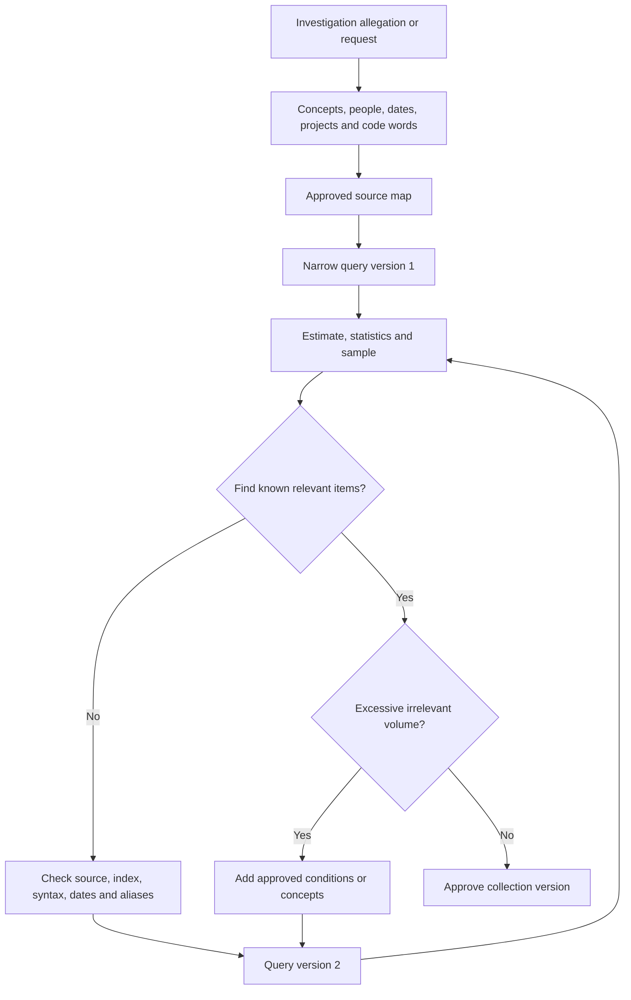

Parentheses and Boolean logic matter. `ProjectA AND merger OR acquisition` can be interpreted differently from `ProjectA AND (merger OR acquisition)`. Search syntax and property support differ between live collections and review-set filters. Preserve exact query text and never silently “fix” a counsel-provided query without recording the change.

### 🔍 Plain-English deep-dive: estimate is a weather forecast, review set is the measured rainfall

An estimate predicts how much live content appears to match at that time. A review set contains the items actually copied and processed under selected collection options. Counts can differ because of processing errors, families, versions, cloud attachments, deduplication, conversation reconstruction, and source changes. Report each count with its stage, settings, time, and known errors.

## 23. Collection and review-set processing

When approved search results are added to a review set, Purview copies content from live sources into secure Microsoft-managed storage and processes it for review. Collection settings can affect cloud attachments, document versions, conversation context, partially indexed items, and source handling.

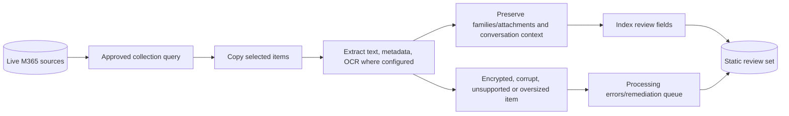

| Processing choice | Why it matters | Decision owner |
|---|---|---|
| Cloud attachments | Captures linked file around relevant interaction | Counsel plus technical lead |
| SharePoint versions | May show changes over time but increases volume | Counsel/records owner |
| Conversation reconstruction | Provides context around matching Teams/Viva messages | Legal review lead |
| OCR | Makes image text searchable | Case setting, cost/quality/privacy review |
| Partially indexed items | Avoids silent omission | Technical lead reports to counsel |
| Family handling | Keeps message and attachments together | Production protocol |
| Source metadata | Supports provenance and filtering | Evidence protocol |

## 24. Deduplication, threading, near duplicates and themes

These features reduce review effort, but they do not automatically decide legal relevance.

| Feature | Plain meaning | Benefit | Caution |
|---|---|---|---|
| Exact deduplication | Identical content represented once according to settings | Reduces repeated review | Preserve duplicate/custodian metadata |
| Email threading | Groups messages in a conversation and identifies inclusive context | Review complete threads efficiently | Later messages can omit attachments or alter recipients |
| Near-duplicate detection | Groups textually similar documents | Compare versions and reduce review | Similar is not identical; differences can be decisive |
| Themes | Groups documents around machine-derived concepts | Finds concept clusters | Theme labels are aids, not facts |
| Conversation threading | Reconstructs chat context | Avoids isolated message interpretation | Boundaries and edits/deletes require care |
| Predictive/relevance tools | Prioritizes items based on trained judgments where available | Focuses human review | Requires validation, sampling and bias controls |

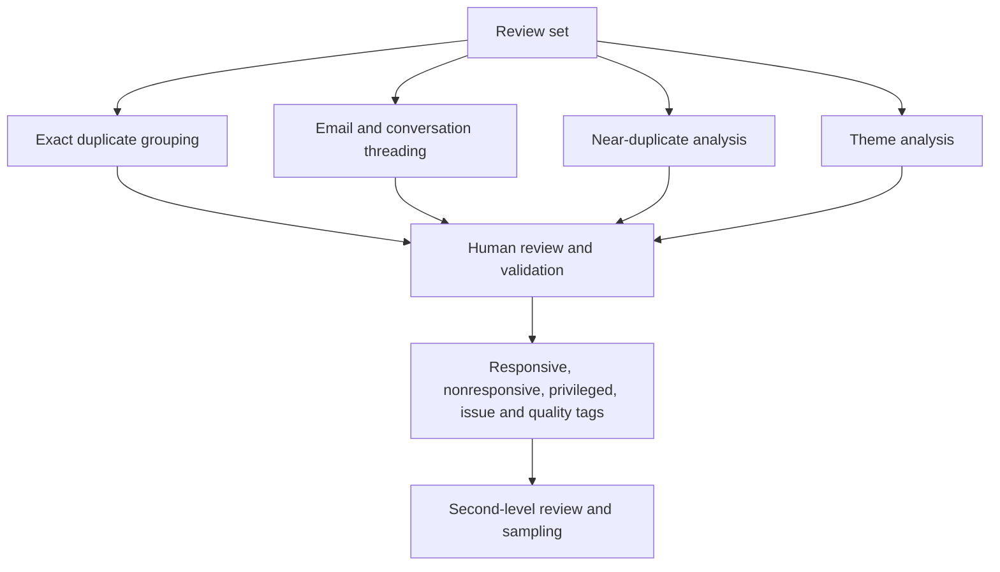

## 25. Tags, review workflow and quality control

Use a counsel-approved tag protocol with definitions and examples. A reviewer should not invent personal categories in the middle of a matter.

| Tag family | Example | Control |
|---|---|---|
| Responsiveness | Responsive / Not responsive / Needs review | Decision definition and escalation |
| Privilege | Potential privilege / Privileged / Not privileged | Counsel review and privilege log |
| Issue | Pricing / safety / competition / HR | Matter-specific issue codebook |
| Confidentiality | Personal / trade secret / restricted | Production handling/redaction |
| Technical quality | Corrupt / unreadable / missing family | Remediation queue |
| Production | Include / exclude / redact | Dual approval and locked production query |

Quality assurance should include reviewer calibration, overlap review, random sampling, disagreement rate, untagged-item count, privilege escalation, and a final search for inconsistent combinations such as `Production=Include AND Privileged=Yes`.

## 26. Legal privilege and confidentiality

**Legal privilege** can protect qualifying confidential communications, but its definition and waiver rules are jurisdiction-specific. Technical staff identify potential indicators; qualified counsel makes the determination. Attorney names or domains can help identify candidates but are not enough: a lawyer can send nonlegal business mail, and privileged advice can involve nonlawyer intermediaries.

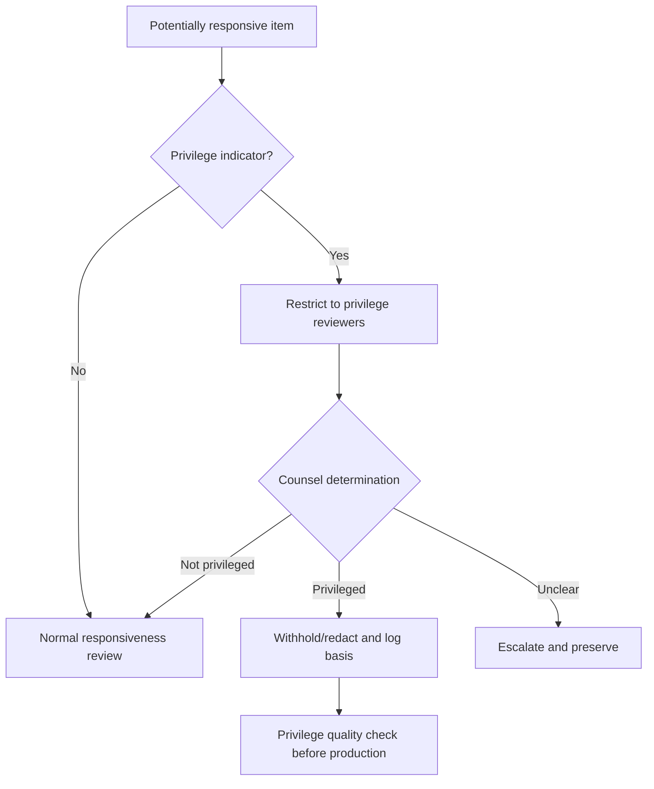

Never paste potentially privileged content into an unapproved AI tool. Do not use a theme or attorney-client classifier as the final legal decision. Secure privilege tags and exports; restrict who can view natives; and test that withheld families are not accidentally included through another duplicate or attachment.

## 27. Chain of custody and evidence integrity

**Chain of custody** is the chronological record of who controlled evidence, what they did, when, why, and how integrity was verified. Cloud eDiscovery often preserves source metadata and audit trails rather than physically seizing a disk, but the principle remains.

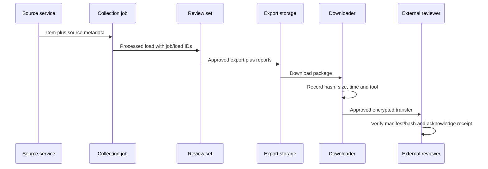

| Integrity property | Demonstration |
|---|---|
| Authenticity | Source identifiers, metadata and supported service collection |
| Completeness | Source inventory, errors, exceptions and reconciliation counts |
| Integrity | Hashes/manifests, read-only originals and controlled transformations |
| Repeatability | Preserved queries, settings, versions and job IDs |
| Accountability | Case audit, approvals, access and transfer log |
| Explainability | Clear statement of processing, deduplication and limitations |

## 28. Export, reports and production

An export may include native files, text, metadata, tags, redacted PDFs, load files, summary, warning/error, and processing reports depending on current capability and selected settings. Exporting is high risk because it moves sensitive content out of the service boundary.

| Export decision | Questions |
|---|---|
| Population | Which locked query/tag/version defines the output? |
| Format | Native, PDF, text, metadata, family relationship, load file? |
| Redaction | Is a burned/redacted copy required? Is the native excluded? |
| Privilege | Have withheld items and duplicates/families been tested? |
| Destination | Microsoft-provided or approved customer-owned storage? |
| Encryption | At rest and in transfer; key owner and recovery? |
| Reports | Summary, export, errors and item manifest retained? |
| Transfer | Named recipient, approval, hash/manifest acknowledgment? |
| Deletion | When and how will temporary export locations expire? |

Never state that a successful export means a complete production. Reconcile expected versus exported items, families, errors, skipped items, file sizes, and hashes; review the report; and obtain legal approval.

## 29. Licensing, prerequisites, permissions and limits

| Area | Validate before design |
|---|---|
| Audit | Standard/Premium entitlement for event-generating users; premium event/retention need |
| eDiscovery | Base case/search/hold versus premium custodian/review/analytics capability entitlement |
| Roles | Purview role groups, case membership, reviewer access, export permission |
| Workloads | Exchange, SharePoint, OneDrive, Teams, groups, AI and imported data support |
| Indexing | File types, encryption, corruption, size, OCR and deep-index behavior |
| Holds | Per-case/source/location limits and workload hold limits |
| Search/export | Query, displayed result, export-row, job concurrency and package limits |
| Geography | Multi-Geo and sovereign/regional behavior |
| APIs | Graph/API permissions, endpoints, throttling and auditability |
| Storage | Review/export location, customer-owned storage option and retention |

License the users whose activity must receive Premium treatment, not merely the investigators. Record assumptions and obtain commercial/licensing validation; Microsoft Learn is technical guidance, not a binding entitlement contract.

## 30. Security and privacy design

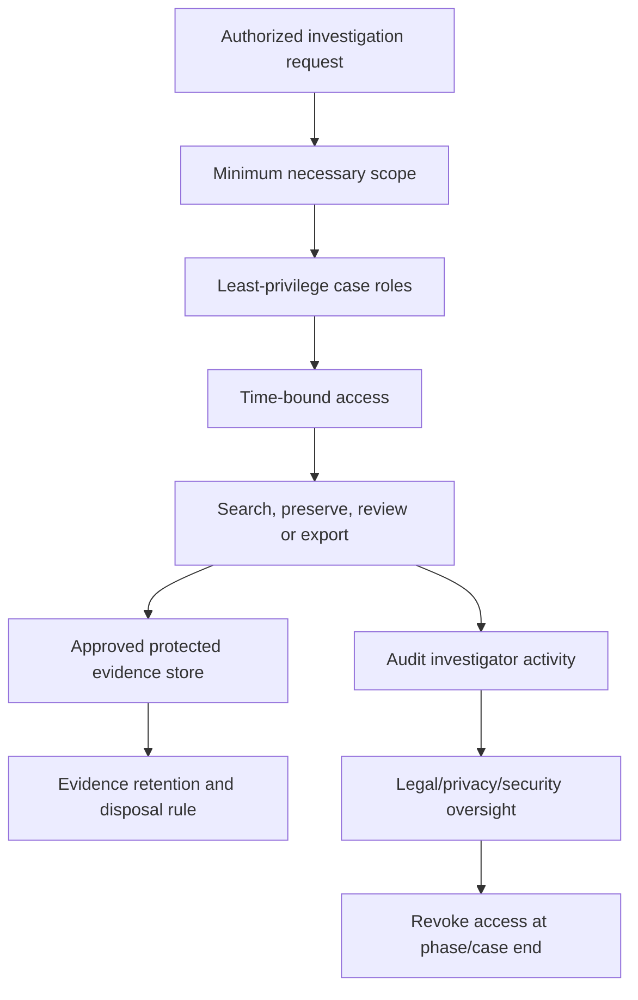

Privacy-by-design means authorized purpose, necessity, proportionality, minimization, transparency where lawful, role separation, secure access, finite retention, and redress/escalation. Employee monitoring laws, works councils, union agreements, blocking statutes, data localization, and cross-border transfer can affect design. Escalate to counsel and privacy officers; this chapter is not legal advice.

## 31. Design and configuration workflow

1. Confirm the business, incident, legal, privacy, and records authority.
2. Define decisions the evidence must support; avoid open-ended surveillance.
3. Inventory licenses, roles, audit status, retention, sources, connectors and geography.
4. Build an event catalogue and source map with known gaps.
5. Design case naming, membership, hold, query, review, privilege and export protocols.
6. Define immutable identifiers, UTC handling, evidence storage, hashes and chain of custody.
7. Create synthetic positive, negative, error and volume test cases.
8. Pilot with fictional data and reversible settings where possible.
9. Require legal/privacy/security signoff before preservation or employee-content review.
10. Deploy in controlled phases, verify job/location status and retain evidence.
11. Handover runbooks, RACI, SLAs, metrics, access reviews and escalation paths.

## 32. Deployment, testing and acceptance

| Test class | Example | Pass evidence |
|---|---|---|
| Audit positive | Synthetic user downloads fictional file | Expected operation, actor, object and UTC after latency |
| Audit negative | Different user/object outside scope | Not returned by narrowed query |
| Schema | App-only action against fictional site | Correct app/system interpretation |
| Retention | Policy simulation for fictional high-value user | Approved priority and expected future retention; no historical claim |
| Hold distribution | Fictional mailbox/site inventory | Every target reports successful status |
| Hold negative | Nontarget fictional source | Not included |
| Search known item | Unique fictional phrase | Found in expected source |
| Search miss | Encrypted/unsupported synthetic file | Error is visible and routed |
| Review processing | Family with attachment and duplicate | Expected family, dedup and metadata behavior |
| Privilege safeguard | Synthetic “potential privilege” item | Restricted/tagged and excluded from test production |
| Export | Approved ten-item synthetic set | Ten reconciled items plus reports and hashes |
| Access | Nonmember tries case/export | Denied and event recorded where supported |

Acceptance is not “the portal page opened.” It is demonstrated coverage, predictable processing, understood limitations, secure handling, recoverable operational procedure, and signed ownership.

## 33. Rollback and irreversible-change matrix

| Change | Rollback reality | Required gate |
|---|---|---|
| Add case member | Remove access, but prior viewing/export cannot be undone | Approval and audit review |
| Create search | Delete definition/result job; underlying tenant data remains | Low-risk naming/change record |
| Create hold | Can release, but distribution and delay holds take time | Legal approval and source validation |
| Remove hold/close case | Potential deletion eligibility after other controls/delays | Dual legal/technical approval |
| Change audit retention policy | Future matching behavior changes; prior committed items do not rewrite | Retention impact simulation |
| Remove Premium license | Future retention/event detail may change; expired data cannot be recovered | License dependency review |
| Add to review set | Static copy remains until case process removes it | Privacy/storage approval |
| Export evidence | Copies cannot be recalled reliably | Destination, encryption and recipient approval |
| Delete case | Can remove access/workflow and release dependencies | Matter closure checklist and counsel signoff |

## 34. Operations and metrics

| Metric | What it reveals | Avoid gaming it by |
|---|---|---|
| Audit coverage by critical use case | Whether required events are expected/tested | Counting unsupported events as covered |
| Event latency percentile | Producer/pipeline timeliness | Treating delayed records as lost immediately |
| API collection freshness | Continuous ingestion health | Looking only at HTTP success |
| Search success/error time | Investigator efficiency | Rewarding broad, low-quality searches |
| Hold distribution success | Preservation coverage | Ignoring pending/failed sources |
| Time to preservation | Operational/legal responsiveness | Skipping approval or scope quality |
| Processing error rate | Review completeness risk | Excluding hard files from denominator |
| Review precision/sample disagreement | Tagging quality | Measuring speed alone |
| Privilege exception count | Production safeguard effectiveness | Penalizing reviewers for escalating uncertainty |
| Export reconciliation variance | Production integrity | Ignoring families/skips |
| Stale case membership | Least-privilege hygiene | Annual review only |
| Matter closure backlog | Excess retention/access risk | Closing before hold reconciliation |

## 35. Common failures and likely causes

| Symptom | Likely causes | First discriminating check |
|---|---|---|
| No audit record | Latency, wrong UTC, unsupported path, exact operation error, license, actor/app, expiration | Reproduce synthetic event and search broad record type after expected window |
| Search job slow | Wide range/users, high volume, tenant load | Split by time/user/workload and compare |
| Expected Premium detail absent | Event-generating user not licensed at event time | License assignment timeline and event eligibility |
| API gap | Subscription/checkpoint failure, throttle, content expiration, parser drop | Compare portal sample to raw API content IDs |
| Hold pending/error | Invalid/deleted source, permissions, distribution failure, limit | Source-specific status and workload identity |
| Site content missing | Wrong URL, site half omitted, index/error, Recycle Bin assumption | Verify exact site/OneDrive URL and known item |
| Teams evidence missing | Held mailbox but not site/OneDrive, or reverse | Draw message/file storage map |
| Review-set count differs | Processing, families, versions, dedup, errors, source changes | Compare collection and load reports/settings |
| Export count differs | Filters/tags, families, errors, report interpretation | Reconcile manifest against locked query |
| Cannot delete content/site | Other hold/retention, delay hold, Preservation Hold library | Enumerate all preservation controls before change |

## 36. Layered troubleshooting

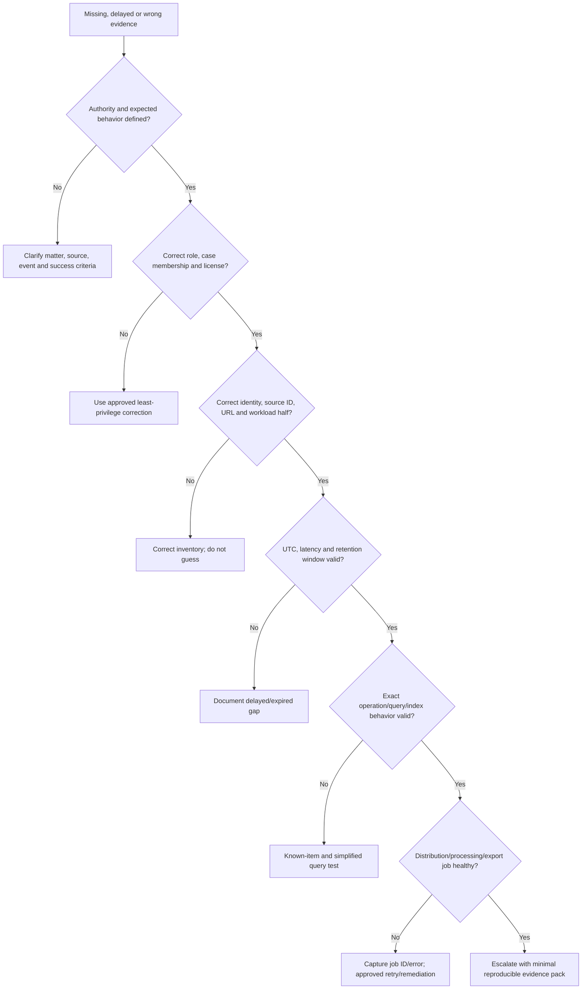

An escalation pack should contain tenant/region (redacted as required), UTC timestamps, case/search/hold/load/export IDs, affected sources, exact query/settings, job status/error, license and role evidence, expected versus actual counts, reproduction, screenshots with sensitive data minimized, service health/Message center checks, and business/legal impact. Do not attach the entire client evidence set to a generic support ticket.

## 37. Consulting scenarios

### Scenario A: suspected phishing and mailbox compromise

Security needs speed: correlate Entra sign-ins, mailbox rules, delegate grants, sends, message access (if licensed), OAuth applications, file access, and Defender evidence. Preserve raw exports and incident timeline. If facts suggest fraud, employment action, litigation, or regulator notification, involve counsel and create an appropriately scoped case. Do not turn the incident ticket into an uncontrolled content review.

### Scenario B: insider file exfiltration allegation

Start with authorized scope. Correlate file downloads, sync, sharing, anonymous links, permission changes, endpoint/Defender evidence, application IDs, and system-generated events. Map SharePoint/OneDrive versions and sharing context. If escalated, preserve mailbox, OneDrive, relevant sites/groups and noncustodial project sources. Treat intent as unproven.

### Scenario C: employment legal matter

HR and counsel identify custodians, shared sources, date range, legal-notice requirements and privilege reviewers. Technical staff validate holds before account deletion, build query versions, document errors, and create a review set. Employee privacy and local-law requirements constrain who can see communications.

### Scenario D: regulatory inquiry

Create a requirements-to-source matrix, preserve data under counsel direction, retain query and processing reports, use issue and confidentiality tags, and produce only the authorized population. Explain unsupported sources, historical audit expiration, connector gaps, and assumptions candidly.

## 38. Consulting artifacts

| Artifact | Minimum content |
|---|---|
| Audit use-case catalogue | Decision, event, operation, workload, license, fields, latency, test |
| Licensing/retention matrix | Population, entitlement, required period, policy and gap |
| Investigation plan | Authority, hypothesis, scope, sources, UTC window, owners, approvals |
| Source/custodian map | Person, mailbox, OneDrive, groups, Teams, sites, third parties, status |
| Hold plan | Matter, source IDs, full/query hold, rationale, approver, validation |
| Query log | Version, exact text, sources, estimate, known-item result, change reason |
| Processing protocol | Families, versions, cloud attachments, OCR, errors, analytics |
| Review protocol | Tags, definitions, privilege, calibration, QA and escalation |
| Chain-of-custody log | Artifact, hash, handler, time, action, transfer and verification |
| Export/production log | Locked population, settings, reports, counts, errors, recipient |
| Operations runbook | Access, jobs, failures, SLAs, metrics, support escalation |
| Closure checklist | Holds, delay holds, access, exports, retention and approvals |

## 39. Safe paper lab and evidence exercise

### Scenario and safety boundary

A fictional company, Northwind Research, reports that fictional user `alex@northwind.example` may have downloaded and externally shared fictional Project Aurora files after receiving a phishing message. Legal wants a preservation-and-search design in case the incident becomes an employment matter. This is a **paper-only exercise**. Do not access a tenant, employee data, audit log, mailbox, site, case, hold, review set, or export. Never use real names, domains, URLs, screenshots, client content, prompts, or identifiers.

### Exercise objectives

1. Separate incident facts from legal decisions.
2. Map likely events and sources.
3. Design a minimal audit search sequence.
4. Design a counsel-approved preservation plan.
5. Create collection, review, privilege and export protocols.
6. Demonstrate chain of custody using synthetic files.
7. Record limitations and candidate-honesty wording.

### Paper source map

| Fictional source | Reason | Preservation decision on paper |
|---|---|---|
| Alex mailbox | Phishing, sends, rules, chats/compliance data | Candidate custodian source |
| Alex OneDrive | Chat-shared files and personal work files | Candidate custodian source |
| Aurora Team group mailbox | Channel messages | Noncustodial source |
| Aurora SharePoint site | Channel/project files | Noncustodial source |
| Finance shared mailbox | Possible external recipient approval | Add only if counsel approves relevance |
| Alex endpoint telemetry | Download/device evidence | Security evidence; not represented as eDiscovery source |

### Synthetic audit search plan

| Version | UTC window | Actor/source | Operations/concepts | Expected learning |
|---|---|---|---|---|
| A1 | Incident ±2 hours | Alex | sign-in/file access/download/share/link | Establish event shape |
| A2 | A1 window | App/service actors | same fictional Aurora object | Detect app-only/system actions |
| A3 | Seven days before/after | Alex | inbox rule, OAuth/app, sharing changes | Expand compromise timeline |
| A4 | Relevant window | Aurora site | permission/share/download | Identify other actors and scope |

### Paper hold and collection design

- Counsel approves Alex as custodian and Aurora Team/site as noncustodial sources.
- Use full-source initial preservation on paper because allegation terms are immature; document privacy/storage impact.
- Validate mailbox, OneDrive, group mailbox and SharePoint site separately.
- Design collection `COL-01` for unique fictional phrase `AURORA-ZEPHYR-042`, known actors and date range.
- Require a known-item positive test and a wrong-user/wrong-date negative test.
- Include a synthetic email with attachment, duplicate file, revised document, Teams conversation and password-protected error file.
- Define tags: Responsive, Not responsive, Needs review, Potential privilege, Confidential, Technical error, Production include.
- Require counsel-only privilege determination and locked production query.

### Synthetic chain-of-custody exercise

Create no real file. On paper, describe an export package named `NW-AURORA-PROD-001.zip`, fictional SHA-256 `SYNTHETIC-NOT-A-REAL-HASH`, size `123456 synthetic bytes`, downloader `Evidence Custodian A`, UTC time, approved encrypted destination, recipient, and verification acknowledgment. Explicitly label every value synthetic so it cannot be mistaken for evidence.

### Paper test matrix

| Test | Expected paper result | Failure response |
|---|---|---|
| Known fictional phrase | Search design returns expected source | Check source, index and query syntax |
| Wrong fictional user | Excluded | Fix scope/filter |
| Chat message plus file | Mailbox and OneDrive represented | Correct storage map |
| Channel message plus file | Group mailbox and SharePoint represented | Add omitted source half |
| Password-protected file | Processing error visible | Counsel decides remediation/inclusion |
| Duplicate file | One review representative plus custodian/source metadata | Review dedup settings |
| Potential privilege | Restricted and withheld from test production | Privilege QA escalation |
| Export reconciliation | Exact approved synthetic population and reports | Block transfer |
| Hold release proposal | Rejected without matter closure and conflict report | Follow dual approval |

### Evidence portfolio

- One-page audit/eDiscovery architecture.
- Event catalogue with interpretation cautions.
- Fictional source and custodian map.
- Query version log and known-item tests.
- Hold, review, privilege and export protocols.
- Synthetic chain-of-custody and reconciliation log.
- Risk register, RACI, operations metrics and troubleshooting tree.
- Candidate honesty statement.

### Cleanup

There is no tenant cleanup because nothing was configured. Review notes and remove any accidental real employee, client, tenant, URL, incident, legal matter, screenshot, or evidence. Retain only clearly marked fictional paper artifacts.

### Interview wording

> “I completed a paper-only Purview Audit and eDiscovery exercise for a fictional phishing-to-file-sharing scenario. I mapped audit events, mailbox/OneDrive/Teams/SharePoint sources, preservation, query versions, review processing, privilege gates, export reconciliation and chain of custody. I did not access a tenant or employee content and do not claim production eDiscovery. My direct incident, RCA, M365 workload, evidence-documentation and stakeholder experience is the foundation I would bring under counsel-approved governance.”

## 40. JD Mapping: interview translation

| Interview theme | Factual answer direction |
|---|---|
| Audit architecture | Producer to unified pipeline to retained store to portal/API/SIEM |
| Standard/Premium | Common search plus Premium retention policies, longer retention, events/properties and bandwidth; verify licensing |
| Evidence interpretation | Event is service-observed fact, not automatic intent or complete truth |
| eDiscovery workflow | Case, people/sources, preserve, search, collect, review, analyze and produce |
| Workload map | Teams messages and files span mailbox plus SharePoint/OneDrive |
| Defensibility | Authority, source map, query versions, errors, audit, integrity, chain and approvals |
| Troubleshooting | Access/license, source, UTC/latency/retention, query/index, job and export layers |
| Experience honesty | Production M365 incident/RCA foundation plus current design and paper exercise only |

## Official Source Anchors

| Topic | Official Microsoft source |
|---|---|
| Audit Standard/Premium and licensing concepts | [Learn about auditing solutions in Microsoft Purview](https://learn.microsoft.com/en-us/purview/audit-solutions-overview) |
| Audit search, latency, filters and export limits | [Search the audit log](https://learn.microsoft.com/en-us/purview/audit-search) |
| Audit activities and workload cautions | [Audit log activities](https://learn.microsoft.com/en-us/purview/audit-log-activities) |
| Audit record properties | [Audit log detailed properties](https://learn.microsoft.com/en-us/purview/audit-log-detailed-properties) |
| Audit retention policies | [Manage audit log retention policies](https://learn.microsoft.com/en-us/purview/audit-log-retention-policies) |
| Audit permissions/setup | [Get started with auditing solutions](https://learn.microsoft.com/en-us/purview/audit-get-started) |
| Audit export handling | [Export, configure, and view audit log records](https://learn.microsoft.com/en-us/purview/audit-log-export-records) |
| Office 365 Management Activity API | [Management Activity API reference](https://learn.microsoft.com/en-us/office/office-365-management-api/office-365-management-activity-api-reference) |
| Audit Search Graph API | [Security auditLogQuery resource](https://learn.microsoft.com/en-us/graph/api/resources/security-auditlogquery) |
| Current eDiscovery experience | [Get started with the new eDiscovery experience](https://learn.microsoft.com/en-us/purview/edisc) |
| Current eDiscovery cases | [Create and manage cases in eDiscovery](https://learn.microsoft.com/en-us/purview/edisc-cases-manage) |
| Current eDiscovery data sources | [Data sources in eDiscovery](https://learn.microsoft.com/en-us/purview/edisc-data-sources) |
| Current eDiscovery holds | [Create an eDiscovery hold](https://learn.microsoft.com/en-us/purview/edisc-hold-create) |
| Current eDiscovery searches | [Search for content in eDiscovery](https://learn.microsoft.com/en-us/purview/edisc-search-query) |
| Current review sets | [Review sets in eDiscovery](https://learn.microsoft.com/en-us/purview/edisc-review-set-manage) |
| Current exports | [Export content in eDiscovery](https://learn.microsoft.com/en-us/purview/edisc-search-export) |
| Workload storage for discovery | [Content stored in mailboxes for eDiscovery](https://learn.microsoft.com/en-us/purview/ediscovery-what-is-stored-in-a-mailbox) |
| Licensing source of truth | [Microsoft 365 security and compliance licensing guidance](https://learn.microsoft.com/en-us/office365/servicedescriptions/microsoft-365-service-descriptions/microsoft-365-tenantlevel-services-licensing-guidance/microsoft-365-security-compliance-licensing-guidance) |

> **Source-use warning:** Microsoft preserves some classic eDiscovery pages for 21Vianet and historical context. For a standard commercial tenant, start with the `edisc-*` current-experience pages and treat any classic navigation, feature name, limit, license statement, or PowerShell procedure as change-sensitive until verified in the tenant and current Learn table of contents.

---

## ⭐ Likely Interview Questions for This Section

### Q1. What is the unified audit log, and what can it prove?

**Model answer:** “It is the tenant audit store that receives supported user, administrator, application and service operations from Microsoft 365 workloads. A record can show what the service logged: time, actor, operation, target and workload-specific details. It does not automatically prove human intent, completeness or causation. I preserve the raw event and correlate identity, application, workload, network and adjacent evidence.”

### Q2. How do Audit (Standard) and Audit (Premium) differ?

**Model answer:** “Both provide portal search, CSV, PowerShell, Graph and Management Activity API access to eligible events. Premium adds custom audit retention policies, longer default retention for eligible core-workload user events, optional ten-year retention with an add-on, premium events/properties or insights, larger portal export scale and higher modeled API bandwidth. Licensing applies to event-generating users and changes are not retroactive, so I verify current Product Terms.”

### Q3. Why might an expected audit event be missing?

**Model answer:** “I test latency and UTC first, then exact operation and record type, actor versus app/system identity, event-path support, the generating user's license at event time, retention expiry, administrative-unit scope, aggregation/suppression and search filters. I use a synthetic reproduction and compare portal to raw API before concluding that an operation did not occur.”

### Q4. What is the end-to-end eDiscovery workflow?

**Model answer:** “Under legal authority, create a least-privilege case, identify custodians and noncustodial sources, preserve relevant locations, build and validate searches, collect approved results into a review set, process and review them with queries, tags and analytics, protect privilege, then export an approved reconciled production with reports and chain of custody. At closure, reconcile every hold and downstream copy.”

### Q5. What is the difference between a hold, a search and a review set?

**Model answer:** “A hold preserves content in live sources against permanent deletion. A search estimates or identifies indexed content matching approved source and query criteria. A review set is a static processed copy used for filtering, tagging, analytics, redaction and production. Search does not preserve; hold does not prove relevance; a review set does not replace the original source or hold.”

### Q6. How would you make an eDiscovery process defensible?

**Model answer:** “I document authority, roles, custodian/source mapping, hold status, exact query versions, known-item and negative tests, collection settings, processing errors, review/tag protocol, privilege decisions by counsel, QA samples, export reconciliation, audit history, hashes/manifests, transfers and limitations. The goal is repeatability and candor, not claiming perfect completeness.”

### Q7. How do you investigate Teams content without missing evidence?

**Model answer:** “I map content by storage. User chats and associated compliance data involve user mailboxes; chat-shared files are usually in the sharer's OneDrive. Channel messages involve the team/group mailbox and channel files are in SharePoint. I include group and individual sources when approved, validate memberships and URLs, and do not assume holding a Team automatically holds every member's mailbox and OneDrive.”

### Q8. What is your honest Purview Audit and eDiscovery experience?

**Model answer:** “My production evidence is Microsoft 365 incident ownership, SharePoint/OneDrive behavior, RCA, validation, documentation and stakeholder coordination. I have built a current Audit/eDiscovery design and a safe fictional paper exercise, but I do not claim production Purview cases, legal holds, review sets, privilege decisions or productions. I would work under counsel-approved scope in a licensed nonproduction pilot before client rollout.”

## 🧠 30-Second Memory Hooks

- **Audit records an operation; it does not read intent.**
- **Common schema plus workload payload.**
- **UTC, latency, license, actor, operation, retention: check all six.**
- **License the event generator, not only the investigator.**
- **Retention is assigned at ingestion and is not retroactive.**
- **Case -> people/sources -> preserve -> search -> review -> produce.**
- **Custodian is a person; source is a repository.**
- **Hold preserves; search finds; review set organizes.**
- **Teams message and file evidence live in different places.**
- **Estimate predicts; review-set load measures and processes.**
- **Dedup and analytics reduce review, not legal judgment.**
- **Counsel decides privilege; technology only flags candidates.**
- **Raw export stays raw; transformations get their own lineage.**
- **Every export needs reconciliation and chain of custody.**
- **Modern `edisc-*` guidance wins over retired classic navigation.**
- **Arti's incident/RCA discipline is the bridge, not a Purview production claim.**

## Completion Checklist

- [ ] I can explain the purpose and limits of Audit and eDiscovery.
- [ ] I can draw the unified audit producer-to-search/API architecture.
- [ ] I can compare Audit (Standard) and Audit (Premium) with verify-current licensing language.
- [ ] I can explain audit retention at ingestion, policy priority and high-value-user planning.
- [ ] I can interpret common and workload-specific event fields without overclaiming intent.
- [ ] I can search iteratively using UTC, exact operations, record types, actors and objects.
- [ ] I can preserve raw exports and document structured transformations.
- [ ] I can choose among portal, PowerShell, Graph and Management Activity API access.
- [ ] I can distinguish an operational incident from a legal investigation.
- [ ] I can explain the 2025 classic eDiscovery retirement and current experience.
- [ ] I can define case roles, custodians, noncustodial sources and least privilege.
- [ ] I can map Exchange, OneDrive, SharePoint, Teams, group and AI evidence sources.
- [ ] I can compare full and query-based holds and explain release/delay conflicts.
- [ ] I can design a versioned query with known-item, negative and error tests.
- [ ] I can explain estimates, collections, review sets, processing and error remediation.
- [ ] I can compare deduplication, threading, near duplicates, themes and tags.
- [ ] I can explain privilege boundaries without giving legal advice.
- [ ] I can design chain of custody, export reconciliation and secure transfer.
- [ ] I can plan prerequisites, deployment, rollback constraints, operations and metrics.
- [ ] I can troubleshoot missing evidence layer by layer and build an escalation pack.
- [ ] I can produce the listed consulting artifacts and safe paper-lab portfolio.
- [ ] I can state Arti's production strengths and Purview experience boundary honestly.
- [ ] I can answer Q1-Q8 aloud without reading.

*Next suggested section:* [Part 31](Part-31-purview-insider-risk-communication-compliance.md) — design privacy-respecting insider risk, communication review, information barriers and adaptive protection with HR, legal, ethics, security and employee-relations governance.