# Part 31 — Insider Risk, Communication Compliance, Information Barriers, and Adaptive Protection

> **Section goal:** Design a privacy-respecting internal-risk program that uses Microsoft Purview signals without treating a score, classifier, or alert as proof of wrongdoing. By the end, you should be able to explain Insider Risk Management architecture, indicators, triggers, templates, policies, thresholds, analytics, alerts, cases, user activity, pseudonymization, response and eDiscovery escalation; design Communication Compliance channels, classifiers, policies, review and remediation; design Information Barriers segments, policies and workload modes; and explain how Adaptive Protection can translate approved insider risk levels into dynamic DLP, Data Lifecycle Management, and Microsoft Entra Conditional Access controls.

This Part maps directly to Deloitte's Microsoft Purview, data-security, insider-risk, Microsoft 365 workload, Conditional Access, DLP, assessment, design, deployment, troubleshooting, stakeholder, privacy, and operational-readiness expectations. Arti's direct production strengths in Microsoft 365 incident ownership, SharePoint Online and OneDrive behavior, RCA, evidence documentation, support boundaries, stakeholder updates, and cross-team coordination are valuable because these solutions depend on careful interpretation of workload activity and fair escalation. This chapter does **not** claim production Insider Risk Management, Communication Compliance, Information Barriers, Adaptive Protection, HR investigation, employee-relations, or legal-case administration. [Part 32](Part-32-purview-compliance-manager-privacy-audit-readiness.md) follows with Compliance Manager, control mapping, privacy, and audit readiness.

> **Currency, licensing, ethics, preview, and change-sensitive note:** This chapter was checked against official Microsoft Learn available on **August 24, 2026**. Use `https://purview.microsoft.com`. Microsoft Learn now describes both user and agent Insider Risk policies; Risky Agents, Risky Browser Usage, patient-data misuse, some activity/case views, Communication Compliance policy health/cross-policy resolution, Data Lifecycle Management integration, and the Adaptive Protection condition in Conditional Access include preview-sensitive behavior. Adaptive Protection supports DLP for Exchange, Teams, and Devices in the current guidance, while Data Lifecycle Management can preserve content deleted by elevated-risk users and Conditional Access integration is preview. Communication Compliance retention, policy-match preservation, supported channels, classifiers, language support, review limits, and storage limits change. Information Barriers behavior depends heavily on organization mode: Legacy, SingleSegment, or MultiSegment. Verify Product Terms, service descriptions, licensing, regional availability, labor/employment law, works-council or union obligations, privacy notices, HR/legal/ethics policy, current tenant UI, Message center, roadmap, and preview terms before design or rollout. This chapter is technical and consulting education, not legal or employment advice.

## JD Mapping

| Deloitte role expectation | Capability developed here | Consulting evidence |
|---|---|---|
| Assess and design Purview controls | Four-solution architecture, prerequisites, licensing and dependencies | Current-state assessment, HLD, control map and gap register |
| Protect sensitive data dynamically | Risk indicators, DLP, Adaptive Protection and Conditional Access | Policy catalogue, risk-level matrix and staged deployment plan |
| Govern regulated communications | Channel, classifier, reviewer and remediation design | Communication-review protocol and audit pack |
| Prevent conflicts of interest | Information Barriers segments, policies, modes and workload behavior | Segment model, compatibility matrix and test evidence |
| Investigate and troubleshoot | Alerts, cases, user activity, policy health, audit and fault isolation | Triage runbook, RCA evidence pack and escalation tree |
| Operate ethically with stakeholders | HR, Legal, Privacy, Security, Ethics and Employee Relations governance | RACI, decision rights, fairness review and executive dashboard |

## Candidate honesty note

Arti can discuss production Microsoft 365 incidents, content and permissions behavior, SharePoint/OneDrive sharing and sync, support escalations, RCA, evidence capture, documentation, stakeholder communication, multi-party coordination, and compliance-aligned guidance where supported by her background. These skills transfer directly to signal validation, false-positive analysis, policy-health troubleshooting, workload storage reasoning, and careful case communication.

She should not claim she has monitored employees, configured insider-risk scoring, reviewed private communications, applied Information Barriers, assigned Adaptive Protection risk levels, blocked users with risk-based Conditional Access, or made HR/legal determinations in production. Safe wording is:

> “My production foundation is Microsoft 365 incident investigation, SharePoint and OneDrive behavior, RCA, evidence documentation, validation, and stakeholder coordination. I have built a current privacy-by-design architecture and paper exercise for Insider Risk, Communication Compliance, Information Barriers, and Adaptive Protection. I have not operated these Purview solutions in production or made employment or legal decisions. I would implement them only with HR, Legal, Privacy, Ethics, Security, Employee Relations, works-council or union input where applicable, documented necessity and proportionality, a licensed pilot, human review, and safe rollback.”

---

## 1. Four solutions, four different jobs

The word **insider** means a person or trusted entity with legitimate access. Insider risk includes accidental mistakes, compromised accounts, negligent behavior, and intentional misuse. It does not mean “bad employee.” A mature program protects both the organization and the people it evaluates.

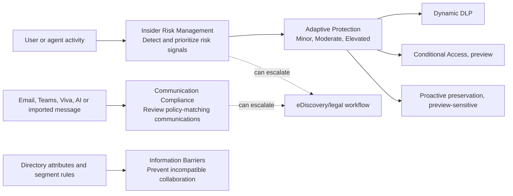

| Solution | Primary purpose | Output | It does not prove |
|---|---|---|---|
| Insider Risk Management (IRM) | Correlate configured signals and score potentially risky activity | Alert, user activity, case, risk insight | Malice, policy breach, or guilt |
| Communication Compliance (CC) | Detect and review communications matching conditions/classifiers | Policy match, alert, tag, notice, remediation | The classifier's label is factually correct |
| Information Barriers (IB) | Prevent incompatible segments from communicating/collaborating | Enforcement decision across supported workloads | Every information-flow risk is blocked |
| Adaptive Protection | Dynamically apply controls according to IRM risk level | Risk level shared to DLP, DLM and CA | That every elevated user should be blocked |

## 2. Privacy by design is an architecture requirement

**Privacy by design** means purpose, necessity, proportionality, minimization, fairness, security, transparency, finite retention, controlled access, auditability, and human accountability are designed before monitoring starts.

| Principle | Design question | Evidence |
|---|---|---|
| Purpose limitation | What approved risk are we addressing? | Program charter and policy basis |
| Necessity | Is monitoring required to meet that purpose? | Alternatives analysis |
| Proportionality | Is the signal/control strength appropriate? | Impact assessment and staged matrix |
| Minimization | Can we use metadata or pseudonyms before content? | Data-flow and access design |
| Fairness | Could role, location, disability, culture, or language skew outcomes? | Bias tests and reviewer calibration |
| Transparency | What notice and policy do people receive where lawful? | Employee notice and policy record |
| Security | Who can view identity, content, exports, and case notes? | RBAC, JIT and access review |
| Retention | How long are alerts, matches, captures and exports required? | Retention schedule |
| Human accountability | Who can confirm, dismiss, notify, escalate, or restrict access? | RACI and decision log |

### 🔍 Plain-English deep-dive: smoke alarm, not courtroom verdict

An Insider Risk alert is like a smoke alarm. It tells a trained person to check context. Burnt toast, a fire drill, a faulty sensor, and a real fire can all trigger an alarm. Automatically punishing the person nearest the alarm is irrational. The analyst validates data quality and behavior; HR, Legal, Ethics, management, or law enforcement acts only under the approved process and authority. Scores and machine-learning output prioritize review; they never replace due process.

## 3. Insider Risk Management architecture

IRM consumes supported Microsoft 365, Microsoft Graph, endpoint, Defender, HR, healthcare, communication, cloud and AI indicators according to configured prerequisites. Policies define who or what is in scope, what triggering event activates scoring, which indicators receive risk scores, the thresholds and windows, and the content/people prioritized.

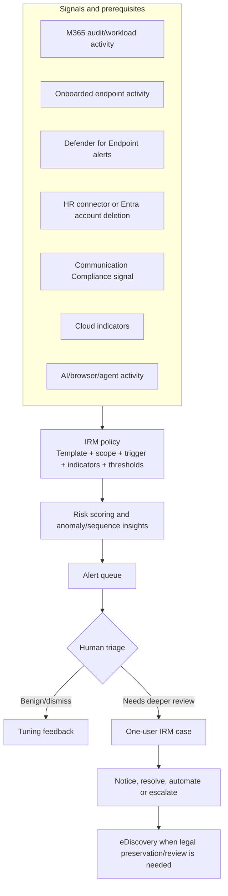

| Architecture layer | Plain meaning | Typical failure |
|---|---|---|
| Prerequisite | Service that supplies required signal | Connector stale, device not onboarded, sharing disabled |
| Trigger | Event that brings a user into policy scoring | Wrong DLP severity, missing HR event, broad manual start |
| Indicator | Activity that can receive a risk score | Indicator not enabled globally or in policy |
| Threshold | Volume/severity boundary affecting score/alert | Too sensitive creates noise; too high creates blind spot |
| Policy window | Period during which activity is scored | Event outside window |
| Alert | Aggregated priority for review | Treated as confirmed violation |
| Case | Deeper review focused on one user | Excessive content access or weak notes |

## 4. Trigger versus indicator

A **triggering event** activates risk scoring for a user under a policy. An **indicator** is an activity the system evaluates and may score after activation. Adding someone to a policy does not necessarily mean all activity is immediately scored; the policy's trigger matters unless an authorized analyst manually starts scoring.

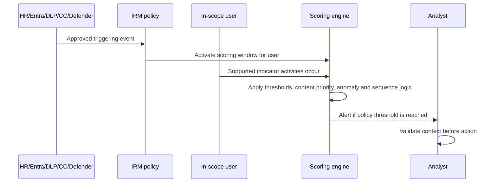

| Example | Trigger | Indicators after trigger |
|---|---|---|
| Departing-user data theft | HR resignation/termination or Entra account deletion | Downloads, sharing, USB, print, personal cloud, cleanup |
| Data leak | High-severity supported DLP alert or selected exfiltration trigger | M365/device/cloud exfiltration and related sequences |
| Risky user | Approved HR stressor and/or dedicated CC signal | Data leak or security activity after trigger |
| Security violation | Defender for Endpoint alert condition | Security and exfiltration activity |
| Risky AI usage | Policy/browser/AI prerequisites and selected activity | AI-site visits, sensitive prompts/responses, risky patterns |

## 5. Templates and prerequisites

Templates provide a starting scoring model, not a decision to deploy. Current 2026 examples include data theft by departing users, data leaks, priority/risky users, security violations, risky AI usage, Risky Agents (preview), risky browser usage (preview), and patient data misuse (preview).

| Template family | Typical prerequisite | Key governance risk |
|---|---|---|
| Departing user | HR connector or Entra account deletion | Treating every departure as suspicious |
| Data leaks | Supported DLP high-severity trigger or selected event | Misaligned DLP and IRM scopes/severity |
| Priority user | Approved priority group | Disproportionate surveillance of status group |
| Risky user | HR and/or dedicated CC signals | Employment stressor becomes prejudicial label |
| Security violation | MDE and Purview integration | Compromised device mistaken for malicious user |
| Risky AI usage | Browser extensions/onboarding/AI signals | Unclear sanctioned versus personal use and content capture |
| Risky Agents | Copilot Studio or Foundry agent signal, preview | Agent identity/owner/action attribution |
| Patient misuse | HR plus healthcare/EHR connector, preview | Highly sensitive health and employee data |

## 6. Indicators, priorities and sequences

Indicators can cover file access, downloads, sharing, email, removable media, printing, cloud activity, security alerts, communication patterns, browser visits, AI prompts/responses, agent actions, and deletion/cleanup. Exact availability depends on licensing, integration, platform, and preview status.

| Risk pattern | Signal sequence | Benign alternative |
|---|---|---|
| Collection to exfiltration | Bulk download -> archive -> external upload | Approved migration or field-work sync |
| Concealment | Rename extension -> copy -> delete | Build/test tooling or file cleanup |
| Departing employee | HR event -> unusual download -> personal cloud | Approved knowledge transfer |
| Account compromise | New sign-in -> mass download -> external share | User travel plus project deadline |
| Risky AI use | Sensitive file access -> prompt -> external AI response | Approved enterprise AI analysis |
| Agent exfiltration | Agent reads priority file -> connector action -> external recipient | Approved workflow integration |

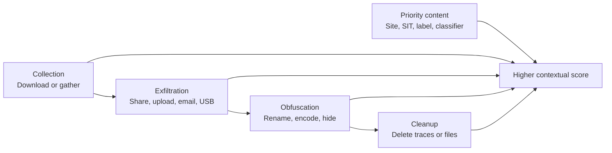

Sequence detection is useful because context emerges from ordered activity, but an excluded low-risk event may still appear in a sequence. Explain that clearly; otherwise reviewers may assume an exclusion is absolute.

## 7. Thresholds, baselines and cumulative exfiltration

Thresholds classify activity volume or severity. Baselines compare a user to their own or peer-group behavior. Current cumulative exfiltration detection can compare activity over a 30-day organizational norm across exfiltration types and uses available peer grouping such as common SharePoint access, organization hierarchy, or job title.

### 🔍 Plain-English deep-dive: “unusual” does not mean “wrong”

If a finance analyst usually downloads five files and downloads 500 during quarter close, the activity is unusual but may be required. If an administrator usually downloads thousands, a single sensitive export to a personal location may be riskier despite a low count. Baselines help focus attention, but changes in role, project, accessibility needs, regional practice, and emergency work can all create legitimate deviations. Review both behavior and business context.

| Threshold design | Too low | Too high | Better control |
|---|---|---|---|
| File count | Alert fatigue | Slow theft missed | Tune by content sensitivity and role |
| External recipients | Normal partners flagged | Small leakage missed | Approved domain/recipient context |
| Sequence count | Routine workflows flagged | Multistep abuse missed | Synthetic sequence tests |
| Peer comparison | Minority roles look anomalous | Broad peers hide risk | Explainable peer criteria and review |
| Alert volume | Queue overload | No learning data | Capacity-based staged tuning |

## 8. Analytics before policies

Insider risk analytics provides aggregate anonymized activity insights without requiring an active insider-risk policy. Use it to estimate signal volume, dependencies, and likely alert load. It is still sensitive processing and requires approved access.

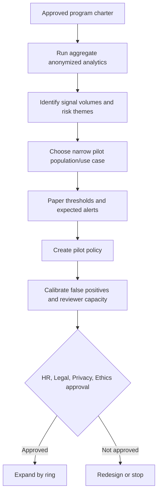

Do not interpret “quick policy” or “recommended action” as automatic approval. A quick policy can select all users and broad indicators. Review every generated setting, notification, privacy impact, license and control dependency.

## 9. Privacy, pseudonymization and identity reveal

IRM pseudonymizes usernames by default. A randomized identifier such as `AnonIS8-988` reduces early-stage identity bias. Pseudonymization is reversible under controlled access; it is not anonymization in the strict irreversible sense.

| Surface | Pseudonymization reality |
|---|---|
| IRM alert/case UI | Usernames can be pseudonymized by default |
| Content/file metadata | Names inside content or metadata may remain visible |
| Policy assignment | Admin may see actual identities when selecting users |
| CSV alert/case export | Current guidance says pseudonymization can be preserved |
| API or eDiscovery escalation | Referential integrity can expose actual usernames |
| Adaptive Protection DLP/CA | Actual usernames can appear outside IRM; CA is not anonymized |
| Triage Agent dashboard | Current guidance warns prioritized alert names may not remain anonymized |

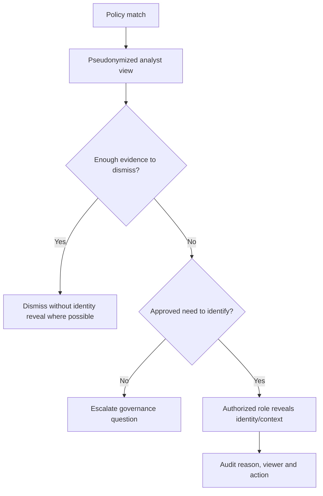

## 10. Alerts, cases and user activity

An alert starts in **Needs review**. A case is created when deeper investigation is justified and focuses on one user, with multiple alerts attachable. Current user-activity views can show timelines, risk events, sequences and content according to role and configuration.

| Stage | Analyst question | Safe outcome |
|---|---|---|
| Alert triage | Is the signal real, in scope and understandable? | Dismiss or open/attach to case |
| Case overview | What approved allegation/risk and timeframe? | Investigation plan and owner |
| User activity | What sequence and context explain behavior? | Factual timeline, alternatives, gaps |
| Content review | Is content access necessary and authorized? | Minimized review or stop |
| Resolution | Benign or confirmed policy violation under program definitions? | Reasoned closure and control feedback |
| Escalation | Is legal preservation/review required? | eDiscovery case under counsel |

Case notes are permanent once saved in current guidance. Write observable facts and decisions, not speculation or labels such as “thief.” A notice to the user does not automatically close the case.

## 11. Response and escalation model

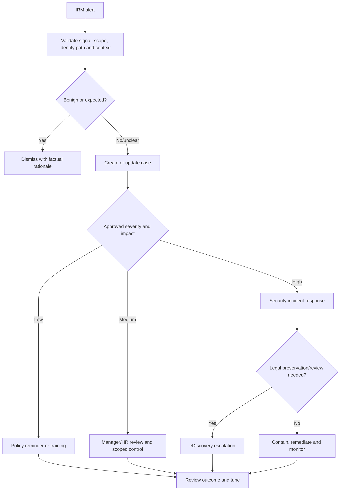

Response options may include notice, training, access review, manager/HR engagement, security containment, eDiscovery escalation, or case closure. The platform does not authorize disciplinary action. Preserve separation between technical risk and employment decisions.

## 12. Communication Compliance architecture

Communication Compliance analyzes scoped messages and AI interactions according to channel, direction, users/adaptive scope, conditions, classifiers, and review percentage. Matching content is copied into a protected review workflow; the original remains governed by its source workload and retention controls.

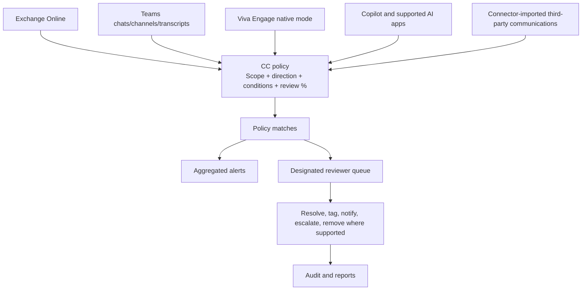

## 13. Channels and coverage boundaries

| Channel | Coverage concept | Important limit/change point |
|---|---|---|
| Exchange Online | Email body, metadata and supported attachments | Attachments/OCR may take longer |
| Teams | Chats, channels, modern attachments and supported transcripts | Scope/direction can include other channel members; shared-channel attachment limits |
| Viva Engage | Private/public messages and attachments | Native Mode required |
| Microsoft 365 Copilot/Chat | User prompts and AI responses | Content and risky-interaction classifiers; licensing applies |
| Other Microsoft/enterprise AI | Connected/collected prompts and responses | Pay-as-you-go may apply outside M365 Copilot |
| Third-party communications | Imported into M365 through connectors | Completeness depends on source/connector cadence |
| User-reported Teams/Viva | User submits message/conversation for review | Reporting does not automatically hide message |

Communication direction matters. **Inbound** to an in-scope channel member can pull messages from otherwise out-of-scope senders into review. Test with actual Teams membership patterns and explain this privacy effect.

## 14. Templates, conditions and classifiers

Current templates include conflict of interest, Microsoft 365 Copilot interactions, inappropriate content/images/text, financial regulatory compliance, sensitive information, custom policies, and user-reported messages.

| Detection method | Good for | Limitation |
|---|---|---|
| Sensitive information type (SIT) | Structured personal/financial/credential patterns | Context and false positives still need review |
| Keyword/phrase | Organization codes or prohibited terms | Easy to evade; context-poor |
| Keyword dictionary | Larger domain vocabulary | Maintenance, language and ambiguity |
| Microsoft trainable classifier | Threat, discrimination, harassment, regulatory concepts | Minimum words, language/model limitations and bias |
| Content Safety classifier | Hate, sexual, violence, self-harm in supported channels | Severity model is not HR/legal judgment |
| Image classifier/OCR | Adult/racy image or text in images | File size/type/latency and context limitations |
| AI classifiers | Prompt Shields, protected material | Detects risk pattern, not exploit success or legal ownership |
| Relationship/conflict | Communications between defined groups | Group quality and exceptions are critical |

### 🔍 Plain-English deep-dive: classifier is a sorting assistant

A classifier is like a mailroom assistant that puts envelopes into “review” trays based on patterns. It can put a complaint in the threat tray, miss coded harassment, or misunderstand reclaimed language and cultural context. A reviewer reads enough context, applies a written standard, and records whether the result is compliant, noncompliant, questionable, or misclassified. Classifier accuracy should be measured by language and use case, not just one tenant-wide percentage.

## 15. Review percentage, sampling and alert aggregation

Communication Compliance can randomly sample a percentage of matching communications for review. A 10% review percentage means 10% of matches are sampled, not that the system is 10% accurate. Use 100% where the obligation requires complete review; use sampling only with documented rationale.

| Setting | Meaning | Risk |
|---|---|---|
| Review percentage | Random share of matching items presented | Nonreviewed matches remain unknown to reviewers |
| Policy match | One communication copy matching conditions | Not the same as an alert |
| Alert threshold | Number of activities in a window before alert | Aggregation can hide individual urgency |
| Email-blast filter | Excludes bulk/newsletter/spam-like senders | Could exclude a relevant message; review report |
| Policy preservation | Duration for copied policy matches | Does not alter source message retention |
| Policy storage | Finite copied-message capacity | Reaching limit can deactivate policy |

Current guidance describes per-policy storage of 100 GB or one million messages, whichever occurs first, and a policy-match preservation default of one year with selectable periods. Verify before design and monitor thresholds; deleting a policy can permanently delete its copied messages and alerts.

## 16. Reviewer workflow and remediation

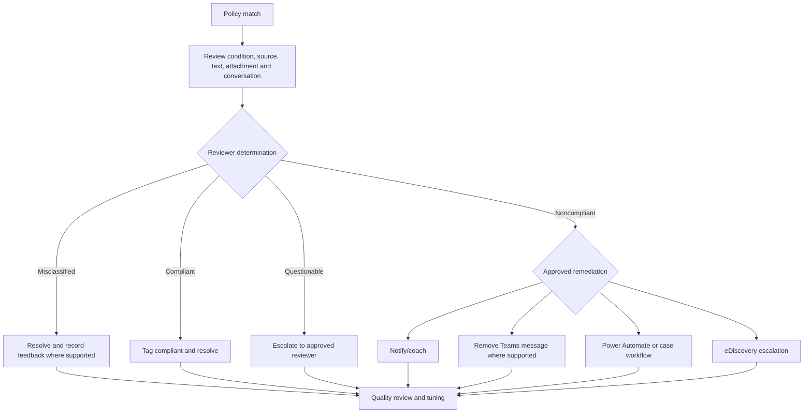

| Remediation | Use | Caution |
|---|---|---|
| Resolve | Close reviewed match | Record reason; cross-policy resolution may be preview/on by default |
| Tag | Compliant, noncompliant, questionable or custom | Define tags consistently; deletion of custom tag affects prior items |
| Notify | Send approved policy reminder | Privacy, tone and due process; can resolve workflow |
| Escalate | Ask another designated reviewer | Reviewer must be policy-authorized |
| Remove Teams message | Hide supported message and show policy notice | Does not erase every preserved/original copy |
| eDiscovery escalation | Formal legal preservation/review | Current modern eDiscovery terminology and case governance |
| Export | Archive/review under approved process | Attachments may require explicit selection; secure transfer |

## 17. Communication privacy, bias and employee relations

| Risk | Example | Mitigation |
|---|---|---|
| Language bias | Classifier performs differently for dialect | Per-language validation and local reviewers |
| Context loss | Joke, quotation or safety discussion flagged | Conversation/context review and calibration |
| Role bias | Customer-support staff send more difficult language | Role-based baseline and policy rationale |
| Retaliation | Reviewer sees complaint against management | Independent escalation and whistleblower controls |
| Conflict | Reviewer knows subject personally | Recusal and reassignment |
| Overcollection | Broad all-user/all-channel/100% policy | Necessity/proportionality and scoped pilot |
| Secondary use | Review content reused for performance scoring | Purpose limitation and governance prohibition |
| Sensitive categories | Health, union, religion or legal discussion exposed | Restricted role, legal basis and minimum access |

## 18. Information Barriers architecture

Information Barriers uses accurate Microsoft Entra/Exchange attributes to assign users to organizational segments, then applies allow or block policies. Enforcement reaches supported communication, people search, membership, site, file and collaboration paths.

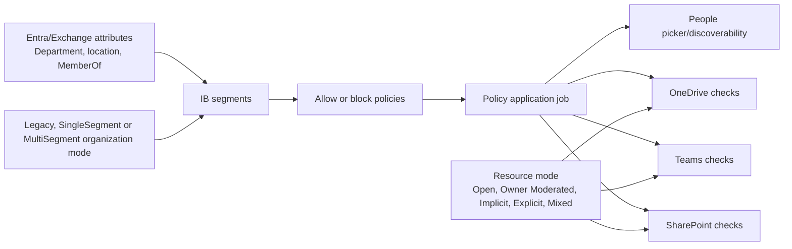

## 19. Segments, allow and block policies

| Concept | Plain meaning | Critical rule |
|---|---|---|
| Segment | Attribute-defined population | Bad directory data creates wrong membership |
| Block policy | Assigned segment cannot communicate with target segments | Model both directions; IB supports two-way restriction outcome |
| Allow policy | Assigned segment communicates only with listed segments | Non-IB visibility differs by organization mode |
| Policy application | Batch that applies all active policies | Defining alone does not enforce |
| Relationship check | Shows whether two users are compatible | Validate expected pairs before rollout |

Current guidance recommends block policies for most scenarios to reduce user-experience inconsistency. One segment should not receive multiple policies. Policy type cannot simply be flipped from Allow to Block; replacement design is required.

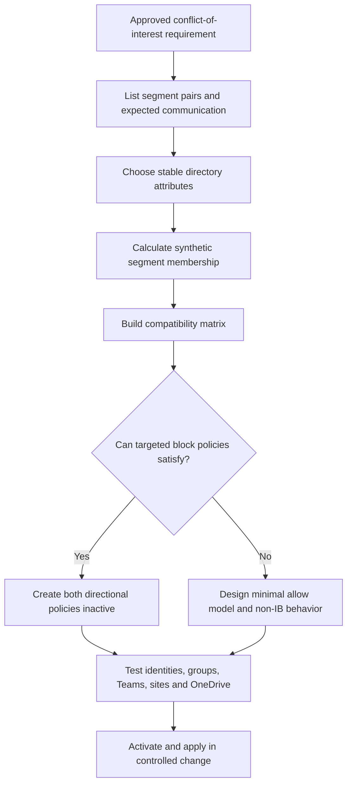

## 20. Organization and resource modes

| Mode | Scope | Meaning/current consideration |
|---|---|---|
| Legacy | Organization | Older one-segment behavior and Exchange ABP dependencies |
| SingleSegment | Organization | Modern mode with one segment per user |
| MultiSegment | Organization | Users can belong to multiple segments; higher segment scale |
| Open | Resource | No associated segment restriction |
| Owner Moderated | Resource | Owner's policy governs compatible additions |
| Implicit | Resource | Members' policies determine compatible membership; Teams default |
| Explicit | Resource | Assigned resource segments govern access/membership |
| Mixed | OneDrive | Associated segments plus unsegmented sharing behavior |

Do not change organization mode or resource mode casually. Inventory current Exchange address book policies, Teams/groups/sites/OneDrives, hidden/guest users, multi-segment requirements, and application dependencies first.

## 21. Teams, SharePoint, OneDrive and Exchange effects

| Workload | IB can affect | Important boundary |
|---|---|---|
| Teams | Search, chat, call, meeting invite, screen/file sharing, team membership | Existing incompatible members may be removed or blocked |
| SharePoint | Site membership, access, sharing and search | Must enable/configure SharePoint IB; site mode matters |
| OneDrive | Access and sharing based on owner/segments/mode | Owner attribute change and Mixed mode require tests |
| Planner | People picker and subsequent supported sharing/assignment | Existing plans/tasks may remain accessible |
| Exchange | Address-book visibility depending on organization mode | IB does not block email delivery; use mail-flow rules for that requirement |

### 🔍 Plain-English deep-dive: address book wall is not an email firewall

Information Barriers can prevent people from finding, chatting, calling, joining Teams, or sharing supported files. In Exchange Online it affects visibility through address-book behavior, but current Microsoft guidance explicitly says IB cannot restrict email communication. If a regulation requires blocking messages between groups, design Exchange mail-flow rules and test them separately. Never tell a client “IB blocks all communication.”

## 22. Adaptive Protection architecture

Adaptive Protection derives **Minor**, **Moderate**, and **Elevated** insider risk levels from chosen IRM policy alerts or activity conditions. These levels are distinct from IRM alert severity (Low/Medium/High). Preventive controls consume the risk level.

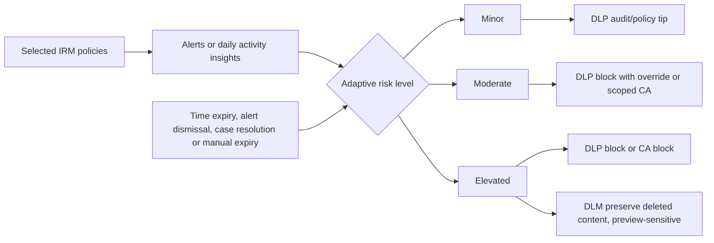

| Concept | Meaning |
|---|---|
| Risk-level basis | Generated/confirmed alerts or specific user activity conditions |
| Past activity detection | Lookback for activity-based conditions; current selectable range 5-30 days |
| Risk-level timeframe | How long assignment remains; current selectable range 5-30 days |
| Automatic expiration | Can reset when associated alert dismissed/case resolved |
| Multiple policies | Highest applicable level can govern |
| Manual expire | Removes level, not underlying alerts/cases; level can return on new trigger |

## 23. Adaptive Protection with DLP

Current guidance supports Adaptive Protection conditions in DLP for Exchange, Teams, and Devices. A rule combines content/activity conditions with the user's dynamic insider risk level.

| Risk level | Example control | User impact | Required validation |
|---|---|---|---|
| None | Baseline DLP | Normal policy | Baseline still protects sensitive content |
| Minor | Audit or policy tip | Education | Tip comprehension and false-positive rate |
| Moderate | Warn/block with override | Friction plus justification | Legitimate workflow and manager/SOC process |
| Elevated | Block selected exfiltration | Strong restriction | Emergency exception, identity accuracy and rollback |

Adaptive risk should refine DLP, not replace content classification. Blocking all data from all elevated users can prevent business-critical work and create discriminatory effects. Pair risk level with sensitive content, destination and activity.

## 24. Adaptive Protection with Conditional Access

The Conditional Access **Insider risk** condition is preview in current Microsoft guidance. It can target Minor, Moderate, or Elevated levels and apply grant controls such as block. Quick setup currently creates a report-only policy for elevated users and Office 365 apps, but every generated exclusion, target and control must be reviewed.

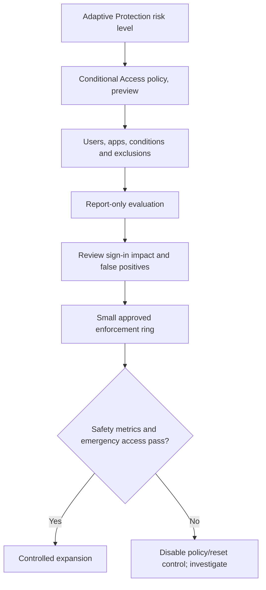

Never combine broad insider-risk scope, all cloud apps, block control, and immediate On state. Exclude emergency-access accounts appropriately, protect service/workload identities, confirm guest behavior, test report-only results, and define a rapid disable owner.

## 25. Quick setup versus custom setup

| Dimension | Quick setup | Custom setup |
|---|---|---|
| Speed | Creates broad defaults | Deliberate multi-team design |
| IRM | Data-leaks policy for broad scope | Existing/new template and tuned scope |
| DLP | Generated endpoint and Teams/Exchange policies in test mode | Custom conditions/actions/locations |
| Conditional Access | Generated report-only elevated-risk block policy | Custom apps, levels, exclusions and grants |
| DLM | Generated preservation behavior depending on opt-in/current flow | Explicit approval and retention design |
| Best use | Structured evaluation in test tenant after review | Production candidate design |
| Risk | “One click” hides a large configuration blast radius | More design effort and dependencies |

Current Learn says quick setup can take up to 72 hours and should not be disabled mid-setup. Custom setup can take time before levels/actions apply. Treat these as change-sensitive service-processing windows, not SLAs.

## 26. Governance and operating model

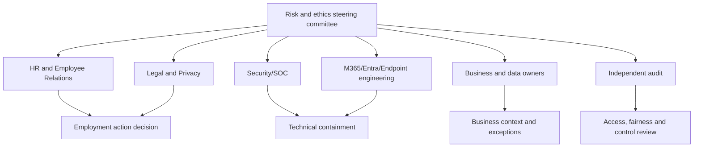

| Decision | Accountable owner | Consulted roles |
|---|---|---|
| Program purpose and legal basis | Legal/Privacy/Executive risk | HR, Ethics, Security, works council/union |
| Signal and policy design | Risk steering committee | Technical owners and Employee Relations |
| Technical policy deployment | M365/Entra engineering | Security, Legal, Privacy, change management |
| Alert triage | Trained risk analyst | Security/workload owner as needed |
| Identity reveal/content access | Authorized investigator | Privacy/Legal according to protocol |
| Employment response | HR/Employee Relations | Legal, management, ethics |
| Security containment | Incident commander/SOC | HR/Legal when insider context applies |
| eDiscovery escalation | Counsel | IRM/CC investigator and evidence custodian |

## 27. Licensing, permissions and prerequisites

| Area | Verify-current requirement |
|---|---|
| IRM | Subscription, user/agent eligibility, region, role groups and template prerequisite |
| CC | Subscription, in-scope users, reviewer mailboxes/roles, channel support and preservation |
| IB | Subscription, Purview/PowerShell roles, directory attributes, audit and organization mode |
| Adaptive Protection | IRM plus each consuming DLP/DLM/Entra entitlement and role |
| Endpoints/browser | Device onboarding, browser support/extensions and platform versions |
| HR/health/third-party | Connector configuration, data quality, owner, cadence and privacy authority |
| Defender | MDE subscription and signal-sharing setting |
| AI | Copilot/agent/AI coverage, pay-as-you-go where applicable and preview terms |

Use purpose-built roles such as IRM Admins/Analysts/Investigators and Communication Compliance Admins/Analysts/Investigators. Global Administrator is not a normal investigator role. Review case contributors, policy reviewers, exports and service principals regularly.

## 28. Security design

1. Separate policy administration, triage, investigation, identity reveal, content review, employment action, export and audit.
2. Use JIT/time-bound access and case-specific contributors where supported.
3. Protect HR connector files, healthcare data, employee communications and exports as restricted evidence.
4. Monitor role changes, policy edits, exports, identity reveal, message removal, case escalation and automation.
5. Prevent the investigated administrator from controlling their own evidence path.
6. Validate Power Automate/ServiceNow/Teams integrations for data leakage and overbroad access.
7. Keep emergency disable paths for DLP/CA without deleting evidence.
8. Treat agent identities and actions as privileged nonhuman entities with owners and lifecycle.

## 29. Design and deployment workflow

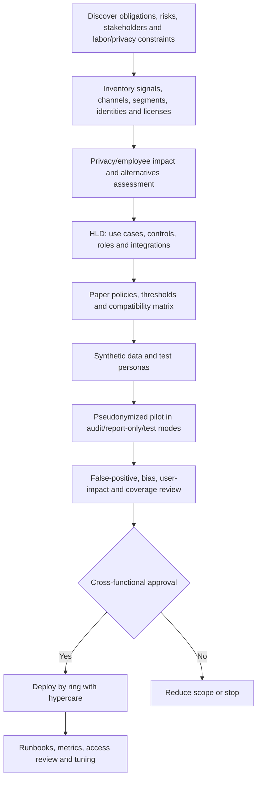

## 30. Testing strategy

| Test | Expected result | Safety control |
|---|---|---|
| IRM trigger positive | Synthetic persona enters scoring after approved trigger | Fictional data only |
| IRM no-trigger negative | In-scope persona not scored without trigger | Confirms trigger semantics |
| Threshold boundary | Just-below and just-above counts differ as designed | Document aggregation |
| Pseudonymization | Analyst sees pseudonym until authorized reveal | Audit reveal workflow |
| CC classifier positive | Synthetic text matches expected classifier | No real abusive content needed; use benign marker where possible |
| CC false-positive | Ambiguous synthetic phrase is correctly triaged | Reviewer calibration |
| IB relationship | Allowed and blocked persona pairs match matrix | Test both directions |
| IB workload | Chat, team membership, SharePoint and OneDrive behave as planned | Test tenant only |
| Adaptive DLP | Risk level changes policy result in test mode | No production block |
| Adaptive CA | Report-only logs expected impact | Emergency accounts protected |
| Reset | Dismiss/resolve/expire behavior updates level as expected | Monitor service latency |
| Audit | Every configuration/review/export action appears where expected | Independent reviewer |

## 31. Rollback and irreversible-change matrix

| Change | Rollback reality | Gate |
|---|---|---|
| Create IRM/CC policy | Pause/disable or delete; deletion can remove associated data and be irreversible | Export/retention impact review |
| Start manual scoring | Stop assignment, but collected insights/history may remain by policy | Written reason and expiry |
| Reveal identity/content | Cannot make reviewer “unsee” it | Authorized need and audit |
| Remove Teams message | Can affect user communication; preserved copies may remain | Reviewer protocol |
| IB apply | Stop/edit/reapply takes processing time; collaboration can be disrupted | Compatibility tests and change window |
| IB mode change | Broad architectural change | Microsoft guidance, pilot and executive approval |
| Adaptive DLP enforce | Disable policy/rule; prior blocks remain business events | Test mode and rollback owner |
| Adaptive CA enforce | Turn off policy; active sessions/token behavior may vary | Report-only, pilot, emergency access |
| Disable Adaptive Protection | Levels reset and sharing stops after processing; generated policies remain | Dependency inventory |
| eDiscovery escalation | Legal case/hold cannot be casually undone | Counsel approval |

## 32. Operations and metrics

| Metric | Purpose | Fairness/quality caution |
|---|---|---|
| Alerts per 1,000 in-scope users | Normalize volume | Segment composition differs |
| Confirmed-to-dismissed ratio | Tuning signal | “Confirmed” depends on policy definitions |
| Median triage age | Queue health | Speed must not reduce due process |
| Case age and stale cases | Privacy/operational risk | Complex cases legitimately take longer |
| Identity reveals/content views | Minimize sensitive access | Require reason, not quota |
| False-positive rate by policy/language/role | Bias and quality | Use sufficient samples and context |
| CC pending backlog | Reviewer capacity | Storage limit and employee impact |
| IB failed application/users | Enforcement health | Include directory-data causes |
| Adaptive users by level/duration | Dynamic-control impact | Watch persistent or disproportionate assignment |
| DLP overrides and CA denials | Productivity and control effect | Review justified business workflows |
| Notice/training recurrence | Behavioral improvement | Do not use as automatic discipline score |
| Audit/access-review exceptions | Governance health | Independent ownership |

Executive reporting should show coverage, confidence, privacy controls, false-positive trends, employee impact, material incidents, remediation, overdue decisions, and residual risk. Never publish a leaderboard of “risky employees.”

## 33. Common failures

| Symptom | Likely cause | First discriminating check |
|---|---|---|
| IRM policy healthy but no alerts | No trigger, indicators/thresholds, narrow scope or latency | Policy health plus synthetic trigger |
| HR-based policy stale | Connector has not uploaded/current schema issue | Last successful connector import |
| DLP trigger absent | Not High severity, unsupported workload or scope mismatch | Compare DLP and IRM user/rule scopes |
| Device activity absent | Device not onboarded, indicator/collection policy conflict | Device status and effective collection policy |
| Username unexpectedly visible | Export/CA/DLP/Triage Agent/content metadata path | Identify exact surface and privacy design |
| CC no policy matches | Wrong channel/direction/user scope, latency, word/language limit | Synthetic supported message and last scan |
| CC policy deactivated | Storage/message limit reached | Policy health and scoped mailbox usage |
| IB relationship wrong | Attribute stale, overlapping segment, wrong mode/policy direction | User attributes and relationship cmdlet |
| Teams blocked but email works | Expected IB boundary | Validate Exchange mail-flow requirement |
| Adaptive control not applying | Level, consuming policy condition, permissions, setup delay | User's Adaptive Protection summary and policy state |
| CA causes broad denial | All users/apps block, bad exclusions, level too broad | Disable policy and inspect report-only/impact evidence |

## 34. Layered troubleshooting

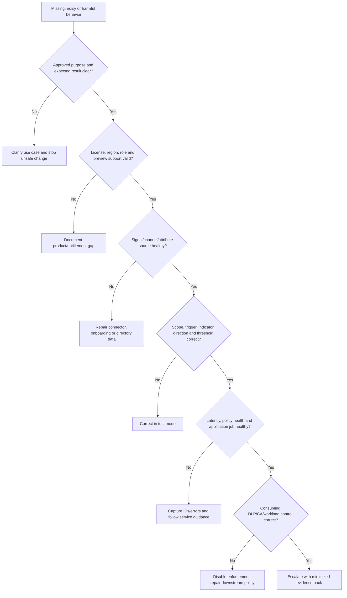

An escalation pack includes redacted tenant/region, policy/alert/case/application IDs, UTC timestamps, source health, exact scope/trigger/indicator/threshold, directory attributes, effective roles/licenses, expected versus actual, synthetic reproduction, privacy/business impact, service health, screenshots with content minimized, and safe rollback already taken.

## 35. Consulting scenarios

### Scenario A: departing employee and unusual downloads

An approved HR termination signal activates a departing-user policy. The user downloads many files, but the manager confirms a documented transition task. The analyst records the legitimate explanation, checks external destinations and priority content, dismisses or resolves according to protocol, and tunes no global threshold from one case. No disciplinary language is used.

### Scenario B: suspected harassment in Teams

A CC classifier flags synthetic-like phrases. The reviewer checks conversation context, language and pattern, applies the review standard, and escalates only to authorized Employee Relations reviewers. If immediate safety concerns exist, follow crisis policy; if legal preservation is required, counsel authorizes eDiscovery. Do not forward screenshots through ordinary chat.

### Scenario C: investment banking conflict wall

Legal defines two incompatible groups. Engineering validates stable directory attributes, creates both directional block policies inactive, calculates segment membership, tests user pairs, Teams, SharePoint and OneDrive, then applies during a controlled window. Exchange mail-flow rules are separately designed because IB does not block email delivery.

### Scenario D: dynamic protection for sensitive file exfiltration

IRM assigns an elevated risk level after approved high-severity conditions. DLP in test mode shows that a block-with-override would prevent legitimate support uploads as well as risky destinations. The design adds sensitive content and destination conditions, documents an exception workflow, pilots with test users, then considers enforcement. Conditional Access remains report-only until preview risk and business continuity are accepted.

### Scenario E: risky agent activity

A preview Risky Agents policy reports an agent accessing a priority SharePoint file and using a connector. Investigators identify the agent, owner, version, trigger, identity, permissions and tool call; disable the connector or agent through the owning platform if approved; preserve audit evidence; and avoid attributing the action to the owner without proving the execution path.

## 36. Consulting artifacts

| Artifact | Minimum content |
|---|---|
| Program charter | Purpose, legal basis, principles, in/out of scope and oversight |
| Signal register | Source, trigger, indicator, owner, latency, retention, bias and gap |
| Policy catalogue | Template, scope, thresholds, windows, priority content and state |
| Privacy/employee impact assessment | Necessity, proportionality, alternatives, rights and safeguards |
| Fairness test plan | Languages, roles, regions, shifts, disability/accessibility and samples |
| Reviewer protocol | Identity reveal, content access, tags, notes, recusal and escalation |
| IB segment model | Attribute, owner, expected members, exceptions and data quality |
| Compatibility matrix | Every segment pair and allowed/blocked result |
| Adaptive control matrix | Risk level to DLP/DLM/CA control, impact, exception and reset |
| Deployment/test plan | Personas, synthetic events, modes, rings, gates and rollback |
| Operations runbook | Queue, SLAs, policy health, access review, audit and support |
| Executive dashboard | Coverage, quality, impact, privacy, incidents and residual risk |

## 37. Safe paper lab and evidence exercise

### Scenario and safety boundary

Fictional company Northwind Capital needs to design three controls: detect unusual exfiltration for a departing fictional user, review synthetic regulatory-collusion phrases in a test communication stream, and prevent fictional Research and Trading segments from collaborating in Teams/SharePoint. It also wants to evaluate Adaptive Protection without enforcing anything. This is a **paper-only** lab. Do not create policies, connect HR data, onboard devices, inspect communications, identify a real user, assign a risk level, apply Information Barriers, enable Adaptive Protection, or change DLP/Conditional Access.

### Fictional personas and assets

| Persona/asset | Synthetic role | Expected treatment |
|---|---|---|
| `Taylor.Test` | Departing Research user | HR trigger on paper; pseudonymized analyst view |
| `Morgan.Test` | Trading user | No IRM trigger |
| `Riley.Reviewer` | CC reviewer | Review only synthetic messages |
| `Casey.Admin` | Policy admin | Cannot review content by default |
| `Research-Test` | IB segment | Block Trading both directions |
| `Trading-Test` | IB segment | Block Research both directions |
| `Project-Ice-Test` | Priority fictional site | No real content or URL |

### Paper designs

1. **IRM:** Departing-user template, fictional HR event, priority site, collection/exfiltration/cleanup indicators, moderate alert thresholds, pseudonymization on, trained analyst queue.
2. **CC:** Financial-regulatory template, fictional phrases, 100% of a tiny synthetic dataset, two reviewers, recusal path, one-year paper preservation assumption marked verify-current.
3. **IB:** Stable fictional `DepartmentCode`, two directional block policies, inactive until pair and workload testing passes.
4. **Adaptive Protection:** Minor = educate in DLP test; Moderate = warn in test; Elevated = block simulation only; CA report-only; DLM not enabled.

### Synthetic test matrix

| Test | Expected paper result | Ethical/safety check |
|---|---|---|
| HR event + approved transition download | Alert possible, then benign context documented | No presumption from departure |
| No trigger + same download | Not scored under trigger-dependent policy | Confirms scope semantics |
| Synthetic collusion phrase in context | Policy match reviewed | Classifier is not verdict |
| Dialect/quotation false positive | Misclassified and calibration recorded | Fairness by language/context |
| Research starts Trading chat | Block expected after applied policy | Test both directions |
| Research emails Trading | IB alone does not block | Separate mail-flow requirement |
| Elevated fictional level | DLP/CA impact shown only in simulation/report-only | No real denial |
| Identity reveal request | Requires approved role/reason | Audit and minimization |
| Case needs legal preservation | Counsel-directed eDiscovery design | No hold created |
| Agent tool action | Attribute to agent identity/version/tool first | Do not blame owner automatically |

### Evidence portfolio

- Four-solution architecture and data flow.
- Signal/trigger/indicator register.
- Policy, threshold and reviewer protocol.
- Pseudonymization and identity-reveal flow.
- IB segment/compatibility/workload matrix.
- Adaptive DLP/CA report-only impact matrix.
- Fairness test, RACI, metrics and troubleshooting tree.
- Candidate honesty statement.

### Cleanup

Nothing was configured or monitored. Delete accidental real employee, HR, legal, union, health, client, tenant, domain, communication, policy, alert or screenshot data. Retain only explicitly fictional paper artifacts.

### Interview wording

> “I designed a paper-only privacy-by-design control model for IRM, Communication Compliance, Information Barriers and Adaptive Protection. It covered triggers versus indicators, pseudonymized triage, human review, fairness tests, bidirectional segment policies, Teams/SPO/OneDrive boundaries, DLP simulation and Conditional Access report-only. I did not monitor a real employee or configure these solutions in production. My direct M365 incident, RCA, content, permissions and stakeholder experience is the operational foundation I would bring to a governed pilot.”

## 38. JD Mapping: interview translation

| Interview theme | Factual answer direction |
|---|---|
| Insider architecture | Signals -> policy trigger/indicators -> score -> alert -> case -> action |
| Privacy | Pseudonyms, least privilege, content minimization, audit and human decision |
| Communication review | Channel/scope/direction/conditions/sample -> match -> review -> remediate |
| IB | Accurate attributes -> segments -> two-way policies -> application -> workload modes |
| Adaptive Protection | IRM insight -> Minor/Moderate/Elevated -> DLP/DLM/CA control |
| Bias/false positives | Test by role/language/context; never treat score/classifier as verdict |
| Troubleshooting | License/role -> signal/attribute -> policy -> processing -> downstream control |
| Experience honesty | Production incident/RCA foundation plus design/paper lab only |

## Official Source Anchors

| Topic | Official Microsoft source |
|---|---|
| Insider Risk overview | [Learn about Insider Risk Management](https://learn.microsoft.com/en-us/purview/insider-risk-management) |
| IRM policies, thresholds and health | [Create and manage Insider Risk Management policies](https://learn.microsoft.com/en-us/purview/insider-risk-management-policies) |
| Policy templates and prerequisites | [Learn about Insider Risk Management policy templates](https://learn.microsoft.com/en-us/purview/insider-risk-management-policy-templates) |
| IRM cases and actions | [Take action on Insider Risk Management cases](https://learn.microsoft.com/en-us/purview/insider-risk-management-cases) |
| Username privacy | [Manage username privacy in Insider Risk Management](https://learn.microsoft.com/en-us/purview/insider-risk-management-settings-privacy) |
| IRM permissions | [Insider Risk Management permissions](https://learn.microsoft.com/en-us/purview/insider-risk-management-permissions) |
| Adaptive Protection | [Help dynamically mitigate risks with Adaptive Protection](https://learn.microsoft.com/en-us/purview/insider-risk-management-adaptive-protection) |
| Entra insider-risk CA policy | [Common Conditional Access policy: insider risk](https://learn.microsoft.com/en-us/entra/identity/conditional-access/how-to-policy-insider-risk) |
| Communication Compliance overview | [Learn about Communication Compliance](https://learn.microsoft.com/en-us/purview/communication-compliance) |
| CC policies and classifiers | [Manage Communication Compliance policies](https://learn.microsoft.com/en-us/purview/communication-compliance-policies) |
| CC channels | [Detect channel signals with Communication Compliance](https://learn.microsoft.com/en-us/purview/communication-compliance-channels) |
| CC investigation/remediation | [Investigate and remediate Communication Compliance alerts](https://learn.microsoft.com/en-us/purview/communication-compliance-investigate-remediate) |
| CC reports and audit | [Use Communication Compliance reports and audits](https://learn.microsoft.com/en-us/purview/communication-compliance-reports-audits) |
| Information Barriers overview | [Learn about Information Barriers](https://learn.microsoft.com/en-us/purview/information-barriers) |
| Information Barriers deployment | [Get started with Information Barriers](https://learn.microsoft.com/en-us/purview/information-barriers-policies) |
| IB multi-segment and organization modes | [Use multi-segment support in Information Barriers](https://learn.microsoft.com/en-us/purview/information-barriers-multi-segment) |
| IB in Teams | [Information Barriers in Microsoft Teams](https://learn.microsoft.com/en-us/microsoftteams/information-barriers-in-teams) |
| IB in SharePoint | [Information Barriers in SharePoint](https://learn.microsoft.com/en-us/sharepoint/information-barriers) |
| Product licensing | [Microsoft Purview service description](https://learn.microsoft.com/en-us/office365/servicedescriptions/microsoft-365-service-descriptions/microsoft-365-tenantlevel-services-licensing-guidance/microsoft-purview-service-description) |

---

## ⭐ Likely Interview Questions for This Section

### Q1. What is the difference between a trigger and an indicator in Insider Risk Management?

**Model answer:** “A trigger brings an in-scope user into the policy's risk-scoring window, such as an approved HR departure event, high-severity supported DLP alert, Defender alert, or selected exfiltration event. Indicators are activities scored after activation, such as downloads, external sharing, USB or deletion. A user can be assigned to a policy but not scored until its trigger occurs, unless authorized manual scoring is used.”

### Q2. How do you stop an insider-risk program becoming employee surveillance?

**Model answer:** “I require an approved purpose, necessity and proportionality assessment, pseudonymization by default, metadata before content, least-privilege role separation, identity-reveal gates, human review, bias testing by role/language/context, finite retention, employee-relations and legal oversight, audited access and clear prohibited secondary uses. An alert prioritizes review; it never proves intent or authorizes discipline.”

### Q3. How does Communication Compliance differ from Insider Risk Management?

**Model answer:** “Communication Compliance evaluates scoped communications against channel, direction, condition, classifier and sampling rules, then gives designated reviewers a message-level remediation workflow. Insider Risk correlates broader user or agent signals over time into risk alerts and cases. CC signals can feed IRM, and both can escalate to eDiscovery, but neither classifier nor risk score is a verdict.”

### Q4. How would you design Information Barriers between two departments?

**Model answer:** “First Legal defines the two-way restriction. I validate stable directory attributes and the tenant's Legacy/SingleSegment/MultiSegment mode, create both directional block policies inactive, ensure one policy per segment, calculate membership, build a pairwise compatibility matrix, then test people search, Teams, SharePoint and OneDrive before applying all active policies. I separately design mail-flow rules if email must be blocked because IB does not block email delivery.”

### Q5. What is Adaptive Protection?

**Model answer:** “It maps configured IRM alerts or activity insights to Minor, Moderate or Elevated insider risk levels and shares those levels with preventive controls. DLP can educate, warn, override or block in Exchange, Teams and Devices; Data Lifecycle can proactively preserve deletion by elevated-risk users; and Conditional Access can use the insider-risk condition, currently preview. I test DLP and CA in simulation/report-only before enforcement.”

### Q6. What are the largest false-positive and bias risks?

**Model answer:** “Role volume, new projects, migration, travel, language/dialect, quotations, accessibility workflows, shift work, small peer groups, compromised accounts and weak directory/HR data can all skew results. I test by cohort and language, calibrate reviewers, preserve alternative explanations, monitor outcomes and impacts, and never optimize for confirmed cases.”

### Q7. How would you troubleshoot an Adaptive Protection block that seems wrong?

**Model answer:** “I first protect business continuity by disabling the narrow enforcement policy if impact is severe. Then I verify the user's current risk level and reset date, source IRM policy, trigger, indicators and alert/case state; the consuming DLP or Conditional Access condition, scope, exclusions and mode; service latency; licenses/roles; and audit history. I correct in test/report-only and document the privacy and employee impact.”

### Q8. What is your honest experience with these Purview solutions?

**Model answer:** “My direct production experience is Microsoft 365 incident ownership, SharePoint/OneDrive behavior, RCA, evidence documentation, validation and stakeholder coordination. I have built a current privacy-by-design architecture and paper exercise for IRM, Communication Compliance, Information Barriers and Adaptive Protection, but I do not claim production monitoring, scoring, communication review, IB or risk-based blocking. I would implement only through a governed licensed pilot.”

## 🧠 30-Second Memory Hooks

- **Alert is a smoke alarm, not a verdict.**
- **Trigger starts scoring; indicator contributes risk.**
- **Unusual is not automatically wrong.**
- **Pseudonym first; identity only with approved need.**
- **One IRM case focuses on one user.**
- **CC reviews messages; IRM correlates broader behavior.**
- **Policy match is not the same as an aggregated alert.**
- **Classifier sorts for review; human applies the standard.**
- **IB needs accurate attributes and both directions.**
- **IB blocks supported collaboration, not Exchange email delivery.**
- **Organization mode and resource mode both matter.**
- **Adaptive level is not alert severity.**
- **DLP supports dynamic risk; CA integration is preview-sensitive.**
- **One-click means inspect every generated policy.**
- **Measure fairness and productivity, not just catches.**
- **HR/Legal decide people action; engineers explain technical facts.**

## Completion Checklist

- [ ] I can distinguish IRM, CC, IB and Adaptive Protection.
- [ ] I can explain privacy-by-design and why an alert is not proof.
- [ ] I can draw IRM signals, policy, score, alert, case and action architecture.
- [ ] I can distinguish triggering events, indicators, thresholds and windows.
- [ ] I can compare key templates and their prerequisites.
- [ ] I can explain sequence detection, baselines and cumulative exfiltration cautiously.
- [ ] I can use analytics to plan a narrow pilot.
- [ ] I can explain pseudonymization limits and identity-reveal governance.
- [ ] I can triage alerts and cases without speculative notes.
- [ ] I can design an HR/Legal/Security/eDiscovery escalation path.
- [ ] I can map Communication Compliance channels and latency/limits.
- [ ] I can compare SITs, keywords, trainable, image, Content Safety and AI classifiers.
- [ ] I can explain review percentages, matches, alerts, preservation and storage.
- [ ] I can design reviewer, tag, notice, removal and escalation workflows.
- [ ] I can test classifier fairness by language, role and context.
- [ ] I can build IB segments and bidirectional block policies.
- [ ] I can compare Legacy, SingleSegment, MultiSegment and resource modes.
- [ ] I can explain Teams, SharePoint, OneDrive, Planner and Exchange boundaries.
- [ ] I can explain Adaptive Protection levels, lookback, timeframe and reset.
- [ ] I can design Adaptive DLP and CA in test/report-only modes.
- [ ] I can compare quick and custom setup and identify generated-policy risk.
- [ ] I can plan licensing, security, deployment, rollback, operations and metrics.
- [ ] I can troubleshoot source, policy, processing and downstream-control layers.
- [ ] I can produce the consulting artifacts and safe paper exercise honestly.
- [ ] I can answer Q1-Q8 aloud without reading.

*Next suggested section:* [Part 32](Part-32-purview-compliance-manager-privacy-audit-readiness.md) — translate obligations into owned, tested controls and evidence without confusing a compliance score, certification, technical setting, or template with legal compliance.