# Part 32 — Compliance Manager, Regulatory Mapping, Privacy, and Audit Readiness

> **Section goal:** Translate obligations into owned, implemented, tested, evidenced, and reviewable controls without claiming that a Microsoft score or template proves compliance. By the end, you should be able to explain governance, risk, and compliance (GRC); distinguish laws, regulations, contracts, standards, frameworks, policies and certifications; use the shared-responsibility model; design Compliance Manager assessments, controls, improvement actions, owners, implementation, testing, evidence and scoring; map ISO 27001, NIST CSF, CIS and GDPR concepts; apply privacy principles, data lifecycle, data minimization, data-subject-request and DPIA concepts; prepare audit evidence, samples, exceptions, remediation, risk acceptance, assurance and executive reports; and troubleshoot readiness gaps.

This Part maps directly to Deloitte's Microsoft 365 security assessment, Microsoft Purview, control design, regulatory mapping, health check, audit readiness, documentation, stakeholder reporting, roadmap, testing, remediation, and operational-readiness expectations. Arti's direct production strengths in incident ownership, RCA, evidence capture, SharePoint Online and OneDrive behavior, validation, KPI reporting, customer/business reviews, documentation, and cross-functional stakeholder management are a strong foundation for evidence discipline and corrective-action tracking. This chapter does **not** claim that Arti has administered Compliance Manager, led a regulatory audit, performed legal interpretation, signed a risk acceptance, acted as a privacy officer, or certified a client environment. [Part 33](Part-33-purview-dspm-ai-data-security.md) follows with Data Security Posture Management and secure AI adoption.

> **Currency, licensing, legal, privacy, preview, and change-sensitive note:** This chapter was checked against official Microsoft Learn available on **August 24, 2026**. Use `https://purview.microsoft.com`. Compliance Manager currently supports a Data Protection Baseline, hundreds of regulatory templates, multicloud services, connectors, AI regulation templates, automated signals, and assessment-level access. Available templates and features depend on licensing. Predeployment compliance, custom assessments, some Priva signals, automated AI-app/agent assessment behavior, and connector capabilities can be preview or rollout-sensitive. Template mappings, points, automation sources, test logic, product names, in-scope services, regulations, and laws change. Microsoft explicitly states that Compliance Manager recommendations and scores are not guarantees of compliance. Verify current laws and versions, authoritative standards, contracts, regulator guidance, Product Terms, Data Protection Addendum, Service Trust Portal evidence, Microsoft Purview service descriptions, tenant settings, preview terms, and auditor expectations. Engage qualified Legal, Privacy, Risk and Audit professionals. This guide is not legal advice, an audit opinion, certification, or regulator assurance.

## JD Mapping

| Deloitte role expectation | Capability developed here | Consulting evidence |
|---|---|---|
| Perform M365 security/compliance assessments | Scope, control mapping, evidence, testing and maturity analysis | Assessment workbook, evidence register and findings report |
| Design target controls and roadmaps | Objective-to-control-to-action traceability and remediation planning | Control matrix, prioritized roadmap and business case |
| Explain Microsoft shared responsibility | Microsoft, customer and shared control ownership | Responsibility matrix and assurance dependency map |
| Support audit and regulatory readiness | Sampling, evidence quality, exceptions, auditor interaction and closure | Audit request tracker, walkthrough pack and remediation log |
| Protect privacy and sensitive data | Purpose, minimization, lifecycle, DSR and DPIA concepts | Privacy data-flow map, DSR runbook and DPIA screening record |
| Communicate with executives and stakeholders | Risk, score limitations, decision asks, residual risk and trends | Executive dashboard, steering paper and risk-acceptance record |

## Candidate honesty note

Arti can speak directly about production incident/RCA evidence, technical validation, SharePoint and OneDrive behavior, compliance-aligned support guidance, stakeholder updates, durable documentation, KPIs, business reviews, mentoring, and coordination with product groups or vendors where supported by her background. Those are valuable audit-readiness skills: evidence must be dated, reproducible, scoped, understandable, and tied to an accountable owner and corrective action.

She should not say that she interpreted law, certified compliance, owned a production Compliance Manager program, signed an audit opinion, approved a DPIA, or accepted residual risk unless separately evidenced and authorized. Safe wording is:

> “My direct production foundation is Microsoft 365 incident and RCA evidence, validation, SharePoint and OneDrive behavior, documentation, KPI reporting, stakeholder management, and compliance-aligned technical guidance. I have built a current Compliance Manager and audit-readiness design plus a fictional paper assessment. I have not acted as legal counsel, external auditor, privacy officer, risk-acceptance authority, or production Compliance Manager owner. I would work with control owners, Legal, Privacy, Risk, Internal Audit and the external assessor, state assumptions and score limitations, and validate every control with current authoritative criteria and evidence.”

---

## 1. GRC from zero

**Governance, risk, and compliance (GRC)** is the coordinated way an organization decides what must be protected, understands uncertainty, chooses controls, assigns accountability, and demonstrates that requirements are met.

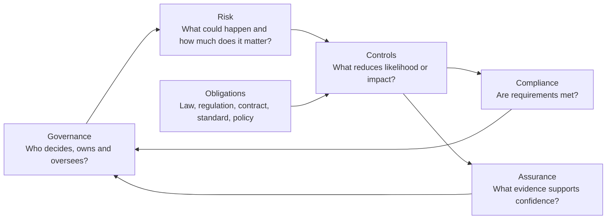

| Term | Plain meaning | Why it matters | Memory hook |
|---|---|---|---|
| Governance | Decision rights, accountability and oversight | Prevents ownerless controls and hidden exceptions | Governance says who decides |
| Risk | Effect of uncertainty on objectives | Prioritizes effort and residual exposure | Risk is uncertainty with impact |
| Control | Measure that changes risk or supports an objective | Converts intent into action | Control changes behavior or evidence |
| Compliance | Conformance with applicable requirements | Requirements can be legal, contractual or internal | Comply with something specific |
| Assurance | Confidence supported by independent or objective evidence | A claim needs reliable support | Assurance asks “how do you know?” |
| Audit | Systematic examination against defined criteria | Finds whether control design and operation are supported | Audit tests, not guesses |

## 2. Regulations, standards, frameworks and contracts

These words are often incorrectly treated as interchangeable.

| Source | What it is | Example | Binding effect |
|---|---|---|---|
| Law/statute | Rule enacted by a legislative authority | GDPR as EU law | Depends on jurisdiction and applicability |
| Regulation | Detailed rule issued under authority | Sector privacy/security regulation | Mandatory when applicable |
| Contract | Agreement between parties | Customer security addendum | Binding on parties within terms |
| Standard | Agreed specification or requirements | ISO/IEC 27001 | Voluntary unless contract/law/adoption makes it required |
| Framework | Organizing model for outcomes/practices | NIST CSF | Usually guidance, adaptable to risk context |
| Benchmark | Prescriptive secure configuration baseline | CIS Microsoft 365 Foundations Benchmark | Voluntary unless adopted; tailor and test |
| Internal policy | Management-approved organization rule | Access-control policy | Binding internally through governance |
| Certification | Third-party confirmation against certification criteria | ISO 27001 certificate | Scope-specific; does not cover every customer control |

### 🔍 Plain-English deep-dive: map legend versus destination

A framework is like a map legend that organizes roads, hazards, and landmarks. A regulation is a traffic law that can apply on a particular road. A contract is an agreement about the journey. A standard describes how a vehicle or management system should be built. A benchmark recommends concrete settings. None tells you by itself that your exact route, driver, vehicle, cargo, jurisdiction and evidence are compliant. First establish applicability, then map requirements to controls.

## 3. From obligation to evidence

A defensible control chain keeps every claim traceable.

```mermaid
flowchart LR
    O[Authoritative obligation] --> R[Requirement statement]
    R --> OBJ[Control objective]
    OBJ --> C[Control design]
    C --> PROC[Procedure/configuration]
    PROC --> OWNER[Owner and operator]
    OWNER --> TEST[Test method and sample]
    TEST --> EVID[Evidence]
    EVID --> RESULT[Pass, fail, partial or exception]
    RESULT --> REM[Remediation or risk acceptance]
    REM --> RE[Retest and assurance]
```

| Chain element | Example for privileged access |
|---|---|
| Requirement | Privileged access must be appropriately restricted and reviewed |
| Objective | Only authorized admins have time-bound least-privilege access |
| Control | PIM eligibility, approval, MFA and quarterly access review |
| Procedure | Role request, activation, emergency and review SOP |
| Owner | Identity Governance service owner |
| Test | Inspect configuration plus sample activations/reviews |
| Evidence | Export, screenshots, audit records, sample approvals, exceptions |
| Result | One stale permanent assignment; control partially effective |
| Remediation | Remove assignment and automate review |

## 4. Risk language before compliance tooling

| Risk component | Question | Example |
|---|---|---|
| Asset/objective | What matters? | Customer personal data confidentiality |
| Threat/event | What could happen? | External sharing to unauthorized recipient |
| Vulnerability | Why could it happen? | Anyone links and weak site governance |
| Likelihood | How plausible/frequent? | Medium based on sharing history |
| Impact | What consequence? | Regulatory, contractual and reputational harm |
| Inherent risk | Risk before control effect | High |
| Control effectiveness | How much does current control reduce risk? | Partial DLP and owner review |
| Residual risk | What remains after controls? | Medium until sharing cleanup completes |

Compliance can exist without good security if requirements are narrow or tested mechanically. Good security can still violate law if processing lacks authority or transparency. GRC aligns these dimensions rather than collapsing them into a score.

## 5. Shared responsibility in Microsoft 365

In software as a service (SaaS), Microsoft operates datacenters, physical infrastructure, core service platform and many service controls. The customer still owns data decisions, identities, access, configuration, devices, usage, governance, retention choices, incident response and legal applicability.

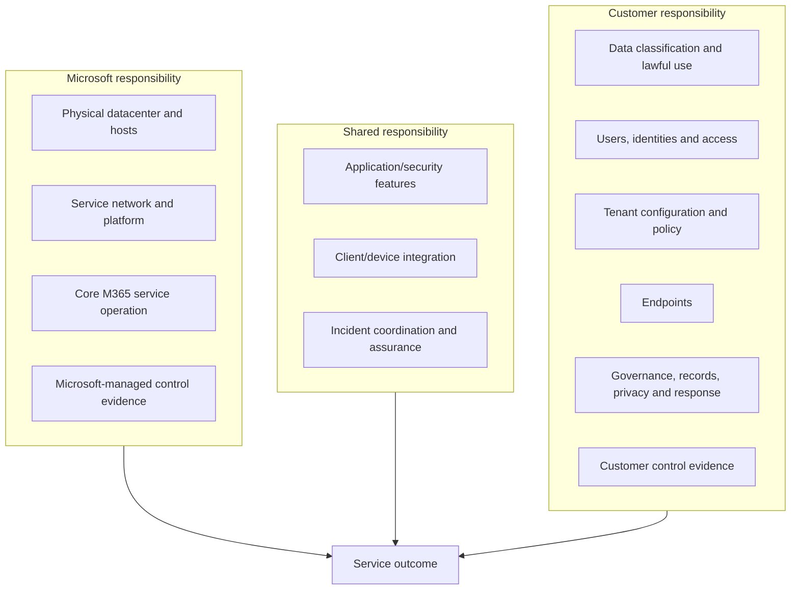

| Control area | Microsoft | Customer | Shared implication |
|---|---|---|---|
| Datacenter physical security | Operates and audits | Reviews assurance relevance | Obtain scoped report/certificate |
| Service encryption | Provides platform capability | Configures labels/keys/permissions where applicable | Validate actual configuration and scope |
| Identity | Secures Entra service | Creates, reviews and removes identities/access | Microsoft uptime does not remove customer access risk |
| Data | Hosts/processes per terms | Classifies, minimizes, retains and authorizes use | Customer remains accountable for purpose |
| Audit | Emits supported records | Enables, licenses, monitors and responds | Logging is not monitoring by itself |
| Incident | Secures service and notifies under terms | Detects tenant misuse and assesses obligations | RACI and evidence exchange matter |

## 6. Microsoft-managed, customer-managed and shared controls

Compliance Manager distinguishes controls/actions according to responsibility.

| Type | Meaning | Evidence approach |
|---|---|---|
| Microsoft-managed | Microsoft implements for the cloud service | Service Trust Portal/audit result and scope review |
| Customer-managed | Customer implements in tenant/process | Configuration, procedure, samples and operational evidence |
| Shared | Both parties perform parts | Map Microsoft assurance plus customer implementation |

Microsoft certification does not certify the customer's tenant. For example, Microsoft's ISO 27001 certificate can support a supplier-control dependency, but customer identity lifecycle, site sharing, DLP scope, HR process and incident response still require customer evidence.

## 7. Compliance Manager architecture

Compliance Manager organizes regulatory templates into assessments. Controls contain Microsoft and customer improvement actions. Signals from Purview, Secure Score, Defender for Cloud and supported connectors can automate some testing. Owners implement; assessors validate; evidence and notes support the record; scores summarize progress.

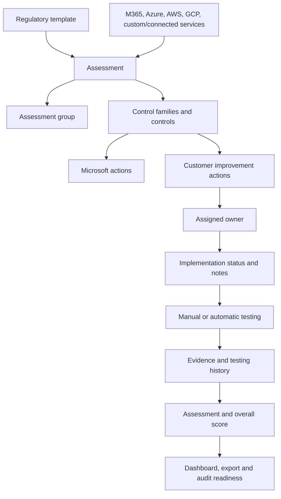

## 8. Core objects and their relationships

| Object | Plain meaning | Common mistake |
|---|---|---|
| Regulation/template | Prebuilt mapping of requirements, controls and actions | Treating template as legal applicability decision |
| Assessment | Selected template applied to services/subscriptions in a group | Creating one without defined scope |
| Group | Container that shares selected action information | Grouping by convenience without ownership model |
| Control family | Related controls, such as access or incident response | Reporting family completion without materiality |
| Control | Requirement/objective represented in assessment | Assuming a single setting always satisfies it |
| Improvement action | Recommended customer task | Implementing guidance without tailoring |
| Microsoft action | Service-provider task/evidence | Assuming it covers customer configuration |
| Evidence | File/link supporting implementation/test | Uploading a policy without proof of operation |
| Compliance score | Risk-weighted progress through mapped actions | Calling it legal compliance percentage |

## 9. Assessments and grouping strategy

An assessment chooses a regulation, service scope and group. Current Compliance Manager can combine services such as Microsoft 365, Azure, AWS and GCP in one assessment where supported. A universal template can apply generally but typically requires manual implementation/testing.

| Grouping option | Benefit | Risk |
|---|---|---|
| Regulation/year | Clear audit cycle | Duplicate business controls across groups |
| Business unit | Ownership and local evidence | Fragmented enterprise control view |
| Geography | Legal/data-residency alignment | Global controls duplicated |
| Product/service | Technical ownership | Obligations span multiple services |
| Certification scope | Matches external audit | Noncertification risks can be ignored |

Groups are not security boundaries. Current guidance says a group must contain an assessment, group names are unique, and moving an assessment between groups is constrained. Plan before creation and use assessment/regulation-level RBAC for sensitive access.

## 10. Regulatory templates and licensing

Compliance Manager provides a Data Protection Baseline for all supported subscription levels and premium regulation templates according to licensing. It also lists premium AI regulation templates such as EU AI Act, ISO/IEC 23894, ISO/IEC 42001 and NIST AI RMF in current guidance.

| Licensing question | Why it matters |
|---|---|
| Which templates are included? | Avoid designing against unavailable premium content |
| How are regulation families counted? | Budget and activation tracking |
| Is a trial being used? | Expiry can interrupt readiness workflow |
| How many services/subscriptions are supported? | Determines assessment scope and automation |
| Are connectors/AI features billed separately? | Commercial and technical dependency |
| What cloud/region applies? | Feature and universal-template availability differs |

Do not paste proprietary standard text into the guide or client deliverables without license rights. Link to authoritative sources and use the organization's licensed standard copy for exact requirements.

## 11. Improvement actions

Improvement actions can be technical, documentation or operational. They include implementation guidance, responsibility, service, related controls/regulations, possible points, test type, owner, status, dates, notes and evidence.

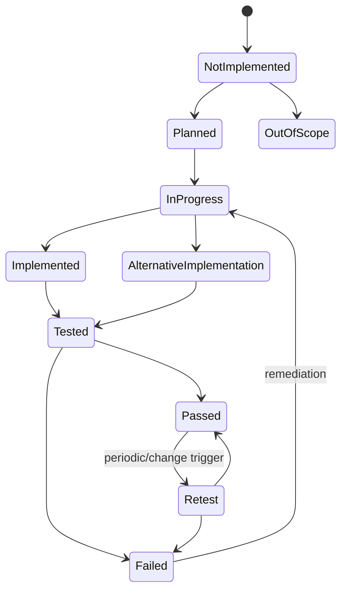

| Implementation status | Meaning | Evidence expectation |
|---|---|---|
| Not implemented | No effective control claimed | Gap/risk record |
| Planned | Approved future work | Plan, owner, date and dependency |
| Implemented | Recommended control is in place | Design/configuration plus operation evidence |
| Alternative implementation | Different control achieves objective | Equivalence rationale and test |
| Out of scope | Requirement/action not applicable | Approved applicability rationale, not convenience |

## 12. Ownership and separation of duties

| Role | Responsibility | Should not silently do |
|---|---|---|
| Control owner | Accountable for design/effectiveness | Delegate accountability completely |
| Control operator | Performs procedure | Mark own control effective without review |
| Improvement-action owner | Coordinates implementation/evidence | Assume email assignment completes work |
| Assessor | Tests and concludes | Design criteria after seeing result |
| Evidence custodian | Protects artifact/lineage | Edit source evidence |
| Risk owner | Decides treatment and may accept residual risk | Accept beyond delegated authority |
| Internal Audit | Independent assurance | Become control operator |
| External auditor | Independent opinion/certification within scope | Design the client control they later audit |

Compliance Manager roles include reader, contributor/contribution, assessor and administrator capabilities, with overall, regulation and individual-assessment access paths. Use least privilege and review Entra role inheritance that may not appear in assessment access views.

## 13. Manual and automatic testing

Automatic testing can use built-in Purview signals, Secure Score, Defender for Cloud or supported connectors. Current guidance says automatic testing is on by default for eligible actions, initial signal collection can take days, and many statuses refresh approximately daily. Automation is a source of evidence, not final assurance.

| Test type | Strength | Limitation |
|---|---|---|
| Manual inspection | Understands design/context | Subjective; needs repeatable steps |
| Inquiry | Explains process | Weak alone; people can be mistaken |
| Observation | Shows procedure in action | One moment may not represent period |
| Reperformance | Strongly validates procedure/result | More effort and access |
| Configuration export | Objective design evidence | Point-in-time only |
| Automated signal | Continuous/regular and scalable | Scope, logic, latency and blind spots need validation |
| Sample test | Demonstrates operation across population | Sampling risk remains |

### 🔍 Plain-English deep-dive: dashboard green is a sensor reading

An automated Pass is like a building sensor reporting that a door is locked. It might test only one door, use stale inventory, miss a side entrance, or confirm the setting but not the approval process. Validate the sensor's scope, source, frequency, logic, population and exceptions. Combine automated evidence with ownership, procedure and samples when the objective is broader than a configuration value.

## 14. Evidence quality

Strong evidence is relevant, reliable, complete enough, timely, authentic, reproducible, protected and understandable.

| Evidence | Strength | Weakness/control |
|---|---|---|
| Policy document | Shows approved intent | Pair with operation evidence |
| Screenshot | Easy to understand | Capture URL/context/time; screenshots can be selective |
| Native export/API result | Structured and scalable | Preserve raw source/hash/query |
| Audit log | Independent event trace | Retention/coverage and interpretation limits |
| Ticket/change record | Approval and workflow | Validate actual configuration/result |
| Sample record | Operating effectiveness | Define population and selection |
| Meeting/inquiry note | Context | Corroborate material claims |
| Service Trust report | Microsoft control assurance | Check period, scope, exception and bridge letter |
| Pen-test/assessment | Technical effectiveness | Scope, date and remediation status matter |

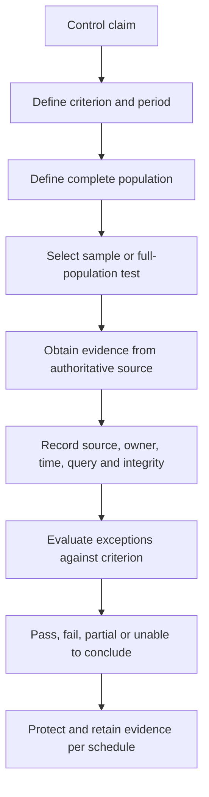

## 15. Evidence storage in Compliance Manager

Current guidance allows documents and links on an improvement action's Evidence tab. Users with read access can read evidence; editors can upload/download/delete within state rules. Evidence can become nondeletable after Passed, Failed or Out of scope status. Therefore, do not upload secrets, unnecessary personal data, unredacted privileged material or uncontrolled customer content.

| Evidence metadata | Example field |
|---|---|
| Control/action ID | `IA-AC-001` |
| Evidence ID | `EVID-2026-0042` |
| Period | Jan-Jun 2026 |
| Source system | Entra PIM export |
| Query/procedure | Approved script version/hash |
| Owner/collector | Named role |
| Collection UTC | Timestamp |
| Integrity | Hash or repository version |
| Population/sample | 1,240 activations / sample 40 |
| Privacy classification | Internal Restricted |
| Retention/disposal | Audit schedule and owner |

## 16. Compliance score and its limitations

The score measures progress in completing mapped improvement actions. Point values reflect Microsoft risk weighting, including mandatory/discretionary and preventative/detective/corrective categories. The denominator changes as assessments/actions are added. Shared actions can be counted according to technical/nontechnical and group logic.

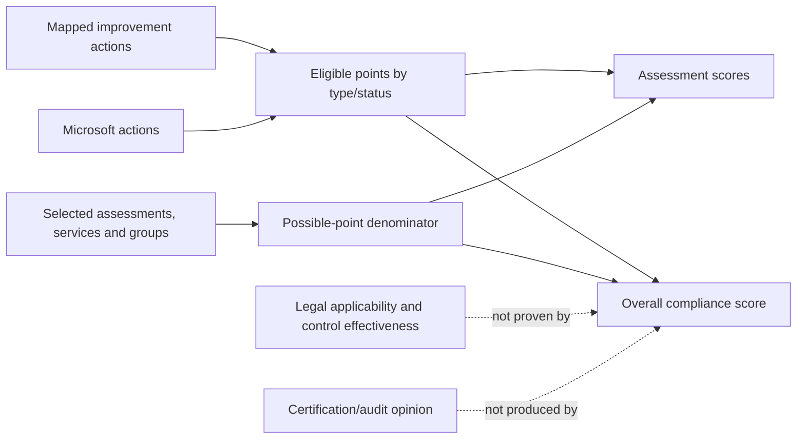

| Score can help | Score cannot prove |
|---|---|
| Prioritize high-value incomplete actions | Legal applicability is complete |
| Show mapped action progress | Every requirement is satisfied |
| Track changes over time within stable scope | Two organizations are comparable |
| Highlight automation/configuration changes | Control operates effectively across period |
| Support stakeholder conversation | No breach or violation can occur |
| Organize Microsoft/customer actions | Certification or audit opinion exists |

**Never say “we are 82% GDPR compliant.”** Say: “Compliance Manager shows 82% of available points achieved for the selected assessment scope and action mappings as of this date. This is a prioritization indicator, not a legal-compliance conclusion. These controls, exceptions and evidence remain for qualified review.”

## 17. Multicloud and connectors

Compliance Manager can assess services across Microsoft 365, Azure, AWS and GCP where supported, using Defender for Cloud for subscription/resource signals. Current connectors include selected non-Microsoft services such as Salesforce and Zoom, with rollout continuing. A custom service can use a universal template with manual work.

| Integration | Value | Risk |
|---|---|---|
| Defender for Cloud | Subscription/resource automation across clouds | Aggregate score can hide one failing subscription |
| Secure Score | Reuses monitored security actions | Different objective/scoring context |
| Purview signals | DLP, labels, lifecycle, IRM, CC | License/scope and signal delay |
| Priva signals | Privacy automation where supported/preview | Preview and product separation |
| Compliance Manager connector | Non-Microsoft service signals | Connector permissions/completeness |
| Custom service/universal template | Covers unsupported service conceptually | Manual criteria and evidence burden |

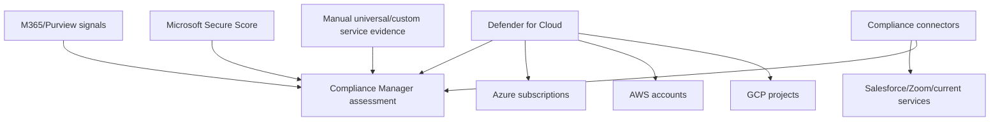

## 18. ISO 27001 concepts

ISO/IEC 27001 specifies requirements for an **Information Security Management System (ISMS)**: a managed system of scope, leadership, risk assessment, risk treatment, controls, competence, documentation, monitoring, internal audit, management review, corrective action and continual improvement.

| ISO concept | Beginner meaning | Evidence example |
|---|---|---|
| ISMS scope | Boundary of the management system | Scope statement and dependencies |
| Risk assessment | Method to identify/analyze risk | Risk methodology and register |
| Risk treatment | Decisions to avoid/reduce/share/accept | Treatment plan and approval |
| Statement of Applicability | Control selection and justification | Current SoA with exclusions |
| Internal audit | Independent check of ISMS | Plan, report and corrective actions |
| Management review | Leadership evaluates suitability/effectiveness | Minutes, decisions and resources |
| Continual improvement | Correct and improve over time | Nonconformities and closure evidence |

Microsoft's ISO certificate supports its scoped cloud controls. The client must define and operate its own ISMS if seeking certification.

## 19. NIST CSF concepts

NIST CSF is a risk-management framework, not a product configuration checklist. Current CSF 2.0 uses six Functions: **Govern, Identify, Protect, Detect, Respond, Recover**.

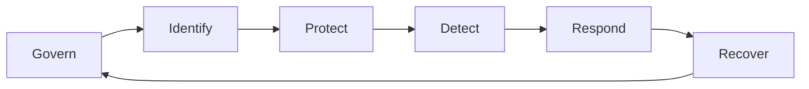

| Function | Plain question | M365 example |
|---|---|---|
| Govern | Who owns cyber risk and policy? | Security steering, roles, supplier risk |
| Identify | What assets, data and risks exist? | Tenant inventory, classification, risk register |
| Protect | What safeguards reduce risk? | MFA, CA, labels, DLP, endpoint controls |
| Detect | How do we know something happened? | Audit, Defender, Sentinel, IRM |
| Respond | How do we contain and communicate? | XDR response, incident plan, legal/privacy assessment |
| Recover | How do we restore and improve? | Restore, resilience, PIR, control remediation |

Profiles describe current and target outcomes; Tiers characterize rigor/context. Do not present a Compliance Manager template as an official NIST certification.

## 20. CIS concepts

CIS Controls prioritize security safeguards; CIS Benchmarks provide product-specific configuration recommendations. Benchmarks commonly distinguish Level 1 (broadly practical baseline) and Level 2 (higher security with greater operational impact).

| Use | Good practice | Bad practice |
|---|---|---|
| Baseline selection | Tailor to risk, license and workload | Apply every Level 2 setting blindly |
| Implementation | Deploy in rings with positive/negative tests | Treat benchmark as click list |
| Exceptions | Record rationale, compensating control and expiry | Silently skip incompatible setting |
| Versioning | Record benchmark/product version and date | Mix controls from different versions |
| Evidence | Configuration plus operational sample | Screenshot only |

## 21. GDPR and privacy principles

GDPR concepts are included for literacy, not legal advice. Applicability, lawful basis, rights, transfers, retention, breach decisions and DPIA obligations require qualified counsel/privacy professionals.

| Principle/concept | Plain meaning | Technical implication |
|---|---|---|
| Lawfulness, fairness, transparency | Have valid authority and be open as required | Privacy notice, processing register and review |
| Purpose limitation | Use data for specified legitimate purposes | Prevent secondary analytics without approval |
| Data minimization | Collect only what is needed | Reduce telemetry/content fields and scope |
| Accuracy | Keep personal data correct | Source-of-authority and correction workflow |
| Storage limitation | Keep no longer than needed | Retention schedule and defensible deletion |
| Integrity/confidentiality | Secure against unauthorized use/loss | Access, encryption, DLP and incident response |
| Accountability | Demonstrate compliance | Decisions, tests, evidence, DPIA and audit |
| Controller | Decides purposes and means | Customer usually controls M365 processing decisions |
| Processor | Processes for controller | Microsoft processes under terms for many services |

## 22. Data lifecycle and minimization

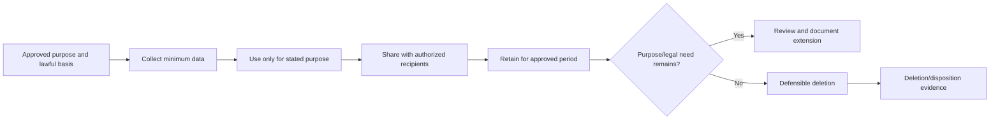

Minimization applies to fields, people, sources, time, precision, content, exports, access and retention. A security team may need event metadata but not message bodies. An assessment may need proof of configuration but not a list of every employee. A report may need trend counts but not named individuals.

## 23. Data subject request concepts

A **data subject request (DSR)** is an individual's request to exercise applicable rights. Microsoft guidance groups technical activities such as discovery, access, rectification, restriction, export and deletion. The organization determines identity verification, applicability, exceptions, deadline and response under law.

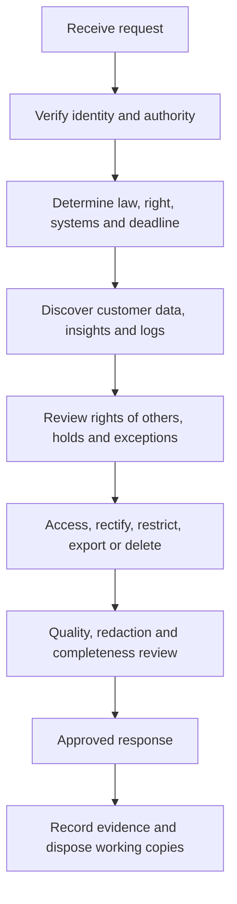

| DSR challenge | Control |
|---|---|
| Identity fraud | Strong verification separate from ordinary email |
| Broad data estate | Application/source inventory and owner network |
| Shared documents | Redact third-party/confidential data under counsel guidance |
| Holds/records | Legal and records conflict decision before deletion |
| AI interactions | Include supported prompt/response and grounded context sources |
| System logs | Use approved tenant-admin export and known exclusions |
| Local/on-prem/third party | Native app/source procedures, not only eDiscovery |
| Deadline | Workflow SLA, escalation and evidence register |

## 24. DPIA context

A **Data Protection Impact Assessment (DPIA)** evaluates high-risk personal-data processing before it begins. Under GDPR concepts, it addresses necessity/proportionality, risks to individuals' rights/freedoms, and measures to reduce risk. The configuration and use case, not the product name alone, determine whether a DPIA is required.

| DPIA section | Questions |
|---|---|
| Processing description | What data, people, sources, purposes, recipients, locations and retention? |
| Necessity | Can the objective be met with less data or monitoring? |
| Proportionality | Are scope and controls appropriate to the risk? |
| Individual impact | Discrimination, exclusion, surveillance, financial/reputation/safety harms? |
| Security/privacy controls | Minimization, pseudonymization, encryption, RBAC, transparency and rights? |
| Residual risk | What remains and who approves/consults the authority? |
| Review trigger | New data, AI, purpose, geography, model, incident or law change? |

### 🔍 Plain-English deep-dive: DPIA is a safety design review, not a privacy checkbox

Before building a hospital wing, specialists ask how patients could be harmed, whether the design is necessary, and how fire exits, access controls and emergency procedures reduce risk. A DPIA serves the same function for high-risk personal-data processing. It should change the design or stop it when risks cannot be reduced, not merely justify a decision already made.

## 25. Control mapping without false equivalence

One control can support many requirements, and one requirement can need multiple controls. Mapping indicates relationship, not equivalence.

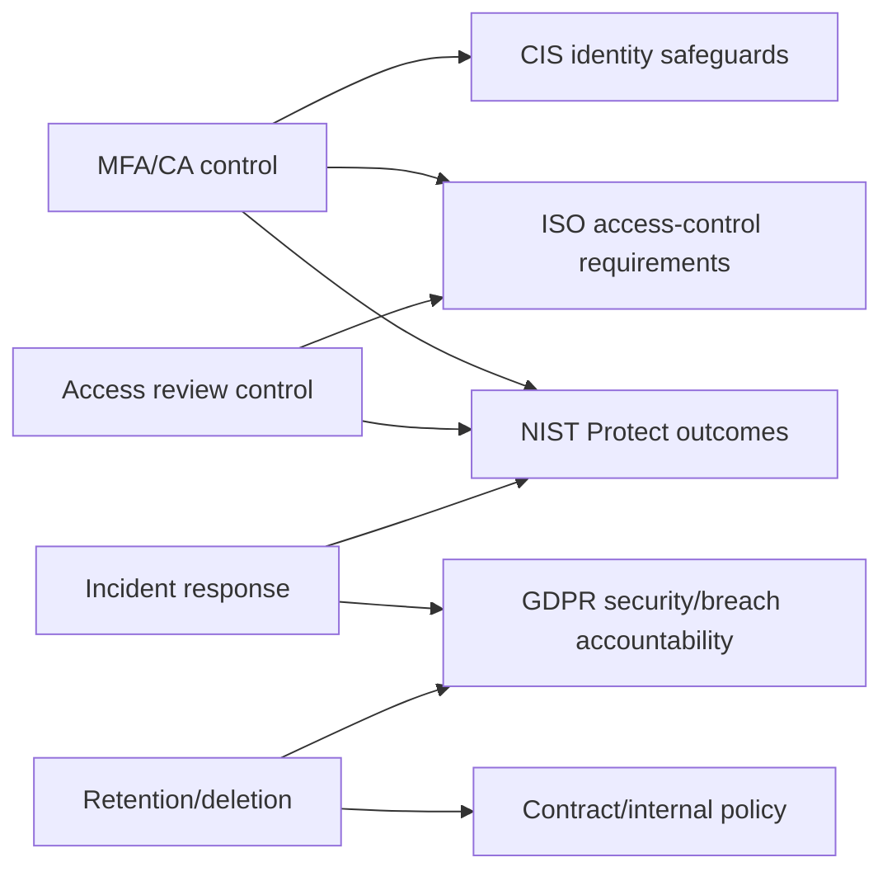

| Mapping field | Required content |
|---|---|
| Source/version | Authority, edition and effective date |
| Requirement ID/text reference | Exact licensed citation/reference |
| Control objective | Technology-neutral expected outcome |
| Control ID/design | Actual organization implementation |
| Responsibility | Microsoft/customer/shared and internal owner |
| Evidence | Design and operation artifacts |
| Test | Method, frequency, population/sample and criterion |
| Gap/exception | Difference, impact and compensating control |

## 26. Control design versus operating effectiveness

| Test question | Design effectiveness | Operating effectiveness |
|---|---|---|
| Does the control exist? | Yes | Prerequisite only |
| Could it meet the objective? | Main focus | Assumed if design sound |
| Did it operate during the period? | Not proven | Main focus |
| Were exceptions handled? | Procedure exists | Sample shows actual handling |
| Example | CA policy targets admins with MFA | All sampled admin sign-ins enforced MFA; exceptions approved |

A beautifully documented process can fail in practice. A working technical setting can lack approval, owner, monitoring or exception handling. Test both.

## 27. Sampling

Sampling tests a subset of a complete population. Define population, period, selection method, sample size rationale and exception handling before seeing outcomes.

| Selection method | Use | Risk |
|---|---|---|
| Random | Representative probability sample | Rare high-risk cases may be absent |
| Systematic | Every nth item after random start | Periodic patterns can bias sample |
| Judgmental/risk-based | High-risk/admin/exception cases | Cannot generalize statistically |
| Stratified | Samples by region/role/severity | More complex but exposes cohort differences |
| Full population analytics | Automated test across all records | Data/schema/tool quality still matters |

If one exception appears, determine whether it is isolated, systemic, design-related, period-wide or evidence-related. Do not simply replace the failed sample with another.

## 28. Findings, exceptions and remediation

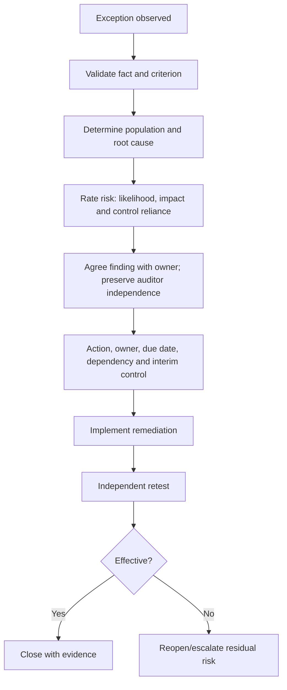

| Finding element | Good statement |
|---|---|
| Criteria | What approved requirement should happen |
| Condition | What evidence showed actually happened |
| Cause | Why gap occurred, supported by RCA |
| Consequence | Risk/impact, not exaggerated certainty |
| Recommendation | Outcome-focused corrective action |
| Management response | Accepted/disputed, action and owner |
| Due date | Realistic milestone and dependencies |
| Retest | Objective closure criterion |

## 29. Risk acceptance

Risk acceptance is a conscious, authorized decision to tolerate residual risk for a defined period. It is not “we ran out of time.”

### 🔍 Plain-English deep-dive: accepting a leak is not repairing the pipe

Imagine a building owner discovers a pipe that occasionally leaks. Repair means fixing the pipe and testing that it no longer leaks. Risk acceptance means an authorized owner knowingly tolerates the leak for a limited period, perhaps because replacement parts are unavailable, while placing a tray and water alarm underneath it. The tray is a compensating control; it does not make the pipe healthy. The acceptance must state who decided, what could be damaged, why waiting is justified, which temporary controls apply, when the decision expires, and what event forces an earlier review. Marking an improvement action “Planned” or attaching a ticket is neither remediation nor risk acceptance.

| Required field | Purpose |
|---|---|
| Risk statement | Clear event, cause and impact |
| Affected assets/scope | Prevent hidden expansion |
| Current controls | Show what protection remains |
| Residual rating | Inform authority threshold |
| Rationale | Business decision and alternatives |
| Compensating controls | Temporary risk reduction |
| Owner/approver | Correct delegated authority |
| Expiry/review trigger | Prevent permanent exception |
| Remediation dependency | Link to planned closure |

Auditors can evaluate the acceptance process; they do not accept management's risk. Consultants recommend and document; authorized management decides.

## 30. Audit types and assurance levels

| Engagement | Purpose | Typical conclusion |
|---|---|---|
| Self-assessment | Owner evaluates readiness | Management status, lower independence |
| Readiness assessment | Find gaps before formal audit | No certification/opinion |
| Internal audit | Independent internal assurance | Findings/opinion per charter |
| External audit | Independent assessment under standard | Report/opinion/certificate within scope |
| Regulatory examination | Supervisor evaluates compliance | Regulatory findings/actions |
| Penetration test | Test exploitable technical weakness | Technical findings, not broad compliance |
| Certification audit | Assess against certifiable standard | Certificate subject to scope/surveillance |

Do not call a consulting readiness report an “audit” if independence and standards do not support that label.

## 31. Auditor interaction

```mermaid
sequenceDiagram
    participant A as Auditor/assessor
    participant C as Audit coordinator
    participant O as Control owner
    participant E as Evidence custodian
    A->>C: PBC request with criterion/period
    C->>O: Clarify owner and response date
    O->>E: Produce approved source evidence
    E->>E: Quality/privacy/lineage check
    E-->>C: Indexed evidence plus explanation
    C-->>A: Controlled submission
    A->>O: Walkthrough and questions
    O-->>A: Facts; no speculation
    A-->>C: Exception or follow-up
    C->>O: Response/remediation without altering original evidence
```

**PBC** means “prepared by client,” the evidence/request list. Use one coordinator to prevent duplicates and conflicting answers. Answer precisely; distinguish “I do not know yet” from guesses. Never alter evidence to make it pass. Keep legal privilege and confidentiality review separate.

## 32. Audit readiness plan

| Phase | Activities | Exit gate |
|---|---|---|
| Scope | Entity, services, locations, period, criteria, exclusions | Approved scope and applicability |
| Map | Requirements, controls, owners and dependencies | Traceability reviewed |
| Inventory | Policies, configurations, populations and prior findings | Complete evidence-source map |
| Test design | Criteria, method, samples, frequency and evidence | Independent test plan |
| Dry run | Walkthrough, evidence retrieval and sample tests | Gaps logged, no fabricated evidence |
| Remediate | Correct design/operation; manage exceptions | Material gaps fixed or accepted |
| Retest | Verify closure and period coverage | Closure evidence approved |
| Audit support | PBC tracker, walkthroughs, follow-up and version control | Requests complete |
| Close | Findings, lessons, evidence retention and next cycle | Management review |

## 33. Compliance Manager configuration workflow

1. Establish applicability with Legal/Risk and define the assessment objective.
2. Inventory licenses, roles, templates, services, subscriptions, connectors and existing assessments.
3. Plan groups and least-privilege assessment/regulation access.
4. Select the current authoritative template/version and services.
5. Map Microsoft, shared and customer actions to real control owners.
6. Review automatic-testing sources, scope, cadence and blind spots.
7. Define implementation/testing status rules and evidence metadata.
8. Pilot one assessment; do not bulk mark or upload unreviewed evidence.
9. Validate score denominator and communicate limitations.
10. Establish update review, change control, retest, report and audit cycles.

## 34. Deployment and testing

| Test | Expected result |
|---|---|
| RBAC negative | Reader cannot edit/upload; unrelated assessor lacks assessment access |
| Assessment scope | Only approved services/subscriptions appear |
| Shared action | Update propagates only according to documented group/technical rules |
| Manual action | Owner implements; independent assessor can set result |
| Automatic action | Source/scope/status matches native solution evidence |
| Evidence privacy | Restricted sample contains no unnecessary secrets/personal data |
| Score change | Expected action points/denominator change explained |
| Template update | Impact can be reviewed/deferred; accepted change logged |
| Export | Snapshot includes control/action/test details and timestamp |
| Deletion | Blocked without export, dependency and approval review |
| Multicloud | Every failing subscription remains visible, not hidden by average |
| Auditor walkthrough | Owner retrieves evidence and explains operation consistently |

## 35. Rollback and irreversible-change matrix

| Change | Rollback reality | Gate |
|---|---|---|
| Create assessment | Can delete, but deletion is permanent | Scope/group/license approval |
| Delete assessment | Cannot restore; orphan actions may be deleted | Export and dependency review |
| Accept template/action update | Accepted change is permanent | Impact/version review |
| Add evidence | May become nondeletable after final test status | Privacy/secret/evidence QA |
| Change automatic to manual | Supported for some actions, not all DfC actions | Source and history impact |
| Mark Out of scope | Reversible status but can distort score/readiness | Approved applicability rationale |
| Reassign owner | History presentation can change; original uploader identity behavior matters | Handover record |
| Delete user history | Permanent | Privacy/records/legal and action reassignment |
| Activate premium template | License/renewal implication | Commercial approval |
| Risk acceptance | Revoke/supersede prospectively; prior decision remains evidence | Correct authority and expiry |

## 36. Operations and metrics

| Metric | Purpose | Misuse to avoid |
|---|---|---|
| Controls with current owner | Accountability | Counting group mailboxes as owners |
| Actions passed/failed/untested | Progress and exposure | Optimizing score by Out of scope |
| Evidence freshness | Readiness | Treating age alone as invalid |
| Automated-test exceptions | Sensor/control quality | Trusting aggregate status only |
| Open findings by risk/age | Remediation | Closing tickets without retest |
| Risk acceptances expiring | Exception governance | Auto-renewal without review |
| PBC response SLA | Audit efficiency | Speed over evidence quality |
| Repeat findings | Root-cause/management effectiveness | Renaming finding to hide recurrence |
| DSR timeliness/quality | Privacy operation | Reporting volume without rights outcome |
| Template/update backlog | Currency | Accepting updates mid-audit without impact review |
| Scope and denominator changes | Score explainability | Comparing unlike periods |
| Coverage by control family | Program balance | Equal-weighting immaterial and critical controls |

## 37. Executive reporting

Executives need decisions and risk, not a portal tour.

| Report section | Content |
|---|---|
| Scope/currency | Entities, services, period, criteria, versions and limitations |
| Overall posture | Material risks and control themes, not only score |
| Progress | Stable-scope score/action trend with denominator changes |
| Material gaps | Impact, owner, interim control and due date |
| Assurance | Tests completed, evidence quality and independent review |
| Privacy | High-risk processing, DSR/DPIA status and safeguards |
| Decisions | Investment, exception or risk acceptance required |
| Outlook | Next milestones, regulatory/product changes and residual risk |

Use a red/amber/green status only with defined thresholds and supporting narrative. Report confidence and known unknowns.

## 38. Common failures

| Symptom | Likely cause | First discriminating check |
|---|---|---|
| Score unexpectedly drops | New assessment/actions, template update, failed automation, scope change | Denominator and recent action history |
| Automatic action undetected | Signal latency, unsupported scope, connector/permission issue | Native source evidence and test-source setting |
| Action passes but control fails | Other action failed or scope/subscription exception | Control action breakdown by service |
| Evidence cannot be deleted | Final test status locks evidence deletion | Status and retention/privacy decision |
| User cannot access assessment | Missing overall/specific role or license | Effective Entra/Purview/assessment role |
| User sees too much | Broad overall or regulation role inherited | Effective role sources, not only local pane |
| Duplicate/inconsistent action status | Group/shared-action mapping misunderstood | Action identity, type and group linkage |
| Multicloud aggregate looks healthy | Failed subscription averaged with passing ones | Subscription/resource drill-down |
| Auditor rejects evidence | Wrong period, source, population, owner or no operation proof | PBC criterion-to-evidence review |
| DSR misses data | Relied only on eDiscovery; app/on-prem/third-party data omitted | Data inventory and native-app procedures |
| Privacy deletion blocked | Hold/retention/legal requirement | Conflict decision by Legal/Privacy/Records |

## 39. Layered troubleshooting

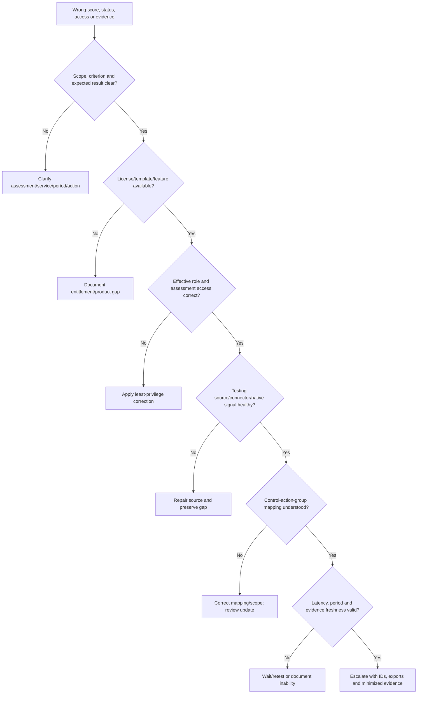

## 40. Consulting scenarios

### Scenario A: “Our Compliance Score is 90%, so are we GDPR compliant?”

Respond that the score reflects achieved points for selected mapped actions and scope. It does not decide GDPR applicability, lawful basis, rights, processor/controller terms, transfers, DPIAs, breach handling or control operation. Present the selected assessment, denominator, untested actions, exceptions and legal-review requirements.

### Scenario B: ISO 27001 readiness

Define ISMS scope, leadership, risk methodology, Statement of Applicability, selected controls, internal audit and management review. Use Microsoft's scoped certificate as supplier evidence, map customer M365 controls, run design/operation tests, remediate gaps and engage an accredited certification body. Do not promise certification.

### Scenario C: multicloud assessment appears green

Drill into Azure, AWS and GCP subscriptions. One critical subscription has no signal while others pass, but averaging masks it. Record a coverage finding, repair connector/Defender for Cloud access, retest and explain why aggregate score was insufficient.

### Scenario D: privacy request conflicts with hold

Privacy receives an erasure request; eDiscovery shows relevant content on legal hold. Technical staff do not remove the hold. Legal/Privacy/Records decides applicable precedence, documents the rationale, restricts processing where appropriate, and responds according to law. The DSR workflow records systems searched, exceptions and response.

### Scenario E: failed privileged-access sample

One sampled permanent administrator assignment lacked approval. Expand testing to determine scope, remove access if authorized, identify lifecycle/root cause, implement recurring access review, evaluate incident exposure, and retest. Do not replace the sample or mark Passed after ticket creation.

## 41. Consulting artifacts

| Artifact | Minimum content |
|---|---|
| Applicability register | Authority/version, entity, geography, service, rationale and counsel owner |
| Obligation-control matrix | Requirement, objective, control, owner, evidence and test |
| Shared-responsibility matrix | Microsoft/customer/shared actions and assurance source |
| Assessment inventory | Group, regulation, services, owner, status, license and update |
| Improvement-action register | Implementation/test owner, dates, evidence and result |
| Evidence catalogue | IDs, source, period, population, integrity, privacy and retention |
| Test plan/workpapers | Criteria, method, sample, result, reviewer and conclusion |
| Findings/remediation log | Condition, cause, risk, action, due date and retest |
| Exception/risk acceptance | Scope, residual risk, approver, expiry and compensating control |
| DSR runbook | Intake, verification, discovery, rights action, QA and closure |
| DPIA screening/template | Processing, necessity, impact, controls and residual risk |
| Audit readiness/PBC tracker | Request, owner, evidence, due date, status and follow-up |
| Executive report | Scope, material risks, progress, assurance and decisions |

## 42. Safe paper lab and evidence exercise

### Scenario and safety boundary

Fictional company Northwind Health wants a paper readiness assessment for a fictional Microsoft 365 environment against selected concepts from ISO 27001, NIST CSF, CIS Microsoft 365 guidance and GDPR privacy principles. This is a **paper-only** exercise. Do not create a Compliance Manager assessment, start a premium trial, connect a cloud/service, upload evidence, access Service Trust reports, change a tenant control, perform a DSR, delete data, or make a legal conclusion. Use no real client, employee, patient, tenant, contract, audit report, standard text, or personal data.

### Paper scope

| Field | Fictional value |
|---|---|
| Entity | Northwind Health Research Ltd. |
| Services | M365 Exchange, Teams, SharePoint, OneDrive and Entra |
| Period | Jan-Jun 2026 (fictional) |
| Assessment intent | Readiness only; no audit/certification |
| Data | Synthetic employee and research records |
| Control themes | Privileged access, sharing, retention, incident response and DSR |
| Frameworks | Concepts only; authoritative licensed versions required later |

### Paper control rows

| Control ID | Objective | Paper implementation | Paper test/evidence |
|---|---|---|---|
| NW-AC-01 | Privileged access is approved/time-bound | PIM design with quarterly review | Synthetic role export and 20 activation records |
| NW-DS-01 | Sensitive sharing is restricted | Labels, DLP and site governance design | Synthetic policy export and link sample |
| NW-RT-01 | Data follows approved lifecycle | Schedule, labels and disposition design | Synthetic policy and 15-item lifecycle sample |
| NW-IR-01 | Incidents are detected/responded | IR plan, audit/XDR workflow and PIR | Fictional tabletop timeline |
| NW-PR-01 | DSRs are verified/completed | Intake/source map/QA workflow | Fictional request walkthrough |

### Paper scoring statement

Create a fictional dashboard with “12 of 20 actions evidenced” rather than a legal compliance percentage. Add this statement:

> “This readiness indicator tracks selected fictional control actions. It is not a Compliance Manager tenant score, certification, audit opinion, or legal-compliance conclusion. Scope, criteria, evidence and testing are incomplete.”

### Synthetic test matrix

| Test | Expected paper result | Failure treatment |
|---|---|---|
| Trace one GDPR concept to control | Requirement/objective/control/evidence linked | Mapping gap finding |
| Microsoft-managed encryption control | Service assurance dependency plus customer configuration | Shared-responsibility correction |
| PIM sample exception | One failed item remains in result | Expand/root-cause/remediate/retest |
| Screenshot evidence | Rejected without source/time/period | Replace with reliable evidence plan |
| Automatic Pass | Corroborated with native scope and sample | Mark unable/partial until validated |
| Out-of-scope action | Requires approved rationale | Cannot use to inflate progress |
| DSR erasure under hold | Legal conflict gate invoked | No deletion/hold removal by lab participant |
| Risk acceptance | Requires correct fictional authority/expiry | Escalate rather than self-approve |
| Executive report | Shows risks, evidence confidence and asks | Remove unsupported “compliant” claim |

### Evidence portfolio

- GRC and obligation-to-evidence diagrams.
- Applicability and shared-responsibility registers.
- Five-row control/evidence/test matrix.
- Sampling plan and exception workpaper.
- Findings, remediation and risk-acceptance templates.
- DSR and DPIA concept workflows.
- Readiness plan, PBC tracker and executive one-page report.
- Candidate honesty statement.

### Cleanup

No tenant or evidence repository was used. Remove accidental real company, audit, regulator, standard text, patient, employee, tenant, contract, screenshot, report or personal data. Retain only clearly fictional paper artifacts and links to authorized sources.

### Interview wording

> “I completed a paper-only readiness exercise that mapped obligations to control objectives, implementation, owners, tests, samples, evidence, findings and remediation. I included shared responsibility, Compliance Manager score limitations, ISO/NIST/CIS/GDPR concepts, DSR and DPIA gates, and executive reporting. I did not create a tenant assessment or claim certification/legal compliance. My production RCA, validation, evidence, documentation, KPI and stakeholder experience is the foundation I would bring to a qualified GRC team.”

## 43. JD Mapping: interview translation

| Interview theme | Factual answer direction |
|---|---|
| GRC | Governance assigns decisions; risk prioritizes; controls reduce; evidence supports compliance |
| Compliance Manager | Template -> assessment -> controls/actions -> implementation/test/evidence -> score |
| Shared responsibility | Microsoft assurance plus customer configuration/process evidence |
| Score | Action-progress indicator, not compliance/certification |
| Frameworks | ISO management system, NIST outcomes, CIS baseline, GDPR legal/privacy concepts |
| Audit readiness | Scope, map, population/sample, evidence, findings, remediation and retest |
| Privacy | Purpose, minimization, lifecycle, rights workflow and DPIA risk review |
| Experience honesty | Production RCA/evidence foundation plus paper readiness design only |

## Official Source Anchors

| Topic | Official Microsoft source |
|---|---|
| Compliance Manager overview | [Microsoft Purview Compliance Manager](https://learn.microsoft.com/en-us/purview/compliance-manager) |
| Setup, roles and automation | [Get started with Compliance Manager](https://learn.microsoft.com/en-us/purview/compliance-manager-setup) |
| Assessments, groups, services and exports | [Build and manage assessments](https://learn.microsoft.com/en-us/purview/compliance-manager-assessments) |
| Regulations/templates and licensing | [Learn about regulations in Compliance Manager](https://learn.microsoft.com/en-us/purview/compliance-manager-regulations) |
| Improvement actions, testing and evidence | [Working with improvement actions](https://learn.microsoft.com/en-us/purview/compliance-manager-improvement-actions) |
| Score calculation and disclaimer | [Compliance Manager scoring](https://learn.microsoft.com/en-us/purview/compliance-manager-scoring) |
| Multicloud | [Multicloud support in Compliance Manager](https://learn.microsoft.com/en-us/purview/compliance-manager-multicloud) |
| Connectors | [Working with connectors in Compliance Manager](https://learn.microsoft.com/en-us/purview/compliance-manager-connectors) |
| Shared responsibility | [Shared responsibility in the cloud](https://learn.microsoft.com/en-us/azure/security/fundamentals/shared-responsibility) |
| Microsoft assurance documents | [Get started with Service Trust Portal](https://learn.microsoft.com/en-us/compliance/assurance/stp-get-started) |
| Purview privacy/data types | [Privacy in Microsoft Purview](https://learn.microsoft.com/en-us/purview/purview-privacy) |
| GDPR concepts and disclaimer | [General Data Protection Regulation](https://learn.microsoft.com/en-us/compliance/regulatory/gdpr) |
| Microsoft 365 DSR technical guide | [Office 365 Data Subject Requests](https://learn.microsoft.com/en-us/compliance/regulatory/gdpr-dsr-office365) |
| GDPR DPIA guidance | [Data Protection Impact Assessments](https://learn.microsoft.com/en-us/compliance/regulatory/gdpr-data-protection-impact-assessments) |
| ISO 27001 offering/scope | [ISO/IEC 27001 information security management](https://learn.microsoft.com/en-us/compliance/regulatory/offering-iso-27001) |
| NIST CSF offering/context | [NIST Cybersecurity Framework](https://learn.microsoft.com/en-us/compliance/regulatory/offering-nist-csf) |
| CIS Benchmarks | [Center for Internet Security Benchmarks](https://learn.microsoft.com/en-us/compliance/regulatory/offering-cis-benchmark) |
| Licensing | [Microsoft Purview service description](https://learn.microsoft.com/en-us/office365/servicedescriptions/microsoft-365-service-descriptions/microsoft-365-tenantlevel-services-licensing-guidance/microsoft-purview-service-description) |

---

## ⭐ Likely Interview Questions for This Section

### Q1. What is the difference between compliance and security?

**Model answer:** “Compliance is conformance with a specific applicable requirement, while security manages risk to confidentiality, integrity, availability and business objectives. They overlap but neither proves the other. I start with applicability and risk, map control objectives, test design and operation, and retain evidence rather than optimize for a checklist.”

### Q2. How does Compliance Manager work?

**Model answer:** “A regulatory template supplies mapped controls and actions. An assessment applies it to selected services/subscriptions in a planned group. Microsoft actions represent provider work; customer improvement actions have owners, implementation status, manual or automatic testing, notes and evidence. Results contribute points to assessment and overall scores, and access can be scoped by role, regulation or assessment.”

### Q3. Does a high Compliance Manager score mean the organization is compliant?

**Model answer:** “No. Microsoft explicitly says recommendations and scores don't guarantee compliance. The score measures achieved points for mapped actions in selected assessments and its denominator changes with scope. It doesn't decide legal applicability, full requirement coverage, operating effectiveness, residual risk, certification or an audit opinion. I report scope, evidence, exceptions and limitations with it.”

### Q4. Explain shared responsibility for Microsoft 365 compliance.

**Model answer:** “Microsoft secures and provides assurance over the underlying SaaS service within its stated scope. The customer remains responsible for data purpose/classification, identities, access, tenant configuration, endpoints, retention choices, user behavior, monitoring, incident response and legal obligations. Shared controls need both Microsoft's assurance evidence and proof that customer configuration/processes operate.”

### Q5. How would you test a control for audit readiness?

**Model answer:** “Define the criterion, objective, period and complete population first. Evaluate design, choose a repeatable method and sample, collect authoritative evidence with lineage, test exceptions, conclude pass/fail/partial or unable, and record limitations. A failed sample isn't replaced; I determine scope/root cause, remediate, and independently retest.”

### Q6. How do ISO 27001, NIST CSF and CIS differ?

**Model answer:** “ISO 27001 specifies requirements for an auditable/certifiable information security management system. NIST CSF organizes risk outcomes through Govern, Identify, Protect, Detect, Respond and Recover. CIS Controls/Benchmarks provide prioritized safeguards and more prescriptive secure configurations. Organizations can map controls across them, but mapping doesn't make them equivalent.”

### Q7. What privacy concepts should a Microsoft 365 security consultant understand?

**Model answer:** “Purpose, lawful/fair/transparent processing, minimization, accuracy, storage limitation, confidentiality, accountability, controller/processor roles, DSR workflows and DPIA screening for high-risk processing. I can design technical inventory, search, retention, access and evidence controls, but Legal/Privacy determines applicability, legal basis, rights exceptions and regulator response.”

### Q8. What is your honest Compliance Manager and audit experience?

**Model answer:** “My production foundation is M365 incident/RCA evidence, technical validation, SharePoint/OneDrive behavior, documentation, KPIs and stakeholder reporting. I have built a current Compliance Manager/audit-readiness design and fictional paper assessment, but I don't claim production Compliance Manager ownership, legal interpretation, audit opinion, privacy-officer authority or certification. I would work under qualified control, legal, privacy and audit owners.”

## 🧠 30-Second Memory Hooks

- **Governance decides; risk prioritizes; controls act; assurance proves.**
- **Comply with a named requirement, version and scope.**
- **Obligation -> objective -> control -> test -> evidence -> result.**
- **Microsoft certification is supplier evidence, not tenant certification.**
- **Template builds assessment; assessment contains controls and actions.**
- **Owner implements; assessor validates.**
- **Automatic Pass is a sensor reading, not final assurance.**
- **Evidence needs source, period, population, lineage and protection.**
- **Score tracks selected action progress, not legal compliance.**
- **A changing denominator breaks naive score comparisons.**
- **ISO is an ISMS; NIST is outcomes; CIS is practical baseline.**
- **GDPR: purpose, minimize, protect, limit retention and support rights.**
- **DSR = verify, scope, find, review, act, QA, respond.**
- **DPIA is a pre-use safety review for high-risk processing.**
- **Do not replace a failed sample; investigate it.**
- **Risk acceptance needs authority, scope and expiry.**

## Completion Checklist

- [ ] I can define governance, risk, compliance, control, assurance and audit.
- [ ] I can distinguish law, regulation, contract, standard, framework, benchmark and certification.
- [ ] I can build an obligation-to-evidence chain.
- [ ] I can explain inherent/residual risk and control effectiveness.
- [ ] I can draw Microsoft/customer/shared responsibility for M365.
- [ ] I can distinguish Microsoft-managed, customer-managed and shared controls.
- [ ] I can explain Compliance Manager architecture and core objects.
- [ ] I can plan assessment groups, services, subscriptions and access.
- [ ] I can explain template licensing and currency constraints.
- [ ] I can manage improvement-action ownership, implementation and testing concepts.
- [ ] I can compare manual and automatic tests and validate automation scope.
- [ ] I can evaluate evidence relevance, reliability, period, population and lineage.
- [ ] I can explain score calculation and limitations without claiming compliance.
- [ ] I can describe multicloud and connector context.
- [ ] I can explain ISO 27001, NIST CSF and CIS concepts accurately.
- [ ] I can explain GDPR/privacy principles without giving legal advice.
- [ ] I can design data-minimization and lifecycle controls.
- [ ] I can describe DSR and DPIA workflows and decision boundaries.
- [ ] I can map requirements to controls without false equivalence.
- [ ] I can test control design and operating effectiveness.
- [ ] I can define population, sampling and exception treatment.
- [ ] I can write a finding and remediation/retest plan.
- [ ] I can document risk acceptance with authority and expiry.
- [ ] I can distinguish readiness, internal audit, external audit and certification.
- [ ] I can run a PBC/auditor interaction process without altering evidence.
- [ ] I can plan configuration, deployment, rollback, operations and executive reporting.
- [ ] I can troubleshoot score, access, automation, mapping and evidence issues.
- [ ] I can produce the consulting artifacts and safe paper exercise honestly.
- [ ] I can answer Q1-Q8 aloud without reading.

*Next suggested section:* [Part 33](Part-33-purview-dspm-ai-data-security.md) — use the current DSPM experience to discover, protect and investigate sensitive-data and AI risks while governing Copilots, agents, enterprise AI and other AI apps through validated controls.