# Part 34 — Microsoft Defender XDR Architecture and the Cross-Domain Attack Story

> **Section goal:** Master Microsoft Defender XDR architecture and the cross-domain attack story described in the approved master scope: the Microsoft Defender portal, component products and data sources, assets and entities, signals, events, evidence, alerts versus incidents, correlation, attack stories, MITRE ATT&CK, the unified incident queue, timeline and graph, roles, retention, service integrations, connectors and APIs, alert tuning, service health, telemetry flow, Sentinel integration, and XDR versus SIEM/SOAR. By the end, you should be able to assess, design, deploy, test, operate and troubleshoot a defensible cross-domain XDR capability and explain a phishing-to-endpoint-to-identity-to-SaaS incident without overstating hands-on experience.

This Part maps directly to Deloitte's Microsoft Defender suite, Defender XDR, Microsoft 365 security assessment, architecture, deployment, incident investigation, platform troubleshooting, operational readiness and stakeholder-reporting expectations. Your production foundation in Microsoft 365 workload support, critical incidents, root-cause analysis (RCA), evidence timelines, fix validation, vendor/product-group coordination, documentation and executive updates is directly useful. The honest bridge is learning how a security operations center (SOC) applies those same disciplines to correlated threat evidence. This chapter never claims that you have owned or operated production Defender XDR.

> **Currency, portal, licensing, preview and change-sensitive note:** This chapter was checked against official Microsoft Learn content available on **August 24, 2026**. Microsoft is moving security operations toward the unified Microsoft Defender portal at `https://security.microsoft.com`, including supported Microsoft Sentinel capabilities. Portal labels, navigation, onboarding eligibility, feature parity, role models, retention, data residency, APIs, schemas, product connectors, automated response, attack disruption, preview features and licensing can change by tenant, cloud, region and rollout ring. Treat every license statement as a planning hypothesis until verified against current Microsoft Product Terms, service descriptions, the tenant's licenses, Microsoft 365 Roadmap, Message center and the live portal. A capability being visible does not prove it is licensed, configured, supported or authorized for a particular analyst.

## JD Mapping

| Deloitte role expectation | Capability developed here | Consulting evidence |
|---|---|---|
| Assess Microsoft 365 threat protection | Product, telemetry, identity, endpoint, email, app and incident inventory | Current-state assessment and capability heatmap |
| Design Microsoft Defender architecture | Trust boundaries, data flows, roles, retention, integrations and operations | High-level design (HLD), low-level design (LLD) and decision log |
| Investigate security events | Incident queue, attack story, timeline, graph, entities, evidence and MITRE mapping | Investigation timeline, evidence register and scope statement |
| Deploy and optimize controls | Prerequisites, phased enablement, validation, tuning and rollback | Deployment plan, test matrix and tuning register |
| Troubleshoot platform issues | Sensor-to-cloud-to-portal fault isolation and service-health checks | Troubleshooting decision tree and escalation pack |
| Communicate with stakeholders | Technical facts, business impact, uncertainty, actions and residual risk | Executive update, operational handover and post-incident review |

## Candidate honesty note

You can speak directly about production Microsoft 365 support, SharePoint Online and OneDrive behavior, high-severity incidents, RCA, evidence gathering, fix validation, stakeholder cadence, documentation, escalation and cross-team coordination where supported by your experience. Those are valuable security-consulting skills because an XDR investigation also needs disciplined scoping, timelines, hypotheses, ownership boundaries and clear communication.

You should not claim that you have administered a production Defender tenant, investigated real Defender XDR incidents, configured unified RBAC, tuned production detections, connected Sentinel, performed live response, isolated devices, disabled users or approved automated remediation unless separately evidenced. Safe wording is:

> “My production strength is Microsoft 365 workload support, critical-incident coordination, RCA, evidence timelines, validation and stakeholder communication. I have built a current Defender XDR architecture and a safe fictional paper investigation to understand how endpoint, identity, email and SaaS evidence becomes a correlated incident. I have not operated Defender XDR in production. In a client tenant I would verify licensing and role authorization, preserve evidence, distinguish observed facts from hypotheses, validate correlation, use approval-controlled containment, document every action and escalate destructive or business-impacting decisions to the accountable incident commander.”

---

## 1. XDR from zero

**Extended detection and response (XDR)** is a security capability that collects and correlates threat evidence across several security domains, then gives analysts a combined investigation and response experience. The domains can include endpoints, identities, email and collaboration, cloud applications and cloud resources.

A useful analogy is an airport security operation. One camera may show a person entering, a badge system may record identity, baggage scanning may reveal an object and payment records may show a purchase. Each signal alone can be innocent. Correlating time, person, device and behavior can reveal one coordinated story.

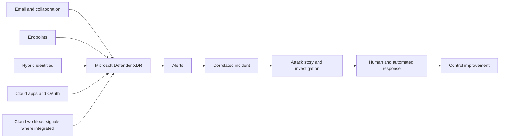

| Term | Plain meaning | Why it matters | Memory hook |
|---|---|---|---|
| Signal | A raw or derived observation | It may be benign until interpreted | A clue, not a conclusion |
| Event | A recorded activity at a time | Supports chronology and hunting | Something happened |
| Evidence | An object or observation attached to an alert | Connects detections to users, devices, files or messages | What supports the claim |
| Alert | A detection that something may be malicious | Starts analyst triage | One alarm |
| Incident | A correlated case containing related alerts and evidence | Gives attack-level scope | The case file |
| Entity | A meaningful object such as a user, device, IP, mailbox, URL or file | Correlation pivots through entities | The nouns in the story |
| Asset | Something the organization values and protects | Adds ownership and business impact | Value under protection |
| Attack story | Ordered explanation of how related malicious activity unfolded | Makes correlation understandable | Clues become a narrative |
| Response action | Containment, remediation or evidence action | Changes risk or system state | Act with approval |

### 🔍 Plain-English deep-dive: XDR is correlation, not magic certainty

XDR does not make every alert true. It links evidence using Microsoft analytics, product detections, shared entities and timing. Correlation raises or lowers confidence, but an analyst still asks: Is this the same user? Is the device identity reliable? Did the message reach the user? Is the IP a shared proxy? Did automation already remediate the object? Treat the incident as a structured hypothesis with supporting evidence, not as an infallible verdict.

## 2. Microsoft Defender XDR product family

Microsoft Defender XDR is the umbrella investigation and response experience. Component services contribute domain-specific protection and telemetry.

| Component | Primary domain | Representative evidence | Typical response context |
|---|---|---|---|
| Microsoft Defender for Endpoint (MDE) | Devices and endpoint behavior | Process, file, registry, network, logon and device risk | Isolate device, collect package, live response, contain file |
| Microsoft Defender for Identity (MDI) | On-premises AD DS and supported identity infrastructure | Authentication, LDAP, Kerberos, NTLM, directory reconnaissance and lateral movement | Investigate identity, reduce privilege, coordinate credential reset |
| Microsoft Defender for Office 365 (MDO) | Email, Teams, SharePoint and OneDrive threat protection where supported | Message, sender, URL, attachment, campaign and post-delivery evidence | Quarantine/purge message, submit, remediate URL/file |
| Microsoft Defender for Cloud Apps (MDCA) | SaaS use, cloud activity, OAuth and session controls | App activity, files, sessions, risky OAuth permissions and discovery logs | Suspend app/user where authorized, revoke app, governance action |
| Microsoft Entra integrations | Cloud identity and risk context | Sign-ins, users, service principals, risk and authentication context | Coordinate identity containment and Conditional Access |
| Microsoft Defender for Cloud integration | Cloud workload/resource protection | Resource, workload and cloud alert context | Route to cloud owner and workload response |
| Microsoft Sentinel integration | SIEM, broader data, analytics, hunting and SOAR | Third-party and custom logs, incidents, entities and automation | Cross-platform investigation and playbooks |

The suite is integrated, but each product still has its own prerequisites, licenses, data boundaries and specialist controls. “We own Defender XDR” is not a sufficient design. The client needs a domain-by-domain responsibility model.

## 3. Control plane, data plane and response plane

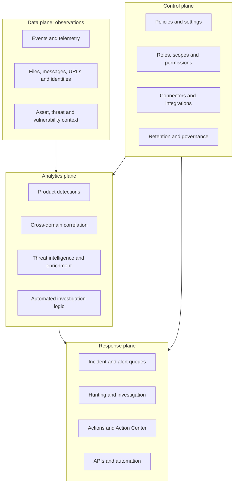

| Plane | Design question | Failure example | Evidence source |
|---|---|---|---|
| Data | Is required telemetry arriving with correct identity and time? | Device stopped reporting | Sensor health, connector status, raw event search |
| Analytics | Did a rule/detection evaluate and correlate as intended? | Alert absent or wrongly grouped | Alert metadata, rule status, incident history |
| Control | Are policy, role and scope correct? | Analyst cannot see or act on a device | Unified RBAC, product role, audit log |
| Response | Did the requested action execute and complete? | Isolation remains pending | Action Center and device action status |

This separation is a troubleshooting tool. A blank incident queue can mean no attack, missing telemetry, disabled analytics, role scoping, portal filtering or service degradation. Start with the layer that owns the missing behavior.

## 4. Assets, entities, events, evidence, alerts and incidents

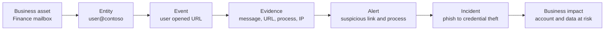

| Object | Example | Key analyst question | Common mistake |
|---|---|---|---|
| Asset | CFO mailbox or domain controller | What business value and owner are involved? | Treating all entities as equal impact |
| Entity | User, device, IP, URL, file hash, mailbox | Is it unique, shared, stale or spoofable? | Assuming an IP equals one person |
| Event | Process creation at 10:03 UTC | What source, timestamp and reliability? | Mixing local time and UTC |
| Evidence | `invoice.html`, message ID, process tree | Does it directly support the alert? | Calling related context proof |
| Alert | Suspicious inbox rule | What detection fired and why? | Closing because one clue looks benign |
| Incident | Related email, endpoint and identity alerts | What is confirmed, suspected and out of scope? | Trusting correlation without validation |

**Evidence status** and **verdict** are change-sensitive fields. Analysts may classify evidence as malicious, suspicious or benign and alerts/incidents with portal-specific classifications and determinations. Preserve original facts, analyst changes, automation and timestamps in the evidence record.

## 5. How correlation creates an attack story

Correlation uses shared entities, time proximity, detection relationships, campaign intelligence and analytics to group alerts. The exact proprietary model is not a client-configurable formula. Analysts validate the output through transparent evidence.

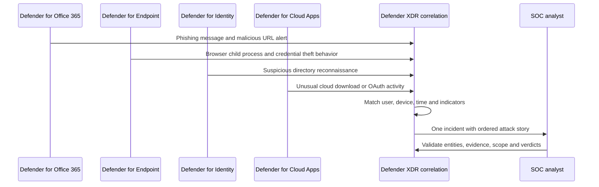

| Correlation clue | Strength | Caveat |
|---|---|---|
| Same immutable user/device identifiers | Usually strong | Synced/merged identities and reimaged devices need review |
| Same file hash or URL | Strong technical link | Common legitimate software or shared infrastructure can mislead |
| Same IP address | Contextual | NAT, VPN, proxy, mobile carrier and cloud egress are shared |
| Close timestamps | Supporting | Clock skew, delayed ingestion and batch events affect order |
| Same campaign cluster | Useful threat context | Similar templates do not prove one actor |
| Same mailbox/message lineage | Strong for email scope | Forwarding, journaling and gateway rewriting complicate lineage |

### 🔍 Plain-English deep-dive: correlation versus causation

Suppose an email alert appears at 10:00 and an endpoint malware alert at 10:05. Correlation says the events are related enough to investigate together. Causation requires evidence that the user interacted with that message or URL and that the resulting process chain led to the endpoint behavior. The five-minute gap alone is not proof. Good investigation moves from “these may be related” to “these observed links support this sequence,” while recording uncertainty.

## 6. Incident queue, alert queue and filters

The incident queue is the operational work list. Useful dimensions typically include severity, status, assigned owner, classification, service source, impacted assets/entities, tags and time. Exact columns and filter names change.

| Queue practice | Good implementation | Failure mode |
|---|---|---|
| Ownership | One accountable analyst/team at a time | Duplicate or abandoned work |
| Severity | Combine technical confidence and business impact | Treat vendor severity as business priority |
| Status | Clear new, active, resolved and exception meanings | “Resolved” used to hide backlog |
| Tags | Controlled taxonomy for client, VIP, exercise and escalation | Free-text tag sprawl |
| SLA | Time-to-acknowledge and time-to-triage by priority | Timer gaming without risk reduction |
| Closure | Classification, determination, comments and evidence | Closing without rationale |

A mature queue design distinguishes **alert severity** from **incident priority**. A medium-confidence alert affecting a domain admin can be more urgent than a high-severity alert on an isolated test device.

## 7. Incident page, timeline and graph

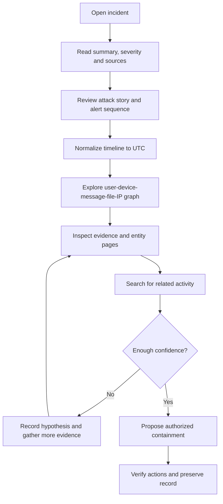

| View | Best use | Limit |
|---|---|---|
| Summary | Initial scope and product sources | Condenses detail and can inherit incorrect correlation |
| Attack story | Ordered high-level path | Not a forensic reconstruction by itself |
| Timeline | Sequence of alerts, events and actions | Ingestion time can differ from event time |
| Graph | Relationships among entities/evidence | Dense graphs can imply relationships stronger than evidence |
| Alert page | Detection logic and alert-specific evidence | One domain view can miss broader impact |
| Entity page | User/device/mailbox/file context | Data depends on integrations, retention and permissions |

Use a two-column notebook during investigation: **observed fact** and **interpretation/hypothesis**. This habit from RCA work prevents a plausible story from becoming an unsupported statement.

## 8. Cross-domain phishing attack story

The following fictional scenario is used throughout this Part. It is not a claim about a real tenant.

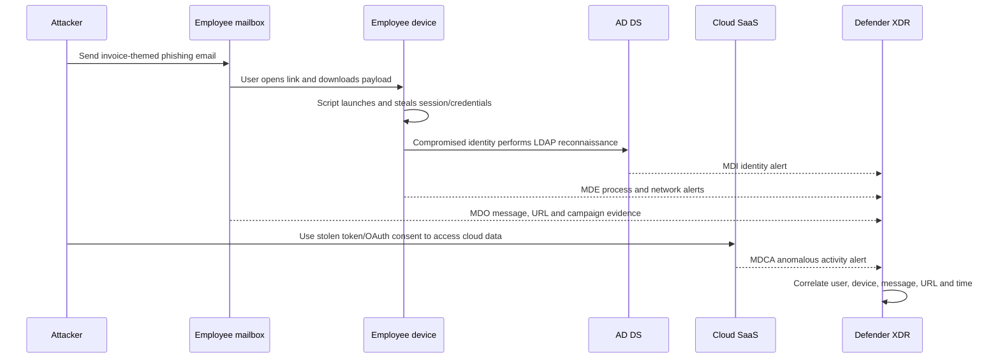

| Stage | Possible evidence | Domain owner | Immediate question |
|---|---|---|---|
| Delivery | Network message ID, sender, headers, URL, attachment | Email security | Who received and interacted? |
| Execution | Process tree, command line, file hash, network connection | Endpoint security | What ran and with what privilege? |
| Credential access | LSASS/credential behavior, token use, risky sign-in | Endpoint/identity | What secret or session may be exposed? |
| Discovery | LDAP queries, group/domain enumeration | Identity security | Was this normal administration? |
| Lateral movement | Remote service, SMB/RDP, unusual authentication | Identity/endpoint | Which assets and accounts were reached? |
| Cloud access | App activity, OAuth consent, download, location | Cloud app/identity | Is the session or app authorized? |
| Impact | Sensitive data access, privilege, persistence | Incident command/business owner | What material harm is plausible or confirmed? |

The analyst should not jump straight to purge, isolate, disable and revoke simultaneously. First preserve enough evidence, identify business-critical systems, assign decision authority and define validation/rollback for each action. During active harm, containment may precede complete certainty, but the rationale must be explicit.

## 9. MITRE ATT&CK tactics and techniques

MITRE ATT&CK is a public knowledge base that describes adversary behavior. A **tactic** is the attacker's goal at a stage; a **technique** is how that goal is pursued. Product mappings help analysts communicate behavior, but mappings are not proof of actor identity.

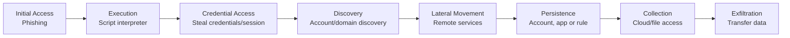

| ATT&CK concept | Use in Defender operations | Guardrail |
|---|---|---|
| Tactic | Organize attacker objective | One alert can map to several tactics |
| Technique/sub-technique | Describe observed behavior precisely | Verify current ATT&CK version and ID |
| Detection coverage | Identify visibility/control gaps | A mapped product feature is not validated coverage |
| Incident reporting | Give common language across teams | Add plain business explanation |
| Purple-team test | Emulate authorized behavior and validate telemetry | Written authorization and safe scope required |

A good incident statement says, “The alert maps to phishing for initial access and command/script execution; endpoint evidence shows the process chain.” It does not say, “MITRE proves this actor performed a complete attack.”

## 10. XDR versus SIEM versus SOAR

| Capability | XDR | SIEM | SOAR |
|---|---|---|---|
| Primary purpose | Correlate and respond across integrated security domains | Collect, normalize, query and detect across broad enterprise data | Orchestrate repeatable workflows and actions |
| Typical strength | Deep product-native entities and response | Broad first/third-party visibility and retention choices | Cross-system automation, approvals and case workflow |
| Typical data | Endpoint, identity, email, SaaS security telemetry | Security, cloud, network, app, infrastructure and business logs | Alerts, incidents, enrichment and action APIs |
| Example | Defender XDR | Microsoft Sentinel | Sentinel automation rules/Logic Apps and product automation |
| Main risk | Assuming native correlation covers every source | Ingestion cost/noise and weak use cases | Automating unsafe actions or loops |

### 🔍 Plain-English deep-dive: airport operations again

XDR is the integrated airport security team with access to cameras, badges and baggage systems. SIEM is the wider city operations center that also receives police, road, weather, building and third-party logs and can retain/query them under a broader design. SOAR is the approved workflow machinery that opens cases, enriches identities, requests approval, blocks credentials and notifies owners. They overlap, but they solve different primary problems.

## 11. Defender XDR and Microsoft Sentinel integration

Microsoft's strategic direction is a unified SecOps experience in the Defender portal. Supported Sentinel workspaces can be connected/onboarded so incidents, hunting, entities, content and operations appear in the unified experience. Eligibility, regional/cloud availability, feature location, limits and migration behavior are change-sensitive.

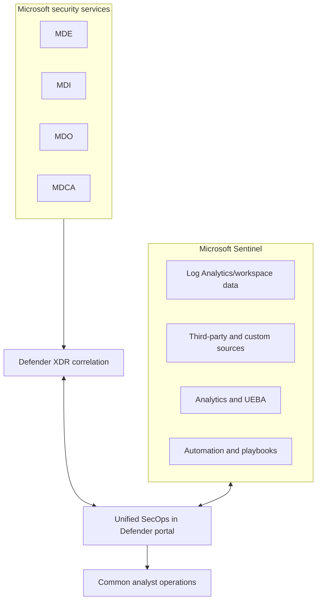

| Design decision | Questions |
|---|---|
| Workspace selection | Which tenant, region, subscription and data residency apply? |
| Incident ownership | Which system creates/updates incidents and avoids duplicates? |
| Permissions | How do Entra, Azure RBAC, Defender unified RBAC and workspace roles combine? |
| Data location | Is data queried in native XDR, Log Analytics, a data lake or several tiers? |
| Retention | What operational/legal periods apply to each source and tier? |
| Automation | Which actions need human approval and which platform is authoritative? |
| Cost | What is included versus ingestion, retention, automation or add-on cost? |
| Resilience | How does the SOC operate if one portal/integration is degraded? |

Do not describe integration as “all Defender data is copied into Sentinel for free.” Data connectors, included allowances, table plans, analytics, retention and billing vary. Create a source-by-source data and cost matrix.

## 12. Unified portal direction and product boundaries

The Defender portal increasingly hosts XDR and Sentinel operations. Older product portals and links can redirect or retain specialist pages during transition. A consultant documents **task-to-portal mapping**, not just screenshots.

| Task | Strategic experience | Change-sensitive consideration |
|---|---|---|
| Incident triage | Microsoft Defender portal | Source incidents and workspace onboarding |
| Advanced hunting | Defender portal | Schema, retention and Sentinel query scope |
| Endpoint device investigation | Defender portal | MDE license, device state and RBAC scope |
| Cloud app policies | Defender portal | MDCA license and connector/session prerequisites |
| Sentinel configuration | Defender portal/Azure surfaces as currently supported | Feature parity and resource-provider permissions |
| Service health | Microsoft 365 admin center, Azure status/health and product health | Different ownership and incident granularity |

Portal consolidation does not eliminate backend service boundaries. A visible MDI alert still depends on healthy sensors; a visible MDO incident still depends on message telemetry and policy; a Sentinel incident still depends on connectors and analytics.

## 13. RBAC and unified RBAC context

**Role-based access control (RBAC)** grants permissions according to job role and scope. Microsoft Defender XDR Unified RBAC aims to provide a common permission model across supported Defender workloads. Support and activation behavior can differ by product and tenant.

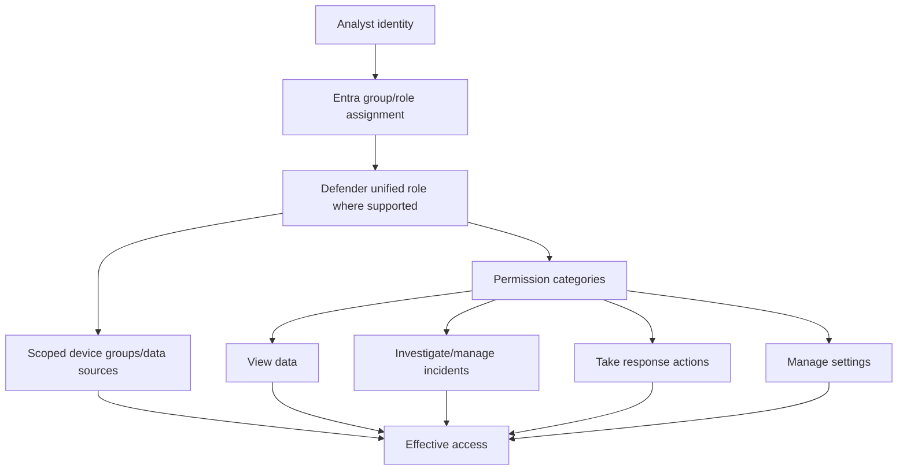

| Persona | Minimum capability idea | Separation-of-duties guardrail |
|---|---|---|
| L1 analyst | View/triage assigned incidents and evidence | No destructive global actions |
| L2 investigator | Hunt, classify and propose containment | High-impact actions approved by incident lead |
| Responder | Execute authorized device/user/message actions | Action audit and time-bounded membership |
| Detection engineer | Configure/tune rules and exclusions | Peer review; cannot self-approve all exceptions |
| Platform administrator | Configure integrations, roles and settings | Separate daily analyst account and privileged account |
| Auditor | Read evidence, configuration and audit history | No investigation mutation or response |

### 🔍 Plain-English deep-dive: a role name is not effective access

A badge labeled “Security Analyst” is not enough. Effective access can depend on Entra membership, Defender role activation, legacy product roles, device-group scope, Sentinel workspace RBAC, licensing and portal propagation. Troubleshooting asks which exact object, permission and scope failed. Never solve access by assigning Global Administrator as a diagnostic shortcut in production.

## 14. Data retention, residency and evidence governance

Retention differs by data class and license. Microsoft documentation commonly distinguishes shorter advanced-hunting telemetry windows from longer incident/alert records, while Sentinel offers separately configured retention and archive/data-lake options. Exact durations and included entitlements must be verified at design time.

| Data class | Planning question | Risk if assumed |
|---|---|---|
| Raw hunting telemetry | How far back can analysts query each table? | Historical event absent during delayed discovery |
| Alerts and incidents | How long are case records available? | Audit/PIR evidence unavailable |
| Action/audit history | Who changed verdicts, settings or response state? | Weak accountability |
| Endpoint forensic package | Where is downloaded evidence stored and for how long? | Uncontrolled sensitive evidence |
| Email/message evidence | Can content be viewed, exported or purged under policy? | Privacy/legal conflict |
| Sentinel copy/archive | Is data duplicated, transformed or retained elsewhere? | Cost and residency surprises |

Create a retention schedule with security, privacy, legal, records and regional stakeholders. Minimum collection is a security control too: more telemetry can improve detection but increases privacy, breach impact and cost.

## 15. Connectors, APIs and automation boundaries

Defender capabilities expose Microsoft Graph security APIs, product APIs, streaming/event interfaces and integrations whose availability and preferred endpoint evolve. Microsoft has deprecated or replaced APIs over time; verify current guidance before building.

| Integration pattern | Use | Design control |
|---|---|---|
| Native product integration | Rich cross-domain correlation | Verify prerequisites and source health |
| Microsoft Graph security API | Incidents, alerts and security operations where supported | Least-privilege app permissions, throttling and versioning |
| Defender APIs | Product-specific device, indicator or action tasks | Current support/deprecation check |
| SIEM connector | Send or query security data | Duplicate prevention, cost, schema and latency |
| Ticketing connector | Case synchronization | Authoritative status and retry/idempotency rules |
| Webhook/streaming | Near-real-time event delivery where supported | Secret/certificate rotation and dead-letter handling |
| SOAR playbook | Enrichment and response | Human approval for destructive actions |

Use workload identities with certificates or federated credentials where supported, restricted ownership, least privilege, explicit consent, secret rotation, audit logs, retry/backoff and a tested disable switch. An API integration is a privileged security component.

## 16. Alert policies, suppression and tuning

Tuning seeks useful signal without hiding attacks. Product alerts can support rule tuning, exclusions, suppression, indicators, custom detections or policy changes, but the available method differs by detection.

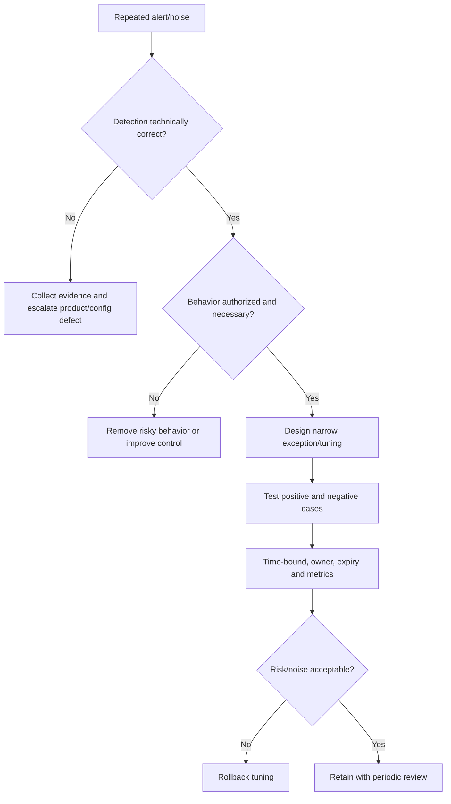

| Tuning choice | Safer practice | Dangerous practice |
|---|---|---|
| Suppression | Narrow entity/condition, expiry, documented rationale | Suppress all alerts of a type |
| Exclusion | Exact trusted path/process/certificate where supported | Broad folder or publisher exclusion without risk review |
| Severity change | Evidence-based business context | Lower severity to improve SLA metrics |
| Allow indicator | Temporary, scoped and monitored | Permanent allow after one false positive |
| Custom detection threshold | Baseline and test with known positives | Raise until alerts disappear |
| Incident grouping | Validate shared entities/time | Merge unrelated activity or fragment one attack |

Measure false-positive rate by detection and analyst disposition, but also sample closed benign cases for false-negative risk. Silence is not proof of quality.

## 17. Service health and telemetry health

Security operations need both platform service health and source health. A healthy portal can display stale data; a degraded portal can hide otherwise healthy detections.

| Health layer | Check | Example evidence |
|---|---|---|
| Endpoint/source | Sensor/connectivity/onboarding state | Last seen, sensor health, device inventory |
| Connector | Authorization, ingestion and latency | Connector health, API errors, timestamps |
| Product detection | Policy/rule enabled and scoped | Configuration export, test alert |
| Correlation | Alerts enter incidents as expected | Incident history and source IDs |
| Portal | Page/API availability and filters | Browser trace, status code, service health |
| Response | Action queued/executed/failed | Action Center status and target logs |
| External dependency | DNS, proxy, TLS, Entra, Azure, third-party gateway | Network trace and dependency health |

Build synthetic health tests that create harmless, documented signals or validate expected telemetry without malware. Follow Microsoft's simulation guidance and client authorization.

## 18. Assessment and discovery

A Defender XDR assessment begins with business outcomes and attack paths, not a feature checklist.

| Discovery area | Questions | Artifact |
|---|---|---|
| Assets | Which identities, devices, mailboxes, apps and data are critical? | Crown-jewel register |
| Threats | Which likely attack paths matter most? | Threat model and ATT&CK use cases |
| Products/licenses | Which Defender plans and M365 suites are assigned? | Entitlement/capability matrix |
| Telemetry | Which sources are healthy and retained? | Source inventory and data-flow map |
| Roles | Who can view, hunt, configure and respond? | RBAC matrix and segregation-of-duties review |
| Process | How are incidents prioritized, escalated and closed? | Operating-model maturity map |
| Integrations | Sentinel, ticketing, identity, endpoint management, vendors | Integration dependency map |
| Privacy | What personal/content data is collected and viewed? | DPIA/privacy control record where required |

Interview users from SOC, identity, endpoint, messaging, cloud, privacy, legal, HR, service management and business operations. XDR crosses ownership boundaries by design.

## 19. Target architecture and design decisions

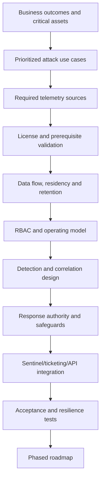

Key architecture decisions include:

1. Which products and platforms are in scope.
2. Which tenant, regions and cloud environments apply.
3. Which incident system is operationally authoritative.
4. Which data remains native and which is sent to Sentinel or another SIEM.
5. Who owns each entity and response action.
6. Which actions are automatic, approval-controlled or prohibited.
7. How retention and evidence export meet policy.
8. How third-party tools coexist and avoid duplicate response.
9. How service degradation and portal outage are handled.
10. How success is measured without incentivizing unsafe closure.

## 20. Prerequisites and licensing workstream

| Workstream | Validate before deployment |
|---|---|
| Tenant/service | Correct tenant, supported cloud/region, service provisioned |
| Product plans | MDE, MDI, MDO, MDCA and relevant M365/Entra/Sentinel entitlements |
| Identity | Admin and analyst groups, PIM, emergency access and service principals |
| Endpoint/identity/email/app | Source-specific onboarding, connectivity and permissions |
| Network | Required Microsoft endpoints, TLS inspection/proxy behavior and egress |
| Privacy/legal | Monitoring notices, content access, retention and evidence-handling approval |
| SOC process | Queue ownership, severity, escalation, containment and closure |
| Integrations | Workspace, connectors, API apps, ticketing and automation ownership |

Do not build a single “E5 means everything” row. Some capabilities are suite-included, some are add-ons, some require server licenses, some depend on usage-based billing, and some previews have separate terms.

## 21. Staged deployment plan

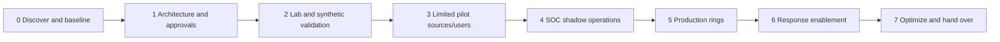

| Phase | Exit criteria | Rollback/hold condition |
|---|---|---|
| Discovery | Owners, scope, evidence and gaps agreed | Unknown critical dependency |
| Design | HLD/LLD, licenses, privacy and roles approved | Unresolved data/residency issue |
| Lab | Expected benign test telemetry and access proven | Missing source or overprivileged role |
| Pilot | Stable source health and acceptable analyst workflow | Material performance/noise/business issue |
| Shadow | Analysts can triage without executing risky actions | Runbooks/training incomplete |
| Response | Approval paths and rollback verified | Uncontrolled automation or action failures |
| Handover | SLA, RACI, monitoring, support and documentation accepted | No operational owner |

A feature can be enabled technically before the organization is ready to operate it. Readiness is the stricter gate.

## 22. Testing strategy

| Test category | Example | Expected evidence |
|---|---|---|
| Positive detection | Authorized safe phishing simulation produces expected alert | Alert ID, source, time and detection reason |
| Cross-domain correlation | Synthetic email and endpoint signals join appropriately if supported | Incident IDs and relationship evidence |
| Negative | Similar legitimate admin behavior does not create unacceptable alert | Search result and documented baseline |
| RBAC | L1 can view but cannot perform high-impact action | Access result and audit log |
| Scope | Analyst sees only assigned device group/workspace where designed | Persona test matrix |
| Response | Approval-controlled benign action completes | Action Center and target confirmation |
| Integration | Incident syncs once to ticketing/Sentinel | Correlation IDs and retry logs |
| Resilience | Connector/portal interruption runbook is usable | Exercise notes and recovery timing |
| Retention | Oldest required record remains queryable/exportable | Timestamped query and policy evidence |

Never use real malware, real credentials, unauthorized phishing or production disruption. Use Microsoft-supported simulations, inert indicators and paper exercises with written authorization.

## 23. Rollback and change safeguards

| Change | Rollback | Irreversible/high-risk concern |
|---|---|---|
| Enable integration | Disable connector after preserving configuration/evidence | Data already transferred may remain under retention |
| Change incident grouping | Restore prior setting/rule | Existing incident history may not re-form identically |
| Add suppression | Remove/expire suppression | Alerts missed during suppression cannot always be recreated |
| RBAC role change | Restore group/role assignment | Analyst work may be blocked during propagation |
| Automated response | Disable rule/playbook and revoke credentials | Completed isolation, purge or disable action needs separate recovery |
| Retention reduction | Restore future setting | Expired/deleted data may not be recoverable |
| Evidence export | Delete under approved handling process | Copies may exist in tickets/downloads/backups |

Record pre-change configuration, owner, implementation time, test, rollback trigger, rollback steps, evidence and final disposition. Security changes need the same rigor you used for production incident fixes.

## 24. Operating model and RACI

| Activity | SOC | Endpoint | Identity | Messaging | Cloud app | Platform admin | Incident commander |
|---|---|---|---|---|---|---|---|
| Triage incident | R | C | C | C | C | C | A |
| Validate endpoint evidence | C | R/A | C | I | I | C | I |
| Validate identity evidence | C | C | R/A | I | C | C | I |
| Purge malicious mail | C | I | I | R | I | C | A for high impact |
| Isolate business device | R | C | I | I | I | C | A |
| Disable/revoke identity | C | I | R | I | C | C | A |
| Tune detection | R | C | C | C | C | A | I |
| Executive update | C | C | C | C | C | I | R/A |

`R` is responsible for doing; `A` is accountable for outcome; `C` is consulted; `I` is informed. Tailor this matrix. Never leave a destructive action with several responsible parties and no accountable decision maker.

## 25. Metrics and service objectives

| Metric | Useful interpretation | Gaming/risk warning |
|---|---|---|
| Mean time to acknowledge | Queue responsiveness | Fast acknowledgement is not correct triage |
| Mean time to scope | Time to identify affected entities | Scope quality matters more than speed alone |
| Mean time to contain | Time to reduce active risk | Premature containment can destroy evidence or operations |
| Detection-to-ingestion latency | Telemetry freshness | Average can hide one failed source |
| Source health coverage | Reporting assets/sources versus expected | “Last seen” threshold must fit asset type |
| True/false-positive rate | Detection usefulness by rule | Closure labels may be inconsistent |
| Reopened incidents | Closure quality signal | Low number can reflect failure to detect recurrence |
| Automation success/failure | Reliability of actions | Successful execution does not prove correct decision |
| ATT&CK/use-case coverage | Tested detections for priority behaviors | Feature mapping is not test evidence |
| High-risk action approval time | Governance responsiveness | Avoid bypassing approval to meet target |

Report trends with volumes, denominators and data-quality notes. “Incidents fell 40%” can mean improvement, suppression, broken telemetry or changed attack volume.

## 26. Common failure modes

| Symptom | Likely layers | First discriminating checks |
|---|---|---|
| No incidents | Data, analytics, RBAC, filters | Source health, known test alert, time/filter and account scope |
| Alerts not correlated | Entity identity, timing, grouping/model | Compare immutable IDs, timestamps and incident history |
| Duplicate incidents | Multiple rules/connectors/sync directions | Source IDs, connector configuration and authoritative system |
| Missing endpoint evidence | MDE onboarding/connectivity/retention/RBAC | Device last seen, sensor state and raw hunting data |
| Missing identity alert | MDI sensor/coverage/permissions | Sensor health, DC coverage and activity test |
| Email appears but URL click absent | MDO licensing/telemetry/browser path | Message trace, click evidence and supported protection path |
| Analyst cannot act | Role, scope, PIM or product boundary | Effective role, device group/workspace and audit denial |
| Action pending/failed | Target offline, permission, service or conflict | Action Center, target connectivity and error code |
| Timeline order seems wrong | Event versus ingestion time, timezone/skew | Compare source timestamps in UTC |
| Portal slow/blank | Browser, service health, role, API | Service health, alternate account/API and browser network trace |

## 27. Layered troubleshooting method

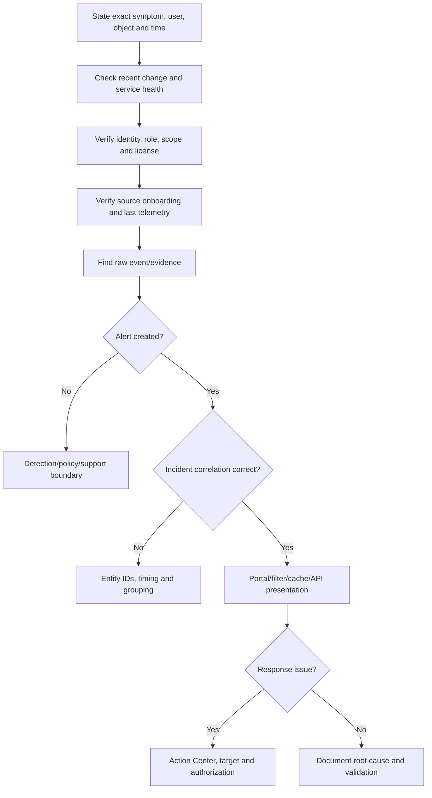

The cheapest discriminating check is often a known source event searched by exact time and immutable identifier. If raw data is absent, tuning the incident queue cannot solve the problem.

## 28. Privacy, security and evidence handling

Defender data can reveal employee behavior, communications, devices, locations, files and relationships. Apply least privilege, purpose limitation, retention limits and legal/privacy review.

| Risk | Control |
|---|---|
| Excess analyst access | Scoped roles, PIM, access reviews and audit |
| Sensitive message/file viewing | Need-to-know workflow, case approval and secure evidence store |
| Insider misuse | Segregation of duties, audit monitoring and sanctions process |
| Cross-border transfer | Region/residency design and legal review |
| API credential compromise | Managed identity/federation, certificate rotation and restricted owners |
| Evidence alteration | Immutable source references, hashes where appropriate and audit trail |
| Over-collection | Use-case justification and minimization |
| Automated harm | Human approval, action allowlist, kill switch and rollback |

Security telemetry is not a general employee-performance dataset. Document permitted purposes and access review cadence.

## 29. Consulting scenarios

### Scenario A: tool consolidation

A client wants to replace endpoint, email and SIEM tools with “one Microsoft portal.” Do not promise immediate replacement. Build a capability matrix for prevention, detection, response, platform support, retention, forensic depth, threat intelligence, reporting, API, data residency, cost and operational ownership. Run coexistence, compare validated use cases, define cutover and keep rollback until acceptance criteria are met.

### Scenario B: high false-positive volume

The client asks to suppress a noisy identity alert globally. Validate whether activity is authorized, identify the narrow source/account/process and look for safer operational correction. If tuning is necessary, time-bound it, retain a detection for malicious variants, test positive and negative cases, peer review and monitor recurrence.

### Scenario C: missing cross-domain story

Email and endpoint teams see related alerts, but Defender XDR shows separate incidents. Compare user and device identifiers, message/URL/hash evidence, event times, product onboarding, tenant boundaries and grouping behavior. Record that analyst-led correlation can still establish one case even when automatic grouping does not.

### Scenario D: unified portal adoption

A SOC wants Sentinel and XDR in the Defender portal. Assess workspace eligibility, roles, content parity, incident synchronization, automation, retention, cost and outage procedures. Pilot analyst personas and priority use cases before changing the operational system of record.

## 30. Consulting artifacts

| Artifact | Minimum content |
|---|---|
| Current-state assessment | Products, licenses, sources, health, roles, incidents, integrations and gaps |
| XDR HLD | Trust boundaries, products, data flows, regions, integrations and operations |
| XDR LLD | Source settings, scopes, roles, connectors, filters, retention and action controls |
| Use-case catalogue | Threat, ATT&CK mapping, source, logic, owner, severity and test |
| RBAC matrix | Persona, permission, scope, assignment path and review |
| Retention matrix | Data class, source, location, duration, owner and legal basis |
| Deployment plan | Phases, prerequisites, test, gate, change and rollback |
| Tuning register | Detection, evidence, exception, risk, owner, expiry and review |
| Incident runbook | Triage, scope, evidence, decision, action, communication and closure |
| Operational handover | RACI, SLA, queue, monitoring, training, support and acceptance |
| Executive dashboard | Risk, coverage, health, outcomes, limitations and decisions |
| PIR/RCA | Timeline, cause, contributing factors, response and corrective actions |

## 31. Safe paper lab: investigate a fictional cross-domain incident

This lab is deliberately non-invasive. It uses only fictional data and does not require a tenant, Defender license, malware, credentials or response actions.

### Lab brief

At 09:00 UTC, `invoice-8842` is delivered to fictional user `alex@contoso.example`. At 09:07, Alex clicks `hxxps://billing-review.example`. At 09:09, the browser launches a script interpreter that contacts `203.0.113.25` (documentation-only IP range). At 09:16, the account performs unusual LDAP group discovery. At 09:29, an unfamiliar OAuth app named `Invoice Reader Demo` receives broad file permission, and at 09:34 a large SharePoint download begins. All names, domains and addresses are synthetic.

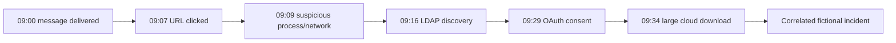

### Step 1: build the evidence register

| Time UTC | Source | Observed fact | Entity/evidence ID | Confidence | Interpretation |
|---|---|---|---|---|---|
| 09:00 | Email | Message delivered | `invoice-8842` | High | Possible initial access |
| 09:07 | Email/browser | URL click recorded | `url-demo-1` | High | User interaction likely |
| 09:09 | Endpoint | Browser child process and outbound connection | `device-demo-7` | High | Suspicious execution |
| 09:16 | Identity | Unusual LDAP group discovery | `alex-demo-id` | Medium | Reconnaissance; validate admin role |
| 09:29 | Cloud app | OAuth consent recorded | `app-demo-4` | High | Possible persistence/access path |
| 09:34 | Cloud app | Large SharePoint download | `activity-demo-9` | Medium | Possible collection/exfiltration |

### Step 2: draw entity relationships

Record user, mailbox, device, message, URL, IP, process, directory, OAuth app and SharePoint site. Label each relationship as observed, inferred or unknown. Do not label the attacker as a known group.

### Step 3: map ATT&CK carefully

Map phishing, command/script execution, account/domain discovery, additional cloud role/app access and collection only where the fictional evidence supports them. Write a one-line business translation beside each mapping.

### Step 4: propose response with safeguards

| Proposed action | Decision owner | Evidence preservation | Business risk | Validation/rollback |
|---|---|---|---|---|
| Quarantine/purge matching message | Messaging lead/incident commander | Preserve message IDs, headers and recipient list | Legitimate mail removal | Confirm scope; release if false positive |
| Isolate fictional device | Incident commander/endpoint lead | Preserve process/network evidence | User/business interruption | Confirm isolation; controlled release |
| Revoke sessions/reset credentials | Identity lead | Preserve sign-in and token evidence | User lockout/integration impact | Validate new sign-in and app dependencies |
| Disable/revoke OAuth app consent | App/identity owner | Export app ID, permissions and audit event | Break legitimate workflow | Restore only after verified owner/risk review |
| Restrict SharePoint access | Site/data owner | Preserve audit and permission state | Collaboration outage | Test least-disruptive control and restore from record |

### Step 5: create interview evidence

Produce these paper artifacts:

1. One-page architecture diagram.
2. Incident timeline separating facts from hypotheses.
3. Entity/evidence register.
4. ATT&CK mapping with business translations.
5. Containment decision matrix with approval and rollback.
6. 15-minute technical update and three-sentence executive update.
7. Root-cause hypothesis and alternative explanations.
8. Control-improvement backlog.

### Evidence-safe interview wording

> “I completed a fictional paper exercise rather than a production Defender investigation. I correlated synthetic MDO, MDE, MDI and MDCA evidence into a phishing-to-endpoint-to-identity-to-SaaS attack story; separated observed facts from hypotheses; mapped supported behavior to MITRE ATT&CK; proposed approval-controlled containment; and documented rollback, privacy and stakeholder communication. My production analogue is M365 critical-incident RCA and evidence coordination, not Defender ownership.”

## 32. JD Mapping: interview translation

| Interview prompt | Honest bridge from your background | Defender-specific learning evidence |
|---|---|---|
| “Tell me about cross-domain investigation.” | Critical-incident scope, timelines, dependencies and product-group coordination | Fictional XDR evidence register and attack story |
| “How would you deploy XDR?” | Staged changes, validation, stakeholder ownership and rollback | HLD/LLD, rings, RBAC and test matrix |
| “How do you troubleshoot missing alerts?” | Layered fault isolation and known-good checks | Source-to-alert-to-incident decision tree |
| “How do you tune noise?” | Evidence-based RCA and narrow corrective actions | Time-bound tuning register with positive/negative tests |
| “How do you communicate risk?” | Executive updates and technical documentation | Incident summary with facts, uncertainty and residual risk |
| “What is your hands-on level?” | State production M365 support accurately | Clearly label Defender work as study/paper-lab evidence |

## Official Source Anchors

Use these first-party anchors and re-check their date, tenant applicability and linked licensing pages before a client decision:

1. [Microsoft Defender XDR overview](https://learn.microsoft.com/defender-xdr/microsoft-365-defender)
2. [Microsoft Defender portal overview](https://learn.microsoft.com/defender-xdr/microsoft-365-defender-portal)
3. [Incidents overview](https://learn.microsoft.com/defender-xdr/incidents-overview)
4. [Investigate incidents](https://learn.microsoft.com/defender-xdr/investigate-incidents)
5. [Alerts queue](https://learn.microsoft.com/defender-xdr/alerts-queue)
6. [Microsoft Defender XDR Unified RBAC](https://learn.microsoft.com/defender-xdr/manage-rbac)
7. [Microsoft Defender XDR data retention](https://learn.microsoft.com/defender-xdr/data-retention)
8. [Advanced hunting overview](https://learn.microsoft.com/defender-xdr/advanced-hunting-overview)
9. [Microsoft Sentinel in the Microsoft Defender portal](https://learn.microsoft.com/azure/sentinel/microsoft-sentinel-defender-portal)
10. [Connect Microsoft Sentinel to the Defender portal](https://learn.microsoft.com/azure/sentinel/connect-microsoft-sentinel-to-defender-portal)
11. [Microsoft Graph security API overview](https://learn.microsoft.com/graph/security-concept-overview)
12. [MITRE ATT&CK](https://attack.mitre.org/)
13. [Microsoft Defender XDR service description](https://learn.microsoft.com/office365/servicedescriptions/microsoft-365-service-descriptions/microsoft-365-defender-service-description)
14. [Microsoft 365 licensing guidance for security and compliance](https://learn.microsoft.com/office365/servicedescriptions/microsoft-365-service-descriptions/microsoft-365-security-compliance-licensing-guidance)
15. [Microsoft Defender XDR privacy and data security](https://learn.microsoft.com/defender-xdr/privacy)

## ⭐ Likely Interview Questions for This Section

### Q1. What is Microsoft Defender XDR, and how is it different from one Defender product?

**Model answer:** Microsoft Defender XDR is the cross-domain detection, correlation, investigation and response layer. Products such as Defender for Endpoint, Identity, Office 365 and Cloud Apps provide specialist controls and evidence. XDR relates their alerts through entities, time and threat context into incidents and attack stories. I would still verify each product's licensing, health and ownership because one portal does not remove backend boundaries.

### Q2. Explain signal, event, evidence, alert and incident.

**Model answer:** A signal is an observation; an event is a recorded activity at a time; evidence is the user, device, file, message, URL or other object supporting a detection; an alert says potentially malicious behavior was detected; and an incident is the case that correlates related alerts and evidence. The analyst validates that correlation rather than treating it as certainty.

### Q3. How would you investigate a cross-domain phishing incident?

**Model answer:** I would establish scope and time in UTC, review the attack story without assuming it is correct, validate message delivery and clicks, endpoint process/network evidence, identity reconnaissance or credential use, and cloud app activity. I would pivot by immutable entity IDs and indicators, separate facts from hypotheses, assess business impact, preserve evidence, then propose authorized containment with validation and rollback.

### Q4. What is the difference between XDR, SIEM and SOAR?

**Model answer:** XDR provides deep native correlation and response across integrated security domains. A SIEM provides broader collection, normalization, retention, analytics and hunting across Microsoft and third-party sources. SOAR orchestrates workflows and response across systems. Defender XDR, Sentinel and Logic Apps or product automation can work together, but authoritative incidents, duplication, cost, permissions and approval boundaries must be designed.

### Q5. How would you use MITRE ATT&CK in Defender XDR?

**Model answer:** I would use ATT&CK as a common language for attacker goals and techniques, map validated detections and test use cases, identify coverage gaps and explain the attack path. A product mapping is not proof that a control works, so I would require authorized tests and evidence. ATT&CK mapping also does not identify the threat actor by itself.

### Q6. How would you tune a noisy alert safely?

**Model answer:** First confirm whether the detection is technically correct and whether the behavior is authorized. Prefer fixing risky or unusual operational behavior. If tuning is justified, make the narrowest supported exception, document owner and rationale, add expiry, peer review it, run positive and negative tests, monitor misses and retain rollback. I would not globally suppress an alert merely to improve queue metrics.

### Q7. What must be designed when integrating Defender XDR and Sentinel?

**Model answer:** I would design workspace and tenant scope, portal eligibility, data sources, incident ownership and synchronization, role interaction, retention, residency, ingestion and automation cost, schema/query behavior, duplicate prevention, response authority and degraded-service procedures. I would pilot priority use cases and analyst personas because unified portal visibility does not mean every feature or permission is automatically unified.

### Q8. What is your honest Defender XDR experience?

**Model answer:** My production experience is Microsoft 365 support, critical incidents, RCA, evidence timelines, fix validation and stakeholder coordination. I have studied the current Defender XDR architecture and completed a safe fictional paper investigation across email, endpoint, identity and SaaS evidence. I have not operated a production Defender XDR tenant, so I would work within approved roles and runbooks, validate tenant-specific licensing and behavior, preserve evidence and use human-approved containment.

## 🧠 30-Second Memory Hooks

- **Signal is a clue; alert is an alarm; incident is the case.**
- **Entities are the nouns; events are the verbs; the timeline orders them.**
- **Correlation proposes a relationship; evidence establishes confidence.**
- **XDR is deep and native; SIEM is broad; SOAR orchestrates.**
- **One portal does not erase product prerequisites or ownership boundaries.**
- **MITRE names behavior, not guilt or actor identity.**
- **Tune narrowly, test both ways, assign expiry and preserve rollback.**
- **Role plus scope plus license plus source health equals effective capability.**
- **Facts, hypotheses, decisions, actions and validation belong in separate fields.**
- **Your bridge is incident discipline, not claimed Defender production ownership.**

## Completion Checklist

- [ ] I can draw the Defender XDR product and telemetry architecture from memory.
- [ ] I can explain assets, entities, signals, events, evidence, alerts and incidents.
- [ ] I can validate rather than blindly trust correlation and attack stories.
- [ ] I can navigate conceptually through queue, summary, timeline, graph, alerts and entity pages.
- [ ] I can explain the fictional phishing-to-endpoint-to-identity-to-SaaS path.
- [ ] I can map tactics and techniques without overclaiming what ATT&CK proves.
- [ ] I can distinguish XDR, SIEM and SOAR and explain Sentinel integration decisions.
- [ ] I can explain unified portal direction while preserving backend product boundaries.
- [ ] I can design least-privilege RBAC and segregation of duties.
- [ ] I can identify retention, residency, privacy and evidence-handling questions.
- [ ] I can plan connectors/APIs with least privilege, versioning and a disable path.
- [ ] I can tune alerts using narrow, time-bound and tested changes.
- [ ] I can assess source, connector, analytics, portal and response health separately.
- [ ] I can produce HLD, LLD, use-case, RBAC, retention, deployment and runbook artifacts.
- [ ] I can describe phased deployment, acceptance tests, hold gates and rollback.
- [ ] I can troubleshoot a missing alert from source event to incident presentation.
- [ ] I can report metrics with denominators and data-quality caveats.
- [ ] I can complete the safe paper lab without a tenant or unsafe activity.
- [ ] I can state exactly which experience is production and which is study evidence.
- [ ] I have re-checked change-sensitive licensing, retention, portal and integration facts.

*Next suggested section:* [Part 35](Part-35-defender-endpoint-vulnerability-management.md) — move from cross-domain architecture into endpoint sensor/cloud architecture, onboarding, EDR, containment, automated investigation and vulnerability prioritization.