# Part 35 — Defender for Endpoint and Defender Vulnerability Management

> **Section goal:** Master the approved endpoint scope from the ground up: Microsoft Defender for Endpoint (MDE) architecture, the endpoint sensor, cloud service and client components; onboarding methods, platforms, connectivity and proxies; Microsoft Defender Antivirus, endpoint detection and response (EDR), Defender Vulnerability Management, exposure and attack-surface controls; device inventory, tags, groups and RBAC; EDR in block mode; network protection, web content filtering and device control context; live response, device isolation, containment, automated investigation and response (AIR), Action Center and advanced features; MDE–Intune integration and security settings management; software, certificate, hardware, firmware, browser-extension and weakness inventories; CVE, CVSS, exploitability, exposure score, Secure Score for Devices, recommendations, prioritization, exceptions, remediation tickets and verification. By the end, you should be able to assess, design, deploy, test, roll back, operate and troubleshoot a safe endpoint and vulnerability-management capability, including ransomware and urgent-vulnerability scenarios.

This Part maps to Deloitte's Microsoft Defender suite, Defender Vulnerability Management, endpoint security, Intune, SCCM/co-management, assessment, architecture, deployment, incident response, optimization, troubleshooting, documentation and stakeholder expectations. Your production experience with high-severity Microsoft 365 incidents, RCA, evidence capture, fix validation, workload dependencies, service health, stakeholder communication and cross-team coordination is a strong operating foundation. The honest bridge is applying that discipline to endpoint telemetry, response and vulnerability workflows. This chapter never claims production MDE or Defender Vulnerability Management ownership.

> **Currency, licensing, preview, support and portal note:** This chapter was checked against official Microsoft Learn content available on **August 24, 2026**. MDE platform capability, server onboarding, streamlined connectivity, response actions, Intune security settings management, exposure scoring and the Vulnerability Management location under **Exposure management** are change-sensitive. Microsoft documents a preview experience that integrates Defender Vulnerability Management with Microsoft Security Exposure Management for tenants using specified Defender preview settings; other tenants can retain the existing experience. Product plans, server licensing, Defender for Servers relationships, add-ons, trial rights, operating-system support, government-cloud parity and mobile/network-device features vary. Verify Microsoft Product Terms, service descriptions, current platform matrix, live tenant UI, preview terms, Message center and Roadmap before client commitments.

## JD Mapping

| Deloitte role expectation | Capability developed here | Consulting evidence |
|---|---|---|
| Assess endpoint risk | Asset, onboarding, sensor, software, weakness and control coverage | Endpoint current-state assessment and gap register |
| Design Defender architecture | Components, connectivity, roles, device groups, management authority and integration | MDE HLD/LLD and data-flow diagram |
| Deploy endpoint security safely | Platform-aware onboarding, pilots, test, coexistence and rollback | Deployment plan, ring matrix and acceptance tests |
| Prioritize vulnerabilities | Threat, exploit, exposure, asset value and remediation feasibility | Risk-based remediation backlog and exception register |
| Investigate and contain threats | Timeline, live response, isolation, AIR and Action Center | Ransomware runbook and action-approval matrix |
| Troubleshoot complex failures | Sensor, proxy, policy, inventory and portal fault isolation | Troubleshooting tree and escalation evidence pack |

## Candidate honesty note

You can speak directly about production Microsoft 365 incidents, RCA, evidence timelines, workload behavior, service health, validation, escalation, stakeholder updates and support documentation where supported by your experience. Those skills transfer to MDE operations because endpoint incidents and remediation also demand precise scope, timestamps, dependency awareness, change control and proof that a fix worked.

You should not claim that you have onboarded a production MDE fleet, tuned EDR, isolated devices, used live response against real hosts, approved AIR actions, managed Intune endpoint-security policy, accepted vulnerability exceptions or patched enterprise devices unless separately evidenced. Safe wording is:

> “My production foundation is Microsoft 365 critical-incident support, RCA, evidence capture, validation and stakeholder coordination. I have built a current MDE and Defender Vulnerability Management design and a safe paper lab covering onboarding, telemetry health, ransomware containment and risk-based vulnerability remediation. I have not operated MDE or Vulnerability Management in production. I would validate the platform and license matrix, establish one policy authority, pilot by device ring, preserve endpoint evidence, require authorization for response, coordinate remediation with device and application owners, and verify the result from both the endpoint and the service.”

---

## 1. Endpoint security from zero

An **endpoint** is a computing device that connects to organizational systems: laptop, desktop, server, phone, tablet and, in some contexts, network or Internet of Things devices. Endpoint security reduces the chance that a device becomes the attacker's doorway, detects harmful behavior and supports investigation and response.

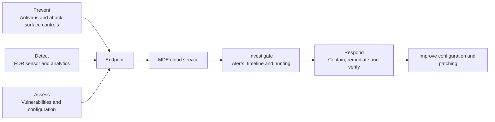

| Term | Plain meaning | Why it matters | Memory hook |
|---|---|---|---|
| Antivirus (AV) | Scans and blocks malicious or unwanted content | Prevents many known and emerging threats | Inspect the package |
| EDR | Records behavior and detects/responds after activity begins | Shows process and attack context | Security camera plus response |
| Vulnerability | Weakness an attacker may exploit | Creates potential attack path | An unlocked window |
| Exposure | Vulnerability plus reachability, exploitability and asset context | Better risk measure than count alone | How reachable is the window? |
| Onboarding | Registering/configuring a device to report to MDE | Enables service visibility and EDR | Connect the device to operations |
| Sensor | Endpoint component that observes and reports behavior | Telemetry quality depends on it | The device's observer |
| Device inventory | Service record of discovered devices and properties | Defines coverage and scope | Fleet register |
| Remediation | Action that removes or reduces risk | Converts insight into outcome | Fix, mitigate or retire |

### 🔍 Plain-English deep-dive: prevention, EDR and vulnerability management are different clocks

Antivirus asks in the moment, “Should this file or behavior be blocked?” EDR asks during and after behavior, “What happened, what else is related and what response is appropriate?” Vulnerability management asks continuously, “Which weaknesses and insecure configurations exist before an attacker uses them?” A mature program uses all three. A clean AV scan does not mean a device has no exploitable software; a CVE does not mean exploitation occurred; an EDR alert does not prove every listed vulnerability was involved.

## 2. MDE architecture

Microsoft Defender for Endpoint is a cloud-delivered enterprise endpoint security platform. Endpoint components collect security signals, enforce local controls and communicate with Microsoft cloud services. The Defender portal presents device inventory, alerts, incidents, vulnerabilities, investigations and response.

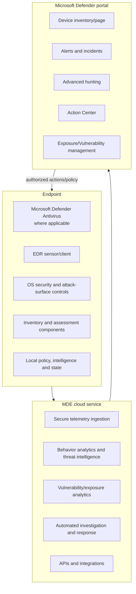

| Component | Role | Failure impact |
|---|---|---|
| Endpoint sensor/client | Observe behavior and communicate | Missing/stale telemetry and response |
| Defender Antivirus | Malware prevention and cloud protection on supported platforms | Reduced prevention; EDR block limits in passive mode |
| Cloud analytics | Correlate behavior, reputation and intelligence | Delayed/missing detections during degradation |
| Vulnerability assessment | Inventory software/configuration and map weaknesses | Incomplete or inaccurate exposure |
| Defender portal | Analyst and administrator experience | Visibility/action issue; backend might still operate |
| Policy authority | Deliver endpoint settings | Conflicts or configuration drift |
| Action channel | Send and record response actions | Pending/failed containment |

On modern Windows, some components are built into the operating system; macOS and Linux use platform-specific MDE packages and controls. Do not assume Windows feature parity on every platform.

## 3. MDE versus Microsoft Defender Antivirus

| Question | Microsoft Defender Antivirus | Defender for Endpoint |
|---|---|---|
| What is it? | Antimalware/prevention component | Broader endpoint security service |
| Core focus | Scan, detect, block and remediate malware/PUA | EDR, incidents, response, exposure, hunting and integrations |
| Can it work with third-party AV? | May be active, passive or disabled by platform/state | Can coexist subject to supported design |
| Portal relationship | Reports health/detections when integrated | Provides central device/investigation experience |
| Licensing | Windows capability and enterprise-management dependencies vary | MDE Plan 1, Plan 2, Business and suite options vary |

Turning off the Windows Security application does not necessarily disable Defender Antivirus and can make status misleading. Manage security through supported policy channels, not by hiding the user interface.

## 4. Supported platforms and capability differences

Microsoft currently documents MDE for Windows, Windows Server, macOS, Linux, Android and iOS, with broader discovery for other assets. Support is version- and feature-specific.

| Platform | Typical deployment | Important verification |
|---|---|---|
| Windows client | Built-in components plus onboarding policy/package | OS support, sensor/AV platform versions and update source |
| Windows Server | Native/modern unified solution or Defender for Servers path | Server version, license, passive/active AV and coexistence |
| macOS | MDE package plus system/network extension approvals | Supported macOS, MDM permissions and full-disk access |
| Linux | Distribution-specific package/repository | Supported distro/kernel, fanotify/eBPF guidance and proxy |
| Android/iOS | Mobile threat defense app/integration | Store availability, enrollment mode, privacy and Conditional Access |
| VDI/nonpersistent | Specialized onboarding and device-handling guidance | Cloning, identity, session persistence and duplicate records |
| Network/IoT | Discovery/integration paths | Feature and licensing boundaries; not equivalent to full EDR |

Windows 10 reached end of support on October 14, 2025. A management system may still list it, but security support and capability guarantees differ. End-of-support assets belong in a risk and migration plan.

## 5. Endpoint component states

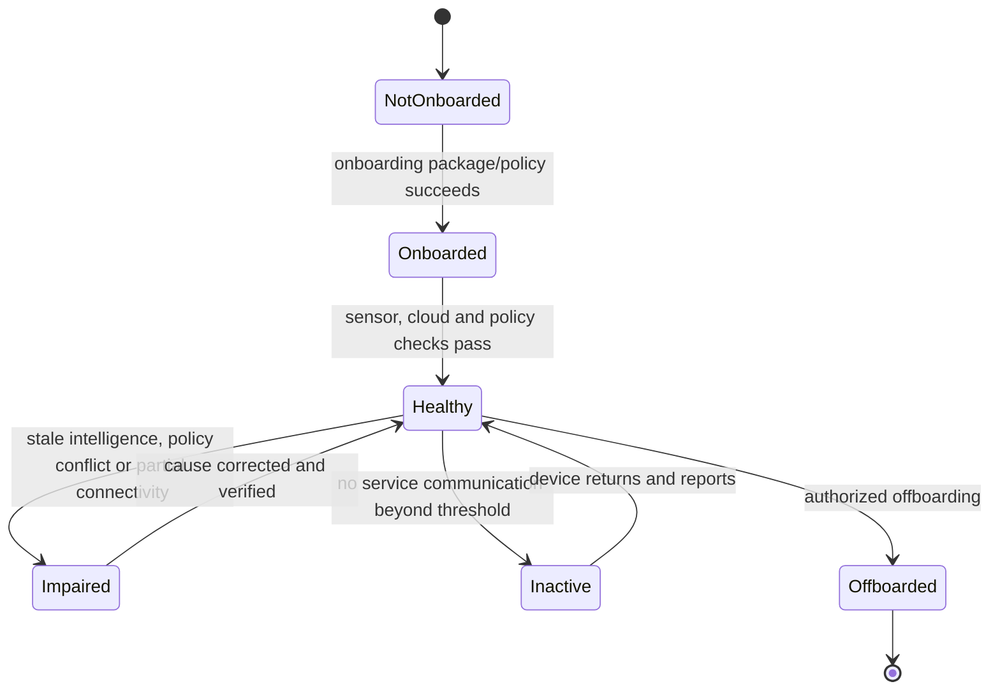

| State | Meaning | Analyst caution |
|---|---|---|
| Discovered | Seen through network/device discovery | Not necessarily protected or manageable |
| Can be onboarded | Candidate identified | Requires platform/owner/licensing validation |
| Onboarded | Registered with MDE | Does not automatically prove healthy controls |
| Active | Recently communicating | “Recent” threshold depends on experience |
| Inactive/stale | Has not communicated within product threshold | Could be retired, offline, broken or duplicated |
| Offboarded | MDE relationship intentionally removed | Local settings and historical record handling vary |
| Unsupported | OS/platform outside support | Telemetry may be absent or unreliable |

## 6. Prerequisites and licensing

MDE is offered through Plan 1, Plan 2, Defender for Business and eligible Microsoft 365/security suites. Defender Vulnerability Management has capabilities included with endpoint plans and additional/standalone options. Server rights and Defender for Servers require separate validation.

| Prerequisite | Evidence to collect |
|---|---|
| Entitlement | SKU, user/device/server assignment and add-on mapping |
| Supported OS | Version, edition, lifecycle and platform capability matrix |
| Updates | Sensor/client, AV platform, engine and security intelligence versions |
| Connectivity | Required URLs, service endpoints, proxy path, DNS and TLS behavior |
| Identity/RBAC | Admin, analyst, responder, device-group and Intune roles |
| Management authority | Intune, Configuration Manager, Group Policy, local or third party |
| Coexistence | Current AV/EDR, exclusions, performance and vendor support |
| Privacy | Data collection, region, notification and evidence access |
| Operations | SOC, endpoint, patch, app owner, incident and support RACI |

A license grants eligibility, not operational readiness. An onboarded sensor without a team to monitor actions can create false assurance.

## 7. Onboarding methods

Onboarding enables MDE EDR capability. Other protections still need configuration. Methods vary by OS and scale.

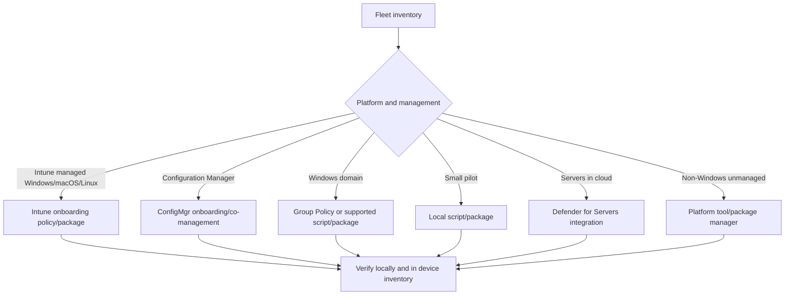

| Method | Good use | Risk/control |
|---|---|---|
| Intune | Cloud-managed fleet and policy reporting | Assignment, enrollment and profile compatibility |
| Configuration Manager | Existing enterprise Windows/server management | Co-management authority and policy conflicts |
| Group Policy | Domain-joined Windows devices | GPO scope, replication and script execution |
| Local script | Limited proof-of-concept | Not enterprise scale; secure package handling |
| VDI package | Nonpersistent/persistent virtual desktop | Correct image sequence and device identity |
| Defender for Cloud | Cloud server estate | Subscription/plan and duplicate onboarding paths |
| Third-party deployment tool | Existing software distribution | Package integrity, exit codes and rollback |

A local onboarding script is appropriate for a limited test, not a fleet deployment. Protect onboarding/offboarding packages because they can alter security service enrollment.

## 8. Connectivity and proxy design

Windows EDR sensor communication commonly runs in system context and uses WinHTTP rather than a user's browser WinINet settings. Defender Antivirus cloud protection and EDR can have distinct proxy settings. Microsoft offers standard and streamlined endpoint lists under current support conditions.

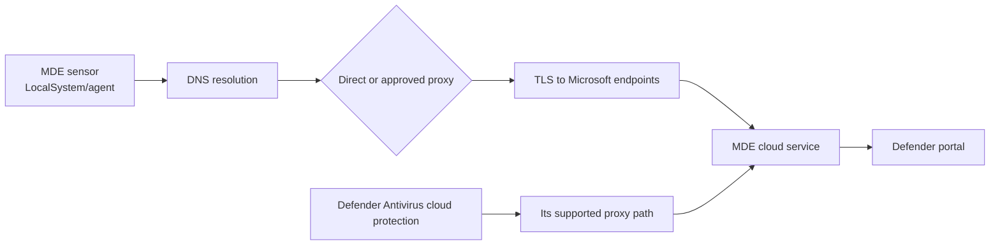

| Connectivity concern | Why it matters | Safe check |
|---|---|---|
| DNS | Required service names must resolve | Query from device/system context where possible |
| Proxy authentication | System service might not supply user credentials | Validate supported proxy configuration |
| TLS inspection | Microsoft warns inspection can break secure cloud connections | Bypass required endpoints per official guidance |
| WinHTTP vs WinINet | Browser success does not prove sensor path | Inspect WinHTTP/service configuration |
| IPv6-only | Current Windows proxy guidance states IPv6-only traffic is unsupported | Validate dual-stack/IPv4 path and current docs |
| Certificate revocation/time | TLS trust depends on chain and time | Validate clock, root/update and revocation access |
| Firewall endpoint drift | Service endpoints can change | Use current Microsoft lists and change process |
| Linux/macOS proxy | Different agent configuration | Follow exact platform guide |

### 🔍 Plain-English deep-dive: “the internet works” is not a sensor test

A user can browse the web through an authenticated browser proxy while the MDE service, running under a system account and using a different HTTP stack, cannot connect. Conversely, the sensor might connect while AV cloud protection uses another configuration. Test the exact component, identity, endpoint and protocol path. This is the endpoint equivalent of you distinguishing a SharePoint browser symptom from a OneDrive sync-client path.

## 9. Device inventory and identity

The device inventory is the operational register of known/discovered devices. Duplicate or stale records can arise from reimaging, VDI, naming reuse or identity changes.

| Inventory field | Use | Caveat |
|---|---|---|
| Device ID | Stable service pivot | Reimage/clone behavior must be understood |
| Name/domain | Human identification | Names are reused and not unique proof |
| OS/version | Support and exposure | Delayed reporting or spoofed discovery data |
| Onboarding/status | Coverage | Onboarded does not prove all controls active |
| Last seen | Freshness | Offline seasonal servers need tailored thresholds |
| Risk/exposure | Prioritization | Derived score, not direct compromise proof |
| Tags/groups | Scope and response | Manual drift and rule-preview limitations |
| Managed by/enrollment | Intune or MDE settings-management context | Synthetic registration differs from full join |
| Internet-facing/criticality | Business/exploit context | Validate derivation and owner |

Reconcile MDE with authoritative configuration management database, Entra, Intune, Configuration Manager, cloud and virtualization inventories. No single discovery source proves completeness.

## 10. Tags, device groups and RBAC

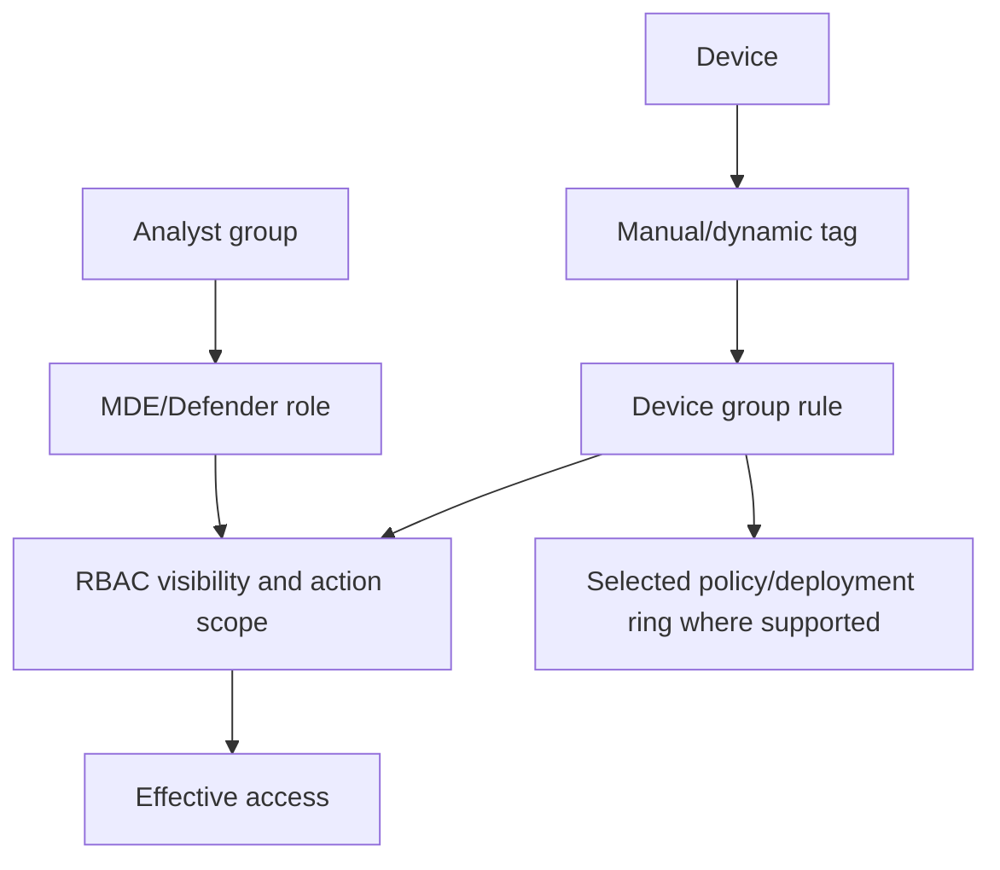

| Design item | Good pattern | Failure mode |
|---|---|---|
| Tags | Controlled taxonomy: owner, environment, criticality, ring | Free-text and conflicting meaning |
| Device groups | Mutually understandable scope and precedence | Devices fall into unintended/default group |
| RBAC | Entra groups, least privilege and PIM | Direct permanent user assignments |
| Response scope | Separate view from high-impact actions | Every analyst can isolate critical servers |
| Critical assets | Business owner validation | Score alone declares criticality |
| Review | Quarterly and after reorganization | Stale owners and overbroad access |

Unified RBAC and legacy product role behavior are tenant/change sensitive. Test effective access with personas, including what an analyst cannot do.

## 11. Microsoft Defender Antivirus and next-generation protection

Defender Antivirus uses real-time protection, cloud-delivered protection, behavior monitoring, heuristics, machine learning and security intelligence. Protection quality depends on update health and configuration.

| Capability | Purpose | Validation |
|---|---|---|
| Real-time protection | Inspect accessed files/processes | Local status and supported test file |
| Cloud-delivered protection | Fast cloud verdicts | Connectivity and cloud protection state |
| Behavior monitoring | Detect suspicious behavior patterns | Policy state and safe simulation |
| PUA protection | Block potentially unwanted applications | Policy and test classification |
| Tamper protection/controlled configuration | Resist unauthorized setting changes | Effective setting and authorized change test |
| Exclusions | Prevent known compatibility issues | Narrow scope, owner, expiry and risk review |
| Updates | Platform, engine and security intelligence | Version freshness and fallback sources |
| Controlled folder access | Reduce unauthorized changes to protected data | Audit then enforce; app allow validation |

Broad process, folder or extension exclusions create attacker blind spots. Require evidence, narrowest syntax, compensating detection and periodic revalidation.

## 12. Endpoint detection and response

EDR records behavioral telemetry such as process creation, network connections, files, registry, logons and script activity as supported. Cloud analytics identifies suspicious chains and creates alerts.

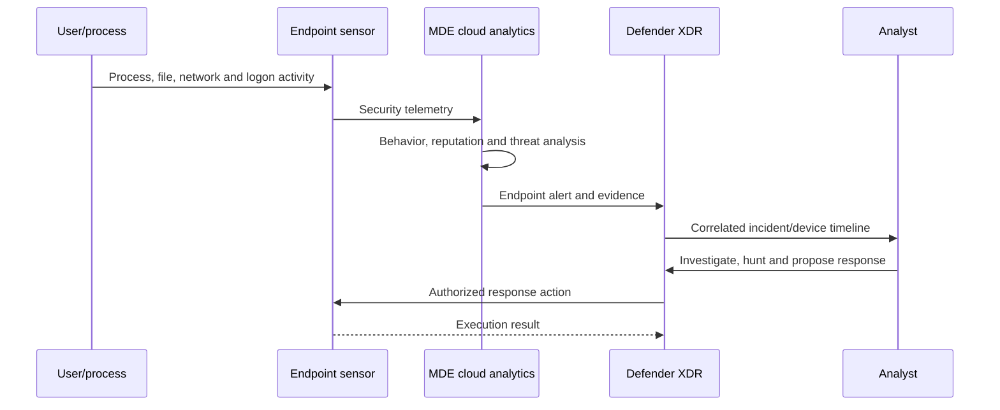

EDR is not a complete packet capture or indefinite forensic archive. Know table coverage, retention, sampling/collection behavior and legal evidence requirements.

## 13. EDR in block mode

EDR in block mode allows Defender for Endpoint Plan 2 to remediate malicious artifacts detected by EDR when Defender Antivirus is installed and running in active or passive mode. It is especially intended as added protection when a non-Microsoft antivirus is primary and Defender Antivirus is passive.

| Question | Answer/guardrail |
|---|---|
| Is it a replacement for active Defender AV? | No. Passive mode lacks real-time on-access scanning and other active-AV protections |
| What can it do? | Remediate malicious artifacts found through EDR behavior detections |
| License | MDE Plan 2 under current documentation |
| Main platform | Current documentation lists Windows |
| Dependencies | Onboarded device, current Defender AV platform/engine, cloud protection and supported OS |
| Important limit | Network protection, ASR rules and Defender indicators require active Defender AV per current guidance |
| Exclusions | EDR block mode respects Defender AV exclusions, increasing the need for narrow exclusions |

Do not tell a client that “EDR block mode makes third-party AV coexistence equivalent to active Defender AV.” It is an added post-breach blocking layer with explicit gaps.

## 14. Attack-surface controls in context

| Control | Purpose | Design dependency |
|---|---|---|
| ASR rules | Block/audit common exploit and abuse techniques | Rule/platform support, exclusions and app compatibility |
| Network protection | Block malicious/reputation-based destinations | Defender AV active mode and network path/support |
| Web content filtering | Category-based web access control | Licensing, network protection, browser/platform behavior |
| Device control | Govern removable media/peripherals | Platform, policy channel, identity and business workflow |
| Firewall | Restrict network traffic | Profile/rule precedence and operational dependencies |
| Controlled folder access | Protect data from untrusted modification | Application allowlist and user workflow |
| Indicators | Allow/block files, IPs, URLs/certificates where supported | Product mode, scope, expiry and precedence |

Part 19 covers Intune endpoint-security configuration in more depth. Here the key MDE point is that prevention policy and EDR telemetry must be designed together.

## 15. Advanced features and integration switches

MDE tenant settings expose advanced features for integrations, previews, AIR, EDR block mode, device discovery, live response and other capabilities. Names and defaults change.

| Switch/category | Pre-enable question |
|---|---|
| Preview features | Who accepts preview terms and monitors change? |
| AIR | Which actions are automatic versus approval-required? |
| Live response | Who may open sessions, upload/run scripts and access evidence? |
| EDR block mode | Are AV mode and Plan 2 prerequisites met? |
| Intune connection | Which data/policy direction and authority are intended? |
| Cloud Apps integration | What device-based cloud-discovery/control result is required? |
| Device discovery | Which networks and privacy boundaries are approved? |
| Custom indicators | Who owns expiry, false positives and emergency removal? |

Export or document current settings before change. A tenant-wide toggle deserves change control even if the UI makes it look small.

## 16. Device page and timeline

The device page consolidates identity, alerts, incidents, logged-on users, inventory, vulnerabilities, security recommendations and timeline events according to license and data availability.

| Investigation pivot | Question |
|---|---|
| Device identity | Is this the correct, current physical/virtual asset? |
| Timeline | What happened before, during and after the alert? |
| Process tree | Which parent launched which child under what account? |
| Network | Which destination, protocol and process were involved? |
| Logged-on users | Which sessions/accounts may be affected? |
| Alerts/incidents | Is behavior isolated or part of cross-domain activity? |
| Software/vulnerabilities | Did a known weakness plausibly enable the behavior? |
| Pending actions | Is containment/remediation already running? |

Event time, ingestion time and portal display time can differ. Normalize to UTC and record source timestamps.

## 17. Live response

Live response provides an authorized remote investigation shell on supported onboarded devices. It can inspect, collect and, under current controls, run approved commands/scripts.

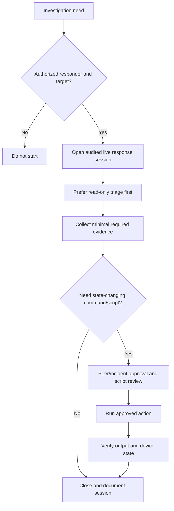

| Risk | Guardrail |
|---|---|
| Powerful remote access | PIM, scoped roles, separate responder account |
| Unreviewed script | Signed/approved library, hash and peer review |
| Evidence alteration | Read-only first, command transcript and timestamps |
| Sensitive data collection | Minimum necessary, protected evidence store and retention |
| Device performance | Bounded commands and business-owner awareness |
| Attacker observing session | Coordinate containment and credential strategy |

A paper lab can design a live-response command plan; it should not ask a beginner to run unknown scripts on production systems.

## 18. Isolation and containment

Device isolation restricts network communication while preserving supported Defender service communication. Exact behavior and platform support vary. Selective isolation and release behavior are change-sensitive.

| Action | Benefit | Business/technical risk | Required validation |
|---|---|---|---|
| Isolate device | Rapidly limits attacker movement | Business outage; dependencies fail | Portal status and target connectivity behavior |
| Contain device from another device | Restricts communication path where supported | Scope/feature assumptions | Current platform support and timeline |
| Restrict app execution | Limits untrusted binaries | Can interrupt applications | Mode/support and allow dependencies |
| Collect investigation package | Preserves diagnostic artifacts | Sensitive evidence and resource use | Package completion and secure storage |
| Run AV scan | Finds/remediates malware | Performance and false positives | Scan result and action history |
| Offboard | Removes service management | Loss of security visibility | Never use as incident containment |

Containment decisions belong to incident command, endpoint owners and business owners. A domain controller, clinical device or production server needs special continuity planning.

## 19. Automated investigation and response and Action Center

AIR uses product playbooks/analytics to investigate alerts and can recommend or execute remediation depending on configuration and automation level. Action Center records pending and completed actions.

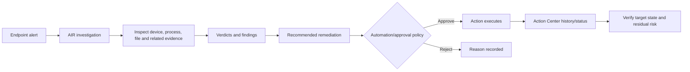

| Automation level concept | Benefit | Guardrail |
|---|---|---|
| Investigate only/recommend | Human controls state changes | Approval latency and backlog |
| Semi-automated | Common remediations proposed | Clear approvers and SLA |
| More automated | Faster containment of known threats | Scope, exclusions, rollback and monitoring |
| Excluded device group | Protect critical systems from automatic action | Compensating response runbook required |

Automation success means the requested action executed, not necessarily that the incident is fully eradicated.

## 20. MDE and Intune integration

MDE can share device risk with Intune for compliance/Conditional Access designs, and Intune can configure endpoint-security settings. Defender for Endpoint security settings management extends selected Intune endpoint-security policies to supported devices not enrolled in Intune.

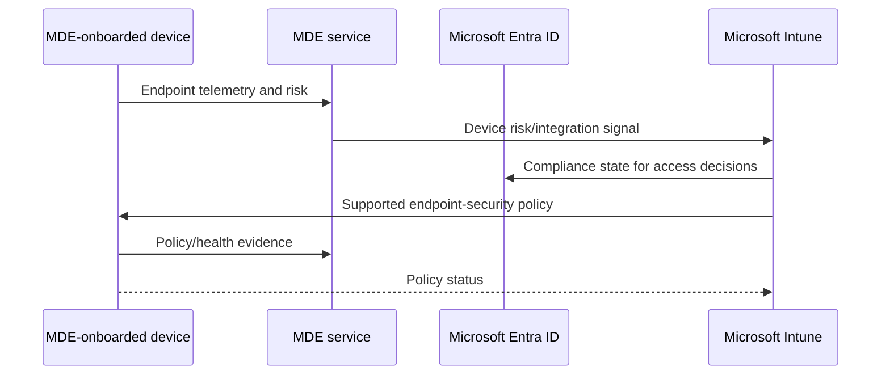

| Integration | What it does | What it does not prove |
|---|---|---|
| MDE risk to Intune | Supports compliance decisions using device threat level | Device is fully configured or patched |
| Intune onboarding policy | Deploys MDE onboarding/configuration | Sensor is healthy without verification |
| Security settings management | Applies supported Intune endpoint policies via MDE channel | Full Intune enrollment or all profile support |
| Entra device object | Provides identity for targeting | Synthetic registration equals full join/compliance |
| Portal policy view | Shows supported policy/report information | Every setting used one authority |

### 🔍 Plain-English deep-dive: synthetic registration is a delivery identity, not full enrollment

For supported devices not fully registered with Entra, security settings management can create a synthetic device identity so policy can be targeted and retrieved. Think of it as a delivery address for a security package, not a complete employee badge. It does not magically provide every Intune enrollment capability. Current Microsoft guidance also warns that synthetic objects count against Entra device quotas.

## 21. Security settings management

Current guidance supports selected Windows, Windows Server, macOS and Linux scenarios and profiles. Support differs by platform. Devices show **Managed by MDE** and an MDE enrollment status when successful.

| Design rule | Reason |
|---|---|
| Start with tagged devices | Limits blast radius |
| Use device groups, not user targeting | Current channel supports device objects |
| Do not rely on Intune assignment filters for MDE-managed-only devices | Current guidance says this channel ignores them |
| Use one authority per setting | Multiple channels can conflict |
| Review profile/platform support | Visible does not mean supported for MDE-only management |
| Validate local effective state | Portal assignment is not endpoint enforcement proof |
| Plan check-in/propagation | Policy can take time; current docs describe periodic check-in |
| Treat domain controllers separately | Misconfiguration can affect identity availability |

Configuration Manager coexistence needs an explicit authority decision. Do not deploy the same setting through Intune, Configuration Manager, Group Policy and local scripts and then troubleshoot by changing all four.

## 22. Defender Vulnerability Management from zero

Defender Vulnerability Management continuously discovers assets and inventories, assesses weaknesses and configurations, prioritizes risk and tracks remediation.

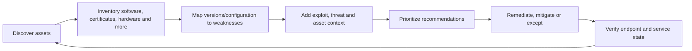

| Object | Plain meaning | Example |
|---|---|---|
| Software inventory | Installed applications and versions | Browser version across devices |
| Weakness/CVE | Publicly identified vulnerability | CVE affecting a library/product |
| Recommendation | Action to reduce weakness/misconfiguration | Update browser to supported version |
| Exposed device | Device assessed as affected | 25 workstations with vulnerable version |
| Remediation activity | Tracked request/work item | Update package assigned to endpoint team |
| Exception | Time-bound accepted/deferred recommendation/CVE | Legacy app blocks patch for 30 days |
| Exposure score | Derived measure of vulnerability exposure | Lower is generally better |
| Secure Score for Devices | Configuration hardening posture measure | Higher is generally better |

Vulnerability management is not merely a scanner. Its value is continuous evidence plus organizational remediation workflow.

## 23. Inventories and evidence

Current Defender Vulnerability Management documentation describes software, browser extensions, certificates, hardware/firmware and other inventories, plus assessments such as security baselines and network shares under applicable plans.

| Inventory/evidence | Risk question | Data-quality caveat |
|---|---|---|
| Software/version | Is vulnerable or unsupported code installed? | Bundled/portable software and stale device data |
| Software evidence | Where/how was software observed? | Evidence path can be delayed or incomplete |
| Browser extensions | What permissions and risk do extensions add? | Browser/profile coverage differs |
| Certificates | Which expire or use weak algorithms? | Store and platform coverage |
| Hardware/firmware | Which models/BIOS have known weaknesses? | Vendor mapping and update availability |
| Security baselines | How does configuration compare to benchmark? | Benchmark is not automatically business requirement |
| Network shares | Are risky internal shares exposed? | Assessment prerequisites and reachability |
| Authenticated scan | Can unmanaged Windows devices be assessed? | Credential protection, network scope and licensing |

Assessment accuracy can be affected by application control, PowerShell Constrained Language Mode, AppLocker or WDAC if required collection scripts cannot run. Solve with reviewed allow rules, not by weakening application control broadly.

## 24. CVE, CVSS, EPSS, exploit and exposure

A **Common Vulnerabilities and Exposures (CVE)** identifier names a publicly disclosed vulnerability. **Common Vulnerability Scoring System (CVSS)** estimates intrinsic technical severity. **Exploit Prediction Scoring System (EPSS)** estimates likelihood of exploitation in a time horizon based on public data. Vendor and threat intelligence indicate exploitation status. None alone equals client risk.

| Factor | Question | Limitation |
|---|---|---|
| CVE | Which known weakness? | Identifier does not prove device affected |
| CVSS | How technically severe in a generalized context? | Does not know client asset or controls |
| EPSS | How likely is exploitation based on model? | Probabilistic and changes over time |
| Known exploited | Is exploitation observed/authoritatively listed? | Still requires product/version confirmation |
| Public exploit | Is code/technique available? | Quality and applicability vary |
| Internet-facing | Can attackers reach the service? | Asset classification may be wrong |
| Device criticality | What business impact if compromised? | Needs owner/BIA validation |
| Active alert | Is related behavior occurring now? | Correlation does not prove this CVE caused it |
| Mitigation | Is exploit path reduced without patch? | Temporary and must be verified |

### 🔍 Plain-English deep-dive: why CVSS 10 is not always first

Imagine two broken doors. Door A has a catastrophic lock flaw but is inside a sealed, unused building. Door B has a slightly lower-severity flaw, faces the public street and protects payroll. CVSS describes the lock weakness; exposure and business context tell you which door to fix first. An actively exploited, internet-facing vulnerability on a critical device usually outranks a higher-CVSS issue on an isolated lab asset, while both still need governed disposition.

## 25. Exposure score and Secure Score for Devices

| Score | Direction | Inputs/meaning | Guardrail |
|---|---|---|---|
| Exposure score | Lower generally better | Vulnerabilities and risk context; current model can include EPSS, internet-facing status and criticality | Model and priorities change; not a contractual risk figure |
| Secure Score for Devices | Higher generally better | Security configuration recommendations | Do not enable controls blindly for points |
| Recommendation impact | Expected score change if addressed | Supports prioritization | New vulnerabilities can offset improvement |
| Microsoft Secure Score | Broader security posture across products | Organizational improvement actions | Distinguish from device-specific score |

Current Microsoft guidance says exposure score can recalculate daily and may not move monotonically because new vulnerabilities and asset changes can offset remediation. Report both action completion and residual exposure.

## 26. Risk-based prioritization

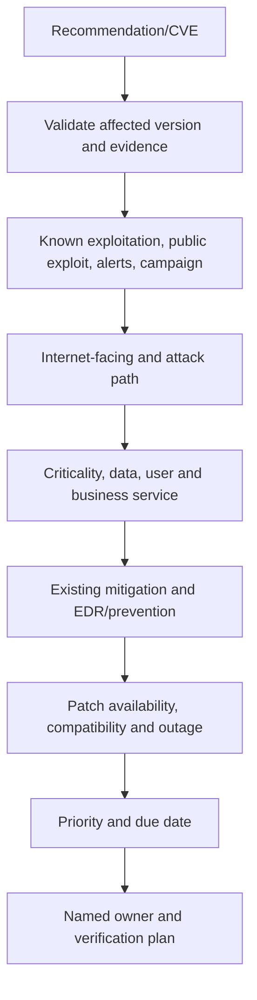

| Priority input | High urgency example | Lower urgency context |
|---|---|---|
| Threat | Active exploitation/current campaign | No known exploit |
| Reachability | Internet-facing service | Isolated powered-off lab |
| Privilege | Pre-auth remote code execution | Local low-privilege path |
| Asset value | Domain controller/payment service | Replaceable kiosk |
| Blast radius | Common component on fleet | One noncritical device |
| Mitigation | None | Verified control blocks exploit path |
| Remediation | Tested patch available | Vendor patch absent; mitigation only |
| Evidence quality | Exact vulnerable version confirmed | Generic discovery without version proof |

Use a documented scoring rubric but permit expert override with rationale. A model supports decisions; it does not own them.

## 27. Recommendations, remediation tickets and ownership

Recommendations translate findings into actions. Current workflows can send remediation requests to Intune under supported integration and track remediation activities.

| Ticket field | Required content |
|---|---|
| Recommendation/CVE | Exact weakness and affected versions |
| Scope | Device IDs/groups, count and freshness |
| Evidence | Inventory/version path and threat context |
| Priority | Threat, reachability, criticality and impact rationale |
| Action | Patch, uninstall, configuration, mitigation or retirement |
| Owner | Endpoint, server, app/vendor and business approver |
| Due date/SLA | Risk-based and achievable |
| Test | Compatibility, negative/positive and business validation |
| Rollback | Package/configuration recovery plan |
| Verification | Local version/config plus portal reassessment |
| Residual risk | Remaining devices, exceptions and limitations |

A ticket is not remediation. Track accepted, scheduled, deployed, failed, verified and closed as separate states.

## 28. Exceptions and compensating controls

| Exception requirement | Example |
|---|---|
| Business justification | Legacy application fails on patched runtime |
| Exact scope | 12 named devices, not all servers |
| Threat/risk statement | Internet exposure removed; local exploit remains |
| Compensating controls | Segmentation, allowlisting, EDR monitoring, privilege reduction |
| Owner/approver | Application owner plus security risk authority |
| Start/expiry | 30-day exception; no “permanent” default |
| Review trigger | Exploitation observed, patch released or asset changes |
| Exit plan | Upgrade application by date or retire device |
| Verification | Confirm controls and device scope remain correct |

Creating an exception changes recommendation state/score presentation; it does not patch the weakness. Never report an exception as technical remediation.

## 29. Verification and stale-state handling

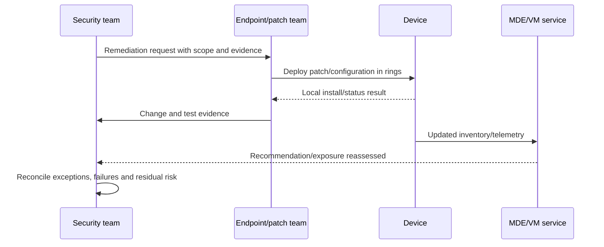

| Verification layer | Evidence | Why both layers matter |
|---|---|---|
| Deployment system | Assignment/install success | Proves tool attempted/completed package |
| Endpoint | Version, file/config and reboot state | Proves local effective change |
| Application | Smoke/UAT behavior | Proves service still works |
| MDE | Fresh inventory and recommendation state | Proves security service recognizes outcome |
| Exposure | Score/scope trend after refresh | Shows residual organization effect |
| Incident | No related active exploitation remains | Remediation is not incident eradication by itself |

Microsoft notes that software/configuration changes can take time to appear. Do not reopen, duplicate or falsely close work before understanding assessment refresh.

## 30. False positives, inaccuracies and unsupported/stale devices

| Symptom | Possible cause | Response |
|---|---|---|
| Software shown after uninstall | Assessment delay/stale device | Check last seen and local evidence; wait documented refresh |
| CVE shown on patched product | Version mapping, backport or inventory issue | Verify vendor package/build and report inaccuracy with evidence |
| Device missing from recommendation | Unsupported platform, collection block or inactive window | Check support, scripts, sensor health and assessment window |
| Duplicate device | Reimage, clone, VDI or naming reuse | Reconcile service IDs and authoritative inventory |
| Unsupported OS | End of support | Risk accept only with migration/segmentation plan |
| Inactive device | Offline, retired or broken sensor | Owner validation; offboard/retire or repair |
| Recommendation irrelevant | Feature not used/mitigated | Document scoped, expiring exception and controls |
| Exposure jump | New CVE/exploit/model/asset context | Review event timeline and scoring-model change |

Current guidance allows reporting recommendation inaccuracies. Provide exact device, software evidence, vendor advisory, timestamp and expected result.

## 31. Security, privacy and data governance

Endpoint telemetry can contain usernames, process commands, network destinations, file paths and collected evidence. Live response can expose highly sensitive data.

| Risk | Control |
|---|---|
| Excess visibility | Scoped RBAC, PIM, access reviews and audit |
| Sensitive command/path data | Purpose limitation and analyst training |
| Forensic package leakage | Encrypted case store, access log and retention |
| Response misuse | Separate investigator/responder roles and approvals |
| Cross-border processing | Data-location/transfer review and documented service settings |
| Employee monitoring concern | Transparent policy, legal/HR/privacy governance |
| API credential abuse | Federated/managed identity where supported and least privilege |
| Device instability | Tested policies, rings, performance monitoring and rollback |

Do not reuse security telemetry for unrelated performance management without an approved lawful purpose and governance process.

## 32. Assessment and design workflow

| Assessment domain | Evidence | Design output |
|---|---|---|
| Fleet | CMDB, Intune, ConfigMgr, cloud, VDI and MDE inventories | Coverage baseline and reconciliation plan |
| Platform | OS/version/support and server roles | Capability matrix |
| Network | Sites, proxies, TLS inspection and egress | Connectivity design |
| Security stack | AV/EDR, exclusions, application control and firewall | Coexistence/cutover plan |
| Management | Policy authorities and co-management | Single-authority matrix |
| Vulnerability | Current scanner, patch SLAs and exceptions | VM operating model |
| SOC | Queue, response, evidence and on-call | RACI/runbooks |
| Privacy | Collected data and response access | Privacy/security controls |
| Business | Critical assets, maintenance windows and recovery | Ring and priority model |

A good HLD shows cloud/service relationships and trust boundaries. A good LLD names onboarding mechanism, device groups, policy settings, URLs, roles, tests and rollback.

## 33. Staged deployment

| Ring | Example scope | Exit criteria |
|---|---|---|
| 0 lab | Disposable supported devices | Onboard/offboard, telemetry and rollback proven |
| 1 security/IT | Knowledgeable volunteers | Performance, proxy, policy and alert workflow stable |
| 2 low-risk business | Representative apps/sites | UAT and support process accepted |
| 3 broad clients | Standard workstations | Coverage, health and noise targets met |
| 4 servers | Role-based server groups | Owner windows, backup/recovery and app test passed |
| 5 critical systems | DCs/production/regulated devices | Explicit risk/continuity approval and tailored automation |

## 34. Testing and acceptance

| Test | Expected evidence |
|---|---|
| Onboarding | Local service/status plus device appears with correct identity |
| Connectivity | Client analyzer/component test and recent telemetry |
| AV safe test | Supported benign test artifact detected as expected |
| EDR simulation | Microsoft-supported detection test creates expected event/alert |
| Policy | Effective local setting matches intended authority |
| RBAC | Personas can and cannot perform designed actions |
| Isolation paper/approved test | Exact communication behavior and release documented |
| AIR | Investigation/action state follows configured approval model |
| Inventory | Known software/version appears with evidence |
| Remediation | Test update changes endpoint and service recommendation |
| Coexistence | CPU, I/O, app and security-product health acceptable |
| Rollback | Offboarding/policy restore tested in disposable scope |

Never run ransomware, weaponized exploits or unauthorized scans. Use official simulations, harmless files and paper labs.

## 35. Rollback matrix

| Change | Rollback | Residual concern |
|---|---|---|
| Onboarding | Authorized offboarding package/policy | Historical record and local settings remain per service behavior |
| AV active-mode cutover | Restore supported prior product/mode | Coverage gap during transition |
| ASR/network protection | Return specific rule to audit/previous state | Events during enforcement cannot be undone |
| Security settings management | Remove assignment/scope and restore prior authority | Settings may persist/tattoo; verify locally |
| Isolation | Release device and validate networking | Business transactions may already have failed |
| Indicator block | Remove/expire indicator | Past blocks and missed business events remain |
| AIR automation | Lower automation/disable targeted capability | Threats may require manual queue coverage |
| Vulnerability exception | Revoke exception | Does not itself patch devices |

Store offboarding packages securely and renew them according to current validity rules; do not assume an old package works indefinitely.

## 36. Operations and metrics

| Metric | Useful definition | Misinterpretation risk |
|---|---|---|
| Onboarding coverage | Healthy onboarded eligible devices / authoritative eligible devices | Excluding hard devices inflates coverage |
| Sensor freshness | Devices reporting within defined threshold | Seasonal/offline assets need segmentation |
| AV intelligence freshness | Devices within approved update SLA | Average hides critical stale servers |
| High-risk device age | Time devices remain at high risk | Risk score changes with detections/model |
| Exposure score trend | Direction with model/change notes | Not monotonic and not a loss estimate |
| Known-exploited exposure | Confirmed affected reachable assets | Inventory quality affects denominator |
| Remediation SLA | Verified closure by risk tier | Ticket closure is not verification |
| Exception debt | Count/age/risk of active exceptions | Low count can hide broad-scope exceptions |
| AIR success | Completed actions / initiated actions | Correctness still needs review |
| Isolation release time | Business outage duration and decision quality | Fast release can be unsafe |
| False-positive rate | Validated inaccurate alerts/recommendations | Analyst labels may be inconsistent |
| Unsupported asset trend | End-of-support devices over time | Discovery gaps can falsely improve result |

## 37. Common failure modes

| Failure | Likely cause | Cheap discriminating check |
|---|---|---|
| Device never appears | Onboarding package, service, tenant or connectivity | Local onboarding/service status and client analyzer |
| Device appears inactive | Offline, proxy, TLS, sensor stopped | Last seen versus local service/connectivity |
| AV healthy but EDR absent | Different component/onboarding state | EDR sensor state and test event |
| Policy conflict | Multiple authorities set same value | Per-setting source/status and local effective policy |
| MDE-managed enrollment fails | Enforcement scope, Entra object, platform or PowerShell mode | Enrollment status and supported profile/platform |
| Live response unavailable | License, role, platform, device offline or feature switch | Effective permission and device support/state |
| Isolation pending | Offline target, unsupported path or service delay | Action Center and device connectivity |
| Vulnerability absent | Unsupported/stale device or collection blocked | Last seen, script/application-control health |
| Patch not reflected | Assessment refresh delay or wrong version evidence | Local version and timestamp |
| Exposure score rises after fixes | New risks/model/context | Score event timeline and newly exposed assets |

## 38. Troubleshooting decision tree

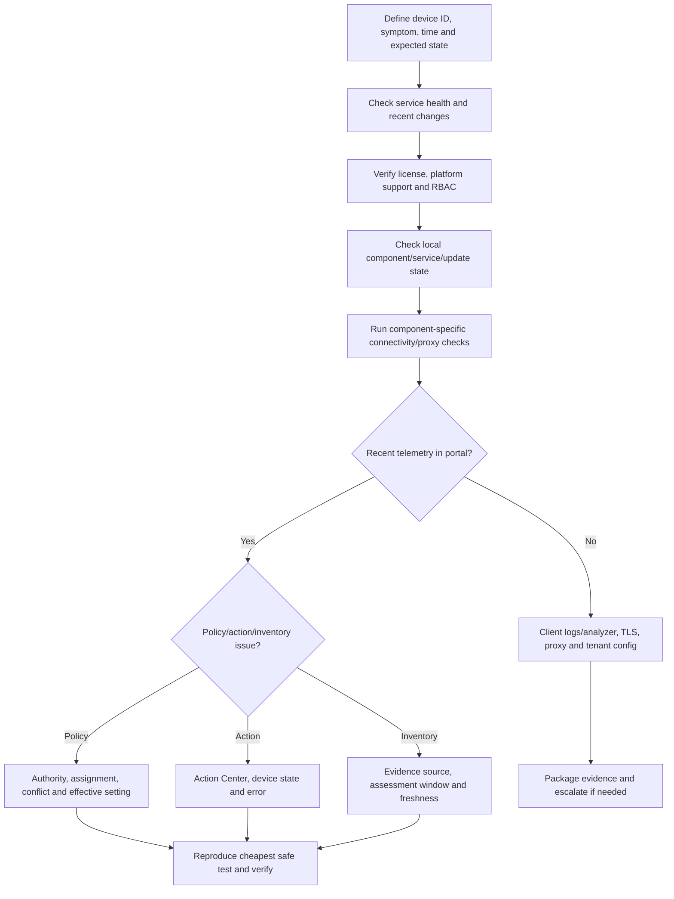

An escalation pack should contain device ID/name, OS/build, MDE versions, timestamps in UTC, onboarding method, proxy path, local logs/client-analyzer result, action/policy IDs, screenshots/exports, recent changes and exact reproduction.

## 39. Ransomware scenario

A fictional finance workstation shows mass file modification, a suspicious script interpreter and connection to a known-bad infrastructure. The user reports encrypted files.

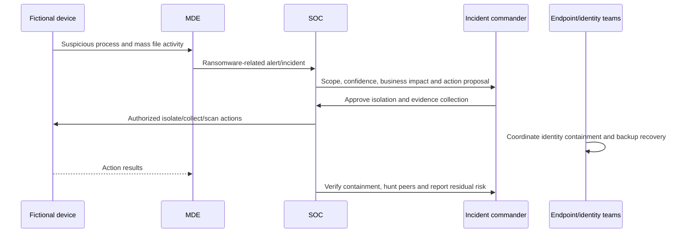

| Phase | Actions | Guardrail |
|---|---|---|
| Triage | Validate device identity, process tree, user and alert | Do not execute sample |
| Scope | Hunt hash, command, destination and affected users/devices | Retention/data gaps documented |
| Contain | Isolate device; coordinate account/session response | Criticality/approval and evidence preservation |
| Eradicate | Remove persistence/malware or reimage per IR plan | Reimage can destroy evidence; forensic decision first |
| Recover | Restore clean data/system and credentials | Validate backups and no reinfection path |
| Improve | Patch, ASR, application control, backup and training | Test controls against business apps |

## 40. Urgent vulnerability scenario

A new remote-code-execution CVE is reportedly exploited. Defender Vulnerability Management lists 1,200 exposed devices, including internet-facing servers.

| Step | Consultant action | Evidence |
|---|---|---|
| Validate | Confirm CVE, affected products/versions and Microsoft/vendor advisory | Advisory and software evidence |
| Reconcile | Remove stale/duplicate/unsupported uncertainty | Device last seen and authoritative inventory |
| Prioritize | Internet-facing, critical, exploit observed, privilege and blast radius | Ranked device groups |
| Mitigate | Restrict exposure, disable feature or block exploit path where vendor-supported | Change record and validation |
| Patch | Deploy through lab and emergency rings | Deployment and local version |
| Verify | Reassess MDE and test service | Portal state and application UAT |
| Except | Time-bound only where patch blocked | Owner, controls, expiry and exit plan |
| Report | Scope, progress, failures and residual risk | Executive dashboard |

Do not deploy a patch to all 1,200 devices based only on a score. Validate version applicability and service-owner constraints, but do not use analysis as an excuse for avoidable delay on clearly exposed critical assets.

## 41. Consulting artifacts

| Artifact | Minimum content |
|---|---|
| Endpoint coverage assessment | Authoritative inventory reconciliation, platform/support and sensor health |
| MDE HLD/LLD | Components, data flow, network, groups, roles, integrations and actions |
| Platform capability matrix | OS/version versus prevention, EDR, response and VM features |
| Connectivity design | Standard/streamlined endpoints, proxies, TLS and tests |
| Policy-authority matrix | Setting family versus Intune/ConfigMgr/GPO/third party |
| Deployment plan | Rings, change windows, tests, rollback and support |
| Response-action matrix | Action, role, approval, business risk and verification |
| Vulnerability rubric | Threat, reachability, criticality, controls and SLA |
| Remediation backlog | Recommendation/CVE, scope, owner, due date and state |
| Exception register | Scope, rationale, controls, expiry and exit |
| Health dashboard | Coverage, freshness, updates, actions and exposure |
| Ransomware runbook | Triage, scope, contain, evidence, recover and communicate |
| Handover pack | RACI, queues, monitoring, escalation, access and training |

## 42. Safe paper lab: design onboarding and handle two endpoint cases

This lab uses fictional devices, reserved domains/IPs and no executable malware or production tenant.

### Lab inventory

| Device | Platform | Role | Management | Criticality | Fictional issue |
|---|---|---|---|---|---|
| `WIN-FIN-01` | Windows 11 | Finance laptop | Intune | High | Ransomware-like alert |
| `WIN-IT-02` | Windows 11 | IT pilot | Intune | Medium | Healthy pilot |
| `SRV-WEB-01` | Windows Server 2022 | Internet web tier | ConfigMgr | Critical | Urgent CVE |
| `SRV-LEG-01` | Windows Server 2016 | Legacy application | GPO/ConfigMgr | High | Patch incompatible |
| `MAC-DES-01` | Supported macOS | Design device | MDM | Medium | Proxy onboarding failure |
| `LIN-APP-01` | Supported Linux | App server | Package manager | High | Stale software evidence |

### Exercise A: onboarding design

1. Create a platform/licensing/support matrix.
2. Select one onboarding owner and one policy authority for each device.
3. Draw direct/proxy connectivity and list component-specific tests.
4. Define tags, device groups, rings and RBAC personas.
5. Write positive, negative, coexistence and rollback tests.
6. Define evidence: local service/version, device ID, last seen, policy state and safe alert.

### Exercise B: ransomware paper response

Build an evidence timeline for `WIN-FIN-01`, propose isolation and collection through the incident commander, list peer-hunting pivots and define recovery validation. Do not run commands.

### Exercise C: urgent CVE workflow

Rank `SRV-WEB-01` and `SRV-LEG-01`. Patch the web server first after emergency validation. For the legacy server, design restricted network exposure, application allowlisting/monitoring, owner approval, a 30-day exception and application-upgrade exit plan. Verification requires both endpoint version/configuration and refreshed MDE evidence.

### Portfolio evidence

- MDE architecture and connectivity diagram.
- Platform/onboarding/capability matrix.
- Policy-authority and RBAC matrix.
- Deployment rings and acceptance tests.
- Ransomware evidence/action timeline.
- Vulnerability priority rubric and remediation ticket.
- Time-bound exception with compensating controls.
- Operations dashboard and escalation template.

### Evidence-safe interview wording

> “I completed a safe design-only MDE exercise using fictional devices. I selected platform-specific onboarding methods, designed proxy and policy-authority checks, built rings and RBAC, walked a ransomware containment decision, and prioritized an urgent CVE using exploit, reachability and business context. I did not onboard or isolate production devices. My production analogue is disciplined M365 incident RCA, evidence validation and stakeholder coordination.”

## 43. JD Mapping: interview translation

| Prompt | Your factual strength | Safe MDE bridge |
|---|---|---|
| “How do you deploy endpoint protection?” | Controlled changes, validation and stakeholder coordination | Explain rings, authority, support matrix and acceptance tests |
| “How do you handle ransomware?” | Critical-incident timeline and cross-team ownership | Use paper action matrix; state no production MDE response |
| “How do you prioritize CVEs?” | Impact/dependency reasoning and fix validation | Use threat, reachability, criticality, mitigation and evidence |
| “How do you troubleshoot onboarding?” | Layered Microsoft 365 fault isolation | Local component, network path, ingestion, identity and portal |
| “How do you manage exceptions?” | Documented workaround/known-issue discipline | Time-bound scope, controls, owner, expiry and exit |
| “What is your hands-on experience?” | Production M365 support | Defender architecture and paper lab only unless separately proven |

## Official Source Anchors

1. [Microsoft Defender for Endpoint overview](https://learn.microsoft.com/defender-endpoint/microsoft-defender-endpoint)
2. [Plan your Defender for Endpoint deployment](https://learn.microsoft.com/defender-endpoint/mde-planning-guide)
3. [Minimum requirements](https://learn.microsoft.com/defender-endpoint/minimum-requirements)
4. [Onboard and configure capabilities](https://learn.microsoft.com/defender-endpoint/onboard-configure)
5. [Supported capabilities by platform](https://learn.microsoft.com/defender-endpoint/supported-capabilities-by-platform)
6. [Configure proxy and Internet connectivity](https://learn.microsoft.com/defender-endpoint/configure-proxy-internet)
7. [EDR in block mode](https://learn.microsoft.com/defender-endpoint/edr-in-block-mode)
8. [Live response overview](https://learn.microsoft.com/defender-endpoint/live-response)
9. [Respond to device alerts](https://learn.microsoft.com/defender-endpoint/respond-machine-alerts)
10. [Automated investigation and remediation](https://learn.microsoft.com/defender-endpoint/automated-investigations)
11. [Microsoft Defender Vulnerability Management](https://learn.microsoft.com/defender-vulnerability-management/defender-vulnerability-management)
12. [Vulnerability Management capabilities](https://learn.microsoft.com/defender-vulnerability-management/defender-vulnerability-management-capabilities)
13. [Security recommendations](https://learn.microsoft.com/defender-vulnerability-management/tvm-security-recommendation)
14. [Remediation](https://learn.microsoft.com/defender-vulnerability-management/tvm-remediation)
15. [Recommendation and CVE exceptions](https://learn.microsoft.com/defender-vulnerability-management/tvm-exception-overview)
16. [Software inventory](https://learn.microsoft.com/defender-vulnerability-management/tvm-software-inventory)
17. [Weaknesses/CVEs](https://learn.microsoft.com/defender-vulnerability-management/tvm-weaknesses)
18. [MDE security settings management with Intune](https://learn.microsoft.com/intune/device-security/microsoft-defender/security-settings-management)
19. [MDE–Intune integration](https://learn.microsoft.com/intune/device-security/microsoft-defender-endpoint-integration)
20. [MDE data storage and privacy](https://learn.microsoft.com/defender-endpoint/data-storage-privacy)

## ⭐ Likely Interview Questions for This Section

### Q1. Explain the architecture of Microsoft Defender for Endpoint.

**Model answer:** MDE combines endpoint components with a cloud analytics and response service. Platform-specific sensors and Defender Antivirus or other local controls collect behavioral, file, process, network and configuration evidence and enforce supported actions. The cloud analyzes signals, creates alerts, contributes to Defender XDR incidents and presents device, hunting, vulnerability and Action Center experiences. I would validate platform parity, connectivity, policy authority, role scope and local effective state.

### Q2. What is the difference among Defender Antivirus, EDR and Defender Vulnerability Management?

**Model answer:** Defender Antivirus primarily prevents and remediates malware at execution/access time. EDR records behavior, detects suspicious chains and supports investigation and response. Vulnerability Management continuously identifies software/configuration weaknesses, adds threat and asset context and tracks remediation. A CVE is potential risk, an EDR alert is observed suspicious behavior, and neither replaces prevention.

### Q3. What is EDR in block mode, and what are its limits?

**Model answer:** In current MDE Plan 2 guidance, EDR in block mode lets Defender remediate malicious artifacts found by behavioral EDR even when Defender Antivirus is passive behind a third-party AV. It is not equivalent to active Defender AV: real-time scanning is unavailable in passive mode, and features such as network protection, ASR and Defender indicators depend on active AV. It also requires supported Windows, onboarding, cloud protection and current components.

### Q4. How would you onboard a mixed endpoint estate?

**Model answer:** I would reconcile the fleet, validate OS lifecycle and per-platform capabilities, map licenses and existing security tools, choose supported onboarding by management channel, design proxy/TLS paths, establish one policy authority, create rings and device groups, test safe telemetry and rollback, then deploy in waves. I would verify locally and in the portal and treat servers, VDI, domain controllers and unsupported devices separately.

### Q5. How do MDE and Intune work together?

**Model answer:** MDE can share device risk for Intune compliance and Conditional Access decisions; Intune can deploy endpoint security and onboarding policy. Security settings management also lets selected Intune endpoint-security profiles reach supported MDE-onboarded devices that are not enrolled in Intune, sometimes through a synthetic Entra device registration. That is not full Intune enrollment, and current limitations such as device-only targeting, profile support and ignored assignment filters must be verified.

### Q6. How would you prioritize vulnerabilities beyond CVSS?

**Model answer:** I would first validate the affected version/evidence, then combine known exploitation, public exploit or EPSS context, internet exposure and attack path, privilege required, asset criticality, active alerts, blast radius, compensating controls, patch availability and outage risk. Each item gets a named owner, due date, test and verification plan. CVSS describes generalized technical severity, not complete client risk.

### Q7. How do you verify vulnerability remediation?

**Model answer:** I would not stop at ticket or deployment success. I would verify the package/configuration on the endpoint, run application smoke or UAT checks, confirm the device has sent fresh telemetry, wait the documented assessment refresh, verify the recommendation/CVE scope and exposure result, and account for failed, offline, stale and excepted devices. I would report residual risk separately.

### Q8. What is your honest MDE and Defender Vulnerability Management experience?

**Model answer:** My production experience is Microsoft 365 critical incidents, RCA, evidence capture, fix validation and stakeholder coordination. I have studied current MDE/VM architecture and completed a fictional paper design covering onboarding, policy authority, ransomware containment and vulnerability prioritization. I have not operated these tools in production, so I would work under approved roles and runbooks, pilot safely and require endpoint-plus-service verification.

## 🧠 30-Second Memory Hooks

- **AV prevents; EDR observes/responds; VM finds and prioritizes weaknesses.**
- **Onboarded is not the same as healthy, protected or correctly configured.**
- **Test the sensor's system-context path, not just the user's browser.**
- **One setting, one policy authority.**
- **EDR block mode adds protection; it does not recreate active AV.**
- **Synthetic registration is a policy delivery identity, not full enrollment.**
- **CVE names, CVSS describes severity, EPSS predicts, context prioritizes.**
- **Lower exposure and higher device secure score are directions, not guarantees.**
- **A ticket is work requested; verification is risk actually reduced.**
- **Exceptions hide no weakness: scope, controls, expiry and exit are mandatory.**
- **Isolation reduces spread but can interrupt business and evidence collection.**
- **Your transfer is incident rigor, never invented MDE ownership.**

## Completion Checklist

- [ ] I can draw endpoint, cloud, portal, policy and response components.
- [ ] I can distinguish MDE, Defender Antivirus, EDR and Vulnerability Management.
- [ ] I can explain platform differences and lifecycle/support risk.
- [ ] I can select onboarding methods for Intune, ConfigMgr, GPO, servers and non-Windows.
- [ ] I can troubleshoot WinHTTP/system-context proxy and TLS paths.
- [ ] I can reconcile device inventory, stale records, VDI/reimage and authoritative assets.
- [ ] I can design tags, groups, RBAC and critical-asset scopes.
- [ ] I can explain EDR in block mode and its active-AV limitations.
- [ ] I can place ASR, network protection, filtering and device control in context.
- [ ] I can explain live response, isolation, AIR and Action Center safeguards.
- [ ] I can explain MDE–Intune risk integration and security settings management.
- [ ] I can explain synthetic registration without calling it full enrollment.
- [ ] I can interpret software evidence, CVEs, CVSS, EPSS and exploit context.
- [ ] I can distinguish exposure score, Secure Score for Devices and Microsoft Secure Score.
- [ ] I can create a risk-based remediation ticket and time-bound exception.
- [ ] I can verify remediation on endpoint, application and MDE service.
- [ ] I can troubleshoot sensor, policy, action and inventory failures layer by layer.
- [ ] I can walk ransomware and urgent-vulnerability scenarios safely.
- [ ] I can produce the required consulting artifacts and paper-lab evidence.
- [ ] I can state honestly that this is study/design evidence, not production Defender ownership.
- [ ] I have re-checked current licensing, platform, preview and Exposure Management behavior.

*Next suggested section:* [Part 36](Part-36-defender-identity-hybrid-threats.md) — move from endpoint behavior and exposure into AD DS signals, Defender for Identity sensors, identity attack paths, posture assessments and hybrid response.