# Part 36 — Defender for Identity and Hybrid Identity Threats

> **Section goal:** Master the approved hybrid-identity scope from zero: Active Directory Domain Services (AD DS), Kerberos, NTLM, LDAP and Active Directory Certificate Services (AD CS) attack context; Microsoft Defender for Identity (MDI) sensor and cloud architecture; current domain controller, AD FS, AD CS and Microsoft Entra Connect coverage; v2 versus v3 sensor decisions; sizing, connectivity, permissions, service accounts, auditing and health; directory data and identity signals; reconnaissance, credential access, lateral movement, persistence and privilege escalation; alerts, timelines and entity investigation; identity security posture assessments, lateral movement paths, sensitive entities and honeytokens; integration with Defender XDR, Defender for Endpoint, Entra and Sentinel; triage, response, sensor troubleshooting, privacy and staged deployment. By the end, you should be able to assess, design, deploy, test, roll back and operate MDI without presenting detection as certainty or overstating production experience.

This Part maps directly to Deloitte's Microsoft Defender for Identity, hybrid identity, Entra, Defender XDR, assessment, security architecture, deployment, platform incident, threat investigation, troubleshooting, documentation and stakeholder responsibilities. Arti's production strengths in complex Microsoft 365 incidents, identity/workload dependency reasoning, RCA, evidence timelines, service health, validation, escalation and stakeholder communication are a strong foundation. The honest bridge is applying those methods to AD DS authentication and directory evidence. This chapter never claims production MDI, AD DS administration or identity-threat ownership.

> **Currency, sensor generation, support, licensing and preview note:** This chapter was checked against official Microsoft Learn content available on **August 24, 2026**. MDI changed materially in 2026. Current v3 sensor guidance requires a fully onboarded Defender for Endpoint server, Windows Server 2019 or later and the July 2026 or later cumulative update. It supports domain controllers, including a domain controller that also hosts supported identity roles; standalone AD FS, AD CS or Entra Connect servers require current v2 guidance. V3 uses LocalSystem for directory reading and response, uses MDE connectivity endpoints, has documented feature limitations and differs from v2 in sizing and service-account design. Sensor activation, IAM connectors, automatic auditing, posture pages, response actions, unified alert layouts, Exposure Management integration and supported platforms can change. Verify the live prerequisites, license list, Product Terms, role model, sensor matrix, preview terms, Message center and tenant UI before client decisions.

## JD Mapping

| Deloitte role expectation | Capability developed here | Consulting evidence |
|---|---|---|
| Assess hybrid identity security | Forest/domain, authentication, privilege, sensor and posture review | Identity current-state assessment and attack-path heatmap |
| Design Defender for Identity | Sensor generation/placement, connectivity, auditing, roles and integrations | MDI HLD/LLD and deployment decision record |
| Detect identity attacks | Reconnaissance through domain dominance behaviors | Alert playbooks and ATT&CK-aligned use cases |
| Investigate cross-domain incidents | Identity timelines plus endpoint, Entra, email and SaaS evidence | Entity timeline and correlation workbook |
| Deploy safely on identity infrastructure | Capacity, pilot, performance, health, test and rollback | Ring plan, test matrix and DC change record |
| Troubleshoot service issues | Sensor, events, ETW, LDAP, time, cloud and portal isolation | Health dashboard and escalation evidence pack |

## Candidate honesty note

Arti can speak directly about production Microsoft 365 critical incidents, root-cause analysis, evidence capture, service dependencies, fix validation, product-group escalation, stakeholder updates and technical documentation where supported by her experience. These are relevant because hybrid identity investigations require the same discipline: define scope, normalize time, distinguish observed facts from hypotheses, protect service availability and communicate uncertainty.

She should not claim that she has administered AD DS, deployed MDI sensors to production domain controllers, configured Kerberos/NTLM auditing, tagged honeytokens, investigated real identity attacks, disabled production users or run identity response actions unless separately evidenced. Safe wording is:

> “My production foundation is Microsoft 365 escalation support, RCA, evidence timelines, validation and stakeholder coordination. I have built a current Defender for Identity architecture and a safe paper investigation covering AD DS signals, v2/v3 sensor choices, identity attack stages, posture findings and response governance. I have not administered MDI or AD DS in production. I would partner with directory and SOC owners, validate the exact sensor support matrix, protect domain-controller performance, stage auditing and sensors, preserve identity evidence, and require accountable approval for credential, account or certificate changes.”

---

## 1. Identity security from zero

An **identity** represents a person, device, application or service account. Authentication proves an identity; authorization decides what it can do. Attackers target identity because valid credentials and sessions can make malicious actions look like normal access.

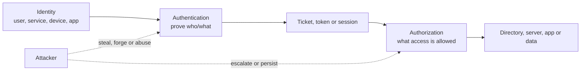

| Term | Plain meaning | Why it matters | Memory hook |
|---|---|---|---|
| Directory | Structured store of identities, groups, devices and policies | Controls access relationships | Organization's identity ledger |
| Domain | AD DS administrative/security boundary with shared directory | Defines authentication and policy context | One managed identity neighborhood |
| Domain controller (DC) | Server that authenticates and stores/replicates AD DS | Critical source and target | The identity checkpoint |
| Credential | Secret/proof such as password, key or certificate | Theft enables impersonation | Proof of identity |
| Privilege | Elevated authority | Attackers seek stronger control | Power attached to identity |
| Lateral movement | Moving from one compromised system/account to another | Expands control toward critical assets | Step sideways to climb higher |
| Persistence | Mechanism to regain access | Survives password reset or reboot | A hidden spare key |
| Identity posture | Configuration and path weaknesses before active attack | Prevents predictable abuse | Fix roads before pursuit |

### 🔍 Plain-English deep-dive: identity is the control plane attackers want

Think of an office building. Endpoints are rooms, data is what is stored inside and identities are badges plus the badge-management system. Malware in one room is serious; control of badge issuance, privileged groups or certificate authority can grant entry across the building. Defender for Identity watches activity around the badge system and highlights weak badge-management practices. It does not replace sound directory design or prove every unusual badge swipe is malicious.

## 2. AD DS architecture basics

AD DS stores directory objects and supports authentication, authorization, Group Policy and service discovery. Domains can form trees and forests. A **forest** is the top-level AD DS security boundary because domains in a forest share schema, configuration and trust relationships.

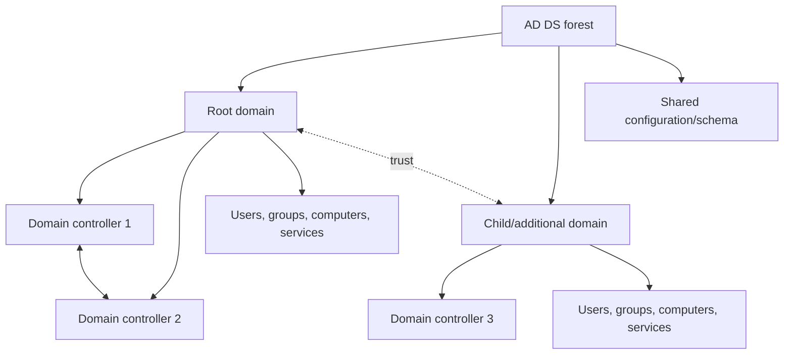

| AD DS object/concept | Purpose | Security relevance |
|---|---|---|
| User | Human identity | Password, group, delegation and behavior risk |
| Computer | Device identity | Authentication and lateral-movement target |
| Group | Assign access/privilege | Nested membership can hide effective privilege |
| Service account | Runs application/service | Often long-lived and highly privileged |
| Group Policy Object | Central configuration | Malicious edit can affect many devices |
| Organizational Unit | Delegation/policy scope | Weak delegated control can enable escalation |
| Trust | Allows authentication relationships | Extends attack and investigation paths |
| Schema/configuration | Forest-wide definitions/settings | High-impact change and persistence target |

## 3. Kerberos from zero

Kerberos is the preferred AD DS authentication protocol. It uses a trusted **Key Distribution Center (KDC)** on domain controllers. A Ticket Granting Ticket (TGT) lets a user request service tickets without repeatedly sending a password.

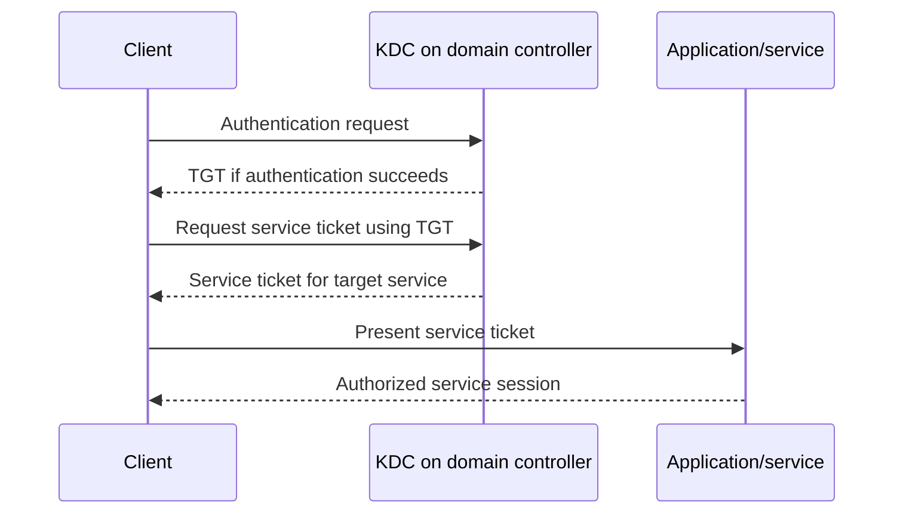

| Kerberos item | Plain meaning | Abuse context, defensively stated |
|---|---|---|
| KDC | Trusted ticket service on DC | Domain-control compromise threatens ticket trust |
| TGT | Ticket used to request other tickets | Theft/forgery can enable broad impersonation |
| Service ticket | Ticket for a specific service | Offline password-guessing risk for weak service accounts |
| SPN | Name linking service to account | Duplicate/misconfigured SPNs affect security and reliability |
| Delegation | Service acts on behalf of user | Overbroad settings create escalation paths |
| PAC | Authorization data in ticket | Forgery/tampering is high-impact behavior |
| Lifetime | Ticket validity period | Password change/session revocation timing matters |

Defender signals can identify suspicious ticket behavior and related activity, but analysts must validate legitimate service patterns, testing and administrative tasks.

## 4. NTLM from zero

NTLM is an older challenge-response authentication family used when Kerberos cannot be used or for legacy scenarios. It does not send the clear password, but captured material can be relayed or reused under certain conditions.

| Kerberos | NTLM |
|---|---|
| Ticket-based and preferred in AD DS | Challenge-response and legacy/fallback |
| Supports mutual authentication in intended use | Weaker server-authentication properties in many scenarios |
| Depends on SPNs, DNS, time and KDC | Often appears when Kerberos prerequisites fail |
| Better delegation models when configured safely | Relay/pass-the-hash risks require controls |
| Failure can silently increase NTLM use | Audit before restriction to avoid outages |

Do not disable NTLM globally without discovery and staged policy. Inventory applications, servers and trust paths; remediate dependencies; move from audit to restriction in rings; maintain emergency rollback.

## 5. LDAP from zero

**Lightweight Directory Access Protocol (LDAP)** lets applications query and modify directory data. Secure LDAP configurations protect confidentiality/integrity; signing and channel-binding controls reduce tampering and relay risks depending on client support.

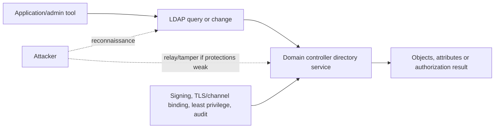

| LDAP activity | Legitimate example | Suspicious context |
|---|---|---|
| User/group enumeration | HR/admin application sync | New workstation rapidly maps privileged groups |
| Service lookup | Client locates resources | Broad reconnaissance by ordinary user |
| Directory modification | Approved identity administration | Unexpected sensitive-group or object change |
| Replication-related access | Domain controller/approved sync | Non-DC attempts replication-like privilege use |
| Certificate template query | Enrollment client/admin assessment | Reconnaissance followed by risky enrollment |

## 6. AD CS context

Active Directory Certificate Services issues and manages certificates. Certificates can authenticate users, computers and services. Misconfigured certificate templates, enrollment permissions or CA controls can create privilege escalation or persistence.

| AD CS concept | Meaning | Security question |
|---|---|---|
| Certification Authority (CA) | Trusted certificate issuer | Who administers it and protects keys? |
| Certificate template | Rules for certificate request/use | Can requester choose identity or dangerous usage? |
| Enrollment permission | Who can request certificate | Is scope broader than need? |
| Extended Key Usage | Permitted certificate purpose | Can it authenticate as another identity? |
| Web enrollment/service | Interface for requests | Is authentication/relay protection appropriate? |
| Revocation | Invalidates certificate before expiry | Is revocation published and consumed? |
| Audit | Records requests/changes | Are required AD CS events enabled and monitored? |

### 🔍 Plain-English deep-dive: a certificate can be another password

A certificate that is trusted for authentication can function like a durable digital badge. Resetting a user's password does not necessarily invalidate an attacker-held certificate. Therefore, an identity response must ask about passwords, sessions, registered authentication methods, app consent and certificates. AD CS posture is not a specialist side topic; it can determine whether “reset the password” truly removes access.

## 7. Identity attack lifecycle

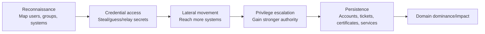

| Stage | Examples of defensive signals | Analyst validation |
|---|---|---|
| Reconnaissance | Unusual account/group/domain discovery, honeytoken touch | Admin/tool baseline and source device |
| Credential access | Brute force, suspicious ticket behavior, credential theft correlation | Lockout/service behavior and endpoint evidence |
| Lateral movement | Unusual remote authentication or service use | Jump server, admin schedule and destination role |
| Privilege escalation | Sensitive group/object changes, delegation changes | Approved change ticket and effective permissions |
| Persistence | New account/service, risky certificate, domain configuration change | Owner, certificate/ticket/account lifecycle |
| Domain dominance | Replication abuse, forged-ticket patterns, DCShadow-like activity | DC identity, endpoint evidence and forest scope |

MDI's overview explicitly frames identity detections across reconnaissance, compromised credentials, lateral movement and domain dominance. Use current alert documentation for exact names and severity.

## 8. MDI architecture

Microsoft Defender for Identity uses sensors, API connectors and cloud analytics. Sensors capture and parse required Windows events, ETW and/or network traffic according to sensor version and placement, enrich with directory data and send required signals to the cloud. The Defender portal correlates identity signals with other workloads.

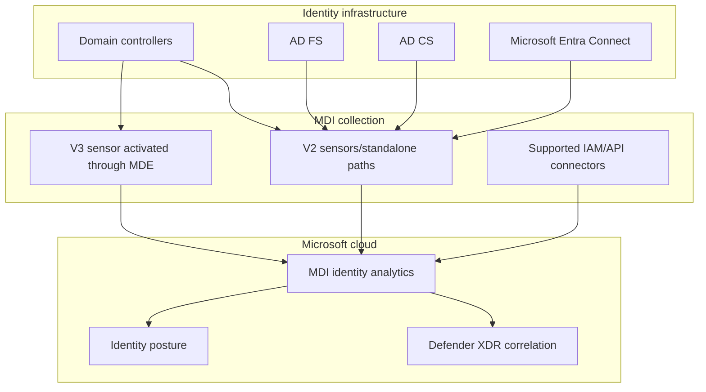

| Layer | Function | Failure consequence |
|---|---|---|
| Identity infrastructure | Produces authentication/directory activity | Critical business service; protect performance |
| Sensor | Collects/parses/enriches signals | Detection gaps or degraded context |
| Directory access | Resolves objects and changes | Unknown/misresolved entities |
| Cloud analytics | Baselines/detects/correlates | Alert/posture delay or service issue |
| Defender portal | Investigation, health and configuration | Access/presentation issue |
| XDR/Sentinel integration | Cross-domain/cross-source response | Fragmented incidents if unhealthy |

## 9. V2 versus v3 sensor decision

The 2026 v3 sensor is not merely an in-place label change. It uses MDE infrastructure and has different prerequisites and behavior.

| Decision point | Sensor v2.x context | Sensor v3.x current context |
|---|---|---|
| Deployment | Installed MDI sensor; standalone sensor patterns exist | Activated on a server already fully onboarded to MDE |
| Minimum server | Follow current v2 OS matrix | Windows Server 2019+ with July 2026+ cumulative update |
| Supported placement | DCs and supported standalone identity-role servers | Domain controllers, including DCs with supported identity roles |
| Standalone AD FS/AD CS/Entra Connect | Current guidance uses v2 | Not current v3 placement; use v2 guidance |
| Signal emphasis | Network/event collection with sizing considerations | Windows events/ETW; lower documented resource model |
| Directory/action identity | DSA/gMSA/action-account designs under v2 guidance | LocalSystem only for directory reads and response |
| Connectivity | MDI service requirements | Same required service endpoints as MDE current guidance |
| Capacity tool | Current sizing tool applies to v2 | Current docs say v3 does not require that sizing tool |
| Limitations | Version-specific | Current docs: no VPN integration or syslog notifications; ExpressRoute limitations |
| Rollback/migration | Traditional install/uninstall | MDE dependency and sensor activation/migration plan |

A mixed environment can legitimately contain both versions. Document which DC/server uses which version and why. Remove v2 service accounts only after no v2 sensor needs them and current migration guidance is satisfied.

## 10. Sensor placement and coverage

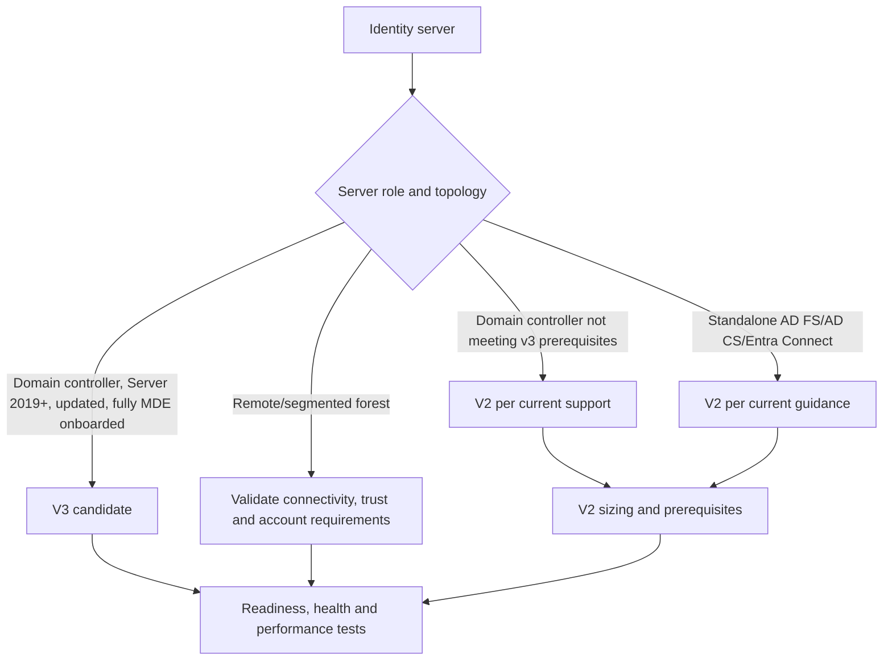

| Coverage question | Why it matters |
|---|---|
| Every forest/domain/site? | Unmonitored DCs create blind spots |
| Read-only DCs and branch sites? | Authentication may occur outside core datacenter |
| AD FS/AD CS/Entra Connect placement? | Identity roles add distinct high-value signals |
| Virtualization resource guarantees? | Dynamic/overcommitted memory can impair sensor/DC |
| Network segmentation/proxy? | Cloud and directory dependencies may be blocked |
| Time synchronization? | Authentication and timeline correlation depend on it |
| Change windows/rollback? | DC changes can affect organization-wide access |

## 11. Sizing and performance

Current v2 sizing uses traffic and server resource analysis; Microsoft says its sizing tool applies to v2, not v3. Current v3 guidance documents resource protections/limits but still requires capacity review because the domain controller hosts other critical services.

| Sensor concern | V2 approach | V3 approach |
|---|---|---|
| Primary workload measure | Busy packets/events and server characteristics | Windows events/ETW plus server workload |
| Tool | Official sizing tool/manual performance collection | Current docs say no v2 sizing tool requirement |
| Resource allocation | Required CPU/RAM based on measured load | Current v3 caps/throttles sensor resource use; verify latest values |
| VM memory | Reserve/allocate according to guidance | Avoid dynamic/overcommitted memory per current guidance |
| Overload symptom | Dropped network/events and health alerts | Throttled processing/restart and health issues |
| Acceptance | Peak period plus failover/load tests | Sensor/DC health through representative peak |

Never treat “sensor protects the DC from resource use” as permission to skip performance testing. If a DC is already constrained, any additional workload matters.

## 12. Connectivity, permissions and accounts

| Dependency | V2 considerations | V3 considerations |
|---|---|---|
| Cloud egress | Current MDI endpoints/proxy guidance | Current MDE standard/streamlined endpoints |
| Directory reads | DSA/gMSA under supported guidance | LocalSystem automatically |
| Response actions | Action account/gMSA where configured | LocalSystem under current design |
| Windows auditing | Required events and configuration | Automatic auditing recommended/available; manual fallback |
| RPC auditing | Version-specific configuration | Current 3.0.8+ guidance enables automatically after upgrade |
| Sensor installation/activation role | Least privilege per current MDI roles | Security Admin or documented unified permissions for setup |
| Time/DNS | Required for AD and event correlation | Same critical dependency |
| LDAP/domain reachability | Needed for resolution/coverage | Needed according to current role/topology |

### 🔍 Plain-English deep-dive: LocalSystem is not “no permissions”

V3 removes separate DSA/gMSA use for its directory reads and response because the sensor runs on a domain controller and uses that server's LocalSystem identity. That simplifies credential management, but it does not remove privilege risk. Code running as LocalSystem on a domain controller is highly trusted. Protect MDE/MDI administration, sensor integrity, role assignments and response approval with the same seriousness as privileged directory tooling.

## 13. Windows events, ETW and network signals

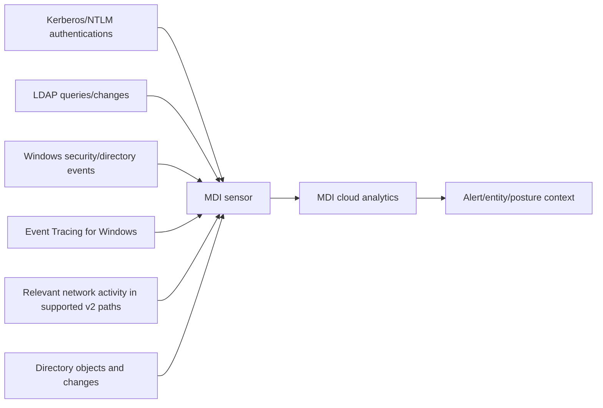

| Signal source | Supports | Gap example |
|---|---|---|
| Authentication events | User/device/service behavior | Audit not enabled or event overload |
| Directory-service events | Object/group/config changes | Missing object auditing |
| NTLM audit | Legacy use and suspicious behavior | Event ID auditing absent |
| AD CS audit | Certificate requests/config behavior | CA auditing not configured |
| ETW | Rich OS/runtime events for v3 | Sensor throttling or unsupported update |
| Network capture | Protocol activity for applicable v2 design | Adapter/offload/port-mirroring issue |
| Directory resolution | Map IDs/IPs to entities | DSA/LDAP/DNS/name-resolution issue |

“No alert” is meaningful only when required signal coverage and health are proven.

## 14. Health architecture

MDI health issues are global/domain-related or sensor-specific. Current status includes open, closed and time-limited suppression behavior. Suppression is not remediation.

| Health category | Example | Impact |
|---|---|---|
| Communication | Sensor stopped communicating | No/new signal gap |
| Resource | Memory/CPU/event overload | Partial processing |
| Version/update | Sensor or server update outdated | Unsupported or reduced capability |
| Auditing | Required Windows/NTLM/AD CS/RPC audit missing | Specific detection gaps |
| Directory account | V2 DSA/gMSA invalid/expired | Entity resolution or sensor failure |
| Network capture | Adapter/Npcap/traffic issue for v2 | Protocol visibility gap |
| Name resolution | Low success mapping IP to device | More unknown entities/false positives |
| Cloud/LDAP | Sensor cannot reach service/DC | Collection/analysis interruption |

Health dashboards should show duration, affected coverage, detection impact, owner and resolution, not merely number of red icons.

## 15. Identity baselines and behavioral analytics

MDI builds context about normal identity behavior and recognizes known attack patterns. Baselines can be affected by role changes, migrations, maintenance and penetration tests.

| Context | Legitimate reason for change | Investigation question |
|---|---|---|
| Logon source/time | New shift/VPN/jump server | Was change approved and expected? |
| Resource access | Project assignment | Does user need this system? |
| LDAP query volume | Inventory/security scan | Is source tool/account authorized? |
| Service ticket request | New application | Is SPN/account configuration correct? |
| Group membership | Role change | Is ticket/approver valid and scope expected? |
| Remote admin | Maintenance | Is device privileged and session recorded? |

Behavioral deviation is a lead. Analysts need asset, user, endpoint, change and threat context before verdict.

## 16. Reconnaissance detections

Reconnaissance maps users, groups, systems, sessions and privilege. Legitimate administrators and security tools also enumerate directories.

| Recon behavior | Defensive concern | False-positive context |
|---|---|---|
| Account/group enumeration | Maps targets and privilege | IAM inventory or admin script |
| Domain/trust discovery | Maps movement boundaries | Architecture assessment |
| Service/SPN discovery | Finds service accounts | Approved application tooling |
| Session discovery | Finds privileged users on hosts | Operations/monitoring product |
| AD CS template discovery | Finds certificate escalation paths | Authorized PKI assessment |
| Honeytoken interaction | Strong signal for unused decoy | Misconfigured app/scan touching decoy |

Scope source device, process (through MDE if available), account, query sequence and prior behavior. A domain admin running an approved inventory is not automatically malicious, but it may reveal an overprivileged process worth fixing.

## 17. Credential-access threats

| Threat concept | Plain meaning | Defensive evidence |
|---|---|---|
| Brute force/password spray | Repeated guesses against accounts | Failure pattern, sources, success and target population |
| Pass-the-hash | Reuse password-derived material | NTLM behavior plus endpoint evidence |
| Pass-the-ticket | Reuse Kerberos ticket | Ticket behavior, source device and session timeline |
| Kerberoasting | Request service tickets to attack weak service-account secrets offline | Unusual ticket requests, SPNs and account password hygiene |
| Credential dumping | Extract secrets from memory/system | MDE process/memory behavior plus MDI follow-on authentication |
| Relay | Forward captured authentication to another service | NTLM/LDAP protection state and source/destination chain |
| Certificate abuse | Use risky enrollment/issued certificate for authentication | AD CS events, template posture and subsequent sign-in |

This guide intentionally omits offensive procedures. A consultant needs to understand signals, mitigations and response, not reproduce credential theft outside an authorized lab.

## 18. Lateral movement

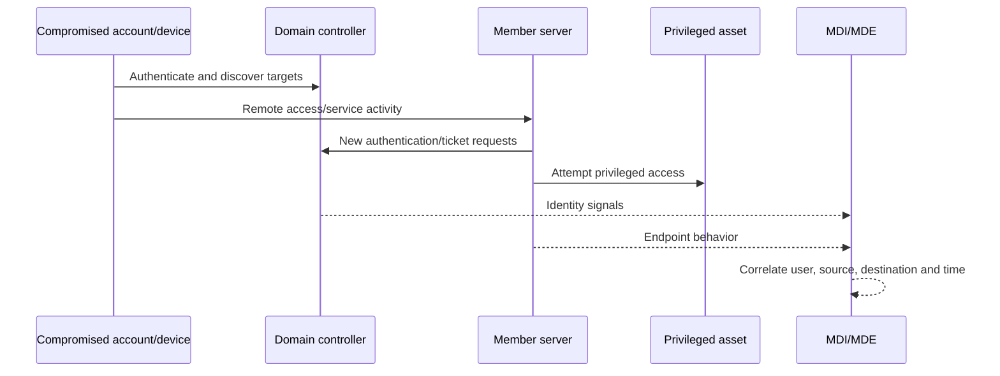

| Investigation pivot | Why |
|---|---|
| Source device | Determines initial foothold and process evidence |
| Account type | Human, admin, service or machine behavior differs |
| Destination role | DC, CA, backup, hypervisor and management systems are high value |
| Protocol/service | RDP, SMB, remote service and admin tools imply different paths |
| Credential sequence | Shows account expansion and privilege |
| Endpoint process | Distinguishes admin tool from malware where evidence exists |
| Change/maintenance | Provides legitimate context |
| Lateral movement path | Shows feasible privilege route, not necessarily used route |

## 19. Persistence and privilege escalation

| Mechanism | Risk | Control/response context |
|---|---|---|
| Sensitive group membership | Immediate elevated authority | Validate change, remove unauthorized membership, investigate creator |
| Delegation change | Services can impersonate users | Review exact setting and dependent app before rollback |
| New/modified service account | Durable privileged access | Rotate/remove, review SPNs and usage |
| GPO/OU permission change | Broad execution/configuration path | Restore known good with change authority |
| Directory replication rights | Enables credential/domain compromise | Remove unauthorized rights and investigate use |
| AD CS template/CA change | Certificate-based escalation/persistence | PKI-led containment and issued-certificate review |
| Rogue DC/DCShadow-like behavior | Unauthorized directory changes | Forest-level incident response |
| Forged-ticket behavior | Domain trust compromise | KRBTGT/forest recovery decisions by specialist team |

High-impact identity response must follow Microsoft AD compromise/recovery guidance and expert incident command. Do not improvise mass password or KRBTGT operations from a study guide.

## 20. Alerts, story, timeline and graph

Current MDI alerts can appear in different layouts during Microsoft's unified alert transition. Alert pages include impacted accounts/hosts, what happened, timeline, graph where available, important information, activity details, comments/history and classification controls.

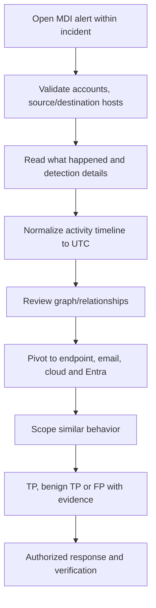

| Classification | Meaning | Example |
|---|---|---|
| True positive | Malicious activity occurred | Unauthorized directory reconnaissance from compromised endpoint |
| Benign true positive | Detected activity occurred but was authorized/nonmalicious | Approved penetration test |
| False positive | Detection-reported activity did not occur as represented | Entity mapping/product issue proven by evidence |

Do not call every authorized admin alert a false positive. If the behavior occurred, benign true positive is often more accurate and preserves detection quality.

## 21. Identity entity investigation

| Entity page/context | Questions |
|---|---|
| User/account | Role, sensitivity, normal devices, alerts, group/privilege and recent changes |
| Device | Is source MDE-onboarded, healthy, compromised or shared? |
| Group | Who changed membership and what effective privilege follows? |
| Domain/DC | Which sites, roles and sensors cover activity? |
| IP | NAT/proxy/VPN/shared infrastructure? |
| Service account | Owner, SPNs, logon restrictions, password age and expected hosts? |
| Certificate/CA context | Template, issuer, requester, usage and revocation state? |

Maintain immutable identifiers and timestamps. Display names and IPs can change or be shared.

## 22. Identity security posture assessments

MDI provides proactive assessments and contributes to Secure Score/Exposure Management experiences according to current tenant/licensing. Assessments identify configuration weaknesses, risky privileges and attack paths.

| Assessment theme | Example question | Owner |
|---|---|---|
| Privileged groups | Are memberships minimal and reviewed? | Directory/PAM owner |
| Service accounts | Are secrets strong, managed and scoped? | App and identity owners |
| Delegation | Are risky/unconstrained paths removed? | AD/application owner |
| Protocol hardening | Can NTLM/unsigned LDAP be reduced? | Identity and application teams |
| AD CS | Are templates, CA permissions and enrollment secure? | PKI team |
| Dormant/stale identities | Can old privileged accounts be removed? | Identity governance/HR/app owner |
| Lateral paths | Can ordinary account/device reach sensitive assets? | AD, endpoint and network teams |
| Sensor/audit coverage | Are all required signals healthy? | MDI platform owner |

A posture recommendation is not evidence of exploitation. Validate applicability and business dependencies before remediation.

## 23. Lateral movement paths

A lateral movement path is a modeled route through sessions, privileges and systems that could lead to a sensitive entity. It is a prevention prioritization tool.

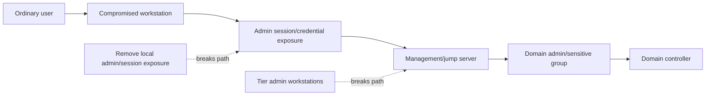

| Path interpretation | Correct statement | Incorrect statement |
|---|---|---|
| Potential | “This relationship could permit movement under these conditions.” | “The attacker used this path.” |
| Prioritization | “Break the shortest/high-impact paths first.” | “Patch every node equally.” |
| Validation | “Confirm sessions, privilege and current asset ownership.” | “The graph is always current.” |
| Remediation | “Remove unnecessary rights/sessions and validate operations.” | “Disable all shown accounts immediately.” |

## 24. Sensitive entities and honeytokens

MDI can tag sensitive users, devices and groups; some high-value groups/servers are recognized automatically. A **honeytoken** is a deliberately unused decoy identity/device whose use should be highly suspicious.

| Honeytoken design requirement | Reason |
|---|---|
| No legitimate interactive/service use | Any activity should be exceptional |
| Plausible but not privileged | Attract reconnaissance without granting power |
| Strong random credential, protected secret | Prevent actual compromise path |
| No automation/scanner access | Avoid predictable false alerts |
| Clear owner and monitoring SLA | Alerts require immediate review |
| Documented legal/privacy approval | Decoy monitoring has governance implications |
| Periodic validation | Ensure account remains unused and alert path works |
| Safe decommission | Remove tags/account and update runbooks |

### 🔍 Plain-English deep-dive: a honeytoken is a tripwire, not bait with explosives

A honeytoken should be like a sealed door alarm in an unused hallway. Opening it is noteworthy, but the door should not lead to a vault. Giving a decoy account real privilege increases risk. Inventory scanners, password tools or forgotten scripts can touch it, so an alert still needs validation. High signal does not eliminate evidence requirements.

## 25. Integration with Defender for Endpoint

MDE adds process/device context to identity behavior, and current MDI v3 depends directly on MDE onboarding. This can reveal what process initiated suspicious authentication or LDAP activity.

| MDI evidence | MDE enrichment | Combined question |
|---|---|---|
| Suspicious LDAP query | Source process tree | Which executable/account issued it? |
| Lateral authentication | Remote-service/network event | Did malware or admin tooling initiate movement? |
| Credential-theft follow-on | Memory/process behavior | Was credential material accessed first? |
| Sensitive group change | Admin device health | Was change made from trusted privileged workstation? |
| DC alert | Sensor/device health | Is identity evidence complete and sensor protected? |

For v3, “MDE onboarded” must mean the full current prerequisite, not merely endpoint discovery or an endpoint-only partial state.

## 26. Integration with Entra and cloud identity

MDI contributes hybrid/on-premises context while Entra provides cloud sign-in, risk, app, role and audit evidence. Synced identities need immutable-ID mapping and source-of-authority awareness.

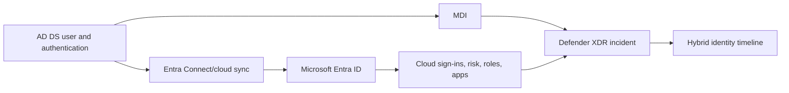

| Question | Hybrid evidence |
|---|---|
| Was password/credential exposed on-premises? | MDI plus MDE |
| Was it used in cloud? | Entra sign-in/risk and app activity |
| Where is account authoritative? | Sync/source-of-authority configuration |
| Which sessions persist? | Entra token/session and Kerberos ticket context |
| Which privilege exists in both planes? | AD group membership and Entra roles |
| Did attacker create app consent/certificate? | Entra audit/app plus AD CS evidence |

A password reset alone might not revoke cloud sessions, tickets, app consent or certificates. Response must cover the actual persistence paths.

## 27. Integration with Defender XDR and Sentinel

| Integration | Value | Design concern |
|---|---|---|
| Defender XDR | Correlates identity with endpoint, email and SaaS alerts | Incident grouping and response ownership |
| Advanced hunting | Searches supported identity/device tables | Retention/schema and query accuracy |
| Sentinel connector/unified SecOps | Adds broader network/cloud/third-party data and SOAR | Duplication, workspace RBAC, cost and incident authority |
| SIEM API/streaming | Exports supported events/alerts | Versioning, latency and data minimization |
| Ticketing | Tracks posture/incident work | Bidirectional status/idempotency |

Do not send every raw source twice without purpose. Map source, authoritative location, latency, retention and billing.

## 28. Triage and response workflow

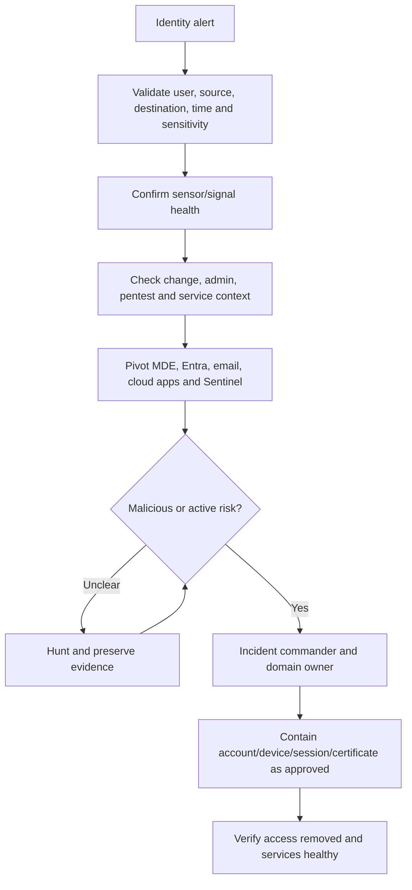

| Response area | Possible action | Approval/risk |
|---|---|---|
| User account | Disable, reset password, restrict | Business outage and source-of-authority |
| Sessions/tickets | Revoke cloud sessions; plan Kerberos implications | Propagation and service impact |
| Endpoint | Isolate/collect/reimage | Evidence and business continuity |
| Privilege | Remove unauthorized group/role/delegation | Dependency and attacker-created changes |
| Service account | Rotate secret and restrict hosts | Application outage |
| OAuth/app | Revoke consent/credentials | Business integration impact |
| Certificate | Revoke certificate/secure template/CA | PKI and revocation propagation |
| Forest recovery | Specialist recovery process | Major enterprise crisis; never ad hoc |

## 29. Privacy and legal considerations

Identity telemetry reveals relationships, authentication, devices, locations and administrative activity. Honeytokens and behavior analytics can be perceived as employee monitoring.

| Principle | MDI application |
|---|---|
| Purpose limitation | Use for security and approved posture objectives |
| Least privilege | Scoped roles, PIM, access reviews and audit |
| Data minimization | Collect/configure only supported required signals |
| Retention | Align service and SIEM data with policy/legal need |
| Transparency | Employee/admin monitoring notices where required |
| Separation of duties | Directory admin, sensor admin, SOC and auditor boundaries |
| Evidence protection | Secure exports, case access and chain of custody |
| Cross-border review | Validate service data location and transfer rules |

## 30. Assessment and design

| Discovery domain | Questions | Artifact |
|---|---|---|
| Forest topology | Forests, domains, trusts, sites, DCs, RODCs | Identity topology diagram |
| Identity roles | AD FS, AD CS, Entra Connect and PKI | High-value server inventory |
| Platform | OS/update/MDE and sensor eligibility | V2/v3 decision matrix |
| Authentication | Kerberos, NTLM, LDAP, certificates, federation | Protocol dependency map |
| Accounts | Privileged/service/sync/emergency identities | Sensitive-entity register |
| Telemetry | Auditing, ETW, network and health | Signal coverage matrix |
| Security tools | MDE, Entra, PAM, SIEM and EDR | Integration map |
| Operations | SOC, AD, PKI, endpoint, app and incident roles | RACI and response matrix |
| Privacy | Data, access, retention and monitoring policy | Privacy control record |

## 31. Staged deployment

```mermaid
flowchart LR
    D0[Discover topology and dependencies] --> D1[Validate v2/v3 readiness]
    D1 --> D2[Configure roles, accounts, auditing and egress]
    D2 --> D3[Pilot low-risk representative DC/site]
    D3 --> D4[Observe health, load and alert baseline]
    D4 --> D5[Expand by sites/domains/roles]
    D5 --> D6[Enable posture, tags and response governance]
    D6 --> D7[Operational acceptance]
```

| Phase | Exit criteria | Hold/rollback trigger |
|---|---|---|
| Discovery | Complete topology/role/owner map | Unknown DC/forest or unsupported OS |
| Readiness | MDE/update/account/connectivity tests pass | V3 prerequisite or v2 sizing failure |
| Pilot | Healthy sensor and DC under peak workload | Authentication latency/resource issue |
| Baseline | Known admin/tools documented; health stable | Severe noise or signal gaps |
| Expansion | Coverage and support process meet target | Repeated site/connectivity failures |
| Response | Approvals, runbooks and recovery tested on paper | Overprivileged action role |
| Handover | RACI, monitoring, access and evidence accepted | No AD/PKI owner acceptance |

## 32. Testing strategy

| Test | Safe method | Evidence |
|---|---|---|
| Readiness | Official readiness tool/current prerequisite checks | Timestamped results and exceptions |
| Sensor health | Verify portal state, versions and communication | Sensor/health export |
| Event/audit | Generate approved benign authentication/admin event | Source event and MDI visibility |
| Entity resolution | Query known test user/device | Correct immutable identity mapping |
| RBAC | Persona read/response/config tests | Allow/deny matrix and audit |
| Performance | Monitor DC auth, CPU, memory and sensor processing under peak | Baseline versus pilot trend |
| Alert path | Microsoft-supported safe simulation/paper walkthrough | Alert-to-incident routing |
| Integration | Match MDI user/device with MDE/Entra/Sentinel | Correlation IDs/timestamps |
| Rollback | Remove/disable pilot sensor per version guidance | DC health and coverage state |
| Privacy | Confirm content/access/retention controls | Approval and access-review record |

Never perform credential theft, relay, forged-ticket, unauthorized enumeration or certificate abuse in production. Use a dedicated authorized lab or paper evidence.

## 33. Rollback and recovery

| Change | Rollback | Concern |
|---|---|---|
| V2 sensor install | Supported uninstall/restore prior configuration | Signal gap and service-account cleanup |
| V3 activation | Follow current deactivation/migration guidance while preserving MDE | MDE dependency and event/audit state |
| Automatic auditing | Restore approved previous policy only if necessary | Detection gap; coordinate GPO authority |
| New DSA/gMSA/action account | Remove after no sensor needs it | Premature removal breaks v2 coverage |
| Entity tag | Remove tag and update runbook | Alerts/priority behavior changes |
| Honeytoken | Disable/remove safely and update monitoring | Forgotten dependency or missed alert |
| Response action | Re-enable/restore account only after clean validation | Attacker persistence may remain |
| Protocol hardening | Return staged setting if app outage | Security risk returns; document exception |

Capture pre-change GPO/audit/account/sensor configuration. Never use production DC snapshots as an assumed general rollback strategy without directory specialists and supported recovery design.

## 34. Operations and metrics

| Metric | Decision supported | Caveat |
|---|---|---|
| DC/sensor coverage | Where identity visibility is missing | Count needs authoritative denominator |
| Sensor communication freshness | Current collection health | Maintenance must be distinguished from failure |
| Required-audit coverage | Detection prerequisites | Enabled policy does not prove events processed |
| Dropped/throttled events | Capacity risk | Health issue duration and affected DC matter |
| Entity-resolution success | Investigation quality | Shared/NAT/legacy systems reduce certainty |
| Sensitive-entity review age | Priority accuracy | Automatic tags still need business context |
| High-risk posture findings age | Preventive remediation progress | Exception is not remediation |
| True/benign/false positive rate | Alert quality and baseline | Misclassification can distort tuning |
| Time to scope identity | Incident response effectiveness | Correct scope matters more than speed alone |
| Credential containment time | Active-risk reduction | Business impact and persistence validation |
| Lateral-path reduction | Preventive hardening | Model refresh/data quality matter |
| Protocol-modernization trend | NTLM/LDAP hardening progress | Outage-free migration matters |

## 35. Sensor failure and troubleshooting matrix

| Symptom | Likely cause | First checks |
|---|---|---|
| Sensor stopped communicating | Egress, proxy, service, restart or MDE issue | Health timestamp, local service and cloud path |
| V3 activation unavailable | MDE not fully onboarded, OS/update/support or role | Exact server/MDE/update prerequisites |
| V2 DSA credential alert | Password/gMSA/access/configuration | Account state and sensor-version need |
| Mixed v2/v3 DSA alerts | Workspace still validates configured account | Confirm remaining v2 dependencies before removal |
| Some events not analyzed | Load/capacity/audit pipeline | Health issue, event volume and resources |
| No network traffic on v2 | Capture adapter/port mirror/Npcap/offload | Adapter selection and packet evidence |
| Low name-resolution success | DNS/RPC/NetBIOS restrictions | Supported resolution ports and reverse DNS |
| AD CS detections absent | Auditing/sensor placement/support | CA role, sensor version and required events |
| Wrong entity in alert | Resolution, reused IP/name or stale data | Immutable IDs, DNS, DHCP/VPN and timeline |
| Portal alert layout differs | Unified transition/detection source | Filter service sources and current documentation |

## 36. Layered troubleshooting workflow

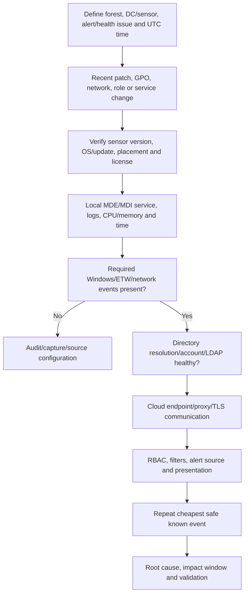

An escalation pack should include tenant/workspace, sensor/server/DC identity, version, OS/build/update, role and topology, UTC symptom window, health issue text, local logs, MDE state, audit evidence, proxy/network path, resource trend, recent changes and a safe reproduction.

## 37. Hybrid identity incident scenario

A fictional employee receives a phishing email. Endpoint evidence suggests session/credential theft. MDI sees directory reconnaissance and remote authentication toward a server where a privileged admin recently logged on. Entra shows a cloud sign-in and OAuth consent.

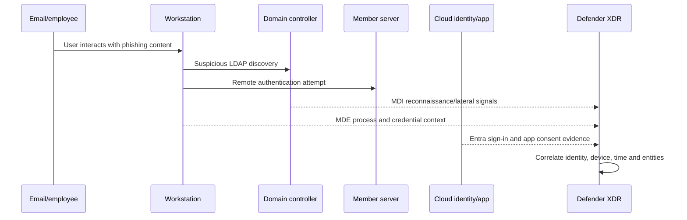

| Investigation question | Evidence |
|---|---|
| Was the user interaction real? | MDO message/click and MDE browser/process chain |
| Was credential material exposed? | MDE behavior plus subsequent authentication |
| Was LDAP activity expected? | MDI details, source process and admin baseline |
| Which accounts/systems were reached? | MDI authentication timeline and server logs |
| Did privilege increase? | Group/delegation/role/certificate changes |
| Did access persist in cloud? | Entra sessions, methods, app consent and roles |
| Is an AD CS path involved? | CA/template/request/audit evidence |
| What is business impact? | Asset owners, data and effective access |

Containment coordinates email, endpoint, AD, Entra, app and data owners. Record which action invalidates which access mechanism.

## 38. Consulting scenarios

### Scenario A: deploy v3 everywhere

A client wants v3 on every identity server. Build the role and prerequisite matrix first. DCs meeting MDE, OS and update requirements may qualify. Standalone AD FS/AD CS/Entra Connect servers currently follow v2 guidance. Identify v3 feature limitations, mixed-account behavior and rollback; do not force uniformity over supportability.

### Scenario B: NTLM reduction

A posture assessment recommends NTLM restriction. Inventory current NTLM sources, classify business dependencies, remediate Kerberos/SPN/DNS/time problems, audit, pilot restrictions and monitor failures. Keep an approved rollback and exceptions with expiry.

### Scenario C: honeytoken alert

Treat it as high signal but validate whether scanners, scripts or migration tools touched the account. Preserve source device/process and authentication evidence. If malicious, scope the credential source and lateral path; do not merely reset the decoy.

### Scenario D: sensor performance concern

Protect authentication availability. Compare baseline and pilot CPU, memory, event processing and latency; inspect health throttling; confirm VM memory reservation and server load. Pause expansion or roll back the pilot if identity-service health degrades.

## 39. Consulting artifacts

| Artifact | Minimum content |
|---|---|
| Hybrid identity topology | Forests, domains, trusts, sites, DCs and identity roles |
| Sensor decision matrix | Server, role, OS/update, MDE state, v2/v3 and rationale |
| Signal coverage map | Auth, LDAP, Windows events, ETW, AD CS and gaps |
| Identity attack-path model | Reconnaissance through persistence/domain impact |
| Sensitive-entity register | Entity, business owner, reason, tag and review |
| Posture backlog | Finding, evidence, risk, dependency, owner and due date |
| Protocol modernization plan | NTLM/LDAP baseline, app owners, rings and rollback |
| RBAC/action matrix | View, investigate, configure and response permissions |
| Deployment plan | Readiness, pilot, sites/domains, health gates and rollback |
| Alert runbooks | Triage, pivots, benign context, response and closure |
| Health dashboard | Coverage, versions, communication, audit and overload |
| Privacy control record | Purpose, access, retention, honeytokens and audit |
| Handover pack | RACI, support, monitoring, escalation and acceptance |

## 40. Safe paper lab: design MDI and investigate a fictional identity path

This lab requires no AD DS tenant, sensor, credentials, attack tools or production change.

### Fictional estate

| Server | Role | Current state | Design question |
|---|---|---|---|
| `DC-HQ-01` | DC, Server 2022 | Fully MDE onboarded; July 2026 update | V3 candidate |
| `DC-BR-01` | Branch DC, Server 2019 | MDE onboarded; constrained link | V3 connectivity/performance pilot |
| `DC-LEG-01` | DC, older supported-v2 state | Does not meet v3 prerequisites | V2/migration plan |
| `ADFS-01` | Standalone AD FS | Not a DC | Current v2 guidance |
| `CA-01` | Standalone AD CS | Not a DC | Current v2 plus AD CS audit |
| `SYNC-01` | Entra Connect | Not a DC | Current v2 and high-value monitoring |

### Exercise 1: architecture

1. Draw forest, sites, roles, sensors, MDE and cloud paths.
2. Select v2/v3 for each server with evidence.
3. Document accounts, egress, auditing, time and resource prerequisites.
4. Define pilot order, health gates and rollback.
5. Create analyst, platform-admin, responder and auditor personas.

### Exercise 2: identity attack timeline

Use synthetic times: 09:00 phishing delivery; 09:08 endpoint process; 09:16 unusual LDAP enumeration; 09:23 remote authentication; 09:31 sensitive-group modification attempt; 09:38 cloud OAuth consent. Separate observed facts from hypotheses and list alternative benign explanations.

### Exercise 3: posture decision

Model a lateral path from ordinary workstation to a server with an exposed admin session to a sensitive group. Propose least-disruptive path breaks: remove standing local admin, use privileged workstations, clean sessions, reduce service-account rights and monitor. Add owner, test and rollback.

### Exercise 4: honeytoken

Design an unprivileged unused account, owner, excluded scanners, alert SLA, validation and retirement. Do not create it in a real directory.

### Portfolio evidence

- Hybrid identity and sensor architecture.
- V2/v3 prerequisites and decision matrix.
- Signal/audit/health coverage table.
- Facts-versus-hypotheses incident timeline.
- Lateral movement path and remediation backlog.
- Honeytoken design with privacy approval.
- Response action/approval matrix.
- Sensor troubleshooting and escalation pack.

### Evidence-safe interview wording

> “I completed a safe fictional MDI design rather than a production deployment. I mapped AD DS protocols and identity roles, selected v2 or v3 sensors using current 2026 prerequisites, built health and audit gates, and correlated synthetic identity, endpoint and cloud evidence. I did not administer AD DS or respond in a production tenant. My production analogue is M365 incident RCA, evidence discipline and stakeholder coordination.”

## 41. JD Mapping: interview translation

| Interview prompt | Factual strength | Honest bridge |
|---|---|---|
| “How do you secure hybrid identity?” | M365 dependency/RCA reasoning | Explain protocol, privilege, sensor, posture and response layers |
| “How would you deploy MDI?” | Change validation and service-health discipline | Use v2/v3 matrix, pilot and health gates |
| “How do you investigate lateral movement?” | Timeline and cross-team incident coordination | Use fictional MDI/MDE/Entra evidence; no production claim |
| “How do you handle a noisy alert?” | Evidence-based root cause | TP versus benign TP versus FP and narrow tuning |
| “How do you protect critical services?” | Critical-incident stakeholder management | DC performance, rollback and directory-owner approval |
| “What is your experience level?” | Production M365 support | Current architecture and paper-lab MDI knowledge |

## Official Source Anchors

1. [Microsoft Defender for Identity overview](https://learn.microsoft.com/defender-for-identity/what-is)
2. [Defender for Identity architecture](https://learn.microsoft.com/defender-for-identity/architecture)
3. [Deploy Defender for Identity](https://learn.microsoft.com/defender-for-identity/deploy/deploy-defender-identity)
4. [Deploy the Defender for Identity sensor v3.x](https://learn.microsoft.com/defender-for-identity/deploy/deploy-sensor-v3)
5. [Defender for Identity sensor v2.x prerequisites](https://learn.microsoft.com/defender-for-identity/deploy/prerequisites-sensor-version-2)
6. [Capacity planning](https://learn.microsoft.com/defender-for-identity/deploy/capacity-planning)
7. [Configure Windows event collection](https://learn.microsoft.com/defender-for-identity/deploy/configure-windows-event-collection)
8. [Defender for Identity health issues](https://learn.microsoft.com/defender-for-identity/health-alerts)
9. [View and manage MDI security alerts](https://learn.microsoft.com/defender-for-identity/understanding-security-alerts)
10. [MDI alert names and mappings](https://learn.microsoft.com/defender-for-identity/alerts-overview)
11. [Identity security posture assessments](https://learn.microsoft.com/defender-for-identity/security-assessment)
12. [Entity tags and honeytokens](https://learn.microsoft.com/defender-for-identity/entity-tags)
13. [Role groups and unified RBAC](https://learn.microsoft.com/defender-for-identity/role-groups)
14. [Directory service accounts](https://learn.microsoft.com/defender-for-identity/directory-service-accounts)
15. [Manage action accounts](https://learn.microsoft.com/defender-for-identity/manage-action-accounts)
16. [Defender for Identity technical FAQ: licensing and privacy](https://learn.microsoft.com/defender-for-identity/technical-faq)
17. [Microsoft Defender XDR incidents](https://learn.microsoft.com/defender-xdr/incidents-overview)
18. [Microsoft Sentinel Defender XDR connector](https://learn.microsoft.com/azure/sentinel/connect-microsoft-365-defender)
19. [Kerberos authentication overview](https://learn.microsoft.com/windows-server/security/kerberos/kerberos-authentication-overview)
20. [LDAP signing and channel binding guidance](https://learn.microsoft.com/troubleshoot/windows-server/active-directory/enable-ldap-signing-in-windows-server)

## ⭐ Likely Interview Questions for This Section

### Q1. What does Microsoft Defender for Identity do?

**Model answer:** MDI collects identity signals from AD DS and supported identity systems through sensors and connectors, analyzes authentication and directory behavior, identifies posture weaknesses, and sends enriched identity alerts into the Defender portal and XDR incidents. It helps detect reconnaissance, credential abuse, lateral movement, privilege escalation and domain-dominance behavior. It does not replace secure AD design or turn every anomaly into proof.

### Q2. Explain the difference between the v2 and v3 MDI sensors in 2026.

**Model answer:** Current v3 is activated on a fully MDE-onboarded Windows Server 2019-or-later domain controller with the July 2026-or-later cumulative update. It uses MDE connectivity and LocalSystem for directory reads/response and relies mainly on Windows events/ETW, so the v2 sizing tool does not apply. Standalone AD FS, AD CS and Entra Connect servers currently use v2 guidance. V3 also has documented feature limitations, so I would build a per-server support matrix rather than assume one version everywhere.

### Q3. How do Kerberos, NTLM and LDAP relate to identity attacks?

**Model answer:** Kerberos issues tickets for domain authentication; attackers may steal or forge tickets or target weak service accounts. NTLM is a legacy challenge-response path with relay and hash-reuse risks, so it should be audited and reduced in stages. LDAP queries and changes expose directory structure and authority; signing/channel binding and least privilege matter. MDI observes supported signals, while MDE can add the source process context.

### Q4. How would you investigate suspected lateral movement?

**Model answer:** I would validate the identity, source and destination devices, protocol, UTC timeline and asset sensitivity; confirm MDI sensor health; inspect MDE process/network context; check Entra cloud use and email entry evidence; search for other authentication and privilege changes; and distinguish normal jump-server/admin behavior. I would preserve facts versus hypotheses and obtain incident-command approval for account, device, session or certificate containment.

### Q5. What is an identity security posture assessment or lateral movement path?

**Model answer:** A posture assessment identifies configurations and relationships that create risk before an active attack, such as risky delegation, stale privilege or insecure protocols. A lateral movement path models how compromise could traverse sessions/rights toward a sensitive entity. It is a prioritization hypothesis, not proof an attacker used the path. I would validate current relationships, break the highest-impact path and test business operations.

### Q6. How would you design a honeytoken safely?

**Model answer:** I would use a plausible but unprivileged account with no legitimate use, a strong protected credential, excluded approved scanners, a named owner and immediate triage SLA. I would document privacy approval, test the alert path safely, review it periodically and decommission cleanly. Any use is high signal but still needs source-device/process validation.

### Q7. How do you troubleshoot a missing MDI alert?

**Model answer:** I would first confirm the exact behavior should be detectable and the sensor covers the relevant DC/role. Then verify sensor version/support, local MDE/MDI health, required Windows/ETW/network events, auditing, capacity, directory resolution, time, cloud connectivity, RBAC and portal filters. A safe known event is the cheapest end-to-end check. If source events are absent, alert tuning cannot fix it.

### Q8. What is your honest Defender for Identity experience?

**Model answer:** My production experience is Microsoft 365 critical-incident support, RCA, evidence timelines, validation and stakeholder coordination. I have studied current AD DS/MDI architecture and completed a fictional design and investigation with v2/v3 decisions, health gates and hybrid evidence. I have not administered MDI or AD DS in production, so I would partner with directory specialists and work under approved change and response authority.

## 🧠 30-Second Memory Hooks

- **Identity is the badge; AD DS is the badge office; DCs are the checkpoints.**
- **Kerberos uses tickets; NTLM is legacy challenge-response; LDAP reads/changes the directory.**
- **Certificates can be durable authentication, so password reset may be incomplete.**
- **Recon maps, credentials unlock, lateral movement spreads, privilege climbs, persistence returns.**
- **V3 means MDE dependency, current Server/update prerequisites and LocalSystem.**
- **Standalone AD FS/AD CS/Entra Connect still drive v2 decisions under current guidance.**
- **Sensor health is detection coverage, not just platform hygiene.**
- **Behavioral anomaly is a lead; context decides verdict.**
- **A lateral path is possible access, not observed attacker travel.**
- **Honeytokens are unprivileged tripwires with owners and privacy controls.**
- **Identity containment must cover password, sessions, tickets, apps and certificates.**
- **Arti's bridge is incident rigor, never invented AD/MDI production ownership.**

## Completion Checklist

- [ ] I can explain identities, domains, forests, DCs, groups and service accounts.
- [ ] I can draw Kerberos ticket flow and explain NTLM/LDAP differences.
- [ ] I can explain AD CS authentication and persistence risk.
- [ ] I can describe reconnaissance, credential access, lateral movement, escalation and persistence.
- [ ] I can draw MDI sensor-to-cloud-to-XDR architecture.
- [ ] I can distinguish v2 and v3 prerequisites, accounts, sizing and limitations.
- [ ] I can choose current sensor paths for DC, AD FS, AD CS and Entra Connect roles.
- [ ] I can explain events, ETW, network and directory-resolution signals.
- [ ] I can operate a health view by impact, duration, coverage and owner.
- [ ] I can investigate alert story, timeline, graph and entities without assuming certainty.
- [ ] I can distinguish TP, benign TP and FP.
- [ ] I can explain identity posture, lateral paths, sensitive entities and honeytokens.
- [ ] I can correlate MDI with MDE, Entra, Defender XDR and Sentinel.
- [ ] I can propose response actions with directory/PKI owner approval and rollback.
- [ ] I can design privacy, RBAC and evidence controls.
- [ ] I can plan staged deployment around DC availability and performance.
- [ ] I can run safe readiness, health, correlation and rollback tests.
- [ ] I can troubleshoot missing signals from source event through portal.
- [ ] I can complete the safe paper lab and produce consulting artifacts.
- [ ] I can state that my MDI work is study/design evidence, not production ownership.
- [ ] I have re-checked current sensor, licensing, portal, connector and preview documentation.

*Next suggested section:* [Part 37](Part-37-defender-cloud-apps-saas-security.md) — extend identity and endpoint context into Cloud Discovery, SaaS connectors, OAuth governance, session controls, data protection and shadow IT.