# Part 37 — Defender for Cloud Apps, SaaS Security, App Governance, and Session Controls

> **Section goal:** Master the approved cloud-app scope from zero: cloud access security broker (CASB) and security service edge (SSE) context; Microsoft Defender for Cloud Apps (MDCA) architecture; Cloud Discovery through firewall/proxy logs, log collectors, APIs, secure web gateway integrations and Defender for Endpoint; the cloud-app catalog, risk scores and sanctioned/unsanctioned governance; API app connectors; activity, file, anomaly and access/session policies; governance actions; OAuth app inventory, app governance and consent risk; Conditional Access App Control (CAAC) reverse-proxy and supported in-browser controls; Microsoft Purview labels and DLP integration; SaaS Security Posture Management (SSPM); shadow IT, generative-AI application context and third-party app onboarding; privacy, licensing, deployment, testing, rollback, operations and troubleshooting. By the end, you should be able to assess and design safe SaaS controls and investigate risky OAuth and data-exfiltration scenarios without claiming production MDCA ownership.

This Part maps directly to Deloitte's Microsoft Defender for Cloud Apps, Microsoft Entra Conditional Access, Microsoft Purview, SaaS security, app governance, secure cloud transformation, assessment, architecture, deployment, optimization, incident investigation, troubleshooting, data protection and stakeholder expectations. Your production foundation in SharePoint Online and OneDrive permissions, external sharing, sync, content behavior, critical incidents, RCA, evidence capture and stakeholder coordination is especially relevant because MDCA governs identities, apps, activity and data paths across SaaS. The honest bridge is extending known Microsoft 365 workload reasoning into multi-SaaS controls. This chapter never claims production MDCA, CASB, OAuth-remediation or session-control ownership.

> **Currency, licensing, preview, portal and support note:** This chapter was checked against official Microsoft Learn content available on **August 24, 2026**. Defender for Cloud Apps is accessed in the Microsoft Defender portal, but licenses can expose the full product or narrower Office 365 Cloud App Security capabilities. Cloud catalog size and scores, supported log parsers, app connectors, governance actions, SSPM coverage, OAuth providers, Conditional Access App Control support, Microsoft Edge in-browser protection, session activities, step-up authentication, file inspection, generative-AI discovery and third-party onboarding change frequently. Some controls in current documentation are preview. Validate Product Terms, Microsoft 365 and Entra entitlements, supported apps/clients/browsers, non-Microsoft identity-provider requirements, privacy/data location, roadmap, Message center and the live tenant before a client decision.

## JD Mapping

| Deloitte role expectation | Capability developed here | Consulting evidence |
|---|---|---|
| Assess SaaS and shadow IT risk | Discovery sources, catalog, users, traffic, sanctions and data paths | SaaS current-state assessment and app-risk register |
| Design cloud-app security | CASB architecture, connectors, policies, CAAC, roles and data controls | MDCA HLD/LLD and control matrix |
| Govern applications and consent | OAuth inventory, permissions, publisher/credential/activity risk | App-governance operating model and consent review |
| Protect sensitive data | Purview labels/DLP plus API and session controls | Cross-SaaS data-protection design and test plan |
| Investigate incidents | Activity, files, app, user, session and XDR pivots | OAuth/exfiltration evidence timeline and runbook |
| Deploy and optimize safely | Pilot, user experience, privacy, tuning, rollback and metrics | Ring plan, exception register and handover pack |

## Candidate honesty note

You can speak directly about production SharePoint Online and OneDrive permissions, external sharing, sync, content behavior, migrations/support, critical incidents, RCA, fix validation, evidence documentation and stakeholder communication where supported by your experience. Those strengths help with MDCA because SaaS investigations also require understanding identity, permission, file, sharing, client and policy paths.

You should not claim that you have connected production SaaS apps, uploaded customer proxy logs, sanctioned applications, revoked OAuth consent, configured Conditional Access App Control, inspected user sessions, applied cross-SaaS governance actions or operated SSPM unless separately evidenced. Safe wording is:

> “My production foundation is Microsoft 365 workload permissions, sharing, sync, incidents, RCA and stakeholder coordination. I have built a current Defender for Cloud Apps architecture and a safe fictional paper exercise covering shadow IT, OAuth consent and session-based data controls. I have not operated MDCA in production. I would start with approved visibility, validate licensing and app/client support, minimize personal data, connect third-party apps with least privilege, pilot monitoring before blocking, test browser and native-client paths, and require owner approval for app revocation or destructive governance actions.”

---

## 1. SaaS security from zero

**Software as a service (SaaS)** is an application run by a provider and accessed over a network, commonly through a browser or app. Examples include collaboration, storage, customer relationship management, code repositories and generative-AI services.

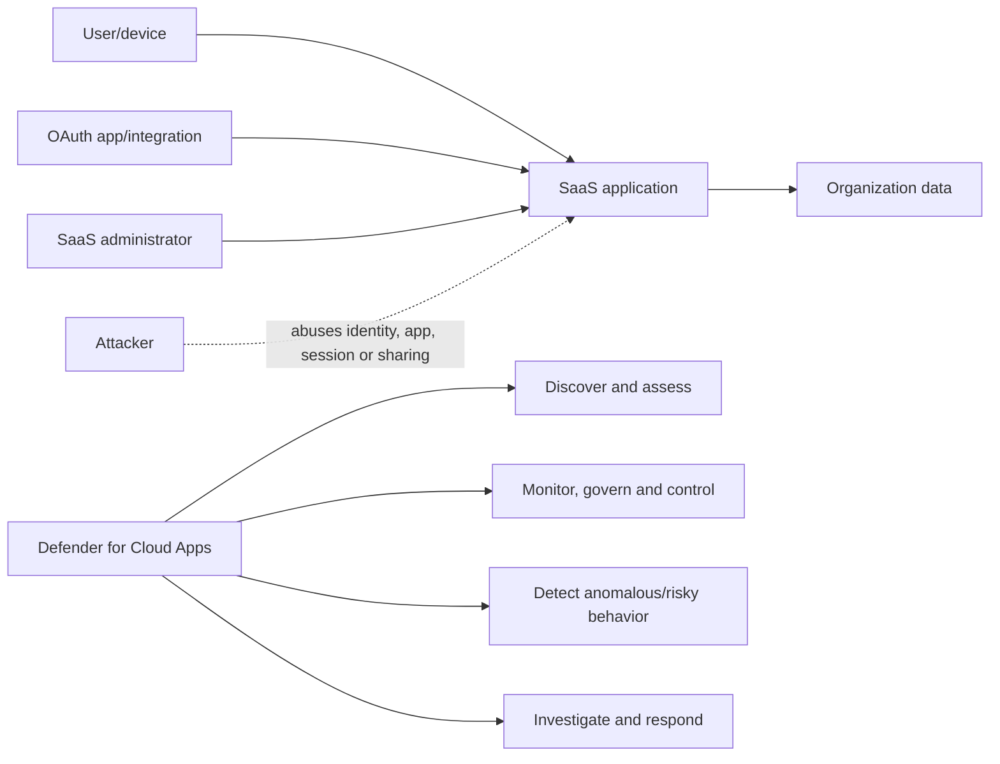

| Term | Plain meaning | Why it matters | Memory hook |
|---|---|---|---|
| Cloud app | Provider-hosted application/service | Data and activity occur outside traditional perimeter | Work happens in someone else's service |
| Shadow IT | App use not approved or known by organization | Unknown data paths and contracts create risk | Work outside the map |
| CASB | Security broker between users/organization and cloud services | Gives discovery, data, threat and control capabilities | Cloud-security traffic controller |
| Connector | Authorized API relationship to a SaaS app | Enables deeper activity/file/governance visibility | Service-to-service window |
| OAuth app | Application granted delegated/application permissions | Can access data without a user's password each time | A delegated digital assistant |
| Session control | Real-time rule applied during supported user session | Limits risky actions without always blocking access | Guard at the doorway |
| SSPM | SaaS Security Posture Management | Identifies insecure SaaS configuration | Configuration health check |
| Sanctioned app | Approved app | Supports governance and user direction | On the approved list |
| Unsanctioned app | Organization marks app as unapproved | Drives awareness/block integration | Not approved, not automatically blocked everywhere |

### 🔍 Plain-English deep-dive: four ways to see or control SaaS are not interchangeable

Imagine a company cafeteria. Network-log discovery is the turnstile count: it shows where people went and how much traffic occurred, not what they did inside. An API connector is a manager's authorized view into orders and stored items after they are in the cafeteria system. OAuth app governance watches third-party assistants who have keys to place orders or read records. Session control is a guard present during the visit who can stop a download or copy action. A design must state which path provides each result.

## 2. CASB and SSE context

A CASB applies security policy between cloud consumers and services. **Security Service Edge (SSE)** is a broader cloud-delivered security model that commonly combines CASB, secure web gateway (SWG), Zero Trust Network Access and data protection. Vendor packaging differs.

| Capability | CASB focus | SSE context | MDCA contribution |
|---|---|---|---|
| Shadow IT | Discover app usage/risk | Web access visibility/control | Cloud Discovery and catalog |
| SaaS API protection | Files, activity, configuration | Cloud data and threat controls | App connectors and policies |
| Session control | In-line SaaS user actions | Adaptive access/data control | CAAC for supported sessions |
| OAuth governance | App-to-app access | Identity/app security | OAuth inventory and app governance |
| SWG | Web traffic filtering | Core SSE component | Integrates with selected SWGs; MDE can block unsanctioned apps under supported design |
| ZTNA | Private-app access | Core SSE component | Entra/other products carry primary private-access role |

Do not call MDCA a complete SSE platform by itself. Document adjacent Entra, endpoint, network, Purview and third-party controls.

## 3. MDCA architecture and control paths

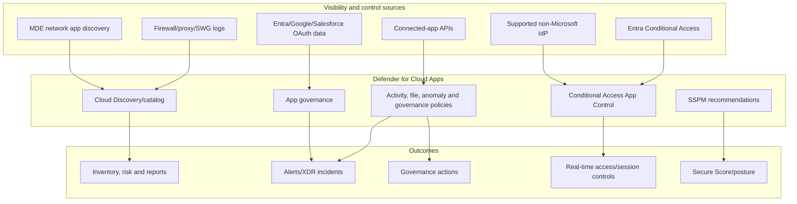

| Path | Timing | Depth | Main limitation |
|---|---|---|---|
| Discovery logs | After traffic/log processing | App, user/IP, bytes and risk context | Does not provide full in-app activity/content |
| App API connector | Near-real-time/batch by provider | Activities, users, files and governance where supported | Provider API scope, throttling and permissions |
| OAuth/app governance | App permission and behavior context | App-to-app access and anomalies | Provider/licensing/support boundaries |
| CAAC | During supported interactive session | Access, download/upload/copy/print/message controls where supported | Browser/app/client/protocol compatibility |
| SSPM | Periodic configuration assessment | SaaS configuration recommendations | Supported connected apps/settings only |

## 4. Cloud Discovery

Cloud Discovery analyzes network traffic metadata against Microsoft's cloud-app catalog. Current docs describe snapshot reports and continuous reports from log collectors, MDE integration, SWG integrations and APIs.

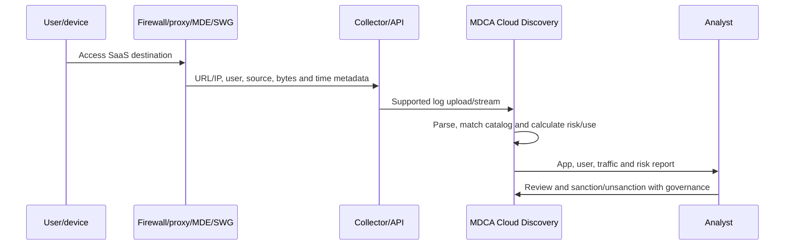

| Discovery method | Best use | Design concern |
|---|---|---|
| Manual snapshot upload | Initial proof/assessment | Sensitive logs and one-time view |
| Log collector | Continuous on-premises network logs | Collector hardening, capacity and parser format |
| Cloud Discovery API | Automated upload/report workflow | App credential, schema, throttling and retries |
| MDE integration | Roaming devices and machine-level visibility | MDE coverage/platform and endpoint control dependencies |
| SWG integration | Existing web gateway and blocking workflow | Vendor support, duplicated policy and source attribution |
| CAAC traffic reports | Sessions routed through CAAC | Represents controlled sessions, not all SaaS traffic |

## 5. Log fields and data quality

| Field | Use | Failure if absent/incorrect |
|---|---|---|
| Timestamp/timezone | Sequence and trends | Wrong incident ordering |
| Username/identity | User accountability | Only IP-level visibility |
| Source IP/device | Location/device context | Shared NAT misattribution |
| Destination URL/domain/IP | App identification | Catalog match ambiguity |
| Uploaded/downloaded bytes | Exfiltration/use indicator | Cannot distinguish traffic direction |
| Total bytes | Usage scale | Large values need caching/protocol context |
| Action | Allowed/blocked | Cannot validate enforcement |
| User agent | Client/browser context | Harder to distinguish automation/native app |

Proxy/firewall log formats change. If a listed appliance releases a new format, parsing can fail. Validate sample logs, field mapping, time, identities, exclusions and parser health before reporting risk.

## 6. Catalog and risk scores

The cloud-app catalog assesses many SaaS services using numerous risk factors. Exact catalog size, factor count, scoring and app properties change; current docs should be checked.

| Risk factor area | Example question | Limitation |
|---|---|---|
| Security | Encryption, authentication and vulnerability practices? | Provider self-report/public evidence can change |
| Compliance | Certifications/attestations? | Certification scope may not cover client use |
| Privacy | Data use, ownership, sharing and deletion? | Contract/region/tenant terms may differ |
| Legal | Jurisdiction and terms? | Requires legal interpretation |
| Business continuity | Availability, backup and disaster recovery? | Public claims need client due diligence |
| Access/control | SSO, MFA, admin and audit support? | Feature may require premium provider tier |
| Data residency | Storage/processing region options? | Actual tenant configuration matters |

### 🔍 Plain-English deep-dive: a catalog score is triage, not procurement approval

A restaurant-review score can help shortlist options, but it does not check your allergy, contract, menu choice or how your team stores food. Likewise, an app risk score helps prioritize review; it does not replace security architecture, legal/privacy assessment, data classification, vendor due diligence, business continuity or configuration review. A high-scoring app can still be misconfigured or used for prohibited data.

## 7. Sanctioned and unsanctioned apps

Marking an app sanctioned or unsanctioned records organizational policy and can integrate with supported blocking/control paths. The label alone does not guarantee enforcement.

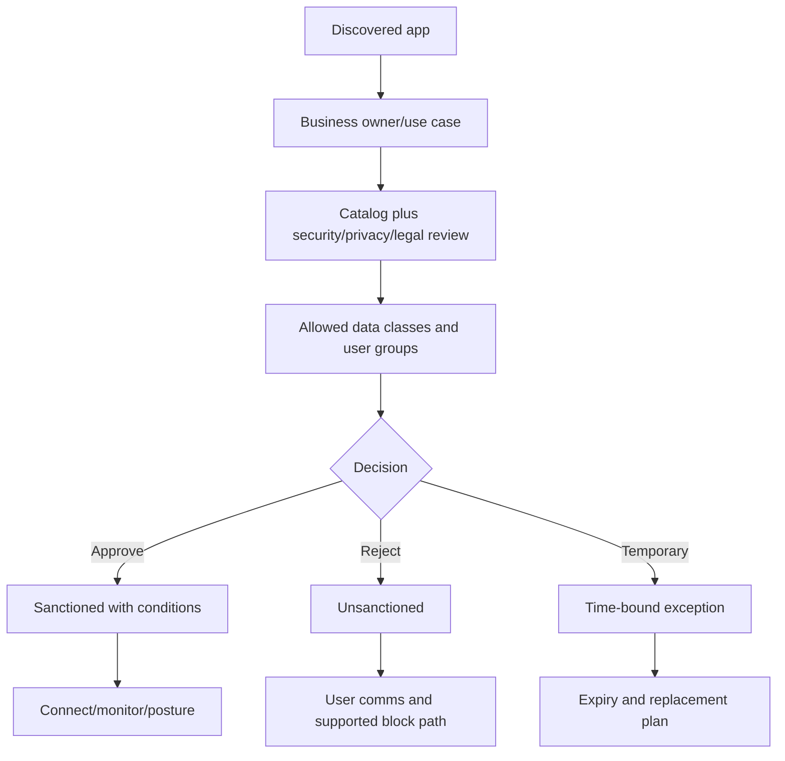

| Decision element | Required detail |
|---|---|
| App and tenant | Exact service/instance, not generic brand |
| Business owner | Accountable use-case owner |
| Data | Allowed/prohibited classifications |
| Identities | User groups, guests, service and app accounts |
| Controls | SSO/MFA, logging, sharing, retention, DLP and backup |
| Decision | Sanctioned, conditional, unsanctioned or exception |
| Enforcement | SWG/MDE/CA/contract/user guidance path |
| Review | Date, trigger and exit/replacement |

Blocking can drive users to less visible alternatives. Pair controls with a usable sanctioned service and clear migration support.

## 8. MDE integration for Cloud Discovery

MDE integration can add device-based SaaS usage from endpoints on and off the corporate network and support blocking unsanctioned apps where current platform/licensing/configuration allows.

| Benefit | Dependency | Caveat |
|---|---|---|
| Roaming visibility | Healthy MDE-onboarded device | Non-onboarded/BYOD traffic missing |
| Device identity | MDE device record | Shared devices and stale records |
| User mapping | Endpoint session identity | Service/browser profiles may complicate |
| Unsanctioned app blocking | Network protection/indicator integration and supported platform | Not equivalent to full SWG; test clients |
| XDR pivot | Device alert/activity context | Discovery is not proof of malicious use |

Reconcile MDE, network and identity data. Different sensors can count sessions/traffic differently.

## 9. App connectors and API architecture

App connectors authorize MDCA to query a SaaS provider and, where supported, perform governance actions. Permissions can be broad because the connector must inspect organizational activity or files.

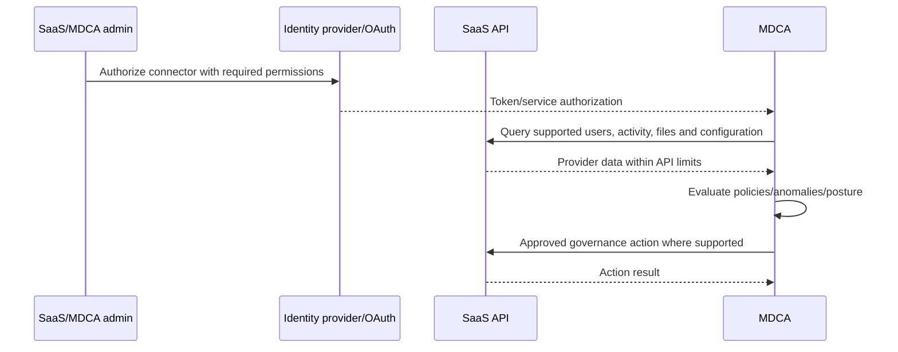

| Connector control | Requirement |
|---|---|
| Least privilege | Use only documented permissions; understand why each is needed |
| Privileged authorization | PIM/change approval and separate admin identity |
| Credentials | Provider-supported secure OAuth/service account; rotate/revoke |
| Ownership | Named app and security owners |
| API health | Monitor authorization, throttling, ingestion and latency |
| Data scope | Tenant/instance, users, files and regions documented |
| Action authority | Read-only pilot before governance actions |
| Offboarding | Revoke tokens/consent and confirm data retention |

Third-party connectors can stop working after provider API or permission changes. Monitor health rather than assuming “connected” means current data.

## 10. Activity log and activity policies

The activity log contains supported actions received from connected apps and other MDCA sources. Activity policies match filter conditions and can alert or govern.

| Filter dimension | Example use | Caution |
|---|---|---|
| User/group | Privileged or terminated-user activity | Group synchronization delay |
| App/instance | Focus on critical SaaS | Multi-instance naming/connector scope |
| Activity type | Download, share, delete, admin change | Provider semantics differ |
| IP/location | Unexpected network/region | VPN/proxy/shared egress |
| Device | Unmanaged or risky context | Availability depends on path/integration |
| File | Sensitive/externally shared item | Classification coverage and API limits |
| Repeated activity | Bulk action threshold | Normal migration/backup jobs |
| User agent | Script/legacy client | Easy to vary; not identity proof |

Start policies in alert/monitor mode, baseline sanctioned automation and tune by exact app, account, action and business schedule.

## 11. Anomaly detection and UEBA

MDCA detects deviations such as impossible travel, unusual download, mass delete, suspicious inbox/forwarding or app behavior according to supported services and current models.

| Anomaly | Possible attack | Benign context |
|---|---|---|
| Impossible travel | Stolen session/credential | VPN, mobile routing or shared proxy |
| Unusual download | Collection/exfiltration | Migration, backup or new role |
| Mass delete | Destruction/ransomware | Approved lifecycle cleanup |
| Unusual administrative activity | Privilege abuse | Planned maintenance |
| Activity from anonymous IP | Concealment | Approved privacy/VPN service |
| New country/ISP | Compromised account | Business travel |
| Suspicious OAuth activity | Malicious app/token | New approved integration |

A baseline is descriptive, not permission. Repeated risky behavior can become “normal” statistically while remaining against policy.

## 12. File policies and data governance

File policies inspect supported connected-app files and metadata and can use classification or sharing properties. Availability differs by connector.

| File-policy use | Example | Risk/control |
|---|---|---|
| Sensitive file public | Detect broad external/public access | Validate intended publication |
| Unlabeled sensitive data | Identify classification gap | Format/scanner coverage |
| External collaborator | Detect access outside approved domain | Guest/business-owner context |
| Malware | Detect provider/Microsoft threat verdict | Preserve evidence before action |
| Stale exposure | Old sensitive shared file | Records/legal and owner approval |
| Governance action | Remove share/apply label/quarantine where supported | Destructive impact and provider behavior |

Your SharePoint/OneDrive knowledge is a strength here: direct, group, link, inherited and guest access are different permission paths. Do not reduce every external-share finding to “remove the user.”

## 13. Governance actions

Governance actions vary by connected app and policy. Examples can include suspending a user, revoking app permission, removing collaborators, changing file sharing or applying labels.

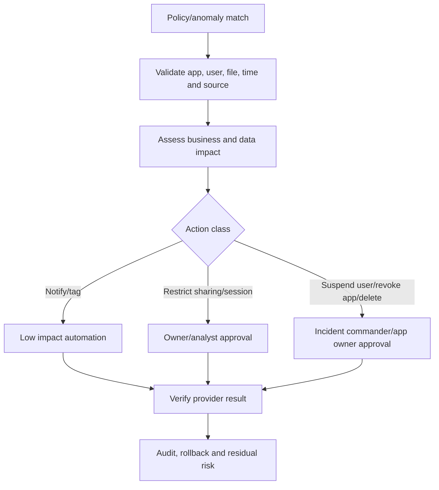

| Action | Typical benefit | Rollback/concern |
|---|---|---|
| Notify user/owner | Awareness and context | Notification fatigue/data exposure |
| Require sign-in again | Interrupt stolen session | User impact and token behavior |
| Suspend user | Stop SaaS access | Broad business outage |
| Revoke OAuth app | Stop app data access | Break integration; residual copied data |
| Remove collaborator/share | Reduce exposure | Workflow break and inherited permissions |
| Apply label/protection | Persist data protection | App/file support and user access |
| Quarantine file | Limit malicious content | Provider-specific recovery |
| Trigger Power Automate | Integrate workflow | Credential, retry and unsafe automation |

## 14. OAuth and consent from zero

OAuth lets a user or administrator grant an application permissions without giving it a password. A **delegated permission** acts on behalf of a signed-in user; an **application permission** can act as the application without a user under its granted scope.

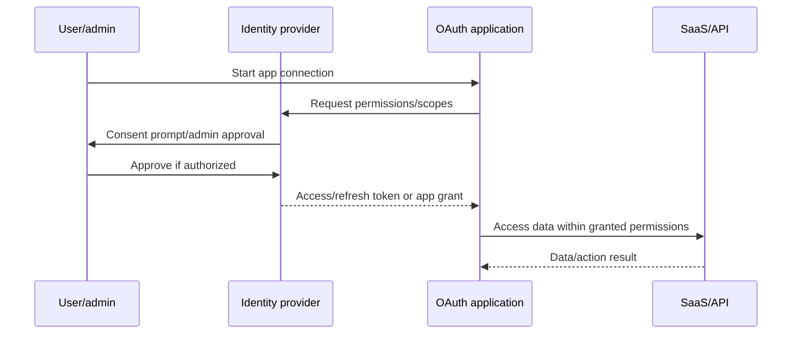

| Consent risk factor | Why it matters |
|---|---|
| High-impact scope | Mail/files/directory write access increases blast radius |
| Application permission | Runs without active user session |
| Unverified/unknown publisher | Weakens trust signal, though verification is not proof of safety |
| Broad user grant | Many accounts/data exposed |
| Long-lived credential/refresh access | Persistence after initial consent |
| Dormant app | Forgotten access remains |
| New credential/owner | Possible takeover |
| Unusual API/data volume | Potential collection/exfiltration |
| Consent source | Phishing or compromised admin/user |
| Multi-tenant app | External publisher and cross-tenant implications |

### 🔍 Plain-English deep-dive: consent is giving a valet key, not sharing the password

A user may never type their Microsoft password into a malicious app. Instead, the app asks the identity provider for permission and receives a token after consent. Revoking or changing the user's password may not address an app grant or app credential. Investigation asks who consented, what exact permissions were granted, whether admin consent was involved, which data was accessed and what credentials or service principals persist.

## 15. App governance

App governance provides visibility, detections, policies and remediation for OAuth-enabled apps across currently supported providers such as Entra ID, Google and Salesforce under current licensing/support.

| App governance view | Question |
|---|---|
| App inventory | Which non-Microsoft and Microsoft apps exist? |
| Permissions | What data/actions can each app access? |
| Users/consent | Who granted access, and was admin consent used? |
| Credentials | Are secrets/certificates current, expired or newly added? |
| Activity/API usage | Is behavior consistent with stated purpose? |
| Publisher/status | Who owns/publishes the app and is it verified? |
| Alerts | Did permissions or activity become risky/anomalous? |
| Governance | Block/restrict/revoke or require owner review? |

App governance alerts can appear in Defender XDR with App Governance as detection source. Correlate user, service principal, consent, credential, sign-in and data activity.

## 16. OAuth app lifecycle governance

| Lifecycle stage | Control |
|---|---|
| Request | Business owner, purpose, data, permissions and vendor evidence |
| Security review | Least privilege, publisher, architecture, privacy and contract |
| Consent | Admin-consent workflow and approved users/groups |
| Provision | Named owner, credential method, Conditional Access where applicable |
| Monitor | Sign-ins, API volume, permissions, credential age and alerts |
| Review | Periodic access/owner/need review |
| Change | Re-review new permissions, owners, redirect URIs and credentials |
| Revoke | Disable/revoke consent/credentials and verify business replacement |
| Dispose | Confirm provider data deletion/retention and remove service principal |

Do not approve `Files.ReadWrite.All` merely because a vendor setup guide requests it. Ask what operation needs it and whether a narrower permission or selected-site model is available.

## 17. Conditional Access App Control architecture

CAAC uses Entra Conditional Access or supported non-Microsoft identity-provider integration to route eligible interactive sessions through MDCA controls. Current guidance distinguishes reverse-proxy behavior from Microsoft Edge in-browser protection preview.

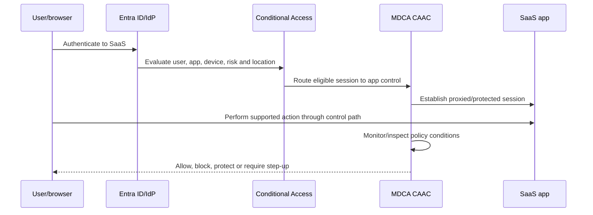

| Layer | Responsibility |
|---|---|
| Identity provider | Authenticates user/app and issues session |
| Conditional Access | Selects users/resources/conditions and CAAC session control |
| CAAC | Monitors/controls supported in-session actions |
| SaaS app | Hosts application/data and must remain compatible |
| Browser/client | Determines whether session control path is supported |
| Purview | Supplies labels/classification for supported data actions |

## 18. Access policies versus session policies

| Policy | Decision time | Example | Limitation |
|---|---|---|---|
| Entra Conditional Access | Authentication/session reevaluation | Require MFA/compliant device or route to CAAC | App/user/session conditions, not file inspection itself |
| MDCA access policy | At access for supported CAAC path | Block app access from unmanaged device | Coarse access decision; client/app support |
| MDCA session policy | During supported browser session | Block sensitive download or copy | Browser/interactive supported session only |
| API activity/file policy | After provider activity/data is visible | Alert on mass download/remove share | Not the same as real-time in-session prevention |

Current guidance says session controls apply to browser-based interactive sessions. The Teams desktop application is not supported for CAAC session controls; native-client bypass must be addressed through access policy/Conditional Access or other controls.

## 19. Session control types

| Control | Use | Test/guardrail |
|---|---|---|
| Monitor only | Baseline login/selected activity under current behavior | Confirm what activities are actually logged |
| Block activities | Stop supported copy, print, share, message or custom action | App workflow compatibility |
| Control download | Audit, block or protect supported file downloads | Unmanaged device and file-type/label tests |
| Control upload | Inspect/block sensitive or malicious upload | Scan failure behavior and user guidance |
| Require step-up authentication | Reevaluate authentication context for sensitive action | Preview/current support and loop behavior |
| Protect download | Apply supported Purview label/encryption | Existing label and file-format behavior |
| Malware inspection | Block supported malicious upload/download | Verdict and false-positive workflow |

When policies conflict, current guidance says the more restrictive session policy wins. Test overlapping rules and emergency exclusions.

## 20. Reverse proxy and in-browser behavior

For browsers other than the supported Edge in-browser path, users may see an `*.mcas.ms`-style URL suffix when reverse-proxied. Current Edge in-browser protection is preview and should be treated as change-sensitive.

| Concern | Design response |
|---|---|
| Custom domains | Add all app domains/resources per onboarding guidance |
| WebSockets/AJAX/downloads | Test complete business workflows |
| Certificates/TLS | Validate TLS 1.2+ and enterprise trust path |
| Native clients | Block or separately control if they bypass browser session policy |
| Mobile/embedded browsers | Test authentication and certificate behavior |
| Performance/region | Measure latency and review data-location statements |
| User notification | Configure legally approved monitoring notice |
| Break glass | Exclude emergency accounts from blocking CA policy |
| Session loops | Inspect Conditional Access and session-control app targeting |

Current Microsoft guidance states CAAC proxy servers do not store session data at rest and describes caching behavior, but traffic logs and activity records still raise privacy and retention questions.

## 21. Purview labels and DLP integration

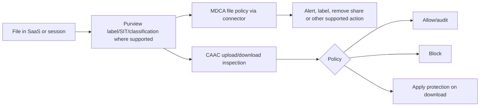

| Integration | Benefit | Boundary |
|---|---|---|
| Existing sensitivity labels | Consistent data meaning/protection | App/file/label support and encrypted-content access |
| Sensitive information types | Detect patterns in supported inspection | False positives, language and format |
| DLP policy | Organization-wide rule context | Purview and MDCA policy locations/actions differ |
| Protect on download | Encryption/permissions follow file | Supported formats and label configuration |
| Upload inspection | Prevent unlabeled sensitive data entering app | Browser-session path and scan behavior |
| API file scan | Find data already at rest in connected app | API coverage/latency and provider limits |

Do not create two conflicting data-control systems. Maintain a policy catalogue that states Purview versus MDCA condition, scope, action, owner and incident destination.

## 22. SaaS Security Posture Management

SSPM evaluates security settings in supported connected SaaS apps and surfaces recommendations, including through Microsoft Secure Score where supported.

| SSPM area | Example question | Validation owner |
|---|---|---|
| Authentication | Is MFA/SSO enforced appropriately? | Identity/app admin |
| Session/access | Are risky legacy or external paths enabled? | Identity/security |
| Sharing | Are public/external defaults too broad? | Data/app owner |
| Administration | Are privileged roles minimal and reviewed? | App owner/PAM |
| Logging | Is required audit available and retained? | SOC/compliance |
| API/integration | Are tokens/apps excessive or stale? | App governance |
| Data protection | Are labels/DLP/configuration enabled where supported? | Data security |
| Provider benchmark | Does current setting align with provider/CIS guidance? | Security architecture |

A posture recommendation must be tested against provider tier, tenant configuration and business requirements. Secure Score movement is not proof that all SaaS risk is resolved.

### 🔍 Plain-English deep-dive: SSPM is a building inspection, not a security guard

SSPM is like an inspector who checks whether doors, cameras, visitor rules and emergency exits are configured according to a standard. It can identify a weak setting and recommend a change, but it does not stand in the hallway watching every user action. Activity and anomaly policies detect behavior, app governance monitors OAuth access, and session controls can intervene during supported sessions. A connected app can have a strong posture score and still suffer credential theft or malicious activity, so posture, detection and response remain separate operating capabilities.

## 23. Shadow IT workflow

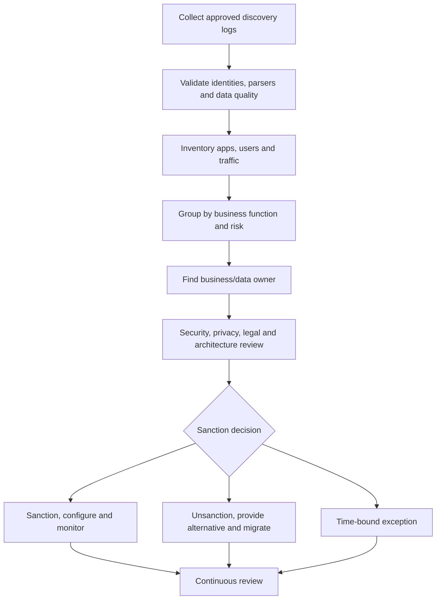

| Shadow IT question | Why it matters |
|---|---|
| Is traffic corporate or personal/advertising/CDN? | Avoid false app attribution |
| Is user identity reliable? | NAT/shared devices create ambiguity |
| What data was uploaded? | Traffic volume does not reveal sensitivity by itself |
| Is there a business need? | Unapproved can still be valuable/urgent |
| Is a sanctioned alternative usable? | Blocking without replacement causes evasion |
| Who owns migration/deletion? | Data remains after access is blocked |
| What contract/region applies? | Technical score does not answer legal use |

## 24. Generative-AI applications

Generative-AI services create additional shadow-IT risks: prompts can contain sensitive data; uploaded files may be retained or used under provider terms; browser extensions/connectors may read content; outputs may be copied into decisions.

| AI app risk | MDCA-related visibility/control | Adjacent control |
|---|---|---|
| Unsanctioned AI use | Cloud Discovery/catalog category/risk | SWG/MDE block and user alternative |
| Sensitive prompt/upload | Session upload/activity controls where supported | Purview Endpoint/Network DLP and policy |
| OAuth AI assistant | App governance permissions/activity | Entra consent workflow |
| Browser extension | Device/software/extension inventory context | MDE/Intune browser management |
| SaaS AI feature | Connector activity/posture where supported | Provider admin controls and contract |
| Agent integration | OAuth/app identity and API access | Entra workload identity and Purview DSPM |
| Output handling | Session/file controls where supported | Labels, DLP, human review and records policy |

Do not promise MDCA can inspect every prompt or model. Coverage depends on app catalog, traffic path, browser, connector, policy, encryption and current support. Part 33 covers Purview DSPM and AI data security in depth.

## 25. Third-party app onboarding

| Phase | Tasks | Gate |
|---|---|---|
| Select | Exact app/instance, use case and supported connector/CAAC mode | Business owner and support confirmed |
| Authorize | Required API/IdP permissions and admin identity | Least-privilege approval |
| Pilot read-only | Connect data and validate events/files/users | Data quality and privacy accepted |
| Baseline | Learn admin, automation, migration and backup activity | Known-benign register |
| Policy monitor | Create scoped activity/file/anomaly rules | Noise and ownership acceptable |
| Governance | Enable supported actions with approval | Rollback tested |
| Session control | Onboard domains/client paths and monitor | Full workflow/browser/native tests |
| Operate | Health, API change, credential, policy and review | Handover accepted |
| Offboard | Revoke connector/consent and document data retention | No orphan credential/access |

Non-Microsoft identity-provider apps may need manual CAAC onboarding. Test every custom domain and authentication redirect.

## 26. Licensing and prerequisite matrix

| Capability | Planning dependency |
|---|---|
| Full MDCA | Standalone or eligible suite/license; verify user scope |
| Office 365 Cloud App Security subset | Narrower Office-focused rights under eligible licenses |
| CAAC | MDCA plus Entra ID P1 under current guidance, app/IdP support |
| App governance | Current MDCA/app-governance entitlement and supported provider |
| MDE discovery/block | MDE licensing, onboarding, platform and network protection |
| Purview integration | Relevant Purview labeling/DLP rights and configuration |
| SSPM | Supported connected app and current license/rollout |
| Sentinel/SIEM | Connector, workspace, ingestion/retention and RBAC |
| Power Automate action | Flow/connectors/license, identity and DLP governance |

Visible menus and trial features do not prove contractual entitlement. Build a user/app/capability license matrix.

## 27. RBAC, security and privacy

Cloud-app data can reveal browsing destinations, app use, files, locations, activity and relationships. Connectors and governance actions can be highly privileged.

| Risk | Control |
|---|---|
| Broad admin visibility | Scoped roles, PIM, access reviews and audit |
| Log identity exposure | User anonymization where supported/appropriate and approved re-identification |
| Sensitive file inspection | Purpose limitation, minimum scope and case approval |
| Connector takeover | Restricted app owners, strong admin auth and token revocation |
| Destructive action | Two-person approval and provider-specific rollback |
| Employee monitoring | Transparent notice, HR/legal/privacy governance |
| Cross-border/session path | Data-location and transfer review |
| API/export leakage | Protected evidence store and retention limits |
| Automation loop | Idempotency, rate limits, kill switch and action caps |

Anonymization can support privacy in Cloud Discovery, but incident response might need controlled identity resolution. Define who can de-anonymize and why.

## 28. Assessment and target design

| Discovery area | Questions | Artifact |
|---|---|---|
| Apps | Which sanctioned, unsanctioned and unknown services? | App inventory/risk register |
| Traffic | Which sources, users, bytes and locations? | Discovery data-quality report |
| Identity | SSO, MFA, guests, service accounts and consent? | Identity/app dependency map |
| Data | Types, labels, sharing, retention and residency? | Data-flow/classification map |
| Connectors | Permissions, health, actions and providers? | Connector register |
| Policies | Activity, file, anomaly, access/session and DLP overlaps? | Policy catalogue |
| Clients | Browser, desktop, mobile, API and automation paths? | Client/control coverage matrix |
| Operations | SOC, app, identity, data, legal and service owners? | RACI/runbooks |
| Licensing | Users, apps, add-ons, trials and provider tiers? | Entitlement matrix |

## 29. Staged deployment

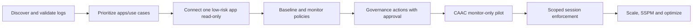

| Phase | Exit criteria | Hold/rollback trigger |
|---|---|---|
| Discovery | Parser, identity, timestamp and coverage valid | Misattribution or privacy gap |
| Connector pilot | API health and provider data understood | Overbroad permission/unexpected load |
| Monitor policies | Acceptable quality and owner assigned | High noise/no response process |
| Governance | Action and provider rollback tested | Irreversible/business harm |
| CAAC monitor | Authentication and workflows stable | Redirect loop/app break/latency |
| Enforcement | Positive/negative/native-client tests pass | Bypass or material user impact |
| Handover | RACI, health, access and support accepted | No app/identity/data owner |

## 30. Testing strategy

| Test | Expected evidence |
|---|---|
| Discovery parser | Known synthetic destinations/users/bytes match | Parsed report versus source log |
| Catalog | App identification and score factors reviewed | App detail and due-diligence note |
| Sanction | Label plus actual supported enforcement path | SWG/MDE/communication result |
| Connector | Known benign activity appears with correct actor/time | Provider audit versus MDCA activity |
| Activity policy | Synthetic approved event alerts once | Alert ID and evidence |
| File policy | Synthetic labeled test file matches expected rule | File/policy result without real sensitive data |
| OAuth | Fictional/approved test app permissions visible | App ID, scopes and owner |
| CAAC | Managed/unmanaged browser paths behave as designed | Session log, URL/lock behavior and result |
| Native client | Bypass is blocked or explicitly accepted | Client sign-in result |
| Governance | Low-risk reversible action completes | Provider and MDCA audit |
| Rollback | Policy/connector/session control disabled cleanly | Restored access and no orphan token |
| Privacy | Roles and exports follow approved limits | Persona test and access audit |

## 31. Rollback matrix

| Change | Rollback | Residual risk |
|---|---|---|
| Log upload/collector | Stop upload and revoke collector access | Previously processed data remains per retention |
| App connector | Disconnect/revoke provider token/consent | MDCA data and provider actions already taken |
| Sanction status | Change status and control integration | Endpoint/SWG blocks may need separate update |
| Activity/file policy | Disable/restore previous version | Missed actions during disabled period |
| Governance action | Provider-specific undo where possible | Deleted/revoked/copied data may be irreversible |
| OAuth revoke | Re-consent only after owner/security review | Integration outage; attacker may have copied data |
| CAAC policy | Disable MDCA policy and/or Entra CA route | Existing sessions/caches and native paths |
| Label/protection | Follow Purview/provider recovery | Access/encryption effects can persist |

Capture Conditional Access and MDCA policy JSON/screenshots/settings before change. Always preserve emergency access exclusions.

## 32. Operations and metrics

| Metric | Use | Caveat |
|---|---|---|
| Discovery coverage | Users/devices/sites/log sources represented | Unknown blind spots distort denominator |
| New apps/week | Shadow IT change | CDN/service decomposition can inflate |
| Unsanctioned usage trend | Migration/control outcome | Falling visibility can look like success |
| High-risk app users/traffic | Prioritization | Score and business context needed |
| Connector freshness | API health | Provider batch latency differs |
| Policy alert quality | True/benign/false positive | Analyst classification consistency |
| OAuth high-impact grants | App risk backlog | Legitimate broad apps still need review |
| Dormant apps/credentials | Hygiene | Some seasonal integrations are valid |
| CAAC coverage | Eligible sessions actually controlled | Native clients/API sessions excluded |
| Session blocks/overrides | Data-control outcome | More blocks can indicate poor user workflow |
| SSPM finding age | Configuration remediation | Supported-setting scope only |
| Governance failure rate | Action reliability | Successful action still needs correctness review |

Report sanctioned alternatives and user adoption, not only blocks. Security should enable safe work.

## 33. Common failures

| Symptom | Likely cause | Cheap check |
|---|---|---|
| App not discovered | Catalog gap, parser/URL/IP/log coverage | Source log sample and custom app option |
| User shown as IP/unknown | Log lacks identity or identity mapping fails | Raw username field and directory mapping |
| Traffic values wrong | Parser/time/bytes fields or duplicate sources | Compare one bounded source session |
| Connector stale | Token expired, permission/API/throttle change | Connector health and provider audit timestamp |
| Activity absent | Unsupported provider event/API delay/scope | Provider audit record versus connector scope |
| Governance failed | Provider role/API limitation or object changed | Action result and provider state |
| OAuth app missing | Provider/support/license or inventory filter | App ID in identity provider and connector status |
| CAAC redirect loop | Conditional Access targeting/session-control app/custom domain | Sign-in logs and session diagnostics |
| Session policy bypass | Native client/API/unsupported app or existing session | Reauthenticate in supported browser and test native path |
| Download blocked unexpectedly | Overlapping policies; restrictive rule wins | Policy match report and conditions |
| Sensitive file not detected | Label/format/encryption/scan support | Synthetic supported test file |
| SSPM recommendation absent | Unsupported app/setting/connector/license | Current support and connected-app state |

## 34. Troubleshooting workflow

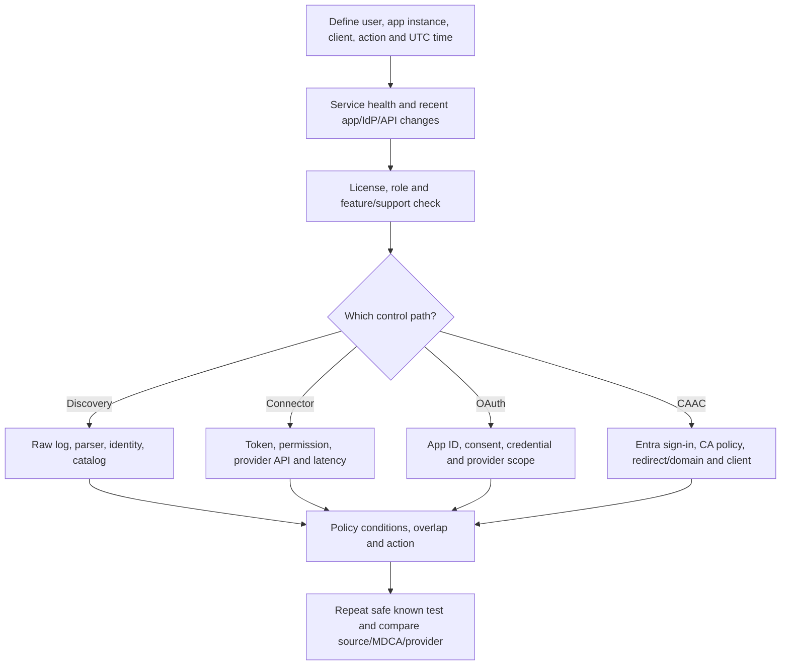

For CAAC issues, capture sign-in correlation ID, app/client/browser, URL path, HAR/session diagnostic under approved privacy handling, policy IDs, managed-device state and exact error. For connector issues, capture provider audit ID, API permission, token time, ingestion time and object ID.

## 35. Risky OAuth incident scenario

A fictional user consents to `Document Converter Demo`, which requests broad file access. The app later performs unusual API reads and downloads from SharePoint/OneDrive.

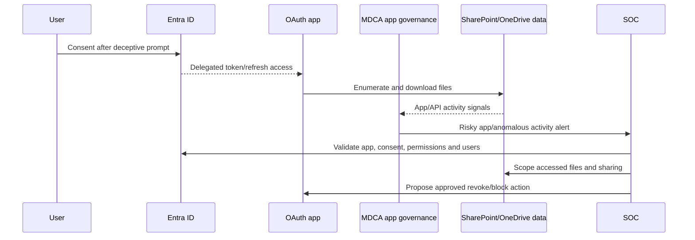

| Step | Evidence/action | Guardrail |
|---|---|---|
| Validate | App ID, publisher, permissions, consent type and users | Similar display names can mislead |
| Scope | API activity, files, sites, times and data sensitivity | Logs can show access, not prove external use |
| Correlate | User sign-in, endpoint/email entry and other tenants/users | Preserve identity and UTC timeline |
| Contain | Revoke consent/disable app/credentials under app-owner/IR approval | Integration outage and residual copied data |
| User response | Revoke sessions/credentials as evidence requires | Consent can persist beyond password reset |
| Data response | Notify owners/privacy/legal based on accessed data | Do not declare breach without evidence |
| Improve | Consent workflow, publisher restrictions, app reviews and training | Avoid blocking all business integrations |

## 36. Data-exfiltration/session-control scenario

A contractor on an unmanaged device accesses a sanctioned SaaS repository. Policy allows browser access but must prevent download of confidential files and upload to an unsanctioned AI service.

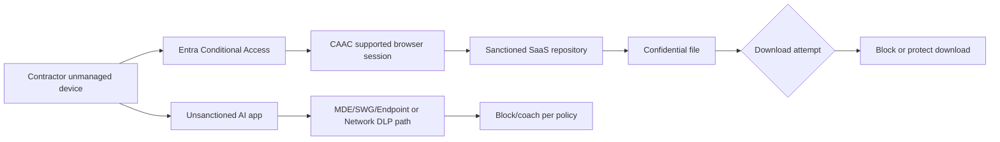

The CAAC session policy on the sanctioned repository does not automatically control every separate AI site or native app. Use the correct control path: MDCA discovery/sanction, MDE/SWG, Purview DLP and provider policy. Test clipboard, print, download, upload, desktop/mobile and API paths separately.

## 37. Consulting scenarios

### Scenario A: “block every risky app”

Validate score, use case, users and data; identify sanctioned alternatives; consult legal/privacy/procurement; communicate; migrate data; enforce through supported path; monitor displacement. A risk score alone is not a block decision.

### Scenario B: connector asks for broad permissions

Map each permission to a documented feature. Use a sandbox/test tenant where possible, read-only pilot, restricted authorization and owner. If least privilege is impossible, record risk and decide whether benefit justifies access.

### Scenario C: session control breaks a custom app

Switch target users to monitor-only/exclude controlled pilot, preserve sign-in/session diagnostics, add required custom domains, test redirects/WebSockets/client flows and vendor changes, then re-enable gradually. Do not exempt all users permanently.

### Scenario D: generative-AI shadow use

Measure app use and data routes, classify sanctioned/conditional/unsanctioned services, provide an approved AI alternative, add Purview and endpoint/network controls where supported, govern OAuth/agents and publish clear data rules.

## 38. Consulting artifacts

| Artifact | Minimum content |
|---|---|
| SaaS inventory | App, instance, users, traffic, owner, score and decision |
| Discovery data-quality report | Sources, fields, parser, coverage, gaps and privacy |
| App due-diligence record | Security, privacy, legal, resilience and provider tier |
| Sanction register | Decision, conditions, enforcement, owner and review |
| Connector register | App, permissions, credential, health, actions and offboarding |
| OAuth register | App ID, publisher, scopes, users, owner, credentials and review |
| Policy catalogue | Type, scope, condition, action, alert, owner and exception |
| CAAC client matrix | Browser/native/mobile/API path and control result |
| Data-control map | Purview/MDCA/MDE/SWG conditions and responsibilities |
| Deployment/test plan | Pilot, monitoring, enforcement, UAT, rollback and support |
| Incident runbooks | OAuth compromise, exfiltration and connector failure |
| Operational dashboard | Discovery, connectors, OAuth, session, SSPM and exceptions |
| Handover pack | RACI, access, monitoring, escalation and known limitations |

## 39. Safe paper lab: shadow IT, OAuth and session-control design

This lab uses fictional apps, users and data. It does not require uploading real traffic logs, granting consent or proxying sessions.

### Fictional discovery data

| App | Users | Upload GB | Catalog posture | Business statement |
|---|---:|---:|---|---|
| `ApprovedDrive Demo` | 300 | 80 | Strong score/context | Sanctioned repository |
| `QuickShare Demo` | 45 | 120 | Weak privacy/retention | Unapproved large transfer |
| `GenAI-Chat Demo` | 110 | 12 | Mixed/terms-sensitive | Employees use for summaries |
| `DevRepo Demo` | 60 | 25 | Good if configured | Engineering-approved instance |
| `PersonalMail Demo` | 20 | 4 | Consumer service | Possible forwarding/exfil path |

### Exercise 1: discovery review

Validate timestamps, identity, source, upload/download and duplicate-source assumptions. Do not infer sensitive content from bytes. Assign owners and decisions with data/legal review.

### Exercise 2: OAuth review

Create a fictional `Document Converter Demo` app with delegated broad file permission, 12 consenting users, unknown publisher and an unusual API-volume spike. Build an evidence register, response approval and residual-data question.

### Exercise 3: CAAC design

For contractors on unmanaged devices, design monitor-only then blocked/protected download from `ApprovedDrive Demo`. Include break-glass exclusion, browser support, native-client block/exception, custom domains, monitoring notice, test personas and rollback.

### Exercise 4: AI control map

Map `GenAI-Chat Demo` to discovery, sanction decision, sanctioned alternative, MDE/SWG enforcement, Purview DLP, OAuth governance and user guidance. State every visibility gap.

### Portfolio evidence

- MDCA four-path architecture.
- Discovery source/field/quality matrix.
- SaaS app risk and sanction register.
- Connector least-privilege review.
- OAuth incident timeline and action matrix.
- CAAC browser/native-client test plan.
- Purview/MDCA data-control map.
- Privacy, rollback and operational dashboard.

### Evidence-safe interview wording

> “I completed a safe fictional MDCA design, not a production deployment. I separated discovery logs, API connectors, OAuth governance and session controls; assessed shadow IT; built a risky-consent investigation; and designed monitor-first CAAC controls with native-client and rollback tests. My production analogue is SharePoint/OneDrive permissions, sharing, sync and incident evidence, not MDCA ownership.”

## 40. JD Mapping: interview translation

| Prompt | Your factual experience | Honest MDCA bridge |
|---|---|---|
| “How do you govern cloud data?” | SharePoint/OneDrive permissions, sharing and sync | Extend to connector/file/session control matrix |
| “How do you find shadow IT?” | Workload evidence and user-impact analysis | Explain log sources, catalog, validation and sanction workflow |
| “How do you investigate OAuth risk?” | RCA/timeline/stakeholder coordination | Use fictional app-consent evidence; state no production action |
| “How do you deploy session controls?” | Change validation and client behavior | Monitor first, client matrix, UAT, rollback and privacy |
| “How do you troubleshoot SaaS?” | Multi-layer M365 support | Source log/API/IdP/session/app fault isolation |
| “What is your experience level?” | Production collaboration workloads | MDCA study/design paper lab only |

## Official Source Anchors

1. [Microsoft Defender for Cloud Apps overview](https://learn.microsoft.com/defender-cloud-apps/what-is-defender-for-cloud-apps)
2. [Differences between full MDCA and Office 365 Cloud App Security](https://learn.microsoft.com/defender-cloud-apps/editions-cloud-app-security-o365)
3. [Cloud Discovery overview](https://learn.microsoft.com/defender-cloud-apps/set-up-cloud-discovery)
4. [Integrate Defender for Endpoint with Cloud Discovery](https://learn.microsoft.com/defender-cloud-apps/mde-integration)
5. [Cloud app risk scores](https://learn.microsoft.com/defender-cloud-apps/risk-score)
6. [Sanction and unsanction apps](https://learn.microsoft.com/defender-cloud-apps/governance-discovery)
7. [Connect apps overview](https://learn.microsoft.com/defender-cloud-apps/enable-instant-visibility-protection-and-governance-actions-for-your-apps)
8. [Activity policies](https://learn.microsoft.com/defender-cloud-apps/user-activity-policies)
9. [Anomaly detection policies](https://learn.microsoft.com/defender-cloud-apps/anomaly-detection-policy)
10. [File policies](https://learn.microsoft.com/defender-cloud-apps/data-protection-policies)
11. [App governance overview](https://learn.microsoft.com/defender-cloud-apps/app-governance-manage-app-governance)
12. [OAuth app investigation](https://learn.microsoft.com/defender-cloud-apps/investigate-risky-oauth)
13. [Conditional Access App Control](https://learn.microsoft.com/defender-cloud-apps/proxy-intro-aad)
14. [Create session policies](https://learn.microsoft.com/defender-cloud-apps/session-policy-aad)
15. [Onboard apps to Conditional Access App Control](https://learn.microsoft.com/defender-cloud-apps/conditional-access-app-control-how-to-overview)
16. [Troubleshoot Conditional Access App Control](https://learn.microsoft.com/defender-cloud-apps/troubleshooting-proxy)
17. [Purview Information Protection integration](https://learn.microsoft.com/defender-cloud-apps/azip-integration)
18. [SaaS security posture visibility and governance](https://learn.microsoft.com/defender-cloud-apps/enable-instant-visibility-protection-and-governance-actions-for-your-apps)
19. [Defender for Cloud Apps licensing](https://learn.microsoft.com/defender-cloud-apps/license-requirements)
20. [Defender for Cloud Apps data security and privacy](https://learn.microsoft.com/defender-cloud-apps/data-security-privacy)

## ⭐ Likely Interview Questions for This Section

### Q1. What is Microsoft Defender for Cloud Apps?

**Model answer:** MDCA is Microsoft's SaaS security/CASB capability. It discovers cloud-app use and risk, connects supported apps through APIs for activity/file/governance visibility, governs OAuth applications, contributes SaaS threat signals to Defender XDR, assesses supported SaaS configuration and applies real-time access/session controls through Conditional Access App Control. Each path has different timing, coverage and prerequisites.

### Q2. How does Cloud Discovery work, and what does it not show?

**Model answer:** It parses approved firewall, proxy, collector, SWG, API or MDE traffic metadata, maps destinations to the cloud-app catalog and reports apps, users/IPs, traffic and risk. It does not automatically reveal exact content or every in-app activity, and identity/bytes depend on log fields. I would validate parser, timezone, source duplication and user mapping before sanction decisions.

### Q3. What is the difference between an app connector and Conditional Access App Control?

**Model answer:** An app connector uses provider APIs to inspect supported users, files, activity and posture and can perform supported governance actions, generally after provider events occur. CAAC routes eligible interactive user sessions through in-session controls to allow, monitor, block or protect supported actions in real time. API/native activity and browser sessions have different coverage.

### Q4. How would you investigate a risky OAuth application?

**Model answer:** I would identify immutable app/service-principal ID, publisher, delegated versus application permissions, who consented, admin-consent state, credentials/owners, users and API/data activity. I would correlate Entra sign-ins/audit, MDCA app governance, endpoint/email entry evidence and accessed data. App or consent revocation requires owner/incident approval, outage planning and recognition that copied data cannot be pulled back automatically.

### Q5. What are the main CAAC support boundaries?

**Model answer:** Current session controls target supported interactive browser sessions and require MDCA, identity/Conditional Access prerequisites and app onboarding. Native desktop/mobile/API clients can bypass browser session controls unless separately blocked or governed. Custom domains, redirects, browser compatibility, TLS, existing sessions and the current Edge in-browser preview must be tested. The Teams desktop application is a documented example not covered by session controls.

### Q6. How do Purview and MDCA work together?

**Model answer:** Purview provides classification, sensitivity labels and DLP context. MDCA can use supported labels/classification in connected-app file policies and CAAC upload/download controls, including block or protect actions where supported. I would maintain one policy catalogue to avoid conflicting conditions/actions and test formats, encryption, app support and the browser versus API path.

### Q7. How would you govern generative-AI shadow use?

**Model answer:** I would discover and validate app use, classify each service as sanctioned, conditional or unsanctioned, provide an approved alternative, define permitted data, use MDE/SWG and Purview DLP where supported, govern OAuth apps/agents, monitor provider connectors and communicate policy. I would state inspection gaps because MDCA cannot see every prompt, client or model.

### Q8. What is your honest Defender for Cloud Apps experience?

**Model answer:** My production experience is SharePoint Online and OneDrive permissions, external sharing, sync, incidents, RCA and stakeholder coordination. I have studied current MDCA architecture and completed a fictional paper design covering discovery, OAuth risk and CAAC. I have not operated MDCA in production, so I would pilot read-only/monitor-only, validate support and privacy, and use approval-controlled governance.

## 🧠 30-Second Memory Hooks

- **Discovery sees traffic; connectors see provider data; app governance sees delegated apps; CAAC controls sessions.**
- **A catalog score prioritizes review; it does not approve procurement.**
- **Sanction is a decision; enforcement needs a real control path.**
- **OAuth gives a token/key, not the user's password.**
- **Password reset may not remove app consent, credentials or copied data.**
- **API governance is usually after activity; session control can act during supported access.**
- **CAAC is browser/session specific; native clients and APIs need separate controls.**
- **Purview classifies/protects data; MDCA applies supported SaaS/API/session context.**
- **SSPM checks configuration only for supported connected apps/settings.**
- **Block with an approved alternative, migration and user communication.**
- **Monitor first, test every client path, then enforce in rings.**
- **Your bridge is collaboration-workload depth, not claimed MDCA ownership.**

## Completion Checklist

- [ ] I can explain SaaS, CASB, SSE, shadow IT and SSPM.
- [ ] I can draw discovery, connector, OAuth and CAAC paths separately.
- [ ] I can select snapshot, collector, MDE, SWG or API discovery methods.
- [ ] I can validate log fields, parsers, identities, timestamps and bytes.
- [ ] I can interpret catalog risk without treating it as approval.
- [ ] I can build a sanctioned/unsanctioned decision and enforcement workflow.
- [ ] I can design least-privilege app connectors and monitor API health.
- [ ] I can explain activity, file and anomaly policies and governance actions.
- [ ] I can distinguish delegated and application OAuth permissions.
- [ ] I can govern app request, consent, monitoring, review and revocation.
- [ ] I can draw CAAC authentication, routing and session flow.
- [ ] I can distinguish access, session and API policies.
- [ ] I can state browser/native-client/app support boundaries accurately.
- [ ] I can integrate Purview labels/DLP without policy duplication.
- [ ] I can explain SSPM and generative-AI shadow-use controls and gaps.
- [ ] I can plan third-party onboarding, privacy, licensing and offboarding.
- [ ] I can design pilot, tests, rollback, metrics and runbooks.
- [ ] I can troubleshoot discovery, connector, OAuth and CAAC paths.
- [ ] I can complete the safe paper lab and produce consulting artifacts.
- [ ] I can state honestly that MDCA is study/design evidence, not production ownership.
- [ ] I have re-checked current licensing, preview, app/client and portal support.

*Next suggested section:* [Part 38](Part-38-defender-office-365-secops-investigation.md) — apply SecOps depth to email entities, campaigns, AIR, submissions, hunting, remediation, BEC, handover and post-incident review.