# Part 38 — Defender for Office 365 SecOps and Email Attack Investigation

> **Section goal:** Master the approved Defender for Office 365 (MDO) security-operations scope at greater depth than Part 22's prevention baseline: incidents and alerts; Threat Explorer, Real-time detections and campaigns; email entity/page, headers, sender, recipient, URL, attachment/file and related-entity analysis; admin submissions and user-reported messages; Threat Tracker and current hunting tools; automated investigation and response (AIR), investigation graphs, verdicts, recommendations and Action Center; advanced-hunting email tables and query concepts; campaign clustering; business email compromise (BEC), phishing, malware and internal-phish response; scope search, purge/remediation permissions and safeguards; compromised-user coordination; mail-flow and third-party gateway evidence; false positives, false negatives and tuning; metrics, runbooks, shift handover and post-incident review (PIR). By the end, you should be able to design, deploy, test, operate and troubleshoot a safe MDO SecOps process and explain a fictional investigation without claiming production MDO ownership.

This Part maps directly to Deloitte's Microsoft Defender for Office 365, Defender XDR, Exchange Online, Microsoft 365 workload security, incident response, threat investigation, assessment, operational readiness, 24x7/on-call, troubleshooting, documentation and stakeholder expectations. Your production strengths in Microsoft 365 support escalations, SharePoint/OneDrive workload behavior, critical incidents, RCA, evidence timelines, service-health checks, fix validation, multi-team coordination, shift-quality documentation and stakeholder updates are directly useful. The honest bridge is applying those methods to email and collaboration threat evidence. This chapter never claims production MDO SecOps ownership.

> **Currency, licensing, portal, AI and change-sensitive note:** This chapter was checked against official Microsoft Learn content available on **August 24, 2026**. Real-time detections is associated with Defender for Office 365 Plan 1; Threat Explorer's deeper hunting/remediation, campaigns, Threat Tracker and AIR require Plan 2 under current guidance. Microsoft is adding AI-assisted/agentic submission grading and Security Copilot/Phishing Triage Agent capabilities under license and rollout conditions. Teams-message reporting has preview/change-sensitive behavior. Retention, selection/remediation limits, Action Center history, query schemas, campaign clustering, submission throttles, government-cloud behavior, unified RBAC, portal labels and available actions can change. Verify Product Terms, service descriptions, current MDO/Exchange/Defender roles, message-retention/location, live tenant UI, Message center, Roadmap and privacy rules before acting.

## JD Mapping

| Deloitte role expectation | Capability developed here | Consulting evidence |
|---|---|---|
| Operate Microsoft 365 threat protection | Daily/weekly/ad-hoc MDO SecOps workflows | SOC schedule, queue design and runbooks |
| Investigate email attacks | Message, header, URL, file, user, campaign and cross-domain evidence | Investigation workbook and entity timeline |
| Respond to BEC/phishing/malware | Scope, purge, user containment and validation | Approval-controlled response plan |
| Tune and optimize controls | False-positive/negative submissions and override analysis | Tuning register and detection-quality dashboard |
| Troubleshoot mail/security paths | Gateway, connector, authentication, policy and telemetry isolation | Evidence pack and fault tree |
| Handover and report incidents | Shift briefing, executive updates and PIR | Handover template, PIR and improvement backlog |

## Candidate honesty note

You can speak directly about production Microsoft 365 escalations, critical incidents, RCA, evidence gathering, workload dependencies, fix validation, service health, stakeholder updates, documentation and cross-team/vendor coordination where supported by your experience. Those are highly relevant because email threat response depends on precise identifiers, timelines, scope, ownership and communication.

You should not claim that you have operated Threat Explorer, purged production mail, approved AIR actions, investigated real MDO campaigns, tuned production detections, disabled compromised accounts or used Search and Purge in a client tenant unless separately evidenced. Safe wording is:

> “My production foundation is Microsoft 365 incident support, RCA, evidence timelines, validation and stakeholder coordination. I have built a current MDO SecOps design and a safe fictional paper investigation covering BEC/phishing scope, message entities, AIR, purge safeguards and handover. I have not operated MDO SecOps or remediated production mail. In a client tenant I would verify Plan 1/2 capabilities and roles, preserve message and identity evidence, scope with immutable message identifiers, use two-person approval for destructive actions, coordinate identity and workload response, verify every remediation result and document residual risk.”

---

## 1. How this Part differs from Part 22

Part 22 explains EOP/MDO prevention: anti-spam, anti-malware, anti-phishing, preset policies, Safe Links, Safe Attachments, ZAP, quarantine, allows/blocks and baseline deployment. This Part assumes that foundation and focuses on what a SOC does when alerts, user reports or threat hypotheses arrive.

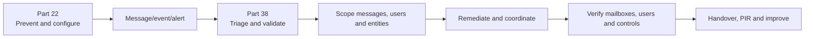

| Prevention question | SecOps question |
|---|---|
| Which policy blocks phishing? | Why was this message delivered or blocked? |
| Is Safe Links enabled? | Who clicked, when, and what happened next? |
| What quarantine policy applies? | Is release safe and who approved it? |
| Is ZAP enabled? | Did post-delivery remediation cover every recipient? |
| Is a sender spoofed? | Is this one message, a campaign or account compromise? |
| Should we add an allow? | What exact filter/override caused the false positive? |

## 2. Email SecOps terms from zero

| Term | Plain meaning | Why it matters | Memory hook |
|---|---|---|---|
| Message | One email instance sent through mail flow | Core object for delivery and remediation | The envelope and contents |
| Network Message ID | Microsoft 365 identifier used to trace message lineage | Stronger scope pivot than subject | The package tracking number |
| Internet Message ID | Sender-generated header identifier | Useful but can be duplicated/spoofed | Sender's label |
| Verdict | Classification such as phish, malware, spam or clean | Drives investigation/action but can change | Current judgment |
| Delivery location | Inbox, junk, quarantine, deleted, on-premises, failed and so on | Determines exposure and remediability | Where the package ended up |
| Detection technology | Mechanism that identified threat | Explains why the verdict occurred | Which detector fired |
| Override | Policy/user rule that changed normal filtering outcome | Common reason bad mail is delivered | A detour around the checkpoint |
| Campaign | Cluster of related malicious messages | Reveals breadth, infrastructure and targeting | Many envelopes, one operation |
| AIR | Automated investigation and response | Expands evidence and recommends/executes actions | Automated case assistant |
| Remediation | Move/delete/block/other action against threat | Reduces exposure | Remove or neutralize |

### 🔍 Plain-English deep-dive: message identity is more reliable than a subject line

Attackers reuse subjects such as “Invoice” and can send many unique messages. Legitimate systems also reuse subjects. The Network Message ID, recipient, sender, delivery time, URL/file indicators and header chain let analysts distinguish one message from a cluster. Think of the subject as a package description and the Network Message ID as the carrier's tracking number. Scope with both human-readable and immutable evidence.

## 3. MDO SecOps architecture

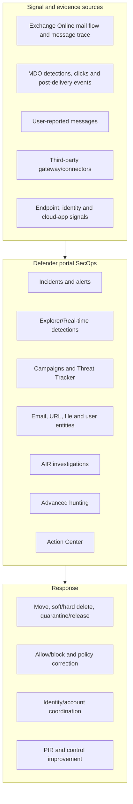

| Layer | Primary evidence | Failure example |
|---|---|---|
| Mail flow | Headers, connectors, authentication, message trace | Gateway obscures source or rule overrides verdict |
| Protection | Threat verdict, detection, Safe Links/Attachments, ZAP | Feature/license/policy not applied |
| SecOps | Incident, alert, Explorer, campaign and entity | Role/filter/retention hides data |
| Automation | AIR verdicts and recommended actions | Trigger disabled or action pending |
| Remediation | Action Center and mailbox state | Message nonremediable or action fails |
| Identity | Entra sign-ins, sessions, roles and consent | Mail cleanup leaves attacker access |
| Cross-domain | MDE/MDI/MDCA/Sentinel evidence | Email treated in isolation |

## 4. Incidents versus alerts

An **alert** represents one potentially suspicious condition. An **incident** correlates related alerts and entities into a broader case. MDO alerts can relate to malicious URL clicks, user-reported phish, post-delivery removal, suspicious sending, overrides and other conditions.

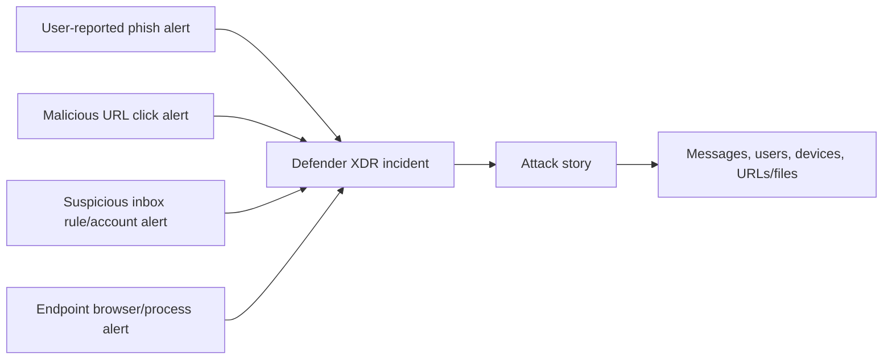

| Alert triage field | Question |
|---|---|
| Detection source | MDO, Defender XDR, app/user submission or other? |
| Severity | Technical severity; what is business priority? |
| Impacted assets | Which recipients, sender, mailbox or user? |
| First/last activity | What is event time versus alert time? |
| Trigger | Which policy/detection/user action started it? |
| Automated investigation | Was AIR started, completed or blocked? |
| Incident relation | Are endpoint/identity/cloud alerts correlated? |
| Current status | Has message/user already been remediated? |

Resolve the incident only after scope, remediation and residual risk are documented. Resolving can affect linked alerts; follow the SOC's authoritative process.

## 5. Queue prioritization

Microsoft's current MDO SecOps guide prioritizes high-impact alert types such as malicious URL clicks, restricted/suspicious senders, user-reported phish, delivered campaigns and delivery due to overrides. A client should tailor this to business impact.

| Priority factor | High urgency example | Caution |
|---|---|---|
| User action | Confirmed click/open/credential entry | Click does not automatically mean compromise |
| Delivery | Malicious message remains in inbox | Quarantined/failed mail may not be exposed |
| Identity | Privileged/VIP/finance/shared mailbox | Tags must be current |
| Scale | Broad campaign or internal propagation | Count can include blocked/nonactionable messages |
| Payload | Credential theft, malware, QR URL | Verdict/entity details may differ |
| Override | Malicious mail delivered due to allow/rule | Fix cause, not just one message |
| Cross-domain | Endpoint or identity follow-on alert | Correlation must be validated |
| Business process | Payment/vendor change or payroll request | Fraud process and finance response required |

## 6. Threat Explorer versus Real-time detections

Current Microsoft guidance associates Real-time detections with Plan 1 and Threat Explorer with Plan 2. Explorer provides more views, filters, saved queries, hunting and remediation.

| Capability | Real-time detections (Plan 1 context) | Threat Explorer (Plan 2 context) |
|---|---|---|
| Malware/phish views | Yes under current guidance | Yes |
| All email | More limited/absent relative to Explorer | Yes |
| Campaigns view | Not the full Plan 2 experience | Yes |
| URL clicks view | Plan 2 Explorer capability | Yes |
| Saved/tracked queries | Limited compared with Explorer | Yes/Threat Tracker integration |
| Manual remediation | More limited; current action matrix applies | Deeper move/delete/propose/AIR actions |
| AIR trigger | Plan 2 | Yes |
| Filtering | Useful but fewer properties | More properties and mail-flow/connector pivots |

Do not train analysts using screenshots alone. Build task-to-license and role mapping.

## 7. Explorer investigation workflow

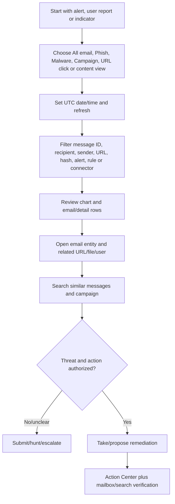

| Search pivot | Strong use | Limitation |
|---|---|---|
| Network Message ID | Trace exact Microsoft 365 message | Copies/forwards can produce related IDs |
| Sender address/domain | Find similar source | Spoofed/display sender differs from envelope |
| Recipient | Scope one account | Shared/forwarded mail needs more context |
| URL/domain | Find payload across messages/clicks | URL rewriting and benign shared hosting |
| File hash/name | Find attachment lineage | Same name can differ; archive contents vary |
| Subject | Quick hypothesis | High false-match rate |
| Alert ID | Pivot alert to messages | One alert may represent cluster |
| Transport rule/connector | Explain override/path | Explorer Plan 2/current permission dependency |
| Campaign ID | Scope clustered messages | Clustering is analytical, not actor proof |

## 8. Email entity page

The email entity page consolidates delivery, threat, sender/recipient, authentication, URL, attachment and related details for one message. Exact sections/actions depend on role and license.

| Entity section | Questions |
|---|---|
| Delivery details | Original/latest location, action and post-delivery changes? |
| Email details | Network/Internet Message IDs, direction, sender and recipient? |
| Threats/detections | Which verdict and technology, and did it change? |
| Authentication | SPF, DKIM, DMARC and composite authentication results? |
| Headers | What route, envelope and filtering metadata exist? |
| URLs | Rewritten/original URL, verdict, clicks and redirects? |
| Attachments | File name/type/hash, detonation and verdict? |
| Overrides | User allow, transport rule, IP allow or policy? |
| Actions | Submit, investigate, remediate or block under role? |
| Related alerts/campaign | Is it part of broader activity? |

### 🔍 Plain-English deep-dive: verdict, delivery and threat entity can disagree without contradiction

A message can be classified as phishing even if no individual URL has a phishing verdict because message-level features such as impersonation, language or sender behavior caused the decision. It can be delivered initially, then moved by ZAP. “Original delivery: Inbox,” “latest delivery: quarantine/soft-deleted” and “message verdict: phish” describe different dimensions. Always report time and field, not “MDO says blocked” without context.

## 9. Header analysis

Email headers are metadata added during transmission. They help reconstruct route, authentication and filtering. Attackers can forge some fields; trusted receiving systems add others.

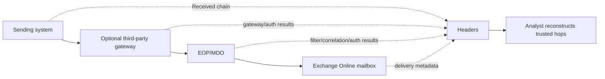

| Header/evidence | Use | Caution |
|---|---|---|
| `Received` | Trace mail hops in reverse chronological order | Earliest untrusted fields can be forged |
| `From` | User-visible author | Can differ from envelope and be spoofed |
| Return-Path/envelope sender | Bounce/authentication context | Forwarding and gateways alter paths |
| `Reply-To` | Where replies go | Common BEC redirection clue |
| `Message-ID` | Sender-side identifier | Not guaranteed unique/trusted |
| Network/correlation ID | Microsoft trace pivot | Use exact tenant evidence |
| Authentication-Results | SPF/DKIM/DMARC/composite results | Which trusted server wrote it matters |
| `X-Forefront-Antispam-Report` | Filtering metadata | Decode using current Microsoft guidance |
| URL rewrite | Safe Links/protection context | Extract original carefully; do not browse live malicious URL |
| ARC | Forwarding authentication chain context | Trust and configuration matter |

Do not paste sensitive real headers into public tools without privacy approval. Use approved internal parsers or manual analysis.

## 10. SPF, DKIM, DMARC and composite authentication in investigation

| Control | Investigative question | It does not prove |
|---|---|---|
| SPF | Was sending IP authorized for envelope domain? | Visible `From` identity or message safety |
| DKIM | Did a signing domain validate signed content? | Sender business legitimacy |
| DMARC | Did SPF/DKIM align with visible From and policy? | Mail is nonmalicious |
| Composite authentication | How did Microsoft combine available identity/auth signals? | Every downstream action is safe |
| ARC | Did a trusted intermediary preserve auth results? | Original sender intent |

A compromised legitimate vendor can pass all authentication and send BEC. Authentication verifies domain/control evidence, not the truth of an invoice.

## 11. URL analysis

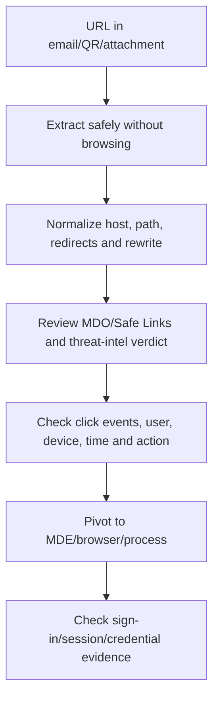

| URL evidence | Question |
|---|---|
| Original versus rewritten | What destination was protected/observed? |
| Domain age/reputation | Is infrastructure newly risky? Use approved intelligence |
| Redirect chain | Where did user ultimately go? |
| QR source | Was URL extracted from QR code under current Explorer filters? |
| Click time/user | Who interacted and when? |
| Click action | Allowed, blocked, warning bypassed or unknown? |
| Device/browser | Was a managed endpoint involved? |
| Credential follow-on | Did Entra sign-in/risk change after click? |

Never open a suspected URL in a normal browser. Use Microsoft-provided verdict/detonation and authorized isolated analysis services.

## 12. Attachment and file analysis

| Evidence | Use | Caveat |
|---|---|---|
| File name/type | Human context and true-type mismatch | Name/extension easily changed |
| Hash | Exact content pivot | Packed/modified file changes hash |
| Detonation verdict | Behavioral analysis result | Time, environment and evasion limits |
| Malware family | Threat context | Naming differs by vendor |
| Macro/script/archive | Delivery technique context | Do not execute outside authorized sandbox |
| Parent message/campaign | Scope recipients and related payloads | Similar files can be benign templates |
| Endpoint event | Whether file opened/executed | Absence can mean telemetry gap |
| Post-delivery action | ZAP/admin remediation | Verify latest mailbox state |

## 13. Campaigns and clustering

MDO Plan 2 campaign views group related phishing or malware messages using characteristics such as sender infrastructure, payload, URL, template and targeting under Microsoft's analytics.

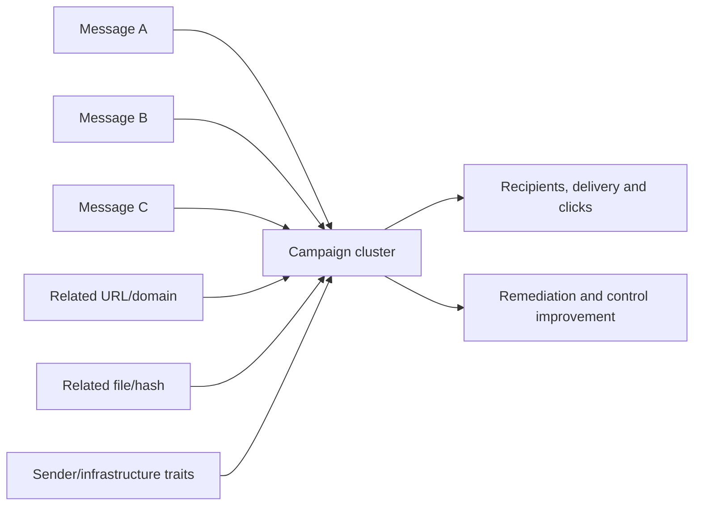

| Campaign view question | Outcome |
|---|---|
| How many messages/recipients? | Scale and response staffing |
| Delivered versus blocked? | Exposure versus prevention |
| Who clicked/reported? | Identity/endpoint priority |
| Which users are high value? | Business impact |
| Which URL/file/infrastructure? | Hunting and temporary block scope |
| What similarity supports cluster? | Confidence and false-cluster review |
| Was ZAP/admin action complete? | Residual mailbox exposure |
| Is campaign still active? | Monitoring and communication cadence |

A campaign cluster does not prove one threat actor or legal attribution. Use cautious wording: “messages were analytically clustered as related.”

## 14. Threat Tracker and current tools

Threat Tracker is a Plan 2 experience containing saved queries, tracked queries and trending campaigns under current guidance. It complements, rather than replaces, Advanced Hunting.

| Tool | Best use | Licensing/change note |
|---|---|---|
| Threat Tracker saved queries | Reuse Explorer filters | Plan 2/current role requirements |
| Tracked queries | Periodically run selected Explorer queries and show trend | Validate schedule/data window |
| Trending campaigns | Highlight new threats received by organization | Analytical feed, not complete external threat intelligence |
| Threat analytics | Microsoft threat reports, indicators and guidance | Broader Defender experience/license |
| Advanced hunting | Cross-table/cross-product KQL and custom detections | Schema/retention/role dependent |
| Custom detections | Turn hunting logic into alerts/actions | Requires robust testing and tuning |
| Campaign views | Analyze organization-targeted clusters | Plan 2 |
| Reports | Detection, mail flow and top-target trends | Aggregate metrics need denominators |

## 15. Submissions: why and how

Admins submit suspicious or incorrectly classified messages, URLs and attachments to Microsoft for analysis. User-reported messages can be reviewed, converted to admin submissions, marked and used to notify users.

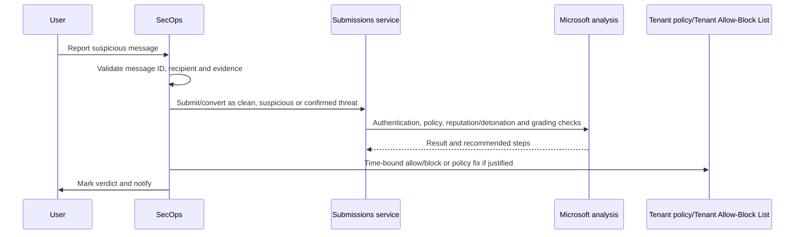

| Submission type | Use | Guardrail |
|---|---|---|
| Appears suspicious/clean | Analyst uncertain; request Microsoft verdict | Submission is not immediate containment |
| Confirmed phish/malware/spam | Provide high-confidence feedback | Preserve evidence and avoid overclassification |
| False positive | Good item blocked | Do not create broad allow without root cause |
| URL/file | Entity-specific analysis | Full URL/hash and privacy-safe handling |
| User reported | Operational intake and user feedback | Configure destination/reporting mailbox safely |
| Dispute | Challenge eligible completed result while preserving original history | Different from resubmission; current eligibility applies |

Current documentation includes throttles and age limits. Do not repeatedly submit the same item or treat delayed grading as a service failure without checking limits.

## 16. User-reported messages

User reporting is a human sensor. Settings can send reports to Microsoft, a reporting mailbox or both under current options. Non-Microsoft reporting tools must preserve the original message in supported attachment form for full integration.

| Operating requirement | Reason |
|---|---|
| Supported Outlook/reporting experience | Preserves identifiers and original content |
| Reporting mailbox configuration | Prevents alteration/filtering of reported item |
| Dedicated queue/SLA | Users expect timely safety guidance |
| Simulation handling | Avoid treating authorized simulation as attack |
| Mark and notify | Reinforces correct reporting behavior |
| False-report coaching | Correct mistakes without discouraging reports |
| Privacy/access | Reported messages may contain sensitive content |
| Metrics | Track true threat, spam, no-threat and response time |

Multiple users reporting similar messages can correlate into an incident and trigger AIR under current Plan 2 behavior.

## 17. AIR architecture and triggers

AIR in MDO Plan 2 can start from supported alerts, user reports, ZAP, click/suspicious mailbox behavior or analyst actions from Explorer, Advanced Hunting, custom detection or email entity experiences.

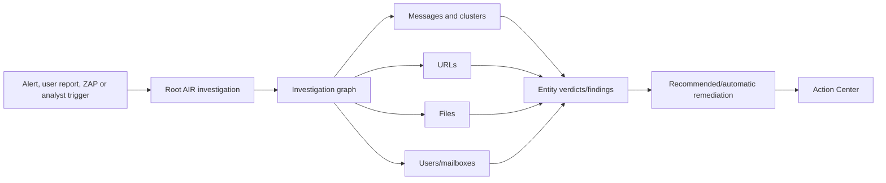

| AIR state/question | Analyst responsibility |
|---|---|
| Triggered | Confirm alert and incident scope |
| Running | Avoid duplicate conflicting action; monitor expansion |
| Finding/verdict | Review evidence, not just color/status |
| Recommended action | Validate target, business impact and authorization |
| Auto-approved cluster action | Verify service result and scope under current automation behavior |
| Pending approval | Approve/reject with rationale and Search/Purge permissions |
| Completed/no threats | Confirm scope and alternate explanations before closure |
| Failed/stalled | Use logs/action state and manual runbook |

### 🔍 Plain-English deep-dive: AIR is a playbook, not an autonomous incident commander

AIR can rapidly inspect message clusters, URLs, files and users and propose or perform supported remediation. It does not know every business dependency, fraud payment, legal hold, executive communication or third-party mailbox. Think of it as an automated investigator that fills much of the case file. A human team still owns incident severity, business impact, identity containment, external coordination and closure.

## 18. Investigation graph and entity verdicts

| Graph node | Typical verdict/evidence | Analyst question |
|---|---|---|
| Email/message cluster | Malicious, suspicious, no threat, remediated | Are all recipients and copies included? |
| URL | Phish/malware/unknown/clean context | Who clicked and where redirected? |
| File | Malware/unknown/clean/detonation result | Was it delivered/opened/executed? |
| User/recipient | Compromised/suspicious/no evidence context | Which sessions, rules and sends occurred? |
| Sender | Internal/external/reputation/account context | Is source spoofed or compromised? |
| Mailbox activity | Inbox rule/forwarding/sending behavior | Is persistence or BEC present? |
| Action | Pending/approved/completed/failed | Did target state actually change? |

Verdicts can evolve. Record the verdict and timestamp used for each decision.

## 19. Action Center and approval

Action Center centralizes pending and completed remediation actions. Current documentation describes direct approval for adequately privileged responders and a two-step “propose remediation” path for separation of duties.

| Action Center field | Use |
|---|---|
| Action/approval ID | Immutable tracking and escalation |
| Investigation/alert/incident link | Decision context |
| Action source | Manual, AIR, Explorer, hunting or automation |
| Target count | Scope validation |
| Status | Pending, in progress, completed, failed or already in destination |
| Decided by | Accountability |
| Action log | Per-message success/failure/nonactionable evidence |
| Timestamp | Handover and SLA |

Current MDO documentation describes Action Center history windows and government-cloud differences; verify tenant behavior. Export/preserve case evidence if policy requires longer retention.

## 20. Advanced hunting email tables

MDO contributes email tables to Defender XDR advanced hunting. Common current tables include the following; schema and retention must be checked in the live portal.

| Table | Conceptual content | Common join/pivot |
|---|---|---|
| `EmailEvents` | Message delivery, sender, recipient, verdict/action and metadata | `NetworkMessageId`, recipient, sender, time |
| `EmailAttachmentInfo` | Attachments, hashes, names/types and threat context | `NetworkMessageId`, SHA values |
| `EmailUrlInfo` | URLs in messages | `NetworkMessageId`, URL/domain |
| `UrlClickEvents` | Supported Safe Links/click events | User, URL, time, action and message context |
| `EmailPostDeliveryEvents` | ZAP/manual post-delivery actions | `NetworkMessageId`, recipient and action |
| `AlertInfo` | Alert metadata | `AlertId` |
| `AlertEvidence` | Entities/evidence related to alerts | `AlertId`, account/device/file/message fields |
| Identity/device tables | Sign-ins, process/network/activity as available | User/device/time/indicator |

A join key must mean the same thing on both sides. Joining only on user and a broad time window can create false relationships.

## 21. KQL hunting concepts

Kusto Query Language (KQL) uses a pipeline: start from a table, filter, select fields, aggregate and join only when necessary. The following defensive examples are conceptual; validate current column names and tenant schema.

```kusto
EmailEvents
| where Timestamp > ago(24h)
| where ThreatTypes has_any ("Phish", "Malware")
| project Timestamp, NetworkMessageId, SenderFromAddress,
          RecipientEmailAddress, DeliveryLocation, ThreatTypes
| order by Timestamp desc
```

```kusto
let suspiciousMessages =
    EmailEvents
    | where Timestamp > ago(7d)
    | where SenderFromDomain =~ "example-suspicious.invalid"
    | project NetworkMessageId, RecipientEmailAddress, MessageTime=Timestamp;
EmailUrlInfo
| where Timestamp > ago(7d)
| join kind=inner suspiciousMessages on NetworkMessageId
| project MessageTime, RecipientEmailAddress, Url, UrlDomain
```

| Query principle | Why |
|---|---|
| Bound time first | Performance and relevance |
| Project needed columns | Reduces noise and sensitive-data exposure |
| Use immutable IDs | Avoid subject/display-name collisions |
| Normalize case/domains | Improves comparison |
| Aggregate with denominator | Meaningful campaign/recipient counts |
| Join narrowly | Reduces false correlation and cost |
| Sample raw rows | Validate assumptions before summary |
| Save version/owner | Detection engineering and handover |
| Test known positives/negatives | Avoid silent misses/noise |
| Record retention gap | “No result” may mean data aged out |

## 22. From hunt to custom detection

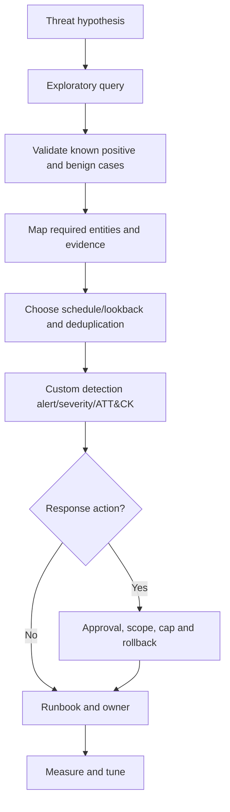

A custom detection should not automatically purge mail merely because one query matched a broad domain. Start with alerting and evidence review.

## 23. Phishing investigation

| Step | Evidence |
|---|---|
| Intake | Alert, user report, campaign or hunting hypothesis |
| Validate message | Network Message ID, recipient, sender, headers and verdict |
| Analyze lure/payload | URL, QR, attachment, impersonation and requested action |
| Delivery | Original/latest location, policy, override and post-delivery event |
| Interaction | Click, open/execution where available, reply and credential entry report |
| Scope | Similar message, recipients, campaign, forwarded/internal copies |
| Cross-domain | Endpoint process, Entra sign-in, OAuth consent, SaaS access |
| Respond | Purge/block/identity/device actions under approval |
| Verify | Action Center, mailbox state, sign-ins and residual scope |
| Improve | Policy/override/user/process and detection changes |

## 24. BEC investigation

Business email compromise uses trusted or impersonated identities to manipulate payment, payroll or sensitive-data processes. Payload may contain no malware or malicious URL.

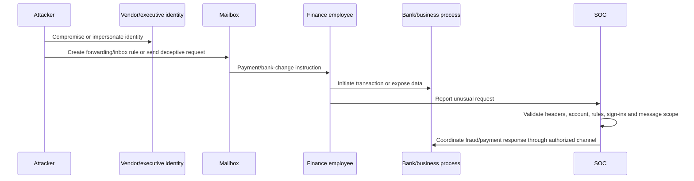

| BEC clue | Investigation |
|---|---|
| Display-name/domain impersonation | Compare visible, envelope, reply-to and authentication |
| Legitimate compromised account | Sign-ins, MFA methods, sessions, sent/deleted items and rules |
| New payment details | Verify through out-of-band business procedure |
| Inbox rule/forwarding | Include hidden rules, mailbox forwarding and audit changes |
| Deleted/sent anomalies | Audit and mailbox evidence under legal/privacy approval |
| Internal replies/thread | Scope participants and downstream trust |
| OAuth app | Review consent, permissions, credentials and mail/file access |
| No payload | Do not close merely because URLs/files are clean |

### 🔍 Plain-English deep-dive: BEC is often a process attack delivered by email

A technically authentic message from a compromised supplier can pass SPF, DKIM and DMARC and contain no malicious link. The attack succeeds because a person changes a bank account based on a trusted-looking request. MDO evidence is essential, but finance controls such as independent callback, dual approval and vendor-master change verification may be the most important prevention and response controls.

## 25. Malware email response

| Question | Evidence/action |
|---|---|
| Was file delivered? | Message delivery and recipient scope |
| Was it opened/executed? | Endpoint process/file evidence and user interview |
| What hash/family/behavior? | Attachment entity, detonation and threat intelligence |
| Are variants present? | Campaign, filenames, hashes, URLs and sender infrastructure |
| Was ZAP/admin cleanup complete? | Post-delivery events and Action Center |
| Did endpoint compromise occur? | MDE alerts/timeline and device response |
| Did credentials/identity move? | MDI/Entra evidence |
| What recovery is required? | Incident commander, endpoint rebuild/scan and business validation |

Email purge removes the delivery object; it does not eradicate malware already executed on an endpoint.

## 26. Internal phishing and compromised sender

An internal sender can be a compromised mailbox, malicious insider, application, mail-flow rule or spoofing/path artifact.

| Scope | Checks |
|---|---|
| Sender account | Entra sign-ins/risk, MFA methods, sessions, password and roles |
| Mailbox | Sent Items, hidden inbox rules, forwarding, delegates and audit |
| Restricted entities | Was sending blocked for outbound abuse? |
| OAuth/apps | Consent, app passwords/legacy paths and service principals |
| Messages | Internal/external recipients, replies, clicks and forwards |
| Device | MDE compromise on sender's endpoint |
| Application | SMTP relay, connector or service account behavior |
| Business | Fraud/data disclosure and external notification |

Coordinate identity containment, not just message deletion. A synchronized or federated account can require on-premises source-of-authority action.

## 27. Compromised-user coordination

Current Microsoft guidance emphasizes disabling the account during investigation where feasible, revoking sessions, reviewing authentication methods/apps/roles/forwarding and restoring safely. The exact order is incident-specific.

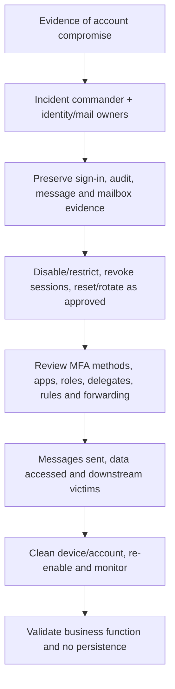

| Access mechanism | Response consideration |
|---|---|
| Password | Reset at correct source of authority |
| Refresh/session tokens | Revoke sessions; consider propagation/continuous access behavior |
| MFA method | Remove attacker-added registrations |
| OAuth grant | Revoke app consent/credentials |
| App password/legacy auth | Remove and block legacy path where possible |
| Mailbox rule/forwarding | Remove unauthorized setting and audit creator |
| Delegate/role | Remove unauthorized privilege |
| Endpoint credential/session | Isolate/remediate device |
| Certificate | Revoke/replace if used for authentication |

Do not send new credentials through the compromised mailbox.

## 28. Scope search and remediation choices

| Action | Use | Recoverability/concern |
|---|---|---|
| Move to junk | Lower-impact removal from inbox | User can access; not suitable for severe threat alone |
| Move to Deleted Items | Removes from inbox | User can recover |
| Soft delete | Moves into recoverable deletions | Recoverable by user/admin under current retention behavior |
| Hard delete | Purges to hard-deleted state; admin recovery may still apply under single-item recovery | High-impact; content-read/advanced-action role conditions |
| Move to inbox/release | Restore false positive/quarantine item | Re-exposes content; verify verdict |
| Submit to Microsoft | Improve/validate classification | Not immediate cleanup |
| Add allow/block | Temporary entity mitigation | Broad allow can bypass protections |
| Propose remediation | Two-step approval | Safer separation but adds latency |

Current actions depend on latest delivery location. On-premises/external, failed, dropped, expired or already hard-deleted messages can be nonremediable in Microsoft 365. Coordinate with the system that actually stores them.

## 29. Permissions and purge safeguards

Current MDO guidance uses Defender unified RBAC permissions such as email/collaboration advanced actions where active, or Email & collaboration roles such as Search and Purge. Preview/download of content has separate permission. PowerShell and portal permission models are not automatically identical.

| Persona | Capability | Safeguard |
|---|---|---|
| L1 analyst | View metadata and triage | No content preview or purge by default |
| L2 investigator | Explorer/hunting, entity and approved content access | PIM and case justification |
| Remediation proposer | Define target/query and proposed action | Cannot self-approve high-impact action |
| Purge approver | Search and Purge/advanced action | Verify query export, count and exclusions |
| Messaging admin | Mail flow/connector/policy correction | Peer review and change control |
| Identity responder | Disable/revoke/reset | Incident-command approval |
| Auditor | Read action/audit evidence | No mutation |

### Purge preflight checklist

1. Record case/incident and accountable approver.
2. Freeze the exact query/filter/time window.
3. Export/review impacted assets and sample rows.
4. Confirm Network Message IDs and recipient scope.
5. Remove legitimate exclusions explicitly.
6. Choose least destructive action that meets containment.
7. Check legal hold/records/privacy implications with owners.
8. Confirm messages are in actionable locations.
9. Use two-step approval for large/high-risk scope.
10. Verify per-message action logs and residual search.

## 30. Remediation at scale and safeguards

Microsoft documents selection, query, concurrency and service limits that change. Large remediations can be delayed, partially nonactionable or age out near the Explorer retention boundary.

| Scale risk | Control |
|---|---|
| Wrong broad query | Export/sample/count and second reviewer |
| User/business mail loss | Prefer soft delete when sufficient; owner communication |
| Service throttling | Batch under current guidance and monitor Action Center |
| Aging data | Act within retention and preserve evidence |
| Duplicate actions | Check latest location/Already in destination |
| Partial failure | Review per-message logs and retry only failures |
| On-premises recipients | Use on-premises/gateway tools and owners |
| Litigation/records | Legal/records approval and recoverability plan |
| Internal sender copies | Decide whether sender Sent Items also require action |
| False positive after purge | Document recovery/release and root-cause correction |

“Completed” can include a mix of successful, failed and already-in-destination outcomes. Read action details.

## 31. Third-party gateway and mail-flow evidence

A third-party gateway can alter headers, sender IP visibility, authentication and message path. Enhanced Filtering for Connectors can help Microsoft identify original sending sources in supported inbound connector scenarios. Design and verify current guidance.

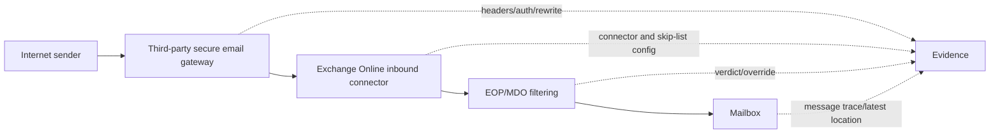

| Evidence | Question |
|---|---|
| Received chain | What were trusted gateway/EOP hops and original source? |
| Connector name | Which inbound path accepted the message? |
| Enhanced Filtering | Was original sender attribution restored correctly? |
| Authentication/ARC | What did gateway preserve or alter? |
| Transport rule | Did a rule bypass spam/phish handling? |
| IP allow list/connector trust | Did trusted path override filtering? |
| URL/attachment rewrite | Which product owns displayed/original entity? |
| Gateway logs | What verdict/action occurred before Microsoft 365? |
| Message trace | Was message delivered, redirected, failed or expanded? |
| Explorer filter | Can connector/rule explain delivery under Plan 2? |

Do not add the gateway IP to broad allow lists merely to “fix mail flow.” That can make all mail appear trusted and weaken spoof/phish detection.

## 32. False positives

A false positive is legitimate content classified or acted on as harmful. Restore business function while identifying the exact cause.

| Step | Action |
|---|---|
| Validate | Confirm sender/business transaction out-of-band |
| Evidence | Capture message ID, recipient, time, verdict, detection and policy |
| Scope | Determine whether one message, sender, URL/file or broad flow |
| Restore | Release/move to inbox only after safety review |
| Submit | Report clean/confirmed clean to Microsoft as appropriate |
| Root cause | Authentication, impersonation, content, URL/file, rule or reputation |
| Tune | Narrow trusted sender/anti-phish/Tenant Allow-Block change if justified |
| Expiry | Time-bound allow where current mechanism supports it |
| Verify | Re-test legitimate flow and malicious negative control |

A direct broad sender/domain allow can skip associated filtering and create a durable hole. Prefer fixing authentication or narrow impersonation trust for the known sender/use case.

## 33. False negatives

A false negative is malicious content delivered or missed.

| Step | Action |
|---|---|
| Contain | Scope and remove actionable messages |
| Submit | Report confirmed/suspected threat to Microsoft |
| Block | Add time-bound sender/domain/URL/file block where justified |
| Identity/device | Investigate click, credential, endpoint and account evidence |
| Delivery root cause | Override, disabled feature, policy scope, gateway or novel threat |
| Campaign scope | Search variants and clustered messages |
| Improve | Correct policy/override and add tested hunt/detection |
| Monitor | Track recurrence and block expiry |

## 34. Alert tuning without hiding attacks

Current Defender includes built-in and custom alert-tuning rules. Built-in suppression can affect alert visibility while AIR or notifications may behave differently; current documentation warns that the Phishing Triage Agent does not classify suppressed alerts and identifies specific user-report tuning interactions.

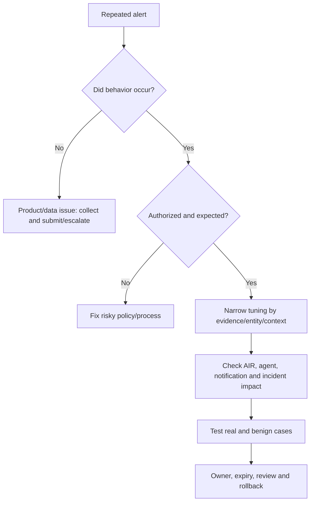

| Tuning safeguard | Reason |
|---|---|
| Preserve user-reported phish visibility | Human reports can reveal novel threats |
| Check AIR trigger impact | Suppression/replaced alert can stop investigation |
| Check Security Copilot/agent dependency | Agent may ignore suppressed alert |
| Narrow conditions | Avoid hiding unrelated campaigns |
| Time-bound | Business process changes |
| Peer review | Detection and messaging owners assess risk |
| Positive/negative tests | Prove signal and noise behavior |
| Monitor suppressed volume | Detect abuse/drift |

## 35. Service health and troubleshooting

| Symptom | Likely layer | First check |
|---|---|---|
| Message absent in Explorer | License/retention/filter/recipient scope | Exact message ID, time, licensed user and refresh |
| Header source wrong | Gateway/connector/header trust | Received chain and Enhanced Filtering config |
| User report missing | Reporting settings/tool/mailbox format | Destination and original `.eml/.msg` attachment path |
| AIR not triggered | Plan 2, audit, alert disabled/replaced/tuned | Trigger alert and AIR settings |
| Action unavailable | Role, license, delivery location or selection size | Effective role and latest location |
| Remediation stuck | Service delay, scale, retention or target state | Action Center status and per-message logs |
| Campaign count differs | Cluster/update/filter and message multiplicity | Campaign ID, recipients and current filter |
| URL click absent | Protection/license/client/telemetry path | Safe Links coverage and click context |
| Message auth odd | Forward/gateway/ARC/connector | Trusted hop and auth result writer |
| False positive repeats | Wrong policy/impersonation cause not fixed | Submission result and effective policy |

## 36. Layered troubleshooting workflow

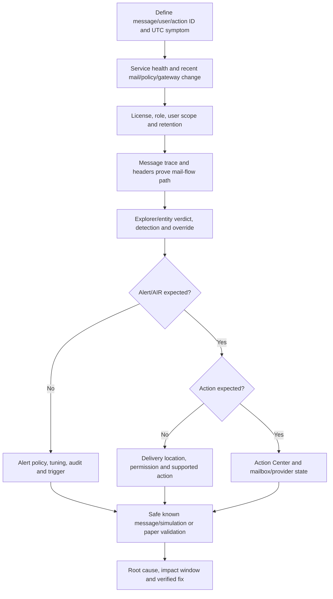

## 37. Assessment and target design

An MDO SecOps assessment should prove what the organization can investigate and safely act on, not merely list enabled protection policies.

| Assessment area | Evidence/questions | Design output |
|---|---|---|
| Entitlements | Which users have Plan 1, Plan 2, suite or trial rights? | User/capability license matrix |
| Mail paths | Direct, hybrid, third-party gateway, journaling and applications? | Trusted-hop and connector diagram |
| Protection | Presets/custom policies, Safe Links/Attachments, ZAP and overrides? | Effective-policy and exception register |
| SecOps tools | Incidents, Explorer/Real-time, campaigns, AIR, hunting and submissions? | Tool-to-use-case map |
| Identities | Analysts, content viewers, purge approvers and emergency admins? | Least-privilege RBAC/PIM matrix |
| Data | Message content, headers, click events, exports and retention? | Privacy and evidence-handling design |
| Integrations | XDR, Sentinel, ticketing, reporting tools and gateway APIs? | Data-flow and authoritative-case design |
| Operations | Queue, severity, shifts, escalation, fraud/legal and workload owners? | RACI, SLA and runbook catalogue |
| Resilience | What happens during portal, gateway, connector or AIR degradation? | Degraded-mode and backlog-recovery plan |

The target design should state which platform is authoritative for incidents and actions, which users/messages are in licensed scope, where evidence is retained, how duplicate tickets are prevented, which actions require two-person approval and how on-premises or external mailboxes are handled.

## 38. Secure configuration and staged deployment

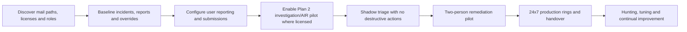

| Phase | Configuration/work | Exit gate |
|---|---|---|
| Discovery | Inventory connectors, policies, licensing, roles and queues | Owners and evidence accepted |
| Baseline | Review delivered threats, overrides, user reports and false results | Known gaps and volumes quantified |
| Intake pilot | Configure built-in/approved reporting and mailbox path | Original message and alert/AIR routing proven |
| Analyst pilot | Grant read-only metadata, then justified content access | Persona tests and privacy approval pass |
| AIR shadow | Review investigations/recommendations without broad auto-action | Accuracy, ownership and failed-state runbook accepted |
| Remediation pilot | Use small synthetic scope and two-step approval | Query, action, recoverability and verification proven |
| Production | Expand by analyst shift/business scope | SLA, support, service health and handover accepted |

Preserve configuration exports before changes. Review alert policies that trigger AIR, built-in/custom tuning, priority/user tags, user-report settings, reporting-mailbox rules, unified RBAC activation, Search and Purge assignment, Tenant Allow/Block entries, inbound connectors, Enhanced Filtering and transport-rule overrides. Do not enable every action simply because the role can perform it.

## 39. Testing and acceptance

| Test category | Safe test | Required evidence |
|---|---|---|
| Message trace/entity | Authorized benign test message with unique subject and recipient | Network Message ID, headers and delivery fields |
| Protection | Microsoft-supported simulation or harmless test payload | Expected detection/quarantine without live malware |
| User report | Report the authorized test through supported client | User-reported entry, alert and notification path |
| Explorer/Real-time | Find the exact test message using ID/time | Correct license, fields and recipient scope |
| AIR | Use a supported benign/test trigger or paper walkthrough | Investigation state, graph and action expectation |
| RBAC | L1, investigator, content viewer, proposer and approver personas | Explicit allow/deny results and audit |
| Remediation | Soft-delete a disposable test message under approval | Action ID, per-message result and recovery |
| False positive | Submit/restore a known legitimate synthetic message | Submission result and no broad allow |
| Gateway | Compare gateway and Microsoft trace/header evidence | Original sender attribution and connector result |
| Hunting | Query a known synthetic message/entity | Expected row, join and retention note |
| Handover | Shift tabletop with pending/failed actions | Next analyst continues without rework |
| Degraded mode | Paper simulation of portal/AIR/gateway outage | Alternate evidence, escalation and backlog recovery |

Negative tests are essential: a similar legitimate message must not be included in the purge query, an L1 analyst must not hard-delete, a native or external mailbox must be reported as nonactionable rather than silently counted as remediated, and an expired/retained-out message must produce a documented evidence gap.

## 40. Rollback and recovery matrix

| Change/action | Rollback or recovery | Residual concern |
|---|---|---|
| Alert tuning rule | Disable/remove and restore prior condition | Alerts missed while suppressed may not be recreated |
| User-report destination | Restore prior setting after preserving queue | Reports may exist in both paths during transition |
| Transport-rule correction | Restore exported rule only if business flow breaks | Reintroduces malicious-delivery risk |
| Connector/Enhanced Filtering | Restore known-good connector configuration | Sender attribution and authentication can change |
| Tenant block | Remove/expire entry | Threat may recur; continue monitoring |
| Tenant allow/trusted sender | Remove narrow allow and retest legitimate flow | Mail blocked during correction; broad bypass risk ends |
| Soft delete | Recover/move message after confirmed false positive | User may already have acted on absence |
| Hard delete | Follow supported single-item recovery if still available | Higher recovery risk; legal/records implications |
| AIR automation | Reduce automation/disable trigger with manual queue coverage | Response latency rises |
| RBAC assignment | Remove role/group membership and review audit | Completed content access/actions cannot be undone |

Rollback is not always reversal. A purged message, disclosed credential, copied attachment, user notification or external payment can have effects outside Microsoft 365. Record compensating recovery and business follow-up.

## 41. Security, privacy and evidence governance

MDO evidence can include message content, attachments, headers, communications relationships, user clicks, locations, financial requests and investigation exports. Apply purpose limitation and need-to-know access.

| Risk | Control |
|---|---|
| Unnecessary content access | Metadata-first triage, separate content-read permission and PIM |
| Analyst misuse | Segregation of duties, audit review and case-linked access |
| Sensitive exports | Encrypted case store, access log, expiry and approved deletion |
| Public header/URL analysis | Approved internal tooling; redact personal/customer data |
| Submission data transfer | Review Microsoft processing, tenant cloud and government restrictions |
| Legal hold/records conflict | Consult legal/records before destructive remediation where required |
| Employee monitoring | Security-purpose notice and HR/privacy governance |
| AI-generated explanation | Treat as assistance; verify against raw evidence and do not expose excess content |
| Cross-border incident | Validate residency, transfer and notification obligations |
| Chain of custody | Preserve source IDs, timestamps, exports, actions and analyst history |

Use UTC, immutable IDs and hashes where appropriate, but do not claim forensic integrity merely because a screenshot exists. The evidence register should record source, collector, time, access, transformation and storage.

## 42. Operational cadence

| Cadence | Activity | Output |
|---|---|---|
| Continuous/daily | Triage medium/high and user-report incidents | Owned queue and response decisions |
| Daily | Review pending/failed Action Center actions | Completed/exception list |
| Daily | Review delivered campaigns and override alerts | Purge/policy work |
| Daily | Submit false positives/negatives | Submission tracker |
| Weekly | Detection/mail-flow trends and top targeted users | Trend dashboard |
| Weekly | Campaigns, Threat Tracker and threat analytics | Hunting priorities |
| Weekly | Connector/gateway/reporting mailbox health | Health report |
| Monthly | Configuration Analyzer/ORCA and overrides | Hardening backlog |
| Monthly | Roles, PIM, priority/user tags and runbooks | Access/readiness review |
| Quarterly | Simulation, purge approval and compromised-user exercise | Exercise/PIR |

## 43. Metrics that support decisions

| Metric | Useful definition | Warning |
|---|---|---|
| Time to acknowledge/triage | From alert/report to owned validated case | Fast closure can be wrong |
| Time to scope | To recipient/message/entity/campaign completeness | Retention gaps affect result |
| Time to contain | To actionable messages/users controlled | Identity/device response may dominate |
| Delivered malicious messages | Confirmed delivered / total malicious | Verdict changes and clustering |
| Click-through/credential report | Interaction by targeted population | Click is not compromise proof |
| ZAP/manual remediation coverage | Successfully remediated actionable messages | Nonactionable must be reported separately |
| Action failure rate | Failed actions / attempted actionable items | Already in destination is not failure |
| User report precision | Confirmed threat / user reports | Do not discourage low precision alone |
| False-positive rate | Legitimate blocked / reviewed | Denominator and classification quality |
| Override-caused delivery | Malicious delivery due to policy/user overrides | Root-cause remediation metric |
| Campaign recurrence | Repeated infrastructure/template after action | Threat adaptation expected |
| Shift handover defects | Reopened/missed actions due to handoff | Encourage honest reporting |

## 44. Runbook design

Every runbook should define trigger, scope, required roles, evidence, decisions, actions, safeguards, communication, validation, escalation and closure.

| Runbook | Critical branch |
|---|---|
| User-reported phish | Simulation/benign/threat and interaction |
| Delivered malicious email | Actionable location and identity/endpoint impact |
| BEC | Impersonation versus compromised account and financial action |
| Malware attachment | Delivered/opened/executed and endpoint response |
| Internal phish | Compromised user/app/relay and downstream recipients |
| False positive | Safe release and root-cause tuning |
| AIR pending action | Evidence, target count and approver |
| Third-party gateway | Gateway versus Microsoft ownership/evidence |
| Large purge | Query freeze, second approval, batching and verification |
| Service degradation | Alternate evidence/query and backlog recovery |

## 45. Shift handover

A good handover lets the next analyst continue without re-investigating everything or making unsafe assumptions.

| Handover field | Example content |
|---|---|
| Incident/owner/severity | `INC-DEMO-38`, L2 owner, high due to finance target |
| Facts | 42 delivered, 5 clicked, 1 suspicious sign-in; UTC timestamps |
| Hypotheses | Credential phishing likely; malware not observed |
| Actions complete | 37 soft deleted; URL block expires Friday |
| Pending | 5 nonactionable external mailboxes; identity review in progress |
| Failed | 2 actions failed; IDs and error captured |
| Approvals | Identity disable approved; hard delete not approved |
| Next checks | OAuth consent, mailbox rules, vendor callback |
| Stakeholders | IR lead, messaging, identity, finance, legal |
| Next update | 02:00 UTC or material change |
| Evidence links | Case-controlled exports, Action IDs and queries |
| Residual risk | Clicked users and external recipients not fully cleared |

## 46. Post-incident review

PIR separates root cause from contributing factors and asks why controls, process or detection allowed impact.

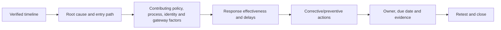

| PIR area | Questions |
|---|---|
| Entry/delivery | Why did message reach users? |
| Detection | What fired, missed or was suppressed? |
| User/business process | What made lure credible and what checks failed? |
| Identity/endpoint | What access or execution followed? |
| Response | Which decisions/actions worked or failed? |
| Tooling | Were license, roles, retention or gateway evidence limiting? |
| Communication | Were updates factual, timely and audience-appropriate? |
| Prevention | Which policy, process, training or vendor control changes? |
| Validation | How will recurrence test prove improvement? |

Avoid “user clicked” as the entire root cause. Ask why the attack reached the user, why the lure worked, what control failed and why impact was possible.

## 47. Consulting scenarios

### Scenario A: vendor invoice BEC

A real vendor account sends an authenticated bank-change request. Treat passing SPF/DKIM/DMARC as identity-path evidence, not legitimacy. Use out-of-band vendor verification, investigate vendor/customer mailbox compromise where available, stop payment through authorized finance channels, scope related messages and review process controls.

### Scenario B: third-party gateway hides original sender

Trace headers and connector, validate Enhanced Filtering for Connectors and gateway logs, compare EOP verdict/override and avoid broad IP allows. Build a joint vendor/prior evidence pack.

### Scenario C: large purge requested by executive

Do not act on subject alone. Freeze query, use message/campaign/entity identifiers, export/sample, separate legitimate variants, choose least destructive action, obtain Search/Purge approval, batch within current limits and verify Action Center.

### Scenario D: user-report queue overload

Prioritize high-value users, repeated clusters, interaction and delivered threats; use AIR/agentic tools only under current licensing and human validation; notify users; tune duplicate handling without suppressing novel reports; add staffing/shift metrics.

## 48. Consulting artifacts

| Artifact | Minimum content |
|---|---|
| MDO SecOps assessment | Licenses, roles, queues, Explorer/AIR, gateway, submissions and gaps |
| Tool/capability map | Plan 1/2, portal, role, retention and use case |
| Email investigation workbook | IDs, headers, entities, verdicts, delivery, clicks and scope |
| Campaign scope sheet | Cluster, recipients, delivery, interactions and remediation |
| AIR/action register | Investigation, verdict, recommendation, approval and result |
| Purge approval template | Query, sample, count, action, approver, recoverability and validation |
| Compromised-user checklist | Password, sessions, MFA, apps, roles, rules and forwarding |
| Gateway evidence map | Hops, connector, authentication, rewrite and owner |
| Tuning register | Detection, evidence, condition, impact, expiry and test |
| SOC runbooks | Phish, BEC, malware, internal send, false result and outage |
| Shift handover | Facts, actions, pending, failed, next and residual risk |
| Metrics dashboard | Queue, scope, interaction, remediation, overrides and quality |
| PIR | Timeline, cause, factors, lessons, owners and retest |

## 49. Safe paper lab: investigate a fictional BEC/phishing campaign

This lab uses synthetic `.example` domains, documentation IP ranges and nonfunctional `hxxps` URLs. Do not browse or submit real data.

### Fictional intake

At 09:00 UTC, 60 users receive a message with subject “Updated supplier payment details.” Forty messages are blocked, 20 delivered because a test transport rule was accidentally too broad, six users report it, three click `hxxps://vendor-payments.example/login`, and one finance user enters credentials according to a fictional interview. At 09:24 an Entra sign-in appears from `203.0.113.40`; at 09:30 a new mailbox forwarding rule and OAuth consent are recorded.

```mermaid
sequenceDiagram
    participant A as Fictional attacker
    participant G as Mail gateway/MDO
    participant U as Users
    participant F as Finance user
    participant X as Defender XDR/AIR
    participant SOC as SOC
    A->>G: Send 60 related BEC/phish messages
    G-->>U: 40 blocked; 20 delivered via broad rule
    U->>X: Six user reports
    F->>A: Click and fictional credential entry
    X->>SOC: Correlated alert, campaign and AIR findings
    SOC->>SOC: Scope message IDs, URLs, users and override
    SOC->>X: Propose approved soft delete and URL block
    SOC->>SOC: Coordinate session/app/rule containment
```

### Synthetic header fragment

```text
From: "Supplier Accounts" <accounts@vendor-payments.example>
Reply-To: changebank@external-mail.example
Message-ID: <demo-38-001@vendor-payments.example>
Received: from demo-gateway.example (192.0.2.25) by contoso.example
Authentication-Results: spf=pass; dkim=pass; dmarc=pass
X-Demo-Network-Message-Id: 00000000-0000-0000-0000-000000000038
```

The pass results do not establish business legitimacy. The Reply-To mismatch, payment-change request, transport-rule override, click, sign-in, forwarding and OAuth evidence raise risk.

### Exercise 1: facts and hypotheses

| Observed fact | Hypothesis/next evidence |
|---|---|
| 20 messages delivered due to named test rule | Rule scope accidentally broad; export policy/change evidence |
| Six users reported | Campaign reached users; correlate exact message cluster |
| Three recorded clicks | Possible exposure; inspect click action/device/sign-ins |
| Finance user reports credential entry | Account compromise likely; preserve identity evidence |
| New forwarding rule | Possible persistence/exfiltration; audit creator/time |
| New OAuth consent | Possible delegated persistence; inspect app ID/scopes/activity |

### Exercise 2: scope query design

Use Network Message ID/campaign/URL/sender/recipient and the named transport rule. Avoid subject-only scope. List the expected `EmailEvents`, `EmailUrlInfo`, `UrlClickEvents` and `EmailPostDeliveryEvents` pivots without running a tenant query.

### Exercise 3: response matrix

| Action | Approver | Evidence preserved | Validation |
|---|---|---|---|
| Soft delete 20 delivered messages | Purge approver/IR lead | Query export, message IDs, headers | Action Center per-message result and residual search |
| Block URL/sender entities temporarily | Messaging security | Entity/verdict and expiry | Test block and review false positives |
| Disable/revoke finance account sessions | Identity/IR lead | Sign-in, MFA, app and rule audit | Clean sign-in and persistence review |
| Revoke suspicious OAuth consent | App/identity owner | App ID, scopes, users and API activity | Consent removed; integration owner confirms |
| Remove forwarding rule | Messaging/IR lead | Rule properties and audit | Mailbox settings clean |
| Correct transport rule | Messaging change approver | Pre-change export and incident link | Legitimate and malicious test cases |
| Notify finance/vendor/legal | Incident commander | Factual impact statement | Decision/action logged |

### Exercise 4: shift handover and PIR

Write a handover with completed/pending/failed actions and residual external-recipient risk. PIR must identify the broad transport-rule override and weak payment-change process as contributing factors, not blame only the user.

### Portfolio evidence

- MDO SecOps architecture.
- Header/message/entity analysis sheet.
- Explorer and hunting scope plan.
- Campaign recipient/delivery/click matrix.
- AIR graph/verdict/action review.
- Purge approval and Action Center verification.
- Compromised-user persistence checklist.
- Gateway/transport-rule root-cause map.
- Shift handover, executive update and PIR.

### Evidence-safe interview wording

> “I completed a safe fictional MDO investigation rather than a production purge. I used synthetic message IDs, headers, Explorer and hunting concepts to scope a BEC/phishing campaign; reviewed AIR evidence; proposed two-person soft-delete remediation; coordinated identity, OAuth and forwarding response; and produced a handover and PIR. My production analogue is M365 critical-incident RCA and stakeholder coordination, not MDO SecOps ownership.”

## 50. JD Mapping: interview translation

| Interview prompt | Your factual strength | Honest MDO bridge |
|---|---|---|
| “How do you investigate phishing?” | Evidence timelines and M365 workload incidents | Explain fictional entity/campaign/AIR process |
| “How do you handle BEC?” | Stakeholder and multi-team critical-incident coordination | Add finance process, identity and mailbox evidence |
| “How do you purge mail safely?” | Change validation/rollback discipline | Describe query freeze and two-person approval; no production claim |
| “How do you troubleshoot a gateway?” | Multi-layer dependency isolation | Trace headers, connector, auth, override and gateway logs |
| “How do you run 24x7 operations?” | Incident documentation and handoff | Use queue cadence, handover and PIR artifacts |
| “What is your hands-on level?” | Production M365 support | MDO architecture/paper lab, not production SecOps |

## Official Source Anchors

1. [Security Operations Guide for Defender for Office 365](https://learn.microsoft.com/defender-office-365/mdo-sec-ops-guide)
2. [Manage MDO incidents and alerts](https://learn.microsoft.com/defender-office-365/mdo-sec-ops-manage-incidents-and-alerts)
3. [Threat Explorer and Real-time detections overview](https://learn.microsoft.com/defender-office-365/threat-explorer-real-time-detections-about)
4. [Threat hunting in Explorer and Real-time detections](https://learn.microsoft.com/defender-office-365/threat-explorer-threat-hunting)
5. [Email entity page](https://learn.microsoft.com/defender-office-365/mdo-email-entity-page)
6. [Campaigns](https://learn.microsoft.com/defender-office-365/campaigns)
7. [Threat Tracker](https://learn.microsoft.com/defender-office-365/threat-trackers)
8. [Admin submissions](https://learn.microsoft.com/defender-office-365/submissions-admin)
9. [User-reported message settings](https://learn.microsoft.com/defender-office-365/submissions-user-reported-messages-custom-mailbox)
10. [AIR in Defender for Office 365](https://learn.microsoft.com/defender-office-365/air-about)
11. [View AIR investigation results](https://learn.microsoft.com/defender-office-365/air-view-investigation-results)
12. [Review and approve AIR actions](https://learn.microsoft.com/defender-office-365/air-review-approve-pending-completed-actions)
13. [Remediate malicious email](https://learn.microsoft.com/defender-office-365/remediate-malicious-email-delivered-office-365)
14. [MDO permissions](https://learn.microsoft.com/defender-office-365/mdo-portal-permissions)
15. [Unified RBAC permissions for MDO](https://learn.microsoft.com/defender-office-365/defender-office-365-unified-rbac-permissions)
16. [Respond to a compromised email account](https://learn.microsoft.com/defender-office-365/responding-to-a-compromised-email-account)
17. [Enhanced Filtering for Connectors](https://learn.microsoft.com/exchange/mail-flow-best-practices/use-connectors-to-configure-mail-flow/enhanced-filtering-for-connectors)
18. [EmailEvents table](https://learn.microsoft.com/defender-xdr/advanced-hunting-emailevents-table)
19. [EmailAttachmentInfo table](https://learn.microsoft.com/defender-xdr/advanced-hunting-emailattachmentinfo-table)
20. [EmailUrlInfo table](https://learn.microsoft.com/defender-xdr/advanced-hunting-emailurlinfo-table)
21. [UrlClickEvents table](https://learn.microsoft.com/defender-xdr/advanced-hunting-urlclickevents-table)
22. [EmailPostDeliveryEvents table](https://learn.microsoft.com/defender-xdr/advanced-hunting-emailpostdeliveryevents-table)
23. [MDO service description](https://learn.microsoft.com/office365/servicedescriptions/office-365-advanced-threat-protection-service-description)

## ⭐ Likely Interview Questions for This Section

### Q1. How is this MDO SecOps work different from configuring email protection policies?

**Model answer:** Protection configuration defines how EOP/MDO prevents and handles mail. SecOps starts with an alert, user report or hypothesis and validates the message, delivery, detection, override, interaction and related entities; scopes recipients and campaigns; coordinates endpoint/identity response; remediates under approval; verifies Action Center and mailbox state; and feeds lessons into policy and business controls.

### Q2. What is the difference between Threat Explorer and Real-time detections?

**Model answer:** Under current guidance, Real-time detections is the Plan 1 investigation experience for malware/phish and related data. Threat Explorer is Plan 2 and adds broader all-email/campaign/click views, more filters, saved/tracked hunting and deeper remediation/AIR actions. I would verify the tenant license, role, retention and available views rather than assume UI parity.

### Q3. How would you scope a phishing campaign?

**Model answer:** I would start with UTC time and Network Message ID, then pivot through sender/envelope/reply-to, recipients, URL/file entities, detection, delivery/override, campaign ID and alert ID. I would separate blocked, delivered, clicked and remediated populations; inspect similar messages and cross-domain endpoint/identity evidence; and avoid subject-only searches. The final scope includes known gaps and external/on-premises nonactionable mail.

### Q4. How does AIR work in Defender for Office 365?

**Model answer:** Plan 2 AIR starts from supported alerts, user reports, ZAP or analyst triggers. It expands through messages/clusters, URLs, files and users, assigns findings/verdicts and recommends or automatically handles supported actions depending on current behavior. Analysts review the graph/evidence and Action Center, approve or reject pending actions and verify results. AIR does not own business impact or all identity/device response.

### Q5. How would you respond to BEC if SPF, DKIM and DMARC pass?

**Model answer:** Passing authentication can mean the legitimate domain/account sent the message; it does not validate the payment request. I would perform out-of-band vendor/business verification, inspect reply-to, headers, thread, mailbox rules/forwarding, sign-ins, MFA methods, sessions, OAuth apps and sent/deleted items, scope recipients and payment actions, coordinate finance/fraud/legal response and contain the account and messages under approval.

### Q6. How do you purge malicious email safely?

**Model answer:** I would use immutable message/campaign/entity scope, freeze/export the query, sample results, confirm recipient count and latest locations, exclude legitimate variants, choose the least destructive sufficient action and use Search and Purge or unified advanced-action permissions with two-person approval for high-risk scope. I would then inspect per-message Action Center results and run a residual search. A completed container is not enough.

### Q7. How do you handle false positives and alert tuning?

**Model answer:** I validate the business sender/message out-of-band, capture exact detection/policy/override, restore only after safety review and submit the false positive. I fix authentication or narrow impersonation/trust rather than adding broad permanent allows. For alert tuning, I confirm the behavior occurred, check AIR/notification/agent impact, use narrow expiring conditions, peer review and positive/negative tests.

### Q8. What is your honest MDO SecOps experience?

**Model answer:** My production experience is Microsoft 365 support escalations, critical incidents, RCA, evidence timelines, validation and stakeholder coordination. I have studied current MDO SecOps architecture and completed a fictional BEC/phishing paper investigation with Explorer/hunting scope, AIR review, two-person purge safeguards, identity coordination and PIR. I have not operated MDO SecOps or purged production mail.

## 🧠 30-Second Memory Hooks

- **Part 22 prevents; Part 38 investigates, responds and improves.**
- **Subject is a clue; Network Message ID is the tracking number.**
- **Verdict, delivery location and remediation status are different fields.**
- **Authentication can pass while BEC succeeds through a real compromised account.**
- **Explorer is Plan 2 depth; Real-time detections is Plan 1 context.**
- **Campaign means analytically related messages, not proven actor attribution.**
- **AIR fills the case file; humans own business decisions and residual risk.**
- **Purge the exact scope, prefer recoverability, require approval, verify every result.**
- **Mail cleanup does not clean an endpoint or revoke an identity.**
- **Gateway evidence needs headers, connector, auth, overrides and gateway logs.**
- **Handover facts, hypotheses, actions, failures, next steps and residual risk.**
- **Your bridge is M365 incident rigor, not claimed MDO SecOps ownership.**

## Completion Checklist

- [ ] I can distinguish MDO prevention from SecOps operations.
- [ ] I can explain message, Network Message ID, verdict, delivery and override.
- [ ] I can draw MDO signal-to-investigation-to-response architecture.
- [ ] I can prioritize incidents using interaction, delivery, identity, scale and business impact.
- [ ] I can distinguish Threat Explorer, Real-time detections, campaigns and Threat Tracker.
- [ ] I can investigate email entity, headers, URLs, files and related users/devices.
- [ ] I can explain SPF, DKIM, DMARC and ARC without treating pass as safe.
- [ ] I can interpret campaign clustering without claiming attribution.
- [ ] I can operate admin/user submissions and user notification conceptually.
- [ ] I can explain AIR triggers, graph, verdicts, recommendations and Action Center.
- [ ] I can identify current advanced-hunting email tables and safe query principles.
- [ ] I can scope phishing, BEC, malware and internal phishing.
- [ ] I can coordinate compromised-user password, session, MFA, app, role and mailbox response.
- [ ] I can choose move/delete actions and explain recoverability.
- [ ] I can design Search and Purge/unified RBAC separation and preflight safeguards.
- [ ] I can analyze third-party gateway, connector, header and override evidence.
- [ ] I can handle false positives/negatives and tune alerts without hiding attacks.
- [ ] I can define operations metrics, runbooks, shift handover and PIR.
- [ ] I can troubleshoot mail flow, detection, AIR and remediation layer by layer.
- [ ] I can complete the safe paper lab and produce consulting artifacts.
- [ ] I can state honestly that MDO work is study/design evidence, not production SecOps ownership.
- [ ] I have re-checked licensing, roles, limits, preview/AI and portal behavior.

*Next suggested section:* [Part 39](Part-39-defender-xdr-incident-response-air.md) — combine email, endpoint, identity and SaaS evidence into disciplined incident triage, containment, AIR, attack disruption and cross-domain response.