# Part 39 — Defender XDR Incident Triage, AIR, Attack Disruption, and Response Actions

> **Section goal:** Build a beginner-first, consulting-grade method for operating the Microsoft Defender XDR incident lifecycle: queue prioritization; severity, status, ownership and tags; alerts versus incidents; attack story, timelines, entities and evidence; scope, impact and confidence; investigation across devices, identities, mailboxes, applications and cloud resources; automated investigation and response (AIR); Action Center decisions; endpoint, file, indicator, identity and email response actions; automatic attack disruption; classification, determination and closure; evidence preservation; communications, escalation, rollback, 24x7 handover and post-incident review (PIR). By the end, you should be able to explain and safely rehearse a phishing-to-ransomware incident without claiming production Defender XDR operations.

This Part maps directly to Deloitte expectations for Microsoft Defender XDR, incident response, threat investigation, security operations, Microsoft 365 security, troubleshooting, assessment, remediation planning, operational readiness, documentation, stakeholder communication and 24x7/on-call support. Your production strengths in major incidents, Microsoft 365 escalation, RCA, timestamped evidence, service-health correlation, fix validation, multi-team coordination, reporting and handover transfer directly. The honest bridge is disciplined incident method, not a claim that you have isolated production devices, disabled production identities, purged mail or run live response.

> **Currency, licensing, preview and portal-convergence note (August 24, 2026):** This chapter is grounded in official Microsoft Learn content available on August 24, 2026. Microsoft Defender experiences continue converging in `security.microsoft.com`, and Microsoft Sentinel, Exposure Management, Security Copilot and workload-specific features increasingly appear in the unified portal. Names, navigation, role models, action availability, platform support and limits can change. Most full endpoint response capabilities require Defender for Endpoint Plan 2; Plan 1 has a smaller manual-action set. Email AIR and remediation require applicable Defender for Office 365 licensing and permissions. **As of September 1, 2026, endpoint AIR will no longer run as a separate investigation experience or support manual triggering; endpoint detection/remediation remains in the default protection stack, while MDO AIR remains.** Automatic device isolation and several policy/exclusion/activity experiences are preview or rollout-sensitive. Verify Product Terms, service descriptions, Microsoft Defender unified RBAC, workload roles, supported operating systems, tenant settings, Message center, Roadmap and the live portal before design or action.

## JD Mapping

| Deloitte responsibility | Capability built in this Part | Consulting artifact or evidence |
|---|---|---|
| Investigate and respond to threats | Evidence-led XDR incident lifecycle | Triage worksheet and incident decision log |
| Operate Microsoft security controls | Queue, AIR, Action Center and response design | RACI, runbook and approval matrix |
| Troubleshoot complex security events | Cross-domain timeline and failure isolation | RCA fault tree and validation record |
| Recommend remediation | Risk-based containment and recovery options | Action plan with rollback and residual risk |
| Support client operations | Shift cadence, escalation and 24x7 handover | Handover packet and operating metrics |
| Communicate with stakeholders | Technical, executive, legal and user messaging | Situation reports and PIR |

## Candidate honesty note

You can credibly discuss production Microsoft 365 incidents, critical escalations, evidence gathering, RCA, dependency isolation, change/fix validation, stakeholder updates, documentation and multi-team coordination where supported by your experience. Those are central incident-response skills.

You should not claim production Defender XDR queue ownership, AIR approval, attack-disruption operation, device isolation, live response, indicator blocking, account disablement, session revocation or mailbox deletion unless separately evidenced. Safe interview wording is:

> “My production experience is Microsoft 365 incident support, RCA, evidence timelines, fix validation and stakeholder coordination. I have built a current Defender XDR response design and completed a synthetic phishing-to-ransomware paper exercise covering queue triage, cross-domain scope, AIR and Action Center review, approval-controlled containment, rollback, handover and PIR. I have not operated Defender XDR response actions in production. In a client tenant I would verify licensing, unified RBAC, platform support and evidence retention; use the least disruptive sufficient action; require approval for high-impact changes; validate each result independently; and document residual risk.”

---

## 1. Incident response from zero

An **event** is a recorded activity, such as a process starting or a user signing in. An **alert** is a detector's statement that one activity or pattern might matter. An **incident** is a case that correlates alerts and entities into a possible attack. **Triage** is the fast, disciplined decision about urgency and next ownership. **Investigation** tests hypotheses and establishes scope. **Containment** limits further harm. **Eradication** removes attacker capability. **Recovery** restores trustworthy service. A **PIR**, or post-incident review, converts the experience into better controls.

| Term | Plain meaning | Why it matters | Memory hook |
|---|---|---|---|
| Event | One observed activity | Raw evidence, not automatically malicious | A camera frame |
| Alert | A detector's warning | Needs validation and context | A smoke alarm |
| Incident | Correlated case | Organizes the wider attack | The case folder |
| Entity | Device, user, file, URL, IP, mailbox, app or resource | Investigation pivot | A person or object in the story |
| Verdict | System or analyst judgment about evidence | Guides action but can change | Current judgment |
| Determination | Why an alert fired, such as malware or expected test | Improves closure quality | The precise reason |
| Containment | Limit attacker movement | Buys time | Close the doors |
| Remediation | Correct a malicious state | Reduces current risk | Remove the cause |
| Recovery | Restore safe operation | Returns business service | Reopen after inspection |
| Residual risk | Risk remaining after action | Prevents false “all clear” claims | What is still exposed |

### 🔍 Plain-English deep-dive: severity is not priority

Defender severity estimates technical seriousness. Business priority adds exposure and consequence. A medium alert involving a payroll administrator during payment processing can outrank a high-severity alert on an isolated lab device. Think of severity as the fire alarm's intensity and priority as the fire chief deciding which building to enter first. Record both, plus the reason for any override. Never lower severity merely to make the queue look healthier.

## 2. NIST-style lifecycle and Defender XDR

A useful client model resembles the NIST incident-response lifecycle: prepare; detect and analyze; contain, eradicate and recover; then improve. NIST terminology is a management frame, not a portal workflow. Defender XDR contributes evidence, correlation and actions, while people own legal, business, safety and risk decisions.

| Lifecycle phase | Defender contribution | Human/organizational responsibility | Exit evidence |
|---|---|---|---|
| Prepare | Sensors, integrations, RBAC, alerts, device groups | RACI, contacts, playbooks, evidence policy | Readiness review |
| Detect/analyze | Alerts, incidents, attack story, entities, hunting | Validate, scope, assess impact/confidence | Triage decision |
| Contain | Isolation, containment, blocks, identity/email actions | Approve disruption and coordinate business | Containment proof |
| Eradicate | Quarantine, remediation, credential/app cleanup | Rebuild, patch, remove persistence | Clean-state evidence |
| Recover | Release actions and monitor | Restore service and validate controls | Recovery acceptance |
| Improve | Incident history, metrics and threat evidence | PIR, owners, due dates and control investment | Closed improvement backlog |

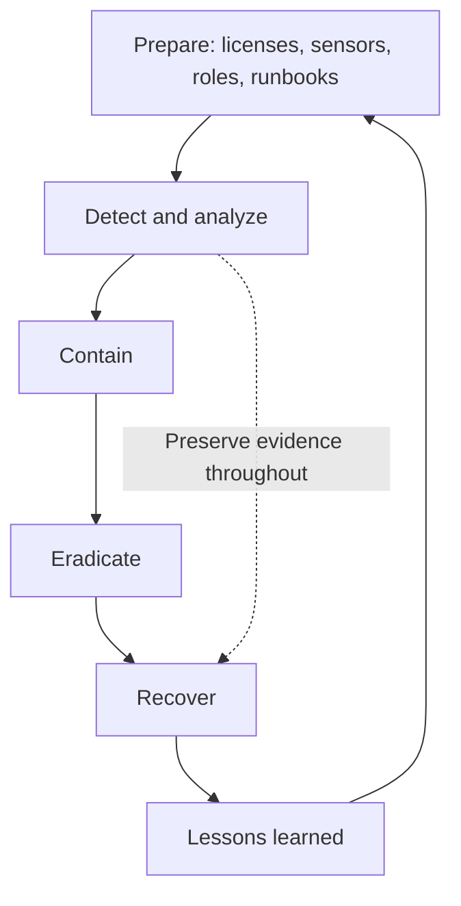

## 3. Defender XDR incident architecture

The Microsoft Defender portal correlates signals from endpoints, identities, email and collaboration, SaaS applications and connected cloud resources. The **attack story** connects alerts and entities in time. Asset pages provide deeper timelines. The **Investigations** and **Evidence and Response** views show automated findings and remediation states. The **Activities** tab and **Action Center** record manual and automated actions.

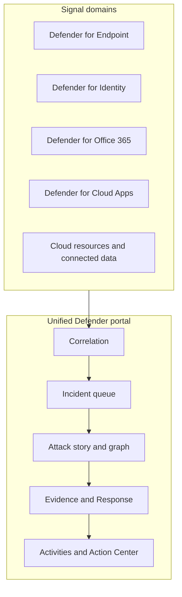

| Layer | Useful evidence | Typical gap |
|---|---|---|
| Endpoint | Process tree, network, files, logons, timeline | Offline device, sensor health, platform limits |
| Identity | Account, directory changes, authentication, lateral movement | Hybrid/cloud identifier mismatch or latency |
| Email | Message, sender, recipient, URL, attachment, delivery/click | Retention, role or gateway visibility gap |
| SaaS/app | Activities, OAuth app, session and file behavior | Connector or governance scope missing |
| Cloud | Resource, role, configuration and activity | Workload not onboarded or out of scope |
| Exposure graph | Critical assets and possible reachability | Freshness, data coverage and RBAC scope |
| Incident correlation | Relationships and chronology | Correlation is evidence, not proof of causality |

## 4. Prerequisites, licensing and readiness

Do not begin response design with a screenshot. Build a capability matrix for the licensed products, onboarding health, supported systems, roles, data retention, device groups and business constraints. Defender for Endpoint Plan 1 currently includes a limited manual action set such as antivirus scan, device isolation, stop/quarantine and file allow/block; Plan 2 is required for the broader response set described by Microsoft. MDO AIR and email actions have separate Plan 2 and permission dependencies. Hybrid identity response may require Defender for Identity sensors and correct account/action configuration.

| Readiness area | Question to prove | Failure if ignored |
|---|---|---|
| License | Which exact plan covers each user/device/workload/action? | UI option absent or unsupported |
| Onboarding | Are sensors healthy and reporting recent telemetry? | False confidence and action failure |
| Platform | Is action supported on OS/version and connectivity model? | Isolation/live response behaves differently |
| RBAC | Who can read raw data, respond, approve and undo? | Overprivilege or blocked response |
| Scope | Which device groups, mailboxes and tenants can analyst see? | Partial incident graph and missed assets |
| Retention | How long is evidence available and where preserved? | Lost timeline and weak audit trail |
| Network | Can isolated devices retain Defender connectivity? | Device cannot receive release action |
| Business | Which systems cannot tolerate disruption? | Safety, revenue or recovery impact |
| Legal/privacy | What data can analysts collect, export and share? | Privacy or chain-of-custody breach |
| Contacts | Who approves identity, endpoint, mail and business action? | Delayed containment or unsafe improvisation |

## 5. Queue fields and operating discipline

The incident queue is a work-control system. New incidents are normally unassigned. A mature process assigns one accountable owner, sets status, validates severity, applies governed tags, records the triage time and establishes the next decision deadline. Microsoft's current incident workflow uses **Active**, **In progress** and **Resolved** states. Local runbooks can add meaning through tags and external case systems, but should not invent ambiguous status semantics.

| Queue field | Good use | Bad use |
|---|---|---|
| Incident name | Concise attack, key asset and current scope | Sensitive personal data or unsupported attribution |
| Severity | Validated technical severity | Lowering to improve SLA statistics |
| Priority | Business urgency in SOC process/case tool | Copying severity without asset context |
| Status | Active, In progress, Resolved with defined gates | Resolved because the shift ended |
| Assignment | One accountable user or group | “Everyone” owns it |
| Tags | `VIP`, `Finance`, `CriticalAsset`, `Exercise`, `LegalHold` | Free-form duplicates and secret conclusions |
| Comments | Timestamped facts, decisions and next steps | Passwords, tokens, speculation presented as fact |
| Classification | True positive, expected/informational, false positive | Set before adequate validation |
| Determination | Specific activity or threat type | Generic “malicious” without basis |

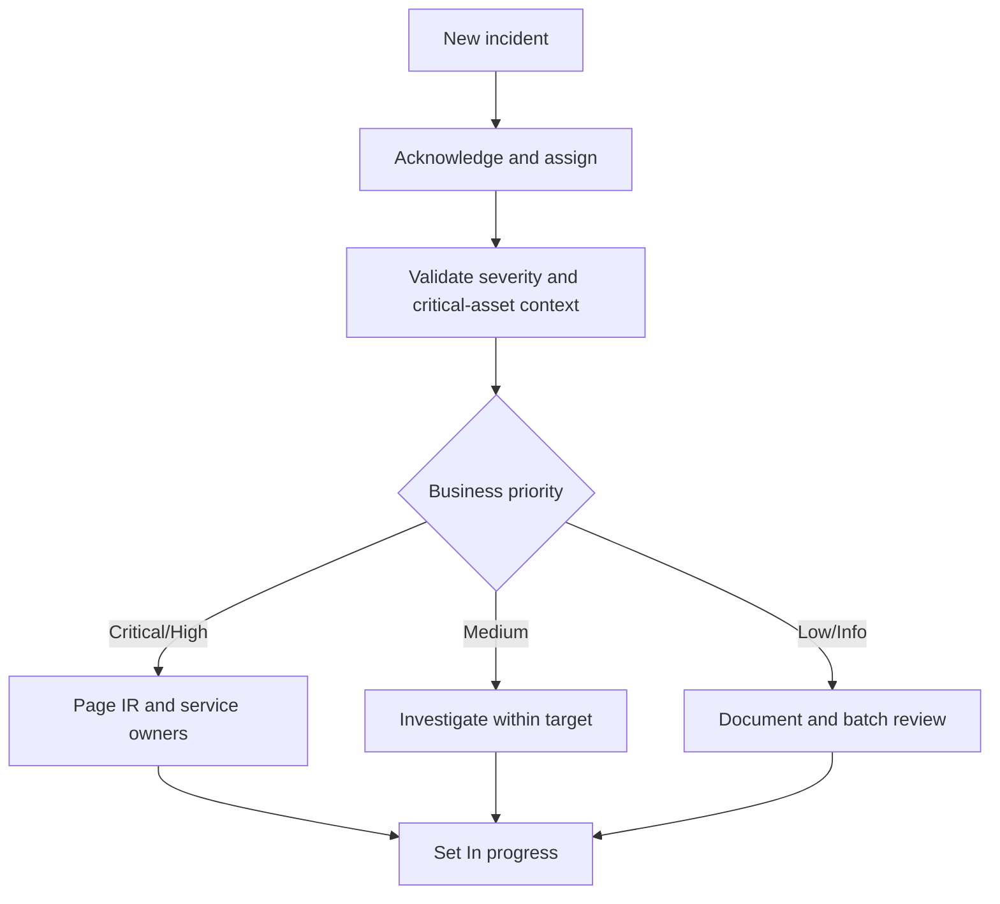

## 6. A practical prioritization model

Use a repeatable decision, not a magical score. Evaluate confidence, active attacker behavior, exposure, business criticality, privilege, spread, data sensitivity, safety, recovery difficulty and existing containment. Record unknowns explicitly.

| Factor | Raises priority | Lowers immediate priority, not necessarily severity |
|---|---|---|
| Confidence | Multiple correlated high-fidelity signals | Single weak indicator with benign explanation |
| Active behavior | Ongoing encryption, lateral movement or exfiltration | Historical event with no current activity |
| Asset criticality | Domain controller, payment, executive or safety system | Disposable test asset |
| Privilege | Admin, service principal or broad OAuth consent | Low-privilege constrained account |
| Exposure | Internet-facing or broadly reachable | Strongly segmented and already isolated |
| Scale | Many users/devices/mailboxes | One fully contained endpoint |
| Data | Regulated, confidential or client data | Public data only |
| Recovery | Fragile system or poor backup confidence | Tested rebuild and recovery path |

A simple consulting heuristic is:

$$
\text{Response priority} = f(\text{confidence},\ \text{active threat},\ \text{exposure},\ \text{business impact},\ \text{recoverability})
$$

Do not present this as a Microsoft formula. It is a transparent workshop framework.

## 7. Triage: scope, impact and confidence

Triage should answer three different questions. **Scope** asks what is involved. **Impact** asks what happened to confidentiality, integrity, availability, money, safety or trust. **Confidence** asks how strongly evidence supports the hypothesis. Analysts often confuse a wide possible scope with proven impact.

| Dimension | Minimum questions | Output |
|---|---|---|
| Scope | Which users, devices, mailboxes, apps, files, URLs, IPs and resources? | Known/possible/excluded entity list |
| Impact | Was data accessed, changed, encrypted, sent or unavailable? | Impact statement with evidence |
| Confidence | Which facts support or contradict the hypothesis? | High/medium/low with rationale |
| Time | Earliest known activity, alert time, latest activity, dwell-time unknown? | UTC timeline |
| Control state | What blocked, failed, was bypassed or acted automatically? | Control-effectiveness statement |
| Business | Which process and owner are affected? | Escalation and continuity decision |

### 🔍 Plain-English deep-dive: correlation is a map, not a conviction

Defender may connect alerts because they share a user, device, file or time pattern. That is valuable, but it does not prove every node is malicious or every edge is causal. A user can legitimately sign into a device shortly before malware appears. Treat the graph like a detective's wall of connected notes: it tells you where to look, while timestamps, process ancestry, authentication, message IDs and business context establish what actually happened.

## 8. Attack story, timeline, entities and evidence

Start with the incident summary, priority factors, active alerts and impacted assets. Play the attack story chronologically, then open each key alert. Use entity panes and “Go hunt” to test broader activity. Microsoft's current incident page can expose alerts, Activities, Assets, Investigations, Evidence and Response, Summary and Similar incidents. Some graph filtering and blast-radius capabilities are preview or prerequisite-sensitive.

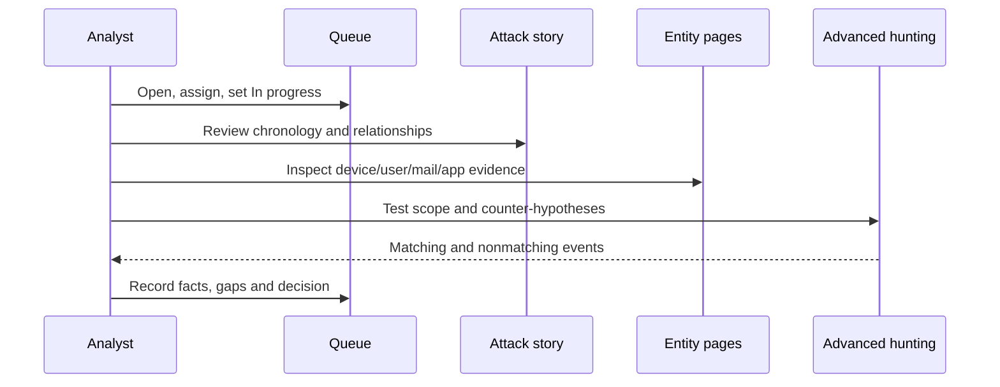

| Evidence quality | Example | Handling |
|---|---|---|
| Direct | File hash on device plus process execution event | Preserve identifiers and timestamp |
| Corroborating | Matching URL click and suspicious sign-in | Link but test sequence and identity |
| Contextual | Asset is finance-critical | Raises impact, not malicious confidence |
| Negative | No child process in available telemetry | Record coverage; absence is not proof |
| Derived | Copilot/AIR summary or graph relationship | Verify against underlying events |
| Human | User reports credential entry | Capture carefully and corroborate |

## 9. Cross-domain investigation graph

Investigate each domain with identifiers that survive display-name changes. Prefer `DeviceId`, account object ID/SID/UPN, Network Message ID plus recipient, file SHA-256/SHA-1 as supported, normalized URL/domain, application/client ID and cloud resource ID. Keep an entity ledger so duplicate names do not become duplicate scope.

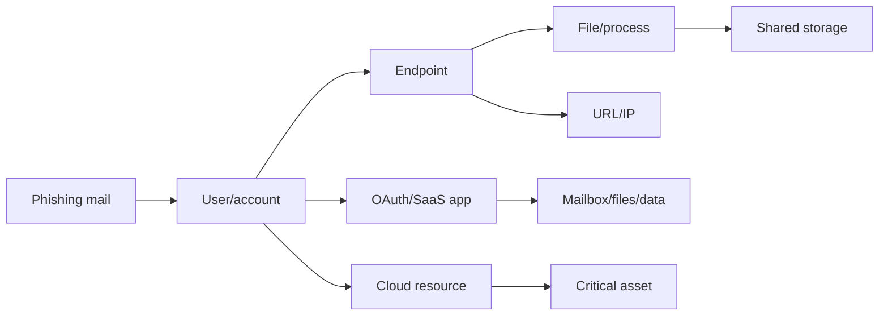

| Domain | Questions | Strong pivots |
|---|---|---|
| Device | Was code executed, persistence created, credentials accessed or network movement attempted? | Device ID, process unique ID, hash, IP, timestamp |
| User | Was authentication unusual, privilege changed, MFA altered or sessions abused? | Object ID, SID, UPN, sign-in/session evidence |
| Mailbox | Was message delivered/clicked; did rules, forwarding or sending change? | Network Message ID, recipient, URL, mailbox |
| App | Was OAuth consent, token use, download or admin action suspicious? | Application ID, service principal, account, activity ID |
| Cloud | Was a resource exposed, role changed, secret read or workload altered? | Resource ID, subscription, principal, operation |
| File/URL | Is it malicious, prevalent, signed, newly observed or shared? | Hash, certificate, normalized URL/domain |

## 10. Evidence preservation and chain of custody

Preserve evidence before destructive remediation when delay is safe. Capture immutable IDs, UTC timestamps, query text/time range, source page, export hash where policy requires it, collector, reason and access controls. Screenshots help explain UI state but should not replace structured exports. Avoid downloading live malware to normal analyst workstations. Follow legal hold, privacy and client retention requirements.

| Evidence item | Preserve | Privacy/safety control |
|---|---|---|
| Incident/alert | IDs, title, status, original/current severity, sources | Restrict case access |
| Timeline | UTC event time, ingestion/alert time, timezone conversion | Keep original UTC |
| Device | Device ID, timeline export, package status, sensor health | Secure forensic storage |
| File | Hashes, path, signature, prevalence, verdict | Do not execute or casually upload |
| Identity | Object ID/SID, sign-ins, role/MFA/session changes | Minimize personal data |
| Email | Network Message ID, recipient, headers, delivery/action | Protect message content |
| Query | Exact KQL, parameters, run time, result count | Redact secrets before sharing |
| Response | Requestor, approver, action ID, status, undo status | Preserve audit history |

## 11. AIR from zero

**Automated investigation and response (AIR)** uses Defender detections to investigate supported entities, derive verdicts and identify remediation actions. A typical flow is trigger, evidence expansion, entity analysis, verdict, action selection, approval or automatic execution, then verification. AIR accelerates evidence collection; it does not determine business impact, legal duties or whether a fragile server can be interrupted.

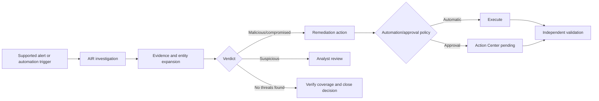

| AIR concept | Meaning | Analyst question |
|---|---|---|
| Trigger | Alert or supported workflow starts analysis | Is this trigger still current for this workload? |
| Investigation | Automated evidence collection and analysis | Which entities and data sources were actually covered? |
| Verdict | Malicious, suspicious, clean/no threat or compromised as applicable | What underlying evidence supports it? |
| Remediation | Proposed or executed corrective action | Is it proportionate and approved? |
| Automation level | Whether eligible actions run or await approval | Which device group/workload policy applies? |
| Pending action | Human decision required | What is the deadline and blast radius? |
| Completed action | Service reports execution | Did target state actually change? |

### September 2026 endpoint AIR transition

Official Learn pages current in August 2026 state that from **September 1, 2026**, endpoint AIR no longer runs as a separate investigation experience and cannot be manually triggered from Defender for Endpoint alerts/remediations. Microsoft states that endpoint detection and response capability is already in the default antivirus protection stack; a full antivirus scan is the suggested on-demand investigation path. This change applies to endpoint AIR, not MDO AIR. A consultant must update runbooks, screenshots, training, custom-detection actions and metrics that assume manual endpoint investigation.

| Before transition assumption | September 2026 design response |
|---|---|
| Analyst manually starts endpoint AIR | Verify current portal; use supported scan/investigation paths |
| Investigation count is an endpoint KPI | Replace with detection, remediation and validation measures |
| Custom detection “initiate investigation” always exists | Revalidate rule action matrix and remove stale automation |
| Same AIR behavior across endpoint and email | Keep workload-specific runbooks; MDO AIR remains |

## 12. Action Center: approve, reject, history and undo

The unified Action Center combines pending and completed actions across devices, email/collaboration and identities. **Pending** actions need a decision. **History** is the audit view for automatic, manual, hunting, Explorer and live-response actions, and supports undo for certain action types. Rejecting an action should include a reason; approving one should identify scope, expected impact, rollback and validation.

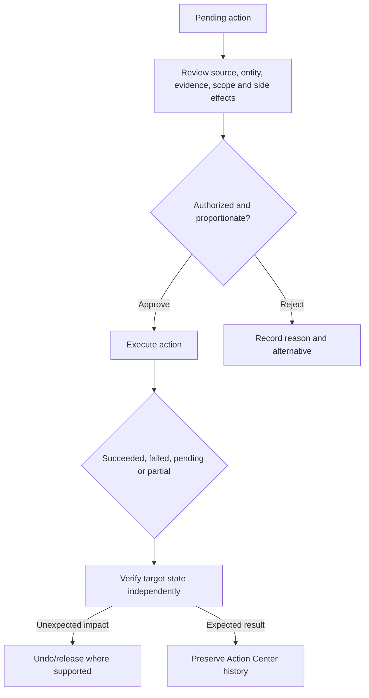

| Approval check | Evidence required |
|---|---|
| Identity | Stable device/user/message/file identifier |
| Threat basis | Alert, timeline, verdict and corroboration |
| Scope | Exact targets and exclusions |
| Authority | Requestor and appropriate approver |
| Impact | Business service/user/security effect |
| Reversibility | Undo path, limitations and deadline |
| Validation | Observable success and failure signals |
| Communication | Who must know before/after action |

### 🔍 Plain-English deep-dive: “completed” is not “effective”

Action Center records the service's action state. A completed isolation request can still leave business risk if the wrong device was targeted, an unmanaged device remains reachable, or the attacker retained cloud sessions. Think of a courier status saying “delivered”: it proves a package reached an address, not that the right person received or used it. Verify endpoint state, identity state, mailbox state and attacker behavior separately.

## 13. Response actions: choose the least disruptive sufficient control

Response is not a menu-click contest. Select actions based on the entity, threat stage, confidence, reversibility, business criticality and required evidence. **Containment** actions buy time; they do not necessarily eradicate persistence or recover trust.

| Entity/action | Security purpose | Key safeguard | Validation/rollback |
|---|---|---|---|
| Isolate device | Block most network traffic while retaining Defender connectivity | Check proxy/VPN, server/VM impact, OS support | Confirm device status; release/force-release path |
| Contain device/IP | Onboarded devices block communication with unmanaged/suspicious target | Shared IP/gateway and scale warning | Hunt blocked traffic; release containment |
| Live response | Remote investigation/remediation shell | Advanced RBAC, signed scripts, command logging | Review command/action logs; `undo` where supported |
| Collect package | Capture current device state | Secure storage and privacy scope | Check collection summary/errors |
| Antivirus scan | Detect/remediate malware | CPU/user impact and passive-mode context | Review scan event and findings |
| Stop and quarantine | Stop process and quarantine file | Hash/path/process validation | Confirm process stopped and file state |
| Restrict app execution | Allow only Microsoft-signed code | Significant business impact | Remove restriction after clean-state proof |
| Block file hash | Prevent known file across scope | Hash quality, prevalence and signer context | Test block, monitor false positives, remove indicator |
| Block URL/domain | Prevent access under supported protection | Shared hosting and exact URL scope | Test safe synthetic access; expire/remove block |
| Block certificate | Block files signed by certificate under supported controls | Supply-chain blast radius | Inventory signed software; remove indicator |
| Disable/suspend user | Stop sign-in | Source of authority, service accounts, emergency admin | Verify directory state; restore only after reset/cleanup |
| Reset credentials | Replace compromised secret | Hybrid sync, service dependencies, MFA methods | Test sign-in and service recovery |
| Revoke sessions | Interrupt active cloud sessions | Tokens, propagation delay and workloads | Verify new auth and no continuing activity |
| Mark compromised | Set identity risk to trigger policies | Correct object ID and policy behavior | Verify risk/policy response; remediate risk safely |
| Email soft delete | Move message recoverably | Exact message/recipient scope and approval | Residual search; recover if false positive |
| Email hard delete | Permanently remove where supported | Highest approval, legal/retention review | Limited rollback; preserve evidence first |
| Quarantine email/attachment | Remove active exposure | Recipient and delivery-location validation | Action Center plus mailbox state |
| Turn off forwarding | Stop mailbox exfiltration path | Verify legitimate workflow | Check forwarding/rules and owner approval |

## 14. Device isolation versus containment

**Isolation** controls the compromised onboarded device's own network access while retaining required Defender communication. **Contain device** causes supported onboarded devices to block communication to/from another device, useful for unmanaged or suspicious systems. A critical server might require granular containment rather than broad isolation. Microsoft currently warns about proxies, full-tunnel VPNs, Hyper-V hosts, shared IPs, gateways and platform differences.

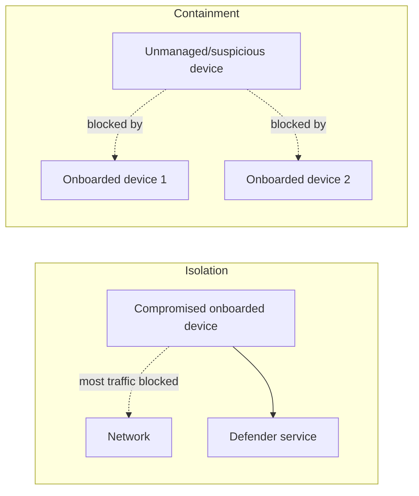

Before isolation, ask: Is this a Hyper-V host? A domain controller? A medical/industrial endpoint? Behind a full-tunnel VPN? Using a proxy that could prevent release? Does it host shared services? Can the owner be contacted? Is selective isolation supported? Is an out-of-band recovery path tested?

## 15. Live response safety

Live response is a cloud remote shell for forensic collection and immediate action. Basic commands inspect state; advanced commands can run scripts, upload/download files and remediate entities. Enable it intentionally, separate basic and advanced permissions, prefer signed scripts, control the tenant library, and retain command logs. Canceling a portal command with `Ctrl+C` might not stop agent-side work, so never treat UI cancellation as rollback.

| Live-response control | Recommended design |
|---|---|
| Enablement | Change-controlled advanced feature, separately reviewed for servers |
| Roles | Basic inspection by analysts; advanced commands by limited responders |
| Scripts | Signed, peer-reviewed, versioned, hash-recorded and tested |
| Unsigned scripts | Disabled by default; exception with documented risk |
| File collection | Approved secure evidence store; malware handling procedure |
| Commands | Case ID and purpose in log; no blind copy/paste |
| Remediation | Preserve evidence first when safe; know `undo` limitations |
| Session limits | Design for current concurrency, timeout and one-session-per-device limits |

## 16. File, URL, domain and certificate indicators

Indicators can block or allow file hashes, IPs, URLs/domains or certificates depending on product configuration and current support. An indicator should have owner, source, confidence, scope, creation time, expiration, review date and rollback. Broad permanent blocks create debt and false positives. A certificate block can affect every file signed by that certificate; a domain block can affect legitimate content on shared infrastructure.

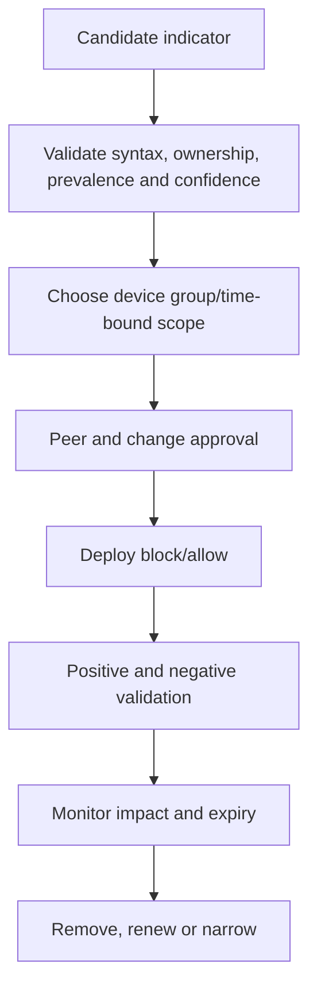

## 17. Identity response

Identity actions can include disabling or suspending an account, resetting a password, marking a user compromised, revoking sessions and removing malicious MFA methods, roles, app consent or mailbox persistence through the owning services. “Contain user” in Defender for Endpoint is different: it applies endpoint-layer restrictions to reduce lateral movement and does not itself disable the identity provider account. Hybrid identities require coordination with the authoritative directory and synchronization behavior.

| Identity check | Before action | After action |
|---|---|---|
| Authority | Cloud-only, AD, synced or external provider? | Both authoritative and synchronized state correct? |
| Privilege | Roles, group ownership, service dependencies | Unauthorized privilege removed? |
| Credentials | Password, secrets, certificates, tokens, MFA methods | Credentials rotated and strong methods restored? |
| Sessions | Browser, app and refresh-token activity | Sessions revoked and new sign-in controlled? |
| Apps | OAuth consent/service principal permissions | Malicious grant/app removed or disabled? |
| Mailbox | Rules, forwarding, delegates, sent/deleted items | Persistence removed and mail scoped? |
| Endpoints | Logged-on devices and remote activity | Devices contained/remediated separately? |

## 18. Email response

Email actions can move messages, soft delete, hard delete, quarantine, quarantine attachments, block URLs at click time and turn off external forwarding, subject to current product behavior and permissions. Soft delete is usually the safer first destructive action because it is more recoverable. Hard delete requires stronger evidence, legal/retention review and explicit authorization. Use Network Message ID plus recipient and current delivery state; subject-only scope is unsafe.

## 19. Automatic attack disruption

Automatic attack disruption operates at incident level. Microsoft states that it correlates cross-workload high-confidence signals, identifies attacker-controlled assets, and automatically contains or disables relevant assets. Current actions can include contain/isolate device, contain IP/user, disable or suspend user, revoke sessions and OAuth-app measures, with preview support in some integrated identity/cloud scenarios. All actions require review and are designed to be undoable, but operational reversal may still have business consequences.

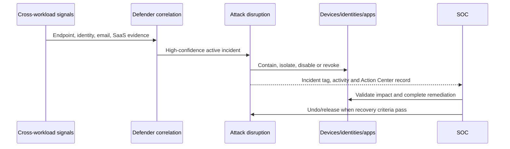

| Condition or safeguard | Operational meaning |
|---|---|
| High-confidence incident | Not every alert triggers disruption |
| Cross-workload correlation | Uses broader attack context than one IOC block |
| Eligible/onboarded assets | Missing integration reduces action coverage |
| RBAC/action configuration | Identity and product configuration still matter |
| Critical-asset exclusions/policies | Must be governed; exclusion leaves residual risk |
| Incident and Action Center visibility | SOC must monitor automated changes |
| Undo/release | Available actions still require clean-state criteria |
| Preview integrations | Okta/AWS and policy applications must be verified current |

### 🔍 Plain-English deep-dive: automatic disruption buys time, not certainty

Automatic disruption is like closing fire doors when multiple sensors indicate a spreading fire. It slows movement and protects adjacent areas, but responders must still find the ignition source, inspect every room, repair damage and decide when doors can reopen. Undoing containment because users complain, before credentials and persistence are cleaned, can return the attacker to the network.

## 20. Configuration and deployment design

Deploy operations in rings. Start with visibility, health and roles; exercise manual low-impact actions; validate approval and rollback; then introduce automation or exclusions with measured scope. Never use a production ransomware simulation merely to prove disruption.

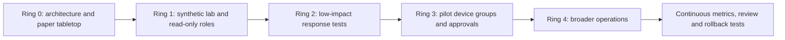

| Deployment gate | Pass criteria |
|---|---|
| Data readiness | Workload signals and sensor-health baseline confirmed |
| Role readiness | Read/respond/approve/undo duties separated and tested |
| Asset readiness | Critical systems, owners and recovery paths classified |
| Runbook readiness | Exact triggers, actions, communications and rollback written |
| Test readiness | Synthetic indicators and test identities/devices approved |
| Operations readiness | Queue coverage, paging and handover staffed |
| Governance readiness | Audit, privacy, retention and exception process approved |

## 21. Security, privacy and evidence access

Apply least privilege and scope. Raw email, device files, command lines, identity events and live-response output can contain personal, client or secret data. Grant only required workload permissions and device groups. Do not place credentials, tokens or sensitive message content in incident comments. Shared/exported reports should be audience-specific and redacted. Response accounts need phishing-resistant authentication and monitored privileged access.

| Risk | Control |
|---|---|
| Overprivileged analyst | Unified RBAC custom role and scoped device groups |
| Self-approval | Separate requester and approver for high-impact action |
| Insider misuse | Activity/Action Center monitoring and periodic access review |
| Evidence leakage | Encrypted approved store, case ACL and retention policy |
| Malware exposure | Dedicated analysis workflow; no normal endpoint execution |
| Secret in KQL/comment | Redaction and secret-rotation procedure |
| Automated overreach | Scope, exclusions, rollback tests and change review |
| Privacy overcollection | Data minimization and legal purpose |

## 22. Communications and escalation

Communication should say what is known, what is hypothesized, what was done, business effect, next decision and time of next update. Avoid actor attribution, data-breach conclusions or “fully contained” language without evidence and authorized legal review.

| Audience | Needs | Avoid |
|---|---|---|
| SOC/IR | IDs, timeline, hypotheses, actions and gaps | Vague summaries |
| Service owner | User/service impact, action request, rollback | Untranslated detector jargon |
| Executive | Business impact, trajectory, decisions and risk | Raw alert dumps |
| Legal/privacy | Data types, jurisdictions, evidence and preservation | Premature breach conclusion |
| Communications/HR | Approved facts and affected population | Technical speculation |
| Next shift | Current state, exact pending work and deadlines | “Monitor as needed” |

Example situation report:

> **14:30 UTC:** One finance user received a synthetic phishing message and the test endpoint executed a benign simulator. Defender correlated email, identity and endpoint alerts. No evidence currently shows production data access or encryption. The test device is logically isolated in the exercise plan; the identity action is proposed, not executed. Scope review covers related recipients, sign-ins, devices, OAuth grants and shared files. Next decision: whether evidence supports closing as expected security-test activity. Next update: 15:00 UTC.

## 23. Incident classification, determination and closure

Current Defender incident classification includes **True positive**, **Informational, expected activity**, **False positive**, and not set, with threat/activity types as determinations where available. Resolve only when scope is adequate, actions are verified, ownership of residual risk and follow-up is recorded, and linked alerts can safely be resolved. Resolving an incident also resolves linked active alerts, so closure is consequential.

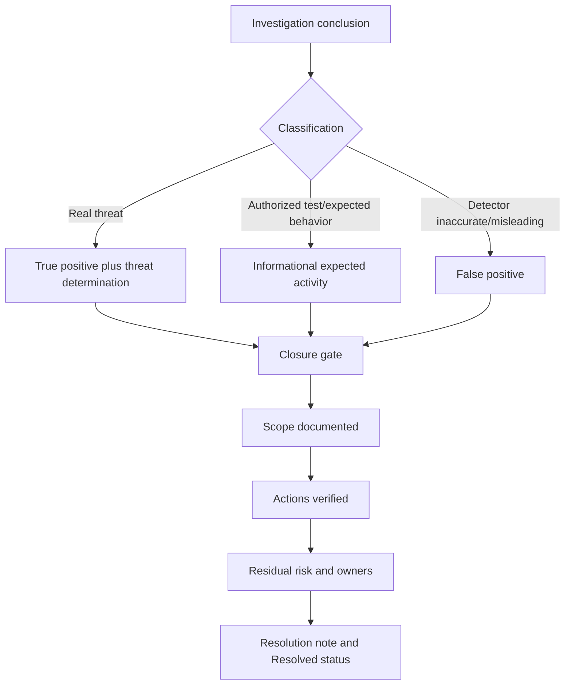

| Closure gate | Evidence |
|---|---|
| Classification/determination | Clear reason and supporting/contradicting facts |
| Scope | Affected, possible and excluded populations; known blind spots |
| Containment | Action IDs and independent state checks |
| Eradication | Persistence, credentials, malicious files/apps/rules addressed |
| Recovery | Service owner acceptance and monitoring window |
| Evidence | Preserved according to legal/privacy policy |
| Follow-up | PIR actions have owner, due date and priority |
| Communication | Stakeholders received final approved summary |

## 24. False-positive workflow

A false positive is not “an inconvenient alert.” It means the detector is technically inaccurate or misleading for the observed activity. Expected red-team or approved administrative behavior is usually **Informational, expected activity**, not false positive. Preserve the event, validate business authorization, classify accurately, submit feedback/tune narrowly, test that malicious variants still alert and time-limit exceptions.

## 25. Rollback and recovery design

Rollback returns a response control toward its prior state; recovery restores trustworthy business operation. Releasing isolation is not recovery if malware persists. Re-enabling an account is unsafe if sessions, MFA methods, OAuth grants, mailbox rules or endpoint credentials remain compromised.

| Action | Rollback | Recovery gate |
|---|---|---|
| Device isolation | Release or supported force-release | Persistence removed, scan/hunt clean, owner approves |
| Device/IP containment | Release containment | Target remediated and network monitoring active |
| App restriction | Remove restriction | Trusted software path and endpoint state validated |
| File/URL/cert block | Remove/expire indicator | False-positive basis confirmed and negative test passes |
| Disable user | Re-enable | Password/MFA/apps/roles/sessions/mailbox remediated |
| Session revocation | Users reauthenticate | Strong auth and clean endpoint available |
| Soft-delete email | Restore message | Message confirmed legitimate and recipient risk reviewed |
| Hard delete | Usually limited/no simple restore | Evidence preservation and backup/legal process |

## 26. Testing strategy

Use synthetic data, approved simulators and disposable lab identities/devices. Test positive behavior, negative behavior, failure behavior and rollback. Confirm not only portal status but entity state and audit evidence.

```mermaid
flowchart LR
    DESIGN[Test case and expected evidence] --> PRE[Preflight license, role, scope and rollback]
    PRE --> RUN[Run benign synthetic event]
    RUN --> OBS[Observe alert, incident and correlation]
    OBS --> ACT[Test approved low-impact action]
    ACT --> VAL[Validate target and Action Center]
    VAL --> BACK[Rollback/release]
    BACK --> REG[Regression and negative test]
    REG --> DOC[Record evidence and gaps]
```

| Test type | Example | Pass criterion |
|---|---|---|
| Detection | Approved benign phishing/simulator event | Expected alert with correct entities |
| Correlation | Related synthetic email/device/user signals | Incident groups appropriately without unrelated assets |
| RBAC | Reader attempts response; responder acts in scope | Deny and allow match design |
| Approval | High-impact action requires second person | Requestor cannot bypass gate |
| Failure | Test endpoint offline | Pending/failure visible and runbook reacts |
| Rollback | Release test isolation | Device reconnects and event is audited |
| Negative | Similar legitimate activity | No harmful action; tuning documented |
| Privacy | Export synthetic case | Redaction/access/retention controls work |

## 27. 24x7 operations and handover

An incoming shift should not need to reconstruct the incident. Use a fixed handover and verbal read-back for critical cases.

| Handover field | Required content |
|---|---|
| Case identity | Incident ID/name, severity, priority, owner |
| Current hypothesis | One sentence plus confidence |
| Scope | Confirmed, possible, excluded and blind spots |
| Timeline | Earliest/latest activity and latest analyst action in UTC |
| Actions | Requested/approved/running/succeeded/failed/undone with IDs |
| Business impact | Services, users, data and critical assets |
| Evidence | Storage location and collection gaps |
| Pending decisions | Decision, approver and deadline |
| Next checks | Exact query/page/entity and expected result |
| Communications | Last update, recipients and next update time |

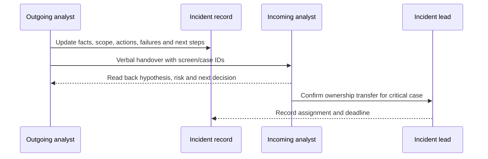

## 28. Metrics that improve outcomes

Measure timeliness, quality, safety and control improvement. Do not reward quick closure alone.

| Metric | Purpose | Anti-gaming guardrail |
|---|---|---|
| Time to acknowledge | Queue responsiveness | Measure staffed hours and severity |
| Time to qualified triage | Speed to scope/impact/confidence | Require triage-quality sample audit |
| Time to containment | Limit active harm | Separate automated and human actions |
| Containment validation rate | Prove actions worked | Require independent evidence |
| Reopened incident rate | Closure quality | Review by classification/team |
| False-positive rate | Detection precision | Pair with false-negative/coverage testing |
| Action failure/partial rate | Platform and process health | Count offline/out-of-scope reasons |
| Rollback success/time | Recovery readiness | Exercise quarterly |
| Handover defect rate | 24x7 continuity | Sample critical handovers |
| PIR action aging | Sustained improvement | Executive owner for overdue high risk |

## 29. Common failures and troubleshooting

Troubleshoot by layer: visibility, correlation, authorization, action delivery, endpoint/workload behavior and verification. Do not keep clicking a failed destructive action without understanding state.

| Symptom | Likely causes | Safe diagnostic path |
|---|---|---|
| Incident missing alert | Correlation delay, filtered scope, different tenant/incident | Search alert ID, source and time; check RBAC |
| Entity absent from graph | Unsupported entity, latency, hidden filter, scope | Open source alert and entity page; Go hunt |
| Partial device timeline | Sensor health, retention, platform or connectivity | Check device health/last seen and neighboring telemetry |
| Action unavailable | License, RBAC, device group, OS or feature state | Verify matrix and current Learn page |
| Isolation pending/failed | Device offline or cannot receive command | Check last seen/connectivity; do not assume containment |
| Isolated device cannot release | Proxy/VPN/service reachability | Use tested selective/force-release procedure |
| Package incomplete | Low battery, metered network, command failures | Review collection summary and recollect selectively |
| Live response unavailable | Feature disabled, role, high-value restrictions, unsupported device | Check settings, role and selective actions |
| Email action partial | Retention, location, message ID/scope or permissions | Inspect per-message Action Center results |
| User still active | Wrong authority/object, propagation, session/app persistence | Check directory, session and workload evidence |
| AIR differs from training | September 2026 endpoint change or workload difference | Recheck current workload documentation |
| Auto disruption skipped | Exclusion/policy, unsupported asset or confidence not met | Review incident Activities and Action Center |

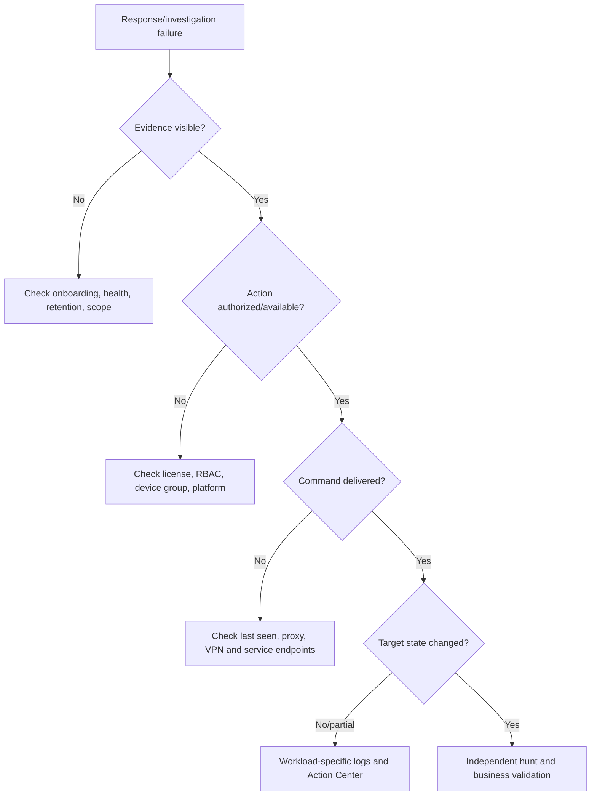

## 30. Phishing-to-ransomware scenario

**Fictional facts:** At 09:02 UTC, a user reports an “updated invoice” message. At 09:05, Safe Links records a click. At 09:09, a test endpoint launches a benign simulation executable from Downloads. At 09:13, PowerShell contacts a synthetic reserved domain. At 09:18, several failed SMB logons appear against a file server. A ransomware-behavior alert fires at 09:20. This is a paper exercise; no real malware, production tenant or response action is used.

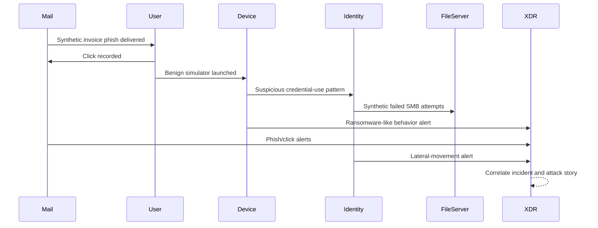

### Triage decision

1. Assign an incident owner and set In progress.
2. Keep technical severity high because correlated ransomware-like and lateral-movement signals exist.
3. Mark the lab device and test identity; confirm the file server is a critical asset in the scenario.
4. State confidence as medium-high for a simulated multi-stage sequence, but low for actual malware because all evidence is synthetic.
5. Escalate to the exercise controller before any proposed action.

### Scope plan

| Pivot | Question | Expected paper output |
|---|---|---|
| Network Message ID/recipient | Other recipients and delivery/click state? | Delivered/clicked/blocked matrix |
| URL/domain | Other mail or device contacts? | Entity prevalence table |
| File hash/name | Other devices or attachments? | Synthetic hash lineage |
| Test user | Sign-ins, MFA, roles, sessions, OAuth and mailbox state? | Identity checklist |
| Device | Parent/child processes, persistence and connections? | Process/timeline diagram |
| SMB targets | Which servers/accounts and result? | Lateral-movement scope |
| File server | Any successful access or file changes? | Impact statement |

### Proposed response, not execution

The paper team proposes isolating the disposable test endpoint, revoking the test user's sessions, disabling the test account only if exercise authorization confirms it, soft-deleting exact synthetic messages and time-bounding a synthetic indicator. Before each action it records license, role, target ID, approver, expected impact, rollback and verification. It does **not** execute a live response script, production identity action, mail purge or block.

### Validation and recovery

The exercise controller marks simulated Action Center records as succeeded. The analyst still validates: no new synthetic network events from the device; identity sign-ins require reauthentication; residual mail search is empty; no successful file-server access occurred; and the incident graph contains no unexplained entity. Recovery requires a clean endpoint result, identity reset checklist and file-server owner acceptance. Closure is **Informational, expected activity** because this was an authorized exercise, with the determination recorded precisely.

## 31. PIR and control improvement

A PIR is blameless but accountable. It distinguishes trigger, contributing conditions, control successes/failures, detection gaps, response friction and organizational lessons.

| PIR section | Scenario example |
|---|---|
| Executive summary | Synthetic phish-to-ransomware chain was detected and contained in exercise |
| Timeline | Delivery, click, process, identity, SMB, alert and decisions in UTC |
| Root cause | Authorized simulator plus exercise setup, not real compromise |
| Control successes | Cross-domain correlation and critical-asset escalation |
| Gaps | Test account tag stale; rollback contact missing |
| Detection improvement | Add test metadata and validate benign exclusion logic |
| Response improvement | Preapprove lab isolation and document identity authority |
| Owners/dates | Named owner, risk, due date and validation evidence |

Do not call “user clicked” the root cause of a real incident. Ask why the message reached the user, why execution was possible, why credentials were exposed, why lateral paths existed and why controls did or did not interrupt the chain.

## 32. Safe paper lab

**Purpose:** Rehearse judgment and artifacts without a tenant, malware, real identities, live URLs or response execution.

**Safety rules:** Use invented tenant names, reserved domains such as `example.com`, documentation IP ranges, synthetic hashes and fictional users. Never browse an indicator, upload a real client file, run a script, send a phish, isolate a device, disable an account, revoke a session or delete mail. Treat every AI-generated recommendation as untrusted until independently verified.

### Lab packet

Create these paper records in the exercise worksheet, not as new workspace files:

1. Incident card with ID `DXDR-EX-039`, high severity, Active status and no initial owner.
2. Five alerts: user-reported phish, malicious URL click, suspicious script, lateral-movement attempt and ransomware behavior.
3. Entities: `test.user@example.com`, `LAB-W11-039`, `FS-LAB-01`, synthetic URL `hxxps://invoice.example.com/a`, synthetic SHA-256 and a test OAuth app.
4. Timeline with event time and alert time separated.
5. AIR worksheet with trigger, analyzed entities, evidence, verdict and proposed action.
6. Action Center worksheet with one approved, one rejected, one failed and one undone action.

### Lab tasks and acceptance

| Task | Produce | Acceptance test |
|---|---|---|
| Queue triage | Owner, status, severity, priority and tags | Priority rationale includes business criticality |
| Scope | Known/possible/excluded entity ledger | Stable identifiers and blind spots included |
| Timeline | UTC chronology | Event time differs from alert/action time |
| Hypotheses | Malicious, benign and incomplete-telemetry alternatives | Each has supporting and contradicting evidence |
| AIR review | Trigger-to-verdict-to-action map | September 2026 endpoint transition noted |
| Response plan | Device, identity, email and indicator options | Approval, impact, rollback and validation for each |
| Failure drill | Offline device isolation marked pending/failed | Team does not claim containment |
| Handover | One-page 24x7 packet | Incoming analyst can state next decision |
| Closure | Classification, determination and note | Expected exercise is not called false positive |
| PIR | Three improvements with owners/dates | At least one prevention and one operations action |

### Example consulting artifacts

| Artifact | Client value | Quality check |
|---|---|---|
| Capability/license matrix | Prevents impossible design | Current plan, workload, role and platform evidence |
| Incident RACI | Makes decisions fast | One accountable owner per decision |
| Triage worksheet | Standardizes scope/impact/confidence | Facts separated from hypotheses |
| Response action matrix | Balances security and disruption | Approval, rollback and validation present |
| Evidence register | Supports audit and legal defensibility | UTC, collector, source and custody recorded |
| Communications matrix | Matches detail to audience | Approved language and cadence |
| Handover template | Maintains 24x7 continuity | Exact next action and deadline |
| PIR backlog | Converts incident into control change | Owner, priority, due date and verification |

### Evidence-safe interview summary

> “I ran a synthetic paper incident that correlated phishing, a URL click, a benign endpoint simulation, identity activity and file-server attempts. I prioritized by confidence, active behavior and critical-asset impact; built a UTC entity timeline; reviewed AIR and Action Center decisions; proposed approval-controlled endpoint, identity and email containment; tested a failed-action and rollback path; and produced handover and PIR artifacts. I did not operate a Defender tenant or execute production response.”

## 33. JD Mapping: interview translation

| Interview prompt | Your factual production strength | Honest Defender XDR bridge |
|---|---|---|
| “How do you triage incidents?” | Critical M365 incident prioritization and evidence | Explain scope/impact/confidence and queue discipline |
| “How do you contain ransomware?” | Risk-managed incident coordination and validation | Describe proposed isolation/identity/mail actions, not execution |
| “How do you use AIR?” | Automation review and fix-validation mindset | Explain current workload differences and Action Center review |
| “How do you avoid business disruption?” | Stakeholder/change coordination | Use critical assets, approval, least-disruptive action and rollback |
| “How do you run 24x7?” | Handover and reporting experience | Present fixed shift packet and read-back |
| “What is your hands-on level?” | Production Microsoft 365 support | Defender XDR architecture and paper lab only |

## Official Source Anchors

1. [Investigate incidents in the Microsoft Defender portal](https://learn.microsoft.com/en-us/defender-xdr/investigate-incidents)
2. [Manage incidents in Microsoft Defender](https://learn.microsoft.com/en-us/defender-xdr/manage-incidents)
3. [Microsoft Defender XDR incident queue](https://learn.microsoft.com/en-us/defender-xdr/incident-queue)
4. [Automated investigation and response in Microsoft Defender XDR](https://learn.microsoft.com/en-us/defender-xdr/m365d-autoir)
5. [Remediation actions in Microsoft Defender XDR](https://learn.microsoft.com/en-us/defender-xdr/m365d-remediation-actions)
6. [Unified Action Center](https://learn.microsoft.com/en-us/defender-xdr/m365d-action-center)
7. [Automatic attack disruption](https://learn.microsoft.com/en-us/defender-xdr/automatic-attack-disruption)
8. [Attack disruption results and actions](https://learn.microsoft.com/en-us/defender-xdr/autoad-results)
9. [Configure attack disruption capabilities](https://learn.microsoft.com/en-us/defender-xdr/configure-attack-disruption)
10. [Automatic attack disruption exclusions](https://learn.microsoft.com/en-us/defender-xdr/automatic-attack-disruption-exclusions)
11. [Take response actions on a device](https://learn.microsoft.com/en-us/defender-endpoint/respond-machine-alerts)
12. [Live response](https://learn.microsoft.com/en-us/defender-endpoint/live-response)
13. [Respond to a file alert](https://learn.microsoft.com/en-us/defender-endpoint/respond-file-alerts)
14. [Create indicators](https://learn.microsoft.com/en-us/defender-endpoint/manage-indicators)
15. [Defender for Identity remediation actions](https://learn.microsoft.com/en-us/defender-for-identity/remediation-actions)
16. [Investigate users in Microsoft Defender](https://learn.microsoft.com/en-us/defender-xdr/investigate-users)
17. [Remediate malicious email](https://learn.microsoft.com/en-us/defender-office-365/remediate-malicious-email-delivered-office-365)
18. [AIR in Defender for Office 365](https://learn.microsoft.com/en-us/defender-office-365/air-about)
19. [Microsoft Defender XDR unified RBAC](https://learn.microsoft.com/en-us/defender-xdr/manage-rbac)
20. [Microsoft Defender XDR prerequisites](https://learn.microsoft.com/en-us/defender-xdr/prerequisites)
21. [NIST Computer Security Incident Handling Guide project](https://csrc.nist.gov/projects/incident-response)

## ⭐ Likely Interview Questions for This Section

### Q1. What is the difference between an alert and an incident in Defender XDR?

**Model answer:** An alert is a detector's warning about one suspicious condition. An incident correlates related alerts and entities into a broader case and attack story. I validate the correlation rather than assume every edge is causal, then scope devices, users, mailboxes, apps, files, URLs and cloud resources using stable identifiers and timelines.

### Q2. How do you prioritize an incident queue?

**Model answer:** I separate technical severity from business priority. I consider confidence, active attacker behavior, exposure, critical assets, privilege, scale, data sensitivity, business process and recoverability. I assign one owner, set In progress, document the rationale and establish the next decision deadline. I never lower severity simply to improve SLA metrics.

### Q3. How do scope, impact and confidence differ?

**Model answer:** Scope is who and what may be involved; impact is what happened to confidentiality, integrity, availability, money, safety or trust; confidence is how strongly evidence supports the hypothesis. I report each separately, including unknowns and telemetry gaps, so a wide possible scope is not misreported as proven impact.

### Q4. How does AIR work, and what changes in September 2026?

**Model answer:** AIR starts from supported triggers, expands evidence and entities, assigns verdicts and identifies remediation actions that may run automatically or await approval. Analysts verify evidence, business impact and results. Official August 2026 guidance says separate/manual endpoint AIR ends September 1, 2026 because endpoint capabilities run in the default protection stack; MDO AIR remains. I would update runbooks and verify the live tenant.

### Q5. How do you choose between device isolation and containment?

**Model answer:** Isolation restricts an onboarded compromised device's own network traffic while retaining Defender connectivity. Containment makes supported onboarded devices block communication with another suspicious or unmanaged device/IP. I check criticality, Hyper-V/server role, shared IP, proxy/VPN, platform support and recovery path, then choose the least disruptive action that limits movement.

### Q6. How do you approve a high-impact response action safely?

**Model answer:** I verify stable target identity, threat evidence, exact scope, requester authority, business impact, reversibility, validation method and communications. I use two-person approval for destructive or broad actions, preserve evidence first when safe, inspect Action Center status and verify target state independently. “Completed” does not by itself mean effective.

### Q7. What is automatic attack disruption?

**Model answer:** It uses high-confidence, incident-level cross-workload correlation to identify attacker-controlled assets and automatically contain, isolate, disable, suspend or revoke supported entities. It buys the SOC time and records actions in the incident and Action Center. Analysts still investigate, complete remediation, evaluate exclusions and business impact, validate action results and apply clean-state criteria before undo.

### Q8. What is your honest Defender XDR incident-response experience?

**Model answer:** My production background is Microsoft 365 incident escalation, RCA, evidence timelines, fix validation and stakeholder coordination. I have studied current Defender XDR response architecture and completed a synthetic phishing-to-ransomware paper exercise with queue triage, cross-domain scope, AIR/Action Center review, approval and rollback design, handover and PIR. I have not executed Defender XDR production response actions.

## 🧠 30-Second Memory Hooks

- **Event is a camera frame; alert is an alarm; incident is the case folder.**
- **Severity is technical; priority adds business consequence.**
- **Triage separates scope, impact and confidence.**
- **The graph points where to look; evidence proves what happened.**
- **Preserve IDs and UTC evidence before destructive action when safe.**
- **AIR fills the case; people own business and legal decisions.**
- **Endpoint separate/manual AIR ends September 1, 2026; MDO AIR remains.**
- **Action Center completed is a service state, not proof of security outcome.**
- **Isolation controls the device; containment makes neighbors block a target.**
- **Containment buys time; eradication removes cause; recovery restores trust.**
- **Automatic disruption closes fire doors; responders still extinguish and inspect.**
- **Resolve only after scope, action validation, residual risk and ownership.**
- **Authorized test is expected activity, not automatically a false positive.**
- **Your bridge is incident rigor, not claimed Defender operations.**

## Completion Checklist

- [ ] I can distinguish event, alert, incident, entity, verdict and determination.
- [ ] I can explain a NIST-style lifecycle without calling it a portal workflow.
- [ ] I can map Defender endpoint, identity, email, app and cloud signals.
- [ ] I can operate queue concepts for severity, priority, status, owner and tags.
- [ ] I can explain why severity and business priority differ.
- [ ] I can separate scope, impact and confidence and record unknowns.
- [ ] I can use attack story, timelines, entities and evidence without assuming causality.
- [ ] I can preserve identifiers, UTC timestamps, query and response history safely.
- [ ] I can explain AIR trigger, investigation, verdict, action and approval.
- [ ] I remember the September 1, 2026 endpoint AIR transition and MDO distinction.
- [ ] I can approve/reject Action Center items and independently verify outcomes.
- [ ] I can compare isolate, contain, live response, package and scan actions.
- [ ] I can explain hash, URL/domain and certificate indicator safeguards.
- [ ] I can coordinate disable/reset/revoke/contain identity actions correctly.
- [ ] I can distinguish email soft delete, hard delete and quarantine risk.
- [ ] I can explain automatic attack-disruption conditions, actions and undo.
- [ ] I can classify true positive, expected activity and false positive accurately.
- [ ] I can design rollback and recovery with clean-state gates.
- [ ] I can build licensing, RBAC, critical-asset and platform prerequisites.
- [ ] I can protect privacy and apply least privilege to evidence and response.
- [ ] I can write executive, technical and 24x7 handover communications.
- [ ] I can measure timeliness, quality, safety and PIR improvement without gaming.
- [ ] I can troubleshoot missing evidence, unavailable actions and failed delivery by layer.
- [ ] I can complete the safe phishing-to-ransomware paper lab without execution.
- [ ] I can state honestly that this is design and practice, not production Defender ownership.
- [ ] I have rechecked current licensing, roles, previews, limits and portal navigation.

*Next suggested section:* [Part 40](Part-40-defender-advanced-hunting-kql-custom-detections.md) — learn KQL from zero, turn incident hypotheses into cross-domain hunts, and engineer safe, validated custom detections.