# Part 40 — Defender Advanced Hunting with KQL and Custom Detections

> **Section goal:** Learn Microsoft Defender advanced hunting from absolute zero and progress to consulting-grade custom-detection engineering. This Part covers the hunting architecture, schema categories and entity relationships; guided and advanced modes; Kusto Query Language (KQL) tabular flow; time, string, parsing, dynamic JSON, aggregation and multi-table operators; endpoint, identity, email, cloud-app, alert and evidence tables; hypothesis-driven hunting; timeline joins, indicators and prevalence; query performance and errors; custom-detection schedules, lookbacks, entity mapping, enrichment, actions, scoping and noise control; backtesting, tuning, versioning, detection-as-code, deployment, rollback, operations, metrics and safe paper practice. You should be able to explain, review and dry-run queries without claiming production hunting or blindly executing AI-generated KQL.

This Part maps directly to Deloitte expectations for Defender XDR, advanced hunting, KQL, threat investigation, detection engineering, incident response, Microsoft 365 security, troubleshooting, control optimization, documentation and operational support. Your strengths in incident timelines, RCA, log correlation, validation, Microsoft 365 workload behavior, precise evidence, reporting and AI-agent evaluation are natural advantages. The honest bridge is translating support hypotheses into bounded queries and test plans, not claiming production custom detections.

> **Currency, licensing, preview and portal-convergence note (August 24, 2026):** This chapter uses official Microsoft Learn content available on August 24, 2026. Advanced hunting in the unified Microsoft Defender portal can query native Defender XDR data and, when Microsoft Sentinel is onboarded, supported Sentinel analytics-tier data. Native Defender data is currently searchable for up to 30 days; Sentinel retention depends on table configuration. Guided mode, schema tables/columns, Continuous near-real-time (NRT) eligibility, entity mapping, response actions, limits and unified RBAC can change. Preview tables visible in current schema include several behavior, AI-agent, cloud and data-security families; never build a production dependency without checking current status. Custom-detection actions that assume manually initiated endpoint AIR must be revalidated because the separate/manual Defender for Endpoint AIR experience ends September 1, 2026. Verify Product Terms, workload licenses, live schema references, `ActionType` values, tenant permissions, Message center, Roadmap and current custom-detection wizard before use.

## JD Mapping

| Deloitte expectation | Capability developed | Consulting evidence |
|---|---|---|
| Hunt across Microsoft security data | Cross-domain KQL and entity pivots | Hunt workbook with hypothesis and timeline |
| Improve detection coverage | Query-to-detection engineering lifecycle | Detection specification and test pack |
| Troubleshoot and investigate | Data-quality, schema and query fault isolation | Query diagnostics and RCA notes |
| Design safe automation | Entity/action mapping and approval controls | Action risk matrix and rollback plan |
| Operate and tune controls | Metrics, versioning, review and handover | Detection catalog and tuning register |
| Communicate findings | Evidence-aware summaries and visualizations | Analyst, technical and executive reports |

## Candidate honesty note

You can speak directly about Microsoft 365 incident evidence, timestamp correlation, RCA, troubleshooting, fix validation, reporting and stakeholder coordination where supported by your work. You can describe learning KQL, reviewing schemas and building synthetic paper hunts.

You should not claim production Defender advanced-hunting ownership, production KQL query execution, custom-detection deployment, automated response configuration or tenant tuning unless separately evidenced. Safe wording is:

> “My production foundation is Microsoft 365 incident support, evidence timelines, RCA and fix validation. I have built and reviewed synthetic Defender KQL hunts and a custom-detection design using current schema and Learn guidance. I have not run these hunts or deployed detections in a production Defender tenant. Before client use I would verify the live schema and `ActionType` values, constrain time and scope, redact sensitive output, backtest against labeled data, peer review entity/action mapping, deploy without automatic destructive actions, monitor quality and keep a tested disable/rollback path.”

---

## 1. Hunting from zero

**Threat hunting** is a structured search for suspicious behavior that may not already have produced a useful alert. It starts with a testable hypothesis, such as “a phished user may have launched encoded PowerShell and contacted a newly observed domain.” Hunting is not browsing random logs until something looks strange.

**Kusto Query Language (KQL)** is the read-oriented language used by Defender advanced hunting. Data is organized in **tables**. A table contains **rows** (events or entity snapshots) and **columns** (properties such as time, device and file). A query usually starts with a table and passes rows through a pipeline using the pipe character `|`.

| Term | Plain meaning | Why it matters | Memory hook |
|---|---|---|---|
| Table | Named collection of related records | Defines available evidence | A spreadsheet tab |
| Row | One event or entity record | Unit being filtered | One line in the ledger |
| Column | One property in each row | Provides time, identity and context | A labeled field |
| Schema | Catalog of tables, columns and types | Prevents invented field names | The library catalog |
| Operator | Step that transforms a table | Builds the investigation | A workstation on an assembly line |
| Scalar | One value such as text, number or time | Used in comparisons/calculations | One cell value |
| Dynamic | JSON-like array or object | Holds nested/multiple values | A box containing smaller boxes |
| Entity | Device, account, mailbox, file, URL, IP, app or resource | Connects events and incidents | A named subject in the case |
| IOC | Indicator of compromise | Known clue such as hash/domain | A wanted-poster detail |
| Prevalence | How common an item is | Rare may deserve attention; common is not safe | How often the clue appears |

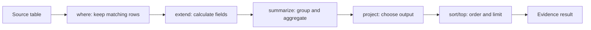

### 🔍 Plain-English deep-dive: KQL is a river of tables

Every pipeline stage receives a table and emits another table. `where` narrows the river, `extend` adds labels to each item, `summarize` groups items into buckets and `project` decides what reaches the report. Read a query top to bottom and ask after every pipe, “What rows and columns exist now?” This single habit prevents many semantic errors.

## 2. Architecture and data flow

Defender workload sensors and services produce event and entity data. The advanced-hunting schema exposes supported tables. Analysts use guided mode or KQL in advanced mode, review results and pivot to entity pages, incidents or custom detections. If Sentinel is onboarded to the Defender portal, supported Sentinel analytics-tier tables can also appear; data only in the Sentinel data lake is queried through its own exploration capabilities, not ordinary advanced hunting.

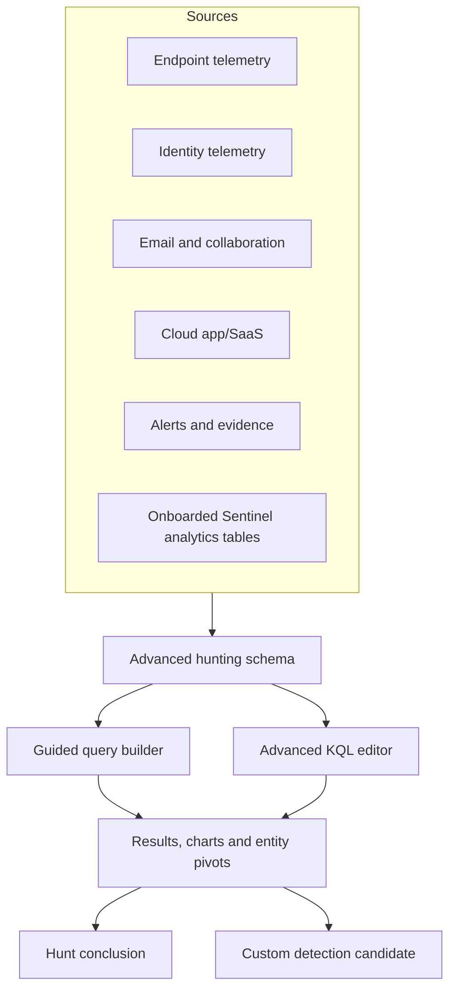

| Data type | Typical freshness model | Example | Caution |
|---|---|---|---|
| Event/activity | Arrives near sensor/service processing time | Process, network, email, sign-in | Ingestion delay and sensor health vary |
| Entity snapshot | Periodic latest state | Device/user information | Not the state at the historical event time |
| Alert/evidence | Detection-generated information | AlertInfo and AlertEvidence | Alert time can differ from event time |
| Exposure graph | Relationships and asset properties | ExposureGraphNodes/Edges | Freshness and scope differ from event stream |
| Sentinel table | Workspace analytics-tier data | Security/third-party log table | Retention, cost, schema and scope are workspace-specific |

## 3. Prerequisites, licensing and access

Advanced hunting access depends on licensed workloads and roles. A user only sees tables and rows permitted by product, unified RBAC, workload roles and device scopes. Email and collaboration tables require specific raw-data/email metadata access or applicable legacy roles. Alert/behavior tables use security-data permissions. Endpoint data remains subject to Defender for Endpoint RBAC and device groups. Custom-detection management requires settings/manage permissions for every queried workload, plus Sentinel Contributor or higher when applicable.

| Readiness item | Verify | Failure symptom |
|---|---|---|
| Workload license | Endpoint, identity, Office, cloud app and Sentinel entitlements | Expected table absent |
| Product onboarding | Sensors/connectors healthy | Sparse or stale results |
| Hunting read role | Raw/security data permissions and device scope | Access denied or partial rows |
| Detection manage role | Security settings and each data-source permission | Rule creation/edit blocked |
| Data range | Native 30-day range or Sentinel retention | Historical backtest unavailable |
| Time standard | KQL uses UTC; result display can be converted | Incorrect sequence claims |
| Schema status | GA versus preview and current columns | Broken query after change |
| Privacy approval | Purpose, output handling and retention | Sensitive data overexposure |

## 4. Schema categories and verify-current discipline

The schema is a contract that changes. Use the in-portal schema tree and **View reference** to confirm description, columns, data types, `ActionType` values and examples. Do not trust a remembered blog query. A table may be absent because the workload is unlicensed, not onboarded, out of RBAC scope, renamed or preview-only.

| Family | Representative tables | What they answer |
|---|---|---|
| Device events | `DeviceProcessEvents`, `DeviceNetworkEvents`, `DeviceFileEvents`, `DeviceRegistryEvents`, `DeviceLogonEvents`, `DeviceEvents` | What executed, connected, changed or authenticated on endpoints? |
| Device state/vulnerability | `DeviceInfo`, `DeviceTvmSoftwareInventory`, `DeviceTvmSoftwareVulnerabilities` | What is the device/software/exposure state? |
| Identity | `IdentityLogonEvents`, `IdentityDirectoryEvents`, `IdentityQueryEvents`, `IdentityInfo`, `IdentityAccountInfo` | How did accounts authenticate, query or change directories? |
| Email/collaboration | `EmailEvents`, `EmailUrlInfo`, `EmailAttachmentInfo`, `EmailPostDeliveryEvents`, `UrlClickEvents`, `MessageEvents` | What was sent, delivered, clicked or remediated? |
| Cloud apps | `CloudAppEvents`, preview behavior/OAuth tables where available | What did accounts/apps do in cloud services? |
| Alerts | `AlertInfo`, `AlertEvidence` | Which alerts exist and what evidence/entities relate? |
| Exposure | `ExposureGraphNodes`, `ExposureGraphEdges` | Which assets and relationships create paths? |
| Change-sensitive/preview | `AgentsInfo`, `AIAgentsInfo`, `BehaviorInfo`, `DataSecurityEvents`, `DisruptionAndResponseEvents` | Emerging agent, behavior, data-security and disruption evidence |

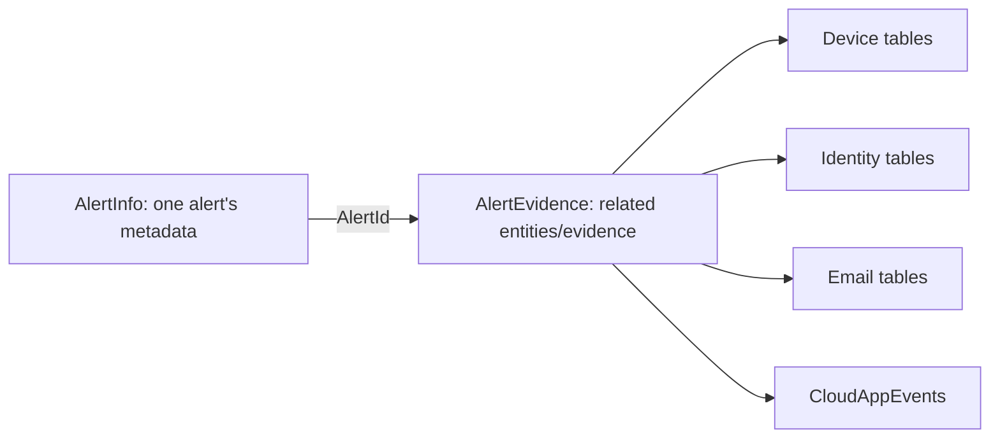

### Table versus entity identity

The same real-world subject can appear under different columns. A device may use `DeviceId` and `DeviceName`; an account may use object ID, SID, UPN and account name; email scope often uses `NetworkMessageId` plus `RecipientEmailAddress`. Join on the strongest stable identifier available, and document normalization or missing mappings.

| Entity | Preferred stable pivots | Weak pivot to avoid alone |
|---|---|---|
| Device | `DeviceId`; name with time/context | Device name alone after rename/reuse |
| Process | `ProcessUniqueId` when available; device plus creation time/PID | PID alone, because PIDs recycle |
| Account | Object ID or SID; UPN with tenant context | Display name |
| Mail | Network Message ID plus recipient | Subject |
| File | SHA-256/SHA-1 as table/action supports, plus signer/path context | File name |
| URL/domain | Normalized full URL/domain | Display text in message |
| App | Application/client ID or service principal ID | App display name |
| Cloud resource | Full resource ID | Resource name alone |

## 5. Guided mode, templates and advanced mode

Guided mode builds queries using domains, filters and AND/OR conditions. It is useful for learning schemas and producing bounded first queries. Basic filters use AND; expanded filters support richer combinations. Sample queries can replace current builder content, so save work first. Advanced mode gives full KQL control and is necessary for multi-stage transformations, complex joins and custom detection preparation.

| Approach | Strength | Limit | Best use |
|---|---|---|---|
| Guided basic | Fast, no KQL required | AND-only and narrower options | First filter/count and schema discovery |
| Guided all filters | More domains and AND/OR | Not every KQL construct | Analyst enablement and simple hunt |
| Sample/template | Known starting pattern | May be stale or mismatched to tenant | Learn, then validate and modify |
| Advanced KQL | Full supported language | Requires schema/performance skill | Investigation and detection engineering |
| AI query assistant | Speeds draft/explanation | Can hallucinate fields or unsafe scope | Draft only; verify line by line |

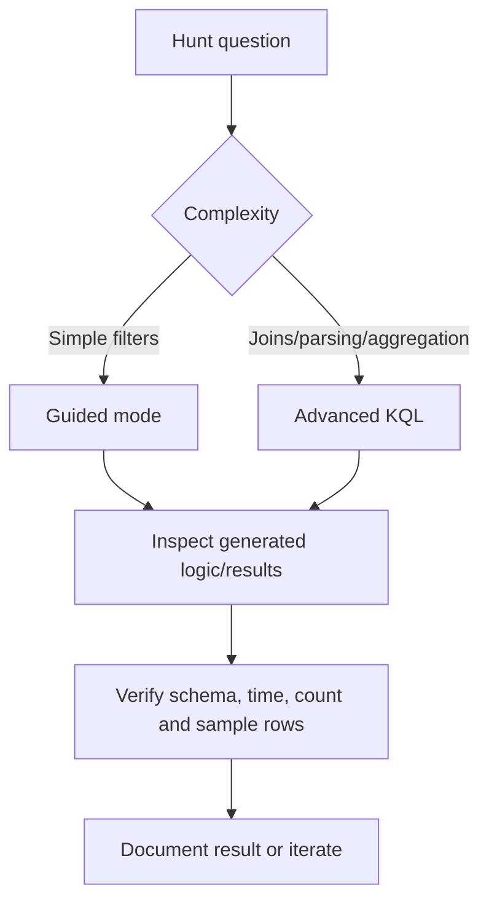

## 6. First queries: `take`, `count`, `where`, `project`

Use harmless exploration before a complex hunt. `take 10` returns up to ten arbitrary rows; it does not promise newest rows. `count` returns row count. `where` filters rows. `project` chooses and can rename output columns.

```kusto
DeviceProcessEvents
| where Timestamp > ago(1h)
| project Timestamp, DeviceId, DeviceName, FileName, ProcessCommandLine
| take 10
```

```kusto
DeviceProcessEvents
| where Timestamp > ago(1h)
| count
```

| Operator | Purpose | Common mistake |
|---|---|---|
| `take N` / `limit N` | Return up to N rows | Treating sample as complete or sorted |
| `count` | Count input rows | Forgetting that duplicates are events, not entities |
| `where` | Keep matching rows | Applying expensive parsing before filtering |
| `project` | Select/rename/calculate output columns | Dropping join/entity/action fields too early |
| `project-away` | Remove unwanted columns | Hiding evidence needed for later validation |

## 7. Sorting, top and distinct

`sort by Timestamp desc` orders all current rows. `top 100 by Timestamp desc` orders and returns the first 100. `distinct DeviceName` returns unique values but loses event-level columns. Use `summarize` when you need both uniqueness and aggregates.

```kusto
DeviceNetworkEvents
| where Timestamp > ago(6h)
| where RemoteUrl has "example.com"
| top 100 by Timestamp desc
| project Timestamp, DeviceId, DeviceName, RemoteUrl, RemoteIP, InitiatingProcessFileName
```

```kusto
DeviceNetworkEvents
| where Timestamp > ago(6h)
| where RemoteUrl has "example.com"
| distinct DeviceId, DeviceName
```

## 8. Datetime and bounded windows

KQL hunting timestamps are UTC. `ago(24h)` is relative to query execution. `datetime(2026-08-24T09:00:00Z)` is fixed. `between` creates a closed interval. For incident reconstruction, store start/end variables and reuse them on every table.

```kusto
let startTime = datetime(2026-08-24T09:00:00Z);
let endTime = datetime(2026-08-24T11:00:00Z);
DeviceProcessEvents
| where Timestamp between (startTime .. endTime)
| project Timestamp, DeviceId, DeviceName, FileName, ProcessCommandLine
| sort by Timestamp asc
```

| Time concept | Use | Caution |
|---|---|---|
| Event `Timestamp` | When source says activity occurred | Can predate ingestion |
| `ingestion_time()` | When record reached data platform | Useful for latency/detection processing |
| Alert time | When detection/alert was created | Not necessarily attacker start |
| `ago()` | Repeatable recent window | Changes each run |
| Fixed UTC | Reproducible incident evidence | Convert local reports carefully |
| `bin(Timestamp, 1h)` | Group activity into time buckets | Bucket hides exact sequence |

## 9. String operators

Choose the operator that matches semantics. `==` is case-sensitive equality, `=~` case-insensitive equality, `has` searches indexed terms, `contains` searches substrings, `startswith`/`endswith` match boundaries, and `in`/`in~` match a set. Microsoft recommends `has` over `contains` when term semantics work because it is generally faster.

| Operator | Example | Meaning |
|---|---|---|
| `==` | `FileName == "powershell.exe"` | Exact case-sensitive equality |
| `=~` | `FileName =~ "PowerShell.exe"` | Case-insensitive equality |
| `has` | `ProcessCommandLine has "DownloadString"` | Indexed term match |
| `contains` | `ProcessCommandLine contains "-enc"` | Substring match |
| `has_any` | `Command has_any ("http", "WebClient")` | Any term in list |
| `in~` | `FileName in~ ("powershell.exe", "pwsh.exe")` | Case-insensitive set membership |
| `startswith` | `AccountUpn startswith "svc-"` | Prefix |
| `!in` | `RemoteIP !in ("192.0.2.10")` | Exclude set; verify allowlist governance |

### 🔍 Plain-English deep-dive: a string match is not a detection

Searching for `powershell.exe` finds administration, automation and attacks. A durable hypothesis combines executable, parent, arguments, network behavior, signer, user, device role and rarity. Think of finding “knife” in a report: context distinguishes a kitchen tool from a weapon. Detection quality comes from behavior and context, not a scary word.

## 10. `extend` and calculated fields

`extend` adds calculated columns while preserving existing ones. Use it for labels, normalized values, arithmetic and parsing, then validate nulls and unexpected formats.

```kusto
DeviceProcessEvents
| where Timestamp > ago(1d)
| where FileName in~ ("powershell.exe", "pwsh.exe")
| extend CommandLength = strlen(ProcessCommandLine),
         IsEncodedHint = ProcessCommandLine contains "-enc"
| project Timestamp, DeviceName, AccountUpn, FileName,
          CommandLength, IsEncodedHint, ProcessCommandLine
| top 100 by Timestamp desc
```

## 11. `summarize`, aggregation, `bin`, `arg_max` and `make_set`

`summarize` groups rows and computes aggregates such as `count()`, `dcount()`, `min()`, `max()`, `make_set()` and `arg_max()`. `bin` groups time. `arg_max(Timestamp, *)` returns columns from the row with latest time in each group. Be explicit: aggregation changes event granularity.

```kusto
DeviceNetworkEvents
| where Timestamp > ago(1d)
| summarize Connections=count(),
            DistinctDevices=dcount(DeviceId),
            SampleDevices=make_set(DeviceName, 20)
  by RemoteUrl
| where DistinctDevices <= 3 and Connections > 2
| top 50 by Connections desc
```

```kusto
DeviceInfo
| summarize arg_max(Timestamp, *) by DeviceId
| project Timestamp, DeviceId, DeviceName, OSPlatform, ClientVersion, OnboardingStatus
```

```kusto
DeviceProcessEvents
| where Timestamp > ago(1d)
| summarize ProcessCount=count() by bin(Timestamp, 1h), FileName
| sort by Timestamp asc
```

| Function | Result | Trap |
|---|---|---|
| `count()` | Number of rows | Not number of unique users/devices |
| `dcount(DeviceId)` | Approximate distinct device count | Approximation and null handling |
| `make_set(Value, 50)` | Dynamic array of unique samples | Truncation can hide additional values |
| `min()/max()` | Earliest/latest scalar | Other columns do not automatically match that row |
| `arg_max(Timestamp, *)` | Full latest row per group | Can be expensive with `*`; project only needed fields |
| `bin(Timestamp, 1h)` | Time bucket | Loses exact ordering inside bucket |

## 12. Parse text and dynamic JSON

Many tables put nested properties in `AdditionalFields` as dynamic JSON. Check the schema and inspect safe sample rows before parsing. `parse_json()` converts a JSON string/dynamic value; dot/bracket access retrieves a property; `tostring()` produces a string. `parse` extracts predictable text patterns. Missing properties become null, so handle them deliberately.

```kusto
DeviceEvents
| where Timestamp > ago(1d)
| where ActionType == "UsbDriveMount"
| extend Fields = parse_json(AdditionalFields)
| extend DriveLetter = tostring(Fields.DriveLetter),
         ProductName = tostring(Fields.ProductName)
| project Timestamp, DeviceId, DeviceName, DriveLetter, ProductName
```

```kusto
print Raw="user=test.user@example.com;result=Success;method=MFA"
| parse Raw with "user=" User ";result=" Result ";method=" Method
```

Do not assume property names are universal. Run a bounded query that projects `ActionType` and `AdditionalFields`, inspect synthetic/non-sensitive samples, then write and test parsing.

## 13. Arrays and `mv-expand`

`mv-expand` converts each item in a dynamic array into a separate row. It can multiply row count dramatically, so filter and project first.

```kusto
DeviceNetworkEvents
| where Timestamp > ago(1h)
| summarize Urls = make_set(RemoteUrl, 20) by DeviceId, DeviceName
| mv-expand Urls
| project DeviceId, DeviceName, Url=tostring(Urls)
```

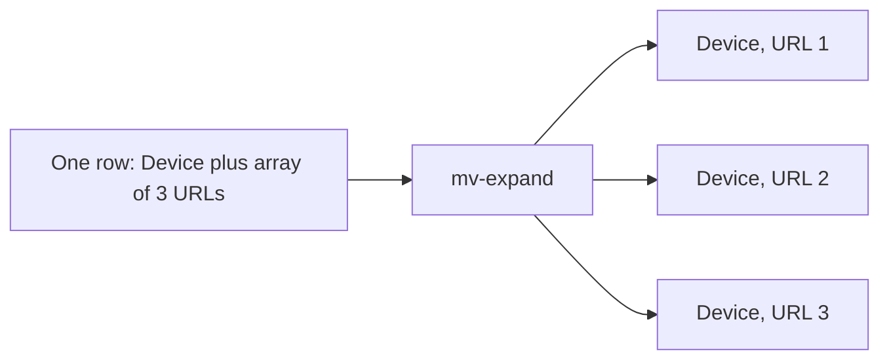

## 14. `let`, reusable values and functions

`let` names a scalar, tabular expression or function. It improves readability and allows one bounded dataset to be reused. Terminate each `let` statement with a semicolon. Keep query packs parameterized and never embed client secrets.

```kusto
let huntStart = ago(7d);
let suspiciousTools = dynamic(["powershell.exe", "pwsh.exe", "rundll32.exe"]);
let IsLabDevice = (name:string) { name startswith "LAB-" };
DeviceProcessEvents
| where Timestamp > huntStart
| where FileName in~ (suspiciousTools)
| extend LabDevice = IsLabDevice(DeviceName)
| project Timestamp, DeviceId, DeviceName, LabDevice, FileName, ProcessCommandLine
```

## 15. Join concepts and kinds

`join` matches rows from two tables by one or more keys. A join can create duplicates, omit unmatched evidence or accidentally match reused identifiers. Filter time on both sides, project required columns and understand the kind.

| Join kind | Result | Hunting use |
|---|---|---|
| `innerunique` (default) | Deduplicates left keys, then returns matches | Fast correlation when one left row per key is acceptable |
| `inner` | All matching left/right combinations | Preserve multiple matching emails/events |
| `leftouter` | Every left row plus matches/nulls | Find context without losing candidates |
| `leftanti` | Left rows with no right match | Find processes without known inventory/baseline |
| `leftsemi` | Left rows that have any right match | Filter candidates by existence |
| `fullouter` | All rows from both sides | Reconciliation; can be large |

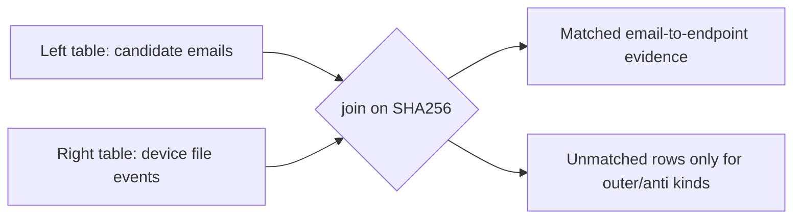

### Email attachment to endpoint file example

```kusto
let startTime = ago(7d);
EmailAttachmentInfo
| where Timestamp > startTime
| where isnotempty(SHA256)
| project EmailTime=Timestamp, NetworkMessageId, RecipientEmailAddress,
          FileName, SHA256
| join kind=inner (
    DeviceFileEvents
    | where Timestamp > startTime
    | where isnotempty(SHA256)
    | project FileTime=Timestamp, DeviceId, DeviceName, FolderPath,
              EndpointFileName=FileName, SHA256
) on SHA256
| where FileTime between (EmailTime .. EmailTime + 2d)
| project EmailTime, FileTime, RecipientEmailAddress, NetworkMessageId,
          SHA256, FileName, DeviceId, DeviceName, FolderPath
| sort by FileTime asc
```

This shows temporal association, not proof that the attachment created that file. Forwarding, downloads and common files need additional evidence.

## 16. `union` and normalizing timelines

`union` stacks compatible table outputs. Normalize columns before union so the result has common `EventTime`, `Entity`, `Activity` and `Source` fields. Do not run unscoped union across every table; it can exceed size and CPU limits.

```kusto
let targetUser = "test.user@example.com";
let startTime = datetime(2026-08-24T09:00:00Z);
let endTime = datetime(2026-08-24T11:00:00Z);
let EmailTimeline =
    EmailEvents
    | where Timestamp between (startTime .. endTime)
    | where RecipientEmailAddress =~ targetUser
    | project EventTime=Timestamp, Entity=RecipientEmailAddress,
              Activity=strcat("Email delivery: ", DeliveryAction),
              Source="EmailEvents";
let IdentityTimeline =
    IdentityLogonEvents
    | where Timestamp between (startTime .. endTime)
    | where AccountUpn =~ targetUser
    | project EventTime=Timestamp, Entity=AccountUpn,
              Activity=strcat("Identity logon: ", ActionType),
              Source="IdentityLogonEvents";
union EmailTimeline, IdentityTimeline
| sort by EventTime asc
```

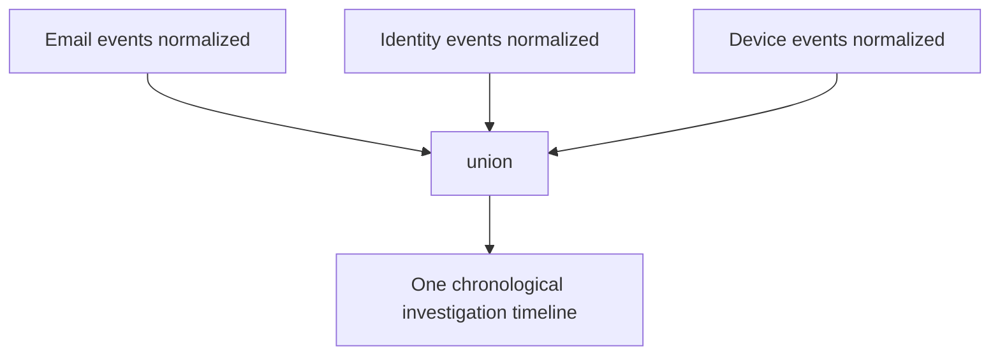

## 17. `lookup`

`lookup` enriches a large left dataset from a small dimension/reference table and behaves similarly to a broadcast lookup. Use it for small governed watchlists or business context. Confirm current support in Defender and custom-detection mode.

```kusto
let CriticalDevices = datatable(DeviceId:string, BusinessService:string, Criticality:string)
[
    "synthetic-device-id-01", "Finance Lab", "High",
    "synthetic-device-id-02", "General Lab", "Low"
];
DeviceProcessEvents
| where Timestamp > ago(1d)
| lookup kind=leftouter CriticalDevices on DeviceId
| project Timestamp, DeviceId, DeviceName, BusinessService, Criticality,
          FileName, ProcessCommandLine
```

## 18. Alerts and evidence

`AlertInfo` contains alert metadata; `AlertEvidence` contains related files, IPs, URLs, users, devices and other evidence. Join with `AlertId`, then pivot to native event tables for underlying chronology. Do not infer that every evidence row is malicious; evidence can be contextual or affected.

```kusto
AlertInfo
| where Timestamp > ago(7d)
| where Severity in ("High", "Medium")
| project AlertTime=Timestamp, AlertId, Title, Severity, Category, ServiceSource
| join kind=inner (
    AlertEvidence
    | where Timestamp > ago(7d)
    | project AlertId, EntityType, EvidenceRole, DeviceId, DeviceName,
              AccountUpn, SHA256, RemoteIP, RemoteUrl
) on AlertId
| project AlertTime, AlertId, Title, Severity, Category, ServiceSource,
          EntityType, EvidenceRole, DeviceId, DeviceName, AccountUpn,
          SHA256, RemoteIP, RemoteUrl
| top 200 by AlertTime desc
```

## 19. Endpoint hunt pattern

Hypothesis: a phished user may have launched a script interpreter with download-related arguments and then made network connections.

```kusto
let startTime = ago(7d);
let CandidateProcesses =
    DeviceProcessEvents
    | where Timestamp > startTime
    | where FileName in~ ("powershell.exe", "pwsh.exe")
    | where ProcessCommandLine has_any ("DownloadString", "WebClient", "Invoke-WebRequest", "http")
    | project ProcessTime=Timestamp, DeviceId, DeviceName, AccountUpn,
              ProcessUniqueId, FileName, ProcessCommandLine;
CandidateProcesses
| join kind=leftouter (
    DeviceNetworkEvents
    | where Timestamp > startTime
    | project NetworkTime=Timestamp, DeviceId,
              InitiatingProcessUniqueId, RemoteUrl, RemoteIP,
              RemotePort, ActionType
) on DeviceId, $left.ProcessUniqueId == $right.InitiatingProcessUniqueId
| where isempty(NetworkTime) or NetworkTime between (ProcessTime .. ProcessTime + 10m)
| project ProcessTime, NetworkTime, DeviceId, DeviceName, AccountUpn,
          FileName, ProcessCommandLine, RemoteUrl, RemoteIP, RemotePort, ActionType
| sort by ProcessTime asc
```

The `leftouter` keeps process candidates even without matching network evidence. Review parent process, signer, script contents, device role, user authorization and prevalence before a conclusion.

## 20. Identity hunt pattern

Hypothesis: a target account may have repeated failed logons followed by success across unusual applications or devices. Because exact `ActionType` and columns can differ by source, verify the live `IdentityLogonEvents` reference before use.

```kusto
let targetUser = "test.user@example.com";
IdentityLogonEvents
| where Timestamp > ago(7d)
| where AccountUpn =~ targetUser
| summarize Total=count(),
            FirstSeen=min(Timestamp),
            LastSeen=max(Timestamp),
            Applications=make_set(Application, 20),
            Devices=make_set(DeviceName, 20),
            IPs=make_set(IPAddress, 20)
  by ActionType
| sort by LastSeen desc
```

Do not label an IP “malicious” solely because it is new. VPN, mobile, travel, cloud proxies and incomplete history are alternatives.

## 21. Email, URL and click hunt

Hypothesis: messages containing a synthetic domain may have been delivered and clicked.

```kusto
let targetDomain = "invoice.example.com";
let startTime = ago(7d);
EmailUrlInfo
| where Timestamp > startTime
| where UrlDomain =~ targetDomain
| project UrlTime=Timestamp, NetworkMessageId, Url, UrlDomain
| join kind=inner (
    EmailEvents
    | where Timestamp > startTime
    | project MailTime=Timestamp, NetworkMessageId, RecipientEmailAddress,
              SenderFromAddress, Subject, DeliveryAction, DeliveryLocation,
              ThreatTypes
) on NetworkMessageId
| join kind=leftouter (
    UrlClickEvents
    | where Timestamp > startTime
    | where UrlDomain =~ targetDomain
    | project ClickTime=Timestamp, NetworkMessageId, AccountUpn,
              ClickAction=ActionType, Url
) on NetworkMessageId, Url
| project MailTime, ClickTime, RecipientEmailAddress, AccountUpn,
          SenderFromAddress, Subject, DeliveryAction, DeliveryLocation,
          ThreatTypes, Url, ClickAction, NetworkMessageId
| sort by MailTime asc
```

Check current column names and data availability. A recorded click does not prove credential entry; a missing click does not prove no exposure if telemetry coverage differs.

## 22. Cloud-app hunt pattern

Hypothesis: a user may have downloaded an unusual volume of files after suspicious authentication.

```kusto
let targetUser = "test.user@example.com";
CloudAppEvents
| where Timestamp > ago(7d)
| where AccountId =~ targetUser or AccountDisplayName =~ targetUser
| summarize EventCount=count(),
            FirstSeen=min(Timestamp),
            LastSeen=max(Timestamp),
            IPs=make_set(IPAddress, 20),
            Objects=make_set(ObjectName, 50)
  by ActionType, Application
| top 50 by EventCount desc
```

The exact identity field and action vocabulary must be verified. Compare against the user's role, normal workflow, migration tools, sync clients and approved admin activity.

## 23. Indicators and prevalence

IOC hunting asks where a known clue appeared. Prevalence asks how often and across which assets. Rare is not automatically malicious, and common can still be malicious. Preserve indicator source, confidence, first/last seen, expiration and normalization.

```kusto
let syntheticHashes = dynamic([
    "AAAAAAAAAAAAAAAAAAAAAAAAAAAAAAAAAAAAAAAAAAAAAAAAAAAAAAAAAAAAAAAA",
    "BBBBBBBBBBBBBBBBBBBBBBBBBBBBBBBBBBBBBBBBBBBBBBBBBBBBBBBBBBBBBBBB"
]);
union
(
    DeviceFileEvents
    | where Timestamp > ago(30d)
    | where SHA256 in (syntheticHashes)
    | project Timestamp, Source="DeviceFileEvents", SHA256,
              Entity=DeviceName, Context=FolderPath
),
(
    EmailAttachmentInfo
    | where Timestamp > ago(30d)
    | where SHA256 in (syntheticHashes)
    | project Timestamp, Source="EmailAttachmentInfo", SHA256,
              Entity=RecipientEmailAddress, Context=FileName
)
| summarize Events=count(), Entities=dcount(Entity),
            FirstSeen=min(Timestamp), LastSeen=max(Timestamp),
            SampleEntities=make_set(Entity, 20)
  by SHA256, Source
```

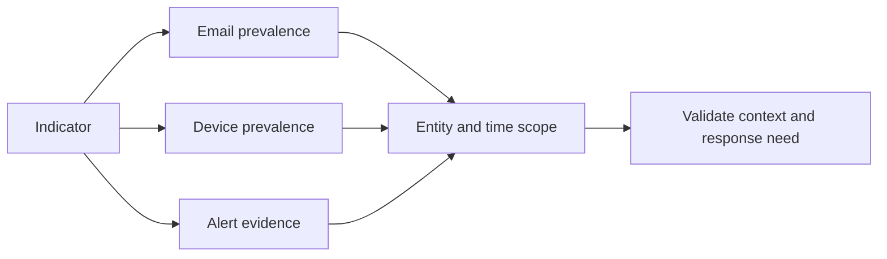

## 24. Query performance and service limits

Current native Defender advanced hunting limits include up to 30 days per query, 100,000 returned rows, ten-minute timeout and a 64 MB result-size limit. CPU is tenant-sized and tracked in cycles. These are change-sensitive and separate from API/custom-detection limits. Optimize to protect other analysts.

| Practice | Why it helps |
|---|---|
| Filter time first on every event table | Reduces scanned rows |
| Filter indexed/raw columns before parsing/calculation | Avoids expensive work on irrelevant rows |
| Use `has` rather than `contains` when semantics fit | Uses term indexing more effectively |
| Count/take while sizing a new query | Avoids accidental huge output |
| Project only required columns | Reduces memory/result size and join width |
| Scope `search`/`union` to named tables | Prevents schema-wide expansion |
| Put smaller filtered dataset on join left | Reduces matching work |
| Filter both join sides by time | Prevents large cross-window joins |
| Choose `inner` versus default consciously | Prevents silent left-row deduplication |
| Parse JSON after filtering | Limits CPU-intensive parsing |
| Inspect resource-use label and execution time | Makes optimization measurable |

### 🔍 Plain-English deep-dive: query performance is a shared-service responsibility

A query that scans every table for 30 days can consume resources needed by other responders. This is like asking an entire library staff to search every page for one word while a fire investigation is active. Start with the likely shelf, date range and field; count first; then expand only when evidence justifies it. Efficient KQL is both engineering quality and incident etiquette.

## 25. Common errors and troubleshooting

| Error/symptom | Likely cause | Safe fix |
|---|---|---|
| Recognition/syntax error | Misspelled operator/table/column or unquoted text | Use IntelliSense and live schema reference |
| Failed scalar expression | Column dropped/renamed or wrong pipeline stage | Track columns after each pipe |
| No rows | Wrong time, scope, table, value/case, data unavailable | Count source table and widen one dimension at a time |
| Too many rows | Missing time/entity filter or join multiplication | Add early filters, aggregate and inspect keys |
| Timeout | Wide scan, regex/parsing or large join | Bound tables/time and reduce columns |
| CPU throttling | Tenant quota consumed | Optimize and wait for current quota cycle |
| Query size exceeded | Unscoped `search`/`union` across many tables | Name specific tables |
| Partial result warning | Row/64 MB result limit | Aggregate/export approved bounded slices |
| Duplicate join rows | Many-to-many key | Add time/key specificity or summarize intentionally |
| Missing table | License, onboarding, role, scope or preview | Verify capability matrix; do not fabricate fallback |
| Custom rule cannot save | Unsupported operator/frequency or missing required fields | Check rule requirements and NRT restrictions |
| Rule alerts wrong entity | Weak/missing mapping | Project strong identifier and test incident correlation |

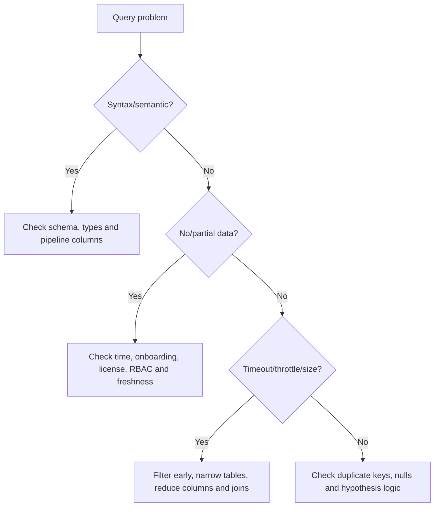

## 26. Safe redaction and evidence handling

Hunting output can expose command lines, URLs with tokens, email subjects/content, user identities, file paths, IPs, cloud object names and secrets. Minimize collection and output. Project only needed fields; mask for broad reports; preserve unredacted evidence only in the authorized case store. Never paste client data into public AI/chat tools.

| Data | Analyst case | Broad report/training |
|---|---|---|
| UPN/email | Full only if needed and authorized | Pseudonymize/hash consistently |
| URL | Preserve safely without activating | Defang and remove query tokens |
| IP | Preserve when material | Mask if not required |
| Command line | Preserve relevant segment securely | Remove credentials/tokens/paths |
| File path | Preserve for endpoint response | Generalize user profile/client name |
| Message subject | Minimize; may contain personal data | Replace with category |
| Query | Preserve exact logic/version | Replace tenant identifiers and secrets |
| Result export | Approved encrypted case store | Synthetic data only |

Example report-only masking pattern, not a substitute for evidence preservation:

```kusto
IdentityLogonEvents
| where Timestamp > ago(1d)
| extend RedactedAccount = strcat(substring(AccountUpn, 0, 2), "***")
| project Timestamp, RedactedAccount, ActionType, Application
| take 100
```

## 27. Hypothesis-driven hunting lifecycle

A hunt has an observation, hypothesis, data requirements, query plan, expected malicious and benign patterns, evidence, conclusion and follow-up. Include a counter-hypothesis so confirmation bias is visible.

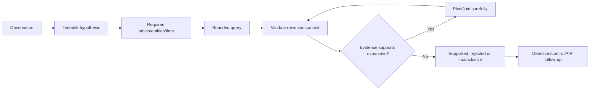

| Hunt field | Example |
|---|---|
| Observation | User reported invoice phish and device script alert |
| Hypothesis | Click led to script download and endpoint execution |
| Counter-hypothesis | Approved admin script happened independently |
| Entities | User object/UPN, Network Message ID, DeviceId, process ID, URL/hash |
| Window | 30 minutes before mail to two hours after execution |
| Expected attacker pattern | Mail, click, child process, network, identity movement |
| Expected benign pattern | Signed script, approved ticket, known management server |
| Conclusion | Supported/rejected/inconclusive plus data gaps |

## 28. From hunt to custom detection

A useful hunt is not automatically a good detection. A detection must run repeatedly, handle ingestion delay, return required event/entity columns, remain performant, avoid excessive alerts and produce actionable context. Start with alert-only behavior. Add automatic actions only after high precision, blast-radius tests, approval and rollback.

```mermaid
flowchart LR
    HUNT[Validated hunt] --> SPEC[Detection specification]
    SPEC --> BACK[Backtest and labeled review]
    BACK --> RULE[Alert-only rule]
    RULE --> PILOT[Pilot scope]
    PILOT --> TUNE[Tune and peer review]
    TUNE --> PROD[Controlled production]
    PROD --> MON[Quality/drift monitoring]
    MON --> ROLL[Disable/rollback or revise]
```

## 29. Custom-detection query requirements

For Defender data, project `Timestamp` and `ReportId` from the same source event where applicable so the alert can link to original evidence. Endpoint rules should include `DeviceId` or `DeviceName` for device scope and process tree context. Project strong impacted-asset identifiers. Aggregated queries can use `arg_max()` to retain the latest matching event's `Timestamp` and `ReportId`.

```kusto
DeviceEvents
| where ingestion_time() > ago(1d)
| where ActionType == "AntivirusDetection"
| summarize (Timestamp, ReportId)=arg_max(Timestamp, ReportId),
            DetectionCount=count()
  by DeviceId, DeviceName
| where DetectionCount > 5
```

This follows Microsoft's documented pattern, but verify current schema and frequency eligibility. For custom detections, the service prefilters by the rule lookback; do not add redundant `Timestamp` filters unless intentionally narrowing the effective window. Match query time logic to run frequency and ingestion behavior.

| Target | Strong output columns |
|---|---|
| Original event | `Timestamp`, `ReportId` from same event |
| Device | `DeviceId`, optionally `DeviceName` |
| Account | `AccountObjectId`, `AccountSid`, `AccountUpn` as supported |
| Mailbox/message | `RecipientEmailAddress`, sender identifiers, `NetworkMessageId` |
| File | Supported SHA-1/SHA-256 field |
| URL/IP/app/resource | Current wizard-supported identifier column |

## 30. Frequency, lookback and Continuous NRT

Current Defender-data schedules are every 24 hours, 12 hours, three hours, hourly and Continuous NRT where eligible. Microsoft Learn currently documents fixed Defender lookbacks: 30 days for daily, 48 hours for 12-hour frequency, 12 hours for three-hour frequency and four hours for hourly. Custom schedules/lookbacks are available for Sentinel-only data under current rules. A new rule also runs an initial check over past data. Reverify these unusual relationships in the live wizard.

| Frequency | Current Defender lookback | Design concern |
|---|---|---|
| Every 24 hours | 30 days | Heavy duplication potential; dedup behavior and alert volume |
| Every 12 hours | 48 hours | Ingestion delay coverage versus repeats |
| Every 3 hours | 12 hours | Faster response, more runs |
| Every hour | 4 hours | Nearer response; still not real time |
| Continuous NRT | Events as collected/processed | Strict table/operator eligibility |
| Sentinel-only custom | Current wizard-selected schedule/lookback | Workspace cost, latency, scope and retention |

Current Continuous NRT restrictions include one supported table, supported KQL features, no joins/unions/`externaldata`, no query comments and only GA columns. Supported-table lists change. Choose NRT because the threat requires low latency and the query qualifies, not because “real time” sounds better.

## 31. Alert details, entity mapping and incident quality

Configure a unique rule name, frequency, alert title, severity, category, MITRE tactics/techniques, description and recommended actions. Dynamic title/description fields use output columns and are sanitized; current limits apply. Custom details provide selected query fields in the alert. Entity mapping drives alert grouping, incident correlation and response targeting, so wrong mapping can create noisy incidents or actions against the wrong subject.

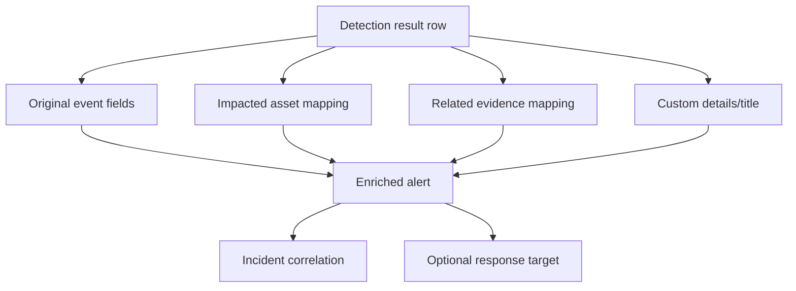

| Mapping question | Good answer |
|---|---|
| Who is harmed/compromised? | Impacted account/device/mailbox/resource |
| What is merely involved? | Related file, URL, IP, process or message |
| Is identifier stable? | Object ID/device ID/message ID plus recipient |
| Can one row map multiple identities safely? | Only with explicit semantics and current wizard support |
| Will it improve correlation? | Same real entity maps consistently across alerts |
| Could it trigger an action? | Target and blast radius reviewed |

### 🔍 Plain-English deep-dive: entity mapping writes the address label

A query row can mention a sender, recipient, device, process and URL, but only some are the assets actually affected. Entity mapping tells Defender which real subject the alert belongs to and which objects are supporting evidence. It is like writing the address label on an emergency work order: if the sender is mistakenly mapped as the impacted mailbox, the alert can join the wrong incident and a later workflow can target the wrong account. First say in plain English who was harmed, who acted and what was observed; then map stable identifiers to those roles and test the resulting incident graph before enabling any action.

## 32. Actions, suppression and safeguards

Custom detections can currently take supported actions on devices, files, users and email when required identifiers are returned and permissions exist. Examples include device isolation, package collection, scan, restriction, file block/quarantine, user compromise/disable/reset and email move/delete. The September 2026 endpoint AIR transition means any “initiate investigation” choice must be rechecked.

| Action family | Required thinking before enablement |
|---|---|
| Device isolation | Critical systems, VPN/proxy, scope, recovery and false-positive impact |
| Package/scan | Endpoint load, privacy, offline behavior and validation |
| File block/quarantine | Hash precision, prevalence, signer and device-group blast radius |
| User action | Authoritative identity, service accounts, object/SID fields and business owner |
| Email action | Network Message ID plus recipient, soft versus hard delete and legal hold |
| Any automated action | High precision, peer approval, pilot, failure handling and undo |

Custom detections currently group/deduplicate identical events based on entities and details to reduce repeated alerts, but this is not a substitute for tuning. Noise controls can include better behavior context, thresholds, approved asset/user exclusions, incident grouping, action suppression policy where the current product supports it, and expiration-governed exceptions. Never suppress simply because volume is inconvenient.

## 33. Permissions and scope

Managing a detection across multiple Defender products requires manage permissions for each queried product. `IdentityLogonEvents`, for example, can contain data from more than one identity/cloud-app service and can require both manage scopes. Device rules are limited to device groups the author can manage. Sentinel data requires applicable Sentinel Contributor access and scope. Global Administrator is not a routine solution.

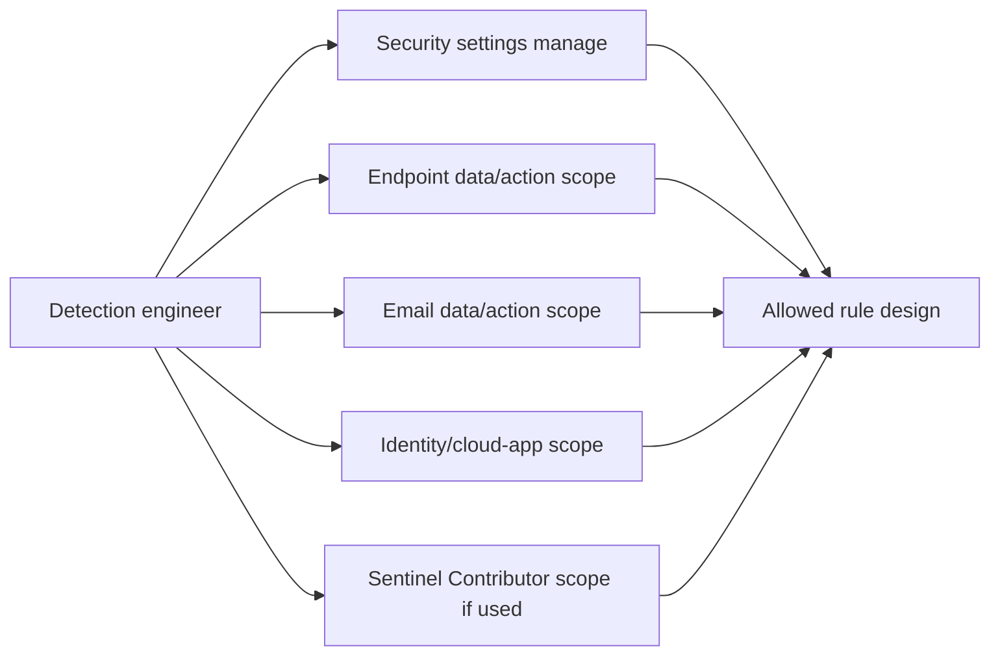

## 34. Validation and backtesting

Backtesting asks how the proposed logic would have behaved on historical labeled events. Use true-positive, true-negative, near-miss and telemetry-gap cases. Native Defender history is currently limited, so retain approved labeled test records and consider Sentinel/external retention design where appropriate.

| Test | Question | Evidence |
|---|---|---|
| Syntax/schema | Does query compile with current fields/types? | Saved run metadata |
| Positive | Does known safe simulation match? | Expected rows/entities |
| Negative | Does normal admin/business activity stay below alert condition? | Labeled benign sample |
| Boundary | What happens exactly at threshold/window? | Threshold matrix |
| Ingestion delay | Are late events still evaluated? | Event versus ingestion timing |
| Duplication | Does overlapping lookback create acceptable alerting? | Repeat-run comparison |
| Entity | Does alert map correct impacted asset/evidence? | Incident graph review |
| Performance | Does query stay low/acceptable resource use? | Duration/resource label |
| Action | Is automatic action absent in first pilot? | Rule configuration export |
| Failure | What if table/column/action unavailable? | Disable and escalation test |

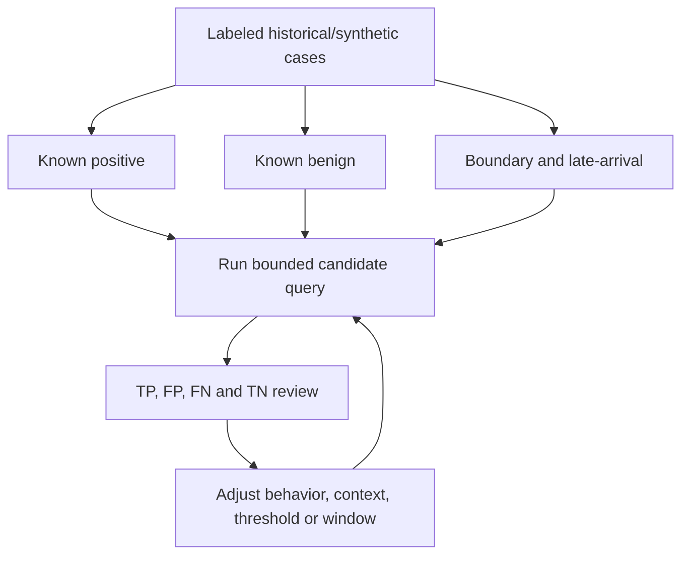

## 35. Tuning without hiding threats

Start with the reason each false positive matched. Improve entity identity, business context, process ancestry, signer, network behavior, thresholds or time relationships. Prefer narrow, owned, expiring exceptions. Test that attacker-like variants still match. Record false negatives from purple-team/tabletop exercises.

| Tuning choice | Better pattern | Risky pattern |
|---|---|---|
| Exclusion | Exact managed scanner ID with owner/expiry | Exclude all admin accounts |
| Threshold | Baseline by device role and time | Raise until alerts disappear |
| Context | Require process plus network behavior | One command-line keyword |
| Allowlist | Signed/versioned app plus trusted path/host | File name only |
| Window | Based on attack sequence and ingestion delay | Arbitrary long join window |
| Feedback | Labeled reason and reviewer | “Noise” without evidence |

## 36. Versioning, detection-as-code and deployment

Treat the detection as a controlled artifact even if the portal is the deployment surface. Store approved source KQL, metadata, owner, version, changelog, test cases, ATT&CK mapping, dependencies and rollback. Use repository integration/API/automation only when supported and governed; exporting a portal rule does not by itself create a mature pipeline.

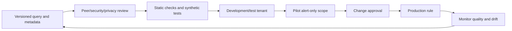

| Detection artifact | Required content |
|---|---|
| Specification | Purpose, hypothesis, data sources and expected behavior |
| Query | Parameterized KQL and schema dependencies |
| Metadata | Name, severity, MITRE, owner and review date |
| Entity/action map | Output column to entity/action semantics |
| Test pack | Positive, negative, boundary and failure cases |
| Performance baseline | Time range, duration, resource use and row count |
| Changelog | Why, reviewer, date and risk |
| Rollback | Disable rule, remove action, restore previous version |
| Operations | Triage runbook, SLA, metrics and exception register |

## 37. Rollback and failure containment

Rollback a faulty rule by disabling it first, stopping/undoing associated automated actions where supported, preserving generated alerts and action history, restoring the previous version, correcting incidents affected by bad entity mapping, communicating impact and running regression tests. Deleting the rule immediately can destroy context.

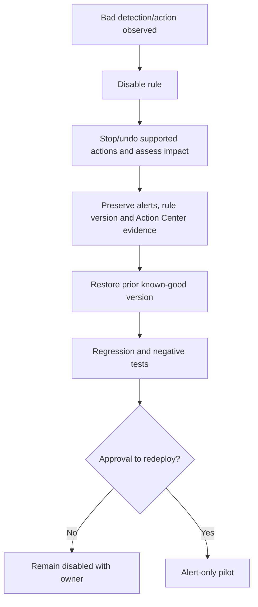

## 38. Operations and metrics

| Metric | What it shows | Guardrail |
|---|---|---|
| Precision | True positives / reviewed alerts | Require consistent labels |
| Recall proxy | Known simulations/incidents detected | Acknowledge unknown missed attacks |
| Alert volume | Analyst workload | Segment by rule/entity, not total only |
| Time to triage | Operational responsiveness | Pair with quality sampling |
| Entity-map accuracy | Incident correlation quality | Review affected versus related roles |
| Query duration/resource | Platform efficiency | Measure same window/tenant context |
| Action success/failure | Automation reliability | Verify actual target state |
| Action rollback rate | Harm/instability signal | Distinguish exercise from incident |
| Rule change failure rate | Engineering quality | Track version and test coverage |
| Stale-rule rate | Dependency/drift risk | Scheduled schema and owner review |
| Exception aging | Governance debt | Owner and expiry mandatory |

Operational reviews should include daily failures/high-impact alerts, weekly quality and exception review, monthly performance/schema/license drift, and quarterly threat coverage, rollback and access review.

## 39. Security and privacy design

Detection logic can reveal defensive thresholds; outputs contain sensitive telemetry; automated actions can become a privileged attack surface. Separate authors, reviewers and responders where practical. Protect repositories and APIs, use workload identities and least privilege, validate third-party query sources, and never execute KQL or response steps generated by an AI agent without schema, logic, scope and result review.

| Threat | Control |
|---|---|
| Malicious query contribution | Peer review, protected branch and signed change evidence |
| Secret embedded in query | Parameter/secret store; static scan and rotation |
| Query-based data exfiltration | Scoped roles, export monitoring and minimization |
| Automated destructive action | Alert-only default, approvals and action allowlist |
| AI hallucinated field/logic | Live schema verification and bounded dry run |
| Prompt injection in log text | Treat telemetry as data, not instruction |
| Stale preview dependency | Status register and recurring revalidation |
| Insider tuning abuse | Audit, two-person review and exception expiry |

## 40. Consulting scenario: phish to endpoint timeline

**Fictional request:** A client asks whether a synthetic invoice email sent to `test.user@example.com` was followed by a URL click, encoded PowerShell and network access from `LAB-W11-040`. No tenant is available. The deliverable is a paper query pack and detection specification.

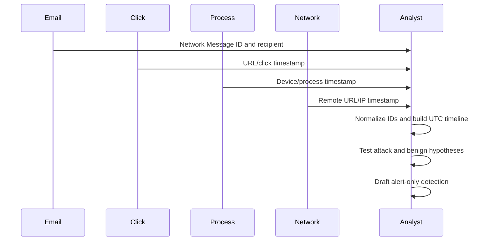

### Query design

1. Verify `EmailEvents`, `EmailUrlInfo`, `UrlClickEvents`, `DeviceProcessEvents` and `DeviceNetworkEvents` current fields.
2. Bound the incident window and preserve UTC.
3. Scope exact synthetic user, message, device and reserved domain.
4. Use stable IDs and explicit temporal relationships.
5. Keep missing network evidence with `leftouter` where analytically useful.
6. Project only evidence needed for the worksheet.
7. Compare an approved administration counter-hypothesis.

### Findings language

Good: “The synthetic records would support temporal association between message delivery, URL click, script execution and network activity on the same test device. The design does not prove credential theft or payload causality without process ancestry, file and identity evidence.”

Bad: “The user downloaded ransomware and the attacker moved laterally.”

### Candidate detection

The proposed rule detects a script interpreter with download-related terms plus strong device/process context. Because Continuous NRT does not allow joins, the first version is hourly and alert-only. It returns event timestamp/report ID and device identifiers, maps the device as impacted and process/URL as related evidence, has no automatic isolation, and includes a triage recommendation. After labeled backtests and pilot precision review, an action decision would require separate approval.

## 41. Safe paper lab

**Safety boundary:** Use only the synthetic names, reserved domain and dummy hashes below. Do not query a client tenant, upload logs, contact URLs, run scripts, create a rule, enable an action or paste real telemetry into an AI system.

### Synthetic dataset cards

| Time UTC | Table card | Synthetic row summary |
|---|---|---|
| 09:00 | EmailEvents | Message `MSG-040`, recipient test user, delivered |
| 09:01 | EmailUrlInfo | `https://invoice.example.com/a` in `MSG-040` |
| 09:04 | UrlClickEvents | Test user clicked; allowed by synthetic record |
| 09:07 | DeviceProcessEvents | Browser launches PowerShell on `LAB-W11-040` |
| 09:08 | DeviceNetworkEvents | PowerShell connects to reserved domain/IP |
| 09:10 | IdentityLogonEvents | Test account sign-in record |
| 09:15 | AlertInfo | Synthetic suspicious-script alert |
| 09:15 | AlertEvidence | Test device/user/URL related evidence |

### Tasks

1. Write the hypothesis and counter-hypothesis in plain English.
2. Draw table/entity relationships and identify join keys.
3. Hand-evaluate a `where`/`project` query against the cards.
4. Add `extend` fields for command length and encoded hint.
5. Aggregate event count by entity and 5-minute `bin`.
6. Normalize three cards into a `union` timeline.
7. Explain where `inner`, `leftouter` and `leftanti` would differ.
8. Draft a custom-detection specification with alert-only operation.
9. Define positive, negative, boundary, delay and performance tests.
10. Define disable/rollback and handover steps.

| Lab output | Acceptance criterion |
|---|---|
| Schema map | Tables, fields and verify-current notes |
| Query walkthrough | Rows/columns after every pipe |
| Timeline | UTC and event/alert time distinction |
| IOC/prevalence plan | Rare does not equal malicious |
| Detection spec | Frequency/lookback rationale and required columns |
| Entity map | Impacted versus related entities correct |
| Action plan | No destructive automatic action |
| Test matrix | Positive, negative, boundary, late and failure cases |
| Privacy review | Only synthetic/redacted output |
| Rollback | Disable, preserve, restore and regression steps |

## 42. Consulting artifacts

| Artifact | Client purpose | Quality test |
|---|---|---|
| Hunting hypothesis canvas | Prevent random querying | Falsifiable hypothesis and counter-hypothesis |
| Schema/data-source matrix | Prove evidence availability | License, role, table, freshness and owner |
| Query pack | Reusable investigations | Parameters, comments, UTC and performance notes |
| Entity dictionary | Normalize cross-domain IDs | Stable identifier and collision caveat |
| Detection specification | Define intent before wizard clicks | Trigger, mapping, action and triage clear |
| Test pack | Demonstrate precision and safety | Labeled positive/negative/boundary cases |
| Performance report | Protect shared capacity | Duration, resource label and output size |
| Tuning register | Defensible exceptions | Reason, owner, expiry and regression test |
| Detection catalog | Operational ownership | Version, status, dependencies and review date |
| Rollback runbook | Limit bad-rule impact | Disable and action recovery rehearsed |
| Metrics dashboard | Show security outcome | Precision and coverage, not volume alone |
| Handover | Maintain 24x7 continuity | Last run, failures, changes and next decision |

### Evidence-safe interview wording

> “I built a synthetic Defender hunting pack from schema verification through custom-detection design. I used bounded UTC windows, endpoint/email/identity/alert relationships, parsing, aggregations, joins and a normalized timeline; then specified required event/entity fields, schedule, alert-only pilot, backtests, tuning, versioning, metrics and rollback. I did not run it in a production tenant or deploy an automated action, and I would never execute AI-generated KQL without live-schema and result validation.”

## 43. JD Mapping: interview translation

| Interview prompt | Your factual strength | Honest KQL/detection bridge |
|---|---|---|
| “How do you threat hunt?” | Hypothesis-led RCA and timeline work | Explain synthetic bounded cross-domain hunt |
| “How strong is your KQL?” | Log analysis and structured troubleshooting | State study/paper queries, not production execution |
| “How do you optimize queries?” | Diagnostic narrowing and evidence discipline | Filter early, project narrowly, control joins |
| “How do you create detections?” | Fix validation and change governance | Present specification, backtest, alert-only pilot and rollback |
| “How do you use AI for KQL?” | AI-agent evaluation interest | Draft only; verify schema, logic, scope and sample rows |
| “How do you tune noise?” | RCA and operational reporting | Labeled reasons, narrow expiry and regression tests |

## Official Source Anchors

1. [Advanced hunting overview](https://learn.microsoft.com/en-us/defender-xdr/advanced-hunting-overview)
2. [Advanced hunting schema tables](https://learn.microsoft.com/en-us/defender-xdr/advanced-hunting-schema-tables)
3. [Learn the advanced hunting query language](https://learn.microsoft.com/en-us/defender-xdr/advanced-hunting-query-language)
4. [Choose guided or advanced mode](https://learn.microsoft.com/en-us/defender-xdr/advanced-hunting-modes)
5. [Build queries in guided mode](https://learn.microsoft.com/en-us/defender-xdr/advanced-hunting-query-builder)
6. [Advanced hunting query best practices](https://learn.microsoft.com/en-us/defender-xdr/advanced-hunting-best-practices)
7. [Handle advanced hunting errors](https://learn.microsoft.com/en-us/defender-xdr/advanced-hunting-errors)
8. [Create custom detection rules](https://learn.microsoft.com/en-us/defender-xdr/custom-detection-rules)
9. [Manage custom detection rules](https://learn.microsoft.com/en-us/defender-xdr/custom-detection-manage)
10. [Alert correlation and incident merging](https://learn.microsoft.com/en-us/defender-xdr/alerts-incidents-correlation)
11. [AlertInfo table](https://learn.microsoft.com/en-us/defender-xdr/advanced-hunting-alertinfo-table)
12. [AlertEvidence table](https://learn.microsoft.com/en-us/defender-xdr/advanced-hunting-alertevidence-table)
13. [DeviceProcessEvents table](https://learn.microsoft.com/en-us/defender-xdr/advanced-hunting-deviceprocessevents-table)
14. [DeviceNetworkEvents table](https://learn.microsoft.com/en-us/defender-xdr/advanced-hunting-devicenetworkevents-table)
15. [IdentityLogonEvents table](https://learn.microsoft.com/en-us/defender-xdr/advanced-hunting-identitylogonevents-table)
16. [CloudAppEvents table](https://learn.microsoft.com/en-us/defender-xdr/advanced-hunting-cloudappevents-table)
17. [EmailEvents table](https://learn.microsoft.com/en-us/defender-xdr/advanced-hunting-emailevents-table)
18. [EmailUrlInfo table](https://learn.microsoft.com/en-us/defender-xdr/advanced-hunting-emailurlinfo-table)
19. [UrlClickEvents table](https://learn.microsoft.com/en-us/defender-xdr/advanced-hunting-urlclickevents-table)
20. [Kusto Query Language documentation](https://learn.microsoft.com/en-us/kusto/query/)
21. [Microsoft Defender XDR unified RBAC](https://learn.microsoft.com/en-us/defender-xdr/manage-rbac)
22. [Remediation actions and September 2026 endpoint AIR change](https://learn.microsoft.com/en-us/defender-xdr/m365d-remediation-actions)

## ⭐ Likely Interview Questions for This Section

### Q1. What is advanced hunting, and how is it different from alert investigation?

**Model answer:** Alert investigation starts from a detector's finding. Advanced hunting uses KQL or guided mode to search raw event/entity data proactively or to expand an incident hypothesis. I define a falsifiable hypothesis, tables, entities and UTC window, run a bounded query, validate rows and counter-explanations, then document a supported, rejected or inconclusive conclusion.

### Q2. How do you read a KQL pipeline?

**Model answer:** The query starts with a table, and every pipe receives a table and returns another table. `where` filters rows, `extend` adds calculated columns, `summarize` changes granularity through grouping, `project` selects output and `sort` or `top` orders/limits it. After each pipe I track which rows and columns still exist.

### Q3. Which Defender table families matter most?

**Model answer:** Device event/state tables cover process, network, file, registry, logon and inventory; Identity tables cover authentication, directory activity and account context; Email tables cover delivery, URL, attachment, click and post-delivery activity; `CloudAppEvents` covers cloud activities; and `AlertInfo` plus `AlertEvidence` connect alerts to entities. I verify live schema, licensing, preview status and scope before use.

### Q4. How do you make joins safe and efficient?

**Model answer:** I use stable keys, filter time on both sides, project only required columns, put the smaller filtered dataset on the left and choose the join kind explicitly. I test for many-to-many multiplication and temporal plausibility. The default `innerunique` can deduplicate left rows, so I use `inner` when all matching left events matter.

### Q5. How do you convert a hunt into a custom detection?

**Model answer:** I create a specification, project required original-event and entity fields, match schedule/lookback, backtest against labeled positive/negative/boundary/late events, assess performance, map impacted assets and evidence correctly, and pilot alert-only in limited scope. Only after sustained precision, peer approval and rollback testing would I consider response actions.

### Q6. What current custom-detection constraints would you verify?

**Model answer:** I verify frequencies/lookbacks, initial historical run, result/alert limits, required `Timestamp`/`ReportId` and entity fields, permissions across every data source, device scope, dedup behavior and current action matrix. Continuous NRT currently requires one eligible table, supported operators, no joins/unions/external data/comments and GA columns. I also recheck the September 2026 endpoint AIR transition.

### Q7. How do you use AI to write KQL safely?

**Model answer:** AI can draft or explain a query, but I treat it as untrusted. I verify every table, column, type and `ActionType` in the live schema; inspect pipeline logic; replace real data with parameters; add tight UTC and entity filters; count/take first; review sample rows; test benign and malicious cases; and never enable an automatic action from AI output without formal review.

### Q8. What is your honest Defender hunting experience?

**Model answer:** My production background is Microsoft 365 incidents, RCA, timeline correlation, validation and reporting. I have studied current Defender hunting/KQL and built a synthetic query and custom-detection design with schema verification, joins, timelines, backtests, alert-only pilot, metrics and rollback. I have not run production Defender hunts or deployed custom detections.

## 🧠 30-Second Memory Hooks

- **Hunting starts with a falsifiable hypothesis, not random browsing.**
- **Table is a spreadsheet tab; row is an event; column is a property.**
- **Every pipe takes a table and returns a table.**
- **Filter time and scope early; parse and join later.**
- **`take` samples; `top` orders and limits; `count` measures rows.**
- **`extend` adds fields; `summarize` changes granularity.**
- **Use stable IDs; PID, display name and subject are weak alone.**
- **Default join can deduplicate left keys; choose the kind deliberately.**
- **Normalize columns before `union` into a timeline.**
- **Rare is interesting, not automatically malicious.**
- **A good hunt is not automatically a good recurring detection.**
- **Map impacted assets separately from related evidence.**
- **Pilot alert-only before any automated response.**
- **AI drafts KQL; humans verify schema, logic, scope and results.**
- **Your bridge is RCA and evidence rigor, not production detection ownership.**

## Completion Checklist

- [ ] I can explain hunting, KQL, table, row, column, schema, entity and IOC.
- [ ] I can draw the Defender/Sentinel-to-hunting architecture and limits.
- [ ] I can verify licenses, onboarding, roles, scope, retention and UTC.
- [ ] I can identify Device, Identity, Email, CloudApp, AlertInfo and AlertEvidence families.
- [ ] I can use the live schema/reference instead of guessing fields or actions.
- [ ] I can compare guided mode, templates, advanced KQL and AI assistance.
- [ ] I can use `where`, `project`, `extend`, `summarize`, `distinct`, `top`, `sort`, `take` and `count`.
- [ ] I can handle datetime windows and distinguish event from ingestion/alert time.
- [ ] I can choose string operators and avoid one-keyword detections.
- [ ] I can parse text/JSON, work with dynamic values and control `mv-expand`.
- [ ] I can use `let`, tabular expressions and simple functions.
- [ ] I can explain join kinds, keys, duplication and temporal constraints.
- [ ] I can use `union`, `lookup`, `bin`, `arg_max` and `make_set` safely.
- [ ] I can build endpoint, identity, email, cloud-app and alert/evidence hunts.
- [ ] I can hunt IOCs and describe prevalence without equating rarity to threat.
- [ ] I can optimize queries and troubleshoot syntax, schema, data and quota errors.
- [ ] I can redact sensitive output and preserve authorized evidence separately.
- [ ] I can write a hunt with hypothesis, counter-hypothesis and conclusion.
- [ ] I can project custom-detection event and entity fields correctly.
- [ ] I can explain current frequency/lookback/NRT constraints and verify them.
- [ ] I can design entity mapping, custom details and safe response actions.
- [ ] I can backtest, tune and measure a detection without hiding threats.
- [ ] I can version, deploy, operate, disable and roll back detection-as-code artifacts.
- [ ] I can complete the safe paper lab without querying or changing a tenant.
- [ ] I can state honestly that these are learning/design artifacts, not production hunts.
- [ ] I have rechecked current preview, schema, licensing, limits and portal behavior.

*Next suggested section:* [Part 41](Part-41-exposure-management-secure-score-prioritization.md) — turn technical findings into exposure-aware remediation priorities using Secure Score, critical assets, attack paths, initiatives and defensible business roadmaps.