# Part 41 — Security Posture, Exposure Management, Secure Score, and Control Prioritization

> **Section goal:** Learn how to turn thousands of security findings into a defensible improvement program. This Part distinguishes Microsoft Secure Score, Microsoft Security Exposure Management, Defender Vulnerability Management and identity/app/data posture; explains score calculation and caveats; covers improvement-action states, third-party controls, alternate mitigation and risk acceptance; introduces attack surfaces, the enterprise exposure graph, critical assets, attack paths, choke points, initiatives, recommendations, events and exposure insights; builds a transparent prioritization method using exploitability, exposure, business criticality, threat intelligence and control effort; explains CVSS limits; and carries findings through ownership, SLA, exceptions, verification, executive reporting, metrics, roadmap and business case. Arti should be able to prioritize a fictional 20-finding backlog without claiming production Exposure Management or Secure Score ownership.

This Part maps directly to Deloitte responsibilities for security assessment, Microsoft Defender and Microsoft 365 posture, risk-based recommendations, remediation planning, control optimization, executive reporting, operational governance and stakeholder management. Arti's production strengths in incidents, RCA, fix validation, Microsoft 365 dependencies, service health, documentation, reporting and multi-team ownership are especially relevant. Exposure management is the proactive version of the same discipline: determine what matters, prove the state, assign action, validate the fix and communicate residual risk.

> **Currency, licensing, preview and portal-convergence note (August 24, 2026):** This chapter is based on official Microsoft Learn content available on August 24, 2026. Microsoft Security Exposure Management is integrated into the unified Microsoft Defender portal and currently supports public cloud, not national/sovereign clouds. Licensing can include Microsoft 365 E5, qualifying E3 add-ons, Defender suites and other qualifying product plans; full value depends on enabled source products such as Defender for Cloud CSPM and Defender Vulnerability Management. External data connectors are preview and currently described with future consumption-based pricing. Current Learn guidance says supported first-party data can take up to 72 hours to appear, the latest graph snapshot is retained for at least 14 days rather than providing full historical state, and parameters can change. Secure Score recommendation state/points can lag and product-specific refresh cadences vary. Portal names, “Resolve Now/Monitor Exposure” experiences, initiatives, attack-path/blast-radius views, licensing, recommendations, weights, schemas and RBAC continue to evolve. Verify Product Terms, service descriptions, live portal, current Learn, Message center and Roadmap before client decisions.

## JD Mapping

| Deloitte expectation | Capability developed | Consulting evidence |
|---|---|---|
| Assess Microsoft security posture | Cross-domain posture model and data-quality review | Current-state assessment |
| Prioritize risk | Exposure/business/threat-based ranking | Prioritization matrix and heat map |
| Recommend controls | Treatment options and compensating controls | Remediation roadmap and business case |
| Coordinate remediation | Owners, SLAs, exceptions and dependencies | RACI and remediation register |
| Validate improvement | Technical and business acceptance criteria | Closure evidence pack |
| Report to leadership | Outcome metrics and residual-risk narrative | Executive dashboard and steering pack |

## Candidate honesty note

Arti can credibly discuss production Microsoft 365 incidents, evidence gathering, RCA, service dependencies, remediation/fix validation, reporting and cross-team coordination where supported by her experience. She can describe how those methods apply to a synthetic posture backlog.

She should not claim production Secure Score administration, Exposure Management operation, attack-path remediation, Defender Vulnerability Management ownership or formal enterprise risk acceptance unless separately evidenced. Safe wording is:

> “My production strength is Microsoft 365 incident RCA, evidence, fix validation and stakeholder coordination. I have built a current exposure-management design and a synthetic 20-finding prioritization exercise covering Secure Score, critical assets, attack paths, vulnerabilities, identity/app/data posture, exceptions, SLAs, verification and executive reporting. I have not operated these Microsoft posture products in production. In a client environment I would verify licenses, source coverage, freshness and RBAC; validate critical-asset classifications with business owners; separate platform scores from business risk; preserve high-risk items even when remediation is difficult; and close findings only after evidence-based verification.”

---

## 1. Posture and exposure from zero

**Security posture** is the current condition of an organization's controls and weaknesses. **Attack surface** is the collection of reachable systems, identities, applications, data and interfaces an attacker could target. **Exposure** adds relationships and context: how a weakness might connect an entry point to an important asset. **Risk** considers likelihood and consequence. A **finding** is one observed weakness, configuration gap or recommendation. A **control** is a safeguard that prevents, detects, responds to or recovers from harm.

| Term | Plain meaning | Why it matters | Memory hook |
|---|---|---|---|
| Posture | Current security condition | Shows control strengths/gaps | Building inspection report |
| Attack surface | Everything reachable or targetable | Defines where attacks can begin | Doors, windows and loading bays |
| Exposure | Weakness plus reachable relationships/context | Shows plausible attacker routes | Open doors connected by hallways |
| Vulnerability | Technical weakness in software/configuration | One exploitable opportunity | Broken lock |
| Misconfiguration | Unsafe setting or missing control | Often creates broad risk | Door left unlocked |
| Critical asset | Asset essential to business or security | Raises impact and priority | Crown jewel room |
| Attack path | Possible chain from entry to target | Reveals combined weaknesses | Route through the building |
| Choke point | Node/edge shared by many paths | One fix can break several routes | Central hallway |
| Recommendation | Suggested risk-reduction action | Converts insight into work | Repair order |
| Residual risk | Risk remaining after treatment | Prevents false completion | What the repair did not solve |

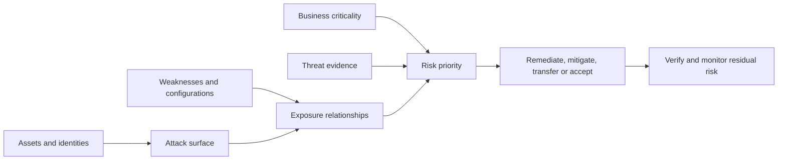

## 2. The product landscape: related, not interchangeable

Microsoft products use overlapping words such as score, recommendation and exposure. Always identify the question, data source and decision owner.

| Capability | Primary question | Typical output | It is not |
|---|---|---|---|
| Microsoft Secure Score | Which recommended Microsoft security actions are implemented? | Points, percentage, improvement actions and trends | Breach probability or complete enterprise risk score |
| Security Exposure Management | How do assets, weaknesses and relationships create cross-domain risk? | Exposure insights, graph, critical assets, attack paths, initiatives | Only a patch list |
| Defender Vulnerability Management (DVM/MDVM) | Which device software/configuration weaknesses need remediation? | Vulnerabilities, recommendations, exposure/secure score for devices | Whole identity/app/data posture |
| Identity posture | Which identity controls, privileges and paths are weak? | Identity recommendations, risky configurations/roles | Endpoint vulnerability management |
| App/SaaS posture | Which cloud apps, OAuth grants and SaaS settings create risk? | App recommendations and activity/context | Mail or endpoint state only |
| Data posture | Where is sensitive data exposed or poorly governed? | Data/security recommendations and insights | A legal compliance guarantee |
| Compliance score | How well do assessed controls map to a standard? | Assessment/control evidence and points | A technical exploitability score |

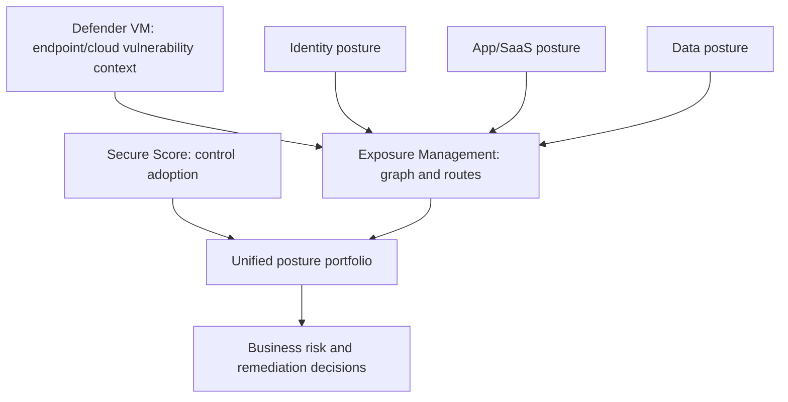

### 🔍 Plain-English deep-dive: a score is a dashboard gauge, not a safety certificate

A car dashboard might show fuel, tire pressure and engine temperature. A high reading on one gauge does not prove the entire car is safe, and improving a visible gauge can ignore a failing brake system that is not measured. Secure Score shows adoption of supported recommended controls. It is useful for trends and work discovery, but business context, unmeasured systems, active threats, data sensitivity and control quality still determine risk.

## 3. Architecture and source flow

Exposure Management consumes supported data from Microsoft and connected sources, builds asset/context relationships in an enterprise exposure graph, and presents insights, initiatives, recommendations, events, critical assets and attack paths in the Defender portal. Advanced hunting can expose `ExposureGraphNodes` and `ExposureGraphEdges` within current limits. Device groups and RBAC can restrict what a user sees.

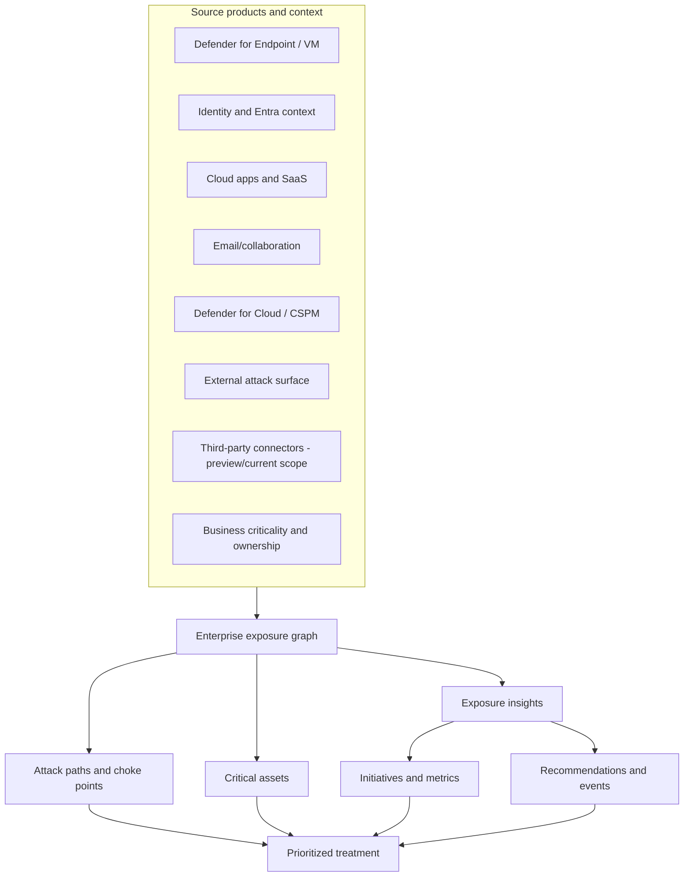

| Data layer | Example | Quality question |
|---|---|---|
| Asset inventory | Device, identity, cloud resource, app | Is it complete, current and uniquely identified? |
| Weakness | CVE, configuration, excessive permission | Is evidence current and affected scope correct? |
| Relationship | User administers device; resource reachable from internet | Is edge observed, inferred or stale? |
| Criticality | Domain controller, payment system, sensitive-data store | Did a business owner validate it? |
| Threat context | Known exploit, active campaign, observed attack | Source, age and confidence? |
| Recommendation | Patch, reconfigure, restrict, segment | Does it break the path/control gap? |
| Event/history | Score or exposure change | Is history available at required granularity? |

## 4. Prerequisites, licensing, regions and permissions

Build a capability matrix rather than assuming E5 unlocks every feature equally. Current Learn guidance lists Microsoft 365 E5, E3 with qualifying add-ons, Defender suite licenses and other qualifying plans. Full dashboard value may require Defender for Cloud CSPM and Defender Vulnerability Management. Exposure Management is currently public-cloud only. Third-party connectors are preview and expected to use consumption-based pricing after preview.

| Prerequisite | Verify | Why |
|---|---|---|
| Tenant/region | Public cloud and supported geography | Sovereign/national clouds currently unsupported |
| License | Exact source/product and feature entitlement | Recommendations/features vary |
| Source enablement | Defender workloads, CSPM, DVM and connectors | Empty graph cannot prioritize reality |
| Endpoint sensor | Supported/current MDE sensor for critical-asset use cases | Classification/telemetry quality |
| Unified RBAC | Exposure Management read/manage and data source assignment | Least-privilege access |
| Device group scope | All or selected groups | Partial views can hide paths/assets |
| Critical-asset authority | Business/security owner and classification rules | Technical guesses distort priority |
| Data policy | Privacy, residency, retention and connector review | Graph includes sensitive relationships |
| Integration owner | Source health and schema change responsibility | Prevent silent coverage decay |

Current unified RBAC exposes **Exposure Management (read)** and **Exposure Management (manage)** under Security posture, with **Core security settings (manage)** for some sensitive configuration. Full management and critical-asset settings can require access to all device groups. Entra roles remain an alternative for some access paths, but broad global roles should not be assigned merely for convenience.

## 5. Secure Score calculation

At a high level:

$$
\text{Secure Score percentage} = \frac{\text{achieved points}}{\text{possible points}} \times 100
$$

Each improvement action is currently worth up to 10 points. Many actions are binary; some award partial points based on covered users/devices or configuration. The displayed score can include views for current, planned, current-license and achievable context. Licenses affect available implementation, but Microsoft states the absolute posture score is not simply inflated because fewer licenses are owned; recommendations can show best practices beyond the licensed edition.

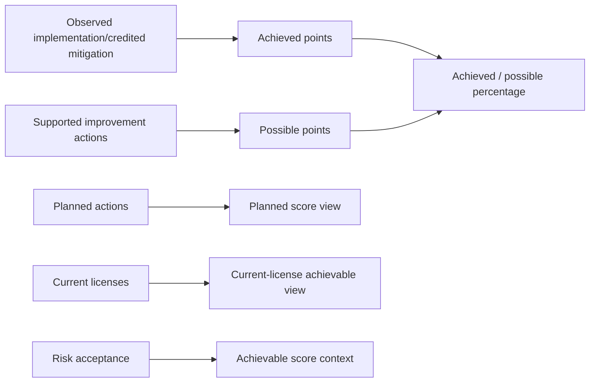

| Score element | Interpretation | Caveat |
|---|---|---|
| Achieved points | Credited implementation/mitigation | State can lag or be incomplete |
| Possible points | Supported action value | Not every enterprise control is measured |
| Partial credit | Portion of users/devices/configuration covered | Small uncovered critical population may matter greatly |
| Planned score | Projection if planned items complete | Not current security state |
| Current-license score | What current licenses can help achieve | License is not risk appetite |
| Achievable score | Context after license/risk acceptance | Risk acceptance does not remove underlying risk |
| Benchmark | Comparison with similar organizations | Peer average is not target risk tolerance |

### Current caveats

Secure Score can update visual/state information on different cadences. Current Learn notes points can take roughly 24–48 hours after implementation, while specific recommendation families may refresh weekly or monthly. A configuration change and the score update are separate evidence. Verify the control directly first, then wait for score ingestion before troubleshooting the score.

## 6. Improvement actions and statuses

| Status | Plain meaning | Points/risk meaning |
|---|---|---|
| To address | Gap recognized; no committed completed plan | Risk remains; partial implementation can still show here |
| Planned | Concrete implementation plan exists | Projected, not achieved control |
| Risk accepted | Authorized decision not to implement now | No points; risk remains and must expire/review |
| Resolved through third party | Non-Microsoft product addresses action | Points credited, but Microsoft cannot verify completeness |
| Resolved through alternate mitigation | Different internal control addresses objective | Points credited, but evidence/coverage needs governance |
| Completed | Microsoft data confirms all points achieved | Still validate effectiveness and business scope |

Device-category actions can redirect to Defender Vulnerability Management rather than allowing status changes in Secure Score. Current documentation notes a global DVM exception can update the Secure Score action with justification, while a per-device-group exception may leave Secure Score “To address.” Do not force tool statuses to match a spreadsheet; reconcile them with explicit evidence and scope.

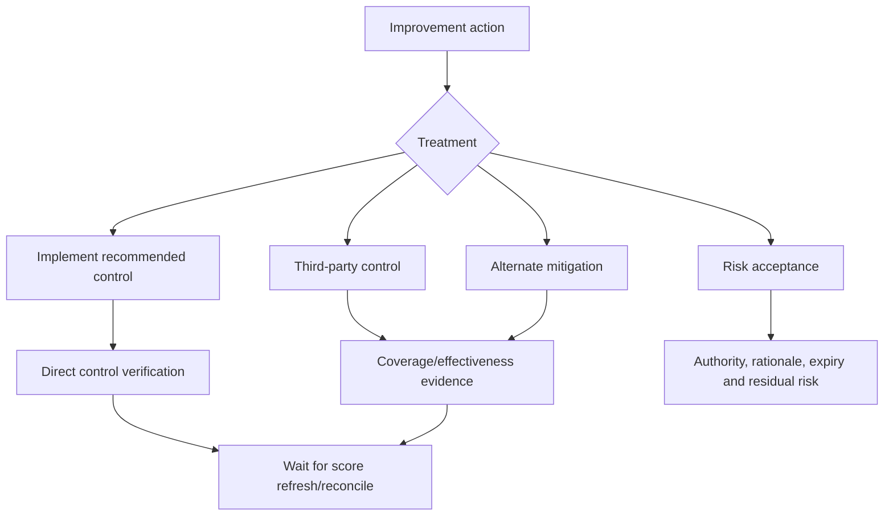

## 7. Secure Score operating safeguards

| Temptation | Risk | Better practice |
|---|---|---|
| Chase largest points first | Ignores critical assets and active exploitation | Overlay exposure/business/threat context |
| Mark alternate mitigation without evidence | Artificially credits incomplete control | Define objective, scope, test and owner |
| Accept risk indefinitely | Creates invisible permanent debt | Authority, expiry, triggers and compensating controls |
| Treat Completed as effective | Configuration may not work for all scenarios | Direct positive/negative validation |
| Compare teams by score gain | Encourages easy-point gaming | Measure risk reduction and coverage |
| Ignore score lag | Duplicate/revert good change | Validate source state and ingestion cadence |

## 8. Exposure insights, initiatives, metrics, recommendations and events

**Exposure insights** aggregate posture data into decision views. **Initiatives** organize a security objective, target and related metrics. **Metrics** quantify a control/exposure dimension. **Recommendations** describe actions to improve it. **Events/history** show changes where supported. Current overview experiences emphasize **Resolve Now** for prioritized patch/mitigate/fix work and **Monitor Exposure** for internet exposure and domain initiative scores.

| Object | Use | Governance question |
|---|---|---|
| Insight | Summarize an exposure theme | Is source coverage complete? |
| Initiative | Track objective such as critical-asset protection | Who owns target and why? |
| Metric | Quantify progress/risk signal | Can teams game it? |
| Recommendation | Define actionable treatment | Does it reduce path/risk? |
| Event/history | Explain change over time | Is history retained at required depth? |
| Resolve Now | Focus immediate patch/mitigate/fix items | Is ranking aligned to business criticality? |
| Monitor Exposure | Watch internet/domain exposure state | Are trends and thresholds meaningful? |

## 9. Enterprise exposure graph

The graph contains **nodes** (assets/entities) and **edges** (relationships). A node might be a device, identity, cloud resource or application. An edge might represent administrative control, sign-in, network reachability or another supported relationship. Graph quality depends on connected data, freshness, identifier matching and scope.

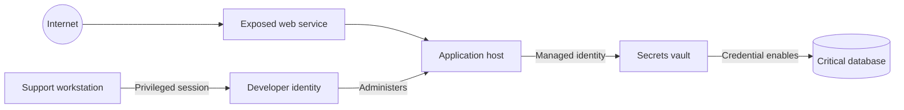

### 🔍 Plain-English deep-dive: an attack path is a plausible route, not a replay

An exposure graph is like a transit map. It shows that a traveler could move from one station to another if connections and weaknesses align. It does not prove an attacker traveled that route, that every edge is exploitable now, or that all defensive checks fail. Validate current configurations, exploit prerequisites, control enforcement and business ownership before announcing a “confirmed path.”

## 10. Critical assets

Current Exposure Management criticality uses four levels: Very High, High, Medium and Low. Microsoft can provide predefined classifications, and organizations can create rules based on supported device, identity or cloud-resource properties. When multiple rules apply, the highest criticality wins. Manual classification is possible, but governed rules scale better.

| Level | Business interpretation | Example in a fictional client |
|---|---|---|
| Very High | Essential to survival/continuity; catastrophic compromise | Identity root, payment core, safety control |
| High | Core operations; major disruption or data impact | Finance system, client document repository |
| Medium | Important but recoverable/localized impact | Department application |
| Low | Limited impact and strong recovery | Disposable lab device |

Criticality needs business validation. A domain controller is technically important, but a hidden integration account or signing key may be equally critical. Maintain owner, rationale, source rule, last review, dependencies and recovery objective. Over-classifying everything as Very High destroys prioritization; under-classifying reduces graph value.

## 11. Attack paths and choke points

An attack path connects a possible entry point through weaknesses/relationships to a target. A **choke point** is a node or edge shared by many paths. Fixing a choke point can reduce several exposures, but concentration can also mean high change risk.

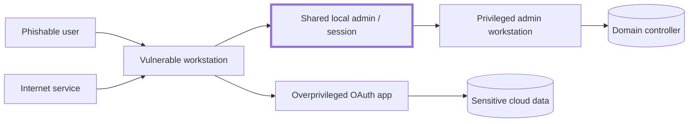

Here `SHARED` is a fictional choke point because more than one entry route can use it to reach a privileged target. Treatment options include remove shared credentials, isolate administration, rotate secrets, require phishing-resistant authentication and segment the route. Validate which option actually breaks the edge.

| Path question | Evidence needed |
|---|---|
| Is the entry point externally reachable? | Current exposure/reachability and control test |
| Is weakness exploitable? | Version/configuration/prerequisites and threat intel |
| Does identity/relationship still exist? | Directory/resource state and owner |
| Is target truly critical? | Business owner and impact assessment |
| Which edge is shared by many paths? | Graph/path analysis and independent validation |
| Which control breaks the route fastest? | Change feasibility, test and rollback |

## 12. Device groups and scoped views

Exposure views and management can be constrained by Defender for Endpoint device groups and unified RBAC. A scoped user might see global summaries but only in-scope affected assets or path nodes. A missing node can mean no exposure, delayed data or insufficient permission. Record the viewer's role/scope when exporting evidence.

| Scope design | Benefit | Risk/control |
|---|---|---|
| Central read across all assets | Complete enterprise prioritization | Strong access monitoring and privacy controls |
| Regional/business scoped manage | Local ownership and least privilege | Central reconciliation for cross-scope paths |
| Read-only executives | Safe visibility | No raw sensitive evidence unless needed |
| Remediation team device group | Clear endpoint ownership | Identity/cloud dependencies may remain invisible |
| Critical-asset administrators | Focused control | Separate classification approval from remediation |

## 13. Vulnerability Management in the larger posture

DVM/MDVM enriches endpoint weaknesses with software inventory, affected devices, available fixes, threat/exploit context and security recommendations. Exposure Management connects these to identities, cloud resources and paths. Secure Score may represent configuration adoption. Do not merge scores as if they share one denominator.

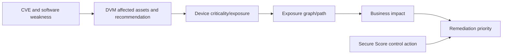

## 14. CVSS: useful technical severity, incomplete risk

**CVSS**, the Common Vulnerability Scoring System, estimates technical severity from characteristics such as attack vector, complexity, required privileges and impact. It is useful for standard language. It does not know whether the asset is internet-exposed, business-critical, isolated, controlled by compensating measures, actively targeted or even present in a reachable path.

| CVSS contributes | CVSS does not answer |
|---|---|
| Technical exploit/impact characteristics | Is exploit code currently used against this industry? |
| Comparable severity vocabulary | Is this asset reachable from an attacker? |
| Base/environmental/temporal concepts depending on version/use | Is this identity/resource a crown jewel? |
| Input to prioritization | What is outage cost or change effort? |
| Documentation anchor | Does an alternate control break the attack path? |

### 🔍 Plain-English deep-dive: CVSS describes the broken lock, not the building

A severe lock flaw on a sealed storage room in an empty test building can be less urgent than a moderate flaw on the internet-facing door to payroll. CVSS helps describe the lock. Exposure, criticality, threat evidence and business context describe the building and who is trying the door. Keep technical severity visible, but do not let it make the final queue alone.

## 15. A transparent prioritization model

Use two layers. First calculate **risk urgency** without effort, so hard work never looks less risky. Then use **delivery sequencing** to plan dependencies, effort, outages and quick wins.

Score each risk factor 1 (low) to 5 (very high):

$$
U = 0.30E + 0.25X + 0.25B + 0.20T
$$

Where:

- $E$ = exploitability, including prerequisites and control bypass.
- $X$ = exposure/reachability, including internet and attack-path context.
- $B$ = business criticality and consequence.
- $T$ = current threat evidence/intelligence.

This is a fictional consulting workshop formula, not a Microsoft product score. Confidence should be reported separately. **Control effort** is Low/Medium/High or 1–5 and affects the roadmap wave, not $U$.

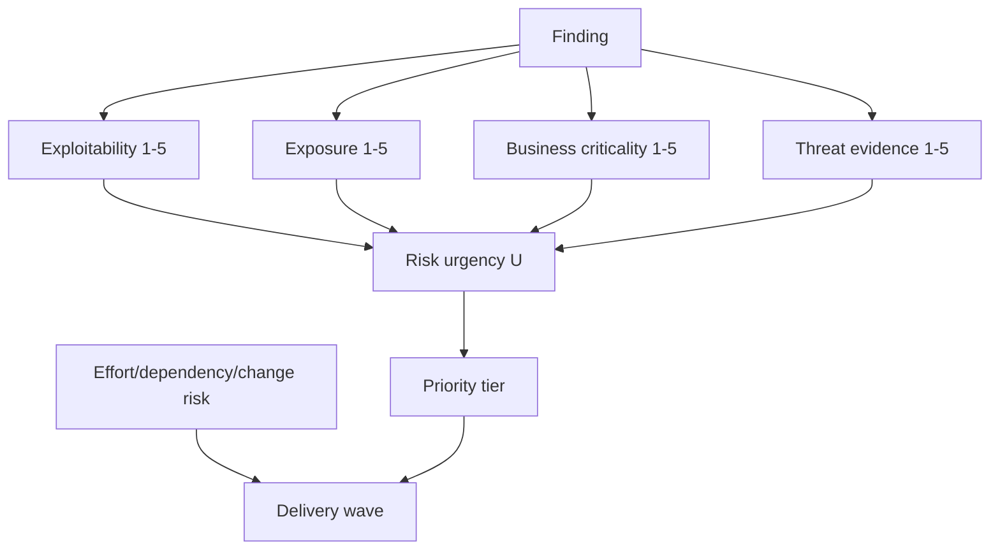

| Factor | 1 example | 3 example | 5 example |
|---|---|---|---|
| Exploitability | Strong prerequisites/no known exploit | Feasible with access/conditions | Reliable/known exploited or trivial |
| Exposure | Isolated lab | Internal reachable segment | Internet exposed or broad privilege path |
| Business | Disposable asset | Department impact | Catastrophic/crown-jewel impact |
| Threat | No relevant evidence | Public exploit/industry targeting | Active exploitation or observed incident |
| Confidence (separate) | Sparse/stale data | Corroborated but gaps | Direct current evidence |
| Effort (sequencing) | One reversible policy | Multi-team planned change | Architecture replacement/outage |

## 16. Prioritization guardrails

| Guardrail | Reason |
|---|---|
| Keep original severity/CVSS | Preserve technical evidence |
| Publish factor definitions | Make decisions reproducible |
| Record confidence | Prevent false precision |
| Do not divide risk by effort | Difficult risks stay visible |
| Review criticality with business owner | Security team cannot infer all impact |
| Record compensating controls separately | A control can reduce exposure without deleting finding |
| Re-score after verified state change | Plans and portal clicks do not reduce risk |
| Escalate uncertainty on crown jewels | Missing data is not low risk |

## 17. Remediation workflow

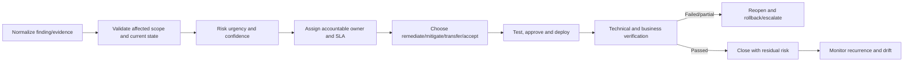

| Workflow field | Required content |
|---|---|
| Finding identity | Source ID, asset IDs, recommendation/CVE/control |
| Evidence | Current timestamp, affected scope and confidence |
| Risk | Technical severity, urgency factors and business impact |
| Owner | One accountable team/person plus contributors |
| SLA | Response/treatment target by tier |
| Treatment | Fix, mitigate, transfer or accept with rationale |
| Change | Dependencies, rollout, test and rollback |
| Verification | Direct control/asset/path evidence and observation window |
| Closure | Residual risk, score lag and monitoring |

## 18. Owners, SLAs and RACI

The security team owns risk insight, not every remediation. Endpoint engineering patches devices; identity teams change authentication/privilege; app owners change OAuth/configuration; data owners govern sensitive repositories; business owners accept service tradeoffs; risk authorities accept residual risk.

| Priority tier | Example response target | Treatment target | Escalation |
|---|---|---|---|
| P0 critical active exposure | Hours | Immediate containment plus emergency fix plan | Executive/IR/change authority |
| P1 high | One business day | Days based on approved standard | Security and service owner |
| P2 medium | Several business days | Planned sprint/month | Control owner |
| P3 low | Backlog review | Risk-based cycle | Product/asset owner |

These are illustrative, not Deloitte or Microsoft defaults. Define with the client and distinguish acknowledgment, mitigation and permanent remediation.

## 19. Exceptions and risk acceptance

An exception is a governed, temporary deviation. Risk acceptance is an authorized decision to retain residual risk. Neither means “ignore.” Include scope, reason, evidence, compensating controls, owner, approving authority, expiry, review trigger and exit plan.

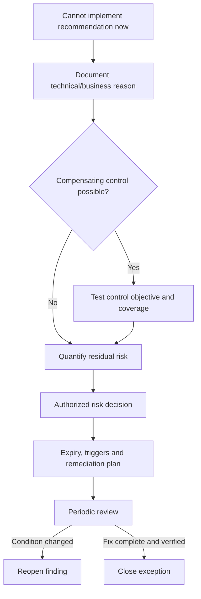

| Exception field | Example |
|---|---|
| Scope | Two legacy application servers, exact resource IDs |
| Reason | Vendor version cannot support control until upgrade |
| Compensating control | Segmentation, application allowlisting and monitored admin path |
| Evidence | Firewall test, access review and detection test |
| Residual risk | Privileged local exploit remains possible |
| Authority | Named business risk owner |
| Expiry | 90 days, no silent renewal |
| Trigger | New active exploit or internet exposure causes immediate review |

## 20. Verification and score reconciliation

Verification asks four questions: Did the technical state change? Does the control work? Did exposure/path reduce? Did business service remain healthy? Then reconcile delayed product scores.

| Verification layer | Example evidence |
|---|---|
| Configuration | Policy/resource/device state directly inspected |
| Effective control | Positive test blocks unsafe behavior |
| Negative/business | Legitimate workflow still works |
| Coverage | All intended assets/users, including critical exceptions |
| Graph/path | Edge/path no longer appears after expected freshness window |
| Score/recommendation | Secure Score/initiative updates after ingestion cadence |
| Recurrence | No drift/reopen during observation window |

Do not close solely because a ticket says deployed or Secure Score rose. Conversely, do not roll back a proven control solely because the score has not refreshed yet.

## 21. Security and privacy

Exposure graphs reveal privileged relationships, critical assets, vulnerabilities, internet-facing resources and data locations. This is high-value attacker intelligence. Apply least privilege, scoped exports, protected repositories, monitoring and retention. Avoid putting sensitive topology in broad executive decks. Third-party connectors require data-flow, residency, contractual, access and pricing review.

| Risk | Control |
|---|---|
| Graph/topology disclosure | Restricted roles and redacted reports |
| Critical-asset list abuse | Need-to-know access and monitoring |
| Excessive source connector access | Least-privilege service identity and secret rotation |
| Personal/employee context | Purpose limitation and pseudonymized reporting |
| Third-party data transfer | Privacy/security/legal architecture review |
| Unauthorized risk acceptance | Formal authority and immutable evidence |
| Score manipulation | Independent source-state verification |
| Stale data decision | Freshness timestamp and confidence label |

## 22. Design and deployment

Deploy exposure management as an operating model, not a dashboard launch.

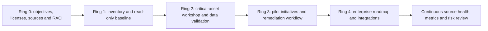

| Deployment gate | Pass criteria |
|---|---|
| Objective | Decisions/use cases are written, not “improve score” only |
| Coverage | Source/licensing/region matrix and known blind spots |
| Access | Read/manage roles, device groups and exports tested |
| Critical assets | Business owners validate rules and exceptions |
| Data quality | Sampling confirms IDs, relationships and freshness |
| Workflow | Ticket/RACI/SLA/exception/verification agreed |
| Pilot | One initiative and limited owner group produces outcomes |
| Reporting | Technical and executive definitions reconciled |
| Rollback | Connector/rule/weight/report changes can be reversed |

## 23. Configuration governance

| Configurable item | Governance |
|---|---|
| Criticality rule | Business owner, query/criteria, preview, version and review |
| Manual criticality | Reason, owner and expiry/review |
| Initiative target | Risk appetite and baseline evidence |
| Metric weight | Transparent rationale; steering approval |
| External connector | Architecture, identity, data, cost and support owner |
| Device group | Scope owner and cross-scope reconciliation |
| Exception | Formal authority, evidence and expiry |
| Dashboard transformation | Source traceability and anti-gaming review |

## 24. Rollback and change safety

Changing criticality rules, weights, connectors or status can reshape priorities. Preview affected assets before saving; export current state; use peer approval; monitor expected deltas; restore previous configuration if classification or scope is wrong. A rollback restores configuration, not necessarily historical graph state.

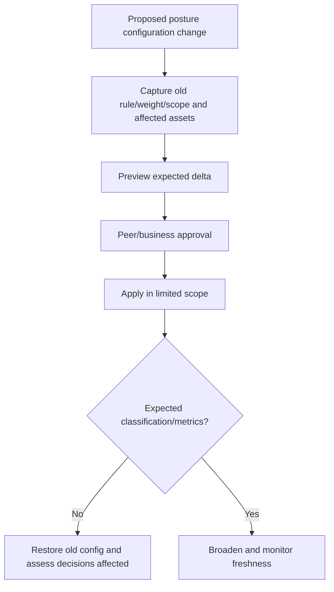

## 25. Operations cadence

| Cadence | Activity |
|---|---|
| Daily | P0/P1 Resolve Now items, source/connector failures, new critical paths |
| Weekly | Remediation aging, exceptions, failed verification and owner escalation |
| Monthly | Initiative/score trends, criticality quality and source coverage |
| Quarterly | Risk model, threat context, access, rollback and roadmap review |
| Event-driven | Active exploit, new crown jewel, acquisition, major architecture change |

24x7 teams should hand over new high-risk paths/findings, actions underway, score/data freshness, failures, pending decisions and next owner/time. Posture work is usually slower than incident response, but active exposure can cross into incident handling.

## 26. Metrics and anti-gaming

| Metric | Value | Anti-gaming guardrail |
|---|---|---|
| Secure Score trend | Control adoption direction | Do not equate with risk reduction alone |
| Critical-asset coverage | Crown jewels under validated controls | Audit classification quality |
| High-risk attack paths open | Cross-domain exposure | Validate path freshness and feasibility |
| Choke points remediated | Broad path reduction | Prove paths/edges actually reduced |
| P0/P1 aging | SLA performance | Do not downgrade priority to stop clock |
| Verified closure rate | Quality of remediation | Independent sample and reopen measure |
| Exception age/expiry | Risk debt | No automatic renewal |
| Source coverage/freshness | Confidence in views | Publish blind spots |
| Recurrence/reopen rate | Control durability | Attribute root cause, not team blame |
| Risk reduction per investment | Business-case outcome | Keep assumptions transparent |
| Time to owner acceptance | Governance responsiveness | One accountable owner required |

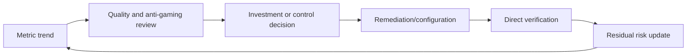

## 27. Executive reporting

Executives need business exposure, trajectory, decisions, investment and residual risk, not 300 recommendations.

| Executive section | Content |
|---|---|
| Exposure headline | What critical business outcome is at risk? |
| Change since last report | New/closed/reopened paths and verified controls |
| Top decisions | Funding, outage, ownership or risk acceptance required |
| Roadmap | Now/next/later with dependencies and expected reduction |
| Metrics | Score plus critical paths, aging, coverage and verification |
| Confidence | Data freshness, source coverage and key uncertainty |
| Residual risk | What remains after planned work and why |

Example wording:

> “Secure Score increased four points after identity-policy changes, but the principal risk reduction is the verified removal of two privileged attack paths to the payment platform. One high-risk path remains through a legacy administrative account. The account owner approved a 30-day exception with segmentation and monitoring while the application identity is redesigned. Exposure data is current to the source freshness window; two acquired SaaS environments remain outside coverage.”

## 28. Roadmap and business case

Create a **Now / Next / Later** roadmap. “Now” contains active/critical exposure and quick containment. “Next” addresses structural choke points and broad controls. “Later” modernizes architectures and retires compensating controls. Show cost of inaction, expected path/control reduction, service/change cost, dependencies, confidence and measurable outcomes.

| Business-case element | Example |
|---|---|
| Problem | Five attack paths share legacy admin credentials |
| Business impact | Payment and client-data disruption |
| Option A | Rotate credentials and segment now |
| Option B | Privileged access redesign and managed identity |
| Cost | Engineering, outage and license estimates |
| Benefit | Paths broken, critical assets protected, audit evidence improved |
| Risk of delay | Active exploit/threat context and exception burden |
| Success | Verified edge removal, no workflow regression, exception closed |

### 🔍 Plain-English deep-dive: effort changes the plan, not the risk

Replacing a legacy identity architecture may take six months, while changing one policy takes a day. The six-month item does not become low risk because it is expensive. Keep its urgency visible, apply interim containment, secure funding and plan milestones. Think of a cracked bridge: a difficult replacement still requires immediate weight limits and monitoring.

## 29. Common failures and troubleshooting

| Symptom | Likely cause | Diagnostic path |
|---|---|---|
| Score did not update | Product cadence, partial scope, unsupported state or ingestion lag | Verify source control, affected population and wait documented cadence |
| Score changed unexpectedly | Recommendation/denominator/product update or status | Review score history, What's New and source state |
| Recommendation says To address after fix | Incomplete coverage, lag or device exception behavior | Inspect action details and affected assets |
| Attack path seems impossible | Stale edge, prerequisite not modeled, identifier mismatch | Validate each node/edge with owners/source state |
| Critical asset missing | Sensor/version, rule criteria, pending approval or scope | Check classification and device/identity/cloud data |
| Too many critical assets | Broad overlapping rule/highest-wins behavior | Preview and refine criteria with business owner |
| User cannot see assets | Unified RBAC/device group scope | Compare role/data-source assignment and known global view |
| Graph data stale | Source delay, connector failure or stated freshness window | Check source health/timestamps before escalation |
| Connector empty/failing | Identity, API, entitlement, rate or preview limitation | Validate connector health and least-privilege access |
| Initiative improved but risk did not | Metric gaming or easy controls | Compare critical paths, active threats and verified closure |
| DVM and Secure Score differ | Different scope/status/exception semantics | Reconcile source IDs, affected devices and timing |

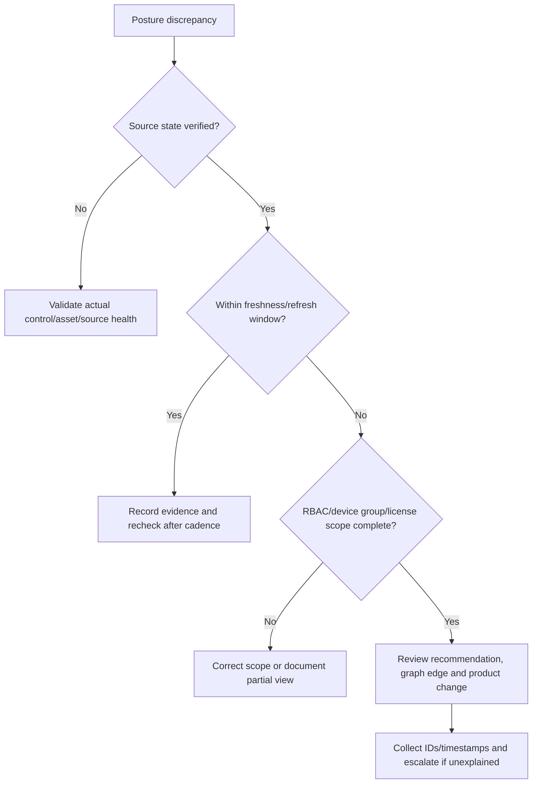

## 30. Scenario: prioritize 20 fictional findings

**Client context:** Fabrikam Consulting is fictional. Its crown jewels are payment processing, client document storage and hybrid identity. Scores use the workshop formula $U$ above. All values are illustrative. “Effort” affects delivery wave, not risk urgency.

| # | Fictional finding | E | X | B | T | U | Effort | Priority and first treatment |
|---:|---|---:|---:|---:|---:|---:|---|---|
| 1 | Internet VPN appliance with known exploited vulnerability | 5 | 5 | 5 | 5 | 5.00 | 3 | P0: emergency mitigation/patch and hunt |
| 2 | Global admins lack phishing-resistant MFA | 4 | 5 | 5 | 5 | 4.75 | 3 | P0: restrict admin paths; rapid rollout |
| 3 | Critical domain controller missing exploited patch | 5 | 3 | 5 | 5 | 4.50 | 4 | P0/P1: containment and emergency change |
| 4 | Public storage exposes sensitive client files | 4 | 5 | 5 | 4 | 4.50 | 2 | P0: remove public access, preserve evidence |
| 5 | Unverified OAuth app has high-privilege grant | 4 | 4 | 5 | 4 | 4.25 | 2 | P1: disable/restrict pending owner review |
| 6 | EDR sensor inactive on finance endpoints | 4 | 4 | 5 | 4 | 4.25 | 2 | P1: restore coverage and hunt gap period |
| 7 | Legacy authentication allowed for 20 users | 4 | 4 | 4 | 4 | 4.00 | 3 | P1: block with dependency pilot |
| 8 | Internet server high CVSS; WAF partly mitigates | 4 | 4 | 4 | 5 | 4.20 | 3 | P1: validate WAF, patch and test |
| 9 | Stale privileged service account remains enabled | 4 | 4 | 5 | 3 | 4.05 | 3 | P1: identify owner/use, restrict and retire |
| 10 | Workstation-to-domain-admin attack path via shared credential | 4 | 4 | 5 | 5 | 4.45 | 4 | P0/P1: break credential/session choke point |
| 11 | Risky browser extension on 80 general devices | 3 | 3 | 3 | 3 | 3.00 | 2 | P2: block/remove by rings |
| 12 | Old TLS enabled on isolated low-value internal app | 3 | 2 | 2 | 2 | 2.30 | 3 | P3: schedule modernization |
| 13 | Endpoint baseline missing on engineering group | 3 | 3 | 3 | 2 | 2.80 | 3 | P2: pilot baseline and exceptions |
| 14 | Low-risk SaaS recommendation with no sensitive data | 2 | 2 | 3 | 1 | 2.05 | 1 | P3 quick win after validation |
| 15 | Obsolete software on isolated disposable lab device | 3 | 1 | 1 | 2 | 1.80 | 1 | P3: remove/rebuild in normal cycle |
| 16 | MFA Secure Score action partly covered by alternate control | 3 | 3 | 4 | 3 | 3.25 | 2 | P2: test scope and uncovered critical users |
| 17 | Broad external sharing on sensitive project site | 3 | 4 | 5 | 3 | 3.75 | 3 | P1/P2: restrict links and review access |
| 18 | Excessive cloud role can administer critical resources | 4 | 4 | 5 | 4 | 4.25 | 3 | P1: remove standing privilege/PIM design |
| 19 | High-CVSS endpoint issue with no exploit on isolated kiosk | 3 | 1 | 2 | 1 | 1.90 | 2 | P3: patch by cycle; monitor threat change |
| 20 | Logging/telemetry gap on crown-jewel payment system | 2 | 4 | 5 | 3 | 3.45 | 4 | P1/P2: compensating monitoring and onboard |

### Why the order is defensible

- Findings 1, 2, 3, 4 and 10 can enable active/high-impact entry or movement to crown jewels.
- Finding 10 is a choke point: breaking shared credential/session exposure reduces multiple routes.
- Findings 5, 6 and 18 are high because privilege or visibility affects critical business assets.
- Finding 20 has modest exploitability but high uncertainty and impact; absence of telemetry is not safety.
- Finding 19 has high technical severity but low current exposure/threat evidence; it remains tracked and is re-prioritized if reachability or exploitation changes.
- Finding 14 can be a quick win but must not displace P0/P1 work merely because it is easy or adds score.

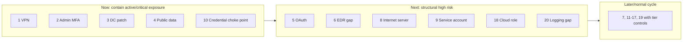

### Remediation waves

| Wave | Findings | Exit criteria |
|---|---|---|
| Emergency 0–72 hours | 1, 2, 3, 4, 10 | Containment verified; owner and permanent plan |
| Wave 1 | 5, 6, 8, 9, 18, 20 | Privilege/coverage restored and high paths reduced |
| Wave 2 | 7, 11, 13, 16, 17 | Pilot controls verified; exceptions governed |
| Wave 3 | 12, 14, 15, 19 | Normal lifecycle closure and threat-change monitoring |

## 31. Safe paper lab

**Safety boundary:** Do not sign into a tenant, connect a third-party source, change a score/action status, classify real critical assets, export topology or implement a control. Use the fictional 20 findings only.

### Lab tasks

1. Explain Secure Score, Exposure Management and DVM in one sentence each.
2. Map the 20 findings to endpoint, identity, app, data, cloud and visibility domains.
3. Challenge each $E$, $X$, $B$ and $T$ value and write confidence High/Medium/Low.
4. Identify at least two attack paths and one choke point.
5. Reorder findings using a client-specific criticality assumption and explain changes.
6. Pick one third-party mitigation, one alternate mitigation and one risk acceptance; define evidence.
7. Create owner, SLA, dependency, test and rollback for the top five.
8. Design an executive page with no more than six measures.
9. Write a business case for removing the shared credential choke point.
10. Simulate one failed verification and reopen the finding.

| Lab output | Acceptance criterion |
|---|---|
| Product map | No score/product is called a universal risk score |
| Data-quality register | License, source, scope and freshness gaps visible |
| Critical-asset map | Business owner and rationale present |
| Prioritization matrix | Risk independent of effort; confidence separate |
| Attack-path sketch | Possible path language, not confirmed compromise |
| Treatment plan | Remediate/mitigate/accept evidence and residual risk |
| Verification plan | Technical, effective-control, business and coverage tests |
| Metrics | Includes path/closure/exception/source quality, not score alone |
| Executive report | Decisions and residual risk are explicit |
| Honesty statement | Paper exercise, no production operation claim |

## 32. Consulting artifacts

| Artifact | Client value | Quality check |
|---|---|---|
| Capability/license/source matrix | Defines available evidence and blind spots | Region, plan, source, owner and freshness |
| Asset criticality policy | Aligns business impact | Rules, owner, highest-wins and review cadence |
| Exposure graph workshop | Reveals paths/choke points | Edge assumptions independently validated |
| Secure Score register | Converts actions to governed work | Status/evidence/lag and business overlay |
| Prioritization model | Makes ranking explainable | Definitions, confidence and anti-gaming |
| Remediation register | Drives accountability | Owner, SLA, dependencies and validation |
| Exception register | Controls retained risk | Authority, compensating control and expiry |
| Verification pack | Proves outcomes | Positive/negative/coverage/path evidence |
| Executive dashboard | Supports decisions | Business exposure plus confidence/residual risk |
| Roadmap/business case | Funds structural improvement | Cost, benefit, dependencies and success criteria |
| Operating model | Sustains posture | RACI, cadence, handover and escalation |
| Troubleshooting runbook | Resolves product/data mismatch | Source-first diagnostic tree |

### Evidence-safe interview wording

> “I completed a synthetic 20-finding exposure exercise. I separated Secure Score control adoption from Exposure Management paths and DVM vulnerability context; validated criticality, exploitability, exposure and threat evidence; kept remediation effort out of risk urgency; identified a shared-credential choke point; designed owner/SLA/exception/verification workflows; and produced an executive roadmap. I did not operate a production posture tenant or change real score statuses.”

## 33. JD Mapping: interview translation

| Interview prompt | Arti's factual production strength | Honest exposure-management bridge |
|---|---|---|
| “How do you prioritize vulnerabilities?” | Incident impact and dependency analysis | Explain exposure/business/threat overlay beyond CVSS |
| “How do you use Secure Score?” | Control validation and reporting | Describe synthetic score register and caveats |
| “What are attack paths?” | Cross-service RCA/dependency mapping | Explain possible routes and validated edges |
| “How do you drive remediation?” | Multi-team ownership and fix validation | Use RACI, SLA, change, verification and escalation |
| “How do you report executives?” | Incident/stakeholder reporting | Focus decisions, critical exposure and residual risk |
| “What is your hands-on level?” | Production M365 support | Exposure/Secure Score study and paper prioritization only |

## Official Source Anchors

1. [What is Microsoft Security Exposure Management?](https://learn.microsoft.com/en-us/security-exposure-management/microsoft-security-exposure-management)
2. [Exposure Management prerequisites and support](https://learn.microsoft.com/en-us/security-exposure-management/prerequisites)
3. [Review and classify critical assets](https://learn.microsoft.com/en-us/security-exposure-management/classify-critical-assets)
4. [Critical asset management overview](https://learn.microsoft.com/en-us/security-exposure-management/critical-asset-management)
5. [Exposure insights overview](https://learn.microsoft.com/en-us/security-exposure-management/exposure-insights-overview)
6. [Enterprise exposure graph overview](https://learn.microsoft.com/en-us/security-exposure-management/enterprise-exposure-graph-overview)
7. [ExposureGraphNodes advanced hunting table](https://learn.microsoft.com/en-us/defender-xdr/advanced-hunting-exposuregraphnodes-table)
8. [ExposureGraphEdges advanced hunting table](https://learn.microsoft.com/en-us/defender-xdr/advanced-hunting-exposuregraphedges-table)
9. [Microsoft Secure Score](https://learn.microsoft.com/en-us/defender-xdr/microsoft-secure-score)
10. [Assess posture through Secure Score](https://learn.microsoft.com/en-us/defender-xdr/microsoft-secure-score-improvement-actions)
11. [Secure Score history, metrics and trends](https://learn.microsoft.com/en-us/defender-xdr/microsoft-secure-score-history-metrics-trends)
12. [Defender Vulnerability Management overview](https://learn.microsoft.com/en-us/defender-vulnerability-management/defender-vulnerability-management)
13. [Security recommendations in Defender Vulnerability Management](https://learn.microsoft.com/en-us/defender-vulnerability-management/tvm-security-recommendation)
14. [Threat and vulnerability management dashboard](https://learn.microsoft.com/en-us/defender-vulnerability-management/tvm-dashboard-insights)
15. [Microsoft Defender XDR unified RBAC](https://learn.microsoft.com/en-us/defender-xdr/manage-rbac)
16. [Common Vulnerability Scoring System](https://www.first.org/cvss/)
17. [NIST IR 8179 Criticality Analysis Process Model](https://csrc.nist.gov/pubs/ir/8179/final)
18. [NIST Cybersecurity Framework 2.0](https://www.nist.gov/cyberframework)

## ⭐ Likely Interview Questions for This Section

### Q1. How do Secure Score, Exposure Management and Defender Vulnerability Management differ?

**Model answer:** Secure Score measures adoption of supported recommended Microsoft security actions. Defender Vulnerability Management focuses on endpoint software/configuration weaknesses, affected assets and remediation. Exposure Management connects assets, weaknesses, identities, apps, cloud and business context through a graph to surface critical assets, paths and initiatives. I use them together but never merge their scores as one risk truth.

### Q2. How is Secure Score calculated, and what are its limits?

**Model answer:** At a high level it is achieved points divided by possible points, with most actions binary and some partial by coverage. Actions are generally worth up to 10 points. It is useful for control adoption, trends and work discovery, but it is not breach probability or a guarantee. It can lag, omit nonmeasured controls and lack critical-asset/business context.

### Q3. How do third-party mitigation, alternate mitigation and risk acceptance work?

**Model answer:** Third-party and alternate mitigation statuses say the control objective is addressed another way and can receive points, but Microsoft cannot verify completeness, so I require scope, test evidence and an owner. Risk acceptance leaves the risk and gives no points; it requires authorized rationale, residual risk, compensating controls, expiry, triggers and an exit plan.

### Q4. What is an attack path and a choke point?

**Model answer:** An attack path is a possible chain of weaknesses and relationships from an entry point to a valuable target. It is not proof an attacker used the route. A choke point is a node or edge shared by many paths, so one verified control can break several routes. I validate freshness, prerequisites, reachability and criticality before prioritizing it.

### Q5. Why is CVSS not enough for prioritization?

**Model answer:** CVSS describes technical severity. It does not know whether the asset is internet-exposed, reachable through an attack path, business-critical, covered by compensating controls or actively targeted. I retain CVSS, then add exploitability, exposure, criticality, threat evidence and confidence. Effort affects delivery planning, not risk urgency.

### Q6. How do you verify remediation?

**Model answer:** I verify source configuration, effective control behavior, legitimate business behavior, coverage of all intended assets/users and expected reduction of graph/path exposure. I then reconcile delayed Secure Score or initiative updates. A ticket marked deployed or a score increase alone is not closure; failed or partial checks reopen the finding.

### Q7. How would you present posture to an executive?

**Model answer:** I lead with critical business exposure and change, not raw finding count. I show verified path/control reduction, P0/P1 aging, critical-asset coverage, exceptions, source confidence, decisions needed, Now/Next/Later roadmap and residual risk. Secure Score is one trend measure, clearly labeled as control adoption rather than enterprise risk.

### Q8. What is your honest Exposure Management experience?

**Model answer:** My production foundation is Microsoft 365 incident RCA, evidence, fix validation and stakeholder coordination. I have studied current Secure Score, Exposure Management and DVM architecture and completed a synthetic 20-finding prioritization with attack paths, critical assets, owners, SLAs, exceptions, verification and executive reporting. I have not operated these posture tools in production.

## 🧠 30-Second Memory Hooks

- **Posture is condition; attack surface is targets; exposure is connected opportunity.**
- **Secure Score measures supported control adoption, not breach probability.**
- **DVM finds endpoint weaknesses; Exposure Management connects cross-domain risk.**
- **A graph node is an asset; an edge is a relationship; a path is possible, not proven.**
- **Criticality comes from business consequence, not device name alone.**
- **Choke point: one hallway used by many attack routes.**
- **CVSS describes the lock; exposure describes the building.**
- **Risk urgency excludes effort; effort shapes the delivery wave.**
- **Alternate mitigation needs objective, scope, test and owner.**
- **Risk acceptance retains risk and must expire.**
- **Verify source state and control effect before waiting on score refresh.**
- **Report critical exposure, decisions, confidence and residual risk.**
- **Do not improve metrics by downgrading or hiding findings.**
- **Arti's bridge is RCA and fix validation, not production posture ownership.**

## Completion Checklist

- [ ] I can define posture, attack surface, exposure, risk, critical asset and choke point.
- [ ] I can distinguish Secure Score, Exposure Management, DVM and identity/app/data posture.
- [ ] I can draw the source-to-graph-to-insight architecture.
- [ ] I can verify licensing, public-cloud support, source enablement and preview connectors.
- [ ] I can apply unified RBAC/device groups and explain partial views.
- [ ] I can explain Secure Score points, percentage, partial credit and score views.
- [ ] I can describe score lag, license caveats and product refresh differences.
- [ ] I can govern To address, Planned, Completed, third-party, alternate and risk-accepted states.
- [ ] I can explain insights, initiatives, metrics, recommendations and events.
- [ ] I can interpret nodes/edges/paths without claiming confirmed compromise.
- [ ] I can classify critical assets with business validation and rule governance.
- [ ] I can identify and prioritize a choke point.
- [ ] I can use CVSS as input without treating it as business risk.
- [ ] I can score exploitability, exposure, business criticality and threat evidence transparently.
- [ ] I keep confidence separate and never reduce risk because remediation is hard.
- [ ] I can assign owners, SLAs, treatment, dependencies and escalation.
- [ ] I can design exceptions and risk acceptance with evidence, authority and expiry.
- [ ] I can verify technical state, effective control, business behavior, coverage and path reduction.
- [ ] I can secure sensitive graph, asset and connector data.
- [ ] I can deploy in rings with data-quality, workflow and rollback gates.
- [ ] I can define metrics with anti-gaming controls.
- [ ] I can write an executive report and Now/Next/Later business case.
- [ ] I can troubleshoot score, graph, criticality, scope and connector discrepancies.
- [ ] I can prioritize all 20 fictional findings and defend the ordering.
- [ ] I can complete the safe paper lab without changing a tenant.
- [ ] I can state honestly that this is study/design evidence, not production ownership.
- [ ] I have rechecked current licenses, freshness, previews, portal and RBAC.

*Next suggested section:* [Part 42](Part-42-security-copilot-agents-governance.md) — use Microsoft Security Copilot and agents as governed assistants, with permission-aware grounding, human validation, capacity controls and no blind execution.