# Part 43 — SIEM, SOAR, SOC Fundamentals, and Microsoft Sentinel Architecture

> **Section goal:** Build a beginner-first, consulting-grade understanding of why a Security Operations Center exists, how its people and capabilities fit together, and where Microsoft Sentinel sits in the Microsoft security architecture. This Part covers SOC purpose and roles; tier labels versus capabilities; the event/log/signal/alert/incident/case chain; SIEM, SOAR and XDR distinctions; Sentinel in the Microsoft Defender portal; Azure subscriptions, resource groups and Log Analytics workspaces; control and data planes; Content Hub; connectors, tables, analytics, incidents, entities, hunting, workbooks and automation; RBAC and managed identities; Defender XDR integration; lifecycle, operations, service health, shared responsibility and an end-to-end paper design. You should be able to explain and design the system without claiming production Microsoft Sentinel administration.

This Part maps directly to Deloitte expectations for Microsoft security architecture, Sentinel and Defender XDR, incident response, troubleshooting, root-cause analysis (RCA), automation, governance, client workshops, documentation and stakeholder reporting. Your incident ownership, evidence correlation, fix validation and reporting are directly transferable. The honest bridge is from disciplined incident practice to a current Sentinel design and safe paper lab, not a claim that you have operated a production SOC or Sentinel tenant.

> **Currency, portal, preview, licensing and pricing note (August 24, 2026):** This chapter is grounded in Microsoft Learn architecture and product documentation available on August 24, 2026. Microsoft is completing the transition of Sentinel experiences to the Microsoft Defender portal. Portal paths, onboarding behavior, Defender XDR correlation, incident providers, Content Hub packages, roles, table plans, data-lake capabilities, automation behavior, preview labels, included benefits and prices can change by cloud, region, tenant rollout and contract. The legacy Microsoft Sentinel experience in the Azure portal is change-sensitive and is scheduled to be unsupported after the Microsoft-published transition date; do not design a new operating procedure around an Azure-portal-only screen. Verify the live Defender portal, Microsoft Learn page banners, Azure Updates, Service Health, Product Terms, pricing calculator, region availability and the client's agreement before implementation. Preview features require an explicit risk decision and must not be presented as generally available.

## JD Mapping

| Deloitte expectation | Capability developed here | Consulting evidence you can produce |
|---|---|---|
| Advise on Microsoft security architecture | Explain SOC, SIEM, SOAR, XDR and Sentinel boundaries | Current-state and target-state architecture |
| Improve incident response | Map telemetry through alerts, incidents, entities and actions | Incident-flow diagram and handoff model |
| Troubleshoot security services | Isolate collection, ingestion, detection, portal and automation failures | Layered troubleshooting decision tree |
| Apply least privilege | Separate Azure, workspace, Sentinel and automation rights | RBAC and managed-identity matrix |
| Govern deployment | Use requirements, rings, tests, rollback and change control | Deployment and rollback plan |
| Operate and report | Define service health, SLOs, metrics and review cadence | SOC scorecard and executive report |
| Work honestly across technologies | Translate production incident/RCA skills without overstating Sentinel use | Candidate honesty statement and paper lab |

## Candidate honesty note

You can credibly discuss production incident coordination, evidence timelines, troubleshooting, RCA, remediation validation, knowledge articles and stakeholder reporting where supported by your experience. You can also describe the Sentinel architecture and safe paper design in this chapter.

You should not claim production Sentinel onboarding, workspace administration, connector deployment, analytics-rule ownership, incident queue operation, Logic App automation or Defender portal migration unless separately evidenced. Safe wording is:

> “My production strength is disciplined incident handling: defining impact, correlating evidence, isolating the failing layer, validating recovery and communicating clearly. I have not administered Microsoft Sentinel in production. To prepare for this role, I built a current Sentinel architecture and paper lab covering Azure hierarchy, Log Analytics, Content Hub, data connectors, analytics, incidents, entities, RBAC, managed identities, Defender XDR integration, testing, rollback and operational metrics. In a client tenant I would verify portal and license state, start read-only, protect sensitive telemetry, deploy in rings and require evidence before changing detection or response behavior.”

---

## 1. Why a Security Operations Center exists

A **Security Operations Center (SOC)** is the people, process and technology used to monitor security-relevant activity and coordinate response. It may be one room, a distributed team or an outsourced service. Its purpose is not “watch every log.” Its purpose is to reduce risk by finding meaningful threats, deciding what they mean and coordinating proportionate action while preserving evidence.

Think of a SOC as an airport operations center. Radar, baggage systems, passenger reports and weather feeds all produce data. Specialists do not treat every dot as an emergency. They correlate signals, assess consequence, choose a response, document decisions and learn from disruptions.

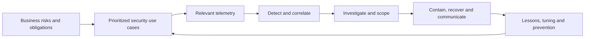

| SOC outcome | Plain meaning | Example evidence |
|---|---|---|
| Visibility | Know what relevant systems report | Source inventory and coverage map |
| Detection | Identify behavior worth review | Alert tied to a documented threat scenario |
| Triage | Decide urgency and ownership | Severity, confidence and routing record |
| Investigation | Establish what happened and scope | UTC timeline, entities and evidence links |
| Response | Reduce harm under authorization | Containment approval and action result |
| Recovery | Return service to a trusted state | Validation checks and monitoring period |
| Learning | Improve controls and knowledge | RCA, detection tuning and runbook update |
| Assurance | Demonstrate controlled operation | Metrics, audit trail and governance minutes |

### 🔍 Plain-English deep-dive: the SOC is an outcome system, not a dashboard

A dashboard can be green while a critical source is disconnected. It can also be red because a harmless test generated many alerts. A mature SOC begins with business harm: which identities, data, applications and operations matter, and which attacker behaviors could affect them? It then chooses telemetry and detections that answer those questions. Technology supports that loop; technology is not the loop.

## 2. Event, log, signal, alert, incident and case

These words are often mixed together. Keeping them separate prevents exaggerated claims and broken metrics.

| Term | Beginner definition | Example | Memory hook |
|---|---|---|---|
| Event | Something that happened at a point in time | A user signed in | One occurrence |
| Log | A stored record or stream of events | Sign-in records in a table | Written diary |
| Signal | Evidence that may have security meaning | Sign-in from a new country | Interesting clue |
| Alert | A product or rule says a condition deserves review | Impossible-travel alert | Raised flag |
| Incident | Related alerts/evidence grouped for investigation | Sign-in plus mailbox rule plus download | Investigation folder |
| Entity | A meaningful object in evidence | User, host, IP, URL, mailbox | Noun in the story |
| Evidence | Data supporting or contradicting a hypothesis | Timestamped audit event | Checkable fact |
| Case | Broader managed record spanning decisions and obligations | Major phishing response with legal tasks | Governed work file |

One event can be benign. Multiple signals can produce an alert. Several related alerts can become one incident. An incident can be linked to a broader case, but naming and workflow vary across organizations and tools.

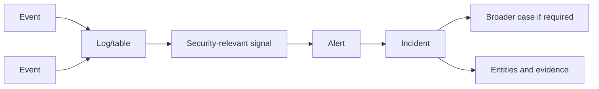

## 3. SOC roles and tiers versus capabilities

Traditional SOC descriptions use **Tier 1, Tier 2 and Tier 3**. These labels are convenient but inconsistent. One organization calls a senior investigator Tier 2; another calls that role Tier 3. Design around capabilities, decision rights and handoffs rather than job-number mythology.

| Common label | Typical focus | Required capability | Risk if treated rigidly |
|---|---|---|---|
| Tier 1 | Queue monitoring and initial triage | Validate source, scope, urgency and owner | Mechanical closure based on alert title |
| Tier 2 | Deeper investigation and containment recommendation | Correlate entities, test hypotheses and preserve evidence | Handoff delay and duplicated analysis |
| Tier 3 | Advanced hunting, malware/detection expertise | Develop detections and lead complex analysis | Becoming a bottleneck for every hard case |
| Incident commander | Coordinates major response | Decisions, dependencies, communications and timeline | Confusing command with technical analysis |
| Detection engineer | Builds and tunes detection content | Threat model, KQL, testing and version control | Optimizing alert volume rather than risk |
| Platform engineer | Operates SIEM/SOAR platform | Collection, identity, cost, health and deployment | Making content changes without threat context |
| Threat hunter | Tests threat hypotheses proactively | Querying, baseline reasoning and evidence discipline | Hunting without a hypothesis or stop condition |
| Threat intelligence analyst | Interprets actors, campaigns and indicators | Source evaluation and relevance analysis | Treating every indicator as malicious forever |
| Automation engineer | Designs response workflows | Identity, approval, failure handling and rollback | High-impact automation without controls |
| SOC manager/service owner | Owns outcomes and operating model | Risk, staffing, SLOs, cost and reporting | Rewarding closure speed at the expense of quality |

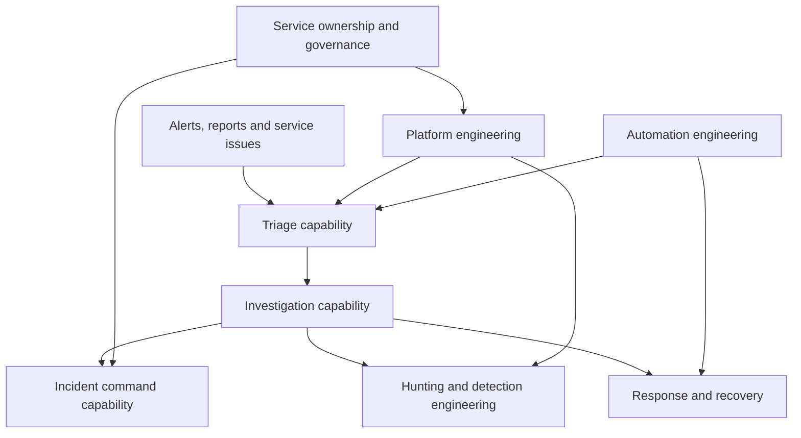

The useful interview statement is: “Tiers can describe staffing, but I document capabilities, authority and escalation criteria so the operating model survives team-name changes.”

## 4. SIEM from zero

**Security Information and Event Management (SIEM)** is a platform pattern that collects security-relevant data, stores and queries it, detects patterns, correlates evidence and supports investigation and reporting. Microsoft Sentinel is Microsoft's cloud-native SIEM and includes SOAR capabilities.

SIEM is like a searchable evidence warehouse with alarm rules. It can centralize records from identity, endpoint, cloud, network and application systems, but it only sees what is connected, retained and queryable.

| SIEM function | Question it answers | Sentinel surface |
|---|---|---|
| Collect | Which sources arrive? | Data connectors and ingestion paths |
| Store | Where and for how long? | Log Analytics workspace and table plans |
| Normalize | Can unlike sources use common fields? | ASIM parsers and normalized schemas |
| Query | What happened? | Kusto Query Language (KQL) |
| Detect | Which pattern deserves review? | Analytics rules and Microsoft detections |
| Correlate | Which signals belong together? | Alerts, incidents, entities and Fusion-style correlation |
| Investigate | What is the scope and evidence? | Incident/entity pages, logs, hunting and bookmarks |
| Visualize | What is changing? | Workbooks and reports |
| Automate | Which repeatable steps can be orchestrated? | Automation rules and playbooks |

## 5. SOAR from zero

**Security Orchestration, Automation and Response (SOAR)** coordinates repeatable security workflows across systems. In Sentinel, automation rules can trigger actions and can invoke playbooks built with Azure Logic Apps. “Automation” does not mean “fully autonomous.” A workflow can be read-only, recommendation-only, approval-gated or state-changing.

| Automation level | Example | Control expectation |
|---|---|---|
| Enrich | Look up an IP reputation and append result | Read-only identity and timeout handling |
| Notify | Send a structured incident notification | Data minimization and approved destination |
| Route | Assign incident based on owner mapping | Deterministic rule and fallback queue |
| Recommend | Prepare containment steps for approval | Human reviews evidence and blast radius |
| Act | Disable account or block indicator | Explicit authority, least privilege, audit and rollback |

### 🔍 Plain-English deep-dive: orchestration is not permission

A playbook is a set of instructions, like an emergency checklist. The existence of a checklist does not authorize a person to close a building. Likewise, a Logic App can technically call an API, but business authority, product permission, change control and evidence requirements still apply. Managed identity answers “who is calling?”; it does not answer “should this action happen?”

## 6. XDR from zero and how it differs from SIEM

**Extended Detection and Response (XDR)** correlates security signals and response across a connected set of security products, commonly endpoints, identities, email, applications and cloud workloads. Microsoft Defender XDR provides product-native detections and a unified incident experience. It is optimized for high-context Microsoft security signals. SIEM has broader cross-vendor collection, flexible querying, retention, compliance and custom detection scope.

| Dimension | SIEM | XDR | SOAR |
|---|---|---|---|
| Primary purpose | Broad telemetry analysis and detection | Product-native cross-domain detection/response | Workflow coordination and action |
| Typical sources | Microsoft, third-party, custom and infrastructure | Integrated security-product telemetry | APIs and operational systems |
| Data model | Workspace tables and schemas | Product incidents, alerts and entities | Trigger, condition, step and result |
| Strength | Breadth, query flexibility and retention | Rich product context and built-in correlation | Consistency and response speed |
| Limitation | Cost/complexity and source quality | Vendor/product coverage boundary | Can automate a bad decision quickly |
| Microsoft example | Sentinel | Defender XDR | Sentinel automation rules and Logic Apps |

The products are complementary. Avoid the false choice “SIEM or XDR.” Ask which detections should remain product-native, which evidence must be centralized, which incidents should be synchronized and where response authority belongs.

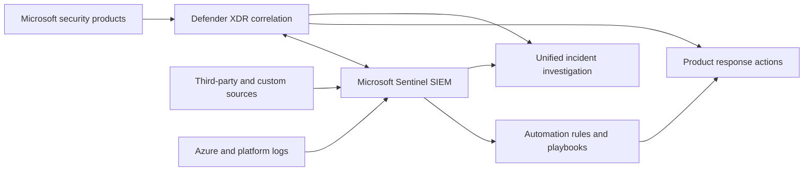

## 7. Microsoft Sentinel in the Defender portal

The strategic Sentinel experience is integrated into the Microsoft Defender portal. The Defender portal brings Sentinel and Defender XDR investigation together, subject to onboarding, licensing, roles, workspace support and tenant rollout. An analyst can work with incidents, alerts, entities, hunting, threat intelligence, workbooks and other Sentinel capabilities without treating the portal as the actual data store.

The portal is a **management and investigation experience**. The Log Analytics workspace remains a core data platform resource. Azure resources, billing, retention and some configuration surfaces may still route to Azure management experiences. Therefore “Sentinel moved to Defender” does not mean “Azure dependencies disappeared.”

| Layer | What it contains | Change-sensitive check |
|---|---|---|
| Microsoft Defender portal | Unified incidents, investigations, hunting and Sentinel operations | Exact navigation, onboarding mode and feature parity |
| Azure management plane | Subscription, resource group, workspace, policy, roles and diagnostics | Portal blades and provider APIs |
| Log Analytics data platform | Tables, ingestion, retention and KQL query execution | Table plans, data lake and pricing |
| Content/services | Solutions, connectors, rules, workbooks, playbooks and ML services | Content version, preview/GA and dependencies |

> **Legacy portal warning:** Treat instructions that say only “open Microsoft Sentinel in the Azure portal and click…” as potentially stale. Record the desired resource or API outcome, then verify the current Defender/Azure location. Screenshots age faster than architecture.

## 8. Azure hierarchy and prerequisites

Sentinel depends on an Azure resource hierarchy:

- An **Azure tenant** supplies Microsoft Entra identities and directory boundary.
- An **Azure subscription** is a billing and governance container.
- A **resource group** groups Azure resources for lifecycle, access and policy.
- A **Log Analytics workspace** stores/query logs and supplies configuration boundaries.
- **Microsoft Sentinel enablement/onboarding** adds Sentinel capabilities to an eligible workspace and connects it to the Defender portal experience.

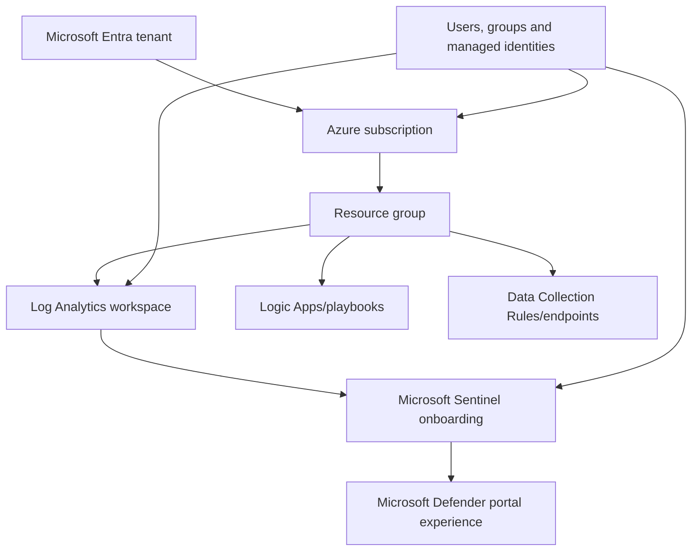

| Prerequisite area | Questions before onboarding |
|---|---|
| Identity | Which tenant, groups, Conditional Access and emergency accounts? |
| Subscription | Who owns billing, policy and resource providers? |
| Resource group | Which lifecycle, tags, locks and deployment pipeline? |
| Workspace | Region, data residency, retention, table plans and ownership? |
| Licensing | Which Sentinel, Log Analytics, Defender and Logic Apps charges/benefits apply? |
| Network | Can sources reach required endpoints through proxy/firewall/TLS inspection? |
| Security | Who can read sensitive logs, change rules or run playbooks? |
| Operations | Who receives service health, cost and connector-health alerts? |

## 9. Licensing and cost boundaries at architecture level

Sentinel cost can include analytics-tier ingestion, data-lake or lower-cost tiers, retention, search/restore, queries, auxiliary services, Logic Apps, Azure Functions, storage, egress and source-product licenses. Some Microsoft data sources or benefits may have free allowances or included periods, but these are source, plan, region and agreement sensitive.

Architecture must therefore distinguish:

1. entitlement to a source product,
2. right to access its data,
3. cost to ingest or analyze that data in Sentinel,
4. cost to retain or retrieve it,
5. cost to automate a response.

Never quote a price from memory in a client design. Capture assumptions, units, region, currency, benefit and retrieval pattern, then verify the official pricing page and calculator. Part 44 develops this in depth.

## 10. Control plane versus data plane

The **control plane** changes configuration: create a workspace, install a solution, assign a role, configure a connector, deploy a rule or authorize a playbook. The **data plane** handles the security records and queries: ingest events, store rows, execute KQL and retrieve incident evidence. Exact Azure authorization operations vary by resource and API, but the separation is a powerful design tool.

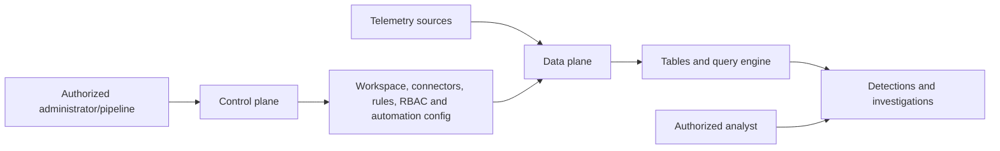

| Control-plane risk | Data-plane risk | Design response |
|---|---|---|
| Unauthorized rule change | Sensitive event disclosure | Separate deployer and reader roles |
| Connector disabled | Telemetry gap | Health alert and change audit |
| Broad role assignment | Cross-team data exposure | Scope at resource/workspace/table where supported |
| Playbook connection changed | Action under wrong identity | Managed identity and connection review |
| Retention/table plan changed | Evidence unavailable or expensive | Policy, approval and validation query |

### 🔍 Plain-English deep-dive: seeing data is different from changing the detector

Imagine a laboratory. Reading a specimen result and recalibrating the instrument are different privileges. A SOC analyst may need incident and log access without permission to replace collection rules. A detection engineer may deploy rules through a reviewed pipeline without being allowed to read every HR or identity event. Separating these privileges limits both mistakes and misuse.

## 11. End-to-end Sentinel telemetry architecture

At a high level, a source emits events. A connector or collection route transports them. Azure Monitor ingestion processes them into a destination table. Analytics and Microsoft services evaluate data. Alerts are grouped into incidents with entities. Analysts hunt, investigate and coordinate response. Automation can enrich, route or act under controlled identity.

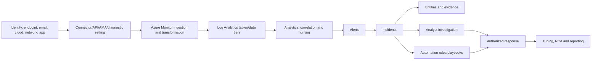

This diagram is intentionally vendor-neutral at the source and explicit at the destination. It helps isolate a failure: “no incident” could mean no source event, transport failure, transformation drop, table-plan limitation, query error, rule disabled, grouping behavior or portal scope.

## 12. Content Hub solutions and content

**Content Hub** is the catalog for Sentinel solutions and packaged content. A solution can include data connectors, analytics-rule templates, hunting queries, workbooks, parsers, playbooks and other artifacts. Installing a solution does not automatically configure every connector or safely activate every detection.

| Content type | Purpose | Required review before use |
|---|---|---|
| Solution | Versioned package around a product/domain | Publisher, dependencies, version and support |
| Data connector | Describes/configures a collection path | Permissions, network, volume and schema |
| Analytics template | Starting logic for a detection | Query, schedule, entities, noise and data availability |
| Hunting query | Hypothesis-oriented search | Time range, assumptions and expected schema |
| Workbook | Interactive visualization | Query cost, permissions and audience |
| Parser | Reusable schema transformation | Field mapping, performance and version |
| Playbook | Logic App workflow | Identity, connections, actions and failure handling |

Treat Content Hub like an application package repository. Installation is acquisition, not acceptance. Pin or record versions, review release notes, export configuration, test updates and preserve a rollback path. Locally modified content may not inherit upstream improvements automatically and upstream updates may introduce schema or logic changes.

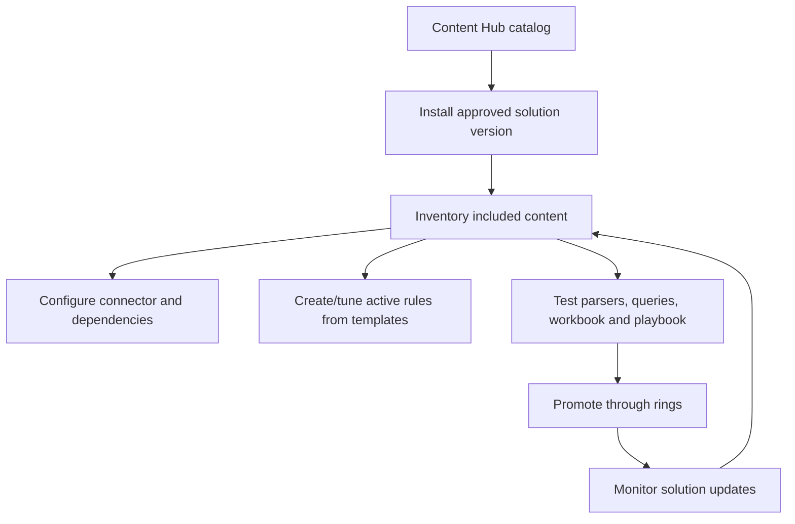

## 13. Tables and schemas

A Log Analytics **table** contains rows with named columns and data types. A row normally represents one record. `TimeGenerated` commonly indicates the event's timestamp as represented in Azure Monitor, but source time, ingestion time and transformation behavior must be understood for each source. Sentinel uses many tables; examples can include `SecurityEvent`, `Syslog`, `CommonSecurityLog`, `SigninLogs`, `AuditLogs`, `AzureActivity`, `DeviceEvents`, `SecurityAlert` and `SecurityIncident`, depending on connectors, licenses and integration mode.

| Schema concern | Why it matters | Validation question |
|---|---|---|
| Table name | Queries fail or miss data if the wrong table is assumed | Which connector writes where? |
| Timestamp semantics | Latency and sequencing can be misread | Source time, `TimeGenerated` or ingestion time? |
| Data type | String comparison differs from datetime/numeric logic | What does `getschema` or field inspection show? |
| Optional column | Sparse sources produce nulls | Does query handle missing fields? |
| Dynamic JSON | Nested data needs parsing | Is shape stable and bounded? |
| Tenant/resource identifiers | Cross-scope evidence can be confused | Which tenant/subscription/resource produced it? |
| Table plan/tier | Feature/query/retention behavior can differ | Is the use case compatible with the selected plan? |

Schema is a contract, not a suggestion. Capture sample rows, expected cardinality, null behavior, source version and parser ownership before writing production detections.

## 14. Data connectors

Sentinel data connectors provide documented onboarding paths for Microsoft and non-Microsoft sources. The actual transport might be service-to-service API, Azure diagnostic settings, Azure Monitor Agent (AMA), Syslog/CEF forwarding, a data collection endpoint/rule, a custom logs ingestion API or another supported integration.

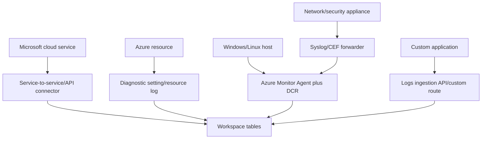

Connector status is not proof of complete data. Test a known, authorized event; verify the source timestamp, arrival timestamp, table, schema, duplication and end-to-end latency. Record any source filtering. Part 45 develops connector, AMA, DCR and ASIM design in depth.

## 15. Analytics, alerts, incidents and entities

An **analytics rule** evaluates data or another signal to create alerts or influence incidents. A **template** is vendor-supplied starting content; an **active rule** is configured behavior in the environment. An alert should explain what condition matched. An incident groups relevant alerts and provides a unit of investigation. Entity mapping identifies users, hosts, IP addresses, URLs, files, mailboxes, cloud resources and other objects.

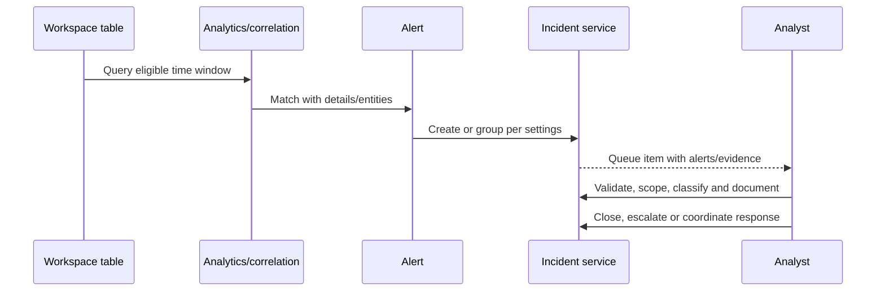

| Object | Design question |
|---|---|
| Rule | What threat hypothesis and exact data dependency? |
| Alert | What evidence proves the condition matched? |
| Incident | Which alerts should group, for how long and when reopen? |
| Entity | Which identifier is stable and unambiguous? |
| Severity | Business impact plus confidence, not dramatic wording? |
| Owner | Which queue/person and escalation timer? |
| Classification | True positive, benign positive, false positive or undetermined under local policy? |

## 16. Hunting and bookmarks

**Threat hunting** is proactive, hypothesis-led investigation. It asks a bounded question such as: “Did any privileged identity sign in from a newly observed country and then modify mailbox forwarding within two hours?” A hunt is not an unbounded search for “anything suspicious.”

Hunting queries help analysts explore. A **bookmark** preserves selected query results and context so evidence can be revisited or promoted into an investigation. Bookmarks are not a substitute for source evidence or formal case retention.

| Hunt element | Good practice |
|---|---|
| Hypothesis | State attacker behavior and business relevance |
| Scope | Tenant, entities, UTC window and exclusions |
| Data dependencies | Tables, fields, freshness and known gaps |
| Baseline | Define what “normal” comparison means |
| Findings | Separate observations, inference and unknowns |
| Stop condition | Decide when evidence is sufficient or unavailable |
| Output | Bookmark, incident, detection candidate or no finding |

## 17. Workbooks and reporting

Sentinel **workbooks** are interactive Azure Monitor visualizations backed by queries, parameters and controls. They can support data-health, coverage, investigation or executive reporting. A workbook is not automatically a reliable KPI: its queries, filters, time zones, permissions, table coverage and costs must be reviewed.

| Audience | Useful view | Avoid |
|---|---|---|
| Analyst | Queue age, source latency and entity pivots | Decoration without investigation action |
| Detection engineer | Rule firing, precision sample and coverage gaps | Counting alerts as value |
| Platform engineer | Ingestion, connector health and query failures | Hiding disconnected sources in totals |
| SOC manager | Backlog, dwell/response time and quality | Incentivizing premature closure |
| Executive | Risk themes, material incidents and improvement | Raw alert-volume charts without context |

Your reporting experience is a strength here: define the question first, preserve metric definitions, call out missing data and explain what decision the report supports.

## 18. Automation rules, playbooks and managed identities

An **automation rule** evaluates incident/alert conditions and performs supported actions, such as assignment, tagging, status changes or playbook invocation. A **playbook** is an Azure Logic App workflow. A **managed identity** is an Azure-managed service identity that can receive roles without embedding a long-lived password in code.

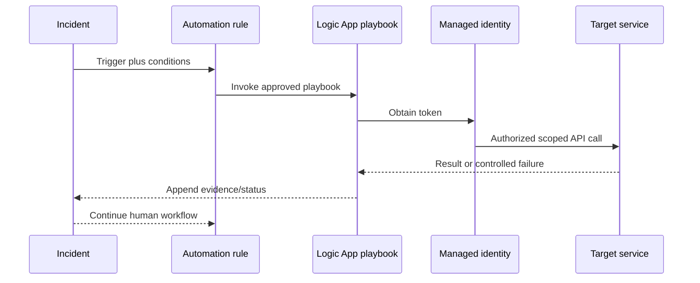

Managed identity reduces secret handling, but the identity must still be scoped, monitored and removed when unused. For high-impact response, use approval, idempotency, rate limits, dry-run mode, exact target validation and a compensating rollback action.

## 19. RBAC and separation of duties

**Role-based access control (RBAC)** grants permissions based on role and scope. Sentinel operation can involve Azure resource roles, Log Analytics roles, Sentinel-specific roles, Defender portal permissions, Entra permissions, Logic Apps roles and target-system rights. Current unified role support and permission mappings are tenant and feature sensitive; test effective access with non-admin personas.

| Persona | Minimum conceptual need | Should not automatically receive |
|---|---|---|
| SOC reader | View assigned incidents and permitted evidence | Rule, connector or role modification |
| Investigator | Update incidents, create bookmarks and query approved data | Subscription ownership or playbook editing |
| Detection engineer | Manage analytics/hunting content through review | Automation target administration |
| Platform engineer | Manage workspace/connectors/deployment | Broad business-data access without need |
| Automation engineer | Build Logic Apps and connections | Authority to execute every response action |
| Auditor | Read configuration, audit and evidence | Operational mutation rights |
| Pipeline identity | Deploy exact approved artifacts | Interactive portal use or broad data read |

### 🔍 Plain-English deep-dive: role names do not prove effective access

A person may have a Sentinel role at the workspace but still lack access in a connected service. Or a broad Azure role may accidentally grant more than the team intended. Think of a campus with a front gate, building badge and locked records room. Passing one door does not imply every door should open. Test each persona using representative tasks, deny cases and audit records.

## 20. Defender XDR integration and incident ownership

When Sentinel is onboarded to the Defender portal and integrated with Defender XDR, Microsoft security alerts/incidents can be unified or synchronized according to current product behavior. The design must define the authoritative incident record, status/assignment synchronization, incident provider, automation trigger behavior and effects of offboarding.

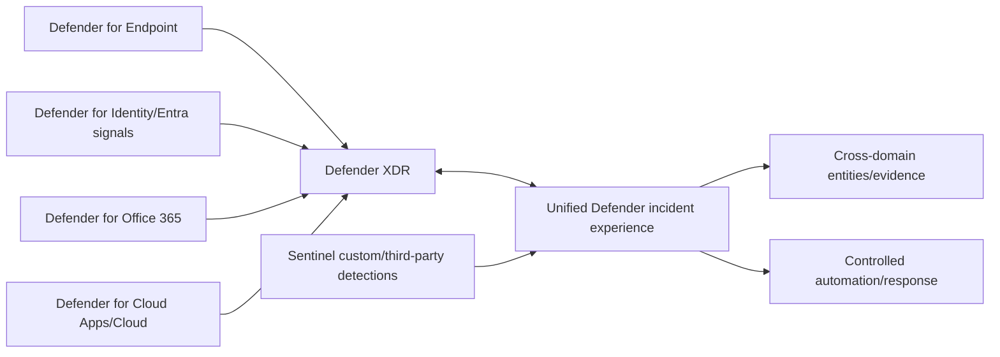

| Integration question | Why it matters |
|---|---|
| Which workspace is connected? | Scope and data boundary |
| Which incident provider created the record? | Update and automation semantics |
| Which statuses/owners synchronize? | Prevent contradictory queue state |
| Are duplicate rules still active? | Avoid duplicate alerts/incidents/actions |
| Which product performs response? | Preserve native context and authority |
| What happens during offboarding? | Avoid evidence or workflow discontinuity |

## 21. Shared responsibility

Microsoft operates the cloud service infrastructure and publishes service capabilities. The customer remains responsible for identities, roles, source configuration, data selection, legal basis, retention, detection logic, incident decisions, automation authority and client-specific operations. Partners and managed service providers add contractual and operational responsibilities but do not erase customer accountability.

| Area | Microsoft responsibility examples | Customer/consultant responsibility examples |
|---|---|---|
| Service platform | Service engineering and published availability | Region selection, architecture and continuity plan |
| Data ingestion capability | Supported endpoints and platform processing | Source enablement, filters, network and volume |
| Security | Platform controls and service attestations | Least privilege, Conditional Access and data handling |
| Detection content | Templates and managed detections | Suitability, activation, tuning and validation |
| Incidents | Product workflow capability | Triage, evidence, classification and response |
| Automation | Logic Apps/Sentinel integration capability | Identity, authorization, approval and rollback |
| Compliance | Product documentation and certifications | Legal basis, residency, retention and records process |

## 22. Security and privacy architecture

Security telemetry can contain usernames, IP addresses, device names, email metadata, URLs, command lines, tokens, secrets or regulated business context. “It is security data” is not a blanket permission to collect everything forever.

| Control area | Design questions |
|---|---|
| Purpose limitation | Which use case requires this field/source? |
| Data minimization | Can collection or transformation remove unnecessary content? |
| Access | Which personas can query raw versus summarized data? |
| Residency | Where is data ingested, stored, processed and retrieved? |
| Retention | How long is interactive and long-term access justified? |
| Encryption/network | Which supported encryption, private-link or network controls apply? |
| Export | Can workbook, query, API or playbook send data elsewhere? |
| Subject/legal process | How are privacy, legal hold and deletion conflicts handled? |
| Audit | Who read, changed, exported or automated against data? |

Use synthetic data for learning and pre-production tests. Redact real identifiers from screenshots and interview artifacts. Never place client logs, credentials or incident evidence into an unapproved personal lab.

## 23. Deployment lifecycle

A Sentinel program is a product lifecycle, not a one-time enablement click.

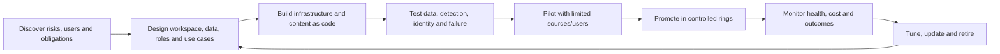

| Phase | Exit evidence |
|---|---|
| Discover | Approved requirements, use cases, source inventory and constraints |
| Design | Architecture decision record, data/RBAC model and cost estimate |
| Build | Versioned deployment artifacts and parameter set |
| Test | Passed functional, security, privacy, load and failure tests |
| Pilot | Measured source health, alert quality and analyst feedback |
| Deploy | Change approval, owner, communications and rollback readiness |
| Operate | SLO dashboard, runbooks, service reviews and audit evidence |
| Retire | Dependency check, evidence handling and access/content removal |

## 24. Configuration and deployment design

Prefer repeatable deployment through supported infrastructure/content-as-code methods where practical. Keep environment-specific values outside reusable logic. Record solution versions, connector state, rules, automation, roles and workbook dependencies. A portal click can be a valid emergency action, but it should become documented state rather than invisible configuration.

| Design artifact | Minimum content |
|---|---|
| Architecture decision record | Decision, options, constraints, consequence and review date |
| Source onboarding sheet | Owner, method, volume, schema, latency, retention and test event |
| Content catalog | Artifact ID, version, source, owner, status and dependency |
| RBAC matrix | Persona, task, scope, role, approval and test result |
| Deployment manifest | Resource/content version, parameters and checksum/reference |
| Test plan | Positive, negative, latency, duplication, permission and failure cases |
| Rollback plan | Trigger, disable/revert steps, owner, evidence and validation |
| Runbook | Health checks, alert thresholds, escalation and recovery |

## 25. Testing strategy

Testing must cover more than “the rule fired.”

1. **Collection test:** generate an authorized synthetic event and prove it reaches the intended table once.
2. **Schema test:** verify types, required fields, entity identifiers and null handling.
3. **Latency test:** compare source event time, ingestion time, rule execution and incident creation.
4. **Detection test:** prove positive and near-miss negative examples.
5. **Grouping test:** confirm events become the intended number of alerts/incidents.
6. **RBAC test:** validate allowed and denied tasks using real personas.
7. **Automation test:** use dry-run/sandbox targets and force timeout, duplicate and partial-failure paths.
8. **Portal test:** verify Defender portal visibility and expected cross-product status behavior.
9. **Cost test:** estimate and observe volume/query behavior within approved limits.
10. **Recovery test:** disable or roll back one component and prove monitoring detects it.

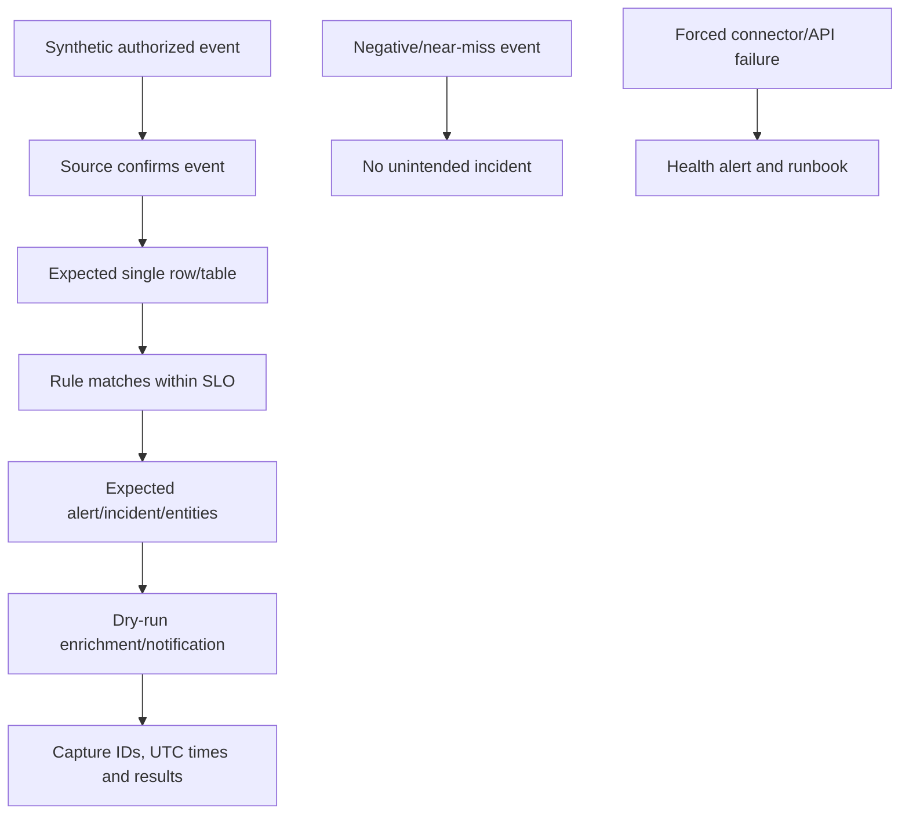

## 26. Rollback and safe change

Rollback can mean disabling an analytics rule, reverting a query/version, stopping an automation rule, disabling a playbook trigger, revoking a managed identity, restoring a connector configuration or returning a table setting to an approved state. Deleting evidence is generally not a rollback.

| Change | Safe rollback preparation |
|---|---|
| Connector onboarding | Previous routing, source-side config export and duplicate prevention |
| Rule deployment | Prior version, enable state and incident-impact review |
| Entity/grouping change | Backtest counts and incident continuity plan |
| Playbook | Kill switch, connection revocation and compensating action |
| Role assignment | Emergency access and effective-permission test |
| Solution update | Installed version inventory and custom-content comparison |
| Portal integration | Incident ownership/sync/offboarding documentation |

Define rollback triggers before change: unexpected duplicate incidents, missing data, unauthorized access, material query cost, incorrect automated action or latency beyond the agreed threshold. After rollback, validate the restored behavior and document residual effects.

## 27. Operating Sentinel as a service

Daily operation should monitor data freshness, connector errors, ingestion anomalies, rule failures, automation failures, incident backlog, query health and service advisories. Weekly and monthly reviews add quality, coverage, cost, access, content updates and improvement decisions.

| Cadence | Operational questions |
|---|---|
| Per shift/daily | Are critical sources fresh? Any failed rules/playbooks? Queue aging? Service incidents? |
| Weekly | Which detections were noisy, missed or slow? Which changes are planned? |
| Monthly | Coverage, precision sample, cost, retention, access and content-version review? |
| Quarterly | Architecture, threat model, DR exercise, roles, privacy and roadmap review? |
| After incident | What detection/response/control improvement follows the RCA? |

Your existing incident and RCA habits map naturally: keep a UTC timeline, distinguish symptom from cause, validate the fix at the failing layer and communicate residual uncertainty.

## 28. Service Health and change management

A Sentinel symptom can originate in Microsoft service health, an upstream product, Azure Monitor, identity, networking or customer configuration. Monitor Microsoft 365 Service Health, Azure Service Health/Resource Health where applicable, Message center, Azure Updates and Sentinel/connector health features. Exact locations and event coverage are change-sensitive.

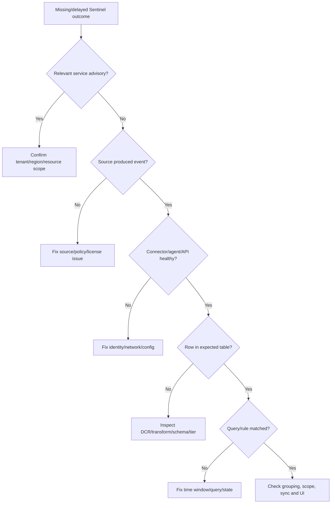

Service-health correlation is not automatically root cause. Match region, resource, start time and symptom. Preserve request IDs and timestamps, then retest after mitigation.

## 29. Metrics and service objectives

Metrics should reveal risk and system behavior, not reward shallow activity.

| Metric | Definition idea | Guardrail |
|---|---|---|
| Critical-source freshness | Age of newest expected record by source/table | Separate quiet source from disconnected source |
| Ingestion latency | Ingestion time minus source event time | Use percentiles, not only average |
| Detection latency | Incident/alert time minus eligible event time | Include rule schedule/lookback |
| Mean time to acknowledge | Assignment/acknowledgement minus incident creation | Do not equate acknowledgement with quality |
| Time to scope | Time until affected entities/time range documented | Define minimum evidence standard |
| Automation success | Successful intended results / eligible runs | Count partial success and retries separately |
| Detection precision sample | Confirmed relevant alerts / reviewed sample | Classification quality affects result |
| Data-quality rate | Valid required fields / sampled records | Track by source and version |
| Coverage | Prioritized use cases with tested detections / approved catalog | Weight by risk, not raw count |
| Cost per useful use case | Allocated platform cost / useful covered scenarios | Allocation assumptions must be explicit |

Useful objectives might say: “For each critical source, the newest expected record is no older than 15 minutes for 99% of measured intervals, excluding approved maintenance,” rather than “Sentinel is up.” Exact targets depend on source and business need.

## 30. Common failure modes and troubleshooting

| Symptom | Plausible causes | First discriminating check |
|---|---|---|
| No data | Source disabled, license, network, connector, DCR or permission | Prove source event and check destination table |
| Delayed data | Source batching, agent queue, API throttling or ingestion delay | Compare source, ingestion and current UTC times |
| Duplicate rows | Two collectors/routes or replay | Group by stable event ID/source and inspect paths |
| Rule never fires | Wrong table/field/time window, disabled rule or threshold | Run exact query over known test event |
| Too many incidents | Broad logic, grouping settings or duplicate alerts | Sample matches and inspect incident provider/grouping |
| Missing entities | Mapping absent/type mismatch/null identifier | Inspect alert custom details and raw fields |
| Playbook denied | Managed identity/connection lacks target role | Inspect failed action and token identity |
| Playbook repeated action | Retry/non-idempotent design or duplicate trigger | Correlate run IDs and target operation IDs |
| Analyst cannot see data | Wrong scope/role or product permission | Test effective access with same persona |
| Unexpected cost | Volume jump, plan/retention/query/change | Split usage by table/source/day and review changes |
| Portal disagreement | Sync delay, provider behavior, filter/scope or rollout | Check record IDs/API/source portal and service health |

Troubleshoot from fact to layer. Ask “what is the earliest point at which expected reality differs from observed reality?” That is the same disciplined boundary isolation you us in incident RCA.

## 31. End-to-end use-case story

**Scenario:** A fictional company, Contoso Research, wants to detect suspicious activity after a risky sign-in to a privileged Microsoft 365 account. It also receives firewall logs from a third-party appliance. No real tenant or personal data is used.

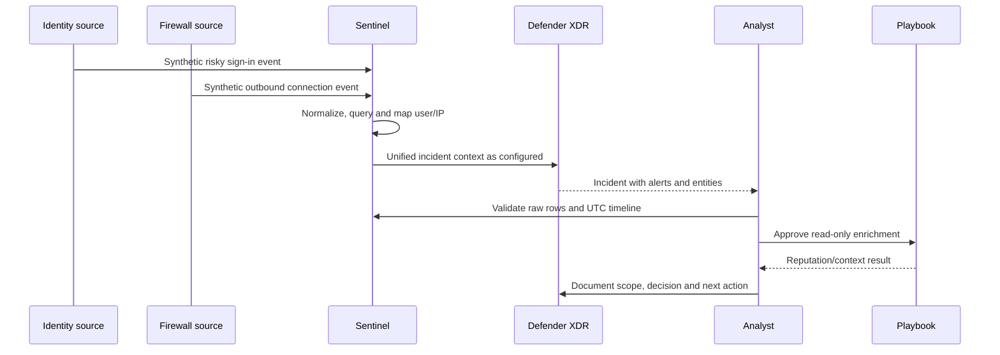

### Design decisions

| Decision | Paper-lab choice | Rationale |
|---|---|---|
| Business risk | Privileged account misuse | High consequence and clear owner |
| Sources | Synthetic identity and firewall rows | Cross-domain correlation without real data |
| Workspace | One fictional regional workspace | Keep exercise simple; Part 44 examines alternatives |
| Detection | Time-bounded identity event followed by outbound activity | Explicit hypothesis rather than generic anomaly |
| Entities | Account and IP | Useful investigation pivots |
| Automation | Read-only enrichment after human initiation | Avoid unapproved containment |
| Evidence | UTC timeline and source row IDs | Reproducible investigation |
| Success | Expected incident, no duplicate, fields complete, latency measured | Testable outcome |

### Investigation narrative

The analyst first confirms both source rows rather than trusting the incident title. They check that the account identifier refers to the same tenant and that IP timestamps overlap within the intended window. They distinguish evidence (“these two synthetic events exist”) from inference (“the same actor may be responsible”). They document missing endpoint evidence and do not claim compromise. If a response owner authorizes containment, the action occurs through the source product's approved procedure and its result is added to the case.

### RCA and improvement narrative

If the firewall event arrives 40 minutes late, the team does not merely widen every rule forever. It traces source generation, forwarder queue, agent/DCR processing and ingestion. The RCA identifies the failing boundary, validates recovery with a new test event and decides whether buffering, health thresholds or rule lookback should change. The executive report states customer impact, evidence, cause, corrective action and residual risk without exposing raw sensitive fields.

## 32. Safe paper lab: design Sentinel without a tenant

**Safety boundary:** Use only the fictional facts below. Do not enable a cloud trial, upload logs, use client identifiers, scan systems or execute response actions. This lab produces design artifacts and reasoning, not a deployed Sentinel environment.

### Fictional client facts

- Contoso Research has one Microsoft Entra tenant and one Azure subscription for the exercise.
- Analysts are in the United Kingdom; legal requires security logs to remain in an approved European region.
- Sources are Microsoft 365 identity/email security, 200 Windows servers and two firewall pairs.
- Estimated raw source volume is unknown and must be measured before commitment.
- The SOC works 08:00–20:00 local time with an on-call major-incident path.
- The automation policy permits enrichment and notification, but containment requires human approval.
- Developers must not read HR investigation data.
- The design must survive one connector outage and one unsafe-content update.

### Lab task 1: draw the logical architecture

Include tenant, subscription, resource group, workspace, Defender portal, source types, connector classes, tables, analytics, incidents, identities and playbooks. Mark trust boundaries and distinguish control/data planes.

### Lab task 2: make a responsibility matrix

Assign accountable and responsible owners for subscription, workspace, source configuration, detection content, incident queue, automation identities, privacy, cost and service health. Record escalation and out-of-hours owner.

### Lab task 3: define three use cases

For each use case, state business risk, threat hypothesis, sources, required fields, entity mapping, expected latency, rule owner, response runbook, false-positive risks, test event and success evidence. Do not begin with “collect all logs.”

### Lab task 4: design RBAC

Create personas for SOC reader, investigator, detection engineer, platform engineer, automation engineer, privacy reviewer and deployment identity. For each, list allowed tasks, denied tasks, scope and evidence that access works as intended.

### Lab task 5: write deployment and rollback gates

Use dev/test/pilot/production-style rings on paper. Require schema, positive, negative, latency, duplicate, permission and failure tests. Define kill switches for an analytics rule and playbook. Explain how evidence is preserved during rollback.

### Lab task 6: create an operations scorecard

Choose eight metrics from Section 29. Define formula, source, owner, threshold, exception and review cadence. Add a narrative field so a metric never travels without context.

### Expected lab deliverables

| Deliverable | Acceptance criterion |
|---|---|
| Context diagram | All boundaries and owners visible |
| Use-case catalog | Risk-to-source-to-response traceability |
| RBAC matrix | Allowed and denied persona tests |
| Content inventory | Version, owner, state and dependency |
| Test matrix | Positive, negative, failure and rollback evidence |
| Runbook | Health, escalation, recovery and communications |
| Scorecard | Definitions, thresholds, owners and caveats |
| Honesty statement | No production Sentinel claim |

## 33. Consulting discovery questions

1. Which business services, identities and data would create material harm if compromised?
2. Which regulatory, contractual, residency and retention obligations apply?
3. Which SOC, IT, cloud, privacy, legal and business teams own decisions?
4. Which SIEM/XDR/SOAR tools and managed services exist today?
5. Which prioritized detections and response runbooks are missing or failing?
6. Which sources are authoritative, what is their volume and how fresh must they be?
7. Where are duplicate incidents, manual handoffs and alert fatigue occurring?
8. Which response actions may be automated, approval-gated or prohibited?
9. Which tenants, regions, subscriptions and workspace boundaries constrain design?
10. How are configuration, content, identities, costs and service health operated?
11. What evidence proves value after 30, 60 and 90 days?
12. What is the exit, rollback and data-handling plan?

## 34. Consulting artifacts and deliverables

| Artifact | Audience | Decision enabled |
|---|---|---|
| Executive risk brief | Sponsor and risk owner | Priorities, funding and risk acceptance |
| Current-state map | Architecture/operations | Dependencies, gaps and duplication |
| Target architecture | Security/cloud engineering | Workspace, integration and trust boundaries |
| Use-case catalog | SOC and business owners | Detection backlog and ownership |
| Data-source inventory | Platform, privacy and finance | Onboarding, minimization and cost |
| RBAC/identity matrix | Security and IAM | Least-privilege approval |
| Deployment plan | Change board and engineers | Sequence, gates and rollback |
| Test/validation matrix | SOC and assurance | Evidence of expected behavior |
| Runbook pack | Operations | Health, triage, escalation and recovery |
| KPI dictionary | Leadership and analysts | Consistent reporting and incentives |
| Decision log | All workstreams | Traceability of assumptions and exceptions |
| Roadmap | Sponsor and delivery team | Phased outcomes and dependencies |

## 35. A 30/60/90-day consulting roadmap

| Window | Focus | Evidence of progress |
|---|---|---|
| Days 0–30 | Discover risks, operating model, architecture, sources and constraints | Approved baseline, top use cases and gap register |
| Days 31–60 | Build foundation and pilot limited sources/content | Tested ingestion, RBAC, rules, runbooks and cost observations |
| Days 61–90 | Expand selected use cases and formalize operation | Measured quality, service review, training and roadmap |

Do not promise full coverage in 90 days. Prioritize a small number of high-value, testable use cases, stabilize operations and create a repeatable onboarding pattern.

## 36. JD Mapping: interview translation

| Interview theme | Honest bridge from your background | Sentinel-level answer |
|---|---|---|
| Incident response | Evidence timelines and coordinated restoration | Explain alert-to-incident-to-entity investigation and authorized response |
| Troubleshooting | Isolate source, transport, service and client layers | Trace source-to-table-to-rule-to-incident-to-automation |
| RCA | Validate cause and corrective action | Separate telemetry gap, detection defect and portal symptom |
| Reporting | Translate technical evidence for stakeholders | Use metric definitions, gaps, impact and residual risk |
| Architecture | Structure dependencies and owners | Explain Azure hierarchy, workspace, planes, integrations and identity |
| Governance | Change, validation and documentation discipline | RBAC, managed identity, rings, audit and rollback |
| Consulting | Ask clarifying questions and manage uncertainty | Produce artifacts, decisions, roadmap and honest assumptions |

## Official Source Anchors

These are official Microsoft Learn starting points reviewed for this August 24, 2026 chapter. Microsoft changes pages, paths, availability and commercial terms; follow each page's current banner and linked prerequisites before implementation.

1. [What is Microsoft Sentinel?](https://learn.microsoft.com/azure/sentinel/overview) — product purpose, capabilities and architecture context.
2. [Microsoft Sentinel in the Microsoft Defender portal](https://learn.microsoft.com/azure/sentinel/microsoft-sentinel-defender-portal) — onboarding, unified operations and portal transition.
3. [Onboard Microsoft Sentinel](https://learn.microsoft.com/azure/sentinel/quickstart-onboard) — Azure prerequisites and workspace onboarding.
4. [Roles and permissions in Microsoft Sentinel](https://learn.microsoft.com/azure/sentinel/roles) — Sentinel and Log Analytics role guidance.
5. [Discover and manage Microsoft Sentinel out-of-the-box content](https://learn.microsoft.com/azure/sentinel/sentinel-solutions-deploy) — Content Hub solutions and content lifecycle.
6. [Find your Microsoft Sentinel data connector](https://learn.microsoft.com/azure/sentinel/data-connectors-reference) — connector catalog and prerequisites.
7. [Connect data sources to Microsoft Sentinel](https://learn.microsoft.com/azure/sentinel/connect-data-sources) — collection patterns and connector workflow.
8. [Create custom analytics rules to detect threats](https://learn.microsoft.com/azure/sentinel/detect-threats-custom) — rule concepts and configuration.
9. [Investigate incidents with Microsoft Sentinel](https://learn.microsoft.com/azure/sentinel/investigate-cases) — incidents, entities and investigation.
10. [Automate threat response with automation rules](https://learn.microsoft.com/azure/sentinel/automate-incident-handling-with-automation-rules) — triggers, actions and playbook orchestration.
11. [Use playbooks with automation rules in Microsoft Sentinel](https://learn.microsoft.com/azure/sentinel/tutorial-respond-threats-playbook) — Logic Apps and response workflow.
12. [Azure Monitor Logs overview](https://learn.microsoft.com/azure/azure-monitor/logs/data-platform-logs) — workspaces, tables and log-data platform.
13. [Azure Monitor service limits](https://learn.microsoft.com/azure/azure-monitor/fundamentals/service-limits) — current limits that can affect design.
14. [Microsoft Sentinel billing](https://learn.microsoft.com/azure/sentinel/billing) — cost concepts and current benefit caveats.
15. [Microsoft Sentinel service limits](https://learn.microsoft.com/azure/sentinel/sentinel-service-limits) — product-specific current constraints.

## ⭐ Likely Interview Questions for This Section

### Q1. What is a SOC, and why is it more than a monitoring team?

**Model answer:** A SOC is the people, process and technology that reduce security risk through visibility, detection, triage, investigation, response, recovery and learning. Monitoring is only one capability. A mature SOC starts with business risks and use cases, defines decision rights and evidence standards, and improves controls after incidents. Tier labels can help staffing, but capabilities, ownership and handoffs are more reliable design units.

### Q2. Explain event, signal, alert, incident, entity and case.

**Model answer:** An event is something that happened; a log stores events; a signal is evidence with possible security meaning; an alert is a product or rule flag; an incident groups related alerts and evidence for investigation; an entity is an object such as a user, host or IP; and a case is a broader governed work record when required. I avoid calling an alert a confirmed compromise until evidence supports that conclusion.

### Q3. How do SIEM, SOAR and XDR differ and work together?

**Model answer:** SIEM provides broad multi-source ingestion, storage, query, detection and investigation. XDR correlates rich signals and response across integrated security products such as identity, endpoint and email. SOAR orchestrates repeatable enrichment, routing and response through workflows. Sentinel is Microsoft's cloud-native SIEM with SOAR capabilities; Defender XDR supplies product-native cross-domain context. The design should define source ownership, incident synchronization and response authority rather than duplicate every detection.

### Q4. Describe Microsoft Sentinel's end-to-end architecture.

**Model answer:** Sources send data through supported connectors such as service APIs, Azure diagnostics, AMA/DCR, Syslog/CEF or custom ingestion. Azure Monitor processes it into Log Analytics tables. Analytics, Microsoft detections and hunting query that data. Matches create alerts that are grouped into incidents and enriched with entities. Analysts investigate through the Defender portal, and controlled automation rules or Logic App playbooks can enrich, route or perform approved actions under scoped identities. Operations monitor every boundary for health, latency, quality and cost.

### Q5. What remains in Azure when Sentinel is used through the Defender portal?

**Model answer:** The Defender portal is the strategic unified operations experience, but Azure dependencies remain. The subscription and resource group provide governance and billing; the Log Analytics workspace and tables hold/query data; Azure RBAC, Monitor configuration, Logic Apps, managed identities and deployment resources still matter. I treat Azure-portal-only click paths as change-sensitive and document resource/API outcomes so procedures survive portal convergence.

### Q6. How would you secure Sentinel and its automation?

**Model answer:** I separate read, investigation, content deployment, platform and automation duties; scope roles to the minimum resource and task; use Conditional Access and managed identities; test allowed and denied persona actions; minimize sensitive collection; govern retention/export; and audit changes. Automation begins read-only, uses exact conditions, idempotency, dry-run, timeout and rate controls, and requires human approval plus rollback for high-impact actions.

### Q7. How would you deploy and validate a new Sentinel use case?

**Model answer:** I start with business risk, threat hypothesis, source owner, required fields, expected latency and response runbook. I inventory cost/privacy constraints, build versioned configuration, and test a synthetic positive event, a near-miss negative, schema, duplicates, entity mapping, grouping, RBAC, latency and failure handling. I pilot in a limited ring, monitor quality and cost, document rollback triggers, then promote only with named ownership and operational health checks.

### Q8. What is your honest Microsoft Sentinel experience?

**Model answer:** My production experience is incident handling, RCA, troubleshooting, validation and stakeholder reporting rather than production Sentinel administration. I have built a current, Microsoft-Learn-grounded Sentinel architecture and safe paper lab covering Azure hierarchy, Log Analytics, connectors, Content Hub, rules, incidents, entities, Defender XDR integration, RBAC, managed identities, deployment, rollback and metrics. In a client tenant I would verify live portal, license and region behavior, start with least privilege and synthetic tests, and work through approved change controls.

## 🧠 30-Second Memory Hooks

- **SOC:** people, process and technology turning evidence into risk reduction.
- **Event → signal → alert → incident → case:** occurrence, clue, flag, investigation, governed work.
- **Entity:** the noun in the security story: user, host, IP, URL or resource.
- **SIEM:** broad evidence warehouse, query engine and detection platform.
- **XDR:** deep cross-product context and response.
- **SOAR:** controlled workflow, not automatic authority.
- **Sentinel:** Microsoft's cloud-native SIEM plus SOAR, operated strategically through Defender.
- **Workspace:** data/query boundary that still matters after portal convergence.
- **Control plane:** changes configuration; **data plane:** ingests and queries evidence.
- **Content Hub:** package catalog; install is not activate-and-trust.
- **Managed identity:** passwordless service identity, still requiring least privilege.
- **Troubleshooting:** source → transport → table → query → alert → incident → automation.
- **Testing:** positive, negative, latency, duplicate, permission and failure evidence.
- **Rollback:** stop unsafe behavior without deleting investigation evidence.
- **Honesty:** transferable incident discipline plus paper design, no production Sentinel claim.

## Completion Checklist

- [ ] I can explain the SOC purpose without reducing it to dashboards or alert closure.
- [ ] I can distinguish event, log, signal, alert, incident, entity, evidence and case.
- [ ] I can discuss SOC tiers while designing around capabilities and decision rights.
- [ ] I can compare SIEM, XDR and SOAR and explain why they integrate.
- [ ] I can describe Sentinel's strategic Defender portal experience and remaining Azure dependencies.
- [ ] I can draw tenant, subscription, resource group, workspace and Sentinel onboarding.
- [ ] I can distinguish control-plane configuration from data-plane evidence.
- [ ] I can explain Content Hub solutions and why templates require review/testing.
- [ ] I can trace connectors through tables, analytics, alerts, incidents and entities.
- [ ] I can explain hunting, bookmarks, workbooks, automation rules and playbooks.
- [ ] I can design least-privilege RBAC and managed-identity boundaries.
- [ ] I can explain Defender XDR integration and incident ownership questions.
- [ ] I can describe shared responsibility, privacy and data minimization.
- [ ] I can plan configure, deploy, test, roll back and operate a use case.
- [ ] I can define service-health checks, operational metrics and failure triage.
- [ ] I completed the safe paper lab without real tenant data or actions.
- [ ] I can name the consulting artifacts and 30/60/90-day approach.
- [ ] I can answer Q1–Q8 aloud without claiming production Sentinel experience.
- [ ] I verified change-sensitive portal, preview, licensing and pricing facts before reuse.

*Next suggested section:* [Part 44](Part-44-sentinel-planning-workspaces-cost-retention-data-lake.md)