# Part 44 — Sentinel Planning, Workspace Design, Cost, Retention, and Data Lake

> **Section goal:** Build a beginner-first, consulting-grade method for planning Microsoft Sentinel before data starts flowing. This Part converts business risks into use cases and measurable data requirements; inventories sources, events per second (EPS), billable volume, latency, retention, query and compliance needs; compares single and multiple workspaces across tenants, regions, subscriptions, RBAC, residency, chargeback and MSSP boundaries; explains current Analytics, Basic and Auxiliary table plans; estimates pay-as-you-go and commitment-tier costs; separates analytics and long-term retention, search and restore; introduces Microsoft Sentinel data lake architecture, onboarding, tiering and 2026 caveats; and designs budgets, continuity, roadmaps and safe cost tests. You should be able to facilitate and document these decisions without claiming production Sentinel commercial or workspace ownership.

This Part maps directly to Deloitte expectations for cloud security architecture, Microsoft Sentinel, Azure governance, cost optimization, compliance, data protection, resilience, consulting workshops and executive reporting. Your incident/RCA and troubleshooting background is useful because every planning assumption becomes an operational dependency: an omitted field can break a detection, excessive delay can invalidate a timeline, a poor retention choice can remove evidence, and an unowned meter can surprise a client.

> **Currency, pricing, licensing, preview, portal and data-lake note (August 24, 2026):** This chapter uses official Microsoft Learn pages current on August 24, 2026. Microsoft states that after **March 31, 2027**, Sentinel is no longer supported in the Azure portal and is available through the Microsoft Defender portal; current transition dates and exceptions must still be checked before reuse. Prices are regional, contractual and change-sensitive, so this chapter deliberately uses variables rather than currency amounts. Microsoft Learn currently documents a Sentinel 31-day trial with up to 10 GB/day of qualifying Analytics ingestion, modern simplified pay-as-you-go/commitment billing, a 100-GB/day commitment entry point, source-specific free benefits, Analytics/Basic/Auxiliary plans, up to 12 years of total retention and a Sentinel data lake onboarding experience. Those facts do not guarantee eligibility, feature parity or availability in every cloud/region. Data lake, graph, notebooks, jobs, MCP/AI, plan capabilities and specific UI paths can have independent preview or rollout states. Verify Learn banners, Defender portal, supported regions, pricing pages/calculator, Product Terms, service limits and the client's agreement immediately before design approval.

## JD Mapping

| Deloitte expectation | Capability developed here | Consulting evidence |
|---|---|---|
| Translate risk into architecture | Requirements and use-case-led planning | Requirements traceability matrix |
| Design Sentinel workspaces | Tenant, region, RBAC, residency and MSSP decisions | Workspace decision record |
| Control cloud cost | Volume model, table plans, commitments, budgets and metrics | Cost workbook with assumptions |
| Protect regulated evidence | Retention, long-term access, privacy and legal constraints | Table retention schedule |
| Advise on modern Sentinel | Analytics/data-lake tier architecture and onboarding caveats | Dated target-state design |
| Build resilient services | DR/BC choices, failure modes, rollback and runbooks | Continuity and recovery plan |
| Communicate honestly | Separate estimate, invoice and contract facts | Executive options paper |

## Candidate honesty note

You can credibly discuss defining incident evidence needs, troubleshooting missing or delayed telemetry, preserving timelines, validating fixes, reporting assumptions and coordinating stakeholders. You can present the paper cost and workspace design in this chapter.

You should not claim production Sentinel workspace architecture, Azure cost-account ownership, commitment-tier purchase, retention administration, data-lake onboarding, regulatory approval or MSSP operation unless separately evidenced. Safe wording is:

> “My production background is incident/RCA, troubleshooting, evidence validation and stakeholder reporting. I have not owned a production Sentinel workspace or invoice. I built a current planning model that starts with security use cases, inventories volume and latency, tests the fewest workspaces that meet tenant/residency/RBAC needs, maps each table to Analytics, Basic, Auxiliary or Sentinel data-lake usage, and models ingestion, retention, search, restore and automation costs using live regional rates. I would validate estimates against a measured pilot and Cost Management, obtain privacy and commercial approval, and treat data-lake onboarding as a governed architectural change rather than a cost toggle.”

---

## 1. Planning starts with risk and use cases

A **requirement** is a need or constraint that the solution must satisfy. A **use case** is a specific security outcome, such as detecting privileged-role assignment followed by suspicious sign-in. A **data source** is the system that supplies evidence. Planning in that order prevents the expensive anti-pattern “collect everything first, decide later.”

| Planning level | Example | Acceptance evidence |
|---|---|---|
| Business risk | Loss of control over privileged Microsoft 365 identity | Named risk owner and impact |
| Threat scenario | Stolen credential used to assign a role | Threat narrative and ATT&CK context |
| Use case | Correlate risky sign-in with role assignment in 30 minutes | Approved use-case record |
| Evidence | Account, tenant, IP, role, actor, target and UTC time | Required-field list |
| Source | Entra sign-in and audit records | Source owner and sample schema |
| Service need | Detect within 15 minutes; query 90 days interactively | Measurable latency/retention requirement |
| Response | Investigate, confirm and seek approval to revoke session | Runbook and authority |

### 🔍 Plain-English deep-dive: “collect everything” is not maximum security

Imagine storing every document a company has in one investigation room. The room is expensive, sensitive and difficult to search; nobody knows which documents are complete. More data can improve context, but unnecessary data increases access risk, cost, legal exposure and analyst noise. A stronger statement is: “Collect the evidence needed for approved use cases, preserve mandated records, measure gaps, and add sources when a testable need appears.”

## 2. The requirements workbook

Run discovery with security, cloud, identity, network, application, privacy, legal, finance, procurement and operations stakeholders. The output is a versioned decision artifact, not meeting notes alone.

| Requirement category | Questions | Example output |
|---|---|---|
| Outcomes | Which material harms should Sentinel help detect/investigate? | Prioritized use-case catalog |
| Scope | Which tenants, subscriptions, clouds, sites and business units? | Boundary diagram |
| Users | Who investigates, engineers, audits and pays? | Persona/RACI matrix |
| Data | Which sources, fields, volume, timing and quality? | Source inventory |
| Query | Real-time detection, daily hunt, monthly report or rare audit? | Query-frequency profile |
| Retention | Interactive and total periods; legal holds? | Table retention schedule |
| Compliance | Residency, sovereignty, privacy, encryption and audit? | Control traceability |
| Response | Which actions are allowed and by whom? | Automation authority matrix |
| Commercial | Agreement, currency, discounts, budget and chargeback? | Cost assumptions sheet |
| Resilience | Which failures require alternate access or collection? | BC/DR plan |

## 3. Build a source inventory

An inventory should describe the data before proposing a connector. “Firewall logs” is too vague; one firewall can emit traffic, threat, configuration and health records with very different value and volume.

| Inventory field | Why it matters |
|---|---|
| Source/product/version | Determines supported connector and schema |
| Business/data owner | Approves purpose and handles source changes |
| Log category | Separates high-value audit from verbose traffic |
| Authoritative fields | Enables detections, joins and evidence |
| EPS and burst EPS | Sizes throughput and buffering |
| Average/p95 record bytes | Estimates volume more honestly than event count alone |
| Current daily billed GB | Calibrates estimates after pilot |
| Event and arrival timestamps | Measures source/collection/ingestion delay |
| Query pattern | Drives table/tier choice |
| Retention/legal basis | Controls lifetime and privacy |
| Existing destination | Reveals duplication and migration dependencies |
| Criticality/SLO | Prioritizes monitoring and recovery |

## 4. EPS, volume and latency from zero

**Events per second (EPS)** is a rate, not a daily cost. Convert it to raw bytes, then measure the platform's billable size. Average EPS hides bursts; record-size averages hide unusually large payloads.

For an initial raw estimate:

$$
D_{raw,day}=\frac{EPS_{avg}\times 86{,}400\times Bytes_{avg}}{10^9}
$$

Use decimal GB because Azure Monitor billing documentation defines GB as $10^9$ bytes. A provisional billed-data estimate is:

$$
D_{billed,day}=D_{raw,day}\times k_{billable}
$$

where $k_{billable}$ is measured from representative data, not assumed forever. Microsoft Learn notes that Analytics/Basic billable size can be smaller than incoming JSON because specified standard columns are excluded, while Auxiliary uses uncompressed stored column entries and has different excluded-column treatment. Transform-added fields and mismatched fields can still affect billing.

| Input | Paper example | Sensitivity |
|---|---:|---|
| Average EPS | 250 | Double EPS roughly doubles raw volume |
| Burst EPS | 2,000 | Tests buffering/throttling, not average bill alone |
| Average record size | 900 bytes | A verbose field can dominate cost |
| Seconds/day | 86,400 | Fixed conversion |
| Raw daily estimate | 19.44 GB | Before billable-size measurement |
| Illustrative $k_{billable}$ | 0.75 | Placeholder only; pilot must replace it |
| Illustrative billed estimate | 14.58 GB/day | Not a quote or commitment input yet |

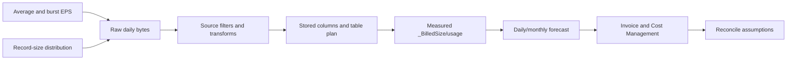

**Latency** must also be decomposed:

| Latency component | Measurement |
|---|---|
| Source delay | Source record creation minus actual activity if known |
| Collection delay | Collector receipt minus source event time |
| Ingestion delay | Workspace ingestion time minus source event time |
| Detection delay | Alert time minus eligible event time |
| Investigation delay | Acknowledgement/scope time minus incident time |

Use p50, p95 and p99 where possible. An average can look healthy while critical tail events arrive too late.

## 5. Query and retention profiles

Data value changes with time. Recent identity evidence may need continuous detection and rapid pivots. One-year-old network records may be used only for a regulator request.

| Profile | Typical need | Planning implication |
|---|---|---|
| Continuous detection | Frequent full queries and alerts | Analytics tier candidate |
| Incident troubleshooting | Occasional single-table investigation | Basic may be considered if capabilities fit |
| Compliance/audit | Rare long-range retrieval | Auxiliary/lake or long-term retention candidate |
| Trend reporting | Repeated aggregate over long periods | Summary rule/derived table candidate |
| Threat hunting | Multi-table joins and entity pivots | Keep required time/data in capable tier |
| Forensic surge | Rare intensive historical query | Search job, restore or lake job plan |

Do not assign a tier based only on “high volume.” Assign it based on business value, supported table, query shape, alerting need, latency, retention, privacy and cost together.

## 6. Start with one workspace, then justify every split

Current Microsoft Learn workspace guidance says to start with a single workspace and use the fewest workspaces that meet requirements. Data volume alone is not a performance reason to create many workspaces. Splits add cross-workspace query, content deployment, incident, RBAC, cost and operations complexity.

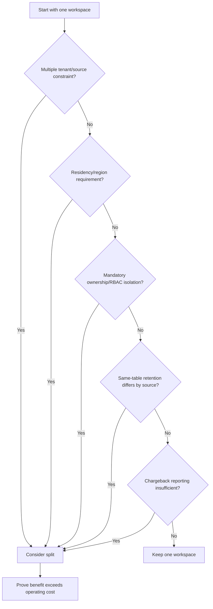

| One-workspace advantage | One-workspace risk/constraint |
|---|---|
| Simpler query and correlation | Larger shared access boundary |
| One content/operations surface | One region/residency choice |
| Easier commitment aggregation | Chargeback may need allocation logic |
| Fewer duplicate connectors | Different same-table retention by source can be hard |
| Consistent schema and governance | Customer/tenant isolation may prohibit sharing |

### 🔍 Plain-English deep-dive: a workspace is not just a folder

A folder separates documents visually. A workspace affects data location, access, billing, retention defaults, query scope, connector destinations, content and incident operations. Splitting workspaces is closer to creating separate evidence rooms, each with its own locks, alarms, staff procedures and invoice. Do it for a real boundary, not because an organization chart has many boxes.

## 7. Tenant, region and subscription boundaries

| Boundary | What it controls | Planning rule |
|---|---|---|
| Microsoft Entra tenant | Identity and many SaaS connector relationships | Many sources require same-tenant workspace/integration context |
| Azure region | Workspace/data location and feature availability | Split for binding residency/availability need |
| Geography | Broader data-residency concept | Verify actual service data-location documentation |
| Subscription | Billing, policy, resource providers and administrative scope | Align ownership without assuming it isolates table data |
| Resource group | Resource lifecycle, policy/tagging and deployment scope | Group resources with coordinated lifecycle |
| Workspace | Table, retention, query, access and Sentinel boundary | Use the fewest that satisfy hard constraints |

Cross-region ingestion can have latency and bandwidth implications, though Microsoft Learn notes diagnostic-setting behavior differs from agent-based transfer. Check current pricing and service-specific transfer rules. Region availability for Sentinel, Log Analytics, Auxiliary and data lake features can differ.

## 8. Operational versus security workspaces

When Sentinel is enabled on a workspace, data in that workspace can be subject to Sentinel billing behavior. Combining operational and security data can improve correlation and commitment utilization; separating can improve ownership and cost isolation.

| Choice | Benefits | Costs/risks |
|---|---|---|
| Combined | Easy joins, shared workbooks, possible commitment economy | Security pricing/access may apply to operational data |
| Separate | Clear team ownership, billing and security boundary | Cross-workspace queries, duplicated artifacts and weaker correlation |
| Hybrid summaries | Raw data remains separated; selected aggregates centralized | Engineering, delay and provenance complexity |

Table-level RBAC and resource-context access can sometimes satisfy access requirements without a new workspace, but must be tested against every persona and portal experience.

## 9. RBAC and data isolation decisions

Workspace access can expose broad raw telemetry. **Resource-context RBAC** can let resource owners query their resource's data; workspace-context access can expose workspace data. Current access mode and table-level RBAC behavior must be verified.

| Requirement | Potential control | Verification |
|---|---|---|
| Analysts see all security tables | Workspace/Sentinel reader-investigator roles | Persona query and incident tests |
| Developers see only application resources | Resource-context access | Query using developer identity |
| HR investigation data restricted | Table-level access or separate workspace | Deny test plus workbook/API test |
| Deployment identity changes tables, not evidence | Scoped control-plane role/custom role | Data read denied; deployment succeeds |
| Auditor reads settings and selected evidence | Read-only scoped roles | Export and mutation denied |

Access boundaries also affect saved queries, workbooks, search results, restore tables, exports and playbooks. A derived table can accidentally make restricted data visible to a broader group.

## 10. Chargeback, showback and MSSP constraints

**Showback** reports cost to a team without charging its budget. **Chargeback** allocates cost to that team/customer. Cost Management reports by Azure resource, but one workspace shared by many units may require a defensible allocation method using source/resource/table tags and usage.

| Model | Strength | Limitation |
|---|---|---|
| Per workspace/customer | Clear invoice boundary | Workspace/content sprawl and lost commitment pooling |
| Shared workspace by usage | Better correlation/aggregation | Allocation assumptions and shared overhead |
| Subscription separation | Billing ownership and policy alignment | Does not solve every data-access requirement |
| Dedicated cluster allocation | Aggregates eligible volume across workspaces | Added minimum commitment/features/operations |

For a managed security service provider (MSSP), customer tenant, residency and legal isolation usually outweigh convenience. Azure Lighthouse can support delegated resource management, but current Microsoft Learn says search jobs and restore do not support cross-tenant Lighthouse delegation. Cross-workspace query has practical scale limits. A centralized MSSP workspace cannot universally receive every SaaS connector and creates shared-customer data risk.

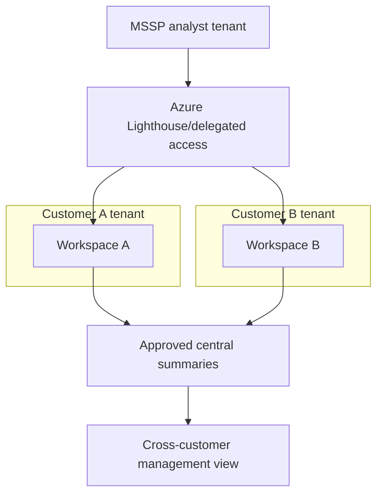

Never solve cross-customer reporting by copying unrestricted raw data without legal, privacy, residency, billing and security design.

## 11. Pricing model: terms before numbers

| Term | Plain meaning | August 2026 planning point |
|---|---|---|
| Pay-as-you-go | Pay for measured eligible usage | Default flexible analytics model |
| Commitment tier | Commit to daily Analytics ingestion for lower effective rate | Current entry point documented at 100 GB/day |
| Overage | Usage above commitment | Charged at tier's effective rate under current model |
| Simplified tier | Unified modern Sentinel billing presentation | Older workspaces may still show classic meters |
| Classic tier | Legacy separate Sentinel/Log Analytics meter behavior | Migration and invoice interpretation require care |
| Billable size | Stored column representation used for charging | Not equal to raw JSON/file bytes |
| Benefit/free meter | Qualifying data not charged under defined rules | Alerts may be free while raw product logs are paid |
| Trial | Temporary qualifying allowance | Current Learn: 31 days, first 10 GB/day, limits/caveats |

Current official guidance says a commitment can be increased and locks reductions for a defined period (currently 31 days, with a narrow correction path described in Azure Monitor documentation). Treat commitment selection as a commercial change with measured data and approval.

## 12. Analytics, Basic and Auxiliary table plans

A **table plan** controls ingestion price, query price/capability, retention behavior and feature support. One workspace can mix plans where table types support them.

| Dimension | Analytics | Basic | Auxiliary / lake-oriented |
|---|---|---|---|
| Best fit | High-value continuous monitoring/detection | Medium-touch troubleshooting/incident evidence | Verbose low-touch audit/compliance data |
| Ingestion price | Standard | Reduced flat rate | Lowest flat rate under current model |
| Interactive query charging | Included rather than per scanned GB | Per data scanned | Per data scanned |
| Query shape | Full cross-table KQL | Full KQL on one table plus supported lookup pattern | Full KQL on one table plus supported lookup pattern |
| Alerting | Broad feature support | Current simple-log alert support; Sentinel compatibility must be tested | Current Azure Monitor comparison says no alerts |
| Restore | Supported | Supported | Not supported in current comparison |
| Search jobs | Supported | Supported | Supported |
| Total retention | Up to current documented maximum | Up to current documented maximum | Up to current documented maximum |
| Typical Sentinel use | Active rules, hunts, incidents and pivots | Lower-touch source with supported detection model | Long-retained source queried or promoted when needed |

“Microsoft Sentinel supported” in a feature table does not mean every Sentinel analytics rule, workbook, hunt, join or correlation behaves identically. Validate exact use cases before changing a table plan.

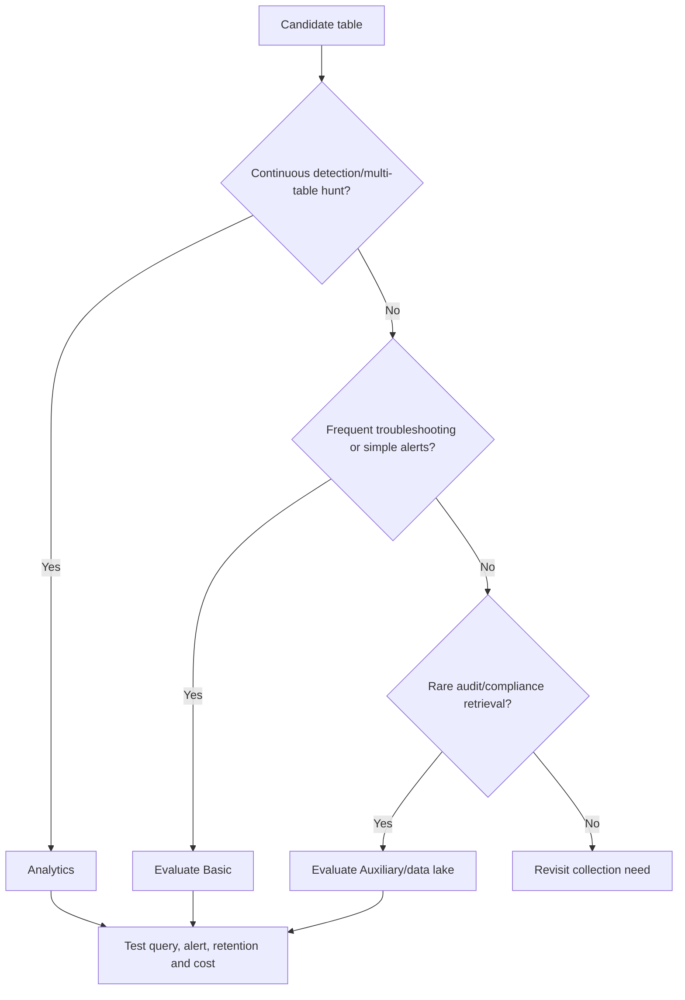

## 13. Ingestion tiers and transformations

Ingestion-time transformations can filter, redact, parse, route or add data before it reaches a destination table. They are powerful cost/privacy controls but can destroy fields required for future investigations.

| Technique | Benefit | Failure risk | Required test |
|---|---|---|---|
| Drop irrelevant records | Lower volume/noise | Removes rare attack evidence | Known positive event survives |
| Remove sensitive field | Privacy and smaller record | Breaks join/entity mapping | Detection and legal review |
| Parse JSON into columns | Query consistency | Schema drift/nulls | Versioned sample set |
| Route categories to plans | Cost aligned to value | Wrong tier loses feature | Feature compatibility matrix |
| Summarize high-volume data | Efficient trends | Raw detail unavailable | Preserve mandated raw path |

### 🔍 Plain-English deep-dive: filtering is a one-way door for that ingestion path

A query filter hides rows temporarily; an ingestion filter can prevent them from being stored at all. It is like deciding which camera footage enters the evidence room. If the discarded frames later matter, no KQL query can recover them. Use requirements, synthetic attack tests, peer review, a pilot and rollback; keep filtering logic versioned.

## 14. A complete cost equation

A planning equation should expose every variable:

$$
C_{month}=C_{ingest,A}+C_{ingest,B}+C_{ingest,X}+C_{retention}+C_{query}+C_{search}+C_{restore}+C_{automation}+C_{compute}+C_{network}+C_{other}
$$

For pay-as-you-go Analytics:

$$
C_{ingest,A}=\sum_{d=1}^{N} D_{A,d}\times R_{A,region,agreement}
$$

For a simplified commitment model, conceptually:

$$
C_{commit}=\sum_{d=1}^{N}\left(K\times R_K + \max(0,D_{A,d}-K)\times R_{K,GB}\right)
$$

where $K$ is committed daily GB and exact rate representation must come from the live calculator/contract. This conceptual formula makes the unused commitment visible.

| Cost component | Driver | Evidence source |
|---|---|---|
| Analytics ingestion | Daily billable GB and commercial tier | Usage table/meter and pricing page |
| Basic/Auxiliary ingestion | Daily plan-specific GB | Table usage and current meter |
| Long-term/lake storage | Stored compressed/billable GB-month | Cost Management and retention settings |
| Basic/Aux/lake query | Uncompressed/scanned GB | Query estimate/usage meters |
| Search jobs | Eligible scanned data plus result ingestion | Job estimate and result table |
| Restore | Restored volume and active duration/minimums | Restore operation and meter |
| Logic Apps/Functions | Triggers, actions and compute | Resource-specific metrics |
| Notebook/job/graph/AI | Compute cores/hours, scans, SCUs as applicable | Feature meters and current documentation |

Do not hide tax, support, currency conversion, enterprise discounts or partner charges inside the technical rate.

## 15. Billable-size mechanics

Microsoft Learn currently documents that Analytics and Basic record size is based on a string representation of stored column entries and excludes standard columns including `_ResourceId`, `_SubscriptionId`, `_ItemId`, `_IsBillable`, `_BilledSize`, `_TenantId` and `Type`. Auxiliary excludes a smaller listed subset and uses uncompressed column entries. The exact current list must be rechecked.

Important consequences:

1. Incoming compressed file size is not the bill.
2. JSON wrapper overhead is not necessarily stored/billed the same way.
3. Added transformed columns can increase size.
4. Data sent with fields that do not match destination schema can still be billable even when not stored as expected.
5. `_IsBillable == false` and excluded-table behavior must be observed, not guessed.

## 16. Commitment tiers and free benefits

Choose a commitment only after measuring daily distributions across representative weekdays, weekends, month-end, incident surges and maintenance. Compare total cost under pay-as-you-go and each eligible tier, including unused commitment.

| Check | Why |
|---|---|
| p50/p95/max daily Analytics GB | Reveals stable base and bursts |
| Seasonal/business events | Prevents short pilot bias |
| Existing classic versus simplified tier | Changes meters and comparison |
| Dedicated-cluster option | Can pool eligible workspace volume but adds constraints |
| Basic/Aux volume | Not covered by Analytics commitment discount |
| Trial/Defender/source benefits | Temporary or source/table specific |
| 31-day reduction restriction | Makes overcommitment sticky |
| Contract discount/currency | Public list rate may be irrelevant |

Current billing documentation lists certain free sources/meters, including Azure Activity, Sentinel health, Office 365 audit categories and security alerts under defined conditions. Raw Defender, Entra or other product logs can still be paid. “Defender alert free” does not mean “all Defender telemetry free.” Verify table, connector, meter and agreement.

## 17. Retention states from zero

**Analytics retention** keeps data available for interactive, high-performance use according to table-plan capabilities. **Total retention** is the complete configured lifetime. The interval after analytics retention is **long-term retention**, historically called archive in many discussions and APIs. Current Sentinel data-lake onboarding can change how these concepts are presented and billed.

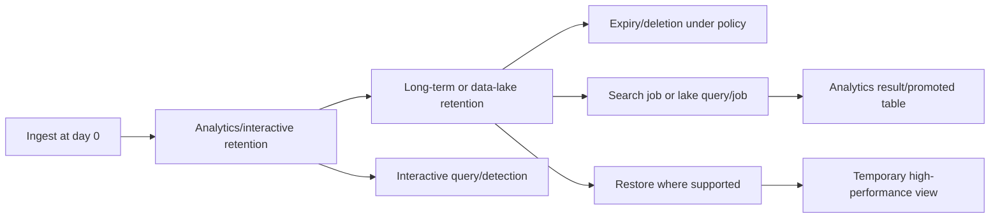

Current Learn guidance says Analytics tables default to 30 days generally, while Sentinel-enabled tables have documented 90-day treatment/benefit context; exact table defaults and commercial free periods must be verified. Analytics retention can currently extend up to two years, and total retention up to 12 years. Basic has a fixed interactive period in current docs; Auxiliary can be queried under its current plan model but lacks several Analytics features.

## 18. Retention is a policy decision, not a slider

| Requirement | Design question |
|---|---|
| Detection | How far back must a scheduled rule query? |
| Investigation | How long until incidents are commonly discovered? |
| Threat hunting | What baseline and lookback are needed? |
| Legal/regulatory | Minimum, maximum, legal hold and deletion duties? |
| Privacy | Is keeping identifiable command/email data proportionate? |
| Cost | Which days require interactive performance? |
| Recovery | How will old evidence be retrieved within the incident SLO? |

Changing retention downward can have delayed deletion/recovery behavior under current Azure Monitor rules; do not treat that grace behavior as a permanent backup. Increasing retention may apply to existing not-yet-deleted data. A custom table's deletion behavior also varies by plan and soft-delete state. Verify API semantics and obtain data-owner approval.

## 19. Search jobs versus restore

A **search job** asynchronously scans historical or lower-cost data and writes matches into a new Analytics results table ending in `_SRCH`. A **restore** creates a temporary high-performance view ending in `_RST` for a time range from a supported source table.

| Dimension | Search job | Restore |
|---|---|---|
| Best for | Find specific records across large/old data | Intensively query a known time range |
| Output | New Analytics search-results table | Temporary high-performance restored view |
| Charge | Scanned data plus result ingestion under current rules | Volume and active duration with current minimums |
| Source plans | Current support includes Analytics, Basic and Auxiliary | Current support Analytics and Basic; not Auxiliary |
| Query | Supported search-job subset/constraints | Full KQL on restored table |
| MSSP caveat | No cross-tenant/Lighthouse delegated search job currently | Same Lighthouse caveat currently |
| Cleanup | Delete result table when no longer needed | Dismiss `_RST` promptly to stop billing |

Current Learn documents restore minimum billing of 2 TB and 12 hours and current job/restore limits. Those numbers are change-sensitive. Always review the estimate before a historical operation and record who approved it.

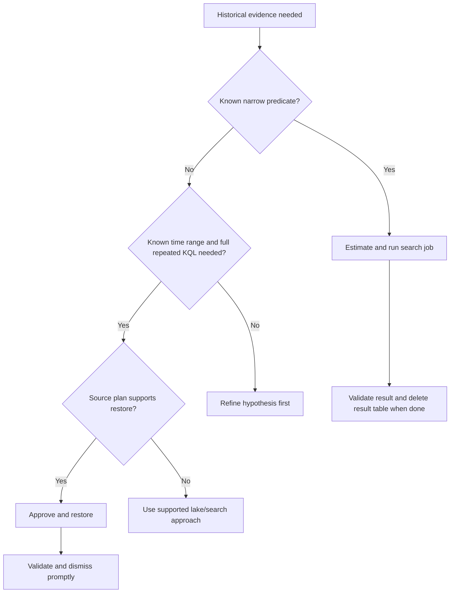

## 20. Microsoft Sentinel data lake from zero

The **Microsoft Sentinel data lake** is a managed, tenant-wide security data platform designed for lower-cost, large-scale, long-term storage and analysis. Official architecture describes open-format Parquet files, separation of storage and compute, multiple analytics engines and native connection to Sentinel workflows. It exposes KQL exploration/jobs and notebook capabilities according to current availability.

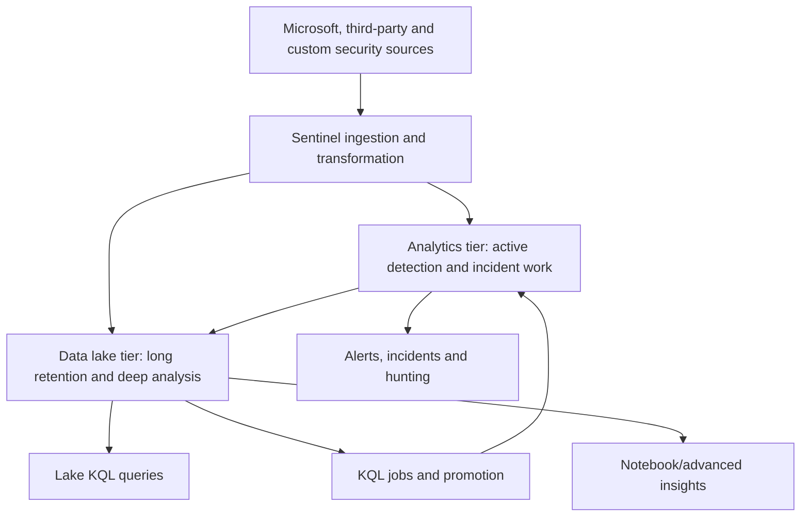

Official 2026 language says Analytics-tier data becomes available in the lake tier after onboarding without a second copy/extra ingestion charge for that path, while lake-only ingestion and processing have their own meters. Storage after the Analytics retention period, lake queries and advanced compute are billed under current meters. Confirm the exact current model before estimating.

## 21. Data-lake onboarding architecture and caveats

Current onboarding guidance includes significant consequences:

| Current documented behavior | Design impact |
|---|---|
| Defender portal and Sentinel primary workspace required | Portal migration/onboarding is a prerequisite |
| Azure subscription/resource group used for billing | Commercial and policy ownership required |
| Lake region follows primary Sentinel workspace | Residency decision precedes onboarding |
| Same-region Defender-connected workspaces attach | Scope may be broader than one selected workspace |
| Individual workspace offboarding not self-service | Support-dependent rollback/exit planning |
| Required managed identity is created | Identity must retain documented role/permissions |
| Microsoft-managed keys for lake; CMK not supported currently | Can conflict with encryption policy |
| M365/Entra/Resource Graph asset data may be added | Consent, region and minimization review |
| Existing long-term/search/Aux meters can switch | Baseline and forecast must be recalculated |
| Initial/switch visibility can take documented time | Test plan must allow propagation delay |

### 🔍 Plain-English deep-dive: onboarding the lake is an architecture migration

It may look like a feature enablement screen, but it can change workspace attachment, data location, identities, table experiences and billing meters. It is closer to moving a library into a new managed campus than buying a larger shelf. Inventory every same-region connected workspace, encryption requirement, current meter and access path before approval. “We can call support to offboard” is not the same rollback as clicking Disable.

## 22. Data-lake availability and preview discipline

The overview and onboarding pages available in August 2026 document supported production onboarding flows, but individual capabilities can retain preview labels or limited-region rollout. Do not infer universal GA from the existence of documentation.

| Capability | Verify separately |
|---|---|
| Lake storage/tiering | Region, cloud, tenant eligibility and SLA |
| KQL exploration | Query support, limits, scanned-GB meter and RBAC |
| KQL jobs/promotion | Scheduling, destination, identity and charging |
| Notebooks | Pool sizes, compute meter, package/network and data controls |
| Graph | Embedded versus custom graph charging and preview state |
| MCP/AI tools | Preview, SCU use, underlying KQL/graph meters and authorization |
| Purview scenarios | Required connectors, region and role/consent |

Maintain a feature register with status, source URL/date, tenant observation, owner, acceptable use, exit condition and review date.

## 23. Table plan and tier selection matrix

| Use case | Frequency/latency | Candidate | Why | Mandatory validation |
|---|---|---|---|---|
| Privileged identity detection | Minutes, cross-table | Analytics | Full detection and joins | Rule, latency, entities and cost |
| Firewall troubleshooting | Incident-driven, single-table | Basic or Analytics | Balance cost and interactive need | Query, alert and scan charges |
| Verbose DNS compliance | Rare, years | Auxiliary/lake | Low-touch high volume | Retrieval SLO and no-alert limitation |
| Daily trend | Daily aggregate | Raw appropriate tier + summary table | Avoid rescanning raw history | Accuracy and summary cost |
| Historical breach hunt | Rare, broad history | Lake/query/job or search/restore | On-demand compute | Cost estimate and access |
| Incident evidence | Frequent first 90 days, rare later | Analytics then long-term/lake | Fast active case, cheaper old data | Retention and retrieval drill |

No matrix can replace table eligibility checks. Some Azure tables have fixed or limited plan support.

## 24. Reduce noise without losing evidence

Cost optimization and detection quality can align, but only with evidence-aware controls.

| Technique | Good use | Unsafe use |
|---|---|---|
| Source-side category selection | Disable irrelevant debug category after tests | Disable all successful sign-ins because attacks are “failures” |
| Ingestion filter | Remove known nonsecurity heartbeat payload field | Drop rare privileged events |
| Table-plan change | Move rare audit source after feature test | Move active detection source solely by GB |
| Summary rule | Store daily counts for dashboards | Replace raw incident evidence needed for attribution |
| Detection tuning | Add verified environment exclusion | Whitelist an entire admin subnet forever |
| Retention tiering | Fast recent, low-cost historical | Delete data before discovery/regulatory window |

Use a **value density** measure carefully: useful detections, investigations or required records per GB. Low immediate detection yield may still be justified for forensics or compliance.

## 25. Budgets, caps and monitoring

Azure budgets notify; they do not automatically stop ingestion. A workspace daily cap can stop collection and create a security blind spot, so it is not a routine budget control for critical telemetry.

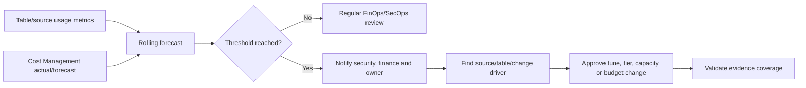

| Metric | Useful breakdown |
|---|---|
| Billable GB/day | Table, source, resource, workspace and plan |
| Cost/day and forecast | Meter, subscription, resource and tag |
| p95 ingestion latency | Critical source/table |
| Query scanned GB/cost | User, feature, query/job and table |
| Long-term/lake stored GB | Table and retention policy |
| Search/restore spend | Incident/case approval ID |
| Commitment utilization | Used eligible GB / committed GB |
| Benefit allocation | Eligible versus consumed free amount |
| Data-quality score | Required fields, duplicates and invalid rows |
| Coverage impact | Use cases affected by optimization change |

## 26. Cost variance and troubleshooting

| Symptom | Plausible cause | First check |
|---|---|---|
| Sudden ingestion spike | Source config change, incident burst, duplicate route or verbose field | Usage by table/source/hour plus change timeline |
| Bill above estimate | Billable-size assumption, region/rate, extra services or retention | Reconcile invoice meters to model variables |
| Commitment underused | Seasonality, filtered source, split workspace or overcommit | Daily eligible Analytics distribution |
| Query cost spike | Broad lake/Basic/Aux time range, dashboard refresh or job | Query/job audit and scanned data |
| Retention cost persists | Existing data, table deletion semantics or policy mismatch | Table total retention and meter timeline |
| Search cost high | Wide time range/table and low-selectivity predicate | Cost estimate and source ingestion over range |
| Restore cost continues | `_RST` table not dismissed | Active restores and start time |
| Data-lake bill changes | Meter migration after onboarding | Pre/post meter comparison and onboarding date |
| Chargeback dispute | Shared overhead or missing source attribution | Allocation rule and usage provenance |

Your RCA pattern applies: define the variance, build a UTC timeline, identify the first changed meter/table/source, test competing causes and reconcile the corrective action against subsequent actual cost.

## 27. Security and privacy controls

| Risk | Control |
|---|---|
| Cross-team raw data exposure | Workspace/table/resource-context access design and persona tests |
| Cross-region transfer | Document each source, processing/storage location and consent |
| Overretention | Table-specific schedule, owner and periodic review |
| Underretention | Map discovery/regulatory windows and exercise retrieval |
| Sensitive field in cheap tier | Minimize/redact with tested transformation; protect queries/exports |
| Search results broaden access | Restrict `_SRCH`/derived table access and clean up |
| Notebook exfiltration | Govern identities, packages, network, exports and outputs |
| Cost dashboard disclosure | Limit billing access and redact customer-sensitive allocation |
| CMK conflict with lake | Treat current lack of lake CMK as architecture gate |

## 28. Business continuity and disaster recovery

A workspace is regional. Cross-region duplicate ingestion can improve data availability but doubles selected ingestion and requires duplicate connectors, content, incidents and operating procedures. Current workspace replication capabilities, supported plans and Sentinel behavior must be verified for the chosen design.

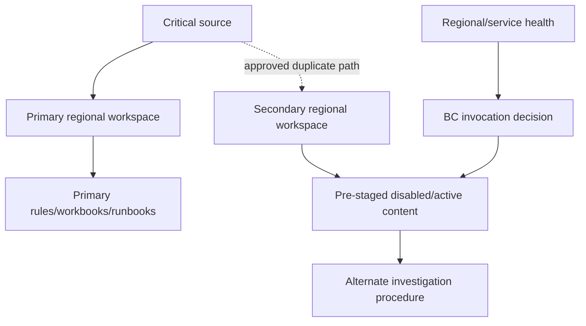

| Continuity question | Decision evidence |
|---|---|
| Which sources are mission critical? | Business-impact analysis |
| Is data availability or active detection required during outage? | Recovery-time objective (RTO) and recovery-point objective (RPO) |
| Can sources dual-home without duplicates/limits? | Connector/agent test |
| How are rules/workbooks/playbooks promoted? | Versioned deployment package |
| How does analyst access fail over? | Identity and portal exercise |
| How are incidents reconciled after recovery? | Case reconciliation runbook |
| What is the extra steady-state cost? | DR cost line in forecast |

Microsoft Learn warns that alternate-workspace data availability does not automatically switch dependent alerts/workbooks. Test the whole service, not only the presence of rows.

## 29. Deployment, testing and rollback

```mermaid
flowchart LR
    BASE[Baseline volume, cost, access and retention] --> PILOT[Pilot selected tables/sources]
    PILOT --> TEST[Test query, detection, privacy and retrieval]
    TEST --> OBSERVE[Observe representative cycle]
    OBSERVE --> APPROVE[Security, privacy, finance and owner approval]
    APPROVE --> DEPLOY[Promote table/workspace changes]
    DEPLOY --> MONITOR[Monitor data, outcomes and meters]
    MONITOR --> TUNE[Tune or roll back]
```

| Change | Positive test | Negative/failure test | Rollback |
|---|---|---|---|
| New workspace | Source arrives, users query, content deploys | Unauthorized persona denied | Stop route and restore prior destination |
| Table-plan change | Required queries/features pass | Unsupported operation fails as expected | Return plan if supported/current constraints allow |
| Transformation | Required fields retained; volume reduced | Attack near-miss and schema drift | Deploy previous DCR/transform version |
| Retention decrease | Policy window still available | Retrieval beyond expiry unavailable as approved | Revert during documented grace where possible |
| Commitment tier | Forecast saving under measured distribution | Stress low-volume scenario | Wait/execute current allowed reduction path |
| Data-lake onboarding | Workspaces/tables/queries/roles/meter observed | CMK/policy/offboard assumptions challenged | Support-led offboarding plan; not instant self-service |

Rollback never means deleting cost evidence or hiding a mistaken commitment. Record residual charges and data effects.

## 30. Operating model and review cadence

| Cadence | Review |
|---|---|
| Daily | Critical source freshness, ingestion anomaly, failed jobs and cost spike |
| Weekly | Top changing tables, query scans, data quality and pilot outcomes |
| Monthly | Forecast versus actual, commitment utilization, retention and chargeback |
| Quarterly | Workspace boundaries, RBAC, residency, DR, feature status and roadmap |
| Annually/contract event | Pricing agreement, regulatory schedule and long-term architecture |
| After incident | Was evidence available, timely, queryable and retained? |

The service owner must bring SecOps, platform, finance and privacy together. Cost cannot be optimized safely by finance alone; detection cannot demand unlimited data without commercial accountability.

## 31. Consulting scenario: global company with MSSP support

**Fictional facts:** Contoso Bio has one corporate tenant in Europe, a separately governed US subsidiary tenant, an acquired APAC tenant and an MSSP. European identity data has a residency requirement. The SOC needs rapid Microsoft 365 identity detection, occasional firewall investigations, seven-year access to selected audit records and customer-level chargeback.

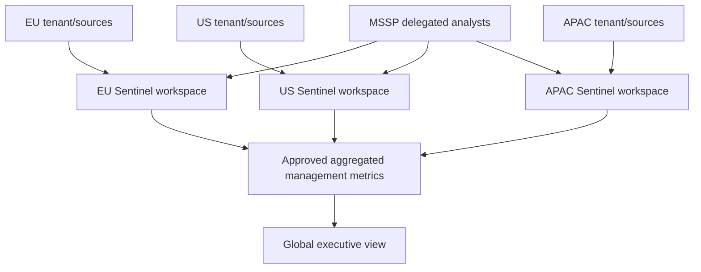

### Option analysis

| Option | Verdict | Reason |
|---|---|---|
| One global raw-data workspace | Reject initially | Tenant/residency/customer isolation and connector constraints |
| Workspace per tenant/required region | Baseline | Clear ownership, residency and billing |
| Separate workspace per source/team | Reject unless hard boundary | Excessive complexity and lost aggregation |
| Raw distributed plus approved summaries | Consider | Global reporting without copying unrestricted evidence |
| Data lake in each eligible regional design | Evaluate separately | Region, CMK, attachment, meter and offboarding consequences |

The MSSP uses delegated access where supported, but the runbook acknowledges that current search/restore operations do not support Lighthouse delegation. Customer-authorized local operators or another approved access model handle those tasks. Retention and table plans are selected per use case, not copied globally without checking law and cost.

## 32. Safe paper cost lab

**Safety boundary:** Do not create Azure resources, start a trial, enable Sentinel/data lake, ingest logs, enter prices from a client contract or upload identifiers. Use the fictional values and variables only. The result is an estimate model, not a quote.

### Fictional source measurements

| Source | Avg EPS | Avg bytes | Candidate plan | Interactive days | Total days |
|---|---:|---:|---|---:|---:|
| Privileged identity audit | 12 | 1,200 | Analytics | 180 | 730 |
| Windows security subset | 220 | 950 | Analytics | 90 | 365 |
| Firewall threat | 45 | 1,100 | Analytics | 90 | 365 |
| Firewall traffic | 600 | 850 | Basic candidate | 30 | 180 |
| DNS verbose audit | 1,400 | 500 | Auxiliary/lake candidate | Current plan behavior | 2,555 |

### Task 1: calculate raw volume

For each row, calculate $EPS\times86{,}400\times Bytes/10^9$. Add p95 and burst factors as separate scenarios rather than silently inflating the average.

### Task 2: create billable scenarios

Use three clearly labeled placeholder $k_{billable}$ values: 0.60, 0.75 and 0.95 for Analytics/Basic paper sensitivity only. Do not use the same assumption for Auxiliary without noting its different uncompressed calculation. State that pilot `_BilledSize`/usage must replace every placeholder.

### Task 3: model pricing variables

Define live-rate cells rather than numbers: $R_A$, $R_B$, $R_X$, $R_{lake-storage}$, $R_{lake-query}$, $R_{search}$, $R_{restore}$ and $R_{automation}$. Add region, currency, agreement date, source URL and approver next to every rate.

### Task 4: compare commitments

Compare pay-as-you-go against each currently eligible commitment using 31 daily Analytics values. Include unused commitment and overage. Exclude Basic/Auxiliary from commitment coverage under current guidance. Add a warning that reduction constraints apply.

### Task 5: test two architectures

Compare one EU workspace with separate source-level chargeback versus two workspaces split by regulated data. Include duplicated content/operations, lost commitment aggregation, cross-workspace query and access benefits.

### Task 6: retention/retrieval drill

Choose one fictional 200-day-old firewall event. Decide whether interactive query, search job, restore or lake query/job applies. Estimate scanned/restored volume, approvals, result access and cleanup. Note current restore minimum billing and Auxiliary limitation.

### Task 7: data-lake readiness gate

Record Defender onboarding, primary region, all same-region connected workspaces, subscription owner, roles, policy exemption, CMK conflict, Microsoft 365 region consent, managed identity, meter changes and support-led offboarding.

### Lab deliverables

| Deliverable | Acceptance criterion |
|---|---|
| Requirements matrix | Every source/tier traces to use case and owner |
| Volume model | Formulas, units, p50/p95/burst and measured-data gap |
| Workspace options paper | At least two options with explicit constraints |
| Table-plan matrix | Query/alert/retention tests, not only price |
| Retention schedule | Interactive, total, legal basis and owner |
| Cost model | Every meter/rate/benefit visible and dated |
| Data-lake gate | Scope, residency, CMK, identity, meter and exit decision |
| BC/DR plan | RTO/RPO, duplicate cost and exercised switch procedure |
| Executive summary | Range, assumptions, risks and next measurement |

## 33. Consulting artifacts

| Artifact | Purpose |
|---|---|
| Discovery questionnaire | Establish outcomes, constraints and stakeholders |
| Data-source inventory | Record volume, schema, latency, owner and value |
| Workspace ADR | Explain why the fewest approved workspaces are sufficient |
| Residency/data-flow map | Show collection, processing, storage and access locations |
| Table-plan decision register | Record feature tests and economics per table |
| Cost workbook | Forecast every meter and reconcile actuals |
| Retention schedule | Align investigations, law, privacy and retrieval |
| Data-lake readiness assessment | Gate onboarding consequences and feature status |
| FinOps/SecOps dashboard | Combine cost, health, quality and coverage |
| DR runbook | Define alternate collection, content and analyst workflow |
| Roadmap | Phase measurement, pilot, promotion and optimization |

## 34. Roadmap

| Phase | Activities | Exit gate |
|---|---|---|
| Discover | Risks, use cases, sources, legal/commercial constraints | Signed requirement baseline |
| Measure | Representative EPS, bytes, billable GB and latency | Confidence range and gaps |
| Design | Workspace, table plan, retention, RBAC, cost and BC options | Architecture/privacy/finance approval |
| Pilot | Limited source/tables, synthetic tests and actual meter observation | Feature, quality and variance passed |
| Deploy | Versioned changes, communications and rollback | Operational acceptance |
| Optimize | Commitment/tiering/filtering only after stable evidence | No unacceptable coverage loss |
| Operate | Recurring cost/quality/access/feature review | Service scorecard and decisions |

## 35. JD Mapping: interview translation

| Interview theme | Your transferable strength | Planning answer |
|---|---|---|
| Requirements | Clarifies incident impact and evidence | Start risk/use case first, then data and architecture |
| Troubleshooting | Isolates failing layer | Decompose event rate, route, table, tier and latency |
| RCA | Tests causes against timeline | Reconcile cost variance by meter/table/change |
| Reporting | Explains evidence and uncertainty | Present range, units, assumptions and actual-versus-forecast |
| Compliance | Preserves evidence responsibly | Map residency, access, minimization and retention owner |
| Consulting | Coordinates cross-functional decisions | Use ADRs, option papers, workshops and phased gates |

## Official Source Anchors

These official Microsoft Learn anchors were reviewed for the August 24, 2026 treatment in this chapter. Recheck update dates, banners, pricing pages, regions and linked limits before implementation.

1. [Design a Log Analytics workspace architecture](https://learn.microsoft.com/azure/azure-monitor/logs/workspace-design) — one versus multiple workspaces, tenants, regions, access, billing and resilience.
2. [Microsoft Sentinel sample workspace designs](https://learn.microsoft.com/azure/sentinel/sample-workspace-designs) — common architecture patterns.
3. [Prepare for multiple workspaces and tenants](https://learn.microsoft.com/azure/sentinel/prepare-multiple-workspaces) — Sentinel operational considerations.
4. [Plan costs and understand Microsoft Sentinel pricing and billing](https://learn.microsoft.com/azure/sentinel/billing) — current Analytics/data-lake meters, trial, benefits and portal deadline.
5. [Monitor costs for Microsoft Sentinel](https://learn.microsoft.com/azure/sentinel/billing-monitor-costs) — cost-management experiences and metrics.
6. [Reduce costs for Microsoft Sentinel](https://learn.microsoft.com/azure/sentinel/billing-reduce-costs) — current optimization and commitment guidance.
7. [Azure Monitor Logs cost calculations and options](https://learn.microsoft.com/azure/azure-monitor/logs/cost-logs) — billable size, plans, commitments, retention, search and restore.
8. [Azure Monitor Logs overview](https://learn.microsoft.com/azure/azure-monitor/logs/data-platform-logs) — current table-plan feature comparison.
9. [Select a table plan](https://learn.microsoft.com/azure/azure-monitor/logs/logs-table-plans) — eligibility and plan changes.
10. [Manage data retention in a Log Analytics workspace](https://learn.microsoft.com/azure/azure-monitor/logs/data-retention-configure) — analytics, long-term and total retention.
11. [Run search jobs](https://learn.microsoft.com/azure/azure-monitor/logs/search-jobs) — behavior, permissions, limits and charging.
12. [Restore logs](https://learn.microsoft.com/azure/azure-monitor/logs/restore) — supported plans, current limits and billing minimums.
13. [Microsoft Sentinel data lake overview](https://learn.microsoft.com/azure/sentinel/datalake/sentinel-lake-overview) — architecture, tiers, KQL, notebooks and audit.
14. [Onboard to Microsoft Sentinel data lake and graph](https://learn.microsoft.com/azure/sentinel/datalake/sentinel-lake-onboarding) — roles, region, workspace attachment, CMK, meters and offboarding.
15. [Manage data tiers and retention in the Defender portal](https://learn.microsoft.com/azure/sentinel/manage-data-overview) — current Sentinel table/tier management.
16. [Geographical availability and data residency](https://learn.microsoft.com/azure/sentinel/geographical-availability-data-residency) — supported regions and storage context.
17. [Azure Monitor best practices: cost management](https://learn.microsoft.com/azure/azure-monitor/fundamentals/best-practices-cost) — operational cost controls.

## ⭐ Likely Interview Questions for This Section

### Q1. How do you start planning a Microsoft Sentinel deployment?

**Model answer:** I start with business risk and prioritized threat/use cases, not connectors. For each use case I define required evidence, fields, authoritative source, volume, latency, query pattern, retention, response owner and success test. Then I evaluate the fewest workspaces, table plans, access and commercial model that satisfy those requirements. A measured pilot replaces EPS and billable-size assumptions before commitment or broad rollout.

### Q2. When should an organization use multiple Log Analytics workspaces?

**Model answer:** Start with one to reduce complexity. Add a workspace for a hard boundary such as tenant/source limitation, mandatory region/residency, data ownership or RBAC isolation, same-table retention that cannot otherwise differ, chargeback that Cost Management cannot support, or a tested resilience design. I document the benefit against cross-workspace queries, duplicated content, incident operations and lost commitment aggregation.

### Q3. Explain Analytics, Basic and Auxiliary plans.

**Model answer:** Analytics is for high-value continuous monitoring with broad query and detection features and query cost included in ingestion. Basic lowers ingestion cost for medium-touch single-table troubleshooting and charges by scanned query data, with feature constraints. Auxiliary/lake-oriented storage targets verbose, low-touch audit/compliance data at lower ingestion cost, also with scan charges and more feature limits such as no current alerts/restore in the Azure Monitor comparison. Eligibility and the exact Sentinel use case must be tested per table.

### Q4. How do you estimate Sentinel cost responsibly?

**Model answer:** I convert measured EPS and record-size distributions to raw daily GB, then replace a provisional billable factor with observed billed usage. I separate Analytics, Basic, Auxiliary, retention/lake storage, queries, search, restore, automation, compute and network. I apply current regional contract rates and source benefits explicitly, model daily commitment utilization and reconcile forecast to Cost Management/invoice meters. I present a range and assumptions, never a remembered list price.

### Q5. What is the difference between analytics retention, long-term retention, search and restore?

**Model answer:** Analytics retention keeps data readily queryable under the table plan. Total retention is the full lifetime; the period beyond analytics retention is long-term retention. A search job scans eligible historical/lower-tier data for specific matches and writes an Analytics results table. Restore makes a supported table/time range temporarily available for high-performance full KQL and is billed by volume/duration with current minimums. I pre-estimate, approve and clean up either operation.

### Q6. What changes when onboarding to Microsoft Sentinel data lake?

**Model answer:** Current guidance ties the lake region to a primary Defender-connected Sentinel workspace, attaches eligible same-region Defender-connected workspaces, provisions platform resources and a required managed identity, can add asset data and changes several long-term/query/Auxiliary billing meters. CMK is currently not supported for lake data, and individual workspace/self-service offboarding is constrained, requiring support for disablement. I treat onboarding as an architecture, privacy, identity and commercial migration with a dated feature/region review.

### Q7. How do you reduce Sentinel cost without losing evidence?

**Model answer:** I prioritize use cases, measure source categories and fields, remove demonstrably irrelevant data through versioned tested transforms, select table plans by query/detection need, use summaries for repeated reporting and tier older data according to retrieval needs. Every change gets positive attack, near-miss, schema, latency, cost and rollback tests. I avoid daily caps on critical evidence because they can create blind spots.

### Q8. What is your honest experience with Sentinel planning and cost?

**Model answer:** I have not owned a production Sentinel workspace, commitment purchase or data-lake onboarding. My production strength is incident/RCA, troubleshooting, evidence validation and reporting. I built a current paper architecture and cost lab covering requirements, EPS/billable volume, workspaces, table plans, retention, search/restore, data-lake gates, budgets, DR and reconciliation. In a client engagement I would validate against live regional terms and a measured pilot with security, privacy, finance and data-owner approval.

## 🧠 30-Second Memory Hooks

- **Risk → use case → evidence → source → tier:** plan value before volume.
- **EPS is a rate:** multiply by 86,400 and bytes, then measure billable size.
- **Latency has layers:** source, collection, ingestion, detection and human response.
- **Workspace rule:** start with one; split only for a proven hard boundary.
- **Analytics:** active detection and broad KQL.
- **Basic:** medium-touch, scan-priced, feature-constrained.
- **Auxiliary/lake:** low-touch long history, cheapest ingestion, strongest constraints.
- **Commitment:** Analytics base purchase, not a blanket discount for every meter.
- **Free alerts ≠ free raw logs:** verify table and meter.
- **Total retention = analytics + long-term:** one lifetime, different access states.
- **Search finds; restore accelerates:** both need estimate, approval and cleanup.
- **Data lake onboarding is migration:** region, workspaces, identity, CMK, meters and exit.
- **Budget alerts do not stop spend:** daily caps can stop evidence.
- **Cost RCA:** meter → table → source → change → validated correction.
- **Honesty:** model and paper lab, no production ownership claim.

## Completion Checklist

- [ ] I can turn a business risk into a measurable Sentinel use case.
- [ ] I can inventory source categories, schema, EPS, bytes, latency, query and retention.
- [ ] I can calculate raw daily volume and explain why billable size differs.
- [ ] I can explain average, p95, burst and confidence-range assumptions.
- [ ] I can justify one versus multiple workspaces using hard boundaries.
- [ ] I can discuss tenant, region, subscription, RBAC, residency and chargeback.
- [ ] I can explain MSSP distributed/central/hybrid tradeoffs and Lighthouse limits.
- [ ] I can compare pay-as-you-go, simplified/classic and commitment concepts.
- [ ] I can explain Analytics, Basic and Auxiliary capabilities and caveats.
- [ ] I can model every major ingestion, retention, query, search, restore and automation meter.
- [ ] I can explain source-specific free benefits without saying all product logs are free.
- [ ] I can distinguish analytics, long-term and total retention.
- [ ] I can choose search job versus restore and state current constraints.
- [ ] I can draw Sentinel Analytics and data-lake tiers and promotion paths.
- [ ] I can list data-lake region, workspace, identity, CMK, meter and offboarding gates.
- [ ] I can reduce noise using tested, reversible, evidence-aware controls.
- [ ] I can define budgets, metrics and cost-variance troubleshooting.
- [ ] I can design and exercise BC/DR rather than assuming rows equal service recovery.
- [ ] I completed the safe paper cost lab without creating resources or using client data.
- [ ] I can answer Q1–Q8 aloud with no production Sentinel cost/data-lake claim.
- [ ] I will recheck portal, pricing, plan, region, preview and licensing facts before reuse.

*Next suggested section:* [Part 45](Part-45-sentinel-connectors-ama-dcr-asim-normalization.md)