# Part 45 — Sentinel Data Connectors, AMA, DCRs, ASIM, Parsers, and Normalization

> **Section goal:** Build a beginner-first, consulting-grade understanding of how security evidence reaches Microsoft Sentinel and becomes queryable, consistent data. This Part covers native and service-to-service connectors, APIs, Azure diagnostic settings, Azure Monitor Agent (AMA), Windows Security Events, Linux Syslog/CEF forwarders, custom logs, Content Hub, Data Collection Rules (DCRs), Data Collection Endpoints (DCEs), DCR associations, streams, transformations, tables, `TimeGenerated`, Advanced Security Information Model (ASIM) schemas and parsers, connector health, latency, duplication, drops, least privilege, secrets, staged onboarding, rollback and urgent migration from legacy agents/APIs. You should be able to design, test and troubleshoot a synthetic collection path without claiming production Sentinel connector deployment.

This Part maps directly to Deloitte expectations for Microsoft Sentinel and Defender integration, Azure/hybrid architecture, third-party onboarding, security engineering, troubleshooting, RCA, data quality, least privilege, migration and client documentation. Your incident discipline is a strong fit: start with a known source event, trace each boundary, compare timestamps and identifiers, prove the destination row, then validate the detection. Your reporting experience helps turn connector status into evidence-based service health rather than a green icon.

> **Currency, portal, licensing, preview and retirement note (August 24, 2026):** This chapter is grounded in official Microsoft Learn available on August 24, 2026. After March 31, 2027, Sentinel is documented as Defender-portal-only; Azure-portal connector paths are legacy/change-sensitive. Connector packaging, support owner, table mapping, permissions, cloud availability, schemas, DCR APIs, endpoints and UI paths can change. Microsoft Learn currently states that the Log Analytics agent/MMA was retired on August 31, 2024 and that its cloud upload can stop at any time without notice after March 2, 2026. The legacy HTTP Data Collector API is documented as unsupported after September 14, 2026. New designs should use supported AMA/DCR and OAuth-based Logs Ingestion API or approved connector frameworks. Multi-stage transformations, Event Hubs DCR ingestion and some metrics/collection features are preview as of this date; standard DCR transformations and AMA have different status. Logs Ingestion API enforces TLS 1.2 or higher from March 1, 2026. Verify each connector page, Content Hub solution version, Microsoft Learn banner, source-product license, region/cloud matrix, limits, retirement notice and live tenant before implementation.

## JD Mapping

| Deloitte expectation | Capability developed here | Consulting evidence |
|---|---|---|
| Integrate Microsoft and third-party telemetry | Choose supported connector patterns | Connector decision matrix |
| Engineer Azure/hybrid collection | Design AMA, DCR, DCE and forwarders | Collection architecture diagram |
| Normalize security data | Apply schema/parser choices responsibly | ASIM mapping and validation pack |
| Troubleshoot incidents | Trace source-to-table and timestamp boundaries | Layered RCA runbook |
| Protect data and credentials | Least privilege, TLS, secrets and filtering | Security/control assessment |
| Migrate legacy technology | Stage MMA/HTTP API replacement without gaps/duplicates | Migration and rollback plan |
| Operate reliable services | Measure freshness, latency, completeness and quality | Connector SLO dashboard |

## Candidate honesty note

You can credibly discuss production incident/RCA, source-versus-symptom isolation, timestamp correlation, validation, change coordination, documentation and stakeholder reporting. You can present the safe connector and normalization design in this chapter.

You should not claim production AMA deployment, DCR authoring, Linux forwarder hardening, connector credentials, custom API ingestion, ASIM parser publication or legacy-agent migration unless separately evidenced. Safe wording is:

> “My production background is incident troubleshooting, evidence correlation, RCA, fix validation and reporting. I have not deployed Sentinel connectors or AMA/DCRs in production. I built a current paper lab that compares connector types and traces synthetic Windows, Syslog/CEF and custom API data through DCR streams, transformations and Log Analytics tables, then validates timestamps, duplication, schema and ASIM parsing. In a client environment I would install the current Content Hub solution, use least privilege and TLS, pilot a small source set, prove positive and negative events, monitor health and cost, and remove legacy routes only after parallel evidence shows no gap or duplicate.”

---

## 1. A connector is a collection contract

A **data connector** is the supported configuration and integration path that brings source data into Sentinel or integrates source-product alerts/incidents. It is not always a software agent. A connector can be service-to-service, an API poller, an Azure diagnostic setting, AMA with a DCR, a Linux forwarder, or packaged custom logic.

Think of a connector as a courier contract. It defines the sender, authentication, pickup method, accepted package shape, route, destination, schedule, support owner and proof of delivery. A “connected” badge does not prove every package arrived intact.

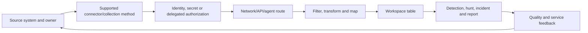

| Contract element | Question |
|---|---|
| Scope | Which tenant, subscription, account, host, log category and time range? |
| Authorization | Which identity grants/uses which read or write permission? |
| Transport | API, diagnostic setting, HTTPS, AMA, Syslog/CEF or custom? |
| Format/schema | Which fields, types, versions and destination table? |
| Timing | Real-time, poll interval, batching, retry and expected latency? |
| Volume | Average/burst events and billable bytes? |
| Support | Microsoft, partner or community support owner? |
| Lifecycle | Install, update, test, disable, rollback and retire? |

### 🔍 Plain-English deep-dive: connected is not complete

A connector page may show that authorization succeeded while one required audit category is disabled at the source. A forwarder may be online while its disk queue is full. An API may return successful pages while a permission excludes a workload. Therefore prove a **known event** end to end: source record, transport receipt, destination row, required fields, one-copy count, timestamps and downstream rule behavior.

## 2. Connector families

| Connector family | How data moves | Typical example | Main failure boundary |
|---|---|---|---|
| Native/service-to-service | Microsoft-managed product integration | Defender XDR, Entra, Microsoft 365 | License, consent, role, API/service health |
| SaaS/API | Connector polls or receives vendor API data | Third-party cloud security product | Token scope, expiry, rate limit, pagination |
| Azure diagnostic setting | Azure resource emits logs/metrics to workspace | Key Vault audit/resource logs | Category, destination, RBAC, resource recreation |
| AMA/DCR | Agent reads guest logs under central rules | Windows Security Events | Extension, DCRA, XPath, network, DCR |
| Syslog/CEF via AMA | Device sends to Linux forwarder/daemon/AMA | Firewall or appliance | Device route, TLS, daemon, queue, DCR |
| Logs Ingestion API | App sends JSON over OAuth/HTTPS to DCR endpoint | Custom business security audit | App identity, endpoint, payload/schema, throttling |
| Codeless Connector Framework | Packaged API connector definition | ISV SaaS integration | Manifest, credentials, API changes, support |
| Azure Function/Logic App | Custom scheduled/event workflow calls API and ingests | Unsupported vendor API | Code, identity, execution cost, retries |

Choose the most vendor-supported, least custom route that meets the requirement. Custom code creates a product that someone must secure and maintain.

## 3. Content Hub and connector support

Sentinel solutions in **Content Hub** package connectors with related analytics templates, parsers, workbooks, hunting queries and playbooks. Install the relevant solution first, then inspect and configure its connector. Installing the solution is not equivalent to authorizing or starting data flow.

| Support label | Who maintains connector behavior | Client action |
|---|---|---|
| Microsoft-supported | Microsoft under documented support terms | Open Microsoft case after local evidence |
| Partner-supported | Named partner/vendor | Preserve IDs/times and contact listed support |
| Community-supported | Community without listed support owner | Assess risk; maintain or replace internally |

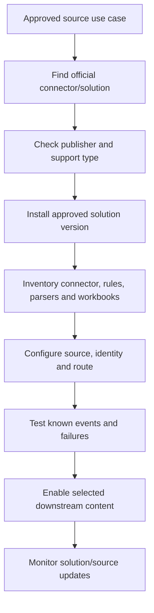

Record solution ID/version, publisher, support contact, connector dependencies and local customizations. An upstream update should go through regression testing.

## 4. Microsoft service-to-service connectors

Service-to-service integration avoids a customer-managed collector but still requires licensing, consent, roles and source configuration.

| Source context | Common value | Verify before design |
|---|---|---|
| Microsoft Defender XDR | Alerts/incidents and advanced-hunting data paths | Unified incident behavior, product licenses, tables and duplication |
| Microsoft 365/Office | Exchange, SharePoint, Teams and audit activity | Audit availability, record types, latency and free/paid meter |
| Microsoft Entra | Sign-in, audit, risk and provisioning evidence | Entra license, diagnostic/connector route and log category |
| Defender for Cloud | Cloud security alerts and posture/workload data | Plans, subscriptions, continuous export and table mapping |
| Azure Activity | Subscription control-plane activity | Subscription diagnostic scope and benefit |

Do not authorize a broad tenant connector before mapping data categories, roles, residency, cost and downstream duplicate rules. Defender XDR integration can synchronize incidents while raw data connectors add tables; those are different outcomes.

## 5. AWS, GCP and third-party context

Microsoft Learn/Content Hub provides connectors and solutions for Amazon Web Services, Google Cloud and many vendors, but exact methods vary: cloud-native API, object storage/queue, function, CEF/Syslog or Codeless Connector Framework.

| Domain | Design questions |
|---|---|
| AWS | Which accounts/organizations, regions, CloudTrail/S3/SQS/API path, role trust and rate? |
| GCP | Which projects/organizations, Pub/Sub or API path, service account and audit categories? |
| SaaS | Which API version, tenant, token scopes, pagination, backfill and rate limit? |
| Network appliance | Native CEF/Syslog format, transport security, forwarder sizing and vendor parser? |
| Custom app | Can it use Logs Ingestion API with managed identity/OAuth and stable schema? |

Use source-provider guidance plus Sentinel connector guidance. A Sentinel page cannot guarantee the third party's log configuration, and a vendor page cannot guarantee Sentinel table semantics.

## 6. Azure Monitor Agent architecture

**Azure Monitor Agent (AMA)** runs on supported Azure VMs or Azure Arc-enabled machines and reads guest operating-system data according to associated DCRs. The agent itself currently has no separate usage charge, but ingested/stored data and related services can cost money.

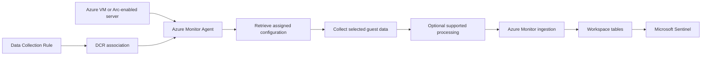

AMA is not an endpoint detection and response agent. It collects configured monitoring/security telemetry. Defender for Endpoint is a different agent/capability. Avoid saying “Sentinel agent” as though Sentinel owns all host security functions.

## 7. DCRs from zero

A **Data Collection Rule (DCR)** is an Azure resource that defines some or all of: what to collect, the incoming stream/schema, transformations, destinations and data flows. It is the instruction sheet. A **Data Collection Rule Association (DCRA)** links a resource such as a VM to a DCR. One DCR can serve many resources, and a resource can have multiple DCRs under current limits.

| DCR concept | Plain meaning | Example |
|---|---|---|
| Data source | What the collector reads | Windows event channel or Syslog facility |
| Stream | Named shape/type flowing through rule | `Microsoft-Syslog` |
| Stream declaration | Columns/types expected for custom input | `Custom-ContosoAudit` schema |
| Transformation | Per-record filter/map/parse logic | Remove test events or set `TimeGenerated` |
| Destination | Azure Monitor target | Log Analytics workspace |
| Data flow | Stream-to-destination/output mapping | Custom stream to `ContosoAudit_CL` |
| DCRA | Link between target resource and DCR | Linux forwarder associated to CEF DCR |
| Immutable ID | Runtime identifier used by direct ingestion | API URI references DCR immutable ID |

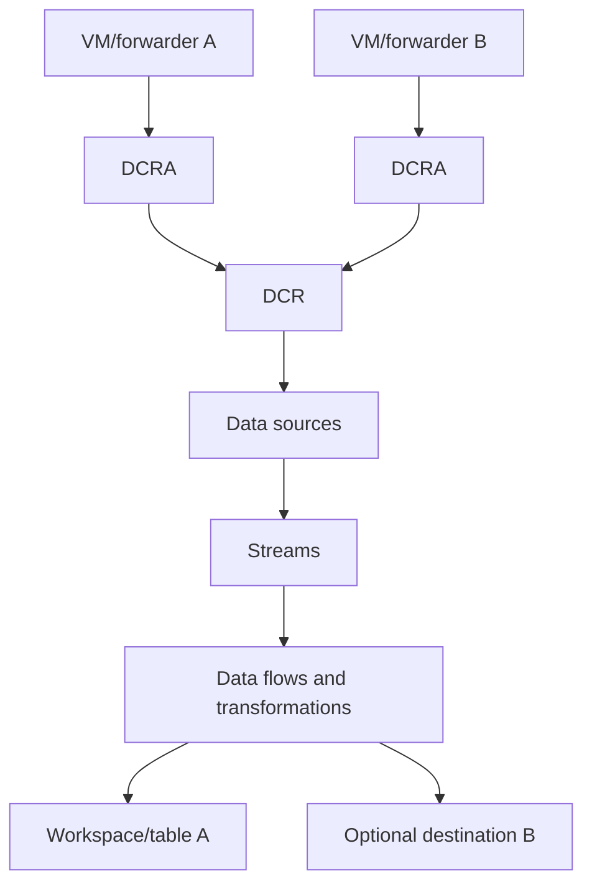

Current documentation allows up to 30 DCR associations per resource, but limits can change. Multiple DCRs can accidentally collect the same channel/facility twice, so model overlap explicitly.

### 🔍 Plain-English deep-dive: DCR association is the assignment, not the rule

A school can write a curriculum, but students do not follow it until assigned. The DCR is the curriculum; the DCRA assigns it to a machine. If AMA is installed but no applicable DCRA exists, expected data may not flow. If two overlapping curricula are assigned, the same lesson may be reported twice.

## 8. DCEs and network isolation

A **Data Collection Endpoint (DCE)** is an Azure resource exposing configuration and/or ingestion endpoints. It is not always required. AMA can use public service endpoints by default. Current guidance requires a DCE for Private Link scenarios and particular data sources; Logs Ingestion can use a modern DCR ingestion endpoint unless Private Link or an older DCR design requires a DCE.

| Endpoint need | Current design |
|---|---|
| AMA public collection | DCE often not required |
| AMA with Azure Monitor Private Link Scope (AMPLS) | DCE required/associated per current network design |
| Logs Ingestion with modern direct DCR | DCR `logsIngestion` endpoint can be used |
| Logs Ingestion to private-linked workspace | DCE required |
| Older direct-ingestion DCR without endpoint | Continue DCE or replace DCR |

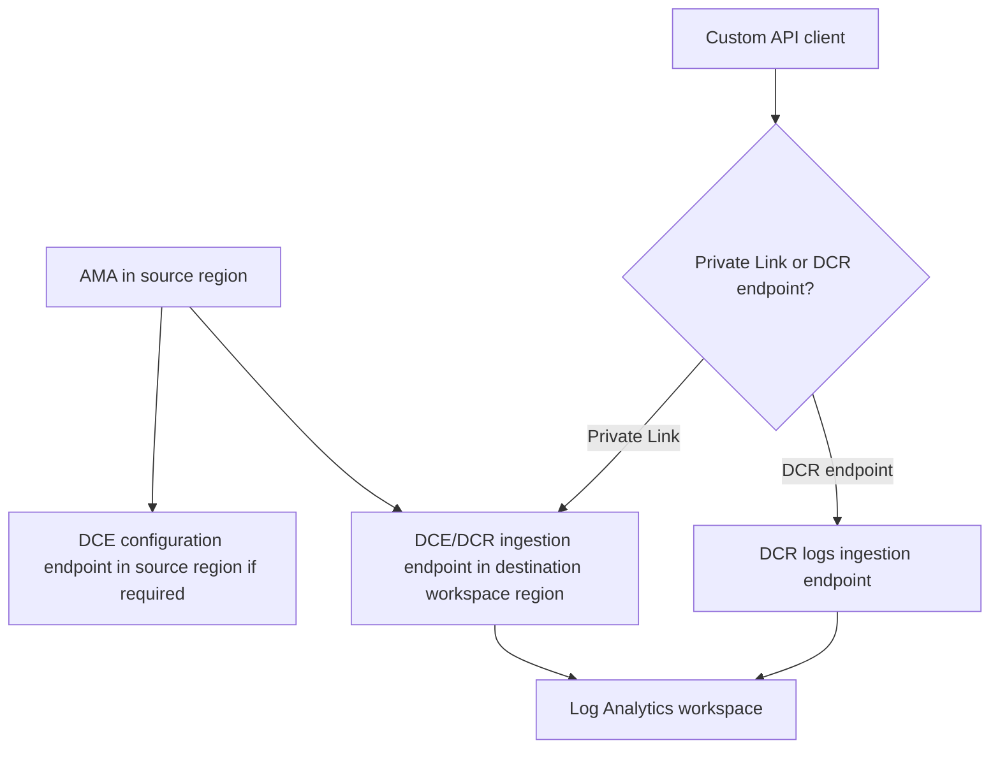

Private Link depends on DNS, route and AMPLS design. “Public network disabled” without working private DNS can silently break collection.

## 9. Windows Security Events via AMA

The Windows Security Events via AMA Sentinel connector uses AMA and DCR configuration to select Windows event channels/events, commonly landing security audit events in `SecurityEvent`. Collection presets or XPath queries determine scope; current connector/template details must be verified.

| Design area | Example question |
|---|---|
| Audit policy | Does Windows generate the required event at all? |
| Channel | Security, System, Application or another supported channel? |
| Event IDs | Which positive/negative events support the use case? |
| XPath | Does filter include required provider/level/event and exclude safely? |
| Hosts | Domain controllers, servers, clients or pilot group? |
| DCRA | Are the intended machines associated once? |
| Table/schema | Does `SecurityEvent` contain expected account/host/process fields? |

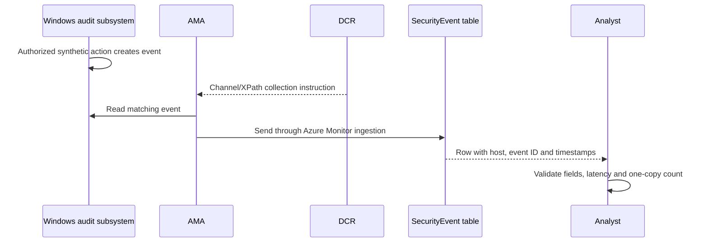

A missing row can be an audit-policy problem, not an AMA problem. First confirm Event Viewer/source generation on the same host and UTC window.

## 10. Syslog and CEF fundamentals

**Syslog** is a family of message formats/transports commonly used by Linux and network devices. A message includes facility (which subsystem), severity and content. **Common Event Format (CEF)** is a structured security-event format carried through Syslog-style transport, with vendor, product, signature and extension fields.

| Aspect | Syslog | CEF |
|---|---|---|
| Structure | Varies by RFC/vendor/message | Defined CEF header plus key-value extensions |
| Typical Sentinel table | `Syslog` | `CommonSecurityLog` |
| Parsing | Source-specific message parsing often needed | Common fields plus vendor extension mapping |
| Use | OS, daemon, appliance and app logs | Security appliance/product events |
| Risk | Free-text/version drift | Malformed escaping or field misuse |

CEF is not semantic perfection. Two vendors can place different concepts in the same extension. Validate against vendor documentation and sample events.

## 11. Linux forwarder architecture

Many appliances send Syslog/CEF to a dedicated Linux log forwarder. The forwarder's `rsyslog` or `syslog-ng` daemon receives messages; AMA collects the configured stream and sends it to the workspace. Non-Azure forwarders generally require Azure Arc for Azure resource management/AMA targeting.

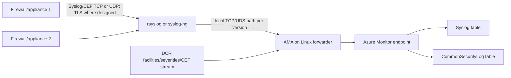

Current connector tooling can configure listeners on port 514 TCP/UDP and internal forwarding such as port 28330, depending on script/version. These are not universal mandates. Do not expose port 514 to the internet. Select approved ports/protocols, restrict source addresses, use TLS for untrusted networks, validate certificates and follow vendor/daemon guidance.

## 12. Forwarder capacity, resilience and security

| Concern | Control/test |
|---|---|
| Burst EPS | Size CPU/memory/disk/network using measured bursts and AMA benchmark |
| UDP loss | Prefer supported reliable/TCP/TLS where source permits; test loss |
| Disk queue | Configure bounded durable queue and monitor free space |
| Full disk | Prevent unneeded local copies; alert before AMA/daemon failure |
| Certificate expiry | Inventory, renew, test chain/name/time and alert |
| Single forwarder | Use supported load-balancing/HA pattern and source failover |
| Duplicate HA delivery | Stable event ID/hash and one-active/multi-route design |
| Time | NTP/chrony health and UTC interpretation |
| Patch/hardening | Minimal services, updates, EDR and restricted admin |
| Secrets | Avoid embedded workspace keys; use supported identity model |

For VM scale sets, current Microsoft guidance strongly encourages a round-robin-capable load balancer. Prove ordering and duplication expectations because Syslog transport itself does not create an end-to-end exactly-once guarantee.

## 13. Syslog/CEF filtering and duplication

A DCR can select facilities and minimum severities. Selecting `Error`, for example, includes that severity and higher severities under current connector behavior. Using the same facility for both Syslog and CEF routes can duplicate ingestion.

| Test | Expected evidence |
|---|---|
| Selected facility/severity | Test row appears in correct table |
| Below-threshold severity | Row does not appear, by approved design |
| CEF format | Vendor/product/signature/extensions parsed correctly |
| Plain Syslog format | Message remains in `Syslog`, not duplicated in CEF |
| HA replay | One logical event or documented duplicate behavior |
| Malformed CEF | Error/unparsed handling is observable |

Use a source-generated test where possible. A local `logger` or `netcat` test proves only part of the path and should use documentation-reserved IPs and synthetic fields.

## 14. Azure diagnostic settings

Azure resource logs are generally not collected by default. A **diagnostic setting** selects log categories/category groups and routes them to a Log Analytics workspace, Storage, Event Hubs or supported partner destination. Platform metrics and Activity Log exist independently, but diagnostic settings export them to additional destinations.

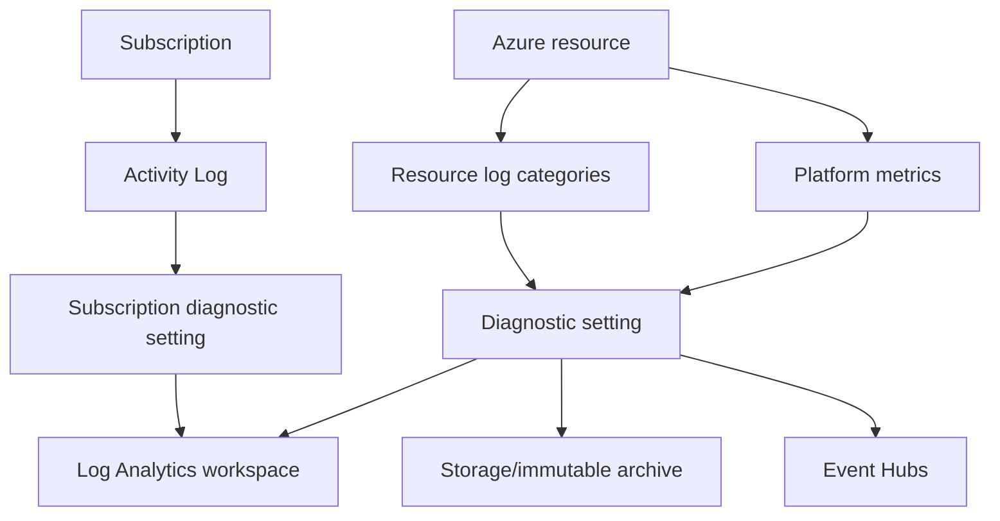

| Diagnostic-setting pitfall | Impact |
|---|---|
| Wrong/missing category | Required events never generated/routed |
| `allLogs` category group | Future category additions can change volume automatically |
| Resource-specific versus legacy table mode | Query/table assumptions differ |
| Resource deleted/recreated | Old setting can reapply to recreated resource under documented behavior |
| Same resource/destination loop | Portal blocks dangerous self-destination pattern |
| Multiple settings | Duplicate destination can duplicate data/cost |
| Firewall | Trusted-service rule needed for some Storage/Event Hub destinations |

Current docs say data should begin flowing within 90 minutes after setting creation, with troubleshooting if no data within 24 hours. Operational SLOs should use actual source-specific latency, not those maximum guidance points as a target.

## 15. Logs Ingestion API and custom tables

The supported **Logs Ingestion API** accepts JSON over HTTPS from an application using OAuth authorization. The request identifies a DCR and stream. The DCR validates/transforms the incoming shape and routes it to an existing supported Azure table or custom table (custom names end `_CL`).

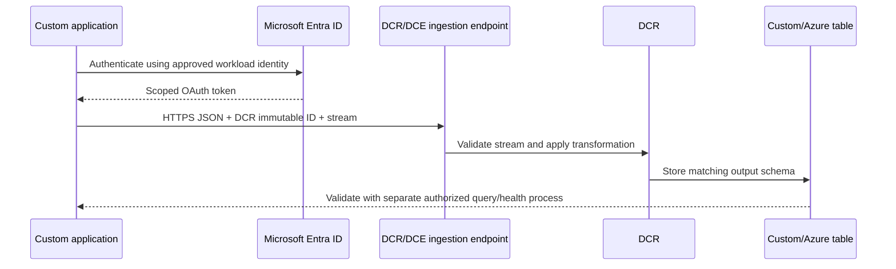

| Component | Requirement |
|---|---|
| App/workload identity | Least privilege to the specific DCR/action |
| Endpoint | Correct cloud/region, TLS 1.2+, public/private route |
| DCR | Direct kind/endpoint or DCE, stream declaration and destination |
| Payload | UTF-8 JSON array within current limits |
| Transformation | Output exactly matches destination schema |
| Table | Exists; supported; custom suffix/column rules respected |
| Retry | Backoff, throttle handling, idempotency/dedup design |
| Observability | Client request ID, status, batches, rejects and latency |

Prefer managed identity when supported by the application environment. If a client secret is unavoidable, store it in an approved vault, scope it, rotate it, never log it and monitor use.

## 16. Legacy HTTP Data Collector API deadline

Microsoft Learn currently says the legacy HTTP Data Collector API is unsupported after **September 14, 2026**. Its workspace-key authentication and older model should be replaced by Logs Ingestion API or an approved Codeless Connector Framework path.

| Migration concern | Required action |
|---|---|
| Inventory | Find code, functions, appliances and connectors using legacy endpoint/keys |
| Authentication | Replace workspace key with OAuth workload identity |
| Schema | Create/validate destination table and DCR stream/transform |
| Endpoint | Use current DCR ingestion endpoint or DCE for Private Link |
| Limits | Rework batch/retry behavior against current API limits |
| Parallel test | Compare count, schema, timestamps and latency |
| Cutover | Stop old sender route to prevent duplicates |
| Key retirement | Revoke/rotate legacy workspace keys after dependency proof |

Because the date is close to this chapter's August 24, 2026 snapshot, treat an undiscovered legacy integration as an urgent continuity risk, not a future backlog item.

## 17. Tables, schemas and `TimeGenerated`

| Field/concept | Meaning | Common mistake |
|---|---|---|
| `TimeGenerated` | Primary datetime used for event/query timeline as populated by source/transform/platform | Replacing true source time with ingestion time |
| Ingestion time | When Azure Monitor received/stored record | Calling it the event time |
| Source event ID | Vendor/OS record identifier | Assuming globally unique across devices |
| Tenant/resource ID | Scope/provenance identifier | Joining same username across tenants |
| Dynamic field | JSON-like nested value | Comparing without parsing/type conversion |
| Null | Missing/unknown value | Treating missing as false or empty uniformly |
| `_IsBillable`/`_BilledSize` | Billing-related standard fields where available | Using as complete invoice truth without meter context |

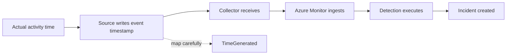

Preserve original source timestamps in a separate column when transforming custom data. Reject or quarantine impossible future/ancient times rather than silently inventing chronology.

### 🔍 Plain-English deep-dive: two clocks can tell different truths

Suppose a firewall records an event at 10:00, its forwarder is offline for 20 minutes, and Azure ingests the row at 10:21. The event time answers “when did the activity occur?”; ingestion time answers “when did the platform receive it?” Replacing the first with the second makes the attack timeline wrong, while ignoring the second hides a collection delay. Preserve both meanings, document time zones and clock quality, and use the right clock for detection lookback, latency and RCA.

## 18. Standard ingestion-time transformations

A standard DCR transformation uses a supported subset of KQL per incoming record to filter, map, parse, redact or calculate fields before storage. Its output must match the destination schema.

| Use | Example | Test |
|---|---|---|
| Filter | Remove documented health chatter | Positive attack/test event remains |
| Redact | Remove unnecessary token/query value | No secret in stored/raw derived fields |
| Rename/map | Vendor `src` to destination source-IP column | Type and semantic mapping |
| Parse | Extract JSON property | Malformed/missing/version samples |
| Timestamp | Convert source ISO field to datetime | Time-zone and invalid-value cases |
| Route | Send subsets to different destinations where supported | No gap/overlap unless intentional |

Transformations can affect billing; Auxiliary processing and plan-specific behavior differ. For Sentinel-enabled Analytics tables, current docs describe no transformation charge, but commercial guidance must be rechecked. Filtering before Azure Monitor can reduce network/processing, but increases edge configuration complexity.

## 19. Multi-stage transformations are preview

As of August 24, 2026, Microsoft Learn marks **multi-stage transformations** public preview. They can chain processors for headers, filters, mapping, parsing, aggregation, enrichment and KQL, including client-side and ingestion-side stages under current API versions.

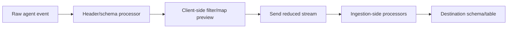

Preview controls must include legal acceptance of preview terms, supported-region check, noncritical pilot, no unsupported dependency for a mandatory control, version pinning, monitoring and a standard-path fallback. Do not present preview client-side filtering as an established production default.

## 20. Workspace transformation DCR

Some collection paths, such as diagnostic settings, do not directly use a DCR. A workspace transformation DCR can apply transformations to supported tables for data arriving without its own DCR. Current design permits one workspace transformation DCR per workspace with multiple table transformations. Data already arriving through another DCR uses that DCR's transformation rather than the workspace transformation path.

This distinction explains a common symptom: a workspace transformation changes diagnostic-setting data but not AMA data in the same conceptual table. Trace which DCR path owns the record.

## 21. Normalization and ASIM from zero

**Normalization** maps different source schemas to a common semantic schema. The **Advanced Security Information Model (ASIM)** is Sentinel's normalization layer. It defines schemas, normalized fields, query-time parsers, ingest-time normalized tables and source-agnostic content.

If three firewall vendors use `src`, `source_ip` and `clientAddress`, ASIM aims to expose a consistent field such as `SrcIpAddr` with a defined meaning. This lets one query reason across sources.

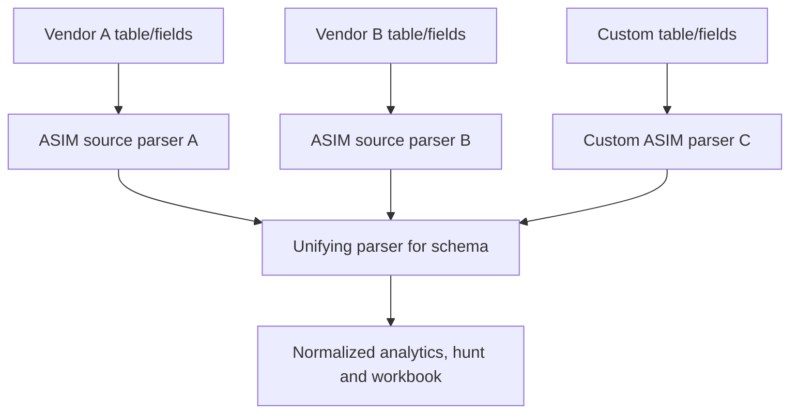

### 🔍 Plain-English deep-dive: normalization translates meaning, not just column names

Renaming `src` to `SrcIpAddr` is wrong if `src` sometimes contains a hostname. Good normalization defines event type, actor/target roles, units, enumerated values, identifiers and null behavior. It is like translating legal contracts: replacing words is not enough; the concepts must remain equivalent.

## 22. ASIM schemas

Current ASIM schemas include Agent Event, Alert Event, Audit Event, Authentication, DHCP, DNS, File, Network Session, Process, Registry, User Management and Web Session, plus Asset Entity. The list evolves.

| Schema | Event question |
|---|---|
| Authentication | Who attempted to authenticate to what, how and with what result? |
| DNS Activity | Which source asked which DNS question and received what answer? |
| Network Session | Which endpoints/protocol/ports communicated and what action/result? |
| Process Event | Which process was created/terminated, by whom and with what command/image? |
| File Event | What file operation occurred, actor, path and result? |
| User Management | Who created/changed/deleted which account/group/role? |
| Audit Event | Which administrative/business operation occurred on what object? |
| Web Session | Which source requested which URL/method/status through what service? |

Select a schema by event meaning, not by product name. One product can emit authentication, network and audit events requiring different schemas.

## 23. Query-time source and unifying parsers

ASIM query-time parsers are KQL functions that present source data in normalized shape without rewriting the stored row. A **source-specific parser** handles one source. A **unifying parser** combines all active parsers for a schema and follows `_Im_<schema>` naming, such as `_Im_Dns` or `_Im_Authentication`.

```kusto
_Im_Dns(starttime=ago(1h), responsecodename="NXDOMAIN")
| summarize Requests=count() by SrcIpAddr
```

Use parser filtering parameters when available so the parser can restrict data early. Calling a broad unifying parser and filtering late can be expensive. Some parsers support `pack=true` to retain nonnormalized fields in `AdditionalFields`, which can increase payload and complexity.

| Parser choice | Strength | Risk |
|---|---|---|
| Source table directly | Exact native fields and best source-specific control | Detection does not expand to new sources |
| Source-specific ASIM parser | Common schema for one source | Must add sources explicitly |
| Unifying ASIM parser | Source-agnostic coverage across active parsers | Query cost/performance and parser-version behavior |
| Ingest-time normalized table | Faster normalized query at scale | Extra stored path/config and ingestion semantics |

## 24. Ingest-time ASIM normalization

Current ASIM supports ingest-time normalization into native normalized tables for several schemas, including audit, authentication, DHCP, DNS, file, network session, process, registry, user management and web session. Confirm the current table list and connector compatibility.

| Query-time normalization | Ingest-time normalization |
|---|---|
| Preserves source data unchanged | Writes normalized output table/path |
| Parser fix can apply to historical source rows | Historical rows keep mapping used at ingestion unless reprocessed |
| Flexible and easy to pilot | Faster repeated normalized queries |
| Query-time compute cost | Ingestion/storage/configuration considerations |
| Good for evolving/new parsers | Good for stable high-volume repeated use |

Start query-time unless performance and mature semantics justify ingest-time. Keep provenance fields so analysts can return to the native source record.

## 25. Source-specific versus normalized detection

| Detection need | Better starting point | Reason |
|---|---|---|
| Vendor-specific exploit field | Native table/query | ASIM may not expose unique field |
| Brute-force across Entra, VPN and app | ASIM Authentication | Common actor/result semantics |
| One firewall's policy ID regression | Native source | Product-specific configuration context |
| Cross-vendor DNS tunneling hunt | ASIM DNS | Source-agnostic query and expansion |
| Parser-quality monitoring | Native plus normalized comparison | Detect mapping loss |

A robust strategy uses both. Normalize common behavior while preserving native enrichment and vendor-specific detections.

## 26. Data-quality dimensions

| Dimension | Definition | Example metric |
|---|---|---|
| Completeness | Required events/fields are present | Rows with account/IP/event ID / total sampled rows |
| Accuracy | Field reflects source meaning | Parser mapping validated against vendor sample |
| Timeliness | Data arrives within use-case need | p95 ingestion latency |
| Uniqueness | One logical event has intended row count | Duplicate rate by stable key/hash |
| Consistency | Values/types follow contract | Parse/type error rate |
| Validity | Values fall within allowed domain | Valid IP/date/action rate |
| Provenance | Source/tenant/resource can be identified | Rows with source IDs |
| Continuity | Expected source remains fresh | Freshness SLO intervals passed |

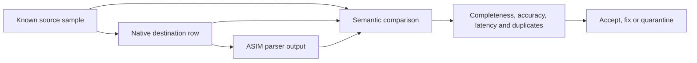

## 27. Health and audit monitoring

Enable Sentinel health/audit monitoring according to current guidance. `SentinelHealth` and `SentinelAudit` provide service events; Microsoft recommends backward-compatible helper functions such as `_SentinelHealth()` and `_SentinelAudit()` where documented. Connector health must be combined with source/table freshness and client-side metrics.

| Layer | Health evidence |
|---|---|
| Source | Event counter, audit category, export status and vendor health |
| Device-to-forwarder | Packet/connection counts, TLS and sender errors |
| Forwarder | Daemon, disk/queue, CPU/memory and listener |
| AMA | Extension/service heartbeat and logs |
| DCR/DCRA | Deployment, association and overlap inventory |
| Ingestion | Request status, rejects, throttles and latency |
| Table | Freshness, count, schema and duplicate trends |
| Sentinel | Connector health/audit functions/workbook |
| Downstream | Rule execution and expected incident |

## 28. Latency, drops and duplication troubleshooting

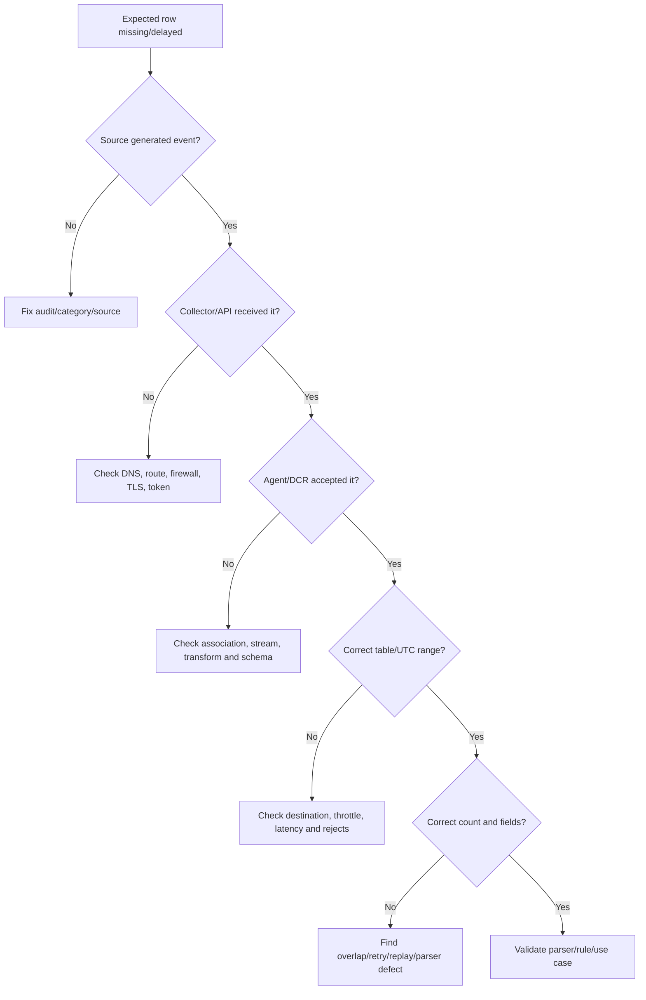

| Symptom | Likely causes | Discriminating check |
|---|---|---|
| AMA installed, no rows | No DCRA, wrong DCR/source, network or no generated event | Effective associations plus local source event |
| CEF row in `Syslog` only | Message malformed/not routed as CEF | Inspect raw header and DCR stream |
| Duplicate CEF | Syslog+CEF facility overlap, two DCRs, HA replay | Group stable vendor ID/hash by collector/path |
| Delayed rows | Source batch, queue, disk, throttle or service issue | Compare source, collector and ingestion timestamps |
| Custom API 401/403 | Token audience, secret/identity or DCR role | Decode nonsecret claims and role scope |
| Custom API accepted, wrong fields | Transform/schema mismatch | Test one payload against DCR output contract |
| ASIM misses source | Parser not active/unifying parser config | Call source parser then unifying parser |
| ASIM null fields | Semantic mapping/version/data-quality issue | Compare native row and schema requirement |
| Sudden volume drop | Source quiet, filter/DCR change or failure | Expected event rate plus change/audit timeline |
| Sudden volume spike | Duplicate route, new category or verbose schema | Count by source/collector/DCR and change time |

Your RCA method fits exactly: identify the earliest boundary where expected evidence disappears or changes. Avoid reinstalling AMA before proving the agent layer is faulty.

## 29. Least privilege, identity and secrets

| Component | Least-privilege posture |
|---|---|
| Connector configurator | Time-bound role to install/configure exact source/workspace |
| AMA deployment | VM/Arc extension rights separated from data-reader rights |
| DCR author | Monitoring configuration scope, reviewed deployment pipeline |
| Logs Ingestion client | Workload identity authorized only to exact DCR action |
| SaaS API token | Read only required categories/accounts; short life where possible |
| Forwarder admin | Restricted Linux administration, no broad Sentinel rights |
| Analyst | Read approved tables/incidents, not connector credentials |
| Pipeline identity | Deploy versioned artifacts; no interactive sign-in |

Never paste secrets into KQL, DCR JSON committed to source control, tickets, screenshots or interview artifacts. Rotate credentials after accidental exposure and document downstream token caches.

## 30. Privacy and data minimization

Connector design must identify personal, credential, content and regulated fields before ingestion. Sentinel data-lake documentation currently warns that record-level purge behavior differs from Analytics and that lake data can persist for configured retention even if deleted at source/Analytics. That makes pre-ingestion minimization especially important.

| Decision | Question |
|---|---|
| Category | Is this log category necessary for an approved use case/obligation? |
| Field | Can token, message content or query string be removed/redacted safely? |
| Scope | Are service accounts, test tenants or geographies unnecessarily included? |
| Retention/tier | How long and where will the data remain accessible? |
| Parser | Does `AdditionalFields` repack sensitive native fields? |
| Export | Can a playbook, workbook or API move data outside approved boundary? |
| Support | What sanitized evidence can be shared with Microsoft/vendor? |

## 31. Staged onboarding lifecycle

```mermaid
flowchart LR
    DISC[Discover use case/source/schema/owner] --> DESIGN[Choose supported connector and controls]
    DESIGN --> BUILD[Install solution and version config]
    BUILD --> DEV[Test synthetic payload/event]
    DEV --> PILOT[Pilot small source set]
    PILOT --> PARALLEL[Compare old/new where migrating]
    PARALLEL --> PROMOTE[Promote in rings]
    PROMOTE --> OPERATE[Monitor health, quality and cost]
    OPERATE --> UPDATE[Update, tune or retire]
```

| Gate | Evidence |
|---|---|
| Design | Use case, connector support, data flow, roles, volume and privacy |
| Build | Versioned solution/DCR/DCE/diagnostic/identity configuration |
| Functional | Known positive and below-threshold negative events |
| Quality | Fields, types, timestamps, uniqueness and ASIM mapping |
| Security | Allowed/denied role tests, TLS and secret handling |
| Reliability | Retry, outage, queue, failover and recovery tests |
| Cost | Measured billed volume and transform impact |
| Operations | SLO, dashboard, runbook, owner and escalation |

## 32. Rollback design

| Change | Rollback preparation |
|---|---|
| Service connector | Previous authorization/scope and duplicate-incident plan |
| AMA/DCR | Prior DCR version, associations and collection scope |
| DCE/private link | Previous DNS/network path and controlled public fallback decision |
| Diagnostic setting | Exported categories/destinations and resource ID |
| API migration | Old sender retained only during controlled overlap; key revocation staged |
| Transformation | Previous query and representative payload test pack |
| ASIM parser | Previous function/version and native-query fallback |
| Forwarder | Config backup, alternate node and source routing procedure |

Rollback should stop the unsafe new route while preserving already collected evidence. During migration, an old unsupported route may be an emergency fallback only if it still functions and risk owner accepts it; it is not a strategic rollback target.

## 33. Legacy Log Analytics agent migration

The Log Analytics agent, also called MMA/OMS, is retired. Current Learn says cloud upload can stop at any time after March 2, 2026. In August 2026, leaving production security collection on it is a present outage risk.

```mermaid
flowchart LR
    INVENTORY[Inventory MMA hosts/workspaces/solutions] --> DEP[Identify dependent services/data]
    DEP --> DESIGN[Generate/review AMA DCRs]
    DESIGN --> PILOT[Pilot AMA on small group]
    PILOT --> COMPARE[Compare rows, fields, latency and services]
    COMPARE --> STOPOLD[Disable old workspace collection to avoid duplicates]
    STOPOLD --> SCALE[Deploy AMA/DCRA with policy]
    SCALE --> VALIDATE[Validate fleet coverage and dependencies]
    VALIDATE --> REMOVE[Remove MMA except documented SCOM case]
```

| Migration check | Why |
|---|---|
| Agent inventory | Find Azure, Arc, other-cloud and on-prem hosts |
| Workspace/solution audit | Detect dormant destinations and dependencies |
| Data-source parity | AMA may use different schema/fields/configuration |
| SCOM exception | Retirement statement differs for SCOM-only use |
| Parallel window | Prove parity, but minimize duplicate billing |
| Heartbeat/category | Distinguish AMA versus legacy source |
| Dependent services | Sentinel, Change Tracking, Defender and other solutions |
| Removal evidence | No legacy workspace config/upload remains |

Use the current Migration Helper workbook and DCR Config Generator as aids, not as approval. Generated DCRs require review and testing.

## 34. Deployment and operation metrics

| Metric | Definition idea |
|---|---|
| Source freshness | Age of newest expected event per source/table |
| End-to-end latency | Ingestion time minus trusted source time at p50/p95/p99 |
| Completeness | Received expected test/events or required-field rate |
| Duplicate rate | Extra rows per stable event key/hash |
| Reject/error rate | Failed API batches or transformation/schema rejects |
| Forwarder saturation | Queue/disk/CPU/network against threshold |
| DCR coverage | Intended resources with exactly intended associations |
| Schema drift | New/missing/type-changed fields per version |
| Parser coverage | Source rows represented by ASIM parser |
| Migration progress | Validated AMA hosts / in-scope hosts; legacy routes remaining |
| Cost variance | Actual billed GB versus approved source forecast |

Avoid “events ingested” as the only success metric. A duplicate storm makes that number rise while reliability falls.

## 35. Scenario: hybrid firewall and identity onboarding

**Fictional scenario:** Contoso Research has Microsoft Entra audit/sign-in data, two firewall vendors sending CEF, 50 Windows servers and a custom laboratory access application. The goal is to investigate suspicious privileged access without real client data.

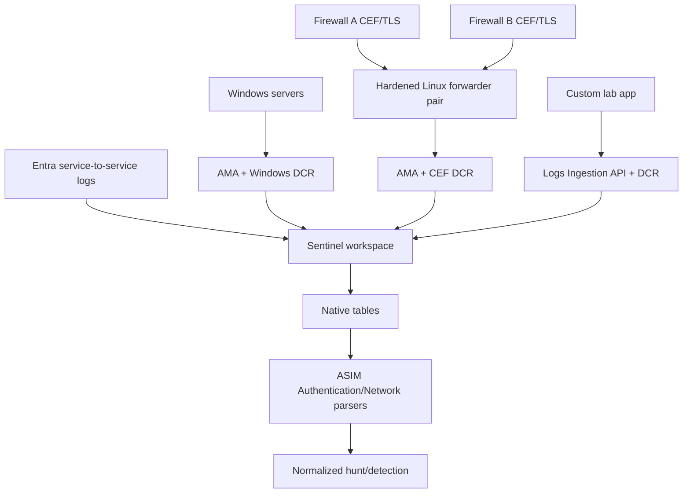

### Design decisions

| Area | Paper choice | Reason |
|---|---|---|
| Entra | Supported service connector with selected categories | Managed route and identity context |
| Windows | AMA/DCR pilot on five servers | Limit blast radius and measure event scope |
| Firewalls | Redundant Linux forwarders, TLS, CEF stream | Vendor support and controlled network boundary |
| Custom app | Logs Ingestion API with workload identity | Avoid retired workspace-key API |
| Native tables | Preserve source records and IDs | Forensic provenance |
| Normalization | Query-time ASIM during pilot | Correct mappings before ingest-time optimization |
| Response | No automated containment | Lab focuses on evidence quality |

### Failure drill

At 10:00 UTC a known synthetic firewall event exists on Firewall A but not in `CommonSecurityLog`. The analyst confirms the source record and sender connection. Forwarder A has the message, but AMA sees no matching facility because a DCR update omitted it. The team rolls back the DCR, observes the new test event, measures recovery latency, checks for replay duplicates and documents the configuration cause. It does not claim the missing original UDP event can be reconstructed unless the device/queue retained it.

### Reporting drill

Your report separates impact (“one selected facility was absent for 42 minutes”), evidence (DCR version, source/forwarder timestamps and row tests), root cause (facility omission), correction (restored reviewed DCR), validation (three sources, positive/negative and duplicate checks) and prevention (diff gate plus source-coverage test). It avoids saying “Sentinel outage.”

## 36. Safe paper/data lab

**Safety boundary:** Use only the synthetic rows below. Do not deploy AMA, run remote scripts, expose port 514, create cloud identities, call APIs, upload logs or use client data. All KQL/parser work is conceptual or may use a local text editor.

### Synthetic source rows

```json
[
  {
    "source": "fw-a",
    "eventTime": "2026-08-20T10:00:00Z",
    "vendorEventId": "demo-1001",
    "srcIp": "192.0.2.10",
    "dstIp": "198.51.100.20",
    "dstPort": 443,
    "action": "allow"
  },
  {
    "source": "fw-b",
    "eventTime": "2026-08-20T10:00:05Z",
    "vendorEventId": "demo-2001",
    "clientAddress": "192.0.2.11",
    "serverAddress": "198.51.100.20",
    "service": "https",
    "result": "permitted"
  }
]
```

These IP ranges are documentation ranges. The names and events are fictional.

### Task 1: connector decision record

For Entra, Windows, two firewalls and custom app, choose connector family, support owner, authentication, network route, table, volume assumption, test event and rollback.

### Task 2: DCR sketch

Draw data source, stream, transformation, destination and DCRA. Explain why DCE is or is not required for public versus Private Link design. Mark multi-stage processing preview rather than using it as a baseline.

### Task 3: schema contract

Create a table with source fields, type, nullability, meaning, normalized field and invalid-value behavior. Preserve `vendorEventId` and original timestamp.

### Task 4: ASIM mapping

Map both rows conceptually to Network Session: `SrcIpAddr`, `DstIpAddr`, `DstPortNumber`, action/result and source provenance. Explain why `service=https` requires an approved mapping to port/protocol rather than blind conversion.

### Task 5: quality tests

Define positive, excluded-severity, malformed CEF, wrong type, missing timestamp, future timestamp, duplicate ID, replay, schema-version and parser-null tests.

### Task 6: troubleshooting tree

For “no row,” write the exact checks at source, network, forwarder/API, AMA, DCRA, DCR stream, transform, ingestion, table, ASIM and downstream rule.

### Task 7: migration plan

Create a dated urgent plan for any fictional MMA and HTTP Data Collector API paths. Include owner, pilot, comparison, cutover, credential retirement and proof of no gap/duplicate.

### Lab deliverables

| Deliverable | Acceptance criterion |
|---|---|
| Connector matrix | Supported path, owner, identity, table and lifecycle |
| Collection diagram | Every trust/network/config boundary visible |
| DCR contract | Stream, transform, destination and association explicit |
| Schema dictionary | Types, time, provenance and null behavior |
| ASIM mapping | Semantically correct normalized fields and native fallback |
| Test matrix | Positive, negative, malformed, latency, duplicate and failure |
| Health runbook | Layer evidence, SLO, owner and escalation |
| Migration plan | Retirement dates and validated cutover |
| Honesty note | No production connector/AMA claim |

## 37. Consulting artifacts

| Artifact | Client decision enabled |
|---|---|
| Source onboarding questionnaire | Scope, owner, evidence and constraints |
| Connector/support matrix | Buy/configure/customize decision and support route |
| Data-flow/trust diagram | Identity, network, processing and residency approval |
| DCR/DCE inventory | Configuration ownership and overlap detection |
| Schema/data dictionary | Detection/parser contract |
| ASIM mapping pack | Cross-source content readiness |
| Test and evidence pack | Acceptance and regression proof |
| Health/SLO dashboard | Reliable operation and escalation |
| Migration register | MMA/API risk, cutover and credential closure |
| Rollback runbook | Controlled recovery from unsafe changes |
| Executive source-coverage report | Value, gaps, risk and roadmap |

## 38. JD Mapping: interview translation

| Interview theme | Your transferable strength | Connector answer |
|---|---|---|
| Incident investigation | Builds evidence timelines | Trace source event through arrival and parser fields |
| Troubleshooting | Isolates layer before changing | Source → route → collector/API → DCR → table → parser |
| RCA | Validates correction and prevention | DCR version, known tests, duplicate/gap comparison |
| Microsoft integration | M365 workload context | Explain service connector license/consent/table boundaries |
| Security | Controlled identities and sensitive evidence | Least privilege, TLS, secret vaulting and minimization |
| Consulting | Clear artifacts and stakeholder coordination | Onboarding matrix, test pack, SLO and migration roadmap |

## Official Source Anchors

These official Microsoft Learn pages were reviewed for the August 24, 2026 treatment. Recheck update dates, page banners, connector-specific prerequisites, clouds/regions and retirement notices before implementation.

1. [Microsoft Sentinel data connectors](https://learn.microsoft.com/azure/sentinel/connect-data-sources) — connector families, support labels, Content Hub and legacy API deadline.
2. [Find your Microsoft Sentinel data connector](https://learn.microsoft.com/azure/sentinel/data-connectors-reference) — current connector catalog.
3. [Configure a Microsoft Sentinel data connector](https://learn.microsoft.com/azure/sentinel/configure-data-connector) — connector workflow and support path.
4. [Azure Monitor Agent overview](https://learn.microsoft.com/azure/azure-monitor/agents/azure-monitor-agent-overview) — agent purpose, DCR control and supported environments.
5. [Data Collection Rules overview](https://learn.microsoft.com/azure/azure-monitor/data-collection/data-collection-rule-overview) — DCRs, DCRAs, streams, scenarios and preview markers.
6. [Data Collection Rule structure](https://learn.microsoft.com/azure/azure-monitor/data-collection/data-collection-rule-structure) — JSON components, streams, destinations and flows.
7. [Data Collection Endpoints overview](https://learn.microsoft.com/azure/azure-monitor/data-collection/data-collection-endpoint-overview) — public/private endpoint and regional design.
8. [Windows Security Events via AMA](https://learn.microsoft.com/azure/sentinel/connect-windows-security-events) — current connector setup and event selection.
9. [Syslog and CEF via AMA overview](https://learn.microsoft.com/azure/sentinel/cef-syslog-ama-overview) — architecture and duplication considerations.
10. [Ingest Syslog and CEF with AMA](https://learn.microsoft.com/azure/sentinel/connect-cef-syslog-ama) — DCR, Linux forwarder, ports, TLS and validation.
11. [Diagnostic settings in Azure Monitor](https://learn.microsoft.com/azure/azure-monitor/platform/diagnostic-settings) — categories, destinations, TLS and latency.
12. [Logs Ingestion API overview](https://learn.microsoft.com/azure/azure-monitor/logs/logs-ingestion-api-overview) — OAuth, DCR endpoint/DCE, payload and TLS 1.2.
13. [Transformations in Azure Monitor](https://learn.microsoft.com/azure/azure-monitor/data-collection/data-collection-transformations) — standard, workspace and preview multi-stage transformations.
14. [ASIM normalization overview](https://learn.microsoft.com/azure/sentinel/normalization) — schemas, parsers, normalized tables and content.
15. [Use ASIM parsers](https://learn.microsoft.com/azure/sentinel/normalization-about-parsers) — unifying parsers and filtering parameters.
16. [Develop ASIM parsers](https://learn.microsoft.com/azure/sentinel/normalization-develop-parsers) — custom/source parser guidance.
17. [Auditing and health monitoring in Sentinel](https://learn.microsoft.com/azure/sentinel/health-audit) — health/audit tables and functions.
18. [Migrate to Azure Monitor Agent](https://learn.microsoft.com/azure/azure-monitor/agents/azure-monitor-agent-migration) — MMA retirement, migration tools and validation.
19. [Migrate from HTTP Data Collector API](https://learn.microsoft.com/azure/azure-monitor/logs/custom-logs-migrate) — September 14, 2026 deadline and replacement.
20. [Azure Monitor service limits](https://learn.microsoft.com/azure/azure-monitor/fundamentals/service-limits) — current DCR/API/ingestion limits.

## ⭐ Likely Interview Questions for This Section

### Q1. What types of Microsoft Sentinel data connectors are there?

**Model answer:** A connector can be native service-to-service, SaaS/API, Azure diagnostic settings, AMA/DCR, Syslog/CEF through a Linux forwarder, Logs Ingestion API, Codeless Connector Framework or custom Function/Logic App. I choose the most supported, least custom route that meets source, security, latency, schema, region and cost requirements, and I verify the Content Hub publisher/support owner.

### Q2. Explain AMA, DCR, DCRA and DCE.

**Model answer:** AMA is the supported guest-OS collection agent. A DCR defines what data to collect, incoming streams, transformations, data flows and destinations. A DCRA assigns a DCR to a resource such as a VM or forwarder. A DCE supplies configuration/ingestion endpoints when required, especially Private Link; modern direct-ingestion DCRs can expose their own logs endpoint. I test effective associations and avoid overlapping DCRs that duplicate data.

### Q3. How does Syslog or CEF reach Sentinel through AMA?

**Model answer:** A Linux host or device sends local Syslog, or appliances send Syslog/CEF to a hardened Linux forwarder's `rsyslog`/`syslog-ng`. AMA on that forwarder follows a DCR selecting facilities/severities and stream, then sends to Azure Monitor. Plain Syslog normally lands in `Syslog`; CEF in `CommonSecurityLog`. I secure sender-to-forwarder transport with network restrictions and TLS where appropriate, size queues, monitor disk and test for facility overlap/duplicates.

### Q4. How would you onboard custom application logs now?

**Model answer:** I prefer the OAuth-based Logs Ingestion API or an approved Codeless Connector Framework route, not the legacy HTTP Data Collector API, which Microsoft documents as unsupported after September 14, 2026. I create the supported table and DCR stream/transform, use a scoped workload identity, TLS 1.2+, a DCR endpoint or DCE for Private Link, bounded batches, retry/backoff, client request IDs and schema/reject monitoring.

### Q5. What is ASIM, and when do you use native versus normalized queries?

**Model answer:** ASIM maps diverse source events into common semantic schemas using source and unifying parsers or ingest-time normalized tables. It enables source-agnostic detections such as authentication across Entra, VPN and apps. I use native tables for vendor-specific fields and provenance, and normalized queries for shared behavior. I validate semantics, use parser parameters for performance and retain a native fallback.

### Q6. How do you test connector data quality?

**Model answer:** I generate an authorized known source event and verify source record, collector/API receipt, destination row, table, required fields, trusted timestamps, p95 latency and one-copy count. I also test excluded events, malformed input, null/type/schema drift, replay, outage/retry, least-privilege denies and ASIM mapping. A connector green status is supporting evidence, not acceptance by itself.

### Q7. How do you troubleshoot missing or duplicate Sentinel data?

**Model answer:** I find the earliest failing boundary: source generation, DNS/route/TLS/token, daemon/API receipt, AMA service, DCRA, DCR source/stream/transform, ingestion, destination table/time range, parser and rule. For duplicates I inventory all settings, DCRs, forwarders, HA routes and retries, then group by a stable vendor ID/hash and collector path. I change only the layer evidence identifies.

### Q8. What is your honest experience with Sentinel connectors and normalization?

**Model answer:** I have not deployed AMA, DCRs, forwarders or ASIM parsers in production. My production experience is incident/RCA, evidence correlation, validation and reporting. I built a current paper/data lab for service, Windows, CEF and custom API collection, including DCR/DCE, TLS, schema, `TimeGenerated`, ASIM, health, migration and rollback. In a client tenant I would pilot with least privilege and synthetic events and remove old paths only after proving parity and no duplicates.

## 🧠 30-Second Memory Hooks

- **Connector:** collection contract, not necessarily an agent.
- **Content Hub:** package first; configure and test second.
- **AMA:** supported guest-log courier.
- **DCR:** what, shape, transform and destination.
- **DCRA:** assignment linking resource to DCR.
- **DCE:** endpoint resource, mainly required for private/specific paths.
- **Windows events:** prove audit generation before blaming the agent.
- **Syslog:** flexible message stream; **CEF:** structured security envelope.
- **514 is not an internet invitation:** restrict, TLS and verify current daemon config.
- **Logs Ingestion:** OAuth + HTTPS + DCR stream + matching schema.
- **MMA:** retired; upload can stop now.
- **HTTP Data Collector API:** unsupported after September 14, 2026.
- **`TimeGenerated`:** timeline contract; preserve original source time.
- **ASIM:** translate semantics once, query common behavior many times.
- **Native + normalized:** provenance and product detail plus cross-source coverage.
- **Troubleshoot:** source → route → collector → DCR → table → parser → rule.
- **Honesty:** architecture and paper lab, no production connector claim.

## Completion Checklist

- [ ] I can explain why a connector is a collection contract.
- [ ] I can compare service, API, diagnostic, AMA, Syslog/CEF and custom connectors.
- [ ] I can use Content Hub/support ownership in connector selection.
- [ ] I can distinguish Defender/M365/Entra/Azure/AWS/GCP/third-party contexts.
- [ ] I can draw AMA, DCR, DCRA, stream, transformation and destination flow.
- [ ] I can explain when a DCE is and is not required.
- [ ] I can design Windows Security Event generation, selection and validation.
- [ ] I can draw and secure a Linux Syslog/CEF forwarder path.
- [ ] I can discuss ports, TLS, DNS, queue, disk, capacity and HA without unsafe defaults.
- [ ] I can explain Azure diagnostic categories and destinations.
- [ ] I can design an OAuth-based Logs Ingestion API path and custom table.
- [ ] I know the current MMA and HTTP Data Collector API retirement deadlines.
- [ ] I can explain standard versus preview multi-stage transformations.
- [ ] I can preserve source time, provenance, types and null behavior.
- [ ] I can explain ASIM schemas, source parsers and unifying parsers.
- [ ] I can choose source-specific versus normalized detections.
- [ ] I can measure completeness, accuracy, latency, uniqueness and continuity.
- [ ] I can troubleshoot missing, delayed, duplicate and malformed data by layer.
- [ ] I can design least privilege, secret management, staged deployment and rollback.
- [ ] I completed the safe paper/data lab without deploying or ingesting anything.
- [ ] I can answer Q1–Q8 aloud without claiming production Sentinel connector work.
- [ ] I will recheck portal, preview, license, region, connector and retirement facts before reuse.

*Next suggested section:* [Part 46](Part-46-kql-from-zero-sentinel.md)