# Part 46 — KQL from Zero for Sentinel Analysts

> **Section goal:** Build a beginner-first, consulting-grade command of Kusto Query Language (KQL) for Microsoft Sentinel. This Part explains tables, rows, columns, scalar types, the tabular pipeline, schema discovery, bounded time filters, search versus `where`, projection and calculated columns, aggregation, parsing, dynamic JSON, arrays, reusable expressions, joins, unions, lookups, watchlists, external data, time-series and anomaly basics, entity timelines, indicators of compromise (IOCs), baselines, performance, query cost context, null/case/type failures, debugging, reusable functions, safe redaction and query lifecycle. Every hands-on example uses synthetic `datatable` data and can be studied without a Sentinel tenant or production evidence.

This Part maps directly to Deloitte expectations for Microsoft Sentinel engineering, security monitoring, threat detection, incident investigation, troubleshooting, root-cause analysis (RCA), data quality, privacy, documentation and client communication. Your production strength is disciplined evidence correlation: define the question, constrain the time window, preserve identifiers, compare expected with observed behavior and state uncertainty. KQL turns that method into a repeatable query pipeline. The goal is not to imply production Sentinel operation; it is to demonstrate a safe, current and technically defensible foundation.

> **Currency, portal, licensing and cost note (August 24, 2026):** This chapter is grounded in official Microsoft Learn available on August 24, 2026. KQL applies across several Microsoft services, but table names, functions, limits and supported language features can differ by product and query surface. Microsoft Learn currently says Sentinel uses Azure Monitor Log Analytics workspaces and that after March 31, 2027 Sentinel is supported only in the Microsoft Defender portal. Analytics, Basic and Auxiliary table plans have different query and cost behavior; search jobs, long-term retention and cross-resource queries add separate considerations. Never infer a client's bill from query text alone. Verify the selected portal, scope, table plan, retention tier, service limits, RBAC, current pricing and live schema before implementation.

## JD Mapping

| Deloitte expectation | Capability developed here | Consulting evidence |
|---|---|---|
| Investigate security events | Build bounded entity and event timelines | Synthetic investigation query pack |
| Engineer Sentinel detections | Produce deterministic, efficient KQL outputs | Query design and test record |
| Troubleshoot complex systems | Isolate table, time, schema, type and join failures | Layered KQL debugging runbook |
| Integrate Microsoft and third-party evidence | Normalize and correlate unlike schemas | `union`, `join`, `lookup` patterns |
| Protect sensitive data | Minimize, redact and control exports | Query privacy checklist |
| Communicate findings | Convert rows into evidence, metrics and limitations | Analyst summary artifact |
| Improve operations | Reuse functions, baselines and performance controls | Versioned query catalog |

## Candidate honesty note

You can credibly discuss production incident troubleshooting, timestamp correlation, evidence validation, RCA, reporting, stakeholder coordination and safe handling of sensitive records. You can demonstrate the synthetic queries and design method in this chapter.

You should not claim production Sentinel hunting, KQL analytics-rule ownership, watchlist administration, workspace function deployment, query-cost ownership or live SOC operation unless separately evidenced. Safe wording is:

> “My production background is incident troubleshooting, evidence correlation, RCA and validation. I have not operated Microsoft Sentinel or authored its KQL detections in production. I built a current synthetic KQL lab using `datatable` to practise bounded filtering, parsing, aggregation, joins, entity timelines, baselines, anomaly concepts, performance review, redaction and debugging. In a client workspace I would first verify scope, schema, permissions, table plan and data quality; test read-only queries on a narrow window; peer-review detection logic; and promote versioned content through a controlled pilot.”

---

## 1. KQL and Sentinel architecture from zero

**Kusto Query Language (KQL)** is a read-only language for asking questions of structured, semi-structured and unstructured telemetry. A KQL query processes data and returns a table. In Sentinel, that data can include connector-ingested logs, custom tables, alerts, incidents, behavior data, threat intelligence and watchlists. KQL is used in Logs, hunting, analytics rules, workbooks and investigation pivots.

Think of the architecture as a library. Connectors deliver books, tables are shelves, columns are labels, rows are individual records, KQL is the librarian's request slip, and the result is a temporary reading list. A read-only query does not rewrite the books.

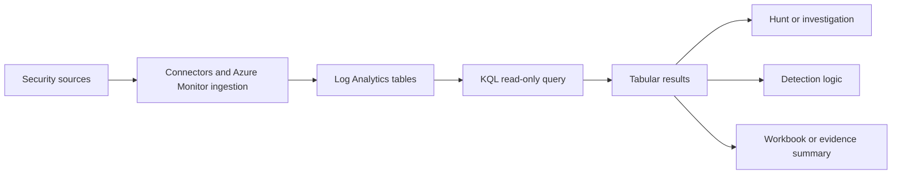

| Term | Plain meaning | Why it matters | Memory hook |
|---|---|---|---|
| Workspace | Security log data boundary and query scope | Determines accessible tables, region and RBAC | Workspace = library building |
| Table | Named collection of records with a schema | First source in most queries | Table = shelf |
| Row | One record or event | Unit filtered and correlated | Row = one evidence card |
| Column | Named field with a type | Supplies time, user, host, IP and action | Column = labeled slot |
| Schema | Table and column names plus types | Query must match it exactly | Schema = shelf catalog |
| Scalar | One value such as string or datetime | Used in expressions and functions | Scalar = one cell |
| Tabular expression | Expression returning rows and columns | Can feed the next operator | Table in, table out |
| Operator | A pipeline step such as `where` | Changes the current result | Operator = workstation |
| Function | Named reusable calculation or query | Reduces duplication | Function = approved recipe |

KQL is case-sensitive for table names, column names, operators and functions. `TimeGenerated` and `timegenerated` are not interchangeable. KQL resembles SQL but normally begins with a table and flows through pipe-separated operators instead of starting with `SELECT`.

## 2. The tabular pipeline

The pipe character `|` sends the table produced on its left into the operator on its right. Each step has a tabular input and output. Operator order affects meaning and performance.

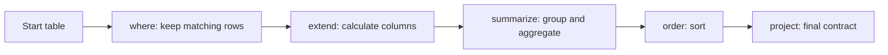

Read this aloud: “Start with events; keep the last hour; keep failures; calculate a normalized user; count by user; sort highest first.” That narration is a useful review technique because every line should have an explainable purpose.

### Example 1 — first complete pipeline

```kusto
datatable(TimeGenerated:datetime, User:string, Result:string)
[
    datetime(2026-08-24 09:00:00), "ALICE@CONTOSO.COM", "Failure",
    datetime(2026-08-24 09:02:00), "bob@contoso.com", "Success",
    datetime(2026-08-24 09:03:00), "alice@contoso.com", "Failure"
]
| where TimeGenerated between (datetime(2026-08-24 08:55:00) .. datetime(2026-08-24 09:05:00))
| where Result == "Failure"
| extend NormalizedUser = tolower(User)
| summarize Failures=count() by NormalizedUser
| order by Failures desc
```

### 🔍 Plain-English deep-dive: a pipeline is a chain of evidence decisions

The query is not merely syntax. Every line makes a claim about relevance. A time filter says which period can support the conclusion. A result filter defines “failure.” Normalization says two differently cased strings represent one identity. Aggregation chooses what detail to collapse. Sorting changes presentation, not truth. During peer review, challenge each decision independently; a syntactically valid query can still answer the wrong question.

## 3. Prerequisites, licensing and safe query surfaces

To query real Sentinel data, an identity needs appropriate read access to the workspace/data scope. Creating rules, functions or content requires additional permissions. Source-product and Sentinel licensing determine which data exists; Log Analytics table plans and retention determine where and how it can be queried. The Microsoft Learn Log Analytics demo environment can support general learning, but its tables may differ from Sentinel security schemas.

| Prerequisite | Minimum question | Safe validation |
|---|---|---|
| Identity | Which named identity is querying? | Sign-in and access review |
| RBAC | Which workspace/table/resource scope is readable? | Read-only sample query |
| Data | Is the required connector/category enabled? | Known source event and row |
| Schema | What are exact current columns and types? | Tables pane and sample rows |
| Time | Which timestamp and UTC period are authoritative? | Explicit bounded query |
| Table plan | Analytics, Basic or Auxiliary? | Workspace table configuration |
| Retention | Is the period interactive, long-term or unavailable? | Retention policy and search plan |
| Privacy | Is the purpose authorized and minimized? | Approved use case |

For this chapter, `datatable` creates an in-memory synthetic table inside the query. It does not ingest or persist the rows. This makes the examples safe to run in a KQL-capable environment that supports the operator, subject to local authorization.

## 4. Schema discovery before query writing

A strong analyst discovers the live schema instead of guessing from a screenshot. In Log Analytics, inspect the Tables pane, expand a table, read its reference page and preview a small bounded sample. Check exact names, types, null frequency, example values and source semantics.

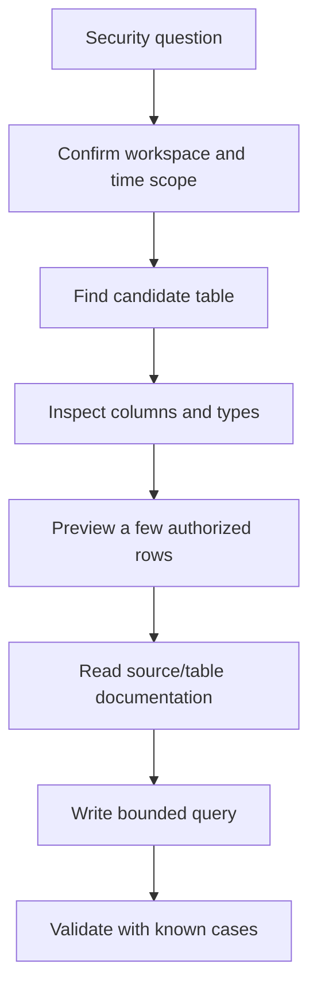

### Example 2 — inspect values and types safely

```kusto
datatable(TimeGenerated:datetime, EventId:int, User:string, Detail:dynamic)
[
    datetime(2026-08-24 10:00:00), 4625, "alice", dynamic({"reason":"bad password"}),
    datetime(2026-08-24 10:01:00), 4624, "bob", dynamic({"method":"passwordless"})
]
| extend EventIdType=gettype(EventId), DetailType=gettype(Detail)
| take 5
```

| Discovery question | Why it prevents failure |
|---|---|
| Does the table exist in this scope? | Avoids unresolved-table errors |
| Is the event timestamp `TimeGenerated` or another field? | Prevents false gaps and bad sequences |
| Is an ID stored as `int`, `long` or `string`? | Prevents comparison/type errors |
| Is JSON typed `dynamic` or stored as text? | Determines whether `parse_json()` is needed |
| Are identities UPNs, SIDs, object IDs or free text? | Determines correlation strength |
| Are null and empty string both present? | Determines correct missing-value handling |
| Does one row represent an event, alert or aggregate? | Prevents double counting |

## 5. Time filtering is the first analytical control

Security conclusions are bounded by time. `TimeGenerated` is the standard Log Analytics timestamp used by many Sentinel queries, but source-event time, ingestion time and vendor timestamps can differ. Use UTC, name the clock, and preserve original source time where available.

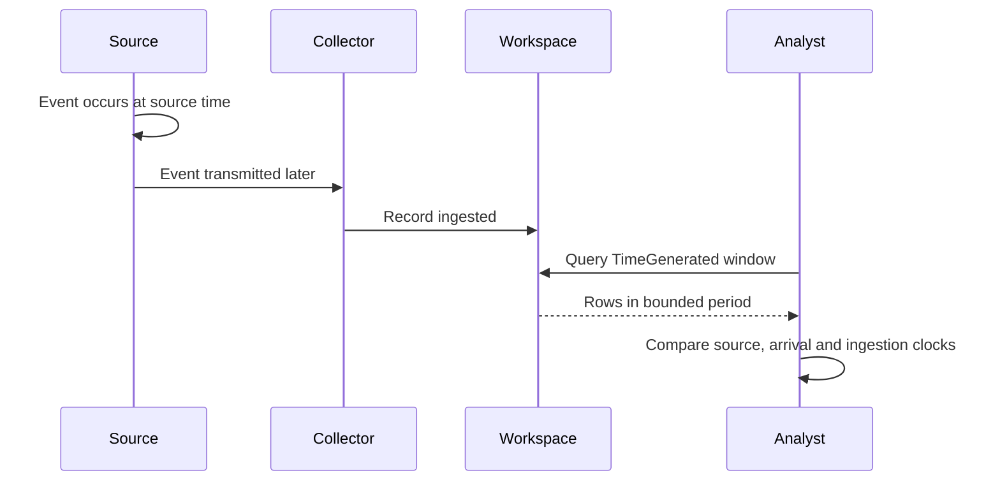

### Example 3 — relative time window

```kusto
let Anchor = datetime(2026-08-24 12:00:00);
datatable(TimeGenerated:datetime, Event:string)
[
    datetime(2026-08-24 10:30:00), "old",
    datetime(2026-08-24 11:30:00), "in-window"
]
| where TimeGenerated between (Anchor - 1h .. Anchor)
```

### Example 4 — calculate latency between two clocks

```kusto
datatable(SourceTime:datetime, TimeGenerated:datetime, EventId:string)
[
    datetime(2026-08-24 11:59:00), datetime(2026-08-24 12:00:30), "evt-001",
    datetime(2026-08-24 11:58:00), datetime(2026-08-24 12:05:00), "evt-002"
]
| extend CollectionLatency = TimeGenerated - SourceTime
| project EventId, SourceTime, TimeGenerated, CollectionLatency
| order by CollectionLatency desc
```

The portal time picker and an explicit KQL time predicate can interact. Microsoft Learn notes Log Analytics can apply a union of those ranges in its interface, so detection content should not depend on an analyst's unstated picker. In a rule, follow the rule's documented `TimeGenerated` and lookback behavior.

## 6. `search` versus `where`

`search` is useful during early exploration when the likely table or column is unknown. It can scan broadly for text. `where` filters known columns with explicit predicates and is usually clearer and more efficient. Searching `*` across many tables or columns is expensive and can produce ambiguous matches.

| Need | Better first choice | Reason |
|---|---|---|
| Unknown location of a rare phrase | Narrowly scoped `search` | Discovery |
| Known account column | `where User == ...` | Precise and indexed comparison |
| Full token in text | `has` | Token-aware and generally preferable |
| Substring inside token | `contains` | Correct when substring is intended |
| Case-sensitive exact value | `==` | Clear and efficient |
| Case-insensitive exact value | `=~` | Use when source casing varies |

### Example 5 — exploratory search

```kusto
let Events = datatable(TimeGenerated:datetime, User:string, Message:string)
[
    datetime(2026-08-24 12:00:00), "alice", "Sign-in failed from test address",
    datetime(2026-08-24 12:01:00), "bob", "Sign-in completed"
];
Events
| search "failed"
```

### Example 6 — precise filtering

```kusto
datatable(TimeGenerated:datetime, User:string, Message:string)
[
    datetime(2026-08-24 12:00:00), "alice", "Sign-in failed from test address",
    datetime(2026-08-24 12:01:00), "bob", "Sign-in completed"
]
| where TimeGenerated >= datetime(2026-08-24 11:55:00)
| where User == "alice" and Message has "failed"
```

## 7. `project`, `project-away` and `extend`

`project` selects, renames and orders output columns. `project-away` removes named columns. `extend` keeps existing columns and adds calculated ones. Use `extend` while reasoning, then `project` to create a clean final contract. Do not expose a secret and hope a later export process hides it; remove unnecessary sensitive fields in the query.

### Example 7 — calculate and minimize

```kusto
datatable(TimeGenerated:datetime, UserPrincipalName:string, SourceIp:string, RawToken:string)
[
    datetime(2026-08-24 12:00:00), "Alice@Contoso.com", "192.0.2.10", "synthetic-secret-do-not-export"
]
| extend User=tolower(UserPrincipalName), UserDomain=tostring(split(UserPrincipalName, "@")[1])
| project TimeGenerated, User, UserDomain, SourceIp
```

### Example 8 — explicitly remove a field

```kusto
datatable(User:string, SourceIp:string, SensitivePayload:string)
[
    "alice", "192.0.2.10", "synthetic-value"
]
| project-away SensitivePayload
```

| Operator | Keeps original columns? | Main use | Common mistake |
|---|---:|---|---|
| `extend` | Yes | Add derived fields | Carrying huge raw fields too long |
| `project` | Only selected | Define output contract | Removing a join/entity field too early |
| `project-away` | All except removed | Drop known fields | Wildcard removal hiding needed evidence |
| `project-rename` | Yes | Rename without recalculation | Renaming away source semantics |

## 8. Scalar types, operators and conversions

Common KQL scalar types include `string`, `bool`, `int`, `long`, `real`, `decimal`, `datetime`, `timespan`, `guid` and `dynamic`. Operators have type expectations. The string `"4625"` is not the integer `4625`; a failed conversion can return null.

| Type | Example | Security use |
|---|---|---|
| `string` | `"alice"` | User, host, action, IP text |
| `bool` | `true` | Success flag |
| `int`/`long` | `4625` | Event ID, count, bytes |
| `real` | `0.93` | Score or rate |
| `datetime` | `datetime(2026-08-24)` | Timeline |
| `timespan` | `15m` | Duration/lookback |
| `guid` | `guid(...)` | Object/tenant identifier |
| `dynamic` | `dynamic({"key":"value"})` | JSON object or array |

### Example 9 — guarded conversion

```kusto
datatable(RawEventId:string)
[
    "4625",
    "not-a-number",
    "4624"
]
| extend EventId=toint(RawEventId)
| extend ConversionStatus=iff(isnull(EventId), "invalid", "valid")
```

Useful expression families include arithmetic (`+`, `-`, `*`, `/`), comparisons (`==`, `!=`, `>`, `<`, `between`, `in`), Boolean logic (`and`, `or`, `not`) and string operators (`has`, `contains`, `startswith`, `endswith`, plus case-sensitive variants). Parenthesize mixed logic so intent is obvious.

## 9. Count, distinct values and grouping

`count` returns the number of rows. `summarize count()` can group by dimensions. `dcount()` estimates distinct count and trades exactness for scalability. `count_distinct()` can provide exact behavior where supported but has different resource implications and limits; verify the chosen service. `make_set()` collects distinct values into a dynamic array, subject to size limits. `arg_max()` returns the row associated with the maximum expression, useful for “latest record per entity.” `bin()` places values such as timestamps into fixed buckets.

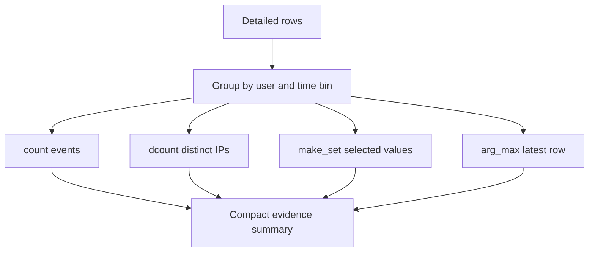

### Example 10 — count and `dcount`

```kusto
datatable(TimeGenerated:datetime, User:string, SourceIp:string, Result:string)
[
    datetime(2026-08-24 12:01:00), "alice", "192.0.2.10", "Failure",
    datetime(2026-08-24 12:02:00), "alice", "192.0.2.10", "Failure",
    datetime(2026-08-24 12:03:00), "alice", "192.0.2.20", "Failure",
    datetime(2026-08-24 12:04:00), "bob", "192.0.2.30", "Success"
]
| where Result == "Failure"
| summarize Failures=count(), ApproxDistinctIps=dcount(SourceIp) by User
```

### Example 11 — `make_set` and time bins

```kusto
datatable(TimeGenerated:datetime, User:string, SourceIp:string)
[
    datetime(2026-08-24 12:01:00), "alice", "192.0.2.10",
    datetime(2026-08-24 12:04:00), "alice", "192.0.2.20",
    datetime(2026-08-24 12:17:00), "alice", "192.0.2.30"
]
| summarize Events=count(), SourceIps=make_set(SourceIp, 20) by User, bin(TimeGenerated, 15m)
```

### Example 12 — latest row with `arg_max`

```kusto
datatable(TimeGenerated:datetime, User:string, Result:string, SourceIp:string)
[
    datetime(2026-08-24 12:00:00), "alice", "Failure", "192.0.2.10",
    datetime(2026-08-24 12:05:00), "alice", "Success", "192.0.2.20",
    datetime(2026-08-24 12:03:00), "bob", "Failure", "192.0.2.30"
]
| summarize arg_max(TimeGenerated, *) by User
| project TimeGenerated, User, Result, SourceIp
```

### 🔍 Plain-English deep-dive: aggregation spends detail

Aggregation is like replacing every receipt with a monthly total. The total is useful, but the merchant, time and item can disappear. `summarize` should preserve the dimensions needed to investigate or map entities. For a detection, decide whether each result row represents one event, one entity-window or one correlation. Record that “row grain” explicitly so alert grouping and thresholds do not misinterpret it.

## 10. `order`, `top`, `take` and `distinct`

`order by` sorts a result. `top N by X` sorts and returns the first N. `take N` returns an arbitrary sample and does not promise stable order. `distinct` returns unique combinations of selected columns; it can be expensive at high cardinality and can hide duplicates that matter.

### Example 13 — compare ranking and sampling

```kusto
datatable(User:string, Failures:int)
[
    "alice", 7,
    "bob", 2,
    "carol", 11,
    "dave", 4
]
| top 3 by Failures desc
```

### Example 14 — unique combinations

```kusto
datatable(User:string, SourceIp:string)
[
    "alice", "192.0.2.10",
    "alice", "192.0.2.10",
    "alice", "192.0.2.20",
    "bob", "192.0.2.10"
]
| distinct User, SourceIp
| order by User asc, SourceIp asc
```

Use `take` during safe exploration, not as evidence that only those rows exist. Use `top` when rank is part of the question. Apply a deterministic final sort only where presentation needs it.

## 11. Parsing structured and semi-structured text

Parsing turns a raw field into named values. Prefer fields already parsed by a supported connector or ASIM parser. Query-time parsing is appropriate when the source remains raw or during prototyping, but repeated parsing across millions of rows can be costly.

| Tool | Best fit | Failure behavior/risk |
|---|---|---|
| `parse` | Repeated stable text pattern | Nonmatching rows yield empty extracted fields |
| `parse_json()` | Valid JSON text or dynamic value | Malformed text does not become expected object |
| `extract()` | One regex capture | Null when no match; regex can be expensive |
| `extract_all()` | Repeated regex captures | Dynamic nested output needs handling |
| `split()` | Simple delimiter | Position assumptions fail on malformed values |
| `replace_regex()` | Controlled substitution/redaction | Broad pattern can damage evidence |

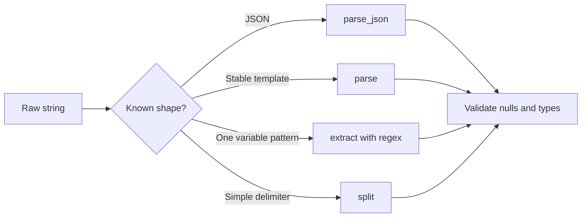

### Example 15 — `parse` a stable message

```kusto
datatable(Message:string)
[
    "user=alice action=login result=failure",
    "user=bob action=login result=success"
]
| parse Message with "user=" User " action=" Action " result=" Result
| project User, Action, Result
```

### Example 16 — `parse_json`

```kusto
datatable(Payload:string)
[
    '{"user":"alice","risk":80,"methods":["password","mfa"]}',
    '{"user":"bob","risk":10,"methods":["passwordless"]}'
]
| extend Body=parse_json(Payload)
| extend User=tostring(Body.user), Risk=toint(Body.risk), Methods=Body.methods
| project User, Risk, Methods
```

### Example 17 — `extract` with a bounded regex

```kusto
datatable(Message:string)
[
    "src=192.0.2.10 port=443",
    "src=198.51.100.20 port=22",
    "malformed"
]
| extend SourceIp=extract(@"src=([^ ]+)", 1, Message)
| extend DestinationPort=toint(extract(@"port=(\d+)", 1, Message))
| extend ParseOk=isnotempty(SourceIp) and isnotnull(DestinationPort)
```

### Example 18 — `split` a principal name

```kusto
datatable(UserPrincipalName:string)
[
    "alice@contoso.com",
    "service.account@fabrikam.example"
]
| extend Pieces=split(UserPrincipalName, "@")
| extend UserName=tostring(Pieces[0]), Domain=tostring(Pieces[1])
| project UserPrincipalName, UserName, Domain
```

Regex means **regular expression**, a compact pattern language. Treat it like a precision tool, not a default. Anchor where possible, avoid catastrophic broad patterns, prefilter rows, test malformed input and document what the pattern accepts and rejects.

## 12. Dynamic values and `mv-expand`

The `dynamic` type can hold arrays, property bags, primitive values or null. Access an object property with dot/bracket notation, then cast it to the needed scalar type. `mv-expand` turns each element of a multi-value array or bag into a separate row.

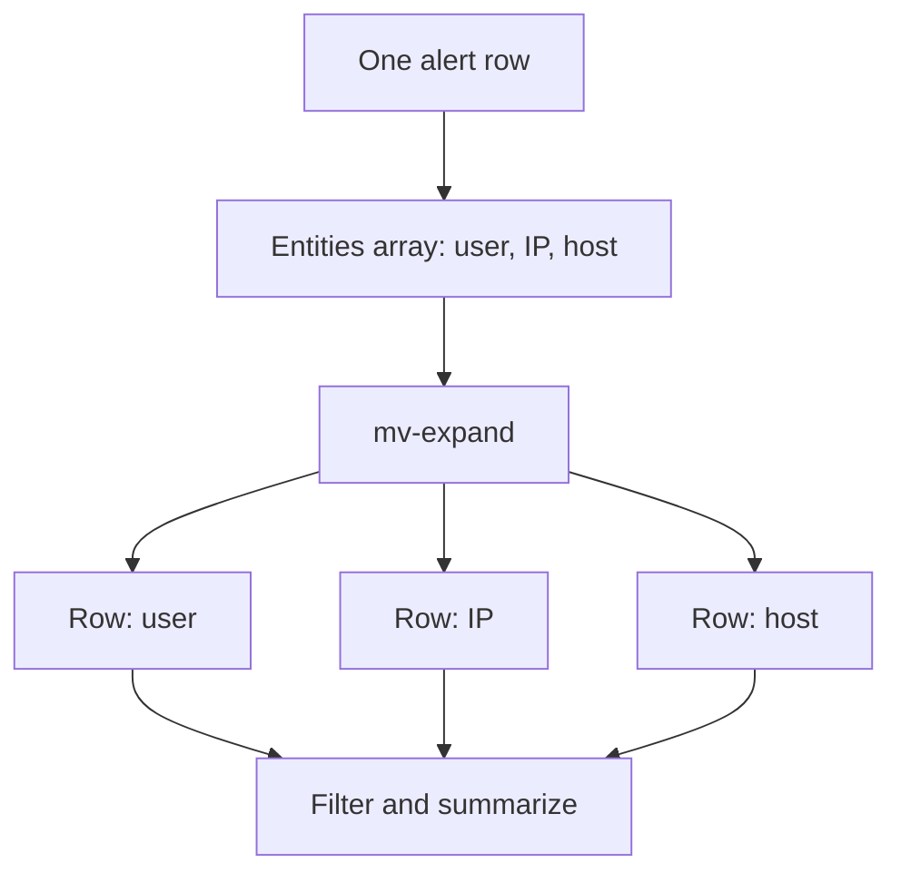

### Example 19 — expand an array

```kusto
datatable(AlertId:string, Entities:dynamic)
[
    "alert-001", dynamic(["alice", "192.0.2.10", "host-01"]),
    "alert-002", dynamic(["bob", "192.0.2.20"])
]
| mv-expand Entity=Entities to typeof(string)
| project AlertId, Entity
```

### Example 20 — expand objects and retain position

```kusto
datatable(AlertId:string, Evidence:dynamic)
[
    "alert-001", dynamic([{"type":"account","value":"alice"},{"type":"ip","value":"192.0.2.10"}])
]
| mv-expand with_itemindex=EvidenceIndex Item=Evidence
| extend EvidenceType=tostring(Item.type), EvidenceValue=tostring(Item.value)
| project AlertId, EvidenceIndex, EvidenceType, EvidenceValue
```

Expansion can multiply rows dramatically. A thousand alerts with five hundred entities can become half a million rows. Filter before expansion, project only needed fields, cap intentionally where semantics allow and verify post-expansion counts.

## 13. `let` statements and reusable functions

`let` binds a name to a scalar, tabular expression or function for the current query. It improves readability and provides one authoritative value for a window or threshold. A stored workspace function is a governed shared artifact with separate permissions and lifecycle; a query-local `let` is temporary.

### Example 21 — named constants and a reusable table

```kusto
let InvestigationStart = datetime(2026-08-24 12:00:00);
let InvestigationEnd = datetime(2026-08-24 13:00:00);
let MinimumFailures = 2;
let Events = datatable(TimeGenerated:datetime, User:string, Result:string)
[
    datetime(2026-08-24 12:01:00), "alice", "Failure",
    datetime(2026-08-24 12:02:00), "alice", "Failure",
    datetime(2026-08-24 12:03:00), "bob", "Success"
];
Events
| where TimeGenerated between (InvestigationStart .. InvestigationEnd)
| where Result == "Failure"
| summarize Failures=count() by User
| where Failures >= MinimumFailures
```

### Example 22 — scalar normalization function

```kusto
let NormalizeUser = (Value:string) { tolower(trim(" ", Value)) };
datatable(RawUser:string)
[
    " Alice@CONTOSO.COM ",
    "BOB@contoso.com"
]
| extend User=NormalizeUser(RawUser)
```

When a named tabular expression is referenced more than once, KQL can recalculate it. `materialize()` can cache an intermediate result for a query, but it consumes cache and is not automatically faster. Filter and project down before materializing, measure the result and avoid it when used once.

## 14. `union`: stack related event streams

`union` combines rows from two or more tabular inputs. The default `kind=outer` includes all columns and fills missing cells with null. Same-named columns of different types can become type-suffixed columns. `kind=inner` retains common columns. `withsource=` records provenance.

### Example 23 — normalized timeline with `union`

```kusto
let SignIns = datatable(TimeGenerated:datetime, User:string, SourceIp:string, Result:string)
[
    datetime(2026-08-24 12:00:00), "alice", "192.0.2.10", "Failure"
]
| project TimeGenerated, Entity=User, Activity="SignIn", Detail=Result, SourceIp;
let Changes = datatable(TimeGenerated:datetime, Actor:string, Operation:string)
[
    datetime(2026-08-24 12:05:00), "alice", "Role assignment added"
]
| project TimeGenerated, Entity=Actor, Activity="Audit", Detail=Operation, SourceIp="";
union withsource=Source SignIns, Changes
| order by TimeGenerated asc
```

Filter each input before a large union. Avoid wildcards when the intended tables are known; future tables can silently change results. Preserve a source column so analysts can return to native evidence.

## 15. `join` kinds and correlation grain

`join` combines rows from left and right inputs when keys match. KQL's default join is `innerunique`, which deduplicates the left side before matching; state `kind=` explicitly in security content. Duplicate keys on both sides can create a many-to-many row explosion.

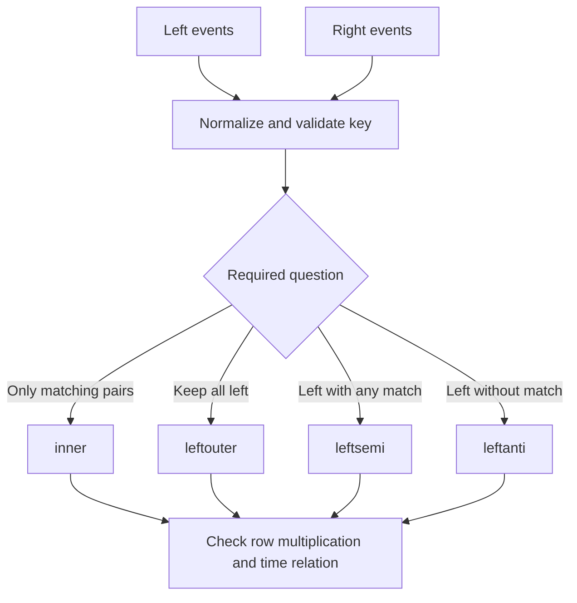

| Join kind | Rows returned | Security question |
|---|---|---|
| `inner` | Every matching combination | Which events correlate? |
| `innerunique` | Deduplicated left matches; default | Is left deduplication intended? |
| `leftouter` | All left plus right matches/nulls | Enrich all primary events |
| `fullouter` | All rows from both | Compare complete inventories |
| `leftsemi` | Left rows having a match | Which events have known context? |
| `leftanti` | Left rows without a match | Which assets/users are absent from reference? |

### Example 24 — inner time-aware correlation

```kusto
let Failures = datatable(FailureTime:datetime, User:string, SourceIp:string)
[
    datetime(2026-08-24 12:00:00), "alice", "192.0.2.10",
    datetime(2026-08-24 12:20:00), "bob", "192.0.2.20"
];
let RoleChanges = datatable(ChangeTime:datetime, Actor:string, Operation:string)
[
    datetime(2026-08-24 12:05:00), "alice", "Privileged role added",
    datetime(2026-08-24 14:00:00), "bob", "Role removed"
];
Failures
| join kind=inner (RoleChanges) on $left.User == $right.Actor
| where ChangeTime between (FailureTime .. FailureTime + 30m)
| project FailureTime, ChangeTime, User, SourceIp, Operation
```

### Example 25 — `leftanti` gap analysis

```kusto
let ObservedHosts = datatable(Host:string) ["host-01", "host-03"];
let ExpectedHosts = datatable(Host:string) ["host-01", "host-02", "host-03"];
ExpectedHosts
| join kind=leftanti (ObservedHosts) on Host
```

### 🔍 Plain-English deep-dive: equality is not causality

A join proves that keys and any explicit conditions match. It does not prove one event caused another or that two strings truly represent the same person. “alice” may exist in two tenants. One NAT IP may represent thousands of users. Add tenant, object ID, host ID, direction and time constraints where available. Describe correlation as evidence of association until investigation establishes causality.

## 16. `lookup` for small reference dimensions

`lookup` enriches a large left fact table with a smaller right dimension table. It supports `leftouter` (default) and `inner`, avoids repeating match keys and assumes the right side is small enough to broadcast. Microsoft Learn warns that a right side larger than several tens of MB can fail.

### Example 26 — enrich events with an owner map

```kusto
let Events = datatable(TimeGenerated:datetime, Host:string, Action:string)
[
    datetime(2026-08-24 12:00:00), "host-01", "ProcessStart",
    datetime(2026-08-24 12:01:00), "host-99", "ProcessStart"
];
let Assets = datatable(Host:string, Owner:string, Criticality:string)
[
    "host-01", "Finance IT", "High",
    "host-02", "HR IT", "Medium"
];
Events
| lookup kind=leftouter Assets on Host
| extend AssetKnown=isnotempty(Owner)
```

## 17. Watchlists and `externaldata` context

A Sentinel **watchlist** is a governed reference dataset that can be queried with the `_GetWatchlist()` function in an applicable workspace. It can support asset tiers, approved scanners or business context. A watchlist is not automatically trustworthy: define owner, source, review date, key uniqueness, expiry, access and privacy. Avoid using a watchlist as a permanent silent exception list.

```kusto
// Context only: requires an existing authorized Sentinel watchlist.
let Approved = _GetWatchlist('approved-scanners')
| project SourceIp=tostring(SearchKey), Owner=tostring(Owner);
// Join Approved to a bounded event set after validating key uniqueness.
```

`externaldata` reads a small reference dataset from supported external storage with a schema defined in the query. For Azure Monitor/Sentinel, Microsoft Learn describes it for small reference data up to 100 MB, not bulk retrieval, and notes public-endpoint/firewall constraints. Never paste SAS tokens, keys or other credentials into saved query text. Prefer query parameters or approved identity patterns and review data exfiltration risk.

```kusto
// Context only: not part of the runnable lab. URI must be supplied securely.
declare query_parameters(URI:string);
externaldata(SourceIp:string, Classification:string)[URI]
with(format="csv", ignoreFirstRecord=true)
```

| Reference option | Best use | Key risk |
|---|---|---|
| Inline `datatable` | Small test fixture | Not live operational context |
| Watchlist | Sentinel-managed reference context | Staleness and broad exceptions |
| `externaldata` | Small external reference artifact | Credential leakage and network access |
| Ingested custom table | Larger/repeated operational data | Ingestion, schema, retention and cost |
| Workspace function | Reusable query abstraction | Hidden logic/version drift |

## 18. Time-series and anomaly basics

A **time series** is a sequence of measurements arranged in equal time intervals. `make-series` creates arrays over bins. Functions such as `series_decompose_anomalies()` can mark points that differ from an estimated baseline. An anomaly is unusual relative to a model; it is not automatically malicious.

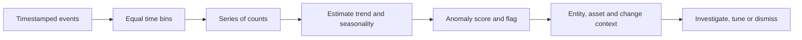

### Example 27 — synthetic time series and anomaly flags

```kusto
datatable(TimeGenerated:datetime, EventCount:long)
[
    datetime(2026-08-24 00:00:00), 2,
    datetime(2026-08-24 01:00:00), 3,
    datetime(2026-08-24 02:00:00), 2,
    datetime(2026-08-24 03:00:00), 3,
    datetime(2026-08-24 04:00:00), 30,
    datetime(2026-08-24 05:00:00), 2
]
| make-series Events=sum(EventCount) default=0 on TimeGenerated
    from datetime(2026-08-24 00:00:00) to datetime(2026-08-24 06:00:00) step 1h
| extend (Anomalies, Scores, Baseline)=series_decompose_anomalies(Events)
| mv-expand TimeGenerated to typeof(datetime), Events to typeof(long),
    Anomalies to typeof(int), Scores to typeof(real), Baseline to typeof(real)
```

| Baseline design question | Example risk |
|---|---|
| Enough history? | One quiet day cannot represent month-end activity |
| Comparable population? | Executives and service accounts behave differently |
| Seasonality? | Weekend behavior differs from weekdays |
| Source continuity? | Connector outage looks like a drop anomaly |
| Known change? | Migration creates a benign spike |
| Ground truth? | “Unusual” labels are not confirmed attacks |

## 19. Entity timelines, IOCs and baselines

An **entity** is a recognizable object such as account, host, IP, URL, file hash or Azure resource. An **indicator of compromise (IOC)** is an observable associated with suspected malicious activity, but quality, confidence, validity period and context matter. A **baseline** represents expected behavior for a comparable entity and period.

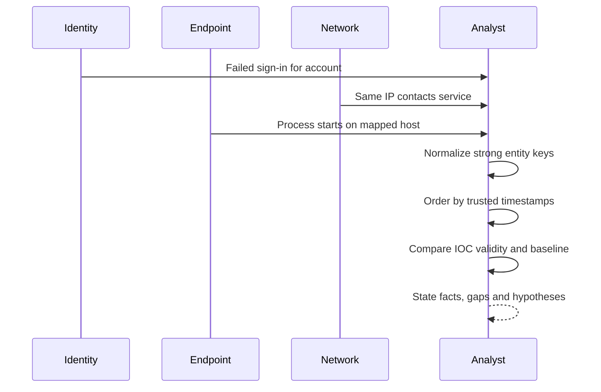

### Example 28 — synthetic entity timeline

```kusto
datatable(TimeGenerated:datetime, EntityType:string, EntityId:string, Activity:string, Source:string)
[
    datetime(2026-08-24 12:00:00), "Account", "user-001", "Failed sign-in", "Identity",
    datetime(2026-08-24 12:04:00), "IP", "192.0.2.10", "Connected to test service", "Network",
    datetime(2026-08-24 12:07:00), "Account", "user-001", "Role assignment requested", "Audit"
]
| where EntityId in ("user-001", "192.0.2.10")
| order by TimeGenerated asc
| project TimeGenerated, Source, EntityType, EntityId, Activity
```

### Example 29 — IOC validity window

```kusto
let Events = datatable(TimeGenerated:datetime, SourceIp:string)
[
    datetime(2026-08-24 12:00:00), "192.0.2.10",
    datetime(2026-08-24 12:10:00), "198.51.100.20"
];
let Indicators = datatable(Indicator:string, ValidFrom:datetime, ValidUntil:datetime, Confidence:int)
[
    "192.0.2.10", datetime(2026-08-24 11:00:00), datetime(2026-08-24 13:00:00), 80,
    "198.51.100.20", datetime(2026-08-24 00:00:00), datetime(2026-08-24 11:00:00), 90
];
Events
| join kind=inner (Indicators) on $left.SourceIp == $right.Indicator
| where TimeGenerated between (ValidFrom .. ValidUntil)
| project TimeGenerated, SourceIp, Confidence
```

## 20. Nulls, empty values, case and three-valued reality

Null means no scalar value. Empty string is a string with zero characters. The literal text `"null"` is ordinary text. Handle them deliberately with `isnull()`, `isnotnull()`, `isempty()`, `isnotempty()` and `coalesce()`.

### Example 30 — missing-value classification

```kusto
datatable(User:string, Risk:real)
[
    "alice", real(null),
    "", 0.7,
    "null", 0.2
]
| extend DisplayUser=coalesce(iff(isempty(User), string(null), User), "<missing>")
| extend RiskKnown=isnotnull(Risk)
```

Case normalization can merge values that should remain distinct in some systems. Preserve the raw value, create a normalized value for correlation and use stronger IDs where possible. Prefer case-sensitive operators when the source is normalized and semantics allow; avoid applying `tolower()` to every row merely to compare a constant if a suitable operator is available.

## 21. Query performance and cost context

The main performance principle is to reduce processed data early without changing meaning. Reference only needed tables, filter `datetime` columns immediately, apply selective string/dynamic predicates, project needed columns before expensive parsing/expansion/join and limit exploratory output.

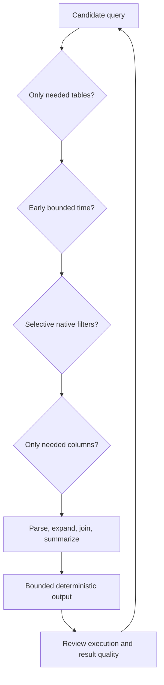

| Prefer | Avoid | Reason |
|---|---|---|
| Explicit table list | `union *` | Stable scope and less scan |
| Early `where TimeGenerated` | Unbounded historical scan | Shard pruning |
| `has` for full terms | `contains` for token search | Better semantic/performance fit |
| Filter native column | Filter only calculated copy | Better optimization opportunity |
| Filter before `parse_json`/regex | Parse every row first | Less CPU and memory |
| Small side chosen intentionally | Unbounded many-to-many join | Prevent explosion |
| `lookup` with small dimension | Huge right-side lookup | Broadcast size limit |
| `take`/`count` while exploring | Returning unknown huge results | Protect service and browser |
| Measured `materialize()` | Habitual caching | Cache is limited |

Query execution can consume shared service resources even when there is no separate line item for that individual query. Basic and Auxiliary table queries, search jobs and long-term data access can have scan-based charges under current Azure Monitor pricing. Therefore record table plan, time range, estimated/scanned data where available and query frequency; use the client's current pricing and Cost Management rather than claiming KQL is “free” or assigning a fixed cost.

### 🔍 Plain-English deep-dive: fast is part of correctness

A detection that times out or finishes after its response window is operationally wrong even if its logic is mathematically correct. A hunt that overloads shared resources can delay colleagues. Performance review is therefore a security quality control: bounded scope, stable schemas, predictable cardinality, measured runtime and a fallback plan.

## 22. Common failures and a debugging ladder

Debug from the source outward. Do not rewrite an entire query at once. Run the table with `take`, add the time filter, check each predicate, inspect types, validate parse success, measure row counts before/after expansion and test each join side independently.

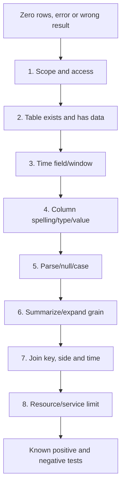

| Symptom | Likely causes | Cheapest discriminating check |
|---|---|---|
| Failed to resolve table | Wrong scope/name or missing solution | Tables pane plus exact `take 1` |
| Failed to resolve column | Schema drift, case or earlier `project` | Inspect schema at preceding line |
| Type mismatch | String compared with numeric/datetime | `gettype()` and sample values |
| Zero results | Time, case, wrong value or no source data | Remove predicates one at a time |
| Unexpected null | Parse failure, outer join or conversion | Add parse/conversion status column |
| Too many rows | `mv-expand` or many-to-many join | Count before and after operator |
| Missing rows after join | Wrong kind/key, nulls or type mismatch | Compare distinct keys on each side |
| Timeout/resource error | Wide window, broad union, regex, join cardinality | Narrow time and inspect each stage |
| Duplicate timeline | Duplicate ingestion or correlation multiplication | Group by stable source ID/provenance |

### Example 31 — instrument a query with stage counts

```kusto
let Raw = datatable(TimeGenerated:datetime, User:string, Result:string)
[
    datetime(2026-08-24 12:00:00), "alice", "Failure",
    datetime(2026-08-24 12:01:00), "bob", "Success",
    datetime(2026-08-24 12:00:00), "carol", "Failure"
];
let InWindow = Raw | where TimeGenerated >= datetime(2026-08-24 00:00:00);
let Failures = InWindow | where Result == "Failure";
union
    (Raw | summarize Rows=count() | extend Stage="Raw"),
    (InWindow | summarize Rows=count() | extend Stage="InWindow"),
    (Failures | summarize Rows=count() | extend Stage="Failures")
| project Stage, Rows
```

## 23. Reusable functions and deployment lifecycle

A reusable query should have an owner, purpose, parameters, input/output schema, assumptions, privacy classification, tests, version and consumers. Stored functions can hide complexity but can also hide breaking changes. Treat them as code.

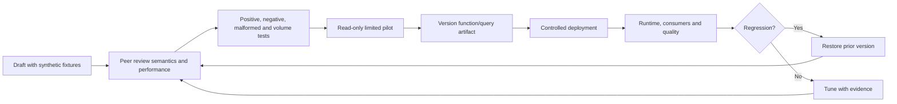

| Artifact field | Example |
|---|---|
| Name/version | `IdentityFailureSummary` v1.2.0 |
| Owner/reviewer | Detection Engineering / SOC reviewer |
| Purpose | Summarize failed identities by 15-minute bin |
| Parameters | Start, end, minimum count |
| Inputs | Named tables/columns/types |
| Output grain | One row per account per bin |
| Dependencies | Connector, parser, watchlist version |
| Tests | Known positive, negative, null, late and duplicate |
| Privacy | Account/IP; no raw token or payload |
| Rollback | Restore v1.1.0 and disable dependent draft rule |

Rollback means preserving the previous tested query/function and knowing which workbooks, hunts or rules consume the change. Do not delete the old version before validation. A schema compatibility layer can temporarily map old and new fields while sources migrate.

## 24. Security, privacy, redaction and exports

Read access to logs can reveal personal data, authentication details, device names, internal IPs, email addresses, file paths and business activity. Use least privilege, authorized purpose, narrow scope, minimal output, controlled sharing, audit and retention. Never paste secrets, tokens, private keys or live customer identifiers into examples, tickets or public AI tools.

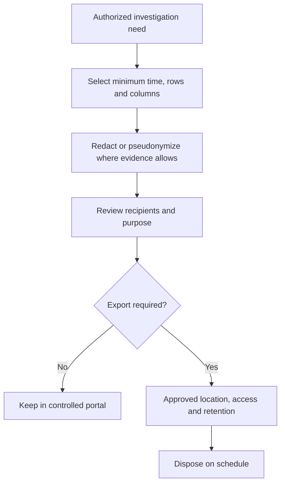

### Example 32 — synthetic redaction

```kusto
datatable(UserPrincipalName:string, SourceIp:string, Detail:string)
[
    "alice@contoso.example", "192.0.2.10", "Synthetic failed login"
]
| extend RedactedUser=replace_regex(UserPrincipalName, @"^([^@]{1,2})[^@]*", @"\1***")
| extend RedactedIp=replace_regex(SourceIp, @"\.\d+$", ".x")
| project RedactedUser, RedactedIp, Detail
```

Redaction is purpose-dependent. Hashing is not anonymization when values can be guessed. Sometimes exact values are essential evidence and must be protected rather than altered. Preserve raw evidence in its authorized system and clearly label transformed exports.

## 25. Safe `datatable` query lab

This lab uses only the synthetic examples in this file. It does not require a workspace, connector, watchlist, external URI, ingestion, rule creation or export. Use reserved documentation IP ranges such as `192.0.2.0/24`, fictional domains such as `contoso.example`, and invented IDs.

### Lab architecture

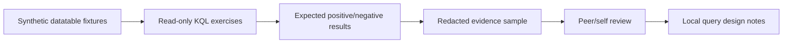

### Lab tasks

| Task | Work | Acceptance evidence |
|---:|---|---|
| 1 | Run Example 1 and narrate each pipe | Correct plain-English pipeline |
| 2 | Change an exact column's case to trigger an error, then repair it | Error and root cause recorded |
| 3 | Compare Examples 5 and 6 | Explain exploration versus precision |
| 4 | Add one malformed ID to Example 9 | Invalid conversion labeled, not hidden |
| 5 | Change the bin from 15m to 5m | Explain changed result grain |
| 6 | Add a duplicate join key to Example 24 | Pre/post row counts and mitigation |
| 7 | Add an empty dynamic array to Example 19 | Explain expansion result |
| 8 | Add an expired IOC to Example 29 | Expired match excluded |
| 9 | Review Example 27 without calling the spike malicious | Context questions listed |
| 10 | Redact Example 32 and inspect retained utility | Privacy decision recorded |
| 11 | Optimize a copy by filtering before parsing | Same semantics, narrower work |
| 12 | Draft one query specification | Owner, grain, tests and rollback complete |

### Validation matrix

| Test class | Fixture | Expected outcome |
|---|---|---|
| Positive | Exact account, time and failure | Expected row appears |
| Negative | Success-only account | No false match |
| Boundary | Event exactly at window edge | Behavior matches documented inclusivity |
| Null | Missing user/risk | Explicit missing-value path |
| Case | Upper/lower UPN | Raw preserved; intended normalization only |
| Type | Numeric and malformed string ID | Valid conversion plus labeled null |
| Duplicate | Repeated event/join key | Multiplication measured |
| Late time | Source and arrival differ | Correct clock stated |
| Parse | Stable and malformed messages | Parse status visible |
| Array | Empty, one and many entities | Cardinality understood |
| Privacy | UPN and IP | Approved output is minimized/redacted |
| Performance | Larger synthetic repeat if authorized | Bounded output and no broad wildcard |

### Lab deliverables

1. A query purpose statement and event-grain definition.
2. A synthetic input dictionary with column types.
3. At least one positive, negative, null, type and duplicate test.
4. A stage-count debugging record.
5. A privacy and redaction decision.
6. A version, owner, dependencies and rollback note.
7. A short findings statement separating facts, hypotheses and gaps.

## 26. Scenario: identity failure followed by privileged change

**Paper scenario:** A client wants to identify an account with repeated failed sign-ins followed by a privileged-role change within thirty minutes. The goal is to design and validate a query, not to enable a detection.

| Design decision | Choice | Reason |
|---|---|---|
| Primary grain | One account-window correlation | Supports investigation grouping |
| Time | Explicit UTC event timestamps | Reproducible sequence |
| Identity key | Tenant ID + object ID preferred | UPN can change/collide |
| Failure threshold | Client-approved and backtested | Avoid invented universal threshold |
| Sequence | Change after failures within 30m | Encodes hypothesis |
| Output | Time, strong account ID, source IP set, operation | Supports entity mapping and triage |
| Privacy | No token/raw payload | Minimum necessary evidence |
| Rollback | Retain prior query and disable candidate consumer | Fast recovery |

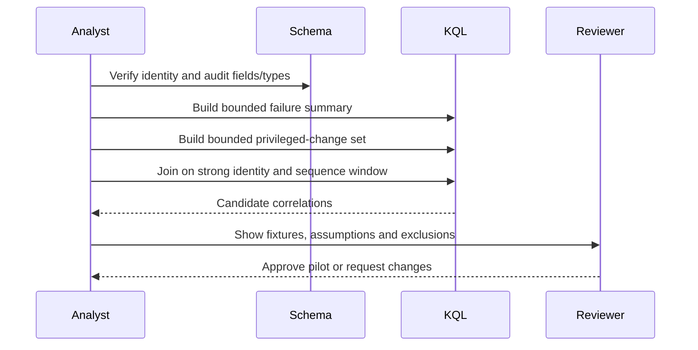

Troubleshooting starts with two independent queries. If failures exist but the final query is empty, inspect the change side, identity normalization, null keys and sequence interval. If row count explodes, inspect duplicate audit rows and many-to-many keys. If results are noisy, do not immediately add a permanent exception; compare true/false cases, service accounts, expected change windows and source completeness.

## 27. Operating metrics

KQL quality needs operational measures, not just syntax success.

| Metric | Meaning | Warning signal |
|---|---|---|
| Query success rate | Scheduled executions completing | Failures/auto-disable risk |
| Runtime p50/p95 | Typical and slow-tail duration | Increasing latency |
| Data scanned/processed | Work touched per run where visible | Unexpected growth |
| Result cardinality | Rows returned per run | Join explosion or source change |
| Null rate in key fields | Missing identity/time/entity values | Schema/data-quality regression |
| Parse success rate | Rows producing expected fields | Format drift |
| Duplicate rate | Repeated stable event IDs | Collection or correlation issue |
| Data freshness | Now minus newest expected event | Connector delay/gap |
| Consumer count | Rules/hunts/workbooks using function | Change blast radius |
| Test pass rate | Regression fixtures passing | Unsafe release |

Tie a metric to an owner and response. A dashboard without a threshold, runbook and decision is decoration.

## 28. Consulting artifacts

| Artifact | Client decision enabled |
|---|---|
| Query requirements record | What question and population are in scope? |
| Schema/data dictionary | Which fields, types and semantics are authoritative? |
| Synthetic fixture pack | Can logic be tested without sensitive data? |
| Query specification | What is the grain, window, threshold and output? |
| Validation matrix | Which positive, negative and edge cases pass? |
| Performance review | Is execution predictable and bounded? |
| Privacy assessment | Which fields may be viewed/exported and why? |
| Dependency map | Which tables, parsers, functions and references are required? |
| Version/change log | What changed, why and who approved? |
| Rollback note | How is the previous behavior restored? |
| Operations dashboard | Are freshness, nulls, runtime and failures healthy? |
| Analyst runbook | How should results be investigated and escalated? |

## 29. JD Mapping: interview translation

| Interview theme | Your transferable strength | Honest KQL answer |
|---|---|---|
| Investigation | Builds evidence timelines | Explain bounded entity timelines and clock validation |
| Troubleshooting | Isolates layers systematically | Table → time → field → type → parse → grain → join |
| RCA | Tests expected versus observed | Use fixtures and stage counts to prove failure boundary |
| Security engineering | Values controlled change | Version, peer review, pilot and rollback query content |
| Privacy | Handles incident evidence carefully | Minimize columns, redact exports and protect exact evidence |
| Communication | Reports facts and uncertainty | State row grain, assumptions, gaps and hypothesis separately |
| Sentinel | Learning current platform fundamentals | Demonstrate synthetic KQL without production-use claims |

## Official Source Anchors

These official Microsoft Learn pages were reviewed for the August 24, 2026 treatment. Recheck moniker, update date, limits, table plan, portal behavior and live schema before reuse.

1. [KQL overview for Microsoft Sentinel](https://learn.microsoft.com/kusto/query/?view=microsoft-sentinel) — read-only query model, tabular pipeline, case sensitivity and Sentinel context.
2. [KQL best practices](https://learn.microsoft.com/kusto/query/best-practices?view=microsoft-sentinel) — early filters, string choices, dynamic extraction, joins and bounded exploration.
3. [Log Analytics tutorial](https://learn.microsoft.com/azure/azure-monitor/logs/log-analytics-tutorial) — schema discovery, scope, time picker, KQL mode and result handling.
4. [Azure Monitor log queries](https://learn.microsoft.com/azure/azure-monitor/logs/log-query-overview) — query scope and Log Analytics context.
5. [Where operator](https://learn.microsoft.com/kusto/query/where-operator?view=microsoft-sentinel) — predicate filtering.
6. [Project operator](https://learn.microsoft.com/kusto/query/project-operator?view=microsoft-sentinel) and [extend operator](https://learn.microsoft.com/kusto/query/extend-operator?view=microsoft-sentinel) — output and calculated columns.
7. [Summarize operator](https://learn.microsoft.com/kusto/query/summarize-operator?view=microsoft-sentinel) — grouping and aggregation.
8. [arg_max aggregation](https://learn.microsoft.com/kusto/query/arg-max-aggregation-function?view=microsoft-sentinel) — latest/maximum row pattern.
9. [Parse operator](https://learn.microsoft.com/kusto/query/parse-operator?view=microsoft-sentinel), [parse_json](https://learn.microsoft.com/kusto/query/parse-json-function?view=microsoft-sentinel) and [extract](https://learn.microsoft.com/kusto/query/extract-function?view=microsoft-sentinel) — structured extraction.
10. [Dynamic data type](https://learn.microsoft.com/kusto/query/scalar-data-types/dynamic?view=microsoft-sentinel) and [mv-expand](https://learn.microsoft.com/kusto/query/mv-expand-operator?view=microsoft-sentinel) — arrays/property bags and row expansion.
11. [Let statement](https://learn.microsoft.com/kusto/query/let-statement?view=microsoft-sentinel) and [user-defined functions](https://learn.microsoft.com/kusto/query/functions/user-defined-functions?view=microsoft-sentinel) — reusable expressions.
12. [Union operator](https://learn.microsoft.com/kusto/query/union-operator?view=microsoft-sentinel) — outer/inner schemas, provenance and wildcard guidance.
13. [Join operator](https://learn.microsoft.com/kusto/query/join-operator?view=microsoft-sentinel) — current join kinds, default and performance guidance.
14. [Lookup operator](https://learn.microsoft.com/kusto/query/lookup-operator?view=microsoft-sentinel) — dimension enrichment and right-side size constraint.
15. [Use watchlists in queries](https://learn.microsoft.com/azure/sentinel/watchlists-queries) — `_GetWatchlist()` context.
16. [externaldata operator](https://learn.microsoft.com/kusto/query/externaldata-operator?view=microsoft-sentinel) — small external references and credential warning.
17. [Time-series analysis](https://learn.microsoft.com/kusto/query/machine-learning-and-tsa?view=microsoft-sentinel) — series and anomaly functions.
18. [Azure Monitor Logs cost calculations and options](https://learn.microsoft.com/azure/azure-monitor/logs/cost-logs) — table plans, query/search and retention cost context.
19. [Microsoft Sentinel roles and permissions](https://learn.microsoft.com/azure/sentinel/roles) — access boundaries.
20. [Microsoft Sentinel threat detection](https://learn.microsoft.com/azure/sentinel/threat-detection) — queries as detection inputs and current unified custom-detection guidance.

## ⭐ Likely Interview Questions for This Section

### Q1. How do you read a KQL pipeline?

**Model answer:** I start with the table and narrate every pipe as a decision: constrain the trusted time range, filter relevant rows, calculate only necessary fields, aggregate at a documented grain, correlate with explicit keys and sequence windows, then project a minimal output. Each operator returns a table, so order affects semantics and performance. I validate each stage with known positive and negative fixtures.

### Q2. When would you use `search` instead of `where`?

**Model answer:** I use narrowly scoped `search` during discovery when I do not know the exact column or table containing a rare phrase. Once I know the schema, I switch to `where` on explicit columns, with an early datetime predicate and token-aware operators such as `has` where appropriate. Broad `search *` is ambiguous and can process excessive data.

### Q3. Explain `summarize`, `dcount`, `make_set`, `arg_max` and `bin`.

**Model answer:** `summarize` groups rows and applies aggregations. `dcount` estimates distinct values at scale, `make_set` retains a bounded distinct-value array, `arg_max` returns the row associated with the latest or greatest value, and `bin` creates fixed intervals such as 15-minute buckets. I document the output grain because aggregation discards detail and affects alert grouping.

### Q4. How do you safely parse JSON, arrays and raw text?

**Model answer:** I prefer connector or ASIM-parsed fields. Otherwise I prefilter, use `parse_json()` for JSON, `parse` for a stable template, `extract()` for a focused regex and `split()` only for reliable delimiters. I cast dynamic properties, expose parse success/nulls, test malformed inputs and filter before `mv-expand` because expansion can multiply rows.

### Q5. How do `union`, `join` and `lookup` differ?

**Model answer:** `union` stacks related event streams and should preserve provenance. `join` correlates two inputs by explicit keys; I state the kind because the KQL default is `innerunique`, constrain time and check many-to-many multiplication. `lookup` enriches a large left fact set from a small right dimension and is limited by the broadcast size of that dimension.

### Q6. How do you make KQL performant and cost-aware?

**Model answer:** I query only needed tables, filter datetime and selective native columns early, project needed fields before regex, JSON expansion and joins, bound exploratory output and measure runtime/cardinality. I verify table plans because Basic/Auxiliary scans, search jobs and long-term data can have different charges. I never call KQL universally free or infer a bill without current workspace and pricing evidence.

### Q7. How do you debug a query that returns no rows or too many rows?

**Model answer:** I test scope and access, run the source table with a tiny sample, verify the timestamp/window, inspect exact column names, types, nulls and values, then add each filter back. For excess rows I count before and after `mv-expand`, `union` and `join`, inspect duplicate keys and make the correlation grain explicit. I finish with positive and negative known cases.

### Q8. What is your honest experience with Sentinel KQL?

**Model answer:** I have not operated Sentinel or its KQL detections in production. My production experience is incident troubleshooting, evidence correlation, RCA and validation. I built a current synthetic `datatable` lab covering pipeline logic, parsing, joins, timelines, baselines, performance, redaction, tests and rollback. In a client workspace I would begin read-only, verify schema and permissions, peer-review logic and promote through a controlled pilot.

## 🧠 30-Second Memory Hooks

- **KQL:** read-only question, tabular answer.
- **Pipe:** table in, table out; order matters.
- **Schema first:** never guess names or types.
- **Time first:** bounded UTC window and named clock.
- **`search`:** discovery; **`where`:** precise filtering.
- **`extend`:** calculate; **`project`:** final contract.
- **`summarize`:** spend detail to gain pattern.
- **`dcount`:** approximate distinct at scale.
- **`arg_max`:** latest whole row per entity.
- **Parse:** stable pattern; **extract:** focused regex.
- **Dynamic:** cast properties; expand carefully.
- **`union`:** stack and preserve source.
- **`join`:** association, not causality.
- **`lookup`:** large facts, small dimension.
- **IOC:** validity and context, not automatic guilt.
- **Anomaly:** unusual, not automatically malicious.
- **Performance:** early filter, narrow columns, measured grain.
- **Privacy:** minimize in query; protect exact evidence.
- **Debug:** scope → table → time → field → type → shape → join.
- **Honesty:** synthetic KQL lab, no production Sentinel claim.

## Completion Checklist

- [ ] I can explain workspace, table, row, column, schema, scalar and tabular expression.
- [ ] I can narrate a KQL pipeline in plain English.
- [ ] I can state the prerequisites, RBAC, licensing and table-plan checks.
- [ ] I can discover a live schema instead of guessing it.
- [ ] I can use explicit UTC time windows and distinguish source/arrival clocks.
- [ ] I can choose `search` versus `where` and appropriate string operators.
- [ ] I can use `project`, `project-away` and `extend` safely.
- [ ] I can explain common scalar types, conversions, nulls and case behavior.
- [ ] I can use `count`, `dcount`, `make_set`, `arg_max` and `bin`.
- [ ] I can distinguish `order`, `top`, `take` and `distinct`.
- [ ] I can choose `parse`, `parse_json`, `extract`, regex and `split`.
- [ ] I can inspect and expand dynamic arrays without losing cardinality control.
- [ ] I can use `let` and explain query-local versus stored functions.
- [ ] I can use `union` with provenance and stable inputs.
- [ ] I can choose explicit join kinds and test many-to-many multiplication.
- [ ] I can use `lookup` only with a suitably small right dimension.
- [ ] I can explain watchlists and `externaldata` without exposing credentials.
- [ ] I can explain time series, baselines and anomaly limitations.
- [ ] I can build an entity timeline and time-bound IOC match.
- [ ] I can optimize a query without changing its meaning.
- [ ] I can debug zero, duplicate, null, type, parse and resource failures by stage.
- [ ] I can design reusable query artifacts, tests, deployment and rollback.
- [ ] I can minimize/redact output and control exports.
- [ ] I completed at least 20 synthetic `datatable` examples without customer data.
- [ ] I can answer Q1–Q8 aloud without claiming production Sentinel use.
- [ ] I will recheck current Learn, portal, scope, schema, limits, plan and pricing before reuse.

*Next suggested section:* [Part 47](Part-47-sentinel-analytics-rules-incidents-entities.md)