# Part 47 — Analytics Rules, Alerts, Incidents, Entities, MITRE Mapping, and Tuning

> **Section goal:** Build a beginner-first, consulting-grade method for turning an approved threat scenario into useful Microsoft Sentinel detection and investigation content. This Part explains current analytics-rule and template families; scheduled and near-real-time (NRT) logic; Microsoft security, Advanced multistage attack detection (Fusion), anomaly and machine-learning (ML) behavior analytics naming; the 2026 unified Custom detections direction; templates versus active rules; queries, intervals, lookbacks, thresholds, event grouping, suppression, alert enrichment, strong entity mapping, MITRE ATT&CK mapping, incident creation/grouping/reopen behavior, evidence, entities, bookmarks, automation boundaries, lifecycle, backtesting, pilots, tuning, versioning, source control, deployment, rollback, false positives, false negatives, precision, recall, coverage, latency, gaps, alert fatigue, health, ownership, runbooks and operational metrics. The lab remains synthetic and does not enable a rule or create an incident.

This Part maps directly to Deloitte expectations for Microsoft Sentinel and unified security operations, Microsoft Defender integration, detection engineering, incident investigation, cloud security architecture, troubleshooting, security assurance, privacy, controlled deployment, service transition, documentation and executive reporting. Your production incident/RCA background is highly transferable: establish ground truth, correlate timestamps and identifiers, separate symptom from cause, validate a fix against positive and negative cases, and report limitations. You should apply that discipline to a paper detection design without presenting yourself as a production Sentinel detection engineer.

> **Currency, naming, portal, licensing and preview note (August 24, 2026):** This chapter is grounded in official Microsoft Learn available on August 24, 2026. Microsoft Learn currently says **Custom detections** is the preferred way to create new detections across Microsoft Sentinel SIEM and Microsoft Defender XDR, while Sentinel still documents and operates analytics-rule families described here. Portal onboarding materially changes behavior: after March 31, 2027 Sentinel is supported only in the Defender portal; Defender XDR is responsible for incident creation/correlation for onboarded workspaces; Microsoft security rules and the Sentinel Fusion rule are unavailable/disabled in specified unified scenarios; and some incident grouping/reopen controls behave differently. Preview status currently applies to features including scheduled first-run timing, analytics-rule ARM import/export, some alert-detail properties, MITRE coverage pages, selected Fusion detections, ML Behavior Analytics rules and other experiences. Licenses, product plans, data connector availability, table plans, roles, cloud/region and service limits vary. Verify the live tenant, Microsoft Learn banners, Product Terms, release notes and portal before approval.

## JD Mapping

| Deloitte expectation | Capability developed here | Consulting evidence |
|---|---|---|
| Design Sentinel detections | Translate threats into tested rule specifications | Detection design record |
| Integrate Microsoft security services | Distinguish Sentinel and Defender correlation paths | Portal/ownership decision map |
| Investigate incidents | Enrich alerts with entities and useful evidence | Investigation contract |
| Reduce operational noise | Measure and tune precision, recall and grouping | Tuning register |
| Engineer secure change | Version, test, deploy and roll back rules | Release evidence pack |
| Troubleshoot services | Diagnose data, execution, enrichment and incident gaps | Layered health runbook |
| Advise stakeholders | Report coverage, limitations, owners and risk | Coverage catalog and dashboard |

## Candidate honesty note

You can credibly discuss production incident troubleshooting, RCA, timestamp and identifier correlation, validation, privacy-aware evidence handling, change coordination, runbooks and reporting. You can present the paper rule specification, synthetic KQL backtest and validation matrix in this chapter.

You should not claim production Sentinel analytics-rule creation, NRT operation, entity mapping, incident tuning, MITRE administration, Fusion/anomaly operation, deployment pipelines, automation or SOC ownership unless separately evidenced. Safe wording is:

> “My production experience is incident troubleshooting, evidence correlation, RCA, validation and stakeholder reporting. I have not enabled or tuned Microsoft Sentinel analytics rules in production. I built a current paper and synthetic `datatable` lab that specifies a threat hypothesis, query grain, schedule, lookback, threshold, grouping, entity mapping, MITRE rationale, test matrix, pilot metrics, deployment and rollback. In a client tenant I would verify the current Defender/Sentinel architecture, licenses, data quality and roles; start disabled; backtest with labeled cases; peer-review privacy and response impact; pilot without automatic containment; and promote only after operational acceptance.”

---

## 1. From event to case file

A **security event** is a record of activity. An **analytics rule** applies detection logic to events or signals. An **alert** states that the rule or a source product found something significant. An **incident** is a case file that groups alerts and their entities, evidence, status, owner, comments and activity. These are different grains.

Think of a smoke detector. Air measurements are events. Detector logic is the rule. The alarm is an alert. The fire-service case file that combines alarms, rooms, occupants, photos and actions is the incident. One noisy measurement should not automatically become one case, and one case may contain many alarms.

```mermaid
flowchart LR
    EVENT[Raw event or source signal] --> RULE[Detection or correlation logic]
    RULE --> ALERT[Alert: significant finding]
    ALERT --> CORRELATE[Sentinel or Defender XDR correlation]
    CORRELATE --> INCIDENT[Incident/case file]
    INCIDENT --> TRIAGE[Owner, status, severity and tasks]
    TRIAGE --> EVIDENCE[Events, entities, bookmarks and comments]
    EVIDENCE --> RESPONSE[Human-approved response or automation]
    RESPONSE --> CLOSURE[Classification, lessons and tuning]
    CLOSURE --> RULE
```

| Object | Typical grain | Purpose | Common design mistake |
|---|---|---|---|
| Event | One source activity | Raw evidence | Treating every row as malicious |
| Query result | Designer-defined event/entity/window | Candidate finding | Leaving grain undocumented |
| Alert | One rule firing or source-product alert | Notify and carry context | Too little entity/evidence context |
| Incident | Related alert case | Investigate and coordinate | Grouping unrelated entities |
| Bookmark | Saved hunting evidence/query result | Preserve an investigative lead | Treating bookmark as immutable raw evidence |
| Automation run | Triggered workflow execution | Triage/enrich/respond | Automatic containment without authority |

## 2. Detection architecture and ownership

Detection quality depends on the entire chain: source generation, collection, normalization, query logic, execution schedule, alert construction, correlation, incident workflow and response. A rule cannot detect data that never arrives, and a perfect alert can still fail operationally if nobody owns it.

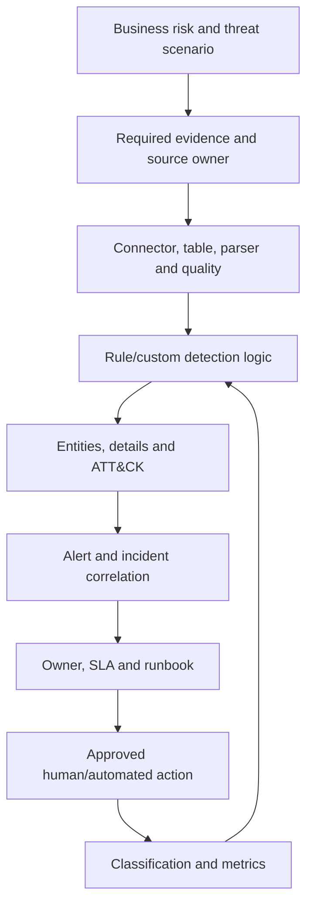

| Layer | Primary owner question | Acceptance evidence |
|---|---|---|
| Risk/use case | Who accepts the threat priority? | Approved use-case record |
| Source | Who owns generation and schema? | Known positive source event |
| Platform | Who owns connector, workspace and health? | Freshness/continuity SLO |
| Detection | Who owns logic and tuning? | Versioned rule specification |
| SOC | Who receives and investigates? | RACI, queue and SLA |
| Response | Who can contain or remediate? | Authority matrix and approvals |
| Privacy | Who approves purpose/access/retention? | Data-protection review |
| Change | Who approves deployment/rollback? | Release record |

## 3. Prerequisites, permissions and licensing

Before designing a rule, confirm the platform in use. Is Sentinel onboarded to the Defender portal? Is Microsoft Defender XDR incident integration enabled? Which system creates and correlates incidents? Which query surface and rule family is current for the use case? This choice controls available fields, limits, actions and ownership.

For scheduled rule creation, current Learn lists Microsoft Sentinel Contributor or equivalent workspace/resource-group write permissions. Investigation normally requires Microsoft Sentinel Responder or applicable unified Defender permissions. Reading data requires the relevant Log Analytics/data permissions. Deployment identities should be separate, scoped and auditable; do not make a personal administrator account the undocumented production pipeline.

| Prerequisite | Verify | Why it matters |
|---|---|---|
| Portal/onboarding | Defender portal versus legacy Azure experience | Incident correlation and feature behavior differ |
| Licensing | Sentinel, source security products and required plans | Determines signals/features |
| RBAC | Reader, Responder, Contributor, automation/deployment roles | Least privilege and successful operation |
| Data | Connector, table, parser, freshness and retention | Detection input contract |
| Schema | Exact fields, types, entity identifiers and clock | Query and enrichment correctness |
| Content | Content Hub solution/template version | Dependencies and updates |
| Operations | Queue, owner, SLA, runbook and escalation | Alert must be actionable |
| Privacy | Purpose, legal basis, minimization and residency | Protect people and regulated data |
| Change | Environments, reviewers, repository and rollback | Controlled lifecycle |

There is no honest universal statement that a particular rule is “included” without context. Data ingestion, retention, table plan, source licenses, Logic Apps automation and ancillary services can each affect cost. NRT responsiveness also consumes engineering and SOC capacity. Build a value/cost model from measured volumes and current contractual pricing.

## 4. Current detection and analytics-rule families

Microsoft Learn's Sentinel taxonomy includes Scheduled, NRT, Anomaly and Microsoft security rules, plus specialized Threat intelligence, Advanced multistage attack detection (Fusion) and ML Behavior Analytics templates. In 2026, Learn also prominently identifies unified **Custom detections** as the preferred path for creating new rules across Sentinel SIEM and Defender XDR. Treat naming as a dated architecture decision, not trivia.

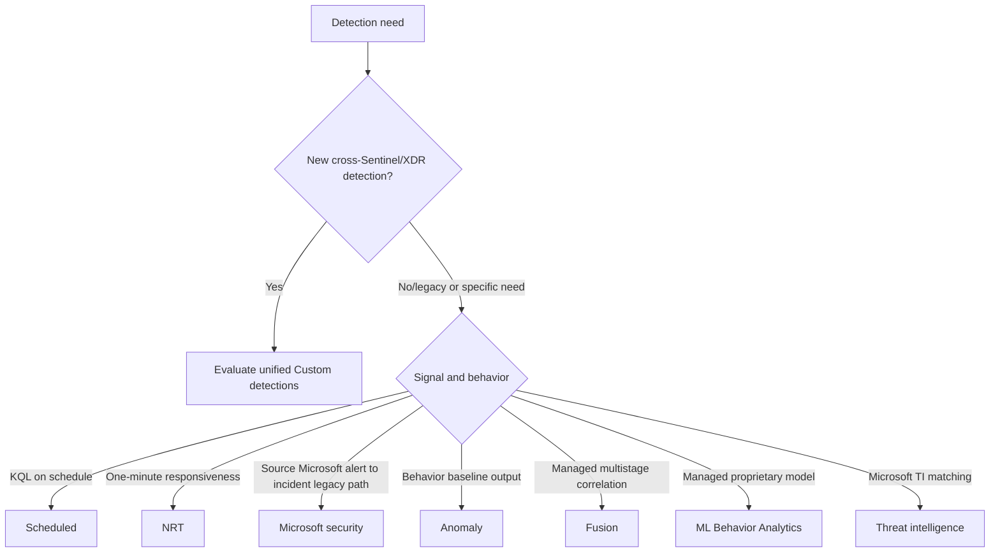

| Family/current label | Core behavior | Customization | 2026 boundary to verify |
|---|---|---|---|
| Unified Custom detections | New detection experience across Sentinel SIEM and Defender XDR | Query, schedule/actions vary by source | Current eligibility, tables, limits and migration path |
| Scheduled | KQL runs every 5 minutes to 14 days over a lookback | High | Query/schedule/grouping and incident settings |
| NRT | KQL runs every minute with one-minute lookback | Similar but constrained | Current limit, ingestion-time semantics and max rules |
| Microsoft security | Create incidents from Microsoft product alerts | Limited/template based | Not available with Defender XDR integration/onboarding |
| Anomaly | ML baseline produces rows in `Anomalies` | Duplicate and tune parameters/threshold | Production versus Flighting and model version |
| Advanced multistage attack detection (Fusion) | Managed ML correlation of signals | Source/exclusion settings; hidden core logic | Disabled/replaced by Defender XDR correlation when onboarded |
| ML Behavior Analytics | Managed proprietary anomalous SSH/RDP behavior rules | Not customizable | Preview, availability and output behavior |
| Microsoft Threat Intelligence Analytics | Managed matching of supported logs to Microsoft TI | Not customizable | Inputs, indicator semantics and current availability |

Do not call every detection an “analytics rule” when the current unified surface calls it a custom detection. Conversely, do not erase existing Scheduled/NRT content from architecture documents. Inventory what actually exists, its provider, resource type, query source, portal, incident owner and migration status.

### 🔍 Plain-English deep-dive: product naming is part of the control boundary

Two screens may both say “detection,” yet one queries Sentinel workspace logs and another queries Defender advanced-hunting data, with different scheduling, permissions, entity handling and response actions. The business requirement comes first; then choose the supported engine. In documentation, write the exact resource type and portal, for example “Sentinel Scheduled analytics rule in workspace X” or “Defender unified Custom detection,” instead of the vague label “SIEM rule.”

## 5. Templates versus active rules

A **template** is a maintained prototype supplied through Microsoft Sentinel content, commonly a Content Hub solution. An **active rule** is the instantiated resource that runs in a workspace. Creating a rule from a template copies/configures it; later template updates do not silently prove the active rule is current or compatible.

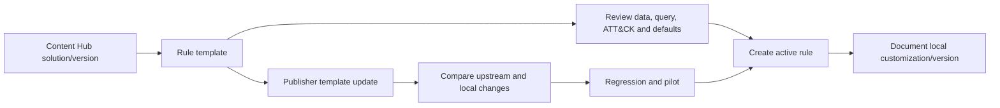

| Template question | Why ask it |
|---|---|
| Who publishes and supports it? | Defines escalation and trust |
| Which solution/template version? | Enables repeatable comparison |
| Which data sources and parsers are required? | A connected badge is not semantic readiness |
| What exact threat hypothesis is encoded? | Avoid blind activation |
| What is its result grain? | Controls alerts and incidents |
| Which ATT&CK mappings are justified? | Prevents inflated coverage |
| Which defaults require localization? | Thresholds and exclusions vary |
| What changed in an update? | Avoid overwriting local tuning |

Use the `In use` and `Update` indications as prompts, not deployment approval. Diff query, schedule, mappings, incident settings and automation dependencies. Keep the previous tested resource definition available for rollback.

## 6. Start with a detection specification

A detection is an engineered control, not merely a KQL query. Write a specification before opening the wizard.

| Specification field | Example question |
|---|---|
| Use-case ID | Which risk/control record owns this? |
| Threat hypothesis | What attacker behavior should produce which evidence? |
| In/out of scope | Which tenants, accounts, assets and benign workflows? |
| Required sources | Which tables/fields and maximum acceptable delay? |
| Result grain | One event, entity-window, sequence or aggregate? |
| Logic | Filters, joins, sequence, baseline and threshold? |
| Schedule/lookback | How often and how far back, with delay/overlap? |
| Alert contract | Name, severity, custom details and entities? |
| Incident contract | Create, group, reopen and assign how? |
| ATT&CK | Which behavior directly supports which technique? |
| Response | Investigation steps, authority and forbidden actions? |
| Tests | Positive, negative, boundary, late, duplicate and failure? |
| Metrics | Precision, recall proxy, volume, latency and health? |
| Lifecycle | Owner, version, deployment, review and rollback? |

The threat hypothesis should be falsifiable: “If an account experiences at least five failed sign-ins from one source and then performs a privileged role assignment within thirty minutes, the authorized identity and audit sources produce records with strong account identifiers and UTC timestamps.” A broad statement like “detect compromised accounts” cannot define tests.

## 7. Scheduled rule execution flow

A Scheduled rule runs KQL at a configured interval over a configured lookback. The query result count is compared with the alert threshold. Results become one or more alerts depending on event grouping. Incident settings then instruct whether/how alerts should become incidents, subject to unified Defender correlation behavior.

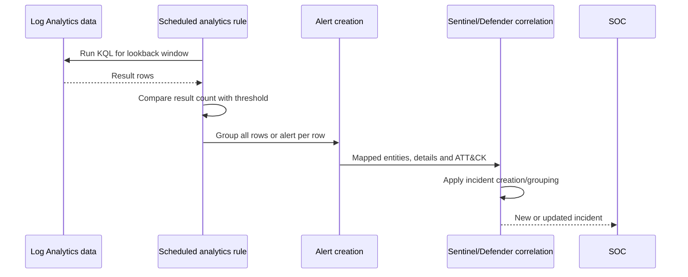

Current Scheduled configuration includes name, description, severity, tactics/techniques, status, query, entity mapping, custom/alert details, interval, lookback, threshold, event grouping, suppression, simulation, incident creation/grouping and automated response relationships. Each setting changes downstream analyst experience.

## 8. Query output is an alert contract

The KQL query must return `TimeGenerated` for Scheduled rule lookback behavior under current guidance. Its output fields feed entity mapping, custom details and dynamic alert details. Define stable names/types and retain the evidence needed to investigate while minimizing sensitive/raw payloads.

```kusto
// Safe design fixture only: no rule is created.
let Failures = datatable(TimeGenerated:datetime, TenantId:string, AccountObjectId:string,
                         UserPrincipalName:string, SourceIp:string, Result:string)
[
    datetime(2026-08-24 12:00:00), "tenant-demo", "user-001", "alice@contoso.example", "192.0.2.10", "Failure",
    datetime(2026-08-24 12:03:00), "tenant-demo", "user-001", "alice@contoso.example", "192.0.2.10", "Failure",
    datetime(2026-08-24 12:06:00), "tenant-demo", "user-001", "alice@contoso.example", "192.0.2.10", "Failure"
];
Failures
| where Result == "Failure"
| summarize FailureCount=count(), FirstFailure=min(TimeGenerated), LastFailure=max(TimeGenerated),
    SourceIps=make_set(SourceIp, 20) by TenantId, AccountObjectId, UserPrincipalName
| where FailureCount >= 3
| extend TimeGenerated=LastFailure
| project TimeGenerated, TenantId, AccountObjectId, UserPrincipalName,
    FailureCount, FirstFailure, LastFailure, SourceIps
```

Document that one result row represents one account across the fixture window. A rule threshold is applied to the number of result rows, not automatically to `FailureCount`. If the query already filters `FailureCount >= 3`, a rule alert threshold of zero results means “alert when at least one account-window row exists.” Confusing these two thresholds is common.

## 9. Interval, lookback, overlap and ingestion delay

**Interval** is how often the Scheduled query runs. **Lookback** is how much event time it inspects. Current documented ranges are 5 minutes through 14 days, with lookback greater than or equal to interval. A longer lookback than interval creates overlap; overlap can preserve late events but can repeat results unless query logic deduplicates or windows deterministically. Sentinel currently runs Scheduled rules on a built-in five-minute delay to account for ingestion latency.

```mermaid
gantt
    title Scheduled runs with overlap (illustrative UTC)
    dateFormat HH:mm
    axisFormat %H:%M
    section Event windows
    Lookback for 12:15 run :a1, 12:00, 15m
    Lookback for 12:20 run :a2, 12:05, 15m
    Lookback for 12:25 run :a3, 12:10, 15m
    section Rule starts
    Built-in delayed execution A :milestone, m1, 12:20, 0m
    Built-in delayed execution B :milestone, m2, 12:25, 0m
```

| Schedule choice | Benefit | Risk/control |
|---|---|---|
| Interval = lookback | Simple adjacent windows | Late arrivals may miss expected event-time window |
| Lookback > interval | Captures overlap/late data | Duplicate alerts; use stable deduplication/grain |
| Very short interval | Faster possible detection | More runs, noise and resource use |
| Very long lookback | More historical context | Slow query and repeated findings |
| Scheduled first start | Align planned go-live | Preview/current portal validation required |

Measure source-event-to-ingestion delay distribution before choosing. A five-minute platform delay does not repair a source that arrives hours late. For delayed sources, use ingestion-time-aware patterns supported by current guidance and test exact boundaries.

## 10. Alert threshold versus query threshold

The rule's **alert threshold** compares the number of query-result rows per execution with a condition such as greater than a number. A threshold inside KQL applies to an aggregation column. They can be combined, but should not duplicate confusing logic.

| Layer | Example | Meaning |
|---|---|---|
| Raw events | Three failed sign-ins | Three input rows |
| KQL aggregation | One account with `FailureCount=3` | One output row |
| KQL threshold | `where FailureCount >= 3` | Keep qualifying account rows |
| Rule threshold | Results greater than `0` | Fire when at least one account qualifies |

Avoid universal magic numbers. Backtest threshold distributions by peer group, working pattern and source continuity. A service account, administrator and occasional guest may need different logic. Record why the selected threshold balances expected harm and analyst capacity.

## 11. Two grouping layers: events into alerts, alerts into incidents

**Event grouping** controls how query-result rows become alerts: group all rows into one alert, or trigger an alert for each result. **Alert grouping** controls how alerts become incidents. They solve different problems.

```mermaid
flowchart TD
    R1[Query result row A] --> EG{Event grouping}
    R2[Query result row B] --> EG
    R3[Query result row C] --> EG
    EG -->|All results| A1[One alert containing result set]
    EG -->|Per result| A2[Alert A]
    EG -->|Per result| A3[Alert B]
    EG -->|Per result| A4[Alert C]
    A1 --> AG{Alert grouping/correlation}
    A2 --> AG
    A3 --> AG
    A4 --> AG
    AG --> I1[One or more incidents]
```

Current documented Scheduled per-event behavior supports up to 150 alerts: if results exceed 150, the first 149 become individual alerts and the 150th summarizes the full result set. NRT currently supports up to 30, with the first 29 individual and the 30th summarizing all results. Verify current limits before design.

| Desired analyst experience | Query grain | Event grouping | Incident grouping candidate |
|---|---|---|---|
| One case per account-window | One row/account-window | Per result | Same strong account/entity |
| One broad campaign alert | Rows are campaign evidence | Group all | Provider correlation may add context |
| One case per host and account | One row/host-account-window | Per result | Selected host + account |
| Informational metrics only | Aggregated metrics | Group all | Incident creation may be disabled only where architecture permits |

### 🔍 Plain-English deep-dive: grouping is case design, not noise deletion

Imagine filing every receipt as a separate legal case: the queue becomes unusable. Put all company receipts into one endless case: unrelated investigations collide. Good grouping follows the investigation unit, such as the same strong account and host within a bounded time. Before changing grouping to reduce volume, ask whether analysts still see distinct victims, ownership, severity and chronology.

## 12. Suppression

Scheduled and NRT rules can temporarily stop running after generating an alert. Current Scheduled documentation allows suppression up to 24 hours. Suppression reduces repeated execution, but it also creates deliberate detection blindness during the suppressed period.

| Use suppression when | Avoid or constrain when |
|---|---|
| One firing represents a long-running condition and repeat alerts add no value | New victims or entities can appear during the pause |
| A bounded response workflow handles the entire state | Attack progression requires continuous signals |
| The missed-coverage impact is assessed and approved | It is being used to hide an untuned rule |

Prefer deterministic deduplication, entity-aware grouping and time-limited incident automation for many noise scenarios. Record suppression start, duration, owner, blind spot and rollback. Test an event during the suppression window to prove the documented behavior.

## 13. NRT rules

NRT means **near real time**, not instantaneous. Current documentation describes a one-minute schedule and one-minute lookback with a two-minute built-in delay, using ingestion time rather than source `TimeGenerated` to manage ingestion delay. The current page also documents a maximum of 50 NRT rules per customer and says sources need ingestion delay under 12 hours, but these limits are change-sensitive.

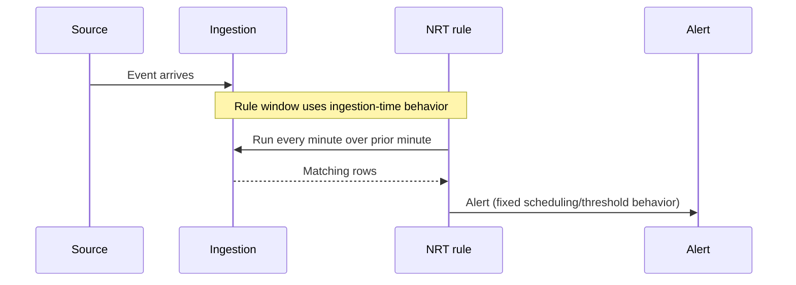

| NRT design factor | Current characteristic | Decision question |
|---|---|---|
| Schedule | Fixed one minute | Does response genuinely require it? |
| Lookback | Fixed one minute | Is source arrival reliable enough? |
| Delay | Built-in two minutes | Does end-to-end latency meet SLA? |
| Threshold | Alert is generated on result; not configured like Scheduled | Is query grain precise? |
| Event grouping | Limited, up to current 30 behavior | Could a burst summarize evidence? |
| Tables/workspaces | Multiple supported under current docs | Is query performant and permission-stable? |
| Capacity | Current limit 50/customer | Which use cases merit scarce slots? |

Do not choose NRT because “faster is always better.” Use it when faster detection changes an authorized response outcome and the source, query, queue and responder can sustain it. Otherwise a well-engineered Scheduled or unified Custom detection may be more reliable.

## 14. Microsoft security rules and unified incident ownership

Microsoft security rules historically create Sentinel incidents from alerts generated by other Microsoft security solutions in real time. Current Learn says these rules are not available when Defender XDR incident integration is enabled or Sentinel is onboarded to the Defender portal; Defender XDR creates incidents instead, and existing rules are disabled.

| Architecture state | Incident creator/correlator to verify | Design implication |
|---|---|---|
| Sentinel not onboarded, legacy Microsoft security path | Sentinel rule behavior | Avoid duplicate product and Sentinel cases |
| Defender XDR incident integration enabled | Defender XDR | Microsoft security rules unavailable |
| Sentinel onboarded to Defender portal | Defender XDR correlation engine | Grouping is initial instruction, not sole authority |

The design artifact must name the authoritative incident queue and correlation engine. Duplicate alerts/incidents are not “more coverage”; they split ownership, metrics, comments and response.

## 15. Fusion and Defender XDR correlation

**Advanced multistage attack detection**, commonly called **Fusion**, is Sentinel's managed ML correlation engine for combining low-fidelity signals across attack stages into high-fidelity incidents. Its core logic is hidden and not freely customizable. Some Fusion scenarios are preview. Scheduled alerts need useful entities and tactics to participate in applicable Fusion scenarios.

Current Fusion documentation says Fusion uses 30 days of historical data for ML training and that this pipeline is encrypted using Microsoft-managed keys, not a customer's CMK even when CMK is enabled for the workspace. This is a privacy/security architecture decision to review. Current Learn also says Fusion is disabled for workspaces onboarded to the Defender portal and replaced by the Defender XDR correlation engine.

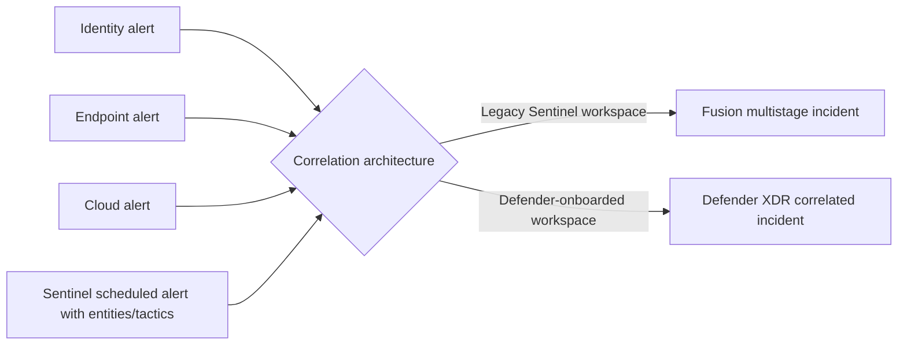

Do not claim that Fusion proves an attack. Review component alerts, entities, timings and model context. Do not duplicate a managed correlation with a broad custom rule unless a measured coverage gap justifies it.

## 16. Anomaly and ML Behavior Analytics rules

Customizable anomaly rules learn a baseline and write detected anomalies to the `Anomalies` table. Anomalies do not independently generate alerts under current Sentinel documentation. An out-of-box anomaly rule cannot be edited directly; duplicate it, tune the customized copy in **Flighting** mode while the original remains in **Production**, compare outputs and promote only when accepted. Only one version of a template can be Production at once.

**ML Behavior Analytics** is the current specialized name for preview, managed, noncustomizable rules that detect specified anomalous SSH/RDP login behavior using proprietary models. Do not use “ML rule” as a generic synonym for every anomaly or Fusion rule.

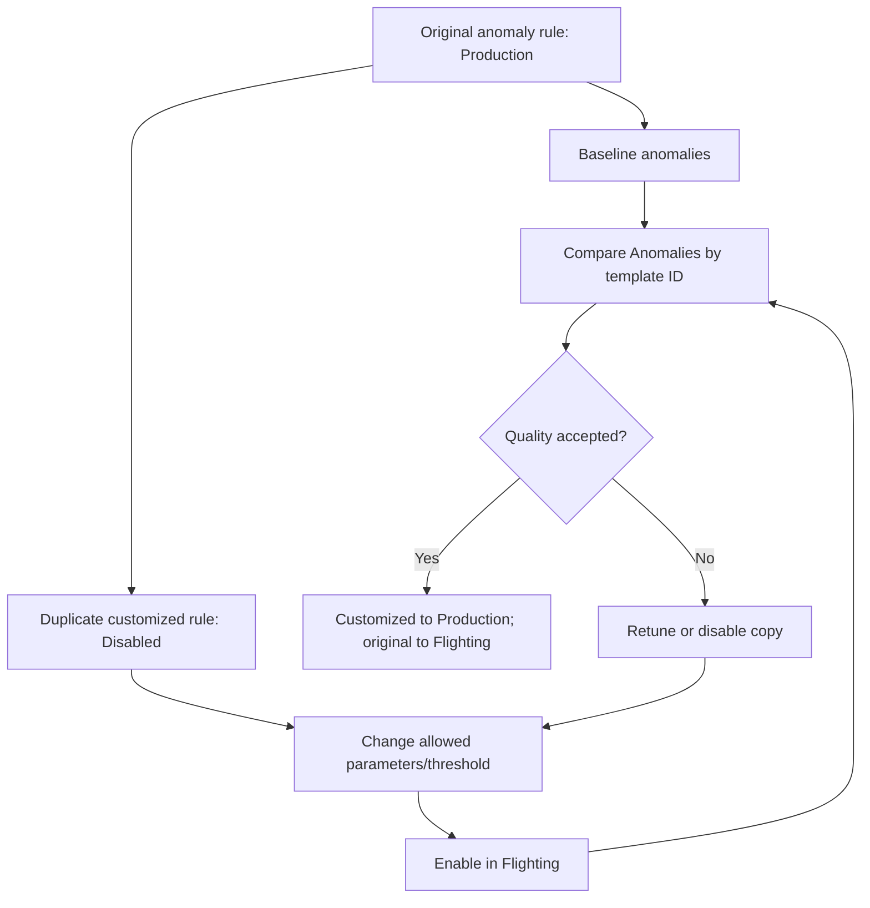

| Signal | What it means | What it does not mean |
|---|---|---|
| Anomaly flag | Behavior differs from learned expectation | Confirmed malicious activity |
| Anomaly reason | Model's available explanation/context | Complete causal explanation |
| Fusion incident | Multiple managed signals correlated | Every component is true positive |
| ML Behavior Analytics alert/incident | Managed model matched named behavior | Model is transparent or universally available |

## 17. Alert anatomy

Alerts from Scheduled/NRT rules and ingested product alerts share the `SecurityAlert` table but can populate fields differently. Key fields include alert name/severity, provider/product, start/end times, `SystemAlertId`, entities, tactics/techniques and `ExtendedProperties`.

| Alert field | Design meaning | Validation |
|---|---|---|
| `SystemAlertId` | Unique internal alert identifier | Preserve for pivots |
| `AlertName` | Analyst-facing finding name | Specific, stable and non-sensitive |
| `AlertSeverity` | Potential impact prioritization | Not likelihood/confidence |
| `StartTime`/`EndTime` | First/last event impact for Scheduled alerts | Compare with source events |
| `TimeGenerated` | Alert generation time in UTC | Do not confuse with event time |
| `Entities` | Structured recognized entities | Parse/map and inspect truncation |
| `ExtendedProperties` | Custom details and dynamic alert content | Size/type/null tests |
| `Tactics`/`Techniques` | ATT&CK context | Behavior-based rationale |
| `ProviderName`/`ProductName` | Source/provider identity | Portal compatibility caution |

Severity represents potential impact if true; confidence represents belief that it is not a false positive. A high-impact but weak signal can be High severity and low confidence. Keep those concepts distinct.

## 18. Entity mapping is the investigation contract

An **entity** is an object Sentinel/Defender can recognize and pivot on, such as account, host, IP, file hash, URL or Azure resource. Entity mapping connects query output fields to recognized identifiers. Strong identifiers uniquely identify an entity alone or in an approved combination; weak identifiers need additional context.

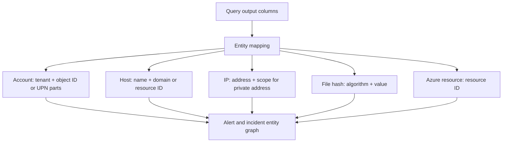

Current Learn permits up to 10 entity mappings in a rule and up to three identifiers per mapping, with at least one required identifier. It documents up to 500 entities collectively in one alert, divided across mappings, and a 64 KB `Entities` area; excess entities can be dropped/truncated. Health messages can expose mapping/size drops, but exact limits should be rechecked.

| Entity | Prefer | Weak/collision risk |
|---|---|---|
| Entra account | Tenant ID + Entra object/user ID | Display name or username alone |
| Domain account | SID or name + domain | Generic/local name |
| Host | Azure resource ID or hostname + DNS/NT domain | Hostname alone |
| Global IP | Address | Shared service/NAT context still matters |
| Private IP | Address + network/address scope | Same RFC1918 address in many networks |
| File hash | Algorithm + value | File name alone |
| Process | Host + PID + creation time + image/hash as available | PID alone is recycled |
| Azure resource | Full resource ID | Display/resource name alone |

As of July 1, 2026, current entity reference documentation says Account `Name` consistently holds only the UPN prefix, not a full UPN. Existing automation, queries or playbooks that compare `Name` to `user@domain` need review; reconstruct from `Name` + `UPNSuffix` or use a stronger identifier. This is exactly why schema contracts need dated regression tests.

### 🔍 Plain-English deep-dive: an entity is an address label

An alert saying “suspicious account” without a strong identity is like a parcel labeled only “Alex.” It cannot be reliably routed, grouped or enriched. Tenant ID plus object ID is closer to a complete postal address. Mapping more fields is not automatically better; map the smallest set that uniquely identifies the object and preserves source context.

## 19. Custom details and dynamic alert details

**Custom details** expose selected query fields in alerts/incidents through extended properties. **Alert details** can dynamically customize alert name, description, severity, tactics and supported properties from query values. Both improve triage but have size/count limits and privacy implications.

Current Learn documents up to 20 custom details per rule, up to 50 values each and 2 KB combined custom-detail size per alert. It documents dynamic alert-detail constraints including up to 50 customized values, 256 bytes for non-collection fields such as alert name, 5 KB for collection properties such as description, and three parameters each in name/description formats. Recheck current limits.

| Enrichment | Good example | Unsafe/poor example |
|---|---|---|
| Alert name | `Privileged change after failures for {{UserAlias}}` | Full raw token or huge JSON |
| Description | Short sequence, time and next check | Unverified claim “account compromised” |
| Custom detail | `FailureCount`, `FirstSeen`, `RoleName` | Password, token, sensitive payload |
| Dynamic severity | Approved mapping from impact field | User-controlled free text |
| Entity | Strong account/host/IP identifiers | Display name only |

For Defender-onboarded Sentinel, current Learn cautions not to customize `ProductName` for Microsoft-source alerts because alerts can be dropped and no Defender XDR incident created; `ProviderName` and `ProductComponentName` are unavailable to customize there. Dynamic incident names can also be overridden by the Defender XDR correlation engine. Test the actual architecture.

## 20. MITRE ATT&CK mapping

MITRE ATT&CK is a knowledge base of observed adversary tactics (why) and techniques/sub-techniques (how). Map only what the detection directly observes, not every possible attack stage. Current Sentinel Learn says its coverage experience is aligned to ATT&CK version 18 and the MITRE page is preview as of this date; both are change-sensitive.

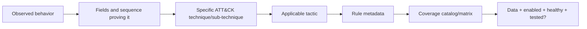

| Coverage state | Meaning |
|---|---|
| Mapped | Metadata points to technique |
| Available | Template/content exists |
| Enabled | Active resource exists and is on |
| Data-ready | Required source is present and timely |
| Healthy | Executions succeed without gaps |
| Validated | Positive/negative tests pass |
| Operational | Owner/runbook/SLA/response are accepted |

A colored ATT&CK square does not prove effective coverage. One brittle rule and ten overlapping noisy rules can both paint a cell. Coverage reporting should combine threat priority, data readiness, validation, health, quality and response readiness.

## 21. Incident creation, grouping and reopen behavior

For Scheduled rules, incident creation is enabled by default. In an onboarded Defender portal architecture, leave the relevant setting enabled when Defender XDR should create incidents from the alerts, even though Defender performs creation/correlation. Current Sentinel grouping can combine up to 150 alerts per incident; beyond that, additional incidents are created.

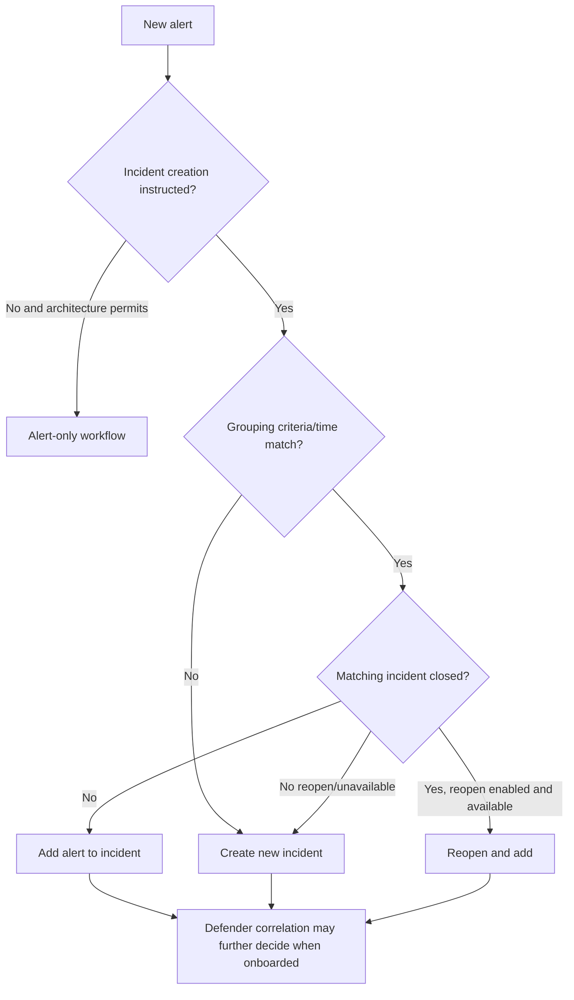

| Grouping option | Benefit | Risk |
|---|---|---|
| All mapped entities match | Strong default relationship | Weak/missing entity mappings fragment or merge cases |
| All alerts from rule | Simple, low incident count | Unrelated victims become one case |
| Selected entities/details match | Tailored investigation grain | Schema/null changes alter grouping |
| No grouping | Clear alert isolation | Queue and duplicate-case volume |

Current Learn says the “reopen closed matching incidents” option is unavailable for Sentinel onboarded to the Defender portal. It also says Sentinel alert-grouping settings act as initial instructions at incident creation, while Defender XDR correlation can make different decisions. Test closure/reopen workflows in the actual portal, including ticket synchronization and automation loops.

## 22. Evidence, entities and bookmarks

An incident contains or links alerts, events, entities, comments, activities, tasks and bookmarks. The incident timeline orders alerts and bookmarks; the entity view provides information, timelines and insights; Logs pivots expose underlying query data. A **bookmark** preserves a selected hunting result and query context and can be added to an incident.

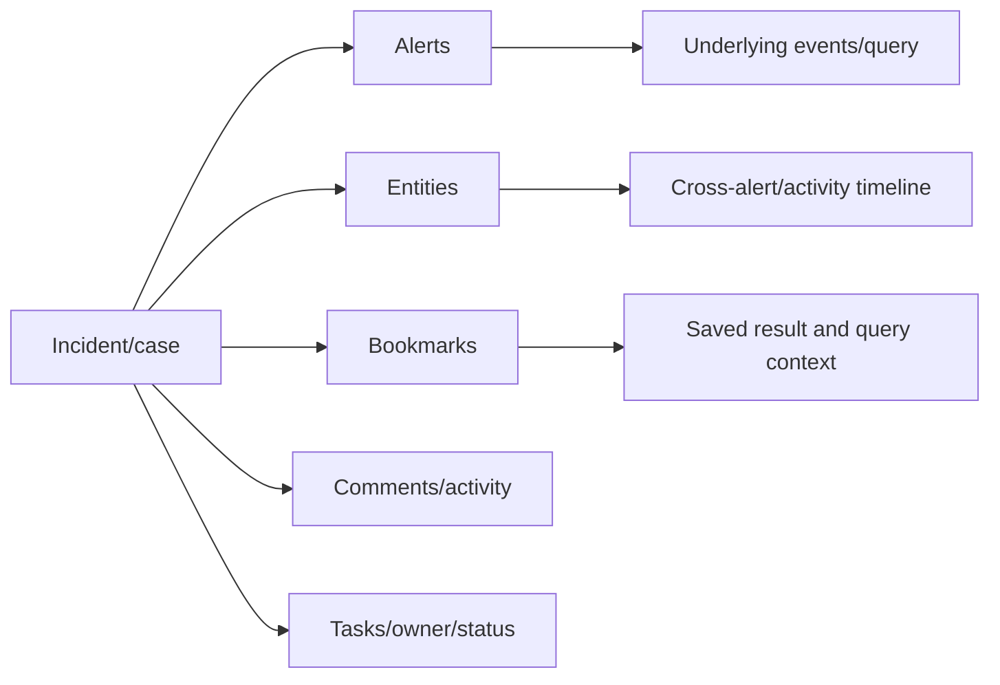

| Artifact | Analyst question | Integrity caution |
|---|---|---|
| Alert | Why did detection fire? | Dynamic details can be truncated/defaulted |
| Event | What source activity occurred? | Validate source and timestamp |
| Entity | Who/what is involved? | Strong versus weak identifier |
| Bookmark | Which hunt result should be retained? | Source data retention and query reproducibility |
| Comment | What did people/automation decide? | Avoid secrets and unsupported claims |
| Activity log | Who/what changed the case? | Export/audit according to policy |

Evidence should distinguish raw source fact, transformed query output, analyst inference and automated enrichment. A public-IP reputation result is contextual evidence, not proof that the account acted maliciously.

## 23. Analytics rules and automation are related, not identical

Analytics decides **what may be suspicious**. Automation decides **what workflow/action follows**. Automation rules can trigger on incident creation/update or alert creation, apply conditions, change case properties, add tasks/tags and invoke playbooks. Playbooks are Logic Apps workflows with their own permissions, connectors, retries, diagnostics and costs.

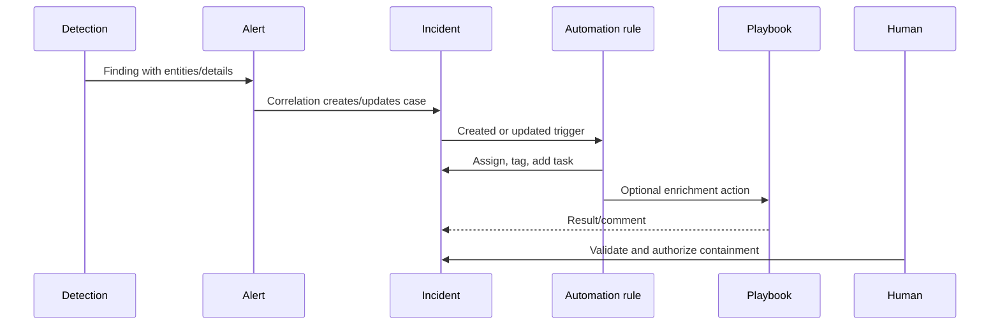

Prefer incident-triggered automation for evolving case workflows under general current guidance, but architecture and alert-only cases matter. Do not hide automation logic inside a detection design. Start a pilot with notification, tagging or enrichment; require explicit authority for destructive actions such as account disablement, host isolation or network blocking. Design idempotency so repeated alerts do not repeat an unsafe action.

## 24. Detection lifecycle

Detection engineering is continuous control operation. The lifecycle begins with risk/use case, not a template search, and ends only when the content is retired with dependencies removed.

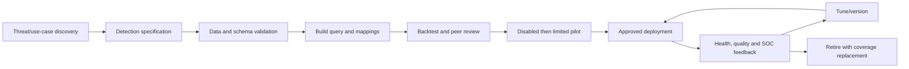

| Lifecycle gate | Exit criterion |
|---|---|
| Specification | Threat, owner, grain, evidence and response agreed |
| Data readiness | Positive/negative events and freshness proven |
| Build | Query and enrichment produce stable minimal output |
| Backtest | Labeled historical/synthetic cases meet acceptance |
| Pilot | Volume, latency, precision and workflow acceptable |
| Release | Approval, version, rollback and monitoring ready |
| Operate | Health and tuning cadence active |
| Retire | Replacement/gap accepted; automation/dependencies removed |

## 25. Backtesting and ground truth

**Backtesting** runs candidate logic over representative historical or synthetic data to estimate behavior before alerting analysts. **Ground truth** is a reliable label about whether activity is malicious, benign or unknown. Closed incidents alone are imperfect truth because analysts can misclassify and unobserved attacks are absent.

| Backtest dimension | Test |
|---|---|
| Known positive | Authorized simulation or confirmed historical case matches |
| Known negative | Normal workflow does not match |
| Boundary | Exact interval/lookback and threshold edges |
| Late arrival | Delayed event is detected once as designed |
| Duplicate | Duplicate source row does not multiply cases unexpectedly |
| Null/schema | Missing optional field degrades safely |
| Entity | Strong mapping appears and groups correctly |
| Enrichment | Custom details stay within size/type limits |
| Performance | Runtime and resource use remain acceptable |
| Privacy | Output contains only approved evidence |

Results simulation currently models the last 50 Scheduled runs against current data. It is useful for frequency/volume exploration, not complete validation. It cannot prove future recall, source continuity or analyst usefulness. Retain a reproducible fixture and expected result alongside every high-risk rule.

## 26. Pilot and tuning

Create/import the candidate disabled where possible, validate the deployed definition, then enable in a controlled ring. Start without automatic containment. Define pilot duration by event volume and business cycles, not an arbitrary week. Include weekends, maintenance and known batch periods where relevant.

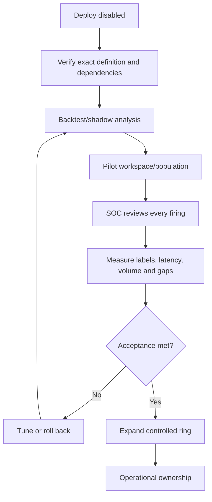

| Pilot decision | Evidence |
|---|---|
| Promote | Minimum labeled sample, acceptable precision/latency, no severe gaps |
| Extend | Too few representative cases or source changes underway |
| Tune | Known repeatable false-positive cause with bounded fix |
| Roll back | Missed known positive, overload, mapping break or unsafe automation |
| Retire | Duplicate/obsolete detection with accepted replacement |

## 27. False positives, false negatives, precision and recall

A **true positive (TP)** is a malicious/relevant case correctly detected. A **false positive (FP)** is benign activity incorrectly detected. A **false negative (FN)** is malicious/relevant activity missed. A **true negative (TN)** is benign activity correctly not detected.

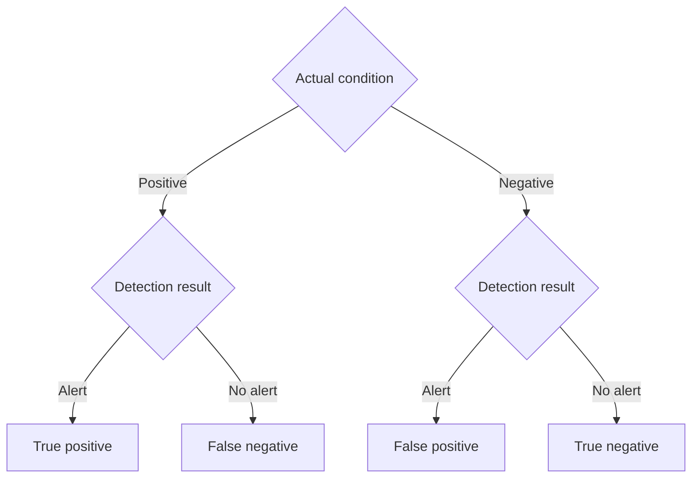

**Precision** asks: of the alerts reviewed, what proportion were true positives?

$$
Precision = \frac{TP}{TP + FP}
$$

**Recall** asks: of all relevant malicious cases, what proportion were detected?

$$
Recall = \frac{TP}{TP + FN}
$$

True recall is difficult because unknown missed attacks are not labeled. Use authorized attack simulations, purple-team cases, retrospective incident mapping and source-coverage tests as recall evidence/proxies. Never report “100% recall” from only the alerts the rule generated.

| Tuning action | Likely precision effect | Possible recall risk |
|---|---:|---:|
| Raise threshold | Increase | Miss slower/smaller attacks |
| Add strong sequence/context | Increase | Miss incomplete telemetry |
| Exclude entire user/IP | Increase apparent | Hide compromised trusted entity |
| Narrow time window | May increase | Miss slow sequence/late data |
| Add peer-group baseline | Increase | Bad grouping can normalize abuse |
| Add source/entity context | Often increase | Join failures can drop valid events |

### 🔍 Plain-English deep-dive: quieter is not automatically better

Muting every smoke alarm makes the building quiet and the metric look excellent. Detection tuning is a tradeoff between analyst attention and missed harm. Every exception needs an owner, business reason, start/expiry, scope and negative test showing which attack path remains visible.

## 28. Safe false-positive handling

Current Learn describes two broad methods: time-limited automation rules that close/tag known benign incidents with an audit trail, and permanent/bounded query changes or watchlist-based exceptions. Choose according to duration, complexity, owner and missed-detection risk.

| Exception type | Best fit | Required safeguards |
|---|---|---|
| Time-limited automation | Maintenance or authorized test | Expiry, tag, closure reason, owner |
| Query condition | Stable, precisely defined benign behavior | Peer review and regression tests |
| Watchlist reference | Shared governed exception/context | Owner, key uniqueness, expiry, audit |
| Threshold/peer tuning | Population behavior differs | Separate baselines and recall tests |
| Source correction | Bad/duplicate telemetry causes noise | Connector/parser RCA and validation |

Avoid a permanent allowlist based only on one closed incident. A known scanner IP can be compromised, a service account can be abused and a maintenance window can overrun. Combine attributes and time where possible, then monitor exceptions as security-sensitive configuration.

## 29. Coverage catalog and ATT&CK is not enough

A coverage catalog ties threats to evidence, healthy detections and response, including explicit gaps.

| Catalog field | Example content |
|---|---|
| Use-case ID/title | IDN-007 Privileged change after suspicious sign-in |
| Business service/asset | Microsoft 365 administrative identity |
| Threat/ATT&CK | Justified technique and tactic |
| Detection resource | Type, ID, workspace/portal, version |
| Sources | Connector/table/parser and owner |
| Status | Draft, pilot, operational, degraded, retired |
| Quality | Volume, precision, recall evidence, last validation |
| Health | Success, delay, skipped windows, auto-disable |
| Operations | Owner, SLA, runbook, automation and escalation |
| Gap | Missing source, weak entity, no 24x7 response |
| Review | Next review and change trigger |

Prioritize coverage by business harm and likely attack paths, not the percentage of ATT&CK cells colored. Report “mapped but unvalidated” separately from “operational and tested.”

## 30. Naming, owners and runbooks

A stable name helps humans and automation. Do not include secrets or volatile values in resource names. Use tags/metadata for version and ownership where supported.

| Naming component | Paper example |
|---|---|
| Domain | `IDN` |
| Behavior | `PrivChangeAfterFailures` |
| Environment | `PRD` |
| Severity | `MED` if governance requires |
| Version | Metadata/repository `v1.2.0`, not necessarily display name |

Every rule needs a primary and backup owner, data owner, SOC consumer, review cadence and runbook. A runbook should answer: why this fired, first triage checks, entity pivots, known benign patterns, required evidence, escalation conditions, permitted response, privacy restrictions, health checks and tuning feedback.

## 31. Versioning and source control

Treat the complete rule definition as code: query, schedule, threshold, grouping, suppression, severity, ATT&CK, entity mappings, custom details, incident settings and dependencies. A query-only repository cannot reproduce behavior.

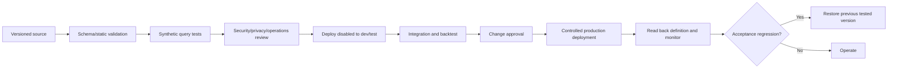

| Source-control item | Review concern |
|---|---|
| Resource ID strategy | Stable update versus duplicate creation |
| Parameters | Workspace/table/environment substitutions |
| Query/function dependencies | Deploy order and compatibility |
| Mappings/details | Field existence, limits and privacy |
| Incident/automation links | Downstream behavior and permissions |
| Template provenance | Publisher/version and local diff |
| Tests | Expected fixtures and results |
| Release notes | Risk, approval, migration and rollback |

Current portal ARM import/export for analytics rules is documented as preview and supports version-controlled JSON, but preview export is not the only deployment architecture. Validate the supported API/resource schema and the client's infrastructure-as-code standards. Never commit tenant secrets, credentials or live customer evidence.

## 32. Deployment and rollback

Deployment is not complete when an API returns success. Read back the resource, compare the intended definition, run a known test, inspect alert enrichment and verify the incident/automation path.

| Deployment stage | Test | Rollback trigger |
|---|---|---|
| Preflight | Licenses, RBAC, tables, functions, portal path | Missing dependency |
| Disabled deploy | Resource exists with exact definition | Drift or wrong workspace |
| Query validation | Positive/negative fixture and bounded live sample | Missed positive/type error |
| Enrichment | Entities/details/ATT&CK within limits | Dropped or sensitive content |
| Pilot enable | Volume, latency and queue assignment | Overload or gap |
| Automation | Notification/enrichment first | Unauthorized/repeated action |
| Promotion | SOC and service acceptance | SLA/quality unmet |

Rollback options include disabling the candidate, restoring the previous resource definition, reverting a function/watchlist dependency, pausing related automation and communicating coverage impact. If the candidate closes or changes incidents automatically, disabling only the detection is insufficient; reverse or suspend downstream behavior safely. Preserve generated alerts/incidents according to evidence policy rather than deleting them to make metrics look clean.

## 33. Security and privacy design

Detection content can expose user identities, IP addresses, devices, email subjects, file paths, commands and behavioral profiles. Apply least privilege to query, rule, repository and case access. Minimize alert/custom details. Protect exports. Define retention and approved use. Review monitoring of employees, privileged users and sensitive groups with privacy/legal stakeholders.

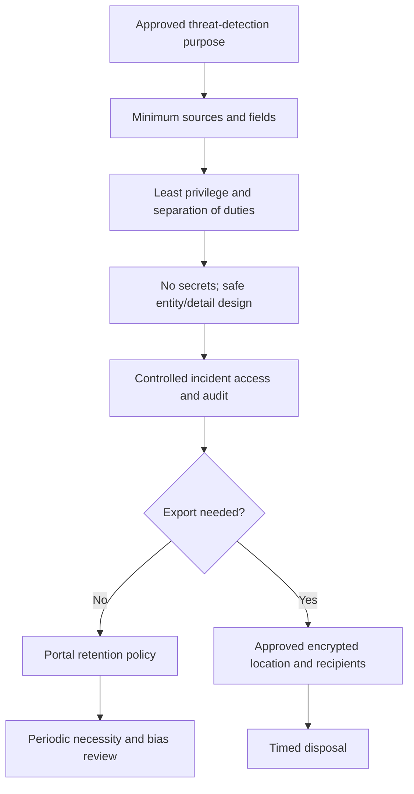

Managed ML requires additional review: training/context data handling, region, encryption model, preview terms, explainability, bias and opt-out. Fusion's current Microsoft-managed-key training note is material when the workspace otherwise uses CMK. Do not promise that CMK protects every downstream ML processing path.

## 34. Operations and health

Turn on Sentinel auditing and health monitoring according to current guidance. Analytics-rule execution health is recorded in `SentinelHealth`; rule create/update/delete audit data is recorded in `SentinelAudit`. Microsoft recommends compatibility functions `_SentinelHealth()` and `_SentinelAudit()` rather than direct table queries. Current Learn describes `SentinelHealth` ingestion as nonbillable and `SentinelAudit` as billable, subject to change.

```mermaid
flowchart LR
    RULE[Scheduled/NRT rule] --> RUN[Execution]
    RUN --> HEALTH[SentinelHealth / _SentinelHealth]
    CHANGE[Create/update/delete] --> AUDIT[SentinelAudit / _SentinelAudit]
    HEALTH --> DASH[Health dashboard and notification]
    AUDIT --> DASH
    DASH --> OWNER[Detection/platform owner]
    OWNER --> RCA[Repair, validate and document]
```

| Metric | Definition | Why it matters |
|---|---|---|
| Run success rate | Successful runs / expected runs | Basic availability |
| Skipped windows | Windows where retries never succeed | Coverage gap |
| Execution delay p95 | Actual start versus intended window | Detection latency |
| Auto-disabled count | Rules disabled after permanent failures | Silent coverage loss |
| Alert volume/rule/day | Findings generated | Capacity and drift |
| Incident volume | Cases after correlation | SOC load |
| Precision | TP / reviewed alerts | Analyst value |
| False-negative evidence | Missed simulations/incidents | Recall risk |
| MTTD | Relevant event to detection | Detection responsiveness |
| MTTA/MTTR | Alert to acknowledge/resolve | Operational outcome |
| Entity mapping success/drop | Expected versus emitted entities | Investigation quality |
| Change without ticket | Audit changes lacking approval | Integrity risk |

Current Learn says a failed Scheduled run is retried five more times for the same window; a window is skipped only if all six attempts fail. NRT retries roll failed-window consideration into following runs for up to 60 failures/one hour. Monitor meaningful delay and skipped windows, not only a single transient failure.

## 35. Latency and coverage gaps

End-to-end detection latency includes source generation, collection, ingestion, rule delay/schedule, query execution, alert publication, correlation, queue notification and human acknowledgement.

$$
L_{total}=L_{source}+L_{collection}+L_{ingestion}+L_{schedule}+L_{execution}+L_{correlation}+L_{notification}
$$

| Gap type | Example | Control |
|---|---|---|
| Source gap | Audit category disabled | Source health and known-event test |
| Ingestion gap | Connector/agent delay | Freshness SLO and buffering |
| Query gap | Interval longer than lookback prohibited/logic boundary | Window tests and health |
| Permission gap | Cross-tenant creator loses access | Service ownership and alerting |
| Schema gap | Renamed field/function removed | Contract tests and compatibility |
| Entity gap | Weak/null mapping | Strong-ID quality metric |
| Workflow gap | No owner after hours | RACI and on-call coverage |
| Response gap | Alert exists but no authority | Escalation/approval runbook |

An alert created quickly from stale source data is not near-real-time detection of the original event. Report both event-to-ingestion and ingestion-to-alert latency.

## 36. Failure modes and troubleshooting

Troubleshoot from upstream evidence to downstream case. Ask first whether the rule ran, then whether data was present, then whether it matched, then whether enrichment/correlation/automation behaved.

```mermaid
flowchart TD
    MISSING[Expected incident missing/wrong] --> SOURCE{Known source event exists?}
    SOURCE -->|No| GENERATION[Fix source generation]
    SOURCE -->|Yes| INGEST{Expected row timely?}
    INGEST -->|No| CONNECTOR[Connector/ingestion RCA]
    INGEST -->|Yes| HEALTH{Rule run successful?}
    HEALTH -->|No| EXEC[Query, dependency, permission or resource failure]
    HEALTH -->|Yes| MATCH{Query/threshold matched?}
    MATCH -->|No| LOGIC[Window, type, null, join or threshold]
    MATCH -->|Yes| ALERT{Alert created/enriched?}
    ALERT -->|No| LIMIT[Grouping/size/entity/provider issue]
    ALERT -->|Yes| INCIDENT{Incident correlated as expected?}
    INCIDENT -->|No| PORTAL[Portal ownership/grouping/reopen]
    INCIDENT -->|Yes| AUTO[Automation/queue/runbook]
```

| Symptom | Likely boundary | Discriminating check |
|---|---|---|
| Rule says `AUTO DISABLED` | Permanent failure, resource drain or access loss | `_SentinelHealth()` reason and audit change |
| Query timeout | Wide scan, regex/join/cardinality | Run bounded stages and optimize |
| Table/function not found | Connector/schema/dependency deletion | Read resource and test dependency |
| No alert, successful run | No result or threshold not crossed | Reproduce exact window and settings |
| Duplicate alerts | Lookback overlap, nondeterminism or duplicate data | Stable event/result IDs across runs |
| Per-event investigation has no saved result | Result too large or later query differs | Inspect alert `Query`/`OriginalQuery` behavior |
| Entities missing | Null/weak mapping, count/size limit | Query output plus health enrichment reason |
| Dynamic name fell back | Null, wrong type, too many/large values | Validate field and current service limits |
| Microsoft alert dropped in Defender | Unsafe `ProductName` customization | Remove customization and retest |
| Incident grouped unexpectedly | Weak entities or Defender correlation | Inspect mapped IDs and authoritative engine |
| Closed incident not reopened | Defender onboarding or setting unavailable | Verify portal architecture/current behavior |
| No incident | Creation instruction, correlation or alert-only design | Confirm alert exists and incident owner |

Microsoft classifies Scheduled execution failures as transient or permanent. Transient failures retry and do not auto-disable by themselves. Repeated permanent failures can disable the rule, prepend `AUTO DISABLED` to its name and add the reason to its description. Cross-tenant rules can depend on the creator's credentials; departure/access changes can therefore break them. Engineer service ownership and monitor the exact failure reason.

## 37. Scenario: failures followed by privileged role assignment

**Client objective:** identify repeated identity failures followed by a privileged role assignment for the same strong account within thirty minutes, provide useful evidence and avoid automatic containment during pilot.

### Threat and design decisions

| Decision | Paper choice | Validation |
|---|---|---|
| Detection surface | Evaluate current unified Custom detection versus Sentinel Scheduled | Architecture decision record |
| Source | Synthetic sign-in and audit fixtures | No customer data |
| Account key | Tenant + object ID | Collision/null tests |
| Sequence | Role change after third failure, within 30m | Boundary tests at 0/30m |
| Rule interval/lookback | Illustrative 5m/35m, verify delay/overlap | Duplicate/late-arrival tests |
| Output grain | One account-change correlation | Row-count test |
| Alert | Medium paper severity; dynamic concise account alias | Impact review |
| Entities | Account and source IP with scope | Strong-ID review |
| ATT&CK | Map only technique supported by exact role-change behavior | Rationale and reviewer |
| Incident grouping | Strong account identity, bounded time | Same/different user tests |
| Automation | Add task/tag/notify only | No containment |
| Rollback | Disable candidate and restore previous definition | Rehearsed paper step |

```mermaid
sequenceDiagram
    participant User as Synthetic account
    participant SignIn as Sign-in fixture
    participant Audit as Audit fixture
    participant Detect as Candidate rule
    participant Case as Alert/incident design
    participant Analyst
    User->>SignIn: Three synthetic failures
    User->>Audit: Privileged role assignment within 30m
    Detect->>SignIn: Summarize failures by strong account
    Detect->>Audit: Correlate later role change
    Detect->>Case: One enriched finding
    Case->>Analyst: Task to validate identity, source and authorization
    Analyst-->>Case: Classify and provide tuning feedback
```

Failure drills include source row absent, audit event delayed, object ID null, duplicate audit records, more than one account behind an IP, dynamic-detail overflow, rule execution failure, grouping across tenants and Defender correlation differing from Sentinel grouping.

## 38. Safe paper and `datatable` lab

This lab creates no rule, alert, incident, entity, bookmark, automation or external action. It uses synthetic `datatable` values only. Run the query in an authorized KQL environment or review it on paper. Do not replace fixtures with customer data for an interview demonstration.

### Lab query

```kusto
let WindowStart = datetime(2026-08-24 12:00:00);
let WindowEnd = datetime(2026-08-24 13:00:00);
let RequiredFailures = 3;
let SequenceWindow = 30m;
let SignIns = datatable(TimeGenerated:datetime, TenantId:string, AccountObjectId:string,
                        UserPrincipalName:string, SourceIp:string, Result:string)
[
    datetime(2026-08-24 12:00:00), "tenant-a", "user-001", "alice@contoso.example", "192.0.2.10", "Failure",
    datetime(2026-08-24 12:03:00), "tenant-a", "user-001", "alice@contoso.example", "192.0.2.10", "Failure",
    datetime(2026-08-24 12:06:00), "tenant-a", "user-001", "alice@contoso.example", "192.0.2.10", "Failure",
    datetime(2026-08-24 12:10:00), "tenant-a", "user-002", "bob@contoso.example", "198.51.100.20", "Success"
];
let RoleChanges = datatable(TimeGenerated:datetime, TenantId:string, ActorObjectId:string,
                            RoleName:string, Operation:string, ChangeId:string)
[
    datetime(2026-08-24 12:20:00), "tenant-a", "user-001", "Synthetic Privileged Role", "Add", "change-001",
    datetime(2026-08-24 12:50:00), "tenant-a", "user-002", "Synthetic Reader Role", "Add", "change-002"
];
let FailureSummary = SignIns
| where TimeGenerated between (WindowStart .. WindowEnd)
| where Result == "Failure"
| summarize FailureCount=count(), FirstFailure=min(TimeGenerated), LastFailure=max(TimeGenerated),
    SourceIps=make_set(SourceIp, 20), UserPrincipalName=take_any(UserPrincipalName)
    by TenantId, AccountObjectId
| where FailureCount >= RequiredFailures;
FailureSummary
| join kind=inner (RoleChanges | where TimeGenerated between (WindowStart .. WindowEnd))
    on TenantId, $left.AccountObjectId == $right.ActorObjectId
| where TimeGenerated between (LastFailure .. LastFailure + SequenceWindow)
| summarize arg_max(TimeGenerated, *) by TenantId, AccountObjectId, ChangeId
| extend AlertAlias=tostring(split(UserPrincipalName, "@")[0])
| project TimeGenerated, TenantId, AccountObjectId, AlertAlias, RoleName, Operation,
    FailureCount, FirstFailure, LastFailure, SourceIps, ChangeId
```

The final row is a **candidate detection result**, not an alert and not proof of compromise. In a real rule, the output would need the current surface's required timestamp/entity/action fields and peer review.

### Lab tasks

| Task | Action | Expected learning |
|---:|---|---|
| 1 | Narrate event → result → alert → incident | Distinguish grains |
| 2 | Write the threat hypothesis and exclusions | Falsifiable design |
| 3 | Run/review the fixture | One qualifying correlation |
| 4 | Move role change one second beyond 30m | Boundary exclusion |
| 5 | Change tenant for the audit row | Strong-key nonmatch |
| 6 | Duplicate `change-001` | Deduplication behavior |
| 7 | Remove account object ID | Missing strong entity path |
| 8 | Add a late-arrival scenario on paper | Schedule/lookback impact |
| 9 | Draft entity/custom-detail mappings | Minimum useful evidence |
| 10 | Map ATT&CK with one-sentence rationale | No coverage inflation |
| 11 | Select event and incident grouping | Investigation grain |
| 12 | Draft disabled/pilot/deploy/rollback steps | Lifecycle control |
| 13 | Label five synthetic outcomes TP/FP/FN/TN/unknown | Quality vocabulary |
| 14 | Create health and owner metrics | Operational readiness |

### Validation matrix

| Test ID | Input/change | Expected query/detection result | Alert/incident expectation | Failure caught |
|---|---|---|---|---|
| V01 | Three failures then role add at +14m | One result | One candidate account case | Positive path |
| V02 | Two failures only | Zero | None | Threshold boundary |
| V03 | Role add before failures | Zero | None | Sequence direction |
| V04 | Role add exactly at +30m | Included under documented inclusive `between` | One | Upper boundary |
| V05 | Role add after +30m | Zero | None | Slow unrelated change |
| V06 | Same object ID, different tenant | Zero | None | Cross-tenant collision |
| V07 | Null object ID | Defined safe no-match/quality failure | No weak grouping | Entity gap |
| V08 | Duplicate source failure | Result reviewed for source dedup need | No unexplained count inflation | Duplicate ingestion |
| V09 | Duplicate `ChangeId` | One after `arg_max` | One | Join multiplication |
| V10 | Delayed audit arrival | Detected once under approved window design | No duplicate | Ingestion delay |
| V11 | Empty dynamic alert field | Default/fallback tested | Triage still possible | Enrichment null |
| V12 | Oversized detail/entity population | Truncation/drop health recognized | Safe minimal output | Service limit |
| V13 | Connector stops | No data plus health/freshness alarm | Coverage gap escalated | Silent absence |
| V14 | Function removed | Execution failure/auto-disable monitored | Owner notified | Dependency drift |
| V15 | Different victims same IP | Separate strong account grouping | Separate/appropriately correlated | Over-grouping |
| V16 | Maintenance activity | Labeled benign; time-limited bounded exception | Audited closure/tuning | False positive |
| V17 | Known malicious simulation missed | FN recorded and release blocked | No false assurance | Recall failure |
| V18 | Defender onboarding enabled | Correlation behavior revalidated | Authoritative Defender case | Portal drift |

### Lab deliverables

1. Detection specification and architecture decision record.
2. Synthetic KQL fixture with expected output.
3. Query result-grain statement.
4. Entity, custom-detail and ATT&CK mapping worksheet.
5. Schedule, lookback, threshold and grouping rationale.
6. Validation matrix with positive, negative, boundary and failure cases.
7. Pilot scorecard including precision and recall evidence/proxy.
8. Deployment, read-back, rollback and communications plan.
9. Rule owner, data owner, SOC RACI and runbook outline.
10. Candidate honesty statement.

## 39. Alert-fatigue and quality operating model

Alert fatigue occurs when volume and low value reduce attention. Manage it as a system problem: duplicate sources, broad logic, weak grouping, absent context, poor prioritization, staffing and automation can all contribute.

| Signal | Interpretation | Action |
|---|---|---|
| High volume + high precision | Real incident pressure | Improve prevention/response capacity, not mute rule |
| High volume + low precision | Noisy logic/source | Root-cause and tune safely |
| Low volume + high precision | Valuable focused detection | Preserve and test recall |
| Zero volume | Maybe healthy, maybe blind | Known-event and source-health test |
| High closure speed | Efficient or auto-closed blindly | Inspect classifications and evidence |
| Rising grouped incident size | Campaign or over-grouping | Review entities and correlation |

Review top noisy rules, top missed simulations, rules with no alerts, unhealthy rules, unmapped entities, stale owners and expired exceptions. No-alert detections require periodic functional testing; silence is not proof of safety.

## 40. Consulting artifacts

| Artifact | Client decision enabled |
|---|---|
| Detection use-case catalog | Which threats receive engineering priority? |
| Portal/correlation decision record | Which engine owns alerts and incidents? |
| Rule specification | What exact behavior/settings are intended? |
| Data dependency map | Which sources, parsers, fields and SLOs are required? |
| Entity/enrichment contract | What will analysts see and correlate? |
| ATT&CK rationale register | Why is each technique mapped? |
| Synthetic fixture pack | Can logic be tested safely/repeatedly? |
| Validation matrix | Which functional and failure cases pass? |
| Tuning/exception register | What changed, why, expiry and recall risk? |
| Coverage catalog | What is mapped, enabled, healthy and validated? |
| Deployment manifest | Version, parameters, dependencies and approval |
| Rollback runbook | How to restore service and communicate gaps? |
| Health/quality dashboard | Are rules running and useful? |
| SOC runbook/RACI | Who triages, decides and escalates? |
| Executive report | Risk covered, gaps, trends and decisions needed |

## 41. JD Mapping: interview translation

| Interview theme | Your transferable strength | Honest Sentinel analytics answer |
|---|---|---|
| Detection design | Frames incidents around evidence | Threat hypothesis, result grain and validation matrix |
| Troubleshooting | Isolates failures by layer | Source → ingestion → run → result → alert → incident → automation |
| RCA | Verifies corrective/preventive action | Health/audit evidence, regression tests and owner |
| Incident handling | Correlates timestamps and identifiers | Strong entity mapping and case chronology |
| Security engineering | Controlled change and rollback | Disabled deploy, pilot, read-back and previous version |
| Privacy | Protects sensitive evidence | Minimal details, least privilege and export controls |
| Consulting | Communicates tradeoffs clearly | Precision/recall, coverage gaps, costs and decisions |
| Microsoft security | Current conceptual foundation | Dated portal/rule-family distinctions without production claim |

## Official Source Anchors

These official Microsoft Learn pages were reviewed for the August 24, 2026 treatment. Recheck dates, preview banners, current limits, portal onboarding state, licenses, cloud/region and schemas before implementation.

1. [Threat detection in Microsoft Sentinel](https://learn.microsoft.com/azure/sentinel/threat-detection) — current analytics-rule families and unified Custom detections direction.
2. [Scheduled analytics rules overview](https://learn.microsoft.com/azure/sentinel/scheduled-rules-overview) — query, schedule, delay, threshold, grouping, suppression, incident and automation settings.
3. [Create scheduled analytics rules](https://learn.microsoft.com/azure/sentinel/create-analytics-rules) — prerequisites, wizard and output.
4. [Create Scheduled rules from templates](https://learn.microsoft.com/azure/sentinel/create-analytics-rule-from-template) — Content Hub templates and active rules.
5. [NRT rule overview](https://learn.microsoft.com/azure/sentinel/near-real-time-rules) and [create NRT rules](https://learn.microsoft.com/azure/sentinel/create-nrt-rules) — ingestion-time behavior and current constraints.
6. [Custom detections overview in Defender XDR](https://learn.microsoft.com/defender-xdr/custom-detections-overview) — current unified detection direction and prerequisites.
7. [Advanced multistage attack detection (Fusion)](https://learn.microsoft.com/azure/sentinel/fusion) — managed correlation, training/encryption and Defender onboarding behavior.
8. [Customizable anomalies](https://learn.microsoft.com/azure/sentinel/soc-ml-anomalies) and [work with anomaly rules](https://learn.microsoft.com/azure/sentinel/work-with-anomaly-rules) — `Anomalies`, Production and Flighting.
9. [Entity mapping](https://learn.microsoft.com/azure/sentinel/map-data-fields-to-entities) — mapping workflow and current limits.
10. [Entity types reference](https://learn.microsoft.com/azure/sentinel/entities-reference) — strong/weak identifiers and the July 1, 2026 Account `Name` behavior.
11. [Surface custom details](https://learn.microsoft.com/azure/sentinel/surface-custom-details-in-alerts) — custom-detail behavior and limits.
12. [Customize alert details](https://learn.microsoft.com/azure/sentinel/customize-alert-details) — dynamic properties, limits and Defender cautions.
13. [SecurityAlert schema](https://learn.microsoft.com/azure/sentinel/security-alert-schema) — alert fields and source differences.
14. [MITRE ATT&CK coverage](https://learn.microsoft.com/azure/sentinel/mitre-coverage) — current version alignment, active/simulated coverage and preview page.
15. [Investigate incidents in depth](https://learn.microsoft.com/azure/sentinel/investigate-incidents) — evidence, timelines, entities, logs and bookmarks.
16. [Incident investigation](https://learn.microsoft.com/azure/sentinel/incident-investigation) — case management and entity context.
17. [Automation rules](https://learn.microsoft.com/azure/sentinel/automate-incident-handling-with-automation-rules) — trigger/condition/action relationship.
18. [Handle false positives](https://learn.microsoft.com/azure/sentinel/false-positives) — bounded automation and query/watchlist exceptions.
19. [Troubleshoot analytics rules](https://learn.microsoft.com/azure/sentinel/troubleshoot-analytics-rules) — missing results, transient/permanent failures and auto-disable.
20. [Monitor analytics rule health and integrity](https://learn.microsoft.com/azure/sentinel/monitor-analytics-rule-integrity) — retries, delays, skipped windows, `_SentinelHealth()` and `_SentinelAudit()`.
21. [Auditing and health monitoring](https://learn.microsoft.com/azure/sentinel/health-audit) — enablement, storage and cost context.
22. [Import and export analytics rules](https://learn.microsoft.com/azure/sentinel/import-export-analytics-rules) — preview ARM templates, source control and import/export.
23. [Manage scheduled rule template versions](https://learn.microsoft.com/azure/sentinel/manage-analytics-rule-templates) — update/diff/revert workflow.
24. [Handle ingestion delay](https://learn.microsoft.com/azure/sentinel/ingestion-delay) — event and ingestion time implications.
25. [Microsoft Sentinel roles and permissions](https://learn.microsoft.com/azure/sentinel/roles) — RBAC boundaries.

## ⭐ Likely Interview Questions for This Section

### Q1. What is the difference between an event, query result, alert and incident?

**Model answer:** An event is a source activity record. A query result is the detection designer's chosen grain, such as one account-window. An alert is a finding created when rule logic and threshold are satisfied. An incident is the evolving case file that correlates alerts, entities, evidence, bookmarks, ownership and actions. I design grouping around the investigation unit, not merely to reduce counts.

### Q2. What analytics-rule types should you know in Microsoft Sentinel in 2026?

**Model answer:** Sentinel documents Scheduled, NRT, Anomaly and Microsoft security rules plus specialized Threat intelligence, Advanced multistage attack detection or Fusion, and ML Behavior Analytics. Microsoft Learn now says unified Custom detections is the preferred way to create new rules across Sentinel SIEM and Defender XDR. I first verify portal onboarding and signal source because Defender onboarding changes incident ownership, Microsoft security rules and Fusion behavior.

### Q3. How do interval, lookback, threshold and grouping work in a Scheduled rule?

**Model answer:** Interval controls how often the query runs; lookback controls the event-time period inspected and must be at least the interval. Overlap can catch late data but can duplicate findings. The alert threshold compares query-result row count, while a KQL threshold can filter an aggregate. Event grouping converts result rows to alerts; alert grouping/correlation converts alerts to incidents. I document each grain and test window boundaries and duplicates.

### Q4. Why are entity mapping and custom details important?

**Model answer:** Entity mapping provides structured strong identifiers for investigation, grouping, enrichment and response. I prefer tenant plus object ID, resource ID, or host plus domain over display names. Custom details surface a small amount of useful event context, while dynamic alert details customize properties. I test nulls, types, privacy and service limits; I never place secrets or raw payloads in them.

### Q5. How would you backtest and pilot a detection?

**Model answer:** I define a falsifiable hypothesis and result grain, then use synthetic and authorized labeled historical cases for positive, negative, boundary, late, duplicate, null, schema and performance tests. I deploy disabled, read back the full definition, pilot without automatic containment, have the SOC label every firing, measure volume, latency, precision and recall evidence, and promote only with owner/runbook/rollback acceptance.

### Q6. How do you tune false positives without causing false negatives?

**Model answer:** I classify a representative sample and find the cause: source quality, broad logic, threshold, grouping or legitimate behavior. I prefer precise multi-attribute/time-bounded conditions and expiring audited exceptions. Every change gets a known-positive regression test and recall-risk statement. Fewer alerts alone is not success; I track precision and missed simulations/incidents.

### Q7. How do you troubleshoot a missing or unhealthy Sentinel detection?

**Model answer:** I trace a known event through source generation, ingestion/freshness, exact rule execution window and `_SentinelHealth()`, query result and threshold, alert creation/enrichment, authoritative incident correlation and automation. I inspect `_SentinelAudit()` for changes. Permanent dependency, permission or resource failures can auto-disable Scheduled rules, so I monitor skipped windows and `AUTO DISABLED`, not just portal status.

### Q8. What is your honest experience with Sentinel analytics rules?

**Model answer:** I have not enabled or tuned Sentinel analytics rules in production. My production strength is incident/RCA, evidence correlation, validation and reporting. I built a current paper and synthetic lab covering rule families, KQL grain, schedule/lookback, grouping, entities, ATT&CK, backtesting, precision/recall, health, deployment and rollback. In a client tenant I would verify the current Defender/Sentinel architecture and use controlled, peer-reviewed pilots.

## 🧠 30-Second Memory Hooks

- **Event → alert → incident:** evidence, finding, case file.
- **2026 direction:** evaluate unified Custom detections for new cross-platform rules.
- **Template:** maintained prototype; **active rule:** running workspace resource.
- **Scheduled:** configurable interval/lookback; five-minute built-in delay.
- **NRT:** every minute, ingestion-time behavior, constrained capacity.
- **Microsoft security:** legacy incident bridge; unavailable in specified Defender-integrated states.
- **Fusion:** managed multistage correlation; Defender correlation replaces it when onboarded.
- **Anomaly:** unusual row, not automatic malicious alert.
- **Flighting:** compare tuned anomaly safely before Production.
- **Query threshold:** event/aggregate logic; **rule threshold:** result-row count.
- **Two groupings:** results → alerts; alerts → incidents.
- **Suppression:** deliberate blind period, not free noise reduction.
- **Entity:** strong address label for investigation.
- **July 2026 Account Name:** prefix only; do not assume full UPN.
- **Custom details:** immediate context, strict size/privacy budget.
- **ATT&CK:** map observed behavior, not ambition.
- **Precision:** of alerts, how many true; **recall:** of attacks, how many found.
- **Silence:** could mean safe, broken or blind; run known tests.
- **Health:** `_SentinelHealth()`; **integrity:** `_SentinelAudit()`.
- **Troubleshoot:** source → ingest → run → result → alert → incident → automation.
- **Honesty:** paper/synthetic design, no production Sentinel claim.

## Completion Checklist

- [ ] I can distinguish event, query result, alert, incident, entity and bookmark.
- [ ] I can draw the end-to-end detection and incident architecture.
- [ ] I can verify portal onboarding, licenses, roles, data and incident ownership.
- [ ] I can name Scheduled, NRT, Microsoft security, Fusion, anomaly, ML Behavior Analytics and TI families accurately.
- [ ] I can explain the 2026 unified Custom detections direction without erasing existing rule types.
- [ ] I can distinguish a Content Hub template from an active rule and manage updates.
- [ ] I can write a falsifiable detection specification and result-grain statement.
- [ ] I can explain Scheduled query, interval, lookback, built-in delay and threshold.
- [ ] I can distinguish KQL thresholds from rule result-count thresholds.
- [ ] I can explain event grouping versus alert/incident grouping.
- [ ] I can assess suppression as a detection blind spot.
- [ ] I can explain NRT ingestion-time behavior and current limitations.
- [ ] I can explain Microsoft security/Fusion changes with Defender onboarding.
- [ ] I can explain anomaly Production/Flighting and managed ML limitations.
- [ ] I can design useful alert fields without confusing severity and confidence.
- [ ] I can map strong account, host, IP, file and resource entities.
- [ ] I know the July 1, 2026 Account `Name` prefix change and why it matters.
- [ ] I can design custom/dynamic details within current limits and privacy rules.
- [ ] I can justify each MITRE mapping with observed behavior.
- [ ] I can explain incident creation, grouping and reopen portal differences.
- [ ] I can use evidence, entities and bookmarks in a case narrative.
- [ ] I can separate analytics from automation and require response authority.
- [ ] I can backtest, pilot, tune, version, deploy and roll back a rule.
- [ ] I can calculate precision and explain why recall is harder to measure.
- [ ] I can design expiring, audited false-positive exceptions with regression tests.
- [ ] I can build a coverage catalog beyond colored ATT&CK cells.
- [ ] I can define rule names, owners, SLAs and runbooks.
- [ ] I can protect sensitive query, alert, incident and repository data.
- [ ] I can monitor failures, delay, skipped windows, auto-disable and audit changes.
- [ ] I completed the safe synthetic scenario and validation matrix without enabling anything.
- [ ] I can answer Q1–Q8 aloud without claiming production Sentinel use.
- [ ] I will recheck Learn, preview, limits, licenses, portal and live tenant before reuse.

*Next suggested section:* [Part 48](Part-48-sentinel-ueba-behaviors-threat-intelligence.md)