# Part 48 — UEBA, Behaviors, Anomalies, Threat Intelligence, and Watchlists

> **Section goal:** Build a beginner-first, consulting-grade understanding of Microsoft Sentinel User and Entity Behavior Analytics (UEBA), the independent 2026 UEBA behaviors layer, anomalies, entity context, cyber threat intelligence, indicators, STIX/TAXII, matching analytics, and watchlists. By the end, you should be able to explain how baselines and peer groups add context without proving malice; distinguish `BehaviorAnalytics`, `Anomalies`, `UserPeerAnalytics`, `IdentityInfo`, `BehaviorInfo`/`BehaviorEntities`, and workspace `SentinelBehaviorInfo`/`SentinelBehaviorEntities`; design privacy-aware onboarding and tuning; curate intelligence through confidence, validity, TLP, relationships, and expiry; use reference data safely; test and troubleshoot each pipeline; and produce a paper design without enabling any tenant feature.

This Part maps directly to Deloitte expectations for Microsoft Sentinel architecture, threat detection, investigation, hunting, Microsoft Defender integration, multicloud and third-party data, privacy, troubleshooting, controlled deployment, operational handover, and stakeholder communication. Arti's production strengths transfer naturally: correlate timestamps and identifiers, distinguish facts from inferences, build an evidence timeline, isolate a broken stage, validate changes, and explain uncertainty. The gap remains explicit: this chapter does not establish production Sentinel, UEBA, threat-intelligence, or SOC ownership.

> **Currency, status, portal, licensing, data-lake, and behavior-change note (August 24, 2026):** This chapter is grounded in official Microsoft Learn available on August 24, 2026. UEBA is included with Microsoft Sentinel without a separate UEBA feature license, but generated Log Analytics data, retention, source connectors, Defender services, Logic Apps, workbooks, and external intelligence can create licensing or consumption cost. The **UEBA behaviors layer is separate from core UEBA**, requires a Sentinel workspace onboarded to the Defender portal, currently supports selected non-Microsoft sources in the Analytics tier, can currently be enabled for only one workspace per tenant, generates additive billable records, and can take 15–30 minutes to begin. Defender Advanced Hunting uses `BehaviorInfo` and `BehaviorEntities`; a Sentinel workspace uses `SentinelBehaviorInfo` and `SentinelBehaviorEntities`. `IdentityInfo` has different Log Analytics and unified Advanced Hunting schemas, and table-level RBAC no longer protects the native Defender table after transition. The legacy `ThreatIntelligenceIndicator` table stopped receiving new data after July 31, 2025; use `ThreatIntelIndicators` and `ThreatIntelObjects`. GeoLocation/WhoIs TI enrichment, selected entity pages, watchlist templates/Azure Storage upload, and other named capabilities remain preview. After March 31, 2027, Sentinel is supported only in the Defender portal. Sentinel data lake, portal, cloud, region, schema, licensing, preview, and GA status must be verified live before design approval.

## JD Mapping

| Deloitte expectation | Capability developed here | Consulting evidence |
|---|---|---|
| Design Sentinel security capabilities | Separate baseline, anomaly, behavior, alert, TI, and reference-data roles | Context architecture and decision record |
| Investigate complex threats | Pivot from entity to behavior, anomaly, raw event, indicator, and incident | Evidence chronology worksheet |
| Integrate Microsoft and third-party sources | Map Entra, Defender, AWS, GCP, Okta, CEF, TAXII, upload API, and watchlists | Source and schema contract |
| Tune detections and reduce noise | Use peer context, validity, confidence, bounded exceptions, and known outcomes | Tuning and exception register |
| Protect client data | Apply purpose limitation, minimization, RBAC, TLP, residency, and retention | Privacy/security assessment |
| Troubleshoot platform issues | Trace source → processing → table → query → analyst workflow | Layered runbook |
| Deploy controlled change | Pilot, test, monitor, roll back, and document feature enablement | Change and validation pack |
| Communicate honestly | Explain unusual versus malicious and current platform limits | Executive summary and interview answer |

## Candidate honesty note

Arti can credibly discuss production incident escalation, evidence correlation, RCA, change validation, privacy-aware handling, stakeholder updates, and operational documentation. She can demonstrate the synthetic KQL and paper artifacts in this chapter.

She should not claim that she enabled, tuned, administered, or operated Sentinel UEBA, behaviors, Threat Intelligence, TAXII, matching analytics, entity pages, or watchlists in production unless separately evidenced. Safe wording is:

> “I have not operated Microsoft Sentinel UEBA or threat-intelligence feeds in production. My production experience is in complex Microsoft 365 incident investigation, timestamp and identifier correlation, RCA, validation, privacy-aware evidence handling, and stakeholder communication. I built a current paper and synthetic design that distinguishes baselines, anomalies, behaviors, alerts, indicators, and watchlists; maps current schemas and portal differences; and includes enablement, tests, metrics, troubleshooting, rollback, and governance. In a client tenant I would verify licensing, portal onboarding, source support, data residency, privacy, RBAC, latency, current schemas, and operational ownership before a limited, non-response pilot.”

---

## 1. Why context matters

A traditional rule asks whether explicit logic matched. UEBA asks whether activity differs from an entity's expected behavior, its peers, or the organization. Threat intelligence asks whether an observed artifact has external or internal threat context. A watchlist asks whether an observed value appears in governed reference data. These are different questions.

Think of airport security. A rule detects a prohibited object. UEBA notices a traveler using an unusual route, time, or device compared with their history and comparable travelers. Threat intelligence says a passport or phone number is linked to an active investigation. A watchlist contains approved reference entries such as high-value staff or known test scanners. None alone proves guilt; together they help an authorized analyst prioritize evidence.

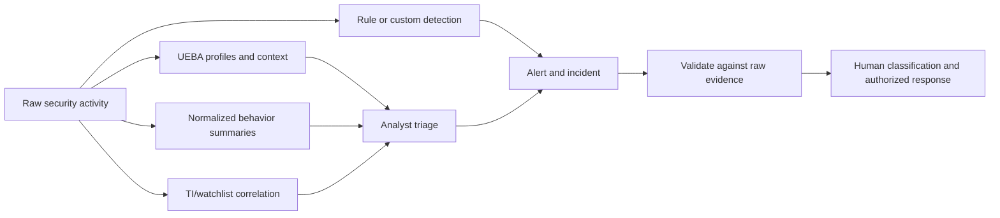

| Signal | Plain meaning | Best use | Dangerous assumption |
|---|---|---|---|
| Baseline insight | How activity compares with learned expectation | Add context | “Different means malicious” |
| Anomaly | A model found unusual behavior | Prioritize a pattern | “Score is probability of compromise” |
| Behavior | Neutral normalized summary of what happened | Read, hunt, correlate | “Behavior is an alert” |
| Alert | A detection found a possible security issue | Start/extend response workflow | “Every alert is true” |
| TI indicator match | Observed artifact matched intelligence | Add threat context | “Historical bad IP proves current attacker” |
| Watchlist match | Value matched local reference data | Enrich/filter/query | “CSV is authoritative forever” |

## 2. Core terms from zero

- **Entity** — a recognizable object such as a user, host, IP address, application, file, URL, or Azure resource. **Analogy:** a named person, vehicle, or location in a case file. **Why it matters:** strong identifiers make correlation reliable. **Memory hook:** entity = who or what.
- **Behavioral baseline** — a learned description of expected activity over a defined lookback. **Analogy:** a person's normal commute pattern. **Why it matters:** context changes the meaning of an event. **Memory hook:** baseline = usual, not safe.
- **Peer group** — comparable entities inferred from relationships such as group membership or communication associations. **Analogy:** compare a night-shift engineer with other night-shift engineers, not the whole company. **Why it matters:** poor peers create misleading rarity. **Memory hook:** peers = fair comparison set.
- **Anomaly** — a statistically or model-detected deviation. **Analogy:** a meter reading outside the normal band. **Why it matters:** it helps focus attention but needs investigation. **Memory hook:** unusual, not guilty.
- **Investigation priority** — UEBA's event-level 0–10 score in `BehaviorAnalytics`. **Analogy:** a queue-priority flag. **Why it matters:** it ranks deviation, not certainty or impact. **Memory hook:** 10 = very unusual event.
- **Threat intelligence (TI)** — knowledge about threats, actors, infrastructure, campaigns, tactics, and artifacts. **Analogy:** a briefing plus a wanted-poster catalog. **Why it matters:** it adds external and historical context. **Memory hook:** intelligence explains why an artifact matters.
- **Indicator** — a structured observable such as an IP, domain, URL, file hash, certificate, JA3/JA3S fingerprint, or user agent associated with threat context. **Analogy:** a license plate connected to a case. **Why it matters:** matching is scalable but time-sensitive. **Memory hook:** indicator = observable plus context.
- **STIX** — Structured Threat Information Expression, a standard data model for intelligence objects and relationships. **Analogy:** a common form everyone can read. **Memory hook:** STIX structures the message.
- **TAXII** — Trusted Automated Exchange of Intelligence Information, a protocol for transporting STIX collections. **Analogy:** the courier route carrying those forms. **Memory hook:** TAXII transports STIX.
- **TLP** — Traffic Light Protocol, sharing markings controlling intended audience. **Analogy:** distribution labels on a confidential memo. **Memory hook:** TLP controls sharing, not technical severity.
- **Watchlist** — workspace reference data queried by alias and search key. **Analogy:** a maintained lookup sheet. **Why it matters:** it enriches logic without hard-coding many values. **Memory hook:** watchlist = local context table.

## 3. UEBA architecture

UEBA consumes supported data, resolves entities, synchronizes identity information, builds dynamic profiles, calculates peer context, enriches individual activity, and produces anomaly outputs. The analyst still returns to source events before deciding what happened.

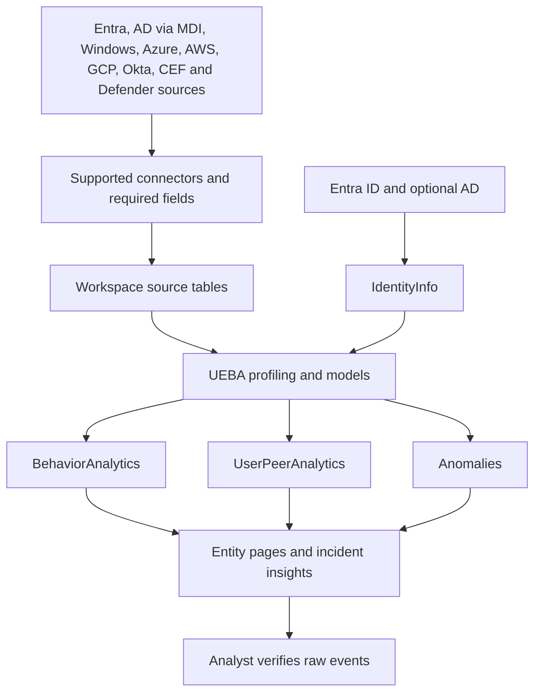

| Architecture stage | Input | Output/evidence | Failure question |
|---|---|---|---|
| Collection | Supported source event | Source-table row | Did the correct event arrive? |
| Identity sync | Entra/AD attributes | `IdentityInfo` versions | Is identity current and strongly keyed? |
| Profiling | Historical entity activity | Dynamic baseline | Is enough representative history present? |
| Peer analysis | Group/relationship context | `UserPeerAnalytics` | Are peers meaningful and current? |
| Event enrichment | Source event plus profiles | `BehaviorAnalytics` | Did processing complete and fields populate? |
| Anomaly detection | Multiple events and model | `Anomalies` | Is the model enabled/current? |
| Investigation | Alerts, anomalies, activities | Entity/incident timeline | Can analyst reach source evidence? |

### 🔍 Plain-English deep-dive: a baseline is a moving comparison, not an allowlist

Suppose an administrator normally signs in from London on a managed laptop. A first sign-in from another country may receive strong rarity context. That does not prove compromise: travel, VPN egress, disaster recovery, role change, or bad geolocation can explain it. Conversely, an attacker who slowly imitates normal activity might not appear very unusual. A baseline describes observations over a particular lookback; it does not approve behavior, encode policy, or replace a rule for prohibited activity.

Every investigation should ask: which activity was compared, over what period, to which user/peer/tenant pattern, with what identity and source quality, and what raw event supports the summary?

## 4. Supported data and prerequisites

Core UEBA and the behaviors layer have separate source lists and enablement. Current UEBA reference includes Microsoft Entra sign-ins and audits, Azure Activity, Windows security events, Defender device logons, AWS, GCP, GuardDuty, Okta, and supported CEF vendor events, with several sources or paths explicitly preview. Field requirements matter: a connected table without the expected identity or action fields may produce no insight.

| Prerequisite | Core UEBA | Behaviors layer | Verification |
|---|---|---|---|
| Sentinel workspace | Required | Required | Workspace/resource ID |
| Defender portal onboarding | Current operating direction; some sources portal-only | Required | SIEM workspace shown in Defender |
| Supported source | Exact UEBA source/category | Selected supported sources/vendors | Current Learn matrix |
| Data tier | Source-specific | Analytics tier required | Table plan and live row |
| Identity provider | Entra; optional AD through MDI | Entity fields depend on source | Strong IDs in sample |
| Roles | Security Administrator plus Azure roles for enable/disable | Security Administrator + Sentinel Contributor to enable | Persona test |
| Resource lock | Must not block UEBA configuration | Check feature operation | Lock inventory |
| Privacy approval | Employee/entity profiling purpose | Generative-AI behavior summaries | Signed assessment |
| Cost owner | New table storage/ingestion | Additive behavior ingestion | Measured volume estimate |

Core UEBA can be enabled with least-privilege combinations documented by Microsoft, including Microsoft Sentinel Contributor at the workspace plus Log Analytics Contributor at the resource group, and the Entra Security Administrator role. On-premises AD enrichment requires Defender for Identity onboarding and sensors on domain controllers. Never infer production readiness from a checkbox: verify source rows, identity fields, processing times, outputs, access, cost, and analyst workflow.

## 5. IdentityInfo and schema boundaries

`IdentityInfo` stores versioned identity context from Entra ID and optionally AD through Defender for Identity. It supports queries, detections, workbooks, and investigation. Initial synchronization can take days. After synchronization, current Learn describes a full Entra resync every 14 days and event-driven user/group/built-in-role updates commonly within 15–30 minutes; changed records are ingested and billed. Default retention in the Log Analytics table is 30 days.

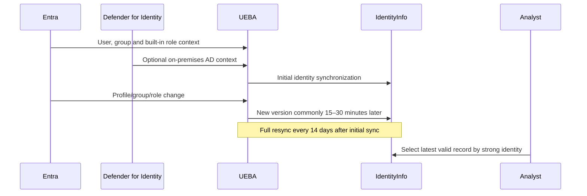

| Current limitation/change | Practical consequence | Control |
|---|---|---|
| `AssignedRoles` supports built-in roles | Custom-role context may be absent | Query authoritative role source if needed |
| Up to 500 groups listed per user | High-membership users are incomplete; set may vary at resync | Do not treat absence as proof |
| Deleted user record persists temporarily | A simple list can include deleted identities | Filter `DeletedDateTime`/current schema equivalent |
| Some large-group rename/delete changes do not refresh all members immediately | Group context can be stale | Verify Entra directly for decisions |
| Log Analytics and unified Advanced Hunting names differ | Queries can fail or silently use wrong fields | Maintain schema-specific tests |
| Native Defender `IdentityInfo` lacks table-level RBAC | Existing table-restriction design changes | Reassess unified RBAC and data exposure |
| Several legacy fields exist but are unsupported | False confidence from empty/obsolete columns | Use documented supported fields only |

For example, Log Analytics `AccountUPN` becomes `AccountUpn`, `AccountCloudSID` becomes `CloudSid`, `RiskState` becomes `RiskStatus`, and some fields disappear in the unified schema. Sentinel analytics rules and workbooks using workspace Log Analytics continue to use that schema; Defender Advanced Hunting and custom detections need the unified schema. “Same table name” does not mean “same contract.”

## 6. Peer groups and UserPeerAnalytics

`UserPeerAnalytics` represents dynamically calculated peer relationships. Current Learn describes ranking the top 20 peers with a term-frequency/inverse-document-frequency style algorithm: shared membership in smaller, more distinctive groups receives more weight than membership in a huge common group.

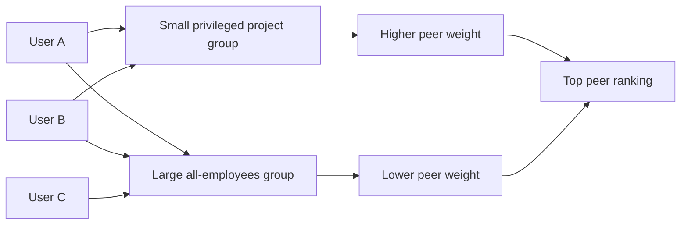

| Peer question | Why it matters |
|---|---|
| Which relationships created the rank? | Prevent opaque “similar user” claims |
| Are groups current and complete? | Stale `IdentityInfo` changes the baseline |
| Did the user's job recently change? | A legitimate mover can look rare |
| Is the peer set too small? | One person's activity can dominate comparison |
| Is a common group too broad? | “All employees” is not a useful operational peer |
| Is a privileged account compared with standard users? | Different responsibilities create false rarity |

Peer analysis is contextual evidence. Do not use it alone for employment decisions, access revocation, or disciplinary action. Analysts should record why the peer set appears relevant and consult HR/legal/privacy where monitoring affects people.

## 7. BehaviorAnalytics schema and scoring

`BehaviorAnalytics` stores event-level UEBA enrichment. Useful fields include event/action/source, user and device identifiers, source/destination IP and location, `UsersInsights`, `DevicesInsights`, `ActivityInsights`, `TimeGenerated`, `TimeProcessed`, and `InvestigationPriority`.

| Field/group | Plain meaning | Analyst check |
|---|---|---|
| `SourceRecordId` | Linkable UEBA source record identifier | Can it trace to source? |
| `TimeGenerated` | Activity occurrence time | Compare source clock |
| `TimeProcessed` | UEBA processing time | Calculate latency |
| `ActionType` | Normalized activity name | Confirm exact semantics |
| `UsersInsights` | Identity context such as object ID, role, state, blast radius | Check freshness/nulls |
| `DevicesInsights` | Device/browser/OS/ISP and TI context | Shared/NAT/device ambiguity |
| `ActivityInsights` | First/uncommon/volume and location observations | Read baseline/lookback |
| `InvestigationPriority` | 0–10 degree of event deviation | Not probability or severity |

Current documented activity lookbacks vary by insight: “uncommon for user” can use 10 days, first-seen action/resource/peer contexts can use 180 days, browser/device/ISP contexts can use 30 or 180 days, geography can use 90 days, and burst checks can use shorter windows. Do not say “UEBA uses a 30-day baseline” as a universal rule.

## 8. InvestigationPriority versus AnomalyScore

`InvestigationPriority` and `AnomalyScore` answer related but different questions.

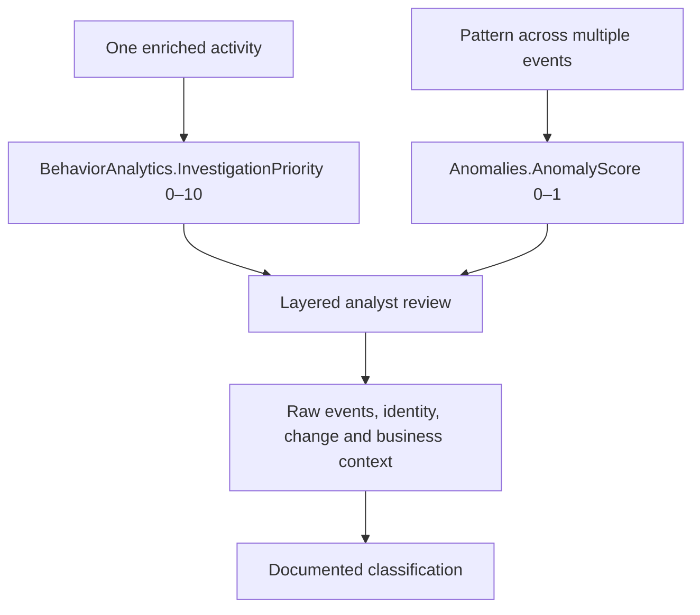

| Aspect | Investigation priority | Anomaly score |
|---|---|---|
| Table | `BehaviorAnalytics` | `Anomalies` |
| Range | 0–10 | 0–1 |
| Grain | One enriched event | Model-defined behavior/pattern |
| Processing | Near-real-time event level | Batch/model behavior level |
| Meaning | Degree of deviation from profile logic | Strength of model anomaly |
| Best use | Quick triage and drilldown | Pattern discovery and correlation |
| Not equal to | Probability, severity, guilt | Probability, severity, guilt |

### 🔍 Plain-English deep-dive: a score is a ruler, not a verdict

A temperature of 39°C is unusual and important, but it does not name the disease. Similarly, a score ranks deviation under a particular model and input set. It can be high because a new employee has little history, a privileged operator performs rare maintenance, or identity fields changed. It can be low during a real attack that mimics established activity. Ask what generated the score, whether data was complete, and which corroborating evidence changes the response decision.

Tuning should evaluate distributions and outcomes, not pick an attractive threshold. Compare labeled cases by entity type, role, business cycle, location, source, and model version. Preserve low-score signals that are valuable in a sequence.

## 9. Entity pages and investigation context

Entity pages assemble identity, alerts, bookmarks, anomalies, activities, and curated insights. In the Defender portal, Sentinel context appears in unified user, device, and IP entity experiences. Current Azure Sentinel pages include user/host and preview IP, Azure resource, and IoT variants with portal-specific limits.

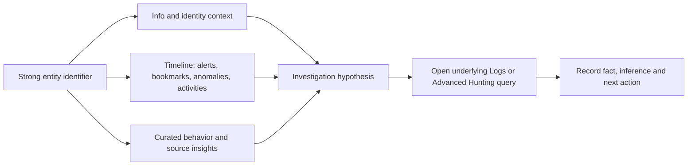

An entity page is an index, not the evidence archive. Entity mapping quality controls what appears. Shared IPs, recycled hostnames, renamed identities, weak user names, and missing tenant IDs can mix context. Always open the underlying query and source row when an action depends on the finding.

## 10. The 2026 UEBA behaviors layer

The behaviors layer transforms supported high-volume raw events into neutral, normalized summaries that answer “who did what to whom.” It is independent of core UEBA enablement. It creates aggregated behaviors over tailored windows and sequenced behaviors for multi-step patterns, adds natural-language descriptions, MITRE mappings, entity roles, and references to supporting raw evidence.

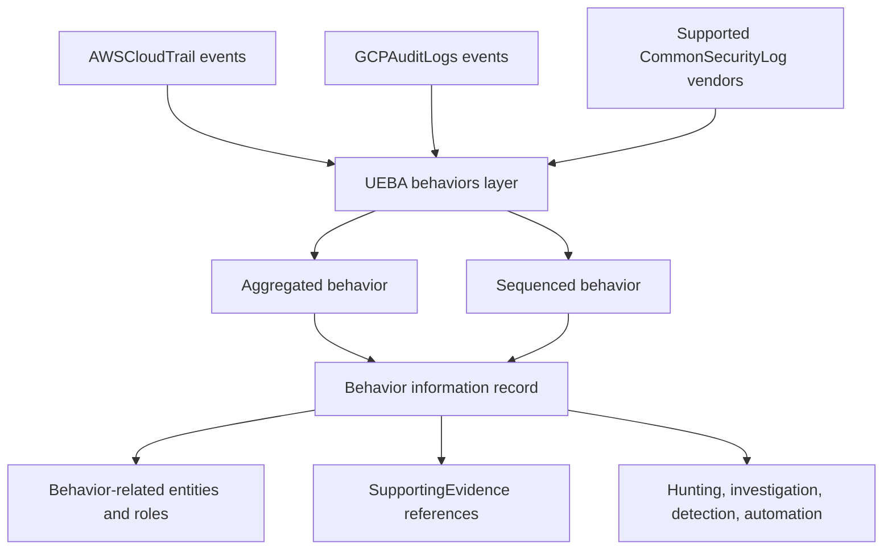

| Object | Defender Advanced Hunting | Sentinel workspace | Meaning |
|---|---|---|---|
| Behavior information | `BehaviorInfo` | `SentinelBehaviorInfo` | Title, description, MITRE, categories, source/evidence references |
| Behavior entities | `BehaviorEntities` | `SentinelBehaviorEntities` | User, host, IP, resource and actor/target/other roles |
| Scope | Sentinel UEBA plus connected Defender-service behaviors | Only UEBA behaviors generated for that workspace | Query result populations differ |
| Filter | Use `ServiceSource == "Microsoft Sentinel"` for Sentinel UEBA subset | Workspace already scopes source | Avoid mixed-service counts |

Official Learn examples sometimes use conceptual short names while the current workspace reference names are `SentinelBehaviorInfo` and `SentinelBehaviorEntities`. Verify the schema explorer in the actual surface. Join the two tables using `BehaviorId`, then use `AdditionalFields.SupportingEvidence` to return to contributing raw logs.

## 11. Behaviors are neutral summaries

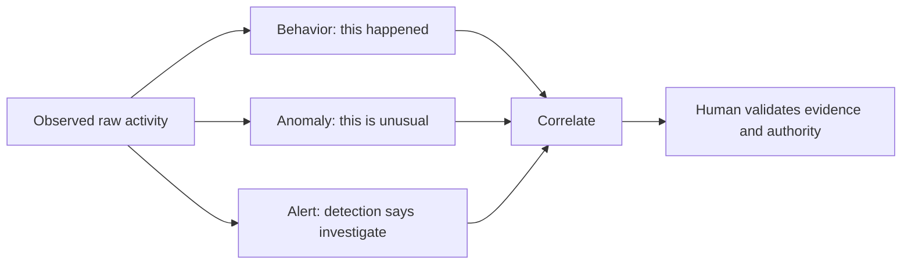

Behaviors can describe normal or abnormal activity. One behavior can represent tens or hundreds of raw events. Absence of a behavior does not prove absence of activity: coverage is partial, vendor/log support is limited, patterns need enough occurrences, and source data must be in the Analytics tier. Generative AI helps create and scale summaries; this increases the need for responsible-AI review, evidence links, privacy, and human verification.

### 🔍 Plain-English deep-dive: abstraction saves time but can hide assumptions

A bank statement line “merchant purchase” is easier to read than the payment-network messages underneath it. It is also less detailed. The behavior layer gives analysts a common, human-readable sentence and entity roles, but the underlying logs remain the source for exact fields, timestamps, successes, failures, and edge cases. Use the summary to navigate, not to replace raw evidence or vendor semantics.

## 12. Enablement and deployment plan

Treat UEBA and behaviors as separate changes with separate acceptance gates.

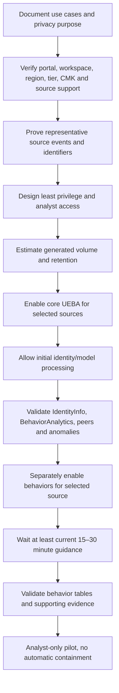

| Gate | Acceptance evidence | Rollback trigger |
|---|---|---|
| Architecture | Approved workspace/portal/region and source matrix | Unsupported residency or single-workspace conflict |
| Privacy | Purpose, legal basis, access, retention, worker notice/process | Unapproved profiling or sensitive exposure |
| Data | Known event with strong entity fields and measured delay | Missing/incorrect identity or source semantics |
| UEBA output | Expected identity/enrichment records after stated warm-up | Persistent no output or misleading joins |
| Behavior output | Expected behavior and evidence references | Wrong source, runaway volume, no traceability |
| Analyst pilot | Useful triage with measured false-context rate | Harmful bias, overload, or inaccessible raw evidence |
| Operational handover | Owner, SLO, runbook, cost alert, schema test | No accountable support path |

Rollback can disconnect a selected UEBA source, disable UEBA/anomaly detection, or disable the behaviors layer according to current supported controls. It does not erase already ingested records immediately or undo analyst actions. Preserve change evidence, communicate reduced coverage, stop downstream rules/automation that assume the output, and verify costs and retention after rollback.

## 13. UEBA Essentials and workbooks

The optional **UEBA Essentials** Content Hub solution provides Microsoft-curated hunting queries, including multicloud coverage across Azure, AWS, GCP, and Okta. Install/update requires current Content Hub permissions; templates are starting points, not proof that required sources or semantics are available.

| Content item | Use | Acceptance check |
|---|---|---|
| Hunting query | Explore a hypothesis | Required table, time, entity and result grain |
| Workbook/template | Visualize trends and high-priority context | Correct data source, parameters, access and performance |
| Parser/function | Normalize reuse | Version and schema contract |
| Solution update | Receive publisher improvements | Diff local changes and regressions |
| Entity insight | Accelerate pivot | Underlying query and data freshness |

A useful UEBA workbook should show data freshness, processing latency, populated identity percentage, priority/anomaly distributions, source coverage, top behavior types, raw-evidence drilldown success, cost volume, and analyst classifications. Avoid leaderboards that stigmatize individuals or display sensitive identity information to broad audiences.

## 14. Privacy, fairness, and security

UEBA profiles people and systems. Threat intelligence can contain victim identity, campaign attribution, sensitive sharing restrictions, and third-party data. Watchlists can expose employment, privilege, vulnerability, or investigation status. Apply privacy by design.

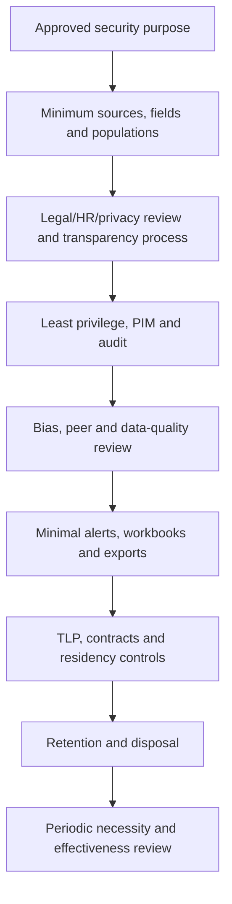

| Risk | Example | Control |
|---|---|---|
| Over-surveillance | Ingesting all employee activity without defined use | Approved use-case scope and minimization |
| Peer bias | Contractor compared with permanent privileged team | Peer validation and role context |
| Sensitive exposure | Workbook lists “high-risk employees” broadly | RBAC, pseudonymization, purpose-specific views |
| Stale identity | Departed user looks active | Version/current-state checks |
| TI redistribution breach | TLP-restricted feed exported to vendor | TLP and contract enforcement |
| Attribution overclaim | IP match labeled named threat actor | Confidence wording and corroboration |
| Secret leakage | TAXII/API credential in workbook or notebook | Managed identity/Key Vault and secret rotation |
| Automated harm | Anomaly automatically disables employee | Human approval and response authority |

## 15. Threat intelligence: from report to action

Cyber threat intelligence ranges from strategic reports about trends to tactical indicators. Sentinel manages STIX objects including threat actors, attack patterns, indicators, identities, and relationships. Good intelligence includes provenance, confidence, timestamps, validity, handling restrictions, and relevance.

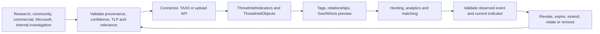

| Intelligence property | Question |
|---|---|
| Source/provenance | Who observed or assessed this, and how reliable are they? |
| Created/modified | When was this object authored and changed? |
| Valid from/until | During what interval is matching meaningful? |
| Confidence | How strongly does producer support the assessment? |
| Revoked | Has producer withdrawn it? |
| TLP/marking | Who may receive it? |
| Relationship | What actor, campaign, attack pattern, or victim context connects it? |
| Tags | Which governed local categories apply? |
| Observable pattern | What exact normalized value should match? |
| Relevance | Does the organization have the affected technology or exposure? |

## 16. STIX and TAXII

STIX defines objects and relationships; TAXII transports collections. A TAXII 2.0/2.1 import needs an API root and collection ID, optional authentication, polling choice, network allowlisting where the provider requires it, and the Threat Intelligence solution. Current Sentinel also supports TAXII 2.1 export, with separate destination, authorization, geography, TLP, and failure considerations.

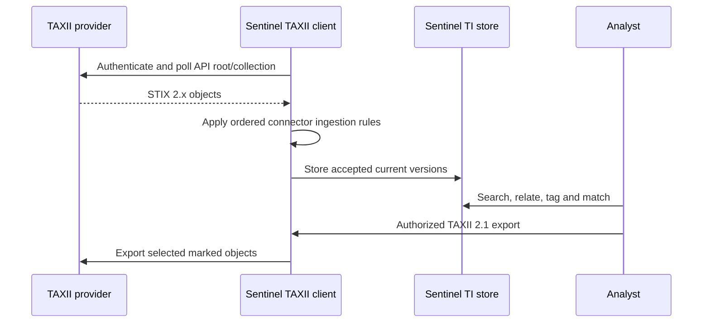

Do not use TAXII as a synonym for “feed quality.” A perfectly functioning protocol can transport stale, low-confidence, duplicate, irrelevant, or over-shared intelligence. Test authentication failures, malformed objects, expiry, revocation, polling gaps, duplicates, and destination restrictions.

## 17. Connector and API choices

| Path | Best fit | 2026 boundary |
|---|---|---|
| Defender Threat Intelligence connector | Microsoft public/OSINT and licensed premium enriched intelligence | Standard versus premium licensing and matching behavior |
| Threat Intelligence – TAXII | STIX 2.0/2.1 collections | Provider compatibility, credentials, polling, network access |
| Upload API | TIP/custom app with workspace-scoped STIX objects | Sentinel Contributor for Entra app; no connector required |
| Legacy TIP connector/Graph `tiIndicators` | Existing indicator-only integration | Deprecated path; migrate to upload API |
| Manual UI creation | Small investigation-specific object | Human error, scale, expiry ownership |
| TAXII 2.1 export | Authorized external sharing | Destination/TLP/residency; bulk failure behavior |

The upload API supports broader STIX objects and workspace-scoped access. The legacy TIP connector is limited to indicators and is being deprecated. Migration means validating object IDs, deduplication, relationships, update semantics, permissions, throughput, retries, and all downstream queries.

## 18. Current TI tables and lifecycle

Use `ThreatIntelIndicators` for indicators and `ThreatIntelObjects` for broader STIX objects. The legacy `ThreatIntelligenceIndicator` table should not be a new dependency. Sentinel creates new table entries when an object is created, updated, or deleted and shows only the current version in the management interface. It deduplicates indicators by current ID semantics and periodically reingests intelligence every seven to ten days for query efficiency.

### 🔍 Plain-English deep-dive: current view versus historical records

An address book shows the current phone number, while its audit log may show prior edits. Sentinel's TI management interface shows the most current object; the underlying tables can contain versions. A query that simply counts rows can overcount logical indicators or include expired/revoked history. Define “current active indicator” using current documented fields, deduplication, validity, revocation, and time semantics, then test it against updated and deleted objects.

## 19. Confidence, TLP, validity, and expiry

Confidence is the producer's assessed belief or reliability context, not a universal probability. TLP controls sharing. Validity controls when the object is intended to apply. These fields must remain distinct.

| Control | Answers | Does not answer |
|---|---|---|
| Confidence | How strongly the source supports the assessment | How damaging a match would be |
| TLP | Who may receive/share the intelligence | Whether it is malicious |
| Valid from/until | When the indicator should be active | Whether the observed event is causal |
| Revoked | Whether producer withdrew the object | Whether all past matches were false |
| Severity/priority | How response should be prioritized locally | Whether source confidence is high |

Current ingestion rules can filter or edit incoming connector objects and apply in order; a delete action skips the object from that ingestion pipeline but does not remove prior versions. New/edited rules can take up to 15 minutes to apply. They do not apply to upload-API or manually created objects. Extending expiry should require a trusted source, high fidelity, business relevance, and an owner—not merely a high number.

## 20. Matching, enrichment, and correlation

A basic match joins a normalized observable from an event to a current active indicator. Mature logic also considers direction, action, time, network role, source confidence, prevalence, asset criticality, and whether the control blocked the event.

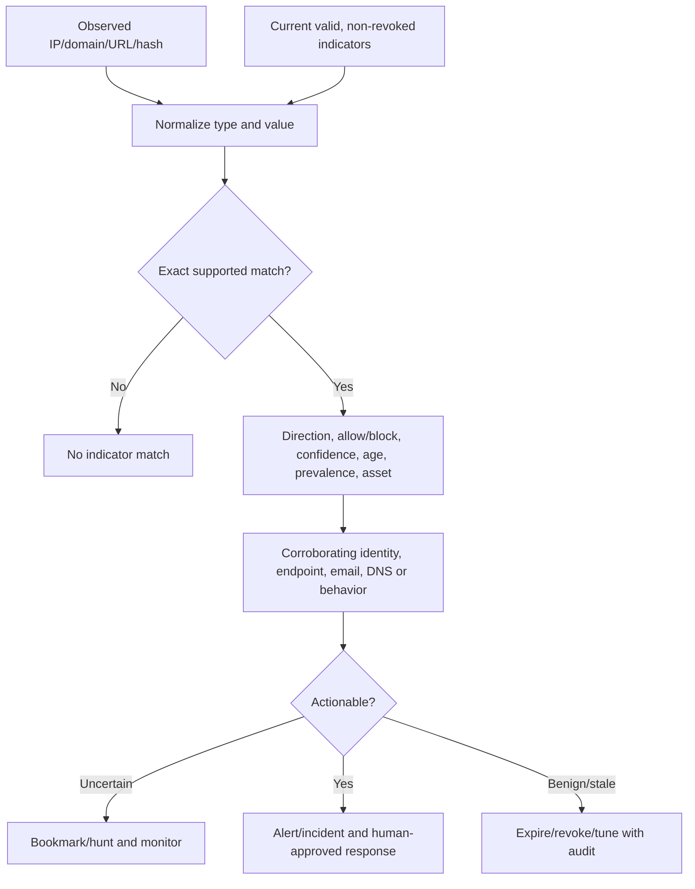

Microsoft Defender Threat Intelligence matching analytics currently supports specific tables/fields and domain, IPv4, and URL matching paths. Alert severity can differ based on context such as allowed versus blocked traffic, and alerts are grouped by indicator over a current window. Verify supported sources and fields rather than assuming every indicator type and log table participates.

## 21. Threat-intelligence false positives

| Cause | Example | Investigation |
|---|---|---|
| Reassigned infrastructure | Cloud IP previously malicious now benign | WHOIS/cloud ownership, current timestamps, passive context |
| Shared hosting/CDN | One domain/IP hosts many unrelated services | Host/SNI/URL and provider context |
| Sinkhole/security scanner | Defensive infrastructure appears in feed | Source, tag, owner and traffic direction |
| Stale indicator | Campaign infrastructure expired | Validity, modified time, recent observations |
| Parser/normalization error | Port or URL included incorrectly | Exact normalized values and raw field |
| Internal test | Authorized simulation uses known IOC | Time-limited test registration, not permanent broad allowlist |
| Blocked attempt | Firewall prevented communication | Record prevention success; assess repeated targeting |
| Low-confidence OSINT | Unverified community report | Corroborate before response |

Do not suppress all future matches because one match was benign. Bound exceptions by observable, direction, control result, asset, time, source, or known test ID. Feed quality metrics should include stale rate, duplicate rate, match precision, time to revoke, and percentage with provenance/validity—not volume alone.

## 22. Watchlists: purpose and limits

Watchlists store local reference data in the workspace `Watchlist` table and expose `_GetWatchlist(alias)` and `_GetWatchlistAlias`. Use the designated `SearchKey` for efficient lookup. Good examples are approved high-value assets, test ranges, business owners, or temporary exceptions with expiry.

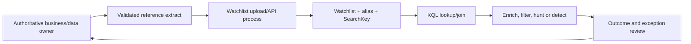

| Current watchlist limit/behavior | Design implication |
|---|---|
| Reference data only; not large-volume event storage | Use custom logs/data platform for event-scale data |
| Up to 10 million active items per workspace | Still assess query and ownership scale |
| Underlying table retention 28 days | Service refresh keeps active watchlist available |
| Refresh every 12 days updates `TimeGenerated` | Do not interpret it as business record creation time |
| Local upload up to 3.8 MB | Use supported alternatives for larger files |
| Azure Storage upload up to 500 MB is preview | Review preview terms, SAS security, regional design |
| Cross-workspace management through Lighthouse unsupported | Build separate governed deployment approach |
| Templates are preview | Do not make production control depend blindly on template status |

Watchlists are not automatic blocklists. A query can use one as inclusion, enrichment, or exclusion, and a playbook may act on a result, but governance and response remain separate.

## 23. Safe watchlist schema

| Column | Purpose | Rule |
|---|---|---|
| `SearchKey` source field | Stable join key | Normalize case/type; require uniqueness where intended |
| `RecordId` | Immutable business record ID | Do not rely on row number |
| `ContextType` | Asset, test, exception, owner, etc. | Controlled vocabulary |
| `Owner` | Accountable approver | Named team, not departed individual |
| `Reason` | Business/security rationale | No secrets or excessive personal data |
| `ValidFrom`/`ValidUntil` | Bounded use | Required for exceptions |
| `SourceSystem` | Authoritative origin | Traceable reconciliation |
| `ApprovedBy`/`TicketId` | Change evidence | Verify access and existence |
| `LastReviewed` | Governance freshness | Alert on overdue records |
| `Sensitivity` | Handling label | Enforce access/export policy |

## 24. Watchlist query pattern

```kusto
// Synthetic illustration only. Replace neither alias nor values with customer data here.
let ApprovedTestRanges =
    datatable(SearchKey:string, Owner:string, ValidUntil:datetime, TicketId:string)
    [
        "192.0.2.10", "Purple Team", datetime(2026-08-24), "CHG-DEMO-001",
        "198.51.100.20", "Network Lab", datetime(2026-08-24), "CHG-DEMO-002"
    ];
let Events =
    datatable(TimeGenerated:datetime, SourceIp:string, AccountObjectId:string, Action:string)
    [
        datetime(2026-08-24 09:00:00), "192.0.2.10", "user-001", "SyntheticSignIn",
        datetime(2026-08-24 09:05:00), "203.0.113.30", "user-002", "SyntheticSignIn"
    ];
Events
| lookup kind=leftouter ApprovedTestRanges on $left.SourceIp == $right.SearchKey
| extend ActiveApprovedTest = isnotempty(TicketId) and TimeGenerated between (datetime(2026-08-01) .. ValidUntil)
| project TimeGenerated, SourceIp, AccountObjectId, Action, ActiveApprovedTest, Owner, TicketId
```

In production, `_GetWatchlist('approved-test-ranges')` would replace the synthetic table. The surrounding time picker can make watchlist results appear empty because refresh timestamps and query scope interact; widen/remove global time scope when troubleshooting. Also validate alias, workspace, `SearchKey`, type, whitespace, case, duplicates, daily ingestion cap, and service health.

## 25. Operational metrics

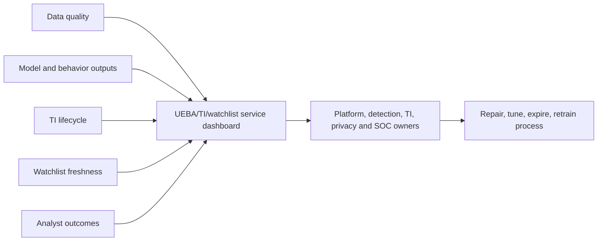

| Metric | Definition | Why it matters |
|---|---|---|
| Source freshness p95 | Ingestion time minus event time | Model input delay |
| UEBA processing p95 | `TimeProcessed - TimeGenerated` | Analyst latency |
| Strong identity coverage | Enriched rows with approved strong ID / rows expected | Correlation quality |
| Identity change delay | Source change to new `IdentityInfo` version | Staleness risk |
| Behavior generation delay | Raw event/pattern to behavior record | Use-case SLA |
| Behavior-to-raw drilldown success | Records with retrievable supporting evidence / sampled records | Explainability |
| Anomaly review outcomes | TP/FP/benign/unknown by model/version | Tuning evidence |
| TI active-stale ratio | Valid current indicators versus expired/old | Feed hygiene |
| TI match precision | Confirmed relevant matches / reviewed matches | Operational value |
| Revocation latency | Decision to revoke/expire to effective downstream state | Harm reduction |
| Watchlist overdue records | Past review/validity but still active | Exception risk |
| Watchlist reconciliation | Expected authoritative rows versus current rows | Integrity |
| Generated-data cost | UEBA/behavior/watchlist/TI volume and retention cost | Sustainability |

## 26. Failure modes and troubleshooting

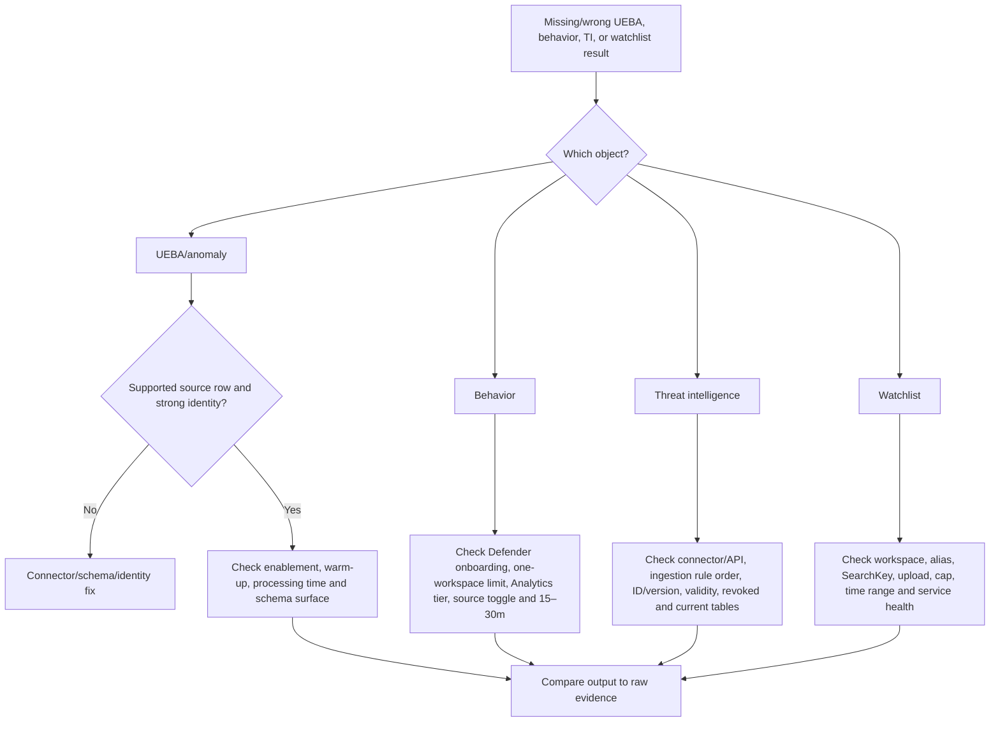

| Symptom | Likely boundary | Discriminating check |
|---|---|---|
| No `IdentityInfo` rows | UEBA disabled, sync warm-up, provider/permission issue | Current setting, source selected, days since enablement |
| Identity fields stale | Event update/full-sync limitation | Entra authoritative value and newest version |
| High priority but no anomaly | Different grains/models | Inspect event insight and anomaly window separately |
| No peers | Identity/group context insufficient | `UserPeerAnalytics` and group data quality |
| No behavior tables | Layer not enabled or wrong workspace/surface | Settings, Defender onboarding, table names |
| Source has rows but no behavior | Unsupported vendor/log/action, low occurrences, wrong tier | Current supported behavior catalog |
| Defender behavior count exceeds workspace count | Defender tables include Defender-service behaviors | Filter `ServiceSource` |
| Cannot drill to raw | Missing/changed supporting evidence or retention | `AdditionalFields`, source table and retention |
| TI object absent | Connector/API/auth/poll/ingestion rule delete | Connector logs and rule order |
| Legacy TI query empty | Legacy ingestion ended | Migrate to current tables |
| Indicator match looks wrong | Expired/revoked/shared/stale/normalization issue | Exact current indicator and source event |
| Watchlist page fails but KQL works | Management-plane service issue | `_GetWatchlistAlias` and Service Health |
| Watchlist has zero rows | Wrong alias/workspace, ingestion cap or narrow time picker | Widen scope and query alias directly |
| Watchlist update not reflected | Refresh/upload/schema issue | Record ID/version and current query output |

## 27. Scenario 1: unusual privileged sign-in

**Hypothesis:** A privileged user signs in from an uncommon country and device, then performs a sensitive action. UEBA context raises priority; a TI match adds context; the analyst must still validate identity, network egress, device, change authorization, and raw events.

| Evidence | Interpretation | Next check |
|---|---|---|
| `BehaviorAnalytics` first/uncommon country/device | Activity differs from profile | Exact lookback and geolocation confidence |
| `InvestigationPriority = 8` | Highly unusual event | Not probability or impact |
| `Anomalies` record | Pattern-level model deviation | Model/template/version and supporting events |
| Source IP on TI | External context associates artifact with threat | Validity, confidence, sharing, NAT/cloud reassignment |
| User in high-value watchlist | Business importance | Owner and current approval |
| Role-change source event | Potentially sensitive action | Actor, target, result, authorization and UTC sequence |

No automatic account disablement occurs in the learning design. If evidence and authority support containment, use the approved incident runbook and record business impact and verification.

## 28. Scenario 2: behavior without anomaly

A behaviors-layer record says an AWS identity accessed many secrets. No UEBA anomaly or alert exists. The correct conclusion is “the supported logs were aggregated into this behavior.” The hunter checks entity roles, supporting evidence, expected workload, credentials, source IPs, change windows, peer context, and related detections. If a falsifiable rule emerges, it enters detection engineering; the behavior itself is not retroactively called malicious.

## 29. Scenario 3: stale indicator and shared IP

A proxy event matches an IP indicator with medium confidence. The event was blocked. The IP belongs to a large cloud provider and the indicator expired yesterday. The analyst records a historical match, confirms the block, checks domain/SNI/URL and contemporaneous intelligence, scopes repeated attempts, and avoids claiming compromise. TI owners decide whether to expire/revoke/update the object; detection owners do not create a universal allowlist for the cloud provider.

## 30. Safe paper and synthetic lab

This lab enables nothing, uploads nothing, calls no TAXII/API service, creates no indicator/watchlist, and uses no client or employee data. Review on paper or run only the synthetic `datatable` query in an authorized KQL environment.

### Lab architecture

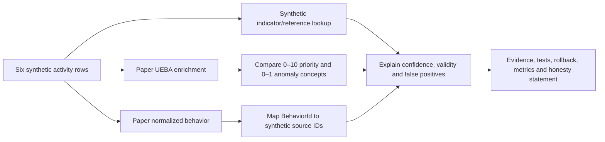

### Synthetic query

```kusto
let Activities = datatable(TimeGenerated:datetime, SourceRecordId:string, TenantId:string,
    AccountObjectId:string, UserPrincipalName:string, SourceIp:string, Country:string,
    Device:string, Action:string)
[
    datetime(2026-08-24 08:00:00), "evt-001", "tenant-demo", "user-001", "alex@contoso.example", "192.0.2.10", "GB", "device-a", "SignIn",
    datetime(2026-08-24 08:10:00), "evt-002", "tenant-demo", "user-001", "alex@contoso.example", "192.0.2.10", "GB", "device-a", "ReadResource",
    datetime(2026-08-24 09:00:00), "evt-003", "tenant-demo", "user-001", "alex@contoso.example", "203.0.113.55", "ZZ", "device-new", "SignIn",
    datetime(2026-08-24 09:05:00), "evt-004", "tenant-demo", "user-001", "alex@contoso.example", "203.0.113.55", "ZZ", "device-new", "ReadSecret",
    datetime(2026-08-24 09:06:00), "evt-005", "tenant-demo", "user-001", "alex@contoso.example", "203.0.113.55", "ZZ", "device-new", "ReadSecret",
    datetime(2026-08-24 09:07:00), "evt-006", "tenant-demo", "user-001", "alex@contoso.example", "203.0.113.55", "ZZ", "device-new", "ReadSecret"
];
let Indicators = datatable(Observable:string, Confidence:int, ValidFrom:datetime, ValidUntil:datetime, Revoked:bool, TLP:string)
[
    "203.0.113.55", 65, datetime(2026-08-20), datetime(2026-08-24), false, "AMBER",
    "192.0.2.10", 20, datetime(2026-01-01), datetime(2026-08-01), false, "GREEN"
];
let Reference = datatable(SearchKey:string, Context:string, ValidUntil:datetime)
[
    "user-001", "Synthetic high-value account", datetime(2026-12-31)
];
Activities
| lookup kind=leftouter Indicators on $left.SourceIp == $right.Observable
| lookup kind=leftouter Reference on $left.AccountObjectId == $right.SearchKey
| extend IndicatorActive = isnotempty(Observable) and !Revoked
    and TimeGenerated between (ValidFrom .. ValidUntil)
| summarize EventCount=count(), SecretReads=countif(Action == "ReadSecret"),
    SourceEventIds=make_set(SourceRecordId), ActiveTIMatch=max(toint(IndicatorActive)),
    MaxConfidence=max(Confidence), Context=take_any(Context)
    by TenantId, AccountObjectId, UserPrincipalName, SourceIp, Country, Device
| project TenantId, AccountObjectId, UserPrincipalName, SourceIp, Country, Device,
    EventCount, SecretReads, ActiveTIMatch, MaxConfidence, Context, SourceEventIds
```

The query produces candidate context only. `ZZ`, IPs, tenants, identities, and actions are fictional. It does not calculate Microsoft's proprietary UEBA scores or create a behavior/anomaly/alert.

### Lab tasks

| Task | Action | Expected learning |
|---:|---|---|
| 1 | Draw raw → UEBA → entity → analyst | Architecture |
| 2 | Define event, behavior, anomaly, alert, indicator, watchlist | No category confusion |
| 3 | State the result grain | One account/IP/device context row |
| 4 | Explain why the active TI match is not proof | Confidence and corroboration |
| 5 | Change `ValidUntil` before the event | Expiry handling |
| 6 | Set `Revoked=true` | Revocation handling |
| 7 | Remove `AccountObjectId` | Strong-identity failure |
| 8 | Duplicate `evt-004` | Source deduplication risk |
| 9 | Draft one behavior summary and entity roles | Neutral language |
| 10 | Map its supporting source IDs | Explainability |
| 11 | Compare event priority and anomaly score conceptually | Different grains |
| 12 | Add an expiring reference-data record | Watchlist governance |
| 13 | Build privacy and TLP review | Handling control |
| 14 | Define enable, pilot, rollback, and health gates | Controlled deployment |

### Validation matrix

| ID | Test | Expected result | Failure caught |
|---|---|---|---|
| V01 | Current valid indicator | Active match with confidence/context | Positive match |
| V02 | Expired indicator | No active match | Stale IOC |
| V03 | Revoked indicator | No active match | Withdrawn assessment |
| V04 | Same IP different event time | Time-aware outcome | Timeless matching |
| V05 | Null object ID | Quality exception; no weak identity action | Entity collision |
| V06 | Duplicate source ID | Dedup requirement documented | Count inflation |
| V07 | Behavior references all source IDs | Drilldown succeeds | Unexplained summary |
| V08 | Behavior source unsupported | No behavior expected | False coverage claim |
| V09 | Defender behavior table queried without service filter | Mixed-service count recognized | Scope confusion |
| V10 | Identity field renamed in unified schema | Contract test fails clearly | Portal/schema drift |
| V11 | Watchlist reference expired | Context not treated active | Permanent exception |
| V12 | Narrow time picker hides refreshed watchlist | Wider query returns rows | False deletion diagnosis |
| V13 | UEBA source stopped | Freshness alarm triggers | Silent blindness |
| V14 | Behavior volume spikes | Cost/noise gate triggers | Uncontrolled additive cost |
| V15 | TLP Amber export to public channel | Export blocked | Sharing breach |
| V16 | High score with authorized travel | Analyst records benign context | Automated judgment |

### Lab deliverables

1. UEBA/behaviors/TI/watchlist architecture diagram.
2. Feature, portal, status, licensing, and schema register dated August 24, 2026.
3. Source-to-table and strong-entity contract.
4. Baseline/peer/score interpretation guide.
5. TI source, STIX/TAXII, confidence, TLP, validity, and expiry standard.
6. Watchlist schema with owner and expiration.
7. Synthetic query and expected-result statement.
8. Validation, privacy, security, deployment, and rollback plans.
9. Health metrics and troubleshooting runbook.
10. Candidate honesty statement.

## 31. Operate and improve

Run separate cadences for data health, model/context quality, intelligence hygiene, reference-data governance, and SOC outcomes.

| Cadence | Review |
|---|---|
| Per shift/day | Source freshness, output delay, failed drilldowns, actionable anomalies/matches |
| Weekly | Top noisy context, false matches, expired watchlists, unsupported/null entities |
| Monthly | Feed quality, model outcomes, peer concerns, generated-data cost, RBAC changes |
| Quarterly | Purpose/privacy, retention, TLP sharing, source catalog, portal/schema status |
| On change | Connector, model, role, schema, source, Content Hub, portal, licensing, region |

No-output monitoring is essential. A quiet anomaly table or zero TI matches can mean no threats, stopped data, expired feed, broken query, unsupported schema, or an overly narrow time window. Use known synthetic health events where authorized and verify every stage.

## 32. Consulting artifacts

| Artifact | Decision enabled |
|---|---|
| UEBA/behaviors architecture | Which engine, table, portal, and workspace owns each output? |
| Source support matrix | Which exact source/vendor/events are eligible and current? |
| Identity/schema contract | Which strong IDs and field names work in each surface? |
| Privacy impact assessment | Is profiling necessary, proportionate, transparent, and controlled? |
| Baseline/peer interpretation guide | How should analysts avoid overclaiming? |
| Behavior evidence contract | Can each summary return to supporting raw logs? |
| TI source catalog | Which provider, license, confidence, TLP, SLA, and owner? |
| STIX/TAXII/API design | How is intelligence transported, authenticated, retried, and shared? |
| Indicator lifecycle standard | How are objects validated, expired, revoked, deduplicated, and related? |
| Watchlist standard | Which keys, owners, expiries, reconciliation, and limits apply? |
| Pilot/test/rollback plan | How can enablement be controlled and reversed? |
| Health and cost dashboard | Is the service available, useful, explainable, and affordable? |
| Troubleshooting runbook | Which check isolates each failure boundary? |
| Executive report | What context improved, what gaps remain, and what decisions are needed? |

## 33. JD Mapping: interview translation

| Interview theme | Arti's transferable strength | Honest answer |
|---|---|---|
| Behavioral analytics | Evidence-based incident reasoning | Explain baseline/peer context and verify raw events |
| Threat intelligence | Cross-source correlation | Validate provenance, confidence, validity, TLP, and observed match |
| Troubleshooting | Layered RCA | Source → processing → table → query → entity/case |
| Privacy | Sensitive customer-data handling | Purpose, minimization, RBAC, retention, sharing |
| Change engineering | Fix validation and stakeholder coordination | Pilot, tests, monitoring, rollback, handover |
| Detection quality | Distinguishes symptoms and causes | Unusual ≠ malicious; match ≠ compromise |
| Client advice | Communicates uncertainty and limitations | Dated status register and decision artifacts |
| Experience gap | Honest production boundary | Paper/synthetic work, no production Sentinel claim |

## Official Source Anchors

These official Microsoft Learn pages were reviewed for the August 24, 2026 treatment. Recheck live Learn banners, portal behavior, Product Terms, schemas, cloud/region, licenses, table plans, preview/GA status, service limits, and tenant configuration before implementation.

1. [Advanced threat detection with UEBA](https://learn.microsoft.com/azure/sentinel/identify-threats-with-entity-behavior-analytics) — architecture, scoring, current tables, portal experiences, behaviors, and pricing.
2. [Enable entity behavior analytics](https://learn.microsoft.com/azure/sentinel/enable-entity-behavior-analytics) — prerequisites, sources, anomaly toggle, UEBA Essentials, and separate behaviors enablement.
3. [UEBA reference](https://learn.microsoft.com/azure/sentinel/ueba-reference) — source/event requirements, `BehaviorAnalytics`, `IdentityInfo`, enrichments, limitations, and schema comparison.
4. [UEBA behaviors layer](https://learn.microsoft.com/azure/sentinel/entity-behaviors-layer) — independent enablement, supported sources, tables, costs, privacy/AI note, limits, queries, and troubleshooting.
5. [Entity pages](https://learn.microsoft.com/azure/sentinel/entity-pages) — information, timelines, insights, underlying queries, and current preview entity pages.
6. [Threat intelligence in Sentinel](https://learn.microsoft.com/azure/sentinel/understand-threat-intelligence) — intelligence lifecycle, connectors, STIX objects, TLP, tables, matching, and workbooks.
7. [Work with threat intelligence](https://learn.microsoft.com/azure/sentinel/work-with-threat-indicators) — management, ingestion rules, relationships, current tables, preview enrichment, export, and permissions.
8. [Connect STIX/TAXII feeds](https://learn.microsoft.com/azure/sentinel/connect-threat-intelligence-taxii) — TAXII 2.x import and TAXII 2.1 export prerequisites and configuration.
9. [Use matching analytics](https://learn.microsoft.com/azure/sentinel/use-matching-analytics-to-detect-threats) — current supported data/indicator fields, grouping, severity context, and licensing note.
10. [Use watchlists](https://learn.microsoft.com/azure/sentinel/watchlists) — purpose, functions, SearchKey, limitations, preview upload/templates, and troubleshooting.
11. [Microsoft Sentinel in Defender](https://learn.microsoft.com/azure/sentinel/microsoft-sentinel-defender-portal) — GA portal status, current feature locations, and 2027 Azure portal retirement.
12. [Transition to Defender](https://learn.microsoft.com/azure/sentinel/move-to-defender) — `IdentityInfo` schema/RBAC, TI, entity, workbook, privacy, and portal behavior changes.
13. [Content Hub deployment](https://learn.microsoft.com/azure/sentinel/sentinel-solutions-deploy) — solution/template lifecycle and permissions.
14. [Sentinel roles](https://learn.microsoft.com/azure/sentinel/roles) — Azure, Log Analytics, Defender unified, and data-lake permission boundaries.
15. [Sentinel pricing](https://azure.microsoft.com/pricing/details/microsoft-sentinel/) — contractual pricing must be checked for the client and region.

## ⭐ Likely Interview Questions for This Section

### Q1. What is UEBA, and why does it not replace rules or human investigation?

**Model answer:** UEBA builds dynamic profiles for users and other entities, compares current activity with the entity, peers, and organization, and adds anomaly and identity context. It helps prioritize unknown or subtle behavior. A baseline describes observed normality, not policy or safety, and scores are not probabilities of compromise. I combine UEBA with deterministic detections, threat intelligence, asset context, raw events, and human judgment.

### Q2. How do `BehaviorAnalytics`, `Anomalies`, `UserPeerAnalytics`, and `IdentityInfo` differ?

**Model answer:** `BehaviorAnalytics` contains event-level UEBA enrichment and a 0–10 `InvestigationPriority`. `Anomalies` stores model-defined pattern anomalies with a 0–1 `AnomalyScore`. `UserPeerAnalytics` contains dynamically ranked peer relationships. `IdentityInfo` contains versioned identity context from Entra and optionally AD. I verify the Log Analytics versus unified Advanced Hunting schema before writing a query.

### Q3. What changed with the 2026 UEBA behaviors layer?

**Model answer:** It is a separately enabled capability that turns supported raw logs into neutral aggregated or sequenced, human-readable behaviors with MITRE mappings, entity roles, and supporting-evidence references. Defender uses `BehaviorInfo` and `BehaviorEntities`; the Sentinel workspace uses `SentinelBehaviorInfo` and `SentinelBehaviorEntities`. It currently requires Defender onboarding, selected Analytics-tier sources, only one enabled workspace per tenant, and additive ingestion cost. Behaviors are not alerts or anomalies.

### Q4. How would you enable and validate UEBA safely?

**Model answer:** I approve the use case and privacy purpose, verify portal/workspace/region, licensing, roles, resource locks, source support, table tier, strong identifiers, and cost. I enable selected sources, allow documented warm-up, validate `IdentityInfo`, enriched events, peers and anomalies against known raw events, then separately pilot behaviors if needed. I start analyst-only, monitor latency, identity coverage, evidence drilldown, outcomes and cost, and keep a rollback and communication plan.

### Q5. Explain STIX, TAXII, confidence, TLP, and indicator expiry.

**Model answer:** STIX is the structured intelligence object and relationship format; TAXII transports STIX collections. Confidence expresses the producer's assessment strength, TLP controls sharing, and validity/expiry controls the active time interval. They are not severity or proof. I retain provenance, normalize observables, reject or expire stale/revoked objects, enforce TLP and contracts on export, and verify a match with current raw context.

### Q6. How do you reduce false positives from threat-intelligence matches?

**Model answer:** I check exact normalized observable, event and indicator time, valid/revoked status, source confidence, traffic direction, allowed versus blocked result, shared/CDN/cloud reassignment, prevalence, asset criticality, and corroborating identity or endpoint evidence. I tune with bounded, expiring, multi-attribute exceptions and feed feedback, not permanent broad allowlists. Match volume alone is not intelligence value.

### Q7. When should you use a Sentinel watchlist, and what are its main limits?

**Model answer:** I use a watchlist for governed reference data such as high-value assets, business context, or time-limited test/exception records and query it with `_GetWatchlist` using `SearchKey`. It is not an event store or automatic blocklist. Current limits include reference-data intent, workspace-scale item/upload limits, 28-day underlying retention with a 12-day refresh, preview Storage upload/templates, and no Lighthouse cross-workspace management. Every record needs source, owner, validity and reconciliation.

### Q8. What is your honest practical experience with Sentinel UEBA and threat intelligence?

**Model answer:** I have not operated them in production. My production experience is complex Microsoft 365 incident/RCA work, evidence correlation, validation, privacy-aware handling and stakeholder reporting. I built a current synthetic and paper design covering UEBA schemas and scores, the behaviors layer, entity evidence, STIX/TAXII and indicator lifecycle, watchlists, privacy, tests, metrics, troubleshooting and rollback. I would apply that method under peer review in a controlled client pilot.

## 🧠 30-Second Memory Hooks

- **Baseline:** usual, not safe.
- **Peer group:** fair comparison set, not a verdict.
- **Anomaly:** unusual pattern, not confirmed attack.
- **InvestigationPriority:** 0–10 event deviation in `BehaviorAnalytics`.
- **AnomalyScore:** 0–1 model pattern in `Anomalies`.
- **IdentityInfo:** versioned identity context; schema depends on surface.
- **PeerAnalytics:** top related users weighted by distinctive groups.
- **Behavior:** neutral “who did what to whom” summary.
- **2026 behavior tables:** Defender `BehaviorInfo/Entities`; workspace `SentinelBehaviorInfo/Entities`.
- **Behavior layer:** separate enablement, one workspace/tenant currently, additive cost.
- **Entity page:** index to context; raw event remains evidence.
- **STIX structures; TAXII transports.**
- **Confidence believes; TLP shares; validity dates.**
- **Current TI:** `ThreatIntelIndicators` and `ThreatIntelObjects`.
- **Match:** context, not compromise.
- **Watchlist:** governed reference data, not an event store.
- **SearchKey:** efficient join field.
- **Troubleshoot:** source → process → table → query → case.
- **Privacy:** purpose, minimum data, least privilege, retention, review.
- **Honesty:** synthetic/paper design, no production Sentinel claim.

## Completion Checklist

- [ ] I can explain UEBA, baseline, peer group, anomaly, behavior, alert, indicator, and watchlist from zero.
- [ ] I can draw the UEBA input, model, table, entity, and analyst architecture.
- [ ] I can explain why unusual does not mean malicious and normal does not mean safe.
- [ ] I can identify current supported-source and field requirements before enablement.
- [ ] I can explain `IdentityInfo` synchronization, limits, retention, and deleted-user handling.
- [ ] I can distinguish Log Analytics and unified Advanced Hunting `IdentityInfo` schemas.
- [ ] I understand the table-level RBAC change after Defender transition.
- [ ] I can explain how `UserPeerAnalytics` ranks peers and why peers can mislead.
- [ ] I can interpret `BehaviorAnalytics` dynamic insights and processing latency.
- [ ] I can distinguish 0–10 investigation priority from 0–1 anomaly score.
- [ ] I can use entity pages while returning to underlying source queries.
- [ ] I can explain the independent 2026 UEBA behaviors layer and its prerequisites.
- [ ] I know the Defender and workspace behavior table names and scope differences.
- [ ] I can distinguish behavior, anomaly, and alert without overclaiming.
- [ ] I can join behavior information to entities and supporting evidence conceptually.
- [ ] I can install/review UEBA Essentials without treating templates as active coverage.
- [ ] I can design purpose, privacy, fairness, retention, RBAC, and cost controls.
- [ ] I can explain tactical and contextual threat intelligence.
- [ ] I can explain STIX objects/relationships and TAXII transport.
- [ ] I can choose among MDTI, TAXII, upload API, and legacy/deprecated TIP paths.
- [ ] I use `ThreatIntelIndicators` and `ThreatIntelObjects`, not a new legacy-table dependency.
- [ ] I can separate confidence, TLP, severity, validity, expiry, and revocation.
- [ ] I can design time-aware matching and investigate false positives.
- [ ] I can explain current matching-analytics source and field limits.
- [ ] I can define a watchlist schema with `SearchKey`, owner, source, review, and expiry.
- [ ] I know current watchlist volume, upload, retention, refresh, preview, and Lighthouse limits.
- [ ] I can plan configuration, pilot, deployment, rollback, and operational handover.
- [ ] I can define latency, identity, behavior, TI, watchlist, outcome, and cost metrics.
- [ ] I can troubleshoot missing and wrong context one stage at a time.
- [ ] I completed the safe synthetic lab without enabling or uploading anything.
- [ ] I can answer Q1–Q8 aloud without claiming production Sentinel experience.
- [ ] I will recheck Learn, preview/GA, licensing, portal, data-lake, region, schema, and tenant behavior before reuse.

*Next suggested section:* [Part 49](Part-49-sentinel-hunting-workbooks-notebooks.md)