# Part 49 — Threat Hunting, Bookmarks, Workbooks, Notebooks, and Investigation

> **Section goal:** Build a beginner-first, consulting-grade method for proactive Microsoft Sentinel threat hunting and investigation. By the end, you should be able to turn a falsifiable hypothesis into scoped queries; use the current Hunts preview to organize queries, bookmarks, entities, comments, outcomes, incidents, threat indicators, and detections; preserve evidence without overstating what a bookmark proves; engineer performant, permission-aware Azure Monitor workbooks; choose among KQL, Microsoft Defender Advanced Hunting, classic Jupyter/Azure Machine Learning notebooks, and current Sentinel data-lake notebooks; protect credentials and sensitive results; validate, report, operationalize, and retire hunts; and complete a paper/synthetic exercise without touching production data or claiming production Sentinel experience.

This Part maps directly to Deloitte expectations for threat hunting, Microsoft Sentinel and Defender integration, KQL, incident investigation, dashboards and reporting, complex problem solving, multicloud data, evidence integrity, stakeholder communication, and repeatable security operations. Your Microsoft 365 escalation background is useful: begin with a precise symptom or hypothesis, establish time and scope, correlate stable identifiers, preserve observations, test alternatives, communicate uncertainty, and turn recurring findings into a documented control improvement. The new skill is applying that discipline proactively across security telemetry.

> **Currency, status, portal, licensing, data-lake, and behavior-change note (August 24, 2026):** This chapter is grounded in official Microsoft Learn available on August 24, 2026. **Hunts remains preview.** The Sentinel-specific Hunting experience is distinct from unified Defender Advanced Hunting. Advanced Hunting does not provide Sentinel bookmarks; current Learn says bookmarks can be created in Sentinel Hunting through the Azure portal, while existing bookmarks can be viewed in the Defender portal, and the Azure portal retires after March 31, 2027. This boundary is therefore highly change-sensitive and must be verified before designing a long-lived evidence workflow. Workbooks remain Azure resources based on Azure Monitor workbooks; some visualizations and print/PDF operations still require “Open in Azure.” Classic Sentinel notebooks use Jupyter on Azure Machine Learning and incur compute/storage/external-provider cost. The current Sentinel data lake also offers Jupyter notebooks, KQL, scheduled jobs, long-term storage, and promotion to the Analytics tier, with separate onboarding, roles, regions, retention, and cost. Portal features, notebook runtimes, packages, schemas, preview/GA labels, licenses, source retention, and data-lake behavior must be verified live.

## JD Mapping

| Deloitte expectation | Capability developed here | Consulting evidence |
|---|---|---|
| Proactively identify threats | Falsifiable hypothesis, query plan, pivots, and validation | Hunt charter and journal |
| Use Sentinel/Defender | Select correct Hunting, Advanced Hunting, workspace, or lake surface | Platform decision record |
| Investigate incidents | Preserve findings, map entities, reconstruct timelines, escalate safely | Evidence chronology and case handoff |
| Build dashboards | Design parameterized, persona-specific workbooks | Workbook specification and test matrix |
| Perform advanced analysis | Use Jupyter/MSTICPy or data-lake notebooks where KQL is insufficient | Notebook design and security review |
| Improve detections | Convert validated repeatable behavior into controlled detections | Detection candidate package |
| Protect client evidence | Apply least privilege, provenance, retention, redaction, and integrity | Evidence-handling plan |
| Communicate findings | Separate observation, inference, confidence, limitations, and action | Hunt report and executive summary |

## Candidate honesty note

You can credibly discuss production investigation, log/evidence correlation, RCA, hypothesis testing, incident timelines, sensitive data handling, cross-team coordination, reporting, and validation. You can demonstrate the synthetic KQL, paper Hunt record, workbook specification, and notebook threat model in this chapter.

You should not claim production Sentinel hunting, Hunts administration, bookmark/case management, workbook engineering, Azure Machine Learning notebook operation, MSTICPy use, or data-lake notebook operation unless separately evidenced. Safe wording is:

> “I have not run Microsoft Sentinel hunts or notebooks in production. My production experience is complex Microsoft 365 incident investigation, RCA, evidence correlation, validation, and stakeholder communication. I built a current synthetic threat-hunting exercise with a falsifiable hypothesis, scoped KQL, alternatives, bookmarks/evidence design, entity timeline, workbook specification, notebook security review, validation matrix, reporting, and detection-conversion gate. In a client environment I would verify the current portal and preview status, data rights and retention, roles, query cost, evidence policy, notebook credentials, and SOC authority before a limited hunt.”

---

## 1. What threat hunting is

**Threat hunting** is a proactive, structured search for malicious behavior that existing detections may not have identified. It is not random query browsing and not a promise that every hunt will find an attacker. A useful hunt tests a statement that could be supported, rejected, or remain uncertain.

Think of a medical investigation. A doctor does not order every test with no question in mind. They form a hypothesis, choose evidence that could distinguish explanations, interpret results in context, and decide whether more tests or treatment are justified. A threat hunter similarly starts with a behavior and expected evidence, not with “find anything bad.”

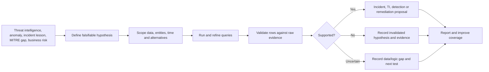

| Mode | Trigger | Output | Common mistake |
|---|---|---|---|
| Proactive hunt | Threat/risk hypothesis | Supported, rejected, or uncertain result | Browsing without a question |
| Incident hunt | Active case | Expanded scope/timeline | Changing evidence while responding |
| Retrospective hunt | New intelligence/lesson | Historical exposure assessment | Ignoring indicator validity at event time |
| Coverage hunt | MITRE/data gap | Detection or telemetry proposal | Treating ATT&CK color as proof |
| Baseline hunt | Unusual trend/behavior | Explained change or lead | Equating rarity with malice |

## 2. Terms from zero

- **Hypothesis** — a testable statement about expected attacker behavior and evidence. **Analogy:** “If the leak is above the ceiling, moisture should appear along this pipe.” **Memory hook:** a hunt question that can be wrong.
- **Scope** — the approved tenants, workspaces, tables, entities, time, and systems included. **Analogy:** the boundary drawn around a search area. **Memory hook:** scope prevents endless hunting.
- **Hunting query** — reusable KQL metadata and logic intended for analyst-led investigation. **Analogy:** a prepared search recipe. **Memory hook:** query asks; analyst decides.
- **Bookmark** — a saved Sentinel hunting result plus query/time/context metadata. **Analogy:** a labeled evidence pointer. **Memory hook:** preserve a lead, not the universe.
- **Entity** — a recognized user, device, IP, file, URL, resource, or other object. **Analogy:** a person or object of interest in a case. **Memory hook:** who or what.
- **Workbook** — an interactive Azure resource containing parameters, text, queries, and visualizations. **Analogy:** a live investigation dashboard. **Memory hook:** workbook communicates and pivots.
- **Notebook** — an interactive document combining narrative, code, outputs, and visualizations executed by a kernel. **Analogy:** a lab notebook whose calculations can be rerun. **Memory hook:** notebook = code plus reasoning plus output.
- **MSTICPy** — an open-source Python library for security data retrieval, enrichment, analysis, pivots, and visualization. **Memory hook:** reusable Python investigation tools.
- **Ground truth** — reliable knowledge of whether a tested activity is malicious, benign, or unknown. **Analogy:** the confirmed answer key. **Memory hook:** labels need evidence.
- **Provenance** — where evidence came from and how it was transformed. **Analogy:** chain of custody for data lineage. **Memory hook:** source plus transformations.

## 3. Hunt architecture

A hunt depends on source generation, retention, permissions, query semantics, analyst decisions, and evidence handling. The portal is only one layer.

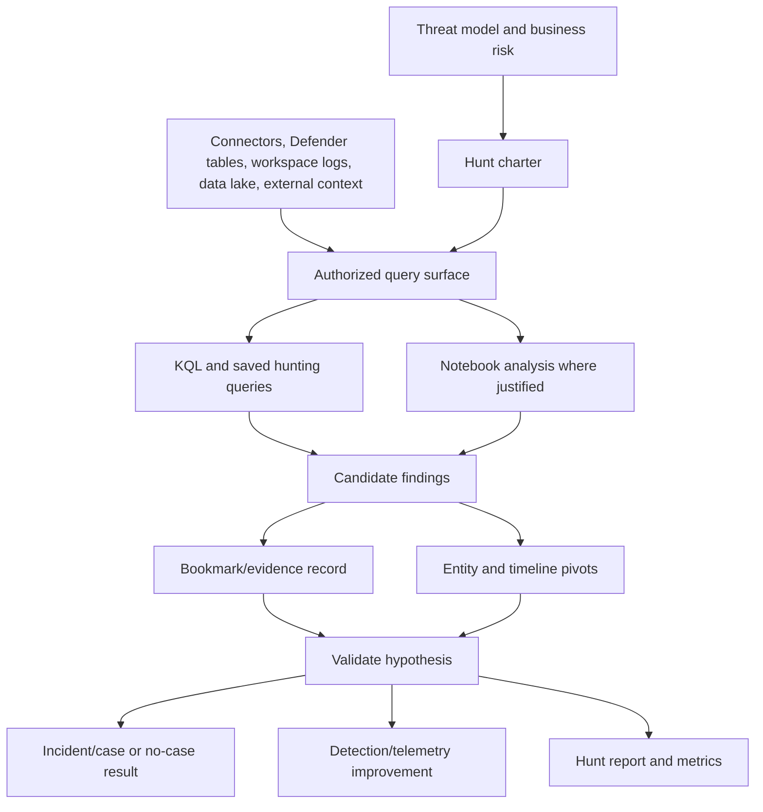

| Layer | Owner question | Acceptance evidence |
|---|---|---|
| Threat/risk | Why hunt this now? | Approved hypothesis and priority |
| Data | Which source can prove or refute it? | Known event, schema, retention and freshness |
| Access | Who may see identities/content? | RBAC and privacy approval |
| Logic | What does one result row mean? | Query specification and fixtures |
| Investigation | Which pivots distinguish alternatives? | Journal and entity timeline |
| Evidence | What must be preserved and where? | Provenance/retention record |
| Action | Who can create case/detection/TI/response? | RACI and approval |
| Learning | How will findings improve controls? | Backlog item, report and owner |

## 4. Start with a hunt charter

| Charter field | Example question |
|---|---|
| Hunt ID/title | Can every artifact link to one stable ID? |
| Hypothesis | What behavior and evidence do we expect? |
| Rationale | Which risk, incident, TI, anomaly, or ATT&CK gap prompted it? |
| In/out of scope | Which tenants, identities, sources, dates, and exclusions? |
| Expected evidence | Which tables, fields, identifiers, and sequence? |
| Alternatives | Which benign or technical explanations could look identical? |
| Query plan | Which broad, narrowing, correlation, and validation queries? |
| Success states | Supported, rejected, uncertain, or data gap? |
| Evidence rules | Retention, redaction, location, chain, TLP, legal hold? |
| Authority | Who can escalate, create TI/detection, or respond? |
| Time/cost budget | Query limits, analyst hours, notebook compute? |
| Deliverables | Journal, bookmarks, timeline, report, backlog? |

A strong hypothesis is: “If a compromised cloud identity creates a new access credential and then uses it from a previously unseen network to enumerate secrets within one hour, supported audit sources should contain the same strong principal and credential identifiers in that order.” It can fail because no such activity occurred, data is missing, identifiers do not join, or behavior differs.

### 🔍 Plain-English deep-dive: a hypothesis is not a conclusion written early

“User X is compromised” invites confirmation bias: every unusual row appears supportive. “If credential creation was followed by first-seen use and secret enumeration, these exact events and identifiers should exist in this window” forces the hunter to seek disconfirming evidence too. Write at least two benign alternatives before querying, such as approved automation onboarding or key rotation from a new runner.

## 5. Inspiration: MITRE, intelligence, incidents, and anomalies

Microsoft Sentinel Hunts can begin from selected hunting queries or a blank hunt. Common sources include suspicious behavior, a new campaign, and detection gaps. MITRE ATT&CK helps describe observed adversary behavior, but it is an inspiration catalog, not a test result.

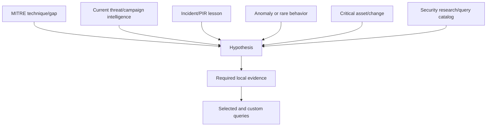

| Inspiration | Good question | Bad shortcut |
|---|---|---|
| ATT&CK gap | Do we collect evidence for this prioritized technique? | Hunt every uncolored cell equally |
| New TI | Did relevant infrastructure/behavior touch us during its valid period? | Search stale IOCs forever |
| Incident | Did the same sequence affect other entities? | Copy one incident's values blindly |
| UEBA anomaly | What raw activity and context explain the deviation? | Treat high score as compromise |
| Business change | Did the migration create an exploitable monitoring gap? | Assume every volume spike is an attack |
| Query catalog | Does this maintained hypothesis apply to our source/schema? | Run all and call every result suspicious |

## 6. Sentinel Hunting queries

The Sentinel **Queries** tab contains Content Hub hunting queries and custom queries. Metadata should state purpose, data source, tactics/techniques, entity mappings, and expected result. The dashboard can run selected/all queries, show results, 24-hour result delta, missing data (`N/A`), favorites, required sources, and the underlying KQL.

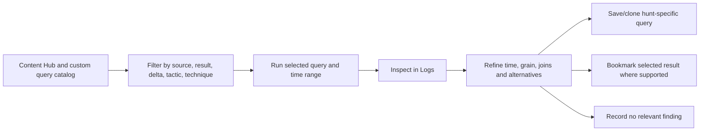

| Query metadata | Standard |
|---|---|
| Name | Behavior-focused and stable, no sensitive value |
| Description | Hypothesis, result grain, interpretation and limitations |
| Data sources | Exact tables/functions and required fields |
| Time | Expected lookback and event-time semantics |
| Entities | Strong mappings, not display name alone |
| MITRE | Only behavior directly represented |
| Version | Repository/template source and local changes |
| Owner/review | Primary/backup and review trigger |
| Performance | Expected rows/runtime and safe maximum window |
| Validation | Positive, negative, null, duplicate and boundary fixtures |

Favorites can run when the Hunting page opens. That convenience can generate cost and load. “Run all” across long windows and large workspaces may take minutes and consume query resources; it is not a substitute for a scoped hypothesis.

## 7. Query progression and KQL discipline

Start with source quality, then a broad behavior, then narrow and correlate. Project only useful fields and preserve strong IDs and timestamps. State one-row grain after every aggregation or join.

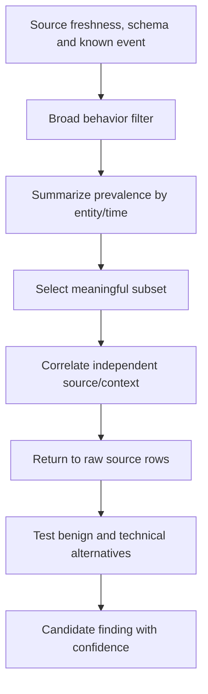

| Query stage | Question | Example control |
|---|---|---|
| Quality | Is the source complete and timely? | `count`, `min/max`, null rate |
| Broad | Does target behavior exist? | Simple indexed filter/time |
| Profile | How common is it by entity/peer? | `summarize`, bins, percentiles |
| Narrow | Which cases merit review? | Contextual threshold, not magic number |
| Correlate | Does another source support sequence? | Strong-ID join and bounded time |
| Validate | What exact raw records support result? | Stable event IDs and projected fields |
| Alternative | Can approved automation explain it? | Change/asset/reference lookup |
| Package | What is observation versus inference? | Explicit finding schema |

## 8. Hunts preview lifecycle

The Hunts preview provides a persisted collaboration object with name, description, owner, hunt state, hypothesis state, queries, bookmarks, entities, comments, related incidents, and related analytics rules. Queries added to a hunt are clones independent of original workspace queries.

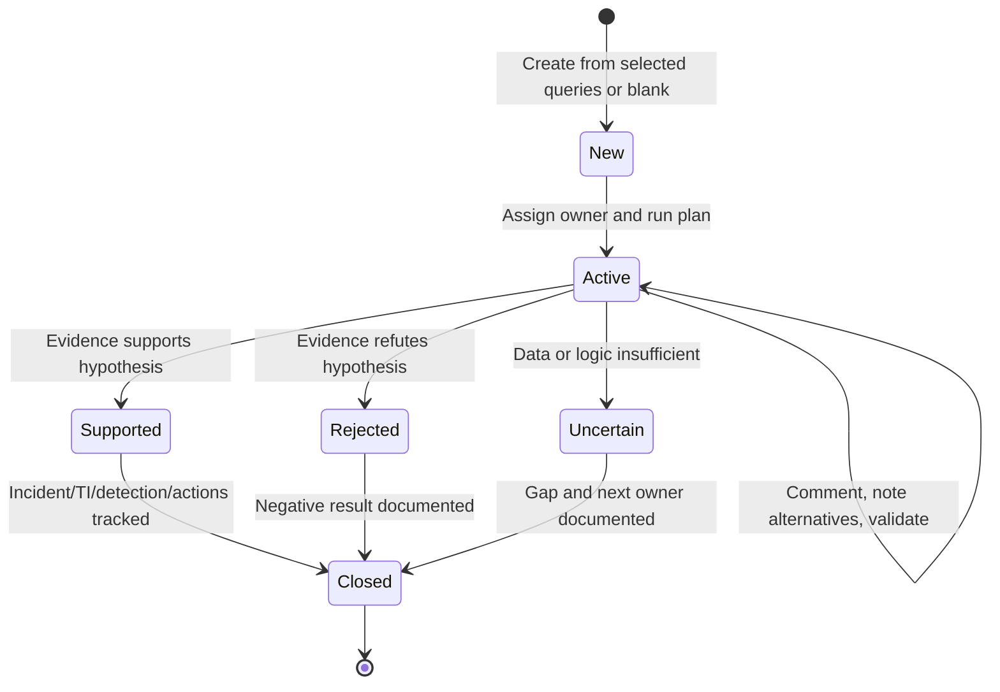

| Hunt component | Purpose | Integrity caution |
|---|---|---|
| Description/hypothesis | State test and scope | Update rather than rewrite history invisibly |
| Hunt query clone | Preserve hunt-specific logic | Original updates do not automatically prove clone current |
| Query tabs | Keep active context | Browser tabs are lost when closed unless saved/commented |
| Bookmark | Preserve selected row/query/time | Not immutable source evidence |
| Entity list | Deduplicated entities from bookmarks | Depends on mapping quality |
| Comment | Collaboration and rationale | Avoid secrets and unsupported claims |
| Related rule/incident | Track operational outcome | Link does not prove effectiveness |
| Metrics | Validated hypotheses, incidents, rules | Volume is not quality |

## 9. Run, bookmark, validate, and act

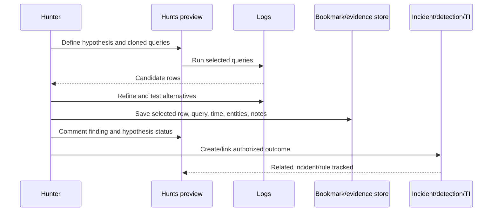

Available actions can include creating an analytics rule from a hunt query, creating or adding bookmarks to an incident, adding supported entities such as an IP to threat intelligence, and running entity-specific playbooks. These actions are not automatic recommendations. Follow the correct portal, role, preview, response, and approval boundary.

## 10. Bookmarks and evidence integrity

A Sentinel bookmark preserves a selected query-result row, the source query, time range, event-time column, mapped entities, MITRE metadata, tags, notes, creator, and update history. `HuntingBookmark` stores versions; deletion sets the latest `SoftDelete=true` rather than erasing prior table entries. The Bookmarks tab currently displays up to 1,000; use logs for more. Newly created bookmarks can take minutes to appear.

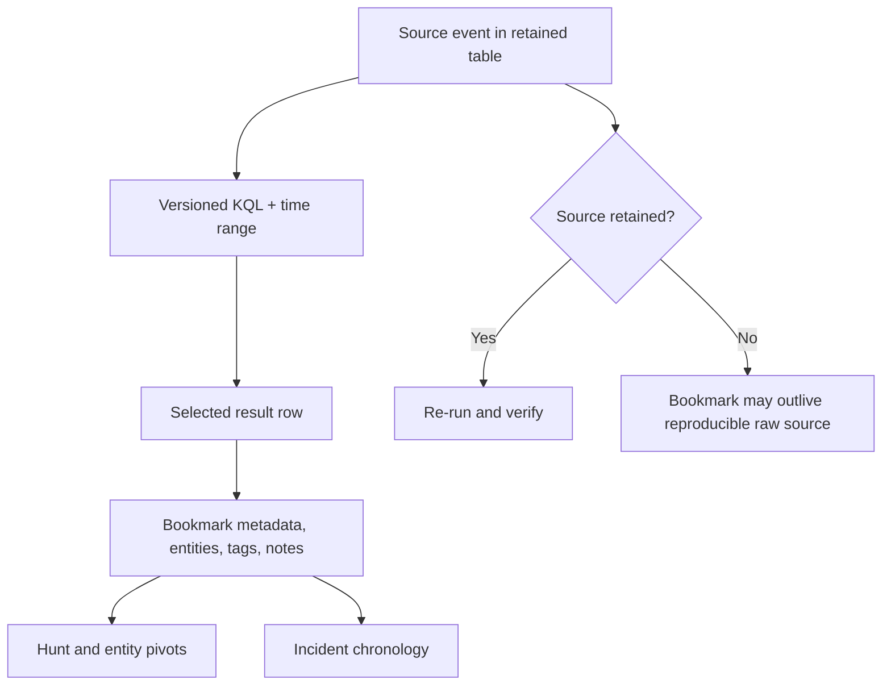

### 🔍 Plain-English deep-dive: a bookmark is a snapshot pointer, not forensic preservation

A browser bookmark records where a page was and perhaps a title; it does not freeze the entire website forever. A Sentinel bookmark saves useful query/result context, but underlying source retention, parser changes, query updates, entity mapping, and permissions still affect reproducibility. For legal or forensic preservation, follow the organization's evidence process: export only when authorized, hash/protect files where required, record source and transformations, store in controlled immutable or case storage, and maintain chain of custody.

| Evidence element | Record |
|---|---|
| Source | Tenant, workspace, table/product, connector/provider |
| Time | Source UTC, ingestion time, query run time, analyst timezone |
| Identifier | Stable event, alert, incident, bookmark, entity and hunt IDs |
| Query | Exact KQL, parameters, functions, workspace list, version |
| Transformation | Joins, parsing, deduplication, enrichment, notebook code |
| Result | Selected rows plus result grain and row count |
| Actor | Who collected/reviewed/changed/exported it |
| Integrity | Hash/signature/storage controls where policy requires |
| Handling | Sensitivity, TLP, privacy, retention, legal hold |
| Interpretation | Observation, inference, confidence, alternatives |

## 11. Portal and bookmark boundaries

Current Learn creates an unusual transition risk: the Azure portal is scheduled to retire, but bookmark creation is documented as Azure-portal-only; the Defender portal can view existing Sentinel bookmarks, and Advanced Hunting itself has no bookmarks. Alternatives include incident tags, saved queries, comments, governed custom hunting tables, and an external case/evidence system. Do not invent a workaround without retention, permissions, audit, and support review.

| Surface | Query scope | Bookmark behavior | Best fit |
|---|---|---|---|
| Sentinel Hunting | Sentinel workspace hunting queries | Sentinel bookmark workflow; creation currently Azure-only per Learn | Hunt catalog/Hunts/bookmark-centric workflow |
| Defender Advanced Hunting | Defender + onboarded Sentinel/data-lake scope as supported | No Sentinel bookmarks | Unified SIEM/XDR querying and custom detections |
| Logs/Log Analytics | Workspace/cross-workspace logs | Add bookmark only when opened from supported Sentinel context | Deep workspace query and source validation |
| External case/evidence system | Imported approved artifacts | Product-specific | Long-lived governance and legal/forensic process |

## 12. Entity investigation and timelines

Entities from bookmarks populate the Hunt Entities tab and can open UEBA/entity pages. An entity timeline can include alerts, bookmarks, anomalies, and activities. In Defender, unified user/device/IP pages add Sentinel events and XDR context. Strong entity mapping controls reliability.

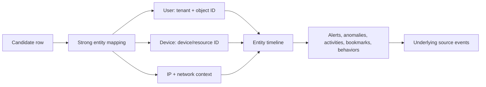

| Entity | Strong key | Common trap |
|---|---|---|
| Entra user | Tenant ID + object ID | UPN renamed or reused |
| Device | Defender device ID/Azure resource ID | Hostname collision/reimage |
| Process | Device + PID + creation time/hash | PID reuse |
| IP | Address + network/time/direction | NAT, proxy, cloud reassignment |
| File | Hash algorithm + value | Filename alone |
| URL/domain | Normalized value and event context | Redirect/shared hosting |
| Cloud resource | Full resource ID | Name alone across subscriptions |

## 13. Escalating a hunt finding

A bookmark can be added to a new or existing incident in supported Sentinel workflows. A Hunt can create an incident and track related incidents. Before escalation, verify the finding has a clear reason, strong entities, raw evidence, severity rationale, scope, and owner.

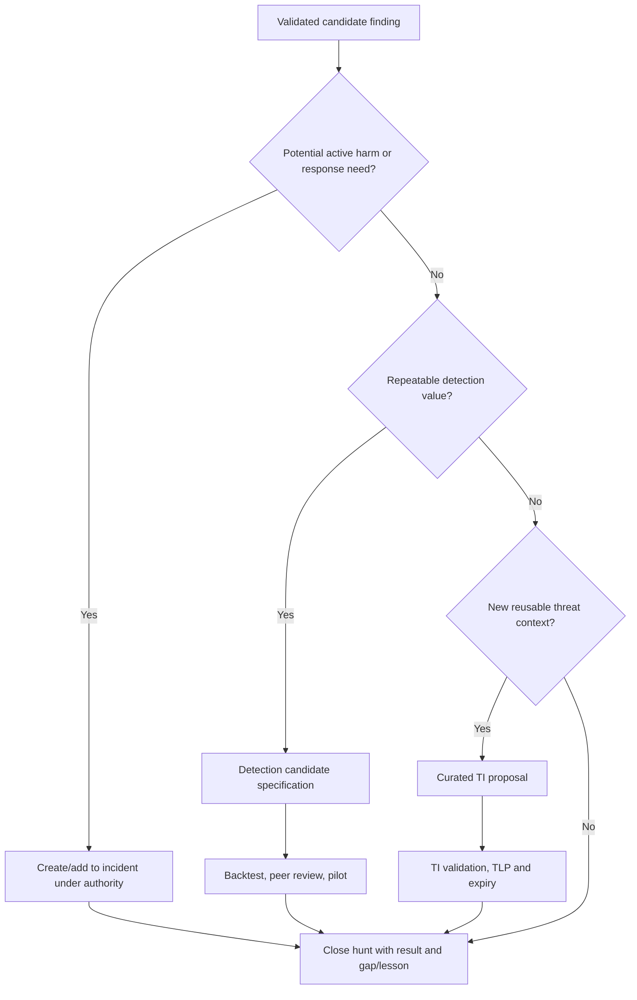

Hunting has a lower evidence threshold for exploration than automatic response. Do not convert a query directly into a production detection because it returned an interesting row. Detection requires stable data, result grain, schedule, grouping, mappings, tests, owner, runbook, precision/recall evidence, deployment, and rollback.

## 14. Workbooks architecture

Sentinel workbooks are Azure Monitor workbook resources. A Content Hub template is not the saved workbook resource. Saving a template creates a workbook JSON resource tagged to the workspace/resource group; the workbook stores definitions, not copies of query data.

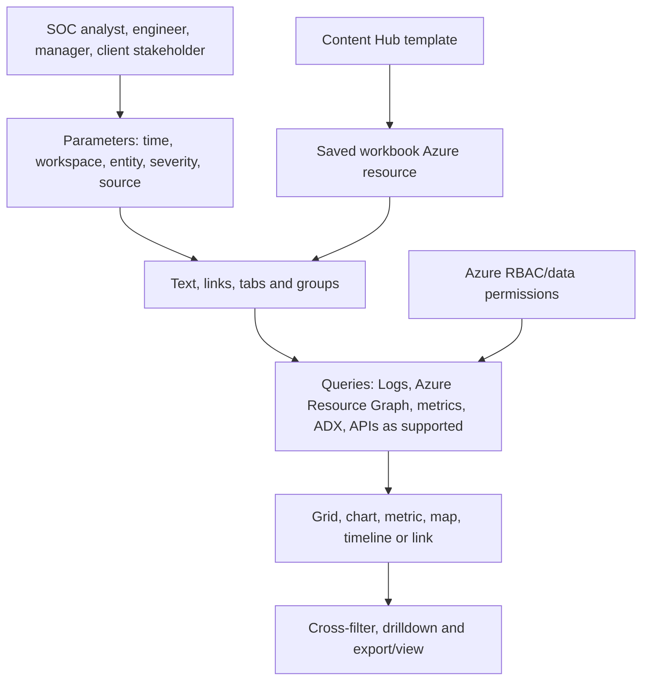

| Workbook layer | Design question |
|---|---|
| Persona | What decision should this viewer make? |
| Parameter | Which bounded input changes scope safely? |
| Data source | Which workspace/table/API and permission applies? |
| Query | What result grain, time and performance budget? |
| Visualization | Which form communicates distribution, trend, relation, or detail? |
| Interaction | What selection filters/drills into another tile? |
| Fallback | What appears with no data, denied access, timeout, or schema change? |
| Provenance | Which template/version/local customization? |
| Security | Could a shared link/export expose sensitive results? |

## 15. Workbook parameters and tiles

Use parameters to avoid hard-coded workspaces, time ranges, entities, or thresholds, but validate parameter values and least privilege. Common elements include text, query, metric, link, group, tab, grid, chart, map, and parameter controls.

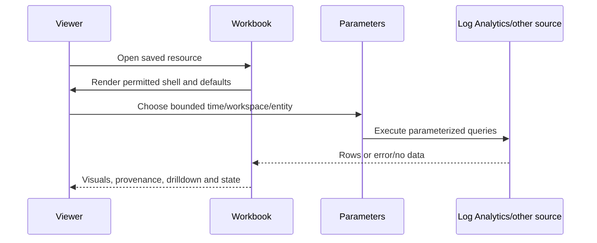

| Data question | Better visualization | Avoid |
|---|---|---|
| Volume over time | Time chart with clear UTC/local label | Pie chart |
| Top categories | Sorted bar/grid with denominator | Truncated “top 5” presented as total |
| Investigation details | Searchable grid and deep links | Giant single text block |
| KPI/SLO | Number plus target, window and trend | Number without definition |
| Geography | Map only when IP geolocation is material and caveated | Implied exact physical location |
| Relationship | Graph/timeline when supported and useful | Decorative complexity |
| Data health | Freshness, expected source, gaps and errors | Green connector badge only |

## 16. Workbook permissions and security

Current Learn requires at least Workbook Reader or Workbook Contributor on the workbook resource group; creation/deletion commonly needs a Sentinel role plus Workbook Contributor. Data access remains separate: seeing the workbook shell does not grant permission to every queried table or external source.

### 🔍 Plain-English deep-dive: dashboard access has two doors

The first door lets someone open the workbook resource. The second lets its queries read data. Giving access to one does not necessarily open the other. Conversely, a person with broad data access might copy a workbook query even without edit rights. Test each persona end to end: open, parameter choices, query results, drill links, export, edit, and denied state.

Protect query text when it exposes detection logic, customer names, sensitive table structure, or intellectual property. Minimize identity and content fields, avoid secrets in parameters, review shared links, and treat PDF/CSV/screenshots as exports subject to data-handling rules.

## 17. Workbook performance

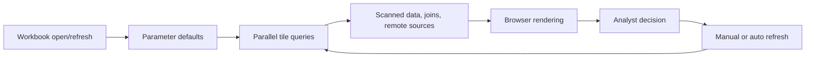

| Performance control | Reason |
|---|---|
| Safe default time window | Prevent accidental broad scans |
| Early table/time filters | Reduce data read before expensive operations |
| ASIM parser where appropriate | Source portability, but measure parser cost |
| `project` needed columns | Reduce transfer/rendering |
| Pre-aggregate for executive tiles | Avoid huge raw result sets |
| Limit high-cardinality joins | Control memory/runtime |
| Separate overview and drilldown | Render only detail on demand |
| Cache/materialize only with sound KQL reasoning | Avoid repeated expensive computation |
| Auto-refresh 5 minutes–1 day only when operationally needed | Prevent needless background load |
| No-data/error states | Distinguish healthy zero from failure |

Auto-refresh is off by default, pauses during editing, resets after view/edit transitions, and turns off when the workbook closes. Some Defender-hosted visualizations and print/PDF require opening in Azure. Treat this as a documented portal dependency before the 2027 transition.

## 18. Workbook lifecycle

| Stage | Action | Evidence |
|---|---|---|
| Discover | Identify persona and decision | Requirement/storyboard |
| Prototype | Use synthetic/limited data | Query and wireframe |
| Secure | Test RBAC, privacy and exports | Persona matrix |
| Validate | Accuracy, no-data, error, performance | Test results |
| Deploy | Save/version resource and parameters | Deployment manifest |
| Operate | Monitor query health, usage and cost | SLO/dashboard |
| Update | Diff template/schema/local changes | Change record |
| Roll back | Restore prior JSON/resource version | Read-back and smoke test |
| Retire | Remove links/access; preserve required report | Retirement record |

Deleting a workbook permanently removes that saved resource and local customizations; the source template remains. Keep a version-controlled export/deployment definition according to supported current tooling. A template update does not automatically validate local queries.

## 19. When to use KQL, workbook, or notebook

| Need | KQL/Advanced Hunting | Workbook | Notebook |
|---|---|---|---|
| Fast filtering/aggregation | Best | Embeds queries | Possible, often unnecessary |
| Repeatable persona dashboard | Limited | Best | Poor operational dashboard |
| Rich procedural analysis | Limited | Limited | Best |
| Custom Python libraries/ML | No | No | Best |
| External enrichment | Connectors/functions limits | Supported sources/links | Flexible, higher secret/egress risk |
| Evidence narrative with code/output | Query only | Visual narrative | Strong, but sanitize outputs |
| Scheduled operational response | Detection/job/playbook | Not response engine | Scheduled lake notebooks/jobs where supported; govern carefully |
| Least complexity | Best | Moderate | Highest |

Use the simplest surface that answers the question. A 10-line KQL query should not become a notebook merely because notebooks look advanced.

## 20. Classic Sentinel notebooks and Azure Machine Learning

Classic Sentinel notebooks use Jupyter integrated from the Sentinel Notebooks page and run on Azure Machine Learning compute. A browser interface edits cells; a kernel on compute executes code. `Kqlmagic` and MSTICPy can query Sentinel data. The user needs Sentinel and Azure ML workspace/compute permissions; compute, storage, networking, packages, external APIs, and secrets add cost and risk.

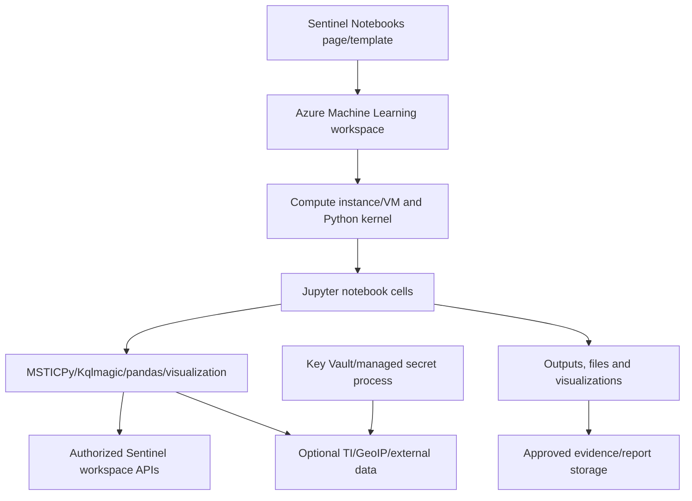

| Component | Security question |
|---|---|
| Azure ML workspace | Who can read shared files and assign compute? |
| Compute | Is it stopped when idle, patched, network-restricted, and sized? |
| Kernel/environment | Which Python/packages/versions are trusted and pinned? |
| Notebook file | Does it contain customer data, tokens, output, or secrets? |
| `msticpyconfig.yaml` | Are credentials referenced securely rather than embedded? |
| External provider | Are terms, TLP, rate, region, and data sharing approved? |
| Output | Is raw sensitive data persisted or exported unnecessarily? |
| Source control | Are outputs/secrets stripped and reviews required? |

## 21. MSTICPy concepts

MSTICPy supplies query providers, threat-intelligence and GeoIP lookups, entity pivots, timeline/process visualizations, decoding, anomaly/time-series analysis, and notebook widgets. It accelerates work but does not validate external data quality or analyst conclusions.

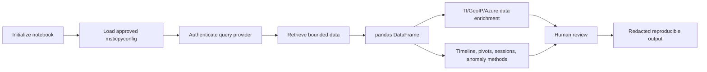

Current Learn examples mention Azure CLI authentication and also support client IDs/secrets, but recommend stronger secret handling such as Key Vault for enterprise keys. A shared Azure ML file store can expose configuration to other workspace users; local compute storage may have different access. Prefer managed identity or supported passwordless methods where possible, short-lived credentials, least privileges, no secrets in cells/output, and tested rotation.

## 22. Current Sentinel data-lake notebooks

The Sentinel data lake provides long-term Parquet-based storage, separation of storage and compute, KQL exploration, jobs, and Jupyter notebooks. Notebooks can analyze lake data with Python and promote curated outputs to the Analytics tier. Current roles, workspace onboarding to Defender, regions, retention up to documented limits, scheduling, cost, audit, and CMK boundaries differ from classic Azure ML notebook guidance.

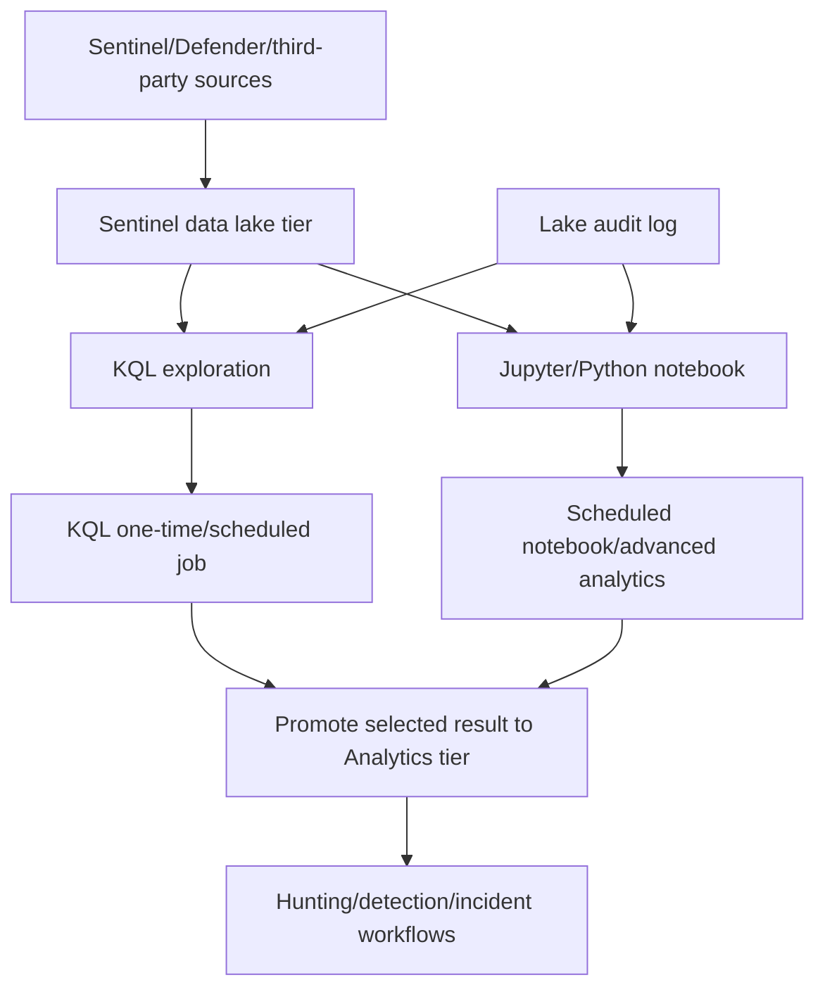

Do not conflate “data exists in the lake” with “available for near-real-time detection.” Tier, promotion, schedule, and processing determine latency. Long retention increases the amount of personal and security data available to broad queries; data-lake roles can span workspaces. Apply least privilege, query limits, job ownership, output schemas, and disposal.

## 23. Notebook reproducibility and evidence

### 🔍 Plain-English deep-dive: rerunnable does not automatically mean reproducible

A notebook can be rerun yet produce different output because source data aged out, packages changed, external APIs changed, cells ran out of order, random seeds differed, or credentials pointed to another workspace. Reproducibility needs exact source/time/workspace, code commit, parameters, environment/package versions, cell execution order, external-provider timestamp, and expected outputs.

| Reproducibility item | Record |
|---|---|
| Notebook version | Commit/hash and reviewed release |
| Environment | Python/kernel/base image and package lock |
| Parameters | UTC range, workspace/tenant IDs, entities, thresholds |
| Cell order | Clean-kernel run from top to bottom |
| Source | Table/provider and query text/version |
| External lookup | Provider, timestamp, response ID, handling terms |
| Randomness | Seed and algorithm version where relevant |
| Output | Expected shape/count and redacted sample |
| Errors | Captured exception, retry and partial-result status |
| Reviewer | Independent technical/security approval |

## 24. Credentials, secrets, and egress

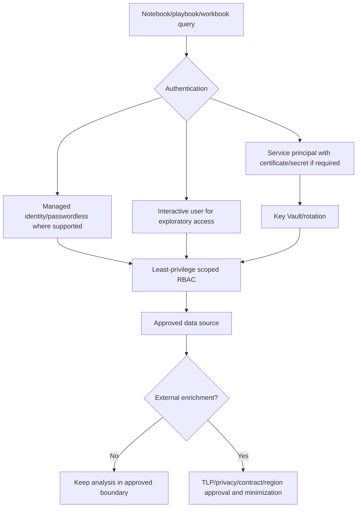

Never paste access tokens, customer secrets, API keys, message content, or private indicators into notebook cells, Markdown, outputs, Git, screenshots, or chat prompts. A provider lookup may disclose the queried IP/domain/hash to that provider. Check terms and TLP before sending an observable externally.

## 25. Testing strategy

| Test class | Hunt/workbook/notebook example |
|---|---|
| Positive | Known synthetic sequence returns one finding |
| Negative | Normal workflow returns none |
| Boundary | Event exactly at time/threshold edge |
| Alternative | Approved automation produces explainable row |
| Null/type | Missing strong ID fails safely |
| Duplicate | Repeated event does not multiply finding |
| Late data | Event-time/ingestion-time behavior documented |
| Permission | Reader sees approved data; cannot edit/export beyond role |
| No data | Workbook says “no data,” not “healthy” |
| Source error | Tile/notebook reports failure, not empty success |
| Performance | Query/runtime/rows/compute within budget |
| Reproducibility | Clean environment rerun gives expected shape |
| Security | Secret scan and output/egress review pass |
| Rollback | Prior workbook/notebook/query version restored |

## 26. Threat-hunt scenario: credential creation and secret access

**Hypothesis:** A newly created cloud access credential is used from a new source to enumerate secrets within one hour. **Benign alternatives:** approved CI runner onboarding, emergency key rotation, or security testing.

```mermaid
sequenceDiagram
    participant Actor as Synthetic principal
    participant Audit as Cloud audit fixture
    participant Hunt as Hunt queries
    participant Book as Evidence/bookmark design
    participant Analyst
    Actor->>Audit: Create synthetic credential
    Actor->>Audit: Use from new documentation IP
    Actor->>Audit: Read three synthetic secrets
    Hunt->>Audit: Correlate strong principal + credential + time
    Hunt-->>Analyst: One candidate sequence
    Analyst->>Book: Save query/result/entity/provenance plan
    Analyst->>Analyst: Test approved-runner alternative
    Analyst-->>Hunt: Supported/rejected/uncertain status
```

| Decision | Paper choice | Validation |
|---|---|---|
| Time scope | One-hour sequence inside a two-hour hunt window | Exact edges and late event |
| Identity | Tenant + principal object ID | Null/collision tests |
| Credential | Synthetic stable credential ID | Duplicate/reuse tests |
| New source | Compare with synthetic historical fixture | No claim of proprietary UEBA |
| Secret access | Three distinct synthetic resources | Deduplicate resource/event IDs |
| Alternative | Approved runner reference and change ticket | Expiry and owner |
| Evidence | Source IDs, UTC, query version, selected row | Reproducibility |
| Action | Paper incident/detection proposal only | No response |

## 27. Safe paper and synthetic lab

This lab creates no Hunt, bookmark, workbook, notebook, incident, TI object, detection, playbook, or response. It uses documentation-range IPs and fictional identities/resources. Run only in an authorized KQL environment or review on paper.

### Synthetic KQL

```kusto
let WindowStart = datetime(2026-08-24 08:00:00);
let WindowEnd = datetime(2026-08-24 10:00:00);
let SequenceWindow = 1h;
let Audit = datatable(TimeGenerated:datetime, EventId:string, TenantId:string,
    PrincipalObjectId:string, CredentialId:string, SourceIp:string,
    Action:string, Resource:string, Result:string)
[
    datetime(2026-08-24 08:10:00), "evt-001", "tenant-demo", "principal-001", "cred-001", "192.0.2.10", "CreateCredential", "identity/principal-001", "Success",
    datetime(2026-08-24 08:20:00), "evt-002", "tenant-demo", "principal-001", "cred-001", "203.0.113.55", "Authenticate", "api", "Success",
    datetime(2026-08-24 08:30:00), "evt-003", "tenant-demo", "principal-001", "cred-001", "203.0.113.55", "ReadSecret", "secret-a", "Success",
    datetime(2026-08-24 08:31:00), "evt-004", "tenant-demo", "principal-001", "cred-001", "203.0.113.55", "ReadSecret", "secret-b", "Success",
    datetime(2026-08-24 08:32:00), "evt-005", "tenant-demo", "principal-001", "cred-001", "203.0.113.55", "ReadSecret", "secret-c", "Success",
    datetime(2026-08-24 09:00:00), "evt-006", "tenant-demo", "principal-002", "cred-002", "198.51.100.20", "ReadSecret", "secret-z", "Denied"
];
let History = datatable(PrincipalObjectId:string, KnownSourceIp:string)
[
    "principal-001", "192.0.2.10",
    "principal-002", "198.51.100.20"
];
let Created = Audit
| where TimeGenerated between (WindowStart .. WindowEnd)
| where Action == "CreateCredential" and Result == "Success"
| project TenantId, PrincipalObjectId, CredentialId,
    CreatedTime=TimeGenerated, CreateEventId=EventId;
let Subsequent = Audit
| where TimeGenerated between (WindowStart .. WindowEnd)
| where Action in ("Authenticate", "ReadSecret") and Result == "Success";
Created
| join kind=inner Subsequent on TenantId, PrincipalObjectId, CredentialId
| where TimeGenerated between (CreatedTime .. CreatedTime + SequenceWindow)
| join kind=leftouter History on PrincipalObjectId
| summarize FirstUse=minif(TimeGenerated, Action == "Authenticate"),
    SecretResources=make_set_if(Resource, Action == "ReadSecret", 20),
    EvidenceIds=make_set(EventId, 50),
    SourceIps=make_set(SourceIp, 20),
    KnownSources=make_set(KnownSourceIp, 20)
    by TenantId, PrincipalObjectId, CredentialId, CreatedTime, CreateEventId
| extend SecretCount=array_length(SecretResources), NewSource=set_difference(SourceIps, KnownSources)
| where SecretCount >= 3 and array_length(NewSource) > 0
| project TimeGenerated=CreatedTime, TenantId, PrincipalObjectId, CredentialId,
    FirstUse, SecretCount, SecretResources, NewSource, CreateEventId, EvidenceIds
```

One output row represents one tenant-principal-credential sequence. It is a hunt lead, not an alert or proof of compromise.

### Lab tasks

| Task | Action | Expected learning |
|---:|---|---|
| 1 | Write hypothesis and three alternatives | Falsifiability |
| 2 | Document source/retention/strong IDs | Data contract |
| 3 | State one-row result grain | Query clarity |
| 4 | Move third secret outside one hour | Boundary behavior |
| 5 | Change principal or tenant | Join isolation |
| 6 | Duplicate one event | Dedup need |
| 7 | Add approved-runner context | Benign alternative |
| 8 | Draft bookmark fields and entity mappings | Evidence context |
| 9 | Draft Hunt comments and status | Collaboration |
| 10 | Storyboard a five-tile workbook | Persona/decision design |
| 11 | Decide whether KQL or notebook is justified | Least complexity |
| 12 | Threat-model notebook credentials/egress | Security/privacy |
| 13 | Draft incident/detection conversion gate | Controlled action |
| 14 | Present a two-minute hunt report | Communication |

### Validation matrix

| ID | Input/change | Expected | Failure caught |
|---|---|---|---|
| V01 | Full synthetic sequence | One lead | Positive path |
| V02 | Two secret resources | Zero | Threshold boundary |
| V03 | Third read exactly at +1h | Outcome documented for inclusive `between` | Time edge |
| V04 | Third read after +1h | Zero | Unrelated slow activity |
| V05 | Different tenant | Zero join | Cross-tenant collision |
| V06 | Null principal ID | Quality failure, no weak action | Identity ambiguity |
| V07 | Duplicate EventId | Dedup gap identified | Count inflation |
| V08 | Source in approved runner list | Benign alternative flagged | Confirmation bias |
| V09 | Source table delayed | Event/ingestion impact documented | Late data |
| V10 | Bookmark source data expired | Reproducibility limitation visible | False preservation |
| V11 | Defender Advanced Hunting selected | Bookmark limitation recognized | Portal mismatch |
| V12 | Workbook user lacks table access | Explicit denied/error state | Misleading empty tile |
| V13 | Workbook default set to 90 days | Performance gate fails | Cost/runtime risk |
| V14 | Notebook contains API key | Security gate fails | Secret exposure |
| V15 | External TI lookup of TLP-restricted IOC | Egress blocked | Sharing breach |
| V16 | Clean-kernel notebook rerun | Expected shape and no hidden state | Nonreproducibility |
| V17 | Detection candidate misses positive fixture | Promotion blocked | False assurance |
| V18 | No findings | Rejected/uncertain result still reported | Success bias |

### Workbook storyboard

| Tile | Question | Query/output | Failure state |
|---|---|---|---|
| Hunt scope | Which window/workspace/hypothesis? | Text + parameters | Invalid parameter message |
| Data health | Are required events fresh and populated? | Max time/null/volume | Red data gap, not zero threats |
| Candidate sequences | Which principals matched? | Minimal grid | Row limit and drill link |
| Entity timeline | What happened before/after? | Time chart/grid | No strong entity warning |
| Outcome | Supported/rejected/uncertain and actions | Governed summary | Owner/review overdue |

### Lab deliverables

1. Hunt charter and hypothesis/alternative statement.
2. Platform/surface decision record dated August 24, 2026.
3. Source, retention, permission, and entity contract.
4. Synthetic KQL and expected result grain.
5. Hunt journal, bookmark/evidence specification, and entity timeline.
6. Workbook storyboard, query budget, RBAC and failure tests.
7. Notebook decision, threat model, environment and secret plan.
8. Validation matrix and detection-conversion gate.
9. Hunt report, metrics, backlog and rollback plan.
10. Candidate honesty statement.

## 28. Deployment, versioning, and rollback

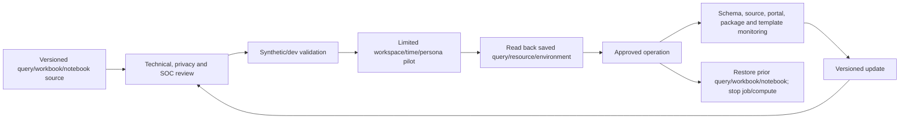

Rollback differs by artifact. Restore a prior saved query or workbook JSON; stop/disable notebook schedules and compute; revert package/environment; remove or close generated access; suspend external integrations; communicate hunting/detection gaps. Deleting a repository item may not delete the deployed Sentinel resource. Never erase bookmarks/incidents merely to make a failed hunt disappear; follow evidence retention.

## 29. Operations and metrics

| Metric | Definition | Guardrail |
|---|---|---|
| Hunts completed | Closed with documented outcome | Count alone is not maturity |
| Supported hypothesis rate | Supported / completed | Low or high can both be healthy/unhealthy |
| Uncertain/data-gap rate | Gaps / completed | Must create owned remediation |
| Time to first useful lead | Hunt start to validated candidate | Exclude random unvalidated row |
| Evidence reproducibility | Sampled findings rerunnable | Source retention caveat |
| Query performance p95 | Runtime/data scanned/rows | By window and workspace |
| Bookmark completeness | Required provenance fields present | Portal capability noted |
| Finding-to-incident rate | Approved cases / findings | Not an optimization target alone |
| Finding-to-detection rate | Accepted detections / hunts | Quality and coverage, not volume |
| Workbook reliability | Successful tile queries / expected | Distinguish denied/no data/error |
| Notebook reproducibility | Clean runs passing expected shape | Versioned environment |
| Cost per hunt | Analyst + query + compute + external service | Compare decision value |
| Reopened lesson rate | Repeat miss after prior hunt | Measures learning failure |

## 30. Failure modes and troubleshooting

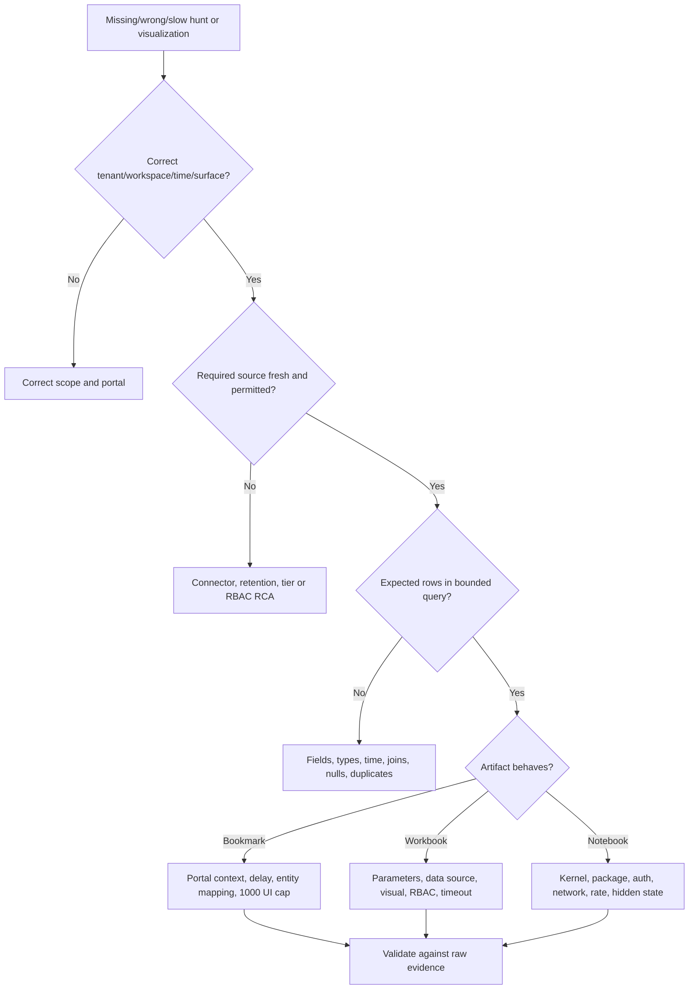

| Symptom | Likely cause | Discriminating check |
|---|---|---|
| Query shows `N/A` | Required source absent | Query table freshness and connector |
| Run all takes too long | Broad time/many queries/large data | Run one bounded query and inspect cost |
| Hunt query changed unexpectedly | Clone/original/version confusion | Compare hunt clone and catalog source |
| Browser query tabs disappeared | Tabs were not saved | Saved query/comment/bookmark record |
| Cannot add bookmark | Advanced Hunting/Defender or unsupported Logs context | Verify current portal and launch path |
| Bookmark missing briefly | Index/display delay | Query `HuntingBookmark` after minutes |
| Entity absent from graph | No/weak mapping | Bookmark/result entity identifiers |
| Bookmark list stops at 1,000 | UI display limit | Query bookmark logs |
| Workbook blank | No data, denied access, wrong workspace or error | Run tile query as same user |
| Some visual unavailable in Defender | Portal parity limitation | Open in Azure and record transition risk |
| Workbook slow | Wide queries/joins/cardinality/refresh | Profile each tile separately |
| Notebook auth fails | Expired token/role/config/tenant | Minimal provider connection test |
| Package import fails | Kernel mismatch/version/environment | Clean environment and `%pip`/approved image |
| Notebook differs on rerun | Hidden cell state/source/API/package drift | Restart kernel, run all, compare manifest |
| External enrichment throttles | API quota/concurrency | Response code, retry-after and cache policy |
| Lake result not in analytics | No promotion/job delay/schema issue | Job run, target table and timestamps |

## 31. Reporting findings

Use four explicit categories:

1. **Observation:** what source record or reproducible result exists.
2. **Inference:** what the evidence may mean.
3. **Confidence and alternatives:** why, and what could disconfirm it.
4. **Action/owner:** incident, telemetry, detection, control, or no action.

| Report section | Content |
|---|---|
| Executive summary | Risk question, outcome, impact, decision needed |
| Scope/method | Tenants, sources, UTC, tools, limitations |
| Hypothesis | Original statement and alternatives |
| Findings | Observations with IDs, timeline and confidence |
| Negative results | What was tested and not found |
| Gaps | Missing data, retention, permissions, ambiguity |
| Actions | Incident/TI/detection/remediation proposals and owners |
| Evidence | Controlled references, not uncontrolled sensitive dumps |
| Reproducibility | Query/notebook/workbook versions and environment |
| Follow-up | Review date, validation and success metric |

## 32. Consulting artifacts

| Artifact | Decision enabled |
|---|---|
| Hunt program charter | Which hunts are authorized and prioritized? |
| Individual hunt charter | What exactly is tested? |
| Source/retention map | Can evidence support the window? |
| Query catalog | Which maintained hypotheses and dependencies exist? |
| Hunt journal | What was run, changed, observed, and decided? |
| Bookmark/evidence standard | How are leads preserved and reproduced? |
| Entity timeline | Who/what did what, when? |
| Workbook specification | Which persona sees which decision view? |
| Notebook threat model | How are compute, code, secrets, egress, and outputs protected? |
| Validation pack | Which positive, negative, failure and security tests pass? |
| Detection candidate | Is the finding repeatable and operationally actionable? |
| Hunt report | What result, uncertainty, gaps, and actions remain? |
| Metrics dashboard | Is hunting useful, efficient, secure, and improving coverage? |
| Rollback/retirement plan | How are artifacts stopped, restored, and disposed? |

## 33. JD Mapping: interview translation

| Interview theme | Your transferable strength | Honest Sentinel hunting answer |
|---|---|---|
| Hypothesis testing | Reproduces and isolates complex issues | Falsifiable hunt plus benign alternatives |
| Evidence | Correlates IDs/timestamps/logs | Provenance, raw validation and timeline |
| Investigation | Runs RCA across service boundaries | Entity and source pivots |
| Dashboards | Communicates KPIs and trends | Persona-driven workbook design |
| Advanced analysis | Automation/AI learning foundation | Notebook decision and secure configuration concepts |
| Improvement | Converts lessons into fixes/runbooks | Detection/telemetry candidate gate |
| Privacy | Handles customer evidence carefully | Minimal data, access, retention, egress |
| Experience gap | Does not overstate tools | Synthetic/paper work, no production claim |

## Official Source Anchors

These official Microsoft Learn pages were reviewed for the August 24, 2026 treatment. Recheck preview/GA banners, portal support, licensing, schema, retention, cloud/region, RBAC, notebook runtime/packages, data-lake behavior, limits, and tenant configuration before implementation.

1. [Hunting capabilities in Microsoft Sentinel](https://learn.microsoft.com/azure/sentinel/hunting) — query catalog, results/delta, Hunts preview, bookmarks, notebooks, MITRE, and operationalization.
2. [Conduct end-to-end threat hunting with Hunts](https://learn.microsoft.com/azure/sentinel/hunts) — preview prerequisites, hypothesis, hunt creation, query clones, bookmarks, entities, comments, incidents, status, and metrics.
3. [Hunt with bookmarks](https://learn.microsoft.com/azure/sentinel/bookmarks) — current portal limits, entity mapping, investigation, incidents, `HuntingBookmark`, display delay, deletion, and 1,000-item UI limit.
4. [Visualize data with Sentinel workbooks](https://learn.microsoft.com/azure/sentinel/monitor-your-data) — templates, saved resources, permissions, data sources, portal differences, refresh, delete, and recommendations.
5. [Azure Monitor workbooks overview](https://learn.microsoft.com/azure/azure-monitor/visualize/workbooks-overview) — workbook architecture and elements.
6. [Jupyter notebooks with Sentinel](https://learn.microsoft.com/azure/sentinel/notebooks) — classic notebook purpose, kernel, Azure ML, packages, templates, and roles.
7. [Get started with Jupyter and MSTICPy](https://learn.microsoft.com/azure/sentinel/notebook-get-started) — configuration, providers, external services, templates, and query examples.
8. [Advanced MSTICPy configuration](https://learn.microsoft.com/azure/sentinel/notebooks-msticpy-advanced) — authentication, autoload providers/components, kernels, and configuration files.
9. [Sentinel data lake overview](https://learn.microsoft.com/azure/sentinel/datalake/sentinel-lake-overview) — architecture, tiers, KQL, notebooks, promotion, audit, retention, and regions.
10. [Sentinel roles and permissions](https://learn.microsoft.com/azure/sentinel/roles) — Sentinel, workbooks, data-lake and advanced RBAC boundaries.
11. [Entity pages](https://learn.microsoft.com/azure/sentinel/entity-pages) — timeline, insight, activities, anomalies, bookmarks, and source-query pivots.
12. [Investigate incidents in depth](https://learn.microsoft.com/azure/sentinel/investigate-incidents) — incident timeline, bookmarks, entities, logs, tasks, comments, and investigation graph.
13. [Transition Sentinel to Defender](https://learn.microsoft.com/azure/sentinel/move-to-defender) — Advanced Hunting/bookmark, workbooks, entities, API, privacy, and portal differences.
14. [Microsoft Sentinel in Defender](https://learn.microsoft.com/azure/sentinel/microsoft-sentinel-defender-portal) — GA status, feature locations, unified Hunting, data lake, notebooks, and 2027 retirement.
15. [Content Hub deployment](https://learn.microsoft.com/azure/sentinel/sentinel-solutions-deploy) — hunting query/workbook/template lifecycle.

## ⭐ Likely Interview Questions for This Section

### Q1. What makes a good threat-hunting hypothesis?

**Model answer:** It is specific, falsifiable, scoped, linked to risk, and states the expected behavior, data, strong identifiers, sequence, time, and alternatives. “Find compromised accounts” is too broad. I also define supported, rejected, uncertain, and data-gap outcomes so a hunt can add value without finding an attacker.

### Q2. How does the Hunts preview help organize an investigation?

**Model answer:** It creates a persisted hunt object containing the hypothesis, owner/status, independent query clones, bookmarks, extracted entities, comments, related incidents and related analytics rules. I use it as a collaborative journal, update hypothesis status, and track operational outcomes. Because it is preview, I verify current portal, permissions, limits, and evidence policy before depending on it.

### Q3. What does a Sentinel bookmark preserve, and what does it not prove?

**Model answer:** A bookmark preserves a selected result row, query, time range, event-time field, mappings, tags, notes, creator and version history. It helps collaboration and can enrich an incident. It is not immutable forensic preservation and does not prove the row is malicious. Reproducibility still depends on raw-data retention, query/functions, permissions and provenance.

### Q4. What is the current bookmark difference between Sentinel Hunting and Defender Advanced Hunting?

**Model answer:** Advanced Hunting has no Sentinel bookmarks. Sentinel-specific Hunting retains the bookmark workflow, but current Learn says creation is Azure-portal-only while the Defender portal can view existing bookmarks. Since Azure Sentinel retires there after March 31, 2027, I treat this as change-sensitive and validate supported alternatives such as incidents, saved queries, tags, governed tables, or the case system.

### Q5. How would you design a useful Sentinel workbook?

**Model answer:** I start with a persona and decision, then define bounded parameters, exact data sources and RBAC, result grain, appropriate tiles, drilldowns, provenance, and no-data/denied/error states. I use safe default windows, filter early, project minimal fields, test each query and persona, measure runtime/cost, version the workbook JSON, and keep a tested prior version for rollback.

### Q6. When is a Jupyter notebook justified over KQL?

**Model answer:** When the task needs procedural logic, custom Python analysis or ML, advanced visualization, iterative data-frame work, or approved external data not practical in KQL. I keep simple filtering in KQL. For notebooks I govern Azure ML or data-lake compute, environment versions, RBAC, secrets, egress, cost, clean-kernel reproducibility, sensitive outputs, and source retention.

### Q7. How do you convert a hunt into a detection safely?

**Model answer:** First validate the hypothesis and exact raw evidence with representative positive, negative, boundary, duplicate, late and null cases. Then define stable source and result grain, schedule, threshold, entities, grouping, severity, runbook, owner, privacy and response. Backtest, peer-review, deploy disabled, pilot without automatic containment, measure precision and missed cases, and maintain deployment and rollback evidence.

### Q8. What is your honest experience with Sentinel threat hunting?

**Model answer:** I have not run Sentinel hunts, workbooks or notebooks in production. My production strength is structured incident/RCA investigation, evidence correlation, validation and reporting. I built a current synthetic hunt with a falsifiable hypothesis, KQL, alternatives, evidence/bookmark design, entity timeline, workbook and notebook controls, tests, reporting and detection-conversion gate. I would apply it under approved access and peer review in a client pilot.

## 🧠 30-Second Memory Hooks

- **Hunt:** proactively test a hypothesis, not browse randomly.
- **Hypothesis:** behavior + evidence + scope + alternatives.
- **Outcome:** supported, rejected, uncertain, or data gap.
- **Hunts:** preview collaboration object with cloned queries and outcomes.
- **Query grain:** say what one result row represents.
- **MITRE:** inspiration and language, not proof of coverage.
- **Bookmark:** saved lead/query/time/context, not immutable evidence.
- **Portal boundary:** Advanced Hunting has no Sentinel bookmarks.
- **Entity:** strong key before timeline or response.
- **Escalate:** validate raw facts before incident/TI/detection.
- **Workbook:** persona + parameter + query + tile + failure state.
- **Workbook resource:** JSON definition, not stored query data.
- **Two access doors:** workbook resource and underlying data.
- **Notebook:** code + narrative + output + kernel.
- **MSTICPy:** reusable Python security analysis tools.
- **Classic notebooks:** Azure ML compute and permissions.
- **Lake notebooks:** long-term data, Python/KQL/jobs/promotion.
- **Reproducible:** source, code, parameters, environment, cell order.
- **Secrets:** never in cells, outputs, Git, or screenshots.
- **Honesty:** synthetic hunt design, no production Sentinel claim.

## Completion Checklist

- [ ] I can explain proactive, incident, retrospective, coverage, and baseline hunting.
- [ ] I can define a falsifiable hypothesis with benign alternatives.
- [ ] I can write a complete hunt charter and success states.
- [ ] I can draw the source-to-query-to-evidence-to-action architecture.
- [ ] I can use MITRE, TI, incidents, anomalies, and business risk as inspiration without treating them as proof.
- [ ] I can interpret query catalog results, deltas, favorites, and `N/A` sources.
- [ ] I can state result grain after filters, summarizes and joins.
- [ ] I can progress from data quality to broad, narrow, correlated and raw queries.
- [ ] I can explain the current Hunts preview object and independent query clones.
- [ ] I can run, refine, bookmark, comment, validate and close a hunt conceptually.
- [ ] I can explain what bookmark metadata preserves and what it does not.
- [ ] I know the `HuntingBookmark`, `SoftDelete`, delay and 1,000-item UI behavior.
- [ ] I understand the current Azure/Defender/Advanced Hunting bookmark boundary.
- [ ] I can map strong entities and build a reliable timeline.
- [ ] I can decide whether a finding becomes an incident, TI proposal, detection candidate, gap, or no action.
- [ ] I can design workbook personas, parameters, queries, tiles, drilldowns and failure states.
- [ ] I understand workbook templates versus saved Azure resources.
- [ ] I can test workbook resource and data permissions separately.
- [ ] I can optimize workbook defaults, KQL, rendering and refresh.
- [ ] I can version, deploy, monitor, roll back and retire a workbook.
- [ ] I can choose KQL, workbook, classic Azure ML notebook, or data-lake notebook appropriately.
- [ ] I can explain Jupyter interface, kernel, packages and outputs.
- [ ] I can explain MSTICPy query providers, enrichment, pivots and visualizations.
- [ ] I can protect notebook credentials, configuration, external lookups, and output.
- [ ] I can produce a clean-kernel reproducibility manifest.
- [ ] I can explain lake storage, KQL/jobs, notebooks and Analytics-tier promotion.
- [ ] I can test positive, negative, boundary, alternative, security and failure cases.
- [ ] I can convert a validated hunt to a detection only through engineering gates.
- [ ] I can define useful hunt, evidence, workbook, notebook and cost metrics.
- [ ] I can troubleshoot scope → data → query → artifact → raw evidence.
- [ ] I completed the safe synthetic lab without creating any Sentinel artifact.
- [ ] I can answer Q1–Q8 aloud without claiming production Sentinel hunting.
- [ ] I will recheck Learn, preview/GA, portal, licensing, retention, runtime, data lake, schemas and tenant behavior before reuse.

*Next suggested section:* [Part 50](Part-50-sentinel-automation-logic-apps-playbooks.md)