# Part 50 — Automation Rules, Logic Apps Playbooks, and SOAR Engineering

> **Section goal:** Build a beginner-first, consulting-grade method for Microsoft Sentinel security orchestration, automation, and response (SOAR). By the end, you should be able to distinguish automation from orchestration; design ordered automation rules for incident-created, incident-updated, and alert-created events; select conditions and native actions; engineer Azure Logic Apps playbooks with the correct trigger, connectors, identities, API connections, permissions, retries, timeouts, idempotency, concurrency, secrets, approvals, and audit; account for Defender portal onboarding differences; review current AI-generated Python playbooks and enhanced alert triggers safely; deploy, test, monitor, version, roll back, and operate workflows; and present a synthetic phishing playbook without executing any production action.

This Part maps directly to Deloitte expectations for Sentinel SOAR, Microsoft Defender integration, incident response, Power Platform-style automation thinking, Azure architecture, identity and least privilege, third-party ticketing and notification integration, troubleshooting, operational handover, secure change, and client reporting. Arti's Power Automate/Power Platform familiarity and production incident/RCA discipline are useful foundations, but Azure Logic Apps, Sentinel automation, generated playbooks, security-response authority, and production SOAR operation remain explicit learning areas.

> **Currency, status, portal, licensing, data-lake, and behavior-change note (August 24, 2026):** This chapter is grounded in official Microsoft Learn available on August 24, 2026. Sentinel playbooks are Azure Logic Apps resources and can incur separate Logic Apps, connector, networking, storage, monitoring, and external-service charges. Playbook templates remain preview. Managed identity authentication for the Sentinel Logic Apps connector is currently documented as preview. **Simple Flows** case triggers/actions are preview. The Defender portal changes trigger scope, provider fields, incident correlation, title stability, update batching, manual playbook actions, and latency: incident sync can take up to five minutes; automation can run up to roughly ten minutes after Defender case creation/update; multiple changes within 5–10 minutes can be collapsed to the most recent update. The legacy direct analytics-rule-to-playbook path reached deprecation in March 2026 and should be replaced by automation rules. The August 2026 AI playbook generator creates alert-input Python playbooks in an embedded VS Code/Cline experience, with generated playbooks disabled by default and strict current limits; the reviewed Learn page does not present the overall generator with the same preview banner used for playbook templates, while the related Simple Flows and several surrounding features are preview/change-sensitive. Verify the live portal, release banner, license, regions, roles, connector support, generated-playbook terms, and data-lake dependencies before approval.

## JD Mapping

| Deloitte expectation | Capability developed here | Consulting evidence |
|---|---|---|
| Design Sentinel SOAR | Separate native case workflow from external orchestration | SOAR architecture decision record |
| Integrate security tools | Connect Sentinel, Defender, Graph, ticketing, messaging, TI and response APIs | Integration and permission matrix |
| Automate incident handling | Trigger, condition, order, assign, tag, task, status, playbook | Automation-rule catalog |
| Engineer secure response | Human approval, least privilege, idempotency, rollback | Response authority and control design |
| Troubleshoot workflows | Correlate rule, playbook, connector, API and target evidence | Layered runbook |
| Deploy safely | Synthetic tests, rings, versioning, monitoring, rollback | Release evidence pack |
| Operate 24x7 | Health, retries, dead-letter/manual recovery, ownership, SLAs | RACI and service dashboard |
| Communicate honestly | Distinguish concept/lab from production | Interview wording and limitations |

## Candidate honesty note

Arti can credibly discuss production workflow automation concepts, Microsoft 365 incident response, RCA, validation, approvals, stakeholder communication, secure handling, and Power Platform foundations. She can show the paper workflow, synthetic payloads, failure matrix, and operational artifacts in this chapter.

She should not claim production Sentinel automation rules, Azure Logic Apps playbooks, managed identities, API connections, generated Python playbooks, automatic containment, or SOAR platform ownership unless separately evidenced. Safe wording is:

> “I have not deployed Sentinel playbooks or automatic containment in production. My production strengths are incident coordination, RCA, validation, stakeholder communication, and Power Platform automation foundations. I built a current paper SOAR design for a phishing scenario with trigger and portal boundaries, native automation rules, a Logic Apps orchestration, managed-identity and API-connection permissions, approval gates, idempotency, retries, rate limits, audit, tests, monitoring, deployment, and rollback. In a client environment I would start with notification and enrichment, use synthetic incidents, require peer/security review and explicit response authority, and promote containment only after controlled operational acceptance.”

---

## 1. What SOAR means

**Security orchestration, automation, and response (SOAR)** combines repeatable workflow, integrations, and authorized security actions. Automation performs a repeatable task. Orchestration coordinates tasks across systems, owners, decisions, and failure paths. Response changes risk or target state.

Think of an airport disruption. Automation sends a delay message. Orchestration checks aircraft, crew, gates, passenger connections, and approvals, then coordinates changes. Response reroutes flights. A useful security workflow similarly needs more than “call an API.”

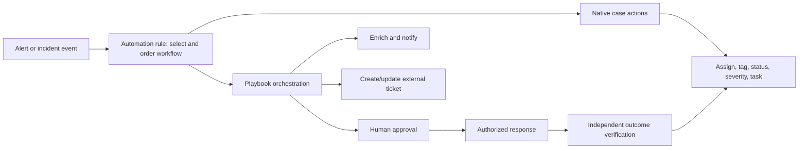

| Term | Plain meaning | Example | Risk |
|---|---|---|---|
| Automation | Repeat one known task | Add incident tag | Wrong condition repeats wrong task |
| Orchestration | Coordinate systems and decisions | Enrich, ticket, approve, contain, verify | Partial failure creates inconsistent state |
| Response | Change security/business state | Disable user or isolate device | Business disruption and false positive |
| Automation rule | Sentinel event/condition/action controller | On new high severity incident, add tasks and run playbook | Order/portal behavior misunderstood |
| Playbook | Workflow invoked automatically or manually | Logic App queries TI and comments on incident | Overprivileged connector or secret leak |
| Connector | Packaged interface to a service/API | Sentinel, Teams, ServiceNow, Graph | Authentication and throttling differ |
| API connection | Azure resource holding connector authorization details | Managed identity/OAuth connection | Shared connection scope surprises |

## 2. Automation architecture and trust boundaries

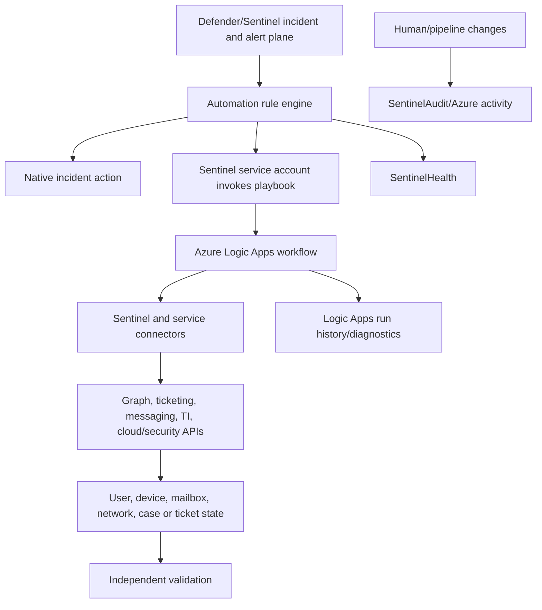

Each arrow crosses a control boundary. The identity that allows Sentinel to launch a playbook is not automatically the identity used by each connector inside it. The Logic App might authenticate to Sentinel with managed identity, to Graph with another identity, and to a ticket system through OAuth/API key. Inventory every identity, credential, role, scope, owner, expiry, and audit source.

## 3. Start with an automation specification

| Specification field | Question |
|---|---|
| Use-case ID | Which incident/runbook/control owns the workflow? |
| Trigger | Incident created/updated, alert created, manual, entity, or enhanced alert? |
| Scope/conditions | Which providers, rules, severities, tags, entities, workspaces? |
| Input contract | Which IDs, arrays, nulls, schemas and limits arrive? |
| Native actions | Assign, tag, severity/status, task, playbook? |
| External actions | Enrichment, notification, ticket, containment? |
| Authority | Who may request, approve, execute, and reverse response? |
| Idempotency key | How is duplicate execution recognized? |
| State | Where is workflow/ticket/action status persisted? |
| Failure policy | Retry, timeout, compensate, queue, escalate, stop? |
| Security | Identity, secrets, network, data minimization, audit? |
| Tests | Synthetic positive/negative/duplicate/rate/error/rollback? |
| Operations | Owner, SLO, monitoring, cost, on-call, manual path? |
| Lifecycle | Version, deploy, rollback, decommission? |

## 4. Automation-rule triggers

Automation rules run when an incident is created, when an incident is updated, or when a supported alert is created. Defender-onboarded workspaces also have current Simple Flows preview case-created/case-updated options and an Enhanced Alert Trigger associated with generated playbooks.

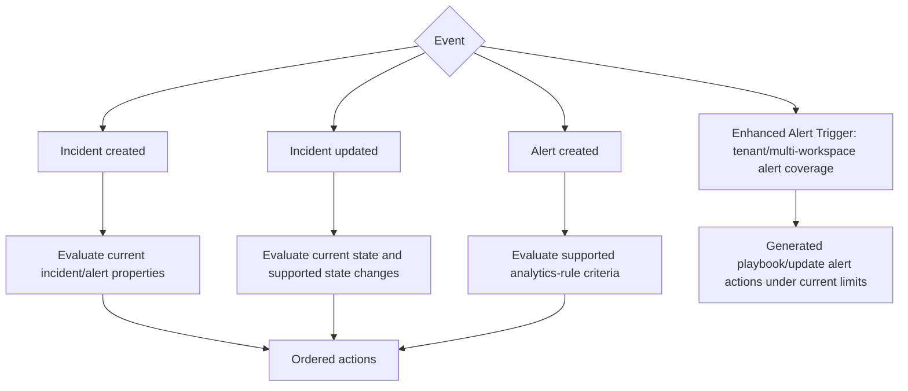

| Trigger | Fires when | Best fit | Current caution |
|---|---|---|---|
| Incident created | New incident/case enters supported workflow | Initial assignment, tags, tasks, ticket/enrichment | Defender correlation may include mixed sources |
| Incident updated | Status/owner/severity/alerts/comments/tags/tactics or supported change | Sync and escalation | 5–10 minute batching can lose intermediate updates |
| Alert created | Sentinel Scheduled/NRT alert | Alert-only or pre-incident workflow | Defender XDR alerts need Enhanced Alert Trigger in Defender |
| Manual incident | Analyst explicitly runs incident playbook | Human-controlled enrichment/response | Requires roles and sync |
| Manual alert/entity | Analyst invokes relevant trigger | Targeted action | Not currently supported in Defender for some alert/entity paths |
| Enhanced Alert Trigger | Tenant-level selected alerts across Sentinel/Defender/XDR | Generated playbooks across workspaces | Separate rule table; no order/expiry; current strict action limits |

### 🔍 Plain-English deep-dive: choose the object whose lifecycle you actually manage

An alert is one piece of evidence. An incident is the evolving case that accumulates alerts, entities, ownership, comments, and status. Incident-triggered automation is usually a better home for case workflow. Alert-triggered automation is useful when there is deliberately no incident, when early alert enrichment is required, or for current enhanced cross-platform alert cases. Choosing the wrong grain causes duplicate tickets, repeated containment, or missing updates.

## 5. Conditions and current state

Incident-created rules can evaluate properties with operators such as equals, contains, starts with, and their negatives. Incident-updated rules can also evaluate who/what updated the case and supported state changes such as changed, changed from/to, or added. All configured conditions must be satisfied.

| Condition design | Good example | Fragile example |
|---|---|---|
| Analytics rule/source | Stable rule identifier/name plus controlled tag | Incident title |
| Severity | High severity plus evidence/asset condition | Severity alone for containment |
| Entity | Strong tenant/object/device ID | Display name |
| Tag | Exact controlled tag and collection semantics | Negative “any tag does not contain” misunderstanding |
| Updated by | Exclude automation loop using current supported value | Old `Microsoft 365 Defender` value after onboarding |
| Status change | Changed to resolved triggers ticket closure proposal | Any update closes ticket |
| Workspace | Explicit allowed workspace list | Implicit primary/secondary assumption |
| Provider | Current architecture field | Legacy incident provider condition after Defender onboarding |

In the Defender portal, all incidents use Microsoft XDR as provider. Existing incident-provider conditions can behave more broadly after onboarding. Incident titles can change due to Defender correlation; do not use them as durable keys. Prefer stable alert/rule IDs, tags, source fields, workspace, and strong entities.

## 6. Native automation-rule actions

Automation rules can add tasks, set status, severity, owner, and tags, close with reason/comment in supported workflows, and run playbooks. These native actions avoid a Logic App when the change is entirely inside the case.

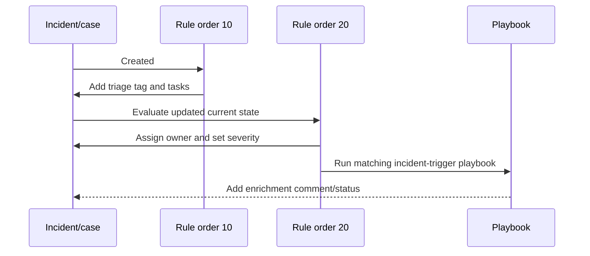

| Native action | Use | Guardrail |
|---|---|---|
| Add task | Standardize triage/remediation checklist | Version and avoid duplicate tasks |
| Change status | Reflect workflow state | Define gates; avoid hiding backlog |
| Change severity | Reprioritize based on governed context | Severity is potential impact, not confidence |
| Assign owner | Route to correct team/person | Backup/shift process; avoid departed individual |
| Add tag | Classify and coordinate downstream logic | Controlled vocabulary and loop prevention |
| Close incident | Time-limited known benign scenario | Reason, comment, expiry, audit, regression tests |
| Run playbook | External/complex orchestration | Trigger compatibility and permissions |

## 7. Order, sequence, and expiry

Rules of the same trigger type run sequentially by order. Create-trigger rules run before update-trigger rules caused by their changes. Duplicate order numbers are allowed; their order is random. Actions inside a rule are listed sequentially, but a long-running playbook does not necessarily block later rule actions until completion: current docs describe advancement after two minutes even if the playbook remains running.

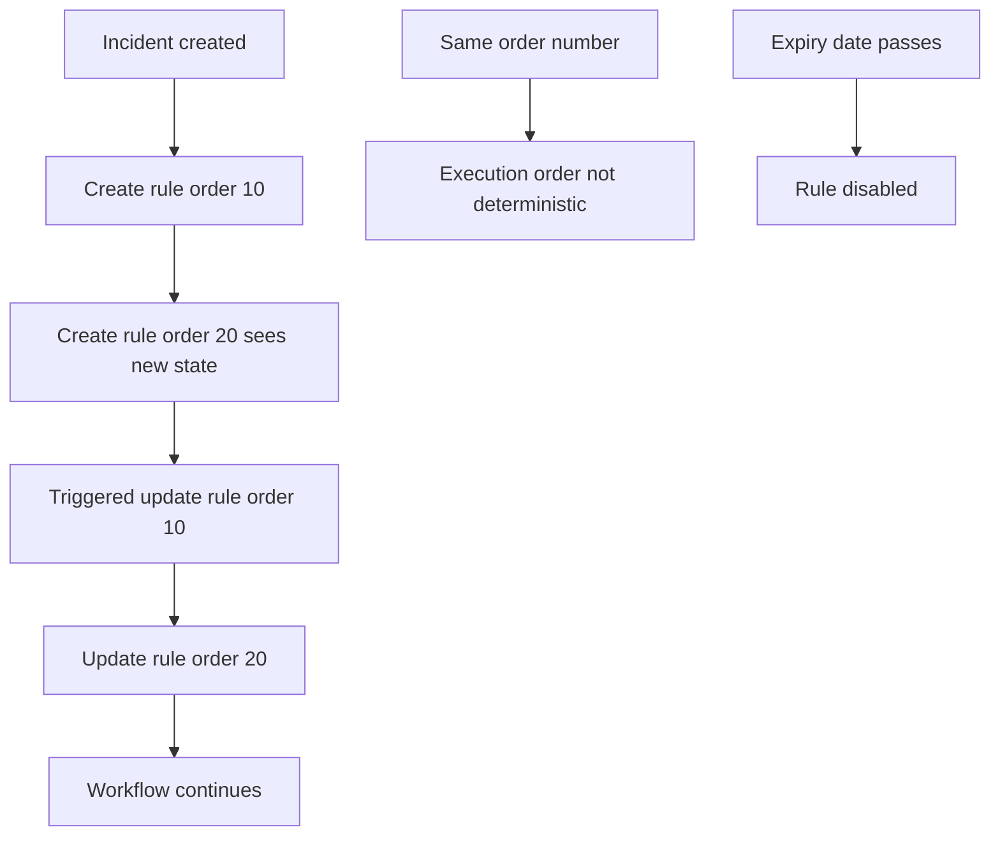

| Ordering risk | Control |
|---|---|
| Same order number | Detect in CI/checklist unless nondeterminism is intended |
| Later rule assumes earlier playbook finished | Persist completion state or orchestrate inside one workflow |
| Update rule reacts to its own change | Loop-prevention tag/idempotency and `Updated by` logic |
| Expiring suppression forgotten | Mandatory expiry, owner, alert and review |
| Rule reordering changes outcome | Version full ordered catalog and integration tests |

Expiration is useful for maintenance, penetration tests, temporary assignments, or bounded suppression. Enhanced Alert Trigger rules currently do not support priority ordering or expiration dates, so do not assume standard automation semantics apply.

## 8. Logic Apps playbook architecture

A Sentinel playbook is an Azure Logic Apps workflow using a Sentinel trigger/action or other trigger with Sentinel actions. Consumption runs in multitenant Logic Apps and bills per use. Standard runs single-tenant with plan-based capabilities, multiple workflows, network integration, private endpoints, and stronger CI/CD options; Sentinel requires stateful Standard workflows and does not support playbook templates for Standard.

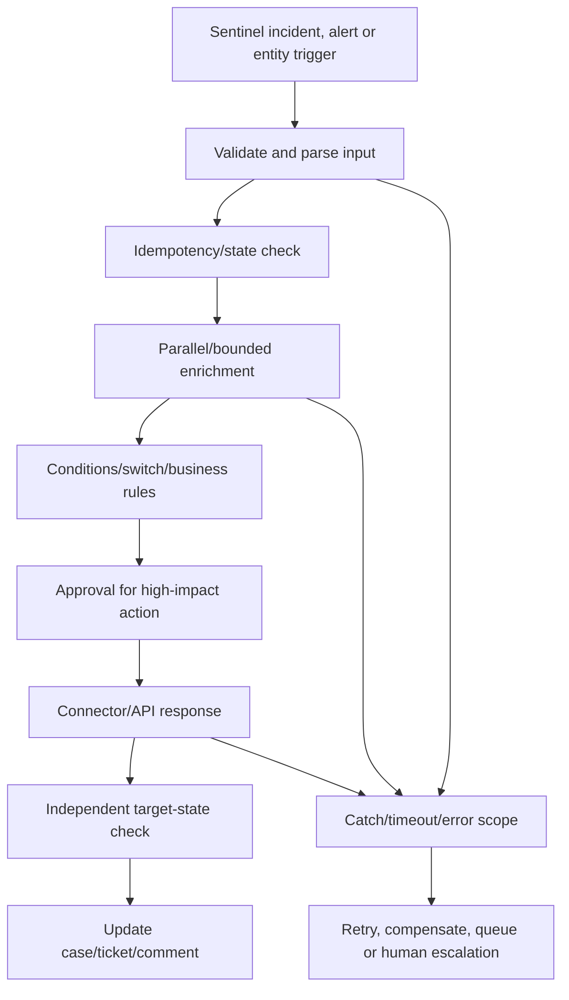

| Logic App choice | Consumption | Standard |
|---|---|---|
| Hosting | Multitenant | Single-tenant |
| Billing | Per trigger/action/connectors | Hosting plan plus usage aspects |
| Workflows/resource | Typically one workflow resource pattern | Multiple workflows in one Logic App resource |
| Networking | Connector/service dependent | Built-in VNet/private endpoint features |
| Playbook templates | Supported template path, currently preview | Not supported directly |
| Workflow state | Stateful pattern | Sentinel supports stateful, not stateless |
| CI/CD | ARM/IaC possible | Stronger app/project deployment model |
| Best fit | Variable event-driven use | Predictable scale/network/isolation/multiple workflows |

## 9. Triggers, dynamic content, and input contracts

The Sentinel connector supports incident, alert, and entity triggers. The trigger defines input schema. An incident includes arrays of alerts and entities; custom details can be arrays of JSON objects. An entity-triggered playbook launched outside an incident can have a null Incident ARM ID.

### 🔍 Plain-English deep-dive: dynamic content is still an API contract

The designer makes fields look like convenient labels, but each value has a type, cardinality, null behavior, size limit, and source schema. An “Alert custom details” item may be an array, not a string. An incident may contain many alerts from different products with different fields. Parse and validate deliberately; never assume the first array item is the right user or device.

| Input issue | Safe handling |
|---|---|
| Null incident ID for entity hunt | Branch before any incident update action |
| Multiple alerts/entities | Filter and map all relevant items; define maximums |
| Custom detail array | Parse JSON with versioned schema and fallback |
| Missing strong identifier | Stop response; add investigation task |
| Correlation adds unexpected products | Allowlist supported service/detection sources |
| Field renamed after portal transition | Contract tests and schema version handling |
| Oversized payload | Select required fields; page/fetch details safely |
| Untrusted strings | Encode for tickets/messages; do not build raw queries/URLs unsafely |

## 10. Identities and role separation

There are at least three permission layers:

1. The human or pipeline creating/configuring rules and Logic Apps.
2. The Sentinel service account allowed to launch a playbook from automation.
3. The identity each connection uses inside the workflow to read/write Sentinel or another target.

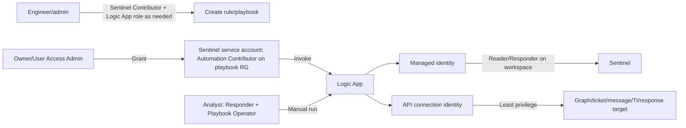

| Role/identity | Purpose | Does not automatically grant |
|---|---|---|
| Sentinel Contributor | Attach/manage relevant Sentinel automation/content | Edit every Logic App or target API |
| Sentinel Responder | Manage incidents | Run playbook without Playbook Operator |
| Sentinel Playbook Operator | Manually run playbooks | Edit Logic App |
| Sentinel Automation Contributor | Service account can invoke playbooks; not for users | Target API rights inside workflow |
| Logic App Contributor | Create/edit/run Consumption Logic Apps | Grant Sentinel invocation permissions |
| Logic App Operator | Enable/disable/read Consumption workflows | Edit workflow |
| Standard Developer/Contributor/Operator | Standard workflow management by role | Sentinel workspace access |
| Managed identity/service principal | Nonhuman connector identity | Rights until explicitly assigned |

## 11. Managed identity, service principals, and API connections

Use managed identity when the connector/target supports it and current preview/GA policy permits. A service principal can provide stable nonhuman auth but requires certificate/secret lifecycle. Avoid personal user connections: departures, MFA/CA/session changes, and excessive delegated rights make them fragile.

| Authentication | Benefit | Risk/control |
|---|---|---|
| Managed identity | No stored credential; lifecycle tied to resource | Connector support/status; explicit RBAC and resource replacement |
| Service principal + certificate | Strong automation identity | Rotation, private-key custody, app permissions |
| Service principal + secret | Broad support | Secret leakage/expiry; Key Vault and short lifetime |
| User OAuth | Easy interactive setup | Person dependency, broad delegated access, token/CA changes |
| API key/bearer | External compatibility | Vault, rotation, scope, logs/redaction |

API connections are separate Azure resources in the Logic App resource group and can be reused. Reuse can simplify management but broaden blast radius: changing authorization can affect multiple workflows. Inventory connection consumers before rotation or deletion.

## 12. Defender portal onboarding differences

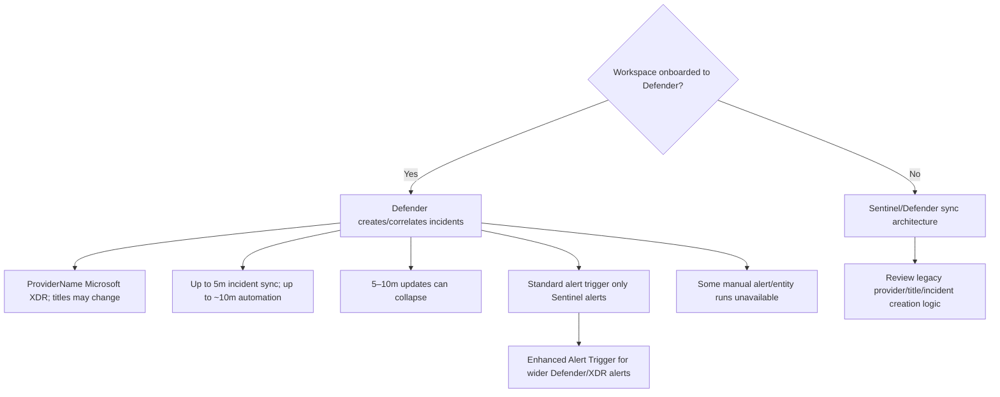

| Difference | Design impact |
|---|---|
| All incidents provider `Microsoft XDR` | Legacy provider conditions may broaden |
| Correlation can rename/merge cases | Never key ticket sync on title |
| Incident sync delay up to five minutes | Manual playbook may initially say data unavailable |
| Automation delay up to about ten minutes | Set realistic SLA and avoid duplicate fallback |
| 5–10 minute update batching | Do not depend on every intermediate state |
| Standard alert rule scope | Sentinel alerts only in Defender |
| Enhanced Alert Trigger | Separate generated-playbook path across products/workspaces |
| Add/remove alerts from incidents differs | Playbook action may be unsupported |
| Primary workspace in multi-workspace XDR | Move rules to authoritative workspace |
| Manual alert/entity playbook differences | Keep supported incident/manual alternative |

## 13. Use cases by response risk

| Use case | Typical action | Risk tier | Starting mode |
|---|---|---:|---|
| Enrichment | TI/asset/user lookup and case comment | Low–medium | Automatic with data minimization |
| Notification | Teams/email/pager message | Medium | Automatic; deduplicate and redact |
| Ticketing | Create/update ServiceNow/Jira-style case | Medium | Automatic after idempotency tests |
| Tasking | Add analyst checklist | Low | Native automation rule |
| Assignment/tagging | Route case | Low–medium | Native rule with fallback owner |
| Containment proposal | Prepare device/user/mail action | High | Human approval/manual run |
| Account disable | Change identity access | Very high | Dual approval and break-glass exclusions |
| Device isolation | Restrict endpoint network | Very high | Approved runbook and dependency check |
| Block indicator | Change network/email control | High | Validate scope/expiry/rollback |
| Delete/quarantine content | Change evidence/business data | Very high | Product-specific authority and preservation review |

Automation maturity normally progresses: observe → notify → enrich → task/route → recommend → approve → limited reversible response → broader response. Do not start with destructive containment to prove sophistication.

## 14. Human-in-the-loop approvals

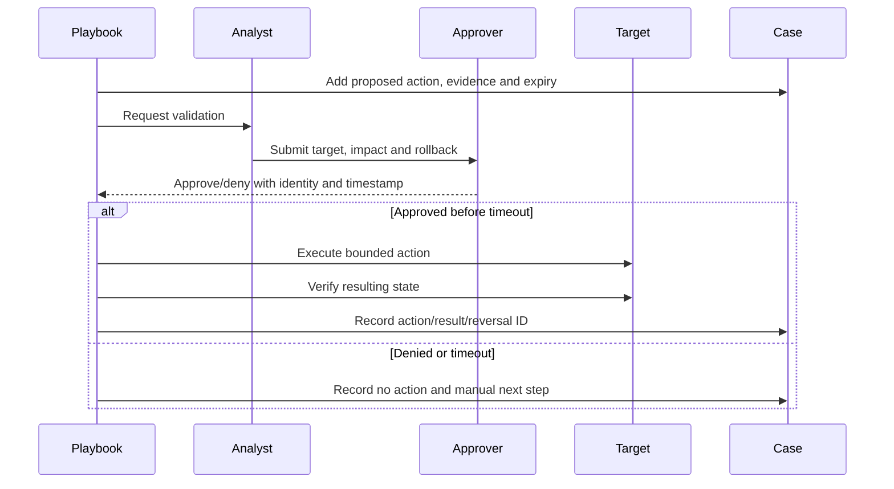

| Approval field | Requirement |
|---|---|
| Target | Strong immutable ID and human-readable context |
| Evidence | Minimal relevant observations and source links |
| Proposed action | Exact API/control and scope |
| Impact | User/service/business dependencies |
| Reversibility | Undo action and limit |
| Expiry | Approval/action validity window |
| Requestor/approver | Strong identities and separation of duties |
| Decision | Approve/deny/timeout plus rationale |
| Verification | Independent target-state evidence |
| Audit | Correlation IDs, timestamps and case/ticket records |

Email “approve” links can be forwarded or delayed. Use an authenticated approval mechanism with authorization, expiry, single-use token/state, and audit. High-impact actions may require two people or business owner involvement.

## 15. Idempotency

**Idempotency** means repeating the same logical request does not create unintended repeated effects. Defender correlation, retries, duplicate alerts, update batching, manual re-runs, and webhook retries make this mandatory.

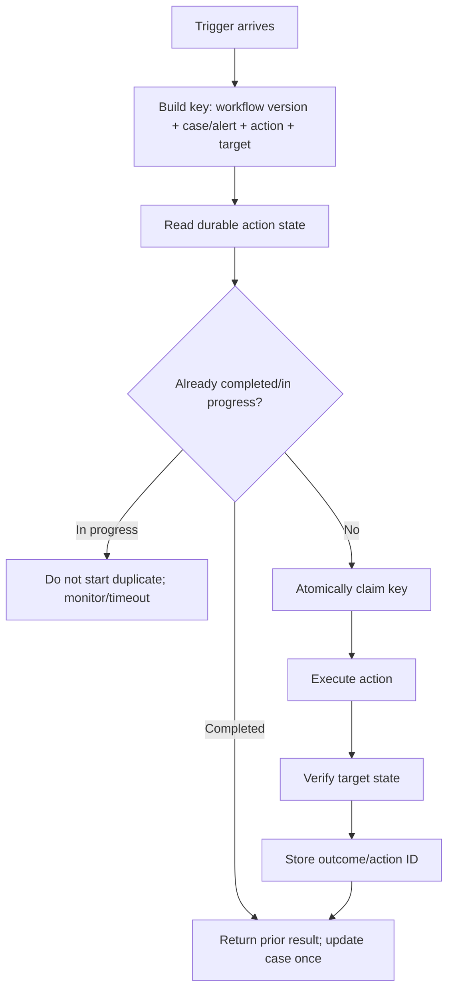

| Workflow | Idempotency key idea | Duplicate prevention |
|---|---|---|
| Ticket create | Provider case ID + ticket system + workflow version | Search/store external ticket ID |
| Notification | Incident ID + channel + material update version | Message record/digest window |
| User disable | Tenant + object ID + action reason/case | Check current state and action ledger |
| Device isolate | Device ID + case + requested mode | Action Center/current isolation check |
| Indicator block | Type + normalized value + policy + expiry | Existing rule/object lookup |
| Comment | Case + enrichment provider + observation/version | Tag/custom state or content hash |

### 🔍 Plain-English deep-dive: “check then act” is not enough under concurrency

Two runs can both check “ticket absent” before either creates it, producing two tickets. Use an atomic claim or target API idempotency key where available, then store the returned target action ID. If a fully atomic store is unavailable, document residual race risk, reduce concurrency, and add reconciliation.

## 16. Concurrency and race conditions

| Race | Example | Control |
|---|---|---|
| Two alerts, same incident | Both create ticket | Case-level atomic idempotency key |
| Case updated during playbook | Workflow closes stale severity | Re-read current version before write |
| Human and automation act | Analyst reopens while rule closes | Optimistic concurrency/state gate |
| Two enrichments overwrite comment/state | Last writer loses context | Append structured entries or merge safely |
| Containment and rollback overlap | Device state oscillates | Per-target lock/action state machine |
| Connector credential rotation during run | Partial success | Rotation window and retry/reconciliation |

Set Logic Apps loop concurrency deliberately. Parallel enrichment can reduce latency, but rate-limited providers, shared targets, and state updates may require bounded or sequential execution.

## 17. Retries, timeouts, and rate limits

Retries are appropriate for transient failures such as `429`, selected `5xx`, network reset, or temporary service unavailability. They are dangerous for non-idempotent actions or permanent `400/401/403/404` conditions.

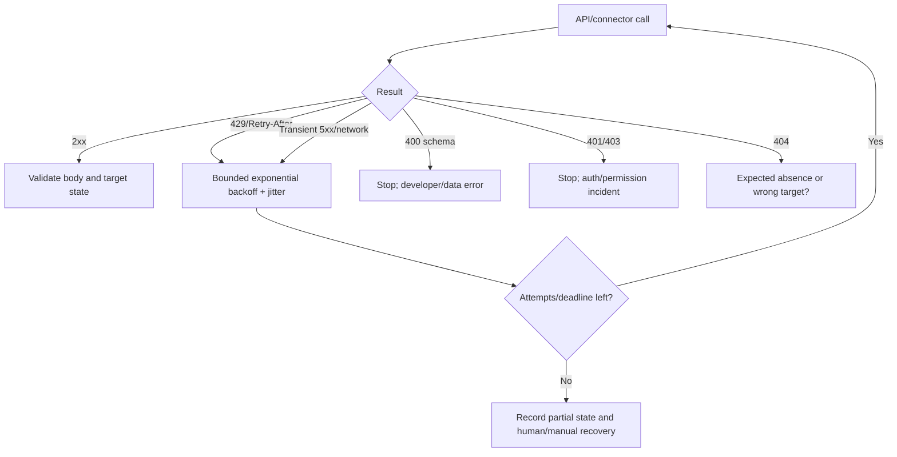

| Control | Standard |
|---|---|
| Retry classification | Explicit status/exception list |
| Backoff | Exponential with jitter; honor `Retry-After` |
| Maximum attempts | Bounded by action criticality |
| End-to-end deadline | Shorter than business SLA and approval expiry |
| Per-action timeout | Prevent hung connector |
| Circuit breaker | Pause repeated provider failure where implemented |
| Concurrency limit | Align with provider quota |
| Cache | Only for safe, freshness-defined enrichment |
| Partial result | Structured success/failure per target |
| Recovery | Queue/manual runbook and reconciliation owner |

## 18. Error paths and compensation

**Compensation** is a planned action that reduces the effect of a partially completed workflow. It is not always a true rollback. A notification cannot be unsent; a ticket can be closed as duplicate; a disabled account can be re-enabled but existing sessions/business impact may not be restored.

| Step succeeds | Later step fails | Compensation/recovery |
|---|---|---|
| Ticket created | Case comment fails | Store ticket ID; retry comment/reconcile |
| User disabled | Verification call fails | Do not assume failure; query state manually/alternate path |
| Device isolated | Ticket update fails | Preserve isolation action ID; alert on-call |
| Message sent | Case update fails | Deduplicate future message and reconcile case |
| Indicator blocked | Expiry schedule fails | Immediate owner alert; create manual expiry task |
| Approval recorded | Action times out | Mark approval consumed/expired; require new approval |

Use Logic Apps scopes and “run after” conditions for succeeded, failed, timed out, and skipped branches. Record the first failure, attempted retries, partial effects, correlation IDs, and exact manual next action. Never hide failure by setting the incident resolved.

## 19. Secrets and data minimization

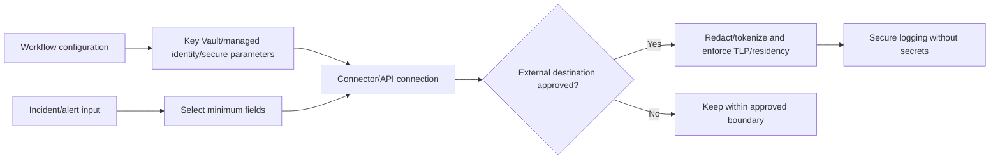

Secure inputs/outputs can reduce exposure in run history, but may also reduce troubleshooting visibility. Design safe diagnostic fields: correlation ID, status, duration, provider, target pseudonymous ID, and error category, not tokens or sensitive content. Review tickets and chat channels as data stores with their own retention and membership.

## 20. Notifications and ticket synchronization

| Design item | Requirement |
|---|---|
| Ticket key | Stable provider incident ID, not title |
| Create/update split | Create once; update material fields only |
| Direction | Define source of truth per field |
| Status map | Explicit mappings and unsupported values |
| Owner map | Team/queue mapping and unresolved fallback |
| Comments | Avoid infinite echo; mark origin/correlation |
| Attachments | Minimize, scan, classify, retain securely |
| Deep links | Use supported provider URL fields/current portal |
| Closure | Require classification and target-state checks |
| Reconciliation | Periodically find orphan/duplicate/divergent records |

Notifications should be actionable and rate-controlled. Group updates in a digest where safe, include the case link and owner, redact sensitive fields, and provide an escalation path. A successful Teams/email connector response does not prove the right human read it.

## 21. Containment design

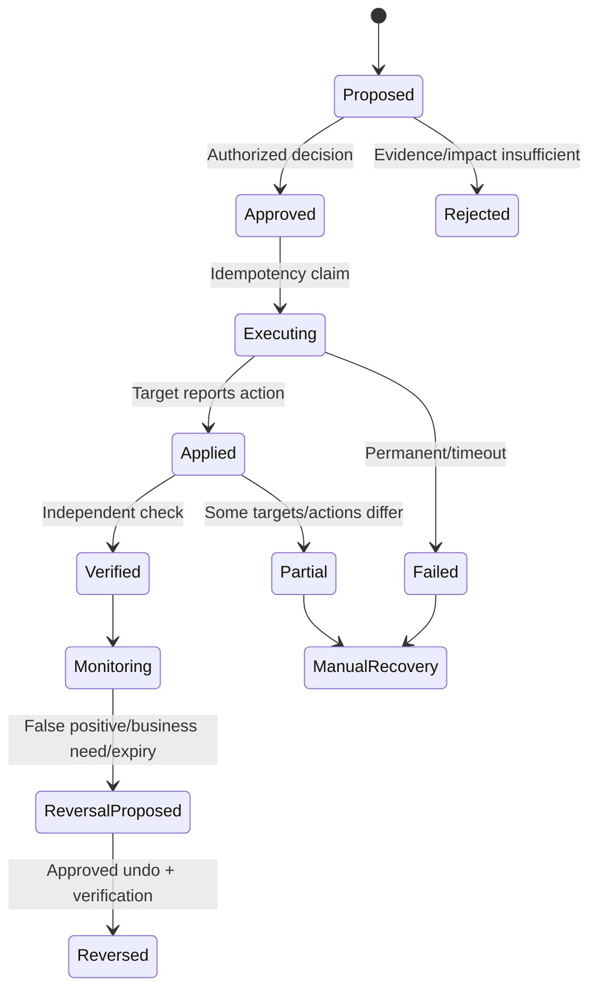

Containment must identify exclusions such as emergency access accounts, domain controllers, critical infrastructure, shared devices, automation identities, and legal-hold evidence. “Reversible” does not mean harmless: disabling an account interrupts business; device isolation affects management channels; blocking an IP can affect shared services.

## 22. Testing modes and synthetic inputs

Do not test high-impact workflows by waiting for a real attacker or using a live executive account. Use fixtures, disabled targets, test tenants/workspaces, nonproduction ticket queues/channels, mocks where appropriate, and explicit dry-run modes.

| Mode | Behavior | Use |
|---|---|---|
| Static validation | Lint/template/schema/secret checks | Every commit |
| Unit/fixture | Test expressions and branches with synthetic JSON | Developer loop |
| Mock integration | Controlled fake API responses | Retry/error/rate behavior |
| Dry run | Calculate and record proposed actions only | Production-shaped pilot |
| Shadow | Trigger on real cases but no external change | Volume/condition validation with privacy approval |
| Manual test | Analyst runs benign enrichment on synthetic incident | Permissions/UI path |
| Limited pilot | Approved group/use case, reversible actions | Operational acceptance |
| Failure injection | 429/5xx/timeout/null/duplicate/partial | Resilience validation |
| Rollback rehearsal | Restore prior workflow/rules/connections | Release readiness |

Generated-playbook documentation says testing can use a real Alert ID. For a safe learning or client pilot, use an authorized synthetic/test alert and review every proposed environment change before execution. Never paste a customer alert into an unapproved environment.

## 23. Deployment and versioning

```mermaid
flowchart LR
    SPEC[Approved specification] --> CODE[Versioned rules, Logic App/IaC, connections metadata]
    CODE --> SCAN[Schema, lint, secret, permission and policy checks]
    SCAN --> TEST[Fixture/mock/integration tests]
    TEST --> DEV[Deploy disabled/dev]
    DEV --> READ[Read back resources and role assignments]
    READ --> PILOT[Dry-run/shadow/limited pilot]
    PILOT --> APPROVE[Change and SOC acceptance]
    APPROVE --> PROD[Controlled enablement]
    PROD --> MON[Health, cost and outcome monitoring]
    MON --> ROLL{Regression?}
    ROLL -->|Yes| PREV[Disable new rule/workflow; restore prior version]
    ROLL -->|No| OPERATE[Operate]
```

Version automation rules, their order, conditions, actions, expiry, playbook resource definitions, workflow code, connection names/types, role assignments, Key Vault references, environment parameters, tests, and runbook. Do not commit secrets, live alert payloads, or customer evidence. Export/import automation rules and repository/IaC paths are current mechanisms, but verify API/resource support and preview status.

## 24. Rollback

| Change | Rollback action | Residual effect |
|---|---|---|
| Automation rule | Disable/restore prior ordered definition | Already changed cases remain |
| Logic App workflow | Disable new version/restore prior deployment | In-flight runs may continue |
| API connection | Reauthorize/restore known connection | Shared workflows may have failed |
| Role assignment | Remove new excessive role/restore required least privilege | Tokens/caches and prior actions need review |
| Ticket sync | Stop new calls and reconcile divergent tickets | Duplicate/external history remains |
| Containment | Approved reverse action and independent verify | Business/session effects may persist |
| Generated playbook | Deactivate and disable enhanced trigger | Prior actions and integration profiles remain |
| Secret rotation | Restore valid credential only if approved; investigate exposure | Rotation may invalidate old runs |

Disable the trigger before modifying downstream shared connections where possible. Inventory in-flight runs, queues, approvals, and external actions. Communicate automation coverage loss and activate the manual runbook.

## 25. Monitoring and audit

Sentinel `SentinelHealth` records automation-rule runs, action outcomes, playbook launch results, and manual/API playbook triggers. It does not show every internal Logic App action. Use Logic Apps run history and diagnostics, commonly `AzureDiagnostics`, alongside `_SentinelHealth()`. Use `_SentinelAudit()`/Azure activity for resource changes as supported. Generated-playbook enhanced-trigger results currently appear in incident Activities and are not written to the Sentinel Health table.

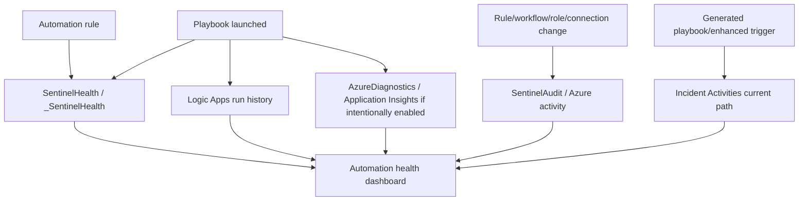

| Metric | Definition | Why it matters |
|---|---|---|
| Trigger volume | Runs by rule/workspace/source | Capacity and drift |
| Condition match rate | Executions / triggering events | Scope quality |
| End-to-end latency p95 | Event to verified completion | Operational SLA |
| Playbook launch success | Successful launches / requested | Sentinel permission/invocation health |
| Internal action success | Completed connector actions / expected | Actual workflow health |
| Retry/throttle rate | Retried/429 calls | Provider pressure |
| Duplicate prevented | Idempotency hits | Reliability evidence |
| Partial outcome rate | Some actions succeed, others fail | Reconciliation load |
| Approval time/timeout | Decision latency and expiration | Human bottleneck/risk |
| Containment verify rate | Applied actions independently verified | Outcome assurance |
| Rollback/reversal rate | Reversed actions / applied | Quality and business impact |
| Manual fallback use | Manual recoveries | Automation design gaps |
| Cost/run and cost/case | Azure/external cost | Sustainability |
| Unauthorized/drift changes | Changes without approved record | Integrity |

## 26. AI-generated playbooks and Enhanced Alert Trigger

The current Defender experience can generate Python playbooks through an embedded VS Code environment using Cline. A user describes the workflow in Plan mode, reviews a generated plan/flow, switches to Act mode for code and documentation, manually reviews/tests, saves, then explicitly activates the disabled playbook. Integration profiles hold base URL, auth method, and credentials for external APIs. No separate Security Copilot license/SCUs are currently required.

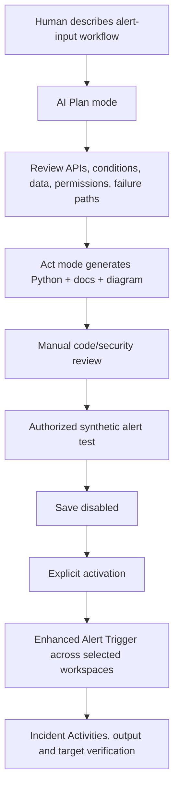

### 🔍 Plain-English deep-dive: generated code changes who types, not who is accountable

AI can draft API calls faster, but it does not own the target system, approve permissions, know hidden business dependencies, or accept outage risk. Review input validation, authorization, secret storage, endpoint allowlisting, injection risks, retries, idempotency, concurrency, timeouts, logging/redaction, tests, and rollback exactly as for human-written response code. The current page is internally notable: it describes code validation during generation but also lists no automatic code validation and says users must manually verify correctness. Treat manual review as mandatory.

| Current generated-playbook limit | Design impact |
|---|---|
| Python only | Team must review/support Python runtime |
| Alert is sole input | Not a drop-in replacement for incident/entity Logic Apps |
| No external libraries | Keep dependencies within supported runtime |
| Up to 100 playbooks/tenant | Catalog and retire |
| Up to 5,000 lines/playbook | Complexity gate; prefer smaller workflow |
| Maximum run 10 minutes | Bound calls/retries and long approvals elsewhere |
| Up to 500 integrations/tenant | Integration governance |
| Up to 8M AI tokens/day/tenant | Capacity monitoring |
| No playbook-to-playbook nesting | Design composition differently |
| One user edits one playbook at a time | Change coordination |
| Newly created disabled | Explicit activation gate |
| Enhanced trigger: 500 active rules/tenant | Capacity catalog |
| Enhanced trigger: one action/rule | Avoid assuming standard multi-action rules |
| Enhanced trigger: no priority/expiry | Separate governance and temporary-control plan |
| Runs not in SentinelHealth | Monitor incident Activities/current telemetry |

Integration profiles may use OAuth2 client credentials, API key, AWS auth, user/password, bearer/JWT, or Hawk. API URL and authentication method cannot currently be edited after creation; replace the profile when those change. A generated example that asks for a broad Graph application permission or client secret is not automatic approval. Apply least privilege and prefer stronger credentials where supported.

## 27. Phishing playbook scenario

**Scenario:** A high-confidence phishing alert involving a fictional user and URL creates/updates a Defender incident. The pilot enriches and notifies, creates/updates a ticket, adds tasks, and proposes containment. It does not automatically disable the user, purge mail, block a URL, or isolate a device.

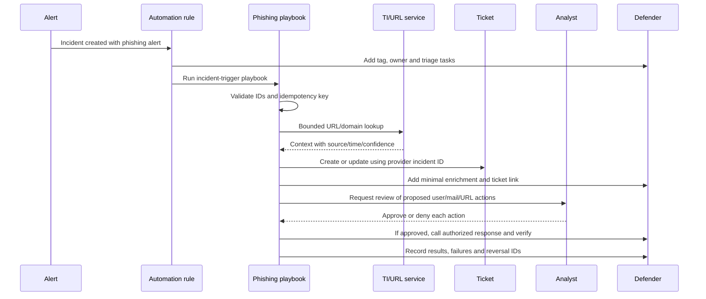

| Step | Input | Output | Failure/guardrail |
|---|---|---|---|
| Validate | Incident ID, alerts, strong user/message/URL IDs | Accepted normalized payload | Stop on ambiguous identity |
| Idempotency | Case + workflow version | Existing/new action state | Atomic claim |
| Enrich | Minimal URL/domain/hash | Time-stamped TI context | TLP/egress/rate limit |
| Ticket | Provider incident ID | External ticket ID | Search/store key; reconcile duplicates |
| Task | Current case | Analyst checklist | Avoid duplicate task set |
| Approval | Evidence + exact proposed action | Authenticated decision | Expiry and segregation |
| Response | Approved target/action | Target action ID | Break-glass/critical asset exclusions |
| Verify | Target API and current state | Confirmed/partial/failed | Do not trust request acceptance |
| Record | Correlation IDs and minimal result | Case/ticket history | Redact secrets/content |

## 28. Safe paper and synthetic lab

This lab creates no automation rule, Logic App, API connection, integration profile, ticket, message, incident, alert, user change, mail action, block, or containment. Use fictional identifiers and paper/synthetic JSON only.

### Synthetic incident payload

```json
{
  "providerIncidentId": "incident-demo-001",
  "workspaceId": "workspace-demo",
  "severity": "High",
  "status": "Active",
  "tags": ["Synthetic-Phishing-Lab"],
  "alerts": [
    {
      "alertId": "alert-demo-001",
      "serviceSource": "microsoftDefenderForOffice365",
      "title": "Synthetic phishing alert",
      "userTenantId": "tenant-demo",
      "userObjectId": "user-demo-001",
      "networkMessageId": "message-demo-001",
      "url": "https://phishing.example.invalid/demo"
    }
  ]
}
```

### Paper workflow pseudocode

```text
1. Reject payload unless providerIncidentId, workspaceId, alertId, tenant ID,
   object ID, and networkMessageId pass schema and allowlist checks.
2. Compute key = sha256(workflowVersion + providerIncidentId + "phishing-triage").
3. Atomically claim key or return the prior result.
4. In DRY_RUN mode, record proposed TI, ticket, task, and response calls only.
5. Query approved TI provider with the minimum normalized domain/URL.
6. Create/update a synthetic ticket keyed by providerIncidentId.
7. Add a redacted enrichment summary and analyst tasks.
8. Request authenticated, expiring approval for each response action.
9. If approved, execute only an allowlisted test action against a test target.
10. Independently verify target state; record partial/failed outcomes.
11. On retry, return stored action IDs and do not repeat side effects.
12. On failure, expose manual recovery, correlation IDs, and rollback status.
```

### Lab tasks

| Task | Action | Expected learning |
|---:|---|---|
| 1 | Draw rule/service-account/Logic App/connector identities | Trust boundaries |
| 2 | Choose incident versus alert trigger | Object grain |
| 3 | Define order 10/20/30 rules | State sequencing |
| 4 | Write conditions without incident title | Stable fields |
| 5 | Map roles for engineer, analyst, service and connector | Least privilege |
| 6 | Define idempotency key and atomic state | Duplicate safety |
| 7 | Add 429, 500, 400, 401 and timeout branches | Retry classification |
| 8 | Design authenticated approval and expiry | Human control |
| 9 | Threat-model URL enrichment egress | Privacy/TLP |
| 10 | Build dry-run output | Safe pilot |
| 11 | Define ticket source-of-truth fields | Synchronization |
| 12 | Review generated-playbook limits | Current platform fit |
| 13 | Write deployment/read-back/rollback steps | Change engineering |
| 14 | Present candidate honesty wording | No production overclaim |

### Validation matrix

| ID | Input/failure | Expected | Failure caught |
|---|---|---|---|
| V01 | Valid synthetic incident | One dry-run plan | Positive path |
| V02 | Missing user object ID | No containment; analyst task | Weak identity |
| V03 | Two alerts in incident | Deterministic all-alert filter | First-item assumption |
| V04 | Same trigger twice | One ticket/action state | Duplicate effect |
| V05 | Two concurrent triggers | One atomic claim | Race condition |
| V06 | TI returns 429 + Retry-After | Bounded delayed retry | Rate limit |
| V07 | Ticket returns 500 then 201 | Retry creates once | Non-idempotent retry |
| V08 | Graph returns 403 | Stop and permission alert | Permanent auth failure |
| V09 | Connector times out after target applied | Verify target before retry | Double action |
| V10 | Approval denied | No response; reason recorded | Unauthorized action |
| V11 | Approval expires | New approval required | Replay/stale approval |
| V12 | Break-glass user | Response blocked | Critical exclusion |
| V13 | Defender title changes | Ticket still correlates by ID | Fragile key |
| V14 | Multiple updates batched | Final-state logic still safe | Lost intermediate update |
| V15 | Playbook over two minutes | Rule does not assume completion | Sequence misconception |
| V16 | Secret appears in run output | Security gate fails | Credential leak |
| V17 | Generated playbook uses unsupported library | Build rejected | Runtime mismatch |
| V18 | Enhanced trigger lacks expiry | Governance control required | Temporary rule persists |
| V19 | Roll back workflow version | Prior dry-run behavior restored | Release regression |
| V20 | Monitoring sees launch success but internal failure | Logic diagnostics catch failure | False health |

### Lab deliverables

1. SOAR architecture and trust-boundary diagram.
2. Dated feature/status/portal/licensing register.
3. Automation-rule catalog with trigger, conditions, order, actions, expiry, owner.
4. Logic App/connector/identity/API connection permission matrix.
5. Phishing workflow, input/output schema, dry-run and approval design.
6. Idempotency, concurrency, retry, timeout, rate-limit and compensation plan.
7. Secret, privacy, TLP, egress and logging assessment.
8. Validation matrix and generated-code review checklist.
9. Deployment, read-back, monitoring, rollback and manual-recovery runbook.
10. Candidate honesty statement.

## 29. Troubleshooting

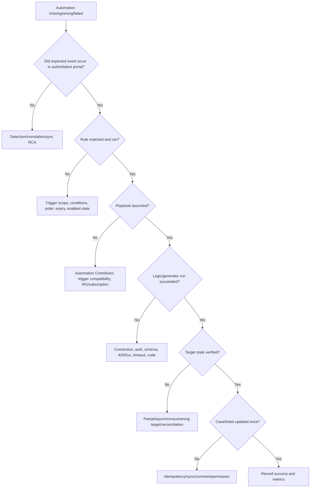

| Symptom | Likely boundary | Discriminating check |
|---|---|---|
| Rule never runs | Wrong trigger/provider/condition/expiry/disabled | `_SentinelHealth()` and exact case state |
| Rule runs twice | Duplicate events/rules/update loop | Rule IDs, order, update actor, idempotency ledger |
| Playbook grayed out | Sentinel lacks playbook RG permission or trigger mismatch | Automation Contributor and trigger type |
| Manual run denied | Missing Responder/Playbook Operator/Logic role | Effective assignments at exact scope |
| Works for creator only | User-bound API connection | Connection identity and owner lifecycle |
| Incident ID null | Entity playbook launched outside case | Null branch before incident action |
| Custom details parse fails | Array/schema changed | Captured synthetic/authorized sample and parser version |
| Defender rule broader after onboarding | Provider/title condition changed | Current provider/source/rule/tag fields |
| Update-trigger steps skipped | Defender batching | Compare incident Activity timeline and final state |
| Ticket duplicates | Non-atomic check/create | Idempotency key/action ledger |
| Later action ran before playbook finished | Automation advances after current timing behavior | Persisted completion state |
| Launch says success, target unchanged | Internal Logic App/API failure or async target | Run history and target action ID/state |
| 401/403 after rotation | API connection/secret/certificate/RBAC | Token audience, credential expiry and assignment |
| 429 storm | Unbounded parallelism/retries | Response headers and connector concurrency |
| Generated run absent from health | Current telemetry boundary | Incident Activities/current generator logs |
| Standard private endpoint playbook fails | Missing access restriction policy | Standard networking/access config |

## 30. Operate as a service

| Cadence | Review |
|---|---|
| Continuous | Trigger failures, launch failures, internal action errors, approval backlog, partial outcomes |
| Per shift/day | High-impact actions, manual recovery, duplicate prevention, target verification |
| Weekly | Top failures/retries/429s, stale tickets, orphan approvals, cost and volume |
| Monthly | Role/connection/secret inventory, workflow owners, SLOs, false actions, reversals |
| Quarterly | Use-case value, privacy/egress, licensing/status, portal changes, DR and rollback rehearsal |
| On change | Schema, connector, API, target permission, correlation, workspace, integration profile |

Every workflow needs a primary and backup owner, L1/L2/L3 escalation, target-system owner, response approver, privacy/security reviewer, deployment owner, and cost owner. Keep a manual runbook that works when automation is unavailable.

## 31. Consulting artifacts

| Artifact | Decision enabled |
|---|---|
| SOAR use-case catalog | Which tasks should be automated and at what risk tier? |
| Portal/trigger decision | Which event and engine own the workflow? |
| Automation-rule catalog | What order, conditions, actions, expiry and owner apply? |
| Workflow specification | What inputs, outputs, branches and state are intended? |
| Identity/permission matrix | Which human, service and connector can do what? |
| Integration profile/API contract | Which endpoint, auth, schema, rate and owner? |
| Response authority matrix | Who may propose, approve, execute and reverse? |
| Idempotency/state design | How are duplicates and races prevented? |
| Failure/compensation map | What happens after every partial failure? |
| Secret/privacy threat model | What can leak and how is egress controlled? |
| Synthetic test pack | Which normal, failure, rate, duplicate and rollback cases pass? |
| Deployment manifest | Which versions, parameters, roles and connections were released? |
| Health/cost dashboard | Is automation running, useful, secure and affordable? |
| Manual recovery/rollback runbook | How is service restored without hidden effects? |

## 32. JD Mapping: interview translation

| Interview theme | Arti's transferable strength | Honest SOAR answer |
|---|---|---|
| Automation design | Power Platform/Copilot foundations | Trigger-condition-action plus secure orchestration |
| Incident handling | CRITSIT/RCA coordination | Incident-centered workflow and human approval |
| Troubleshooting | Layered evidence isolation | Event → rule → launch → run → target → case |
| Security | Privacy-aware customer handling | Least privilege, secrets, egress, audit |
| Reliability | Fix validation and rollback | Idempotency, retries, timeouts, verification |
| Consulting | Stakeholder/owner communication | RACI, authority, SLOs, artifacts and residual risk |
| AI | AI adoption awareness | Generated code review, limits and manual accountability |
| Experience gap | Honest technical boundary | Paper/synthetic design, no production playbook claim |

## Official Source Anchors

These official Microsoft Learn pages were reviewed for the August 24, 2026 treatment. Recheck release/preview banners, Product Terms, portal behavior, roles, connector support, API schemas, service limits, regions, licensing, Logic Apps pricing, generated-playbook runtime, and tenant configuration before implementation.

1. [Automation in Microsoft Sentinel](https://learn.microsoft.com/azure/sentinel/automation/automation) — SOAR components and detailed Defender portal differences.
2. [Automation rules](https://learn.microsoft.com/azure/sentinel/automate-incident-handling-with-automation-rules) — triggers, conditions, native actions, order, expiry, execution, permissions, export/import and multitenant behavior.
3. [Automate response with playbooks](https://learn.microsoft.com/azure/sentinel/automation/automate-responses-with-playbooks) — use cases, roles, templates preview, cost and workflow.
4. [Create and manage playbooks](https://learn.microsoft.com/azure/sentinel/automation/create-playbooks) — Consumption/Standard creation, triggers, connections, custom details, null incident ID, diagnostics and active playbooks.
5. [Run playbooks](https://learn.microsoft.com/azure/sentinel/automation/run-playbooks) — automatic/manual invocation, roles, permissions, multitenant operation and portal paths.
6. [Azure Logic Apps for Sentinel playbooks](https://learn.microsoft.com/azure/sentinel/automation/logic-apps-playbooks) — connector components, Consumption/Standard differences, stateful and networking limits.
7. [Authenticate playbooks](https://learn.microsoft.com/azure/sentinel/automation/authenticate-playbooks-to-sentinel) — managed identity preview, service principal, user, roles and API connections.
8. [Generate playbooks using AI](https://learn.microsoft.com/azure/sentinel/automation/generate-playbook) — embedded VS Code/Cline, integration profiles, enhanced alert trigger, disabled default, monitoring and current limits.
9. [Monitor automation health](https://learn.microsoft.com/azure/sentinel/monitor-automation-health) — automation health and Logic Apps diagnostics correlation.
10. [Auditing and health monitoring](https://learn.microsoft.com/azure/sentinel/health-audit) — `SentinelHealth`, `SentinelAudit`, functions, cost and diagnostics.
11. [Transition Sentinel to Defender](https://learn.microsoft.com/azure/sentinel/move-to-defender) — incident correlation, sync delay, batching, trigger, API, primary-workspace and manual-action changes.
12. [Microsoft Sentinel roles](https://learn.microsoft.com/azure/sentinel/roles) — Responder, Contributor, Playbook Operator, Automation Contributor and Logic App roles.
13. [Azure Logic Apps reliability and error handling](https://learn.microsoft.com/azure/logic-apps/error-exception-handling) — retry, run-after and exception patterns.
14. [Secure Logic Apps](https://learn.microsoft.com/azure/logic-apps/logic-apps-securing-a-logic-app) — access, inputs/outputs, networking and security controls.
15. [Logic Apps pricing](https://azure.microsoft.com/pricing/details/logic-apps/) — current regional/commercial pricing must be checked.

## ⭐ Likely Interview Questions for This Section

### Q1. What is the difference between a Sentinel automation rule and a playbook?

**Model answer:** An automation rule centrally selects a trigger, evaluates conditions, controls order, and performs native case actions such as assignment, tags, severity, status, tasks, or invoking a playbook. A playbook is a Logic Apps or current generated workflow that performs richer branching and integrations. I keep simple case changes native and use playbooks for external or complex orchestration.

### Q2. When would you use incident-created, incident-updated, or alert-created automation?

**Model answer:** Incident-created is the default for initial case routing, tasks, ticketing and enrichment. Incident-updated supports escalation and external synchronization, but Defender may batch 5–10 minutes of changes, so I do not depend on every intermediate state. Alert-created is for supported alert-only or pre-incident workflows. In Defender, standard alert rules affect Sentinel alerts; wider Defender/XDR alert coverage uses the current Enhanced Alert Trigger with different limits.

### Q3. Which permissions are required for Sentinel playbooks?

**Model answer:** Separate the human, Sentinel service and connector identities. An engineer commonly needs Sentinel Contributor and a Logic App creation/edit role. An analyst needs Sentinel Responder plus Playbook Operator for manual runs. The Sentinel service account needs Automation Contributor on the playbook resource group to invoke playbooks. The Logic App's managed identity or API connection separately needs least-privilege rights to Sentinel and each target.

### Q4. How do you make a playbook idempotent and safe under concurrency?

**Model answer:** I derive a stable key from workflow version, provider case/alert, action and target, then atomically claim durable state before side effects. I store the target action ID and return prior results on retries. I re-read target/case state before writes, bound concurrency, use target API idempotency keys where available, and reconcile partial outcomes. A simple check-then-create can race.

### Q5. How should retries and error handling work?

**Model answer:** Retry only classified transient failures such as 429 with Retry-After, selected 5xx and network resets, using bounded exponential backoff and jitter. Stop on schema 400 and auth 401/403 until corrected. Every action has a timeout and end-to-end deadline. I record partial effects, verify target state before retrying non-idempotent operations, and provide compensation or manual recovery with correlation IDs.

### Q6. How would you automate a phishing response safely?

**Model answer:** Start with incident assignment, tags, tasks, minimal TI enrichment, redacted notification, and idempotent ticket sync. Validate strong user/message/URL identifiers and current case state. Any purge, account disable, URL block or device isolation begins as an authenticated, expiring human-approved proposal with critical exclusions, exact target/action, business impact, independent verification and reversal. Pilot in dry-run/shadow mode first.

### Q7. How do current AI-generated playbooks change the design?

**Model answer:** They create alert-input Python workflows through an embedded VS Code/Cline Plan/Act flow, use integration profiles, save disabled, and can run through Enhanced Alert Triggers across selected workspaces. They have current limits such as Python only, no external libraries or nesting, 10-minute runtime, one action per enhanced rule, and no enhanced-rule order/expiry. I manually review generated code, permissions, secrets, APIs, idempotency, failure paths, tests and rollback exactly like human-written response code.

### Q8. What is your honest experience with Sentinel SOAR?

**Model answer:** I have not deployed Sentinel automation rules, Logic Apps playbooks or automatic containment in production. My production experience is incident/RCA, validation, stakeholder communication and Power Platform foundations. I built a current synthetic phishing SOAR design covering triggers, portal differences, roles, identities, approvals, idempotency, retries, monitoring, generated-code review, deployment and rollback. I would start with non-destructive automation under peer review.

## 🧠 30-Second Memory Hooks

- **Automation:** repeat a task; **orchestration:** coordinate systems and decisions.
- **Rule:** trigger + conditions + ordered native actions/playbook.
- **Incident first:** evolving case is usually the right workflow grain.
- **Updated trigger:** useful, but Defender can batch away intermediate changes.
- **Order:** sequential; duplicate numbers are random.
- **Long playbook:** later actions may advance after two minutes.
- **Expiry:** temporary rule guardrail; enhanced triggers lack it currently.
- **Playbook:** Logic App workflow with separate cost and identity.
- **Consumption:** per-use; **Standard:** single-tenant plan/network/CI/CD.
- **Three permissions:** builder, Sentinel invoker, connector target identity.
- **Automation Contributor:** Sentinel service role, not a human role.
- **API connection:** separate Azure authorization resource.
- **Dynamic content:** typed/null/array API contract.
- **Idempotency:** same logical request, one intended effect.
- **Concurrency:** atomic claim, not check then create.
- **Retry:** transient only, bounded, honor Retry-After.
- **Approval:** authenticated, authorized, expiring, auditable.
- **Verify:** accepted request is not confirmed target state.
- **Generated code:** faster authoring, unchanged accountability.
- **Honesty:** synthetic SOAR design, no production playbook claim.

## Completion Checklist

- [ ] I can explain automation, orchestration, response, automation rule, playbook, connector and API connection.
- [ ] I can draw all human, Sentinel service, Logic App, connector and target trust boundaries.
- [ ] I can write a complete automation specification.
- [ ] I can choose incident-created, incident-updated, alert-created, manual, or enhanced alert triggers.
- [ ] I can explain current Defender provider, title, delay, batching, primary-workspace and manual-run differences.
- [ ] I can design stable conditions without depending on incident title.
- [ ] I can use native assign, tag, status, severity, task, close and run-playbook actions appropriately.
- [ ] I can explain rule/action order, duplicate order risk, expiry and long-playbook timing.
- [ ] I can compare Consumption and Standard Logic Apps.
- [ ] I know Sentinel requires stateful Standard workflows and Standard lacks playbook templates.
- [ ] I can validate incident, alert, entity, array, custom-detail and null input contracts.
- [ ] I can separate engineer, analyst, Sentinel service and connector permissions.
- [ ] I can explain Contributor, Responder, Playbook Operator, Automation Contributor and Logic App roles.
- [ ] I can choose managed identity, service principal, user OAuth or API key with controls.
- [ ] I can inventory shared API connection blast radius.
- [ ] I can classify enrichment, notification, ticketing and containment by risk.
- [ ] I can design authenticated human approval with expiry and separation of duties.
- [ ] I can create an idempotency key and atomic action-state design.
- [ ] I can bound concurrency and avoid stale case/target writes.
- [ ] I can classify retryable and permanent errors and implement timeouts/backoff.
- [ ] I can design compensation and manual recovery for partial success.
- [ ] I can protect secrets, run histories, tickets, messages and external egress.
- [ ] I can synchronize tickets using stable provider IDs and explicit field ownership.
- [ ] I can design reversible, verified containment with critical exclusions.
- [ ] I can use fixtures, mocks, dry-run, shadow, pilot and failure injection.
- [ ] I can version rules, workflow code, roles, connections, parameters and tests.
- [ ] I can deploy disabled, read back, pilot, monitor and roll back.
- [ ] I can correlate `_SentinelHealth()`, Logic Apps diagnostics, audit and target evidence.
- [ ] I can explain current AI-generated playbook and Enhanced Alert Trigger limits.
- [ ] I can review generated Python with the same security bar as human code.
- [ ] I completed the safe phishing paper lab without creating or changing any resource.
- [ ] I can answer Q1–Q8 aloud without claiming production Sentinel SOAR experience.
- [ ] I will recheck Learn, preview/GA, licenses, portal, connector, API, runtime, regions and tenant behavior before reuse.

*Next suggested section:* [Part 51](Part-51-unified-secops-defender-sentinel-purview.md)