# Part 51 — Unified SecOps: Integrating Sentinel, Defender XDR, Purview, and Third Parties

> **Section goal:** Build a beginner-first, consulting-grade architecture and operating model for unified security operations across Microsoft Sentinel, Microsoft Defender XDR, Microsoft Purview, Microsoft Entra, Microsoft Intune, Microsoft Defender for Cloud, and third-party security sources. By the end, you should be able to explain the Defender portal control plane; select and onboard a primary Sentinel workspace; prevent duplicate alert/incident paths; define incident correlation, synchronization, and ownership; choose XDR, SIEM, or both for a use case; hunt across current data surfaces; coordinate response without violating product or privacy boundaries; design retention, RBAC, API, migration, and third-party integrations; operate a unified queue with RACI and runbooks; and complete a synthetic cross-domain incident exercise without claiming production platform ownership.

This Part maps directly to Deloitte expectations for Microsoft Defender and Sentinel integration, Microsoft 365 security architecture, Purview and data-security coordination, identity and endpoint response, third-party transformation, incident investigation, portal migration, secure operations, troubleshooting, and stakeholder communication. Arti's strengths in Microsoft 365 escalations, SharePoint/OneDrive context, cross-team incident ownership, RCA, KPI reporting, and customer communication help connect technical signals to business impact. The guide still distinguishes that transferable experience from hands-on production unified SecOps administration.

> **Currency, status, portal, licensing, data-lake, and behavior-change note (August 24, 2026):** This chapter is grounded in official Microsoft Learn available on August 24, 2026. Microsoft Sentinel is **generally available** in the Defender portal, including for customers without Defender XDR or an E5 license; however, Defender, Purview, Intune, Entra, Security Copilot, Exposure Management, premium threat intelligence, data-lake, and source capabilities retain separate plans, prerequisites, regions, and charges. After March 31, 2027, Sentinel is supported only in the Defender portal. New Sentinel customers with specified subscription Owner/User Access Administrator onboarding paths have been automatically onboarded since July 2025. Defender XDR becomes the incident-creation/correlation engine for onboarded workspaces; Fusion is disabled; Microsoft security incident-creation rules are deactivated/unsupported; primary versus secondary workspace behavior changes Microsoft-alert ingestion; and several standalone Microsoft connector entries disappear from the Defender data-connectors page. Sentinel log storage remains in Log Analytics, while Defender portal privacy/processing policies apply to the unified experience. Alerts/incidents, CMK, `IdentityInfo`, Advanced Hunting, APIs, automation, data lake, retention, RBAC, and portal behavior have documented differences. Verify the live tenant, licenses, Product Terms, current Learn banners, cloud/region, privacy, schema, and service limits before approval.

## JD Mapping

| Deloitte expectation | Capability developed here | Consulting evidence |
|---|---|---|
| Design Microsoft security architecture | Map SIEM, XDR, data security, identity and endpoint planes | Unified target architecture |
| Integrate Sentinel and Defender | Select onboarding, primary workspace, connector and incident path | Integration decision record |
| Investigate cross-domain incidents | Use unified queue, attack story, entities and hunting | Investigation chronology |
| Integrate Purview | Use DLP/insider signals with privacy and product boundaries | Data-security escalation runbook |
| Coordinate response | Sequence Entra, Intune, Defender, Purview and business actions | Response authority matrix |
| Migrate portals/tools | Inventory dependencies, test behavior, cut over and roll back | Transition plan |
| Include third parties | Onboard data/alerts and avoid duplicate paths | Source ownership catalog |
| Operate and report | Define RACI, SLAs, metrics, health, APIs and handover | Operating model and dashboard |

## Candidate honesty note

Arti can credibly discuss production Microsoft 365 incidents, SharePoint/OneDrive permissions and data context, evidence correlation, RCA, service boundaries, stakeholder coordination, privacy-aware handling, business reporting, and validating a change. She can demonstrate the paper architecture, synthetic incident chronology, decision matrices, and migration tests in this chapter.

She should not claim production Defender XDR/Sentinel/Purview integration, portal onboarding, unified incident ownership, connector migration, hunting, automatic attack disruption, DLP/insider-risk investigation, API migration, or SOC management unless separately evidenced. Safe wording is:

> “I have not administered unified Sentinel and Defender XDR in production. My production experience is complex Microsoft 365 support incidents, evidence/RCA, SharePoint and OneDrive data/permissions context, change validation, and multi-party communication. I built a current paper architecture that selects an authoritative unified queue and primary workspace, prevents duplicate Microsoft alert paths, maps Sentinel/Defender/Purview/Entra/Intune responsibilities, and covers retention, RBAC, APIs, tests, migration, rollback, runbooks, and metrics. In a client tenant I would inventory current connectors and automation, validate licenses/privacy/roles, onboard in a controlled window, and prove every critical workflow with synthetic cases before handover.”

---

## 1. What “unified” means—and what it does not

**Unified security operations** provides one Defender portal for SIEM, SOAR, XDR, exposure management, cloud security, threat intelligence, and AI-assisted workflows as licensed. It can combine incidents, alerts, entities, hunting, and response context. It does not turn all products into one database, license, permission model, retention policy, API, or team.

Think of a hospital command center. One screen can combine emergency, laboratory, imaging, and pharmacy information. Each department still has different source systems, expertise, privacy rules, and authority. A unified portal reduces switching; it does not erase ownership.

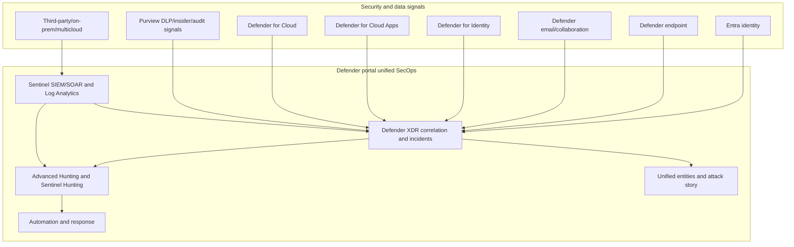

| Unified | Still separate/conditional |
|---|---|
| Incident queue and cross-domain correlation | Product licensing and sensor/onboarding |
| Portal navigation and entity context | Source data stores and retention |
| Advanced Hunting across supported data | Table schemas and ingestion choices |
| Cross-product investigation story | Response permissions and product APIs |
| Shared filters and operational view | Purview privacy/case governance |
| Defender correlation of Sentinel alerts | Sentinel workspaces, Azure subscriptions and costs |
| Microsoft Graph incidents/alerts API direction | SecurityInsights API for Sentinel resources |

## 2. SIEM, XDR, and data security from zero

- **SIEM** — Security Information and Event Management; centralizes and analyzes logs/alerts from many sources. **Analogy:** a citywide emergency dispatch center. **Memory hook:** broad telemetry and custom detection.
- **XDR** — Extended Detection and Response; correlates deep product telemetry across protected domains such as endpoint, identity, email, and cloud apps. **Analogy:** specialist emergency teams sharing one patient history. **Memory hook:** deep native sensors plus response.
- **SOAR** — Security Orchestration, Automation, and Response. **Analogy:** the coordinated response checklist and integrations. **Memory hook:** workflow and authorized action.
- **Data security/compliance signal** — a policy match or risk indicator about sensitive data or user behavior, often from Purview. **Analogy:** a privacy/safety concern reported by a specialist. **Memory hook:** signal needs governance context.
- **Primary workspace** — the Sentinel workspace chosen as authoritative for Microsoft Defender XDR connection/correlation in a multi-workspace tenant. **Memory hook:** one tenant’s main XDR-SIEM bridge.
- **Unified incident** — a Defender-created case that can correlate alerts from Defender and onboarded Sentinel. **Memory hook:** one attack story, many sources.
- **Service source** — the product/service that produced an alert. **Memory hook:** who detected it.
- **Detection source** — the technology/sensor that identified activity. **Memory hook:** how it was detected.

## 3. Control plane and data plane

The **control plane** stores configuration and workflow: workspace onboarding, connector settings, rules, roles, automation, case actions, and APIs. The **data plane** contains events, alerts, entities, incidents, lake records, and query results. A unified portal spans both but does not relocate every record.

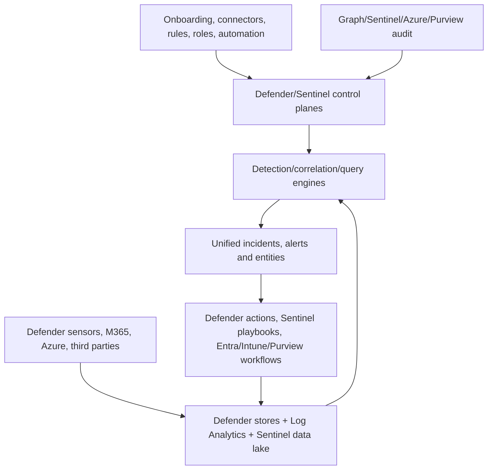

| Object | Authoritative plane to document | Why |
|---|---|---|
| Defender incident | Defender XDR/Graph after onboarding | Correlation and case lifecycle |
| Sentinel analytics rule | Sentinel SecurityInsights resource | Detection configuration |
| Sentinel event | Workspace Log Analytics table | Source evidence/retention |
| Defender hunting event | Defender Advanced Hunting table | Native XDR telemetry |
| DLP policy | Purview | Data policy definition |
| DLP alert | Defender/Purview investigation surfaces | Operational signal, policy remains Purview |
| Device response | Defender for Endpoint/Action Center | Target action state |
| Intune policy | Intune | Desired endpoint management state |
| Entra user/session | Entra | Identity control state |
| External ticket | Ticket system | Agreed workflow fields |

## 4. Current Sentinel onboarding paths

Sentinel can be used in the Defender portal with Defender XDR or on its own. Existing Azure-portal workspaces transition by planning, meeting prerequisites, onboarding, reviewing connectors/content/automation/APIs, validating operations, then retiring Azure-centric workflows. New customer paths may auto-onboard.

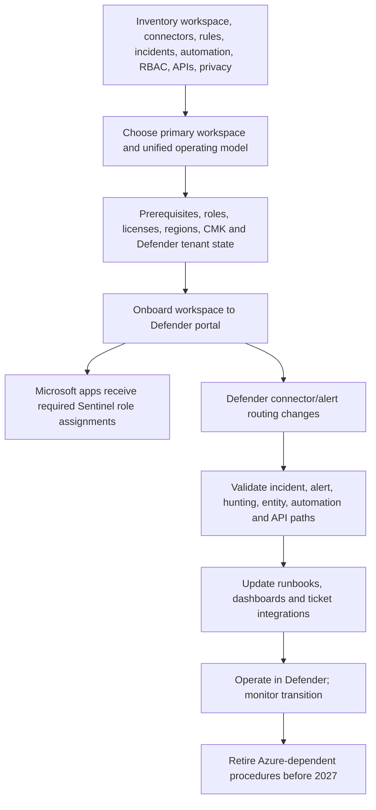

| Pre-onboarding question | Evidence |
|---|---|
| Which workspace is primary? | Signed workspace decision and business rationale |
| Which Microsoft alert connectors exist in every workspace? | Connector inventory/export |
| Which incident rules/grouping/Fusion dependencies exist? | Detection/correlation catalog |
| Which automation uses provider/title/description? | Condition and payload search |
| Which APIs/tickets use Sentinel incident schema? | Integration contract list |
| Which table-level RBAC controls sensitive tables? | Effective access test |
| Which CMK/privacy/residency obligations apply? | Architecture/legal assessment |
| Which workbooks/bookmarks/notebooks require Azure? | Portal dependency register |
| Which teams own XDR versus Sentinel cases today? | RACI and queue metrics |

## 5. Primary and secondary workspaces

In a multi-workspace tenant onboarded to Defender, Microsoft Defender XDR connects to a primary workspace. Tenant-level alerts from integrated Microsoft products flow there. During onboarding, relevant standalone Microsoft alert connectors are automatically disconnected in secondary workspaces to prevent duplicate tenant alerts. Only primary-workspace Sentinel alerts are correlated with Defender XDR data in specified multi-workspace scenarios.

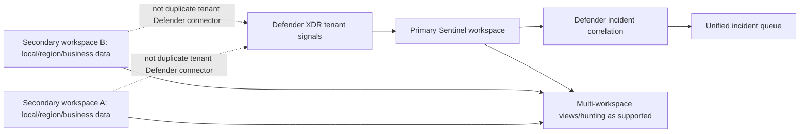

### 🔍 Plain-English deep-dive: “primary” is a correlation responsibility, not a statement that all logs must move

An enterprise may keep multiple workspaces for residency, ownership, cost, or regulated boundaries. Choosing a primary workspace says where the tenant's Defender integration and main Microsoft alert correlation path lives. It does not automatically centralize every raw event or erase secondary workspace responsibilities. Document what remains local, what can be queried centrally, where alerts/incidents are created, and who owns cases that begin in secondary data.

## 6. Defender connector choices and duplicate avoidance

There are two broad integration modes: enable the Defender XDR connector for Azure-portal Sentinel synchronization, or onboard Sentinel directly into Defender. In Defender onboarding, the connector is automatically configured and standalone alert providers are disconnected. Defender for Cloud has separate tenant-based versus legacy subscription-based choices and requires explicit duplicate-avoidance design.

| Source/integration | Preferred path after onboarding | Duplicate risk/control |
|---|---|---|
| Defender for Endpoint | Defender XDR connector/primary workspace | Disconnect standalone alert connector |
| Defender for Identity | Defender XDR connector/primary workspace | Disable duplicate Microsoft incident rules |
| Defender for Office 365 | Defender XDR connector/current preview-status path | Verify connector and licensing |
| Defender for Cloud Apps | Defender XDR connector | Avoid standalone alert duplication |
| Entra ID Protection alerts | Defender XDR integrated path | Verify tenant alert path |
| Defender for Cloud | Choose tenant-based Defender or legacy subscription path | Do not enable duplicate incident/alert sync |
| Raw Advanced Hunting events | Optional selected table streaming/Advanced Hunting direct | Cost and duplicate raw data |
| Third-party alerts/logs | Sentinel connector/custom ingestion | Stable source IDs and duplicate event handling |
| Purview DLP/IRM alerts | Defender-integrated signal as licensed; policy/case remains Purview | Avoid parallel ticket ownership without mapping |

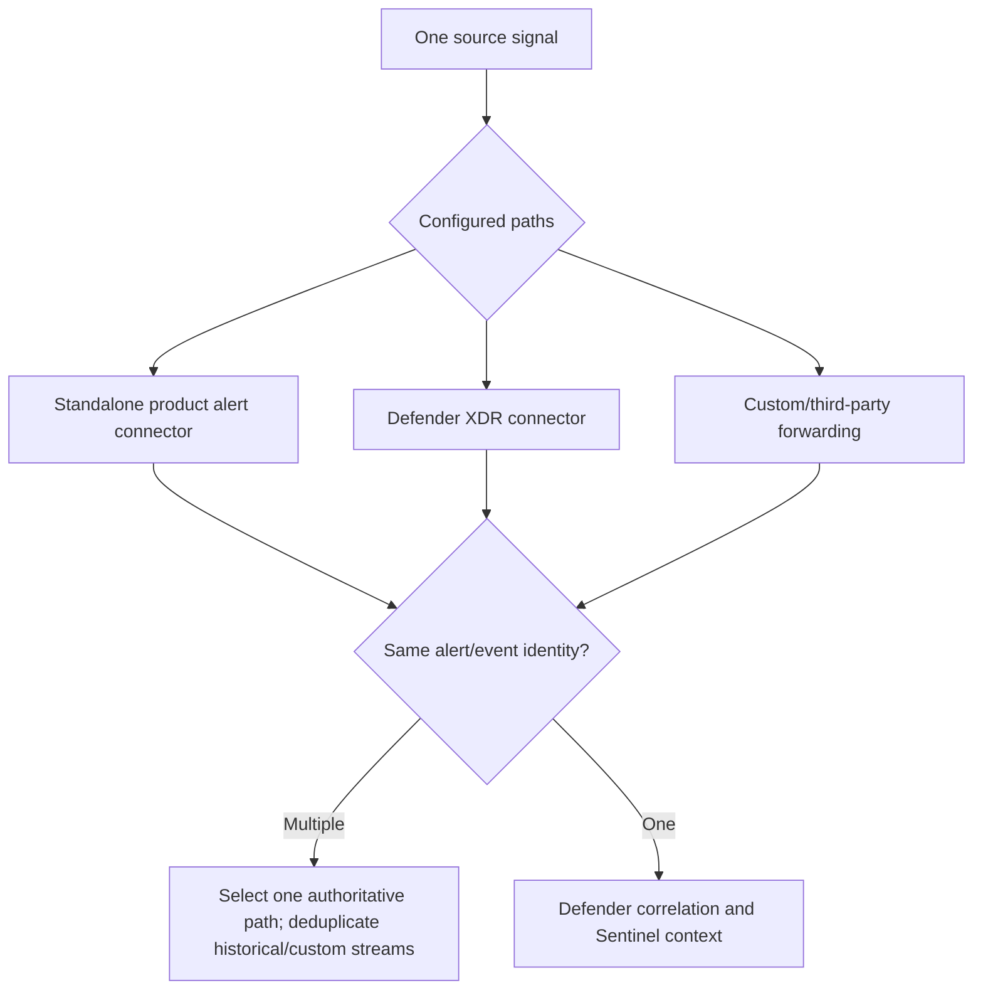

Duplicate data is not extra coverage. It inflates cost, incident count, enrichment, notifications, tickets, and metrics, and can cause repeated response. Build a source-to-destination matrix with event/alert IDs and compare before/after counts during migration.

## 7. Incident creation, correlation, merging, and ownership

After onboarding, Defender XDR creates and correlates incidents for Sentinel alerts. Its proprietary correlation can merge alerts across service sources and override Sentinel grouping expectations. Fusion is disabled because Defender correlation replaces that function. Microsoft security incident-creation rules are deactivated/unsupported to prevent duplicates.

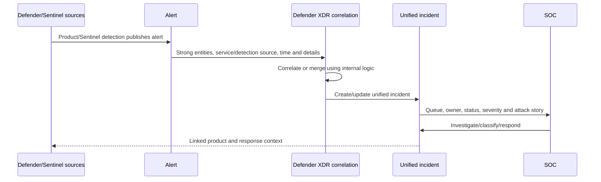

| Ownership item | Decision |
|---|---|
| Authoritative incident ID | Microsoft Graph/Defender provider incident ID after onboarding |
| Authoritative queue | Defender unified Incidents page |
| Title | Display field, not integration key |
| Severity | Current case priority; define who can change it |
| Status/classification | Map to ticket/Sentinel values explicitly |
| Alert membership | Defender correlation authority; portal actions differ |
| Automation | Trigger on stable rule/source/tags/entities, not title/provider legacy assumptions |
| Closure | One closure gate with classification, response verification and residual tasks |
| Product action | Verify in owning product/Action Center, not only case status |

### 🔍 Plain-English deep-dive: one queue needs one accountable owner, not one all-powerful analyst

A unified incident can contain email, identity, endpoint, cloud, Sentinel, and data-security signals. Assign one incident commander/owner who coordinates the case. Specialists retain authority for their domains: a Purview investigator handles sensitive-content context, an identity administrator approves account actions, an endpoint responder verifies isolation, and legal/HR guide insider-risk matters. “Single pane of glass” is not permission to bypass separation of duties.

## 8. Synchronization and transition behavior

For non-onboarded Azure integration, Defender incidents synchronize bidirectionally with Sentinel for defined fields such as title, description, severity, tags, new comments, and transformed status/classification values. Defender incidents can exceed Sentinel's 150-alert display limit. After direct Defender onboarding, Defender is authoritative and some Azure/manual/API-created Sentinel incidents do not appear in Defender.

| Behavior | Current implication |
|---|---|
| Provider name in Defender | Always `Microsoft XDR` |
| Incident sync just after onboarding | Up to roughly five minutes |
| Alerts-only Sentinel rule | Alert may not be visible in Defender without incident creation |
| Manual/API/Logic App Sentinel-created incident | Not synchronized to Defender in current path |
| Closed incident reopen by Sentinel grouping | Not available; new alerts create new case |
| Comment edit | New comments sync; edits differ by portal |
| Add/remove/move alerts | Defender-specific behavior; not identical to Azure |
| More than 150 alerts | Sentinel representation shows `150+`; inspect Defender case |
| Defender merge | Redirected/closed related case behavior must map to tickets |

Do not promise “immediate two-way sync” as a universal 2026 statement. Name the architecture state, field, API, and tested delay.

## 9. Unified incident queue and triage

The unified queue combines incidents from multiple service sources. Triage should use severity, active attack status, impacted critical assets, attack story, source/detection products, entity risk, data sensitivity, business impact, age, and ownership—not product name alone.

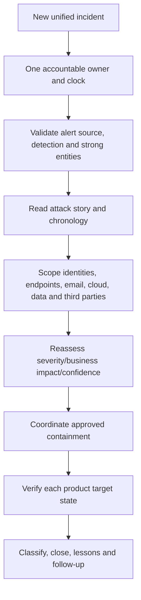

| Triage question | Evidence |
|---|---|
| Why did this incident exist? | Alerts, detection logic, service/detection source |
| What is the attack story? | Ordered alerts/events/entities and relationships |
| Which entities are strong? | Tenant/object/device/message/resource IDs |
| Is activity ongoing? | Latest raw telemetry and action state |
| Is sensitive data involved? | Purview signal and authorized content review |
| What business service is affected? | Asset/owner/criticality context |
| What containment is safe? | Dependency and authority matrix |
| What remains after response? | Hunting and independent verification |

## 10. Sentinel data in Defender Advanced Hunting

After onboarding, Advanced Hunting can query supported Defender and Sentinel data, workspace queries/functions, and data-lake sources as available. Sentinel alerts tied to incidents appear in `AlertInfo`. Advanced Hunting provides unified query but does not supply every Sentinel-specific feature such as bookmarks.

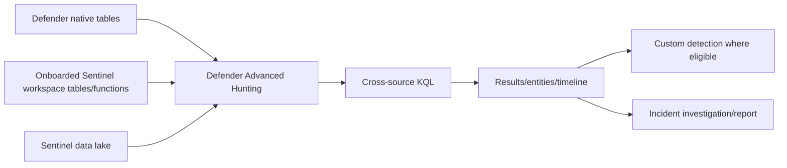

| Data choice | Benefit | Cost/limit question |
|---|---|---|
| Query Defender data directly in Advanced Hunting | Native schema; current default window without duplicate ingestion | Is 30-day Defender retention enough? |
| Stream selected Defender raw events to Sentinel | Longer workspace retention and Sentinel analytics/workbooks | Ingestion/retention cost; unsupported TVM tables |
| Use Sentinel third-party logs in Advanced Hunting | Unified SIEM/XDR query | Onboarding, workspace scope and table support |
| Use data lake | Long-term, broad, cost-oriented storage/analysis | Region, role, job latency, CMK and query cost |
| Custom detection across both | Unified detection/action path | Eligible tables, frequency, action and licensing |

Defender Vulnerability Management tables can appear in a Sentinel schema but are not necessarily ingested; a query may work in Advanced Hunting and return nothing in Sentinel. Test each table in each surface.

## 11. Entity pages and attack story

Defender consolidates user, device, IP, mailbox/evidence, and Sentinel event context. Entity pages and attack story help connect alerts, vulnerabilities, actions, identities, files, URLs, and resources. Strong IDs and source ownership remain essential.

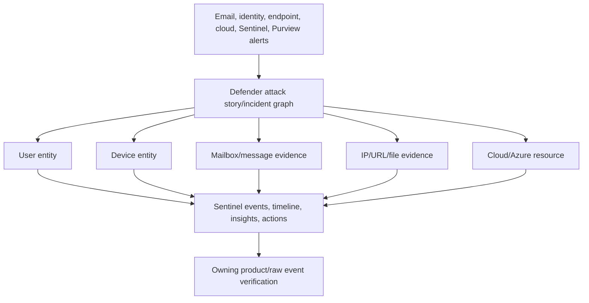

The graph is an investigation aid, not causal proof. Shared IPs, renamed users, recycled process IDs, missing entity mapping, and data lag can create misleading relationships. Validate exact timestamps and IDs.

## 12. Automation in a unified case

Sentinel incident automation can run on Defender-created cases after synchronization. Correlation may add sources or entities not expected by a playbook. Standard Sentinel alert triggers act only on Sentinel alerts in Defender; Enhanced Alert Triggers cover wider Defender/XDR alerts under current generated-playbook limits.

| Automation question | Unified design |
|---|---|
| What triggers? | Stable incident/alert event and current portal |
| Which case source? | All provider names may be Microsoft XDR; inspect service/detection source |
| Which alerts? | Filter arrays; do not assume one product |
| How fast? | Account for sync and automation delay |
| Which workspace? | Primary/authoritative workspace and explicit list |
| What if case merges? | Stable provider ID mapping and ticket reconciliation |
| What if updates batch? | Final-state/idempotent logic, not every transition |
| What response? | Product owner/Action Center plus human approval |

## 13. Purview signals and boundaries

Purview Data Loss Prevention (DLP) policies can generate alerts. Current guidance recommends Defender XDR for investigating/managing DLP alerts and Purview for creating/editing DLP policies. Defender XDR also receives signals such as Insider Risk Management alerts as licensed/configured. A Defender incident can add security context, but Purview policy, sensitive-content access, pseudonymization, compliance roles, cases, and legal/HR processes remain governed in Purview.

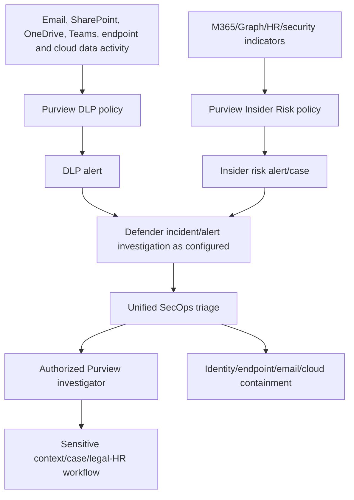

| Boundary | Defender/SOC role | Purview/data-governance role |
|---|---|---|
| DLP alert | Correlate with attack/security signals, manage incident | Define DLP policy/rule and inspect sensitive match under role |
| Sensitive content | Know signal exists and request authorized review | Content Explorer viewer/investigator accesses minimum content |
| Insider risk | Correlate security alerts and protect systems | Pseudonymized risk review, HR/legal process and case |
| User activity | Scope technical compromise | Evaluate policy context and privacy/employee implications |
| Response | Disable sessions/isolate device under security authority | Retention/legal hold/communication/remediation decisions |
| Closure | Security incident classification | Purview case/policy disposition may remain separate |

### 🔍 Plain-English deep-dive: a DLP alert is not automatically insider malice

A user can trigger DLP through accidental sharing, legitimate work, policy misunderstanding, compromised identity, or malicious exfiltration. Defender can reveal phishing, token theft, endpoint malware, or unusual cloud activity. Purview can reveal the policy, sensitive-information type, location, override, and authorized content context. Investigate both before labeling intent. Insider-risk tools are privacy-by-design and pseudonymized by default; broad SOC exposure can undermine that model.

## 14. Purview alert licensing, latency, and retention

DLP alert options vary by license. Single-event alerts are broadly available under listed DLP subscriptions; aggregate threshold options require higher plans/add-ons. User-and-rule aggregation is preview. Current Learn says alert configuration changes may take up to three hours to generate alerts. Alert visibility is controlled by audit retention configuration, not simply Sentinel retention.

| Area | Verify |
|---|---|
| License | DLP location, endpoint/Teams eligibility, aggregate options, Audit/IRM plan |
| Role | DLP Manage alerts plus view/manage role; sensitive-content viewer separately |
| Aggregation | Single, user/rule preview, threshold count/volume and time window |
| Latency | Policy evaluation and up-to-current guidance after change |
| Retention | Purview audit/alert policy and Defender visibility |
| Signal fields | User, host, IP, file/message/site, policy/rule/SIT, action/override |
| Privacy | Minimum content, pseudonymization, role segregation and audit |

Do not promise that sending Purview data into Sentinel extends every Purview case or content artifact. Define exactly which alert/event records are available in which table/API and under which license/retention.

## 15. Entra, Intune, Defender, and Purview response coordination

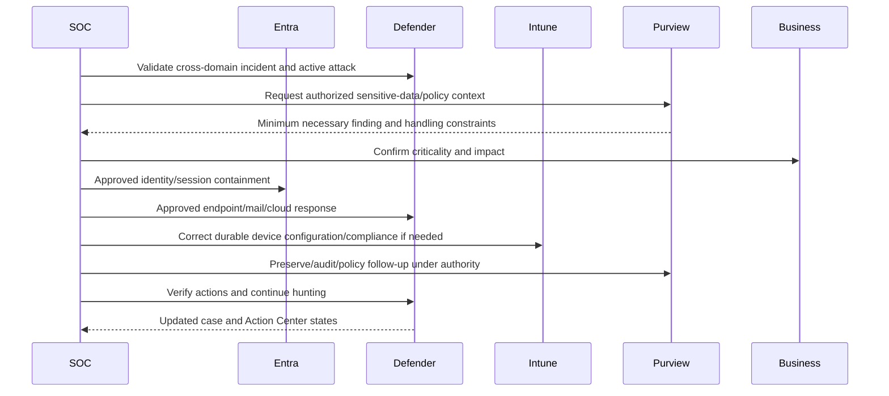

| Product | Immediate incident role | Durable control role | Verification |
|---|---|---|---|
| Entra | Revoke sessions, disable/limit identity, change auth under authority | CA, auth methods, app/workload identity governance | Sign-in/token/risk/current account state |
| Defender for Endpoint | Isolate, collect, investigate, live response as authorized | EDR/AV/ASR configuration and exposure remediation | Action Center and device telemetry |
| Defender for Office 365 | Quarantine/remediate messages, investigate campaign | Threat policies, Safe Links/Attachments, training | Explorer/submission/action status |
| Defender for Identity | Scope AD identity/lateral movement | Sensor health, identity posture and AD remediation | Alert plus AD authoritative state |
| Defender for Cloud Apps | Session/app/activity response | SaaS/app governance and access controls | App/user/session evidence |
| Intune | Select remote/device actions where applicable | Configuration, compliance, app/endpoint policies | Device check-in/effective state |
| Purview | Investigate data-policy/insider context | DLP, labels, retention, risk policies and legal workflows | Policy/activity/case/audit evidence |
| Sentinel | Third-party/multicloud evidence and playbook orchestration | SIEM detections, data and SOAR governance | Table/rule/health/automation evidence |

Intune is not the same as Defender response. A device isolation action can be immediate security containment; an Intune policy is a managed desired-state control delivered through device check-in. Coordinate but do not substitute one status for the other.

## 16. XDR versus SIEM decision

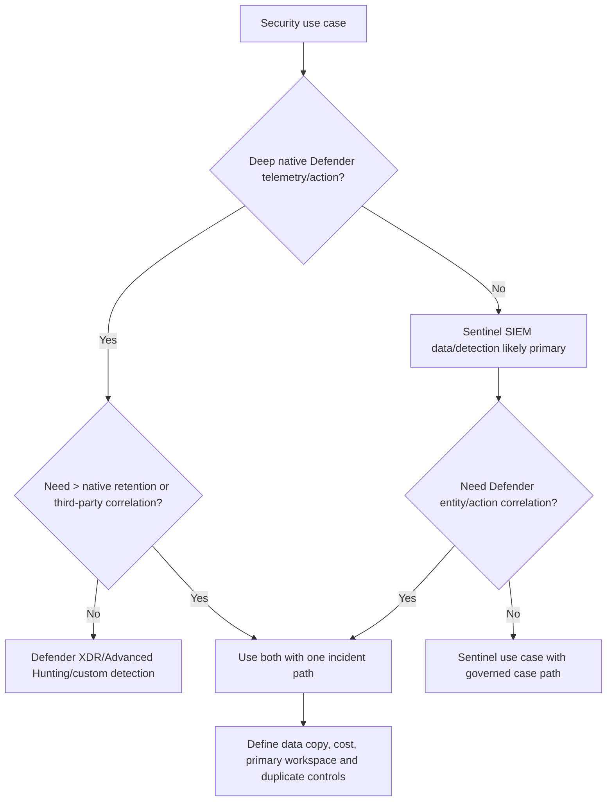

| Requirement | XDR leaning | SIEM leaning | Both |
|---|---:|---:|---:|
| Native endpoint/email/identity/cloud-app depth | Strong | Moderate via ingested data | Strong |
| Third-party/on-prem/multicloud logs | Limited | Strong | Strong |
| Native automated response | Strong | Playbook/integration dependent | Strong with coordination |
| Long/custom retention | Native window limits | Configurable/lake | Selective ingestion/lake |
| Custom schemas/normalization | Limited to supported | Strong ASIM/KQL | Strong but govern two surfaces |
| Cross-domain Microsoft correlation | Strong | Connector-based | Unified strongest |
| Cost optimization | Avoid duplicate raw ingestion | Ingestion/retention choices | Requires explicit data strategy |
| One case experience | Defender incident | Sentinel legacy/current path | Defender authoritative after onboarding |

Use direct Advanced Hunting/custom detections for Defender data where the required retention fits and ingestion is unnecessary. Ingest selected raw Defender events into Sentinel only when longer retention, Sentinel analytics/workbooks, cross-source use, or contractual requirements justify cost.

## 17. Data retention and CMK

| Data/object | Current storage/retention decision |
|---|---|
| Defender native hunting data | Native Defender retention, commonly 30 days for current hunting design; verify product/table |
| Sentinel workspace logs | Log Analytics table plan/interactive/archive retention and cost |
| Sentinel data lake | Long-term tier, documented up to 12 years as configured/supported |
| Alerts/incidents through Defender connector | Current no-charge Sentinel ingestion for `SecurityAlert`/`SecurityIncident` path; verify architecture |
| Raw Defender advanced-hunting events in Sentinel | Charged ingestion/retention except current stated offers/behavior |
| Purview audit/data alert history | Purview license and audit-retention policy |
| External ticket/evidence | Client case/evidence retention and legal hold |

If a workspace uses CMK before Defender onboarding, workspace logs continue CMK encryption, but alerts/incidents in the unified Defender experience are no longer CMK-encrypted under current guidance. Sentinel data-lake data, custom and transformed records use Microsoft-managed keys in currently documented paths; CMK is not fully supported there. Treat this as a security architecture decision, not a footnote.

## 18. RBAC and least privilege

Sentinel SIEM uses Azure RBAC and Log Analytics controls. Defender uses Defender unified RBAC/Entra security roles as configured. Purview uses Purview role groups. Intune and Entra have separate roles. Onboarding can assign Sentinel Contributor to Microsoft Threat Protection and WindowsDefenderATP service apps for integration.

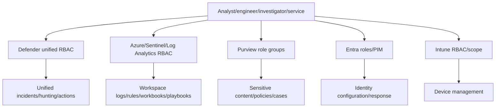

| Persona | Minimum pattern | Separation |
|---|---|---|
| SOC analyst | Incident/hunting read and approved response scope | No Purview sensitive-content access by default |
| Sentinel engineer | Rules/connectors/workbooks/automation in scoped workspace | No automatic endpoint/identity admin |
| Purview investigator | Alert/case and minimum content role | No broad SOC containment by default |
| Identity responder | Approved Entra response permissions via PIM | No DLP content by default |
| Endpoint responder | Defender device/action scope | No tenant-global Sentinel engineering |
| Pipeline/service | Resource-specific nonhuman roles | No interactive admin or unused scope |
| Incident commander | Case coordination and assignment | Specialists execute domain actions |

The unified native `IdentityInfo` table does not support Sentinel table-level RBAC after transition. If table-level controls protected sensitive identity fields, redesign access before onboarding.

## 19. APIs and integration contracts

Use Microsoft Graph security API v1.0 for unified alerts/incidents and Advanced Hunting API as supported. Use Microsoft Sentinel SecurityInsights REST APIs for Sentinel resources such as analytics and automation rules. Field names and provider/source semantics change after onboarding.

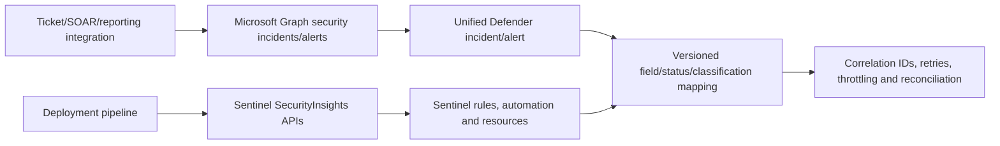

| API concern | Control |
|---|---|
| Incident link | Prefer current `providerIncidentUrl`/documented field; test deep links |
| Expanded alerts | Use required `$expand=alerts` and pagination |
| Provider | Expect `Microsoft XDR` in unified case |
| Product/sensor | Use `serviceSource`, `detectionSource`, `productName` |
| Status/classification | Explicit bidirectional mapping and unknown values |
| Merge/redirect | Reconcile ticket parent/redirect relationships |
| Throttling | Retry-After, bounded backoff, idempotency |
| Webhooks/polling | Duplicate/out-of-order/update-loss handling |
| Permissions | Application/delegated least privilege and certificate lifecycle |
| Audit | App, actor, case, request, response, timestamp and redaction |

## 20. Third-party feeds and tools

Sentinel remains the broad integration plane for firewalls, proxies, identity providers, EDR, clouds, SaaS, OT, and custom business sources. After onboarding, their Sentinel alerts can participate in Defender incident correlation if entities and metadata are strong.

| Third-party pattern | Use | Guardrail |
|---|---|---|
| Raw logs via native/AMA/API/Event Hub connector | Custom detection and hunting | Schema, latency, cost, duplicate source |
| Vendor alerts via CEF/API | Preserve vendor detection | Stable alert ID, status and severity mapping |
| Threat intelligence via TAXII/upload | Enrichment/matching | TLP, expiry, confidence, provenance |
| External ticketing | Workflow and evidence coordination | One source of truth per field; idempotency |
| External SOAR | Existing response investment | Avoid double automation/containment |
| Data lake/export | Long-term or external analytics | Residency, CMK, cost, egress, legal approval |

### 🔍 Plain-English deep-dive: integrating a tool is not the same as replacing it

A connector can carry logs or alerts while the source tool still owns policy, response, historical context, or license. During migration, write a capability map: source, detection, case, response, retention, reporting, and audit. Decide coexistence and cutover for each capability. Do not decommission because events appear in Sentinel; prove equivalent coverage, response, retention, and operations first.

## 21. Portal transition plan

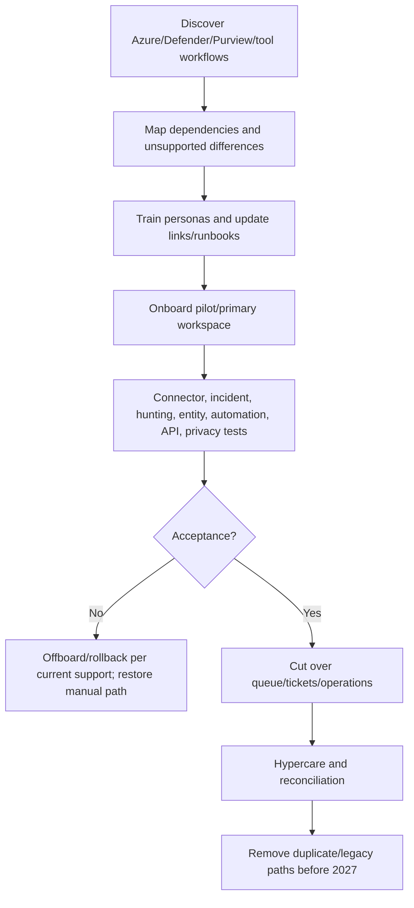

| Transition gate | Acceptance |
|---|---|
| Primary workspace | Microsoft alert route and owner confirmed |
| Connector | No duplicate/missing test alert or raw event |
| Incident | Correct Defender case, entities, title-independent ticket key |
| Hunting | Required tables/functions and retention available |
| Automation | Conditions, delays, batching and response tests pass |
| Purview | DLP/IRM signal and privacy escalation work |
| RBAC | Each persona passes positive/negative access tests |
| API | Create/read/update/reconcile and merge tests pass |
| Reporting | Metrics baselines and links updated |
| Rollback | Offboarding/manual/connector restoration steps rehearsed |

Offboarding the workspace disconnects the Defender connector in current guidance and can change unified operations. A rollback cannot erase already correlated incidents or undo product actions. Preserve chronology and communicate temporary coverage/queue changes.

## 22. Cross-domain incident scenario

**Synthetic scenario:** A phishing email leads to a user sign-in anomaly, endpoint process execution, SharePoint download, and DLP alert for attempted external sharing. A third-party proxy logs access to the URL. The incident owner coordinates product specialists; no real response occurs.

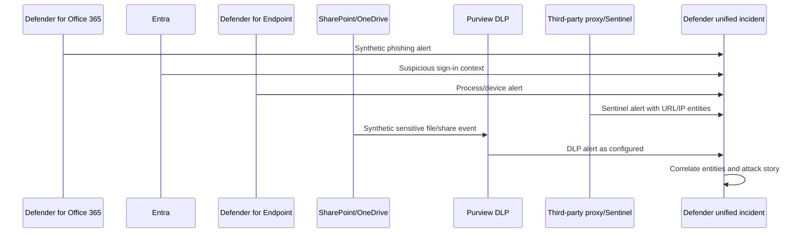

| Timeline question | Owning evidence | Specialist/action |
|---|---|---|
| Was the message delivered/clicked? | MDO Explorer/message IDs | Email responder |
| Did authentication succeed? | Entra sign-in/token/risk | Identity responder |
| Did code execute? | MDE device/process timeline | Endpoint responder |
| What data was accessed/shared? | SPO audit + Purview DLP details | Workload/Purview investigator |
| Did proxy observe communication? | Sentinel third-party log | Network/SIEM analyst |
| Was content sensitive? | Purview policy/SIT under authorized role | Data/legal/privacy owner |
| What response completed? | Action Center, Entra, Purview, ticket | Incident owner reconciles |

## 23. Safe paper and synthetic lab

This lab does not onboard a workspace, enable connectors, create an alert/incident, access Purview content, query customer data, call Graph, or take response. Use only the fictional chronology below.

### Synthetic chronology

| UTC | Source | Stable IDs | Observation |
|---|---|---|---|
| 09:00 | MDO | `msg-demo-001`, `user-demo-001` | Synthetic phishing message delivered |
| 09:04 | Entra | `signin-demo-001`, `user-demo-001` | Successful sign-in from documentation IP |
| 09:07 | MDE | `device-demo-001`, `proc-demo-001` | Synthetic process launched |
| 09:08 | Proxy/Sentinel | `proxy-demo-001`, URL hash | URL connection allowed |
| 09:15 | SharePoint | `file-demo-001`, `user-demo-001` | Synthetic sensitive file downloaded |
| 09:20 | Purview DLP | `dlp-demo-001`, `file-demo-001` | External share attempt matched policy |

### Lab architecture

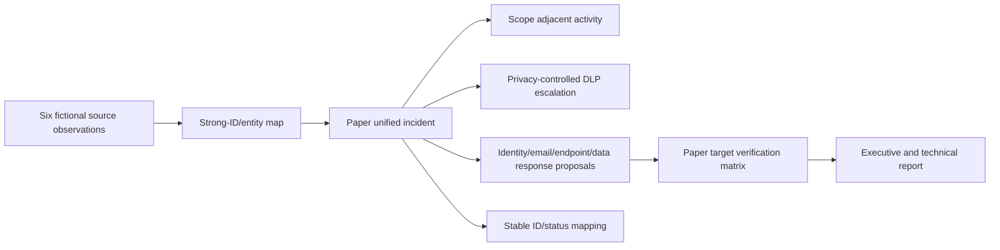

### Lab tasks

| Task | Action | Expected learning |
|---:|---|---|
| 1 | Draw unified architecture and source owners | Boundaries |
| 2 | Choose a primary workspace and rationale | Multi-workspace integration |
| 3 | Build source-to-connector path matrix | Duplicate avoidance |
| 4 | Select authoritative incident/ticket keys | Ownership |
| 5 | Build attack story from stable IDs/UTC | Correlation |
| 6 | Write Advanced Hunting versus ingestion choices | Cost/retention |
| 7 | Define Purview privacy escalation | Sensitive-content boundary |
| 8 | Sequence Entra/MDE/MDO/Intune/Purview actions | Coordinated response |
| 9 | Map Azure/Defender/Purview/Entra/Intune roles | Least privilege |
| 10 | Design Graph/SecurityInsights API responsibilities | Contract correctness |
| 11 | Add third-party proxy health/latency checks | SIEM integration |
| 12 | Write onboarding/cutover/rollback gates | Migration |
| 13 | Build RACI and shift handoff | Operations |
| 14 | Give an honest two-minute interview answer | No production claim |

### Validation matrix

| ID | Test/change | Expected | Failure caught |
|---|---|---|---|
| V01 | One Microsoft alert path | One authoritative alert/case | Positive integration |
| V02 | Standalone + XDR connector enabled | Duplicate detected and release blocked | Double ingestion |
| V03 | Secondary workspace receives tenant alert | Unexpected route flagged | Primary-workspace design gap |
| V04 | Defender title changes | Ticket remains linked by provider ID | Fragile integration |
| V05 | Incident merges | Ticket reconciliation maps redirect/parent | Duplicate case drift |
| V06 | Alert-only Sentinel rule | Defender visibility limitation recorded | Missing case |
| V07 | 151 alerts | Defender used for full set | Sentinel display limit |
| V08 | TVM query in Sentinel | No-data is expected/verified, not source failure | Surface confusion |
| V09 | Advanced Hunting 30-day need | No duplicate ingestion chosen | Avoidable cost |
| V10 | 180-day cross-source need | Selected Sentinel/lake retention justified | Missing evidence |
| V11 | SOC user opens sensitive DLP content | Access denied unless approved role | Privacy breach |
| V12 | DLP alert after policy change | Current latency allowance documented | False missing-alert RCA |
| V13 | IdentityInfo table-level restriction expected | Transition access gap blocks onboarding | RBAC regression |
| V14 | CMK requirement covers unified incidents/lake | Exception/risk decision required | Encryption overclaim |
| V15 | Automation sees mixed-source incident | Input filter/approval works | Unsafe action |
| V16 | Graph API throttles | Bounded idempotent retry | Integration storm |
| V17 | Third-party proxy delay | Freshness alarm and case caveat | Incomplete timeline |
| V18 | Offboard pilot workspace | Manual queue/connector/runbook activated | Rollback gap |
| V19 | Same user UPN, different tenant | Strong ID prevents merge | Entity collision |
| V20 | DLP activity is accidental | Intent remains undetermined | Insider overclaim |

### Lab deliverables

1. Unified SecOps target architecture and product-boundary map.
2. Dated portal/status/licensing/privacy/data-lake register.
3. Primary-workspace and connector duplicate-avoidance decision.
4. Incident ownership, sync, correlation, merge and ticket mapping.
5. Advanced Hunting, Sentinel ingestion, retention and cost decision matrix.
6. Purview DLP/insider signal, privacy and escalation runbook.
7. Entra/Intune/Defender/Purview response and verification matrix.
8. RBAC and API integration contract.
9. Portal onboarding, test, cutover, rollback and hypercare plan.
10. Cross-domain incident report and candidate honesty statement.

## 24. Operating model and RACI

| Activity | Incident owner | XDR analyst | Sentinel engineer | Purview investigator | Identity/endpoint/data owner |
|---|---|---|---|---|---|
| Queue triage | A/R | R | C | C if data signal | C |
| Cross-domain scope | A | R | R for third-party data | R for data context | C |
| Detection/connector health | C | C | A/R | C for policy signal | C |
| Sensitive-content review | C | I | I | A/R | C/legal-HR |
| Containment proposal | A | R | C/automation | C | R/C by target |
| High-impact approval | C | C | I | C | A/R authorized owner |
| Case classification/closure | A/R | R | C | C | C |
| Detection/control improvement | A backlog | R | R | R for Purview | R by product |
| Platform migration | C | C | A/R | C | C |

`R` is Responsible, `A` Accountable, `C` Consulted, and `I` Informed. One incident owner coordinates; accountabilities for policy, content, and target action remain distributed.

## 25. Runbooks and shift handoff

| Runbook | Must include |
|---|---|
| Unified incident triage | Queue filters, assignment, SLA, source validation, entity checks |
| Cross-domain phishing | Message, sign-in, endpoint, data, proxy and scope pivots |
| Purview escalation | Pseudonymization, sensitive viewer role, HR/legal, minimum sharing |
| Identity containment | Strong ID, break glass, sessions, MFA/credential and rollback |
| Endpoint containment | Device ID, isolation impact, Action Center and reversal |
| Connector duplicate RCA | Source IDs, path matrix, count/cost and safe disable |
| Portal/API failure | Service health, Graph/SecurityInsights, fallback and evidence |
| Workspace offboarding | Queue, connector, automation, ticket and hunting continuity |
| Shift handoff | Case state, chronology, actions/approvals, gaps, next decision time |

## 26. Metrics

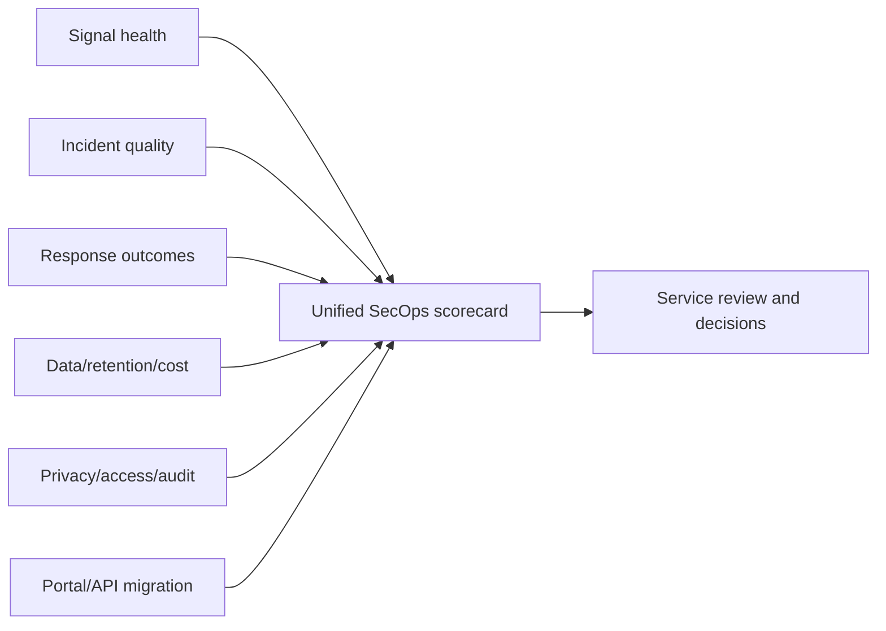

| Metric | Definition | Caution |
|---|---|---|
| Duplicate alert rate | Same logical alert on multiple paths | Requires stable source IDs |
| Correlation yield | Multi-source incidents / eligible incidents | More merging is not always better |
| MTTD/MTTA/MTTR | Event/detection/acknowledge/recover times | Define clocks and exclusions |
| Entity completeness | Alerts with required strong mappings | Quality by source |
| Primary-workspace route success | Expected tenant alerts in primary | Also monitor secondary/local paths |
| Connector freshness/continuity | Event-to-ingestion and missing intervals | Green status alone insufficient |
| Action verify rate | Responses independently verified | Request success is not state proof |
| Ticket reconciliation | Unified cases matching one current ticket | Include merge/redirect cases |
| Purview escalation SLA | Data alert to authorized review | Preserve privacy and legal priority |
| Hunting coverage | Priority hypotheses with healthy data/detection | Not query count |
| Cost per source/use case | Ingestion, retention, lake, automation, license | Allocate owner/value |
| Access exceptions | Excess/failed persona tests | Table-level RBAC transition |
| API error/throttle rate | Failed/retried calls | By endpoint/app |
| Portal migration defects | Workflow regressions after onboarding | Must trend to zero before cutover |

## 27. Troubleshooting

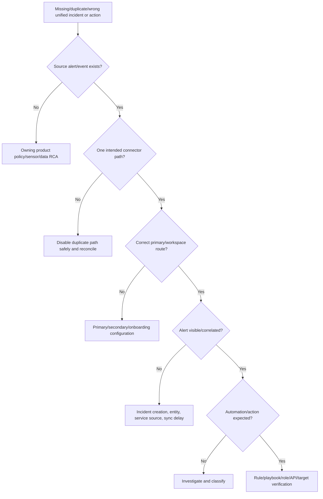

| Symptom | Likely boundary | Discriminating check |
|---|---|---|
| Same Defender alert twice | Standalone + XDR/custom route | Compare source/system alert IDs |
| Microsoft alert missing in secondary | Expected primary-only tenant path | Primary workspace decision |
| Incident not in Defender | Alert-only rule or manual/API Sentinel incident | Alert/incident creation source |
| Incident title changed | Defender correlation/merge | Stable provider incident ID |
| Automation stopped after onboarding | Provider/title/description/primary workspace change | Rule conditions and current fields |
| Case initially unavailable to playbook | Sentinel sync delay | Wait/retry within current limits |
| Sentinel query empty, AH has data | Table not streamed or retention/surface difference | Connector table support |
| DLP alert missing | License/policy/aggregation/up-to-3h/config | Purview policy and audit evidence |
| Sensitive details unavailable | Correct role separation | Purview role group/content viewer |
| Entity merges wrongly | Weak/reused identifiers | Tenant/object/device/message IDs |
| Ticket closes unexpectedly | Status-map/merge/update loop | Graph payload and ticket audit |
| CMK expectation fails | Unified incident/lake boundary | Encryption architecture record |
| Connector invisible in Defender | Integrated Microsoft connector hidden by design | Azure inventory/current Learn |
| Defender for Cloud duplicates | Tenant and legacy paths both active | Connector architecture and sample IDs |
| Graph API integration fails | Permission/schema/pagination/throttle | Request ID/status/body and app roles |

## 28. Deployment and rollback

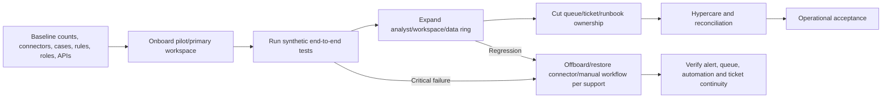

Rollback triggers include missing high-priority alerts, duplicate storms, privacy/RBAC exposure, broken automation, unreconciled cases, data-residency/CMK violation, or unsupported business workflow. Offboarding or connector restoration may not restore every historical portal state automatically. Preserve new case IDs, stop high-impact automation, activate manual triage, and reconcile tickets/actions.

## 29. Consulting artifacts

| Artifact | Decision enabled |
|---|---|
| Unified target architecture | How do SIEM, XDR, Purview and third parties interact? |
| Primary workspace ADR | Where does tenant Defender/Sentinel correlation live? |
| Connector/source matrix | Which one path carries each alert/event? |
| Incident ownership contract | Which ID, queue, fields and team are authoritative? |
| Correlation/merge test pack | How do cases behave across sources and workspaces? |
| Hunting/data strategy | Query direct, ingest, lake, retain, or promote? |
| Purview boundary/runbook | How are sensitive signals investigated lawfully? |
| Response authority matrix | Who approves/executes/verifies each product action? |
| RBAC persona matrix | What should each role see and be denied? |
| API/ticket contract | How are status, merge, retry and reconciliation handled? |
| Portal migration plan | How are onboarding, cutover, training and rollback controlled? |
| RACI/runbooks | Who operates every workflow and handoff? |
| Health/cost/privacy scorecard | Is the service effective, controlled and sustainable? |
| Executive report | Which risks improved, which gaps remain, which decisions are required? |

## 30. JD Mapping: interview translation

| Interview theme | Arti's transferable strength | Honest unified SecOps answer |
|---|---|---|
| Architecture | Understands M365 workload/service dependencies | Product boundaries and one incident owner |
| Integration | Coordinates product groups/vendors | Connector and API ownership matrix |
| Investigation | Correlates timeline and identifiers | Cross-domain attack story with raw validation |
| Data security | SharePoint/OneDrive and compliance context | Purview escalation without intent overclaim |
| Troubleshooting | RCA across layers | Source → connector → workspace → correlation → action |
| Migration | Change/fix validation | Baseline, pilot, synthetic tests, rollback and hypercare |
| Reporting | KPI/business reviews | Queue, response, data, privacy, cost scorecard |
| Experience gap | Honest production boundary | Paper/synthetic architecture, no admin claim |

## Official Source Anchors

These official Microsoft Learn pages were reviewed for the August 24, 2026 treatment. Recheck release/preview banners, licenses, Product Terms, portal state, connector availability, API version, schemas, RBAC, regions, retention, data-lake and privacy behavior before implementation.

1. [Unified security operations overview](https://learn.microsoft.com/unified-secops/overview-unified-security) — Defender portal SIEM/XDR/SOAR/exposure/AI model.
2. [Microsoft Sentinel in Defender](https://learn.microsoft.com/azure/sentinel/microsoft-sentinel-defender-portal) — GA status, no-E5 availability, feature comparison, limits and 2027 timeline.
3. [Transition Sentinel to Defender](https://learn.microsoft.com/azure/sentinel/move-to-defender) — planning, privacy, CMK, connectors, primary workspace, analytics, automation, APIs, incidents, hunting, entities and Purview/TI boundaries.
4. [Defender XDR integration with Sentinel](https://learn.microsoft.com/azure/sentinel/microsoft-365-defender-sentinel-integration) — integration modes, connectors, incidents, sync, alert limit, raw events, costs and custom detections.
5. [Connect Defender data to Sentinel](https://learn.microsoft.com/azure/sentinel/connect-microsoft-365-defender) — table selection, unsupported data and ingestion choices.
6. [Advanced Hunting with Sentinel data](https://learn.microsoft.com/defender-xdr/advanced-hunting-microsoft-defender) — supported cross-source query behavior and known issues.
7. [Defender incident correlation and merging](https://learn.microsoft.com/defender-xdr/alerts-incidents-correlation) — current correlation behavior.
8. [Microsoft Graph security API](https://learn.microsoft.com/graph/api/resources/security-api-overview) — unified incidents/alerts API direction.
9. [Sentinel REST API versions](https://learn.microsoft.com/rest/api/securityinsights/api-versions) — Sentinel resource management.
10. [Get started with DLP alerts](https://learn.microsoft.com/purview/dlp-alerts-get-started) — Defender/Purview responsibilities, licensing, roles, aggregation, latency and retention.
11. [Investigate DLP alerts in Defender](https://learn.microsoft.com/defender-xdr/dlp-investigate-alerts-defender) — DLP alert investigation in unified SecOps.
12. [Insider Risk Management](https://learn.microsoft.com/purview/insider-risk-management-solution-overview) — privacy-by-design, pseudonymization, policies and cases.
13. [Purview Audit overview](https://learn.microsoft.com/purview/audit-solutions-overview) — retention, API and license boundaries.
14. [Sentinel roles](https://learn.microsoft.com/azure/sentinel/roles) and [Defender unified RBAC](https://learn.microsoft.com/defender-xdr/manage-rbac) — permission boundaries.
15. [Sentinel data lake overview](https://learn.microsoft.com/azure/sentinel/datalake/sentinel-lake-overview) — long-term data, KQL, notebooks, jobs, retention and audit.

## ⭐ Likely Interview Questions for This Section

### Q1. What does unified SecOps mean in the Defender portal?

**Model answer:** It combines SIEM, SOAR, XDR and other licensed security capabilities into one portal, unified incident queue, correlation, hunting and entity experience. It does not erase separate source data, licenses, retention, RBAC, APIs or specialist authority. I document the authoritative case, source stores, response owners and privacy boundaries rather than saying “single pane” solves architecture.

### Q2. What changes when Sentinel is onboarded to the Defender portal?

**Model answer:** Defender XDR becomes the incident creation/correlation engine; Microsoft security incident rules are deactivated, Fusion is disabled, titles/grouping can change, and the provider is Microsoft XDR. Integrated Microsoft alert connectors route through the Defender connector and primary workspace. Hunting, entities, automation, APIs, IdentityInfo/RBAC, CMK/privacy, and portal workflows have documented differences. Sentinel in Defender is GA, and Azure portal support ends March 31, 2027.

### Q3. How do you avoid duplicate alerts and incidents?

**Model answer:** Build a source-to-destination matrix and choose one authoritative alert path. After Defender onboarding, use the Defender XDR connector/primary workspace for integrated Microsoft product alerts and remove standalone duplicate paths. Explicitly choose tenant-based versus legacy Defender for Cloud behavior. Compare stable source/system alert IDs, event counts, cases, tickets and cost before and after cutover.

### Q4. How do primary and secondary Sentinel workspaces behave?

**Model answer:** The primary workspace is the tenant's main Defender XDR/Sentinel integration and Microsoft alert path. Secondary workspaces can retain local/regional/business telemetry, but relevant standalone Microsoft alert connectors are disconnected there during onboarding to prevent duplicates, and only primary-workspace Sentinel alerts participate in specified Defender correlation. I document local detection, cross-workspace views, residency and ownership separately.

### Q5. When should you use Defender XDR versus Sentinel?

**Model answer:** Use XDR for deep native endpoint, identity, email and cloud-app telemetry, correlation and response. Use Sentinel for broad third-party, on-premises, multicloud, custom schemas, retention and SIEM/SOAR. Use both when cross-domain context or longer/broader data justifies it, but avoid copying raw Defender data when Advanced Hunting's current retention and custom detection are sufficient.

### Q6. How should Purview alerts be handled in unified incidents?

**Model answer:** Defender is the recommended DLP alert investigation surface, while policy creation/editing and sensitive content remain in Purview. A DLP or insider-risk signal can correlate with compromise evidence, but it does not prove malicious intent. The SOC incident owner coordinates; an authorized Purview investigator accesses minimum content under privacy, pseudonymization, legal/HR and role controls. Security and Purview cases can have different closure requirements.

### Q7. How would you migrate an existing Sentinel SOC to Defender safely?

**Model answer:** Inventory connectors, rules/Fusion/grouping, incidents, automation, workbooks/bookmarks, APIs/tickets, RBAC, CMK/privacy and metrics. Choose a primary workspace, baseline volumes, onboard a pilot, run synthetic end-to-end tests for connectors, incidents, hunting, entities, automation, Purview and APIs, then cut over queue ownership with training and hypercare. Roll back on missing critical signals, duplicates, access exposure or broken response and reconcile all case/action IDs.

### Q8. What is your honest experience with unified SecOps?

**Model answer:** I have not administered unified Defender XDR and Sentinel in production. My production experience is complex M365 incident/RCA, SharePoint/OneDrive data and permissions context, validation and stakeholder coordination. I built a current paper architecture and synthetic cross-domain case covering primary workspace, connectors, correlation, Purview boundaries, response, retention, RBAC, APIs, migration, rollback and operations. I would use controlled tenant validation and specialist review.

## 🧠 30-Second Memory Hooks

- **Unified:** one operating view, not one license/database/role.
- **SIEM:** broad logs; **XDR:** deep native sensors; **SOAR:** workflow/response.
- **Primary workspace:** tenant’s main Defender-Sentinel bridge.
- **One signal, one path:** duplicates are cost/noise, not coverage.
- **Defender owns incidents:** after onboarding, correlation/grouping can change.
- **Fusion off:** Defender correlation replaces it.
- **Title is display:** use provider incident ID for integration.
- **Provider:** Microsoft XDR; **service source:** who detected.
- **AH direct:** avoid raw ingestion when 30-day/native use is enough.
- **Sentinel:** third-party, custom, long retention and SOAR.
- **Purview alert:** data-risk signal, not proof of insider intent.
- **DLP:** investigate in Defender; configure policy in Purview.
- **Intune desired state ≠ Defender immediate response.**
- **RBAC remains plural:** Defender, Azure, Purview, Entra, Intune.
- **Graph:** unified alerts/incidents; **SecurityInsights:** Sentinel resources.
- **CMK:** workspace logs differ from unified incidents/lake.
- **Portal move:** inventory, pilot, test, cut, reconcile, rollback.
- **One incident owner:** specialists retain action authority.
- **Troubleshoot:** source → path → workspace → correlation → action.
- **Honesty:** paper/synthetic design, no production admin claim.

## Completion Checklist

- [ ] I can explain unified SecOps, SIEM, XDR, SOAR, Purview signal, primary workspace and unified incident.
- [ ] I can draw the Defender/Sentinel/Purview/third-party architecture.
- [ ] I can distinguish control plane, data plane and authoritative object owner.
- [ ] I know Sentinel in Defender is GA and Azure portal support ends March 31, 2027.
- [ ] I can plan existing/manual/automatic onboarding paths and prerequisites.
- [ ] I can choose and justify a primary Sentinel workspace.
- [ ] I can explain what remains in secondary workspaces.
- [ ] I can prevent duplicate Microsoft and Defender for Cloud alert paths.
- [ ] I can explain Defender incident creation, correlation, merging and Fusion change.
- [ ] I can define one authoritative queue, ID, owner and closure gate.
- [ ] I understand current sync, alert-only, manual incident, comment and 150-alert differences.
- [ ] I can triage a multi-source unified incident using strong entities and raw evidence.
- [ ] I can query supported Sentinel data in Advanced Hunting and identify surface limitations.
- [ ] I can decide direct AH versus Sentinel ingestion versus data lake.
- [ ] I can explain entity pages and attack story without treating graph edges as proof.
- [ ] I can redesign automation for provider, title, delay, batching and mixed-source changes.
- [ ] I can explain Defender versus Purview responsibilities for DLP and insider risk.
- [ ] I can protect pseudonymization, sensitive-content access and HR/legal boundaries.
- [ ] I can coordinate Entra, Intune, Defender, Purview and Sentinel response.
- [ ] I can explain immediate response versus durable policy configuration.
- [ ] I can make an XDR/SIEM/both use-case decision.
- [ ] I can design retention and cost by object/table/use case.
- [ ] I understand workspace-log, unified-incident and data-lake CMK differences.
- [ ] I can map Defender, Azure/Sentinel, Purview, Entra and Intune RBAC.
- [ ] I can address the `IdentityInfo` table-level RBAC transition.
- [ ] I can choose Graph for unified cases and SecurityInsights for Sentinel resources.
- [ ] I can integrate third-party data without confusing integration with replacement.
- [ ] I can plan portal migration, synthetic testing, cutover, hypercare and rollback.
- [ ] I can build a RACI, runbooks, handoff and service scorecard.
- [ ] I can troubleshoot source → connector → workspace → correlation → automation/action.
- [ ] I completed the safe cross-domain paper lab without creating/querying a tenant artifact.
- [ ] I can answer Q1–Q8 aloud without claiming production unified SecOps administration.
- [ ] I will recheck Learn, preview/GA, licenses, portal, API, retention, RBAC, CMK, data lake and tenant behavior before reuse.

*Next suggested section:* [Part 52](Part-52-enterprise-sentinel-multiworkspace-multitenant-governance.md)