# Part 52 — Enterprise Sentinel Deployment: Multi-Workspace, Multi-Tenant, MSSP, Health, and Governance

> **Section goal:** Build a beginner-first, consulting-grade method for designing and governing Microsoft Sentinel at enterprise and managed-service scale. By the end, you should be able to choose single or multiple workspaces, tenants, subscriptions, and regions from business and regulatory drivers; explain primary/secondary workspace and Defender portal implications; use Azure Lighthouse and current multitenant operations safely; reason about cross-workspace query, incident, workbook, hunting, watchlist, automation, and content limits; design RBAC/PIM and nonhuman identities; promote content through dev/test/prod with repositories and infrastructure-as-code; govern Content Hub, schemas, detections, runbooks, naming, health, audit, retention, cost and chargeback; plan business continuity and disaster recovery; onboard/offboard an MSSP; integrate an acquisition; and produce a paper deployment without claiming production Sentinel ownership.

This Part maps directly to Deloitte expectations for enterprise security architecture, Sentinel deployment, Microsoft Defender integration, multicloud and third-party operations, MSSP/vendor coordination, governance, migration, cost, health checks, CI/CD, operational readiness, documentation, resilience, and stakeholder reporting. Your cross-team escalation, vendor/product-group coordination, RCA, KPI reporting, change validation, and customer handover strengths transfer well. The chapter remains explicit that understanding and paper artifacts are not production multi-tenant Sentinel implementation experience.

> **Currency, status, portal, licensing, data-lake, and behavior-change note (August 24, 2026):** This chapter is grounded in official Microsoft Learn available on August 24, 2026. Sentinel is GA in the Defender portal; Azure portal support ends March 31, 2027. Defender multi-workspace and multitenant operations coexist with Azure Lighthouse; national/public clouds cannot be delegated across cloud boundaries. In a Defender-onboarded tenant, one primary Sentinel workspace receives the main Defender XDR connection and integrated tenant alerts, while secondary workspace behavior differs. Current cross-workspace scheduled analytics supports up to 20 workspaces per query and recommends no more than five for performance; alerts/incidents exist only in the rule's home workspace. Watchlist management across workspaces through Lighthouse is unsupported. Core repository connections support GitHub and Azure DevOps; B2B guest/delegated identities cannot create the connection; **deploying custom detection rules as code is preview**, and current transition guidance describes unified content-as-code deployment as public preview in relevant paths. Workspace Manager is unavailable in Defender. The Sentinel data lake provides current long-term storage, KQL, notebooks and jobs but has separate region, role, cost and CMK boundaries. Always verify live Learn, portal, Product Terms, preview/GA, licensing, region/cloud, data residency, RBAC, API, limits and tenant behavior.

## JD Mapping

| Deloitte expectation | Capability developed here | Consulting evidence |
|---|---|---|
| Design enterprise Sentinel | Translate residency, ownership, scale, cost and operations into topology | Architecture decision record |
| Operate multiple tenants | Use Lighthouse, Defender multitenant, GDAP and customer boundaries | Delegation/onboarding model |
| Engineer governance | Standards, policies, roles, naming, tagging, health and audit | Platform control framework |
| Automate deployment | Repositories, IaC, CI/CD, tests, rings and rollback | Content promotion pipeline |
| Manage third parties/MSSP | Contract, access, data, IP, handoff, offboarding | MSSP lifecycle pack |
| Optimize cost | Retention, tiers, commitments, budgets and chargeback | Cost allocation model |
| Ensure resilience | BCDR, runbooks, backup/export, recovery objectives | Continuity plan |
| Deliver transformation | M&A and dev/test/prod migration with stakeholder governance | Phased roadmap and acceptance |

## Candidate honesty note

You can credibly discuss production service ownership, high-severity incident coordination, vendors/product groups, RCA, change validation, KPI reviews, documentation, mentoring, and customer handover. You can demonstrate the paper topology, standards, cost model, pipeline gates, MSSP checklist, M&A scenario, and continuity exercise here.

You should not claim production Sentinel workspace architecture, Azure Lighthouse delegation, multitenant Defender operation, repository deployment, IaC pipeline, data-lake administration, MSSP onboarding, enterprise chargeback, or DR operation unless separately evidenced. Safe wording is:

> “I have not designed or operated a multi-tenant Sentinel estate in production. My production experience is enterprise Microsoft 365 escalation, RCA, vendor coordination, change validation, KPI reporting, and handover. I built a current paper architecture that derives workspace and tenant boundaries from residency, ownership and operations; maps Lighthouse/GDAP and Defender multitenant paths; defines RBAC/PIM, content promotion, health, cost, DR, MSSP and M&A controls; and includes synthetic tests and rollback. In a client engagement I would validate the current cloud/region, licenses, privacy, connector limits, primary-workspace behavior, service ownership, and contractual responsibilities before phased deployment.”

---

## 1. Start with decision drivers, not a workspace count

A **workspace** is a Log Analytics data and management boundary that Sentinel enables for security operations. It influences region, retention, access, cost, content, query, incident, and ownership. More workspaces increase isolation and local control but add duplicated content, cross-workspace complexity, and operational overhead.

Think of emergency services. One national center gives a common view, while regional centers meet local laws and ownership. Too many centers fragment response; one center can violate locality and overload governance. Architecture starts with obligations and operating model, not “one is simpler” or “one per business unit.”

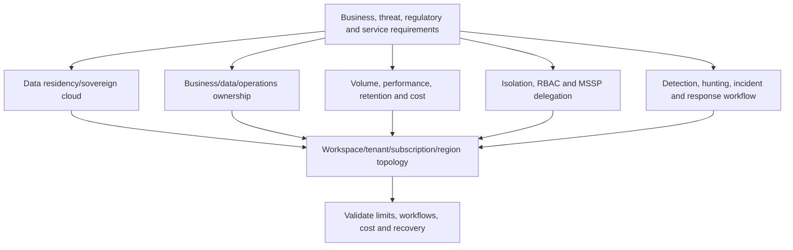

| Driver | Favors fewer workspaces | Favors more workspaces |
|---|---|---|
| Data residency | Same permitted region | Different mandatory regions/clouds |
| Ownership | One SOC/data owner | Independent legal/business owners |
| RBAC | Common analyst population | Strong isolation requirements |
| Cost | Shared commitment/operations | Separate budgets/chargeback/contracts |
| Retention | Common schedule | Regulatory schedules differ materially |
| Detection | Cross-source correlation | Local use cases and response authority |
| Tenant | One Entra tenant | Separate tenants/M&A/customers |
| MSSP | Shared service model | Customer data isolation/sovereignty |
| Performance | Central query simplicity | Scale/latency/local ingestion constraints |
| Resilience | Simpler operations | Isolation may reduce shared failure blast radius |

## 2. Terms from zero

- **Tenant** — a Microsoft Entra identity and service boundary. **Analogy:** a legally controlled building campus. **Memory hook:** identities and service administration boundary.
- **Subscription** — an Azure billing, quota, policy, and resource-management boundary. **Analogy:** a cost center and contract account. **Memory hook:** resource/billing container.
- **Resource group** — a lifecycle and access container for related Azure resources. **Analogy:** a project folder with permissions. **Memory hook:** deploy/manage together.
- **Log Analytics workspace** — regional log store/query/retention/RBAC resource. **Analogy:** the security records room. **Memory hook:** data and query boundary.
- **Sentinel-enabled workspace** — a Log Analytics workspace with Sentinel security capabilities. **Memory hook:** workspace plus SIEM/SOAR.
- **Primary workspace** — the tenant's main Defender XDR/Sentinel integration workspace. **Memory hook:** XDR bridge.
- **Azure Lighthouse** — delegated Azure resource management across tenants. **Analogy:** a customer grants a service provider controlled access without moving the records. **Memory hook:** delegated management, customer-owned data.
- **MSSP** — Managed Security Service Provider. **Analogy:** an external SOC operating under a contract. **Memory hook:** service provider with bounded authority.
- **Infrastructure as code (IaC)** — declarative, versioned resource definitions. **Analogy:** a reviewed blueprint that can rebuild a site. **Memory hook:** repeatable platform configuration.
- **Content as code** — versioned detections, queries, parsers, workbooks, playbooks, automation, and related content. **Memory hook:** security logic through a controlled pipeline.
- **Deployment ring** — a staged group receiving change before broader rollout. **Analogy:** test kitchen → one restaurant → region → all locations. **Memory hook:** expand only after evidence.
- **Chargeback/showback** — allocate or report service cost to consumers. **Memory hook:** who consumed what and why.

## 3. Enterprise reference architecture

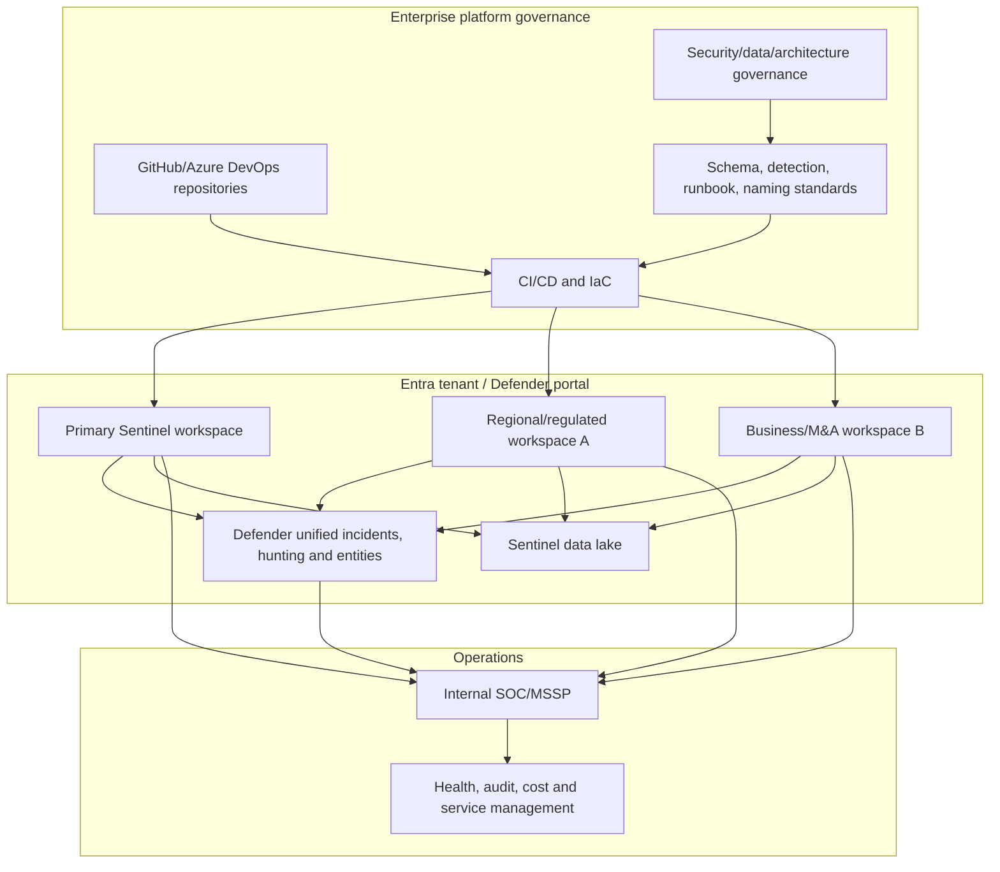

| Layer | Responsibility |
|---|---|
| Governance | Architecture principles, policy, risk acceptance and funding |
| Tenant/identity | Roles, PIM, service identities, cross-tenant and portal access |
| Subscription/resource group | Billing, Azure Policy, resource lifecycle and delegation |
| Workspace | Region, tables, retention, connectors, rules, incidents and cost |
| Defender portal | Primary workspace, unified incident/correlation and multitenant view |
| Data lake | Long-term storage, KQL/notebooks/jobs, promotion and audit |
| Content pipeline | Version, test, approve, deploy, read back and roll back |
| Operations | Queue, health, SLA, on-call, runbooks and continuous improvement |

## 4. Single-workspace architecture

A single workspace is usually strongest when one tenant/region/SOC can meet legal and organizational requirements, data consumers share access, and centralized correlation/cost operations matter.

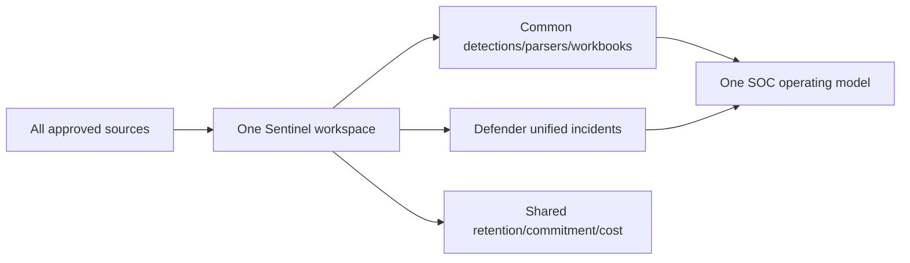

| Benefit | Risk/control |
|---|---|
| Simple cross-source KQL | Workspace scale/query governance |
| One content instance | Change affects broad estate; rings still needed |
| One main incident/data view | Strong role/data isolation may be harder |
| Shared cost tier | Chargeback needs usage attribution |
| Fewer connector/rule duplicates | One configuration error has broad blast radius |
| Easier health monitoring | Regional/residency requirements can disqualify |

## 5. Multiple workspaces in one tenant

Use multiple workspaces only for durable boundaries such as region, legal entity, data owner, regulated enclave, subscription/billing, acquired business separation, or operational autonomy—not merely organizational preference.

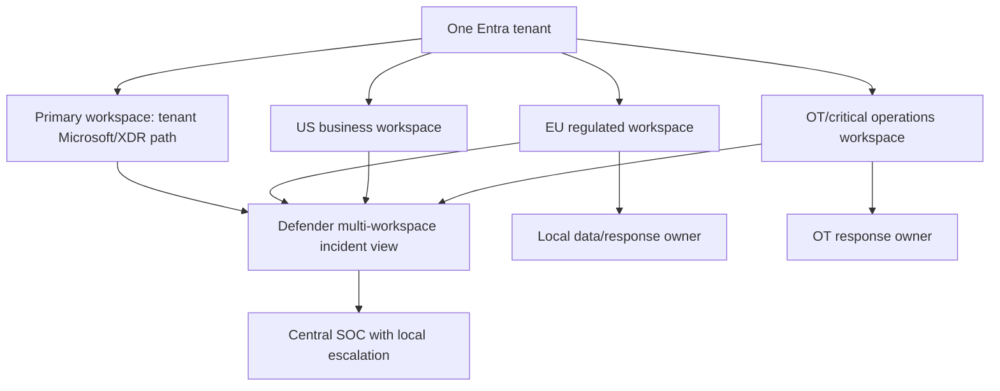

| Multiple-workspace cost | Mitigation |
|---|---|
| Duplicate content/configuration | Versioned pipeline and parameterization |
| Cross-workspace query latency | Limit workspace count; localize heavy analytics |
| Fragmented incidents | Unified view plus explicit home-workspace strategy |
| Inconsistent schemas | Enterprise normalization/schema contract |
| Repeated connectors | Source ownership and no-duplicate matrix |
| More RBAC/identities | Group/PIM standards and automated review |
| Cost fragmentation | Central usage model and tags/metadata |
| Uneven maturity | Minimum platform baseline and exception process |

### 🔍 Plain-English deep-dive: separation has an operating cost every day

Creating a second workspace takes minutes; operating it lasts years. Every parser, detection, watchlist, workbook, playbook, role, connector, health alert, retention policy, audit review and incident handoff may need duplication or special logic. Require a written benefit that cannot be met safely through existing RBAC, table plans, resource-context access, tagging, or operational process.

## 6. Multiple tenants

Separate tenants may result from legal separation, customer isolation, sovereignty, subsidiaries, acquisitions, or independent identity administration. Tenant boundaries affect Microsoft 365 signals, Defender services, Entra identities, roles, primary workspaces, and cross-tenant response.

| Driver | Tenant consequence |
|---|---|
| Separate legal controller | Independent identity/data/policy authority |
| MSSP customers | Data and cost remain customer-owned |
| M&A transition | Temporary coexistence before identity/platform decision |
| National/sovereign cloud | No Lighthouse delegation across public/national cloud boundary |
| Independent Microsoft 365 | Separate Defender/Purview/Entra product signals |
| Security operations | Need Lighthouse, Defender multitenant and/or approved guest/GDAP paths |
| Incident response | Customer/local authority for target actions |
| Content | Promote common standard while preserving tenant parameters/exceptions |

Do not centralize customer logs into an MSSP tenant by default. Current Lighthouse guidance favors a workspace in each customer tenant: data isolation/residency and cost stay with the customer. A single managing-tenant workspace cannot connect some sources such as Defender XDR across tenants and is unsuitable for many MSSP designs.

## 7. Region, residency, sovereignty, and regulation

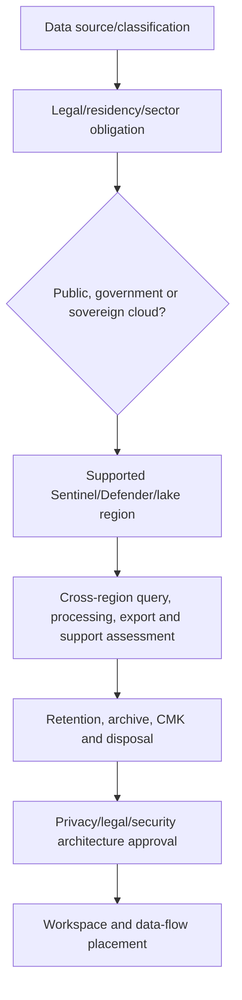

| Requirement | Architecture check |
|---|---|
| Data-at-rest location | Workspace and lake supported region |
| Processing location | Sentinel, Defender portal, ML/AI and external enrichment policies |
| Cross-border access | SOC/MSSP analyst and support access |
| National cloud | Feature/connectivity parity; no cross-cloud Lighthouse |
| CMK | Workspace support versus unified incidents/data lake gaps |
| Retention/deletion | Table/lake/archive/legal hold and proof |
| Export | Workbooks, notebooks, ticketing, TAXII, APIs and diagnostics destinations |
| Privacy | Employee/identity/behavior/content scope and role separation |

Residency is not only where Log Analytics stores rows. Defender correlation, UEBA/ML, notebooks, external APIs, tickets, exports, and support can process or expose data elsewhere. Draw every data flow.

## 8. Subscription and resource-group design

| Boundary | Use |
|---|---|
| Subscription | Billing, quota, policy, owner and delegation |
| Sentinel resource group | Workspace/Sentinel solution and tightly related governance |
| Playbook resource group | Separate invocation and Logic App permissions; MSSP IP option |
| Data collection resource group | DCR/DCE/agent lifecycle where needed |
| Shared services | Key Vault, networking, automation with controlled dependencies |
| Dev/test/prod | Separate subscriptions/resource groups/workspaces by risk and budget |

Avoid placing all security resources in one broad resource group merely to simplify role assignment. Conversely, excessive fragmentation makes permissions and dependency deployment fragile. Group by lifecycle, owner, environment, region, and blast radius.

## 9. Defender primary workspace decision

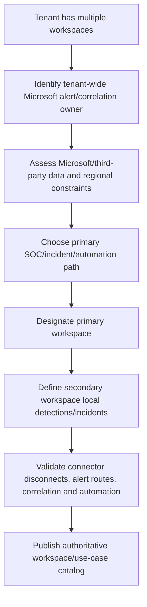

| Primary decision factor | Question |
|---|---|
| Incident ownership | Which SOC owns tenant-wide Defender incidents? |
| Residency | Can tenant-level alert metadata reside/process there? |
| Automation | Which workspace contains/owns incident automation? |
| Cost | Where do Microsoft alert/raw event data and retention land? |
| Operations | Is 24x7 support and health ownership mature? |
| Content | Which functions/detections are required for correlation? |
| Migration | Which existing workspace already has dependencies? |
| Secondary needs | Which local signals/cases cannot participate and how are they handled? |

## 10. Azure Lighthouse delegated management

Azure Lighthouse allows users, groups, and service principals in a managing tenant to operate delegated Azure resources in customer/managed tenants with assigned Azure roles. Customer data remains in the customer's workspace/tenant, and costs stay with the managed tenant.

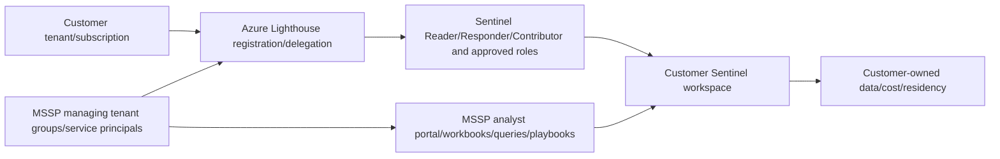

| Lighthouse principle | Implementation |
|---|---|
| Group-based delegation | Group per Sentinel role/customer service tier |
| Least privilege | Reader/Responder/Contributor only by task |
| PIM/eligible access | Just-in-time privileged role where supported |
| Service principal | Pipeline/automation only, certificate/federation preferred |
| Customer control | Delegation visible/removable by customer |
| Audit | Customer and provider monitor actions |
| No data movement assumption | Queries operate on customer workspace unless explicitly exported |
| Cloud boundary | No delegation across public and national clouds |

Current MSSP guidance says data-connector deployment from a managed workspace cannot rely on Lighthouse alone; configure appropriate GDAP/Defender portal access as required. Do not promise one delegation technology covers every Microsoft 365/Defender/Purview action.

## 11. Defender multitenant operations and investigation

The Defender multitenant portal can centralize incidents/alerts and hunting across managed tenants as configured/licensed. Azure Lighthouse remains important for Azure/Sentinel resources and customer-owned workspaces. Entra B2B/GDAP or other approved paths may serve specific portal/service tasks.

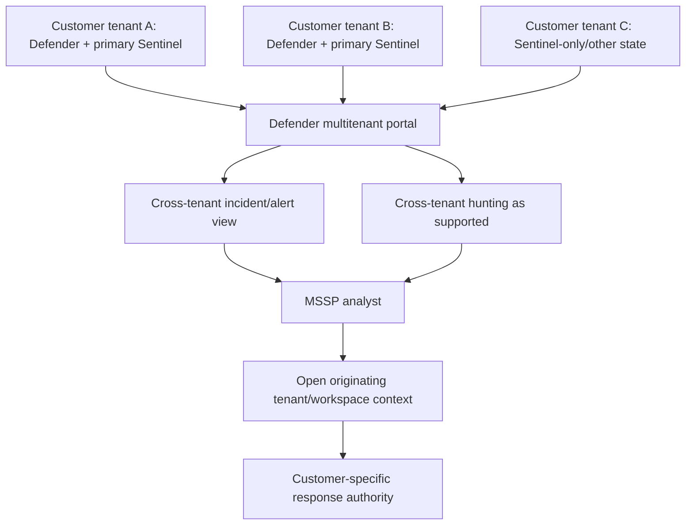

| Cross-tenant investigation rule | Reason |
|---|---|
| Preserve tenant ID in every artifact | Same UPN/device/IP can exist across customers |
| Keep data and tickets separated | Prevent customer data leakage |
| Use customer-specific severity/SLA | Contracts and business impact differ |
| Confirm response authority per tenant | MSSP may investigate but not contain |
| Redact shared threat reports | TLP/privacy/contract boundaries |
| Reconcile case IDs per tenant | Unified view is not one shared case database |
| Use customer-specific escalation | Local legal/business/IR owners |

## 12. Cross-workspace queries

Use `workspace()` and `union` to query multiple workspaces. Explicit resource identifiers improve clarity/performance. Saved functions can simplify references, but function dependencies and access must be versioned.

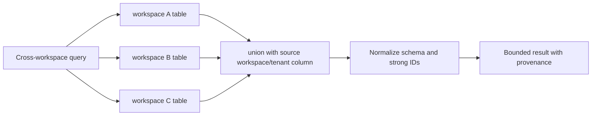

| Current limit/behavior | Design impact |
|---|---|
| Up to 20 workspaces in scheduled analytics query | Hard design ceiling to reverify |
| Microsoft recommends no more than five for performance | Prefer local aggregation/content over huge fan-out |
| Sentinel must be enabled on every referenced workspace | Licensing/config/owner dependency |
| Alert/incident exists only in rule home workspace | Define case owner and links/provenance |
| Cross-tenant access uses Lighthouse | Credential/delegation availability affects operation |
| Cross-workspace queries affect performance | Measure runtime, partial failure and data volume |
| Functions can simplify unions | Hidden dependency/version/access risk |

### 🔍 Plain-English deep-dive: a cross-workspace rule does not create a distributed incident

A central rule can read evidence from several workspaces, but the resulting alert and incident live only where the rule is defined. The incident should preserve source workspace, tenant, table and event IDs so analysts can return to raw evidence. If the home workspace or cross-tenant access fails, the detection can degrade even while source data remains healthy.

## 13. Cross-workspace scheduled analytics

| Design field | Standard |
|---|---|
| Home workspace | Named owner, region, queue and retention |
| Referenced workspaces | Explicit IDs, tenant, purpose and owner |
| Result provenance | `SourceTenantId`, `SourceWorkspaceId`, source event ID |
| Schema | Common normalized contract or explicit per-source mapping |
| Permissions | Nonhuman execution/access continuity where supported |
| Performance | p95 runtime under schedule; recommended workspace count |
| Partial failure | Detect inaccessible workspace; do not silently treat as zero |
| Incident | Home-workspace ownership and local escalation |
| Rollback | Disable central rule or restore prior workspace list/function |

Cross-tenant scheduled rules can depend on access/identity behavior. Monitor execution health and test what happens when the creator leaves or delegated access changes. Do not use a personal account as undocumented service dependency.

## 14. Multi-workspace incidents, hunting, and workbooks

Both Azure and Defender experiences provide multi-workspace incident views with current differences. Cross-workspace workbooks can hard-code queries, expose a workspace selector, or let advanced users edit resources. Hunts/hunting queries can union workspaces; access and source provenance remain essential.

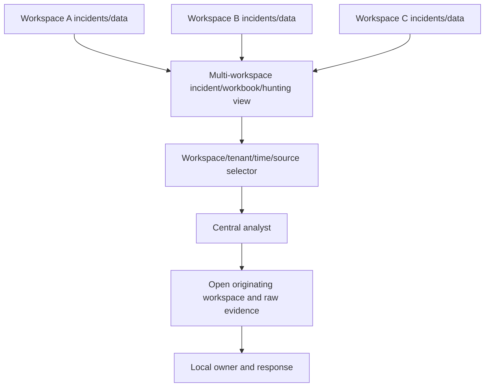

| Capability | Cross-workspace reality |
|---|---|
| Incident view | Manage/filter across workspaces; write permission must exist where changing |
| Bulk incident action | Mixed read/write selection can block modification |
| Hunting | `union`/`workspace()` or supported unified portal hunting |
| Workbook | Query definitions/selectors can span workspaces; viewer needs each data permission |
| Notebook | Query providers/workspaces need explicit auth and separation |
| Watchlist | Query local watchlists, but Lighthouse cross-workspace management unsupported |
| Playbook | Location/tenant/service-account permissions affect invocation |
| Entity | Same value across tenant/workspace must not be conflated |

## 15. RBAC, PIM, and access packages

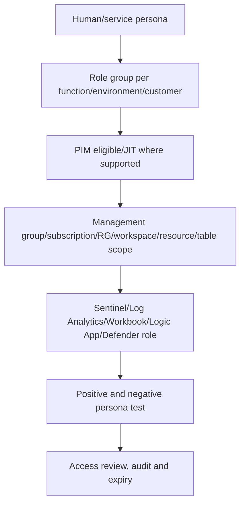

| Persona | Typical minimum | Guardrail |
|---|---|---|
| L1 analyst | Reader/Responder on assigned workspaces | No content/role administration |
| L2/L3 responder | Responder + approved Playbook Operator | Target response rights separate |
| Detection engineer | Sentinel Contributor in dev/test; controlled prod deploy | No broad subscription Owner |
| Platform engineer | Azure/Log Analytics/connection roles by task | PIM and peer approval |
| Workbook consumer | Workbook Reader + approved data access | No edit/export by default if sensitive |
| MSSP analyst | Lighthouse delegated customer-specific role | No cross-customer data sharing |
| Pipeline identity | Resource-specific service principal/managed identity | Federated/certificate auth, no human use |
| Emergency access | Break-glass under documented emergency process | Monitored, tested, excluded from routine automation |

Role assignments are cumulative. Test effective access, not intended role names. Use PIM activation, approval, MFA, time limits, justification, access reviews, and separation of duties where available. Sentinel data lake also uses Entra/Defender unified roles that can provide broad cross-workspace access; review separately.

## 16. Managed identities and service principals

| Identity | Best use | Lifecycle control |
|---|---|---|
| System-assigned managed identity | One resource/workflow with matching lifecycle | Role cleanup when resource deleted/recreated |
| User-assigned managed identity | Shared stable Azure workload identity | Consumer inventory and scoped roles |
| Service principal + workload federation | CI/CD from GitHub/Azure DevOps | Subject/audience constraints and no secret |
| Service principal + certificate | Non-federated automation | Key custody/rotation/expiry |
| Service principal + secret | Last-resort compatibility | Key Vault, short lifetime, rotation, alert |
| Personal user | Interactive analysis only | Not production pipeline dependency |

Name identities by purpose/environment/customer, tag owner/data scope, deny interactive sign-in where appropriate, inventory Graph/Azure roles, rotate/review credentials, and alert on unusual sign-in or role change.

## 17. Dev, test, and production environments

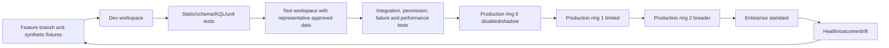

| Environment | Data | Permissions | Actions |
|---|---|---|---|
| Local/static | Synthetic files only | Developer machine/repo | No cloud response |
| Dev workspace | Synthetic/sanitized/test source | Engineers | No production targets |
| Test/integration | Representative approved test telemetry | Engineers/test analysts | Test ticket/channel/identities |
| Prod ring 0 | Live shape, disabled/shadow/dry-run | Small approved team | No high-impact response |
| Prod limited | Bounded sources/population | SOC plus owner | Reversible, approval-based |
| Prod broad | Accepted standard | Least-privilege operations | Runbook-controlled |

Do not copy sensitive production logs into dev for convenience. Use synthetic fixtures, controlled generators, or minimized approved samples.

## 18. Repositories and current CI/CD status

Sentinel repository connections support GitHub and Azure DevOps. They generate a workflow/pipeline that deploys changed supported content to a connected workspace. Supported types include analytics rules, automation rules, hunting queries, parsers, playbooks, workbooks, and current preview custom-detection-as-code. Each connection selects repository, branch and content types.

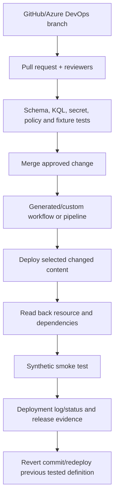

| Current repository boundary | Consequence |
|---|---|
| Owner on workspace resource group to connect | Privileged setup; separate from routine contribution |
| GitHub collaborator / Azure DevOps Project Admin | Source-control governance needed |
| Connection creator must be home-tenant account | B2B guest/delegated access unsupported |
| Same repo+branch cannot duplicate in one workspace | Design branch/workspace mapping |
| Parsers and hunting queries share Saved Searches API | Selecting one may deploy both types present |
| Edit connected content in repository | Portal edits can be overwritten |
| Delete file from repo does not delete deployed resource | Explicit two-plane deletion/retirement |
| Removing connection leaves deployed content | Inventory and decommission separately |
| Smart deployment uses changed files by default | Full reconciliation/drift still required |
| Custom detections as code | Preview; E5/equivalent + Defender onboarding requirements |

Current transition guidance describes unified content-as-code public-preview paths. The base repository connection article does not label every existing content type preview. Maintain a feature-status register by exact content/resource type rather than saying “Sentinel CI/CD is preview” or “all GA.”

### 🔍 Plain-English deep-dive: continuous deployment is not continuous approval

Automatically deploying every merged change is safe only if the merge gate contains the required technical, privacy, operations, and risk approval. CI/CD moves an approved artifact consistently; it does not decide whether a broad detection, destructive playbook, or data export is appropriate. High-impact content may require a manual production gate even after tests pass.

## 19. Infrastructure as code and content as code

| Layer | Example artifact | Test |
|---|---|---|
| Azure foundation | Subscription/RG/workspace/diagnostics/Key Vault/network | Policy, region, naming, locks, role scope |
| Data | DCR/DCE/table/retention/transform | Known event, schema, latency, cost |
| Sentinel enablement | Onboarding/settings/health | Workspace and portal smoke test |
| Content | Parser/function/query/detection/workbook | Fixture, schema, runtime, output grain |
| Automation | Rule/Logic App/connection metadata | Trigger, idempotency, permissions, failures |
| RBAC | Group/role/PIM assignment | Positive/negative persona test |
| Operations | Alerts/dashboard/runbook links | End-to-end incident and handoff |

Parameterize tenant/workspace/resource IDs, region, environment, data sources, enabled state, thresholds and owner. Do not parameterize away meaning: a threshold must still have a use-case rationale and local test.

## 20. Content Hub governance

Content Hub packages connectors, analytics templates, hunting queries, parsers, workbooks and playbook templates. Installing a solution does not enable every item or prove data readiness. Standalone content can update automatically; active/custom content created from templates remains distinct.

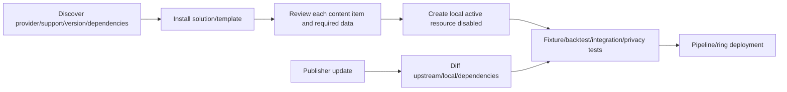

| Governance field | Record |
|---|---|
| Solution/content ID/version | Exact provenance |
| Publisher/support | Microsoft/partner/community and escalation |
| License/preview/cloud | Availability and legal terms |
| Dependencies | Connectors, parsers, functions, tables, roles |
| Local customization | Query, threshold, mapping, workbook, automation diff |
| Data readiness | Known event, freshness, schema, volume |
| Security/privacy | Data fields, external calls, response actions |
| Owner/review | Primary/backup and update trigger |
| Rollback | Prior package/resource and dependency plan |

## 21. Naming and tagging standards

Names should identify purpose without secrets or unstable values. Tags/metadata support ownership, environment, cost and lifecycle, but not every Sentinel content type uses Azure tags identically; maintain a content catalog too.

| Resource/content | Paper pattern |
|---|---|
| Workspace | `law-sec-<region>-<env>-<scope>` |
| Resource group | `rg-secops-<region>-<env>` |
| DCR | `dcr-<source>-<region>-<env>` |
| Analytics rule | `<domain>-<behavior>-<severity>-<env>` |
| Automation rule | `<trigger>-<usecase>-<order>-<env>` |
| Playbook | `la-soc-<action>-<env>` |
| Workbook | `wb-<persona>-<decision>-<env>` |
| Repository connection | `repo-<platform>-<branch>-<env>` |
| Managed identity | `mi-<service>-<scope>-<env>` |

| Required metadata/tag | Purpose |
|---|---|
| `Owner`/`BackupOwner` | Accountability |
| `Environment` | Dev/test/prod separation |
| `Service`/`UseCaseId` | Business traceability |
| `DataClassification` | Handling |
| `CostCenter` | Showback/chargeback |
| `Region`/`Residency` | Data placement |
| `Criticality` | Recovery/change priority |
| `Repository`/`Version` | Provenance |
| `ReviewDate` | Lifecycle |
| `ManagedBy` | Internal/MSSP/pipeline |

## 22. Enterprise schema standards

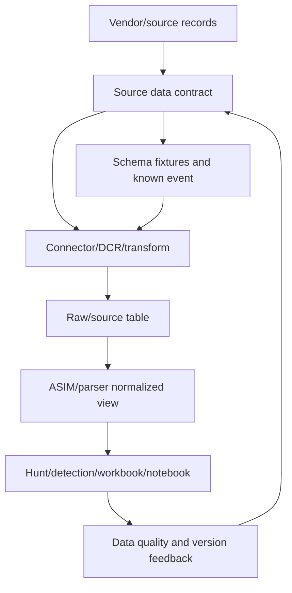

| Schema standard | Requirement |
|---|---|
| Event time | UTC source time and ingestion time available |
| Tenant/workspace | Explicit provenance fields in cross-scope results |
| Stable IDs | Event, account, device, alert, resource identifiers |
| Types | Document string/datetime/dynamic/numeric and null behavior |
| Normalization | ASIM schema/parser where fit; preserve raw source |
| Versioning | Producer/parser/schema versions and compatibility |
| Duplicates | Stable dedup key and expected resend semantics |
| Quality SLO | Freshness, completeness, validity, uniqueness |
| Privacy | Minimum fields, classification and retention |
| Change | Advance notice, contract tests, rollback and consumer inventory |

## 23. Detection and runbook standards

| Detection standard | Runbook standard |
|---|---|
| Falsifiable threat hypothesis | Why alert exists and first checks |
| Source/data SLO and result grain | Data/connector health checks |
| Query, schedule, threshold, grouping | Entity/time/source pivots |
| Strong entity and ATT&CK mapping | Known benign patterns/expiry |
| Positive/negative/boundary/late tests | Escalation and response authority |
| Owner, severity and SLA | Product/customer/local contacts |
| Precision/recall evidence | Privacy/evidence restrictions |
| Version/deployment/rollback | Manual fallback and rollback |
| Health and cost monitoring | Closure classification and feedback |

Enterprise standards should define minimum gates while permitting approved local extensions. A local exception requires rationale, owner, compensating control, expiry and review.

## 24. Health, audit, and connector monitoring

Enable Sentinel health/audit monitoring. Use `_SentinelHealth()` and `_SentinelAudit()` compatibility functions. Connector health, analytics execution and automation health need different evidence; Logic Apps internal actions require diagnostics beyond playbook launch status.

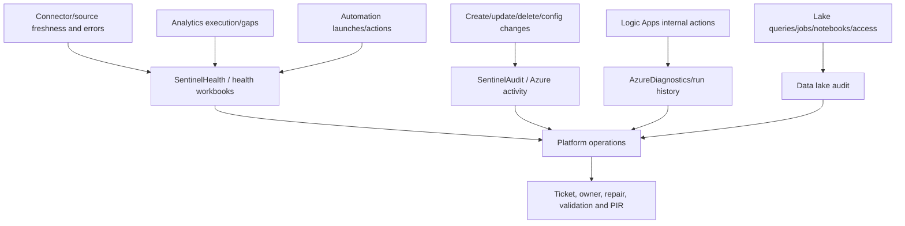

| Health domain | Minimum metric |
|---|---|
| Source | Expected event generation and source clock |
| Connector | Last event, volume, errors, authentication, throttling |
| Schema | Required field/type/null/duplicate tests |
| Analytics | Expected runs, success, delay, skipped windows, auto-disable |
| Automation | Trigger/launch/action/target verify and partial failures |
| Workbook | Tile query success/performance by persona |
| Repository | Last deployment, changed resources, read-back/drift |
| Access | Role/PIM changes, denied/unusual reads, dormant assignments |
| Data lake | Ingestion, query/job/notebook success and audit |
| Cost | Daily volume, forecast, budget anomaly and owner |

## 25. Cost governance and chargeback

Total cost includes ingestion, transformations, table plan, analytics retention, archive/lake, restores/search/jobs, Logic Apps, notebooks/compute, external APIs, networking/egress, Defender/Purview licenses, and people/operations.

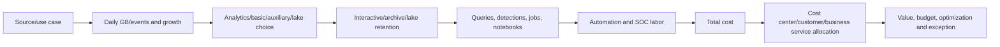

| Allocation field | Example |
|---|---|
| Tenant/customer | Customer A |
| Workspace/region | EU regulated workspace |
| Source/connector | Firewall CEF |
| Table/use case | Network sessions / exfiltration detection |
| Data owner | Network security |
| Cost center | BU-042 |
| Retention rationale | 90-day interactive + regulated archive |
| Detection consumers | SOC and fraud team |
| Monthly usage/forecast | Measured, not estimated forever |
| Optimization owner | Platform + source owner |

Showback informs consumers; chargeback transfers cost under an agreed model. Avoid allocating only by raw GB when shared correlation, fixed commitments, and platform labor matter. Define allocation rules transparently.

## 26. Policy and governance

| Governance body | Decision |
|---|---|
| Security architecture | Workspace/tenant/region patterns and exceptions |
| Data/privacy/legal | Sources, residency, retention, access and sharing |
| Detection governance | Use-case priority, quality and retirement |
| Change advisory/release | High-risk production deployment and rollback |
| SOC operations | Queue, severity, SLA, runbook and staffing |
| Identity governance | Roles, PIM, service identities and access reviews |
| FinOps | Budget, allocation, commitments and optimization |
| Vendor/MSSP governance | Contract, SLA, audit, IP and offboarding |

Use Azure Policy and resource standards where supported for region, diagnostics, tagging, public network, identity and allowed resource choices, but test for Sentinel/Logic Apps exceptions. Policy compliance is evidence of configuration evaluation, not proof that detection/response works.

## 27. Retention and lifecycle

| Data class | Retention question |
|---|---|
| High-value detection data | Required interactive lookback and response SLA? |
| Investigation/forensic | Legal/regulatory window and restore time? |
| High-volume low-use | Lake/basic/auxiliary suitability? |
| Identity/behavior | Privacy proportionality and access? |
| Alerts/incidents/comments | Operational/report/legal needs? |
| Health/audit | How long to prove platform integrity? |
| Notebook/workbook exports | Controlled evidence or disposable artifact? |
| MSSP customer data | Contract termination/deletion/return requirements? |

Retention changes are not retroactive in every product and cannot recreate data already expired. Validate deletion and archive retrieval. A 12-year data-lake capability is a maximum technical option, not a default policy.

## 28. Business continuity and disaster recovery

**Business continuity (BC)** keeps essential operations functioning during disruption. **Disaster recovery (DR)** restores technology/data after severe failure. Define recovery time objective (RTO), recovery point objective (RPO), and minimum viable SOC.

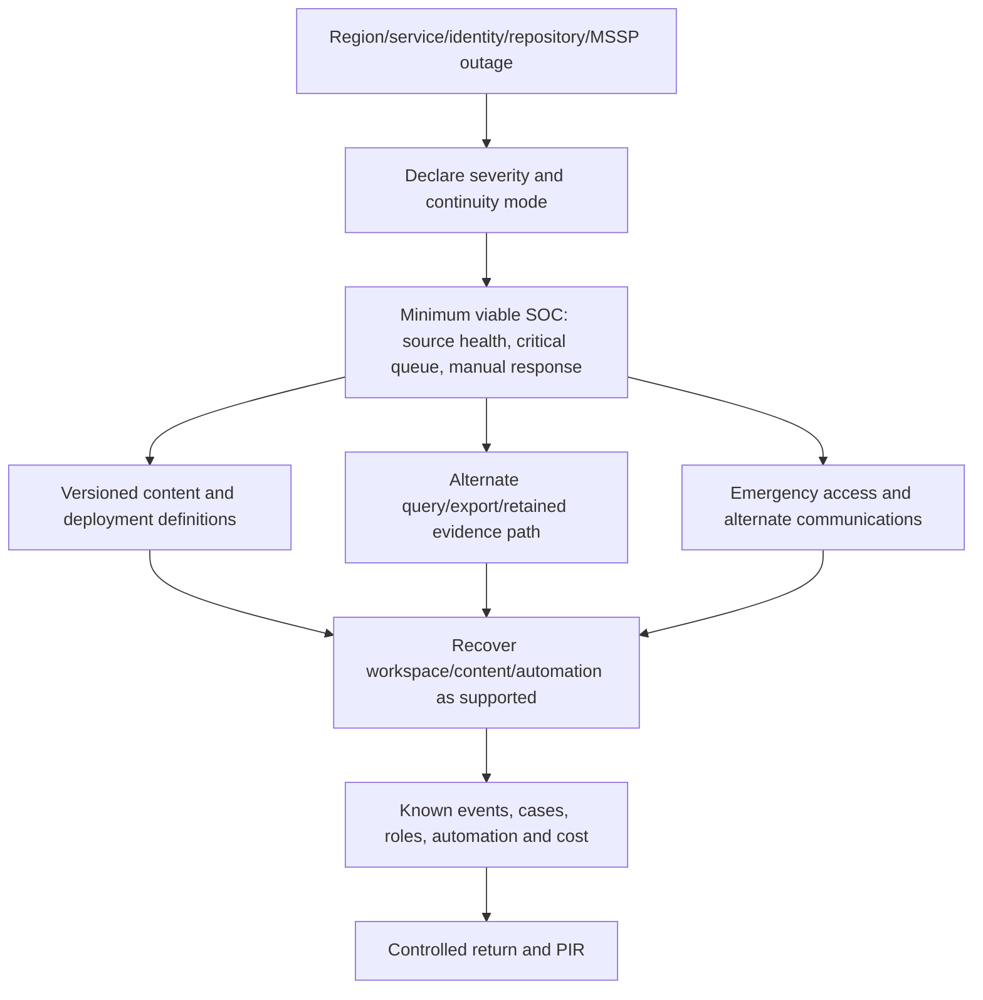

| Failure | Continuity design |
|---|---|
| Defender portal unavailable | Service health, alternate approved query/API/manual processes |
| Sentinel region/workspace issue | Understand platform responsibility; critical source buffering/alternate plan |
| Entra/PIM outage | Tested emergency access with monitoring |
| Repository/pipeline outage | Last known-good artifacts and manual controlled deployment |
| Logic Apps failure | Manual response runbook and queued actions |
| MSSP connectivity/tenant outage | Customer local escalation and internal backup SOC |
| Connector failure | Source buffering/replay where supported; gap declaration |
| Data corruption/deletion | Retention/immutability/export/restore design under policy |
| Key/credential loss | Key Vault recovery/rotation and break-glass process |

Do not promise automatic cross-region Sentinel replication without a verified supported design. Current Defender control-plane BCDR and customer-managed Log Analytics data continuity differ. Test the exact service, region and contractual responsibility.

### 🔍 Plain-English deep-dive: a backup is not a recovered SOC

JSON for rules and workbooks can rebuild configuration, but operations also need data, identities, secrets, connectors, network paths, queues, tickets, approvals, trained people, and current runbooks. A DR exercise passes only when a known event is collected, detected, investigated, responded to, verified, recorded, and handed off within RTO—not when a template deployment succeeds.

## 29. MSSP onboarding lifecycle

```mermaid
flowchart LR
    DUE[Due diligence and scope] --> CONTRACT[Contract, DPA, SLA, authority, IP and exit]
    CONTRACT --> ACCESS[Lighthouse/GDAP/MTO groups, PIM and identities]
    ACCESS --> DATA[Workspace/connectors/retention/cost inventory]
    DATA --> CONTENT[Deploy approved baseline and customer exceptions]
    CONTENT --> TEST[Synthetic end-to-end and negative-access tests]
    TEST --> TRANS[Knowledge transfer and shadow operations]
    TRANS --> ACCEPT[Service acceptance and go-live]
    ACCEPT --> REVIEW[Health, SLA, access, quality, cost and audit reviews]
```

| Onboarding requirement | Evidence |
|---|---|
| Service scope | Included tenants/workspaces/sources/use cases/hours |
| Authority | Investigate, ticket, contain, change and emergency limits |
| Data processing | Region, subprocessor, export, privacy, retention and deletion |
| Access | Named groups/roles/PIM/GDAP/Lighthouse and negative tests |
| IP ownership | Queries, rules, playbooks, workbooks and exit rights |
| SLAs/OLAs | Acknowledge, investigate, escalate, restore and report |
| Escalation | Customer technical, business, legal/privacy and crisis contacts |
| Tooling | Ticket, communication, automation and audit integration |
| Acceptance | Synthetic incidents, connector failure, handoff and DR test |
| Cost | License/ingestion/automation and service-fee ownership |

## 30. MSSP offboarding

Offboarding is designed at onboarding, not improvised after contract termination.

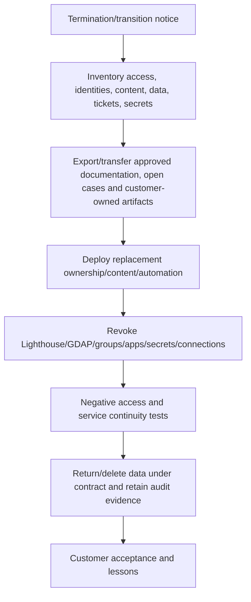

| Offboarding item | Control |
|---|---|
| Open incidents/tickets | Named receiving owner and chronology |
| Detections/playbooks/workbooks | Ownership/license/IP transfer or tested replacement |
| Service identities/connections | Rotate/revoke; inspect consumers |
| Lighthouse/GDAP/MTO access | Remove and test denied access |
| Customer data in provider systems | Return/delete with evidence and legal exceptions |
| Secrets/certificates | Rotate customer-side even after provider revocation |
| Automation | Stop provider-dependent paths only after replacement |
| Audit | Preserve actions, approvals and final access review |
| Billing | Final usage/cost reconciliation |
| Support | Hypercare and residual-risk acceptance |

## 31. M&A scenario

**Scenario:** Contoso acquires Fabrikam. Fabrikam has a separate Entra tenant, two regional Sentinel workspaces, a third-party MSSP, inconsistent schemas, and local data-residency obligations. The target is phased visibility without rushing tenant consolidation.

```mermaid
flowchart TD
    DAY0[Day 0: legal close and emergency contacts] --> DISC[Discover tenants, workspaces, connectors, roles, retention, contracts]
    DISC --> BRIDGE[Temporary Lighthouse/MTO visibility and incident escalation]
    BRIDGE --> BASE[Minimum health, critical detections and identity controls]
    BASE --> NORM[Schema/content/runbook standards and gap remediation]
    NORM --> DECIDE{Long-term tenant/workspace strategy}
    DECIDE -->|Retain separation| FED[Federated operating model]
    DECIDE -->|Consolidate| MIG[Phased source/content/retention/case migration]
    FED --> ACCEPT[Operational acceptance]
    MIG --> ACCEPT
    ACCEPT --> EXIT[Offboard legacy MSSP/access and decommission approved duplicates]
```

| Phase | Objective | Do not do yet |
|---|---|---|
| Day 0–7 | Contacts, critical incidents, service health, access emergency | Move logs/disable MSSP blindly |
| Discovery | Complete technical/legal/cost/dependency inventory | Assume Contoso standard fits region |
| Bridge | Read/triage visibility with bounded delegated access | Grant broad Contributor globally |
| Baseline | Protect critical identity/email/endpoint/cloud data paths | Rewrite all detections simultaneously |
| Normalize | Map schemas, severities, use cases and runbooks | Delete raw/vendor context |
| Decide | Evaluate federate vs consolidate with business case | Treat merger as purely technical |
| Migrate | Rings, dual-read comparisons, one alert path, rollback | Double containment/duplicate tickets |
| Exit | Revoke legacy access, transfer IP/data, validate service | Remove access before handover |

## 32. Safe paper and synthetic lab

This lab creates no workspace, tenant, subscription, delegation, role, connector, repository, pipeline, rule, content, budget, or MSSP access. It uses fictional requirements and arithmetic.

### Fictional client inputs

| Unit | Tenant/cloud | Region obligation | Daily GB | SOC owner | Special constraint |
|---|---|---|---:|---|---|
| Corp | Tenant A/public | UK/EU permitted | 250 | Central SOC | Primary Defender workspace candidate |
| Payments | Tenant A/public | EU only | 180 | Regulated SOC | Separate retention/access |
| US Retail | Tenant A/public | US only | 300 | Central + local | Local response owner |
| Acquisition | Tenant B/public | UK + US workspaces | 220 | Legacy MSSP | 12-month coexistence |
| Government | Tenant C/national cloud | In-cloud only | 90 | Dedicated SOC | No cross-cloud Lighthouse |

### Paper architecture

```mermaid
flowchart TB
    CORP[Tenant A Corp primary] --> DEF[Defender unified queue Tenant A]
    PAY[Tenant A EU Payments workspace] --> DEF
    US[Tenant A US Retail workspace] --> DEF
    ACQ1[Tenant B UK workspace] --> MTO[Defender MTO/Lighthouse management]
    ACQ2[Tenant B US workspace] --> MTO
    GOV[Tenant C national cloud] --> LOCAL[Separate in-cloud SOC/management]
    DEF --> CSOC[Central SOC]
    MTO --> CSOC
    LOCAL --> COORD[Sanitized cross-cloud executive coordination]
    CSOC --> COORD
```

### Lab tasks

| Task | Action | Expected learning |
|---:|---|---|
| 1 | Decide workspace boundaries from requirements | No arbitrary count |
| 2 | Choose Tenant A primary workspace | Defender correlation ownership |
| 3 | Explain why Government stays separate | Sovereign boundary |
| 4 | Design Lighthouse/MTO/GDAP roles for Acquisition | Delegated access |
| 5 | Draft cross-workspace query limited to ≤5 workspaces | Performance/current limit |
| 6 | Choose home workspace and incident owner | Distributed evidence/local case |
| 7 | Build dev/test/prod repository mapping | Content promotion |
| 8 | Label exact preview/GA features | Current status discipline |
| 9 | Define Content Hub diff/update process | Supply-chain governance |
| 10 | Build source/schema/detection/runbook standards | Enterprise consistency |
| 11 | Estimate showback by unit/source/retention | Cost governance |
| 12 | Write minimum viable SOC/DR exercise | Resilience |
| 13 | Draft MSSP onboarding/offboarding | Contractual lifecycle |
| 14 | Present M&A 30/60/90-day architecture | Consulting communication |

### Validation matrix

| ID | Test/change | Expected | Failure caught |
|---|---|---|---|
| V01 | All Tenant A requirements fit one workspace | Single option compared honestly | Workspace sprawl |
| V02 | Payments EU-only data in US workspace | Architecture rejected | Residency breach |
| V03 | Public tenant tries Lighthouse to national cloud | Unsupported path blocked | Cloud-boundary error |
| V04 | Cross-workspace rule references 21 | Design fails current limit | Platform ceiling |
| V05 | Rule references 8 when 4 suffice | Performance review requires redesign | Fan-out inefficiency |
| V06 | One source workspace inaccessible | Partial failure/gap alert, not zero result | Silent blindness |
| V07 | Alert created from five workspaces | Lives only in home workspace with provenance | Distributed-case misconception |
| V08 | Same UPN in two tenants | Tenant ID prevents merge | Customer/entity collision |
| V09 | MSSP Reader included in bulk write selection | Change blocked/handled | Mixed permission risk |
| V10 | Lighthouse user deploys connector without GDAP | Prerequisite failure documented | Delegation overclaim |
| V11 | B2B guest creates repository connection | Unsupported setup identity | CI/CD ownership gap |
| V12 | Repo file deleted | Deployed content remains until explicit removal | False retirement |
| V13 | Portal edit to connected rule | Drift/overwrite detected | Dual source of truth |
| V14 | Custom detection as code used as GA | Status gate fails | Preview overclaim |
| V15 | Content Hub update changes parser field | Contract tests fail before promotion | Supply-chain regression |
| V16 | Connector green but no known event | Health gate fails | False availability |
| V17 | Budget anomaly from duplicate source | Cost alert and source RCA | Waste/noise |
| V18 | Region outage | Minimum viable SOC executes within paper RTO | DR incompleteness |
| V19 | MSSP removed before transfer | Continuity gate blocks revocation | Offboarding outage |
| V20 | Acquisition detections dual-run | Compare IDs/precision before one path retired | Duplicate incident storm |

### Cost worksheet

| Cost component | Fictional input | Calculation method |
|---|---:|---|
| Ingestion | 1,040 GB/day total | Source/table/region measured daily GB × current price/tier |
| Analytics retention | Per table/workspace days | GB retained × current contractual model |
| Lake/archive | Selected high-volume tables | Stored TB-month + query/job/restore cost |
| Logic Apps | Runs/actions/connectors | Consumption or Standard plan model |
| Notebook/jobs | Compute hours/schedules | SKU-hours + storage/network/external APIs |
| License | Eligible users/workloads | Product Terms/contract, not guide estimate |
| Operations | Analysts/engineers/on-call | Service model and effort allocation |

No currency total is calculated because contractual prices, commitments, regions, free allowances and taxes are client-specific and change-sensitive.

### Lab deliverables

1. Requirements-to-topology decision matrix and architecture diagram.
2. Dated feature/status/license/cloud/region/data-lake register.
3. Primary/secondary workspace, cross-workspace and incident-home strategy.
4. Lighthouse/MTO/GDAP/RBAC/PIM/nonhuman identity design.
5. Dev/test/prod repository, IaC, CI/CD, rings and rollback plan.
6. Content Hub, naming, tagging, schema, detection and runbook standards.
7. Health/audit/connector dashboard and troubleshooting runbook.
8. Retention, cost showback/chargeback and governance model.
9. BCDR exercise plus MSSP onboarding/offboarding pack.
10. M&A roadmap and candidate honesty statement.

## 33. Deployment rings and platform lifecycle

```mermaid
stateDiagram-v2
    [*] --> Proposed
    Proposed --> Designed: Requirements/ADR/privacy/cost approved
    Designed --> Dev: IaC/content authored
    Dev --> Test: Static and fixture tests pass
    Test --> Ring0: Integration/security/performance pass
    Ring0 --> Ring1: Shadow/limited acceptance
    Ring1 --> Ring2: Quality/SOC/health acceptance
    Ring2 --> Enterprise: Governance approval
    Enterprise --> Operate
    Operate --> Improve: Metrics/incidents/platform changes
    Improve --> Dev
    Operate --> Retire: Replacement and evidence approved
    Retire --> [*]
```

| Gate | Exit criterion |
|---|---|
| Proposed | Owner, risk, use case and funding exist |
| Designed | Region/topology/RBAC/privacy/cost/DR decisions approved |
| Dev | Definitions and synthetic tests reproducible |
| Test | Schema, permission, integration, failure and rollback pass |
| Ring 0 | Disabled/shadow resource read back correctly |
| Ring 1 | Limited source/population quality and operations accepted |
| Ring 2 | Broader performance, precision, health and cost accepted |
| Enterprise | Runbook, RACI, SLA, monitoring, support and release accepted |
| Retire | Replacement/gap, data/content/access cleanup and audit complete |

## 34. Platform operating model

| Role/team | Accountability |
|---|---|
| Platform owner | Overall service, roadmap, funding, standards and risk |
| Workspace owner | Region/data/access/content/health for one workspace |
| Data/source owner | Generation, schema, connector, quality and cost |
| Detection engineering | Use cases, queries, quality, deployment and tuning |
| SOC operations | Queue, investigation, response, feedback and SLA |
| Identity/access | RBAC, PIM, service identities and reviews |
| Privacy/legal/data governance | Purpose, residency, retention, sharing and sensitive access |
| DevSecOps | Repository, pipeline, supply chain, testing and rollback |
| FinOps | Forecast, commitments, chargeback and optimization |
| MSSP/vendor manager | Contract, SLA, audit, IP, risk and exit |
| Business/local owner | Criticality, response authority and local regulation |

## 35. Service-review cadence

| Cadence | Review |
|---|---|
| Continuous | Source/connector/rule/automation/job failures and critical cost anomalies |
| Daily/shift | Queue, data gaps, skipped detections, handoffs and high-impact actions |
| Weekly | Deployment status, top noise/misses, connector latency, MSSP SLA |
| Monthly | Usage/cost, access, schema drift, content versions, runbook issues |
| Quarterly | Architecture, retention, residency, DR, vendor, preview status, exceptions |
| Annually/contract | Strategy, licensing, maturity, capacity, MSSP renewal/exit and full recovery test |

## 36. Troubleshooting enterprise Sentinel

```mermaid
flowchart TD
    SYM[Enterprise symptom: missing, duplicate, slow, denied, costly] --> SCOPE{Tenant/workspace/region/environment identified?}
    SCOPE -->|No| MAP[Use topology/catalog and stable IDs]
    SCOPE -->|Yes| SOURCE{Known source event exists?}
    SOURCE -->|No| GEN[Source/business system RCA]
    SOURCE -->|Yes| ING{Correct connector/path/table/tier?}
    ING -->|No| PIPE[Connector/DCR/auth/duplicate/routing RCA]
    ING -->|Yes| CONTENT{Parser/rule/function version healthy?}
    CONTENT -->|No| DEP[Repository/deployment/dependency/schema RCA]
    CONTENT -->|Yes| CROSS{Cross-workspace/tenant access and limits?}
    CROSS -->|No| RBAC[Role/PIM/Lighthouse/GDAP/home workspace]
    CROSS -->|Yes| OPS[Incident, automation, ticket, response, cost and handoff]
```

| Symptom | Likely boundary | Discriminating check |
|---|---|---|
| One region missing data | Source/connector/workspace route | Known event and `TimeGenerated`/ingestion time |
| Cross-workspace rule returns partial | Access/schema/table/function failure | Run each workspace leg and health query |
| Incident appears only centrally | Expected home-workspace behavior | Rule resource/workspace ID |
| MSSP can read but not update | Delegated role mismatch | Effective role at customer resource |
| Connector setup denied | Lighthouse insufficient/GDAP/service role | Current connector prerequisites |
| Repository deploy succeeds but content wrong | Parameter/drift/read-back gap | Compare resource definition to commit |
| Portal edit disappears | Repository redeployed source | Audit and source-of-truth policy |
| Deleted repo content still active | Deployment does not delete target | Explicit target retirement |
| Content Hub update breaks query | Parser/template dependency drift | Version diff and fixture tests |
| Health table says launch success, action failed | Internal Logic App failure | Run history/AzureDiagnostics/target state |
| Cost spike | Duplicate source, volume, table plan, retention/job | Usage by table/source/workspace |
| Data lake access too broad | Entra/unified role spans workspaces | Effective role and negative test |
| Same user mixed across customers | Tenant field missing | Entity/provenance contract |
| Offboarding breaks response | Provider-owned playbook/identity removed early | Dependency and transition inventory |
| DR template deploys but no detection | Missing data/identity/connector/operations | End-to-end known-event test |

## 37. Consulting artifacts

| Artifact | Decision enabled |
|---|---|
| Requirements/topology matrix | How many workspaces/tenants/regions and why? |
| Architecture decision records | Which durable boundaries and tradeoffs are approved? |
| Data-flow/residency map | Where is data stored, processed, queried and exported? |
| Primary workspace decision | Which workspace owns Defender integration? |
| Cross-workspace design | Which queries/rules/views and home incidents? |
| Delegation/RBAC matrix | Who can do what in each customer/environment? |
| IaC/content pipeline | How is platform/content promoted and rolled back? |
| Feature-status register | Which exact capabilities are GA/preview/deprecated/unavailable? |
| Content Hub register | Which provider/version/dependency/local changes? |
| Standards catalog | Naming, tagging, schema, detection, runbook and metadata |
| Health/audit dashboard | Is every source/control/workflow healthy and intact? |
| Cost model | Which consumer/use case pays and receives value? |
| Retention/DR plan | Can evidence and minimum SOC recover within objectives? |
| MSSP lifecycle pack | How is service onboarded, governed, transferred and revoked? |
| M&A roadmap | How is visibility gained before safe consolidation? |
| Platform operating model | Who owns roadmap, data, content, operations and risk? |

## 38. JD Mapping: interview translation

| Interview theme | Your transferable strength | Honest enterprise Sentinel answer |
|---|---|---|
| Architecture | Maps Microsoft 365 dependencies | Requirements-driven workspace/tenant topology |
| Operations | Owns critical incidents and handoff | Platform RACI, health, SLA and continuity |
| Vendors | Coordinates product groups/vendors | Lighthouse/MSSP contract/access/escalation/exit |
| Change | Validates fixes before closure | Dev/test/rings/read-back/rollback |
| Reporting | KPI/business reviews | Cost, health, detection and service scorecard |
| Governance | Security-aligned customer guidance | Standards, exceptions, privacy and review |
| Migration | Microsoft 365 migration/support context | M&A bridge, coexistence and phased consolidation |
| Experience gap | Does not invent production claims | Paper architecture and synthetic validation |

## Official Source Anchors

These official Microsoft Learn pages were reviewed for the August 24, 2026 treatment. Recheck release/preview banners, Product Terms, licenses, cloud/region, portal, primary-workspace behavior, APIs, repository support, RBAC, data lake, limits and tenant configuration before implementation.

1. [Prepare for multiple workspaces and tenants](https://learn.microsoft.com/azure/sentinel/prepare-multiple-workspaces) — workspace decision drivers and architecture planning.
2. [Extend Sentinel across workspaces and tenants](https://learn.microsoft.com/azure/sentinel/extend-sentinel-across-workspaces-tenants) — incidents, queries, scheduled rule limits, workbooks, hunting, automation and Lighthouse.
3. [Multiple Sentinel workspaces in Defender](https://learn.microsoft.com/azure/sentinel/workspaces-defender-portal) — primary/secondary and multi-workspace Defender behavior.
4. [Transition Sentinel to Defender](https://learn.microsoft.com/azure/sentinel/move-to-defender) — Workspace Manager replacement, primary workspace, content as code, privacy, CMK, connectors and multitenant transition.
5. [Manage Sentinel with Azure Lighthouse](https://learn.microsoft.com/azure/lighthouse/how-to/manage-sentinel-workspaces) — customer data/cost isolation, roles, queries, workbooks, playbooks and IP.
6. [Manage multiple tenants as an MSSP](https://learn.microsoft.com/azure/sentinel/multiple-tenants-service-providers) — Lighthouse prerequisites, resource providers, managed access and GDAP connector note.
7. [Defender multitenant management](https://learn.microsoft.com/defender-xdr/mto-overview) — unified multitenant incident and hunting operations.
8. [Sentinel roles and permissions](https://learn.microsoft.com/azure/sentinel/roles) — Azure RBAC, playbooks, data-lake and advanced access.
9. [Deploy custom content from a repository](https://learn.microsoft.com/azure/sentinel/ci-cd) — GitHub/Azure DevOps prerequisites, content types, deployment, edit/delete and connection lifecycle.
10. [Plan repository content](https://learn.microsoft.com/azure/sentinel/ci-cd-custom-content) — supported file formats/types and preview custom detections as code.
11. [Content Hub deployment](https://learn.microsoft.com/azure/sentinel/sentinel-solutions-deploy) — solutions, dependencies, support, versions, active content and APIs.
12. [Auditing and health monitoring](https://learn.microsoft.com/azure/sentinel/health-audit) — `SentinelHealth`, `SentinelAudit`, diagnostics and workbooks.
13. [Monitor data connector health](https://learn.microsoft.com/azure/sentinel/monitor-data-connector-health) — connector health drift and known-event monitoring.
14. [Sentinel data lake overview](https://learn.microsoft.com/azure/sentinel/datalake/sentinel-lake-overview) — tiers, long retention, KQL, notebooks, jobs, audit and regions.
15. [Geographical availability and data residency](https://learn.microsoft.com/azure/sentinel/geographical-availability-data-residency) — region, storage, processing and cloud availability.
16. [Plan Sentinel costs](https://learn.microsoft.com/azure/sentinel/billing) and [monitor costs](https://learn.microsoft.com/azure/sentinel/billing-monitor-costs) — ingestion, retention, data lake and cost controls.
17. [Azure Monitor workspace design](https://learn.microsoft.com/azure/azure-monitor/logs/workspace-design) — Log Analytics workspace principles.
18. [Azure Lighthouse enterprise scenarios](https://learn.microsoft.com/azure/lighthouse/concepts/enterprise) — internal multi-tenant delegated management.

## ⭐ Likely Interview Questions for This Section

### Q1. How do you decide between one Sentinel workspace and multiple workspaces?

**Model answer:** Start with durable requirements: data residency/sovereign cloud, legal ownership, tenant, RBAC isolation, response authority, retention, scale, billing and MSSP boundaries. One workspace simplifies correlation, content and cost operations. Multiple workspaces can satisfy real isolation requirements but duplicate content, health, access and incidents. I require an ADR and test whether RBAC, table plans or process can meet the need before adding a workspace.

### Q2. What is the role of a primary workspace in Defender-integrated Sentinel?

**Model answer:** It is the tenant's main Defender XDR/Sentinel bridge and integrated Microsoft alert path. Relevant standalone product connectors are disconnected in secondary workspaces during onboarding to prevent duplicate tenant alerts, and specified Defender correlation uses primary-workspace Sentinel alerts. Secondary workspaces can retain local/regional data and detections, but their incident and escalation model must be explicit.

### Q3. What are the main cross-workspace analytics limitations?

**Model answer:** Current scheduled rules can query up to 20 workspaces, with Microsoft recommending no more than five for performance. Sentinel must be enabled in each referenced workspace. The alert and incident exist only in the rule's home workspace, so results need source tenant/workspace/event provenance. I monitor partial access/schema failures and avoid using a personal creator identity as an undocumented dependency.

### Q4. How do Azure Lighthouse and Defender multitenant management differ?

**Model answer:** Lighthouse delegates Azure resource management from customer tenants to managing-tenant groups/service principals while customer data and cost stay local. Defender multitenant provides a unified incidents/alerts/hunting view for configured tenants. They complement rather than replace each other; some connector or Microsoft 365 tasks require GDAP/other portal permissions, and Lighthouse cannot cross public and national-cloud boundaries.

### Q5. How would you promote Sentinel content safely across environments?

**Model answer:** Version IaC and content in GitHub/Azure DevOps, use PR review and schema/KQL/secret/policy/fixture tests, deploy to dev then test, read back resources, run synthetic integration and permission tests, then use disabled/shadow and limited production rings. Repository connections have exact status constraints: B2B/delegated connection creation is unsupported and custom detections as code is preview. Portal edits can be overwritten; deleting a repo file does not delete the target.

### Q6. What should enterprise Sentinel health and cost governance include?

**Model answer:** Monitor known source events, connector freshness/errors, schema quality, rule runs/delay/skips, automation internal actions and target verification, repository deployments/drift, access changes, lake jobs and cost by source/table/workspace/use case. Use `_SentinelHealth()` and `_SentinelAudit()` plus Logic Apps and lake audit. Allocate costs transparently by consumer and value, not only total GB.

### Q7. How would you onboard and offboard an MSSP?

**Model answer:** Contract scope, data processing, authority, SLA, IP ownership and exit first. Grant group-based least-privilege Lighthouse/GDAP/MTO access with PIM and negative tests, deploy approved content, run synthetic incident/failure/DR tests, shadow and accept service. For exit, transfer open cases/content/runbooks, deploy replacement dependencies, revoke and rotate all access/identities/connections, test denial and continuity, return/delete provider-held data, and obtain customer acceptance.

### Q8. What is your honest experience with enterprise Sentinel architecture?

**Model answer:** I have not operated a multi-workspace or multi-tenant Sentinel estate in production. My production strengths are enterprise M365 escalation, RCA, vendor coordination, validation, reporting and handover. I built a current paper architecture covering workspace drivers, Lighthouse/MTO/GDAP, cross-workspace limits, RBAC/PIM, repositories/IaC, health, cost, DR, MSSP lifecycle and an M&A scenario. I would validate every tenant/region/contract and phase deployment with synthetic evidence.

## 🧠 30-Second Memory Hooks

- **Topology starts with obligations, not workspace count.**
- **One workspace:** simple correlation/content; larger shared blast radius.
- **More workspaces:** real isolation plus permanent operating cost.
- **Tenant:** identity/legal boundary; **subscription:** billing/policy boundary.
- **Primary workspace:** Defender XDR bridge and tenant Microsoft alert path.
- **Lighthouse:** delegate management; customer keeps data and cost.
- **MTO:** cross-tenant Defender view; not every Azure/service permission.
- **GDAP:** may be needed beyond Lighthouse for connector/service work.
- **National cloud:** no public-cloud Lighthouse bridge.
- **Cross-workspace:** max 20 current; recommended ≤5.
- **Home workspace:** central rule’s alert/incident lives there.
- **Provenance:** tenant + workspace + table + event ID.
- **Watchlists:** no Lighthouse cross-workspace management currently.
- **PIM:** eligible, time-bound privilege; test effective cumulative access.
- **Repository:** source of truth; portal edits drift/overwrite.
- **Repo delete ≠ target delete.**
- **Custom detection as code:** preview/current prerequisites.
- **Content Hub template ≠ active tested content.**
- **Health:** known event plus `_SentinelHealth()`/`_SentinelAudit()`.
- **DR:** rebuilt JSON is not a recovered SOC.
- **MSSP exit:** transfer, replace, revoke, rotate, verify, dispose.
- **Honesty:** paper architecture, no production enterprise Sentinel claim.

## Completion Checklist

- [ ] I can explain tenant, subscription, resource group, workspace, primary workspace, Lighthouse, MSSP, IaC, content as code, rings and chargeback.
- [ ] I can derive topology from residency, ownership, RBAC, scale, cost, retention and operations.
- [ ] I can draw the enterprise governance, Defender, workspace, data-lake and SOC architecture.
- [ ] I can compare single and multiple workspaces with daily operating costs.
- [ ] I can justify every additional workspace with a durable requirement.
- [ ] I can design multiple workspaces inside one tenant.
- [ ] I can explain multi-tenant and M&A/customer boundaries.
- [ ] I can assess public, sovereign and national-cloud constraints.
- [ ] I can design subscription/resource-group boundaries by lifecycle and blast radius.
- [ ] I can choose and test the Defender primary workspace.
- [ ] I can explain Lighthouse customer data/cost ownership and role delegation.
- [ ] I know Lighthouse alone may not cover current connector/Defender service setup.
- [ ] I can distinguish Lighthouse from Defender multitenant operations and GDAP.
- [ ] I preserve tenant ID and customer separation in multitenant investigations.
- [ ] I can write safe `workspace()`/`union` architecture and provenance.
- [ ] I know the current 20-workspace limit and ≤5 recommendation.
- [ ] I know cross-workspace alerts/incidents live only in the home workspace.
- [ ] I can design multi-workspace incidents, hunting and workbooks with permission tests.
- [ ] I know watchlist management through Lighthouse is unsupported.
- [ ] I can design group/PIM-based human access and negative tests.
- [ ] I can choose managed identity/service principal authentication for pipelines.
- [ ] I can separate local/dev/test/ring0/ring1/ring2/enterprise environments.
- [ ] I can explain repository prerequisites, source of truth, drift and deletion behavior.
- [ ] I can mark exact content-as-code/custom-detection preview status.
- [ ] I can distinguish IaC foundation from content and operations.
- [ ] I can govern Content Hub provenance, dependencies, updates and local differences.
- [ ] I can define naming, tagging, schema, detection and runbook standards.
- [ ] I can monitor source, connector, schema, analytics, automation, repository, access, lake and cost health.
- [ ] I can design showback/chargeback by source, table, use case and consumer.
- [ ] I can define retention by need rather than maximum technical capability.
- [ ] I can design a minimum viable SOC and end-to-end DR test.
- [ ] I can onboard and offboard an MSSP without losing service or customer control.
- [ ] I can phase an M&A bridge, baseline, normalize, decide, migrate and exit.
- [ ] I completed the safe paper lab without creating access or cloud resources.
- [ ] I can answer Q1–Q8 aloud without claiming production enterprise Sentinel experience.
- [ ] I will recheck Learn, preview/GA, licensing, portal, cloud/region, limits, RBAC, data lake and tenant behavior before reuse.

*Next suggested section:* [Part 53](Part-53-consulting-discovery-current-state-scope.md)