# Part 53 — Discovery, Stakeholder Interviews, Current-State Mapping, and Scope Control

> **Section goal:** Build a beginner-first, consulting-grade method for discovering a client's real business and security situation before recommending technology. By the end, you should be able to frame outcomes; establish an engagement charter and statement-of-work boundaries; map stakeholders, decision rights, and responsibilities; plan and facilitate interviews and workshops; request and evaluate evidence; inventory identities, devices, applications, data, tools, licenses, policies, and integrations; draw architecture, authentication, data, logging, and incident flows with trust boundaries; manage assumptions, constraints, dependencies, risks, actions, issues, and decisions; validate a current-state view; control scope change; run remote or hybrid discovery; and produce a reusable discovery pack from a safe fictional exercise.

This Part maps directly to the role's expectations for Microsoft 365 security consulting, assessments, architecture, stakeholder management, documentation, multi-vendor coordination, and work from discovery through handover. Your enterprise technical advisory work, critical escalations, root-cause analysis (RCA), business reviews, evidence-based documentation, product-group and vendor coordination, and customer communication are strong foundations. Discovery changes the time horizon: instead of diagnosing one incident, you must establish enough shared truth to define the right problem, desired outcome, boundaries, and next decisions.

> **Method boundary:** Everything here is general consulting and security-engineering guidance grounded in public sources and common professional practices. It is not presented as Deloitte's internal, confidential, or proprietary methodology. A real Deloitte engagement would use the approved engagement terms, quality processes, templates, independence requirements, and delivery guidance supplied by the firm and client.

## JD Mapping

| Role expectation | Capability developed here | Evidence you can produce |
|---|---|---|
| Discover client security needs | Translate symptoms and requests into business outcomes and decision questions | Outcome statement and discovery plan |
| Assess Microsoft 365 environments | Collect inventories, flows, configuration evidence, operational evidence, and ownership | Current-state workbook and diagrams |
| Work across technical and business teams | Map power, interest, expertise, responsibilities, and decision rights | Stakeholder map and RACI |
| Coordinate vendors and product teams | Separate accountability, dependencies, interfaces, and evidence requests | Dependency map and vendor action log |
| Communicate with leadership | Convert technical facts into impact, choices, uncertainty, and decisions | Validated readout and decision log |
| Control delivery | Establish scope, assumptions, exclusions, acceptance, and change control | Charter, RAID log, and change request |
| Troubleshoot complex cloud services | Use timelines, flows, trust boundaries, and evidence quality to test hypotheses | Current-state flow pack and evidence register |
| Document and hand over work | Maintain reproducible records with owners, dates, sources, and status | Reusable discovery pack |

## Candidate honesty note

You can credibly say that you have gathered evidence during Microsoft 365 escalations, clarified impact and reproduction, coordinated stakeholders and vendors, documented RCA, validated fixes, presented service insights in business reviews, and translated technical findings for customers. Those are real discovery muscles.

You should not claim that you have led a Deloitte security discovery, authored a contractual statement of work, performed a production-wide Microsoft 365 security inventory, or used a proprietary consulting method unless separately evidenced. Safe wording is:

> “My production background is Microsoft 365 technical advisory and escalation engineering. I have clarified business impact, gathered logs and configuration evidence, mapped dependencies, coordinated customers, vendors, and product groups, documented RCA, validated changes, and presented trends in business reviews. To bridge that into consulting, I built a fictional end-to-end discovery pack with an outcome charter, stakeholder map, RACI, evidence register, inventories, architecture and trust-boundary flows, RAID and decision logs, a validated readout, and change-control examples. In a client engagement I would use the firm's approved method and contract, validate facts with accountable owners, and label assumptions and evidence limitations.”

---

## 1. Discovery starts with the decision, not the product

**Discovery** is the structured work used to understand a situation well enough to make an informed decision. It asks what outcome matters, what is happening now, who owns it, what evidence supports the view, what constraints apply, and what decision the engagement must enable.

A weak opening is, “Which Microsoft E5 features can we turn on?” A stronger opening is, “Which material identity, device, collaboration, and data risks must be reduced in the next 12 months, and what target controls, operating changes, and investment are justified?” The first begins with a product. The second begins with an outcome and leaves room for process, people, architecture, license, and compensating-control options.

**Analogy:** a physician does not prescribe treatment from the brand name a patient mentions. The physician establishes symptoms, history, urgency, evidence, possible causes, contraindications, and desired outcome. Discovery is the consulting equivalent of a careful history and examination.

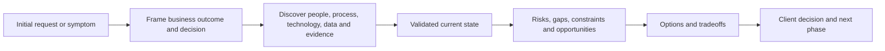

| Starting statement | Hidden problem | Better discovery question |
|---|---|---|
| “We need E5” | License treated as strategy | Which risks and use cases require capabilities not currently available? |
| “Conditional Access is broken” | Symptom lacks affected scope and timeline | Who is affected, what changed, which policy path evaluated, and what evidence proves failure? |
| “Secure our tenant” | Outcome is undefined | Which assets, threats, obligations, and risk tolerances define “secure enough”? |
| “Replace the SIEM” | Tool replacement may ignore operations | Which detection, response, retention, cost, and service outcomes are failing? |
| “Complete a health check” | Pass/fail boundary is unclear | Against which control objectives, evidence period, population, and acceptance criteria? |
| “Stop external sharing” | Business collaboration could be damaged | Which sharing scenarios are legitimate, risky, regulated, or unmanaged? |

### 🔍 Plain-English deep-dive: a stated request is not yet the problem statement

The person requesting work usually sees one part of the system. A security leader may see audit pressure; a service owner may see failed sign-ins; finance may see license cost; users may see friction; the SOC may see weak telemetry. Discovery does not dismiss the request. It preserves it as an input, then tests the underlying need from several viewpoints. A defensible problem statement identifies the affected business capability, present condition, consequence, evidence, and decision required. It does not declare an untested root cause or preferred product.

## 2. Consulting mindset and problem framing

Consulting discovery combines curiosity with delivery discipline. Curiosity explores competing explanations. Discipline keeps the work within an agreed purpose, time, evidence standard, and decision path.

| Mindset | Practical behavior | Failure if absent |
|---|---|---|
| Outcome-led | Ask what business result or risk decision is needed | Feature catalog with no decision value |
| Evidence-led | Record source, date, scope, owner, and limitations | Opinion presented as fact |
| Hypothesis-aware | State what evidence would support or disprove a belief | Confirmation bias |
| System-oriented | Examine people, process, data, technology, suppliers, and operations | Configuration-only answer |
| Client-owned | Make decision rights and risk ownership explicit | Consultant silently accepts risk |
| Proportionate | Match effort and evidence depth to consequence | Endless discovery or false certainty |
| Transparent | Label assumptions, conflicts, gaps, and confidence | Surprise at readout |
| Actionable | Connect every question to a decision or output | Interview fatigue |

A useful problem frame has six fields:

1. **Context:** What business service, users, data, region, tenant, or obligation is involved?
2. **Present condition:** What is believed to happen now?
3. **Consequence:** Why does it matter to risk, service, cost, compliance, or strategy?
4. **Evidence:** What observations currently support that belief?
5. **Desired outcome:** What measurable condition should be different?
6. **Decision:** What must an accountable person choose at the end?

## 3. Outcomes, success measures, and discovery questions

An **outcome** is a meaningful result, not an activity. “Run five workshops” is an activity. “Agree an evidence-backed current state and approve the assessment scope” is an outcome. A **success measure** is how the parties know the outcome was achieved.

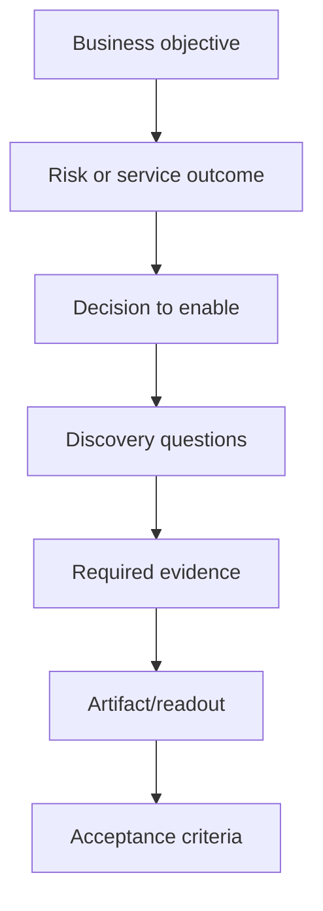

| Outcome layer | Northstar example | Measure |
|---|---|---|
| Business | Support regulated collaboration during acquisition | Critical collaboration scenarios approved by legal and business owners |
| Risk | Reduce unmanaged external access to sensitive data | High-risk sharing paths identified with owners and treatment decisions |
| Security capability | Establish identity, device, and data control baseline | Evidence coverage and validated control inventory |
| Operational | Clarify alert and incident ownership | RACI and escalation path accepted by SOC and service teams |
| Engagement | Produce a trusted current-state baseline | Named owners validate diagrams, findings inputs, and limitations |

Discovery questions should be traceable to an output. If a question does not affect the architecture, risk view, scope, plan, or decision, remove or defer it.

## 4. Engagement charter and statement-of-work boundaries

An **engagement charter** is a concise agreement about why the work exists and how it will operate. A **statement of work (SOW)** is a contractual document defining services, deliverables, responsibilities, assumptions, schedule, fees, and other terms. The consultant follows the signed SOW; the working charter adds practical clarity but does not silently rewrite the contract.

| Charter field | Question answered |
|---|---|
| Sponsor and accountable owner | Who funds, decides, and accepts? |
| Purpose/problem statement | Why is the engagement needed? |
| Outcomes and decisions | What must become possible? |
| In-scope organizations/services | Which tenants, workloads, users, regions, and processes? |
| Out-of-scope items | What will not be assessed or changed? |
| Deliverables | Which documents, diagrams, workshops, or backlog? |
| Evidence period and method | Which dates, populations, samples, and access? |
| Responsibilities | What client, consultant, and suppliers provide? |
| Milestones and acceptance | When and how is each output approved? |
| Security/privacy rules | How is client information accessed, stored, shared, and deleted? |
| Dependencies and assumptions | What must be true for delivery? |
| Change control | How are new needs estimated and approved? |

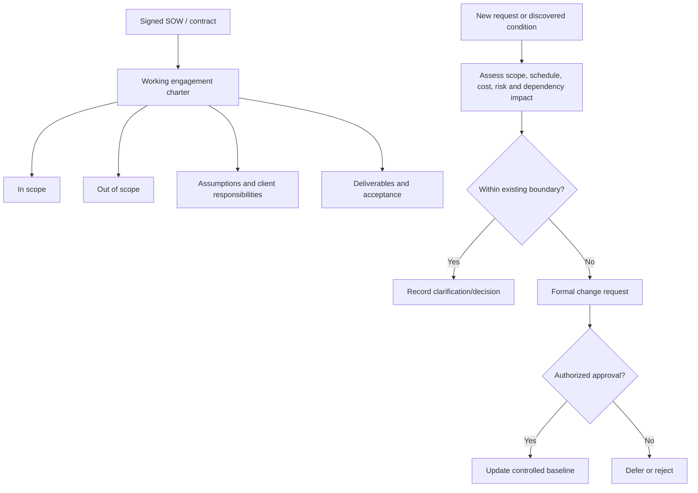

### 🔍 Plain-English deep-dive: helpfulness can create accidental scope

A client may ask a reasonable question during a workshop: “Could you also review our AWS identity design?” Answering a brief dependency question may be necessary. Performing a second cloud assessment is different. Quietly absorbing it can reduce quality, miss approvals, expose data outside the agreed handling model, and create a deliverable nobody resourced. Good scope control is not refusal; it is transparency. Record the need, explain impact, offer an option, identify the decision owner, and continue the approved work.

## 5. Define in scope, out of scope, and interfaces

Scope should use concrete dimensions rather than “Microsoft 365 security.”

| Dimension | Example in scope | Example out of scope | Interface still considered |
|---|---|---|---|
| Organization | Northstar UK and EU employees | Acquired US subsidiary | Cross-tenant collaboration dependency |
| Tenant | Production tenant A | Development tenant B | App registration promoted from B |
| Identity | Workforce and privileged users | Customer identities | Customer portal SSO endpoint |
| Devices | Corporate Windows and iOS | Factory operational technology | Network access dependency |
| Workloads | Entra, Intune, Exchange, Teams, SharePoint, OneDrive | Azure application code review | Enterprise app permissions |
| Data | Confidential collaboration content | Source-code repositories | DLP export to ticketing |
| Security tools | Defender XDR and Sentinel | Third-party firewall configuration | Firewall alerts and response owner |
| Time | Evidence from previous 90 days | Historical redesign | Legacy incident influencing risk |
| Work type | Discover and assess | Production remediation | Roadmap and implementation prerequisites |

An out-of-scope system can still be an **interface** or **dependency**. The consultant may document its input/output, owner, assumption, and risk without assessing its internal controls.

## 6. Stakeholder discovery

A **stakeholder** is anyone who affects, is affected by, supplies evidence to, operates, decides, funds, or assures the engagement. Titles alone are insufficient. A global administrator may know configuration but not business impact. A data owner may understand consequence but not technical enforcement.

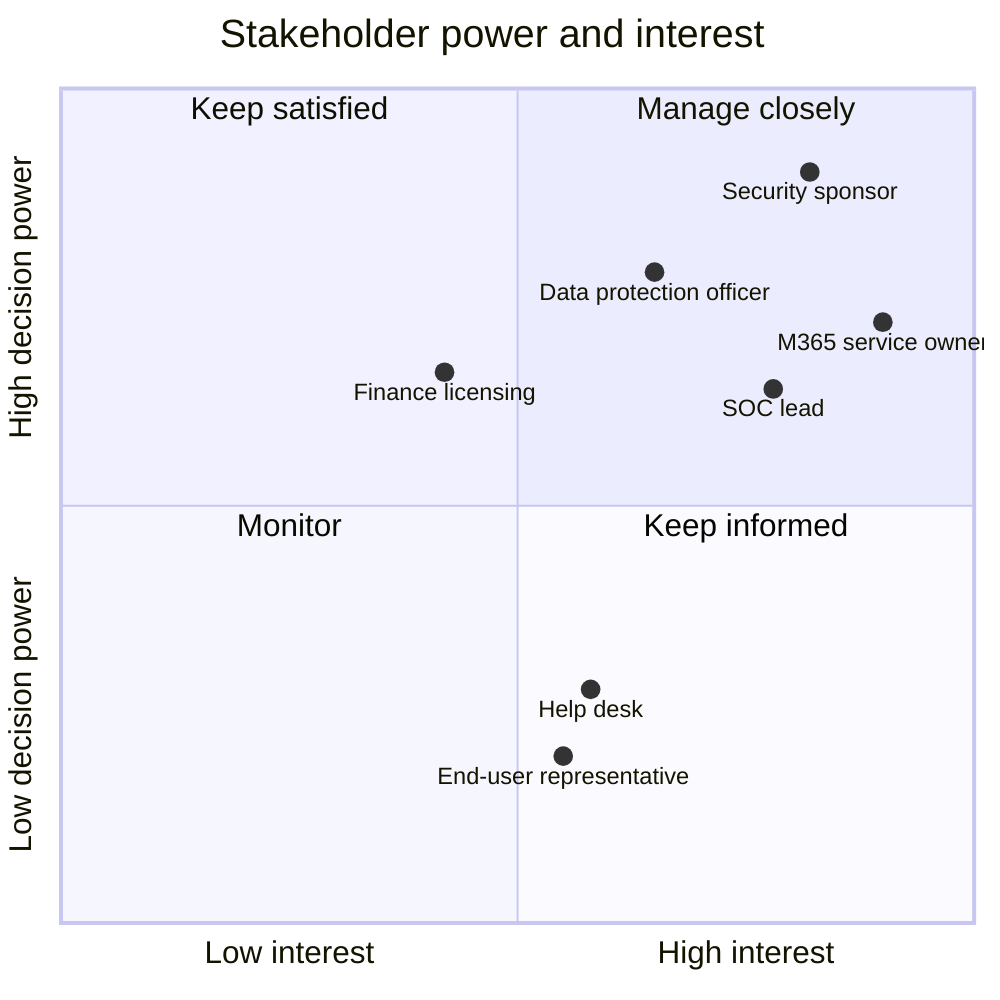

| Stakeholder | Knowledge sought | Decision/role |
|---|---|---|
| Executive sponsor | Strategic outcome, risk tolerance, funding | Direction and escalation |
| CISO/security leadership | Threats, controls, exceptions, risk ownership | Security acceptance and priority |
| M365/Entra/Intune owners | Architecture, configuration, changes, health | Technical facts and remediation ownership |
| SOC/incident response | Signals, queue, runbooks, containment authority | Operational effectiveness |
| Privacy/legal/compliance | Purpose, lawful basis, data boundaries, obligations | Privacy/legal approval |
| Data/business owners | Criticality, collaboration needs, impact | Business risk and exception ownership |
| Enterprise architecture | Standards, integration, target state | Architecture assurance |
| Service desk/operations | Recurring symptoms, support model, user friction | Operational evidence |
| Procurement/finance | Contract, entitlements, renewals, cost | Commercial constraints |
| HR/change/training | Joiner-mover-leaver, communications, adoption | People/process dependencies |
| Vendors/MSSP | Supplied service, interface, SLA, evidence | Third-party dependency |
| Internal audit | Prior findings and assurance expectations | Independent challenge |

## 7. Power-interest, influence, and engagement strategy

Power-interest mapping helps prioritize engagement, but do not use it to exclude people with low formal power and high operational knowledge. Also record stance, influence, availability, concerns, and preferred communication.

| Field | Example |
|---|---|
| Stakeholder | Director of Collaboration Services |
| Formal accountability | M365 service owner |
| Influence | High across technology teams |
| Interest | High because prior outage affected board reporting |
| Current stance | Supports control improvement; fears user disruption |
| Evidence held | Change calendar, support trends, architecture, service KPIs |
| Needed decision | Approve current-state service boundaries and owner assignments |
| Engagement | Pre-read, 60-minute workshop, diagram validation, weekly decision summary |

Conflict is information. Security may prefer strict blocking while business owners need partner collaboration. Discovery should make the competing outcomes and risk explicit instead of prematurely choosing a winner.

## 8. RACI and decision rights

**RACI** means Responsible, Accountable, Consulted, and Informed.

- **Responsible:** performs the work.
- **Accountable:** owns the outcome and final decision; ideally one accountable role per activity.
- **Consulted:** provides two-way input.
- **Informed:** receives relevant updates.

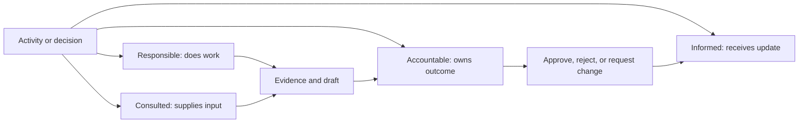

| Discovery activity | Sponsor | Engagement lead | M365 owner | Security | Privacy | Vendor |
|---|---|---|---|---|---|---|
| Approve charter | A | R | C | C | C | I |
| Provide tenant inventory | I | C | R/A | C | I | C |
| Validate data flow | I | R | R | C | A/C | C |
| Accept evidence limitation | A | R | C | C | C | I |
| Approve scope change | A | R | C | C | C | I |
| Validate current-state readout | A | R | R | R | R | C |

RACI does not replace a decision log or job descriptions. It clarifies this engagement's activities. Where multiple “A” entries appear, resolve the ambiguity or specify different decision domains.

## 9. Build the discovery plan

The discovery plan connects decisions to questions, people, evidence, sessions, outputs, and dates. Sequence interviews so early context improves later technical sessions, but keep room to revisit assumptions.

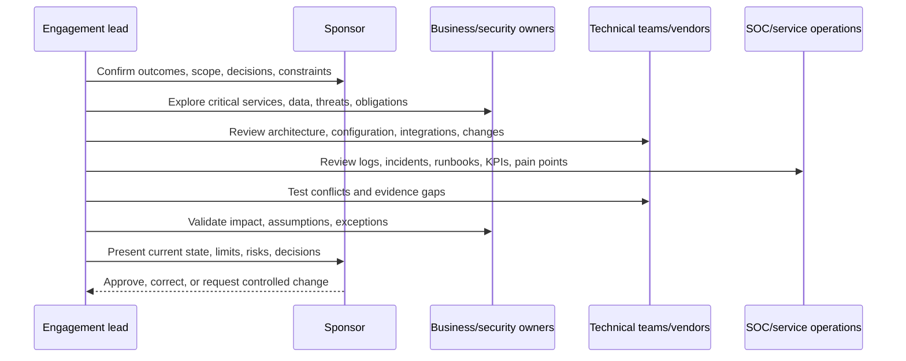

| Plan field | Example |
|---|---|
| Decision question | Is Northstar ready for risk-based external collaboration? |
| Hypothesis | Sharing controls differ by site and device state; ownership is fragmented |
| Participants | Collaboration, identity, Intune, Purview, business data owner, privacy, SOC |
| Evidence | Sharing settings, site inventory, labels, CA policies, audit samples, incidents, exceptions |
| Method | Pre-read, interviews, technical walkthrough, diagram playback |
| Output | Validated current-state sharing and access flow |
| Quality gate | Owners confirm facts; unverified areas labeled; contradictions resolved or logged |
| Deadline/dependency | Before target-control workshop; privacy owner available Thursday |

## 10. Prepare interviews and workshops

An **interview** is optimized for depth, candor, and one person's knowledge. A **workshop** is optimized for shared understanding, conflict resolution, co-creation, or decisions. Do not invite 25 people to every session.

| Format | Best use | Risk | Control |
|---|---|---|---|
| One-to-one interview | Sensitive concerns, role-specific depth | Single perspective | Corroborate evidence |
| Small technical workshop | Map architecture or troubleshoot flow | Dominant specialist | Round-robin and diagram playback |
| Cross-functional workshop | Resolve process/ownership boundary | Terminology conflict | Common glossary and facilitator |
| Executive session | Outcomes, risk, priority, decision | Too much technical detail | Pre-read and decision-focused agenda |
| Evidence walkthrough | Demonstrate live configuration/process | Screen data exposure | Minimize, redact, no uncontrolled recording |
| Async questionnaire | Gather structured baseline | Low context, stale answers | Follow-up on risk/ambiguity |

Every invitation should state purpose, decisions, expected participants, preparation, evidence, security rules, and outputs. Send focused questions, not a hundred-item generic questionnaire.

## 11. Facilitation: listen, probe, play back, and challenge respectfully

Use a simple loop:

1. Ask an open question: “Walk me through how external access is approved.”
2. Listen for actors, triggers, systems, decisions, evidence, exceptions, and pain.
3. Probe specifically: “Who can approve? What happens outside business hours? Show a recent example.”
4. Play back neutrally: “I heard that site owners approve guests, but the service team owns tenant defaults. Is that accurate?”
5. Test exceptions and failure: “What if the owner leaves? How is access removed?”
6. Record fact, source, uncertainty, owner, and follow-up.

### 🔍 Plain-English deep-dive: “show me” is not an accusation

People often describe the designed process, not the process that consistently operates. “Show me a recent approved exception and its closure evidence” tests whether the process works without implying dishonesty. Explain why evidence is needed, minimize sensitive data, and accept that access may be restricted. If evidence cannot be supplied, record the limitation rather than converting the statement into a proven fact.

| Question style | Example | Value |
|---|---|---|
| Open | “How does a new administrator receive access?” | Reveals actual process |
| Closed | “Is PIM required for Global Administrator?” | Confirms a precise fact |
| Probing | “What evidence proves activation is reviewed?” | Tests operation |
| Counterfactual | “What happens if Entra or PIM is unavailable?” | Reveals resilience |
| Boundary | “Does this include guests and service principals?” | Finds omitted populations |
| Timeline | “What changed before the increase in failures?” | Supports causality |
| Quantifying | “How many exceptions, for how long, owned by whom?” | Makes scale visible |
| Playback | “Have I represented the control and exception correctly?” | Validates understanding |

## 12. Business discovery questions

Business questions explain why the technical estate exists.

| Theme | Questions |
|---|---|
| Strategy | Which growth, acquisition, remote-work, AI, or regulatory initiatives depend on M365? |
| Critical services | Which collaboration and identity services would cause material harm if unavailable or compromised? |
| Users/personas | Employees, frontline workers, admins, executives, contractors, guests, partners, developers? |
| Data | Which information is public, internal, confidential, regulated, privileged, or safety-critical? |
| Threats | Which credible scenarios concern leaders: phishing, ransomware, insider misuse, oversharing, account takeover? |
| Impact | What financial, safety, legal, customer, operational, and reputation consequences matter? |
| Risk tolerance | Which residual risks can be accepted, by whom, for how long? |
| Change | Which user journeys cannot be disrupted? Which communications/training channels work? |
| Success | What baseline, target, KPI, and decision date define value? |
| Funding | Which budget, renewal, procurement, or resource constraints apply? |

## 13. Technical discovery questions

| Domain | Questions |
|---|---|
| Tenant/directory | How many tenants, verified domains, subscriptions, administrative units, and cloud regions exist? |
| Identity | Source of authority, authentication methods, Conditional Access, PIM, guests, apps, emergency access? |
| Devices | Platforms, ownership, join/enrollment, compliance, MAM, endpoint security, stale objects? |
| Workloads | Exchange, Teams, SharePoint, OneDrive, Power Platform, Copilot configurations and dependencies? |
| Data security | Classification, labels, DLP, retention, audit, eDiscovery, insider-risk boundaries? |
| Threat protection | Defender products, onboarding coverage, incidents, response actions, exposure management? |
| SIEM/SOAR | Sentinel workspaces, connectors, retention, detections, playbooks, owners, data health, cost? |
| Integration | Graph/API apps, connectors, webhooks, SCIM, SMTP, proxies, firewalls, ticketing, CMDB? |
| Change | Environments, source control, approvals, deployment rings, testing, rollback, drift? |
| Resilience | Service dependencies, emergency access, manual fallback, RTO/RPO, vendor escalation? |

## 14. Security, privacy, compliance, and operational questions

| Lens | Questions that prevent blind spots |
|---|---|
| Security | What assets, threat actors, attack paths, trust boundaries, privileged actions, and control failures matter? |
| Privacy | What personal data is collected, why, under which authority, who sees it, where it goes, and how long it remains? |
| Compliance | Which obligations and audit commitments apply, and which owner interprets them? |
| Operations | Who monitors, triages, responds, approves, communicates, restores, and improves the control? |
| Service management | What are severity, SLA/OLA, service health, change, incident, problem, and knowledge processes? |
| Workforce | Which skills, staffing, on-call, segregation, training, and access reviews are required? |
| Supplier | Which service levels, sub-processors, support boundaries, data access, and exit obligations exist? |
| Measurement | Which coverage, quality, outcome, risk, cost, and user-friction metrics are trusted? |

Privacy belongs in discovery, not as a final legal check. Sign-in logs, device details, insider-risk indicators, content samples, and incident records can expose personal or sensitive information. Request only what is necessary, use approved storage and access, and define retention/deletion for engagement artifacts.

## 15. Evidence request list and evidence register

An **evidence request list (ERL)** specifies what is needed and why. An **evidence register** tracks what was requested, received, reviewed, limited, and accepted.

```mermaid
flowchart LR
    QUESTION[Decision or control question] --> NEED[Define minimum evidence]
    NEED --> APPROVE[Owner/privacy/access approval]
    APPROVE --> COLLECT[Collect via approved channel]
    COLLECT --> REGISTER[Record source, date, scope, hash/version if needed]
    REGISTER --> REVIEW[Assess relevance, reliability, completeness and currency]
    REVIEW --> CORR[Corroborate conflicts/gaps]
    CORR --> USE[Use with confidence and limitation]
    USE --> RETAIN[Retain or delete under engagement rules]
```

| Evidence register field | Purpose |
|---|---|
| ID and request | Stable traceability |
| Decision/control question | Why it is needed |
| Requested owner/date/due date | Accountability |
| Population and period | Coverage boundary |
| Collection method | Export, screenshot, API, interview, sample, walkthrough |
| Source system and query/filter | Reproducibility |
| Received date/version | Currency |
| Classification/handling | Security and privacy |
| Quality assessment | Relevance, reliability, completeness, consistency |
| Limitation | Missing fields, sample bias, stale export, inaccessible system |
| Reviewer/conclusion | Who interpreted it and how |
| Retention/disposal | Artifact lifecycle |

## 16. Evidence quality and corroboration

Evidence is not equally strong. A current system export with defined scope can be stronger than memory, but even an export can omit excluded objects or reflect a transient state.

| Quality dimension | Test | Example failure |
|---|---|---|
| Relevance | Does it answer the exact question? | Secure Score used to prove incident response works |
| Reliability | Is source/method trustworthy? | Manually edited spreadsheet with no source |
| Completeness | Does it cover required population/time? | Ten sampled admins out of unknown total |
| Currency | Is it recent enough? | Architecture from before acquisition |
| Accuracy | Are fields/filters interpreted correctly? | “Success” sign-in ignores interruption status |
| Consistency | Does it agree with other evidence? | Policy export conflicts with live walkthrough |
| Reproducibility | Can another reviewer repeat collection? | Screenshot with no tenant/date/filter |
| Integrity | Was it protected from uncontrolled change? | Shared copy modified after review |

### 🔍 Plain-English deep-dive: absence of evidence is not automatically evidence of absence

If no exception log is supplied, three possibilities exist: there are no exceptions, exceptions exist but are not logged, or the relevant record is unavailable. Discovery must not choose the most convenient explanation. State the missing evidence, seek corroboration, adjust confidence, and make the limitation visible to the decision owner.

## 17. Build the enterprise inventory

An inventory is not a dump of object names. It links assets and configurations to owners, business purpose, criticality, data, trust, lifecycle, evidence, and dependencies.

| Inventory | Minimum fields |
|---|---|
| Identities | Type, source, persona, privilege, MFA/auth method, lifecycle owner, last activity |
| Devices | Platform, ownership, join/enrollment, compliance, security state, user, lifecycle |
| Applications | Business owner, technical owner, sign-in method, permissions, credentials, data, criticality |
| Data | Classification, owner, location, users, flows, retention, residency, obligations |
| M365 workloads | Tenant, configuration owner, sharing/access model, labels/DLP/retention, dependencies |
| Security tools | Capability, scope/coverage, data source, response action, owner, license, integration |
| Licenses | SKU/add-on, assigned/eligible persona, use case, dependency, renewal, source/date |
| Policies | Objective, scope, conditions, exclusions, mode, owner, version, deployment ring, exception |
| Integrations | Source, destination, protocol/API, identity, permission, data, frequency, failure owner |
| Vendors | Service, contract/SLA, access, data role, subprocessor, escalation, exit dependency |

Normalize names and use stable IDs. “Finance app” may refer to a service principal, enterprise application, vendor SaaS, Conditional Access target, and business service. Preserve each identifier and relationship.

## 18. Architecture and current-state views

A single diagram cannot serve every audience. Use a small set of consistent views.

| View | Shows | Omits intentionally |
|---|---|---|
| Context | Users, external actors, business services, major systems | Detailed configuration |
| Logical architecture | Identity, device, app, data, security, management components | Resource-level implementation |
| Deployment | Tenants, subscriptions, regions, workspaces, networks | Business process detail |
| Data flow | Data stores, transformations, transfers, purpose | Unrelated controls |
| Authentication | User/app, identity provider, token, policy, target | Full network topology |
| Logging/incident | Signal, collection, detection, case, response, handoff | Every application function |
| Trust boundary | Where identity, control, ownership, privilege, or legal trust changes | Decorative grouping |

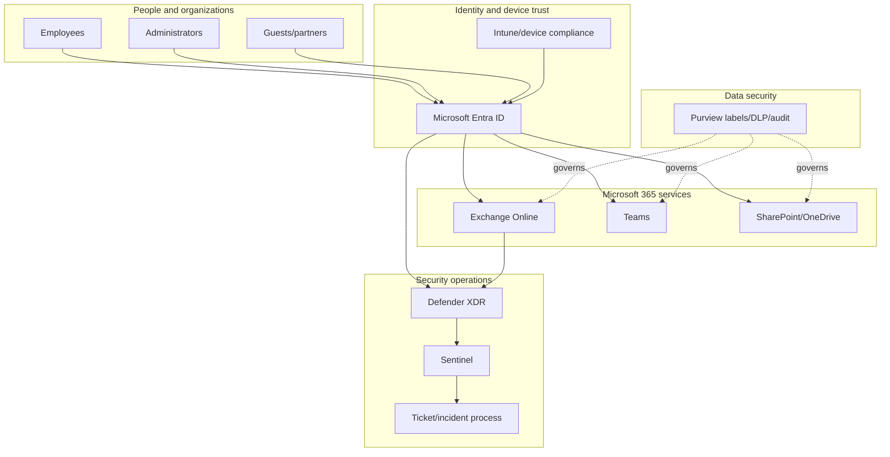

Every diagram needs a title, purpose, scope, date/version, owner, legend, source, assumptions, and unresolved questions.

## 19. Authentication flow and trust boundaries

A **trust boundary** is where the basis of trust or control changes. Crossing from an unmanaged partner device to the client's identity system, from Entra to a third-party SaaS app, or from a production tenant to a vendor ticket can change ownership, authentication, data processing, and risk.

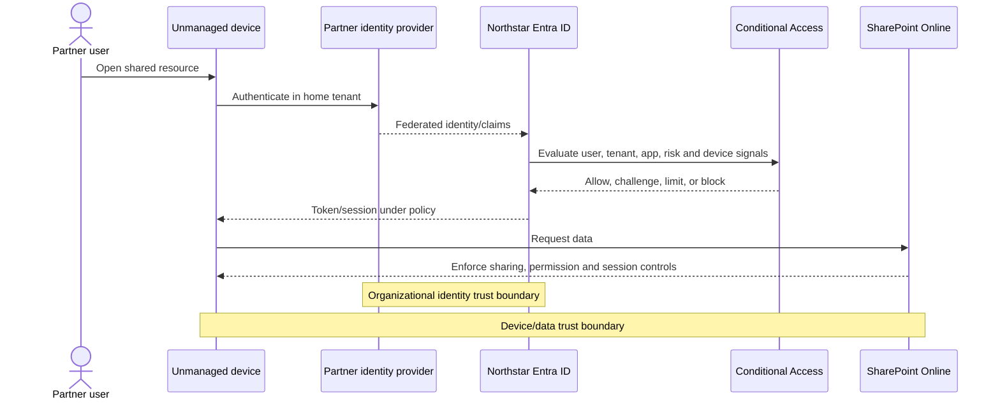

| Boundary | Discovery checks |
|---|---|
| User to identity provider | Identity proofing, auth strength, recovery, risk |
| Home tenant to resource tenant | Cross-tenant settings, claims trust, guest lifecycle |
| Device to cloud service | Managed/compliant state, session controls, browser/app behavior |
| App to API | Service principal, scopes/roles, consent, credential lifecycle |
| Workload to SIEM | Connector identity, data minimization, integrity, latency |
| SOC to response target | Authority, privilege, approval, audit, rollback |
| Client to vendor | Contract, support access, exported evidence, retention, escalation |

## 20. Data flow, logging flow, and incident flow

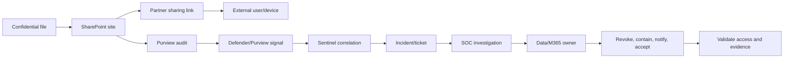

| Flow field | Questions |
|---|---|
| Trigger | What user/system event starts the flow? |
| Actor/identity | Human, guest, service principal, managed identity, vendor? |
| Data | Which fields/content/classification are transferred? |
| Protocol/interface | Browser, Graph, webhook, API, SMTP, syslog, connector? |
| Trust change | Which owner, tenant, region, privilege, or legal role changes? |
| Control | Prevent, detect, respond, recover; where enforced? |
| Log | Which event proves each step, with what latency/retention? |
| Failure | What happens if identity, connector, vendor, network, or owner fails? |
| Response | Who can investigate and act, and who verifies outcome? |

## 21. Constraints, assumptions, and dependencies

- A **constraint** is a known limit, such as a regulatory region, fixed renewal date, or no production changes during discovery.
- An **assumption** is treated as true for planning but requires validation, such as “all privileged accounts are cloud-only.”
- A **dependency** is something delivery relies on, such as privacy approval, vendor evidence, or client access.

| Type | Statement | Owner | Validation/response |
|---|---|---|---|
| Constraint | No production configuration change in this phase | Sponsor | Design-only outputs and read-only evidence |
| Constraint | EU personal data stays in approved region | Privacy owner | Map storage, processing, support, export |
| Assumption | Tenant A contains all UK users | Identity owner | Compare domains, HR population, cross-tenant users |
| Assumption | Defender onboarding covers every Windows device | Endpoint owner | Reconcile Intune, Entra, MDE, CMDB inventories |
| Dependency | Vendor supplies current connector architecture | Vendor manager | Due date, escalation, limitation if late |
| Dependency | Security sponsor approves target risk statement | Sponsor | Decision checkpoint before assessment design |

An assumption is not a fact in smaller font. Give it an owner, due date, consequence if false, and status.

## 22. RAID, actions, and decisions

**RAID** commonly means Risks, Assumptions, Issues, and Dependencies. Keep actions and decisions as linked logs because each has different governance.

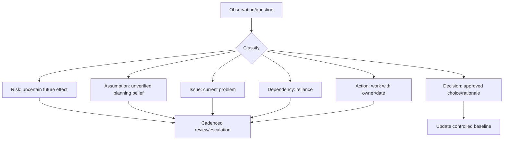

| Log | Required fields |
|---|---|
| Risk | Cause, event, consequence, likelihood/impact, owner, response, due date, residual state |
| Assumption | Statement, rationale, owner, validate-by date, impact if false |
| Issue | Present condition, impact, evidence, owner, action, target date |
| Dependency | Provider/consumer, needed item, date, fallback, escalation |
| Action | Verb, deliverable, one owner, due date, status, blocker, closure evidence |
| Decision | Question, options, decision, approver, date, rationale, implications, revisit trigger |

Do not hide risks in meeting notes. Use stable IDs and link evidence, findings inputs, scope changes, requirements, and roadmap items later.

## 23. Workshop conflict and difficult situations

| Situation | Facilitation response |
|---|---|
| Two teams disagree on ownership | Separate “does work,” “owns service,” and “accepts risk”; record unresolved decision |
| Senior person dominates | Use round-robin, written input, and evidence playback |
| Blame emerges | Return to process, timeline, interface, and evidence; avoid personal attribution |
| No one knows | Record gap, identify likely source/owner, set action and impact |
| Sensitive issue appears | Pause recording/sharing; move to approved restricted channel |
| Solution debate starts too early | Park option; complete current-state and requirements first |
| Scope expansion request | Clarify value, assess impact, use change control |
| Vendor deflects | Ask for contract/interface evidence, timestamps, discriminating tests, and named escalation |
| Client wants certainty from weak evidence | Explain confidence and choices for further validation |

Your escalation background is useful here. In critical incidents you likely distinguished symptoms from causes, maintained action ownership, coordinated product groups, and communicated uncertainty. Consulting discovery uses the same discipline without treating every disagreement as an incident.

## 24. Remote and hybrid workshops

Remote discovery needs more explicit interaction and information handling.

| Control | Remote/hybrid practice |
|---|---|
| Access | Approved meeting tenant, lobby, named attendees, no public link |
| Recording | Off by default unless purpose, consent, retention, and access are approved |
| Whiteboard | Approved tool; export to controlled repository after session |
| Screen sharing | Share window, redact tenant/user/data, stop on sensitive content |
| Participation | Remote-first facilitation, chat/raise hand, periodic playback |
| Time | 50/80-minute blocks, breaks, time-zone fairness |
| Evidence | Do not paste secrets/logs into meeting chat; use approved channel |
| Decisions | Read aloud, record owner/date, distribute concise notes |
| Accessibility | Captions, readable diagrams, pre-read, language/accommodation needs |
| Failure fallback | Dial-in/alternate facilitator/offline template; reschedule sensitive walkthrough |

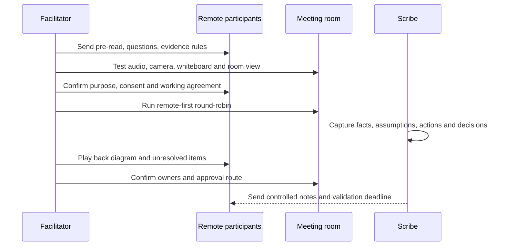

## 25. Current-state validation and playback

Validation asks accountable owners to confirm that the representation is accurate enough for its intended decision. It is not a request to approve recommendations that do not yet exist.

| Validation layer | Validator | Acceptance question |
|---|---|---|
| Business context/impact | Sponsor and business owners | Are critical services, outcomes, and consequences represented? |
| Architecture/configuration | Technical owners | Are components, settings, identities, integrations, and boundaries accurate? |
| Data/privacy | Data and privacy owners | Are classifications, purposes, transfers, regions, and access accurate? |
| Operations | SOC/service owners | Are monitoring, incidents, handoffs, SLAs, and exceptions real? |
| Commercial | Procurement/license owners | Are contracts, entitlements, renewal, and vendor dependencies correct? |
| Limitations | Sponsor/engagement lead | Is the decision being made with visible evidence gaps? |

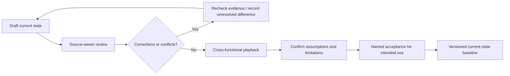

Use version numbers and dates. A current-state map becomes stale after policy, license, tenant, organizational, or vendor changes.

## 26. Readout structure

An effective discovery readout has a decision story:

1. Purpose, scope, method, participants, and evidence period.
2. Business outcomes and critical services.
3. Validated current-state architecture and flows.
4. Material pain points, risks, operational weaknesses, and opportunities.
5. Evidence quality, conflicts, unknowns, and limitations.
6. Confirmed assumptions, constraints, dependencies, and scope changes.
7. Decisions needed and options for the next phase.
8. Actions, owners, dates, and acceptance.

| Audience | Emphasis | Avoid |
|---|---|---|
| Executive | Outcome, material risk, uncertainty, choices, investment decision | Portal screenshots and control trivia |
| Security leadership | Threat paths, control objectives, ownership, residual risk | Unsupported maturity claims |
| Technical owners | Architecture, configuration, interfaces, evidence, follow-ups | Unprioritized generic advice |
| Operations | Signals, incidents, handoffs, runbooks, gaps, metrics | Design with no operating owner |
| Privacy/legal | Data purpose, flows, access, retention, transfers, decisions | Unnecessary raw personal data |

## 27. Scope creep and formal change control

**Scope creep** is uncontrolled expansion of work without corresponding agreement on outcome, time, cost, resources, security, or acceptance. A **change request** makes that impact visible.

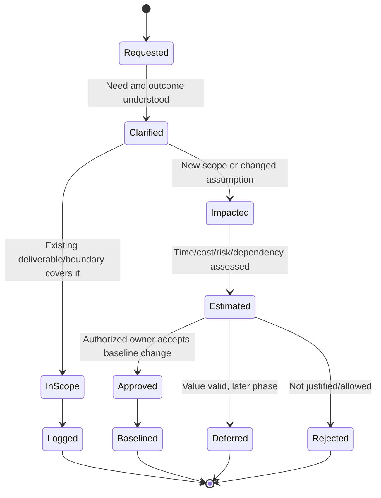

| Change request field | Content |
|---|---|
| Trigger/requestor | Who asked and why now? |
| Proposed outcome | What decision or deliverable changes? |
| Scope delta | Tenants, workloads, populations, evidence, activities |
| Benefit/risk | Value of doing and consequence of not doing |
| Delivery impact | Schedule, fees, people, access, quality, dependencies |
| Security/privacy impact | New data, system, region, privilege, vendor |
| Options | Include now, trade another item, defer, separate engagement, reject |
| Approval | Authorized decision, date, rationale |
| Baseline update | Charter/SOW/project plan/artifact versions changed |

## 28. Quality gates for discovery

| Gate | Pass criteria | Evidence |
|---|---|---|
| Outcome gate | Business outcome and end decision are explicit | Sponsor-approved charter |
| Scope gate | In/out/interfaces, period, populations, deliverables defined | Scope matrix |
| Stakeholder gate | Accountable owners and missing voices identified | Stakeholder map/RACI |
| Evidence gate | Requests trace to questions; handling approved | ERL and evidence register |
| Coverage gate | People/process/technology/data/vendor/operations covered | Discovery matrix |
| Accuracy gate | Facts validated by source owners | Comment resolution/approval |
| Uncertainty gate | Assumptions, conflicts, gaps, confidence visible | RAID/limitation log |
| Privacy gate | Minimum data, access, storage, sharing, retention controlled | Data-handling record |
| Decision gate | Readout contains choices, owners, and next actions | Decision/action logs |
| Scope gate at close | Changes approved or deferred; no silent work | Change register |

A high-quality discovery can conclude that further evidence is needed. Quality is not pretending all uncertainty disappeared.

## 29. Security and privacy of discovery artifacts

Discovery documents can become an attacker's map: privileged identities, weak controls, network paths, vendors, incident gaps, and sensitive data locations. Treat them as controlled client information.

| Risk | Control |
|---|---|
| Excess privileged access | Read-only, least privilege, time bound, named accounts, PIM where available |
| Sensitive exports | Minimize fields/population, redact, encrypt, approved repository |
| Secrets in screenshots/logs | Never request passwords/tokens/keys; inspect and redact before storage |
| Personal data overcollection | Purpose and necessity test; aggregation or synthetic examples |
| Unapproved recording/transcription | Explicit authorization, notice, access, retention, deletion |
| Cross-border transfer | Validate approved region and support/consultant access |
| Vendor evidence leakage | Contract-approved path and customer-specific separation |
| Artifact reuse | Remove client identifiers; obtain approval; do not reuse confidential content |
| Retention drift | Register, review date, controlled deletion and evidence of closure |
| Email/chat sprawl | Central approved repository and link-based sharing |

## 30. Discovery operating rhythm and metrics

Metrics should show whether discovery is decision-ready, not reward question volume.

| Metric | Meaning | Caution |
|---|---|---|
| Stakeholder coverage | Required roles engaged/total required | Attendance is not validation |
| Evidence coverage | Decision questions with sufficient evidence/total | Weight by materiality |
| Evidence quality | High/medium/low confidence distribution | Do not hide weak critical evidence in average |
| Inventory reconciliation | Objects matched across authoritative sources | Stale source can create false precision |
| Diagram validation | Views approved/required | Approval scope must be explicit |
| Open critical assumptions | Material unvalidated beliefs | Trend and age matter |
| Action aging | Overdue actions by owner/impact | Escalate blockers, not merely count |
| Decision latency | Time from decision-ready to approval | Depends on governance calendar |
| Scope change rate | Approved/deferred requests and impact | Not automatically bad; uncontrolled is bad |
| Rework rate | Material corrections after playback | Could reveal healthy challenge |

Suggested cadence: daily internal evidence/action review during intensive discovery; twice-weekly owner follow-up; weekly sponsor status for scope, blockers, decisions, and risk; formal playback at baseline milestones.

## 31. Discovery failures and recovery

| Failure pattern | Symptom | Recovery |
|---|---|---|
| Solution-first discovery | Questions all point to one SKU | Restate outcomes and option-neutral decision |
| Executive-only view | Strategy known, operations invisible | Interview service desk, SOC, engineers, users |
| Engineer-only view | Rich configuration, no business impact | Add business/data/risk owners |
| Questionnaire dump | Hundreds of low-value responses | Prioritize hypotheses and decision-linked evidence |
| Screenshot assessment | Unreproducible point-in-time claims | Capture source/date/filter/export and corroborate |
| Workshop consensus theater | Quiet disagreement appears later | Anonymous input, one-to-one follow-up, explicit dissent |
| Inventory without ownership | Long list, no accountability | Add business/technical/lifecycle owners |
| Diagram without flow | Boxes do not show trust/data/control | Add actors, arrows, boundaries, logs, failures |
| Unknown treated as compliant | No evidence becomes green | Mark not evidenced/unknown and assess consequence |
| Scope creep | Deadlines slip and core output thins | Change control and rebaseline options |
| Sensitive data sprawl | Logs/screenshots in chats and laptops | Contain, report, move/delete under approved process |
| Stale baseline | Decisions rely on old state | Version/date/change trigger and revalidation |

## 32. Troubleshooting discovery itself

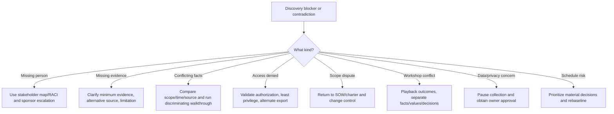

When evidence conflicts, first compare tenant, object, population, time zone, date range, filter, source authority, replication delay, and terminology. Your RCA habit is valuable: create competing hypotheses and choose the cheapest discriminating check instead of debating confidence.

## 33. Client micro-scenarios

| Scenario | Discovery response | Consulting lesson |
|---|---|---|
| CISO says every user has MFA; sign-in evidence suggests exceptions | Separate registration, policy requirement, successful challenge, and population; reconcile exclusions | One term can hide four control states |
| Collaboration team says guests are owned by identity team | Map invitation, sponsorship, review, removal, tenant settings, site permissions | End-to-end ownership crosses teams |
| Vendor says connector is healthy; SOC has no current events | Generate known event, check source/transport/ingestion/schema/detection | Dashboard green is not outcome evidence |
| Finance wants E5 cost removed | Map capabilities to risks/personas/dependencies before proposing license changes | Entitlement decisions are control decisions |
| Privacy declines raw insider-risk data | Reframe purpose and use aggregated/redacted evidence | Evidence depth must remain proportionate and lawful |
| Sponsor asks to assess acquired tenant mid-engagement | Record material value, data/region/access impact, schedule, and options | Formal change protects quality |
| Engineers disagree about current architecture | Draw both claims, name sources, run walkthrough or export check | Conflict becomes a testable question |
| Business owner cannot attend readout | Do not let technical approval substitute for risk ownership | Acceptance must match decision rights |

## 34. Fictional Northstar case

**Northstar Health Services** is a fictional multinational health-services company with 18,000 employees, 3,000 contractors, a production Microsoft 365 tenant, a recently acquired subsidiary tenant, corporate Windows devices, mixed mobile ownership, external clinical partners, Entra hybrid identity, Intune, Exchange Online, Teams, SharePoint, OneDrive, Purview capabilities, Defender XDR, Sentinel, and several third-party tools. Leadership wants a 12-month Microsoft 365 security improvement roadmap before license renewal.

The sponsor's initial request is “Review E5 readiness.” Discovery reframes it:

> Determine which identity, device, collaboration, data, threat-protection, and SecOps risks most affect regulated partner collaboration and acquisition integration; validate current controls and operational ownership; and provide decision-ready inputs for an assessment, target architecture, licensing options, and phased roadmap.

### Northstar engagement boundaries

| In scope | Out of scope | Interface/dependency |
|---|---|---|
| Production tenant workforce/guests/admins | Customer identity platform | Clinical portal SSO |
| Entra, Intune, M365, Purview, Defender, Sentinel | Production remediation | Later implementation roadmap |
| 90-day configuration/operation evidence | Full penetration test | Existing test results considered |
| UK/EU organizations | US acquired tenant internal assessment | Cross-tenant collaboration mapped |
| Current-state and assessment readiness | Contract/legal opinion | Privacy/legal interpretations supplied by owners |

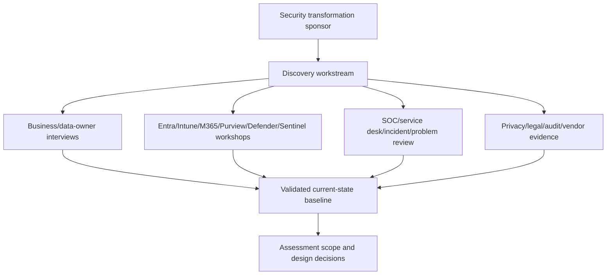

### Northstar initial RAID examples

| ID | Type | Statement | Owner/action |
|---|---|---|---|
| R-01 | Risk | License renewal deadline may force decisions before evidence is complete | Sponsor: approve minimum decision set and dates |
| A-01 | Assumption | HR feed covers all contractors | Identity owner: reconcile HR, Entra, vendor lists |
| I-01 | Issue | External-sharing exception ownership is unclear | Collaboration/data owners: map five recent exceptions |
| D-01 | Dependency | MSSP must supply Sentinel connector and incident SLA evidence | Vendor manager: request by day 8 |
| AC-01 | Action | Produce cross-tenant authentication flow | Architect: draft by day 6 |
| DEC-01 | Decision | Raw message content will not be copied into discovery repository | Privacy owner approved; use redacted samples |

## 35. Safe paper exercise: produce a reusable discovery pack

This exercise creates no tenant, user, policy, license, connector, role, app, device, log export, production change, or client data. Use only the fictional Northstar facts in this chapter and clearly label every addition as an assumption.

### Exercise steps

1. Write a one-page charter with purpose, outcomes, decisions, sponsor, scope, deliverables, evidence period, responsibilities, acceptance, privacy rules, assumptions, and change control.
2. Build a stakeholder register with at least 15 roles, power/interest, knowledge sought, stance, communication, and decision.
3. Create a RACI for charter, evidence, architecture, privacy, scope change, validation, and readout.
4. Create a two-week discovery calendar with executive, business, technical, operational, privacy, vendor, and playback sessions.
5. Write 30 prioritized questions across business, technical, security, privacy, compliance, operations, licensing, and vendors. Trace each to an output.
6. Create an ERL with 25 items, minimum evidence, owner, period, collection method, handling, due date, and fallback.
7. Create inventories for identities, devices, apps, data, tools, licenses, policies, integrations, vendors, and services using fictional rows.
8. Draw context, logical, authentication, data, logging, incident, and trust-boundary views.
9. Create RAID, action, decision, and change registers with at least three items each.
10. Draft a current-state readout containing known, evidenced, assumed, conflicting, and unknown statements.
11. Run a paper playback: answer as M365 owner, SOC lead, privacy owner, and sponsor; record corrections separately.
12. Package templates and a sanitized sample as a portfolio artifact.

```mermaid
flowchart LR
    CHARTER[01 Charter/scope] --> STAKE[02 Stakeholders/RACI]
    STAKE --> PLAN[03 Discovery plan/questions]
    PLAN --> EVID[04 ERL/evidence register]
    EVID --> INV[05 Inventories]
    INV --> FLOW[06 Architecture/flow pack]
    FLOW --> LOGS[07 RAID/actions/decisions/changes]
    LOGS --> READ[08 Validated readout]
    READ --> RETRO[09 Quality/privacy checklist and retrospective]
```

### Portfolio artifact structure

| Folder/artifact | Contents |
|---|---|
| `01-charter` | Outcome charter, scope matrix, acceptance, change template |
| `02-stakeholders` | Register, power-interest map, RACI, communication plan |
| `03-plan` | Calendar, agendas, question-to-output matrix |
| `04-evidence` | ERL, evidence register, quality rubric, handling rules |
| `05-inventory` | Ten normalized inventory sheets and owner fields |
| `06-flows` | Context, logical, auth, data, log, incident, trust views |
| `07-governance` | RAID, action, decision, exception, change logs |
| `08-readout` | Executive summary, current state, limits, decisions, next steps |
| `09-quality` | Validation record, privacy check, lessons and honesty statement |

### Exercise validation

| Test | Expected result |
|---|---|
| Product named before outcome | Reframe to decision and risk/service result |
| Out-of-scope tenant affects auth flow | Show interface only; do not assess internals |
| Evidence screenshot lacks tenant/date/filter | Mark insufficient and request reproducible source |
| Owner statement conflicts with export | Record both; test scope/time/source; do not average |
| Raw personal data proposed for portfolio | Reject; use fictional/synthetic content |
| Sponsor adds AWS review | Create impact-assessed change request |
| Workshop has no risk owner | Do not treat technical consensus as acceptance |
| Assumption remains open at readout | Show consequence and confidence; seek decision |
| Diagram has boxes but no arrows | Add flow, trust, control, log, failure, owner |
| Recommendation appears in current-state fact | Separate observation, implication, and future option |

## 36. Reusable discovery templates

### One-line fact format

`[Fact ID] As of [date/time], for [tenant/population/period], [source/method] shows [observation]; validated by [owner]; limitation [text]; confidence [level].`

### One-line assumption format

`[Assumption ID] Planning assumes [statement] because [rationale]; [owner] will validate by [date]; if false, [impact/response].`

### One-line decision format

`[Decision ID] [Approver] chose [option] on [date] because [rationale], accepting [tradeoff/residual risk]; revisit when [trigger].`

### Workshop agenda

| Minutes | Activity |
|---:|---|
| 0-5 | Purpose, scope, outcomes, information handling |
| 5-15 | Participant roles and current concerns |
| 15-35 | Walk through process/architecture/flow |
| 35-50 | Test exceptions, failure, evidence, and ownership |
| 50-55 | Playback facts, assumptions, conflicts |
| 55-60 | Decisions, actions, owners, dates, next validation |

## 37. Tradeoffs a consultant must explain

| Tradeoff | Side A | Side B | Discovery response |
|---|---|---|---|
| Breadth vs depth | Whole-estate view | Strong evidence in critical area | Prioritize by decision/materiality |
| Speed vs certainty | Meet urgent renewal | Collect stronger longitudinal evidence | Confidence bands and staged decisions |
| Access vs minimization | Direct reproducible review | Lower privacy/privilege exposure | Least necessary access and owner exports |
| Standardization vs local need | Consistent enterprise control | Regulatory/business variation | Baseline plus governed exception |
| Workshop vs interview | Shared alignment | Candor and role depth | Use both intentionally |
| Current state vs solution | Complete truth | Maintain momentum | Timebox, preserve unknowns, define next gate |
| Detail vs executive usability | Technical reproducibility | Clear decision story | Layered artifacts with traceability |
| Helpfulness vs scope | Address emerging value | Protect delivery/quality | Impact-assessed change options |

## 38. From discovery to Part 54 assessment

Discovery produces the boundaries and evidence plan needed for a defensible assessment. It should not pre-score maturity or label findings before control objectives, method, population, sample, and evidence rules are agreed.

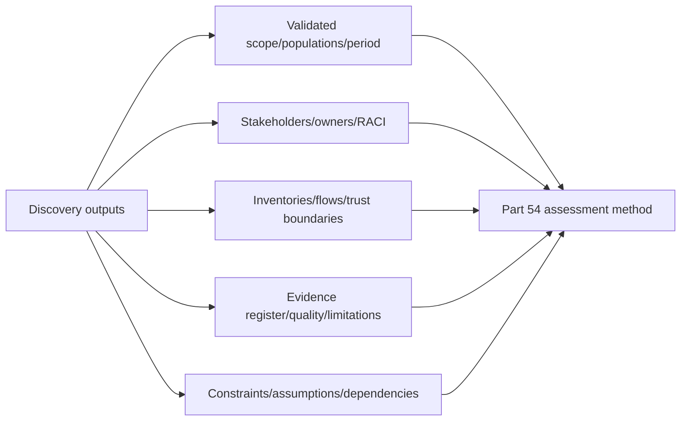

| Discovery output | Assessment use |
|---|---|
| Outcome and decision | Select relevant control objectives and report audience |
| Scope/population | Define assessment boundary and sampling |
| Inventory | Establish expected assets/configuration/control owners |
| Flows/trust boundaries | Identify design and operational control points |
| Evidence register | Determine confidence and missing evidence |
| RACI | Route validation, findings, disputes, and treatment |
| Constraints/dependencies | Interpret feasibility and sequencing without excusing risk |
| Current-state baseline | Compare designed, configured, and operating states |

## 39. JD Mapping: interview translation

| Interview theme | Your real foundation | Consulting translation |
|---|---|---|
| Discovery | Clarified scope, impact, reproduction, environment in escalations | Outcome charter, stakeholder plan, questions, evidence and current-state baseline |
| Evidence | Used logs, traces, configurations, timelines and validation | Evidence register with quality, source, period and limitation |
| Stakeholders | Coordinated customers, engineers, vendors and product groups | Power/interest, RACI, decisions, conflicts and governance |
| Architecture | Mapped SharePoint/OneDrive and M365 dependencies | Multi-view architecture, auth/data/log/incident flows and trust boundaries |
| RCA | Tested hypotheses and validated fixes | Resolve discovery contradictions through discriminating evidence |
| Business reviews | Presented KPIs, trends and customer impact | Executive readout with choices, risk and actions |
| Documentation | Authored technical guidance and RCA | Reproducible discovery pack and controlled baseline |
| Honesty | Production support/advisory, not consulting claims | Label real experience, paper artifact, assumptions, and next validation |

## Official Source Anchors

These sources support general discovery, architecture, security, and privacy concepts. They are not evidence of a Deloitte-proprietary method. Recheck current Microsoft Learn and applicable client/firm requirements before reuse.

1. [Microsoft Cloud Adoption Framework: Strategy](https://learn.microsoft.com/azure/cloud-adoption-framework/strategy/) — motivations, outcomes, stakeholders, and business alignment.
2. [Microsoft Cloud Adoption Framework: Plan](https://learn.microsoft.com/azure/cloud-adoption-framework/plan/) — planning, skills, organization, and actionable adoption planning.
3. [Microsoft Azure Well-Architected Framework](https://learn.microsoft.com/azure/well-architected/) — workload context, quality pillars, tradeoffs, assessment, and continuous improvement.
4. [Microsoft Cybersecurity Reference Architectures](https://learn.microsoft.com/security/adoption/mcra) — public reference views for identity, devices, apps, data, infrastructure, and security operations.
5. [Microsoft Zero Trust guidance center](https://learn.microsoft.com/security/zero-trust/) — verify explicitly, least privilege, assume breach, and cross-pillar planning.
6. [Microsoft service trust and data protection documentation](https://learn.microsoft.com/compliance/) — Microsoft compliance, privacy, and service-assurance starting points.
7. [NIST Cybersecurity Framework 2.0](https://www.nist.gov/cyberframework) — Govern, Identify, Protect, Detect, Respond, and Recover outcomes and stakeholder communication.
8. [NIST Privacy Framework](https://www.nist.gov/privacy-framework) — privacy-risk identification and management across data processing.
9. [NIST SP 800-30 Rev. 1](https://csrc.nist.gov/pubs/sp/800/30/r1/final) — public guidance on risk-assessment preparation, conduct, communication, and maintenance.
10. [CIS Controls v8](https://www.cisecurity.org/controls/v8) — prioritized public control categories useful for coverage prompts, subject to CIS terms.
11. [OWASP Threat Modeling Process](https://owasp.org/www-community/Threat_Modeling_Process) — public framing around system understanding, threats, responses, and validation.
12. [UK NCSC Cloud Security Guidance](https://www.ncsc.gov.uk/collection/cloud) — public cloud security principles and shared-responsibility considerations.

## ⭐ Likely Interview Questions for This Section

### Q1. How do you start a Microsoft 365 security discovery?

**Model answer:** I start with the business outcome and decision, not a product. I confirm sponsor, critical services, risks, scope, populations, evidence period, deliverables, acceptance, security/privacy handling, assumptions, dependencies, and change control. Then I map stakeholders and responsibilities, plan decision-linked interviews and evidence, build inventories and flows, validate the current state with accountable owners, and present facts, uncertainty, decisions, and next actions.

### Q2. How do you distinguish a client request from the real problem?

**Model answer:** I preserve the request as an input, then frame context, present condition, consequence, evidence, desired outcome, and decision. I seek business, technical, security, privacy, operations, and supplier perspectives and test competing hypotheses. For example, “buy E5” becomes “which material risks and personas require capabilities unavailable today, and what options provide justified value?” I avoid declaring a root cause before evidence.

### Q3. What belongs in a discovery charter and scope statement?

**Model answer:** Sponsor, purpose, outcomes, decisions, in-scope and out-of-scope organizations/tenants/workloads/populations/time, interfaces, deliverables, method, evidence period, client and consultant responsibilities, milestones, acceptance criteria, data handling, assumptions, dependencies, constraints, and change control. The signed SOW governs; the charter clarifies operations and cannot silently alter contractual scope.

### Q4. How do you run effective stakeholder interviews and workshops?

**Model answer:** I choose interviews for depth/candor and workshops for shared mapping or decisions. I send purpose, questions, preparation, evidence and handling rules. During the session I ask openly, listen for actors/triggers/decisions/exceptions, probe with “show me” and failure cases, play back neutrally, manage dominant voices and conflicts, and end with facts, assumptions, decisions, actions, owners, dates, and validation.

### Q5. How do you judge evidence quality?

**Model answer:** I assess relevance, reliability, completeness, currency, accuracy, consistency, reproducibility, and integrity. I record tenant/population/period, source, collection method, query/filter, owner, date, classification, limitations, and reviewer. I corroborate material claims and never treat missing evidence as proof that a control exists or does not exist; I label confidence and consequence.

### Q6. What current-state diagrams would you create?

**Model answer:** I use audience-specific views: context, logical architecture, deployment, authentication, data flow, logging/detection/incident flow, and trust boundaries. Every view has scope, date, source, owner, legend, assumptions, controls, failure paths, and unresolved questions. I use stable tenant/object/service identifiers and validate each view with business, technical, privacy, and operational owners as appropriate.

### Q7. How do you handle scope creep without damaging the client relationship?

**Model answer:** I acknowledge the value, clarify the desired outcome, and compare it to the SOW and charter. If it is outside the boundary, I document benefit and consequence, estimate schedule/cost/resource/security/privacy/dependency impact, offer include/trade/defer/separate/reject options, obtain authorized approval, and update the baseline. That protects quality and gives the client a transparent choice rather than a blunt refusal.

### Q8. What is your honest experience with consulting discovery?

**Model answer:** I have not led a Deloitte security discovery or used a proprietary Deloitte method. In production M365 support and advisory work I have clarified impact, gathered technical evidence, mapped dependencies, coordinated customers/vendors/product groups, documented RCA, validated fixes, and presented business reviews. I have also built a fictional discovery pack covering charter, stakeholders, RACI, evidence, inventories, flows, RAID, validation, readout, and scope change. I would use the firm's approved method and client contract in practice.

## 🧠 30-Second Memory Hooks

- **Discovery enables a decision; it is not a product tour.**
- **Frame:** context, condition, consequence, evidence, outcome, decision.
- **SOW governs; charter clarifies.**
- **In scope, out of scope, and interfaces are all explicit.**
- **Stakeholder:** affected, informed, evidencing, operating, deciding, or assuring.
- **RACI:** one accountable owner; responsibility is not risk acceptance.
- **Interview for depth; workshop for shared truth or decisions.**
- **Ask, listen, probe, play back, test failure, record.**
- **“Show me” tests operation, not personal honesty.**
- **Question → evidence → output → decision.**
- **Evidence needs source, scope, period, method, owner, and limitation.**
- **Missing evidence means unknown, not green.**
- **Inventory = asset + owner + purpose + criticality + lifecycle + dependency.**
- **Draw context, auth, data, logs, incidents, and trust boundaries.**
- **Constraint is fixed; assumption is unverified; dependency is reliance.**
- **RAID is not a meeting-note graveyard.**
- **Decision logs preserve choice, rationale, tradeoff, and revisit trigger.**
- **Conflict creates a testable question.**
- **Remote-first means equal participation and controlled evidence.**
- **Scope change is a client choice with visible impact.**
- **A validated baseline is dated and purpose-specific.**
- **Discovery artifacts are sensitive attack maps.**
- **Your bridge:** escalation evidence and RCA → consulting discovery discipline.
- **Honesty:** production advisory strengths plus a fictional portfolio artifact.

## Completion Checklist

- [ ] I can explain discovery, outcome, success measure, SOW, charter, scope, interface, stakeholder, RACI, trust boundary, RAID, and change control from zero.
- [ ] I can reframe a product request as a business/risk outcome and decision.
- [ ] I can write a six-field problem statement without assuming root cause.
- [ ] I can create a charter with sponsor, outcomes, boundaries, deliverables, evidence, acceptance, privacy, dependencies, and change control.
- [ ] I can distinguish in-scope assessment from an out-of-scope interface.
- [ ] I can map stakeholders by accountability, knowledge, power, interest, stance, and engagement.
- [ ] I can build a RACI with clear accountability and decision rights.
- [ ] I can sequence executive, business, technical, operational, privacy, and supplier discovery.
- [ ] I can choose interviews, workshops, walkthroughs, and questionnaires intentionally.
- [ ] I can facilitate through listening, probing, playback, counterfactuals, and respectful challenge.
- [ ] I can ask business, technical, security, privacy, compliance, operational, licensing, and vendor questions.
- [ ] I can trace each question to evidence, output, and decision.
- [ ] I can build an ERL and evidence register with approved information handling.
- [ ] I can assess evidence relevance, reliability, completeness, currency, accuracy, consistency, reproducibility, and integrity.
- [ ] I do not treat absent evidence as proof of absence or effectiveness.
- [ ] I can inventory identities, devices, applications, data, tools, licenses, policies, integrations, workloads, and vendors.
- [ ] I can draw context, logical, deployment, authentication, data, logging, incident, and trust-boundary views.
- [ ] I can map controls, logs, owners, failures, and response along a flow.
- [ ] I can distinguish and manage constraints, assumptions, dependencies, risks, issues, actions, and decisions.
- [ ] I can facilitate ownership conflict without blame or false consensus.
- [ ] I can run secure, accessible remote and hybrid workshops.
- [ ] I can validate current state with the right business, technical, privacy, commercial, and operational owners.
- [ ] I can structure an executive and technical discovery readout.
- [ ] I can process scope changes through impact, options, approval, and baseline update.
- [ ] I can apply outcome, scope, stakeholder, evidence, coverage, accuracy, uncertainty, privacy, decision, and closure quality gates.
- [ ] I can protect discovery artifacts using least privilege, minimization, approved storage, retention, and deletion.
- [ ] I can measure evidence coverage, assumption age, decision latency, scope change, and rework without gaming counts.
- [ ] I can recover from solution bias, missing owners/evidence, conflict, stale diagrams, and schedule pressure.
- [ ] I completed the Northstar paper exercise without client data or production changes.
- [ ] My portfolio artifact clearly labels fictional facts, assumptions, limitations, and non-production status.
- [ ] I can answer Q1-Q8 aloud using only experience I genuinely have.
- [ ] I will use approved firm/client methods and contracts rather than imply this public guide is Deloitte methodology.

*Next suggested section:* [Part 54](Part-54-security-assessments-health-checks-gap-analysis.md)