# Part 54 — Security Assessments, Technical Health Checks, Maturity Models, and Gap Analysis

> **Section goal:** Build a beginner-first, consulting-grade method for assessing Microsoft 365 security in a way that is scoped, evidence-based, reproducible, risk-aware, and useful to both executives and technical owners. By the end, you should be able to define control objectives and assessment criteria; distinguish design, configuration, implementation, and operational effectiveness; choose populations, samples, periods, evidence, and tests; map public frameworks and Microsoft baselines without treating any tool score as assurance; perform health checks across Entra, Intune, Exchange, Teams, SharePoint, OneDrive, Purview, Defender, and Sentinel; write defensible findings; rate severity, likelihood, impact, confidence, and maturity with caveats; handle exceptions, compensating controls, disputes, and residual risk; run quality review; publish executive and technical reports; and produce a prioritized treatment backlog plus reusable templates from a safe fictional exercise.

This Part maps directly to the role's expectations for security assessments, health checks, readiness reviews, Microsoft 365 technical advisory, gap analysis, documentation, stakeholder validation, remediation planning, and executive reporting. Your strengths in complex escalations, RCA, log and configuration analysis, fix validation, critical-incident ownership, business reviews, KPI interpretation, vendor/product-group coordination, and customer documentation transfer directly. The new consulting discipline is to evaluate an agreed control population and period consistently, preserve limitations, and distinguish a point-in-time technical observation from evidence that a control is well designed and operates repeatedly.

> **Method boundary:** This chapter presents general public assessment and security-engineering guidance. It draws on Microsoft Learn, NIST, CIS, MITRE, CISA, and other recognized public sources where appropriate. It does not describe or imply Deloitte's internal, confidential, or proprietary assessment methodology, scoring model, templates, or quality process. In a real engagement, use the signed scope and the firm's approved methods, independence rules, quality reviews, evidence handling, and reporting templates.

## JD Mapping

| Role expectation | Capability developed here | Portfolio evidence |
|---|---|---|
| Perform security assessments and health checks | Define scope, objectives, criteria, evidence, tests, limitations, and conclusions | Assessment plan and test workbook |
| Assess Microsoft 365 controls | Review Entra, Intune, workloads, Purview, Defender, and Sentinel systematically | Domain health-check sheets |
| Interpret Secure Score and recommendations | Use posture signals as inputs without treating them as audit proof | Secure Score interpretation note |
| Advise clients on risk | Convert observations into cause, consequence, recommendation, and residual risk | Findings register and risk narrative |
| Validate with stakeholders | Resolve facts, ownership, evidence gaps, and disputes transparently | Validation and comment-resolution log |
| Prioritize improvements | Combine materiality, urgency, value, effort, dependency, and confidence | Treatment backlog |
| Communicate to technical and executive audiences | Separate decision summary from reproducible detail | Executive and technical reports |
| Coordinate operations and vendors | Test recurring operation, interfaces, SLAs, and exceptions | Operational-effectiveness and dependency tests |

## Candidate honesty note

You can credibly describe production work that examined Microsoft 365 configurations, logs, service behavior, support cases, changes, and user impact; isolated faults; coordinated vendors and product groups; documented RCA; validated fixes; and reported trends and service quality. You can explain how those evidence and validation skills support assessments.

You should not claim to have conducted a formal Deloitte assessment, issued an assurance opinion, certified compliance, audited every M365 security domain, or run production Secure Score, Purview, Defender, or Sentinel health checks unless separately evidenced. Safe wording is:

> “My production background is Microsoft 365 support escalation and technical advisory, where I gathered configuration and operational evidence, tested hypotheses, coordinated owners and vendors, documented RCA, validated changes, and presented service trends. I have built a fictional assessment pack that defines control objectives, scope, populations, evidence and tests; distinguishes design, configuration and operational effectiveness; covers the Microsoft security stack; records confidence and limitations; and produces validated findings and a prioritized backlog. I would use the firm's approved assessment and quality processes in a client engagement and would not describe a posture score or sampled review as certification.”

---

## 1. What an assessment is, and what it is not

A **security assessment** is a structured evaluation of whether selected security objectives are met within a defined scope, period, population, method, and evidence standard. A **technical health check** is usually a focused assessment of configuration, integration, operation, hygiene, and supportability. A **gap analysis** compares a current state with agreed criteria or target state and explains the difference. A **maturity assessment** evaluates how consistently and sustainably capabilities are governed and operated, not merely whether a setting is enabled.

**Analogy:** a vehicle dashboard, annual inspection, road test, and fleet-management review answer different questions. A warning light is a useful signal, an inspection checks selected requirements, a road test observes behavior, and a fleet review examines maintenance across time. Microsoft Secure Score is closer to a changing dashboard and improvement planner than an independent inspection certificate.


| Assessment output can support | It cannot honestly guarantee |
|---|---|
| Informed risk and investment decisions | Absence of compromise |
| Identified configuration and process weaknesses | Perfect coverage outside scope/period/sample |
| Prioritized control improvement | Future control operation without monitoring |
| Readiness for a later audit or deployment | Legal compliance or certification unless authorized criteria/process apply |
| Comparison with an agreed baseline | Universal “best practice” fit for every client |
| Evidence-backed technical recommendations | That a tool score represents business risk exactly |

### 🔍 Plain-English deep-dive: assessment, audit, certification, and penetration test are not synonyms

An assessment provides a structured evaluation for a defined purpose. An audit tests against formal criteria under an assurance mandate and may require independence and prescribed evidence. Certification is an authorized body's formal recognition against a standard. A penetration test actively attempts selected attacks under agreed rules. One activity may inform another, but calling a health check an audit or certification creates false assurance and contractual risk. Use the exact engagement term and state the level of assurance provided.

## 2. Assessment principles

| Principle | Practical requirement | Failure prevented |
|---|---|---|
| Purpose-led | Every test supports a decision or risk question | Checklist without value |
| Criteria-led | Define expected condition before seeing result | Moving goalposts |
| Evidence-led | Preserve source, scope, period, method, owner, and limits | Opinion as fact |
| Reproducible | Another qualified reviewer can repeat the test | Screenshot-only conclusion |
| Proportionate | Depth/sample match materiality and consequence | Excess effort or false confidence |
| Risk-informed | Interpret gaps through assets, threats, impact, exposure, and controls | Severity by intuition |
| Independent challenge | Reviewer tests owner statements and tool signals | Self-attestation bias |
| Transparent | Assumptions, exclusions, uncertainty, conflicts, and confidence visible | Surprise and overclaim |
| Actionable | Recommendation names outcome, owner, dependencies, validation | Generic advice |
| Privacy/security-aware | Minimize and protect assessment evidence | Assessment causes exposure |

A good assessor remains skeptical of both red and green signals. A severe-looking recommendation may not apply to a bounded population. A green dashboard may mask excluded accounts, stale data, missing telemetry, compensating controls not represented by the tool, or an operational process that never runs.

## 3. Control objectives, controls, and test criteria

A **control objective** states the security outcome required. A **control** is the people, process, or technology mechanism intended to achieve it. **Assessment criteria** define what evidence and condition count as meeting the objective.

| Layer | Identity example |
|---|---|
| Business objective | Protect regulated services without blocking legitimate workforce access |
| Risk statement | Stolen privileged credentials could enable material tenant compromise |
| Control objective | Privileged access is strongly authenticated, least-privileged, time-bound, approved, monitored, and recoverable |
| Controls | Phishing-resistant MFA, PIM, role design, emergency accounts, alerts, reviews, runbooks |
| Criteria | Defined population, approved design, current configuration, test cases, 90-day activation evidence, review evidence, exceptions |
| Test result | Design adequate; two permanent assignments; activation review incomplete; emergency test stale |
| Conclusion | Objective partially met with material operational gaps |

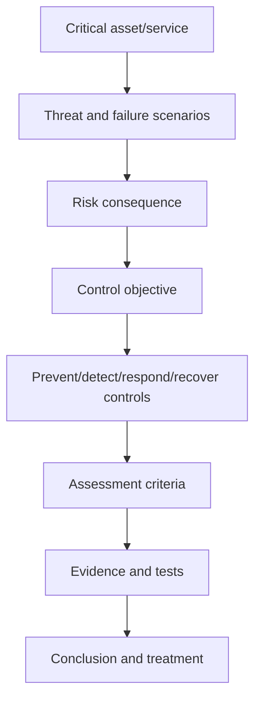

Do not test a product feature without knowing the objective. “Is Safe Links enabled?” is narrower than “Are users and mail flows protected from malicious URLs before delivery, at click time, and during investigation, with exceptions governed?”

## 4. Design, configuration, implementation, and operational effectiveness

| Layer | Question | Evidence example | Failure example |
|---|---|---|---|
| Design adequacy | Would the planned control address the risk if implemented correctly? | Policy standard, architecture, threat model, approvals | Policy excludes workload identities unintentionally |
| Configuration | Is the technical setting aligned with the approved design? | Export/API result, portal walkthrough, policy JSON | CA policy left in report-only |
| Implementation coverage | Does it reach the intended population/assets? | Reconciled user/device/app inventory and assignment | 18% devices not enrolled |
| Operating effectiveness | Did it perform consistently during the period? | Logs, tickets, review records, test samples | Access reviews created but recommendations ignored |
| Outcome effectiveness | Is risk/service outcome improving without unacceptable harm? | Incident, compromise, friction, coverage, recovery metrics | Alerts increase but containment time worsens |

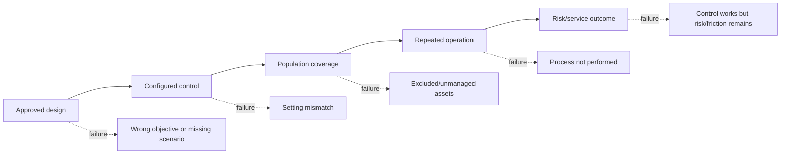

### 🔍 Plain-English deep-dive: “enabled” is only one layer of truth

Imagine a fire alarm. The design may specify alarms on every floor. A device may be installed and switched on. Coverage may still omit the basement. The weekly test may never occur. Staff may not know the evacuation procedure. An enabled setting proves configuration at a moment; it does not prove complete coverage, repeated operation, effective response, or acceptable outcome.

## 5. Assessment scope and boundary

The discovery baseline from Part 53 becomes the assessment boundary. Define organization, tenant, subscriptions, regions, users, identities, devices, apps, workloads, data, controls, suppliers, period, populations, evidence, test depth, and exclusions.

| Scope field | Northstar example |
|---|---|
| Purpose | Support 12-month M365 security investment and readiness decision |
| Tenant/organization | Production tenant A; UK/EU workforce and partner collaboration |
| Domains | Entra, Intune, Exchange, Teams, SharePoint/OneDrive, Purview, Defender, Sentinel |
| Population | 18,000 employees, 3,000 contractors, admins, guests, apps, corporate endpoints |
| Period | Configuration as of date; operational evidence from previous 90 days |
| Depth | Design/configuration/coverage for all objectives; operational samples for priority controls |
| Exclusions | Production changes, penetration testing, source-code review, acquired tenant internals |
| Interfaces | Hybrid AD, HR feed, MSSP, ticketing, third-party email/network/security tools |
| Deliverables | Executive report, technical report, evidence workbook, findings and backlog |
| Assurance caveat | Advisory assessment; not certification, legal opinion, or exhaustive audit |

## 6. Assessment planning and method statement

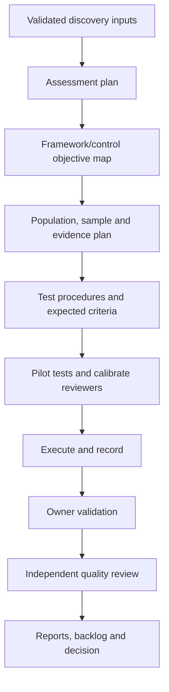

| Method statement element | Content |
|---|---|
| Objective | Decision the assessment enables |
| Criteria | Named framework, policy, baseline, contractual or design source |
| Control domains | Included objectives and rationale |
| Evidence hierarchy | System export, log, record, interview, observation, sample |
| Population/sample | Universe, completeness check, selection, period, exclusions |
| Test procedure | Steps, expected condition, exception handling, reproducibility |
| Rating method | Severity/risk, confidence, maturity, finding status and caveats |
| Validation | Owner fact checks, disputes, management response |
| Quality | Peer review, calibration, traceability and approval |
| Reporting | Audiences, classification, distribution, retention and acceptance |

Freeze the method before broad testing. If criteria change, document why and assess whether prior results need retesting.

## 7. Evidence hierarchy and reproducibility

| Evidence type | Strength | Limitation |
|---|---|---|
| Direct system/API export | Broad, structured, repeatable | Permissions, filters, API gaps, point in time |
| Native logs/audit records | Shows events over time | Retention, ingestion, schema, missing telemetry |
| Approved records/tickets | Shows process and decisions | Manual quality and selective recording |
| Reperformance/test | Demonstrates behavior | Test conditions may differ from production |
| Observation/walkthrough | Reveals actual workflow | Point in time and observer effect |
| Documented policy/design | Shows intended control | May be stale or not implemented |
| Interview/attestation | Adds context and exceptions | Memory, incentives, terminology |
| Dashboard/score | Fast signal and trend | Hidden assumptions, changing denominator, limited scope |

Reproducibility requires a test ID, objective, population, evidence source, collection date/time, tenant/resource IDs, query/filter/API/portal path, tool/version if relevant, steps, expected result, actual result, reviewer, limitation, and artifact reference. Never include credentials or live tokens.

## 8. Population and sampling

A **population** is the complete set that the control should cover, such as all privileged role assignments or all corporate Windows devices. A **sample** is a subset selected for testing. Sampling saves effort but introduces uncertainty.

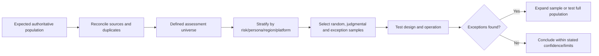

| Sampling approach | Best use | Caveat |
|---|---|---|
| Full population | Small/high-risk structured population, e.g., Global Admins | Source completeness still matters |
| Random | Estimate broad consistency without selection bias | Requires reliable population and statistical design |
| Stratified | Ensure regions, platforms, personas, criticalities represented | Weighting and strata must be documented |
| Judgmental/risk-based | Focus on executives, admins, exceptions, incidents | Cannot generalize statistically by default |
| Haphazard | Quick non-systematic selection | Vulnerable to hidden bias; avoid for material conclusions |
| Time-based | Test recurring reviews across months/quarters | Period may miss seasonal or change events |
| Exception expansion | Increase testing after failures | Expansion rule should be predefined |

### 🔍 Plain-English deep-dive: twenty successful samples do not prove an unknown population is healthy

Before sampling, establish the universe. If the device list omits unmanaged endpoints, selecting 20 “compliant” devices from it tests only known enrolled devices. State how the population was built, reconcile authoritative sources, include high-risk strata, and define what the sample can and cannot support. Formal statistical assurance needs appropriate expertise and method; do not invent confidence percentages from a convenience sample.

## 9. Framework and baseline mapping

Frameworks provide organizing outcomes or controls; product baselines provide technical recommendations; client policies provide local requirements. They overlap but are not interchangeable.

| Source | Useful role | Avoid |
|---|---|---|
| NIST CSF 2.0 | Outcome language across Govern/Identify/Protect/Detect/Respond/Recover | Treating it as an M365 configuration checklist |
| NIST SP 800-53/53A | Control and assessment-procedure reference | Claiming every federal control applies |
| CIS Controls v8 | Prioritized safeguard coverage and implementation groups | Copying licensed benchmark content outside terms |
| CIS Benchmarks | Detailed platform configuration where licensed/applicable | Assuming benchmark setting fits every business process |
| Microsoft Zero Trust | Cross-pillar identity/device/app/data/network/infrastructure principles | “Zero Trust compliant” binary label |
| Microsoft security baselines | Microsoft-recommended configuration starting points | Blind deployment without conflict/impact testing |
| Microsoft Secure Score | Posture recommendations, status and trend | Audit certificate or exact risk percentage |
| Client policy/regulation | Required local outcome and accountability | Consultant legal interpretation without owner |
| Architecture/threat model | System-specific threats and control placement | Generic framework as substitute for context |

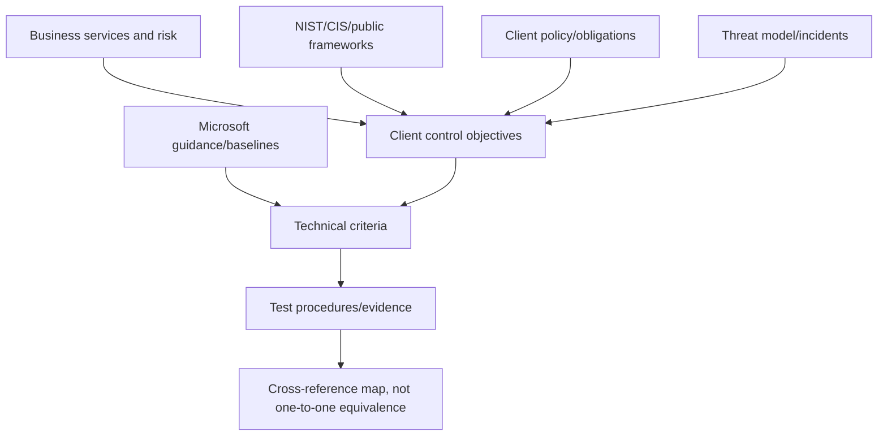

A mapping is an interpretation with version/date and rationale. One technical control can support several framework outcomes; one framework outcome may require many technical and process controls.

## 10. Microsoft Secure Score: role and limits

Microsoft Secure Score is a posture measurement and recommendation experience. It helps identify improvement actions, status, points, trends, and comparative context across supported Microsoft capabilities. Product behavior, scoring, licenses, synchronization, and recommendations change; verify current Learn and the live tenant.

| Secure Score is useful for | Secure Score is not |
|---|---|
| Discovering supported improvement actions | Proof that every asset/control is covered |
| Establishing one posture baseline and trend | A probability or financial-loss calculation |
| Assigning and tracking improvement work | Certification, compliance opinion, or audit |
| Seeing Microsoft configuration signals | Complete operational-effectiveness evidence |
| Comparing alternative action status | A substitute for threat model/business impact |
| Starting stakeholder discussion | A license-neutral permanent benchmark |

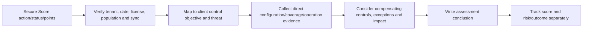

### 🔍 Plain-English deep-dive: 80% Secure Score does not mean 80% secure

The numerator and denominator reflect Microsoft-defined point opportunities visible and applicable in that scoring experience. They do not capture every threat, asset, third-party control, process, business consequence, or control quality. A score can change because recommendations or licensing change. Use it as a useful posture signal and improvement planner; trace important actions to direct evidence and client risk.

## 11. Assessment result taxonomy

Use result labels defined in the method, not improvised colors.

| Result | Meaning |
|---|---|
| Effective | Criteria met with sufficient evidence for tested scope/period |
| Partially effective | Some criteria/coverage/operation met; meaningful gaps remain |
| Ineffective | Control absent, materially misdesigned, misconfigured, uncovered, or not operating |
| Not implemented | Planned objective/control not present |
| Not evidenced | Evidence insufficient to conclude; not automatically failure or pass |
| Not applicable | Objective demonstrably outside agreed context, with rationale/approval |
| Not tested | In scope but test not performed; reason and consequence recorded |
| Superseded | Replaced by an approved objective/control/test version |

Avoid “compliant/noncompliant” unless the criteria and authority justify that exact conclusion.

## 12. Entra identity health check

| Objective area | Evidence/tests | Common gap |
|---|---|---|
| Tenant/admin hygiene | Domains, roles, admin accounts, licenses, service health | Unowned privileged accounts |
| Authentication | Registration, strengths, MFA policy and sign-in evidence | Registration mistaken for enforcement |
| Conditional Access | Policies, report-only, exclusions, What If, logs, emergency access | Policy gaps/overlap/lockout risk |
| Privilege | Role assignments, PIM, activations, approvals, reviews | Permanent standing privilege |
| Identity protection | Risk policies, detections, remediation, workflow | Alerts with no owner/SLA |
| Governance | Joiner/mover/leaver, access packages/reviews, guests | Stale access and incomplete population |
| Apps/workloads | Consent, permissions, credentials, owners, workload risk | Long-lived secrets/broad Graph rights |
| Hybrid | Sync/auth architecture, health, staging, filtering, federation | Source-of-authority ambiguity |
| External | Cross-tenant access, guests, tenant restrictions, reviews | Partner trust without lifecycle |
| Resilience | Emergency accounts, tests, monitoring, recovery dependencies | Break-glass never tested |

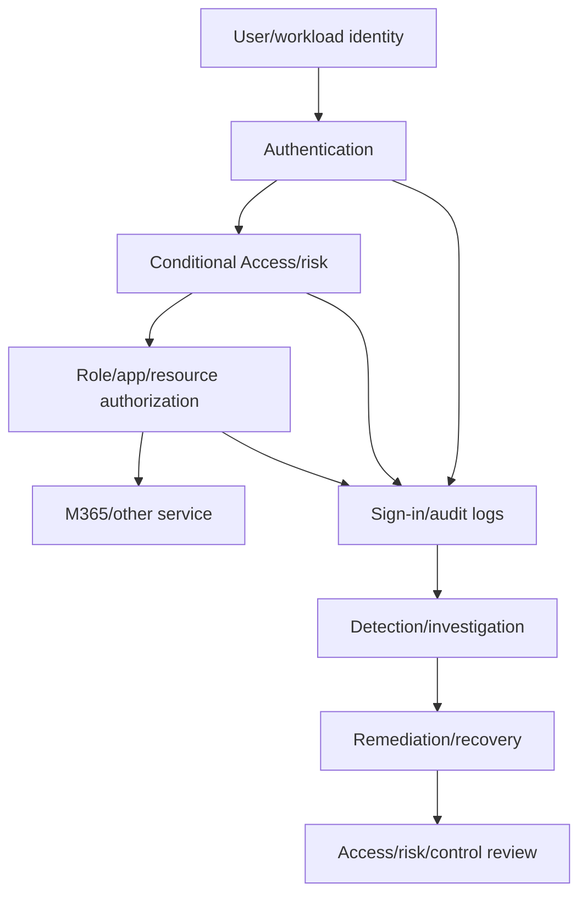

Test positive, negative, exception, emergency, stale, and workload-identity paths. Use stable IDs and sign-in evaluation detail, not only usernames.

## 13. Intune and endpoint health check

| Objective area | Evidence/tests | Common gap |
|---|---|---|
| Inventory/enrollment | Reconcile Entra, Intune, Defender, Configuration Manager, CMDB | Unknown/unmanaged device population |
| Compliance | Policy assignments, grace, actions, status, errors | “Compliant” because no applicable policy |
| Conditional Access integration | Device claims, compliant requirement, platform filters, sign-in tests | Duplicate/stale device object selected |
| Configuration | Settings Catalog/baselines, conflicts, exclusions, applicability | Competing policy channels |
| Endpoint security | AV, EDR, ASR, firewall, encryption, LAPS, EPM | Onboarded but unhealthy sensor |
| Applications | Required apps, detection, dependencies, supersedence, failures | Install report misread without detection rule |
| Updates | Rings, deadlines, safeguards, quality/feature status | Broad deferral and no exception expiry |
| Lifecycle | Retire/wipe/delete, stale cleanup, ownership changes | Departed devices remain trusted |
| Co-management | Authority and workload sliders, ConfigMgr health | Control ownership split or duplicated |
| Operations | Diagnostics, remediations, incidents, support, KPIs | Errors aged without service owner |

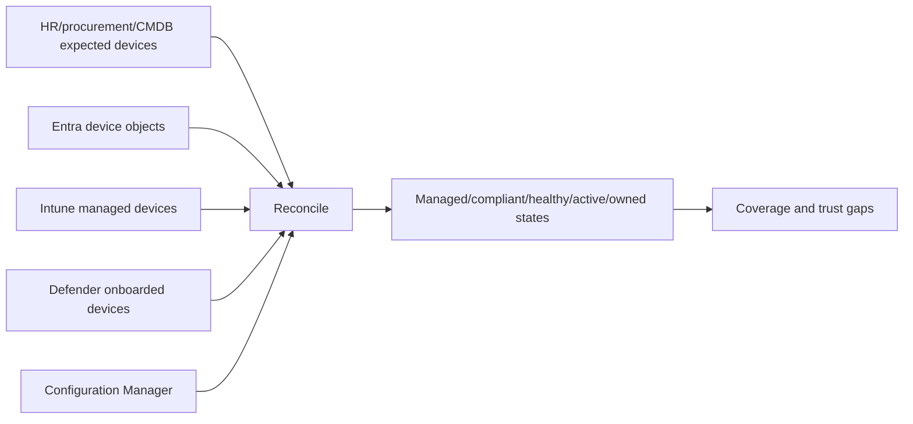

## 14. Exchange Online and Defender for Office 365 health check

| Objective | Checks |
|---|---|
| Mail authenticity | Accepted domains, SPF, DKIM, DMARC, alignment, reports, ownership |
| Inbound/outbound hygiene | Anti-malware/spam/phishing, outbound limits, connectors, exceptions |
| Threat protection | Preset policies, Safe Links/Attachments, impersonation, priority users |
| Mail flow | Connectors, transport rules, third-party gateways, bypasses, enhanced filtering |
| Privilege/delegation | Exchange RBAC, mailbox permissions, application access |
| Investigation | Explorer, submissions, quarantine, message trace, audit, incidents |
| Resilience | Service health, fallback, business continuity, vendor dependency |
| Operations | Tuning, false positives, response SLA, campaigns, user reports |

Sample normal delivery, phishing simulation under authorization, user-reported mail, false-positive release, compromised account response, and third-party routing. Never send unsafe content or conduct an unapproved live attack.

## 15. Teams health check

| Domain | Assessment prompts |
|---|---|
| Identity/membership | Team owners, guests, shared channels, lifecycle, orphan teams |
| External collaboration | Federation, guest access, cross-tenant settings, allow/block domains |
| Meetings | Anonymous join, lobby, presenters, recording, transcription, sensitive meetings |
| Messaging | Policies, external messages, file/link behavior, retention |
| Apps | Permission/setup policies, custom apps, third-party data/consent, owners |
| Data/compliance | Labels, DLP, retention, eDiscovery, communication compliance |
| Operations | Call quality/service health, incidents, audit, support ownership |
| Exceptions | Executive/event/clinical/business scenarios, expiry and compensating controls |

Test persona combinations: employee, guest, external federated user, anonymous attendee, organizer, presenter, app, and regulated team owner.

## 16. SharePoint Online and OneDrive health check

| Objective | Evidence/tests |
|---|---|
| Access model | Tenant/site permissions, inheritance, groups, unique permissions, restricted access |
| External sharing | Tenant/site defaults, link types, expiration, domain restrictions, guests |
| Unmanaged access | Conditional Access/session control/download behavior |
| Data protection | Sensitivity labels, DLP, encryption, retention, records |
| Site lifecycle | Provisioning, owners, inactivity, access reviews, archive/delete |
| Sync | Known Folder Move, client restrictions, device state, external sync |
| Apps/integration | Add-ins, Graph apps, migration tools, vendor access |
| Monitoring/response | Audit, alerts, oversharing investigation, revocation, owner workflow |

Your SharePoint and OneDrive depth is especially valuable. You can explain permission inheritance, sharing-link scope, sync and migration dependencies, then extend assessment into Entra, device, Purview, Defender, Sentinel, privacy, and operating ownership.

## 17. Purview health check

| Capability | Assessment questions |
|---|---|
| Classification | Which sensitive information types/classifiers are accurate, owned, tested, and monitored? |
| Sensitivity labels | Taxonomy, publication, encryption, containers, auto-labeling, user experience? |
| DLP | Locations, rules, simulation, policy tips, override, incidents, tuning, endpoint/browser coverage? |
| Retention/records | Policies/labels, conflicts, event triggers, disposition, preservation, proof? |
| Audit/eDiscovery | Licensing, retention, search roles, cases, holds, exports, chain of custody? |
| Insider risk | Purpose, privacy, indicators, cases, role separation, escalation, false positives? |
| Communication compliance | Policy purpose, reviewers, privacy, remediation and oversight? |
| Compliance Manager | Improvement-action ownership/evidence and score caveats? |
| DSPM/AI | Sensitive-data exposure, AI interactions, recommendations, governance? |

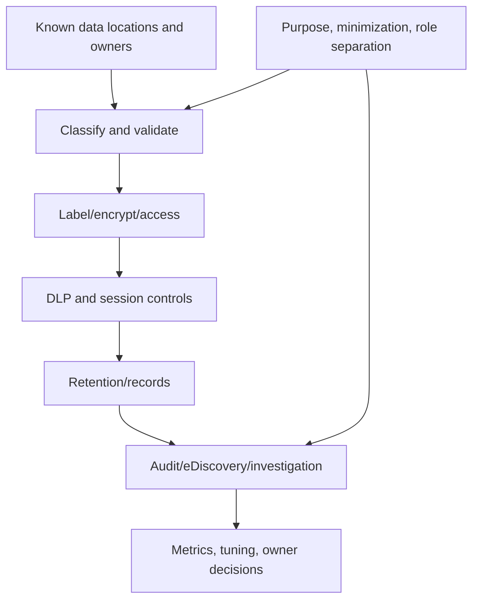

Privacy is a control requirement, especially for employee monitoring, communications, content, location, and behavior signals. Technical availability does not create lawful or proportionate use.

## 18. Defender XDR health check

| Area | Checks |
|---|---|
| Product coverage | Endpoint, Identity, Office 365, Cloud Apps, app governance prerequisites/coverage |
| Integration | Incident correlation, device/identity/app/email entities, Sentinel/Purview paths |
| Sensor/data health | Onboarding, connectivity, versions, health alerts, data latency, exclusions |
| Prevention | AV, EDR, ASR, network protection, email, identity posture, cloud-app policies |
| Detection | Alert policy, custom detections, tuning, MITRE coverage, false positives/misses |
| Investigation | Unified queue, attack story, evidence/entities, Advanced Hunting, retention |
| Response | AIR, Action Center, isolate, collect, live response, user/app actions, approvals |
| Exposure | Recommendations, initiatives, critical assets, attack paths, remediation ownership |
| Operations | Severity, SLA, handoff, closure, PIR, metrics, threat hunting |

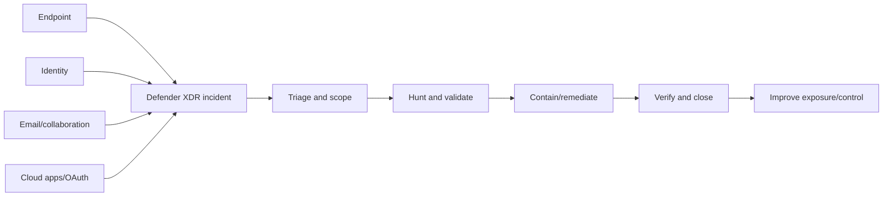

Assess response authority and target verification. A successful API action is not enough; confirm the device, account, message, app, or file reached the intended safe state.

## 19. Sentinel health check

| Area | Evidence/tests |
|---|---|
| Architecture | Workspace/tenant/region, primary workspace, residency, RBAC, cost boundaries |
| Sources/connectors | Owner, known-event freshness, auth, throttling, duplication, gaps |
| Schema/normalization | Required fields/types, ASIM fit, parser/version, provenance |
| Analytics | Runs, query, window, threshold, grouping, entities, ATT&CK, precision/recall |
| Incidents | Creation/correlation, queue, severity, ownership, cross-workspace behavior |
| Hunting/workbooks | Decision value, performance, permissions, stale content |
| Automation | Trigger, identity, permission, approval, idempotency, retries, target validation |
| Health/audit | `_SentinelHealth()`, `_SentinelAudit()`, diagnostics, deployment drift |
| Retention/cost | Table plans, retention, archive/lake, ingestion, budget/value |
| Resilience | Manual fallback, emergency access, source buffering, recovery tests |

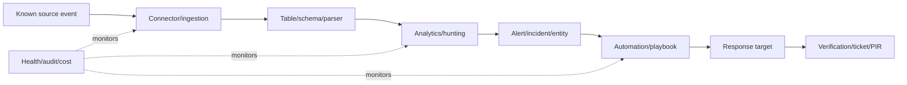

Green connector status alone is weak evidence. Generate or identify an approved known event and trace it through source, ingestion, schema, detection, case, action, and verification.

## 20. Cross-platform control paths

Product-by-product review can miss failures between systems. Test end-to-end objectives.

| Control path | Components | End-to-end test |
|---|---|---|
| Risk-based access | Entra risk + CA + auth + target service | Approved synthetic risky scenario/report-only evaluation and logs |
| Compliant-device access | Intune + Entra device + CA + app | Managed compliant, noncompliant, stale, and unmanaged personas |
| Sensitive sharing | SharePoint/Teams + Entra guest + Purview + audit | Approved synthetic labeled file and sharing paths |
| Phishing response | Exchange/MDO + XDR + Entra + Sentinel/ticket | Authorized simulation from alert to containment/verification |
| Endpoint incident | Intune policy + MDE + XDR + automation | Safe test signal and response workflow |
| Privileged change | Entra/PIM + audit + Sentinel + owner review | Test activation/change/alert/approval evidence |
| SaaS/OAuth risk | Entra app + Defender for Cloud Apps/app governance + owner | Consent, policy, alert, revoke and review path |

## 21. Finding anatomy

A finding must be understandable without the assessor in the room.

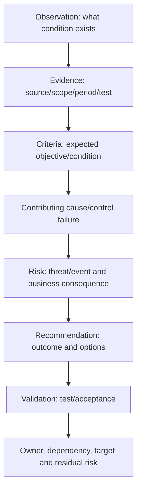

| Finding field | Requirement |
|---|---|
| ID/title | Specific condition and domain, no sensationalism |
| Scope | Tenant, population, service, region, period |
| Observation | Neutral, factual condition |
| Criteria | Approved objective, policy, baseline, or requirement |
| Evidence/test | Reproducible source, sample, method and result |
| Cause | Known contributing design/process/ownership/technical factor; do not guess |
| Risk | Credible threat/failure event and business consequence |
| Existing controls | Preventive/detective/respond/recover and limitations |
| Recommendation | Desired control outcome, options and sequence; not only a SKU |
| Validation | Positive, negative, coverage, operation, rollback and metrics |
| Owner/timing | Accountable treatment owner and dependency |
| Rating/confidence | Method-derived severity and evidence confidence |
| Management response | Agree/disagree, action, risk acceptance or more evidence |
| Residual risk | Expected/accepted risk after treatment |

### Example finding

**Observation:** As of the fictional assessment date, 9 of 14 privileged Entra role assignments in the supplied population were permanent active assignments. PIM activation records covered the remaining 5; no quarterly review evidence was supplied for the 90-day period.

**Risk:** If a permanently privileged account is phished, misused, or left stale, an attacker or unauthorized user may retain broad access without time-bound activation or recurring review, increasing the likelihood and duration of tenant compromise.

**Recommendation:** Validate role necessity, move eligible human assignments to time-bound PIM activation with phishing-resistant authentication and approval appropriate to risk, establish recurring review and exception expiry, preserve tested emergency access, and monitor role/activation changes. Validate with full-population assignment export, positive/negative persona tests, activation/audit evidence, emergency-access test, and owner-approved exceptions.

## 22. Severity, likelihood, impact, and confidence

**Impact** is the consequence if the event occurs. **Likelihood** is the reasoned chance or frequency under defined assumptions. **Severity** is the assessment's combined prioritization label. **Confidence** expresses evidence strength and analytical certainty; it should not silently lower the risk because evidence is weak.

| Impact factor | Questions |
|---|---|
| Confidentiality | Could sensitive, regulated, privileged, or strategic data be exposed? |
| Integrity | Could identities, policy, records, decisions, or communications be altered? |
| Availability | Could critical services or response capability be disrupted? |
| Safety/customer | Could patient, employee, customer, or public outcomes be harmed? |
| Legal/regulatory | What obligation and owner-confirmed consequence applies? |
| Financial | What credible cost category exists, without invented precision? |
| Operational | Which service, population, region, recovery time, or dependency is affected? |
| Reputation/strategy | Could trust, acquisition, AI adoption, or market commitment be impaired? |

| Likelihood factor | Questions |
|---|---|
| Exposure | Internet-facing, common user path, privileged, internal-only, segmented? |
| Threat activity | Relevant known campaigns/techniques and client incidents? |
| Vulnerability/control gap | How easy and reliable is the failure path? |
| Population | One bounded exception or enterprise-wide? |
| Duration | Temporary, recurring, or persistent? |
| Detectability/response | How quickly would misuse be detected and contained? |
| Preconditions | How many independent conditions must align? |
| Compensating controls | Are they proven, independent, timely, and sustainable? |

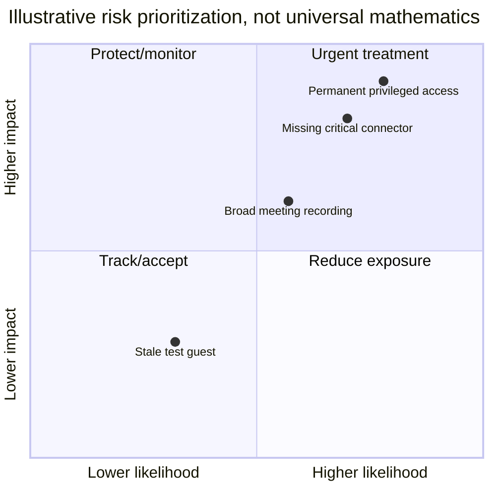

## 23. Risk-scoring caveats

| Caveat | Safe practice |
|---|---|
| Ordinal numbers are not quantities | A 4 is not mathematically twice a 2 |
| Matrix colors can hide assumptions | Publish definitions and rationale |
| High impact/low likelihood can still be material | Show both dimensions and scenario |
| Weak evidence is not low risk | Record separate confidence/unknown |
| Tool severity may differ from client impact | Re-rate transparently, preserve source severity |
| Scores invite false precision | Use bands plus narrative and sensitivity |
| Aggregation can bury critical outliers | Keep material findings visible |
| Risk appetite belongs to client owners | Consultant advises; authorized owner accepts |

If a numeric method is used, document formula, scale definitions, weighting, treatment of compensating controls, confidence, aggregation, and who approved it. Do not calculate annual loss without defensible frequency and magnitude inputs.

## 24. Maturity models

Maturity describes repeatability, governance, integration, measurement, and improvement. It should not reward bureaucracy disconnected from outcomes.

| Level | Plain meaning | Evidence pattern |
|---:|---|---|
| 0 — Absent | Objective/control not established | No owner, design, implementation, or evidence |
| 1 — Ad hoc | Individuals respond inconsistently | Local knowledge and reactive tickets |
| 2 — Repeatable | Basic process/control repeats in parts | Some documented steps and recurring execution |
| 3 — Defined | Enterprise method, roles, standards, coverage | Approved design, RACI, training, broad implementation |
| 4 — Measured | Quality/outcomes monitored and managed | Trusted KPIs/KRIs, control health, thresholds, action |
| 5 — Adaptive | Evidence and threat/change drive timely improvement | Automated feedback, scenario tests, learning and optimization |

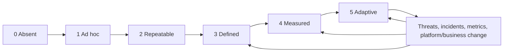

### 🔍 Plain-English deep-dive: maturity is not a staircase every control must climb to level five

An organization may deliberately keep a low-risk process simple. Level five is not automatically worth the cost. Determine the target maturity from risk, scale, regulation, operating model, change rate, and economics. Score dimensions separately where useful: governance, process, technology, coverage, skills, measurement, and improvement. One strong dimension should not average away an absent critical control.

## 25. Maturity evidence and scoring discipline

| Dimension | Level-3 evidence example | Level-4/5 evidence example |
|---|---|---|
| Governance | Approved objective, owner, standard, exception process | Risk/outcome review drives investment and adaptation |
| Process | Documented end-to-end workflow and RACI | Process mining/quality metrics and corrective action |
| Technology | Standard deployed across defined population | Continuous health, drift detection and safe automation |
| Coverage | Reconciled assets with managed exceptions | Near-real-time unknown-asset detection |
| People | Trained roles and backup coverage | Exercise performance and skills planning from data |
| Measurement | Defined KPI/KRI and data source | Baselines, targets, thresholds, causal review |
| Improvement | Periodic review and backlog | Threat/incidents/platform change trigger rapid tests |

Record current level, target level, evidence, gap, rationale, owner, and time horizon. “Industry standard is level 4” is not a benchmark unless a credible source, comparable population, and method support it.

## 26. Gap and benchmark analysis

A **gap** is the difference between current evidence and agreed criterion/target. A **benchmark** is a comparison point. Benchmarks can inform, but context and measurement method matter.

| Comparison | Useful question | Limitation |
|---|---|---|
| Client policy | Is the approved local requirement met? | Policy may be stale or poorly designed |
| Microsoft baseline | How does configuration differ from current recommendation? | Business applicability and conflicts vary |
| Secure Score peer comparison | Is posture signal materially different from broad peers? | Peer composition/method not full risk context |
| CIS benchmark | Which configuration safeguards differ? | Licensing/version/applicability |
| NIST/CISA outcome | Which capability outcomes are weak or absent? | Requires local implementation criteria |
| Prior assessment | Is the same method showing improvement? | Scope/denominator/version changes break trend |
| Target architecture | What must change to reach approved future state? | Target may not yet be funded/tested |

Never label a client “below industry” from an opaque peer percentile. State source, date, denominator, comparability, and limitations.

## 27. Exceptions, compensating controls, and residual risk

An **exception** is an authorized deviation from a requirement. A **compensating control** is an alternative control that reduces the same risk when the preferred control is infeasible. **Residual risk** remains after controls and treatment.

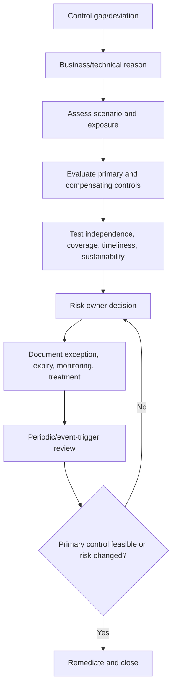

| Exception field | Requirement |
|---|---|
| Objective/deviation | Exact control and population |
| Business rationale | Why standard control is not currently feasible |
| Risk scenario | Threat/failure, exposure, impact |
| Compensating controls | Mechanism, owner, evidence, dependency |
| Validation | Positive/negative/operation tests |
| Residual risk | What remains and why |
| Approver | Authorized business/security risk owner |
| Start/expiry | Time-bound, no “permanent temporary” |
| Monitoring | KRI, alert, review cadence, trigger |
| Treatment/exit | Dependency and plan to close or renew |

Do not reduce a rating merely because someone names a compensating control. Test whether it covers the same scenario, operates independently and quickly enough, is sustainable, and has an owner.

## 28. Validation with control owners

Owner validation confirms facts, not the assessor's independence away.

```mermaid
sequenceDiagram
    participant A as Assessor
    participant T as Technical/control owner
    participant B as Business/risk owner
    participant Q as Quality reviewer
    A->>T: Send observation, criteria, evidence, scope and due date
    T-->>A: Correct fact / add evidence / confirm / dispute
    A->>A: Reperform or update test; preserve change history
    A->>B: Validate impact, ownership and response
    B-->>A: Agree action, accept risk, or dispute rationale
    A->>Q: Submit finding, traceability and comment log
    Q-->>A: Challenge method, support, consistency and language
    A->>T: Return final factual disposition
```

| Owner response | Assessor action |
|---|---|
| New valid evidence | Reperform and revise conclusion/rating if warranted |
| Scope/date misunderstanding | Correct test boundary and evaluate affected tests |
| Alternative control | Test objective coverage and operation |
| “We plan to fix it” | Preserve current finding; record planned treatment |
| Business accepts risk | Preserve finding; record authorized acceptance/residual risk |
| Disagrees with risk | Document rationale, compare assumptions, escalate to methodology/risk owner |
| No response | Follow escalation; report unvalidated status/limitation |
| Requests deletion | Follow evidence/report governance; do not suppress supported material fact improperly |

## 29. Handling disputes

Separate four disputes:

1. **Factual:** Is the observation/evidence accurate?
2. **Criteria:** Is the expected requirement applicable and approved?
3. **Risk:** Are threat, likelihood, impact, and controls interpreted reasonably?
4. **Treatment:** Which option, owner, cost, and date should be chosen?

| Dispute method | Practice |
|---|---|
| Restate common objective | Reduce positional conflict |
| Identify exact disagreement | Fact, criterion, risk, or treatment |
| Preserve source/version | Avoid arguing from different snapshots |
| Use discriminating test | Reperform, expand sample, inspect operation |
| Record both rationales | Keep an auditable comment log |
| Apply approved method | Do not negotiate rating merely for comfort |
| Escalate appropriately | Method owner, sponsor, risk owner, legal/privacy |
| Publish unresolved limitation | Transparency over artificial consensus |

Your vendor/product-group escalations provide a strong analogy: isolate the ownership boundary, align timestamps and identifiers, share reproducible evidence, test the cheapest discriminating hypothesis, and escalate a precise unresolved question.

## 30. Quality review

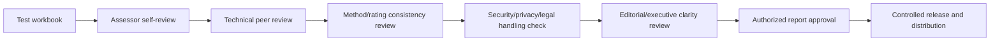

| Quality check | Reviewer question |
|---|---|
| Scope | Does conclusion stay within tenant/population/period/sample? |
| Criteria | Was expected condition defined and applicable? |
| Evidence | Is it sufficient, relevant, reproducible, and protected? |
| Test | Does procedure actually test design/configuration/operation? |
| Observation | Is language neutral, precise, and supported? |
| Risk | Is scenario credible and impact client-specific without exaggeration? |
| Rating | Is approved method applied consistently and caveated? |
| Recommendation | Does it address root control objective with options/dependencies/validation? |
| Traceability | Can report statement link to workbook/evidence/finding/backlog? |
| Privacy/security | Is sensitive evidence minimized and distribution restricted? |
| Consistency | Do executive and technical reports agree? |
| Honesty | Are assurance level, limitations, samples, and experience represented accurately? |

## 31. Executive report

The executive report enables decisions. It should not be a collection of screenshots.

| Section | Content |
|---|---|
| Purpose/scope | Decision, domains, period, method, exclusions, assurance caveat |
| Overall posture | Balanced strengths, material exposures, confidence/limitations |
| Business risk themes | Identity, device, collaboration, data, detection/response, governance |
| Priority findings | Scenario, impact, affected scope, owner, urgency |
| Maturity | Current/target by capability with rationale, not decorative average |
| Options | Do nothing/minimum/recommended/strategic where appropriate |
| Roadmap input | Immediate containment, foundations, phased improvement, dependencies |
| Decisions | Funding, ownership, risk acceptance, further evidence, target state |

Use counts carefully: “12 high findings” can be misleading because one systemic issue may create many technical rows. Group themes while preserving traceability.

## 32. Technical report and evidence workbook

| Technical report component | Required detail |
|---|---|
| Method | Criteria, versions, populations, sampling, evidence hierarchy, rating |
| Architecture/context | Validated current-state and control paths |
| Domain results | Objectives, tests, findings, strengths, limitations |
| Finding register | Full anatomy, ratings, confidence, owners, responses |
| Evidence register | Controlled references, not unnecessary raw data copies |
| Mapping | Framework/baseline/policy cross-reference and interpretation |
| Exceptions | Compensating controls, residual risk, expiry, monitoring |
| Backlog | Treatment, dependencies, validation, priority |
| Appendices | Glossary, test procedures, sampled populations, limitations |

The workbook should use stable IDs such as `ID-PRIV-01`, `T-ID-004`, `E-017`, `F-006`, and `B-012` so a finding traces back to objective, test, and evidence and forward to treatment.

## 33. Prioritized treatment backlog

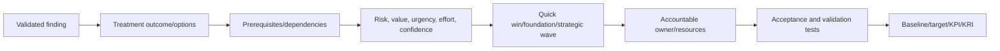

| Backlog field | Purpose |
|---|---|
| Finding/control objective | Traceability to risk |
| Treatment outcome | Desired condition, not “enable product” only |
| Option | Remediate, mitigate, transfer, avoid, accept, investigate |
| Scope/personas | Affected population and rollout ring |
| Owner | Accountable business/technical owner |
| Dependencies | License, data, identity, architecture, process, vendor, skills |
| Priority | Risk/value/urgency/effort/confidence rationale |
| Milestone | Design, pilot, deploy, validate, operate |
| Acceptance | Positive/negative/coverage/operation/rollback criteria |
| Metric | Baseline, target, data source, cadence |
| Residual risk | Expected state and acceptance owner |

Do not close a finding because a ticket exists. Close after treatment is implemented, validated against the objective, operating ownership is accepted, and residual risk is recorded.

## 34. Assessment operations and metrics

| Metric | Good interpretation | Anti-pattern |
|---|---|---|
| Test completion | Completed and reviewed tests / planned, weighted by materiality | Rush low-risk tests to improve percent |
| Evidence coverage | Sufficient evidence by critical objective | Average hides critical unknown |
| Finding validation age | Time awaiting owner response | Quietly mark accepted |
| Dispute cycle time | Time to resolve exact disagreement | Lower rating to close quickly |
| Rework/QA defects | Method/support issues found before release | Punish peer challenge |
| Exception expiry | Due/overdue high-risk deviations | Auto-renew |
| Backlog aging | Risk-weighted untreated items | Count tickets without risk |
| Control coverage | Managed/expected population | Use tool denominator without reconciliation |
| Operational pass rate | Successful control instances / valid samples | Ignore skipped/missing records |
| Risk outcome | Incident/exposure/recovery/friction trend | Claim causality from one metric |

Assessment artifacts need owners and maintenance if reused. A point-in-time report is not a continuous control-monitoring system.

## 35. Assessment failure modes and troubleshooting

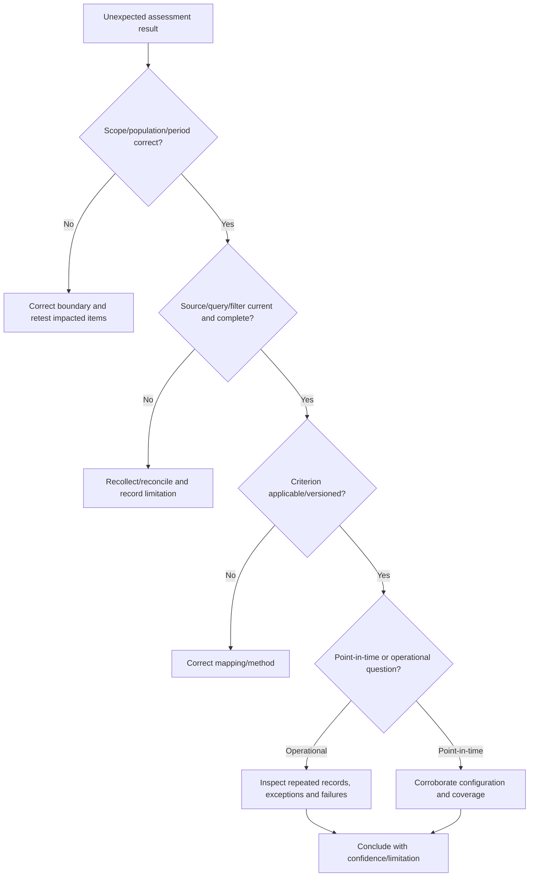

| Symptom | Likely cause | Discriminating check |
|---|---|---|
| Secure Score differs from export | Sync, applicability, license, status logic, date | Compare exact action criteria and refresh time |
| Policy appears enabled but no users affected | Assignment/filter/exclusion/report-only | Evaluate named test personas and logs |
| Intune says compliant, Defender shows inactive | Different populations/health semantics | Reconcile stable device IDs and last-seen timestamps |
| Owner says review occurs; no record | Informal process or retention gap | Reperform next review and inspect prior sample |
| Sentinel connector green; no events | Source silence/schema/routing/latency | Trace approved known event |
| Two reviewers rate differently | Definitions/calibration/context mismatch | Blind re-score against method and discuss rationale |
| Finding count suddenly drops | Scope/denominator/method changed | Version comparison and restatement |
| Compensating control asserted | Alternative not tested | Map same scenario and test operation |
| Evidence request blocked | Privilege/privacy/availability issue | Use owner-generated minimized export or limitation |
| Executive disputes technical fact | Wrong level or unvalidated evidence | Return to source owner, scope, criteria and test |

## 36. Fictional Northstar assessment scenario

Northstar's discovery identified regulated external collaboration, fragmented privileged access, mixed device management, incomplete data governance, Defender coverage differences, and an MSSP-managed Sentinel dependency. The assessment must support a license renewal and 12-month roadmap without production changes.

### Assessment objectives

| ID | Objective | Method depth |
|---|---|---|
| NS-ID-01 | Privileged access is least-privileged, time-bound, strongly authenticated, monitored and recoverable | Full population + 90-day operation sample |
| NS-DEV-01 | Corporate and BYOD access uses accurate device/app protection signals | Reconciled population + persona tests on paper evidence |
| NS-COL-01 | External collaboration is approved, least-privileged, reviewed and logged | Configuration + 25 fictional lifecycle samples |
| NS-DATA-01 | Sensitive data is classified, protected, retained and investigated proportionately | Design/configuration + synthetic policy test records |
| NS-XDR-01 | Critical attack signals correlate and response reaches verified target state | Coverage + safe synthetic chronology |
| NS-SIEM-01 | Required sources, detections, cases and automation operate within health/SLA/cost limits | Known-event paper trace + 90-day fictional records |
| NS-GOV-01 | Controls have owners, exceptions, metrics, change and improvement | Document/record samples and interviews |

```mermaid
flowchart TB
    DISC[Northstar discovery baseline] --> OBJ[7 control objectives]
    OBJ --> ID[Identity/privilege]
    OBJ --> DEV[Device/access]
    OBJ --> COL[Collaboration]
    OBJ --> DATA[Data/privacy]
    OBJ --> XDR[Threat protection]
    OBJ --> SIEM[Detection/response]
    OBJ --> GOV[Governance/operations]
    ID --> FIND[Validated findings]
    DEV --> FIND
    COL --> FIND
    DATA --> FIND
    XDR --> FIND
    SIEM --> FIND
    GOV --> FIND
    FIND --> BACK[Prioritized backlog]
```

### Fictional finding set

| Finding | Observation | Illustrative severity/confidence | Treatment direction |
|---|---|---|---|
| NS-F-01 | 9/14 privileged assignments permanent; no review evidence | High / high | PIM, role reduction, review, emergency validation |
| NS-F-02 | 2,400 devices unmatched across Intune/MDE/CMDB | High / medium | Reconcile population and trust state before CA expansion |
| NS-F-03 | 31 external-sharing exceptions lack expiry/owner | Medium / high | Exception lifecycle and restricted access/labels |
| NS-F-04 | DLP simulation covers SharePoint but not defined endpoint scenarios | Medium / high | Validate requirements, persona license, endpoint/browser design |
| NS-F-05 | Defender sensor health exceptions aged over 30 days | High / high | Ownership, remediation SLA, isolation from trusted compliance |
| NS-F-06 | Sentinel firewall connector dashboard green; known-event test missing | Medium / medium | End-to-end health SLO and synthetic event |
| NS-F-07 | Incident containment authority differs between MSSP and client runbook | High / high | RACI, approval, SLA, target verification and exercises |
| NS-F-08 | Secure Score improved 12 points but denominator changed | Informational / high | Restate trend and track outcome/coverage separately |

## 37. Safe paper exercise and portfolio artifact

This exercise uses only fictional data. Do not access a tenant, request client exports, enable a trial, change a setting, test live users, send attack content, or copy Microsoft/customer screenshots. Prices, features, licenses, and portal status must be marked “verify current.”

### Exercise tasks

1. Write an assessment plan with purpose, scope, period, domains, criteria, method, assurance caveat, evidence handling, validation, QA, and reporting.
2. Define 20 control objectives across Entra, Intune, M365 workloads, Purview, Defender, Sentinel, governance, privacy, resilience, and vendors.
3. Map each objective to selected NIST CSF outcomes, public CIS categories, Microsoft guidance, and fictional Northstar policy; state that mappings are interpretive.
4. Create expected populations for users, privileged assignments, guests, devices, apps, sites, policies, connectors, detections, incidents, and exceptions.
5. Create a sampling plan using full-population, stratified, random, risk-based, time-based, and exception-expansion examples with explicit limitations.
6. Write 30 test procedures, each with criterion, evidence, steps, expected, actual fictional result, reviewer, limitation, and artifact reference.
7. Build domain health-check sheets for Entra, Intune, Exchange/MDO, Teams, SharePoint/OneDrive, Purview, Defender XDR, and Sentinel.
8. Write eight complete findings from the fictional set with observation, evidence, criteria, risk, controls, recommendation, validation, owner, severity, confidence, and response.
9. Score seven maturity dimensions with evidence and justified target, avoiding unsupported averages.
10. Create an exception/compensating-control register and residual-risk examples.
11. Simulate control-owner comments, disputes, reperforming tests, and QA corrections.
12. Produce a five-page executive report, detailed technical report outline, evidence index, and prioritized backlog.

```mermaid
flowchart LR
    PLAN[01 Method/plan] --> OBJ[02 Objectives/mapping]
    OBJ --> POP[03 Populations/sampling]
    POP --> TEST[04 Test workbook]
    TEST --> HC[05 Domain health checks]
    HC --> FIND[06 Findings/exceptions]
    FIND --> MAT[07 Maturity/gap analysis]
    MAT --> QA[08 Validation/QA log]
    QA --> REP[09 Executive/technical reports]
    REP --> BACK[10 Prioritized backlog]
```

### Validation matrix

| Test | Expected |
|---|---|
| A recommendation has no objective/criteria | Reject until traceability exists |
| Secure Score is called compliance percentage | Correct language and add limits/direct evidence |
| Sample selected before population reconciliation | Rebuild universe and selection |
| Configuration enabled but operation untested | Mark configuration conclusion only |
| Missing evidence marked effective | Change to not evidenced/unknown with consequence |
| Compensating control only described | Require operation and scenario-coverage test |
| Weak evidence reduces severity automatically | Keep confidence separate from risk |
| Maturity average hides absent critical control | Show dimension and critical exception separately |
| Owner plans remediation | Keep present finding; record response/backlog |
| Executive report contains raw identities/logs | Remove/minimize and restrict technical evidence |
| Finding closes when ticket created | Keep open until validated outcome/residual risk |
| Portfolio uses real tenant screenshot | Replace with fictional table/diagram |

### Reusable template set

| Template | Key fields |
|---|---|
| Assessment plan | Purpose, scope, criteria, period, method, assurance, handling |
| Objective catalog | Asset/risk/objective/control/owner/source/version |
| Evidence register | Request/source/scope/period/method/quality/retention |
| Population/sampling | Universe/reconciliation/strata/selection/limits/expansion |
| Test sheet | Criterion/steps/expected/actual/evidence/result/reviewer |
| Finding | Observation/evidence/criteria/risk/control/recommendation/validation |
| Maturity sheet | Dimension/current/target/evidence/gap/rationale |
| Exception | Deviation/rationale/control/residual/owner/expiry/monitoring |
| Validation log | Comment/source/disposition/retest/approver/date |
| QA checklist | Scope/evidence/test/rating/language/privacy/traceability |
| Backlog | Finding/outcome/owner/dependency/priority/acceptance/metric |
| Report | Scope/method/strengths/risks/limitations/options/decisions |

## 38. Tradeoffs and consultant judgment

| Tradeoff | Tension | Defensible approach |
|---|---|---|
| Broad health check vs deep assurance | Coverage versus evidence depth | State depth by objective and prioritize material paths |
| Full population vs sample | Certainty versus time/access | Full high-risk structured sets; designed samples elsewhere |
| Current baseline vs changing platform | Currency versus completion | Dated snapshot, current-status register, update triggers |
| Standard baseline vs business fit | Consistency versus operational need | Objective-led applicability and governed exceptions |
| Transparency vs sensitive detail | Reproducibility versus exposure | Layered reports and controlled evidence references |
| Quantitative score vs narrative | Comparability versus false precision | Defined bands, scenario rationale and separate confidence |
| Remediation speed vs safe change | Urgency versus lockout/disruption | Containment plus design/pilot/rings/rollback |
| Owner agreement vs assessor challenge | Relationship versus independence | Fact validation, transparent disputes, approved method |

## 39. From assessment to Part 55 design

Assessment identifies which objectives are unmet and why. Part 55 converts those findings and desired outcomes into testable requirements, threat models, architecture decisions, high-level design (HLD), and low-level design (LLD).

```mermaid
flowchart LR
    FIND[Validated findings] --> RISK[Risk/control objectives]
    FIND --> CAUSE[Design/configuration/coverage/operation causes]
    FIND --> CONST[Constraints/dependencies/exceptions]
    RISK --> REQ[Part 55 requirements]
    CAUSE --> REQ
    CONST --> REQ
    REQ --> THREAT[Threat model]
    THREAT --> OPTIONS[Architecture options/ADRs]
    OPTIONS --> HLD[HLD]
    HLD --> LLD[LLD and tests]
```

| Assessment output | Design input |
|---|---|
| Control objective/gap | Security requirement and acceptance criterion |
| Threat/risk scenario | Misuse/abuse case and trust-boundary analysis |
| Population/coverage gap | Persona, platform, scope and rollout requirement |
| Operational failure | Monitoring, support, SLA, runbook and resilience requirement |
| Compensating control | Option constraint and residual-risk decision |
| Evidence limitation | Discovery/design assumption or validation action |
| Backlog dependency | Architecture sequencing and roadmap input |

## 40. JD Mapping: interview translation

| Interview theme | Your transferable experience | Honest assessment translation |
|---|---|---|
| Evidence | Logs, configs, traces, timelines, case records | Reproducible evidence/test workbook |
| Scope | Impacted users/services and reproduction boundaries | Population, period, sample, exclusions, assurance level |
| RCA | Competing hypotheses and causal validation | Design/configuration/coverage/operation distinction |
| Fix validation | Confirmed service behavior before closure | Positive/negative/coverage/operation acceptance tests |
| Escalations | Coordinated customer, vendor and product group | Control-owner validation and precise dispute resolution |
| Business reviews | KPI trends and customer impact | Executive posture, risk themes, options and decisions |
| Documentation | RCA and advisory guidance | Finding anatomy, traceability, technical report and backlog |
| Honesty | No unsupported platform/consulting claim | Fictional assessment pack and explicit assurance limitations |

## Official Source Anchors

These public sources were used as anchors for general assessment and Microsoft platform concepts. Verify current product behavior, licenses, recommendation logic, portals, API fields, baselines, and applicable framework versions before client use.

1. [Microsoft Secure Score overview](https://learn.microsoft.com/defender-xdr/microsoft-secure-score) — posture measurement, improvement actions, score concepts, status and access.
2. [Assess your security posture with Secure Score](https://learn.microsoft.com/defender-xdr/microsoft-secure-score-improvement-actions) — improvement-action review and status workflow.
3. [Microsoft Zero Trust assessment and guidance](https://learn.microsoft.com/security/zero-trust/assess-progress) — public cross-pillar Zero Trust maturity and planning guidance.
4. [Microsoft 365 security benchmark](https://learn.microsoft.com/security/benchmark/microsoft-365-security-benchmark-introduction) — Microsoft cloud security benchmark guidance for Microsoft 365 services.
5. [Microsoft security baselines](https://learn.microsoft.com/windows/security/operating-system-security/device-management/windows-security-configuration-framework/windows-security-baselines) — baseline purpose and management guidance.
6. [Microsoft Entra recommendations](https://learn.microsoft.com/entra/identity/monitoring-health/overview-recommendations) — identity recommendation signals and posture improvement.
7. [Monitor Intune device compliance policies](https://learn.microsoft.com/intune/intune-service/protect/compliance-policy-monitor) — compliance reporting concepts and status.
8. [Microsoft Purview Compliance Manager](https://learn.microsoft.com/purview/compliance-manager) — assessments, improvement actions, evidence, and compliance-score context.
9. [Microsoft Defender XDR portal and incident response](https://learn.microsoft.com/defender-xdr/m365d-introduction) — unified security operations and product integration.
10. [Microsoft Sentinel health and audit](https://learn.microsoft.com/azure/sentinel/health-audit) — Sentinel health/audit data and monitoring.
11. [NIST Cybersecurity Framework 2.0](https://www.nist.gov/cyberframework) — outcome-based cybersecurity risk guidance.
12. [NIST SP 800-53 Rev. 5](https://csrc.nist.gov/pubs/sp/800/53/r5/upd1/final) and [SP 800-53A Rev. 5](https://csrc.nist.gov/pubs/sp/800/53/a/r5/final) — control catalog and public assessment procedures.
13. [NIST SP 800-30 Rev. 1](https://csrc.nist.gov/pubs/sp/800/30/r1/final) — risk-assessment concepts and communication.
14. [CIS Controls v8](https://www.cisecurity.org/controls/v8) — prioritized safeguard categories; observe CIS licensing/terms for detailed content.
15. [CISA Cross-Sector Cybersecurity Performance Goals](https://www.cisa.gov/cyber-guidance/cybersecurity-performance-goals) — public high-impact baseline goals.
16. [MITRE ATT&CK](https://attack.mitre.org/) — public knowledge base of adversary tactics and techniques for threat/control coverage context.

## ⭐ Likely Interview Questions for This Section

### Q1. How would you structure a Microsoft 365 security assessment?

**Model answer:** I start with the decision, scope, control objectives, criteria, populations, period, evidence hierarchy, sampling, test procedures, rating/confidence method, validation, QA, reporting, and assurance caveat. I assess design, configuration, implementation coverage, recurring operation, and outcomes at the agreed depth. I cover cross-platform paths, not only product settings, then validate facts with owners, quality-review findings, and produce executive/technical reports plus a traceable backlog.

### Q2. What is the difference between configuration and operational effectiveness?

**Model answer:** Configuration asks whether a setting matches approved design at a point in time. Implementation coverage asks whether it reaches the intended population. Operational effectiveness asks whether the control performed consistently during the assessment period, including exceptions and failures. For PIM, I would inspect design and role configuration, reconcile assignments, sample activations/approvals/reviews over time, test emergency access, and examine monitoring and response.

### Q3. How do you use Microsoft Secure Score responsibly?

**Model answer:** I use it to discover supported improvement actions, establish a dated posture signal, assign work, and observe trends. I verify tenant, license, applicability, denominator, status logic, synchronization and direct evidence. I do not call it a security percentage, risk probability, audit, or compliance certificate. I map material actions to client objectives, threats, coverage, compensating controls, operational evidence, and business impact.

### Q4. How do you choose and defend a sample?

**Model answer:** First I define and reconcile the complete population. I choose full-population testing for small or high-risk structured sets and use random, stratified, judgmental, time-based, or exception samples based on purpose. I document selection, period, strata, exclusions, limitations, and expansion rules. I do not claim statistical confidence from a convenience sample, and failures may trigger expanded or full-population testing.

### Q5. What makes a strong security finding?

**Model answer:** A strong finding has precise scope, neutral observation, applicable criteria, reproducible evidence/test, known cause without guessing, credible threat/failure and business consequence, existing-control analysis, outcome-based recommendation/options, validation criteria, owner/timing, severity and separate confidence, management response, and residual risk. It traces backward to evidence and forward to treatment.

### Q6. How do you handle compensating controls and risk exceptions?

**Model answer:** I map the deviation to the original risk scenario and test whether the alternative control covers that scenario, is independent enough, timely, sustainable, monitored, and owned. I document rationale, evidence, residual risk, authorized approver, start/expiry, KRI/review cadence, and exit plan. Naming a compensating control does not automatically lower severity; operation must be evidenced.

### Q7. What do you do when a control owner disputes a finding?

**Model answer:** I identify whether the dispute is factual, criteria, risk, or treatment. I align scope/date/source, review new evidence, reperform or expand tests, preserve comments and revisions, and apply the approved method consistently. The business risk owner decides treatment/acceptance, not whether supported facts disappear. Unresolved differences and limitations are escalated and reported transparently.

### Q8. What is your honest assessment experience?

**Model answer:** I have not performed a formal Deloitte assessment or issued an assurance opinion. My production M365 escalation work involved configuration and log evidence, scoped reproduction, RCA, vendor coordination, fix validation, documentation, and business reviews. I have built a fictional assessment pack covering objectives, evidence, populations, sampling, platform health checks, findings, ratings, maturity, exceptions, QA, reporting and backlog. In practice I would follow approved firm methods and state assurance limits.

## 🧠 30-Second Memory Hooks

- **Assessment = purpose + scope + criteria + evidence + test + conclusion.**
- **Health check is focused; audit/certification/penetration test are different mandates.**
- **Objective first, product control second.**
- **Design → configuration → coverage → operation → outcome.**
- **Enabled is one layer, not effectiveness.**
- **Population before sample.**
- **Full population for small, high-risk structured sets.**
- **No invented statistical confidence from convenience samples.**
- **Frameworks organize; client context decides applicability.**
- **Mapping is interpretive, versioned, and many-to-many.**
- **Secure Score is a posture signal, not “percent secure.”**
- **Green dashboard still needs direct and operational evidence.**
- **Known event proves an end-to-end Sentinel path.**
- **Finding:** observation, evidence, criteria, cause, risk, recommendation, validation, owner.
- **Severity and confidence are separate.**
- **Weak evidence does not mean low risk.**
- **Risk matrices are prioritization aids, not universal mathematics.**
- **Maturity is sustainable capability, not settings count.**
- **Target maturity follows risk and economics; not everything needs level five.**
- **Exception = approved deviation with expiry.**
- **Compensating control must cover and operate against the same scenario.**
- **Owner validates facts; authorized risk owner accepts residual risk.**
- **A remediation ticket does not close a finding.**
- **Executive report decides; technical report reproduces.**
- **Your bridge:** RCA evidence and fix validation → assessment testing and QA.
- **Honesty:** advisory assessment, not certification or Deloitte-proprietary method.

## Completion Checklist

- [ ] I can distinguish assessment, health check, gap analysis, maturity assessment, audit, certification, and penetration test.
- [ ] I can explain the assurance level and limitations of a scoped advisory assessment.
- [ ] I can derive a control objective from asset, threat, risk, and business outcome.
- [ ] I can distinguish design adequacy, configuration, coverage, operating effectiveness, and outcome effectiveness.
- [ ] I can define organization, tenant, domain, population, period, depth, exclusions, interfaces, and deliverables.
- [ ] I can write a method statement before broad testing begins.
- [ ] I can rank evidence types and preserve reproducibility without collecting secrets.
- [ ] I can reconcile an assessment population before sampling it.
- [ ] I can choose full, random, stratified, risk-based, time-based, and expanded sampling with caveats.
- [ ] I can map NIST, CIS, Microsoft guidance, client policy, and threat models without claiming equivalence.
- [ ] I can explain Secure Score's role, changing denominator, applicability, licenses, and limitations.
- [ ] I never describe Secure Score as percent secure, certification, or exact risk.
- [ ] I can use effective, partial, ineffective, not implemented, not evidenced, not applicable, and not tested correctly.
- [ ] I can plan an Entra health check including identity, privilege, apps, hybrid, external, and recovery.
- [ ] I can reconcile Intune, Entra, Defender, Configuration Manager, and CMDB device states.
- [ ] I can assess Exchange/MDO mail flow, authentication, threat controls, investigation, and operations.
- [ ] I can assess Teams personas, external access, meetings, apps, data, and lifecycle.
- [ ] I can assess SharePoint/OneDrive permissions, sharing, unmanaged access, labels, DLP, retention, sync, and operations.
- [ ] I can assess Purview classification, protection, DLP, retention, audit/eDiscovery, privacy, and AI data security.
- [ ] I can assess Defender coverage, sensor health, prevention, detection, response, exposure, and operations.
- [ ] I can trace a Sentinel known event through ingestion, schema, detection, incident, automation, target, and verification.
- [ ] I can test cross-platform identity/device/data/email/incident control paths.
- [ ] I can write a complete finding with precise scope and reproducible evidence.
- [ ] I can reason about impact and likelihood without exaggeration or false precision.
- [ ] I keep confidence separate from severity and unknown separate from effective.
- [ ] I can define maturity levels and evidence across governance, process, technology, coverage, people, measurement, and improvement.
- [ ] I can use benchmarks only with source, date, comparability, denominator, and limitation.
- [ ] I can assess an exception, compensating control, residual risk, expiry, and monitoring.
- [ ] I can validate facts with control owners while preserving independent challenge.
- [ ] I can distinguish and resolve factual, criteria, risk, and treatment disputes.
- [ ] I can perform scope, criteria, evidence, test, risk, rating, recommendation, privacy, and traceability QA.
- [ ] I can write decision-focused executive and reproducible technical reports.
- [ ] I can create a backlog with outcome, owner, dependencies, priority, validation, metrics, and residual risk.
- [ ] I close findings only after validated treatment and risk disposition.
- [ ] I can troubleshoot score/export, policy/assignment, device reconciliation, owner-evidence, and connector-known-event conflicts.
- [ ] I completed the fictional Northstar assessment pack without a tenant, client data, or production change.
- [ ] I can answer Q1-Q8 aloud without claiming formal audit, certification, or Deloitte assessment experience.
- [ ] I will verify current Microsoft Learn, licenses, portals, scoring logic, recommendation status, and framework versions before reuse.

*Next suggested section:* [Part 55](Part-55-requirements-threat-modeling-hld-lld.md)