# Part 55 — Requirements, Threat Modeling, Security Architecture, HLD, and LLD

> **Section goal:** Build a beginner-first, consulting-grade method for turning validated findings and business outcomes into testable requirements, threat-informed architecture decisions, a high-level design (HLD), a low-level design (LLD), and evidence-linked tests. By the end, you should be able to elicit functional, nonfunctional, security, privacy, compliance, operational, and transition requirements; write clear and testable criteria; build use, misuse, and abuse cases; classify data; draw context, data-flow, authentication, logging, and trust-boundary diagrams; run a threat-modeling lifecycle using STRIDE and attack trees; relate design threats to MITRE ATT&CK without confusing the two; map risks to preventive, detective, responsive, and recovery controls; compare architecture options and capture decisions in architecture decision records (ADRs); define exact HLD and LLD contents; design RBAC, integrations, logging, resilience, and failure behavior; manage assumptions, constraints, dependencies, and exceptions; run structured design reviews; and produce a safe fictional target-architecture portfolio pack.

This Part maps directly to the role's expectations for Microsoft 365 security architecture, requirements analysis, threat modeling, target-state design, integration, documentation, stakeholder communication, deployment readiness, security-by-design, and technical assurance. Your production strengths in understanding customer environments, tracing SharePoint/OneDrive and M365 dependencies, troubleshooting authentication and service flows, coordinating vendors and product groups, performing RCA, validating fixes, writing technical guidance, and translating technical impact for stakeholders provide a strong foundation. The consulting bridge is to make every design choice traceable to an approved outcome and requirement before implementation begins.

> **Method boundary:** This chapter is general public architecture and security-engineering guidance. It uses Microsoft Learn, Microsoft Security Development Lifecycle (SDL), NIST, MITRE, OWASP, and other recognized public references. It does not describe or imply Deloitte's internal, confidential, or proprietary architecture method, templates, review gates, or deliverable standards. A real engagement must use approved firm and client methods, contractual deliverables, architecture governance, data-handling rules, and quality review.

## JD Mapping

| Role expectation | Capability developed here | Portfolio evidence |
|---|---|---|
| Translate client needs into design | Elicit, classify, prioritize, and test requirements | Requirements catalog and traceability matrix |
| Design Microsoft 365 security solutions | Define target components, flows, controls, ownership, and operations | HLD and LLD |
| Apply security by design | Threat-model trust boundaries, misuse, failure, and defaults | Threat model and control map |
| Integrate Microsoft/third-party tools | Specify identity, API, data, network, error, and ownership contracts | Integration design sheets |
| Document architecture decisions | Compare options and preserve rationale/tradeoffs | ADR set |
| Plan secure operations | Design logging, monitoring, support, RBAC, resilience, and exceptions | Operational design and runbook requirements |
| Validate before deployment | Trace requirements and threats to positive/negative/failure tests | Requirements-to-test matrix |
| Communicate across audiences | Layer context, HLD, LLD, decisions, risks, and diagrams | Executive and engineering design pack |

## Candidate honesty note

You can credibly discuss production Microsoft 365 technical advisory, service and authentication dependencies, SharePoint/OneDrive architecture and migration considerations, escalations, RCA, vendor/product-group interfaces, change validation, documentation, stakeholder communication, and operational handover. Those are real inputs to architecture work.

You should not claim to have been the accountable enterprise security architect for Entra, Intune, Purview, Defender, or Sentinel; authored a Deloitte HLD/LLD; approved a client threat model; or implemented the fictional target architecture unless separately evidenced. Safe wording is:

> “My production experience is Microsoft 365 support escalation and technical advisory, including dependency mapping, evidence-led RCA, vendor coordination, change validation, documentation, and stakeholder communication. I have built a fictional target-architecture pack that traces findings to functional, security, privacy, operational, and transition requirements; models data flows, trust boundaries, STRIDE threats, attack trees and controls; compares options in ADRs; and defines HLD, LLD, RBAC, integration, logging, resilience, failure and test details. I would use the firm's approved architecture process and validate current Microsoft behavior, licensing, tenant constraints, client standards, privacy, and risk acceptance before implementation.”

---

## 1. Architecture is a chain of justified decisions

**Architecture** is the set of important structural decisions about components, responsibilities, interactions, data, trust, constraints, and qualities of a system. It is not a polished product diagram. A design is defensible when someone can ask “Why does this exist?” and follow a trace to an approved outcome, risk, requirement, option analysis, decision, control, test, and owner.

**Analogy:** a building plan does not start with a catalog of locks and cameras. It starts with occupants, activities, laws, site conditions, hazards, routes, utilities, operations, and emergency behavior. The architect chooses controls that work together and documents what happens when power, people, or suppliers fail.

```mermaid
flowchart LR
    OUTCOME[Business/risk outcome] --> FIND[Validated assessment finding]
    FIND --> REQ[Testable requirement]
    REQ --> THREAT[Use/misuse/threat analysis]
    THREAT --> OPTION[Architecture options/tradeoffs]
    OPTION --> ADR[Approved decision]
    ADR --> HLD[High-level design]
    HLD --> LLD[Low-level design]
    LLD --> TEST[Tests/evidence/acceptance]
    TEST --> OPERATE[Operate/measure/improve]
```

| Weak design statement | Why weak | Stronger form |
|---|---|---|
| “Enable Conditional Access” | No population, outcome, scenario, or test | Require defined personas to satisfy approved authentication/device/risk controls, with emergency access and negative tests |
| “Use E5 security” | SKU is not architecture | Map required capabilities to personas, prerequisites, controls, operations, and current licensing evidence |
| “Send logs to Sentinel” | No source, schema, latency, retention, use, or owner | Define event contract, identity, DCR/connector, table, SLO, detection, retention, cost, response and failure |
| “Follow Zero Trust” | Principle without implementation | Verify explicitly, limit privilege, assume breach across named flows and trust boundaries |
| “Highly available” | Quality is not measurable | Define service tier, RTO, RPO, dependencies, degraded mode, tests, and owner |

## 2. Terms from zero

| Term | Plain meaning | Memory hook |
|---|---|---|
| Requirement | A needed capability or quality with acceptance criteria | What must be true |
| Constraint | A boundary the design must respect | Cannot choose away |
| Assumption | A planning belief that still needs validation | True for now, test later |
| Dependency | Something the design relies on | Must arrive or operate |
| Use case | Intended actor-goal interaction | Expected path |
| Misuse case | Incorrect or unauthorized use, sometimes accidental | Wrong use |
| Abuse case | Deliberately malicious interaction | Hostile path |
| Threat model | Structured analysis of what can go wrong and controls | Understand, threaten, mitigate, validate |
| Trust boundary | Point where identity, owner, privilege, tenant, network, or data trust changes | Recheck trust here |
| HLD | Architecture intent, major components, flows and decisions | What and why |
| LLD | Implementable configuration and interface detail | Exactly how |
| ADR | Record of one significant architecture decision | Choice and rationale |
| Acceptance criterion | Observable condition that proves a requirement | Pass/fail evidence |
| Traceability | Links from need through design and test | No orphan decisions |

## 3. Requirement categories

Requirements must cover more than features.

| Category | Question | Northstar example |
|---|---|---|
| Business | Which outcome or decision is enabled? | Support regulated partner collaboration during acquisition |
| Functional | What must users/system do? | Sponsor can request, approve, review, and revoke guest access |
| Nonfunctional | How well must it perform? | 95% approved guests provisioned within 4 business hours |
| Security | What threats and control objectives apply? | Privileged changes require phishing-resistant authentication and audit |
| Privacy | What personal data, purpose, access, retention and rights apply? | Analyst view minimizes user content and separates insider-risk roles |
| Compliance | Which owner-confirmed obligation/record is needed? | Retain approved audit evidence for defined policy period |
| Operational | Who monitors, responds, supports, measures and improves? | Connector gaps detected within 15 minutes and owned 24x7 |
| Resilience | How does service degrade, recover and protect data? | Emergency access works when normal federation/PIM path fails |
| Transition | How does current state move safely to target? | Report-only CA, pilot rings, rollback and legacy-policy retirement |
| Commercial | Which license, contract, cost and supplier boundary? | Eligible personas and renewal dependency documented/verified |

### 🔍 Plain-English deep-dive: “the system shall be secure” is not a requirement

It has no threat, population, behavior, threshold, owner, or proof. A testable security requirement might say: “For every interactive assignment to the defined privileged-role population, the access path shall require an approved phishing-resistant authentication strength, except two monitored emergency accounts governed by exception `EX-001`; validation shall include configuration export, What If results, positive/negative persona tests, and 30-day sign-in evidence.” The exact technology can still change, but the outcome and proof are clear.

## 4. Eliciting requirements

Requirements come from several sources and can conflict.

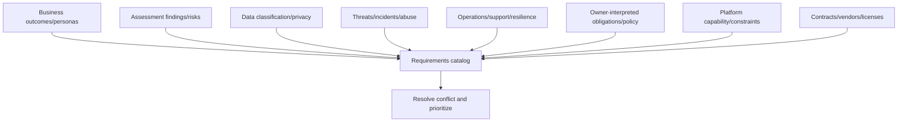

| Technique | Use | Example prompt |
|---|---|---|
| Interview | Role-specific needs and constraints | “Which decision must you make and what evidence is needed?” |
| Workshop | Resolve cross-team workflow/ownership | “Who approves, operates, responds, and accepts exceptions?” |
| Observation | Understand actual process | “Show a recent access request from start through removal.” |
| Document/evidence review | Extract current rules and gaps | “Which policy, architecture, incident, and audit evidence applies?” |
| Use-case walk-through | Capture normal behavior and edge cases | “What happens for employee, guest, admin, app, mobile and emergency?” |
| Misuse/abuse workshop | Reveal harmful or accidental paths | “How could this be bypassed, overused, or weaponized?” |
| Prototype/paper simulation | Clarify behavior before build | “How would report-only results and user prompts appear?” |
| Interface analysis | Capture suppliers and integration contracts | “What is sent, how authenticated, retried, reconciled and supported?” |

Do not copy every stakeholder wish into the baseline. Clarify source, rationale, priority, conflict, feasibility, and approver.

## 5. Write SMART and testable requirements

SMART commonly means Specific, Measurable, Achievable, Relevant, and Time-bound. Architecture requirements also need an actor/population, trigger, behavior, condition, threshold, evidence source, owner, and exception path.

| Quality | Weak | Better |
|---|---|---|
| Specific | “Improve MFA” | Require approved authentication strength for named privileged roles |
| Measurable | “Fast alerts” | Critical source health gap detected within 15 minutes |
| Achievable | “Block every attack” | Detect defined behaviors with tested response and residual risk |
| Relevant | “Collect all logs” | Collect fields needed for named detections/investigations/obligations |
| Time-bound | “Review guests” | Review every 90 days and remove denied/no-response access within 24 hours |
| Testable | “Secure sharing” | Positive/negative tests by persona, data class, device state, link type |

Use a structured form:

> **REQ-SEC-001:** For **[population]**, when **[trigger/condition]**, **[system/role]** shall **[observable behavior]** within **[threshold]**, except **[approved exception]**. Evidence shall include **[source/test]**. **[Owner]** is accountable; failure shall **[safe behavior/escalation]**.

## 6. Requirement priority and conflict

MoSCoW (Must, Should, Could, Won't for this release) can help, but a security “Must” still needs rationale and authority.

| Conflict | Example | Resolution question |
|---|---|---|
| Security vs usability | Reauthentication protects sessions but disrupts clinical workflow | Which scenario, risk, frequency, alternative and owner? |
| Privacy vs detection | Rich content improves investigation but increases monitoring exposure | What minimum metadata/content and role separation meet purpose? |
| Availability vs fail-closed | Identity dependency outage could block critical service | Which personas/data require degraded mode and compensating control? |
| Cost vs retention | Long retention aids hunting but raises ingestion/storage cost | Which sources/use cases/periods provide defensible value? |
| Standardization vs local law | One tenant policy conflicts with regional requirement | Baseline plus scoped exception or architectural boundary? |
| Speed vs quality | Renewal deadline precedes complete integration tests | Which reversible phase and residual risk can be approved? |
| Vendor limitation vs control | API lacks event/response capability | Alternate control, process, product, or accepted residual risk? |

Record the decision, not only the winning requirement.

## 7. Requirements catalog

| Field | Purpose |
|---|---|
| Requirement ID/title | Stable reference |
| Category/source | Business, finding, policy, threat, operations, vendor |
| Statement | Observable needed condition |
| Rationale/outcome | Why it matters |
| Population/scope | Personas, tenants, platforms, regions, data |
| Priority | Must/Should/Could with rationale |
| Acceptance criteria | Positive, negative, boundary, failure and operational evidence |
| Owner/approver | Accountability |
| Dependencies/constraints | What enables or limits it |
| Assumptions | What remains to validate |
| Exception | Approved deviation and residual risk |
| Design/control links | ADR/HLD/LLD elements |
| Test/evidence links | Test cases and retained result |
| Status/version | Proposed, approved, implemented, validated, retired |

Version requirements. If the population or threshold changes, assess design and test impact rather than overwriting history.

## 8. Use cases

A use case describes an actor achieving a legitimate goal through the system.

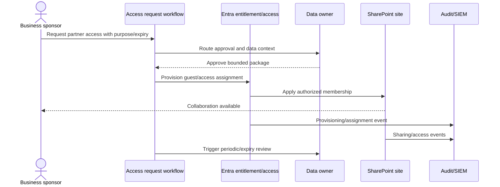

| Use-case field | Example |
|---|---|
| ID/goal | UC-EXT-01: sponsor regulated partner collaboration |
| Actors | Sponsor, data owner, guest, identity workflow, site, SOC |
| Preconditions | Approved partner, classified site, sponsor active, license/capability available |
| Trigger | Sponsor submits request |
| Main flow | Validate → approve → provision → notify → monitor → review/remove |
| Alternate flow | Privacy review or elevated-risk partner requires extra approval |
| Failure flow | Provisioning fails, access remains denied, ticket/owner alerted |
| Postcondition | Bounded access with owner, purpose, expiry, logs and review |
| Evidence | Request/approval, object IDs, assignment, audit, review/removal |

## 9. Misuse and abuse cases

A **misuse case** describes harmful incorrect use, which may be accidental or unauthorized. An **abuse case** assumes malicious intent.

| Type | Scenario | Design question |
|---|---|---|
| Misuse | Sponsor selects “Anyone” link for confidential content | Can defaults, labels and UI prevent or warn? |
| Misuse | Admin excludes a broad group from CA during troubleshooting | Is change time-bound, reviewed, monitored and rolled back? |
| Abuse | Attacker steals sponsor session and invites own guest | Require strong auth, risk/session checks, approval and anomaly detection? |
| Abuse | Malicious app uses excessive Graph permission to exfiltrate files | Consent, least privilege, app governance, logging and revoke? |
| Abuse | Insider uses eDiscovery role to search unrelated content | Role separation, case authorization, audit and review? |
| Failure abuse | Attacker causes connector failure before activity | Independent health detection and source-side evidence? |

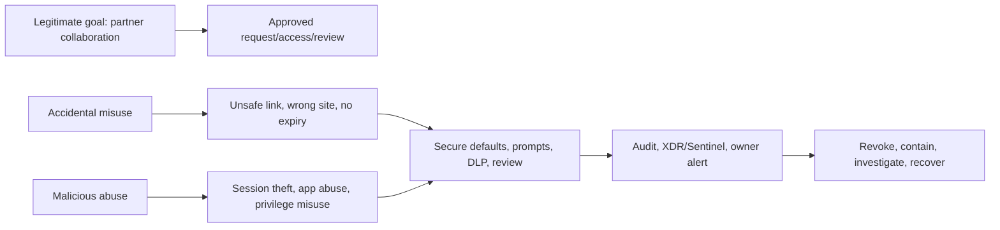

### 🔍 Plain-English deep-dive: misuse cases make “human error” designable

Saying “users should be careful” is not architecture. If a predictable interface allows a user to share the wrong data with the wrong audience, design defaults, labels, approval, least privilege, warnings, detection, and recovery around that reality. Training supports controls but does not replace safe defaults.

## 10. Traceability

Traceability protects against orphan requirements, decorative controls, and untested decisions.

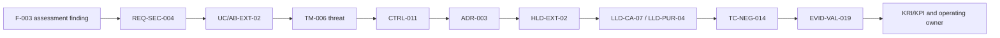

| Traceability question | Failure caught |
|---|---|
| Does every requirement have an approved source/outcome? | Gold-plated feature |
| Does every material threat have treatment or accepted risk? | Threat-model theater |
| Does every control map to a requirement/threat? | Tool sprawl |
| Does every ADR link to options and affected requirements? | Unexplained choice |
| Does every HLD element decompose into LLD detail? | Non-implementable design |
| Does every Must requirement have tests/evidence? | Unverifiable acceptance |
| Does every exception have residual risk/expiry? | Permanent bypass |
| Does every operational requirement have owner/metric/runbook? | Design thrown over wall |

## 11. Data classification as a design input

Data classification groups information by sensitivity, criticality, obligations, and handling need. The taxonomy should be understandable and linked to business owners and user journeys.

| Data class | Example | Design implications |
|---|---|---|
| Public | Published service information | Integrity, approved publication, availability |
| Internal | General operating documents | Authenticated access, sharing limits, retention |
| Confidential | Commercial, employee, partner material | Need-to-know, managed access, DLP, encryption, audit |
| Highly restricted | Health, legal privilege, credentials, security investigations | Strong role separation, minimal locations, strict sharing, enhanced audit |
| Operational telemetry | Sign-in/device/security events | Personal-data minimization, integrity, retention, analyst RBAC |
| Secrets/keys | App credentials, tokens, certificates | Never in documents/logs; managed vault, rotation, workload identity |

Classification is contextual. An IP address or user identifier may become sensitive when combined with behavior and location. The design should record data owner, purpose, source, destination, fields/content, region, processors, access, retention, deletion, and incident path.

## 12. Data-flow diagrams and trust boundaries

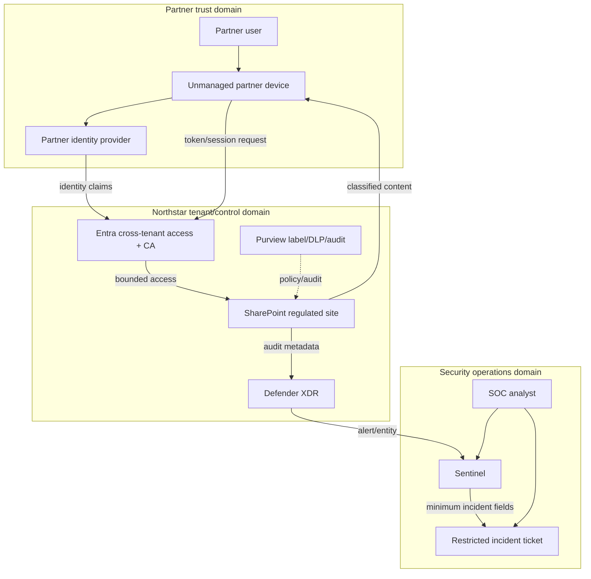

| Flow attribute | Requirement/design question |
|---|---|
| Actor and identity | Human/app/device; proofing, auth, lifecycle, tenant |
| Data element/class | Exact content/metadata/sensitivity and purpose |
| Source/destination | System, owner, region, legal role |
| Protocol/API | TLS/HTTP/Graph/webhook/connector; auth and version |
| Trust boundary | Tenant, device, privilege, network, organization, processor |
| Control | Prevent/detect/respond/recover and where enforced |
| Log | Event IDs/fields, latency, integrity, retention, access |
| Failure | Timeout, duplicate, reorder, partial success, stale token, outage |
| Reconciliation | How source and target prove consistent state |
| Deletion | How records/content expire or are defensibly retained |

## 13. Threat-modeling lifecycle

Threat modeling is a repeatable process, not a one-time brainstorming session. A common public framing is: what are we building, what can go wrong, what will we do, and did we do enough?

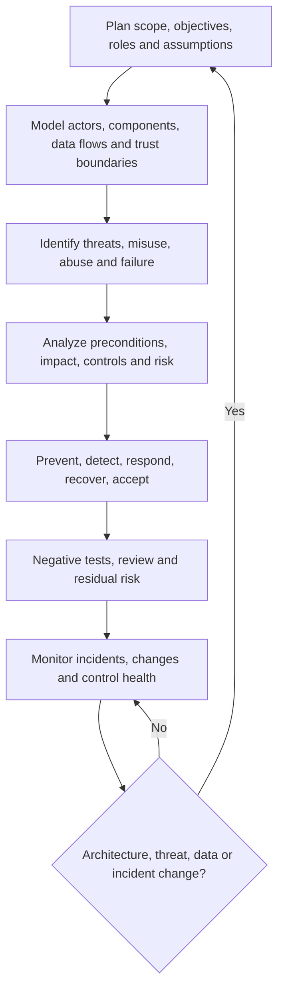

| Lifecycle input | Output |
|---|---|
| Business/use cases | Critical goals and abuse impact |
| Architecture/data flows | Components, stores, interfaces, boundaries |
| Assets/data classification | What must be protected and why |
| Threat intelligence/incidents | Relevant attacker behavior and failures |
| Requirements/constraints | Expected controls and design limits |
| Existing controls | Coverage, dependencies and weaknesses |
| Operations | Detectability, response, recovery and ownership |

Trigger re-review when a new tenant, app, connector, AI agent, data class, trust, vendor, permission, external-sharing path, authentication method, region, incident, or material platform feature changes.

## 14. STRIDE categories

STRIDE is a mnemonic used to prompt design threats. It does not calculate risk automatically.

| STRIDE | Plain meaning | Security property | M365 example | Possible controls |
|---|---|---|---|---|
| Spoofing | Pretending to be another identity | Authentication | Stolen guest/admin session | Phishing-resistant auth, risk/session checks, token protection where supported |
| Tampering | Unauthorized modification | Integrity | Alter CA policy, DLP rule, audit route | Least privilege, PIM, approvals, audit, versioning, drift detection |
| Repudiation | Denying an action without sufficient proof | Nonrepudiation/accountability | Owner denies approving external access | Immutable/audited workflow, stable IDs, time/source integrity |
| Information disclosure | Unauthorized data exposure | Confidentiality | Oversharing or broad app permission | Classification, least privilege, DLP, encryption, session controls |
| Denial of service | Preventing legitimate use | Availability | Lockout, connector flooding, vendor outage | Emergency access, rate limits, degraded mode, capacity/health monitoring |
| Elevation of privilege | Gaining greater authority | Authorization | Service principal obtains broad Graph role | Least privilege, consent governance, role separation, PIM, credential security |

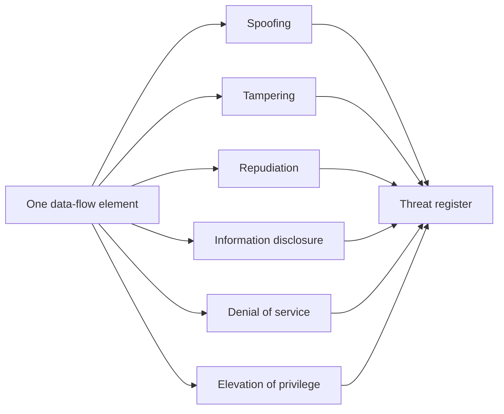

Use STRIDE per actor, process, data store, data flow, and trust boundary where relevant. Avoid generating dozens of duplicate statements with no scenario or treatment.

## 15. Threat statement quality

Use a structured threat statement:

> **TM-006:** A **[threat actor]** could **[action]** against **[asset/component/flow]** by **[precondition/path]**, causing **[business/security impact]**. Existing controls **[list]** reduce **[part]**, but **[gap/residual]** remains. Treat through **[requirements/controls/tests]**.

| Weak threat | Stronger threat |
|---|---|
| “Spoofing risk” | Stolen partner session could access a regulated site from unmanaged device because resource-tenant session controls do not cover the path |
| “Data leak” | Broad Graph application permission and long-lived secret could permit unattended export across all sites without data-owner approval |
| “No logs” | Connector/schema failure could suppress privileged-change detection while portal changes continue, delaying containment |
| “DoS” | Misconfigured broad CA policy could lock out administrators and responders during an identity incident |

## 16. Attack trees

An **attack tree** starts with an unwanted goal and breaks it into possible paths. OR means any child path can achieve the parent; AND means several conditions must combine.

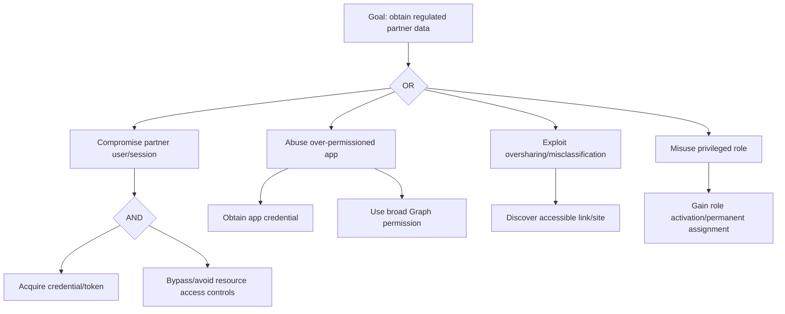

| Attack-tree use | Benefit | Caution |
|---|---|---|
| Identify alternate paths | Avoid one-control tunnel vision | Tree is not proof paths are equally likely |
| Find shared choke points | Prioritize controls covering several branches | Choke point may create availability risk |
| Design detection | Map observable events at each branch | Missing telemetry can hide path |
| Test negative cases | Turn branches into abuse tests | Use only safe/authorized simulations |
| Explain investment | Show how layered controls reduce paths | Avoid theatrical complexity |

## 17. STRIDE and MITRE ATT&CK relationship

MITRE ATT&CK is a public knowledge base of adversary tactics and techniques observed in real-world behavior. STRIDE is a design-time prompt for threat categories. They complement each other.

| Question | STRIDE | MITRE ATT&CK |
|---|---|---|
| Primary use | Identify classes of what can go wrong in a design | Describe adversary goals and techniques |
| Unit | Threat category applied to component/flow | Tactic, technique, sub-technique, procedure |
| Timing | Architecture/design review | Threat-informed defense, detection, hunting, incident analysis |
| Output | Threat statements and requirements | Technique coverage, detections, mitigations, tests |
| Limitation | Generic category, not attack prevalence | Not a complete risk or architecture method |

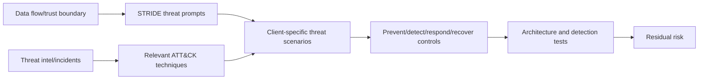

### 🔍 Plain-English deep-dive: ATT&CK mapping does not prove control coverage

Adding a technique ID to a detection or finding helps common language, but it does not prove the right data is collected, the query detects relevant procedures, entities are mapped, alerts are triaged, containment is authorized, or the risk is reduced. Validate the whole control path and preserve data/source/platform assumptions.

## 18. Threat-to-control mapping

Use layers so one control failure does not expose the whole outcome.

| Control type | Partner-data example |
|---|---|
| Govern | Data owner, access policy, exception and risk acceptance |
| Prevent | Strong authentication, bounded entitlement, safe link defaults, app least privilege |
| Detect | Sign-in risk, sharing audit, app anomaly, DLP/XDR/Sentinel analytics |
| Respond | Revoke sessions/access, disable app, contain identity/device, notify owner |
| Recover | Restore correct permissions/configuration, reissue credentials, validate evidence |
| Assure | Access reviews, known-event tests, threat-model review, metrics, independent assessment |

| Control-design question | Why it matters |
|---|---|
| Which layer enforces it? | Avoid duplicate settings assumed to combine |
| Which population is covered? | Find guests, apps, BYOD, legacy protocols, emergency accounts |
| What dependency can fail? | Identity, license, connector, vendor, network, owner |
| What event proves operation? | Design observability before deployment |
| Who can override it? | Govern exceptions and privileged paths |
| What is the safe failure mode? | Balance confidentiality, integrity and availability |
| How is target state verified? | API success is not business outcome |

## 19. Secure by design and secure by default

**Secure by design** means security requirements and threat responses are built into architecture from the start. **Secure by default** means the initial state protects users without requiring expert action. **Secure operations** sustain the control after deployment.

| Principle | Design application |
|---|---|
| Minimize attack surface | Disable unused protocols, permissions, connectors, apps and sharing paths |
| Least privilege | Narrow roles, scopes, APIs, data and time; separate duties |
| Explicit verification | Evaluate identity, device, app, data, risk and session context |
| Safe defaults | Private/restricted sharing, report-only before enforcement, no broad consent |
| Defense in depth | Prevention plus independent detection, response and recovery |
| Minimize data | Collect fields and retention required for named purpose |
| Protect secrets | Managed identities/federation/certificates; vault/rotate where secret unavoidable |
| Fail safely | Deny or degrade based on data/service criticality and approved risk |
| Make state observable | Health, audit, provenance, metrics, drift and known-event tests |
| Design for change | Version, rings, rollback, exceptions, platform-update review |

## 20. Architecture principles

Principles guide repeated choices; they are not slogans. Each should include rationale and implications.

| Principle | Rationale | Implication |
|---|---|---|
| Identity is a primary control plane | Cloud access depends on identities/tokens | Protect human and workload identities end to end |
| Data protection follows sensitivity | Location alone does not define risk | Classification/labels/access/DLP across workloads/endpoints |
| One accountable owner per control outcome | Cross-product controls otherwise fragment | RACI spans identity/device/data/SOC/vendor |
| Evidence is designed in | Unobservable controls cannot be assured | Logging fields, health, retention and tests are requirements |
| Automation earns authority gradually | Fast response can create broad harm | Dry-run, approval, idempotency, target verification, rollback |
| Platform recommendations are inputs | Context/licensing/behavior changes | ADR and validation before adoption |
| Exceptions are architecture objects | Bypasses alter the threat model | Scope, control, expiry, monitoring and residual risk |

## 21. Architecture option analysis

Compare credible alternatives, including retaining the current state. Use weighted scoring only as decision support; document the narrative and sensitivity.

| Option | Description | Strength | Tradeoff |
|---|---|---|---|
| A — Current fragmented process | Keep manual guest/site controls and existing tools | Lowest immediate change | Ownership, visibility and expiry gaps remain |
| B — Minimum baseline | Standardize Entra guest lifecycle, site defaults, audit and manual review | Faster, lower dependency | Limited dynamic risk/data context |
| C — Integrated recommended | Entitlement workflow, cross-tenant/CA, labels/DLP, XDR/Sentinel, operations | Strong end-to-end control and evidence | Licensing, integration, change and skills |
| D — Strategic adaptive | Add mature automation, exposure/data insights, advanced analytics | Faster risk response and optimization | Cost, privacy, complexity and automation governance |

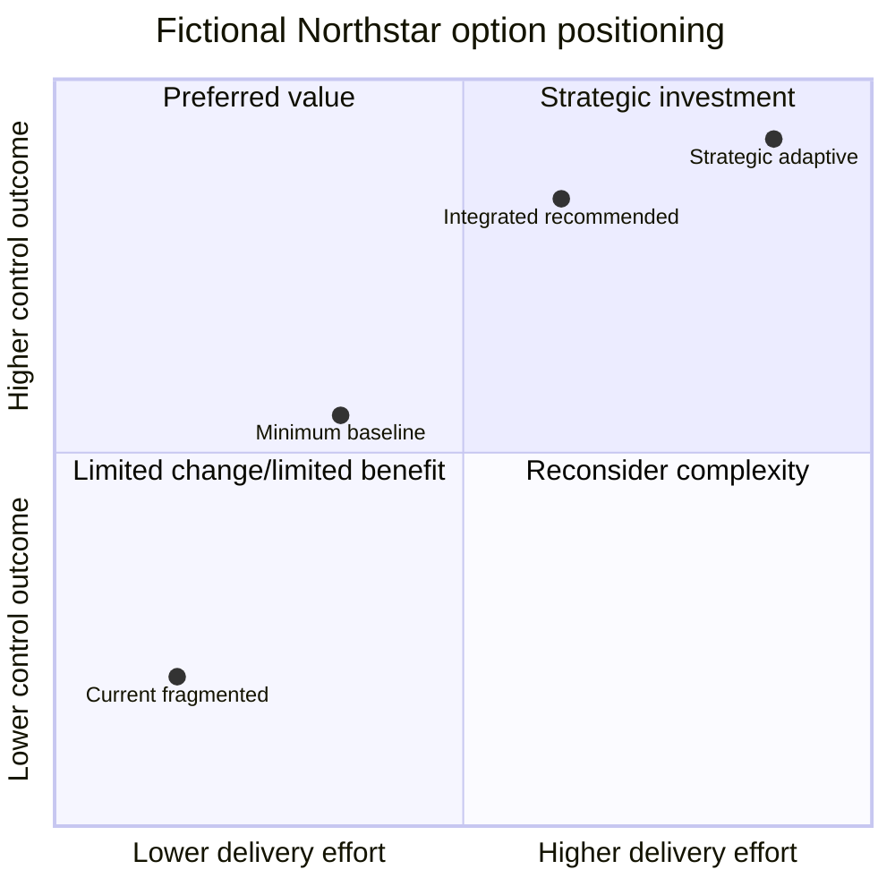

| Criterion | Example weight | Evidence question |
|---|---:|---|
| Risk reduction/coverage | 25 | Which threat branches and populations are reduced? |
| Business usability | 15 | Which collaboration journeys improve or degrade? |
| Privacy/compliance | 15 | Is processing proportionate, lawful, and auditable? |
| Operability/resilience | 15 | Can teams support, monitor, recover and exercise it? |
| Delivery feasibility | 10 | Skills, dependencies, schedule, migration and rollback? |
| Cost/licensing | 10 | Incremental license, implementation, operation and data cost? |
| Strategic fit | 10 | Aligns with platform direction and future acquisition? |

## 22. Architecture decision records

An ADR preserves why a significant decision was made so future teams do not reverse it accidentally or treat it as timeless.

| ADR field | Content |
|---|---|
| ID/title/status/date | Proposed, accepted, superseded, rejected |
| Context/problem | Outcome, findings, scope, constraints, assumptions |
| Decision drivers | Risk, privacy, operations, cost, timing, standards |
| Options considered | Including do nothing and credible alternatives |
| Decision | Clear selected option and boundaries |
| Rationale | Evidence and tradeoff |
| Consequences | Positive, negative, new risks, debt, dependencies |
| Security/privacy | Threats, controls, data implications, residual risk |
| Validation | Tests, metrics, pilot and acceptance |
| Revisit trigger | Platform, incident, cost, regulation, scale, assumption change |

### Fictional ADR example

**ADR-003:** Use Entra entitlement workflow plus resource-tenant Conditional Access and governed SharePoint site access for regulated partners; preserve two emergency collaboration procedures under time-bound exception. Do not rely only on manual site-owner invitations. Rationale: consistent sponsorship/expiry, stronger access context, auditable lifecycle, and lower orphan risk. Consequences: licensing verification, partner user-experience testing, cross-tenant settings, owner training, support runbook, and migration of existing guests.

## 23. HLD versus LLD

| Dimension | HLD | LLD |
|---|---|---|
| Primary question | What are the major design decisions and why? | Exactly how will they be configured and integrated? |
| Audience | Sponsor, architecture, security, service owners, technical leads | Engineers, testers, operators, reviewers |
| Stability | Changes when architecture/requirements change | Changes with implementation/version/configuration |
| Components | Major services, responsibilities and boundaries | Resource/object names, settings, fields, rules and parameters |
| Flows | Logical auth/data/log/incident/control flows | API endpoints, claims, connectors, tables, retries, filters |
| Controls | Objectives and placement | Exact policy, assignment, role, condition, exception |
| Decisions | Options, ADRs, tradeoffs, residual risk | Implemented consequences and dependencies |
| Tests | Acceptance strategy and scenarios | Detailed cases, fixtures, expected events and rollback |

### 🔍 Plain-English deep-dive: HLD and LLD differ by decision level, not diagram quality

An HLD says the resource tenant will evaluate partner identity, risk, device/session context and data sensitivity before access, and explains why. The LLD specifies the cross-tenant access settings, Conditional Access policy assignments/conditions/grant/session controls, groups, exclusions, label/site settings, object IDs, deployment rings, log queries and test personas. A detailed screenshot is not automatically LLD if it lacks requirement, rationale, scope, dependencies and validation.

## 24. Exact HLD contents

| HLD section | Required content |
|---|---|
| Document control | Owner, reviewers, approvers, version, status, classification |
| Executive summary | Outcome, scope, recommendation, major tradeoffs/decisions |
| Context and drivers | Business services, personas, findings, risks, obligations |
| Requirements summary | Approved functional/nonfunctional/security/privacy/operational/transition needs |
| Scope/boundaries | Organizations, tenants, workloads, data, regions, interfaces, exclusions |
| Principles/assumptions/constraints | Architecture rules and unvalidated dependencies |
| Current state | Relevant baseline and pain points, not full discovery duplicate |
| Target logical architecture | Major components, responsibilities and trust boundaries |
| Use/misuse/threat model | Critical flows, threats, attack paths and control objectives |
| Identity/RBAC | Personas, authentication, authorization, privilege and emergency access |
| Data/privacy | Classification, flows, purpose, location, access, retention and deletion |
| Integrations | System boundaries, protocols, identity and ownership |
| Logging/SecOps | Signals, detections, incidents, response and evidence |
| Resilience | Dependencies, degraded mode, RTO/RPO, recovery principles |
| Operations | RACI, support, monitoring, change, metrics and improvement |
| Options/ADRs | Alternatives, selected choices, consequences and residual risks |
| Transition | Phases, coexistence, migration, pilots, rollback, decommissioning |
| Acceptance | Requirement coverage, test strategy and quality gates |

## 25. Exact LLD contents

| LLD section | Required implementation detail |
|---|---|
| Document control/baseline | Exact environment, tenant/subscription/workspace IDs, versions, source control |
| Object/resource inventory | Names, IDs, owners, regions, tags, dependencies, lifecycle |
| Identity/authentication | User/workload flows, claims, methods, strengths, token/session behavior |
| Authorization/RBAC | Roles, scopes, groups, PIM, managed identities, service principals, negative permissions |
| Policy definitions | Assignments, conditions, grant/session controls, exclusions, order/precedence, modes |
| Data configuration | Labels, rules, locations, encryption, retention, field minimization |
| Integration contract | Endpoint/API/version/schema/auth/permission/timeout/retry/idempotency/reconciliation |
| Network | DNS, proxy, firewall, URL/port, private/public path, certificate/TLS dependencies |
| Logging | Sources, event IDs/tables/fields, timestamps, latency, retention, access, health |
| Detection/automation | Query/rule/entity/severity/grouping, playbook identity/actions/approvals/rollback |
| Resilience | Failure modes, fallback, queue/buffer/replay, RTO/RPO, emergency path |
| Environments/rings | Dev/test/pilot/prod assignments, promotion, drift and rollback |
| Migration/coexistence | Mapping, sequence, duplicate-control handling, cutover/decommission |
| Test cases | Positive, negative, boundary, exception, performance, failure, recovery, privacy |
| Runbooks/operations | Monitoring, alert, triage, escalation, change, backup, review and ownership |
| Known limitations | Platform/license/preview/region gaps, residual risk and approved exceptions |

## 26. Target architecture views

Use a coordinated view set rather than one overloaded diagram.

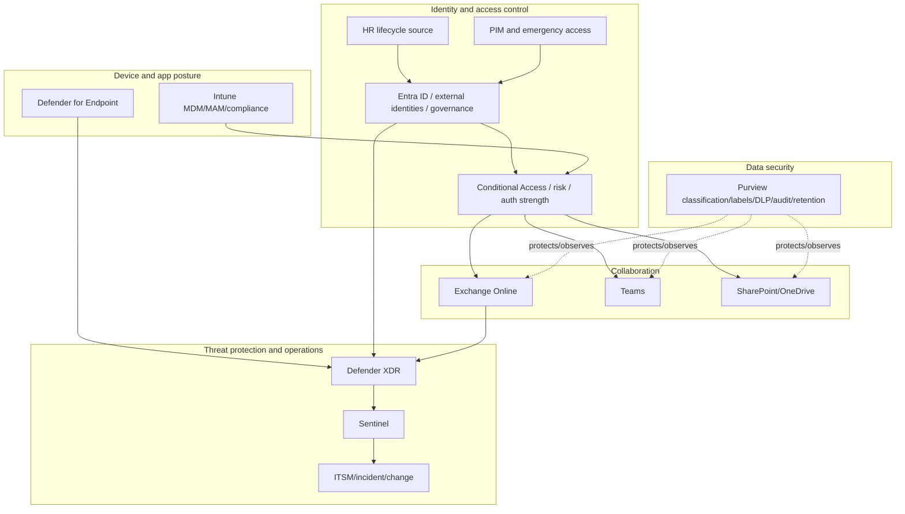

| View | Required decision |
|---|---|
| Context | Who interacts with which business/security systems? |
| Logical | Which major control components and ownership domains? |
| Deployment | Which tenants, regions, subscriptions, workspaces and environments? |
| Authentication | How are human/workload identities verified and sessions controlled? |
| Data | What data moves, why, where, under which trust and lifecycle? |
| Logging/incident | How does evidence become detection, case, action and verification? |
| RBAC | Who can read, change, approve, respond and accept risk at each scope? |
| Transition | How do current and target coexist, cut over, roll back and retire? |

## 27. RBAC and privileged design

**Role-based access control (RBAC)** assigns permissions to roles at defined scopes. Least privilege covers function, data, scope, time, condition, and separation of duties.

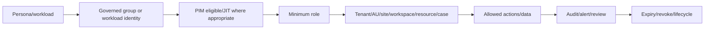

| Persona | Needed action | Design control |
|---|---|---|
| M365 service admin | Configure owned workload | Workload-specific role, PIM, change approval |
| SOC L1 | Read/triage incidents | Reader/responder scope; no policy administration |
| SOC L2/IR | Contain approved targets | Time-bound response role and approval by action risk |
| Purview investigator | Work within authorized case | Case-scoped role group and audit |
| Data owner | Approve access/label exception | Business workflow role, not tenant admin |
| Detection engineer | Author rules in dev/test | Controlled prod pipeline, no broad response target rights |
| Automation | Query/act on named resources | Managed identity/federation, narrow API roles |
| Emergency admin | Recover tenant | Separate monitored cloud-only accounts and tested procedure |

Test negative permissions: what the role must not see or do. Cumulative roles, nested groups, Graph permissions, inherited Azure roles, and case/workspace scope can exceed the intended matrix.

## 28. Integration design

Every integration is a contract and failure boundary.

| Contract field | Example question |
|---|---|
| Business purpose/owner | Which decision/process needs this data/action? |
| Source/destination | Exact tenant, resource, system, region and owner? |
| Interface/version | Graph endpoint, webhook, syslog/CEF, connector, API lifecycle? |
| Identity/authentication | Managed identity, workload federation, certificate, secret? |
| Authorization | Exact scopes/app roles/resource roles and admin consent? |
| Data/schema | Fields, types, IDs, classification, minimization, version? |
| Frequency/latency | Event, batch, polling, SLO and clock handling? |
| Reliability | Timeout, retry/backoff, idempotency, duplicate, order, dead letter? |
| Reconciliation | How source/target detect missing or inconsistent state? |
| Security/privacy | TLS, encryption, key, region, retention, subprocessor, audit? |
| Operations | Health, owner, SLA, runbook, support escalation, change notice? |
| Exit | Export, revoke, rotate, delete, decommission and evidence? |

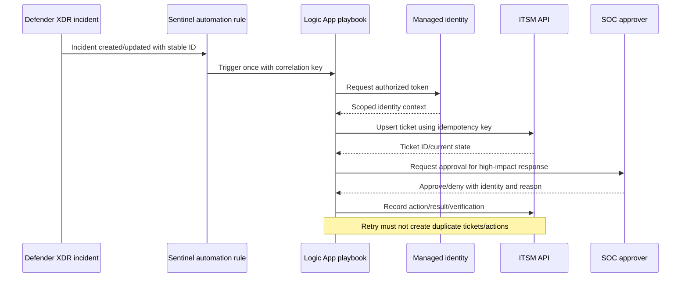

## 29. Logging and observability design

**Observability** means having enough evidence to understand state, behavior, health, and failure. Collecting every available log is neither affordable nor privacy-safe.

| Logging requirement | Design detail |
|---|---|
| Use case | Detection, investigation, audit, health, performance, compliance |
| Source | Authoritative producer and expected event |
| Identity/provenance | Tenant, resource, object, user/app/device, event/correlation ID |
| Time | Source UTC time, ingestion time, clock quality, late-arrival handling |
| Schema | Required fields/types/nulls/version and raw/normalized mapping |
| Quality SLO | Freshness, completeness, validity, uniqueness |
| Protection | Access, immutable/audit needs, integrity, classification |
| Retention | Interactive/archive/lake period from purpose/obligation |
| Health | Known-event, last-seen, volume, errors, schema drift, cost |
| Response | Detection, severity, owner, SLA, runbook, target verification |

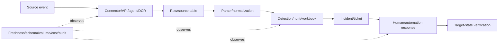

## 30. Resilience and failure-mode design

Design both ordinary component failures and dangerous partial successes.

| Failure | Safe design question | Example response |
|---|---|---|
| Identity provider/federation unavailable | Who must continue and under what reduced trust? | Tested cloud-only emergency access |
| CA policy misconfiguration | How prevent tenant lockout? | Report-only, exclusions, test personas, rings, rollback |
| Device signal stale | Fail closed, limited session, or alternate proof? | Risk/data-persona-specific decision |
| Connector/data gap | How detect blindness independently? | Known-event SLO and source-side monitoring |
| Automation timeout | Can retry duplicate containment/tickets? | Idempotency key, state read, bounded retry |
| Vendor API throttles | Queue/backoff/dead letter/manual path? | Alert and reconcile after recovery |
| Region/service outage | Minimum viable operations and evidence? | Manual runbook, alternate comms, RTO/RPO |
| License removed/expired | Which controls silently stop or degrade? | Entitlement monitoring and renewal gate |
| Owner leaves | Who reviews exceptions/access/actions? | Backup owner and lifecycle automation |
| Partial migration | Which product is authoritative? | Coexistence matrix, one control owner, rollback |

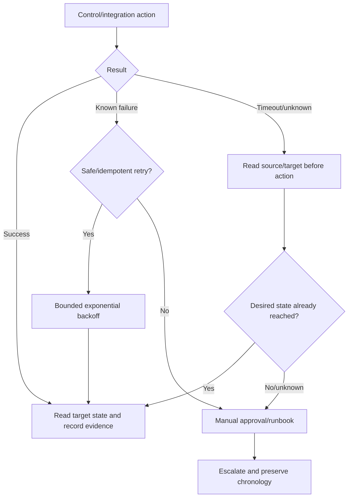

### 🔍 Plain-English deep-dive: a timeout is not proof that nothing happened

An API may complete the action but lose the response. Blind retry can disable an account twice, create duplicate incidents, or repeat a destructive step. Use a correlation/idempotency key, read current target state, make actions safely repeatable where possible, and route uncertain high-impact states to a human.

## 31. Assumptions, constraints, dependencies, and exceptions

| Type | Northstar example | Design treatment |
|---|---|---|
| Assumption | All regulated partner sites can be identified by label/catalog | Validate inventory before assignment |
| Constraint | No raw clinical content in Sentinel | Use metadata/classification signals and restricted investigation path |
| Dependency | HR/vendor sponsor feed provides active relationship/expiry | Data contract, health SLO, manual fallback |
| Dependency | Required Entra/Purview capabilities licensed for target personas | Current entitlement verification and option variants |
| Exception | Two emergency collaboration channels bypass normal workflow | Time-bound approval, stricter monitoring, review and residual risk |
| Limitation | Partner device claims vary across organizations | Cross-tenant trust criteria plus session restriction/alternate control |

Every item has owner, validation/expiry date, consequence if false/fails, and affected requirements/ADRs/tests.

## 32. Design review process

```mermaid
flowchart LR
    DRAFT[Requirements/threats/options/draft design] --> SELF[Author traceability/self-review]
    SELF --> TECH[Platform/integration review]
    TECH --> SEC[Security/threat review]
    SEC --> PRIV[Privacy/data/compliance-owner review]
    PRIV --> OPS[Operations/support/resilience review]
    OPS --> TEST[Test/migration/rollback review]
    TEST --> ARCH[Architecture governance/ADR decision]
    ARCH --> RISK[Residual-risk/exception approval]
    RISK --> BASE[Approved versioned baseline]
```

| Reviewer | Challenge |
|---|---|
| Business/data owner | Does design support critical use and impact? |
| Platform owner | Is behavior feasible/current and supportable? |
| Security architect | Are threats, control layers, privilege and failure addressed? |
| Privacy/legal/compliance owner | Is data processing minimized, authorized, retained and transparent? |
| SOC/operations | Are signals, cases, response authority, runbooks and staffing real? |
| Identity/integration engineer | Are auth, APIs, permissions, schemas and lifecycle correct? |
| Test/change lead | Are acceptance, rings, migration, rollback and negative tests sufficient? |
| Finance/licensing/procurement | Are persona entitlements, contracts, renewals and cost assumptions current? |

Review comments need stable IDs, owner, severity/materiality, response, evidence, disposition, approver, and affected version. “Reviewed” is not the same as approved.

## 33. Design quality gates

| Gate | Exit criteria |
|---|---|
| Requirements | Approved, testable, prioritized, no unresolved Must conflict |
| Context/data | Personas, systems, data classes, flows, regions and owners validated |
| Threat | Critical trust boundaries/use/misuse/STRIDE/attack paths treated or accepted |
| Options | Credible alternatives and do-nothing compared with tradeoffs |
| Decision | ADRs approved with consequences and revisit triggers |
| HLD | Major components, controls, operations, transition and residual risk complete |
| LLD | Implementable object/policy/interface/log/failure/test detail complete |
| Security/privacy | Least privilege, minimization, secrets, exceptions and assurance accepted |
| Operations | RACI, health, SLA, support, runbooks, metrics and skills ready |
| Test/transition | Positive/negative/failure/recovery/privacy/ring/rollback evidence planned |
| Traceability | No orphan Must requirement, critical threat, control, exception or test |
| Approval | Named business, technical, security, privacy, operations and risk decisions recorded |

## 34. Requirements-to-test traceability

| Requirement type | Minimum tests |
|---|---|
| Functional | Main, alternate, boundary and error flows |
| Security | Positive authorized, negative unauthorized, abuse, privilege and bypass |
| Privacy | Minimum fields, access separation, purpose, retention/deletion and audit |
| Performance | Load, latency, throttling, backoff and capacity threshold |
| Availability | Dependency outage, degraded mode, RTO/RPO and emergency access |
| Operational | Health alert, ticket, SLA, handoff, target verification, PIR |
| Transition | Pilot, coexistence, duplicate control, cutover, rollback, decommission |
| Exception | Approved scope only, monitoring, expiry, residual-risk review |

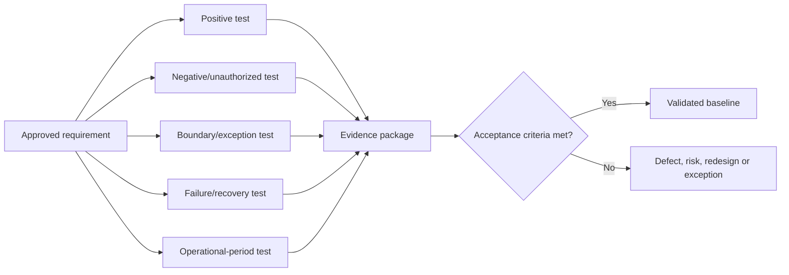

## 35. Design troubleshooting

| Symptom | Likely design defect | Check |
|---|---|---|
| Teams implement different interpretations | Requirement ambiguous or missing owner | Actor/condition/threshold/evidence/exception |
| Control blocks valid users | Persona/use/alternate flow incomplete | Use-case and policy-evaluation matrix |
| Threat model has hundreds of rows | Duplicate categories without scenarios/prioritization | Consolidate by asset/path/control objective |
| HLD cannot become tasks | Missing decomposition/interfaces/decisions | HLD-to-LLD trace and object inventory |
| LLD is screenshots | No versioned settings/rationale/tests | Structured policy/interface definition |
| Integration duplicates actions | No idempotency/reconciliation design | Correlation key and target-state read |
| Logs exist but cannot investigate | Missing stable IDs/fields/time/provenance | Event contract against use case |
| Privacy rejects late | Data purpose/fields/access/retention omitted | Add privacy requirement and flow review early |
| Operations refuses handover | No owner/health/SLA/runbook/skills | Operational readiness requirements |
| License blocks implementation | Entitlement assumption not validated | Persona/capability/current Product Terms check |
| Exception becomes normal path | Default unusable or governance weak | Revisit requirement/design and expiry trend |
| Test passes but risk remains | Acceptance tested setting, not outcome/path | Trace to misuse/threat and end-to-end control |

## 36. Fictional Northstar target architecture

The assessment findings from Part 54 drive these target outcomes:

1. Govern privileged access and emergency recovery.
2. Reconcile device trust before broad access enforcement.
3. Provide sponsored, time-bound external collaboration.
4. Apply classification and proportionate data controls across collaboration and endpoints.
5. Correlate identity, endpoint, email, app and data signals.
6. Prove Sentinel source/detection/automation health end to end.
7. Clarify client/MSSP incident authority and target verification.

### Sample requirements

| ID | Requirement | Acceptance summary |
|---|---|---|
| REQ-ID-001 | Defined human privileged roles use eligible/time-bound activation and approved auth strength, except emergency accounts | Full assignment export, activation/review sample, negative test, emergency test |
| REQ-DEV-002 | Access policy uses a reconciled authoritative device population and explicit unmanaged-device path | Inventory match target, persona What If/sign-in tests, stale-object test |
| REQ-EXT-003 | Regulated guest access has sponsor, owner, purpose, package, expiry and periodic review | End-to-end synthetic lifecycle and removal evidence |
| REQ-DATA-004 | Confidential data is labeled and blocked/warned according to approved user/device/share scenarios | Synthetic documents and positive/negative policy tests |
| REQ-XDR-005 | Critical cross-domain incidents have one owner and verified containment actions | Safe synthetic incident chronology and approval/target-state evidence |
| REQ-SIEM-006 | Critical connectors and rules meet freshness/run health SLO with independent gap alert | Known-event trace and simulated connector/rule failure |
| REQ-OPS-007 | MSSP/client authority, severity, SLA, handoff and escalation are unambiguous | Tabletop and signed RACI/runbook acceptance |

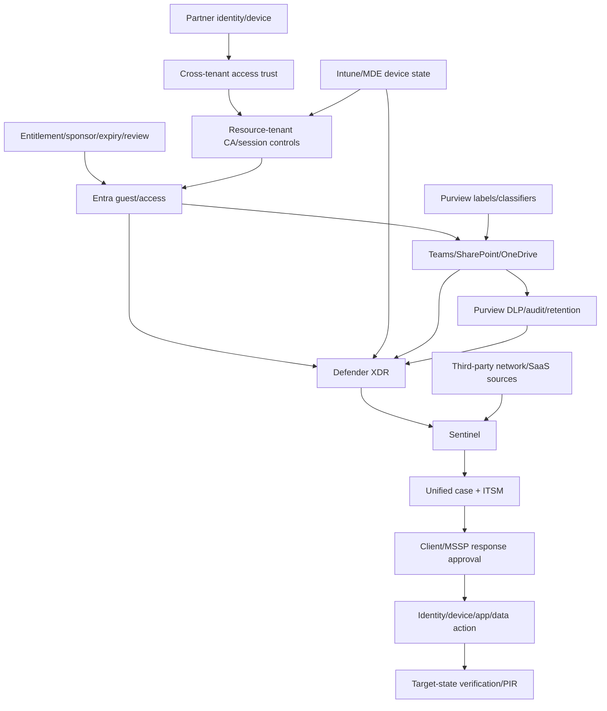

### Target control layers

| Layer | Target decision |
|---|---|
| Governance | Named business/security/technical/operations owners and risk acceptance |
| Identity | Phishing-resistant privilege, lifecycle governance, cross-tenant controls, emergency access |
| Device | Reconciled state, compliance/app protection, endpoint health and explicit BYOD path |
| Collaboration | Site/team lifecycle, safe sharing defaults, restricted access and owner reviews |
| Data | Classification, labels, DLP, retention, audit, privacy role separation |
| Threat protection | XDR product coverage, entity correlation, response authority and validation |
| SIEM/SOAR | Known-event health, normalized data, tuned detections, approval-based automation |
| Operations | RACI, severity/SLA, runbooks, change, metrics, incident learning and vendor governance |

## 37. Northstar transition design

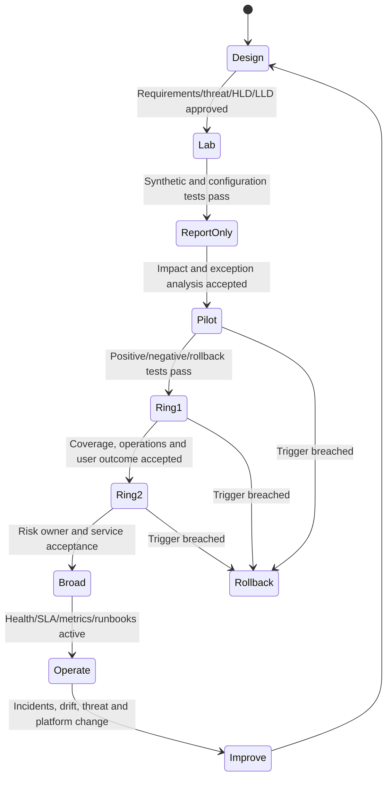

| Transition concern | Design requirement |
|---|---|
| Current guest population | Reconcile sponsors/owners/expiry before migration |
| Existing CA policies | Map overlap, report-only comparison and deterministic rollback |
| Device unknowns | Resolve authoritative state before access expansion |
| Duplicate detections | One incident owner and dedup/coexistence matrix |
| Legacy DLP/sharing | Simulation and user-journey comparison before enforcement |
| MSSP runbook | Tabletop and authority acceptance before automation |
| License timing | Verify current entitlements/trials and no control cliff |
| Communication/training | Persona-specific messages, support scripts and feedback |

## 38. Safe paper exercise and portfolio artifact

This exercise uses only fictional Northstar information. Do not configure a tenant, create users/apps/policies, enable licenses/trials, generate attack traffic, upload sensitive data, call live APIs, or copy client screenshots. Label product behavior and licensing “verify current.”

### Exercise tasks

1. Create a catalog of at least 40 requirements: business, functional, nonfunctional, security, privacy, compliance, operational, resilience, commercial, and transition.
2. Give every requirement source, rationale, population, priority, acceptance, owner, dependency, assumption, design and test links.
3. Write six detailed use cases and twelve misuse/abuse cases across privileged access, guests, devices, data, apps, incidents, and automation.
4. Build context, logical, deployment, authentication, data, logging/incident, RBAC, and transition diagrams.
5. Create a data inventory/flow table with purpose, classification, fields, regions, roles, retention and deletion.
6. Run STRIDE across critical processes, stores, flows and trust boundaries; consolidate into 20 client-specific threat statements.
7. Create three attack trees and map relevant MITRE ATT&CK techniques only where they improve scenario/control understanding.
8. Build a threat/control register covering prevent, detect, respond, recover and assure.
9. Compare current, minimum, recommended and strategic architecture options; run sensitivity discussion rather than claim exact mathematics.
10. Write at least eight ADRs with options, consequences, residual risk, validation and revisit triggers.
11. Produce an HLD using every exact-content row in section 24.
12. Produce an LLD outline and five detailed implementation sheets for CA, guest governance, Purview DLP, Sentinel health and incident automation.
13. Create positive, negative, boundary, privacy, failure, recovery, transition and operational tests for every Must requirement.
14. Simulate design-review comments from business, platform, security, privacy, SOC, test, finance and vendor roles.

```mermaid
flowchart LR
    REQS[01 Requirements/traceability] --> CASES[02 Use/misuse/abuse]
    CASES --> FLOWS[03 Architecture/data/trust views]
    FLOWS --> TM[04 STRIDE/attack trees/ATT&CK]
    TM --> CTRL[05 Threat-control register]
    CTRL --> OPT[06 Options/ADRs]
    OPT --> HLD[07 HLD]
    HLD --> LLD[08 LLD sheets]
    LLD --> TEST[09 Test/evidence matrix]
    TEST --> REVIEW[10 Review comments/approval/honesty]
```

### Portfolio validation matrix

| Test | Expected |
|---|---|
| Requirement says “secure/fast/available” only | Reject; add observable threshold and evidence |
| Control has no requirement/threat | Remove or justify through traceability |
| Threat says only “spoofing” | Add actor, action, asset, path, impact and treatment |
| ATT&CK ID used as proof | Require data, detection, response and outcome tests |
| Diagram omits data/trust arrows | Add flow labels, boundaries, controls and failures |
| Option analysis omits do nothing | Add it with risk/consequence |
| ADR lacks negative consequences | Rework tradeoff and revisit trigger |
| HLD includes exact portal clicks only | Move implementation detail to LLD |
| LLD is screenshots without object IDs/settings | Replace with structured, versioned definitions |
| API timeout automatically retried | Add target-state read/idempotency/human path |
| Privacy review occurs after approval | Move into requirement, flow and threat reviews |
| Test covers only authorized success | Add unauthorized, exception, failure and operation |
| Real tenant/client data appears | Remove and use fictional/synthetic evidence |

### Reusable templates

| Template | Key fields |
|---|---|
| Requirements catalog | ID/type/source/statement/rationale/population/priority/acceptance/owner/links |
| Use/misuse case | Actor/goal/precondition/main/alternate/failure/postcondition/evidence |
| Data flow | Data/purpose/class/source/destination/region/trust/control/log/retention |
| Threat register | Actor/action/asset/path/impact/control/risk/owner/test/residual |
| Attack tree | Goal/OR/AND paths/preconditions/observables/controls |
| Control map | Objective/prevent/detect/respond/recover/assure/owner/dependency |
| Option matrix | Drivers/options/evidence/benefit/tradeoff/risk/cost/sensitivity |
| ADR | Context/drivers/options/decision/rationale/consequence/risk/test/revisit |
| HLD checklist | Exact section 24 contents and approvals |
| LLD sheet | Object/settings/interface/identity/data/log/failure/test/rollback/owner |
| Traceability matrix | Finding/requirement/threat/control/ADR/HLD/LLD/test/evidence/metric |
| Review log | Reviewer/comment/materiality/response/disposition/approval/version |

## 39. Operations, metrics, and design maintenance

| Metric | Design question |
|---|---|
| Requirement coverage | Are all Must requirements linked to approved design and test? |
| Threat disposition | Are critical threats mitigated, transferred, avoided or accepted? |
| Orphan count | Any control, design element, test or exception without trace? |
| Review defects | Which ambiguity/security/privacy/operations issues escaped earlier gates? |
| Assumption age | Which unvalidated belief can invalidate the design? |
| Exception age | Which deviation is nearing expiry or becoming normal? |
| Test pass/coverage | Positive/negative/failure/operation by material requirement |
| Architecture drift | Does deployed/current behavior differ from approved baseline? |
| Control health | Is logging, source, policy, identity and automation functioning? |
| Outcome/KRI | Is risk exposure, incident or user-friction trend improving? |

Review architecture after incidents, material platform/license changes, new integrations, acquisitions, new data/AI uses, audit findings, scale changes, vendor changes, and failed resilience exercises.

## 40. Tradeoffs a senior consultant should articulate

| Tradeoff | Decision framing |
|---|---|
| Preventive friction vs risk | Persona/data/threat-specific enforcement and user outcome |
| Central control vs local ownership | Enterprise baseline plus scoped decision rights and exceptions |
| Rich telemetry vs privacy/cost | Named use cases, minimum fields, tiered retention, restricted roles |
| Automation speed vs blast radius | Confidence, action impact, approval, idempotency, rollback |
| Fail closed vs availability | Criticality, data sensitivity, degraded mode, residual risk |
| Native integration vs best-of-breed | Capability, data, operations, exit, lock-in and total cost |
| HLD simplicity vs LLD precision | Layer documents and preserve traceability |
| Current feasibility vs strategic target | Phased architecture with foundations and no dead-end quick fixes |

## 41. From design to Part 56 controls and roadmap

Part 56 uses the requirements, threat/control mapping, ADRs, HLD/LLD, dependencies and residual risks to map target controls to current product capabilities and licenses, prioritize work, estimate total cost and benefits, and create a decision-ready roadmap and business case.

```mermaid
flowchart LR
    REQ[Approved requirements] --> CTRL[Target control objectives/layers]
    TM[Threat model/residual risks] --> CTRL
    ADR[Options/ADRs] --> CAP[Capability choices]
    HLD[HLD target architecture] --> CAP
    LLD[LLD prerequisites/dependencies] --> CAP
    CTRL --> P56[Part 56]
    CAP --> P56
    P56 --> LIC[Persona/license mapping]
    P56 --> PRIOR[Prioritization]
    P56 --> ROAD[Roadmap/cost/business case]
```

## 42. JD Mapping: interview translation

| Interview theme | Your real foundation | Honest architecture translation |
|---|---|---|
| Requirements | Clarified impact, scope, environment and success in support | Structured multi-category testable requirements |
| Flows | Traced M365, auth, sync, sharing and migration dependencies | Data/auth/log/incident/trust-boundary diagrams |
| Threats | RCA and security-aligned troubleshooting | Misuse/abuse, STRIDE, attack trees and control layers |
| Options | Coordinated workaround/fix/product-team choices | ADR with do-nothing/minimum/recommended/strategic tradeoffs |
| Validation | Reproduced issues and verified fixes | Requirement-to-positive/negative/failure/operation tests |
| Vendors | Precise cross-team escalation and evidence | Integration contract, responsibility and failure design |
| Documentation | Technical guidance, RCA and handover | HLD/LLD, traceability, review comments and operating design |
| Honesty | Technical advisory, not enterprise architect claim | Fictional design pack and explicit validation boundaries |

## Official Source Anchors

These sources support the public design and threat-modeling concepts in this chapter. Verify current Microsoft product behavior, feature status, licenses, API contracts, cloud/region availability and client standards before implementation.

1. [Microsoft Security Development Lifecycle](https://www.microsoft.com/securityengineering/sdl) — public secure development and threat-modeling principles.
2. [Microsoft Threat Modeling Tool overview](https://learn.microsoft.com/azure/security/develop/threat-modeling-tool) — data-flow-based threat modeling and STRIDE-oriented analysis.
3. [Microsoft threat modeling guidance](https://learn.microsoft.com/security/engineering/threat-modeling-aim) — public threat-modeling practice and lifecycle guidance.
4. [Microsoft Azure Well-Architected Framework: Security](https://learn.microsoft.com/azure/well-architected/security/) — security design principles, tradeoffs and recommendations.
5. [Microsoft Zero Trust guidance](https://learn.microsoft.com/security/zero-trust/) — verify explicitly, least privilege and assume breach across pillars.
6. [Microsoft Cybersecurity Reference Architectures](https://learn.microsoft.com/security/adoption/mcra) — public architecture views across Microsoft security capabilities.
7. [Microsoft identity architecture design](https://learn.microsoft.com/security/zero-trust/deploy/identity) — identity Zero Trust planning and deployment guidance.
8. [Microsoft logging and threat detection guidance](https://learn.microsoft.com/azure/well-architected/security/monitor-threats) — security monitoring and response design considerations.
9. [NIST SP 800-160 Vol. 1 Rev. 1](https://csrc.nist.gov/pubs/sp/800/160/v1/r1/final) — systems security engineering principles.
10. [NIST Secure Software Development Framework SP 800-218](https://csrc.nist.gov/pubs/sp/800/218/final) — secure development practice framework.
11. [NIST Privacy Framework](https://www.nist.gov/privacy-framework) — privacy-risk management in system and data design.
12. [MITRE ATT&CK](https://attack.mitre.org/) — tactics, techniques and public adversary-behavior knowledge base.
13. [OWASP Threat Modeling Process](https://owasp.org/www-community/Threat_Modeling_Process) — public “what are we building/what can go wrong/what will we do/did we do enough” framing.
14. [OWASP Application Security Verification Standard](https://owasp.org/www-project-application-security-verification-standard/) — public security-requirement and verification reference for applications.
15. [CISA Secure by Design](https://www.cisa.gov/securebydesign) — public secure-by-design/default principles and manufacturer guidance.
16. [Microsoft Architecture Decision Records guidance](https://learn.microsoft.com/azure/well-architected/architect-role/architecture-decision-record) — public ADR purpose and structure.

## ⭐ Likely Interview Questions for This Section

### Q1. How do you turn an assessment finding into a security design?

**Model answer:** I trace the finding to business outcome and control objective, then write testable functional, security, privacy, operational and transition requirements. I model use/misuse, data flows and trust boundaries; identify STRIDE and relevant ATT&CK-informed scenarios; map layered controls; compare credible options including do nothing; capture the decision in an ADR; express major intent in HLD and implementable detail in LLD; and link every Must requirement to positive, negative, failure, operational and rollback evidence.

### Q2. What makes a requirement testable?

**Model answer:** It identifies population/actor, trigger and conditions, observable behavior, threshold or time, accountable owner, exception/failure behavior, and evidence. It has a rationale and source and avoids vague words such as secure, fast or highly available unless defined. For privileged access, I specify roles, authentication strength, PIM behavior, emergency exceptions, logs, review period, and positive/negative persona tests.

### Q3. How do use, misuse, and abuse cases differ?

**Model answer:** A use case describes an intended actor reaching a legitimate goal. A misuse case describes harmful incorrect or unauthorized behavior that may be accidental. An abuse case assumes malicious intent. I model all three because safe defaults and recovery must handle predictable mistakes as well as attackers. Each scenario feeds requirements, threats, controls, logs and tests.

### Q4. How do STRIDE and MITRE ATT&CK work together?

**Model answer:** STRIDE is a design-time mnemonic for spoofing, tampering, repudiation, information disclosure, denial of service and elevation of privilege across components and flows. ATT&CK is a knowledge base of adversary tactics and techniques. I use STRIDE to find design threat classes and ATT&CK/intelligence/incidents to enrich plausible attacker behavior and detection needs. Neither is a risk score or proof of control coverage.

### Q5. What is the difference between HLD and LLD?

**Model answer:** HLD explains what major components, boundaries, flows, control objectives, options, operations and transition are chosen and why. LLD specifies exactly how: object IDs/names, assignments, settings, roles/scopes, API/schema/auth, log fields, retries, failure behavior, environments, tests, rollback and runbooks. HLD supports architecture decisions; LLD supports implementation and reproducible validation, with traceability between them.

### Q6. What belongs in an architecture decision record?

**Model answer:** ID/status/date, context, scope, requirements and constraints, decision drivers, credible options including do nothing, selected decision, evidence/rationale, positive and negative consequences, security/privacy/residual risk, dependencies, validation, and revisit triggers. An ADR records a decision; it does not replace the detailed design.

### Q7. How do you design a secure integration and its failure behavior?

**Model answer:** I define purpose/owner, source/destination/region, API/version, workload identity and least privilege, schema/classification/minimization, latency, timeout, bounded retry/backoff, idempotency, duplicate/order handling, reconciliation, health, logging, retention, SLA, manual fallback and exit. For timeout/unknown results I read target state before retrying high-impact actions and preserve a correlation key and human escalation path.

### Q8. What is your honest security architecture experience?

**Model answer:** I have not been the accountable enterprise architect for the full Microsoft security stack or authored a Deloitte HLD/LLD. My production M365 advisory work includes dependency and flow analysis, RCA, vendor coordination, validation, documentation and stakeholder communication. I built a fictional, traceable requirements/threat/HLD/LLD pack and would validate live platform behavior, client standards, licensing, privacy, operations and residual risk under the firm's approved process.

## 🧠 30-Second Memory Hooks

- **Architecture is a chain of justified decisions, not a product picture.**
- **Finding → requirement → threat → control → ADR → HLD → LLD → test.**
- **Requirement = what must be true plus proof.**
- **Categories:** business, functional, nonfunctional, security, privacy, compliance, operations, resilience, transition, commercial.
- **Vague “secure/fast/available” is not testable.**
- **Use case = intended; misuse = wrong; abuse = malicious.**
- **Human error is a design input; secure defaults reduce it.**
- **Traceability prevents orphan features, controls and tests.**
- **Classify data before choosing controls and telemetry.**
- **Trust boundary means trust must be re-evaluated.**
- **Threat model:** build, break, treat, validate, repeat on change.
- **STRIDE:** spoof, tamper, repudiate, disclose, deny, elevate.
- **Threat statement needs actor, action, asset, path, impact and treatment.**
- **Attack tree shows alternate OR paths and combined AND conditions.**
- **ATT&CK describes behavior; it does not prove coverage.**
- **Layer:** govern, prevent, detect, respond, recover, assure.
- **Secure by design starts early; secure by default protects initial state.**
- **Options include do nothing, minimum, recommended and strategic.**
- **ADR = context, options, choice, consequences, test, revisit.**
- **HLD = what/why; LLD = exactly how.**
- **RBAC includes action, data, scope, time, condition and separation.**
- **Integration is a contract and failure boundary.**
- **Timeout is unknown, not “nothing happened.”**
- **Observability is designed, not added after deployment.**
- **Exceptions change the threat model.**
- **Every Must gets positive, negative, failure and operation tests.**
- **Your bridge:** dependency/RCA/validation work → traceable security design.
- **Honesty:** fictional architecture pack, not production ownership claim.

## Completion Checklist

- [ ] I can explain requirement, constraint, assumption, dependency, use/misuse/abuse case, threat model, trust boundary, HLD, LLD, ADR and traceability from zero.
- [ ] I can trace a design decision back to a business outcome, assessment finding and control objective.
- [ ] I can elicit business, functional, nonfunctional, security, privacy, compliance, operational, resilience, transition and commercial requirements.
- [ ] I can write a requirement with population, trigger, behavior, threshold, evidence, owner, failure and exception.
- [ ] I can resolve security/usability, privacy/detection, availability/fail-closed, cost/retention and vendor/control conflicts transparently.
- [ ] I can maintain a versioned requirements catalog with priority and approval.
- [ ] I can write main, alternate, failure and postcondition use-case flows.
- [ ] I can model accidental misuse and deliberate abuse rather than blame users.
- [ ] I can build finding-to-requirement-to-threat-to-control-to-test traceability.
- [ ] I can use data classification to drive access, protection, telemetry, retention and privacy.
- [ ] I can draw context, logical, deployment, authentication, data, logging/incident, RBAC and transition views.
- [ ] I can label data, purpose, trust changes, controls, logs, failures and owners on flows.
- [ ] I can run the threat-model lifecycle and define change triggers.
- [ ] I can apply STRIDE to actors, processes, stores, flows and trust boundaries.
- [ ] I can write client-specific threat statements instead of category labels.
- [ ] I can build an attack tree with meaningful OR/AND paths and controls.
- [ ] I can distinguish STRIDE design prompts from MITRE ATT&CK behavior knowledge.
- [ ] I never use an ATT&CK mapping as proof of effective detection/control.
- [ ] I can map threats to govern/prevent/detect/respond/recover/assure layers.
- [ ] I can apply secure-by-design, secure-by-default, least privilege, minimization and safe-failure principles.
- [ ] I can write architecture principles with rationale and implications.
- [ ] I can compare current, minimum, recommended and strategic options with narrative tradeoffs.
- [ ] I can write ADRs including negative consequences, residual risk and revisit triggers.
- [ ] I can explain HLD versus LLD by decision and implementation level.
- [ ] I can produce every exact HLD content area in section 24.
- [ ] I can produce every exact LLD content area in section 25.
- [ ] I can design RBAC for human and workload personas with negative permission tests.
- [ ] I can define integration identity, API, schema, latency, retry, idempotency, reconciliation, health, support and exit.
- [ ] I can specify logging purpose, fields, stable IDs, time, quality, retention, access, health and response.
- [ ] I can design emergency access, degraded mode, manual fallback, RTO/RPO, replay and recovery tests.
- [ ] I treat timeout/unknown outcomes safely before retrying high-impact actions.
- [ ] I can manage assumptions, constraints, dependencies, exceptions and limitations with owners/dates/impact.
- [ ] I can run cross-functional design reviews and preserve comment disposition.
- [ ] I can apply requirements, threat, option, HLD, LLD, privacy, operations, test, traceability and approval gates.
- [ ] I can create positive, negative, boundary, privacy, failure, recovery, transition and operational tests.
- [ ] I completed the fictional Northstar target-architecture pack without a tenant or client data.
- [ ] My diagrams and templates label assumptions and “verify current” product/license details.
- [ ] I can answer Q1-Q8 aloud without claiming enterprise architecture ownership I do not have.
- [ ] I will use approved firm/client architecture methods rather than imply this public guide is Deloitte methodology.

*Next suggested section:* [Part 56](Part-56-target-controls-licensing-roadmaps-business-case.md)