# Part 56 — Target Controls, Licensing, Prioritization, Roadmaps, and Business Cases

> **Section goal:** Build a beginner-first, consulting-grade method for converting validated findings and target architecture into owned controls, capability and license choices, a dependency-aware roadmap, a defensible cost model, measurable outcomes, and an executive decision paper. By the end, you should be able to trace finding to risk to control objective; organize control families and defense layers; assign business, technical, operational, data, privacy, vendor, and risk owners; map requirements to current Microsoft and third-party capabilities by persona; reason about E3, E5, add-ons, suites, trials, prerequisites, and service dependencies without making stale entitlement claims; identify gaps, compensating controls, and residual risk; prioritize by risk, value, effort, urgency, confidence, and dependency; distinguish quick wins, foundations, and strategic change; build waves, milestones, critical paths, resources, and quality gates; model license, implementation, operations, data-ingestion, and lifecycle cost; present benefits and avoided-loss limitations honestly; define KPIs, KRIs, baselines, targets, and review cadence; and produce a safe fictional roadmap and business case.

This Part maps directly to the role's expectations for Microsoft 365 security transformation, control design, licensing guidance, target-state planning, third-party integration, executive advisory, cost/value communication, roadmap development, stakeholder ownership, and risk treatment. Your production strengths in technical advisory, escalations, RCA, service-quality reporting, business reviews, stakeholder and vendor coordination, fix validation, documentation, automation, and customer handover transfer well. Your discipline of connecting symptoms to causes and validating outcomes becomes the discipline of connecting investments to risks, requirements, dependencies, operating ownership, and measurable evidence.

> **Method boundary:** This chapter is general public consulting, security-engineering, portfolio-planning, and business-case guidance. It does not describe or imply Deloitte's internal, confidential, or proprietary methodologies, pricing models, value frameworks, templates, or approval processes. Real work must use approved firm/client methods, contracts, Product Terms, service descriptions, privacy/legal advice, procurement data, financial assumptions, risk methods, and quality review.

> **Licensing and commercial currency warning (August 24, 2026):** Microsoft product names, bundles, prerequisites, included rights, step-up paths, trials, promotional offers, metering, capacity, data-retention allowances, cloud/region availability, and Product Terms change. “E3,” “E5,” “E5 Security,” “E5 Compliance,” “Defender,” “Purview,” “Intune,” “Entra,” “Sentinel,” and “Security Copilot” labels do not by themselves prove a user's, device's, workload's, tenant's, or scenario's entitlement. Verify the current Product Terms, Microsoft 365 service descriptions, Learn prerequisites, tenant configuration, geography/cloud, agreement, renewal date, reseller/LSP guidance, and a dated commercial quote. This chapter intentionally contains no price list and no definitive feature-by-SKU matrix.

## JD Mapping

| Role expectation | Capability developed here | Portfolio evidence |
|---|---|---|
| Recommend target security controls | Trace findings/risks/requirements to layered controls and owners | Control catalog and coverage map |
| Advise on Microsoft licensing | Map persona/use case/capability/prerequisite to current entitlement evidence | Dated licensing assumptions register |
| Build transformation roadmaps | Prioritize and sequence foundations, quick wins, pilots, scale, and operations | Wave roadmap and critical path |
| Develop business cases | Compare options, TCO, benefits, limitations, residual risk, and decisions | Executive decision paper |
| Coordinate vendors and products | Identify capability overlap, integration, coexistence, contracts, and gaps | Dependency and supplier matrix |
| Report outcomes | Define baselines, targets, KPIs, KRIs, control health, and review | Benefits-realization scorecard |
| Manage risk and exceptions | Assign authorized treatment/acceptance and expiry | Residual-risk/exception register |
| Enable delivery and handover | Add resources, milestones, quality gates, validation, support, and adoption | Integrated roadmap and operating acceptance |

## Candidate honesty note

You can credibly discuss production Microsoft 365 technical advisory, escalation and RCA, coordinating product groups/vendors/stakeholders, validating fixes and service recovery, documenting recommendations, reviewing KPIs and customer outcomes, and supporting business reviews. You can translate those strengths into evidence-led prioritization, dependency management, measurable acceptance, and executive communication.

You should not claim to have negotiated Microsoft licensing, approved a client investment, built a Deloitte financial model, guaranteed savings, implemented the fictional roadmap, or owned production Entra/Intune/Purview/Defender/Sentinel transformation unless separately evidenced. Safe wording is:

> “My production experience is Microsoft 365 technical advisory and escalation engineering, including RCA, cross-team and vendor coordination, fix validation, documentation, KPI reviews, and customer communication. I built a fictional control and roadmap pack that traces findings to risks, requirements, capabilities, persona-level licensing assumptions, dependencies, costs, benefits, KPIs/KRIs, residual risk, and executive decisions. I do not treat a SKU name or trial as verified entitlement, and I would validate current Product Terms, service descriptions, tenant/cloud/region, agreement and commercial quote with authorized licensing and procurement specialists before recommendation.”

---

## 1. The decision chain: finding to outcome

A roadmap is not a list of products with dates. A defensible investment chain starts with a validated condition and ends with measurable operation and explicit residual risk.

```mermaid
flowchart LR
    FIND[Validated finding/evidence] --> RISK[Credible risk/service consequence]
    RISK --> OBJ[Control objective]
    OBJ --> REQ[Testable requirements]
    REQ --> CTRL[Layered target controls]
    CTRL --> CAP[Capability/process/people options]
    CAP --> LIC[Persona entitlement/prerequisite check]
    LIC --> PLAN[Priority, dependency and roadmap]
    PLAN --> COST[Cost/resource/business case]
    COST --> DEC[Executive decision]
    DEC --> DELIVER[Design/pilot/deploy/operate]
    DELIVER --> MEASURE[Validation, KPI/KRI and residual risk]
```

| Weak roadmap item | Why weak | Stronger form |
|---|---|---|
| “Enable E5” | Bundle is not an outcome | Deploy named control capabilities for defined personas after current entitlement/prerequisite verification |
| “Improve identity security” | No population, control, owner, or test | Remove standing privilege and implement time-bound activation/authentication/review for named roles |
| “Onboard Sentinel” | No data use case, cost, or operation | Onboard named sources with schema/health SLO, detections, case ownership, retention and cost controls |
| “Quick win: block legacy auth” | May cause outage | Discover use, report, remediate dependencies, pilot, enforce, monitor and roll back |
| “Save $2M in breaches” | Avoided loss is uncertain | Present scenario assumptions/range and distinguish risk reduction from booked savings |

### 🔍 Plain-English deep-dive: buying capability is not realizing control

A license can grant the right to use a feature. The control still needs prerequisites, design, configuration, data, deployment, adoption, monitoring, response, support, tuning, evidence, and ownership. A fire-suppression system in a warehouse has no value if it is uninstalled, untested, disconnected, or nobody responds to alarms. Track entitlement, implementation, operation, and outcome as separate states.

## 2. Control objectives and target controls

A **control objective** states the risk-reducing outcome. A **target control** is the intended people/process/technology mechanism in the future state. Target controls should remain understandable if product names change.

| Layer | Privileged-access example |
|---|---|
| Finding | Permanent role assignments and incomplete review evidence |
| Risk | Compromised/stale admin account enables persistent tenant control |
| Objective | Privileged access is necessary, strongly authenticated, time-bound, approved, monitored, reviewed, and recoverable |
| Prevent | Role reduction, eligible activation, auth strength, admin workstation/session control |
| Detect | Role/activation/change alerts and anomaly detection |
| Respond | Disable/revoke/contain, emergency process, investigation ownership |
| Recover | Restore trusted access/configuration and rotate credentials |
| Assure | Full-population reconciliation, recurring review, tests and metrics |

## 3. Control families

Families organize coverage and ownership. Framework names may differ; use an explicit local catalog.

| Family | Objective examples | Microsoft 365 context |
|---|---|---|
| Governance/risk | Policies, ownership, exceptions, review, assurance | Security governance, Secure Score interpretation, risk register |
| Asset/configuration | Know and control identities, devices, apps, data, tools | Entra/Intune/MDE/app/site/license inventories |
| Identity/access | Authenticate, authorize, govern and recover | Entra MFA/auth strengths, CA, PIM, lifecycle, apps, guests |
| Endpoint | Manage posture, prevent/detect/respond | Intune, Defender for Endpoint, encryption, ASR, updates |
| Collaboration | Secure mail, meetings, sharing and apps | Exchange/MDO, Teams, SharePoint, OneDrive |
| Data/privacy | Classify, protect, retain, investigate proportionately | Purview labels, DLP, retention, audit/eDiscovery, risk solutions |
| Threat protection | Correlate and respond across domains | Defender XDR suite and exposure management |
| Security operations | Collect, detect, investigate, automate and improve | Sentinel, KQL, analytics, workbooks, playbooks, health |
| Resilience | Maintain/recover critical control and access | Emergency accounts, manual fallback, RTO/RPO, service health |
| Supplier/integration | Govern third parties, APIs, contracts and exit | MSSP, connectors, Graph apps, coexistence and migration |

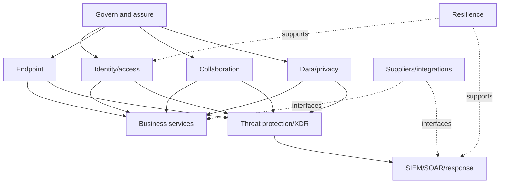

## 4. Control layers and defense in depth

| Layer | Purpose | Failure if used alone |
|---|---|---|
| Governance | Define objective, owner, policy, risk and exception | Paper control without operation |
| Preventive | Stop/reduce unwanted action | Bypass, misconfiguration, unknown path |
| Detective | Identify suspicious/control-failure events | Alert without response or missing data |
| Responsive | Contain/remediate and communicate | Excess authority or unverified action |
| Recovery | Restore trusted service/data/control | Recovery plan untested |
| Assurance | Test design, coverage, operation and outcome | Point-in-time confidence decays |

Avoid duplicate controls that fail together. For example, a detection and its health alert should not depend on the same broken data path without independent source monitoring.

## 5. Control ownership

One person rarely owns every control task, but one accountable owner should own the control outcome.

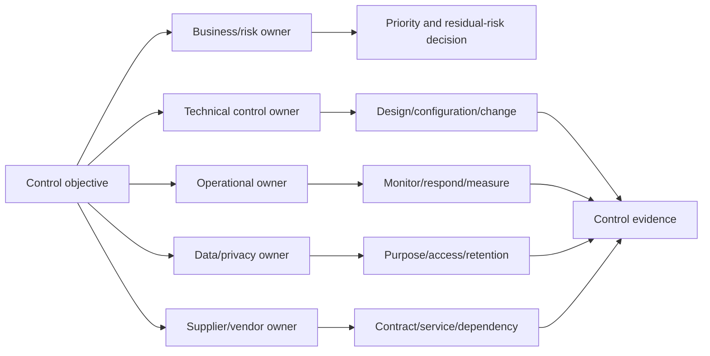

| Owner | Accountability |
|---|---|
| Business/service owner | Criticality, outcome, funding, disruption and benefit |
| Risk owner | Treatment/acceptance and residual risk |
| Control owner | End-to-end control design and effectiveness |
| Technical owner | Platform configuration, integration, change and remediation |
| Operational owner | Health, queue, response, SLA, runbook and improvement |
| Data/privacy owner | Purpose, classification, access, retention, transfer and proportionality |
| Product/licensing owner | Entitlement evidence, renewal, assignment and commercial dependency |
| Vendor manager | Contract, SLA, data/access, escalation, IP and exit |
| Assurance owner | Independent test, evidence and issue closure criteria |

## 6. Build the target-control catalog

| Field | Purpose |
|---|---|
| Control ID/title/family | Stable reference and grouping |
| Objective/risk | Why it exists |
| Requirements/threats | Design traceability |
| Population/data/services | Exact coverage |
| Prevent/detect/respond/recover/assure | Layered mechanism |
| Business/control/technical/operations owners | Accountability |
| Capability/product/process | How outcome may be delivered |
| Prerequisites/dependencies | What must be ready first |
| License/contract evidence | Current dated source and affected personas |
| Implementation state | Planned, designed, piloted, deployed, operating, validated |
| Validation | Positive/negative/coverage/failure/operation tests |
| Metrics | Baseline, target, KPI/KRI, health and cadence |
| Exceptions/residual risk | Deviations and authorized decisions |
| Cost/resource | Build/run/change and source |

## 7. Capability mapping before licensing

A **capability** is an ability needed to achieve an outcome, such as phishing-resistant privileged authentication, device-risk-informed access, content-aware sharing prevention, or cross-domain incident response. Map capability before SKU.

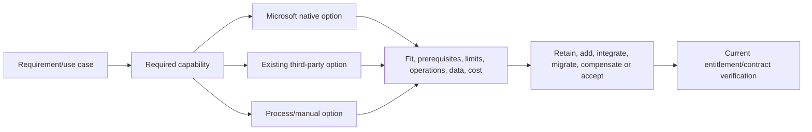

| Capability field | Example |
|---|---|
| Use case/persona | Privileged administrator activation |
| Control outcome | Time-bound, approved, strong-auth privileged access |
| Candidate capability | Entra Privileged Identity Management and authentication strengths |
| Current alternative | Manual ticket + permanent role + third-party MFA |
| Functional fit | Role eligibility, activation, approval, MFA, alerts, review |
| Prerequisites | Identity state, role design, groups, emergency access, operations |
| Limits | Role/scope/feature behavior, cloud/tenant availability, integration |
| Data/privacy | Activation/audit identity and justification data |
| Operability | Ownership, SLA, alert review, emergency procedure |
| Entitlement | Verify current plan/add-on/persona/service terms |
| Validation | Lab/pilot, negative role tests, audit and review evidence |

## 8. Persona-based licensing

Licensing analysis starts with **who or what uses or benefits from a capability**, under which terms, not with “buy E5 for everyone.” A persona is a group with similar job, risk, device, data, and capability needs.

| Persona | Typical needs to validate | Licensing questions |
|---|---|---|
| Standard knowledge worker | Email/collaboration, baseline identity/device/data protection | Base plan, endpoint/app model, add-on applicability |
| Frontline worker | Shared/mobile devices, limited apps, identity and app protection | Frontline-specific plan rights and device/user assignment |
| Privileged admin | PIM, strong auth, admin workstation, monitoring | User eligibility and security add-on/suite prerequisites |
| Executive/high-risk user | Enhanced identity/email/data/incident protections | Priority protection and covered service rights |
| Contractor/guest | External identity, app/site access, review, session/data controls | External-user/monthly-active-user terms and resource-tenant features |
| Investigator/compliance | Audit/eDiscovery/insider-risk/data investigation | Role/user/capacity and case-feature requirements |
| SOC analyst | Defender/Sentinel/Security Copilot portals, data and actions | Product access, Azure roles, consumption/capacity and source licenses |
| Endpoint-only user/device | MDM/MAM/MDE/endpoint controls | Per-user/per-device and platform prerequisites |
| Workload identity/app | App governance, workload protection, API | Workload/resource/service licensing distinct from human user |

### 🔍 Plain-English deep-dive: “the feature is in E5” is not a licensing conclusion

The client may own a suite, an add-on, a step-up, an equivalent bundle, a frontline or government plan, a trial, or different rights under a contract. A feature can also require a base plan, covered user population, Azure consumption, data capacity, a companion service, specific configuration, or licensing of users who benefit indirectly. Record the use case and persona, then obtain dated authoritative evidence and specialist confirmation.

## 9. E3, E5, add-ons, suites, and trials as concepts

This table deliberately avoids a definitive feature matrix.

| Concept | Plain meaning | Planning use | Caveat |
|---|---|---|---|
| Microsoft 365 E3 | Broad enterprise productivity/management/security foundation bundle | Establish current base capability and gaps | Exact included rights change; verify current terms |
| Microsoft 365 E5 | Broader enterprise suite generally adding advanced security/compliance/analytics/voice capabilities | Compare broad strategic coverage | Not every tenant/persona needs or can use every capability |
| E5 Security add-on | Advanced security capability bundle added to eligible base licensing | Security-focused step-up option | Validate exact prerequisites, users and included products |
| E5 Compliance add-on | Advanced compliance/data-governance capability bundle | Compliance-focused step-up option | Validate exact solution/persona rights and data prerequisites |
| Individual add-on | License one product/capability rather than broad suite | Target a bounded persona/use case | Complexity and cross-capability prerequisites may grow |
| Suite/sub-suite | Bundled set with integrated value | Simplify broad capability coverage | Bundle overlap and shelfware risk |
| Trial | Time-limited evaluation right | Validate capability and adoption safely | Not production funding, renewal, support or permanent entitlement |
| Consumption/capacity | Pay for usage/storage/compute/capacity | Sentinel, Logic Apps, Copilot or data workloads may add variable cost | License alone may not cover usage |

Do not design a control whose only operating period is a trial unless an approved expiry/continuity decision exists.

## 10. Licensing evidence register

| Field | Example |
|---|---|
| Capability/use case | Risk-based Conditional Access for privileged admins |
| Personas/count source | 420 admins from reconciled identity/HR role population |
| Current entitlement | Client-provided agreement/tenant assignment, dated |
| Candidate plan/add-on | Verify-current option, not guide assertion |
| Prerequisites | Base license, Entra configuration, roles, data/signals |
| Assignment rule | Which users/devices/workloads require rights and why |
| Service/cloud/region | Public cloud UK/EU tenant; verify availability |
| Source links/version | Product Terms, service description, Learn, quote date |
| Specialist confirmation | Authorized licensing/procurement owner and date |
| Commercial assumption | Unit rate/discount/term/currency/tax from quote only |
| Expiry/revisit | Renewal, trial, product change or architecture trigger |
| Confidence/limitation | Open interpretation or count uncertainty |

## 11. Prerequisites and dependencies

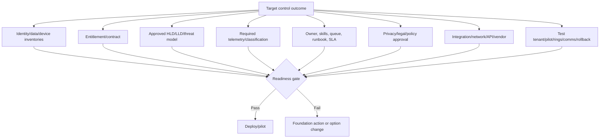

| Dependency type | Example | Failure if ignored |
|---|---|---|
| Identity | Accurate groups/personas and emergency accounts | Wrong policy assignment/lockout |
| Device | Reconciled Intune/Entra/MDE state | False trust or user disruption |
| Data | Classification and owner | DLP noise or missed sensitive data |
| Telemetry | Connector/schema/retention | Detection and evidence gaps |
| Architecture | Target flows/RBAC/integration decisions | Conflicting controls |
| Licensing | Entitlement for covered population | Control unavailable or noncompliant use |
| Operations | Queue, skills, SLA, runbooks | Alerts/actions not handled |
| Privacy/legal | Purpose, proportionality, retention, role separation | Harmful/unapproved monitoring |
| Vendor | API, contract, support, migration, exit | Blocked integration or lock-in |
| Change | Pilot, communication, rollback | Outage and adoption failure |

## 12. Product fit, overlap, and gaps

| Decision | When appropriate | Evidence needed |
|---|---|---|
| Retain existing tool | It meets objectives, integrates, operates, and offers value | Control/test/contract/cost/roadmap evidence |
| Add Microsoft capability | Fills validated gap with manageable dependencies | Fit, entitlement, deployment and operations |
| Integrate both | Complementary data/control/response roles | No duplicate action, schema, owner and SLA contract |
| Migrate | Target has accepted parity/improvement and transition path | Mapping, pilot, coexistence, rollback, retention, exit |
| Compensate | Preferred control infeasible temporarily | Same risk coverage, operation, expiry, residual risk |
| Accept | Treatment cost/disruption exceeds risk within appetite | Authorized owner, rationale, monitoring and review |
| Avoid | Stop risky activity/service | Business consequence and decommission evidence |

A roadmap should not assume native consolidation is always best. Evaluate functionality, architecture, telemetry quality, response, privacy, sovereignty, integrations, contracts, skills, support, resilience, migration, exit, and TCO.

## 13. Control gaps and compensating controls

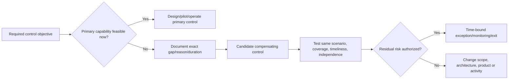

| Compensating-control quality | Question |
|---|---|
| Objective alignment | Does it address the same risk event and consequence? |
| Coverage | Does it reach all affected personas/assets/data? |
| Independence | Will it survive failure of the primary path? |
| Timeliness | Does prevention/detection/response happen soon enough? |
| Evidence | Can design and recurring operation be proven? |
| Sustainability | Are staffing, cost, skill and vendor dependencies viable? |
| Expiry | Is it temporary with an exit, or approved target state? |
| Residual risk | What exposure remains and who accepts it? |

## 14. Prioritization dimensions

| Dimension | Question | Example scale warning |
|---|---|---|
| Risk/materiality | Which threat/consequence/control gap is reduced? | Ordinal high is not a monetary amount |
| Value | Security, resilience, compliance, productivity, insight, simplification? | Avoid double-counting benefits |
| Urgency | Incident, audit, renewal, end-of-support, exposure, dependency window? | Deadline alone does not make design sound |
| Effort | Design, engineering, migration, data, change, training, support? | Include internal and vendor work |
| Dependency/readiness | What must precede or can unblock other work? | Foundations may rank high despite indirect benefit |
| Confidence | How strong are finding, cost, fit and benefit assumptions? | Keep separate from risk |
| Reversibility | Can it be piloted/rolled back safely? | Irreversible change needs stronger evidence |
| Coverage | How many critical personas/assets/use cases? | Volume alone does not equal materiality |

### 🔍 Plain-English deep-dive: priority is not “highest risk first” in isolation

A high-risk item may need months of identity cleanup before safe enforcement. A lower-effort inventory foundation may unblock several high-risk controls. Another issue may need immediate containment while strategic remediation follows later. Prioritization should show risk, urgency, value, effort, dependencies, confidence, and sequencing rather than collapse judgment into one mysterious score.

## 15. Priority matrices

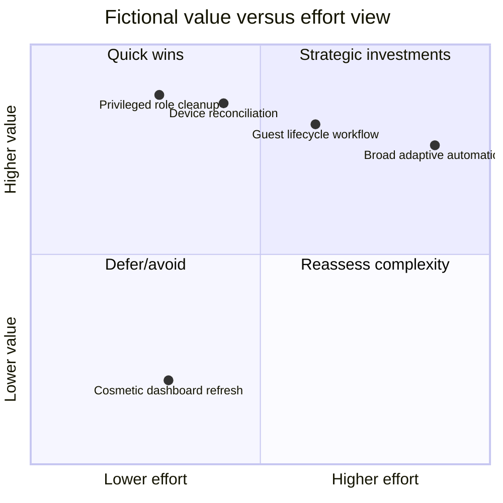

| Matrix | Use | Limitation |
|---|---|---|
| Risk vs effort | Identify material feasible treatments | Hides value/dependency/urgency |
| Value vs effort | Communicate portfolio efficiency | “Value” may be subjective/double-counted |
| Urgency vs readiness | Separate urgent containment from ready deployment | Low readiness still needs foundation plan |
| Dependency vs impact | Find foundational enablers | Foundation benefit may be indirect |
| Confidence vs commitment | Choose discovery/pilot before large spend | Low confidence is not low importance |
| Reversibility vs blast radius | Set approval/testing depth | Some low-blast changes still privacy-sensitive |

Use matrices as views, not automatic decision engines. Preserve narrative and authorized judgment.

## 16. Quick wins, foundations, and strategic work

| Type | Definition | Northstar example | Quality gate |
|---|---|---|---|
| Immediate containment | Reduce active material exposure now | Remove confirmed stale privileged assignment | Owner approval and recovery check |
| Quick win | High value, bounded effort, low dependency, reversible | Assign owners/expiry to external-sharing exceptions | Full population and no hidden workflow impact |
| Foundation | Enables several controls and reduces uncertainty | Reconcile identity/device/app/data inventories | Authoritative source and operating owner |
| Core control deployment | Implement target control outcome | Privileged PIM/auth/review design | HLD/LLD, pilot, negative tests, runbook |
| Strategic transformation | Cross-domain operating/technology change | Unified data/XDR/Sentinel response model | Business case, architecture, resources, phased acceptance |
| Continuous improvement | Tune and adapt after go-live | Detection precision, DLP tuning, access-review quality | Baseline/target and review cadence |

A “quick win” that can lock out users, delete data, change retention, or trigger containment broadly is not quick merely because the portal setting is easy.

## 17. Roadmap architecture

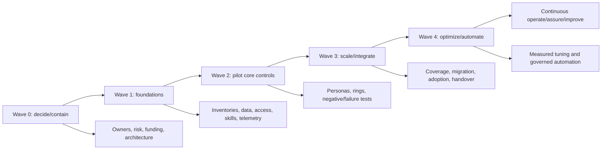

| Wave | Objective | Exit evidence |
|---|---|---|
| 0 — Decide/contain | Confirm risk owners, stop known exposure, fund/design program | Decisions, containment verification, charter |
| 1 — Foundations | Reconcile populations, owners, data, entitlement, architecture, operations | Readiness gates and approved HLD/LLD |
| 2 — Pilot | Validate controls with representative personas and safe scenarios | Positive/negative/failure/rollback/user results |
| 3 — Scale/integrate | Expand rings, migrate/coexist, train, hand over and validate coverage | Coverage, acceptance, service health, residual risk |
| 4 — Optimize | Tune quality/cost, add safe automation and advanced capabilities | Outcome trends, controlled automation, benefits review |
| Operate | Monitor, respond, assure, review exceptions and adapt | SLA/KPI/KRI, tests, PIRs, roadmap refresh |

## 18. Milestones and acceptance

A milestone is a verified decision or outcome, not “90% complete.”

| Milestone | Acceptance evidence |
|---|---|
| Control objective approved | Risk/business/control owner decision |
| Current entitlement verified | Dated Product Terms/service description/agreement/quote confirmation |
| HLD approved | Architecture/security/privacy/operations decisions and residual risk |
| LLD ready | Implementable objects, integration, failure, test and rollback detail |
| Pilot ready | Personas/data/support/comms/environment and no unresolved critical dependency |
| Pilot accepted | Positive/negative/failure/privacy/user/rollback criteria pass |
| Production ring accepted | Coverage, incidents, health, support and risk owner approval |
| Operational handover | RACI, access, monitoring, runbooks, SLA, training and ownership |
| Benefit checkpoint | Baseline/target data and attribution limitations reviewed |
| Legacy retirement | Replacement coverage, retention, contract/data/access cleanup and rollback window complete |

## 19. Critical path and dependency management

The **critical path** is the sequence of dependent activities that determines the earliest possible completion date. Resource constraints can create additional criticality.

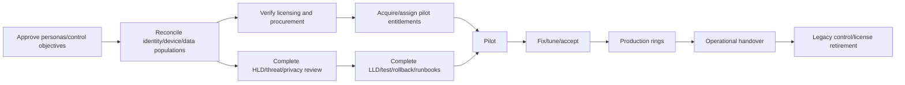

| Dependency field | Example |
|---|---|
| Provider/consumer | Procurement provides licenses to pilot workstream |
| Needed outcome | Correct entitlements assigned to 100 pilot personas |
| Earliest/latest date | Before test window; renewal decision deadline |
| Lead time | Contract/approval/assignment propagation |
| Evidence | Tenant assignment and authorized commercial confirmation |
| Failure impact | Pilot slip; trial cliff; invalid control test |
| Mitigation | Paper test, alternate existing entitlement, phased persona |
| Owner/escalation | Licensing owner, sponsor and supplier route |

## 20. Resource and capacity planning

| Role/capacity | Work |
|---|---|
| Sponsor/program lead | Decisions, funding, scope, escalations and benefits |
| Security architect | Requirements, threats, controls, ADR/HLD and assurance |
| Entra/Intune/M365/Purview/Defender/Sentinel engineers | LLD, implementation, testing and support |
| SOC/detection/IR | Use cases, data, rules, response, exercises and tuning |
| Privacy/legal/compliance | Purpose, obligations, monitoring, retention, exceptions |
| Change/adoption/service desk | Personas, communication, training, feedback and support |
| Product/licensing/procurement | Entitlement, agreement, quote, vendor and renewal |
| Test/change/release | Environments, cases, CAB, rings, rollback and evidence |
| Data/FinOps | Ingestion, retention, capacity, allocation, forecast and benefit data |
| Vendor/MSSP | Integration, SLA, migration, handover, IP and exit |

Account for business-owner time, after-hours change, on-call, training, operational tuning, and backfill. A roadmap can be financially approved and still fail from unavailable people.

## 21. Total cost of ownership

**Total cost of ownership (TCO)** includes acquiring, implementing, operating, changing, and eventually retiring a capability.

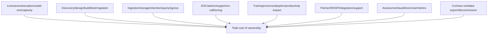

| Cost category | Model input | Source |
|---|---|---|
| User/device/workload license | Persona count, plan/add-on, term, unit quote | Dated agreement/quote |
| Consumption/capacity | Units/hours/runs/capacity | Current product pricing and measured pilot |
| Sentinel ingestion | GB/day by source/table, tier, commitment | Measured source/pilot and current pricing |
| Retention/archive/lake | GB/TB-month, period, query/restore/jobs | Data policy and current regional rates |
| Logic Apps/automation | Runs/actions/connectors/plan | Pilot telemetry and current rates |
| Implementation | Role × hours/rate by phase | Delivery estimate/contract |
| Migration/coexistence | Dual run, mapping, agent/tool conflicts, testing | Migration plan and vendor input |
| Operations | FTE/on-call/vendor service, tuning, review, training | Operating model and salary/service inputs |
| Change/productivity | Training, help desk, disruption, adoption | Change plan and pilot evidence |
| Exit/decommission | Export, retention, contract termination, cleanup | Contract and decommission plan |

## 22. Sentinel and data-ingestion economics

Security data cost needs use-case-level governance, not “send everything.”

| Driver | Question |
|---|---|
| Source/event volume | Daily GB/events, burst, seasonality and growth? |
| Data quality | Duplicates, noise, unnecessary fields, parse failures? |
| Use cases | Which detection, hunt, investigation, audit, health or report uses it? |
| Table/tier | Analytics, basic, auxiliary, lake or other current option? |
| Retention | Interactive, archive/lake, legal need and retrieval frequency? |
| Transform/filter | Can source/DCR transformations reduce safely without losing evidence? |
| Query/compute | Scheduled rules, workbooks, notebooks, jobs, restores and API? |
| Allocation | Which business service/source/customer receives value and cost? |
| Health | How detect silent data loss while optimizing volume? |
| Exit | What data must remain after source/tool migration? |

```mermaid
flowchart LR
    SOURCE[Source/use case] --> VOL[Measured volume/growth]
    VOL --> QUAL[Required fields/quality/dedup]
    QUAL --> TIER[Table/tier/transform]
    TIER --> RET[Interactive/archive/lake retention]
    RET --> USE[Detection/hunt/investigation/audit]
    USE --> VALUE[Outcome/owner]
    VALUE --> COST[Forecast/showback]
    COST --> OPT[Optimize, retain, reduce or stop]
    OPT --> HEALTH[Known-event and quality assurance]
```

Do not cut telemetry based only on volume. A low-volume identity/control-plane source may be more valuable than a large routine feed, while high-volume data may support critical investigations. Preserve raw evidence requirements and test detections after transformation.

## 23. Cost-model discipline

| Practice | Reason |
|---|---|
| Separate one-time and recurring cost | Avoid hiding run cost in project budget |
| State currency, tax, discount, term and date | Quotes are not universal list price |
| Use low/base/high ranges | Counts, usage and effort are uncertain |
| Link every assumption to owner/source | Enables challenge and update |
| Model growth and renewal | Year-one discount can hide later cost |
| Include coexistence and exit | Migration has temporary duplication and retirement work |
| Avoid double-counting shared staff/platform | Produce credible incremental TCO |
| Run sensitivity analysis | Show which assumption changes decision |
| Distinguish committed vs estimated | Executive can see confidence |

Example formulas use symbolic variables rather than invented prices:

$$
\text{Annual License Cost} = \sum_{p=1}^{n}(\text{Eligible Personas}_p \times \text{Net Unit Rate}_p \times \text{Months}/12)
$$

$$
\text{Annual Data Cost} = \text{Ingestion} + \text{Retention} + \text{Archive/Lake} + \text{Query/Jobs} + \text{Automation} + \text{Network/External API}
$$

$$
\text{Three-Year TCO} = \text{Implementation} + \sum_{y=1}^{3}(\text{License}_y + \text{Data}_y + \text{Operations}_y + \text{Change}_y) + \text{Exit/Decommission}
$$

Discounted cash-flow or net-present-value analysis should use the client's finance-approved discount rate and method; a security consultant should not invent them.

## 24. Benefit types

| Benefit type | Example | Evidence |
|---|---|---|
| Risk reduction | Less standing privilege/exposed data/attack path | Coverage, threat-path and control tests |
| Incident performance | Faster detection, triage, containment and recovery | MTTD/MTTR stage metrics and exercises |
| Resilience | Tested emergency access and minimum viable operations | RTO/RPO and recovery exercise |
| Compliance/assurance | Better evidence, ownership, review and exception discipline | Test completion and issue aging |
| Productivity | Less manual provisioning/triage and duplicate investigation | Time study and quality-adjusted volume |
| User experience | Fewer unnecessary prompts/false positives/support calls | Pilot journeys, help-desk and survey trends |
| Tool simplification | Reduced duplicate agents/contracts/queues | Decommission and service-cost evidence |
| Data quality | More complete/timely events and reliable entities | Freshness/completeness/validity SLO |
| Decision quality | Clearer risk, cost and outcome reporting | Decision latency and evidence confidence |

Benefits should have baseline, target, population, data source, frequency, owner, attribution caveat, and realization date.

## 25. Avoided-loss reasoning and limits

An **avoided loss** is a modeled reduction in expected adverse consequence, not guaranteed cash savings. Security incidents are uncertain, distributions can be heavy-tailed, and historical non-occurrence does not prove low risk.

### 🔍 Plain-English deep-dive: risk reduction is valuable even when finance cannot book it as savings

If stronger privileged access reduces the chance or duration of tenant compromise, that is real risk value. But saying “this will save exactly $5 million” requires defensible event frequency, loss magnitude, control-effect estimates, dependence, uncertainty, and finance/risk approval. Present scenarios and ranges, show assumptions, avoid adding maximum losses, and keep productivity or retired-contract savings separate from probabilistic avoided loss.

| Avoided-loss input | Caveat |
|---|---|
| Event frequency | Sparse data, changing threats and underreporting |
| Loss magnitude | Wide range, correlated impacts, insurance/recovery variation |
| Control effectiveness | Depends on coverage, adoption, attacker adaptation and operation |
| Time horizon | Platform/threat/business changes reduce stability |
| Dependencies | Several controls may be required together |
| Data source | Internal incidents, industry reports and expert judgment differ |
| Financial treatment | Expected loss is not automatically budget savings |

Where the client uses FAIR or another quantitative method, involve qualified risk/finance specialists and follow the approved model. A qualitative scenario with ranges and sensitivity is safer than false precision.

## 26. Business-case options

Always make the decision explicit, including do nothing.

| Option | Scope | Benefit | Cost/constraint | Residual risk |
|---|---|---|---|---|
| 0 — Do nothing/current state | Existing tools/processes only | No immediate investment/disruption | Continued manual work and technical debt | Findings/exposure persist; renewal/opportunity consequences |
| 1 — Minimum | Immediate containment and baseline foundations | Reduces most urgent gaps | Limited automation/cross-domain capability | Material residual integration/operation gaps |
| 2 — Recommended | Integrated target controls for priority personas/use cases | Balanced risk, operations, adoption and roadmap fit | Moderate license/build/change/run investment | Explicit bounded exceptions and later strategic gaps |
| 3 — Strategic | Broader adaptive data/security operations and automation | Stronger scale, insight, optimization and future readiness | Highest complexity, privacy, skills, capacity and cost | Automation/model/vendor/platform risks remain |

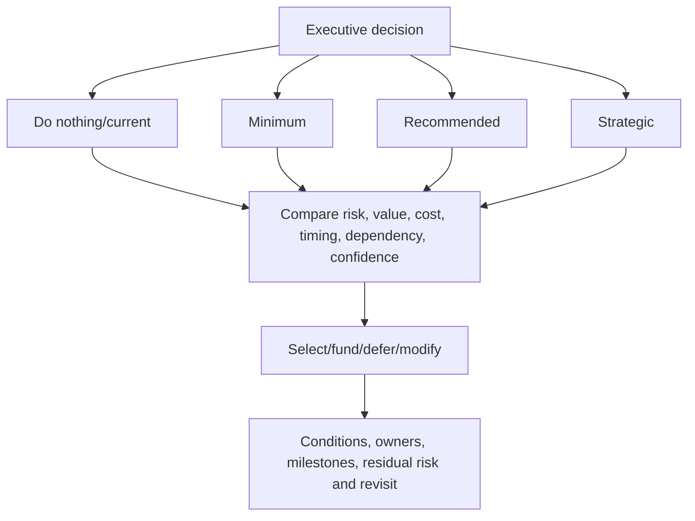

## 27. Business-case evaluation

| Criterion | Do nothing | Minimum | Recommended | Strategic |
|---|---|---|---|---|
| Material risk coverage | Low | Medium | High | High/broad |
| Time to first value | Immediate status quo | Fast | Phased | Longer |
| Dependency complexity | Existing debt | Moderate | High but managed | Very high |
| Change/adoption | Low now | Focused | Significant | Transformational |
| Operational maturity need | Existing | Basic | Defined/measured | Advanced/adaptive |
| Cost | Existing hidden TCO | Lower incremental | Balanced incremental | Highest |
| Reversibility | Status quo | Usually higher | Pilot/ring dependent | Lower in some integrations |
| Confidence needed | Risk acceptance | Control fit | Architecture/pilot | Strong pilot/data/operating evidence |

Do not score options and hide the model. Show weights, rationale, uncertainties, and sensitivity: “If eligible population is 30% larger, does the recommendation change?”

## 28. KPI, KRI, control-health, and benefit metrics

- A **KPI** (key performance indicator) measures performance toward an objective.
- A **KRI** (key risk indicator) signals changing exposure or risk.
- A **control-health metric** shows whether a control/data path is functioning.
- A **benefit metric** tests whether expected value is realized.

| Metric type | Northstar example |
|---|---|
| KPI | 95% privileged activations reviewed within SLA |
| KRI | Number/age of permanent privileged assignments |
| Control health | PIM/role-change audit events received within freshness SLO |
| Coverage | Managed/expected high-risk user and device population |
| Quality | Detection precision and false-positive burden by use case |
| Response | Time to validate scope, contain target and verify safe state |
| User outcome | Access failures and help-desk contacts by policy/persona |
| Cost | Ingestion/automation/license/operations against forecast and value |
| Benefit | Manual access-review hours and defect rate versus baseline |

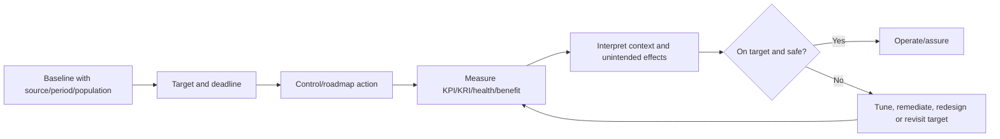

## 29. Baselines and targets

| Field | Requirement |
|---|---|
| Metric definition | Numerator, denominator, exclusions and unit |
| Purpose | Decision/control/benefit it supports |
| Population | Exact users/devices/apps/incidents/data sources |
| Baseline | Dated period and source quality |
| Target | Value/range and date with rationale |
| Threshold | Alert/escalation/stop/rollback condition |
| Owner | Data, control and decision owners |
| Frequency | Collection and review cadence |
| Segmentation | Persona, region, platform, severity or control |
| Caveat | Lag, missing data, denominator change, confounders |

Restate history when definitions change or display a break. A 20% improvement with a different denominator is not a clean trend.

## 30. Residual risk, acceptance, and exception governance

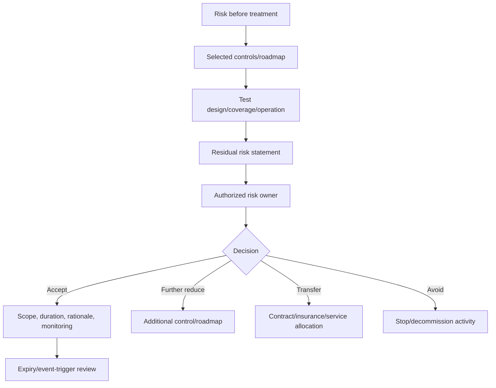

| Acceptance field | Content |
|---|---|
| Risk scenario | Cause/event/consequence and affected scope |
| Existing/target controls | Proven state and limitations |
| Residual risk | What remains after accepted treatment |
| Alternatives | Further reduce, transfer, avoid, defer, more evidence |
| Business rationale | Why acceptance is justified now |
| Owner/authority | Named authorized risk owner |
| Duration/expiry | Time-bound unless approved policy says otherwise |
| Monitoring/KRI | Trigger and review cadence |
| Dependencies | Conditions that could invalidate acceptance |
| Revisit | Incident, threat, platform, law, cost, scale or control failure |

The consultant recommends and explains; the authorized client owner accepts risk.

## 31. Executive decision paper

An executive paper should answer: What decision is needed, why now, what evidence supports it, what options exist, what do they cost and achieve, what remains uncertain, and who owns next steps?

| Section | Content |
|---|---|
| Decision requested | Approve option, funding, owners, risk and conditions |
| Context/urgency | Business strategy, findings, incidents, renewal, dependency window |
| Current state | Material strengths/gaps and evidence confidence |
| Target outcome | Control objectives and measurable future state |
| Options | Do nothing, minimum, recommended, strategic |
| Comparison | Risk/value/cost/time/dependencies/change/confidence/residual risk |
| Recommendation | Why selected, what it excludes, conditions and sensitivity |
| Roadmap | Waves, milestones, critical path, resources and gates |
| Financials | Low/base/high TCO, assumptions, source and no false savings |
| Benefits | Baseline/target, realization owner and attribution caveat |
| Risk | Delivery, privacy, operational, supplier, residual and acceptance |
| Decisions/actions | Owner, date, next gate, revisit trigger |

## 32. Roadmap governance and reporting

| Cadence | Decision/review |
|---|---|
| Weekly delivery | Dependencies, risks, actions, scope, defects, capacity |
| Fortnightly control | Architecture/test/privacy/operations gate readiness |
| Monthly steering | Outcome, cost, milestone, benefit, risk and decisions |
| Quarterly risk | Residual risk, exceptions, KRIs, threat/platform changes |
| Renewal/commercial | Entitlement, use, shelfware, contract, forecast and options |
| Post-wave | Acceptance, lessons, metric baseline and next-wave conditions |

Report red/amber/green only with definitions and supporting narrative. A green schedule with failed control evidence is not success.

## 33. Roadmap failure modes and troubleshooting

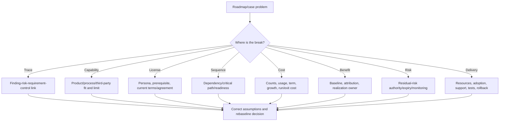

| Symptom | Likely cause | Check/recovery |
|---|---|---|
| License quote differs from model | Wrong persona/count/term/discount/prerequisite | Reconcile dated sources and version assumptions |
| Trial pilot passes but production blocked | Trial rights/capacity/support not converted | Procurement/entitlement continuity gate |
| Quick win causes outage | Dependency/use-case/pilot omitted | Rollback, incident review, reclassify as control deployment |
| Roadmap dates slip together | Hidden critical path or scarce role | Dependency network and capacity leveling |
| Tool bought but outcome unchanged | Adoption/operation/data/control owner missing | Capability realization and control-health review |
| Sentinel cost exceeds forecast | Volume/growth/duplicate/retention/query assumptions | Usage by source/table/use case and forecast reset |
| KPI improves while incidents worsen | Metric gaming, denominator, lag or wrong outcome | Segment and compare KRI/outcome/control health |
| Benefit double-counted | Same labor/tool/risk benefit in several initiatives | Benefits register with one owner and attribution |
| Vendor migration stalls | Parity/data/contract/exit dependency | Coexistence and decision gates; Part 57 method |
| Exception never closes | Missing expiry/owner/foundation funding | Escalate residual risk and roadmap dependency |
| Executive asks “why E5?” | Product-led story | Return to personas, controls, options, TCO and value |
| Budget cut | No minimum viable option | Preserve containment/foundations, show residual risk of deferral |

## 34. Client micro-scenarios

| Scenario | Response | Lesson |
|---|---|---|
| Finance wants E5 for only admins | Validate each capability's licensing/benefiting-user rules and other personas | Persona optimization must remain compliant and operable |
| Security wants every log forever | Map use cases, fields, tier, retention, privacy and cost | Data value, not volume, drives design |
| Sponsor wants AI automation in wave 1 | Require stable data, runbooks, permissions, approval, metrics and fallback first | Automation follows foundations |
| Existing vendor claims full parity | Test requirements, data, response, operations, contract and migration | Marketing category is not capability evidence |
| Trial expires before procurement | Define stop/continuity and no control cliff | Trial is evaluation, not target operating model |
| High-risk fix needs identity cleanup | Immediate containment plus funded foundation and strategic control | Priority and sequence are separate decisions |
| Score rises after license change | Restate denominator and direct control/outcome evidence | Tool score is not benefits realization |
| Business rejects user friction | Segment personas/data and compare alternate controls | Tradeoffs belong to authorized owners |
| MSSP can investigate but not contain | Clarify authority, SLA, approval, manual path and residual risk | Capability includes operating contract |
| License saving removes a control | Treat as architecture/risk change with testing and acceptance | Commercial optimization is security change |

## 35. Fictional Northstar control portfolio

Northstar's approved target design from Part 55 creates seven portfolios.

| Portfolio | Control outcome | Key dependency |
|---|---|---|
| P1 Privileged identity | Time-bound strong-auth access, review and recovery | Role cleanup, personas, entitlement, emergency test |
| P2 Device trust | Reconciled state and explicit managed/BYOD access paths | Intune/Entra/MDE/CMDB reconciliation |
| P3 External collaboration | Sponsored, bounded, classified and reviewed partner access | Data/site owners, guest inventory, workflow capability |
| P4 Data security | Classification, labels, DLP, retention and proportionate investigation | Taxonomy, samples, privacy, eligible personas |
| P5 Defender XDR | Healthy cross-domain prevention/detection/response | Product coverage, sensor/data health, SOC authority |
| P6 Sentinel/SOAR | Known-event health, priority data, tuned detection and safe automation | Source contracts, ingestion budget, playbooks, MSSP RACI |
| P7 Governance/operations | Owners, exceptions, metrics, change, resilience and improvement | Sponsor, service model, skills and assurance |

### Fictional target-control map

| Finding | Target control | Candidate capability/process | Verify-current caveat |
|---|---|---|---|
| Permanent privileged assignments | Role reduction, eligible PIM, auth strength, reviews | Entra identity governance/security capabilities + process | Persona/base/add-on rights and cloud support |
| Unreconciled devices | Authoritative inventory and explicit access state | Entra/Intune/MDE/ConfigMgr/CMDB reconciliation | Per-user/device/platform/service rights |
| Sharing exceptions lack owner/expiry | Entitlement/site governance and review | Entra external governance + SharePoint/Purview controls | External-user and resource-tenant licensing |
| Endpoint DLP coverage gap | Classified endpoint/browser policy and tuning | Purview data security capabilities | Eligible users/devices, prerequisites and locations |
| Defender health exceptions | Coverage/health SLA and trust integration | Defender/Intune operations | Product onboarding and user/device licensing |
| Sentinel known-event gap | Source quality SLO and independent monitoring | Sentinel connector/health/audit + source process | Azure consumption, retention and region pricing |
| MSSP authority conflict | Contract/RACI/approval/target verification | ITSM/Sentinel/XDR process and automation | Portal/API roles and service contract |

## 36. Fictional Northstar prioritization

| Initiative | Risk | Value | Effort | Urgency | Dependency role | Wave |
|---|---|---|---|---|---|---|
| Remove confirmed stale privileged assignments | High | High | Low | Immediate | Containment | 0 |
| Reconcile identities/devices/apps/sites | High | High | Medium | High | Foundation for five controls | 1 |
| Validate Product Terms/persona/quote | High delivery risk | High | Medium | Renewal date | Commercial foundation | 1 |
| Approve HLD/LLD/privacy/operations | High | High | Medium | High | Architecture foundation | 1 |
| Pilot privileged PIM/auth/review | High | High | Medium | High | Uses identity foundation | 2 |
| Pilot partner access/data controls | High | High | Medium-high | High | Inventory/classification/licensing | 2 |
| Establish Sentinel known-event health | Medium-high | High | Medium | High | SecOps foundation | 2 |
| Scale device/data/XDR/Sentinel controls | High | High | High | Medium | Pilot acceptance | 3 |
| Governed response automation | Medium-high | High | High | Medium | Stable runbooks/data/authority | 4 |
| Retire duplicate vendor/license/data paths | Medium | Medium-high | High | Contract window | Replacement acceptance | 4 |

## 37. Fictional 18-month roadmap

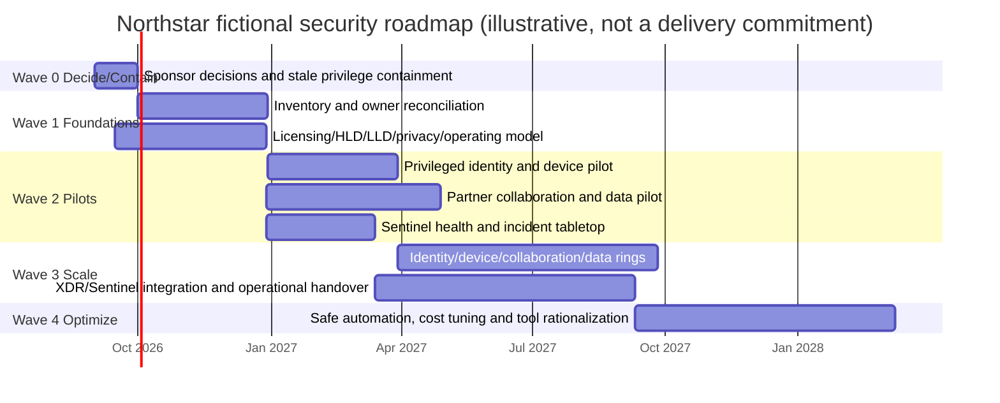

Dates are fictional placeholders. Real dates follow resource-loaded plans, contract and tenant evidence, change windows, design/testing, and client approval.

### Northstar roadmap gates

| Gate | Decision |
|---|---|
| G0 | Accept findings, risk owners, outcome and planning assumptions |
| G1 | Approve option, funding envelope and licensing-validation route |
| G2 | Accept requirements/threat/HLD/LLD/privacy and pilot readiness |
| G3 | Accept pilot evidence, user impact, support and residual risk |
| G4 | Approve production rings and coexistence/migration |
| G5 | Accept operations, KPI/KRI, benefits and exception governance |
| G6 | Retire legacy capability/contract/data/access after replacement proof |

## 38. Northstar illustrative cost model

No prices or actual totals are provided. The workbook uses client-supplied variables.

| Variable | Meaning | Sensitivity |
|---|---|---|
| `N_standard`, `N_admin`, `N_frontline`, `N_investigator` | Eligible persona counts | Reconciliation can change denominator materially |
| `R_plan_p` | Net annual rate for persona plan/add-on | Agreement, term, discount, currency, tax |
| `GB_source_day` | Measured daily Sentinel volume by source | Growth, duplicate, transform, incident burst |
| `R_ingest_region` | Current regional net ingestion rate/tier | Commitment and pricing change |
| `H_role_phase` | Internal/partner hours by role/phase | Skills and rework |
| `R_role` | Approved labor/service rate | Contract/internal finance method |
| `FTE_run` | Incremental operations capacity | Automation, alert quality and service hours |
| `C_vendor_exit` | Contract/migration/decommission cost | Notice, IP, data export, dual run |

### Sensitivity cases

| Case | Change | Decision question |
|---|---|---|
| Low | 15% fewer eligible personas; 20% lower ingestion | Does recommended option remain best? |
| Base | Reconciled count and pilot-measured volume | Funding and phased commitment |
| High | 25% more personas; 40% data growth; longer coexistence | Which scope/tier/wave can change without breaking controls? |
| Delay | Procurement moves three months | Can pilot/containment continue without trial cliff? |
| Skills | Internal capacity unavailable | Partner/MSSP cost and handover implications? |
| Benefit | Automation saves half the assumed analyst time | Is case still justified on risk/outcome? |

## 39. Northstar benefits scorecard

| Outcome | Baseline | Illustrative target | Owner/data source |
|---|---|---|---|
| Standing privilege | 9/14 active assignments in fictional finding | 0 unapproved permanent human assignments | Identity owner/full export |
| Device-state confidence | 2,400 unmatched records | ≥98% reconciled critical population; exceptions owned | Endpoint owner/reconciliation job |
| Sharing exception hygiene | 31 without owner/expiry | 100% owner, reason, expiry, review | Collaboration/data owners |
| Critical connector health | No known-event proof | Known event and health SLO for every critical source | Sentinel platform/source owners |
| Incident authority | Conflicting MSSP/client runbooks | 100% priority scenarios with accepted RACI/tabletop | SOC/vendor manager |
| Response outcome | Baseline from approved exercises/incidents | Target after pilot, segmented by severity | Incident system/PIR |
| User friction | Baseline sign-in/share/help-desk rate | No breach of persona-approved threshold | Service desk/sign-in/pilot |
| Cost | Current hidden TCO and source volumes | Within approved forecast per control/use case | Finance/FinOps |

Targets are illustrative. Real targets require validated baselines and authorized owners.

## 40. Safe paper exercise and portfolio artifact

This exercise creates no tenant, license, trial, quote, user assignment, policy, connector, rule, automation, purchase, production change, or client data. Use fictional Northstar facts and symbolic prices. Mark every feature, SKU, prerequisite, service limit, region and entitlement “verify current.”

### Exercise tasks

1. Build a finding-to-risk-to-objective-to-requirement-to-control traceability matrix for at least 12 fictional findings.
2. Create a target-control catalog across governance, identity, endpoint, collaboration, data, threat protection, SecOps, resilience, and supplier families.
3. Assign business, risk, control, technical, operational, data/privacy, licensing, vendor, and assurance owners.
4. Build a capability map comparing current process/tool, Microsoft option, third-party option, gap, integration, migration and compensating-control paths.
5. Define at least eight personas and a licensing evidence register. Never assert entitlement; list authoritative validation needed.
6. Map E3/E5/add-on/suite/trial/consumption concepts without a price or static feature matrix.
7. Create a dependency network with readiness gates, owners, lead times, fallbacks and critical path.
8. Prioritize initiatives through separate risk-effort, value-effort, urgency-readiness, dependency-impact and confidence-commitment views.
9. Classify each initiative as containment, quick win, foundation, core control, strategic, or continuous improvement.
10. Build an 18-month wave roadmap with milestones, resources, quality gates, pilot/rings, operations and retirement.
11. Create a low/base/high TCO workbook using symbolic variables for license, implementation, operations, data, change, vendor and exit.
12. Create a benefits register separating hard cost, productivity, risk reduction, resilience, compliance and user outcome; document attribution limits.
13. Compare do nothing, minimum, recommended and strategic options and run at least six sensitivity cases.
14. Write a residual-risk/exception register and a ten-page maximum executive decision paper.

```mermaid
flowchart LR
    TRACE[01 Finding/risk/control trace] --> CAT[02 Control catalog/owners]
    CAT --> CAP[03 Capability/product/process map]
    CAP --> LIC[04 Persona/license evidence register]
    LIC --> DEP[05 Prerequisites/critical path]
    DEP --> PRI[06 Priority matrices]
    PRI --> ROAD[07 Waves/milestones/resources]
    ROAD --> TCO[08 TCO/sensitivity]
    TCO --> BEN[09 Benefits/KPI/KRI]
    BEN --> CASE[10 Options/decision paper/residual risk]
```

### Portfolio validation matrix

| Test | Expected |
|---|---|
| Roadmap starts with product rather than finding/risk | Rebuild traceability |
| License statement lacks date/source/persona/prerequisite | Mark unverified and obtain specialist confirmation |
| Trial treated as target-state funding | Add expiry/continuity/procurement gate |
| Control has no operational owner | Not roadmap-ready |
| Quick win can lock out/delete/contain broadly | Reclassify and require design/pilot/rollback |
| Priority score hides dependency | Add separate dependency/critical-path view |
| Cost excludes operations/data/exit | Rebuild TCO |
| Avoided loss shown as guaranteed savings | Replace with range/assumptions/limitations |
| KPI has no denominator/baseline | Define population/source/period/target |
| Benefit counted in two initiatives | Assign one realization owner and attribution rule |
| Risk accepted by technical engineer without authority | Route to authorized risk owner |
| Real quote/client data used in portfolio | Remove; use symbolic fictional inputs |
| Part 57 migration work executed here | Stop at roadmap dependency and next-Part link |

### Reusable templates

| Template | Key fields |
|---|---|
| Control catalog | Objective/risk/requirements/layers/owners/capability/dependency/test/metric/risk |
| Capability map | Use case/current/Microsoft/third-party/process/fit/limit/integration/option |
| License register | Persona/count/capability/plan/prerequisite/source/quote/owner/date/confidence |
| Dependency log | Provider/consumer/outcome/lead/evidence/impact/fallback/owner |
| Priority sheet | Risk/value/effort/urgency/dependency/confidence/reversibility/rationale |
| Roadmap | Wave/initiative/milestone/critical path/resource/gate/acceptance/residual risk |
| TCO model | One-time/recurring/license/data/operations/change/vendor/exit/range/source |
| Benefits register | Type/baseline/target/date/source/owner/attribution/confidence |
| KPI/KRI sheet | Definition/denominator/population/baseline/target/threshold/cadence/action |
| Option matrix | Do nothing/minimum/recommended/strategic and sensitivity |
| Risk acceptance | Scenario/control/residual/options/owner/expiry/KRI/revisit |
| Decision paper | Decision/context/evidence/options/recommendation/roadmap/TCO/benefit/risk/actions |

## 41. Quality gates

| Gate | Pass criteria |
|---|---|
| Traceability | Every initiative links to validated risk, objective and requirement |
| Control | Layered controls, coverage, owner, operation and assurance defined |
| Capability | Product/process/third-party fit and limitations tested on paper/pilot |
| Licensing | Current authoritative persona/prerequisite/commercial verification complete |
| Dependency | Readiness, critical path, fallback and resource constraints visible |
| Priority | Risk/value/effort/urgency/dependency/confidence rationale approved |
| Architecture | HLD/LLD/threat/privacy/integration/resilience decisions accepted |
| Delivery | Pilot/rings/rollback/change/support/training and milestone evidence ready |
| Financial | Low/base/high TCO, sources, growth, run/exit cost and sensitivity reviewed |
| Benefit | Baseline/target/source/owner/attribution and realization plan defined |
| Risk | Residual risk/exceptions have authorized decision, expiry and monitoring |
| Executive | Options include do nothing and decision conditions are explicit |

## 42. Operations and continuous portfolio management

A roadmap becomes a portfolio after approval. Maintain control health, entitlement, spend, benefit, risk, platform changes, incidents, and dependencies.

| Trigger | Portfolio action |
|---|---|
| Product Terms/service change | Revalidate entitlement, architecture and cost |
| Renewal/true-up | Reconcile persona use, shelfware, growth and roadmap |
| Incident/control failure | Reassess risk, threat/control design, priority and metric |
| Acquisition/divestiture | Rebuild populations, tenant/vendor/data boundaries and TCO |
| New AI/app/data use | Add privacy/security requirements, capability and license review |
| Cost anomaly | Investigate source/usage/duplicate/retention and value |
| KPI/KRI divergence | Test data quality, unintended effects and control outcome |
| Exception expiry | Close, renew with evidence, or escalate risk |
| Vendor end-of-life/contract | Activate migration/coexistence/exit planning |
| Resource constraint | Re-sequence with visible risk of delay |

## 43. Tradeoffs a senior consultant should explain

| Tradeoff | Decision framing |
|---|---|
| Broad suite vs targeted add-on | Integration/coverage/simplicity versus cost/shelfware/persona precision |
| Native consolidation vs specialist tool | Control fit, data, operations, resilience, contract and exit |
| More telemetry vs privacy/cost | Named use cases, fields, tiers, retention and assurance |
| Quick containment vs durable remediation | Immediate exposure reduction plus funded foundation |
| Automation vs human approval | Confidence, action impact, latency, evidence and fallback |
| Standard control vs exception | Risk, business need, compensating control, expiry and monitoring |
| One large program vs incremental waves | Coordination efficiency versus risk, learning and reversibility |
| Hard savings vs risk benefit | Bookable retired cost separately from uncertain avoided loss |
| Aggressive target vs adoption | Security outcome with persona/user/support evidence |

## 44. Preparing for Part 57 migration

Part 56 selects target capabilities and places any third-party-to-Microsoft transition on the roadmap. It does not perform the migration design. Part 57 will address capability parity, coexistence, agents, policy translation, telemetry/history, pilots, cutover, rollback, decommissioning and vendor coordination.

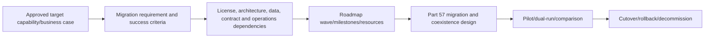

Migration readiness inputs include current and target control objectives, functional/nonfunctional parity, data retention, integration and response ownership, vendor contract/IP, coexistence cost, acceptance, rollback, and residual risk.

## 45. JD Mapping: interview translation

| Interview theme | Your transferable strength | Honest roadmap/business-case translation |
|---|---|---|
| Prioritization | Assessed impact/urgency and coordinated critical escalations | Risk/value/effort/urgency/dependency/confidence views |
| Dependencies | Traced service, vendor and product-group boundaries | Critical path, prerequisites, owner/fallback |
| Validation | Reproduced issues and confirmed fixes | Milestone acceptance and control outcome tests |
| Metrics | Used KPI/business reviews and service trends | Baseline/target/KPI/KRI/benefit with caveats |
| Vendors | Managed cross-team evidence and escalation | Capability fit, contract, coexistence, support and exit |
| Licensing gap | No invented commercial ownership | Persona register and authorized verify-current route |
| Executive communication | Translated technical impact and actions | Options, TCO, benefits, residual risk and decision paper |
| Honesty | Production support/advisory, not transformation claim | Fictional roadmap and symbolic business case |

## Official Source Anchors

These official and recognized public sources anchor product, licensing, cost, risk, and planning concepts. Product Terms, agreements, quotes and live tenant evidence govern actual entitlement and cost; this guide is not licensing or financial authority.

1. [Microsoft Product Terms](https://www.microsoft.com/licensing/terms/) — authoritative current product-use terms and licensing documents.
2. [Microsoft 365 and Office 365 service descriptions](https://learn.microsoft.com/office365/servicedescriptions/) — current service and plan documentation.
3. [Microsoft 365 guidance for security and compliance licensing](https://learn.microsoft.com/office365/servicedescriptions/microsoft-365-service-descriptions/microsoft-365-security-compliance-licensing-guidance) — licensing guidance and user-benefit concepts; verify Product Terms.
4. [Microsoft Entra licensing](https://learn.microsoft.com/entra/fundamentals/licensing) — Entra plans and current prerequisite guidance.
5. [Microsoft Intune licensing](https://learn.microsoft.com/intune/intune-service/fundamentals/licenses) — Intune plans, add-ons and licensing concepts.
6. [Microsoft Defender XDR prerequisites](https://learn.microsoft.com/defender-xdr/prerequisites) — product prerequisites and supported service relationships.
7. [Microsoft Purview licensing resources](https://learn.microsoft.com/purview/compliance-manager-licensing) — Purview-related licensing starting points; verify each solution and Product Terms.
8. [Microsoft Sentinel pricing and billing](https://learn.microsoft.com/azure/sentinel/billing) — ingestion, retention and current cost-planning concepts.
9. [Monitor Microsoft Sentinel costs](https://learn.microsoft.com/azure/sentinel/billing-monitor-costs) — usage monitoring, workbooks and cost controls.
10. [Azure pricing calculator](https://azure.microsoft.com/pricing/calculator/) — current public Azure estimate tool; agreement pricing can differ.
11. [Microsoft Cloud Adoption Framework: business outcomes](https://learn.microsoft.com/azure/cloud-adoption-framework/strategy/business-outcomes/) — outcome and value framing.
12. [Microsoft Cloud Adoption Framework: plan](https://learn.microsoft.com/azure/cloud-adoption-framework/plan/) — adoption planning, skills and roadmap concepts.
13. [Microsoft FinOps Framework guidance](https://learn.microsoft.com/cloud-computing/finops/framework/finops-framework) — public cloud-cost allocation, forecasting and optimization practices.
14. [NIST Cybersecurity Framework 2.0](https://www.nist.gov/cyberframework) — risk outcomes, governance, priorities and communication.
15. [NIST SP 800-30 Rev. 1](https://csrc.nist.gov/pubs/sp/800/30/r1/final) — risk-assessment and uncertainty concepts.
16. [FAIR Institute](https://www.fairinstitute.org/) — public introduction to quantitative information-risk concepts; use an approved method and qualified practitioners.
17. [CIS Controls v8](https://www.cisecurity.org/controls/v8) — prioritized safeguard categories, subject to CIS licensing and applicability.
18. [Microsoft Azure Well-Architected Framework: Cost Optimization](https://learn.microsoft.com/azure/well-architected/cost-optimization/) — cost modeling, tradeoffs and continuous optimization.

## ⭐ Likely Interview Questions for This Section

### Q1. How do you turn assessment findings into a security roadmap?

**Model answer:** I trace each validated finding to a credible risk, control objective and approved requirement, then define layered preventive, detective, responsive, recovery and assurance controls with owners. I map capabilities and current persona-level licensing/prerequisites, identify gaps and dependencies, compare treatment options, prioritize through risk/value/effort/urgency/readiness/confidence views, and sequence containment, foundations, pilots, scale and optimization with milestones, tests, TCO, benefits and residual-risk decisions.

### Q2. How do you approach Microsoft 365 licensing recommendations?

**Model answer:** I start with use case, control outcome and personas, not a SKU. I map required capabilities, existing tools/processes, prerequisites, benefiting users/devices/workloads, cloud/region and operating model. Then I verify current Product Terms, service descriptions, Learn prerequisites, tenant assignments, agreement, renewal and a dated quote with authorized licensing/procurement specialists. I treat E3/E5/add-ons/trials as options, not permanent feature truths.

### Q3. What is the difference between a quick win and a foundation?

**Model answer:** A quick win delivers meaningful, bounded value with low dependency and safe reversibility. A foundation may have less visible immediate benefit but enables several material controls, such as reconciling identity/device/data populations or clarifying ownership. A portal setting that can lock out users, delete/retain data, or trigger broad containment is not a quick win just because it is easy to click.

### Q4. How do you prioritize when the highest-risk item is not ready?

**Model answer:** I separate urgency from deployability. I use immediate containment where safe, then prioritize foundations that unblock durable remediation, while keeping the high residual risk visible to its owner. I show risk, value, effort, urgency, dependency, confidence and reversibility separately, identify the critical path and resources, and set readiness/acceptance gates rather than hide everything in one score.

### Q5. What belongs in a security TCO model?

**Model answer:** Dated license/subscription/add-on/capacity inputs by persona; implementation design/build/test/migration; coexistence; Sentinel ingestion, tier, retention, query and automation; operations/SOC/admin/on-call/tuning; vendor/integration/support; change/training/productivity; assurance; renewal growth; and exit/decommission. I separate one-time/recurring and low/base/high ranges, state sources and sensitivity, and use client finance methods.

### Q6. How do you present benefits without overclaiming avoided losses?

**Model answer:** I separate hard retired cost, productivity, risk reduction, resilience, assurance, user experience and data-quality benefits. Each has a baseline, target, source, owner, date, attribution and confidence. Avoided loss is a probabilistic scenario, not guaranteed savings; I show frequency/magnitude/control-effect assumptions and ranges, avoid double-counting, and involve approved risk/finance specialists for quantitative models.

### Q7. What should an executive decision paper contain?

**Model answer:** The decision requested, why now, evidence and confidence, current material risks, target outcomes, do-nothing/minimum/recommended/strategic options, comparison of risk/value/cost/time/dependencies/change/residual risk, recommendation and conditions, phased roadmap, low/base/high TCO, measurable benefits, delivery risks, authorized risk acceptances, owners, milestones and revisit triggers.

### Q8. What is your honest experience with licensing, roadmaps, and business cases?

**Model answer:** I have not negotiated Microsoft licensing, approved a client investment, or delivered this fictional transformation. My production M365 advisory experience includes RCA, stakeholder/vendor coordination, fix validation, documentation, KPIs and business reviews. I built a fictional traceable control, persona-license, dependency, TCO, benefits and roadmap pack using symbolic prices. I would validate live Product Terms, service behavior, tenant, agreement and quote with authorized specialists.

## 🧠 30-Second Memory Hooks

- **Roadmap = risk decisions and control outcomes over time, not product dates.**
- **Finding → risk → objective → requirement → control → capability → license → roadmap → measure.**
- **License grants a right; control requires realization and operation.**
- **Control families organize; layers protect when one mechanism fails.**
- **One accountable outcome owner; many delivery roles.**
- **Capability before SKU.**
- **Persona before license count.**
- **“In E5” is not entitlement proof.**
- **Verify Product Terms, service description, prerequisites, tenant, cloud/region, agreement and quote.**
- **Trial = evaluation, not operating model.**
- **Prerequisites:** inventory, architecture, data, license, privacy, operations, integration, change.
- **Native is not automatically better; compare fit, operation, migration and exit.**
- **Compensating control covers the same scenario and expires or becomes explicit target.**
- **Priority has risk, value, effort, urgency, dependency, confidence and reversibility.**
- **Contain now; fund foundations; pilot durable control.**
- **Easy click can still be a high-risk change.**
- **Milestone = verified decision/outcome, not percent complete.**
- **Critical path is the dependency chain setting earliest completion.**
- **TCO = buy + build + data + run + change + assure + exit.**
- **Telemetry value is use-case-specific; volume alone misleads.**
- **Use low/base/high and sensitivity, not one magic number.**
- **Avoided loss is uncertain risk value, not booked savings.**
- **Options: do nothing, minimum, recommended, strategic.**
- **KPI performs; KRI warns; health proves the control path is alive.**
- **Baseline needs numerator, denominator, population, period and source.**
- **Consultant advises; authorized client owner accepts residual risk.**
- **Your bridge:** RCA, validation and business reviews → traceable roadmap decisions.
- **Honesty:** symbolic paper case, no licensing negotiation or implementation claim.

## Completion Checklist

- [ ] I can trace findings through risk, objective, requirement, control, capability, entitlement, roadmap, cost, decision and measure.
- [ ] I can explain why a license is not a realized control.
- [ ] I can define target controls independently of changing product names.
- [ ] I can organize governance, asset, identity, endpoint, collaboration, data, threat, SecOps, resilience and supplier control families.
- [ ] I can layer govern, prevent, detect, respond, recover and assure controls.
- [ ] I can assign business, risk, control, technical, operational, data/privacy, licensing, vendor and assurance owners.
- [ ] I can build a target-control catalog with population, dependencies, validation, metrics and residual risk.
- [ ] I map required capability before comparing Microsoft, third-party and process options.
- [ ] I can define standard, frontline, admin, high-risk, guest, investigator, SOC, endpoint and workload personas.
- [ ] I never infer entitlement from an E3/E5/add-on/trial label alone.
- [ ] I can explain E3, E5, security/compliance add-ons, individual add-ons, suites, trials and consumption as concepts.
- [ ] I can build a dated licensing evidence register with authoritative sources and specialist confirmation.
- [ ] I verify Product Terms, service descriptions, Learn prerequisites, tenant/cloud/region, agreement, renewal and quote.
- [ ] I can identify identity, device, data, telemetry, architecture, license, operations, privacy, vendor and change dependencies.
- [ ] I can compare retain/add/integrate/migrate/compensate/accept/avoid options.
- [ ] I can test whether compensating controls cover the same scenario and operate sustainably.
- [ ] I can prioritize through risk, value, effort, urgency, dependency, confidence, reversibility and coverage.
- [ ] I do not hide decisions in one unexplained numeric score.
- [ ] I can distinguish immediate containment, quick wins, foundations, core deployments, strategic work and continuous improvement.
- [ ] I can build waves from decide/contain through foundations, pilot, scale, optimize and operate.
- [ ] I can define milestones with acceptance evidence and authorized decisions.
- [ ] I can identify critical path, resource constraints, dependency lead times and fallbacks.
- [ ] I include sponsor, architecture, engineering, SOC, privacy, change, procurement, test, FinOps and vendor capacity.
- [ ] I can model license, implementation, migration, coexistence, data, operations, change, vendor, assurance and exit TCO.
- [ ] I can govern Sentinel ingestion by use case, source, quality, tier, retention, query, cost and health.
- [ ] I separate one-time/recurring cost and use low/base/high ranges plus sensitivity.
- [ ] I use client finance-approved rates, taxes, discounts, terms and discounting methods.
- [ ] I can distinguish hard cost, productivity, risk reduction, resilience, assurance, user and data-quality benefits.
- [ ] I never present avoided loss as guaranteed cash savings.
- [ ] I can compare do nothing, minimum, recommended and strategic options.
- [ ] I can define KPI, KRI, control-health and benefit metrics.
- [ ] Every metric has definition, denominator, population, baseline, target, source, owner, cadence and caveat.
- [ ] I can document residual risk, alternatives, authority, expiry, monitoring and revisit triggers.
- [ ] I can write an executive decision paper with explicit decisions and conditions.
- [ ] I can troubleshoot entitlement, trial, critical-path, cost, KPI, benefit, vendor and exception failures.
- [ ] I completed the fictional Northstar roadmap and symbolic business case without a tenant, quote, purchase or client data.
- [ ] I stopped third-party migration work at readiness and linked it to Part 57.
- [ ] I can answer Q1-Q8 aloud without claiming licensing or transformation ownership I do not have.
- [ ] I will use approved firm/client methods rather than imply this guide is Deloitte-proprietary guidance.

*Next suggested section:* [Part 57](Part-57-third-party-microsoft-security-migration.md)