# Part 57 — Third-Party to Microsoft Security Migration and Coexistence

> **Section goal:** Learn a consulting-grade, evidence-led method for moving security capabilities from third-party products to Microsoft security services without confusing product replacement with risk reduction. By the end, you should be able to define migration outcomes; inventory use cases, architecture, policies, rules, telemetry, agents, connectors, APIs, workflows, service levels, contracts, skills, and evidence obligations; map the current state to Microsoft target capabilities without relying on marketing labels; assess parity, gaps, overlaps, risks, prerequisites, licenses, and total cost; design coexistence that avoids duplicate alerts, duplicate response actions, endpoint-agent conflict, broken email flow, lost SIEM history, or identity lockout; translate policies rather than blindly copying syntax; build pilots and acceptance criteria; validate telemetry, detection efficacy, performance, user impact, and operations; execute cutover, reconciliation, rollback, decommission, and vendor exit; and produce safe portfolio artifacts across email, endpoint, SIEM, CASB, and identity examples.

This Part maps directly to the role's responsibility to assess, design, migrate, configure, troubleshoot, and operationalize Microsoft 365 security solutions, including transformation from third-party products. It uses your demonstrated strengths in Microsoft 365 vendors and product-group coordination, high-severity escalation, root-cause analysis, fix validation, documentation, knowledge transfer, KPI reporting, and business reviews. The consulting extension is to apply those same habits before, during, and after a controlled security-platform migration.

> **Method boundary:** This chapter contains public, general consulting, security-engineering, change, and migration practices. It does not describe or imply Deloitte proprietary methods, accelerators, templates, commercial positions, client experience, or internal delivery processes. A real engagement must use the approved client and firm governance, architecture, security, privacy, legal, procurement, licensing, change, quality, and records-management processes.

> **Product and commercial currency warning (August 24, 2026):** Microsoft and third-party features, connectors, APIs, licensing, retention, data location, service limits, support terms, roadmaps, and product names change. A portal screenshot, seller statement, feature name, or bundle label is not proof of capability, entitlement, availability, supportability, or contractual fit. Validate dated public documentation, Product Terms, service descriptions, tenant/cloud/region, technical prerequisites, contract language, current roadmaps, and acceptance tests with authorized specialists.

## JD Mapping

| Role expectation | Capability developed here | Portfolio evidence |
|---|---|---|
| Lead third-party security transformation | Frame outcomes, scope, waves, dependencies, coexistence, cutover, rollback, and exit | Migration charter and integrated plan |
| Assess Microsoft security fit | Map use cases and control outcomes to evidenced target capability | Capability parity and gap matrix |
| Coordinate products, vendors, and partners | Establish ownership boundaries, shared evidence, escalation, contract, and exit actions | Supplier RACI and escalation pack |
| Protect production service | Pilot by risk, test failure paths, preserve rollback, and control user impact | Acceptance plan and cutover runbook |
| Troubleshoot migration defects | Build timelines, hypotheses, telemetry reconciliation, and defect criteria | RCA and product escalation package |
| Validate fixes and security outcomes | Test signal delivery, detection, response, performance, coverage, and operations | Validation evidence register |
| Document and hand over | Record designs, decisions, known errors, runbooks, training, and residual risk | Handover and decommission dossier |
| Report to business stakeholders | Explain risk, cost, progress, decisions, service impact, and realized outcomes | Business-review scorecard |

## Candidate honesty note

You can directly discuss production Microsoft 365 support, SharePoint Online and OneDrive, migration and sync symptoms, permissions, critical escalations, vendors and product groups, technical advisory, RCA, fix validation, documentation, mentoring, KPI reviews, and customer communication where supported by your CV and real examples. Those are highly relevant because migrations fail at boundaries and require disciplined evidence, ownership, recovery, and communication.

You should not claim that you have led a production migration from a named third-party email gateway, EDR, SIEM, CASB, identity provider, or security platform into Microsoft security services unless you have separate evidence. You must not present this fictional exercise as client work. Safe wording is:

> “My direct production strength is Microsoft 365 escalation engineering: I isolate multi-party faults, coordinate customers, partners, vendors, and product groups, document RCA, validate fixes, and communicate service impact and metrics. To prepare for security consulting, I built a vendor-neutral paper migration pack across email, endpoint, SIEM, CASB, and identity. It maps use cases and evidence, plans coexistence and rollback, and defines measurable acceptance. I would verify current product behavior, licensing, contracts, privacy, and client change controls before any real implementation.”

---

## 1. Migration is a controlled transfer of outcomes

A security migration is the controlled transfer of **control outcomes**, evidence, responsibilities, and operating capability from a current state to a target state. It is not merely installing a Microsoft agent or disabling a third-party subscription. The organization must remain able to prevent, detect, investigate, respond, recover, prove, and govern throughout the transition.

**Analogy:** Replacing an airport's screening system is not a same-day equipment swap. Passenger flows, watch lists, staff procedures, evidence, emergency processes, suppliers, training, and fallback lanes must continue while the new system proves that it works.

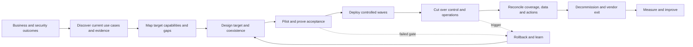

| Migration state | Question that must be answered | Required evidence |
|---|---|---|
| Proposed | Why change, and what outcome improves? | Approved problem statement and options |
| Discovered | What exists and who depends on it? | Validated inventory and data flows |
| Designed | How will target and coexistence work? | HLD/LLD, decisions, risks, traceability |
| Piloted | Does it work for representative cases? | Acceptance results and defects |
| Deployed | Is intended scope covered? | Reconciliation and health evidence |
| Cut over | Has authority and operation moved safely? | Go/no-go record and command timeline |
| Decommissioned | Can the old product be removed safely? | Exit checklist, archive, revocation, sign-off |
| Realized | Did outcomes improve without unacceptable harm? | Baseline-to-target scorecard and PIR |

## 2. Why organizations migrate

The reason must be explicit because it controls design and acceptance. Common drivers include consolidating overlapping tools, improving cross-domain visibility, reducing integration burden, replacing an unsupported service, responding to a contract renewal, improving control coverage, enabling automation, standardizing global operations, reducing user friction, changing a managed-service model, meeting data-location requirements, or using capabilities already licensed.

These are hypotheses, not guaranteed benefits. Consolidation can reduce console count yet increase dependence on one vendor. An apparently included feature can require new infrastructure, specialist skills, data ingestion, premium capacity, or operational staffing. A contract deadline can create urgency but cannot make untested migration safe.

| Driver | Valid outcome statement | Dangerous shortcut |
|---|---|---|
| Tool consolidation | Reduce duplicate workflows while preserving named detections and response | “Replace five tools with E5” |
| Cost | Reduce validated total lifecycle cost for defined scope | Compare license list prices only |
| Visibility | Correlate identity, endpoint, email, app, and cloud signals | Assume native means complete telemetry |
| User experience | Reduce prompts, proxy friction, or client conflict | Disable controls to remove complaints |
| Compliance | Preserve required evidence, access, retention, and export | Treat product certification as compliance |
| Contract exit | Complete controlled transition before renewal | Let the old service expire before proof |
| Resilience | Remove fragile integration or support dependency | Create a larger single-vendor failure domain |

### 🔍 Plain-English deep-dive: capability labels are not outcomes

Two products may both advertise “DLP,” “EDR,” “CASB,” or “SIEM,” yet observe different traffic, support different platforms, normalize data differently, calculate severity differently, and trigger different actions. Think of two medical scanners: both produce images, but coverage, resolution, preparation, interpretation, and follow-up differ. Compare the actual clinical question and evidence, not the word “scanner.” In migration, compare use case, population, signal, logic, response, service level, evidence, and failure behavior.

## 3. Define the migration charter

The charter turns an idea into a controlled engagement. It should contain sponsor, business outcomes, security outcomes, in-scope capabilities, populations, geographies, clouds, platforms, data, suppliers, exclusions, assumptions, constraints, dates, dependencies, governance, decision rights, budget assumptions, acceptance authority, rollback authority, and exit conditions.

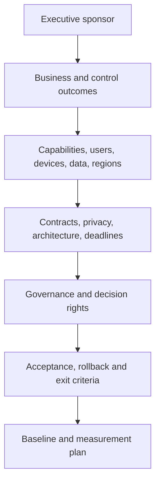

| Charter field | Example question |
|---|---|
| Outcome | Which risk, service, cost, or operating result should change? |
| Scope | Which tenants, domains, users, devices, workloads, logs, and vendors? |
| Exclusion | What remains on the current platform and why? |
| Constraint | Is renewal, merger, regulation, data residency, or freeze relevant? |
| Assumption | Which unsupported belief requires validation? |
| Dependency | Which identity, network, endpoint, licensing, or SOC change precedes migration? |
| Authority | Who approves design, pilot, go-live, rollback, residual risk, and decommission? |
| Success | Which measurable acceptance tests and operating outcomes are mandatory? |

## 4. Build an outcome and use-case inventory

Start with what the organization needs the security system to do. A **use case** describes a trigger, population, logic, expected action, evidence, owner, and service expectation. Product configuration is then attached to the use case.

For each use case, capture:

1. Business service, threat, risk, and control objective.
2. Users, devices, identities, applications, data, locations, and exceptions.
3. Source events and required fields.
4. Detection or policy logic, thresholds, dependencies, and expected false positives.
5. Preventive, detective, investigative, response, recovery, and assurance actions.
6. Human roles, queues, hours, SLA/OLA, escalation, and approval.
7. Evidence, retention, privacy purpose, access, export, and audit requirement.
8. Volume, latency, availability, performance, and user-experience expectations.
9. Current effectiveness, defects, known workarounds, and business complaints.
10. Target acceptance and decommission dependency.

| Use-case ID | Outcome | Current implementation | Target hypothesis | Acceptance summary |
|---|---|---|---|---|
| EMAIL-01 | Detect impersonation and protect delivery | Gateway rule + SOC queue | EOP/MDO policy + Explorer workflow | Seed tests, trace, alert, queue and release validated |
| END-02 | Detect malicious endpoint behavior | Third-party EDR agent | MDE onboarding and XDR incident | Sensor health, test alert, timeline and response validated |
| SIEM-03 | Detect privileged anomaly | SIEM correlation rule | Sentinel analytics + identity data | Field parity, replay, latency, incident and triage validated |
| CASB-04 | Govern risky OAuth apps | CASB API connector | Defender for Cloud Apps/app governance | Inventory, risk decision and revocation workflow validated |
| IAM-05 | Require strong admin access | Third-party IdP/MFA rule | Entra CA/auth strength/PIM design | Positive, negative, emergency and audit tests validated |

## 5. Inventory the full current state

The inventory must extend beyond visible policies. Security tools have hidden dependencies in agents, certificates, DNS, routes, mail connectors, service accounts, API permissions, webhooks, queues, dashboards, reports, scripts, ticket integrations, training, contracts, and retention obligations.

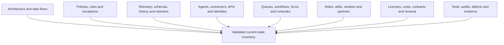

| Inventory domain | Capture at minimum | Validation method |
|---|---|---|
| Architecture | Tenants, consoles, regions, collectors, routes, trust boundaries | Diagram walkthrough plus configuration evidence |
| Policies/rules | Enabled state, scope, order, exceptions, owner, change history | Export/API plus owner review and sample test |
| Data | Sources, fields, volume, latency, retention, archive, legal hold, export | Query samples, billing/volume, retention settings |
| Agents | Version, platform, mode, health, tamper protection, exclusions, dependencies | Device inventory and endpoint sample |
| Connectors/APIs | Endpoint, auth, scopes, certificate/secret, limits, errors, owner | Integration inventory and transaction test |
| Workflows | Alert to case, automation, approval, response, recovery, closure | Ticket sampling and tabletop |
| SLAs | Detection, acknowledgement, containment, vendor response, recovery | Contract/OLA plus performance history |
| People | Admins, SOC, engineers, service desk, MSSP, vendor, approvers | Role mapping and interview |
| Commercial | SKU, quantity, term, renewal, notice, support, exit/export rights | Contract and procurement validation |
| Assurance | Control tests, audit evidence, findings, false positives, known errors | Evidence sampling and defect review |

## 6. Draw current architecture and flows

An architecture diagram should show control and data planes, identity, network, endpoint, cloud service, third parties, destinations, and operational queues. A **control plane** configures desired behavior; a **data plane** carries user, workload, event, or response activity.

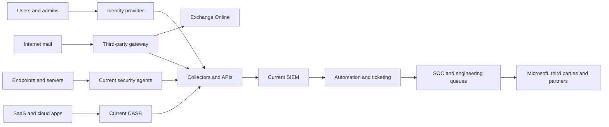

Every arrow requires an owner, protocol, authentication method, data classification, frequency, failure detection, retry behavior, and evidence source. Missing arrows often reveal undocumented operational dependencies.

## 7. Establish a trustworthy baseline

Without a baseline, “migration succeeded” becomes subjective. Capture at least 30–90 representative days where permitted, while accounting for seasonality, incidents, new campaigns, device turnover, and business peaks.

Baseline dimensions include source coverage; healthy agent percentage; event volume and latency; detection count and severity; confirmed true/false positive rates with classification limitations; alert-to-case conversion; mean/median/percentile acknowledgement and resolution; automation success/failure; user tickets; mail latency; endpoint CPU/memory/network; policy blocks and overrides; SIEM ingestion/storage cost; supplier tickets; analyst effort; unresolved defects; and audit evidence completeness.

| Metric | Baseline definition | Migration use | Caveat |
|---|---|---|---|
| Source coverage | Reporting sources / intended sources | Detect blind spots | Reporting does not prove useful fields |
| Signal latency | Event time to searchable/alert time | Compare detection timeliness | Clock and queue differences matter |
| Detection efficacy | Controlled scenarios detected as designed | Prove named use cases | No test proves all real attacks |
| User impact | Tickets, block rate, latency, app failure | Control disruption | Under-reporting is common |
| Analyst effort | Handling time for sampled cases | Operating impact | Case mix affects comparison |
| Cost | Dated build/run/contract/data assumptions | Option analysis | Avoid false precision and sunk-cost errors |

## 8. Map Microsoft target capability with evidence

Map in this order: requirement → use case → source and population → target capability → prerequisites → documented behavior → tenant validation → limitations → operational workflow → acceptance evidence. Do not start with a product logo.

```mermaid
flowchart LR
    REQ[Control requirement] --> CASE[Use case and population]
    CASE --> EVID[Current evidence and baseline]
    EVID --> CAND[Candidate Microsoft capability]
    CAND --> DOC[Dated documentation and support status]
    DOC --> PRE[Prerequisites, license, cloud and region]
    PRE --> LAB[Safe lab or paper validation]
    LAB --> GAP[Parity, gap, overlap and risk]
    GAP --> DECIDE[Retain, integrate, migrate, compensate or accept]
```

Evidence hierarchy, from stronger to weaker, is generally: controlled tenant test and exported result; authoritative service documentation and Product Terms; supported architecture and API schema; service-health or release evidence; vendor support confirmation in writing; configuration screenshot; presentation or roadmap statement; salesperson assertion; product name similarity. Evidence can still become stale, so date it.

### 🔍 Plain-English deep-dive: parity is multidimensional

“Feature parity” is not a yes/no checkbox. A replacement may support the same broad function but differ in platforms, event fields, policy order, exceptions, latency, response actions, retention, regions, APIs, evidence, and operational effort. Think of moving from one language to another: two languages can express the same idea, but literal word-for-word translation may be wrong. Record functional, coverage, technical, data, operational, assurance, commercial, and lifecycle parity separately.

## 9. Build the parity, gap, and overlap matrix

| Dimension | Questions | Possible decision |
|---|---|---|
| Functional | Can the target achieve the actual control outcome? | Migrate, redesign, compensate |
| Coverage | Which OS, device, identity, workload, data, geography, and cloud? | Split population or retain tool |
| Detection | Are required signals, fields, logic, latency, and tuning available? | Rebuild, supplement, accept gap |
| Response | Are actions safe, reversible, approved, and auditable? | Manual gate or alternative action |
| Data | Can history, schema, retention, export, and legal obligations be met? | Archive or dual-query period |
| Integration | Do APIs, ticketing, SOAR, CMDB, and reporting work? | Build integration or process bridge |
| Operations | Can teams monitor, triage, escalate, recover, and support it? | Train, staff, MSSP, phase |
| Assurance | Can the organization test and prove operation? | Add synthetic tests and evidence |
| Commercial | What are license, data, service, exit, and support costs? | Renegotiate, retain, or sequence |
| Risk | What new concentration, privacy, outage, or skills risk appears? | Compensate or retain diversity |

Use statuses such as **equivalent**, **meets outcome differently**, **partial**, **gap**, **overlap**, **not applicable**, and **unknown—test required**. “Unknown” is a valid discovery result; hiding uncertainty is not.

## 10. Target architecture and migration patterns

Common patterns are direct replacement, staged coexistence, capability-by-capability transition, population waves, data-source transition, detect-only parallel run, and long-term integration. Choose based on control risk and reversibility.

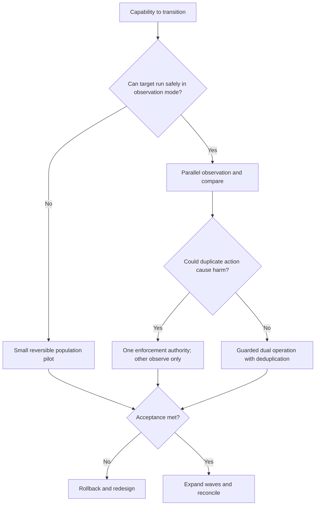

| Pattern | Good fit | Principal risk | Guardrail |
|---|---|---|---|
| Big-bang replacement | Rare, low-complexity, strong rollback | Large correlated failure | Avoid unless justified and rehearsed |
| Parallel detect-only | SIEM/detection comparison | Duplicate analyst work | Correlation/dedup rules and defined authority |
| Population waves | Endpoint/identity controls | Inconsistent user experience | Explicit group/version mapping |
| Control-by-control | Email/CA/policy migration | Policy interaction | Dependency and precedence testing |
| Source-by-source | SIEM onboarding | Detection blind spots | Use-case/source traceability |
| Long-term coexistence | Different coverage strengths | Cost and ownership ambiguity | Capability authority matrix and periodic review |

## 11. Coexistence authority and duplicate actions

During coexistence, define one authoritative system for each preventive decision, response action, case state, and metric. Two systems may detect the same event; two systems should not independently isolate a device, quarantine a message, disable an account, revoke a token, or block a domain without designed coordination.

```mermaid
sequenceDiagram
    participant S as Shared security event
    participant T as Third-party tool
    participant M as Microsoft service
    participant O as Orchestrator/SOC
    S->>T: Detect event
    S->>M: Detect related event
    T->>O: Alert with source ID
    M->>O: Alert with entity/time ID
    O->>O: Correlate and deduplicate
    O->>O: Select approved response authority
    O->>M: Execute one authorized action
    M-->>O: Result and audit evidence
    O-->>T: Record linked disposition; no duplicate action
```

| Control decision | Third-party role | Microsoft role | Authority during phase | Failure guard |
|---|---|---|---|---|
| Device isolation | Detect only | Detect/respond pilot | SOC via Microsoft | Ticket lock and response audit |
| Mail reject | Primary gateway | Observe/post-delivery protection | Third-party gateway | Connector and test-domain monitoring |
| User disable | Alert | Alert | Identity incident commander | Approval plus idempotent automation |
| Case closure | Linked alert source | Primary incident queue | SIEM/SOC process | Common incident ID and reconciliation |
| KPI reporting | Baseline comparison | Target measurement | Reporting owner | Definitions and double-count exclusions |

## 12. Endpoint agent coexistence and conflict

Endpoint migrations can fail because multiple products inspect the same files, processes, network calls, memory, or kernel events; enforce different exclusions; consume resources; quarantine each other's files; or compete for security-center registration. Platform and vendor support statements must be verified.

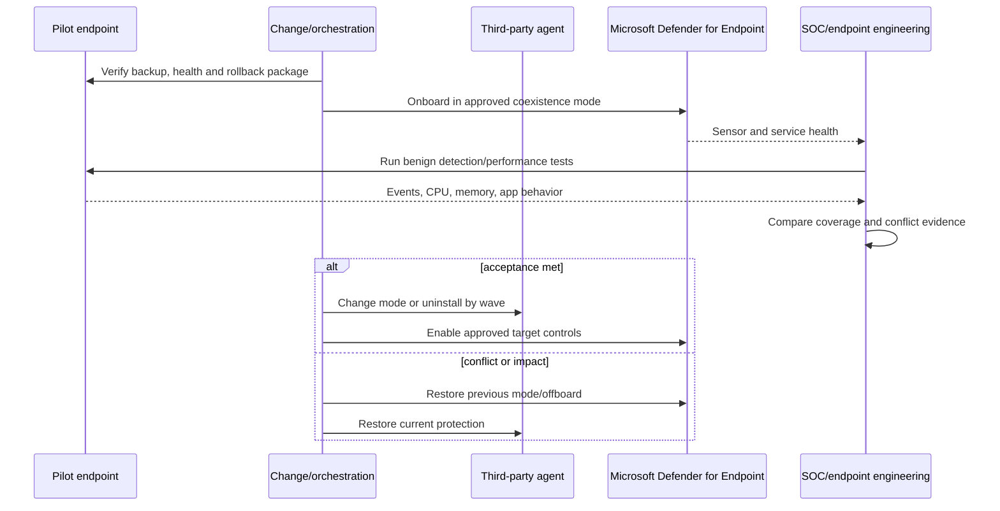

Endpoint checklist: supported OS/architecture; VDI and server behavior; onboarding/offboarding; tamper protection; safe mode; passive/active/block modes; EDR sensor health; antivirus registration; attack surface reduction; firewall ownership; web/network protection; encryption interaction; exclusions; proxy/TLS inspection; performance; update channels; reboot; uninstall token; offline behavior; response isolation; forensics/live response; data location; privacy; and help-desk recovery.

Never resolve conflict by adding broad permanent exclusions or disabling tamper protection without risk approval, narrow scope, time limit, monitoring, and rollback.

## 13. Email gateway and mail-flow migration

Email security migration changes an internet-facing production flow. Inventory MX records, inbound/outbound connectors, accepted domains, enhanced filtering or skip-list design where applicable, transport rules, SPF/DKIM/DMARC, certificates, smart hosts, journaling, encryption, disclaimers, routing, quarantine, allow/block lists, release workflow, submissions, reporting, continuity, and line-of-business relay.

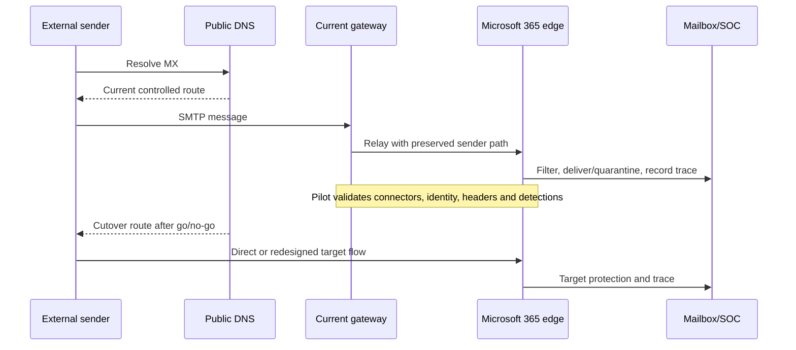

| Email phase | Main tests | Rollback dependency |
|---|---|---|
| Discovery | Domain/connector/rule/relay/quarantine reconciliation | Valid current configuration export |
| Target build | Policy order, exceptions, spoof/impersonation, safe links/attachments | Versioned target configuration |
| Pilot | Test domains, internal/external mail, malicious-safe simulation, false positive | Stable current route and TTL plan |
| Cutover | MX/connectors, delivery latency, NDR, tracing, SOC queue | DNS access, old gateway capacity and credentials |
| Hypercare | Queue, user reports, block/release, authentication alignment | Defined reversal window |
| Exit | Remove relay, secrets, rules, archives only after proof | Retention/export acceptance |

Do not send live malware or unauthorized phishing. Use vendor-supported simulation, inert files, dedicated test tenants/domains, and approved test messages.

## 14. SIEM history, retention, export, and detection migration

A SIEM migration is both an analytics migration and an evidence migration. Inventory sources, schemas, parsers, enrichment, lookup tables, detection logic, suppression, schedules, watchlists, threat intelligence, automation, dashboards, case history, comments, attachments, retention, archive, legal holds, access, exports, and chain-of-custody requirements.

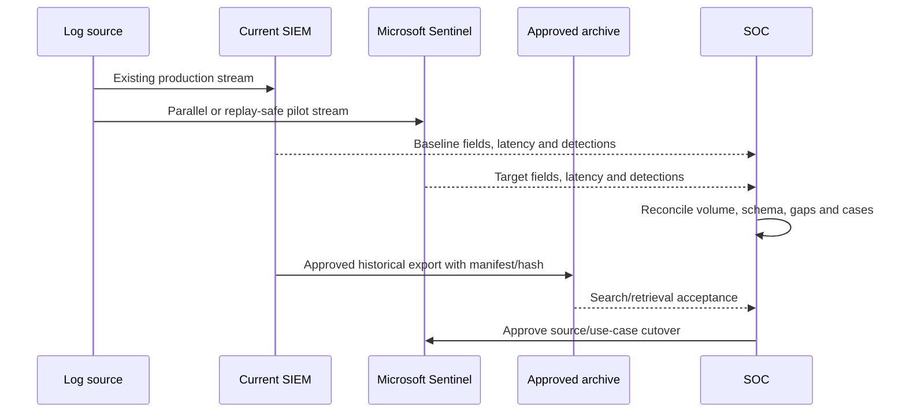

Do not assume all historical data can or should be reingested. Options include searchable read-only retention in the old platform, export to an approved archive, selective migration of required history, case-summary migration, or dual-query procedures. Legal, privacy, investigation, and audit owners decide retention and evidentiary requirements.

| SIEM artifact | Translation concern | Acceptance evidence |
|---|---|---|
| Raw events | Source timestamp, ingestion timestamp, field loss, duplicates | Volume/field/latency reconciliation |
| Parser | Schema and null behavior | Golden sample tests |
| Detection | Window, threshold, join, suppression, entity mapping | Replay and controlled scenario |
| Automation | Credentials, permissions, idempotency, approval, errors | Positive/failure/rollback tests |
| Case history | Comments, links, attachments, disposition | Retrieval and audit sample |
| Dashboard | Query semantics, population, time zone, KPI definition | Owner sign-off against baseline |
| Archive | Format, encryption, manifest, hash, access, search | Recovery and legal/privacy acceptance |

## 15. CASB and SaaS security migration

CASB migration spans discovery, API-connected apps, OAuth governance, activity and file policies, anomaly detection, session controls, sanctioning, and incident workflows. Network-log discovery and API connectors see different things. Session controls can alter live user traffic and demand identity, application, browser, certificate, latency, privacy, and rollback testing.

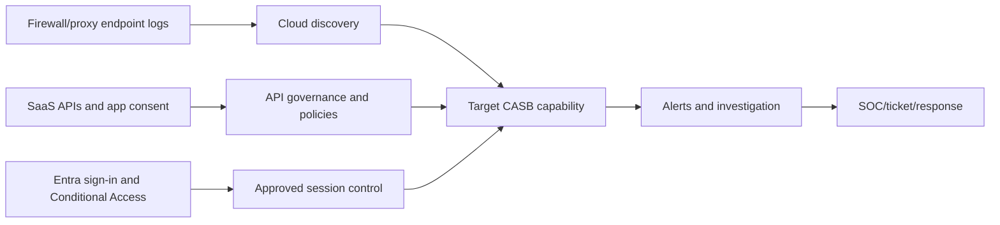

Translate sanction decisions, app catalog mappings, risk scoring, user/entity identity, connector permissions, file scope, governance actions, retention, and response approval. Validate unsupported apps, API throttling, historical discovery comparability, and user privacy. Do not block a business-critical SaaS service merely because two catalogs assign different risk scores.

## 16. Identity and tool migration

Identity migration can involve IdP, federation, MFA, conditional access, privileged access, provisioning, password reset, authentication methods, device trust, application claims, SCIM, service accounts, certificates, and emergency access. A failed identity cutover can block administrators and users simultaneously.

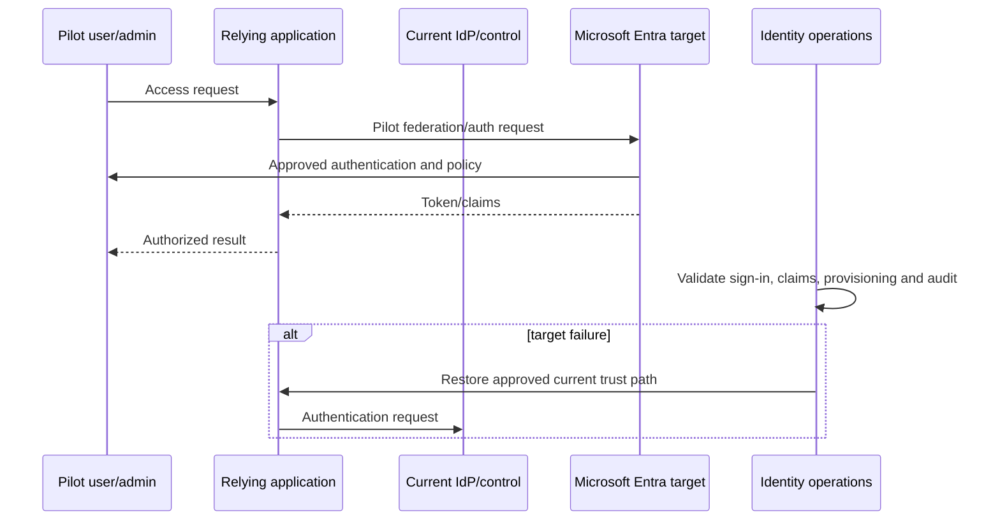

Mandatory tests include normal and privileged personas, guest and service identities, legacy dependencies, claims, group overage, token/session behavior, MFA registration/recovery, provisioning create/update/disable, emergency accounts, application owner contacts, certificate/secret rollover, break-glass monitoring, and help-desk scripts. Avoid broad bypasses. Emergency access must be predesigned, monitored, tested, and tightly governed.

## 17. Translate policy intent, not syntax

Blindly copying a rule can preserve obsolete assumptions or change meaning. First restate the policy as a control objective and decision table; then rebuild it using the target platform's supported evaluation model.


| Translation field | Current rule question | Target design question |
|---|---|---|
| Objective | What harm is reduced? | Is the same objective still valid? |
| Population | Who/what is in scope? | How is scope represented and reconciled? |
| Signal | Which attribute/event is trusted? | Is it available, timely, and equivalent? |
| Logic | How are order, threshold, and suppression evaluated? | Does target evaluation differ? |
| Action | Block, alert, quarantine, isolate, revoke? | Is action safe and reversible? |
| Exception | Why, owner, expiry, compensation? | Can exception be narrowed and governed? |
| Evidence | What proves decision and outcome? | Are logs, fields, retention, and access sufficient? |

### 🔍 Plain-English deep-dive: policy translation is semantic translation

A literal translation between human languages can be grammatically correct and still communicate the wrong meaning. Security rules behave similarly. “Block unmanaged device” may depend on how each system identifies device state, when that state refreshes, what applications support enforcement, and what happens when status is unknown. Preserve the intended safety outcome, document changed semantics, and test every important branch.

## 18. Licensing, cost, contract, and vendor exit

Compare total lifecycle economics, not only subscription price. Include current remaining term and termination charges; Microsoft entitlement by user/device/workload and prerequisite; implementation and integration; log ingestion, retention, archive, egress, and API use; infrastructure; partner/MSSP; training and hiring; dual-run cost; support; audit; operations; refresh; decommission; data export; legal/privacy review; and contingency.

| Commercial area | Evidence needed | Migration risk |
|---|---|---|
| Entitlement | Product Terms, service description, agreement, persona quantities | Unlicensed use or surprise add-on |
| Renewal/notice | Contract dates and termination clauses | Missed exit window |
| Data export | Format, completeness, timing, fees, access after termination | Evidence lock-in |
| Support | Severity definitions, response, named contacts, escalation | Gap during dual run |
| Professional services | Deliverables, acceptance, IP, dependencies | Ownership ambiguity |
| Deletion | Retention, backup, deletion certificate, legal hold | Privacy or evidence failure |
| Credentials | Vendor identities, API apps, remote access, certificates | Residual access after exit |
| Assets | Appliances, collectors, licenses, documentation | Orphaned technology |

Procurement, legal, licensing, privacy, finance, and vendor management own their decisions. A technical consultant identifies dependencies and evidence; they do not invent contract interpretations.

## 19. Risk assessment and migration safety

Create a migration risk register covering control gaps, service interruption, data loss, duplicate enforcement, endpoint conflict, identity lockout, mail rejection, detection blind spots, automation error, excessive access, privacy transfer, retention failure, vendor dependency, skill shortage, schedule compression, and rollback failure.

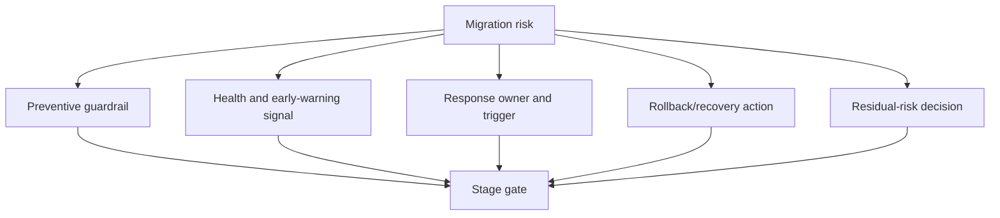

| Risk | Early signal | Prevent/contain | Rollback requirement |
|---|---|---|---|
| Email loss/loop | Queue, NDR, trace anomaly | Test domain, connector guard, command center | DNS/connectors/current capacity |
| Endpoint degradation | CPU/crash/help-desk spike | Small canary, performance baseline | Offboard/uninstall and restore controls |
| Alert blind spot | Source/field/latency reconciliation failure | Parallel observation | Restore current feed/detection |
| Duplicate response | Two action records | Single authority and dedup lock | Disable target automation |
| Identity lockout | Admin/user failure rate | Exclusions, pilot, emergency access | Restore trust/policy path |
| Evidence loss | Export mismatch or retrieval failure | Manifest, sample, archive acceptance | Keep current platform accessible |

## 20. Pilot design and representative populations

A pilot is a production-like learning stage with constrained blast radius, not an informal trial. Select representative low-risk and higher-complexity cases: operating systems, device types, offices, networks, languages, accessibility needs, privileged/nonprivileged users, remote workers, guests, service identities, business applications, regulated data, and support hours.

Avoid choosing only enthusiastic IT users; that proves little about ordinary workflows. Exclude extremely critical populations from the first ring unless the control cannot be tested otherwise and authority accepts the risk.

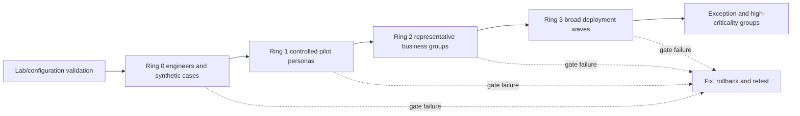

## 21. Acceptance criteria and traceability

Acceptance must be written before the pilot and linked to requirements and risks. Each criterion needs method, expected result, evidence, owner, threshold, and disposition authority.

| Acceptance category | Example criterion | Evidence |
|---|---|---|
| Coverage | 100% of pilot sources/devices report required health and fields | Reconciled inventory/export |
| Detection | All authorized test scenarios produce expected alert/entity mapping | Test IDs, query results, incident records |
| Response | Approved action executes once, logs result, and reverses safely | Action/audit/ticket evidence |
| Performance | Defined percentile CPU/latency remains within approved threshold | Before/after measurements |
| User impact | Critical workflows pass; ticket/block threshold not exceeded | UAT and service-desk report |
| Reliability | Connector/automation failures alert and recover as designed | Failure injection/tabletop evidence |
| Privacy | Purpose, fields, access, location, retention, redaction approved | Privacy/security review record |
| Operations | Queue, SLA, runbook, access, escalation and reporting work | Shift exercise and ticket sample |
| Rollback | Reversal completes within approved time and returns trusted state | Rehearsal evidence |
| Commercial | Entitlement, support and contract dependencies confirmed | Dated specialist sign-off |

## 22. Telemetry and detection efficacy validation

Validate the whole chain: source emits → transport succeeds → target parses → required fields exist → analytic executes → entity maps → alert/incident creates → queue routes → analyst interprets → response works → audit evidence remains.

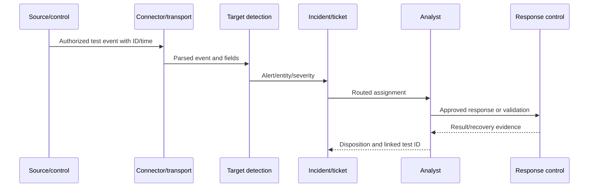

Use safe vendor-supported simulations, benign files/commands, synthetic identities, replay in isolated workspaces where authorized, and historical known-good samples. Record false negatives, false positives, field differences, and timing. Detection count equality is not required; outcome equivalence and understood differences are.

## 23. Performance, reliability, and user-impact testing

Measure startup/login, mail delivery, application launch, file access, browsing, synchronization, CPU, memory, disk, network, battery, crash/hang, policy evaluation, connector latency, API throttling, and ticket volume where relevant. Test ordinary, peak, degraded, offline, and recovery states.

Your SharePoint/OneDrive experience is especially useful: a migration control may appear healthy in a portal yet disrupt sync, sharing, file hydration, authentication, proxy access, or client update behavior. Compare affected and unaffected cohorts, preserve timestamps, identify recent change, and validate the fix in the original workflow.

## 24. Cutover planning and command control

The cutover plan should be executable by an authorized team under time pressure. Include minute-by-minute actions where needed; prerequisites; freeze; backups/exports; health baseline; owners; communication; access; scripts with peer review; validation; decision points; rollback triggers; supplier bridges; ticket routing; evidence capture; and business sign-off.

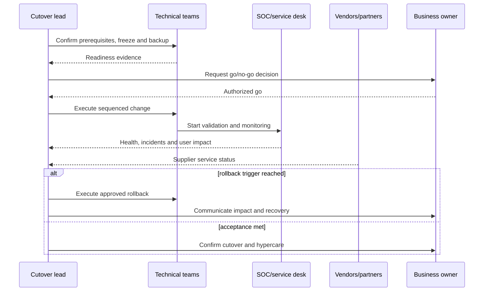

## 25. Rollback design and rehearsal

Rollback is a controlled return to the last trusted state. It requires retained capacity, credentials, configuration, data paths, installers, DNS/connectors, change windows, support, and a time-bounded decision. Some changes are not instantly reversible; identify these before approval.

### 🔍 Plain-English deep-dive: rollback is a capability, not a sentence

“We can roll back” is like saying “we can evacuate” without exits, keys, transport, accountability, or a drill. A real rollback identifies trigger, decision maker, exact steps, dependencies, maximum decision time, data reconciliation, expected loss, validation, communication, and the point after which a different recovery plan is needed.

| Rollback field | Required content |
|---|---|
| Trigger | Quantitative threshold or qualitative critical condition |
| Authority | Named role that orders rollback and delegates if absent |
| Decision window | Latest safe point before complexity/data divergence grows |
| Restore actions | Versioned steps, owners, credentials, tools, dependencies |
| Reconciliation | Events, cases, messages, device state, identity changes during transition |
| Validation | Trusted-state health and business workflow tests |
| Communication | Users, SOC, service desk, executives, vendors, regulators as authorized |
| Follow-up | Incident record, defect/RCA, redesigned test, new approval |

## 26. Reconciliation after cutover

Reconcile intended versus actual population, source count, agent health, policies, exceptions, roles, connectors, events, incidents, automations, tickets, archives, and charges. Sampling alone may miss orphaned devices or rules; use full-population comparison where technically possible and sample evidence quality in depth.

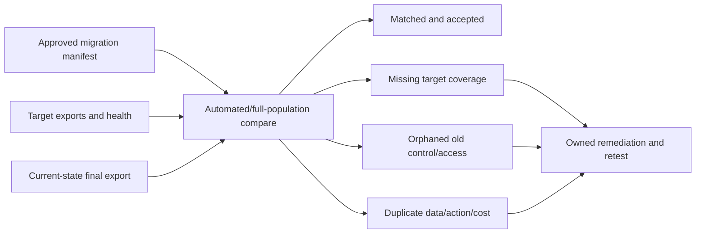

## 27. Hypercare and operational stabilization

Hypercare is a time-bounded period of increased monitoring, staffing, reporting, and rapid correction. Define start/end, extended coverage, dashboards, bridge/cadence, ticket tags, vendor availability, change restrictions, defect severity, workaround approval, daily reconciliation, and exit criteria.

| Hypercare measure | Warning example | Exit evidence |
|---|---|---|
| Coverage/health | Unexplained source or agent decline | Stable approved threshold across period |
| Detection | Missing/duplicated controlled signal | Repeated successful synthetic check |
| Performance | Sustained regression or crash increase | Baseline-comparable trend |
| User impact | Critical workflow failures/ticket surge | Backlog and rate within target |
| Operations | Unowned alerts or SLA misses | Queue ownership and SLA stable |
| Defects | Open severity 1/2 or unsafe workaround | Closed, accepted, or rollback decision |
| Supplier | Escalation path unresponsive | Tested contacts and support behavior |

## 28. Decommission and contract exit

Decommission only after target acceptance, reconciliation, retention/export acceptance, operational readiness, and residual-risk authorization. Remove agents, collectors, appliances, routes, connectors, service accounts, app registrations, secrets, certificates, API permissions, firewall rules, DNS, webhooks, automation, admin roles, remote access, support access, dashboards, scheduled jobs, and billing commitments in a controlled order.

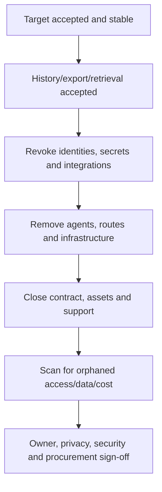

Retain documentation and evidence per authorized records policy. Obtain deletion or disposition evidence where contract and policy require it. Do not destroy data subject to legal hold, investigation, regulatory, or contractual obligations.

## 29. Roles and responsibility model

| Role | Key migration responsibility |
|---|---|
| Sponsor | Outcome, funding, priority, major risk and final decision |
| Business/service owner | Workflow criticality, UAT, disruption, acceptance |
| Security architect/control owner | Target outcome, design, gaps, residual risk |
| Migration lead | Integrated plan, dependencies, gates, timeline, evidence |
| Product engineers | Configuration, integration, test, rollback, defects |
| SOC/operations | Detection, queue, response, runbooks, metrics, handover |
| Service desk | User communications, known errors, ticket evidence, recovery |
| Privacy/legal/records | Purpose, transfer, retention, hold, regulatory advice |
| Procurement/vendor manager | Contract, renewal, exit, supplier obligations |
| Microsoft/third party/partner | Product evidence, defects, support, coordinated actions |
| Change authority | Change classification, go/no-go, emergency/rollback governance |
| Risk owner | Residual-risk treatment or acceptance |

Your strongest contribution in a scenario answer is often the connective work: establish one timeline, request precise evidence from each owner, prevent assumption-based blame, validate the fix end to end, document the root cause and workaround, and convert repeated defects into knowledge and business-review actions.

## 30. Quality, safety, security, and privacy controls

Quality requires traceability, peer review, reproducible evidence, controlled versions, separation of duties, stage gates, and defect closure. Safety requires least privilege, test isolation, backups, reversible actions, no live destructive testing, and clear stop conditions. Privacy requires purpose limitation, data minimization, access control, redaction, retention, location/transfer review, and authorized disclosure.

| Concern | Required practice | Evidence |
|---|---|---|
| Configuration quality | Export/version/peer review/four-eyes deployment | Change record and diff |
| Secret safety | Vaulted short-lived credentials and separate approval | Access/audit report |
| Test safety | Synthetic or sanitized data; no uncontrolled malware | Test-data register |
| Privacy | Minimize/redact user content and identifiers | Approved evidence pack |
| Production safety | Rings, health thresholds, stop/rollback authority | Gate record |
| Evidence integrity | Original preservation, timestamps, source, hash where needed | Evidence manifest |
| Accessibility/user impact | Representative personas and communication | UAT results |
| Supplier assurance | Supported pattern and tested escalation | Dated support evidence |

## 31. Common migration failure modes

| Failure | Likely cause | Recovery/learning action |
|---|---|---|
| “Parity” dispute late in pilot | Marketing-level mapping and missing use cases | Return to outcome/field/action matrix |
| Endpoint crashes or slowness | Unsupported agent coexistence or exclusions | Stop wave, preserve evidence, restore mode, vendor RCA |
| Mail delivery issue | Connector, DNS, relay, rule, sender-IP attribution | Roll back route, trace IDs, shared timeline |
| SIEM alert gap | Missing field/parser/latency/entity mapping | Restore feed, compare golden samples, retest |
| Duplicate containment | Two automation authorities | Disable secondary action, reconcile state, add idempotency |
| Identity lockout | Scope/claims/MFA/session dependency missed | Emergency process and trust-path rollback |
| Cost surprise | Data volume, dual-run, staffing, retention omitted | Rebaseline model and decision |
| Old vendor still has access | Incomplete identity/integration inventory | Revoke, investigate, full orphan scan |
| Analysts reject target | Workflow/skills ignored | Redesign queue/runbook/training with operators |
| No defensible decommission | History/contract/evidence ownership unclear | Keep service controlled until acceptance |

## 32. Scenario: third-party email gateway to Microsoft protection

**Situation:** A fictional organization wants to remove an external secure email gateway before renewal. It has inbound/outbound relays, hybrid applications, custom impersonation rules, executive exceptions, quarantine workflows, journaling, and an MSSP queue.

**Method:** Inventory domains, MX, connectors, certificates, rules, allowlists, relays, headers, authentication alignment, quarantine, SIEM feeds, tickets, retention, and service levels. Map each control objective to EOP/MDO capabilities and explicit gaps. Keep one primary mail-routing authority. Pilot test domains and controlled senders, then representative business groups. Validate message trace, headers, spoof/impersonation behavior, Safe Links/Attachments where licensed and supported, user reports, SOC incidents, release, latency, NDRs, and relay. Pre-stage DNS and connector rollback.

**Outcome artifact:** A flow diagram, rule translation workbook, test evidence, cutover timeline, rollback triggers, hypercare dashboard, and decommission checklist. The answer should not promise that Microsoft controls are automatically superior; it should show how the organization proves fit.

## 33. Scenario: endpoint EDR transition

**Situation:** Windows, macOS, Linux, VDI, and servers use a current EDR. The target is Microsoft Defender for Endpoint, but a legacy application is latency-sensitive and the server team requires separate approval.

**Method:** Segment platforms and criticality; validate supported coexistence modes with both vendors; baseline resource use; inventory exclusions and response actions; onboard Ring 0; validate sensor health, telemetry, controlled detections, timeline, incident routing, isolation and recovery; compare performance; then move cohorts. Retain one response authority and do not copy broad exclusions. Separate server and VDI decisions. Record product defects with versions, timestamps, dumps/logs, minimal repro, business impact, and workaround.

**Background tie:** This is familiar escalation discipline: compare affected/unaffected endpoints, isolate change and dependency, gather product-specific evidence, coordinate vendors, validate remediation in the user's workflow, and publish a known-error article.

## 34. Scenario: SIEM migration to Sentinel

**Situation:** A current SIEM ingests identity, firewall, endpoint, email, and SaaS logs. Hundreds of rules exist, but many have no owner or recent true positive. Seven years of history has mixed retention obligations.

**Method:** Rationalize use cases before translating queries. Classify rules as retain/rewrite/merge/retire/test. Map source fields, volume, latency, retention, normalization, entities, suppression, automation, dashboards, and case workflow. Run selected sources and critical detections in parallel. Export required history with manifests to an approved archive, then prove search/retrieval. Reconcile every source and high-priority use case before disabling old ingestion.

**Failure guard:** Do not reingest everything by default, count duplicate alerts as improved detection, or close the old contract before archive acceptance.

## 35. Scenario: CASB consolidation

**Situation:** The organization uses a third-party CASB for proxy-log discovery, OAuth governance, and a few inline session policies. It considers Microsoft Defender for Cloud Apps.

**Method:** Separate discovery, API, app governance, and session use cases. Compare app catalog identity and scores, supported connectors, governance actions, file/activity fields, Conditional Access dependencies, browser/app support, latency, and privacy. Run report-only or observation where supported. Pilot a low-risk application and persona, test ordinary and failure paths, and keep a rapid exclusion/rollback path. Reconcile sanctioned/unsanctioned decisions and OAuth cases before exit.

## 36. Scenario: identity control transition

**Situation:** A third-party federation and MFA platform protects Microsoft 365 and several enterprise apps. The target is Entra authentication, Conditional Access, authentication strengths, and PIM for selected administration.

**Method:** Inventory domains, federation trusts, applications, claims, protocols, provisioning, authentication methods, recovery, admins, guests, service identities, devices, network dependencies, certificates, and support. Build emergency access before policy change. Pilot verified domains/apps/personas, use report-only where applicable, validate positive/negative/boundary cases, and monitor sign-ins. Cut over application groups with reversible trust and certificate steps. Retire old identities/secrets only after reconciliation.

## 37. Migration metrics and business reviews

Metrics need definitions, owners, baselines, targets, data sources, cadence, and decision use.

| Metric family | Example | Business-review question |
|---|---|---|
| Delivery | Use cases accepted / planned | Are dependencies or quality gates blocking outcomes? |
| Coverage | Intended sources/devices/users reporting | Where are remaining blind spots and why? |
| Quality | Acceptance pass rate and escaped defect severity | Is speed harming quality? |
| Security | Controlled detections and response success | Are named controls demonstrably effective? |
| Service | User tickets, latency, availability, rollback events | What operational harm occurred? |
| Operations | Queue ownership, SLA/OLA, automation failure | Can teams sustain the target? |
| Commercial | Forecast versus actual lifecycle cost | Which assumptions changed? |
| Risk | Open gaps, exceptions, residual-risk decisions | Which owner action is overdue? |
| Exit | Old access/data/assets/contracts closed | Is decommission genuinely complete? |

Avoid vanity metrics such as number of policies created or agents installed without effective-state proof. Present uncertainty and incidents honestly. A business review should highlight decisions needed, not bury them in technical volume.

## 38. Migration artifact set

1. Charter and outcome map.
2. Stakeholder, supplier, and decision-rights map.
3. Current architecture and validated inventory.
4. Use-case and control catalog.
5. Baseline scorecard.
6. Target capability evidence register.
7. Parity/gap/overlap and option matrix.
8. Target/coexistence HLD and LLD.
9. Policy and detection translation workbook.
10. License, cost, contract, skills, and exit assumptions.
11. RAID and residual-risk registers.
12. Pilot, traceability, and acceptance plan.
13. Cutover, rollback, communication, and hypercare runbooks.
14. Reconciliation and decommission evidence.
15. Handover, training, known-error, and business-review pack.

## 39. Safe paper portfolio lab: Northstar security migration

Create a fictional company named **Northstar Research**, with 3,000 users, 2,200 Windows endpoints, 200 macOS endpoints, 150 servers, Microsoft 365, several SaaS applications, a third-party email gateway, EDR, CASB, SIEM, and federation/MFA service. Use invented names, counts, rules, costs, logs, and screenshots. Do not access a real tenant, send malware, run phishing, collect personal data, change DNS, install agents, or claim production execution.

### Lab brief

Northstar wants to evaluate Microsoft Defender XDR, Defender for Office 365, Defender for Cloud Apps, Microsoft Sentinel, and Entra controls before three contracts renew. Its goals are better cross-domain investigation, simpler operations, preserved evidence, and acceptable cost. The board will not accept uncontrolled email interruption, endpoint degradation, identity lockout, evidence loss, or weakened detection.

### Required tasks

1. Write a one-page charter with outcome hypotheses, scope, exclusions, constraints, and authorities.
2. Draw current and target architectures with control/data planes and trust boundaries.
3. Build 20 use cases across email, endpoint, SIEM, CASB, and identity.
4. Create a 40-row inventory covering rules, data, agents, APIs, workflows, SLAs, roles, contracts, and evidence.
5. Create a multidimensional parity/gap/overlap matrix; mark unknowns as tests.
6. Design coexistence with one authority for each enforcement and response action.
7. Translate five policies into intent, decision table, target design, and tests.
8. Build representative rings and at least 30 positive, negative, boundary, failure, privacy, performance, and rollback tests.
9. Write email, endpoint, SIEM, CASB, and identity cutover/rollback summaries.
10. Build reconciliation, hypercare, decommission, training, and supplier-exit checklists.
11. Create a dashboard with baseline, target, data source, owner, cadence, and caveat.
12. Present a five-slide business review: outcome, evidence, risks, decisions, and next wave.

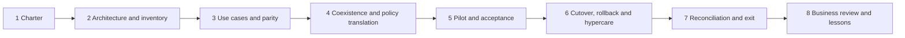

### Portfolio evidence index

| Artifact | Quality test | Honest label |
|---|---|---|
| Migration charter | Outcomes and authority are explicit | Fictional paper exercise |
| Inventory/data flows | Hidden dependencies and owners included | Synthetic current state |
| Capability matrix | Dated sources, unknowns, gaps, no marketing claims | Research-based hypothesis |
| Coexistence design | One action authority and health monitoring | Conceptual HLD/LLD |
| Test/acceptance pack | Requirements, risks, evidence and rollback traced | Not production-tested |
| Cutover/rollback | Executable roles, triggers and validation | Tabletop only |
| Decommission dossier | Data/access/contract/assets reconciled | Fictional checklist |
| Business review | Decisions and caveats are visible | Practice presentation |

## 40. Quality gates

| Gate | Minimum evidence | Decision owners |
|---|---|---|
| Discovery complete | Inventory reconciled; unknowns and exclusions explicit | Migration/control owners |
| Design accepted | Requirements traced; gaps/risks/rollback reviewed | Architecture, risk, operations |
| Pilot ready | Environment, personas, tests, support, privacy, stop conditions ready | Change and business owners |
| Pilot accepted | Required tests pass; defects/residual risk decided | Acceptance authority |
| Cutover ready | Runbook, access, backups, bridge, comms, vendor support rehearsed | Cutover/change authority |
| Hypercare exit | Stable health, service, queue and defect thresholds | Operations/service owner |
| Decommission ready | Archive, reconciliation, access revocation and contract actions accepted | Security, privacy, procurement, risk |

## 41. Interview method: answer migration questions in eight moves

Use **O-I-M-D-P-C-R-O**:

1. **Outcome:** state why the migration exists and what must not regress.
2. **Inventory:** discover use cases, architecture, data, controls, operations, contracts, and evidence.
3. **Map:** compare Microsoft target capability with dated evidence across parity dimensions.
4. **Design:** define target, coexistence authority, dependencies, privacy, skills, and risk.
5. **Pilot:** use representative rings and measurable acceptance.
6. **Cut over:** execute command-controlled change with communication and stop conditions.
7. **Reconcile/rollback:** prove coverage or return to trusted state and account for transition data.
8. **Operate/exit:** hypercare, handover, metrics, decommission, vendor exit, and improvement.

## 42. JD Mapping: interview translation

| Transferable evidence | Consulting translation | Honest interview sentence |
|---|---|---|
| Coordinated vendors/product groups | Multi-vendor migration and defect governance | “I establish ownership, a shared timeline, exact evidence requests, and validation criteria.” |
| Led critical escalations | Cutover/hypercare command discipline | “I control impact, cadence, decisions, recovery, and stakeholder updates.” |
| Produced RCA | Migration defect and failure analysis | “I separate trigger, contributing conditions, root cause, workaround, fix, and prevention.” |
| Validated fixes | Acceptance and post-cutover assurance | “I test the original workflow plus negative and regression cases before closure.” |
| Wrote guidance | Runbooks, known errors, handover, and training | “I convert one-off learning into reusable operations and escalation criteria.” |
| Reported KPIs/business reviews | Outcome and risk reporting | “I define metrics, caveats, owners, decisions, and trend, not just activity volume.” |

## Official Source Anchors

Use current versions and record access dates in real deliverables.

1. Microsoft Cloud Adoption Framework, cloud-scale migration and governance concepts: <https://learn.microsoft.com/azure/cloud-adoption-framework/>
2. Microsoft Cybersecurity Reference Architectures: <https://learn.microsoft.com/security/adoption/mcra>
3. Microsoft Defender for Endpoint deployment guidance: <https://learn.microsoft.com/defender-endpoint/deployment-phases>
4. Microsoft Defender for Office 365 migration guidance: <https://learn.microsoft.com/defender-office-365/migrate-to-defender-for-office-365>
5. Microsoft Defender for Cloud Apps documentation: <https://learn.microsoft.com/defender-cloud-apps/>
6. Microsoft Sentinel planning and deployment guide: <https://learn.microsoft.com/azure/sentinel/deploy-overview>
7. Microsoft Sentinel data retention and archive concepts: <https://learn.microsoft.com/azure/azure-monitor/logs/data-retention-configure>
8. Microsoft Entra deployment plans: <https://learn.microsoft.com/entra/architecture/deployment-plans>
9. Microsoft Conditional Access deployment guidance: <https://learn.microsoft.com/entra/identity/conditional-access/plan-conditional-access>
10. Microsoft 365 service descriptions: <https://learn.microsoft.com/office365/servicedescriptions/office-365-service-descriptions-technet-library>
11. Microsoft Product Terms: <https://www.microsoft.com/licensing/terms/>
12. NIST Cybersecurity Framework 2.0: <https://www.nist.gov/cyberframework>
13. NIST SP 800-53 Rev. 5, security and privacy controls: <https://csrc.nist.gov/pubs/sp/800/53/r5/upd1/final>
14. CISA Zero Trust Maturity Model: <https://www.cisa.gov/resources-tools/resources/zero-trust-maturity-model>
15. OWASP Logging Cheat Sheet: <https://cheatsheetseries.owasp.org/cheatsheets/Logging_Cheat_Sheet.html>

## ⭐ Likely Interview Questions for This Section

### Q1. How would you approach a third-party to Microsoft security migration?

**Model answer:** I would begin with business and control outcomes, not products. I would inventory use cases, populations, architecture, policies, telemetry, agents, integrations, operations, SLAs, contracts, skills, and evidence. I would map each requirement to candidate Microsoft capabilities using dated documentation and controlled tests, recording parity, gaps, overlaps, prerequisites, licensing, and risk. I would design coexistence with one authority for each enforcement and response action, pilot representative rings against measurable acceptance, execute a command-controlled cutover with rehearsed rollback, reconcile coverage and transition data, then hypercare, hand over, decommission, revoke vendor access, and measure outcomes.

### Q2. How do you determine feature parity without trusting marketing claims?

**Model answer:** I treat parity as multidimensional. For every use case I compare function, population and platform coverage, data fields, detection logic and latency, policy semantics, response actions, integrations, retention, privacy, service levels, operability, assurance, and lifecycle cost. I date public documentation, identify prerequisites and unsupported cases, validate important behavior in a safe test, and mark uncertainty as “unknown—test required.” The decision may be equivalent, different but acceptable, partial with compensation, long-term coexistence, or retain.

### Q3. How do you manage duplicate alerts and response actions during coexistence?

**Model answer:** I expect duplicate observations and design correlation using shared entity, source, timestamp, and incident identifiers. I define a capability authority matrix so only one system or orchestrated workflow can take a high-impact action such as isolation, quarantine, account disablement, or token revocation. The other system runs detect-only or records a linked disposition. I add idempotency, approval, audit, health alerts, reconciliation, and a rapid switch-off for automation. Metrics exclude known duplicates.

### Q4. What is different about migrating an email gateway?

**Model answer:** Email is an internet-facing production flow, so I inventory DNS/MX, connectors, certificates, relays, transport rules, accepted domains, SPF/DKIM/DMARC, sender attribution, quarantine, journaling, applications, SIEM feeds, and support workflows. I translate control intent, test dedicated domains and representative mail paths, validate delivery, NDRs, headers, authentication, detections, release, trace, latency, and SOC routing. Cutover has pre-staged DNS and connector rollback, command-center monitoring, hypercare, and no old-gateway exit until archive and relay reconciliation pass.

### Q5. How do you migrate SIEM detections and history?

**Model answer:** I rationalize use cases before converting query syntax. I map sources, schema, parsers, entity fields, time windows, thresholds, suppression, enrichment, automation, dashboards, cases, retention, and legal requirements. I use golden samples, safe replay or controlled scenarios, parallel source reconciliation, and end-to-end incident tests. History may remain read-only, move to an approved searchable archive, or be selectively migrated; the authorized legal, privacy, records, and security owners decide. I prove manifest completeness and retrieval before decommission.

### Q6. What should trigger rollback?

**Model answer:** Triggers are defined before change and tied to control and business impact: critical mail loss or loop, identity lockout, material endpoint degradation, missing critical telemetry/detection, unsafe duplicate action, privacy breach, unrecoverable automation error, or acceptance threshold breach. The plan names the decision authority, latest decision time, exact restore steps, retained dependencies, transition-data reconciliation, trusted-state validation, communications, and follow-up RCA. Rollback is rehearsed capability, not a sentence in a plan.

### Q7. How do you know when the old security tool can be decommissioned?

**Model answer:** Only after target acceptance and a stable hypercare period, full population and source reconciliation, critical use-case proof, operational handover, approved residual risk, and accepted history/export/retrieval. I then remove agents, collectors, routes, integrations, service identities, API permissions, secrets, certificates, remote access, infrastructure, and charges in sequence. Privacy, records, legal, procurement, security, operations, and service owners complete their authorized actions, and I scan for orphaned access, data, assets, and cost.

### Q8. What is your honest experience with third-party security migrations?

**Model answer:** My direct production evidence is Microsoft 365 escalation engineering, SharePoint/OneDrive and sync support, multi-vendor and product-group coordination, RCA, fix validation, documentation, stakeholder communication, KPI reviews, and business reviews. I have used those strengths to build a fictional vendor-neutral migration portfolio across email, endpoint, SIEM, CASB, and identity, including capability mapping, coexistence, tests, cutover, rollback, and decommission. I would not present that as production implementation, and I would validate current product, licensing, contract, privacy, and client-governance facts on a real engagement.

## 🧠 30-Second Memory Hooks

- **Migrate outcomes, not logos.** Prevention, detection, response, recovery, proof, and ownership must survive.
- **Inventory the hidden system.** Agents, APIs, identities, queues, evidence, contracts, and skills matter as much as policies.
- **Parity has dimensions.** Function, coverage, data, action, operation, assurance, commercial, and lifecycle.
- **One action authority.** Duplicate detection can be useful; duplicate containment can be harmful.
- **Translate meaning, not syntax.** Restate control intent and test each branch.
- **Pilot represents reality.** Personas, platforms, networks, workflows, failure modes, and support must be present.
- **Rollback needs machinery.** Trigger, authority, deadline, dependencies, steps, reconciliation, validation, communication.
- **Reconcile before exit.** Coverage, data, cases, access, assets, contracts, and cost.
- **Your bridge is evidence.** Scope, timeline, vendors, RCA, fix validation, documentation, and business communication.

## Completion Checklist

- [ ] I can explain why a security migration transfers control outcomes, evidence, and operations rather than products alone.
- [ ] I can create a charter with scope, exclusions, outcomes, constraints, authorities, acceptance, and rollback.
- [ ] I can inventory use cases, architecture, policies, rules, data, agents, connectors, APIs, workflows, SLAs, roles, skills, contracts, and evidence.
- [ ] I can draw current, target, coexistence, and cutover flows with control/data planes and trust boundaries.
- [ ] I can establish honest security, service, cost, user-impact, and operating baselines.
- [ ] I can map Microsoft target capabilities using dated documentation, prerequisites, tenant tests, and limitations rather than marketing.
- [ ] I can assess functional, coverage, detection, response, data, integration, operational, assurance, commercial, and risk parity.
- [ ] I can define coexistence patterns and one authoritative system for each policy decision, action, case, and metric.
- [ ] I can explain endpoint-agent conflict risks and safe staged validation.
- [ ] I can plan email gateway flows, connector/DNS testing, sender attribution, tracing, cutover, and rollback.
- [ ] I can plan SIEM history, retention, archive, schema, detection, automation, and case migration.
- [ ] I can plan CASB discovery/API/session and identity/federation/control migrations.
- [ ] I can translate policy objective, population, signal, logic, action, exception, and evidence without blind copying.
- [ ] I can identify license, total-cost, contract, support, export, deletion, and vendor-exit dependencies.
- [ ] I can design representative rings and measurable acceptance across security, service, performance, privacy, operations, and rollback.
- [ ] I can validate telemetry from source through detection, case, analyst, response, recovery, and audit.
- [ ] I can write executable cutover, rollback, reconciliation, hypercare, and decommission plans.
- [ ] I can protect test data, secrets, personal data, evidence, and production service.
- [ ] I can report progress, risk, decisions, caveats, and outcomes in a business review.
- [ ] I can describe the Northstar artifacts as a fictional paper lab and state my production experience honestly.
- [ ] I can answer Q1–Q8 aloud in approximately 60–90 seconds each without overclaiming.

*Next suggested section:* [Part 58](Part-58-deployment-pilots-testing-cutover-rollback.md)