# Part 58 — Deployment Engineering: Pilots, Rings, Change Control, Testing, Cutover, and Rollback

> **Section goal:** Build a beginner-first, consulting-grade deployment method that moves Microsoft 365 security changes from idea to stable production operation through controlled environments, representative personas, pilots, rings, waves, change governance, traceable tests, objective go/no-go gates, command-center cutover, rehearsed rollback, and measurable hypercare. By the end, you should be able to distinguish lab, development, test, pilot, and production purposes; classify standard, normal, and emergency change; build a complete change record; design unit, integration, system, security, performance, user-acceptance, and operational tests; cover positive, negative, boundary, failure, recovery, and rollback behavior; protect test data and privacy; use simulation, report-only, and audit modes safely; collect reproducible evidence and triage defects; plan communications and command roles; define rollback triggers and restore validation; exit hypercare only on evidence; and adapt the method to identity, endpoint, email, DLP, SIEM, automation, and other policy rollouts.

This Part maps directly to the role's expectations for designing, configuring, testing, migrating, troubleshooting, and handing over Microsoft security solutions while protecting client operations. Your demonstrated production strengths in high-severity Microsoft 365 escalations, SharePoint/OneDrive and sync troubleshooting, coordinating customers, vendors, partners, and product groups, documenting timelines and RCA, validating fixes, creating knowledge, mentoring engineers, and reporting service metrics are strong deployment-engineering foundations. The consulting extension is to make those behaviors preventive and repeatable before production change, not only corrective after an incident.

> **Method boundary:** This chapter provides public, general consulting, deployment, testing, change-management, and service-transition practices. It does not describe or imply Deloitte proprietary methods, templates, tools, governance, or client delivery experience. A real engagement must follow the client's and firm's approved security, architecture, engineering, change, privacy, legal, records, procurement, release, accessibility, and quality processes.

> **Currency and safety warning (August 24, 2026):** Microsoft policy modes, preview status, test tools, APIs, release behavior, portal labels, deployment guidance, licensing, service limits, and rollback behavior change. Verify current public documentation, Product Terms, tenant/cloud/region, workload support, current service health, and approved change procedures. “Report-only,” “simulation,” “audit,” “preview,” “disable,” “delete,” and “rollback” do not mean the same thing across products. Test actual behavior safely before relying on a label.

## JD Mapping

| Role expectation | Capability developed here | Portfolio evidence |
|---|---|---|
| Deploy Microsoft security controls | Promote versioned configuration through controlled stages and waves | Deployment strategy and release manifest |
| Lead pilots and testing | Select representative personas and prove requirements, risks, and operations | Pilot charter and traceability matrix |
| Govern production change | Classify change, document risk/dependencies, and secure authority | Complete change record and CAB brief |
| Protect service during cutover | Coordinate runbook, roles, communications, monitoring, stop conditions, and rollback | Command-center cutover plan |
| Troubleshoot defects | Reproduce, isolate, prioritize, escalate, and retest with evidence | Defect and vendor escalation pack |
| Validate fixes | Re-run original, regression, negative, and effective-state tests | Fix-validation report |
| Hand over to operations | Prove queues, access, monitoring, runbooks, training, and SLAs | Operational acceptance pack |
| Report progress and risk | Use evidence-based readiness, quality, service, and outcome metrics | Hypercare and business-review dashboard |

## Candidate honesty note

You can credibly describe production experience controlling customer-impacting technical work, leading escalations, building timelines, comparing affected and unaffected users, coordinating vendors and Microsoft product groups, validating fixes in SharePoint/OneDrive and sync scenarios, documenting RCA and guidance, mentoring, and reporting KPIs. These experiences demonstrate disciplined diagnosis, stakeholder management, recovery, and evidence.

You should not claim that you have chaired a client CAB, deployed production Conditional Access, Intune, Purview, Defender, or Sentinel controls, executed a security-platform cutover, or owned a Deloitte deployment method unless separately evidenced. Safe wording is:

> “My production background is Microsoft 365 escalation engineering, where I scope impact, establish a timeline, coordinate customers and product teams, validate fixes, document RCA, and communicate service outcomes. I have extended those skills through a fictional deployment portfolio that includes environments, rings, change records, traceable test cases, go/no-go gates, cutover, rollback, and hypercare. I would apply the client's approved change and quality process and verify current product behavior before a real deployment.”

---

## 1. Deployment engineering from zero

**Deployment engineering** is the disciplined work of moving an approved design into effective, supportable production behavior. It connects architecture to change, configuration, test, release, operations, evidence, and improvement.

**Analogy:** A bridge design is not a usable bridge. Materials must be controlled, sections tested, traffic introduced gradually, monitoring installed, operators trained, and an emergency closure plan rehearsed. Security deployment similarly proves not only that a setting exists, but that the right population receives it, the intended behavior occurs, unsafe behavior is handled, and operations can sustain it.

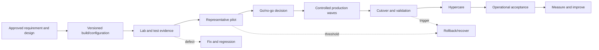

| Term | Plain meaning | Why it matters | Memory hook |
|---|---|---|---|
| Release | Approved collection of changes delivered together | Defines version and evidence boundary | “What is moving?” |
| Deployment | Technical distribution/application of a release | Affects configuration and population | “How does it arrive?” |
| Cutover | Point where target becomes authoritative/active | Concentrates operational risk | “When does control move?” |
| Rollback | Controlled return to last trusted state | Limits harm after failed change | “How do we get back?” |
| Hypercare | Time-bounded heightened support after change | Finds early operational defects | “Watch closely, then normalize” |
| Acceptance | Authorized decision that defined evidence is sufficient | Prevents silent assumption of success | “Who says it is good enough?” |

## 2. The deployment contract: inputs and outputs

Deployment should not begin with an engineer clicking through a portal. Minimum inputs include approved scope and requirements; HLD/LLD; threat and risk assessment; control owner; current baseline; target configuration; dependencies; licensing and prerequisites; privacy/data decisions; test strategy; operational design; change window; acceptance authority; and rollback feasibility.

Minimum outputs include versioned effective configuration; full-population reconciliation; test and defect evidence; decision records; updated architecture and CMDB/configuration baseline; runbooks and known errors; training; monitoring and alert routing; access and service identities; support acceptance; residual risk; cutover timeline; rollback record if used; and hypercare report.

| Input | Owner validation question | Stop condition if absent |
|---|---|---|
| Requirement/design | Is expected behavior testable and approved? | Ambiguous outcome or scope |
| Population | Can intended and excluded objects be enumerated? | No reconciliation method |
| Dependencies | Are identity, network, license, API, data, and operations ready? | Critical unknown dependency |
| Risk/privacy | Are impact, data purpose, access, and retention decided? | Unauthorized data or risk treatment |
| Test/acceptance | Are cases, thresholds, evidence, and authority defined? | “Test after deployment” plan |
| Rollback | Can previous trusted state be restored and validated? | Irreversible risk not accepted |
| Operations | Can teams monitor, respond, recover, and escalate? | No owner after go-live |

## 3. Environment strategy

An **environment** is an isolated or logically separated place where a version of configuration and its dependencies can be built or evaluated. Cloud services may not provide traditional development/test copies for every feature, so separation may use dedicated tenants, subscriptions, workspaces, policies, groups, domains, accounts, devices, connectors, data sources, or report-only modes.

| Environment/stage | Primary purpose | Data and population | Promotion evidence |
|---|---|---|---|
| Paper/design | Challenge logic and dependency before configuration | Synthetic diagrams and decision tables | Peer-reviewed design |
| Lab/sandbox | Learn behavior and validate basic configuration safely | Synthetic accounts/devices/data | Repeatable build and basic tests |
| Development | Create automation, queries, parsers, policies, or code | Generated/sanitized data | Unit/static/peer review evidence |
| Test/integration | Prove dependencies and end-to-end interfaces | Representative nonproduction systems/data | Integration, failure, security evidence |
| Pilot/canary | Test real operating conditions with limited blast radius | Approved representative production users/resources | Acceptance and support evidence |
| Production | Deliver approved control outcome at scale | Real business population and data | Reconciliation and operational validation |

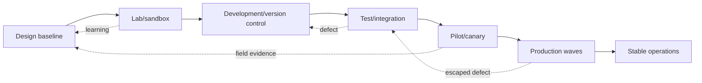

Environment differences must be explicit: tenant IDs, domains, licenses, regions, policies, connectors, data volumes, identity sources, application versions, network paths, roles, service identities, and integrations. A test that passes in a simplified lab may fail in production because a hidden dependency is absent.

### 🔍 Plain-English deep-dive: production-like does not mean copying production

A flight simulator reproduces important controls and failure behavior without carrying real passengers. A security test environment should reproduce the relevant identities, policies, routes, platforms, data shapes, integrations, and scale while avoiding unnecessary production data and risk. Copying all production data creates privacy and security exposure; oversimplifying everything creates false confidence. Reproduce the behavior that matters, minimize the data.

## 4. Configuration as a controlled artifact

Treat policy, query, parser, playbook, script, connector settings, app consent, role assignment, and infrastructure as versioned artifacts where the platform allows it. Record stable ID, name, purpose, owner, version, source, parameters, scope, exclusions, prerequisites, dependencies, secret references, approved change, deployment time, actor, and rollback version.

Portal exports and APIs can help, but export/import is not proof of equivalent effective behavior. Tenant-specific IDs, unsupported properties, defaults, policy order, licenses, service state, and target populations require validation.

| Artifact control | Good practice | Evidence |
|---|---|---|
| Version | Immutable release ID and dated change history | Repository/export manifest |
| Review | Peer review plus control/operations approval | Review record |
| Secrets | References to approved vault, never embedded | Secret scan/access report |
| Parameters | Environment-specific values separated from logic | Parameter inventory |
| Diff | Human-readable intended change | Before/after comparison |
| Provenance | Who built, approved, deployed, and when | Audit/change record |
| Recovery | Last trusted version and restoration method | Rollback rehearsal |

## 5. Personas and representative populations

A **persona** groups people or systems with similar workflows, risk, technology, and support needs. Representative pilots should include meaningful variation rather than only IT volunteers.

| Persona dimension | Examples | Why test it |
|---|---|---|
| Role/risk | Standard user, executive, developer, SOC analyst, admin | Different access and impact |
| Employment | Employee, contractor, guest, partner | Identity and policy variation |
| Location/network | Office, home, travel, VPN, proxy, restricted region | Path and location controls |
| Device | Managed/unmanaged, Windows/macOS/mobile, VDI, server | Platform and management behavior |
| Application | Browser, rich client, mobile, legacy, service principal | Protocol/token support |
| Data | Public, internal, confidential, regulated | Classification and policy behavior |
| Accessibility | Assistive technology, alternate workflow | Avoid discriminatory disruption |
| Support window | Business hours, shift worker, 24x7 operations | Coverage and escalation readiness |

Create explicit exclusions with reason, owner, expiry, compensating control, and later-wave plan. An exclusion should not become an invisible permanent bypass.

## 6. Rings, waves, and canaries

A **canary** is a very small, closely monitored population that detects problems early. A **ring** is a standing risk tier used to receive changes in sequence. A **wave** is a scheduled deployment batch, often organized by geography, business unit, platform, or dependency.

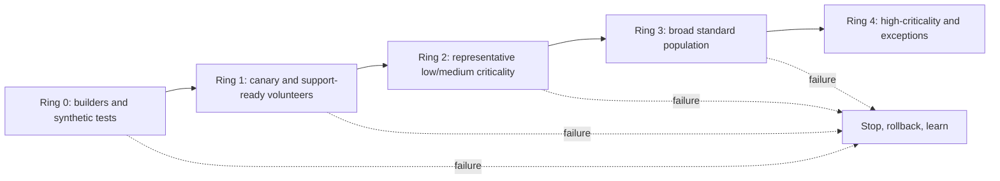

| Design question | Strong answer |
|---|---|
| Why this ring? | It represents named technical/business risks |
| How large? | Small enough to control, large enough to observe the risk |
| How long? | Long enough for expected evaluation cycles and workflows |
| What advances it? | Defined security, service, quality, and operations thresholds |
| What stops it? | Defined critical conditions and trend thresholds |
| Who decides? | Named technical, service, risk, and change authority |
| How is scope proven? | Before/after membership and effective-state reconciliation |

Do not use dynamic groups or filters without testing membership timing, rule behavior, object lifecycle, exclusions, and emergency removal. Assignment intent and effective delivery are different states.

## 7. Change types and governance

Change terminology varies by organization. A common public service-management model distinguishes:

- **Standard change:** preauthorized, low-risk, repeatable, documented, and proven.
- **Normal change:** assessed and authorized through the regular process, with approval proportional to risk.
- **Emergency change:** expedited to resolve or prevent serious impact, still documented, authorized, tested as feasible, and reviewed afterward.

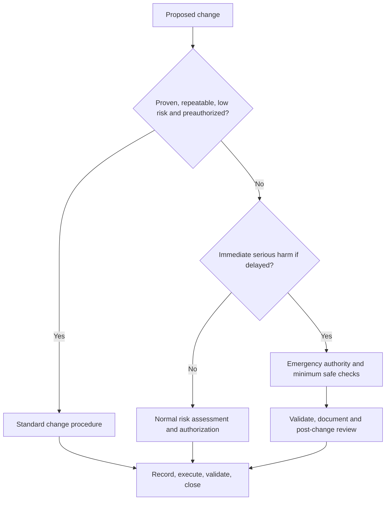

The **Change Advisory Board (CAB)** is a governance forum used by some organizations to assess and coordinate changes. It is not a substitute for technical review, risk ownership, or emergency authority. Low-risk automation should not be delayed by ceremonial meetings; high-risk change should not be waved through because a meeting occurred.

## 8. The complete change record

| Field | Required content |
|---|---|
| Identity | Change ID, title, owner, release/version, related incidents/problems |
| Reason/outcome | Business, security, regulatory, defect, lifecycle, or service driver |
| Scope | Tenants, users, groups, devices, apps, policies, data, regions, exclusions |
| Current/target | Before and intended after state with diagrams/configuration IDs |
| Method | Sequenced implementation steps, tools, scripts, access, peer checks |
| Schedule | Window, duration, freeze, dependencies, conflicts, time zones |
| Impact/risk | Confidentiality, integrity, availability, user, privacy, operations, supplier |
| Dependencies | Identity, network, license, service health, vendors, downstream workflows |
| Test/acceptance | Cases, thresholds, evidence, owners, defect disposition |
| Monitoring | Baseline, live dashboard, alerts, health, synthetic transactions |
| Communication | Before/during/after audiences, templates, cadence, channels |
| Rollback | Triggers, authority, decision window, steps, reconciliation, validation |
| Operations | Queue, runbooks, known errors, access, on-call, SLA/OLA, handover |
| Authorization | Technical, service, risk, privacy, change, business approvals as required |
| Closure | Actual result, evidence links, incidents, lessons, residual actions |

### 🔍 Plain-English deep-dive: CAB approval is not a quality certificate

A building permit does not prove that every bolt was installed correctly. Change approval confirms that authorized people accepted a proposed risk under a governance process. Engineering must still prove configuration, tests, monitoring, rollback, and effective behavior. Keep governance evidence and technical evidence connected but distinct.

## 9. Dependency and collision analysis

Before scheduling, check product releases, tenant changes, identity maintenance, network work, device updates, application deployments, business peaks, audits, legal holds, freezes, renewals, vendor availability, and regional holidays. Two individually safe changes can interact badly.

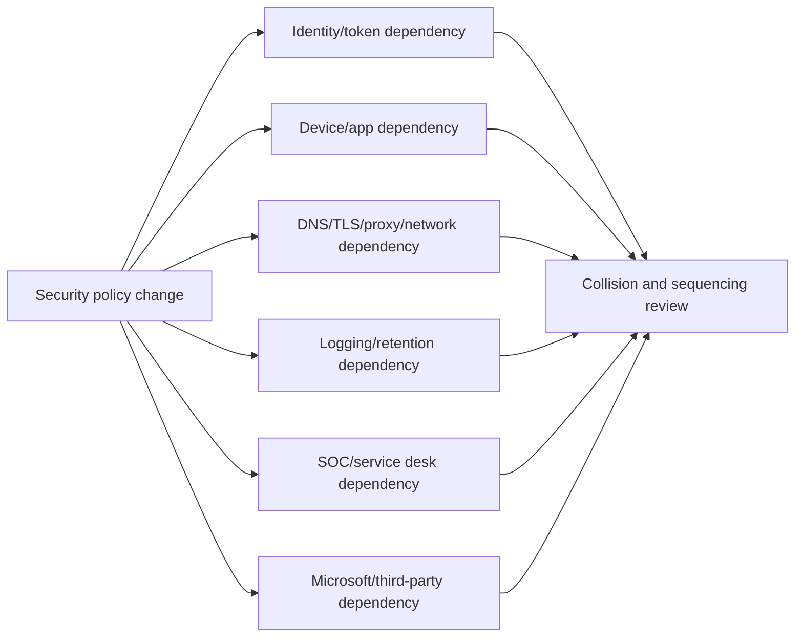

Use a dependency matrix with required state, owner, due date, evidence, fallback, and effect if late. A missing dependency should block the gate, not become an assumption hidden in meeting notes.

## 10. Test strategy and levels

A **test strategy** explains what will be tested, why, at what level, with which data and environment, by whom, when, how evidence is captured, and how defects affect release.

| Test level | Question | Security example |
|---|---|---|
| Static/peer review | Is design/configuration logically safe before execution? | Review CA exclusions or KQL query |
| Unit/component | Does one rule/function/parser behave correctly? | Parser maps a timestamp and entity |
| Integration | Do two components exchange correct data/action? | Defender alert opens correct ticket |
| System/end-to-end | Does complete user-to-operation flow work? | Phishing simulation to SOC disposition |
| Security | Does control resist misuse and enforce least privilege? | Unauthorized admin cannot modify policy |
| Performance/scale | Does behavior remain acceptable at expected load? | Endpoint resource and SIEM query latency |
| UAT | Can representative users complete approved workflows? | Managed/unmanaged sharing behavior |
| Operational acceptance | Can support monitor, diagnose, escalate, recover, report? | Shift follows runbook and SLA |
| Recovery/rollback | Can trusted service be restored and proved? | Revert policy and reconcile tokens/cases |

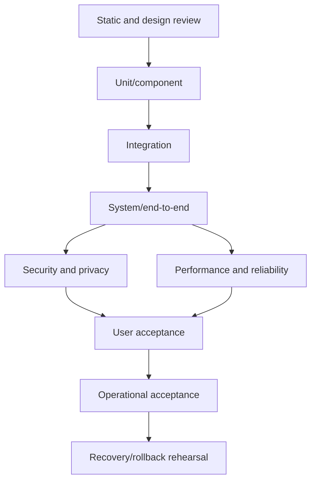

## 11. Test design categories

Every important requirement needs more than a happy path.

| Category | Meaning | Example for a DLP policy |
|---|---|---|
| Positive | Intended allowed/protected behavior succeeds | Authorized internal share succeeds and logs |
| Negative | Forbidden behavior is prevented/detected | External share of matched sensitive data blocks |
| Boundary | Threshold/edge behaves exactly | 9 versus 10 records; near-size limit |
| Exception | Approved exception is narrow and auditable | Named service workflow bypasses with evidence |
| Failure | Dependency failure is visible and controlled | Classification service/connector delay alerts |
| Recovery | Service returns to trusted operation | Reprocessing completes without duplicate action |
| Rollback | Previous configuration restores intended behavior | Prior policy version reapplied and validated |
| Regression | Existing unrelated behavior remains correct | Normal collaboration still works |
| Abuse/misuse | Adversarial or unauthorized action fails safely | User renames file or changes channel |
| Accessibility | Control and messaging support varied users | Policy tip works with assistive workflow |

## 12. Requirement-to-test traceability

Traceability proves that every approved requirement and material risk has a test or an explicit reason it cannot be tested.

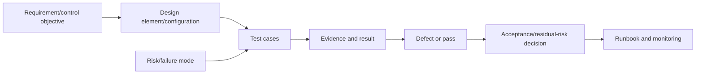

| Traceability field | Example |
|---|---|
| Requirement ID | CA-ADM-001 |
| Requirement | Privileged admin access requires phishing-resistant authentication |
| Design/configuration | Named auth strength + CA policy + emergency exclusion |
| Positive case | Registered pilot admin accesses portal with approved method |
| Negative case | Password + weaker MFA does not satisfy grant |
| Boundary/failure | Registration service issue and emergency process |
| Evidence | Sign-in ID, policy result, method detail, timestamp, ticket |
| Result/defect | Pass or linked defect with severity |
| Acceptance owner | Identity control and business/risk owner |

## 13. Test case anatomy and evidence

A reproducible test case includes ID, objective, requirement/risk links, environment, version, preconditions, persona/data, exact steps, expected result, evidence source, cleanup, safety stop, owner, execution time, actual result, and defect link.

Evidence should include original identifiers and timestamps, configuration version, relevant exports/logs/screenshots, expected versus actual, test-data reference, and chain to the decision. Screenshots alone are weak when an export, query result, API response, or transaction ID is available.

Your fix-validation experience transfers directly: rerun the original failing workflow, test an unaffected comparison, verify service-side evidence, check regressions, monitor long enough for asynchronous behavior, and document what proves recovery.

## 14. Test data, privacy, and safe simulation

Use the least sensitive data that still proves behavior. Preferred order: generated synthetic data; vendor-provided safe test artifacts; sanitized representative records; tightly controlled production-like data with authorization; real production data only where necessary and governed.

| Risk | Safe practice | Prohibited shortcut |
|---|---|---|
| Personal data exposure | Synthetic identities/content and minimum fields | Copy production mailbox/files casually |
| Malware harm | Vendor-supported inert simulation | Download/run uncontrolled live malware |
| Phishing harm | Authorized simulation with protected audience | Surprise credential collection |
| Alert pollution | Mark test IDs and coordinate SOC | Flood production queue without notice |
| Response harm | Test accounts/devices and human approval | Isolate executive/production server casually |
| Retention leakage | Cleanup plan and approved retention | Leave test secrets/content indefinitely |
| Secret disclosure | Vaulted credentials and redacted evidence | Put tokens in test scripts/screenshots |

Privacy design covers purpose, minimization, lawful/authorized basis as advised, notice, geography/transfer, access, retention, deletion, evidence redaction, and data-subject or investigation implications. Legal and privacy specialists make legal determinations.

## 15. Simulation, report-only, audit, and dry-run modes

Observation modes can reveal expected matches without enforcing an action. They reduce risk but do not prove the entire enforcement path, user experience, response, or rollback.

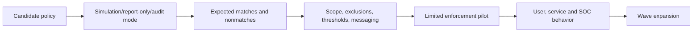

### 🔍 Plain-English deep-dive: report-only is a weather forecast, not getting wet

A forecast can estimate rain but does not prove whether a roof leaks, commuters adapt, or drains cope. Report-only can show that a policy would likely evaluate, but target services may not expose every enforcement nuance; token age, client support, exemptions, timing, and user behavior still matter. Use observation to tune, then constrained enforcement to prove reality.

Record mode-specific limitations. For example, a “would block” log may not show actual application fallback, help-desk demand, downstream automation, or recovery behavior.

## 16. Security testing and abuse cases

Security tests should cover least privilege, admin separation, unauthorized modification, secret/certificate protection, API scopes, log integrity, tamper resistance, bypass paths, fail-open/fail-closed behavior, exception expiry, automation approval, and evidence access.

| Abuse case | Expected control behavior |
|---|---|
| Nonowner edits production policy | Denied and audited |
| Automation receives malformed input | Rejects safely, alerts, no partial harmful action |
| Connector credential expires | Health alert and documented recovery |
| User tries alternate client/protocol | Equivalent control or documented gap |
| Device status becomes unknown | Defined policy behavior and user recovery |
| Test account is compromised | Scoped impact, rapid revoke, evidence preserved |
| Rollback package is altered | Integrity check fails and use is blocked |

Testing must remain authorized and proportionate. Do not perform penetration testing, destructive actions, or privacy-invasive collection outside written scope and specialist rules of engagement.

## 17. Performance, scale, reliability, and resilience tests

Measure baseline and after-change percentiles, not only averages. Relevant dimensions include authentication duration, policy evaluation, mail delivery, SharePoint/OneDrive sync, app launch, endpoint CPU/memory/disk/network/battery, connector latency, event ingestion, query/runtime, API throttling, automation concurrency, queue backlog, and failure recovery.

Test peak and degraded conditions where safely possible: unavailable connector, expired credential in a controlled environment, delayed data, duplicate event, timeout, partial wave, offline device, token cache, proxy failure, service-health advisory, and on-call transition. A control that works only while every dependency is healthy is not operationally understood.

## 18. UAT and operational acceptance testing

**User acceptance testing (UAT)** asks whether representative users can complete approved business workflows with acceptable controls and experience. **Operational acceptance testing (OAT)** asks whether service desk, SOC, engineering, suppliers, and on-call can run and recover the service.

| UAT evidence | OAT evidence |
|---|---|
| Persona/workflow pass and observed impact | Monitoring and synthetic check work |
| Policy message and remediation are understandable | Alert routes to correct queue/priority |
| Accessibility and localization considered | Runbook decision points are executable |
| Exception/recovery workflow succeeds | Required role/PIM/service identity works |
| Business owner accepts residual friction | Vendor escalation pack and contacts tested |
| Support article matches user experience | SLA/OLA measurement and reporting work |

Operations should participate early. Handing a finished platform to a SOC that did not design queues, permissions, or runbooks creates predictable failure.

## 19. Defect severity and lifecycle

A **defect** is a mismatch between expected and actual behavior. Severity should reflect security and business impact, scope, workaround, recoverability, and timing, not the loudness of the reporter.

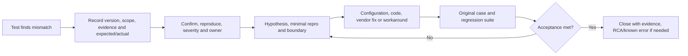

| Severity example | Typical meaning | Release implication |
|---|---|---|
| Critical/Sev 1 | Material security exposure, widespread outage, no safe workaround | Stop/rollback; executive incident process |
| High/Sev 2 | Major function or population affected; risky/limited workaround | Usually blocks gate unless authorized treatment |
| Medium/Sev 3 | Limited impact with acceptable workaround | Fix, defer with owner/date, or accept |
| Low/Sev 4 | Cosmetic/minor documentation or low impact | Track and schedule |

Do not close a defect because a workaround exists. Record workaround risk, scope, owner, expiry, and permanent-fix plan. A vendor ticket does not transfer accountability for the client decision.

## 20. Vendor/product escalation evidence

An escalation pack should include business/security impact; tenant/environment and region without unnecessary sensitive detail; exact scope; first/last known times and time zone; correlation, request, trace, message, sign-in, device, incident, and policy IDs; versions; architecture path; recent changes; expected versus actual; affected/unaffected comparisons; reproduction; logs/traces; mitigation and rollback status; case severity rationale; and clear asks.

You can strongly anchor here: precise evidence, a shared timeline, respectful boundary management, persistent ownership, and fix validation are your direct strengths. Redact tokens, secrets, personal content, and unrelated tenant details. Transfer evidence only through approved channels.

## 21. Go/no-go gate

The go/no-go decision is an authorized risk decision based on evidence, not optimism or schedule pressure.

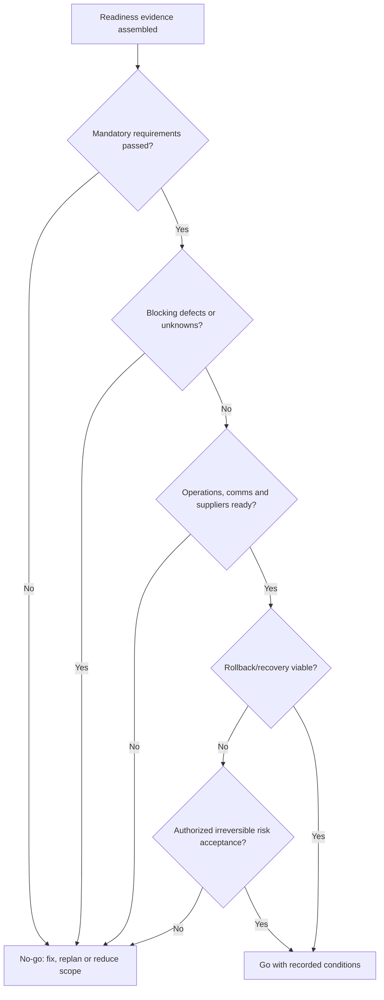

| Gate dimension | Evidence question |
|---|---|
| Scope | Is the exact release, population, exclusion, and manifest frozen? |
| Quality | Have mandatory tests passed on approved version? |
| Security/privacy | Are access, data, residual risks, and approvals complete? |
| Service | Are performance, workflows, availability, and support acceptable? |
| Defects | Are blocking defects closed or explicitly treated by authority? |
| Dependencies | Are service health, vendors, credentials, networks, licenses ready? |
| Operations | Are monitoring, queues, runbooks, access, on-call, and SLAs tested? |
| Rollback | Are triggers, authority, timing, artifacts, and validation rehearsed? |
| Communications | Are audience, channel, cadence, and templates ready? |

## 22. Cutover command center

A **command center** is a coordinated decision and communication structure for a risky change. It can be a physical/virtual bridge but must have clear authority, roles, channels, evidence, and behavior.

| Role | Responsibility during cutover |
|---|---|
| Cutover/incident lead | Maintains sequence, decisions, stop/go/rollback authority path |
| Technical leads | Execute approved steps and report evidence |
| Validation lead | Runs independent acceptance and reconciliation |
| Scribe/timekeeper | Records timestamps, actions, results, decisions, IDs |
| SOC/service desk lead | Monitors alerts, tickets, user impact, response |
| Business/service owner | Confirms critical workflow and accepts disruption |
| Communications lead | Sends approved audience updates |
| Vendor/partner leads | Provide dependency status and product escalation |
| Risk/change authority | Authorizes material deviation or rollback decision |

Use one authoritative timeline and decision log. Separate the main command channel from technical working channels, but ensure all material results return to the main record.

## 23. Cutover runbook anatomy

1. Purpose, scope, release/version, environment, and success criteria.
2. Prerequisite checklist and evidence links.
3. Freeze and conflict review.
4. Roles, contact tree, bridge, backup channels, access, and delegation.
5. Baseline snapshot, exports/backups, and rollback artifacts.
6. Sequenced steps with owner, command/action, expected result, evidence, duration, and stop condition.
7. Validation after each irreversible or high-risk step.
8. Monitoring and thresholds.
9. Decision points and exception authority.
10. Rollback triggers, steps, reconciliation, and validation.
11. User/executive/vendor communications.
12. Hypercare activation, handoff, and closure criteria.

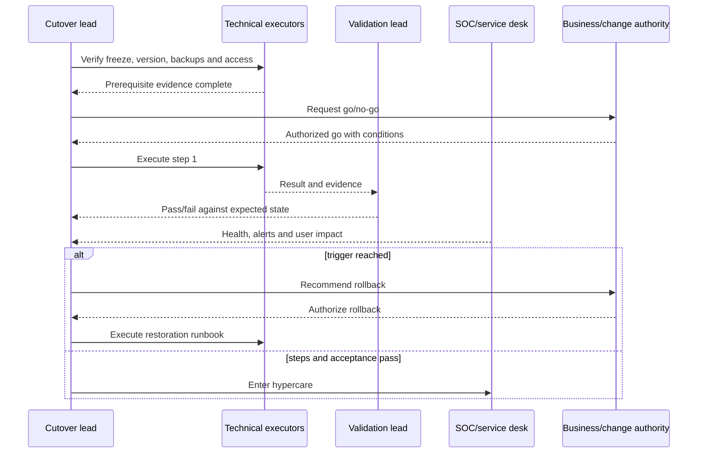

## 24. Communication plan

Different audiences need different information. Users need what changes, when, expected experience, action, support, and recovery. Engineers need exact scope, version, timeline, dependencies, and evidence. Executives need impact, status, risk, decision, and next update. Vendors need product-specific facts and asks.

| Moment | Audience | Minimum message |
|---|---|---|
| Advance notice | Users/service owners/support | What, when, impact, preparation, help path |
| Go decision | Command team/executives as appropriate | Scope, risk, readiness, conditions, next update |
| Milestone | Technical/operations | Completed action, evidence, health, next step |
| Incident/rollback | Affected audiences | Observed impact, containment, recovery, workaround, cadence |
| Completion | Users/stakeholders | Status, remaining issue, hypercare/support |
| Closure | Sponsors/operations | Acceptance, metrics, defects, lessons, residual actions |

Avoid unsupported certainty. Say “current evidence indicates,” name what is affected, and state the next update time even if no resolution is available.

## 25. Rollback triggers and decision model

Rollback triggers should be objective where possible: critical business workflow failure; material identity lockout; mail loss/loop; unsafe policy bypass; widespread endpoint degradation; missing critical telemetry; unauthorized data exposure; uncontrolled automation; performance threshold; error/ticket rate; supplier failure; or inability to validate state.

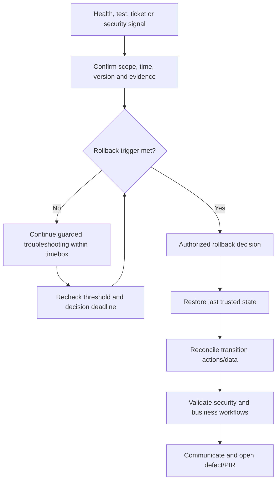

### 🔍 Plain-English deep-dive: troubleshoot versus rollback is a time-bounded risk decision

Teams often keep troubleshooting because the cause feels close. Meanwhile impact grows and the old state becomes harder to restore. Define a decision deadline and maximum tolerated impact before change. The question is not “can engineering eventually fix it?” but “is continuing this state safer than returning to the last trusted state now?”

## 26. Rollback mechanics

| Rollback component | Questions |
|---|---|
| Last trusted state | Which exact version/configuration and dependencies? |
| Retained capability | Are old routes, agents, licenses, credentials, capacity still usable? |
| Reversal order | Must assignments, connectors, DNS, apps, roles, or agents reverse first? |
| State divergence | What events, tokens, messages, cases, device actions, or data changed? |
| Irreversibility | Which actions cannot be undone and require recovery instead? |
| Validation | What proves restored security, service, user, and operations state? |
| Communication | Who needs impact, workaround, recovery, and next update? |
| Follow-up | What defect, RCA, risk, and new gate are required? |

Deleting a policy is often a poor rollback because it may lose evidence, identifiers, scope, and fast restoration. Prefer versioned disable/unassign/restore patterns where supported and approved, and understand propagation/token/cache timing.

## 27. Restore and validate

After restoration, do not declare success from configuration alone. Validate assignment, effective state, critical user workflow, security control, logs/alerts, automation, performance, queue, and transition reconciliation. Monitor for delayed propagation and cached sessions.

Your familiar closure test applies: the original symptom no longer reproduces, the expected backend evidence is present, unaffected workflows remain healthy, no new regression appears, and the customer/service owner confirms the business outcome.

## 28. Hypercare design

Hypercare begins immediately after a production wave or cutover. It needs an explicit owner, duration, coverage schedule, dashboards, synthetic checks, ticket tags, daily cadence, vendor availability, defect severity, change restrictions, escalation, and exit criteria.

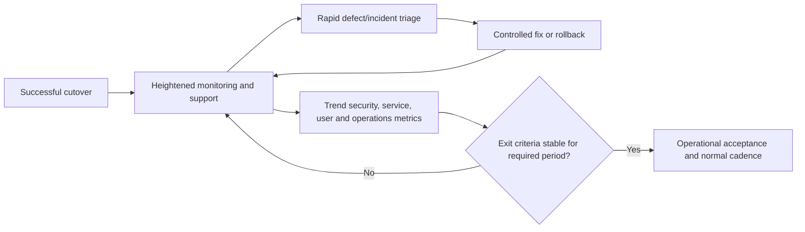

| Hypercare metric | Baseline/target concept | Exit evidence |
|---|---|---|
| Coverage/effective state | Intended population reports correctly | Reconciled stable trend |
| Critical control tests | Synthetic checks continue to pass | Repeated timestamped evidence |
| Incidents/defects | No open blocking issue | Closed or authorized treatment |
| User impact | Ticket/error/latency within target | Normalized trend and workflow sign-off |
| Operations | Queue, SLA, escalation, runbooks function | Shift samples and reports |
| Performance | No material sustained regression | Before/after percentile comparison |
| Supplier | Support path responsive; no unresolved dependency | Case closure/accepted risk |

## 29. Hypercare exit and handover

Exit should require stable thresholds for a defined observation period, no blocking defects, accepted residual risk, reconciled scope, complete documentation, trained operations, tested access and escalation, known errors with owners, CMDB/baseline updates, and sponsor/service-owner acceptance. Do not end hypercare merely because the project team is scheduled to leave.

## 30. Policy rollout scenario: Conditional Access

**Objective:** Require phishing-resistant authentication for privileged roles while preserving emergency access.

1. Inventory privileged roles, users, service dependencies, auth methods, applications, devices, locations, guests, and emergency accounts.
2. Build policy intent and exclusions; verify licensing and role permissions.
3. Use report-only where supported; analyze actual sign-ins, unrecognized apps, and service accounts.
4. Pilot registered admin personas across browser/client/mobile/network contexts.
5. Test approved method, weaker method, registration/recovery, token/session timing, emergency accounts, policy conflicts, and sign-in evidence.
6. Enforce a small group; monitor sign-ins and help desk.
7. Expand by role/risk; reconcile assignment and effective results.
8. Roll back by restoring approved assignment/version, not by broad permanent bypass.

## 31. Policy rollout scenario: Endpoint security

**Objective:** Introduce an endpoint protection policy without unacceptable application or device degradation.

Baseline platform, application, performance, current controls, exclusions, supportability, and agent state. Start with audit/evaluation modes where available. Ring by OS, hardware, application criticality, location, and support coverage. Test detection, block behavior, exclusions, tamper controls, offline state, update/reboot, CPU/memory/disk/network/battery, crash/hang, and response/recovery. Use rapid assignment removal or version restoration as approved; do not leave broad exclusions as the final fix.

## 32. Policy rollout scenario: DLP and information protection

**Objective:** Prevent unauthorized external sharing of defined sensitive data while preserving approved collaboration.

Use synthetic sensitive records. Validate classification first, then policy matching, user message, block/override, justification, alert, incident, owner workflow, evidence access, and reporting latency. Test SharePoint, OneDrive, Teams, Exchange, endpoint, and browser locations only where in scope and supported; behavior differs. Include false positives, exact thresholds, file types, encrypted/protected content, guests, sync, mobile, service workflows, and deletion/retention of test data.

## 33. Policy rollout scenario: Sentinel detection and automation

**Objective:** Deploy a new high-severity analytic rule and a playbook that enriches and optionally contains.

Version the query, parser, entities, threshold, lookback, frequency, suppression, and rule owner. Test golden positive/negative/boundary data, late events, duplicates, missing fields, query performance, incident grouping, entity mapping, and alert evidence. Run automation in enrichment-only mode first. Test malformed input, API throttling, expired credential, permissions, duplicate trigger, approval, idempotency, partial failure, rollback, and audit. Keep containment human-approved until acceptance justifies change.

## 34. Policy rollout scenario: Email protection

**Objective:** Move from evaluation to enforced impersonation and attachment/link controls.

Use safe vendor-supported simulations and dedicated test identities/domains. Test legitimate senders, spoof/impersonation, authentication alignment, allow/block interaction, internal/external direction, attachments, links, quarantine, user report/release, message trace, SOC routing, false positives, transport latency, and business applications. Coordinate DNS/connectors/gateway if routing changes. Rollback must restore message flow and prior policy, with transition-message reconciliation.

## 35. Common deployment failure modes

| Failure | Root pattern | Corrective action |
|---|---|---|
| Pilot passes, broad wave fails | Pilot not representative or scale ignored | Redesign personas, scale/performance tests |
| “Assigned” but not effective | Targeting, applicability, delivery, timing, conflict | Trace intent-to-effective-state chain |
| Report-only predicted poorly | Mode limitation, token/client/path difference | Controlled enforcement and mode-specific evidence |
| CAB approved unsafe change | Governance mistaken for engineering proof | Add technical quality and acceptance gates |
| Rollback too late | No decision deadline; sunk-cost bias | Objective triggers and named authority |
| Rollback restores config, not service | No end-to-end restore validation | Test security, workflow, data, queue, performance |
| Hypercare never ends | No exit criteria or operations unready | Define metrics, owners, acceptance period |
| Vendor ticket stalls | Weak reproduction/evidence/ask | Provide minimal repro and impact-led escalation pack |
| Test exposes personal data | Production copy without minimization | Synthetic/sanitized data and privacy review |
| Emergency change becomes permanent | No post-change review or expiry | PIR, standardization or removal with owner/date |

## 36. Metrics and reporting

| Metric family | Examples | Caveat |
|---|---|---|
| Readiness | Passed prerequisites / mandatory prerequisites | Completion quality matters |
| Test | Pass rate by risk; blocked/failed/not run | Overall percentage can hide critical failure |
| Defect | Severity, age, reopen, escape rate | Classification consistency required |
| Deployment | Wave completion, effective-state coverage, rollback | Installed/assigned is not effective |
| Service | Ticket rate, errors, latency, availability | Compare population and baseline |
| Security | Controlled scenario and response success | Tests do not prove all threats |
| Operations | Queue/SLA/runbook/escalation success | Short hypercare may mask low-frequency issue |
| Change | Success, incident, emergency, unauthorized change | Avoid gaming “success” definitions |

A business review should state release outcome, accepted population, evidence, defects, incidents, user impact, risk, rollback events, supplier issues, operations readiness, decisions needed, and next wave. Your KPI and business-review experience is directly relevant: explain what the metric means, its baseline and limitation, who owns action, and when the trend will be reviewed.

## 37. Roles and separation of duties

| Role | Accountable contribution |
|---|---|
| Product/control owner | Intended security outcome and residual risk |
| Release/deployment manager | Version, stages, schedule, dependencies, manifest |
| Engineer | Build, peer review, execute, troubleshoot |
| Test/validation lead | Independent strategy, evidence, defects, recommendation |
| Business/service owner | UAT, critical workflow, disruption and acceptance |
| SOC/service desk/operations | OAT, monitoring, queue, support, recovery |
| Privacy/security/legal | Specialist decisions within authority |
| Change authority | Change classification and authorization |
| Vendor/partner | Product support, dependency, defect, escalation |
| Scribe/communications | Timeline, decision record, audience updates |

Avoid one person designing, approving, deploying, validating, and accepting a high-risk change alone. Emergency constraints may compress roles, but require compensating review and post-change evidence.

## 38. Quality and safety gates

Quality asks whether artifacts are correct, complete, traceable, reviewed, and reproducible. Safety asks whether blast radius, privilege, data, actions, dependencies, stop conditions, and recovery are controlled.

| Gate | Minimum proof |
|---|---|
| Build complete | Versioned artifact, peer review, secret scan, parameter validation |
| Test ready | Environment, personas, data, cases, evidence, cleanup, authorization |
| Pilot ready | Support, monitoring, comms, stop conditions, rollback and owner |
| Production ready | Mandatory acceptance, dependency health, change approval, command plan |
| Wave advance | Effective-state reconciliation and stable thresholds |
| Hypercare exit | Operations acceptance, stable metrics, no blocking defects |

## 39. Safe paper portfolio lab: Northstar deployment release

Use the fictional **Northstar Research** organization from Part 57. Do not access a real tenant, change production, collect real personal data, send phishing, use live malware, or claim implementation. The paper release contains:

- A privileged-access Conditional Access policy.
- An endpoint security baseline change.
- A DLP policy for synthetic research IDs.
- A Sentinel analytic rule and enrichment-only playbook.
- A change to email protection for a synthetic test domain.

### Lab tasks

1. Define paper/lab/dev/test/pilot/production stages and environment differences.
2. Create 12 personas spanning role, device, network, app, data, accessibility, and support window.
3. Design five rings and three geographic/business waves with entry, exit, stop, and rollback criteria.
4. Classify five changes as standard, normal, or emergency and justify the governance path.
5. Write one complete high-risk change record.
6. Build a traceability matrix for at least 20 requirements/risks and 60 tests.
7. Include unit, integration, system, security, performance, UAT, OAT, positive, negative, boundary, failure, recovery, rollback, and regression cases.
8. Define synthetic data, privacy, cleanup, evidence, and redaction rules.
9. Create a defect log with six fictional defects of varied severity and a vendor escalation pack.
10. Write a go/no-go pack, cutover runbook, command-center RACI, communication plan, and rollback plan.
11. Build a hypercare dashboard and exit-acceptance record.
12. Record a two-page PIR for one failed wave and explain the redesign.

### Portfolio quality matrix

| Artifact | Reviewer question | Honest label |
|---|---|---|
| Environment/ring plan | Does each stage reduce a named uncertainty? | Fictional design |
| Traceability/tests | Are requirements and risks covered beyond happy paths? | Synthetic evidence plan |
| Change/go-no-go | Are risk, dependencies, authority, and decisions explicit? | Tabletop governance |
| Cutover/rollback | Could authorized people execute and validate it? | Unexecuted paper runbook |
| Hypercare/PIR | Do metrics drive acceptance and learning? | Fictional scenario |

## 40. Interview answer structure

Use **S-E-R-T-G-C-R-H**:

1. **Scope** outcome, population, version, risk, and owner.
2. **Environments** separate build, integration, pilot, and production uncertainty.
3. **Rings** represent personas and constrain blast radius.
4. **Tests** trace requirements and risks through positive, negative, boundary, failure, recovery, and operations.
5. **Gate** on evidence, defects, dependencies, privacy, operations, and rollback.
6. **Cut over** with roles, timeline, monitoring, communications, and decision log.
7. **Rollback/reconcile** on objective triggers and validate trusted state.
8. **Hypercare/handover** until stable metrics and operational acceptance.

## 41. JD Mapping: interview translation

| Your demonstrated behavior | Deployment capability | Interview phrasing |
|---|---|---|
| Scoped critical incidents | Blast-radius and persona definition | “I define exact affected and unaffected populations before acting.” |
| Coordinated vendors/product groups | Dependency and defect command | “I give each owner precise evidence and maintain one shared timeline.” |
| Validated product fixes | Acceptance and regression testing | “I rerun the original scenario and check effective state and regressions.” |
| Documented RCA/KBs | Defect learning and operationalization | “I convert findings into runbooks, known errors, and prevention.” |
| Led customer updates | Cutover communications | “I tailor impact, action, decision, and cadence to each audience.” |
| Reported KPIs | Hypercare and service acceptance | “I use baseline, threshold, owner, trend, and caveat—not activity alone.” |

## Official Source Anchors

Use current versions and access dates in real work.

1. Microsoft Cloud Adoption Framework, plan and ready methodology: <https://learn.microsoft.com/azure/cloud-adoption-framework/>
2. Microsoft Well-Architected Framework, operational excellence: <https://learn.microsoft.com/azure/well-architected/operational-excellence/>
3. Microsoft Entra Conditional Access deployment planning: <https://learn.microsoft.com/entra/identity/conditional-access/plan-conditional-access>
4. Microsoft Conditional Access report-only mode: <https://learn.microsoft.com/entra/identity/conditional-access/concept-conditional-access-report-only>
5. Microsoft Intune deployment planning guide: <https://learn.microsoft.com/intune/intune-service/fundamentals/intune-planning-guide>
6. Microsoft Defender for Endpoint deployment phases: <https://learn.microsoft.com/defender-endpoint/deployment-phases>
7. Microsoft Purview DLP deployment guidance: <https://learn.microsoft.com/purview/dlp-deploy-cloud-deployment>
8. Microsoft Sentinel deployment guide: <https://learn.microsoft.com/azure/sentinel/deploy-overview>
9. Microsoft Sentinel automation rules and playbooks: <https://learn.microsoft.com/azure/sentinel/automation/automation>
10. Microsoft 365 test environment guidance: <https://learn.microsoft.com/microsoft-365/enterprise/test-lab-guides-overview-microsoft-365-enterprise>
11. NIST SP 800-53 Rev. 5, configuration and system-integrity controls: <https://csrc.nist.gov/pubs/sp/800/53/r5/upd1/final>
12. NIST SP 800-115, Technical Guide to Information Security Testing and Assessment: <https://csrc.nist.gov/pubs/sp/800/115/final>
13. CISA Secure by Design: <https://www.cisa.gov/securebydesign>
14. OWASP Web Security Testing Guide: <https://owasp.org/www-project-web-security-testing-guide/>
15. ITIL public overview from PeopleCert: <https://www.peoplecert.org/browse-certifications/it-governance-and-service-management/ITIL-1>

## ⭐ Likely Interview Questions for This Section

### Q1. How would you safely deploy a Microsoft 365 security policy?

**Model answer:** I would start with an approved, testable outcome and exact population, then version the configuration and identify dependencies, risks, privacy, operations, and rollback. I would validate in the safest representative environment available, use report-only or audit mode where supported and understood, select representative canaries and rings, and trace requirements and failure modes to evidence. A go/no-go gate reviews blocking defects, service health, support, communications, and rollback. I would deploy waves with effective-state reconciliation, objective stop conditions, command ownership, and hypercare until operations accepts stable results.

### Q2. What is the difference between a pilot, ring, wave, and canary?

**Model answer:** A pilot is a bounded learning deployment that tests real operating conditions and acceptance. A canary is the smallest closely monitored early population intended to reveal harm quickly. A ring is a standing risk tier that receives versions in order. A wave is a scheduled batch grouped by geography, business unit, platform, or dependency. I define entry, exit, stop, and rollback criteria for each and ensure the selected users and systems represent the risks being tested.

### Q3. What belongs in a security-change test strategy?

**Model answer:** It maps requirements and material risks to static review, unit/component, integration, end-to-end system, security, performance, UAT, operational acceptance, recovery, rollback, and regression tests. Each case identifies environment, version, persona, data, preconditions, steps, expected result, evidence, cleanup, and owner. Coverage includes positive, negative, boundary, exception, failure, abuse, accessibility, and degraded-state behavior. The strategy also defines privacy-safe data, defect severity, acceptance authority, metrics, and release implications.

### Q4. Is report-only mode enough to approve enforcement?

**Model answer:** No. It is valuable for estimating scope and tuning logic, but it may not prove actual enforcement, client behavior, user messaging, downstream automation, help-desk load, performance, recovery, or rollback. I document the mode's limitations, analyze representative observations, then use a constrained enforcement pilot with positive, negative, boundary, failure, user, and operational tests before scale.

### Q5. How do you make a go/no-go recommendation?

**Model answer:** I assemble evidence for frozen scope/version, mandatory requirements, test results, blocking defects, security/privacy, dependencies and service health, effective rollback, operations readiness, vendor support, communications, and residual risk. I state unknowns and conditions explicitly. Authorized business, risk, service, and change owners make the decision; schedule pressure does not convert failed evidence into readiness. A no-go should include the corrective action and next gate.

### Q6. When do you troubleshoot versus roll back?

**Model answer:** I define the decision before change using objective impact thresholds and a maximum troubleshooting timebox. I verify the signal and scope, apply only safe containment within that window, and compare continued impact with the risk and complexity of restoration. Critical workflow failure, identity lockout, mail loss, security exposure, uncontrolled automation, evidence loss, or breached thresholds usually triggers rollback. The authorized lead restores the last trusted state, reconciles transition actions and data, validates security and business behavior, communicates, and opens a defect/PIR.

### Q7. What proves hypercare can end?

**Model answer:** The intended population and effective state are reconciled; synthetic and critical control checks are stable for the defined period; no blocking defects remain; user impact, performance, incidents, and queue/SLA metrics are within approved thresholds; runbooks, access, monitoring, escalation, known errors, training, and supplier paths work; documentation and CMDB/baseline are updated; and authorized operations and service owners accept residual actions. A project end date alone is not evidence.

### Q8. What is your honest deployment experience?

**Model answer:** My direct production experience is Microsoft 365 escalation engineering: scoping customer impact, coordinating vendors and product groups, troubleshooting SharePoint/OneDrive and sync, validating fixes, documenting RCA and guidance, mentoring, and communicating KPIs and service outcomes. I have built a fictional deployment portfolio covering environments, personas, rings, test traceability, change governance, go/no-go, cutover, rollback, and hypercare. I would not claim production security-policy deployment without evidence, and I would follow the client's approved process and current Microsoft guidance.

## 🧠 30-Second Memory Hooks

- **Design is intent; deployment is proof.** Configuration must become effective, supportable behavior.
- **Environments remove uncertainty in stages.** Reproduce relevant behavior, minimize sensitive data.
- **Canary catches, ring orders, wave schedules, pilot learns.**
- **CAB is authority, not technical proof.** Keep governance and engineering evidence linked.
- **Test beyond happy paths.** Positive, negative, boundary, failure, recovery, rollback, regression.
- **Trace requirement to evidence.** Every material risk needs a test or explicit decision.
- **Report-only forecasts; pilot experiences.** Observation does not prove enforcement.
- **Go/no-go is a risk decision.** Unknowns, defects, dependencies, operations, and rollback count.
- **Rollback has a clock.** Trigger, authority, last safe point, restore, reconcile, validate.
- **Hypercare exits on evidence.** Stable controls, service, users, operations, and ownership.

## Completion Checklist

- [ ] I can explain deployment engineering and distinguish release, deployment, cutover, rollback, hypercare, and acceptance.
- [ ] I can identify mandatory design, risk, privacy, test, operations, and rollback inputs.
- [ ] I can distinguish paper, lab, development, test, pilot, and production stages and document differences.
- [ ] I can control versions, parameters, secrets, reviews, provenance, diffs, and restoration artifacts.
- [ ] I can choose representative personas across role, identity, device, network, app, data, accessibility, and support window.
- [ ] I can explain canaries, rings, waves, pilots, and their entry/exit/stop criteria.
- [ ] I can distinguish standard, normal, and emergency change and explain CAB limits.
- [ ] I can write a complete change record with risk, dependencies, testing, communications, monitoring, and rollback.
- [ ] I can build unit, integration, system, security, performance, UAT, OAT, recovery, and regression tests.
- [ ] I can design positive, negative, boundary, exception, failure, rollback, accessibility, and abuse cases.
- [ ] I can trace requirements and risks through configuration, tests, evidence, defects, acceptance, and operations.
- [ ] I can use synthetic or sanitized data and protect privacy, secrets, evidence, and production service.
- [ ] I can explain the limits of simulation, report-only, audit, and dry-run modes.
- [ ] I can assess defect severity, build a minimal reproducible vendor escalation, and validate fixes.
- [ ] I can assemble an evidence-based go/no-go pack and state who decides.
- [ ] I can define command-center roles, one timeline, an executable runbook, and audience communications.
- [ ] I can define objective rollback triggers, a decision timebox, restoration steps, reconciliation, and validation.
- [ ] I can design hypercare metrics, coverage, escalation, defect handling, and exit criteria.
- [ ] I can adapt the method to identity, endpoint, DLP, SIEM automation, and email rollout scenarios.
- [ ] I can present the Northstar work as a fictional paper portfolio rather than production experience.
- [ ] I can connect your escalation, vendor, RCA, fix-validation, documentation, and business-review strengths honestly.
- [ ] I can answer Q1–Q8 aloud with concise model structure and no proprietary claims.

*Next suggested section:* [Part 59](Part-59-operational-readiness-raci-soc-runbooks.md)