# Part 59 — Operational Readiness: RACI, SOC Model, Runbooks, SLAs, KPIs, and Handover

> **Section goal:** Learn how to turn a deployed Microsoft 365 security capability into a reliable, owned, supportable service. By the end, you should be able to assess readiness across people, process, technology, data, and supplier dimensions; define service outcomes, boundaries, consumers, dependencies, and support hours; build practical RACI and RASCI models; distinguish service desk, SOC, L1, L2, L3, engineering, product, vendor, partner, privacy, legal, risk, and business roles; design queues, severity, priority, escalation, SLA, OLA, and underpinning-contract relationships; distinguish runbooks, standard operating procedures, playbooks, and knowledge articles; write executable runbooks with decision points, permissions, evidence, recovery, and escalation; design health monitoring, synthetic checks, alert routing, and on-call; govern administrative access, PIM, emergency access, and service identities; deliver training, knowledge transfer, shadowing, reverse shadowing, and table-top exercises; maintain CMDB and configuration baselines; define known errors and vendor contacts; run formal handover and acceptance gates; and use critical success factors, KPIs, KRIs, service reviews, and continual improvement without turning metrics into vanity reporting.

This Part maps directly to the role's responsibilities for operational readiness, SOC integration, client handover, documentation, service troubleshooting, escalation, vendor coordination, and measurable improvement. Your demonstrated strengths are unusually relevant: you have worked across Microsoft 365 support queues, critical incidents, vendor and product-group escalations, RCA, fix validation, reusable documentation, mentoring, service KPIs, customer outcomes, and business reviews. The consulting bridge is to design those operating conditions deliberately before handover and to make ownership, evidence, recovery, and improvement auditable.

> **Method boundary:** This chapter contains public, general consulting, service-management, security-operations, and handover practices. It does not describe or imply Deloitte proprietary operating models, methods, templates, service levels, SOC designs, tooling, client experience, or commercial practices. Real work must use approved firm/client governance, contracts, employment rules, security, privacy, legal, records, health and safety, accessibility, change, and labor/on-call requirements.

> **Currency warning (August 24, 2026):** Microsoft portal names, unified SecOps experiences, role models, APIs, monitoring capabilities, retention, licensing, preview status, and support boundaries change. Verify current Microsoft Learn documentation, service descriptions, Product Terms, tenant/cloud/region, vendor contracts, and the client's operating model. A product health page does not replace independent end-to-end service monitoring.

## JD Mapping

| Role expectation | Capability developed here | Portfolio evidence |
|---|---|---|
| Operationalize Microsoft security solutions | Define service, ownership, support, monitoring, access, knowledge, and acceptance | Operational-readiness assessment |
| Integrate with SOC and service desk | Design queues, tiers, severity, routing, escalation, and response | Support and SOC operating model |
| Coordinate vendors and product groups | Define underpinning support, evidence requests, contacts, and boundaries | Supplier matrix and escalation pack |
| Produce runbooks and documentation | Create executable decisions, actions, evidence, recovery, and known errors | Runbook library and KB set |
| Troubleshoot incidents and service disruption | Establish health signals, correlation, diagnostic access, and L1–L3 paths | Monitoring and escalation design |
| Lead knowledge transfer and handover | Train, shadow, reverse shadow, exercise, and formally accept | KT plan and acceptance record |
| Report service and security outcomes | Define CSFs, KPIs, KRIs, baselines, targets, caveats, and reviews | Operations scorecard |
| Improve client capability | Convert incidents, defects, feedback, and trends into owned improvements | Continual-improvement register |

## Candidate honesty note

You can directly discuss Microsoft 365 enterprise support, high-severity escalation, SharePoint Online and OneDrive, sync and migration issues, vendors and product groups, customer communication, RCA, fix validation, documentation, knowledge sharing, mentoring, KPIs, and business reviews where evidenced. These are core operational-readiness behaviors because they show how a service is monitored, supported, diagnosed, recovered, explained, and improved.

You should not claim that you have designed or managed a production SOC, negotiated client SLAs/OLAs/contracts, owned Microsoft Sentinel/Defender operations, administered PIM, or delivered a Deloitte operating model unless separately evidenced. Safe wording is:

> “My production experience is Microsoft 365 support escalation and technical advisory. I have coordinated support teams, customers, vendors, and product groups; documented RCA and fixes; built reusable guidance; mentored engineers; and discussed service metrics in business reviews. I have used that experience to create a fictional operational-readiness pack covering RACI, queues, service levels, runbooks, monitoring, access, training, supplier escalation, handover, and continual improvement. I would tailor it to the client's approved operating model and contracts.”

---

## 1. What operational readiness means

**Operational readiness** is evidence that authorized people can run, monitor, support, secure, recover, and improve a service from its first production day. Deployment answers “did the target configuration reach production?” Readiness answers “can the organization sustain the intended outcome when ordinary work, defects, attacks, supplier failures, and staff changes occur?”

**Analogy:** Opening a hospital wing requires more than installing equipment. Staff, procedures, medicines, access, alarms, records, suppliers, emergency drills, maintenance, and clinical ownership must work together.

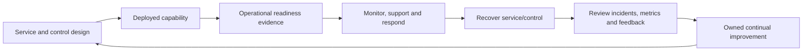

| Readiness state | Meaning | Evidence example |
|---|---|---|
| Designed | Operating requirements and ownership are documented | Service design and RACI |
| Prepared | People, tooling, access, data, suppliers, and documents exist | Training/access/monitoring records |
| Tested | Teams executed representative normal and failure scenarios | OAT/tabletop results |
| Accepted | Authorized owners accept service and residual risks | Signed acceptance with conditions |
| Operating | Service meets defined outcome and support expectations | Queue, health, SLA and control evidence |
| Improving | Trends and lessons produce validated corrective actions | Improvement register and review minutes |

## 2. Five readiness dimensions

Assess **people, process, technology, data, and suppliers** as one system. A technically healthy service is not ready if no analyst has permission to investigate it, no service desk knows where to route users, or a vendor contract cannot meet the response need.

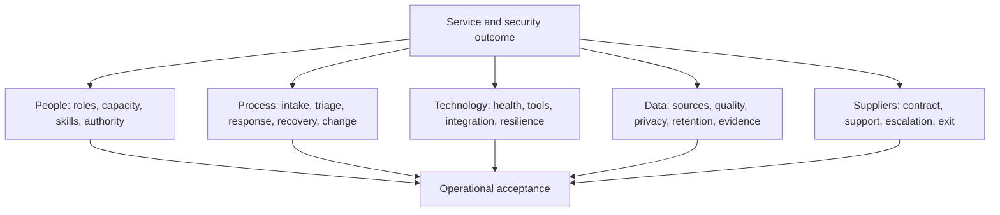

| Dimension | Readiness questions | Common hidden gap |
|---|---|---|
| People | Who is accountable, staffed, skilled, authorized, and on call? | Named team but no capacity/decision rights |
| Process | How are events, requests, incidents, changes, problems, and recovery handled? | Flow documented without thresholds or evidence |
| Technology | How is health observed, accessed, maintained, backed up, and recovered? | Product portal is treated as full service monitoring |
| Data | Are source quality, purpose, access, retention, redaction, and evidence governed? | Analysts can see excessive personal/content data |
| Supplier | What support, response, evidence, maintenance, and exit obligations exist? | Sales contact is mistaken for escalation path |

### 🔍 Plain-English deep-dive: readiness is a chain, not an average

If four dimensions score highly but nobody can access the incident queue after hours, the service is not “80% ready” during an attack. Readiness behaves like a chain: critical missing links block acceptance. Use maturity scores to show improvement, but also define mandatory gates that cannot be averaged away.

## 3. Define the service before defining support

A **service** combines people, processes, technology, information, suppliers, and value. Define service name, purpose, customer, business owner, service owner, control owner, users, outcomes, scope, exclusions, hours, criticality, data classification, dependencies, interfaces, support model, availability expectation, recovery objective, security/privacy obligations, and lifecycle.

| Service-definition field | Microsoft security example |
|---|---|
| Outcome | Detect and coordinate response to high-confidence cross-domain threats |
| Consumer | SOC analysts, incident responders, service owners |
| Scope | Named tenant, populations, sources, rules, response actions |
| Exclusion | Separate OT environment and unsupported cloud |
| Hours | 24x7 high severity; business-hours tuning and requests |
| Dependency | Entra, connectors, telemetry sources, APIs, ticketing, network |
| Data | Identity/device/email/app metadata with defined retention/access |
| Recovery | Manual triage fallback and connector restoration priority |
| Owner | Accountable service owner plus control and technical owners |

Without a clear boundary, teams cannot tell whether an issue is an incident, request, product defect, data-quality problem, change, supplier failure, or out-of-scope dependency.

## 4. Service-design package

The package should include service overview and outcomes; stakeholder and consumer map; architecture and data flows; service catalog entry; support hours; request/incident/problem/change flows; queue/routing; severity/priority; SLA/OLA/contract chain; RACI/RASCI; access model; monitoring and synthetic checks; runbook/SOP/playbook/KB set; supplier matrix; known errors; training; CMDB/configuration baseline; capacity; continuity/recovery; reporting; acceptance; and continual improvement.

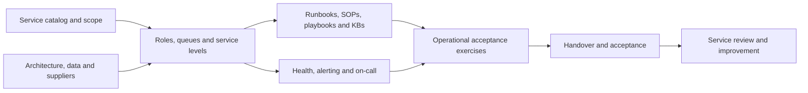

## 5. RACI and RASCI from zero

**RACI** clarifies participation in a task or decision:

- **Responsible (R):** performs the work.
- **Accountable (A):** owns the outcome and final decision. Prefer one accountable role.
- **Consulted (C):** provides input before action; two-way communication.
- **Informed (I):** receives status or outcome; one-way communication.

**RASCI** adds **Support (S)** for a role that assists the responsible party. Names vary, so define the legend.

| Mistake | Why it fails | Better approach |
|---|---|---|
| Many accountable roles | Decision and ownership become ambiguous | One A; use governance forum as consulted/authority if appropriate |
| Team named “R/A/C/I” for everything | Matrix conveys no decisions | Build around specific activities and outcomes |
| Vendor marked accountable for client risk | Contract cannot transfer all client accountability | Vendor responsible/support under contract; client owner remains accountable |
| RACI without capacity/access | Paper ownership cannot execute | Link roles to staffing, skills, hours, and permissions |
| No escalation/deputy | Work stalls when owner unavailable | Define delegation and out-of-hours authority |

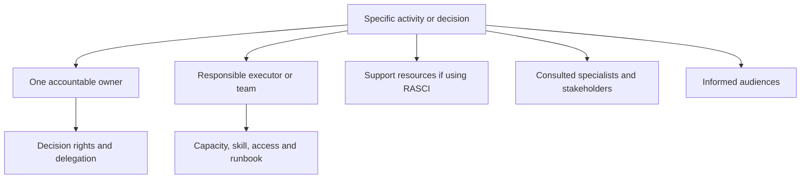

### 🔍 Plain-English deep-dive: accountability is not blame

Accountability means ensuring an outcome has an owner, decisions, resources, and follow-through. It does not mean that one person personally performs every task or is blamed for every failure. A strong operating model makes system weaknesses visible and allows escalation before they become incidents.

## 6. Example RASCI for a security alert lifecycle

| Activity | Service desk | SOC L1 | SOC L2/IR | Engineering/L3 | Service owner | Vendor | Privacy/legal |
|---|---|---|---|---|---|---|---|
| Receive user security report | R | S | I | I | A | I | I |
| Validate alert and scope | I | R | A/S | C | I | C | I |
| Declare major security incident | I | C | R | C | A | C | C |
| Execute preapproved low-risk response | I | R | A | C | I | I | I |
| Approve high-impact containment | I | C | R | S | A/risk authority | C | C |
| Diagnose product defect | I | C | S | R/A technical | I | S/R contractually | I |
| Decide regulatory notification | I | I | C | I | C | I | A authorized counsel/authority |
| Validate recovery | C | R | R | R | A | S | C |
| Publish PIR and improvements | I | C | R | C | A | C | C |

This is illustrative. Real accountabilities depend on governance, law, contract, risk, and organization structure.

## 7. L1, L2, L3, engineering, and vendor roles

Tier labels describe diagnostic depth or escalation, not human value.

| Tier/role | Typical responsibilities | Escalate when |
|---|---|---|
| L0/self-service | Status, user guidance, safe recovery | Guidance fails or security risk exists |
| L1/service desk or SOC triage | Verify identity/scope, categorize, collect standard evidence, execute safe procedure | Severity, uncertainty, permission, or procedure threshold |
| L2/specialist/SOC investigation | Correlate telemetry, test hypotheses, tune within authority, coordinate response | Product defect, code/config architecture, major incident |
| L3/engineering | Deep product/integration diagnosis, configuration/code change, permanent fix | Supplier code/service or unsupported boundary |
| Vendor/product support | Product-specific service/defect investigation under support terms | Joint boundary or client action required |
| Control/service owner | Outcome, priority, risk, acceptance, resources | Executive/risk governance needed |

“L3” should not become a dumping ground. Define evidence and diagnostic steps required for escalation, while allowing urgent safety escalation when those steps would cause delay or harm.

## 8. Service desk and SOC queues

The service desk typically manages user-facing incidents and requests across business technology. The **Security Operations Center (SOC)** monitors, investigates, and coordinates response to security signals. Their queues overlap when a user report is a threat, a security control disrupts service, or a user needs recovery after containment.

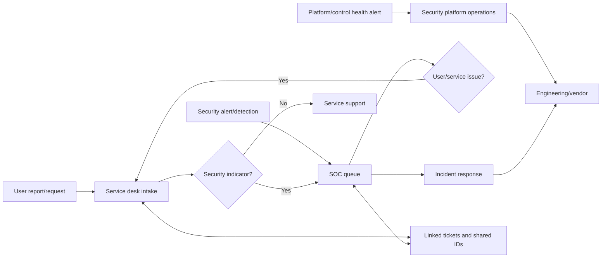

Define queue purpose, source, categories, required fields, routing rules, hours, ownership, acknowledgement, reassignment, parent/child links, duplicate handling, aging, escalation, closure, quality sampling, and reporting. Maintain one authoritative incident state or explicit synchronization to avoid conflicting updates.

## 9. Severity and priority

**Severity** generally expresses actual or potential impact. **Priority** determines order and urgency of work, combining impact, urgency, safety, contractual needs, and resource decisions. Definitions must be local and consistent.

| Factor | Questions |
|---|---|
| Confidentiality | What data, identities, or secrets may be exposed? |
| Integrity | Can policy, data, identity, or evidence be altered? |
| Availability | Which service/population is unavailable and for how long? |
| Threat | Is malicious activity active, spreading, privileged, or persistent? |
| Business | Which critical workflow, geography, customer, or deadline? |
| Safety/legal/privacy | Is specialist or regulatory decision required? |
| Workaround | Is it safe, scalable, and sustainable? |
| Scope/uncertainty | Known population or potentially broader? |

Never lower severity merely because the cause is a vendor service. Never raise it only to obtain faster support without honest impact. Reassess as evidence changes and record why.

## 10. SLA, OLA, and underpinning contract

- **Service Level Agreement (SLA):** agreed service commitment between provider and customer/consumer.
- **Operational Level Agreement (OLA):** internal commitment among teams that supports the SLA.
- **Underpinning contract (UC):** supplier contract whose support or service commitment enables the service.

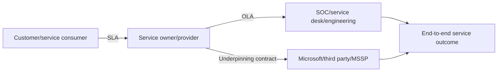

| Service-level field | Definition example |
|---|---|
| Measure | Acknowledgement, triage, containment decision, restoration, request fulfillment |
| Clock | 24x7 or business hours; start/pause/stop rules |
| Population | Severity/service/location covered |
| Target | Percentage/percentile within period, not vague “fast” |
| Exclusion | Authorized waiting state, force majeure, planned maintenance as contracted |
| Data source | Ticket timestamps, automation audit, service telemetry |
| Owner | Role accountable for performance and corrective action |
| Breach process | Notification, escalation, review, service credit if contractual |

### 🔍 Plain-English deep-dive: the SLA is only as strong as its dependency chain

If a client promises one-hour restoration but an essential vendor only commits to a four-hour response, the promise may be structurally impossible. It is like guaranteeing a one-hour delivery while the only supplier promises to dispatch in four hours. Align internal OLAs, supplier contracts, staffing, access, and fallback with the external commitment; make gaps explicit.

## 11. SLA design and behavior

Avoid a single “MTTR” target for every case. Separate acknowledgement, triage, containment decision, workaround, restoration, permanent fix, RCA, and request fulfillment. A service can restore safely while root cause remains under investigation.

Timers should not drive unsafe shortcuts. For example, closing and reopening a ticket to stop a clock corrupts evidence and harms the customer. Metrics need quality, recurrence, customer outcome, and breach review alongside speed.

## 12. Runbook, SOP, playbook, and KB article

| Document | Primary purpose | Typical structure |
|---|---|---|
| Runbook | Execute an operational/technical process with decisions and recovery | Trigger, prerequisites, steps, evidence, escalation, rollback |
| SOP | Standardize a recurring organizational procedure | Purpose, scope, roles, procedure, controls, records |
| Playbook | Coordinate a scenario across roles and branches | Scenario, objectives, phases, decisions, communications |
| KB article | Help resolve a known symptom or answer a user/support question | Symptoms, cause/status, resolution/workaround, escalation |
| Architecture/design | Explain intended system structure and decisions | Context, components, flows, requirements, risks |
| Known error record | Capture understood cause and workaround pending permanent fix | Symptom, root cause, workaround, risk, fix owner/date |

Names vary. Define the local taxonomy and avoid duplicating conflicting procedures across locations.

## 13. Runbook anatomy

A strong runbook includes:

1. Stable ID, title, owner, version, approval, review/expiry date.
2. Purpose, scope, exclusions, trigger, severity, and expected outcome.
3. Audience, skill, support hours, and safety warnings.
4. Preconditions: access/PIM, tools, data, service health, approvals, backup.
5. Inputs and required identifiers.
6. Decision tree with stop conditions.
7. Steps with owner, command/action, expected result, evidence, timeout.
8. Permissions and separation of duties.
9. Communication and ticket fields.
10. Escalation criteria, contacts, and supplier evidence pack.
11. Recovery/rollback and post-action validation.
12. Privacy, redaction, retention, and records requirements.
13. Metrics, linked dependencies, known errors, and change history.

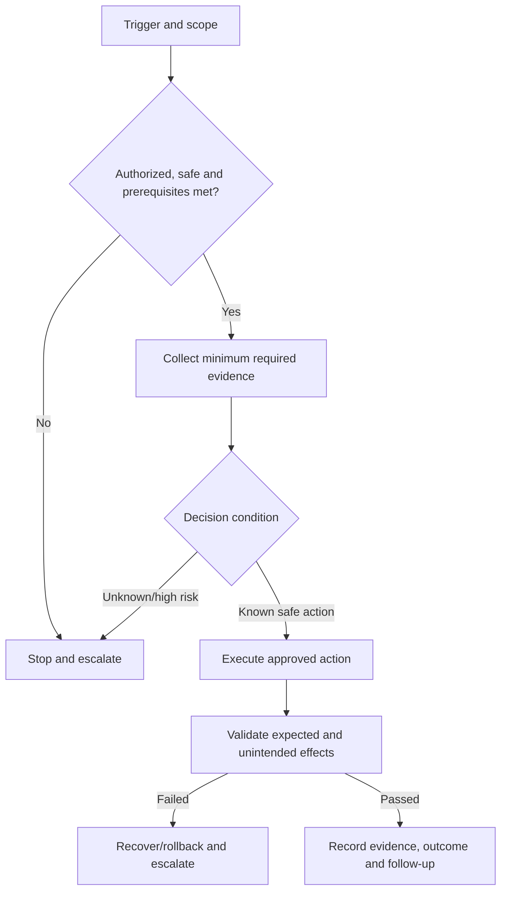

## 14. Runbook decisions, permissions, and evidence

Every high-impact step should answer: who may do it; under which role; whether PIM/approval is needed; what scope; what precondition; expected output; what evidence is retained; what can go wrong; how to stop/reverse; and who is informed.

| Action | Permission guard | Evidence | Recovery guard |
|---|---|---|---|
| Isolate endpoint | Approved responder role and incident link | Device/action/time/result | Release isolation and validate connectivity |
| Disable identity | Authorized incident decision and scope | User/object/sign-in/session/ticket IDs | Trusted re-enable and credential/session plan |
| Remove malicious mail | Search/action approval and case scope | Query, count, action result, sample | Restore/release where supported and safe |
| Modify detection | Change authority and peer review | Version/diff/test result | Restore prior version |
| Run playbook | Least-privilege identity and action approval | Inputs, actions, errors, outputs | Idempotency/compensation/manual recovery |

Avoid pasting secrets into runbooks. Reference an approved vault and access process. Redact tokens, sensitive content, personal data, and unrelated tenant information from evidence and vendor transfers.

## 15. Monitoring from infrastructure to outcome

Monitoring should cover component health, data pipeline, control operation, operational queue, and business/security outcome.

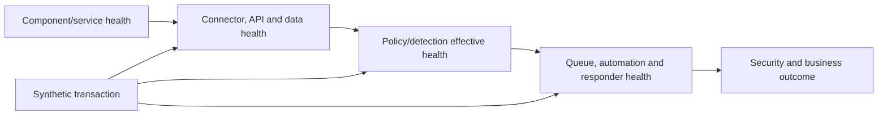

| Monitoring layer | Examples | Blind spot if absent |
|---|---|---|
| Platform | Service health, capacity, connector, credential, API errors | Product or integration outage |
| Data | Source count, event volume, fields, latency, duplicates, timestamp | Silent detection blindness |
| Control | Policy assignment/effective state, synthetic detection, failures | “Configured” but ineffective control |
| Operations | Queue backlog, unassigned alerts, automation errors, SLA aging | Signals exist but nobody acts |
| Outcome | Controlled detection/response, user workflow, recurrence, risk | Healthy components without value |

## 16. Synthetic monitoring and health independence

A **synthetic check** is a safe, scheduled transaction designed to prove a path. Examples include a benign endpoint test alert, test mail flow, synthetic sign-in, known parser event, or automation health case. It must be authorized, labeled, excluded from misleading metrics, and cleaned up.

Do not rely entirely on the system being monitored to say that it is healthy. Where practical, use independent checks: source-side event count versus SIEM count, external DNS/mail test, endpoint inventory versus portal health, ticket creation audit versus automation success.

## 17. Alert routing and on-call

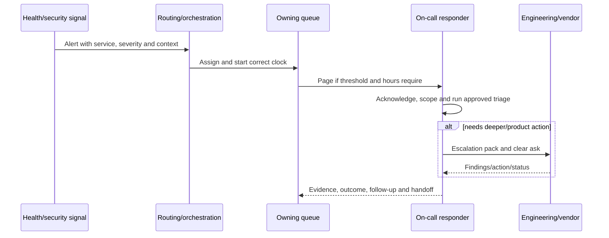

Routing must define source, deduplication, suppression, maintenance, severity, service/CI, queue, schedule, paging, acknowledgement, repeat, escalation, backup, and failure monitoring. Test that the alert reaches a real responder, not only that an email is sent.

On-call design must consider sustainable rotations, labor policy, competence, backup, fatigue, protected recovery time, authority, remote access, secure devices, paging reliability, handoff, and psychological safety. Part 62 will deepen resilience and shift handover; this Part ensures the service has an operable foundation.

## 18. Administrative access, PIM, and emergency paths

Operators need enough access to diagnose and act, but broad standing administration increases risk. Define role-to-task mapping, least privilege, separation of duties, PIM/JIT activation where available, approval, strong authentication, privileged workstation expectations, scope, session/audit, periodic review, and emergency access.

| Access type | Design expectation |
|---|---|
| Read-only triage | Broad enough to correlate required evidence; content access minimized |
| Response operator | Scoped actions with approval for high-impact steps |
| Policy engineer | Version/change-controlled configuration role |
| Automation identity | Workload identity, minimum API permission, vaulted credential/certificate, owner |
| Vendor access | Time-bound, approved, monitored, contractual, revoked after need |
| Emergency access | Independently protected, monitored, tested, limited to recovery |

PIM activation itself is a dependency. Test ordinary and emergency paths, including what happens when identity, MFA, network, approval, or service is degraded.

## 19. Service identities and automation operations

Inventory service principals, managed identities, API apps, certificates, secrets, connectors, mailboxes, storage, webhooks, and scheduled jobs. Record purpose, owner, permission, scope, credential location, rotation, expiration alert, sign-in/activity, network restriction, dependency, failure behavior, recovery, and decommission condition.

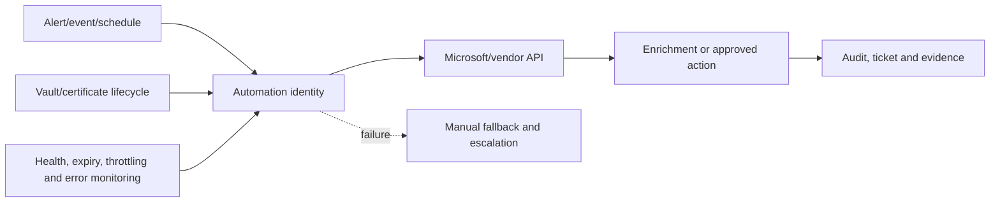

Automation must be idempotent where possible, reject malformed input, avoid logging secrets, handle throttling/timeouts, distinguish partial success, alert on failure, and provide manual fallback. “No human touched it” is not the same as “it is controlled.”

## 20. Training and knowledge transfer

Training should be role-based and task-based. Explain service purpose, architecture, data, queue, severity, permissions, tools, common scenarios, runbooks, safety, evidence, escalation, recovery, privacy, metrics, and known limits.

| Method | Purpose | Acceptance evidence |
|---|---|---|
| Classroom/demo | Shared concepts and system walkthrough | Knowledge check and questions |
| Guided practice | Perform task with instructor | Successful exercise evidence |
| Shadow | Receiver observes experienced operator | Observation checklist |
| Reverse shadow | Receiver operates while expert observes | Independent execution and feedback |
| Tabletop | Rehearse decisions/coordination without production action | Timeline, gaps, actions |
| Simulation | Exercise safe technical signal and workflow | End-to-end evidence |
| Office hours | Resolve early operational questions | Themes and documentation updates |

### 🔍 Plain-English deep-dive: attendance is not knowledge transfer

A signed attendance sheet proves presence, not capability. Driving lessons are not complete because a student watched a presentation. Require the receiving team to explain decisions, execute representative tasks, handle a failure, collect evidence, escalate, recover, and update the record. Reverse shadowing is especially valuable because it exposes unclear instructions and missing access.

## 21. Tabletop exercise design

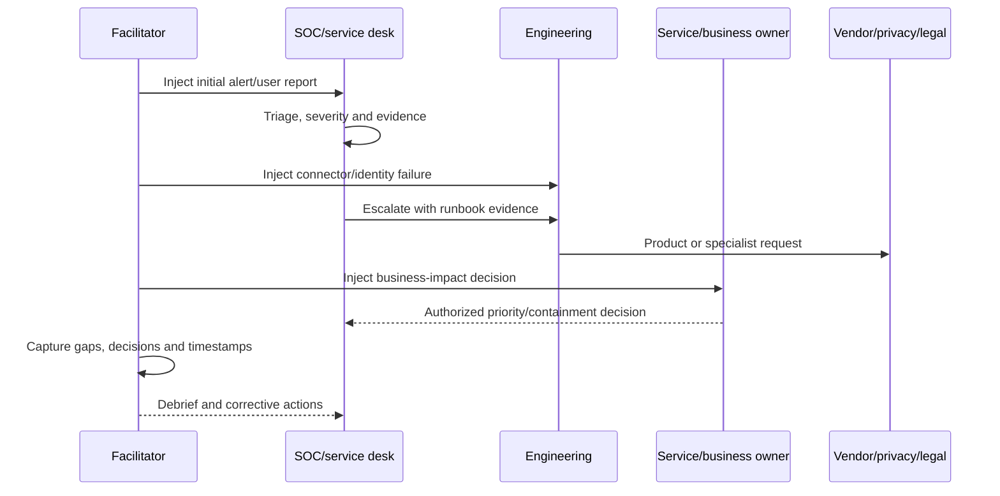

Use realistic but fictional scenarios, clear objectives, no surprise destructive production action, a psychologically safe facilitator, and injects that test role boundaries. Close with observed strengths, gaps, owners, dates, validation, and runbook changes.

## 22. CMDB and configuration baseline

A **Configuration Management Database (CMDB)** or equivalent records configuration items (CIs) and relationships used to manage services. It should not be a stale inventory imported once.

| CI type | Useful fields/relationships |
|---|---|
| Security service | Owner, criticality, SLA, consumers, support group |
| Tenant/subscription/workspace | IDs, region/cloud, data, owner, linked service |
| Policy/rule/playbook | Stable ID, version, scope, owner, source, dependencies |
| Connector/data source | Endpoint, auth identity, source, schema, health, queue |
| Service identity | Object ID, permissions, credential lifecycle, owner |
| Supplier | Contract, service, support contacts, escalation, renewal |
| Runbook/monitor | Version, owner, review date, linked CI/alert |

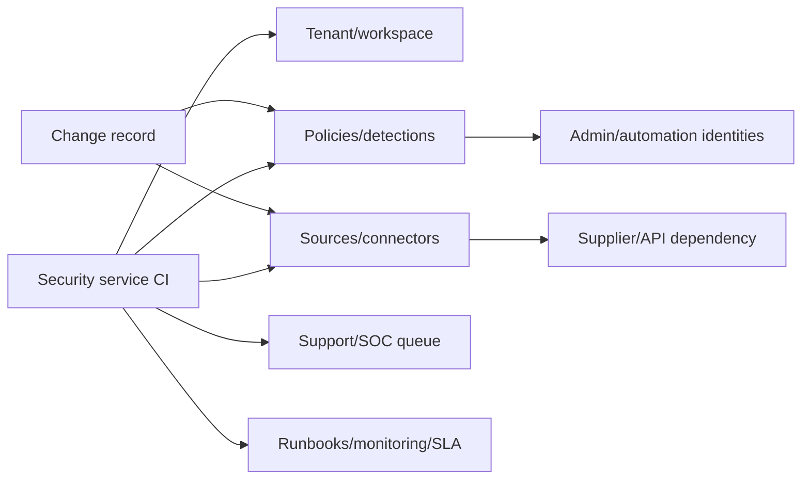

The **configuration baseline** is the approved reference state used for comparison and recovery. Reconcile it after deployment, rollback, emergency change, and decommission. Detect drift, but understand product-managed defaults and legitimate dynamic state before alerting.

## 23. Known errors, workarounds, and problem management

A **known error** has an understood cause or sufficiently understood failure pattern and a documented workaround, even if the permanent fix is pending. Record symptom, scope, trigger, cause/confidence, affected versions, detection, workaround steps, risk, approvals, recovery, escalation, permanent-fix owner/date, and review/expiry.

Do not label speculation as root cause. Distinguish:

- **Incident:** restore service or control now.
- **Problem:** investigate underlying cause and recurrence.
- **Defect:** product/configuration behavior differs from expectation.
- **Known error:** understood failure with documented handling.
- **Workaround:** reduces impact without removing underlying cause.
- **Permanent fix:** removes or acceptably controls the cause and is validated.

Your RCA and documentation experience naturally maps to problem and known-error management. Your fix-validation habit prevents a workaround from being mistaken for permanent resolution.

## 24. Supplier and vendor operating model

| Supplier field | Required information |
|---|---|
| Service/dependency | Exact product, tenant, connector, API, region, support scope |
| Contract/support | Term, severity, hours, response, exclusions, entitlement |
| Contacts | Portal, hotline, account, technical escalation, backup |
| Evidence | Required IDs/logs, redaction, secure transfer channel |
| Maintenance/change | Notice, release, deprecation, roadmap communication |
| Access | Named/time-bound remote/admin access and audit |
| Incident | Joint bridge, cadence, ownership boundary, communications |
| Continuity/exit | Data export, deletion, credentials, transition, termination |

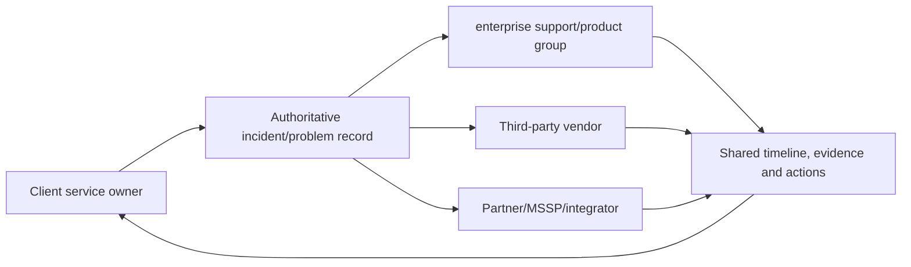

Keep one shared timeline and clear asks. Each supplier owns its investigation and contractual actions, while the client service/risk owners retain end-to-end decisions. Avoid public blame and unsupported statements during active incidents.

## 25. Support model and contact tree

The support model defines entry channels, hours, tiers, queue owners, evidence requirements, escalation thresholds, on-call, major-incident path, product/vendor contacts, and business communications. Test every contact at handover. A spreadsheet with stale names is not a support model.

Use role mailboxes/on-call systems where possible rather than personal contacts. Protect contact data and keep emergency communication methods available if the primary collaboration platform fails.

## 26. Handover process

Handover transfers operational responsibility through evidence and acceptance, not a folder upload.

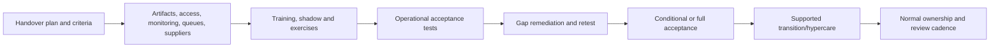

| Handover area | Acceptance evidence |
|---|---|
| Service/design | Scope, architecture, data, dependencies, decisions current |
| Ownership | RACI, delegation, hours, contacts, capacity accepted |
| Access | Roles/PIM/service identities/emergency paths tested |
| Monitoring | Health, synthetic checks, routing, paging, dashboards tested |
| Process | Incident/request/problem/change/recovery flows exercised |
| Knowledge | Runbooks/SOPs/playbooks/KBs usable and versioned |
| Skills | Reverse shadow and tabletop passed |
| Suppliers | Entitlement, contacts, evidence, escalation and contract known |
| Configuration | CMDB/baseline, release manifest, secrets, backup current |
| Risk | Gaps, known errors, exceptions and residual risk owned |
| Reporting | CSFs/KPIs/KRIs, definitions, data, cadence and audience ready |

## 27. Acceptance criteria and conditional acceptance

Acceptance criteria should be measurable and agreed before transition. If gaps remain, use **conditional acceptance** only when authorized: list gap, impact, workaround/compensation, owner, due date, validation, escalation, and expiration. Do not hide unfinished work in meeting minutes.

Mandatory blockers commonly include no service owner, no critical monitoring, untested high-impact response, missing administrative access, no major-incident path, no viable recovery, unaddressed privacy/security issue, or unresolved critical defect.

## 28. Critical success factors, KPIs, KRIs, and health indicators

- **Critical Success Factor (CSF):** condition necessary for success, such as “critical security signals are triaged by authorized responders 24x7.”
- **Key Performance Indicator (KPI):** performance measure, such as acknowledgement within target.
- **Key Risk Indicator (KRI):** early warning of rising risk, such as declining telemetry coverage.
- **Health indicator:** technical/operational state, such as connector errors or queue backlog.

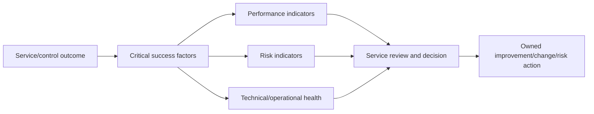

| Measure | Definition example | Decision use | Caveat |
|---|---|---|---|
| Telemetry coverage KRI | Reporting intended sources / intended sources | Investigate blind spots | “Reporting” needs field/latency quality |
| High-severity acknowledgement KPI | Eligible cases acknowledged within threshold | Staffing/routing improvement | Speed alone does not prove quality |
| Automation health | Successful complete executions / triggers | Fix credentials/API/idempotency | Partial success must be classified |
| Recurrence rate | Repeat incidents tied to same problem | Prioritize permanent fix | Linking quality affects measure |
| Runbook success | Sampled cases completed without unsafe deviation | Improve knowledge/training | Easy cases can bias result |
| User-impact KRI | Security-control tickets per affected population | Tune policy/support | Under-reporting and campaign changes |

## 29. Metric design and anti-gaming

Every metric needs purpose, formula, population, inclusion/exclusion, start/stop clock, source, owner, baseline, target, threshold, cadence, segmentation, data-quality control, and caveat. Pair speed with quality, recurrence, customer outcome, and safety.

Bad incentives include closing tickets early, suppressing noisy alerts without risk review, downgrading severity, excluding difficult populations, or counting automation initiation as success. Review behavior caused by the metric.

## 30. Service reviews and business reviews

A useful review answers:

1. Are security and service outcomes being achieved?
2. What changed in scope, risk, demand, platform, supplier, or business?
3. Which incidents, problems, defects, exceptions, and known errors matter?
4. Are data, control, automation, queue, staffing, and supplier health adequate?
5. Which SLAs/OLAs/contract commitments were met or missed, and why?
6. What decisions, investments, risks, or priorities need owner action?
7. Which improvements were validated, and what is next?

You can use your business-review experience to keep this outcome-focused. Translate technical facts into customer impact and decisions without hiding uncertainty.

## 31. Continual improvement

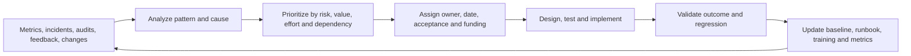

The improvement register should include ID, source, problem/opportunity, evidence, impact, proposed outcome, owner, priority, dependencies, target date, status, validation, linked change, and realized result. Close only after outcome validation, not when implementation begins.

## 32. Scenario: Defender XDR and Sentinel operations

**Situation:** A fictional client deploys Defender XDR and Sentinel. Alerts arrive, but ownership between the unified incident queue and SIEM queue is unclear; two automation flows open duplicate tickets; the endpoint team has response permissions but the SOC does not.

**Readiness response:** Define which platform/record is authoritative by incident type, correlation and duplicate rules, L1/L2/L3 tasks, response approval, queue synchronization, data-source health, automation idempotency, PIM roles, endpoint engineering support, vendor escalation, and closure taxonomy. Run synthetic alerts and a tabletop from signal to case, investigation, approved isolation, recovery, documentation, and metrics. Handover blocks until access and duplicate actions are fixed.

## 33. Scenario: Conditional Access operational readiness

The service design identifies policy owner, identity operations, service desk, application owners, emergency access, sign-in monitoring, report-only analysis, policy-change process, user recovery, guest and service-identity boundaries, enterprise support evidence, and business communication. Runbooks distinguish policy evaluation, token/session timing, device compliance, authentication method, application behavior, network location, and service health. A broad exclusion is never the default troubleshooting step.

## 34. Scenario: DLP operations

DLP readiness includes policy/data owners, privacy/legal consultation, alert/case queues, user override and justification, false-positive tuning, escalation, evidence access, retention, investigation boundary, endpoint and cloud locations, workflow exceptions, metrics, and communication. Service desk handles user symptoms; security/data teams assess policy and risk; engineering diagnoses classification, indexing, client, connector, or product behavior. Synthetic records test end-to-end flow.

## 35. Scenario: Multi-vendor connector failure

An endpoint product sends events through a partner collector to Sentinel; volume drops. Monitoring compares endpoint inventory, collector input/output, network/API status, and target ingestion. L1 validates scope and health; L2 builds the timeline and checks credentials/throttling/schema; engineering and suppliers receive exact evidence. The service owner manages risk and fallback. The PIR updates independent source monitoring, expiry alerts, OLA/contract assumptions, and the runbook.

## 36. Common readiness failure modes

| Failure | Why it happens | Corrective control |
|---|---|---|
| “Project team will support it” | No permanent owner/capacity | Named service owner and accepted support model |
| RACI has many As | Decision avoidance | One accountable outcome owner and delegation |
| Queue receives alerts nobody owns | Routing not tested | Synthetic end-to-end route/paging test |
| SLA impossible | OLA/vendor/support chain misaligned | Model dependency timings and fallback |
| Runbook is a screenshot list | No decisions, evidence, failure, recovery | Use executable anatomy and exercise |
| Operators attended training but cannot act | Attendance mistaken for competence | Reverse shadow and OAT |
| Admin access fails during incident | PIM/MFA/network not exercised | Test normal/emergency access paths |
| Automation silently stops | Credential/API/health unmonitored | Expiry, synthetic, error alert, manual fallback |
| CMDB drifts | No change/reconciliation ownership | Automated compare plus review |
| Supplier escalation stalls | No entitlement/evidence/contact | Tested support path and contract alignment |
| Handover accepted with hidden gaps | Schedule pressure and vague criteria | Mandatory gates and conditional acceptance register |
| KPI improves while service worsens | Metric gaming/poor definition | Pair speed, quality, recurrence, outcome, safety |

## 37. Quality, safety, privacy, and evidence

| Principle | Operational practice |
|---|---|
| Least privilege | Task-aligned roles, PIM, review, no shared admin accounts |
| Safe action | Approval, scope check, reversible step, stop condition |
| Evidence integrity | Source, timestamp, IDs, original preservation, controlled access |
| Privacy | Purpose, minimization, redaction, retention, authorized disclosure |
| Resilience | Independent health checks, manual fallback, emergency access |
| Quality | Versioned peer-reviewed runbooks, exercises, sampled case review |
| Human sustainability | Clear shifts, backup, fatigue management, no blame for escalation |
| Supplier control | Time-bound access, secure evidence transfer, revocation and exit |

## 38. Safe paper portfolio lab: Northstar operational readiness

Use fictional **Northstar Research** and the Part 57–58 migration/deployment. Do not access real environments, use real personal data, or claim production operation.

### Lab tasks

1. Define five security services: identity control, endpoint protection, email protection, data protection, and SIEM/SOAR.
2. Assess people/process/technology/data/supplier readiness for each with mandatory gates.
3. Build a service catalog entry and dependency map for one service.
4. Create a RASCI across service desk, SOC L1/L2, IR, engineering, service owner, vendor, privacy/legal, and business.
5. Design queues, categories, required fields, severity, routing, hours, escalation, and closure.
6. Define illustrative SLA, supporting OLAs, and supplier assumptions; flag infeasible chains.
7. Write three full runbooks: telemetry loss, high-severity identity incident, and failed automation.
8. Write one SOP, one scenario playbook, two KB articles, and one known-error record.
9. Design monitoring from component to outcome, including three synthetic checks.
10. Build least-privilege access, PIM, service-identity, secret-expiry, and emergency-access registers.
11. Create a KT plan with shadow, reverse shadow, tabletop, and OAT evidence.
12. Build CMDB/configuration items and relationships, supplier matrix, handover gates, scorecard, service-review agenda, and improvement register.

```mermaid
flowchart LR
    SERVICE[Define service and outcomes] --> READY[Five-dimension assessment]
    READY --> ROLE[RASCI, queues and service levels]
    ROLE --> DOC[Runbooks, SOP, playbook, KB]
    DOC --> MON[Monitoring, access and suppliers]
    MON --> KT[KT, reverse shadow and tabletop]
    KT --> ACCEPT[Operational acceptance]
    ACCEPT --> REVIEW[Scorecard and improvement]
```

### Portfolio validation matrix

| Artifact | Quality question | Honest label |
|---|---|---|
| Service/readiness design | Are outcome, boundaries, dependencies, and blockers clear? | Fictional paper service |
| RASCI/queues/SLA | Can every decision and clock be owned? | Illustrative, not contractual |
| Runbook set | Could a trained operator execute safely and collect evidence? | Tabletop-tested only |
| Monitoring/access | Are silent failure and emergency operation covered? | Conceptual design |
| KT/handover | Is competence demonstrated rather than attendance? | Fictional acceptance |
| Scorecard/improvement | Do measures lead to decisions and validation? | Synthetic metrics |

## 39. Interview answer method

Use **S-O-Q-L-R-M-K-A-I**:

1. **Service** outcome, scope, consumers, hours, criticality, and dependencies.
2. **Ownership** through RACI/RASCI, authority, capacity, and delegation.
3. **Queues** and tier boundaries from intake to engineering/vendor.
4. **Levels** through SLA, OLA, and supplier alignment.
5. **Runbooks** with decisions, permissions, evidence, escalation, and recovery.
6. **Monitoring** across component, data, control, queue, and outcome.
7. **Knowledge/access** via PIM, service identities, KT, reverse shadow, tabletop.
8. **Acceptance** through OAT, CMDB/baseline, risk, suppliers, and formal sign-off.
9. **Improve** using CSFs, KPIs, KRIs, incidents, reviews, and validated actions.

## 40. JD Mapping: interview translation

| Your experience | Operational-readiness meaning | Honest sentence |
|---|---|---|
| Enterprise support queues | Intake, triage, routing, severity, escalation | “I understand what evidence makes a handoff actionable.” |
| Vendor/product-group escalation | Supplier boundary and defect path | “I maintain a shared timeline and clear evidence-led ask.” |
| RCA and fix validation | Problem, known error, recovery, improvement | “I separate workaround from validated permanent correction.” |
| Documentation | Runbooks, KB, handover, training | “I write for the next operator, including decisions and escalation.” |
| Mentoring | KT, shadow, reverse shadow | “I validate capability through practice, not attendance alone.” |
| KPI/business reviews | Service and risk reporting | “I connect trend and caveat to owner decision and customer outcome.” |

## Official Source Anchors

Use current versions and access dates in real work.

1. Microsoft Cloud Adoption Framework, manage methodology: <https://learn.microsoft.com/azure/cloud-adoption-framework/manage/>
2. Microsoft Well-Architected Operational Excellence: <https://learn.microsoft.com/azure/well-architected/operational-excellence/>
3. Microsoft Defender XDR security operations overview: <https://learn.microsoft.com/defender-xdr/>
4. Microsoft Sentinel security operations guidance: <https://learn.microsoft.com/azure/sentinel/overview>
5. Microsoft Sentinel data connector health monitoring: <https://learn.microsoft.com/azure/sentinel/monitor-data-connector-health>
6. Microsoft Entra Privileged Identity Management documentation: <https://learn.microsoft.com/entra/id-governance/privileged-identity-management/>
7. Microsoft Entra emergency access accounts: <https://learn.microsoft.com/entra/identity/role-based-access-control/security-emergency-access>
8. Microsoft identity platform workload identity guidance: <https://learn.microsoft.com/entra/workload-id/workload-identities-overview>
9. Microsoft 365 service health: <https://learn.microsoft.com/microsoft-365/enterprise/view-service-health>
10. NIST Cybersecurity Framework 2.0: <https://www.nist.gov/cyberframework>
11. NIST SP 800-53 Rev. 5: <https://csrc.nist.gov/pubs/sp/800/53/r5/upd1/final>
12. NIST SP 800-61 Rev. 3, Incident Response Recommendations and Considerations for Cybersecurity Risk Management: <https://csrc.nist.gov/pubs/sp/800/61/r3/final>
13. CISA Cybersecurity Performance Goals: <https://www.cisa.gov/cybersecurity-performance-goals-cpgs>
14. FIRST CSIRT Services Framework: <https://www.first.org/standards/frameworks/csirts/csirt_services_framework_v2.1>
15. ITIL public overview from PeopleCert: <https://www.peoplecert.org/browse-certifications/it-governance-and-service-management/ITIL-1>

## ⭐ Likely Interview Questions for This Section

### Q1. What does operational readiness mean for a Microsoft security solution?

**Model answer:** It means authorized people can sustain the security and service outcome from day one, including normal work, attack, defect, supplier failure, and recovery. I assess people, process, technology, data, and supplier dimensions; define the service and dependencies; establish ownership, queues, severity, service levels, runbooks, monitoring, access, training, configuration baseline, supplier paths, and metrics; then prove them through operational acceptance, reverse shadow, synthetic tests, and tabletop exercises. Authorized operations and service owners accept remaining risks and conditions.

### Q2. How do you build a useful RACI or RASCI?

**Model answer:** I create it around specific activities and decisions, not broad team names. Each outcome has preferably one accountable owner, responsible executors, support where the RASCI model uses it, consulted specialists, and informed audiences. I connect the matrix to decision rights, delegation, staffing, skills, hours, access, and escalation. Vendors can be responsible under contract, but client service and risk accountability remains explicit. I test the model in a tabletop because paper roles often fail at boundaries.

### Q3. How should a service desk and SOC work together?

**Model answer:** They need explicit intake and linking rules. User-facing incidents and requests often enter the service desk; threat alerts enter the SOC; platform-health alerts may enter security operations. A user report can become a security incident, and containment can create a user incident, so records share identifiers, severity, ownership, updates, and closure criteria. I define which queue is authoritative for each state, L1–L3 handoff evidence, major-incident escalation, support hours, and duplicate handling, then test routing and paging end to end.

### Q4. What is the relationship among an SLA, OLA, and underpinning contract?

**Model answer:** The SLA is the service commitment to the customer or consumer. Internal OLAs describe how service desk, SOC, engineering, and other teams support that commitment. Underpinning supplier contracts provide product or managed-service commitments. I map clocks, severity, hours, response, restoration, exclusions, data sources, and escalation across the chain. If an essential vendor response is slower than the promised restoration, I expose the structural gap and design fallback, renegotiation, or a realistic commitment.

### Q5. What makes a security runbook good?

**Model answer:** It is executable and safe. It states purpose, scope, trigger, severity, prerequisites, roles, required IDs, access/PIM, decision branches, steps, expected results, evidence, timeout, permissions, communications, escalation, recovery, privacy, metrics, owner, version, and review date. High-impact actions have approval, narrow scope, stop conditions, and validation. I test the runbook through reverse shadow or simulation and update it from incidents and user feedback.

### Q6. How do you monitor whether a security service really works?

**Model answer:** I monitor layers: platform/component health, connector and data quality, policy or detection effective behavior, queue and automation operation, and the security/business outcome. I compare independent sources where possible and run safe synthetic transactions through the whole path. Alerts need deduplication, routing, paging, acknowledgement, escalation, and failure monitoring. A green product portal is not proof that source data arrived, the detection fired, a ticket routed, or a responder could act.

### Q7. What must be true before handover is accepted?

**Model answer:** Service scope and architecture are current; RACI, staffing, hours, queues, severity and service levels are accepted; least-privilege and emergency access work; health, synthetic checks, routing and on-call are tested; runbooks and known errors are usable; suppliers and contracts are understood; CMDB/configuration baseline is current; receiver training, reverse shadow and tabletop pass; defects, exceptions and residual risks have owners; reporting works; and no mandatory blocker remains. Conditional acceptance requires explicit gap, risk, owner, date, compensation, validation, and expiry.

### Q8. What is your honest experience with operational readiness?

**Model answer:** My direct production evidence is Microsoft 365 support escalation, SharePoint/OneDrive and sync diagnosis, critical-incident coordination, vendor and product-group escalation, RCA, fix validation, documentation, mentoring, KPI reporting, and business reviews. These are strong operations skills. I have built a fictional readiness portfolio covering service definition, RASCI, queues, SLA/OLA dependencies, runbooks, monitoring, PIM and service identities, KT, handover, and improvement. I would not claim production SOC design or contractual authority without evidence.

## 🧠 30-Second Memory Hooks

- **Ready means runnable.** People can monitor, decide, act, recover, prove, and improve.
- **Five dimensions form one chain.** People, process, technology, data, supplier.
- **Define the service first.** Outcome, consumer, boundary, hours, data, dependencies, owner.
- **One A, capable R.** Accountability needs decision rights; responsibility needs skill, access, and capacity.
- **Queues need bridges.** User incidents, security alerts, health defects, and suppliers share IDs and ownership.
- **SLA rests on OLA and contract.** Promise only what the delivery chain can support.
- **Runbooks branch and recover.** Trigger, decision, permission, evidence, escalation, rollback.
- **Monitor to outcome.** Component, data, control, queue, and real result.
- **Attendance is not transfer.** Reverse shadow and exercise prove competence.
- **Handover is acceptance, not upload.** Gaps, risk, owners, tests, and conditions remain visible.

## Completion Checklist

- [ ] I can define operational readiness and explain why deployment alone is insufficient.
- [ ] I can assess people, process, technology, data, and supplier dimensions with mandatory gates.
- [ ] I can define a security service's outcome, scope, consumers, hours, criticality, data, dependencies, recovery, and owners.
- [ ] I can build a service-design package that connects architecture, support, monitoring, documentation, and improvement.
- [ ] I can explain RACI/RASCI and avoid multiple-accountability and paper-ownership traps.
- [ ] I can define L0/L1/L2/L3, engineering, vendor, service, control, and specialist boundaries.
- [ ] I can design service-desk, SOC, health, engineering, and supplier queues with linked records.
- [ ] I can distinguish severity from priority and reassess both as evidence changes.
- [ ] I can explain SLA, OLA, and underpinning-contract dependencies and clock definitions.
- [ ] I can distinguish runbooks, SOPs, playbooks, KB articles, designs, and known-error records.
- [ ] I can write a runbook with trigger, prerequisites, decision points, permissions, evidence, escalation, recovery, privacy, and version control.
- [ ] I can design monitoring across component, data, control, operations, and outcome layers.
- [ ] I can design safe synthetic checks and independent health validation.
- [ ] I can route and page alerts to real owners and account for on-call sustainability.
- [ ] I can map task-aligned roles, PIM, emergency access, vendor access, and service identities.
- [ ] I can operate automation with least privilege, credential lifecycle, idempotency, errors, audit, and manual fallback.
- [ ] I can design training, shadow, reverse shadow, tabletop, simulation, and OAT.
- [ ] I can maintain a useful CMDB/configuration baseline and reconcile drift.
- [ ] I can distinguish incident, problem, defect, known error, workaround, and permanent fix.
- [ ] I can build supplier contacts, evidence, support, access, maintenance, continuity, and exit controls.
- [ ] I can define handover criteria, blockers, conditional acceptance, and residual-risk ownership.
- [ ] I can design CSFs, KPIs, KRIs, health indicators, service reviews, and anti-gaming controls.
- [ ] I can connect your direct escalation, RCA, fix-validation, documentation, mentoring, and business-review evidence honestly.
- [ ] I can present the Northstar artifacts as a fictional paper portfolio.
- [ ] I can answer Q1–Q8 without implying proprietary methods or unsupported production experience.

*Next suggested section:* [Part 60](Part-60-structured-troubleshooting-multivendor-cloud.md)