# Part 60 — Structured Troubleshooting in Multi-Vendor, Multi-Protocol Cloud Environments

> **Section goal:** Build a beginner-first, evidence-led method for diagnosing Microsoft 365 security and service failures that cross users, devices, networks, DNS, TCP, TLS, proxies, identity, tokens, Conditional Access, applications, workloads, data pipelines, Microsoft services, third-party products, partners, and operations. By the end, you should be able to turn a vague symptom into an exact impact/scope/time/change/common-factor statement; create a trustworthy incident timeline; separate control plane from data plane; walk the dependency layers without jumping to blame; form falsifiable hypotheses and run safe hypothesis-test-pivot cycles; reproduce and reduce a failure; use affected/unaffected comparisons and A/B tests; correlate logs, traces, packet captures, HAR files, authentication, policy, and service evidence through IDs and corrected clocks; check service health, release status, roadmap, and Message center without treating them as proof; coordinate multi-vendor boundaries with a shared timeline, RACI, and precise evidence requests; build an escalation pack and product-defect case; distinguish workaround, mitigation, recovery, fix, and prevention; protect and redact evidence; troubleshoot common M365 sign-in, sync, mail, policy, SIEM-ingestion, and automation scenarios; and write an honest RCA without disabling security controls unsafely.

This Part maps directly to the role's expectation to solve complex Microsoft 365 security incidents, policy errors, platform issues, service disruptions, integration failures, and multi-vendor problems. It strongly leverages Arti's demonstrated production experience: SharePoint Online and OneDrive support, synchronization and migration troubleshooting, critical escalations, vendors, partners and Microsoft product groups, RCA, fix validation, documentation, mentoring, customer communication, KPI analysis, and business reviews. The consulting extension is to make the reasoning explicit, reusable, safe, privacy-aware, and persuasive across organizational boundaries.

> **Method boundary:** This chapter contains public, general troubleshooting, incident, network, cloud, and consulting practices. It does not describe or imply Deloitte proprietary methods, diagnostic tools, templates, client cases, service levels, or product access. Real work must follow approved client and firm incident, privacy, legal, records, security testing, support, change, evidence, and communications processes.

> **Safety and currency warning (August 24, 2026):** Microsoft services, portals, logs, correlation fields, APIs, support diagnostics, Message center, service health, release channels, and product behavior change. Packet captures, HAR files, sign-in logs, message traces, client diagnostics, and support bundles may contain tokens, cookies, URLs, file names, email addresses, IP addresses, tenant IDs, message content, and personal or confidential data. Obtain authorization, collect the minimum, use approved tools/channels, protect originals, redact shared copies, and follow retention rules. Never solve an incident by broadly disabling MFA, Conditional Access, DLP, endpoint protection, TLS validation, firewall/proxy controls, or audit without explicit risk authority, narrow scope, time limit, monitoring, and restoration.

## JD Mapping

| Role expectation | Capability developed here | Portfolio evidence |
|---|---|---|
| Troubleshoot complex M365/security failures | Scope, layer, hypothesize, test, correlate, recover, and validate | Troubleshooting casebook |
| Work across vendors and protocols | Define boundaries, evidence requests, shared timeline, ownership, and escalation | Multi-vendor action matrix |
| Diagnose policy and platform issues | Separate intent, assignment, delivery, evaluation, enforcement, and evidence | Policy fault tree |
| Lead escalations | State impact, reproduction, identifiers, evidence, mitigation, and clear ask | Product escalation pack |
| Produce RCA and validate fixes | Distinguish trigger, cause, conditions, workaround, fix, and prevention | RCA and fix-validation report |
| Protect client service and security | Use reversible tests, minimal privilege, redaction, and no unsafe disabling | Safety and evidence plan |
| Document reusable guidance | Convert verified patterns into runbooks, KBs, and known errors | Operational knowledge set |
| Brief business stakeholders | Translate technical uncertainty into impact, status, risk, decision, and next step | Executive incident update |

## Candidate honesty note

Arti can directly use her production examples in SharePoint Online, OneDrive, synchronization, migration, permissions, critical incidents, customer and partner coordination, Microsoft/product-group escalation, RCA, fix validation, documentation, mentoring, and business reviews, provided every detail is faithful to her experience and confidentiality duties. That evidence is the heart of this Part.

She should not claim packet-analysis, Entra/Conditional Access, Exchange, Defender, Sentinel, or specific third-party production depth she does not possess. She can explain the method and safe paper exercises. Safe wording is:

> “My strongest production skill is structured Microsoft 365 escalation. I define scope and timeline, compare affected and unaffected cases, isolate layers and changes, collect product-specific evidence, coordinate vendors and product groups, validate workarounds and fixes, document RCA, and communicate impact. Where a security product or protocol is outside my direct production depth, I state that and explain the evidence I would gather, the specialist I would involve, and the safe test that would distinguish hypotheses.”

---

## 1. Troubleshooting is controlled learning

Troubleshooting is the process of reducing uncertainty until the team can restore an acceptable state and explain what evidence supports the diagnosis. It is not a race to the first plausible cause.

**Analogy:** A doctor does not prescribe every medicine because a patient says “I feel bad.” They clarify onset, severity, location, exposures, changes, and comparable cases; form hypotheses; choose tests that distinguish them; treat urgent risk; and revise when evidence disagrees.

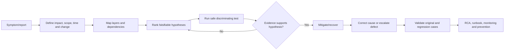

| Term | Plain meaning | Example |
|---|---|---|
| Symptom | Observed unwanted behavior | “OneDrive says sign-in is required” |
| Impact | Business/security consequence | 300 users cannot sync current files |
| Cause | Condition that produces the failure | Proxy rejects token endpoint TLS |
| Trigger | Event that starts manifestation | Proxy certificate rotation |
| Contributing factor | Makes failure more likely/severe | Clients lacked new trust chain |
| Workaround | Avoids/reduces symptom without removing cause | Temporary approved alternate path |
| Fix | Corrects cause for defined scope | Correct certificate chain deployed |
| Validation | Evidence fix works and does not regress | Original flow plus comparison tests |

## 2. Write the problem statement

Replace “Microsoft 365 is down” with a falsifiable statement:

> Beginning at **time/time zone**, **population** using **device/client/network/workload** experiences **exact symptom/error** when performing **workflow** against **resource/service**. **Unaffected comparison** still works. Business/security impact is **effect**. The last known good time is **time**; relevant changes/common factors are **facts or unknowns**.

| Dimension | Questions | Evidence examples |
|---|---|---|
| Symptom | Exact user-visible and backend error? | Screenshot plus code, request ID |
| Impact | What business/security outcome is blocked or exposed? | Service owner statement, transaction count |
| Scope | Which users, devices, apps, sites, tenants, regions? | Full population query and samples |
| Time | First/last known, continuous/intermittent, time zone? | Logs, user report, monitoring |
| Change | Policy, release, certificate, network, license, account, data? | Change record, audit, Message center |
| Common factor | What is shared only by affected cases? | Proxy, client build, group, connector, region |
| Comparison | What similar case works? | Same user/different device or vice versa |

### 🔍 Plain-English deep-dive: scope is a diagnostic instrument

Scope is not administration; it removes hypotheses. If the same user succeeds on a different network, tenant-wide licensing becomes less likely and a path-specific issue becomes more likely. If many users fail only one application, a universal identity outage is less likely. Affected/unaffected differences are experiments created by reality.

## 3. Stabilize before deep diagnosis

First ask whether there is active security harm, data loss, widespread outage, unsafe automation, identity lockout, or regulatory/privacy concern. Invoke the authorized incident process and contain only as needed. Preserve volatile evidence before restarting or changing systems when safe and required.

| Immediate concern | First controlled action |
|---|---|
| Active account compromise | Invoke security IR; scope sessions/actions; authorized containment |
| Mail loop/loss | Protect flow, preserve traces/IDs, execute approved routing recovery |
| Automation causing harm | Disable the specific workflow/action path; retain inputs and audit |
| Endpoint instability | Stop rollout, isolate affected version/cohort, preserve diagnostics |
| Telemetry blindness | Notify SOC/risk owner, use fallback source, preserve pipeline evidence |
| Broad policy lockout | Use designed emergency access and scoped policy recovery |

Mitigation and diagnosis can run in parallel, but record every action because it changes the evidence.

## 4. Build one trustworthy timeline

Use one authoritative timeline with normalized UTC plus original local time/time zone where useful. Include user observations, source event time, ingestion time, changes, policy evaluations, token issuance, service advisories, vendor actions, tests, mitigations, decisions, and recovery.

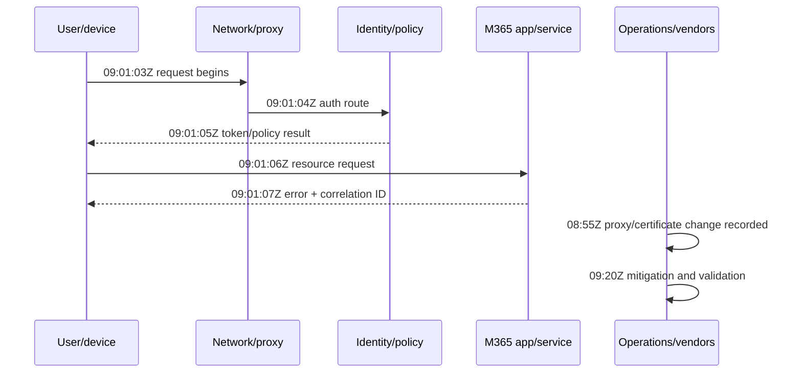

| Timeline field | Purpose |
|---|---|
| UTC timestamp and original zone | Cross-system correlation |
| Source clock and offset/confidence | Explain skew and precision |
| Actor/component | User, device, proxy, IdP, service, admin, automation |
| Event/action | What objectively happened |
| IDs | Correlation/request/trace/message/sign-in/device/incident/change |
| Evidence link | Original or approved redacted artifact |
| Interpretation | Clearly labeled inference, not mixed with fact |
| Owner/next action | Keeps coordination actionable |

## 5. Clock synchronization and timestamp traps

Cloud diagnosis depends on clocks. Record NTP state, device time zone, daylight-saving changes, source event versus ingestion time, browser versus server timestamps, and known logging precision. A five-minute skew can make a token appear issued after failure or place a policy change on the wrong side of the event.

Do not “correct” original evidence. Preserve it, then add a documented normalized time and offset. When two vendors use different clocks, anchor them through a shared request or transaction ID.

## 6. Map the dependency layers

Use a layered model, but remember a transaction can loop or call several services.

```mermaid
flowchart LR
    USER[User/workflow] --> DEV[Device, OS and client]
    DEV --> IF[Interface, IP, route and VPN]
    IF --> DNS[DNS/cache/NRPT/DoH]
    DNS --> TCP[TCP or QUIC transport]
    TCP --> TLS[TLS, certificate and SNI]
    TLS --> PROXY[Proxy/PAC/firewall/filter]
    PROXY --> ID[Identity, token, federation and CA]
    ID --> APP[Application/workload/API]
    APP --> DATA[Permissions, content, schema and data]
    DATA --> VENDOR[Cloud/vendor dependency]
    VENDOR --> OPS[Queue, automation and operations]
```

| Layer | Typical evidence | Frequent mistake |
|---|---|---|
| User/workflow | Exact steps, persona, resource, impact | Treat “cannot access” as one failure type |
| Device/client | Version, account, cache, logs, effective config | Reinstall before preserving evidence |
| Interface/route | Adapter, IP, gateway, route, VPN, NCSI/profile | Trust a generic “internet connected” icon |
| DNS | Query/cache/server/response/TTL/NRPT/DoH | Use ping to prove application DNS |
| Transport | SYN/SYN-ACK/ACK, RST, retransmit, RTT, MTU | Blame network from any retransmission |
| TLS | ClientHello/SNI, chain, trust, time, alert, interception | Disable validation instead of fixing trust |
| Proxy/filter | PAC, stack-specific proxy, auth, 407, WFP/firewall | Assume browser and service use same proxy |
| Identity/token | Sign-in, issuer/audience/claims, consent, session | Decode token and assume signature/acceptance |
| Policy | Scope, mode, result, precedence, effective state | Disable all policies to “test” |
| Application/data | HTTP/API status, permissions, throttle, schema | Treat 403 as authentication failure |
| Vendor/service | Health, region, release, limits, backend trace | Treat absence of advisory as proof of health |
| Operations | Alert routing, credentials, queue, automation | Product works but process silently fails |

## 7. Control plane versus data plane

The **control plane** stores and distributes desired configuration: policy, role, connector, assignment, rule, and automation definition. The **data plane** is the actual user, message, event, file, token, API, or response transaction.

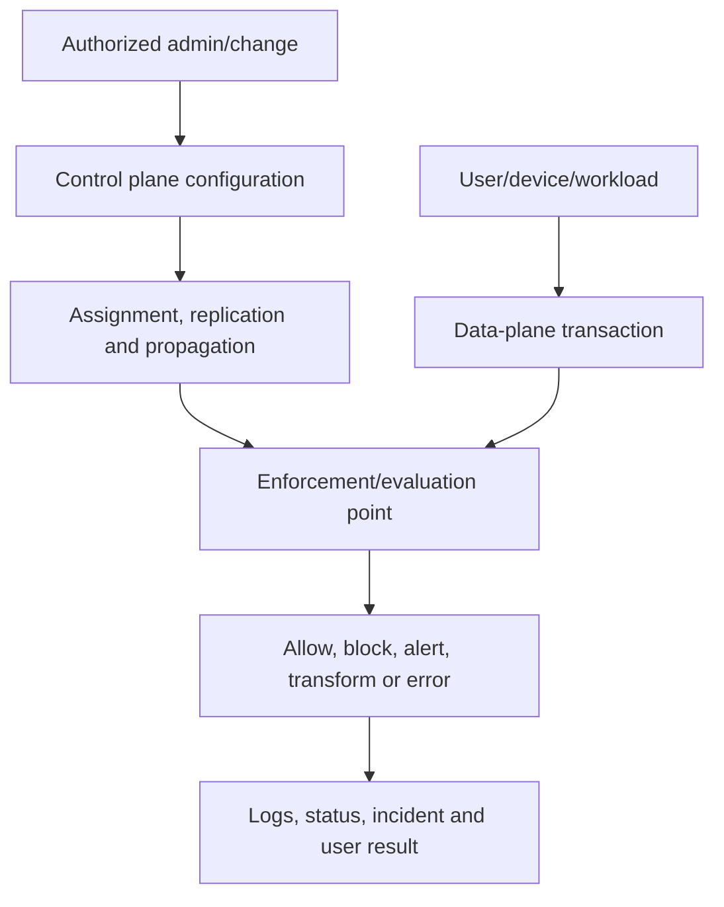

An admin portal can show the intended policy while a client uses a cached token, a connector has stale credentials, a device is not applicable, a policy conflicts, or the backend has not propagated. Troubleshoot intent → scope → delivery → applicability → evaluation → enforcement → evidence.

## 8. Scientific hypothesis-test-pivot

A useful hypothesis is specific and falsifiable:

> “Affected Windows clients on Proxy A fail because TLS interception presents a chain not trusted by the OneDrive process; if true, a capture/log will show the secure failure after Proxy A, the same device will succeed on an approved nonintercepted test path, and affected clients will share the missing chain.”

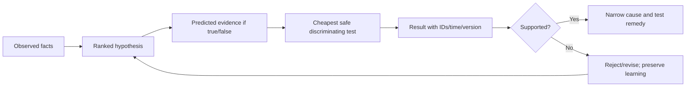

| Hypothesis field | Example |
|---|---|
| Claim | New CA policy blocks unmanaged macOS clients |
| Supporting facts | Failure begins after policy; affected sign-ins show policy result |
| Contradicting facts | One affected client reports compliant state |
| Prediction if true | Excluded test user succeeds after fresh sign-in; result names policy |
| Safe test | One approved test identity/device, report-only analysis, no broad disable |
| Result | Request/sign-in IDs and timestamps |
| Decision | Supported, rejected, revised, or inconclusive |

### 🔍 Plain-English deep-dive: a test should change your mind

“Collect more logs” is not a hypothesis test unless you know what result favors one explanation over another. A good test is like a fork in a road: either outcome tells you where to go next. Prefer the cheapest safe test that separates plausible causes.

## 9. Reproduction and minimal reproduction

A **reproduction** repeats the failure under known conditions. A **minimal reproduction** removes unrelated variables until the smallest case still fails. Record tenant/environment, account type, device/OS/client version, network, resource, policy, steps, exact result, time, IDs, and repetition rate.

Minimize carefully: new test user, small file, dedicated site, one rule, one connector, direct API call, or isolated parser event. Do not remove a variable that is part of the true production path and then claim equivalence.

| Reduction axis | Example comparison |
|---|---|
| User | Affected user versus matched unaffected user |
| Device | Same user on managed versus unmanaged device |
| Network | Same device on office versus approved alternate network |
| Client | Browser versus desktop client; current versus previous supported build |
| Resource | One site/mailbox/app versus another with matched permissions |
| Policy | Included versus approved excluded test identity, one policy at a time |
| Data | Small synthetic item versus failing content shape |
| Time | Immediate versus after token/cache/replication interval |

## 10. A/B testing without false conclusions

An A/B comparison changes one relevant variable while holding others as constant as practical. Record all differences; cloud environments rarely permit perfect control.

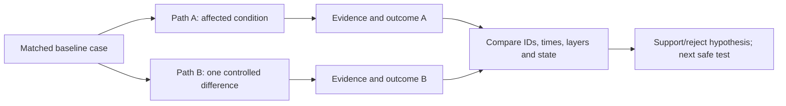

Beware token/cache timing, service-side gradual rollout, DNS/CDN changes, policy propagation, dynamic groups, and different content/permission state. Repeating a test can change state; record order.

## 11. Logs, traces, and correlation identifiers

Collect evidence to answer a question. Common anchors include request/correlation/trace IDs, sign-in IDs, message IDs, device IDs, user/object IDs, tenant IDs, incident/alert IDs, policy/rule IDs, connector/source IDs, HTTP status, timestamps, and versions.

| Evidence source | Best use | Safety concern |
|---|---|---|
| Client/application log | Local state, retry, request ID, error sequence | User paths, names, tokens |
| Entra sign-in/audit | Authentication/policy/admin events | Identity and location data |
| Unified audit/workload logs | User/admin workload actions | Content metadata and retention |
| Message trace/headers | Mail route, delivery, connectors, IDs | Addresses, subjects, infrastructure |
| Defender/Sentinel logs | Alert, event, entity, ingestion, response | Broad security and personal telemetry |
| Network/packet capture | DNS, TCP, TLS timing and endpoints | Payloads, IPs, credentials if unencrypted |
| HAR/browser trace | HTTP redirects, status, timing, headers | Cookies, tokens, URL/query data |
| Service health/change | Published incidents and changes | Tenant-specific visibility/access |
| Vendor support bundle | Product internals and configuration | Secrets, customer data, system details |

Preserve original files read-only where required, record source and acquisition, and create a redacted working copy. Do not paste raw tokens, cookies, full HARs, or captures into ordinary email/chat.

## 12. Network path: interface, address, route, and VPN

Confirm active interfaces, media changes, IP addressing, gateways, route table, metrics, VPN/tunnel, DNS servers, proxy settings, firewall profile, and connectivity classification. Multi-homing can send requests and responses over different paths; VPN can alter DNS, MTU, proxy, and routes.

An NCSI or “internet” status is a probe result, not proof that the exact M365 endpoint, protocol, identity, and policy path works. Compare affected and unaffected route/interface state at the event time.

## 13. DNS diagnosis

DNS maps names to records, but the observed answer depends on local/application caches, policy such as NRPT, resolver selection, suffix/search behavior, record type, split DNS, DoH/DoT policy, TTL, negative caching, server health, and network reachability.

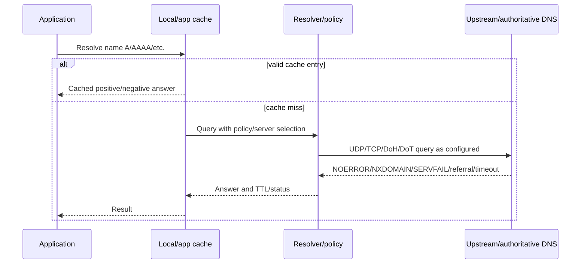

| DNS observation | Meaning hypothesis | Needed evidence |
|---|---|---|
| NXDOMAIN | Name asserted not to exist | Query name/type, authoritative path, cache/TTL |
| SERVFAIL | Resolver could not complete | Server logs, DNSSEC/upstream/transport |
| Timeout | No timely response | Which server/path, retries, firewall, interface |
| A works, AAAA fails | Partial dual-stack issue possible | App selection, IPv6 route, NCSI, timings |
| Different answers | CDN, split DNS, cache, policy, geo | Resolver, TTL, source network, expected design |
| Cached failure persists | Negative cache or application cache | Cache status and controlled expiry/flush test |

Do not flush caches reflexively before recording their state; the cache may be the evidence.

## 14. TCP/QUIC and transport diagnosis

For TCP, determine whether the client sends SYN, receives SYN-ACK, completes ACK, exchanges data, retransmits, advertises constrained windows, or receives FIN/RST. Identify who sends the reset and immediately preceding events. For QUIC/HTTP/3, account for UDP reachability, handshake, fallback, and middlebox behavior.

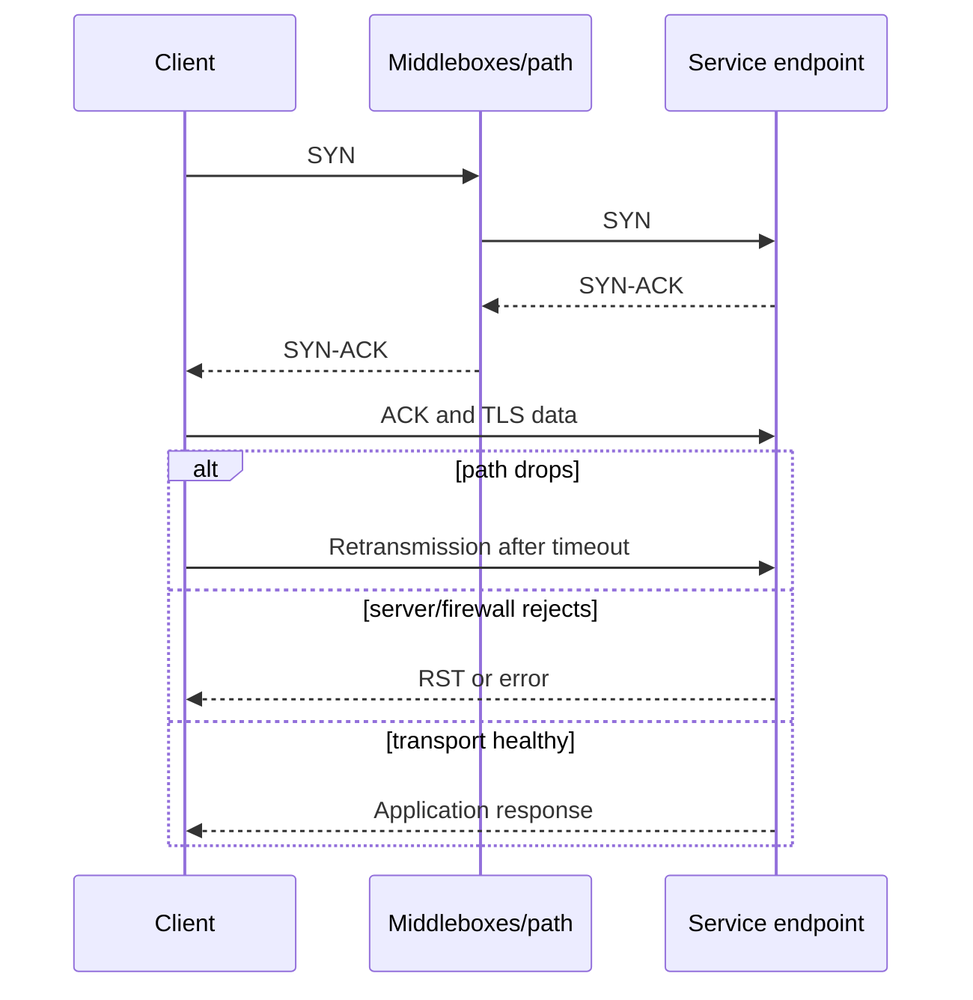

Measure round-trip time, retransmission pattern, window, MTU/fragmentation clues, connection state, port/NAT resource, and capture vantage. A retransmission is a symptom; congestion, loss, capture artifact, receiver delay, MTU, filter driver, or server behavior may cause it.

## 15. TLS and certificate diagnosis

TLS protects transport and authenticates the endpoint. Check offered/selected protocol and cipher, Server Name Indication, certificate chain, SAN/name, validity time, trust anchors, revocation/OCSP behavior, client certificate if used, and TLS alerts. Identify interception or proxy-generated certificates.

Never “fix” a trust problem by permanently disabling certificate validation. Correct certificate issuance, chain delivery, trust distribution, endpoint name, clock, interception policy, or supported protocol according to approved architecture.

| TLS symptom | Possible layer | Discriminating evidence |
|---|---|---|
| Name mismatch | Endpoint/proxy/certificate | SNI, SAN, route, presented chain |
| Untrusted issuer | Missing trust or interception | Chain and client trust store |
| Expired/not yet valid | Certificate or clock | Certificate validity and system time |
| Protocol/cipher failure | Client/server/proxy support | ClientHello/ServerHello/alert |
| Revocation failure | Network/proxy/PKI | OCSP/CRL endpoint and policy |
| Client certificate rejected | Selection/chain/mapping | Mutual TLS trace and server result |

## 16. Proxy, PAC, firewall, and filter diagnosis

Different clients may use WinHTTP, WinINet, browser, application-specific, or system proxy behavior. Inspect PAC retrieval/evaluation, WPAD, bypass lists, proxy authentication, 407 loops, TLS interception, URL categorization, firewall/WFP decisions, third-party network filters, and service endpoint requirements.

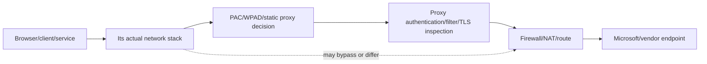

Avoid broad allow-all or bypass. Use a narrowly scoped, authorized A/B test, record exact endpoint/path, and restore immediately. If bypass proves the layer, diagnose the specific rule, authentication, certificate, protocol, timeout, or filter behavior.

## 17. Identity, token, and Conditional Access diagnosis

Separate authentication from authorization. Authentication proves an identity under a method; token issuance carries claims for an audience; Conditional Access evaluates signals and controls in supported flows; the resource still authorizes the requested action.

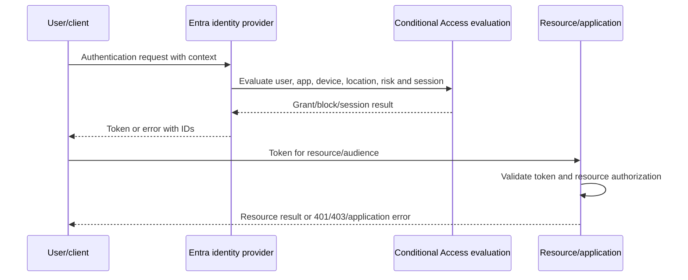

Collect sign-in time/ID, application/resource, client, user, device, location, risk, authentication details, policy results, failure code, token audience/issuer/claims only through safe methods, consent, app assignment, resource permissions, and session/token age. Do not paste bearer tokens into web decoders or tickets.

### 🔍 Plain-English deep-dive: successful sign-in does not prove access

An airport can verify your passport and still deny boarding because the ticket is for another flight or the gate is closed. Similarly, authentication can succeed while the application rejects the token audience, the user lacks SharePoint permission, an app role is missing, a license/service plan is disabled, or a workload policy blocks the action. Identify the decision point that returned the failure.

## 18. Application, API, workload, and data diagnosis

Interpret HTTP status and application error in context. `401` often relates to missing/invalid authentication; `403` means the server understood but refused, which can involve permission, policy, state, or security; `404` can mean absence or deliberate concealment; `429` indicates throttling; `5xx` indicates server-side failure but may originate in a proxy/gateway. Capture response headers, retry guidance, request ID, and timing.

Check resource existence, ownership, permissions, inheritance, sharing, lock, version, quota, file/data type, schema, API version, pagination, throttling, idempotency, webhook delivery, and eventual consistency. Do not retry aggressively; it can worsen throttling or duplicate actions.

## 19. Service health, Message center, roadmap, and release evidence

Check tenant-specific service health and relevant public status, recent advisories, Message center posts, release notes, deprecations, roadmap, client release channel, and known issues. These are evidence sources, not conclusions.

| Source | What it can tell you | What it cannot prove alone |
|---|---|---|
| Service health | Published tenant/service incident and updates | No unreported or narrow defect exists |
| Message center | Planned change/deprecation/feature rollout | Exact failure is caused by the change |
| Roadmap | Intended future direction/timing | Contractual delivery or current availability |
| Release notes | Documented client/product changes | Undocumented regression absent |
| Support case | Product investigation and official response | Client boundary or root cause automatically |

Correlate publication/incident time, affected feature, tenant/region, symptom, and identifiers. Record if no relevant advisory was found, but keep investigating.

## 20. Policy troubleshooting chain

For Conditional Access, Intune, DLP, Defender, Sentinel, mail, retention, or other policy, follow:

```mermaid
flowchart LR
    OBJ[Policy objective] --> CONFIG[Current version and settings]
    CONFIG --> SCOPE[Assignments, exclusions and population]
    SCOPE --> PRE[Prerequisites, license and dependency]
    PRE --> DELIV[Delivery/replication/token/cache]
    DELIV --> APPLY[Applicability and precedence]
    APPLY --> EVAL[Signal and rule evaluation]
    EVAL --> ENF[Enforcement/action]
    ENF --> EVID[User result, log, alert and audit]
```

| Check | Example evidence |
|---|---|
| Objective | Requirement and expected branch |
| Version | Export, audit change, stable policy/rule ID |
| Scope | Included/excluded groups, devices, apps, locations |
| Prerequisites | License, role, onboarding, data/classification, connector |
| Delivery | Device status, policy sync, propagation, token time |
| Applicability | Platform/client/file/location/workload support |
| Precedence/conflict | Multiple matching policies and defaults |
| Evaluation | Named policy/rule result and input signals |
| Enforcement | Block/allow/alert/quarantine/action status |
| Evidence | Correlation IDs, audit, user workflow, effective state |

Do not disable every policy to see whether the symptom disappears. Use report-only/What If where applicable, matched test identities, one-variable changes, emergency controls, and explicit risk authority.

## 21. Multi-vendor boundary management

Complex cloud failures create a temptation for each party to say “not ours.” Replace blame with a transaction boundary map and evidence contract.

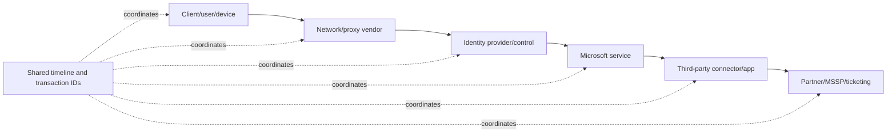

| Boundary field | Required content |
|---|---|
| Input to component | Request, event, token, message, file, API call |
| Expected behavior | Contract/documented interface and timing |
| Actual output | Status, response, transformed data, error |
| Shared anchors | UTC, transaction/correlation ID, source/destination |
| Evidence owner | Who can retrieve which logs/trace |
| Current hypothesis | Falsifiable statement, not blame |
| Clear ask | Confirm receipt, decode error, trace request, compare backend |
| Next update | Owner, action, deadline, escalation |

## 22. Multi-vendor troubleshooting RACI

| Activity | Client incident lead | Client engineers | Microsoft | Third-party vendor | Partner/MSSP | Business/risk owner |
|---|---|---|---|---|---|---|
| Define impact/scope/timeline | A | R | C | C | S | C |
| Collect client-side evidence | A | R | C | C | S | I |
| Trace Microsoft backend | C | S | R/A product boundary | I | I | I |
| Trace third-party backend | C | S | I | R/A product boundary | S | I |
| Maintain shared incident record | A/R | S | C | C | C | I |
| Decide client containment/risk | R | C | C | C | C | A |
| Validate end-to-end recovery | A | R | S | S | S | C |
| Approve RCA/actions | R | C | C | C | C | A |

Roles are illustrative. Contracts and governance define actual accountabilities. No vendor should receive unrelated raw evidence “just in case.”

## 23. Build an evidence request

Ask another team/vendor for a precise artifact:

> “For transaction ID **X** at **2026-08-24T09:01:07Z**, please confirm whether component **Y** received the request from **source**, the parsed identity/resource fields, processing status and error, downstream call ID/time, and whether current backend logs show throttling, policy rejection, timeout, or service exception. Please return only the minimum redacted fields through the approved case channel by **time**.”

This is stronger than “please check your logs.”

## 24. Escalation pack

| Section | Content |
|---|---|
| Executive summary | Exact business/security impact and current state |
| Environment | Tenant/cloud/region/service/client/build/network path, minimized |
| Scope | Affected/unaffected population and common factors |
| Timeline | UTC events, changes, tests, mitigations, vendor actions |
| Reproduction | Minimal steps, rate, expected versus actual |
| Identifiers | Request/correlation/sign-in/message/device/incident/policy IDs |
| Evidence | Relevant redacted logs, traces, HAR/capture snippets, config export |
| Hypotheses | Supported, contradicted, unknown and test result |
| Safety/recovery | Mitigation, rollback, current risk, no unsafe bypass |
| Ask | Specific backend trace, defect confirmation, guidance, fix, ETA/cadence |

Arti's escalation experience is the strongest bridge here. A senior response is calm and exact: one timeline, visible impact, no unsupported blame, minimal evidence, clear ownership, and persistent follow-through.

## 25. Product-defect criteria

A product defect becomes plausible when supported/documented behavior differs under supported prerequisites; configuration and dependency causes are reasonably excluded; the failure is reproducible or tied to strong backend IDs; affected/unaffected evidence isolates version/region/path; expected versus actual is explicit; and the issue persists without unauthorized manipulation.

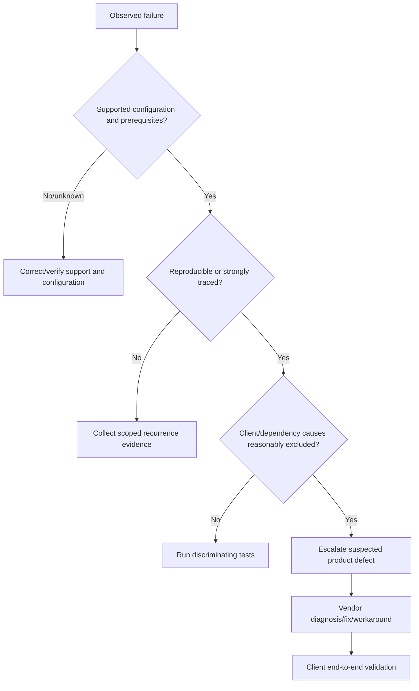

A vendor confirmation is valuable but does not replace client validation. Conversely, a failure in a Microsoft service does not mean every symptom shares the same root cause.

## 26. Workaround, mitigation, recovery, fix, and prevention

| Term | Meaning | Closure status |
|---|---|---|
| Containment | Limits spread or harm | Incident still active |
| Mitigation | Reduces impact or likelihood | Cause may remain |
| Workaround | Alternate path around failure | Temporary; risk/expiry needed |
| Recovery/restoration | Returns acceptable service/control | Cause may remain |
| Fix/remediation | Corrects cause for defined scope | Requires validation |
| Prevention | Reduces recurrence/impact through system improvement | Requires owner and effectiveness test |

Do not call a restart, cache clear, re-enrollment, policy exclusion, or agent reinstall a root-cause fix unless evidence proves what condition it corrected and recurrence is addressed.

## 27. Protect evidence and privacy

### 🔍 Plain-English deep-dive: diagnostic evidence is often a second incident waiting to happen

A HAR file can contain an authenticated cookie; a packet capture can reveal internal endpoints and unencrypted content; a screenshot can expose user names, tenant IDs, case details, and secrets. Treat evidence like sensitive luggage: collect only what the journey requires, seal it, label ownership, control who opens it, and dispose of it under policy.

| Evidence control | Practice |
|---|---|
| Authorization | Confirm scope, purpose, tool, source, and recipient |
| Minimization | Capture time/filter/component needed for hypothesis |
| Original | Preserve read-only with source/time and integrity where required |
| Working copy | Redact/tokenize unrelated identities, content, tokens, secrets |
| Transfer | Approved encrypted case/evidence channel |
| Access | Need-to-know roles and audit |
| Retention | Case/legal/records/privacy schedule and secure deletion |
| Vendor | Share minimum product-relevant evidence and document disclosure |

## 28. Scenario: sign-in and access failure

**Report:** “MFA succeeds but SharePoint says access denied.”

**Method:** Define affected users, sites, devices, clients, networks, and first failure. Capture sign-in and request IDs. Separate authentication, CA result, token resource/audience, session age, SharePoint resource authorization, site/library/item permissions, sharing link/guest state, unmanaged-device control, sensitivity/container policy, license/service state, and service health. Compare same user to another site and matched user to same site. Do not disable CA globally. The failure could be resource permission after successful identity.

## 29. Scenario: OneDrive synchronization failure

**Report:** “After a security change, sync loops on sign-in for remote users.”

**Method:** Arti can lead this scenario directly. Segment by client build, OS, tenant/account, network, proxy/VPN, device management/compliance, identity policy, library/site, file path/type, and time. Preserve client logs before reset. Correlate sign-in IDs, proxy/TLS events, DNS, service health, policy changes, and sync status. Test the same device on an approved alternate network and the same user in browser. A broad reset may destroy evidence and create re-download impact. Validate original sync, known-folder/share behavior, permissions, performance, and recurrence after the fix.

## 30. Scenario: mail delivery failure

**Report:** “Messages from one partner are delayed or rejected after gateway work.”

Trace public DNS/MX, sender IP and time, SMTP response, gateway queue, connector, certificate/TLS, enhanced sender attribution where designed, transport rules, anti-spam/phishing, accepted domain, recipient state, message trace, headers, NDR, and service health. Use message/network IDs and UTC. Compare another sender through the same path and same sender to another recipient. Protect message content. Restore flow through the approved routing rollback rather than bypassing all filtering.

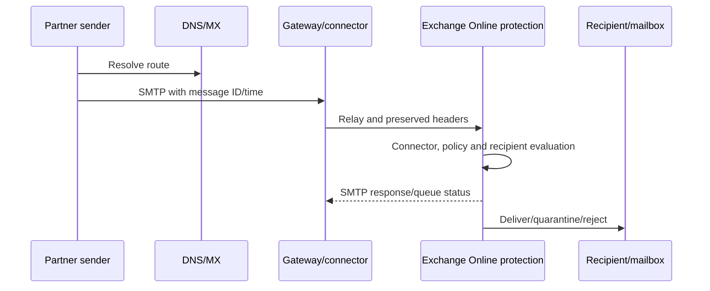

## 31. Scenario: security policy mismatch

**Report:** “Intune says policy succeeded, but endpoint behavior is unchanged.”

Trace intended setting, policy/version, assignment, group/filter membership, license and platform support, enrollment/management identity, delivery/check-in, applicability, conflicts, CSP/provider handling, local effective state, logs/status latency, and actual behavior. Compare a matched endpoint and a newly assigned synthetic setting if safe. “Succeeded” may mean a channel accepted configuration, not that every control outcome is active.

## 32. Scenario: Sentinel ingestion gap

**Report:** “No alerts fired because a firewall source stopped appearing.”

Compare source inventory/output, collector health/input/output, network/DNS/TLS, certificate/secret, API limits/throttling, connector status, DCR/transformation, table/schema, timestamp, ingestion latency, workspace/tenant, retention, query window, parser, analytic rule, incident grouping, and queue. Use source-side counts versus target counts, not portal health alone. Notify the SOC/control owner of blindness and activate approved fallback. Do not generate unsafe volume in production to test.

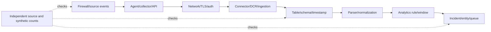

## 33. Scenario: automation/playbook failure

**Report:** “An incident playbook says successful, but the account was not disabled.”

Trace trigger and incident version; conditions; input schema; service identity; token/API audience; Graph/product permissions; PIM/consent; target object; HTTP status/body; throttling; retry; branch/exception handling; partial success; audit; ticket update; and downstream effective state. “Workflow succeeded” may only mean the orchestration completed without an unhandled exception. Validate the action at the authoritative target. Disable only the specific unsafe action if required, preserve evidence, and use manual approved response.

## 34. Scenario: service advisory versus separate defect

An advisory mentions Teams sign-in while users report SharePoint sync. Do not attach every symptom automatically. Compare feature, region, tenant, time, error, request IDs, and recovery. The same upstream identity dependency may connect them, or two incidents may overlap. Track “related,” “possibly related,” and “not supported by evidence” explicitly.

## 35. Root cause analysis boundaries

RCA should state:

1. Incident and impact.
2. Scope and timeline.
3. Detection and response.
4. Technical cause at the supported confidence level.
5. Trigger and contributing conditions.
6. Why controls/monitoring/process did not prevent or limit it.
7. Mitigation, recovery, workaround, and fix.
8. Validation evidence.
9. Corrective/preventive actions with owners/dates/tests.
10. Unknowns, limitations, and authorized residual risk.

Do not invent one root cause when evidence supports only a probable cause. A vendor's proprietary backend may limit certainty; state the boundary. Avoid “human error” as the endpoint: ask what design, review, tooling, workload, incentives, documentation, access, monitoring, or recovery condition allowed the action to create impact.

## 36. No unsafe disabling

| Unsafe shortcut | Why dangerous | Safe alternative |
|---|---|---|
| Disable all Conditional Access | Opens broad access and hides responsible policy | Named policy result, report-only/What If, test identity, emergency path |
| Turn off TLS validation | Enables interception/impersonation | Fix chain/name/time/proxy trust with scoped test |
| Exclude entire disk/process tree | Creates durable endpoint blind spot | Reproduce, vendor-supported narrow exclusion with expiry |
| Allow all mail sender/domain | Enables spoof/phishing | Trace exact route/authentication and narrow timed exception |
| Stop DLP globally | Exposes sensitive data | Simulation, scoped policy/ring, approved exception |
| Grant broad API admin | Increases automation blast radius | Minimum app permission and test object |
| Flush/reinstall immediately | Destroys state/evidence and causes new load | Preserve logs/state, then controlled reset if hypothesis supports |

## 37. Common troubleshooting failure modes

| Failure | Why it fails | Better practice |
|---|---|---|
| Start with favorite tool | Tool bias ignores transaction | Start from symptom, scope, timeline, layers |
| Change many variables | Result cannot identify cause | One safe discriminating change |
| Stop at first anomaly | Anomaly may be unrelated symptom | Correlate with failure time and path |
| Blame vendor boundary | No end-to-end owner | Shared timeline, IDs, evidence contract |
| Collect everything | Privacy risk and analysis noise | Hypothesis-driven minimal capture |
| Trust portal green | Component self-report only | Independent synthetic/end-to-end evidence |
| Call workaround a fix | Cause persists and recurs | Track risk/expiry and validate permanent remediation |
| Close after one success | Intermittence/cache can mislead | Repeat, compare, monitor, regression test |
| Write RCA too early | Narrative hardens before facts | Separate facts, hypotheses, confidence, unknowns |
| Tune away alerts | Hides signal without risk decision | Validate detection, source, threshold, and compensating control |

## 38. Metrics for troubleshooting quality

| Metric | Useful interpretation | Caveat |
|---|---|---|
| Time to accurate scope | How quickly impact boundary becomes reliable | Initial reports are incomplete |
| Time to safe mitigation | Speed of harm reduction | Must not reward unsafe bypass |
| Diagnostic pivot count | Learning cycles before cause isolation | More pivots may reflect honest complexity |
| Evidence completeness | Required IDs/times/versions present | Checklist quantity is not relevance |
| Escalation bounce rate | Cases returned for missing evidence/wrong owner | Supplier behavior also matters |
| Fix validation rate | Original plus regression tests completed | Define eligible fixes |
| Recurrence | Repeat failure after claimed resolution | Case linking quality matters |
| RCA action effectiveness | Corrective actions validated by due date | Long-term outcome needs time |

Arti's business-review strength applies: report repeated boundary failures, evidence gaps, vendor response, known errors, user impact, fix quality, and improvement actions—not only ticket volume.

## 39. Outputs and reusable artifacts

1. Exact problem statement and impact map.
2. Layer/dependency and control/data-plane diagram.
3. UTC timeline with clock notes and IDs.
4. Affected/unaffected matrix.
5. Hypothesis and experiment log.
6. Evidence manifest and redaction record.
7. Minimal reproduction.
8. Multi-vendor RACI, boundary map, and action tracker.
9. Escalation pack and product-defect criteria.
10. Mitigation/recovery/fix validation report.
11. RCA with confidence and limitations.
12. Runbook, KB, known error, monitoring, and business-review action.

## 40. Safe paper portfolio lab: Northstar multi-vendor incident

Use fictional **Northstar Research**. The scenario: after a proxy certificate change and a Sentinel connector credential rotation, some remote users report OneDrive sign-in loops while firewall ingestion also declines. A Microsoft advisory mentions an unrelated Teams issue. Build a paper investigation using synthetic logs and IDs only. Do not capture real traffic, tokens, HARs, identities, tenant data, or vendor cases.

### Lab tasks

1. Write separate problem statements for sync and ingestion; do not assume one cause.
2. Create affected/unaffected matrices across user, device, network, client, region, and time.
3. Build one normalized timeline with source clock offsets and synthetic IDs.
4. Draw user/device/network/DNS/TCP/TLS/proxy/identity/policy/app/data/vendor/operations layers.
5. Separate control-plane changes from data-plane failures.
6. Write ten ranked falsifiable hypotheses with predicted evidence and safe tests.
7. Design minimal reproductions and A/B tests without broad control disabling.
8. Create fictional DNS, TCP/TLS, proxy, sign-in, policy, client, connector, and ingestion evidence snippets.
9. Build a multi-vendor RACI, evidence request, shared action tracker, and escalation pack.
10. Decide which evidence supports proxy trust failure, connector credential failure, and unrelated advisory.
11. Document mitigation, recovery, workaround, permanent fix, validation, and prevention separately.
12. Produce an RCA, KB, known error, monitoring improvement, and business-review slide.

```mermaid
flowchart LR
    REPORT[Two vague reports] --> SPLIT[Separate problem statements]
    SPLIT --> TIME[Scope and shared timeline]
    TIME --> LAYER[Layer and boundary maps]
    LAYER --> HYP[Hypothesis-test-pivot log]
    HYP --> EVID[Redacted synthetic evidence]
    EVID --> VENDOR[Escalation and defect decision]
    VENDOR --> REC[Recovery and validation]
    REC --> RCA[RCA, knowledge and monitoring]
```

### Portfolio validation matrix

| Artifact | Quality question | Honest label |
|---|---|---|
| Problem/scope/timeline | Are facts, times, comparisons, and unknowns precise? | Fictional incident |
| Layer/hypothesis log | Can each test support or reject a claim safely? | Paper diagnostic method |
| Evidence pack | Is data minimal, synthetic, indexed, and redacted? | No real capture |
| Vendor pack | Are boundaries, IDs, impact, and asks actionable? | Mock escalation |
| RCA/knowledge | Are confidence, workaround, fix, validation, and actions distinct? | Scenario-based artifact |

## 41. Interview answer method

Use **I-S-T-A-C-K-E-R**:

1. **Impact** and exact symptom.
2. **Scope** affected/unaffected populations and common factor.
3. **Timeline** changes, clocks, IDs, and first failing event.
4. **Architecture** layers, dependencies, and control/data plane.
5. **Candidates** as ranked falsifiable hypotheses.
6. **Knowledge tests** through reproduction, A/B, logs, traces, and service evidence.
7. **Escalate** boundaries with shared timeline, RACI, minimal evidence, clear ask.
8. **Recover** safely; distinguish workaround from fix.
9. **RCA** and validate prevention, documentation, monitoring, and business outcome.

## 42. JD Mapping: interview translation

| Arti's evidence | Senior-consultant capability | Interview wording |
|---|---|---|
| SharePoint/OneDrive/sync troubleshooting | Layered M365 diagnosis | “I separate identity, permission, client, network, service, and content state.” |
| Critical incidents | Stabilization, timeline, cadence, recovery | “I control impact while diagnosis continues and record every change.” |
| Vendors/partners/product groups | Boundary and escalation leadership | “I use shared IDs, precise evidence requests, and one action timeline.” |
| RCA | Cause and systemic learning | “I distinguish trigger, cause, contributors, workaround, fix, and prevention.” |
| Fix validation | Evidence-based closure | “I rerun the original workflow, compare unaffected cases, and check regression.” |
| Documentation/business reviews | Reusable knowledge and trend action | “I turn incident learning into runbooks, monitoring, owner decisions, and metrics.” |

## Official Source Anchors

Use current versions and access dates in real work.

1. Microsoft 365 service health: <https://learn.microsoft.com/microsoft-365/enterprise/view-service-health>
2. Microsoft 365 network connectivity principles: <https://learn.microsoft.com/microsoft-365/enterprise/microsoft-365-network-connectivity-principles>
3. Microsoft 365 URLs and IP address ranges: <https://learn.microsoft.com/microsoft-365/enterprise/urls-and-ip-address-ranges>
4. Microsoft Entra sign-in log documentation: <https://learn.microsoft.com/entra/identity/monitoring-health/concept-sign-ins>
5. Conditional Access troubleshooting: <https://learn.microsoft.com/entra/identity/conditional-access/troubleshoot-conditional-access>
6. OneDrive sync troubleshooting: <https://support.microsoft.com/office/fix-onedrive-sync-problems-0899b115-05f7-45ec-95b2-e4cc8c4670b2>
7. Exchange Online message trace: <https://learn.microsoft.com/exchange/monitoring/trace-an-email-message/message-trace-modern-eac>
8. Microsoft Sentinel data connector health monitoring: <https://learn.microsoft.com/azure/sentinel/monitor-data-connector-health>
9. Azure Monitor ingestion troubleshooting: <https://learn.microsoft.com/azure/azure-monitor/logs/data-ingestion-time>
10. Microsoft Graph throttling guidance: <https://learn.microsoft.com/graph/throttling>
11. Microsoft support diagnostic data and privacy: <https://privacy.microsoft.com/privacystatement>
12. NIST SP 800-61 Rev. 3: <https://csrc.nist.gov/pubs/sp/800/61/r3/final>
13. NIST SP 800-115, Technical Guide to Information Security Testing and Assessment: <https://csrc.nist.gov/pubs/sp/800/115/final>
14. CISA Cybersecurity Incident and Vulnerability Response Playbooks: <https://www.cisa.gov/news-events/news/cisa-releases-cybersecurity-incident-and-vulnerability-response-playbooks>
15. OWASP Logging Cheat Sheet: <https://cheatsheetseries.owasp.org/cheatsheets/Logging_Cheat_Sheet.html>
16. Wireshark User's Guide: <https://www.wireshark.org/docs/wsug_html_chunked/>

## ⭐ Likely Interview Questions for This Section

### Q1. How do you approach a complex Microsoft 365 issue with several vendors?

**Model answer:** I first stabilize active security or service harm, then write an exact impact/scope/time/change/common-factor statement and a normalized timeline. I map the transaction across user, device, network, DNS, transport, TLS, proxy, identity, policy, workload, data, vendor, and operations layers, including control versus data plane. I rank falsifiable hypotheses and use the cheapest safe discriminating tests, affected/unaffected comparisons, and shared IDs. I maintain one incident record, RACI, boundary evidence, and clear asks for each vendor. I recover safely, validate end to end, then document cause confidence, workaround, fix, prevention, and residual unknowns.

### Q2. What makes a good troubleshooting hypothesis?

**Model answer:** It is specific, falsifiable, tied to observed facts, and predicts different evidence when true versus false. I state the component, condition, population, and failure mechanism, note supporting and contradicting facts, then choose a safe test that changes one meaningful variable. I record version, time, IDs, expected and actual results. If evidence disagrees, I reject or revise the hypothesis rather than defending it.

### Q3. How do you distinguish a network issue from an application issue?

**Model answer:** I trace the actual transaction, not a generic connectivity test. I verify interface/address/route/VPN, DNS cache and wire response, TCP or QUIC establishment, TLS, proxy/firewall behavior, then HTTP/API response and application authorization. A completed TLS session and server HTTP response generally move the earliest failure above basic transport, while unanswered SYNs or DNS timeouts anchor lower. I correlate time and request IDs and remember a middlebox or server can reset a healthy connection. I identify the earliest failed expectation and its cascade.

### Q4. How do you troubleshoot Conditional Access without disabling security?

**Model answer:** I collect the sign-in ID/time, user, app/resource, client, device, location, risk, authentication detail, and named policy results. I verify policy version, assignment/exclusion, prerequisites, token/session timing, and resource authorization. I use report-only, What If where appropriate, a dedicated test identity, matched affected/unaffected comparisons, and one-policy experiments under change control. Emergency access is predesigned. I never broadly disable all CA; any temporary exception is narrow, approved, monitored, time-limited, and removed after validation.

### Q5. What belongs in a vendor escalation pack?

**Model answer:** A concise impact summary; exact environment and scope; first/last known times in UTC; affected/unaffected comparison; relevant changes; minimal reproduction; expected versus actual; request, correlation, sign-in, message, device, policy, incident, and version IDs; only relevant redacted logs/traces/configuration; hypotheses and completed tests; mitigation/rollback state; severity rationale; and a precise ask such as tracing one backend transaction. I send it through the approved channel and maintain one shared action timeline.

### Q6. How do you decide that a product defect is likely?

**Model answer:** The configuration and scenario must be supported with verified prerequisites; documented expected behavior must differ from actual behavior; the failure should be reproducible or strongly tied to backend IDs; client and dependency causes should be reasonably excluded with discriminating tests; and an affected/unaffected comparison should isolate version, region, path, or condition. I escalate it as suspected until the vendor confirms it, retain a safe mitigation, and independently validate any fix in the original and regression scenarios.

### Q7. How do you protect troubleshooting evidence?

**Model answer:** I obtain authorization, capture only what a hypothesis requires, preserve originals with source/time/integrity as needed, and create redacted working copies. I treat HARs, packet captures, tokens, cookies, sign-in logs, mail traces, and support bundles as sensitive. Access is need-to-know; transfer uses approved encrypted case channels; recipients receive only product-relevant fields; retention and deletion follow policy. I never paste bearer tokens or raw private captures into ordinary chat or public decoders.

### Q8. What is your honest troubleshooting experience?

**Model answer:** Structured Microsoft 365 troubleshooting is my strongest production area. I have supported SharePoint Online, OneDrive, sync, migration, permissions and critical incidents; coordinated customers, partners, vendors, and product groups; produced RCA; validated fixes; documented guidance; and reported outcomes. I would describe those cases accurately. For security platforms or packet analysis outside my direct production depth, I explain the layered method, evidence and specialist involvement, and I label my Northstar materials as a fictional paper lab rather than production experience.

## 🧠 30-Second Memory Hooks

- **Troubleshooting is controlled learning.** Define, hypothesize, test, pivot, recover, validate.
- **Scope removes causes.** User, device, network, app, resource, region, time, and comparison.
- **One timeline beats five opinions.** Normalize clocks and anchor vendors with shared IDs.
- **Find the earliest failed expectation.** Lower-layer failure cascades upward.
- **Control plane is intent; data plane is the transaction.** Check delivery, evaluation, and evidence.
- **A good test changes your mind.** Predict true and false results before running it.
- **Green portal is not proof.** Use independent end-to-end evidence.
- **Ask vendors precisely.** Transaction, time, component, expected/actual, and requested trace.
- **Workaround is not fix.** Track risk, expiry, permanent action, and validation.
- **Never disable broadly to learn.** Narrow, authorized, reversible, monitored tests only.

## Completion Checklist

- [ ] I can define troubleshooting as controlled learning and distinguish symptom, impact, cause, trigger, contributor, workaround, fix, and validation.
- [ ] I can write an exact symptom/impact/scope/time/change/common-factor problem statement.
- [ ] I can stabilize active security or service harm while preserving evidence.
- [ ] I can build one normalized timeline with clock offsets, facts, interpretations, actions, and shared IDs.
- [ ] I can map user, device, interface, DNS, TCP/QUIC, TLS, proxy, identity, policy, app, data, vendor, and operations layers.
- [ ] I can separate control-plane intent from data-plane transaction behavior.
- [ ] I can form ranked falsifiable hypotheses with predicted true/false evidence.
- [ ] I can design safe minimal reproductions and affected/unaffected A/B comparisons.
- [ ] I can collect only relevant logs, traces, correlation IDs, HAR/auth/policy/service evidence and protect sensitive data.
- [ ] I can diagnose interface/route/VPN state without trusting generic connectivity status.
- [ ] I can explain DNS cache, resolver, wire query, response codes, dual-stack, policy, and negative caching.
- [ ] I can interpret TCP handshake, reset, retransmission, RTT, window, and MTU evidence cautiously.
- [ ] I can explain TLS handshake, SNI, certificate chain, trust, time, revocation, and interception without disabling validation.
- [ ] I can distinguish client proxy stacks, PAC/WPAD, proxy auth, firewall, and filter behavior.
- [ ] I can separate authentication, Conditional Access, token, application authorization, and resource permissions.
- [ ] I can use service health, Message center, roadmap, and release evidence without assuming causation.
- [ ] I can troubleshoot policy from objective through version, scope, prerequisite, delivery, applicability, evaluation, enforcement, and evidence.
- [ ] I can coordinate vendors through a boundary map, RACI, shared timeline, evidence requests, and escalation pack.
- [ ] I can state evidence-based product-defect criteria and independently validate a vendor fix.
- [ ] I can distinguish containment, mitigation, workaround, recovery, fix, and prevention.
- [ ] I can troubleshoot sign-in, sync, mail, policy, SIEM-ingestion, and automation scenarios safely.
- [ ] I can write an RCA with confidence, limitations, contributing system conditions, actions, and validation.
- [ ] I can refuse broad unsafe disabling and propose narrow, authorized alternatives.
- [ ] I can tie Arti's vendor, escalation, RCA, fix-validation, documentation, and business-review experience to the method honestly.
- [ ] I can answer Q1–Q8 clearly and present Northstar as a fictional paper lab.

*Next suggested section:* [Part 61](Part-61-security-incident-response-pir.md)