# Part 61 — Security Incident Response, Crisis Communication, Forensics, and Post-Incident Review

> **Section goal:** Build a beginner-first, consulting-grade understanding of security incident response from preparation through lessons learned. By the end, you should be able to distinguish security events, alerts, incidents, problems, crises, privacy incidents, and major service incidents; use a practical prepare, detect, analyze, contain, eradicate, recover, and learn lifecycle while understanding its relationship to NIST Cybersecurity Framework 2.0; define declaration criteria, severity, authority, and roles for incident command, technical response, communications, scribing, business ownership, legal, privacy, HR, vendors, partners, and law enforcement; preserve evidence with chain-of-custody discipline while respecting forensic limits; build timelines, scope and hypotheses; balance containment speed, business continuity, safety, evidence, attacker awareness, and short-term versus long-term control; eradicate persistence and recover into a trusted state with heightened monitoring; communicate accurately to technical, workforce, customer, executive, board, insurer, regulator, vendor, and public audiences through authorized channels; reserve legal and regulatory decisions for authorized counsel and officials; reason through ransomware, phishing/business-email-compromise, cloud identity, and insider scenarios; distinguish a post-incident review from root-cause analysis; use 5 Whys, fishbone, and fault-tree techniques carefully; perform blame-aware but blame-free system analysis; define corrective actions with owners, dates, validation, and risk treatment; interpret MTTD, MTTA, containment and recovery metrics with caveats; and design safe table-top and paper portfolio exercises.

This Part maps directly to the role's responsibilities for security incident response, crisis coordination, stakeholder communication, troubleshooting, vendor/product escalation, root-cause analysis, remediation validation, documentation, operational improvement, and executive reporting. It strongly uses Arti's demonstrated experience with critical Microsoft 365 incidents, customer and business impact, SharePoint Online and OneDrive, synchronization, vendors, partners and product groups, shared timelines, RCA, fix validation, documentation, mentoring, KPIs, and business reviews. The consulting extension is to add formal security command, evidence, containment, privacy/legal boundaries, crisis communication, and corrective-action governance without overstating her direct forensic or SOC experience.

> **Method boundary:** This chapter contains public, general incident-response, crisis-management, forensic-readiness, service-management, and consulting practices informed by NIST, CISA, and Microsoft public guidance. It does not describe or imply Deloitte proprietary methods, playbooks, tools, templates, client cases, legal advice, forensic services, threat intelligence, or internal practices. A real incident must follow the organization's approved response plan, legal advice, privacy process, insurer requirements, regulator/law-enforcement obligations, evidence rules, employment policies, communications authority, contracts, and applicable law.

> **Safety, legal, and currency warning (August 24, 2026):** Incident facts can trigger legal privilege, labor/HR, privacy, contractual, insurance, regulatory, criminal, safety, sanctions, disclosure, and notification issues that vary by facts and jurisdiction. Technical responders identify and preserve facts; authorized counsel and organizational officials decide legal interpretations, notifications, public statements, law-enforcement engagement, ransom/payment positions, and privilege. Do not promise confidentiality, attribution, notification outcomes, payment, or recovery. Preserve evidence before destructive action when safe, but life safety, active harm reduction, and authorized business continuity may take priority. Verify current NIST, CISA, Microsoft, insurer, sector, and jurisdiction guidance.

## JD Mapping

| Role expectation | Capability developed here | Portfolio evidence |
|---|---|---|
| Lead security incidents | Declare, command, scope, prioritize, contain, recover, and close | Incident command plan and timeline |
| Analyze Microsoft security evidence | Correlate identity, endpoint, email, cloud, data, audit, and SIEM evidence | Investigation workbook |
| Coordinate vendors and partners | Establish shared facts, RACI, evidence requests, support cases, and cadence | Multi-party action tracker |
| Advise stakeholders during crisis | Tailor accurate updates to operational, executive, customer, and external audiences | Communication matrix and sample updates |
| Protect privacy and evidence | Apply minimization, chain of custody, access, integrity, retention, and specialist limits | Evidence register |
| Validate eradication and recovery | Define trusted-state criteria, controlled restoration, monitoring, and recurrence tests | Recovery acceptance report |
| Produce RCA and PIR | Analyze technical and systemic causes without premature certainty or blame | PIR and corrective-action register |
| Improve security operations | Turn lessons into owned, dated, validated controls, exercises, metrics, and runbooks | Improvement scorecard |

## Candidate honesty note

Arti can directly discuss critical Microsoft 365 escalations, customer and service impact, SharePoint/OneDrive and synchronization, issue scoping, timelines, customer/vendor/partner/product-group coordination, RCA, fix validation, documentation, knowledge transfer, mentoring, KPI reporting, and business reviews where supported by her real record. Those are valuable incident-command and recovery behaviors.

She should not claim that she has acted as a production cyber incident commander, forensic examiner, malware analyst, threat hunter, legal/privacy decision maker, regulator liaison, ransomware negotiator, or Microsoft Defender/Sentinel SOC owner unless separately evidenced. Safe wording is:

> “My direct production experience is leading complex Microsoft 365 support escalations: I define scope and impact, maintain a timeline, coordinate customers, partners, vendors and product groups, validate service recovery and product fixes, document RCA, and communicate metrics and lessons. I have expanded that foundation through a fictional security incident-response portfolio covering command roles, evidence, containment tradeoffs, crisis communication, recovery, PIR, and corrective actions. I would work within the client's approved incident plan and bring in qualified SOC, forensic, legal, privacy, HR, communications, insurer, and law-enforcement specialists as required.”

---

## 1. Incident response from zero

**Incident response (IR)** is the coordinated work of preparing for, detecting, analyzing, containing, eradicating, recovering from, and learning from cybersecurity incidents. Its purpose is to reduce harm, restore trusted operation, preserve decision-quality evidence, meet authorized obligations, and improve the system.

**Analogy:** A building fire response includes preparation and drills, alarm detection, understanding location and spread, isolating hazards, extinguishing the source, checking for hidden heat, restoring safe occupancy, communicating with occupants and authorities, and learning why protections did or did not work.

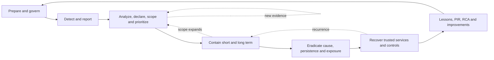

The phases overlap. New evidence during recovery can reveal more compromised identities and return the team to containment. Communication, evidence protection, decision logging, legal/privacy consultation, and safety run through every phase.

| Phase | Primary question | Core output |
|---|---|---|
| Prepare | Can we respond safely and lawfully under pressure? | Plan, roles, access, telemetry, exercises, contacts |
| Detect | What signal or report suggests harm? | Triageable event with evidence and owner |
| Analyze | Is this an incident; what is affected, how, and how severely? | Declaration, scope, hypotheses, timeline |
| Contain | How do we stop or limit harm without creating greater harm? | Authorized short/long containment and monitoring |
| Eradicate | What unauthorized access, persistence, malware, defect, or weakness remains? | Cleaned/remediated environment and evidence |
| Recover | How do we restore trusted business operation? | Prioritized restoration and acceptance evidence |
| Learn | What should change and how will effectiveness be proven? | PIR/RCA, owned actions, exercise updates |

## 2. NIST CSF 2.0 and the response lifecycle

NIST SP 800-61 Rev. 3, finalized in April 2025, integrates incident-response recommendations across cybersecurity risk management using the NIST Cybersecurity Framework (CSF) 2.0 functions: **Govern, Identify, Protect, Detect, Respond, and Recover**. A local operational lifecycle such as prepare/detect/analyze/contain/eradicate/recover/learn remains useful, but it should connect to governance, asset and risk knowledge, protective controls, detection, response, and recovery rather than exist as an isolated SOC process.

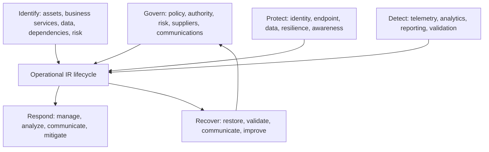

Do not claim that one seven-stage list is “the NIST lifecycle” verbatim. State that it is a practical local model aligned to broader public guidance. Frameworks guide outcomes; the organization's approved plan defines actual authority and procedure.

## 3. Event, alert, incident, problem, crisis, and breach

| Term | Plain meaning | Example | Decision owner |
|---|---|---|---|
| Event | Observable occurrence | Sign-in from a new IP | Telemetry/process owner |
| Alert | Signal requiring review | Risky sign-in analytic fires | SOC/monitoring process |
| Security incident | Confirmed or suspected violation/threat requiring coordinated response | Compromised account accessed files | Authorized incident process |
| Major service incident | Severe service disruption requiring command | Security policy locks out workforce | Service/major incident authority |
| Problem | Underlying cause or recurrence investigated beyond immediate restoration | Token refresh defect repeatedly causes outage | Problem owner |
| Crisis | Situation threatens strategic objectives, safety, reputation, or stakeholder trust | Widespread ransomware and public disruption | Crisis leadership |
| Privacy incident | Event involving personal data that needs privacy assessment | Unauthorized personal-data disclosure | Privacy/legal authority |
| Data breach | Legal/regulatory term whose definition varies | Determined only after authorized legal/privacy analysis | Authorized counsel/officials |

### 🔍 Plain-English deep-dive: technical teams identify facts, not legal labels

A responder can say, “Evidence indicates an unauthorized identity downloaded 4,200 files containing fields classified as personal data.” Whether that is legally a reportable breach, which people or regulators must be notified, and by when depends on jurisdiction, role, contract, harm analysis, and legal facts. Give authorized counsel timely, precise evidence; do not make the legal conclusion yourself.

## 4. Incident versus problem versus crisis management

Incident management prioritizes immediate harm reduction and restoration. Problem management investigates underlying causes and recurrence. Crisis management coordinates strategic leadership, broad stakeholders, continuity, reputation, and external communications when consequences exceed ordinary incident control.

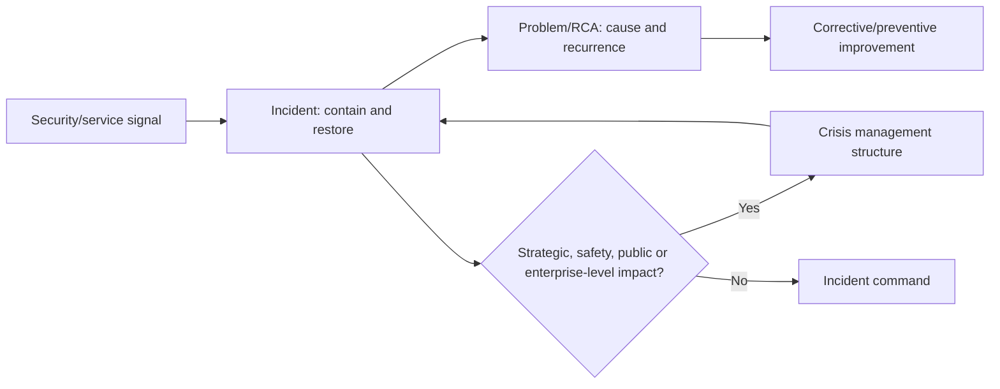

The processes should link records and timelines without competing command. A ransomware event may be a security incident, major service incident, privacy matter, criminal matter, business-continuity event, and crisis simultaneously.

## 5. Preparation: governance and authority

Preparation defines who may declare an incident, change severity, isolate devices, disable accounts, take systems offline, preserve images, contact vendors, engage external responders, notify insurers, communicate publicly, contact law enforcement, approve recovery, and close the incident.

| Preparation domain | Minimum readiness |
|---|---|
| Governance | Policy, risk appetite, declaration and escalation authority |
| People | Primary/deputy roles, 24x7 contacts, skill/capacity, well-being |
| Technology | Telemetry, EDR/XDR/SIEM, case system, secure communications, forensic tooling |
| Access | PIM/JIT, emergency accounts, clean admin devices, vendor access |
| Evidence | Sources, retention, time sync, chain of custody, storage, specialist support |
| Business | Critical services, dependencies, owners, recovery priorities, manual workarounds |
| Communications | Audience matrix, approved channels, holding statements, out-of-band plan |
| Suppliers | Contracts, support, notification, remote access, evidence, insurer, external IR |
| Recovery | Tested backups, clean rebuild material, keys, configuration, integrity checks |
| Exercises | Tabletop, technical simulation, executive and communications rehearsal |

Plans need protected online and offline availability because identity, email, collaboration, network, or storage may be unavailable or monitored by an attacker.

## 6. Forensic readiness before an incident

**Forensic readiness** means preparing systems, logs, processes, skills, and legal/evidence handling so investigations can answer likely questions without improvisation. It does not mean every organization conducts full legal forensics internally.

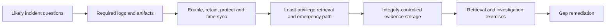

| Question | Prepared evidence |
|---|---|
| Who authenticated and how? | Entra sign-ins, auth details, identity risk, device context |
| What changed? | Audit logs, change records, configuration version, app consent |
| What data was accessed? | Workload/audit logs, file/email/app activity, classification context |
| Which endpoints were involved? | EDR timeline, process/network/file evidence, inventory |
| Did telemetry disappear? | Independent source/connector/retention health |
| Can we restore trust? | Backups, golden configurations, keys, rebuild and acceptance tests |

Retention must follow risk, legal, privacy, contract, and cost decisions. “Keep everything forever” creates privacy, security, and cost problems; short retention can erase the incident story.

## 7. Detection and reporting channels

Incidents may originate from automated alerts, users, service desk, threat intelligence, vendors, partners, customers, researchers, law enforcement, audit, fraud, HR, privacy, or service health. Provide secure, easy reporting routes and protect good-faith reporters.

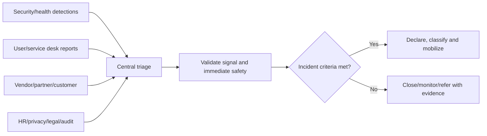

Intake captures reporter/contact, time, exact observation, affected asset/account/service/data, indicators, actions already taken, attachments/source, urgency, and confidentiality. Reporters should not investigate beyond safe guidance or forward suspicious content widely.

## 8. Triage, declaration, and severity

Declaration creates command, authority, priority, records, communications, and specialist involvement. Organizations should define criteria and allow severity to change as evidence develops.

| Severity factor | Questions |
|---|---|
| Threat activity | Active, contained, persistent, spreading, privileged, destructive? |
| Confidentiality | Which data may be accessed/exfiltrated and how sensitive? |
| Integrity | Are identities, policies, content, evidence, backups, or transactions altered? |
| Availability | Which critical service/population is disrupted and for how long? |
| Scope | One user/device or unknown/enterprise/third-party population? |
| Business/safety | Revenue, mission, health/safety, customers, deadlines, trust? |
| Legal/privacy | Potential personal data, regulated data, contractual notification? |
| Recovery | Clean fallback available; backups trusted; workaround sustainable? |
| Attacker | Observed capability, intent, access, persistence, knowledge of response? |

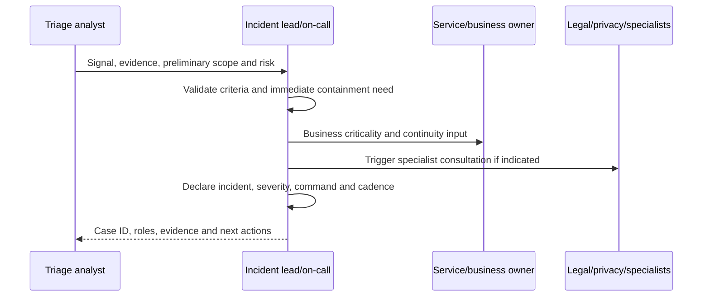

Avoid raising severity solely to manipulate vendor support or lowering it to protect metrics. Record the evidence and authority behind each change.

## 9. Incident command structure

One incident needs one coordinating command structure even when many technical workstreams run in parallel.

| Role | Primary responsibility | Must avoid |
|---|---|---|
| Incident commander (IC) | Objectives, priorities, roles, decisions, cadence, escalation | Becoming the deepest technical investigator |
| Technical lead | Investigation plan, hypotheses, containment and recovery recommendation | Acting outside authorized business/risk decision |
| Workstream leads | Identity, endpoint, network, email, cloud, data, recovery, vendor tasks | Independent conflicting changes |
| Scribe/timeline lead | Facts, actions, IDs, decisions, owners, times, evidence links | Mixing interpretation with fact |
| Communications lead | Authorized messages, audience, channel, cadence, approvals | Speculation or inconsistent statements |
| Business/service owner | Criticality, continuity, workflow, restoration priority, risk input | Directing unsafe technical steps without review |
| Legal/privacy | Privilege, legal/privacy analysis, notification advice, preservation | Technical diagnosis without evidence |
| HR/people | Workforce process, insider concerns, welfare, policy | Broad disclosure or prejudgment |
| Vendor/partner lead | Support cases, contracts, evidence requests, joint timeline | Letting suppliers fragment command |
| Recovery lead | Clean restoration, validation, heightened monitoring | Restoring into untrusted environment |

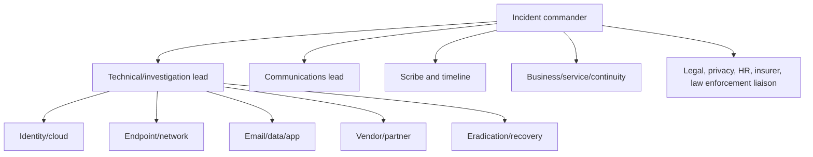

Small incidents may combine roles, but decision ownership, independent validation, and conflicts of interest remain visible. Name deputies and handover rules.

## 10. Command rhythm and decision log

The IC sets objectives for the next period, receives concise workstream updates, resolves blockers, records decisions, updates severity/scope, and sets the next cadence. Technical investigation can continue in separate channels, but significant evidence and actions return to the authoritative record.

| Command artifact | Content |
|---|---|
| Situation report | What happened, impact, scope, status, confidence, risks |
| Objectives | Time-bounded priorities, such as stop exfiltration and preserve identity evidence |
| Action tracker | Owner, task, dependency, due/update time, status, result |
| Decision log | Decision, options, evidence, authority, time, consequences |
| Timeline | Normalized facts, changes, attacker and responder activity |
| Evidence register | Artifact, source, acquisition, integrity, custody, location, access |
| Communication log | Audience, approved message, sender, time, channel |

## 11. Scope the incident

Scope includes identities, devices, mailboxes, sites, files, applications, service principals, roles, sessions, networks, data, regions, vendors, time, tactics, and business services. Track **confirmed affected**, **suspected**, **exposed but not evidenced**, **investigated not affected**, and **unknown** rather than one binary list.

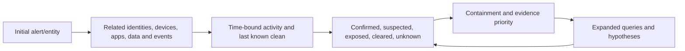

| Scope axis | Questions |
|---|---|
| Identity | Which user/admin/workload/guest; methods, sessions, roles, consent? |
| Endpoint | Which device/server; process, persistence, credential access, network? |
| Email | Messages, sender, recipients, rules, OAuth apps, forwarding, mailbox access? |
| Cloud/app | Subscriptions, tenants, resources, service principals, APIs, secrets? |
| Data | What repositories, records, labels, permissions, downloads, exfiltration evidence? |
| Time | Earliest precursor, persistence, attacker dwell, response and recovery? |
| Third party | Supplier access, shared data, connected tenants/apps, contractual impact? |
| Business | Critical workflows, customers, safety, revenue, continuity, restoration order? |

### 🔍 Plain-English deep-dive: absence of evidence is not evidence of absence

If a log was disabled, expired, never enabled, or lacks a field, “we found no exfiltration” can be misleading. Say, “Available logs show no observed download through these sources during this period; coverage does not include these paths.” Confidence must reflect telemetry coverage and retention.

## 12. Timeline and attacker/responder correlation

Build a normalized UTC timeline but preserve source time. Include precursor activity, initial access, authentication, discovery, privilege change, persistence, lateral movement, collection, exfiltration, impact, alerts, user reports, responder actions, vendor messages, containment, eradication, restoration, and validation.

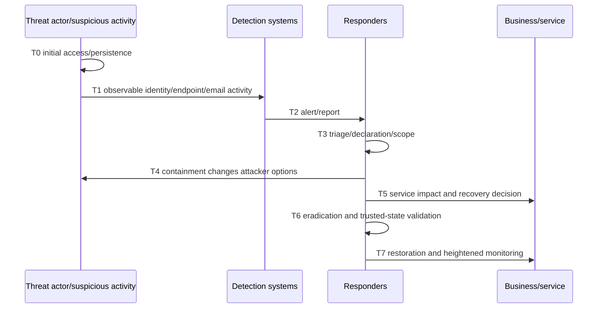

Responder actions can tip off an attacker, destroy volatile evidence, invalidate sessions, or change malware behavior. Record them precisely and use out-of-band communications if the ordinary environment may be monitored.

## 13. Hypotheses and investigation plan

Incident analysis follows the Part 60 scientific method. Define hypotheses for initial access, persistence, privilege, scope, data access/exfiltration, impact, and remaining threat. For each, state supporting/contradicting evidence, predicted evidence, source, owner, priority, result, and confidence.

| Investigation question | Example hypothesis | Discriminating evidence |
|---|---|---|
| Initial access | Adversary-in-the-middle phishing stole a session | Sign-in/session/device/token and phishing redirect evidence |
| Persistence | Malicious OAuth app retains access after password reset | Consent, service principal, grants, app sign-ins/API activity |
| Privilege | Compromised admin assigned a directory role | Audit actor/time/IP, role and PIM evidence |
| Data access | Account downloaded named SharePoint content | Audit/file activity, client/IP, volume, classification |
| Endpoint | Mail attachment launched a payload | Email entity, file hash, process tree, network and EDR timeline |
| Exfiltration | Data left through sanctioned cloud app | App activity, network/API evidence, destination and volume |

Do not force evidence into a fashionable attack narrative. Distinguish confirmed fact, probable inference, possible explanation, contradicted hypothesis, and unknown.

## 14. Evidence principles

Evidence handling aims to preserve authenticity, integrity, reliability, context, availability, and accountability. The exact legal standard depends on purpose and jurisdiction; involve qualified forensic and legal specialists.

| Principle | Practical response behavior |
|---|---|
| Authorization | Collect only within approved incident, role, law, policy, and scope |
| Relevance/minimization | Acquire what answers defined questions, not every employee's data |
| Volatility | Prioritize short-lived memory/log/session evidence where safe |
| Original preservation | Avoid changing source; preserve native export/metadata where possible |
| Integrity | Use approved hashes/controls where appropriate; document acquisition |
| Provenance | Record who, what, where, when, why, how, tool/version |
| Custody | Record transfers, access, storage, and purpose |
| Repeatability | Document queries, filters, time ranges, assumptions, and limitations |
| Confidentiality | Encrypt, restrict, redact working copies, use approved channels |
| Retention/disposition | Follow case hold, legal, privacy, contract, and records decisions |

## 15. Chain of custody

**Chain of custody** documents evidence possession and handling from collection through analysis, transfer, storage, and disposition. It supports credibility; it does not magically prove that evidence is complete or that an interpretation is correct.


| Chain field | Example content |
|---|---|
| Evidence ID | IR-2026-014-E023 |
| Description/source | Native Entra audit export for defined UTC period |
| Acquirer | Named authorized role/person |
| Date/time/time zone | Acquisition and source range |
| Method/tool/version | Portal/API/query/export procedure |
| Integrity | Hash or repository integrity control if appropriate |
| Storage/access | Approved evidence vault/path and permissions |
| Transfer | From/to, purpose, time, acknowledgement |
| Disposition | Hold/release/deletion authority and record |

## 16. Forensic limitations

Cloud responders may not have physical disks, memory, hypervisor logs, backend code, or complete historical data. SaaS logs can be delayed, sampled, transformed, redacted, retained for limited periods, or available only through support. Endpoint isolation can affect acquisition; power-off can destroy memory; leaving a device on can permit continued harm.

### 🔍 Plain-English deep-dive: forensics is disciplined inference, not time travel

Evidence is like camera footage from selected angles. It can strongly show actions, but blind spots remain. A qualified examiner documents what was collected, how, what it supports, alternative explanations, and what cannot be concluded. Never promise perfect attribution, complete reconstruction, or proof of no data loss from incomplete logs.

Escalate to qualified forensic specialists for disk/memory imaging, malware reverse engineering, legal-evidence acquisition, advanced cloud forensics, and expert testimony. Preserve the environment and avoid amateur actions that alter evidence.

## 17. Containment strategy

Containment limits continued harm while balancing business continuity, safety, evidence, attacker awareness, operational dependencies, and reversibility. Build short-term emergency containment and longer-term sustainable containment.

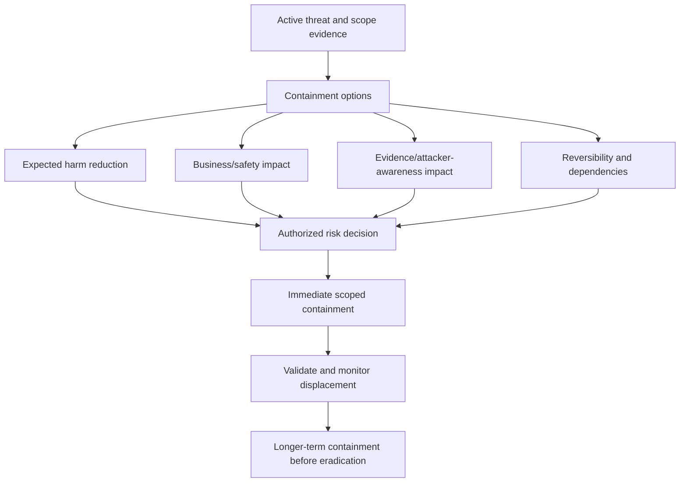

| Containment option | Benefit | Risk/tradeoff | Validation |
|---|---|---|---|
| Revoke sessions/disable account | Stops current identity access | Business disruption; other persistence may remain | Sign-ins, tokens, app grants, recovery |
| Isolate endpoint | Limits network activity | Loses remote path; business/safety impact | EDR state and alternate evidence path |
| Block indicator | Fast reduction for known path | Evasion, false positives, broad collateral impact | Hit logs and affected workflow |
| Disable malicious app/consent | Stops API persistence | Shared app/service disruption | Grants, sign-ins, target API activity |
| Remove/hold mail | Reduces user exposure | Search/action error, evidence/communication needs | Count, scope, quarantine/audit |
| Segment/take service offline | Limits spread/destruction | Major continuity impact | Boundary and clean-service checks |
| Freeze admin change | Preserves stability | Slows needed recovery | Emergency-change route remains available |

## 18. Containment business-versus-evidence tradeoff

CISA ransomware guidance notes that disconnecting systems can preserve more volatile evidence than powering them down, but power-down may be necessary if disconnection is impossible and spread continues. That is a situational, authorized tradeoff, not a universal rule.

Decision factors include life/safety, ongoing encryption/exfiltration, critical service, scope confidence, volatile evidence, remote access, attacker monitoring, clean alternatives, restoration capability, regulatory/contractual constraints, and specialist availability. Record who decided, options, evidence, expected consequences, and review time.

## 19. Identity and cloud containment

Identity containment should consider user password, authentication methods, sessions/refresh tokens, registered devices, app passwords, risky state, role assignments, PIM eligibility/activation, groups, guest access, application consent, service principals, secrets/certificates, federated credentials, Conditional Access, mailbox forwarding/rules, and emergency access.

Do not reset one password and assume persistence is gone. Coordinate credential rotation order so an adversary cannot use still-active sessions or service credentials to regain control. Protect clean administrator identities and devices before broad remediation.

## 20. Endpoint, email, and data containment

Endpoint containment may involve isolation, process/file quarantine, indicator blocks, account controls, network segmentation, and preserving memory/disk evidence under specialist guidance. Email containment may involve submissions, purge/hold, sender/domain/URL/file controls, mailbox rules, forwarding, OAuth apps, and recipient outreach. Data containment may involve sharing-link revocation, permission change, site/app restriction, DLP, session control, or export monitoring.

High-impact actions require scope and evidence. A global sender allow/block, broad file deletion, or tenant-wide sharing shutdown can create harm and destroy evidence. Use the narrowest effective action and monitor attacker adaptation.

## 21. Eradication

Eradication removes malicious artifacts, unauthorized access, persistence, exploited conditions, unsafe configuration, and compromised credentials from the defined scope. It occurs only after enough scope is known to avoid cleaning one component while another reinfects it.

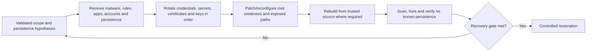

| Eradication area | Questions |
|---|---|
| Initial access | Is the exploited vulnerability, phishing path, credential, or vendor access corrected? |
| Persistence | OAuth grants, accounts, inbox rules, scheduled tasks, services, tokens, keys, backdoors? |
| Privilege | Unauthorized roles/groups/permissions and changed policies reconciled? |
| Endpoints | Rebuild/clean criteria, trusted images, software and firmware considered? |
| Cloud/data | Malicious resources, sharing, applications, automations and storage access removed? |
| Visibility | Logs and controls restored; attacker did not disable telemetry? |
| Suppliers | Remote access, credentials and connected systems addressed? |

Do not delete artifacts before required collection and authorization. Do not assume antivirus “clean” equals trusted state.

## 22. Recovery planning

Recovery restores business services and security controls in priority order from a known or acceptably trusted state. It must avoid reinfection, replay, stale credentials, corrupted backups, unsafe dependencies, and uncontrolled reconnection.

```mermaid
flowchart LR
    PRIOR[Critical service and dependency priority] --> CLEAN[Clean identities, admin path and recovery network]
    CLEAN --> REST[Restore/rebuild data, systems and configuration]
    REST --> SEC[Patch, harden and enable telemetry/controls]
    SEC --> TEST[Security, integrity and business acceptance tests]
    TEST --> WAVE[Reintroduce users, systems and integrations in waves]
    WAVE --> MON[Heightened monitoring and threat hunting]
    MON --> ACCEPT[Service/risk owner acceptance]
```

| Recovery criterion | Evidence |
|---|---|
| Trusted administration | Clean accounts/devices, strong auth, emergency access tested |
| Root weakness treated | Patch/configuration/identity/supplier fix validated |
| Persistence addressed | Hunt/search results and reconciliation |
| Data integrity | Backup/source validation, hashes/version/business checks as appropriate |
| Telemetry | Endpoint, identity, mail, cloud, SIEM and audit reporting healthy |
| Security controls | Prevention/detection/response tests pass |
| Business workflow | Service owner UAT and dependency test |
| Support | Queue, runbook, communication, on-call and vendor ready |
| Residual risk | Unknowns and exceptions accepted by authority |

## 23. Recovery in waves and rollback

Use canaries/rings for reconnection: clean admin path, core identity/network, critical services, limited users, broader population, and high-risk/complex dependencies. Define stop criteria for renewed suspicious activity, integrity mismatch, performance failure, control blindness, or business harm.

Recovery rollback differs from deployment rollback: returning to the pre-incident state may reintroduce compromise. The fallback must be a trusted recovery state, not merely the old configuration.

## 24. Heightened monitoring

After recovery, increase monitoring for the observed tactics and plausible variants: suspicious sign-ins, token/app consent, privilege changes, endpoint persistence, mailbox rules, forwarding, data downloads, unusual API calls, disabled logging, changed policy, known indicators, and recurrence. Define duration, owner, thresholds, reporting, privacy, and exit criteria.

Heightened monitoring should not become indefinite surveillance without purpose or review. Adjust when evidence changes and return to ordinary governed monitoring when exit criteria are met.

## 25. Crisis communications principles

Good incident communication is accurate, timely, audience-specific, authorized, consistent, useful, and honest about uncertainty. It separates known fact, current assessment, action, impact, decision, and next update.

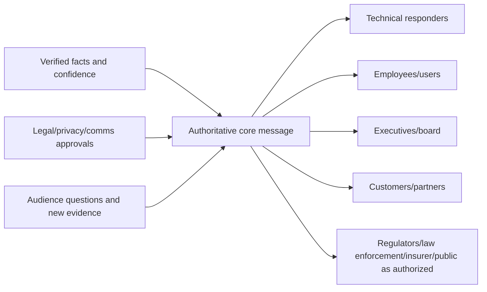

| Principle | Good practice | Failure mode |
|---|---|---|
| Accuracy | Verify facts, label confidence and unknowns | Speculate on cause/attribution |
| Timeliness | Set update time even without resolution | Silence until perfect answer |
| Consistency | One approved core fact set | Different teams invent narratives |
| Usefulness | State impact, action, workaround, support | Technical detail without decision |
| Minimization | Share need-to-know data | Expose identities, indicators, evidence, privilege |
| Empathy | Acknowledge disruption and needs plainly | Defensive or blame-focused tone |
| Auditability | Log approval, audience, sender, time, channel | Untracked side-channel statements |

## 26. Audience and cadence matrix

| Audience | Needs | Typical cadence/channel | Owner/approval |
|---|---|---|---|
| Incident team | Objectives, evidence, blockers, decisions | Frequent secure bridge and case | IC |
| Service desk/SOC | User guidance, indicators, routing, status | Shift/trigger updates | Operations/IC |
| Workforce | What is affected, required actions, support, scams | Event-driven approved channels | Communications/HR/security |
| Executives | Impact, risk, decisions, recovery, confidence, next update | Scheduled situation report | IC/executive liaison |
| Board | Strategic risk, material impact, oversight decisions | As governance requires | Executives/counsel |
| Customers/partners | Service/data impact, actions, commitments | Contract/need-driven | Authorized communications/counsel |
| Vendor/MSSP | Technical IDs, boundary evidence, explicit asks | Support cases/bridge | Vendor lead |
| Insurer | Policy-required facts and approved engagement | Per policy/counsel | Risk/counsel |
| Regulators/law enforcement | Required or authorized facts | Per law/authority | Counsel/authorized official |
| Media/public | Approved factual statement | Designated spokesperson | Communications/counsel/executive |

Use out-of-band communications if ordinary email/Teams/identity may be compromised. Confirm participants and protect meeting links, recordings, transcripts, and chat logs.

## 27. Executive update template

1. **Status and severity:** declared state and confidence.
2. **Business/security impact:** services, users, data, customers, duration.
3. **What is known:** concise verified facts.
4. **What remains unknown:** material uncertainty and telemetry limitations.
5. **Actions completed/in progress:** containment, evidence, suppliers, recovery.
6. **Risks and decisions:** options, tradeoffs, recommendation, owner/deadline.
7. **External matters:** only counsel/authorized status, no speculation.
8. **Next milestone/update:** exact time and expected evidence.

Example:

> “At 14:00 UTC we remain at Severity 1. Evidence confirms one privileged identity created an unauthorized application grant and accessed two SharePoint sites; investigation of additional data access continues. The identity, sessions and application grant are contained, clean administrator access is established, and Microsoft support is tracing two request IDs. Email and customer portals remain available; access to one research workspace is paused. Available logs cover the last 90 days but do not prove activity before that period. Legal/privacy teams are assessing notification obligations; no conclusion has been made. The next decision is whether to restore the workspace after the 16:00 integrity and access review. Next update: 16:30 UTC.”

## 28. Regulatory, legal, insurance, and law-enforcement decisions

Technical teams should quickly provide authorized decision makers with data categories, affected jurisdictions/populations, role of the organization, event type, access/acquisition evidence, dates, containment, risk to individuals/business, contracts, and confidence limitations.

| Decision area | Technical contribution | Authorized owner |
|---|---|---|
| Legal privilege | Facts, recipients, workstreams, evidence location | Counsel |
| Breach/notification | Scope, data, access, dates, evidence limits | Counsel/privacy/authorized official |
| Contract notice | Affected service/customer, timing, commitments | Counsel/commercial owner |
| Insurer notice/vendor selection | Incident facts, costs, technical need | Risk/counsel/insurance owner |
| Law enforcement | Indicators, impact, evidence preservation | Authorized executive/counsel/security lead |
| Public attribution | Technical indicators and confidence | Authorized government/executive/comms/counsel |
| Ransom/payment | Operational facts, recovery options, sanctions and risk inputs | Authorized leadership/counsel/insurer/law enforcement as applicable |

Never provide legal advice in an interview answer. Say you would engage authorized counsel early and preserve the facts and deadlines they need.

## 29. Ransomware and data-extortion scenario

**Situation:** Multiple endpoints and a file service show encryption; a ransom note claims data theft. Some cloud identities show unusual privileged activity.

**Immediate objectives:** protect life/safety and critical services; declare command/crisis process; isolate affected systems or segments in a coordinated way; protect clean admin and communications paths; preserve volatile evidence when compatible with harm reduction; determine scope and precursor compromise; protect backups and recovery infrastructure; engage qualified IR/forensics, counsel, insurer, vendors, and law enforcement through authorized process; and communicate accurately.

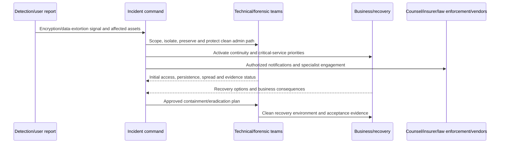

### Ransomware response considerations

| Area | Questions/guardrails |
|---|---|
| Scope | Encryption may be late-stage; hunt precursor identity, malware, RMM, exfiltration and persistence |
| Isolation | Disconnect/segment where possible; power-down tradeoff considers active harm versus volatile evidence |
| Backups | Protect offline/immutable copies, credentials, management plane, and restore testing |
| Identity | Assume credential/session/privilege compromise may extend beyond endpoints |
| Communications | Use clean/out-of-band methods; attacker may monitor ordinary channels |
| Recovery | Rebuild clean, rotate credentials/keys in order, validate before reconnection |
| Payment | No technical responder promises or decides; authorized legal/executive/insurer/law-enforcement process |
| Data theft | Claim is a hypothesis; investigate access/exfiltration and state evidence limits |

Do not contact the attacker, negotiate, pay, use a decryptor, wipe systems, or publish indicators outside the approved specialist process. CISA's public #StopRansomware guidance emphasizes tested offline backups, response/communications plans, coordinated isolation, preservation tradeoffs, precursor threat hunting, clean restoration, and lessons learned.

## 30. Phishing and business email compromise scenario

**Situation:** A finance user reports an adversary-in-the-middle phishing page; a mailbox rule and vendor-bank-detail conversation may be involved.

1. Preserve the reported message, headers, URLs/attachments, user timeline, sign-in IDs, device and browser evidence safely.
2. Scope recipients, clicks, credential/session exposure, sign-ins, MFA details, devices, mailbox access, inbox/forwarding rules, delegates, OAuth apps, sent/deleted items, financial workflow and related identities.
3. Contain identity/session/app persistence and malicious messages/domains/URLs through approved narrow actions.
4. Coordinate finance/fraud, bank, counsel, insurer, vendor/customer communications, and law enforcement through authorized channels; speed can matter in payment recovery.
5. Eradicate persistence, restore trusted auth methods, inspect endpoint where indicated, and validate mailbox/account state.
6. Heighten monitoring and review process controls such as independent payment-change verification.

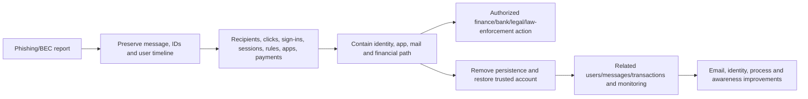

Avoid blaming the user. Phishing succeeds through combinations of adversary technique, identity/session controls, email protection, workflow design, reporting friction, training, and detection gaps.

## 31. Insider-risk scenario

**Situation:** Monitoring suggests an employee may have downloaded an unusual volume of confidential files before departure.

Insider scenarios require heightened confidentiality, proportionality, need-to-know access, and coordination with HR, legal, privacy, security, management, and sometimes physical security. A technical anomaly is not proof of malicious intent; legitimate projects, accessibility tools, backup/sync, travel, role change, and manager-approved work may explain it.

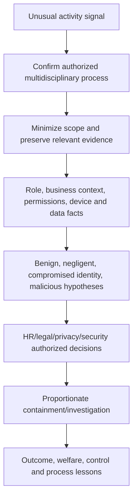

| Guardrail | Practice |
|---|---|
| Presumption | Do not label intent before evidence and authorized determination |
| Privacy | Collect only necessary data; restrict access and discussion |
| Employment | HR/legal own employment actions and interview strategy |
| Safety | Escalate credible physical safety concern through approved channel |
| Evidence | Preserve relevant activity and context, including exculpatory facts |
| Containment | Balance access risk, tipping off, continuity, rights, and safety |
| Communication | Strict need-to-know; no informal discussion or retaliation |

## 32. Cloud identity and malicious OAuth application scenario

**Situation:** A user granted consent to a malicious application, which uses API permissions to read mail and files after a password reset.

Scope the user, application/client ID, service principal, publisher/tenant, delegated/application permissions, consent actor/time, sign-ins, token/API activity, target data, related users, admin consent, secrets/certificates/federated credentials, and other persistence. Contain sessions and the app/grant through authorized action, not password alone. Review inbox rules, forwarding, devices, auth methods, roles, and related applications. Validate revocation at the resource and monitor attempted reuse.

## 33. Supply-chain or vendor incident scenario

A vendor notifies the organization of compromise affecting a connector with tenant API access. Confirm the notice through trusted channels; identify exact product, tenant, identities, permissions, secrets, data, time, affected version, and vendor evidence; invoke contract/notification processes; rotate/revoke in a sequence that preserves safety; hunt client-side activity; establish one timeline and clear asks; apply compensating operation; and assess long-term supplier controls and exit.

Do not wait passively for a generic vendor report if client telemetry can establish exposure and activity. Do not publicly attribute client impact beyond evidence.

## 34. When can an incident close?

Closure requires authorized criteria, not merely “alerts stopped.”

| Closure area | Evidence |
|---|---|
| Containment | No known active path within defined scope; monitoring for displacement |
| Scope | Confirmed/suspected/unknown populations documented with limitations |
| Eradication | Known persistence and root weakness addressed or risk treated |
| Recovery | Critical services/data/controls validated and owners accept |
| Evidence | Preserved, indexed, access/retention/hold decided |
| Communications | Required authorized updates/notifications complete or owned |
| Residual risk | Unknowns, exceptions, vendor issues and monitoring accepted |
| Follow-up | PIR/RCA, actions, problem records, deadlines and owner set |
| Well-being | Shift handover, fatigue, support and staffing addressed |

Incident closure can precede permanent problem resolution if service is restored, threat is controlled, and remaining work is formally owned. Do not close merely to improve MTTR.

## 35. PIR versus RCA

A **Post-Incident Review (PIR)** evaluates the incident and response broadly: what happened, impact, detection, decisions, coordination, communication, containment, recovery, what worked, what hindered, and what should improve. **Root Cause Analysis (RCA)** investigates causal mechanisms and contributing system conditions. A PIR can contain or link an RCA, but they are not identical.

| PIR question | RCA question |
|---|---|
| How did the organization detect and respond? | What technical/process conditions produced or allowed the incident? |
| Were roles, decisions and communications effective? | Which causes, triggers and contributors are evidenced? |
| What protected outcomes and what increased harm? | Why did preventive/detective/recovery controls fail or underperform? |
| What should change across people/process/tech/data/suppliers? | Which corrective mechanisms address recurrence? |
| How will actions be governed and exercised? | How will the proposed fix be validated against the causal model? |

## 36. Blame-free, accountable system analysis

Blame-free analysis avoids shaming and hindsight bias so people report facts and the organization learns. It does not eliminate accountability for malicious, reckless, policy-violating, or negligent behavior. Employment and disciplinary decisions belong to authorized HR/legal/management processes, separate from technical learning where appropriate.

### 🔍 Plain-English deep-dive: “human error” is the start of analysis

If an engineer approved the wrong production change, ask why the interface, peer review, test, access, workload, time pressure, naming, monitoring, rollback, and organizational incentives allowed one action to create widespread harm. The person remains responsible for honest participation and following rules, but a system that depends on perfect humans under pressure will fail again.

| Hindsight trap | Better question |
|---|---|
| “They should have known” | What information and cues were available at the time? |
| “The alert was obvious” | What volume, context, ownership, and competing work existed? |
| “Why did they not follow the runbook?” | Was it accessible, current, applicable, practiced, and safe? |
| “The vendor caused it” | Which client/supplier controls, contracts, monitoring and fallback shaped impact? |
| “One bad setting” | What design, review, scope, rollout, detection and rollback conditions existed? |

## 37. Five Whys used carefully

The **5 Whys** repeatedly asks why a condition occurred. It is simple and useful for a narrow causal chain, but complex incidents have branches. Do not stop at “person made mistake,” force exactly five levels, or claim a single root.

Example:

| Why | Evidence-led answer | Follow-up branch |
|---|---|---|
| Why was malicious mail delivered? | A narrow allow rule bypassed a protection stage | Why did rule exist and cover this sender? |
| Why did rule cover it? | Temporary migration exception used a broad domain | Why no recipient/path constraint? |
| Why broad? | Product limitation and urgent business request | What compensation and expiry existed? |
| Why did it persist? | No owner/expiry monitoring in change process | Why did governance not reconcile exceptions? |
| Why was threat not caught later? | Downstream detection lacked the attachment signal | Separate telemetry/detection causal branch |

The incident has at least two branches: preventive exception governance and downstream detection coverage.

## 38. Fishbone analysis

A **fishbone** or Ishikawa diagram organizes possible contributing factors into categories. It is a brainstorming and evidence-organization tool, not proof.

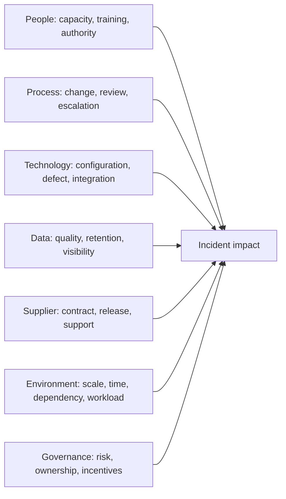

For each candidate, record supporting, contradicting, and missing evidence. Remove unsupported branches or label uncertainty.

## 39. Fault-tree analysis

**Fault-tree analysis (FTA)** starts with an unwanted top event and decomposes combinations of conditions using **OR** and **AND** logic. It is useful when several failures must combine.

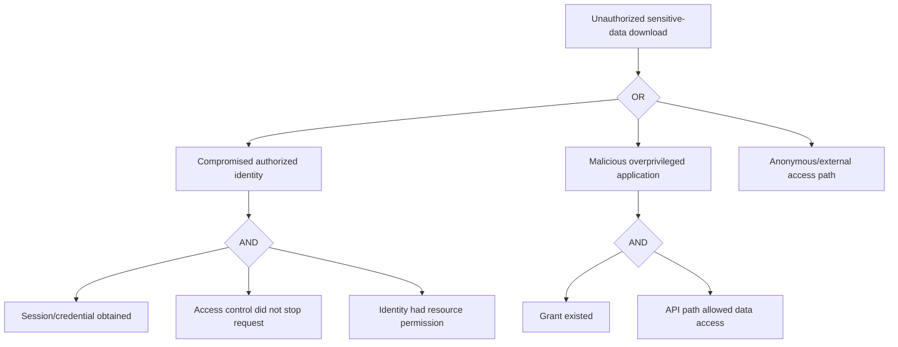

FTA helps identify prevention points and combinations. It depends on a correct model and evidence; do not assign probabilities casually without trustworthy data.

## 40. PIR structure

1. Executive summary and business/security impact.
2. Scope, classifications, duration, severity changes, and limitations.
3. Architecture and incident flow.
4. Detailed timeline of actor, system, and responder events.
5. Detection: what alerted, what did not, and why.
6. Analysis and evidence, including confidence and unknowns.
7. Containment, eradication, recovery, validation, and tradeoffs.
8. Communications and stakeholder decisions.
9. Causal analysis: trigger, causes, contributing and protective factors.
10. What worked, what made response harder, and near misses.
11. Corrective actions, owners, dates, dependencies, validation, risk.
12. Metrics with definitions and caveats.
13. Runbook, architecture, control, training, contract, and exercise changes.
14. Approval, distribution, retention, redaction, and follow-up review.

The report may need several versions for privilege, privacy, technical, executive, customer, or regulator audiences. Do not create inconsistent facts; tailor detail and access under authorized guidance.

## 41. Corrective-action design

A corrective action should connect evidence to a causal condition and a measurable outcome. “Improve monitoring” is not actionable.

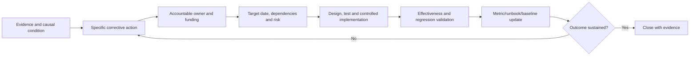

| Action field | Strong example |
|---|---|
| Evidence/cause | Malicious app retained delegated access after password reset |
| Outcome | Compromised-user containment includes app-grant review/revocation |
| Action | Add automated inventory and human-approved revocation step to identity IR runbook |
| Owner | Identity IR service owner |
| Due/dependency | Date; Graph permission, legal/privacy and testing dependencies |
| Validation | Tabletop plus synthetic compromised-user case and audit evidence |
| Metric | Eligible cases with app-grant review completed within containment target |
| Residual risk | Unsupported API visibility documented and compensated |

## 42. Action prioritization and governance

Prioritize by harm/risk reduction, recurrence likelihood, exposure, control dependency, legal/privacy need, recovery benefit, effort, feasibility, confidence, and time sensitivity. Include quick containment improvements, foundational telemetry/identity/recovery work, and strategic architecture/process changes.

Actions should not all be assigned to the SOC. Business, identity, endpoint, messaging, cloud, application, data, privacy, HR, procurement, suppliers, continuity, communications, and leadership may own systemic improvements.

## 43. Metrics and their caveats

| Metric | Definition question | Caveat |
|---|---|---|
| MTTD | From what event to what detection, for which eligible incidents? | Initial access often unknown; averages hide outliers |
| MTTA | From alert/receipt to qualified acknowledgement? | Fast acknowledgement can be low quality |
| Time to declare | From first qualifying evidence to declaration? | Criteria and retrospective knowledge vary |
| Time to contain | Which containment state and scope? | Partial containment can be mislabeled complete |
| Time to recover/restore | Which service and trusted acceptance point? | Restoration is not eradication or full recovery |
| Dwell time | Initial access to detection/containment? | Often estimated from incomplete evidence |
| Recurrence | Same causal pattern within what period? | Linking quality and changed exposure matter |
| Action closure | Implemented or validated effective? | Ticket closure is not risk reduction |
| Detection coverage | Tested use cases/sources/populations? | Test success does not prove all adversary behavior |

### 🔍 Plain-English deep-dive: a lower MTTR can be bad

A team can make MTTR look better by closing cases early, choosing a narrow restoration point, or avoiding difficult investigations. A safe response may take longer because it preserves evidence, expands scope correctly, or restores through clean infrastructure. Pair speed with containment quality, recurrence, service trust, evidence completeness, customer impact, and corrective-action effectiveness.

Use median and percentiles, segment by severity/type, show sample size, and explain outliers. Do not compare organizations without normalizing definitions and contexts.

## 44. What worked and protective factors

PIRs should document protective factors, not only failures: a user reported quickly; PIM limited standing privilege; an endpoint alert connected identity and mail; offline contacts worked; a vendor supplied backend trace IDs; backups were isolated; a service owner made a rapid decision; a runbook prevented duplicate containment. Reinforce and scale what worked.

## 45. Exercises and table-tops

Exercises validate plans, roles, decisions, communication, access, evidence, suppliers, and recovery before a real incident. Types include discussion-based tabletop, functional command exercise, technical simulation, purple-team exercise under separate rules, communications exercise, backup restore, and combined crisis exercise.

```mermaid
sequenceDiagram
    participant F as Exercise control/facilitator
    participant IC as Incident command
    participant T as Technical/SOC
    participant B as Business/recovery
    participant S as Legal/privacy/comms/vendor
    F->>IC: Initial alert and incomplete facts
    IC->>T: Declare objectives, scope and evidence tasks
    F->>T: Inject identity persistence and telemetry gap
    T-->>IC: Hypotheses, containment options and tradeoffs
    F->>B: Inject critical-service disruption
    B-->>IC: Continuity and recovery priorities
    F->>S: Inject customer/regulatory/media inquiry
    S-->>IC: Authorized communication and decision process
    F->>IC: Recovery recurrence inject
    IC->>F: Recontain, revise scope and plan
```

| Exercise design field | Content |
|---|---|
| Objectives | Specific capabilities to validate, not “test IR” |
| Scope | Participants, systems, data, production boundaries, safety |
| Scenario | Plausible facts with no real sensitive data or harmful payload |
| Injects | Timed evidence, ambiguity, vendor, business, privacy, recovery decisions |
| Rules | No blame, no unauthorized production action, stop condition, confidentiality |
| Observers | Capture decisions, coordination, access, evidence, communications |
| Success | Observable outcomes and decision quality |
| Debrief | Hot wash, gaps, protective factors, actions, owners, dates, validation |

Do not use surprise exercises that create panic, collect credentials, shame users, or trigger production containment without explicit authorization and safeguards.

## 46. Scenario exercise injects

For a ransomware tabletop, inject an unavailable primary communication platform, a possibly compromised backup identity, a critical safety service, a vendor with delayed response, a data-extortion claim, and clean restore failure. For phishing/BEC, inject a payment deadline, malicious OAuth persistence after password reset, a second executive target, and customer inquiry. For insider risk, inject an ambiguous legitimate business purpose, HR confidentiality, a compromised account alternative, and a potential physical safety concern.

The goal is not to “catch” participants. It is to expose assumptions and improve system readiness.

## 47. Common incident-response failure modes

| Failure | Consequence | Better control |
|---|---|---|
| No clear incident commander | Conflicting actions and updates | One IC, deputies, objectives and decision log |
| Premature attribution/root cause | Wrong containment and public risk | Facts, confidence, alternatives and authorized attribution |
| Password reset only | Sessions/apps/keys persist | Full identity/cloud persistence checklist |
| Wipe before evidence/scope | Lost facts and reinfection | Authorized preservation and scoped eradication plan |
| Preserve evidence while harm spreads | Unacceptable business/safety impact | Explicit containment-versus-evidence decision |
| Restore old state | Reintroduces compromise | Trusted recovery environment and acceptance tests |
| Legal/privacy engaged late | Missed facts/deadlines and uncontrolled disclosure | Early trigger criteria and evidence package |
| Too many communication channels | Inconsistent facts and leaked details | Core message, audience matrix and approved channels |
| Vendor owns the incident | End-to-end client decisions stall | Client command plus supplier workstreams |
| “Human error” RCA | Recurrence conditions unchanged | System, workload, cues, controls and incentives analysis |
| Actions close on implementation | No proof of risk reduction | Outcome validation and sustained metric |
| MTTR drives early closure | Hidden scope and recurrence | Pair speed with quality, trust and effectiveness |

## 48. Quality, safety, privacy, and responder well-being

| Area | Required practice |
|---|---|
| Quality | Peer challenge, evidence links, confidence, independent recovery validation |
| Safety | Life/health first, authorized action, stop conditions, clean admin path |
| Security | Least privilege, out-of-band comms, protected secrets, no uncontrolled tools |
| Privacy | Purpose, minimization, strict access, redaction, retention, specialist oversight |
| Evidence | Original preservation, provenance, integrity, custody and limitations |
| Communications | Authorized, factual, consistent, need-to-know and logged |
| Human factors | Rotations, handovers, rest, food, psychological safety, no harassment/blame |
| Ethics | No fabricated certainty, inflated impact, hidden failure, or misuse of access |

Long incidents degrade judgment. Use shifts, explicit handovers, deputies, decision review, and protected rest. Part 62 will deepen on-call resilience and handover; this Part requires basic fatigue-aware command now.

## 49. Safe paper portfolio lab: Northstar incident response

Use fictional **Northstar Research**. Scenario: a phishing campaign compromises a researcher, a malicious OAuth app reads email and SharePoint files, an endpoint alert suggests a payload on one device, and a data-extortion message claims broader theft. During containment, a vendor connector stops sending logs and a critical research team needs access. Use only invented users, tenants, IDs, domains, messages, files, logs, costs, regulations, and stakeholders. Do not access real tenants, send phishing, use malware, capture personal data, contact vendors/law enforcement, or claim production execution.

### Lab tasks

1. Write the IR charter, severity criteria, declaration authority, call tree, and offline contact plan.
2. Define IC, technical, scribe, communications, business, recovery, legal/privacy, HR, vendor, insurer, and law-enforcement-liaison roles.
3. Create a 75-event UTC timeline separating threat, system, responder, vendor, business, and communications actions.
4. Build confirmed/suspected/exposed/cleared/unknown scope matrices for identities, endpoints, apps, data, vendors, and time.
5. Write 20 hypotheses covering initial access, session theft, OAuth persistence, endpoint payload, privilege, data access, exfiltration, and telemetry loss.
6. Create a synthetic evidence register and chain-of-custody forms for ten artifact types, with privacy/redaction rules and limitations.
7. Design short- and long-term containment options with business, evidence, reversibility, and attacker-awareness tradeoffs.
8. Write eradication and trusted recovery plans with clean admin, credential rotation order, rebuild, control tests, user acceptance, rollback, and heightened monitoring.
9. Create audience/cadence matrix, holding statement, technical update, workforce alert, customer draft, and executive situation report. Mark all external/legal content “requires authorized review.”
10. Run paper ransomware, phishing/BEC, insider, malicious-app, and vendor-compromise branches.
11. Write a PIR and separate RCA using careful 5 Whys, fishbone, and fault tree; include protective factors and unknowns.
12. Build 20 corrective actions with owner, date, dependency, risk, test, metric, and evidence-based closure.
13. Define MTTD/MTTA/declaration/containment/restoration metrics with formulas, segmentation, caveats, and anti-gaming pairs.
14. Design a two-hour tabletop with objectives, injects, safety, observers, hot wash, and action follow-up.

```mermaid
flowchart LR
    PREP[IR plan, roles, contacts and evidence] --> ALERT[Phishing/OAuth/endpoint/extortion inject]
    ALERT --> COMMAND[Declare, command, scope and communicate]
    COMMAND --> EVID[Hypotheses, timeline and evidence custody]
    EVID --> CON[Containment tradeoff decisions]
    CON --> ERA[Eradication and clean recovery]
    ERA --> MON[Heightened monitoring and acceptance]
    MON --> PIR[PIR, RCA and corrective actions]
    PIR --> EX[Revised tabletop and readiness]
```

### Portfolio validation matrix

| Artifact | Quality question | Honest label |
|---|---|---|
| IR plan/command | Are authority, deputies, specialists, safety and cadence explicit? | Fictional paper plan |
| Timeline/scope/hypotheses | Are facts, confidence, unknowns and evidence links separate? | Synthetic investigation |
| Evidence register | Are provenance, custody, privacy, access and limitations handled? | No real forensic evidence |
| Containment/recovery | Are business, evidence, trust and validation tradeoffs visible? | Tabletop decisions only |
| Communications | Are audiences, approvals, knowns/unknowns and cadence correct? | Drafts, not legal advice |
| PIR/RCA/actions | Do causes connect to owned, tested outcomes without blame? | Fictional analysis |
| Metrics/exercise | Are definitions, caveats, behavior and validation built in? | Synthetic scorecard |

## 50. Interview answer method

Use **P-D-A-C-E-R-L**:

1. **Prepare** authority, people, access, evidence, communications, suppliers, and recovery.
2. **Detect/declare** the incident with severity, command, scope, and immediate safety.
3. **Analyze** timeline, entities, hypotheses, telemetry coverage, evidence, and business impact.
4. **Contain** through authorized short/long options balancing harm, continuity, evidence, and reversibility.
5. **Eradicate** persistence, compromised access and exploited conditions.
6. **Recover** from trusted state in waves with control/business tests and heightened monitoring.
7. **Learn** through PIR/RCA, communications review, owned validated actions, metrics, exercises, and honest limitations.

## 51. JD Mapping: interview translation

| Arti's demonstrated evidence | Incident-response translation | Honest interview sentence |
|---|---|---|
| Critical M365 escalation | Command rhythm, impact, priority and recovery | “I establish one timeline, objectives, owners and stakeholder cadence.” |
| SharePoint/OneDrive/sync | M365 workload scope and recovery validation | “I connect identity, permission, client, data and service evidence.” |
| Vendors/partners/product groups | Multi-party incident workstreams | “I keep a clear boundary, shared IDs, precise ask and end-to-end ownership.” |
| RCA | PIR causal analysis and improvement | “I distinguish trigger, cause, contributors, protection and unknowns.” |
| Fix validation | Eradication/recovery acceptance | “I test original behavior, security state, regression and recurrence.” |
| Documentation/mentoring | Playbooks, evidence guides, exercises | “I make incident learning executable for the next responder.” |
| KPI/business reviews | Executive impact and improvement reporting | “I define the metric and caveat, then connect it to an owner decision.” |

## Official Source Anchors

Use current versions and access dates in real work.

1. NIST SP 800-61 Rev. 3, *Incident Response Recommendations and Considerations for Cybersecurity Risk Management: A CSF 2.0 Community Profile* (final April 2025): <https://csrc.nist.gov/pubs/sp/800/61/r3/final>
2. NIST Cybersecurity Framework 2.0: <https://www.nist.gov/cyberframework>
3. NIST SP 800-86, *Guide to Integrating Forensic Techniques into Incident Response*: <https://csrc.nist.gov/pubs/sp/800/86/final>
4. NIST IR 8428, *Digital Forensics and Incident Response (DFIR) Framework for Operational Technology*: <https://csrc.nist.gov/pubs/ir/8428/final>
5. CISA #StopRansomware Guide: <https://www.cisa.gov/stopransomware/ransomware-guide>
6. CISA Federal Government Cybersecurity Incident and Vulnerability Response Playbooks: <https://www.cisa.gov/news-events/news/cisa-releases-cybersecurity-incident-and-vulnerability-response-playbooks>
7. CISA Tabletop Exercise Packages: <https://www.cisa.gov/resources-tools/services/cisa-tabletop-exercise-packages>
8. CISA Insider Threat Mitigation Guide: <https://www.cisa.gov/resources-tools/resources/insider-threat-mitigation-guide>
9. Microsoft Incident Response resources: <https://learn.microsoft.com/security/operations/incident-response-overview>
10. Microsoft Defender XDR incident response: <https://learn.microsoft.com/defender-xdr/incident-response-overview>
11. Microsoft Defender for Office 365 incident response: <https://learn.microsoft.com/defender-office-365/incident-response-for-defender-office-365>
12. Microsoft Entra compromised account guidance: <https://learn.microsoft.com/entra/identity/identity-protection/howto-identity-protection-remediate-unblock>
13. Microsoft Sentinel incident investigation: <https://learn.microsoft.com/azure/sentinel/investigate-incidents>
14. Microsoft Purview Audit search: <https://learn.microsoft.com/purview/audit-search>
15. FIRST CSIRT Services Framework: <https://www.first.org/standards/frameworks/csirts/csirt_services_framework_v2.1>
16. MITRE ATT&CK: <https://attack.mitre.org/>

## ⭐ Likely Interview Questions for This Section

### Q1. How would you structure a security incident response?

**Model answer:** I use a practical prepare, detect, analyze, contain, eradicate, recover and learn lifecycle aligned to the organization's plan and NIST CSF 2.0 risk management. I first protect life, active security and critical service; declare severity and command; establish one timeline, scope model, hypotheses, evidence register and stakeholder cadence; then choose authorized containment that balances harm, continuity, evidence and reversibility. I eradicate persistence and the exploited condition, recover from trusted state in waves, validate security and business outcomes, monitor for recurrence, and close with an evidence-based PIR/RCA and owned corrective actions.

### Q2. What is the role of an incident commander?

**Model answer:** The IC owns coordination rather than every technical detail. They set time-bounded objectives and priorities, assign workstreams, maintain command rhythm, resolve dependencies, ensure one timeline and decision log, manage severity and escalation, bring in business/legal/privacy/HR/vendor/communications/recovery specialists, and make or route authorized containment and recovery decisions. Technical leads recommend actions with evidence; business and risk owners explain consequences; legal and privacy roles make specialist decisions. The IC also protects responder sustainability and handover.

### Q3. How do you balance containment with evidence preservation?

**Model answer:** I treat it as an explicit risk decision. I assess ongoing harm, life/safety, critical service, attacker activity, scope confidence, volatility, clean alternatives, reversibility and specialist guidance. Disconnecting or isolating may preserve more volatile evidence than power-down, but immediate destructive harm may require faster action. I choose the narrowest effective short-term containment, record options/evidence/authority/consequences, preserve what is safely possible, validate displacement, and move to sustainable containment. Evidence does not justify allowing unacceptable harm, and urgency does not justify needless destruction.

### Q4. What does good evidence handling look like?

**Model answer:** Collection is authorized, relevant and minimized. I prioritize volatile or short-retention sources where safe, preserve native originals, record provenance and acquisition method/tool/version, use integrity controls or hashes where appropriate, store in an approved restricted repository, log transfers and access, analyze working copies, and document query/filter/time assumptions and limitations. HARs, tokens, mail, identity and endpoint data are sensitive and shared only through approved channels. Qualified forensic and legal specialists guide evidentiary standards; I do not overclaim completeness or attribution.

### Q5. How would you communicate during a cyber crisis?

**Model answer:** I maintain one authorized core fact set and tailor it by audience. Each update states status/severity, business and security impact, verified knowns, material unknowns and confidence, completed/in-progress actions, risks and decisions, support/workaround, and next update time. Technical teams get IDs and tasks; users get required actions; executives get impact and decisions; customers and external parties receive only approved content. Legal, privacy and communications owners review relevant messages, and out-of-band channels are used if normal collaboration may be compromised.

### Q6. What is the difference between a PIR and an RCA?

**Model answer:** A PIR evaluates the whole incident and response: impact, detection, decisions, command, containment, recovery, communication, suppliers, what worked, what hindered and what should improve. RCA focuses on causal mechanisms, triggers, contributing conditions and why controls failed or underperformed. A PIR can include or link an RCA. I keep both evidence-led, state uncertainty, identify protective factors, avoid stopping at human error, and convert findings into specific owned actions with due dates and effectiveness tests.

### Q7. How do you use incident metrics without creating bad incentives?

**Model answer:** I define event boundaries, eligible population, formula, source, severity segmentation and caveats. MTTD depends on knowing initial access; containment may be partial; restoration is not eradication; averages hide outliers. I use medians and percentiles where useful and pair speed with scope accuracy, containment quality, recurrence, trusted recovery, evidence completeness, customer impact, and corrective-action effectiveness. I never close early, downgrade severity or suppress evidence to improve a number.

### Q8. What is your honest security incident-response experience?

**Model answer:** My direct production background is critical Microsoft 365 support escalation, including SharePoint/OneDrive and sync, impact scoping, customer and vendor coordination, product-group escalation, shared timelines, RCA, fix validation, documentation, KPIs and business reviews. I would use those strengths in incident command and recovery. I have built a fictional security IR portfolio covering evidence, containment, crisis communications, ransomware/phishing/insider scenarios, PIR and exercises, but I would not claim forensic examiner, SOC commander or legal decision authority without evidence. I would engage qualified specialists and follow the client's approved plan.

## 🧠 30-Second Memory Hooks

- **IR is a loop, not a line.** Prepare, detect, analyze, contain, eradicate, recover, learn.
- **Framework plus local plan.** NIST guides outcomes; approved governance gives authority.
- **Declare to coordinate.** Severity, IC, timeline, roles, evidence, cadence and decisions.
- **One incident, many workstreams.** Technical depth reports into one command structure.
- **Facts before labels.** Technical teams provide evidence; counsel decides legal notification.
- **Scope uses five states.** Confirmed, suspected, exposed, cleared and unknown.
- **Containment is a tradeoff.** Harm, business, evidence, attacker awareness and reversibility.
- **Eradicate persistence, recover trust.** Do not restore the compromised old state.
- **Communicate known, unknown, action and next time.** One core truth, tailored detail.
- **PIR is broad; RCA is causal.** Both produce owned, tested improvements.
- **Human error starts the question.** Analyze cues, controls, workload, design and incentives.
- **Metrics can lie.** Pair speed with quality, recurrence, evidence and trusted outcome.

## Completion Checklist

- [ ] I can explain prepare, detect, analyze, contain, eradicate, recover and learn as an iterative lifecycle.
- [ ] I can relate the operational lifecycle to NIST CSF 2.0 Govern, Identify, Protect, Detect, Respond and Recover functions.
- [ ] I can distinguish events, alerts, incidents, major service incidents, problems, crises, privacy incidents and legal breach determinations.
- [ ] I can define preparation across governance, people, technology, access, evidence, business, communications, suppliers, recovery and exercises.
- [ ] I can explain forensic readiness and identify likely evidence before an incident.
- [ ] I can design secure reporting, triage, declaration, severity reassessment and escalation.
- [ ] I can define IC, technical, workstream, scribe, communications, business, legal/privacy, HR, vendor and recovery roles.
- [ ] I can operate one command rhythm, timeline, action tracker, decision log, evidence register and communication log.
- [ ] I can scope identities, devices, email, apps, data, time, third parties and business services as confirmed/suspected/exposed/cleared/unknown.
- [ ] I can build a normalized attacker/system/responder timeline and record clock limitations.
- [ ] I can form hypotheses for initial access, persistence, privilege, data access, exfiltration and impact with confidence levels.
- [ ] I can explain authorization, relevance, volatility, preservation, integrity, provenance, custody, repeatability, confidentiality and retention.
- [ ] I can explain chain of custody and forensic limitations without claiming perfect reconstruction or attribution.
- [ ] I can compare containment options by harm reduction, business/safety impact, evidence, attacker awareness, reversibility and validation.
- [ ] I can plan identity/cloud, endpoint, email and data containment without broad unsafe actions.
- [ ] I can define eradication of initial access, persistence, privilege, credentials, endpoints, cloud/data and telemetry weakness.
- [ ] I can recover from a trusted state in waves with security, integrity, business, operations and residual-risk acceptance.
- [ ] I can design heightened monitoring with purpose, duration, privacy and exit criteria.
- [ ] I can communicate accurately across technical, user, executive, customer, vendor and external audiences with authorized approvals.
- [ ] I can reserve legal, privacy, regulatory, insurance, law-enforcement, attribution and payment decisions for authorized roles.
- [ ] I can reason safely through ransomware, phishing/BEC, insider, malicious OAuth app and supplier incidents.
- [ ] I can distinguish incident closure from permanent problem resolution and avoid metric-driven closure.
- [ ] I can distinguish PIR from RCA and use 5 Whys, fishbone and fault trees with evidence and limitations.
- [ ] I can perform blame-free system analysis while preserving authorized accountability.
- [ ] I can write corrective actions with cause, outcome, owner, date, dependency, risk, test, metric and evidence-based closure.
- [ ] I can interpret MTTD, MTTA, declaration, containment, restoration, dwell, recurrence and action metrics with caveats.
- [ ] I can design safe tabletop objectives, injects, rules, observers, debrief and follow-up.
- [ ] I can connect Arti's direct escalation, vendor, RCA, fix-validation, documentation and business-review experience honestly.
- [ ] I can present Northstar as a fictional paper exercise with no real forensics, malware, phishing, personal data or legal advice.
- [ ] I can answer Q1–Q8 aloud in approximately 60–90 seconds each without proprietary or unsupported claims.

*Next suggested section:* [Part 62](Part-62-resilience-oncall-shift-handover.md)