# Part 62 — Resilience, Service Disruptions, Emergency Access, On-Call, and Shift Handover

> **Section goal:** Build a beginner-first, consulting-grade understanding of resilient Microsoft cloud operations and humane on-call handover. By the end, you should be able to distinguish availability, resilience, reliability, recoverability, business continuity, and disaster recovery; map dependencies, blast radius, and single points of failure; compare redundancy, failover, and degraded modes; explain recovery time objective (RTO), recovery point objective (RPO), and maximum tolerable downtime/disruption (MTD) without making unsupported cloud promises; investigate Microsoft 365 or Azure service disruption through symptoms, scope, timeline, changes, correlation, Microsoft 365 Service health, Message center, public status information, and authorized support; coordinate a vendor incident while preserving one client-owned timeline; design manual workarounds and continuity decisions; operate, monitor, and test emergency-access accounts; reason about fail-open and fail-closed choices; govern emergency changes, approvals, rollback, and retrospective review; design readiness, rotations, escalation, fatigue controls, night/weekend/holiday coverage, and follow-the-sun support; triage severity and queues; deliver a minimum viable shift handover with impact, actions, hypotheses, evidence, next owner, and cadence; publish accurate status communications; maintain an auditable operational log; measure outcomes without gaming them; and practice all of this safely through fictional paper exercises.

This Part maps directly to the job description's expectations for Microsoft 365 service troubleshooting, security operations, critical-incident coordination, client communication, vendor engagement, operational readiness, 24x7 rotational support, documentation, handover, risk-based decision making, and continual improvement. It uses Arti's demonstrated strengths in critical Microsoft 365 escalations, SharePoint Online and OneDrive, synchronization, customer impact, product-group and vendor coordination, shared timelines, RCA, fix validation, reusable documentation, KPIs, mentoring, and business reviews. The consulting extension is to make resilience objectives, dependency risks, continuity choices, emergency access, on-call authority, handover quality, and operational evidence explicit without implying production ownership she has not demonstrated.

> **Method boundary:** This chapter uses public, general reliability, resilience, business-continuity, incident-management, on-call, and Microsoft cloud administration practices. It does not describe or imply Deloitte proprietary methods, tools, service levels, client cases, staffing models, templates, or internal operations. Every example is fictional. Real work must follow the client and employer's approved governance, contracts, labor rules, support agreements, change controls, security policies, privacy requirements, records schedules, accessibility standards, health-and-safety duties, and applicable law.

> **Safety and currency warning (August 24, 2026):** Microsoft service names, portals, health experiences, APIs, support routes, licensing, status publication, recovery behavior, preview features, and documentation change. Verify current Microsoft Learn content and tenant-specific behavior. A Microsoft status indicator is evidence, not proof of every customer's end-to-end experience. Never bypass identity controls, expose credentials, make an unapproved production change, or promise an RTO/RPO that is not supported by architecture, contract, testing, and accountable acceptance.

## JD Mapping

| Role expectation | Capability developed here | Safe portfolio evidence |
|---|---|---|
| Troubleshoot Microsoft cloud disruption | Correlate symptom, scope, dependency, change, telemetry, service health, and support evidence | Fictional disruption investigation pack |
| Lead critical operational response | Establish severity, command, objectives, timeline, roles, cadence, decisions, and escalation | Paper incident log and situation reports |
| Design for operational resilience | Map critical journeys, dependencies, failure modes, redundancy, degraded modes, and recovery objectives | Resilience worksheet and dependency map |
| Coordinate Microsoft, vendors, and partners | Maintain boundary-aware cases, evidence requests, shared milestones, and one client timeline | Vendor coordination matrix |
| Support 24x7 operations | Design readiness, rotations, escalation, fatigue controls, and follow-the-sun transfer | On-call and coverage design |
| Perform reliable shift handover | Transfer minimum facts, evidence, actions, hypotheses, risks, authority, next owner, and cadence | Handover record and read-back checklist |
| Govern emergency access and change | Separate trigger, authorization, least privilege, monitoring, rollback, and review | Break-glass and emergency-change paper runbooks |
| Communicate and improve | Produce audience-specific updates, service metrics, PIR actions, and business-review decisions | Status pack, scorecard, and exercise report |

## Candidate honesty note

Arti can directly discuss critical Microsoft 365 support escalations, SharePoint Online and OneDrive service and synchronization symptoms, scope and business impact, incident timelines, customer updates, coordination across vendors, partners, and product groups, RCA, fix validation, reusable documentation, mentoring, KPI analysis, and business reviews where supported by her actual record. Those are strong foundations for resilience operations because they show disciplined restoration, evidence correlation, ownership across boundaries, and communication under pressure.

She should not claim that she designed Microsoft's cloud architecture, guaranteed Microsoft service availability, owned a client's formal business-continuity program, administered production emergency-access accounts, managed a global 24x7 SOC/NOC rotation, approved emergency risk acceptance, or invoked disaster recovery unless separately evidenced. Safe wording is:

> “My direct production experience is leading complex Microsoft 365 escalations: I scope symptoms and impact, correlate timelines and changes, coordinate customers, vendors and product groups, validate recovery and fixes, document RCA, mentor engineers, and report trends in business reviews. I have extended that experience through a fictional resilience and on-call paper exercise covering dependencies, recovery objectives, degraded modes, emergency access, shift handover, communications, metrics, and outage drills. I would apply the client's approved continuity, change, security, labor, and escalation processes, and I would validate Microsoft-specific behavior against current official guidance and support evidence.”

---

## 1. Availability, resilience, reliability, and recovery from zero

These terms overlap, but they answer different questions. **Availability** asks whether a service can be used when needed. **Reliability** asks whether it consistently performs its intended function over time. **Resilience** asks whether the wider service can absorb disruption, adapt, recover, and learn. **Recoverability** asks whether restoration is possible within accepted objectives. **Business continuity** keeps critical business outcomes operating, possibly through manual alternatives. **Disaster recovery (DR)** restores technology after a severe disruption.

**Analogy:** A railway can publish that trains are available, yet arrivals may be unreliable. A resilient transport system detects a blocked line, reroutes passengers, communicates clearly, protects safety, restores service, and learns. Buses provide business continuity; repairing the line is recovery.

| Concept | Plain question | Example measure or evidence | Important limitation |
|---|---|---|---|
| Availability | Can users access the service now? | Successful journey percentage or uptime | A portal can be up while a critical user journey fails |
| Reliability | Does the service behave correctly and consistently? | Error rate, latency, correctness, successful jobs | High availability does not prove correct results |
| Resilience | Can the service withstand, adapt to, and recover from failure? | Tested failover, degraded mode, exercises, learning | Not a single product switch or score |
| Recoverability | Can an accepted state be restored? | Recovery test result and elapsed time | A backup existing does not prove it restores |
| Continuity | Can priority business outcomes continue? | Sustainable workaround and trained staff | Manual work may introduce safety/privacy/error risk |
| Disaster recovery | Can technology be restored after severe disruption? | Exercised recovery plan and acceptance | SaaS customer/provider responsibilities differ |

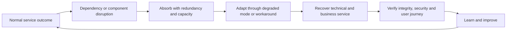

### 🔍 Plain-English deep-dive: availability is an end-to-end user journey

A Microsoft admin page showing “healthy” does not prove that a user in a specific location, tenant, license group, network path, client version, identity policy, and SharePoint site can complete a sync. The service outcome crosses customer-managed and provider-managed components. Measure representative journeys, such as “authorized user opens a protected document,” rather than only component status. This is why Arti's compare-affected-with-unaffected escalation discipline is valuable: it identifies which slice of the journey differs.

## 2. Define the critical service and journey

Resilience begins with the outcome, not a product name. Define the business service, consumers, critical journeys, data, locations, operating hours, peak periods, owners, dependencies, security/privacy needs, acceptable degradation, recovery objectives, and validation evidence.

| Service-definition field | Fictional Northstar Foods example | Evidence source |
|---|---|---|
| Outcome | Store managers access current safety procedures | Business service owner interview |
| Critical journey | Entra sign-in → SharePoint site → document authorization → browser download | Architecture and synthetic paper test |
| Priority users | Distribution and store safety managers | Business-impact analysis |
| Peak/blackout period | Product recall or holiday distribution window | Operations calendar |
| Data need | Current approved procedure; confidentiality moderate, integrity critical | Information owner decision |
| Degraded mode | Controlled offline read-only pack for current approved procedures | Continuity plan and review record |
| Recovery acceptance | Named personas can access the correct approved document and audit trail | Test script and owner sign-off |

Do not label every workload “critical.” Prioritization is meaningful only when owners identify the few outcomes whose loss causes unacceptable safety, financial, legal, customer, or mission impact.

## 3. Dependencies, failure domains, and blast radius

A **dependency** is something a service needs. A **failure domain** is a boundary within which one failure can affect multiple components. **Blast radius** is the maximum plausible scope of harm from a failure or change. A **single point of failure (SPOF)** is one dependency whose loss can stop the outcome because there is no effective alternative.

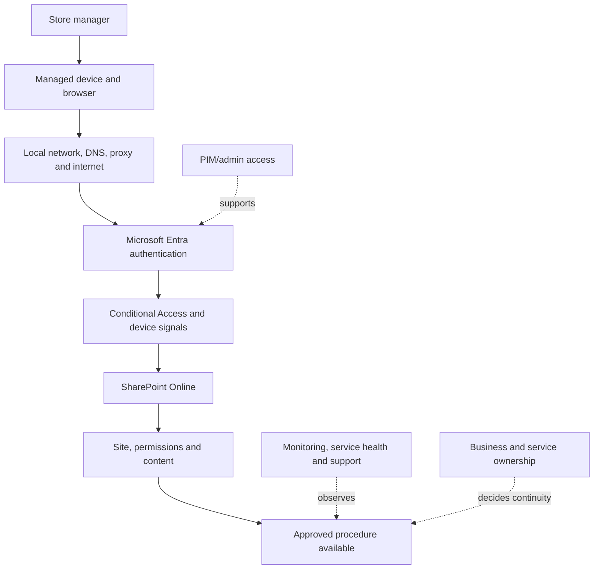

| Dependency class | Example | Failure symptom | Resilience question |
|---|---|---|---|
| People | Only one engineer knows tenant routing | Diagnosis stalls after hours | Is knowledge transferred and an alternate named? |
| Identity | Entra sign-in or Conditional Access | Authentication loop or broad denial | Is emergency administration independent and tested? |
| Endpoint | Browser/client/device compliance | Some managed devices cannot connect | Is web/mobile/manual alternative approved? |
| Network | DNS, proxy, firewall, ISP | Region/site-specific timeout | Is a diverse path available and governed? |
| SaaS workload | SharePoint, Teams, Exchange | Feature or service journey fails | What Microsoft evidence and customer workaround exist? |
| Integration | Graph app, connector, webhook | Automation queues or silently misses events | Can work be queued, replayed, or done manually? |
| Data/configuration | Wrong policy, corrupt content, expired certificate | Incorrect or inaccessible outcome | Is baseline/version/recovery material trustworthy? |
| Supplier/support | Vendor owns gateway or managed device | Boundary dispute delays action | Are contracts, contacts, evidence, and escalation clear? |

The map must include hidden operational dependencies: time synchronization, certificate renewal, service identities, secrets, licensing, API limits, telemetry, ticketing, communication channels, admin workstations, vendor portals, and named approvers. A backup contact that depends on the same unavailable identity platform is not independent.

## 4. Find single points and correlated failure

Redundant components are not independent when they share the same identity, network, region, configuration pipeline, secret, administrator, supplier, or flawed change. **Correlated failure** defeats apparent redundancy because one cause affects several copies.

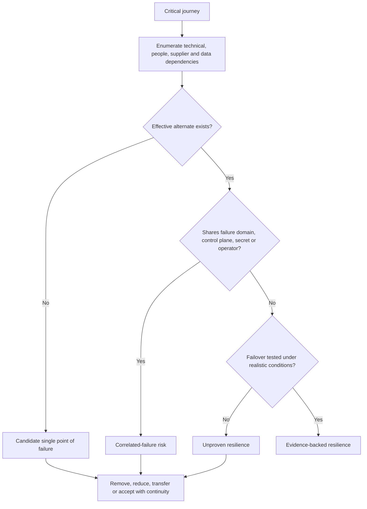

| Weak claim | Why it is weak | Better evidence |
|---|---|---|
| “It is cloud, so it is resilient” | Provider and customer responsibilities differ | Critical-journey dependency map and current service commitments |
| “We have two admins” | Both may use the same inaccessible account path | Independent, monitored, tested emergency administration |
| “We have backups” | Restore, integrity, keys, permissions, and age are unknown | Completed restore exercise with acceptance results |
| “Two connectors are configured” | Same secret, API, region, or bad policy can break both | Failure-domain analysis plus forced failover test |
| “Users can work manually” | Capacity, duration, errors, privacy, and reconciliation untested | Timed continuity drill and reconciliation plan |

## 5. Redundancy, failover, and degraded mode

**Redundancy** provides extra capacity or components. **Failover** transfers work from a failed path to an alternate. A **degraded mode** intentionally provides a reduced but useful and controlled service. Each requires a trigger, decision owner, procedure, observability, security posture, capacity check, user communication, rollback or return-to-normal method, and test evidence.

| Strategy | Purpose | Example | New risk to control |
|---|---|---|---|
| Active-active redundancy | Multiple paths serve work concurrently | Diverse customer network exits | Shared dependency and inconsistent state |
| Active-passive failover | Standby path takes over | Secondary integration endpoint | Stale configuration and untested activation |
| Queue and replay | Preserve work until dependency returns | API jobs stored with idempotency key | Duplicate or out-of-order processing |
| Read-only degraded mode | Preserve safe access while writes stop | Approved procedure pack | Stale data and inappropriate offline access |
| Manual workflow | People temporarily replace automation | Approved ticket-based entitlement review | Error, fatigue, privacy, reconciliation backlog |
| Load shedding | Protect essential functions by dropping lower priority work | Pause noncritical reports | Hidden dependency on dropped workload |

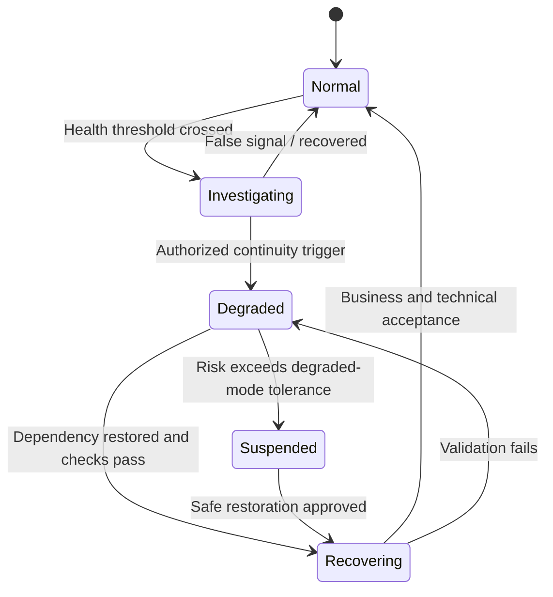

### 🔍 Plain-English deep-dive: failover is a business event, not just a switch

Failover may change data location, latency, security inspection, cost, identity paths, evidence, and customer behavior. It can also make recovery harder if writes diverge. A runbook should say who declares failover, what evidence triggers it, what will be lost or delayed, how security controls are checked, how stakeholders are informed, and how split-brain or duplicate work is prevented. “Click failover” is not an operational design.

## 6. RTO, RPO, MTD, and related objectives

**Recovery time objective (RTO)** is the target duration to restore an agreed service level after disruption. **Recovery point objective (RPO)** is the maximum targeted data-loss interval expressed in time. **Maximum tolerable downtime/disruption (MTD)** is the longest disruption the business judges tolerable before consequences become unacceptable; terminology varies, so define it. A **maximum tolerable period of disruption (MTPD)** is a similar term used in some continuity practices.

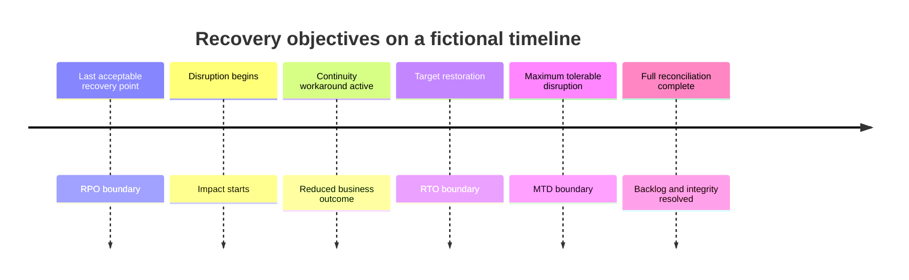

| Objective | What it governs | Example statement | Common mistake |
|---|---|---|---|
| RTO | Time to agreed restoration level | Priority users regain read access within four hours | Treating it as a provider guarantee |
| RPO | Acceptable data-loss time window | No more than 30 minutes of queued workflow state | Using RPO where SaaS data control is unavailable |
| MTD/MTPD | Business tolerance ceiling | Manual process becomes unsafe after eight hours | Setting it below RTO without resolving the gap |
| Work recovery time | Time after technology returns to reconcile backlog | Reconcile queued approvals within six hours | Declaring recovery before business catches up |
| Service level objective | Target reliability over an interval | 99.9% successful critical journeys per month | Confusing target, contract, and observed outcome |

RTO should be less than MTD, with enough time for business reconciliation. RPO applies meaningfully only where the organization can define and test restoration of the relevant state. For SaaS, the provider may own platform replication while the customer still owns configuration, identity, retention, integrations, content governance, and continuity choices. Read current service descriptions, architecture, and contracts; do not invent a customer-controlled failover that the service does not expose.

## 7. Cloud and SaaS applicability

Cloud resilience uses shared responsibility. Microsoft designs and operates platform capabilities; the customer configures identities, policies, applications, data, endpoints, networks, integrations, monitoring, support processes, and continuity within available features. Exact boundaries differ by service and contract.

| Layer | Provider-oriented concern | Customer-oriented concern | Joint evidence |
|---|---|---|---|
| Physical/platform | Datacenter, hardware, service fabric | Provider selection and contractual understanding | Service documentation and incident communication |
| Identity/control | Platform identity availability | Roles, Conditional Access, emergency access, app credentials | Sign-in logs, policy baseline, service health |
| Workload | SaaS feature operation | Tenant configuration, permissions, content lifecycle | Admin evidence and journey tests |
| Endpoint/network | Cloud edge | Device, DNS, proxy, firewall, ISP, client | Client/network traces and endpoint comparison |
| Integration | API availability and limits | Retry, rate handling, queue, identity, observability | Correlated request IDs and logs |
| Continuity | Provider restoration | Business workaround and risk acceptance | Exercised continuity record |

Resilience cannot be outsourced merely by buying SaaS. It also should not be undermined by unsupported customer workarounds that copy sensitive cloud data into unmanaged locations.

## 8. Detect disruption through multiple signals

Use **outside-in** signals that represent user journeys and **inside-out** signals from components. Include service desk volume, synthetic checks, application logs, audit/configuration change, identity/network/client telemetry, Microsoft health information, supplier notices, and business reports.

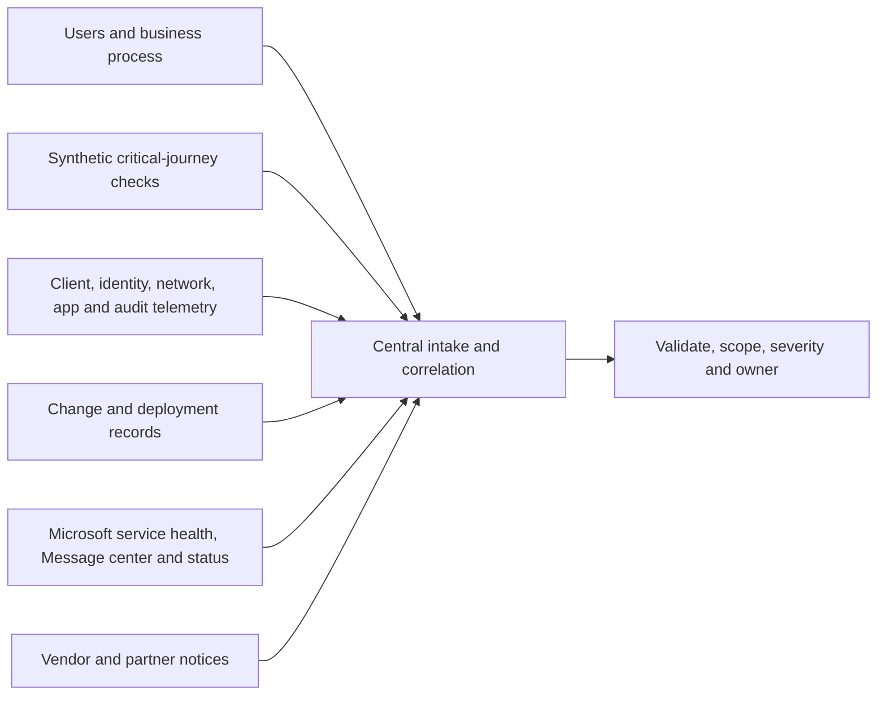

| Signal | Strength | Blind spot | Correlation value |
|---|---|---|---|
| User reports | Real impact and wording | Delayed, duplicated, incomplete | Shows geography/persona/journey clusters |
| Synthetic test | Consistent early warning | Tests only designed path | Separates systemic from anecdotal failure |
| Component telemetry | Detailed mechanism | Component may look healthy end to end | Supports layer isolation |
| Change record | Identifies plausible trigger | Coincidence is not causation | Anchors before/after comparison |
| Microsoft health | Provider acknowledgment and updates | Tenant/journey lag or incomplete early scope | Supports but does not replace customer evidence |
| Vendor notice | Third-party status | May omit customer-specific chain | Establishes supplier workstream |

## 9. Microsoft Service health, Message center, status, and support

Use each source for its intended purpose. **Microsoft 365 Service health** in the admin center provides organization-relevant health information when available to authorized admins. **Message center** communicates planned changes, maintenance, retirements, and actions; it is not only an outage feed. Public status pages can help when administrative portals are inaccessible or a broad issue is publicly acknowledged. Microsoft support creates a case, evidence exchange, severity process, and product escalation route subject to entitlement and current procedures.

| Source | Primary use | Capture | Do not assume |
|---|---|---|---|
| Microsoft 365 Service health | Tenant-relevant advisories/incidents | ID, title, status, affected service/features, times, updates | Every customer symptom is represented immediately |
| Message center | Planned change, maintenance, retirement, action | Message ID, dates, affected service, required action | A planned message proves causation |
| Azure Service Health | Personalized Azure service/region/resource context | Tracking ID, service/region, impact, guidance | It covers every Microsoft 365 dependency |
| Public Azure/status pages | Broad external visibility | Publication time and scope | It replaces authenticated health information |
| Microsoft support | Product investigation and escalation | Case ID, entitlement, severity, evidence, asks, commitments | Vendor owns the client's command or business decision |

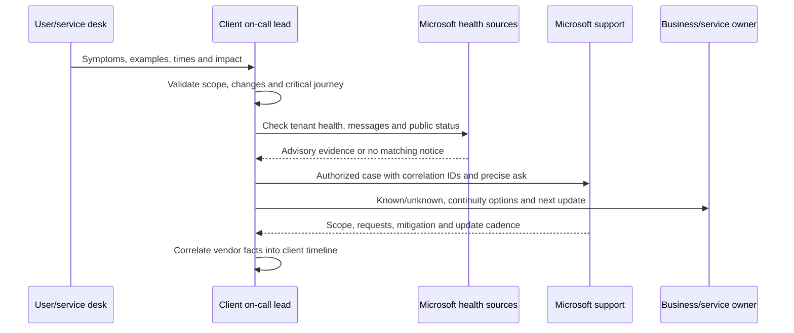

Record what was checked, by whom, at what time, and the result, including “no matching advisory.” Do not paste tokens, credentials, personal content, or unnecessary sensitive logs into a support case. Follow approved secure-upload and data-handling processes.

## 10. Outage investigation: symptom, scope, timeline, change, correlation

Start with an observable symptom, not “Microsoft is down.” Capture exact operation, user-facing error, UTC time, tenant, workload, persona, client, location, network, device, object, correlation/request ID, business impact, and comparison case.

| Investigation lens | Minimum questions | Output |
|---|---|---|
| Symptom | What exact action fails, at which step, with what error? | Reproducible symptom statement |
| Scope | Which users, sites, devices, clients, regions, networks, or tenants? | Affected/unaffected matrix |
| Timeline | First known good, first failure, detection, changes, actions, recovery? | Normalized chronology |
| Change | Customer, provider, network, certificate, policy, app, client, content? | Candidate change list with evidence |
| Correlation | Which IDs link client, proxy, identity, workload, and support evidence? | Evidence chain |
| Impact | Which business outcome, volume, duration, safety or deadline? | Severity and continuity input |
| Hypothesis | What explanation predicts the observed pattern? | Ranked tests with disconfirming evidence |

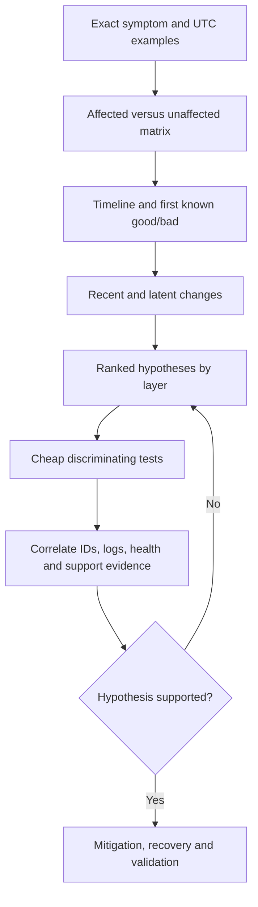

### 🔍 Plain-English deep-dive: correlation is not causation

If a Conditional Access policy changed at 09:00 and sync errors began at 09:05, the timing makes the policy a strong hypothesis, not a proven cause. Compare targeted and untargeted users, policy evaluation, token state, browser versus sync client, regions, and rollback or report-only evidence. A Microsoft advisory appearing at 09:10 also does not automatically explain every symptom. Ask which hypothesis predicts all major observations and what result would disprove it.

## 11. Scope states and blast-radius control

Use explicit scope states rather than a vague list: **confirmed affected**, **suspected**, **exposed to the condition**, **tested unaffected**, and **unknown**. Every mitigation has its own prospective blast radius.

| Scope state | Meaning | Example |
|---|---|---|
| Confirmed affected | Reproduced or evidenced failure | Named user receives specific authorization error |
| Suspected | Pattern suggests impact but not confirmed | Same policy group without a tested example |
| Exposed | Dependency/configuration applies, no failure evidence yet | All users through the affected proxy |
| Tested unaffected | Representative test passed with stated limits | Browser access works for named persona at 10:15 UTC |
| Unknown | Evidence unavailable or population not assessed | External guest access after hours |

Before a broad rollback, estimate who will gain or lose access, which security control changes, whether sessions must refresh, how long propagation takes, what audit evidence exists, and how the change will be reversed.

## 12. Severity and queue triage

**Severity** reflects impact and urgency; **priority** orders work considering severity, obligations, aging, dependencies, and available workarounds. A queue is a control surface: it needs intake quality, ownership, deduplication, routing, aging alerts, escalation, and visibility.

| Factor | Low-end example | High-end example |
|---|---|---|
| Business impact | One user, noncritical feature | Safety/mission/revenue-critical journey broadly unavailable |
| Scope | Known isolated case | Enterprise, multiple regions, or unknown expanding scope |
| Workaround | Safe and sustainable | None, unsafe, or rapidly exhausting |
| Security/control impact | Cosmetic or reporting delay | Emergency accounts/control enforcement/telemetry impaired |
| Time sensitivity | Normal business window | Regulatory, market, payroll, recall, or executive deadline |
| Recovery confidence | Known fix and tested rollback | Cause unknown, destructive failure, or vendor dependency |

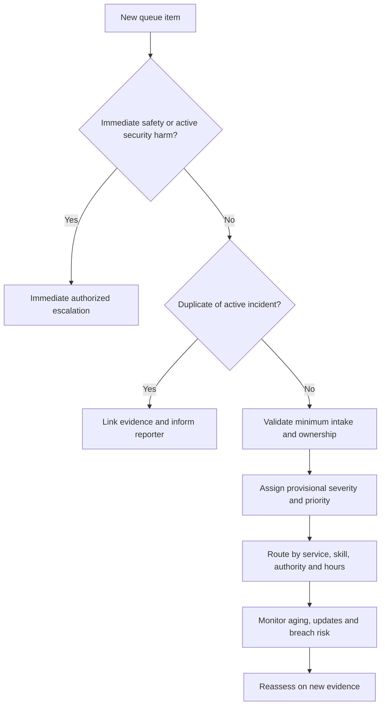

Do not elevate severity to manipulate vendor response, and do not lower it to protect a metric. Record criteria, evidence, approver, and reassessment.

## 13. Vendor incident coordination

A vendor owns its product workstream; the client retains end-to-end service, risk, continuity, and stakeholder ownership unless governance explicitly says otherwise. Open a case with a concise problem statement, business impact, exact examples, UTC timeline, affected/unaffected matrix, correlation IDs, troubleshooting already completed, sanitized evidence, requested outcome, contact, and cadence.

| Coordination need | Client/on-call lead | Vendor/product support | Business owner |
|---|---|---|---|
| End-to-end impact and severity | Owns and updates | Supplies product impact evidence | Confirms criticality/tolerance |
| Product diagnosis | Supplies reproducible evidence | Owns product investigation | Consulted on consequences |
| Continuity option | Coordinates technical feasibility | States product constraints | Accepts business residual risk |
| Vendor mitigation | Validates in client journey | Proposes/executes within boundary | Informed/consulted as needed |
| Communication | Maintains one client fact set | Supplies approved product facts | Approves business messaging path |
| Closure | Verifies end-to-end recovery | Confirms product status/RCA availability | Accepts outcome and follow-up |

Keep vendor estimates labeled as estimates. A vendor “service restored” update is a trigger for customer validation, not automatic closure.

## 14. Business continuity and manual workarounds

A workaround must preserve an essential outcome with bounded risk. Define trigger, eligible users, allowed data, step-by-step method, capacity, duration, security/privacy controls, accessibility, approval, logging, support, reconciliation, expiry, and return to normal.

```mermaid
flowchart LR
    IMPACT[Critical journey disrupted] --> TOL[Compare impact with business tolerance]
    TOL --> OPTIONS[Evaluate wait, degrade, manual path, alternate service or suspend]
    OPTIONS --> RISK[Security, privacy, safety, accuracy, capacity and duration]
    RISK --> AUTH[Authorized continuity decision]
    AUTH --> OPERATE[Operate and monitor workaround]
    OPERATE --> RESTORE[Validate normal service]
    RESTORE --> RECON[Reconcile data, backlog, evidence and access]
    RECON --> CLOSE[Retire workaround and review]
```

| Workaround question | Why it matters | Required evidence |
|---|---|---|
| Is the information current and authentic? | Stale instructions can cause harm | Version, owner, approval, checksum or controlled source |
| Who may use it? | Broad access can expose data | Named group and access decision |
| How long is it safe? | Manual work accumulates error and fatigue | Expiry and review cadence |
| How is work recorded? | Later reconciliation needs a source of truth | Controlled log with IDs and timestamps |
| What happens when service returns? | Duplicate actions or lost work are likely | Reconciliation and conflict rules |
| Can all users access it? | Continuity must include accessibility needs | Alternate accessible format and test |

Never solve availability by copying sensitive content to personal email, unmanaged storage, public links, or consumer messaging. If no safe workaround exists, an authorized owner may choose to suspend the process.

## 15. Emergency access or break-glass operation

An **emergency-access account** is a highly privileged identity reserved for scenarios where normal administrative access is unavailable. Microsoft public guidance commonly recommends two or more cloud-only emergency accounts for Microsoft Entra tenants, with strong independent authentication, carefully designed exclusions, secure credential control, monitoring, and regular validation. Exact design must follow current guidance and organizational risk decisions.

| Lifecycle element | Minimum design question | Control evidence |
|---|---|---|
| Purpose | Which failure conditions justify use? | Approved trigger list |
| Identity | Is it independent of likely failure paths? | Cloud-only design and dependency review |
| Authentication | Is the method strong and operationally independent? | Current approved method and custody record |
| Authorization | What minimum emergency role is necessary? | Role rationale and review |
| Exclusions | Which policies exclude it and why? | Documented, reviewed exception |
| Storage/custody | How are credentials/devices protected and dual-controlled? | Restricted custody log |
| Monitoring | Does every sign-in/use create a high-priority alert? | Alert route and test result |
| Testing | Can authorized staff use it without normal dependencies? | Scheduled test evidence |
| After use | How are credentials, sessions, evidence, and changes handled? | Rotation and PIR checklist |

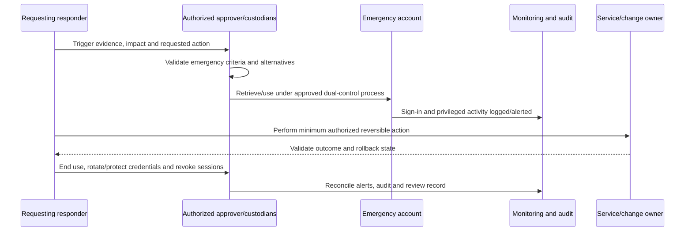

### 🔍 Plain-English deep-dive: an exclusion is controlled risk, not “no security”

An emergency account may need exclusion from a policy that could lock out every administrator, but that exception increases attack value. Compensate with independence, strong phishing-resistant authentication where supported and appropriate, no routine use, restricted custody, immediate alerting, periodic access review, explicit test, and response on any unexpected sign-in. Never add an exclusion casually during the outage without understanding propagation, session behavior, and blast radius.

## 16. Monitor and test emergency access

Test on a risk-approved schedule and after material identity changes. A paper or controlled test checks custodian availability, credential retrieval, authentication independence, role sufficiency, alert delivery, audit capture, emergency communication, minimum action, sign-out/session response, credential protection/rotation, and test closure. Do not perform disruptive production actions merely to prove access.

| Test result | Interpretation | Follow-up |
|---|---|---|
| Sign-in succeeds; alert fails | Access exists but misuse may be invisible | Treat monitoring as failed control and remediate |
| Sign-in fails due to policy | Emergency path shares normal failure | Repair under change governance and retest |
| Role is excessive | Blast radius is larger than justified | Reassess least privilege and emergency tasks |
| Custodian unavailable | Paper process cannot operate | Add deputies and coverage |
| Credentials found in routine vault access | Exposure/custody weakness | Restrict access, rotate, investigate as required |
| Test is undocumented | No auditable assurance | Record evidence, limits, owner, date, next test |

Unexpected use or failed authentication may be a security incident. Do not assume it is a test.

## 17. Fail-open and fail-closed tradeoffs

**Fail closed** denies the operation when a control or dependency fails. **Fail open** permits it. Neither is universally correct. Evaluate safety, confidentiality, integrity, availability, fraud, mission need, duration, scope, detectability, reversibility, legal constraints, and compensating controls.

| Scenario | Fail-closed benefit | Fail-open benefit | Safer decision framing |
|---|---|---|---|
| Privileged admin authentication | Prevents unauthorized high-impact access | Enables emergency repair | Use governed independent emergency access, not broad bypass |
| Data-loss-prevention dependency | Prevents uninspected disclosure | Keeps collaboration available | Consider data class, audience, logging, time-bound degraded mode |
| Safety procedure access | Protects restricted data | Maintains safety information | Controlled read-only offline current copy may balance both |
| Automated account disablement | Stops suspected compromise | Avoids mass lockout on false positive | Require confidence, blast-radius limit, approval, and rollback |
| Security telemetry pipeline | Avoids acting on missing evidence | Service can continue while monitoring degrades | Raise risk state, limit high-risk changes, restore monitoring quickly |

Document the actual failure behavior; many systems fail inconsistently rather than cleanly open or closed. A “fail secure” design should not silently create an unsafe business condition.

## 18. Emergency changes and approvals

An emergency change is expedited because delay creates unacceptable harm. It is not an unrecorded change. Capture incident/change IDs, reason, scope, exact implementation, risk, security/privacy impact, dependencies, testing, approver/authority, executor, independent observer where feasible, start time, validation, rollback trigger/steps, communications, and retrospective review.

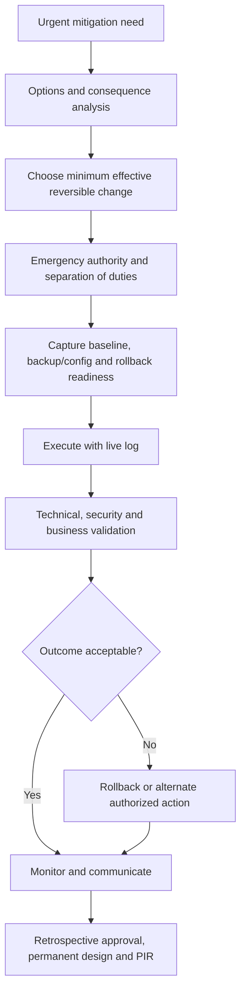

| Control | Under emergency pressure | After stabilization |
|---|---|---|
| Approval | Authorized emergency decision, not convenience | Retrospective governance review |
| Testing | Smallest safe precheck/canary possible | Full regression and control validation |
| Documentation | Live command/change log | Complete record and baseline update |
| Separation | Request/approve/execute/validate separated where feasible | Review any emergency combination of roles |
| Rollback | Prepared before execution unless impossible | Confirm rollback state or retire temporary change |
| Temporary access | Time-bound and monitored | Revoke, rotate, reconcile, and review |

## 19. Recovery and return to normal

Restoration is not merely “the error stopped.” Verify original user journey, identity/security controls, data correctness, queued transactions, integrations, monitoring, support load, accessibility, performance, geography, and representative personas. Remove temporary workarounds and privileges deliberately.

| Recovery gate | Evidence | Owner |
|---|---|---|
| Provider/dependency status | Current health/support update | Vendor workstream lead |
| Technical function | Repeated critical-journey tests | Technical lead |
| Security/control state | Policy, role, logging, alert, secret checks | Security/control owner |
| Business outcome | Priority users complete real representative workflow | Business owner |
| Data/integrity | Correct version, no duplicate/lost queued work | Data/application owner |
| Operations | Queue, monitoring, on-call, runbook normal | Service owner |
| Residual risk | Known limits and temporary measures accepted | Authorized risk owner |

Use heightened monitoring for a defined period with purpose and exit criteria. Do not leave broad exclusions, debug logging, temporary admin, bypass routes, duplicate alerts, or unmanaged offline copies behind.

## 20. On-call readiness before scheduling people

On-call means designated responders can be contacted outside ordinary hours to assess and act within defined authority. It requires more than a phone list.

| Readiness dimension | Minimum evidence | Failure if absent |
|---|---|---|
| Scope | Services, severity, hours, response expectation | Every alert becomes urgent |
| Authority | Allowed diagnosis, changes, escalation, continuity decisions | Responder awake but powerless |
| Access | Tested device, network, PIM, emergency and vendor routes | Delayed or unsafe credential sharing |
| Signal quality | Actionable alert with context and deduplication | Alarm flood and fatigue |
| Knowledge | Current runbooks, topology, known errors, contacts | Reinvention under pressure |
| Escalation | Primary, secondary, manager, specialist, vendor, business | Single responder trapped |
| Staffing | Rotation, skills, timezone, leave, holiday and surge plan | Hidden coverage gaps |
| Wellbeing | Rest, compensation, maximum load, relief and psychological safety | Unsafe decisions and attrition |
| Handover | Standard record, overlap and acceptance | Context loss at shift boundary |

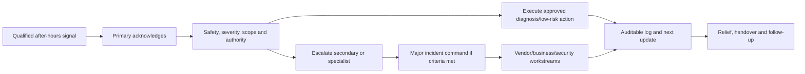

## 21. Rotation design, fatigue, and wellbeing

Fatigue is an operational and safety risk. Design rotations using workload data, skill mix, timezone, labor rules, compensation, overnight frequency, alert volume, incident duration, recovery time, protected leave, deputies, and surge staffing. Psychological safety must allow responders to say they are impaired, uncertain, or need relief.

| Guardrail | Practical implementation | Metric with caveat |
|---|---|---|
| Sustainable load | Limit pages and consecutive nights; add capacity when breached | Pages/person/night segmented by actionability |
| Recovery rest | No routine morning shift after material overnight incident | Rest exceptions and follow-up |
| Secondary support | Named escalation responds, not merely “available” | Secondary engagement time |
| Alert hygiene | Remove noisy/nonactionable alerts through governed review | Actionable page percentage |
| Relief trigger | Mandatory handoff after duration or impairment threshold | Incidents exceeding safe shift limit |
| Blameless support | Review system and process, not heroics | Improvement actions and retention signals |
| Privacy | Do not publish health details broadly | Restricted staffing record |

Do not celebrate repeated all-night heroics as a resilience strategy. They are evidence that capacity, automation, architecture, documentation, or escalation may need improvement.

### 🔍 Plain-English deep-dive: human redundancy needs real independence

Listing a primary and secondary does not create resilience if both are new, share the same unavailable access, are on leave, or depend on one specialist who is asleep in another incident. Test call trees and access. Pair complementary skills, name decision authority, provide translation/accessibility support where relevant, and establish a duty manager who can add capacity or stop unsafe work.

## 22. Night, weekend, holiday, and follow-the-sun coverage

Coverage design should state local hours, holidays, daylight-saving changes, language, skill, authority, data-location constraints, customer commitments, vendor availability, and escalation. **Follow-the-sun** transfers ownership between geographic teams as working days overlap; it reduces individual overnight work but increases handover dependence.

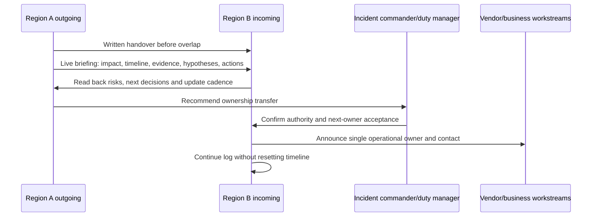

| Coverage pattern | Strength | Risk | Control |
|---|---|---|---|
| Local rotation | Familiar environment and stakeholders | Overnight fatigue | Secondary, rest, bounded shifts |
| Follow-the-sun | Daylight work and regional continuity | Context loss and ownership ambiguity | Overlap, standard dataset, read-back |
| Managed provider | Capacity and specialization | Contract/boundary/evidence gaps | Clear RACI, access, SLA/OLA and audit |
| Hybrid | Internal authority plus provider monitoring | Duplicate or missed ownership | One queue, explicit triggers, joint exercise |
| Holiday surge | Planned extra capacity | Assumes predictable demand only | Scenario-based reserve and vendor calendar |

## 23. The minimum shift-handover dataset

A handover transfers responsibility, not merely information. Use one authoritative record and include:

1. Incident/case/change IDs and classification.
2. Current owner, command roles, channel, contacts, and authority.
3. Exact current status and severity with last reassessment time.
4. Business/service/security impact and affected/unaffected scope.
5. Normalized timeline and last known good state.
6. Actions completed, result, executor, and time.
7. Actions in progress, owner, expected result, and deadline.
8. Ranked hypotheses, supporting/conflicting evidence, confidence, and next test.
9. Evidence links, queries, correlation IDs, Microsoft/vendor case and advisory IDs.
10. Changes, temporary access, workarounds, risks, approvals, and rollback readiness.
11. Decisions/asks due, blockers, escalation thresholds, stakeholders, and update cadence.
12. Named next owner, acceptance/read-back, immediate priorities, and next checkpoint.

| Handover field | Bad example | Decision-quality example |
|---|---|---|
| Status | “Still broken” | “SharePoint browser works; sync upload fails for managed Windows clients in two sites as of 21:40 UTC” |
| Impact | “Many users” | “118 warehouse users cannot upload safety records; read access works; manual queue safe until 02:00 UTC” |
| Action | “Checked logs” | “Compared sign-in IDs A/B at 21:15; authentication succeeds; failure occurs after WAM token handoff” |
| Hypothesis | “Microsoft issue” | “Client-version regression medium confidence; unaffected web and older client conflict with tenant-wide outage” |
| Next step | “Keep investigating” | “Region B owner Priya to test version N-1 on device D-14 by 22:10 and update case MS-123” |
| Risk | Omitted | “Do not broaden proxy bypass; it would bypass inspection for all M365 traffic” |

## 24. Handover flow and acceptance

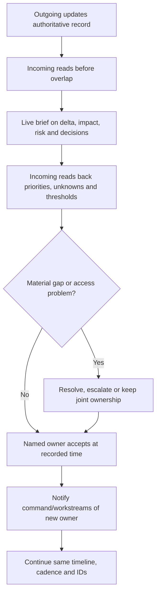

The outgoing responder remains responsible until transfer is accepted or a duty manager explicitly resolves the gap. For high severity, use overlap and verbal read-back. For a quiet queue, a written handover may suffice if policy allows. Never rely only on chat history; key decisions and evidence belong in the record system.

## 25. Auditable operational timeline and log

Separate fact, assessment, decision, and action. Normalize times to UTC while preserving source timezone when useful. Record who, what, when, evidence/source, result, and confidence. Correct errors visibly rather than silently rewriting history.

| Entry type | Example format |
|---|---|
| Observation | `21:04 UTC — User U14 received error E at upload; screenshot/evidence EV-22; reported by service desk.` |
| Action | `21:12 UTC — Alex queried sign-in correlation C14; succeeded; query Q-3 and result stored EV-24.` |
| Assessment | `21:18 UTC — Authentication failure hypothesis reduced to low confidence because token issuance succeeded.` |
| Decision | `21:22 UTC — IC approved read-only workaround until 02:00; owner/business rationale DEC-5.` |
| Commitment | `21:30 UTC — Microsoft case MS-123 next update expected 22:15; vendor statement, not client estimate.` |
| Correction | `21:36 UTC — Corrected first-failure time from 20:20 to 20:02 based on proxy log EV-28; prior entry retained.` |

Protect the log as sensitive operational evidence. Apply access control, retention, redaction, approved repositories, and records policy. Avoid personal speculation, health details, blame, secrets, tokens, or copied user content.

## 26. Status page and stakeholder communications

Communication should answer: what users experience, which services/populations are affected, when it began or was detected, current status, safe workaround, actions underway, what users should or should not do, and next update time. State uncertainty explicitly.

| Audience | Needs | Avoid |
|---|---|---|
| Users | Symptom, affected action, workaround, support route, next update | Internal hypotheses, blame, unsafe troubleshooting |
| Service desk | Exact error/pattern, duplicate handling, intake fields, script | Conflicting unofficial fixes |
| Technical teams | IDs, scope, timeline, evidence, tasks, decision thresholds | Long executive narrative without actionable detail |
| Executives | Business impact, trend, continuity, risk, decisions/asks, confidence | Raw log dump or unsupported recovery promise |
| Vendor | Repro, correlation, sanitized evidence, precise ask, cadence | Unnecessary personal or secret data |
| External/customer | Authorized fact set, impact, support, next update | Legal conclusions, attribution, speculation |

**Sample internal status:**

> **Investigating — 22:00 UTC.** Some managed Windows users at two distribution sites cannot upload files through the OneDrive sync client; browser read and upload tests currently succeed. The issue began between 20:02 and 20:10 UTC and affects a confirmed 118 users; other sites remain under assessment. A controlled browser workflow is available for approved users until 02:00 UTC. Teams are comparing client and proxy evidence and have opened Microsoft case MS-123; no matching tenant advisory was visible at 21:45 UTC. Do not change proxy or Conditional Access settings outside the incident plan. Next update by 22:45 UTC, or earlier for material change.

Public status publication requires authorized communications and legal/privacy review where applicable. Never publish customer identifiers, security architecture, exploitable detail, or personal information.

## 27. Communication cadence and silence management

Set cadence by impact and uncertainty, not by how quickly a root cause appears. Update on schedule even when there is no material change: say what remains known, what was tested, what is next, and when the next update will occur.

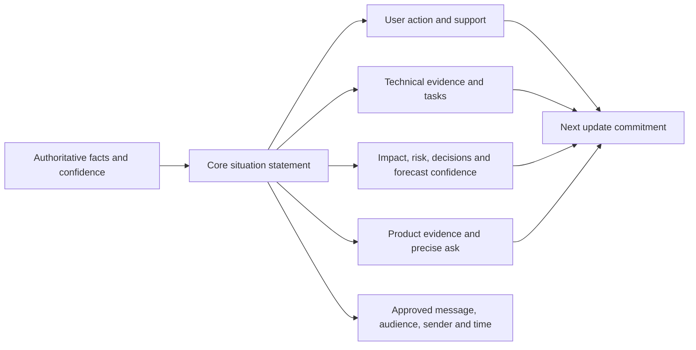

Use terms consistently: **investigating**, **identified**, **mitigating**, **monitoring**, and **resolved** should have local definitions. Do not announce “resolved” merely because a vendor says mitigation completed; confirm representative user and business outcomes.

## 28. Metrics for resilience and on-call

Metrics support decisions when definitions and caveats are visible. Segment by severity, service, region, hour, and incident type. Prefer trends, distributions, and percentiles to one average.

| Metric | Useful definition | Risk of misuse | Pair with |
|---|---|---|---|
| Critical-journey success | Successful representative transactions / attempts | Synthetic path misses real populations | User reports and scope coverage |
| Time to acknowledge | Detection/intake to owned response | Fast acknowledgment without action | Time to qualified assessment |
| Time to mitigate/restore | Declared start to agreed service level | Start/end points manipulated | Business recovery and integrity validation |
| Handover completeness | Required fields valid at transfer | Checkbox completion with stale facts | Read-back defects and outcome |
| Page actionability | Pages requiring valid action / total pages | Teams suppress alerts to improve rate | Missed-detection review |
| After-hours load | Pages and active hours per person | Privacy and workload differences | Rest exceptions and fatigue feedback |
| Workaround sustainability | Capacity/error/risk against designed limit | Unsafe manual work normalized | Reconciliation defects |
| Recurrence | Repeat impact from same causal/control gap | Bad incident taxonomy | Corrective-action effectiveness |

**Example formulas:**

$$\text{Availability} = \frac{\text{agreed service time} - \text{unavailable time}}{\text{agreed service time}} \times 100\%$$

$$\text{Handover completeness} = \frac{\text{valid required fields at acceptance}}{\text{required fields}} \times 100\%$$

Availability calculations require agreed hours, exclusions, measurement point, partial degradation rules, and source. They are not automatically equivalent to a contractual SLA or Microsoft commitment.

## 29. Business reviews and decision-oriented reporting

Arti's business-review experience transfers naturally. A resilience review should connect customer impact, service trends, on-call health, supplier performance, continuity tests, incidents, recurring dependencies, accepted risk, improvement ownership, and decisions required.

| Review section | Decision question | Evidence |
|---|---|---|
| Outcome health | Are priority journeys meeting agreed needs? | Journey, incident and customer-impact trends |
| Resilience risk | Which SPOFs or correlated failures exceed tolerance? | Dependency/failure-mode register |
| Continuity | Are workarounds safe, current, accessible, and sustainable? | Exercise and reconciliation results |
| On-call health | Is coverage safe and effective? | Load, actionability, rest, gaps, qualitative feedback |
| Suppliers | Are support boundaries and escalations working? | Case response, evidence quality, unresolved actions |
| Improvements | Did changes reduce recurrence or impact? | Before/after evidence and test results |
| Decisions/asks | What funding, ownership, acceptance, or priority is needed? | Options, cost/risk, recommendation and due date |

Do not expose individual responder health or performance through broad dashboards. Aggregate appropriately and use restricted people processes for sensitive matters.

## 30. Failure modes and controls

| Failure mode | Why it happens | Prevent/detect/respond control |
|---|---|---|
| Healthy portal but failed journey | Component view misses customer path | Outside-in synthetic and real-user evidence |
| Alert storm | Dependency causes duplicate symptoms | Correlation, deduplication, suppression with expiry |
| Vendor ownership vacuum | Everyone waits for provider | Client IC, explicit workstreams, continuity decision |
| Broad emergency rollback | Pressure outruns blast-radius analysis | Minimum reversible change and approval |
| Break-glass account cannot sign in | Shared policy/dependency or stale credential | Independent design and regular test |
| Break-glass used silently | Monitoring route failed | High-priority alerts and independent review |
| Handover loses hypothesis/evidence | Chat-only transfer | Standard dataset, overlap, read-back, acceptance |
| Follow-the-sun resets investigation | New team repeats work | One timeline, completed tests and disconfirming results |
| Manual workaround leaks data | Availability prioritized without governance | Approved data/location/access/expiry/reconciliation |
| Fatigued responder makes risky change | Long incident without relief | Shift limits, secondary, pause/escalation and recovery rest |
| “Resolved” before users recover | Provider status mistaken for outcome | Business and technical acceptance gates |
| Metric gaming | Targets become personal performance tools | Balanced measures, definitions, qualitative review |

## 31. Scenario 1: Microsoft 365 service disruption

**Fictional situation:** Northstar Foods users in two regions report intermittent SharePoint upload failures. Microsoft 365 Service health initially shows no matching advisory. Browser upload succeeds more often than sync-client upload. A proxy certificate update occurred six hours earlier.

**Method:**

1. Confirm exact symptom, UTC examples, clients, sites, files, correlation IDs, and business impact.
2. Build affected/unaffected matrix by region, proxy path, client version, browser, identity policy, file/site, and network.
3. Start one timeline containing proxy change, first failure, user reports, tests, health checks, and support interaction.
4. Rank hypotheses: proxy path/certificate, sync-client behavior, tenant/workload incident, policy/token, content-specific issue.
5. Run cheap discriminating paper tests: browser versus sync; alternate governed network; changed versus unchanged proxy; same user/device combinations.
6. Check Service health, Message center, public status only as appropriate, and document the result/time.
7. Open a sanitized support case with IDs and a precise request; do not wait passively.
8. Decide whether browser upload is a safe degraded mode, including capacity, access, data, expiry, and support.
9. Validate restoration across representative regions and clients, then reconcile queued work.
10. Review whether certificate testing, synthetic checks, change blast radius, and handover should improve.

**Expected output:** scope matrix, timeline, hypothesis/test table, support pack, continuity decision, status updates, recovery evidence, and corrective actions. The exercise does not claim a real root cause.

## 32. Scenario 2: emergency access during identity lockout

**Fictional situation:** A newly enforced Conditional Access policy appears to block routine administrators. A high-impact service configuration must be inspected. There is no evidence yet that ordinary users are affected.

| Step | Safe paper decision | Evidence/stop condition |
|---|---|---|
| Declare | Open incident/change records and name authority | Do not improvise credentials in chat |
| Validate | Confirm admin-only impact and policy evaluation evidence | Stop if compromise indicators appear; involve security IR |
| Consider alternatives | Existing session, delegated role, policy rollback path | Do not broaden exclusions without scope |
| Authorize emergency use | Trigger and custodian process met | Record approver and exact minimum action |
| Operate | Sign in from approved device, inspect/change minimally | Monitoring alert must be observed |
| Validate | Routine admin path and service control restored | Test representative account and policy state |
| Close use | Sign out/revoke as designed, protect/rotate material | Reconcile audit and temporary access |
| Learn | Review policy deployment and account test | Create validated actions, not blame |

This is a tabletop. Do not test by changing a real production tenant unless specifically authorized with a safe plan.

## 33. Scenario 3: night shift handover

**Fictional situation:** At 01:30 UTC, an engineer has worked six hours on an intermittent OneDrive sync incident. A follow-the-sun team begins in 30 minutes. Microsoft support expects new diagnostic results at 02:15. A manual upload path is safe until 04:00.

The outgoing engineer updates the common record, marks confirmed/suspected/unaffected scope, lists tests and negative results, identifies the medium-confidence client-version hypothesis, links exact evidence, states the 04:00 continuity expiry, and identifies the decision needed if no mitigation arrives. The incoming engineer reads it before overlap, confirms access to evidence/support, reads back the next test and escalation threshold, accepts ownership at 02:00, and announces the owner change. The outgoing engineer rests rather than remaining an unofficial parallel owner.

**Quality test:** A reviewer should be able to answer who is impacted, what changed, what has been ruled down, what action happens next, who owns it, when the next update is due, and what risk becomes unacceptable at 04:00.

## 34. Scenario 4: holiday vendor outage and manual continuity

**Fictional situation:** A third-party workflow that provisions access from approved requests stops on a holiday. Microsoft Graph responds, but the vendor platform queues no new jobs. Forty requests include five urgent joiners; manual grants could introduce excessive access.

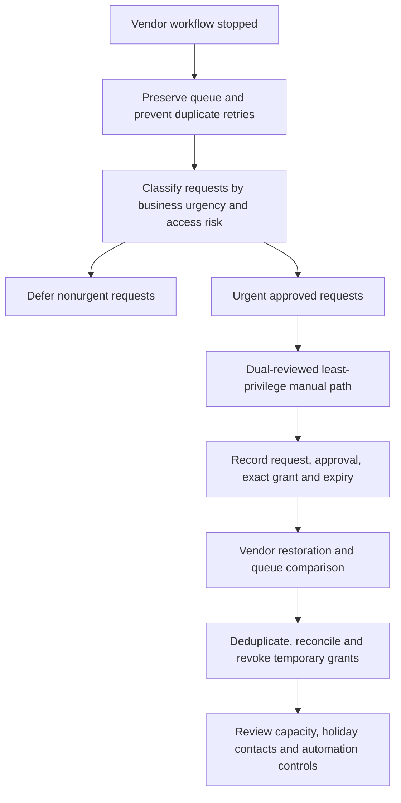

This tests vendor escalation, holiday contacts, least privilege, manual capacity, dual review, evidence, expiry, idempotent reconciliation, and business communication. It does not execute Graph or modify identities.

## 35. Safe portfolio paper exercise: Northstar Resilience and On-Call Pack

Create a fictional, non-production pack for “Northstar Foods.” Use invented domains such as `northstar.example`, synthetic users, fake IDs, and no tenant screenshots, credentials, tokens, customer data, or real support cases.

| Artifact | Required contents | Quality check |
|---|---|---|
| Critical-journey sheet | Outcome, users, hours, dependencies, security/privacy, owner | Starts from business outcome, not product |
| Dependency/blast-radius map | Technical, people, supplier, data, control plane, failure domains | Includes hidden/common dependencies |
| Objective worksheet | RTO/RPO/MTD definitions, assumptions, owner, test, gap | No unsupported SaaS guarantee |
| Failure-mode register | Failure, effect, detection, degradation, recovery, owner | Correlated failures considered |
| Microsoft/vendor evidence checklist | Health, Message center, status, support, IDs, redaction | Each source has purpose and limits |
| Break-glass paper runbook | Trigger, authorization, custody, minimum action, monitoring, after-use | No real credential or bypass instructions |
| On-call design | Scope, rotation, access, escalation, fatigue, holiday/follow-the-sun | Wellbeing is an explicit control |
| Handover template | Minimum dataset, read-back, acceptance, cadence | Named next owner and risks present |
| Communications pack | User, technical, executive and vendor examples | Known/unknown/action/next time separated |
| Exercise report | Objectives, injects, decisions, observations, actions | Clearly labeled fictional/tabletop |

**Paper exercise flow:** discover the fictional service; define critical journey and objectives; map dependencies; analyze four failure scenarios; design controls and workarounds; draft on-call/handover; run a tabletop with a friend reading injects; capture decisions; score completeness; write improvement actions; present a ten-minute business review. Keep all evidence synthetic.

## 36. Exercise design and outage injects

| Exercise phase | Example inject | Capability tested |
|---|---|---|
| Detect | Three sites report different errors | Intake, correlation and scope |
| Diagnose | Service health has no advisory | Independent evidence and hypothesis discipline |
| Change | Recent proxy certificate update appears | Change correlation without premature cause |
| Continuity | Workaround capacity lasts three hours | Business decision and risk control |
| Vendor | Support requests correlation IDs and trace | Evidence quality and redaction |
| Access | Primary admin path unavailable | Emergency-account governance |
| Handover | Incoming region lacks one evidence permission | Acceptance and joint ownership |
| Fatigue | Primary has exceeded safe shift | Relief and escalation |
| Recovery | Provider says restored; one region still fails | End-to-end validation |
| Review | Timeline has a 40-minute gap | Auditable improvement action |

Exercises should test decisions and interfaces, not embarrass individuals. State objectives, rules, observers, stop conditions, synthetic data, expected actions, debrief method, owners, dates, and effectiveness tests.

## 37. Quality, safety, privacy, testing, rollback, and operations gates

| Gate | Questions before approval/acceptance |
|---|---|
| Quality | Are terms defined, facts sourced, scope states explicit, owners named, and assumptions visible? |
| Safety | Could the action affect physical safety, critical operations, or responder fitness? |
| Security | Does continuity or emergency action bypass controls, expand privilege, or reduce monitoring? |
| Privacy | Is evidence minimized, redacted, access-controlled, retained, and shared appropriately? |
| Testing | Have normal, degraded, failover, access, communication, handover, and recovery paths been exercised? |
| Rollback | Is trigger, authority, procedure, data reconciliation, and validation clear? |
| Operations | Are monitoring, queue, access, contacts, staffing, vendor routes, and documents current? |
| Audit | Can an independent reviewer reconstruct facts, approvals, actions, and outcomes? |

## 38. Method summary: R-E-S-I-L-I-E-N-T

Use **R-E-S-I-L-I-E-N-T** in an interview:

1. **Requirements:** define critical outcome, users, tolerance, security, and recovery objectives.
2. **End-to-end dependencies:** map people, process, technology, data, suppliers, and failure domains.
3. **Signals:** combine user journeys, telemetry, changes, Microsoft health, and vendor evidence.
4. **Impact and scope:** classify affected/unaffected/unknown, severity, blast radius, and continuity need.
5. **Limit harm:** choose approved redundancy, degraded mode, emergency access, or minimum reversible change.
6. **Incident ownership:** one command, queue, timeline, roles, support cases, decisions, and cadence.
7. **Exchange ownership safely:** fatigue-aware shift handover with minimum dataset, read-back, and acceptance.
8. **Normalize:** validate business, technical, security, data, monitoring, and operational recovery; reconcile work.
9. **Track and learn:** communicate, measure with caveats, review causes and response, and test improvements.

## 39. JD Mapping: interview translation

| Arti's demonstrated evidence | Resilience/on-call translation | Honest interview sentence |
|---|---|---|
| Critical M365 escalations | Severity, command rhythm, service recovery | “I establish scope, impact, one timeline, owners, evidence and cadence.” |
| SharePoint/OneDrive/sync | End-to-end critical journeys and layer isolation | “I compare client, identity, network, workload, content and service evidence.” |
| Product-group/vendor work | Boundary-aware vendor incident coordination | “I provide precise evidence and asks while retaining end-to-end ownership.” |
| RCA/fix validation | Recovery proof and resilience improvement | “I separate restoration from cause and test whether the corrective action works.” |
| Handoffs/mentoring/docs | Transferable operations and reduced key-person risk | “I make the next engineer able to act, not merely aware.” |
| KPIs/business reviews | Decision-oriented resilience reporting | “I define metrics and caveats, then connect trends to an owner and decision.” |
| Power Platform/Copilot learning | Potential operational assistance with guardrails | “Automation and AI can summarize or route, but humans validate high-impact decisions.” |

## Official Source Anchors

Use current versions, tenant-specific guidance, and access dates in real work.

1. Microsoft Learn, *How to check Microsoft 365 service health*: <https://learn.microsoft.com/en-us/microsoft-365/enterprise/view-service-health?view=o365-worldwide>
2. Microsoft Learn, *Message center in the Microsoft 365 admin center*: <https://learn.microsoft.com/en-us/microsoft-365/admin/manage/message-center?view=o365-worldwide>
3. Microsoft 365 network connectivity test and insights overview: <https://learn.microsoft.com/en-us/microsoft-365/enterprise/office-365-network-mac-perf-overview?view=o365-worldwide>
4. Microsoft Azure Status: <https://azure.status.microsoft/>
5. Microsoft Azure Service Health documentation: <https://learn.microsoft.com/en-us/azure/service-health/overview>
6. Microsoft Learn, *Manage emergency access accounts in Microsoft Entra ID*: <https://learn.microsoft.com/en-us/entra/identity/role-based-access-control/security-emergency-access>
7. Microsoft Learn, *Microsoft Entra recommendations - Protect your tenant with at least two emergency access accounts*: <https://learn.microsoft.com/en-us/entra/identity/monitoring-health/recommendation-break-glass>
8. Microsoft Azure Well-Architected Framework, *Reliability*: <https://learn.microsoft.com/en-us/azure/well-architected/reliability/>
9. Microsoft Azure Architecture Center, *Design reliable applications*: <https://learn.microsoft.com/en-us/azure/architecture/guide/design-principles/reliability>
10. Microsoft Service Trust Portal: <https://servicetrust.microsoft.com/>
11. Microsoft Product Terms: <https://www.microsoft.com/licensing/terms/>
12. Microsoft Online Services SLA: <https://www.microsoft.com/licensing/docs/view/Service-Level-Agreements-SLA-for-Online-Services>
13. NIST SP 800-34 Rev. 1, *Contingency Planning Guide for Federal Information Systems*: <https://csrc.nist.gov/pubs/sp/800/34/r1/upd1/final>
14. NIST Cybersecurity Framework 2.0: <https://www.nist.gov/cyberframework>
15. CISA, *Cybersecurity Incident and Vulnerability Response Playbooks*: <https://www.cisa.gov/news-events/news/cisa-releases-cybersecurity-incident-and-vulnerability-response-playbooks>

## ⭐ Likely Interview Questions for This Section

### Q1. What is the difference between availability, reliability, resilience, and business continuity?

**Model answer:** Availability is whether an agreed service or journey can be used when needed. Reliability is whether it performs correctly and consistently over time. Resilience is the wider ability to absorb disruption, adapt through redundancy or degraded modes, recover safely, and learn. Business continuity preserves priority business outcomes, sometimes manually, while technical recovery restores service. I measure an end-to-end journey rather than trusting one component dashboard, and I define ownership, dependencies, acceptable degradation, security and recovery evidence.

### Q2. How would you assess a Microsoft 365 service disruption?

**Model answer:** I start with exact symptoms and UTC examples, then build affected/unaffected scope by user, tenant, site, client, device, network, region, policy and object. I establish first known good/bad, correlate customer and provider changes, rank falsifiable hypotheses, and run cheap discriminating tests. I check Microsoft 365 Service health, Message center, relevant public status and authorized support, but I treat each as evidence rather than proof. I maintain one timeline, quantify business impact, choose a governed workaround if needed, and close only after representative business, technical, security and operational validation.

### Q3. How do RTO, RPO, and MTD apply to cloud and SaaS?

**Model answer:** RTO is the target time to restore an agreed service level, RPO is the maximum targeted data-loss interval, and MTD is the business tolerance ceiling for disruption. RTO should normally leave time before MTD for reconciliation. In SaaS, provider platform replication and recovery do not remove customer responsibility for identity, configuration, integrations, data governance, monitoring and continuity. I never turn an internal objective into a Microsoft guarantee; I align architecture and contracts, test what the customer can control, document assumptions, and obtain accountable business acceptance.

### Q4. What makes emergency-access accounts safe and operational?

**Model answer:** They have explicit triggers, independence from likely failure paths, strong approved authentication, least privilege appropriate to emergency tasks, tightly governed exclusions, restricted custody, no routine use, high-priority monitoring, regular risk-approved tests, and a complete after-use process. Use requires authorization and a minimum reversible action with a live audit record. Afterward I validate routine access, revoke sessions or rotate/protect material as designed, reconcile every alert and change, and review why the path was needed. Unexpected use is treated as a potential security incident.

### Q5. How do you decide between fail-open and fail-closed behavior?

**Model answer:** I do not treat either as universally secure. I compare confidentiality, integrity, availability, fraud, safety, mission need, scope, duration, detectability, reversibility, legal constraints and compensating controls. Privileged administration should not broadly fail open; a governed independent emergency path is safer. Critical safety information might use a current controlled read-only offline copy rather than total denial. I document the actual failure behavior, authority, residual risk, monitoring, expiry, reconciliation and return-to-normal test.

### Q6. What belongs in a high-quality on-call shift handover?

**Model answer:** One authoritative record should include IDs, owner and command roles, current status/severity, business and security impact, affected/unaffected scope, normalized timeline, completed and in-progress actions with results, ranked hypotheses with supporting and conflicting evidence, evidence and vendor links, changes/workarounds/temporary access, risks and rollback, decisions due, escalation thresholds, stakeholder cadence, and a named next owner. The incoming person reads back priorities and unknowns and explicitly accepts ownership; the timeline and investigation do not restart.

### Q7. How would you design a humane 24x7 on-call model?

**Model answer:** I first define supported services, severity, hours, authority, access, runbooks, signal quality and escalation. I size rotations from observed workload, skill and timezone; plan primary, secondary, specialist, duty-manager, vendor, holiday and surge coverage; and use follow-the-sun only with overlap and strong handover. Fatigue controls include bounded consecutive nights, relief triggers, protected recovery rest, alert-noise reduction, compensation and a psychologically safe ability to ask for help. I report aggregate page actionability, load, rest exceptions and handover defects without turning health data into a performance leaderboard.

### Q8. How does your experience prepare you for resilience and on-call work?

**Model answer:** My production experience is Microsoft 365 support escalation across critical SharePoint, OneDrive and sync issues. I have scoped customer impact, correlated evidence and changes, maintained timelines, coordinated vendors and product groups, validated service recovery and fixes, documented RCA, mentored engineers, and used KPIs in business reviews. I have supplemented that with a fictional resilience/on-call paper pack covering dependencies, RTO/RPO/MTD, continuity, emergency access, rotations, handover and exercises. I would not claim to have owned a client's global on-call or continuity program without evidence; I would tailor this method to approved governance and current Microsoft guidance.

## 🧠 30-Second Memory Hooks

- **Available is reachable; reliable is consistent; resilient absorbs and recovers.**
- **Start with the journey.** A green component is not a green business outcome.
- **Redundant is not independent.** Find shared identity, network, region, secret, pipeline, supplier, and operator.
- **RTO restores, RPO looks back, MTD is the tolerance ceiling.** Define and test; do not promise.
- **Health is evidence, not absolution.** Correlate tenant, client, network, change, status, and support facts.
- **One incident, one timeline.** Vendors own workstreams; the client owns the outcome.
- **Continuity is controlled degradation.** Trigger, access, duration, risk, log, expiry, reconciliation.
- **Break glass is independent, monitored, tested, and never routine.**
- **Emergency means expedited, not undocumented.** Minimum change, authority, rollback, review.
- **The shift owns the record.** Handover facts, hypotheses, risks, decisions, owner, cadence, read-back.
- **Follow the sun, not context loss.** Overlap and acceptance preserve continuity.
- **Fatigue is a reliability risk.** Relief and recovery rest are controls, not favors.
- **Provider restored is not customer recovered.** Validate the real journey and remove temporary risk.

## Completion Checklist

- [ ] I can distinguish availability, reliability, resilience, recoverability, continuity, and disaster recovery.
- [ ] I can define a critical business service and representative end-to-end user journeys.
- [ ] I can map technical, people, data, supplier, access, monitoring, and communication dependencies.
- [ ] I can identify failure domains, blast radius, single points, and correlated failure.
- [ ] I can compare redundancy, failover, queue/replay, degraded mode, manual work, and load shedding.
- [ ] I can define RTO, RPO, MTD/MTPD, work recovery time, assumptions, owners, and test evidence.
- [ ] I can explain provider/customer responsibilities for cloud and SaaS resilience without unsupported guarantees.
- [ ] I can combine user reports, synthetic journeys, telemetry, changes, Microsoft health, vendor notices, and support evidence.
- [ ] I can use Microsoft 365 Service health, Message center, Azure Service Health/status, and support for their distinct purposes.
- [ ] I can investigate symptom, scope, timeline, change, correlation, impact, and falsifiable hypotheses.
- [ ] I can track confirmed, suspected, exposed, tested-unaffected, and unknown scope.
- [ ] I can triage severity and priority without manipulating vendor response or metrics.
- [ ] I can coordinate a vendor workstream while preserving client-owned command, continuity, and communication.
- [ ] I can design a safe, accessible, time-bound manual workaround with reconciliation.
- [ ] I can explain emergency-access purpose, independence, authentication, authorization, custody, monitoring, testing, and after-use controls.
- [ ] I can compare fail-open and fail-closed choices across security, safety, business, duration, and compensating controls.
- [ ] I can govern emergency changes through authority, minimum scope, testing, audit, validation, rollback, and retrospective review.
- [ ] I can validate technical, security, data, business, monitoring, and operational recovery.
- [ ] I can define on-call scope, authority, access, signal quality, knowledge, escalation, staffing, and wellbeing readiness.
- [ ] I can design primary/secondary/specialist/duty-manager coverage for nights, weekends, holidays, and surge.
- [ ] I can explain follow-the-sun strengths and context-loss risks.
- [ ] I can deliver the complete minimum handover dataset with read-back and named acceptance.
- [ ] I can maintain an auditable UTC timeline separating observation, action, assessment, decision, commitment, and correction.
- [ ] I can write user, technical, executive, vendor, and external updates with knowns, unknowns, actions, and next time.
- [ ] I can define resilience/on-call metrics with boundaries, segmentation, caveats, and privacy.
- [ ] I can connect service trends to owners and decisions in a business review.
- [ ] I can recognize common failures such as alert storms, silent emergency access, unsafe workarounds, weak handovers, fatigue, and premature closure.
- [ ] I can run the four fictional outage/on-call scenarios without touching a real tenant or using real data.
- [ ] I can present the Northstar paper portfolio honestly as structured learning, not production delivery.
- [ ] I can answer Q1–Q8 aloud in approximately 60–90 seconds each without proprietary or unsupported claims.

*Next suggested section:* [Part 63](Part-63-documentation-reporting-automation-quality.md)