# Part 63 — Documentation, Stakeholder Reporting, Automation, and Engineering Quality

> **Section goal:** Build a beginner-first, consulting-grade method for producing trustworthy documentation, decision-oriented reporting, and safe operational automation. By the end, you should be able to design an information architecture around audience and purpose; assign owner, version, review, classification, and retirement metadata; distinguish findings, risk records, high-level design (HLD), low-level design (LLD), architecture decision records (ADRs), configuration baselines, test plans, runbooks, standard operating procedures (SOPs), knowledge-base articles (KBs), and post-incident reviews (PIRs); use consistent templates, diagrams, evidence, citations, and redaction; tailor executive and technical reporting; report status, red/amber/green (RAG), metrics, decisions, dependencies, and asks without hiding uncertainty; tell a stakeholder story from outcome through evidence to action; make artifacts accessible; design automation for idempotency, least privilege, managed identity, secrets/certificates, logging, errors, retries, rate limits, dry-run, approval, rollback, and privacy; explain appropriate uses and boundaries for PowerShell, Microsoft Graph, Kusto Query Language (KQL), Azure Logic Apps, and Power Automate; use source control, branches, pull requests, peer review, CI/CD environments, and infrastructure-as-code (IaC) concepts; apply linting, static analysis, unit, integration, security, and recovery tests; protect artifacts, signing, dependencies, and software supply chains; connect every deployment to a change record; evaluate code quality and operational ownership; validate AI-generated code and documents; respond to automation failures; and build a safe, fictional paper portfolio that honestly extends your Power Platform, Copilot, documentation, incident, handoff, and business-review experience.

This Part maps directly to the job description's expectations for consulting documentation, architecture and security design, findings and recommendations, client reporting, stakeholder communication, runbooks and handover, Microsoft 365 and security automation, Power Platform, scripting, troubleshooting, engineering discipline, peer collaboration, deployment safety, and continuous improvement. It uses your demonstrated strengths in critical incidents, technical handoffs, RCA, fix validation, reusable documentation, knowledge transfer, mentoring, KPIs, business reviews, Power Automate, Power Apps, Copilot Studio, and AI learning. The consulting extension is to make artifact purpose, evidence, review, automation identity, software quality, security, privacy, release, rollback, and operational ownership explicit without claiming unverified production engineering ownership.

> **Method boundary:** This chapter contains public, general documentation, reporting, software-engineering, DevOps, security, privacy, automation, and Microsoft platform practices. It does not describe or imply Deloitte proprietary templates, methods, accelerators, code, client deliverables, internal quality gates, AI systems, or delivery experience. Product examples are conceptual and fictional. Real client work must follow approved firm/client document systems, records schedules, accessibility requirements, data classifications, secure-development lifecycle, source-control policy, change management, environment strategy, licensing, legal/privacy review, and product-specific governance.

> **Safety and currency warning (August 24, 2026):** Microsoft Graph permissions and endpoints, PowerShell modules, KQL schemas, Logic Apps connectors, Power Platform environments/connectors/DLP policies, managed-identity support, Copilot capabilities, GitHub/Azure DevOps controls, product names, licensing, previews, API limits, and security recommendations change. Verify current official Microsoft documentation and actual tenant/environment behavior. Never put production secrets, tokens, personal data, customer evidence, or privileged configuration in examples, prompts, repositories, screenshots, logs, or public portfolios. Treat AI output and generated code as untrusted until a qualified human verifies it.

## JD Mapping

| Role expectation | Capability developed here | Safe portfolio evidence |
|---|---|---|
| Produce consulting findings and designs | Separate observation, risk, recommendation, HLD, LLD, ADR, and baseline | Fictional documentation set |
| Communicate with technical and executive stakeholders | Tailor detail, narrative, RAG, metrics, decisions, asks, and confidence | Paired executive/technical reports |
| Build runbooks and support handover | Write executable role, trigger, input, flow, evidence, recovery, escalation, and review content | Paper runbook/SOP/KB library |
| Automate Microsoft security operations | Select PowerShell, Graph, KQL, Logic Apps, or Power Automate by purpose and boundary | Read-only pseudocode and workflow design |
| Engineer safely | Apply identity, least privilege, idempotency, validation, logs, retries, approvals, and rollback | Automation control specification |
| Collaborate through source control | Use branches, pull requests, peer review, protected releases, and traceability | Fictional repository map and PR checklist |
| Validate quality and security | Define lint, static, unit, integration, security, performance, and recovery tests | Test strategy and synthetic results |
| Govern AI assistance | Protect prompts/data, verify facts/code, cite sources, test behavior, and retain human ownership | AI validation record |

## Candidate honesty note

You can directly discuss producing reusable technical documentation, incident timelines and handoffs, RCA and fix-validation material, knowledge sharing and mentoring, KPI/business-review reporting, and Power Platform/Copilot work where your record supports it. Those experiences demonstrate audience awareness, operational clarity, stakeholder translation, workflow thinking, and improvement discipline.

You should not claim that you authored a client's production HLD/LLD, owned enterprise CI/CD or infrastructure as code, administered Microsoft Graph applications or managed identities, wrote production PowerShell/KQL/Logic Apps security automation, signed release artifacts, led software supply-chain security, or approved AI use unless separately evidenced. Safe wording is:

> “My direct experience includes critical Microsoft 365 incident documentation and handoff, RCA and fix validation, reusable guidance, mentoring, KPI and business-review communication, and Power Platform/Copilot learning and use supported by my record. I have extended that foundation through a fictional documentation and automation quality portfolio covering HLD/LLD/ADR, reporting, runbooks, least-privilege workflow design, source control, tests, release and rollback. I present the automation as paper design or controlled learning, not client production ownership, and I would use current product guidance plus the client's approved engineering, security, privacy, accessibility, AI, and change controls.”

---

## 1. Documentation is an operational control

Documentation is structured information that helps an intended audience make a decision or perform work. Good documentation reduces ambiguity, key-person dependency, unsafe improvisation, repeated diagnosis, onboarding time, and audit uncertainty. It is not good merely because it is long.

**Analogy:** A map is useful only when its scale, legend, date, purpose, and audience match the journey. A subway map helps riders choose stops; an engineering drawing helps maintain the track. Combining both into one unreadable image serves neither audience.

```mermaid
flowchart LR
    NEED[Business, security or operational need] --> AUD[Audience and decision/action]
    AUD --> TYPE[Choose artifact type and depth]
    TYPE --> SOURCE[Gather evidence and authoritative sources]
    SOURCE --> DRAFT[Draft words, tables, diagrams and controls]
    DRAFT --> REVIEW[Technical, security, privacy, accessibility and owner review]
    REVIEW --> APPROVE[Approve, version and publish]
    APPROVE --> USE[Use in decision or operation]
    USE --> FEED[Feedback, metrics, incident and change]
    FEED --> MAINT[Update or retire]
    MAINT --> AUD
```

| Quality | Plain meaning | Evidence |
|---|---|---|
| Correct | Statements match verified behavior and sources | Review notes, tests, citations |
| Complete enough | Required decision/action fields are present | Template/checklist result |
| Current | Version reflects live approved state | Owner, review date, change linkage |
| Findable | Audience can locate the authoritative copy | Catalog, tags, stable link |
| Usable | Steps and decisions can be followed | User test or operational exercise |
| Secure/private | Access and content match classification and purpose | Redaction, permissions, retention |
| Accessible | People with disabilities can consume it | Heading, table, alt-text, contrast, reading-order checks |
| Maintainable | Ownership and triggers prevent decay | Named owner, review cycle, retirement rule |

## 2. Start with audience and purpose

Before drafting, answer: **Who will use this? What must they know, decide, approve, or do? Under what pressure? What prior knowledge can be assumed? What evidence must remain traceable? What must be withheld or redacted?**

| Audience | Purpose | Needed depth | Typical artifact |
|---|---|---|---|
| Executive/risk owner | Decide funding, priority, acceptance, or direction | Outcome, impact, trend, options, recommendation, ask | Decision paper or steering report |
| Architect/engineer | Build or challenge a design | Components, trust/data flows, constraints, interfaces, failure behavior | HLD/LLD/ADR |
| Operator/on-call | Diagnose, act, recover, escalate | Trigger, permissions, commands/actions, evidence, stop/rollback | Runbook |
| Service desk/user | Resolve known symptoms safely | Plain language, eligibility, steps, expected result, escalation | KB article |
| Auditor/assessor | Verify claim and control operation | Scope, criteria, sample, evidence, timestamps, exceptions | Finding/evidence pack |
| Developer/reviewer | Understand and change automation safely | Code, contract, tests, threat model, release/rollback | Repository documentation and PR |

One source can produce several audience views, but do not copy technical detail blindly into executive material or remove essential evidence from an engineering design.

## 3. Information architecture from zero

**Information architecture (IA)** organizes content so people can find, understand, trust, and maintain it. Define artifact classes, hierarchy, naming, metadata, location, navigation, ownership, access, lifecycle, search tags, relationships, and one authoritative source.

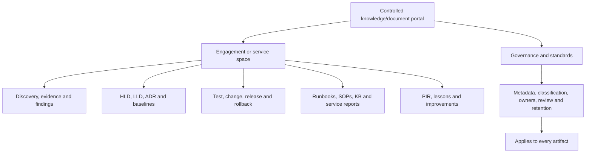

| Metadata field | Why it matters | Example |
|---|---|---|
| Title and unique ID | Stable reference across systems | `NORTH-ADR-007` |
| Purpose/audience | Prevents misuse | “Decision record for identity used by workflow” |
| Owner/approver | Assigns maintenance and authority | Service owner / security approver |
| Version/status | Separates draft, approved, superseded, retired | `v1.2 Approved` |
| Effective/review date | Exposes staleness | Effective 2026-09-01; review quarterly |
| Classification | Controls access and handling | Internal confidential |
| Scope/environment | Prevents applying test guidance to production | Fictional test environment only |
| Related records | Preserves traceability | Risk, ADR, PR, test, change, incident IDs |
| Source/currency | Shows product basis | Microsoft Learn URL checked date |
| Retention/disposition | Avoids permanent clutter or premature deletion | Per approved records schedule |

### 🔍 Plain-English deep-dive: one source of truth is an ownership rule

“Single source of truth” does not mean one giant document or one technical database. It means each fact has an authoritative owner/location and other views reference or derive from it. A dashboard may summarize a risk register; an HLD may link an ADR; a runbook may reference a configuration baseline. When copies are necessary for continuity, label their version, synchronization method, expiry, and conflict rule.

## 4. Version, owner, review, approval, and retirement

Every controlled artifact needs lifecycle. A draft author is not automatically the accountable owner. Review roles depend on impact: technical peer, security, privacy, legal, records, accessibility, operations, business owner, and change authority may be needed.

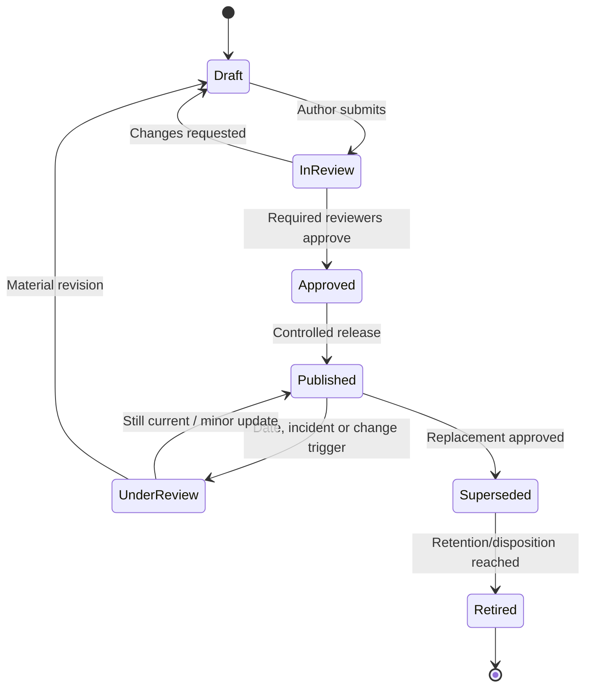

| Trigger | Review action |
|---|---|
| Scheduled review date | Verify behavior, links, ownership, permissions, and relevance |
| Product/service change | Re-test change-sensitive claims and procedures |
| Incident or near miss | Correct ambiguity, unsafe step, missing evidence, or escalation |
| Role/access change | Validate permissions and least privilege |
| Automation release | Update inputs, outputs, failure, rollback, and operations |
| Regulatory/policy update | Obtain authorized specialist review |
| Owner departure | Reassign accountability before knowledge is orphaned |

“Last modified” is not the same as approved version. Keep a visible change summary and avoid silent edits to evidence or decisions.

## 5. Distinguish the major artifact types

| Artifact | Primary question | Core output | It is not |
|---|---|---|---|
| Finding | What condition did we observe against what criterion? | Evidence-backed condition and implication | An untested opinion |
| Risk record | What uncertain event could affect an objective, and how is it treated? | Likelihood/impact, owner, treatment, residual decision | A technical bug list only |
| HLD | What major architecture and controls will meet requirements? | Components, boundaries, flows, decisions, qualities | Exact implementation command list |
| LLD | How will the approved design be implemented? | Detailed settings, interfaces, identities, errors, operations | A vendor brochure |
| ADR | Why was one significant option chosen? | Context, options, decision, consequences | A replacement for full design |
| Configuration baseline | What approved state should exist? | Versioned settings/objects/owners/exceptions | A live export without interpretation |
| Test plan | How will requirements and risks be verified? | Cases, data, environment, expected results, evidence | “Test it works” |
| Runbook | How does an operator respond to a trigger or outcome? | Decision/action/evidence/recovery/escalation flow | General policy prose |
| SOP | What standard repeatable process is followed? | Roles, sequence, controls, records | Incident-specific diagnosis only |
| KB article | How can a defined audience solve/understand a known issue? | Symptoms, scope, safe steps, result, escalation | Internal secret or unsupported workaround |
| PIR | What happened, how did response perform, and what improves? | Timeline, impact, lessons, owned actions | Blame report or RCA alone |

The artifact set should link rather than duplicate. A finding can create a risk; the risk can create a design requirement; an ADR records the chosen design option; the LLD and baseline implement it; the test plan verifies it; the runbook operates it; a PIR may later improve all of them.

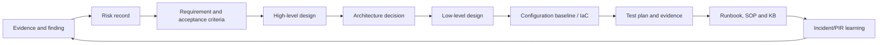

## 6. Finding and risk templates

A defensible finding separates **criterion**, **condition**, **evidence**, **scope**, **cause/contributor where known**, **impact**, **recommendation**, **owner response**, and **limitations**. Do not imply certainty beyond the sample.

| Finding field | Example for fictional Northstar |
|---|---|
| ID/title | `F-04: Workflow uses expiring client secret without owned renewal` |
| Criterion | Approved identity standard and current Microsoft guidance |
| Condition | One fictional production-design workflow specifies a client secret |
| Evidence | Design section, synthetic config record, interview; no live tenant evidence |
| Scope | One paper workflow; other automations not assessed |
| Risk/impact | Expiry could stop access-review routing; secret exposure could enable misuse |
| Recommendation | Prefer managed identity where supported; otherwise certificate/secret lifecycle with least privilege and alerts |
| Priority basis | Business impact, exploitability/exposure, detection, recovery and dependency |
| Owner/due/validation | Fictional platform owner, target date, design and expiry-monitor test |
| Limitation | Paper assessment; implementation/licensing/support must be validated |

| Risk field | Meaning |
|---|---|
| Cause/event/consequence | “Because X, event Y may occur, causing Z” |
| Affected objective/assets | Business/security outcome at risk |
| Inherent likelihood/impact | Before planned controls, using defined scales |
| Existing controls/evidence | What actually operates and how known |
| Treatment | Avoid, reduce, transfer/share, or accept through authority |
| Actions | Specific owner, date, dependency, expected outcome, test |
| Residual risk | Remaining exposure after validated treatment |
| Decision authority | Person/forum authorized to accept or fund |

### 🔍 Plain-English deep-dive: a recommendation is not a control until it operates

Writing “use least privilege” does not reduce risk. A treatment becomes credible when a named owner implements a specific permission model, tests required and denied actions, monitors assignment/use, documents exceptions, and supplies evidence. Even then, residual risk remains. Reports should distinguish proposed, approved, implemented, tested, operating, and effective states.

## 7. HLD and LLD templates

An **HLD** explains the architecture at decision level. An **LLD** translates it into implementable detail. Depth varies by organization, but the distinction should be explicit.

| HLD section | Content |
|---|---|
| Purpose and scope | Outcomes, users, systems, environments, inclusions/exclusions |
| Requirements | Functional, security, privacy, reliability, accessibility, operations |
| Current/target context | Existing constraints and target state |
| Architecture | Major components, trust/data/admin flows and boundaries |
| Identity/access | Human/workload identities, roles, least privilege, emergency access |
| Data | Classification, sources, fields, location, retention, minimization |
| Integrations/dependencies | APIs, connectors, network, suppliers, failure behavior |
| Quality attributes | Availability, resilience, performance, scale, maintainability |
| Operations | Monitoring, support, change, backup/recovery, ownership |
| Risks/assumptions/decisions | Open items, options, ADR links, residual risk |
| Migration/test/rollback | Delivery approach and acceptance at high level |

| LLD section | Content |
|---|---|
| Component inventory | Exact logical names, type, environment, owner, IDs/placeholders |
| Configuration | Approved values, defaults, dependencies, exceptions |
| Interfaces/contracts | Endpoint, method, schema, authentication, version, limits |
| Workflow logic | Trigger, validation, branches, state, idempotency, outputs |
| Error handling | Timeout, retry, dead-letter, duplicate, partial failure, notification |
| Security/privacy | Permissions, identity, key/cert lifecycle, logging/redaction, retention |
| Deployment | Prerequisites, order, parameters, approvals, environment promotion |
| Test mapping | Requirement-to-test traceability and evidence |
| Rollback/recovery | Trigger, steps, state reconciliation, validation |
| Operations | Alerts, dashboards, runbooks, SLOs, ownership, cost/capacity |

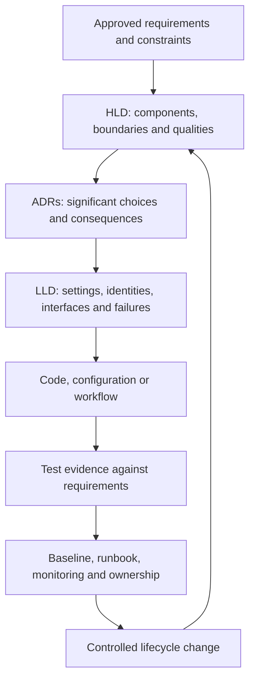

## 8. Architecture decision record template

An **ADR** preserves why a consequential decision was made when context was fresh.

| ADR field | Prompt |
|---|---|
| Title/status/date/owners | What decision, in what lifecycle state, and who owns it? |
| Context | What problem, requirement, constraint, uncertainty, and deadline exist? |
| Decision drivers | Security, privacy, operations, cost, skill, support, resilience, accessibility? |
| Options | Which realistic alternatives, including “do nothing,” were considered? |
| Evidence | Tests, official sources, assumptions, product/licensing validation? |
| Decision | What was chosen and by which authority? |
| Consequences | Positive, negative, tradeoffs, debt, new controls, residual risk? |
| Follow-up | Actions, tests, review triggers, superseding ADR? |

**Example decision:** Prefer a managed identity for an Azure-hosted Logic App calling Microsoft Graph where the required Graph permission and hosting/connector pattern are currently supported and approved. If unsupported, use an approved application identity with certificate-based credentials, restricted permissions, protected key storage, expiration monitoring, rotation, and documented exception. The ADR does not claim universal managed-identity support; implementation must verify the specific connector/action and permission model.

## 9. Configuration baseline template

A baseline describes approved intended state. It can be expressed as structured configuration/IaC plus human-readable rationale. Never publish live tenant identifiers, secrets, recovery codes, or exploitable exception details in a portfolio.

| Baseline field | Example content |
|---|---|
| Baseline ID/version | `NORTH-AUTO-BASE-1.0` |
| Scope/environment | Fictional test workflow |
| Object/setting | Workflow identity permission set |
| Desired value | Read-only synthetic directory permission placeholder |
| Rationale/control | Minimum access required for inventory report |
| Source | Approved requirement, ADR, Microsoft documentation |
| Owner/approver | Platform owner / security reviewer |
| Exception | ID, reason, expiry, compensating control, approver |
| Detection | Scheduled comparison or IaC plan |
| Remediation | Controlled PR/change; no blind overwrite |
| Evidence | Test and release IDs |

Drift detection should distinguish expected emergency change, unauthorized change, provider-managed change, deployment delay, and query error before remediation.

## 10. Test plan template

| Field | Required content |
|---|---|
| Objective/scope | Requirement, risk, component, environment, exclusions |
| Preconditions | Version, identity, configuration, dependencies, test readiness |
| Data | Synthetic/minimized data and cleanup |
| Case ID and priority | Stable traceability and risk basis |
| Steps/input | Reproducible action and parameters |
| Expected result | Observable output, state, log, denied behavior, timing |
| Actual result/evidence | Timestamp, version, screenshot/log/reference, redaction |
| Pass/fail/block | Defined criteria, defect/link, retest need |
| Negative/security test | Unauthorized input/action, tampering, secret exposure, injection |
| Failure/recovery test | Timeout, throttle, dependency loss, duplicate, rollback/replay |
| Approval | Tester and independent reviewer/owner where needed |

```mermaid
flowchart LR
    REQ[Requirement/risk] --> CASE[Test case and expected evidence]
    CASE --> UNIT[Unit/component checks]
    UNIT --> INT[Integration and contract checks]
    INT --> SEC[Security/privacy/negative checks]
    SEC --> FAIL[Failure, retry, rollback and recovery checks]
    FAIL --> UAT[Operational/business acceptance]
    UAT --> TRACE[Trace result to release and change]
```

## 11. Runbook, SOP, and KB templates

| Runbook field | Purpose |
|---|---|
| Trigger and outcome | Defines when to use it and success |
| Scope/exclusions | Prevents unsafe use on wrong system/population |
| Roles/authority | Request, approve, execute, validate, communicate, escalate |
| Preconditions/inputs | IDs, access, health, backups/baseline, evidence |
| Decision flow | Branches based on observable facts |
| Actions | Exact safe steps or references, expected result, logging |
| Safety/privacy | Stop conditions, redaction, restricted data, separation |
| Errors/escalation | Known failures, evidence package, contacts, cadence |
| Rollback/recovery | Trigger, action, state reconciliation, validation |
| Closure | Business/technical acceptance, record update, temporary-access removal |
| Ownership | Version, owner, reviewers, exercise and review date |

An **SOP** standardizes a recurring process such as reviewing an automation failure queue. It includes purpose, frequency, roles, inputs, procedure, controls, records, exceptions, quality checks, escalation, and review. A **KB** article serves a defined reader with symptoms/question, applies-to scope, cause only if confirmed, safe resolution, expected result, escalation, keywords, version, and feedback route. Do not expose privileged commands or internal topology in a public user KB.

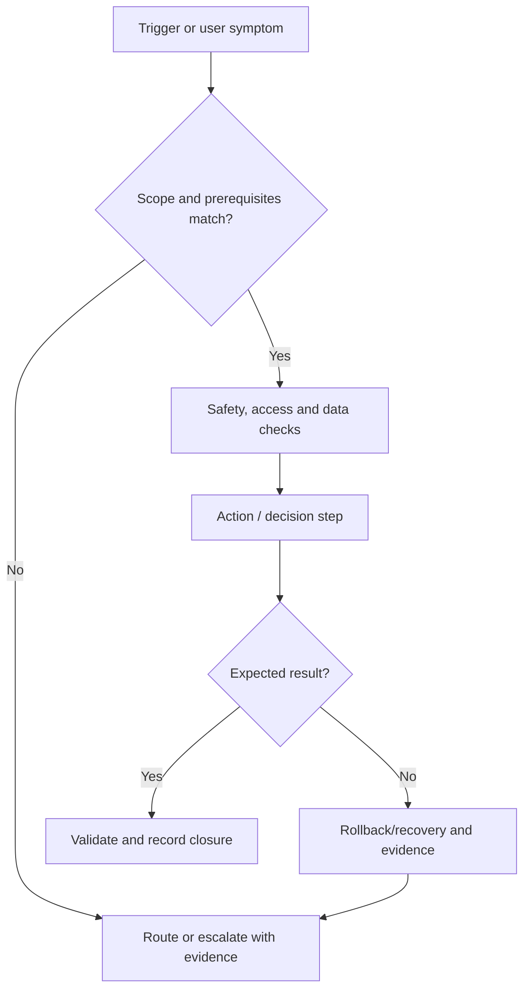

## 12. PIR template and distinction from RCA

A **post-incident review (PIR)** evaluates impact, detection, coordination, technical response, communication, continuity, recovery, and improvement. A **root-cause analysis (RCA)** focuses on causal mechanisms and contributing conditions. A PIR may link an RCA; neither should become a blame exercise.

| PIR section | Questions |
|---|---|
| Summary/impact | What happened, who/what was affected, for how long, with what business/security outcome? |
| Timeline | What normal/system/responder/vendor events occurred in normalized time? |
| Detection/response | What signaled the issue, how was it triaged, handed over, escalated, and communicated? |
| Cause/contributors | What is confirmed, suspected, unknown, and outside evidence? |
| What worked | Which protective, response, continuity, and recovery controls reduced harm? |
| What hindered | Which design, process, tool, access, supplier, documentation, or human-system conditions increased harm? |
| Actions | Outcome, owner, date, dependency, test, evidence and closure authority |
| Learning | Runbook/design/test/training/monitoring/baseline changes and exercise update |

## 13. Diagrams as evidence and communication

Choose a diagram by question. Include title, purpose, scope, legend, boundaries, direction, classification, owner, version, source, assumptions, and accessible text description.

| Diagram | Best question | Required care |
|---|---|---|
| Context | What is inside/outside and who interacts? | Show scope and external dependencies |
| Component | Which major systems and responsibilities exist? | Do not imply physical topology without evidence |
| Data flow | What data moves, where, why, and under which trust boundary? | Label classification, storage, encryption and retention |
| Sequence | In what order do identities/services call each other? | Label authentication, errors, retries, async behavior |
| Deployment/environment | Where is each component hosted/promoted? | Separate dev/test/prod and region/account boundaries |
| Decision flow | What observable condition determines action? | Include stop, escalation and rollback paths |
| Timeline | What happened over time? | Normalize clocks and cite source |

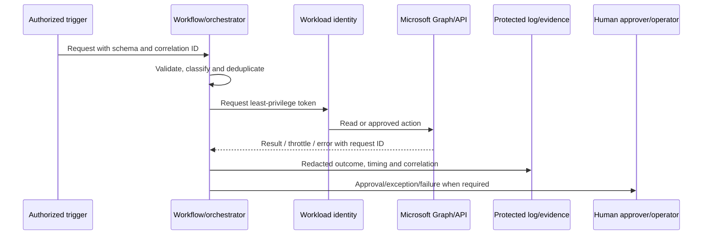

Text around the diagram must explain it. Screen-reader users should not need the visual alone to understand the decision or flow.

## 14. Evidence, citations, screenshots, and redaction

Evidence should be relevant, authentic enough for purpose, timestamped, scoped, reproducible where possible, protected, and linked to the claim. Cite authoritative sources for product behavior and record access/check date for change-sensitive material.

| Evidence type | Capture | Redact/protect |
|---|---|---|
| Portal screenshot | Tenant/environment context, UTC time, selected scope, version/state | Names, domains, object IDs, email, content, tokens, sensitive policy detail |
| Query result | Query text, workspace/table, time range/timezone, row limits, schema, result hash/reference | Personal data, device/user identifiers, secrets, unnecessary raw events |
| API response | Endpoint/version, sanitized request, status, request/correlation ID, time | Authorization header, tokens, full payload, sensitive IDs |
| Test result | Build/config version, case, input class, expected/actual, reviewer | Real customer data or credentials |
| Interview statement | Role, date, question/topic, confirmation status | Personal opinion presented as fact; unnecessary identity |
| Official documentation | Title, URL, publisher, checked date, relevant limitation | Outdated snippets without context |

### 🔍 Plain-English deep-dive: redaction must survive the whole evidence chain

Cropping a screenshot may not remove hidden document metadata, OCR text, image layers, filenames, browser history, or copied clipboard content. Logs may repeat a secret in an error field. Use approved redaction tools and repositories, minimize before capture, inspect the final exported artifact, and test links/permissions as the intended audience. Never paste sensitive evidence into an AI prompt unless the service, configuration, purpose, and authorization explicitly permit it.

## 15. Executive versus technical reporting

The facts must be consistent; the emphasis changes.

| Element | Executive view | Technical view |
|---|---|---|
| Opening | Outcome, impact, trend and decision | Scope, architecture, evidence and status |
| Risk | Business objective, likelihood/impact and residual exposure | Threat/failure path, control gap and assumptions |
| Status | Milestone, confidence, dependency and forecast | Task, owner, environment, defect, build/config, evidence |
| Options | Cost/risk/time/benefit and recommendation | Technical tradeoffs, compatibility, failure and operations |
| Metrics | Few decision-relevant trends with caveats | Detailed definitions, distributions and diagnostic dimensions |
| Ask | Funding, risk acceptance, owner, priority, escalation | Access, technical decision, evidence, reviewer, change window |
| Appendix | Key limitations and source links | Full test/query/configuration and traceability |

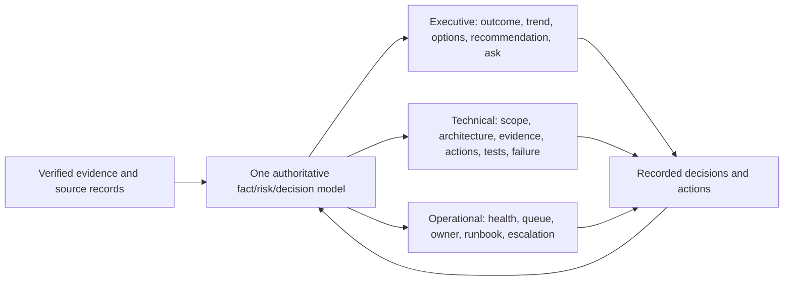

Avoid writing “technical details removed” when the executive needs one technical constraint to understand the risk. Explain the constraint plainly and link the detailed appendix.

## 16. Status, RAG, metrics, decisions, and asks

**RAG** uses red, amber, and green as status signals. Color alone is inaccessible and subjective, so always pair it with words, definitions, trend, evidence, owner, and action.

| Status | Example definition | Required narrative |
|---|---|---|
| Green — on plan | Milestone forecast within approved tolerance; no unowned critical dependency | Evidence, next milestone, remaining risk |
| Amber — at risk | Forecast or quality may miss tolerance without intervention | Cause, impact, recovery action, owner, decision date |
| Red — off plan/blocked | Milestone/outcome outside tolerance or critical blocker active | Impact, containment, options, recommendation, ask |
| Grey — not assessed | Evidence unavailable or work not started | Reason, owner and date to assess |

| Reporting object | Minimum fields |
|---|---|
| Metric | Name, purpose, formula, source, period, scope, target, trend, caveat, owner |
| Decision | Question, options, evidence, recommendation, authority, due date, consequence |
| Ask | Named person/forum, requested action, rationale, deadline, effect if delayed |
| Dependency | Provider/owner, deliverable, due date, status, impact, escalation |
| Issue | Current fact, impact, owner, action, target resolution, linked evidence |
| Risk | Future uncertainty, likelihood/impact, treatment, residual status, authority |

Do not call an issue a risk to soften reporting. Do not mark green because tasks completed if the control outcome is untested.

## 17. Stakeholder storytelling

Use a simple **O-E-I-O-A** story:

1. **Outcome:** What business or security outcome matters?
2. **Evidence:** What verified facts and trend describe the current state?
3. **Implication:** Why does it matter, including uncertainty and affected stakeholders?
4. **Options:** What feasible choices, tradeoffs, dependencies, and residual risks exist?
5. **Ask/action:** What recommendation, owner, decision, and date are required?

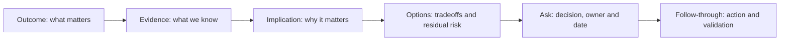

**Example:** “Northstar needs approved access-review reports available each morning. Two of six fictional workflows use credentials with no documented renewal owner. That creates a preventable service and credential risk. Options are managed identity where supported, certificate-based application identity with governed lifecycle, or retaining the secret with stronger rotation. I recommend validating managed-identity support in test this sprint; the platform owner must approve the identity pattern by September 15. Success is a least-privilege permission test, expiry/failure alert, and recovery exercise.”

## 18. Accessibility and inclusive documentation

Accessibility is a quality requirement, not cosmetic polish.

| Area | Practice |
|---|---|
| Structure | One clear H1, ordered headings, descriptive titles, logical reading order |
| Links | Descriptive link text rather than “click here” |
| Images/diagrams | Alt text or equivalent description; do not encode meaning only in image |
| Color | Pair RAG/color with text, icon/shape, and definition; sufficient contrast |
| Tables | Header row, simple structure, no merged-cell puzzle, summary for complex table |
| Language | Plain language, define acronyms, short paragraphs, active voice where useful |
| Media | Captions/transcripts and keyboard-accessible controls |
| Files | Tagged/accessible export, meaningful filename, language and title metadata |
| Meetings/reports | Provide material early and support alternate formats/accommodations |

Test the published format, not only the editable source. Accessibility checks do not replace user feedback.

## 19. Automation from zero: purpose and boundaries

Automation executes repeatable work through code or workflow. Good automation improves consistency, speed, evidence, scale, and human focus. It also repeats mistakes at machine speed, so automate a well-understood, authorized process with bounded blast radius.

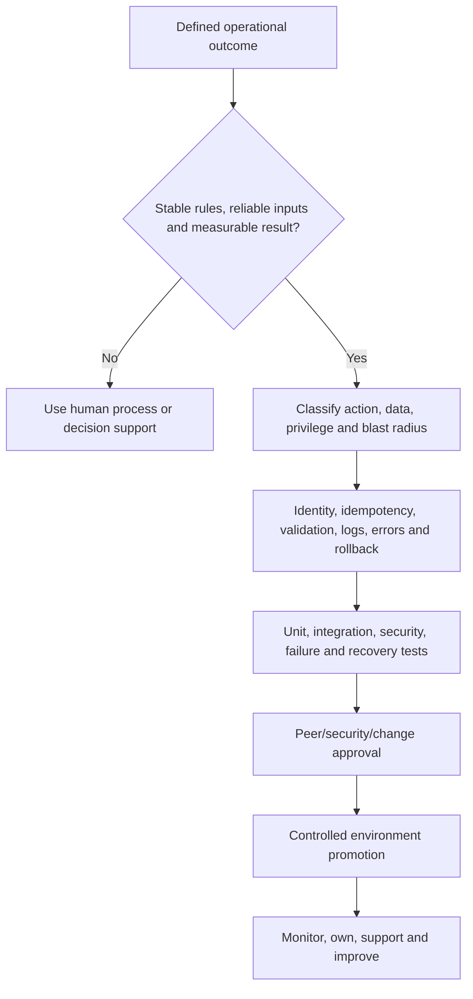

| Good candidate | Poor candidate without redesign |
|---|---|
| Read-only inventory with stable API/schema | Ambiguous judgment requiring context and empathy |
| Deterministic validation against approved baseline | Emergency high-impact response with no approval/rollback |
| Ticket enrichment from trusted structured sources | Process with unreliable free-text inputs and no owner |
| Reminder/escalation based on approved due dates | Mass privilege change before scope and tests are mature |
| Evidence packaging with redaction rules | Copying sensitive raw evidence to broad collaboration tools |

## 20. Automation roles, inputs, flow, outputs, and ownership

| Design element | Required questions |
|---|---|
| Trigger | Schedule, event, request, threshold, or human command? Can it duplicate? |
| Inputs | Schema, source trust, classification, validation, defaults, missing/malicious input? |
| Identity | Which human/workload identity, tenant/environment, permission, credential lifecycle? |
| Logic/state | Deterministic rules, state store, idempotency key, concurrency, ordering? |
| Action | Read/write, blast radius, approval, throttling, transactional boundary? |
| Outputs | Data, ticket, notification, change, evidence, downstream contract? |
| Errors | Retryable versus permanent, timeout, partial result, dead-letter, operator action? |
| Recovery | Rollback, replay, compensation, reconciliation, disable switch? |
| Operations | Owner, on-call, dashboard, alert, runbook, cost/capacity, review? |
| Retirement | Replacement, data/identity cleanup, artifact retention, dependency removal? |

The service owner owns the outcome; a technical owner maintains code/workflow; a security/data owner governs permission and data; an operator handles failures; a change authority controls release; and a business owner accepts functional outcome and residual risk. Small teams may combine roles, but decisions remain visible.

## 21. Idempotency, concurrency, and state

An operation is **idempotent** when repeating the same intended request produces the same desired state rather than duplicate side effects. “Set group description to X” can be idempotent; “append X” may duplicate it. A workflow often needs a stable request ID, current-state check, optimistic concurrency/version, processed-event store, and reconciliation.

```mermaid
sequenceDiagram
    participant S as Source/event
    participant W as Workflow
    participant D as State/dedup store
    participant A as Target API
    S->>W: Event with stable ID and desired state
    W->>W: Validate schema and authorization
    W->>D: Has event/desired state been completed?
    D-->>W: No / current version
    W->>A: Read current state and version
    A-->>W: State plus ETag/version
    W->>A: Conditional approved update
    A-->>W: Success or conflict/request ID
    W->>D: Record outcome and evidence
    S->>W: Duplicate event
    W->>D: Completed?
    D-->>W: Yes; return prior result without repeat action
```

### 🔍 Plain-English deep-dive: “retry” can create a second incident

If a network timeout occurs after the target accepted a request but before the workflow received the response, a blind retry may create a duplicate account, invitation, ticket, or permission. Use idempotency keys where supported, read current state, conditional updates such as ETags where available, and reconciliation. Classify errors: a timeout may be retryable; invalid permission is permanent until changed; a throttle requires honoring the server's guidance. Never retry every error immediately.

## 22. Least privilege and automation identity

Prefer a dedicated workload identity over a person's account. Choose the narrowest permission, resource scope, environment, and duration that supports the tested requirement. Avoid delegated permissions for unattended workflows unless the design truly requires a signed-in user and governance supports it.

| Identity option | Appropriate pattern | Key boundary |
|---|---|---|
| Managed identity | Azure resource obtains tokens without application credential management, where target/API and hosting pattern support it | Support and Graph permission assignment vary; validate current guidance |
| Application/service principal with certificate | Unattended app when managed identity is unavailable/inappropriate | Protect private key, rotate, monitor, restrict permissions |
| Application with client secret | Limited cases where approved and lifecycle is controlled | Higher secret leakage/expiry risk; never hard-code |
| Delegated user identity | Interactive user-authorized action | User context, consent, MFA/CA/session and offboarding matter |
| Power Platform connection reference | Environment-aware connector binding | Connection owner, credential, sharing, DLP and deployment governance matter |

Permissions are capabilities, not just configuration. Document why each is needed, allowed and denied tests, admin-consent authority, assignment evidence, review/expiry, use monitoring, and revocation.

## 23. Secrets, certificates, and managed identity

Never store credentials in source code, workflow descriptions, screenshots, test data, pipeline logs, issue trackers, or AI prompts. Use an approved secret/key store and access path. Prefer no stored credential when managed identity is supported and suitable.

| Control | Secret | Certificate/private key | Managed identity |
|---|---|---|---|
| Storage | Approved vault, never repository | Protected key store/HSM as required | Platform-managed credential material |
| Rotation | Short lifetime and automated/owned rotation | Overlap, expiry monitor, rollover test | Platform handles credential rotation; permissions still governed |
| Exposure response | Revoke/rotate, investigate use | Revoke/replace cert/key and investigate | Disable/restrict identity and review token/use evidence |
| Portability | Broad API support | Broad app-auth support | Tied to supported hosting/resource pattern |
| Operational risk | Leakage and expiry | Key custody and expiry | Accidental broad role/permission still possible |

Certificate authentication is not automatically secure if private keys are exported broadly, expiry is unmonitored, or permissions are excessive. Managed identity removes secret handling, not authorization governance.

## 24. Validation, dry-run, approval, and blast-radius limits

A **dry-run** or “what-if” mode calculates intended changes without applying them. It must use the same selection and validation logic as execution, identify exact targets, show before/after or planned action, and avoid sensitive output.

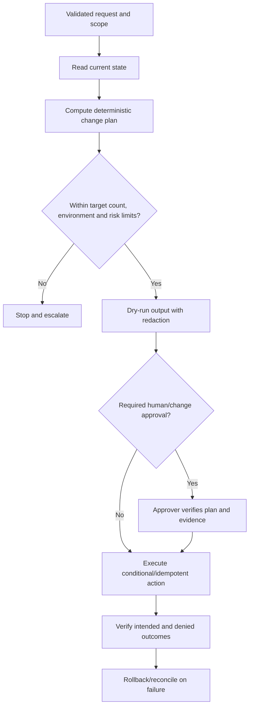

| Guardrail | Example |
|---|---|
| Environment assertion | Refuse write unless explicit environment ID matches approved parameter |
| Target cap | Stop if more than the approved number of objects are selected |
| Allowlist | Operate only on approved synthetic group/site scope |
| Separation of duties | Author cannot alone approve a high-impact production release |
| Time-bound approval | Plan hash and approval expire if inputs/state change |
| Kill/disable switch | Authorized operator can pause new work without corrupting in-flight state |
| Canary | Apply to a small representative ring before broader release |
| Postcondition | Query target and verify both desired and forbidden effects |

## 25. Logging, errors, privacy, and evidence

Logs should allow operation and investigation without becoming a secret or personal-data dump. Use timestamps, environment, code/workflow version, correlation/request ID, action class, target pseudonym/reference, duration, result, retry count, and sanitized error. Protect integrity, access, retention, and export.

| Log | Include | Exclude/minimize |
|---|---|---|
| Execution | Version, run ID, trigger class, start/end, result | Raw token, secret, full request body |
| API | Endpoint class/version, status, request ID, latency | Authorization header and unnecessary payload |
| Decision | Rule/version, input category, plan/action, approver ID under policy | Sensitive free text or hidden AI chain-of-thought |
| Change | Target reference, before/after safe fields, change/PR IDs | Broad configuration dump without need |
| Error | Error class, stage, retryability, sanitized details | Personal content and stack secret values |
| Audit | Identity, permission/action, time, outcome, protected evidence link | Publicly readable operational details |

Privacy design includes purpose, lawful/authorized basis, data minimization, classification, access, locality, retention, data-subject considerations where applicable, third parties, and deletion. Bring qualified privacy/legal specialists into real decisions.

## 26. Retry, timeout, rate limit, and circuit breaker

APIs fail transiently and permanently. Respect Microsoft Graph and connector throttling guidance, including `Retry-After` when supplied. Use bounded exponential backoff with jitter for appropriate transient failures, maximum attempts/time, and dead-letter/operator handling. Do not retry authentication/authorization or invalid-input failures until the cause changes.

| Condition | Typical treatment | Safety note |
|---|---|---|
| HTTP 429 throttle | Honor `Retry-After`; reduce concurrency/work | Do not create retry storm |
| HTTP 5xx/transient dependency | Bounded backoff with jitter if operation is safe/idempotent | Check uncertain commit state |
| Timeout | Determine whether target may have completed; reconcile | Blind retry may duplicate action |
| HTTP 400 invalid request | Fail permanently; validate schema/logic | Retrying wastes quota and hides defect |
| HTTP 401/403 | Stop; inspect identity, token audience, permission, policy | Never broaden permission automatically |
| HTTP 404 | Distinguish expected absence, wrong scope, replication, deleted object | Do not recreate blindly |
| Partial batch | Record item-level results; retry only safe failed subset | Preserve original correlation and ordering |

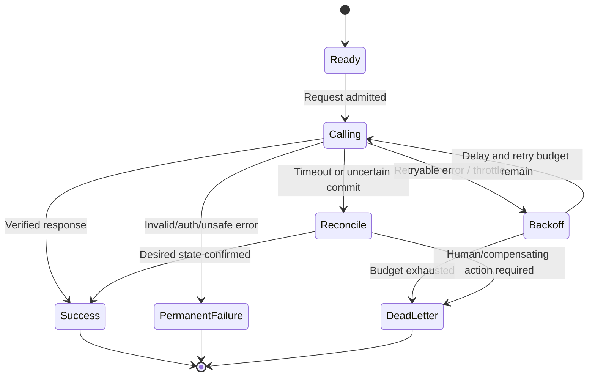

A **circuit breaker** pauses calls after repeated dependency failures, allowing recovery and preventing overload. It needs alerting, safe queue behavior, half-open testing, and operator ownership.

## 27. Rollback, compensation, replay, and reconciliation

Rollback restores prior state when technically and logically possible. Distributed workflows may need a **compensating action**, such as revoking an access grant after a downstream ticket failed. Compensation is a new controlled action, not time travel.

| Failure shape | Recovery pattern | Evidence |
|---|---|---|
| Deployment defect before data change | Roll back release/config | Version and health restored |
| Reversible setting update | Conditional restore of approved prior baseline | Before/after, authority, post-test |
| External side effect occurred | Compensating action | Original/compensation IDs and outcome |
| Queued work delayed | Replay idempotently after dependency recovery | Deduplication and order/reconciliation |
| Partial batch | Item-level retry/compensation | Complete success/failure ledger |
| Destructive irreversible action | Restore from tested source if available; incident/risk handling | Recovery limitations and owner acceptance |

Rollback can fail because schema/data migrated forward, secrets rotated, external messages sent, or users acted on output. Test recovery, not just deployment.

## 28. PowerShell use and boundaries

PowerShell is useful for Microsoft administration, inventory, validation, repeatable configuration, and operational tooling. Use supported modules/current authentication, parameter validation, `-WhatIf` where cmdlets correctly implement it, explicit scopes, noninteractive identity for unattended jobs, structured output, robust errors, logs, tests, code signing where required, and version pinning/governance.

| Appropriate use | Boundary/control |
|---|---|
| Read-only inventory and evidence collection | Minimize permissions/output and protect evidence |
| Configuration comparison | Do not overwrite drift until cause/exception reviewed |
| Approved repeatable change | Advanced function, validation, target cap, WhatIf/confirm, change/rollback |
| Incident data packaging | Preserve timestamps/source; redact secrets/personal data |
| Scheduled job | Dedicated identity, module version, monitoring, retry and owner |

Avoid parsing display text when structured objects/APIs exist. Do not embed credentials, suppress every error, install modules from untrusted sources, or run downloaded scripts blindly. A sample command should be clearly read-only or pseudocode and use synthetic placeholders.

## 29. Microsoft Graph use and boundaries

Microsoft Graph exposes APIs for many Microsoft cloud resources. Design around endpoint/API version, delegated versus application permissions, consent, resource-specific scope where available, pagination, delta queries/change notifications where appropriate, throttling, batching limits, eventual consistency, schema changes, national cloud differences, and audit.

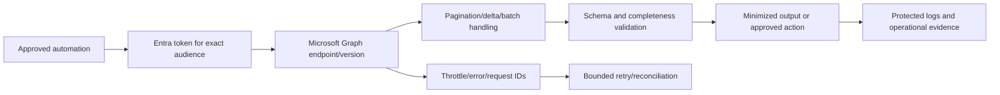

Do not assume Graph covers every admin-center feature or that beta endpoints are suitable for production. Beta APIs can change and generally require explicit risk evaluation. Test least privilege by proving required actions succeed and forbidden actions fail.

## 30. KQL use and boundaries

Kusto Query Language (KQL) is a read-oriented query language used across services such as Microsoft Sentinel/Log Analytics and Defender hunting experiences, with product-specific schemas and capabilities. KQL can filter, parse, summarize, join, and visualize telemetry; it does not prove that missing events never occurred.

| Quality concern | Practice |
|---|---|
| Time | State UTC/time range and ingestion versus event time |
| Scope | Name workspace/tenant/table and filters |
| Schema | Verify table/column/product context and changes |
| Performance | Filter early, select needed fields, bound joins/time, inspect query cost |
| Completeness | Check connector health, retention, latency, parsing, sampling and limits |
| Privacy | Project only needed fields; restrict/export/redact results |
| Reproducibility | Save query version, parameters, checked date and expected shape |
| Detection | Test false positives/negatives, entity mapping, schedule/lookback and suppression |

AI can draft KQL, but a human must verify syntax, tables, joins, time semantics, performance, coverage, and interpretation in the actual product context.

## 31. Logic Apps and Power Automate: use and boundaries

Both provide workflow automation and connectors. **Azure Logic Apps** is an Azure integration service often suited to enterprise/cloud workflows and is used by Microsoft Sentinel playbooks. **Power Automate** is a Power Platform service for business workflows. Their hosting, connectors, identity options, environment/tenant governance, networking, ALM, licensing, monitoring, and limits differ by workflow and product.

| Decision factor | Logic Apps question | Power Automate question |
|---|---|---|
| Primary operating context | Azure resource/Sentinel/integration architecture? | Business process/Power Platform environment? |
| Ownership | Azure platform/SecOps team and subscription governance? | Business/platform team, maker and environment ownership? |
| Identity | Managed identity/connection/API connection support for exact action? | Connection reference, service account/app identity and sharing model? |
| Network | Integration service environment/private endpoints/connector constraints? | Connector gateway/network/environment constraints? |
| ALM | ARM/Bicep/templates, parameters, deployment pipeline? | Solutions, connection references, environment variables, pipelines? |
| Data governance | Azure data/log controls and connector data flow? | DLP policy, tenant isolation, environment strategy, Dataverse/connector data? |
| Operations | Run history, metrics, alerts, retries, dead-letter pattern? | Flow analytics/run history, owner/co-owner, support and suspension? |
| Cost/limits | Trigger/action/hosting and connector cost/limits? | Licensing, request limits, connector and environment capacity? |

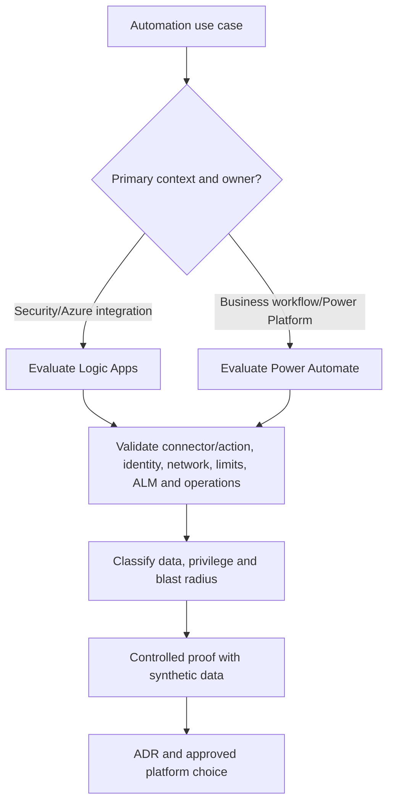

Your Power Platform background is a genuine strength in trigger/action thinking, approvals, owners, connectors, and user outcomes. The security-engineering bridge is to add workload identity, least privilege, environment separation, DLP, source control/solutions, idempotency, failure queues, and production operations.

## 32. Source control from zero

**Version control** records changes to text/code/configuration and supports collaboration and recovery. A repository should define ownership, access, branch strategy, protected branches, commit/PR conventions, required checks, secret scanning, dependencies, release tags, artifact retention, and archival.

```mermaid
flowchart LR
    ISSUE[Requirement, defect or change record] --> BRANCH[Short-lived branch]
    BRANCH --> COMMIT[Small traceable commits]
    COMMIT --> PR[Pull request with risk, tests and rollback]
    PR --> CHECKS[Lint, static, unit, security and policy checks]
    CHECKS --> REVIEW[Qualified peer/owner review]
    REVIEW --> MERGE[Protected merge]
    MERGE --> BUILD[Reproducible build/package]
    BUILD --> PROMOTE[Approved environment promotion]
    PROMOTE --> MON[Validate and monitor]
```

| PR field | Reviewer question |
|---|---|
| Purpose/link | Which requirement, risk, incident, or change does this satisfy? |
| Scope | What changes and explicitly does not change? |
| Security/privacy | Identity, permissions, data, secrets, logging, threat/failure impact? |
| Tests | Which automated/manual cases passed with evidence? |
| Deployment | Environment, parameter, order, dependency, migration? |
| Rollback/recovery | Trigger, prior artifact/state, compensation, validation? |
| Operations | Alerts, dashboards, runbook, owner, cost/capacity? |
| Documentation | HLD/LLD/ADR/baseline/runbook/change updated? |

Code review is not a ritual approval. Reviewers need context, time, relevant skill, manageable change size, and authority to request changes.

## 33. Branch and review strategy

Use a strategy appropriate to team and release needs. Short-lived branches with frequent integration reduce divergence. Protected main branches prevent direct unreviewed changes. Emergency fixes still require traceability, review appropriate to urgency, tests, controlled deployment, and retrospective completion.

| Control | Purpose | Failure to avoid |
|---|---|---|
| Required reviewer/owner | Qualified independent challenge | Self-approval for high-impact code |
| Status checks | Block merge on failed tests/scans | Manual bypass becoming routine |
| Signed commits/tags where required | Strengthen provenance | Treat signature as proof of secure code |
| Secret scanning/push protection | Detect accidental credential commit | Assuming deletion removes history/exposure |
| CODEOWNERS/equivalent | Route sensitive paths to accountable experts | Ownership file without active maintainers |
| Merge restrictions | Preserve clean protected branch and audit | Shared administrator account bypass |
| Small PRs | Improve review comprehension | Hidden broad generated change |

## 34. CI/CD, environments, and promotion

**Continuous integration (CI)** frequently integrates changes and runs automated checks. **Continuous delivery/deployment (CD)** packages and promotes approved changes; deployment to production may be manual or automated depending on risk and governance.

| Environment | Purpose | Data/identity rule |
|---|---|---|
| Local/development | Fast author feedback and unit tests | Synthetic data, no production credentials |
| Test/integration | Validate interfaces and failure behavior | Dedicated test identities/resources |
| Preproduction/staging | Production-like release and operational validation | Minimized/synthetic data; controlled parity |
| Production | Deliver approved outcome | Strong separation, least privilege, monitoring, change evidence |

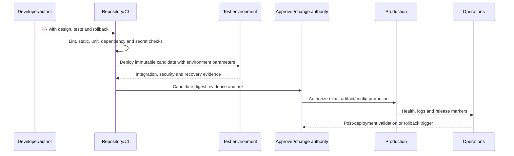

Keep environment configuration separate from code, protect approvals, and promote the same reviewed artifact rather than rebuilding unknown content for production.

## 35. Infrastructure as code concepts

**Infrastructure as code (IaC)** declares desired infrastructure/configuration in version-controlled files so changes can be reviewed, tested, deployed, and compared. Examples in Microsoft ecosystems include Bicep/ARM and Terraform, subject to organizational standards.

| IaC concern | Practice |
|---|---|
| Desired state | Declare resources/settings; avoid hidden portal-only changes |
| State | Protect state backend, access, locking, backup and sensitive values |
| Plan | Review intended create/update/delete and replacement behavior |
| Modules | Use versioned trusted modules with clear inputs/outputs |
| Parameters | Separate environment values and protect secrets |
| Drift | Detect and investigate before overwrite |
| Policy | Evaluate security/cost/location/tag rules in pipeline |
| Destroy | Protect critical resources; require explicit authorization |
| Import/migration | Understand existing state and ownership before adoption |

IaC does not make a bad design safe. A reviewed declaration can still deploy excessive privilege everywhere. Threat model, test, and govern the code and the platform action.

## 36. Linting, static analysis, and quality checks

**Linting** detects style, syntax, and common defects. **Static analysis** examines code without executing it for bug/security patterns. Formatters make layout consistent. Type/schema checks validate contracts. These reduce risk but do not prove correct behavior.

| Check | Finds | Does not prove |
|---|---|---|
| Formatter | Inconsistent layout | Correctness or security |
| Linter | Suspicious patterns, style, some errors | Runtime integration behavior |
| Type/schema check | Contract/type mismatch | Correct business rules or data quality |
| Static security scan | Known insecure code patterns | Absence of all vulnerabilities |
| Secret scan | Credential-like content | Secret was never exposed elsewhere |
| Dependency scan | Known vulnerable package/version | Exploitability or secure configuration |
| IaC policy scan | Misconfiguration patterns | Runtime control effectiveness |
| License policy check | Dependency licensing concern | Legal conclusion without authorized review |

Record tool/version/rules, triage false positives with owner and expiry, and never suppress findings silently.

## 37. Unit, integration, security, and operational tests

| Test layer | Question | Example |
|---|---|---|
| Unit | Does one function/rule behave for controlled inputs? | Retry classifier treats 400 as permanent and 429 as delayed |
| Contract/schema | Do producer and consumer agree? | Required event ID and environment fields validated |
| Integration | Do real test services authenticate and exchange expected data? | Test identity reads synthetic Graph objects |
| End-to-end | Does the whole user/operational outcome work? | Synthetic request creates one reviewed report |
| Negative | Are invalid or forbidden actions rejected? | Unauthorized scope and malformed payload fail safely |
| Security | Are permissions, secrets, injection, logging and tamper risks controlled? | Token absent from logs; denied operation remains denied |
| Performance/rate | Does behavior stay safe under expected/burst load? | Bounded concurrency respects throttle |
| Failure/recovery | What happens on timeout, partial failure, duplicate and dependency loss? | Event enters dead-letter and replay does not duplicate |
| Operational acceptance | Can support monitor, diagnose, disable, recover and hand over? | On-call uses runbook with synthetic failure |

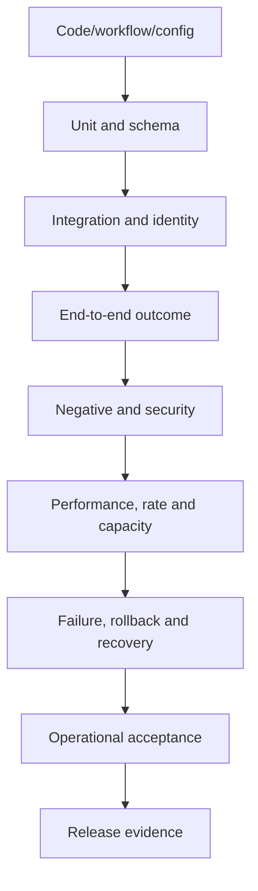

Test both what should happen and what must never happen. Use synthetic data and dedicated environments; clean up test artifacts.

## 38. Artifacts, signing, and software supply chain

A build artifact is the exact package, template, script, workflow export, container, or configuration promoted. Protect provenance: source commit, dependencies, toolchain, build identity, checks, digest/hash, signature/attestation where required, storage, access, retention, and deployment record.

| Supply-chain risk | Control |
|---|---|
| Typosquatted/untrusted module | Approved registry/repository, publisher/source review, allowlist |
| Dependency compromise | Lock/version, integrity, scanning, update process, minimal dependency |
| Build tampering | Isolated trusted runner, least privilege, ephemeral credentials, protected logs |
| Artifact replacement | Immutable storage, digest, signing/attestation and verification where required |
| Pipeline credential theft | Federated/managed identity where possible, short-lived credentials, restricted scopes |
| Malicious/compromised contributor | MFA, least privilege, branch protection, review and anomaly monitoring |
| Generated code hides dependency | Human review, dependency inventory and tests |
| Stale release remains deployable | Retirement/revocation, supported-version policy and inventory |

Signing strengthens identity and integrity evidence; it does not prove the signed content is safe or correct.

## 39. Change records and release traceability

Every operational release should link requirement/risk, design/ADR, source commit/PR, checks, artifact digest/version, test evidence, approvals, change window, implementation log, validation, rollback state, incident, and post-change review.

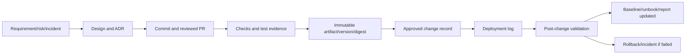

| Change field | Automation-specific content |
|---|---|
| Reason/outcome | Business/security purpose and expected measurable result |
| Scope | Workflow, environment, identity, permissions, data and targets |
| Risk/blast radius | Failure paths, target count, security/privacy/continuity impact |
| Plan | Exact artifact, parameters, order, executor and evidence |
| Test | Automated/manual results and residual limitations |
| Rollback/recovery | Trigger, prior artifact/state, compensation and reconciliation |
| Communication | Operators/users/stakeholders, timing and support route |
| Validation | Functional, denied, security, log, metric and business checks |

## 40. Code quality and maintainability

Quality code/workflows are correct enough, clear, secure, testable, observable, changeable, and operable for their risk. Prefer simple explicit logic over cleverness.

| Quality attribute | Practical question |
|---|---|
| Readability | Can a qualified peer explain behavior and risk? |
| Modularity | Are validation, API, policy and output concerns separated? |
| Naming | Do names reveal intent, environment and units? |
| Error handling | Are failures classified and surfaced rather than swallowed? |
| Configuration | Are environment values externalized and validated? |
| Testability | Can dependencies/state/time be controlled in tests? |
| Observability | Can operators trace run, version, request, outcome and failure? |
| Security/privacy | Are identity, permissions, input, output, logs and dependencies governed? |
| Documentation | Is purpose, contract, operation, failure and ownership current? |
| Simplicity | Is complexity justified by real requirements? |

Comments should explain non-obvious reasoning or constraints, not narrate each line. Remove dead code, temporary bypasses, unused permissions, stale feature flags, and abandoned workflows through controlled change.

## 41. AI-generated code and documentation

AI assistance can summarize, draft, translate, propose tests, explain code, or generate workflow/code fragments. It can also fabricate APIs, cite nonexistent behavior, expose sensitive prompts, reproduce insecure patterns, misunderstand tenant context, omit errors, and create convincing but wrong reports. The human remains accountable.

```mermaid
flowchart TD
    USE[Approved AI use case and data classification] --> PROMPT[Minimized prompt with no prohibited data]
    PROMPT --> OUTPUT[Generated draft/code/query]
    OUTPUT --> FACT[Verify claims, APIs, citations and currency]
    FACT --> REVIEW[Qualified human technical/security/privacy review]
    REVIEW --> TEST[Lint, static, unit, integration, negative and recovery tests]
    TEST --> TRACE[Record material use/provenance as policy requires]
    TRACE --> APPROVE[Normal PR/change/document approval]
    APPROVE --> MON[Monitor outcome and correct drift]
```

| Validation area | Questions |
|---|---|
| Authorization/data | Is this tool approved for the classification, tenant, code and purpose? |
| Facts/citations | Do official current sources support every material product claim? |
| Code behavior | Can a reviewer explain every line/action and dependency? |
| Security | Does it validate input, protect secrets, use least privilege, avoid injection and log safely? |
| Failure | What happens on timeout, throttle, duplicate, partial action and rollback? |
| Licensing/IP | Are use, attribution, dependency and policy obligations reviewed appropriately? |
| Bias/accessibility | Does content exclude users, use unexplained jargon, or rely on color/image only? |
| Hallucination | Are names, permissions, cmdlets, schemas and links real in the target version? |
| Ownership | Is a qualified human named for approval and operation? |

### 🔍 Plain-English deep-dive: fluent output is not evidence

An AI answer can sound more confident than an official document and still invent a Microsoft Graph endpoint or unsafe permission. Treat it like an enthusiastic draft from an unknown contributor. Verify against official documentation and the actual test environment, inspect every permission and side effect, run the full engineering checks, and retain human review. Never claim “Copilot approved it”; tools do not hold accountability.

## 42. Operational ownership after release

Automation is a service dependency. Define business/service owner, technical owner, support/on-call, identity and data owner, change/release owner, vendor boundary, cost owner, and retirement owner.

| Operational need | Minimum artifact/signal |
|---|---|
| Health | Trigger success, latency, queue, dependency/API and target outcome |
| Failure handling | Classified alerts, dead-letter queue, runbook, ownership and urgency |
| Access | Identity inventory, permissions, review, credential/cert lifecycle |
| Capacity/cost | Request/action volume, concurrency, throttling, license/consumption |
| Change | Release calendar, version markers, compatibility and rollback |
| Continuity | Manual alternative, safe duration, backlog and reconciliation |
| Support | Queue, severity, escalation, vendor cases and communication |
| Documentation | HLD/LLD/ADR/baseline/test/runbook/KB owner and review |
| Retirement | Disable trigger, revoke identity, archive artifacts, retain/delete data, notify users |

An automation with no human owner should not retain privileged production access.

## 43. Automation monitoring and alert quality

Monitor the outcome, not only “flow ran.” A workflow can return success while processing zero objects due to a bad filter, using stale data, or writing to the wrong environment.

| Signal | Example threshold/interpretation | Response |
|---|---|---|
| Trigger gap | Expected schedule/event absent | Check trigger, connection, source and suspension |
| Success rate | Drops from baseline by severity | Correlate dependency/change and item-level failures |
| Business count | Zero or abnormal volume | Validate source and selection logic before replay |
| Latency/queue age | Near business deadline | Scale/throttle review or continuity decision |
| Permission/auth | 401/403 or consent/cert expiry | Stop; do not auto-broaden access |
| Throttle | 429/retry budget rising | Reduce concurrency, honor guidance, capacity review |
| Duplicate/compensation | Idempotency conflict or reversals | Pause writes and reconcile |
| Log pipeline | Missing operational evidence | Raise monitoring-risk state and restrict high-risk change |

Alert messages should include environment, workflow/version, run/correlation ID, symptom, impact estimate, first occurrence, safe first action, evidence link, owner, escalation, and what not to do.

## 44. Automation failure response method

Use **S-A-F-E-R**:

1. **Stop/contain:** prevent additional harmful actions while preserving evidence and safe in-flight state.
2. **Assess:** exact symptom, business/security/privacy impact, scope, timeline, change, identity, dependency, queue, and uncertain commits.
3. **Find:** correlate run, source, API request, target audit, deployment, and vendor evidence; test falsifiable hypotheses.
4. **Execute recovery:** choose rollback, compensation, replay, manual continuity, or suspension through authority.
5. **Review:** validate outcome, reconcile every item, remove temporary access, communicate, perform PIR, and test corrective actions.

```mermaid
flowchart TD
    ALERT[Automation outcome/health alert] --> HARM{Continuing harmful or unknown writes?}
    HARM -->|Yes| PAUSE[Authorized pause/contain and preserve state]
    HARM -->|No| OBS[Observe without destructive change]
    PAUSE --> SCOPE[Scope runs, items, targets, identity and time]
    OBS --> SCOPE
    SCOPE --> CORR[Correlate source, workflow, API, target audit and release]
    CORR --> CHOOSE{Recovery pattern}
    CHOOSE --> ROLL[Rollback release/config]
    CHOOSE --> COMP[Compensate side effects]
    CHOOSE --> REPLAY[Idempotent replay]
    CHOOSE --> MAN[Controlled manual continuity]
    ROLL --> RECON[Item-level reconciliation and validation]
    COMP --> RECON
    REPLAY --> RECON
    MAN --> RECON
    RECON --> PIR[PIR, documents, tests and controls]
```

## 45. Failure scenario 1: duplicate access grants

**Fictional situation:** A Power Automate design receives duplicate approval events after a connector retry. The workflow creates two entitlement requests; one downstream action times out after possibly granting access.

| Step | Safe response | Design improvement |
|---|---|---|
| Contain | Pause new write actions while preserving queue | Authorized kill switch and safe in-flight state |
| Scope | List event IDs, request IDs, targets and uncertain runs | Stable correlation and item ledger |
| Verify | Query approved target state/audit; do not infer from timeout | Postcondition and reconciliation query |
| Correct | Revoke duplicate/excess grant through approved compensation | Idempotency key and conditional desired-state update |
| Replay | Process only unresolved items | Dedup store and item-level retry |
| Communicate | State affected population, security impact, actions, unknowns, next update | Template and escalation threshold |
| Learn | Test duplicate, timeout-after-commit and connector replay | Failure injection in test environment |

No real access is changed in the portfolio exercise.

## 46. Failure scenario 2: certificate expiry and silent reporting gap

**Fictional situation:** A scheduled PowerShell/Graph inventory stops authenticating after a certificate expires. The dashboard still shows the last successful data without a freshness warning, so leaders believe controls remain current.

**Response:** mark the report stale visibly; open incident/issue based on impact; preserve failed-run and authentication evidence without key material; identify owner and certificate lifecycle; use an approved replacement/rollover process; validate least privilege and successful/denied actions; backfill data only if source retention and API behavior permit; compare gaps; update dashboard freshness, expiry monitoring, ownership, runbook, test, and PIR. Do not broaden permissions or paste the private key into troubleshooting logs.

This scenario shows that reporting quality and automation reliability are one system: stale data presented as current is an integrity failure.

## 47. Failure scenario 3: throttling and retry storm

**Fictional situation:** A Graph inventory expands from 500 to 50,000 objects. Parallel workers receive 429 responses and retry immediately, increasing throttling and delaying a morning report.

```mermaid
sequenceDiagram
    participant W as Workflow workers
    participant G as Microsoft Graph
    participant Q as Durable queue/state
    participant O as Operator
    W->>G: Excess parallel requests
    G-->>W: 429 plus Retry-After/request IDs
    W->>Q: Preserve cursor/item state
    W->>W: Reduce concurrency and use bounded jittered delay
    W->>O: Alert impact, queue age and retry budget
    O->>O: Decide continuity or deadline communication
    W->>G: Resume within guidance
    G-->>W: Successful pages
    W->>Q: Checkpoint and reconcile completeness
```

The permanent fix may include delta queries, pagination, narrower fields, batching within supported limits, controlled concurrency, capacity expectations, or schedule redesign. Verify current Graph guidance; do not invent fixed universal limits.

## 48. Failure scenario 4: AI-generated KQL report is wrong

**Fictional situation:** Copilot drafts KQL that joins sign-in and device data on a display name, uses ingestion time as event time, and silently drops unmatched rows. The resulting report claims every risky sign-in came from a compliant device.

**Safe response:** stop report distribution; label prior output under review; preserve query/version/time/source; independently verify schema and join keys; use stable identifiers where valid; inspect unmatched populations and nulls; distinguish event and ingestion time; validate connector coverage/retention; peer review; test synthetic positive/negative cases; publish corrected findings and limitations; assess whether decisions were affected; update prompt, review checklist, query tests, and report approval. The incident is not “AI made a mistake”; human quality controls failed to detect an untrusted draft.

## 49. Failure scenario 5: wrong-environment deployment

**Fictional situation:** A workflow package intended for test references a production connection and sends synthetic notifications to real operational recipients.

| Control stage | Prevent/detect/respond |
|---|---|
| Design | Environment-specific connection references/variables and recipient allowlists |
| PR | Explicit environment/data/identity review |
| Pipeline | Protected production approval and environment assertion |
| Test | Verify target tenant/environment and notification sink |
| Runtime | Release marker, target cap, synthetic header and anomaly alert |
| Response | Pause sends, scope recipients/content, notify authorized owners, assess privacy/security |
| Recovery | Correct binding, validate, reconcile/communicate as approved |
| Learning | Add automated policy and negative deployment test |

## 50. Safe portfolio paper exercise: Northstar Documentation and Automation Quality Pack

Build only fictional artifacts for `northstar.example`. Use synthetic identities, placeholder object IDs, invented data, pseudocode, diagrams, and simulated test results. Do not connect to a real tenant, create an app registration, grant Graph permissions, import a flow, execute KQL against customer data, or publish internal evidence.

| Portfolio artifact | Required content | Quality test |
|---|---|---|
| Information architecture | Artifact classes, naming, metadata, owner, access, review, retirement | One authority per fact and clear navigation |
| Finding/risk pair | Criterion, condition, synthetic evidence, scope, treatment, residual decision | No unsupported production claim |
| HLD | Outcome, boundary, identity, data, integration, resilience, operations | Executive-readable with source links |
| LLD | Workflow logic, schemas, errors, permissions, logs, tests, deployment/recovery | Implementable in principle but no secrets/live IDs |
| ADR | Options for managed identity/certificate/secret with current-validation caveat | Tradeoffs and authority visible |
| Baseline | Desired settings, rationale, exception and drift response | Versioned and linked to tests |
| Test plan | Unit/integration/security/failure/recovery/OAT cases | Synthetic expected/actual evidence |
| Runbook/SOP/KB | Trigger/actions/recovery; recurring failure review; user-facing status | Audiences and restricted detail separated |
| Executive report | Outcome, RAG words, metrics, risks, options, recommendation and asks | Every claim traces to core record |
| Repository/release map | Branch, PR, checks, artifact, change, promotion, rollback | One trace from requirement to validation |
| AI validation record | Prompt classification, draft, fact/code review, tests, human owner | AI output never treated as evidence |
| PIR | One fictional failure timeline and corrective-action effectiveness test | System learning, no blame |

**Suggested fictional automation:** a read-only “access review freshness” report. Inputs are synthetic JSON objects representing review ID, owner, due date, state, and last update. Logic validates schema, rejects unknown environment, deduplicates by stable ID, calculates age, and creates a fictional report. No live Graph call is made. Add pseudocode for 429 handling, stale-data watermark, logging redaction, and dry-run. Simulate tests for duplicates, missing owner, throttle, expired certificate, wrong environment, and AI-generated query defect.

## 51. Portfolio delivery flow

```mermaid
flowchart LR
    DISC[Define fictional outcome and audience] --> DOC[Finding, risk, HLD and ADR]
    DOC --> DETAIL[LLD, baseline and runbook]
    DETAIL --> REPO[Repository, PR and change design]
    REPO --> TEST[Simulated quality/security/recovery tests]
    TEST --> REPORT[Executive and technical reports]
    REPORT --> DRILL[Paper automation failure exercise]
    DRILL --> PIR[PIR and corrective actions]
    PIR --> PRESENT[Ten-minute honest portfolio presentation]
```

In the presentation, state which elements come from direct experience and which are paper learning. Show how your real incident, handoff, documentation, business-review, Power Platform, and Copilot strengths informed the design, then state the production controls and specialist validation still required.

## 52. Quality review checklist by artifact

| Review lens | Document/report | Automation/code |
|---|---|---|
| Purpose | Audience and decision/action explicit | Outcome and trigger explicit |
| Correctness | Claims supported by evidence/source | Logic/API behavior tested |
| Scope | Environment/population/limitations visible | Tenant/resource/target cap asserted |
| Security | Sensitive design protected | Least privilege, input and dependency controls |
| Privacy | Minimized/redacted/retained appropriately | Data fields/logs/outputs minimized |
| Accessibility | Structure, text alternatives, non-color meaning | Operator/user interface and alerts accessible |
| Reliability | Version/review/continuity copy | Idempotency, retry, state, failure/recovery |
| Operations | Owner, review and feedback | Health, alert, runbook, on-call and retirement |
| Traceability | Risk/design/change/test links | Commit/PR/artifact/change/runtime links |
| Honesty | Fact/assessment/limitation separated | Lab/paper/production status explicit |

## 53. Method summary: D-O-C-U-M-E-N-T and A-U-T-O-M-A-T-E

Use **D-O-C-U-M-E-N-T** for artifacts:

1. **Decision/action:** define what the audience must decide or do.
2. **Owner and audience:** name accountability, reviewers, users, access, and classification.
3. **Content type:** choose finding, risk, HLD, LLD, ADR, baseline, test, runbook, SOP, KB, PIR, or report.
4. **Underlying evidence:** cite verified facts, diagrams, tests, sources, dates, and limitations.
5. **Message:** tell outcome → evidence → implication → options → ask.
6. **Engineering/accessibility review:** challenge technical, security, privacy, usability, and inclusive access.
7. **Number/version:** approve, publish, link, and protect the authoritative artifact.
8. **Trigger maintenance:** review on date, change, incident, feedback, or retirement.

Use **A-U-T-O-M-A-T-E** for automation:

1. **Aim:** define measurable outcome and whether automation is appropriate.
2. **Users/owners:** business, service, technical, identity/data, operations, change, and retirement roles.
3. **Trust boundaries:** inputs, data, environment, identity, permissions, dependencies, and supply chain.
4. **Outcome-safe logic:** validation, idempotency, concurrency, state, target limits, dry-run, approval.
5. **Monitor/errors:** redacted logs, correlation, timeout, rate limits, retry, dead-letter, alert.
6. **Assure:** source control, peer review, lint/static, unit/integration/security/failure/recovery tests.
7. **Transition:** immutable artifact, controlled promotion, change record, rollback/compensation and validation.
8. **Evolve:** operational ownership, metrics, incidents, PIR, dependency/credential updates, retirement.

## 54. JD Mapping: interview translation

| Your demonstrated evidence | Documentation/automation translation | Honest interview sentence |
|---|---|---|
| Critical-incident timelines and handoff | Runbooks, audit trail, status and operational ownership | “I write so the next owner can decide and act from verified context.” |
| RCA and fix validation | Findings, PIR, traceable tests and corrective actions | “I separate evidence, cause, recommendation and effectiveness proof.” |
| Reusable documentation/mentoring | Audience-aware KB/SOP and maintainability | “I reduce key-person dependency through tested, owned guidance.” |
| KPIs and business reviews | Executive narrative, metrics, decisions and asks | “I connect a defined metric and caveat to business impact and an owner decision.” |
| Power Automate/Power Apps | Workflow triggers, approvals, connectors and user outcome | “I add environment, identity, DLP, ALM, failure and support controls.” |
| Copilot/AI learning | Drafting and assisted analysis with human validation | “I treat generated content as untrusted until sourced, reviewed and tested.” |
| Product-group/vendor work | API/support boundaries and precise evidence | “I maintain end-to-end ownership while respecting platform boundaries.” |

## Official Source Anchors

Use current versions, target-cloud/product context, and access dates in real work.

1. Microsoft Writing Style Guide: <https://learn.microsoft.com/en-us/style-guide/welcome/>
2. Microsoft Learn contributor guide, *Markdown reference*: <https://learn.microsoft.com/en-us/contribute/content/markdown-reference>
3. Microsoft Accessibility: <https://www.microsoft.com/en-us/accessibility>
4. Microsoft Learn, *What is Microsoft Graph?*: <https://learn.microsoft.com/en-us/graph/overview>
5. Microsoft Graph, *Best practices*: <https://learn.microsoft.com/en-us/graph/best-practices-concept>
6. Microsoft Graph, *Throttling guidance*: <https://learn.microsoft.com/en-us/graph/throttling>
7. Microsoft Graph, *Permissions reference*: <https://learn.microsoft.com/en-us/graph/permissions-reference>
8. Microsoft identity platform, *Managed identities for Azure resources*: <https://learn.microsoft.com/en-us/entra/identity/managed-identities-azure-resources/overview>
9. Microsoft Learn, *Azure Key Vault basic concepts*: <https://learn.microsoft.com/en-us/azure/key-vault/general/basic-concepts>
10. Microsoft Learn, *Azure Logic Apps documentation*: <https://learn.microsoft.com/en-us/azure/logic-apps/>
11. Microsoft Learn, *Microsoft Sentinel automation rules and playbooks*: <https://learn.microsoft.com/en-us/azure/sentinel/automation/automation>
12. Microsoft Learn, *Power Automate documentation*: <https://learn.microsoft.com/en-us/power-automate/>
13. Microsoft Learn, *Power Platform environments overview*: <https://learn.microsoft.com/en-us/power-platform/admin/environments-overview>
14. Microsoft Learn, *Data policies in Power Platform*: <https://learn.microsoft.com/en-us/power-platform/admin/wp-data-loss-prevention>
15. Microsoft Learn, *Application lifecycle management with Microsoft Power Platform*: <https://learn.microsoft.com/en-us/power-platform/alm/>
16. Microsoft Learn, *Kusto Query Language overview*: <https://learn.microsoft.com/en-us/kusto/query/?view=microsoft-fabric>
17. Microsoft Learn, *PowerShell documentation*: <https://learn.microsoft.com/en-us/powershell/>
18. Microsoft Learn, *about_Functions_Advanced_Methods* and `SupportsShouldProcess`: <https://learn.microsoft.com/en-us/powershell/module/microsoft.powershell.core/about/about_functions_advanced_methods>
19. Microsoft Azure Well-Architected Framework, *Operational Excellence*: <https://learn.microsoft.com/en-us/azure/well-architected/operational-excellence/>
20. Microsoft Security Development Lifecycle: <https://www.microsoft.com/en-us/securityengineering/sdl>
21. Microsoft Learn, *What is Bicep?*: <https://learn.microsoft.com/en-us/azure/azure-resource-manager/bicep/overview>
22. Microsoft Learn, *Azure Pipelines documentation*: <https://learn.microsoft.com/en-us/azure/devops/pipelines/?view=azure-devops>
23. Microsoft Learn, *GitHub Actions documentation*: <https://docs.github.com/en/actions>
24. GitHub Docs, *About protected branches*: <https://docs.github.com/en/repositories/configuring-branches-and-merges-in-your-repository/managing-protected-branches/about-protected-branches>
25. GitHub Docs, *About secret scanning*: <https://docs.github.com/en/code-security/secret-scanning/introduction/about-secret-scanning>
26. Microsoft Learn, *Responsible AI principles and approach*: <https://www.microsoft.com/en-us/ai/principles-and-approach>

## ⭐ Likely Interview Questions for This Section

### Q1. How do you decide which document to create?

**Model answer:** I start with audience and the decision or action they need. A finding records an evidence-backed condition against a criterion; a risk records uncertainty and treatment; an HLD explains components, boundaries and quality choices; an LLD specifies implementation and failure behavior; an ADR preserves why a significant option was selected; a baseline defines approved state; a test plan proves requirements; a runbook guides triggered operations; an SOP standardizes recurring process; a KB helps a defined reader; and a PIR learns from an incident. I link these artifacts rather than duplicate uncontrolled facts.

### Q2. What makes documentation trustworthy and maintainable?

**Model answer:** It has a clear purpose and audience; verified evidence, citations and limitations; consistent structure and diagrams; named owner, reviewers, approver, version, status, classification, effective/review date and retirement trigger; controlled access and redaction; accessible published format; stable links to risks, decisions, tests and changes; and feedback/use testing. I distinguish draft from approved and proposed from implemented, tested, operating and effective. An incident, product change or owner departure triggers review rather than waiting for an annual date.

### Q3. How do you report the same work to executives and engineers?

**Model answer:** I maintain one authoritative fact, risk and decision model, then tailor emphasis. Executives receive business outcome, impact, trend, options, recommendation, residual risk and a named ask. Engineers receive scope, architecture, identities, evidence, configuration, defects, tests, failure behavior and rollback. RAG always includes words, definitions, trend and action, not color alone. Metrics state formula, source, period, target and caveat. Both views agree on facts and link to the detailed evidence appropriate to their access.

### Q4. What are the essential safety properties of automation?

**Model answer:** A defined owner and measurable outcome; trusted validated inputs; dedicated least-privilege workload identity; no hard-coded secrets; environment and target assertions; deterministic/idempotent behavior; concurrency and state handling; dry-run and approval for risky writes; redacted structured logs and correlation IDs; classified errors, bounded retry and rate-limit handling; blast-radius caps; tested rollback, compensation, replay and reconciliation; source control, peer review and security tests; and operational monitoring, runbook, on-call and retirement. Automation should fail visibly and safely, not silently.

### Q5. How would you choose among PowerShell, Graph, KQL, Logic Apps, and Power Automate?

**Model answer:** I choose by outcome and operating context, not preference. PowerShell suits repeatable administration and tooling; Graph provides supported APIs across many Microsoft cloud resources; KQL analyzes telemetry in specific data products; Logic Apps suits Azure/SecOps integration and Sentinel playbooks; Power Automate suits governed business workflows in Power Platform. I validate exact API/connector/action, identity, permissions, environment, DLP/network, limits, ALM, licensing, monitoring, failure and ownership. Often they combine, but each boundary and source of truth stays explicit.

### Q6. How do source control and CI/CD reduce automation risk?

**Model answer:** A requirement or defect links to a short-lived branch and small commits; a pull request explains scope, identity/data/security impact, tests, deployment and rollback; qualified peers review it; protected branches require lint, static, secret, dependency, unit and policy checks; CI builds a reproducible versioned artifact; integration/security/recovery tests run in dedicated environments; an authorized change promotes that same artifact with environment parameters; and operations validates health and outcome. Every release traces through commit, PR, artifact digest, test, approval, change and runtime evidence.

### Q7. How do you use AI-generated code or documents safely?

**Model answer:** I first verify the AI service and data classification are approved and minimize the prompt. I treat output as an untrusted draft: verify every Microsoft API, permission, schema, citation and change-sensitive fact against official sources and the target environment; inspect every line and dependency; run lint, static, unit, integration, negative, security, rate, failure and recovery tests; check accessibility and bias; record material provenance as policy requires; and use normal peer, security, document and change approvals. A named qualified human remains accountable.

### Q8. How does your background support this documentation and automation role?

**Model answer:** My direct experience includes critical Microsoft 365 incident timelines and handoffs, RCA and fix validation, reusable technical guidance, knowledge transfer and mentoring, KPI/business-review communication, and Power Platform/Copilot work supported by my record. Those skills translate to audience-aware documents, decision reporting and workflow design. I have built a fictional paper portfolio for HLD/LLD/ADR, secure automation, source control, tests, release, rollback and failure response. I would not claim production Graph, KQL, Logic Apps, CI/CD or IaC ownership without evidence; I would validate and deliver under approved engineering and client governance.

## 🧠 30-Second Memory Hooks

- **Write for a decision or action.** Audience and purpose choose the artifact.
- **One fact, one authority, many views.** Link instead of uncontrolled copy.
- **Finding observes; risk predicts; design chooses; baseline states; test proves; runbook operates; PIR learns.**
- **HLD is the city map; LLD is the construction drawing; ADR is why this route won.**
- **Proposed is not effective.** Track approved, implemented, tested, operating, and measured.
- **RAG needs words.** Definition, trend, evidence, owner and recovery action.
- **Tell O-E-I-O-A.** Outcome, evidence, implication, options, ask.
- **Automation repeats both discipline and mistakes.** Bound identity, input, target, state and failure.
- **Idempotency prevents duplicate side effects.** Reconcile uncertain commits before retry.
- **Managed identity removes stored credentials, not excessive permissions.**
- **429 means slow down.** Honor guidance; bounded backoff, jitter and checkpoints.
- **Rollback is not always rewind.** Compensate, replay and reconcile distributed effects.
- **Review the exact artifact you deploy.** Commit → PR → tests → digest → change → validation.
- **Signing proves provenance, not correctness.**
- **Fluent AI output is not evidence.** Verify, review, test, and own it.
- **No owner means no privileged automation.** Operate, support, rotate and retire.

## Completion Checklist

- [ ] I can define documentation as an operational control tied to an audience decision or action.
- [ ] I can design information architecture with artifact classes, hierarchy, naming, metadata, location, access, search and relationships.
- [ ] I can assign purpose, audience, owner, approver, version, status, classification, effective/review date, source and retirement.
- [ ] I can distinguish finding, risk, HLD, LLD, ADR, baseline, test plan, runbook, SOP, KB and PIR.
- [ ] I can use the supplied templates and link artifacts into one traceable lifecycle.
- [ ] I can separate criterion, condition, evidence, scope, risk, recommendation, owner response and limitation.
- [ ] I can express risk as cause/event/consequence with treatment, owner, test and residual decision.
- [ ] I can document HLD outcomes/boundaries and LLD implementation/error/operations detail.
- [ ] I can write an ADR with context, drivers, options, evidence, decision and consequences.
- [ ] I can define an approved configuration baseline and investigate drift before remediation.
- [ ] I can build positive, negative, security, failure, recovery and operational test cases with synthetic evidence.
- [ ] I can write executable runbooks, recurring SOPs, audience-safe KB articles and evidence-based PIRs.
- [ ] I can choose context, component, data-flow, sequence, deployment, decision and timeline diagrams appropriately.
- [ ] I can capture evidence and citations with scope, timestamps, currency, reproducibility, access and redaction.
- [ ] I can produce consistent executive, technical and operational views from one fact model.
- [ ] I can report RAG with text definitions, metrics with caveats, and explicit decisions/asks.
- [ ] I can tell a stakeholder story using outcome, evidence, implication, options and ask.
- [ ] I can apply heading, link, diagram, color, table, language, media and export accessibility practices.
- [ ] I can decide whether a process is suitable for automation based on rule stability, input quality, risk and measurability.
- [ ] I can define automation trigger, inputs, identity, logic/state, action, outputs, errors, recovery, operations and retirement.
- [ ] I can explain idempotency, concurrency, uncertain commit, deduplication, conditional update and reconciliation.
- [ ] I can design a dedicated least-privilege workload identity and distinguish managed identity, certificate, secret and delegated context.
- [ ] I can protect secrets/certificates and explain that managed identity does not remove permission governance.
- [ ] I can design dry-run, approval, environment assertion, target cap, canary, kill switch and postcondition controls.
- [ ] I can design useful redacted logs and privacy-aware evidence without tokens, secrets or unnecessary personal data.
- [ ] I can classify errors and handle timeout, 429, 5xx, 400, 401/403, 404 and partial batches safely.
- [ ] I can compare rollback, compensation, idempotent replay, manual continuity and reconciliation.
- [ ] I can explain appropriate uses and boundaries for PowerShell, Microsoft Graph, KQL, Logic Apps and Power Automate.
- [ ] I can connect your Power Platform experience to identity, DLP, ALM, failure and operational controls.
- [ ] I can use source control, short-lived branches, protected main, PR review, checks and traceable commits.
- [ ] I can explain CI/CD environment separation, same-artifact promotion, approval and post-deployment validation.
- [ ] I can explain IaC desired state, plan, modules, state, drift, policy and destroy protection.
- [ ] I can distinguish formatting, lint, type/schema, static, secret, dependency and IaC policy checks.
- [ ] I can design unit, contract, integration, end-to-end, negative, security, performance, failure/recovery and OAT coverage.
- [ ] I can explain artifact provenance, digest, signing/attestation limits and software supply-chain controls.
- [ ] I can trace requirement/risk through design, PR, test, artifact, change, deployment, validation and baseline.
- [ ] I can assess code quality across readability, modularity, errors, configuration, tests, observability, security and simplicity.
- [ ] I can validate AI-generated code/docs for authorization, facts, citations, behavior, security, failure, licensing, accessibility and ownership.
- [ ] I can define operational owners, health, queue, support, continuity, credential lifecycle, cost and retirement.
- [ ] I can monitor the automation's business outcome and data freshness, not merely successful execution.
- [ ] I can use S-A-F-E-R to contain, assess, investigate, recover and learn from an automation failure.
- [ ] I can reason through duplicate grant, certificate expiry, retry storm, AI/KQL, and wrong-environment scenarios.
- [ ] I can build and present the Northstar paper portfolio without a real tenant, credentials, customer data or production claim.
- [ ] I can answer Q1–Q8 aloud in approximately 60–90 seconds each with public practices and honest boundaries.

*Next suggested section:* [Part 64](Part-64-lab-safe-microsoft-security-environment.md)