# Part 64 — LAB 0 - Build a Safe Microsoft Security Practice Environment

> **Section goal:** Build a safe, isolated, affordable, and auditable practice environment for the identity, endpoint, Microsoft 365 workload, Purview, Defender, and Sentinel labs that follow. By the end, you should be able to select a lawful environment option without assuming a free trial exists; define fictional personas, identities, groups, devices, apps, domains, subscriptions, licenses, synthetic data, least-privilege roles, emergency access, cost controls, evidence handling, change control, reset, and cleanup; complete either a hands-on path in an authorized test tenant or an equally rigorous design-and-simulation path requiring no paid tenant; and pass a readiness gate without touching an employer, client, school, family, or production environment.

This lab maps directly to the role's expectations for secure Microsoft 365 and Azure architecture, Zero Trust, licensing awareness, technical assessments, implementation planning, least privilege, troubleshooting, documentation, change control, stakeholder communication, operational readiness, cost governance, and ethical consulting delivery. It uses your demonstrated Microsoft 365 support, escalation, documentation, incident, and stakeholder strengths while keeping new tenant administration and security-platform work clearly labeled as lab or design practice.

> **Currency, availability, licensing, and cost warning (August 24, 2026):** Microsoft product names, portals, trial programs, developer programs, eligibility rules, evaluation downloads, service limits, license bundles, credits, prices, preview status, and terms change by date, market, tenant, cloud, and organization. Verify current Microsoft Learn, Microsoft 365 Developer Program, Evaluation Center, Azure pricing, Product Terms, licensing documentation, and the exact offer screen before registration or deployment. This guide does **not** promise that a Microsoft 365 developer sandbox, trial, Azure free offer, Windows evaluation image, promotional credit, or particular license is available to you. Never start a paid resource merely because a tutorial mentions a credit. Record the billing scope, price model, owner, expiry, deletion method, and budget alert before use.

> **Ethical and safety boundary:** Use only an environment you personally own or are explicitly authorized to administer for learning. Never use an employer, customer, school, nonprofit, family, or production tenant/subscription; never copy real configuration, credentials, logs, email, files, personal data, customer evidence, proprietary names, or internal screenshots. Never invite real outsiders, send test mail to real people, scan or attack systems, bypass controls, register a domain you do not own, misrepresent eligibility, violate offer terms, or use evaluation software beyond its license. Use fictional names and synthetic data. Stop when ownership, consent, licensing, cost, or impact is uncertain.

## JD Mapping

| Role expectation | Capability developed in this lab | Safe evidence produced |
|---|---|---|
| Assess a Microsoft security environment | Inventory identity, endpoint, workload, data, logging, role, license, cost, and dependency state | Redacted fictional baseline inventory |
| Design secure Microsoft 365 architecture | Draw control/data flows, trust boundaries, personas, administrative tiers, and later-lab dependencies | Architecture and identity diagrams |
| Apply Zero Trust and least privilege | Separate admin and standard identities, define role scopes, pilot groups, emergency access, and PIM assumptions | Role/license matrix and access design |
| Plan implementations and migrations | Use naming, tagging, dependency, change, test, rollback, and cleanup records | Change record and readiness gate |
| Troubleshoot safely | Establish timestamps, evidence journal, known-good baselines, and redaction rules | Sanitized evidence index |
| Communicate with stakeholders | Record assumptions, costs, risks, options, decisions, and honest environment limitations | One-page lab charter and executive summary |
| Operate and hand over controls | Define owners, review dates, budgets, credentials, reset, cleanup, and retirement | Operations and cleanup checklist |

## Candidate honesty note

You can connect this lab to direct strengths in Microsoft 365 support, critical-incident discipline, evidence gathering, stakeholder updates, technical documentation, root-cause analysis, fix validation, handoff, and safe customer guidance. You should not imply that creating fictional objects in a personal test tenant equals designing or administering a regulated enterprise, or that a paper design equals hands-on configuration.

Use this interview wording:

> “I built an isolated Microsoft security practice environment and documented its ownership, licensing, personas, least-privilege design, synthetic data, change controls, evidence handling, costs, reset, and cleanup. Where a valid licensed test tenant was available, I performed only authorized low-risk configuration and preserved redacted evidence. Where a feature or license was unavailable, I completed a design-and-simulation path with expected results and validation criteria. I do not present the lab as production experience, and I would revalidate licensing, product behavior, client requirements, and change authority before real deployment.”

---

## 1. Lab charter: safety is the first deliverable

A **lab charter** is a short agreement with yourself that defines purpose, ownership, scope, allowed actions, forbidden actions, cost ceiling, data rules, evidence rules, and cleanup. **Analogy:** A science laboratory posts which chemicals and equipment are allowed before an experiment begins. **Why it matters:** A cloud portal can make a dangerous or billable action look like one harmless click.

| Charter field | Required entry | Safe example |
|---|---|---|
| Purpose | Learning outcome, not vague exploration | “Practice identity and M365 security design with synthetic personas” |
| Ownership | Who lawfully controls tenant, subscription, domain, and devices | “Personally created learning tenant; no organizational affiliation” |
| Environment | Exact tenant/subscription/device boundary | Fictional tenant ID placeholder or redacted suffix |
| Allowed actions | Low-risk activities authorized in this guide | Create fictional users/groups; report-only policies; paper designs |
| Forbidden actions | Bright-line exclusions | Production use, real people, real DNS changes, attack simulation |
| Data class | What data may exist | Synthetic, non-sensitive, invented content only |
| Cost ceiling | Maximum authorized spend and stop point | `$0 design mode` or a personally approved small amount |
| Evidence | Capture, storage, redaction, publication rules | Sanitized journal; no tokens, IDs, domains, emails, or keys |
| Cleanup | Trigger, owner, method, verification | Delete paid resources and test objects; verify billing stopped |
| Expiry | Date the lab is reviewed or retired | A fixed review date within the learning period |

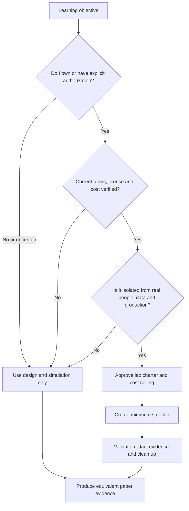

The decision to use design mode is a valid engineering decision, not a failed lab. It proves that you recognized an ownership, availability, licensing, cost, or safety constraint and selected a controlled alternative.

### 🔍 Plain-English deep-dive: tenant, subscription, license, and domain are different

- **Microsoft Entra tenant** — *a dedicated identity and policy boundary containing directory objects.* **Analogy:** A company's badge office and identity register. **Why it matters:** Users, groups, applications, roles, and Conditional Access are tenant-scoped.
- **Microsoft 365 tenant** — *the commercial service organization associated with Entra identity and licensed workloads such as Exchange, Teams, SharePoint, and OneDrive.* **Analogy:** Offices that trust the same badge office. **Why it matters:** A tenant can exist while a particular workload or premium feature is not licensed.
- **Azure subscription** — *a billing, quota, and resource-management container associated with an Entra tenant.* **Analogy:** A purchase account used to order cloud infrastructure. **Why it matters:** It can create consumption charges even when the directory itself is free.
- **License** — *a service entitlement assigned under current commercial terms.* **Analogy:** A ticket granting access to particular rooms and features. **Why it matters:** A visible portal control does not prove that use is licensed or available.
- **Domain** — *a DNS name used for addresses and service records.* **Analogy:** The street address printed on correspondence. **Why it matters:** The initial tenant domain differs from a custom domain, and changing real DNS can disrupt mail and identity.

## 2. Choose one of two complete lab paths

Every section in Parts 64–67 has two routes. Do not mix them invisibly; label each artifact with the route actually completed.

| Dimension | Path A: authorized hands-on | Path B: design and simulation |
|---|---|---|
| Tenant | Personally owned or explicitly authorized isolated test tenant | No tenant required |
| Paid license | Only if currently valid, understood, and personally approved | None |
| Azure subscription | Optional; use only when required and cost-controlled | None |
| Device | Lawful test device/VM with supported license/evaluation | Diagrammed fictional device records |
| Actions | Minimum low-risk create/read/update/delete tasks | Mock portal records, matrices, test scripts, expected logs |
| Evidence | Redacted screenshots/exports plus journal | Synthetic screenshots/tables plus assumptions |
| Completion standard | Effective behavior tested and cleaned up | Design is internally consistent and tests are executable in principle |
| Honest label | “Hands-on in an isolated test tenant on date X” | “Design/simulation; not configured in a live tenant” |

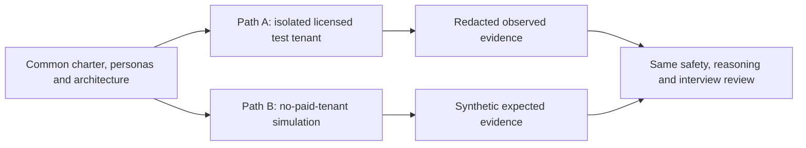

**Path A completion rule:** If a required feature is absent, do not acquire a paid license automatically or enable a broad trial. Mark the step `Not available`, cite the observed license boundary without exposing tenant details, and execute Path B for that control.

**Path B completion rule:** Do more than copy product documentation. Specify objects, assignments, prerequisites, control intent, steps, expected state, positive/negative/boundary/failure tests, evidence sources, rollback, cleanup, and assumptions.

## 3. Environment options and current-availability checks

The right option is the smallest lawful environment that supports the learning objective.

| Option | Possible value | Required verification and caveat | Default safety choice |
|---|---|---|---|
| Microsoft 365 Developer Program sandbox | May provide development-focused Microsoft 365 capabilities to eligible members | Verify current eligibility, qualification, renewal, permitted use, included services, expiry, and data-loss behavior; availability is never promised | Use only if legitimately eligible and currently offered |
| Microsoft 365 commercial trial | May expose selected workloads/features temporarily | Verify market availability, card/payment conversion, term, seat count, cancellation, data retention, and permitted evaluation use | Prefer design mode unless costs/expiry are fully controlled |
| Existing personally owned test tenant | Stable identity namespace | Verify it contains no family/business/real data and is not production | Use only after isolation review |
| Azure free offer/credit | May offset eligible Azure consumption | Verify current offer eligibility, included services, credit expiry, spending limit, conversion behavior, quotas, and billing account | No Azure resources unless a later objective requires them |
| Azure pay-as-you-go | Broad resource availability | Charges begin by meter; deletion dependencies, egress, retention, marketplace, and support can cost money | Avoid for Parts 64–67 unless explicitly justified |
| Windows evaluation/local VM | Can provide disposable endpoint for enrollment experiments | Verify current Evaluation Center availability, edition, activation/expiry, virtualization rights, host capacity, supported build, and lawful use | Prefer a disposable VM; never repurpose a work-managed device |
| Design-only mode | Full architecture, policy, test, evidence, and rollback simulation | No tenant behavior is observed; label assumptions and expected results | Always valid and costs nothing |

### Availability verification record

Before registering, record the URL, page title, access date, offer name, eligibility statement, included services, duration, renewal/conversion behavior, payment requirement, cancellation method, data deletion behavior, and any unresolved question. Do not write “Microsoft always gives a free E5 tenant.” A correct statement is: “I checked the current offer on the recorded date; availability and eligibility can change, so the design does not depend on it.”

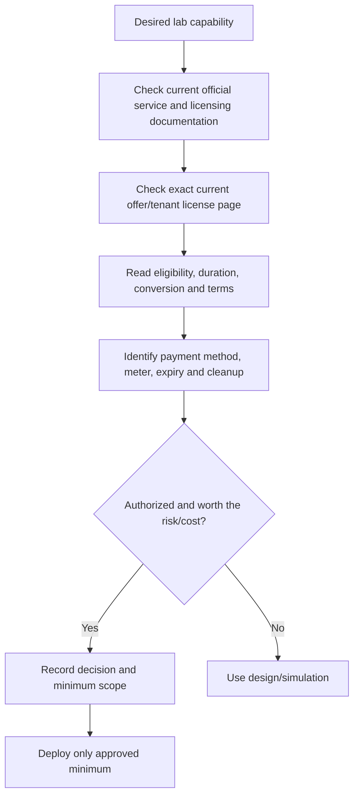

## 4. Reference architecture and trust boundaries

The lab is a tiny fictional enterprise named **Northstar Research**. `northstar.example` is documentation-only; `.example` is reserved for examples and is not configured as a live custom domain. If a hands-on tenant exists, use its assigned initial domain privately and redact it from public evidence. Do not purchase a domain merely for this lab.

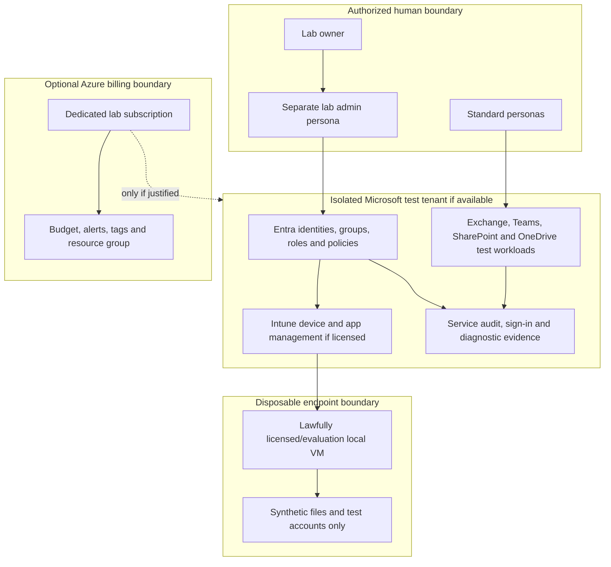

| Boundary | Allowed | Forbidden |
|---|---|---|
| Human | Lab owner and fictional personas controlled by that owner | Real guests, coworkers, customers, family, public users |
| Identity | Unique lab-only credentials and recovery process | Reused work passwords, shared admin sessions, production accounts |
| Device | Disposable personal test VM/device | Employer-managed, customer, school, primary personal device with sensitive data |
| Data | Synthetic files, messages, labels, events | Personal, health, financial, customer, company, credential, or regulated data |
| Network | Normal outbound access required by documented services | Scanning, interception, bypass, unauthorized tunneling or attack traffic |
| Domain/DNS | Assigned tenant domain or paper-only `.example` | Real organizational DNS or a domain without verified ownership |
| Evidence | Sanitized excerpts needed to prove tests | Tokens, cookies, keys, tenant IDs, full UPNs, message contents, device serials |
| Azure | Approved minimum resources under a dedicated cost boundary | Open-ended deployment, expensive SKUs, orphan resources, unknown marketplace terms |

## 5. Test personas and separation of duties

A **persona** is a fictional role with predictable access and test behavior. **Analogy:** Crash-test dummies represent different passengers without putting real people at risk. **Why it matters:** One all-powerful account cannot prove that ordinary users, guests, administrators, or responders receive the correct experience.

| Persona | Fictional account label | Intended privilege/use | Must not become |
|---|---|---|---|
| Lab owner | `owner` record outside public evidence | Billing/tenant ownership and recovery | Everyday browsing identity |
| Cloud admin | `adm-cloud-01` | Time-bounded setup requiring approved admin role | Permanent all-purpose Global Administrator |
| Identity admin | `adm-id-01` | Identity policy design and tests | Workload/data reader without need |
| Standard user | `usr-alex-01` | Normal licensed employee behavior | Administrator |
| Pilot user | `usr-priya-01` | Early policy assignment and recovery tests | Whole-tenant proxy |
| Help desk | `ops-helpdesk-01` | Simulated support tasks with scoped role | Privileged role admin |
| SOC analyst | `ops-soc-01` | Read-only evidence and incident reasoning if licensed | Policy/config administrator |
| Guest | `gst-casey-01` or paper-only object | External collaboration boundary | Invitation sent to a real outsider |
| High-risk user | `usr-risk-01` | Simulated risk response; no real attack | Real compromised identity |
| Emergency access | `adm-emergency-01/02` design | Recovery from normal control failure | Daily admin or convenient exclusion |

Create no more accounts than the license and test plan require. When license seats are scarce, keep unlicensed paper personas and assign a license temporarily only according to current terms and an approved test window. Never share one credential among people; a single learner may control fictional personas but should use separate browser profiles/private sessions and clearly labeled accounts.

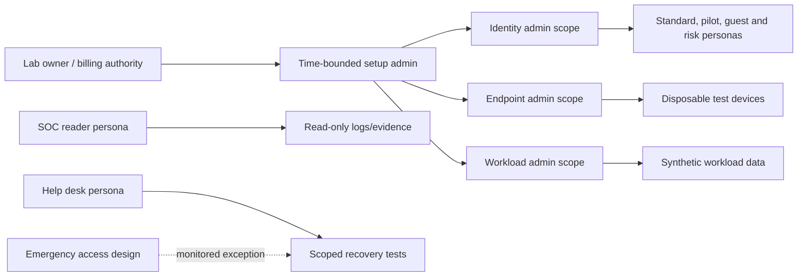

### 🔍 Plain-English deep-dive: emergency access is a resilience control, not a shortcut

An **emergency access account** is a tightly controlled identity intended to recover administrative access when normal authentication or policy dependencies fail. **Analogy:** A sealed emergency key in a monitored box, not a key left under the mat. Two cloud-only accounts are commonly considered to reduce correlated failure, but exact design must follow current Microsoft guidance and organizational risk decisions.

The design records owner, strong independent authentication, credential custody, exclusions only where required for survivability, monitoring, alerting, test cadence, use approval, post-use rotation, and incident review. It must not be synchronized from an on-premises source that could fail with it, used daily, assigned unnecessary workload licenses, left unmonitored, or published in portfolio evidence. Parts 65 and 62 cover operational detail. In design mode, create only a record and test script; do not create credentials.

## 6. Identity, group, administrative unit, and role plan

Use group-based targeting so a future policy can move from pilot to broader scope without editing each identity. An **administrative unit** is an Entra container used to scope supported administrative permissions to a subset of directory objects; it is not a security group, and its applicability/licensing must be verified. For this small lab it can remain a design exercise.

| Object type | Naming pattern | Example | Purpose |
|---|---|---|---|
| User | `lab-<persona>-<nn>` | `lab-user-01` | Synthetic identity |
| Admin | `lab-adm-<function>-<nn>` | `lab-adm-identity-01` | Separate privileged identity |
| Security group | `LAB-SG-<scope>-<ring>` | `LAB-SG-CA-PILOT` | Policy assignment |
| Microsoft 365 group/team | `LAB-M365-<purpose>` | `LAB-M365-PROJECT-ORION` | Collaboration test |
| Device group | `LAB-DG-<platform>-<ring>` | `LAB-DG-WIN-PILOT` | Endpoint targeting |
| Exclusion group | `LAB-SG-EXCL-<reason>` | `LAB-SG-EXCL-CA-EMERGENCY` | Governed exception, not convenience |
| Administrative unit | `LAB-AU-<scope>` | `LAB-AU-REGION-A` | Scoped admin design |
| App registration | `LAB-APP-<purpose>-<env>` | `LAB-APP-REPORT-DEV` | Paper-only unless required |
| Azure resource group | `rg-lab-<purpose>-<region>` | `rg-lab-evidence-eastus` | Cost/lifecycle boundary |
| Policy | `LAB-<platform>-<control>-<ring>-vNN` | `LAB-CA-ADMINS-MFA-PILOT-v01` | Intent and lifecycle |

| Group | Proposed members | Used by later lab | Guardrail |
|---|---|---|---|
| `LAB-SG-ALL-PILOT` | Pilot standard identities only | CA and workload pilots | Never use as emergency exclusion |
| `LAB-SG-ADMINS-PILOT` | Lab admin identities | Strong admin authentication | Test one admin at a time |
| `LAB-SG-INTUNE-USERS` | Licensed endpoint test user | Enrollment/app/compliance | License check first |
| `LAB-DG-WIN-PILOT` | Disposable Windows test device | Endpoint security | No work device |
| `LAB-SG-GUEST-PILOT` | Controlled paper or lab guest | Teams/SPO boundary | No real invitation |
| `LAB-SG-EXCL-CA-EMERGENCY` | Approved emergency identities only | CA survivability | Alert on membership change |

## 7. Least privilege, PIM, and license map

**Least privilege** gives an identity only the permissions needed, for only the needed scope and time. **Analogy:** A hotel key opens one room until checkout, not every room forever. **Why it matters:** A lab is where privilege discipline should become habit.

| Task | Preferred role concept | Duration | License/feature check | Evidence |
|---|---|---|---|---|
| View tenant/license state | Directory or service read-only role where supported | Standing only if justified | Role availability | Role assignment record |
| Create test users/groups | User/Groups Administrator or narrower supported role | Test window | Base directory behavior | Audit record and object list |
| Design authentication methods | Authentication Policy Administrator concept | Eligible/time-bound where PIM exists | Entra licensing and PIM | Activation/design record |
| Design Conditional Access | Conditional Access Administrator concept | Time-bound | Entra ID P1 commonly relevant; verify current terms | Report-only policy record |
| Intune policy work | Intune RBAC role scoped to lab groups | Test window | Intune entitlement | Assignment/scope record |
| Exchange settings | Exchange role group with minimum cmdlets/tasks | Test window | Workload/license | Change/evidence record |
| Teams settings | Teams admin role only when needed | Test window | Workload/license | Policy record |
| SharePoint settings | SharePoint admin role only when needed | Test window | Workload/license | Site/tenant record |
| Read security evidence | Security Reader concept | Read window | Product/license and data role | Query/screenshot journal |
| Azure cost cleanup | Resource-group/subscription role at minimum scope | Cleanup window | Azure subscription | Activity/billing verification |

**Privileged Identity Management (PIM)** can make supported role assignments eligible rather than permanently active and can require activation controls. Its availability and exact licensing must be checked. If unavailable, simulate the eligibility, approver, justification, MFA, duration, notification, access review, and audit design. Do not compensate by leaving Global Administrator active.

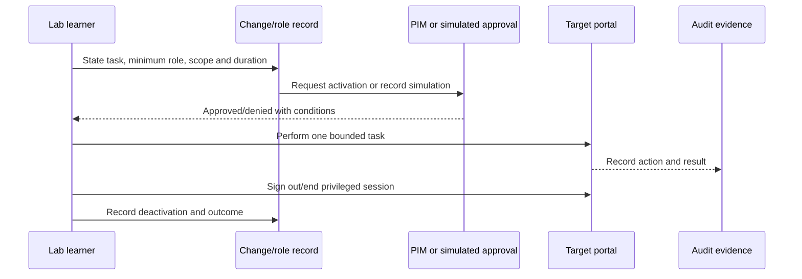

## 8. Synthetic data and fictional collaboration setup

Synthetic data is invented information with no connection to a real person or organization. Do not merely replace names in a real customer document; structure, IDs, incident details, and business facts can still identify the source.

| Data artifact | Safe synthetic content | Unsafe content |
|---|---|---|
| User profile | Fictional display name, department, manager | Real employee name, phone, address |
| Email | “Project Orion test message 001” | Real correspondence or copied headers |
| Document | Invented product notes and fake project budget | Customer file or internal template |
| Sensitive-data sample | Clearly fake patterns permitted by test plan and documentation | Real passport, card, tax, health, or identity number |
| Team/site | Fictional project and membership | Existing team/site name or membership |
| Device | Generic VM name and redacted identifiers | Serial number or employer asset data |
| Incident/log | Authored synthetic timestamp/event | Export from work tenant |
| Screenshot | Cropped/redacted lab-only view | Browser chrome with account, tenant, token, notifications |

Create a small data pack:

1. `Orion-Overview.docx` or a plain-text equivalent containing fictional public project text.
2. `Orion-Internal-Plan.docx` containing invented internal-only wording.
3. `Orion-Sharing-Test.txt` containing a unique harmless marker such as `NORTHSTAR-LAB-2026-001`.
4. A paper “restricted” file containing only the words `SYNTHETIC RESTRICTED TEST DATA`; do not include realistic secrets.
5. Three synthetic messages: benign internal, simulated external boundary, and blocked-action expectation.

### 🔍 Plain-English deep-dive: realistic testing does not require realistic personal data

A control test needs a reliable trigger and expected result, not a believable victim. **Analogy:** A fire drill uses an alarm and an evacuation route, not a real fire. For classification or DLP design, use Microsoft-provided test guidance where lawful, simple invented markers, or paper simulations. Never generate functioning payment-card numbers, government identifiers, malware, phishing lures, or real-looking legal/health records for a public portfolio. Evidence should prove policy reasoning without creating new sensitive material.

## 9. Hands-on setup path

Perform these steps only after the charter and availability checks pass. Portal labels may differ; use current Learn navigation rather than relying on memorized clicks.

### Phase A: establish ownership and baseline

1. Sign in through a dedicated browser profile using the lawful tenant owner account.
2. Record the tenant display label, country/region, initial domain suffix in redacted form, tenant type, creation source, and owner. Do not publish the tenant ID.
3. Inventory current subscriptions and licenses before assigning anything. Record service-plan names, seat counts, expiry/trial state, and source page.
4. If an Azure subscription exists, record offer type, billing owner, spending limit, payment state, credits/expiry, and existing resources. Do not create a resource.
5. Review current service health and Message center only if available; do not copy organization identifiers.
6. Record default security/authentication state and any preexisting policy. New-tenant defaults can change, so do not assume a blank environment.

### Phase B: create minimum identities and groups

1. Create one standard pilot persona and, only when needed, one separate admin persona with lab-only credentials.
2. Create pilot groups from the group plan. Use assigned membership initially; dynamic groups can add processing/licensing complexity.
3. Do not create emergency-access credentials casually. First complete the design, validate current Microsoft guidance, decide whether hands-on creation is necessary, and protect/monitor any accounts created.
4. Assign only the minimum licenses needed for the current test. Record each assignment and removal plan.
5. Confirm standard user cannot access an admin-only page and that the intended admin can perform only the required task.

### Phase C: prepare workload and endpoint containers

1. If licensed, create one fictional Microsoft 365 group/team or SharePoint test site with synthetic membership.
2. Keep external sharing at the safer existing state until Part 67's controlled test; do not invite anyone.
3. If Intune is licensed and a disposable device is available, record MDM authority and enrollment prerequisites, but defer enrollment to Part 66.
4. Build a local VM only with a lawful current Windows license/evaluation. Patch it, use no personal files, enable host protections, avoid exposing remote-management ports, and take a clean local snapshot if the platform supports it.
5. Do not join a primary or work-managed device to the lab tenant.

### Phase D: evidence and cleanup controls

1. Create the evidence journal before the first policy change.
2. Test screenshot redaction on a non-sensitive page.
3. Create a license-expiry and cleanup calendar reminder.
4. If Azure billing exists, create a budget and alerts where supported, understanding that budgets alert and do not necessarily stop spend.
5. Run the readiness tests in section 20.

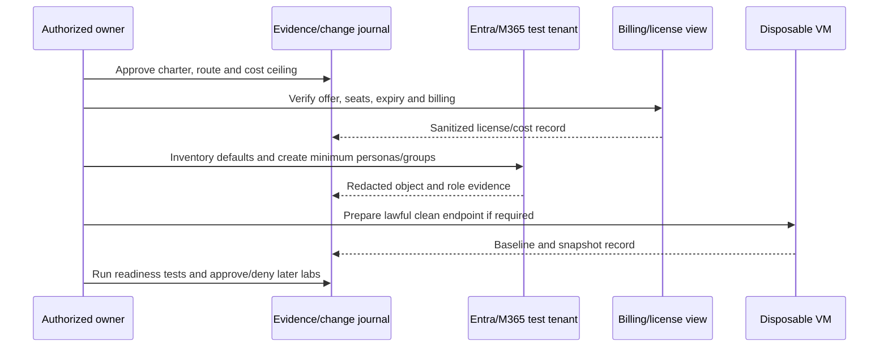

## 10. Design-and-simulation fallback: no tenant and no payment

Create a folder in your private portfolio working area with Markdown or spreadsheet artifacts. Do not invent screenshots that could be mistaken for real portal evidence; watermark or label them `SIMULATED DESIGN - NOT LIVE TENANT`.

1. Complete the charter, ownership boundary, and `$0` cost decision.
2. Draw the reference architecture and mark every component as `simulated`.
3. Populate the persona, group, role, license, and data tables with fictional IDs.
4. Create an object inventory with `Desired`, `Prerequisite`, `Expected result`, `Evidence source`, `Rollback`, and `Status` columns.
5. Create mock policy records using the later Parts' names, assignments, exclusions, mode, dependencies, and expected logs.
6. Create a mock license view showing `Unavailable/Not verified` rather than pretending E5 entitlement.
7. Build a test matrix with positive, negative, boundary, failure, rollback, and cleanup cases.
8. Build wireframes or text descriptions of screenshots and list exactly what would be redacted.
9. Conduct a tabletop exercise in which the license expires, the owner loses a normal admin method, a screenshot exposes a UPN, and an Azure resource generates cost. Record the decisions.
10. Issue a readiness decision with open dependencies. A design can pass with later features marked `simulation only`.

| Simulation artifact | Minimum fields | Review question |
|---|---|---|
| Tenant fact sheet | Ownership, route, assumptions, region, domain model | Could a reader mistake it for production? |
| Object inventory | Type, name, purpose, owner, license, lifecycle | Is every object necessary? |
| Role matrix | Persona, role, scope, activation, approval, review | Is privilege bounded? |
| License map | Feature, assumed SKU, source/date, fallback | Does design avoid promising entitlement? |
| Architecture | Boundaries, identities, services, logs, billing | Are trust and cost boundaries visible? |
| Test plan | Preconditions, action, expected, evidence, cleanup | Includes denied and failure paths? |
| Evidence plan | Artifact, source, redaction, storage, retention | Could it leak identifiers or secrets? |
| Cleanup plan | Object/resource, deletion order, verification | Does deletion stop charges and access? |

## 11. Evidence journal and screenshot redaction

An **evidence journal** is a chronological index of what was planned, changed, observed, and cleaned up. It is not a dump of every screen.

| Field | Example |
|---|---|
| Evidence ID | `P64-EV-007` |
| UTC/local time and timezone | `2026-08-24T14:30:00Z` |
| Route | Hands-on or simulation |
| Question/control | “Is standard user denied admin portal action?” |
| Preconditions/version | Persona, browser, policy/license state |
| Action | Minimal reproducible action |
| Expected/actual | Separate statements |
| Source | Portal page, audit category, local command, design record |
| Correlation | Redacted request/event reference if safe |
| Redaction | Fields removed or replaced |
| Outcome | Pass, fail, blocked, not licensed, not tested |
| Cleanup | Completed action and verification |

```mermaid
flowchart LR
    QUESTION[Test question] --> MIN[Collect minimum evidence]
    MIN --> COPY[Create controlled working copy]
    COPY --> REDACT[Crop and redact identifiers, secrets and unrelated data]
    REDACT --> REVIEW[Second-pass privacy/security review]
    REVIEW --> LABEL[Label route, date, scope and limitation]
    LABEL --> STORE[Store in private controlled portfolio]
    STORE --> RETIRE[Delete by retention/cleanup rule]
```

Redact tenant ID, subscription ID, custom/initial domain, complete user principal names, email addresses, object/device IDs, serial numbers, IP addresses when unnecessary, QR codes, recovery methods, phone numbers, browser profiles, notifications, cookies, tokens, request bodies, license order details, billing data, and unrelated users. Blurring can sometimes be reversed or leave context; use opaque replacement in a controlled copy, flatten/export it, inspect at high zoom, and preserve the untouched original only in a private restricted location if genuinely needed.

## 12. Configuration export and baseline inventory

A configuration export can support reproducibility, but it can also contain sensitive identifiers and relationships. Prefer a human-authored sanitized baseline for a public portfolio. Do not run scripts copied from the internet with broad Graph permissions.

| Inventory domain | Record | Do not expose |
|---|---|---|
| Tenant | Type, region category, route, creation/expiry concept | Tenant ID and actual domain |
| Identity | Persona count, member/guest design, source type | UPNs, methods, credentials, object IDs |
| Groups | Purpose, membership model, assignment use | Real membership exports |
| Roles | Role name, scope, eligible/active model | Credential or emergency-account details |
| Licenses | Product/service capability and expiry caveat | Billing/order/customer identifiers |
| Conditional Access | Name, state, users, apps, conditions, grant/session concept | Live IDs and unredacted exclusions |
| Intune | Authority, platform, policy categories, assignment rings | Hardware hashes/serials |
| Workloads | Test site/team/mail domain model and sharing state | URLs, addresses, content |
| Azure | Subscription type, resource groups, budget and tags | Subscription/payment details |
| Evidence | IDs, timestamps, questions, outcomes | Tokens, cookies, sensitive event fields |

## 13. Cost controls and cleanup economics

Azure and Microsoft services use different charging models. A license may charge per user/month; Azure may charge by time, capacity, ingestion, storage, transactions, networking, reservation, or marketplace plan. “Stopped” does not always mean “not billed”; disks, public IPs, snapshots, backups, workspaces, or retained data may remain.

### 🔍 Plain-English deep-dive: budgets warn; architecture limits spend

An Azure budget is like a bank notification, not a circuit breaker. Alerts can be delayed and do not guarantee resource shutdown. The primary controls are choosing `$0` simulation when possible, not deploying unnecessary resources, isolating the subscription/resource group, selecting the minimum current SKU, limiting scope/time/data, tagging ownership/expiry, reviewing cost analysis, and deleting every dependency.

| Cost control | Before deployment | During use | At cleanup |
|---|---|---|---|
| Authorization | Written personal ceiling and no assumed credit | Stop at threshold/uncertainty | Compare final cost to decision |
| Offer | Verify terms, conversion and expiry | Monitor remaining credit/state | Cancel only through verified process |
| Resource scope | Dedicated resource group/subscription if possible | No unrelated resources | Delete group after dependency review |
| SKU/region | Price calculator and current region availability | Check actual meter | Verify no reserved/marketplace commitment |
| Tags | `Owner`, `Purpose`, `ExpiresOn`, `CostCenter=PersonalLab` | Find untagged drift | Search all scopes for remnants |
| Budget | Create supported alerts to reachable address | Review alerts and cost analysis | Keep evidence until final charge settles |
| Data | Limit ingestion/retention/storage | Monitor volume | Delete/archive according to plan |
| Networking | Avoid public endpoints/egress-heavy design | Review unexpected traffic/cost | Remove IPs, gateways, DNS and egress resources |

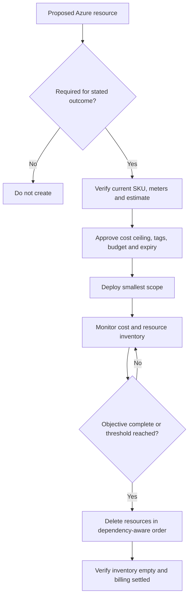

## 14. Safe networking and device setup

Parts 64–67 do not require penetration testing, packet manipulation, malware, phishing, public inbound services, or exposed remote administration. Use ordinary outbound connectivity to documented Microsoft endpoints and a protected host network. If a corporate VPN, proxy, endpoint agent, or policy applies to the host, do not attempt to bypass it; use design mode or a lawful personal environment.

| Control | Safe practice | Stop condition |
|---|---|---|
| Host | Patched personal host with endpoint protection and backups | Employer/client ownership or policy uncertainty |
| VM | NAT/default virtualization networking, no unnecessary inbound ports | Bridged/public exposure not understood |
| Credentials | Unique lab credentials, password manager, phishing-resistant methods where supported | Password reuse or insecure storage |
| Downloads | Official Microsoft sources; verify publisher/hash where provided | Third-party repackaged image/script |
| Scripts | Read and understand; least privilege; no broad consent by default | Obfuscated or destructive behavior |
| Remote access | Disabled unless specifically required and secured | Internet-exposed RDP/SSH/admin portal |
| Logging | Minimum synthetic evidence | Capturing unrelated household/work traffic |
| Teardown | Remove VM, snapshots, credentials, enrollment, and cached data as planned | Unknown residual access or billing |

## 15. Naming, tagging, versioning, and change control

Every change needs a small record even in a one-person lab. This creates the discipline expected in consulting.

| Change field | Required content |
|---|---|
| Change ID/title | `P64-CHG-003 Create pilot personas and groups` |
| Objective | Testable outcome |
| Scope | Exact objects/environment |
| Preconditions | Ownership, role, license, backup/export |
| Risk | Lockout, data, cost, propagation, privilege |
| Plan | Ordered actions and executor |
| Tests | Positive, negative, boundary, failure |
| Rollback | Disable/remove/reassign/restore method |
| Evidence | Journal IDs and timestamps |
| Outcome | Success, partial, failed, deferred, simulation |
| Cleanup | Objects/licences/sessions removed and verified |

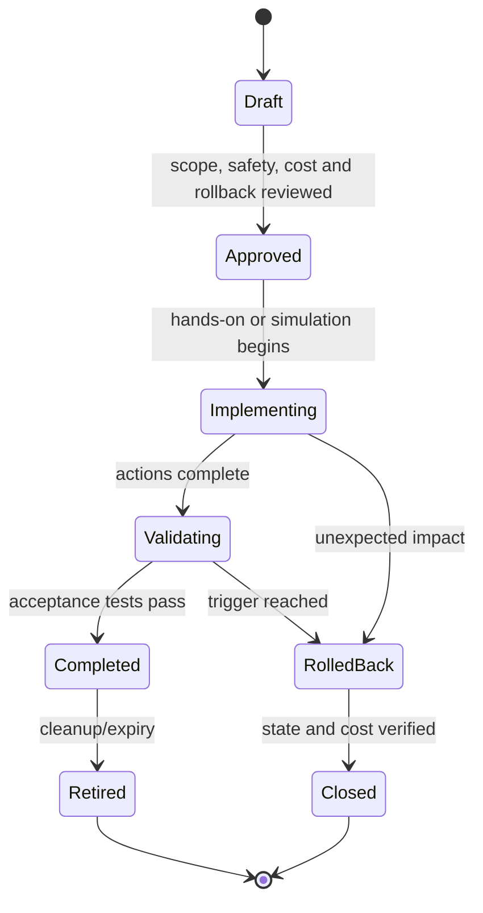

## 16. Test strategy: prove allowed and forbidden outcomes

| Test type | Example | Expected result | Evidence |
|---|---|---|---|
| Positive | Standard pilot signs into licensed test workload | Authorized outcome succeeds | Redacted sign-in/workload event |
| Negative | Standard pilot opens admin-only action | Access denied | Denial page/log without sensitive fields |
| Boundary | Guest persona attempts internal-only resource | Denied or constrained by design | Simulation or test record |
| Privilege | Scoped admin performs one intended task | Intended task succeeds; unrelated task denied | Role/action audit |
| Failure | License absent or service unavailable | Step stops safely and switches to simulation | Availability record |
| Cost | Proposed Azure resource lacks estimate/owner | Deployment blocked | Change decision |
| Evidence | Screenshot includes full UPN | Publication blocked and image re-redacted | Review checklist |
| Rollback | Pilot license removed after test | Entitlement removed without deleting required evidence | License/object inventory |
| Cleanup | Search all resource scopes after deletion | No billable orphan identified | Inventory/cost verification |

Do not manufacture a successful result. `Blocked by license`, `Not observed`, and `Simulation only` are valid outcomes when clearly recorded.

## 17. Troubleshooting the setup without creating more risk

Use the sequence **scope → compare → timeline → layer → hypothesis → minimal test → verify → restore**.

| Symptom | Likely layer | Safe check | Unsafe response |
|---|---|---|---|
| Portal feature missing | License, role, portal rollout, cloud/region | Current docs, license details, role, correct portal | Assign Global Admin and buy random SKU |
| User cannot sign in | Identity, credential, method, CA/default protection | Exact error/time/user, sign-in log, known-good persona | Disable all security controls |
| Role action denied | Role/scope/PIM activation/token | Assignment path, activation, fresh session, audit | Permanent broad role |
| License assignment fails | Seat, usage location, dependency, group processing | License state and error details | Start unreviewed trial |
| Device cannot enroll | License, authority, platform token, restriction, join limit | Current prerequisites and endpoint logs | Use work laptop or wipe primary device |
| Screenshot still reveals data | Redaction workflow | High-zoom review and metadata removal | Publish and promise to replace later |
| Cost appears unexpectedly | Meter/resource/dependency/offer expiry | Cost analysis, resource graph/inventory, billing scope | Ignore because “free tier” was expected |

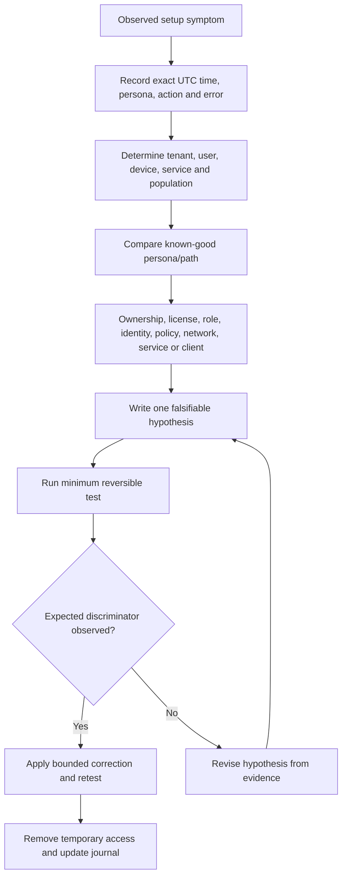

## 18. Rollback, reset, and cleanup

Rollback returns a changed control to an approved prior state. Reset returns the lab to a known baseline for the next exercise. Cleanup removes temporary objects, access, data, licenses, devices, and billable resources. These are related but not identical.

| Item | Rollback | Reset | Final cleanup verification |
|---|---|---|---|
| User/group | Remove assignment or restore membership | Recreate baseline membership | No unnecessary identities/groups/licenses |
| Admin role | Deactivate/remove assignment | Restore standard owner route | No excess active privilege |
| Policy | Disable/delete pilot version as documented | Restore known report-only baseline | No orphan assignments/exclusions |
| Workload object | Restore sharing/membership/config | Replace synthetic test content | Test sites/teams/mail deleted or retained intentionally |
| Device | Remove policy/enrollment under plan | Restore clean snapshot/re-enroll | Device record, keys, profile, VM/snapshot removed |
| Azure resource | Redeploy prior template/config if justified | Recreate empty resource group only if needed | Resource inventory empty; costs reviewed |
| Evidence | Correct labels/redaction, preserve traceability | Start new journal section | Sensitive working copies destroyed per plan |

Cleanup order matters: export the minimum approved evidence; remove assignments and risky policies; revoke/deactivate privilege and sessions as appropriate; unenroll/delete test devices in the supported order; delete synthetic workload content/objects; remove licenses; remove app credentials/consent if any; delete Azure resources and dependencies; remove custom DNS only under ownership and documented service order; review audit/billing state; then retire credentials and the tenant only when no required data or charge remains.

## 19. Portfolio packaging

The portfolio should demonstrate thinking without exposing a live environment.

```mermaid
flowchart LR
    CHARTER[1. Safety charter] --> ARCH[2. Architecture and boundaries]
    ARCH --> INV[3. Persona/object/license inventory]
    INV --> CHANGE[4. Change and test records]
    CHANGE --> EVID[5. Redacted or simulated evidence]
    EVID --> REPORT[6. Findings and readiness report]
    REPORT --> CLEAN[7. Cleanup attestation]
    CLEAN --> TALK[8. Honest interview explanation]
```

| Portfolio artifact | What it proves | Publication rule |
|---|---|---|
| Lab charter | Ethical ownership, boundaries, cost, data, cleanup | Remove account/domain/billing details |
| Architecture | System and trust-boundary reasoning | Use fictional labels only |
| Persona/group matrix | Test coverage and least privilege | No real identities or object IDs |
| License map | Commercial awareness and fallback planning | Cite date; do not claim universal availability |
| Change records | Implementation discipline | Label hands-on versus simulation |
| Test matrix | Positive/negative/failure/rollback thinking | Use synthetic expected/actual values |
| Evidence index | Traceability and redaction | Publish sanitized derivatives only |
| Findings/readiness report | Consulting judgment and dependencies | State limitations and residual risk |
| Cleanup attestation | Lifecycle and cost ownership | Do not expose tenant/billing proof |

Suggested private structure:

```text
Part-64-Safe-Lab/
  00-README-and-honesty.md
  01-charter-and-boundaries.md
  02-architecture.md
  03-personas-groups-roles-licenses.md
  04-change-and-test-plan.md
  05-evidence-index-redacted.md
  06-readiness-and-risk-report.md
  07-cleanup-attestation.md
```

## 20. Readiness gate for Parts 65–67

Do not proceed hands-on until all mandatory safety criteria pass. A failed feature/license criterion moves that feature to simulation; a failed ownership/data/cost criterion stops all hands-on work.

| Gate | Pass criterion | If failed |
|---|---|---|
| Ownership | Personal ownership or explicit authorization documented | Stop; design mode only |
| Isolation | No production, employer, client, school, family, or real-person dependency | Stop; create paper environment |
| Terms/license | Current eligibility, permitted use, expiry, conversion, and feature entitlement checked | Simulate unavailable features |
| Cost | Billing owner, ceiling, meter, alerts, expiry, and cleanup understood | No paid deployment |
| Personas | Separate standard/admin/pilot/guest/risk/helpdesk/SOC/emergency concepts defined | Complete design first |
| Least privilege | Minimum role/scope/time and deactivation path documented | Do not perform admin action |
| Data | Synthetic-only pack and handling rule ready | Do not use workloads |
| Evidence | Journal, redaction, storage, retention, and publication review ready | Do not capture evidence |
| Endpoint | Disposable lawful device/VM and reset plan available | Part 66 simulation only |
| Change | Scope, tests, rollback, cleanup, stop conditions recorded | Do not implement |
| Recovery | Normal admin loss and emergency-access tabletop passed | Identity implementation remains simulation/report-only |
| Cleanup | Object, license, device, resource, cost, and credential teardown is executable | Do not create the item |

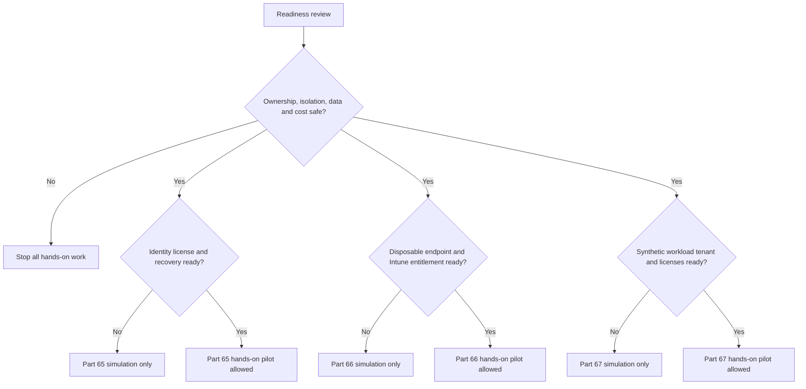

## 21. Health-check report template

| Finding ID | Observation and evidence | Risk/impact | Recommendation | Priority | Route/limitation |
|---|---|---|---|---|---|
| `P64-F01` | Environment ownership documented | Prevents unauthorized practice | Retain dated charter | Foundational | Paper evidence |
| `P64-F02` | Trial expiry not confirmed | Unexpected loss/cost | Use simulation until confirmed | High | No trial promised |
| `P64-F03` | Admin/standard personas separated | Reduces accidental privileged use | Keep role windows bounded | Medium | Lab-scale only |
| `P64-F04` | Screenshot exposes tenant suffix | Identity/privacy leakage | Replace with opaque redaction and rereview | High | Do not publish original |
| `P64-F05` | Intune license unavailable | Endpoint behavior cannot be observed | Complete Part 66 simulation | Medium | Not an implementation gap claim |

The executive summary should state: objective, route used, key safeguards, licensed capabilities actually observed, unavailable capabilities simulated, material risks, readiness decision for Parts 65–67, costs incurred or `$0`, cleanup state, and the honest-experience boundary.

## 22. Official Source Anchors

These first-party sources were selected for the August 24, 2026 review point. Recheck each page, linked prerequisites, Product Terms, offer screen, and target tenant before action.

1. Microsoft 365 Developer Program overview: <https://learn.microsoft.com/en-us/office/developer-program/microsoft-365-developer-program>
2. Set up a Microsoft 365 developer sandbox: <https://learn.microsoft.com/en-us/office/developer-program/microsoft-365-developer-program-get-started>
3. Microsoft 365 trial and service documentation hub: <https://learn.microsoft.com/en-us/microsoft-365/>
4. Microsoft Product Terms: <https://www.microsoft.com/licensing/terms/>
5. Microsoft 365 licensing guidance for security and compliance: <https://learn.microsoft.com/en-us/office365/servicedescriptions/microsoft-365-service-descriptions/microsoft-365-security-and-compliance-licensing-guidance>
6. Azure free account FAQ: <https://azure.microsoft.com/en-us/free/free-account-faq/>
7. Azure pricing overview: <https://azure.microsoft.com/en-us/pricing/>
8. Azure Cost Management budgets tutorial: <https://learn.microsoft.com/en-us/azure/cost-management-billing/costs/tutorial-acm-create-budgets>
9. Azure resource tagging guidance: <https://learn.microsoft.com/en-us/azure/azure-resource-manager/management/tag-resources>
10. Azure resource-group and resource deletion: <https://learn.microsoft.com/en-us/azure/azure-resource-manager/management/delete-resource-group>
11. Microsoft Evaluation Center: <https://www.microsoft.com/en-us/evalcenter/>
12. Microsoft Entra architecture: <https://learn.microsoft.com/en-us/entra/architecture/architecture>
13. Microsoft Entra built-in roles: <https://learn.microsoft.com/en-us/entra/identity/role-based-access-control/permissions-reference>
14. Best practices for Microsoft Entra roles: <https://learn.microsoft.com/en-us/entra/identity/role-based-access-control/best-practices>
15. Microsoft Entra PIM overview: <https://learn.microsoft.com/en-us/entra/id-governance/privileged-identity-management/pim-configure>
16. Manage emergency access accounts: <https://learn.microsoft.com/en-us/entra/identity/role-based-access-control/security-emergency-access>
17. Microsoft cloud security benchmark, privileged access: <https://learn.microsoft.com/en-us/security/benchmark/azure/mcsb-privileged-access>
18. Microsoft Trust Center: <https://www.microsoft.com/en-us/trust-center>
19. Reserved top-level DNS names including `.example`: <https://www.rfc-editor.org/rfc/rfc2606>
20. Microsoft privacy documentation: <https://privacy.microsoft.com/en-us/privacystatement>

## ⭐ Likely Interview Questions for This Section

### Q1. How would you build a Microsoft security lab without risking a production tenant?

**Model answer:** I start with a written charter proving ownership, isolation, allowed actions, synthetic-only data, cost ceiling, evidence rules, cleanup, and expiry. I use a personally owned or explicitly authorized test tenant only after checking current terms, licensing, billing, and default controls. I separate admin and standard personas, use minimum time-bounded roles, pilot groups, a disposable lawful endpoint, and no real guests or DNS. Every change has tests, rollback, redacted evidence, and cleanup. If any ownership, license, cost, or safety condition is uncertain, I use the full design-and-simulation route instead.

### Q2. Can a candidate rely on a Microsoft 365 developer sandbox or free trial?

**Model answer:** No. Program eligibility, sandbox qualification, trial availability, included services, duration, renewal, conversion, payment requirements, region, and terms change. I verify the exact official offer and Product Terms on the day, record the decision, and never promise availability. My lab design has a `$0` simulation path for every control, so learning and portfolio evidence do not depend on a promotional entitlement.

### Q3. What is the difference between an Entra tenant, Microsoft 365 license, Azure subscription, and domain?

**Model answer:** The Entra tenant is the identity and policy directory boundary. Microsoft 365 licenses grant particular users service entitlements in associated workloads. An Azure subscription is a resource, quota, access, and billing container associated with a tenant and can generate consumption charges. A domain is a DNS namespace used for identities and service records. They relate, but one does not automatically provide or pay for the others; I inventory each separately.

### Q4. Which test personas would you create and why?

**Model answer:** I model a standard user, pilot user, separate cloud/identity admin, help-desk operator, SOC reader, guest boundary, high-risk scenario, and emergency-access design. They prove different authorization and recovery outcomes. I create only the minimum live accounts and keep other personas on paper when seats are limited. Admin identities are not daily-use accounts, guests are never real outsiders, and emergency access is monitored recovery capability rather than a convenient bypass.

### Q5. How do you control privilege and licensing in a small lab?

**Model answer:** I map each task to the narrowest supported role, scope, duration, approval, test, and deactivation. Where licensed, PIM can make eligible time-bounded assignments; otherwise I simulate that governance and immediately remove temporary assignments. I inventory feature-to-license dependencies and seats before tests, assign licenses only for the test window under current terms, and remove them during cleanup. I never solve a missing feature by granting Global Administrator or starting an unreviewed trial.

### Q6. What evidence belongs in a public lab portfolio?

**Model answer:** Only the minimum sanitized derivative needed to demonstrate reasoning: fictional architecture, persona and role matrices, dated license assumptions, change/test records, redacted outcomes, findings, readiness decision, and cleanup attestation. I remove tenant/subscription/domain/user/device identifiers, credentials, tokens, QR codes, billing details, real content, and unrelated portal data. I label every result as hands-on or simulated and never present a mock screenshot as live evidence.

### Q7. How would you prevent and respond to unexpected Azure lab cost?

**Model answer:** Prevention starts with not deploying Azure resources unless the learning outcome requires them. I verify the exact meters and offer, estimate cost, set a personal ceiling, isolate and tag resources, create supported budgets/alerts, limit time/data/SKU, and record expiry and deletion. Budgets are alerts, not guaranteed shutdown. If cost appears, I stop new deployment, inspect billing scope and all dependencies, delete safely, verify inventory and later charges, document the cause, and improve the guardrail.

### Q8. How do you describe this lab honestly in a Deloitte interview?

**Model answer:** I say I built an isolated personal learning environment and a consulting-style evidence pack covering architecture, personas, least privilege, licensing, cost, testing, rollback, evidence, and cleanup. I name which controls I actually configured in a valid test tenant and which I designed or simulated because a license or safe environment was unavailable. I connect the discipline to my real support, incident, documentation, and stakeholder experience, but I do not claim enterprise production ownership or Deloitte methods.

## 🧠 30-Second Memory Hooks

- **Charter before portal:** ownership, scope, data, cost, evidence, cleanup.
- **Tenant is the badge office; subscription is the cloud purchase account; license is the room ticket; domain is the address.**
- **No trial promise:** verify the exact offer today and keep a `$0` fallback.
- **Simulation is a controlled route, not a fake implementation.**
- **Personas are crash-test dummies:** test roles without risking real people.
- **Admin is a separate hat:** minimum role, scope, time, and session.
- **Emergency access is a sealed key:** monitored, tested, and never daily use.
- **Synthetic means invented from scratch, not anonymized customer data.**
- **Budgets ring; they do not brake:** architecture and cleanup control cost.
- **Evidence proves a question:** collect minimum, redact, label, retain, delete.
- **Proposed is not configured; configured is not effective.**
- **Rollback restores control; reset restores baseline; cleanup removes residue.**
- **No readiness gate, no next lab.**

## Completion Checklist

- [ ] I documented ownership and confirmed this is not an employer, client, school, family, or production environment.
- [ ] I selected and labeled either the authorized hands-on route or the no-paid-tenant design/simulation route.
- [ ] I checked current offer availability, eligibility, licensing, duration, conversion, cancellation, and terms without assuming a trial exists.
- [ ] I distinguished the Entra tenant, Microsoft 365 services/licenses, Azure subscription, and DNS domain.
- [ ] I recorded a personal cost ceiling and chose `$0` design mode where a paid resource was unnecessary.
- [ ] I defined standard, pilot, admin, help-desk, SOC, guest, high-risk, and emergency-access personas.
- [ ] I separated administrative and standard identities and mapped each task to minimum role, scope, time, and deactivation.
- [ ] I documented PIM and emergency-access dependencies honestly, including a simulation fallback.
- [ ] I created a group, device, app, policy, and resource naming/tagging standard.
- [ ] I prepared only synthetic users, files, messages, sites, teams, devices, and incident records.
- [ ] I did not configure a real custom domain or change real DNS.
- [ ] I used only a lawful disposable personal endpoint/VM or selected endpoint simulation.
- [ ] I defined safe networking with no scanning, malware, phishing, bypass, or public administrative exposure.
- [ ] I completed a baseline inventory for identities, groups, roles, licenses, policies, workloads, devices, Azure, and evidence.
- [ ] I created a change record with scope, risks, preconditions, tests, rollback, stop conditions, and cleanup.
- [ ] I created positive, negative, boundary, privilege, failure, rollback, cost, and cleanup tests.
- [ ] I created an evidence journal with timestamps, expected/actual results, route, source, redaction, and cleanup.
- [ ] I reviewed screenshot/export redaction for identifiers, secrets, credentials, personal data, metadata, and unrelated content.
- [ ] I created budget/tag/expiry controls if any Azure billing boundary exists and understand alerts may not stop spend.
- [ ] I documented dependency-aware rollback, reset, and final cleanup for every object/resource.
- [ ] I packaged only fictional or redacted artifacts and labeled simulated evidence unmistakably.
- [ ] I issued separate hands-on/simulation readiness decisions for Parts 65, 66, and 67.
- [ ] I can explain Q1–Q8 aloud in 60–90 seconds each without overstating experience.

*Next suggested section:* [Part 65](Part-65-lab-entra-zero-trust-baseline.md)