# Part 65 — LAB 1 - Entra Identity Baseline, MFA, Conditional Access, PIM, and Break Glass

> **Section goal:** Design and, where an isolated licensed test tenant permits, implement a safe Microsoft Entra identity baseline using fictional users, groups, administrative scope, modern authentication registration, Temporary Access Pass onboarding, self-service password reset, privileged-access governance, emergency access, and Conditional Access policies in **report-only** mode. By the end, you should be able to predict and inspect policy evaluation with What If and sign-in logs; test positive, negative, boundary, failure, emergency, and rollback scenarios; package redacted evidence; and explain exactly which results were observed versus simulated.

This lab maps to Deloitte role expectations for Zero Trust, Entra architecture, MFA and passwordless strategy, Conditional Access design and troubleshooting, privileged access, Identity Protection awareness, implementation planning, pilot deployment, licensing analysis, security assessment, stakeholder communication, evidence-based validation, rollback, and operational governance. It extends Arti's support-engineering strengths in transaction-level diagnosis, affected-versus-unaffected comparison, incident safety, RCA, documentation, and customer communication into identity security design without presenting test-tenant practice as enterprise production ownership.

> **Currency, licensing, and portal warning (August 24, 2026):** Microsoft Entra portal names, authentication methods, passkey capabilities, authentication-strength behavior, mandatory MFA requirements, Conditional Access targets/conditions/controls, What If evaluation, sign-in-log fields, report retention, PIM, ID Protection, SSPR, licensing, previews, and service dependencies change. Verify current Microsoft Learn, Product Terms, service descriptions, tenant licenses, target cloud/region, and live portal before action. Conditional Access commonly requires Microsoft Entra ID P1; risk-based controls and PIM/ID Governance capabilities can require different or additional entitlements. Visibility in a portal does not prove entitlement. No trial is promised.

> **Safety rule:** Complete [Part 64](Part-64-lab-safe-microsoft-security-environment.md)'s readiness gate first. Use only a personally owned or explicitly authorized isolated test tenant, fictional identities, synthetic data, separate admin sessions, least privilege, and a documented recovery path. **Never enable a broad Conditional Access policy in this lab.** Keep every new policy report-only. A future real rollout would require approved emergency exclusions, pilot/rings, communications, monitoring, support readiness, change approval, and tested rollback before enforcement. If the tenant or license is unavailable, complete the full no-paid-tenant design/simulation path.

## JD Mapping

| Role expectation | Capability developed | Portfolio evidence |
|---|---|---|
| Design Zero Trust identity controls | Translate verify-explicitly, least privilege, and assume-breach into authentication, policy, privilege, logs, and recovery | Identity target architecture |
| Implement Entra security safely | Create controlled objects and report-only policies with pilots/exclusions | Sanitized configuration register |
| Troubleshoot authentication and access | Correlate persona, app, client, device, location, method, token, policy, result, and time | Sign-in decision worksheet |
| Govern privileged access | Separate normal/emergency access and design PIM activation/approval/review | Privilege matrix and drill |
| Assess licensing and dependencies | Distinguish available, assumed, unavailable, and deferred capabilities | Dated license/dependency map |
| Plan deployment and rollback | Use report-only, What If, sign-in logs, pilot gates, stop criteria, and disable/recovery procedures | Test and rollback report |
| Communicate findings | Separate observed facts, design assumptions, residual risks, and recommendations | Identity baseline health check |

## Candidate honesty note

Arti should describe exactly what happened. If she configured report-only policies in a valid test tenant, she can say so and show sanitized evidence. If she did not have Entra ID P1, PIM, ID Protection, passkeys, hardware keys, or a safe emergency-account implementation, she should say she completed a design and simulation with test criteria. She should not claim production Conditional Access, enterprise PIM, broad MFA migration, hybrid password writeback, or identity incident ownership unless independently supported by her experience.

> “I designed a Zero Trust identity baseline and, where my isolated test entitlement allowed, created fictional personas, authentication settings, SSPR scope, and Conditional Access policies in report-only mode. I tested policy logic with What If and sign-in evidence and documented exclusions, emergency access, PIM, rollout, rollback, and license dependencies. Risk-based and unavailable features were simulated rather than represented as implemented. I would not enable a broad policy in a client tenant without approved recovery accounts, pilots, dependency testing, monitoring, support readiness, and change authority.”

---

## 1. Lab architecture and completion routes

The baseline has five layers: identity objects, authentication methods, authorization/privilege, Conditional Access decisions, and monitoring/recovery.

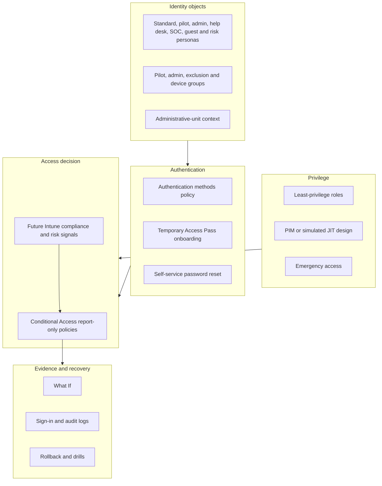

| Requirement | Hands-on path | No-paid-tenant design/simulation path |
|---|---|---|
| Objects/groups | Create only minimum fictional objects | Complete object catalog and mock membership |
| Authentication policy | Pilot available methods | Define method matrix and expected registration |
| TAP | Create one short-lived pilot TAP only if necessary | Simulate issuance, custody, expiry, and log entries |
| SSPR | Scope to pilot and test with synthetic account | Model registration/reset outcomes and notifications |
| PIM | Configure/test only if licensed and safe | Complete role settings, activation, approval, and audit design |
| Conditional Access | Create policies **report-only only** | Create complete policy JSON-like records and What If matrix |
| Sign-in evidence | Generate benign pilot sign-ins and inspect logs | Produce synthetic log records tied to cases |
| Risk-based control | Observe only if appropriately licensed; do not induce compromise | Use a fictional risky-user placeholder and expected outcomes |
| Emergency access | Implement only after strong-method/custody/monitoring readiness | Preferred lab route: tabletop design and drill |

## 2. Prerequisites, roles, licenses, and stop conditions

| Prerequisite | Why it matters | Hands-on proof | Stop/fallback |
|---|---|---|---|
| Part 64 readiness | Establishes ownership, isolation, data, evidence, and cleanup | Signed readiness record | Simulation only |
| Separate admin identity | Reduces privileged daily use | Distinct browser profile and account | Do not use standard user as standing GA |
| Current license inventory | Determines CA/PIM/risk/SSPR capability | Dated service-plan record | Mark feature unavailable |
| Minimum roles | Limits blast radius | Role/scope/duration record | Do not grant broad role for convenience |
| Test personas/groups | Makes policy scope testable | Membership inventory | Build paper catalog first |
| Strong recovery route | Prevents lockout | Emergency-access design and normal owner access | No policy enforcement |
| Synthetic application target | Generates harmless sign-ins | Microsoft 365 test app/resource if licensed | What If/synthetic logs |
| Evidence journal | Preserves policy/version/time/result | Journal ready | Do not make change |

| Capability | Typical entitlement concept to verify | Lab treatment |
|---|---|---|
| Base users/groups/auth methods | Microsoft Entra tenant capability varies by method | Inventory exact live availability |
| Conditional Access/report-only/What If | Commonly Entra ID P1 | Simulation if absent |
| Authentication strengths | Conditional Access and method prerequisites; verify current support | Design preferred strength and fallback |
| SSPR | Edition and hybrid writeback have different requirements | Cloud-only pilot; no hybrid writeback in this lab |
| PIM | Microsoft Entra ID Governance/P2-related licensing; verify current fundamentals | Full simulation if unavailable |
| User/sign-in risk | ID Protection licensing commonly relevant | Placeholder only unless legitimately available |
| Extended log retention/workbooks | License, Azure Monitor, Log Analytics, ingestion and retention cost | Use portal observation or simulation; no paid workspace required |

Stop immediately if the current admin path becomes uncertain, an unexpected enforced policy appears, the target includes all users without approved recovery exclusions, a real person is in scope, the policy state is `On`, a trial/payment prompt appears, a credential is exposed, or an observed impact differs materially from the change record.

## 3. Objects, groups, and administrative-unit context

An Entra **object** is a directory record such as a user, group, device, service principal, or administrative unit. A group can target access or policy. An **administrative unit (AU)** can scope supported administrative roles to a subset of directory objects; it does not automatically restrict all data or all Microsoft 365 workload administration.

| Object | Name | Members/owner | Purpose | Lifecycle |
|---|---|---|---|---|
| Standard user | `lab-user-alex-01` | Fictional | Normal sign-in and SSPR | Retain through Part 67 |
| Pilot user | `lab-user-priya-01` | Fictional | Authentication/CA pilot | Retain through Part 67 |
| Identity admin | `lab-adm-identity-01` | Lab owner controls separately | Bounded identity configuration | Remove temporary roles after each change |
| Help desk | `lab-ops-helpdesk-01` | Fictional | Recovery authorization simulation | Paper if no spare seat |
| SOC reader | `lab-ops-soc-01` | Fictional | Sign-in/audit review | Read-only or paper |
| Guest | `lab-guest-casey-01` | Paper or internal synthetic account | External-user policy boundary | Never invite real person |
| High-risk | `lab-user-risk-01` | Paper identity | ID Protection policy placeholder | Never simulate a real compromise |
| Admin pilot group | `LAB-SG-CA-ADMINS-PILOT` | Identity admin only | Admin authentication policy | Assigned membership |
| User pilot group | `LAB-SG-CA-USERS-PILOT` | Priya | General MFA policy | Assigned membership |
| Emergency group | `LAB-SG-EXCL-CA-EMERGENCY` | Approved recovery accounts only | Future enforced-policy exclusion | Monitor every membership change |
| Intune future group | `LAB-SG-CA-DEVICE-PILOT` | Part 66 user/device scope | Compliance dependency | No enforcement in Part 65 |
| AU design | `LAB-AU-PILOT` | Pilot users/devices | Demonstrate scoped administration | Simulation unless needed/licensed |

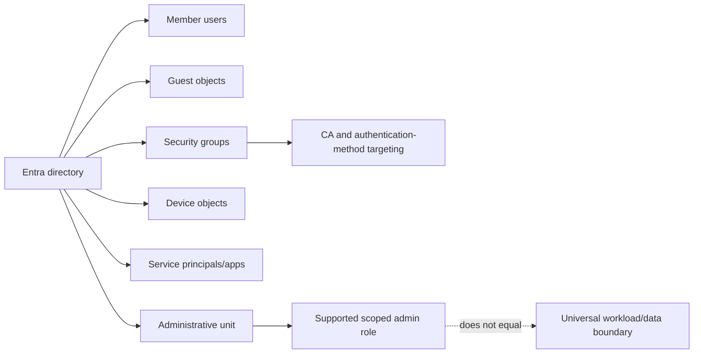

### Hands-on steps

1. Inventory existing lab objects and default/admin accounts before creation.
2. Create only the personas needed and set usage location only if a license assignment legitimately requires it.
3. Create assigned-membership pilot and emergency-exclusion groups. Record owners and review dates.
4. Keep guest and high-risk personas on paper unless a safe test specifically requires a live object.
5. Optionally create an AU only if current licensing and role behavior are understood; otherwise diagram its intended scope.
6. Test that the standard user cannot manage directory objects and the scoped/admin persona can perform only its approved action.

Expected outcome: a small, traceable object set supports deterministic assignments. A negative privilege test is as valuable as successful creation.

## 4. Authentication-method and phishing-resistant strategy

**Multifactor authentication (MFA)** uses factors from different categories, such as something known, possessed, or inherent. Multiple prompts of the same factor type do not automatically create strong MFA. **Phishing resistance** means the method is designed to prevent a user from authenticating to an impostor origin; it is stronger than merely making phishing less convenient.

| Method family | Relative strength/use | Main dependencies | Lab position |
|---|---|---|---|
| Password | Shared secret; phishable | Password lifecycle/protection | Bootstrap/legacy reality, not target assurance |
| SMS/voice/OTP | Better than password alone but remotely phishable and telecom-dependent | Phone/network and current availability | Recovery/fallback only if accepted by risk policy |
| Authenticator push | Stronger with number matching/context; still user-mediated | Registered app/device | Pilot MFA where available |
| Software/hardware OATH | One-time code; still phishable | Token custody/time | Design fallback where needed |
| Passkey/FIDO2 security key | Phishing-resistant origin-bound authentication | Supported device/key/browser/policy | Preferred admin/high-risk target |
| Windows Hello for Business | Device-bound phishing-resistant credential in supported design | Managed Windows/device registration/trust | Part 66 dependency |
| Certificate-based authentication | Phishing-resistant when correctly designed | PKI, certificate issuance/revocation | Design only unless an existing lawful PKI exists |
| Temporary Access Pass | Time-limited bootstrap/recovery method | Method policy, role, secure delivery | Short-lived onboarding bridge, not steady state |

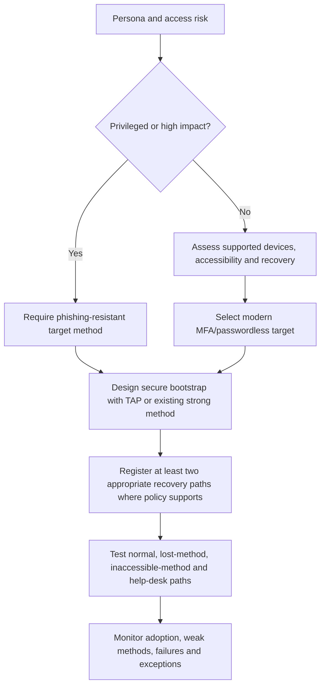

### 🔍 Plain-English deep-dive: MFA is a result, authentication strength is a requirement

A sign-in can carry an MFA claim because a method or earlier session satisfied a requirement. An **authentication strength** in Conditional Access specifies which method combinations are acceptable for that resource or persona. **Analogy:** “Two identity checks occurred” is a result; “only a chip passport plus live inspection is acceptable” is a standard. Why it matters: a generic MFA grant can allow methods that do not meet a privileged-user phishing-resistance objective. The method policy controls who may register/use methods; Conditional Access decides when a strength/control is required; the sign-in log shows what actually happened. Verify exact combinations and current platform support.

### Method policy design

| Persona | Target method | Bootstrap | Recovery | Exception owner |
|---|---|---|---|---|
| Identity admin | FIDO2/passkey or other current phishing-resistant method | One-time TAP under verified identity/custody | Separate registered strong credential | Privileged-access owner |
| Standard pilot | Authenticator/passwordless or supported passkey | TAP or controlled first sign-in | Approved secondary method/SSPR | Identity service owner |
| Help desk | Strong method aligned to reset authority | Controlled onboarding | Independent recovery | Service owner |
| Guest | Home-tenant method/trust design | External identity flow | Home organization | External-collaboration owner |
| Emergency access | Independent phishing-resistant method per current guidance | Dedicated secure ceremony | Separate stored credential/device | Executive/security authority |

## 5. Temporary Access Pass onboarding

A **Temporary Access Pass (TAP)** is a time-limited passcode that can bootstrap passwordless method registration or recovery. It is not a permanent password and must be handled like a short-lived secret.

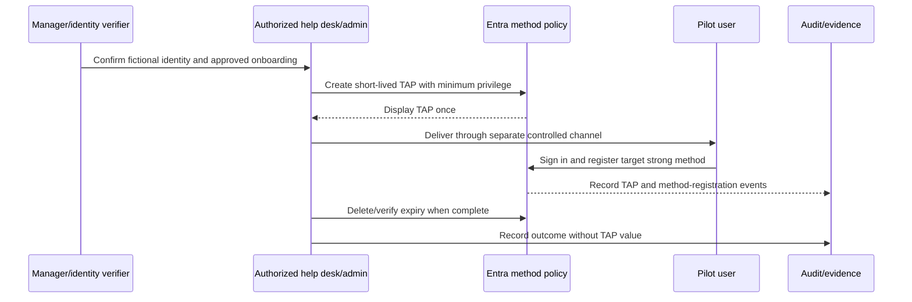

### 🔍 Plain-English deep-dive: onboarding is an identity-proofing problem

The strongest passkey can be undermined if a help-desk operator gives its bootstrap credential to an impostor. **Analogy:** A high-security badge is useless if reception hands it to anyone who knows an employee's name. A production process needs authoritative identity verification, separation of duties, secure delivery, short lifetime, single-use versus multiuse decision, monitoring, user confirmation, old-method removal, and escalation. This lab uses one learner and fictional users, so it documents the control rather than claiming real identity proofing.

### Hands-on path

1. Verify TAP is available and the method policy scope contains only the pilot group.
2. Use at least Authentication Policy Administrator for policy changes and the documented minimum authentication role for the specific user operation. Do not use a standing Global Administrator merely for convenience.
3. Choose the shortest usable lifetime and one-time behavior appropriate to the test. Record the design, not the secret.
4. Generate a TAP for the fictional pilot only. Never screenshot, paste into the journal, send through a public channel, or reuse it.
5. Use a clean user browser session to register the intended method. Be aware that one-time TAP registration has timing constraints and replication can take time; recheck current Learn.
6. Verify method registration and sign-in events. Delete or confirm expiration of the TAP.
7. Test that the expired/deleted TAP no longer authenticates. Do not repeat attempts excessively.

### Simulation path

Create records for requester, verifier, issuer, user, policy scope, issue/start/expiry time, one-time flag, delivery channel, expected registration event, expired-use failure, old-method cleanup, and audit review. The simulated TAP value is `[SECRET NOT CREATED]`.

## 6. SSPR and recovery design

**Self-service password reset (SSPR)** lets an eligible user prove control of configured methods and reset a password without help-desk execution. Cloud-only and hybrid users have different writeback dependencies; this lab does not build hybrid password writeback.

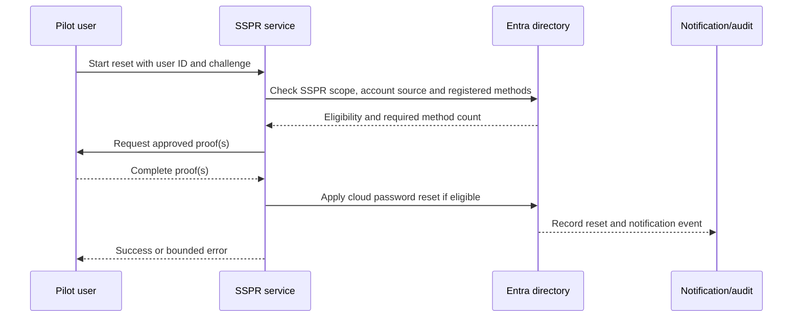

| Design decision | Pilot choice | Production question |
|---|---|---|
| Scope | `LAB-SG-CA-USERS-PILOT` only | Which cohorts and exclusions migrate by ring? |
| Required methods | Choose based on actually enabled methods and recoverability | Do users have enough independent methods? |
| Registration prompt | Pilot and communicate | Accessibility, device, travel, and support impacts? |
| Reconfirmation | Simulate a review period | What risk and user-friction tradeoff applies? |
| Notifications | Enable/test only in synthetic tenant where available | Who monitors unexpected resets? |
| Admin reset | Design separately; stronger rules can apply | Which admin recovery paths are authorized? |
| Hybrid writeback | Out of scope | Is password source cloud/on-prem and writeback healthy/licensed? |

Hands-on: scope SSPR only to the pilot, register the planned methods, test a successful cloud-only reset, test an ineligible persona, and inspect audit/sign-in records and notifications. Never use security questions or personal facts copied from real life. Do not change method requirements from one to two until the pilot has the required registrations; otherwise recovery can fail by design.

Simulation: model `eligible + sufficient methods`, `eligible + insufficient methods`, `not scoped`, `administrator`, `guest/home-tenant`, and `hybrid without writeback` outcomes.

## 7. Privilege and PIM design

**Privileged Identity Management (PIM)** can provide eligible, time-bound, approval-controlled activation for supported Entra and Azure roles and groups. It requires licensing; it does not make an excessive role safe.

| Role/use | Assignment target | Type/duration | Activation controls | Negative test |
|---|---|---|---|---|
| Conditional Access design | Identity admin | Eligible/time-bound if licensed | MFA/strength, justification, short duration, notification | Cannot change unrelated workload settings |
| Authentication policy | Identity admin | Eligible/time-bound | Justification and audit | Standard user denied |
| User method recovery | Help-desk/recovery persona | Narrow authentication role | Ticket/identity proofing and short task | Cannot reset privileged user if role disallows |
| Log review | SOC persona | Standing read role if justified | Access review and data handling | Cannot edit policy |
| Emergency recovery | Emergency accounts | Current guidance: permanent-active recovery role, exceptional monitoring | Independent strong auth, custody, alert and drill | Never used for routine change |

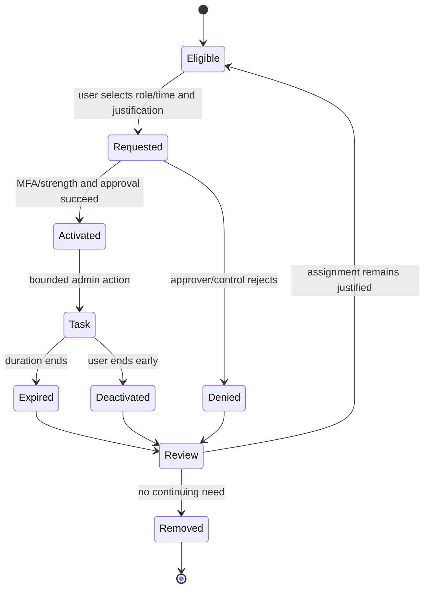

### Hands-on if PIM is licensed

1. Inventory active and eligible role assignments; protect the existing recovery route.
2. Select one narrow role for the identity admin, not Global Administrator.
3. Configure a short activation duration, justification, notification, and appropriate MFA/approval controls. Ensure approvers can actually approve; an all-eligible/no-active approval chain can deadlock.
4. Activate, perform one bounded read/change according to the change record, deactivate, and verify audit history.
5. Test before activation, during activation, and after expiration.
6. Remove the lab assignment or return to approved baseline.

### Simulation if PIM is unavailable

Create the exact assignment and activation record, approver RACI, success/denial/approver-unavailable tests, notifications, audit fields, expiry, access review, and emergency exception. Label it `DESIGN ONLY - PIM NOT OBSERVED`.

## 8. Emergency access design and drill

Current Microsoft guidance describes at least two cloud-only emergency accounts, strong phishing-resistant authentication independent from normal admin dependencies, permanent-active Global Administrator for these recovery identities, exclusion from Conditional Access policies that could block/restrict them, secure credential custody, monitoring of every use, designated secure access, and validation at least every 90 days and after relevant changes. Reverify the current page before implementation.

| Control | Design | Lab implementation boundary |
|---|---|---|
| Quantity/source | At least two cloud-only accounts on tenant initial domain | Prefer paper design unless credentials/custody/monitoring are truly ready |
| Privilege | Recovery capability per current guidance | Never daily administration |
| Authentication | Phishing-resistant method different from normal admin dependency | Do not bind to a learner's normal personal phone as “enterprise proof” |
| CA | Exclude from future blocking/restricting policies; report-only itself does not block | Include exclusion in policy design so final shape is testable |
| PIM | Permanent-active exception per current emergency guidance | Document why it differs from ordinary JIT roles |
| Monitoring | Alert/review every sign-in and directory action | Simulation if Azure Monitor/Sentinel would add cost |
| Custody | Multiple authorized custodians and separated secure storage | Tabletop only for a one-person lab |
| Drill | Sign-in plus minimal admin verification at least every 90 days/current guidance | No destructive action; preannounce monitoring test |
| Post-use | Incident review, action audit, credential/custody reset as required | Record simulated review |

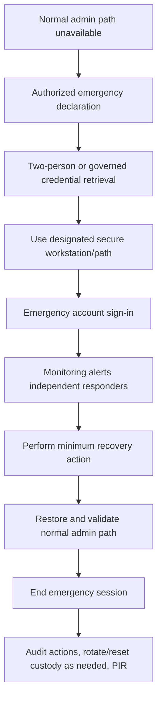

### Failure and break-glass tests

1. Normal admin cannot satisfy simulated method: emergency procedure is located without depending on that same identity.
2. One emergency credential/device is unavailable: second independent route exists.
3. Enforced-policy design accidentally includes emergency group: policy review fails and enforcement is blocked.
4. Monitoring does not alert on drill: recovery account remains functional, but readiness fails until monitoring is fixed.
5. Emergency account is used for routine work: treat as unauthorized process use and review every action.
6. Approvers for PIM are all inactive: emergency path can restore a viable approval/admin state.

## 9. Conditional Access mental model

Conditional Access is an authorization policy engine evaluated during token/sign-in flows. It is not a firewall rule and does not simply execute from top to bottom. Applicable policies combine; one policy's block is not canceled by another policy's grant.

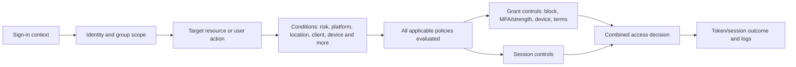

### 🔍 Plain-English deep-dive: report-only is a prediction recorded during real sign-ins

Report-only evaluates most policy logic during sign-ins but does not enforce its grant or session controls. **Analogy:** A new airport rule is applied on a clipboard to observe who would need extra screening, while passengers still follow current rules. A result such as `Report-only: Failure` means the proposed controls would not have been satisfied; it does not mean the current sign-in failed. `User action required` means enforcement would demand an action that report-only did not prompt. `Not applied` means scope/conditions did not match. Some user-action policies cannot use report-only, and device-compliance report-only checks can still produce certificate-selection prompts on some platforms according to current guidance. A report-only label is not a universal zero-impact guarantee.

## 10. Proposed report-only policy set

Every policy name includes environment, control, ring, and version. Record owner, purpose, source, dependencies, exclusions, state, creation/change date, test cases, and retirement/replacement.

| Policy | Include | Exclude | Target | Proposed control | State |
|---|---|---|---|---|---|
| `LAB-CA-ADMINS-PHISHRES-PILOT-v01` | Admin pilot group/selected admin roles after review | Emergency group, service identities as justified | Microsoft admin portals/current target | Require approved phishing-resistant authentication strength | Report-only |
| `LAB-CA-USERS-MFA-PILOT-v01` | User pilot group | Emergency group; documented incompatible identities | Selected Microsoft 365 test resource first | Require MFA | Report-only |
| `LAB-CA-BLOCK-LEGACY-PILOT-v01` | Pilot users | Emergency group and approved exception only | All/specified cloud apps after dependency review | Block legacy authentication client types | Report-only |
| `LAB-CA-DEVICE-COMPLIANT-DESIGN-v01` | Part 66 device pilot | Emergency and break/fix exclusion | Selected resource | Require compliant device | Report-only design; dependency not ready |
| `LAB-CA-UNMANAGED-RESTRICT-DESIGN-v01` | Pilot users | Emergency/approved exception | SharePoint/Exchange-supported scenario | Supported app/session restriction design | Report-only/simulation; Part 67 dependency |
| `LAB-CA-RISKY-USER-PLACEHOLDER-v01` | Risk persona or future ring | Emergency accounts and nonhuman identities as designed | Selected/all resources after review | Risk remediation/block according to approved strategy | Design only unless ID Protection licensed |

**Never create an `All users + All resources + Block` policy as an experiment.** For a real baseline, broad scope is often the destination, but it is reached through validated personas, emergency exclusions, service/workload identity analysis, dependency mapping, pilot groups, report-only evidence, staged enforcement, monitoring, communications, and support readiness.

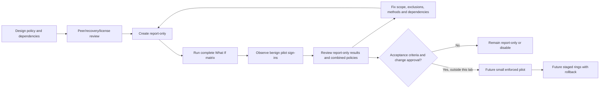

## 11. Hands-on policy creation steps

1. **Pre-change:** verify active admin and recovery route; export or manually record existing CA policies; inventory named locations, authentication strengths, method policies, target apps, service dependencies, and excluded identities. Record exact change ID.
2. **Scope:** choose one pilot group and a selected target resource. Do not begin with all users and all resources.
3. **Exclusions:** select the dedicated emergency group in the design even though report-only does not block. Add only documented technical exceptions with owner/expiry; never exclude a broad admin or user group to make errors disappear.
4. **Conditions:** leave unspecified conditions unconfigured unless the test requires them. A device-platform selection is based on reported context and can be unknown/spoofable in some flows; it is not device trust by itself.
5. **Controls:** choose the one intended grant/control. Avoid combining several new requirements until each can be interpreted.
6. **State:** select **Report-only** and reread the summary before create. If the portal does not support report-only for the selected user action, do not proceed hands-on.
7. **Evidence:** record the policy name, policy/object reference privately, state, includes, excludes, target, conditions, grants, session settings, creator, time, license, and expected results.
8. **Validation:** run What If, then benign pilot sign-ins using separate browser sessions. Review the actual sign-in and report-only tabs.
9. **No enforcement:** leave the policy report-only or disable/delete it during cleanup. `On` is outside this lab.

## 12. What If test matrix

What If estimates which enabled/report-only policies apply for supplied sign-in conditions. Current guidance says identity, target resource, device platform, and client app are required in the experience, and complete parameters produce more accurate evaluation. It does not test every service dependency; for example, evaluating Teams does not automatically model Exchange Online dependencies.

| Case | Identity | Resource/client/platform | Expected applicable policy | Expected nonapplication/reason |
|---|---|---|---|---|
| WI-01 | Identity admin | Admin portal/browser/Windows | Admin phishing-resistant | User MFA if admin not in user pilot |
| WI-02 | Pilot user | M365 test app/browser/Windows | User MFA | Admin policy: identity scope |
| WI-03 | Pilot user | M365 test app/legacy client scenario | Legacy block and perhaps user MFA | Device policy if deferred |
| WI-04 | Emergency account/group | Admin portal/browser/Windows | None of future blocking policies | Explicit exclusion |
| WI-05 | Standard nonpilot | M365 test app/browser/Windows | None | Not included |
| WI-06 | Device pilot user | Selected app/browser/Windows, device context supplied | Device design if report-only exists | Not reliable until Part 66 state exists |
| WI-07 | Risk placeholder | Selected app, high user/sign-in risk supplied if tool supports | Risk design | License/policy absent in live route |
| WI-08 | Guest paper persona | Selected collaboration app | Guest-specific result by scope | Home-tenant auth dependencies not fully simulated |

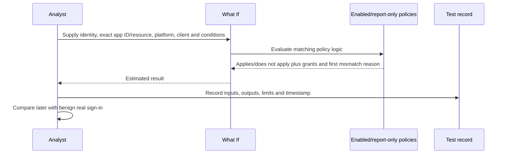

For simulation, build the same rows manually. For each policy, walk identity → target → conditions → exclusions → grants/session. Do not claim What If was run if it was not.

## 13. Sign-in logs and transaction diagnosis

Sign-in logs include interactive users, non-interactive users, service principals, and managed identities, with agent-related logging evolving. Use the exact sign-in category and event time. An interactive success can be followed by a non-interactive token failure; do not treat them as one row.

### 🔍 Plain-English deep-dive: a policy change does not rewrite an existing session

After authentication, an application can hold tokens or session cookies that represent an earlier decision. **Analogy:** Changing the guest list at noon does not erase a wristband issued at 11:55; the venue needs a defined recheck or revocation mechanism. A new Conditional Access policy can affect the next relevant token evaluation without instantly replaying every existing application session. Conversely, deleting a TAP prevents new use but does not necessarily invalidate every session established before expiry; current token and session controls determine that behavior. During testing, record token/sign-in time, policy-change time, client/session state, sign-in frequency, revocation action if authorized, and the fresh-session result. Never call a cached session a policy bypass until the documented token path and current controls are understood.

| Field/lens | Question |
|---|---|
| Identity | Correct user/object and member/guest/source? |
| Application/resource | Client app and target resource/service dependency? |
| Time/correlation | Exact UTC event, request/correlation identifiers, ingestion delay? |
| Status | Success, failure, interruption, error code and additional detail? |
| Authentication | Method sequence, requirement, result, MFA claim/source? |
| Conditional Access | Overall result, each enabled policy, each report-only result, exclusion reason? |
| Device | Device ID, join/managed/compliant state, browser context, unknown values? |
| Client | Browser/mobile/desktop/legacy protocol classification? |
| Network/location | IP/named location/country context and limitations? |
| Risk | User/sign-in risk fields only if licensed/available; state/time? |

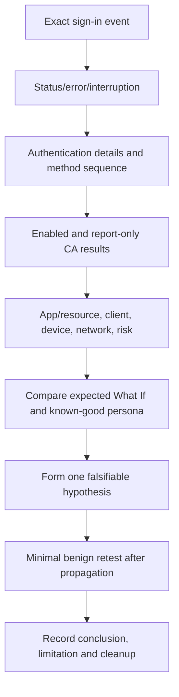

### Report-only result interpretation

| Result | Plain meaning | Next action |
|---|---|---|
| Report-only: Success | Conditions matched and noninteractive controls were already satisfied | Verify why; an existing MFA claim/device state may explain it |
| Report-only: Failure | Conditions matched but proposed control would not be satisfied, or block would apply | Confirm this is intended and user can remediate |
| Report-only: User action required | Enforcement would ask the user to meet a control, but report-only did not prompt | Test method availability and user journey separately |
| Report-only: Not applied | Scope or conditions did not match | Inspect exclusion and first nonmatching condition |
| Policy absent | Policy may be off, unsupported for flow, not propagated, or wrong event category | Check state, timing, identity/resource/client and current limitations |

## 14. Test execution: positive, negative, boundary, and failure

Use harmless sign-ins only. Do not attempt password spray, token theft, phishing, impossible travel, malicious legacy protocols, or deliberate compromise to generate a log.

| Test ID/type | Action | Expected outcome | Evidence |
|---|---|---|---|
| T01 positive | Pilot user signs into selected app with registered MFA | Access follows current controls; report-only MFA result recorded | Sign-in and policy tabs |
| T02 negative | Standard user attempts admin page/action | Authorization denied independent of CA | Error/audit record |
| T03 boundary | Nonpilot user accesses selected app | New pilot policy not applied | Report-only `Not applied` or simulation |
| T04 exclusion | Emergency-group persona evaluated in What If | Blocking/restricting design excluded | What If result |
| T05 legacy | Simulate legacy client in What If | Legacy-block policy applies | What If result; no real insecure client required |
| T06 method | Admin lacks approved phishing-resistant method | Report-only would require action/fail | What If/log or simulation |
| T07 TAP success | Pilot registers target method using short TAP | Registration succeeds; TAP then unusable/removed | Audit without secret |
| T08 TAP failure | Expired/deleted TAP attempted once | Authentication denied | Sanitized error/log |
| T09 SSPR success | Eligible cloud pilot resets synthetic password | Reset and notification/audit succeed | Redacted audit |
| T10 SSPR boundary | Non-scoped persona starts reset | Directed to support/not eligible | Synthetic or observed result |
| T11 PIM | Role before/during/after activation | Denied, allowed, denied as designed | PIM/audit or simulation |
| T12 risk | High-risk placeholder evaluated | Design policy applies only under licensed risk signal | Simulation caveat |
| T13 dependency | Teams-like app evaluated alone | What If limitation recorded; dependency tests added | Test note |
| T14 propagation | Immediate then delayed repeat after policy change | Event behavior converges after service propagation | Timeline |

### Boundary analysis

Test member versus guest, pilot versus nonpilot, admin versus standard, interactive versus noninteractive, modern versus legacy client classification, managed versus unmanaged/unknown device, included versus excluded resource, normal versus emergency account, and current versus expired privilege. A baseline is credible only if you can explain why a policy does **not** apply.

## 15. Failure scenarios and safe response

### Scenario A: the policy was accidentally set to On

1. Stop other changes and preserve exact time/policy/version.
2. Use the known-good normal admin path; use emergency access only under its declared procedure.
3. Set the new policy to report-only/disabled according to the approved rollback, not by deleting random policies.
4. Verify recovery with affected and unaffected personas and inspect sign-in/audit logs.
5. Revoke temporary privilege, communicate impact, and conduct a short review of why state review failed.

### Scenario B: the pilot admin cannot authenticate

Check method policy scope, registered methods, authentication strength, TAP state, CA results, PIM activation, client/app, token/session age, and propagation. Do not exclude all admins or turn off MFA tenant-wide. Restore the specific pilot through the authorized recovery route.

### Scenario C: What If and real sign-in differ

Compare complete What If inputs, exact app ID/resource, service dependencies, current enabled policies, report-only limitations, device claims, token history, client classification, risk/time, sign-in category, and propagation. The discrepancy is evidence to investigate, not proof that either tool is “wrong.”

### Scenario D: PIM activation is unapprovable

Confirm active approver availability and role; avoid configurations where every potential approver is merely eligible and nobody can activate. Use approved recovery authority, correct the approver design, test denial/approval, and document the dependency.

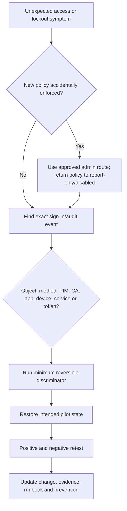

## 16. Device compliance and unmanaged-access dependencies

Do not enforce `require compliant device` in Part 65. Intune enrollment, compliance assignment, platform support, evaluation timing, device identity, primary user, licensing, and failure recovery belong to Part 66. If enforced before devices can become compliant, users can be locked out.

Unmanaged-access restriction is also workload-sensitive. Conditional Access can combine with supported application/session controls, while SharePoint/OneDrive unmanaged-device access uses workload behavior and licensing. Teams depends on SharePoint/OneDrive for files and Exchange for other functions. Model these dependencies now and implement/test in Parts 66–67.

| Future control | Required dependency | Part 65 action |
|---|---|---|
| Require compliant device | Intune enrollment/compliance and valid device signal | Report-only design only |
| Require app protection policy | Supported app/platform and Intune MAM | Design only |
| Restrict unmanaged SharePoint access | CA plus supported SharePoint control/license | Map user experience; defer |
| Block unsupported legacy auth | Client classification and service behavior | What If/report-only; no insecure traffic generation |
| Risk remediation | ID Protection signal/license and user recovery | Placeholder policy/test only |

## 17. Policy governance and deployment rings

| Governance field | Required content |
|---|---|
| Policy owner | Accountable identity/security service owner |
| Business/control objective | Threat and intended outcome |
| Version/state | Draft, report-only, future pilot-on, broader-on, disabled, retired |
| Scope | Included/excluded identities, resources, conditions |
| Dependencies | Methods, device, workload, network, risk, license, support |
| Exceptions | Reason, owner, approver, expiry, compensating control |
| Tests | What If, sign-in, positive/negative/failure/recovery |
| Metrics | Coverage, would-block, user-action, exceptions, failures, support demand |
| Rollback | Trigger, actor, method, recovery-account boundary |
| Review | Date, change/incident triggers, stale-object cleanup |

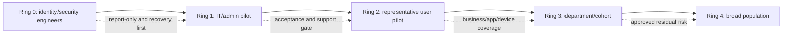

This lab ends before enforced Ring 0. The diagram is the production deployment design, not an instruction to enable it here.

## 18. Rollback and cleanup

| Item | Rollback/cleanup | Verification |
|---|---|---|
| CA policies | Leave report-only for documented later labs or disable/delete lab versions | No new policy is `On`; audit record reviewed |
| Method policy | Remove pilot scope or restore recorded baseline | Nonpilot unaffected; intended pilot state known |
| TAP | Delete/confirm expiration; never retain code | User method list and sign-in test |
| SSPR | Remove pilot scope or restore prior state | Eligibility test and notification state |
| PIM | Deactivate and remove temporary eligibility/settings | Role inventory and audit |
| Direct roles | Remove temporary role assignments | Standard/admin negative tests |
| Test sessions | Sign out/revoke according to test plan where justified | Fresh session result |
| Users/groups | Retain only those required for Parts 66–67; remove extras | Object/license inventory reconciled |
| Evidence | Store sanitized derivative; delete secret-bearing working copies | Redaction review complete |

Rollback is policy-specific. Turning off one policy may not restore access if another policy, authentication-method restriction, PIM state, workload authorization, or stale token is responsible. Verify the whole decision path.

## 19. Evidence package and health-check report

| Artifact | Minimum content | Redaction/honesty rule |
|---|---|---|
| Architecture | Objects, methods, privilege, CA, logs, recovery | Fictional names only |
| License map | Feature, entitlement observed/assumed, source/date | Never imply universal inclusion |
| Object/group register | Purpose, owner, membership concept, lifecycle | No tenant IDs or real UPNs |
| Authentication strategy | Persona, target method, bootstrap, recovery | No TAP, key, QR code, phone, method detail |
| PIM design | Roles, eligibility, activation, approvers, tests | Label simulation if unavailable |
| CA register | Exact sanitized scope, exclusion, state, dependency | Prove `Report-only`, not `On` |
| What If matrix | Complete inputs, applies/not-applies, limitations | State whether tool was actually run |
| Sign-in analysis | Event time, category, policy/result reasoning | Remove IP, IDs, domain, user details |
| Test report | Expected/actual, pass/fail/deferred, evidence, cleanup | Do not convert deferred to pass |
| Emergency drill | Trigger, custody, minimal action, alert, review | No account/credential/storage detail |
| Findings | Condition, evidence, risk, recommendation, owner | Separate lab observation from client assertion |

Suggested findings:

| Finding | Risk | Recommendation | Status |
|---|---|---|---|
| Pilot authentication method is remotely phishable | Admin session compromise | Move admin target to supported phishing-resistant strength | Design/pilot |
| PIM unavailable in current lab license | JIT behavior not observed | Complete simulation and validate in authorized licensed environment | Accepted limitation |
| Device-compliance policy lacks Part 66 signal | Premature enforcement could lock out users | Keep report-only and defer enforcement | Open dependency |
| Emergency monitoring adds Azure cost | Unmonitored recovery use | Design alert now; implement only with approved cost/platform | Simulation |
| Legacy-client policy matches expected What If case | Legacy authentication would be blocked | Validate actual protocol inventory before real rollout | Report-only evidence |

## 20. Interview explanation structure

Use **C-O-N-T-R-O-L**:

1. **Context:** isolated test tenant or simulation, date, entitlement, fictional personas.
2. **Objective:** threat and access outcome.
3. **Names/scope:** objects, pilots, resources, exclusions, dependencies.
4. **Test safely:** report-only, complete What If cases, benign sign-ins, negative tests.
5. **Read evidence:** authentication details, per-policy result, device/client/app/time.
6. **Operate/recover:** PIM, emergency access, monitoring, support, rollback.
7. **Limit claims:** observed versus simulated and what production validation remains.

## 21. Official Source Anchors

These first-party sources were reviewed for the August 24, 2026 study-guide currency point. Recheck each before implementation.

1. Microsoft Entra authentication overview: <https://learn.microsoft.com/en-us/entra/identity/authentication/overview-authentication>
2. Authentication methods policy: <https://learn.microsoft.com/en-us/entra/identity/authentication/how-to-authentication-methods-manage>
3. Authentication strengths: <https://learn.microsoft.com/en-us/entra/identity/authentication/concept-authentication-strengths>
4. Passkeys/FIDO2 overview: <https://learn.microsoft.com/en-us/entra/identity/authentication/concept-authentication-passkeys-fido2>
5. Configure Temporary Access Pass: <https://learn.microsoft.com/en-us/entra/identity/authentication/howto-authentication-temporary-access-pass>
6. SSPR overview: <https://learn.microsoft.com/en-us/entra/identity/authentication/concept-sspr-howitworks>
7. Conditional Access overview: <https://learn.microsoft.com/en-us/entra/identity/conditional-access/overview>
8. Plan a Conditional Access deployment: <https://learn.microsoft.com/en-us/entra/identity/conditional-access/plan-conditional-access>
9. Conditional Access report-only evaluation: <https://learn.microsoft.com/en-us/entra/identity/conditional-access/concept-conditional-access-report-only>
10. Conditional Access What If: <https://learn.microsoft.com/en-us/entra/identity/conditional-access/what-if-tool>
11. Conditional Access policy templates: <https://learn.microsoft.com/en-us/entra/identity/conditional-access/concept-conditional-access-policy-common>
12. Block legacy authentication: <https://learn.microsoft.com/en-us/entra/identity/conditional-access/policy-block-legacy-authentication>
13. Require phishing-resistant authentication strength for administrators: <https://learn.microsoft.com/en-us/entra/identity/conditional-access/policy-admin-phish-resistant-mfa>
14. Sign-in logs: <https://learn.microsoft.com/en-us/entra/identity/monitoring-health/concept-sign-ins>
15. Conditional Access troubleshooting: <https://learn.microsoft.com/en-us/entra/identity/conditional-access/troubleshoot-conditional-access>
16. PIM overview: <https://learn.microsoft.com/en-us/entra/id-governance/privileged-identity-management/pim-configure>
17. Microsoft Entra ID Governance licensing fundamentals: <https://learn.microsoft.com/en-us/entra/id-governance/licensing-fundamentals>
18. Emergency access accounts: <https://learn.microsoft.com/en-us/entra/identity/role-based-access-control/security-emergency-access>
19. Microsoft Entra ID Protection overview: <https://learn.microsoft.com/en-us/entra/id-protection/overview-identity-protection>
20. Microsoft Entra licensing: <https://learn.microsoft.com/en-us/entra/fundamentals/licensing>
21. Conditional Access service dependencies: <https://learn.microsoft.com/en-us/entra/identity/conditional-access/service-dependencies>
22. Microsoft mandatory MFA planning: <https://learn.microsoft.com/en-us/entra/identity/authentication/concept-mandatory-multifactor-authentication>

## ⭐ Likely Interview Questions for This Section

### Q1. How would you deploy a Conditional Access baseline safely?

**Model answer:** I inventory identities, admin roles, authentication methods, apps, service/workload identities, devices, locations, existing policies, dependencies, licenses, and emergency access first. I translate each objective into a small named policy, use representative pilot groups and explicit emergency exclusions, create it report-only, run complete What If cases, observe benign sign-ins and per-policy results, resolve method/device/app/support gaps, and define metrics and rollback. Enforcement would start with a small approved ring and monitoring, never all users broadly in an ad hoc lab.

### Q2. What does report-only Conditional Access prove and not prove?

**Model answer:** It records how most policy logic evaluates during sign-ins without enforcing grant or session controls. `Success`, `Failure`, `User action required`, and `Not applied` describe the proposed policy, not necessarily the actual sign-in outcome. It helps estimate impact but does not prompt users to satisfy controls, cover every user-action policy or service dependency, prove support readiness, or guarantee zero user effect; current guidance notes some compliance evaluations can still cause certificate prompts on certain platforms. I combine it with What If, real pilot logs, dependency tests, and recovery drills.

### Q3. How do authentication methods policy, authentication strength, and Conditional Access differ?

**Model answer:** The methods policy controls which users can register or use particular authentication methods. An authentication strength defines which method combinations satisfy a required assurance level. Conditional Access decides when an identity/resource/context must meet MFA, a strength, device, block, or session requirement. The sign-in log shows the method sequence and per-policy outcome. I align all four; enabling a strong method does not require it, and requiring it before users can register causes lockout.

### Q4. How would you use Temporary Access Pass securely?

**Model answer:** I treat TAP as a short-lived bootstrap secret issued only after approved identity verification. I scope the method policy to an onboarding cohort, use the minimum role, start time, lifetime, and one-time behavior, deliver it through a controlled separate channel, never log or screenshot the value, have the user register the target strong method promptly, monitor the events, remove obsolete methods as approved, and delete or verify expiry. I test expired use and account for replication and current registration timing limitations.

### Q5. What is your PIM design for administrators and why are emergency accounts different?

**Model answer:** Normal admins receive the narrowest role as eligible/time-bound where licensed, with a short activation, appropriate MFA or phishing-resistant strength, justification, approval for sensitive roles, notifications, audit, and access review. I test before, during, and after activation and avoid approver deadlocks. Current emergency-access guidance is deliberately different: at least two cloud-only recovery accounts, independent strong authentication, permanent-active recovery privilege, exclusions from policies that could block them, monitored use, secure custody, and regular drills. They are never daily admins.

### Q6. How do you troubleshoot a Conditional Access sign-in?

**Model answer:** I anchor on the exact user, UTC time, app/resource, client, and sign-in category. I read status/error and authentication details, then every enabled and report-only policy result, scope/exclusion, conditions, grant/session requirements, device claims, location, risk, and token context. I compare a known-good persona and a complete What If scenario, account for service dependencies and propagation, form one falsifiable hypothesis, run a minimal reversible test, and verify both access and denial. I do not disable all policies or grant Global Administrator as a diagnostic shortcut.

### Q7. How would you connect Intune compliance and unmanaged-device restrictions later?

**Model answer:** I keep those policies report-only/design-only until Part 66 proves enrollment, device identity, compliance assignment, evaluation, licensing, supported platforms, and recovery. Then I test a selected resource with compliant, noncompliant, unmanaged, unknown, and excluded devices. For SharePoint and OneDrive restrictions I also validate workload controls and Teams/Exchange dependencies in Part 67. A CA device requirement before devices can become compliant is a lockout design.

### Q8. How do you describe your hands-on depth honestly?

**Model answer:** I state the exact isolated environment, date, licenses, personas, and actions. I can say I created report-only policies, ran What If, and analyzed synthetic sign-ins only if I actually did. I label PIM, ID Protection, hardware-key, emergency-account, or license-dependent work as design/simulation where unavailable. I connect the method to my production support strengths in troubleshooting, incident safety, evidence, RCA, and communication, but I do not call a small lab an enterprise deployment or claim client production ownership.

## 🧠 30-Second Memory Hooks

- **Objects are the cast; groups are the targeting list; AUs scope supported administration.**
- **Methods permit; strength defines acceptable proof; CA decides when; logs show what happened.**
- **Phishing-resistant means the credential resists the impostor origin, not merely extra prompts.**
- **TAP is a boarding pass:** short-lived, controlled, never the destination credential.
- **SSPR needs eligibility plus enough registered methods.**
- **PIM makes privilege eligible and temporary; it does not make a broad role least privilege.**
- **Emergency access is intentionally exceptional:** two cloud-only routes, independent strong auth, active recovery privilege, exclusions, alerts, drills.
- **CA is an AND/OR policy engine, not an ordered firewall list.**
- **Report-only predicts; it does not challenge or block.**
- **What If needs complete inputs and misses some service dependencies.**
- **Read one exact sign-in, then compare.**
- **Pilot before population; recovery before enforcement.**
- **Device compliance is a Part 66 dependency, not a Part 65 assumption.**
- **Observed, simulated, unavailable:** keep those statuses separate.

## Completion Checklist

- [ ] I passed Part 64's ownership, isolation, data, evidence, cost, and cleanup gate.
- [ ] I documented whether this lab was hands-on, simulated, or mixed by feature.
- [ ] I mapped current licenses for Conditional Access, SSPR, PIM, ID Protection, logs, and authentication features without assuming a trial.
- [ ] I created or designed standard, pilot, admin, help-desk, SOC, guest, high-risk, and emergency personas.
- [ ] I created assigned pilot and emergency-exclusion groups with owner and lifecycle.
- [ ] I can explain users, groups, devices, apps/service principals, and administrative units.
- [ ] I built a persona-specific authentication-method, bootstrap, and recovery strategy.
- [ ] I distinguished generic MFA, phishing-resistant methods, authentication strength, method policy, and CA.
- [ ] I designed and, where safe, tested TAP without recording its secret.
- [ ] I designed and, where licensed, tested SSPR for eligible, ineligible, and insufficient-method outcomes.
- [ ] I documented cloud-only versus hybrid/writeback scope and did not build unsafe hybrid dependencies.
- [ ] I designed PIM roles, eligibility, activation, MFA/strength, justification, approval, notifications, audit, expiry, and review.
- [ ] I tested or simulated privilege before, during, and after activation.
- [ ] I designed at least two independent cloud-only emergency accounts according to current guidance.
- [ ] I documented emergency authentication, custody, CA exclusions, monitoring, drill, minimal use, and post-use review.
- [ ] I created the six named baseline policies only in report-only or design state.
- [ ] I verified that no new Conditional Access policy is `On`.
- [ ] I included emergency exclusions and documented every other exception with owner and expiry.
- [ ] I ran or simulated complete What If cases for admins, users, legacy, excluded, device, risk, and guest boundaries.
- [ ] I documented What If's input and service-dependency limitations.
- [ ] I generated only benign sign-ins and did not simulate attacks against any account/system.
- [ ] I can interpret report-only Success, Failure, User action required, Not applied, and absent policy.
- [ ] I correlated identity, app/resource, client, device, method, CA, status, time, token, location, and risk fields.
- [ ] I tested positive, negative, boundary, exclusion, method, TAP, SSPR, PIM, risk, dependency, and propagation cases.
- [ ] I kept device compliance and unmanaged-workload controls report-only/design-only for Parts 66–67.
- [ ] I documented accidental-enforcement, admin-lockout, What If mismatch, and PIM-approver failure responses.
- [ ] I defined production rings and acceptance criteria without enforcing them in this lab.
- [ ] I removed temporary roles, TAPs, sessions, licenses/objects, and secret-bearing evidence as planned.
- [ ] I packaged architecture, matrices, policy register, test evidence, findings, rollback, and honest limitations.
- [ ] I can answer Q1–Q8 aloud in 60–90 seconds each.

*Next suggested section:* [Part 66](Part-66-lab-intune-endpoint-security.md)