# Part 66 — LAB 2 - Intune Enrollment, Compliance, Security Baseline, and Endpoint Protection

> **Section goal:** Design and, where an isolated licensed test tenant plus a disposable lawful endpoint permit, implement a small Microsoft Intune endpoint-security pilot. By the end, you should be able to map device personas and enrollment methods; validate platform-token and ownership prerequisites; create nonoverlapping configuration, settings-catalog, security-baseline, compliance, and endpoint-security policies; connect compliance safely to the report-only Conditional Access dependency from Part 65; design antivirus, attack-surface reduction, firewall, encryption, endpoint detection and response, Windows LAPS, and Endpoint Privilege Management controls according to license; protect BYOD work data with app protection; compare current Windows Autopilot paths; design MDE onboarding and Configuration Manager co-management without pretending unavailable infrastructure exists; troubleshoot assignment, applicability, conflicts, sync, logs, and reports; and roll back, clean up, and present honest evidence.

This lab maps directly to the role's expectations for Microsoft Intune, endpoint security, Zero Trust device signals, Defender integration, policy design, configuration/compliance, Conditional Access, mobile application management, Autopilot, Configuration Manager coexistence/co-management, deployment rings, troubleshooting, health checks, licensing, documentation, rollback, operations, and client communication. Arti's experience tracing Microsoft 365 symptoms across clients, identities, services, networks, logs, and timelines is valuable here: Intune troubleshooting likewise follows assignment → applicability → delivery → local processing → effective state → reported state → access decision.

> **Currency, licensing, support, and portal warning (August 24, 2026):** Intune plans, suites, add-ons, platform support, enrollment methods, Apple/Google tokens, Android management modes, Autopilot and Windows Autopilot device preparation paths, security-baseline versions, settings, configuration service providers (CSPs), policy refresh, Windows support, MDE integration, EDR, LAPS, Endpoint Privilege Management (EPM), reports, remote actions, and preview status change. Verify current Microsoft Learn, Product Terms, Intune licensing, Windows release/support information, platform-vendor requirements, and the exact tenant/device before action. A trial is never promised. Intune licensing applies to users or devices that benefit directly or indirectly as current terms describe; advanced capabilities can require additional entitlement.

> **Safety boundary:** Pass [Part 64](Part-64-lab-safe-microsoft-security-environment.md) and retain Part 65's recovery design. Never enroll, join, reset, wipe, retire, reimage, encrypt, rotate keys/passwords, onboard to MDE, change firewall/ASR/EDR, or collect diagnostics from an employer, client, school, family, shared, or primary personal device. Use a disposable personally owned test device or lawful evaluation/local VM containing only synthetic data. Verify VM support before applying physical-device baselines; current Microsoft guidance warns that the Defender for Endpoint baseline is optimized for physical devices and can affect virtual/remote sessions. If safe hardware, entitlement, or platform prerequisites are absent, use the complete no-paid-tenant simulation path.

## JD Mapping

| Role expectation | Capability developed | Safe portfolio evidence |
|---|---|---|
| Design endpoint-management architecture | Map identities, device ownership, enrollment, management channels, apps, security, compliance, and Entra access | Endpoint target architecture |
| Implement Intune controls | Build a narrow pilot with explicit assignments, filters, versions, and expected effective state | Sanitized policy register |
| Apply Zero Trust | Feed proven compliance into report-only CA and design MAM for unmanaged devices | Device-access decision matrix |
| Engineer endpoint security | Rationalize antivirus, ASR, firewall, encryption, EDR, LAPS, EPM, and baselines | Control/channel ownership map |
| Plan modern deployment/migration | Compare Autopilot paths and design SCCM co-management workload transitions | Enrollment and migration plan |
| Troubleshoot across layers | Correlate tenant, user, device, assignment, MDM, CSP, local logs, reports, token, and CA | Diagnostic casebook |
| Operate and report | Define rings, exceptions, health, support, rollback, cleanup, and findings | Validation and health-check report |

## Candidate honesty note

Arti can connect this lab to real endpoint-adjacent Microsoft 365 support skills: identity/client/network isolation, log correlation, sync behavior, change validation, user impact, escalations, evidence, handoffs, and RCA. She must distinguish direct configuration on a disposable lab endpoint from paper design. She should not claim production Intune architecture, global enrollment, MDE onboarding, Autopilot hardware lifecycle, mobile-platform token ownership, enterprise BitLocker recovery, LAPS/EPM operation, or SCCM co-management unless separately evidenced.

> “I designed a complete Intune endpoint-security pilot and, where my isolated tenant and disposable endpoint supported it, tested enrollment, configuration, compliance, reporting, sync, and rollback. I kept Conditional Access report-only, used synthetic data, and avoided destructive remote actions. MDE, EPM, platform-token, Autopilot, and Configuration Manager scenarios were implemented only when genuinely licensed and available; otherwise I produced architecture, assignments, test cases, expected logs, failure handling, and migration plans. I present that difference explicitly.”

---

## 1. Architecture and dual completion paths

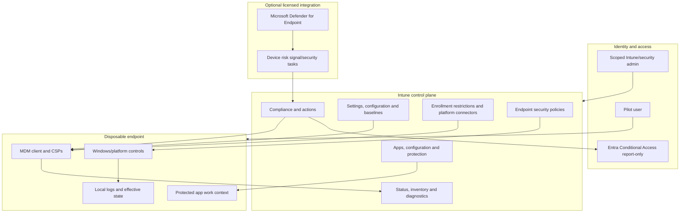

| Lab domain | Hands-on path | Design/simulation fallback |
|---|---|---|
| Device | Disposable lawful Windows device/VM supported for selected settings | Fictional device records and local-state outputs |
| Enrollment | Entra join/register/enrollment only under documented path | Sequence diagram, prerequisite checklist, expected records |
| Configuration | One small settings profile plus selected baseline items | Full policy register with CSP/applicability mapping |
| Compliance | One Windows pilot policy; CA remains report-only | Simulated device states and Entra signal timing |
| Endpoint security | Safe non-disruptive settings selected after capability review | Complete AV/ASR/firewall/encryption/EDR/LAPS/EPM design |
| BYOD MAM | Only on disposable personal test mobile device/account if lawful | App/data-flow simulation; no personal work data |
| Autopilot | Only with lawful registered test hardware and current requirements | Compare classic/current device-preparation paths on paper |
| MDE | Onboard only if tenant/device entitlement and VM support are verified | Design connector, EDR policy, sensor health, risk and offboarding |
| Co-management | Only in a real authorized lab with supported Configuration Manager | Full fictional workload/pilot transition plan |

## 2. Prerequisites, licensing, roles, and change gate

| Prerequisite | Hands-on evidence | Failure route |
|---|---|---|
| Part 64 safe environment | Signed readiness and cleanup plan | Simulation only |
| Part 65 identity baseline | Pilot user/group, admin separation, report-only CA | Do not test access enforcement |
| Current Intune entitlement | Tenant status and assigned user/device entitlement | Policy design only |
| Scoped administration | Intune RBAC/Endpoint Security Manager concept and scope tags | Do not grant standing Global Admin |
| Supported endpoint | Personally owned disposable device/VM, edition/build/support verified | Simulate local state |
| Recovery | Local/tenant recovery, snapshot/reset, encryption-key plan | Do not encrypt/enroll |
| Synthetic data | No real work/personal sensitive files | Prepare test pack first |
| Network | Ordinary outbound access, no bypass | Simulation if corporate controls apply |
| Evidence | Redacted journal and log-handling rules | No diagnostics collection |

| Capability | License/dependency caveat | Lab decision |
|---|---|---|
| Intune core MDM/MAM | Verify current Intune Plan 1/bundle and benefiting-user/device rules | Hands-on only with assigned entitlement |
| Conditional Access | Entra ID P1 commonly required | Remains report-only from Part 65 |
| MDE/EDR/risk | Defender for Endpoint plan and connector/platform prerequisites | Design unless verified |
| Endpoint Privilege Management | Advanced Intune capability/additional entitlement | Design by default |
| Remote Help/Advanced Analytics | Plan 2/Suite relationships change | Not required |
| Windows LAPS | Supported Windows, directory backup model, policy/role permissions | Safe design; live only with recovery test |
| Autopilot | Supported Windows, identity/MDM/licensing, device registration, vendor/OEM path | Design unless test hardware is lawful |
| Co-management | Supported Configuration Manager, Entra join state, Intune, auto-enrollment and licensing | Simulation by default |

The change gate rejects a deployment when the assignment contains an unreviewed broad group, baseline defaults are not inspected, a setting has two owners, encryption recovery is unproven, the device is not disposable, MDE offboarding is absent, app-protection could touch personal data unexpectedly, CA is on, or a remote destructive action appears in the test.

## 3. Device personas and enrollment map

A device persona combines ownership, user relationship, platform, join/registration state, management method, data sensitivity, and operational pattern. One “Windows device” policy cannot safely represent every persona.

| Persona | Ownership/use | Identity/management target | Primary controls | Lab route |
|---|---|---|---|---|
| Corporate user laptop | Organization-owned, one primary user | Entra joined + Intune MDM | Baseline, compliance, endpoint security, apps | Disposable Windows pilot or simulation |
| Existing domain laptop | Organization-owned hybrid estate | Hybrid joined + ConfigMgr/Intune co-management | Workload authority by pilot | Simulation |
| Shared/frontline device | Organization-owned, multiple/no affinity | Supported shared enrollment | Device-targeted restrictions/apps | Simulation |
| Kiosk/dedicated | Organization-owned, single purpose | Device-only/userless supported path | Allowlisted app and locked configuration | Simulation |
| BYOD mobile | Personally owned | Entra registration plus MAM; enrollment optional by policy | App PIN, encryption, data transfer, selective wipe | Simulation preferred |
| Privileged workstation | Organization-owned hardened admin device | Dedicated join/management and strong access controls | Strong baseline, restricted apps/network | Architecture only |
| Break/fix device | Temporary support/recovery | Controlled enrollment ring | Minimal policy, diagnostics, cleanup | Paper persona |
| Developer/exception | Special tools and elevated needs | Separate group/filter and approved exception | Compensating controls, expiry, monitoring | Simulation |

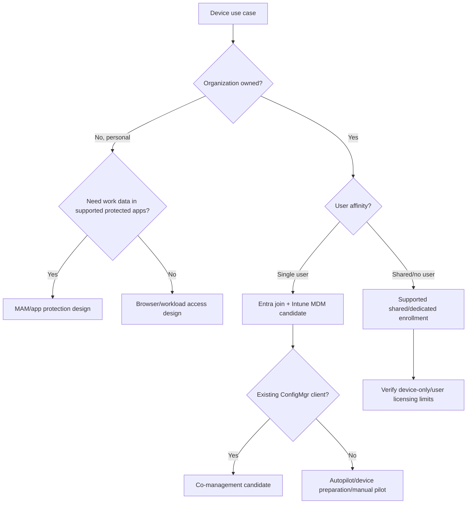

### 🔍 Plain-English deep-dive: registered, joined, enrolled, and compliant are different

- **Entra registered** — *the device has an identity association often used for personal/BYOD scenarios.* **Analogy:** A visitor's device is noted at reception. **Why it matters:** Registration does not mean full organizational ownership or Intune management.
- **Entra joined** — *the device uses the organization's Entra tenant as its primary cloud identity relationship.* **Analogy:** The laptop receives an employee asset badge. **Why it matters:** It supports cloud-native Windows management scenarios but still does not prove enrollment or health.
- **Intune enrolled** — *the device has an MDM management relationship and can receive applicable policy.* **Analogy:** The asset is assigned to the maintenance system. **Why it matters:** Enrollment is a delivery channel, not proof that every setting applied.
- **Compliant** — *Intune evaluated assigned rules and reported the device meets them at a point in time.* **Analogy:** The latest inspection passed. **Why it matters:** Compliance can become stale, can be “compliant” when no policy applies depending on tenant settings, and only affects access when CA consumes it.

## 4. Platform-token and connector prerequisites

Mobile/platform enrollment depends on vendor services and expiring tokens or certificates. Do not click through setup without an owner and renewal plan.

| Platform/path | Typical prerequisite to verify | Lifecycle risk | Simulation artifact |
|---|---|---|---|
| Windows automatic MDM enrollment | Entra ID licensing, Intune entitlement, MDM user scope, supported join and Windows edition/build | Broad MDM scope can enroll unintended devices | Scope and enrollment sequence |
| Windows manual/company access | Supported account/device and enrollment restriction | Personal device accidentally organization-managed | User communication and removal path |
| Apple push/MDM | Apple Push Notification service certificate tied to governed Apple account | Annual/current renewal and account ownership; wrong renewal can disrupt management | Certificate owner/expiry runbook |
| Apple automated enrollment | Apple Business/School Manager connection and enrollment token/profile | Token expiry, terms, device assignment and federation dependencies | Token and ADE profile design |
| Apple apps/books | Apps and Books location token/current app licensing path | Location/token ownership and renewal | App procurement design |
| Android Enterprise | Managed Google Play binding and supported enrollment profile | Account ownership, terms, mode deprecation/change | Binding and enrollment map |
| Android AOSP/dedicated | Supported vendor/device/mode prerequisites | Capability differs from GMS devices | Applicability table |
| Chrome/Linux/macOS | Platform-specific agent, enrollment, extension/token/profile prerequisites | Feature parity and support differ | Platform capability matrix |

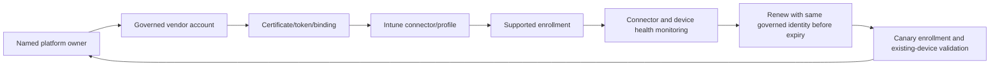

This Windows-focused lab does not require Apple or Android connectors. Build their prerequisite and renewal records on paper. Never use a personal Apple/Google account as an enterprise ownership pattern in a portfolio claim.

## 5. Enrollment restrictions and hands-on Windows setup

Enrollment restrictions define which platforms, versions, ownership categories, and limits can enroll. They are guardrails, not a replacement for procurement and device identity.

| Restriction/design | Pilot value | Reason/test |
|---|---|---|
| Platform | Windows supported build only | Other platforms remain simulation |
| Ownership | Disposable test device explicitly recorded | Avoid primary/personal accidental management |
| User/device limit | Minimum needed for pilot | Test duplicate/stale enrollment handling |
| MDM user scope | Pilot group only | Avoid broad automatic enrollment |
| Device naming/category | `LAB-WIN-PILOT-01`, category `Lab-Pilot` | Assignment/readability; do not rely on name for trust |
| Enrollment manager | Not used | Avoid shared/high-volume enrollment complexity |
| Terms/user notice | Plain lab notice and cleanup impact | User understands organization control/removal |

### Hands-on path

1. Record host/device ownership, exact supported Windows edition/build, VM/hardware status, Secure Boot/TPM availability, disk/recovery state, local admin route, network, and snapshot/backup. Do not collect public hardware identifiers.
2. Inspect MDM authority, automatic-enrollment scope, enrollment restrictions, device limit, and current device records.
3. Assign the Intune license only to the pilot user and include only that user in the MDM pilot scope.
4. Create the Windows pilot group and optional filter after the device exists. Keep assignment small.
5. Enroll through the current supported path chosen in the change record. Record the exact user, time, join/registration state, Intune record, Entra record, management name, primary user, ownership, and latest check-in.
6. Confirm the standard user is not made an unintended local administrator by the enrollment design.
7. Trigger one supported sync, then allow propagation. Do not repeatedly hammer sync or delete/re-enroll before logs are collected.
8. Run the baseline inventory before assigning security policy.

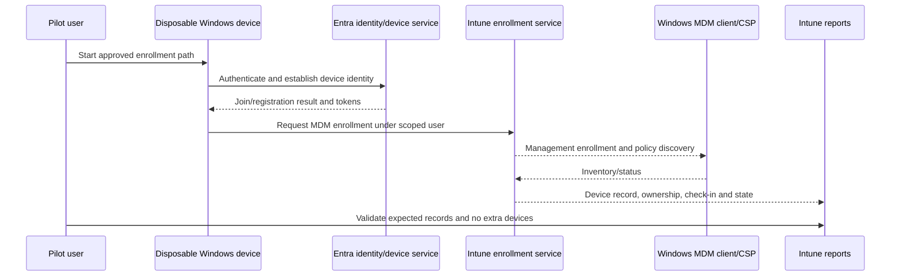

### Simulation path

Create synthetic Entra and Intune device records with different IDs, join type, management state, owner, primary user, enrollment profile, OS build, last check-in, compliance, and retirement state. Walk through successful enrollment, unsupported edition, user not licensed, MDM scope excluded, device limit reached, duplicate record, network failure, terms rejection, and cleanup.

## 6. Desired-state inventory and policy-channel ownership

Intune has several policy surfaces. Choose one owner for each setting wherever possible.

| Surface | Primary job | Example | Main conflict risk |
|---|---|---|---|
| Settings catalog | Granular modern settings across supported CSPs | Disable a selected consumer feature | Same setting in baseline/GPO |
| Templates/device configuration | Scenario-oriented configuration | Device restrictions, certificates, kiosk | Overlap with settings catalog |
| Security baseline | Versioned Microsoft-recommended starting set | Windows/Edge/Office baseline | Broad defaults overlap other policies |
| Endpoint security policy | Focused security capability | Antivirus, firewall, encryption, ASR, EDR, account protection | Same Defender/BitLocker setting elsewhere |
| Compliance policy | Evaluate minimum acceptable state | Encryption/OS/health requirement | Can conflict/remediate differently; CA consequences |
| App protection/configuration | Protect/configure supported app work context | Copy/paste, PIN, managed app settings | App/platform/identity applicability |
| GPO | On-premises domain policy | Legacy enterprise Windows settings | MDM policy and tattooing/precedence |
| Configuration Manager | Co-managed workload authority | Endpoint protection/apps/updates | Workload not moved or duplicated |
| Local setting/script | Diagnostic or specialized action | Controlled local inspection | Drift and unsupported overwrite |

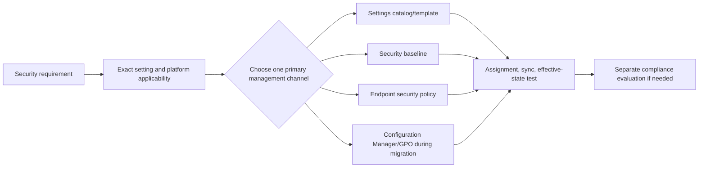

### 🔍 Plain-English deep-dive: assigned is not applied, and applied is not effective

**Assigned** means the target calculation includes a user/device. **Applicable** means the setting supports that platform/edition/context. **Delivered** means the client received policy. **Processed** means the client/CSP attempted it. **Effective** means the local security behavior now matches the intended state. **Reported** means telemetry later represented that result. **Compliant** means rules evaluated acceptable state. **Analogy:** Mailing a thermostat instruction does not prove it reached the right building, the thermostat understood it, the furnace changed, or the inspector passed the room. Troubleshooting must identify the first broken boundary.

## 7. Configuration and security-baseline pilot

Do not assign an entire baseline with defaults to a remote-only VM without review. Baselines are recommended starting configurations, not automatic proof of business compatibility or framework compliance. Current documentation notes versions evolve, old profile settings can become read-only, overlapping baseline types can differ, preview baselines should not be production defaults, and the MDE baseline is not recommended for VMs/VDI in current guidance.

| Pilot control | Primary channel | Hands-on value | Simulation extension |
|---|---|---|---|
| Screen lock/inactivity | Settings catalog or reviewed baseline, one owner | Safe short test value | Accessibility/user-experience matrix |
| Windows Security visibility | Configuration/endpoint setting | Keep visible | Test user can see status but not change managed state |
| Defender real-time protection | Antivirus endpoint policy if supported | Enable/verify, no malware required | Passive/third-party AV coexistence cases |
| Firewall profiles | Firewall endpoint policy | Verify enabled; no broad rule changes | Domain/private/public and merge design |
| Encryption | Disk encryption endpoint policy only after recovery proof | Prefer design on VM; avoid automatic silent encryption surprise | Key escrow/rotation/recovery plan |
| Local admin membership | Account protection policy/design | Inventory only first | Group replacement/update semantics |

### Hands-on policy method

1. Inventory existing local effective values and all Intune/GPO/ConfigMgr policy owners.
2. Select two or three low-risk, reversible settings applicable to the disposable endpoint.
3. Create `LAB-INTUNE-WIN-CONFIG-R0-v01` with descriptions containing owner, source, rationale, version, change ID, rollback, and expiry.
4. Assign only the pilot device/user group and a tested filter if needed.
5. Sync once, wait for processing, inspect per-setting status and local effective state.
6. Run positive and negative user tests. A standard user should not be able to undo a managed security setting through ordinary UI when the setting is enforced.
7. Remove assignment and verify rollback behavior. Some settings can persist or require explicit opposite configuration; document the exact CSP behavior rather than assuming removal reverses it.

## 8. Compliance policy and Conditional Access dependency

Configuration tries to set state; compliance evaluates state. Compliance status flows to Entra, where Conditional Access can use it. This lab keeps the CA policy report-only.

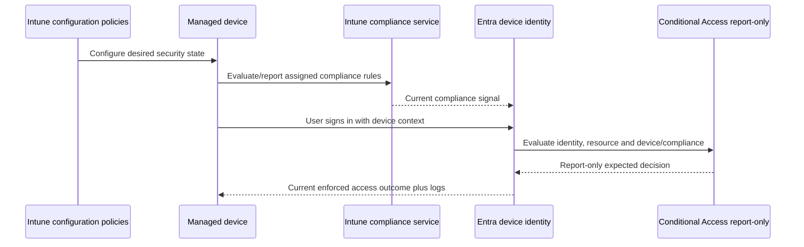

| Compliance decision | Pilot design | Caveat |
|---|---|---|
| Unassigned devices | Review tenant-wide default before any CA use | Default can treat no-policy devices as compliant; production strategy needs deliberate change/rings |
| Validity period | Keep existing safe value; simulate shorter/longer tradeoff | Stale/offline devices can become noncompliant |
| Minimum OS | Use a value the supported pilot currently meets, then simulate failure | Product support is more than version number |
| Encryption | Evaluate only if encryption/recovery design is safe | Windows can be quarantined rather than auto-fixed |
| Firewall/antivirus | Use supported built-in rule availability | Report latency and third-party security products matter |
| Secure Boot/code integrity | Only when VM/hardware attestation supports it | Unknown/not applicable is not “healthy” |
| MDE machine risk | Deferred until connector/onboarding licensed and healthy | Missing signal can change compliance behavior |
| Actions | Immediate mark plus benign notification design | No remote lock/retire in this lab |

Create `LAB-COMP-WIN-PILOT-v01`, assign only the Windows pilot, and test compliant, one intentionally noncompliant-but-safe setting, not-applicable, stale/no-check-in simulation, and remediation. Do not deliberately disable antivirus/firewall or encryption to fail a rule. Instead, choose a harmless minimum-version threshold in simulation, use an unassigned synthetic device, or inspect expected outcomes on paper.

### 🔍 Plain-English deep-dive: “compliant” is a scoped, time-bound claim

A green device is not universally secure. It means assigned compliance rules were evaluated from available signals within validity rules. **Analogy:** A vehicle passed the inspection checklist used that day; the report does not say the driver is trustworthy, cargo is safe, or every mechanical part was examined. Record policy assignment, last contact, rule results, device identity, grace/validity, and signal sources. Conditional Access also needs the correct device claim in the sign-in. Never report “100% secure because Intune says compliant.”

## 9. Endpoint-security control design

| Capability | Control objective | Primary Intune surface | License/prerequisite boundary | Safe lab test |
|---|---|---|---|---|
| Defender Antivirus | Prevent/detect malware and suspicious behavior | Antivirus policy | Supported Defender AV/platform and coexistence mode | Verify settings/status; no malware |
| Attack surface reduction (ASR) | Reduce risky behaviors exploited by threats | ASR policy | Rule applicability, Defender dependencies, line-of-business impact | Audit/warn design; benign simulation |
| Firewall | Restrict inbound/outbound traffic by profile/rule | Firewall policy | Windows Firewall service/profile/network dependencies | Verify profile enabled; avoid blocking management |
| Encryption | Protect data at rest | Disk encryption policy | TPM/edition/device/recovery escrow/roles | Design and recovery tabletop; live only if reversible |
| EDR | Detect/investigate/respond to endpoint behavior | EDR policy + MDE connector | MDE license, supported OS/sensor, networking, offboarding | Design unless verified |
| Windows LAPS | Rotate/store local admin password securely | Account protection/LAPS policy | Supported Windows, Entra/AD backup and roles | Design; never expose password in evidence |
| EPM | Standard-user operation with governed elevation | EPM policies | Intune advanced capability/additional licensing | Rule/request/report simulation |
| App Control | Control trusted code | ASR/App Control surface | Strong app inventory and staged audit/enforcement | Audit design only |

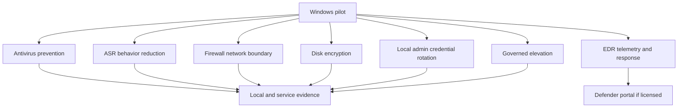

### Antivirus

Record real-time protection, cloud-delivered protection, behavior monitoring, sample submission/privacy policy, scan schedule, exclusions governance, tamper protection ownership, platform/third-party AV mode, and update health. Do not add exclusions just to clear a status. A benign validation checks configuration and service health; no executable sample is needed.

### ASR

Each rule has an intent, prerequisites, mode, event evidence, expected line-of-business interaction, exclusion owner, ring, and rollback. Start from audit where supported in an authorized environment, analyze events, then move selected rules through warn/block under formal approval. This lab does not run exploit scripts, macro payloads, credential theft, or malware-like commands.

### Firewall

Define domain/private/public profiles, inbound defaults, outbound policy, local-rule merge, logging, IPsec/connection-security ownership, and management dependencies. Never deploy a firewall change that can sever the only management/recovery path. Test profile recognition and a harmless allowed/denied service in simulation.

### Encryption

Before enabling, prove key escrow destination, minimum roles to retrieve, rotation, recovery from TPM/boot change, lost device, user communication, legal/data requirements, hardware readiness, and rollback/decryption policy. Never screenshot a recovery key. For a VM, understand snapshot, virtual TPM, host, and remote-session implications.

### LAPS and EPM

LAPS reduces shared/static local-admin password risk by rotating and backing up a managed password under controlled directory permissions. EPM lets standard users run approved apps with governed elevation rules or support approval. They solve different problems: LAPS supports emergency/admin credential management; EPM reduces routine need for local admin. Simulate help-desk retrieval/elevation with identity proofing, audit, expiry, and no secret values.

## 10. MDE onboarding design

Do not onboard unless the tenant has a legitimate Defender for Endpoint license, Intune connector configuration is authorized, the test endpoint is supported, data residency/privacy are accepted, networking works, sensor health and offboarding are understood, and no existing organization owns the endpoint.

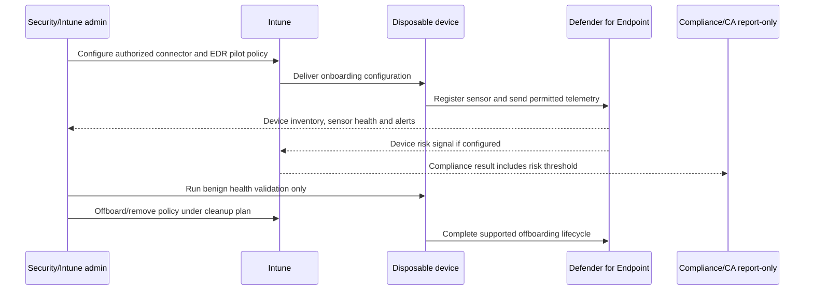

| MDE design field | Required decision |
|---|---|
| Tenant/connector | Directional settings, scope, owner, data sharing, current preview/GA state |
| Device scope | One disposable pilot with no existing MDE ownership |
| EDR policy | Onboarding package/profile, platform, assignment, tags/groups |
| Networking | Documented service endpoints, proxy/TLS inspection compatibility |
| Privacy | Telemetry types, retention/access, synthetic-only activity |
| Health | Sensor state, last seen, onboarding status, AV/EDR relationship |
| Risk | Threshold, stale/missing signal behavior, compliance timing |
| Response | No isolation/live-response/destructive action in lab |
| Offboarding | Supported offboarding policy/package, portal retention expectation, verification |

Simulation evidence includes expected Intune policy status, local sensor state, Defender device page fields, connector health, risk propagation, noncompliance, and offboarding. Never fabricate an alert screenshot.

## 11. BYOD app protection design

**Mobile application management (MAM)** protects the work identity/data context inside supported apps, with or without device MDM enrollment. It does not manage the whole personal device.

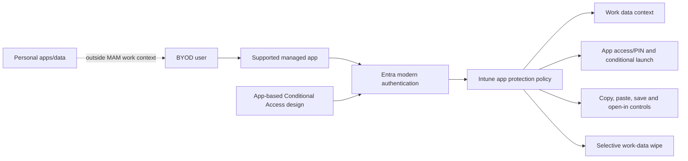

| MAM setting area | Pilot design | Test |
|---|---|---|
| Target apps/users | Supported Microsoft app(s), BYOD pilot user | Unsupported/nonpilot app boundary |
| Data transfer | Managed apps only or policy-approved destinations | Work-to-managed allowed; work-to-personal blocked |
| Save copies | Approved OneDrive/work location | Personal storage denied |
| Clipboard | Restricted length/direction according to need | Synthetic marker copy test |
| App access | PIN/biometric and recheck with accessibility/recovery | Correct/wrong PIN simulation |
| Conditional launch | OS/app version, rooted/jailbroken/integrity according to platform | Warning/block/wipe ordering simulated |
| Encryption | Require supported app data encryption | Inspect policy status, not personal storage |
| Selective wipe | Remove organizational app data only | Paper tabletop unless disposable device |

Current guidance requires an Intune-licensed user and targeted supported app; Android MAM commonly needs Company Portal present even without enrollment and Entra device registration for Microsoft 365 app scenarios. App and platform support changes. If testing live, use a disposable personal test device with no real work or personal sensitive data. Never perform a full device wipe. Explain to users what MAM can and cannot see/control.

## 12. Autopilot and Windows Autopilot device preparation

Windows Autopilot is a cloud-assisted provisioning family using OEM-installed Windows and registered device identity/profile assignment. Windows Autopilot device preparation is a distinct current path with its own prerequisites and capabilities. Verify current documentation rather than calling every flow “Autopilot.”

| Path | Best-fit concept | Identity/device registration | Design questions |
|---|---|---|---|
| Windows Autopilot user-driven | New/reprovisioned organization device with user sign-in | Device registered to tenant/profile | Join type, ESP, apps, user type, preprovisioning support |
| Windows Autopilot pre-provisioned | Technician/OEM stages device before user | Registered supported hardware | Supplier custody, reseal, app timing, attestation |
| Windows Autopilot self-deploying | Userless/shared scenario where supported | Registered hardware and hardware prerequisites | Device-only licensing, TPM, no user affinity |
| Windows Autopilot Reset | Return managed device to business-ready state | Existing managed/registered relationship | Data handling, support, local state, break/fix |
| Windows Autopilot device preparation | Newer cloud-native preparation path | Current device preparation prerequisites/grouping | Feature parity, supported join, app/script limits, reporting |
| Manual enrollment | Small pilot/break-fix | User/device-driven | Not scalable proof of enterprise provisioning |

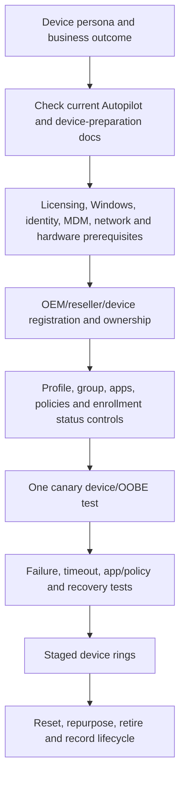

The portfolio contains a comparison and sequence, not a copied hardware hash. Never publish a serial number, hardware hash, tenant ID, or device registration proof.

## 13. Assignments, filters, exclusions, and rings

Groups define a population; Intune assignment filters narrow an assignment at evaluation using supported device/app properties. Dynamic Entra groups support broader cross-workload scenarios and processing; filters are Intune-specific and require supported managed-device/managed-app context.

| Targeting tool | Use | Strength | Risk |
|---|---|---|---|
| Assigned user group | Stable small user cohort | Predictable | User targeting can affect all applicable user devices |
| Assigned device group | Exact device cohort | Clear device reporting | Device lifecycle/membership maintenance |
| Dynamic group | Cross-workload/device-property grouping and some Autopilot scenarios | Reusable outside Intune | Processing delay and rule complexity |
| Assignment filter | Include/exclude at Intune evaluation using supported properties | Fast contextual narrowing at check-in | Platform/workload restrictions; property correctness |
| Exclusion group | Governed exception/break-fix | Recovery and compatibility | Exceptions accumulate and weaken coverage |
| Scope tag | Delegated admin visibility/scope | Supports distributed administration | Not end-user policy targeting/security boundary alone |

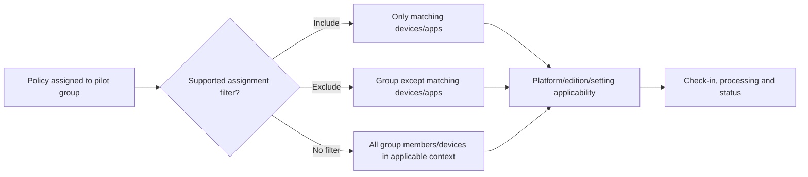

Rings: `R0-Lab`, `R1-IT`, `R2-Business pilot`, `R3-Broad`, `R4-Exceptions/legacy transition`. This lab uses only R0. Define advancement metrics: enrollment success, policy conflict, app install, compliance latency, support tickets, user-impact defects, encryption recovery, security telemetry health, rollback time, and exception count.

## 14. Configuration Manager co-management scenario

Co-management means a supported Windows device is both a Configuration Manager client and Intune-enrolled, with workload authority deliberately controlled. It is not the same as hybrid Entra join, and it is not unmanaged duplication.

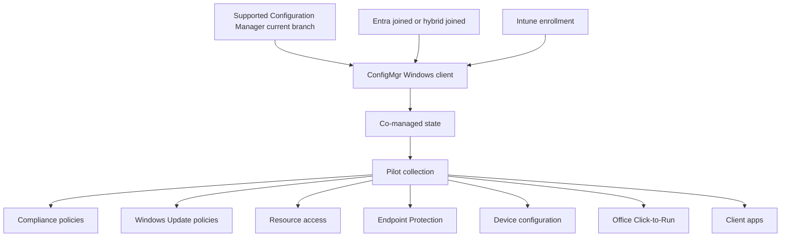

| Workload | Current owner | Pilot target | Acceptance evidence | Rollback |
|---|---|---|---|---|
| Compliance | Configuration Manager/none | Intune pilot | Correct Intune status and CA report-only | Move slider/collection back under approved process |
| Endpoint Protection | ConfigMgr | Intune after settings parity/conflict review | Effective Defender settings and health | Restore ConfigMgr ownership/settings |
| Device configuration | ConfigMgr/GPO | Selected setting family only | No duplicate owner/conflict | Return workload and remove Intune assignment |
| Windows Update | ConfigMgr | Later pilot | Rings, deadlines, safeguards and reporting | Restore update authority |
| Client apps | ConfigMgr | One synthetic app | Detection/install/uninstall and content path | Reassign authority/uninstall safely |
| Office Click-to-Run | ConfigMgr | Design only | Channel/version/update behavior | Restore owner |
| Resource access | ConfigMgr | Design only | Certificates/VPN/Wi-Fi dependencies | Restore owner and revoke test artifacts |

### Co-management tabletop

1. Inventory supported Configuration Manager version, hierarchy, boundaries, client health, collections, content, CMG need, Entra integration, automatic enrollment, tenant attach, roles, licenses, and workloads.
2. Choose one representative pilot collection; exclude critical, shared, privileged, and unsupported devices.
3. Map every setting/app/update to one current owner and detect GPO overlap.
4. Move one workload to pilot; validate ConfigMgr, Intune, local, identity, and user outcome.
5. Exercise management-service/network loss and return authority under a documented rollback.
6. Advance only after health, security, support, and business gates.

No Configuration Manager infrastructure is created in this lab.

## 15. Tests: positive, negative, boundary, failure, and rollback

| ID/type | Scenario | Expected | Evidence |
|---|---|---|---|
| T01 positive | Licensed pilot enrolls disposable supported Windows device | Entra and Intune records correlate; check-in succeeds | Sanitized device inventory |
| T02 negative | Unlicensed/non-scoped paper user attempts enrollment | Denied/not auto-enrolled as designed | Simulation/benign error |
| T03 boundary | Nonpilot device/user evaluates assignment | Policy not targeted | Assignment report |
| T04 filter | Device matches/does not match filter | Included/excluded result follows rule | Filter preview/evaluation |
| T05 config | Safe setting assigned and synced | Applicable setting becomes effective and reports success | Local state plus per-setting status |
| T06 conflict | Two simulated policies set opposite values | Conflict identified and owner rationalized | Conflict report |
| T07 compliance-positive | Pilot meets all rules | Intune and Entra show current compliant state | Compliance/device record |
| T08 compliance-negative | Harmless simulated requirement unmet | Noncompliant; CA would fail report-only | Compliance and sign-in design |
| T09 stale | Device does not check in beyond simulated validity | Becomes noncompliant by design | Timeline simulation |
| T10 AV/firewall | Verify healthy settings/status | Controls enabled; no malware/exposure generated | Local/Intune status |
| T11 encryption recovery | Paper boot/TPM recovery scenario | Authorized minimum-role recovery works | No key captured |
| T12 LAPS | Simulated password retrieval/rotation | Authorized help desk succeeds; others denied | Audit placeholders only |
| T13 EPM | Synthetic approved app elevation | Rule/request permits bounded elevation; unknown app denied | Simulation report |
| T14 MAM | Copy synthetic work marker to personal app | Blocked while managed destination allowed | Redacted app test or simulation |
| T15 MDE | Connector/sensor missing or stale | Risk dependency visibly fails/degrades; no false compliant claim | Design evidence |
| T16 Autopilot | Required app fails during preparation | User/support receives controlled failure/retry path | Sequence/tabletop |
| T17 co-management | Workload moved for pilot only | Pilot Intune-owned; nonpilot remains ConfigMgr-owned | Workload matrix |
| T18 rollback | Remove assignment/restore owner | Effective state returns as CSP supports; residual state documented | Before/after evidence |

## 16. Troubleshooting: assignment to effective state

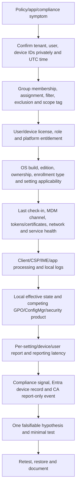

| Symptom | Most discriminating checks | Unsafe shortcut to avoid |
|---|---|---|
| Device absent | Enrollment event, Entra record, MDM scope, license, restriction, network | Re-enroll repeatedly/delete random records |
| Policy pending | Assignment/filter, last check-in, applicability, sync channel | Wait indefinitely without timestamps |
| Not applicable | Platform/edition/CSP/enrollment context | Force unsupported setting/script |
| Error | Per-setting code, local MDM log/CSP, prerequisite | Grant admin and suppress error |
| Conflict | Every policy/GPO/ConfigMgr owner for exact setting | Assume “most restrictive wins” for all channels |
| Compliant unexpectedly | Assigned policy, unassigned-device tenant setting, last contact, rule state | Trust green overview alone |
| CA report-only mismatch | Entra device ID/claim, user/app/client, current compliance/time | Turn CA on to “test properly” |
| MAM not applied | License, user assignment, supported app, work account/context, broker/Company Portal | Enroll personal device without consent |
| MDE no signal | Connector, onboarding, sensor/network, tenant ownership, time | Run malware or disable protections |

### Logs and diagnostics plan

| Evidence source | Answers | Handling |
|---|---|---|
| Intune device/user policy reports | Assignment and service-reported status | Export minimum sanitized fields |
| Per-setting status | Exact setting success/error/conflict | Correlate policy/version/device/time |
| Windows MDM diagnostics/event logs | Enrollment and CSP processing | May contain tenant/user/device URLs and IDs; redact |
| Intune Management Extension logs | Win32 apps/scripts/remediations where used | No script/Win32 app required in core lab |
| Company Portal | User-visible compliance/remediation | Screenshot synthetic account only |
| Local security status/events | Effective AV/firewall/encryption/ASR state | Do not expose paths/users/network unnecessarily |
| Entra device/sign-in logs | Device identity/claim and CA evaluation | Correlate exact sign-in; redact IDs/IP |
| MDE portal/sensor health | Onboarding, risk, alert/device state | Only if licensed; no fabricated alerts |
| ConfigMgr client/console | Workload/client/collection health | Simulation unless authorized lab exists |

## 17. Conflict and precedence exercise

Create a paper conflict: Windows Firewall is enabled in an endpoint-security policy, disabled in a settings-catalog profile, and also owned by ConfigMgr/GPO. Do not deploy the disabling policy.

1. List exact setting identifiers and policy/channel values.
2. Determine intended control owner from architecture, not from whichever report is green.
3. Remove/deconfigure duplicate values from non-owning channels through a staged change.
4. Consider residual/tattooed state and client refresh.
5. Validate local effective state, all policy reports, service functionality, and rollback.
6. Update the settings ownership catalog.

### 🔍 Plain-English deep-dive: “most restrictive wins” is not a universal precedence rule

Some compliance combinations choose restrictive outcomes, but configuration settings from different profiles/channels can conflict, fail, merge, or follow platform-specific precedence. **Analogy:** Two managers giving opposite instructions do not reliably produce the stricter instruction; the worker may stop, choose one authority, or combine parts. Never resolve a conflict from a slogan. Identify the exact setting/CSP, each delivery authority, platform rules, effective local value, timestamps, and desired owner. Then remove duplication and retest.

## 18. Rollback, retirement, and cleanup

| Item | Rollback/cleanup | Proof |
|---|---|---|
| Assignments | Remove pilot group/filter after recording baseline | Assignment list and next check-in |
| Configuration | Restore prior value with explicit policy where required; do not assume unassignment reverts | Local effective state and report |
| Baseline | Unassign/delete lab profile; retain version record | No overlap/orphan assignment |
| Compliance | Remove pilot assignment or restore prior rules/actions | Device state and CA report-only result |
| Encryption | Follow approved decrypt/recovery-key lifecycle; do not improvise | No recovery key in evidence; state verified |
| LAPS/EPM | Remove rules/assignments, verify password/elevation state and audit retention | Secret never captured |
| MDE | Use supported offboarding and connector cleanup, understanding portal retention | Sensor offboarded and policy removed |
| MAM | Remove policy/assignment and, if tested, selective work-data cleanup only | Personal data untouched |
| Autopilot | Remove test assignment/registration only if ownership/process permits | No published hash/serial |
| Device | Retire/unenroll in supported order, remove Entra/Intune stale records deliberately, reset/delete VM | Tenant and local records reconciled |
| Licenses/roles | Remove temporary entitlements and role activation | License/role inventory |

Never use wipe as routine cleanup. Wipe is destructive and platform/options differ. For a disposable VM, a verified clean snapshot/deletion may be safer, but first remove cloud enrollment/ownership records in the supported order and preserve only sanitized evidence.

## 19. Health-check report and portfolio package

| Artifact | Content | Honest/redaction rule |
|---|---|---|
| Architecture | Identity, Intune, device, MAM, MDE and CA flows | Fictional names/IDs |
| Persona/enrollment matrix | Ownership, join, enrollment, user affinity, license | Label paper-only platforms |
| Token/connector register | Owner, renewal, expiry, monitoring and canary | No live token/account details |
| Policy ownership catalog | Requirement, setting, CSP, channel, version, assignment | No duplicate owner hidden |
| Compliance/CA matrix | Rules, validity, status, Entra signal, report-only result | No enforcement claim |
| Endpoint-security design | AV, ASR, firewall, encryption, EDR, LAPS, EPM | State license/VM limitations |
| MAM test | Work/personal data flows and selective-wipe boundary | Synthetic marker only |
| Autopilot design | Current path comparison, prerequisites and failure flow | No hash/serial |
| Co-management plan | Workload owners, pilot collection, acceptance and rollback | Simulation unless ConfigMgr exists |
| Diagnostic casebook | Symptoms, hypotheses, logs, results, fixes | Redacted tenant/user/device/network data |
| Cleanup attestation | Roles, licenses, policies, device, keys, telemetry and VM | No secrets |

| Finding example | Evidence | Risk | Recommendation |
|---|---|---|---|
| Device with no compliance policy treated compliant | Tenant setting and synthetic unassigned record | False access assurance if CA later enforces compliance | Change only through staged coverage plan, then validate |
| Same firewall setting has two policy owners | Ownership catalog/conflict status | Unpredictable state and support burden | Select endpoint-security policy as owner and remove overlap |
| Encryption recovery untested | No approved retrieval drill | Data loss/lockout during hardware change | Keep live encryption out of lab; complete role/recovery test first |
| MDE license absent | Tenant license inventory | EDR/risk behavior unobserved | Maintain design and validate in authorized licensed environment |
| BYOD policy scope unclear | User assignment affects managed and unmanaged app contexts | Unexpected friction/data handling | Split by supported management state and test representative apps |

## 20. Interview explanation

Explain **P-O-S-T-U-R-E**:

1. **Persona:** ownership, platform, user affinity, data and support model.
2. **Onboard:** identity, license, enrollment path, token/connectors, restrictions.
3. **Set:** one primary channel configures each control.
4. **Test:** assignment, applicability, sync, effective state, negative/failure/rollback.
5. **Understand compliance:** scoped, timestamped evaluation feeding Entra.
6. **Restrict access safely:** CA report-only until coverage/recovery is proven.
7. **Evidence:** reports plus local logs/state, sanitized and time-correlated.

## 21. Official Source Anchors

These first-party sources were reviewed for the August 24, 2026 study-guide point; recheck current linked prerequisites and platform pages.

1. Microsoft Intune licensing: <https://learn.microsoft.com/en-us/intune/fundamentals/licensing>
2. Microsoft Intune setup: <https://learn.microsoft.com/en-us/intune/fundamentals/deployment-guide-intune-setup>
3. Device enrollment overview: <https://learn.microsoft.com/en-us/intune/device-enrollment/device-enrollment>
4. Windows enrollment guide: <https://learn.microsoft.com/en-us/intune/device-enrollment/windows-enrollment-methods>
5. Enable Windows automatic MDM enrollment: <https://learn.microsoft.com/en-us/intune/device-enrollment/windows/enable-automatic-mdm>
6. Enrollment restrictions: <https://learn.microsoft.com/en-us/intune/device-enrollment/enrollment-restrictions-set>
7. Settings catalog: <https://learn.microsoft.com/en-us/intune/device-configuration/settings-catalog>
8. Intune security baselines: <https://learn.microsoft.com/en-us/intune/device-security/security-baselines/overview>
9. Endpoint security in Intune: <https://learn.microsoft.com/en-us/intune/device-security/endpoint-security-policies>
10. Device compliance overview: <https://learn.microsoft.com/en-us/intune/device-security/compliance/overview>
11. Compliance and Conditional Access: <https://learn.microsoft.com/en-us/intune/device-security/conditional-access-integration/overview>
12. Assignment filters: <https://learn.microsoft.com/en-us/intune/fundamentals/filters/overview>
13. Policy and profile troubleshooting: <https://learn.microsoft.com/en-us/troubleshoot/mem/intune/troubleshoot-policies-in-microsoft-intune>
14. Windows policy refresh intervals: <https://learn.microsoft.com/en-us/intune/device-configuration/troubleshoot-device-profiles>
15. Antivirus policy: <https://learn.microsoft.com/en-us/intune/device-security/endpoint-security-antivirus-policy>
16. Attack surface reduction policy: <https://learn.microsoft.com/en-us/intune/device-security/endpoint-security-asr-policy>
17. Firewall policy: <https://learn.microsoft.com/en-us/intune/device-security/endpoint-security-firewall-policy>
18. Disk encryption policy: <https://learn.microsoft.com/en-us/intune/device-security/encrypt-devices>
19. MDE and Intune integration: <https://learn.microsoft.com/en-us/intune/device-security/microsoft-defender/overview>
20. EDR policy: <https://learn.microsoft.com/en-us/intune/device-security/endpoint-security-edr-policy>
21. Windows LAPS policy: <https://learn.microsoft.com/en-us/intune/protect/windows-laps-policy>
22. Endpoint Privilege Management overview: <https://learn.microsoft.com/en-us/intune/endpoint-privilege-management/epm-overview>
23. App protection policy overview: <https://learn.microsoft.com/en-us/intune/app-management/protection/overview>
24. Windows Autopilot overview: <https://learn.microsoft.com/en-us/autopilot/overview>
25. Windows Autopilot device preparation: <https://learn.microsoft.com/en-us/autopilot/device-preparation/overview>
26. Co-management overview: <https://learn.microsoft.com/en-us/intune/configmgr/comanage/overview>
27. Co-management workloads: <https://learn.microsoft.com/en-us/intune/configmgr/comanage/workloads>
28. Windows release health: <https://learn.microsoft.com/en-us/windows/release-health/>

## ⭐ Likely Interview Questions for This Section

### Q1. How do configuration, compliance, and Conditional Access work together?

**Model answer:** Configuration policies use an MDM/CSP or other channel to set desired endpoint state. Compliance policies evaluate assigned minimum requirements and report a timestamped status to Intune and Entra. Conditional Access can then use that device signal during a sign-in, alongside identity, app, client, and other conditions. They are separate boundaries: assigned configuration is not effective state, compliant is not universally secure, and CA needs the correct device claim. I validate each boundary and keep CA report-only until enrollment, coverage, remediation, exclusions, and recovery are proven.

### Q2. How would you choose between settings catalog, security baselines, and endpoint-security policies?

**Model answer:** I start with the exact requirement and setting, platform applicability, current CSP, and existing owner. Settings catalog is useful for granular configuration, baselines provide versioned Microsoft-recommended starting groups, and endpoint-security policies focus on capabilities such as antivirus, firewall, encryption, ASR, EDR, and account protection. I choose one primary owner per setting, review every baseline default, avoid preview/VM-incompatible choices, detect overlap with GPO and Configuration Manager, and test effective state plus rollback rather than trusting assignment status.

### Q3. How do you troubleshoot an Intune policy that is not applying?

**Model answer:** I confirm tenant, user, device, UTC time, and desired setting; then assignment group, include/exclude filter, scope tag, license, enrollment/ownership, OS edition/build, and setting applicability. I check last contact, MDM certificate/token/channel, network and service health, then per-setting status, error code, Windows MDM/CSP or IME logs as applicable, and local effective state. I inventory competing Intune profiles, GPO, ConfigMgr, scripts, and security products, account for report latency, form one falsifiable hypothesis, run a minimal sync/test, and verify rollback.

### Q4. What is your endpoint-security policy strategy?

**Model answer:** I map antivirus, ASR, firewall, encryption, EDR, LAPS, EPM, and App Control to explicit threats, prerequisites, licenses, policy owners, pilot rings, evidence, user/app dependencies, exclusions, and rollback. I verify AV/firewall health without malware, stage ASR/App Control from audit where supported, protect management connectivity, require encryption recovery before enablement, treat LAPS secrets as highly restricted, use EPM to reduce routine local admin, and onboard MDE only with authorized licensing, privacy, sensor-health, risk, and offboarding plans.

### Q5. How would you protect data on BYOD without managing the whole device?

**Model answer:** I use Intune app protection for a licensed pilot user and supported apps, defining work identity/context, app access, encryption, save/open/copy controls, conditional launch, and selective work-data wipe. I test allowed movement between managed apps and blocked movement to personal destinations using synthetic data. I explain platform dependencies such as modern authentication, app SDK support, Android Company Portal/device registration requirements, and optional app-based CA. MAM protects organizational app data; it is not full-device security or invisible management of personal content.

### Q6. How would you plan Windows Autopilot safely?

**Model answer:** I start with the device persona and verify the current distinction between Windows Autopilot scenarios and Windows Autopilot device preparation. I validate supported Windows, licensing, Entra/MDM, network, hardware/OEM registration, group/profile, apps, enrollment status behavior, user affinity, supplier custody, reset/repurpose, and support. I test one lawful canary through OOBE, required-app failure, timeout, network interruption, user experience, policy state, and reset. I never expose a serial or hardware hash and do not call manual enrollment an enterprise Autopilot deployment.

### Q7. How would you migrate an SCCM estate through co-management?

**Model answer:** I inventory supported Configuration Manager, client/collection/CMG and Entra/Intune prerequisites, licenses, GPO and current workload ownership. I enroll a representative pilot collection, then move one supported workload at a time, such as compliance or endpoint protection, while ConfigMgr retains the rest. Acceptance compares console state, local effective state, user outcome, security health, support volume, and rollback time. I avoid duplicate setting owners, keep critical devices out of early rings, and return the workload to its previous owner if thresholds fail.

### Q8. How do you describe this endpoint lab honestly?

**Model answer:** I state the exact isolated tenant, entitlement, disposable device or VM, date, and policies I actually tested. I distinguish hands-on enrollment/configuration/compliance from simulated Apple/Android tokens, MDE, EPM, Autopilot hardware, encryption recovery, or Configuration Manager where prerequisites were absent. I show architecture, policy ownership, tests, logs, findings, and cleanup. I connect the troubleshooting method to my real Microsoft 365 support experience, but I do not claim enterprise endpoint production ownership from a one-device lab.

## 🧠 30-Second Memory Hooks

- **Persona before policy:** ownership, user affinity, platform, data, operations.
- **Registered is a visitor record; joined is an organization identity; enrolled is management; compliant is an inspection result.**
- **Platform tokens are expiring supply chains:** owner, renew, monitor, canary.
- **One setting, one primary owner.**
- **Assigned → applicable → delivered → processed → effective → reported → compliant → access.**
- **Baselines are starting recommendations, not automatic compatibility or certification.**
- **Configuration sets; compliance checks; Entra decides access.**
- **Green compliance has scope and a timestamp.**
- **ASR audit before block; encryption recovery before enablement.**
- **LAPS rotates a local-admin secret; EPM avoids routine local admin.**
- **MAM protects work context, not the whole personal device.**
- **Autopilot is a family; device preparation is a distinct current path.**
- **Filters narrow Intune evaluation; dynamic groups serve broader targeting.**
- **Co-management moves workloads, not all authority at once.**
- **No safe disposable endpoint means simulation, not improvisation.**

## Completion Checklist

- [ ] I passed Part 64 and retained Part 65's report-only/recovery boundaries.
- [ ] I labeled every feature hands-on, simulated, unavailable, or deferred.
- [ ] I verified current Intune, Entra, MDE, EPM, Autopilot, and co-management licensing without assuming a trial.
- [ ] I used only a disposable personally owned test endpoint or simulation.
- [ ] I created a device-persona and enrollment-method map.
- [ ] I can distinguish Entra registered, joined, Intune enrolled, managed, and compliant.
- [ ] I documented Windows, Apple, Android, and other platform token/connector ownership and renewal prerequisites.
- [ ] I limited MDM user scope, enrollment restrictions, licenses, and device count to the pilot.
- [ ] I captured separate Entra and Intune device-record concepts and reconciled ownership/primary user/check-in.
- [ ] I selected one primary policy channel for every setting.
- [ ] I inventoried settings catalog, templates, baselines, endpoint security, compliance, GPO, ConfigMgr, and local overlap.
- [ ] I reviewed every baseline setting/version used and avoided unsupported preview/VM deployment.
- [ ] I tested assignment, applicability, delivery, processing, effective state, reporting, and rollback.
- [ ] I designed compliance tenant settings, policy, actions, validity, assignment, and remediation.
- [ ] I tested compliant, noncompliant, unassigned, not-applicable, and stale states without weakening real protection.
- [ ] I kept the compliant-device CA policy report-only.
- [ ] I designed antivirus, ASR, firewall, encryption, EDR, LAPS, EPM, and App Control by requirement and license.
- [ ] I did not use malware, exploit code, phishing, credential theft, or unsafe network exposure.
- [ ] I proved encryption recovery design before any live encryption action and captured no recovery key.
- [ ] I designed MDE connector, onboarding, sensor health, risk, privacy, response boundary, and offboarding.
- [ ] I did not onboard to MDE unless tenant/device/licensing/ownership were explicitly valid.
- [ ] I designed BYOD app protection for supported apps, work data flows, access, conditional launch, and selective wipe.
- [ ] I did not full-wipe a device or touch real personal/work data.
- [ ] I compared current Windows Autopilot and Windows Autopilot device preparation paths.
- [ ] I published no hardware hash, serial, tenant ID, device ID, key, token, or personal identifier.
- [ ] I designed assignments, filters, exclusions, scope tags, and R0–R4 rings.
- [ ] I created a co-management workload-ownership and pilot/rollback plan without claiming a live ConfigMgr lab.
- [ ] I completed at least the 18 positive, negative, boundary, failure, and rollback cases.
- [ ] I can troubleshoot assignment through local effective state, reports, compliance, Entra device identity, and CA.
- [ ] I completed the conflict exercise and rejected “most restrictive wins” as a universal rule.
- [ ] I removed assignments, temporary roles/licenses, enrollment, policies, test data, telemetry/onboarding, and VM state as planned.
- [ ] I packaged a redacted health-check report with observed versus simulated findings.
- [ ] I can answer Q1–Q8 aloud in 60–90 seconds each.

*Next suggested section:* [Part 67](Part-67-lab-secure-m365-workloads.md)