# Part 67 — LAB 3 - Secure Exchange, Teams, SharePoint, and OneDrive

> **Section goal:** Assess and improve the security of a fictional Microsoft 365 collaboration environment across Exchange Online, Exchange Online Protection, Microsoft Defender for Office 365, Microsoft Teams, SharePoint Online, and OneDrive. By the end, you should be able to inventory accepted domains and design SPF, DKIM, and DMARC without changing real DNS; scope mail-protection presets to synthetic pilots where licensed; trace a benign internal message and interpret sanitized headers; distinguish Teams external access, guest access, anonymous meetings, and shared-channel B2B direct connect; design meeting, app, and collaboration controls; reason through SharePoint/OneDrive tenant, site, link, restricted-access, unmanaged-device, and sync layers; defer or safely pilot sensitivity labels, DLP, and retention according to license; execute positive, negative, boundary, failure, and rollback tests using fictional users/files; collect redacted audit evidence; and produce a client-style workload health-check report.

This lab maps to Deloitte role expectations for Microsoft 365 workload security, Exchange Online and Defender for Office 365, Teams governance, SharePoint/OneDrive security, Zero Trust access, external collaboration, information protection dependencies, licensing, assessment, implementation planning, test/rollback, troubleshooting, audit evidence, documentation, and stakeholder reporting. It deliberately uses Arti's deep SharePoint/OneDrive, sharing, permissions, sync, migration, escalation, RCA, and stakeholder strengths as the bridge into Exchange and Teams control design while preserving an honest distinction between production experience and lab/design learning.

> **Currency, licensing, and service warning (August 24, 2026):** Exchange Online, EOP, Microsoft Defender for Office 365 (MDO), mail-authentication guidance, message trace, Teams external/guest/shared-channel/meeting/app controls, SharePoint/OneDrive sharing, restricted access, unmanaged-device controls, sync, Purview labels/DLP/retention, audit, portals, roles, licensing, previews, propagation, and service limits change. Verify current Microsoft Learn, Product Terms, service descriptions, DNS provider behavior, target cloud/region, and the live tenant before action. EOP capabilities accompany eligible cloud-mailbox services, while MDO Plan 1/2, attack simulation training, advanced audit/Purview, restricted-access, and other features have separate requirements. Never promise a trial.

> **Safety and ethics boundary:** Use only the isolated test environment approved in [Part 64](Part-64-lab-safe-microsoft-security-environment.md). Do not add or verify a real custom domain, modify real DNS, change an organization's MX/SPF/DKIM/DMARC, send mail to external recipients, invite real guests, contact external Teams users, create cross-tenant trust with another organization, launch phishing simulations at real people, upload real data, or apply broad tenant controls. Hands-on tests use only fictional internal tenant identities and synthetic content. External mail, DNS, guests, B2B direct connect, anonymous users, and partner scenarios are design/simulation unless both sides are isolated environments you own and the change is explicitly lawful and authorized.

## JD Mapping

| Role expectation | Capability developed | Safe evidence |
|---|---|---|
| Assess Microsoft 365 workloads | Inventory domains, mail flow/protection, collaboration, sharing, apps, access, data and audit | Workload baseline and findings |
| Design secure email | Model DNS authentication, EOP/MDO policy, message flow, trace and headers | Mail architecture and pilot plan |
| Govern Teams | Separate external/guest/shared/anonymous models and configure pilot meeting/app policies | Collaboration decision matrix |
| Secure SharePoint/OneDrive | Apply tenant-site-link hierarchy, membership, unmanaged-device and sync reasoning | Site/access control register |
| Integrate identity/device/data | Trace Entra, Intune compliance, CA report-only, workload enforcement and Purview dependencies | Cross-workload architecture |
| Troubleshoot incidents | Correlate message IDs, users, policies, memberships, links, sites, devices, logs and time | Sanitized transaction casebook |
| Deliver consulting outcomes | Define risks, options, recommendation, test, rollback, ownership and residual limitations | Health-check and roadmap |

## Candidate honesty note

Arti can speak strongly about SharePoint Online and OneDrive support, permissions, external sharing, sync, migrations, incidents, diagnostics, stakeholder communication, RCA, and fix validation where her record supports it. She should describe Exchange, MDO, Teams administration, DNS authentication, Purview policy, and cross-workload design according to what she actually configured or simulated. A synthetic internal mail trace does not equal operating enterprise mail security; an internal test Team does not equal production external-collaboration governance.

> “I assessed a fictional Microsoft 365 tenant across Exchange, Teams, SharePoint, and OneDrive. In an isolated licensed tenant I used only internal synthetic users and content for low-risk policy and access tests. I kept real DNS, external invitations, cross-tenant trust, phishing simulation, and unavailable MDO/Purview features as documented designs with expected evidence and rollback. My direct SharePoint/OneDrive support experience informed the troubleshooting and governance approach, while I label newer Exchange, Teams, and security-control work as lab or simulation.”

---

## 1. Architecture and two complete routes

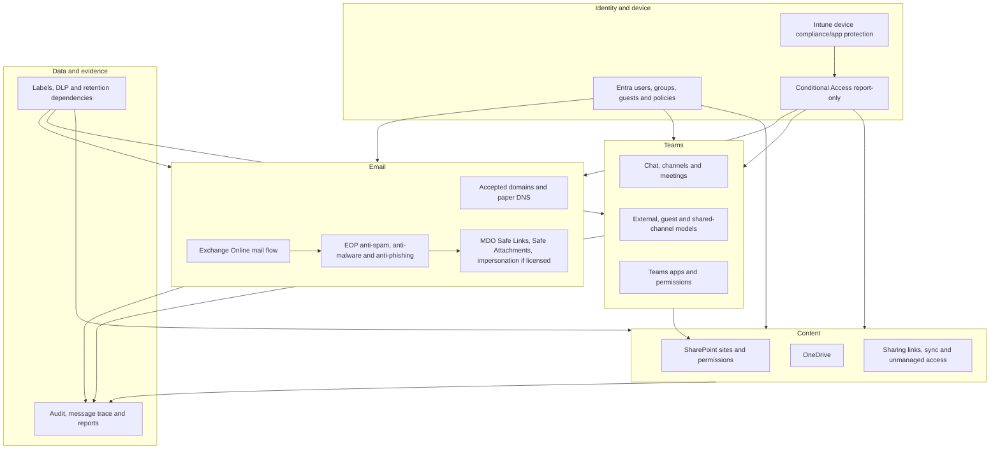

| Domain | Authorized hands-on path | No-paid-tenant/full simulation path |
|---|---|---|
| Exchange mailboxes | Two licensed fictional internal users | Synthetic recipient/mail-flow inventory |
| Domains/DNS | Read assigned/accepted-domain state only | Complete custom-domain, MX/SPF/DKIM/DMARC paper plan |
| EOP/MDO | Inventory defaults; optionally scope Standard preset to synthetic pilot if licensed/safe | Policy precedence, recipients, actions and expected headers/reports |
| Message test | Benign internal message between fictional users | Synthetic headers, trace and delivery events |
| Teams | Internal test team/channels/meeting policy for pilot | External, guest, shared-channel and app scenarios simulated |
| SharePoint/OneDrive | Internal site, synthetic files and internal sharing links | Tenant/site/link/unmanaged/sync access matrix |
| Purview | Simple existing-label/DLP/retention observation only if licensed and reversible | Full dependency and test design; implementation deferred to Part 68 |
| External interaction | None | Paper-only users/domains/organizations |

## 2. Prerequisites, roles, licenses, and change gate

| Prerequisite | Why | Stop/fallback |
|---|---|---|
| Parts 64–66 controls | Ownership, personas, CA report-only and device signals | Simulation until ready |
| Synthetic licensed identities | Mail, Teams, SPO/OD journeys need fictional users | Use paper identities |
| Least-privilege roles | Exchange, Security, Teams, SharePoint and audit roles differ | Do not use standing Global Admin |
| Current service/license map | MDO, Purview, Audit and advanced controls vary | Mark feature design-only |
| Internal-only data plan | Prevents privacy and external impact | Do not create workload content |
| Baseline/export | Existing policies/settings and memberships must be known | No change without rollback |
| Evidence journal | Message/user/site/device identifiers need redaction | No screenshots/exports |

| Task | Minimum role concept to verify | Lab boundary |
|---|---|---|
| View accepted domains/mail flow | Exchange read/admin role appropriate to task | No custom-domain/DNS change |
| Configure threat-policy pilot | Security/Exchange role with core security settings | Synthetic recipients only |
| Trace internal message | Message-trace/read role under current RBAC | No broad mailbox/content access |
| Configure Teams pilot policy | Teams Administrator or narrower current role | Pilot user/group only |
| Configure SharePoint test site | SharePoint Administrator/site owner as appropriate | Test site only |
| Search audit | Audit Reader/appropriate Purview role | Exact synthetic events only |
| Configure label/DLP/retention | Compliance/Data Security roles vary | Deferred/simple pilot only |

Reject the change if any scope includes all real users, a real custom domain/DNS zone, external address/invitation, broad anonymous link, production connector, live phishing payload, destructive retention, tenant-wide unmanaged-device wizard, unreviewed app, real sensitive data, or a policy whose rollback/evidence source is unknown.

## 3. Baseline workload inventory

| Area | Inventory | Evidence question |
|---|---|---|
| Tenant/domain | Initial domain, accepted domains, type/default, DNS ownership concept | Which domains receive/send mail and who owns DNS? |
| Exchange | Mailboxes, groups, connectors, rules, remote domains, forwarding, transport | What path can change sender, recipient, route or content? |
| EOP/MDO | Built-in, default, custom, Standard/Strict presets, exclusions, quarantine | Which policy wins for each pilot recipient? |
| Teams | Org/user policies, external/guest/anonymous, teams/channels, apps | Which model grants what resource access? |
| SharePoint | Tenant sharing ceiling, sites, admins, owners/members/visitors, sharing capability | What is the narrowest effective sharing boundary? |
| OneDrive | Tenant ceiling, personal-site settings, sharing/sync | How does user-owned storage differ operationally? |
| Identity/device | Member/guest groups, CA report-only, device state | Which identity/device signal reaches the workload? |
| Purview/audit | Labels, DLP, retention, audit availability and roles | Which controls are licensed and which evidence is retained? |

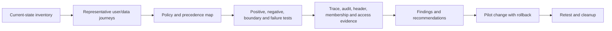

## 4. Accepted domains and DNS paper design

An **accepted domain** tells Exchange Online which SMTP domains the organization handles and how. It does not prove DNS ownership, and adding one is not a harmless documentation step. This lab reads existing assigned/accepted state only.

| Domain concept | Plain meaning | Paper decision |
|---|---|---|
| Initial tenant domain | Microsoft-assigned namespace used by the tenant | Use privately for internal lab mail; redact publicly |
| Custom domain | DNS namespace the organization proves it owns | `northstar.example` is documentation-only and never added |
| Authoritative accepted domain | Exchange expects all recipients for the domain in the organization | Future target only after recipient inventory |
| Internal relay domain | Some recipients may exist elsewhere and mail can relay onward | Requires connector/routing/loop and unknown-recipient design |
| MX record | DNS directs inbound SMTP toward a mail exchanger | Paper target and TTL/change sequence only |
| TXT/CNAME records | Publish ownership/service/authentication data | Paper values/placeholders only |

### Paper DNS worksheet

| Record | Purpose | Illustrative paper value | Validation and rollback |
|---|---|---|---|
| MX | Route inbound mail | `<tenant-specific>.mail.protection.outlook.com` from admin setup, never guessed | DNS query, inbound trace; restore prior MX under approved change |
| SPF TXT | Authorize envelope sender sources | `v=spf1 include:spf.protection.outlook.com -all` **only after complete source inventory and current Microsoft guidance** | Syntax/lookup/source tests; restore prior single valid record |
| DKIM CNAMEs | Point selectors to Microsoft-hosted signing keys | Use exact selector targets shown for the verified tenant/domain | Public-key lookup and signed outbound header; disable signing/restore records as planned |
| DMARC TXT | Require alignment, policy and aggregate reporting | `_dmarc.northstar.example TXT "v=DMARC1; p=none; rua=mailto:dmarc@northstar.example"` as illustration only | Parse aggregate reports; staged `none` → `quarantine` → `reject` after source alignment |
| Autodiscover/service | Client discovery as current design requires | Tenant-specific target from setup docs | Client tests; revert record |

> **Never publish the illustrative records.** An SPF record must reflect every authorized sender and there must be only one SPF record for a domain; combining mechanisms, DNS lookup limits, subdomain behavior, forwarding, third-party senders, and current vendor guidance matter. Exact DKIM CNAME targets are tenant/domain-specific. DMARC report addresses receive potentially sensitive metadata and need ownership, privacy, access, retention, and vendor review.

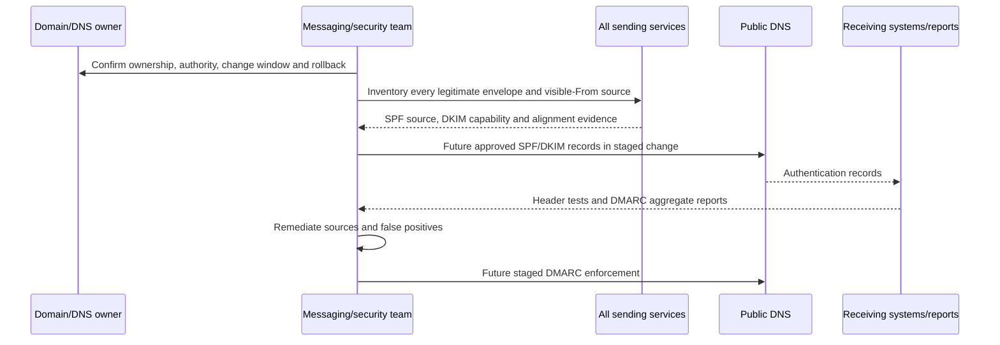

## 5. SPF, DKIM, DMARC, ARC, and composite authentication

| Control | Validates | Does not prove | Common failure |
|---|---|---|---|
| SPF | Sending source authorized for `5321.MailFrom`/envelope domain | Visible `From` is aligned or content unchanged | Forwarding changes source; missing vendor; multiple records |
| DKIM | Signed message fields unchanged and key/domain valid | Signing domain matches visible `From` | Message modification; selector/key/DNS error |
| DMARC | SPF and/or DKIM passes **and aligns** with visible `5322.From`; publishes policy/reporting | Message is benign or user intended it | Unaligned legitimate sender; forwarder modification |
| ARC | Trusted intermediary preserves authentication chain across modification | Every sealer is trustworthy | Untrusted/misconfigured sealer |
| Composite authentication | Microsoft combines explicit and implicit sender signals | A single fail automatically blocks or a pass guarantees safety | Reading `compauth` without full policy/verdict context |

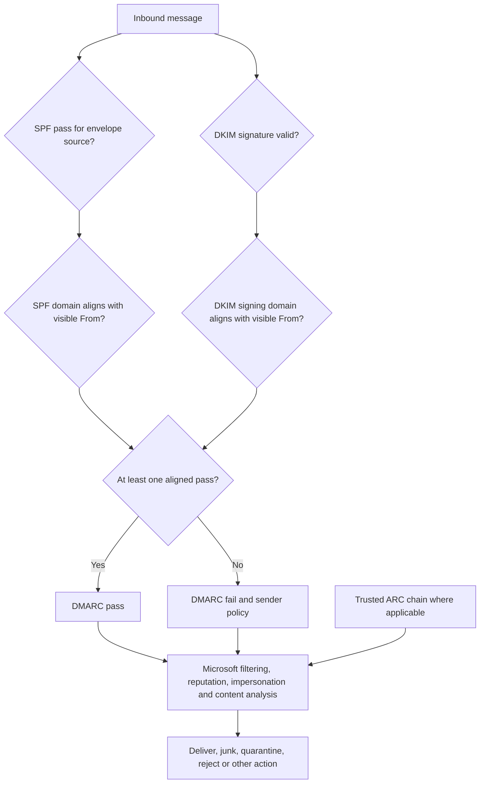

### 🔍 Plain-English deep-dive: email has more than one sender

SMTP carries an envelope sender (`MAIL FROM` or `5321.MailFrom`) used for delivery/bounces and a visible message `From` (`5322.From`) shown to a person. **Analogy:** A parcel has a courier return depot on the shipping label and a brand name on the note inside. SPF checks whether the courier source is allowed for the envelope domain. DKIM verifies a domain signature over selected content. DMARC asks whether an SPF or DKIM pass aligns with the visible brand domain. A message can pass SPF for an attacker's domain while displaying another brand; that is why alignment matters. A pass still does not make content harmless.

## 6. Exchange Online mail-flow design

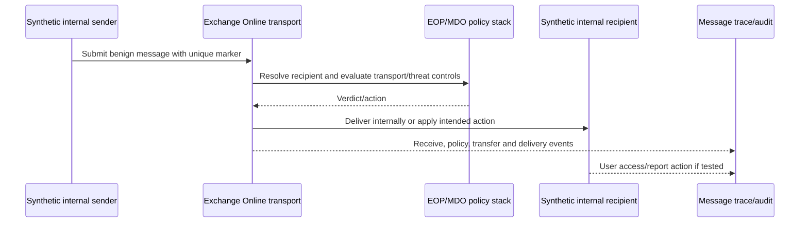

| Mail-flow object | Security question | Lab action |
|---|---|---|
| Accepted domain | Authoritative versus relay and unknown recipients? | Read inventory only |
| Connector | Is TLS/certificate/IP/partner scope necessary and least permissive? | Paper design; no new connector |
| Mail flow rule | Exact condition, exceptions, priority, mode and action? | Inventory; optional test-mode rule only if harmless |
| Forwarding | Who can auto-forward externally and how detected? | Design/control review; no external address |
| Remote domain | Formatting/OOF/auto-reply behavior for external domain? | Paper review |
| SMTP AUTH/app sending | Which devices/apps need supported modern path? | Design only; no printer/app relay |
| Distribution group | Who can send/join/manage; does expansion change evidence? | Internal synthetic group if needed |

Avoid “allow by IP/domain” as a broad fix for delivery. Authentication, connector trust, third-party routing, tenant allow/block entries, safe senders, transport rules, and threat-policy exceptions have different scope and bypass risk. Every exception needs exact sender/domain/source, reason, owner, expiry, evidence, and compensating monitoring.

## 7. EOP and MDO policy strategy

**Exchange Online Protection (EOP)** provides cloud-mailbox anti-malware, anti-spam, anti-phishing/spoof and mail-flow protections. **Microsoft Defender for Office 365 (MDO)** adds license-dependent protections and investigation capabilities such as Safe Links, Safe Attachments, impersonation features, Explorer/real-time detections, automation, and attack simulation by plan.

| Profile/control | Scope | Lab action | Caveat |
|---|---|---|---|
| Built-in/default protections | Existing tenant recipients according to service/policy | Inventory only | Do not remove broad protection to simplify tests |
| Standard preset | Synthetic pilot recipients | Optional hands-on if licensed and impact accepted | Preset settings mostly not customizable; understand precedence |
| Strict preset | High-value personas in production design | Simulation only | More aggressive spam/bulk handling and user impact |
| Custom policy | Exception or requirement not met by preset | Design only unless narrow harmless need | Priority/precedence and drift burden |
| Quarantine policy | Who can view/release/request and notify | Test with synthetic/paper message only | Release can deliver harmful content in real cases |
| Safe Links/Attachments | Licensed URL/attachment detonation and time-of-click controls | Observe existing state; no malicious payload | Built-in, Standard/Strict and custom precedence differ |
| Impersonation | Protected users/domains and mailbox intelligence | Paper entries with fictional names | Requires legitimate source/false-positive process |

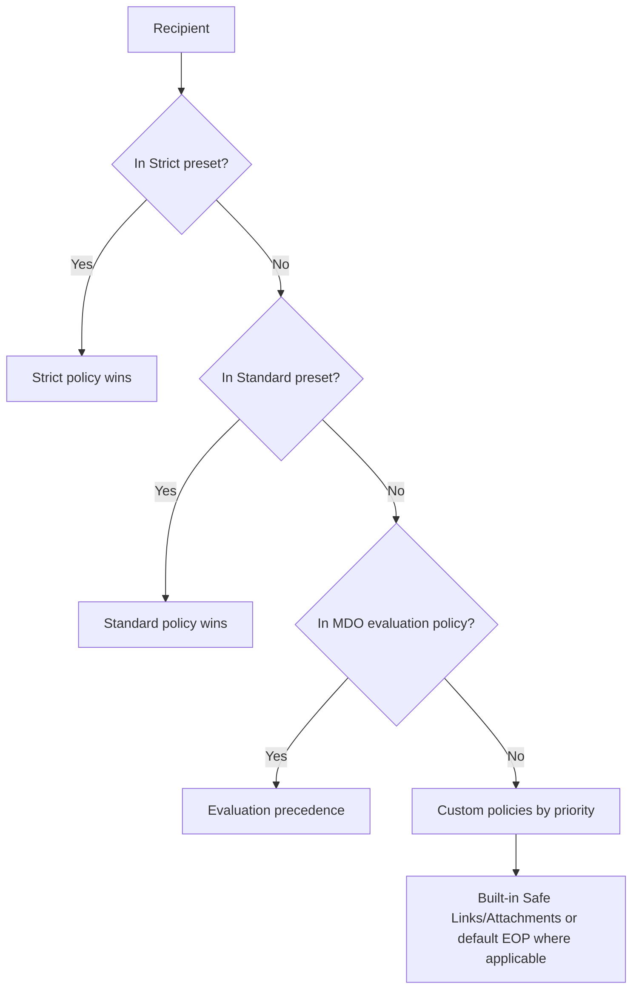

### Hands-on pilot when safe

1. Record current built-in/default/custom/preset assignments, policy precedence, exclusions, and licenses.
2. Create a mail-enabled pilot target supported by current preset-policy recipient conditions, containing only synthetic licensed users.
3. Choose Standard, not Strict, for the first pilot. Review every documented setting and expected quarantine/junk behavior.
4. Assign EOP and MDO portions only to eligible recipients. Do not use all recipients.
5. Send benign internal messages with unique subjects/markers and no suspicious links/attachments. Verify normal delivery and policy assignment/effective-policy reporting where available.
6. Do not create malware/spam/phish. For negative threat outcomes, use policy simulation/tabletop or Microsoft-provided safe test guidance only in a separately approved exercise.
7. Roll back by removing pilot recipients/disabling the preset assignment as documented, then verify default/built-in coverage remains.

### MDO simulation caveat

Attack simulation training requires current eligible licensing, roles, region/environment support, governance, privacy, communications, target approval, and support. It sends realistic social-engineering content and records user behavior. This lab does **not** launch a simulation to real people. If an isolated tenant has only fictional internal mailboxes and the learner is the sole authorized recipient, a future separate exercise can use Microsoft-provided tooling after reviewing current terms; otherwise produce a campaign charter, target list, payload classification, notification/training plan, help-desk script, metrics/privacy limits, stop/rollback, and simulated report. Never create a credential-harvest page, malware-like attachment, or deceptive external infrastructure yourself.

### 🔍 Plain-English deep-dive: policy precedence beats policy-name intuition

A recipient can match several threat policies, but the effective result follows product-specific precedence, not whichever policy name sounds strictest. **Analogy:** Several boarding rules may exist, but the airline's priority order determines which ticket class is processed first. Current guidance places Strict preset before Standard, then evaluation, custom policies by priority, and built-in/default layers as documented. Conditions and exceptions have their own AND/OR behavior. Always prove the effective policy for a synthetic recipient; do not average settings from every matching policy.

## 8. Benign internal message, trace, and header lab

Use two fictional licensed internal users. Subject: `NORTHSTAR-P67-MAIL-001`. Body: `Synthetic internal mail-flow validation. No sensitive data.` No links, attachment, external recipient, spoofing, bulk send, or deceptive content.

| Evidence | What it proves | Redact |
|---|---|---|
| Sender Sent Items | Client submission and displayed content | Full addresses, tenant branding |
| Recipient message | Delivery and visible policy/user experience | Addresses, mailbox/folder details |
| Message ID | Correlates message lifetime | Replace with evidence alias in public report |
| Network Message ID | Correlates transport instance/copies | Redact raw value publicly |
| Message trace | Receive/send/deliver/transfer/policy events and status | Sender, recipient, IP, tenant ID, connector names |
| Headers | Authentication, routing, filtering and correlation | Domains, IPs, server names, IDs |
| Audit | Admin policy change and selected user actions where logged | Actor/object identifiers |

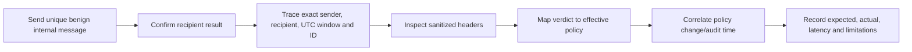

### Trace steps

1. Record sender, recipient, subject marker, client, and UTC send time privately.
2. Wait for normal delivery/trace latency; current trace statuses can lag actual delivery.
3. Search the narrowest time window with exact internal sender/recipient/subject or message ID.
4. Read each event and status. `Delivered` means transport delivered to a mailbox; it does not prove the user read the message or that a later mailbox rule did not move it.
5. Compare Internet Message ID and Network Message ID concepts, especially if group expansion, redirect, bifurcation, forwarding, or rule actions occur.
6. Inspect sanitized headers for authentication and filtering fields. Internal messages do not prove public-domain SPF/DKIM/DMARC.
7. Export only minimal rows; message-trace exports can contain tenant IDs, IPs, addresses, subjects, connector names, and routing details.

### 🔍 Plain-English deep-dive: message trace is a transport history, not a complete user story

**Analogy:** Courier tracking can show that a parcel reached the building mailroom; it does not prove the employee opened it or that a desk assistant later moved it. Exchange message trace follows transport events such as receive, send, deliver, fail, defer, expand, transfer, and rule processing. Mailbox rules, junk/quarantine experience, client sync, user actions, and Defender investigation add other evidence. Build a timeline from identifiers and timestamps rather than interpreting one green “Delivered” row as end-to-end success.

## 9. Mail test matrix and troubleshooting

| ID/type | Scenario | Expected | Route |
|---|---|---|---|
| M01 positive | Synthetic internal sender to recipient | Delivered; trace and headers correlate | Hands-on if licensed |
| M02 boundary | Nonpilot internal recipient | Preset pilot does not become effective | Hands-on/read-only |
| M03 precedence | Recipient hypothetically matches Strict/Standard/custom | Documented precedence selects expected policy | Simulation |
| M04 SPF | Authorized source but visible-From unaligned | SPF can pass while DMARC fails | Simulation |
| M05 DKIM | Forwarding changes source but signature survives | DKIM may preserve aligned pass if unmodified | Simulation |
| M06 DMARC | No aligned SPF or DKIM | Sender policy/reporting applies, then receiver filtering | Simulation |
| M07 connector | Certificate/source mismatch | Connector rejects/fails intended route | Simulation |
| M08 forwarding | External auto-forward proposed | Governance/control blocks or alerts by design | Simulation; no external mail |
| M09 failure | Trace says delivered but user cannot find mail | Check mailbox rule/junk/client/search after transport | Hands-on synthetic |
| M10 rollback | Remove pilot preset assignment | Recipient returns to documented default/built-in policy | Hands-on if changed |

| Symptom | Checks | Do not do |
|---|---|---|
| External auth fail in future design | Envelope/visible/signing domains, DNS, source IP/service, forwarding, header and alignment | Broadly allow sender domain |
| Internal delivery delayed | Exact trace events/time, service health, rule/policy, recipient | Repeated bulk test mail |
| Unexpected quarantine | Effective policy/precedence, verdict/header, quarantine policy | Release unknown message as a test |
| Safe Links absent | License, recipient scope, policy precedence, message type, supported client | Start a trial without approval |
| Connector failure | Direction, scope, certificate/IP, accepted domain, TLS, route | Disable TLS/authentication broadly |

## 10. Teams collaboration models

| Model | Identity/resource relationship | Resource access | Key controls |
|---|---|---|---|
| External access/federation | External organization's identity communicates across tenants | Chat/meet; no automatic access to teams/sites/files | Org settings + user policy + reciprocal organization state |
| Guest access/B2B collaboration | Guest object in resource tenant | Team/channels/files/apps according to membership/policy | Entra guest invite, group/team, Teams guest, SPO sharing, CA |
| Shared-channel external/B2B direct connect | External home identity participates without resource-tenant guest object | Specific shared channel and its site | Cross-tenant access both sides, Teams policy, guest setting prerequisite, channel ownership |
| Anonymous meeting | No authenticated organizational identity for join | Meeting experience only | Anonymous join, lobby, organizer/meeting policy |
| Internal shared channel | Internal people outside parent team join channel | Shared channel and dedicated SharePoint site | Channel policy, membership, owner, apps, file permissions |

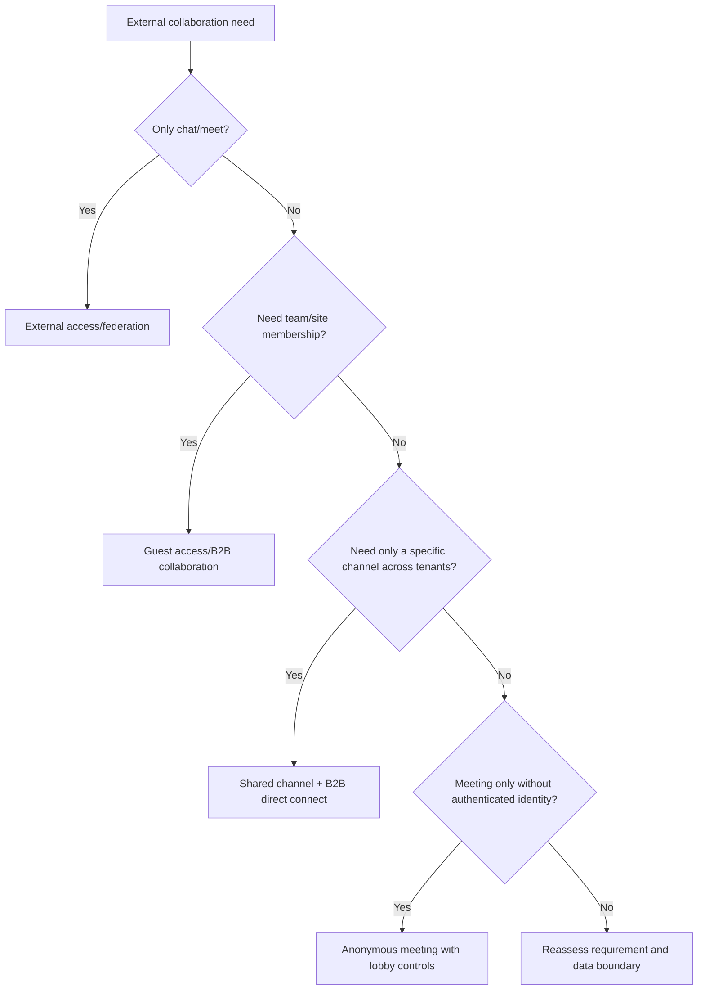

### Hands-on and simulation boundary

Create one internal test team `LAB-Team-Orion`, one standard channel, optionally one private channel, and one **internal-only** shared channel if current licensing/behavior is available. Use synthetic internal owners/members. Do not invite external addresses or configure cross-tenant access. External, guest, and anonymous scenarios use paper identities and expected results.

For shared channels, remember the separate SharePoint site, channel-specific membership, owner lifecycle, app support, and direct file grants. Parent-team owners may see channel names but do not automatically see content unless members. Removing someone from a channel might not remove separately granted SharePoint access; test/report that boundary.

## 11. Teams guest, external, shared-channel, meeting, and app controls

| Control area | Pilot/design | Test |
|---|---|---|
| External organization access | Paper allowlist/deny/default strategy plus user policy | Allowed, blocked, reciprocal-denied and subdomain cases |
| Unmanaged consumer/Skype | Disabled or tightly scoped design based on need/cloud support | Inbound/outbound initiation boundaries |
| Guest invitation | Design limited inviters, sponsor, justification, expiry, access review | Unauthorized inviter denied |
| Guest capabilities | Least necessary channel/chat/call/file behavior | Guest cannot perform owner/admin action |
| Shared-channel creation | Pilot user policy restricts creators | Nonowner/member cannot create as designed |
| External shared channels | Design cross-tenant inbound/outbound trust and CA | Both-tenant settings required |
| Meeting lobby | External/anonymous participants wait unless approved role | Anonymous paper attendee waits |
| Presenter/recording/transcription | Organizer policy and sensitivity | Attendee cannot present/record by default design |
| Meeting chat/copy | Align collaboration and data risk | Meeting lifecycle access test |
| Apps | App-centric permission/availability, setup policy, consent, publisher/data review | Unapproved app unavailable |

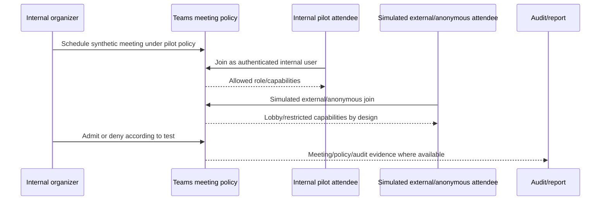

### App governance review

| Question | Evidence |
|---|---|
| Is the app needed and from a verified/understood publisher? | Business owner and marketplace/publisher record |
| What permissions/data/residency/subprocessors apply? | Permission and privacy assessment |
| Which users, teams, meetings or shared channels can use it? | App availability/permission/setup policy |
| Does it create service principals, consent, webhooks, tabs or external storage? | Entra/Teams/app architecture |
| How is it monitored, updated, supported, disabled and deleted? | Operational and retirement runbook |

Do not install a third-party app merely to generate portfolio screenshots.

## 12. SharePoint and OneDrive hierarchy

SharePoint tenant sharing is a maximum ceiling. A site can be equally or more restrictive, never more permissive. OneDrive can be more restrictive than SharePoint but not more permissive. Teams-connected site membership and channel-site behavior add another layer.

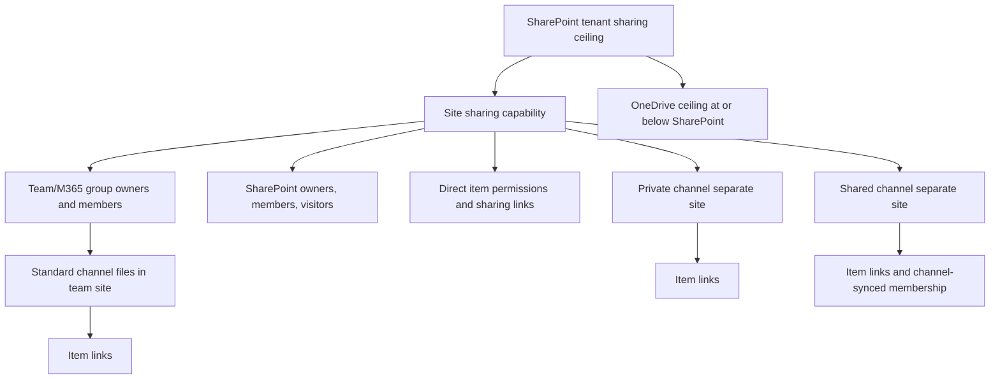

| Layer | Control | Common false assumption |
|---|---|---|
| Tenant | Maximum external sharing, domain restrictions, defaults, guest expiry | Changing tenant setting immediately removes every existing permission |
| Site | Site sharing capability and restricted-access controls | Team policy alone controls all site sharing |
| Group/team | Owners/members/guests | Removing team member removes every direct file grant |
| SharePoint groups | Owners/members/visitors | Microsoft 365 group membership mirrors every SPO group |
| Item | Direct access and sharing links | Link removal removes access granted another way |
| OneDrive | User-owned site sharing and lifecycle | OneDrive is just a personal folder with no governance |

## 13. Sharing-link and access tests

| Link/access type | Identity binding | Forwarding behavior | Pilot use |
|---|---|---|---|
| People with existing access | Adds no new access | Works only for already authorized user | Safest link for notification |
| Specific people | Named recipients authenticate/verify | Forwarded recipient cannot use unless named | Internal synthetic users only |
| People in organization | Any authenticated internal user with link | Can broaden internally when forwarded | Use only for approved broad internal content |
| Anyone | No authentication required | Forwardable and difficult to attribute | Disabled/not used in lab |
| Direct permission | Explicit user/group grant | Persists independently of link/membership | Inventory and remove deliberately |

### Hands-on site test

1. Create or select a lab-only site with two internal fictional users: owner and member; add a third nonmember.
2. Upload `Orion-Overview.docx` and `Orion-Internal-Plan.docx` containing only synthetic text.
3. Verify owner/member expected access and nonmember denial.
4. Create a `Specific people` link for the internal member only. Test member success and nonmember failure.
5. Create a “people with existing access” link and prove it does not grant the nonmember access.
6. If an organization-wide internal link is allowed in the isolated tenant, use only the non-sensitive overview file and test the broader internal boundary; remove immediately.
7. Do not create an Anyone link or enter an external address.
8. Remove link/direct grant/membership one at a time and test which access path remains.

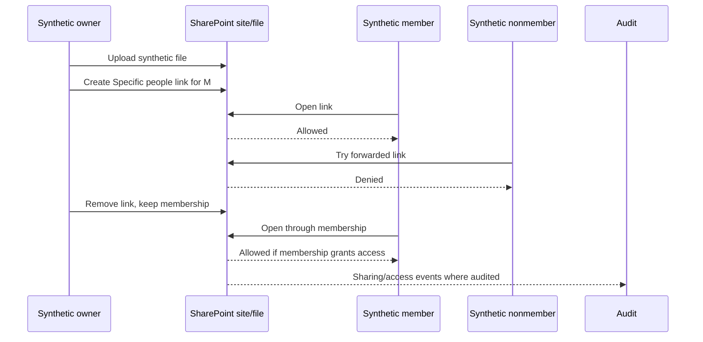

### 🔍 Plain-English deep-dive: access is a union of paths

A user may reach a file through team membership, a Microsoft 365 group, a SharePoint group, a direct grant, a sharing link, or another nested/security-group relationship. **Analogy:** Removing one door key does not block someone who still has a building badge or a second key. Effective access is the union of valid grants minus applicable restrictions. Troubleshooting must enumerate every path. This explains why removing a user from a Team might not remove a separately granted file permission, especially in shared-channel file scenarios.

## 14. Restricted site access, unmanaged devices, and sync restrictions

**Restricted site access** limits which Entra/Microsoft 365 groups can reach a site even if content was otherwise shared, subject to current licensing and feature behavior. It is distinct from site sharing capability and sensitivity labels. Treat it as a high-impact design with owner and exception path.

Unmanaged-device controls can block or limit SharePoint/OneDrive access using Conditional Access and workload-enforced restrictions. Current guidance says limited access can provide web-only use without download, print, sync, or desktop-app access, with browser/file-type limitations. Tenant-wide SharePoint admin controls can create/replace broad CA policy and lose customizations; therefore this lab does **not** use the tenant-wide wizard. Use report-only/manual design and a selected test site in a future authorized pilot.

| Scenario | Managed/compliant device | Unmanaged/unknown device | Lab action |
|---|---|---|---|
| Full access | Browser, apps, download/sync by policy | Same only if allowed | Baseline internal pilot |
| Limited web-only | Full normal access | Browser preview/edit per design; no download/print/sync/apps | Simulation/report-only dependency |
| Block | Full normal access | Access denied | Simulation only |
| Site-restricted | User also must be in allowed group | User also must be in allowed group and meet device rule | Design matrix |
| Anyone link | Not identity-bound | Device restriction may not govern as expected; current guidance warns Anyone links unaffected | Disable Anyone links in protected-site design |

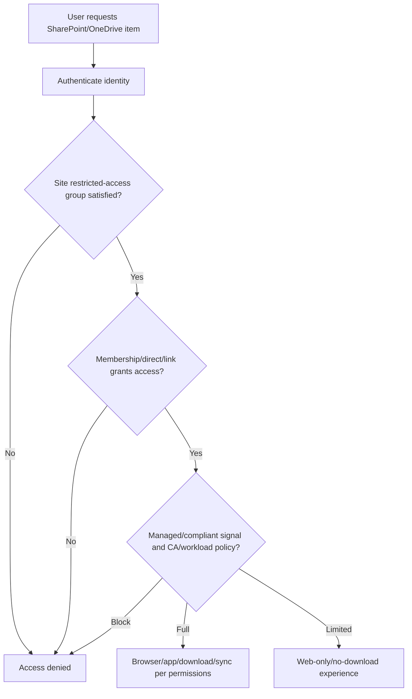

### Sync restriction design

| Control | Purpose | Caveat/test |
|---|---|---|
| Managed-device/CA access | Prevent sync from untrusted devices | Requires correct device identity/compliance and supported client |
| Domain/device restrictions | Limit sync to approved tenant/device context where supported | Device identifiers and lifecycle management can create support impact |
| Conditional Access/session | Gate token/access | Service dependencies and cached sessions matter |
| Known Folder Move | Govern organizational folder backup | Not a DLP boundary by itself |
| File type/storage controls | Reduce unsupported/risky sync | Users may choose other transfer paths; test business need |
| OneDrive client health | Detect sync errors/version/sign-in/storage | A healthy client does not prove every file is authorized |

## 15. Labels, DLP, and retention dependencies

Part 68 owns the full Purview lab. Here, map workload dependencies and optionally observe one simple preexisting licensed control. Do not create irreversible retention/record behavior merely for practice.

| Control | Workload effect | Dependency/caveat | Part 67 action |
|---|---|---|---|
| File sensitivity label | Classification, marking, encryption/access as configured | Label publication, app support, encryption rights, external users | Apply only to synthetic file if existing safe label is available; otherwise simulate |
| Container sensitivity label | Teams/M365 group/SPO site privacy, external sharing/unmanaged access settings | Label schema/publication, provisioning and site/group behavior | Design only unless reversible lab label exists |
| DLP | Detects sensitive information/labels and audits/alerts/blocks by location | Licensing, classifier accuracy, policy tips, incidents and tuning | Test mode/simulation only with synthetic marker |
| Retention | Retain/delete workload content according to policy | Location, precedence, preservation, legal/records impact and delayed behavior | Design only; no destructive retention |
| Audit | Records supported user/admin/workload events | License, retention, latency, operation coverage and roles | Search exact synthetic events if available |

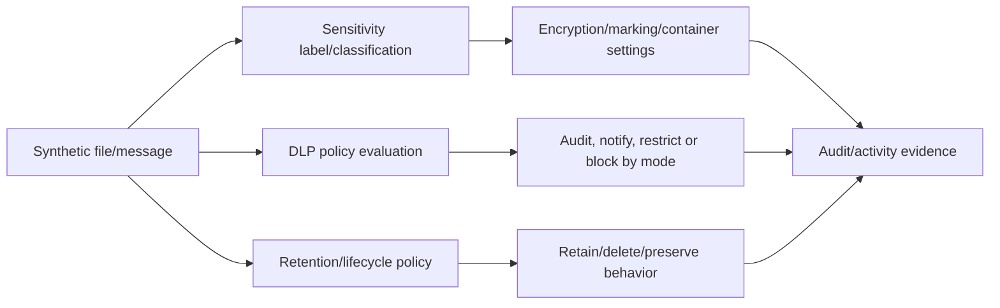

Never claim a DLP test passed because a label appeared, or that retention protects a record because a policy was created. Test effective publication, classification, location inclusion, policy mode, user experience, event/alert, preservation/deletion timing, and exception behavior.

## 16. End-to-end test matrix

| ID/type | Journey | Expected outcome | Evidence |
|---|---|---|---|
| E01 positive | Internal benign email | Delivered; IDs, trace and recipient correlate | Trace/header/audit |
| E02 negative | Nonpilot recipient policy check | Pilot preset not effective | Effective-policy report/design |
| E03 boundary | External email target | Blocked by lab charter; simulated only | Change/test record |
| T01 positive | Internal member opens Team/channel/file | Allowed according to membership | Teams/SPO access |
| T02 negative | Internal nonmember opens private/shared channel | Denied | Sanitized result |
| T03 boundary | Simulated external access user requests team file | Chat/meeting model grants no site access | Design result |
| T04 guest | Simulated guest added/removed | Guest object/team/site lifecycle documented | Synthetic audit timeline |
| T05 shared | Internal shared-channel member only | Channel/site visible only to channel member | Hands-on internal if safe |
| T06 meeting | Internal attendee versus simulated anonymous | Lobby/role/app controls differ as designed | Meeting policy matrix |
| T07 app | Unapproved app requested | Not available/consent denied by design | Simulation |
| S01 positive | Site member opens synthetic file | Allowed | Access/audit |
| S02 negative | Nonmember uses forwarded specific-people link | Denied | Access result |
| S03 boundary | Existing-access link sent to nonmember | Does not grant new access | Access result |
| S04 union | Remove sharing link but keep membership | Member still has access through membership | Before/after matrix |
| S05 revocation | Remove every grant for nonrequired user | Access denied after propagation/session considerations | Access/audit |
| S06 unmanaged | Compliant versus unmanaged access | Full versus limited/blocked by design; CA report-only | Simulation/What If |
| S07 sync | Unmanaged device attempts sync | Denied/not offered under design | Simulation |
| P01 DLP | Synthetic marker in test mode | Expected policy match/audit without harmful block | Simulation or safe test |
| P02 retention | Synthetic content lifecycle | Expected retain/delete timeline only | Simulation |
| R01 rollback | Restore pilot policies/memberships/link settings | Baseline behavior returns; residual grants absent | Reconciliation report |

## 17. Failure scenarios and troubleshooting

### Scenario A: Teams member can chat but Files fails

Teams chat and SharePoint file access use connected but distinct services. Check channel type, associated site URL, user/channel membership, separate direct grants, SharePoint sharing/site/access settings, CA resource/service dependencies, device claim, unmanaged restriction, license, browser/client, and exact correlation time. Do not add the user as site collection admin or disable CA broadly.

### Scenario B: a removed guest still opens a file

Check whether the guest was removed only from the Team while retaining a direct link, SharePoint group, direct item grant, another group, or cached session. Inventory every access path, remove only unauthorized grants, wait for documented propagation/token behavior, retest fresh, and decide whether the guest object itself should be disabled/deleted under lifecycle policy.

### Scenario C: mail is delivered but missing in Outlook

Trace transport first. If delivered, check junk/quarantine distinctions, Inbox rules, forwarding, Focused Inbox/view/search, mailbox access, client sync/cache, retention or user action. If trace is pending/deferred/failed, remain in transport/policy/routing. Do not conflate mailbox delivery with client display.

### Scenario D: SPF passes but DMARC fails

Compare `5321.MailFrom`, source authorization, visible `5322.From`, DKIM `d=` domain, relaxed/strict alignment, forwarding/modification, and header results. Align the legitimate service using supported custom return-path or DKIM signing; do not broadly allow the visible domain.

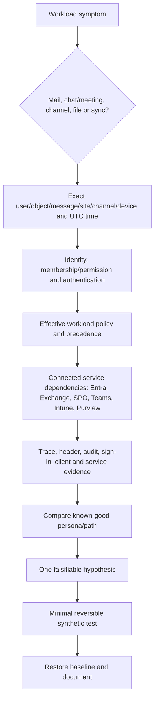

| Symptom | First evidence | Common wrong shortcut |
|---|---|---|
| Message missing | Message ID/time and trace | Disable spam protection |
| Wrong mail policy | Recipient membership and precedence/effective policy | Edit every custom policy |
| Guest cannot access Team | Guest object/redemption, team/group, Teams guest, SPO, CA | Make guest owner/admin |
| External chat fails | Both org settings, user policy, domain/trial/cloud state | Allow all domains permanently |
| Shared channel fails | Cross-tenant both sides, policy, identity UPN, owner/membership, site | Add guest object instead without design decision |
| File access denied | URL/site/channel, grant path, sharing ceiling, device/CA | Share with Anyone |
| Access persists | Membership, direct grants, links, groups, token/propagation | Delete site/user blindly |
| Sync fails | Account/site/library/device/CA/client/network/path | Reset production OneDrive cache |

## 18. Audit and evidence

| Evidence source | Question answered | Limitations |
|---|---|---|
| Exchange message trace | What transport events/status applied? | Delivery is not user read; latency/report limits |
| Message headers | What routing/auth/filter fields exist? | Sensitive and complex; one message is one sample |
| Defender reports/Explorer | What verdict/policy/entity behavior occurred? | License/retention/plan varies |
| Teams policy/effective assignment | Which user policy should apply? | Propagation and org-level setting interaction |
| Entra audit/sign-in | Identity, membership, app and CA events | Does not replace workload audit |
| Purview Audit | Supported Teams/SPO/OD/Exchange operations | License, latency, operation and retention differ |
| SharePoint access/membership/link inventory | Why can the user access? | Point-in-time and nested/direct grants need correlation |
| OneDrive sync/client logs | Client-side sync path and errors | Can contain names, paths, URLs, IDs and personal context |

Evidence redaction removes email addresses, tenant/domain/site URLs, IDs, IPs, device/client identifiers, subjects/body, file names if sensitive, message headers not needed for the claim, guest/external details, policy/object GUIDs, tokens/cookies, license/billing details, and unrelated users. Retain enough structure to explain the decision, not enough to recreate the environment.

## 19. Rollback and cleanup

| Area | Rollback/cleanup | Verification |
|---|---|---|
| DNS | No change occurred; destroy speculative credentials/zone exports | Paper plan labeled `NOT DEPLOYED` |
| Mail preset | Remove synthetic pilot scope or disable created preset assignment | Built-in/default coverage and recipient effective policy verified |
| Mail/rules | Remove test-mode rule/connector only if created | Internal mail trace succeeds |
| Test messages | Delete synthetic content per lab retention plan | No external recipient/content |
| Teams policies | Remove pilot assignments/delete lab policy as planned | Effective assignment returns to baseline |
| Team/channels | Remove synthetic memberships/direct grants, then delete/archive test Team in supported order | Connected sites/channel sites reconciled |
| Guest/external | No real invitation/trust existed; delete any paper-only identifiers | External access inventory unchanged |
| SPO links/grants | Remove links and direct grants; restore site sharing baseline | Access-path matrix shows intended users only |
| OneDrive/sync | Stop test sync, remove synthetic files and client relationship if used | No residual local/cloud copy beyond plan |
| Labels/DLP/retention | Remove only reversible pilot assignment/policy under current behavior; do not delete protected content casually | Effective state/audit reviewed |
| Roles/licenses | End activations and remove temporary assignment/license | Role/license inventory |

Cleanup must respect connected lifecycle. Deleting a Team affects its group/site/channels; shared/private channels have separate sites; retention can preserve content; deleting a site outside Teams can be restored/recreated by service lifecycle; removing sharing capability does not necessarily remove old grants; turning sharing back on can restore guest usability if permissions remain. Reconcile rather than assume.

## 20. Workload health-check report

| Finding example | Evidence | Risk | Recommendation | Priority/status |
|---|---|---|---|---|
| Custom-domain DNS is undocumented | Paper source inventory incomplete | SPF/DMARC enforcement could block legitimate senders | Complete source/alignment inventory before DNS change | High/open |
| Standard/Strict recipient overlap | Policy map | Unexpected precedence/user experience | Use unambiguous groups and test effective policy | Medium/design |
| Teams external access allows broader domains than requirement | Org/user policy review | Unnecessary communication exposure | Adopt approved granular user/domain model after partner validation | Medium/simulation |
| Shared-channel owner has no backup | Channel inventory | Ownerless governance/support | Require at least two internal owners and review | Medium/pilot |
| Site allows broad internal links by default | Sharing defaults and test | Accidental broad access | Set safer default link and educate owners | Medium/pilot |
| User removed from Team retains direct file grant | Access-path test | Orphan access | Add direct-grant review to offboarding | High/observed lab behavior |
| Unmanaged-device restriction not proven | CA/Intune dependency | Download/sync from untrusted endpoint | Keep report-only, test site/app/file journeys before enforcement | High/deferred |
| DLP/retention unlicensed/unconfigured | License inventory | Data controls not observed | Complete Part 68 simulation and prioritize license/use cases | Planned |

### Executive summary structure

1. Scope and routes: which workload controls were hands-on versus simulated.
2. Current posture: identity/device dependencies, mail, Teams, SharePoint/OneDrive and data controls.
3. Top risks: impact, affected synthetic journey, evidence and uncertainty.
4. Recommendations: quick wins, dependencies, license/cost, owner and sequence.
5. Validation: positive/negative/failure/rollback results.
6. Residual limitations: no real DNS/external users/production traffic; license gaps.
7. Cleanup: policies, users, files, links, messages, roles and evidence state.

## 21. Portfolio packaging and interview story

| Artifact | What it proves | Safe publication |
|---|---|---|
| Cross-workload architecture | Service/data/access dependencies | Fictional labels only |
| Domain/DNS design | SPF/DKIM/DMARC source/alignment/change reasoning | `.example`; no real selectors/targets |
| Mail policy map | EOP/MDO scope and precedence | Synthetic recipients |
| Trace/header case | Transaction-level diagnosis | Sanitized values and benign content |
| Teams model matrix | Correct external/guest/shared/anonymous choice | No real domain/person |
| Meeting/app policy | User experience and third-party risk | Paper scenarios |
| Site/link access matrix | Permission hierarchy and union-of-paths | Synthetic users/files |
| Unmanaged/sync design | Entra/Intune/workload dependency | Report-only/simulation label |
| Purview dependency map | Classification/DLP/retention readiness | No production claim |
| Health-check/roadmap | Consulting communication | Findings tied to lab evidence only |
| Cleanup attestation | Operational lifecycle | No IDs/credentials |

Explain with **F-L-O-W-S**:

1. **Facts:** inventory tenant/workload, licenses, personas, content and current controls.
2. **Layers:** identity/device, tenant, workload, site/team/channel/item/app, data policy.
3. **Outcome:** define allowed and forbidden user/data journey.
4. **Watch evidence:** message/header/trace, policy, audit, membership, link, device and client.
5. **Stage safely:** synthetic pilot, no external impact, test, rollback, cleanup, honest limits.

## 22. Official Source Anchors

These first-party sources were reviewed for the August 24, 2026 study-guide point; recheck current child pages, prerequisites, service descriptions and live configuration.

1. Exchange Online mail flow best practices: <https://learn.microsoft.com/en-us/exchange/mail-flow-best-practices/mail-flow-best-practices>
2. Accepted domains in Exchange Online: <https://learn.microsoft.com/en-us/exchange/mail-flow-best-practices/manage-accepted-domains/manage-accepted-domains>
3. External DNS records for Microsoft 365: <https://learn.microsoft.com/en-us/microsoft-365/enterprise/external-domain-name-system-records>
4. Email authentication overview: <https://learn.microsoft.com/en-us/defender-office-365/email-authentication-about>
5. SPF configuration: <https://learn.microsoft.com/en-us/defender-office-365/email-authentication-spf-configure>
6. DKIM configuration: <https://learn.microsoft.com/en-us/defender-office-365/email-authentication-dkim-configure>
7. DMARC configuration: <https://learn.microsoft.com/en-us/defender-office-365/email-authentication-dmarc-configure>
8. EOP overview: <https://learn.microsoft.com/en-us/defender-office-365/eop-about>
9. Defender for Office 365 overview: <https://learn.microsoft.com/en-us/defender-office-365/mdo-about>
10. Preset security policies: <https://learn.microsoft.com/en-us/defender-office-365/preset-security-policies>
11. Recommended EOP/MDO settings: <https://learn.microsoft.com/en-us/defender-office-365/recommended-settings-for-eop-and-office365>
12. Message trace: <https://learn.microsoft.com/en-us/exchange/monitoring/trace-an-email-message/message-trace-modern-eac>
13. EOP/MDO message headers: <https://learn.microsoft.com/en-us/defender-office-365/message-headers-eop-mdo>
14. Attack simulation training: <https://learn.microsoft.com/en-us/defender-office-365/attack-simulation-training-get-started>
15. Teams guest access: <https://learn.microsoft.com/en-us/microsoftteams/guest-access>
16. Teams external access: <https://learn.microsoft.com/en-us/microsoftteams/trusted-organizations-external-meetings-chat>
17. Teams shared channels: <https://learn.microsoft.com/en-us/microsoftteams/shared-channels>
18. Plan external collaboration: <https://learn.microsoft.com/en-us/microsoft-365/solutions/plan-external-collaboration>
19. Teams meeting policies: <https://learn.microsoft.com/en-us/microsoftteams/meeting-policies-overview>
20. Manage Teams apps: <https://learn.microsoft.com/en-us/microsoftteams/manage-apps>
21. SharePoint/OneDrive sharing settings: <https://learn.microsoft.com/en-us/sharepoint/turn-external-sharing-on-or-off>
22. Change site external sharing: <https://learn.microsoft.com/en-us/sharepoint/change-external-sharing-site>
23. SharePoint/OneDrive B2B integration: <https://learn.microsoft.com/en-us/sharepoint/sharepoint-azureb2b-integration>
24. Teams-connected sites: <https://learn.microsoft.com/en-us/sharepoint/teams-connected-sites>
25. Restricted access control: <https://learn.microsoft.com/en-us/sharepoint/restricted-access-control>
26. Control unmanaged-device access: <https://learn.microsoft.com/en-us/sharepoint/control-access-from-unmanaged-devices>
27. Sync restrictions: <https://learn.microsoft.com/en-us/sharepoint/allow-syncing-only-on-specific-domains>
28. Purview Audit search: <https://learn.microsoft.com/en-us/purview/audit-search>
29. Sensitivity labels for Teams/groups/sites: <https://learn.microsoft.com/en-us/purview/sensitivity-labels-teams-groups-sites>
30. DLP design: <https://learn.microsoft.com/en-us/purview/dlp-policy-design>
31. Retention for Teams: <https://learn.microsoft.com/en-us/purview/retention-policies-teams>

## ⭐ Likely Interview Questions for This Section

### Q1. How do SPF, DKIM, and DMARC work together?

**Model answer:** SPF checks whether the connecting source is authorized for the envelope `5321.MailFrom` domain. DKIM verifies a domain signature over selected message fields/content. DMARC requires an SPF or DKIM pass that aligns with the visible `5322.From` domain and publishes policy/reporting. I inventory every legitimate sender, forwarding/modification path, subdomain and vendor; maintain one valid SPF record; enable exact tenant-specific DKIM selectors; monitor DMARC aggregate results; remediate alignment; and stage policy from monitoring toward quarantine/reject. I never change client DNS in a lab or treat authentication pass as proof content is benign.

### Q2. How would you deploy EOP and Defender for Office 365 policies?

**Model answer:** I inventory licenses, built-in/default/custom/preset policies, exclusions, quarantine, and effective precedence. I use unambiguous licensed recipient groups, start with Standard for a synthetic or production pilot, understand each fixed setting and user impact, test normal mail plus approved safe scenarios, and monitor verdicts, quarantine, false positives and support. Strict is for selected higher-risk users after validation. I do not edit preset component policies directly, broadly allow domains, or launch attack simulation without Plan 2, governance, privacy, communications, support and approved targets.

### Q3. How do you troubleshoot an email that a user says is missing?

**Model answer:** I capture sender, recipient, UTC time, subject and Message ID safely, then run a narrow message trace. If transport failed/deferred/quarantined, I inspect routing, effective policy, verdict, connector/rule and headers. If delivered, I move to mailbox and client layers: junk, Inbox rules, forwarding, views/search, retention, user action and sync. I distinguish Internet Message ID from Network Message ID and correlate bifurcation/expansion. I never disable protection or release an unknown quarantined message merely as a diagnostic test.

### Q4. What is the difference between Teams external access, guest access, and shared channels?

**Model answer:** External access uses each person's home identity for chat and meetings and does not grant team/site access. Guest access creates a B2B guest in the resource tenant and grants team/channel/file access through membership and connected Microsoft 365 controls. An externally shared channel uses B2B direct connect so the external participant keeps the home identity and receives only that channel and its site, requiring cross-tenant settings on both sides plus Teams policy. Anonymous meeting access is separate again. I choose by resource/data need, lifecycle, compliance, identity assurance and support.

### Q5. How would you secure Teams meetings and apps?

**Model answer:** I define organizer/participant personas and classify meetings, then scope user policies for external/anonymous join, lobby bypass, presenter roles, chat, recording, transcription, reactions and app use. Sensitive meetings use stricter lobby, presenter, recording and sharing controls plus clear organizer responsibility. For apps I require business ownership, publisher and permission review, data/residency/privacy assessment, scoped availability and setup, consent governance, monitoring, support and retirement. I test with internal pilots and simulated external personas; I do not install an app or invite outsiders merely to prove a lab.

### Q6. How do SharePoint and OneDrive sharing controls combine?

**Model answer:** The tenant sharing setting is the maximum; each site can be equally or more restrictive, and OneDrive can be more restrictive than SharePoint. Effective access then comes from team/Microsoft 365 group membership, SharePoint groups, direct permissions and links, constrained by site restrictions, identity, device/CA and data controls. Specific-people links bind recipients; people-with-existing-access links add no grant; organization links broaden internally; Anyone links are unauthenticated. I enumerate every path because removing one Team membership or link might leave another direct grant.

### Q7. How would you restrict unmanaged devices without breaking Teams and files?

**Model answer:** I first prove Intune enrollment/compliance and the Entra device claim from Part 66. I map SharePoint/OneDrive and Teams/Exchange service dependencies, Anyone-link exposure, supported browsers/apps/file previews, sync and automation. I design a selected-site web-only/no-download or block outcome, keep CA report-only, test compliant, noncompliant, unmanaged and unknown devices across browser, Office, Teams Files and sync, and define exclusions/rollback. I avoid the broad SharePoint wizard in an ad hoc lab because it can create or replace tenant-wide CA behavior.

### Q8. How do you describe your workload-security experience honestly?

**Model answer:** I lead with my direct SharePoint/OneDrive support depth in permissions, sharing, sync, migrations, incidents and stakeholder communication. I then state the exact isolated lab work I performed for internal synthetic mail, Teams policy, site/link access and evidence. DNS, external collaboration, MDO/Purview, and unavailable licensed features are explicitly labeled design or simulation. I show how I would validate them in production through inventory, pilots, effective-policy evidence, tests, rollback and ownership, but I do not claim enterprise Exchange/Teams security administration from the lab.

## 🧠 30-Second Memory Hooks

- **Accepted domain is Exchange routing intent; DNS is public authority.**
- **SPF checks the envelope; DKIM signs the letter; DMARC aligns the visible brand.**
- **One SPF record, all legitimate senders, staged DMARC.**
- **Authentication pass is not a safety verdict.**
- **Strict → Standard → evaluation → custom → built-in/default:** prove current precedence.
- **Trace reaches the mailroom; client evidence finds the desk.**
- **External = chat/meet; guest = resource-tenant account; shared channel = B2B direct connect to one channel.**
- **Anonymous meeting is not guest access.**
- **Teams files live in SharePoint; channel type chooses the site boundary.**
- **Tenant is the sharing ceiling; site and OneDrive can tighten.**
- **Access is a union of paths:** group, site group, direct grant, link.
- **Existing-access links notify; they do not grant.**
- **Unmanaged web-only means no download/sync, but test browsers, files and apps.**
- **Labels classify/protect; DLP controls actions; retention controls lifecycle.**
- **No real DNS, external invitation, phish, or sensitive data in the lab.**

## Completion Checklist

- [ ] I passed Parts 64–66 and kept Conditional Access report-only.
- [ ] I labeled every workload feature hands-on, simulated, unavailable, or deferred.
- [ ] I verified current Exchange, EOP, MDO, Teams, SharePoint, OneDrive, Purview and Audit licensing without assuming a trial.
- [ ] I used only fictional internal identities and synthetic mail/files/meetings.
- [ ] I did not add/verify a real custom domain or change real MX/SPF/DKIM/DMARC.
- [ ] I inventoried accepted domains, mailboxes/groups, connectors, rules, forwarding, remote domains and app sending.
- [ ] I created a paper DNS change, validation and rollback worksheet.
- [ ] I can distinguish envelope and visible senders, SPF, DKIM, DMARC, ARC and composite authentication.
- [ ] I mapped all legitimate sender/alignment requirements before any hypothetical DMARC enforcement.
- [ ] I inventoried EOP/MDO built-in, default, custom, Standard and Strict policies, recipients, exclusions and precedence.
- [ ] I scoped any hands-on Standard preset only to synthetic eligible pilots and did not broadly enable Strict.
- [ ] I did not create malware/spam/phishing or release an unknown message for testing.
- [ ] I did not launch attack simulation to real users and documented its Plan 2/governance/privacy caveat.
- [ ] I sent at most benign internal synthetic messages and traced exact IDs/times.
- [ ] I distinguished transport delivery from mailbox/client/user outcome.
- [ ] I redacted headers, trace exports, addresses, IDs, domains, IPs and content.
- [ ] I can distinguish Teams external, guest, shared-channel/direct-connect and anonymous meeting models.
- [ ] I did not invite a real guest, contact an external user, or configure real cross-tenant trust.
- [ ] I created only an internal synthetic Team/channel/shared-channel pilot where safe.
- [ ] I designed guest sponsor, inviter, expiry, review and offboarding.
- [ ] I designed meeting lobby, presenter, recording, transcription, chat and app controls.
- [ ] I reviewed Teams app publisher, permissions, data, scope, consent, support and retirement.
- [ ] I mapped standard, private and shared channels to their SharePoint sites and memberships.
- [ ] I inventoried SharePoint tenant/site and OneDrive sharing ceilings/defaults.
- [ ] I tested internal member, nonmember, specific-people, existing-access and revocation behavior.
- [ ] I did not create or publish an Anyone link.
- [ ] I enumerated group, site-group, direct-permission and link access paths before declaring revocation.
- [ ] I designed restricted site access with licensing and group dependencies.
- [ ] I kept unmanaged-device controls report-only/simulated and did not use a broad tenant wizard.
- [ ] I designed full, web-only/no-download, blocked and sync outcomes by device state.
- [ ] I mapped label, DLP, retention and audit dependencies and deferred full implementation to Part 68.
- [ ] I did not create destructive/irreversible retention behavior.
- [ ] I completed the end-to-end positive, negative, boundary, failure and rollback matrix.
- [ ] I troubleshot at least one mail, Teams, file-access and sync scenario by exact transaction/path.
- [ ] I reconciled connected Team/group/site/channel/link lifecycle during cleanup.
- [ ] I removed pilot policies, memberships, links, files, messages, roles and licenses as planned.
- [ ] I produced a redacted workload health-check with risks, recommendations, dependencies and honest limitations.
- [ ] I can answer Q1–Q8 aloud in 60–90 seconds each.

*Next suggested section:* [Part 68](Part-68-lab-purview-data-security-compliance.md)