# Part 68 — LAB 4 - Purview Classification, Labels, DLP, Audit, eDiscovery, and Insider Risk

> **Section goal:** Build and defend a privacy-safe Microsoft Purview data-security and compliance design for a fictional organization. By the end, you should be able to create a synthetic classification taxonomy and sensitive-information test corpus; design exact data match without uploading a real source table; plan sensitivity-label publishing and encryption with external-user caution; simulate Data Loss Prevention across Microsoft 365 and endpoints; interpret policy tips, overrides, alerts, Activity Explorer, Content Explorer, and audit evidence; design an eDiscovery case from custodian through export; separate retention from legal hold; document a privacy-preserving insider-risk workflow; test false positives and rollback; and deliver a client-ready report.

This lab maps directly to the Deloitte Microsoft 365 Security Senior Consultant scope in the master guide: Purview assessment and implementation planning, information protection, DLP, audit, eDiscovery, retention, insider risk, regulatory evidence, policy tuning, least privilege, change control, client communication, troubleshooting, and defensible documentation. It uses your SharePoint/OneDrive, permissions, migration, incident, escalation, and stakeholder experience as a practical bridge into data-security consulting without overstating production Purview administration.

> **Currency and licensing boundary (August 24, 2026):** Microsoft Purview portals, role groups, licensing, audit retention, explorer capabilities, classifiers, exact data match, endpoint DLP, eDiscovery, Insider Risk Management, Compliance Manager, service limits, preview status, and names can change. Treat the official links near the end as anchors, then verify the live Microsoft Learn page, Product Terms, licensing guidance, target cloud, region, and tenant before implementation. Never represent an unverified trial or feature as available.

> **Safety and authorization boundary:** Use only an isolated tenant that you own or are explicitly authorized to administer, with fictional identities, synthetic content, a documented change window, and a cleanup owner. Never use an employer or production tenant, real personal or regulated data, real employee telemetry, external recipients, real legal matters, or broad policies. Do not attempt to trigger risky exfiltration, send data outside the tenant, monitor employees, or bypass controls. The complete no-paid-tenant route is sufficient for the portfolio: it uses local Markdown/CSV artifacts and paper portal records, not impersonated screenshots.

## JD Mapping

| Deloitte-role expectation | Capability built in this lab | Defensible evidence |
|---|---|---|
| Assess Microsoft 365 security and compliance | Inventory data locations, classifiers, labels, DLP, audit, retention, eDiscovery, insider-risk, roles, and licenses | Current-state worksheet with source and confidence |
| Design Purview controls | Translate business data into classification, label, encryption, DLP, retention, and investigation decisions | Taxonomy, control matrix, architecture, and decision log |
| Implement with governance | Define pilot scope, approvals, tests, rollback, exception expiry, and operating ownership | Change record and positive/negative/boundary tests |
| Investigate and troubleshoot | Correlate synthetic user, file, policy, workload, endpoint, alert, audit, and case identifiers | Sanitized timeline and evidence ledger |
| Support regulatory outcomes | Map requirements to configured controls and evidence without claiming automatic compliance | Compliance assessment and evidence register |
| Advise stakeholders | Explain usability, encryption, sharing, privacy, licensing, and residual-risk tradeoffs | Client report and executive summary |
| Protect privacy and ethics | Minimize telemetry, segregate duties, use pseudonyms, and prohibit employee monitoring in the lab | Privacy impact and authorization gates |

## Candidate honesty note

You should distinguish three evidence classes every time you discuss this lab:

| Evidence label | What it means | Honest wording |
|---|---|---|
| **Observed** | A result you personally saw in an authorized isolated licensed tenant | “I observed the scoped test policy produce this event in my lab.” |
| **Simulated** | A deterministic result generated from the fictional corpus, local decision rules, or supplied event cards | “I simulated policy evaluation and documented the expected decision and evidence.” |
| **Expected** | A result predicted from current Microsoft documentation but not executed | “Microsoft documents this behavior; I would verify it during the pilot.” |

You can connect the work to real SharePoint/OneDrive access, support, migration, incident, and stakeholder skills. You must not claim that this is Deloitte client work, that you ran Purview in an documented production environment, that a paper eDiscovery case is a legal search, or that a simulated DLP match proves tenant capability.

> “I built a fictional Purview engagement with synthetic files and identities. Where I had an authorized licensed lab, I used a narrow pilot and recorded only what I actually observed. Where licensing or a safe tenant was unavailable, I completed the same reasoning with a test corpus, decision tables, portal mock records, expected evidence, rollback, and client reporting. My direct SharePoint and OneDrive experience helped me reason about content, access, sharing, and user impact; I label the Purview-specific execution as lab, simulation, or design according to the evidence.”

---

## 1. Fictional case, outcomes, and two complete lab routes

The fictional client is **Northstar Research Cooperative**, used only for this lab. It has internal test personas but no real people: `Avery.Admin`, `Priya.Researcher`, `Sam.Finance`, `Lee.HR`, `Morgan.Legal`, and `Casey.Contractor`. The synthetic domains `northstar.example` and `partner.example` are reserved documentation names and are never added to a tenant or used for delivery.

The engagement question is: **How can Northstar discover, classify, protect, investigate, retain, and govern business data without treating every file as equally sensitive or turning compliance tooling into employee surveillance?**

| Outcome | Authorized licensed route | Complete no-paid-tenant route |
|---|---|---|
| Classification | Inspect available built-in sensitive information types and test only synthetic items | Build a local taxonomy and deterministic match worksheet |
| Exact data match | Design only unless every Microsoft prerequisite, approval, and synthetic-only requirement is met | Design schema, salted-hash flow, match fields, and validation; do not upload |
| Sensitivity labels | Publish a small test label set to fictional pilot users | Create label/publishing/encryption decision records and expected UI states |
| DLP | Pilot in simulation/test mode with synthetic content and internal destinations | Evaluate synthetic events against a rule table; generate simulated alerts |
| Explorers | View only events generated by the approved synthetic pilot | Use supplied explorer event cards and mark every row simulated |
| Audit | Search exact synthetic users/actions/time window when available | Use a synthetic unified-audit timeline and query plan |
| eDiscovery | Optional isolated test case with synthetic custodians and reversible hold | Complete case, role, hold, collection, review, export, and chain-of-custody paper workflow |
| Insider risk | Privacy-approved configuration review only; no employee monitoring | Paper workflow with pseudonymous signals, thresholds, review gates, and no surveillance |
| Compliance assessment | Use an isolated custom assessment if licensed and approved | Spreadsheet-style assessment, action owner, evidence, confidence, and gap record |

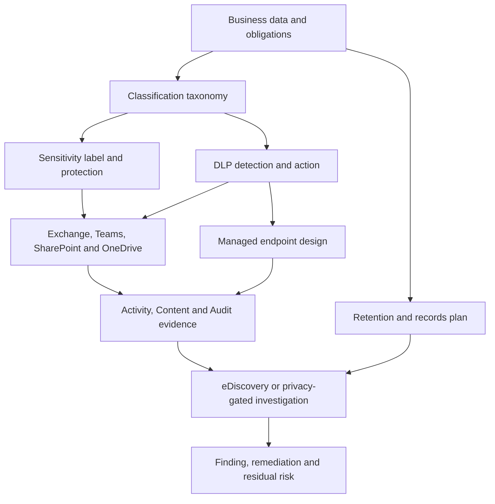

**Evidence rule:** a screenshot is not required. A stronger portfolio often contains a redacted configuration table, timestamped test case, input artifact hash, expected result, actual result if observed, discrepancy, and cleanup proof. Do not fabricate a portal image for the simulation route.

## 2. Prerequisites, roles, licenses, and stop gates

Before opening a Purview portal, write the lab authorization record. It should identify the owner, tenant, synthetic users, synthetic content, features allowed, features prohibited, time window, role activation, expected logs, rollback, cleanup date, and reviewer. If any field is unknown, use the simulation route.

| Prerequisite | Why it matters | Safe fallback |
|---|---|---|
| Isolated tenant ownership/authorization | Purview policy can inspect or restrict broad data surfaces | Local design only |
| Current license confirmation | Features and evidence vary by plan and add-on | Mark unavailable capability as expected/design |
| Least-privilege role plan | Data viewing, audit, eDiscovery, DLP, and insider-risk duties should be separated | Paper role matrix |
| Fictional users/groups | Prevents real-person impact and misleading evidence | Persona cards only |
| Synthetic corpus | Prevents exposure of personal, financial, health, legal, or employer data | Locally authored safe strings |
| Approved internal test locations | Avoids external delivery and production scope | Simulated workload/location column |
| Baseline and rollback | Publishing, DLP, hold, and retention can have delayed or durable effects | No change; design expected state |
| Privacy/legal approval model | Investigation tools can expose content and behavior | Privacy-safe paper workflow only |

| Task family | Role concept to verify in current documentation | Separation-of-duty intent |
|---|---|---|
| Classification and explorer views | Data Classification/Content Explorer/Activity Explorer permissions as currently documented | Policy designers do not automatically read all content |
| Label and DLP configuration | Information Protection/Data Loss Prevention role groups or narrower custom roles | Configurator differs from investigator where practical |
| Audit search | Audit Reader or appropriate current audit role | Search access is logged and reviewed |
| eDiscovery | eDiscovery Manager versus eDiscovery Administrator capabilities | Case access is explicit and matter-based |
| Insider Risk Management | Analysts, Investigators, Approvers, and privacy roles under current model | Pseudonymization and review approval are independent |
| Compliance Manager | Assessment and improvement-action permissions | Evidence approver differs from action owner |

Stop immediately if the proposed action includes a production location, all users, a real employee, an external recipient, a broad content export, a real custodian, a real legal matter, real sensitive records, endpoint collection from a personal device, irreversible retention, unreviewed encryption, automatic containment, or unclear licensing. “It is only a lab” is not authorization.

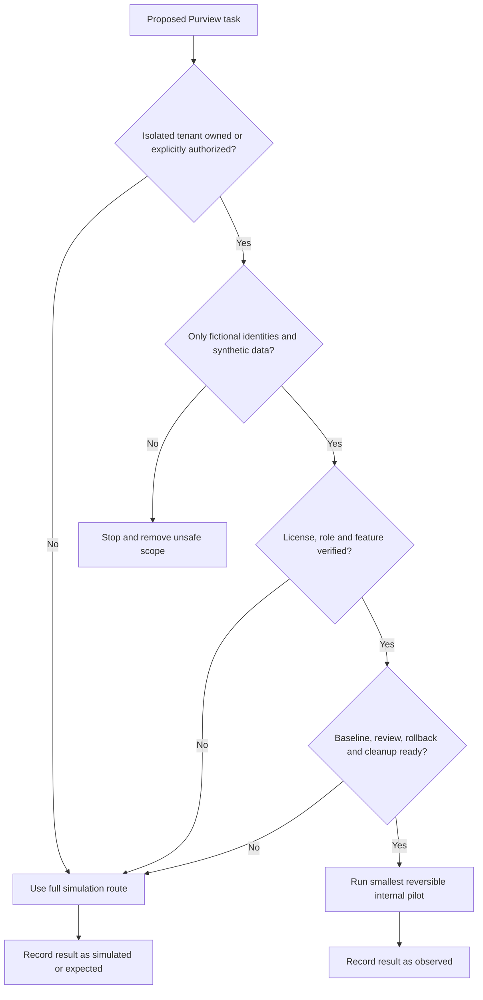

## 3. Synthetic classification taxonomy

A **classification taxonomy** is a shared vocabulary for recognizing business data. Think of it as library shelving: the shelf names must be understandable, mutually useful, and tied to handling rules. Classification answers “what is this?” A sensitivity label answers “how should it be handled?” Retention answers “how long and under what disposition rule?” Those are related but not interchangeable.

| Data class | Synthetic example | Business impact | Candidate detector | Handling intent |
|---|---|---|---|---|
| Public | Published fictional product sheet | Minimal if disclosed | Site/location or manual label | Shareable after owner approval |
| Internal | Team operating procedure | Low to moderate | Manual/default label context | Internal authenticated access |
| Confidential - Business | Fictional pricing plan and roadmap | Commercial harm | Keyword/trainable classifier design plus label | Named internal groups; controlled sharing |
| Confidential - Personal | Invented employee ID and benefits scenario | Privacy harm | Synthetic SIT or exact-data-match design | Need-to-know; DLP and retention controls |
| Highly Confidential - Finance | Synthetic account/routing pattern and budget | Fraud/material harm | Built-in financial SIT plus confidence threshold | Restricted group; block external transfer |
| Highly Confidential - Legal | Fictional acquisition codename and legal memo | Legal/privilege harm | Label/manual classifier; avoid claiming legal privilege automatically | Legal team only; case-specific hold if authorized |
| Regulated research | Fabricated participant code and trial identifier | Regulatory/contractual harm | Custom SIT design with corroborating evidence | Approved research enclave and monitoring |
| Security operations | Fake incident details and test indicators | Operational harm | Label plus contextual keyword | SOC and response team only |

### Taxonomy design method

1. Start with business outcomes and data owners, not portal features.
2. Use four to six user-facing label levels unless a stronger business need justifies complexity.
3. Separate the **classification name**, **detection logic**, **protection**, **retention**, and **monitoring** columns.
4. Add examples and counterexamples. A “budget” keyword alone is not a reliable finance classifier.
5. Assign an accountable data owner and review date.
6. Define confidence, count, proximity, exceptions, user explanation, and false-positive workflow.
7. Pilot with synthetic data and collect usability evidence before broader design approval.

```mermaid
flowchart LR
    DISCOVER[Business process and data owner] --> DEFINE[Define class and examples]
    DEFINE --> DETECT[Choose detector and confidence]
    DETECT --> HANDLE[Choose label, access, DLP and retention]
    HANDLE --> TEST[Test examples and counterexamples]
    TEST --> TUNE[Tune false positives and false negatives]
    TUNE --> APPROVE[Owner, privacy, legal and security approval]
    APPROVE --> REVIEW[Periodic review and retirement]
```

| Taxonomy quality test | Positive example | Negative/counterexample | Boundary question |
|---|---|---|---|
| Clear name | “Highly Confidential - Finance” | “Secret 3” | Can a new user choose correctly? |
| Business ownership | Finance data owner named | Security team guesses ownership | Who accepts residual leakage risk? |
| Detector rationale | Financial identifier plus corroborating keyword | Any 16-digit string | What confidence is sufficient? |
| Handling connection | External sharing blocked, internal group scoped | Label is decorative | What real decision changes? |
| Lifecycle | Annual review and retirement rule | Permanent uncontrolled growth | How are obsolete labels removed? |

## 4. Sensitive information type test corpus and exact data match design

A **Sensitive Information Type (SIT)** is a pattern-based detector that uses combinations of primary elements, supporting evidence, proximity, confidence, and counts. A test corpus is a controlled set of files/messages with known expected matches and non-matches. It is the policy equivalent of unit tests.

Create only benign synthetic files. The values below are deliberately fictional and should not be treated as valid government, financial, or medical identifiers. Where a built-in detector requires a checksum-valid example, use Microsoft's documented test procedure or a locally generated value approved for an isolated tenant; never copy a real identifier.

| Corpus ID | Synthetic artifact | Intended result | Evidence label |
|---|---|---|---|
| TC-SIT-01 | `finance-positive.txt`: “Northstar test account token NS-FIN-4821; synthetic routing phrase BLUE RIVER” | Custom fictional finance detector matches | Simulated unless observed in isolated tenant |
| TC-SIT-02 | Same token without corroborating phrase | No match at high confidence; possible low-confidence candidate | Simulated |
| TC-SIT-03 | “Project budget is 4821 dollars” | No identifier match | Simulated |
| TC-SIT-04 | Two fictional tokens within configured proximity | Count threshold two matches | Simulated |
| TC-SIT-05 | Token and phrase separated beyond proximity | No high-confidence match | Simulated |
| TC-SIT-06 | Upper/lower-case and punctuation variants | Match only where normalization permits | Simulated |
| TC-SIT-07 | Empty file and image-only placeholder | No text match; OCR behavior not claimed | Expected/design |
| TC-SIT-08 | Password-protected/archive placeholder metadata only | Unsupported/limited inspection path documented | Expected/design |
| TC-SIT-09 | Labelled “Public” file containing synthetic restricted token | Content policy still evaluates according to design | Simulated |
| TC-SIT-10 | Benign 16-digit random string | Negative test against overbroad financial detector | Simulated |

### 🔍 Plain-English deep-dive: confidence, proximity, and corroboration

Pattern matching is not simply “word present equals incident.” **Confidence** expresses how strongly the evidence supports a classification. **Proximity** limits how far supporting evidence may be from the primary element. **Corroboration** means another clue supports the primary clue. Analogy: seeing a person in a white coat is weak evidence that they are a clinician; seeing the coat, a hospital badge, and the person inside a treatment room is stronger. In DLP, a number pattern plus a nearby keyword and valid checksum can be stronger than the number alone.

Tune a detector with a confusion matrix:

| Evaluation | Policy says match | Policy says no match |
|---|---|---|
| Artifact truly belongs to class | True positive | False negative |
| Artifact does not belong to class | False positive | True negative |

Measure precision and recall only on a labelled test set. Precision asks, “Of the items flagged, how many were truly in scope?” Recall asks, “Of the truly in-scope items, how many did the detector find?” A consultant must explain the business cost of both error types rather than chase a perfect score that the sample cannot support.

### Exact data match: design only when not licensed

**Exact Data Match (EDM)** is intended to detect values that correspond to records in an approved source dataset without uploading the source in ordinary clear text. It is not a reason to use real data in a personal lab. In the no-paid route, create only this design:

| EDM element | Fictional design choice | Safety/quality control |
|---|---|---|
| Source owner | Northstar Privacy Data Steward | Written approval and purpose limitation |
| Primary field | `SyntheticEmployeeId` such as `NS-100042` | Entirely invented, non-production values |
| Corroborating fields | Fictional surname and department code | Minimum fields needed; no real person |
| Schema | Named columns, match mode, normalization documented | Version controlled; peer reviewed |
| Source table | Ten fabricated rows stored locally | Never upload without licensed authorized tenant |
| Hash/upload process | Follow current Microsoft EDM tooling and secure-computer guidance if ever authorized | Do not invent commands or claim encryption properties beyond docs |
| Refresh | Monthly fictional ownership scenario | Change, expiry, and deletion recorded |
| Test | Known positive row, near-match, missing corroborator, duplicate, case/format variants | Inputs and expected result recorded |

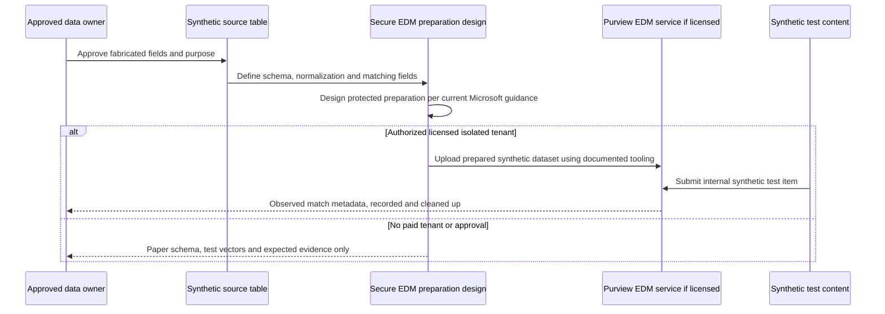

Do not say EDM “encrypts a database” or “guarantees no exposure.” State exactly what Microsoft documents after verifying the current page, and still apply source minimization, workstation security, least privilege, audit, deletion, and data-owner approval.

## 5. Sensitivity-label taxonomy, publishing, and encryption caution

A **sensitivity label** is persistent classification metadata that can also apply protection such as markings, access restrictions, and encryption, depending on workload and configuration. A **label policy** publishes selected labels and user experiences to a scope. Creating a label does not automatically make it visible; publishing does not mean every workload behaves identically; encryption can outlive a user's expectations and affect search, sharing, applications, and recovery.

| Label | User meaning | Protection design | Default/mandatory intent | Pilot audience |
|---|---|---|---|---|
| Public | Approved for public release | No encryption; owner approval still required | Never automatic for unknown content | Communications pilot |
| Internal | Routine internal work | Authenticated internal access; optional footer | Candidate default after impact review | Broad fictional internal group |
| Confidential | Need-to-know business content | Internal authenticated users; external sharing restricted | User chooses with justification to downgrade | Research/Finance synthetic group |
| Highly Confidential | Severe harm if disclosed | Named groups, stronger access/encryption design, prominent marking | Never broad default | Tiny synthetic pilot |
| Legal Hold Marker | **Not a replacement for hold**; optional visual classification only | No legal promise | Not a retention control | Legal paper workflow only |

| Publishing decision | Question | Safe lab answer |
|---|---|---|
| Scope | Which exact fictional users/groups receive labels? | `Purview-Pilot-Synthetic`, never all users |
| Order | How are multiple policies reconciled under current behavior? | Document expected effective settings; verify in live portal |
| Default | Which label appears for new content? | Test only low-impact `Internal` in pilot or simulate |
| Mandatory | Must users label documents/emails? | Simulation first; user-impact test before pilot |
| Downgrade | Is justification required? | Yes for pilot design; review audit evidence |
| Help text | Can a user make the right choice? | Plain examples and counterexamples |
| Propagation | How long before clients/services reflect change? | Use documented range as planning input, record actual observation |
| Removal | What happens to protected items and policy clients? | Test before publication; removing publication may not decrypt existing content |

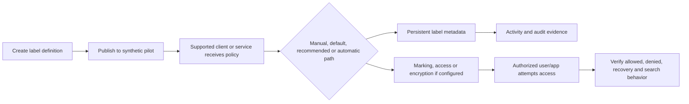

### 🔍 Plain-English deep-dive: encryption changes the access envelope

Encryption is like replacing a normal office-folder lock with a lock whose authorization travels with the file. Moving the file does not necessarily remove the lock. That persistence is valuable, but mistakes can strand data or block workflows. Before any encrypted-label pilot, test owner access, permitted group access, denied internal persona, offline behavior where relevant, search/eDiscovery support, coauthoring and application compatibility, service-account processes, label removal, key/rights recovery, and user departure.

**External-user caution:** This lab never sends protected content to an external user. A future enterprise design must verify guest identity type, tenant relationship, authentication method, rights assignment, supported client, redemption experience, account lifecycle, domain/organization changes, offline rights, revocation behavior, audit visibility, help-desk path, legal terms, and the consequence if the external account is deleted. “Encrypt for any authenticated user” can create unintended access and support outcomes. Use a dedicated cross-tenant test under both organizations' authorization before production.

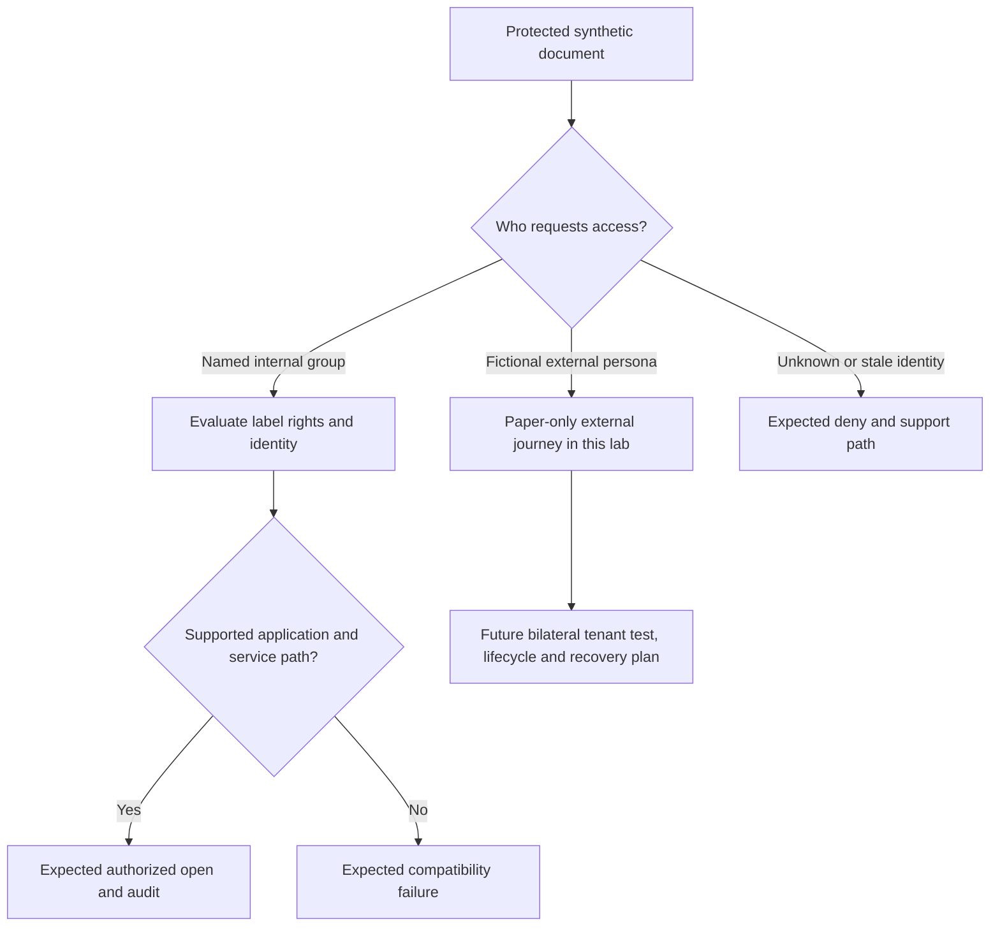

## 6. DLP design across Microsoft 365 and endpoints

**Data Loss Prevention (DLP)** evaluates content and context against policy rules, then can audit, educate, restrict, block, alert, or request justification depending on configuration. DLP is not a single “block data” switch. The effective decision depends on locations, users/groups, content state, classifier, confidence, count, action, exceptions, device state, client support, policy mode, and service timing.

| Location | Synthetic scenario | Candidate action | Important boundary |
|---|---|---|---|
| Exchange Online | Internal message with synthetic restricted token | Policy tip and test-mode event; no external send | Transport and supported attachment inspection differ from endpoint |
| SharePoint Online | Synthetic finance file in test site | Audit or restrict external-sharing design | Existing permissions and links still need access review |
| OneDrive | Synthetic personal-work file | Warn/justify or restrict external-sharing design | User ownership does not remove policy obligation |
| Teams chat/channel | Synthetic token in supported message/file flow | Audit/restrict according to current licensed support | Teams file content often resides in SharePoint/OneDrive |
| Endpoint devices | Copy/upload/print/clipboard/USB/browser scenarios | Design audit, warn, justify, or block by activity | Requires supported onboarding, settings, indicators, browser/device conditions |
| Power BI/Fabric or other locations | Only if current support, license, and scope are verified | Design-specific | Never assume one rule behaves uniformly everywhere |

| Rule component | Fictional policy value | Tuning question |
|---|---|---|
| Scope | Synthetic pilot users and test site | Is a service account or test process unintentionally included? |
| Condition | `Northstar Synthetic Employee Token`, high confidence, count ≥ 1 | Would count two reduce noise without unacceptable misses? |
| Context | External-sharing action design or endpoint egress activity | Is destination truly external/unmanaged under current semantics? |
| Action | Start test/simulation; then policy tip; block only after approval | Can the user recover and continue legitimate work? |
| Notification | Plain business reason and support route | Does it disclose sensitive rule logic? |
| Override | Business justification required; optional false-positive reporting | Who reviews, and when does exception expire? |
| Incident report | Security/compliance queue with minimum metadata | Are recipients authorized to view content metadata? |
| Exception | Exact sanctioned workflow, owner, ticket, expiry | Can narrower location/group/classifier solve it? |

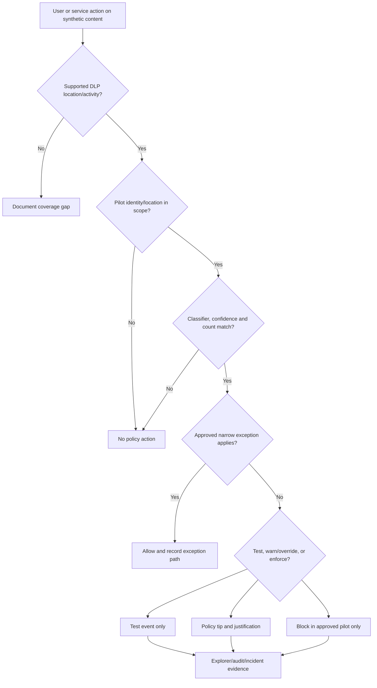

### 🔍 Plain-English deep-dive: M365 DLP and Endpoint DLP observe different moments

Microsoft 365 location DLP often evaluates content or sharing/messaging activity inside cloud services. Endpoint DLP evaluates supported activities on onboarded devices, such as copying to removable media, printing, clipboard use, network share transfer, or upload to service domains, subject to current platform support and settings. Analogy: cloud DLP is a building's records-room guard; endpoint DLP is the loading-dock guard. Both use handling rules, but they see different exits and need different instrumentation.

For the no-paid route, do not perform any egress action. Use this synthetic event schema:

| Field | Example |
|---|---|
| `EventId` | `DLP-SIM-001` |
| `Actor` | `Priya.Researcher` |
| `Workload` | `SharePoint` |
| `Object` | `synthetic-participants.csv` |
| `Classification` | `Confidential - Personal` |
| `Activity` | `ShareExternallyRequested` (simulated) |
| `Destination` | `Casey.Contractor@partner.example` (non-routable persona) |
| `RuleMode` | `TestWithNotifications` (design) |
| `Decision` | `WarnAndRequireJustification` (simulated) |
| `EvidenceType` | `Simulated` |

## 7. Hands-on and no-paid-tenant execution steps

### Route A: authorized, licensed, isolated pilot

1. Record tenant ID in a private evidence ledger, authorization, role activation, license result, pilot users/group, test site, cleanup date, and prohibited actions.
2. Export or manually record the current label, publishing, DLP, alert, and role baseline. Redact tenant-specific identifiers from portfolio artifacts.
3. Create the small synthetic corpus. Hash local files with a standard file-hash tool if available and record hashes; hashes prove artifact identity, not policy behavior.
4. Prefer an existing safe test-sensitive-information mechanism documented by Microsoft. If creating a custom fictional detector is licensed and approved, scope it narrowly and use no real patterns.
5. Create or reuse a test-only sensitivity label without encryption first. Publish only to the fictional pilot group.
6. Wait for documented propagation and record the actual time observed. Do not call a delayed client a failure until cache, sign-in, app support, and policy distribution are checked.
7. Apply the label to one synthetic document and verify metadata/marking in a supported app. Record as **Observed** only if personally seen.
8. Create a DLP policy in the safest available simulation/test mode. Scope only the synthetic users and internal test location.
9. Execute benign internal actions only: save a synthetic text document, draft but do not externally send an internal message, or share internally among fictional users.
10. Observe permitted portal evidence with exact test timestamps and IDs. Do not browse unrelated content.
11. Test a negative artifact and a boundary artifact. Record both successes and gaps.
12. Remove test assignments and policy objects according to rollback order; verify cleanup and residual events/retention behavior.

### Route B: complete local simulation

1. Create a folder privately named `purview-lab-simulation` outside the study-guide deliverable if you choose to execute it; do not add extra workspace files for this Part.
2. Copy the ten corpus definitions from this guide into a local worksheet and add `ExpectedDetectorResult`, `ExpectedPolicyDecision`, and `EvidenceType=Simulated`.
3. Create a policy-evaluation table using the DLP rule components in Section 6.
4. Walk each artifact through scope, location, classification, exception, mode, action, notification, incident, and audit decisions.
5. Create fictional event cards with unique IDs and ISO-8601 UTC timestamps. Do not use a future timestamp; use the actual exercise date.
6. Populate the explorer, audit, incident, and eDiscovery worksheets below from those event cards.
7. Run the complete test matrix in Section 15 by tabletop review. A second reviewer should challenge at least one expected result.
8. Produce the client report and mark every result simulated or expected. This route is complete even though no Microsoft portal was used.

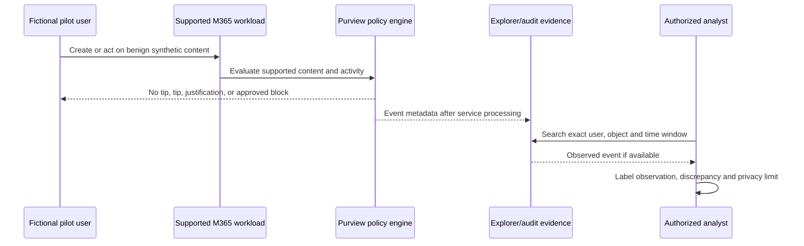

## 8. Policy tips, overrides, incidents, Activity Explorer, and Content Explorer

A **policy tip** is user-facing education or enforcement context near the action. An **override** lets an authorized workflow continue under configured conditions, often with a justification. An **incident report** routes policy-match information to reviewers. These should be designed as a learning and governance loop, not merely a punishment system.

| Evidence surface | Primary question | What it does not prove |
|---|---|---|
| Policy tip | What message/action did the user encounter? | That an incident was reviewed or content truly sensitive |
| Override/justification | Why did the user continue? | That the reason was valid without review |
| Activity Explorer | What classified/protection/DLP activity metadata is available for the scoped period? | Complete raw content truth or malicious intent |
| Content Explorer | What classified items can an appropriately authorized reviewer locate? | That every item is correctly classified |
| Alert/incident | Which configured threshold created analyst work? | The actor intended harm |
| Unified audit | Which supported audited operation was recorded? | Every action in every service or an immutable legal narrative by itself |

**Content privacy rule:** Content Explorer permissions can expose sensitive information. Use aggregate counts and synthetic items in the lab. Do not open unrelated items to “prove” access. The portfolio should show a redacted evidence schema, not content screenshots.

### Explorer evidence card

| Field | Example simulated value | Analyst interpretation |
|---|---|---|
| Evidence class | Simulated | No portal observation claimed |
| Event ID | `EXP-SIM-004` | Correlation key |
| UTC time | Exercise execution time | Normalize before correlation |
| Actor | `Sam.Finance` | Fictional identity |
| Workload/location | OneDrive test design | Coverage context |
| Item | `synthetic-quarterly-plan.docx` | Synthetic object only |
| Label before/after | Internal → Confidential | Candidate label change |
| DLP rule | `NS-Synthetic-Finance-External` | Rule expected to evaluate |
| User outcome | Tip displayed; override with `Approved vendor workflow CR-104` | Needs reviewer/expiry validation |
| Confidence | High by designed test vector | Not empirical confidence |

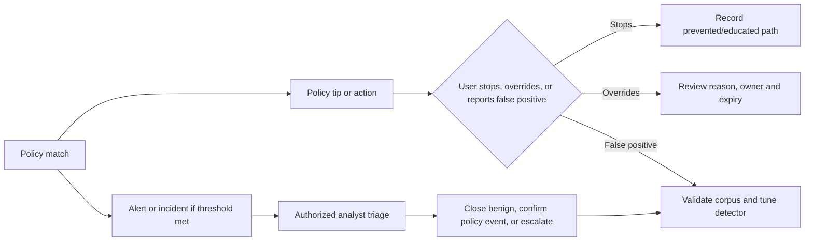

## 9. Audit search and synthetic timeline

Audit investigation starts with a precise question, not a broad search for interesting behavior. Define the synthetic user, action, object, workload, UTC interval, expected operation names, role, result, and known limitations. Confirm current audit availability and retention before promising historical coverage.

| Timeline field | Required content |
|---|---|
| Source time | Raw timestamp and timezone from the evidence source |
| Normalized time | ISO-8601 UTC value |
| Actor/object | Fictional identity and synthetic object ID |
| Operation | Current documented audit operation or clearly labelled simulated operation |
| Workload | Exchange, SharePoint, OneDrive, Teams, Endpoint, Purview, eDiscovery |
| Correlation | Event, alert, policy, case, session, or object identifier |
| Evidence class | Observed, simulated, or expected |
| Interpretation | Fact separated from hypothesis |
| Limitation | Delay, retention, unsupported action, redaction, or missing source |

### Synthetic audit timeline

| UTC offset | Synthetic event | Expected/simulated evidence | Interpretation |
|---|---|---|---|
| T+00 | `Priya.Researcher` creates `synthetic-participants.csv` | Simulated SharePoint file event | File creation, not proof of sensitivity |
| T+02 | Custom fictional SIT evaluates content | Simulated classification event | Detector expected to match one token |
| T+04 | User applies `Confidential - Personal` | Simulated label event | Manual classification |
| T+07 | External-share request to `partner.example` persona | Simulated DLP event; no network action | Tabletop action only |
| T+07 | Policy tip and justification decision | Simulated tip/override event | User explanation requires review |
| T+12 | Analyst opens scoped alert | Expected alert operation if configured/licensed | Verify exact operation and delay in pilot |
| T+20 | Owner confirms approved internal-only workflow | Simulated case note | Business context changes disposition |
| T+25 | Rule exception rejected; process redesigned | Simulated decision record | Avoid permanent broad bypass |

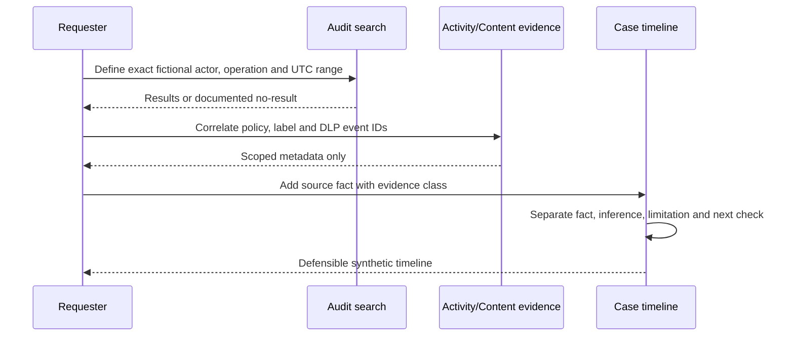

No-result troubleshooting order: validate timezone; verify role and audit activation/current behavior; widen the interval only enough for service delay; check exact supported operation names; confirm the action occurred in a supported workload; inspect user/object identity variants; check retention/license; and preserve “not found” as a result. Never replace a missing event with a fabricated one.

## 10. eDiscovery case design: roles through export

**Electronic discovery (eDiscovery)** is a controlled process for identifying, preserving, collecting, reviewing, and producing electronically stored information for an authorized matter. It is not ordinary troubleshooting and it does not grant permission to browse data. Legal counsel, privacy, records, and the case owner determine purpose, scope, proportionality, and production requirements.

| Stage | Fictional case artifact | Required decision |
|---|---|---|
| Authorization | `NS-CASE-2026-TRAINING`, explicitly fictional | Who authorized purpose, scope, roles, and closure? |
| Case/roles | Case owner `Morgan.Legal`; named fictional members | Who may search, review, export, or administer? |
| Custodian | `Priya.Researcher` persona and named test locations | Why is the custodian in scope? |
| Notice | Paper acknowledgement workflow | Who issues, tracks, reminds, and releases notice? |
| Hold | Synthetic mailbox/site/OneDrive scope | What query/location, when effective, and how validated? |
| Collection/search | Narrow date, custodian, project code, synthetic terms | Is the query proportionate and reproducible? |
| Review set | Test documents only | What deduplication, threading, tags, redaction, and review process apply? |
| Export | Paper manifest or isolated synthetic export if explicitly allowed | Who approves, stores, transfers, hashes, and destroys output? |
| Closure | Hold release approval, case closure, export destruction | What obligations remain? |

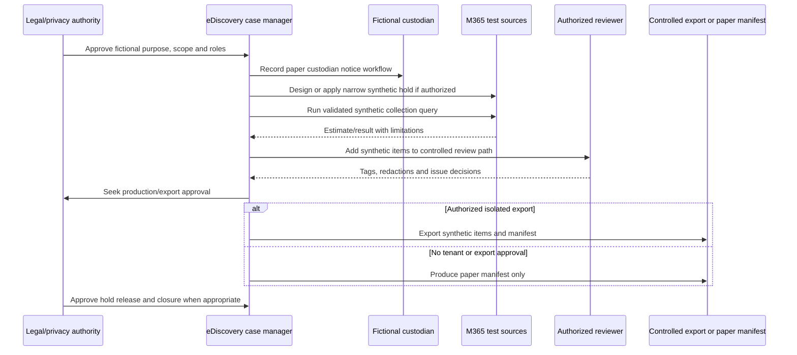

### 🔍 Plain-English deep-dive: hold, collection, review, and export are separate controls

Think of an investigation as a museum loan. A **hold** tells the museum not to dispose of relevant objects. A **collection** identifies and copies candidate objects into a controlled process. A **review set** is the secure room where authorized experts categorize and redact them. An **export** is the approved package leaving that room with a manifest. Preserving an item does not mean it is relevant; finding it does not mean it can be exported; exporting it does not remove privacy, privilege, security, or destruction obligations.

### Query-validation worksheet

| Test | Synthetic query intent | Expected result |
|---|---|---|
| Known positive | Exact project code `NS-ORBIT-42` in two seeded files | Both returned |
| Known negative | File with `NS-ORBIT-24` only | Not returned by exact design |
| Date boundary | One item at start, one at end, one outside | Inclusive/exclusive behavior documented |
| Custodian boundary | Same term in non-custodian location | Excluded unless source scope says otherwise |
| Variant | Hyphen, space, case, metadata versus body | Query behavior recorded, not assumed |
| Estimate versus collected | Compare counts and exceptions | Difference explained before review |
| Hold validation | Seeded retained item under authorized test | Preservation behavior observed only if executed |
| Export manifest | File name, item ID, hash, size, source, redaction status | Paper or isolated synthetic output reconciles |

Never use a personal lab to rehearse real custodian search terms, names, allegations, or matter facts. The paper route is designed to demonstrate process knowledge without legal authority or data access.

## 11. Retention versus hold plan

Retention manages lifecycle according to records and business rules; a hold preserves potentially relevant content for an authorized matter. Both can affect deletion, but their purpose, scope, governance, and release differ.

| Control | Primary purpose | Typical trigger | Scope/owner | End condition |
|---|---|---|---|---|
| Retention policy | Keep/delete broad content classes or locations for a defined lifecycle | Business, legal, regulatory, or operational schedule | Records/compliance owners | Schedule and disposition decision |
| Retention label | Item-level lifecycle/record behavior | Classification, event, manual/default/automatic process | Records/data owner | Disposition or configured lifecycle |
| eDiscovery hold | Preserve content relevant to a specific authorized matter | Legal/investigative duty | Legal/case owner | Explicit release after duty ends |
| Backup/recovery | Restore after loss/corruption under separate capability | Operational resilience | IT/service owner | Recovery window |

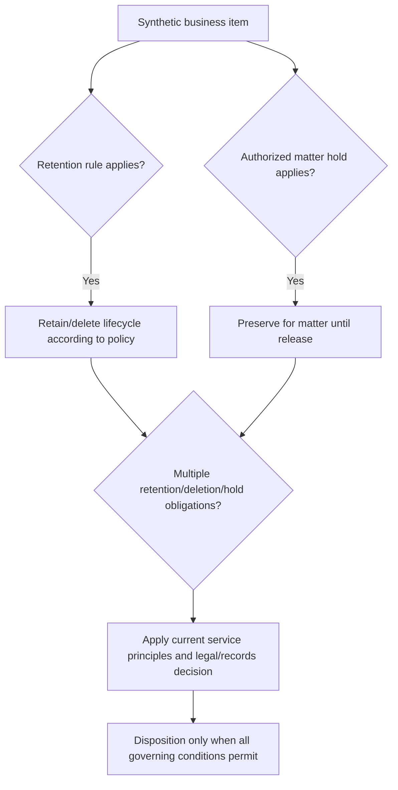

Do not memorize an oversimplified precedence slogan and apply it blindly. Microsoft retention principles, adaptive/static scopes, records behavior, workload storage, preservation mechanisms, and policy limits evolve. For each design, cite the current official rule and test a synthetic item. A retention policy is not a backup, and removing a policy may not instantly erase preserved data.

### Fictional retention plan

| Content class | Proposed rule for discussion | Hold interaction | Evidence |
|---|---|---|---|
| Public communications | Retain according to approved communications schedule | Matter hold can preserve relevant item | Owner approval and disposition log |
| Routine collaboration | Shorter business schedule; delete when no obligation remains | Hold suspends ordinary disposal as applicable | Policy scope and deletion test |
| Finance records | Finance/legal schedule by record category | Preserve for matter where relevant | Label/activity and disposition review |
| Research records | Contract/regulatory schedule by study class | Case hold only under authorization | Data-owner and legal decision |
| Security logs | Security/privacy-approved operational period | Preserve selected evidence for incident/legal need | Access-controlled log/evidence register |

## 12. Privacy-safe insider-risk paper workflow

**Insider Risk Management (IRM)** helps authorized organizations correlate selected signals to investigate potential risky activity under governance and privacy controls. It must not be presented as proof of intent, guilt, or employee performance. This lab performs no employee monitoring and does not enable analytics on any real user.

### Privacy principles

| Principle | Lab implementation |
|---|---|
| Lawful purpose | Fictional tabletop objective approved in the scenario |
| Data minimization | Only event fields needed for a synthetic risk decision |
| Pseudonymization | Persona IDs remain pseudonymous to first-line analyst |
| Segregation of duties | Policy owner, analyst, investigator, privacy approver, HR/legal decision-maker differ |
| Threshold and context | Multiple synthetic signals plus business context; no single-event guilt inference |
| Need-to-know content | Aggregate metadata first; content access requires explicit secondary approval |
| Retention/deletion | Case and evidence lifecycle documented |
| Employee rights/process | Paper notice, policy, appeal/correction, and jurisdiction review |
| No automation of discipline | Human legal/HR process outside security-tool verdict |

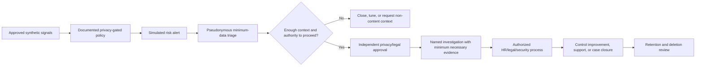

### 🔍 Plain-English deep-dive: a risk signal is not a verdict

A smoke alarm detects a pattern associated with fire; it does not know whether the cause is a fire, steam, a test, or a sensor fault. Similarly, a download spike, unusual access time, policy override, resignation indicator, or external-transfer attempt can have legitimate context. The analyst's job is to verify data quality, scope, authorization, and corroboration while minimizing exposure. The system must never become a shortcut around employment law, privacy, due process, or human judgment.

### Fictional tabletop event

`Persona-R17` is a pseudonym. Synthetic cards state that the persona downloaded 40 fabricated research files after a role-transfer event and attempted an external share to `partner.example`. The exercise asks:

1. Is the role-transfer signal approved, accurate, and necessary?
2. Is 40 unusual compared with this fictional role's expected work, or did a migration create the volume?
3. Did the “external share” actually occur? In this lab it did not; it is simulated.
4. Which minimum metadata can resolve the question without reading file contents?
5. Who can approve de-pseudonymization in the fictional governance model?
6. What support or process failure might explain the behavior?
7. When should the case close, and when should the synthetic records be deleted?

| Decision | Simulated outcome | Rationale |
|---|---|---|
| Initial severity | Medium, not high | Two signals but no actual transfer or malicious evidence |
| Content access | Not approved | Metadata and migration change record are sufficient initially |
| Identity reveal | Not approved | Tabletop remains pseudonymous |
| Escalation | Ask migration owner to validate approved batch | Least intrusive corroboration |
| Disposition | Benign authorized migration activity | Expected work explains volume |
| Improvement | Exclude approved migration service/activity narrowly; retain user protection | Reduce noise without broad blind spot |

## 13. Compliance assessment and evidence model

**Compliance Manager** and similar assessment tools organize controls, improvement actions, ownership, evidence, and scores. A score is a prioritization aid, not a legal certification or guarantee. Shared responsibility means Microsoft may operate service controls while the customer configures, governs, and evidences its own responsibilities.

| Assessment field | Fictional example |
|---|---|
| Requirement | Protect confidential personal research data from unauthorized disclosure |
| Control objective | Classify data and restrict unsupported external sharing |
| Microsoft action | Service control as documented in current assessment |
| Customer action | Approve taxonomy; publish pilot label; configure/tune DLP; train users; review incidents |
| Owner | Northstar Data Protection Lead |
| Implementation status | Designed / pilot / implemented / not applicable, never guessed |
| Evidence | Approved policy export, test IDs, timestamps, screenshots if redacted, incident review, training record |
| Test frequency | Quarterly synthetic control test and annual design review |
| Gap | Endpoint egress not validated because no licensed isolated device |
| Residual risk | Cloud sharing covered by design; unmanaged endpoint path remains unverified |
| Confidence | Medium: documentation and simulation, no observed tenant event |

```mermaid
flowchart LR
    REQ[Requirement] --> OBJ[Control objective]
    OBJ --> DESIGN[Control design]
    DESIGN --> OPERATE[Owner operates control]
    OPERATE --> TEST[Independent synthetic test]
    TEST --> EVID[Timestamped evidence]
    EVID --> ASSESS[Effective, partial, ineffective, or not tested]
    ASSESS --> REMEDY[Improvement action and due date]
    REMEDY --> RETEST[Retest and reassess residual risk]
```

| Evidence quality | Strong example | Weak example |
|---|---|---|
| Relevance | Test directly maps to control objective | Generic portal screenshot |
| Authenticity | Export/source ID, owner, timestamp, hash where useful | Edited image without provenance |
| Completeness | Positive, negative, boundary, failure, rollback | One successful happy path |
| Currency | Evidence period aligns to assessment | Old screenshot with unknown config |
| Privacy | Synthetic/redacted, access controlled | Real user/content exposed |
| Honesty | Clearly observed, simulated, or expected | Simulation described as production implementation |

## 14. Architecture-to-control and RACI matrices

| Risk | Preventive control | Detective control | Responsive control | Residual consideration |
|---|---|---|---|---|
| Accidental external sharing | Label guidance, access settings, DLP warn/block | DLP events, sharing audit | Revoke link/access; coach user; tune | Unsupported apps/locations |
| Misclassification | Clear taxonomy, defaults/recommendations | Explorer sampling and false-positive reports | Relabel, tune, update examples | Human judgment remains |
| Excessive investigator access | Least privilege and case membership | Audit role/search/content access | Remove role, review access, investigate misuse | Privileged access path |
| Deletion during legal duty | Authorized hold | Hold validation and audit | Correct scope, notify case owner | Legal determination required |
| Over-retention | Approved schedule and disposition | Policy/evidence review | Correct policy and dispose when lawful | Storage, privacy, and discovery burden |
| Insider-risk privacy harm | Pseudonymization, minimum signals, approvals | Access/case audit | Close/delete, correct data, governance review | Jurisdiction and trust impact |

| Activity | Data owner | Security | Compliance/Privacy | Legal/eDiscovery | IT/Endpoint | Business user |
|---|---|---|---|---|---|---|
| Approve taxonomy | A/R | C | C | C | I | C |
| Configure label/DLP pilot | C | R | A | C | C | I |
| Review DLP incident | C | R | A | C | C | I |
| Approve eDiscovery scope | I | C | C | A/R | I | I |
| Operate hold | I | C | C | A/R | I | I |
| Insider-risk escalation | I | C | A/R | C | I | I |
| Endpoint DLP onboarding | C | C | C | I | A/R | I |
| Cleanup and evidence closure | A | R | R | R for case | R | I |

`R` means Responsible, `A` Accountable, `C` Consulted, and `I` Informed. A RACI chart does not create legal authority; named owners must approve it.

## 15. Positive, negative, boundary, failure, and rollback tests

| ID | Type | Test | Expected result | Evidence class/path |
|---|---|---|---|---|
| P68-T01 | Positive | High-confidence fictional SIT with corroborating phrase | Detector and test-mode DLP rule match | Observed if licensed; otherwise simulated |
| P68-T02 | Negative | Similar number without identifier context | No high-confidence match | Observed/simulated |
| P68-T03 | Boundary | Supporting keyword exactly at designed proximity edge | Document inclusive/exclusive behavior | Simulated unless tested |
| P68-T04 | Boundary | Pilot user versus non-pilot fictional user | Only pilot is in scope | Observed/simulated |
| P68-T05 | Positive | Apply non-encrypted `Confidential` label | Label metadata/marking appears after propagation | Observed/expected |
| P68-T06 | Negative | Public synthetic artifact | No automatic restricted classification | Observed/simulated |
| P68-T07 | Positive | DLP policy tip and approved justification | Tip/override event and review record | Observed/simulated |
| P68-T08 | Failure | Policy tip absent | Troubleshoot scope, mode, classifier, app, cache, timing | Recorded failure injection |
| P68-T09 | Failure | Explorer event delayed/missing | Preserve no-result; inspect role, support, time, retention | Recorded failure injection |
| P68-T10 | Positive | Audit exact synthetic label action | Event returned with actor/object/time | Observed or expected only |
| P68-T11 | Negative | Audit unrelated persona excluded by exact filters | No unrelated result opened | Observed/simulated |
| P68-T12 | Positive | eDiscovery known-positive seeded query | Two expected synthetic items | Observed/paper result |
| P68-T13 | Boundary | Query date and custodian edge | In/out items match documented semantics | Observed/paper result |
| P68-T14 | Failure | Hold scope omitted test OneDrive | Validation catches gap before reliance | Paper failure injection |
| P68-T15 | Privacy | Insider-risk card resolved by metadata/change record | No content access or identity reveal | Simulated |
| P68-T16 | False positive | Migration batch resembles exfiltration | Close benign and create narrow governed tuning | Simulated |
| P68-T17 | Rollback | Unpublish pilot label policy | Pilot no longer receives publication after propagation; existing protection caveat recorded | Observed/expected |
| P68-T18 | Rollback | Disable/remove test DLP rule and assignments | No new evaluations; historical evidence lifecycle documented | Observed/expected |
| P68-T19 | Cleanup | Close fictional eDiscovery case after hold-release approval | Case state, hold release, export deletion verified | Observed/paper |
| P68-T20 | Recovery | Authorized user cannot open encrypted synthetic file | Rights, identity, client, network, label, recovery path checked; no broad access granted | Paper by default |

### False-positive tuning order

1. Confirm the event and evidence class; do not tune from hearsay.
2. Verify the artefact's true business classification with the data owner.
3. Reproduce with a synthetic equivalent.
4. Check scope, location, detector, confidence, count, proximity, action, and policy precedence.
5. Prefer a better classifier or threshold over a broad user/domain exclusion.
6. If an exception is necessary, make it exact, owned, approved, monitored, and expiring.
7. Backtest positives and negatives.
8. Pilot, monitor, and document residual false-negative risk.

## 16. Troubleshooting guide

| Symptom | Likely checks | Unsafe shortcut to avoid |
|---|---|---|
| Label missing | Publication scope, policy distribution, sign-in, supported app, cache, license, propagation | Publishing tenant-wide |
| Protected file will not open | Actor identity, rights definition, group propagation, supported client, network, label state, recovery owner | Granting “everyone” access |
| SIT does not match | Test corpus, normalization, confidence, corroboration, proximity, count, file support | Copying real identifiers into test |
| SIT overmatches | Counterexamples, primary pattern, corroboration, threshold, keyword breadth | Disabling all DLP |
| DLP rule does not trigger | Location support, user/site scope, policy mode, condition, exception, content state, delay | Sending content externally to force a test |
| Endpoint activity absent | Device onboarding/config, supported OS/browser/activity, policy sync, indicators, network, local logs | Using a personal/employer device |
| Activity/Content Explorer empty | Roles, time filter, activity support, event delay, license, test actually performed | Opening unrelated tenant data |
| Audit event absent | UTC range, operation, workload support, role, retention, ingestion delay | Fabricating expected event |
| eDiscovery query count differs | source scope, indexing, date semantics, query syntax, duplicates, unindexed items, estimate versus collection | Broad all-tenant export |
| Hold uncertain | authorization, locations, query, effective status, test item, service behavior | Assuming case creation equals preservation |
| Insider-risk alert noisy | source quality, baseline, approved activity, thresholds, policy scope, privacy review | Monitoring more users/content |
| Compliance score rises | Validate actual action/evidence and scope | Claiming legal compliance from score |

Troubleshooting evidence should use a transaction narrative: **actor → object → action → location → policy version → decision → user result → event source → UTC time → correlation ID → limitation**. This structure draws naturally on your support and RCA background.

## 17. Rollback, cleanup, and residual effects

Cleanup is a planned phase, not “delete everything.” Retention, holds, protection, audit events, and exported evidence can persist by design. Obtain the right approval before releasing a hold or destroying case output.

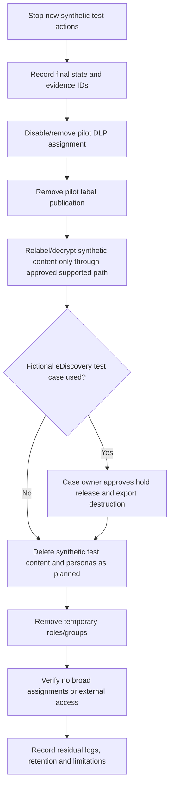

| Cleanup item | Owner | Verification |
|---|---|---|
| DLP test policy/rule | Purview pilot owner | Disabled/deleted as approved; no broad scope |
| Label publishing policy | Information Protection owner | Pilot assignment removed; client propagation caveat recorded |
| Protected synthetic files | Data owner | Access/removal tested before deletion; no stranded artifact |
| Synthetic users/groups/site | Lab owner | Deleted or retained only under explicit plan |
| Endpoint settings | Endpoint owner | Test device policy removed; device remains safe/owned |
| eDiscovery hold/case | Fictional case owner under authorization | Hold release and case closure recorded; never unilateral |
| Export/review package | Case owner | Paper manifest closed or synthetic export securely deleted |
| Temporary roles | Privileged access owner | Eligibility/activation/group membership removed |
| Evidence pack | Lab owner | Redacted, access controlled, retention date set |

## 18. Client report and portfolio incident-style deliverable

The final client report should be concise enough for an executive and deep enough for technical defense.

| Report section | Required content |
|---|---|
| Executive summary | Business problem, top three risks, recommendation, residual risk |
| Scope and constraints | Fictional environment, synthetic data, route used, date, license limits, exclusions |
| Current state | Data locations, taxonomy, labels, DLP, audit, eDiscovery, retention, IRM, roles |
| Target state | Architecture and control principles |
| Findings | Condition, evidence class, impact, likelihood, recommendation, owner, priority |
| Pilot plan | Personas, policies, changes, tests, success criteria, rollback |
| Investigation workflow | Explorer/audit/eDiscovery/IRM role and evidence flow |
| Operating model | RACI, review cadence, exception expiry, metrics |
| Roadmap | 0–30, 31–90, and 91–180-day actions with dependencies |
| Appendices inside report | Taxonomy, corpus, query/test matrix, evidence ledger, cleanup proof |

### Sample findings

| ID | Finding | Evidence | Risk | Recommendation |
|---|---|---|---|---|
| PUR-01 | Labels are not tied to data-owner examples and handling outcomes | Simulated current-state interview | Users may classify inconsistently | Approve four-level taxonomy and examples before publication |
| PUR-02 | DLP is proposed as broad blocking without a false-positive pilot | Design review | Business disruption and workaround behavior | Start test mode, tune corpus, then warn/justify before narrow enforcement |
| PUR-03 | eDiscovery role and export custody are undefined | Paper process walkthrough | Excessive data exposure and weak defensibility | Create case-specific role, approval, manifest, storage, and destruction process |
| PUR-04 | Insider-risk design lacks independent privacy approval | Governance review | Surveillance, legal, and trust risk | Require minimization, pseudonymization, approval, audit, and no automated discipline |

### Portfolio package

Include only redacted or synthetic material:

1. One-page purpose, authorization, and safety statement.
2. Architecture and two-route decision diagram.
3. Taxonomy and ten-item synthetic corpus.
4. SIT/EDM design and false-positive confusion matrix.
5. Label/publishing/encryption decision matrix.
6. M365 and endpoint DLP rule/test matrix.
7. Explorer/audit synthetic timeline with evidence labels.
8. eDiscovery workflow, query validation, and paper manifest.
9. Retention-versus-hold decision table.
10. Privacy-safe insider-risk tabletop.
11. Compliance assessment and evidence-quality rubric.
12. Findings, roadmap, rollback, cleanup, and residual-risk statement.

Do not include tenant IDs, real domains, real identities, access tokens, screenshots of unrelated data, real case terms, or employer information.

## 19. JD Mapping: interview defense

| Interview prompt | Evidence from this Part | Honest boundary |
|---|---|---|
| “Design an information-protection program.” | Business taxonomy → detector → label → DLP → evidence → tuning lifecycle | Design/lab, not claimed enterprise ownership |
| “How would you deploy DLP?” | Test mode, corpus, positive/negative/boundary tests, user tips, overrides, alerts, phased enforcement | Endpoint/M365 execution only if actually observed |
| “How do you conduct eDiscovery?” | Authorization, roles, custodian, hold, collection, review, export, closure | Paper or synthetic case, not legal advice/work |
| “How do you balance insider risk and privacy?” | Minimization, pseudonymization, separation, context, approval, no automatic discipline | No employee monitoring performed |
| “How do you prove control effectiveness?” | Requirement/control/test/evidence/remediation chain | Compliance score is not certification |
| “What is your troubleshooting strength?” | Transaction narrative and evidence-led false-positive tuning | Connects to actual support/RCA experience |

## 20. Official Source Anchors

These are official Microsoft sources to verify as of the actual implementation date. They were selected for the August 24, 2026 study-guide baseline; Microsoft may update content, URLs, licensing, roles, limits, and portal names after that date.

| Topic | Official source | How to use it |
|---|---|---|
| Purview overview | [Learn about Microsoft Purview](https://learn.microsoft.com/purview/purview) | Confirm current solution families and portals |
| Data classification | [Learn about data classification](https://learn.microsoft.com/purview/data-classification-overview) | Confirm Content/Activity Explorer concepts and permissions links |
| Sensitive information types | [Learn about sensitive information types](https://learn.microsoft.com/purview/sensitive-information-type-learn-about) | Confirm confidence, proximity, supporting evidence, and current testing methods |
| Exact data match | [Learn about exact data match based sensitive information types](https://learn.microsoft.com/purview/sit-learn-about-exact-data-match-based-sits) | Confirm prerequisites, schema/data preparation, security, and limits before any use |
| Sensitivity labels | [Learn about sensitivity labels](https://learn.microsoft.com/purview/sensitivity-labels) | Confirm label capabilities, scope, persistence, encryption, and support |
| Label policies | [Publish sensitivity labels by creating a label policy](https://learn.microsoft.com/purview/create-sensitivity-labels) | Verify publication, policy settings, priority, and propagation guidance |
| Encryption | [Restrict access to content by using sensitivity labels to apply encryption](https://learn.microsoft.com/purview/encryption-sensitivity-labels) | Verify rights, external access, offline access, compatibility, and recovery implications |
| DLP | [Learn about data loss prevention](https://learn.microsoft.com/purview/dlp-learn-about-dlp) | Confirm architecture, locations, policy behavior, and licensing links |
| DLP policy design | [Create and deploy data loss prevention policies](https://learn.microsoft.com/purview/dlp-create-deploy-policy) | Verify simulation, deployment, notifications, incidents, and tuning workflow |
| Endpoint DLP | [Learn about endpoint data loss prevention](https://learn.microsoft.com/purview/endpoint-dlp-learn-about) | Confirm supported devices, activities, settings, browsers, onboarding, and limits |
| Activity Explorer | [Get started with Activity Explorer](https://learn.microsoft.com/purview/data-classification-activity-explorer) | Verify filters, activities, roles, availability, and delay |
| Content Explorer | [Get started with Content Explorer](https://learn.microsoft.com/purview/data-classification-content-explorer) | Verify content access roles, data scope, and privacy boundary |
| Audit | [Learn about auditing solutions in Microsoft Purview](https://learn.microsoft.com/purview/audit-solutions-overview) | Confirm audit capabilities, roles, retention, search, and licensing |
| eDiscovery | [Get started with the current eDiscovery experience](https://learn.microsoft.com/purview/edisc) | Confirm current case, custodian, hold, search, review, export, role, and workflow concepts; classic experiences retired in 2025 |
| Retention | [Learn about retention policies and retention labels](https://learn.microsoft.com/purview/retention) | Confirm retention principles, scopes, workloads, disposition, and limits |
| Insider Risk | [Learn about insider risk management](https://learn.microsoft.com/purview/insider-risk-management) | Confirm privacy, pseudonymization, roles, policy templates, alerts, and cases |
| Compliance Manager | [Learn about Compliance Manager](https://learn.microsoft.com/purview/compliance-manager) | Confirm assessment, improvement action, score, evidence, and shared-responsibility caveats |
| Licensing | [Microsoft 365 guidance for security and compliance](https://learn.microsoft.com/office365/servicedescriptions/microsoft-365-service-descriptions/microsoft-365-security-compliance-licensing-guidance) | Verify entitlement by scenario; also check Product Terms |
| Service terms | [Microsoft Product Terms](https://www.microsoft.com/licensing/terms/) | Validate current commercial terms rather than inferring from a portal |

---

## ⭐ Likely Interview Questions for This Section

### Q1. How would you design a Purview classification and sensitivity-label taxonomy?

> **Model answer:** I start with business processes, data owners, examples, harm, and obligations, then define a small user-readable classification set. For each class I separately map detector, confidence, sensitivity label, access/encryption, DLP, retention, monitoring, owner, exception, and review lifecycle. I test examples and counterexamples with synthetic data before publishing to a narrow pilot. I avoid treating labels, retention, and legal hold as the same control.

### Q2. How do sensitive information types and exact data match differ?

> **Model answer:** A sensitive information type detects patterns using primary elements, corroborating evidence, proximity, counts, and confidence. Exact data match is designed to detect values corresponding to records in an approved source dataset using Microsoft's documented schema and preparation workflow. I use EDM only with data-owner approval, minimum synthetic or authorized data, verified licensing/tooling, and lifecycle controls. In an unlicensed lab I design schema and tests but never upload a dataset.

### Q3. How would you deploy DLP without disrupting users?

> **Model answer:** I inventory locations and workflows, create a labelled positive/negative/boundary corpus, scope a fictional or real authorized pilot, and begin in the safest simulation/test mode. I review precision, recall, user tips, overrides, incident routing, service timing, and exceptions. I progress from audit to education/justification and only then narrow blocking where approved. Every rule has an owner, expiry for exceptions, success measures, rollback, and residual-risk statement.

### Q4. How do Microsoft 365 DLP and Endpoint DLP differ?

> **Model answer:** Microsoft 365 DLP evaluates supported content and actions in cloud workloads such as Exchange, SharePoint, OneDrive, and Teams. Endpoint DLP evaluates supported egress activities on properly onboarded devices, such as print, clipboard, removable media, network share, or browser upload under current platform conditions. They share policy concepts but observe different enforcement points, require different prerequisites, and must be tested separately.

### Q5. What is the difference between retention and eDiscovery hold?

> **Model answer:** Retention implements an approved business or records lifecycle for classes of content; a hold preserves potentially relevant content for a specific authorized matter until the duty is released. A retention label or policy is not a backup, and an eDiscovery case is not automatically a valid hold. I verify scope, roles, query, effective status, seeded synthetic evidence, release approval, and current Microsoft preservation behavior.

### Q6. How would you run an eDiscovery matter safely?

> **Model answer:** I require legal/privacy authorization, a case purpose, least-privilege members, named custodians and sources, a proportionate query, hold validation, and documented notices. I distinguish estimate, collection, review, and export; validate with known positive, negative, date, custodian, and variant tests; and maintain manifests, access audit, hashes where useful, secure transfer, retention, hold release, and closure. A lab uses only fictional custodians and synthetic items.

### Q7. How would you balance insider-risk detection with privacy?

> **Model answer:** I require lawful purpose, minimum approved signals, pseudonymization, role separation, thresholds, context, independent approval before identity/content access, need-to-know evidence, a correction/closure process, and defined retention. A signal is not intent or guilt, and no automated disciplinary action should follow a tool score. My lab is a paper tabletop and performs no employee monitoring.

### Q8. How would you describe this Purview experience honestly in a Deloitte interview?

> **Model answer:** I would say I completed a fictional, synthetic Purview lab and consulting deliverable. I name which results I personally observed in an authorized isolated tenant and which were simulated or expected from Microsoft documentation. I connect the design and troubleshooting to my real SharePoint/OneDrive, permissions, migration, incident, RCA, and stakeholder experience, but I do not call the exercise Deloitte client work, production Purview ownership, legal advice, or employee monitoring.

## 🧠 30-Second Memory Hooks

- **Classify → protect → monitor → investigate → improve:** the Purview control lifecycle.
- **SIT is a pattern detective:** primary clue plus nearby corroboration creates confidence.
- **EDM is approved record matching, not a lab-data shortcut:** design locally unless authorization and licensing are real.
- **Label says handling; retention says lifecycle; hold says preserve for a matter.**
- **Cloud DLP guards service actions; Endpoint DLP guards supported device exits.**
- **A tip teaches, an override explains, an incident routes, and evidence validates.**
- **Explorer is evidence, not intent:** an event needs business context.
- **Hold, collect, review, export:** four different authorization moments.
- **A risk signal is a smoke alarm, not a verdict.**
- **Score is not compliance:** requirement, owner, operation, test, and evidence matter.
- **Observed, simulated, expected:** say which one every time.

## Completion Checklist

- [ ] Exact fictional scope, authorization, route, date, and prohibited actions are recorded.
- [ ] No production/employer tenant, real person, real sensitive data, external recipient, or unsafe egress action was used.
- [ ] Every result is labelled **Observed**, **Simulated**, or **Expected**.
- [ ] Classification taxonomy has owners, examples, counterexamples, handling, and review dates.
- [ ] Synthetic SIT corpus includes positive, negative, count, proximity, format, and unsupported-content boundaries.
- [ ] EDM remains design-only unless current prerequisites, license, authorization, and synthetic-only source are verified.
- [ ] Label taxonomy, publishing scope, defaults, downgrade, help text, and propagation are documented.
- [ ] Encryption tests include allowed, denied, compatibility, recovery, search, and external-user design caution.
- [ ] DLP covers Exchange, Teams, SharePoint, OneDrive, and Endpoint design without assuming uniform behavior.
- [ ] Policy tips, override justification, incident routing, false-positive review, and exception expiry are defined.
- [ ] Activity Explorer, Content Explorer, and audit access respect least privilege and privacy.
- [ ] Synthetic audit timeline separates fact, inference, limitation, and evidence class.
- [ ] eDiscovery includes case, roles, custodian, notice, hold, collection, review, export, release, and closure.
- [ ] Retention, hold, and backup/recovery are distinguished.
- [ ] Insider-risk workflow is paper-only, pseudonymous, minimum-data, approval-gated, and never employee monitoring.
- [ ] Compliance assessment maps requirement to action, owner, evidence, test, gap, and residual risk.
- [ ] Positive, negative, boundary, failure, false-positive, rollback, recovery, and cleanup tests are complete.
- [ ] Client report and portfolio pack contain only synthetic/redacted artifacts and no fake screenshots.
- [ ] Official Microsoft sources, Product Terms, target cloud, roles, licensing, and live portal behavior are rechecked before implementation.

---

*Next suggested section:* [Part 69](Part-69-lab-defender-xdr-incident-investigation.md)