# Part 69 — LAB 5 - Defender XDR Cross-Domain Incident Investigation

> **Section goal:** Investigate and defend a complete fictional Microsoft Defender XDR incident that links email, endpoint, identity, and cloud-app signals without sending phishing, opening a suspicious link, executing a payload, or changing a real account or device. By the end, you should be able to prioritize the incident queue; reconstruct an attack story; examine synthetic message headers, URL/file metadata, process/network cards, sign-in/risk records, and cloud-app activity; scope entities with Kusto Query Language (KQL) and a `datatable` fallback; map evidence to MITRE ATT&CK; choose but not execute containment; review Automated Investigation and Response (AIR) and Action Center decisions; communicate and hand off; close with evidence, recovery, post-incident review, and control improvements; and package a defensible portfolio incident report.

This lab maps to the Deloitte Microsoft 365 Security Senior Consultant responsibilities for Microsoft Defender XDR, Defender for Office 365, Defender for Endpoint, Defender for Identity/Entra ID Protection, Defender for Cloud Apps, cross-domain incident response, threat hunting, MITRE mapping, remediation governance, client communication, root-cause analysis, and control improvement. It uses Arti's incident, escalation, diagnostics, SharePoint/OneDrive, permissions, migration, and stakeholder strengths while keeping newer XDR work explicitly labelled as authorized demo observation or simulation.

> **Currency and license boundary (August 24, 2026):** Microsoft Defender portal navigation, unified role-based access control, incident priority/severity, attack stories, blast-radius views, advanced hunting schemas and quotas, AIR, Action Center, automatic attack disruption, Entra risk, Cloud Apps activities, and licensing change. Verify the official sources near the end, Product Terms, target cloud, live tenant, and current role model before action. A source mentioning a planned future change is not evidence that the change has happened; this guide is not future-dated beyond August 24, 2026.

> **Absolute safety boundary:** Do not send real or simulated phishing to any person, click a suspicious link, visit a test phishing site, create malware, download an unknown file, execute a payload, weaken controls, expose credentials, trigger attack simulation, isolate an employer device, disable a real user, revoke sessions, purge mail, block indicators, or change a production tenant. Do not use external recipients or real threat infrastructure. Licensed hands-on work is limited to read-only review of built-in demonstrations, evaluation experiences, simulations, sample incidents, or tenant content that Microsoft and the tenant owner explicitly permit. All response actions in this Part are paper decisions marked **Do not execute**.

## JD Mapping

| Role expectation | Capability developed | Safe evidence |
|---|---|---|
| Investigate Defender XDR incidents | Correlate alerts, entities, evidence, activities, investigations, and attack story | Fictional incident workbook and timeline |
| Hunt across domains | Query email, endpoint, identity, cloud app, alert, and behavior schemas | KQL query pack with local `datatable` fallback |
| Prioritize risk | Separate source severity, incident priority, business impact, confidence, and urgency | Severity rationale and SLA decision |
| Recommend response | Use identity/device/mail/app containment decision matrices | Non-executed response plan with approvals and rollback |
| Govern automation | Review AIR findings, pending actions, Action Center history, and evidence | Approval/rejection worksheet |
| Apply frameworks | Map observed behavior to MITRE ATT&CK without equating mapping with attribution | Evidence-to-technique table |
| Communicate incidents | Build internal updates, technical handoff, executive summary, closure, and PIR | Communication pack and incident report |
| Improve controls | Convert root cause and gaps into owners, tests, and measurable improvements | Corrective-action register |

## Candidate honesty note

| Evidence class | Definition in this Part | Allowed statement |
|---|---|---|
| **Observed** | Read-only result personally viewed in a Microsoft/tenant-provided demo or explicitly permitted isolated lab | “I observed this demo incident property and recorded its limitations.” |
| **Simulated** | Result derived from the fictional alert cards, timelines, and `datatable` queries in this file | “I correlated the synthetic records and simulated the analyst decision.” |
| **Expected** | Product behavior documented by Microsoft but not viewed or executed | “Microsoft documents this action; I would validate it under change approval.” |

Arti must not claim this is a real breach, Deloitte client work, production XDR operation, malware analysis, phishing execution, or Arti production security work. A query that returns a synthetic row proves query logic over the supplied data, not that Defender collected the event. A response recommendation is not a performed containment action.

> “I investigated a fictional cross-domain incident using supplied alert cards and KQL datatables, and I optionally reviewed only Microsoft- or tenant-approved demo content in read-only mode. I reconstructed the email-to-device-to-identity-to-cloud-app story, scoped entities, mapped MITRE techniques, reviewed hypothetical AIR actions, and produced response, recovery, PIR, and control-improvement documents. I did not send phishing, run malware, access a production environment, or execute containment. I identify every result as observed, simulated, or expected.”

---

## 1. Architecture, incident concepts, and two safe routes

Microsoft Defender XDR correlates signals from licensed and provisioned security products into an incident. An **alert** is a detection signal about suspicious or malicious activity. An **incident** is a management and investigation container for related alerts and their combined attack story. An **entity** is an involved object such as a user, mailbox, device, process, file, URL, IP address, or application.

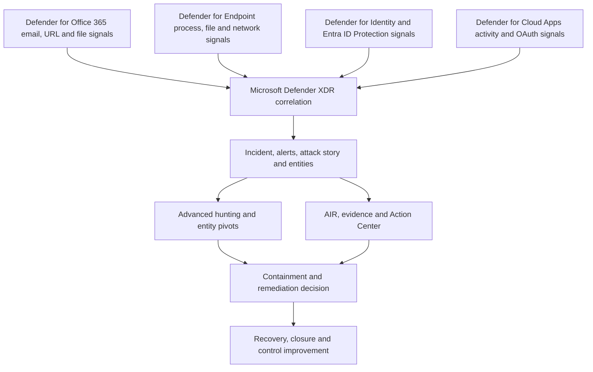

| Route | What you may do | What you must not do | Completion evidence |
|---|---|---|---|
| Authorized licensed read-only | Review a built-in demo, simulation, sample incident, attack-story experience, or existing synthetic tenant incident explicitly permitted by Microsoft and owner | Generate alerts through attacks, click links, run files, alter entities, approve actions, or browse unrelated data | Redacted observations, timestamps, feature/permission limitations |
| Complete no-paid-tenant simulation | Use every fictional alert card and KQL `datatable` in this file locally or in an authorized query environment | Present synthetic records as tenant telemetry | Query outputs labelled simulated, analyst worksheet, report |

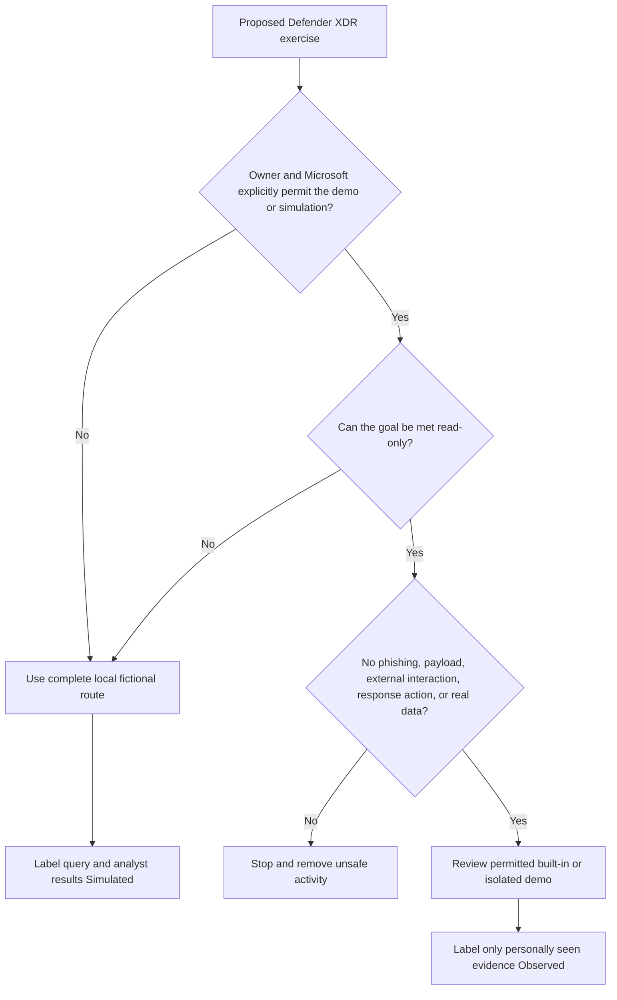

### 🔍 Plain-English deep-dive: correlation is a hypothesis accelerator, not proof

Correlation is like a detective pinning multiple witness statements to the same case board because they share a person, place, time, or object. It saves time and can reveal a sequence, but a wrong identity, shared IP address, reused file name, ingestion delay, or noisy detection can create a misleading connection. The analyst verifies each alert's source evidence, timestamps, entity identity, and alternative explanations before treating the incident graph as ground truth.

## 2. Prerequisites, roles, queue discipline, and evidence rules

| Prerequisite | Purpose | No-tenant fallback |
|---|---|---|
| Written authorization and read-only scope | Prevents production impact and privacy violations | Fictional scenario authorization page |
| Current Defender product/license map | Determines available domains, data, AIR, and retention | Expected-capability matrix |
| Least-privilege reader/hunting role | Limits data and response access | No portal access required |
| UTC evidence standard | Makes cross-service timelines comparable | Synthetic ISO-8601 timestamps |
| Synthetic entity dictionary | Prevents accidental use of real indicators or people | Use entities in Section 4 only |
| Incident response plan and severity model | Makes decisions repeatable | Use tables in Sections 3 and 13 |
| Approval and rollback owner | Response actions can disrupt business and destroy evidence | Paper matrix only; no action |
| Evidence ledger | Separates fact, inference, source, confidence, and limitation | Supplied schema |

| Task | Role/permission concept to verify | Lab limit |
|---|---|---|
| View incidents/alerts/evidence | Defender XDR unified RBAC security-data read permission or current equivalent | Read only, scoped to demo |
| Run advanced hunting | Raw/security data read permissions vary by email, endpoint, identity, cloud and Sentinel schemas | Use `datatable` if unavailable |
| View Entra risk | Security Reader/Operator capabilities and Entra licensing differ | Fictional risk cards |
| Review Cloud Apps | Current Cloud Apps role/data scope | Fictional activity cards |
| Review pending actions | Action Center permissions differ from incident read | Paper review; never approve/reject |
| Take response action | Separate advanced-action permissions and approvals | Prohibited in this lab |

### Incident queue workflow

1. Record current UTC time and analyst identity.
2. Sort/filter using the team's approved priority model, not visual alarm alone.
3. Read title, incident ID, status, source products, first/last activity, impacted assets, active alerts, priority factors, and owner.
4. Detect duplicates/merges/splits and dependencies on other active incidents.
5. Assign and acknowledge according to the fictional SLA.
6. Preserve the original title/severity and record every analyst change with rationale.
7. Open the incident and review the full attack story before taking any response decision.

| Queue field | Fictional value | Analyst question |
|---|---|---|
| Incident ID | `INC-XDR-SIM-0069` | Is this the stable correlation key? |
| Title | “Credential capture followed by endpoint and cloud activity” | Is this generated text, analyst text, or a confirmed story? |
| Source severity | High | Which alert and evidence drove it? |
| Business priority | P1 candidate | Is a privileged/research account and managed device involved? |
| Status | New → In progress | Who owns next action? |
| First/last activity | `2026-08-24T09:02:00Z` / `09:31:00Z` | Are all sources normalized to UTC? |
| Sources | MDO, MDE, Entra ID Protection, Cloud Apps (simulated) | Are these licensed and actually present in a real tenant? |
| Scope | One fictional user, one mailbox, one device, one OAuth app | Did hunting find more? |

## 3. Severity, priority, confidence, and incident objectives

**Severity** estimates technical impact or threat seriousness. **Priority** combines urgency, confidence, business criticality, exposure, and SLA. **Confidence** describes evidence reliability. They should not be collapsed into one label.

| Factor | Low | Medium | High in this scenario |
|---|---|---|---|
| Identity privilege | Standard low-impact persona | Sensitive data access | `Priya.Researcher` has research repository access, not admin |
| Endpoint value | Disposable test endpoint | Normal managed device | Device has synthetic research access |
| Evidence confidence | One weak anomaly | Correlated suspicious signals | Four domain cards share identity/time/entity links |
| Active threat | Historical/contained | Unclear session | Synthetic cloud access appears after risky sign-in |
| Data impact | No sensitive access | Possible access | Simulated list/read operation; no proven exfiltration |
| Blast radius | Single low-value asset | One identity/device | One user/device/app; no additional entities yet |
| Operational impact | None | Response may disrupt | Disabling user/device could interrupt research work |

**Initial simulated decision:** High-severity, P1 candidate for immediate human triage, but **data breach not confirmed**. The goal is to answer:

1. Was the email delivered and interacted with in the fictional story?
2. What exactly happened on `NS-LT-042`, and is the process/network sequence supported by evidence?
3. Which sign-in/session/risk records belong to `Priya.Researcher`?
4. Did the user or an OAuth app access cloud data?
5. Are other recipients, devices, users, messages, files, URLs, IPs, or apps affected?
6. Which response actions are justified, authorized, reversible, and evidence-preserving?
7. What controls failed, worked, or lacked visibility?

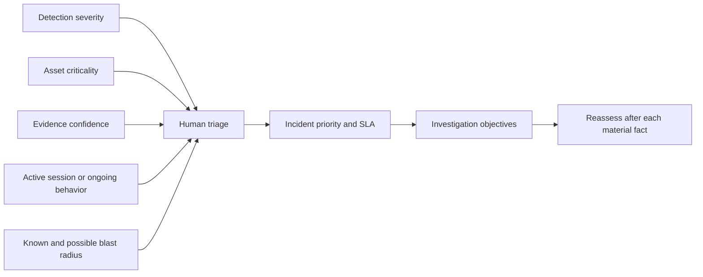

## 4. Fictional incident dataset and safe indicator dictionary

All domains use the reserved `.example` namespace. IP addresses use documentation ranges. Hashes are explicit placeholders and must not be searched as real indicators. No file exists and no URL should be visited.

| Entity type | Fictional value | Safety note |
|---|---|---|
| Target user/mailbox | `priya.researcher@northstar.example` | Non-routable persona |
| Sender display/address | `Northstar Benefits` / `notice@benefits-update.example` | Reserved domain, no delivery |
| Message network ID | `MSG-NET-0069-A` | Fabricated |
| Subject | “Annual benefits acknowledgement - training scenario” | No real lure sent |
| URL | `https://signin-benefits.example/session/NS69` | Do not visit; reserved domain |
| Attachment | `Benefits_Update_Training.pdf` | No file is provided or executed |
| SHA-256 | `SIMULATED-SHA256-DO-NOT-LOOK-UP-0069` | Not a valid real hash/IOC |
| Device | `NS-LT-042` | Fictional managed Windows endpoint |
| IPs | `192.0.2.44`, `198.51.100.27`, `203.0.113.80` | RFC documentation ranges |
| OAuth app | `Northstar Research Helper - Simulation` | No application registration exists |
| Incident | `INC-XDR-SIM-0069` | Synthetic correlation ID |

### Alert cards provided for the no-tenant route

| Alert | UTC | Source | Severity | Fictional evidence | Initial analyst caution |
|---|---|---|---|---|---|
| `AL-MAIL-01` | 09:02 | MDO | Medium | Message delivered to Priya; URL rewritten/detected in synthetic card | Delivery and verdict are simulated; no click yet |
| `AL-MAIL-02` | 09:08 | MDO | High | Synthetic URL-click event from Priya/`NS-LT-042` | A click event is not successful credential capture by itself |
| `AL-DEV-01` | 09:11 | MDE | High | `msedge.exe` followed by fictional `NorthstarTrainingViewer.exe`; connection to `198.51.100.27` | No executable exists; sequence is a card, not instructions |
| `AL-ID-01` | 09:18 | Entra ID Protection | High | Risky sign-in from `203.0.113.80`, unfamiliar properties, session ID `SID-SIM-69` | Risk is a detection, not proof of attacker identity |
| `AL-APP-01` | 09:24 | Cloud Apps | Medium | Simulated OAuth consent and unusual SharePoint list/read activity | Consent source, permissions, and actual data impact need verification |
| `AL-CLOUD-02` | 09:31 | Cloud Apps | High | Simulated download-volume anomaly by app/session | No real file or exfiltration occurred |

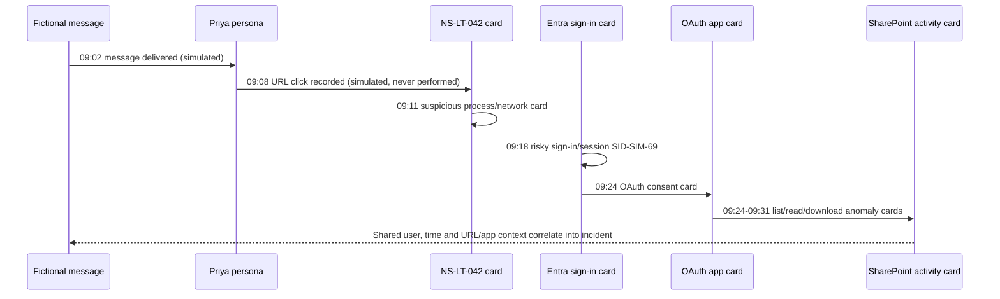

### Evidence ledger schema

| Field | Rule |
|---|---|
| Evidence ID | Stable fictional key such as `EV-0069-014` |
| Source | Alert card, demo page, query, interview, action record, or documentation |
| Source timestamp/timezone | Preserve original and normalize to UTC |
| Entity/correlation | User, device, message, session, alert, app, URL, file, IP |
| Observation | What the source explicitly states |
| Interpretation | Analyst inference, kept separate |
| Confidence | High/medium/low with reason |
| Evidence class | Observed, simulated, or expected |
| Collection method | Read-only demo review or named `datatable` query |
| Limitation | Missing telemetry, delay, license, source scope, or synthetic nature |

## 5. Incident page, attack story, entities, and evidence review

Review the incident in this order: Summary and priority factors; alerts in chronology; activities/analyst changes; users, devices, mailboxes, apps, and other assets; investigations; Evidence and Response; similar incidents; and advanced-hunting pivots. Portal tabs change, so follow the current Microsoft page rather than memorizing a screenshot.

| Object | Question | Required record |
|---|---|---|
| Incident | What did correlation group, when, and why? | Original title/severity/status plus analyst changes |
| Alert | Which detection logic/source event exists? | Alert ID, source, evidence, confidence, status |
| Entity | Is identity stable across services? | Normalized entity dictionary and aliases |
| Attack story | What chronology/relationship does Defender propose? | Supported edges versus inferred edges |
| Evidence verdict | Malicious, suspicious, clean, unknown? | Source and analyst confirmation, not blind acceptance |
| Investigation | What automation ran, with what result? | Start/finish, findings, recommended/pending actions |
| Activity log | Who changed assignment, severity, tags, status, or actions? | Actor, UTC, before/after, rationale |

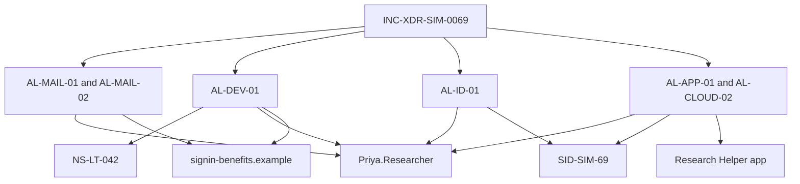

### 🔍 Plain-English deep-dive: alert severity is not incident truth

An alert is like one instrument on an aircraft panel. A red light deserves attention, but the pilot checks related instruments, flight conditions, sensor health, and procedures before declaring the engine failed. A high-severity identity alert can be false or benign; several medium alerts can combine into an urgent compromise. Keep the source verdict, analyst classification, incident severity, business priority, and confidence as separate fields.

## 6. Email, header, URL, and file investigation

The exercise does not provide a live message. Use this sanitized synthetic header card:

```text
From: Northstar Benefits <notice@benefits-update.example>
To: priya.researcher@northstar.example
Subject: Annual benefits acknowledgement - training scenario
Message-ID: <MSG-NET-0069-A@benefits-update.example>
Date: Mon, 24 Aug 2026 09:01:22 +0000
Authentication-Results: northstar.example; spf=fail; dkim=none; dmarc=fail
Received: from training-host.benefits-update.example (192.0.2.44) by fictional-gateway.northstar.example
X-Northstar-Lab-Evidence: SIMULATED-NOT-DELIVERED
```

| Email question | Synthetic observation | Analyst interpretation |
|---|---|---|
| Was it delivered? | `AL-MAIL-01` says delivered to Priya at 09:02 | Simulated delivery; determine all recipients next |
| Who appears to send it? | Display name claims benefits; address is unrelated `.example` domain | Brand/display mismatch, not attribution |
| Authentication | SPF fail, no DKIM, DMARC fail in card | Supports spoof/suspicion; header is simulated |
| URL | `signin-benefits.example/session/NS69` | Reserved/non-routable; never visit; pivot by normalized domain/URL string |
| Attachment | PDF name present but no artifact | Do not create/open; inspect only provided metadata |
| Click | `AL-MAIL-02` at 09:08 | Click does not prove credential entry or successful session |
| Similar mail | Unknown initially | Scope message/network ID, sender, subject, URL/domain, campaign if available |
| Post-delivery action | None in supplied card | Check AIR/ZAP/action records; do not assume purge |

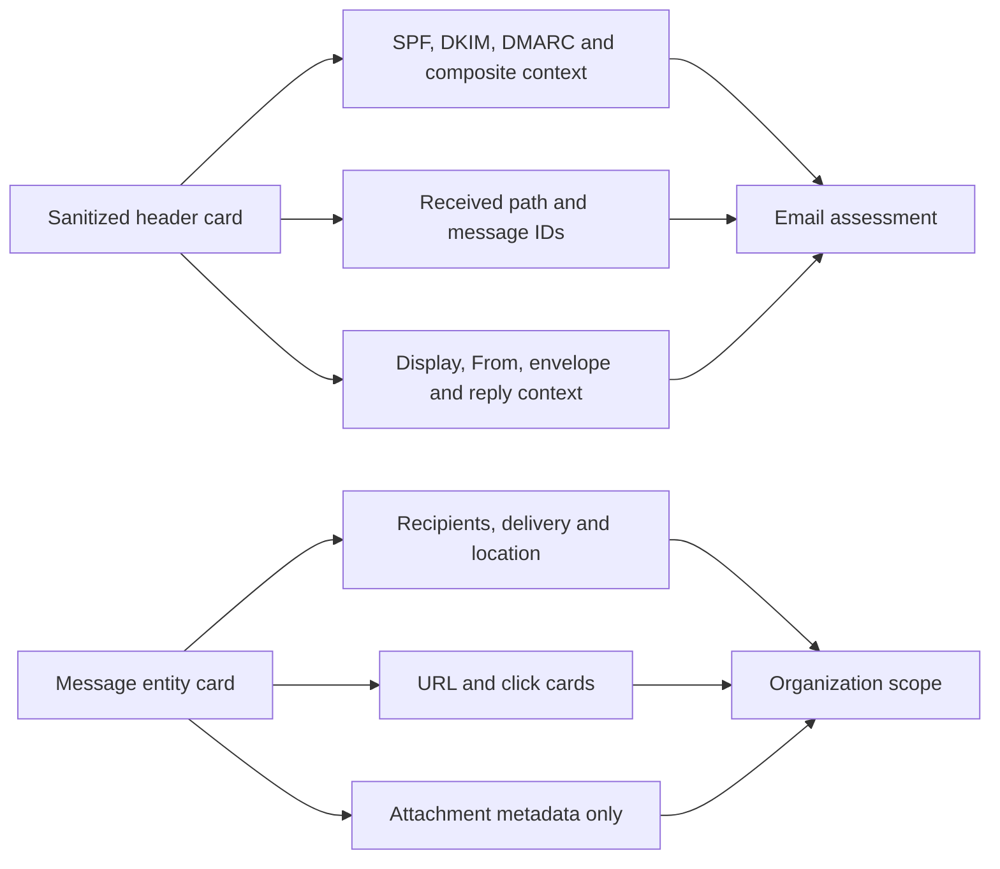

### URL and file safety protocol

1. Do not visit, resolve, detonate, submit, download, or execute an indicator from this exercise.
2. Treat `.example` names, documentation IPs, and placeholder hashes as synthetic, not real threat intelligence.
3. In real work, use organization-approved analysis services, privacy rules, evidence handling, and specialist teams; do not upload confidential files to public services.
4. Record redirect/rewriting context, click time, device, user, verdict time, and source limitations.
5. Search all recipients/clickers and message variants before recommending mailbox action.

## 7. Endpoint process, file, device, and network investigation

The endpoint evidence is a **fictional process card**, not an executable or command recipe:

| UTC | Device | Account | Parent → child | Network/metadata | Interpretation |
|---|---|---|---|---|---|
| 09:08 | `NS-LT-042` | Priya | `outlook.exe` → `msedge.exe` | URL card opens in browser | Correlates with click; simulated |
| 09:10 | `NS-LT-042` | Priya | `msedge.exe` → `NorthstarTrainingViewer.exe` | No file exists; fake SHA | Suspicious child-process card, not execution evidence from a real device |
| 09:11 | `NS-LT-042` | Priya | `NorthstarTrainingViewer.exe` → network event | `198.51.100.27:443` documentation IP | Synthetic outbound connection |
| 09:13 | `NS-LT-042` | Priya | same fictional process | Process ends | Does not prove threat ended |

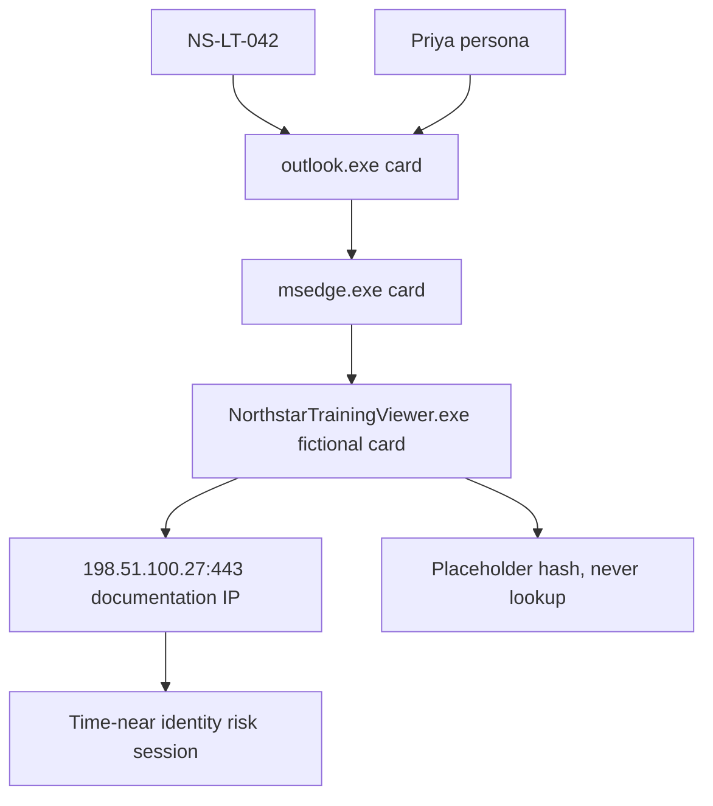

| Endpoint scope question | Evidence needed in real response | Supplied outcome |
|---|---|---|
| Is device onboarded/healthy? | Sensor health, last seen, OS, exposure, tags | Expected only |
| Did the process exist/run? | Process creation event, path, hash, signer, command line, parent, account | Simulated card only |
| Did a file land? | File event, origin, hash, zone/source, path, prevalence | No artifact supplied |
| What network occurred? | Destination, port, initiating process, DNS/proxy/TLS context | Documentation IP card only |
| Persistence or lateral movement? | Service/task/registry/logon/remote event evidence | No supplied evidence; do not infer |
| Other devices? | Hash/file/process/URL/IP hunt across device tables | Datatable returns only `NS-LT-042` |
| Current compromise? | Latest device timeline, sessions, active alerts, response state | Unknown; tabletop containment considered |

### 🔍 Plain-English deep-dive: a process tree is a relationship graph, not a verdict

A process tree is like a family tree for programs: it shows which process started another process and when. Parent-child combinations can be unusual, but software updaters, browsers, accessibility tools, and enterprise agents can produce surprising trees. Verify path, signer, hash, prevalence, user context, command line, surrounding events, network behavior, and business software inventory. In this lab, the tree is entirely synthetic and no process ran.

## 8. Identity sign-in, risk, session, and account investigation

**Sign-in risk** estimates the likelihood that a particular authentication attempt is not performed by the legitimate identity. **User risk** estimates the likelihood that the identity is compromised. A **risk detection** is an individual signal. These values can differ and can change after remediation or analyst action.

| Identity field | Fictional card | Question |
|---|---|---|
| User | `priya.researcher@northstar.example` | Exact object/user ID in a real tenant? |
| Sign-in UTC | 09:18 | Before/after click and endpoint event? |
| Session ID | `SID-SIM-69` | Which cloud activities share it? |
| Source IP | `203.0.113.80` | Documentation IP; no geolocation/ownership claim |
| App/resource | “Microsoft 365” / SharePoint design | Exact client, service principal, resource, tenant? |
| Authentication | Password accepted; MFA result unknown in card | Was MFA required, satisfied, interrupted, or absent? |
| Device | Unmanaged/unknown in synthetic card | Does device ID match `NS-LT-042`? It currently does not |
| Conditional Access | Result unknown | Which policies evaluated, and why? |
| Risk detection | Unfamiliar sign-in properties (simulated) | Detection detail and confidence? |
| User risk | High in card | Is it current, remediated, dismissed, or confirmed? |

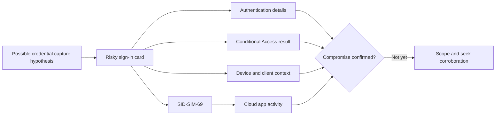

Identity response is high impact. Do not mark a user compromised, reset a password, revoke sessions, disable an account, or change Conditional Access in this lab. The response matrix later records what a real authorized team might approve, how they would preserve business continuity, and how they would roll back an incorrect action.

## 9. Defender for Cloud Apps and OAuth investigation

Cloud Apps can provide SaaS activity, anomaly, OAuth/app governance, session, file, and policy context according to licensing and connected sources. A risky OAuth app scenario needs separate questions about the application identity, publisher, consent actor, permissions, credential lifecycle, user assignment, sign-in/activity, and data touched.

| App question | Fictional value | Required conclusion discipline |
|---|---|---|
| App identity | `APP-SIM-RESEARCH-69` | No real app exists |
| Display name | `Northstar Research Helper - Simulation` | Display names are not unique identity |
| Consent actor/time | Priya at 09:24 | Synthetic event; confirm sign-in/session relationship |
| Requested permissions | `Files.Read.All` shown in card | Permission string alone does not prove use or grant type |
| Publisher/verification | Unknown | Do not call malicious solely because unverified |
| Activity | List/read/download-volume cards | Determine app-only versus delegated actor/session in real data |
| Data objects | Fictional research-site paths | No real sensitive content or exfiltration |
| Other users | None found in supplied data | Scope tenant-wide app grants and service principal in real case |

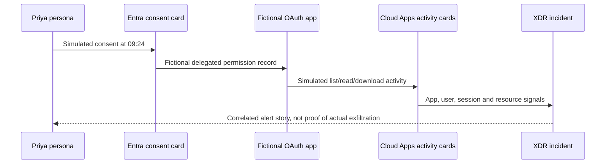

### 🔍 Plain-English deep-dive: consent, permission, token, and activity are different facts

Consent is approval for an application to request/use specified permissions under a particular model. A permission defines what may be allowed. A token carries granted authorization for a session/workload. An activity record shows an operation was observed. Analogy: being issued a library card, having borrowing privileges, holding the card, and checking out a book are four different events. Investigate each one; do not say data was stolen merely because a permission was granted.

## 10. Advanced hunting with complete `datatable` fallback

Advanced hunting uses Kusto Query Language. In a licensed authorized tenant, first inspect the live schema tree, table permissions, UTC range, retention, freshness, and quotas. Never paste a query that performs a response action; these are read-only queries. In the no-paid route, use only the supplied datatables.

### Query 1: master synthetic event timeline

```kusto
let SyntheticEvents = datatable(
    Timestamp:datetime, Domain:string, AlertId:string, User:string,
    Device:string, Entity:string, Action:string, SessionId:string, EvidenceClass:string
)
[
    datetime(2026-08-24T09:02:00Z), "Email", "AL-MAIL-01", "priya.researcher@northstar.example", "", "MSG-NET-0069-A", "Delivered", "", "Simulated",
    datetime(2026-08-24T09:08:00Z), "Email", "AL-MAIL-02", "priya.researcher@northstar.example", "NS-LT-042", "signin-benefits.example", "UrlClickCard", "", "Simulated",
    datetime(2026-08-24T09:11:00Z), "Endpoint", "AL-DEV-01", "priya.researcher@northstar.example", "NS-LT-042", "NorthstarTrainingViewer.exe", "ProcessNetworkCard", "", "Simulated",
    datetime(2026-08-24T09:18:00Z), "Identity", "AL-ID-01", "priya.researcher@northstar.example", "", "203.0.113.80", "RiskySignInCard", "SID-SIM-69", "Simulated",
    datetime(2026-08-24T09:24:00Z), "CloudApp", "AL-APP-01", "priya.researcher@northstar.example", "", "APP-SIM-RESEARCH-69", "OAuthConsentCard", "SID-SIM-69", "Simulated",
    datetime(2026-08-24T09:31:00Z), "CloudApp", "AL-CLOUD-02", "priya.researcher@northstar.example", "", "APP-SIM-RESEARCH-69", "DownloadVolumeCard", "SID-SIM-69", "Simulated"
];
SyntheticEvents
| order by Timestamp asc
```

**Simulated result:** six chronological rows. This proves only that the local dataset sorts correctly.

### Query 2: scope every event for the user

```kusto
SyntheticEvents
| where User =~ "priya.researcher@northstar.example"
| summarize FirstSeen=min(Timestamp), LastSeen=max(Timestamp),
            Domains=make_set(Domain), Alerts=make_set(AlertId), Entities=make_set(Entity)
```

### Query 3: device process/network fallback

```kusto
let SyntheticDevice = datatable(
    Timestamp:datetime, DeviceName:string, AccountUpn:string, FileName:string,
    InitiatingProcessFileName:string, RemoteUrl:string, RemoteIP:string, SHA256:string
)
[
    datetime(2026-08-24T09:08:00Z), "NS-LT-042", "priya.researcher@northstar.example", "msedge.exe", "outlook.exe", "signin-benefits.example", "", "",
    datetime(2026-08-24T09:10:00Z), "NS-LT-042", "priya.researcher@northstar.example", "NorthstarTrainingViewer.exe", "msedge.exe", "", "", "SIMULATED-SHA256-DO-NOT-LOOK-UP-0069",
    datetime(2026-08-24T09:11:00Z), "NS-LT-042", "priya.researcher@northstar.example", "NorthstarTrainingViewer.exe", "msedge.exe", "", "198.51.100.27", "SIMULATED-SHA256-DO-NOT-LOOK-UP-0069"
];
SyntheticDevice
| where DeviceName == "NS-LT-042"
| order by Timestamp asc
```

### Query 4: live-schema endpoint design

Run only in an authorized tenant after verifying column names in the current schema:

```kusto
let startTime = datetime(2026-08-24T08:45:00Z);
let endTime = datetime(2026-08-24T09:45:00Z);
DeviceProcessEvents
| where Timestamp between (startTime .. endTime)
| where DeviceName =~ "NS-LT-042"
| project Timestamp, DeviceName, AccountUpn, FileName, FolderPath, SHA256,
          InitiatingProcessFileName, InitiatingProcessCommandLine, ProcessCommandLine
| order by Timestamp asc
```

**Expected only:** current tenant rows if the device and schema exist. The fictional device will not exist in a real tenant.

### Query 5: email recipient and URL fallback

```kusto
let SyntheticEmail = datatable(
    Timestamp:datetime, NetworkMessageId:string, RecipientEmailAddress:string,
    SenderFromAddress:string, Subject:string, Url:string, DeliveryAction:string, Clicked:bool
)
[
    datetime(2026-08-24T09:02:00Z), "MSG-NET-0069-A", "priya.researcher@northstar.example",
    "notice@benefits-update.example", "Annual benefits acknowledgement - training scenario",
    "https://signin-benefits.example/session/NS69", "Delivered", false,
    datetime(2026-08-24T09:08:00Z), "MSG-NET-0069-A", "priya.researcher@northstar.example",
    "notice@benefits-update.example", "Annual benefits acknowledgement - training scenario",
    "https://signin-benefits.example/session/NS69", "Delivered", true
];
SyntheticEmail
| summarize Recipients=make_set(RecipientEmailAddress),
            Clickers=make_set_if(RecipientEmailAddress, Clicked),
            FirstSeen=min(Timestamp), LastSeen=max(Timestamp)
  by NetworkMessageId, SenderFromAddress, Subject, Url
```

### Query 6: live email design

```kusto
let startTime = datetime(2026-08-24T08:45:00Z);
let endTime = datetime(2026-08-24T09:45:00Z);
EmailEvents
| where Timestamp between (startTime .. endTime)
| where NetworkMessageId == "MSG-NET-0069-A"
   or SenderFromAddress =~ "notice@benefits-update.example"
| project Timestamp, NetworkMessageId, SenderFromAddress, RecipientEmailAddress,
          Subject, DeliveryAction, DeliveryLocation, ThreatTypes, DetectionMethods
```

### Query 7: identity/session fallback

```kusto
let SyntheticIdentity = datatable(
    Timestamp:datetime, UserPrincipalName:string, SessionId:string, IPAddress:string,
    RiskType:string, RiskLevel:string, DeviceId:string, ConditionalAccess:string
)
[
    datetime(2026-08-24T09:18:00Z), "priya.researcher@northstar.example", "SID-SIM-69",
    "203.0.113.80", "UnfamiliarProperties-Simulated", "High", "Unknown", "Unknown"
];
SyntheticIdentity
| where UserPrincipalName =~ "priya.researcher@northstar.example"
| project Timestamp, UserPrincipalName, SessionId, IPAddress, RiskType, RiskLevel,
          DeviceId, ConditionalAccess
```

### Query 8: cloud-app scope fallback

```kusto
let SyntheticCloud = datatable(
    Timestamp:datetime, UserPrincipalName:string, ApplicationId:string,
    Application:string, SessionId:string, ActionType:string, Object:string, Quantity:int
)
[
    datetime(2026-08-24T09:24:00Z), "priya.researcher@northstar.example", "APP-SIM-RESEARCH-69",
    "Northstar Research Helper - Simulation", "SID-SIM-69", "ConsentCard", "Files.Read.All", 1,
    datetime(2026-08-24T09:27:00Z), "priya.researcher@northstar.example", "APP-SIM-RESEARCH-69",
    "Northstar Research Helper - Simulation", "SID-SIM-69", "FileReadCard", "/research/synthetic-a.docx", 1,
    datetime(2026-08-24T09:31:00Z), "priya.researcher@northstar.example", "APP-SIM-RESEARCH-69",
    "Northstar Research Helper - Simulation", "SID-SIM-69", "DownloadVolumeCard", "/research/", 40
];
SyntheticCloud
| summarize FirstSeen=min(Timestamp), LastSeen=max(Timestamp),
            Actions=make_set(ActionType), Objects=make_set(Object), Total=sum(Quantity)
  by UserPrincipalName, ApplicationId, Application, SessionId
```

### Query 9: identify missing correlation fields

```kusto
SyntheticEvents
| extend MissingDevice = isempty(Device), MissingSession = isempty(SessionId)
| summarize Rows=count(), MissingDeviceRows=countif(MissingDevice),
            MissingSessionRows=countif(MissingSession) by Domain
| order by Domain asc
```

### Query 10: timeline deltas

```kusto
SyntheticEvents
| order by Timestamp asc
| serialize
| extend PreviousTime=prev(Timestamp), PreviousDomain=prev(Domain)
| extend MinutesSincePrevious=datetime_diff("minute", Timestamp, PreviousTime)
| project Timestamp, Domain, AlertId, PreviousDomain, MinutesSincePrevious, Action, Entity
```

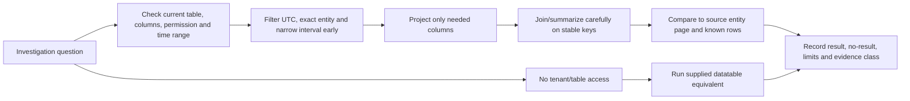

### Hunting quality controls

| Control | Why |
|---|---|
| UTC and explicit time bounds | Prevent timezone mistakes and improve performance |
| Stable IDs before display names | Names can change or collide |
| Case-insensitive exact matching where appropriate | Avoid accidental partial matches |
| Narrow projection | Reduces privacy exposure and result size |
| Known-positive validation | Detects schema/filter errors |
| Known-negative validation | Detects overbroad logic |
| No-result preserved | Missing evidence is not evidence of absence |
| Schema/version note | Queries age as tables and fields change |
| Evidence class column | Prevents synthetic output becoming claimed telemetry |

## 11. MITRE ATT&CK mapping and hypothesis management

MITRE ATT&CK is a knowledge base of adversary tactics and techniques. A **tactic** describes an objective; a **technique** describes a way an adversary might pursue it. Mapping helps organize coverage and response. It does not identify an actor and should not outrun the evidence.

| Synthetic behavior | Candidate ATT&CK mapping | Confidence | Evidence limitation |
|---|---|---|---|
| Benefits-themed message with link | Phishing: Spearphishing Link (`T1566.002`) | Medium | No message was sent; card only |
| Possible credential capture after click | Input Capture: Web Portal Capture (`T1056.003`) as hypothesis | Low | No credential-entry evidence supplied |
| Risky cloud sign-in | Valid Accounts: Cloud Accounts (`T1078.004`) as hypothesis | Medium | Sign-in risk is not proof credentials were stolen |
| OAuth consent/app access | Account Access Removal/Additional Cloud Roles are **not** assumed; evaluate Account Manipulation or cloud-app abuse only with exact evidence | Low | Permission and actor model incomplete |
| Synthetic file reads/download volume | Data from Information Repositories: SharePoint (`T1213.002`) candidate | Medium | No real data or exfiltration |
| External transfer | Exfiltration tactic remains unconfirmed | None | No egress evidence supplied |

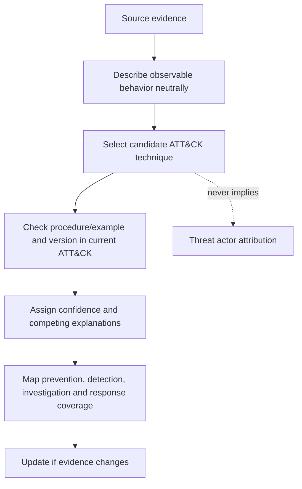

### Hypothesis board

| Hypothesis | Supporting card | Contradicting/missing evidence | Next safe check |
|---|---|---|---|
| H1: Priya's credentials were captured | Click then risky sign-in | No credential submission or authentication detail | Inspect sign-in authentication/session/risk details in authorized data |
| H2: Device execution enabled access | Process/network card near click | No actual file, command, persistence, or token evidence | Validate device timeline and session linkage, not payload execution |
| H3: OAuth app accessed research data | Consent and cloud activity cards share session/user/app | Delegated/app-only model and actual objects incomplete | Scope service principal, grants, activities, users, resources |
| H4: Data was exfiltrated | Download-volume anomaly card | Download is not external transfer; no bytes/destination/recipient proof | Seek sanctioned egress/storage/audit evidence |
| H5: Correlation combined unrelated events | Shared user/time but some identifiers absent | Device ID absent in sign-in card | Test stable session/device/message links and timing |

## 12. Containment decision matrix: do not execute

Every row below is a **simulation decision only**. A real team must verify authority, evidence, business owner, blast radius, dependencies, legal/privacy needs, preservation, communication, success criteria, rollback, and recovery before action.

| Candidate action | Trigger/evidence threshold | Benefit | Harm/constraint | Approval | Rollback/recovery | Lab decision |
|---|---|---|---|---|---|---|
| Isolate device | Strong evidence of active endpoint compromise and alternative access for user | Limits network activity | Can interrupt work and remote support; evidence/health implications | SOC lead + endpoint owner under IR plan | Release isolation after validation; monitor/reimage per plan | **Do not execute; tabletop recommend pending verification** |
| Contain device/user in XDR | High-confidence cross-domain attack under current capability | Machine-speed scope reduction | Scope/licensing/side effects vary | Authorized incident commander | Action Center/portal recovery under current docs | **Do not execute** |
| Disable user | Confirmed compromise with unacceptable active risk | Stops many sign-ins | Severe business outage; service/workflow dependencies | Identity owner + incident commander | Re-enable after secure reset/MFA/session/device validation | **Do not execute** |
| Revoke sessions | Confirmed or strongly suspected session theft | Invalidates sessions | User interruption; propagation and token caveats | Identity response authority | Reauthenticate after identity secured | **Do not execute** |
| Secure password reset | Credential compromise evidence and verified user process | Replaces secret | Does not alone revoke every token or fix device/app | Identity/help desk process | Recovery/MFA verification and monitoring | **Do not execute** |
| Remove OAuth consent/service principal access | Unauthorized risky app/grant confirmed | Stops app access | Could break business app; delegated/application grants differ | App/identity owner | Restore only from known-good approved config | **Do not execute** |
| Purge/quarantine messages | Message scope and malicious verdict validated | Removes mailbox copies | Search/purge permissions, evidence and delivery state matter | Email security authority | Restore/release only if safe and supported | **Do not execute** |
| Block URL/domain/hash | Validated indicator with low collision and expiry | Prevents recurrence | Shared hosting/false positive; synthetic indicators must never be blocked | Security control owner | Remove block after expiry/review | **Never block these fictional indicators** |
| Restrict SharePoint access | Confirmed data-impact path | Limits further access | Site outage and owner dependencies | Data/workload owner | Restore approved permissions from baseline | **Do not execute** |

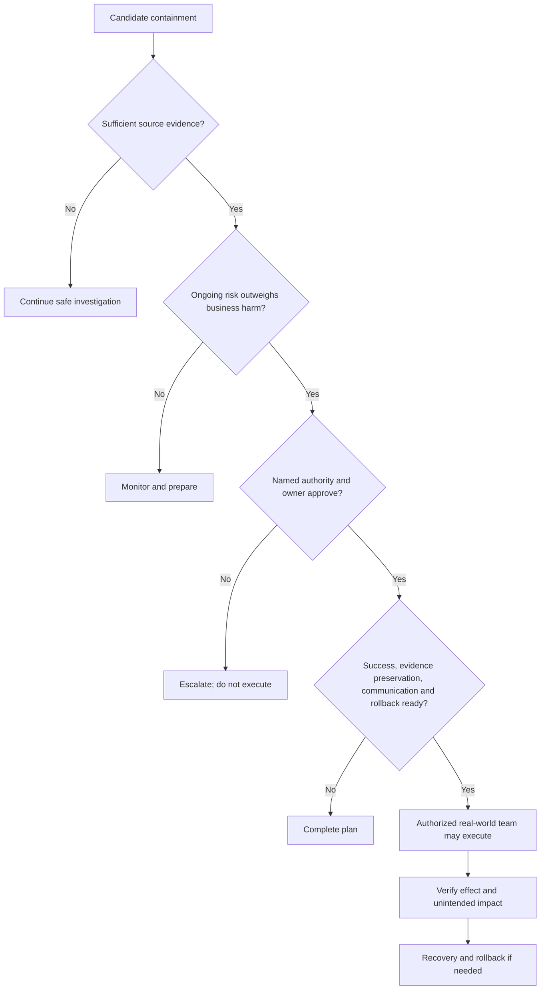

### 🔍 Plain-English deep-dive: containment trades threat freedom for business restriction

Containment is like closing sections of an airport during a security concern. Closing everything can stop movement but also strands legitimate passengers and emergency operations. Closing too little may let risk spread. The incident commander chooses the narrowest action that materially reduces active risk, while preserving evidence and a recovery path. In this study lab, that judgment is practiced on paper only.

## 13. AIR, Evidence and Response, and Action Center review

Automated Investigation and Response can investigate supported alerts and entities and produce verdicts or recommended actions according to product, configuration, license, and current behavior. Some actions may occur automatically and others may wait for approval. The Action Center provides pending/history views and, for supported actions and permissions, undo capability. Never assume every action is reversible.

| Review field | Fictional AIR card | Analyst decision |
|---|---|---|
| Investigation ID | `AIR-SIM-0069` | Synthetic |
| Trigger | `AL-MAIL-02` | Check trigger and product support |
| Entities analyzed | Message, URL, mailbox, user | Device/app coverage not assumed |
| Verdict | Suspicious | Review source evidence; not final truth |
| Recommended action | Soft-delete fictional message copies | Scope recipients/delivery/evidence first |
| Status | Pending approval | No approval in lab |
| Action owner | Email SecOps role | Verify separation and Search/Purge authorization |
| Decision | Reject lab execution; document “would approve only after criteria” | Safe and honest |

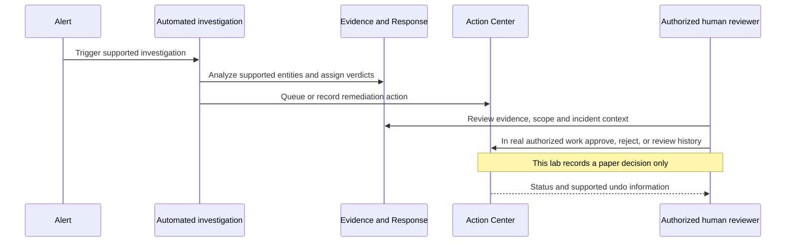

### AIR/Action Center decision checklist

- Is the finding tied to the correct incident, alert, message, entity, and UTC range?
- Does the source evidence support the automated verdict?
- Is the action scope complete and narrow?
- Could the action destroy or alter needed evidence?
- Does the reviewer have legal/business authority and least-privilege permission?
- Are affected users/services and communication owners known?
- Is the action already completed, pending, failed, rejected, or superseded?
- Is undo supported for this exact action, and does undo restore full prior state?
- What verification proves remediation succeeded?
- What remains outside AIR coverage?

## 14. Communication, handoff, and evidence preservation

| Audience | Message | Exclude |
|---|---|---|
| Incident commander | Severity, confidence, active-risk hypothesis, scope, decisions needed, blockers | Unverified attribution |
| Identity team | User/session/risk/CA facts and requested validation | Passwords or unnecessary personal data |
| Endpoint team | Device/process/network evidence IDs and proposed containment criteria | Executable or unsafe reproduction steps |
| Messaging team | Message IDs, recipient/click scope, authentication, AIR status | Broad purge request without validated query |
| Cloud-app/data owner | App ID, grant/activity/resource facts and business ownership question | Claim of theft without transfer evidence |
| Legal/privacy | Potential data impact, evidence sources, preservation decision needed | Excess telemetry/content |
| Executive | What happened, business effect, what is known/unknown, decisions, next update | Raw logs and technical speculation |
| User/help desk | Approved safe guidance and continuity steps | Blame or investigative detail beyond need-to-know |

### Initial incident update template

> At **[UTC]**, the team is investigating fictional incident `INC-XDR-SIM-0069`, initially assessed **High/P1 candidate**. Synthetic signals correlate a benefits-themed message, a URL-click card, an endpoint process/network card, a risky sign-in, and OAuth/cloud-activity cards for one persona and device. No actual phishing, malware, external access, or data transfer occurred in this lab. Compromise and exfiltration remain hypotheses, not facts. Current scope is one user, mailbox, device, session, and app. All containment is simulation-only. Next checks are recipient/click scope, device/session linkage, sign-in authentication and Conditional Access, app grant/activity scope, and data-impact evidence. Next update: **[time]**.

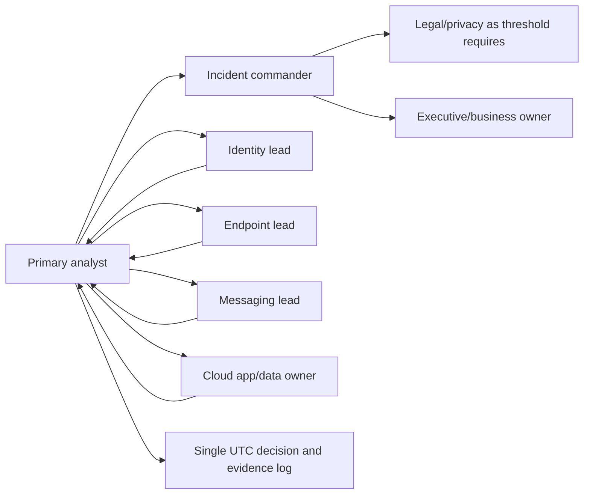

### Handoff minimum

| Field | Required value |
|---|---|
| Incident/status/owner | Stable ID, status, current and receiving owner |
| Severity/priority/confidence | Values and rationale |
| Scope | Confirmed, suspected, excluded entities |
| Timeline | Key UTC events and source IDs |
| Facts versus hypotheses | Explicit separation |
| Actions | Completed, pending, proposed, prohibited; approver and effect |
| Evidence | Location, access, integrity/provenance, privacy limits |
| Queries | Versioned text, range, result, no-result, schema caveat |
| Blockers | License, role, missing telemetry, owner, vendor, legal decision |
| Next steps | Owner, due time, success criterion, escalation time |

## 15. Scope, test, failure, rollback, and recovery matrix

| ID | Type | Exercise | Expected/simulated result |
|---|---|---|---|
| P69-T01 | Positive | Sort six master event rows | Chronological email → endpoint → identity → cloud sequence |
| P69-T02 | Negative | Hunt for `alex.admin@northstar.example` | Zero synthetic rows; preserve no-result |
| P69-T03 | Boundary | Query exactly 09:08 through 09:18 UTC | Includes both boundary events under chosen operator semantics |
| P69-T04 | Positive | Scope message network ID | One fictional recipient and clicker |
| P69-T05 | Positive | Scope device | Only `NS-LT-042`, three process/network rows |
| P69-T06 | Boundary | Compare display app name versus stable app ID | Use app ID for correlation |
| P69-T07 | Failure | Join on user display name with case mismatch | Demonstrate normalization/case-insensitive match |
| P69-T08 | Failure | Query a live table without permission | Permission/schema error; switch to datatable, do not broaden role casually |
| P69-T09 | Failure | Missing device ID on sign-in card | Correlation stays hypothesis; no invented link |
| P69-T10 | False positive | Authorized migration explains download volume | Validate change record; tune without hiding other users/apps |
| P69-T11 | Containment | Device isolation recommendation | Paper approval/impact/rollback only; no execution |
| P69-T12 | AIR | Pending message remediation | Review evidence and criteria; no approval/rejection in portal |
| P69-T13 | Recovery | User is incorrectly disabled in tabletop | Invoke identity owner, re-enable after verification, document harm and cause |
| P69-T14 | Rollback | Indicator block is false positive | Remove approved block, validate service, retain decision history |
| P69-T15 | Evidence | Portal result conflicts with query | Recheck source time, schema, role scope, freshness, entity IDs; preserve conflict |
| P69-T16 | Closure | No exfiltration evidence after scope | Close data-theft hypothesis as unconfirmed, not disproven universally |

### Failure injection cards

| Failure | Diagnostic order | Correct outcome |
|---|---|---|
| Alert appears outside incident | Entity/timing/correlation, merge/split history, analyst link decision | Link only with evidence and authority |
| Query returns too many rows | Time, stable IDs, join cardinality, projection, duplicate events | Narrow and validate known positive/negative |
| Query returns none | UTC, table/schema, permissions, retention, freshness, entity alias | Record no-result and limitation |
| Risky sign-in lacks endpoint match | Device ID/client/session, unmanaged access, telemetry coverage | Keep separate until corroborated |
| AIR action failed | Action details, permissions, scope, target state, service health | Escalate safely; no repeated blind action |
| Containment harms legitimate work | Invoke communication/business continuity and approved rollback | Restore service only after risk assessment |

## 16. Closure criteria, PIR, and control improvements

An incident should not close merely because alerts are quiet. Closure records what happened, impact, scope, response, recovery, residual risk, and follow-up ownership. Classification options and required reasons vary; use the current team taxonomy.

| Closure gate | Fictional outcome |
|---|---|
| Alerts reviewed/classified | All six synthetic cards reviewed |
| Entities scoped | One persona, mailbox, device, session, app; no other synthetic rows |
| Active threat | None exists because scenario was never executed |
| Response actions | None executed; paper decisions retained |
| Recovery | Tabletop steps defined for identity, device, mail, app, data |
| Data impact | Simulated reads/download-volume; no real access/exfiltration |
| Evidence | Synthetic dataset, queries, timeline, decision log, limitations complete |
| Stakeholders | Fictional handoff and executive update complete |
| Classification | True-positive training scenario / simulation, not a real incident |
| Follow-up | Owners and validation tests assigned |

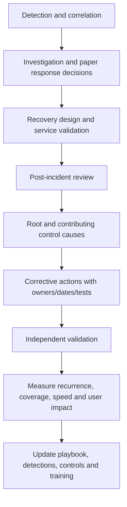

### Post-incident review

| PIR question | Fictional conclusion |
|---|---|
| What happened? | Synthetic message and click cards correlate to process, identity, consent, and data-access cards |
| What is proven? | Only the supplied records and their internal keys/timestamps |
| What is not proven? | Credential entry, real execution, actor identity, real consent, data theft, exfiltration |
| What worked? | Cross-domain correlation, stable IDs, UTC timeline, datatable fallback, approval gates |
| What failed in scenario design? | Email authentication failed; hypothetical click path; weak identity/session control; risky app consent; incomplete device-session linkage |
| Root cause? | For the fictional scenario: trust in a deceptive message plus insufficient layered controls; not “user failure” alone |
| Contributing factors? | Email branding, authentication failure handling, session risk, app-consent governance, telemetry gaps |
| What changes? | Layered control plan below |

| Improvement | Owner | Measure/test | Priority |
|---|---|---|---|
| Strengthen mail authentication and impersonation protection | Messaging security | Synthetic header/message policy tests; monitor false positives | High |
| Improve Safe Links/URL investigation and user reporting workflow if licensed | Messaging/SOC | Benign simulation/demo evidence only | High |
| Enforce phishing-resistant authentication for appropriate personas | Identity | Controlled registration/sign-in tests and recovery plan | High |
| Tune sign-in/user-risk Conditional Access in report-only/pilot first | Identity | Positive/negative/break-glass tests | High |
| Govern user/app consent and high-impact permissions | Identity/app governance | Approved app inventory and grant review | High |
| Ensure endpoint onboarding/health and browser/device signals | Endpoint | Sensor health and benign policy validation | Medium |
| Define XDR queue, AIR, Action Center, approval and undo playbooks | SOC | Tabletop SLA and decision-quality review | High |
| Connect data-impact owners and Purview evidence | Data/security | Synthetic file-access/DLP correlation | Medium |
| Maintain tested cross-domain hunting queries | Detection engineering | Known-positive/negative datatable tests | Medium |

## 17. Portfolio incident report and interview wording

| Report section | Content |
|---|---|
| Executive summary | Fictional nature, severity rationale, known/unknown, impact, outcome |
| Authorization/safety | Read-only or local route; prohibited actions; synthetic indicators |
| Architecture | Email/endpoint/identity/cloud signal flow |
| Incident summary | Queue properties, objectives, ownership, SLA |
| Alert/entity inventory | Six alert cards and normalized entities |
| Timeline | UTC source facts plus analyst hypotheses |
| Domain investigations | Header/URL/file, device process/network, sign-in/risk, app/activity |
| Hunting | Query pack, outputs, validation, schema and retention limits |
| MITRE | Candidate mappings with confidence and no attribution claim |
| Response | Do-not-execute decision matrix, approval, rollback, recovery |
| Automation | AIR/Action Center paper review |
| Communication | Initial update, handoff, executive summary |
| PIR | Root/contributing causes, lessons, corrective actions, metrics |
| Honesty appendix | Observed/simulated/expected register and candidate wording |

### Interview-ready incident summary

> “I used a fully fictional cross-domain Defender XDR dataset to investigate a benefits-themed link scenario. I prioritized the incident, normalized six alerts across email, endpoint, identity, and Cloud Apps, built a UTC timeline, and used read-only KQL datatables to scope the user, device, message, session, and app. I separated click from credential capture, risk from confirmed compromise, permission from activity, download from exfiltration, and correlation from proof. I mapped candidate MITRE techniques with confidence, built a containment matrix with approvals and rollback, reviewed hypothetical AIR/Action Center actions, and delivered handoff, recovery, PIR, and control improvements. No phishing, malware, real tenant, external interaction, or response action was used.”

## 18. JD Mapping: consulting defense

| Likely challenge | Strong response from this Part | Honesty boundary |
|---|---|---|
| “Walk me through an XDR incident.” | Queue → attack story → domain evidence → hunt → response → recovery → PIR | Fictional simulation unless demo observations are named |
| “How do you know a user is compromised?” | Distinguish risk detection, risky sign-in, user risk, authentication, session, device, activity, and corroboration | No compromise actually occurred |
| “Would you isolate immediately?” | Evidence/active-risk/business-impact/authority/rollback matrix | No action executed |
| “How do you investigate OAuth abuse?” | App ID, consent, permission, token/session, actor, activities, resources, other users | Synthetic app only |
| “What does AIR change?” | Automation investigates supported entities and may queue/take actions; human reviews evidence, pending/history, undo limits | Product behavior verified at implementation time |
| “How does your background help?” | Incident ownership, evidence correlation, troubleshooting, escalation, stakeholder communication, SharePoint data context | Does not convert support history into claimed SOC production tenure |

## 19. Official Source Anchors

These official sources were checked for the August 24, 2026 baseline. Recheck page date, current tenant UI, Product Terms, licensing, preview notices, permissions, schema, service limits, and target cloud before use.

| Topic | Official source | Verification purpose |
|---|---|---|
| Defender XDR | [What is Microsoft Defender XDR?](https://learn.microsoft.com/defender-xdr/microsoft-365-defender) | Product domains, correlation, incidents, automation and prerequisites |
| Incidents/alerts | [Incidents and alerts in the Microsoft Defender portal](https://learn.microsoft.com/defender-xdr/incidents-overview) | Current distinction, source integrations and response tools |
| Incident investigation | [Investigate incidents in the Microsoft Defender portal](https://learn.microsoft.com/defender-xdr/investigate-incidents) | Current summary, alerts, activities, assets, investigations, evidence and attack-story workflow |
| Incident management | [Manage incidents in Microsoft Defender](https://learn.microsoft.com/defender-xdr/manage-incidents) | Assignment, status, severity, classification, comments and activity log |
| Alert investigation | [Investigate alerts in Microsoft Defender](https://learn.microsoft.com/defender-xdr/investigate-alerts) | Alert evidence, entities, status and tuning workflow |
| Advanced hunting | [Advanced hunting overview](https://learn.microsoft.com/defender-xdr/advanced-hunting-overview) | Permissions, data sources, UTC, retention, freshness and quotas |
| KQL in Defender | [Learn the advanced hunting query language](https://learn.microsoft.com/defender-xdr/advanced-hunting-query-language) | Query operators, schema use, time filters and safe read-only construction |
| Hunting schema | [Advanced hunting schema tables](https://learn.microsoft.com/defender-xdr/advanced-hunting-schema-tables) | Verify current tables, columns, event types and access |
| AIR | [Automated investigation and response in Microsoft Defender XDR](https://learn.microsoft.com/defender-xdr/m365d-autoir) | Current supported automation behavior and prerequisites |
| MDO AIR | [Automated investigation and response in Defender for Office 365](https://learn.microsoft.com/defender-office-365/air-about) | Email investigation flow, findings, recommended actions, permission and Plan 2 caveats |
| Action Center | [View and manage actions in the Action Center](https://learn.microsoft.com/defender-xdr/m365d-autoir-actions) | Pending/history review and exact supported undo behavior; verify current date notices |
| Endpoint response | [Take response actions on a device](https://learn.microsoft.com/defender-endpoint/respond-machine-alerts) | Real-world response prerequisites, impact, permissions and validation; not executed here |
| Entra ID Protection | [What is Microsoft Entra ID Protection?](https://learn.microsoft.com/entra/id-protection/overview-identity-protection) | Risk detections, risky sign-ins/users, remediation, roles and licensing |
| Cloud Apps | [Overview - Microsoft Defender for Cloud Apps](https://learn.microsoft.com/defender-cloud-apps/what-is-defender-for-cloud-apps) | SaaS, app, activity, data, threat and XDR integration context |
| MITRE ATT&CK | [MITRE ATT&CK Enterprise matrix](https://attack.mitre.org/matrices/enterprise/) | Current tactic/technique identifiers and procedure context |
| Licensing | [Microsoft 365 guidance for security and compliance](https://learn.microsoft.com/office365/servicedescriptions/microsoft-365-service-descriptions/microsoft-365-security-compliance-licensing-guidance) | Verify entitlements with Product Terms, not portal visibility alone |
| Product Terms | [Microsoft Product Terms](https://www.microsoft.com/licensing/terms/) | Current commercial terms |

---

## ⭐ Likely Interview Questions for This Section

### Q1. How do you investigate a cross-domain Defender XDR incident?

> **Model answer:** I acknowledge and prioritize the incident, preserve original properties, read the attack story, and inventory alerts and stable entity IDs. I validate each domain at its source: message/header/URL/file, device process/file/network, identity sign-in/risk/session, and cloud app/consent/activity. I build a UTC timeline, hunt for scope with narrow known-positive/negative queries, separate facts from hypotheses, map MITRE with confidence, and recommend approved containment with business impact, rollback, recovery, communication, and PIR.

### Q2. What is the difference between an alert and an incident?

> **Model answer:** An alert is a detection signal about suspicious or malicious activity from a product or analytic. An incident groups related alerts and entities into a proposed attack story and provides a workflow for assignment, investigation, actions, evidence, and closure. Correlation accelerates investigation but does not prove every alert is related, so I validate identities, timestamps, and source evidence.

### Q3. How do you determine whether a phishing click led to compromise?

> **Model answer:** A click alone is not credential capture. I correlate the message and URL-click record with device/browser events, sign-in authentication details, user and sign-in risk, session IDs, device/client context, Conditional Access, subsequent mailbox/app/data activity, and other affected recipients. I maintain competing explanations and do not claim compromise or exfiltration without corroborating evidence.

### Q4. How would you scope an incident with advanced hunting?

> **Model answer:** I check current schema and permissions, use UTC and a narrow time range, pivot on stable message, alert, user, device, session, app, URL, file, and IP identifiers, project minimum fields, and validate known positives and negatives. I preserve no-results and document freshness, retention, role scope, and query limits. Without a tenant, I run equivalent `datatable` queries and label the output simulated.

### Q5. When would you isolate a device or disable a user?

> **Model answer:** When verified active risk and potential impact justify the business disruption, and the incident plan gives a named authority. I confirm evidence, current state, dependencies, communication, evidence preservation, success criteria, rollback, recovery, and post-action monitoring. I choose the narrowest effective response. In this lab I only created a do-not-execute decision matrix.

### Q6. How do AIR and the Action Center fit into response?

> **Model answer:** AIR investigates supported alerts and entities and can produce verdicts and remediation actions that are automatic or pending approval depending on product and configuration. I review evidence, scope, status, permissions, business impact, and whether the action is already complete before approving or rejecting. The Action Center shows pending/history and supports undo for specified actions, but undo is not universal or necessarily a full state restoration.

### Q7. How do you investigate a suspicious OAuth application?

> **Model answer:** I use stable application and service-principal IDs, then separate consent, permission grant, token/session, and observed activity. I verify publisher, owner, grant type, consent actor, requested/effective permissions, credentials, assignments, users, resources, sign-ins, activities, and data impact. I scope other grants and users before recommending revocation or app disablement, with owner approval and rollback.

### Q8. How do you present this lab honestly in an interview?

> **Model answer:** I call it a fictional cross-domain XDR investigation using supplied alert cards and KQL datatables, plus only read-only built-in demo observations if I actually viewed them. I explain the investigation and consulting decisions, connect them to my real incident/RCA/stakeholder strengths, and clearly say I did not send phishing, run malware, access production, contain a device, disable a user, or remediate a real incident.

## 🧠 30-Second Memory Hooks

- **Alert is a signal; incident is the case board.**
- **Correlation accelerates a hypothesis; source evidence confirms or rejects it.**
- **Click ≠ credential capture; risk ≠ compromise; download ≠ exfiltration.**
- **Message → device → sign-in → session → app → data:** the cross-domain pivot chain.
- **Consent, permission, token, activity:** four separate OAuth facts.
- **Hunt narrow:** UTC, stable ID, early filter, minimum columns, known positive and negative.
- **MITRE organizes behavior; it does not attribute an actor.**
- **Containment is a business-risk trade:** evidence, authority, impact, rollback, recovery.
- **AIR recommends or acts by configuration; humans verify evidence and scope.**
- **Observed, simulated, expected:** never blur the evidence class.

## Completion Checklist

- [ ] Only an explicitly permitted read-only demo or the complete fictional route was used.
- [ ] No phishing, link visit, payload, malware, external interaction, real credential, production tenant, or response action occurred.
- [ ] Every item is labelled Observed, Simulated, or Expected.
- [ ] Queue priority distinguishes source severity, business priority, confidence, and urgency.
- [ ] All six fictional alert cards and stable entities are inventoried.
- [ ] Email headers, authentication, recipients, URLs, clicks, attachments, and post-delivery evidence are assessed without unsafe analysis.
- [ ] Endpoint process/file/network cards are treated as synthetic relationships, not real execution.
- [ ] Sign-in risk, user risk, risk detection, authentication, session, device, and Conditional Access are separated.
- [ ] OAuth consent, permission, token/session, activity, app ID, users, resources, and data impact are separated.
- [ ] KQL includes complete datatable fallbacks and live-schema queries are marked expected/design.
- [ ] Known positive, negative, boundary, no-result, schema, freshness, retention, and role limits are documented.
- [ ] MITRE mappings have evidence, confidence, alternatives, and no attribution claim.
- [ ] Containment matrix says **Do not execute** and includes approval, evidence preservation, impact, rollback, and recovery.
- [ ] AIR/Evidence and Response/Action Center review distinguishes pending, completed, failed, rejected, automatic, and undo limits.
- [ ] Communication, handoff, decision log, privacy, and evidence provenance are complete.
- [ ] Closure records impact, scope, recovery, residual uncertainty, PIR, owners, measures, and tests.
- [ ] Portfolio report contains only fictional/redacted artifacts and the candidate honesty statement.
- [ ] Official Microsoft pages, MITRE version, licensing, Product Terms, portal, roles, schema, and current date notices are rechecked before real work.

---

*Next suggested section:* [Part 70](Part-70-lab-sentinel-siem-soar.md)