# Part 70 — LAB 6 - Sentinel Data Onboarding, KQL, Detection, UEBA, Workbook, and SOAR

> **Section goal:** Design and safely validate a Microsoft Sentinel security information and event management (SIEM) and security orchestration, automation, and response (SOAR) deployment without ingesting real logs or creating uncontrolled Azure cost. By the end, you should be able to pass a cost/authorization gate; design a workspace, data plan, connector, data collection rule (DCR), and Advanced Security Information Model (ASIM) approach; complete 26 Kusto Query Language (KQL) exercises over supplied `datatable` records; engineer and backtest an analytics rule with entities and MITRE ATT&CK mapping; investigate a synthetic incident; simulate User and Entity Behavior Analytics (UEBA), behaviors, threat intelligence, and watchlists; design a workbook; specify an approval-based Logic Apps playbook that remains disabled or paper-only; apply managed identity and role-based access control (RBAC); inject connector/query/playbook failures; estimate cost; clean up; and produce a deployment pack.

This lab maps to Deloitte role expectations for Microsoft Sentinel architecture, SIEM engineering, data onboarding, Azure Monitor and Log Analytics, KQL, analytics and tuning, MITRE coverage, UEBA, threat intelligence, workbooks, SOAR/Logic Apps, least privilege, cost governance, incident investigation, implementation planning, troubleshooting, documentation, and handover. It builds on your troubleshooting, incident, permissions, SharePoint/OneDrive, migration, and stakeholder strengths while describing Sentinel execution only at the level actually observed or simulated.

> **Currency, portal, and cost boundary (August 24, 2026):** Microsoft Sentinel is available in the Microsoft Defender portal, and current Microsoft documentation describes the transition away from Azure-portal-only operations. Portal paths, workspace topology, analytics/data-lake tiers, graph/MCP capabilities, DCR transformations, connectors, ASIM tables, analytics-rule options, UEBA/behaviors, watchlists, Logic Apps, prices, free benefits, and roles can change. Verify official sources, target region/cloud, live pricing, Product Terms, preview status, and current service limits before deployment. Do not future-date a planned retirement or feature as already completed.

> **Safety and authorization boundary:** The default route is local design and `datatable` query simulation. Do not create an Azure subscription, workspace, connector, DCR, custom table, diagnostic setting, watchlist, rule, workbook, Logic App, API connection, managed identity, role assignment, data-lake resource, notebook, graph, MCP query, or paid service unless the subscription owner explicitly approves the resource, budget, region, data, roles, expiration, and cleanup. Never ingest employer/production logs, personal data, credentials, real indicators, or external-user data. Never run attacks, malware, phishing, or automated containment. Synthetic indicators use reserved domains and documentation IP ranges.

## JD Mapping

| Role expectation | Capability developed | Defensible evidence |
|---|---|---|
| Architect Sentinel | Workspace/topology, residency, retention, RBAC, cost, portal and lifecycle decisions | High-level design and decision record |
| Onboard security data | Source-to-table mapping, connector support, DCR/transform plan, health and ownership | Connector and DCR paper pack |
| Normalize and correlate | ASIM schema/parser choices and source-independent query design | Field map and normalized query examples |
| Hunt and detect | 26 KQL exercises, analytics rule, backtest, entities, MITRE and tuning | Versioned query/detection pack |
| Investigate incidents | Synthetic alert-to-incident/entity/timeline workflow | Incident report and evidence ledger |
| Use behavioral context | UEBA and behaviors simulation with score caveats | Synthetic anomaly worksheet |
| Enrich detections | Safe threat-intelligence and watchlist joins | Documentation-only indicator/reference data |
| Automate responsibly | Approval-gated Logic Apps design, managed identity, RBAC, retries and failure handling | Disabled/paper playbook design |
| Control cloud cost | Volume model, price inputs, retention/tier and automation cost gates | Cost workbook and cleanup proof |

## Candidate honesty note

| Evidence class | Meaning | Candidate wording |
|---|---|---|
| **Observed** | A result personally seen in an explicitly authorized, budgeted, isolated Sentinel environment | “I observed this query/rule/workbook result in my isolated lab.” |
| **Simulated** | A result from the supplied local `datatable`, paper incident, disabled workflow, or spreadsheet cost model | “I simulated the data and analyst outcome without ingesting logs.” |
| **Expected** | Behavior documented by Microsoft but not deployed or run | “Microsoft documents this behavior; I would validate it in a pilot.” |

You must not describe this exercise as Deloitte client work, a production SOC deployment, ingestion of you/employer logs, a real incident, or live automated response. A `datatable` query demonstrates KQL reasoning, not connector health. A paper DCR demonstrates architecture, not data collection. A Logic Apps diagram is not a deployed playbook.

> “I built a fictional Sentinel deployment and detection pack. The complete path used only inline synthetic KQL datatables, so no real logs were ingested and no Azure charges or response actions were created. I designed the workspace, connector/DCR/ASIM architecture, completed 26 queries, backtested an analytics rule, investigated a synthetic incident, and produced UEBA, workbook, watchlist, threat-intelligence, approval-based SOAR, RBAC, cost, failure, cleanup, and deployment artifacts. I identify anything actually seen in an authorized lab separately from simulated or expected behavior.”

---

## 1. Sentinel architecture and two complete routes

A **SIEM** centralizes and analyzes security data for detection, hunting, investigation, reporting, and retention. **SOAR** coordinates repeatable response workflows and integrations. Microsoft Sentinel uses Azure Monitor/Log Analytics as a core data platform and can operate through the unified Microsoft Defender portal according to the current onboarding model.

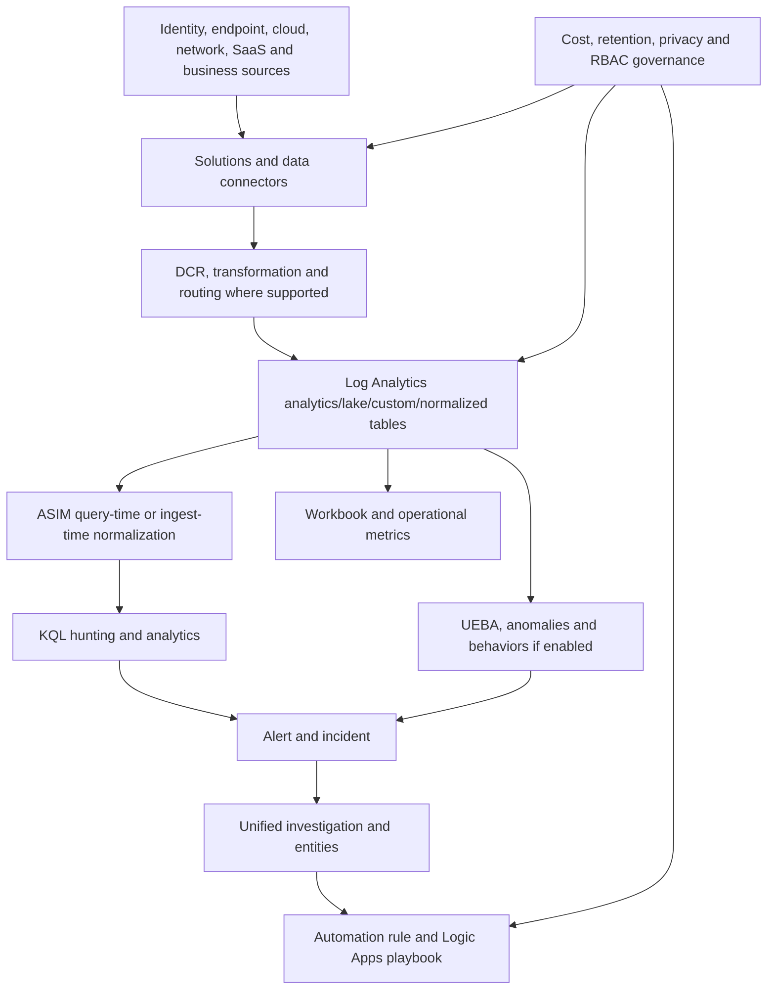

| Capability | Authorized licensed path | Complete no-paid-tenant path |
|---|---|---|
| Workspace/portal | Read or create only under explicit subscription/budget approval | Architecture and onboarding checklist |
| Data | Use only generated synthetic events through an approved method if ingestion is specifically authorized | Inline KQL `datatable`; zero ingestion |
| Connectors/DCR | Inspect or deploy only a synthetic source under change control | Connector/DCR/transform paper design |
| KQL | Run against synthetic custom data or datatable | Run the 26 datatable exercises |
| Analytics | Create disabled rule or use results simulation only if authorized | Rule specification and deterministic backtest |
| Incident | Investigate synthetic alert created under approval | Construct incident from supplied results |
| UEBA/behaviors | Read Microsoft demo/synthetic workspace output if permitted | Synthetic scores and behavior cards |
| TI/watchlist | Documentation IP/domain values only | Inline datatable joins; no upload |
| Workbook | Private test workbook over synthetic data | Workbook JSON/component design and query results |
| Playbook | Disabled manual test flow with no external connector/action, if budgeted | Sequence diagram and run-history cards only |

### 🔍 Plain-English deep-dive: SIEM value begins with questions, not volume

A SIEM is like a hospital diagnostics system. Collecting every measurement without knowing which clinical questions matter creates cost and noise. Start with use cases: “detect repeated failed sign-ins to a critical account,” “find a risky app consent followed by data access,” or “prove connector freshness.” Then identify the minimum source, fields, latency, retention, quality, and owner needed. More gigabytes do not automatically mean more security.

## 2. Authorization, cost gate, roles, and prerequisites

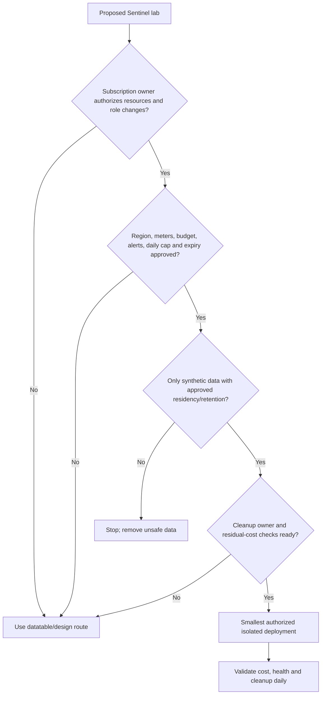

| Gate | Required answer before Azure deployment | Default here |
|---|---|---|
| Subscription | Named owner and charge authority | No deployment |
| Region/cloud | Data residency, service availability, regulatory approval | Paper choice only |
| Workspace | New versus existing, primary/secondary role, resource group, naming/tags | Paper design |
| Data | Synthetic source, volume, schema, privacy, residency, retention, deletion | Inline only |
| Pricing | Current regional analytics/lake/retention/query/Logic Apps/other meter prices | Variables, not guessed rates |
| Guardrails | Budget, cost alerts, daily cap implications, expiry, owner | Worksheet |
| Roles | Least-privilege Azure/Sentinel/Logic Apps identities and scopes | RACI/RBAC design |
| Cleanup | Disable flow, delete order, residual workspace/retention/API connection cost checks | Checklist |

| Task | Current role concept to verify | Design boundary |
|---|---|---|
| Read workspace/data/incidents | Microsoft Sentinel Reader and workspace query rights | Datatable requires no tenant |
| Manage incidents | Microsoft Sentinel Responder/Contributor as appropriate | No live incident changes |
| Create analytics | Microsoft Sentinel Contributor plus workspace/resource rights | Paper/disabled rule |
| Run playbook manually | Sentinel Playbook Operator plus Logic Apps/access requirements | No run in default route |
| Attach/run automation | Sentinel Automation Contributor service account at approved resource-group scope | Paper only |
| Create/edit Logic App | Current Logic App Contributor/Standard role by plan | Disabled/paper only |
| Grant roles | Owner/User Access Administrator or governed privileged role | Prohibited without owner approval |
| View billing | Billing/Cost Management permissions | Use current public calculator/model |

The Microsoft Defender portal connection can require high privilege for onboarding. Do not activate or request Owner merely to complete a study lab. The local route covers every learning objective without portal access.

## 3. Fictional use cases, data plan, and workspace design

The fictional organization is Northstar Research Cooperative. Its design uses one primary security workspace in a chosen region after residency review, with no real data in this exercise.

| Use case | Detection/investigation question | Minimum synthetic data | Latency/retention intent |
|---|---|---|---|
| UC-01 Authentication spray | Which source has repeated failures across users followed by a success? | Time, user, IP, result, app, session | Near-real-time detection; short analytical history plus approved longer need |
| UC-02 Risky cloud app | Did new consent precede unusual data access? | User, app ID, permission, session, operation, object | Minutes; enough baseline/history for tuning |
| UC-03 Critical asset network | Did a high-value host contact a listed documentation indicator? | Source/destination IP, port, action, device, bytes | Minutes; according to investigation requirement |
| UC-04 Privilege change | Was a privileged role assigned outside approved change? | actor, target, role, result, correlation, ticket | Minutes; audit/legal schedule |
| UC-05 Connector health | Is expected data late or malformed? | source, last event, ingestion time, schema version | Operational monitoring |

| Workspace decision | Option | Northstar paper decision | Rationale |
|---|---|---|---|
| Topology | Central, regional, business-unit, MSSP/multitenant | One fictional primary workspace; future regional exception analysis | Simplicity with residency caveat |
| Portal | Defender unified experience versus transition state | Design for Defender portal; document Azure dependencies | Current Microsoft direction |
| Subscription/resource group | Shared versus dedicated security | Dedicated paper security subscription/RG | Cost and RBAC boundary |
| Retention/tier | Analytics, data lake, table-specific choices | Use-case-specific, never “retain everything forever” | Cost/privacy/query needs |
| Data ownership | SOC versus source owner | Source owner accountable; SOC consumes governed data | Quality and legal responsibility |
| Encryption/network | Platform controls and optional design | Verify current regional requirements; no invented guarantee | Architecture review |
| Business continuity | Region/service/query/automation failure | Manual incident process and source-system access | SIEM cannot be sole evidence path |

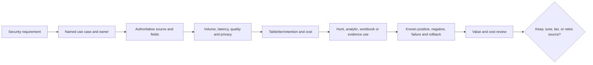

## 4. Connector and DCR architecture paper design

A **data connector** integrates a source with Sentinel. A **Data Collection Rule (DCR)** defines collection, transformation, and routing for supported Azure Monitor paths. A DCR is not universal: service-to-service, AMA, diagnostic settings, Logs Ingestion API, codeless, and legacy paths have different support.

| Source type | Candidate connection | Table | DCR/transform design | Owner/health |
|---|---|---|---|---|
| Microsoft Entra sign-ins | Current service connector/diagnostic path | `SigninLogs` or current table | Workspace transform only where supported; minimize fields lawfully | Identity owner; last event/latency/schema |
| Defender XDR alerts/incidents | Service-to-service integration | `SecurityAlert`, `SecurityIncident` or unified current representation | Follow connector behavior; avoid duplicate incident loops | SOC platform owner |
| Windows events | Windows Security Events via AMA | `SecurityEvent` | Source-specific DCR selection/transform | Endpoint/infrastructure |
| Linux firewall | CEF/Syslog via AMA forwarder | `CommonSecurityLog`/`Syslog` | DCR facility/severity and transform plan | Network team |
| Fictional custom app | Logs Ingestion API only if approved | `NorthstarSecurity_CL` | DCR stream declaration and safe transform | App owner |
| Local lab | No connector | Inline `datatable` | None; zero ingestion | Candidate |

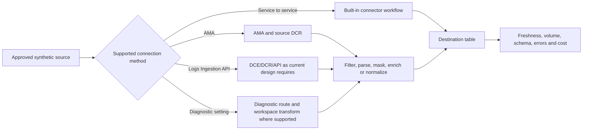

### DCR specification excerpt

| Field | Fictional design |
|---|---|
| Name/version | `dcr-ns-security-synthetic-v1` |
| Input stream | JSON synthetic auth/network events; schema version `1.0` |
| Required fields | `TimeGenerated`, `EventType`, `User`, `SourceIp`, `Device`, `Result`, `SessionId` |
| Transformation intent | Parse types, normalize case, drop debug payload, mask prohibited fields, add `SchemaVersion` |
| Destination | Paper custom table or ASIM-compatible destination where currently supported |
| Error path | Metrics/health alert; source retry/dead-letter design without secrets in logs |
| Change control | Peer review, sample backtest, cost estimate, version, rollback to prior DCR |
| Prohibited | Real payloads, secrets, tokens, full content, unknown high-cardinality blobs |

### 🔍 Plain-English deep-dive: ingestion-time transformation is a permanent editorial decision

Query-time parsing is like putting translation glasses on a reader: the source record remains available and the view can be corrected later. Ingestion-time transformation is like editing the document before filing it: it can reduce cost, normalize fields, or remove sensitive data, but discarded or incorrectly transformed content may not be recoverable from Sentinel. Test transformations against known positives, negatives, malformed rows, nulls, schema drift, and volume before approval.

## 5. Schema, normalization, and ASIM design

ASIM provides normalized schemas and parsers so content can query consistent fields across products. Query-time parsers preserve source data and can be changed retroactively; ingest-time normalization can improve performance but changes what is stored and may add cost/design complexity.

| Source field | Source A | Source B | ASIM-style target | Normalization rule |
|---|---|---|---|---|
| Event time | `eventTime` | `timestamp` | `TimeGenerated` plus schema time fields | Parse UTC; preserve source time if needed |
| Actor | `userPrincipalName` | `src_user` | `ActorUsername`/appropriate schema field | Lowercase domain/user carefully |
| Source IP | `ipAddress` | `src` | `SrcIpAddr` | Validate IP; null invalid values |
| Result | `status=failed` | `outcome=deny` | `EventResult=Failure` | Controlled mapping table |
| Device | `deviceName` | `host` | `DvcHostname` | Normalize FQDN/short-name with source retained |
| Session | `correlationId` | `session_id` | Appropriate session/correlation field | Preserve stable IDs |

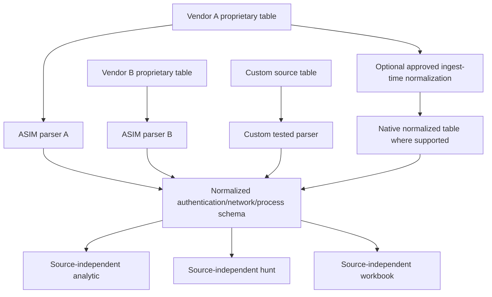

| Parser test | Input | Expected outcome |
|---|---|---|
| Known positive | Failed authentication row | Required normalized fields and Failure result |
| Known negative | Non-security health event | Excluded from auth parser |
| Null | Missing user/device | Row retained/excluded according to schema; no invented value |
| Malformed time | `not-a-date` | Parser safely returns null/flags quality issue |
| Schema drift | New source field name | Health test fails and owner is notified |
| Mixed case | `Priya.Researcher` | Normalization does not destroy identity semantics |
| Performance | Representative safe volume | Query latency/cost compared with source-specific design |

## 6. Complete local synthetic dataset

Keep this prelude with each exercise you run. It creates rows only in the query context and does **not** ingest logs.

```kusto
let SyntheticSecurity = () {
    datatable(
        TimeGenerated:datetime, EventId:string, EventType:string, Source:string,
        User:string, Device:string, SourceIp:string, DestinationIp:string,
        Application:string, SessionId:string, Result:string, Action:string,
        Quantity:long, Bytes:long, Severity:string, Details:string
    )
    [
        datetime(2026-08-24T08:55:00Z), "E01", "Authentication", "EntraSim", "alex.admin@northstar.example", "NS-ADM-01", "192.0.2.44", "", "AdminPortal", "S-A1", "Failure", "SignIn", 1, 900, "Low", "BadPassword-Simulated",
        datetime(2026-08-24T08:56:00Z), "E02", "Authentication", "EntraSim", "lee.hr@northstar.example", "NS-HR-07", "192.0.2.44", "", "AdminPortal", "S-H1", "Failure", "SignIn", 1, 920, "Low", "BadPassword-Simulated",
        datetime(2026-08-24T08:57:00Z), "E03", "Authentication", "EntraSim", "sam.finance@northstar.example", "NS-FIN-03", "192.0.2.44", "", "AdminPortal", "S-F1", "Failure", "SignIn", 1, 910, "Low", "BadPassword-Simulated",
        datetime(2026-08-24T08:59:00Z), "E04", "Authentication", "EntraSim", "alex.admin@northstar.example", "Unknown", "192.0.2.44", "", "AdminPortal", "S-A2", "Success", "SignIn", 1, 950, "High", "MfaDetailUnknown-Simulated",
        datetime(2026-08-24T09:02:00Z), "E05", "Privilege", "AuditSim", "alex.admin@northstar.example", "", "192.0.2.44", "", "Entra", "S-A2", "Success", "RoleAssigned", 1, 1100, "High", "Target=casey.contractor;Role=Reader-Simulated",
        datetime(2026-08-24T09:05:00Z), "E06", "OAuth", "CloudAppSim", "alex.admin@northstar.example", "", "192.0.2.44", "", "ResearchHelperSim", "S-A2", "Success", "ConsentGranted", 1, 1000, "Medium", "Files.Read.All-Simulated",
        datetime(2026-08-24T09:07:00Z), "E07", "File", "CloudAppSim", "alex.admin@northstar.example", "", "192.0.2.44", "", "ResearchHelperSim", "S-A2", "Success", "FileRead", 12, 1800000, "Medium", "/research/synthetic/-Simulated",
        datetime(2026-08-24T09:10:00Z), "E08", "Network", "FirewallSim", "", "NS-ADM-01", "10.10.1.20", "198.51.100.27", "", "", "Allowed", "OutboundTls", 1, 24000, "High", "Documentation-IP-Simulated",
        datetime(2026-08-24T09:12:00Z), "E09", "Authentication", "EntraSim", "priya.researcher@northstar.example", "NS-RSCH-04", "203.0.113.80", "", "ResearchPortal", "S-P1", "Success", "SignIn", 1, 930, "Low", "ApprovedTrainingIP-Simulated",
        datetime(2026-08-24T09:15:00Z), "E10", "Network", "FirewallSim", "", "NS-RSCH-04", "10.10.2.40", "203.0.113.80", "", "", "Allowed", "OutboundTls", 1, 8000, "Low", "ApprovedTrainingIP-Simulated",
        datetime(2026-08-24T09:20:00Z), "E11", "ConnectorHealth", "SentinelSim", "", "Connector-CEF-01", "", "", "", "", "Warning", "Latency", 1, 300, "Medium", "DelayMinutes=18-Simulated",
        datetime(2026-08-24T09:25:00Z), "E12", "Automation", "LogicAppSim", "soc.analyst@northstar.example", "Playbook-Notify-Approval", "", "", "", "", "Failed", "ApprovalTimeout", 1, 650, "Medium", "NoResponse-Simulated",
        datetime(2026-08-24T09:30:00Z), "E13", "Authentication", "EntraSim", "svc.backup@northstar.example", "NS-BKP-01", "10.10.5.5", "", "BackupService", "S-B1", "Success", "SignIn", 1, 880, "Informational", "ApprovedServiceAccount-Simulated",
        datetime(2026-08-24T09:35:00Z), "E14", "File", "CloudAppSim", "priya.researcher@northstar.example", "", "203.0.113.80", "", "ResearchPortal", "S-P1", "Success", "FileRead", 2, 120000, "Low", "/training/synthetic/-Simulated"
    ]
};
SyntheticSecurity()
| order by TimeGenerated asc
```

**Expected simulated result:** 14 rows from 08:55 through 09:35 UTC. The row count and known event IDs are unit-test anchors.

## 7. Twenty-six KQL exercises

For every exercise, run the prelude plus the selected query. Record query version, execution environment, UTC, expected rows, actual rows, discrepancy, and evidence class. In a portal with unrelated data, use the datatable only; never swap in production tables without authorization.

| Exercise | Skill | Expected synthetic result |
|---|---|---|
| 1 | `take` | Any 5 rows |
| 2 | Time filter | E04-E10 in chosen interval |
| 3 | `project`/rename | Selected concise columns |
| 4 | `extend` | Calculated kilobytes and identity-presence flag |
| 5 | Exact/CI filter | Authentication events |
| 6 | `summarize count` | Counts by source/type |
| 7 | `bin` | Five-minute time buckets |
| 8 | `distinct` | User list without blanks |
| 9 | `make_set` | Actions per user |
| 10 | `case` | Normalized severity rank |
| 11 | String extraction | Simulated delay value from details |
| 12 | `arg_max` | Latest event per user |
| 13 | `serialize`/`prev` | Inter-event minutes |
| 14 | Inner `join` | Auth success and later same-session events |
| 15 | `leftanti` | Remove approved service account |
| 16 | `lookup` | Enrich critical assets |
| 17 | Threat-intel join | E08 matches documentation indicator |
| 18 | Watchlist allow/reference | Priya training IP is annotated |
| 19 | Password-spray aggregation | 3 users fail from `192.0.2.44` |
| 20 | Success-after-failure sequence | Alex success after failures from same IP |
| 21 | Session storyline | S-A2 privilege/consent/file events |
| 22 | ASIM-style projection | Normalized auth fields |
| 23 | Analytics entity output | Account/IP/host fields preserved |
| 24 | Backtest confusion matrix | TP/FP/TN/FN counts from labels |
| 25 | Workbook series | Events and bytes by bucket/type |
| 26 | Cost volume | Total synthetic bytes by source |

### Exercises 1-5: filter and shape

```kusto
// Ex 1
SyntheticSecurity() | take 5

// Ex 2
SyntheticSecurity()
| where TimeGenerated between (datetime(2026-08-24T08:59:00Z) .. datetime(2026-08-24T09:10:00Z))
| order by TimeGenerated asc

// Ex 3
SyntheticSecurity()
| project UTC=TimeGenerated, Id=EventId, Type=EventType, Actor=User, Host=Device, Outcome=Result

// Ex 4
SyntheticSecurity()
| extend Kilobytes=round(todouble(Bytes) / 1024.0, 2), HasUser=isnotempty(User)
| project EventId, Kilobytes, HasUser

// Ex 5
SyntheticSecurity()
| where EventType =~ "authentication"
| order by TimeGenerated asc
```

### Exercises 6-10: aggregate and classify

```kusto
// Ex 6
SyntheticSecurity()
| summarize Events=count(), TotalBytes=sum(Bytes) by Source, EventType
| order by Source asc, EventType asc

// Ex 7
SyntheticSecurity()
| summarize Events=count() by bin(TimeGenerated, 5m), EventType
| order by TimeGenerated asc

// Ex 8
SyntheticSecurity()
| where isnotempty(User)
| distinct User
| order by User asc

// Ex 9
SyntheticSecurity()
| where isnotempty(User)
| summarize Actions=make_set(Action), Sources=make_set(Source) by User

// Ex 10
SyntheticSecurity()
| extend SeverityRank=case(
    Severity == "High", 4,
    Severity == "Medium", 3,
    Severity == "Low", 2,
    Severity == "Informational", 1,
    0)
| project EventId, Severity, SeverityRank
| order by SeverityRank desc
```

### Exercises 11-15: parse, sequence, and exclude

```kusto
// Ex 11
SyntheticSecurity()
| where EventType == "ConnectorHealth"
| extend DelayMinutes=toint(extract(@"DelayMinutes=(\d+)", 1, Details))
| project EventId, Device, DelayMinutes

// Ex 12
SyntheticSecurity()
| where isnotempty(User)
| summarize arg_max(TimeGenerated, *) by User
| project User, TimeGenerated, EventId, EventType, Action

// Ex 13
SyntheticSecurity()
| order by TimeGenerated asc
| serialize
| extend PreviousTime=prev(TimeGenerated), MinutesSincePrevious=datetime_diff("minute", TimeGenerated, PreviousTime)
| project EventId, TimeGenerated, MinutesSincePrevious

// Ex 14
let AuthSuccess = SyntheticSecurity()
    | where EventType == "Authentication" and Result == "Success"
    | project AuthTime=TimeGenerated, User, SessionId, AuthEvent=EventId;
let LaterEvents = SyntheticSecurity()
    | where EventType != "Authentication"
    | project EventTime=TimeGenerated, User, SessionId, LaterEvent=EventId, EventType, Action;
AuthSuccess
| join kind=inner LaterEvents on User, SessionId
| where EventTime >= AuthTime
| order by EventTime asc

// Ex 15
let ApprovedAccounts = datatable(User:string)["svc.backup@northstar.example"];
SyntheticSecurity()
| join kind=leftanti ApprovedAccounts on User
```

### Exercises 16-20: reference data and detection logic

```kusto
// Ex 16
let CriticalAssets = datatable(Device:string, Criticality:string, Owner:string)
[
    "NS-ADM-01", "High", "Identity Operations",
    "NS-RSCH-04", "Medium", "Research IT"
];
SyntheticSecurity()
| where isnotempty(Device)
| lookup kind=leftouter CriticalAssets on Device
| project EventId, Device, EventType, Criticality, Owner

// Ex 17 - documentation values only, not real threat intelligence
let SafeIndicators = datatable(Indicator:string, IndicatorType:string, Confidence:string)
[
    "198.51.100.27", "IPv4-Documentation", "Synthetic",
    "indicator.example", "Domain-Reserved", "Synthetic"
];
SyntheticSecurity()
| where isnotempty(DestinationIp)
| join kind=inner SafeIndicators on $left.DestinationIp == $right.Indicator
| project TimeGenerated, EventId, Device, DestinationIp, IndicatorType, Confidence

// Ex 18
let TrainingReference = datatable(SourceIp:string, Purpose:string, Expires:datetime)
[
    "203.0.113.80", "Approved synthetic training range", datetime(2026-08-24T23:59:59Z)
];
SyntheticSecurity()
| where isnotempty(SourceIp)
| lookup kind=leftouter TrainingReference on SourceIp
| extend ReferenceStatus=iff(isnotempty(Purpose), "Referenced", "NotReferenced")
| project EventId, SourceIp, User, ReferenceStatus, Purpose, Expires

// Ex 19
SyntheticSecurity()
| where EventType == "Authentication" and Result == "Failure"
| summarize FailedAttempts=count(), TargetUsers=dcount(User), Users=make_set(User) by SourceIp, bin(TimeGenerated, 10m)
| where FailedAttempts >= 3 and TargetUsers >= 3

// Ex 20
let Failures = SyntheticSecurity()
    | where EventType == "Authentication" and Result == "Failure"
    | summarize FirstFailure=min(TimeGenerated), FailedUsers=dcount(User) by SourceIp;
let Successes = SyntheticSecurity()
    | where EventType == "Authentication" and Result == "Success"
    | project SuccessTime=TimeGenerated, SourceIp, User, SessionId, Device;
Failures
| join kind=inner Successes on SourceIp
| where SuccessTime >= FirstFailure and FailedUsers >= 3
| project SourceIp, FirstFailure, SuccessTime, FailedUsers, User, SessionId, Device
```

### Exercises 21-26: storyline, normalization, backtest, workbook, and cost

```kusto
// Ex 21
SyntheticSecurity()
| where SessionId == "S-A2"
| order by TimeGenerated asc
| project TimeGenerated, EventId, EventType, User, Device, Application, Action, Result, Details

// Ex 22 - ASIM-style design projection, not a claim of full schema compliance
SyntheticSecurity()
| where EventType == "Authentication"
| project TimeGenerated,
          EventProduct=Source,
          EventType="Logon",
          EventResult=Result,
          ActorUsername=User,
          SrcIpAddr=SourceIp,
          DvcHostname=Device,
          TargetAppName=Application,
          EventOriginalUid=EventId

// Ex 23 - fields intended for analytics entity mapping
SyntheticSecurity()
| where SourceIp == "192.0.2.44" and Severity in ("High", "Medium")
| project TimeGenerated, AccountCustomEntity=User, IPCustomEntity=SourceIp,
          HostCustomEntity=Device, EventId, EventType, Action, Severity

// Ex 24
let Backtest = datatable(TestId:string, GroundTruth:bool, RuleFired:bool)
[
    "BT01", true, true,
    "BT02", true, true,
    "BT03", true, false,
    "BT04", false, true,
    "BT05", false, false,
    "BT06", false, false
];
Backtest
| summarize TruePositive=countif(GroundTruth and RuleFired),
            FalsePositive=countif(not(GroundTruth) and RuleFired),
            TrueNegative=countif(not(GroundTruth) and not(RuleFired)),
            FalseNegative=countif(GroundTruth and not(RuleFired))

// Ex 25
SyntheticSecurity()
| summarize Events=count(), Bytes=sum(Bytes) by bin(TimeGenerated, 5m), EventType
| order by TimeGenerated asc

// Ex 26
SyntheticSecurity()
| summarize Rows=count(), Bytes=sum(Bytes), AverageBytes=avg(Bytes) by Source
| extend EstimatedGigabytes=todouble(Bytes) / 1000000000.0
| order by EstimatedGigabytes desc
```

### 🔍 Plain-English deep-dive: KQL is a pipeline of increasingly precise questions

KQL flows from a table into operators separated by pipes. Imagine a mail-sorting line: `where` removes envelopes outside the case, `project` keeps needed fields, `extend` adds a note, `summarize` groups counts, and `join` matches envelopes to another register. Filter early, prefer stable keys, keep UTC explicit, and inspect row counts before/after joins. A syntactically valid query can still answer the wrong question.

## 8. Analytics rule design, backtest, entities, MITRE, and tuning

### Detection specification

| Field | `NS-SIM-Password-Spray-Then-Success` |
|---|---|
| Intent | Detect one IP failing against at least three users, followed by a success from that IP within the approved lookback |
| Data | Authentication events or normalized authentication schema |
| Schedule/lookback | Paper example: run every 5 minutes, look back 15 minutes; validate overlap/deduplication |
| Threshold | ≥3 failures and ≥3 distinct users, then ≥1 success |
| Output | `TimeGenerated`, `SourceIp`, successful `User`, `Device`, `SessionId`, counts, first/last time |
| Severity | High only when success and critical context meet; otherwise tune to Medium |
| Entity mapping | Account from user ID/UPN, IP from source IP, Host from stable device identity |
| MITRE | Credential Access: Password Spraying (`T1110.003`); Valid Accounts only if successful use evidence supports it |
| Incident grouping | Entity-based plan; verify unified correlation behavior |
| Automation | Tag/assign/notify only after approval; no automatic disable/block |
| Owner/review | Identity detection engineering; monthly and after source/schema changes |

```mermaid
flowchart LR
    USE[Use case and threat hypothesis] --> DATA[Source quality, fields and latency]
    DATA --> QUERY[Versioned KQL with TimeGenerated]
    QUERY --> BACKTEST[Known positives, negatives and historical/synthetic backtest]
    BACKTEST --> MAP[Entity, custom detail, severity and MITRE mapping]
    MAP --> SIMULATE[Results simulation/disabled rule]
    SIMULATE --> TUNE[Precision, recall, duplication, latency and analyst value]
    TUNE --> APPROVE[Owner and change approval]
    APPROVE --> ENABLE[Phased enablement if authorized]
    ENABLE --> MONITOR[Rule health, incidents, false positives and cost]
    MONITOR --> RETIRE[Update, disable or retire]
```

| Backtest dimension | Test | Expected result |
|---|---|---|
| True positive | Three users fail from same IP then admin succeeds | Fires with user/IP/session entities |
| True negative | One user mistypes password twice then succeeds from known device | Does not fire |
| Boundary | Exactly 3 users and exactly threshold interval | Inclusive semantics documented |
| False positive | Authorized identity test or shared egress IP | Context/reference data reduces noise without hiding attacks |
| False negative | Distributed spray across IPs | Gap documented; separate analytic needed |
| Delay | Success arrives before delayed failures | Ingestion-time/lookback/overlap logic tested |
| Duplicate | Overlapping schedules see same sequence | Stable grouping/deduplication design |
| Schema break | User/IP field changes/nulls | Health rule catches quality degradation |

### Detection metrics

| Metric | Formula/meaning | Caveat |
|---|---|---|
| Precision | $TP / (TP + FP)$ | Requires trustworthy labels |
| Recall | $TP / (TP + FN)$ | Unknown missed attacks make real recall difficult |
| Time to alert | Alert time minus latest qualifying event time | Includes ingestion and schedule delay |
| Analyst yield | Actionable/valuable incidents per reviewed incident | Avoid rewarding overclosure |
| Coverage | Use cases/techniques with tested telemetry and response | MITRE mapping alone is not effectiveness |
| Data health | Expected versus observed volume, latency, schema completeness | Source outage can look quiet |

## 9. Synthetic incident investigation

The detection produces fictional alert `ALT-SEN-70-001` and incident `INC-SEN-70-001` from E01-E07 and E08. It is entirely simulated.

```mermaid
sequenceDiagram
    participant AUTH as Synthetic authentication data
    participant RULE as Scheduled analytic design
    participant INC as Synthetic incident
    participant HUNT as KQL investigation
    participant OWNER as Identity/app/network owners
    AUTH->>RULE: Three-user failures then admin success
    RULE->>INC: Alert with Account, IP and Host entities
    INC->>HUNT: Pivot session S-A2 and IP 192.0.2.44
    HUNT-->>INC: Role assignment, consent, file read and device network rows
    INC->>OWNER: Request business/change context
    OWNER-->>INC: No approved change in fictional scenario
    INC->>INC: Raise priority; preserve facts and response plan
```

| Incident step | Synthetic finding | Evidence discipline |
|---|---|---|
| Validate alert | E01-E04 meet threshold | Simulated query output |
| Scope IP | E01-E07 share `192.0.2.44`; E08 has different destination relation | Do not claim geolocation/ownership |
| Scope session | S-A2 links success, role, consent, file read | Stable fictional session key |
| Scope account | Alex is a fictional admin persona | No real identity |
| Scope device | E04 says Unknown while network E08 says NS-ADM-01 | Device relationship is a hypothesis |
| Business context | No approved change in scenario | Fictional owner response |
| Data impact | 12 synthetic reads, 1.8 MB field | Not real content/exfiltration |
| Response | Paper containment and handoff; no automated action | Do not execute |

### Incident hypotheses

| Hypothesis | Support | Missing/alternative | Next safe check |
|---|---|---|---|
| Password spray succeeded | Three distinct failures then success from same IP | Shared proxy/test could explain | Validate source ownership, auth detail, test calendar |
| Successful session made changes | S-A2 links role/consent/file | Session field could be source-normalization error | Verify source event IDs and app audit |
| Device contacted indicator | E08 critical device/documentation destination | Device does not link to S-A2 | Verify host/session/network identity in real source |
| Data exfiltration occurred | File reads and outbound network exist | No object-to-process/network/bytes destination chain | Keep unconfirmed |

## 10. UEBA and behaviors simulation

UEBA compares entity activity with individual, peer, and organization baselines and produces investigation/anomaly context according to enabled sources. Current Sentinel also distinguishes event-level behavior analytics, anomaly records, and an independently enabled behaviors layer. Scores prioritize review; they do not prove malicious intent.

| Synthetic UEBA record | Value |
|---|---|
| Entity | `alex.admin@northstar.example` |
| Event | First consent to `ResearchHelperSim` after risky sign-in sequence |
| Investigation priority | 8.2/10 (simulated) |
| Anomaly score | 0.78/1 (simulated) |
| Peer context | 0 of 10 fictional admin peers used this app |
| Baseline | No prior consent in fabricated 30-day summary |
| Behavior | “Admin granted file-read consent and accessed 12 research items” (simulated) |
| MITRE | Candidate cloud-account/app behavior; exact mapping requires current model evidence |
| Alternative | Approved new integration not entered in change system |

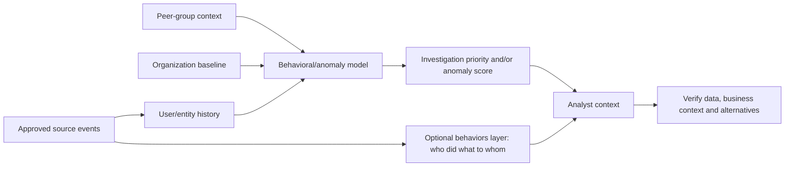

### 🔍 Plain-English deep-dive: unusual is not malicious

UEBA is like a credit-card fraud model noticing that a purchase differs from your normal pattern and your peers. A first-time action may be legitimate, while a familiar action may still be harmful. Baselines can be biased by missing data, role changes, seasonal work, migrations, remote access, or service accounts. Use anomaly scores to prioritize evidence gathering, not to declare guilt or automate punishment.

## 11. Threat intelligence and watchlist safe samples

Threat intelligence (TI) describes indicators and context such as type, source, confidence, validity, marking, and relationship to activity. A watchlist is reference data used for joins/enrichment. Neither is inherently a blocklist, and stale or broad indicators can create harm.

| Safe sample | Type | Meaning | Expires | Action |
|---|---|---|---|---|
| `198.51.100.27` | Documentation IPv4 | Synthetic candidate indicator | Exercise end | Match only, never block |
| `indicator.example` | Reserved domain | Synthetic domain indicator | Exercise end | Match only |
| `NS-ADM-01` | Critical asset reference | Fictional high-value host | Review date | Enrich priority |
| `203.0.113.80` | Training reference | Approved synthetic training IP | Exercise end | Context, not broad suppression |
| `svc.backup@northstar.example` | Service-account reference | Fictional approved account | Monthly review | Exclude only from exact use case with monitoring |

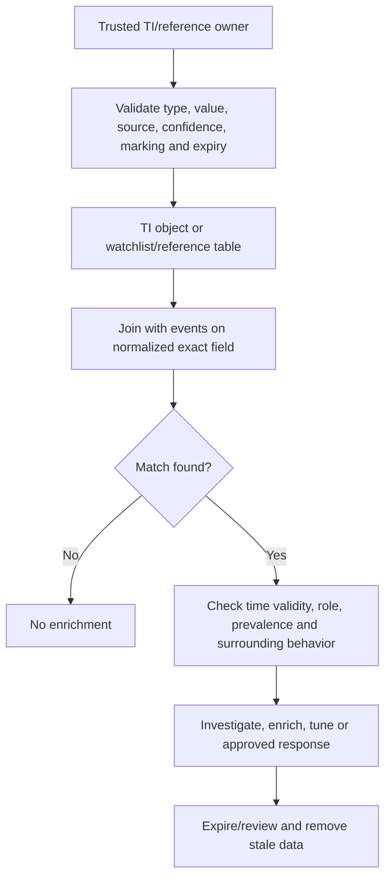

| Quality risk | Mitigation |
|---|---|
| Shared hosting/CDN IP | Add context; avoid automatic block |
| Expired indicator | Enforce valid-from/to and review |
| Wrong field normalization | Validate IP/domain/hash type and canonicalization |
| Watchlist used as permanent allowlist | Owner, exact purpose, expiry, monitoring, review |
| Sensitive business reference | Minimize and protect; do not put secrets/personal data in watchlist |
| Portal/refresh delay | Query current function/data, health, range and service status |

## 12. Workbook design and query

A Sentinel workbook is an interactive Azure Workbook experience that combines parameters, queries, text, links, and visualizations. It is an operational view, not a replacement for alerting or raw evidence.

| Workbook component | Query/metric | User decision |
|---|---|---|
| Header | Time range, workspace, evidence class, last refresh | Understand scope and freshness |
| Connector health | Last event and delay by source | Escalate stale source |
| Event trend | Exercise 25 time series | Identify spikes and gaps |
| Authentication panel | Failures/successes by source IP/user | Pivot to spray analytic |
| High-severity events | High rows by source/type | Prioritize review |
| Critical assets | Watchlist lookup and event count | Focus business impact |
| Automation health | Failed/timeout runs | Restore SOAR reliability |
| Cost proxy | Bytes/rows by source plus actual usage query in real workspace | Review value versus volume |

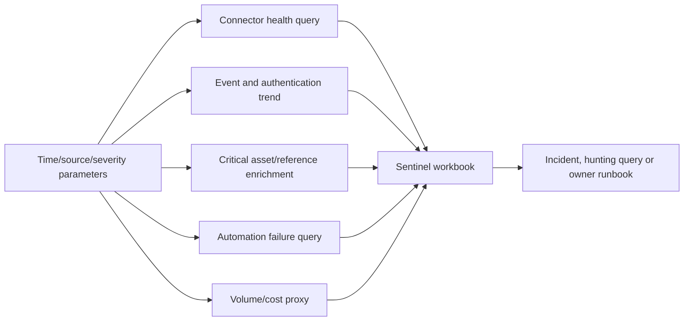

Workbook quality tests: no-data state; slow query; partial permission; wide and narrow time range; high-cardinality value; timezone label; stale connector; missing watchlist; mobile/small screen if relevant; query result versus source; least-privilege viewer; and export/redaction behavior.

## 13. Approval-based Logic Apps playbook: paper or disabled test

The fictional playbook is `PB-NS-Notify-And-Request-Containment-Approval`. It does not isolate, disable, block, purge, or contact external systems. The default route is paper-only. An explicitly authorized paid route may create a **disabled** workflow with a manual test payload that writes only to a private test log, then deletes it after validation.

```mermaid
sequenceDiagram
    participant I as Synthetic incident
    participant AR as Automation rule design
    participant P as Disabled/paper playbook
    participant A as Named approver
    participant R as Response owner
    I->>AR: Incident created/updated with High severity
    AR->>P: Proposed invocation, not enabled by default
    P->>P: Validate schema, evidence class and idempotency key
    P->>A: Draft approval request with expiry and business impact
    alt Approval simulated
        A-->>P: Approve/reject with reason
        P->>R: Create paper task; no containment API call
    else Timeout/failure
        P->>R: Escalation card and manual runbook
    end
    P-->>I: Proposed comment/status only after authorized design review
```

| Workflow stage | Design | Failure handling |
|---|---|---|
| Trigger | Incident-created/updated automation rule with exact tags/severity | Duplicate trigger uses incident+action idempotency key |
| Validate | Required incident ID, entities, owner, evidence class | Stop and log safe metadata; no action |
| Enrich | Read minimum approved Sentinel entity context | Timeout/retry with bounded policy |
| Approval | Named on-call role, expiry, evidence, business effect, rollback | Escalate to incident commander; default deny/no action |
| Action | Paper task to response owner | No direct containment in this lab |
| Update | Add safe incident comment/status only if authorized | Avoid recursive update loop |
| Audit | Correlation ID, run ID, identity, inputs/outputs, decision, duration | Do not log secrets/tokens/content |
| Recovery | Disable automation rule/workflow, invoke manual runbook | Verify no queued/retried actions remain |

### Managed identity and RBAC

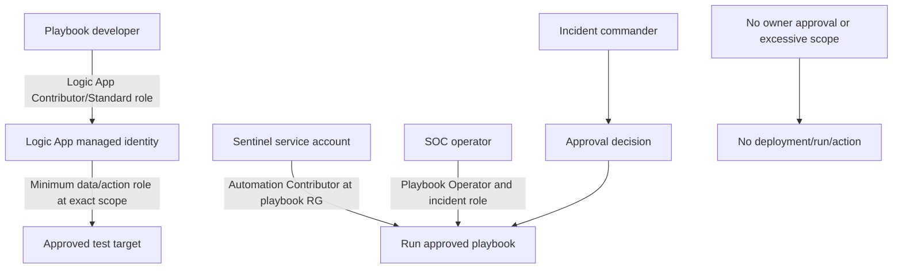

| Identity | Minimum design permission | Must not receive |
|---|---|---|
| Sentinel automation service | Run approved playbooks in exact resource group | Subscription-wide Owner |
| Logic App managed identity | Read incident and perform only approved test operation | Broad user/device/mail admin by convenience |
| Developer | Edit workflow and inspect test run metadata | Production secrets/content unrelated to task |
| SOC operator | Manual-run permission where required | Role-assignment authority |
| Approver | Business/security approval authority | Hidden automatic action outside audit |

Use managed identity where supported instead of embedded secrets, but identity alone is not secure: scope, role, connector authentication, API permissions, network, run-history data, and credential lifecycle still matter.

## 14. Failure injection and troubleshooting

| ID | Injected failure | Diagnostic path | Safe result |
|---|---|---|---|
| F01 | Connector latency 18 minutes | Source timestamp vs ingestion time, source health, agent/API/DCR, network, workspace limits, service health | Raise health issue; do not weaken detection silently |
| F02 | Connector sends zero rows | Authorization, source event generation, connector status, table, DCR, cap, time range | Preserve zero result and owner escalation |
| F03 | Schema field renamed | Parser unit tests, source version, null rate, rule output | Disable affected analytic if misleading; update parser |
| F04 | DCR parse error | Safe sample, transform syntax/types, error metrics, prior version | Roll back DCR under approval |
| F05 | KQL syntax error | Exact error/line, schema tree, scalar/tabular context | Correct locally; rerun known tests |
| F06 | KQL timeout/high resource | Early time/source filter, columns, joins, cardinality, materialization strategy per docs | Optimize before schedule |
| F07 | Join multiplies rows | Key uniqueness and join kind; pre-aggregate/reference table | Correct query and backtest counts |
| F08 | Analytics duplicates alerts | Schedule/lookback overlap, grouping, stable key, late data | Tune grouping/deduplication |
| F09 | Entity missing in incident | Query output, entity identifiers, null/type/limit, current mapping | Fix mapping; do not invent entity |
| F10 | Watchlist appears empty | Alias, workspace, refresh/time range, ingestion cap, service health | Use inline datatable fallback |
| F11 | Workbook blank | Parameters, permissions, workspace, time, query, no-data state | Show explicit no-data/error state |
| F12 | Playbook approval timeout | Run history, approver route, connector, expiry, manual escalation | Default no action |
| F13 | Playbook recursive loop | Trigger/update conditions, idempotency tag/key | Disable rule/workflow and use manual process |
| F14 | Managed identity denied | Principal, token audience, role/scope, propagation, target API | Correct least privilege; no broad Owner grant |
| F15 | Unexpected cost | Usage by table/source, tier, retention, queries, Logic Apps, Functions, graph/notebook resources | Stop nonessential flows; owner reviews cleanup |

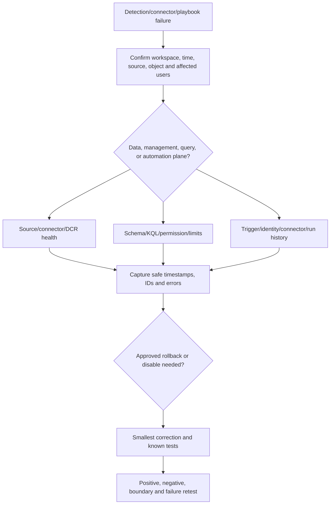

### 🔍 Plain-English deep-dive: quiet dashboards can mean blind sensors

“No alerts” is not automatically good news. A disconnected source, daily cap, broken parser, query error, permission change, or delayed pipeline can make the SOC quiet. This is like a smoke-alarm panel showing no fires after its power cable was cut. Monitor the monitoring system: source freshness, expected volume, schema completeness, rule execution, automation runs, and costs need their own controls.

## 15. Positive, negative, boundary, rollback, and cleanup tests

| ID | Type | Test | Expected evidence |
|---|---|---|---|
| P70-T01 | Positive | Dataset count | 14 simulated rows |
| P70-T02 | Negative | Filter nonexistent user | Zero rows, no fabrication |
| P70-T03 | Boundary | Time exactly at interval start/end | Operator behavior documented |
| P70-T04 | Positive | Spray analytic | One sequence for `192.0.2.44` |
| P70-T05 | Negative | Service-account normal success | No spray alert |
| P70-T06 | Boundary | Two versus three distinct failed users | Threshold behavior validated |
| P70-T07 | Positive | Session pivot S-A2 | Success, role, consent, file rows |
| P70-T08 | Negative | Documentation TI does not match approved training IP | No TI match for `203.0.113.80` |
| P70-T09 | Parser | Null user on network rows | No invented actor |
| P70-T10 | Failure | Connector latency card | Health incident path starts |
| P70-T11 | Failure | Query syntax/cardinality defect | Error captured; no rule enablement |
| P70-T12 | Failure | Approval timeout | No response action; manual escalation |
| P70-T13 | Rollback | Disable test analytics rule | No new alerts; historical incidents retained per design |
| P70-T14 | Rollback | Restore prior DCR version | Known sample parses and source resumes |
| P70-T15 | Rollback | Disable automation rule/playbook | No queued recurrence; manual runbook active |
| P70-T16 | Cleanup | Remove synthetic Azure resources under owner plan | Cost analysis shows no unintended residual meter |
| P70-T17 | Recovery | Re-enable only validated connector/rule | Health and known tests pass before production design |
| P70-T18 | Privacy | Search deployment pack | No credentials, real logs, real users, or tenant IDs |

## 16. Cost estimate and value governance

Never insert a remembered per-GB price. Use the current Microsoft pricing page/calculator for the exact region, currency, agreement, tier, benefit, retention, data lake, query, Logic Apps, Functions, notebook, graph, and other meters.

### Fictional volume model

| Source | Events/day | Average bytes/event | Raw GB/day estimate | Analytics need |
|---|---:|---:|---:|---|
| Entra authentication | 2,000,000 | 1,500 | 3.00 | High-value fields, 90-day paper assumption to validate |
| Endpoint security | 4,000,000 | 1,200 | 4.80 | Use-case/table-specific |
| Firewall/CEF | 10,000,000 | 900 | 9.00 | Filter noise only after value testing |
| SaaS audit | 1,000,000 | 1,100 | 1.10 | Selected operations |
| Total | 17,000,000 | Mixed | 17.90 | Input to current estimator, not a quote |

The basic volume formula is:

$$
\text{GB/day} = \frac{\text{events/day} \times \text{average bytes/event}}{10^9}
$$

The paper monthly estimate is:

$$
\text{Monthly cost} = C_{ingest/analysis} + C_{retention/lake} + C_{queries} + C_{automation} + C_{compute/integration} - C_{verified\ benefits}
$$

| Cost input | Placeholder | Validation source |
|---|---|---|
| Region/currency/agreement | `R`, `CUR`, `Agreement` | Azure pricing calculator/billing contract |
| Analytics GB/day | 17.9 fictional | Measured representative source data, not raw guess |
| PAYG/commitment | Compare break-even and commitment change rules | Current Sentinel pricing |
| Free/benefit data | Count only current eligible meters | Current billing docs and actual bill |
| Retention | Per table/tier/use case | Regulatory/business requirement and current prices |
| Data lake/query | Stored/scanned volume and jobs | Current Sentinel data lake pricing |
| Logic Apps | Trigger/action/connector/run pattern | Logic Apps pricing for chosen plan |
| Functions/AMA/forwarder/storage/network | Architecture dependent | Relevant Azure pricing pages |
| Budget/alert | Named owner and thresholds | Azure Cost Management |

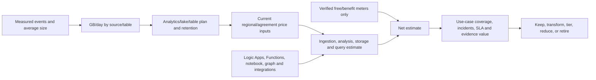

Cost controls are not merely “set a daily cap.” A cap can stop ingestion and create security blindness. Use budgets/alerts, source ownership, table usage, transformations, tier/retention, commitment analysis, duplicate-source prevention, query optimization, automation limits, and health alerts. Any cap requires a documented operational consequence and escalation.

## 17. Cleanup, rollback, and residual-cost verification

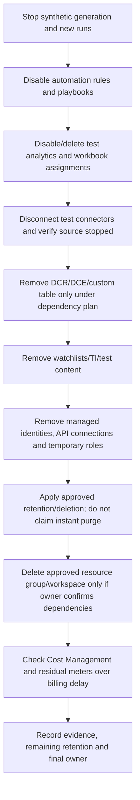

| Cleanup object | Dependency/risk | Verification |
|---|---|---|
| Analytics rule | Incident generation | Disabled first; no new alert after schedule/lookback |
| Automation rule/playbook | Retries/queued runs/external side effects | Disabled; run history checked; no pending action |
| API connections/secrets | Credential/resource cost | Deleted/revoked under owner plan |
| Connector | Data loss/duplicate billing | Source owner confirms stop and alternative visibility |
| DCR/DCE | Shared flows | Dependency inventory before deletion |
| Custom table/workspace | Retention, legal, other solutions | Owner/legal/data review; residual cost checked |
| Managed identity/RBAC | Orphan privilege | Role assignments removed and access retested |
| Watchlist/TI | Stale enrichment | Removed/expired; queries no longer depend on it |
| Workbook | Shared operations | Export design if needed; delete test artifact |
| Budget/alerts | Could protect remaining resources | Remove only after all chargeable resources confirmed |

## 18. Deployment pack, client handover, and portfolio

| Artifact | Required content |
|---|---|
| Charter | Scope, owners, use cases, assumptions, exclusions, success and safety |
| Architecture | Workspace/topology, portal, data, connectors, DCR, ASIM, analytics, automation |
| Data source register | Owner, source, method, table, volume, latency, retention, privacy, support |
| Cost model | Current price inputs, scenarios, benefits, budgets, alerts, residual costs |
| RBAC/RACI | Human/service identities, exact scope, PIM/approval and review |
| KQL pack | Dataset, 26 exercises, results, schema/version and unit tests |
| Detection pack | Rule query/spec, MITRE, entities, grouping, backtest, tuning, owner |
| Incident pack | Synthetic alert/incident/timeline/hypotheses/response/closure |
| UEBA/TI/watchlist | Score caveats, behavior records, safe indicators and expiry |
| Workbook | Components, parameters, queries, no-data/error and access tests |
| SOAR | Disabled/paper workflow, identity, approval, idempotency, retries, rollback |
| Operations | Connector/rule/automation health, SLA, troubleshooting, escalation |
| Infrastructure as code | ARM/Bicep/Terraform design only if consistent with client standards; no secrets |
| Cleanup | Disable/delete order, dependencies, cost verification, residual retention |

### Consulting handover agenda

1. Reconfirm business use cases and excluded data.
2. Walk source-to-table-to-detection lineage.
3. Run known-positive, negative, boundary, late-data, and schema-failure tests.
4. Show incident entities, evidence, MITRE mapping, and response boundary.
5. Demonstrate workbook no-data/health paths.
6. Tabletop approval timeout, identity denial, and manual fallback.
7. Review cost assumptions against actual current bill/usage.
8. Transfer owners, runbooks, source support, escalation, review cadence, and retirement dates.

### Portfolio wording

> “I designed a fictional Sentinel deployment with a complete zero-ingestion route. I modeled workspace, connector, DCR, ASIM, RBAC, cost, and operations; built a 14-row synthetic dataset and 26 KQL exercises; engineered and backtested a password-spray-then-success analytic; mapped entities and MITRE; investigated the linked session; simulated UEBA, behaviors, TI, watchlist, and a workbook; and designed a managed-identity, approval-gated playbook that remained paper-only/disabled. I included connector/query/playbook failure injection, rollback, cleanup, and a deployment pack. I do not present this as production deployment or real SOC response.”

## 19. JD Mapping: technical defense

| Interview challenge | Evidence from this Part | Honest boundary |
|---|---|---|
| “How do you onboard a source?” | Use case → owner/schema/volume → supported connector → DCR/table/tier → health/test/cost | Paper unless actually observed |
| “Why ASIM?” | Source-independent schemas/parsers/content and query-vs-ingest tradeoff | Projection is illustrative, not certified parser |
| “Show KQL skill.” | 26 deterministic exercises with joins, sequences, lookups, backtest and cost | Datatable, not production scale |
| “How do you reduce false positives?” | Labelled tests, threshold/context/reference, precision/recall, owner review | Synthetic labels |
| “How do you secure SOAR?” | Managed identity, narrow RBAC, approval, idempotency, timeout/default deny, audit, rollback | No live action |
| “How do you control Sentinel cost?” | Measured volume, current price inputs, table/tier/retention, automation and value review | Not a quote |

## 20. Official Source Anchors

These official sources were checked for the August 24, 2026 baseline. Recheck canonical paths, portal tabs, preview notices, role requirements, service limits, target cloud/region, and price meters at implementation time.

| Topic | Official source | Verification purpose |
|---|---|---|
| Sentinel overview | [What is Microsoft Sentinel SIEM?](https://learn.microsoft.com/azure/sentinel/overview) | Current capabilities, Defender portal direction, connectors, ASIM, detection, investigation and SOAR |
| Unified onboarding | [Connect Microsoft Sentinel to the Microsoft Defender portal](https://learn.microsoft.com/unified-secops/microsoft-sentinel-onboard) | Current workspace onboarding, roles, primary workspace and offboarding effects |
| Cost/billing | [Plan costs and understand pricing and billing](https://learn.microsoft.com/azure/sentinel/billing) | Current tiers, meters, benefits, retention, data lake and extra-service costs |
| Pricing | [Microsoft Sentinel pricing](https://azure.microsoft.com/pricing/details/microsoft-sentinel/) | Exact current region/agreement inputs; never use remembered prices |
| Connectors | [Microsoft Sentinel data connectors](https://learn.microsoft.com/azure/sentinel/connect-data-sources) | Connector methods, support, custom/AMA/service integration and current migration notices |
| Transformations/DCR | [Custom data ingestion and transformation](https://learn.microsoft.com/azure/sentinel/data-transformation) | Current Logs Ingestion API, DCR, workspace transformation and support matrix |
| DCR overview | [Data collection rules in Azure Monitor](https://learn.microsoft.com/azure/azure-monitor/essentials/data-collection-rule-overview) | DCR structure, data flows, endpoints, associations and limits |
| ASIM | [Normalization and the Advanced Security Information Model](https://learn.microsoft.com/azure/sentinel/normalization) | Schemas, query-time parsers, ingest-time normalization and source-independent content |
| KQL | [Kusto Query Language overview](https://learn.microsoft.com/kusto/query/?view=microsoft-sentinel) | Current operators, functions, limits and best practices |
| `datatable` | [datatable operator](https://learn.microsoft.com/kusto/query/datatable-operator?view=microsoft-sentinel) | Inline synthetic table syntax |
| Analytics | [Create scheduled analytics rules](https://learn.microsoft.com/azure/sentinel/create-analytics-rules) | Query, TimeGenerated, schedule, simulation, entity mapping, incident and automation settings |
| Entity mapping | [Map data fields to entities](https://learn.microsoft.com/azure/sentinel/map-data-fields-to-entities) | Current entity types, identifiers and mapping limits |
| UEBA/behaviors | [Advanced threat detection with UEBA](https://learn.microsoft.com/azure/sentinel/identify-threats-with-entity-behavior-analytics) | Current tables, scores, behavior layer, enablement and cost context |
| Threat intelligence | [Threat intelligence in Microsoft Sentinel](https://learn.microsoft.com/azure/sentinel/understand-threat-intelligence) | Indicator model, sources and investigation usage |
| Watchlists | [Use watchlists to correlate and enrich event data](https://learn.microsoft.com/azure/sentinel/watchlists) | Search key, query functions, limits, refresh, preview and troubleshooting |
| Workbooks | [Visualize and monitor data by using workbooks](https://learn.microsoft.com/azure/sentinel/monitor-your-data) | Current workbook templates, permissions and visualization workflow |
| Automation rules | [Automate threat response with automation rules](https://learn.microsoft.com/azure/sentinel/automate-incident-handling-with-automation-rules) | Current triggers/actions/order/expiry and unified portal behavior |
| Playbooks | [Automate threat response with playbooks](https://learn.microsoft.com/azure/sentinel/automation/automate-responses-with-playbooks) | Logic Apps, roles, Sentinel service account, templates, cost and workflow |
| Product Terms | [Microsoft Product Terms](https://www.microsoft.com/licensing/terms/) | Current commercial/legal terms |

---

## ⭐ Likely Interview Questions for This Section

### Q1. How would you design a Microsoft Sentinel deployment?

> **Model answer:** I start with business-owned detection, investigation, compliance, and response use cases. For each, I map authoritative source, schema, minimum fields, volume, latency, quality, privacy, residency, table/tier, retention, cost, owner, and tests. Then I choose workspace topology and Defender portal integration, supported connectors and DCR transformations, ASIM where valuable, RBAC, analytics, incidents, workbooks, and approval-gated automation. I pilot, measure value and cost, document rollback, and retire unused data/content.

### Q2. What are DCRs and where do they fit?

> **Model answer:** Azure Monitor Data Collection Rules define supported collection flows, transformations, and destinations. AMA and Logs Ingestion API paths use DCRs, while workspace transformation DCRs can cover supported tables for some other flows. Support varies by connector. I test parsing, nulls, schema drift, filtering, privacy, cost, and rollback because ingestion-time transformation can permanently change or discard stored data.

### Q3. Why use ASIM?

> **Model answer:** ASIM normalizes different products into consistent security schemas so analytics, hunting, and workbooks can become source independent. Query-time parsers preserve raw source data and are easier to fix retroactively; ingest-time normalization can improve performance but needs stronger change and cost governance. I validate schema compliance, field semantics, parser quality, nulls, and performance rather than merely renaming columns.

### Q4. How do you build and tune a Sentinel analytics rule?

> **Model answer:** I document the threat hypothesis and required data, write bounded KQL that returns `TimeGenerated` and stable entity fields, validate known positives/negatives/boundaries/late data, and backtest precision and false negatives. I set severity, MITRE, custom details, entities, schedule/lookback, threshold, grouping, incident, and automation deliberately. I use results simulation or a disabled pilot, monitor duplicates, latency, source health, analyst value, and cost, then tune or retire with an owner.

### Q5. What is the difference between UEBA, anomalies, and behaviors?

> **Model answer:** UEBA builds entity and peer baselines and enriches events with investigation-priority context; anomaly models can produce anomaly records/scores over behavior patterns. The separately enabled behaviors layer summarizes who did what to whom with entities and MITRE context. Availability depends on sources and configuration. Scores prioritize investigation but do not prove intent, so I verify source data, business context, baseline quality, and alternatives.

### Q6. How would you secure a Sentinel playbook?

> **Model answer:** I use an automation rule with exact scope, managed identity where supported, least-privilege roles at the narrowest resource/API scope, and separate developer/operator/approver duties. I validate inputs, use idempotency, require approval for disruptive actions, default to no action on timeout, bound retries, avoid recursive updates, protect run history and secrets, and provide manual fallback, rollback, recovery, monitoring, and cost controls. This lab keeps the playbook disabled or paper-only.

### Q7. How do you control Sentinel cost without creating blind spots?

> **Model answer:** I measure events and bytes by source/table, model current regional/agreement prices and every relevant meter, map data to use-case value, and choose table tier and retention accordingly. I remove duplicates, optimize queries, and use tested transformations only where evidence allows. I monitor budgets, actual usage, ingestion health, automation and residual resources. A daily cap can cause blind spots, so any cap needs explicit risk, health alerting, and escalation.

### Q8. How do you describe this Sentinel lab honestly?

> **Model answer:** I say it is a fictional Sentinel architecture and detection-engineering lab with a complete zero-ingestion path. I used a 14-row inline datatable and 26 KQL exercises, paper connector/DCR/ASIM designs, a backtested analytic and synthetic incident, simulated UEBA/TI/watchlist/workbook outputs, and a disabled/paper playbook. I name any authorized lab observation separately and do not claim production ingestion, a real incident, paid-resource deployment, or automated response.

## 🧠 30-Second Memory Hooks

- **Use case before connector; question before gigabytes.**
- **Connector moves; DCR shapes/routes; table stores; ASIM normalizes.**
- **Query-time glasses can be changed; ingest-time edits affect the filed copy.**
- **KQL pipeline:** filter early, project narrowly, join on stable keys, validate counts.
- **Rule lifecycle:** hypothesis → data → query → backtest → map → simulate → tune → operate/retire.
- **UEBA says unusual, not guilty.**
- **TI/watchlist enriches; it does not automatically justify blocking.**
- **Workbook shows operations; health proves the sensors are alive.**
- **SOAR default on failure:** no disruptive action, escalate to a human.
- **Cost is a security control:** value, volume, tier, retention, health, cleanup.
- **Observed, simulated, expected:** evidence class stays visible.

## Completion Checklist

- [ ] Subscription owner, budget, region, data, roles, expiry, and cleanup are approved before any Azure resource.
- [ ] Default no-paid route ingests zero logs and uses only supplied `datatable` records.
- [ ] No employer/production data, real identity, credential, indicator, phishing, malware, external action, or containment is used.
- [ ] Every outcome is labelled Observed, Simulated, or Expected.
- [ ] Workspace/topology, Defender portal, residency, retention, tier, continuity, and ownership decisions are documented.
- [ ] Each data source has use case, owner, method, table, DCR support, schema, volume, latency, quality, privacy, cost, health, and retirement.
- [ ] DCR paper design includes transformations, errors, version, test, and rollback.
- [ ] ASIM mapping and query-time versus ingest-time tradeoff are validated.
- [ ] Synthetic dataset returns exactly 14 known rows.
- [ ] All 26 KQL exercises have expected/actual results and evidence class.
- [ ] Analytics rule includes intent, query, TimeGenerated, schedule/lookback, threshold, entity mapping, MITRE, grouping, backtest, tuning, and owner.
- [ ] Synthetic incident separates facts, hypotheses, missing evidence, business context, and response boundary.
- [ ] UEBA/behavior scores are simulated and never treated as proof of intent.
- [ ] Threat-intelligence/watchlist data uses only reserved/documentation values with source, confidence, expiry, and no automatic block.
- [ ] Workbook has parameters, health, no-data/error, access, and performance tests.
- [ ] Logic Apps playbook is paper-only or disabled, approval-gated, idempotent, least-privilege, auditable, recoverable, and costed.
- [ ] Connector latency, query error/cardinality, entity gap, watchlist issue, playbook timeout/loop/permission, and cost failure are injected.
- [ ] Positive, negative, boundary, failure, rollback, recovery, privacy, and cleanup tests pass.
- [ ] Cost estimate uses current official regional/agreement inputs and includes all relevant meters and residual resources.
- [ ] Deployment pack and handover contain no real tenant identifiers, secrets, logs, users, or fabricated screenshots.
- [ ] Official Microsoft sources, portal state, previews, roles, schemas, prices, Product Terms, and target cloud are rechecked before implementation.

---

*Next suggested section:* [Part 71](Part-71-capstone-deloitte-m365-security-transformation.md)