# Part 71 — CAPSTONE - Deloitte-Style Microsoft 365 Security Transformation

> **Section goal:** Defend a complete fictional Microsoft 365 security consulting engagement from first executive conversation through discovery, assessment, target architecture, options, roadmap, pilot, cutover, hypercare, SOC handover, incident review, and executive closeout. The deliverable integrates Microsoft Entra, Intune, Exchange Online, Teams, SharePoint Online, OneDrive, Microsoft Purview, Microsoft Defender XDR, and Microsoft Sentinel while keeping every technical action design-only by default and every evidence claim explicitly **Observed**, **Simulated**, or **Expected**.

This capstone maps to the Deloitte Microsoft 365 Security Senior Consultant role in the master guide: client discovery, current-state assessment, Microsoft 365 security architecture, Zero Trust, identity and Conditional Access, endpoint security, workload protection, data security/compliance, XDR/SIEM/SOAR, third-party coexistence and migration, licensing, control design, pilots, testing, rollback, incident response, operating model, executive reporting, documentation, stakeholder management, and technical defense. It deliberately uses your real SharePoint/OneDrive, permissions, migration, support, incident, RCA, escalation, and stakeholder strengths while keeping newer solution areas honest.

> **Currency and scope boundary (August 24, 2026):** Microsoft portals, product names, license bundles, service plans, product limits, roles, API behavior, preview status, Secure Score recommendations, Zero Trust guidance, Intune baselines, Defender/Sentinel experiences, and Purview capabilities evolve. Verify every design against current Microsoft Learn, service descriptions, Product Terms, target cloud/region, tenant settings, privacy/legal decisions, and vendor contracts before implementation. Do not future-date planned changes as already completed.

> **Safety and ethics boundary:** This is a fictional portfolio engagement for **Northstar Research Cooperative**. It is not Deloitte client work and not documented production security work. Do not use an employer, production, customer, or third-party tenant. Do not use real people, external users, real domains, personal/regulated data, real incidents, phishing, malware, attacks, broad security changes, employee monitoring, destructive retention, automatic containment, or paid Azure resources without explicit owner authorization. Use reserved `.example` domains, fictional identities, documentation IP ranges, synthetic artifacts, read-only evidence, report-only/disabled designs, approval gates, and complete rollback.

## JD Mapping

| Deloitte-role expectation | Capstone evidence | Client outcome demonstrated |
|---|---|---|
| Lead discovery and assessment | Stakeholder map, questions, evidence register, inventory, maturity and risk findings | Shared fact base and prioritized risk |
| Architect Microsoft 365 security | HLD/LLD excerpts across identity, endpoints, workloads, data and SecOps | Traceable Zero Trust target state |
| Advise on licensing and options | Persona/license map and three option cases | Decision-quality investment view |
| Deliver transformation | Phased roadmap, business case, work packages and dependencies | Achievable sequence rather than feature list |
| Pilot and migrate safely | CA/Intune/Purview/XDR/Sentinel pilot, test, rollback, cutover and hypercare | Lower implementation risk |
| Integrate third parties | Okta/CrowdStrike/Proofpoint/Netskope/Splunk coexistence and migration plan | Controlled capability transition |
| Build operations | SOC model, RACI, runbooks, SLA, KPI, handover and continual improvement | Sustainable controls after project exit |
| Handle incidents and executives | Cross-domain incident/PIR, one-page brief, readout and deck | Technical depth translated into business decisions |

## Candidate honesty note

| Evidence label | Capstone meaning | Example wording |
|---|---|---|
| **Observed** | Result you personally saw in an explicitly authorized isolated lab from a prior Part | “In my isolated lab I observed the pilot user receive the scoped setting after propagation.” |
| **Simulated** | Result produced by Northstar paper scenarios, synthetic matrices, local KQL, or tabletop | “I simulated the Northstar control and incident outcome.” |
| **Expected** | Behavior predicted from current official documentation and awaiting pilot | “Microsoft documents this behavior; the pilot validates it for the client tenant.” |

You can confidently discuss real SharePoint/OneDrive support, sharing/permissions, migration, incidents, diagnostics, RCA, escalation, and stakeholder communication where your CV supports them. You must not say you delivered this for Deloitte, performed a Northstar production rollout, operated an enterprise SOC, migrated a real third-party security stack, monitored employees, or implemented controls you only designed. Prior Parts may be cited as **optional lab evidence**, never as production experience.

> “I created a fictional end-to-end Microsoft 365 security transformation for Northstar. It includes discovery, assessment, risks, target architecture, license/options analysis, phased roadmap, detailed pilots, test/cutover/rollback, SOC handover, and an incident/PIR. The engagement is design-only by default. Where earlier isolated labs produced evidence, I identify exactly what I observed; otherwise I label the outcome simulated or expected. It is not Deloitte client work or documented production security work.”

---

## 1. Engagement charter, outcomes, and two safe delivery routes

The sponsor asks: **How can Northstar reduce identity, endpoint, collaboration, data, and detection risk while preserving research productivity, meeting contractual/regulatory obligations, and avoiding an uncontrolled tool or license migration?**

| Charter element | Fictional agreement |
|---|---|
| Sponsor | Chief Information Security Officer (CISO), Elena Morris |
| Business owner | Chief Operating Officer, Daniel Cho |
| Engagement lead | Candidate as fictional security consultant |
| In scope | Entra, Intune, Exchange, Teams, SharePoint, OneDrive, Purview, Defender XDR, Sentinel, operating model, selected third parties |
| Out of scope | Production changes, penetration testing, real employee monitoring, legal advice, application code remediation, network redesign beyond security dependencies |
| Primary outcomes | Reduce account takeover/data exposure; improve device trust; unify detection; govern data; rationalize tools; create measurable operating model |
| Success | Approved target state and roadmap; five pilot designs pass synthetic tests; owners accept risks/runbooks; business case is decision-ready |
| Evidence date | Baseline through August 24, 2026; live verification required later |

| Route | Permitted activity | Evidence |
|---|---|---|
| **Design/simulation default** | Use this fictional dataset, official documentation, paper configs, local datatables, tabletop tests, diagrams and matrices | Simulated/Expected only |
| **Authorized licensed extension** | Reuse narrow, isolated, synthetic results from Parts 64-70 or run a new test only under explicit owner/license/change/cost approval | Observed results separated by tenant/date/test ID |

```mermaid
flowchart LR
    SPONSOR[Executive mandate] --> DISCOVER[Discover business, technology and risk]
    DISCOVER --> ASSESS[Assess maturity, findings and evidence]
    ASSESS --> DESIGN[Requirements, threat model, HLD and LLD]
    DESIGN --> OPTIONS[Options, licensing, migration and business case]
    OPTIONS --> ROADMAP[Phased roadmap and work packages]
    ROADMAP --> PILOT[Authorized synthetic pilots]
    PILOT --> CUTOVER[Approval, cutover and hypercare design]
    CUTOVER --> OPERATE[SOC, runbooks, SLA/KPI and handover]
    OPERATE --> IMPROVE[Incident/PIR and continual improvement]
```

### Prerequisites and stop gates

| Prerequisite | Why | Stop/fallback |
|---|---|---|
| Signed scope and decision rights | Prevents silent expansion and unsafe action | Design-only |
| Named data/system owners | Findings and exceptions need accountable acceptance | Record ownership gap as risk |
| Evidence access approval | Security evidence can expose users/content | Use supplied synthetic evidence |
| Current licenses/contracts | Capability and migration decisions depend on entitlement/exit terms | Option ranges and validation task |
| Change/test/rollback standards | CA, endpoint, data and response controls can cause outage | Paper test only |
| Privacy/legal/works-council input where applicable | Telemetry and investigation affect people and jurisdictions | No insider/user monitoring |
| Cost owner | Sentinel, Logic Apps, add-ons and migration have cost | Formula/model only |
| Business continuity owners | Security actions can interrupt research and partners | Do not enable controls |

## 2. Northstar client scenario

Northstar is a fictional environmental and health research cooperative with public-sector and commercial partners. All quantities below are design assumptions, not facts about any real organization.

### Organization, people, regions, and tenant

| Dimension | Fictional baseline |
|---|---|
| Workforce | 6,200 employees, 700 contractors, 120 service accounts/workload identities |
| Regions | United States (3,600), United Kingdom (1,200), Germany (800), India (1,300 including contractors) |
| Functions | Research, laboratory operations, finance, HR, legal, sales, IT, SOC, field operations |
| Privileged personas | 85 administrators; 24 high-impact tier-0/tier-1 roles; 40 help-desk operators |
| External collaboration | 180 partner organizations, seasonal research consortia, guest-heavy project sites |
| Tenant | One commercial Microsoft 365 tenant, fictional domain `northstar.example`; test names only |
| Cloud footprint | Microsoft 365, Azure research workloads, several SaaS applications, limited AWS data processing |
| Hybrid estate | Two on-premises datacenters, Active Directory forest, file servers, legacy apps, VPN, PKI |
| Identity | Microsoft Entra ID synchronized from AD; Password Hash Sync paper baseline; two legacy federation-dependent apps |
| Business hours | Follow-the-sun research; 24x7 critical laboratory and SOC functions |

### Devices, workloads, data, regulations, tools, and licenses

| Area | Fictional current state |
|---|---|
| Windows endpoints | 5,000 corporate Windows 11; 400 unsupported/exception candidates under remediation |
| macOS | 650 research/creative devices with partial management |
| Mobile | 3,000 iOS/Android; mix of corporate and bring-your-own-device (BYOD) |
| Servers | 420 Windows/Linux servers; endpoint/security coverage varies |
| Management | Configuration Manager for Windows, partial Intune co-management, Jamf for macOS, separate mobile MDM |
| Exchange | Exchange Online; two legacy SMTP/application senders; third-party secure email gateway |
| Teams | Broad meetings/chat; guest access and apps inconsistently governed |
| SharePoint/OneDrive | 2,400 sites, 6,000 OneDrives, research collaboration and migration legacy |
| Data classes | Public research, internal operations, confidential personal, regulated research, finance, legal/privileged, security data |
| Obligations | Fictional applicability assessment for GDPR/UK GDPR, HIPAA-like research contracts, state privacy terms, export-control clauses, records and legal-hold duties; counsel decides actual scope |
| Security tools | Okta for selected SaaS, CrowdStrike endpoint, Proofpoint email, Netskope CASB/SWG, Splunk SIEM, CyberArk PAM, Jamf Pro |
| Microsoft licenses | 4,500 M365 E5, 1,700 M365 E3, frontline/contractor mix, add-ons not reliably inventoried |
| SOC | 18 analysts, outsourced night/weekend L1, Splunk-centered, separate email/identity/endpoint queues |
| Recent fictional incidents | Business email compromise near miss, guest-link oversharing, unmanaged-device research download, delayed endpoint isolation, noisy SIEM rule backlog |
| Constraints | 18-month contract exits, limited change windows, works-council review, research partner access, lab-device exceptions, budget scrutiny, no “big bang” |

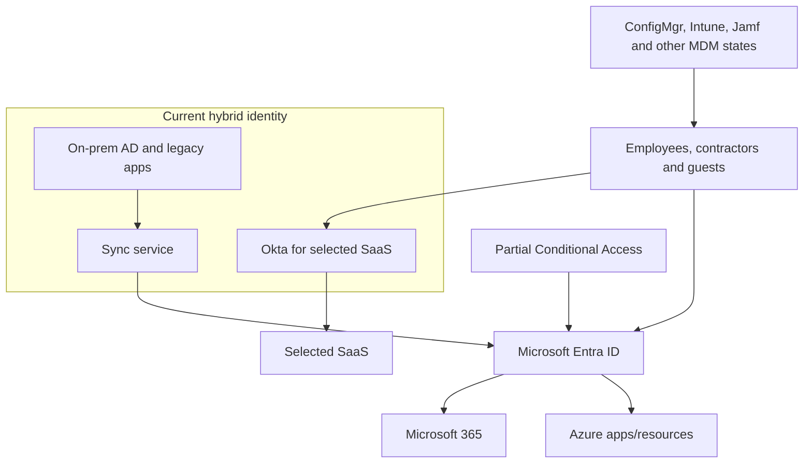

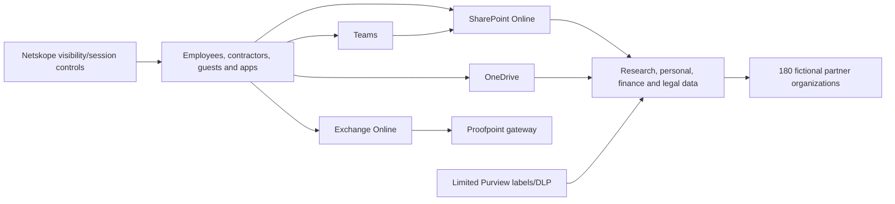

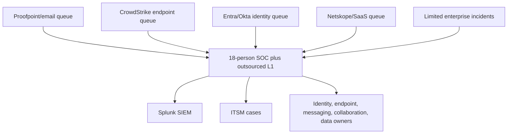

## 3. Discovery pack: stakeholders, questions, and evidence

Discovery is not a portal tour. It connects business outcomes, user journeys, technology, operations, contracts, evidence, and decision rights.

| Stakeholder | What they own/know | Decision needed |
|---|---|---|
| CISO | Risk appetite, security strategy, board reporting | Priority, residual risk, funding |
| CIO/CTO | Technology strategy, operations, architecture | Target architecture and sequencing |
| COO/research leadership | Critical workflows and outage tolerance | Pilot populations and business acceptance |
| Privacy/Data Protection Officer | Personal data, monitoring, regional/privacy requirements | Data/telemetry and investigation guardrails |
| Legal/records | Holds, eDiscovery, contracts, retention | Preservation and lifecycle decisions |
| Identity team | AD/Entra/Okta, roles, apps, access lifecycle | Source of authority and CA/PAM transition |
| Endpoint team | ConfigMgr/Intune/Jamf/CrowdStrike, devices | Management/security coexistence |
| Messaging/collaboration | Exchange/Proofpoint/Teams/SPO/OD | Workload policy and external collaboration |
| Data owners | Classification and sharing outcomes | Taxonomy, DLP, exceptions, retention |
| SOC/IR | Detection, response, evidence, shift model | XDR/Sentinel/Splunk operating model |
| Network/cloud/app owners | Proxy/CASB, Azure/AWS/SaaS, legacy apps | Integrations and trust boundaries |
| Procurement/finance | Contracts, licenses, renewal/exit dates | Option cost and migration timing |
| HR/works council | Workforce process and monitoring concerns | Privacy-safe operating controls |
| Help desk/change/adoption | User support, communications, release controls | Support capacity and hypercare |

### Interview and workshop questions

| Domain | Questions that expose design decisions |
|---|---|
| Business | Which research/services cannot stop? What loss events matter most? Who accepts residual risk? |
| Identity | Authoritative sources? Federation dependencies? Guest/contractor lifecycle? Privileged/workload identities? Break-glass design? |
| Device | Ownership/platform/management state? Compliance truth? Lab/VDI/server exceptions? Current EDR coexistence? |
| Email/collaboration | Mail route/authentication? External sharing models? Partner journeys? Apps/connectors? Anonymous/guest/shared-channel needs? |
| Data | Which classes exist? Where? Who owns them? External/encryption needs? Retention/hold/legal constraints? |
| Detection | Which incidents are missed/noisy? Source latency/retention? Who responds? What actions need approval? |
| Third party | Contract dates, dependencies, data export, APIs, feature parity, exit assistance, rollback? |
| Adoption | Which users fail today? Accessibility/localization? Training/support channels? Change freezes? |
| Measurement | Baseline, target, data owner, formula, gaming risk, review cadence? |

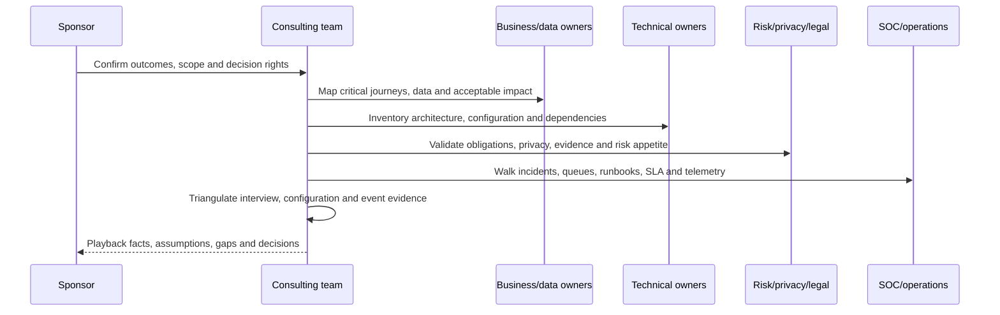

### Evidence request register

| Evidence | Owner | Safe collection | Confidence/use |
|---|---|---|---|
| Tenant/license/service-plan inventory | M365 licensing | Read-only sanitized export | Entitlement and persona map |
| Entra users/groups/roles/apps/CA/sign-in reports | Identity | Scoped read-only metadata, no secrets | Identity findings |
| Device inventory/compliance/config/EDR health | Endpoint | Aggregate/redacted | Device coverage and conflicts |
| Exchange/MDO/Teams/SPO/OD policies | Workload owners | Read-only configuration export | Control baseline |
| Purview labels/DLP/retention/audit availability | Data/compliance | Aggregate config and synthetic evidence | Data protection assessment |
| Defender incidents/alerts/health | SOC | Sanitized metadata and metrics | Detection/response maturity |
| Sentinel/Splunk sources/rules/cost | SIEM owners | Inventory, not raw logs | Migration/use-case analysis |
| Contracts and renewal dates | Procurement | Capability/term summary | Roadmap constraints |
| Incident/PIR samples | IR/legal | Redacted, minimum necessary | Process/control validation |
| User/help-desk data | Adoption/support | Aggregate trends | Pilot/support design |

**Evidence confidence scale:** High means direct current configuration plus corroborating event/test evidence; Medium means current configuration or reliable owner evidence without a complete test; Low means interview, stale export, inferred state, or incomplete scope. An unavailable control is “not assessed,” not “failed.”

## 4. Current-state inventory and RAID

**RAID** means Risks, Assumptions, Issues, and Dependencies. It is the engagement's memory for uncertainty and blockers.

| ID | Type | Statement | Impact | Owner/action |
|---|---|---|---|---|
| R-01 | Risk | Broad guest and link practices may expose regulated research | High | Collaboration/data owners inventory and pilot restricted paths |
| R-02 | Risk | Multiple identity/endpoint control planes can create inconsistent decisions | High | Architecture/options decision and coexistence tests |
| A-01 | Assumption | E5 assignment aligns to high-risk personas | Medium | Validate service plans by persona |
| A-02 | Assumption | Two legacy apps can support modern authentication within 12 months | High | App owner assessment and exception design |
| I-01 | Issue | No authoritative device inventory across Intune/ConfigMgr/Jamf/CrowdStrike | High | Reconcile stable IDs and ownership |
| I-02 | Issue | SIEM rules lack owner/version/test records | High | Detection-as-code/process workstream |
| D-01 | Dependency | Works-council/privacy approval for expanded endpoint/user telemetry | High | Privacy impact assessment before pilot |
| D-02 | Dependency | Proofpoint/CrowdStrike/Splunk renewal windows constrain migration | High | Contract-aligned waves |
| D-03 | Dependency | PKI/network/app remediation needed for compliant-device access | Medium | Readiness backlog and exceptions |

### Inventory views

| Inventory | Required keys | Reconciliation question |
|---|---|---|
| Identity | Object ID, source anchor, UPN, type, owner, status, role, license | Is each active identity owned and necessary? |
| Application | App/service-principal ID, owner, auth, permissions, users, criticality | Can modern auth/least privilege be enforced? |
| Device | Serial/device IDs, owner, platform, join, management, compliance, EDR, last seen | Which record is authoritative? |
| Site/team | URL/ID, owner, purpose, sensitivity, external setting, guests, activity | Is access aligned to current purpose? |
| Data | Class, owner, locations, handling, retention, partners | Can controls follow the data journey? |
| Detection | Use case, source, rule, owner, MITRE, test, SLA, action | Does the rule produce useful action? |
| License | Persona, base SKU, add-ons, service plans, assignment/use | Is capability licensed and adopted? |

### 🔍 Plain-English deep-dive: an inventory is a relationship model, not a spreadsheet count

A device row alone does not say whether it belongs to an active user, is managed, is healthy in EDR, or can access sensitive data. Think of an inventory as a transit map: stations are identities, devices, apps, sites, data, policies, and owners; lines are relationships. Reconcile stable identifiers across systems and flag stale, conflicting, or ownerless objects. Counts are useful, but relationships drive security decisions.

## 5. Assessment method, maturity, risk, and Secure Score caveat

### Maturity rubric

| Level | Meaning | Evidence expectation |
|---|---|---|
| 0 Absent | No defined capability | Confirmed absence or not available |
| 1 Ad hoc | Individual/manual/inconsistent | Interviews and isolated examples |
| 2 Repeatable | Documented for some scope | Procedure plus partial implementation evidence |
| 3 Defined | Standard, owned, broadly implemented | Configuration, tests, metrics, exceptions |
| 4 Measured | Effectiveness and health monitored | Trend, control tests, SLA/KPI and tuning |
| 5 Adaptive | Risk/context continuously improves controls | Automated feedback with governance and validation |

Risk uses a simple transparent scale: likelihood 1-5 multiplied by impact 1-5, then adjusted qualitatively for evidence confidence and control effectiveness. It is not actuarial precision.

$$
\text{Inherent risk} = \text{Likelihood} \times \text{Impact}
$$

$$
\text{Residual risk} = f(\text{inherent risk},\ \text{control design},\ \text{operation},\ \text{coverage},\ \text{evidence})
$$


### Secure Score caveat

Microsoft Secure Score helps surface recommended actions and posture trends. It is **not** a probability of breach, certification, guarantee, comprehensive attack-surface assessment, or substitute for threat modelling and business context. Recommendations can appear regardless of license edition; states update on different schedules; alternative mitigations and accepted risk require evidence. Northstar uses it as one input.

| Assessment input | Strength | Limitation |
|---|---|---|
| Secure Score | Discoverability, trend, recommendation workflow | Not absolute risk; coverage/license/update caveats |
| Configuration review | Direct control design | Does not prove operation/effectiveness |
| Event/incident evidence | Shows operation and outcomes | Sampling/retention/telemetry limits |
| Synthetic control tests | Reproducible and safe | May not represent scale/user diversity |
| Stakeholder interviews | Business context and undocumented process | Bias and memory |
| Contract/regulatory mapping | Obligation context | Counsel determines applicability |

### 🔍 Plain-English deep-dive: a score is a compass, not a destination

Secure Score is like a fitness tracker: useful for trends and suggested actions, but a high number does not guarantee health and a lower number may reflect a deliberate alternative control. A consultant asks whether the recommendation addresses Northstar's threat, whether it is licensed, what user/business impact follows, how it will be tested, and who accepts the remaining risk.

## 6. Cross-domain assessment and findings

| Domain | Current-state summary | Maturity | Key risk |
|---|---|---:|---|
| Entra/identity | Hybrid identities, partial CA, mixed MFA strength, guest/app lifecycle gaps, standing privilege | 2 | Account takeover and excessive privilege |
| Intune/endpoints | Multiple tools, partial co-management, weak inventory/compliance consistency, platform exceptions | 2 | Untrusted device access and control conflict |
| Exchange/MDO | Third-party gateway, EOP/MDO entitlements mixed, authentication/exceptions need reconciliation | 2 | Phishing/BEC and split evidence |
| Teams | Guest/external/shared/anonymous/app policies not tied to partner patterns | 2 | Collaboration exposure and user confusion |
| SharePoint/OneDrive | Large estate, inconsistent ownership/sharing, legacy sites and migration permissions | 2 | Oversharing and stale access |
| Purview | Labels/DLP limited; taxonomy/owners/retention/hold workflow incomplete | 1 | Sensitive data leakage and compliance evidence gaps |
| Defender XDR | Microsoft signals not primary incident plane; coverage/automation varies | 1 | Slow cross-domain correlation and response |
| Sentinel/Splunk | Splunk primary; Sentinel design immature; duplicate/cost/ownership risk | 1 | Fragmented detection and expensive duplication |
| SOC/IR | Siloed queues, outsourced L1, inconsistent runbooks/metrics | 2 | Delayed containment and weak lessons loop |

### Prioritized finding register

| ID | Finding and evidence class | Risk | Recommendation | Priority |
|---|---|---:|---|---|
| F-01 | Privileged access is standing and CA coverage is inconsistent (**Simulated**) | 20 | Persona-based admin accounts, phishing-resistant auth, PIM/JIT design, report-only CA pilot, emergency access tests | Critical |
| F-02 | Guest/contractor lifecycle lacks authoritative expiry/owner (**Simulated**) | 16 | Access packages/reviews or governed process, sponsors, expiry, terms and audit | High |
| F-03 | Device trust differs across ConfigMgr/Intune/Jamf/MDM/EDR (**Simulated**) | 16 | Reconciled inventory, platform compliance truth, CA pilot, exception lifecycle | High |
| F-04 | Endpoint policies can overlap/conflict and unsupported devices remain (**Simulated**) | 15 | Baseline ownership, setting-level conflict review, platform remediation and ring deployment | High |
| F-05 | Mail protection and evidence are split across Proofpoint/Microsoft (**Simulated**) | 15 | Mail-flow/authentication/policy/incident baseline; coexistence tests; target option decision | High |
| F-06 | Teams and SPO/OD external collaboration lacks persona/data pattern (**Simulated**) | 16 | Partner patterns, tenant/site/link controls, sensitivity and access review | High |
| F-07 | Purview taxonomy/DLP/retention/hold controls are not operationalized (**Simulated**) | 16 | Data-owner taxonomy, pilot labels/DLP, retention/hold governance and evidence | High |
| F-08 | XDR incidents do not unify email/device/identity/app response (**Simulated**) | 15 | Coverage health, incident queue, hunting, AIR/action governance and runbooks | High |
| F-09 | Splunk/Sentinel strategy is undefined and could duplicate ingestion/rules (**Simulated**) | 12 | Use-case/source economic analysis, coexistence, migration waves and exit criteria | Medium |
| F-10 | SOC metrics reward closure volume, not risk reduction (**Simulated**) | 12 | SLA/KPI set for detection quality, response, recurrence, source health and user impact | Medium |
| F-11 | License allocation is SKU-based rather than persona/capability-based (**Simulated**) | 10 | Entitlement/service-plan/persona map and adoption/use review | Medium |
| F-12 | Secure Score is used as a target without control-evidence context (**Simulated**) | 9 | Treat as input; map recommendations to threats, tests, alternatives and acceptance | Medium |

## 7. Requirements, threat model, data flows, and trust boundaries

### Requirements traceability

| Requirement | Source | Acceptance criterion | Candidate control |
|---|---|---|---|
| RQ-01 Protect privileged access | CISO/incidents | Admin access uses separate personas, strong auth, managed device/risk signals, JIT and emergency path | Entra CA/PIM/auth strengths/PAW design |
| RQ-02 Govern partner research | Research/privacy | Sponsor, expiry, least privilege, correct collaboration model, labelled data and auditable access | Entra governance + Teams/SPO/Purview |
| RQ-03 Require device trust for regulated data | Data owners | Supported managed/compliant device or approved constrained alternative | Intune compliance + CA/session controls |
| RQ-04 Reduce phishing impact | IR/messaging | Authentication/protection/reporting plus cross-domain investigation and response | EOP/MDO + XDR + identity |
| RQ-05 Protect data persistently | Privacy/legal | Taxonomy, label, DLP, sharing, retention/hold and evidence pass pilots | Purview + workloads |
| RQ-06 Unify detection/response | SOC | One attack story, stable entities, owned rules, approval-based actions and SLA | Defender XDR + Sentinel/Splunk transition |
| RQ-07 Control cost/tool overlap | CFO/procurement | Option TCO, contract milestones, no unsupported duplicate telemetry | License/tool migration plan |
| RQ-08 Preserve research availability | COO | Failure/rollback/hypercare and exceptions tested | Ring pilots and business continuity |

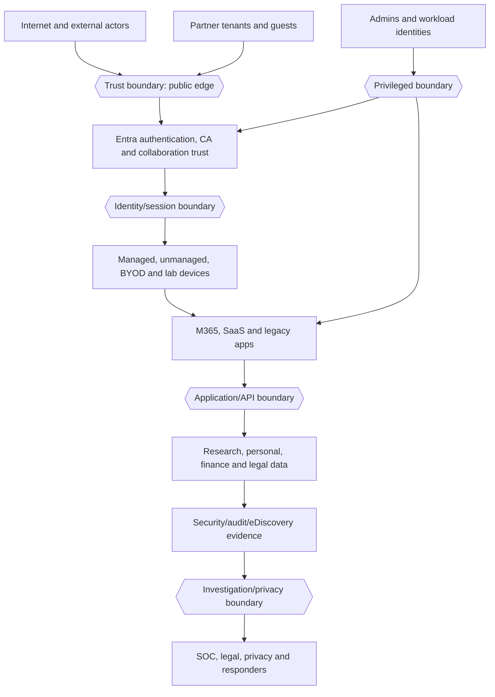

### Threat scenarios

| Threat | Path | Business impact | Design response |
|---|---|---|---|
| Phishing/account takeover | Email → click → credential/session → M365 data | Fraud, research disclosure | MDO, strong auth, risk CA, XDR, session/app scope |
| Guest oversharing | Stale guest/link → sensitive site/file | Contract/privacy breach | Sponsor/expiry, site/link ceiling, labels/DLP, access review |
| Unmanaged device download | Valid user → unmanaged endpoint → data | Offline leakage | Compliance/session controls, DLP, constrained web access |
| OAuth abuse | Consent/grant → app token → files/mail | Persistent covert access | Consent governance, app inventory, least privilege, XDR/Cloud Apps |
| Privileged misuse/compromise | Standing admin → broad changes | Tenant-wide impact | Separate personas, JIT, PAW, CA, audit, approvals |
| Endpoint compromise | User/device → process/network → identity pivot | Lateral movement/data access | Baseline/ASR/EDR, device risk to CA, segmentation/response |
| Detection blind spot | Connector/rule/queue failure | Delayed response | Source/rule/automation health and manual fallback |
| Destructive/incorrect control | Broad CA/DLP/retention/automation | Business outage/data impact | Report-only, rings, exclusions, rollback, emergency access |

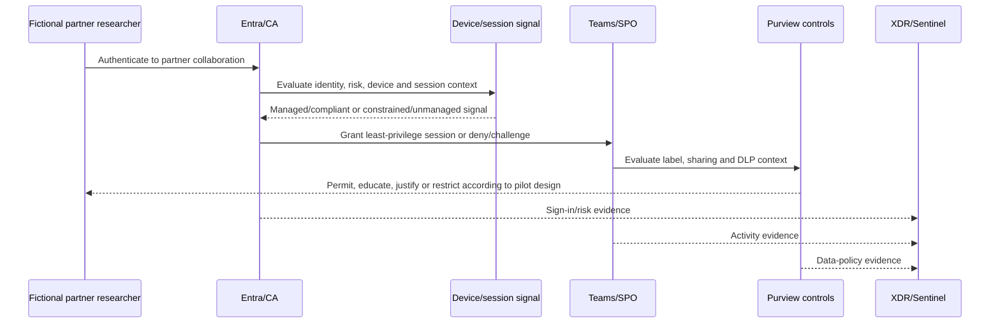

### 🔍 Plain-English deep-dive: trust boundaries are decision points

A trust boundary is like an airport checkpoint between zones with different assumptions. Crossing it should trigger identity, device, session, application, data, or privileged checks. A partner invited to one project is not automatically trusted for another; a managed device can become risky; a valid token may represent an abused app. Draw where trust changes, what signals are available, what decision is made, and what evidence proves it.

## 8. Target architecture: HLD

The **High-Level Design (HLD)** states major components, responsibilities, data/control flows, and design principles. The **Low-Level Design (LLD)** turns them into pilotable objects, scopes, dependencies, settings, and tests.

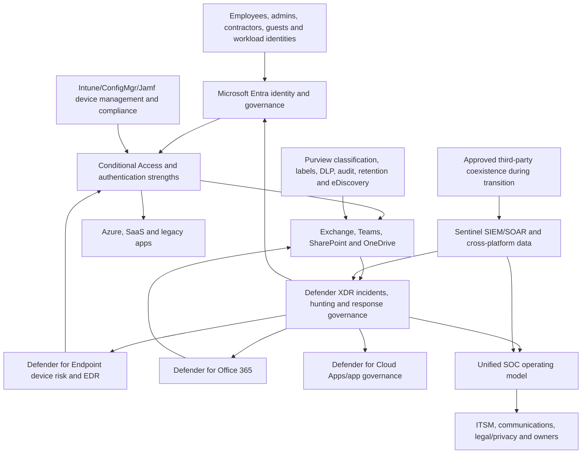

### HLD principles

| Principle | Architecture implication |
|---|---|
| Verify explicitly | Identity, risk, device, app, location/session and data context feed access decisions |
| Least privilege | Persona-specific access, JIT admin, app permissions, site/team membership and case roles |
| Assume breach | Segmentation, persistent data controls, cross-domain telemetry, response and recovery |
| Business-pattern controls | Partner research, BYOD, lab devices and admins get distinct journeys |
| One source of policy truth per setting | Resolve overlapping Intune/GPO/ConfigMgr/Jamf/EDR ownership |
| Data minimization | Collect/protect only needed telemetry/content; privacy approvals and retention |
| Automation with brakes | Approval/default deny for disruptive actions, idempotency, audit and rollback |
| Evidence over score | Configuration + operation + tests + failure + owner + residual risk |

## 9. LLD excerpts: identity, endpoint, data, XDR, and Sentinel

### Identity and Conditional Access

| Object | LLD excerpt | Scope/test |
|---|---|---|
| Persona groups | Standard employee, privileged admin, contractor, guest, service/workload, emergency access | Dynamic/static ownership and expiry validated |
| CA-01 | Require modern authentication/MFA or suitable authentication strength for pilot cloud apps | Report-only; pilot users; break-glass excluded/monitored |
| CA-02 | Require phishing-resistant strength for privileged pilot | Registration/recovery/PAW/help-desk tests |
| CA-03 | Require compliant device for regulated research pilot | Supported devices; constrained alternative for approved unmanaged cases |
| CA-04 | Block legacy authentication after evidence/remediation | Report-only logs, app inventory and rollback |
| CA-05 | Risk-based user/sign-in response if P2/licensed | Report-only, simulated detections and support path |
| PIM/JIT | Eligible roles, approval, MFA, duration, justification, audit | Separate admin account and emergency procedure |

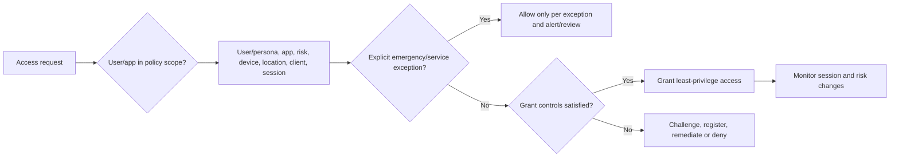

### Endpoint/Intune

| Design area | LLD excerpt | Coexistence control |
|---|---|---|
| Enrollment | Corporate Windows ring, Autopilot future state, BYOD MAM route, macOS ownership | No bulk enrollment; pilot identities/devices only |
| Compliance | OS support, encryption, secure boot/TPM where appropriate, firewall/AV/EDR health, password/device-risk signals | One authoritative setting/measurement per platform |
| Baselines | Current supported Windows/Edge/Office/Defender baselines customized | Export setting diffs; test conflicts and VDI/lab exceptions |
| Endpoint security | AV, firewall, ASR, disk encryption, EDR, vulnerability priorities | CrowdStrike/MDE mode and ownership explicitly tested |
| App protection | Data boundary on approved mobile apps for BYOD | User experience and selective wipe design |
| Exceptions | Lab instruments, VDI, shared devices, unsupported OS | Owner, compensating controls, expiry and retirement |

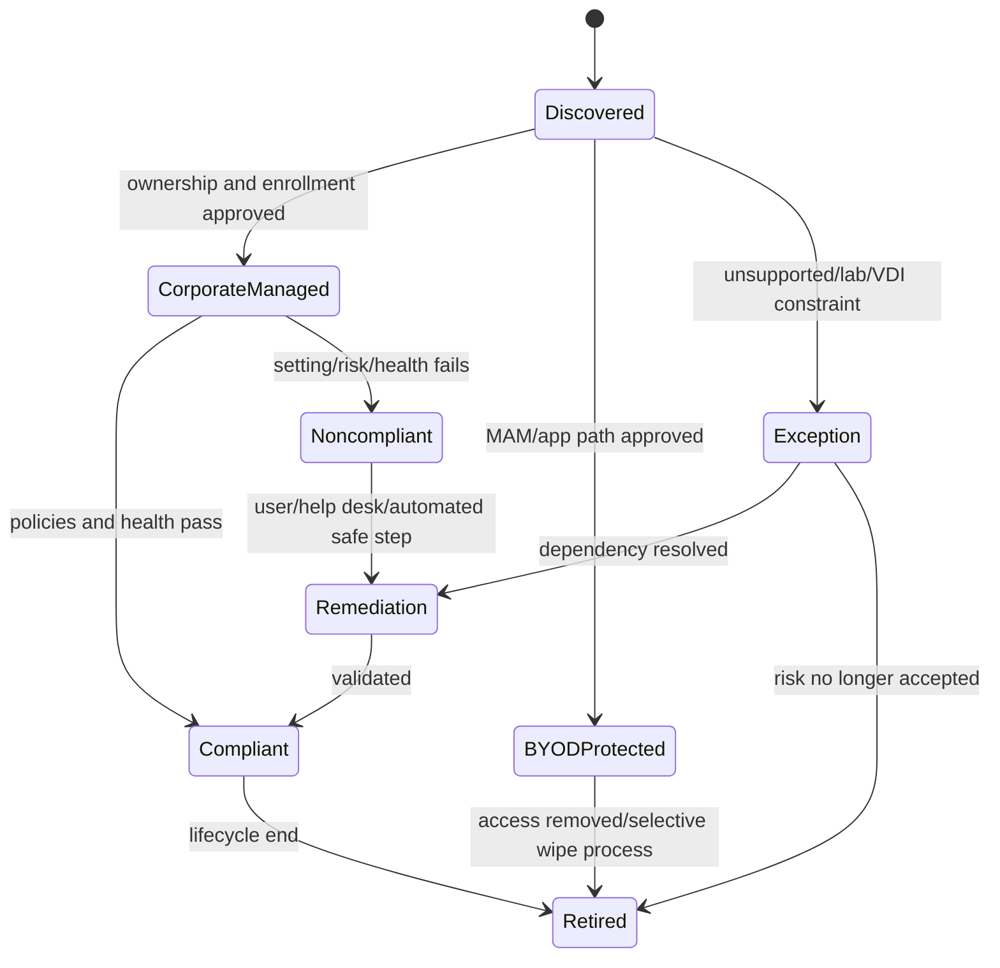

### Purview and workload protection

| Layer | LLD excerpt | Expected pilot evidence |
|---|---|---|
| Taxonomy | Public, Internal, Confidential, Highly Confidential with data-owner examples | User can choose correctly on synthetic corpus |
| Publishing | Small pilot; default/mandatory/downgrade decision | Label visibility and audit after propagation |
| Encryption | Named internal groups first; external design tested separately | Allowed/denied/recovery/compatibility evidence |
| DLP | Exchange, Teams, SPO, OD and endpoint design; test/simulation before warn/block | Match/no-match/tip/override/incident/false-positive evidence |
| Sharing | Tenant ceiling + site/team/link + guest lifecycle + unmanaged controls | Positive partner and denied/boundary paths |
| Retention/hold | Records schedule separate from matter hold | Lifecycle and legal authorization evidence |
| eDiscovery | Case roles, custodians, hold, collection, review, export, closure | Synthetic/paper chain and query tests |

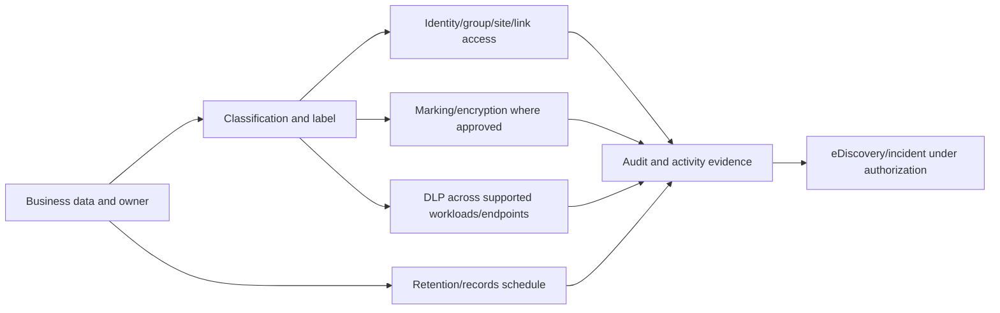

### XDR and Sentinel

| Capability | LLD excerpt | Guardrail |
|---|---|---|
| XDR | Unified incident queue across licensed email/endpoint/identity/app signals | Verify coverage/roles; source evidence remains authoritative |
| Hunting | Versioned KQL with stable IDs, UTC, known tests and schema ownership | Read-only; no production query claims from datatable |
| AIR/Action Center | Review automated findings/pending/history and exact undo support | Approval and business impact before action |
| Sentinel | Cross-platform use cases, source/value/cost plan, ASIM where useful | No duplicate ingestion without approved purpose |
| Analytics | Owner, hypothesis, data, tests, entity/MITRE, grouping, tuning | Disabled/simulation first |
| SOAR | Enrichment/ticket/approval before disruptive response | Managed identity, narrow RBAC, idempotency, default no action |

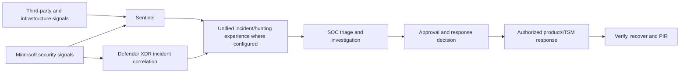

## 10. Control matrix, persona/license map, and options

### Control matrix

| Threat/outcome | Prevent | Detect | Respond/recover | Evidence |
|---|---|---|---|---|
| Account takeover | Strong auth, CA, app governance, least privilege | Entra risk, MDO/MDE/MDCA/XDR/Sentinel | Session/account/app/device workflow | Sign-in, incident, action, recovery test |
| Device compromise | Baseline, ASR, AV/firewall, patch/vulnerability, app controls | MDE/EDR/device health | Isolate/contain/reimage/recover under approval | Device timeline, health and recovery |
| External data leak | Guest lifecycle, sharing hierarchy, labels/encryption/DLP | Audit, explorer, DLP/XDR/Sentinel | Revoke access/link, investigate, notify by process | Item/access/policy/timeline |
| Privileged abuse | Separate admin, PAW, PIM/JIT, approval | Audit, role alerts, XDR/Sentinel | Remove role/session, validate tenant changes | Activation/change/audit records |
| Detection failure | Source/rule ownership and health | Freshness/schema/rule/automation monitoring | Manual fallback and owner escalation | Health/SLA/failure test |

### Persona/license capability map

Licensing must be verified from current Product Terms/service plans. The table expresses design need, not entitlement.

| Persona | Count | Needed outcomes | Candidate capability/license review |
|---|---:|---|---|
| Privileged admins | 85 | Strong auth, JIT, PAW/device trust, advanced detection | Entra P2/PIM, Intune, Defender Suite/E5-level capabilities as validated |
| High-risk researchers | 1,100 | Managed device, data protection, partner collaboration, XDR | E5 or E3 + targeted security/compliance add-ons analysis |
| Standard employees | 4,300 | MFA/CA, managed endpoint, MDO, collaboration/data baseline | Compare E3/E5/persona add-ons |
| Contractors | 700 | Time-bound least privilege, controlled device/app/data | External/contractor licensing and governance review |
| Frontline/field | 300 | Mobile/app protection and limited services | Frontline plan and add-on fit |
| SOC/security | 18+ | Advanced investigation/hunting/SIEM/SOAR | Defender/Sentinel/Purview role and license validation |
| Legal/compliance | 25 | Audit/eDiscovery/retention/IRM under governance | Purview capability/add-on review |
| Workload identities | 120 | Inventory, permissions, credential/risk lifecycle | Entra workload identity/app governance needs |

### Options analysis

| Option | Description | Advantages | Risks/constraints | Recommendation role |
|---|---|---|---|---|
| A: Optimize coexistence | Keep major third parties; strengthen Microsoft integration/governance | Lowest near-term migration risk; preserves specialist capabilities | Fragmented queues, duplicate cost/data, slower target simplification | Interim foundation |
| B: Microsoft-led consolidation | Shift selected identity/email/endpoint/CASB/SIEM functions to Microsoft over waves | Cross-domain XDR, integrated control/evidence, potential tool reduction | License, feature parity, migration, skill and contract risk | Preferred target subject to pilots/business case |
| C: Hybrid best-of-breed | Keep selected differentiators; consolidate incident/data governance | Balances capability and integration | Requires strong ownership/integration and may retain cost | Likely pragmatic end state for exceptions |

Recommendation: approve **B as a direction with C as an evidence-based exception model**, not a predetermined vendor replacement. Each migration requires capability parity, detection quality, response, operational, privacy, cost, contract, and rollback gates.

## 11. Third-party migration and coexistence

| Tool | Current role | Candidate Microsoft destination | Coexistence phase | Exit/retain gate |
|---|---|---|---|---|
| Okta | Selected SaaS federation/MFA | Entra ID/CA/identity governance where fit | App-by-app federation and auth coexistence | Modern auth, lifecycle, resilience, app owner signoff |
| CrowdStrike | Endpoint prevention/EDR | Defender for Endpoint | Supported coexistence/passive/active design per current vendor docs | Detection/prevention/response parity, performance, server/platform fit |
| Proofpoint | Mail gateway/protection | EOP/MDO | Documented mail-flow coexistence, avoid bypass/loops | Authentication, detection, quarantine, continuity, investigation parity |
| Netskope | CASB/SWG/session/data controls | Defender for Cloud Apps/Purview/Entra session controls where fit | Use-case split; avoid conflicting enforcement | SaaS coverage, inline needs, DLP, latency, user impact |
| Splunk | SIEM/correlation/retention | Sentinel for selected use cases | Dual-run only with time-bound sources/rules and cost ownership | Detection/retention/integration/economics/skills/SLA |
| CyberArk | PAM/secrets | Entra PIM plus retained vault/workload needs | Integrate identities; do not assume full replacement | Use-case capability and audit evidence |
| Jamf | macOS management | Intune evaluation or retained Jamf integration | Platform pilot and compliance signal integration | Feature/admin/user experience and support |

```mermaid
flowchart LR
    BASE[Baseline capabilities, detections, workflows, cost and contracts] --> MAP[Map current use cases to target controls]
    MAP --> GAP[Identify parity gaps and intentional differences]
    GAP --> PILOT[Pilot coexistence with synthetic journeys]
    PILOT --> DUAL[Time-bound dual run where justified]
    DUAL --> COMPARE[Compare efficacy, noise, latency, operations, user impact and cost]
    COMPARE --> GATE{Exit criteria met?}
    GATE -->|No| RETAIN[Retain/tune or remediate gap]
    GATE -->|Yes| MIGRATE[Approved wave migration]
    MIGRATE --> ROLLBACK[Rollback window and source configuration]
    ROLLBACK --> DECOM[Decommission only after evidence/contract/data exit]
```

### Migration controls

| Risk | Control |
|---|---|
| Duplicate or conflicting enforcement | Explicit control owner and mode by setting/use case |
| Visibility gap during cutover | Dual telemetry/health checks with time-bound cost approval |
| Mail loop/bypass | End-to-end route/header/authentication test and emergency revert |
| Endpoint performance/conflict | Platform/ring/performance/prevention/EDR mode testing |
| Detection loss | Rule-by-rule use-case backtest and incident tabletop |
| Data retention/export loss | Legal/privacy/records-approved export and destruction plan |
| Contract lock-in | Renewal/notice/exit-assistance milestones in roadmap |
| Skills gap | Training, shadow operation, runbook acceptance and hypercare |

### 🔍 Plain-English deep-dive: coexistence is a controlled transition state

Coexistence is like running an old and new railway signal system during a staged upgrade. Both systems might observe the same train, but only one should own each safety decision; otherwise conflicting signals, duplicate alarms, extra cost, and unclear accountability follow. For every Okta/Entra, CrowdStrike/MDE, Proofpoint/MDO, Netskope/Microsoft, or Splunk/Sentinel overlap, name the owner of prevention, detection, investigation, response, evidence, support, and cost. Time-box the overlap, test the same synthetic journeys in both tools, define which result wins, and retain a rollback window. “Both are enabled” is not a coexistence design.

## 12. Phased roadmap and business case

| Phase | Timing | Outcomes | Exit criteria |
|---|---|---|---|
| 0 Mobilize | Weeks 0-4 | Governance, scope, evidence, inventory, privacy/cost gates | Charter/RAID/owners accepted |
| 1 Stabilize | Months 1-3 | Emergency access, privileged/MFA gaps, source health, critical sharing, incident runbooks | Critical risks have interim controls/tests |
| 2 Foundation pilots | Months 2-6 | CA/Intune/Purview/XDR/Sentinel synthetic pilots | Test/rollback/user/SOC acceptance |
| 3 Scale | Months 5-12 | Persona/ring rollout, workload/data governance, owned detections | Coverage and SLA targets by wave |
| 4 Consolidate | Months 8-18 | Contract-aligned third-party migration/retention decisions | Capability/cost/operations exit gates |
| 5 Optimize | Ongoing | Metrics, threat-led tuning, automation, access/data lifecycle | Quarterly evidence and improvement loop |

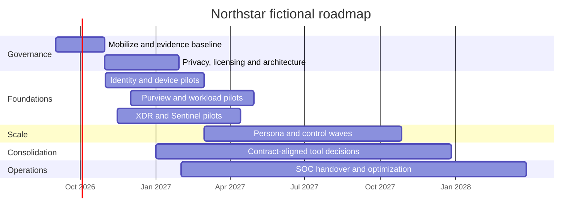

The dates in this **fictional roadmap** are planning examples created from the August 24, 2026 baseline; they are not claims that future work occurred. Implementation dates must be reset by a real sponsor.

### Business case

| Value category | Baseline input | Benefit hypothesis | Measurement |
|---|---|---|---|
| Risk reduction | High-priority findings/incidents | Fewer high-risk identity/data paths | Tested coverage and residual-risk trend |
| Analyst efficiency | Queue/tool switches and triage time | Unified incidents and enrichment reduce manual correlation | Median triage/investigation time with quality guardrail |
| Tool economics | License, ingest, support, contract spend | Remove proven duplicate capabilities | Annualized total cost after migration/exit costs |
| User productivity | Help-desk/security friction | Persona controls and clearer tips reduce avoidable interruption | Failure/ticket/exception and satisfaction trends |
| Audit readiness | Evidence collection time/gaps | Owned controls and evidence registers shorten response | Evidence SLA and test completion |

$$
\text{Net benefit} = \text{avoided/reduced cost} + \text{productivity value} + \text{risk-adjusted benefit} - \text{license} - \text{implementation} - \text{run} - \text{migration/exit}
$$

Do not claim that a security control “saves the cost of a breach” as guaranteed cash. Use ranges, assumptions, sensitivity analysis, and finance-approved methods. Include dual-run, data egress, professional services, training, support, Logic Apps/Sentinel ingestion, retention, and decommissioning costs.

## 13. Detailed integrated pilot

### Pilot personas and setup

| Cohort | Fictional count | Purpose | Exclusions |
|---|---:|---|---|
| Standard employee | 20 | MFA/CA, Windows compliance, MDO, labels/DLP | Critical operational accounts |
| Researcher | 15 | Regulated site, partner access, managed/unmanaged journey | Real research data |
| Privileged admin | 5 | Strong auth, separate persona, managed device, JIT | Emergency accounts |
| Contractor/guest | 10 | Sponsor/expiry, Teams/SPO patterns, constrained access | Real external identities; paper personas only unless owned test tenant |
| SOC/help desk | 8 | Incident, evidence, runbook, support and recovery | No broad production permissions |

### Pilot workstreams and steps

| Workstream | Setup/steps | Expected evidence |
|---|---|---|
| Conditional Access | Baseline sign-ins; create report-only pilot policies; exclude/monitor emergency identities; run What If plus synthetic user/app/device/risk journeys; approve limited enablement only after support/rollback | Report-only results, sign-in details, inclusion/exclusion, challenge/success/failure, emergency test |
| Intune | Reconcile test devices; enroll only owned fictional devices; assign compliance/baseline rings; review setting conflicts; connect device-compliance/risk signal design; test remediation and retirement | Enrollment, policy status, compliance cause, conflict, CA signal, recovery/cleanup |
| Purview | Approve synthetic taxonomy/corpus; publish non-encrypted labels first; simulate DLP; test tip/override/incident; paper external encryption/eDiscovery/retention | Label visibility, match/no-match, explorer/audit, false-positive tune, rollback |
| XDR | Verify licensed product health; use built-in/tenant-approved demos or fictional Part 69 cards; incident queue, entity, hunting, AIR/Action Center review; no response execution | Attack story, scope query, evidence class, do-not-execute decision and PIR |
| Sentinel | Cost gate; use Part 70 datatable by default; paper connector/DCR/ASIM; backtest disabled analytic; synthetic incident/workbook; disabled/paper approval playbook | 26 queries, rule test, entity/MITRE, incident, automation timeout, cost/cleanup |

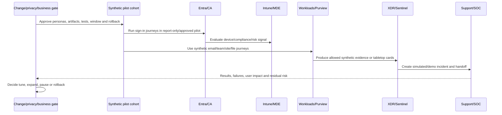

### Pilot success criteria

| Measure | Target for fictional decision | Guardrail |
|---|---|---|
| CA coverage | 100% pilot journeys evaluated as designed | Zero emergency-access lockout |
| Device policy | ≥95% eligible pilot devices reach intended state | No unresolved critical baseline conflict |
| Label choice | ≥90% seeded scenarios correctly labelled after training | No real sensitive/external content |
| DLP precision | ≥90% on labelled synthetic corpus | False negative reviewed, not hidden |
| XDR triage | Attack story scoped within 30-minute tabletop | No action execution |
| Sentinel rule | Known tests pass; no duplicate synthetic incidents | Zero real-log ingestion by default |
| Support | All failures have owner/runbook and recover within fictional SLA | Accessibility and regional support included |

## 14. End-to-end test matrix

| ID | Type | Scenario | Expected/simulated result | Rollback/failure evidence |
|---|---|---|---|---|
| C71-T01 | Positive | Standard user, correct MFA, compliant managed device | Access granted; policy and device evidence correlate | Remove pilot assignment only if needed |
| C71-T02 | Negative | Wrong/insufficient authentication for admin | Access denied/challenged according to design | Emergency access unaffected/monitored |
| C71-T03 | Boundary | User belongs to pilot and exception group | Defined policy resolution; conflict eliminated | Fix group ownership, not broad exclusion |
| C71-T04 | Failure | CA report-only predicts admin lockout | Do not enable; correct scope/dependency | Decision log and retest |
| C71-T05 | Positive | Managed Windows device meets compliance | Compliance signal available to CA | Unassign/delete synthetic device under plan |
| C71-T06 | Negative | Unsupported device requests regulated site | Denied or constrained approved web path | Help-desk/business alternative |
| C71-T07 | Failure | Intune baseline conflicts with existing policy | Per-setting conflict detected; pilot paused | Restore owner setting/prior profile |
| C71-T08 | Positive | Synthetic restricted file in test site | Label/DLP match/tip/incident as mode designs | Remove policy publication/test file |
| C71-T09 | Negative | Benign counterexample file | No high-confidence DLP match | Tune if false positive |
| C71-T10 | Boundary | External partner encryption/sharing | Paper-only unless two owned test tenants; lifecycle/recovery validated | Revoke synthetic access and verify |
| C71-T11 | Failure | Explorer/audit event absent | Role/time/support/latency/license investigated; no fabrication | Record expected/no-result |
| C71-T12 | Positive | Fictional cross-domain alert cards | XDR incident, entities and timeline correlate | No containment action |
| C71-T13 | Failure | AIR recommends wrong-scope action | Reviewer rejects on paper and tunes process | Action Center/history logic reviewed |
| C71-T14 | Positive | Sentinel datatable spray sequence | Analytic/backtest creates one simulated alert | Disable/delete test rule if deployed |
| C71-T15 | Failure | Sentinel connector latency/query error | Health incident/manual fallback | DCR/rule rollback design |
| C71-T16 | Failure | Playbook approval timeout | Default no action; manual escalation | Disable workflow/rule and inspect queue |
| C71-T17 | Migration | Proofpoint/MDO coexistence message path | No loop/bypass; trace/header ownership clear | Restore prior mail route under approved plan |
| C71-T18 | Migration | CrowdStrike/MDE coexistence test | Performance/detection/mode/response ownership clear | Restore prior mode/policy |
| C71-T19 | Recovery | Pilot user loses access incorrectly | Help desk identifies policy/device cause and restores through approved path | Recovery time and root cause recorded |
| C71-T20 | Privacy | Evidence pack review | Synthetic/redacted, least privilege, retention assigned | Remove excess evidence/access |

### Expected result record

For each test, store `TestId`, requirement, preconditions, synthetic input, expected result, actual result, evidence class, UTC, source IDs, pass/fail, discrepancy, defect owner, retest, rollback result, privacy note, and approver. A screenshot without these fields is weak evidence.

## 15. Cutover, rollback, and hypercare

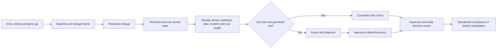

| Cutover domain | Entry criteria | Rollback trigger | Rollback |
|---|---|---|---|
| CA | Report-only/What If/tests/support/emergency path pass | Lockout, critical app failure, unexplained denial | Disable pilot policy or remove pilot assignment through emergency procedure; preserve logs |
| Intune | Inventory, enrollment, conflicts, recovery and owner pass | Device instability, compliance false failure, business app impact | Unassign/revert profile according to setting ownership; validate device |
| Purview | Taxonomy/corpus/propagation/help/false-positive pass | Data access break, broad false positive, external/recovery failure | Return policy to simulation/unpublish; handle existing protection explicitly |
| XDR | Coverage/queue/roles/runbooks/approvals pass | Duplicate/lost incidents or unsafe automation | Disable automation, restore source queue ownership |
| Sentinel | Cost/source/rule/entity/incident/health/cleanup pass | Unexpected spend, ingestion gap, alert storm, workflow loop | Disable flow/rule/playbook; restore previous SIEM path |
| Third party | Parity, contract, export, owner, support pass | Detection/control/availability gap | Restore prior route/agent/policy within agreed coexistence window |

### Hypercare model

| Cadence | Review |
|---|---|
| Real-time/on-call | Lockout, device outage, mail flow, data access, alert storm, automation action |
| Twice daily first week | Incidents, user tickets, policy failures, connector health, costs, exceptions |
| Daily decision call | Expand/pause/rollback, defects, owners, communications |
| Weekly | KPI trend, false positives/negatives, adoption, risk, contract/dependency |
| Exit review | Acceptance criteria, open risks, runbook ownership, support transition |

## 16. SOC operating model, RACI, runbooks, SLA, and KPI

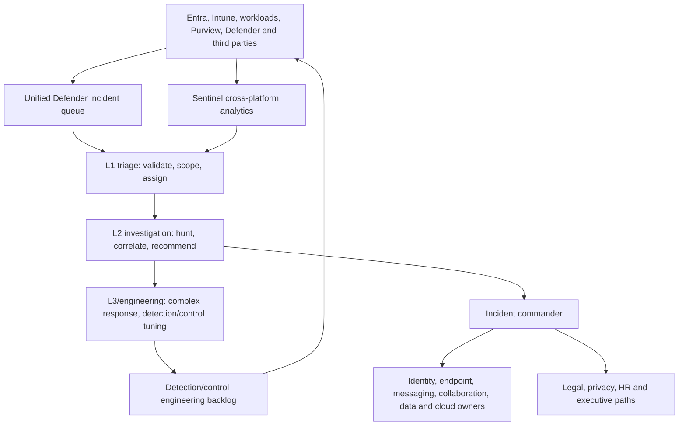

### RACI

| Activity | SOC | Identity | Endpoint | Workloads/Data | Privacy/Legal | Business owner | Change/ITSM |
|---|---|---|---|---|---|---|---|
| Identity incident triage | R | C | C | I | C | I | I |
| Device containment decision | R | C | A/R | I | C | C | I |
| Mail purge/release | C | I | I | A/R | C | I | I |
| Guest/data access revocation | C | C | I | A/R | C | C | I |
| DLP/eDiscovery case | C | I | I | R | A | C | I |
| Analytics/playbook change | A/R | C | C | C | I | I | C |
| Major incident command | R | R | R | R | C | A for business | C |
| Risk acceptance | C | C | C | C | C | A | I |

### Runbook catalog

| Runbook | Trigger | Core flow | Recovery/closure |
|---|---|---|---|
| RB-01 Account compromise | Risky sign-in/XDR incident/user report | Validate identity/session/device/app/mail; scope; approved contain | Secure auth, restore user, monitor, PIR |
| RB-02 Phishing/BEC | Message/click/report/payment anomaly | Message/header/recipient/click/account scope; finance/legal path | Mail/account remediation, payment process, control tune |
| RB-03 Endpoint incident | High-confidence MDE/EDR behavior | Device/process/network/user scope; evidence; authorized isolation | Reimage/recover/access restore and monitoring |
| RB-04 Oversharing/DLP | DLP/share alert or report | Item/owner/access/link/label/user context; privacy/legal threshold | Revoke/narrow, support user, tune and evidence |
| RB-05 OAuth/app abuse | Risky app/consent/activity | App IDs, grants, tokens, users, data, owner | Remove approved access, rotate credentials, restore business app |
| RB-06 SIEM/SOAR health | Source/rule/automation latency/failure | Plane/source/schema/role/cost diagnosis; manual fallback | Restore, replay where safe, validate missed window |

### SLA and KPI

| Metric | Fictional target | Quality caveat |
|---|---|---|
| P1 acknowledge | 15 minutes, 24x7 | Acknowledgement is not investigation quality |
| P1 containment decision | 60 minutes | Decision may be “do not contain yet” with rationale |
| Critical source freshness | Within owner-defined expected latency | Quiet source must alert |
| High detection ownership/test | 100% named owner and quarterly known tests | Mapping alone is not coverage |
| False-positive review | Top noisy rules monthly | Suppression must not hide true positives |
| Access-review completion | ≥98%, overdue escalated | Rubber-stamp completion is failure |
| Pilot lockout | 0 critical; all recovery tested | Low ticket count can hide abandonment |
| PIR action closure | ≥90% by approved due date | Verify effectiveness, not checkbox closure |

## 17. Fictional incident and PIR

**Scenario:** A synthetic benefits-themed message is followed by a fictional endpoint process card, risky sign-in, OAuth consent, and research-file access. This reuses the safe Part 69 pattern; no message, link, file, malware, account, device, or response action exists.

```mermaid
sequenceDiagram
    participant M as MDO email alert card
    participant E as MDE endpoint card
    participant I as Entra identity card
    participant A as Cloud app/data cards
    participant X as XDR/Sentinel incident
    participant SOC as Northstar SOC tabletop
    M->>X: Message and click signals
    E->>X: Process/network signal
    I->>X: Risky sign-in/session signal
    A->>X: Consent and file-access signals
    X->>SOC: Correlated fictional incident
    SOC->>SOC: Scope facts, hypotheses, business impact and approvals
    SOC-->>X: Paper containment/recovery decision; no execution
```

| Incident phase | Simulated action/outcome |
|---|---|
| Triage | High/P1 candidate due to admin/research context; exfiltration unconfirmed |
| Scope | One persona, mailbox, device card, session, app, synthetic site; datatable finds no others |
| Evidence | Headers, URL/file metadata, process/network, sign-in/risk, app activity; all simulated |
| Containment | Recommend session/account/app/device/mail/data actions only after named approvals; do not execute |
| Recovery | Strong auth re-registration, known-good device, app review, permissions/data validation, user support |
| Closure | Training simulation; no real impact; all hypotheses classified and actions assigned |

### PIR

| Question | Northstar lesson |
|---|---|
| Root/control cause | Layered identity/email/app/data controls and unified response were inconsistent; not merely “user clicked” |
| What worked | Correlated IDs, UTC timeline, cross-domain owner model, approval gates |
| What failed | Device-session link, app consent governance, data-impact evidence and queue ownership |
| Improvements | CA/auth strength, MDO, MDE health, app governance, Purview, XDR/Sentinel detections, runbooks |
| Measures | Detection/triage time, source health, test pass, recurrence, user recovery and false positives |

## 18. Troubleshooting, cleanup, and engagement closure

| Symptom | Diagnostic approach | Unsafe shortcut |
|---|---|---|
| CA blocks pilot unexpectedly | Policy scope/result, user/app/device/risk/client, report-only/What If, group propagation | Excluding all users or disabling tenant controls blindly |
| Device noncompliant | Exact setting/source, ownership, sync, platform support, conflict, MDE signal | Marking device compliant manually without root cause |
| Label/DLP missing | License, role, scope, client/workload support, propagation, classifier/mode | Uploading real data or publishing tenant-wide |
| XDR incident incomplete | Licensed source health, entity IDs, time, alert status/correlation, RBAC | Linking unrelated alerts by intuition |
| Sentinel quiet | Connector freshness, table, DCR/schema, query/rule, cap/cost, service health | Calling “no alerts” success |
| Playbook failure | Trigger, identity/role/scope, connector, run history, retries/idempotency | Granting broad Owner or repeated action |
| Migration parity disputed | Agreed use-case/test evidence, version/contract, operational and user measures | Vendor-feature checklist without outcomes |

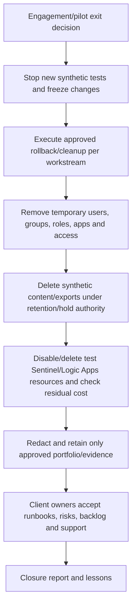

### Closure checklist by owner

| Owner | Acceptance |
|---|---|
| Sponsor | Outcomes, residual risk, roadmap, funding/decision |
| Architecture | HLD/LLD, standards, exceptions, dependencies |
| Technical teams | Config/runbook/test/rollback/source ownership |
| SOC | Queue, detections, playbooks, SLA, handoff and escalation |
| Privacy/legal | Evidence, investigation, retention/hold and monitoring guardrails |
| Finance/procurement | License, cost model, contracts, exits, residual spend |
| Support/adoption | User communications, training, help-desk and accessibility |

## 19. Executive one-page, readout, and deck outline

### One-page executive brief

**Situation:** Northstar's hybrid identity, multiple endpoint/workload/security tools, partner-heavy collaboration, and fragmented SOC create inconsistent access, data, detection, and response outcomes.

**Top risks:** privileged/account takeover; unmanaged/stale collaborator access to research data; inconsistent device trust; split phishing/endpoint/app evidence; SIEM/tool duplication and detection health gaps.

**Recommendation:** adopt a Microsoft-led Zero Trust target with evidence-based third-party exceptions. Stabilize critical identity/sharing/incident controls first; pilot CA, Intune, Purview, XDR, and Sentinel on synthetic cohorts; scale by persona and business journey; migrate tools only after parity, operations, cost, privacy, contract, and rollback gates.

**Investment decision:** fund mobilization and pilots now; reserve migration funding after pilot/contract gates. Validate licenses/service plans and Sentinel/automation costs using current agreements.

**Measures:** privileged strong-auth/JIT coverage; governed guest/device/data journeys; detection/source health; triage/response quality; failed access/user impact; verified tool cost removal; PIR actions closed and retested.

**Residual risk:** legacy apps/lab devices, partner variability, incomplete data taxonomy, contract timing, and operational skills remain until roadmap milestones close them.

### Readout agenda

| Minutes | Topic | Decision |
|---:|---|---|
| 0-5 | Outcomes, scope and evidence honesty | Confirm shared facts |
| 5-12 | Current-state story and top risks | Confirm priorities/owners |
| 12-22 | Target architecture and control journeys | Approve design direction |
| 22-30 | Options, licensing, third-party migration | Choose option/gates |
| 30-38 | Roadmap, pilot and business case | Approve pilot funding/scope |
| 38-43 | Operating model, SLA/KPI and handover | Approve accountability |
| 43-45 | Decisions and next 30 days | Name owners/dates |

### Deck outline

1. Executive context and desired outcomes.
2. Scope, assumptions, constraints, evidence confidence and honesty.
3. Northstar business/technology/data landscape.
4. Current-state identity/device/data/SecOps diagrams.
5. Top findings, risk heatmap and maturity.
6. Secure Score caveat and evidence method.
7. Threat model, critical journeys and trust boundaries.
8. Target Zero Trust HLD.
9. Identity/endpoint/workload/data/SecOps LLD highlights.
10. Persona/license map and options.
11. Third-party coexistence/migration gates.
12. Phased roadmap and dependencies.
13. Pilot, tests, rollback and hypercare.
14. SOC operating model, RACI, runbooks and metrics.
15. Business case, residual risk and decisions.

## 20. Technical defense questions

| Challenge | Defensible response |
|---|---|
| Why not enable every Secure Score recommendation? | Score is an input; map each action to threat, license, business impact, alternative control, test and owner. |
| Why not deploy CA tenant-wide? | Access failures can be severe; use baseline evidence, report-only, What If, pilot rings, emergency access, dependency and rollback tests. |
| How do Intune and MDE differ? | Intune manages configuration/compliance/apps; MDE provides endpoint prevention/detection/response/risk signals. They integrate but do not replace each function universally. |
| Why keep CrowdStrike/Jamf/CyberArk? | Retain where proven platform/use-case/contract/operations value exceeds consolidation benefit; decide through evidence gates. |
| How do you secure partner research? | Sponsor/expiry, correct guest/shared model, CA/session/device path, site/link/access governance, labels/DLP/encryption, audit and review. |
| Why not encrypt every confidential file? | Encryption can break partner/app/search/recovery workflows; classify need, pilot rights/compatibility/lifecycle, and use layered access/DLP. |
| Sentinel or XDR? | XDR correlates Microsoft security domains; Sentinel provides SIEM/SOAR and cross-platform data/use cases. Design unified operations and avoid purposeless duplicate ingestion. |
| Splunk migration first or controls first? | Stabilize use cases, source health, ownership and incident processes before migration; dual-run only where decision evidence justifies cost. |
| How do you prove DLP works? | Labelled synthetic corpus, positive/negative/boundary tests, tips/overrides/incidents/audit, false-positive tuning, user/business outcomes and rollback. |
| How do you protect emergency access? | Dedicated cloud-only identities as currently recommended, strong credential custody, exclusions only where required, monitoring, regular tests and named ownership. |
| What about service/workload identities? | Inventory owner/purpose/permissions/credential, prefer managed identity/certificate where suitable, apply CA/workload controls by support, monitor and expire. |
| How do you avoid employee surveillance? | Lawful purpose, minimization, pseudonymization, role separation, approval, no unnecessary content, retention/deletion, due process and no automated discipline. |
| What is rollback for an encrypted label? | Unpublishing is not decryption; test rights/recovery and use supported relabel/remove-protection workflow for synthetic items before deployment. |
| What is the most important SOC KPI? | No single KPI; pair timeliness with detection quality, source health, scope accuracy, recovery, recurrence, user impact and verified control improvement. |
| How do you handle a board demand for a single score? | Provide a concise risk/control outcome dashboard with definitions and trends; explain uncertainty and avoid presenting Secure Score as breach probability. |

## 21. Portfolio package and interview wording

| Portfolio artifact | Sanitization/honesty rule |
|---|---|
| Engagement charter and scenario | State fictional on every executive artifact |
| Discovery/evidence/RAID | No real organization/person/tenant data |
| Current/target architecture | Reserved names and synthetic quantities |
| Assessment/findings | Evidence class and assumptions visible |
| Requirements/threat/control matrix | No claim of legal determination |
| License/options/business case | Placeholder/current-source inputs, not quote |
| Pilot/test/cutover | Design-only unless exact prior lab observation cited |
| SOC/incident/PIR | Fictional scenario, no attacks or response actions |
| Executive deck/readout | “Portfolio simulation” footer and residual risks |

### Interview-ready capstone summary

> “I built an end-to-end fictional Microsoft 365 security transformation for Northstar, a 6,200-employee hybrid research cooperative. I led the scenario from discovery and evidence through maturity/risk findings, threat model, Zero Trust HLD/LLD, control and persona/license maps, third-party coexistence, roadmap and business case. I designed detailed Conditional Access, Intune, Purview, XDR, and Sentinel pilots with positive, negative, boundary, failure, rollback, cutover and hypercare tests, then created a SOC RACI, runbooks, SLA/KPI, handover, incident/PIR, and executive deck. It is design-only by default, not Deloitte client work or documented production security work. I label prior isolated-lab evidence as observed and everything else simulated or expected.”

## 22. Official Source Anchors

These official sources were checked for the August 24, 2026 baseline. A real engagement must recheck page dates, canonical URLs, target cloud/region, product limits, previews, portal state, roles, licensing, Product Terms, and organization contracts.

| Topic | Official source | Design use |
|---|---|---|
| Zero Trust foundation | [Zero Trust as a security foundation](https://learn.microsoft.com/security/zero-trust/zero-trust-overview) | Verify explicitly, least privilege, assume breach and structured adoption |
| Zero Trust pillars | [Zero Trust deployment for technology pillars](https://learn.microsoft.com/security/zero-trust/deploy/overview) | Identity, endpoints, data, apps, infrastructure, network and SecOps architecture |
| Adoption strategy | [Develop a Cloud Adoption Strategy](https://learn.microsoft.com/azure/cloud-adoption-framework/strategy/) | Business outcomes, leadership, operating model, cost, resilience and iteration |
| Secure Score | [Microsoft Secure Score](https://learn.microsoft.com/defender-xdr/microsoft-secure-score) | Recommendations, scoring, permissions, products and explicit risk-awareness caveat |
| Conditional Access | [Microsoft Entra Conditional Access: Zero Trust Policy Engine](https://learn.microsoft.com/entra/identity/conditional-access/overview) | Signals, decisions, policy examples, portal and license requirements |
| CA deployment | [Plan a Conditional Access deployment](https://learn.microsoft.com/entra/identity/conditional-access/plan-conditional-access) | Report-only, emergency access, dependencies, testing and rollout |
| Identity Protection | [What is Microsoft Entra ID Protection?](https://learn.microsoft.com/entra/id-protection/overview-identity-protection) | Risk detections/sign-ins/users, remediation, roles and P2 caveats |
| Intune baselines | [Intune security baselines for Windows devices](https://learn.microsoft.com/intune/device-security/security-baselines/overview) | Current baseline versions, conflict, platform and preview cautions |
| Intune compliance/CA | [Device compliance and Conditional Access](https://learn.microsoft.com/intune/intune-service/protect/device-compliance-get-started) | Compliance architecture and access integration |
| Defender for Endpoint | [Microsoft Defender for Endpoint](https://learn.microsoft.com/defender-endpoint/microsoft-defender-endpoint) | Platforms, plans, capabilities, privacy and deployment links |
| Defender XDR | [What is Microsoft Defender XDR?](https://learn.microsoft.com/defender-xdr/microsoft-365-defender) | Cross-domain protection, incidents, hunting and automation |
| Defender for Office 365 | [Why do I need Microsoft Defender for Office 365?](https://learn.microsoft.com/defender-office-365/mdo-about) | Built-in/P1/P2 ladder, mail/collaboration protection and plan caveats |
| Exchange Online Protection | [Exchange Online Protection overview](https://learn.microsoft.com/defender-office-365/eop-about) | Mail filtering/protection baseline |
| Teams guest/external | [Plan for external collaboration in Teams](https://learn.microsoft.com/microsoft-365/solutions/collaborate-with-people-outside-your-organization) | Guest, external and collaboration planning |
| SharePoint/OneDrive sharing | [External sharing overview](https://learn.microsoft.com/sharepoint/external-sharing-overview) | Tenant/site sharing, guests and link governance |
| Purview | [Learn about Microsoft Purview](https://learn.microsoft.com/purview/purview) | Current data security, governance, compliance and AI solution families |
| Purview DLP | [Learn about data loss prevention](https://learn.microsoft.com/purview/dlp-learn-about-dlp) | Locations, lifecycle, simulation, policy and evidence |
| eDiscovery | [Get started with the current eDiscovery experience](https://learn.microsoft.com/purview/edisc) | Current case/hold/collection/review/export workflow |
| Sentinel | [What is Microsoft Sentinel SIEM?](https://learn.microsoft.com/azure/sentinel/overview) | Current SIEM/SOAR, Defender portal, data, detection and response direction |
| Sentinel cost | [Plan costs and understand pricing and billing](https://learn.microsoft.com/azure/sentinel/billing) | Tiers, meters, benefits, retention, data lake and additional services |
| M365 service descriptions | [Microsoft 365 and Office 365 service descriptions](https://learn.microsoft.com/office365/servicedescriptions/) | Current service/plan capability validation |
| Product Terms | [Microsoft Product Terms](https://www.microsoft.com/licensing/terms/) | Current commercial and licensing terms |
| NIST CSF 2.0 | [NIST Cybersecurity Framework](https://www.nist.gov/cyberframework) | Govern/Identify/Protect/Detect/Respond/Recover outcome cross-check |
| NIST Zero Trust | [NIST SP 800-207](https://csrc.nist.gov/pubs/sp/800/207/final) | Vendor-neutral Zero Trust architecture principles |

---

## ⭐ Likely Interview Questions for This Section

### Q1. How would you structure a Microsoft 365 security transformation?

> **Model answer:** I start with business outcomes, scope, decision rights, critical journeys, data, obligations, incidents, constraints, and evidence. I assess identity, devices, workloads, data and SecOps using configuration, operations and tests; prioritize findings by business risk; then create traceable requirements, threat model, HLD/LLD, controls, licensing/options, migration gates, roadmap and business case. I pilot in rings with failure/rollback, hand over runbooks/SLA/KPI, and drive continual improvement through incidents and control testing.

### Q2. What are Northstar's highest-priority risks and why?

> **Model answer:** Privileged/account takeover, stale partner/guest access to research data, inconsistent device trust, fragmented phishing-to-endpoint-to-identity response, and unowned SIEM/control health. They combine high-impact assets with material exposure and incomplete controls. I would stabilize emergency/privileged identity, critical collaboration/data paths, and incident/source health first, then validate broader transformation through pilots.

### Q3. How do you use Secure Score responsibly?

> **Model answer:** As a discovery and trend input, not breach probability, certification, or the target architecture. I map each recommendation to a threat and business requirement, verify license/current state, evaluate user/operational impact and alternative mitigation, assign an owner, and require design/operation/test evidence. The executive dashboard includes risk and control outcomes beyond the score.

### Q4. How would you choose between Microsoft consolidation and third-party tools?

> **Model answer:** I baseline actual use cases, coverage, efficacy, response, integrations, data/retention, operations, user experience, cost, contracts and skills. I pilot coexistence, compare known tests and incidents, and migrate only when exit criteria and rollback are proven. Microsoft-led consolidation can improve cross-domain correlation, but specialist tools remain where evidence shows material value or requirements are unmet.

### Q5. How would you pilot Conditional Access, Intune, Purview, XDR, and Sentinel together?

> **Model answer:** Use fictional persona cohorts and synthetic data, baseline first, verify licenses/roles/privacy/cost, and start with CA report-only, narrow Intune rings, non-encrypted labels plus DLP simulation, read-only XDR demos/cards, and Sentinel datatables/disabled analytics. Test positive, negative, boundary, failure, recovery, rollback and support journeys. Expand only when technical, business, user, SOC and cost guardrails pass.

### Q6. How do you prevent the transformation from becoming a business outage?

> **Model answer:** No big bang. I map critical journeys/dependencies, use report-only/simulation/disabled modes, pilot by persona/ring, protect and test emergency access, define entry/exit and go/no-go, monitor health/user impact, keep named rollback owners and prior configurations, and run hypercare with pause/rollback authority. Exceptions are owned, monitored and expiring.

### Q7. What does good operational handover look like?

> **Model answer:** Named source/control/detection/runbook owners; least-privilege access; architecture/config/query versions; positive/negative/failure tests; incident and manual fallback procedures; RACI; SLA/KPI with quality caveats; escalation and vendor contacts; training/shadow shifts; accepted backlog/residual risk; and a formal readiness exercise. Handover ends when operations demonstrate the process, not when documents are uploaded.

### Q8. How do you present this capstone honestly?

> **Model answer:** I call it a fictional portfolio transformation for Northstar and state that it is design-only by default. I explain my analysis and deliverables, connect them to my real SharePoint/OneDrive, migration, incident, RCA and stakeholder strengths, and identify exact earlier isolated-lab observations separately. I do not claim Deloitte client delivery, Northstar production implementation, real SOC operation, employee monitoring, or controls I only simulated or expected.

## 🧠 30-Second Memory Hooks

- **Outcome → evidence → risk → requirement → architecture → pilot → operate.**
- **Zero Trust:** verify explicitly, least privilege, assume breach.
- **Inventory relationships, not just counts.**
- **Score is a compass, not breach probability.**
- **HLD says components and responsibility; LLD says objects, scope, dependency and test.**
- **One setting, one owner:** prevent policy conflict across tools.
- **Migrate by use case and exit gate, not logo replacement.**
- **Pilot with brakes:** report-only, rings, synthetic data, approval and rollback.
- **XDR tells the Microsoft attack story; Sentinel adds cross-platform SIEM/SOAR.**
- **Handover is demonstrated operation, not document delivery.**
- **Observed, simulated, expected:** evidence honesty survives every slide.

## Completion Checklist

- [ ] The engagement is clearly fictional, design-only by default, and not Deloitte client or documented production security work.
- [ ] No production/employer tenant, real person/data/domain/external user, phishing, malware, attack, surveillance, destructive control, or unauthorized cost was used.
- [ ] Every result is labelled Observed, Simulated, or Expected.
- [ ] Northstar scenario covers organization, users, regions, tenant, hybrid identity, devices, workloads, data, obligations, tools, licenses, SOC, incidents and constraints.
- [ ] Charter, stakeholders, questions, evidence requests, confidence, inventory and RAID are complete.
- [ ] Current-state identity, data/collaboration and SecOps diagrams are consistent with the inventory.
- [ ] Entra, Intune, Exchange, Teams, SharePoint, OneDrive, Purview, Defender and Sentinel are assessed with maturity, findings and evidence.
- [ ] Secure Score is treated as an input, not breach probability, certification or guarantee.
- [ ] Requirements trace to threats, data flows, trust boundaries, controls, tests and owners.
- [ ] Target HLD and LLD excerpts cover identity, endpoint, workload/data and SecOps.
- [ ] Control matrix, persona/license map and options use current entitlement validation rather than assumptions.
- [ ] Third-party coexistence/migration includes capability, operations, privacy, contract, cost, exit and rollback gates.
- [ ] Roadmap sequences stabilization, pilots, scale, consolidation and optimization with dependencies.
- [ ] Business case includes ranges/assumptions, dual-run/migration/run costs and no guaranteed breach savings.
- [ ] CA, Intune, Purview, XDR and Sentinel pilots have setup, synthetic scope, expected evidence, success criteria and cleanup.
- [ ] Test matrix includes positive, negative, boundary, failure, migration, recovery, rollback and privacy tests.
- [ ] Cutover has entry/exit, go/no-go, health, pause, rollback and hypercare ownership.
- [ ] SOC model includes tiers, RACI, runbooks, SLA/KPI, quality caveats, manual fallback and handover acceptance.
- [ ] Fictional incident separates click/risk/download from confirmed compromise/exfiltration and includes PIR/control improvements.
- [ ] Executive one-page, readout, deck outline and technical defense questions are complete.
- [ ] Portfolio artifacts contain reserved/synthetic data and visible honesty statements.
- [ ] Official sources, target cloud, current roles, product limits, previews, licenses, contracts, prices and Product Terms are rechecked before any real recommendation.

---

*Next suggested section:* [Part 72](Part-72-frameworks-competition-certifications-trends.md)