# Part 72 — Frameworks, Standards, Competitive Landscape, Licensing, Certifications, and 2026 Trends

> **Section goal:** Explain how a Microsoft 365 Security Senior Consultant uses public security frameworks, standards, threat knowledge, product-market categories, licensing evidence, professional certifications, and current 2026 platform changes to make defensible client decisions. By the end, you should be able to map outcomes to controls without claiming equivalence or compliance, compare Microsoft and multiplatform options without marketing claims, build a persona-based license validation plan, sequence certifications honestly, and evaluate a security trend without confusing availability, preview, aspiration, or vendor positioning.

This Part maps directly to the Deloitte Microsoft 365 Security Senior Consultant role: translating business risk and obligations into target controls; assessing maturity; designing Zero Trust architectures; comparing Microsoft and third-party capabilities; advising on licensing and roadmaps; addressing sovereign, multicloud, and multiplatform requirements; explaining current Microsoft security direction; and building credible professional development. It deliberately uses your Microsoft 365 support, SharePoint/OneDrive, permissions, migration, incident, root-cause analysis (RCA), stakeholder, reporting, and automation strengths while keeping security architecture, product operation, audits, and certifications honest.

> **Currency, status, licensing, and source boundary (August 24, 2026):** This chapter uses official Microsoft certification and product pages plus public framework-owner sources checked against an **August 24, 2026 baseline**. Exam objectives, renewal rules, retirement notices, product names, portals, license bundles, service plans, prices, previews, regional availability, cloud availability, limits, and roadmaps can change. **Recheck every marked item on its live canonical page before an interview, exam booking, proposal, purchase, pilot, or implementation.** A documented future retirement date is a planned dependency, not a completed event. Vendor product pages establish category and stated capability only; they do not prove comparative efficacy.

> **No-compliance and no-legal-advice boundary:** A framework map, benchmark result, Microsoft Compliance Manager assessment, Secure Score, product certification, or paper exercise does not certify a customer's organization or prove legal compliance. Qualified legal, privacy, risk, internal-audit, and accredited certification professionals determine obligations and assurance within a defined scope.

## JD Mapping

| Deloitte-role expectation | What this Part teaches | Interview or engagement evidence |
|---|---|---|
| Translate requirements into security controls | Use CSF outcomes, risk, threats, control catalogs, standards, and product evidence without false equivalence | Traceable outcome-to-control-to-evidence matrix |
| Assess Microsoft 365 security maturity | Use current/target profiles and Zero Trust maturity dimensions rather than a single score | Maturity narrative, gaps, dependencies, and roadmap |
| Architect Microsoft and third-party security | Compare capability categories, integrations, operations, data, resilience, and exit paths | Neutral option paper and architecture decision record |
| Advise on licenses and investment | Validate personas, use cases, service plans, tenant state, contracts, metered services, and TCO | Persona/entitlement/evidence workbook |
| Support sovereign and multicloud clients | Separate commercial-cloud assumptions from sovereign availability, residency, cross-cloud operations, and delegated administration | Cloud-boundary and data-flow decision log |
| Explain current platform direction | Distinguish GA, preview, retirement, licensing, regional rollout, and trend signals | Dated trend register with validation owner |
| Develop role-relevant expertise | Sequence fundamentals, identity, data, SecOps, and architecture credentials around practical labs | Honest learning roadmap and evidence portfolio |
| Communicate with executives and engineers | Translate frameworks and technology into risk, options, tradeoffs, and measurable outcomes | One-page recommendation plus technical annex |

## Candidate honesty note

You can accurately say you have substantial Microsoft 365 support-escalation experience, especially in SharePoint Online, OneDrive, permissions, sharing, migration, incidents, diagnostics, RCA, stakeholder communication, reporting, and automation where supported by your CV. Reading this Part or passing an exam does **not** establish that you have implemented a production Zero Trust program, selected an enterprise security platform, performed an ISO 27001 certification audit, operated a SOC, delivered Deloitte client work, or administered every product discussed.

| Evidence label | Honest meaning | Safe interview wording |
|---|---|---|
| **Production** | Work you personally performed in an authorized real environment and can defend with nonconfidential detail | “In my Microsoft 365 support role, I investigated the sharing and permissions path, coordinated owners, and validated the resolution.” |
| **Lab-observed** | Result personally observed in an authorized isolated lab using synthetic data | “In my isolated lab, I observed the policy result and captured the relevant logs.” |
| **Paper-simulated** | Architecture, control map, scoring, or tabletop outcome created without enabling a service | “I built a paper option assessment and would validate these assumptions in a scoped pilot.” |
| **Documented/expected** | Behavior described by a current authoritative source but not personally tested | “Microsoft currently documents this capability; I would recheck entitlement, cloud, region, and tenant behavior.” |

> **Interview-ready honesty line:** “I use frameworks to structure risk and evidence, not to claim compliance. I compare platforms by client requirements and validated outcomes, not brand claims. My Microsoft 365 support and RCA experience is production evidence; newer security-platform work is clearly identified as lab, paper design, or documented knowledge. Certifications validate assessed knowledge, not years of delivery.”

---

## 1. The landscape: framework, standard, catalog, benchmark, and threat model

These terms are often mixed together, but they answer different questions.

- **Framework** — an organized way to think about outcomes and decisions. **Analogy:** A city plan shows the districts and outcomes needed, not every brick. **Why it matters:** NIST Cybersecurity Framework (CSF) 2.0 helps leaders organize cybersecurity risk outcomes.
- **Standard** — agreed requirements or specifications. **Analogy:** A building code defines conditions that must be met. **Why it matters:** ISO/IEC 27001 specifies requirements for an information security management system (ISMS).
- **Control catalog** — a structured library of safeguards. **Analogy:** A catalog of doors, alarms, training, contracts, and recovery measures from which an architect selects. **Why it matters:** NIST Special Publication (SP) 800-53 provides security and privacy controls, but the catalog alone does not choose or implement them.
- **Prioritized safeguards** — practical defensive actions ordered to help implementation. **Analogy:** A household emergency list starts with smoke alarms and exits before advanced monitoring. **Why it matters:** CIS Controls and their Implementation Groups help organizations sequence safeguards.
- **Configuration benchmark** — detailed hardening recommendations for a technology and version. **Analogy:** The exact torque and wiring settings for one appliance. **Why it matters:** A CIS Benchmark is not the same thing as the CIS Controls program.
- **Threat knowledge base** — structured knowledge about how adversaries behave. **Analogy:** A scouting report describes plays an opponent has used. **Why it matters:** MITRE ATT&CK helps threat-informed defense but does not guarantee detection or describe all risk.
- **Awareness list** — a concise set of common risk categories. **Analogy:** A preflight reminder catches common failure classes but does not design the aircraft. **Why it matters:** OWASP Top 10 resources guide application, API, and generative-AI conversations but are not complete secure-development standards.
- **Maturity model** — a way to describe how consistently capabilities are governed and operated. **Analogy:** Owning a piano is not the same as progressing from first lesson to reliable performance. **Why it matters:** Zero Trust maturity measures integrated people, process, technology, data, and evidence, not product count.

| Instrument | Primary question | Typical output | What it does not prove |
|---|---|---|---|
| NIST CSF 2.0 | What cybersecurity outcomes should we govern and improve? | Current/target profile and prioritized outcomes | Certification or exact technical configuration |
| NIST SP 800-53 | Which security/privacy controls may address the risk? | Selected and tailored control set | That controls are implemented or effective |
| CIS Controls | Which practical safeguards should we prioritize? | IG-aligned safeguard roadmap | Compliance with every law or standard |
| CIS Benchmarks | How should a named technology/version be hardened? | Configuration baseline and exceptions | Enterprise-wide risk management |
| ISO/IEC 27001 | What must an ISMS contain and operate? | ISMS scope, risk process, Statement of Applicability, evidence | That every system is secure or every law is met |
| MITRE ATT&CK | How have adversaries pursued objectives? | Threat model, detection hypotheses, coverage map | Prevention, detection quality, or complete threat coverage |
| OWASP resources | Which common software/AI risk classes need attention? | Requirements, test ideas, design questions | Exhaustive application security or certification |
| Zero Trust maturity model | How consistently is explicit verification and least privilege operated? | Maturity by pillar/capability and improvement roadmap | A one-product implementation or “trusted” status |

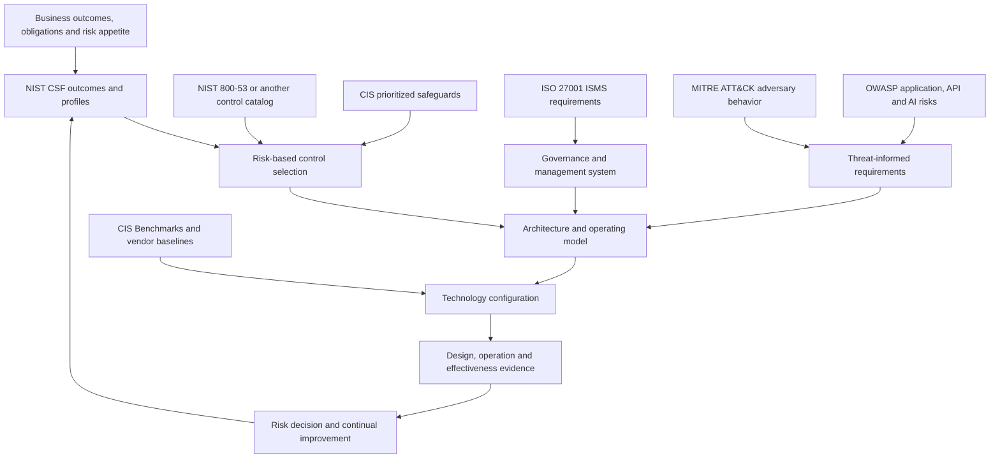

### 🔍 Plain-English deep-dive: why a crosswalk is not equivalence

A crosswalk says two publications discuss related ideas. It does not say they have identical scope, wording, rigor, evidence, ownership, assessment method, or assurance. For example, one CSF outcome can relate to several SP 800-53 controls; one control can support several CSF outcomes; an ISO requirement can depend on a management process and multiple technical controls; and a product setting may implement only one part of one control.

Treat a mapping like a bilingual phrasebook, not a legal translation. “Protect access” in one publication may involve identity proofing, authentication, authorization, privileged access, physical access, logging, periodic review, exception governance, and recovery elsewhere. A consultant preserves the lineage and the gaps instead of writing `CSF = ISO = CIS = Microsoft setting`.

## 2. NIST Cybersecurity Framework 2.0

The NIST CSF 2.0 is a voluntary, outcome-oriented framework for organizations of any size or sector to understand and improve cybersecurity risk management. Its **Core** contains Functions, Categories, Subcategories, and implementation examples. A **Current Profile** describes outcomes now achieved; a **Target Profile** describes prioritized desired outcomes. **Tiers** describe the rigor and sophistication of cybersecurity risk governance and management context; they are not simplistic product scores.

CSF 2.0 has six Functions. **Govern** was added as an explicit Function in 2.0 and informs the other five.

| Function | Plain meaning | Microsoft 365 security examples | Evidence, not assertion |
|---|---|---|---|
| **Govern (GV)** | Set direction, context, policy, accountability, supply-chain expectations, and oversight | Security strategy, risk appetite, RACI, policy ownership, third-party requirements, exception process | Approved policy, role records, risk decisions, review minutes, supplier evidence |
| **Identify (ID)** | Understand assets, business context, dependencies, vulnerabilities, threats, and risk | Tenant/workload inventory, data map, identity/device inventory, critical service dependencies, risk register | Reconciled inventory, owners, data flows, assessed findings, confidence labels |
| **Protect (PR)** | Apply safeguards to reduce likelihood or impact | MFA/passkeys, Conditional Access, PIM, Intune, DLP, labels, hardening, training | Effective configuration, assignments, negative tests, exceptions, user readiness |
| **Detect (DE)** | Find and analyze possible cybersecurity events | Defender XDR alerts, Sentinel analytics, UEBA, audit monitoring, connector health | Telemetry lineage, test event, alert quality, detection health and ownership |
| **Respond (RS)** | Manage, analyze, contain, communicate, and mitigate incidents | XDR/Sentinel incident process, approved containment, legal/privacy escalation, communications | Timeline, decision log, containment record, stakeholder updates, chain of custody |
| **Recover (RC)** | Restore assets and operations and communicate recovery | Identity recovery, backup/restore, policy rollback, emergency access, lessons learned | Tested restore/rollback, recovery time evidence, reconciled data, post-incident actions |

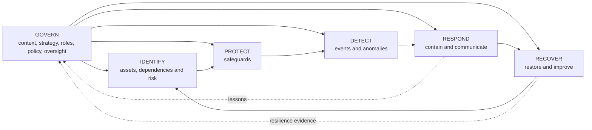

**Consulting use:** Start with business outcomes and a Current Profile. Define the Target Profile based on threat, obligations, risk appetite, and feasibility. Record gaps as outcomes, not tool absences. “No Sentinel” is not itself a CSF gap; “high-value identity events are not detected within the accepted window across required environments” is a meaningful gap. A solution may then be compared against that requirement.

| Weak statement | Stronger outcome statement | Why stronger |
|---|---|---|
| Buy E5 | Privileged access is time-bound, strongly authenticated, approved, monitored, and recoverable | Describes outcome independent of SKU |
| Enable DLP | Sensitive research data movement is identified and governed across required channels with approved exceptions | Includes data, scope, operation, and exceptions |
| Cover MITRE | Priority threat behaviors have tested telemetry and detections with known blind spots | Requires threat and evidence |
| Reach maturity 4 | Target outcomes have owners, integrated workflows, tests, measures, and improvement cycles | Avoids an unexplained score |

## 3. NIST SP 800-53: a control catalog, not a shopping list

NIST SP 800-53 Revision 5 is a catalog of security and privacy controls for information systems and organizations. It covers families such as Access Control, Audit and Accountability, Identification and Authentication, Incident Response, Risk Assessment, System and Communications Protection, System and Information Integrity, Supply Chain Risk Management, and PII Processing and Transparency. NIST published Release 5.2.0 changes in August 2025, so a client must identify the exact release used.

Controls are designed to be selected and tailored through a risk-management process. Related publications include SP 800-53B baselines and SP 800-53A assessment procedures. A baseline is a starting point, not automatic applicability. **Tailoring** adjusts a selected baseline for organization, system, threat, technology, law, and risk. **Control parameters** are values the organization must define. **Control enhancements** add rigor or capability. **Assessment objectives** specify what evidence to examine, interview, or test.

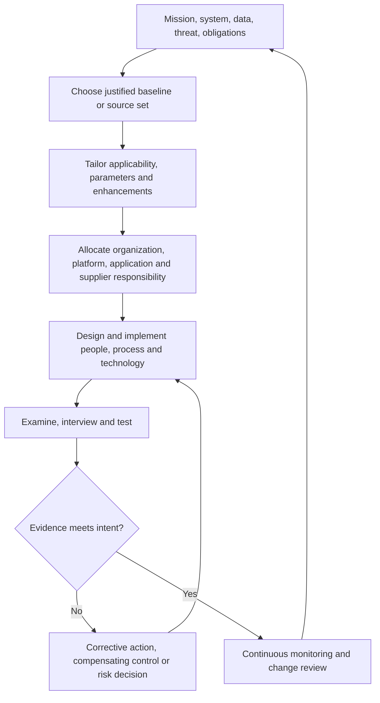

| Control-design field | Question to answer | Microsoft 365 example |
|---|---|---|
| Intent | What risk outcome is required? | Prevent persistent standing privilege and detect misuse |
| Applicability | Which users, systems, data, clouds, and exceptions are in scope? | Tier-0/1 Entra roles and emergency accounts |
| Allocation | Who performs which control portion? | Client owns assignment/approval; Microsoft operates cloud platform components |
| Implementation | Which process and technology realize it? | PIM eligibility, authentication strength, approval, access review, audit export |
| Evidence | What proves design and operation? | Role inventory, settings export, activation sample, denied test, review record |
| Effectiveness | Did it reduce the identified risk without unacceptable harm? | Lower standing privilege with successful emergency and admin workflows |
| Lifecycle | How is it reviewed, changed, and retired? | Quarterly review, owner, exception expiry, rollback, service-change monitor |

**Critical limit:** A Microsoft feature mapping to a control does not mean the customer has implemented the control. Licensing, configuration, scope, identity lifecycle, staffing, evidence, monitoring, exceptions, and shared responsibility still matter. NIST itself warns that mappings and crosswalks indicate relationships and should not be treated as one-to-one equivalence.

## 4. CIS Controls, Implementation Groups, and Benchmarks

The CIS Critical Security Controls are a prioritized set of safeguards intended to defend against prevalent attacks. Current official material points to **CIS Controls v8.1**. The controls describe organizational safeguards such as inventory, access control, vulnerability management, logging, incident response, and service-provider management.

**Implementation Groups (IGs)** help prioritize safeguards according to organizational resources and risk:

- **IG1** is foundational cyber hygiene and the starting point for every enterprise.
- **IG2** builds on IG1 for organizations with more complex technology, data sensitivity, or operational capacity.
- **IG3** includes all IG1 and IG2 safeguards plus measures for organizations facing sophisticated threats or high-impact risk.

An organization does not become “IG3” by buying a suite. It implements and sustains applicable safeguards with evidence.

**CIS Benchmarks**, by contrast, are consensus-based, product-specific configuration recommendations. Examples include Microsoft 365, Azure, Windows, Intune, macOS, Linux, browsers, and network technologies. Benchmark version, profile, platform version, operational impact, and exception are essential. A Benchmark can inform hardening under a CIS Control; it cannot replace governance or risk treatment.

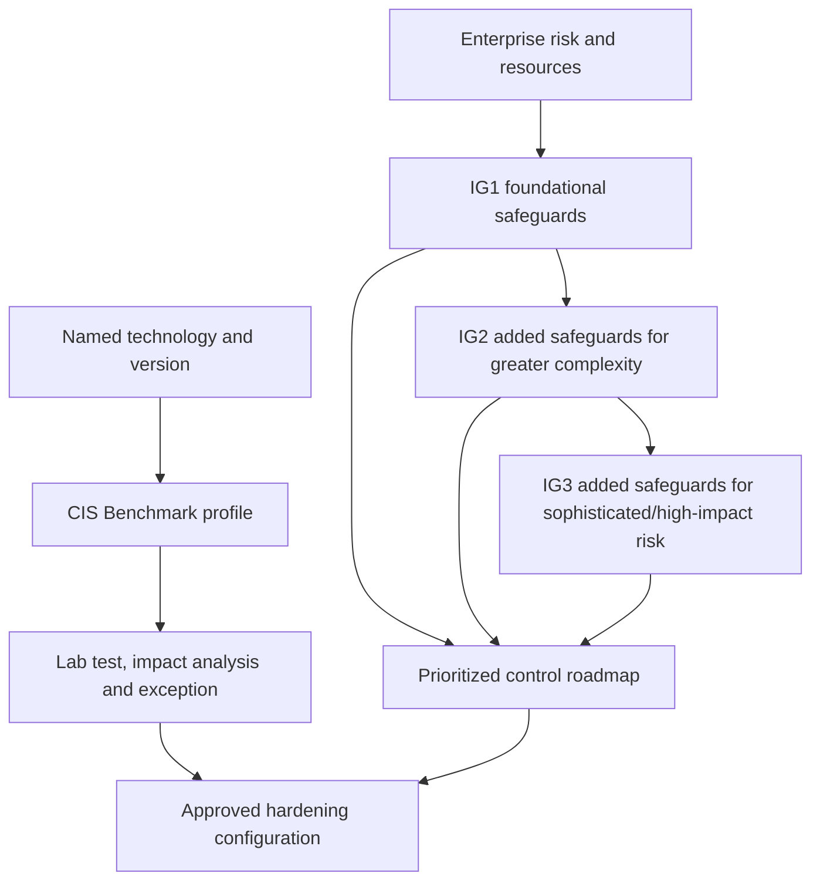

| Decision | CIS Controls | CIS Benchmarks |
|---|---|---|
| Unit of thought | Enterprise safeguard | Product/version configuration |
| Prioritization | IG1, IG2, IG3 | Profile/level and recommendation applicability |
| Owner | Security/business/control owners | Technology owner with risk/change owners |
| Evidence | Process, inventory, operation, measurement | Effective settings, test results, exceptions |
| Common misuse | “We bought IG3” | “100% benchmark score means secure/compliant” |
| Correct use | Prioritize a defensible safeguard roadmap | Harden a tested technology within that roadmap |

### 🔍 Plain-English deep-dive: why maximum hardening can reduce security

Security configuration changes can break authentication, automation, accessibility, incident response, line-of-business applications, partner access, or recovery. A setting that disables a legacy protocol may be correct for most users but strand a safety-critical device. A restrictive audit setting may create cost or privacy exposure without useful detection. A firewall rule can block the management channel needed to repair the device.

Therefore, hardening means **tested risk reduction**, not blindly selecting every strict value. Record benchmark version, recommendation, applicability, current value, target value, threat addressed, dependency, pilot ring, positive/negative tests, rollback, exception owner, and expiry. Exceptions are governed risk decisions, not silent failures.

## 5. ISO/IEC 27001: the ISMS and certification concept

ISO/IEC 27001:2022 defines requirements for establishing, implementing, maintaining, and continually improving an **Information Security Management System (ISMS)**. An ISMS is the coordinated system of scope, leadership, policy, roles, risk assessment, risk treatment, competence, communication, controlled information, operation, performance evaluation, internal audit, management review, corrective action, and improvement used to manage information-security risk.

The standard is risk-based. The organization identifies risks, decides treatment, selects necessary controls, and documents a **Statement of Applicability (SoA)**. The SoA records which controls are necessary, why they are included, whether they are implemented, and why listed controls are excluded. Annex A provides a reference set of controls; it is not a mandatory “implement every control identically” checklist.

**Certification** is independent third-party conformity assessment within a stated scope by a competent certification body. A certificate covers the specified ISMS scope and period under its audit program. It does not guarantee that no breach will occur, certify every supplier or tenant configuration, or make the customer's use of Microsoft 365 compliant. ISO lists ISO/IEC 27001:2022 as published and identifies Amendment 1:2024; recheck the current standard and transition requirements with qualified assurance professionals.

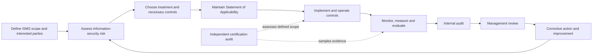

| ISMS artifact | Purpose | Microsoft 365 consulting contribution | Boundary |
|---|---|---|---|
| Scope | Define included organization, locations, processes, systems, and interfaces | Document tenant, workloads, regions, identities, suppliers, and exclusions | Consultant does not decide certification scope alone |
| Risk method/register | Make risk criteria and treatment traceable | Provide technical findings, likelihood/impact evidence, dependencies | Business risk owner accepts/treats risk |
| SoA | Explain necessary controls and implementation state | Map technical/operational controls and evidence references | Mapping does not certify implementation |
| Policies/procedures | Direct consistent behavior | Draft control standards, runbooks, exception process | Must be approved and operated by client |
| Internal audit | Test ISMS conformity and effectiveness with independence | Supply evidence and remediate findings | Delivery owner should not overclaim audit independence |
| Management review | Leadership evaluates suitability and performance | Provide trends, incidents, risks, objectives, resource issues | Management owns decisions |
| Certification audit | Independent conformity assessment within scope | Support evidence retrieval if authorized | Only the certification body issues certification |

## 6. MITRE ATT&CK: tactics, techniques, procedures, and detections

MITRE ATT&CK is a public knowledge base and taxonomy of adversary behavior based largely on publicly available threat intelligence and incident reporting.

- **Tactic** — the adversary's goal, the “why,” such as Credential Access.
- **Technique** — how the adversary may achieve that goal, such as credential dumping.
- **Sub-technique** — a more specific behavior below a technique.
- **Procedure** — an observed implementation by an adversary, including tools and steps.
- **Data source/data component** — telemetry that may expose relevant activity.
- **Detection strategy/analytic** — logic and context used to recognize suspicious behavior. A mapped alert is not automatically a high-quality detection.

ATT&CK tactics are not a mandatory ordered kill chain. Not every tactic occurs in every intrusion. ATT&CK coverage diagrams show mapped knowledge, not prevention or detection efficacy.

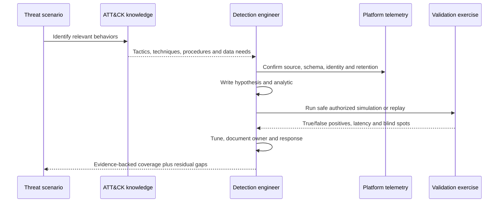

| Coverage claim | Why it is weak | Evidence-backed replacement |
|---|---|---|
| “We cover 90% of ATT&CK” | Denominator, platform, threat relevance, sub-techniques, quality, and tests are unknown | “For five prioritized scenarios, 18 relevant techniques have source-to-response evidence; six are partial and four lack telemetry.” |
| “The alert maps to T1078” | A label says nothing about reliability or scope | Show query, source, entity fields, test result, false-positive rate, latency, owner, and response |
| “Vendor won MITRE” | ATT&CK does not endorse products; evaluation context/configuration matters | Review the exact independent evaluation method and client-relevant scenario without converting it into a universal ranking |
| “No ATT&CK technique means no risk” | ATT&CK depends on observed/public knowledge and is updated | Combine threat intelligence, architecture, incident history, abuse cases, and business risk |

**Limits to state aloud:** ATT&CK is not a risk framework, control catalog, compliance standard, complete adversary inventory, ordered attack lifecycle, or product endorsement. It is extremely useful as a common language for threat-informed architecture, detection engineering, purple-team planning, incident analysis, and coverage communication when paired with evidence.

## 7. OWASP for applications, APIs, LLMs, and agents

The Open Worldwide Application Security Project (OWASP) publishes community-led, vendor-neutral awareness and engineering resources. Use the exact project and version because “the OWASP Top 10” is not one universal list.

| Surface | Current public anchor at baseline | Concepts to carry into design | Key limit |
|---|---|---|---|
| Web applications | OWASP Top 10:2025 | Access control, configuration, supply chain, cryptography, injection, authentication, integrity, logging/alerting, exception handling | Awareness list, not exhaustive SDLC or certification |
| APIs | OWASP API Security Top 10:2023 | Object/function/property authorization, authentication, resource consumption, sensitive business flows, SSRF, inventory, unsafe API consumption | API context and abuse cases still require threat modeling/testing |
| LLM/GenAI apps | OWASP Top 10 for LLM Applications 2025 | Prompt injection, sensitive disclosure, supply chain, data/model poisoning, output handling, excessive agency, system prompt leakage, vector/embedding weaknesses, misinformation, unbounded consumption | Risk taxonomy does not make a model or agent safe |
| Agentic systems | OWASP GenAI Security Project agentic initiatives/resources | Identity, tool authorization, memory, planning, inter-agent trust, human approval, action audit, containment, resource limits | Rapidly evolving guidance; verify publication/version/status |

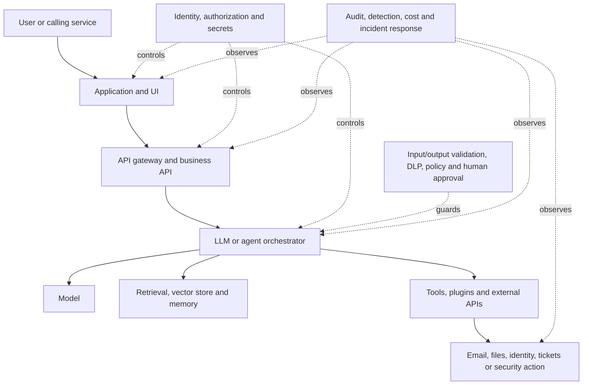

### 🔍 Plain-English deep-dive: an agent is an identity plus an action path

A chatbot that only drafts text can still disclose information, but an **agent** may select tools and take actions. Think of the difference between an adviser who suggests a bank transfer and an assistant who possesses banking credentials and can execute it. The risk depends on the agent's identity, delegated authority, data access, memory, tools, trigger, approval rules, transaction boundary, output validation, audit, and kill switch.

Prompt filtering alone is insufficient. A secure design asks: Who sponsored the agent? Which identity does it use? Can it act only for one user or tenant? Which data and tools can it access? Is authorization checked at action time? Can untrusted content influence its plan? Which actions require human confirmation? Are outputs treated as untrusted input by downstream code? What happens when cost, rate, confidence, or scope exceeds a threshold? How are credentials revoked and history preserved at retirement?

| Agent control plane | Minimum design question | Example evidence |
|---|---|---|
| Identity | Dedicated agent identity or inherited user context? | Identity object, sponsor, lifecycle, sign-in evidence |
| Authorization | Least privilege per tool, resource, and action? | Permission grant, policy, denied negative test |
| Data | Which prompts, responses, grounding, memory, and outputs contain sensitive data? | Data flow, classification, retention, DLP test |
| Tool safety | Are arguments constrained and downstream output validated? | Schema, allowlist, sandbox, error handling |
| Human control | Which material actions require approval? | Approval record and timeout/fallback test |
| Observability | Can the organization reconstruct identity, prompt/context, decision, tool call, result, and approver? | Correlated audit timeline with privacy controls |
| Resilience | What stops loops, runaway consumption, unavailable tools, or partial completion? | Rate/budget limit, idempotency, circuit breaker, rollback |
| Lifecycle | Who reviews, disables, revokes, and disposes of data? | Owner, review date, decommission checklist |

## 8. Zero Trust maturity: outcomes across pillars

Zero Trust means no implicit trust based only on network location or asset ownership. NIST SP 800-207 focuses access decisions on subjects, assets, and resources. Microsoft's three principles are **verify explicitly**, **use least privilege**, and **assume breach**. A maturity model describes the evolution from fragmented/manual practices toward integrated, measured, adaptive practices.

Use maturity dimensions instead of declaring the whole organization “mature.” CISA's Zero Trust Maturity Model v2 is a useful public reference with five pillars — Identity, Devices, Networks, Applications and Workloads, and Data — plus cross-cutting Visibility and Analytics, Automation and Orchestration, and Governance. Its stages are Traditional, Initial, Advanced, and Optimal. Recheck the current CISA publication because site locations can change.

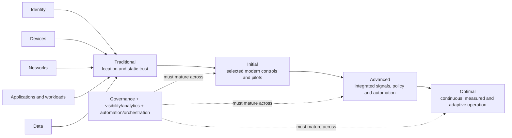

| Maturity dimension | Initial evidence | Advanced evidence | Warning sign |
|---|---|---|---|
| Identity | MFA/Conditional Access pilots; privileged inventory | Phishing-resistant admin access, lifecycle integration, workload/agent identity governance, tested recovery | “MFA enabled” without scope, methods, exceptions, or sign-in evidence |
| Devices | Inventory and compliance pilot | Cross-platform posture feeds access and response with tested exceptions | Management record mistaken for device health |
| Applications/workloads | Critical-app inventory and SSO plan | App/workload identities, authorization, secrets, posture, logs, lifecycle integrated | User account used for automation |
| Data | Classification and sharing assessment | Labels/DLP/access/lifecycle tied to business process and monitored outcomes | Tool detects data but owners cannot act |
| Network/SSE | Flows and dependencies mapped | Context-aware access with segmented resources and experience/resilience evidence | “Network no longer matters” |
| Visibility/analytics | Priority logs and owners | Cross-domain detections, health, quality measures, threat-informed tests | Ingestion volume used as security outcome |
| Automation | Approval-based low-risk workflows | Governed automation with identity, idempotency, fallback, audit, and outcome metrics | Fast unreviewed containment |
| Governance | Policies and named owners | Risk, architecture, privacy, exceptions, suppliers, metrics, and improvement integrated | Product roadmap substitutes for business governance |

**Maturity rule:** Score only defined scope and evidence date. Record confidence, dependencies, business impact, and target rationale. The next step should reduce a priority risk, not merely increase a number.

## 9. A defensible control-mapping method

A strong map preserves five layers:

1. **Source requirement or risk outcome** with exact version and scope.
2. **Control objective** stated in organization language.
3. **Implementation** across people, process, technology, and supplier responsibility.
4. **Evidence** for design, operation, and effectiveness.
5. **Residual risk and decision** with owner, date, and improvement action.

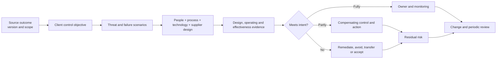

| Mapping record field | Example | Anti-overclaim check |
|---|---|---|
| Source | NIST CSF 2.0 `PR.AA`, exact subcategory recorded in client workbook | Is the identifier/version exact and applicable? |
| Objective | Privileged access is least-privilege, time-bound, strongly authenticated, reviewed, and recoverable | Is it vendor-neutral and testable? |
| Threat/failure | Stolen admin session; approval bypass; PIM unavailable; emergency account unusable | Did we include operational failure, not only attack? |
| Implementation | Role design, PIM, authentication strength, CA, emergency access, monitoring, quarterly review | Are people/process and shared responsibility present? |
| Evidence | Role export, policy version, test IDs, activation logs, denied test, recovery exercise | Is evidence observed and current, or merely expected? |
| Mapping strength | Partial | Did we avoid “compliant” and “equivalent”? |
| Residual gap | Legacy admin workflow cannot support target method for 60 days | Is there an owner, expiry, compensating control, and risk decision? |

Use mapping strengths such as **direct**, **supporting**, **partial**, and **not applicable**, each with rationale. Never use a green cell alone. A green control can still fail because it is mis-scoped, not operated, not monitored, or defeated by another path.

## 10. Competitive landscape: compare categories, not slogans

The purpose of competitive analysis is to choose an operating capability for a client context. It is not to declare a universal winner. Vendor pages are valid evidence that a vendor positions a product in a category and describes capabilities. They are not independent proof of detection efficacy, performance, TCO, resilience, support quality, or fit for the client's data.

### Common architecture choices

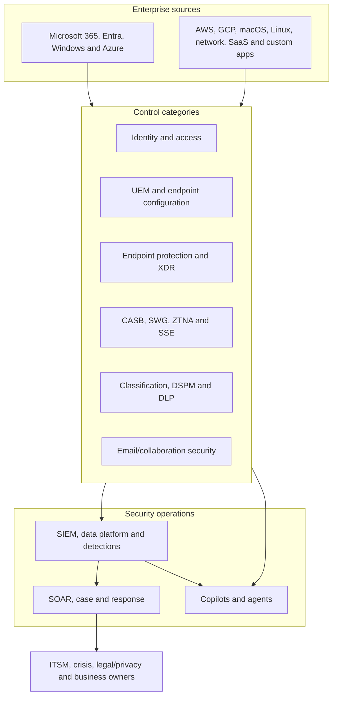

| Category | Microsoft-centered option | Point/multiplatform examples | Neutral questions |
|---|---|---|---|
| SIEM/SOAR | Microsoft Sentinel with Log Analytics, data lake, analytics, automation rules and Logic Apps | Splunk Enterprise Security; Google Security Operations, historically associated with the Chronicle name/category | Source/parser coverage, query/detection language, data tiers, sovereignty, case model, automation, content lifecycle, operations, migration/export |
| Endpoint/XDR | Microsoft Defender for Endpoint and Defender XDR | CrowdStrike Falcon endpoint/XDR category; Palo Alto Networks Cortex XDR category | OS/workload coverage, prevention/EDR controls, telemetry depth, containment, offline behavior, coexistence, sensor impact, threat testing, investigation workflow |
| Identity | Microsoft Entra ID, ID Protection, Governance, PIM and Global Secure Access | Okta workforce identity category; Ping Identity workforce/customer/hybrid identity category | Identity populations, protocols, hybrid/custom apps, policy, lifecycle/governance, admin recovery, agent/workload identities, data plane and availability |
| UEM | Microsoft Intune and Configuration Manager coexistence | Jamf Pro for Apple-focused management; Omnissa Workspace ONE UEM (formerly VMware-branded lineage; verify current naming/ownership); other platform specialists | Platform depth, enrollment/provisioning, app/update lifecycle, compliance signals, shared/rugged devices, remote actions, APIs, support skills |
| CASB/SSE | Defender for Cloud Apps and Microsoft Entra Internet/Private Access capabilities | Netskope SSE; Zscaler SSE/Zero Trust Exchange categories | Inline/API modes, SWG/CASB/ZTNA scope, app discovery, TLS inspection, private access, DLP consistency, PoP/resilience, user experience, log/API openness |
| Data security/DLP | Microsoft Purview classification, Information Protection, DLP, Insider Risk, DSPM and AI data security | Forcepoint DLP; Broadcom/Symantec DLP; Netskope/Zscaler data controls; other DSPM/data platforms | Data locations/channels, structured/unstructured discovery, classifiers, endpoint/network/cloud enforcement, policy migration, incidents, privacy, AI coverage |
| Email security | Exchange Online Protection and Defender for Office 365 | Proofpoint email-security category; Mimecast email-security category; other SEG/API providers | MX/SEG versus API deployment, pre/post-delivery controls, BEC/phishing, continuity, authentication, internal mail, submissions, response, user experience, coexistence |

**Naming caution:** Product ownership and branding change. “VMware Workspace ONE” is a familiar historical name, but the August 2026 vendor page is Omnissa Workspace ONE UEM. “Chronicle” remains familiar in conversations, while the current Google product page says Google Security Operations. Use the client's contracted product and current official name, and record aliases only to aid discovery.

### The required selection criteria

| Criterion | Evidence to request | Example tradeoff |
|---|---|---|
| Existing estate | Identity, endpoint, cloud, data, network, SOC, ITSM, contracts, skill and integration inventory | Native integration may reduce engineering in one estate; heterogeneity may favor multiplatform depth |
| Coverage | Required OS, clouds, SaaS, identities, data channels, geographies, and disconnected cases | Broad category labels can hide unsupported edge cases |
| Efficacy evidence | Reproducible client tests, independent method, false positives/negatives, detection/containment latency | A benchmark result may not match client configuration or threat |
| Integration | Supported APIs/connectors, schema fidelity, bidirectional action, identity, error/retry, versioning | A connector can ingest alerts but omit raw evidence or response |
| Openness/portability | Export APIs, standard formats, data ownership, query/content version control, exit procedure | Tight integration may improve workflow but increase exit work |
| Skills/operating model | Analyst/admin/engineering skills, 24x7 support, separation of duties, managed-service fit | Fewer consoles do not automatically mean fewer competencies |
| Residency/privacy | Storage/processing/support locations, telemetry content, transfers, retention, investigation access | A commercial-cloud feature may not exist in a sovereign cloud |
| Performance/user impact | Sensor/client/network latency, app compatibility, battery/CPU, policy propagation, investigation query latency | More inspection can improve control while harming critical journeys |
| Resilience | Service dependencies, regional design, offline behavior, queue/retry, emergency access, provider outage plan | Consolidation can reduce handoffs but concentrate dependency |
| Cost/TCO | License, ingestion/storage/query, implementation, migration, dual run, people, support, egress, retirement | Bundle entitlement is not zero implementation or operation cost |
| Lock-in/exit | Contract terms, data/content export, policy conversion, agent removal, historical evidence, skills | Open formats reduce some friction but do not eliminate migration |
| Support | SLA/entitlement, escalation route, diagnostics, regional coverage, partner capability, defect path | Brand familiarity does not prove support quality for a given contract |

### 🔍 Plain-English deep-dive: consolidation versus integration

**Consolidation** reduces the number of products or vendors. **Integration** makes multiple capabilities exchange trustworthy context and actions. They overlap but are not the same. One suite can still have separate schemas, roles, portals, queues, and operating teams. Multiple specialist products can operate coherently if identity, data, incidents, automation, ownership, and support are deliberately integrated.

The right question is not “single vendor or best of breed?” It is: “Which arrangement meets priority outcomes with acceptable risk, operational load, resilience, cost, and exitability?” A Microsoft-heavy organization may value common identity, endpoint, collaboration, and incident context. A heterogeneous or regulated organization may value specific platform depth, deployment model, sovereignty, existing detection content, or independence. Both choices require evidence.

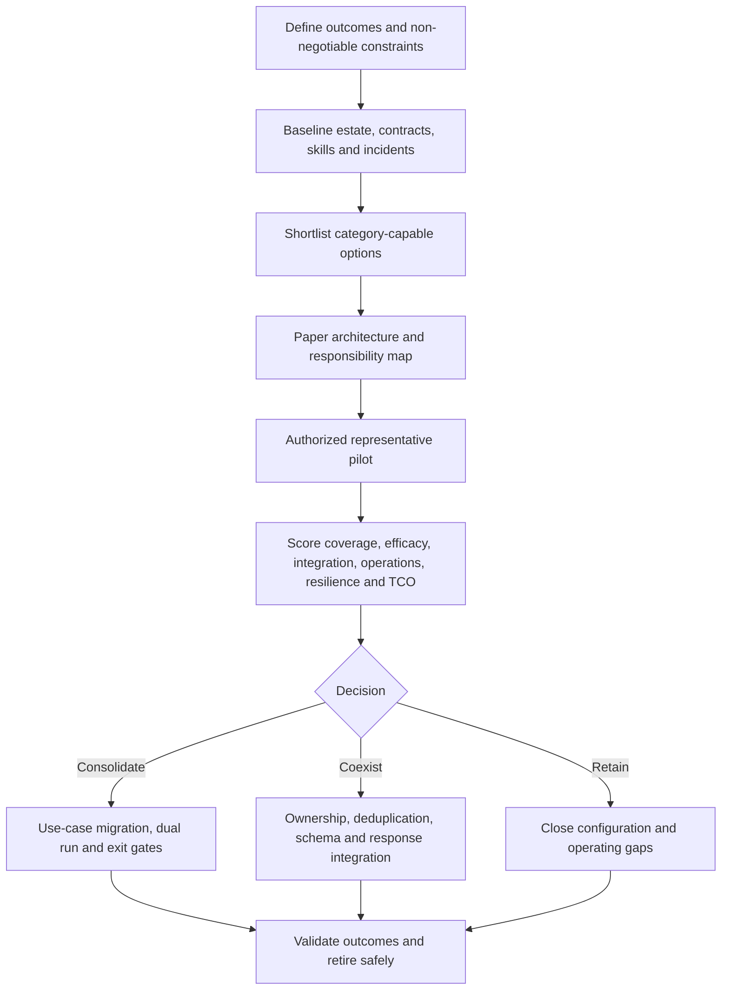

## 11. Category scenarios and architecture tradeoffs

### Scenario A: Microsoft-heavy enterprise rationalizing SIEM and XDR

The client uses Entra, Intune, Defender products, Microsoft 365, Azure, Splunk, several network vendors, AWS, and custom applications. A weak recommendation says “replace Splunk because Microsoft integrates better.” A defensible analysis separates use cases:

| Use case | Evidence needed | Possible Microsoft-centered value | Possible retain/coexist value |
|---|---|---|---|
| M365 identity-email-endpoint attack | Signal correlation, incident fidelity, response actions, analyst steps, duplicate behavior | Defender XDR provides native cross-product incident context for licensed signals | Existing SIEM may hold long history, cross-enterprise detections, and mature workflows |
| Cross-cloud infrastructure | AWS/GCP/Azure sources, parser quality, entity mapping, latency, ownership | Sentinel supports multiplatform ingestion and content | Existing platform/team may have deeper custom content or operating maturity |
| Long-term telemetry | Volume, retention, query patterns, legal holds, investigation latency, cost | Sentinel analytics/data-lake tiers offer separate performance/cost paths | Existing architecture may meet sovereignty, query, or export needs better |
| Automation | Actions, approvals, identities, idempotency, failure handling, ITSM | Sentinel automation rules/Logic Apps integrate Microsoft and other systems | Existing SOAR playbooks and team skill may be costly or risky to recreate |

Decision: pilot representative incidents, content, data, automation, cost, and outage paths. Migrate use case by use case; preserve historical evidence and rollback. Do not force every source into one tier or retire the old platform before exit criteria pass.

### Scenario B: Intune with Apple and specialized endpoints

The client has Windows and mobile fleets in Intune, a large managed Apple population in Jamf Pro, rugged devices in another UEM, and Conditional Access dependencies. The question is not “Can Intune manage macOS?” but “Which platform and operating arrangement meets the required Apple, Windows, mobile, rugged, compliance, access, app, update, support, and incident workflows?”

Potential outcomes include full consolidation, platform-specialist coexistence, phased migration, or a clear split of authority. Avoid two tools writing the same setting. Define a single authoritative source per control, normalized compliance signal, inventory reconciliation, support routing, and offboarding.

### Scenario C: Email gateway plus Microsoft Defender for Office 365

A third-party secure email gateway (SEG) can coexist with Exchange Online Protection and Defender for Office 365. Mail routing, enhanced filtering/connectors, SPF/DKIM/DMARC, Safe Links/Attachments, internal mail, submissions, quarantine, automated remediation, user reporting, journaling, continuity, and SOC integrations can interact. More layers can add defense, but can also rewrite URLs, alter authentication, duplicate quarantine, hide original headers, delay mail, or split incidents.

The assessment should compare a correctly configured coexistence baseline with API and/or gateway alternatives using safe test messages and authorized simulation. Preserve mail-flow rollback and never infer efficacy from a marketing percentage.

## 12. Licensing: a decision method, not a price sheet

Microsoft 365 E3/E5 names are starting points, not sufficient entitlement evidence. Capability may come from base suites, Microsoft Defender/Purview/Entra suites, security or compliance add-ons, standalone plans, workload consumption, capacity, or newer persona-specific offers. Features can require licenses for administrators, protected users, users in scope, reviewers, workload identities, agents, devices, servers, or data consumption. Contract programs and sovereign clouds can differ.

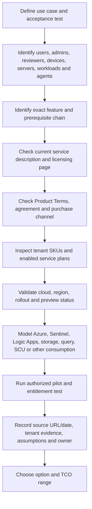

| Validation layer | Question | Evidence |
|---|---|---|
| Business use case | What outcome and population need the capability? | Use-case ID, persona count/range, acceptance tests |
| Feature | What exact feature, edition, plan, prerequisite, and limitation apply? | Current Microsoft Learn/service-description rows |
| Contract | Which program, geography, term, use right, and add-on applies? | Current Product Terms and customer agreement/quote |
| Tenant entitlement | Which SKU and service plan IDs are assigned/enabled? | Microsoft 365 admin center or approved Graph export |
| Scope/persona | Who must be licensed: operator, protected user, reviewer, guest, device, server, workload, or agent sponsor? | Persona-to-feature matrix and official scenario |
| Cloud/region | Is the feature supported in commercial, government, national, or other target cloud and region? | Availability page and tenant observation |
| Consumption | Is there ingestion, retention, query, automation, compute, capacity, or egress cost? | Azure calculator/usage model and budget alert design |
| Preview/change | Is it GA, preview, rolling out, deprecated, or scheduled for retirement? | Dated banner/message-center/roadmap evidence |
| Operation/TCO | What migration, dual run, staffing, training, support, and retirement work exists? | Three-year scenario range with assumptions |

### E3/E5/security/compliance/add-on reasoning

Use personas rather than assigning the richest suite reflexively.

| Persona | Example needs | Candidate options to validate, not promises |
|---|---|---|
| Standard information worker | Productivity, baseline identity/device/data controls | Existing M365 E3 capabilities plus only justified add-ons |
| Privileged administrator | PIM, risk-based access, strong methods, hardened device, investigation | Entra P2/governance and endpoint/security capabilities; validate every in-scope admin/approver/reviewer |
| High-risk executive/researcher | Strong access, endpoint/email protection, data controls | E5/security/data features or scoped add-ons based on threat and channels |
| SOC analyst | XDR/Sentinel, hunting, response, automation, Security Copilot where justified | Product entitlements, Sentinel Azure consumption, RBAC, and SCU/capacity model |
| Compliance/data investigator | Audit, eDiscovery, Insider Risk, DLP, retention, DSPM | Purview service plans and licensing by user/workload/investigation scope |
| Frontline/contractor | Limited workload and device/access pattern | Frontline or scoped plans plus required security dependencies |
| Server/workload identity/agent | Machine protection and nonhuman access governance | Server/workload/agent-specific plans and consumption; do not assume a user license covers it |

**Current examples requiring recheck:** Microsoft documents Entra P1 in Microsoft 365 E3 and Entra P2 in Microsoft 365 E5 and the Microsoft Defender Suite at the baseline. Conditional Access requires P1; risk-based Conditional Access and PIM use P2/governance entitlements. Current Entra licensing also introduces Microsoft Agent 365 dependencies for agent governance and Conditional Access. These are change-sensitive 2026 packaging facts, not timeless rules.

### Sentinel cost is not an E5 checkbox

Sentinel uses Azure billing and has multiple meters. Current Microsoft documentation describes analytics-tier pay-as-you-go or commitment tiers, data-lake ingestion/processing/storage/query, notebook/advanced-data-insight compute, custom graph use, Logic Apps and other connected Azure services. Benefits or free data categories have exact conditions. Build volume and query scenarios from representative evidence; do not promise “free Sentinel with E5.”

## 13. Sovereign, residency, multicloud, and multiplatform considerations

**Sovereign cloud** can refer to cloud environments designed for specific governmental, national, jurisdictional, operational-control, or data-boundary requirements. The exact offering, operator, region, service catalog, accreditation, support path, and contractual commitment matter. A commercial-cloud feature page is not evidence that the feature exists in a government or national cloud.

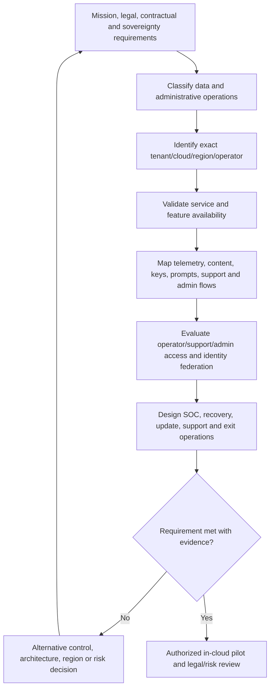

| Dimension | Questions to resolve | Common assumption to reject |
|---|---|---|
| Service availability | Does the exact feature/plan exist in the exact cloud and region? | Product family availability means feature parity |
| Data location/residency | Where are primary data, replicas, telemetry, prompts, support artifacts, and backups stored/processed? | Tenant location answers every data-flow question |
| Administrative control | Which customer, provider, partner, and support identities can administer or access data? | Sovereignty is only physical storage |
| Connectivity | Which endpoints, cross-cloud connectors, proxies, private links, and egress paths are required? | Commercial reference architecture transfers unchanged |
| Cryptography/keys | Who controls keys, HSM boundary, rotation, recovery, and lawful-access process? | Customer-managed key removes every provider dependency |
| Updates/feature cadence | How do releases, previews, and emergency updates enter the environment? | Slower rollout is always safer |
| SOC/multicloud | Can telemetry, entities, clocks, schemas, and response actions work across Azure, AWS, GCP, SaaS, and on-premises? | One SIEM connector equals complete coverage |
| Resilience/exit | What happens during provider, region, identity, network, or support failure, and how is data/content exported? | Consolidation automatically improves resilience |

At the baseline, Microsoft Security Copilot documentation says it is for commercial clouds and is not designed for US government clouds such as GCC, GCC High, DoD, or Azure Government. Microsoft Security Exposure Management documentation says it is public-cloud only and unavailable in national/sovereign clouds. These are explicit current boundaries and must be rechecked before every design.

## 14. Microsoft certification status and objective map

Certification pages change faster than printed plans. Use the live exam page and study guide before booking. At the August 24, 2026 baseline, the requested sequence contains one retired exam: **SC-400 is not available**. Its current successor for the data-security role is **SC-401**.

| Exam/credential | Current status at baseline | Current objective domains | Role value and caveat |
|---|---|---|---|
| **SC-900** Microsoft Security, Compliance, and Identity Fundamentals | Active; English objectives updated July 28, 2026; no retirement date displayed | Concepts 10–15%; Entra 25–30%; Microsoft security solutions 35–40%; compliance solutions 20–25% | Vocabulary and solution map; beginner level; fundamentals credential currently does not require annual renewal, but recheck policy |
| **SC-300** Identity and Access Administrator Associate | Active; certification page last updated April 27, 2026; 12-month renewal shown; no retirement shown | User identities 20–25%; authentication/access 20–25%; workload identities 20–25%; identity governance 20–25% on the current study guide | Strong bridge to Entra/CA/PIM/governance; no certification prerequisite, but practical Entra/M365/AD/PowerShell/KQL familiarity expected |
| **SC-400** Information Protection and Compliance Administrator | **Retired**; Microsoft exam study guide says retired May 31, 2025 at 11:59 PM Central; retired certification card displays May 30, 2025 | Historical only: information protection; DLP; lifecycle/records; monitoring/investigation; insider/privacy risk | Do not book or present as current. Date display differs by page/time convention; both official pages establish retirement. Preserve only as historical learning context |
| **SC-401** Information Security Administrator Associate | Active successor path; objectives updated July 28, 2026; 12-month renewal shown | Information protection 30–35%; DLP and retention 30–35%; risks, alerts and activities 30–35% | Current Purview/data-security path including AI data protection; no certification prerequisite; practice and labs still needed |
| **SC-200** Security Operations Analyst Associate | Active; objectives updated July 28, 2026; 12-month renewal shown; no retirement shown | Manage SecOps environment 40–45%; respond to incidents 35–40%; threat hunting 20–25% | Defender XDR, Sentinel, KQL, automation, agents/Copilots; no certification prerequisite, but hands-on investigation and query practice are essential |
| **SC-100** Cybersecurity Architect Expert exam | Active; objectives updated July 28, 2026; exam page displays no retirement date | Best practices/priorities 20–25%; SecOps/identity/compliance 25–30%; infrastructure 25–30%; applications/data 20–25% | Architecture capstone; the **expert certification** requires SC-100 plus at least one eligible prerequisite certification: AZ-500, SC-300, or SC-200 at baseline |

> **Objective discrepancy rule:** Trust the dated live study guide for detailed percentages and inspect its change log. Certification cards sometimes summarize domains without percentages. Localized exams can lag the English update. Recheck the language/version shown during scheduling.

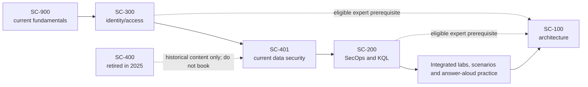

### Building your own roadmap

| Stage | Focus | Practical proof before moving on | Honest outcome |
|---|---|---|---|
| 1. SC-900 refresh | Current Microsoft security/identity/compliance vocabulary and 2026 objective changes | Explain the architecture from memory; score consistently on official practice assessment; identify product boundaries | “I can explain the solution map,” not “I am a security architect” |
| 2. SC-300 | Entra objects, authentication, CA, risk, workload identity, hybrid identity, governance | Safe identity lab, sign-in-log troubleshooting, CA report-only design, PIM/emergency-access paper test | Connects support/RCA strengths to identity control evidence |
| 3. SC-401 | Classification, labels, DLP, retention, Insider Risk, alerts, Audit and AI data protection | Synthetic label/DLP simulation, policy precedence tests, privacy-safe incident workflow | Builds naturally from SharePoint/OneDrive and permissions expertise |
| 4. SC-200 | Defender XDR, Sentinel, ingestion, detections, incidents, KQL, automation, hunting | Synthetic incident timeline, KQL queries, detection tests, approval-based playbook design, cost notes | Adds SOC concepts without claiming production SOC operation |
| 5. SC-100 | Business risk, Zero Trust, resilience, GRC, SecOps, identity, infrastructure, apps/data, hybrid/multicloud architecture | Defend a complete architecture, tradeoffs, threat/control/evidence map, migration and operating model | Architecture readiness is demonstrated through decisions, not exam alone |

Use time boxes based on mastery, not calendar promises. A reasonable study cycle repeats: learn, draw, lab or paper-test, troubleshoot, explain aloud, take the official practice assessment, revisit weak objectives, and only then schedule. Register with a personal Microsoft account as Microsoft recommends so records are not lost when leaving an employer.

### Labs, practice assessments, renewal, and integrity

| Area | Current guidance | Required behavior |
|---|---|---|
| Official study guide | Lists dated objectives, changes, audience, and resources | Recheck immediately before study plan and again before exam |
| Practice assessment | Free examples of style and difficulty for supported exams | Use diagnostically; it is not the live exam and not a replacement for practice |
| Exam sandbox | Demonstrates interface and question types | Practice navigation, review, case, and accessibility behavior |
| Labs | Associate/expert exams may include interactive components; Microsoft does not promise a fixed list because labs can be removed | Practice real tasks safely; read exam overview; manage time and do not rely on memorized clicks |
| Microsoft Learn access | Current policy allows Learn access during associate/expert role-based exams, not fundamentals, with restrictions and no extra time | Know concepts first; use Learn selectively; recheck current exam rules |
| Renewal | Current associate/expert role-based certifications show 12-month renewal and free online renewal assessment | Track expiry and live renewal window; refresh changing skills rather than cramming at expiry |
| Integrity | Proctored exam and candidate agreement apply | No dumps, stolen questions, proxy testing, unauthorized AI/materials, recording, sharing, or reconstruction of exam content |

**Certification does not equal experience.** A passing result indicates performance against an exam blueprint under exam conditions. Experience includes ambiguous requirements, production dependencies, incomplete evidence, change windows, user impact, failures, escalation, privacy, cost, rollback, and sustained operation. Pair each credential with a small portfolio artifact and an answer you can defend aloud.

## 15. Adjacent credentials: position by purpose

These credentials are optional signals, not a collection target. Recheck official status, experience rules, exam version, continuing education, costs, and renewal before committing.

| Credential | Category positioning | Best timing for you | Important boundary |
|---|---|---|---|
| **CCSK v5** | Cloud Security Alliance vendor-neutral cloud-security knowledge certificate; no official work-experience prerequisite | Early or alongside Microsoft associate study to broaden cloud governance, IAM, data, app, operations, and Zero Trust vocabulary | Knowledge certificate; not a substitute for cloud delivery or an experience-based certification |
| **CCSP** | ISC2 advanced cloud security certification across architecture, data, platform, applications, operations, and legal/risk/compliance; official page shows five years required experience | Later, after material cloud-security study and qualifying experience analysis | Verify exact experience-waiver and endorsement rules; do not claim certification before all requirements are met |
| **CISSP** | ISC2 broad cybersecurity leadership/operations certification across eight domains; official page shows five years required experience | Later, when broad security experience and role direction justify it | Broad management/architecture knowledge, not a product implementation credential |
| **CCNA** | Cisco associate networking fundamentals: network access, IP connectivity/services, security fundamentals, automation; current page shows no prerequisite and three-year validity | Useful if networking depth is a material interview or delivery gap | Does not by itself establish security architecture or multivendor operations experience |
| **CCNP Security** | Cisco professional-level security-infrastructure path; current page shows no formal prerequisite, a core plus one of seven concentration exams, and three-year validity, while noting upcoming program updates | Only if the role becomes network/security-infrastructure heavy and hands-on Cisco depth is needed | Recheck the announced updates, exam choices, experience expectations, and recertification; it is not necessary merely to discuss M365 security dependencies |

Priority follows the role: SC-900 for map, SC-300 for identity, SC-401 for your data/collaboration bridge, SC-200 for SecOps, and SC-100 after integrated design practice. Add CCSK for vendor-neutral cloud breadth. Consider CCSP/CISSP after experience alignment; use CCNA/CCNP when network engineering is a real responsibility, not as decorative acronyms.

## 16. 2026 trend register: observed direction, not prophecy

A **trend** is a sustained change worth evaluating, not a prediction that every client must adopt. Each entry below is a dated observation at the baseline. Recheck status before reuse.

| Trend | Baseline state on August 24, 2026 | Practical implication | Required recheck |
|---|---|---|---|
| Unified SecOps in Defender portal | Microsoft Sentinel is GA in the Defender portal, including without Defender XDR/E5 in supported scenarios; combining licensed Defender XDR and Sentinel provides shared incidents/hunting | Plan roles, primary/secondary workspaces, connector behavior, schema, automation, procedures, and training as one operating change | Portal support, feature parity, workspace model, RBAC, connectors, APIs and cloud |
| Sentinel Azure-portal transition | Microsoft documents a **future scheduled retirement** after the baseline; it is not completed current state | Inventory Azure-portal dependencies now and test Defender-portal workflows | Live retirement banner/date and each dependent feature |
| Sentinel data lake and tiers | Current docs describe Analytics and Data lake storage tiers, open-format Parquet, separated storage/compute, KQL jobs, notebooks, promotion, audit, and region constraints; SC-200 also uses “XDR tier” in its objective wording | Classify telemetry by detection latency, retention, investigation, legal, query, and cost need rather than ingesting everything identically | GA/preview banner, supported tables/regions, limits, retention, meters, terminology |
| UEBA and behavior context | Sentinel UEBA produces BehaviorAnalytics and identity context; unified IdentityInfo changes fields/RBAC behavior in Defender portal; several source types remain preview | Treat behaviors as context requiring source quality, privacy, baselines, tuning, schema tests, and analyst judgment | Source preview status, schemas, table RBAC, baseline behavior and cost |
| Security Copilot | Core service has standalone/embedded experiences and plugin grounding; commercial-cloud boundary documented | Measure selected workflow quality, permissions, data, SCU/capacity use, and human validation | Licensing/entitlement, SCUs, cloud, data handling, plugin/experience availability |
| Security Copilot agents | Agent overview carries a prerelease warning; dedicated agent identity option currently limited to Microsoft-built agents | Use pilots with least privilege, approvals, audit, resource limits, fallback, and kill switch | Preview/GA by agent, identity mode, action scope, licensing, region and support |
| DSPM and AI data security | Classic DSPM for AI page says it is replaced by broader Data Security Posture Management; new experiences cover apps/agents while some custom assessments remain preview | Start from data discovery, permissions and oversharing before enabling broad AI access; govern third-party AI channels too | Portal version, supported apps/data, licensing, scan limits, preview and privacy |
| Agent identities/actions | Current Entra licensing describes Agent ID and newer Agent 365 dependencies for extending governance/CA; 2026 SC objectives include agent identity | Add nonhuman identities, sponsors, permissions, access packages, risk, logs, and retirement to IAM | Product/plan names, license rules, preview status, supported agent types and actions |
| Passkeys/phishing resistance | Entra supports device-bound and synced passkeys; passkey profiles and authentication strengths are documented; administrator provisioning API remains preview | Design persona-specific registration, recovery, attestation, device lifecycle, and fallback; “passwordless” alone is insufficient | Client/platform support, attestation, synced-provider behavior, guest limits, API preview |
| Exposure management | Microsoft Security Exposure Management provides cross-domain exposure graph/paths and third-party connectors; public-cloud-only boundary documented | Prioritize critical assets, attack paths and choke points with source confidence, not score chasing | Entitlement, connectors, cloud support, graph coverage, scoring and remediation ownership |
| Platform consolidation and open ecosystems | Microsoft and competitors are broadening suites while retaining APIs, connectors, data platforms and partner integrations | Evaluate both integrated workflow and portability; maintain exit and coexistence design | Contract, API, export, content ownership, connector and support changes |
| Detection/automation as code | Sentinel content supports repository-based lifecycle; KQL/content and infrastructure can be versioned | Apply source control, peer review, testing, staged deployment, secrets, drift detection and rollback | Supported resource types/APIs and deletion semantics |
| Privacy and regulation | AI, behavior analytics, insider risk, cross-border telemetry, biometrics/passkeys, and employee monitoring intensify governance needs | Build purpose, minimization, access, retention, transparency, human review and legal/works-council gates into design | Applicable law, contracts, regulator guidance, product data flows and tenant settings |
| Skills and operating model | Exam objectives now include data lake, agents/Copilots, AI data security, agent identity, multicloud and architecture | Teams need identity, data, detection, cloud, automation, AI-risk, privacy and consulting skills together | Current role objectives and actual client operating needs |

### Unified SecOps and data architecture

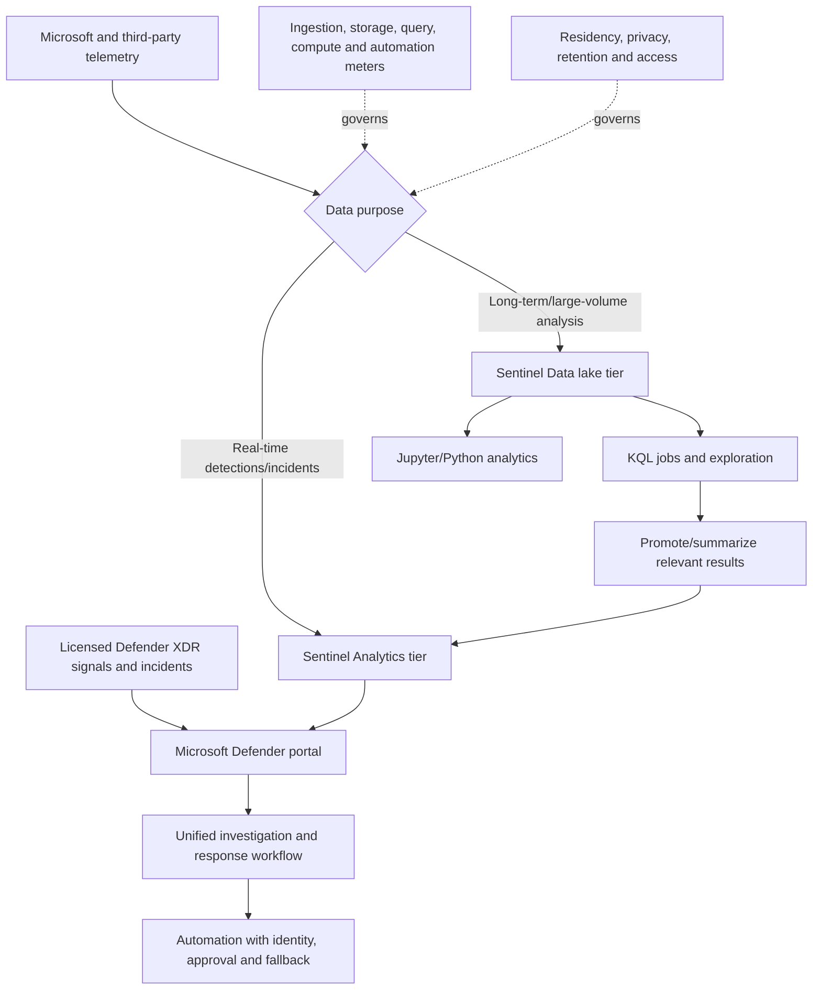

Do not flatten the terminology. Sentinel's data-lake overview describes two Sentinel storage tiers: Analytics and Data lake. The July 2026 SC-200 objective separately asks candidates to manage retention across “Analytics, Data lake, and XDR tiers.” In an interview, state the source context and verify the current data-management page instead of inventing a single universal tier model.

### UEBA is a behaviors layer, not an oracle

**User and Entity Behavior Analytics (UEBA)** builds baselines and enriches activity to highlight unusual behavior. It can identify that a user, device, location, application, resource, or volume differs from historical or peer behavior. “Unusual” is not “malicious.” New employees, travel, migrations, admin work, automation, and reorganizations can all be unusual.

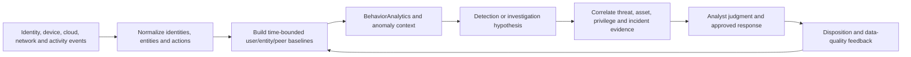

Controls: document sources, preview status, baseline windows, identity joins, group/role limits, schema migrations, data residency, privacy purpose, analyst access, false-positive handling, and feedback. Current Microsoft documentation warns that moving to the unified IdentityInfo table changes fields and removes table-level RBAC behavior available in the Azure-portal Log Analytics context. That is an architecture and privacy review item, not a UI footnote.

### Security Copilot and agents

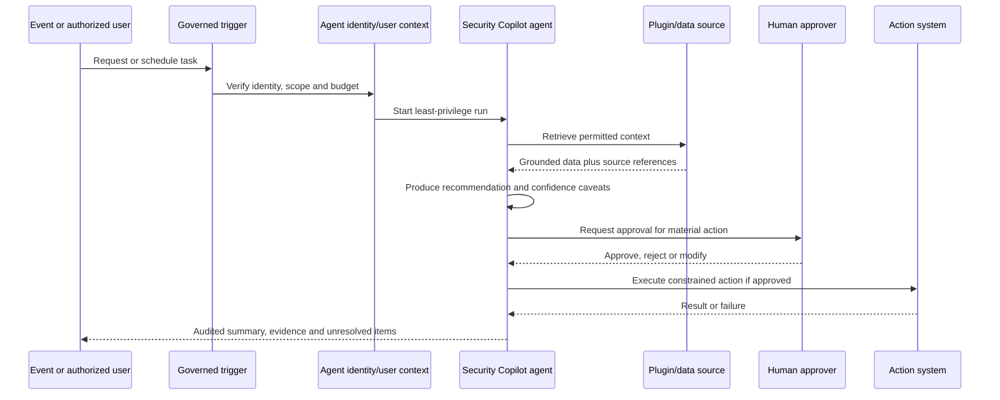

Human control does not mean clicking “approve” blindly. The approver needs identity, source evidence, proposed action, target, expected impact, alternatives, rollback, confidence, and time boundary. Low-risk read-only summarization may have lighter gates than disabling an identity, isolating a device, deleting email, changing a policy, or exporting sensitive evidence.

## 17. Trend evaluation checklist

Use this checklist for any announcement, preview, renamed product, new agent, new exam objective, or industry claim.

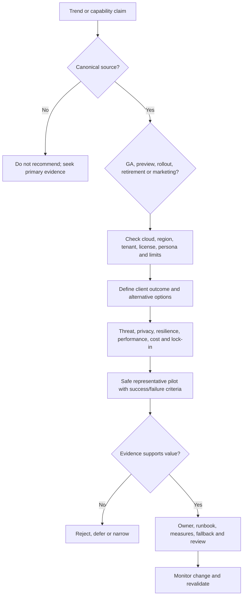

| Check | Question | Pass evidence |
|---|---|---|
| Source | Is there a canonical owner page rather than a repost? | URL, title, update date, captured status |
| Status | Is it GA, preview, private preview, rollout, deprecated, or scheduled retirement? | Explicit banner/release note; ambiguity recorded |
| Scope | Which cloud, region, tenant type, platform, persona, and workload? | Availability matrix and tenant confirmation |
| License/cost | Which entitlement and meters apply? | Product Terms/service plans plus pilot usage |
| Outcome | Which measurable client problem improves? | Baseline and acceptance threshold |
| Alternatives | Can process, current tools, point products, or coexistence meet it? | Neutral option comparison |
| Risk | What new identity, data, automation, privacy, resilience, or lock-in risk appears? | Threat/data-flow/RAID entries |
| Evidence | Is there representative positive, negative, boundary, failure, recovery, and rollback testing? | Test IDs and observed results |
| Operation | Who owns health, quality, incidents, changes, cost, and retirement? | RACI, runbook, dashboard and review date |
| Communication | Are statements dated, scoped, and free of superiority or compliance claims? | Reviewed recommendation language |

## 18. Safe paper exercise: framework-to-platform recommendation

This exercise is documentation-only. Use the fictional **Northstar Research Cooperative** from Part 71, reserved names, and synthetic assumptions. Do not access a tenant, activate a trial, scan a device, query real logs, test an external service, submit vendor forms, or create paid resources.

### Scenario

Northstar asks whether it should consolidate more security operations and data protection into Microsoft, retain specialist products, or use a mixed model. It has Microsoft 365 E3/E5 personas, Entra, Intune, Defender pilots, Purview pilots, Sentinel design, Splunk SIEM, CrowdStrike endpoint, Okta for selected SaaS, Jamf for Apple, Netskope SSE, Proofpoint email security, multiple clouds, German employee privacy concerns, and a future sovereign-sector bid. No benchmark, contract, or test result is supplied.

### Paper procedure

1. Define five outcomes: privileged account protection, research-data sharing control, phishing-to-endpoint response, cross-cloud detection, and resilient partner access.
2. Map each outcome to all six CSF Functions. Do not force one control into one Function only.
3. Select related control concepts from SP 800-53 and CIS Controls, recording version and mapping strength. Add a CIS Benchmark only when a named product/version configuration is involved.
4. Add ISO 27001 ISMS ownership, risk treatment, SoA, evidence, internal-audit, and management-review needs.
5. Use ATT&CK to identify priority behaviors and telemetry hypotheses. Add OWASP API/LLM/agent risks where automation or AI is involved.
6. Build three options: optimize coexistence, Microsoft-led consolidation, and specialist-led/mixed architecture. Do not score brand reputation.
7. Score the required criteria from Section 10 using `0 unknown`, `1 weak`, `2 partial`, `3 adequate`, and `4 strong`, with evidence and confidence. An unknown must never score as strong.
8. Build a persona-based entitlement validation plan. Use placeholders, not prices.
9. Mark GA, preview, retirement, license, region, and sovereign-cloud checks.
10. Recommend a **pilot decision**, not a purchase: exact scenarios, evidence, failure tests, owners, rollback, and decision gate.

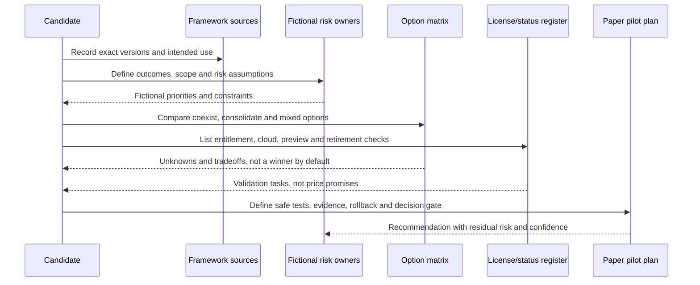

### Exercise templates

| Outcome | CSF Function/subcategory | Control concept | Threat/failure | Implementation candidates | Evidence needed | Mapping strength/gap |
|---|---|---|---|---|---|---|
| Privileged account protection | Record exact current identifiers | Least privilege, strong auth, audit, recovery | Stolen session; PIM outage | Entra/PIM/CA plus process; Okta/PAM integration where applicable | Settings, scope, tests, logs, recovery | Do not claim equivalence |
| Research-data sharing | Record exact current identifiers | Classification, access, DLP, review, lifecycle | Oversharing; false block | Purview plus SharePoint; specialist DLP/SSE integration | Synthetic positives/negatives, owner workflow | Partial until channels tested |

| Option | Coverage | Integration | Openness | Skills | Residency | Performance | Resilience | TCO | Lock-in/exit | Support | Confidence |
|---|---:|---:|---:|---:|---:|---:|---:|---:|---:|---:|---|
| Optimize coexistence | TBD | TBD | TBD | TBD | TBD | TBD | TBD | TBD | TBD | TBD | Low until evidence |
| Microsoft-led consolidation | TBD | TBD | TBD | TBD | TBD | TBD | TBD | TBD | TBD | TBD | Low until evidence |
| Specialist-led/mixed | TBD | TBD | TBD | TBD | TBD | TBD | TBD | TBD | TBD | TBD | Low until evidence |

**Safe expected conclusion:** “The paper assessment cannot select a universal winner. It identifies which outcomes may benefit from Microsoft-native correlation and which may depend on existing specialist depth, multiplatform coverage, contracts, sovereignty, or skills. I recommend a representative, reversible pilot and contract/license validation before migration. All product efficacy, cost, and availability claims remain unknown until evidenced.”

## 19. Decision language for interviews and client documents

| Avoid | Use instead |
|---|---|
| “Microsoft is best.” | “Microsoft is one candidate. In this estate, we would test whether native identity, endpoint, email, data, and incident context reduces handoffs while meeting multiplatform, sovereignty, efficacy, resilience, cost, and exit requirements.” |
| “Splunk/Google/CrowdStrike/Palo Alto/Okta/Ping/Jamf/Netskope/Zscaler is better.” | “The specialist option may preserve existing capability or platform depth; we need representative evidence and operating-model analysis.” |
| “E5 includes everything.” | “E5 is a bundle starting point. I validate exact service plan, persona, scope, add-on, Azure consumption, contract, cloud, and tenant state.” |
| “This maps to ISO, so we are compliant.” | “This implementation may support a scoped control objective. The organization still needs risk treatment, operation, evidence, internal assurance, and any required independent certification.” |
| “We have ATT&CK coverage.” | “For prioritized scenarios, these techniques have tested telemetry and detections; these are partial or blind, with named improvements.” |
| “AI will solve analyst shortages.” | “Assistive and agentic capabilities may reduce selected work, but require identity, data, quality, approval, cost, audit, fallback, and measured outcome evidence.” |
| “Passkeys eliminate identity risk.” | “Passkeys are phishing-resistant credentials; enrollment, recovery, device/provider lifecycle, attestation, session, authorization, and fallback still require design.” |

## 20. Official Source Anchors

These sources were checked for the **August 24, 2026 baseline**. They are anchors, not frozen truth. Recheck canonical URL, page update, publication/version, exam language, retirement banner, preview status, cloud/region, licensing, Product Terms, and tenant state before reuse.

### Framework and standards owners

| Topic | Public authoritative source | Use |
|---|---|---|
| NIST CSF 2.0 | [NIST Cybersecurity Framework](https://www.nist.gov/cyberframework) | Core, Profiles, Tiers, informative references, updates |
| NIST SP 800-53 Rev. 5 | [Security and Privacy Controls for Information Systems and Organizations](https://csrc.nist.gov/pubs/sp/800/53/r5/upd1/final) | Control catalog, release notes, mappings and non-equivalence warning |
| NIST Zero Trust | [NIST SP 800-207 Zero Trust Architecture](https://www.nist.gov/publications/zero-trust-architecture) | Vendor-neutral ZTA concepts |
| CIS Controls | [CIS Critical Security Controls v8](https://www.cisecurity.org/controls/v8) | Prioritized safeguards and current v8.1 direction |
| CIS Benchmarks | [CIS Benchmarks list](https://www.cisecurity.org/cis-benchmarks) | Product-specific consensus configuration guidance |
| ISO/IEC 27001 | [ISO/IEC 27001:2022](https://www.iso.org/standard/27001) | Published ISMS requirements standard and amendment status |
| MITRE ATT&CK | [MITRE ATT&CK](https://attack.mitre.org/) | Adversary-behavior knowledge base |
| ATT&CK definitions/limits | [MITRE ATT&CK FAQ](https://attack.mitre.org/resources/faq/) | Tactics, techniques, procedures, sources, updates and non-endorsement |
| ATT&CK data/tools | [ATT&CK Data and Tools](https://attack.mitre.org/resources/attack-data-and-tools/) | Navigator, STIX/TAXII, Workbench and versioned data |
| OWASP web applications | [OWASP Top Ten](https://owasp.org/www-project-top-ten/) | Current web-application awareness version |
| OWASP APIs | [OWASP API Security Top 10](https://owasp.org/API-Security/) | API risk categories and 2023 edition |
| OWASP LLM/GenAI | [OWASP Top 10 for LLM Applications](https://genai.owasp.org/llm-top-10/) | 2025 LLM/GenAI application risks |
| OWASP agents/GenAI | [OWASP GenAI Security Project](https://genai.owasp.org/) | Current project initiatives and agentic guidance links |
| CISA Zero Trust maturity | [CISA Zero Trust Maturity Model v2 PDF](https://www.cisa.gov/sites/default/files/2023-04/zero_trust_maturity_model_v2_508.pdf) | Pillars, cross-cutting capabilities and maturity stages; verify current CISA location |

### Microsoft certification anchors

| Credential | Official source | Baseline fact to recheck |
|---|---|---|
| SC-900 | [SC-900 study guide](https://learn.microsoft.com/en-us/credentials/certifications/resources/study-guides/sc-900) | July 28, 2026 objectives and weights |
| SC-300 | [SC-300 certification](https://learn.microsoft.com/en-us/credentials/certifications/identity-and-access-administrator/) and [study guide](https://learn.microsoft.com/en-us/credentials/certifications/resources/study-guides/sc-300) | Active, 12-month renewal, April 27 objectives |
| SC-400 retired | [SC-400 study guide](https://learn.microsoft.com/en-us/credentials/certifications/resources/study-guides/sc-400) and [retired certification](https://learn.microsoft.com/en-us/credentials/certifications/information-protection-and-compliance-administrator/) | Retired in May 2025; not a current booking path |
| SC-401 | [SC-401 certification](https://learn.microsoft.com/en-us/credentials/certifications/information-security-administrator/) and [study guide](https://learn.microsoft.com/en-us/credentials/certifications/resources/study-guides/sc-401) | Current data-security path; July 28, 2026 objectives |
| SC-200 | [SC-200 certification](https://learn.microsoft.com/en-us/credentials/certifications/security-operations-analyst/) and [study guide](https://learn.microsoft.com/en-us/credentials/certifications/resources/study-guides/sc-200) | Active, 12-month renewal, July 28 objectives |
| SC-100 | [SC-100 exam](https://learn.microsoft.com/en-us/credentials/certifications/exams/sc-100/), [study guide](https://learn.microsoft.com/en-us/credentials/certifications/resources/study-guides/sc-100), and [expert certification](https://learn.microsoft.com/en-us/credentials/certifications/cybersecurity-architect-expert/) | Active exam, July 28 objectives, expert prerequisite options |
| Exam experience | [Exam duration and exam experience](https://learn.microsoft.com/en-us/credentials/support/exam-duration-exam-experience) | Duration categories, labs, breaks, Learn access, sandbox and practice limits |

### Microsoft product, licensing, and trend anchors

| Topic | Official source | Baseline fact to recheck |
|---|---|---|
| Unified SecOps/Sentinel portal | [Connect Sentinel to the Defender portal](https://learn.microsoft.com/en-us/unified-secops/microsoft-sentinel-onboard) | Sentinel available without XDR/E5; unified prerequisites and workspace model |
| Sentinel overview/portal retirement | [What is Microsoft Sentinel SIEM?](https://learn.microsoft.com/en-us/azure/sentinel/overview) | Defender portal GA and future Azure-portal retirement notice |
| Sentinel data lake | [Microsoft Sentinel data lake overview](https://learn.microsoft.com/en-us/azure/sentinel/datalake/sentinel-lake-overview) | Analytics/data-lake architecture, KQL, notebooks, regions |
| Sentinel pricing | [Plan Sentinel costs and billing](https://learn.microsoft.com/en-us/azure/sentinel/billing) | Analytics/data-lake and connected-service meters |
| UEBA | [Sentinel UEBA reference](https://learn.microsoft.com/en-us/azure/sentinel/ueba-reference) | Sources, BehaviorAnalytics, IdentityInfo, previews and limitations |
| Defender XDR | [What is Microsoft Defender XDR?](https://learn.microsoft.com/en-us/defender-xdr/microsoft-365-defender) | Licensed signal correlation and cross-product capabilities |
| Defender XDR licensing | [Defender XDR prerequisites](https://learn.microsoft.com/en-us/defender-xdr/prerequisites) | Current qualifying plans, capability-specific requirements and cloud limits |
| Security Copilot | [What is Microsoft Security Copilot?](https://learn.microsoft.com/en-us/copilot/security/microsoft-security-copilot) | Standalone/embedded model and commercial-cloud boundary |
| Security Copilot agents | [Security Copilot agents overview](https://learn.microsoft.com/en-us/copilot/security/agents-overview) | Prerelease warning, identities, permissions, plugins and triggers |
| DSPM for AI transition | [DSPM for AI classic](https://learn.microsoft.com/en-us/purview/dspm-for-ai) | Classic replaced by broader DSPM; specific preview capabilities |
| Exposure Management | [Microsoft Security Exposure Management](https://learn.microsoft.com/en-us/security-exposure-management/microsoft-security-exposure-management) | Cross-domain exposure and public-cloud-only boundary |
| Passkeys | [Enable passkeys in Entra ID](https://learn.microsoft.com/en-us/entra/identity/authentication/how-to-authentication-passkeys-fido2) | Device-bound/synced support and admin provisioning preview |
| Entra licensing/agents | [Microsoft Entra licensing](https://learn.microsoft.com/en-us/entra/fundamentals/licensing) | P1/P2, governance, Agent ID/Agent 365 and feature-specific rules |
| Microsoft Zero Trust | [Zero Trust as a security foundation](https://learn.microsoft.com/en-us/security/zero-trust/zero-trust-overview) | Principles and structured adoption journey |
| Product use rights | [Microsoft Product Terms](https://www.microsoft.com/licensing/terms/) | Current agreement/program-specific use rights |

### Category and adjacent-certification anchors

The following vendor pages support **category identification only**. Client selection requires independent and client-specific evidence.

| Category | Public source anchors |
|---|---|
| SIEM/SOAR | [Splunk Enterprise Security](https://www.splunk.com/en_us/products/enterprise-security.html); [Google Security Operations](https://cloud.google.com/security/products/security-operations) |
| Endpoint/XDR | [CrowdStrike endpoint security](https://www.crowdstrike.com/en-us/platform/endpoint-security/); [Palo Alto Networks Cortex XDR](https://www.paloaltonetworks.com/cortex/cortex-xdr) |
| Identity | [Okta Single Sign-On](https://www.okta.com/products/single-sign-on/); [Ping Identity Platform](https://www.pingidentity.com/en/platform.html) |
| UEM | [Jamf Pro](https://www.jamf.com/products/jamf-pro/); [Omnissa Workspace ONE UEM](https://www.omnissa.com/products/workspace-one-unified-endpoint-management/) |
| SSE/CASB | [Netskope SSE](https://www.netskope.com/products/security-service-edge); [Zscaler Zero Trust Exchange](https://www.zscaler.com/products-and-solutions/zero-trust-exchange-zte) |
| Data security/DLP | [Broadcom/Symantec DLP](https://www.broadcom.com/products/cyber-security/information-protection/data-loss-prevention); [Forcepoint DLP](https://www.forcepoint.com/product/dlp-data-loss-prevention) |
| Email security | [Proofpoint Email Protection](https://www.proofpoint.com/us/products/email-protection); [Mimecast Email Security](https://www.mimecast.com/products/email-security/) |
| Adjacent credentials | [ISC2 CCSP](https://www.isc2.org/certifications/ccsp); [ISC2 CISSP](https://www.isc2.org/certifications/cissp); [CSA CCSK](https://cloudsecurityalliance.org/education/ccsk); [Cisco CCNA](https://www.cisco.com/site/us/en/learn/training-certifications/certifications/enterprise/ccna/index.html); [Cisco CCNP Security](https://www.cisco.com/site/us/en/learn/training-certifications/certifications/security/ccnp-security/index.html) |

---

## ⭐ Likely Interview Questions for This Section

### Q1. How do NIST CSF 2.0, NIST SP 800-53, CIS Controls, and ISO 27001 differ?

> **Model answer:** CSF 2.0 organizes cybersecurity risk outcomes across Govern, Identify, Protect, Detect, Respond, and Recover, usually through Current and Target Profiles. SP 800-53 is a detailed security/privacy control catalog selected and tailored through risk management. CIS Controls prioritize practical safeguards, while CIS Benchmarks provide technology-specific hardening guidance. ISO 27001 specifies requirements for an ISMS and can be independently certified within scope. I can map relationships among them, but I do not claim equivalence, implementation, or compliance from a crosswalk.

### Q2. How would you use MITRE ATT&CK without overstating coverage?

> **Model answer:** I start with client-relevant threat scenarios, identify tactics, techniques, procedures, and required telemetry, then trace each detection from source through normalization, analytic, alert, incident, response, and test. I report full, partial, and missing evidence plus false-positive, latency, health, and ownership information. ATT&CK is a behavior knowledge base, not a risk framework, ordered kill chain, efficacy score, complete threat inventory, or product endorsement.

### Q3. How would you compare Microsoft Sentinel with Splunk or Google Security Operations?

> **Model answer:** I would not rank logos. I define required sources, detections, investigations, automation, retention, sovereignty, performance, resilience, skills, support, openness, migration, and TCO. I baseline current content and incidents, paper-design options, then pilot representative Microsoft and non-Microsoft scenarios with failure and rollback. Microsoft integration may improve selected cross-domain workflows; an existing or alternative platform may retain material multiplatform, content, operating, or sovereignty value. The evidence determines consolidate, coexist, or retain.

### Q4. How do you make an E3/E5 or add-on licensing recommendation?

> **Model answer:** I begin with use cases and personas, including protected users, admins, reviewers, guests, devices, servers, workloads, agents, and SOC roles. For each exact feature I verify prerequisites in current service descriptions, licensing pages, Product Terms, the customer's agreement, and tenant service plans. I validate cloud/region/preview status and model Azure or capacity meters such as Sentinel ingestion, storage, query, notebooks, Logic Apps, and Security Copilot SCUs. I present ranges and assumptions, not a definitive price sheet.

### Q5. What is the current SC-900, SC-300, SC-400, SC-200, and SC-100 path?

> **Model answer:** SC-900, SC-300, SC-200, and SC-100 are active at the August 24, 2026 baseline, with SC-900/200/100 objectives updated July 28 and SC-300 updated April 27. SC-400 retired in May 2025 and must not be presented as current; SC-401 is the active Information Security Administrator Associate path and was updated July 28, 2026. For you I would use SC-900, SC-300, SC-401, SC-200, then SC-100 after integrated labs. The SC-100 expert credential also requires an eligible associate prerequisite such as SC-300 or SC-200 at this baseline. I recheck every page before booking.

### Q6. What 2026 Microsoft security changes matter most to a consultant?

> **Model answer:** The Defender portal is becoming the unified SecOps operating surface with Sentinel GA there; the documented Azure-portal retirement is a future dependency to plan and recheck. Sentinel adds analytics/data-lake patterns and new cost/query choices. UEBA and unified identity schemas add context but also schema, RBAC, privacy, and tuning concerns. Security Copilot is embedded and standalone, while agent documentation remains prerelease and needs identity, permissions, approval, audit, cost, and fallback. DSPM is expanding around AI/apps/agents, passkeys are maturing while admin provisioning remains preview, and exposure management emphasizes attack paths. None should be adopted from trend pressure alone.

### Q7. How would you assess Zero Trust maturity?

> **Model answer:** I assess defined business scenarios and pillars — identity, devices, applications/workloads, data, and network — plus governance, visibility/analytics, and automation/orchestration. For each, I distinguish documented intent, implemented scope, operational evidence, effectiveness tests, exceptions, recovery, and improvement. I use stages as communication aids, not product scores. The target step must reduce a prioritized risk and preserve critical journeys, and I never call an organization Zero Trust because it bought a suite.

### Q8. How do you discuss frameworks, products, and certifications honestly given your background?

> **Model answer:** I connect my production Microsoft 365 support, SharePoint/OneDrive, permissions, migration, incidents, RCA, escalation, stakeholder, and automation experience to evidence-driven security consulting. I label new security work as lab-observed, paper-simulated, or documented/expected. Framework mappings do not prove compliance, vendor pages do not prove superiority, and certifications do not equal production experience. I can explain my method, tradeoffs, tests, and validation plan without claiming Deloitte delivery, audits, SOC operation, or implementations I have not performed.

## 🧠 30-Second Memory Hooks

- **CSF asks outcomes:** Govern, Identify, Protect, Detect, Respond, Recover.
- **800-53 is a catalog:** select, tailor, allocate, implement, assess, monitor.
- **CIS Controls prioritize; CIS Benchmarks configure.**
- **ISO 27001 manages the system:** scope, risk, treatment, SoA, audit, review, improve.
- **ATT&CK:** tactic is why, technique is how, procedure is observed implementation; a mapping is not a detection test.
- **OWASP lists start conversations; they do not finish secure engineering.**
- **Zero Trust is continuous evidence, not a product or network slogan.**
- **Crosswalk means relationship, never automatic equivalence.**
- **Compare outcomes, operating models, evidence, TCO, and exit — not logos.**
- **E3/E5 is the start of licensing discovery, not the answer.**
- **Commercial-cloud documentation does not prove sovereign-cloud availability.**
- **SC-400 is retired; SC-401 is the current data-security path at the baseline.**
- **Certification validates assessed knowledge; labs and delivery evidence establish practice.**
- **GA, preview, rollout, retirement, and marketing are different states.**
- **An agent is identity + data + tools + actions + audit + stop control.**
- **A trend earns adoption only after source, scope, value, risk, test, and operation.**

## Completion Checklist

- [ ] The exact Part 72 title and August 24, 2026 baseline are visible.
- [ ] Candidate claims distinguish Production, Lab-observed, Paper-simulated, and Documented/expected evidence.
- [ ] JD Mapping ties frameworks, architecture, comparison, licensing, trends, and learning to Deloitte-role outcomes.
- [ ] NIST CSF 2.0 covers Govern, Identify, Protect, Detect, Respond, and Recover plus Profiles/Tiers caveats.
- [ ] NIST SP 800-53 is treated as a selected/tailored control catalog, not a mandatory shopping list.
- [ ] CIS Controls/Implementation Groups are distinguished from product-specific CIS Benchmarks.
- [ ] ISO/IEC 27001 covers ISMS, scope, risk, treatment, SoA, operation, audit, management review, improvement, and scoped certification.
- [ ] MITRE ATT&CK covers tactics, techniques, sub-techniques, procedures, telemetry/detections, and explicit limits.
- [ ] OWASP concepts cover web applications, APIs, LLM/GenAI, and agentic systems without claiming completeness.
- [ ] Zero Trust maturity covers pillars, cross-cutting capabilities, evidence, recovery, and gradual adoption.
- [ ] Framework mappings preserve source, objective, implementation, evidence, residual risk, and non-equivalence.
- [ ] Competitive comparisons cover SIEM/SOAR, endpoint/XDR, identity, UEM, CASB/SSE, data security/DLP, and email security.
- [ ] Product statements are category-level and neutral; no vendor superiority, invented benchmark, or unsupported efficacy claim appears.
- [ ] Selection criteria include existing estate, coverage, efficacy evidence, integration, openness, skills, residency, performance, resilience, TCO, lock-in/exit, and support.
- [ ] Licensing method covers E3/E5, security/compliance/add-ons, personas, service plans, Product Terms, tenant validation, consumption, and TCO.
- [ ] Sovereign and multicloud analysis validates exact cloud, region, data/admin flow, feature parity, resilience, and exit.
- [ ] SC-900, SC-300, SC-400, SC-401, SC-200, and SC-100 statuses and dated objective domains are recorded.
- [ ] SC-400 is clearly retired and replaced in the recommended path by current SC-401; no retired exam is recommended for booking.
- [ ] SC-100 expert prerequisites, practice, labs, renewal, personal-account, and exam-integrity guidance are included.
- [ ] The roadmap is tailored to your own record and states that certifications do not equal experience.
- [ ] CCSP, CCSK, CISSP, CCNA, and CCNP Security are positioned by purpose without exhaustive or inflated claims.
- [ ] 2026 trends cover unified SecOps, Sentinel data lake/tiers, UEBA, Security Copilot/agents, DSPM/AI security, agent identities/actions, passkeys, exposure management, ecosystems, code, privacy, and skills.
- [ ] Every preview, retirement, license, regional, sovereign, and change-sensitive fact requires live recheck.
- [ ] The Sentinel Azure-portal retirement is explicitly a documented future scheduled event, not described as completed.
- [ ] The safe exercise is paper-only, fictional, synthetic, noncommercial, and produces a pilot recommendation rather than a purchase claim.
- [ ] Exactly eight likely interview questions have concise model answers.
- [ ] Official framework-owner, Microsoft, category, and certification source anchors are included.
- [ ] No proprietary Deloitte method, client fact, confidential benchmark, legal opinion, audit opinion, or compliance guarantee is claimed.
- [ ] The next-Part link points only to Part 73 and no Part 73 file or appendix was created.

---

*Next suggested section:* [Part 73](Part-73-interview-question-bank.md)