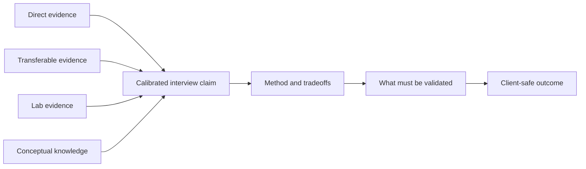
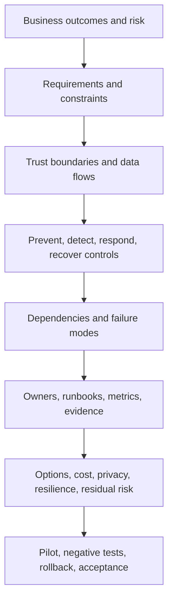
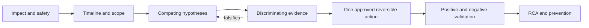
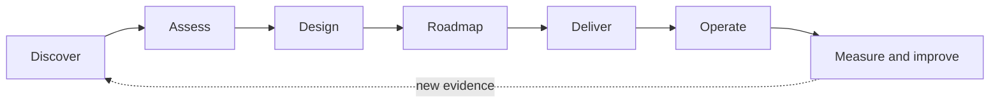
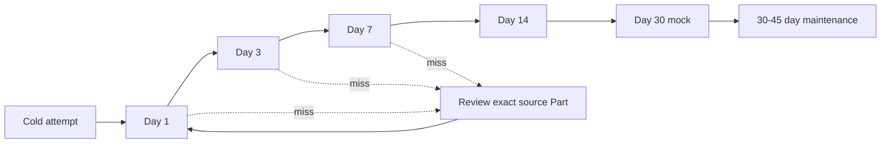
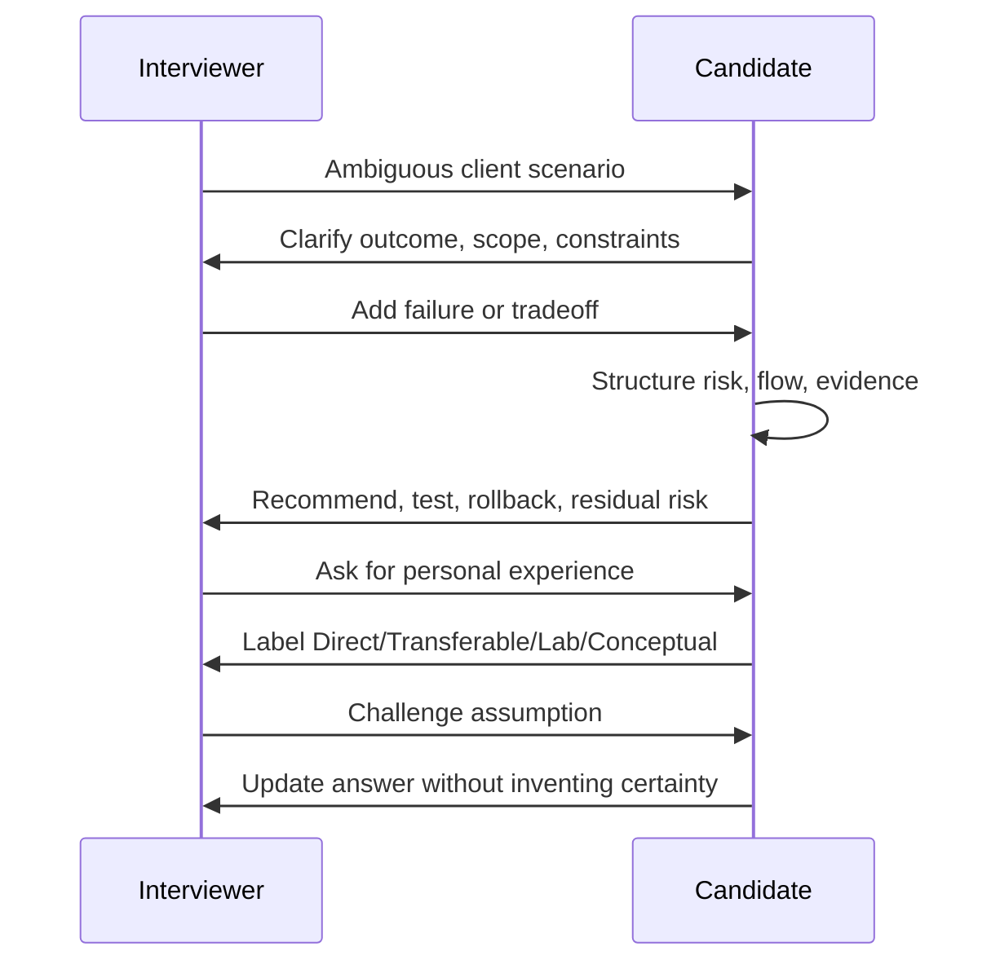

# Part 73 — Interview Question Bank - 150+ Questions with Answers and Self-Quiz Tracker

> **Section goal:** Turn Parts 1-72 into repeatable interview performance for a Deloitte Microsoft 365 Security Senior Consultant conversation. This bank contains **205 uniquely numbered questions**: 35 Basic, 40 Intermediate, 105 Advanced technical/scenario questions, 15 Behavioral/STAR prompts, and 10 Closing/Why prompts. Every answer is a concise starting point, not a script to memorize, and every question links to one or more source Parts for deeper review.

This Part maps to the role's complete job-description surface: Microsoft 365 security fundamentals; Zero Trust; tenant, network, identity, device, collaboration, data, XDR, SIEM, SOAR, and AI security; consulting discovery through operations; architecture, migration, deployment, troubleshooting, incident response, on-call resilience, documentation, labs, frameworks, certifications, and trends.

> **Currency boundary (August 24, 2026):** Product names, portals, licensing, service plans, preview/GA state, limits, regions, sovereign-cloud availability, certification objectives, and retirement schedules can change. Recheck a live official source before an interview, proposal, purchase, exam booking, or implementation. This bank uses no product-state claim later than the August 24, 2026 baseline. At that baseline, **SC-400 is retired** and **SC-401 is the current Microsoft Information Security Administrator certification path**; do not recommend booking SC-400.

> **Safety boundary:** All scenarios are fictional, synthetic, defensive, and intended for authorized assessment, design, detection, troubleshooting, or response. Do not bypass controls, probe systems without permission, expose real tenant data, or execute attack techniques. In an interview, explain validation with approved test accounts, synthetic events, isolated labs, documented change control, and reversible actions.

## Goal and JD map

| Interview signal | What a strong answer demonstrates | Highest-value review areas |
|---|---|---|
| Security foundations | Risk-led reasoning, Zero Trust, defense in depth, tenant and protocol fluency | Parts 2-5 |
| Identity and access | Entra architecture, strong authentication, Conditional Access, governance, hybrid and external identity | Parts 6-14 |
| Endpoint management | Intune enrollment, policy, compliance, endpoint security, lifecycle, and troubleshooting | Parts 15-20 |
| Microsoft 365 workloads | Exchange, MDO, Teams, SharePoint, OneDrive, apps, Power Platform, and Copilot controls | Parts 21-25 |
| Data security and compliance | Classification, labels, DLP, retention, investigations, privacy, insider risk, and AI data security | Parts 26-33 |
| Threat protection | Defender XDR, endpoint, identity, cloud apps, Office 365, hunting, exposure, and Security Copilot | Parts 34-42 |
| SIEM, SOAR, and SOC | Sentinel architecture, ingestion, normalization, KQL, analytics, UEBA, hunting, automation, and multitenancy | Parts 43-52 |
| Consulting delivery | Discovery, assessment, design, roadmap, migration, deployment, operations, RCA, IR, resilience, and documentation | Parts 53-63 |
| Practical credibility | Safe lab evidence, integrated scenarios, capstone defense, frameworks, certifications, and trends | Parts 64-72 |

## Candidate honesty note

Use one of these labels before a claim when the distinction matters. The labels prevent a correct conceptual answer from becoming an invented production story.

| Label | Meaning | Safe sentence starter |
|---|---|---|
| **Direct** | Work personally performed in an authorized real environment and defensible with nonconfidential detail | “My direct experience is in Microsoft 365 support, permissions, migration, incident coordination, RCA, reporting, and automation...” |
| **Transferable** | A proven skill from adjacent work that applies to the new problem, while product-specific delivery remains new | “The transferable skill is structured escalation and evidence-led troubleshooting; for this security control I would validate the product-specific steps...” |
| **Lab** | A result personally observed in an isolated, authorized environment with synthetic data | “In my lab, I configured the scenario, captured the policy result, and documented the rollback...” |
| **Conceptual** | Knowledge from current authoritative documentation or paper design, not personally implemented | “Conceptually, the architecture requires these controls and dependencies; I would confirm licensing, cloud availability, and tenant behavior in discovery and a pilot...” |

Never turn reading into delivery experience, a lab into a client implementation, a support case into SOC ownership, a certification into years of practice, or a framework mapping into compliance. A useful answer can be honest and senior: state what you know, identify the evidence needed, describe a safe method, and name the decision or escalation boundary.

## Question inventory

| Section | Question range | Difficulty/type | Exact count | Share of 180 technical questions |
|---|---:|---|---:|---:|
| Basic | Q001-Q035 | Basic | 35 | 19.4% |
| Intermediate | Q036-Q075 | Intermediate | 40 | 22.2% |
| Troubleshooting scenarios | Q076-Q095 | Advanced | 20 | 11.1% |
| Architecture/whiteboard prompts | Q096-Q110 | Advanced | 15 | 8.3% |
| Migration/deployment scenarios | Q111-Q120 | Advanced | 10 | 5.6% |
| Incident/SOC scenarios | Q121-Q130 | Advanced | 10 | 5.6% |
| Consulting/client scenarios | Q131-Q140 | Advanced | 10 | 5.6% |
| KQL/detection/automation | Q141-Q150 | Advanced | 10 | 5.6% |
| Integrated tradeoffs, labs, and trends | Q151-Q180 | Advanced | 30 | 16.7% |
| **Advanced subtotal** | **Q076-Q180** | **Advanced** | **105** | **58.3%** |
| Behavioral/STAR | Q181-Q195 | Behavioral | 15 | Additional |
| Closing/Why | Q196-Q205 | Closing | 10 | Additional |
| **Whole bank** | **Q001-Q205** | **All types** | **205** | **180 technical + 25 people/closing** |

The technical distribution is exactly **35 Basic / 40 Intermediate / 105 Advanced**. The advanced set contains the requested minimums as explicit blocks: 20 troubleshooting, 15 architecture, 10 migration/deployment, 10 incident/SOC, 10 consulting/client, and 10 KQL/detection/automation questions, followed by 30 integrated tradeoff and evidence questions.

## Coverage matrix for Parts 1-72

| Part | Domain | Question coverage |
|---:|---|---|
| 1 | Role map and candidate story | Q001, Q131, Q181, Q196 |
| 2 | Cybersecurity fundamentals | Q002, Q036, Q177 |
| 3 | Zero Trust and defense in depth | Q003, Q076, Q096 |
| 4 | Tenant architecture, portals, roles, licensing | Q004, Q151, Q175 |
| 5 | Network, identity, and application protocols | Q005, Q077, Q174 |
| 6 | Entra architecture and objects | Q006, Q037, Q097 |
| 7 | Authentication, authorization, and tokens | Q007, Q038, Q078 |
| 8 | MFA, passwordless, and authentication strengths | Q008, Q079, Q167 |
| 9 | Conditional Access | Q009, Q039, Q080, Q098 |
| 10 | Identity Protection | Q010, Q081, Q121 |
| 11 | RBAC, PIM, and emergency access | Q011, Q082, Q099, Q167 |
| 12 | Identity governance | Q012, Q040, Q178 |
| 13 | Hybrid identity | Q013, Q083, Q111 |
| 14 | External, cross-tenant, workload, and app identity | Q014, Q041, Q100 |
| 15 | Intune architecture and enrollment | Q015, Q042, Q101 |
| 16 | Intune configuration and precedence | Q016, Q084, Q168 |
| 17 | Compliance and Conditional Access | Q017, Q043, Q085 |
| 18 | Apps, Autopilot, updates, and lifecycle | Q018, Q086, Q112 |
| 19 | Intune endpoint security | Q019, Q087, Q168 |
| 20 | Intune operations and co-management | Q020, Q044, Q088 |
| 21 | Exchange architecture and mail flow | Q021, Q045, Q113 |
| 22 | EOP and Defender for Office 365 | Q022, Q046, Q089 |
| 23 | Teams security | Q023, Q047, Q114 |
| 24 | SharePoint and OneDrive security | Q024, Q048, Q090, Q169 |
| 25 | M365 Apps, Power Platform, and Copilot | Q025, Q049, Q115, Q160 |
| 26 | Purview architecture and classification | Q026, Q050, Q102 |
| 27 | Information Protection, labels, and encryption | Q027, Q051, Q103 |
| 28 | DLP across M365 and endpoints | Q028, Q052, Q091 |
| 29 | Lifecycle and records management | Q029, Q053, Q178 |
| 30 | Audit, eDiscovery, and investigation | Q030, Q054, Q123 |
| 31 | Insider Risk and Communication Compliance | Q031, Q055, Q155 |
| 32 | Compliance Manager, privacy, and audit readiness | Q032, Q056, Q156 |
| 33 | DSPM and AI data security | Q033, Q057, Q157 |
| 34 | Defender XDR architecture | Q034, Q058, Q104, Q121 |
| 35 | Defender for Endpoint and vulnerability management | Q035, Q059, Q092 |
| 36 | Defender for Identity | Q060, Q093, Q127 |
| 37 | Defender for Cloud Apps | Q061, Q158 |
| 38 | Defender for Office 365 SecOps | Q062, Q094, Q121 |
| 39 | Defender XDR IR and AIR | Q063, Q121, Q125 |
| 40 | Advanced Hunting and custom detections | Q064, Q141, Q147 |
| 41 | Exposure Management and Secure Score | Q065, Q159 |
| 42 | Security Copilot and agents | Q066, Q160 |
| 43 | Sentinel/SIEM/SOAR architecture | Q067, Q105, Q124 |
| 44 | Workspaces, cost, retention, and data lake | Q068, Q152 |
| 45 | Connectors, AMA, DCR, and ASIM | Q069, Q116, Q145 |
| 46 | KQL fundamentals | Q070, Q142-Q144 |
| 47 | Analytics, incidents, and entities | Q071, Q143, Q147 |
| 48 | UEBA, behaviors, and threat intelligence | Q072, Q122, Q148 |
| 49 | Hunting, workbooks, and notebooks | Q073, Q144, Q149 |
| 50 | Automation, Logic Apps, and playbooks | Q074, Q146, Q150 |
| 51 | Unified SecOps | Q075, Q124, Q160 |
| 52 | Enterprise multiworkspace/multitenant governance | Q106, Q161 |
| 53 | Consulting discovery and scope | Q131, Q162, Q181 |
| 54 | Assessments and gap analysis | Q132, Q163, Q182 |
| 55 | Requirements, threat modeling, HLD, and LLD | Q107, Q133, Q183 |
| 56 | Controls, licensing, roadmaps, and business case | Q134, Q151, Q184 |
| 57 | Third-party migration | Q117, Q135, Q177 |
| 58 | Pilots, testing, cutover, and rollback | Q118, Q136, Q185 |
| 59 | Operational readiness, RACI, and runbooks | Q119, Q137, Q186 |
| 60 | Structured multivendor troubleshooting | Q095, Q138, Q187 |
| 61 | Incident response and PIR | Q125, Q139, Q188 |
| 62 | Resilience, on-call, and handover | Q126, Q164, Q189 |
| 63 | Documentation, reporting, automation, and quality | Q140, Q165, Q190 |
| 64 | Safe lab environment | Q166, Q191 |
| 65 | Entra Zero Trust lab | Q167, Q192 |
| 66 | Intune endpoint lab | Q168, Q193 |
| 67 | Secure M365 workloads lab | Q169, Q194 |
| 68 | Purview lab | Q170, Q195 |
| 69 | Defender XDR investigation lab | Q127, Q171 |
| 70 | Sentinel SIEM/SOAR lab | Q128, Q146, Q172 |
| 71 | Deloitte-style capstone | Q108, Q172, Q180 |
| 72 | Frameworks, competition, certifications, and trends | Q129, Q173, Q179, Q205 |

## How to answer, not merely what to know

| Question type | Recommended structure | Final proof point |
|---|---|---|
| Definition | Plain meaning → why it matters → example → limitation | “I would validate it with...” |
| Architecture | Outcomes → requirements → boundaries → components/flows → controls → failure modes → operations/tradeoffs | Diagram plus decision record and tests |
| Troubleshooting | Impact/safety → facts and timeline → layers/hypotheses → discriminating evidence → reversible action → validation/RCA | Before/after evidence and prevention |
| Consulting | Business objective → stakeholders → discovery evidence → options/tradeoffs → recommendation → roadmap/governance | Named decision owner and acceptance measure |
| Incident | Declare/severity → preserve evidence → scope → contain → eradicate/recover → communicate → learn | Timeline, decision log, residual risk |
| Behavioral | Situation → task → actions you personally took → measurable result → reflection | Honest scope and “I,” not vague “we” |

### Architecture/whiteboard method

| Step | Whiteboard move | Questions to ask aloud |
|---:|---|---|
| 1 | State outcomes and assumptions | Which business journeys, threats, obligations, users, devices, data, regions, and recovery targets matter? |
| 2 | Draw trust boundaries and flows | Where do identity, device, network, app, data, administration, and telemetry cross boundaries? |
| 3 | Place preventive, detective, responsive, and recovery controls | What verifies explicitly, limits privilege, assumes breach, detects failure, and restores service? |
| 4 | Add dependencies and failure modes | What if identity, DNS, telemetry, licensing, connector, automation, or an administrator path fails? |
| 5 | Add ownership and evidence | Who operates each control, how is it tested, and what proves effectiveness? |
| 6 | Explain options and residual risk | Why this design, what did we reject, what remains, and who accepts it? |

### Troubleshooting method

| Phase | What to do | Avoid |
|---|---|---|
| Stabilize | Confirm impact, authorization, severity, recent change, and safe workaround | Random production changes |
| Bound | Build timeline; identify affected/unaffected users, devices, locations, apps, and policies | Treating correlation as cause |
| Layer | Trace client → network → identity/token → policy → workload → data → telemetry | Staying in one portal by habit |
| Discriminate | Choose the cheapest evidence that separates hypotheses | Collecting every log without a question |
| Change | Make one reversible, approved change with owner and rollback | Disabling broad security controls |
| Prove | Repeat positive/negative tests and compare timestamps/correlation IDs | Declaring success from one screenshot |
| Learn | Document root cause, contributing factors, prevention, monitoring, and owner | Blaming a user or vendor without evidence |

### Consulting answer method

| Stage | Consultant question | Deliverable |
|---|---|---|
| Discover | What outcome, pain, risk, scope, stakeholders, constraints, and evidence exist? | Discovery log and scope |
| Assess | What is implemented, operating, effective, owned, and evidenced? | Findings, risk register, maturity narrative |
| Design | What target control and operating model best fit? | HLD/LLD, option paper, decision record |
| Roadmap | What sequence delivers value while managing dependencies and change? | Prioritized waves, costs, owners, success measures |
| Deliver | How will we pilot, test, cut over, roll back, and communicate? | Plan, test evidence, issue/risk/decision logs |
| Operate | Who monitors, responds, tunes, reports, recovers, and improves? | RACI, runbooks, SLOs, dashboards, handover |

## Basic questions — 35

### Q001. What does a Microsoft 365 Security Senior Consultant do?
> **Answer / hint:** The consultant turns business risk into designed, tested, and operable controls across identity, endpoints, workloads, data, and SecOps. A senior answer includes discovery, options, architecture, staged deployment, evidence, handover, and improvement, not only portal configuration. I would connect my direct Microsoft 365 support and RCA experience while labeling newer security delivery as transferable, lab, or conceptual.
> **Review:** [Part 1](Part-01-role-map-deloitte-cyber-engagement-story.md)

### Q002. What are confidentiality, integrity, and availability?
> **Answer / hint:** Confidentiality limits information to authorized people and systems; integrity keeps it accurate and protected from unauthorized change; availability keeps it usable when needed. They are a risk lens, not three products. For example, encryption supports confidentiality, audit and change control support integrity, and tested recovery supports availability; one control may help several goals.
> **Review:** [Part 2](Part-02-cybersecurity-fundamentals.md)

### Q003. What are the core Zero Trust principles?
> **Answer / hint:** Verify explicitly using relevant signals, use least privilege with minimal scope and duration, and assume breach by limiting blast radius and monitoring continuously. Zero Trust does not mean trusting nothing or buying one suite. It is a decision model across identities, devices, networks, applications, workloads, and data, supported by governance, visibility, automation, and recovery.
> **Review:** [Part 3](Part-03-zero-trust-defense-in-depth-secure-by-design.md)

### Q004. What is a Microsoft 365 tenant?
> **Answer / hint:** A tenant is an organization's logical Microsoft cloud boundary containing directory objects, subscriptions, policies, workloads, data, roles, and configurations. It is not an automatically isolated security fortress: external collaboration, applications, administrators, devices, connectors, networks, and cross-tenant relationships cross boundaries. Tenant design must cover ownership, identity, licensing, logging, recovery, and lifecycle.
> **Review:** [Part 4](Part-04-m365-tenant-architecture-portals-roles-licensing.md)

### Q005. Why must an M365 security consultant understand DNS, TCP, TLS, and HTTP?
> **Answer / hint:** Cloud controls still depend on name resolution, network sessions, encrypted transport, proxies, certificates, and web requests. DNS finds the service, TCP provides reliable transport, TLS protects and authenticates the channel, and HTTP carries application requests. Layer knowledge prevents an identity-looking symptom from being misdiagnosed when the actual fault is proxy, certificate, routing, or endpoint reachability.
> **Review:** [Part 5](Part-05-networking-identity-application-protocols.md)

### Q006. What kinds of objects exist in Microsoft Entra ID?
> **Answer / hint:** Common objects include users, groups, devices, applications, service principals, managed identities, and administrative units. The application object is the reusable definition; a service principal is its tenant-local identity and permissions. Each object needs lifecycle, owner, authentication, authorization, and review decisions so stale identities do not become unmanaged access paths.
> **Review:** [Part 6](Part-06-entra-id-architecture-directory-objects.md)

### Q007. How do authentication and authorization differ?
> **Answer / hint:** Authentication establishes who or what is requesting access; authorization decides what that identity may do. A token carries claims used by a resource to make access decisions, but possession of a token is not proof that every request should be allowed. Strong design protects credential issuance, token use, permissions, session conditions, and resource-side enforcement.
> **Review:** [Part 7](Part-07-authentication-authorization-tokens-modern-auth.md)

### Q008. Why is phishing-resistant MFA stronger than ordinary MFA?
> **Answer / hint:** Some MFA methods can still be socially engineered, relayed, or fatigue-approved. Phishing-resistant methods such as appropriately deployed FIDO2/passkeys or certificate-based authentication bind authentication more strongly to the legitimate service and cryptographic key. Strength still depends on registration, recovery, device, attestation, policy, fallback, and user-lifecycle controls; “MFA enabled” alone is incomplete.
> **Review:** [Part 8](Part-08-mfa-passwordless-authentication-strengths.md)

### Q009. What is Conditional Access?
> **Answer / hint:** Conditional Access is Entra's policy engine for evaluating sign-in and session conditions such as identity, application, device, location, risk, and authentication strength, then granting, limiting, or blocking access. It is evaluated using available signals and dependencies; it is not a first-factor authentication method, firewall, or substitute for application authorization. Deploy with report-only, exclusions, tests, and rollback.
> **Review:** [Part 9](Part-09-conditional-access-design-deployment-troubleshooting.md)

### Q010. What does Entra ID Protection do?
> **Answer / hint:** Identity Protection detects and reports risk signals associated with users and sign-ins and can feed risk-based access and remediation decisions. A risk detection is evidence to investigate, not proof of compromise. Good operation defines policy thresholds, user remediation, analyst workflows, privacy, false-positive handling, emergency access, and validation of the resulting sign-in behavior.
> **Review:** [Part 10](Part-10-entra-id-protection-risk-based-access.md)

### Q011. What are PIM and emergency-access accounts?
> **Answer / hint:** Privileged Identity Management makes eligible privilege time-bound and governable through activation controls, approval, justification, strong authentication, alerts, and reviews. Emergency-access accounts provide a separately protected recovery path when normal identity controls fail. They solve different needs: PIM reduces standing privilege; emergency access preserves recoverability. Both require monitoring, tests, documented ownership, and exclusions kept minimal.
> **Review:** [Part 11](Part-11-privileged-access-rbac-pim-emergency-access.md)

### Q012. What is identity governance?
> **Answer / hint:** Identity governance manages who should receive, retain, review, and lose access over the joiner-mover-leaver lifecycle. Capabilities such as entitlement management, access packages, lifecycle workflows, terms, and access reviews help, but ownership and source data remain crucial. The outcome is timely, justified, reviewable access, not simply a completed review campaign.
> **Review:** [Part 12](Part-12-identity-governance-lifecycle-entitlement-access-reviews.md)

### Q013. What is hybrid identity?
> **Answer / hint:** Hybrid identity connects on-premises identity systems, commonly Active Directory, with Entra ID so users and attributes can support cloud access. Synchronization and authentication choices introduce dependencies, source-of-authority decisions, privileged paths, recovery needs, and possible attack routes. A consultant documents flows, filters, writeback, service accounts, monitoring, failover, and change ownership instead of treating sync as invisible plumbing.
> **Review:** [Part 13](Part-13-hybrid-identity-connect-cloud-sync.md)

### Q014. How do guest, workload, and managed identities differ?
> **Answer / hint:** A guest represents an external person collaborating in a tenant; a workload identity represents software; a managed identity is an Azure-managed workload credential mechanism that reduces secret handling. Their trust, lifecycle, permissions, authentication, and review models differ. All should have explicit owners, least privilege, monitoring, expiry or lifecycle triggers, and controls appropriate to human versus nonhuman behavior.
> **Review:** [Part 14](Part-14-external-cross-tenant-workload-app-identity.md)

### Q015. What is the difference between MDM and MAM in Intune?
> **Answer / hint:** Mobile device management governs an enrolled device's configuration and security state; mobile application management protects organizational data within supported applications, including on some unenrolled devices. MDM is like managing the whole company vehicle; MAM is like securing the company package inside a personal vehicle. The choice depends on ownership, privacy, platform support, data risk, and user journey.
> **Review:** [Part 15](Part-15-intune-architecture-enrollment-mdm-mam.md)

### Q016. Why can multiple Intune policies create confusing results?
> **Answer / hint:** A device may receive configuration profiles, security baselines, endpoint-security policies, compliance policies, application settings, update policies, scripts, and local or domain controls. Assignment, applicability, precedence, conflict behavior, timing, and device state determine the effective result. Troubleshooting therefore starts with the intended setting and traces every authority and assignment rather than assuming the last portal edit wins.
> **Review:** [Part 16](Part-16-intune-configuration-settings-baselines-policy-precedence.md)

### Q017. How do Intune compliance and Conditional Access work together?
> **Answer / hint:** Intune assesses a device against defined compliance rules and reports state; Conditional Access can require a compliant device before a cloud application grants access. The chain depends on correct enrollment, identity/device registration, policy assignment, evaluation, signal freshness, licensing, and application support. Compliance is an access signal, not proof that a device is invulnerable.
> **Review:** [Part 17](Part-17-intune-compliance-conditional-access.md)

### Q018. What problem does Windows Autopilot solve?
> **Answer / hint:** Autopilot helps provision and configure corporate Windows devices using cloud-driven profiles and enrollment, reducing traditional image-based handling. It does not eliminate hardware registration, identity, network, application, policy, licensing, user-readiness, or support dependencies. A reliable design covers personas, pre-provisioning choices, enrollment-status behavior, application sequencing, failure recovery, reuse, reset, and retirement.
> **Review:** [Part 18](Part-18-intune-apps-autopilot-updates-lifecycle.md)

### Q019. What belongs in the Intune endpoint-security stack?
> **Answer / hint:** The stack may include security baselines, disk encryption, firewall, attack-surface reduction, endpoint detection and response onboarding, antivirus, account protection, application control, update posture, local administrator controls, and device compliance. Settings must be assigned, conflict-managed, tested, monitored, and recoverable. A product toggle is not an operating control without evidence and ownership.
> **Review:** [Part 19](Part-19-intune-endpoint-security-stack.md)

### Q020. What is co-management?
> **Answer / hint:** Co-management lets eligible Windows devices be managed by both Configuration Manager and Intune while workloads transition in controlled stages. It is not two independent tools safely writing every setting. A consultant identifies authority by workload, pilot collections, prerequisites, duplicate controls, reporting differences, rollback, support ownership, and the target end state.
> **Review:** [Part 20](Part-20-intune-operations-troubleshooting-sccm-comanagement.md)

### Q021. Describe Exchange Online mail flow at a high level.
> **Answer / hint:** A sender resolves mail-routing records, establishes SMTP transport, and passes the message through protection, connector, transport-rule, routing, and delivery decisions before it reaches a mailbox or downstream system. Headers and trace events record parts of the journey. Security design considers accepted domains, connectors, authentication, filtering, transport rules, forwarding, encryption, journaling, and hybrid dependencies.
> **Review:** [Part 21](Part-21-exchange-online-architecture-mail-flow.md)

### Q022. How do Exchange Online Protection and Defender for Office 365 differ?
> **Answer / hint:** Exchange Online Protection provides foundational anti-spam, anti-malware, connection, and mail-flow protection. Defender for Office 365 adds capabilities for advanced phishing and malicious content protection, investigation, response, simulation, and security operations depending on license and plan. Policy order, presets, exceptions, user submissions, telemetry, and operational tuning matter as much as feature names.
> **Review:** [Part 22](Part-22-eop-defender-office-365.md)

### Q023. What are major Teams security decisions?
> **Answer / hint:** Key decisions cover identity and guest access, external federation, meeting admission and recording, messaging, applications and permissions, shared channels, data lifecycle, information protection, eDiscovery, device posture, and operational monitoring. Teams relies on Entra, SharePoint, OneDrive, Exchange, Purview, and Defender, so a meeting-policy-only view misses important data and trust boundaries.
> **Review:** [Part 23](Part-23-teams-security-meetings-federation-apps-compliance.md)

### Q024. How do SharePoint and OneDrive sharing controls fit together?
> **Answer / hint:** Tenant defaults set broad boundaries; site, group, sensitivity-label, link, domain, device, and item permissions further shape access. OneDrive is built on SharePoint technology but has personal-workspace ownership patterns. Effective access can come through direct grants, groups, links, guests, and inheritance, so governance needs owners, expiry, review, audit, data classification, and usable defaults.
> **Review:** [Part 24](Part-24-sharepoint-onedrive-security-sharing-sync-governance.md)

### Q025. What security concerns apply to Power Platform and Microsoft 365 Copilot?
> **Answer / hint:** Power Platform introduces environments, connectors, makers, applications, flows, service identities, data policies, sharing, and lifecycle. Copilot grounds responses in identities, permissions, content, and enabled services; it does not repair excessive access. Secure adoption requires data hygiene, least privilege, connector and environment governance, DLP, app/agent review, audit, privacy, license validation, and human accountability.
> **Review:** [Part 25](Part-25-m365-apps-power-platform-copilot-security.md)

### Q026. What is Microsoft Purview's role?
> **Answer / hint:** Purview brings together capabilities for discovering, classifying, protecting, governing, retaining, auditing, and investigating data and communications, with exact availability depending on product, license, workload, cloud, and configuration. A consultant begins with data, business process, obligation, risk, and ownership; the portal's solution list is not itself a data-security strategy.
> **Review:** [Part 26](Part-26-purview-architecture-classification-solution-map.md)

### Q027. What is a sensitivity label?
> **Answer / hint:** A sensitivity label expresses a data classification and can apply visible markings, encryption, access restrictions, or container controls depending on scope and configuration. The label travels as metadata in supported scenarios, but behavior varies by workload and client. A usable taxonomy needs clear meanings, limited choices, defaults, coexistence planning, testing, support, and review.
> **Review:** [Part 27](Part-27-purview-information-protection-labels-encryption.md)

### Q028. What is DLP?
> **Answer / hint:** Data Loss Prevention identifies defined sensitive information or contexts and applies actions such as audit, user guidance, justification, restriction, or blocking across supported locations. DLP is not “block all sensitive data.” Good policy defines business intent, locations, identities, conditions, confidence, exceptions, user experience, alert routing, privacy, tuning, and evidence of reduced risk.
> **Review:** [Part 28](Part-28-purview-dlp-m365-endpoints-cloud-apps.md)

### Q029. How do retention and records management differ from backup?
> **Answer / hint:** Retention and records controls govern how long content must be kept or when it may be deleted for business, legal, or regulatory reasons. Backup is primarily for recoverability from loss or corruption. Retention can preserve content against deletion but does not automatically provide every backup property, recovery objective, isolation model, or restoration experience. Requirements and tests must stay separate.
> **Review:** [Part 29](Part-29-purview-lifecycle-records-management.md)

### Q030. How do Audit and eDiscovery support investigations?
> **Answer / hint:** Audit records supported activities for search and investigation; eDiscovery provides governed workflows to identify custodians and sources, preserve, collect, review, and export potentially relevant content. Neither replaces legal judgment. A sound process uses authorized roles, scoped searches, timestamps, query records, chain of custody, privacy controls, validated exports, retention awareness, and legal or HR direction.
> **Review:** [Part 30](Part-30-purview-audit-ediscovery-legal-investigation.md)

### Q031. What is the privacy concern with insider-risk tooling?
> **Answer / hint:** Insider-risk signals can involve highly sensitive employee activity and can be misinterpreted without context. Governance should use legitimate purpose, minimum necessary data, role separation, pseudonymization where available, threshold and policy tuning, legal/HR/privacy involvement, controlled disclosure, audit, retention, and human review. A signal is a prompt for fair investigation, not proof of malicious intent.
> **Review:** [Part 31](Part-31-purview-insider-risk-communication-compliance.md)

### Q032. What do Compliance Manager and audit-readiness work provide?
> **Answer / hint:** They help organize requirements, improvement actions, ownership, evidence, and assessment progress. A score or mapped action does not certify an organization or provide legal advice. Strong readiness traces obligations to scoped controls, implementation evidence, operating evidence, exceptions, tests, owners, and remediation while identifying inherited, shared, and customer responsibilities.
> **Review:** [Part 32](Part-32-purview-compliance-manager-privacy-audit-readiness.md)

### Q033. What is DSPM for AI in plain English?
> **Answer / hint:** Data Security Posture Management for AI helps discover and assess how sensitive data and AI-related activity may create exposure, depending on supported products and entitlements. Think of it as mapping valuable material and risky pathways before choosing controls. It complements, rather than replaces, permissions hygiene, labels, DLP, insider-risk governance, application control, identity security, and human review.
> **Review:** [Part 33](Part-33-purview-dspm-ai-data-security.md)

### Q034. What is Defender XDR?
> **Answer / hint:** Defender XDR correlates security signals and response across supported identities, endpoints, email/collaboration, applications, and cloud services into incidents and investigation experiences. Its value depends on onboarding, telemetry health, entitlements, identity/entity quality, integration, permissions, tuning, and operating process. Correlation reduces fragmentation but does not make every alert true or every source complete.
> **Review:** [Part 34](Part-34-defender-xdr-architecture-attack-story.md)

### Q035. What do Defender for Endpoint and vulnerability management contribute?
> **Answer / hint:** Defender for Endpoint provides endpoint telemetry, prevention, detection, investigation, and response capabilities; vulnerability-management capabilities identify and prioritize exposures using device and threat context, subject to plan and platform support. Effective operation requires onboarding health, tamper protection, policy, exclusions, sensor connectivity, RBAC, response approvals, remediation ownership, and measurements beyond raw vulnerability counts.
> **Review:** [Part 35](Part-35-defender-endpoint-vulnerability-management.md)

## Intermediate questions — 40

### Q036. How do you turn a security principle into an implementable control?
> **Answer / hint:** Start with the risk and control objective, define scope and trust boundaries, select preventive/detective/responsive/recovery measures, assign ownership, specify configuration and exceptions, then define positive, negative, failure, and recovery tests. “Use least privilege” becomes eligible time-bound roles, approval, strong authentication, monitoring, review, emergency access, and evidence. Record residual risk and do not confuse configuration with effectiveness.
> **Review:** [Part 2](Part-02-cybersecurity-fundamentals.md), [Part 3](Part-03-zero-trust-defense-in-depth-secure-by-design.md)

### Q037. How would you explain the Entra control plane and data plane?
> **Answer / hint:** The control plane is where identities, applications, roles, policies, and configuration are administered; the data plane is where users and workloads consume resources. Privileged control-plane compromise can alter who may reach data, so administration needs separate identities/devices, PIM, strong authentication, monitoring, and recovery. Draw directory objects, token issuance, policy evaluation, resource enforcement, logs, and external dependencies.
> **Review:** [Part 6](Part-06-entra-id-architecture-directory-objects.md), [Part 11](Part-11-privileged-access-rbac-pim-emergency-access.md)

### Q038. Compare OAuth 2.0, OpenID Connect, and SAML.
> **Answer / hint:** OAuth 2.0 is an authorization framework for delegated or application access; OpenID Connect adds an identity layer for authentication; SAML commonly exchanges XML assertions for enterprise federation and SSO. Protocol names alone do not secure an app. Validate grant/flow, redirect URIs, consent, token audience/scopes, signing keys, session lifetime, client type, secret/certificate handling, and resource-side authorization.
> **Review:** [Part 7](Part-07-authentication-authorization-tokens-modern-auth.md)

### Q039. What dependencies can make a Conditional Access design fail?
> **Answer / hint:** Dependencies include accurate identities and groups, device registration/compliance, authentication methods, locations, application targeting, risk signals, token/session behavior, legacy protocols, workload identities, emergency access, licensing, and log access. A policy may be logically correct yet harm service accounts or recovery paths. Build personas and journeys, use report-only, inspect sign-in evaluation, stage deployment, and test rollback.
> **Review:** [Part 9](Part-09-conditional-access-design-deployment-troubleshooting.md)

### Q040. How would you design joiner-mover-leaver governance?
> **Answer / hint:** Establish authoritative HR or approved sources, identity correlation, role and attribute rules, birthright versus requestable access, approvals, segregation of duties, time limits, reviews, and rapid termination. Cover guests, contractors, privileged roles, groups, applications, licenses, devices, and data ownership. Measure orphaned access, provisioning failures, removal latency, review quality, and exceptions rather than only completed workflows.
> **Review:** [Part 12](Part-12-identity-governance-lifecycle-entitlement-access-reviews.md)

### Q041. How should application consent and workload identities be governed?
> **Answer / hint:** Inventory applications and service principals; classify permission and publisher risk; restrict consent appropriately; use verified ownership, least privilege, managed identities or certificates where suitable, credential expiry, review, logging, and emergency revocation. Separate delegated permissions from application permissions. Test business dependencies before removal, because a stale-looking service principal may support production automation, but absence of ownership is itself a finding.
> **Review:** [Part 14](Part-14-external-cross-tenant-workload-app-identity.md)

### Q042. How do you choose an Intune enrollment and management model?
> **Answer / hint:** Segment personas by corporate/personal ownership, platform, location, privilege, application/data needs, privacy, regulatory constraints, and lifecycle. Compare full MDM, MAM without enrollment, shared/dedicated/kiosk patterns, and unsupported scenarios. Validate prerequisites and user journeys in a pilot. The recommendation must include enrollment, configuration, apps, compliance, support, wipe/retire behavior, evidence, and exception handling.
> **Review:** [Part 15](Part-15-intune-architecture-enrollment-mdm-mam.md)

### Q043. Trace the compliant-device signal from endpoint to application.
> **Answer / hint:** The device is enrolled/registered, receives compliance policy, evaluates and reports state through Intune, becomes associated with the signing-in identity/device record, and supplies a signal during Conditional Access evaluation before the resource grants access. Timing, duplicate device records, unsupported clients, stale check-in, user scope, grace period, and token state can alter results. Verify each hop with aligned timestamps.
> **Review:** [Part 17](Part-17-intune-compliance-conditional-access.md)

### Q044. What evidence do you collect for an Intune policy issue?
> **Answer / hint:** Capture affected identity/device IDs, platform/build, enrollment and ownership, assignment membership, filters, policy type, setting, applicability, status, check-in time, conflicts, local effective state, relevant client logs, MDM diagnostics, event logs, and recent changes. Compare one affected and one unaffected device. Protect personal data and use correlation/timestamps to test a specific hypothesis rather than exporting everything.
> **Review:** [Part 20](Part-20-intune-operations-troubleshooting-sccm-comanagement.md)

### Q045. How do SPF, DKIM, and DMARC work together?
> **Answer / hint:** SPF authorizes sending infrastructure for the envelope domain, DKIM cryptographically signs selected message content for a signing domain, and DMARC evaluates alignment with the visible From domain and publishes policy/reporting. They reduce domain spoofing but do not stop all phishing, compromised accounts, lookalike domains, or malicious content. Deploy from inventory and monitoring toward enforcement without breaking legitimate senders.
> **Review:** [Part 21](Part-21-exchange-online-architecture-mail-flow.md)

### Q046. How would you tune MDO without creating dangerous exceptions?
> **Answer / hint:** Start with threat and delivery data, preset-policy guidance, sender/application inventory, user reports, false positives/negatives, and VIP/high-risk personas. Prefer narrow, owned, expiring exceptions based on the exact mechanism over broad allow lists. Test safe synthetic messages, trace verdicts, review policy order, monitor change, and remove the root cause such as bad authentication or connector design.
> **Review:** [Part 22](Part-22-eop-defender-office-365.md)

### Q047. Distinguish Teams guest access, external access, and shared channels.
> **Answer / hint:** Guest access brings an external person into the tenant as a guest for team resources; external access/federation enables communication across organizations without ordinary guest membership; shared channels use cross-tenant capabilities for scoped collaboration where supported. Each has different identity, policy, data, lifecycle, audit, and user-experience implications. Choose by business journey and validate Entra, Teams, SharePoint, and compliance dependencies.
> **Review:** [Part 23](Part-23-teams-security-meetings-federation-apps-compliance.md)

### Q048. How do you reduce oversharing in SharePoint without blocking collaboration?
> **Answer / hint:** Discover sites, owners, classifications, external users, links, permissions, and sensitive content; define risk-based defaults; restrict anonymous links where justified; use expiration, domain rules, access reviews, unmanaged-device controls, labels, and owner education. Pilot by persona and collaboration scenario. Measure exposure and failed journeys, preserve exceptions with expiry, and repair ownership and permission inheritance rather than only tightening the tenant switch.
> **Review:** [Part 24](Part-24-sharepoint-onedrive-security-sharing-sync-governance.md)

### Q049. How would you govern Power Platform environments and connectors?
> **Answer / hint:** Define environment purposes and owners, maker eligibility, data classification, connector groups and DLP boundaries, solution/application lifecycle, service identities, secrets, sharing, logging, support, and retirement. Separate experimentation from production and sensitive environments. Inventory existing apps/flows before enforcement, test business dependencies, establish exception and break-fix processes, and avoid assuming a connector's presence proves approved data use.
> **Review:** [Part 25](Part-25-m365-apps-power-platform-copilot-security.md)

### Q050. How do you build a usable information-classification taxonomy?
> **Answer / hint:** Begin with actual data types, harm, obligations, business processes, audiences, and handling decisions. Use a small set of mutually understandable labels with examples, ownership, defaults, downgrade rules, and mappings to controls. Validate with representative users and content. A taxonomy that users cannot distinguish, automation cannot detect, or operations cannot support will create noise rather than protection.
> **Review:** [Part 26](Part-26-purview-architecture-classification-solution-map.md)

### Q051. When should a sensitivity label use encryption?
> **Answer / hint:** Use encryption when the data requires access restrictions that should travel with supported content, after validating recipients, offline access, coauthoring, applications, external collaboration, service processing, recovery, and lifecycle. Encryption can protect confidentiality but also impair discovery, automation, migration, or availability if poorly designed. Pilot exact file/email and collaboration journeys and define super-user/recovery governance where appropriate.
> **Review:** [Part 27](Part-27-purview-information-protection-labels-encryption.md)

### Q052. How would you move a DLP policy from observation to enforcement?
> **Answer / hint:** Define the behavior and risk, validate sensitive-information detection, run in simulation/audit, analyze matched content safely, tune conditions and exclusions, route alerts, add user coaching and justification where suitable, then pilot warn/override/block in stages. Track false positives, false negatives, business impact, response ownership, exceptions, and rollback. Enforcement is accepted only when security and business tests pass.
> **Review:** [Part 28](Part-28-purview-dlp-m365-endpoints-cloud-apps.md)

### Q053. How do you resolve conflicting retention requirements?
> **Answer / hint:** Do not make a legal conclusion alone. Inventory record classes, locations, owners, jurisdictions, business needs, holds, deletion requirements, and technical behavior; involve legal, records, privacy, and workload owners. Document precedence and disposition decisions, test representative content, preserve evidence, and manage exceptions. Retaining everything forever increases privacy, discovery, cost, and breach impact rather than eliminating risk.
> **Review:** [Part 29](Part-29-purview-lifecycle-records-management.md)

### Q054. What is a defensible eDiscovery workflow?
> **Answer / hint:** Receive authorized legal direction; define matter, custodians, sources, dates, terms, and jurisdictions; preserve relevant content; collect with recorded queries; review and reduce data under controlled access; export with checksums/logs where applicable; document chain of custody and decisions; then close and release holds under authorization. Security staff enable evidence handling but do not decide legal relevance independently.
> **Review:** [Part 30](Part-30-purview-audit-ediscovery-legal-investigation.md)

### Q055. How do you prevent insider-risk analytics from becoming employee surveillance?
> **Answer / hint:** Establish a documented legitimate purpose, narrow scenarios, legal/privacy/HR oversight, separation of duties, minimum data, pseudonymization where supported, role-based access, audited use, controlled unmasking, retention limits, bias and false-positive review, appeal/escalation routes, and human decisions. Measure whether signals support fair risk handling, not how much employee activity can be collected.
> **Review:** [Part 31](Part-31-purview-insider-risk-communication-compliance.md)

### Q056. What evidence would you request for a compliance control assessment?
> **Answer / hint:** Ask for requirement and scope, control owner, policy/procedure, design/configuration, population and sampling method, operating records over the period, test results, exceptions, incidents, remediation, and management review. Separate inherited Microsoft responsibility from customer responsibility. Evidence must show the control is suitably designed and operated; a screenshot, license, score, or policy document alone rarely proves effectiveness.
> **Review:** [Part 32](Part-32-purview-compliance-manager-privacy-audit-readiness.md)

### Q057. How would you assess data risk before enabling an AI assistant?
> **Answer / hint:** Map identities, permissions, sensitive content, oversharing, connectors/plugins, prompts and outputs, retention, audit, regions, legal basis, and administrative access. Define allowed use cases and prohibited data, reduce excessive permissions, classify/protect content, pilot with synthetic or approved data, monitor outcomes, provide user guidance, and maintain stop/rollback. AI usefulness does not override least privilege or privacy.
> **Review:** [Part 33](Part-33-purview-dspm-ai-data-security.md)

### Q058. How does Defender XDR build an attack story?
> **Answer / hint:** It correlates related alerts, evidence, identities, devices, mail, applications, and activities into incidents using supported signals and analytics. Analysts still validate chronology, entity links, confidence, scope, and missing telemetry. A strong investigation pivots across domains, distinguishes evidence from inference, records response actions, and feeds lessons into controls and detections rather than accepting correlation as ground truth.
> **Review:** [Part 34](Part-34-defender-xdr-architecture-attack-story.md)

### Q059. How should vulnerability remediation be prioritized?
> **Answer / hint:** Combine asset criticality, exposure, exploitability/threat activity, vulnerability severity, reachability, compensating controls, business impact, fix availability, and operational risk. Validate inventory and ownership first. Group remediation by scalable action, test changes, track exceptions and service levels, and confirm exposure falls. A raw CVSS score or total vulnerability count cannot by itself determine business priority.
> **Review:** [Part 35](Part-35-defender-endpoint-vulnerability-management.md)

### Q060. What does Defender for Identity monitor, and what are its boundaries?
> **Answer / hint:** Defender for Identity uses supported identity infrastructure signals to detect suspicious activities and identity exposure in hybrid environments. Its effectiveness depends on sensor deployment/health, directory permissions, network visibility, identity resolution, exclusions, and operational response. It complements hardening, tiering, privileged-access controls, endpoint telemetry, and logs; it is not a replacement for secure Active Directory administration.
> **Review:** [Part 36](Part-36-defender-identity-hybrid-threats.md)

### Q061. What is Defender for Cloud Apps used for?
> **Answer / hint:** It supports visibility and control for cloud-app use through supported API connections, app discovery, policy, governance, and Conditional Access App Control scenarios, depending on licensing and architecture. Use cases include shadow-IT discovery, risky OAuth apps, anomalous activity, and session controls. Validate data sources, reverse-proxy compatibility, privacy, false positives, ownership, and user impact.
> **Review:** [Part 37](Part-37-defender-cloud-apps-saas-security.md)

### Q062. What is the MDO security-operations loop?
> **Answer / hint:** Prevent with email/collaboration policies, detect and correlate threats, investigate messages/campaigns/users, contain or remediate approved scope, process user submissions, recover affected business processes, and tune controls. Track telemetry health, time to triage, false outcomes, recurrence, and response quality. Automated remediation should be reviewed according to risk and authority rather than blindly accepted or disabled.
> **Review:** [Part 38](Part-38-defender-office-365-secops-investigation.md)

### Q063. How do automated investigation and response actions fit into IR?
> **Answer / hint:** AIR can investigate supported evidence and propose or take remediation based on product behavior and authorization. Analysts must validate scope, confidence, dependencies, business impact, and action state; high-impact containment may need approval. Record what automation observed and changed, handle failures, preserve evidence, and verify recovery. Automation accelerates repeatable work but does not own accountability.
> **Review:** [Part 39](Part-39-defender-xdr-incident-response-air.md)

### Q064. How do advanced hunting and custom detections differ?
> **Answer / hint:** Advanced hunting is proactive or investigative querying across available telemetry; a custom detection operationalizes a validated query to run on a schedule and create alerts/actions under supported constraints. Before promotion, define threat hypothesis, entities, time window, required columns, suppression, expected volume, ATT&CK context, owner, test data, response, and health monitoring. A query result is not automatically malicious.
> **Review:** [Part 40](Part-40-defender-advanced-hunting-kql-custom-detections.md)

### Q065. How should Secure Score and exposure insights be used?
> **Answer / hint:** Use them as prioritized signals and conversation starters, then validate applicability, asset scope, implementation status, threat context, business impact, dependencies, and compensating controls. Do not optimize a score while creating outages or ignoring major uncovered risks. Track risk reduction, tested control health, ownership, exceptions, and attack-path interruption, while documenting why recommendations were accepted, adapted, or rejected.
> **Review:** [Part 41](Part-41-exposure-management-secure-score-prioritization.md)

### Q066. What guardrails should govern Security Copilot and security agents?
> **Answer / hint:** Define approved use cases, identities, data access, plugins/connectors, roles, prompt/output handling, retention, regional and licensing constraints, action permissions, human approval, audit, cost limits, quality tests, failure handling, and stop controls. Treat generated output as untrusted analysis requiring evidence. An agent must never silently gain broad permissions or take irreversible action without appropriate governance.
> **Review:** [Part 42](Part-42-security-copilot-agents-governance.md)

### Q067. What are the core building blocks of a Sentinel architecture?
> **Answer / hint:** Define tenants/subscriptions, Log Analytics workspaces and data boundaries, connectors/agents, DCRs and transformations, tables/retention, normalization, analytics, incidents/entities, threat intelligence, UEBA, hunting/workbooks/notebooks, automation/Logic Apps, RBAC, network/private access where required, cost controls, resilience, and operations. Architecture starts with use cases, not “ingest everything.”
> **Review:** [Part 43](Part-43-siem-soar-soc-sentinel-architecture.md)

### Q068. How do you control Sentinel cost without creating blind spots?
> **Answer / hint:** Tie each source to use cases, required fields, volume, retention, query needs, legal needs, and response value. Remove duplicate/noisy data carefully, filter at the correct point, select suitable table/retention patterns, archive or data-lake paths where appropriate, monitor daily caps/anomalies, and validate detections after change. Cost reduction must preserve evidence and documented residual risk.
> **Review:** [Part 44](Part-44-sentinel-planning-workspaces-cost-retention-data-lake.md)

### Q069. What roles do AMA, DCR, and ASIM play?
> **Answer / hint:** Azure Monitor Agent collects supported telemetry; Data Collection Rules define collection and routing/transform behavior; ASIM provides normalization schemas and parsers so analytics can work across diverse sources. They solve different layers. Validate source timestamps, identity, parsing, field loss, ingestion latency, schema version, connector health, and downstream detection behavior before declaring onboarding complete.
> **Review:** [Part 45](Part-45-sentinel-connectors-ama-dcr-asim-normalization.md)

### Q070. What is the basic structure of a useful KQL query?
> **Answer / hint:** Start with the correct table and a bounded time range, filter early, select or extend meaningful fields, aggregate or join only as needed, and project an analyst-friendly result with entity and evidence columns. Validate schema and nulls, compare known-positive and benign examples, and consider cost. KQL is declarative: describe the result, then inspect the execution and data assumptions.
> **Review:** [Part 46](Part-46-kql-from-zero-sentinel.md)

### Q071. What makes a Sentinel analytics rule operationally ready?
> **Answer / hint:** It needs a threat/use-case hypothesis, trustworthy data, tested query, schedule/lookback alignment, threshold and suppression, entity mapping, ATT&CK mapping, severity, incident grouping, owner, response playbook, tuning process, health monitoring, version control, deployment method, and rollback. Test true-positive and benign cases. Alert creation without response capacity can increase risk through noise.
> **Review:** [Part 47](Part-47-sentinel-analytics-rules-incidents-entities.md)

### Q072. How should UEBA and threat intelligence influence a decision?
> **Answer / hint:** UEBA adds behavioral context; threat intelligence adds indicators and adversary context. Neither is a verdict. Validate source, freshness, confidence, baseline quality, entity resolution, prevalence, business context, and corroborating evidence. Use them to prioritize and enrich investigations, tune expiry and feedback, and protect privacy. A rare event or indicator match can be benign, stale, or shared infrastructure.
> **Review:** [Part 48](Part-48-sentinel-ueba-behaviors-threat-intelligence.md)

### Q073. When would you use hunting, a workbook, or a notebook?
> **Answer / hint:** Use hunting for hypothesis-led analyst exploration, workbooks for interactive operational visualization and drill-down, and notebooks for repeatable code-heavy analysis, enrichment, or data science where governance supports it. Choose the simplest maintainable tool. Each needs owners, access controls, source/time context, validation, performance/cost awareness, and lifecycle; a visual chart is not proof of cause.
> **Review:** [Part 49](Part-49-sentinel-hunting-workbooks-notebooks.md)

### Q074. What makes a safe SOAR playbook?
> **Answer / hint:** Define trigger, validated inputs, managed identity/connection permissions, decision logic, idempotency, approvals for high-impact actions, timeout/retry, concurrency, error and dead-letter handling, logging, notification, rollback or compensating action, test cases, owner, and cost. Start read-only or approval-based. Never let untrusted alert text directly drive privileged action without validation.
> **Review:** [Part 50](Part-50-sentinel-automation-logic-apps-playbooks.md)

### Q075. What does unified SecOps change, and what remains separate?
> **Answer / hint:** Unified experiences can correlate signals and streamline investigation across Defender XDR and Sentinel, but source systems, schemas, entitlements, data locations, RBAC, retention, costs, connectors, automation, and responsibilities still matter. Design the analyst journey and evidence lineage end to end. A single portal reduces context switching; it does not automatically unify governance or eliminate blind spots.
> **Review:** [Part 51](Part-51-unified-secops-defender-sentinel-purview.md)

## Advanced troubleshooting scenarios — 20

### Q076. A new Zero Trust policy blocks a critical executive workflow. What do you do?
> **Answer / hint:** Stabilize impact without broadly disabling security: identify the exact user, app, device, location, policy result, timestamp, and business deadline; use approved emergency or narrow temporary exception only if necessary. Compare expected versus actual journey, inspect sign-in/policy evidence, and test a reversible correction. Record risk acceptance, expiry, monitoring, root cause, and a negative test proving the control still blocks the intended risky path.
> **Review:** [Part 3](Part-03-zero-trust-defense-in-depth-secure-by-design.md), [Part 9](Part-09-conditional-access-design-deployment-troubleshooting.md)

### Q077. Users in one office cannot reach M365, but mobile users can. How do you isolate the layer?
> **Answer / hint:** Confirm scope and timeline, then compare DNS resolution, proxy/PAC path, firewall/NAT, TLS inspection, certificates, endpoint time, routing, and service health between affected and working clients. Use approved connectivity tests and request/correlation timestamps, not security bypasses. A common discriminating check is direct evidence of where name resolution or TLS negotiation diverges. Correct the narrow dependency, retest applications, and document monitoring.
> **Review:** [Part 5](Part-05-networking-identity-application-protocols.md), [Part 60](Part-60-structured-troubleshooting-multivendor-cloud.md)

### Q078. An application says “invalid audience” after successful sign-in. What is your hypothesis?
> **Answer / hint:** Authentication likely succeeded, but the token was issued for a different resource/API than the receiver expects. Capture the error and correlation ID; safely inspect nonsecret token claims such as issuer, audience, tenant, scopes/roles, times, and client; compare app registration and requested resource. Check redirect/authority confusion and multi-tenant setup. Fix registration or request logic, never edit or replay real tokens outside authorization.
> **Review:** [Part 7](Part-07-authentication-authorization-tokens-modern-auth.md)

### Q079. MFA prompts suddenly increase for many users. How do you troubleshoot?
> **Answer / hint:** Define affected apps, clients, locations, methods, session age, and start time. Check service health and recent Conditional Access, authentication strength, sign-in frequency, persistent browser, token protection, device, risk, and client updates. Inspect sign-in logs for interruption reasons and compare working journeys. Do not weaken MFA globally; correct the triggering policy/dependency, monitor prompt rate, and verify both security and usability.
> **Review:** [Part 8](Part-08-mfa-passwordless-authentication-strengths.md), [Part 9](Part-09-conditional-access-design-deployment-troubleshooting.md)

### Q080. A Conditional Access policy is “not applied” for a user you expected to target. What do you check?
> **Answer / hint:** Use the sign-in event's policy evaluation details. Verify tenant, user/group membership timing, exclusions, app/resource, client type, platform, device state, location, risk, authentication context, service dependency, policy state, and token/session timing. Compare what the policy targets with the actual sign-in, not the portal display alone. Use the What If tool as supporting design evidence, then reproduce with an authorized test identity.
> **Review:** [Part 9](Part-09-conditional-access-design-deployment-troubleshooting.md)

### Q081. A user is flagged high risk but denies suspicious activity. What next?
> **Answer / hint:** Treat the detection as a lead. Preserve detection details and sign-in evidence; validate identity, device, location, application, IP reputation/context, authentication method, and related alerts. Follow the approved identity-incident process, including containment if confidence and impact justify it. Provide safe user remediation, document false-positive rationale if applicable, and tune only with evidence; never dismiss the alert solely on user assurance.
> **Review:** [Part 10](Part-10-entra-id-protection-risk-based-access.md), [Part 61](Part-61-security-incident-response-pir.md)

### Q082. An administrator cannot activate a PIM role during an incident. How do you respond?
> **Answer / hint:** Confirm identity, eligible assignment, schedule, approval/MFA/authentication-context requirements, license, activation scope, browser/session, error, audit record, and service health. Use a documented emergency-access procedure if the incident threshold is met, with dual control and monitoring. Avoid permanent broad assignment as an improvised fix. Restore the intended PIM path, validate activation and deactivation, rotate/review emergency access, and capture the failure mode.
> **Review:** [Part 11](Part-11-privileged-access-rbac-pim-emergency-access.md), [Part 62](Part-62-resilience-oncall-shift-handover.md)

### Q083. A synchronized user's cloud attributes keep reverting. Where do you look?
> **Answer / hint:** Identify the attribute's source of authority and flow direction. Correlate on-premises change, sync scheduler/export, connector-space or agent error, filtering/scoping, transformation rule, duplicate/conflict, cloud writeback, and provisioning logs. Compare one healthy object. Do not repeatedly overwrite the cloud value if on-premises remains authoritative. Correct source data or synchronization logic, run an approved cycle, and prove persistence over subsequent cycles.
> **Review:** [Part 13](Part-13-hybrid-identity-connect-cloud-sync.md)

### Q084. Two Intune profiles configure the same setting differently. How do you resolve it?
> **Answer / hint:** Identify every policy authority, assignment, filter, applicability rule, setting instance, status, and effective device value. Determine documented conflict/precedence behavior for that policy channel and platform version; compare affected/unaffected devices and check-in timing. Choose one owning policy, remove duplicate intent through change control, synchronize, and validate. The durable fix is design ownership and configuration-as-code/reporting, not repeated manual sync.
> **Review:** [Part 16](Part-16-intune-configuration-settings-baselines-policy-precedence.md), [Part 20](Part-20-intune-operations-troubleshooting-sccm-comanagement.md)

### Q085. A device shows compliant in Intune but is denied by a compliant-device CA policy. Why?
> **Answer / hint:** The portal state may not match the device identity or token used at sign-in. Check user/device IDs, registration type, duplicate/stale records, primary user, client support, broker, compliance timestamp, grace period, sign-in device claims, Conditional Access result, and token/session age. Reproduce using the exact app/client. Correct registration or signal flow and validate a compliant and deliberately noncompliant synthetic case.
> **Review:** [Part 17](Part-17-intune-compliance-conditional-access.md)

### Q086. Autopilot enrollment stalls during the Enrollment Status Page. What is your approach?
> **Answer / hint:** Establish phase, device/profile assignment, network/proxy reachability, time, TPM/attestation where relevant, enrollment restrictions, licensing, user/device context, required app/policy status, and specific error. Review diagnostics and Intune service health; identify which tracked requirement blocks completion. Avoid bypassing controls as the default. Correct or de-scope only the faulty dependency through change control, reset appropriately, and repeat a timed test.
> **Review:** [Part 18](Part-18-intune-apps-autopilot-updates-lifecycle.md)

### Q087. An attack-surface-reduction rule breaks a line-of-business application. What do you do?
> **Answer / hint:** Capture rule, mode, event, process tree, signer/hash/path, application function, affected scope, and business impact. Validate whether behavior is legitimate and whether update, vendor fix, policy redesign, or narrow indicator/exclusion is safest. Use audit/warn and a pilot where possible; never create a broad folder exclusion without risk review. Test malicious-like synthetic behavior remains blocked and set exception owner/expiry.
> **Review:** [Part 19](Part-19-intune-endpoint-security-stack.md), [Part 35](Part-35-defender-endpoint-vulnerability-management.md)

### Q088. Co-managed devices receive inconsistent endpoint settings. What evidence separates authority problems?
> **Answer / hint:** Map the setting to its Configuration Manager workload, Intune policy channel, local/group policy, security baseline, and Defender source. Check co-management enrollment, workload slider/pilot collection, assignment, client health, MDM authority, check-in, conflict records, and effective local state. Compare device cohorts. Establish one intended authority per setting, stage the correction, and confirm reporting converges after realistic processing time.
> **Review:** [Part 20](Part-20-intune-operations-troubleshooting-sccm-comanagement.md)

### Q089. Legitimate invoices are quarantined after a mail-security change. How do you troubleshoot safely?
> **Answer / hint:** Identify message/network IDs, sender/recipient, timestamps, authentication results, headers, verdict, policy and rule path, URL/file signals, campaign context, and recent change. Compare a known-good message. Release only after authorized review and use a narrow temporary submission/exception if necessary. Repair sender authentication, connector, rule, or detection issue; avoid broad allow listing; retest spoofed and legitimate synthetic examples.
> **Review:** [Part 22](Part-22-eop-defender-office-365.md), [Part 38](Part-38-defender-office-365-secops-investigation.md)

### Q090. A SharePoint user sees “access denied” despite being in the expected group. What do you inspect?
> **Answer / hint:** Confirm exact URL/item, identity, tenant, time, direct/group/link path, nested/dynamic membership, site/group role, inheritance, unique permissions, sensitivity label, unmanaged-device/session policy, guest redemption state, and token freshness. Use access-check evidence and compare a working user. Correct the intended permission source rather than adding direct access, then validate least privilege and record the ownership issue.
> **Review:** [Part 24](Part-24-sharepoint-onedrive-security-sharing-sync-governance.md)

### Q091. Endpoint DLP generates many false positives after rollout. How do you tune it?
> **Answer / hint:** Sample alerts under privacy controls and classify true/false outcomes by sensitive-information type, confidence, context, file type, app, device group, user action, and business process. Improve classifiers/conditions, narrow scope, adjust thresholds, use warnings/justification, and create owned expiring exceptions where needed. Re-run positive/negative synthetic tests and track miss risk; tuning must not simply suppress uncomfortable volume.
> **Review:** [Part 28](Part-28-purview-dlp-m365-endpoints-cloud-apps.md)

### Q092. Defender for Endpoint reports an onboarding problem on a subset of devices. What is your diagnostic path?
> **Answer / hint:** Segment by OS/build, management method, network, proxy, policy, onboarding package/channel, sensor/service state, licensing, conflicting security software, tamper protection, connectivity, and last-seen time. Use supported client analyzer and portal health evidence in authorized scope. Compare one healthy peer, correct the shared dependency, and verify telemetry plus a safe detection test; “device appears in inventory” alone is insufficient.
> **Review:** [Part 35](Part-35-defender-endpoint-vulnerability-management.md), [Part 66](Part-66-lab-intune-endpoint-security.md)

### Q093. Defender for Identity sensor health degrades after a network change. How do you isolate cause?
> **Answer / hint:** Correlate the network change with sensor health timestamps, service state, version, directory connectivity, DNS, proxy/firewall, certificates, resource use, permissions, domain-controller coverage, and portal events. Compare an unaffected sensor and test only documented endpoints/paths. Restore required connectivity through approved network policy, verify event flow and identity resolution, and add health alerting plus change-impact checks.
> **Review:** [Part 36](Part-36-defender-identity-hybrid-threats.md), [Part 5](Part-05-networking-identity-application-protocols.md)

### Q094. A reported phishing message produced no MDO alert. How do you investigate the false negative?
> **Answer / hint:** Preserve the message safely and gather network/message ID, headers, URLs/attachments, delivery action, policy path, user actions, authentication, campaign and related-entity evidence. Confirm whether the message traversed protected mail flow and whether the expected capability/license applied. Submit through approved channels, hunt for similar messages, contain justified scope, and tune controls while avoiding unsafe detonation or unsupported efficacy claims.
> **Review:** [Part 38](Part-38-defender-office-365-secops-investigation.md), [Part 22](Part-22-eop-defender-office-365.md)

### Q095. Microsoft and third-party consoles disagree about an incident. How do you lead troubleshooting?
> **Answer / hint:** Build a shared timeline using stable IDs, UTC timestamps, source clocks, raw event meaning, ingestion/processing delays, normalization, suppression, and policy scope. Define which system is authoritative for each fact rather than choosing a vendor. Test competing hypotheses with source evidence, document blind spots, coordinate owners, and correct integration or procedure. Preserve uncertainty until evidence supports a conclusion.
> **Review:** [Part 60](Part-60-structured-troubleshooting-multivendor-cloud.md), [Part 72](Part-72-frameworks-competition-certifications-trends.md)

## Advanced architecture and whiteboard prompts — 15

### Q096. Whiteboard a Zero Trust architecture for a hybrid workforce.
> **Answer / hint:** Start with journeys and threats, then draw Entra identities, phishing-resistant authentication, Conditional Access, managed/unmanaged devices, apps/workloads, data classification/protection, network dependencies, privileged administration, telemetry, XDR/SIEM, automation, and recovery. Show external users and legacy exceptions. Explain staged adoption, user impact, evidence, privacy, licensing, failure modes, and residual risk; do not draw Zero Trust as one gateway.
> **Review:** [Part 3](Part-03-zero-trust-defense-in-depth-secure-by-design.md), [Part 71](Part-71-capstone-deloitte-m365-security-transformation.md)

### Q097. Whiteboard an Entra identity architecture for users, guests, apps, and administrators.
> **Answer / hint:** Draw authoritative sources, synchronization/provisioning, object types, authentication methods, token issuance, application/service-principal permissions, governance, Conditional Access, PIM, admin workstations, external/cross-tenant trust, logs, and recovery accounts. Annotate ownership and lifecycle for each identity class. Add failures such as sync outage, compromised admin, expired workload credential, consent abuse, and tenant lockout, with detection and recovery paths.
> **Review:** [Part 6](Part-06-entra-id-architecture-directory-objects.md), [Part 14](Part-14-external-cross-tenant-workload-app-identity.md)

### Q098. Design a Conditional Access policy set without creating policy sprawl.
> **Answer / hint:** Derive a small policy set from personas and journeys: baseline strong authentication, legacy-auth blocking, admin protection, device/app requirements, risk response, location only as supporting signal, and session controls where justified. Use clear naming, mutually understood scopes, group strategy, emergency exclusions, report-only/pilot waves, tests, owners, change records, and periodic consolidation. Explain interactions rather than chasing one policy per exception.
> **Review:** [Part 9](Part-09-conditional-access-design-deployment-troubleshooting.md)

### Q099. Design privileged access for an M365 tenant.
> **Answer / hint:** Separate standard and admin identities; minimize role scope; use eligible time-bound PIM activation, strong authentication, approval/justification for sensitive roles, privileged devices, access reviews, alerts, audit export, and tiered operational processes. Maintain two or more appropriately governed emergency paths, tested without weakening normal controls. Include workload/admin API identities, role-change detection, recovery, and measurable standing-privilege reduction.
> **Review:** [Part 11](Part-11-privileged-access-rbac-pim-emergency-access.md)

### Q100. Design secure B2B collaboration across two organizations.
> **Answer / hint:** Define collaboration journeys, home/resource tenant responsibilities, guest versus shared-channel pattern, cross-tenant access trust, MFA/device claims, invitations/redemption, terms, group/site access, data labels/DLP, external sharing, audit, support, access reviews, expiry, offboarding, and incident coordination. Test both organizations' policies and failure paths. Trust selected claims only after governance agreement; federation is not unlimited mutual trust.
> **Review:** [Part 14](Part-14-external-cross-tenant-workload-app-identity.md), [Part 23](Part-23-teams-security-meetings-federation-apps-compliance.md)

### Q101. Whiteboard an Intune architecture for corporate and BYOD endpoints.
> **Answer / hint:** Segment platforms and personas; draw enrollment/registration, MDM/MAM, configuration, apps, compliance, Conditional Access, endpoint security/MDE, updates, certificates/network profiles, admin roles, reporting, and lifecycle. Show privacy boundaries and unsupported devices. Include pilot rings, co-management if needed, app/data-only BYOD controls, lost-device actions, wipe/retire distinctions, support, exceptions, and evidence of effective state.
> **Review:** [Part 15](Part-15-intune-architecture-enrollment-mdm-mam.md), [Part 19](Part-19-intune-endpoint-security-stack.md)

### Q102. Design a Purview data-security architecture from classification to response.
> **Answer / hint:** Start with data map, owners, sensitivity and record classes. Draw discovery/classifiers, labels/encryption, DLP across supported channels, retention/records, Audit/eDiscovery, insider-risk/privacy workflows, DSPM/AI exposure, alert triage, exceptions, and reporting. Connect Entra permissions and M365 workloads. State licensing and coverage assumptions, legal/privacy decisions, user experience, telemetry, recovery, and test evidence.
> **Review:** [Part 26](Part-26-purview-architecture-classification-solution-map.md), [Part 33](Part-33-purview-dspm-ai-data-security.md)

### Q103. Design a sensitivity-label and encryption model for internal and external collaboration.
> **Answer / hint:** Define a small taxonomy tied to handling rules; separate file/email and container scopes; decide manual, recommended, default, and auto-label use; model encryption rights, external domains, offline access, coauthoring, service processing, and recovery. Include downgrade justification, label publishing, migration coexistence, DLP/retention interactions, help desk, and tests across Office, web, mobile, guests, and unsupported paths.
> **Review:** [Part 27](Part-27-purview-information-protection-labels-encryption.md), [Part 24](Part-24-sharepoint-onedrive-security-sharing-sync-governance.md)

### Q104. Whiteboard Defender XDR for a phishing-to-endpoint-to-identity scenario.
> **Answer / hint:** Draw message delivery, user interaction, endpoint process/network events, credential/session misuse, identity sign-ins, cloud-app access, sensitive-data action, cross-domain alert correlation, incident queue, analyst pivots, AIR, containment, recovery, and evidence retention. Mark telemetry gaps and entity IDs. Explain least-privilege response, business approvals, false-positive handling, integration with Sentinel, and controls improved after PIR.
> **Review:** [Part 34](Part-34-defender-xdr-architecture-attack-story.md), [Part 39](Part-39-defender-xdr-incident-response-air.md)

### Q105. Design a Sentinel architecture for a regulated global organization.
> **Answer / hint:** Derive workspace/data boundaries from residency, sovereignty, RBAC, business units, subscriptions, latency, operations, and incident-sharing requirements. Draw source-to-connector/AMA/DCR-to-table/retention/normalization-to-analytics/entity/incident-to-automation flows. Add key management/networking where applicable, content lifecycle, central governance, local autonomy, cost, cross-workspace querying, resilience, service limits, privacy, and tested response paths.
> **Review:** [Part 43](Part-43-siem-soar-soc-sentinel-architecture.md), [Part 44](Part-44-sentinel-planning-workspaces-cost-retention-data-lake.md)

### Q106. Whiteboard multitenant SOC governance for several subsidiaries.
> **Answer / hint:** Draw tenant and subscription boundaries, delegated administration, workspace strategy, identity and privileged access, data ownership/residency, connector/content deployment, incident routing, central versus local responsibilities, cross-tenant investigation, automation identities, cost allocation, evidence sharing, service health, and exit/revocation. Explain legal/privacy agreements, RACI, common standards, local exceptions, and how a compromised subsidiary is prevented from becoming a management-plane pivot.
> **Review:** [Part 52](Part-52-enterprise-sentinel-multiworkspace-multitenant-governance.md)

### Q107. How do HLD and LLD differ in a security architecture interview?
> **Answer / hint:** A high-level design explains outcomes, scope, major components, trust boundaries, flows, integrations, key controls, options, and ownership. A low-level design translates decisions into implementable objects, settings, assignments, identities, permissions, rules, schemas, error handling, and tests. Keep traceability from requirement to both levels. State assumptions and change-sensitive details instead of inventing tenant configuration.
> **Review:** [Part 55](Part-55-requirements-threat-modeling-hld-lld.md)

### Q108. Defend the capstone architecture to a skeptical CIO and SOC lead.
> **Answer / hint:** Begin with agreed business risks and measurable outcomes, then show current evidence, target principles, architecture flows, delivery waves, cost ranges/assumptions, operational ownership, resilience, privacy, and residual risk. Give the CIO options and value; give the SOC telemetry, response, staffing, and failure modes. Acknowledge uncertainties and propose pilots with acceptance/rollback rather than claiming the design is proven.
> **Review:** [Part 71](Part-71-capstone-deloitte-m365-security-transformation.md), [Part 56](Part-56-target-controls-licensing-roadmaps-business-case.md)

### Q109. Design recovery for loss of normal tenant administration.
> **Answer / hint:** Identify failure scenarios: identity-provider outage, CA error, compromised admins, device/proxy failure, service outage, or lost credentials. Use separately governed emergency identities and access paths, minimal dependencies, strong protected credentials, monitored exclusions, role readiness, communication trees, offline procedures, vendor escalation, configuration evidence, and periodic tests. Recovery must restore controlled administration without becoming a permanent bypass.
> **Review:** [Part 11](Part-11-privileged-access-rbac-pim-emergency-access.md), [Part 62](Part-62-resilience-oncall-shift-handover.md)

### Q110. Design an end-to-end control-evidence architecture for auditors and operators.
> **Answer / hint:** Trace obligation/risk to control objective, design, owner, configuration source, population, operating event, test, exception, incident, metric, and remediation. Use authoritative exports/APIs, timestamps, versioning, access control, retention, and evidence-quality checks. Separate evidence collection from approval. Automate repeatable collection but preserve human attestation and sampling; dashboards summarize evidence, they do not replace it.
> **Review:** [Part 32](Part-32-purview-compliance-manager-privacy-audit-readiness.md), [Part 63](Part-63-documentation-reporting-automation-quality.md)

## Advanced migration and deployment scenarios — 10

### Q111. How would you migrate from federated authentication to cloud authentication?
> **Answer / hint:** Discover domains, federation dependencies, sign-in methods, apps, claims, smart cards/certificates, legacy protocols, break-glass paths, sync health, and business journeys. Choose staged rollout, validate password-hash or pass-through prerequisites as applicable, pilot users, monitor sign-ins, communicate, and maintain rollback criteria. Protect privileged access and avoid a big-bang domain change without evidence; confirm post-change authentication, Conditional Access, and recovery.
> **Review:** [Part 13](Part-13-hybrid-identity-connect-cloud-sync.md), [Part 58](Part-58-deployment-pilots-testing-cutover-rollback.md)

### Q112. Plan a migration from traditional imaging to Windows Autopilot.
> **Answer / hint:** Inventory hardware eligibility, applications, drivers, network/proxy, certificates, security controls, personas, provisioning time, support, and reuse lifecycle. Define registration and profile process, application/policy sequencing, pilot rings, Enrollment Status Page criteria, test matrix, failure/reset route, and coexistence. Measure completion, user readiness, app success, security state, support demand, and rollback to the supported legacy process during transition.
> **Review:** [Part 18](Part-18-intune-apps-autopilot-updates-lifecycle.md), [Part 58](Part-58-deployment-pilots-testing-cutover-rollback.md)

### Q113. How would you change inbound mail security while preserving business mail flow?
> **Answer / hint:** Baseline domains, MX, connectors, relays, third-party gateways, authentication, transport rules, applications/devices, volume, latency, quarantine, and incident workflows. Design target routing and loop prevention, test representative legitimate and malicious synthetic messages, stage DNS/connector/policy changes, monitor traces and queues, and retain time-bounded rollback. Update SPF/DKIM/DMARC carefully and remove obsolete paths only after validation.
> **Review:** [Part 21](Part-21-exchange-online-architecture-mail-flow.md), [Part 57](Part-57-third-party-microsoft-security-migration.md)

### Q114. A client is moving to Teams shared channels. What deployment risks need a pilot?
> **Answer / hint:** Test cross-tenant access settings, MFA/device trust, external identity lifecycle, channel/site provisioning, permissions, labels, DLP, retention, eDiscovery, apps, guest/federation coexistence, audit, user discovery, support, and offboarding. Use selected partner tenants and synthetic data. Define success and rollback, educate owners, monitor membership and sharing, and do not infer every compliance feature behaves identically across channel types.
> **Review:** [Part 23](Part-23-teams-security-meetings-federation-apps-compliance.md), [Part 58](Part-58-deployment-pilots-testing-cutover-rollback.md)

### Q115. How would you deploy Copilot to a pilot population securely?
> **Answer / hint:** Select approved use cases and personas; verify licensing, identity, device, app, region, privacy, audit, and data-boundary assumptions; assess oversharing and sensitive content; govern plugins/connectors/agents; train users on verification; and use synthetic or approved data. Define baseline metrics, incident/support route, stop criteria, access cleanup, feedback, and decision gates before expansion. Do not promise output accuracy or confidentiality beyond validated terms and controls.
> **Review:** [Part 25](Part-25-m365-apps-power-platform-copilot-security.md), [Part 33](Part-33-purview-dspm-ai-data-security.md)

### Q116. How do you migrate a legacy log agent to AMA/DCR without losing detection coverage?
> **Answer / hint:** Inventory agents, sources, tables, fields, parsing, volume, latency, retention, detections, workbooks, and owners. Build DCRs and transformations in a test scope, dual-run where supported and justified, compare event counts/fields/timestamps, validate ASIM and downstream content, then migrate in waves. Detect duplication and gaps, retain rollback, and retire old collection only after coverage and cost acceptance.
> **Review:** [Part 45](Part-45-sentinel-connectors-ama-dcr-asim-normalization.md), [Part 58](Part-58-deployment-pilots-testing-cutover-rollback.md)

### Q117. How would you assess migration from a third-party EDR or SIEM to Microsoft security?
> **Answer / hint:** Baseline use cases, telemetry, detections, investigations, automations, integrations, retention, performance, resilience, staffing, contracts, data export, and regulatory constraints. Map requirements neutrally, identify parity/gaps, model TCO and exit, pilot representative incidents, and decide consolidate, coexist, or retain by evidence. Avoid feature-checkbox equivalence and ensure decommission waits for tested coverage, runbooks, skills, and rollback.
> **Review:** [Part 57](Part-57-third-party-microsoft-security-migration.md), [Part 72](Part-72-frameworks-competition-certifications-trends.md)

### Q118. A pilot succeeds technically but users reject it. Is it ready for rollout?
> **Answer / hint:** No. Technical control success is only one acceptance dimension. Analyze user journeys, accessibility, latency, support tickets, communications, training, exception paths, business-owner feedback, and whether the pilot population was representative. Redesign or phase the experience, retest security and usability, and update readiness criteria. A control routinely bypassed through emergency exceptions is not operationally effective.
> **Review:** [Part 58](Part-58-deployment-pilots-testing-cutover-rollback.md), [Part 59](Part-59-operational-readiness-raci-soc-runbooks.md)

### Q119. What must be complete before a new security capability enters operations?
> **Answer / hint:** Confirm scope/configuration, monitoring, licenses, identities/permissions, owners/RACI, support tiers, alerts and severity, runbooks, approvals, escalation/vendor route, service objectives, dashboards, evidence, training, known issues, exceptions, backup/rollback, resilience tests, documentation, and improvement backlog. Run tabletop and technical exercises. Handover is demonstrated operational readiness and acceptance, not a document transfer meeting.
> **Review:** [Part 59](Part-59-operational-readiness-raci-soc-runbooks.md)

### Q120. A cutover meets most criteria but one high-risk dependency is untested. Proceed?
> **Answer / hint:** Make the risk explicit: affected outcome, likelihood/impact, uncertainty, compensating controls, rollback, delay cost, and decision authority. For a high-risk untested dependency, recommend delay or reduced-scope release unless the accountable owner formally accepts residual risk with safeguards and monitoring. Never hide it inside a green dashboard. Record the decision and schedule a bounded test before broader rollout.
> **Review:** [Part 58](Part-58-deployment-pilots-testing-cutover-rollback.md), [Part 56](Part-56-target-controls-licensing-roadmaps-business-case.md)

## Advanced incident and SOC scenarios — 10

### Q121. A user clicked phishing, an endpoint alert fired, and risky sign-ins followed. Lead the response.
> **Answer / hint:** Declare and severity-assess; preserve message, endpoint, identity, token, and audit evidence; build a UTC timeline and scope related users/devices/mail/apps/data. Contain with authorized least-impact actions such as message remediation, endpoint isolation, session revocation, credential/authentication reset, or account restriction as evidence supports. Eradicate/recover, monitor recurrence, communicate, and run a PIR that improves email, identity, endpoint, and detection controls.
> **Review:** [Part 39](Part-39-defender-xdr-incident-response-air.md), [Part 69](Part-69-lab-defender-xdr-incident-investigation.md)

### Q122. UEBA flags impossible behavior for a privileged user. What does the SOC do?
> **Answer / hint:** Treat the anomaly as prioritization, not verdict. Verify identity/entity mapping, baseline period, travel/VPN/service behavior, timestamps, device, authentication, role activation, source logs, peer events, and threat intelligence. Engage the user/owner through approved process; contain if corroborated risk justifies it. Document confidence and privacy handling, then tune entity resolution or analytic logic without suppressing legitimate threat coverage.
> **Review:** [Part 48](Part-48-sentinel-ueba-behaviors-threat-intelligence.md), [Part 11](Part-11-privileged-access-rbac-pim-emergency-access.md)

### Q123. Audit suggests bulk download from SharePoint. How do you investigate?
> **Answer / hint:** Preserve query and results; validate actor, app, IP, device, site/items, operation meaning, volume baseline, time, guest/delegated context, sync/migration behavior, and related sign-ins/alerts. Involve data owner, privacy/legal, and IR as required. Contain narrowly if risk is credible, protect evidence, assess exposure and notification obligations through authorized teams, and improve permissions, DLP, session, or detection controls.
> **Review:** [Part 30](Part-30-purview-audit-ediscovery-legal-investigation.md), [Part 24](Part-24-sharepoint-onedrive-security-sharing-sync-governance.md)

### Q124. How should Defender XDR and Sentinel divide incident work?
> **Answer / hint:** Design around analyst workflow and evidence, not portal rivalry. Defender XDR is strong for correlated supported Microsoft security domains and native response; Sentinel broadens SIEM/SOAR across Microsoft and third-party data, custom detections, retention, and automation. Define incident creation/grouping, authoritative record, ownership, synchronization, escalation, response permissions, closure codes, metrics, and duplicate prevention. Test end-to-end with representative synthetic incidents.
> **Review:** [Part 51](Part-51-unified-secops-defender-sentinel-purview.md), [Part 43](Part-43-siem-soar-soc-sentinel-architecture.md)

### Q125. When should you isolate a device or disable an account?
> **Answer / hint:** Base containment on evidence, severity, active harm, asset/user criticality, alternative controls, legal/HR constraints, business impact, authorization, and reversibility. Isolating or disabling can stop spread but disrupt care, manufacturing, executives, or response access. Use the least harmful effective action, preserve evidence, document owner/time/reason, monitor effect, define recovery criteria, and escalate uncertainty rather than delaying an active high-confidence threat.
> **Review:** [Part 61](Part-61-security-incident-response-pir.md), [Part 39](Part-39-defender-xdr-incident-response-air.md)

### Q126. The primary on-call analyst loses access during a major incident. What resilience controls matter?
> **Answer / hint:** Activate the documented secondary/on-call chain, verify communication channels, use separately tested emergency access where justified, and preserve least privilege and dual control. Ensure current runbooks, offline contacts, vendor escalation, incident commander, scribe, handover template, and status cadence. Afterward, test why access failed, restore normal privileged workflows, review emergency use, and update staffing and technical recovery dependencies.
> **Review:** [Part 62](Part-62-resilience-oncall-shift-handover.md), [Part 11](Part-11-privileged-access-rbac-pim-emergency-access.md)

### Q127. How would you run a safe Defender XDR incident exercise?
> **Answer / hint:** Use an isolated authorized lab, synthetic identities/data, approved benign simulation or product-provided test methods, and predefined stop conditions. State hypotheses and expected telemetry, execute only safe actions, capture timestamps/entity IDs, investigate across domains, practice approval-based containment, recover the environment, and produce a timeline/PIR. Never run real malware, harvest credentials, or test production without explicit authorization.
> **Review:** [Part 69](Part-69-lab-defender-xdr-incident-investigation.md), [Part 64](Part-64-lab-safe-microsoft-security-environment.md)

### Q128. A Sentinel analytic suddenly creates thousands of incidents. How do you respond?
> **Answer / hint:** Protect analyst capacity and preserve evidence. Confirm rule/version, query results, source volume/schema, lookback/schedule, grouping, suppression, enrichment, and recent connector/content changes. Disable or reduce only the offending rule through approved change if needed, not telemetry broadly. Sample events for true threats, communicate backlog risk, correct and test logic, safely close duplicates, restore monitoring, and add volume/health guardrails.
> **Review:** [Part 47](Part-47-sentinel-analytics-rules-incidents-entities.md), [Part 70](Part-70-lab-sentinel-siem-soar.md)

### Q129. How do NIST CSF and MITRE ATT&CK contribute to an incident program?
> **Answer / hint:** NIST CSF organizes governance and Identify/Protect/Detect/Respond/Recover outcomes; ATT&CK supplies observed adversary-behavior language for threat scenarios, detections, and gaps. Use CSF to assess the operating capability and ATT&CK to test behavior coverage. Neither proves efficacy or compliance. Link controls and detections to evidence, exercises, response ownership, recovery, and residual gaps rather than reporting a percentage alone.
> **Review:** [Part 72](Part-72-frameworks-competition-certifications-trends.md), [Part 61](Part-61-security-incident-response-pir.md)

### Q130. What belongs in a useful post-incident review?
> **Answer / hint:** Include factual timeline, business/technical impact, detection and response, evidence confidence, root cause and contributing conditions, what worked/failed, communication, containment/recovery decisions, control and telemetry gaps, human/process factors without blame, and prioritized actions with owners/dates. Separate confirmed fact from hypothesis. Track actions to closure and test the changed control; a PIR that only narrates events does not reduce recurrence.
> **Review:** [Part 61](Part-61-security-incident-response-pir.md), [Part 63](Part-63-documentation-reporting-automation-quality.md)

## Advanced consulting and client scenarios — 10

### Q131. A client asks, “Can you secure our M365 tenant?” How do you turn that into scope?
> **Answer / hint:** Clarify business outcomes, drivers, incidents, obligations, users, tenants/clouds, workloads, data, devices, third parties, timelines, risk appetite, stakeholders, and known constraints. Request evidence and define in/out scope, assumptions, dependencies, deliverables, access, methods, acceptance, and decision governance. Reflect back a problem statement and prioritized discovery plan. Do not promise “secure” as a binary end state.
> **Review:** [Part 53](Part-53-consulting-discovery-current-state-scope.md), [Part 1](Part-01-role-map-deloitte-cyber-engagement-story.md)

### Q132. A health check finds 60 gaps. How do you stop the report becoming a checklist dump?
> **Answer / hint:** Validate each finding and group by business risk, attack path, control objective, root condition, and dependency. Rate likelihood/impact with a documented model and confidence; identify quick risk reductions, foundational enablers, strategic changes, owners, costs, and residual risk. Present an executive narrative and technical evidence. Distinguish missing license, missing configuration, poor operation, and unproven effectiveness.
> **Review:** [Part 54](Part-54-security-assessments-health-checks-gap-analysis.md), [Part 56](Part-56-target-controls-licensing-roadmaps-business-case.md)

### Q133. Stakeholders give conflicting security requirements. What do you do?
> **Answer / hint:** Trace each statement to stakeholder, business process, risk, obligation, assumption, and acceptance criterion. Surface conflicts such as privacy versus monitoring or usability versus restriction in a decision log. Facilitate options with impact, compensating controls, and residual risk; ask the accountable owner to decide. Update requirements and architecture traceability. Do not silently choose the technically strictest interpretation.
> **Review:** [Part 55](Part-55-requirements-threat-modeling-hld-lld.md)

### Q134. How do you present a three-year security roadmap when licenses and products may change?
> **Answer / hint:** Anchor the roadmap in durable outcomes, capabilities, dependencies, and operating maturity, then map current products and license assumptions with a dated validation owner. Sequence foundations, pilots, scale, optimization, and retirement; include people/process, quick wins, cost ranges, decision gates, measures, and alternatives. Revalidate each wave. Avoid a three-year list of today's portal toggles presented as certainty.
> **Review:** [Part 56](Part-56-target-controls-licensing-roadmaps-business-case.md), [Part 72](Part-72-frameworks-competition-certifications-trends.md)

### Q135. A client wants to replace a competitor because “we already own Microsoft.” How do you advise?
> **Answer / hint:** Treat existing entitlement as one economic input, not proof of fit or zero cost. Baseline required outcomes and current strengths; validate exact Microsoft service plans, integration, coverage, efficacy evidence, skills, operations, consumption, migration, coexistence, resilience, data location, lock-in, and exit. Pilot representative use cases. Recommend replace, coexist, or retain based on evidence and TCO, documenting gaps and residual risk.
> **Review:** [Part 57](Part-57-third-party-microsoft-security-migration.md), [Part 72](Part-72-frameworks-competition-certifications-trends.md)

### Q136. The sponsor wants a big-bang deployment to meet a deadline. How do you respond?
> **Answer / hint:** Explain the specific risks: untested dependencies, lockout, alert overload, business interruption, weak rollback, support surge, and unverifiable effectiveness. Offer a deadline-conscious alternative using representative pilot rings, minimum safe acceptance criteria, parallel preparation, preapproved rollback, command structure, and progressive scale. If residual risk remains, document it for accountable acceptance. Senior consulting protects the outcome, not merely the date.
> **Review:** [Part 58](Part-58-deployment-pilots-testing-cutover-rollback.md)

### Q137. Client teams disagree about who owns security alerts. What deliverable resolves this?
> **Answer / hint:** Facilitate a service/RACI design covering alert source, triage, severity, enrichment, investigation, containment approval, evidence, communications, privacy/legal escalation, vendor escalation, closure, tuning, metrics, and out-of-hours coverage. Map actual role capacity and permissions, not aspirational boxes. Test with tabletop scenarios and revise. One accountable owner per decision prevents “shared ownership” from meaning no ownership.
> **Review:** [Part 59](Part-59-operational-readiness-raci-soc-runbooks.md)

### Q138. A client asks for root cause before enough evidence exists. What do you say?
> **Answer / hint:** Separate confirmed facts, leading hypotheses, unknowns, and next discriminating checks. Give impact, containment, current confidence, evidence gaps, and update time. Avoid premature vendor or user blame. A useful phrase is, “The evidence confirms X; Y is the leading hypothesis because of A and B, and check C could falsify it.” Update the record as facts change.
> **Review:** [Part 60](Part-60-structured-troubleshooting-multivendor-cloud.md), [Part 63](Part-63-documentation-reporting-automation-quality.md)

### Q139. How do you explain incident findings to executives and engineers in the same meeting?
> **Answer / hint:** Lead with business impact, status, decisions needed, residual risk, and next milestone; then use a clearly separated technical layer for timeline, entities, evidence, confidence, containment, and control gaps. Keep terminology consistent and answer uncertainty directly. Provide an executive one-page summary and technical annex. Avoid hiding risk in technical detail or oversimplifying evidence into unsupported certainty.
> **Review:** [Part 61](Part-61-security-incident-response-pir.md), [Part 63](Part-63-documentation-reporting-automation-quality.md)

### Q140. What documentation would you leave after an M365 security engagement?
> **Answer / hint:** Leave agreed current/target architecture, requirements traceability, configuration baseline, decision/assumption/risk/issue logs, test and acceptance evidence, exception register, deployment/rollback records, RACI, runbooks, monitoring/metrics, known limitations, licensing validation, recovery procedures, training/handover, and prioritized backlog. Remove secrets and client-sensitive material appropriately. Version, owner, review date, and source make documentation operable.
> **Review:** [Part 63](Part-63-documentation-reporting-automation-quality.md), [Part 59](Part-59-operational-readiness-raci-soc-runbooks.md)

## Advanced KQL, detection, and automation questions — 10

### Q141. How would you build a KQL query for suspicious sign-in followed by endpoint activity?
> **Answer / hint:** Define the defensive hypothesis and bounded time window; inspect identity and endpoint schemas; normalize user/device identifiers and timestamps; filter to meaningful sign-in evidence; join or correlate to endpoint events with a justified window; project entities and source IDs. Handle duplicate/null identities and ingestion delay. Validate with approved synthetic/known examples and benign controls before considering a detection.
> **Review:** [Part 40](Part-40-defender-advanced-hunting-kql-custom-detections.md), [Part 46](Part-46-kql-from-zero-sentinel.md)

### Q142. Why should KQL filters usually be applied early?
> **Answer / hint:** Early time and predicate filters reduce rows passed to expensive parsing, joins, and aggregation, improving clarity, speed, and cost. Correctness comes first: do not filter away needed context or assume indexed behavior without checking. Select the narrowest justified time/source, inspect schema, use `project` intentionally, and compare results before/after optimization so performance changes do not change meaning.
> **Review:** [Part 46](Part-46-kql-from-zero-sentinel.md)

### Q143. How do `summarize`, `bin()`, and thresholds support detection?
> **Answer / hint:** `summarize` aggregates events, `bin()` groups time into intervals, and a threshold identifies an unusual volume or pattern. Define grouping entities, window, baseline, and business context carefully; fixed counts often fail across populations. Preserve source evidence for investigation, handle late events, and test expected volume and false outcomes. A spike is a signal requiring interpretation, not automatic proof of attack.
> **Review:** [Part 46](Part-46-kql-from-zero-sentinel.md), [Part 47](Part-47-sentinel-analytics-rules-incidents-entities.md)

### Q144. When is a KQL join the wrong choice?
> **Answer / hint:** A join may be wrong when keys are unreliable, one side is huge, duplication creates many-to-many explosions, time semantics are unclear, or a lookup, union, `in`, `summarize`, `arg_max`, or staged materialization is simpler. First inspect cardinality, nulls, normalization, and expected result. Validate row counts at each step so an impressive result is not merely duplicated evidence.
> **Review:** [Part 46](Part-46-kql-from-zero-sentinel.md), [Part 49](Part-49-sentinel-hunting-workbooks-notebooks.md)

### Q145. How do ASIM parsers help portable detections, and what can go wrong?
> **Answer / hint:** ASIM maps diverse source fields into common schemas so one analytic can reason across supported products. Portability still depends on parser coverage, source semantics, versions, required fields, timestamps, entity quality, and performance. Test each source against normalized output, preserve source-specific identifiers, monitor parser health/change, and document partial coverage. Normalized names do not guarantee equivalent event meaning.
> **Review:** [Part 45](Part-45-sentinel-connectors-ama-dcr-asim-normalization.md)

### Q146. Design an approval-based Sentinel playbook for account containment.
> **Answer / hint:** Trigger only on validated incident fields; enrich identity and criticality; reject missing/ambiguous IDs; create an approval with evidence, impact, expiry, and authorized responders; use a least-privileged managed identity; execute an idempotent containment action; log result; notify; handle timeout/failure; and provide recovery. Test with synthetic identities and simulated connectors before any authorized lab action. Never accept free-form alert text as the target.
> **Review:** [Part 50](Part-50-sentinel-automation-logic-apps-playbooks.md), [Part 70](Part-70-lab-sentinel-siem-soar.md)

### Q147. What gates should a hunting query pass before becoming a scheduled detection?
> **Answer / hint:** Confirm threat hypothesis, required telemetry and health, query correctness, entity mapping, ATT&CK context, representative true and benign tests, false-positive volume, lookback/schedule, ingestion latency, suppression/grouping, severity, response, owner, privacy, cost/performance, deployment/versioning, and rollback. Run shadow/audit observation first. Promotion is an operational commitment to investigate, tune, and monitor the rule.
> **Review:** [Part 40](Part-40-defender-advanced-hunting-kql-custom-detections.md), [Part 47](Part-47-sentinel-analytics-rules-incidents-entities.md)

### Q148. How would you combine UEBA context with a deterministic analytic?
> **Answer / hint:** Let deterministic evidence establish the observed action, then use behavioral context to adjust priority or enrich investigation rather than replacing proof. Join on validated entity and compatible time, carry anomaly score/reason and baseline limits, account for new identities and sparse history, and expose both evidence types to analysts. Measure whether enrichment improves true-positive prioritization without unfair or opaque decisions.
> **Review:** [Part 48](Part-48-sentinel-ueba-behaviors-threat-intelligence.md), [Part 47](Part-47-sentinel-analytics-rules-incidents-entities.md)

### Q149. How do you validate a workbook metric before showing it to executives?
> **Answer / hint:** Define metric, source, scope, units, owner, denominator, exclusions, time zone, latency, retention, and refresh. Reconcile the query against source samples and incident records; test empty/partial data and access differences; label confidence and last updated time. Explain what the metric cannot show. A polished visualization can amplify a data-quality error, so validation and lineage precede presentation.
> **Review:** [Part 49](Part-49-sentinel-hunting-workbooks-notebooks.md), [Part 63](Part-63-documentation-reporting-automation-quality.md)

### Q150. A SOAR workflow succeeds on retry but creates duplicate tickets. How do you fix it?
> **Answer / hint:** Add idempotency using a stable incident/action key, check existing ticket state before creation, separate transient from permanent errors, bound retries with backoff, control concurrency, and log each attempt/result. Test timeout and partial-success paths. Reconcile current duplicates safely and alert on repeated failures. Reliable automation designs for at-least-once invocation rather than assuming every trigger runs exactly once.
> **Review:** [Part 50](Part-50-sentinel-automation-logic-apps-playbooks.md)

## Advanced integrated tradeoffs, labs, and trends — 30

### Q151. How do you make an E3, E5, or add-on security recommendation?
> **Answer / hint:** Start with required use cases and personas, then verify each exact feature's prerequisites, service plans, user/device/workload scope, tenant entitlements, agreement terms, cloud/region, and dependencies on current official pages and the client's contract. Include Azure consumption, Security Copilot capacity, staffing, migration, and support in TCO. Present options, assumptions, gaps, and validation dates; never say “E5 includes everything.”
> **Review:** [Part 4](Part-04-m365-tenant-architecture-portals-roles-licensing.md), [Part 56](Part-56-target-controls-licensing-roadmaps-business-case.md)

### Q152. A client wants five-year Sentinel retention at minimum cost. What tradeoffs do you surface?
> **Answer / hint:** Clarify which data, legal purpose, investigation/query latency, restore frequency, immutability, residency, and access are required. Model ingestion, analytics, auxiliary/basic/analytics-table behavior where applicable, archive/data-lake options, search/restore/query costs, duplication, export, and operations using current pricing and limits. Separate hot detection needs from long-term evidence. Validate retrieval with a timed test, not only storage price.
> **Review:** [Part 44](Part-44-sentinel-planning-workspaces-cost-retention-data-lake.md), [Part 29](Part-29-purview-lifecycle-records-management.md)

### Q153. How do sovereignty and data-residency requirements change architecture?
> **Answer / hint:** Identify exact cloud, tenant, subscription, workspace, data category, region, storage/processing path, support/admin access, keys, cross-border flow, telemetry, automation, and recovery. Validate feature parity and roadmap separately for each sovereign environment; commercial-cloud documentation is not proof. Engage legal/privacy and cloud specialists. Record unavailable capabilities, local operating requirements, compensating controls, and exit/reversibility.
> **Review:** [Part 44](Part-44-sentinel-planning-workspaces-cost-retention-data-lake.md), [Part 72](Part-72-frameworks-competition-certifications-trends.md)

### Q154. Should all Microsoft 365 audit data be copied into the SIEM?
> **Answer / hint:** Not automatically. Map incident, detection, investigation, retention, legal, and reporting use cases to exact operations and fields; assess native search, export, latency, volume, duplication, privacy, access, and cost. Ingest data that creates justified security value, preserve native sources and retrieval procedures where suitable, and document blind spots. Test whether required incidents can actually be reconstructed within target time.
> **Review:** [Part 30](Part-30-purview-audit-ediscovery-legal-investigation.md), [Part 43](Part-43-siem-soar-soc-sentinel-architecture.md)

### Q155. How do you balance insider-risk detection with employee privacy?
> **Answer / hint:** Use necessity and proportionality: define legitimate scenarios and minimum signals, involve legal/HR/privacy and worker representatives where required, separate roles, pseudonymize, audit access, control unmasking, retain data only as justified, and require human review. Test for bias and false positives and provide governance routes. More telemetry is not automatically safer; excessive surveillance creates legal, ethical, trust, and breach risks.
> **Review:** [Part 31](Part-31-purview-insider-risk-communication-compliance.md)

### Q156. A control improves monitoring but collects personal data. How do you assess it?
> **Answer / hint:** Document purpose, lawful/organizational basis through qualified stakeholders, data categories and subjects, sources, processing, recipients, locations, retention, access, automated decisions, necessity, proportionality, alternatives, security, rights, and incident handling. Use a privacy-impact process where required. Recommend minimization, aggregation, pseudonymization, role separation, and review. Security benefit does not erase privacy obligations.
> **Review:** [Part 32](Part-32-purview-compliance-manager-privacy-audit-readiness.md), [Part 55](Part-55-requirements-threat-modeling-hld-lld.md)

### Q157. What is the difference between securing AI data and securing an AI agent?
> **Answer / hint:** Data security addresses discovery, permissions, classification, leakage, retention, and use of sensitive content. Agent security additionally covers the agent's identity, instructions, tools/connectors, delegated/application permissions, actions, memory, approvals, output handling, audit, cost, and stop/recovery controls. Apply both: a well-classified document can still be misused by an overprivileged agent, and a constrained agent can still expose overshared data.
> **Review:** [Part 33](Part-33-purview-dspm-ai-data-security.md), [Part 42](Part-42-security-copilot-agents-governance.md)

### Q158. When would you use session controls instead of simply blocking a cloud app?
> **Answer / hint:** If the business journey must continue but risk justifies limiting actions such as download or requiring monitored sessions, supported Conditional Access App Control may provide a middle path. Validate application compatibility, identity flow, licensing, privacy, latency, bypass paths, failure behavior, and support. Blocking may still be appropriate for unacceptable risk; native application and data controls may be more robust. Pilot exact journeys.
> **Review:** [Part 37](Part-37-defender-cloud-apps-saas-security.md), [Part 9](Part-09-conditional-access-design-deployment-troubleshooting.md)

### Q159. Why can maximizing Secure Score be the wrong objective?
> **Answer / hint:** A score reflects defined recommendations and weighting, not the organization's full threat, obligation, architecture, compensating controls, usability, or resilience context. Chasing points can divert effort or break critical workflows. Use recommendations as inputs, validate applicability and risk reduction, prioritize attack paths and foundational controls, test outcomes, document exceptions, and measure operational effectiveness rather than celebrating a percentage alone.
> **Review:** [Part 41](Part-41-exposure-management-secure-score-prioritization.md), [Part 54](Part-54-security-assessments-health-checks-gap-analysis.md)

### Q160. What would make you pause a Security Copilot or agent rollout?
> **Answer / hint:** Pause for unclear data boundaries, excessive permissions, unsupported region/cloud, unresolved privacy/legal review, unvalidated plugins, inability to audit actions, unsafe autonomous change, unreliable outputs in a high-impact use case, uncontrolled capacity cost, missing incident process, or no stop/recovery mechanism. Label preview status and recheck current terms. Resume only after bounded pilot evidence and accountable risk acceptance.
> **Review:** [Part 42](Part-42-security-copilot-agents-governance.md), [Part 25](Part-25-m365-apps-power-platform-copilot-security.md)

### Q161. Centralize or separate Sentinel workspaces across business units?
> **Answer / hint:** Evaluate residency/sovereignty, RBAC and data segregation, autonomy, incident collaboration, query performance, connector limits, retention, cost allocation, content consistency, legal constraints, acquisition/divestiture, and SOC model. Centralization simplifies correlation and governance; separation can preserve boundaries and local ownership. Hybrid patterns are common. Choose from requirements, test cross-workspace operations, and document failure, delegation, and exit paths.
> **Review:** [Part 52](Part-52-enterprise-sentinel-multiworkspace-multitenant-governance.md)

### Q162. Discovery access is delayed, but the deadline remains. How do you keep the engagement honest?
> **Answer / hint:** Replan around available interviews/documents, maintain an evidence-request and dependency log, label assumptions and confidence, prioritize high-risk unknowns, and show schedule/quality impact to the sponsor. Offer options: extend, reduce scope, deliver provisional findings, or add validation gates. Never represent unverified controls as assessed. Track what must be confirmed before design, deployment, or acceptance.
> **Review:** [Part 53](Part-53-consulting-discovery-current-state-scope.md), [Part 63](Part-63-documentation-reporting-automation-quality.md)

### Q163. How do you distinguish design, implementation, operation, and effectiveness in an assessment?
> **Answer / hint:** Design asks whether the control could meet the objective; implementation asks whether it exists in intended scope; operation asks whether people/process/technology performed over time; effectiveness asks whether evidence shows the risk outcome is achieved. A configured CA policy may be well designed but excluded broadly, rarely monitored, or ineffective against the tested journey. Report each dimension and confidence separately.
> **Review:** [Part 54](Part-54-security-assessments-health-checks-gap-analysis.md), [Part 32](Part-32-purview-compliance-manager-privacy-audit-readiness.md)

### Q164. How do RTO and RPO influence M365 security operations?
> **Answer / hint:** Recovery Time Objective is the target duration to restore an outcome; Recovery Point Objective is the acceptable data-loss window. They shape identity recovery, configuration backups/exports, log/evidence retention, automation state, communications, staffing, and vendor escalation. Microsoft service resilience and customer configuration/data recovery are different responsibilities. Validate objectives through exercises and record unsupported assumptions or manual workarounds.
> **Review:** [Part 62](Part-62-resilience-oncall-shift-handover.md), [Part 2](Part-02-cybersecurity-fundamentals.md)

### Q165. What should be automated in assessment reporting, and what should stay human?
> **Answer / hint:** Automate repeatable authorized collection, schema validation, comparison, evidence timestamps, formatting, and traceability where APIs and permissions support it. Keep scoping, context, risk judgment, legal/privacy interpretation, false-positive review, exception decisions, recommendations, and executive communication human-accountable. Secure secrets, version scripts, log failures, sample outputs, and disclose limitations. Automation accelerates evidence; it does not create truth.
> **Review:** [Part 63](Part-63-documentation-reporting-automation-quality.md)

### Q166. What proves a security lab is safe and useful?
> **Answer / hint:** It has explicit authorization, isolated accounts/tenant/subscription where feasible, synthetic data, minimal licenses/cost caps, no production credentials, controlled network/connectors, documented scenarios, stop conditions, cleanup, evidence journal, and ethical boundaries. Use product-provided simulations and benign events. A useful lab records hypothesis, configuration, timestamps, observed result, failed attempts, rollback, and the difference between lab behavior and production assumptions.
> **Review:** [Part 64](Part-64-lab-safe-microsoft-security-environment.md)

### Q167. What evidence would you present from an Entra Zero Trust lab?
> **Answer / hint:** Present synthetic personas, baseline and target policy map, report-only results, MFA/authentication-strength registration, Conditional Access positive/negative tests, sign-in log evaluation, PIM activation/audit, emergency-access design/test, rollback, and limitations. Label everything **Lab**. Explain what would change for production: stakeholder approval, representative apps/devices, licensing, privacy, service health, support, and broader failure testing.
> **Review:** [Part 65](Part-65-lab-entra-zero-trust-baseline.md)

### Q168. What evidence would you present from an Intune endpoint lab?
> **Answer / hint:** Show device/persona and enrollment assumptions, assignments, configuration/compliance/endpoint policies, MDE onboarding design, effective-state evidence, conflict or failure diagnosis, compliant/noncompliant access tests, app/update behavior, rollback/retire cleanup, and limitations. Do not call a single lab device enterprise deployment. Explain production scale, privacy, platform diversity, co-management, network, support, and change controls still needing validation.
> **Review:** [Part 66](Part-66-lab-intune-endpoint-security.md)

### Q169. How would you demonstrate secure M365 collaboration in a lab?
> **Answer / hint:** Use synthetic mail, teams, sites, files, users, guests, and domains. Test mail authentication/policies, meeting and external collaboration, sharing links/permissions, unmanaged-device behavior, labels, DLP, retention, audit, and user experience with positive and negative cases. Capture headers, policy results, audit events, rollback, and known coverage gaps. Avoid sending unsolicited test content or using real personal/sensitive data.
> **Review:** [Part 67](Part-67-lab-secure-m365-workloads.md)

### Q170. What is a strong Purview lab narrative?
> **Answer / hint:** Start with a fictional data-risk scenario, build a small classification taxonomy, publish labels, simulate DLP, inspect Activity Explorer/audit, design an authorized eDiscovery matter and hold using synthetic content, and demonstrate privacy-safe insider-risk governance on paper or supported lab data. Show tuning, exceptions, evidence, and cleanup. Distinguish observed capability from legal conclusion, compliance, or production effectiveness.
> **Review:** [Part 68](Part-68-lab-purview-data-security-compliance.md)

### Q171. What is a strong Defender XDR lab narrative?
> **Answer / hint:** Explain the benign synthetic scenario, expected cross-domain evidence, actual incident/entities/alerts, investigative pivots, timeline, safe containment decision, automated-action review, MITRE mapping with limits, recovery, and PIR improvements. Highlight missing telemetry or surprises rather than polishing them away. Label the work **Lab**, and state that production response requires authorization, criticality context, legal/privacy process, and operational readiness.
> **Review:** [Part 69](Part-69-lab-defender-xdr-incident-investigation.md)

### Q172. How do you combine the Sentinel lab and capstone into one interview story?
> **Answer / hint:** Frame the capstone as **Conceptual** consulting design and the Sentinel implementation as **Lab** evidence. State client problem, discovery assumptions, workspace/ingestion architecture, normalized data, KQL/detection, incident/entity mapping, UEBA/hunting/workbook, approval-based SOAR, cost/resilience decisions, tests, and handover. Close with limitations and next validation. This demonstrates method without inventing Deloitte or production delivery.
> **Review:** [Part 70](Part-70-lab-sentinel-siem-soar.md), [Part 71](Part-71-capstone-deloitte-m365-security-transformation.md)

### Q173. How should certifications appear in your interview answer as of August 24, 2026?
> **Answer / hint:** Present them as structured evidence of assessed knowledge, not production experience. At this baseline SC-900, SC-300, SC-401, SC-200, and SC-100 form a relevant progression depending on role and prerequisites; **SC-400 retired and must not be recommended as current**. Recheck official exam pages, objectives, prerequisites, and retirement notices before booking. Pair certification study with labs and explain current gaps honestly.
> **Review:** [Part 72](Part-72-frameworks-competition-certifications-trends.md)

### Q174. TLS interception is requested for all cloud traffic. What tradeoffs do you raise?
> **Answer / hint:** Clarify threat objective and supported application paths, then evaluate certificate trust, pinned/mutual TLS, modern authentication, client/platform behavior, privacy, sensitive content exposure, key protection, performance, availability, troubleshooting, vendor support, exemptions, and failure mode. Use current Microsoft endpoint guidance and a representative pilot. Prefer risk-based inspection and native cloud controls where they meet outcomes; never imply blanket interception is harmless.
> **Review:** [Part 5](Part-05-networking-identity-application-protocols.md), [Part 55](Part-55-requirements-threat-modeling-hld-lld.md)

### Q175. What happens if a licensed security feature becomes unavailable during an incident?
> **Answer / hint:** Licensing is an entitlement dependency; service availability is an operational dependency. Design alternative evidence sources, manual response, emergency roles, exported configuration/runbooks, vendor escalation, communications, and recovery criteria. Know which controls fail open, fail closed, or become stale through testing/documentation. Do not depend on a trial or preview for a critical response without explicit risk treatment and an exit path.
> **Review:** [Part 4](Part-04-m365-tenant-architecture-portals-roles-licensing.md), [Part 62](Part-62-resilience-oncall-shift-handover.md)

### Q176. How do you explain Microsoft's shared-responsibility model without using it as an excuse?
> **Answer / hint:** Map each outcome and component to Microsoft, customer, and shared responsibilities: platform operation, identity/configuration, data, endpoints, applications, access, monitoring, incident decisions, and recovery vary by service. Validate commitments in current contracts/documentation. Regardless of fault, the consultant coordinates evidence, containment, communication, and workaround. Shared responsibility clarifies ownership; it does not remove customer accountability for configuration or provider accountability for service commitments.
> **Review:** [Part 4](Part-04-m365-tenant-architecture-portals-roles-licensing.md), [Part 59](Part-59-operational-readiness-raci-soc-runbooks.md)

### Q177. Microsoft-native or best-of-breed: how do you answer without bias?
> **Answer / hint:** Define client outcomes and weights, then compare validated coverage, detection/response evidence, integration, openness, administration, skills, privacy/residency, resilience, performance, support, migration, TCO, lock-in, and exit. Native integration can simplify selected workflows; specialized or existing platforms may offer material value. Pilot representative scenarios and consider coexistence. Vendor pages establish stated capability, not comparative superiority.
> **Review:** [Part 57](Part-57-third-party-microsoft-security-migration.md), [Part 72](Part-72-frameworks-competition-certifications-trends.md)

### Q178. When is a compensating control acceptable?
> **Answer / hint:** When the primary control is infeasible or creates unacceptable impact, a documented alternative may reduce the same risk sufficiently. Define objective, gap, threat, scope, evidence, owner, duration, monitoring, test, residual risk, and approval. Examples might combine tighter segmentation, monitoring, time limits, or manual review, but must be scenario-specific. Review expiry and pursue root remediation; “business exception” without control is not compensation.
> **Review:** [Part 12](Part-12-identity-governance-lifecycle-entitlement-access-reviews.md), [Part 29](Part-29-purview-lifecycle-records-management.md)

### Q179. What metrics show a Microsoft security program is improving?
> **Answer / hint:** Use a balanced set tied to outcomes: privileged standing access, strong-auth coverage, policy/test success, unmanaged exposure, time to detect/contain/recover, alert quality, telemetry health, remediation age, DLP outcomes, access-review quality, exception expiry, recovery exercises, user-impact and adoption, and roadmap risk reduction. Define denominators and data quality. Scores and ticket counts are supporting signals, not the outcome.
> **Review:** [Part 72](Part-72-frameworks-competition-certifications-trends.md), [Part 59](Part-59-operational-readiness-raci-soc-runbooks.md)

### Q180. You have 20 minutes to solve a fictional client's integrated M365 security case. How do you structure it?
> **Answer / hint:** Spend roughly 3 minutes clarifying objective/scope, 4 mapping current state and top risks, 5 drawing target architecture and trust/data/telemetry flows, 4 sequencing pilot-to-operate roadmap, and 4 defending tradeoffs, evidence, cost, privacy, resilience, and residual risk. State assumptions, use direct/transferable/lab/conceptual labels, and invite challenge. Depth on priorities beats naming every product.
> **Review:** [Part 71](Part-71-capstone-deloitte-m365-security-transformation.md), [Part 1](Part-01-role-map-deloitte-cyber-engagement-story.md)

## Behavioral and STAR questions — 15

For these questions, use only real personal examples. The answer hints describe structure, not facts to claim.

### Q181. Tell me about a time you turned an ambiguous customer problem into a clear plan.
> **Answer / hint:** Choose a **Direct** support, migration, permissions, or incident example. State the unclear symptoms and stakeholders, your task, the exact questions/evidence you used to bound scope, how you prioritized hypotheses and owners, the outcome using a defensible measure, and what you learned. Emphasize your own actions and avoid presenting a team result as solely yours.
> **Review:** [Part 1](Part-01-role-map-deloitte-cyber-engagement-story.md), [Part 53](Part-53-consulting-discovery-current-state-scope.md)

### Q182. Tell me about a time your assessment found a risk others had missed.
> **Answer / hint:** Use a true example where evidence changed understanding: permissions, sharing, migration dependency, service health, process gap, or recurring incident. Explain the initial assumption, your discriminating check, how you validated impact without overstating security severity, how you communicated it, and the action/result. If no direct security assessment exists, label the support example **Transferable**.
> **Review:** [Part 54](Part-54-security-assessments-health-checks-gap-analysis.md)

### Q183. Describe a time stakeholders disagreed on requirements.
> **Answer / hint:** Show how you listened, separated positions from business needs, wrote requirements/assumptions, surfaced a concrete conflict, presented options and tradeoffs, and obtained a decision from the accountable owner. Include how you preserved the relationship and updated delivery artifacts. Do not claim you personally overruled governance; seniority is visible in facilitation and traceability.
> **Review:** [Part 55](Part-55-requirements-threat-modeling-hld-lld.md)

### Q184. Tell me about a time you prioritized work under limited time or resources.
> **Answer / hint:** Pick a real incident, migration, backlog, or customer-escalation example. Explain your prioritization criteria such as impact, urgency, dependency, reversibility, and effort; what you deferred; how you communicated risk; and the result. Add reflection on what you would change. Avoid saying everything was priority one or inventing financial impact you did not measure.
> **Review:** [Part 56](Part-56-target-controls-licensing-roadmaps-business-case.md)

### Q185. Describe a deployment or change that did not go as planned.
> **Answer / hint:** Use a real change you can discuss safely. Own your contribution, explain readiness assumptions, the signal that triggered pause/rollback, how you stabilized users, gathered evidence, corrected the plan, and prevented recurrence. A good story does not need a perfect result; it needs judgment, transparency, and learning. Label product-specific extrapolation as **Transferable** if needed.
> **Review:** [Part 58](Part-58-deployment-pilots-testing-cutover-rollback.md)

### Q186. Tell me about a process or runbook you improved.
> **Answer / hint:** State the prior operational pain, who used the process, what evidence showed the weakness, the specific checklist/automation/escalation/documentation change you created, how you tested/adopted it, and the measured or observable result. Mention ownership and maintenance. Do not describe a document no one used; show that the process improved repeatability, time, quality, or handover.
> **Review:** [Part 59](Part-59-operational-readiness-raci-soc-runbooks.md)

### Q187. Tell me about your most difficult root-cause investigation.
> **Answer / hint:** Choose a **Direct** case and structure it around competing hypotheses. Explain scope/timeline, evidence, the cheap check that falsified a plausible theory, cross-team coordination, root and contributing causes, remediation, and recurrence prevention. Protect confidential details. This is a strong bridge from M365 support to security consulting because the transferable skill is disciplined evidence, not claiming a security incident you did not handle.
> **Review:** [Part 60](Part-60-structured-troubleshooting-multivendor-cloud.md)

### Q188. Describe a high-pressure incident and your role.
> **Answer / hint:** State severity and customer/business impact without exaggeration, your assigned responsibility, how you kept a timeline and decision cadence, the evidence/actions you personally handled, how you communicated uncertainty, the resolution, and the PIR learning. Distinguish service incident, support escalation, and cyber incident accurately. Never relabel operational on-call work as SOC incident command if it was not.
> **Review:** [Part 61](Part-61-security-incident-response-pir.md)

### Q189. Tell me about a time you maintained quality during on-call or shift handover.
> **Answer / hint:** Describe how you summarized current state, impact, timeline, hypotheses, completed actions, pending risks, owners, access/escalation needs, and next checkpoint so another person could continue safely. Include how you verified receipt and protected sensitive information. Give a real outcome such as reduced duplication or uninterrupted response, but avoid invented percentages unless records support them.
> **Review:** [Part 62](Part-62-resilience-oncall-shift-handover.md)

### Q190. Tell me about documentation or automation you created that others adopted.
> **Answer / hint:** Use a real script, report, template, dashboard, knowledge article, or diagnostic workflow. Explain user problem, inputs and controls, your design, validation, error handling, documentation, adoption, and observed benefit. Mention limitations and maintenance. Connect it to consulting deliverables while clearly labeling any M365 security application as **Transferable** or **Lab**, not direct client delivery.
> **Review:** [Part 63](Part-63-documentation-reporting-automation-quality.md)

### Q191. Tell me about a time you learned a new technology quickly.
> **Answer / hint:** Use a real example and show method: define outcome, use authoritative sources, build a safe reproduction, test hypotheses, document evidence, seek review, and apply learning. Distinguish reading from demonstrated capability. You can reference the **Lab** discipline in this guide as current development, but do not claim completion or results you have not actually produced.
> **Review:** [Part 64](Part-64-lab-safe-microsoft-security-environment.md)

### Q192. Describe a time you handled access or permissions risk.
> **Answer / hint:** Choose a **Direct** SharePoint/OneDrive or identity-adjacent case. Explain intended versus effective access, how you traced users/groups/links/inheritance or identity state, protected customer data, corrected least privilege, validated the user journey, and documented ownership. Then make the **Transferable** bridge to Entra governance or Conditional Access without saying you deployed those controls in production unless true.
> **Review:** [Part 65](Part-65-lab-entra-zero-trust-baseline.md), [Part 24](Part-24-sharepoint-onedrive-security-sharing-sync-governance.md)

### Q193. Tell me about a time you balanced security or control with user experience.
> **Answer / hint:** Use a true policy, permissions, migration, support, or change example. State the risk/control objective and critical user journey, how you gathered both technical and user evidence, the options, your recommendation, test, and outcome. Avoid framing users as obstacles. If the example was not a security policy, call the balance **Transferable** and explain how you would add formal risk acceptance in consulting.
> **Review:** [Part 66](Part-66-lab-intune-endpoint-security.md), [Part 58](Part-58-deployment-pilots-testing-cutover-rollback.md)

### Q194. Tell me about a time you coordinated across multiple teams or vendors.
> **Answer / hint:** Choose a real escalation or migration with clear boundaries. Name the dependency map, how you established common timestamps/IDs and owners, prevented blame, maintained updates and decisions, and reached resolution. Highlight your contribution to alignment and evidence. Connect this to cross-domain M365 security operations as **Transferable**, not proof you ran a multivendor SOC.
> **Review:** [Part 67](Part-67-lab-secure-m365-workloads.md), [Part 60](Part-60-structured-troubleshooting-multivendor-cloud.md)

### Q195. Tell me about a mistake and what changed afterward.
> **Answer / hint:** Choose a genuine, bounded mistake that demonstrates accountability without exposing confidential data. Explain context, your decision, impact, how you disclosed and corrected it, the root/contributing cause, and the durable process or technical change. Avoid fake weaknesses and blaming ambiguity. Show how you now use peer review, tests, checkpoints, or clearer escalation to prevent recurrence.
> **Review:** [Part 68](Part-68-lab-purview-data-security-compliance.md), [Part 61](Part-61-security-incident-response-pir.md)

## Closing and Why questions — 10

### Q196. Why do you want this Microsoft 365 Security Senior Consultant role?
> **Answer / hint:** Connect three truthful threads: direct Microsoft 365 customer/support depth, enjoyment of evidence-led RCA and stakeholder work, and deliberate movement toward integrated identity, endpoint, data, XDR, and Sentinel consulting. Explain why the role's discover-design-deliver-operate lifecycle fits you. Acknowledge newer domains as lab/conceptual and show the concrete learning path rather than claiming an already completed career transition.
> **Review:** [Part 1](Part-01-role-map-deloitte-cyber-engagement-story.md)

### Q197. Why Deloitte?
> **Answer / hint:** Base the answer on the supplied role and publicly verifiable themes, not insider claims: complex enterprise transformation, client-facing problem solving, multidisciplinary cyber work, and the chance to connect architecture, implementation, and Cyber Operate outcomes. Add what you contribute and want to learn. Before the interview, tailor with current official Deloitte material and interviewer context; avoid generic prestige-only language.
> **Review:** [Part 1](Part-01-role-map-deloitte-cyber-engagement-story.md), [Part 53](Part-53-consulting-discovery-current-state-scope.md)

### Q198. Why should we hire you if your security consulting experience is still developing?
> **Answer / hint:** Be direct: you bring substantial Microsoft 365 support, SharePoint/OneDrive, permissions, migration, incident escalation, RCA, stakeholder communication, reporting, and automation evidence. Those capabilities transfer strongly to consulting delivery. Then label security-platform depth honestly as lab/conceptual, explain your structured learning and safe validation method, and show coachability. Do not apologize for the gap or conceal it.
> **Review:** [Part 1](Part-01-role-map-deloitte-cyber-engagement-story.md), [Part 71](Part-71-capstone-deloitte-m365-security-transformation.md)

### Q199. What is your greatest relevant strength?
> **Answer / hint:** Choose one evidenced strength, such as turning ambiguous M365 issues into structured evidence and clear stakeholder action. Support it with a brief real example and result, then connect it to discovery, troubleshooting, migration, or incident work. Avoid listing five strengths. The strongest answer also names how you are expanding that strength into architecture and security-control validation.
> **Review:** [Part 60](Part-60-structured-troubleshooting-multivendor-cloud.md), [Part 63](Part-63-documentation-reporting-automation-quality.md)

### Q200. What is your biggest development area?
> **Answer / hint:** Name a real role-relevant gap without making yourself unsafe for the job, such as breadth of production Sentinel/Purview delivery. State your current evidence label, the plan of official study, safe labs, architecture practice, feedback, and milestones, plus how you escalate in real work. Do not disguise perfectionism as a weakness or claim the gap is already solved.
> **Review:** [Part 64](Part-64-lab-safe-microsoft-security-environment.md), [Part 72](Part-72-frameworks-competition-certifications-trends.md)

### Q201. What would your first 30, 60, and 90 days look like?
> **Answer / hint:** First 30: learn people, delivery methods, clients, controls, and expectations; validate gaps. By 60: contribute to discovery, assessments, documentation, labs, and bounded workstreams with review. By 90: own an appropriate workstream, produce quality evidence/designs, support delivery and handover, and agree a growth plan. Keep it adaptable; do not promise authority or client outcomes before context.
> **Review:** [Part 53](Part-53-consulting-discovery-current-state-scope.md), [Part 59](Part-59-operational-readiness-raci-soc-runbooks.md)

### Q202. How do you stay current when Microsoft security changes quickly?
> **Answer / hint:** Use a dated evidence process: official product docs, Message Center/roadmap and service health where authorized, certification study guides, release notes, product terms/licensing pages, controlled labs, and peer review. Record GA/preview/retirement, cloud/region, license, and validation date. Separate vendor claims from observed behavior and revisit designs at decision gates. Reading social posts alone is not change management.
> **Review:** [Part 72](Part-72-frameworks-competition-certifications-trends.md), [Part 63](Part-63-documentation-reporting-automation-quality.md)

### Q203. What questions would you ask the interviewer?
> **Answer / hint:** Ask about typical engagement outcomes, Senior Consultant ownership, balance of assessment/design/deployment/operate work, technical review and mentoring, success in six months, common client constraints, lab/training support, collaboration across cyber teams, and how quality and wellbeing are protected during incidents or travel. Choose three or four based on the conversation; do not ask questions already answered.
> **Review:** [Part 1](Part-01-role-map-deloitte-cyber-engagement-story.md), [Part 62](Part-62-resilience-oncall-shift-handover.md)

### Q204. Is there anything else you would like us to know?
> **Answer / hint:** Close one material gap, reinforce two role-relevant strengths, and state your interest in the actual work. For example: clarify direct versus lab experience, highlight Microsoft 365 RCA/stakeholder evidence and disciplined security learning, then say why this team's integrated client work fits. Keep it under a minute and avoid introducing an unrelated biography or unsupported claim.
> **Review:** [Part 1](Part-01-role-map-deloitte-cyber-engagement-story.md)

### Q205. Are you ready after reading this guide?
> **Answer / hint:** Reading creates vocabulary and mental models, not automatic interview readiness. Readiness requires answering aloud without notes, drawing architectures under time pressure, solving new scenarios, writing your own truthful STAR stories, checking current product/licensing/certification facts, and receiving mock feedback. Track weak areas and repeat them. At the August 24, 2026 baseline, remember: SC-400 is retired and SC-401 is current.
> **Review:** [Part 72](Part-72-frameworks-competition-certifications-trends.md), [Part 71](Part-71-capstone-deloitte-m365-security-transformation.md)

## Answer quality rubric

Score each technical/scenario answer from 0-4 in every dimension. For a 32-point raw score, use eight dimensions. A confident answer with invented experience receives **0 for honesty** and cannot be Green overall.

| Dimension | 0 | 1 | 2 | 3 | 4 |
|---|---|---|---|---|---|
| Correctness | Materially wrong/unsafe | Major gaps | Core idea partly right | Correct with minor gaps | Correct, bounded, current to baseline |
| Structure | No answer | Fragmented | Understandable list | Clear method | Clear, prioritized narrative |
| Risk/outcome | Product trivia only | Vague risk | Names outcome | Connects risk to control | Quantifies/defines acceptance and residual risk |
| Technical depth | Buzzwords | One-layer answer | Basic dependencies | End-to-end flow | Boundaries, failure modes, and evidence |
| Tradeoffs | None | Generic | One tradeoff | Options and constraints | Defensible recommendation and rejected option |
| Validation | “Check logs” | Unfocused evidence | Names useful evidence | Discriminating tests | Positive, negative, failure, rollback, and monitoring |
| Consulting communication | Too technical/vague | Weak audience fit | Understandable | Client decision-ready | Executive and engineering layers with ownership |
| Honesty/safety | Invented or unsafe | Ambiguous claims | Labels gap after prompt | Correct labels and authorization | Proactively labels evidence, uncertainty, and safe boundary |

## Confidence scale

| Confidence | Meaning | Required action |
|---:|---|---|
| 0 | Blank or unsafe | Return to source Part; write a one-sentence definition |
| 1 | Recognize terms but cannot explain | Build a 30-second answer and analogy |
| 2 | Explain basics with prompts | Practice one follow-up and one limitation |
| 3 | Answer independently and correctly | Add evidence, tradeoff, and validation |
| 4 | Handle a scenario and challenge questions | Practice under time and cross-domain pivots |
| 5 | Teach, whiteboard, and adapt honestly | Maintain with spaced review; do not overpractice |

## Scoring method

| Measure | Formula | Target |
|---|---|---|
| Question completion | Attempted ÷ 205 × 100 | 100% before final mock |
| Recall score | Sum of confidence (0-5) ÷ (attempted × 5) × 100 | ≥80% overall |
| Answer quality | Rubric points earned ÷ 32 × 100 | ≥75% technical; ≥80% advanced scenarios |
| Green coverage | Green questions ÷ 205 × 100 | ≥80%, with no red must-have domain |
| Honesty gate | Answers with correct evidence label ÷ answers needing a label × 100 | 100% |
| Safety gate | Answers preserving authorization, data protection, and rollback ÷ scenario answers × 100 | 100% |

Overall readiness is not a pure average. Any invented claim, unsafe action, missing source review, or complete blank in a core identity/incident/consulting domain is a release blocker even if arithmetic is high.

## Self-quiz tracker template

Copy rows inside this file only if desired; do not confuse confidence with correctness.

| Question | Date | Round | Confidence 0-5 | Quality /32 | R/A/G | Evidence label used | Miss or weak point | Source Part reviewed | Next review |
|---|---|---:|---:|---:|---|---|---|---|---|
| Q___ | YYYY-MM-DD | 1 | 0 | 0 | Red | Direct / Transferable / Lab / Conceptual |  | Part __ | YYYY-MM-DD |
| Q___ | YYYY-MM-DD | 2 | 0 | 0 | Red |  |  | Part __ | YYYY-MM-DD |
| Q___ | YYYY-MM-DD | 3 | 0 | 0 | Red |  |  | Part __ | YYYY-MM-DD |

## Spaced-repetition schedule

| Review | Timing after first attempt | What to do | Promotion rule |
|---:|---|---|---|
| 0 | Same session | Answer cold, score, read source, answer again | No promotion; establish baseline |
| 1 | 1 day | 30-90 second answer without notes | Correct core + honest boundary |
| 2 | 3 days | Add one follow-up and one tradeoff | Confidence ≥3 and rubric ≥70% |
| 3 | 7 days | Scenario variation or whiteboard | No major prompt; safe validation |
| 4 | 14 days | Mixed-domain random round | Confidence ≥4 and rubric ≥80% |
| 5 | 30 days | Mock interview under time | Green twice in nonadjacent sessions |
| Maintain | Every 30-45 days or before interview | Review changed facts and red/amber items | Current sources rechecked |

## Mock interview rounds

| Round | Time | Question mix | Interviewer behavior | Success criterion |
|---:|---:|---|---|---|
| 1 | 30 min | 8 Basic + 5 Intermediate | Clarifying prompts allowed | No blanks; definitions and limits correct |
| 2 | 45 min | 5 Intermediate + 4 troubleshooting | Ask “what evidence?” repeatedly | Layered hypotheses and safe next check |
| 3 | 45 min | 2 architecture + 2 tradeoff | Interrupt and change constraints | Adapt whiteboard without losing outcomes |
| 4 | 45 min | 2 incident + 2 KQL/SOAR + 1 on-call | Challenge containment and privacy | Authorized, evidence-led response |
| 5 | 45 min | 3 consulting + 3 Behavioral | Ask for personal contribution and result | Direct/transferable labels stay accurate |
| 6 | 60 min | Random panel across all domains | Minimal prompting | ≥80% rubric, no red core domain |
| 7 | 30 min | Why/closing plus weak areas | Skeptical gap questions | Concise, specific, honest close |

## Red/amber/green heatmap

| Domain | Red: cannot explain safely | Amber: basic but fragile | Green: interview-ready | Current color | Priority questions |
|---|---|---|---|---|---|
| Foundations/Zero Trust/tenant/network | Blanks or product slogans | Definitions only | Risk-led flows, dependencies, tradeoffs |  | Q002-Q005, Q096 |
| Entra identity | Cannot trace token/policy/admin path | Knows features | Designs and troubleshoots with recovery |  | Q006-Q014, Q078-Q083 |
| Intune/endpoint | Confuses policy/compliance | Basic components | Effective-state diagnosis and staged design |  | Q015-Q020, Q084-Q088 |
| M365 workloads | Single-portal answers | Knows main controls | Cross-workload identities/data/operations |  | Q021-Q025, Q089-Q090 |
| Purview/privacy | Claims compliance | Names tools | Data lifecycle, evidence, privacy, legal bounds |  | Q026-Q033, Q091, Q155-Q157 |
| Defender XDR | Treats alerts as proof | Can describe incident | Correlates, contains, recovers, improves |  | Q034-Q042, Q092-Q094, Q121 |
| Sentinel/KQL/SOAR | “Ingest everything” | Writes basic query | Use-case architecture and safe automation |  | Q043-Q052, Q141-Q152 |
| Consulting delivery | Jumps to configuration | Uses a checklist | Discovery-to-operate decision leadership |  | Q131-Q140, Q162-Q165 |
| Labs/capstone/frameworks/trends | Invents experience/current facts | Recites reading | Labels evidence and defends limitations |  | Q166-Q180 |
| Behavioral/closing | Generic or inflated | Has unstructured stories | Specific personal action, result, reflection |  | Q181-Q205 |

## Practice workflow

| Pass | Action | Output |
|---:|---|---|
| 1 | Attempt every question cold in 30-90 seconds | Baseline confidence and R/A/G |
| 2 | Review only missed source Parts | One-sentence correction and memory hook |
| 3 | Repeat advanced blocks with changed constraints | Architecture/troubleshooting adaptability |
| 4 | Write five to eight truthful STAR story cards | Reusable evidence without memorized scripts |
| 5 | Run mock rounds and score with rubric | Specific feedback and next review dates |
| 6 | Recheck current change-sensitive sources | Dated product/license/certification caveats |
| 7 | Practice concise closing | Clear interest, fit, gaps, and questions |

## Official Source Anchors

These anchors support current fact checking; the linked Parts remain the source for the answers above. Recheck live pages because Microsoft can change naming, licensing, availability, limits, and status.

| Area | Official anchor | Use |
|---|---|---|
| Zero Trust | [Microsoft Zero Trust overview](https://learn.microsoft.com/en-us/security/zero-trust/zero-trust-overview) | Principles and adoption context |
| Entra | [Microsoft Entra documentation](https://learn.microsoft.com/en-us/entra/) | Identity, governance, authentication, and Conditional Access |
| Intune | [Microsoft Intune documentation](https://learn.microsoft.com/en-us/mem/intune/) | Enrollment, policy, compliance, applications, and operations |
| Exchange Online | [Exchange Online documentation](https://learn.microsoft.com/en-us/exchange/exchange-online) | Mail architecture, protection, and administration |
| Defender for Office 365 | [Microsoft Defender for Office 365 documentation](https://learn.microsoft.com/en-us/defender-office-365/) | Email/collaboration protection and operations |
| Teams | [Microsoft Teams security documentation](https://learn.microsoft.com/en-us/microsoftteams/security-compliance-overview) | Teams security and compliance overview |
| SharePoint/OneDrive | [SharePoint and OneDrive documentation](https://learn.microsoft.com/en-us/sharepoint/) | Sharing, access, sync, and governance |
| Power Platform | [Power Platform security and governance](https://learn.microsoft.com/en-us/power-platform/admin/security/overview) | Environment, access, and governance concepts |
| Microsoft 365 Copilot | [Microsoft 365 Copilot documentation](https://learn.microsoft.com/en-us/copilot/microsoft-365/) | Current deployment, security, privacy, and admin guidance |
| Purview | [Microsoft Purview documentation](https://learn.microsoft.com/en-us/purview/) | Data security, governance, compliance, and investigation capabilities |
| Defender XDR | [Microsoft Defender XDR documentation](https://learn.microsoft.com/en-us/defender-xdr/) | Incidents, hunting, response, and unified SecOps |
| Defender for Endpoint | [Microsoft Defender for Endpoint documentation](https://learn.microsoft.com/en-us/defender-endpoint/) | Endpoint onboarding, protection, investigation, and response |
| Security Copilot | [Microsoft Security Copilot documentation](https://learn.microsoft.com/en-us/copilot/security/) | Current capabilities, plugins, agents, usage, and governance |
| Sentinel | [Microsoft Sentinel documentation](https://learn.microsoft.com/en-us/azure/sentinel/) | SIEM/SOAR architecture, data, analytics, incidents, and automation |
| KQL | [Kusto Query Language documentation](https://learn.microsoft.com/en-us/kusto/query/) | Query syntax and semantics |
| Licensing | [Microsoft Product Terms](https://www.microsoft.com/licensing/terms/) | Agreement-specific current use rights; validate with client contract |
| Service descriptions | [Microsoft 365 service descriptions](https://learn.microsoft.com/en-us/office365/servicedescriptions/) | Current service and plan information |
| Certifications | [Microsoft Credentials](https://learn.microsoft.com/en-us/credentials/) | Current exams, study guides, prerequisites, renewals, and retirements |
| SC-401 | [Information Security Administrator Associate](https://learn.microsoft.com/en-us/credentials/certifications/information-security-administrator/) | Current information-security certification path at baseline |
| NIST CSF | [NIST Cybersecurity Framework](https://www.nist.gov/cyberframework) | Framework-owner source |
| NIST controls | [NIST SP 800-53](https://csrc.nist.gov/pubs/sp/800/53/r5/upd1/final) | Control-catalog source |
| MITRE ATT&CK | [MITRE ATT&CK](https://attack.mitre.org/) | Adversary-behavior knowledge base |
| CIS | [CIS Critical Security Controls](https://www.cisecurity.org/controls) | Prioritized safeguards |

## 🧠 30-Second Memory Hooks

- **Consultant:** understand, design, deploy, prove, transfer, improve.
- **Honesty:** Direct is done; Transferable is adjacent; Lab is observed safely; Conceptual is understood but unimplemented.
- **Zero Trust:** verify explicitly, use least privilege, assume breach.
- **Architecture:** outcomes → boundaries → flows → controls → failures → operations → evidence.
- **Troubleshooting:** impact → timeline → hypotheses → discriminating evidence → reversible action → proof → RCA.
- **Identity:** authenticate the actor, authorize the action, protect token and lifecycle.
- **Intune:** intended assignment is not effective device state.
- **Workloads:** Teams, SharePoint, OneDrive, Exchange, and identity share dependencies.
- **Purview:** know data, protect data, govern time, investigate fairly.
- **XDR:** correlate evidence; an alert is not a verdict.
- **Sentinel:** ingest for a use case, normalize meaning, detect, investigate, automate safely.
- **KQL:** bound time, filter early, validate schema, preserve entities and evidence.
- **SOAR:** least privilege, idempotency, approval, error handling, audit, recovery.
- **Consulting:** risk and outcome before product and configuration.
- **Migration:** baseline, map, pilot, compare, cut over, roll back, retire only after proof.
- **Incident:** preserve, scope, contain, eradicate, recover, communicate, learn.
- **Licensing:** persona + exact feature + service plan + contract + tenant + meter + date.
- **Privacy:** necessity, proportionality, minimization, separation, human review.
- **Resilience:** test the failure path before relying on the recovery claim.
- **Framework:** map relationships; never claim automatic equivalence or compliance.
- **Certification:** assessed knowledge is not production delivery.
- **Baseline:** August 24, 2026; SC-400 retired, SC-401 current; recheck live sources.

## Completion Checklist

- [ ] The title exactly matches the master title for Part 73.
- [ ] The currency boundary is August 24, 2026 and no post-baseline product state is claimed.
- [ ] SC-400 is identified as retired and SC-401 as current at the baseline.
- [ ] Exactly 205 questions run sequentially from Q001 through Q205 with no gaps or duplicates.
- [ ] Every question uses `### QNNN.`, `> **Answer / hint:**`, and `> **Review:**`.
- [ ] Every Review link resolves to an existing Part 1-72 file; no Part 74 or appendix is used as a source.
- [ ] Technical distribution is exactly 35 Basic, 40 Intermediate, and 105 Advanced.
- [ ] Advanced questions include exactly 20 troubleshooting, 15 architecture/whiteboard, 10 migration/deployment, 10 incident/SOC, 10 consulting/client, 10 KQL/detection/automation, and 30 integrated questions.
- [ ] The bank adds exactly 15 Behavioral/STAR and 10 Closing/Why questions.
- [ ] Parts 1-72 appear in the coverage matrix and in question review coverage.
- [ ] Fundamentals, Zero Trust, tenant, network, Entra, Intune, all named M365 workloads, Purview, Defender, Security Copilot, Sentinel, KQL, SOAR, consulting lifecycle, labs, capstone, frameworks, certifications, and trends are covered.
- [ ] Architecture, troubleshooting, consulting, incident, migration, licensing, privacy, resilience, and operational tradeoffs have practical answer methods.
- [ ] Candidate honesty explicitly requires Direct, Transferable, Lab, and Conceptual labels.
- [ ] No production experience, Deloitte method, client fact, benchmark, compliance conclusion, legal conclusion, or product efficacy is invented.
- [ ] All scenarios are synthetic/defensive and require authorization, safe data, least privilege, evidence, and rollback.
- [ ] The inventory, 72-Part matrix, methods, rubric, tracker, confidence scale, schedule, mock rounds, heatmap, and scoring method are present.
- [ ] At least eight useful Mermaid diagrams and at least fifteen useful tables are present.
- [ ] Official framework-owner and Microsoft Source Anchors are included with live-recheck caveats.
- [ ] The tracker changes only Part 73 from Not started to Done.
- [ ] The next link points exactly to Part 74 and no Part 74 or appendix file is created.

---

*Next suggested section:* [Part 74](Part-74-behavioral-consulting-closing.md)